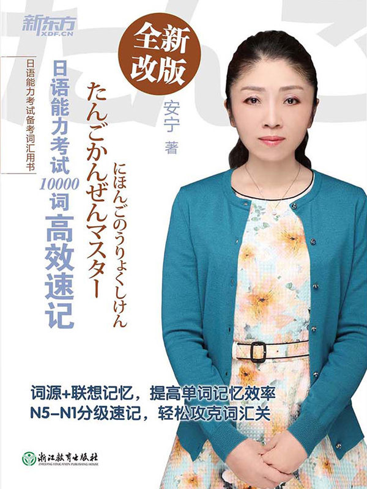
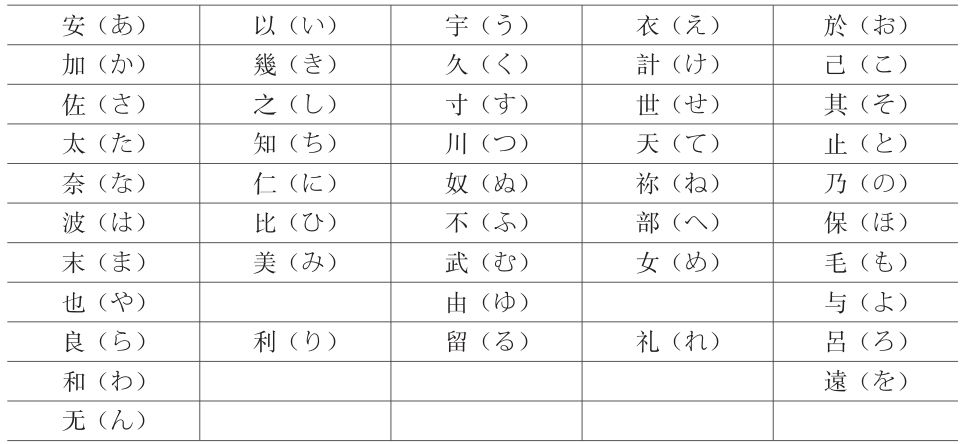
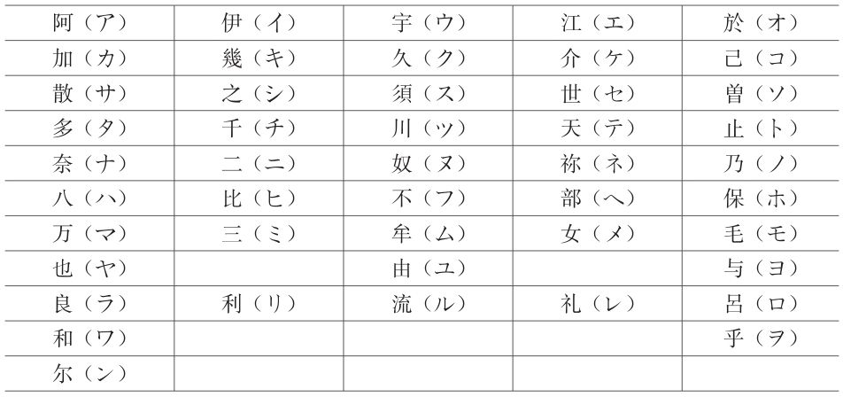
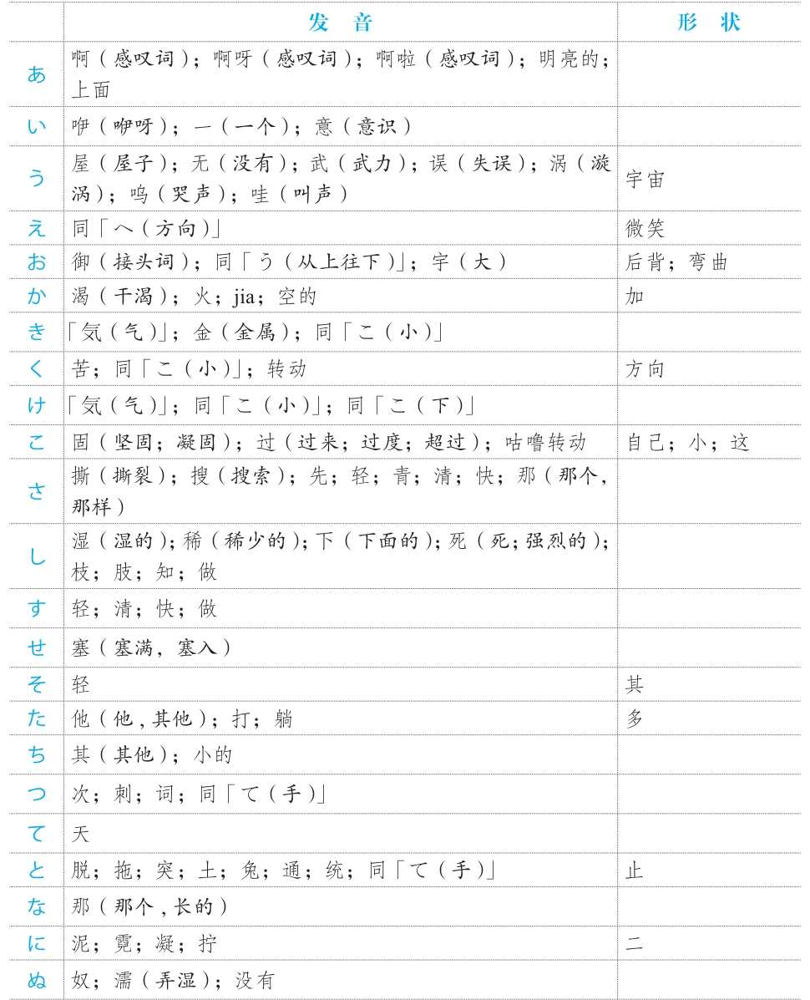
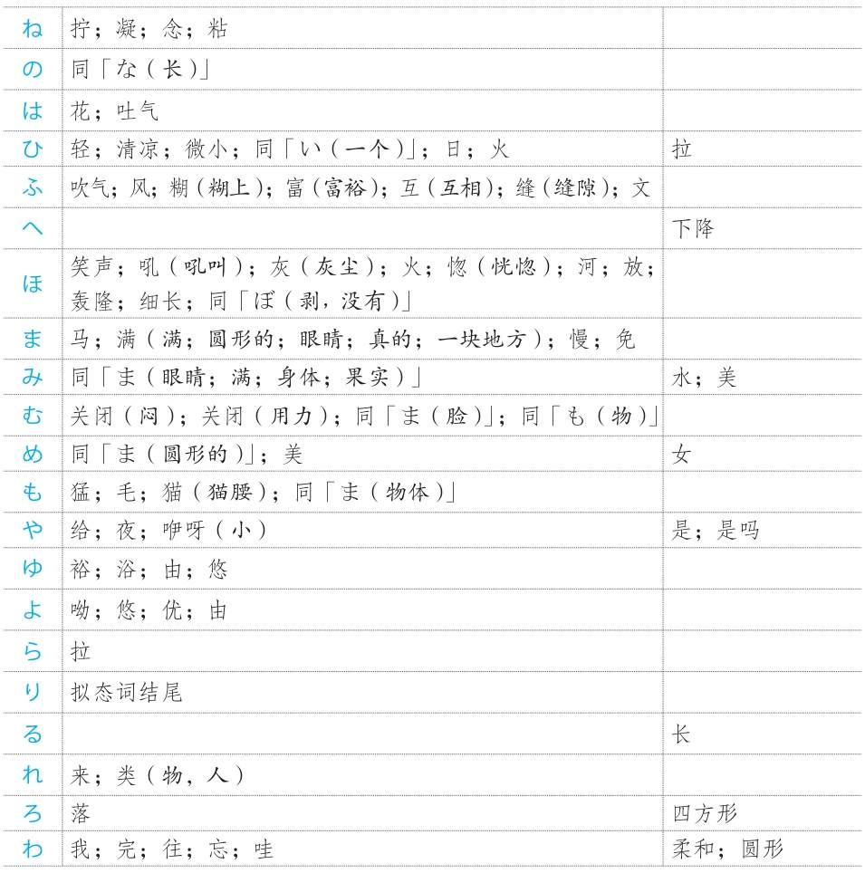
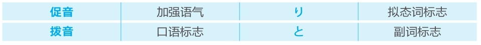

版权信息

# 日语能力考试10000词高效速记
作者：安宁
出版社：浙江教育出版社
出版日期：2018-01-01
ISBN：978-7-5536-6525-2
音频下载链接：[http://download.dogwood.com.cn/riyu/ry10000c.zip](http://download.dogwood.com.cn/riyu/ry10000c.zip)

## 前言
记单词是学习外语的基础。单词就好似一块一块的砖，排成排时组成句子，砌成墙时变成文章。如果不能准确和扎实地记忆单词，砖就是松动的，之后又怎么能够建成牢固的房屋呢？
学习日语，要达到高级水平，需要记住10000多个单词。在记忆的过程中遇到的最大问题是词汇量太大、词义太多，记一个单词还要同时记住它的声调、词性和用法等，非常烦琐。除此之外，从教育心理学的角度来说，学习的过程分为“输入→储备→再认→再生”，也就是说，即使学习者记住了某个单词，但可能令他们更加困扰的是无法将它“再生”，即对它的记忆模糊或根本想不起来。长期如此，学习者就会感到烦恼、痛苦、失落、沮丧等，会有强烈的挫败感，甚至最终放弃学习。
作为一个有着30多年日语学龄和20多年日语教龄的老学习者，我一直致力于将自己的教育心理学专业知识充分应用于日语学习中。这些年，我独创了日语单词“词源+联想”记忆法，得到了数以万计的日语学习者的肯定和支持，成功帮助他们通过这种简单、有效的方法记住了日语单词，扩充了词汇量，顺利通过了日语能力考试。为了帮助更多日语学习者牢固打好词汇基础，更加轻松地准备日语能力考试，我将多年教学、着书的经验总结到这本书中，以期能为广大学习者成功备考略尽绵薄之力。
本书收录了11000多个日语单词，按照N5-N1的顺序编排，并按照词性进行分类，读者可根据自身的水平选择要记忆的单词。原则上来说，备考N4级别的考生需要记忆N5-N4的所有单词，备考N3级别的考生需要记忆N5-N3的所有单词，以此类推。针对读者记忆难点的动词部分，我在书中均给出了有效的“词源+联想”记忆法，其他词性也根据情况给出了记忆方法。
此外，在编写本书的过程中，我要求自己做到“一切从简、地道翻译、实用有趣”。对单词意思的解释遵循“具体意思和抽象意思兼顾”的双重原则，把字典中的解释一概简化，同时加入了实用性强的使用方法介绍。在翻译方面，遵循外语学习中“直译和互译”的准则，打破书面化的解释，力图地道翻译单词，同时我还精炼了独创的“词源+联想”记忆法。
2004年底，回到阔别已久的家乡后，我最担心的事情就是把日语忘了。就是因为这个担心，让我这些年一直每天坚持读两个小时书。这些年，我的阅读领域从日语语言学扩大到了历史、文化、经济、建筑、艺术、古文等，开阔了眼界，增长了见识，也巩固了日语知识。莎士比亚说过：“书籍是全世界的营养品。生活里没有书籍，就好像没有阳光；智慧里没有书籍，就好像鸟儿没有翅膀。”希望我这本书能够陪伴日语学习者幸福度过背单词的每一天。

## 使用说明
1. 五十音图中假名的“字形”由来
* 平假名

* 片假名

2. 假名从“发音”“字形”“嘴型”引出的意思
* 日文假名对应的中文意思

3. 鼻音
* 鼻音是由鼻腔起共鸣作用的辅音，位于音节未尾。日语的发音和汉语紧密相关，汉语中带鼻音“n”的汉字在日语中大都带鼻音。如：安（an→あん）、年（nian→ねん）、新（xin→しん）。

4. 长音
* 长音是将「あ」、「い」、「う」、「え」、「お」五个元音拉长的发音。汉语中带“-ng”音的汉字在日语中大都是长音。如：宁（ning→ねい）、送（song→そう）、定（ding→てい）等。

5. 重音
* 重音一般位于词尾，包括「き」和「く」、「ち」和「つ」两组，共四个。去掉这些重音，剩下的音就是接近汉字的汉语发音的音。如：服（ふく）、式（しき）、质（しつ）、一（いち）等。

6. 促音
* 和か行、さ行、た行、ぱ行中的任何一个假名相遇时，前面的假名因不好发音而变成促音。如：学（がく）校（こう）→（がっこう）等。

7. 声调
* 日语的声调平缓，只有高低之分。本书中的声调用数字标记，数字的意思为声调一直高到此假名，从此假名后面的假名往下降。
如：
1是第一个假名声调高，从第二个假名往下降；
2是只有第二个假名声调高，从第三个假名往下降；
3是从第二个假名到第三个假名声调高，从第四个假名往下降；
4是从第二个假名到第四个假名声调高，从第五个假名往下降；
5是从第二个假名到第五个假名声调高，从第六个假名往下降，以此类推。
0是后面加上助词后声调依然高，到最后没有下降的假名。
如：足（あし2）的声调是2，意思是后面加上助词（如：「が」）后，只有第二个假名「し」声调高；味（あじ0）的声调是0，意思是后面加上助词（如：「が」）后，从第二个假名「じ」开始高到助词「が」，之后没有下降。

8. 分类
* 本书按照N5到N1的级别进行分类。每一个级别中又按照词性进行细分。

9. 备考
* 严格意义上来说，备考时需要将包括要考的级别及以下的级别全部进行背诵才可以，比如考N2级别，需要将N2及N3、N4、N5全部背诵下来。如果是应急备考，也可以只背诵相应的级别。
* 背诵时，最重要的是要边听录音边背诵，以便克服中国人学日语时依赖汉字的弱点，同时还可以达到听力考试中能马上反应出音读单词意思的效果。

10. 拟声词、拟态词

## N5
### 名词
|              |                    |     |     |                                                        |                                                                                                         |
| ------------ | ------------------ | --- | --- | ------------------------------------------------------ | ------------------------------------------------------------------------------------------------------- |
| [間]         | あいだ             | 0   |     | 间，间隔                                               | 【记】あい（合い→互相之间）だ（是）→间隔                                                                |
| [青]         | あお               | 1   |     | 蓝色；青色；绿色；不成熟                               | 【记】あ（上）+お（う→宇）→上天→蓝色                                                                    |
| [赤]         | あか               | 1   |     | 红色；完全                                             | 【记】あ（明）+か（加）→特别明亮→太阳→红色                                                              |
| [赤ちゃん]   | あかちゃん         | 1   |     | 婴儿                                                   | 【记】あ（明）+か（加）→特别明亮→太阳→红色+ちゃん （小东西）→赤子→婴儿                                  |
| [赤ん坊]     | あかん ぼう        | 0   |     | 婴儿                                                   | 【记】あ（明）+か（加）→特别明亮→太阳→红色+坊（ぼう→人）→赤子→婴儿                                      |
| [秋]         | あき               | 1   |     | 秋天                                                   | 【记】あ（明）+き（気）→明亮的感觉→秋高气爽→秋天                                                        |
| [朝]         | あさ               | 1   |     | 早上                                                   | 【记】あ（明）+さ（颯→清）→明亮而清爽→早上                                                              |
| [朝日]       | あさひ             | 1   |     | 朝日，旭日                                             | 【记】あ（明）+さ（颯→清）→明亮而清爽→早上+ひ（日）→朝日                                                |
| [旭]         | あさひ             | 1   |     | 朝日，旭日                                             | 【记】あ（明）+さ（颯→清）→明亮而清爽→早上+ひ（日）→朝日                                                |
| [朝ご飯]     | あさごはん         | 3   |     | 早饭                                                   | 【记】あ（明）+さ（颯→清）→明亮而清爽→早上+ご（敬语）+飯→早饭                                           |
| [明後日]     | あさっ て          | 2   |     | 后天                                                   | 【记】あさ（あす→明日）+て（手→方向）→从明天再往后→后天                                                 |
| [足]         | あし               | 2   |     | 脚；腿                                                 | 【记】あ（恶）+し（像）→身上脏的地方→腿；脚                                                             |
| [脚]         | あし               | 2   |     | 脚；腿                                                 | 【记】あ（恶）+し（像）→身上脏的地方→腿；脚                                                             |
| [明日]       | あした             | 3   |     | （现代语）明天                                         | 【记】あ（明）+した（现代语した→古语す→しゅ→種→种类）→明天                                              |
| [あそこ]     | あそこ             | 0   |     | （较远的）那里                                         | 【记】あ（上→上天→远）+そ（其→其他）+こ（地方）→（较远的）那里                                          |
| [あちら]     | あちら             | 0   |     | 那里，那边；那位                                       | 【记】あ（上→上天→远）+ち（地）+ら（拉）→（较远的）那里                                                 |
| [後]         | あと               | 1   |     | 后；后面；以后                                         | 【记】あ（あし→足）+と（ところ→亦）→足+亦→跡→后                                                         |
| [あなた]     | あなた             | 2   |     | 你；老公                                               | 【记】あ（上）+な（の）+た（かた→方）→对对方的尊称→你，您                                               |
| [兄]         | あに               | 1   |     | （自己的）哥哥                                         | 【记】あ（上）+に（にん →人）→上边的人→哥哥                                                             |
| [姉]         | あね               | 0   |     | （自己的）姐姐                                         | 【记】あ（上）+ね（に→にん →人）→上边的人→姐姐                                                          |
| [雨]         | あめ               | 1   |     | 雨；下雨                                               | 【记】あ（上）+め（も→もの→物）→天上下来的东西→雨                                                       |
| [安心]       | あん しん          | 0   |     | 安心，放心                                             |                                                                                                         |
| [安全]       | あん ぜん          | 0   |     | 安全                                                   |                                                                                                         |
| [案内]       | あん ない          | 3   |     | 引导，领路；通知                                       |                                                                                                         |
| [家]         | いえ               | 2   |     | 家；房子                                               | 【记】い（一）+え（へ→方向）→一个方向→去，回→家                                                         |
| [以下]       | いか               | 1   |     | 以下                                                   |                                                                                                         |
| [以外]       | いがい             | 1   |     | 以外                                                   |                                                                                                         |
| [如何]       | いか               | 0   |     | 如何，怎么样                                           |                                                                                                         |
| [医学]       | いがく             | 1   |     | 医学                                                   |                                                                                                         |
| [幾つ]       | いくつ             | 1   |     | 几个；几岁                                             | 【记】いく（いか→如何）+つ（次）→几                                                                     |
| [幾ら]       | いくら             | 1   |     | 多少钱；多少次                                         | 【记】いく（いか→如何）+ら（拉）→多少                                                                   |
| [石]         | いし               | 2   |     | 石头，石子；宝石                                       | 【记】い（一）+し（石）→一块石头                                                                        |
| [医者]       | いしゃ             | 0   |     | 医生                                                   |                                                                                                         |
| [以上]       | い じょう          | 1   |     | 以上                                                   |                                                                                                         |
| [椅子]       | いす               | 0   |     | 椅子                                                   |                                                                                                         |
| [以前]       | いぜん             | 1   |     | 以前，从前，过去                                       |                                                                                                         |
| [一]         | いち               | 2   |     | 一；第一；最初                                         |                                                                                                         |
| [一度]       | いちど             | 0   |     | 一次；一度                                             |                                                                                                         |
| [一日]       | いちにち           | 0   |     | 一天                                                   |                                                                                                         |
| [一年]       | いちねん           | 2   |     | 一年；一年级                                           |                                                                                                         |
| [一枚]       | いちまい           | 2   |     | 一张，一片                                             |                                                                                                         |
| [一番]       | いちばん           | 2   |     | 第一个，第一号                                         |                                                                                                         |
| [一羽]       | いちわ             | 2   |     | 一只（鸡、鸭、鸟、兔等）                               |                                                                                                         |
| [何時]       | いつ               | 1   |     | 什么时候                                               |                                                                                                         |
| [五日]       | いつか             | 0   |     | 五号，五日                                             |                                                                                                         |
| [五日間]     | いつかかん         | 3   |     | 五天                                                   |                                                                                                         |
| [一回]       | いっ かい          | 3,0 |     | 一回，一次                                             |                                                                                                         |
| [一階]       | いっ かい          | 0   |     | 一层，一楼                                             |                                                                                                         |
| [一個]       | いっ こ            | 1   |     | 一个                                                   |                                                                                                         |
| [一歳]       | いっ さい          | 1   |     | 一岁                                                   |                                                                                                         |
| [一冊]       | いっ さつ          | 4,0 |     | 一册，一本                                             |                                                                                                         |
| [一緒]       | いっ しょ          | 0   |     | 一样，同样                                             |                                                                                                         |
| [一足]       | いっ そく          | 4   |     | 一双（鞋、袜子等）                                     |                                                                                                         |
| [一体]       | いっ たい          | 0   |     | 一体；到底；总体上，整体上                             |                                                                                                         |
| [一着]       | いっ ちゃく        | 4,0 |     | 一套（衣服）                                           |                                                                                                         |
| [五つ]       | いつつ             | 2   |     | 五个；五岁                                             |                                                                                                         |
| [一通]       | いっ つう          | 3,0 |     | 一封（信）                                             |                                                                                                         |
| [一頭]       | いっ とう          | 1   |     | 一头，一匹（牛、马、象等大型动物）                     |                                                                                                         |
| [一杯]       | いっ ぱい          | 1   |     | 一杯                                                   |                                                                                                         |
| [一匹]       | いっ ぴき          | 4   |     | 一条，一只（狗、金鱼、猫、昆虫等）                     |                                                                                                         |
| [一分]       | いっ ぷん          | 1   |     | 一分钟                                                 |                                                                                                         |
| [一本]       | いっ ぽん          | 1   |     | 一根；一条；一瓶（细长的东西）                         |                                                                                                         |
| [以内]       | いない             | 1   |     | 以内                                                   |                                                                                                         |
| [田舎]       | いなか             | 0   |     | 乡下，农村；故乡                                       | 【记】い（いる→居る→在）+なか（中）→待在家里→故乡                                                       |
| [犬]         | いぬ               | 2   |     | 狗，犬                                                 | 【记】い（一）+ぬ（奴→奴仆）→一个奴仆→狗                                                                |
| [今]         | いま               | 1   |     | 现在；刚才；将来                                       | 【记】い（一）+ま（間）→一个时间                                                                        |
| [意味]       | いみ               | 1   |     | 意思，意义                                             |                                                                                                         |
| [妹]         | いもうと           | 4   |     | 妹妹                                                   | 【记】い（一）+も（め→女）+うと（ひと→人）→一个女人→妹妹                                                |
| [入り口]     | いりぐち           | 0   |     | 入口                                                   | 【记】い（一）+り（る→留）→留在一个地方→入；く（こ→口）+ち（乞）→口+乞→吃→嘴                            |
| [色]         | いろ               | 2   |     | 颜色，色彩                                             | 【记】い（一）+ろ（落）→一个落在大脑视觉中枢而产生的感觉→色                                             |
| [上]         | うえ               | 0   |     | 上面，之上；年纪大                                     | 【记】う（宇）+え（へ→方向）→宇宙的方向→上                                                              |
| [受付]       | うけつけ           | 0   |     | 接待，接待处；挂号处                                   | 【记】う（宇）+け（く→方向）+る（留→长）→从天上来→接受；つ（刺）+け（く→方向）+る（留→长）→突出→附着    |
| [動き]       | うごき             | 3   |     | 动作；摇动，摆动                                       | 【记】う（宇yu→羽yu）+ご（过）+き（く→方向）→羽毛摆动→动                                                |
| [後ろ]       | うしろ             | 0   |     | 后面                                                   | 【记】う（无）+し（稀）+ろ（落）→（落）后                                                               |
| [後ろ足]     | うしろあし         | 0,3 |     | 后腿                                                   | 【记】う（无）+し（稀）+ろ（落）→（落）后；あ（恶）+し（像）→身体脏的地方→腿；脚                        |
| [嘘]         | うそ               | 1   |     | 谎言，假话                                             | 【记】う（无）+そ（其）→没有它→假                                                                       |
| [歌]         | うた               | 2   |     | 歌，歌曲                                               | 【记】う（呜）+た（它）→吟唱                                                                            |
| [家]         | うち               | 2   |     | 房子；自己的家                                         | 【记】う（屋）+ち（地）→屋子里的地方→房子                                                               |
| [内]         | うち               | 0   |     | 内，里面；内部，我们（的公司、学校等）；我（女性称谓） | 【记】う（屋）+ち（地）→屋子里的地方→内                                                                 |
| [腕]         | うで               | 2   |     | 胳膊；本事，本领                                       | 【记】う（うえ→上）+て（手）+浊音（拖泥带水→有关）→手上面的与手连接在一起的→胳膊                        |
| [馬]         | うま               | 2   |     | 马                                                     | 【记】う（接头词）+ま（马）→马                                                                          |
| [海]         | うみ               | 1   |     | 海                                                     | 【记】う（涡）+み（みず→水）→形成漩涡的水→海                                                            |
| [裏]         | うら               | 2   |     | 背面，反面；内心；内情                                 | 【记】う（屋）+ら（拉）→拉到屋子里→里面                                                                 |
| [売り場]     | うりば             | 0   |     | 卖场                                                   | 【记】う（无）+り（る→留→长）→卖了就没了→卖                                                             |
| [上着]       | うわぎ             | 0   |     | 上衣，外套                                             | 【记】う（宇）+わ（あ→上）→宇宙上→上；き（起）+る（长）→让衣服起来→穿                                   |
| [運]         | うん               | 1   |     | 运气                                                   |                                                                                                         |
| [運転]       | うん てん          | 0   |     | 驾驶（地面交通工具）；（机器、资金）运转               |                                                                                                         |
| [運転手]     | うん てん しゅ     | 3   |     | 司机                                                   |                                                                                                         |
| [運動]       | うん どう          | 0   |     | 运动                                                   |                                                                                                         |
| [運動会]     | うん どうかい      | 3   |     | 运动会                                                 |                                                                                                         |
| [絵]         | え                 | 1   |     | 图画                                                   |                                                                                                         |
| [映画]       | えいが             | 1,0 |     | 电影                                                   |                                                                                                         |
| [映画館]     | えいがかん         | 3   |     | 电影院                                                 |                                                                                                         |
| [英語]       | えいご             | 0   |     | 英语                                                   |                                                                                                         |
| [駅]         | えき               | 1   |     | （电车、地铁的）车站                                   | 【记】え（へ→方向）+き（木）→一棵一棵树的方向→车站                                                      |
| [駅前]       | えきまえ           | 3,0 |     | （电车、地铁的）车站周边                               | 【记】え（へ→方向）+き（木）→一棵一棵树的方向→车站；ま（满）+え（へ→方向）→满的方向→前                  |
| [蝦]         | えび               | 0   |     | 虾                                                     | 【记】え（へ→方向）+び（微）→能变方向的小东西→虾身体的弯曲→虾                                           |
| [海老]       | えび               | 0   |     | 虾                                                     | 【记】え（へ→方向）+び（微）→能变方向的小东西→虾身体的弯曲→虾                                           |
| [円]         | えん               | 1   |     | 圆形；日元                                             |                                                                                                         |
| [鉛筆]       | えん ぴつ          | 0   |     | 铅笔                                                   |                                                                                                         |
| [お祝い]     | おいわい           | 0   |     | 庆祝，祝贺                                             | 【记】い（意）+わ（哇）+い（う→ふ→風→状态）→意识上雀跃→祝贺                                             |
| [お母さん]   | おかあさん         | 2   |     | 妈妈                                                   |                                                                                                         |
| [お陰]       | おかげ             | 0   |     | 庇护；托……的福                                         | 【记】か（加）+け（き→気）+浊音（拖泥带水→有关）→添加（在身体旁边）→影→庇护                             |
| [お菓子]     | おかし             | 2   |     | 点心，糖果                                             |                                                                                                         |
| [億]         | おく               | 1   |     | 亿                                                     |                                                                                                         |
| [奥さん]     | おくさん           | 1   |     | 夫人，太太                                             |                                                                                                         |
| [贈り物]     | おくりもの         | 0   |     | 礼物，礼品                                             | 【记】お（う→宇→大）+く（根据字形→方向）+り（る→留→长）→赠送+物→赠送的东西                              |
| [おじ]       | おじ               | 0   |     | 叔叔；舅舅；伯伯；姑父；姨父                           |                                                                                                         |
| [おじいさん] | おじいさん         | 2   |     | 爷爷，祖父；姥爷，外祖父                               |                                                                                                         |
| [押入れ]     | おしいれ           | 0   |     | 壁橱                                                   | 【记】お（大→甲）+す（做）→手+甲→押→推；い（一）+れ（来）→一个来→入。押し+入れ→推进去→壁橱              |
| [お嬢さん]   | お じょう さん     | 2   |     | 令爱；小姐                                             |                                                                                                         |
| [お茶]       | おちゃ             | 0   |     | 茶（具体指日本绿茶）                                   |                                                                                                         |
| [夫]         | おっ と            | 0   |     | 丈夫                                                   | 【记】お（雄）+と（ひと→人）→男人→丈夫                                                                  |
| [お釣り]     | おつり             | 0   |     | 找的零钱                                               | 【记】つ（刺）+り（る→留→长）→钓；お（御）+釣り→从钱箱里找出的零钱                                      |
| [お手洗い]   | おてあらい         | 3   |     | 洗手间                                                 | 【记】あ（恶）+ら（拉）+い（う→ふ→風→状态）→把坏的东西拉走→洗；お（御）+手洗い→洗手间                   |
| [音]         | おと               | 2   |     | （东西发出的）声响                                     | 【记】お（う→宇→大）+と（咚）→声响                                                                      |
| [男]         | おとこ             | 3   |     | 男的，男人                                             | 【记】お（雄）+と（ひと→人）+こ（子）→男                                                                |
| [男の子]     | おとこのこ         | 3   |     | 男孩子                                                 |                                                                                                         |
| [一昨日]     | おととい           | 3   |     | 前天                                                   |                                                                                                         |
| [一昨年]     | おととし           | 2   |     | 前年                                                   |                                                                                                         |
| [大人]       | おとな             | 0   |     | 成人，大人                                             | 【记】お（雄）+と（ひと→人）+な（なる→成る→是）→大人                                                    |
| [踊り]       | おどり             | 0   |     | 舞蹈；跳舞                                             | 【记】お（御）+ど（蹈）+り（る→留→长）→蹈                                                               |
| [お腹]       | おなか             | 0   |     | 腹部，肚子                                             | 【记】お（御）+なか（中）→人体的中间→腹部                                                               |
| [おば]       | おば               | 0   |     | （用于向外人介绍自家人时）阿姨；姑姑；婶婶；舅妈       |                                                                                                         |
| [おばあさん] | おばあさん         | 2   |     | 奶奶，祖母；姥姥，外祖母                               |                                                                                                         |
| [お昼]       | おひる             | 2   |     | 中午；午饭                                             | 【记】お（御）+ひ（日）+る（る→留→长）→太阳长→中午                                                      |
| [お祭り]     | おまつり           | 0   |     | 节，节日；祭祀                                         | 【记】ま（满→真）+つ（刺→方向）+り（る→留→长）→聚集在一起→祭祀活动                                      |
| [おもちゃ]   | おもちゃ           | 2   |     | 玩具                                                   | 【记】お（御）+も（もの→物）+ちゃ（小）→小东西→玩具                                                     |
| [親]         | おや               | 2   |     | 父母                                                   | 【记】お（う→宇→大）+や（也→是）→是大的→家长→父母                                                       |
| [俺]         | おれ               | 0   |     | （用于男人称呼自己时，语气粗鲁）我                     | 【记】お（我）+れ（类）→我                                                                              |
| [終わり]     | おわり             | 0   |     | 完，结束；死                                           | 【记】お（御）+わ（完）+り（る→留→长）→完                                                               |
| [音楽]       | おん がく          | 1   |     | 音乐                                                   |                                                                                                         |
| [女]         | おん な            | 0   |     | 女的，女性                                             | 【记】お（御）+ん （め→女）+な（め→女）→女                                                              |
| [女の子]     | おん なのこ        | 3   |     | 女孩子                                                 |                                                                                                         |
| [会]         | かい               | 1   |     | 会，会议                                               |                                                                                                         |
| [階]         | かい               | 1   |     | 层，楼                                                 |                                                                                                         |
| [回]         | かい               | 1   |     | 回，次                                                 |                                                                                                         |
| [海外]       | かいがい           | 1   |     | 海外，外国                                             |                                                                                                         |
| [会館]       | かいかん           | 0   |     | 会馆                                                   |                                                                                                         |
| [会議]       | かいぎ             | 1,3 |     | 会议                                                   |                                                                                                         |
| [会議室]     | かいぎしつ         | 3   |     | 会议室                                                 |                                                                                                         |
| [外国]       | がいこく           | 0   |     | 外国                                                   |                                                                                                         |
| [外国人]     | がいこくじん       | 4   |     | 外国人                                                 |                                                                                                         |
| [会社]       | かいしゃ           | 0   |     | 公司                                                   |                                                                                                         |
| [会場]       | かい じょう        | 0   |     | 会场                                                   |                                                                                                         |
| [階段]       | かいだん           | 0   |     | 台阶，楼梯                                             |                                                                                                         |
| [買い物]     | かいもの           | 0   |     | 购物                                                   | 【记】か（加）+い（う→ふ→風→状态）→买；買い+物→买东西                                                   |
| [会話]       | かいわ             | 0   |     | 会话                                                   |                                                                                                         |
| [帰り]       | かえり             | 3   |     | 回来；回程                                             | 【记】か（家）+え（へ→方向）+り（る→留→长）→往家的方向→回                                               |
| [顔]         | かお               | 0   |     | 脸；表情；神色；面子                                   | 【记】か（加）+お（根据嘴型→圆）→很圆的→脸                                                              |
| [科学]       | かがく             | 1   |     | 科学                                                   |                                                                                                         |
| [鍵]         | かぎ               | 2   |     | 钥匙；关键                                             | 【记】か（加）+き（きん →金）+浊音（拖泥带水→有关）→加上一个有关的金属→钥匙                             |
| [書き方]     | かきかた           | 3,4 |     | 写法                                                   | 【记】か（加）+き（く→根据字形→方向）→写；か（加）+た（多）→方                                          |
| [学生]       | がくせい           | 0   |     | 学生                                                   |                                                                                                         |
| [学部]       | がくぶ             | 0,1 |     | 院；系                                                 |                                                                                                         |
| [影]         | かげ               | 1   |     | 影子；阴影                                             | 【记】か（加）+け（き→気）+浊音（拖泥带水→有关）→添加（在身体边儿上）的感觉→阴影                        |
| [陰]         | かげ               | 1   |     | 影子；阴影                                             | 【记】か（加）+け（き→気）+浊音（拖泥带水→有关）→添加（在身体边儿上）的感觉→阴影                        |
| [傘]         | かさ               | 1   |     | 伞                                                     | 【记】か（加）+さ（伞）→伞                                                                              |
| [火事]       | かじ               | 1   |     | 火灾                                                   |                                                                                                         |
| [風]         | かぜ               | 0   |     | 风；风俗习惯                                           | 【记】か（加）+ぜ（灾）→添加灾难→风                                                                     |
| [風邪]       | かぜ               | 0   |     | 感冒                                                   | 【记】か（加）+ぜ（灾）→添加灾难→生病→感冒                                                              |
| [家族]       | かぞく             | 1   |     | 一家人，家里人                                         |                                                                                                         |
| [肩]         | かた               | 1   |     | 肩，肩膀，肩部                                         | 【记】か（加）+た（多）→かたい →坚固→肩上扛物要结实→肩膀                                                |
| [方]         | かた               | 2   |     | 方向，方位，方面；（人的尊称）位                       | 【记】か（加）+た（多）→方向                                                                            |
| [片仮名]     | かたかな           | 3,2 |     | 片假名                                                 |                                                                                                         |
| [形]         | かたち             | 0   |     | 形状；形式                                             | 【记】か（加）+た（多）+ち（地）→很多地方→形                                                            |
| [課長]       | か ちょう          | 0   |     | 科长                                                   |                                                                                                         |
| [格好]       | かっ こう          | 0   |     | 样子，打扮                                             |                                                                                                         |
| [学校]       | がっ こう          | 0   |     | 学校                                                   |                                                                                                         |
| [各国]       | かっ こく          | 1   |     | 各国                                                   |                                                                                                         |
| [家庭]       | かてい             | 0   |     | 家庭                                                   |                                                                                                         |
| [角]         | かど               | 1   |     | 角；拐角                                               | 【记】か（加）+と（地方）+浊音（拖泥带水→有关）→添加一个地方与其有关→角                                 |
| [家内]       | かない             | 1   |     | 家里；我的妻子                                         |                                                                                                         |
| [金]         | かね               | 0   |     | 金属；金钱                                             | 【记】か（火）+ね（黏）→火炼成的黏稠物→金                                                               |
| [金持ち]     | かねもち           | 3,4 |     | 有钱人                                                 | 【记】か（火）+ね（黏）→火炼成的黏稠物→金；も（物）+ち（つ→て→手）→手上放东西→持有                      |
| [彼女]       | かのじょ           | 1   |     | 她；女朋友                                             |                                                                                                         |
| [鞄]         | かばん             | 0   |     | 包；皮包；书包                                         | 【记】か（かわ→革）+ばん （包）→革+包→（皮）包                                                          |
| [花瓶]       | かびん             | 0   |     | 花瓶                                                   |                                                                                                         |
| [壁]         | かべ               | 0   |     | 墙，墙壁                                               | 【记】か（加）+べ（边）→添加一边→墙                                                                     |
| [神]         | かみ               | 1   |     | 神                                                     | 【记】か（日→太阳）+み（も→もの→物）→神                                                                 |
| [紙]         | かみ               | 2   |     | 纸                                                     | 【记】か（日→太阳）+み（も→もの→物）→神→古代日本认为纸是神一样的发明→纸                                 |
| [髪]         | かみ               | 2   |     | 头发                                                   | 【记】か（日→太阳）+み（も→もの→物）→太阳在上面→人体最上面的东西→头发                                   |
| [髪の毛]     | かみのけ           | 2,3 |     | 头发                                                   | 【记】か（日→太阳）+み（も→もの→物）→太阳在上面→人体最上面的东西→头发；け（こ→己→小）→小东西→毛发       |
| [雷]         | かみなり           | 3,4 |     | 雷                                                     | 【记】かみ（神）+なり（なる→鳴る）→神鸣→打雷                                                            |
| [火曜日]     | かようび           | 2   |     | 星期二                                                 |                                                                                                         |
| [体]         | からだ             | 0   |     | 身体                                                   | 【记】から（空→殻）+だ（是→躯壳）→（佛）四大皆空→身体                                                   |
| [彼]         | かれ               | 1   |     | 他                                                     |                                                                                                         |
| [彼ら]       | かれら             | 1   |     | 他们                                                   |                                                                                                         |
| [川]         | かわ               | 2   |     | 河，河流                                               | 【记】か（加）+わ（弯）→川为直，河为弯→河                                                               |
| [河]         | かわ               | 2   |     | 河，河流                                               | 【记】か（加）+わ（弯）→川为直，河为弯→河                                                               |
| [側]         | がわ               | 0   |     | 一侧，一方                                             |                                                                                                         |
| [代わり]     | かわり             | 0   |     | 代替，替代                                             | 【记】か（加）+わ（弯）+り（る→留→长）→交换                                                             |
| [缶]         | かん               | 1   |     | 罐子                                                   |                                                                                                         |
| [考え]       | かん がえ          | 3   |     | 考虑，思考；研究                                       | 【记】かん （勘→直觉）+が（状态）+える（得る）→得到直觉→考虑                                            |
| [考え方]     | かん がえかた      | 5,6 |     | 想法                                                   |                                                                                                         |
| [漢字]       | かん じ            | 0   |     | 汉字                                                   |                                                                                                         |
| [木]         | き                 | 1   |     | 树；木头                                               |                                                                                                         |
| [気]         | き                 | 1   |     | 气，空气；气氛；心情；感觉                             |                                                                                                         |
| [黄色]       | きいろ             | 0   |     | 黄颜色                                                 |                                                                                                         |
| [気温]       | きおん             | 0   |     | 气温                                                   |                                                                                                         |
| [機会]       | きかい             | 2,0 |     | 机会                                                   |                                                                                                         |
| [季節]       | きせつ             | 2,1 |     | 季节                                                   |                                                                                                         |
| [北]         | きた               | 0,2 |     | 北，北方                                               | 【记】き（ひ→日）+た（他→绝）→阳光断绝的地方→北                                                         |
| [喫茶店]     | きっ さてん        | 0   |     | 茶馆；咖啡馆                                           |                                                                                                         |
| [切手]       | きっ て            | 0   |     | 邮票                                                   |                                                                                                         |
| [切符]       | きっ ぷ            | 0   |     | 票，车票                                               |                                                                                                         |
| [昨日]       | きのう             | 2   |     | 昨天                                                   |                                                                                                         |
| [君]         | きみ               | 0   |     | （不礼貌的称呼）你                                     | 【记】き（貴）+み（も→もの→物）→尊称→您→现代日语变为不礼貌的称呼→（上对下）你                           |
| [気持ち]     | きもち             | 0   |     | （外因引起的）心情，感觉                               |                                                                                                         |
| [着物]       | きもの             | 0   |     | 和服                                                   |                                                                                                         |
| [客]         | きゃく             | 0   |     | 客人                                                   |                                                                                                         |
| [九]         | きゅう             | 1   |     | 九                                                     |                                                                                                         |
| [九個]       | きゅう こ          | 1   |     | 九个                                                   |                                                                                                         |
| [急行]       | きゅう こう        | 0   |     | 快车                                                   |                                                                                                         |
| [九歳]       | きゅう さい        | 1   |     | 九岁                                                   |                                                                                                         |
| [九冊]       | きゅう さつ        | 1   |     | 九册，九本                                             |                                                                                                         |
| [九足]       | きゅう そく        | 1   |     | 九双（鞋、袜子等）                                     |                                                                                                         |
| [九着]       | きゅう ちゃく      | 1   |     | 九套（衣服）                                           |                                                                                                         |
| [九通]       | きゅう つう        | 1   |     | 九封（信）                                             |                                                                                                         |
| [九度]       | きゅう ど          | 1   |     | 九次；九度                                             |                                                                                                         |
| [九頭]       | きゅう とう        | 1   |     | 九头，九匹（牛、马、象等大型动物）                     |                                                                                                         |
| [牛肉]       | ぎゅう にく        | 0   |     | 牛肉                                                   |                                                                                                         |
| [牛乳]       | ぎゅう にゅう      | 0   |     | 牛奶                                                   |                                                                                                         |
| [九年]       | きゅう ねん        | 1   |     | 九年；九年级                                           |                                                                                                         |
| [九杯]       | きゅう はい        | 1   |     | 九杯                                                   |                                                                                                         |
| [九番]       | きゅう ばん        | 1   |     | 第九个，第九号                                         |                                                                                                         |
| [九匹]       | きゅう ひき        | 1   |     | 九条，九只（狗、金鱼、猫、昆虫等）                     |                                                                                                         |
| [九本]       | きゅう ほん        | 1   |     | 九根儿；九条；九瓶（细长的东西）                       |                                                                                                         |
| [九枚]       | きゅう まい        | 1   |     | 九张，九片                                             |                                                                                                         |
| [九羽]       | きゅう わ          | 1   |     | 九只（鸡、鸭、鸟、兔等）                               |                                                                                                         |
| [今日]       | きょう             | 1   |     | 今天                                                   |                                                                                                         |
| [教科書]     | きょう かしょ      | 3   |     | 教科书，课本                                           |                                                                                                         |
| [教室]       | きょう しつ        | 0   |     | 教室                                                   |                                                                                                         |
| [兄弟]       | きょう だい        | 1   |     | 兄弟姐妹                                               |                                                                                                         |
| [興味]       | きょう み          | 1,3 |     | 兴趣                                                   |                                                                                                         |
| [去年]       | きょねん           | 1   |     | 去年                                                   |                                                                                                         |
| [金]         | きん               | 1   |     | 金                                                     |                                                                                                         |
| [銀]         | ぎん               | 1   |     | 银                                                     |                                                                                                         |
| [銀行]       | ぎん こう          | 0   |     | 银行                                                   |                                                                                                         |
| [禁止]       | きん し            | 0   |     | 禁止                                                   |                                                                                                         |
| [金曜日]     | きん ようび        | 3   |     | 星期五                                                 |                                                                                                         |
| [九]         | く                 | 1   |     | 九                                                     |                                                                                                         |
| [区]         | く                 | 1   |     | （行政上的）区                                         |                                                                                                         |
| [空気]       | くうき             | 1   |     | 空气；气氛                                             |                                                                                                         |
| [空港]       | くうこう           | 0   |     | 机场                                                   |                                                                                                         |
| [九時]       | くじ               | 1   |     | 九点                                                   |                                                                                                         |
| [薬]         | くすり             | 0   |     | 药                                                     | 【记】くすり（苦死了）→药                                                                               |
| [薬屋]       | くすりや           | 0   |     | 药店                                                   |                                                                                                         |
| [果物]       | くだもの           | 2   |     | 水果                                                   | 【记】く（根据字形→方向）+だ（达→达到→下落）→下落+物→水果成熟后从树上落下                               |
| [口]         | くち               | 0   |     | 口，嘴                                                 | 【记】く（こ→口）+ち（乞）→口+乞→吃→嘴                                                                  |
| [靴]         | くつ               | 0   |     | 鞋子                                                   | 【记】く（库）+つ（刺→向前突出）→向前突出的仓库→鞋                                                      |
| [靴下]       | くつした           | 2   |     | 袜子                                                   |                                                                                                         |
| [国]         | くに               | 0   |     | 国家                                                   |                                                                                                         |
| [首]         | くび               | 0   |     | 脖子                                                   | 【记】く（根据字形→方向）+び（微）→可以变动方向的小东西→脖子                                            |
| [雲]         | くも               | 1   |     | 云                                                     | 【记】く（くろ→黒）+も（もの→物）→（乌）云                                                              |
| [曇り]       | くもり             | 0   |     | 天空多云；模糊；发愁；阴沉                             | 【记】く（くろ→黒）+も（もの→物）→（乌）云→曇+り（る→留→长）→多云                                       |
| [車]         | くるま             | 0   |     | 车，汽车                                               | 【记】くるま（轱辘满）→车                                                                               |
| [黒]         | くろ               | 1   |     | 黑色                                                   | 【记】く（根据字形→方向）+ろ（落）→一直涂抹→黑                                                          |
| [毛]         | け                 | 0   |     | 毛发；毛线；羽毛                                       | 【记】け（こ→己→小）→小东西→毛发                                                                        |
| [計画]       | けいかく           | 0   |     | 计划                                                   |                                                                                                         |
| [警察]       | けいさつ           | 0   |     | 警察                                                   |                                                                                                         |
| [今朝]       | けさ               | 1   |     | 今天早晨                                               |                                                                                                         |
| [消しゴム]   | けしゴム           | 0   |     | 橡皮                                                   | 【记】け（こ→己→小xiao；け→下xia）+す（做）→消xiao                                                      |
| [結構]       | けっ こう          | 1   |     | 可以；不需要                                           |                                                                                                         |
| [結婚]       | けっ こん          | 0   |     | 结婚                                                   |                                                                                                         |
| [月曜日]     | げつようび         | 3   |     | 星期一                                                 |                                                                                                         |
| [県]         | けん               | 1   |     | （日本的）县                                           |                                                                                                         |
| [券]         | けん               | 1   |     | 票，券                                                 |                                                                                                         |
| [原因]       | げん いん          | 0   |     | 原因                                                   |                                                                                                         |
| [喧嘩]       | けん か            | 0   |     | 吵架；打架                                             |                                                                                                         |
| [玄関]       | げん かん          | 1   |     | 玄关                                                   |                                                                                                         |
| [元気]       | げん き            | 1   |     | 精神                                                   |                                                                                                         |
| [現在]       | げん ざい          | 1   |     | 现在                                                   |                                                                                                         |
| [個]         | こ                 | 0   |     | 个                                                     |                                                                                                         |
| [子]         | こ                 | 0   |     | 子女；孩子                                             |                                                                                                         |
| [五]         | ご                 | 0   |     | 五                                                     |                                                                                                         |
| [語]         | ご                 | 0   |     | 单词，词语                                             |                                                                                                         |
| [公園]       | こうえん           | 0   |     | 公园                                                   |                                                                                                         |
| [工場]       | こう じょう        | 3   |     | 工厂                                                   |                                                                                                         |
| [紅茶]       | こうちゃ           | 0   |     | 红茶                                                   |                                                                                                         |
| [校長]       | こう ちょう        | 0   |     | 校长                                                   |                                                                                                         |
| [交通]       | こうつう           | 0   |     | 交通                                                   |                                                                                                         |
| [行動]       | こうどう           | 0   |     | 行动                                                   |                                                                                                         |
| [声]         | こえ               | 1   |     | （人或动物发出的）声音                                 | 【记】こ（ご→过）+え（へ→方向）→传过来的→声                                                             |
| [五回]       | ごかい             | 0   |     | 五回，五次                                             |                                                                                                         |
| [五階]       | ごかい             | 0   |     | 五层，五楼                                             |                                                                                                         |
| [五月]       | ごがつ             | 1   |     | 五月                                                   |                                                                                                         |
| [国際]       | こくさい           | 0   |     | 国际                                                   |                                                                                                         |
| [此処]       | ここ               | 0   |     | 这里                                                   |                                                                                                         |
| [五個]       | ごこ               | 1   |     | 五个                                                   |                                                                                                         |
| [午後]       | ごご               | 1   |     | 下午                                                   |                                                                                                         |
| [九日]       | ここのか           | 0   |     | 九日，九号；九天                                       |                                                                                                         |
| [九日間]     | ここのかかん       | 4   |     | 九天                                                   |                                                                                                         |
| [九つ]       | ここのつ           | 2   |     | 九个；九岁                                             |                                                                                                         |
| [心]         | こころ             | 2,3 |     | 心                                                     | 【记】こ（此）+こ（此）+ろ（ところ→所）→此处→心                                                         |
| [五歳]       | ごさい             | 1   |     | 五岁                                                   |                                                                                                         |
| [五冊]       | ごさつ             | 1   |     | 五册，五本                                             |                                                                                                         |
| [五時]       | ごじ               | 1   |     | 五点                                                   |                                                                                                         |
| [故障]       | こ しょう          | 0   |     | 故障                                                   |                                                                                                         |
| [午前]       | ごぜん             | 1   |     | 上午                                                   |                                                                                                         |
| [五足]       | ごそく             | 1   |     | 五双（鞋、袜子等）                                     |                                                                                                         |
| [答え]       | こたえ             | 0   |     | 回答；响应                                             | 【记】こ（己）+た（他）+え（へ→方向）→把自己的想法给他人→答                                             |
| [こちら]     | こちら             | 0   |     | 这里，这边；这位                                       |                                                                                                         |
| [五着]       | ごちゃく           | 1   |     | 五套（衣服）                                           |                                                                                                         |
| [五通]       | ごつう             | 1   |     | 五封（信）                                             |                                                                                                         |
| [事]         | こと               | 0   |     | 事情                                                   |                                                                                                         |
| [五度]       | ごど               | 1   |     | 五次；五度                                             |                                                                                                         |
| [五頭]       | ごとう             | 1   |     | 五头，五匹（牛、马、象等大型动物）                     |                                                                                                         |
| [今年]       | ことし             | 0   |     | 今年                                                   |                                                                                                         |
| [言葉]       | ことば             | 0   |     | 单词；语言                                             |                                                                                                         |
| [子供]       | こども             | 0   |     | 孩子                                                   |                                                                                                         |
| [五年]       | ごねん             | 1   |     | 五年；五年级                                           |                                                                                                         |
| [この間]     | このあいだ         | 0   |     | 前几天，最近                                           | 【记】あい（合い→互相之间）+だ（是）→间隔；この+間→这期间                                               |
| [この辺]     | このへん           | 0   |     | 这附近                                                 |                                                                                                         |
| [五杯]       | ごはい             | 1   |     | 五杯                                                   |                                                                                                         |
| [ご飯]       | ごはん             | 1   |     | 饭                                                     |                                                                                                         |
| [五番]       | ごばん             | 1   |     | 第五个，第五号                                         |                                                                                                         |
| [ごみ]       | ごみ               | 0   |     | 垃圾                                                   | 【记】こ（己→小）+浊音（污浊）+み（も→もの→物）→污浊的小东西→垃圾                                       |
| [ゴミ箱]     | ゴミばこ           | 3,0 |     | 垃圾箱                                                 | 【记】こ（己→小）+浊音（污浊）+み（も→もの→物）→污浊的小东西→垃圾；は（哈→放）+こ（口）→开口的东西→箱子 |
| [五匹]       | ごひき             | 1   |     | 五条，五只（狗、金鱼、猫、昆虫等）                     |                                                                                                         |
| [五分]       | ごふん             | 1   |     | 五分（钱）；五分钟                                     |                                                                                                         |
| [五本]       | ごほん             | 1   |     | 五根儿；五条；五瓶（细长的东西）                       |                                                                                                         |
| [五枚]       | ごまい             | 1   |     | 五张，五片                                             |                                                                                                         |
| [米]         | こめ               | 0   |     | 大米                                                   | 【记】こ（己→小）+め（も→もの→物）→米                                                                   |
| [これ]       | これ               | 0   |     | 这个                                                   | 【记】こ（此）+れ（类）→这个                                                                            |
| [これから]   | これから           | 0   |     | 今后                                                   |                                                                                                         |
| [五羽]       | ごわ               | 1   |     | 五只（鸡、鸭、鸟、兔等）                               |                                                                                                         |
| [今回]       | こん かい          | 1   |     | 这次                                                   |                                                                                                         |
| [今月]       | こん げつ          | 0   |     | 这个月                                                 |                                                                                                         |
| [今週]       | こん しゅう        | 0   |     | 这个星期                                               |                                                                                                         |
| [今晩]       | こん ばん          | 1   |     | 今晚                                                   |                                                                                                         |
| [最近]       | さいきん           | 0   |     | 最近                                                   |                                                                                                         |
| [最後]       | さいご             | 1   |     | 最后                                                   |                                                                                                         |
| [最初]       | さいしょ           | 0   |     | 最初                                                   |                                                                                                         |
| [財布]       | さいふ             | 0   |     | 钱包                                                   |                                                                                                         |
| [魚]         | さかな             | 0   |     | 鱼                                                     | 【记】さか（さけ→酒）+な（な→菜）→下酒菜→鱼                                                             |
| [魚屋]       | さかなや           | 0   |     | 水产店                                                 |                                                                                                         |
| [先]         | さき               | 0   |     | 先；尖部；末梢；前方；目的地；未来，前途               | 【记】さ（そ→其）+き（く→方向）→往那个（远的）方向→末梢→先（端）                                        |
| [作文]       | さくぶん           | 0   |     | 作文                                                   |                                                                                                         |
| [桜]         | さくら             | 0   |     | 樱花                                                   | 【记】さく（咲く→开花）+ら（拉）→盛开→樱花                                                              |
| [酒]         | さけ               | 0   |     | 酒                                                     |                                                                                                         |
| [冊]         | さつ               | 0   |     | 册，本                                                 |                                                                                                         |
| [雑誌]       | ざっ し            | 0   |     | 杂志                                                   |                                                                                                         |
| [砂糖]       | さとう             | 2   |     | 砂糖                                                   |                                                                                                         |
| [様]         | さま               | 0   |     | 样子；对人的尊称                                       |                                                                                                         |
| [再来月]     | さらいげつ         | 2   |     | 下下个月                                               |                                                                                                         |
| [再来週]     | さらい しゅう      | 0   |     | 下下周                                                 |                                                                                                         |
| [再来年]     | さらいねん         | 0   |     | 后年                                                   |                                                                                                         |
| [三]         | さん               | 0   |     | 三                                                     |                                                                                                         |
| [三回]       | さん かい          | 0   |     | 三回，三次                                             |                                                                                                         |
| [三階]       | さん がい          | 0   |     | 三层，三楼                                             |                                                                                                         |
| [三月]       | さん がつ          | 1   |     | 三月                                                   |                                                                                                         |
| [三個]       | さん こ            | 1   |     | 三个                                                   |                                                                                                         |
| [三歳]       | さん さい          | 1   |     | 三岁                                                   |                                                                                                         |
| [三冊]       | さん さつ          | 1   |     | 三册，三本                                             |                                                                                                         |
| [三時]       | さん じ            | 1   |     | 三点                                                   |                                                                                                         |
| [三足]       | さん そく          | 1   |     | 三双（鞋、袜子等）                                     |                                                                                                         |
| [三着]       | さん ちゃく        | 1   |     | 三套（衣服）                                           |                                                                                                         |
| [三通]       | さん つう          | 1   |     | 三封（信）                                             |                                                                                                         |
| [三度]       | さん ど            | 1   |     | 三次；三度                                             |                                                                                                         |
| [三頭]       | さん とう          | 1   |     | 三头，三匹（牛、马、象等大型动物）                     |                                                                                                         |
| [三年]       | さん ねん          | 1   |     | 三年；三年级                                           |                                                                                                         |
| [三杯]       | さん ばい          | 1   |     | 三杯                                                   |                                                                                                         |
| [三番]       | さん ばん          | 1   |     | 第三个，第三号                                         |                                                                                                         |
| [三匹]       | さん びき          | 1   |     | 三条，三只（狗、金鱼、猫、昆虫等）                     |                                                                                                         |
| [三分]       | さん ぷん          | 1   |     | 三分；三分钟                                           |                                                                                                         |
| [散歩]       | さん ぽ            | 0   |     | 散步                                                   |                                                                                                         |
| [三本]       | さん ぼん          | 1   |     | 三根儿；三条；三瓶（细长的东西）                       |                                                                                                         |
| [三枚]       | さん まい          | 1   |     | 三张，三片                                             |                                                                                                         |
| [三羽]       | さん わ            | 1   |     | 三只（鸡、鸭、鸟、兔等）                               |                                                                                                         |
| [四]         | し                 | 0   |     | 四                                                     |                                                                                                         |
| [市]         | し                 | 0   |     | （行政单位）市；城市                                   |                                                                                                         |
| [字]         | じ                 | 0   |     | 字                                                     |                                                                                                         |
| [塩]         | しお               | 0   |     | 盐                                                     | 【记】し（汐）+お（御）→咸→盐                                                                           |
| [仕方]       | しかた             | 0   |     | 做法，办法                                             | 【记】し（す→做）+方→做法                                                                               |
| [時間]       | じかん             | 0   |     | 时间                                                   |                                                                                                         |
| [試験]       | しけん             | 2   |     | 考试                                                   |                                                                                                         |
| [事故]       | じこ               | 1   |     | 事故                                                   |                                                                                                         |
| [自己]       | じこ               | 1   |     | 自己                                                   |                                                                                                         |
| [仕事]       | しごと             | 0   |     | 工作                                                   |                                                                                                         |
| [辞書]       | じしょ             | 1   |     | 词典                                                   |                                                                                                         |
| [地震]       | じしん             | 0   |     | 地震                                                   |                                                                                                         |
| [下]         | した               | 0   |     | 下，下部，下方；年纪小                                 | 【记】した（下淌）→下                                                                                   |
| [時代]       | じだい             | 0   |     | 时代                                                   |                                                                                                         |
| [七]         | しち               | 0   |     | 七                                                     |                                                                                                         |
| [七月]       | しちがつ           | 0   |     | 七月                                                   |                                                                                                         |
| [七時]       | しちじ             | 2   |     | 七点                                                   |                                                                                                         |
| [失敗]       | しっ ぱい          | 0   |     | 失败                                                   |                                                                                                         |
| [質問]       | しつもん           | 0   |     | 提问                                                   |                                                                                                         |
| [失礼]       | しつれい           | 2   |     | 失礼                                                   |                                                                                                         |
| [自転車]     | じてん しゃ        | 2   |     | 自行车                                                 |                                                                                                         |
| [品物]       | しなもの           | 0   |     | 商品                                                   |                                                                                                         |
| [字引]       | じびき             | 0   |     | 字典                                                   |                                                                                                         |
| [社員]       | しゃいん           | 1   |     | 公司职员                                               |                                                                                                         |
| [写真]       | しゃしん           | 0   |     | 照片                                                   |                                                                                                         |
| [社長]       | しゃ ちょう        | 0   |     | 总经理                                                 |                                                                                                         |
| [週]         | しゅう             | 1   |     | 周，星期                                               |                                                                                                         |
| [十]         | じゅう             | 1   |     | 十                                                     |                                                                                                         |
| [週間]       | しゅう かん        | 0   |     | 一个星期                                               |                                                                                                         |
| [十時]       | じゅう じ          | 1   |     | 十点                                                   |                                                                                                         |
| [十度]       | じゅう ど          | 1   |     | 十次；十度                                             |                                                                                                         |
| [十年]       | じゅう ねん        | 1   |     | 十年                                                   |                                                                                                         |
| [十番]       | じゅう ばん        | 1   |     | 第十个，第十号                                         |                                                                                                         |
| [十枚]       | じゅう まい        | 1   |     | 十张，十片                                             |                                                                                                         |
| [週末]       | しゅう まつ        | 0   |     | 周末                                                   |                                                                                                         |
| [十羽]       | じゅう わ          | 1   |     | 十只（鸡、鸭、鸟、兔等）                               |                                                                                                         |
| [授業]       | じゅ ぎょう        | 1   |     | 课                                                     |                                                                                                         |
| [宿題]       | しゅくだい         | 0   |     | 作业                                                   |                                                                                                         |
| [主人]       | しゅじん           | 1   |     | 主人；丈夫                                             |                                                                                                         |
| [十個]       | じゅっ こ          | 1   |     | 十个                                                   |                                                                                                         |
| [十歳]       | じゅっ さい        | 1   |     | 十岁                                                   |                                                                                                         |
| [十冊]       | じゅっ さつ        | 0   |     | 十册，十本                                             |                                                                                                         |
| [十足]       | じゅっ そく        | 0   |     | 十双（鞋、袜子等）                                     |                                                                                                         |
| [十着]       | じゅっ ちゃく      | 0   |     | 十套（衣服）                                           |                                                                                                         |
| [十通]       | じゅっ つう        | 1   |     | 十封（信）                                             |                                                                                                         |
| [十頭]       | じゅっ とう        | 1   |     | 十头，十匹（牛、马、象等大型动物）                     |                                                                                                         |
| [十杯]       | じゅっ ぱい        | 1   |     | 十杯                                                   |                                                                                                         |
| [十匹]       | じゅっ ぴき        | 0   |     | 十条，十只（狗、金鱼、猫、昆虫等）                     |                                                                                                         |
| [十本]       | じゅっ ぽん        | 1   |     | 十根儿；十条；十瓶（细长的东西）                       |                                                                                                         |
| [趣味]       | しゅみ             | 1   |     | 爱好                                                   |                                                                                                         |
| [使用]       | しよう             | 0   |     | 使用                                                   |                                                                                                         |
| [紹介]       | しょう かい        | 0   |     | 介绍                                                   |                                                                                                         |
| [小学校]     | しょう がっ こう   | 3   |     | 小学                                                   |                                                                                                         |
| [小説]       | しょう せつ        | 0   |     | 小说                                                   |                                                                                                         |
| [醤油]       | しょう ゆ          | 0   |     | 酱油                                                   |                                                                                                         |
| [食堂]       | しょくどう         | 0   |     | 食堂                                                   |                                                                                                         |
| [白]         | しろ               | 1   |     | 白，白色；没有关系，清白                               | 【记】し（稀）+ろ（落）→没有沾染→白                                                                     |
| [新幹線]     | しん かん せん     | 3   |     | 新干线                                                 |                                                                                                         |
| [神社]       | じん じゃ          | 1   |     | 神社                                                   |                                                                                                         |
| [心配]       | しん ぱい          | 0   |     | 担心                                                   |                                                                                                         |
| [新聞]       | しん ぶん          | 0   |     | 报纸                                                   |                                                                                                         |
| [図]         | ず                 | 0   |     | 图                                                     |                                                                                                         |
| [水曜日]     | すいようび         | 3   |     | 星期三                                                 |                                                                                                         |
| [数学]       | すうがく           | 0   |     | 数学                                                   |                                                                                                         |
| [寿司]       | すし               | 2,1 |     | 寿司                                                   |                                                                                                         |
| [鮨]         | すし               | 2,1 |     | 寿司                                                   |                                                                                                         |
| [背]         | せ                 | 1   |     | 脊背；后面                                             |                                                                                                         |
| [世界]       | せかい             | 1   |     | 世界                                                   |                                                                                                         |
| [席]         | せき               | 1   |     | 席，座位                                               |                                                                                                         |
| [石鹸]       | せっ けん          | 0   |     | 肥皂；香皂                                             |                                                                                                         |
| [説明]       | せつめい           | 0   |     | 说明，解释                                             |                                                                                                         |
| [背中]       | せなか             | 0   |     | 后背                                                   |                                                                                                         |
| [是非]       | ぜひ               | 1   |     | 是非；善恶                                             |                                                                                                         |
| [世話]       | せわ               | 0   |     | 照顾                                                   |                                                                                                         |
| [線]         | せん               | 1   |     | 线条；路线                                             |                                                                                                         |
| [千]         | せん               | 1   |     | （数量）千                                             |                                                                                                         |
| [千円]       | せん えん          | 1   |     | 一千日元                                               |                                                                                                         |
| [先月]       | せん げつ          | 1   |     | 上个月                                                 |                                                                                                         |
| [先週]       | せん しゅう        | 0   |     | 上周                                                   |                                                                                                         |
| [先生]       | せん せい          | 3   |     | 老师；医生；律师                                       |                                                                                                         |
| [洗濯]       | せん たく          | 0   |     | 洗涤，洗衣服                                           |                                                                                                         |
| [洗濯機]     | せん たくき        | 4,3 |     | 洗衣机                                                 |                                                                                                         |
| [先輩]       | せん ぱい          | 0   |     | 前辈；比自己早入学或早参加工作的人                     |                                                                                                         |
| [全部]       | ぜん ぶ            | 1   |     | 全部                                                   |                                                                                                         |
| [掃除]       | そうじ             | 0   |     | 扫除                                                   |                                                                                                         |
| [相談]       | そうだん           | 0   |     | 商量                                                   |                                                                                                         |
| [其処]       | そこ               | 0   |     | 那里                                                   |                                                                                                         |
| [そちら]     | そちら             | 0   |     | 那里，那边；那位                                       |                                                                                                         |
| [卒業]       | そつ ぎょう        | 0   |     | 毕业                                                   |                                                                                                         |
| [外]         | そと               | 1   |     | 外面                                                   | 【记】そ（其）+と（ところ→地方）→那地方→外（面）                                                        |
| [側]         | そば               | 1   |     | 旁边                                                   | 【记】そ（其）+ば（旁）→那旁边→旁边                                                                     |
| [傍]         | そば               | 1   |     | 旁边                                                   | 【记】そ（其）+ば（旁）→那旁边→旁边                                                                     |
| [祖父]       | そふ               | 1   |     | 祖父                                                   |                                                                                                         |
| [祖父母]     | そふぼ             | 2   |     | 祖父母                                                 |                                                                                                         |
| [祖母]       | そぼ               | 1   |     | 祖母                                                   |                                                                                                         |
| [それ]       | それ               | 0   |     | 那个                                                   | 【记】そ（其）+れ（类）→那个                                                                            |
| [台]         | だい               | 1   |     | 台，台子                                               |                                                                                                         |
| [代]         | だい               | 1   |     | 费用；一代人                                           |                                                                                                         |
| [大学]       | だい がく          | 0   |     | 大学                                                   |                                                                                                         |
| [大学院]     | だい がくいん      | 4   |     | 研究生院                                               |                                                                                                         |
| [大学生]     | だい がくせい      | 4   |     | 大学生                                                 |                                                                                                         |
| [大学院生]   | だい がくいん せい | 5   |     | 硕士生                                                 |                                                                                                         |
| [大体]       | だい たい          | 0   |     | 大体上，大致上                                         |                                                                                                         |
| [台所]       | だい どころ        | 0   |     | 厨房                                                   |                                                                                                         |
| [台風]       | たい ふう          | 3   |     | 台风                                                   |                                                                                                         |
| [建物]       | たてもの           | 2,3 |     | 建筑物                                                 |                                                                                                         |
| [煙草]       | たばこ             | 0   |     | 烟                                                     | 【记】たばこ（葡萄牙语tabaco）→tobacco→烟草                                                             |
| [食べ物]     | たべもの           | 2,3 |     | 食物                                                   | 【记】た（他）+べば→把→把它→把食物用盖子盖上→“食”的字意                                                 |
| [卵]         | たまご             | 2   |     | 鸡蛋                                                   | 【记】た（多）+ま（满→圆）→很圆→球+ご（こ→小）→蛋                                                       |
| [誰]         | だれ               | 1   |     | 谁                                                     | 【记】だ（ど→多→多少→哪）+れ（类）→哪一类人→谁                                                          |
| [誕生日]     | たん じょう び     | 3   |     | 生日                                                   |                                                                                                         |
| [近く]       | ちかく             | 1   |     | 附近                                                   | 【记】ち（小）+か（加）→很小→近                                                                         |
| [地下鉄]     | ちかてつ           | 0   |     | 地铁                                                   |                                                                                                         |
| [地図]       | ちず               | 1   |     | 地图                                                   |                                                                                                         |
| [父]         | ちち               | 0   |     | 父亲                                                   |                                                                                                         |
| [茶色]       | ちゃいろ           | 0   |     | 茶色                                                   |                                                                                                         |
| [茶碗]       | ちゃわん           | 0   |     | 碗；茶碗；饭碗                                         |                                                                                                         |
| [中学]       | ちゅう がく        | 1   |     | 中学；初中                                             |                                                                                                         |
| [中学生]     | ちゅう がくせい    | 3,4 |     | 初中生                                                 |                                                                                                         |
| [中学校]     | ちゅう がっ こう   | 3   |     | 初中                                                   |                                                                                                         |
| [中国]       | ちゅう ごく        | 1   |     | 中国                                                   |                                                                                                         |
| [一日]       | ついたち           | 0   |     | 一号；一天                                             |                                                                                                         |
| [使い方]     | つかいかた         | 0   |     | 用法                                                   | 【记】つ（て→手）+か（加）+い（う→ふ→風→状态）→添加在手上→使用；か（加）+た（多）→方                    |
| [月]         | つき               | 0   |     | 月亮                                                   |                                                                                                         |
| [机]         | つくえ             | 0   |     | 书桌                                                   | 【记】つ（刺）+く（根据字形→方向）+え（へ→方向）→突出的方向→书桌                                        |
| [妻]         | つま               | 1   |     | 妻子                                                   | 【记】つ（次）+ま（妈）→心中地位次于妈妈的人→妻                                                         |
| [手]         | て                 | 0   |     | 手；把手；方法                                         | 【记】て（抬）                                                                                          |
| [できるだけ] | できるだけ         | 0   |     | 尽可能，尽量                                           | 【记】できる（能）+だけ（只是→就是）→尽可能                                                             |
| [出口]       | でぐち             | 1   |     | 出口                                                   |                                                                                                         |
| [寺]         | てら               | 0   |     | 寺，寺庙                                               | 【记】て（て的起源汉字→天→太阳）+ら（拉）→太阳照射（的地方）→寺庙                                       |
| [点]         | てん               | 0   |     | 小点；分数                                             |                                                                                                         |
| [店員]       | てん いん          | 0   |     | 店员                                                   |                                                                                                         |
| [天気]       | てん き            | 1   |     | 天气                                                   |                                                                                                         |
| [電気]       | でん き            | 1   |     | 电；电灯                                               |                                                                                                         |
| [天気予報]   | てん きよほう      | 4   |     | 天气预报                                               |                                                                                                         |
| [電車]       | でん しゃ          | 0   |     | 电车                                                   |                                                                                                         |
| [店内]       | てん ない          | 1   |     | 店内，店里                                             |                                                                                                         |
| [天麩羅]     | てん ぷら          | 0   |     | 天妇罗（把鱼、贝、肉、菜裹上面粉后油炸的食物）         | 【记】葡萄牙语tempero                                                                                   |
| [電話]       | でん わ            | 0   |     | 电话                                                   |                                                                                                         |
| [度]         | ど                 | 1   |     | 次，回，度；程度                                       |                                                                                                         |
| [動物]       | どうぶつ           | 0   |     | 动物                                                   |                                                                                                         |
| [動物園]     | どうぶつえん       | 4   |     | 动物园                                                 |                                                                                                         |
| [道路]       | どうろ             | 1   |     | 道路                                                   |                                                                                                         |
| [十]         | とお               | 1   |     | 十；十岁                                               |                                                                                                         |
| [十日]       | とおか             | 0   |     | 十号，十日；十天                                       |                                                                                                         |
| [遠く]       | とおく             | 0   |     | 远方                                                   | 【记】とお（透）→通透→远                                                                                |
| [時]         | とき               | 0   |     | 时间，时候；时代；季节                                 | 【记】と（て→てら→寺）+き（期→日）→日+寺→時→时间                                                        |
| [時計]       | とけい             | 0   |     | 表，钟表                                               | 【记】と（て→てら→寺）+け（き→期→日）→日+寺→時→时间+い（一）→一个与时间有关的东西→钟表                  |
| [どこ]       | どこ               | 1   |     | 哪里                                                   | 【记】ど（多→多少→哪）+こ（地方）→哪里                                                                  |
| [所]         | ところ             | 0   |     | 地方；时间；程度；状况                                 | 【记】と（土）+こ（地方）+ろ（呂）→地方                                                                 |
| [処]         | ところ             | 0   |     | 地方；时间；程度；状况                                 | 【记】と（土）+こ（地方）+ろ（呂）→地方                                                                 |
| [年]         | とし               | 0   |     | 年；年龄；上年纪                                       | 【记】と（時）+し（逝）→时间流逝→年龄                                                                   |
| [図書館]     | としょかん         | 2   |     | 图书馆                                                 |                                                                                                         |
| [どちら]     | どちら             | 1   |     | 哪里，哪边；哪位                                       |                                                                                                         |
| [特急]       | とっ きゅう        | 0   |     | 特快列车                                               |                                                                                                         |
| [隣]         | となり             | 0   |     | 旁边；邻居，四邻，邻里                                 | 【记】と（ところ→所）+なり（也→是）→所有地方→四邻                                                       |
| [友達]       | ともだち           | 0   |     | 朋友                                                   | 【记】と（和）+も（也）→一起→朋友+達（们）→朋友                                                         |
| [土曜日]     | どようび           | 3   |     | 星期六                                                 |                                                                                                         |
| [鳥]         | とり               | 0   |     | 鸟                                                     | 【记】と（兔）+り（る→留→长）→像兔子一样→跳→飞→鸟                                                       |
| [鶏肉]       | とりにく           | 0   |     | 鸡肉                                                   |                                                                                                         |
| [どれ]       | どれ               | 1   |     | 哪个                                                   | 【记】ど（多→多少→哪）+れ（类）→哪个                                                                    |
| [中]         | なか               | 1   |     | 中间；里面，内部                                       |                                                                                                         |
| [夏]         | なつ               | 0   |     | 夏天                                                   | 【记】な（那→那么）+つ（刺→热）→那么热→夏天                                                             |
| [夏休み]     | なつやすみ         | 3   |     | 暑假                                                   | 【记】な（那→那么）+つ（刺→热）→那么热→夏天；や（咿呀学语→小）+す（丝→轻）+み（む→闷）→休息             |
| [七つ]       | ななつ             | 2   |     | 七                                                     |                                                                                                         |
| [七個]       | ななこ             | 2   |     | 七个                                                   |                                                                                                         |
| [七歳]       | ななさい           | 2   |     | 七岁                                                   |                                                                                                         |
| [七冊]       | ななさつ           | 2   |     | 七册，七本                                             |                                                                                                         |
| [七時]       | ななじ             | 2   |     | 七点                                                   |                                                                                                         |
| [七足]       | ななそく           | 2   |     | 七双（鞋、袜子等）                                     |                                                                                                         |
| [七着]       | ななちゃく         | 2   |     | 七套（衣服）                                           |                                                                                                         |
| [七通]       | ななつう           | 2   |     | 七封（信）                                             |                                                                                                         |
| [七度]       | ななど             | 2   |     | 七次；七度                                             |                                                                                                         |
| [七頭]       | ななとう           | 2   |     | 七头，七匹（牛、马、象等大型动物）                     |                                                                                                         |
| [七年]       | ななねん           | 2   |     | 七年；七年级                                           |                                                                                                         |
| [七杯]       | ななはい           | 2   |     | 七杯                                                   |                                                                                                         |
| [七番]       | ななばん           | 2   |     | 第七个，第七号                                         |                                                                                                         |
| [七匹]       | ななひき           | 2   |     | 七条，七只（狗、金鱼、猫、昆虫等）                     |                                                                                                         |
| [七本]       | ななほん           | 2   |     | 七根儿；七条；七瓶（细长的东西）                       |                                                                                                         |
| [七枚]       | ななまい           | 2   |     | 七张，七片                                             |                                                                                                         |
| [七羽]       | ななわ             | 2   |     | 七只（鸡、鸭、鸟、兔等）                               |                                                                                                         |
| [七日]       | なのか             | 0   |     | 七号，七日；七天                                       |                                                                                                         |
| [七日間]     | なのかかん         | 3   |     | 七天                                                   |                                                                                                         |
| [名前]       | なまえ             | 0   |     | 名字；名称                                             |                                                                                                         |
| [何回]       | なん かい          | 1   |     | 几次，几回，几度                                       |                                                                                                         |
| [何階]       | なん がい          | 0   |     | 几层，几楼                                             |                                                                                                         |
| [何か月]     | なん かげつ        | 3   |     | 几个月                                                 |                                                                                                         |
| [何個]       | なん こ            | 1   |     | 几个                                                   |                                                                                                         |
| [何歳]       | なん さい          | 1   |     | 几岁                                                   |                                                                                                         |
| [何冊]       | なん さつ          | 1   |     | 几册，几本                                             |                                                                                                         |
| [何皿]       | なん さら          | 1   |     | 几盘                                                   |                                                                                                         |
| [何時]       | なん じ            | 1   |     | 几点                                                   |                                                                                                         |
| [何時間]     | なん じかん        | 3   |     | 几个小时                                               |                                                                                                         |
| [何週間]     | なん しゅう かん   | 3   |     | 几个星期                                               |                                                                                                         |
| [何千]       | なん ぜん          | 0   |     | 几千                                                   |                                                                                                         |
| [何足]       | なん そく          | 1   |     | 几双（鞋、袜子）                                       |                                                                                                         |
| [何台]       | なん だい          | 1   |     | 几台，几辆                                             |                                                                                                         |
| [何着]       | なん ちゃく        | 1   |     | 几套（衣服）                                           |                                                                                                         |
| [何度]       | なん ど            | 1   |     | 几次，几回，几度                                       |                                                                                                         |
| [何頭]       | なん とう          | 1   |     | 几头，几匹（牛、马、象等大型动物）                     |                                                                                                         |
| [何日]       | なん にち          | 1   |     | 几号；几天                                             |                                                                                                         |
| [何人]       | なん にん          | 1   |     | 多少人，几个人                                         |                                                                                                         |
| [何年]       | なん ねん          | 1   |     | 几年                                                   |                                                                                                         |
| [何杯]       | なん ばい          | 1,0 |     | 几杯                                                   |                                                                                                         |
| [何倍]       | なん ばい          | 0   |     | 几倍                                                   |                                                                                                         |
| [何番]       | なん ばん          | 1   |     | 第几个，第几号                                         |                                                                                                         |
| [何匹]       | なん びき          | 1   |     | 几条，几只（狗、金鱼、猫、昆虫等）                     |                                                                                                         |
| [何分]       | なん ぷん          | 1   |     | 几分，几分钟                                           |                                                                                                         |
| [何本]       | なん ぼん          | 1   |     | 几根儿；几条；几瓶（细长的东西）                       |                                                                                                         |
| [何枚]       | なん まい          | 1   |     | 几张，几片                                             |                                                                                                         |
| [何万]       | なん まん          | 0   |     | 几万                                                   |                                                                                                         |
| [何羽]       | なん わ            | 1   |     | 几只（鸡、鸭、鸟、兔等）                               |                                                                                                         |
| [二]         | に                 | 0   |     | 二                                                     |                                                                                                         |
| [二回]       | にかい             | 0   |     | 两回，两次                                             |                                                                                                         |
| [二階]       | にかい             | 0   |     | 二层，二楼                                             |                                                                                                         |
| [肉]         | にく               | 0   |     | 肉                                                     |                                                                                                         |
| [二個]       | にこ               | 1   |     | 两个                                                   |                                                                                                         |
| [二歳]       | にさい             | 1   |     | 两岁                                                   |                                                                                                         |
| [二冊]       | にさつ             | 1   |     | 两册，两本                                             |                                                                                                         |
| [西]         | にし               | 0   |     | 西                                                     | 【记】にし（なし→无）→太阳没有的地方→日落的地方→西                                                      |
| [二時]       | にじ               | 1   |     | 两点                                                   |                                                                                                         |
| [西口]       | にしぐち           | 0   |     | 西侧的出入口                                           |                                                                                                         |
| [二十]       | に じゅう          | 2   |     | 二十                                                   |                                                                                                         |
| [二足]       | にそく             | 1   |     | 两双（鞋、袜子等）                                     |                                                                                                         |
| [～日]       | にち               | 0   |     | ……日，……天                                             |                                                                                                         |
| [二着]       | にちゃく           | 1   |     | 两套（衣服）                                           |                                                                                                         |
| [日曜日]     | にちようび         | 3   |     | 星期日                                                 |                                                                                                         |
| [二通]       | につう             | 1   |     | 两封（信）                                             |                                                                                                         |
| [二度]       | にど               | 1   |     | 两次；两度                                             |                                                                                                         |
| [二頭]       | にとう             | 1   |     | 两头，两匹（牛、马、象等大型动物）                     |                                                                                                         |
| [二年]       | にねん             | 1   |     | 两年；二年级                                           |                                                                                                         |
| [二杯]       | にはい             | 1   |     | 两杯                                                   |                                                                                                         |
| [二番]       | にばん             | 1   |     | 第二个，第二号                                         |                                                                                                         |
| [二分]       | にふん             | 1   |     | 两分；两分钟                                           |                                                                                                         |
| [二匹]       | にひき             | 1   |     | 两条，两只（狗、金鱼、猫、昆虫等）                     |                                                                                                         |
| [二本]       | にほん             | 1   |     | 两根儿；两条；两瓶（细长的东西）                       |                                                                                                         |
| [日本]       | にほん             | 2   |     | 日本                                                   |                                                                                                         |
| [日本語]     | にほん ご          | 0   |     | 日语                                                   |                                                                                                         |
| [日本人]     | にほん じん        | 4   |     | 日本人                                                 |                                                                                                         |
| [二枚]       | にまい             | 1   |     | 两张，两片                                             |                                                                                                         |
| [荷物]       | にもつ             | 1   |     | 行李                                                   |                                                                                                         |
| [庭]         | にわ               | 0   |     | 院子                                                   | 【记】に（泥）+わ（弯→圆yuan）→院yuan                                                                   |
| [二羽]       | にわ               | 1   |     | 两只（鸡、鸭、鸟、兔等）                               |                                                                                                         |
| [値段]       | ねだん             | 0   |     | 价格                                                   |                                                                                                         |
| [熱]         | ねつ               | 0   |     | 发烧                                                   |                                                                                                         |
| [残り]       | のこり             | 3   |     | 剩余                                                   | 【记】の（な→那→长）+こ（地方）+り（る→留→长）→长时间停留→残留                                          |
| [飲み物]     | のみもの           | 2   |     | 饮料                                                   |                                                                                                         |
| [乗り物]     | のりもの           | 0   |     | 交通工具                                               | 【记】の（な→长）+り（る→留→长）→长→乘+物→交通工具                                                      |
| [歯]         | は                 | 1   |     | 牙                                                     | 【记】は（哈→放）→放出→突出（的东西）→牙齿                                                              |
| [杯]         | はい               | 1   |     | 杯，酒杯                                               |                                                                                                         |
| [倍]         | ばい               | 1   |     | 倍，加倍                                               |                                                                                                         |
| [歯医者]     | はいしゃ           | 1   |     | 牙医                                                   |                                                                                                         |
| [売店]       | ばいてん           | 0   |     | 小卖部                                                 |                                                                                                         |
| [箱]         | はこ               | 0   |     | 箱子；盒子                                             | 【记】は（哈→放）+こ（口）→开口的东西→箱子                                                              |
| [挟み]       | はさみ             | 0   |     | 剪刀；大夹子                                           | 【记】は（哈→放）+さ（さす→挿す）+み（む→闷）→放开，插入，关闭→夹                                       |
| [橋]         | はし               | 0   |     | 桥                                                     | 【记】は（哈→放）+し（线→放出一条线状物）→放长→桥                                                       |
| [箸]         | はし               | 1   |     | 筷子                                                   | 【记】は（哈→放）+し（细）→细长→筷子                                                                    |
| [始まり]     | はじまり           | 0   |     | 开始；起源                                             | 【记】は（哈→发）+じ（時）+ま（满）+り（る→留→长）→时间发出→开始                                        |
| [始め]       | はじめ             | 0   |     | 开始                                                   | 【记】同上                                                                                              |
| [場所]       | ばしょ             | 0   |     | 场所                                                   |                                                                                                         |
| [二十歳]     | はたち             | 1   |     | 二十岁                                                 |                                                                                                         |
| [八]         | はち               | 0   |     | 八                                                     |                                                                                                         |
| [八時]       | はちじ             | 2   |     | 八点                                                   |                                                                                                         |
| [八日間]     | はちにちかん       | 4   |     | 八天                                                   |                                                                                                         |
| [八度]       | はちど             | 2   |     | 八次；八度                                             |                                                                                                         |
| [八年]       | はちねん           | 2   |     | 八年                                                   |                                                                                                         |
| [八番]       | はちばん           | 2   |     | 第八个，第八号                                         |                                                                                                         |
| [八枚]       | はちまい           | 2   |     | 八张，八片                                             |                                                                                                         |
| [八羽]       | はちわ             | 2   |     | 八只（鸡、鸭、鸟、兔等）                               |                                                                                                         |
| [発音]       | はつおん           | 0   |     | 发音                                                   |                                                                                                         |
| [二十日]     | はつか             | 0   |     | 二十号，二十日；二十天                                 |                                                                                                         |
| [八個]       | はっ こ            | 1   |     | 八个                                                   |                                                                                                         |
| [八歳]       | はっ さい          | 1   |     | 八岁                                                   |                                                                                                         |
| [八冊]       | はっ さつ          | 0   |     | 八册，八本                                             |                                                                                                         |
| [八足]       | はっ そく          | 0   |     | 八双（鞋、袜子等）                                     |                                                                                                         |
| [八着]       | はっ ちゃく        | 0   |     | 八套（衣服）                                           |                                                                                                         |
| [八通]       | はっ つう          | 1   |     | 八封（信）                                             |                                                                                                         |
| [八頭]       | はっ とう          | 1   |     | 八头，八匹（牛、马、象等大型动物）                     |                                                                                                         |
| [八杯]       | はっ ぱい          | 1   |     | 八杯                                                   |                                                                                                         |
| [八匹]       | はっ ぴき          | 0   |     | 八条，八只（狗、金鱼、猫、昆虫等）                     |                                                                                                         |
| [八分]       | はっ ぷん          | 1   |     | 八分；八分钟                                           |                                                                                                         |
| [八本]       | はっ ぽん          | 1   |     | 八根儿；八条；八瓶（细长的东西）                       |                                                                                                         |
| [花]         | はな               | 2   |     | 花                                                     | 【记】は（花）+な（なり→也→是）→花                                                                      |
| [鼻]         | はな               | 0   |     | 鼻子                                                   | 【记】は（哈→放→发）+な（なり→也→是）→发出气的地方→鼻子                                                 |
| [話]         | はなし             | 0   |     | 谈话；话题；故事；事情                                 | 【记】は（哈→放）+なす（做）→放出→说话                                                                  |
| [春]         | はる               | 1   |     | 春天                                                   | 【记】は（哈→发）+る（留→长）→万物发芽→春                                                               |
| [晴れ]       | はれ               | 0   |     | 晴天；消除嫌疑                                         | 【记】は（哈→放）+れ（来）→放晴                                                                         |
| [半]         | はん               | 1   |     | 半，一半                                               |                                                                                                         |
| [晩]         | ばん               | 0   |     | 晚上                                                   |                                                                                                         |
| [番]         | ばん               | 1   |     | 号；轮班                                               |                                                                                                         |
| [番号]       | ばん ごう          | 3   |     | 号码                                                   |                                                                                                         |
| [晩ご飯]     | ばん ごはん        | 3   |     | 晚饭                                                   |                                                                                                         |
| [反対]       | はん たい          | 0   |     | 反对；相反                                             |                                                                                                         |
| [半分]       | はん ぶん          | 3   |     | 一半                                                   |                                                                                                         |
| [日]         | ひ                 | 0   |     | 太阳；日子，日期；时候                                 |                                                                                                         |
| [火]         | ひ                 | 0   |     | 火，火焰                                               |                                                                                                         |
| [費]         | ひ                 | 0   |     | ……费                                                   |                                                                                                         |
| [東]         | ひがし             | 0   |     | 东                                                     | 【记】ひ（日）+が（状态）+し（升）→太阳升起的地方→东                                                    |
| [匹]         | ひき               | 0   |     | （鸟兽和昆虫的量词）只；条；头                         |                                                                                                         |
| [飛行機]     | ひこうき           | 2   |     | 飞机                                                   |                                                                                                         |
| [美術館]     | びじゅつかん       | 3   |     | 美术馆                                                 |                                                                                                         |
| [左]         | ひだり             | 0   |     | 左，左面                                               | 【记】ひ（日）+だ（达）+り（る→留→长）→太阳在南面时，左手是东→太阳达到的地方→东→左                      |
| [左側]       | ひだりがわ         | 0   |     | 左侧                                                   |                                                                                                         |
| [左手]       | ひだりて           | 0   |     | 左手                                                   |                                                                                                         |
| [必要]       | ひつよう           | 0   |     | 必要                                                   |                                                                                                         |
| [人]         | ひと               | 0   |     | 人；人类；别人；自己；人家                             |                                                                                                         |
| [一つ]       | ひとつ             | 2   |     | 一个；一岁                                             |                                                                                                         |
| [人々]       | ひとびと           | 2   |     | 人们                                                   |                                                                                                         |
| [一人]       | ひとり             | 2   |     | 一个人                                                 |                                                                                                         |
| [暇]         | ひま               | 0   |     | 闲暇，有空                                             | 【记】ひ（日）+ま（慢→叚）→日→叚→闲暇                                                                   |
| [百]         | ひゃく             | 0   |     | （数量）百，一百                                       |                                                                                                         |
| [費用]       | ひよう             | 1   |     | 费用                                                   |                                                                                                         |
| [美容]       | びよう             | 0   |     | 美容                                                   |                                                                                                         |
| [美容院]     | びよういん         | 2   |     | 美容院                                                 |                                                                                                         |
| [病院]       | びょう いん        | 0   |     | 医院                                                   |                                                                                                         |
| [病気]       | びょう き          | 0   |     | 病，疾病                                               |                                                                                                         |
| [平仮名]     | ひらがな           | 0   |     | 平假名                                                 |                                                                                                         |
| [昼]         | ひる               | 2   |     | 白天；中午                                             | 【记】ひ（日）+る（留→长）→太阳长→白昼，中午                                                            |
| [昼ご飯]     | ひるごはん         | 3   |     | 午饭                                                   |                                                                                                         |
| [昼間]       | ひるま             | 0   |     | 白天                                                   |                                                                                                         |
| [昼休み]     | ひるやすみ         | 3   |     | 午休                                                   |                                                                                                         |
| [封筒]       | ふうとう           | 0   |     | 信封                                                   |                                                                                                         |
| [夫婦]       | ふうふ             | 1   |     | 夫妇                                                   |                                                                                                         |
| [服]         | ふく               | 0   |     | 衣服                                                   |                                                                                                         |
| [複雑]       | ふくざつ           | 0   |     | 复杂                                                   |                                                                                                         |
| [復習]       | ふく しゅう        | 0   |     | 复习                                                   |                                                                                                         |
| [二つ]       | ふたつ             | 2   |     | 两个；两岁                                             |                                                                                                         |
| [豚肉]       | ぶたにく           | 0   |     | 猪肉                                                   |                                                                                                         |
| [二人]       | ふたり             | 2   |     | 两个人                                                 |                                                                                                         |
| [部長]       | ぶ ちょう          | 0   |     | 部长                                                   |                                                                                                         |
| [普通]       | ふつう             | 0   |     | 普通，一般                                             |                                                                                                         |
| [二日]       | ふつか             | 0   |     | 二号，二日；两天                                       |                                                                                                         |
| [不便]       | ふべん             | 1   |     | 不方便                                                 |                                                                                                         |
| [冬]         | ふゆ               | 0   |     | 冬天                                                   | 【记】ふ（风）+ゆ（裕）→风大的季节→冬天                                                                 |
| [風呂]       | ふろ               | 1,0 |     | 洗澡；浴室；澡盆                                       |                                                                                                         |
| [分]         | ふん               | 1   |     | （时间）分                                             |                                                                                                         |
| [文]         | ぶん               | 1   |     | 文章；句子                                             |                                                                                                         |
| [文章]       | ぶん しょう        | 1   |     | 文章                                                   |                                                                                                         |
| [文法]       | ぶん ぽう          | 0   |     | 语法                                                   |                                                                                                         |
| [部屋]       | へや               | 0   |     | 房间                                                   |                                                                                                         |
| [辺]         | へん               | 0,1 |     | 一带，附近                                             |                                                                                                         |
| [勉強]       | べん きょう        | 0   |     | 学习；便宜卖                                           |                                                                                                         |
| [返事]       | へん じ            | 0   |     | 回信，回复，答复                                       |                                                                                                         |
| [弁当]       | べん とう          | 3   |     | 便当，盒饭                                             |                                                                                                         |
| [便利]       | べん り            | 1   |     | 方便                                                   |                                                                                                         |
| [方]         | ほう               | 1   |     | 方，方向；方面                                         |                                                                                                         |
| [帽子]       | ぼうし             | 0   |     | 帽子                                                   |                                                                                                         |
| [方向]       | ほうこう           | 0   |     | 方向                                                   |                                                                                                         |
| [方法]       | ほうほう           | 0   |     | 方法                                                   |                                                                                                         |
| [他]         | ほか               | 0   |     | 其他，除此之外                                         | 【记】ほ（放）+か（开）→放开→外                                                                         |
| [外]         | ほか               | 0   |     | 其他，除此之外                                         | 【记】ほ（放）+か（开）→放开→外                                                                         |
| [僕]         | ぼく               | 1   |     | （男人称呼自己）我                                     |                                                                                                         |
| [本]         | ほん               | 1   |     | 书，书籍；（细长物体的量词）支；根                     |                                                                                                         |
| [本当]       | ほん とう          | 0   |     | 真正，真实                                             |                                                                                                         |
| [本屋]       | ほん や            | 1   |     | 书店                                                   |                                                                                                         |
| [枚]         | まい               | 1   |     | （量词）张；片                                         |                                                                                                         |
| [毎朝]       | まいあさ           | 1,0 |     | 每天早上                                               |                                                                                                         |
| [毎週]       | まい しゅう        | 0   |     | 每周                                                   |                                                                                                         |
| [毎月]       | まいつき           | 0   |     | 每月                                                   |                                                                                                         |
| [毎度]       | まいど             | 0   |     | 每次                                                   |                                                                                                         |
| [毎日]       | まいにち           | 1   |     | 每天                                                   |                                                                                                         |
| [毎年]       | まいとし           | 0   |     | 每年                                                   |                                                                                                         |
| [毎晩]       | まいばん           | 1,0 |     | 每天晚上                                               |                                                                                                         |
| [前]         | まえ               | 1   |     | 前面；以前                                             | 【记】ま（满）+え（へ→方向）→满的方向→前                                                                |
| [孫]         | まご               | 0   |     | 孙子；孙女                                             | 【记】ま（满）+こ（子）+浊音（拖泥带水→有关）→孩子满堂→孙子；孙女                                       |
| [祭り]       | まつり             | 0   |     | 祭祀；节日；庙会                                       | 【记】ま（满→真）+つ（刺→方向）+り（る→留→长）→聚集在一起→祭祀活动                                      |
| [窓]         | まど               | 1   |     | 窗户                                                   | 【记】ま（間）+ど（と→戸）→一间门户→窗户                                                                |
| [万]         | まん               | 1   |     | （数量）万                                             |                                                                                                         |
| [右]         | みぎ               | 0   |     | 右，右边                                               | 【记】み（身）+き（きた→北）+浊音（拖泥带水→有关）→面向北面时，右手是东→右                              |
| [右手]       | みぎて             | 0   |     | 右手                                                   |                                                                                                         |
| [水]         | みず               | 0   |     | 水                                                     | 【记】み（ミ→氵→水）+す（すい→「水」的音读）+浊音（拖泥带水→水）→水                                     |
| [店]         | みせ               | 0   |     | 店，商店；饭馆                                         | 【记】み（見）+せ（让）→让客人看→店                                                                     |
| [味噌]       | みそ               | 1   |     | 酱，黄酱                                               |                                                                                                         |
| [道]         | みち               | 0   |     | 道路                                                   | 【记】み（び→くび→首）+ち（ち→地→辶）→辶+首→道                                                          |
| [三日]       | みっ か            | 0   |     | 三号，三日；三天                                       |                                                                                                         |
| [三日間]     | みっ かかん        | 3   |     | 三天                                                   |                                                                                                         |
| [三つ]       | みっ つ            | 0   |     | 三个；三岁                                             |                                                                                                         |
| [緑]         | みどり             | 1   |     | 绿；绿化；绿树                                         | 【记】み（美）+ど（多）+り（丽）→很美丽→绿                                                              |
| [皆さん]     | みなさん           | 2   |     | 大家                                                   |                                                                                                         |
| [南]         | みなみ             | 0   |     | 南方                                                   | 【记】み（ま→满）+な（那→那么）+み（ま→满）→满是阳光→南                                                 |
| [耳]         | みみ               | 0   |     | 耳朵                                                   | 【记】み（三）+み（三）→3→耳朵的形状                                                                    |
| [土産]       | みやげ             | 0   |     | 土产，土特产                                           | 【记】み（見）+や（养→给）+げ（给）→带回当地的见闻给人→土特产                                           |
| [皆]         | みん な            | 0   |     | 全，都                                                 | 【记】み（ま→满）+ん （口语）+な（那→长）→全                                                            |
| [六日]       | むいか             | 0   |     | 六号，六日；六天                                       |                                                                                                         |
| [昔]         | むかし             | 0   |     | 过去                                                   | 【记】む（暮）+か（加）+し（像）→过去                                                                   |
| [向こう]     | むこう             | 0,2 |     | 前方；那边儿；目的地                                   |                                                                                                         |
| [息子]       | むすこ             | 0   |     | 儿子                                                   | 【记】む（闷）+す（する→做）+ぶ（并列）→结合，结婚；結ぶ+子→男女结合后产下的子→儿子                     |
| [娘]         | むすめ             | 0   |     | 女儿                                                   | 【记】む（闷）+す（する→做）+ぶ（并列）→结合，结婚；結ぶ+女→男女结合后产下的女→女儿                     |
| [六つ]       | むっ つ            | 0   |     | 六个；六岁                                             |                                                                                                         |
| [目]         | め                 | 1   |     | 眼睛；看法；眼光                                       | 【记】め（ま→满→圆）→眼睛                                                                               |
| [眼]         | め                 | 1   |     | 眼睛；看法；眼光                                       | 【记】め（ま→满→圆）→眼睛                                                                               |
| [麺]         | めん               | 1   |     | 面条                                                   |                                                                                                         |
| [木曜日]     | もくようび         | 3   |     | 星期四                                                 |                                                                                                         |
| [物]         | もの               | 0   |     | 东西                                                   |                                                                                                         |
| [者]         | もの               | 0   |     | 人                                                     |                                                                                                         |
| [桃]         | もも               | 0   |     | 桃子                                                   | 【记】もも（毛毛）→桃子上面有毛→桃子                                                                    |
| [問題]       | もん だい          | 0   |     | 问题                                                   |                                                                                                         |
| [屋]         | や                 | 0   |     | 房屋；店铺                                             |                                                                                                         |
| [八百屋]     | やおや             | 0   |     | 蔬菜水果店                                             |                                                                                                         |
| [野球]       | や きゅう          | 0   |     | 棒球                                                   |                                                                                                         |
| [約束]       | やくそく           | 0   |     | 约定；保证                                             |                                                                                                         |
| [野菜]       | やさい             | 0   |     | 蔬菜                                                   |                                                                                                         |
| [休み]       | やすみ             | 0   |     | 休息                                                   | 【记】や（咿呀学语→小）+す（丝→轻）+み（む→闷）→休息                                                    |
| [八つ]       | やっ つ            | 0   |     | 八个；八岁                                             |                                                                                                         |
| [山]         | やま               | 0   |     | 山；突出的部分；最高潮                                 | 【记】や（咿呀学语→小）+ま（む→闷）→止む→到了山脚停止→山                                                |
| [湯]         | ゆ                 | 1   |     | 热水                                                   |                                                                                                         |
| [夕方]       | ゆうがた           | 0   |     | 傍晚                                                   |                                                                                                         |
| [夕食]       | ゆうしょく         | 0   |     | 晚饭                                                   |                                                                                                         |
| [夕飯]       | ゆうはん           | 0   |     | 晚饭                                                   |                                                                                                         |
| [郵便]       | ゆうびん           | 0   |     | 邮政；邮件                                             |                                                                                                         |
| [郵便局]     | ゆうびん きょく    | 3   |     | 邮局                                                   |                                                                                                         |
| [夕べ]       | ゆうべ             | 0   |     | 昨天晚上                                               |                                                                                                         |
| [雪]         | ゆき               | 0   |     | 雪                                                     | 【记】ゆ（ふゆ→冬）+き（気）→冬天的感觉→雪                                                              |
| [様]         | よう               | 1   |     | 样子                                                   |                                                                                                         |
| [八日]       | ようか             | 0   |     | 八号，八日；八天                                       |                                                                                                         |
| [八日間]     | ようかかん         | 3   |     | 八天                                                   |                                                                                                         |
| [曜日]       | ようび             | 0   |     | 星期                                                   |                                                                                                         |
| [洋服]       | ようふく           | 0   |     | 西装                                                   |                                                                                                         |
| [横]         | よこ               | 0   |     | 横，横向；旁边                                         | 【记】よ（悠）+こ（地方）→左右摇摆→横                                                                   |
| [四時]       | よじ               | 1   |     | 四点                                                   |                                                                                                         |
| [四日]       | よっ か            | 0   |     | 四号                                                   |                                                                                                         |
| [四日間]     | よっ かかん        | 3   |     | 四天                                                   |                                                                                                         |
| [四つ]       | よっ つ            | 0   |     | 四个；四岁                                             |                                                                                                         |
| [四人]       | よにん             | 2   |     | 四个人                                                 |                                                                                                         |
| [四年]       | よねん             | 2   |     | 四年；四年级                                           |                                                                                                         |
| [夜]         | よる               | 1   |     | 夜里，晚上                                             | 【记】よ（夜）+る（留→长）→夜                                                                           |
| [四回]       | よん かい          | 0   |     | 四回，四次                                             |                                                                                                         |
| [四階]       | よん かい          | 0   |     | 四层，四楼                                             |                                                                                                         |
| [四個]       | よん こ            | 1   |     | 四个                                                   |                                                                                                         |
| [四歳]       | よん さい          | 1   |     | 四岁                                                   |                                                                                                         |
| [四冊]       | よん さつ          | 1   |     | 四册，四本                                             |                                                                                                         |
| [四足]       | よん そく          | 1   |     | 四双（鞋、袜子等）                                     |                                                                                                         |
| [四着]       | よん ちゃく        | 1   |     | 四套（衣服）                                           |                                                                                                         |
| [四通]       | よん つう          | 1   |     | 四封（信）                                             |                                                                                                         |
| [四度]       | よん ど            | 1   |     | 四次；四度                                             |                                                                                                         |
| [四頭]       | よん とう          | 1   |     | 四头，四匹（牛、马、象等大型动物）                     |                                                                                                         |
| [四杯]       | よん はい          | 1   |     | 四杯                                                   |                                                                                                         |
| [四番]       | よん ばん          | 1   |     | 第四个，第四号                                         |                                                                                                         |
| [四匹]       | よん ひき          | 1   |     | 四条，四只（狗、金鱼、猫、昆虫等）                     |                                                                                                         |
| [四分]       | よん ぷん          | 1   |     | 四分；四分钟                                           |                                                                                                         |
| [四本]       | よん ほん          | 1   |     | 四根儿；四条；四瓶（细长的东西）                       |                                                                                                         |
| [四枚]       | よん まい          | 1   |     | 四张，四片                                             |                                                                                                         |
| [四羽]       | よん わ            | 1   |     | 四只（鸡、鸭、鸟、兔等）                               |                                                                                                         |
| [来月]       | らいげつ           | 1   |     | 下月                                                   |                                                                                                         |
| [来週]       | らい しゅう        | 0   |     | 下周                                                   |                                                                                                         |
| [来年]       | らいねん           | 0   |     | 明年                                                   |                                                                                                         |
| [理由]       | りゆう             | 0   |     | 理由                                                   |                                                                                                         |
| [留学生]     | りゅう がくせい    | 4   |     | 留学生                                                 |                                                                                                         |
| [流行]       | りゅう こう        | 0   |     | 流行                                                   |                                                                                                         |
| [寮]         | りょう             | 1   |     | 宿舍                                                   |                                                                                                         |
| [利用]       | りよう             | 0   |     | 利用                                                   |                                                                                                         |
| [料金]       | りょう きん        | 1   |     | 费用                                                   |                                                                                                         |
| [料理]       | りょう り          | 1   |     | 料理，菜肴；处理                                       |                                                                                                         |
| [旅館]       | りょかん           | 0   |     | 旅馆；日式旅馆                                         |                                                                                                         |
| [旅行]       | りょこう           | 0   |     | 旅行                                                   |                                                                                                         |
| [林檎]       | りん ご            | 0   |     | 苹果                                                   |                                                                                                         |
| [留守]       | るす               | 1   |     | 不在家                                                 |                                                                                                         |
| [例]         | れい               | 1   |     | 例，例子；惯例；先例                                   |                                                                                                         |
| [零]         | れい               | 1   |     | （数量）零                                             |                                                                                                         |
| [冷蔵庫]     | れいぞうこ         | 3   |     | 冰箱                                                   |                                                                                                         |
| [練習]       | れん しゅう        | 0   |     | 练习                                                   |                                                                                                         |
| [連絡]       | れん らく          | 0   |     | 联络                                                   |                                                                                                         |
| [六]         | ろく               | 0   |     | 六                                                     |                                                                                                         |
| [六歳]       | ろくさい           | 2   |     | 六岁                                                   |                                                                                                         |
| [六冊]       | ろくさつ           | 0   |     | 六册，六本                                             |                                                                                                         |
| [六時]       | ろくじ             | 2   |     | 六点                                                   |                                                                                                         |
| [六通]       | ろくつう           | 2   |     | 六封（信）                                             |                                                                                                         |
| [六度]       | ろくど             | 2   |     | 六次；六度                                             |                                                                                                         |
| [六年]       | ろくねん           | 2   |     | 六年；六年级                                           |                                                                                                         |
| [六日]       | ろくにち           | 0   |     | 六日，六号；六天                                       |                                                                                                         |
| [六番]       | ろくばん           | 2   |     | 第六个，第六号                                         |                                                                                                         |
| [六枚]       | ろくまい           | 2   |     | 六张，六片                                             |                                                                                                         |
| [六羽]       | ろくわ             | 2   |     | 六只（鸡、鸭、鸟、兔等）                               |                                                                                                         |
| [六足]       | ろっ そく          | 0   |     | 六双（鞋、袜子等）                                     |                                                                                                         |
| [六着]       | ろっ ちゃく        | 0   |     | 六套（衣服）                                           |                                                                                                         |
| [六頭]       | ろっ とう          | 1   |     | 六头，六匹（牛、马、象等大型动物）                     |                                                                                                         |
| [六杯]       | ろっ ぱい          | 1   |     | 六杯                                                   |                                                                                                         |
| [六個]       | ろっ こ            | 1   |     | 六个                                                   |                                                                                                         |
| [六匹]       | ろっ ぴき          | 0   |     | 六条，六只（狗、金鱼、猫、昆虫等）                     |                                                                                                         |
| [六分]       | ろっ ぷん          | 1   |     | 六分；六分钟                                           |                                                                                                         |
| [六本]       | ろっ ぽん          | 1   |     | 六根儿；六条；六瓶（细长的东西）                       |                                                                                                         |
| [羽]         | わ                 | 1   |     | （鸟类或兔子的数量词）只                               |                                                                                                         |
| [訳]         | わけ               | 1   |     | 道理，理由                                             | 【记】わけ（わける→分ける）→分→道→道理                                                                  |
| [忘れ物]     | わすれもの         | 0   |     | 遗忘的东西                                             | 【记】わ（忘）+す（丝→轻）+れ（来）→淡忘                                                                |
| [私]         | わたし             | 0   |     | 我                                                     | 【记】わ（我）+たし（古语结尾词）                                                                       |
### 动词
|                |               |     |                |                                                                |                                                                                                  |
| -------------- | ------------- | --- | -------------- | -------------------------------------------------------------- | ------------------------------------------------------------------------------------------------ |
| [合う]         | あう          | 1   | 自五           | 合；合适                                                       | 【记】あ（上）+う（ふ→風→状态）→合上                                                             |
| [会う]         | あう          | 1   | 自五           | 会面                                                           | 【记】あ（上）+う（ふ→風→状态）→（会合）上→会→会见→见                                            |
| [上がる]       | あがる        | 0   | 自五           | 上，登；向上；上升；完成；怯场                                 | 【记】あ（上）+が（状态）+る（留→长）→上                                                         |
| [開く]         | あく          | 0   | 自五           | 敞开状，张开状                                                 | 【记】あ（明）+く（根据字形→方向）→（敞）开，空                                                  |
| [開ける]       | あける        | 0   | 他下一         | 把……打开                                                       | 【记】あ（明）+け（开）+る（留→长）→（敞）开，空                                                 |
| [上げる]       | あげる        | 0   | 他下一         | 向上；使提升，使上升，使上涨；给……东西                         | 【记】あ（上）+げ（给）+る（留→长）→向上                                                         |
| [遊ぶ]         | あそぶ        | 0   | 自五           | 玩儿                                                           | 【记】あそ（あし→足）+ぶ（并→并列）→双腿走出屋子→到外面去玩儿→遊                                 |
| [集まる]       | あつまる      | 3   | 自五           | 聚集，集合；汇集，集中                                         | 【记】あ（上）+つ（刺→突出→厚）+ま（满）+る（留→长）→聚集                                        |
| [集める]       | あつめる      | 3   | 他下一         | 使聚集，使集合；使汇集，使集中                                 | 【记】同上                                                                                       |
| [浴びる]       | あびる        | 3,0 | 他上一         | 淋浴，沐浴；受到                                               | 【记】あ（上）+ひ（日）+浊音（拖泥带水→有关）+る（留→长）→上面的太阳跟某物有关→照射→沐浴（阳光） |
| [洗う]         | あらう        | 0   | 他五           | 洗，洗刷，冲洗                                                 | 【记】あ（恶）+ら（拉）+う（ふ→風→状态）→把不好的东西拉走→洗                                     |
| [表す]         | あらわす      | 3   | 他五           | 把……表现（出来）；把……表达（出来）；把……表示（出来）           | 【记】あ（上）+ら（拉）+わ（あ→上）+す（做）→拉出来→表现出来                                     |
| [現れる]       | あらわれる    | 4   | 自下一         | 显现，出现；表现，体现                                         | 【记】あ（上）+ら（拉）+わ（あ→上）+れ（来）+る（留→长）→向上拉出来→显现出来                     |
| [有る]         | ある          | 1   | 自五           | （没有生命的物体）有                                           | 【记】あ（上）+る（留→长）→表示方向和位置→有                                                     |
| [在る]         | ある          | 1   | 自五           | （没有生命的物体）在                                           | 【记】あ（上）+る（留→长）→表示方向和位置→在                                                     |
| [歩く]         | あるく        | 2   | 自五           | 步行，走；经过                                                 | 【记】あ（あし→足）+る（留→长）+く（根据字形→方向）→腿长的方向→步行                              |
| [言う]         | いう          | 0   | 自、他五       | 说；叫，称                                                     | 【记】い（言）+う（ふ→風→状态）→说                                                               |
| [生きる]       | いきる        | 2   | 自上一         | 活，活着；生活；生存；发挥作用；活灵活现                       | 【记】い（意）+き（気）+る（留→长）→有意识、有气力→活着                                          |
| [行く]         | いく          | 2,0 | 自五           | 去；进行                                                       | 【记】い（一）+く（根据字形→方向）→一个方向→去                                                   |
| [急ぐ]         | いそぐ        | 2   | 自、他五       | 赶时间                                                         | 【记】い（一）+そ（速）+く（根据字形→方向）+浊音（拖泥带水→有关）→快速有关→赶往某地→赶时间       |
| [頂く]         | いただく      | 4,0 | 他五           | （自谦）求，请求；吃；喝                                       | 【记】い（一）+た（多）+だ（大）+く（根据字形→方向）→身体的最上处→顶，戴                         |
| [戴く]         | いただく      | 4,0 | 他五           | （自谦）求，请求；吃；喝                                       | 【记】い（一）+た（多）+だ（大）+く（根据字形→方向）→身体的最上处→顶，戴                         |
| [祈る]         | いのる        | 2   | 他五           | 祈祷                                                           | 【记】い（意）+の（な→那→长）+る（留→长）→长时间在意识上→祈祷                                    |
| [いらっしゃる] | いらっ しゃる | 4   | 自五           | （尊他）来；去；在                                             |                                                                                                  |
| [居る]         | いる          | 2,0 | 自上一         | （有生命的物体）有；在                                         |                                                                                                  |
| [入れる]       | いれる        | 3,0 | 他下一         | 把……（装，放，加，填）入                                       | 【记】い（一）+れ（来）+る（留）→一直留在一个方向→入                                             |
| [受ける]       | うける        | 2   | 自、他下一     | 受（到）；（接）受；受（欢迎）                                 | 【记】う（宇）+け（く→方向）+る（留→长）→从天上来→从天上来的雨、雪等只有接受→接受                |
| [動かす]       | うごかす      | 3   | 他五           | 让……动，让……运转                                               | 【记】う（宇yu→羽yu）+ご（过）+か（加）+す（做）→让羽毛摆动→让……动                               |
| [動く]         | うごく        | 2   | 自五           | 动；（移）动；（摇）动                                         | 【记】う（宇yu→羽yu）+ご（过）+く（根据字形→方向）→羽毛摆动→动                                   |
| [歌う]         | うたう        | 3,0 | 他五           | 唱                                                             | 【记】う（呜）+た（它）+う（ふ→風→状态）→吟唱                                                    |
| [打つ]         | うつ          | 1   | 他五           | 打；打（击）；（敲）打                                         | 【记】う（ぶ→碰）+つ（次）→一次碰撞→打                                                           |
| [移す]         | うつす        | 2   | 他五           | 使移（动）；使……工作调动；使……（转）移；使……传染               | 【记】う（无）+つ（次）+す（做）→让一次无→使移动                                                 |
| [移る]         | うつる        | 2   | 自五           | （迁）移；（转）移；变化；调动；传染                           | 【记】う（无）+つ（次）+る（留→长）→一次无→移动                                                  |
| [生まれる]     | うまれる      | 4,0 | 自下一         | 出生，诞生                                                     | 【记】うま（うむ→用力状）+れ（来）+る（留→长）→生出来                                            |
| [生む]         | うむ          | 2,0 | 他五           | 使出生；使产生；使诞生                                         | 【记】うむ（用力状）→生产                                                                        |
| [産む]         | うむ          | 2,0 | 他五           | 使产生                                                         | 【记】同上                                                                                       |
| [売る]         | うる          | 0   | 他五           | 卖；扬名；挑衅                                                 | 【记】う（无）+る（留→长）→卖了就没了→卖                                                         |
| [選ぶ]         | えらぶ        | 2   | 他五           | 挑选；选拔；选择                                               | 【记】え（へ→方向）+ら（拉）+ぶ（ば→把）→挑选                                                    |
| [起きる]       | おきる        | 2   | 自上一         | 起，起床；发生                                                 | 【记】お（御）+き（起）+る（留→长）→起来                                                         |
| [置く]         | おく          | 2,0 | 他五           | 放置                                                           | 【记】お（於→于→方向）+く（根据字形→方向）→方→放→放置                                            |
| [送る]         | おくる        | 3,0 | 他五           | 送；发（出）；邮寄                                             | 【记】お（御）+く（根据字形→方向）+る（留→长）→送                                                |
| [贈る]         | おくる        | 3,0 | 他五           | 赠（送）                                                       | 【记】同上                                                                                       |
| [遅れる]       | おくれる      | 4,0 | 自下一         | 迟到；交通工具晚点；表慢了                                     | 【记】お（根据嘴型→圆→驼背→后背→后）+く（根据字形→方向）+れ（来）+る（留→长）→往后→慢            |
| [起こす]       | おこす        | 2   | 他五           | 让……起来；（引）起；（唤）起                                   | 【记】お（御）+こ（き→起）+す（做）→使发生                                                       |
| [起こる]       | おこる        | 2   | 自五           | 起；发生                                                       | 【记】お（御）+こ（き→起）+る（留→长）→发生                                                      |
| [怒る]         | おこる        | 2   | 自五           | 生气，发怒                                                     | 【记】お（い→意→意识）+こ（か→火）+る（留→长）→意识上着火→生气                                   |
| [教える]       | おしえる      | 4,0 | 他下一         | 教；告诉                                                       | 【记】お（おれ→我）+し（知）+え（へ→方向）+る（留→长）→把我知道的给他人→教，告诉                 |
| [押す]         | おす          | 2,0 | 他五           | 押，摁，按                                                     | 【记】お（大→甲）+す（做）→手+甲→押                                                              |
| [推す]         | おす          | 2,0 | 他五           | 推；推（荐）                                                   | 【记】同上                                                                                       |
| [落ちる]       | おちる        | 2   | 自上一         | （掉，滑，摔，跌）落；落（榜）；落入（陷阱）                   | 【记】お（御）+ち（地）+る（ろ→落）→落到地上                                                     |
| [落とす]       | おとす        | 2   | 他五           | 使（掉，滑，摔，跌）落；陷害                                   | 【记】お（御）+と（脱）+す（做）→使脱落                                                          |
| [踊る]         | おどる        | 3,0 | 自五           | 跳舞                                                           | 【记】お（御）+ど（蹈）+る（留→长）→跳舞                                                         |
| [覚える]       | おぼえる      | 3   | 他下一         | 记忆，背诵；感觉                                               | 【记】お（御）+ぼ（博）+え（へ→方向）+る（留→长）→博学→记忆                                      |
| [思う]         | おもう        | 2   | 他五           | 想；觉得，以为，认为                                           | 【记】お（御）+も（もの→物）+う（ふ→風→状态）→御物→高级物→心→思想                                |
| [泳ぐ]         | およぐ        | 2   | 自五           | 游泳                                                           | 【记】お（御）+よ（游）+く（根据字形→方向）+浊音（拖泥带水→水）→游泳                             |
| [降りる]       | おりる        | 2   | 自上一         | （下）降；下（车）；退出；退位                                 | 【记】お（御）+り（ろ→落）+る（留→长）→下降                                                      |
| [下りる]       | おりる        | 2   | 自上一         | 下（降）；下（山）                                             | 【记】同上                                                                                       |
| [降ろす]       | おろす        | 2   | 他五           | 使（下）降；让……下（车）；使退出；使退位                       | 【记】お（御）+ろ（落）+す（做）→使下降                                                          |
| [下ろす]       | おろす        | 2   | 他五           | 使下（降）；把……放下                                           | 【记】同上                                                                                       |
| [終わる]       | おわる        | 3,0 | 自、他五       | 完，结束；死                                                   | 【记】お（御）+わ（完）+る（留→长）→完                                                           |
| [買う]         | かう          | 0   | 他五           | 买；招致；找茬儿                                               | 【记】か（加）+う（ふ→風→状态）→买                                                               |
| [帰す]         | かえす        | 1   | 他五           | 把……归还，返还                                                 | 【记】か（家）+え（へ→方向）+す（做）→往家的方向→归还                                            |
| [返す]         | かえす        | 1   | 他五           | 把……归还，返还                                                 | 【记】同上                                                                                       |
| [帰る]         | かえる        | 1   | 自五           | 回家，回到出发地                                               | 【记】か（家）+え（へ→方向）+る（留→长）→往家的方向→（回）归                                     |
| [変える]       | かえる        | 3,0 | 他下一         | 使变（换）；使（改）变；使变（更）                             | 【记】か（加）+え（へ→方向）+る（留→长）→添加方向→转换→改变                                      |
| [換える]       | かえる        | 3,0 | 他下一         | 使（变）换                                                     | 【记】同上                                                                                       |
| [替える]       | かえる        | 3,0 | 他下一         | 使替（换）                                                     | 【记】同上                                                                                       |
| [掛かる]       | かかる        | 2   | 自五           | 大面积地覆盖；挂                                               | 【记】か（加）+か（加）+る（留→长）→大面积地覆盖                                                 |
| [書く]         | かく          | 1   | 他五           | 写，书写                                                       | 【记】か（加）+く（根据字形→方向）→添加方向→写                                                   |
| [描く]         | かく          | 1   | 他五           | 画，描绘                                                       | 【记】か（加）+く（根据字形→方向）→添加方向→画                                                   |
| [掛ける]       | かける        | 2   | 他下一         | 大面积地覆盖；把……挂起来，使悬挂                               | 【记】か（加）+け（盖）+る（留→长）→大面积地覆盖                                                 |
| [飾る]         | かざる        | 0,3 | 他五           | 装饰，修饰                                                     | 【记】か（加）+ざ（杂）+る（留→长）→添加杂物→装饰                                                |
| [貸す]         | かす          | 2,0 | 他五           | 把……借出去                                                     | 【记】か（加）+す（做）→（给别人）添加→借出                                                      |
| [被る]         | かぶる        | 2   | 他五           | 盖；罩；戴；使蒙受                                             | 【记】か（加）+ぶ（布）+る（留→长）→添加一块布→覆盖                                              |
| [構う]         | かまう        | 2   | 自、他五       | 与某事构成关系；照顾；干涉                                     | 【记】か（加）+ま（满）+う（ふ→風→状态）→与某事构成关系（需做加法）                              |
| [噛む]         | かむ          | 1   | 他五           | 咬；嚼，咀嚼                                                   | 【记】か（加→夹）+む（闷）→夹住→咬                                                               |
| [渇く]         | かわく        | 2   | 自五           | 渴，（干）渴                                                   | 【记】か（渴）+わ（完）+く（根据字形→方向）→干                                                   |
| [借りる]       | かりる        | 3,0 | 他上一         | 把……借来                                                       | 【记】かりる（同かえる）→帰る返る→（借）来                                                       |
| [変わる]       | かわる        | 3,0 | 自五           | （改）变；变（化）                                             | 【记】か（加）+わ（あ→上）+る（留→长）→加上一个方向→转换→改变                                    |
| [換わる]       | かわる        | 3,0 | 自五           | （变）换                                                       | 【记】同上                                                                                       |
| [替わる]       | かわる        | 3,0 | 自五           | 替（换）                                                       | 【记】同上                                                                                       |
| [考える]       | かん がえる   | 4,3 | 他下一         | 考虑，思考                                                     | 【记】かん （勘→直觉）+が（状态）+える（得る）→得到直觉→考虑                                     |
| [感じる]       | かん じる     | 4,0 | 他上一         | 感到，感受，感觉                                               |                                                                                                  |
| [頑張る]       | がん ばる     | 3   | 自五           | 努力，全力以赴                                                 |                                                                                                  |
| [消える]       | きえる        | 0   | 自下一         | 消失；消灭；熄灭                                               | 【记】き（こ→己→小xiao）+え（へ→方向）+る（留→长）→往小的方向→消xiao                             |
| [聞く]         | きく          | 0   | 他五           | 听；询问                                                       | 【记】き（気→感觉）+く（根据字形→方向）→来了感觉→听见声音                                        |
| [聴く]         | きく          | 0   | 他五           | 听                                                             | 【记】同上                                                                                       |
| [切る]         | きる          | 1   | 他五           | 切；剪；使中断；完全                                           | 【记】き（きん →金）+る（れ→来）→金属→刀+来了→刀来了→切                                          |
| [斬る]         | きる          | 1   | 他五           | 斩断                                                           | 【记】同上                                                                                       |
| [伐る]         | きる          | 1   | 他五           | 砍伐                                                           | 【记】同上                                                                                       |
| [着る]         | きる          | 0   | 他上一         | 穿（衣服）                                                     | 【记】き（起）+る（留→长）→穿起来→穿                                                             |
| [切れる]       | きれる        | 2   | 自下一         | 断，断开；关系断绝；中断                                       |                                                                                                  |
| [曇る]         | くもる        | 2   | 自五           | 天空多云；模糊；发愁；阴沉                                     | 【记】く（くろ→黒）+も（もの→物）+る（留→长）→多（乌）云→多云                                    |
| [比べる]       | くらべる      | 0   | 他下一         | 比，比较                                                       | 【记】く（根据字形→方向）+ら（拉）+べ（び→比）+る（留→长）→比                                    |
| [来る]         | くる          | 1   | 自カ变         | 来；来访；到来；来临                                           | 【记】く（根据字形→方向）+る（留→长）→来                                                         |
| [消す]         | けす          | 0   | 他五           | 消（掉），消（灭）；关（电源、灯、煤气）                       | 【记】け（こ→己→小xiao→下xia）+す（做）→使变小→消xiao                                            |
| [答える]       | こたえる      | 2,3 | 自下一         | （回）答                                                       | 【记】こ（己）+た（他）+え（へ→方向）+る（留→长）→把自己的想法给他人→答                          |
| [混む]         | こむ          | 1   | 自五           | 混杂；拥挤                                                     | 【记】こ（己→小）+む（闷）→又小又闷→拥挤                                                         |
| [壊す]         | こわす        | 2   | 他五           | 把……弄坏；（损）坏，（破）坏                                   | 【记】こ（己→小）+わ（完）+す（做）→破坏                                                         |
| [壊れる]       | こわれる      | 3   | 自下一         | 坏，出故障                                                     | 【记】こ（己→小）+わ（完）+れ（来）+る（留→长）→坏                                               |
| [探す]         | さがす        | 0,2 | 他五           | 找，寻找                                                       | 【记】さ（搜）+が（状态）+す（做）→找                                                            |
| [下がる]       | さがる        | 2   | 自五           | 下降；后退                                                     | 【记】さ（颯→快）+が（状态）+る（留→长）→向下时速度快→下                                         |
| [咲く]         | さく          | 0   | 自五           | 开花                                                           | 【记】さ（撕）+く（根据字形→方向）→撕开→开花                                                     |
| [下げる]       | さげる        | 2   | 他下一         | 使下降；使后退                                                 | 【记】さ（颯→快）+げ（给）+る（留→长）→向下时速度快→下                                           |
| [提げる]       | さげる        | 2   | 他下一         | 提，手提                                                       | 【记】さ（颯→快）+げ（给）+る（留→长）→向下时速度快→向下→提（的状态）                            |
| [指す]         | さす          | 1   | 他五           | 指，指（向），指（出）                                         | 【记】さ（そ→其）+す（做）→向其他方向→指出                                                       |
| [差す]         | さす          | 1   | 他五           | 照射；打伞；使出现                                             | 【记】同上                                                                                       |
| [刺す]         | さす          | 1   | 他五           | 刺，刺（向）                                                   | 【记】同上                                                                                       |
| [死ぬ]         | しぬ          | 0   | 自五           | 死亡；失去生气                                                 | 【记】し（死）+ぬ（な→無）→死亡                                                                  |
| [閉まる]       | しまる        | 2   | 自五           | 关闭状                                                         | 【记】し（死）+まる（む→闷）→紧闭                                                                |
| [閉める]       | しめる        | 2   | 他下一         | 关闭；关门                                                     | 【记】し（死）+める（む→闷）→紧闭                                                                |
| [知らせる]     | しらせる      | 0   | 他下一         | 通知，告诉                                                     | 【记】し（知）+ら（拉）+せ（让）+る（留→长）→让人知道→通知                                       |
| [知る]         | しる          | 0   | 他五           | 知道                                                           | 【记】し（知）+る（留→长）→知道                                                                  |
| [信じる]       | しん じる     | 3,0 | 他上一         | 相信，信赖                                                     |                                                                                                  |
| [吸う]         | すう          | 0   | 他五           | 吸                                                             | 【记】す（吸的状态）+う（ふ→風→状态）→吸                                                         |
| [好く]         | すく          | 1,2 | 他五           | 喜好，喜欢                                                     |                                                                                                  |
| [過ぎる]       | すぎる        | 2   | 自上一         | （通，穿；超）过；过（分，度）                                 | 【记】す（そ→其）+ぎ（ご→过）+る（留→长）→通过它                                                 |
| [過ごす]       | すごす        | 2   | 他五           | 度过；过分                                                     | 【记】す（嗖→快）+ご（こ→过）+す（做）→过                                                        |
| [捨てる]       | すてる        | 0   | 他下一         | 扔掉；抛弃                                                     | 【记】す（舍）+て（手）+る（留→长）→扌+舍→捨                                                     |
| [住む]         | すむ          | 1   | 自五           | 住，居住                                                       | 【记】す（巣）+む（闷）→关入巢穴→住                                                              |
| [する]         | する          | 0   | 自、他【记】サ | 做                                                             | 【记】す（做）+る（留→长）→做                                                                    |
| [座る]         | すわる        | 0   | 自五           | 坐                                                             | 【记】す（そ→其）+わ（あ→上）+る（留→长）→在其上面→坐                                            |
| [出す]         | だす          | 1   | 他五           | （拿，取）出；开始                                             | 【记】だ（大）+す（做）→山+山→两个“山”→大的→出                                                   |
| [助かる]       | たすかる      | 3   | 自五           | 被救，得到帮助                                                 | 【记】同下                                                                                       |
| [助ける]       | たすける      | 3   | 他下一         | （帮，救）助                                                   | 【记】た（他）+す（つ→て→手）+け（げ→给）+る（留→长）→给其一只手→帮助                            |
| [立つ]         | たつ          | 1   | 自五           | 立，（站，树）立                                               | 【记】た（多→高）+つ（刺→突）→很高地突出→立                                                      |
| [建つ]         | たつ          | 1   | 自五           | （建筑物）盖起来状                                             | 【记】た（多→高）+つ（刺→突）→很高地突出→立                                                      |
| [立てる]       | たてる        | 2   | 他下一         | 使站立；使立起来                                               | 【记】た（多→高）+て（手）+る（留→长）→把其弄高→立                                               |
| [建てる]       | たてる        | 2   | 他下一         | 盖（房子）                                                     | 【记】同上                                                                                       |
| [食べる]       | たべる        | 2   | 他下一         | 吃；生活                                                       | 【记】た（他）+べば→把→把它→把食物用盖子盖上→“食”的字意                                          |
| [違う]         | ちがう        | 3,0 | 自五           | 不同；不是                                                     | 【记】ち（其）+が（状态）+う（ふ→風→状态）→其他的状态→不同                                       |
| [使う]         | つかう        | 0   | 他五           | 使用；雇用；花钱                                               | 【记】つ（て→手）+か（加）+う（ふ→風→状态）→手上添加→使用                                        |
| [疲れる]       | つかれる      | 3   | 自下一         | 疲劳，累                                                       | 【记】つ（刺→突出）+か（加）→着く（到）+れ（来）+る（留→长）→（体力）到头→累                     |
| [付く]         | つく          | 1,2 | 自五           | 附（着）,附（加）                                              | 【记】つ（刺）+く（根据字形→方向）→刺出去→突出→附着                                              |
| [着く]         | つく          | 1,2 | 自五           | 到，到（达）                                                   | 【记】同上                                                                                       |
| [作る]         | つくる        | 2   | 他五           | 做，作                                                         | 【记】つ（て→手）+く（根据字形→方向）+る（留→长）→做                                             |
| [付ける]       | つける        | 2   | 他下一         | 使附（着）；系上；安上；带上；戴上；穿上                       | 【记】つ（刺）+け（く→方向）+る（留→长）→突出→附着                                               |
| [着ける]       | つける        | 2   | 他下一         | 使（附）着；系上；安上；带上；戴上；穿上                       | 【记】同上                                                                                       |
| [続く]         | つづく        | 0   | 自五           | 继续；接续                                                     | 【记】つ（次）+つ（次）+浊音（拖泥带水→有关）+く（根据字形→方向）→次次有关→继续                  |
| [続ける]       | つづける      | 0   | 他下一         | 使继续；使接续                                                 | 【记】つ（次）+つ（次）+浊音（拖泥带水→有关）+け（く→方向）+る（留→长）→次次有关→继续            |
| [包む]         | つつむ        | 2   | 他五           | 包；裹；包围                                                   | 【记】つ（次）+つ（次）+む（闷）→次次关闭→包，裹                                                 |
| [出来る]       | できる        | 2   | 自上一         | （做）出来，完成；出生；建立；能，会                           |                                                                                                  |
| [出る]         | でる          | 1   | 自下一         | 外出；出发；出现；突出；出席；出面；支出                       | 【记】で（だ→大）+る（留→长）→山+山→两座“山”→大的→出                                             |
| [通る]         | とおる        | 1   | 自五           | 通（过），通（行）                                             | 【记】とお（to→tong→通）+る（留→长）→通                                                          |
| [届く]         | とどく        | 2   | 自五           | （收）到；（寄）到；（周）到                                   | 【记】と（地方）+と（地方）+浊音（拖泥带水→有关）+く（根据字形→方向）→到                         |
| [届ける]       | とどける      | 3   | 他下一         | 把……送到，寄到；向上级提出申请                                 | 【记】と（地方）+と（地方）+浊音（拖泥带水→有关）+け（く→方向）+る（留→长）→送到                 |
| [跳ぶ]         | とぶ          | 0   | 自五           | 跳                                                             | 【记】と（跳）+ぶ（蹦）                                                                          |
| [飛ぶ]         | とぶ          | 0   | 自五           | 飞                                                             | 【记】と（跳）+ぶ（蹦）                                                                          |
| [止まる]       | とまる        | 0   | 自五           | （停）止                                                       | 【记】と（止）+まる（む→闷）→停止                                                                |
| [泊まる]       | とまる        | 0   | 自五           | （停）泊；住宿                                                 | 【记】同上                                                                                       |
| [止める]       | とめる        | 0   | 他下一         | 让……（停）止                                                   | 【记】と（止）+める（む→闷）→停止                                                                |
| [泊める]       | とめる        | 0   | 他下一         | 让……（停）泊；让……住宿                                         | 【记】同上                                                                                       |
| [取る]         | とる          | 1   | 他五           | 取，拿                                                         | 【记】と（て→手）+る（留→长）→取                                                                 |
| [治す]         | なおす        | 2   | 他五           | 把……治（好），治（愈）                                         | 【记】な（那）+お（おる→折る）+す（做）→折回之前那样→治（好）                                    |
| [直す]         | なおす        | 2   | 他五           | 把……改正，修改                                                 | 【记】同上                                                                                       |
| [治る]         | なおる        | 2   | 自五           | （治）好，治愈                                                 | 【记】な（那）+おる（折る）→折回之前那样→治（好）                                                |
| [直る]         | なおる        | 2   | 自五           | （改）正，修改好                                               | 【记】同上                                                                                       |
| [泣く]         | なく          | 0   | 自五           | 哭                                                             | 【记】な（那→长）+く（哭）→哭（叫）                                                              |
| [無くす]       | なくす        | 0   | 他五           | 把……弄丢；把……失去                                             | 【记】な（無）+く（根据字形→方向）+す（做）→弄丢                                                 |
| [無くなる]     | なくなる      | 0   | 自五           | 没有了；丢失                                                   | 【记】な（無）+く（根据字形→方向）+なる（成る）→变得没有了                                       |
| [習う]         | ならう        | 2   | 他五           | 学习                                                           | 【记】な（那）+ら（拉）+う（ふ→風→状态）→拉那个→（跟……）学习                                     |
| [並ぶ]         | ならぶ        | 0   | 自五           | 排（队）；（并）排；匹敌                                       | 【记】な（那→长）+ら（拉）+ぶ（并列）→拉长且并列→排                                              |
| [並べる]       | ならべる      | 0   | 他下一         | 摆；把……排列                                                   | 【记】な（那→长）+ら（拉）+べ（摆）+る（留→长）→摆                                               |
| [成る]         | なる          | 1   | 自五           | 成（为）；（完）成                                             | 【记】な（那→长→成）+る（留→长）→成为                                                            |
| [慣れる]       | なれる        | 2   | 自下一         | 习惯                                                           | 【记】なれる（なる→成る的可能形）→能够成为其中一员→习惯                                          |
| [似る]         | にる          | 0   | 自上一         | 相似                                                           | 【记】に（二）+る（留→长）→两个东西一样→相似                                                     |
| [脱ぐ]         | ぬぐ          | 1   | 他五           | 脱（衣服、鞋、帽子）                                           | 【记】ぬ（な→無）+く（根据字形→方向）+浊音（拖泥带水→有关）→去掉有关联的东西→脱掉                |
| [願う]         | ねがう        | 2   | 他五           | 愿（望）；请求；恳求；希望                                     | 【记】ね（ねん →念）+が（状态）+う（ふ→風→状态）→意念→愿                                         |
| [寝る]         | ねる          | 0   | 自下一         | 睡觉                                                           | 【记】ね（凝）+る（留→长）→长时间凝重的状态→睡觉                                                 |
| [残る]         | のこる        | 2   | 自五           | 剩下，留下，残（留）                                           | 【记】の（な→那→长）+こ（地方）+る（留）→长时间停留→残留                                         |
| [乗せる]       | のせる        | 0   | 他下一         | 放在上面；让……上车；欺骗                                       | 【记】の（な→那→长→乘）+せ（让）+る（留→长）→乘                                                  |
| [上る]         | のぼる        | 0   | 自五           | 上，上（升）                                                   | 【记】の（な→那→长）+ぼ（攀）+る（留→长）→上                                                     |
| [登る]         | のぼる        | 0   | 自五           | 登（上，山）                                                   | 【记】の（な→那→长）+ぼ（攀）+る（留→长）→登                                                     |
| [飲む]         | のむ          | 1   | 他五           | 喝；接受                                                       | 【记】の（な→那→长）+む（闷）→喝水状→喝                                                          |
| [呑む]         | のむ          | 1   | 他五           | 吞，吞下                                                       | 【记】同上                                                                                       |
| [乗る]         | のる          | 0   | 自五           | 乘（上，坐）；乘势                                             | 【记】の（な→那→长→乘）+る（留→长）→乘                                                           |
| [入る]         | はいる        | 1   | 自五           | 进入                                                           | 【记】は（哈→放）+いる（入る）→进入                                                              |
| [履く]         | はく          | 0   | 他五           | 穿（鞋、袜子、裤子、裙子）                                     | 【记】は（哈→放）+く（根据字形→方向）→进入开放状的东西→穿                                        |
| [穿く]         | はく          | 0   | 他五           | 穿（鞋、袜子、裤子、裙子）                                     | 【记】は（哈→放）+く（根据字形→方向）→进入开放状的东西→穿                                        |
| [運ぶ]         | はこぶ        | 0   | 自、他五       | 搬运；前往                                                     | 【记】はこ（箱）+ぶ（搬）→搬运                                                                   |
| [始まる]       | はじまる      | 0   | 自五           | 开始                                                           | 【记】は（哈→发）+じ（時）+ま（满）+る（留→长）→时间发出→开始                                    |
| [始める]       | はじめる      | 0   | 他下一         | 使开始                                                         | 【记】同上                                                                                       |
| [働く]         | はたらく      | 0   | 自五           | 干活儿；工作；生效，起作用                                     | 【记】は（哈→吐气）+た（多）+ら（拉）+く（根据字形→方向）→一直吐气→干活儿                        |
| [話す]         | はなす        | 2   | 他五           | 说话，说                                                       | 【记】は（哈→放）+なす（做）→放出→说                                                             |
| [離れる]       | はなれる      | 3   | 自下一         | 离开；相隔                                                     | 【记】は（哈→放）+な（那→长）+れ（来）+る（留→长）→放出去→离开                                   |
| [払う]         | はらう        | 2   | 他五           | 掸掉；去除；支付；驱赶                                         | 【记】は（哈→放）+ら（拉）+う（ふ→風→状态）→放开→去除                                            |
| [晴れる]       | はれる        | 2   | 自下一         | 晴；心情舒畅；消除疑惑                                         | 【记】は（哈→放）+れ（来）+る（留→长）→放晴                                                      |
| [引く]         | ひく          | 0   | 他五           | 拉，拽；抽，拔；吸引；铺；引用；退回；患感冒；涂画；继承；后退 | 【记】ひ（根据字形→低）+く（根据字形→方向）→拉                                                   |
| [弾く]         | ひく          | 0   | 他五           | 弹琴                                                           | 【记】同上                                                                                       |
| [開く]         | ひらく        | 2   | 自、他五       | 开；拉开；打开；开设                                           | 【记】ひ（根据字形→低→引く）+ら（拉）+く（根据字形→方向）→拉→拉开                                |
| [吹く]         | ふく          | 1,2 | 他五           | 吹                                                             | 【记】ふ（吹）+く（根据字形→方向）→吹                                                            |
| [太る]         | ふとる        | 2   | 自五           | 胖；增多                                                       | 【记】ふ（富）+と（太→态）+る（留→长）→富态→胖                                                   |
| [降る]         | ふる          | 1   | 自五           | 下雨；下雪                                                     | 【记】ふ（风）+る（留→长）→降（风）→下                                                           |
| [褒める]       | ほめる        | 2   | 他下一         | 表扬，赞扬                                                     | 【记】ほ（笑声）+め（目）+る（留→长）→看上去在笑→表扬                                            |
| [誉める]       | ほめる        | 2   | 他下一         | 给予荣誉                                                       | 【记】同上                                                                                       |
| [巻く]         | まく          | 0   | 他五           | 卷，卷上                                                       | 【记】ま（满→圆）+く（根据字形→方向）→卷                                                         |
| [待つ]         | まつ          | 1   | 他五           | 等候                                                           | 【记】ま（慢）+つ（次）→等                                                                       |
| [間に合う]     | まにあう      | 3   | 自五           | 赶得上，来得及                                                 | 【记】ま（間）+に（方向）+合う→与时间合拍→赶上                                                   |
| [回す]         | まわす        | 0   | 他五           | 使转动；使传递                                                 | 【记】ま（满→圆）+わ（弯）+す（做）→画圆圈→使转动                                                |
| [回る]         | まわる        | 0   | 自五           | 转，绕；巡回                                                   | 【记】ま（满→圆）+わ（弯）+る（留→长）→画圆圈→转                                                 |
| [見える]       | みえる        | 2   | 自下一         | 看得见，看得到                                                 | 【记】み（ま→满→圆→目）+え（へ→方向）+る（留→长）→往眼睛的方向→看得见                            |
| [見かける]     | みかける      | 0,3 | 他上一         | 看到                                                           | 【记】みる（看）+かける（大面积地覆盖）→看到                                                     |
| [見せる]       | みせる        | 2   | 他下一         | 让……看；显示；炫耀，卖弄                                       | 【记】み（見）+せ（让）+る（留→长）→让人看                                                       |
| [見る]         | みる          | 1   | 他上一         | 看                                                             | 【记】み（ま→满→圆→目）+る（留→长）→看                                                           |
| [結ぶ]         | むすぶ        | 0   | 自、他五       | 使结合；使连接在一起                                           | 【记】む（闷）+す（する→做）+ぶ（并列）→结合                                                     |
| [持つ]         | もつ          | 1   | 自、他五       | 持，带，拿；拥有，持有；承担                                   | 【记】も（もの→物）+つ（て→手→扌）→东西放在手上→拿                                               |
| [もらう]       | もらう        | 0   | 他五           | 请求；感谢的心情                                               | 【记】も（もの→物）+ら（拉）+う（ふ→風→状态）→把东西拉过来→要东西；想要求人办事→请，求           |
| [休む]         | やすむ        | 2   | 自五           | 休息；请假                                                     | 【记】や（咿呀学语→小）+す（丝→轻）+む（闷）→休息                                                |
| [痩せる]       | やせる        | 0   | 自下一         | 瘦                                                             | 【记】や（咿呀学语→小）+せ（瑟→轻）+る（留→长）→又小又轻→瘦小                                    |
| [止む]         | やむ          | 0   | 自五           | （雨、雪、风等）停止；中止                                     | 【记】や（咿呀学语→小）+む（闷）→止                                                              |
| [止める]       | やめる        | 0   | 他下一         | 让……停止                                                       | 【记】や（咿呀学语→小）+める（む→关闭状）→止                                                     |
| [辞める]       | やめる        | 0   | 他下一         | 辞（职）；停（学）                                             | 【记】同上                                                                                       |
| [やる]         | やる          | 0   | 他五           | 干，做；给                                                     | 【记】や（养→给）+る（留→长）→给；做                                                             |
| [呼ぶ]         | よぶ          | 0   | 他五           | 叫，呼；称呼；招致；邀请                                       | 【记】よ（呦→提醒对方）+ぶ（并列）→（招）呼                                                      |
| [読む]         | よむ          | 1   | 他五           | 读，念；看；理解                                               | 【记】よ（咏）+む（闷）→咏唱→念，读                                                              |
| [分かる]       | わかる        | 2   | 自五           | 分辨；明白，知道                                               | 【记】わ（往）+か（开）+る（留→长）→分开→分                                                      |
| [判る]         | わかる        | 2   | 自五           | 判别，明确                                                     | 【记】同上                                                                                       |
| [解る]         | わかる        | 2   | 自五           | 理解                                                           | 【记】同上                                                                                       |
| [分ける]       | わける        | 2   | 他下一         | 把……分开；划分，分类；区分；分配                               | 【记】わ（往）+け（开）+る（留→长）→分开→分                                                      |
| [忘れる]       | わすれる      | 0   | 自、他下一     | 忘，忘记，忘却                                                 | 【记】わ（忘）+す（丝→轻）+れ（来）+る（留→长）→淡忘                                             |
| [渡す]         | わたす        | 0   | 他五           | 交给，递给                                                     | 【记】わ（往）+た（他）+す（做）→上他那儿→递给                                                   |
| [渡る]         | わたる        | 0   | 自五           | （渡）过；度日；转让                                           | 【记】わ（往）+た（他）+る（留→长）→上他那儿→渡过                                                |
| [笑う]         | わらう        | 0   | 他五           | （咧开嘴）笑                                                   | 【记】わ（哇）+ら（拉）+う（ふ→風→状态）→笑                                                      |
### 形容词
|              |            |     |     |                                              |                                                                    |
| ------------ | ---------- | --- | --- | -------------------------------------------- | ------------------------------------------------------------------ |
| [青い]       | あおい     | 2   |     | 蓝色的；青色的；绿色的                       | 【记】あ（上）+お（う→宇）→上天→蓝色                               |
| [赤い]       | あかい     | 0   |     | 红色的                                       | 【记】あ（明）+か（火）→太阳→红色                                  |
| [暖かい]     | あたたかい | 4   |     | （天气）温暖的，暖和的                       | 【记】あ（明）+た（多）+た（多）+か（加）→明亮多→暖和              |
| [温かい]     | あたたかい | 4   |     | （触摸或感觉）温暖的                         | 【记】同上                                                         |
| [暑い]       | あつい     | 2   |     | （天气）热的                                 | 【记】あ（上）+つ（刺痛）→烫                                       |
| [熱い]       | あつい     | 2   |     | 烫的                                         | 【记】同上                                                         |
| [厚い]       | あつい     | 0   |     | 厚的                                         | 【记】同上                                                         |
| [新しい]     | あたらしい | 4   |     | 新的                                         | 【记】あ（明）+た（多）+ら（拉）+し（像）→明亮的→新                |
| [危ない]     | あぶない   | 3,0 |     | 危险的                                       | 【记】あ（啊）+ぶ（不）+な（無）→“啊！不要”→危险                   |
| [甘い]       | あまい     | 0   |     | 甜的；幼稚的；放任不管的                     | 【记】あまい（うまい→好吃的）→甜的                                 |
| [いい]       | いい       | 1   |     | 好的，适合的；行，可以；不需要               |                                                                    |
| [痛い]       | いたい     | 2   |     | 疼的，痛的；痛心的，惨痛的                   | 【记】い（咿）+た（疼）→疼                                         |
| [旨い]       | うまい     | 2   |     | （俗语）好吃的；做得好的                     | 【记】うま（うむ→生む）→成熟后出生→成熟的果实→好吃的               |
| [偉い]       | えらい     | 2   |     | 伟大的，了不起的；严重的                     | 【记】え（へ→方向）+ら（拉）→拉长→大                               |
| [美味しい]   | おいしい   | 0,3 |     | 好吃的，美味的                               | 【记】お（う→宇→大）+い（一）+し（喜）→一个大的喜悦→吃了美味的食物 |
| [多い]       | おおい     | 1,2 |     | 多的                                         | 【记】お（う→宇）+お（う→宇）→宇宙→多                              |
| [大きい]     | おおきい   | 3   |     | 大的；高大的；重大的                         | 【记】お（う→宇）+お（う→宇）+き（気）→宇宙的感觉→大               |
| [遅い]       | おそい     | 0   |     | 晚的；慢的                                   | 【记】お（根据嘴型→圆→驼背→后背）+そ（其→其他）→往后→慢            |
| [重い]       | おもい     | 0   |     | 重的；沉重的；重大的，严重的                 | 【记】お（う→宇）+も（もの→物）→大东西→重                          |
| [硬い]       | かたい     | 0   |     | 硬的，坚硬的；生硬的                         | 【记】か（加）+た（多）→硬                                         |
| [固い]       | かたい     | 0   |     | 坚固的                                       | 【记】か（加）+た（多）→固                                         |
| [堅い]       | かたい     | 0   |     | 坚固的，坚硬的；坚定的                       | 【记】か（加）+た（多）→坚                                         |
| [軽い]       | かるい     | 0   |     | 轻的；轻率的；轻浮的；清淡的                 | 【记】か（砍）+る（留→长）→一直砍→轻                               |
| [可愛い]     | かわいい   | 3   |     | 可爱的                                       | 【记】かわい（かあい→可爱）                                        |
| [汚い]       | きたない   | 3   |     | 脏的，肮脏的；卑鄙的，下流的                 | 【记】き（きよい→清い）+た（太）+ない（無い）→太不清→脏的          |
| [清い]       | きよい     | 2   |     | 清的；清洁的；清澈的；清晰的                 | 【记】き（気）+よい（良い）→心情好→清                              |
| [臭い]       | くさい     | 2   |     | 臭的；气味重的                               | 【记】くさ（苦涩）→臭                                              |
| [暗い]       | くらい     | 0   |     | 昏暗的，阴暗的；心情阴郁的                   | 【记】くら（くろ→黒）→暗                                           |
| [黒い]       | くろい     | 2   |     | 黑色的；不好的                               | 【记】く（根据字形→方向）+ろ（落）→一直涂抹→黑                     |
| [濃い]       | こい       | 1   |     | 浓的，味道重的；颜色深的；亲密的；可能性大的 | 【记】こ（ご→过）→过度→浓                                          |
| [怖い]       | こわい     | 2   |     | 可怕的，恐怖的                               | 【记】こ（可）+わ（完）→可完了！→害怕                              |
| [寒い]       | さむい     | 2   |     | 冷，寒冷的；胆怯的                           | 【记】さ（瑟）+む（闷）→空气凉瑟瑟，身体蜷缩→冷                    |
| [白い]       | しろい     | 2   |     | 白的，白色的；清白的                         | 【记】し（稀）+ろ（落）→没有沾染→白                                |
| [少ない]     | すくない   | 3   |     | 少的                                         | 【记】す（素）+く（根据字形→方向）+ない（無い）→没有→少            |
| [凄い]       | すごい     | 2   |     | 厉害的；出色的；可怕的                       | 【记】す（死）+ご（过）→特别地超过→厉害                            |
| [素晴らしい] | すばらしい | 4   |     | 出色的，非常好的                             | 【记】天气完全放晴→太好了                                          |
| [高い]       | たかい     | 2   |     | 高的；贵的                                   | 【记】た（多）+か（加）→高                                         |
| [小さい]     | ちいさい   | 3   |     | 小的                                         | 【记】ち（乞→无资本而寻求）+い（一→数量少）+さ（飒→清→轻）→小      |
| [近い]       | ちかい     | 2   |     | 近的                                         | 【记】ち（小）+か（加）→很小→近                                    |
| [強い]       | つよい     | 2   |     | 强的                                         | 【记】つ（刺）+よ（悠）→带刺的→强                                  |
| [遠い]       | とおい     | 0   |     | 远的                                         | 【记】とお（透）→通透→远                                           |
| [長い]       | ながい     | 2   |     | 长的                                         | 【记】な（那→长）+が（状态）→长                                    |
| [早い]       | はやい     | 2   |     | 早的                                         | 【记】はや（哈呀）→快速做某个动作时发出的声音→早，快               |
| [速い]       | はやい     | 2   |     | 快的                                         | 【记】同上                                                         |
| [低い]       | ひくい     | 2   |     | 低的，矮的；低下的，低贱的                   | 【记】ひ（根据字形→低）+く（根据字形→方向）→低                     |
| [広い]       | ひろい     | 2   |     | 宽广的，广阔的；博大的；广泛的               | 【记】ひ（ひく→引く→拉）+ろ（片假名「ロ」→四方形）→拉成四方形→广   |
| [深い]       | ふかい     | 2   |     | 深的；深奥的                                 | 【记】ふ（富）+か（加）→加深（厚）→深                              |
| [欲しい]     | ほしい     | 2   |     | 想要的，希望得到的                           | 【记】ほ（获）+し（想）→想获得→欲                                  |
| [まずい]     | まずい     | 2   |     | 难吃的；糟糕的                               | 【记】ま（满）+ず（啧）→一直发出啧啧声→难吃                        |
| [短い]       | みじかい   | 3   |     | 短的                                         | 【记】み（身）+じ（剪）+か（加）→一直剪东西→短                     |
| [難しい]     | むずかしい | 0,4 |     | 难的，困难的；为难的；难以相处的             | 【记】む（嗯）+ず（啧）+か（加）+し（像）→为难时发出的声音→难      |
| [安い]       | やすい     | 2   |     | 便宜的                                       | 【记】や（咿呀学语→小）+す（丝→轻）→小，轻→便宜                    |
| [良い]       | よい       | 1   |     | 好的                                         | 【记】よ（优）→好的                                                |
| [宜しい]     | よろしい   | 3,0 |     | 好的                                         | 【记】よ（优）+ろ（落）+し（像）→喜从天降→好                       |
| [悪い]       | わるい     | 2   |     | 坏的；不好意思的                             | 【记】わ（完）+る（留→长）→完了→坏                                 |
### 形容动词
|            |                |     |     |                        |                                                                     |
| ---------- | -------------- | --- | --- | ---------------------- | ------------------------------------------------------------------- |
| [余り]     | あまり         | 3,0 |     | 过分，过度             | 【记】あ（上）+ま（满）+り（る→留→长）→多余                         |
| [嫌]       | いや           | 2   |     | 讨厌，令人讨厌         | 【记】いや（厌）                                                    |
| [同じ]     | おなじ         | 0   |     | 同样                   | 【记】お（大）+な（那）+じ（及）→和那个一样                         |
| [簡単]     | かん たん      | 0   |     | 简单                   |                                                                     |
| [綺麗]     | きれい         | 1   |     | 漂亮；干净             |                                                                     |
| [嫌い]     | きらい         | 0   |     | 憎恶，讨厌             | 【记】きら（きる→切る）+い（一）→第一个中断→讨厌                    |
| [元気]     | げん き        | 1   |     | 健康                   |                                                                     |
| [幸い]     | さいわい       | 0   |     | 幸亏                   | 【记】さい（灾）+わい（完）→灾难完结→幸                             |
| [静か]     | しずか         | 1   |     | 安静                   | 【记】し（稀）+ず（zu→ze→斥责）+か（加）→稀少地说→静                |
| [十分]     | じゅう ぶん    | 3   |     | 充分，足够             |                                                                     |
| [充分]     | じゅう ぶん    | 3   |     | 充分                   |                                                                     |
| [上手]     | じょう ず      | 3   |     | 熟练，（做）得好       |                                                                     |
| [丈夫]     | じょう ぶ      | 0   |     | 结实；健康             |                                                                     |
| [好き]     | すき           | 2   |     | 喜欢                   |                                                                     |
| [大丈夫]   | だい じょう ぶ | 3   |     | 没关系，没问题，我能行 |                                                                     |
| [大変]     | たい へん      | 0   |     | 不容易，不简单         |                                                                     |
| [沢山]     | たくさん       | 3   |     | （表示厌烦）够了       |                                                                     |
| [駄目]     | だめ           | 2   |     | 不行；没有用           |                                                                     |
| [得意]     | とくい         | 2,0 |     | 擅长                   |                                                                     |
| [賑やか]   | にぎやか       | 2   |     | 热闹                   | 【记】に（凝）+ぎ（きる→切る→完全）+や（养）+か（加）→完全凝聚→热闹 |
| [暇]       | ひま           | 0   |     | 闲暇，有空             | 【记】ひ（日）+ま（慢→叚）→日+叚→闲暇                               |
| [不便]     | ふべん         | 1   |     | 不方便                 |                                                                     |
| [便利]     | べん り        | 1   |     | 方便                   |                                                                     |
| [本当]     | ほん とう      | 0   |     | 真正，真实             |                                                                     |
| [まっすぐ] | まっ すぐ      | 3   |     | 笔直，径直             |                                                                     |
| [有名]     | ゆうめい       | 0   |     | 有名                   |                                                                     |
### 副词
|                |                |     |     |                                |                                                                          |
| -------------- | -------------- | --- | --- | ------------------------------ | ------------------------------------------------------------------------ |
| [余り]         | あまり         | 3,0 |     | 多余，剩余，过于               | 【记】あ（上）+ま（满）+り（る→留→长）→多余                              |
| [一番]         | いちばん       | 0   |     | 最                             |                                                                          |
| [一緒に]       | いっ しょに    | 0   |     | 一起                           |                                                                          |
| [一体]         | いっ たい      | 0   |     | 到底；总体上，整体上           |                                                                          |
| [一杯]         | いっ ぱい      | 0   |     | 满满地，许多                   |                                                                          |
| [何時も]       | いつも         | 1   |     | 总是，经常                     |                                                                          |
| [きっと]       | きっ と        | 0   |     | （推测）肯定，一定             | 【记】き（きる→切る→切断）+促音（加强）+と（副词）→斩钉截铁→一定         |
| [先]           | さっ き        | 1   |     | 刚才                           |                                                                          |
| [暫く]         | しばらく       | 2   |     | 一段时间；暂时，一会儿         | 【记】し（时）+ば（把）+ら（拉）+く（根据字形→方向）→把时间拉长→一段时间 |
| [直ぐ]         | すぐ           | 1   |     | 马上；容易                     | 【记】す（速）+く（根据字形→方向）+浊音（拖泥带水→有关）→马上            |
| [少し]         | すこし         | 2   |     | 稍微                           | 【记】す（素）+こ（己→小）+し（稀）→稍微；すこ（死扣）+し（稀）→稍微     |
| [是非]         | ぜひ           | 1   |     | （愿望上的）一定，肯定         |                                                                          |
| [全部]         | ぜん ぶ        | 1   |     | 全部                           |                                                                          |
| [大体]         | だい たい      | 0   |     | 大体上，大致上                 |                                                                          |
| [大変]         | たい へん      | 0   |     | 非常，很                       |                                                                          |
| [沢山]         | たくさん       | 0   |     | 多，很多                       |                                                                          |
| [多分]         | たぶん         | 1   |     | 可能，也许                     |                                                                          |
| [ちゃんと]     | ちゃん と      | 0   |     | 好好地；完全地                 | 【记】ちゃ（ち→齐）+ん （口语）+と（副词）→完全                          |
| [ちょっと]     | ちょっ と      | 1,0 |     | （口语）稍微                   | 【记】ちょ（小）+促音（表示“快”或“强”→此处表示“强”）+と（副词）→稍微     |
| [どう]         | どう           | 1   |     | 怎么；怎么样                   |                                                                          |
| [どうやって]   | どうやっ て    | 1   |     | （口语）怎么                   |                                                                          |
| [どの様に]     | どのように     | 1   |     | （生硬）怎么样                 |                                                                          |
| [どういう風に] | どういうふうに | 5   |     | （口语）怎么样                 |                                                                          |
| [どうして]     | どうして       | 1   |     | 为什么                         |                                                                          |
| [どうぞ]       | どうぞ         | 1   |     | 请                             |                                                                          |
| [時々]         | ときどき       | 0   |     | 时时；有时                     | 【记】と（突）+き（期）→突然的时期→有时                                  |
| [とても]       | とても         | 0   |     | （生硬）很                     | 【记】と（特）+て（太）+も（猛）→特别→很                                 |
| [何]           | なに           | 1   |     | 什么                           |                                                                          |
| [何]           | なん           | 1   |     | 什么                           |                                                                          |
| [初めて]       | はじめて       | 2   |     | 第一次，初次                   | 【记】は（哈→发）+じ（時）+め（目）+て（手）→发出时间→初次               |
| [まず]         | まず           | 1   |     | 首先                           | 【记】ま（满）+ず（ずら→吱啦→错位）→首先                                 |
| [また]         | また           | 2   |     | （表示重新开始）还，又，再     | 【记】ま（满）+た（多）→又满又多→又                                      |
| [まだ]         | まだ           | 1   |     | （表示过去动作的持续）还       | 【记】ま（满）+た（多）+浊音（拖泥带水→有关）→又满又多→又                |
| [もう]         | もう           | 0   |     | 再                             | 【记】もう（猛）→再                                                      |
| [もう]         | もう           | 1   |     | 已经                           | 【记】同上                                                               |
| [勿論]         | もちろん       | 2   |     | 当然                           |                                                                          |
| [もっと]       | もっ と        | 1   |     | 再，更                         | 【记】も（猛）+促音（加强）+と（特）→更                                  |
| [やっぱり]     | やっ ぱり      | 3   |     | （口语）仍然，依然，还是；毕竟 | 【记】同下                                                               |
| [やはり]       | やはり         | 2   |     | 仍然，依然，还是；毕竟         | 【记】や（也→是）+は（还）+り（る→留→长）→还是                           |

### 拟声词、拟态词
|                |               |       |     |                                                                                  |                                                        |
| -------------- | ------------- | ----- | --- | -------------------------------------------------------------------------------- | ------------------------------------------------------ |
| [色色]         | いろいろ      | 0     |     | 形形色色；各式各样                                                               |                                                        |
| [かさかさ]     | かさかさ      | 0     |     | （肌肤）干燥                                                                     | 【记】か（加）+さ（涩）→很干涩                         |
| [かさかさ]     | かさかさ      | 1     |     | 树叶沙沙作响                                                                     | 【记】か（加）+さ（沙）→沙沙作响                       |
| [数々]         | かずかず      | 1     |     | 种种，许多                                                                       | 【记】か（加）+ず（す→すう→数）→数量                   |
| [がっかり]     | がっ かり     | 3     |     | 失望；疲劳无力                                                                   | 【记】が（啊）+か（啊）→一直在说“啊”→失望              |
| [からから]     | からから      | 0     |     | （空气）干；口渴                                                                 | 【记】からから（渴啦渴啦）                             |
| [がらがら]     | がらがら      | 0     |     | 晃动拨浪鼓的声音；（电车里）空荡荡                                               |                                                        |
| [きちんと]     | きちん と     | 2     |     | 工工整整，整整齐齐；规规矩矩；好好                                               | 【记】き（きる→切る→完全）+ち（齐）→齐→整              |
| [くよくよ]     | くよくよ      | 1     |     | 闷闷不乐                                                                         | 【记】くよくよ（苦呦苦呦）                             |
| [ぐっすり]     | ぐっ すり     | 3     |     | 睡得香甜                                                                         | 【记】ぐ（咕）+す（嘶）→睡得香甜时发出的声音           |
| [くるくる]     | くるくる      | 1     |     | 轻快地连续转动状；（想法、说法等）善变                                           | 【记】くる（轱辘）                                     |
| [ぐるぐる]     | ぐるぐる      | 1     |     | 连续转动状；（在街上）转悠                                                       | 【记】くる（轱辘）+浊音（加重）→转得不太轻快           |
| [こくこく]     | こくこく      | 1     |     | 打盹时上半身前后摆动状；咕嘟咕嘟地大口喝水时发出的声音                           |                                                        |
| [ごくごく]     | ごくごく      | 1     |     | 咕嘟咕嘟地大口喝水时发出的声音                                                   |                                                        |
| [ころころ]     | ころころ      | 1     |     | 小而轻的东西滚动状；朗朗的笑声；（想法、心情等）来回变                           | 【记】ころ（咕噜）                                     |
| [ごろごろ]     | ごろごろ      | 1     |     | 大而重的东西滚动状；打雷声；（在家）待着不出门                                   | 【记】ごろ（咕噜）                                     |
| [ざあざあ]     | ざあざあ      | 1     |     | （下大雨、水流急等）哗哗声                                                       |                                                        |
| [じっと]       | じっ と       | 0     |     | 一动不动；凝视；忍耐状                                                           | 【记】じ（直）→一直                                    |
| [しっとり]     | しっ とり     | 3     |     | 湿润；（人）安静                                                                 | 【记】し（湿；静）+と（特）                            |
| [しっかり]     | しっ かり     | 3     |     | 结实；踏实；扎实，坚实                                                           | 【记】し（实）+か（加）                                |
| [じろじろ]     | じろじろ      | 1     |     | 毫无顾忌地盯着                                                                   | 【记】じ（直）+ろ（落）→直勾勾地看                     |
| [すっかり]     | すっ かり     | 3     |     | 完全                                                                             | 【记】す（所）+か（加）→所有                           |
| [ずっと]       | ずっ と       | 0     |     | 一直；笔直                                                                       | 【记】ず（直）                                         |
| [すやすや]     | すやすや      | 1     |     | 睡得安静且香甜状                                                                 | 【记】す（丝→轻）+や（咿呀学语→小）                    |
| [すらすら]     | すらすら      | 1     |     | 流利；顺利                                                                       | 【记】す（丝→轻）+ら（拉）                             |
| [ずらずら]     | ずらずら      | 1     |     | （人或物）很多地排列状                                                           | 【记】ずら（吱啦）→排成长队状                          |
| [すらり]       | すらり        | 2,3   |     | （身材）高挑，苗条；（进展）顺利                                                 | 【记】す（丝→轻，清）+ら（拉）                         |
| [ずらっと]     | ずらっ と     | 2     |     | （人或物）排列状                                                                 |                                                        |
| [ずらり]       | ずらり        | 2,3   |     | （人或物）排列状                                                                 | 【记】ずら（吱啦）→排成长队状                          |
| [するする]     | するする      | 1     |     | （吃面条时发出的）哧溜哧溜声；（处理事情时）轻快状；（棍状或线状物飞快地）延伸状 | 【记】す（嗖）+る（留→长）→轻快                        |
| [ずるずる]     | ずるずる      | 1     |     | 拖拉状；拖延不决                                                                 | 【记】ずる（刺溜）                                     |
| [そろそろ]     | そろそろ      | 1     |     | （步伐小且安静地）悄悄地走；差不多该到某个时间了                                 | 【记】そろ（搜罗）                                     |
| [だぶだぶ]     | だぶだぶ      | 0     |     | （衣服）又肥又大；赘肉多状                                                       | 【记】だ（大）+ぶ（扑）→大得扑出来                     |
| [段々]         | だん だん     | 3,0   |     | （速度慢）渐渐                                                                   | 【记】段（階段→台阶）→一阶一阶慢慢爬→慢                |
| [ちらっと]     | ちらっ と     | 2     |     | （唰地一下，动作快且在一瞬间）一闪，一晃；略微                                   | 【记】ち（小）+ら（拉）→快                             |
| [ちらり]       | ちらり        | 2,3   |     | （唰地一下，动作快且在一瞬间）一闪，一晃；略微                                   | 【记】ち（小）+ら（拉）→快                             |
| [どきどき]     | どきどき      | 1     |     | （因运动、恐惧、惊讶、期待等）心脏怦怦地跳                                       | 【记】ど（咚）+き（起）                                |
| [にこにこ]     | にこにこ      | 1     |     | 微笑状                                                                           | 【记】に（微笑时的嘴型）+こ（小）                      |
| [にっこり]     | にっ こり     | 3     |     | 嫣然一笑，莞然一笑                                                               | 【记】に（微笑时的嘴型）+こ（小）                      |
| [伸び伸び]     | のびのび      | 3     |     | 舒展状；自由轻松状                                                               | 【记】の（な→那→长）+び（逼）→很长                     |
| [延び延び]     | のびのび      | 0     |     | 拖拖拉拉                                                                         | 【记】の（な→那→长）+び（逼）→很长                     |
| [はっきり]     | はっ きり     | 3     |     | 清楚，清晰                                                                       | 【记】は（吐气状→放）+きり（切り→完全）→完全放出→清    |
| [ばたんきゅう] | ばたん きゅう | 2     |     | 累得倒头便睡；晕倒                                                               | 【记】ぱたん （咣当）+ きゅう （急）→咣当一声倒下      |
| [ばっちり]     | ばっ ちり     | 3     |     | （家具等的门上的）合页；（俗语）很好地做完                                       | 【记】ば（啪）+ち（齐）→啪的一声对齐                   |
| [はらはら]     | はらはら      | 1     |     | （树叶、雨、眼泪等较轻的物体）纷纷落下；担心，为……捏一把汗                       | 【记】は（吐气状→放）+ら（拉）→放出去                  |
| [ばらばら]     | ばらばら      | 0     |     | 分散状                                                                           | 【记】ばら（扒拉）→弄散                                |
| [ぱらぱら]     | ぱらぱら      | 1     |     | （雨滴、眼泪等较轻的颗粒状物体）连续掉落状；快速翻页时发出的声音                 | 【记】ぱらぱら（哗啦哗啦）→掉落                        |
| [びくびく]     | びくびく      | 1     |     | （因恐惧和不安而）害怕                                                           | 【记】びく（逼哭）→逼得要哭                            |
| [びっくり]     | びっ くり     | 3     |     | 吓了一跳                                                                         | 【记】び（逼）+く（方向）→很大的动摇→（吓了）一跳      |
| [ぶかぶか]     | ぶかぶか      | 0     |     | （衣服、鞋）肥大；赘肉多                                                         | 【记】ぶ（噗嗤）+か（加）→因鞋大不合脚走路时发出的声音 |
| [ふらふら]     | ふらふら      | 1     |     | （因无力而身体）晃悠；（头）晕；漫无目的地做                                     | 【记】ふ（风）+ら（拉）→风来了                         |
| [ぶらぶら]     | ぶらぶら      | 1     |     | （重物下垂）摇晃状；溜达                                                         | 【记】ぶ（步）+ら（拉）→步行                           |
| [べらべら]     | べらべら      | 1     |     | （纸、布等）轻薄状；喋喋不休                                                     | 【记】べ（呸）+ら（拉）→说话的样子                     |
| [ぺらぺら]     | ぺらぺら      | 1     |     | （几页纸一起轻轻地）翻书；喋喋不休                                               | 【记】ぺ（呸）+ら（拉）→说话的样子                     |
| [ぺらぺら]     | ぺらぺら      | 0     |     | （纸、布等）特别轻薄状；（说外语）流利                                           | 【记】ぺ（呸）+ら（拉）→说话的样子                     |
| [ほっと]       | ほっ と       | 0,1   |     | 松了一口气                                                                       | 【记】ほ（放）                                         |
| [茫と]         | ぼうと        | 1,0   |     | 发呆状                                                                           | 【记】茫（茫然）                                       |
| [ほくほく]     | ほくほく      | 1     |     | （白薯等）松软热乎状；（无法掩饰的）开心状                                       | 【记】ほ（火；笑声）+く（方向）                        |
| [ほっそり]     | ほっ そり     | 3     |     | 纤细；苗条                                                                       | 【记】ほ（ほん →本→日本→细长状）→纤细                  |
| [ぽっちゃり]   | ぽっ ちゃり   | 3     |     | （年轻女性等）胖乎乎                                                             | 【记】ぽ（胖）+ちゃ（小）→小胖子                       |
| [丸々]         | まるまる      | 0     |     | 圆乎乎；整个                                                                     | 【记】ま（满→圆）+る（留→长）→很圆                     |
| [蒸し蒸し]     | むしむし      | 1     |     | 闷热                                                                             | 【记】む（闷）+し（死）→闷热                           |
| [滅茶苦茶]     | めちゃくちゃ  | 0     |     | 乱七八糟；（俗语）特别                                                           | 【记】め（む→闷）+ちゃ（叉）→交叉多→乱                 |
| [滅茶滅茶]     | めちゃめちゃ  | 0     |     | 乱七八糟；（俗语）特别                                                           | 【记】同上                                             |
| [ゆっくり]     | ゆっ くり     | 3     |     | 慢；（花时间）好好做……                                                           | 【记】ゆ（裕）+く（方向）→慢                           |
| [揺ら揺ら]     | ゆらゆら      | 1     |     | （慢慢地）摇晃                                                                   | 【记】ゆ（摇）+ら（拉）                                |
| [緩々]         | ゆるゆる      | 1,3,0 |     | （衣服等）宽松；（花时间）慢慢做……                                               | 【记】ゆ（裕）+る（留→长）→很多富裕                    |
### 外来语
|                  |                |     |     |                            |                  |
| ---------------- | -------------- | --- | --- | -------------------------- | ---------------- |
| [アイスクリーム] | アイスクリーム | 5   |     | 冰淇淋                     | icecream         |
| [アジア]         | アジア         | 1   |     | 亚洲                       | Asia             |
| [アパート]       | アパート       | 2   |     | 公寓                       | apartmenthouse   |
| [アフリカ]       | アフリカ       | 0   |     | 非洲                       | Africa           |
| [アメリカ]       | アメリカ       | 0   |     | 美国                       | America          |
| [アルバイト]     | アルバイト     | 3   |     | 打工                       | （德）arbeit     |
| [イエス]         | イエス         | 1   |     | 是                         | yes              |
| [イギリス]       | イギリス       | 0   |     | 英国                       | （葡）inglez     |
| [ウェートレス]   | ウェートレス   | 1   |     | 女服务员                   | waitress         |
| [エスカレーター] | エスカレーター | 4   |     | 自动扶梯                   | escalator        |
| [エレベーター]   | エレベーター   | 3   |     | 电梯                       | elevator         |
| [オイル]         | オイル         | 1   |     | 油，汽油，石油             | oil              |
| [オーケー]       | オーケー       | 1   |     | 好                         | OK               |
| [オーストラリア] | オーストラリア | 5   |     | 澳大利亚                   | Australia        |
| [オフイス]       | オフイス       | 1   |     | 办公室                     | office           |
| [オレンジ]       | オレンジ       | 2   |     | 橙子                       | orange           |
| [カード]         | カード         | 1   |     | 卡片                       | card             |
| [ガス]           | ガス           | 1   |     | 煤气；瓦斯；气体           | gas              |
| [カップ]         | カップ         | 1   |     | 茶杯                       | cup              |
| [カメラ]         | カメラ         | 1   |     | 照相机                     | camera           |
| [カレー]         | カレー         | 0   |     | 咖喱                       | curry            |
| [キャベツ]       | キャベツ       | 1   |     | 圆白菜                     | cabbage          |
| [キロ]           | キロ           | 1   |     | 千                         | kilo             |
| [クラス]         | クラス         | 1   |     | 班级；等级                 | class            |
| [グラス]         | グラス         | 1   |     | 玻璃杯                     | glass            |
| [グラム]         | グラム         | 1   |     | 克                         | gram             |
| [ケーキ]         | ケーキ         | 1   |     | 蛋糕                       | cake             |
| [コート]         | コート         | 1   |     | 大衣                       | coat             |
| [コーヒー]       | コーヒー       | 3   |     | 咖啡                       | coffee           |
| [コーラ]         | コーラ         | 1   |     | 可乐                       | cola             |
| [コップ]         | コップ         | 0   |     | 玻璃杯                     | （荷）kop        |
| [コピー]         | コピー         | 1   |     | 复印；复制品               | copy             |
| [コンピューター] | コンピューター | 3   |     | 电子计算机                 | computer         |
| [サービス]       | サービス       | 1   |     | 服务；打折                 | service          |
| [サイズ]         | サイズ         | 1   |     | 大小，尺寸                 | size             |
| [サイン]         | サイン         | 1   |     | 签字                       | sign             |
| [サラダ]         | サラダ         | 1   |     | 色拉                       | salad            |
| [サンドイッチ]   | サンドイッチ   | 4   |     | 三明治                     | sandwich         |
| [シャワー]       | シャワー       | 1   |     | 淋浴                       | shower           |
| [ジュース]       | ジュース       | 1   |     | 果汁                       | juice            |
| [スイッチ]       | スイッチ       | 2   |     | 开关，电门                 | switch           |
| [スーツケース]   | スーツケース   | 4   |     | 旅行用手提箱               | suitcase         |
| [スーパー]       | スーパー       | 1   |     | 超市                       | supermarket      |
| [スープ]         | スープ         | 1   |     | （西餐中的）汤             | soup             |
| [ステーキ]       | ステーキ       | 2   |     | 牛排                       | steak            |
| [スピード]       | スピード       | 0   |     | 速度                       | speed            |
| [スポーツ]       | スポーツ       | 2   |     | 运动                       | sport            |
| [セット]         | セット         | 1   |     | 一套；设置                 | set              |
| [ゼロ]           | ゼロ           | 1   |     | 零                         | zero             |
| [センター]       | センター       | 1   |     | 中心                       | center           |
| [センチ]         | センチ         | 1   |     | 厘米                       | centimeter       |
| [ソフト]         | ソフト         | 1   |     | 柔软；软件                 | soft             |
| [タオル]         | タオル         | 1   |     | 毛巾                       | towel            |
| [タクシー]       | タクシー       | 1   |     | 出租车                     | taxi             |
| [チーズ]         | チーズ         | 1   |     | 奶酪                       | cheese           |
| [チケット]       | チケット       | 2,1 |     | 票                         | ticket           |
| [チョコレート]   | チョコレート   | 3   |     | 巧克力                     | chocolate        |
| [テレビ]         | テレビ         | 1   |     | 电视                       | television       |
| [ドア]           | ドア           | 1   |     | 门                         | door             |
| [トイレ]         | トイレ         | 1   |     | 厕所                       | toilet           |
| [トマト]         | トマト         | 1   |     | 西红柿                     | tomato           |
| [ナイフ]         | ナイフ         | 1   |     | 刀                         | knife            |
| [ニュース]       | ニュース       | 1   |     | 新闻                       | news             |
| [ネックレス]     | ネックレス     | 1   |     | 项链                       | necklace         |
| [ノー]           | ノー           | 1   |     | 不                         | no               |
| [パーティー]     | パーティー     | 1   |     | 聚会                       | party            |
| [パジャマ]       | パジャマ       | 1   |     | 睡衣裤                     | pajamas          |
| [バス]           | バス           | 1   |     | 公共汽车                   | bus              |
| [パスポート]     | パスポート     | 3   |     | 护照                       | passport         |
| [パソコン]       | パソコン       | 0   |     | 个人电脑                   | personalcomputer |
| [バター]         | バター         | 1   |     | 黄油                       | butter           |
| [バナナ]         | バナナ         | 1   |     | 香蕉                       | banana           |
| [パパ]           | パパ           | 1   |     | 爸爸                       | papa             |
| [パン]           | パン           | 1   |     | 面包                       | （葡）pao        |
| [ハンバーグ]     | ハンバーグ     | 3   |     | 汉堡牛肉饼                 | hamburgsteak     |
| [ハンバーガー]   | ハンバーガー   | 3   |     | 汉堡包                     | hamburger        |
| [ビール]         | ビール         | 1   |     | 啤酒                       | （荷）beer       |
| [ビデオ]         | ビデオ         | 1   |     | 录像                       | video            |
| [ビル]           | ビル           | 1   |     | 大楼                       | building         |
| [フォーク]       | フォーク       | 1   |     | 餐叉                       | fork             |
| [プレゼント]     | プレゼント     | 2   |     | 礼物                       | present          |
| [ベッド]         | ベッド         | 1   |     | 床                         | bed              |
| [ベルト]         | ベルト         | 0   |     | 带子；皮带                 | belt             |
| [ペン]           | ペン           | 1   |     | 笔                         | pen              |
| [ボールペン]     | ボールペン     | 0   |     | 圆珠笔                     | ballpen          |
| [ポケット]       | ポケット       | 2,1 |     | 口袋                       | pocket           |
| [ボタン]         | ボタン         | 0   |     | 扣子；按钮                 | （葡）botão      |
| [ホテル]         | ホテル         | 1   |     | 饭店，宾馆，旅馆           | hotel            |
| [マッチ]         | マッチ         | 1   |     | 火柴；比赛；调和           | match            |
| [ミルク]         | ミルク         | 1   |     | 牛奶                       | milk             |
| [メニュー]       | メニュー       | 1   |     | 菜单                       | menu             |
| [メモ]           | メモ           | 1   |     | 笔记；备忘录               | memo             |
| [ラジオ]         | ラジオ         | 1   |     | 收音机                     | radio            |
| [レジ]           | レジ           | 1   |     | 收款台；收款员；记录，登记 | register         |
| [レストラン]     | レストラン     | 1   |     | 餐馆                       | restaurant       |
| [ワイシャツ]     | ワイシャツ     | 0   |     | （男式）白衬衫             | whiteshirt       |
| [ワイン]         | ワイン         | 1   |     | 葡萄酒                     | wine             |

## N4

### 名词
|              |                    |       |     |                                                    |                                                                                                               |
| ------------ | ------------------ | ----- | --- | -------------------------------------------------- | ------------------------------------------------------------------------------------------------------------- |
| [挨拶]       | あいさつ           | 1     |     | 打招呼；致辞                                       |                                                                                                               |
| [味]         | あじ               | 0     |     | 味道；滋味；乐趣                                   | 【记】あ（上）+し（した→舌）+浊音（拖泥带水→有关）→放在舌头上→味道                                            |
| [明日]       | あす               | 2     |     | （古语）明天                                       | 【记】あ（明）+す（しゅ→種→种类）→明天                                                                        |
| [遊び]       | あそび             | 0     |     | 玩儿，游戏；游玩                                   | 【记】あそ（あし→足）+び（ぶ→并→并列）→双腿走出屋子→到外面去玩儿                                              |
| [頭]         | あたま             | 3,2   |     | 头，脑袋                                           | 【记】た（太）+ま（满→圆）→特圆→球；あ（上）+たま（球）→上边的球状物→头                                       |
| [余り]       | あまり             | 3     |     | 多余，剩余                                         | 【记】あ（上）+ま（满）+り（る→留→长）→多余                                                                   |
| [飴]         | あめ               | 0     |     | 糖果                                               | 【记】あめ（あま→甘→甜）→糖                                                                                   |
| [胃]         | い                 | 0     |     | 胃                                                 |                                                                                                               |
| [意義]       | いぎ               | 1     |     | 意义                                               |                                                                                                               |
| [異議]       | いぎ               | 1     |     | 异议，不同的意见                                   |                                                                                                               |
| [池]         | いけ               | 2     |     | 池，池子                                           | 【记】い（一→一个）+け（こ→地方；小）→一个小地方→池                                                           |
| [生け花]     | いけばな           | 2     |     | 插花                                               | 【记】い（意→意识）+け（き→気）→活着+花→鲜花→鲜花插到瓶子里→插花                                              |
| [石頭]       | いしあたま         | 3     |     | 死脑筋                                             | 【记】い（一）+し（石）→石；あ（上）+たま（球）→上边的球状物→头                                               |
| [位置]       | いち               | 1     |     | 位置                                               |                                                                                                               |
| [一見]       | いっ けん          | 0     |     | 乍一看                                             |                                                                                                               |
| [移転]       | いてん             | 0     |     | 迁移；搬家                                         |                                                                                                               |
| [糸]         | いと               | 1     |     | 线；弦                                             | 【记】い（一）+と（通）→一条通过（布）的东西→线                                                               |
| [色鉛筆]     | いろえん ぴつ      | 3     |     | 彩色铅笔                                           | 【记】い（一）+ろ（落）→一个落在脑视觉中枢而产生的感觉→色                                                     |
| [兎]         | うさぎ             | 0     |     | 兔子                                               | 【记】传说兔子住在月亮上→う（うち→内）+さき（先→上面→月亮）+浊音（拖泥带水→有关）→兔子                        |
| [牛]         | うし               | 0     |     | 牛                                                 | 【记】う（屋）+し（死）→在家里拼死干活儿→牛                                                                   |
| [写し]       | うつし             | 3     |     | 抄写，誊写                                         | 【记】う（无）+つ（次）+し（す→做）→一次无→移                                                                 |
| [腕前]       | うでまえ           | 3,0   |     | 本事，本领                                         | 【记】う（うえ→上）+て（手）+浊音（拖泥带水→有关）→手上面的与手连接在一起的→胳膊                              |
| [運行]       | うん こう          | 0     |     | （交通工具、机器等）运行                           |                                                                                                               |
| [英雄]       | えいゆう           | 0     |     | 英雄                                               |                                                                                                               |
| [液]         | えき               | 1     |     | 液体                                               |                                                                                                               |
| [液体]       | えきたい           | 0     |     | 液体                                               |                                                                                                               |
| [枝]         | えだ               | 0     |     | 树枝；分支                                         | 【记】え（へ→方向）+だ（多）→方向多→树枝                                                                      |
| [絵本]       | えほん             | 2     |     | 图画书，画册                                       |                                                                                                               |
| [絵文字]     | えもじ             | 2     |     | 绘画文字；表情符号                                 |                                                                                                               |
| [大勢]       | おおぜい           | 3,0   |     | 很多人                                             |                                                                                                               |
| [奥]         | おく               | 1     |     | 房屋的最里面；内部，深处                           |                                                                                                               |
| [屋上]       | おく じょう        | 0     |     | 屋顶                                               |                                                                                                               |
| [お辞儀]     | おじぎ             | 0     |     | 行礼，鞠躬                                         |                                                                                                               |
| [お宅]       | おたく             | 0     |     | 府上，您家；宅在家里                               |                                                                                                               |
| [お巡りさん] | おまわりさん       | 2     |     | 巡警                                               | 【记】ま（满→圆）+わ（弯→圆）+り（る→留→长）→转→巡                                                            |
| [表]         | おもて             | 3     |     | 正面；正门；表面                                   | 【记】お（う→宇→大）+も（猛）+て（手→方向）→大方向→正面                                                       |
| [お礼]       | おれい             | 0     |     | 感谢，谢意                                         |                                                                                                               |
| [恩]         | おん               | 1     |     | 恩，恩情                                           |                                                                                                               |
| [音楽家]     | おん がくか        | 0     |     | 音乐家                                             |                                                                                                               |
| [海岸]       | かいがん           | 0     |     | 海岸                                               |                                                                                                               |
| [顔色]       | かおいろ           | 0     |     | 脸色                                               |                                                                                                               |
| [踵]         | かかと             | 0     |     | 脚后跟；鞋后跟                                     | 【记】か（加）+か（加）→重+と（地方）→足+重→踵→脚后跟                                                         |
| [鏡]         | かがみ             | 3     |     | 镜子                                               | 【记】か（加）+が（我）+み（見）→加上一个东西看自己→镜子                                                      |
| [係り]       | かかり             | 0,1   |     | 负责人                                             | 【记】か（加）+か（加）+り（る→留→长）→有关系→负责人                                                          |
| [学長]       | がく ちょう        | 0     |     | 大学校长                                           |                                                                                                               |
| [かけ算]     | かけざん           | 2     |     | 乘法                                               | 【记】か（加）+け（盖）→大面积地覆盖→乘法                                                                     |
| [飾り]       | かざり             | 0     |     | 装饰，装饰品，摆设                                 | 【记】か（加）+ざ（杂）+り（る→留→长）→添加小东西→装饰                                                        |
| [貸切]       | かしきり           | 0     |     | 包租（船、房间等）                                 | 【记】か（加）+し（仕）→给别人添加→借出；き（きん →金）+り（る→留→长）→金属长→切→斩钉截铁→完全                |
| [型]         | かた               | 2     |     | 模型，模子；老方法，惯例，规矩                     |                                                                                                               |
| [烏]         | からす             | 1     |     | 乌鸦                                               | 【记】から（くろ→黒）+す（しゅ→種→种类）→浑身漆黑的东西→乌鸦                                                  |
| [看護]       | かん ご            | 1     |     | 照顾病人                                           |                                                                                                               |
| [看護婦]     | かん ごふ          | 3     |     | 女护士                                             |                                                                                                               |
| [看護士]     | かん ごし          | 3     |     | 护士                                               |                                                                                                               |
| [患者]       | かん じゃ          | 0     |     | 患者                                               |                                                                                                               |
| [機械]       | きかい             | 2     |     | 机器，器械                                         |                                                                                                               |
| [危険]       | きけん             | 0     |     | 危险                                               |                                                                                                               |
| [汽車]       | きしゃ             | 2,1   |     | 火车                                               |                                                                                                               |
| [技術]       | ぎじゅつ           | 1     |     | 技术                                               |                                                                                                               |
| [規則]       | きそく             | 2,1   |     | 规则                                               |                                                                                                               |
| [喫煙]       | きつえん           | 0     |     | 吸烟                                               |                                                                                                               |
| [喫煙所]     | きつえん じょ      | 0     |     | 吸烟处                                             |                                                                                                               |
| [喫煙席]     | きつえん せき      | 3     |     | 吸烟席                                             |                                                                                                               |
| [喫茶]       | きっ さ            | 0     |     | 喝茶                                               |                                                                                                               |
| [絹]         | きぬ               | 1     |     | 丝绸；蚕丝                                         | 【记】きぬ（きもの→着物）→穿的衣服→丝绸                                                                       |
| [気分]       | きぶん             | 1     |     | 心情；身体状况                                     |                                                                                                               |
| [急]         | きゅう             | 0     |     | 紧急；突然                                         |                                                                                                               |
| [教育]       | きょう いく        | 0     |     | 教育                                               |                                                                                                               |
| [教会]       | きょう かい        | 0     |     | 教会，教堂                                         |                                                                                                               |
| [教官]       | きょう かん        | 0     |     | （大学或研究机构中的）教师                         |                                                                                                               |
| [共感]       | きょう かん        | 0     |     | 同感，共鸣                                         |                                                                                                               |
| [教師]       | きょう し          | 1     |     | 教师                                               |                                                                                                               |
| [競争]       | きょう そう        | 0     |     | 竞争                                               |                                                                                                               |
| [協力]       | きょう りょく      | 0     |     | 协力                                               |                                                                                                               |
| [禁煙]       | きん えん          | 0     |     | 禁止吸烟                                           |                                                                                                               |
| [禁煙席]     | きん えん せき     | 3     |     | 禁止吸烟席                                         |                                                                                                               |
| [金魚]       | きん ぎょ          | 1     |     | 金鱼                                               |                                                                                                               |
| [近所]       | きん じょ          | 1     |     | 附近                                               |                                                                                                               |
| [具合]       | ぐあい             | 0     |     | 情况；身体状况                                     |                                                                                                               |
| [空席]       | くうせき           | 0     |     | 空座位                                             |                                                                                                               |
| [空調]       | くう ちょう        | 0     |     | 空调                                               |                                                                                                               |
| [空路]       | くうろ             | 1     |     | 飞机飞行的路线，航线                               |                                                                                                               |
| [苦学]       | くがく             | 1     |     | 苦学，刻苦学习                                     |                                                                                                               |
| [草]         | くさ               | 2     |     | 草                                                 | 【记】くさ（苦涩）→草的味道→草                                                                                |
| [口元]       | くちもと           | 0     |     | 嘴边                                               |                                                                                                               |
| [苦労]       | くろう             | 1     |     | 受苦，辛苦                                         |                                                                                                               |
| [警官]       | けいかん           | 0     |     | 警察，警官                                         |                                                                                                               |
| [経験]       | けいけん           | 0     |     | 经验，经历                                         |                                                                                                               |
| [経済]       | けいざい           | 1     |     | 经济                                               |                                                                                                               |
| [怪我]       | けが               | 2     |     | 受外伤                                             |                                                                                                               |
| [消しゴム]   | けしゴム           | 0     |     | 橡皮                                               | 【记】け（こ→己→小xiao；け→下xia）+し（す→做）→消xiao                                                         |
| [下宿]       | げしゅく           | 0     |     | 寄宿在别人家                                       |                                                                                                               |
| [軒]         | けん               | 1     |     | 栋，所                                             |                                                                                                               |
| [見学]       | けん がく          | 0     |     | 参观学习                                           |                                                                                                               |
| [研究]       | けん きゅう        | 0     |     | 研究                                               |                                                                                                               |
| [研究員]     | けん きゅう いん   | 3     |     | 研究员                                             |                                                                                                               |
| [研究室]     | けん きゅう しつ   | 3     |     | 研究室                                             |                                                                                                               |
| [研究者]     | けん きゅう しゃ   | 3     |     | 研究者                                             |                                                                                                               |
| [研究所]     | けん きゅう じょ   | 5,0   |     | 研究所                                             |                                                                                                               |
| [見物]       | けん ぶつ          | 0     |     | 游览，观光                                         |                                                                                                               |
| [郊外]       | こうがい           | 1     |     | 郊外                                               |                                                                                                               |
| [講義]       | こうぎ             | 1,3   |     | 讲义；大学课程                                     |                                                                                                               |
| [工業]       | こう ぎょう        | 1     |     | 工业                                               |                                                                                                               |
| [高校]       | こうこう           | 0     |     | 高中                                               |                                                                                                               |
| [高校生]     | こうこうせい       | 3     |     | 高中生                                             |                                                                                                               |
| [交差点]     | こうさてん         | 3,0   |     | 十字路口                                           |                                                                                                               |
| [講堂]       | こうどう           | 0     |     | 礼堂                                               |                                                                                                               |
| [高等学校]   | こうとうがっ こう  | 5     |     | 高中                                               |                                                                                                               |
| [交番]       | こうばん           | 0     |     | 派出所                                             |                                                                                                               |
| [公務員]     | こうむいん         | 3     |     | 公务员                                             |                                                                                                               |
| [氷]         | こおり             | 0     |     | 冰                                                 | 【记】こ（固）+おる（折る→转折→变化）→变成固体→冰                                                             |
| [ご存知]     | ごぞん じ          | 2     |     | （尊他）知道                                       |                                                                                                               |
| [応え]       | こたえ             | 3     |     | 回应，反应；报应                                   | 【记】こ（己）+た（他）+え（へ→方向）→把自己的想法给他人→答                                                   |
| [ご馳走]     | ごちそう           | 0     |     | 饭菜；款待                                         |                                                                                                               |
| [小鳥]       | ことり             | 0     |     | 小鸟                                               |                                                                                                               |
| [この頃]     | このごろ           | 0     |     | 最近                                               |                                                                                                               |
| [頃]         | ころ               | 1     |     | 时候；（时间的）左右                               |                                                                                                               |
| [今度]       | こん ど            | 1     |     | 这次；下次                                         |                                                                                                               |
| [今夜]       | こん や            | 1     |     | 今夜                                               |                                                                                                               |
| [幸い]       | さいわい           | 0     |     | 幸亏                                               | 【记】さい（灾）+わい（完）→灾难完结→幸亏                                                                     |
| [坂]         | さか               | 2     |     | 坡                                                 | 【记】さか（下がる）→向下→坡                                                                                  |
| [作品]       | さくひん           | 0     |     | 作品                                               |                                                                                                               |
| [座席]       | ざせき             | 0     |     | 座位                                               |                                                                                                               |
| [皿]         | さら               | 0     |     | 盘子                                               | 【记】さら（沙拉）→把沙子拉走→治理河床→河床平坦→平→盘子                                                       |
| [三角形]     | さん かくけい      | 3,4   |     | 三角形                                             |                                                                                                               |
| [産業]       | さん ぎょう        | 0     |     | 产业                                               |                                                                                                               |
| [詩]         | し                 | 0     |     | 诗                                                 |                                                                                                               |
| [試合]       | しあい             | 0     |     | （体育）比赛，竞赛                                 | 【记】し（す→做）+合い（互相）→互相做比较→比赛                                                                |
| [歯科]       | しか               | 1,2,0 |     | 牙科                                               |                                                                                                               |
| [式]         | しき               | 1,2   |     | 仪式；方式；款式                                   |                                                                                                               |
| [下着]       | したぎ             | 0     |     | 内衣                                               |                                                                                                               |
| [支度]       | したく             | 0     |     | 事前准备；整装                                     |                                                                                                               |
| [仕度]       | したく             | 0     |     | 事前准备；整装                                     |                                                                                                               |
| [辞典]       | じてん             | 0     |     | 辞典                                               |                                                                                                               |
| [自動車]     | じどうしゃ         | 2,0   |     | 汽车                                               |                                                                                                               |
| [品物]       | しなもの           | 0     |     | 商品                                               |                                                                                                               |
| [字引]       | じびき             | 3     |     | 字典                                               |                                                                                                               |
| [島]         | しま               | 2     |     | 岛                                                 | 【记】し（湿）+ま（間）→湿的空间→岛                                                                           |
| [姉妹]       | しまい             | 1     |     | 姊妹，姐妹                                         |                                                                                                               |
| [市民]       | しみん             | 1     |     | 市民                                               |                                                                                                               |
| [事務所]     | じむしょ           | 2     |     | 事务所，办事处                                     |                                                                                                               |
| [社会]       | しゃかい           | 1     |     | 社会                                               |                                                                                                               |
| [写真家]     | しゃしん か        | 0     |     | 摄影家                                             |                                                                                                               |
| [自由]       | じゆう             | 2     |     | 自由                                               |                                                                                                               |
| [習慣]       | しゅう かん        | 0     |     | 习惯                                               |                                                                                                               |
| [週刊]       | しゅう かん        | 0     |     | 周刊                                               |                                                                                                               |
| [集合]       | しゅう ごう        | 0     |     | 集合                                               |                                                                                                               |
| [住所]       | じゅう しょ        | 1     |     | 住所                                               |                                                                                                               |
| [集中]       | しゅう ちゅう      | 0     |     | 集中                                               |                                                                                                               |
| [柔道]       | じゅう どう        | 1     |     | 柔道                                               |                                                                                                               |
| [出場]       | しゅつ じょう      | 0     |     | 出场                                               |                                                                                                               |
| [出席]       | しゅっ せき        | 0     |     | 出席                                               |                                                                                                               |
| [出発]       | しゅっ ぱつ        | 0     |     | 出发                                               |                                                                                                               |
| [順番]       | じゅん ばん        | 0     |     | 顺序；轮流                                         |                                                                                                               |
| [準備]       | じゅん び          | 1     |     | 准备                                               |                                                                                                               |
| [正月]       | しょう がつ        | 4,0   |     | 正月；新年                                         |                                                                                                               |
| [招待]       | しょう たい        | 1     |     | 招待，款待                                         |                                                                                                               |
| [承知]       | しょう ち          | 0     |     | 知道                                               |                                                                                                               |
| [醤油]       | しょう ゆ          | 0     |     | 酱油                                               |                                                                                                               |
| [将来]       | しょう らい        | 1     |     | 将来                                               |                                                                                                               |
| [食事]       | しょくじ           | 0     |     | 吃饭；饮食，饭菜                                   |                                                                                                               |
| [食料]       | しょく りょう      | 2     |     | 食物                                               |                                                                                                               |
| [食料品]     | しょく りょう ひん | 3,0   |     | 食品                                               |                                                                                                               |
| [女子]       | じょし             | 1     |     | 女子                                               |                                                                                                               |
| [女性]       | じょせい           | 0     |     | 女性                                               |                                                                                                               |
| [知らせ]     | しらせ             | 0     |     | 通知                                               | 【记】し（知）+ら（拉）+せ（让）→让人知道→通知                                                                |
| [資料]       | し りょう          | 1     |     | （参考）资料                                       |                                                                                                               |
| [人口]       | じん こう          | 0     |     | 人口                                               |                                                                                                               |
| [新聞社]     | しん ぶん しゃ     | 3     |     | 报社                                               |                                                                                                               |
| [水泳]       | すいえい           | 0     |     | 游泳                                               |                                                                                                               |
| [水道]       | すいどう           | 0     |     | 自来水管道；航道                                   |                                                                                                               |
| [砂]         | すな               | 0     |     | 砂子                                               | 【记】す（砂）+な（なり→「也」→是）→砂子                                                                      |
| [隅]         | すみ               | 1     |     | 角落                                               | 【记】す（丝→轻）+み（身）→轻的东西→角落                                                                      |
| [すり]       | すり               | 1     |     | 小偷，扒手                                         | 【记】す（嗖→快）+り（る→留→长）→动作快→掏→偷                                                                 |
| [生活]       | せいかつ           | 0     |     | 生活                                               |                                                                                                               |
| [生産]       | せいさん           | 0     |     | 生产                                               |                                                                                                               |
| [政治]       | せいじ             | 0     |     | 政治                                               |                                                                                                               |
| [生徒]       | せいと             | 1     |     | 初中生；高中生                                     |                                                                                                               |
| [西洋]       | せいよう           | 1     |     | 西洋                                               |                                                                                                               |
| [咳]         | せき               | 2     |     | 咳嗽                                               | 【记】せ（塞）+き（気）→塞气→咳嗽                                                                             |
| [石鹸]       | せっ けん          | 0     |     | 肥皂；香皂                                         |                                                                                                               |
| [背広]       | せびろ             | 0     |     | 西服                                               |                                                                                                               |
| [前線]       | ぜん せん          | 0     |     | 前线                                               |                                                                                                               |
| [戦争]       | せん そう          | 0     |     | 战争                                               |                                                                                                               |
| [選択]       | せん たく          | 0     |     | 选择                                               |                                                                                                               |
| [先年]       | せん ねん          | 0     |     | 前几年                                             |                                                                                                               |
| [前年]       | ぜん ねん          | 0     |     | 上一年；前几年                                     |                                                                                                               |
| [専門]       | せん もん          | 0     |     | 专业                                               |                                                                                                               |
| [早急]       | そう きゅう        | 0     |     | 火速，紧急                                         |                                                                                                               |
| [空]         | そら               | 1     |     | 天空；（离得较远的）地方；不稳定的心情；背诵；虚假 | 【记】そ（其→其他）+ら（拉）→那边→远的地方→天空                                                               |
| [代金]       | だい きん          | 1,0   |     | 货款                                               |                                                                                                               |
| [退院]       | たい いん          | 0     |     | 出院                                               |                                                                                                               |
| [大気]       | たい き            | 1     |     | 大气                                               |                                                                                                               |
| [大使]       | たい し            | 1     |     | 大使                                               |                                                                                                               |
| [大使館]     | たい しかん        | 3     |     | 大使馆                                             |                                                                                                               |
| [大地]       | だい ち            | 1     |     | 大地                                               |                                                                                                               |
| [台所]       | だい どころ        | 0     |     | 厨房                                               |                                                                                                               |
| [足し算]     | たしざん           | 2     |     | 加法                                               | 【记】た（多）+し（す→做）→加                                                                                 |
| [畳]         | たたみ             | 0     |     | 榻榻米                                             | 【记】た（多）+た（多）+み（む→闷）→多次关闭→折叠                                                             |
| [立場]       | たちば             | 3,1   |     | 立场                                               |                                                                                                               |
| [縦]         | たて               | 1     |     | 纵，竖；长                                         | 【记】た（多→高）+て（手→方向）→立てる→纵                                                                     |
| [盾]         | たて               | 1     |     | 盾                                                 | 【记】た（多→高）+て（手→方向）→立てる→使用盾时需要立起来                                                     |
| [棚]         | たな               | 0     |     | 架子                                               | 【记】た（多）+な（那→长）→很多格子的长东西→架子                                                              |
| [楽しみ]     | たのしみ           | 3,4,0 |     | 乐趣；期待的事情                                   | 【记】た（て→手）+の（な→那→长）+し（像）+み（身）→伸手去做→体验后快乐→快乐的东西→乐趣                        |
| [為]         | ため               | 2     |     | 为了；因为                                         | 【记】た（他）+め（もの→物）→其他的东西→为了                                                                  |
| [男性]       | だん せい          | 0     |     | 男性                                               |                                                                                                               |
| [暖房]       | だん ぼう          | 0     |     | 暖气                                               |                                                                                                               |
| [血]         | ち                 | 0     |     | 血                                                 |                                                                                                               |
| [力]         | ちから             | 3     |     | 力气，体力；实力                                   | 【记】ち（齐；气）+か（加）+ら（拉）→全都拉过来→力气                                                          |
| [父親]       | ちちおや           | 0     |     | 父亲                                               |                                                                                                               |
| [中央]       | ちゅう おう        | 3,0   |     | 中央，中间                                         |                                                                                                               |
| [中止]       | ちゅう し          | 0     |     | 中止                                               |                                                                                                               |
| [注射]       | ちゅう しゃ        | 0     |     | 注射，打针                                         |                                                                                                               |
| [駐車]       | ちゅう しゃ        | 0     |     | 停车                                               |                                                                                                               |
| [駐車場]     | ちゅう しゃ じょう | 0     |     | 停车场                                             |                                                                                                               |
| [注目]       | ちゅう もく        | 0     |     | 注目，着眼                                         |                                                                                                               |
| [地理]       | ちり               | 1     |     | 地理                                               |                                                                                                               |
| [次]         | つぎ               | 2     |     | 下一个                                             | 【记】つ（次）+き（く→根据字形→方向）+浊音（拖泥带水→有关）→下一次                                            |
| [都合]       | つごう             | 1,0   |     | 情况；方便                                         |                                                                                                               |
| [つもり]     | つもり             | 0     |     | 决心                                               |                                                                                                               |
| [釣り]       | つり               | 0     |     | 钓鱼                                               | 【记】つ（刺）+り（る→留→长）→带刺的长东西→钩→钓                                                              |
| [手紙]       | てがみ             | 0     |     | 信，书信                                           |                                                                                                               |
| [手帳]       | て ちょう          | 0     |     | 笔记本                                             |                                                                                                               |
| [手袋]       | てぶくろ           | 2     |     | 手套                                               | 【记】ふ（吹）+く（根据字形→方向）→吹+ろ（片假名「ロ」→四方块）→吹起来后膨胀的东西→袋；手+袋→手套             |
| [電灯]       | でん とう          | 0     |     | 电灯                                               |                                                                                                               |
| [店内]       | てん ない          | 1     |     | 店内，店里                                         |                                                                                                               |
| [電報]       | でん ぽう          | 0     |     | 电报                                               |                                                                                                               |
| [展覧会]     | てん らん かい     | 3     |     | 展览会                                             |                                                                                                               |
| [電話線]     | でん わせん        | 0     |     | 电话线                                             |                                                                                                               |
| [電話帳]     | でん わ ちょう     | 0     |     | 电话簿                                             |                                                                                                               |
| [戸]         | と                 | 1     |     | 门户；窗户                                         |                                                                                                               |
| [都]         | と                 | 1     |     | 都市；首都                                         |                                                                                                               |
| [問い]       | とい               | 0     |     | 提问；问题                                         |                                                                                                               |
| [道具]       | どうぐ             | 3     |     | 工具；道具                                         |                                                                                                               |
| [通り]       | とおり             | 3     |     | 马路，大街；通行                                   | 【记】とお（透）→通透→马路                                                                                    |
| [床屋]       | とこや             | 0     |     | 理发店                                             | 【记】と（土）+こ（地方）→土地→没有铺着榻榻米的土地+屋→古代在没有铺榻榻米的土地上剪头发→理发店                |
| [都市]       | とし               | 1     |     | 城市                                               |                                                                                                               |
| [途中]       | と ちゅう          | 0     |     | 途中                                               |                                                                                                               |
| [泥棒]       | どろぼう           | 0     |     | 偷盗者                                             | 【记】と（土）+浊音（拖泥带水→水）+ろ（落）→土里滴落水→泥+棒（腿）→腿上带着泥进屋的人→入室偷盗者              |
| [眺め]       | ながめ             | 3     |     | 景色；眺望                                         | 【记】な（那→长→兆）+が（状态）+め（目）→目+兆→眺                                                             |
| [南下]       | なん か            | 0     |     | 南下                                               |                                                                                                               |
| [匂い]       | におい             | 2     |     | 气味儿；气息                                       | 【记】に（凝）+おい（ほい→放）→放出+凝重→气味儿                                                               |
| [入院]       | にゅう いん        | 0     |     | 住院                                               |                                                                                                               |
| [入学]       | にゅう がく        | 0     |     | 入学                                               |                                                                                                               |
| [入場]       | にゅう じょう      | 0     |     | 入场                                               |                                                                                                               |
| [人形]       | にん ぎょう        | 0     |     | 人偶；傀儡                                         |                                                                                                               |
| [人参]       | にん じん          | 0     |     | 胡萝卜                                             |                                                                                                               |
| [猫]         | ねこ               | 1     |     | 猫                                                 | 【记】ね（にゃ～→猫叫的声音）+こ（己→小→小东西）→猫                                                           |
| [値段]       | ねだん             | 0     |     | 价格                                               |                                                                                                               |
| [熱心]       | ねっ しん          | 1,3   |     | 热心，热情                                         |                                                                                                               |
| [寝坊]       | ねぼう             | 0     |     | 睡懒觉，睡过头                                     | 【记】ね（凝）→凝重→睡+坊（人）→睡懒觉                                                                        |
| [年間]       | ねん かん          | 0     |     | 年间；一年                                         |                                                                                                               |
| [年中]       | ねん じゅう        | 0     |     | 全年；经常                                         |                                                                                                               |
| [喉]         | のど               | 1     |     | 嗓子，咽喉                                         | 【记】の（のむ→飲む）+と（地方）+浊音（拖泥带水→水）→喝水的地方→嗓子                                          |
| [葉]         | は                 | 0     |     | 叶子                                               |                                                                                                               |
| [場合]       | ばあい             | 0     |     | 场合；情况                                         |                                                                                                               |
| [灰]         | はい               | 0     |     | 灰                                                 |                                                                                                               |
| [拝見]       | はいけん           | 0     |     | 拜见                                               |                                                                                                               |
| [灰皿]       | はいざら           | 3,0   |     | 烟灰缸                                             | 【记】さら（沙拉）→把沙子拉走→治理河床→河床平坦→平→盘→烟灰缸                                                  |
| [葉書]       | はがき             | 0     |     | 明信片                                             | 【记】か（加）+き（く→根据字形→方向）→写；葉+書き→写在叶子上→明信片                                           |
| [博物館]     | はくぶつかん       | 3,4   |     | 博物馆                                             |                                                                                                               |
| [端]         | はし               | 0     |     | 边缘                                               | 【记】は（哈→放）+し（线→细长）→放长的细的→两端                                                               |
| [筈]         | はず               | 0     |     | 箭的末端连接弓上的弦的地方；客观性的应该           | 【记】は（哈→放）+ず（ずら→吱啦一声→错位）→开口要穿过弦的地方                                                 |
| [華]         | はな               | 0     |     | 华，华美；精华                                     | 【记】は（花）+な（なり→「也」→是）→花→华                                                                     |
| [花束]       | はなたば           | 2,3   |     | 花束                                               | 【记】は（花）+な（なり→「也」→是）→花；た（多，大）+ば（把）→一大把→束                                       |
| [母親]       | ははおや           | 0     |     | 母亲                                               |                                                                                                               |
| [林]         | はやし             | 3,0   |     | 林，树林                                           | 【记】はや（“嗨呀”）+し（像）→做剧烈动作时发出的声音→快→树林生长得快                                          |
| [番組]       | ばん ぐみ          | 4,0   |     | 节目                                               |                                                                                                               |
| [販売]       | はん ばい          | 0     |     | 销售，出售                                         |                                                                                                               |
| [灯]         | ひ                 | 1     |     | 灯                                                 |                                                                                                               |
| [光り]       | ひかり             | 3     |     | 光，光亮；势力；光明，希望                         | 【记】ひ（日）+か（火）+り（る→留→长）→太阳长→发光                                                            |
| [引き算]     | ひきざん           | 2     |     | 减法                                               | 【记】ひ（根据字形→低）+き（く→根据字形→方向）→拉→拉走→减                                                     |
| [引き出し]   | ひきだし           | 0     |     | 抽屉                                               | 【记】ひ（根据字形→低）+き（く→根据字形→方向）→拉；だ（大）+し（す→做）→大的→两座山→出；引く+出す→拉出来→抽屉 |
| [髭]         | ひげ               | 0     |     | 胡子                                               | 【记】ひ（ほ→ほお→頬）+け（毛）+浊音（拖泥带水→有关）→长在脸颊上的毛发→胡子                                   |
| [飛行場]     | ひこう じょう      | 0     |     | 飞机场                                             |                                                                                                               |
| [日頃]       | ひごろ             | 0     |     | 平时                                               |                                                                                                               |
| [膝]         | ひざ               | 0     |     | 膝盖                                               | 【记】ひ（ひく→引く→拉）+ざ（雑→小东西）→可以灵活拉动的小东西→膝盖                                            |
| [日差し]     | ひざし             | 0     |     | 日光，光线                                         | 【记】さ（さき→先）+す（すぐ）→前面，直的→指向；日+差す→光线                                                  |
| [肘]         | ひじ               | 1     |     | 肘，胳膊肘                                         | 【记】ひ（ひく→引く→拉）+ざ（雑→小东西）→可以拉动的小东西→膝盖→「じ」比「ざ」小→比膝盖小的相像的东西→肘       |
| [美人]       | びじん             | 1,0   |     | 美人，美女                                         |                                                                                                               |
| [一月]       | ひとつき           | 2     |     | 一个月                                             |                                                                                                               |
| [表]         | ひょう             | 0     |     | 表格                                               |                                                                                                               |
| [広場]       | ひろば             | 1     |     | 广场                                               |                                                                                                               |
| [服装]       | ふくそう           | 0     |     | 服装                                               |                                                                                                               |
| [袋]         | ふくろ             | 3     |     | 袋子，口袋；母亲                                   | 【记】ふ（吹）+く（根据字形→方向）→吹+ろ（片假名「ロ」→四方块）→吹起来后膨胀的东西→袋                         |
| [葡萄]       | ぶどう             | 0     |     | 葡萄                                               |                                                                                                               |
| [布団]       | ふとん             | 0     |     | 被褥；坐垫                                         |                                                                                                               |
| [船]         | ふね               | 1     |     | 船                                                 | 【记】ふ（风）+根（ね）→帆船                                                                                  |
| [文化]       | ぶん か            | 1     |     | 文化                                               |                                                                                                               |
| [文学]       | ぶん がく          | 1     |     | 文学                                               |                                                                                                               |
| [別]         | べつ               | 0     |     | 另外，别的；特别（+否定）                          |                                                                                                               |
| [別々]       | べつべつ           | 0     |     | 分别，各自                                         |                                                                                                               |
| [変]         | へん               | 1     |     | 异常，奇怪                                         |                                                                                                               |
| [勉学]       | べん がく          | 0     |     | （语气正式）学习                                   |                                                                                                               |
| [貿易]       | ぼうえき           | 0     |     | 贸易                                               |                                                                                                               |
| [放送]       | ほうそう           | 0     |     | 广播；播放；传播                                   |                                                                                                               |
| [法律]       | ほうりつ           | 0     |     | 法律                                               |                                                                                                               |
| [星]         | ほし               | 0     |     | 星星；得分                                         | 【记】ほ（火）+し（石）→星星                                                                                  |
| [ほとんど]   | ほとん ど          | 2     |     | 几乎，差不多                                       |                                                                                                               |
| [本日]       | ほん じつ          | 1     |     | 今天                                               |                                                                                                               |
| [本棚]       | ほん だな          | 1     |     | 书架                                               | 【记】た（多）+な（那→长）→很多格子的长的东西→架子                                                            |
| [翻訳]       | ほん やく          | 0     |     | 翻译；笔译                                         |                                                                                                               |
| [町]         | まち               | 2     |     | 城市；大街                                         | 【记】ま（間）+ち（地）→一块地→城市                                                                           |
| [街]         | まち               | 2     |     | 城市；大街                                         | 【记】ま（間）+ち（地）→一块地→城市                                                                           |
| [間違い]     | まちがい           | 3     |     | 错误，出错                                         | 【记】ち（其）+が（状态）+う（ふ→風→状态）→其他的状态→不同；間違い→错误                                       |
| [松]         | まつ               | 1     |     | 松树，松枝                                         | 【记】ま（满）+つ（刺）→形容松枝上全是刺→松                                                                   |
| [窓側]       | まどがわ           | 0     |     | 窗户边儿                                           |                                                                                                               |
| [窓口]       | まどぐち           | 2     |     | 窗口                                               |                                                                                                               |
| [まま]       | まま               | 2     |     | 样子                                               | 【记】ま（满→真）+ま（满→真）→真真的→原样                                                                     |
| [豆]         | まめ               | 2     |     | 豆子；研子；小（知识）                             | 【记】ま（满→圆）+め（ま→满→圆）→圆的东西→豆子                                                                |
| [回り]       | まわり             | 0     |     | 周围；旋转；绕过                                   | 【记】ま（满→圆）+わ（弯）+り（る→留→长）→画圆圈→转                                                           |
| [周り]       | まわり             | 0     |     | 周围；旋转；绕过                                   | 【记】ま（满→圆）+わ（弯）+り（る→留→长）→画圆圈→转                                                           |
| [漫画]       | まん が            | 0     |     | 漫画                                               |                                                                                                               |
| [真ん中]     | まん なか          | 0     |     | 正中间                                             |                                                                                                               |
| [万年筆]     | まん ねん ひつ     | 3     |     | 钢笔                                               |                                                                                                               |
| [蜜柑]       | みかん             | 1     |     | 桔子                                               |                                                                                                               |
| [右上]       | みぎう え          | 0     |     | 右上方                                             |                                                                                                               |
| [右肩]       | みぎかた           | 0     |     | 右肩                                               |                                                                                                               |
| [右側]       | みぎがわ           | 0     |     | 右侧                                               |                                                                                                               |
| [右下]       | みぎした           | 0     |     | 右下方                                             |                                                                                                               |
| [湖]         | みずうみ           | 3     |     | 湖                                                 | 【记】み（ミ→偏旁部首的三点水→水）+ず（渍）→水；う（涡）+み（水）→形成漩涡的水→海；水+海→湖                   |
| [皆]         | みな               | 2,0   |     | 全，都                                             | 【记】み（ま→满）+な（那→长）→全，都                                                                          |
| [港]         | みなと             | 0     |     | 港口                                               | 【记】み（ミ→偏旁部首的三点水→水）+な（那）+と（地方）→ミ+巷（长的地方）→港                                   |
| [見舞い]     | みまい             | 0     |     | 看望，探望                                         | 【记】み（ま→满→圆→眼睛→看）；ま（满→圆）+い（う→ふ→風→状态）→转圈儿；見+舞い→巡视                            |
| [虫]         | むし               | 0     |     | 虫子                                               | 【记】む（むっ →六つ）+し（あし→足）→形容虫子脚多→虫子                                                        |
| [村]         | むら               | 2     |     | 村子                                               | 【记】む（闷）+ら（拉）→拉到一起圈起来→村子                                                                   |
| [無理]       | むり               | 1     |     | 不可能；勉强；硬撑着                               |                                                                                                               |
| [眼鏡]       | めがね             | 1     |     | 眼镜                                               | 【记】か（火）+ね（黏）→火炼成的黏稠物→金+め→戴在眼睛上的金属→眼镜                                            |
| [目薬]       | めぐすり           | 2     |     | 眼药                                               |                                                                                                               |
| [勿論]       | もちろん           | 2     |     | 当然                                               |                                                                                                               |
| [木綿]       | もめん             | 0     |     | 棉花；棉布                                         |                                                                                                               |
| [股]         | もも               | 1     |     | 大腿                                               | 【记】も（ま→满→圆）+も（ま→满→圆）→圆（柱形）→大腿                                                           |
| [腿]         | もも               | 1     |     | 大腿                                               | 【记】も（ま→满→圆）+も（ま→满→圆）→圆（柱形）→大腿                                                           |
| [紅葉]       | もみじ             | 1     |     | 红叶                                               | 【记】もみ（もむ→揉む）+じ（示）→长时间揉搓后显示出的颜色→红色→红叶                                           |
| [森]         | もり               | 0     |     | 森林                                               | 【记】もり（猛烈）→木+木+木→森                                                                                |
| [文句]       | もん く            | 1     |     | 句子；不满                                         |                                                                                                               |
| [夜景]       | やけい             | 0     |     | 夜景                                               |                                                                                                               |
| [山辺]       | やまべ             | 3,0   |     | 山边                                               |                                                                                                               |
| [山道]       | やまみち           | 2     |     | 山路                                               |                                                                                                               |
| [やり方]     | やりかた           | 0     |     | 做法，办法                                         | 【记】や（养→给）+り（る→留→长）→给，做；か（加）+た（多）→方；やり+方→做法                                   |
| [遣り甲斐]   | やりがい           | 0     |     | 做的价值，做的意义                                 |                                                                                                               |
| [有名人]     | ゆうめいじん       | 3     |     | 名人                                               |                                                                                                               |
| [床]         | ゆか               | 0     |     | 地板                                               | 【记】ゆ（裕）+か（加）→架高的地方→地板                                                                       |
| [輸出]       | ゆしゅつ           | 0     |     | 出口                                               |                                                                                                               |
| [輸入]       | ゆ にゅう          | 0     |     | 进口                                               |                                                                                                               |
| [指]         | ゆび               | 2     |     | 手指                                               | 【记】ゆ（ゆく→行く→方向）+び（微）→指方向的小东西→手指                                                       |
| [指輪]       | ゆびわ             | 0     |     | 戒指                                               | 【记】ゆ（ゆく→行く→方向）+び（微）→指方向的小东西→手指+わ（弯）→手指上戴的圆圈→戒指                          |
| [夢]         | ゆめ               | 2     |     | 梦，梦想                                           | 【记】ゆ（よ→夜）+め（目）→夜里看→梦                                                                          |
| [夜]         | よ                 | 1     |     | （古语）夜里，晚上                                 |                                                                                                               |
| [用]         | よう               | 1     |     | 事情；用途                                         |                                                                                                               |
| [用意]       | ようい             | 1     |     | 准备（东西）                                       |                                                                                                               |
| [用事]       | ようじ             | 0     |     | 事情                                               |                                                                                                               |
| [様子]       | ようす             | 0     |     | 样子，状态；情形；姿态                             |                                                                                                               |
| [汚れ]       | よごれ             | 0     |     | 脏，污垢                                           | 【记】よ（悠）+こ（己→小）+浊音（污浊）+れ（来）→来了污浊的小东西→弄脏                                        |
| [予習]       | よ しゅう          | 0     |     | 预习                                               |                                                                                                               |
| [予定]       | よてい             | 0     |     | 预定                                               |                                                                                                               |
| [予約]       | よやく             | 0     |     | 预约，预定                                         |                                                                                                               |
| [来場]       | らい じょう        | 0     |     | 到场                                               |                                                                                                               |
| [楽]         | らく               | 1,2   |     | 舒服，轻松                                         |                                                                                                               |
| [両側]       | りょう がわ        | 0     |     | 两侧                                               |                                                                                                               |
| [両親]       | りょう しん        | 1     |     | 双亲                                               |                                                                                                               |
| [留守番]     | るすばん           | 0     |     | 看家                                               |                                                                                                               |
| [例]         | れい               | 1     |     | 例，例子；惯例，先例；双方都知道的事情             |                                                                                                               |
| [礼]         | れい               | 1,0   |     | 礼，礼貌，礼节；行礼；道谢                         |                                                                                                               |
| [冷房]       | れいぼう           | 0     |     | 冷气设备，空调                                     |                                                                                                               |
| [歴史]       | れきし             | 0     |     | 历史                                               |                                                                                                               |
| [列車]       | れっ しゃ          | 1,0   |     | 列车，火车                                         |                                                                                                               |
| [廊下]       | ろうか             | 0     |     | 走廊                                               |                                                                                                               |
| [私]         | わたくし           | 0     |     | （自谦）我                                         | 【记】わ（我）+たくし（古语结尾词）                                                                           |
| [割]         | わり               | 0     |     | 比率，比例，（几）成                               | 【记】わ（完）+り（る→留→留下→长）→让其完→割                                                                  |
| [割合]       | わりあい           | 0     |     | 比率，比例                                         |                                                                                                               |
| [割り算]     | わりざん           | 2     |     | 除法                                               | 【记】わ（完）+り（る→留→留下→长）→让其完→割→除                                                               |
| [割引き]     | わりびき           | 0     |     | 打折                                               |                                                                                                               |
### 动词
|                |              |     |            |                                                            |                                                                                     |
| -------------- | ------------ | --- | ---------- | ---------------------------------------------------------- | ----------------------------------------------------------------------------------- |
| [挙がる]       | あがる       | 0   | 自五       | 举起的状态                                                 | 【记】あ（上）+が（状态）+る（留→长）→上                                            |
| [揚がる]       | あがる       | 0   | 自五       | 扬起的状态                                                 | 【记】同上                                                                          |
| [空く]         | あく         | 0   | 自五       | 空着，闲着；有空隙                                         | 【记】あ（明）+く（方向）→明，空，开                                                |
| [空ける]       | あける       | 0   | 他下一     | 把……空出来，把……腾出来                                     | 【记】あ（明）+け（开）+る（留→长）→明，空，开                                      |
| [明ける]       | あける       | 0   | 他下一     | 天明，天亮；过年；到期                                     | 【记】あ（明）+け（开）+る（留→长）→明                                              |
| [挙げる]       | あげる       | 0   | 他下一     | 把……举起来                                                 | 【记】あ（上）+げ（给）+る（留→长）→给上面→举                                       |
| [揚げる]       | あげる       | 0   | 他下一     | 把……扬起来                                                 | 【记】あ（上）+げ（给）+る（留→长）→给上面→扬                                       |
| [謝る]         | あやまる     | 3   | 他五       | 道歉，谢罪                                                 | 【记】あや（啊呀）+まる（む→嗯）→拟声词（惊讶、后悔）→道歉                          |
| [現す]         | あらわす     | 3   | 他五       | 把……体现出来，使出现                                       | 【记】あ（上）+ら（拉）+わ（往）+す（做）→往上拉→表现出来                           |
| [顕す]         | あらわす     | 3   | 他五       | 使显现，使显著                                             | 【记】あ（上）+ら（拉）+わ（往）+す（做）→往上拉→使显著                             |
| [著す]         | あらわす     | 3   | 他五       | 使显著                                                     | 【记】同上                                                                          |
| [表れる]       | あらわれる   | 4   | 自下一     | 表现，表示                                                 | 【记】あ（上）+ら（拉）+わ（往）+れ（来）+る（留→长）→往上拉出来→表现出来           |
| [苛める]       | いじめる     | 4,0 | 他下一     | 欺负                                                       | 【记】いじ（意地）+め（目）+る（留→长）→看到心地之恶→欺负别人                       |
| [致す]         | いたす       | 2   | 他五       | （自谦）做                                                 | 【记】い（意）+た（と→とう→到）+す（做）→做                                         |
| [嫌がる]       | いやがる     | 3   | 他五       | 讨厌                                                       | 【记】いや（厌）+が（状态）+る（留→长）→厌                                          |
| [入る]         | いる         | 0   | 自五       | （古语）入                                                 | 【记】い（一）+る（留）→一直留在一个方向→入                                         |
| [要る]         | いる         | 2,0 | 自五       | 需要                                                       | 【记】い（yi→yao→要）+る（留→长）→要                                                |
| [祝う]         | いわう       | 2   | 他五       | 庆祝，祝贺                                                 | 【记】い（意）+わ（哇）+う（ふ→風→状态）意识上雀跃→祝贺                             |
| [植える]       | うえる       | 3,0 | 他下一     | 种植                                                       | 【记】うえ（上面）+る（留→长）→一直向上长→种植                                      |
| [伺う]         | うかがう     | 4,0 | 他五       | 问，打听；伺机                                             | 【记】うかが（我看看）+う（ふ→風→状态）→伺机                                        |
| [受かる]       | うかる       | 2   | 自五       | 考上，合格                                                 | 【记】う（宇）+か（加）+る（留→长）→从天上来→从天上来的雨、雪等只有接受→接受        |
| [撃つ]         | うつ         | 1   | 他五       | （打）击，（袭）击                                         | 【记】う（ぶ→碰）+つ（次）→一次碰撞→打                                              |
| [討つ]         | うつ         | 1   | 他五       | 讨（伐），（声）讨                                         | 【记】同上                                                                          |
| [描く]         | えがく       | 2   | 他五       | 画，绘画；造型                                             | 【记】え（絵）+がく（かく→描く）→画                                                 |
| [おいでになる] | おいでになる | 5   | 自五       | （尊他）去；来；在                                         | 【记】い（一）+で（出）                                                             |
| [追う]         | おう         | 0   | 他五       | 追，追赶；轰走，驱赶                                       | 【记】お（根据嘴型→圆→驼背→后背）+う（ふ→風→状态）→追                               |
| [負う]         | おう         | 0   | 他五       | 背负，担负；多亏                                           | 【记】お（根据嘴型→圆→驼背→后背）+う（ふ→風→状态）→负                               |
| [終える]       | おえる       | 0   | 他五       | 使完成，使结束                                             | 【记】同「終わる」                                                                  |
| [行う]         | おこなう     | 4,0 | 他五       | 举行，举办，实施                                           | 【记】お（う→宇→大）+こ（き→起）+なう（做）→引起→发生→举行                          |
| [教わる]       | おそわる     | 4,0 | 他五       | 受教，跟……学到                                             | 【记】お（御）+そ（し→知）+わ（往）+る（留→长）→把知道的给他人→教                   |
| [おっしゃる]   | おっ しゃる  | 3   | 他五       | （尊他）说；称呼                                           |                                                                                     |
| [驚く]         | おどろく     | 3   | 自五       | 惊讶，吃惊                                                 | 【记】お（う→宇→大）+ど（哆→哆嗦）+ろ（落）+く（根据字形→方向）→落魄→惊             |
| [思い出す]     | おもいだす   | 4,0 | 他五       | 想出，想起                                                 |                                                                                     |
| [おる]         | おる         | 1   | 自五       | （自谦）有；在                                             |                                                                                     |
| [折る]         | おる         | 1   | 他五       | 使折；使折叠；使折断                                       | 【记】お（根据嘴型→圆）+る（留→长）→画圆圈→折                                       |
| [折れる]       | おれる       | 2   | 自下一     | 折断，弯曲；折叠；让步                                     | 【记】お（根据嘴型→圆）+れ（来）+る（留→长）→画圆圈→折                              |
| [卸す]         | おろす       | 2   | 他五       | 使卸下；批发                                               | 【记】お（御）+ろ（落）+す（做）→使下落                                             |
| [飼う]         | かう         | 1   | 他五       | 饲养                                                       | 【记】か（加）+う（ふ→風→状态）→饲养                                                |
| [帰す]         | かえす       | 1   | 他五       | 把……归还，返还                                             | 【记】か（家）+え（へ→方向）+す（做）→往家的方向→归还                               |
| [還す]         | かえす       | 1   | 他五       | 把……归还，返还                                             | 【记】同上                                                                          |
| [架かる]       | かかる       | 2   | 自五       | 架桥                                                       | 【记】か（加）+か（加）+る（留→长）→大面积地覆盖                                    |
| [懸かる]       | かかる       | 2   | 自五       | 悬挂                                                       | 【记】同上                                                                          |
| [係る]         | かかる       | 2   | 自五       | 有关系                                                     | 【记】同上                                                                          |
| [書き直す]     | かきなおす   | 4,0 | 他五       | 改写，重新写                                               |                                                                                     |
| [掻く]         | かく         | 1   | 他五       | 搔，挠                                                     | 【记】か（加）+く（根据字形→方向）→搔，挠                                           |
| [懸ける]       | かける       | 2   | 他下一     | 使悬（挂）                                                 | 【记】か（加）+け（か→盖）+る（留→长）→大面积地覆盖                                 |
| [賭ける]       | かける       | 2   | 他下一     | 打赌                                                       | 【记】同上                                                                          |
| [駆ける]       | かける       | 2   | 自下一     | 跑                                                         | 【记】同上                                                                          |
| [畏まる]       | かしこまる   | 4   | 自五       | 遵命；恭敬；拘谨                                           | 【记】か（加）+し（xi→xian→贤）+こ（ご→过）+まる（む→闷）→贤明的标志→恭敬           |
| [片付ける]     | かたづける   | 4   | 他下一     | 收拾，整理                                                 | 【记】かた（片→两个里面的一个）+付ける（附着）→把某物附着到了一旁→收拾              |
| [勝つ]         | かつ         | 1   | 自五       | 赢，胜                                                     | 【记】か（加）+つ（次）→添加一次→胜（过）                                           |
| [通う]         | かよう       | 3,0 | 自五       | 来回                                                       | 【记】か（加）+よ（悠）+う（ふ→風→状态）→悠来悠去→来回                              |
| [乾く]         | かわく       | 2   | 自五       | 干（燥）；干（渴）                                         | 【记】か（渴）+わ（完）+く（根据字形→方向）→干                                      |
| [代わる]       | かわる       | 3,0 | 自五       | （替）代；代（表）                                         | 【记】か（加）+わ（あ→上）+る（留→长）→添加方向→转换→代替                           |
| [効く]         | きく         | 0   | 自五       | 有效，起作用                                               | 【记】き（気）+く（根据字形→方向）→来了感觉                                         |
| [利く]         | きく         | 0   | 自五       | 灵，有灵气                                                 | 【记】同上                                                                          |
| [聞こえる]     | きこえる     | 0   | 自下一     | 听得见                                                     | 【记】き（気）+こ（ご→过）+え（へ→方向）+る（留→长）→来了感觉→听见                  |
| [刻む]         | きざむ       | 0   | 他五       | 剁碎，切碎；雕刻；铭刻，牢记                               | 【记】き（きる→切る）+ざ（杂）+む（用力状）→用力切成杂碎→剁碎                       |
| [気付く]       | きづく       | 2   | 自五       | 注意到                                                     | 【记】気（意）+付く（付着→注）→注意                                                 |
| [決まる]       | きまる       | 0   | 自五       | 决定，定下来                                               | 【记】き（きる→切る）+まる（む→用力状）→决定                                        |
| [決める]       | きめる       | 0   | 他下一     | 决定                                                       | 【记】き（きる→切る）+める（む→用力状）→决定                                        |
| [崩れる]       | くずれる     | 3   | 自下一     | 不成形；崩溃；倒塌，坍塌；天气变坏；行情急剧下落           | 【记】く（こ→己→小）+ず（ずら→吱啦→错位）+れ（来）+る（留→长）→变成小东西→崩溃      |
| [くださる]     | くださる     | 3   | 他五       | （尊他）给我                                               | 【记】く（こ→己→我）+だ（达）+さ（す→做）+る（留→长）→达到我这里                    |
| [繰り返す]     | くりかえす   | 3,0 | 他五       | 反复                                                       | 【记】くり（くる→轱辘→转）+返す→来回转动→反复                                       |
| [くれる]       | くれる       | 0   | 他下一     | 给我；为我（好）                                           | 【记】く（こ→己→我）+れ（来）+る（留→长）→来我这里→给我                             |
| [暮れる]       | くれる       | 0   | 自下一     | 日暮，天黑；季节过去                                       | 【记】くれ（くろ→黒）+る（留→长）→天黑                                              |
| [削る]         | けずる       | 0   | 他五       | 用刀削；削减                                               | 【记】け（下）+ず（ずら→吱啦→错位）+る（留→长）→向下错位→削                         |
| [応える]       | こたえる     | 2,3 | 自下一     | （回）应；（响）应；（反）应；（报）应                     | 【记】こ（己）+た（他）+え（へ→方向）+る（留→长）→把自己的想法给他人→回应           |
| [零す]         | こぼす       | 2   | 他五       | 泼，洒；抱怨                                               | 【记】こ（己→小）+ぼ（泼）+す（做）→微小地泼出来→洒                                 |
| [零れる]       | こぼれる     | 3   | 自下一     | 洒，溢出；掉（眼泪）                                       | 【记】こ（己→小）+ぼ（泼）+れ（来）+る（留→长）→微小地泼出来→洒                     |
| [込む]         | こむ         | 1   | 自五       | 进入；非常                                                 | 【记】こ（ご→过）+む（闷）→进入很闷的空间→込                                        |
| [殺す]         | ころす       | 0   | 他五       | 杀害；掩埋；压抑                                           | 【记】こ（己→小）+ろ（落）+す（做）→杀                                              |
| [怖がる]       | こわがる     | 3   | 自、他五   | 害怕                                                       | 【记】こ（恐）+わ（あ→上→特别）+が（状态）+る（留→长）→变小→害怕                    |
| [差し上げる]   | さしあげる   | 4,0 | 他下一     | （自谦）给                                                 |                                                                                     |
| [射す]         | さす         | 1   | 自五       | （阳光照）射                                               | 【记】さ（そ→其）+す（做）→向其他方向→指向                                          |
| [挿す]         | さす         | 1   | 他五       | 插,插（入）,插（进）                                       | 【记】同上                                                                          |
| [誘う]         | さそう       | 0   | 他五       | 邀请；促使；引诱                                           | 【记】さ（さあ→催促）+そ（其）+う（ふ→風→状态）→催促别人→邀请                       |
| [覚ます]       | さます       | 2   | 他五       | 睡醒；醒悟                                                 | 【记】さ（颯→清）+ま（目）+す（做）→（清）醒                                        |
| [覚める]       | さめる       | 2   | 自下一     | 睡醒；醒悟                                                 | 【记】さ（颯→清）+め（目）+る（留→长）→（清）醒                                     |
| [去る]         | さる         | 1   | 自、他五   | 离去；消失；时间流逝                                       | 【记】さ（そ→其）+る（留→长）→往其他方向→离去                                       |
| [騒ぐ]         | さわぐ       | 2   | 自五       | 吵闹；骚乱                                                 | 【记】さ（骚）+わ（哇）+く（根据字形→方向）+浊音（污浊）→骚乱                       |
| [触る]         | さわる       | 0   | 自五       | 触摸；触及，有关联                                         | 【记】さ（其）+わ（あ→上）+る（留→长）→在那个上→触摸                                |
| [叱る]         | しかる       | 0   | 他五       | 批评；斥责                                                 | 【记】し（死→强烈）+か（加）+る（留→长）→语气强烈→口+匕→叱                          |
| [しまう]       | しまう       | 0   | 他五       | 使完成，使结束；使收拾好                                   | 【记】し（死）+ま（む→闷）+う（ふ→風→状态）→完                                      |
| [締まる]       | しまる       | 2   | 自五       | 紧，紧闭状                                                 | 【记】し（死）+まる（む→闷）→紧闭                                                   |
| [締める]       | しめる       | 2   | 他下一     | 系（紧）                                                   | 【记】し（死）+める（む→闷）→紧闭                                                   |
| [調べる]       | しらべる     | 3   | 他下一     | 调查                                                       | 【记】しら（白）+べ（ば→把）+る（留→长）→把事情弄明白→调查                          |
| [空く]         | すく         | 0   | 自五       | 空                                                         | 【记】す（丝→轻）+く（根据字形→方向）→空                                            |
| [進む]         | すすむ       | 0   | 自五       | （向前）进；进（展）；（先）进                             | 【记】す（嗖→快）+す（嗖→快）+む（用力状）→用力快→进                                |
| [滑る]         | すべる       | 2   | 自五       | 滑；考试落榜；说漏嘴                                       | 【记】す（嗖→快）+べ（辺）+る（留→长）→很快到那边儿→滑                              |
| [済ます]       | すます       | 2   | 他五       | 使结束                                                     | 【记】す（すえ→末）+ま（む→闷）+す（做）→使结束                                     |
| [済ませる]     | すませる     | 3   | 他下一     | 使结束                                                     | 【记】す（すえ→末）+ま（む→闷）+せ（让）+る（留→长）→使结束                         |
| [済む]         | すむ         | 1   | 自五       | 结束，完结                                                 | 【记】す（すえ→末）+む（闷）→结束                                                   |
| [掏る]         | する         | 1   | 他五       | 扒窃                                                       | 【记】す（嗖→快）+る（留→长）→动作快→掏→偷                                          |
| [存じる]       | ぞん じる    | 3,0 | 自、他上一 | （自谦）知道；想                                           |                                                                                     |
| [倒す]         | たおす       | 2   | 他五       | 推倒；打倒，击败                                           | 【记】た（躺）+お（根据嘴型→圆）+す（做）→推倒                                      |
| [倒れる]       | たおれる     | 3   | 自下一     | 倒（下，塌），（躺，摔，晕）倒                             | 【记】た（躺）+おれる（折れる）→躺倒                                                |
| [足す]         | たす         | 0   | 他五       | 加，添加；加法                                             | 【记】た（多）+す（做）→加上                                                        |
| [訪ねる]       | たずねる     | 3   | 他下一     | 拜访，访问                                                 | 【记】た（他）+ずね（ずれ→ずら→吱啦→错位）+る（留→长）→去其他地方→拜访              |
| [尋ねる]       | たずねる     | 3   | 他下一     | 询问；寻访                                                 | 【记】た（他）+ずね（ずれ→ずら→吱啦→错位）+る（留→长）→去其他地方→拜访，寻访        |
| [楽しむ]       | たのしむ     | 3   | 自、他五   | 享受                                                       | 【记】た（て→手）+の（な→那→长）+し（像）+む（闷）→伸长手去做→体验后快乐→享受       |
| [頼む]         | たのむ       | 2   | 他五       | 拜托，请求；点菜；预定                                     | 【记】た（他）+のむ（飲む→接受）→让他接受→拜托                                      |
| [足りる]       | たりる       | 0   | 自上一     | 足够，值得                                                 | 【记】た（多）+り（れ→来）+る（留→长）→很多→足                                      |
| [捕まえる]     | つかまえる   | 0   | 他下一     | 捕捉；紧紧抓住；打到出租车                                 | 【记】つ（て→手）+か（加→夹）+ま（满）+え（へ→方向）+る（留→长）→用手夹住→紧抓      |
| [就く]         | つく         | 1,2 | 自五       | 就（职，位，席）；就某个问题进行讨论等                     | 【记】つ（刺）+く（根据字形→方向）→刺出去→突出→附着                                 |
| [突く]         | つく         | 0   | 自五       | 突出                                                       | 【记】つ（刺）+く（根据字形→方向）→刺出去→突出                                      |
| [造る]         | つくる       | 2   | 他五       | 造，（创）造                                               | 【记】つ（て→手）+く（根据字形→方向）+る（留→长）→做                                |
| [創る]         | つくる       | 2   | 他五       | 创，创（造）                                               | 【记】同上                                                                          |
| [漬ける]       | つける       | 0   | 他下一     | 浸泡；腌（菜）                                             | 【记】つ（づ→漬）+け（く→方向）+る（留→长）→漬                                      |
| [伝える]       | つたえる     | 4,0 | 他下一     | 把意思传达；告诉，告知；传授；传入                         | 【记】つ（词）+た（他）+え（へ→方向）+る（留→长）→把词给他→告诉                     |
| [伝わる]       | つたわる     | 0   | 自五       | 意思传达到；理解，明白                                     | 【记】つ（词）+た（他）+わ（往）+る（留→长）→把词给他→告诉                          |
| [勤める]       | つとめる     | 3   | 自、他下一 | 上班                                                       | 【记】つ（次）+と（止；泊）+める（む→闷）→一次停泊→长时间在一个地方→上班            |
| [務める]       | つとめる     | 3   | 自、他下一 | 担任（职务）；扮演                                         | 【记】同上                                                                          |
| [釣る]         | つる         | 0   | 他五       | 垂钓；引诱                                                 | 【记】つ（刺）+る（留→长）→带刺的长东西→钩→钓                                       |
| [連れる]       | つれる       | 0   | 他下一     | 带（人）；随着                                             | 【记】つ（て→手）+れ（来）+る（留→长）→手来了→带（人）                              |
| [出かける]     | でかける     | 0   | 自下一     | 外出                                                       | 【记】で（出）+か（加）+け（盖）+る（留→长）→大面积地出→外出                        |
| [出来上がる]   | できあがる   | 4,0 | 自五       | （做）完，完成                                             |                                                                                     |
| [手伝う]       | てつだう     | 3   | 自、他五   | 帮忙，帮助；加上                                           | 【记】て（手）+つ（次）+た（他）+浊音（拖泥带水→有关）+う（ふ→風→状态）→把手给他→帮 |
| [透る]         | とおる       | 1   | 自五       | （通）透                                                   | 【记】とお（透）+る（留→长）→透                                                     |
| [留まる]       | とまる       | 0   | 自五       | （停）留                                                   | 【记】と（止）+まる（む→关闭状）→停                                                 |
| [留める]       | とめる       | 0   | 他下一     | 让……（停）留                                               | 【记】と（止）+める（む→关闭状）→停                                                 |
| [採る]         | とる         | 1   | 他五       | 采（摘）；采（取）                                         | 【记】と（て→手）+る（留→长）→取，拿                                                |
| [撮る]         | とる         | 1   | 他五       | 摄（影、像）                                               | 【记】同上                                                                          |
| [摂る]         | とる         | 1   | 他五       | 摄取（养分、水、睡眠）                                     | 【记】同上                                                                          |
| [執る]         | とる         | 1   | 他五       | 执（笔）                                                   | 【记】同上                                                                          |
| [鳴く]         | なく         | 0   | 自五       | 鸣叫                                                       | 【记】な（那→长）+く（哭）→（哭）叫                                                 |
| [啼く]         | なく         | 0   | 自五       | 啼叫                                                       | 【记】同上                                                                          |
| [亡くす]       | なくす       | 0   | 他五       | 失去（亲人）                                               | 【记】な（無）+く（根据字形→方向）+す（做）→弄丢                                    |
| [亡くなる]     | なくなる     | 0   | 自五       | 死亡，去世                                                 | 【记】な（無）+く（根据字形→方向）+なる（成る）→变得没有了                          |
| [殴る]         | なぐる       | 2   | 他五       | 殴打                                                       | 【记】な（那→长）+く（根据字形→方向）+浊音（拖泥带水→有关）+る（留→长）→打到        |
| [投げる]       | なげる       | 2   | 他下一     | 投，扔                                                     | 【记】な（那→长）+げ（给）+る（留→长）→投                                           |
| [なさる]       | なさる       | 2   | 他五       | （尊他）做                                                 |                                                                                     |
| [倣う]         | ならう       | 2   | 自五       | 模仿                                                       | 【记】な（那）+ら（拉）+う（ふ→風→状态）→拉那个→跟他学→模仿                         |
| [鳴る]         | なる         | 0   | 自五       | 鸣（叫）；响；闻名                                         | 【记】な（那→长）+る（留→长）→鸣叫                                                  |
| [馴れる]       | なれる       | 2   | 自下一     | 熟悉                                                       | 【记】なれる（なる→「成る」的可能形）→能够成为其中一员→熟悉                         |
| [逃げる]       | にげる       | 2   | 自下一     | 逃（走，跑），（脱）逃                                     | 【记】に（の→な→那→长→兆）+げ（给）+る（留→长→辶）→辶+兆→逃                         |
| [煮る]         | にる         | 0   | 他上一     | （焖，煲）煮，盖着盖子煮                                   | 【记】に（凝）+る（留→长）→煲                                                       |
| [盗む]         | ぬすむ       | 2   | 他五       | 偷盗，盗窃；背着某人做某事                                 | 【记】ぬ（な→無）+す（丝→轻）+む（闷）→悄悄弄没→偷盗                                |
| [濡らす]       | ぬらす       | 0   | 他五       | 弄湿                                                       | 【记】ぬ（nu→ru→濡）+ら（拉）+す（做）→弄湿                                         |
| [塗る]         | ぬる         | 0   | 他五       | 涂（擦，抹）；厚厚地涂抹；嫁祸于人                         | 【记】ぬ（浓）+る（留→长）→涂                                                       |
| [濡れる]       | ぬれる       | 0   | 自下一     | 湿，淋湿                                                   | 【记】ぬ（nu→ru→濡）+れ（来）+る（留→长）→湿                                        |
| [眠る]         | ねむる       | 0   | 自五       | 睡觉；安息                                                 | 【记】ね（凝）+む（闷）+る（留→长）→长时间凝重的状态→睡觉                           |
| [載せる]       | のせる       | 0   | 他下一     | 装载；刊登                                                 | 【记】の（な→那→长→乘）+せ（让）+る（留→长）→乘，载                                 |
| [述べる]       | のべる       | 2   | 他下一     | （叙，阐）述                                               | 【记】の（な→那→长）+べ（边）+る（留→长）→述                                        |
| [昇る]         | のぼる       | 0   | 自五       | （上）升，升（高）                                         | 【记】の（な→那→长）+ぼ（攀）+る（留→长）→攀登→升                                   |
| [乗り換える]   | のりかえる   | 3,4 | 自下一     | 换乘；改变主意                                             |                                                                                     |
| [載る]         | のる         | 0   | 自五       | （装）载；（登）载                                         | 【记】の（な→那→长→乘）+る（留→长）→乘，载                                          |
| [吐く]         | はく         | 1   | 他五       | 吐；吐露                                                   | 【记】は（哈→吐）+く（根据字形→方向）→吐出                                          |
| [走る]         | はしる       | 2   | 自五       | 跑；行使，奔驰；走（极端）；文笔流畅                       | 【记】は（哈→吐）+し（显）+る（留→长）→使劲吐气→跑                                  |
| [外す]         | はずす       | 0   | 他五       | 取下，摘下；错过；避开；退席；撤去                         | 【记】は（哈→放）+ず（ずら→吱啦→错位）+す（做）→放开→取下                           |
| [外れる]       | はずれる     | 0   | 自下一     | 脱落，掉下，脱离；在范围之外；没猜中，没打中，没命中；看错 | 【记】は（哈→放）+ず（ずら→吱啦→错位）+れ（来）+る（留→长）→放开并且错位→掉下       |
| [放す]         | はなす       | 2   | 他五       | 放，放开                                                   | 【记】は（哈→放）+なす（做）→放开                                                   |
| [張る]         | はる         | 0   | 自、他五   | 张，张开                                                   | 【记】は（哈→放）+る（留→长）→张                                                    |
| [貼る]         | はる         | 0   | 他五       | 贴，张贴                                                   | 【记】同上                                                                          |
| [冷える]       | ひえる       | 2   | 自下一     | 变冷；变得冷淡                                             | 【记】ひ（低）+え（へ→方向）+る（留→长）→冷                                         |
| [光る]         | ひかる       | 2   | 自五       | 发光，闪光；出众                                           | 【记】ひ（日）+か（火）+る（留→长）→发光                                            |
| [引っ越す]     | ひっ こす    | 3   | 他五       | 搬家                                                       |                                                                                     |
| [拾う]         | ひろう       | 0   | 他五       | 捡，拾；挑选；在路上打车                                   | 【记】ひ（根据字形→低）+ろ（捞）+う（ふ→風→状态）→打捞→捡                           |
| [増える]       | ふえる       | 2   | 自下一     | 增加，增多                                                 | 【记】ふ（富）+え（へ→方向）+る（留→长）→增加                                       |
| [噴く]         | ふく         | 1,2 | 他五       | 喷出                                                       | 【记】ふ（吹）+く（根据字形→方向）→吹→喷                                            |
| [拭く]         | ふく         | 0   | 他五       | 擦，擦拭                                                   | 【记】ふ（拂）+く（根据字形→方向）→拂去→擦拭                                        |
| [踏む]         | ふむ         | 0   | 他五       | 踏，踩；走上（道路）                                       | 【记】ふ（阜→封）+む（闷）→脚面完全附着→踩，踏                                      |
| [増やす]       | ふやす       | 2   | 他五       | 使增加，使增多                                             | 【记】ふ（富）+や（养→给）+す（做）→增加                                            |
| [振る]         | ふる         | 0   | 他五       | 挥，甩，振；撒；分配                                       | 【记】ふ（风）+る（留→长）→振，震→挥                                                |
| [減る]         | へる         | 0   | 自五       | 减少，减弱                                                 | 【记】へ（根据字形→下降）+る（留→长）→减少                                          |
| [減らす]       | へらす       | 0   | 他五       | 使减少                                                     | 【记】へ（根据字形→下降）+ら（拉）+す（做）→使减少                                  |
| [参る]         | まいる       | 1   | 自五       | （自谦）去；来                                             |                                                                                     |
| [曲がる]       | まがる       | 0   | 自五       | 弯曲状；拐弯                                               | 【记】ま（满→圆）+が（状态）+る（留→长）→弯曲                                       |
| [負ける]       | まける       | 0   | 自、他下一 | 输，败                                                     | 【记】ま（慢）+け（开）+る（留→长）→败                                              |
| [曲げる]       | まげる       | 0   | 他下一     | 使弯曲；歪曲；放弃                                         | 【记】ま（满→圆）+げ（给）+る（留→长）→使弯曲                                       |
| [間違う]       | まちがう     | 3   | 自、他五   | （弄）错                                                   | 【记】ま（間）+ち（其）+が（状态）+う（ふ→風→状态）→其他的状态→弄错                 |
| [間違える]     | まちがえる   | 3   | 他下一     | 把……弄错                                                   | 【记】ま（間）+ち（其）+が（状态）+え（へ→方向）+る（留→长）→其他的状态→弄错        |
| [磨く]         | みがく       | 0   | 他五       | 慢慢地擦或刷；磨炼                                         | 【记】み（慢）+が（状态）+く（根据字形→方向）→慢的方向                              |
| [観る]         | みる         | 1   | 他上一     | 观（看）                                                   | 【记】み（ま→满→圆→目）+る（留→长）→看                                              |
| [看る]         | みる         | 1   | 他上一     | 看                                                         | 【记】同上                                                                          |
| [診る]         | みる         | 1   | 他上一     | 诊断，看病                                                 | 【记】み（ま→满→圆→目）+る（留→长）→看                                              |
| [向かう]       | むかう       | 0   | 自五       | 朝向（方向、对象、目的、目标）                             | 【记】む（目）+か（加）+う（ふ→風→状态）→朝向                                       |
| [向く]         | むく         | 0   | 自五       | 面向，朝向；适合                                           | 【记】む（目）+く（根据字形→方向）→朝向                                             |
| [蒸す]         | むす         | 1   | 自、他五   | 蒸；闷热                                                   | 【记】む（闷）+す（做）→闷上→蒸                                                     |
| [召し上がる]   | めしあがる   | 4,0 | 他五       | （尊他）吃；喝                                             |                                                                                     |
| [申す]         | もうす       | 1   | 他下一     | （自谦）说；叫作                                           | 【记】もう（猛）+す（做）→根据“申”的字形→中间的一竖猛烈地穿出→申                    |
| [戻る]         | もどる       | 2   | 自五       | 返回到（原地）；回去一趟；返回到（原点）                   | 【记】もど（もう一度もとのところ）+る（留→长）→再回到原地                           |
| [焼く]         | やく         | 0   | 他五       | 烤，烧                                                     | 【记】や（夜）+く（根据字形→方向）→烤后变成深色→烤                                  |
| [役立つ]       | やくだつ     | 3   | 自五       | 起作用，有用                                               | 【记】役（角色）+立つ→角色成立→起作用                                               |
| [役立てる]     | やくだてる   | 4   | 他下一     | 让……起作用                                                 | 【记】同上                                                                          |
| [焼ける]       | やける       | 0   | 自下一     | 烤好，烤熟；晒黑；天空变红；炼制成；火山喷火；胃难受；费事 | 【记】や（夜）+ける（く→方向）→烤后变成深色→烤                                      |
| [已む]         | やむ         | 0   | 自五       | 已（经）；停止                                             | 【记】や（咿呀学语→小）+む（闷）→止→已                                              |
| [揺れる]       | ゆれる       | 0   | 自下一     | 摇晃；动摇                                                 | 【记】ゆ（摇）+れ（来）+る（留→长）→摇晃                                            |
| [汚す]         | よごす       | 0   | 他五       | 弄脏；贬低                                                 | 【记】よ（悠）+こ（己→小）+浊音（污浊）+す（做）→弄脏                               |
| [汚れる]       | よごれる     | 0   | 自下一     | 脏                                                         | 【记】よ（悠）+こ（己→小）+浊音（污浊）+れ（来）+る（留→长）→弄脏                   |
| [詠む]         | よむ         | 1   | 他五       | 咏（唱）                                                   | 【记】よ（咏）+む（闷）→咏                                                          |
| [寄る]         | よる         | 0   | 自五       | 接近，靠近；顺路                                           | 【记】よ（悠）+る（留→长）→悠过来→靠近                                              |
| [由る]         | よる         | 0   | 自五       | 由于，根据；由……来做                                       | 【记】よ（由）+る（留→长）→由于                                                     |
| [因る]         | よる         | 0   | 自五       | 由于                                                       | 【记】同上                                                                          |
| [依る]         | よる         | 0   | 自五       | 依据                                                       | 【记】同上                                                                          |
| [喜ぶ]         | よろこぶ     | 3   | 自五       | 喜悦，欢喜，高兴                                           | 【记】よ（优）+ろ（落）+こ（ご→过）+ぶ（并列）→喜从天降→喜                          |
| [沸かす]       | わかす       | 0   | 他五       | 让……沸腾                                                   | 【记】わ（弯→圆）+か（加）+す（做）→水煮沸后呈现圆圈状→煮沸                         |
| [分かれる]     | わかれる     | 3   | 自下一     | 分开，分离                                                 | 【记】わ（往）+か（开）+れ（来）+る（留→长）→分开                                   |
| [別れる]       | わかれる     | 3   | 自下一     | 分别，别离                                                 | 【记】同上                                                                          |
| [沸く]         | わく         | 0   | 自五       | 煮沸，沸腾；热衷                                           | 【记】わ（あ→上）+く（根据字形→方向）→沸腾                                          |
| [湧く]         | わく         | 0   | 自五       | 涌出，涌现                                                 | 【记】同上                                                                          |
| [涌く]         | わく         | 0   | 自五       | 涌出，涌现                                                 | 【记】同上                                                                          |
| [割る]         | わる         | 0   | 他五       | 打碎；分割；除法；稀释；说漏嘴                             | 【记】わ（完）+る（留→长）→让其完→割                                                |
| [割れる]       | われる       | 0   | 自下一     | 碎；分离；裂开；暴露                                       | 【记】わ（完）+れ（来）+る（留→长）→让其完→碎                                       |
### 形容词
|              |            |     |     |                                        |                                                                              |
| ------------ | ---------- | --- | --- | -------------------------------------- | ---------------------------------------------------------------------------- |
| [明るい]     | あかるい   | 0   |     | 明亮的；开朗的                         | 【记】あ（明）+か（火）+る（留→长）→明亮                                     |
| [浅い]       | あさい     | 0   |     | 浅的；少的；不久的；轻微的；肤浅的     | 【记】あ（上）+さ（颯→清）→浅                                                |
| [有難い]     | ありがたい | 3   |     | 难得的；值得感谢的                     |                                                                              |
| [忙しい]     | いそがしい | 4   |     | 忙的，忙碌的                           | 【记】い（一）+そ（速）+が（状态）+し（像）→一个劲儿地赶往→忙碌              |
| [薄い]       | うすい     | 0   |     | 薄的；（颜色、口味、记忆、感觉）淡的   | 【记】う（无）+す（丝→轻→清）→薄的，淡的                                     |
| [美しい]     | うつくしい | 4   |     | 美丽的，美好的，优美的                 | 【记】う（宇→愉）+つ（次）+く（根据字形→方向）+し（像）→使人愉悦的→美的      |
| [煩い]       | うるさい   | 3   |     | 烦人的，吵嚷的；挑剔的                 | 【记】うる（うん →厌烦时发出的声音）+さ（そ→其）→厌烦它→烦                   |
| [嬉しい]     | うれしい   | 3   |     | 欣喜的                                 | 【记】うれ（うら→裏）+し（喜）→心里高兴                                      |
| [可笑しい]   | おかしい   | 3   |     | 可笑的；奇怪的                         | 【记】お（大）+かし（可笑）                                                  |
| [面白い]     | おもしろい | 4   |     | 有意思的，有趣的                       | 【记】おも（おおきいもの→主、面→脸；眼）+白い（白的→明亮的）→眼前一亮→有意思 |
| [難い]       | かたい     | 0   |     | 难的                                   | 【记】か（加）+た（多）→难                                                   |
| [悲しい]     | かなしい   | 0   |     | 悲伤的；悲哀的                         | 【记】か（加）+な（なん →难）+し（像）→难→悲哀                               |
| [厳しい]     | きびしい   | 3   |     | 严格的，严厉的；严酷的，严峻的         | 【记】き（気）+び（逼）+し（像）→气势逼人→严                                 |
| [悔しい]     | くやしい   | 3   |     | 后悔的；撮火的，窝囊的                 | 【记】くや（苦呀）+し（像）→后悔                                             |
| [苦しい]     | くるしい   | 3   |     | 痛苦的；辛苦的；艰难的，困难的；苦闷的 | 【记】く（苦）+る（留）+し（像）→苦                                          |
| [細かい]     | こまかい   | 3   |     | 细致的，细微的；细小的；琐碎的         | 【记】こ（己→小）+ま（满）+か（加）→特别小→细，碎                            |
| [寂しい]     | さびしい   | 3   |     | 寂寞的，孤单的                         | 【记】さ（颯→清）+び（微）+し（像）→清，小→孤单                              |
| [四角い]     | しかくい   | 3,0 |     | 四方形的，正方形的                     |                                                                              |
| [親しい]     | したしい   | 3   |     | 亲密的；熟悉的                         | 【记】し（しん →親）+た（多）+し（像）→亲                                    |
| [涼しい]     | すずしい   | 3   |     | 凉快的，凉爽的                         | 【记】す（飕）+ず（す→飕）+し（像）→凉飕飕                                   |
| [楽しい]     | たのしい   | 3   |     | （做事）高兴的，快乐的                 | 【记】た（て→手）+の（な→那→长）+し（像）→伸手去做→体验后的快乐              |
| [つまらない] | つまらない | 3   |     | 无聊的；不足挂齿的；无趣的             | 【记】つま（つめ→爪→手）+ら（拉）+ない（無い）→提不起来→无聊                 |
| [冷たい]     | つめたい   | 0   |     | 冷的，冰凉的；冷淡的，冷漠的           | 【记】つめ（爪→手）+たい （痛い）→触摸冰冷物体时的感觉→冰冷                  |
| [永い]       | ながい     | 2   |     | 长久的，永久的                         | 【记】な（那→长）+が（状态）                                                 |
| [苦い]       | にがい     | 2   |     | 苦的；痛苦的；苦涩的                   | 【记】に（泥）+が（状态）→苦                                                 |
| [温い]       | ぬるい     | 2   |     | 温的，不冷不热的；不严厉的             | 【记】ぬ（な→無→不）+る（留→长）→不冷不热                                    |
| [恥ずかしい] | はずかしい | 4   |     | 羞愧的；耻辱的；不好意思的             | 【记】は（哈→发）+ず（啧）+か（加）+し（像）→发出啧啧的声音→耻辱             |
| [酷い]       | ひどい     | 2   |     | 过分的；厉害的，严重的；残酷的         | 【记】ひど（非道）→过分                                                      |
| [太い]       | ふとい     | 2   |     | 粗的，粗大的                           | 【记】ふ（富）+と（太→态）→富态→粗                                           |
| [細い]       | ほそい     | 2   |     | 细的；狭窄的；瘦的                     | 【记】ほ（好）+そ（松）→很松→细                                              |
| [丸い]       | まるい     | 0   |     | 圆的；圆润的                           | 【记】ま（满→圆）+る（留→长）→很圆                                           |
| [円い]       | まるい     | 0   |     | 圆的                                   | 【记】同上                                                                   |
| [珍しい]     | めずらしい | 4   |     | 少见的                                 | 【记】め（ま→满→圆→目）+ずら（吱啦→错位→方向）→看+し（稀）→少见              |
| [易しい]     | やさしい   | 0   |     | 简单的，容易的                         | 【记】や（咿呀学语→小）+さ（颯→清→轻）+し（像）→小，轻→简单                  |
| [優しい]     | やさしい   | 0   |     | 温柔的；和蔼的                         | 【记】や（咿呀学语→小）+さ（颯→清→轻）+し（像）→小，轻→温柔                  |
| [柔らかい]   | やわらかい | 4   |     | 柔软的；柔和的                         | 【记】や（咿呀学语→小）+わ（弯）+ら（拉）+か（加）→小的，圆的→柔             |
| [弱い]       | よわい     | 2   |     | 弱的；软弱的；柔弱的；脆弱的           | 【记】よ（悠→晃悠）+わ（完）→弱不禁风→弱                                     |
### 形容动词
|            |                       |     |     |                                        |                                                                                     |
| ---------- | --------------------- | --- | --- | -------------------------------------- | ----------------------------------------------------------------------------------- |
| [生憎]     | あいにく              | 0   |     | 不凑巧                                 | 【记】あい（あう→合う）+にく（にくい→难）→很难合适→不凑巧                           |
| [安心]     | あん しん             | 0   |     | 安心，放心                             |                                                                                     |
| [安全]     | あん ぜん             | 0   |     | 安全                                   |                                                                                     |
| [一緒]     | いっ しょ             | 0   |     | （俚语）一样                           |                                                                                     |
| [一所懸命] | いっ しょけん めい    | 4   |     | （古语）努力，拼命                     |                                                                                     |
| [一生懸命] | いっ しょう けん めい | 5   |     | 努力，拼命                             |                                                                                     |
| [可哀相]   | かわいそう            | 4   |     | 可怜                                   |                                                                                     |
| [盛ん]     | さかん                | 0   |     | 最盛时期                               | 【记】さ（さく→咲く→开花）+かん （亢）→盛开                                         |
| [早急]     | さっ きゅう           | 0   |     | 紧急                                   |                                                                                     |
| [邪魔]     | じゃま                | 0   |     | 障碍，麻烦                             |                                                                                     |
| [親切]     | しん せつ             | 1   |     | 乐于助人的；（工作、解释）到位         |                                                                                     |
| [素敵]     | すてき                | 0   |     | 与英语中的nice的意思一样；好的；漂亮的 | 【记】す（素→好）+てき（的）→好的（平安时代「好的」→江户时代「素的」→现代「素敵」） |
| [早急]     | そう きゅう           | 0   |     | 火速，紧急                             |                                                                                     |
| [大事]     | だい じ               | 3,0 |     | 重要，关键；保重身体                   |                                                                                     |
| [大切]     | たい せつ             | 0   |     | 重要；心爱                             |                                                                                     |
| [確か]     | たしか                | 1   |     | 确实；的确                             | 【记】た（多）+し（实）+か（加）→确实                                               |
| [丁寧]     | ていねい              | 1   |     | 有礼貌；细致                           |                                                                                     |
| [適当]     | てきとう              | 0   |     | 适当，合适；马虎，差不多               |                                                                                     |
| [特別]     | とくべつ              | 0   |     | 特别                                   |                                                                                     |
| [熱心]     | ねっ しん             | 1,3 |     | （对工作、学习、研究等）积极主动       |                                                                                     |
| [必要]     | ひつよう              | 0   |     | 必要                                   |                                                                                     |
| [複雑]     | ふくざつ              | 0   |     | 复杂                                   |                                                                                     |
| [下手]     | へた                  | 2   |     | 不擅长，做得不好                       | 【记】へ（根据字形→下降）+た（淌）→下淌→向下→做得不好                               |
| [真面目]   | まじめ                | 0   |     | 认真；严肃，不嬉皮笑脸                 |                                                                                     |
| [無理]     | むり                  | 1   |     | 不可能；勉强；硬撑着                   |                                                                                     |
| [楽]       | らく                  | 0   |     | 舒服；轻松                             |                                                                                     |
| [立派]     | りっ ぱ               | 0   |     | 绝好，非常棒，出色；壮观               |                                                                                     |
### 副词
|              |                       |     |     |                                      |                                                            |
| ------------ | --------------------- | --- | --- | ------------------------------------ | ---------------------------------------------------------- |
| [一所懸命]   | いっ しょけん めい    | 4   |     | （古语）努力，拼命                   |                                                            |
| [一生懸命]   | いっ しょう けん めい | 5   |     | 努力，拼命                           |                                                            |
| [必ず]       | かならず              | 0   |     | 必定，必然                           | 【记】か（加）+な（那→长）+ら（拉）+ず（不）→不再添加→必定 |
| [かなり]     | かなり                | 1   |     | 相当                                 | 【记】か（加）+なり（「也」→是）→添加→相当                 |
| [決して]     | けっ して             | 0   |     | （后接否定）决（不）                 |                                                            |
| [次第に]     | しだい に             | 0   |     | 按顺序；（语气正式）渐渐             |                                                            |
| [実は]       | じつは                | 2   |     | 其实，事实上                         |                                                            |
| [少々]       | しょう しょう         | 1   |     | （语气正式）稍微                     |                                                            |
| [随分]       | ずいぶん              | 1   |     | （超出想象、常规、习惯等）相当，非常 |                                                            |
| [全然]       | ぜん ぜん             | 0,3 |     | （后接否定）完全，全然               |                                                            |
| [大抵]       | たい てい             | 0   |     | 大部分                               |                                                            |
| [大分]       | だい ぶ               | 0   |     | （与过去相比较）相当                 |                                                            |
| [確か]       | たしか                | 1   |     | （概率相对低）八成，大概，差不多     | 【记】た（多）+し（实）+か（加）→确实                      |
| [確かに]     | たしかに              | 1   |     | （概率高）的确                       | 【记】た（多）+し（实）+か（加）→确实                      |
| [ちっとも]   | ちっ とも             | 3   |     | （后面接否定）一点儿也（不）         | 【记】ち（小）+促音（加强）+と（特）+も（也）→一点儿也     |
| [丁度]       | ちょう ど             | 0   |     | 正好，恰好                           |                                                            |
| [恰度]       | ちょう ど             | 0   |     | 正好，恰好                           |                                                            |
| [できるだけ] | できるだけ            | 0   |     | 尽可能，尽量                         | 【记】できる（能）+だけ（だ→是；け→こ→这个）→尽可能        |
| [到頭]       | とうとう              | 1   |     | （时间长）到头；终于                 |                                                            |
| [特に]       | とくに                | 1   |     | 特，特别                             |                                                            |
| [特別]       | とくべつ              | 0   |     | 特别                                 |                                                            |
| [なぜ]       | なぜ                  | 1   |     | （生硬）为什么                       | 【记】な（なに→何）+ぜ（よ→哟）→なによ→什么呀→为什么       |
| [成る可く]   | なるべく              | 3,0 |     | （生硬）尽可能，尽量                 | 【记】なる（「也」→是）+べ（可）+く（副词）→可是→就是→尽量 |
| [なるほど]   | なるほど              | 0   |     | 就是，的确是；原来如此               | 【记】なる（「也」→是）+ほど（火度→程度高）→就是           |
| [非常に]     | ひ じょう に          | 0   |     | 非常                                 |                                                            |
| [ほとんど]   | ほとん ど             | 2   |     | 几乎，差不多                         |                                                            |
| [もし]       | もし                  | 1   |     | 如果                                 | 【记】もし（もうす→申す）→说→（如果）说                    |
| [最も]       | もっ とも             | 1,3 |     | 最                                   | 【记】も（猛）+促音（加强）+と（特）+も（猛）→最           |
| [尤も]       | もっ とも             | 1,3 |     | 尤其                                 | 【记】も（猛）+促音（加强）+と（特）+も（猛）→尤           |
| [やっと]     | やっ と               | 3,0 |     | （松了一口气）终于                   |                                                            |
| [割りに]     | わりに                | 0   |     | 比较                                 | 【记】わ（完）+る（留→长）→割→除法→比例，比率              |
| [割りと]     | わりと                | 0   |     | （口语）比较                         |                                                            |
### 拟声词、拟态词
|                |              |       |     |                                                                                                  |                                                                       |
| -------------- | ------------ | ----- | --- | ------------------------------------------------------------------------------------------------ | --------------------------------------------------------------------- |
| [苛苛]         | いらいら     | 1     |     | （因无法心想事成而）焦躁，烦躁                                                                   | 【记】い（意）+ら（拉）→情绪上火                                      |
| [薄ら]         | うっ すら    | 3     |     | （霜、雪等）薄薄地；（记忆等）淡薄                                                               | 【记】う（无）+す（丝→轻）+ら（拉）→无且轻                            |
| [うんざり]     | うん ざり    | 3     |     | 厌烦，腻烦                                                                                       | 【记】うん （无）+ざ（咂→咂嘴声）→不要                                |
| [延々]         | えん えん    | 0     |     | （队列、话、会议等）冗长                                                                         |                                                                       |
| [おどおど]     | おどおど     | 1     |     | （因恐惧或不安而）战战兢兢                                                                       | 【记】お（大）+ど（哆）→大的哆嗦                                      |
| [がきがき]     | がきがき     | 1     |     | 坚硬的物体互相碰撞发出的声音；肌肉痛；生硬                                                       |                                                                       |
| [かたかた]     | かたかた     | 1     |     | （盖子等硬且重的物体来回晃动发出的声音）咔嗒咔嗒；（因寒冷等）哆嗦状                             |                                                                       |
| [がっくり]     | がっ くり    | 3     |     | 突然无力状；颓丧状                                                                               | 【记】が（啊）+く（哭）→失望                                          |
| [がっちり]     | がっ ちり    | 3     |     | （构造、骨骼等）结实；（稳重且谨慎）精明                                                         | 【记】がっ ち（合致→互相一致）                                        |
| [かりかり]     | かりかり     | 1     |     | 弄碎硬且干的东西时发出的声音；激动；生气                                                         |                                                                       |
| [かりかり]     | かりかり     | 0     |     | 咬（小干鱼等）干且硬的东西时发出的声音                                                           |                                                                       |
| [がりがり]     | がりがり     | 1     |     | 咬碎、弄碎（坚硬的物体）；忘我地（学习、工作等）                                                 |                                                                       |
| [ぎっしり]     | ぎっ しり    | 3     |     | （塞得）满满当当的                                                                               | 【记】ぎ（ ぎゅう →塞物时发出的声音）+し（死）→塞得死→满              |
| [きっちり]     | きっ ちり    | 3     |     | （时间、数量）整；无缝隙；严格（遵守）                                                           | 【记】きっ ちり（きちん と→ちゃん と→好好）                           |
| [きらきら]     | きらきら     | 1     |     | （星星、宝石等发出的光辉）闪烁；（充满活力和希望地）耀眼                                         | 【记】き（輝）+ら（拉）→发出光辉                                      |
| [くたくた]     | くたくた     | 0     |     | 筋疲力尽；（衣服等变形）松垮状                                                                   | 【记】く（くさ→草）+た（躺）→有片草都能躺上去→累                      |
| [ぐったり]     | ぐっ たり    | 3     |     | （因疲劳或生病）瘫软无力                                                                         | 【记】ぐ（咣）+た（躺）→咣当一声躺倒                                  |
| [くにゃくにゃ] | くにゃくにゃ | 1,0   |     | （东西或性格软而无力）软绵绵                                                                     |                                                                       |
| [ぐにゃぐにゃ] | ぐにゃぐにゃ | 1,0   |     | （柔软的物体因无力而）扭曲、弯曲状；（性格、态度等）软弱                                         |                                                                       |
| [ぐんぐん]     | ぐん ぐん    | 1     |     | 快而有力状                                                                                       | 【记】ぐ（鼓）→鼓劲儿                                                 |
| [こそこそ]     | こそこそ     | 1     |     | 偷偷摸摸地                                                                                       | 【记】こ（小）+そ（素→轻）                                            |
| [ごちゃごちゃ] | ごちゃごちゃ | 1     |     | 无秩序地乱七八糟；瞎抱怨                                                                         | 【记】ご（过）+ちゃ（小）→全是小东西→胡乱                             |
| [こっそり]     | こっ そり    | 3     |     | 偷偷地；悄悄地                                                                                   | 【记】こ（小）+そ（素→轻）                                            |
| [さっぱり]     | さっ ぱり    | 3     |     | （房屋、着装等）整洁；（味道）清淡（而让人痛快）；（性格、心情等）爽快；一点儿都（不懂等）       | 【记】さ（颯→清）+ぱ（啪→痛快）                                       |
| [散散]         | さん ざん    | 0,3   |     | （让人不愉快的激烈状）（被说了）一通；狼狈不堪                                                   | 【记】さん ざん （惨惨）                                              |
| [じっくり]     | じっ くり    | 3     |     | （时间长且动作慢）好好地（思考等）                                                               | 【记】じ（じっ と→一动不动）+くり（ゆっ くり→慢慢）                   |
| [じりじり]     | じりじり     | 1     |     | （铃声）丁零丁零；焦急，急躁                                                                     | 【记】じり（急了）                                                    |
| [しゃきしゃき] | しゃきしゃき | 1     |     | （嚼或切芹菜、黄瓜等物体时发出的）清脆声；（做事）利落                                           |                                                                       |
| [しゃぶしゃぶ] | しゃぶしゃぶ | 0     |     | 涮肉                                                                                             | 【记】呷哺呷哺                                                        |
| [すっきり]     | すっ きり    | 3     |     | （味道）清爽；（心情）痛快，舒畅                                                                 | 【记】す（丝→清）+きり（切り→完全）→清澈                              |
| [すっと]       | すっ と      | 1,0   |     | （动作）轻快；（心情）舒畅                                                                       | 【记】す（丝→轻、清）；す（嗖→快）                                    |
| [すぱすぱ]     | すぱすぱ     | 2,1   |     | （啪啪地）吸烟状；切东西时连续快切状；（做事）干脆、利落                                         | 【记】す（嗖→快）+ぱ（啪→痛快）                                       |
| [ずばり]       | ずばり       | 2     |     | （说话等）正中要害，明说                                                                         | 【记】ず（足）+ば（ぱ→啪→痛快）→特痛快                                |
| [そっくり]     | そっ くり    | 3     |     | 一模一样；所有                                                                                   | 【记】そ（其）+く（方向）→向其方向→一模一样；そ（所）+く（方向）→所有 |
| [そっと]       | そっ と      | 0     |     | 悄悄地；精心地；不惊动，不去动                                                                   | 【记】そ（嗖→轻）；そ（疏、松）                                       |
| [ぞっと]       | ぞっ と      | 0     |     | （因寒冷或恐惧而）浑身发冷，浑身发抖，打寒战                                                     | 【记】そ（嗖→冷）+浊音（加重）                                        |
| [たっぷり]     | たっ ぷり    | 3     |     | 多，充分                                                                                         | 【记】た（多）+ぷ（扑）→多得要扑出来                                  |
| [だぶだぶ]     | だぶだぶ     | 1,0   |     | （衣服等）宽大；（液体）注入过多                                                                 | 【记】だ（大）+ぼ（博）                                               |
| [たらたら]     | たらたら     | 1     |     | （水滴、汗滴等）滴滴答答地滴落；喋喋不休，牢骚满腹                                               | 【记】たら（淌落）                                                    |
| [だらだら]     | だらだら     | 1     |     | （血、汗等黏稠物）滴滴答答地滴落；（话等）冗长                                                   | 【记】だら（耷拉）                                                    |
| [ちょきちょき] | ちょきちょき | 1     |     | （用剪子剪东西时的声音）咔嚓咔嚓；（动作）麻利                                                   |                                                                       |
| [ちょこちょこ] | ちょこちょこ | 1     |     | （小步）快走；忙忙叨叨                                                                           | 【记】ちょ（小）+こ（小）                                             |
| [ちょっこり]   | ちょっ こり  | 3     |     | 小而分散状；（数量少）一点儿                                                                     | 【记】ちょ（小）+こ（小）                                             |
| [ちょっぴり]   | ちょっ ぴり  | 3     |     | （数量少、程度等小）一点儿                                                                       | 【记】ちょ（小）+ぴ（坯）→小土坯→小                                   |
| [つるつる]     | つるつる     | 1,0   |     | 光滑；亮光光；滑溜溜                                                                             | 【记】つ（刺）+る（留→长）→突出→光；つるつる（刺溜刺溜）→滑           |
| [咄嗟]         | とっ さ      | 0     |     | 瞬间，刹那间                                                                                     | 【记】と（突）+さ（颯→快）→突然很快                                   |
| [どんどん]     | どん どん    | 1     |     | 声势浩大且接连不断                                                                               | 【记】どん どん （咚咚）→敲大鼓声                                     |
| [とろとろ]     | とろとろ     | 1,0   |     | （物体融化后的）黏稠状；打盹；（火势）弱小                                                       | 【记】とろ（脱落）                                                    |
| [どろどろ]     | どろどろ     | 1,0   |     | （远处的雷声或敲鼓的低沉声）轰隆轰隆；（液体）非常黏稠状；（感情、人际关系等）纠缠不清           | 【记】どろ（泥）                                                      |
| [とろり]       | とろり       | 2,3   |     | （物体融化后的）黏稠状；（因困意或醉酒等）无精打采；打盹                                         | 【记】とろ（脱落）                                                    |
| [どろり]       | どろり       | 2,3   |     | （液体）非常黏稠状                                                                               | 【记】どろ（泥）                                                      |
| [にやにや]     | にやにや     | 1     |     | （一个人自己）傻笑                                                                               | 【记】に（微笑时的嘴型）+や（咿呀学语→小）                            |
| [にやり]       | にやり       | 2,3   |     | （一个人自己）傻笑一下                                                                           | 【记】に（微笑时的嘴型）+や（咿呀学语→小）                            |
| [のんびり]     | のん びり    | 3     |     | 悠闲，悠闲自在                                                                                   | 【记】の（な→那→长）+び（微）→长假期小动作→悠闲                       |
| [はきはき]     | はきはき     | 1     |     | （做事、态度、说话方式等）活泼；干脆利落                                                         | 【记】は（吐气状）+き（気）→吐气→活泼                                 |
| [ぱくぱく]     | ぱくぱく     | 1     |     | （金鱼等）嘴一张一合状；（心脏）咚咚地跳；大吃特吃                                               |                                                                       |
| [ばたばた]     | ばたばた     | 1     |     | （门等被风吹后撞到墙上发出的）咣当声；（一路小跑时发出的声音）忙碌状                             |                                                                       |
| [ばちばち]     | ばちばち     | 0     |     | （火势猛、火花飞溅）啪其啪其声；（把折扇折上时发出的）啪其声                                     |                                                                       |
| [ぱちぱち]     | ぱちぱち     | 1     |     | （拍手或打算盘时发出的）啪啪声；（火花、油等）飞溅状；不断地眨眼状                               |                                                                       |
| [ぴかぴか]     | ぴかぴか     | 2,1,0 |     | （擦拭后呈现出的光泽）亮闪闪；（人）闪闪发光                                                     | 【记】ぴ（噼）+か（火）→火花飞溅                                      |
| [ぴったり]     | ぴっ たり    | 3     |     | 正合适，正好                                                                                     | 【记】ぴ（匹）+た（多）→非常匹配                                      |
| [びっしょり]   | びっ しょり  | 3     |     | 湿透                                                                                             | 【记】び（逼）+しょ（湿）→特别湿                                      |
| [ひりひり]     | ひりひり     | 1     |     | （皮肤、嗓子等）火辣辣地痛                                                                       | 【记】ひ（火）+り（利→锋利）                                          |
| [びりびり]     | びりびり     | 1     |     | （粗暴地）撕纸声；（因强风吹等引起玻璃发出的小而强的）震动声；（皮肤触电般地）刺痛、麻痛         | 【记】び（逼）+り（利→锋利）                                          |
| [ぴりぴり]     | ぴりぴり     | 1     |     | （粗暴地）撕纸声；（因强风吹等引起玻璃发出的小而强的）震动声；麻（辣）；（因不安或恐惧）神经紧张 | 【记】ぴ（劈）+り（利→锋利）                                          |
| [ひんやり]     | ひん やり    | 3     |     | （空气等）凉爽                                                                                   | 【记】ひ（根据字形→低）+や（咿呀学语→小）                             |
| [ぺこぺこ]     | ぺこぺこ     | 1     |     | （拍）瘪状；点头哈腰，低三下四                                                                   | 【记】ぺ（拍）+こ（小）                                               |
| [ぺこぺこ]     | ぺこぺこ     | 0     |     | （肚子瘪）非常饿                                                                                 | 【记】ぺ（拍）+こ（小）                                               |
| [ぺろり]       | ぺろり       | 2,3   |     | （用舌头）舔东西状；一口气全部吃完                                                               | 【记】ぺろ（来回舔东西时发出的声音）                                  |
| [ぼきっと]     | ぼきっ と    | 2     |     | （细且硬的树枝等）咔嚓一下折断                                                                   |                                                                       |
| [ぼきぼき]     | ぼきぼき     | 1     |     | （粗且硬的树枝或关节等）咔嚓咔嚓地连续折断                                                       |                                                                       |
| [ぼたぼた]     | ぼたぼた     | 1     |     | （黏稠液体）啪嗒啪嗒地滴落声；（富含水分的雪花、泥等）厚重感                                     |                                                                       |
| [ぽつぽつ]     | ぽつぽつ     | 1,0   |     | 零星状；陆续发生状；（脸上等的）小疙瘩                                                           | 【记】ぽ（包）+つ（次）                                               |
| [もたもた]     | もたもた     | 1     |     | 磨蹭                                                                                             | 【记】も（磨）+た（多）                                               |
| [ゆったり]     | ゆっ たり    | 3     |     | 宽敞；（心情）舒畅，从容                                                                         | 【记】ゆ（裕）+た（多）                                               |
| [わくわく]     | わくわく     | 1     |     | （因期待或喜悦等）雀跃                                                                           | 【记】わく（沸く）→わ（あ→上）+く（方向）                             |
### 外来语
|                    |                  |     |     |                        |                     |
| ------------------ | ---------------- | --- | --- | ---------------------- | ------------------- |
| [アクセサリー]     | アクセサリー     | 1,3 |     | 装饰品                 | accessory           |
| [アナウンサー]     | アナウンサー     | 3   |     | 播音员                 | announcer           |
| [アルコール]       | アルコール       | 0   |     | 酒精，酒               | （荷）alcohol       |
| [イタリア]         | イタリア         | 0   |     | 意大利                 | Italy               |
| [インド]           | インド           | 1   |     | 印度                   | India               |
| [インドネシア]     | インドネシア     | 4   |     | 印度尼西亚             | Indonesia           |
| [ウイスキー]       | ウイスキー       | 2   |     | 威士忌酒               | whiskey             |
| [エアコン]         | エアコン         | 0   |     | 空调                   | airconditioner      |
| [エアメール]       | エアメール       | 3   |     | 航空邮件               | airmail             |
| [オーストリア]     | オーストリア     | 4   |     | 奥地利                 | Austria             |
| [オートバイ]       | オートバイ       | 3   |     | 摩托车                 | autobicycle         |
| [カー]             | カー             | 1   |     | 汽车，车辆             | car                 |
| [カーテン]         | カーテン         | 1   |     | 窗帘                   | curtain             |
| [ガソリン]         | ガソリン         | 0   |     | 汽油                   | gasoline            |
| [ガソリンスタンド] | ガソリンスタンド | 6   |     | 加油站                 | （和）gasolinestand |
| [ガレージ]         | ガレージ         | 1,2 |     | 车库                   | garage              |
| [カレンダー]       | カレンダー       | 2   |     | 日历，挂历             | calendar            |
| [ギター]           | ギター           | 1   |     | 吉他                   | guitar              |
| [ギリシア]         | ギリシア         | 1   |     | 希腊                   | Greece              |
| [クーラー]         | クーラー         | 1   |     | 冷气装备；冷却器       | cooler              |
| [クラブ]           | クラブ           | 1   |     | 俱乐部                 | club                |
| [グラフ]           | グラフ           | 1,0 |     | 图                     | graph               |
| [グランド]         | グランド         | 0   |     | 运动场，操场           | ground              |
| [グループ]         | グループ         | 2   |     | 组；团体               | group               |
| [ゲート]           | ゲート           | 1   |     | 大门                   | gate                |
| [コース]           | コース           | 1   |     | 路程；跑道；课程；套餐 | course              |
| [ゴルフ]           | ゴルフ           | 1   |     | 高尔夫球               | golf                |
| [コンサート]       | コンサート       | 1   |     | 音乐会                 | concert             |
| [コンテスト]       | コンテスト       | 1   |     | 比赛                   | contest             |
| [サッカー]         | サッカー         | 1   |     | 足球                   | soccer              |
| [サラリーマン]     | サラリーマン     | 3   |     | 工薪阶层               | salariedman         |
| [サンダル]         | サンダル         | 0,1 |     | （女式系带）凉鞋       | sandal              |
| [ジャム]           | ジャム           | 1   |     | 果酱                   | jam                 |
| [スーツ]           | スーツ           | 1   |     | 西服；套装             | suit                |
| [スカート]         | スカート         | 2   |     | 裙子                   | skirt               |
| [スカーフ]         | スカーフ         | 2   |     | 头巾；披肩             | scarf               |
| [スキー]           | スキー           | 2   |     | 滑雪                   | ski                 |
| [スクリーン]       | スクリーン       | 3   |     | 屏幕                   | screen              |
| [ステレオ]         | ステレオ         | 0   |     | 立体；立体声           | stereo              |
| [スピーチ]         | スピーチ         | 2   |     | 演说；演讲             | speech              |
| [スプーン]         | スプーン         | 2   |     | 勺子                   | spoon               |
| [スペイン]         | スペイン         | 2   |     | 西班牙                 | Spain               |
| [スポーツカー]     | スポーツカー     | 4,5 |     | 跑车                   | sportscar           |
| [スポーツマン]     | スポーツマン     | 4   |     | 运动员                 | sportsman           |
| [ズボン]           | ズボン           | 1,2 |     | 裤子                   | （法）jupon         |
| [スリッパ]         | スリッパ         | 1,2 |     | 拖鞋                   | slipper             |
| [セーター]         | セーター         | 1   |     | 毛衣                   | sweater             |
| [ゼミ]             | ゼミ             | 1   |     | 大学的研讨会           | （德）Seminar       |
| [ソファー]         | ソファー         | 1   |     | 沙发                   | sofa                |
| [ダンス]           | ダンス           | 1   |     | 跳舞                   | dance               |
| [チェック]         | チェック         | 1   |     | 支票；格子花纹；核对   | check               |
| [チャンス]         | チャンス         | 1   |     | 机会                   | chance              |
| [テスト]           | テスト           | 1   |     | 考试                   | test                |
| [ドイツ]           | ドイツ           | 1   |     | 德国                   | （德）Deutschland   |
| [トンネル]         | トンネル         | 0   |     | 隧道                   | tunnel              |
| [ナンバー]         | ナンバー         | 1   |     | 数字                   | number              |
| [ニュー]           | ニュー           | 1   |     | 新的                   | new                 |
| [ノート]           | ノート           | 1   |     | 笔记本                 | notebook            |
| [パーセント]       | パーセント       | 3   |     | 百分比                 | percent             |
| [パート]           | パート           | 1,0 |     | 部分；临时工           | part                |
| [バイオリン]       | バイオリン       | 0   |     | 小提琴                 | violin              |
| [ハイキング]       | ハイキング       | 1   |     | 徒步旅行               | hiking              |
| [バス]             | バス             | 1   |     | 浴室                   | bath                |
| [バック]           | バック           | 1   |     | 背景；背部；后退       | back                |
| [バレーボール]     | バレーボール     | 4   |     | 排球                   | volleyball          |
| [ハンカチ]         | ハンカチ         | 3,0 |     | 手绢                   | handkerchief        |
| [ハンサム]         | ハンサム         | 1   |     | 美男子；英俊的         | handsome            |
| [パンフレット]     | パンフレット     | 1,4 |     | 小册子                 | pamphlet            |
| [ピアノ]           | ピアノ           | 0   |     | 钢琴                   | piano               |
| [ピンポン]         | ピンポン         | 1   |     | 乒乓球                 | ping-pong           |
| [ファックス]       | ファックス       | 1   |     | 传真                   | fax                 |
| [プール]           | プール           | 1   |     | 游泳池                 | pool                |
| [ページ]           | ページ           | 0   |     | 页                     | page                |
| [ベテラン]         | ベテラン         | 0   |     | 有经验的人             | veteran             |
| [ベトナム]         | ベトナム         | 0   |     | 越南                   | Vietnam             |
| [ベル]             | ベル             | 1   |     | 铃                     | bell                |
| [ボーイフレンド]   | ボーイフレンド   | 5   |     | 男朋友                 | boyfriend           |
| [ボール]           | ボール           | 1,0 |     | 球                     | ball                |
| [ポスター]         | ポスター         | 1   |     | 海报；广告             | poster              |
| [ポスト]           | ポスト           | 1   |     | 邮筒；信箱             | post                |
| [マイク]           | マイク           | 1   |     | 麦克风                 | microphone          |
| [メートル]         | メートル         | 0   |     | （长度）米             | metre               |
| [メキシコ]         | メキシコ         | 0   |     | 墨西哥                 | Mexico              |
| [モデル]           | モデル           | 1,0 |     | 模型；原型；模特儿     | model               |
| [レコード]         | レコード         | 1,2 |     | 唱片；纪录             | record              |
| [レッスン]         | レッスン         | 1   |     | 课                     | lesson              |
| [レポート]         | レポート         | 2   |     | 报告                   | report              |
| [レンズ]           | レンズ           | 1   |     | 镜片                   | lens                |

## N3

### 名词
|              |                    |       |     |                                                                                    |                                                                                                     |
| ------------ | ------------------ | ----- | --- | ---------------------------------------------------------------------------------- | --------------------------------------------------------------------------------------------------- |
| [愛情]       | あい じょう        | 0     |     | 爱心；爱情                                                                         |                                                                                                     |
| [愛好]       | あいこう           | 0     |     | 爱好                                                                               |                                                                                                     |
| [愛好家]     | あいこうか         | 0     |     | 爱好者                                                                             |                                                                                                     |
| [相手]       | あいて             | 3     |     | 对方                                                                               |                                                                                                     |
| [赤信号]     | あかしん ごう      | 3     |     | 红灯；危险信号                                                                     |                                                                                                     |
| [空き]       | あき               | 0     |     | 空缺；空闲；空隙                                                                   | 【记】あ（明）+き（く→根据字形→方向）→明，开，空                                                    |
| [開き]       | あき               | 0     |     | 空缺；空闲；空隙                                                                   | 【记】あ（明）+き（く→根据字形→方向）→明，开，空                                                    |
| [握手]       | あくしゅ           | 1     |     | 握手                                                                               |                                                                                                     |
| [欠伸]       | あくび             | 0     |     | 打哈欠                                                                             | 【记】あ（啊）+く（根据字形→方向）+び（微）→打哈欠时发出的声音                                      |
| [朝寝坊]     | あさねぼう         | 3     |     | 早上睡懒觉                                                                         |                                                                                                     |
| [足跡]       | あしあと           | 3     |     | 足迹                                                                               | 【记】あ（恶）+し（像）→身体上脏的地方→腿，脚；あ（あし→足）+と（ところ→亦）→足+亦→跡               |
| [足首]       | あしくび           | 3,2   |     | 脚踝                                                                               | 【记】あ（恶）+し（像）→身上脏的地方→脚；く（根据字形→方向）+び（微）→可以变动方向的小东西→脖子     |
| [足元]       | あしもと           | 3     |     | 脚下；立足之地；身旁                                                               | 【记】あ（恶）+し（像）→身上脏的地方→脚；も（もの→物）+と（あと→跡→あし→足）→东西的脚→根基          |
| [足音]       | あしおと           | 3     |     | 脚步声                                                                             | 【记】あ（恶）+し（像）→身上脏的地方→脚；お（御）+と（东西掉落时的声音）→声响；足+音→脚步声         |
| [汗]         | あせ               | 1     |     | 汗                                                                                 | 【记】あ（上）+せ（す→すい→水）→出来的水→汗                                                         |
| [辺り]       | あたり             | 1     |     | 周围；大约                                                                         | 【记】あ（上）+た（て→手）+り（る→留→长）→把手伸开→大面积地接触→周围                                |
| [彼方此方]   | あちこち           | 3     |     | 到处                                                                               |                                                                                                     |
| [跡]         | あと               | 1     |     | 痕迹                                                                               | 【记】あ（あし→足）+と（ところ→亦）→足+亦→跡                                                        |
| [穴]         | あな               | 2     |     | 穴；孔                                                                             | 【记】あ（あく→開く）+な（なる→也→是）→敞开的→穴                                                    |
| [兄貴]       | あにき             | 1     |     | 兄长，哥哥                                                                         |                                                                                                     |
| [油]         | あぶら             | 0     |     | 油；油脂；脂肪                                                                     | 【记】あ（上）+ぶら（ふる→振る）→漂在上面→油                                                        |
| [雨模様]     | あまもよう         | 3     |     | 要下雨的样子                                                                       |                                                                                                     |
| [嵐]         | あらし             | 1     |     | 暴风雨                                                                             | 【记】あら（哎呀）+し（像）→拟声词（惊讶）→暴风雨                                                   |
| [彼此]       | あれこれ           | 2     |     | 这个那个，种种                                                                     |                                                                                                     |
| [暗記]       | あん き            | 0     |     | 背诵                                                                               |                                                                                                     |
| [安静]       | あん せい          | 0     |     | 安静                                                                               |                                                                                                     |
| [安定]       | あん てい          | 0     |     | 安定                                                                               |                                                                                                     |
| [胃]         | い                 | 0     |     | 胃                                                                                 |                                                                                                     |
| [いい加減]   | いいかげん         | 0     |     | 适度，差不多；随便，不负责任                                                       |                                                                                                     |
| [委員]       | いいん             | 1     |     | 委员                                                                               |                                                                                                     |
| [息]         | いき               | 1     |     | 呼吸，喘气                                                                         | 【记】い（意）+き（気）→有意识、有气力→活着→呼吸                                                    |
| [意義]       | いぎ               | 1     |     | 意义                                                                               |                                                                                                     |
| [生き方]     | いきかた           | 3,4   |     | 生存的方法                                                                         | 【记】い（意）+き（気）→有意识、有气力→活；か（加）+た（多）→方向                                   |
| [生き物]     | いきもの           | 3,2   |     | 生物；动物；有生命的东西                                                           | 【记】い（意）+き（気）→有意识、有气力→活着                                                         |
| [意見]       | いけん             | 1     |     | 意见                                                                               |                                                                                                     |
| [以降]       | いこう             | 1     |     | 以后                                                                               |                                                                                                     |
| [意思]       | いし               | 1     |     | 意思；想法；打算                                                                   |                                                                                                     |
| [医師]       | いし               | 1     |     | 医生                                                                               |                                                                                                     |
| [維持]       | いじ               | 1     |     | 维持                                                                               |                                                                                                     |
| [意識]       | いしき             | 1     |     | 意识，认知；知觉，神志                                                             |                                                                                                     |
| [板]         | いた               | 1     |     | 板，板子                                                                           | 【记】い（一）+た（躺）→一块躺着的东西→板子                                                         |
| [位置]       | いち               | 1     |     | 位置                                                                               |                                                                                                     |
| [一時]       | いちじ             | 2     |     | 一时；一段时间                                                                     |                                                                                                     |
| [一切]       | いっ さい          | 1     |     | 一切                                                                               |                                                                                                     |
| [一種]       | いっ しゅ          | 1     |     | 一种，某种                                                                         |                                                                                                     |
| [一瞬]       | いっ しゅん        | 0     |     | 一瞬，一瞬间                                                                       |                                                                                                     |
| [一生]       | いっ しょう        | 0     |     | 一生                                                                               |                                                                                                     |
| [一般]       | いっ ぱん          | 0     |     | 一般，普通                                                                         |                                                                                                     |
| [一方]       | いっ ぽう          | 3     |     | 一方；一个方面；一个劲儿地                                                         |                                                                                                     |
| [移動]       | いどう             | 0     |     | 移动                                                                               |                                                                                                     |
| [異動]       | いどう             | 0     |     | 调动，变动                                                                         |                                                                                                     |
| [従兄弟]     | いとこ             | 2,1   |     | 堂兄弟姐妹，表兄弟姐妹                                                             | 【记】い（一）+と（ひと→人）+こ（こ→子）→一个人                                                     |
| [従姉妹]     | いとこ             | 2,1   |     | 堂兄弟姐妹，表兄弟姐妹                                                             | 【记】い（一）+と（ひと→人）+こ（こ→子）→一个人                                                     |
| [命]         | いのち             | 1     |     | 生命                                                                               | 【记】い（いきる→生きる）+のち（後）→活下去→生命                                                    |
| [居間]       | いま               | 2     |     | 起居室，客厅                                                                       |                                                                                                     |
| [意欲]       | いよく             | 1     |     | 干的意愿，干劲儿                                                                   |                                                                                                     |
| [以来]       | いらい             | 1     |     | 以来                                                                               |                                                                                                     |
| [依頼]       | いらい             | 0     |     | 依赖                                                                               |                                                                                                     |
| [医療]       | い りょう          | 1,0   |     | 医疗                                                                               |                                                                                                     |
| [衣料]       | い りょう          | 1     |     | 衣服和衣料                                                                         |                                                                                                     |
| [祝い]       | いわい             | 2,0   |     | 祝贺，祝福，祝愿                                                                   | 【记】い（意）+わ（哇）+い（う→ふ→風→状态）→高兴的心情→祝贺                                         |
| [印鑑]       | いん かん          | 3,0   |     | 图章                                                                               |                                                                                                     |
| [印刷]       | いん さつ          | 0     |     | 印刷                                                                               |                                                                                                     |
| [印象]       | いん しょう        | 0     |     | 印象                                                                               |                                                                                                     |
| [引用]       | いん よう          | 0     |     | 引用                                                                               |                                                                                                     |
| [飲料]       | いん りょう        | 3     |     | 饮料                                                                               |                                                                                                     |
| [打ち合わせ] | うちあわせ         | 5,0   |     | 事先商量                                                                           |                                                                                                     |
| [噂]         | うわさ             | 0     |     | 传言，风言风语                                                                     | 【记】うわ（哇）+さ（颯→快）→声势大且快→传言                                                        |
| [運賃]       | うん ちん          | 1     |     | 邮费，运费                                                                         |                                                                                                     |
| [影響]       | えい きょう        | 0     |     | 影响                                                                               |                                                                                                     |
| [営業]       | えい ぎょう        | 0     |     | 营业                                                                               |                                                                                                     |
| [栄養]       | えいよう           | 0     |     | 营养                                                                               |                                                                                                     |
| [栄養分]     | えいようぶん       | 3     |     | 营养成分                                                                           |                                                                                                     |
| [英和]       | えいわ             | 0     |     | 英国和日本；英语和日语                                                             |                                                                                                     |
| [絵の具]     | えのぐ             | 0     |     | （绘画时的用具）颜料、水彩                                                         |                                                                                                     |
| [絵葉書]     | えはがき           | 2     |     | 美术明信片                                                                         |                                                                                                     |
| [絵本]       | えほん             | 2     |     | 小儿书，连环画，图画书                                                             |                                                                                                     |
| [縁]         | えん               | 1     |     | 缘分；血缘；姻缘                                                                   |                                                                                                     |
| [宴会]       | えん かい          | 0     |     | 宴会                                                                               |                                                                                                     |
| [延期]       | えん き            | 0     |     | 延期                                                                               |                                                                                                     |
| [沿線]       | えん せん          | 0     |     | 沿线，沿途                                                                         |                                                                                                     |
| [演奏]       | えん そう          | 0     |     | 演奏                                                                               |                                                                                                     |
| [延長]       | えん ちょう        | 0     |     | 延长                                                                               |                                                                                                     |
| [遠慮]       | えん りょ          | 0     |     | 客气；深谋远虑；谢绝                                                               |                                                                                                     |
| [応援]       | おうえん           | 0     |     | 声援，支持                                                                         |                                                                                                     |
| [応接]       | おうせつ           | 0     |     | 应接，会客，接待                                                                   |                                                                                                     |
| [応対]       | おうたい           | 0,1   |     | 接待，应对，应酬                                                                   |                                                                                                     |
| [往復]       | おうふく           | 0     |     | 往来，往返；交往                                                                   |                                                                                                     |
| [欧米]       | おうべい           | 0     |     | 欧美，欧州和美国                                                                   |                                                                                                     |
| [応用]       | おうよう           | 0     |     | 应用，运用                                                                         |                                                                                                     |
| [大雨]       | おおあめ           | 3     |     | 大雨                                                                               |                                                                                                     |
| [大型]       | おおがた           | 0     |     | 大型                                                                               |                                                                                                     |
| [大声]       | おおごえ           | 3     |     | 大声，高声                                                                         |                                                                                                     |
| [丘]         | おか               | 0     |     | 丘陵，山丘                                                                         | 【记】お（根据嘴型→圆）+か（加）→圆的、高的→丘                                                      |
| [御数]       | おかず             | 0     |     | 菜，菜肴                                                                           | 【记】お（御）+か（加）+ず（す→すう→数→数量）→吃饭时做几个菜→菜                                     |
| [奥]         | おく               | 1     |     | 里面，深处                                                                         |                                                                                                     |
| [屋外]       | おくがい           | 2     |     | 屋外，室外，户外                                                                   |                                                                                                     |
| [送り先]     | おくりさき         | 0     |     | 送达地点，发往地；（邮件）寄送地址                                                 | 【记】お（御）+く（根据字形→方向）+り（る→留→长）→送；さ（そ→其）+き（く→方向）→先                  |
| [お洒落]     | おしゃれ           | 2     |     | 时髦，时尚                                                                         |                                                                                                     |
| [汚染]       | おせん             | 0     |     | 污染                                                                               |                                                                                                     |
| [お互い]     | おたがい           | 0     |     | 互相                                                                               | 【记】た（多）+か（加）+浊音（拖泥带水→有关）+い（一）→多加一个有关的→互相                          |
| [落し物]     | おとしもの         | 0,5   |     | 遗失的物品                                                                         | 【记】お（御）+と（脱）+す（做）→使脱落                                                             |
| [帯]         | おび               | 1     |     | 和服的衣带                                                                         | 【记】お（根据嘴型→圆）+び（ひく→引く→拉）→拉圆→系和服的带子时的动作                                |
| [親子]       | おやこ             | 1     |     | 父子，父女，母子，母女                                                             | 【记】お（う→宇→大）+や（家）→父母                                                                  |
| [親父]       | おやじ             | 1,0   |     | 父亲                                                                               |                                                                                                     |
| [おやつ]     | おやつ             | 2     |     | 午后茶点，零食                                                                     | 【记】お（御）+やつ（やっ つ→八つ→古代的下午两点）→下午两点吃的东西→午后茶点                        |
| [親指]       | おやゆび           | 0     |     | 大拇指                                                                             | 【记】お（う→宇→大）+や（家）→父母；ゆ（ゆく→行く→方向）+び（微）→指方向的小东西→手指               |
| [温室]       | おん しつ          | 0     |     | 温室                                                                               |                                                                                                     |
| [温泉]       | おん せん          | 0     |     | 温泉                                                                               |                                                                                                     |
| [温帯]       | おん たい          | 0     |     | 温带                                                                               |                                                                                                     |
| [温暖]       | おん だん          | 0     |     | 温暖                                                                               |                                                                                                     |
| [温度]       | おん ど            | 1     |     | 温度                                                                               |                                                                                                     |
| [課]         | か                 | 1     |     | （教材中的）课；（组织结构中的）科                                                 |                                                                                                     |
| [可]         | か                 | 1     |     | 可，可以；及格                                                                     |                                                                                                     |
| [科]         | か                 | 1     |     | （生物分类）科；专业                                                               |                                                                                                     |
| [歌]         | か                 | 1     |     | 歌曲                                                                               |                                                                                                     |
| [蚊]         | か                 | 1     |     | 蚊子                                                                               |                                                                                                     |
| [画]         | が                 | 1     |     | 画，绘画                                                                           |                                                                                                     |
| [害]         | がい               | 1     |     | 害，害处                                                                           |                                                                                                     |
| [街]         | がい               | 1     |     | 街道，大街                                                                         |                                                                                                     |
| [会員]       | かいいん           | 0     |     | 会员                                                                               |                                                                                                     |
| [解決]       | かいけつ           | 0     |     | 解决                                                                               |                                                                                                     |
| [外交]       | がいこう           | 0     |     | 外交                                                                               |                                                                                                     |
| [改札]       | かいさつ           | 0     |     | 检票                                                                               |                                                                                                     |
| [改札口]     | かいさつぐち       | 4     |     | 检票口                                                                             |                                                                                                     |
| [解散]       | かいさん           | 0     |     | 解散，散会                                                                         |                                                                                                     |
| [開始]       | かいし             | 0     |     | 开始                                                                               |                                                                                                     |
| [解釈]       | かいしゃく         | 1     |     | 解释，说明                                                                         |                                                                                                     |
| [回収]       | かい しゅう        | 0     |     | 回收                                                                               |                                                                                                     |
| [外出]       | がいしゅつ         | 0     |     | 外出                                                                               |                                                                                                     |
| [解消]       | かい しょう        | 0     |     | 解除，取消；排解                                                                   |                                                                                                     |
| [回数]       | かいすう           | 3     |     | 次数                                                                               |                                                                                                     |
| [回数券]     | かいすうけん       | 3     |     | 用一次撕一张的车票                                                                 |                                                                                                     |
| [解説]       | かいせつ           | 0     |     | 解说                                                                               |                                                                                                     |
| [改善]       | かいぜん           | 0     |     | 改善                                                                               |                                                                                                     |
| [会長]       | かい ちょう        | 0     |     | 会长                                                                               |                                                                                                     |
| [開通]       | かいつう           | 0     |     | 开通                                                                               |                                                                                                     |
| [回答]       | かいとう           | 0     |     | 回答                                                                               |                                                                                                     |
| [解答]       | かいとう           | 0     |     | 解答                                                                               |                                                                                                     |
| [回復]       | かいふく           | 0     |     | 恢复，康复                                                                         |                                                                                                     |
| [開放]       | かいほう           | 0     |     | 开放                                                                               |                                                                                                     |
| [家屋]       | かおく             | 1     |     | 房屋，住房                                                                         |                                                                                                     |
| [画家]       | がか               | 0     |     | 画家                                                                               |                                                                                                     |
| [価格]       | かかく             | 0,1   |     | 价格                                                                               |                                                                                                     |
| [化学]       | かがく             | 1     |     | 化学                                                                               |                                                                                                     |
| [限り]       | かぎり             | 1,3   |     | 极限，限度                                                                         | 【记】か（砍）+ぎり（きり→切り）→限                                                                 |
| [核]         | かく               | 1,2   |     | 核，核心；要害                                                                     |                                                                                                     |
| [角]         | かく               | 1     |     | 角，角状物；角落                                                                   |                                                                                                     |
| [画]         | かく               | 0,2   |     | 画，笔画数                                                                         |                                                                                                     |
| [各]         | かく               | 1     |     | 各，每个                                                                           |                                                                                                     |
| [覚悟]       | かくご             | 1,2   |     | （面对困难、危机等）心理准备                                                       |                                                                                                     |
| [各自]       | かくじ             | 1     |     | 各自                                                                               |                                                                                                     |
| [学者]       | がくしゃ           | 0     |     | 学者                                                                               |                                                                                                     |
| [各種]       | かくしゅ           | 1     |     | 各种                                                                               |                                                                                                     |
| [学習]       | がく しゅう        | 0     |     | 学习                                                                               |                                                                                                     |
| [学術]       | がくじゅつ         | 0,2   |     | 学术                                                                               |                                                                                                     |
| [確信]       | かくしん           | 0     |     | 确信                                                                               |                                                                                                     |
| [拡大]       | かくだい           | 0     |     | 扩大                                                                               |                                                                                                     |
| [各地]       | かくち             | 1     |     | 各地                                                                               |                                                                                                     |
| [角度]       | かくど             | 1     |     | 角度                                                                               |                                                                                                     |
| [確認]       | かくにん           | 0     |     | 确认                                                                               |                                                                                                     |
| [学年]       | がくねん           | 0     |     | 学年，年级                                                                         |                                                                                                     |
| [学費]       | がくひ             | 0     |     | 学费                                                                               |                                                                                                     |
| [学問]       | がくもん           | 2     |     | 学问                                                                               |                                                                                                     |
| [学力]       | がくりょく         | 2,0   |     | 学力（学习的成绩和学习能力）                                                       |                                                                                                     |
| [学歴]       | がくれき           | 0     |     | 学历                                                                               |                                                                                                     |
| [掛け算]     | かけざん           | 2     |     | 乘法                                                                               |                                                                                                     |
| [加工]       | かこう             | 0     |     | 加工                                                                               |                                                                                                     |
| [貸し]       | かし               | 0     |     | 借出，出租；借出的钱；有恩                                                         |                                                                                                     |
| [菓子]       | かし               | 1     |     | 点心，糖果                                                                         |                                                                                                     |
| [家事]       | かじ               | 1     |     | 家务事                                                                             |                                                                                                     |
| [貸し出し]   | かしだし           | 0     |     | 借出，出租                                                                         |                                                                                                     |
| [歌手]       | かしゅ             | 1     |     | 歌手                                                                               |                                                                                                     |
| [加速]       | かそく             | 0     |     | 加速                                                                               |                                                                                                     |
| [加速度]     | かそくど           | 3,2   |     | 加速，加快；加速度                                                                 |                                                                                                     |
| [型]         | かた               | 2     |     | 模型，模子；型号；样式；方式                                                       |                                                                                                     |
| [片手]       | かたて             | 0     |     | 一只手                                                                             |                                                                                                     |
| [片方]       | かたほう           | 2     |     | 两个里面的一个，一方                                                               |                                                                                                     |
| [価値]       | かち               | 1     |     | 价值                                                                               |                                                                                                     |
| [学科]       | がっ か            | 0     |     | 学科                                                                               |                                                                                                     |
| [学期]       | がっ き            | 0     |     | 学期                                                                               |                                                                                                     |
| [勝手]       | かっ て            | 0     |     | 方便；情况；随便，任意                                                             |                                                                                                     |
| [活動]       | かつどう           | 0     |     | 活动                                                                               |                                                                                                     |
| [活躍]       | かつやく           | 0     |     | 活跃                                                                               |                                                                                                     |
| [活用]       | かつよう           | 0     |     | 活用，有效地正确地使用                                                             |                                                                                                     |
| [過程]       | かてい             | 0     |     | 过程                                                                               |                                                                                                     |
| [家電]       | かでん             | 0     |     | 家电                                                                               |                                                                                                     |
| [仮名]       | かな               | 0     |     | 假名                                                                               |                                                                                                     |
| [可能]       | かのう             | 0     |     | 可能                                                                               |                                                                                                     |
| [我慢]       | がまん             | 1     |     | 忍让，忍耐，忍受                                                                   |                                                                                                     |
| [髪型]       | かみがた           | 0     |     | 发型                                                                               | 【记】か（日→太阳）+み（身）→太阳在上面→人体最上面的东西→头发；か（加）+た（多）→方向→型            |
| [紙屑]       | かみくず           | 3     |     | 纸屑                                                                               | 【记】か（日→太阳）+み（身）→太阳在上面→上面→字要写在纸的上面→纸；く（こ→小）+ず（ざ→杂）→杂小的→屑 |
| [神様]       | かみさま           | 1     |     | 神，神仙                                                                           |                                                                                                     |
| [髪の毛]     | かみのけ           | 3     |     | 头发                                                                               |                                                                                                     |
| [画面]       | がめん             | 1,0   |     | 画面                                                                               |                                                                                                     |
| [科目]       | かもく             | 0     |     | 科目；学科；条款                                                                   |                                                                                                     |
| [課目]       | かもく             | 0     |     | 课程；学科                                                                         |                                                                                                     |
| [空]         | から               | 2     |     | 空                                                                                 | 【记】から（渴啦）→干渴的→空                                                                        |
| [殻]         | から               | 2     |     | 壳，外壳                                                                           | 【记】から（渴啦）→干渴的→空→壳                                                                     |
| [空っぽ]     | からっ ぽ          | 0     |     | 空，空虚                                                                           | 【记】から（渴啦）→干渴的→空+ぽ（ぽい→颇为）→空                                                     |
| [皮]         | かわ               | 2     |     | 皮；毛皮                                                                           | 【记】か（加）+わ（柔）→加在外面的一层柔软的东西→皮肤                                               |
| [革]         | かわ               | 2     |     | 皮革                                                                               | 【记】同上                                                                                          |
| [勘]         | かん               | 0     |     | 直觉，第六感                                                                       |                                                                                                     |
| [巻]         | かん               | 1     |     | （书籍）卷，书                                                                     |                                                                                                     |
| [官]         | かん               | 1     |     | 官员；国家机关；政府；官职                                                         |                                                                                                     |
| [管]         | かん               | 1     |     | 管子，圆管                                                                         |                                                                                                     |
| [観]         | かん               | 1     |     | 外观；观感；样子；观点                                                             |                                                                                                     |
| [感覚]       | かん かく          | 0     |     | 感觉                                                                               |                                                                                                     |
| [換気]       | かん き            | 0     |     | 换气                                                                               |                                                                                                     |
| [環境]       | かん きょう        | 0     |     | 环境                                                                               |                                                                                                     |
| [歓迎]       | かん げい          | 0     |     | 欢迎                                                                               |                                                                                                     |
| [感激]       | かん げき          | 0     |     | 感激                                                                               |                                                                                                     |
| [関西]       | かん さい          | 1     |     | （包括京都府、大阪府及兵库、奈良、和歌山、滋贺、三重、福井六县）关西地区           |                                                                                                     |
| [観察]       | かん さつ          | 0     |     | 观察                                                                               |                                                                                                     |
| [感じ]       | かん じ            | 0     |     | 感觉，印象；感情                                                                   |                                                                                                     |
| [感謝]       | かん しゃ          | 1     |     | 感谢                                                                               |                                                                                                     |
| [感情]       | かん じょう        | 0     |     | 感情                                                                               |                                                                                                     |
| [勘定]       | かん じょう        | 3     |     | 计算；结账；估计                                                                   |                                                                                                     |
| [関心]       | かん しん          | 0     |     | 关心                                                                               |                                                                                                     |
| [感心]       | かん しん          | 0     |     | 佩服，钦佩                                                                         |                                                                                                     |
| [完成]       | かん せい          | 0     |     | 完成                                                                               |                                                                                                     |
| [完全]       | かん ぜん          | 0     |     | 完全                                                                               |                                                                                                     |
| [感想]       | かん そう          | 0     |     | 感想                                                                               |                                                                                                     |
| [観測]       | かん そく          | 0     |     | 观测                                                                               |                                                                                                     |
| [関東]       | かん とう          | 1     |     | （包括东京都及茨城、栃木、群马、崎玉、千叶、神奈川六县，其中心为首都东京）关东地区 |                                                                                                     |
| [感動]       | かん どう          | 0     |     | 感动                                                                               |                                                                                                     |
| [監督]       | かん とく          | 0     |     | 监督；指挥；教练；导演                                                             |                                                                                                     |
| [乾杯]       | かん ぱい          | 0     |     | 干杯                                                                               |                                                                                                     |
| [管理]       | かん り            | 1     |     | 管理                                                                               |                                                                                                     |
| [関連]       | かん れん          | 0     |     | 关联                                                                               |                                                                                                     |
| [漢和]       | かん わ            | 1,0   |     | 中国和日本；汉语和日语；汉日（辞典）                                               |                                                                                                     |
| [着替え]     | きがえ             | 0     |     | 换衣服；换洗的衣服                                                                 |                                                                                                     |
| [企画]       | きかく             | 0     |     | 计划，规划                                                                         |                                                                                                     |
| [機器]       | きき               | 1,2   |     | 机械和器具                                                                         |                                                                                                     |
| [企業]       | き ぎょう          | 1     |     | 企业                                                                               |                                                                                                     |
| [危険]       | きけん             | 0     |     | 危险                                                                               |                                                                                                     |
| [期限]       | きげん             | 1     |     | 期限                                                                               |                                                                                                     |
| [機嫌]       | きげん             | 0     |     | 心情，情绪                                                                         |                                                                                                     |
| [気候]       | きこう             | 0     |     | 气候                                                                               |                                                                                                     |
| [記者]       | きしゃ             | 1,2   |     | 记者                                                                               |                                                                                                     |
| [傷]         | きず               | 0     |     | （切割的）伤；瑕疵；创伤                                                           | 【记】き（きる→切る）+ず（ずら→吱啦一声→错位）→切后拉动→伤                                          |
| [瑕]         | きず               | 0     |     | （切割的）伤；瑕疵；创伤                                                           | 【记】き（きる→切る）+ず（ずら→吱啦一声→错位）→切后拉动→伤                                          |
| [疵]         | きず               | 0     |     | （切割的）伤；瑕疵；创伤                                                           | 【记】き（きる→切る）+ず（ずら→吱啦一声→错位）→切后拉动→伤                                          |
| [奇数]       | きすう             | 2     |     | 奇数                                                                               |                                                                                                     |
| [帰省]       | きせい             | 0     |     | 省亲                                                                               |                                                                                                     |
| [基礎]       | きそ               | 1,2   |     | 基础                                                                               |                                                                                                     |
| [期待]       | きたい             | 0     |     | 期待                                                                               |                                                                                                     |
| [気体]       | きたい             | 0     |     | 气体                                                                               |                                                                                                     |
| [貴重]       | き ちょう          | 0     |     | 贵重                                                                               |                                                                                                     |
| [貴重品]     | き ちょう ひん     | 0     |     | 贵重物品                                                                           |                                                                                                     |
| [記入]       | き にゅう          | 0     |     | 写入，填写                                                                         |                                                                                                     |
| [記念]       | きねん             | 0     |     | 纪念                                                                               |                                                                                                     |
| [機能]       | きのう             | 1     |     | 机能                                                                               |                                                                                                     |
| [希望]       | きぼう             | 0     |     | 希望                                                                               |                                                                                                     |
| [基本]       | きほん             | 0     |     | 基本                                                                               |                                                                                                     |
| [決まり]     | きまり             | 0     |     | 决定；规定；惯例                                                                   | 【记】き（きる→切る）+まり（む→用力状）→决定                                                        |
| [義務]       | ぎむ               | 1     |     | 义务                                                                               |                                                                                                     |
| [疑問]       | ぎもん             | 0     |     | 疑问                                                                               |                                                                                                     |
| [逆]         | ぎゃく             | 0     |     | 正相反                                                                             |                                                                                                     |
| [客観]       | きゃっ かん        | 0     |     | 客观                                                                               |                                                                                                     |
| [救急]       | きゅう きゅう      | 0     |     | 急救                                                                               |                                                                                                     |
| [救急車]     | きゅう きゅう しゃ | 3     |     | 急救车                                                                             |                                                                                                     |
| [休業]       | きゅう ぎょう      | 0     |     | 歇业，停止营业，停业                                                               |                                                                                                     |
| [休暇]       | きゅう か          | 0     |     | 休假                                                                               |                                                                                                     |
| [休学]       | きゅう がく        | 0     |     | 休学                                                                               |                                                                                                     |
| [休憩]       | きゅう けい        | 0     |     | 休息，小憩                                                                         |                                                                                                     |
| [休講]       | きゅう こう        | 0     |     | 停课                                                                               |                                                                                                     |
| [休日]       | きゅう じつ        | 0     |     | 休息日                                                                             |                                                                                                     |
| [給料]       | きゅう りょう      | 1     |     | 工资，薪水                                                                         |                                                                                                     |
| [教科]       | きょう か          | 1     |     | 科目；课程                                                                         |                                                                                                     |
| [教材]       | きょう ざい        | 0     |     | 教材                                                                               |                                                                                                     |
| [教師]       | きょう し          | 1     |     | 教师                                                                               |                                                                                                     |
| [行事]       | ぎょう じ          | 1,0   |     | 仪式，活动                                                                         |                                                                                                     |
| [教授]       | きょう じゅ        | 0     |     | （大学）教授                                                                       |                                                                                                     |
| [恐縮]       | きょう しゅく      | 0     |     | 不好意思，过意不去；惶恐不安                                                       |                                                                                                     |
| [強調]       | きょう ちょう      | 0     |     | 强调                                                                               |                                                                                                     |
| [共通]       | きょう つう        | 0     |     | 共通，共同                                                                         |                                                                                                     |
| [郷土]       | きょう ど          | 1     |     | 乡土，故乡                                                                         |                                                                                                     |
| [恐怖]       | きょう ふ          | 1,0   |     | 恐怖                                                                               |                                                                                                     |
| [許可]       | きょか             | 1     |     | 许可，允许                                                                         |                                                                                                     |
| [巨大]       | きょだい           | 0     |     | 巨大                                                                               |                                                                                                     |
| [距離]       | きょり             | 1     |     | 距离                                                                               |                                                                                                     |
| [記録]       | きろく             | 0     |     | 记录                                                                               |                                                                                                     |
| [禁煙]       | きん えん          | 0     |     | 禁止吸烟                                                                           |                                                                                                     |
| [金額]       | きん がく          | 0     |     | 金额                                                                               |                                                                                                     |
| [禁止]       | きん し            | 0     |     | 禁止                                                                               |                                                                                                     |
| [金銭]       | きん せん          | 1     |     | 金钱                                                                               |                                                                                                     |
| [金属]       | きん ぞく          | 1     |     | 金属                                                                               |                                                                                                     |
| [近代]       | きん だい          | 1     |     | 近代；当代                                                                         |                                                                                                     |
| [緊張]       | きん ちょう        | 0     |     | 紧张                                                                               |                                                                                                     |
| [近年]       | きん ねん          | 1     |     | 近年                                                                               |                                                                                                     |
| [勤務]       | きん む            | 1     |     | 工作，上班                                                                         |                                                                                                     |
| [空間]       | くうかん           | 0     |     | 空间                                                                               |                                                                                                     |
| [偶数]       | ぐうすう           | 3     |     | 偶数                                                                               |                                                                                                     |
| [偶然]       | ぐうぜん           | 0     |     | 偶然                                                                               |                                                                                                     |
| [屑]         | くず               | 1     |     | 碎片，碎块，碎渣；废物                                                             | 【记】く（こ→小）+ず（ざ→杂）→杂小的→屑                                                             |
| [薬指]       | くすりゆび         | 3     |     | 无名指                                                                             | 【记】くすり（苦死了）→药；ゆ（ゆく→行く→方向）+び（微）→指方向的小东西→手指                        |
| [癖]         | くせ               | 2     |     | 毛病；癖好；（发音等的）怪味儿                                                     | 【记】く（苦→病）+せ（瑟→轻→毛）→毛病                                                               |
| [具体]       | ぐたい             | 0     |     | 具体                                                                               |                                                                                                     |
| [下り]       | くだり             | 0     |     | 下行；下坡                                                                         | 【记】く（こ→小）+だ（达）+り（る→留→长）→下                                                        |
| [口癖]       | くちぐせ           | 0     |     | 口头禅                                                                             | 【记】く（こ→口）+ち（乞）→口+乞→吃→嘴；く（苦→病）+せ（瑟→轻→毛）→毛病；口+癖→口头禅               |
| [唇]         | くちびる           | 0     |     | 嘴唇                                                                               | 【记】くち（口）+びる（ふる→振る→辰）→口+辰→唇                                                      |
| [口紅]       | くちべに           | 0     |     | 口红                                                                               | 【记】く（こ→口）+ち（乞）→口+乞→吃→嘴；べ（边）+に（霓→霓虹）→红色；口+紅→口红                     |
| [口元]       | くちもと           | 0     |     | 嘴边，嘴角；出入口附近                                                             | 【记】く（こ→口）+ち（乞）→口+乞→吃→嘴；も（もの→物）+と（あと→跡→あし→足）→东西的脚→根基           |
| [国]         | くに               | 0     |     | 国家；家乡                                                                         |                                                                                                     |
| [工夫]       | くふう             | 0     |     | 下功夫，动脑筋                                                                     |                                                                                                     |
| [区分]       | くぶん             | 0,1   |     | 区分，划分；分开；分类                                                             |                                                                                                     |
| [組み合わせ] | くみあわせ         | 0     |     | 组合；配套；编组                                                                   |                                                                                                     |
| [暮らし]     | くらし             | 0     |     | 生活；生计                                                                         | 【记】くらし（暗し→暮）                                                                             |
| [苦労]       | くろう             | 1     |     | 受苦，辛苦                                                                         |                                                                                                     |
| [軍隊]       | ぐん たい          | 1     |     | 军队                                                                               |                                                                                                     |
| [訓練]       | くん れん          | 1     |     | 训练                                                                               |                                                                                                     |
| [経営]       | けいえい           | 0     |     | 经营                                                                               |                                                                                                     |
| [景気]       | けいき             | 0     |     | （经济学用语）景气，繁荣                                                           |                                                                                                     |
| [敬語]       | けいご             | 0     |     | 敬语                                                                               |                                                                                                     |
| [傾向]       | けいこう           | 0     |     | 倾向                                                                               |                                                                                                     |
| [警告]       | けいこく           | 0     |     | 警告                                                                               |                                                                                                     |
| [計算]       | けいさん           | 0     |     | 计算；考虑；估计                                                                   |                                                                                                     |
| [形式]       | けいしき           | 0     |     | 形式                                                                               |                                                                                                     |
| [芸術]       | げいじゅつ         | 0     |     | 艺术                                                                               |                                                                                                     |
| [系統]       | けいとう           | 0     |     | 系统；流派                                                                         |                                                                                                     |
| [芸能]       | げいのう           | 0     |     | 手艺；表演才能；文艺节目                                                           |                                                                                                     |
| [経費]       | けいひ             | 1     |     | 经费                                                                               |                                                                                                     |
| [契約]       | けいやく           | 0     |     | 契约，合同                                                                         |                                                                                                     |
| [経由]       | けいゆ             | 0     |     | 经由；经过                                                                         |                                                                                                     |
| [形容詞]     | けいようし         | 3     |     | 形容词                                                                             |                                                                                                     |
| [形容動詞]   | けいようどうし     | 5     |     | 形容动词                                                                           |                                                                                                     |
| [経理]       | けいり             | 1     |     | 会计，财会                                                                         |                                                                                                     |
| [外科]       | げか               | 0     |     | 外科                                                                               |                                                                                                     |
| [劇]         | げき               | 1     |     | 戏剧，戏曲                                                                         |                                                                                                     |
| [劇場]       | げき じょう        | 0     |     | 剧场                                                                               |                                                                                                     |
| [消しゴム]   | けしゴム           | 0     |     | 橡皮                                                                               |                                                                                                     |
| [下車]       | げしゃ             | 0     |     | 下车                                                                               |                                                                                                     |
| [下旬]       | げじゅん           | 0     |     | 下旬                                                                               |                                                                                                     |
| [化粧]       | け しょう          | 2     |     | 化妆                                                                               |                                                                                                     |
| [下水]       | げすい             | 0     |     | 脏水；下水道                                                                       |                                                                                                     |
| [血圧]       | けつあつ           | 0     |     | 血压                                                                               |                                                                                                     |
| [血液]       | けつえき           | 2     |     | 血液                                                                               |                                                                                                     |
| [結果]       | けっ か            | 0     |     | 结果                                                                               |                                                                                                     |
| [結局]       | けっ きょく        | 0     |     | 结局                                                                               |                                                                                                     |
| [結構]       | けっ こう          | 0,3   |     | 结构，布局；准备                                                                   |                                                                                                     |
| [決心]       | けっ しん          | 1     |     | 决心                                                                               |                                                                                                     |
| [欠席]       | けっ せき          | 0     |     | 缺席                                                                               |                                                                                                     |
| [決定]       | けっ てい          | 0     |     | 决定                                                                               |                                                                                                     |
| [欠点]       | けっ てん          | 3     |     | 缺点                                                                               |                                                                                                     |
| [結論]       | けつろん           | 0     |     | 结论                                                                               |                                                                                                     |
| [煙]         | けむり             | 0     |     | 烟                                                                                 | 【记】け（き→気）+む（闷）＋り（る→留→长）→气闷→烟多→烟                                             |
| [見解]       | けん かい          | 0     |     | 见解                                                                               |                                                                                                     |
| [研究室]     | けん きゅう しつ   | 3     |     | 研究室                                                                             |                                                                                                     |
| [研究所]     | けん きゅう じょ   | 0     |     | 研究所                                                                             |                                                                                                     |
| [現金]       | げん きん          | 3     |     | 现金                                                                               |                                                                                                     |
| [言語]       | げん ご            | 1     |     | 语言                                                                               |                                                                                                     |
| [健康]       | けん こう          | 0     |     | 健康                                                                               |                                                                                                     |
| [検査]       | けん さ            | 1     |     | 检查                                                                               |                                                                                                     |
| [原材料]     | げん ざい りょう   | 3     |     | 原材料                                                                             |                                                                                                     |
| [現実]       | げん じつ          | 0     |     | 现实                                                                               |                                                                                                     |
| [研修]       | けん しゅう        | 0     |     | 钻研，研究                                                                         |                                                                                                     |
| [検証]       | けん しょう        | 0     |     | 验证，核实；查证                                                                   |                                                                                                     |
| [現象]       | げん しょう        | 0     |     | 现象                                                                               |                                                                                                     |
| [減少]       | げん しょう        | 0     |     | 减少                                                                               |                                                                                                     |
| [現状]       | げん じょう        | 0     |     | 现状                                                                               |                                                                                                     |
| [建設]       | けん せつ          | 0     |     | 建设                                                                               |                                                                                                     |
| [現代]       | げん だい          | 1     |     | 现代                                                                               |                                                                                                     |
| [建築]       | けん ちく          | 0     |     | 建筑                                                                               |                                                                                                     |
| [限定]       | げん てい          | 0     |     | 限定                                                                               |                                                                                                     |
| [検討]       | けん とう          | 0     |     | 研究，讨论                                                                         |                                                                                                     |
| [現場]       | げん ば            | 0     |     | 现场                                                                               |                                                                                                     |
| [権利]       | けん り            | 1     |     | 权利                                                                               |                                                                                                     |
| [原料]       | げん りょう        | 3     |     | 原料                                                                               |                                                                                                     |
| [恋]         | こい               | 1     |     | 恋爱，恋情                                                                         |                                                                                                     |
| [語彙]       | ごい               | 1     |     | 词汇                                                                               |                                                                                                     |
| [恋人]       | こいびと           | 0     |     | 恋人                                                                               |                                                                                                     |
| [行為]       | こうい             | 1     |     | 行为                                                                               |                                                                                                     |
| [効果]       | こうか             | 1     |     | 效果                                                                               |                                                                                                     |
| [後悔]       | こうかい           | 1     |     | 后悔                                                                               |                                                                                                     |
| [郊外]       | こうがい           | 1     |     | 郊外                                                                               |                                                                                                     |
| [合格]       | ごうかく           | 0     |     | 合格                                                                               |                                                                                                     |
| [交換]       | こうかん           | 0     |     | 交换                                                                               |                                                                                                     |
| [好奇心]     | こうきしん         | 3     |     | 好奇心                                                                             |                                                                                                     |
| [高級]       | こう きゅう        | 0     |     | 高级                                                                               |                                                                                                     |
| [航空]       | こうくう           | 0     |     | 航空                                                                               |                                                                                                     |
| [合計]       | ごうけい           | 0     |     | 合计                                                                               |                                                                                                     |
| [広告]       | こうこく           | 0     |     | 广告                                                                               |                                                                                                     |
| [交差]       | こうさ             | 1,0   |     | 交叉                                                                               |                                                                                                     |
| [交叉]       | こうさ             | 1,0   |     | 交叉                                                                               |                                                                                                     |
| [工事]       | こうじ             | 1     |     | 施工                                                                               |                                                                                                     |
| [公式]       | こうしき           | 0     |     | 公式                                                                               |                                                                                                     |
| [香水]       | こうすい           | 0     |     | 香水                                                                               |                                                                                                     |
| [構造]       | こうぞう           | 0     |     | 构造                                                                               |                                                                                                     |
| [高速]       | こうそく           | 0     |     | 高速                                                                               |                                                                                                     |
| [肯定]       | こうてい           | 0     |     | 肯定                                                                               |                                                                                                     |
| [高等]       | こうとう           | 0     |     | 高等                                                                               |                                                                                                     |
| [後輩]       | こうはい           | 0     |     | 后辈                                                                               |                                                                                                     |
| [好評]       | こう ひょう        | 0     |     | 好评                                                                               |                                                                                                     |
| [公務員]     | こうむいん         | 3     |     | 公务员                                                                             |                                                                                                     |
| [合理]       | ごうり             | 1     |     | 合理                                                                               |                                                                                                     |
| [交流]       | こう りゅう        | 0     |     | 交流                                                                               |                                                                                                     |
| [誤解]       | ごかい             | 0     |     | 误解                                                                               |                                                                                                     |
| [語学]       | ごがく             | 1,0   |     | 语言学；外语                                                                       |                                                                                                     |
| [語学力]     | ごがくりょく       | 3     |     | 语言水平，语言能力                                                                 |                                                                                                     |
| [小型]       | こがた             | 0     |     | 小型                                                                               |                                                                                                     |
| [呼吸]       | こ きゅう          | 0     |     | 呼吸                                                                               |                                                                                                     |
| [故郷]       | こ きょう          | 1     |     | 故乡                                                                               |                                                                                                     |
| [国語]       | こくご             | 0     |     | 国语，语文                                                                         |                                                                                                     |
| [国産]       | こくさん           | 0     |     | 国产                                                                               |                                                                                                     |
| [国籍]       | こくせき           | 0     |     | 国籍                                                                               |                                                                                                     |
| [国内]       | こくない           | 2     |     | 国内                                                                               |                                                                                                     |
| [黒板]       | こくばん           | 0     |     | 黑板                                                                               |                                                                                                     |
| [克服]       | こくふく           | 0     |     | 克服                                                                               |                                                                                                     |
| [国民]       | こくみん           | 0     |     | 国民                                                                               |                                                                                                     |
| [国立]       | こくりつ           | 0     |     | 国立                                                                               |                                                                                                     |
| [腰]         | こし               | 0     |     | 腰；黏度，（面条的）筋道                                                           | 【记】こし（越し→越过）→上半身和下半身过渡的地方→腰                                                 |
| [個室]       | こしつ             | 0     |     | 单间                                                                               |                                                                                                     |
| [胡椒]       | こ しょう          | 2     |     | 胡椒                                                                               |                                                                                                     |
| [個人]       | こじん             | 1     |     | 个人                                                                               |                                                                                                     |
| [個性]       | こせい             | 1     |     | 个性                                                                               |                                                                                                     |
| [固体]       | こたい             | 0     |     | 固体                                                                               |                                                                                                     |
| [国家]       | こっ か            | 1     |     | 国家                                                                               |                                                                                                     |
| [国会]       | こっ かい          | 0     |     | 国会                                                                               |                                                                                                     |
| [小遣い]     | こづかい           | 1     |     | 零花钱                                                                             |                                                                                                     |
| [骨折]       | こっ せつ          | 0     |     | 骨折                                                                               |                                                                                                     |
| [小包]       | こづつみ           | 2     |     | 小包裹，包裹                                                                       |                                                                                                     |
| [古典]       | こてん             | 0     |     | 古典                                                                               |                                                                                                     |
| [諺]         | ことわざ           | 0     |     | 谚语                                                                               | 【记】こと（言）+わざ（技）→语言的技术→谚语                                                         |
| [好み]       | このみ             | 1,3   |     | 爱好，嗜好；流行                                                                   | 【记】こ（己）+のみ（飲み→接受）→自己接受→喜好                                                      |
| [個別]       | こべつ             | 0     |     | 个别                                                                               |                                                                                                     |
| [小指]       | こゆび             | 0     |     | 小拇指                                                                             | 【记】こ（己→小）；ゆ（い→いく→行く→方向）+び（微）→指方向的东西→手指                               |
| [小屋]       | こや               | 2,0   |     | 小屋，简陋的小屋                                                                   |                                                                                                     |
| [今後]       | こん ご            | 0,1   |     | 今后                                                                               |                                                                                                     |
| [混雑]       | こん ざつ          | 1     |     | 混乱；拥挤                                                                         |                                                                                                     |
| [困難]       | こん なん          | 1     |     | 困难                                                                               |                                                                                                     |
| [今日]       | こん にち          | 1     |     | 今日，今天                                                                         |                                                                                                     |
| [混乱]       | こん らん          | 0     |     | 混乱                                                                               |                                                                                                     |
| [差]         | さ                 | 0     |     | 差，差别                                                                           |                                                                                                     |
| [最悪]       | さいあく           | 0     |     | 最糟糕                                                                             |                                                                                                     |
| [在学]       | ざいがく           | 0     |     | 在校上学                                                                           |                                                                                                     |
| [最高]       | さいこう           | 0     |     | 最高；最好，最棒                                                                   |                                                                                                     |
| [財産]       | ざいさん           | 1,0   |     | 财产                                                                               |                                                                                                     |
| [材質]       | ざいしつ           | 0     |     | 材料的质地或性质                                                                   |                                                                                                     |
| [最終]       | さい しゅう        | 0     |     | 最终                                                                               |                                                                                                     |
| [在住]       | ざい じゅう        | 0     |     | 居住                                                                               |                                                                                                     |
| [最大]       | さいだい           | 0     |     | 最大                                                                               |                                                                                                     |
| [最中]       | さい ちゅう        | 1     |     | 正在进行；最盛的时候                                                               |                                                                                                     |
| [最低]       | さいてい           | 0     |     | 最糟糕，最不好                                                                     |                                                                                                     |
| [在日]       | ざいにち           | 0     |     | 在日本                                                                             |                                                                                                     |
| [才能]       | さいのう           | 0     |     | 才能                                                                               |                                                                                                     |
| [採用]       | さいよう           | 0     |     | 采用；雇用                                                                         |                                                                                                     |
| [材料]       | ざい りょう        | 3     |     | 材料；题材                                                                         |                                                                                                     |
| [逆さ]       | さかさ             | 0     |     | 相反，颠倒                                                                         | 【记】さか（坂）+さ（名词）→坡→逆                                                                   |
| [作業]       | さ ぎょう          | 1     |     | 作业；工作                                                                         |                                                                                                     |
| [削除]       | さくじょ           | 1     |     | 消除                                                                               |                                                                                                     |
| [作成]       | さくせい           | 0     |     | 做成；起草                                                                         |                                                                                                     |
| [撮影]       | さつえい           | 0     |     | 摄影                                                                               |                                                                                                     |
| [作家]       | さっ か            | 0     |     | 作家                                                                               |                                                                                                     |
| [座布団]     | ざぶとん           | 2     |     | 坐垫                                                                               |                                                                                                     |
| [作用]       | さよう             | 1     |     | 作用                                                                               |                                                                                                     |
| [参加]       | さん か            | 0     |     | 参加                                                                               |                                                                                                     |
| [参考]       | さん こう          | 0     |     | 参考                                                                               |                                                                                                     |
| [賛成]       | さん せい          | 0     |     | 赞成                                                                               |                                                                                                     |
| [産地]       | さん ち            | 1     |     | 产地                                                                               |                                                                                                     |
| [しあさって] | しあさっ て        | 3     |     | 大后天                                                                             |                                                                                                     |
| [市外]       | しがい             | 1     |     | 市外，郊区                                                                         |                                                                                                     |
| [次回]       | じかい             | 1,0   |     | 下次                                                                               |                                                                                                     |
| [資格]       | しかく             | 0     |     | 资格                                                                               |                                                                                                     |
| [四季]       | しき               | 2,1   |     | 四季                                                                               |                                                                                                     |
| [時期]       | じき               | 1     |     | 时期                                                                               |                                                                                                     |
| [資金]       | しきん             | 2,1   |     | 资金                                                                               |                                                                                                     |
| [刺激]       | しげき             | 0     |     | 刺激                                                                               |                                                                                                     |
| [試験]       | しけん             | 2     |     | 考试                                                                               |                                                                                                     |
| [資源]       | しげん             | 1     |     | 资源                                                                               |                                                                                                     |
| [事件]       | じけん             | 1     |     | 事件                                                                               |                                                                                                     |
| [時刻]       | じこく             | 1     |     | 时刻                                                                               |                                                                                                     |
| [時刻表]     | じこく ひょう      | 0     |     | 时刻表                                                                             |                                                                                                     |
| [支持]       | しじ               | 1     |     | 支持                                                                               |                                                                                                     |
| [指示]       | しじ               | 1     |     | 指示                                                                               |                                                                                                     |
| [支社]       | ししゃ             | 1     |     | 分公司                                                                             |                                                                                                     |
| [自習]       | じ しゅう          | 0     |     | 自习                                                                               |                                                                                                     |
| [支出]       | ししゅつ           | 0     |     | 支出                                                                               |                                                                                                     |
| [市場]       | し じょう          | 0     |     | 市场                                                                               |                                                                                                     |
| [事情]       | じ じょう          | 0     |     | 特殊情况                                                                           |                                                                                                     |
| [自信]       | じしん             | 0     |     | 自信                                                                               |                                                                                                     |
| [自身]       | じしん             | 1     |     | 自身                                                                               |                                                                                                     |
| [自然]       | しぜん             | 0     |     | 自然                                                                               |                                                                                                     |
| [事前]       | じぜん             | 0     |     | 事先                                                                               |                                                                                                     |
| [舌]         | した               | 2     |     | 舌头                                                                               | 【记】した（下）→舌头在口腔里的下部                                                                 |
| [自宅]       | じたく             | 0     |     | 自己家                                                                             |                                                                                                     |
| [質]         | しつ               | 0,2   |     | 质量；品质；素质                                                                   |                                                                                                     |
| [実験]       | じっ けん          | 0     |     | 实验                                                                               |                                                                                                     |
| [実際]       | じっ さい          | 0     |     | 实际                                                                               |                                                                                                     |
| [実施]       | じっ し            | 0     |     | 实施                                                                               |                                                                                                     |
| [湿度]       | しつど             | 2,1   |     | 湿度                                                                               |                                                                                                     |
| [失望]       | しつぼう           | 0     |     | 失望                                                                               |                                                                                                     |
| [実用]       | じつよう           | 0     |     | 实用                                                                               |                                                                                                     |
| [実力]       | じつりょく         | 0     |     | 实力                                                                               |                                                                                                     |
| [失恋]       | しつれん           | 0     |     | 失恋                                                                               |                                                                                                     |
| [指定]       | してい             | 0     |     | 指定                                                                               |                                                                                                     |
| [私鉄]       | してつ             | 0     |     | 民营铁路                                                                           |                                                                                                     |
| [支店]       | してん             | 0     |     | 分店                                                                               |                                                                                                     |
| [指導]       | しどう             | 0     |     | 指导                                                                               |                                                                                                     |
| [自動]       | じどう             | 0     |     | 自动                                                                               |                                                                                                     |
| [自動詞]     | じどうし           | 2     |     | 自动词                                                                             |                                                                                                     |
| [始発]       | しはつ             | 0     |     | 首班车                                                                             |                                                                                                     |
| [支払い]     | しはらい           | 0     |     | 支付，付款                                                                         |                                                                                                     |
| [資本]       | しほん             | 0     |     | 资本                                                                               |                                                                                                     |
| [自慢]       | じまん             | 0     |     | 自豪，骄傲                                                                         |                                                                                                     |
| [事務]       | じむ               | 1     |     | 事务                                                                               |                                                                                                     |
| [社員]       | しゃいん           | 1     |     | 公司职员                                                                           |                                                                                                     |
| [車掌]       | しゃ しょう        | 0     |     | 电车上的乘务员；售票员                                                             |                                                                                                     |
| [車両]       | しゃ りょう        | 0     |     | 车辆                                                                               |                                                                                                     |
| [車輪]       | しゃりん           | 0     |     | 车轮                                                                               |                                                                                                     |
| [洒落]       | しゃれ             | 0     |     | 爱漂亮；俏皮话儿                                                                   |                                                                                                     |
| [重視]       | じゅう し          | 1,0   |     | 重视                                                                               |                                                                                                     |
| [就職]       | しゅう しょく      | 0     |     | 就职                                                                               |                                                                                                     |
| [重大]       | じゅう だい        | 0     |     | 重大                                                                               |                                                                                                     |
| [住宅]       | じゅう たく        | 0     |     | 住宅                                                                               |                                                                                                     |
| [集団]       | しゅう だん        | 0     |     | 集团                                                                               |                                                                                                     |
| [集中]       | しゅう ちゅう      | 0     |     | 集中                                                                               |                                                                                                     |
| [終点]       | しゅう てん        | 0     |     | 终点                                                                               |                                                                                                     |
| [重点]       | じゅう てん        | 3,0   |     | 重点                                                                               |                                                                                                     |
| [収入]       | しゅう にゅう      | 0     |     | 收入                                                                               |                                                                                                     |
| [住民]       | じゅう みん        | 0,3   |     | 居民                                                                               |                                                                                                     |
| [修理]       | しゅう り          | 1     |     | 修理                                                                               |                                                                                                     |
| [終了]       | しゅう りょう      | 0     |     | 终了，终结                                                                         |                                                                                                     |
| [祝日]       | しゅくじつ         | 0     |     | 节假日                                                                             |                                                                                                     |
| [受験]       | じゅけん           | 0     |     | 考试                                                                               |                                                                                                     |
| [主語]       | しゅご             | 1     |     | 主语                                                                               |                                                                                                     |
| [手術]       | しゅじゅつ         | 1     |     | 手术                                                                               |                                                                                                     |
| [手段]       | しゅだん           | 1     |     | 手段                                                                               |                                                                                                     |
| [主張]       | しゅ ちょう        | 0     |     | 主张                                                                               |                                                                                                     |
| [出勤]       | しゅっ きん        | 0     |     | 出勤                                                                               |                                                                                                     |
| [述語]       | じゅつご           | 0     |     | 谓语                                                                               |                                                                                                     |
| [出張]       | しゅっ ちょう      | 0     |     | 出差                                                                               |                                                                                                     |
| [首都]       | しゅと             | 1,2   |     | 首都                                                                               |                                                                                                     |
| [主婦]       | しゅふ             | 1     |     | 主妇                                                                               |                                                                                                     |
| [種類]       | しゅるい           | 1     |     | 种类                                                                               |                                                                                                     |
| [順序]       | じゅん じょ        | 1     |     | 顺序                                                                               |                                                                                                     |
| [消化]       | しょう か          | 0     |     | 消化                                                                               |                                                                                                     |
| [生姜]       | しょう が          | 0     |     | 生姜                                                                               |                                                                                                     |
| [奨学金]     | しょう がくきん    | 0     |     | 奖学金                                                                             |                                                                                                     |
| [乗客]       | じょう きゃく      | 0     |     | 乘客                                                                               |                                                                                                     |
| [状況]       | じょう きょう      | 0     |     | 状况                                                                               |                                                                                                     |
| [上下]       | じょう げ          | 1     |     | 上下                                                                               |                                                                                                     |
| [条件]       | じょう けん        | 3     |     | 条件                                                                               |                                                                                                     |
| [上司]       | じょう し          | 1     |     | 上司                                                                               |                                                                                                     |
| [乗車]       | じょう しゃ        | 0     |     | 乘车                                                                               |                                                                                                     |
| [乗車券]     | じょう しゃけん    | 3     |     | 车票                                                                               |                                                                                                     |
| [状態]       | じょう たい        | 0     |     | 状态                                                                               |                                                                                                     |
| [上達]       | じょう たつ        | 0     |     | （学习和技术上的）进步                                                             |                                                                                                     |
| [冗談]       | じょう だん        | 3     |     | 开玩笑                                                                             |                                                                                                     |
| [商店]       | しょう てん        | 1     |     | 商店                                                                               |                                                                                                     |
| [消費]       | しょう ひ          | 0,1   |     | 消费                                                                               |                                                                                                     |
| [情報]       | じょう ほう        | 0     |     | 信息                                                                               |                                                                                                     |
| [賞味]       | しょう み          | 1     |     | 品尝                                                                               |                                                                                                     |
| [賞味期限]   | しょう みきげん    | 4     |     | 品尝期限，有效期                                                                   |                                                                                                     |
| [証明]       | しょう めい        | 0     |     | 证明                                                                               |                                                                                                     |
| [正面]       | しょう めん        | 3     |     | 正面                                                                               |                                                                                                     |
| [消耗]       | しょう もう        | 0     |     | 消耗                                                                               |                                                                                                     |
| [消耗品]     | しょう もうひん    | 0     |     | 消耗品                                                                             |                                                                                                     |
| [初級]       | しょ きゅう        | 0     |     | 初级                                                                               |                                                                                                     |
| [食塩]       | しょくえん         | 2     |     | 食盐                                                                               |                                                                                                     |
| [職業]       | しょく ぎょう      | 2     |     | 职业                                                                               |                                                                                                     |
| [食後]       | しょくご           | 0     |     | 饭后                                                                               |                                                                                                     |
| [食卓]       | しょくたく         | 0     |     | 饭桌                                                                               |                                                                                                     |
| [食品]       | しょくひん         | 0     |     | 食品                                                                               |                                                                                                     |
| [食物]       | しょくもつ         | 2     |     | 食物                                                                               |                                                                                                     |
| [食欲]       | しょくよく         | 0,2   |     | 食欲                                                                               |                                                                                                     |
| [食料]       | しょく りょう      | 2     |     | 食物                                                                               |                                                                                                     |
| [助詞]       | じょし             | 0     |     | 助词                                                                               |                                                                                                     |
| [初対面]     | しょたい めん      | 2     |     | 初次见面                                                                           |                                                                                                     |
| [食器]       | しょっ き          | 0     |     | 餐具                                                                               |                                                                                                     |
| [助動詞]     | じょどうし         | 2     |     | 助动词                                                                             |                                                                                                     |
| [女優]       | じょゆう           | 0     |     | 女演员                                                                             |                                                                                                     |
| [知り合い]   | しりあい           | 0     |     | 相识，认识的人                                                                     | 【记】知り（认识）+合い（互相）→相识                                                                |
| [私立]       | しりつ             | 1     |     | 私立                                                                               |                                                                                                     |
| [市立]       | しりつ             | 1     |     | 市立                                                                               |                                                                                                     |
| [進学]       | しん がく          | 0     |     | 升学                                                                               |                                                                                                     |
| [新型]       | しん がた          | 0     |     | 新型                                                                               |                                                                                                     |
| [信号]       | しん ごう          | 0     |     | 信号                                                                               |                                                                                                     |
| [人工]       | じん こう          | 0     |     | 人工                                                                               |                                                                                                     |
| [人材]       | じん ざい          | 0     |     | 人才                                                                               |                                                                                                     |
| [人事]       | じん じ            | 1     |     | 人事                                                                               |                                                                                                     |
| [新車]       | しん しゃ          | 0     |     | 新车                                                                               |                                                                                                     |
| [申請]       | しん せい          | 0     |     | 申请                                                                               |                                                                                                     |
| [新生]       | しん せい          | 0     |     | 新生                                                                               |                                                                                                     |
| [人生]       | じん せい          | 1     |     | 人生                                                                               |                                                                                                     |
| [身体]       | しん たい          | 1     |     | 身体                                                                               |                                                                                                     |
| [寝台]       | しん だい          | 0     |     | 卧铺                                                                               |                                                                                                     |
| [人体]       | じん たい          | 1     |     | 人体                                                                               |                                                                                                     |
| [診断]       | しん だん          | 0     |     | 诊断                                                                               |                                                                                                     |
| [身長]       | しん ちょう        | 0     |     | 身高                                                                               |                                                                                                     |
| [新入]       | しん にゅう        | 0     |     | 新加入                                                                             |                                                                                                     |
| [新入生]     | しん にゅう せい   | 3     |     | 新生                                                                               |                                                                                                     |
| [新年]       | しん ねん          | 1     |     | 新年                                                                               |                                                                                                     |
| [信念]       | しん ねん          | 1     |     | 信念                                                                               |                                                                                                     |
| [進歩]       | しん ぽ            | 1     |     | 进步                                                                               |                                                                                                     |
| [人民]       | じん みん          | 3     |     | 人民                                                                               |                                                                                                     |
| [深夜]       | しん や            | 1     |     | 深夜                                                                               |                                                                                                     |
| [親友]       | しん ゆう          | 0     |     | 挚友，好朋友                                                                       |                                                                                                     |
| [信用]       | しん よう          | 0     |     | 信用                                                                               |                                                                                                     |
| [信頼]       | しん らい          | 0     |     | 信赖                                                                               |                                                                                                     |
| [心理]       | しん り            | 1     |     | 心理                                                                               |                                                                                                     |
| [酢]         | す                 | 1     |     | 醋                                                                                 |                                                                                                     |
| [巣]         | す                 | 1,0   |     | 巢；窝                                                                             |                                                                                                     |
| [西瓜]       | すいか             | 0     |     | 西瓜                                                                               |                                                                                                     |
| [水産]       | すいさん           | 0     |     | 水产                                                                               |                                                                                                     |
| [睡眠]       | すいみん           | 0     |     | 睡眠                                                                               |                                                                                                     |
| [数字]       | すうじ             | 0     |     | 数字                                                                               |                                                                                                     |
| [好き好き]   | すきずき           | 2     |     | 各有所好                                                                           |                                                                                                     |
| [勧め]       | すすめ             | 0     |     | 建议，推荐；劝告，劝诱                                                             |                                                                                                     |
| [隅々]       | すみずみ           | 2,1   |     | 各个角落                                                                           | 【记】す（丝→轻）+み（身）→轻的东西→角落                                                            |
| [相撲]       | すもう             | 0     |     | 相扑                                                                               |                                                                                                     |
| [ずれ]       | ずれ               | 2     |     | 没对齐，不一致                                                                     | 【记】ずれ（ずら→吱啦一声→错位）→位置错开                                                           |
| [所為]       | せい               | 1     |     | 所做的事；原因                                                                     |                                                                                                     |
| [税]         | ぜい               | 1     |     | 税，税款                                                                           |                                                                                                     |
| [正解]       | せいかい           | 0     |     | 正确答案                                                                           |                                                                                                     |
| [性格]       | せいかく           | 0     |     | 性格                                                                               |                                                                                                     |
| [正確]       | せいかく           | 0     |     | 正确                                                                               |                                                                                                     |
| [税関]       | ぜいかん           | 0     |     | 海关                                                                               |                                                                                                     |
| [成功]       | せいこう           | 0     |     | 成功                                                                               |                                                                                                     |
| [正式]       | せいしき           | 0     |     | 正式                                                                               |                                                                                                     |
| [精神]       | せいしん           | 1     |     | 精神                                                                               |                                                                                                     |
| [成人]       | せいじん           | 0     |     | 成人                                                                               |                                                                                                     |
| [成績]       | せいせき           | 0     |     | 成绩                                                                               |                                                                                                     |
| [製造]       | せいぞう           | 0     |     | 制造                                                                               |                                                                                                     |
| [贅沢]       | ぜいたく           | 3,4   |     | 奢侈，浪费                                                                         |                                                                                                     |
| [成長]       | せい ちょう        | 0     |     | 成长                                                                               |                                                                                                     |
| [生長]       | せい ちょう        | 0     |     | 生长                                                                               |                                                                                                     |
| [制度]       | せいど             | 1     |     | 制度                                                                               |                                                                                                     |
| [成年]       | せいねん           | 0     |     | 成年                                                                               |                                                                                                     |
| [青年]       | せいねん           | 0     |     | 青年                                                                               |                                                                                                     |
| [生年月日]   | せいねん がっ ぴ   | 5     |     | 出生年月日                                                                         |                                                                                                     |
| [製品]       | せいひん           | 0     |     | 制品；产品                                                                         |                                                                                                     |
| [政府]       | せいふ             | 1     |     | 政府                                                                               |                                                                                                     |
| [生物]       | せいぶつ           | 1,0   |     | 生物                                                                               |                                                                                                     |
| [成分]       | せいぶん           | 1     |     | 成分                                                                               |                                                                                                     |
| [性別]       | せいべつ           | 0     |     | 性别                                                                               |                                                                                                     |
| [正門]       | せいもん           | 0     |     | 正门                                                                               |                                                                                                     |
| [整理]       | せいり             | 1     |     | 整理                                                                               |                                                                                                     |
| [生理]       | せいり             | 1     |     | 月经                                                                               |                                                                                                     |
| [成立]       | せいりつ           | 0     |     | 成立                                                                               |                                                                                                     |
| [責任]       | せきにん           | 0     |     | 责任                                                                               |                                                                                                     |
| [世代]       | せだい             | 1,0   |     | 一代人                                                                             |                                                                                                     |
| [積極]       | せっ きょく        | 0     |     | 积极                                                                               |                                                                                                     |
| [設計]       | せっ けい          | 0     |     | 设计                                                                               |                                                                                                     |
| [接続詞]     | せつぞくし         | 4,3   |     | 接续词                                                                             |                                                                                                     |
| [絶対]       | ぜっ たい          | 0     |     | 绝对                                                                               |                                                                                                     |
| [節約]       | せつやく           | 0     |     | 节约                                                                               |                                                                                                     |
| [設立]       | せつりつ           | 0     |     | 设立，成立                                                                         |                                                                                                     |
| [全員]       | ぜん いん          | 0     |     | 全员                                                                               |                                                                                                     |
| [前回]       | ぜん かい          | 1,0   |     | 上次                                                                               |                                                                                                     |
| [専攻]       | せん こう          | 0     |     | 专业，专攻                                                                         |                                                                                                     |
| [全国]       | ぜん こく          | 1     |     | 全国                                                                               |                                                                                                     |
| [先日]       | せん じつ          | 0     |     | 前几天                                                                             |                                                                                                     |
| [選手]       | せん しゅ          | 1     |     | 选手                                                                               |                                                                                                     |
| [先週]       | せん しゅう        | 0     |     | 上周                                                                               |                                                                                                     |
| [全身]       | ぜん しん          | 0     |     | 全身                                                                               |                                                                                                     |
| [前進]       | ぜん しん          | 0     |     | 前进                                                                               |                                                                                                     |
| [全体]       | ぜん たい          | 0     |     | 全体                                                                               |                                                                                                     |
| [扇風機]     | せん ぷうき        | 3     |     | 电风扇                                                                             |                                                                                                     |
| [専用]       | せん よう          | 0     |     | 专用                                                                               |                                                                                                     |
| [全力]       | ぜん りょく        | 0     |     | 全力                                                                               |                                                                                                     |
| [象]         | ぞう               | 1     |     | 大象                                                                               |                                                                                                     |
| [像]         | ぞう               | 1     |     | 像                                                                                 |                                                                                                     |
| [増加]       | ぞうか             | 0     |     | 增加                                                                               |                                                                                                     |
| [操作]       | そうさ             | 1     |     | 操作                                                                               |                                                                                                     |
| [想像]       | そうぞう           | 0     |     | 想象                                                                               |                                                                                                     |
| [創造]       | そうぞう           | 0     |     | 创造                                                                               |                                                                                                     |
| [増大]       | ぞうだい           | 0     |     | 增大                                                                               |                                                                                                     |
| [送料]       | そう りょう        | 1,3   |     | 邮费，运费                                                                         |                                                                                                     |
| [速度]       | そくど             | 1     |     | 速度                                                                               |                                                                                                     |
| [速力]       | そくりょく         | 2     |     | 速度                                                                               |                                                                                                     |
| [組織]       | そしき             | 1     |     | 组织                                                                               |                                                                                                     |
| [育ち]       | そだち             | 3     |     | 成长，发育；教养，教育                                                             | 【记】そ（其）+だち（たち→立ち）→其站立→成长                                                        |
| [外側]       | そとがわ           | 0     |     | 外侧                                                                               |                                                                                                     |
| [蕎麦]       | そば               | 1     |     | 荞麦面                                                                             | 【记】そ（粗）+ば（吧）→质地粗的面→荞麦面                                                           |
| [尊敬]       | そん けい          | 0     |     | 尊敬                                                                               |                                                                                                     |
| [存在]       | そん ざい          | 0     |     | 存在；人物                                                                         |                                                                                                     |
| [存知]       | ぞん じ            | 0     |     | 知道                                                                               |                                                                                                     |
| [尊重]       | そん ちょう        | 0     |     | 尊重                                                                               |                                                                                                     |
| [体育]       | たい いく          | 1     |     | 体育                                                                               |                                                                                                     |
| [第一]       | だい いち          | 1     |     | 第一                                                                               |                                                                                                     |
| [隊員]       | たい いん          | 0     |     | 队员                                                                               |                                                                                                     |
| [体温]       | たい おん          | 1，4  |     | 体温                                                                               |                                                                                                     |
| [大会]       | たい かい          | 0     |     | 大会                                                                               |                                                                                                     |
| [体格]       | たい かく          | 0     |     | 体格                                                                               |                                                                                                     |
| [体系]       | たい けい          | 0     |     | 体系                                                                               |                                                                                                     |
| [体型]       | たい けい          | 0     |     | 体型                                                                               |                                                                                                     |
| [体験]       | たい けん          | 0     |     | 体验                                                                               |                                                                                                     |
| [体重]       | たい じゅう        | 0     |     | 体重                                                                               |                                                                                                     |
| [対象]       | たい しょう        | 0     |     | 对象                                                                               |                                                                                                     |
| [大小]       | だい しょう        | 1     |     | 大小                                                                               |                                                                                                     |
| [体制]       | たい せい          | 0     |     | 体制                                                                               |                                                                                                     |
| [体積]       | たい せき          | 1     |     | 体积                                                                               |                                                                                                     |
| [体操]       | たい そう          | 0     |     | 体操                                                                               |                                                                                                     |
| [態度]       | たい ど            | 1     |     | 态度                                                                               |                                                                                                     |
| [大統領]     | だい とう りょう   | 3     |     | 总统                                                                               |                                                                                                     |
| [大都市]     | だい とし          | 3     |     | 大城市                                                                             |                                                                                                     |
| [体内]       | たい ない          | 1     |     | 体内                                                                               |                                                                                                     |
| [代表]       | だい ひょう        | 0     |     | 代表                                                                               |                                                                                                     |
| [大部分]     | だい ぶぶん        | 3     |     | 大部分                                                                             |                                                                                                     |
| [逮捕]       | たい ほ            | 1     |     | 逮捕                                                                               |                                                                                                     |
| [代名詞]     | だい めいし        | 3     |     | 代词                                                                               |                                                                                                     |
| [対面]       | たい めん          | 0     |     | 面对面；会面                                                                       |                                                                                                     |
| [太陽]       | たい よう          | 1     |     | 太阳                                                                               |                                                                                                     |
| [代理]       | だい り            | 0     |     | 代理                                                                               |                                                                                                     |
| [大陸]       | たい りく          | 0,1   |     | 大陆                                                                               |                                                                                                     |
| [対立]       | たい りつ          | 0     |     | 对立                                                                               |                                                                                                     |
| [宝]         | たから             | 3     |     | 宝贝，宝物，财宝                                                                   | 【记】た（多）+か（加）→たか（高，贵）+ら（拉）→很贵的东西→宝                                       |
| [宝くじ]     | たからくじ         | 3     |     | 彩票                                                                               |                                                                                                     |
| [宝物]       | たからもの         | 0,5,4 |     | 宝贝，宝物                                                                         |                                                                                                     |
| [宅]         | たく               | 0     |     | 家，住所                                                                           |                                                                                                     |
| [助け]       | たすけ             | 3     |     | 帮助                                                                               | 【记】た（他）+すけ（助）→助他                                                                      |
| [只]         | ただ               | 1     |     | 免费                                                                               |                                                                                                     |
| [唯]         | ただ               | 1     |     | 免费                                                                               |                                                                                                     |
| [徒]         | ただ               | 1     |     | 免费                                                                               |                                                                                                     |
| [他動詞]     | たどうし           | 2     |     | 他动词                                                                             |                                                                                                     |
| [他人]       | たにん             | 0     |     | 他人，毫无关系的人                                                                 |                                                                                                     |
| [度]         | たび               | 2     |     | 时候，次，回                                                                       | 【记】た（踏）+び（ぼ→步）→度（过）                                                                 |
| [旅]         | たび               | 2     |     | 旅行                                                                               | 【记】た（踏）+び（ぼ→步）→旅行                                                                     |
| [玉]         | たま               | 2     |     | 圆球                                                                               | 【记】た（多）+ま（满→圆）→非常圆的东西                                                             |
| [弾]         | たま               | 2     |     | 子弹                                                                               | 【记】同上                                                                                          |
| [球]         | たま               | 2     |     | 球，球状物                                                                         | 【记】同上                                                                                          |
| [珠]         | たま               | 2     |     | 珠子                                                                               | 【记】同上                                                                                          |
| [短期]       | たん き            | 1     |     | 短期                                                                               |                                                                                                     |
| [短期間]     | たん きかん        | 3     |     | 短期                                                                               |                                                                                                     |
| [短期大学]   | たん きだい がく   | 4     |     | 短期大学                                                                           |                                                                                                     |
| [単語]       | たん ご            | 0     |     | 单词                                                                               |                                                                                                     |
| [男子]       | だん し            | 1     |     | 男子                                                                               |                                                                                                     |
| [男女]       | だん じょ          | 1     |     | 男女                                                                               |                                                                                                     |
| [誕生]       | たん じょう        | 0     |     | 诞生                                                                               |                                                                                                     |
| [単身]       | たん しん          | 0     |     | 单身                                                                               |                                                                                                     |
| [短大]       | たん だい          | 0     |     | 短期大学                                                                           |                                                                                                     |
| [団体]       | だん たい          | 0     |     | 团体                                                                               |                                                                                                     |
| [担当]       | たん とう          | 0     |     | 担任；负责                                                                         |                                                                                                     |
| [担任]       | たん にん          | 0     |     | 班主任                                                                             |                                                                                                     |
| [段落]       | だん らく          | 0     |     | 段落                                                                               |                                                                                                     |
| [地位]       | ちい               | 1     |     | 地位                                                                               |                                                                                                     |
| [地球]       | ち きゅう          | 0     |     | 地球                                                                               |                                                                                                     |
| [地区]       | ちく               | 1,2   |     | 地区                                                                               |                                                                                                     |
| [遅刻]       | ちこく             | 0     |     | 迟到                                                                               |                                                                                                     |
| [知識]       | ちしき             | 1     |     | 知识                                                                               |                                                                                                     |
| [乳]         | ちち               | 2,1   |     | 乳汁；乳房                                                                         |                                                                                                     |
| [昼食]       | ちゅう しょく      | 0     |     | 午饭                                                                               |                                                                                                     |
| [中心]       | ちゅう しん        | 0     |     | 中心                                                                               |                                                                                                     |
| [中途]       | ちゅう と          | 0     |     | 中途                                                                               |                                                                                                     |
| [中年]       | ちゅう ねん        | 0     |     | 中年                                                                               |                                                                                                     |
| [長期]       | ちょう き          | 1     |     | 长期                                                                               |                                                                                                     |
| [調査]       | ちょう さ          | 1     |     | 调查                                                                               |                                                                                                     |
| [長時間]     | ちょう じかん      | 3     |     | 长时间                                                                             |                                                                                                     |
| [長女]       | ちょう じょ        | 1     |     | 长女，大女儿                                                                       |                                                                                                     |
| [長城]       | ちょう じょう      | 0     |     | 长城                                                                               |                                                                                                     |
| [調整]       | ちょう せい        | 0     |     | 调整                                                                               |                                                                                                     |
| [調節]       | ちょう せつ        | 0     |     | 调节                                                                               |                                                                                                     |
| [朝鮮]       | ちょう せん        | 3     |     | 朝鲜                                                                               |                                                                                                     |
| [挑戦]       | ちょう せん        | 0     |     | 挑战                                                                               |                                                                                                     |
| [頂戴]       | ちょう だい        | 3     |     | 收到；跟别人索要                                                                   |                                                                                                     |
| [長男]       | ちょう なん        | 1,3   |     | 长子，大儿子                                                                       |                                                                                                     |
| [長方形]     | ちょう ほうけい    | 3,0   |     | 长方形                                                                             |                                                                                                     |
| [調味料]     | ちょう み りょう   | 3     |     | 调味料，佐料                                                                       |                                                                                                     |
| [直接]       | ちょくせつ         | 0     |     | 直接                                                                               |                                                                                                     |
| [直線]       | ちょくせん         | 0     |     | 直线                                                                               |                                                                                                     |
| [対]         | つい               | 0     |     | 成双；成对                                                                         |                                                                                                     |
| [通学]       | つうがく           | 0     |     | 上下学                                                                             |                                                                                                     |
| [通勤]       | つうきん           | 0     |     | 上下班                                                                             |                                                                                                     |
| [通行]       | つうこう           | 0     |     | 通行                                                                               |                                                                                                     |
| [通信]       | つうしん           | 0     |     | 通信，通讯                                                                         |                                                                                                     |
| [通知]       | つうち             | 0     |     | 通知                                                                               |                                                                                                     |
| [疲れ]       | つかれ             | 3     |     | 疲乏，疲劳，疲倦                                                                   | 【记】つか（つく→着く→到头）+れ（累）→疲劳                                                          |
| [作り]       | つくり             | 3     |     | 构造，样式；打扮；化妆                                                             |                                                                                                     |
| [漬物]       | つけもの           | 0     |     | 泡菜，咸菜，酱菜                                                                   | 【记】つ（刺）+け（く→方向）→放到水里→浸泡                                                          |
| [土]         | つち               | 2     |     | 土，土壤，土地                                                                     | 【记】つ（次）+ち（地）→次于大地→土                                                                 |
| [続き]       | つづき             | 0     |     | 继续；下文                                                                         | 【记】つ（次）+つ（次）+浊音（拖泥带水→有关）+き（く→根据字形→方向）→一次一次有关→继续              |
| [爪]         | つめ               | 0     |     | 指甲；爪子；琴拨片                                                                 | 【记】つ（て→手）+め（も→もの）→爪                                                                  |
| [梅雨]       | つゆ               | 0     |     | 梅雨                                                                               | 【记】つ（次）+ゆ（雨）→次于雨的东西→小雨→梅雨                                                      |
| [出会い]     | であい             | 0     |     | 邂逅，遇见，相遇                                                                   | 【记】出+会い→出去见→邂逅，第一次遇到                                                               |
| [定期]       | ていき             | 1     |     | 定期                                                                               |                                                                                                     |
| [定期券]     | ていきけん         | 3     |     | 月票                                                                               |                                                                                                     |
| [定休日]     | てい きゅう び     | 3     |     | 定期休息日                                                                         |                                                                                                     |
| [停止]       | ていし             | 0     |     | 停止                                                                               |                                                                                                     |
| [停車]       | ていしゃ           | 0     |     | 停车                                                                               |                                                                                                     |
| [提出]       | ていしゅつ         | 0     |     | 提出；提交                                                                         |                                                                                                     |
| [程度]       | ていど             | 0,1   |     | 程度                                                                               |                                                                                                     |
| [出入り]     | でいり             | 0,1   |     | 出入，进出，往来；收支；参差不齐                                                   |                                                                                                     |
| [出入口]     | でいりぐち         | 3     |     | 出入口                                                                             |                                                                                                     |
| [停留所]     | てい りゅう じょ   | 0,5   |     | 车站；停车场                                                                       |                                                                                                     |
| [手数]       | てかず             | 1     |     | 麻烦，周折                                                                         |                                                                                                     |
| [出来事]     | できごと           | 2     |     | 事件                                                                               |                                                                                                     |
| [手数]       | てすう             | 2     |     | 麻烦，费事                                                                         |                                                                                                     |
| [鉄]         | てつ               | 0     |     | 铁                                                                                 |                                                                                                     |
| [手伝い]     | てつだい           | 3     |     | 帮助，帮忙                                                                         |                                                                                                     |
| [手続き]     | てつづき           | 2     |     | 手续                                                                               |                                                                                                     |
| [鉄道]       | てつどう           | 0     |     | 铁道，铁路                                                                         |                                                                                                     |
| [徹夜]       | てつや             | 0     |     | 彻夜                                                                               |                                                                                                     |
| [出前]       | でまえ             | 0     |     | 送外卖                                                                             |                                                                                                     |
| [電気]       | でん き            | 1     |     | 电；电灯                                                                           |                                                                                                     |
| [電機]       | でん き            | 1     |     | 电机                                                                               |                                                                                                     |
| [電器]       | でん き            | 1     |     | 电器                                                                               |                                                                                                     |
| [電球]       | でん きゅう        | 0     |     | 电灯泡                                                                             |                                                                                                     |
| [電源]       | でん げん          | 0,3   |     | 电源                                                                               |                                                                                                     |
| [伝言]       | でん ごん          | 0     |     | 传言；口信                                                                         |                                                                                                     |
| [電子]       | でん し            | 1     |     | 电子                                                                               |                                                                                                     |
| [点数]       | てん すう          | 3     |     | 分数                                                                               |                                                                                                     |
| [電線]       | でん せん          | 0     |     | 电线                                                                               |                                                                                                     |
| [電池]       | でん ち            | 1     |     | 电池                                                                               |                                                                                                     |
| [店長]       | てん ちょう        | 1     |     | 店长                                                                               |                                                                                                     |
| [電鉄]       | でん てつ          | 0     |     | 电力铁道                                                                           |                                                                                                     |
| [同級]       | どう きゅう        | 0     |     | 同年级                                                                             |                                                                                                     |
| [同級生]     | どう きゅう せい   | 3     |     | 同年级学生                                                                         |                                                                                                     |
| [動作]       | どうさ             | 1     |     | 动作                                                                               |                                                                                                     |
| [倒産]       | とうさん           | 0     |     | 倒闭                                                                               |                                                                                                     |
| [動産]       | どうさん           | 0     |     | 动产（与不动产相对）                                                               |                                                                                                     |
| [投資]       | とうし             | 0,1   |     | 投资                                                                               |                                                                                                     |
| [当時]       | とうじ             | 1     |     | 当时                                                                               |                                                                                                     |
| [動詞]       | どうし             | 0     |     | 动词                                                                               |                                                                                                     |
| [同時]       | どうじ             | 0,1   |     | 同时                                                                               |                                                                                                     |
| [当日]       | とうじつ           | 0,1   |     | 当日                                                                               |                                                                                                     |
| [同情]       | どう じょう        | 0     |     | 同情                                                                               |                                                                                                     |
| [同窓会]     | どうそうかい       | 3     |     | 同学会                                                                             |                                                                                                     |
| [糖分]       | とうぶん           | 1     |     | 糖分                                                                               |                                                                                                     |
| [同様]       | どうよう           | 0     |     | 同样                                                                               |                                                                                                     |
| [同僚]       | どう りょう        | 0     |     | 同事                                                                               |                                                                                                     |
| [都会]       | とかい             | 0     |     | 都市                                                                               |                                                                                                     |
| [独身]       | どくしん           | 0     |     | 独身                                                                               |                                                                                                     |
| [特徴]       | とく ちょう        | 0     |     | 特征                                                                               |                                                                                                     |
| [特長]       | とく ちょう        | 0     |     | 特长                                                                               |                                                                                                     |
| [独立]       | どくりつ           | 0     |     | 独立；自立，独立门户                                                               |                                                                                                     |
| [年]         | とし               | 2     |     | 年，年岁；岁数；光阴                                                               |                                                                                                     |
| [都市]       | とし               | 1     |     | 都市                                                                               |                                                                                                     |
| [年上]       | としう え          | 0     |     | 年长，岁数大                                                                       |                                                                                                     |
| [図書]       | としょ             | 1     |     | 图书                                                                               |                                                                                                     |
| [年寄り]     | としより           | 3,4   |     | 老年人                                                                             |                                                                                                     |
| [都心]       | としん             | 0     |     | 市中心                                                                             |                                                                                                     |
| [土地]       | とち               | 0     |     | 土地                                                                               |                                                                                                     |
| [読解]       | どっ かい          | 0     |     | 阅读理解                                                                           |                                                                                                     |
| [友]         | とも               | 1     |     | 朋友                                                                               | 【记】と（和）+も（也）→共→朋友                                                                     |
| [朋]         | とも               | 1     |     | 朋友                                                                               | 【记】と（和）+も（也）→共→朋友                                                                     |
| [共]         | とも               | 1     |     | 一起                                                                               | 【记】と（和）+も（也）→共                                                                          |
| [泥]         | どろ               | 2     |     | 泥；偷东西                                                                         | 【记】と（土）+浊音（拖泥带水→水）+ろ（落）→往土里加水→泥                                           |
| [丼]         | どん               | 1     |     | 大碗；盖饭                                                                         |                                                                                                     |
| [丼]         | どん ぶり          | 0     |     | （俚语）大碗；盖饭                                                                 |                                                                                                     |
| [名]         | な                 | 0     |     | 名字；名声，名誉；名目                                                             |                                                                                                     |
| [内科]       | ないか             | 0     |     | 内科                                                                               |                                                                                                     |
| [内容]       | ないよう           | 0     |     | 内容                                                                               |                                                                                                     |
| [仲]         | なか               | 1     |     | （人与人之间的）关系                                                               |                                                                                                     |
| [長袖]       | ながそで           | 0,4   |     | 长袖                                                                               | 【记】な（那→长）+が（状态）→长；そ（其）+で（出）→从那里出来→袖子                                  |
| [長続き]     | ながつづき         | 3     |     | 持久，坚持                                                                         |                                                                                                     |
| [仲直り]     | なかなおり         | 3     |     | 和好，言归于好                                                                     |                                                                                                     |
| [仲間]       | なかま             | 3     |     | 伙伴                                                                               |                                                                                                     |
| [中指]       | なかゆび           | 2     |     | 中指                                                                               | 【记】ゆ（い→いく→行く→方向）+び（微）→指方向的东西→手指；中+指→中指                                |
| [仲良し]     | なかよし           | 2     |     | 友好；好友                                                                         |                                                                                                     |
| [鍋]         | なべ               | 1     |     | 锅；火锅                                                                           | 【记】な（那→长）+べ（柄）→附带把手的东西→锅                                                        |
| [生]         | なま               | 1     |     | 生，不成熟；原有的状态                                                             | 【记】な（那）+ま（まま→样子）→那样→生的                                                            |
| [涙]         | なみだ             | 1     |     | 眼泪                                                                               | 【记】な（那→长）+み（みず→水）+だ（だら→耷拉）→长长的水下落→眼泪                                   |
| [悩み]       | なやみ             | 3     |     | 烦恼，苦恼                                                                         | 【记】な（那→那么）+やみ（病み）→烦恼                                                               |
| [匂い]       | におい             | 2     |     | 气味                                                                               | 【记】に（凝）+おい（ほい→ほう→放）→放出凝重的→气味                                                 |
| [臭い]       | におい             | 2     |     | 气味                                                                               | 【记】に（凝）+おい（ほい→ほう→放）→放出凝重的→气味                                                 |
| [苦手]       | にがて             | 0,3   |     | 不擅长；不喜欢                                                                     |                                                                                                     |
| [日時]       | にちじ             | 1     |     | 日期和时间                                                                         |                                                                                                     |
| [日常]       | にち じょう        | 0     |     | 日常                                                                               |                                                                                                     |
| [日用品]     | にちようひん       | 0     |     | 日用品                                                                             |                                                                                                     |
| [日程]       | にっ てい          | 0     |     | 日程                                                                               |                                                                                                     |
| [日本]       | にっ ぽん          | 3     |     | 日本                                                                               |                                                                                                     |
| [人気]       | にん き            | 0     |     | 人气                                                                               |                                                                                                     |
| [人間]       | にん げん          | 0     |     | 人类，人                                                                           |                                                                                                     |
| [人数]       | にん ずう          | 1     |     | 人数                                                                               |                                                                                                     |
| [布]         | ぬの               | 0     |     | 布                                                                                 | 【记】ぬ（な→無→不→bu）+の（もの→物）→bu→布                                                         |
| [値上がり]   | ねあがり           | 0     |     | 涨价                                                                               |                                                                                                     |
| [値上げ]     | ねあげ             | 0     |     | 涨价                                                                               |                                                                                                     |
| [願い]       | ねがい             | 2     |     | 愿望，意愿；请愿，请求                                                             | 【记】ね（ねん →念）+が（状态）+い（う→ふ→風→状态）→念想→愿望                                       |
| [値下がり]   | ねさがり           | 0     |     | 降价                                                                               |                                                                                                     |
| [値下げ]     | ねさげ             | 0     |     | 降价                                                                               |                                                                                                     |
| [年代]       | ねん だい          | 0     |     | 年代                                                                               |                                                                                                     |
| [年度]       | ねん ど            | 1     |     | 年度                                                                               |                                                                                                     |
| [年々]       | ねん ねん          | 0     |     | 每年                                                                               |                                                                                                     |
| [年末]       | ねん まつ          | 0     |     | 年末                                                                               |                                                                                                     |
| [年齢]       | ねん れい          | 0     |     | 年龄                                                                               |                                                                                                     |
| [農家]       | のうか             | 1     |     | 农户                                                                               |                                                                                                     |
| [農業]       | のう ぎょう        | 1     |     | 农业                                                                               |                                                                                                     |
| [農作物]     | のうさくぶつ       | 4,3   |     | 农作物                                                                             |                                                                                                     |
| [農村]       | のうそん           | 0     |     | 农村                                                                               |                                                                                                     |
| [濃度]       | のうど             | 1     |     | 浓度                                                                               |                                                                                                     |
| [農民]       | のうみん           | 0     |     | 农民                                                                               |                                                                                                     |
| [農薬]       | のうやく           | 0     |     | 农药                                                                               |                                                                                                     |
| [能力]       | のうりょく         | 1     |     | 能力                                                                               |                                                                                                     |
| [登り]       | のぼり             | 0     |     | 攀登，登上                                                                         | 【记】の（な→那→长）+ぼ（ぽ→坡）+り（る→留→长）→攀登                                                |
| [上り]       | のぼり             | 0     |     | 登上，爬上                                                                         | 【记】同上                                                                                          |
| [昇り]       | のぼり             | 0     |     | 升起，升高                                                                         | 【记】の（な→那→长）+ぼ（ぽ→坡）+り（る→留→长）→攀登                                                |
| [糊]         | のり               | 2     |     | 糨糊，胶水                                                                         | 【记】の（な→那→长）+り（る→留）→长时间留住→胶水                                                    |
| [乗り降り]   | のりおり           | 2     |     | 上下车                                                                             |                                                                                                     |
| [乗り換え]   | のりかえ           | 0     |     | 换乘，换车                                                                         |                                                                                                     |
| [乗り越し]   | のりこし           | 0     |     | 坐过站                                                                             |                                                                                                     |
| [乗り継ぎ]   | のりつぎ           | 0     |     | 继续乘坐（其他交通工具）                                                           |                                                                                                     |
| [場]         | ば                 | 0     |     | 场所，地方；场面，场合                                                             |                                                                                                     |
| [背景]       | はいけい           | 0     |     | 背景                                                                               |                                                                                                     |
| [馬鹿]       | ばか               | 1     |     | 傻瓜                                                                               |                                                                                                     |
| [働き]       | はたらき           | 0     |     | 作用；功效                                                                         | 【记】は（哈→吐气）+た（多）+ら（拉）+き（く→根据字形→方向）→一直吐气→干活                          |
| [発見]       | はっ けん          | 0     |     | 发现                                                                               |                                                                                                     |
| [発言]       | はつげん           | 0     |     | 发言                                                                               |                                                                                                     |
| [発行]       | はっ こう          | 0     |     | 发行                                                                               |                                                                                                     |
| [発車]       | はっ しゃ          | 0     |     | 发车                                                                               |                                                                                                     |
| [発展]       | はっ てん          | 0     |     | 发展                                                                               |                                                                                                     |
| [発電]       | はつでん           | 0     |     | 发电                                                                               |                                                                                                     |
| [発表]       | はっ ぴょう        | 0     |     | 发表；发布；宣布                                                                   |                                                                                                     |
| [発明]       | はつめい           | 0     |     | 发明                                                                               |                                                                                                     |
| [話し合い]   | はなしあい         | 0     |     | 商谈，协商；对话，谈话                                                             |                                                                                                     |
| [話し言葉]   | はなしことば       | 4     |     | 口语                                                                               |                                                                                                     |
| [花火]       | はなび             | 1     |     | 焰火，烟花                                                                         |                                                                                                     |
| [花嫁]       | はなよめ           | 2     |     | 新娘                                                                               | 【记】は（花）+な（なる→也→是）→花；よ（悠）+め（女）→嫁过来的闺女→媳妇                             |
| [花婿]       | はなむこ           | 3,2   |     | 新郎                                                                               | 【记】は（花）+な（なる→也→是）→花；む（むこう→向こう→那边的）+こ（子）→别人家的儿子→女婿           |
| [場面]       | ばめん             | 1,0   |     | 场面，场景                                                                         |                                                                                                     |
| [腹]         | はら               | 2     |     | 腹部，肚子；心情；度量                                                             | 【记】は（哈→放）+ら（拉）→拉开放入→腹部                                                            |
| [貼り紙]     | はりがみ           | 0     |     | 贴纸；张贴的纸                                                                     | 【记】は（哈→放）+り（る→留→长）→張り、貼り；貼り+紙→贴纸                                           |
| [範囲]       | はん い            | 1     |     | 范围                                                                               |                                                                                                     |
| [反映]       | はん えい          | 0     |     | 反映                                                                               |                                                                                                     |
| [半額]       | はん がく          | 0     |     | 半价                                                                               |                                                                                                     |
| [判子]       | はん こ            | 3     |     | 盖章                                                                               |                                                                                                     |
| [反抗]       | はん こう          | 0     |     | 反抗                                                                               |                                                                                                     |
| [反省]       | はん せい          | 0     |     | 反省                                                                               |                                                                                                     |
| [半袖]       | はん そで          | 0,4   |     | 半袖                                                                               | 【记】そ（其）+で（出）→从那里出来→袖子                                                             |
| [判断]       | はん だん          | 1     |     | 判断                                                                               |                                                                                                     |
| [番地]       | ばん ち            | 0     |     | 门牌（号）                                                                         |                                                                                                     |
| [半年]       | はん とし          | 4     |     | 半年                                                                               |                                                                                                     |
| [犯人]       | はん にん          | 1     |     | 犯人                                                                               |                                                                                                     |
| [反応]       | はん のう          | 0     |     | 反应                                                                               |                                                                                                     |
| [万能]       | ばん のう          | 0     |     | 万能                                                                               |                                                                                                     |
| [番目]       | ばん め            | 0     |     | 第几号                                                                             |                                                                                                     |
| [反面]       | はん めん          | 3,0   |     | 反面                                                                               |                                                                                                     |
| [被害]       | ひがい             | 1     |     | 被害，受害                                                                         |                                                                                                     |
| [比較]       | ひかく             | 0     |     | 比较                                                                               |                                                                                                     |
| [悲劇]       | ひげき             | 1     |     | 悲剧                                                                               |                                                                                                     |
| [悲惨]       | ひさん             | 0     |     | 悲惨                                                                               |                                                                                                     |
| [非常]       | ひ じょう          | 0     |     | 非常，特别                                                                         |                                                                                                     |
| [引越し]     | ひっ こし          | 0     |     | 搬家                                                                               |                                                                                                     |
| [必死]       | ひっ し            | 0     |     | 拼死，拼命                                                                         |                                                                                                     |
| [否定]       | ひてい             | 0     |     | 否定                                                                               |                                                                                                     |
| [一口]       | ひとくち           | 2     |     | 一口；一句话                                                                       |                                                                                                     |
| [一言]       | ひとこと           | 2     |     | 一句话                                                                             |                                                                                                     |
| [人込み]     | ひとごみ           | 0     |     | 人群                                                                               |                                                                                                     |
| [人差し指]   | ひとさしゆび       | 4     |     | （指人的手指）食指                                                                 |                                                                                                     |
| [人前]       | ひとまえ           | 0     |     | 人前，众人的面前                                                                   |                                                                                                     |
| [一人暮らし] | ひとりぐらし       | 4     |     | 一个人生活                                                                         |                                                                                                     |
| [独り言]     | ひとりごと         | 0,4   |     | 自言自语                                                                           |                                                                                                     |
| [一人っ子]   | ひとりっ こ        | 3     |     | 独生子                                                                             |                                                                                                     |
| [一人一人]   | ひとりひとり       | 4     |     | 各人；每个人                                                                       |                                                                                                     |
| [批判]       | ひはん             | 0     |     | 批判，批评                                                                         |                                                                                                     |
| [日々]       | ひび               | 1     |     | 每天                                                                               |                                                                                                     |
| [皮膚]       | ひふ               | 1     |     | 皮肤                                                                               |                                                                                                     |
| [秘密]       | ひみつ             | 0     |     | 秘密                                                                               |                                                                                                     |
| [票]         | ひょう             | 0     |     | 票，选票                                                                           |                                                                                                     |
| [秒]         | びょう             | 1     |     | 秒                                                                                 |                                                                                                     |
| [美容]       | びよう             | 0     |     | 美容                                                                               |                                                                                                     |
| [評価]       | ひょう か          | 1     |     | 评价                                                                               |                                                                                                     |
| [表現]       | ひょう げん        | 3     |     | 表达方式                                                                           |                                                                                                     |
| [標準]       | ひょう じゅん      | 0     |     | 标准                                                                               |                                                                                                     |
| [表情]       | ひょう じょう      | 3     |     | 表情                                                                               |                                                                                                     |
| [病人]       | びょう にん        | 0     |     | 病人                                                                               |                                                                                                     |
| [評判]       | ひょう ばん        | 0     |     | 评判                                                                               |                                                                                                     |
| [表面]       | ひょう めん        | 3     |     | 表面                                                                               |                                                                                                     |
| [評論]       | ひょう ろん        | 0     |     | 评论                                                                               |                                                                                                     |
| [昼寝]       | ひるね             | 0     |     | 午睡                                                                               |                                                                                                     |
| [広さ]       | ひろさ             | 1     |     | 宽度；面积                                                                         |                                                                                                     |
| [品]         | ひん               | 0     |     | 品格，教养，修养，素质                                                             |                                                                                                     |
| [瓶]         | びん               | 1     |     | 瓶子                                                                               |                                                                                                     |
| [便]         | びん               | 1     |     | 邮寄；书信                                                                         |                                                                                                     |
| [敏感]       | びん かん          | 0     |     | 敏感                                                                               |                                                                                                     |
| [品質]       | ひん しつ          | 0     |     | 品质                                                                               |                                                                                                     |
| [便箋]       | びん せん          | 0     |     | 信纸                                                                               |                                                                                                     |
| [貧乏]       | びん ぼう          | 1     |     | 贫穷，贫困                                                                         |                                                                                                     |
| [不安]       | ふあん             | 0     |     | 不安                                                                               |                                                                                                     |
| [不安定]     | ふあん てい        | 2     |     | 不安定，不稳定                                                                     |                                                                                                     |
| [風景]       | ふうけい           | 1     |     | 风景                                                                               |                                                                                                     |
| [不可]       | ふか               | 2,1   |     | 不可，不行；不及格                                                                 |                                                                                                     |
| [部下]       | ぶか               | 1     |     | 部下                                                                               |                                                                                                     |
| [不可能]     | ふかのう           | 2     |     | 不可能                                                                             |                                                                                                     |
| [普及]       | ふ きゅう          | 0     |     | 普及                                                                               |                                                                                                     |
| [付近]       | ふきん             | 2,1   |     | 附近                                                                               |                                                                                                     |
| [副詞]       | ふくし             | 0     |     | 副词                                                                               |                                                                                                     |
| [不合格]     | ふごうかく         | 2     |     | 不合格，不及格                                                                     |                                                                                                     |
| [不公平]     | ふこうへい         | 2     |     | 不公平                                                                             |                                                                                                     |
| [不合理]     | ふごうり           | 2     |     | 不合理                                                                             |                                                                                                     |
| [夫妻]       | ふさい             | 1,2   |     | 夫妻                                                                               |                                                                                                     |
| [武士]       | ぶし               | 1     |     | 武士                                                                               |                                                                                                     |
| [無事]       | ぶじ               | 0     |     | 平安无事                                                                           |                                                                                                     |
| [不思議]     | ふしぎ             | 0     |     | 不可思议                                                                           |                                                                                                     |
| [不自然]     | ふしぜん           | 2     |     | 不自然                                                                             |                                                                                                     |
| [婦人]       | ふじん             | 0     |     | 妇人，妇女                                                                         |                                                                                                     |
| [夫人]       | ふじん             | 0     |     | 夫人                                                                               |                                                                                                     |
| [不正確]     | ふせいかく         | 2     |     | 不正确                                                                             |                                                                                                     |
| [不足]       | ふそく             | 0     |     | 不足                                                                               |                                                                                                     |
| [蓋]         | ふた               | 0     |     | 盖子                                                                               | 【记】ふた（封上它）→盖子                                                                           |
| [舞台]       | ぶたい             | 1     |     | 舞台                                                                               |                                                                                                     |
| [双子]       | ふたご             | 0     |     | 双胞胎                                                                             |                                                                                                     |
| [負担]       | ふたん             | 0     |     | 负担，承担                                                                         |                                                                                                     |
| [不注意]     | ふ ちゅう い       | 2     |     | 不注意，不小心                                                                     |                                                                                                     |
| [普通]       | ふつう             | 0     |     | 普通                                                                               |                                                                                                     |
| [物理]       | ぶつり             | 1     |     | 物理                                                                               |                                                                                                     |
| [不動産]     | ふどうさん         | 2,0   |     | 不动产                                                                             |                                                                                                     |
| [船便]       | ふなびん           | 0     |     | 船运，海运                                                                         |                                                                                                     |
| [部品]       | ぶひん             | 0     |     | 零部件                                                                             |                                                                                                     |
| [部分]       | ぶぶん             | 1     |     | 部分                                                                               |                                                                                                     |
| [不満]       | ふまん             | 0     |     | 不满                                                                               |                                                                                                     |
| [不明]       | ふめい             | 0     |     | 不明，不详                                                                         |                                                                                                     |
| [部門]       | ぶもん             | 1,0   |     | 部门                                                                               |                                                                                                     |
| [不用]       | ふよう             | 0     |     | 不用                                                                               |                                                                                                     |
| [不要]       | ふよう             | 0     |     | 不要                                                                               |                                                                                                     |
| [古里]       | ふるさと           | 2     |     | 故乡                                                                               |                                                                                                     |
| [故郷]       | ふるさと           | 2     |     | 故乡                                                                               |                                                                                                     |
| [風呂]       | ふろ               | 2,1   |     | 洗澡；澡盆；澡堂                                                                   |                                                                                                     |
| [付録]       | ふろく             | 0     |     | 附录                                                                               |                                                                                                     |
| [風呂屋]     | ふろや             | 2     |     | 澡堂                                                                               |                                                                                                     |
| [文]         | ぶん               | 1     |     | 文章；句子                                                                         |                                                                                                     |
| [雰囲気]     | ふん いき          | 3     |     | 气氛                                                                               |                                                                                                     |
| [文書]       | ぶん しょ          | 1     |     | 文书，公文                                                                         |                                                                                                     |
| [分析]       | ぶん せき          | 0     |     | 分析                                                                               |                                                                                                     |
| [分担]       | ぶん たん          | 0     |     | 分担                                                                               |                                                                                                     |
| [文明]       | ぶん めい          | 0     |     | 文明                                                                               |                                                                                                     |
| [分野]       | ぶん や            | 1     |     | 领域                                                                               |                                                                                                     |
| [分離]       | ぶん り            | 0     |     | 分离                                                                               |                                                                                                     |
| [分類]       | ぶん るい          | 0     |     | 分类                                                                               |                                                                                                     |
| [平気]       | へいき             | 0     |     | 不在乎，若无其事                                                                   |                                                                                                     |
| [平和]       | へいわ             | 0     |     | 和平                                                                               |                                                                                                     |
| [便]         | べん               | 1     |     | 便利，方便；大小便                                                                 |                                                                                                     |
| [変化]       | へん か            | 1     |     | 变化                                                                               |                                                                                                     |
| [変換]       | へん かん          | 0     |     | 变换                                                                               |                                                                                                     |
| [変更]       | へん こう          | 0     |     | 变更                                                                               |                                                                                                     |
| [便所]       | べん じょ          | 3     |     | 厕所                                                                               |                                                                                                     |
| [変動]       | へん どう          | 0     |     | 变动                                                                               |                                                                                                     |
| [方]         | ほう               | 1     |     | 方；方向；方面                                                                     |                                                                                                     |
| [法]         | ほう               | 0     |     | 法，法律                                                                           |                                                                                                     |
| [棒]         | ぼう               | 0     |     | 棍子                                                                               |                                                                                                     |
| [方言]       | ほうげん           | 3,0   |     | 方言                                                                               |                                                                                                     |
| [冒険]       | ぼうけん           | 0     |     | 冒险                                                                               |                                                                                                     |
| [防止]       | ぼうし             | 0     |     | 防止                                                                               |                                                                                                     |
| [包丁]       | ほう ちょう        | 0     |     | 菜刀                                                                               |                                                                                                     |
| [報道]       | ほうどう           | 0     |     | 报道                                                                               |                                                                                                     |
| [方法]       | ほうほう           | 0     |     | 方法                                                                               |                                                                                                     |
| [方面]       | ほうめん           | 3     |     | 方面；（开往……）方向                                                               |                                                                                                     |
| [訪問]       | ほうもん           | 0     |     | 访问                                                                               |                                                                                                     |
| [保険]       | ほけん             | 0     |     | 保险                                                                               |                                                                                                     |
| [星]         | ほし               | 0     |     | 星星                                                                               | 【记】ほ（火）+し（石）→火石→星星                                                                   |
| [星屑]       | ほしくず           | 0,3   |     | 群星                                                                               |                                                                                                     |
| [募集]       | ぼ しゅう          | 0     |     | 募集                                                                               |                                                                                                     |
| [保証]       | ほ しょう          | 0     |     | 保证                                                                               |                                                                                                     |
| [保存]       | ほぞん             | 0     |     | 保存                                                                               |                                                                                                     |
| [歩道]       | ほどう             | 0     |     | 人行道                                                                             |                                                                                                     |
| [本館]       | ほん かん          | 0     |     | 主楼                                                                               |                                                                                                     |
| [本気]       | ほん き            | 0     |     | 认真；当真（去做某事）                                                             |                                                                                                     |
| [本日]       | ほん じつ          | 1     |     | 今日，今天（书面语）                                                               |                                                                                                     |
| [本社]       | ほん しゃ          | 1     |     | 总公司                                                                             |                                                                                                     |
| [本棚]       | ほん だな          | 1     |     | 书架                                                                               |                                                                                                     |
| [盆地]       | ぼん ち            | 0     |     | 盆地                                                                               |                                                                                                     |
| [本人]       | ほん にん          | 1     |     | 本人                                                                               |                                                                                                     |
| [本物]       | ほん もの          | 0     |     | 真货                                                                               |                                                                                                     |
| [真っ直ぐ]   | まっ すぐ          | 3     |     | 笔直，径直                                                                         |                                                                                                     |
| [真似]       | まね               | 0     |     | 模仿；举止，动作                                                                   |                                                                                                     |
| [瞼]         | まぶた             | 1     |     | 眼皮                                                                               | 【记】ま（满→圆→眼睛）+ぶた（ふた→封上它→蓋→盖子）→眼睛上的盖子→眼皮                                |
| [眉]         | まゆ               | 1     |     | 眉毛                                                                               | 【记】ま（满→圆→眼睛）+ゆ（裕）→眼睛上多出来的东西→眉毛                                             |
| [眉毛]       | まゆげ             | 1     |     | 眉毛                                                                               |                                                                                                     |
| [満員]       | まん いん          | 0     |     | 满员                                                                               |                                                                                                     |
| [満足]       | まん ぞく          | 1     |     | 满足，满意                                                                         |                                                                                                     |
| [満点]       | まん てん          | 3     |     | 满分                                                                               |                                                                                                     |
| [身]         | み                 | 0     |     | 身体；身份                                                                         |                                                                                                     |
| [実]         | み                 | 0     |     | 果实                                                                               |                                                                                                     |
| [味]         | み                 | 0     |     | 味道；味觉                                                                         |                                                                                                     |
| [見方]       | みかた             | 3,2   |     | 看法                                                                               |                                                                                                     |
| [未婚]       | みこん             | 0     |     | 未婚                                                                               |                                                                                                     |
| [短め]       | みじかめ           | 0,4   |     | 稍短一点                                                                           |                                                                                                     |
| [味噌汁]     | みそしる           | 3     |     | 酱汤                                                                               |                                                                                                     |
| [見た目]     | みため             | 0,1   |     | 外表，外观，表面                                                                   | 【记】見た（看了）+め（目）→看上去→外表                                                             |
| [身分]       | みぶん             | 1     |     | 身份                                                                               |                                                                                                     |
| [未満]       | みまん             | 1     |     | 不满（数量），不足（数量）                                                         |                                                                                                     |
| [妙]         | みょう             | 1     |     | 巧妙；奇怪                                                                         |                                                                                                     |
| [明後日]     | みょう ごにち      | 3     |     | 后天                                                                               |                                                                                                     |
| [魅力]       | みりょく           | 0     |     | 魅力                                                                               |                                                                                                     |
| [民族]       | みん ぞく          | 1     |     | 民族                                                                               |                                                                                                     |
| [向かい]     | むかい             | 0     |     | 对面                                                                               | 【记】む（ま→满→圆→脸）+か（加）+い（う→ふ→風→状态）→面向→对面                                      |
| [向かい側]   | むかいがわ         | 0     |     | 对面一侧，对过                                                                     |                                                                                                     |
| [迎え]       | むかえ             | 0     |     | 迎接，迎来                                                                         | 【记】む（ま→满→圆→脸）+か（加）+え（へ→方向）→面向→迎接                                            |
| [昔話]       | むかしばなし       | 4     |     | 过去的事；故事；老话                                                               |                                                                                                     |
| [無関係]     | むかん けい        | 2     |     | 没有关系                                                                           |                                                                                                     |
| [婿]         | むこ               | 1     |     | 女婿                                                                               | 【记】む（むこう→向こう→对面）+こ（子）→别人家的儿子→女婿                                           |
| [虫歯]       | むしば             | 0     |     | 虫牙                                                                               | 【记】む（むっ →六つ）+し（あし→足）→虫子脚多→虫子；虫+歯→虫牙                                      |
| [無駄]       | むだ               | 0     |     | 白费，徒劳                                                                         |                                                                                                     |
| [無茶苦茶]   | むちゃくちゃ       | 0     |     | 乱七八糟；岂有此理；非常                                                           |                                                                                                     |
| [胸]         | むね               | 0     |     | 胸，胸部；心里                                                                     | 【记】む（み→身）+ね（根）→身体的中心→胸                                                            |
| [無料]       | む りょう          | 0     |     | 免费                                                                               |                                                                                                     |
| [姪]         | めい               | 1     |     | 侄女；外甥女                                                                       | 【记】め（女）+い（一）→侄女；外甥女                                                                |
| [明確]       | めいかく           | 0     |     | 明确                                                                               |                                                                                                     |
| [名産]       | めいさん           | 0     |     | 名产，著名产品                                                                     |                                                                                                     |
| [名詞]       | めいし             | 0     |     | 名词                                                                               |                                                                                                     |
| [名刺]       | めいし             | 0     |     | 名片                                                                               |                                                                                                     |
| [名所]       | めいしょ           | 0,3   |     | 名胜古迹                                                                           |                                                                                                     |
| [名人]       | めいじん           | 3     |     | 名人                                                                               |                                                                                                     |
| [名物]       | めいぶつ           | 1     |     | 名特产                                                                             |                                                                                                     |
| [名簿]       | めいぼ             | 0     |     | 名单，名册                                                                         |                                                                                                     |
| [迷惑]       | めいわく           | 1     |     | 麻烦，打扰                                                                         |                                                                                                     |
| [目上]       | めうえ             | 0,3   |     | 长辈；上级，上司                                                                   |                                                                                                     |
| [目覚まし]   | めざまし           | 2     |     | 闹钟；叫醒                                                                         | 【记】さ（颯→清）+ま（目）+し（做）→使清醒；目+覚まし→叫醒                                          |
| [飯]         | めし               | 2     |     | 饭                                                                                 | 【记】めし（美食）                                                                                  |
| [雌]         | めす               | 2     |     | 雌性                                                                               | 【记】め（女）+す（しゅ→種）→雌性                                                                   |
| [眩暈]       | めまい             | 2     |     | 眩晕                                                                               |                                                                                                     |
| [面会]       | めん かい          | 0     |     | 会面                                                                               |                                                                                                     |
| [免税]       | めん ぜい          | 0     |     | 免税                                                                               |                                                                                                     |
| [面積]       | めん せき          | 1     |     | 面积                                                                               |                                                                                                     |
| [面接]       | めん せつ          | 0     |     | 面试                                                                               |                                                                                                     |
| [面倒]       | めん どう          | 3     |     | 费事，麻烦，困难                                                                   |                                                                                                     |
| [木材]       | もくざい           | 2,0   |     | 木材                                                                               |                                                                                                     |
| [目的]       | もくてき           | 0     |     | 目的                                                                               |                                                                                                     |
| [木造]       | もくぞう           | 0     |     | 木造，木结构                                                                       |                                                                                                     |
| [目標]       | もく ひょう        | 0     |     | 目标                                                                               |                                                                                                     |
| [文字]       | もじ               | 1     |     | 文字                                                                               |                                                                                                     |
| [餅]         | もち               | 0     |     | 年糕                                                                               | 【记】もち（持ち）→持→有力气→年糕黏度大，有力气→年糕                                                |
| [持ち主]     | もちぬし           | 2     |     | 持有者，物主                                                                       | 【记】ぬ（奴）+し（侍）→奴仆侍奉的人→主人；持ち+主→拥有的主人                                       |
| [本]         | もと               | 0,2   |     | 根本；根源                                                                         | 【记】も（もの→物）+と（あと→跡→あし→足）→东西的脚→根基                                             |
| [元]         | もと               | 0,2   |     | 根本；根源                                                                         | 【记】も（もの→物）+と（あと→跡→あし→足）→东西的脚→根基                                             |
| [素]         | もと               | 0,2   |     | 原料                                                                               | 【记】同上                                                                                          |
| [下]         | もと               | 2     |     | 在……的（手）下，在……的（领导）下                                                   | 【记】同上                                                                                          |
| [元]         | もと               | 1     |     | 原来的，上一任，上一届                                                             | 【记】同上                                                                                          |
| [旧]         | もと               | 1     |     | 原来的，上一任，上一届                                                             | 【记】同上                                                                                          |
| [元々]       | もともと           | 0     |     | 原来                                                                               |                                                                                                     |
| [物語]       | ものがたり         | 3     |     | 故事                                                                               |                                                                                                     |
| [物事]       | ものごと           | 2     |     | 事物                                                                               |                                                                                                     |
| [紅葉]       | もみじ             | 1     |     | 红叶                                                                               | 【记】もみ（揉み）+じ（示）→揉搓后显示出的颜色→红色→红叶                                            |
| [桃]         | もも               | 0     |     | 桃                                                                                 | 【记】もも（毛毛）→桃子上面有毛→桃子                                                                |
| [股]         | もも               | 1     |     | 大腿                                                                               | 【记】も（ま→满→圆）+も（同左）→大腿成圆柱形→大腿                                                   |
| [腿]         | もも               | 1     |     | 大腿                                                                               | 【记】も（ま→满→圆）+も（同左）→大腿成圆柱形→大腿                                                   |
| [役]         | やく               | 2     |     | 任务；职务；角色                                                                   |                                                                                                     |
| [約]         | やく               | 1     |     | 大约                                                                               |                                                                                                     |
| [訳]         | やく               | 1,2   |     | 翻译；译文                                                                         |                                                                                                     |
| [役者]       | やくしゃ           | 0     |     | 演员；人才                                                                         |                                                                                                     |
| [薬品]       | やくひん           | 0     |     | 药品                                                                               |                                                                                                     |
| [役目]       | やくめ             | 3     |     | 任务，职责，作用                                                                   |                                                                                                     |
| [役割]       | やくわり           | 3,0   |     | 作用；角色                                                                         |                                                                                                     |
| [家賃]       | やちん             | 1     |     | 房租                                                                               |                                                                                                     |
| [奴]         | やつ               | 1     |     | （贬义词）家伙                                                                     | 【记】や（野）+つ（次）→（贬义词）家伙                                                              |
| [薬局]       | やっ きょく        | 0     |     | 药店，药房                                                                         |                                                                                                     |
| [闇]         | やみ               | 2     |     | 黑暗；黑夜；黑市；迷惑                                                             | 【记】や（夜）+み（身）→黑夜                                                                        |
| [遊園地]     | ゆうえん ち        | 3     |     | 游乐场                                                                             |                                                                                                     |
| [勇気]       | ゆうき             | 1     |     | 勇气                                                                               |                                                                                                     |
| [有効]       | ゆうこう           | 0     |     | 有效                                                                               |                                                                                                     |
| [優秀]       | ゆう しゅう        | 0     |     | 优秀                                                                               |                                                                                                     |
| [夕食]       | ゆうしょく         | 0     |     | 晚饭                                                                               |                                                                                                     |
| [友人]       | ゆうじん           | 0     |     | 友人，朋友                                                                         |                                                                                                     |
| [優先]       | ゆうせん           | 0     |     | 优先                                                                               |                                                                                                     |
| [郵送]       | ゆうそう           | 0     |     | 邮寄                                                                               |                                                                                                     |
| [有利]       | ゆうり             | 1     |     | 有利                                                                               |                                                                                                     |
| [有料]       | ゆう りょう        | 0     |     | 收费                                                                               |                                                                                                     |
| [浴衣]       | ゆかた             | 0     |     | 浴衣；夏天穿的和服                                                                 |                                                                                                     |
| [湯呑]       | ゆのみ             | 3     |     | 茶杯                                                                               | 【记】ゆ（湯→热水）+のみ（飲み）→喝热水时使用的东西→茶杯                                            |
| [由来]       | ゆらい             | 0     |     | 由来                                                                               |                                                                                                     |
| [世]         | よ                 | 1,0   |     | 世，世上                                                                           |                                                                                                     |
| [夜]         | よ                 | 1     |     | 夜，夜里                                                                           |                                                                                                     |
| [要因]       | よういん           | 0     |     | 主要原因                                                                           |                                                                                                     |
| [容器]       | ようき             | 1     |     | 容器                                                                               |                                                                                                     |
| [要求]       | よう きゅう        | 0     |     | 要求                                                                               |                                                                                                     |
| [用件]       | ようけん           | 3     |     | 事情                                                                               |                                                                                                     |
| [洋式]       | ようしき           | 0     |     | 西式                                                                               |                                                                                                     |
| [洋室]       | ようしつ           | 0     |     | 西式房间                                                                           |                                                                                                     |
| [幼稚園]     | ようちえん         | 3     |     | 幼儿园                                                                             |                                                                                                     |
| [要点]       | ようてん           | 3     |     | 要点                                                                               |                                                                                                     |
| [曜日]       | ようび             | 0     |     | 星期                                                                               |                                                                                                     |
| [用品]       | ようひん           | 0     |     | 用品，用具                                                                         |                                                                                                     |
| [養分]       | ようぶん           | 1     |     | 养分                                                                               |                                                                                                     |
| [要領]       | よう りょう        | 3     |     | 要领                                                                               |                                                                                                     |
| [用量]       | よう りょう        | 3     |     | 用量                                                                               |                                                                                                     |
| [浴室]       | よくしつ           | 0     |     | 浴室                                                                               |                                                                                                     |
| [余計]       | よけい             | 0     |     | 多余                                                                               |                                                                                                     |
| [予言]       | よげん             | 0     |     | 预言                                                                               |                                                                                                     |
| [予算]       | よさん             | 0,1   |     | 预算                                                                               |                                                                                                     |
| [予想]       | よそう             | 0     |     | 预想                                                                               |                                                                                                     |
| [夜中]       | よなか             | 3     |     | 夜里                                                                               |                                                                                                     |
| [世の中]     | よのなか           | 2     |     | 世间，世上                                                                         |                                                                                                     |
| [予報]       | よほう             | 0     |     | 预报                                                                               |                                                                                                     |
| [予防]       | よぼう             | 0     |     | 预防                                                                               |                                                                                                     |
| [読み方]     | よみかた           | 3,0   |     | 读法，念法                                                                         |                                                                                                     |
| [嫁]         | よめ               | 0     |     | 媳妇                                                                               | 【记】よ（悠）+め（女）→嫁过来的闺女→媳妇                                                           |
| [余裕]       | よゆう             | 0     |     | 富裕，宽裕                                                                         |                                                                                                     |
| [来店]       | らいてん           | 0     |     | 来到商店                                                                           |                                                                                                     |
| [乱暴]       | らん ぼう          | 0     |     | 粗鲁，粗野，粗俗，粗暴                                                             |                                                                                                     |
| [理科]       | りか               | 1     |     | （小学、初中的）自然课                                                             |                                                                                                     |
| [理会]       | りかい             | 1     |     | 理会                                                                               |                                                                                                     |
| [理解]       | りかい             | 1     |     | 理解                                                                               |                                                                                                     |
| [離婚]       | りこん             | 0     |     | 离婚                                                                               |                                                                                                     |
| [理想]       | りそう             | 0     |     | 理想                                                                               |                                                                                                     |
| [了解]       | りょう かい        | 0     |     | 了解，知道，理解                                                                   |                                                                                                     |
| [領収]       | りょう しゅう      | 0     |     | 接受                                                                               |                                                                                                     |
| [領収書]     | りょう しゅう しょ | 0     |     | 发票                                                                               |                                                                                                     |
| [両親]       | りょう しん        | 1     |     | 双亲                                                                               |                                                                                                     |
| [両手]       | りょう て          | 0     |     | 双手                                                                               |                                                                                                     |
| [両立]       | りょう りつ        | 0     |     | 并存                                                                               |                                                                                                     |
| [履歴書]     | りれきしょ         | 4,0   |     | 简历                                                                               |                                                                                                     |
| [理論]       | りろん             | 1     |     | 理论                                                                               |                                                                                                     |
| [留守番]     | るすばん           | 0     |     | 看家                                                                               |                                                                                                     |
| [礼儀]       | れいぎ             | 3     |     | 礼仪                                                                               |                                                                                                     |
| [冷蔵]       | れいぞう           | 0     |     | 冷藏                                                                               |                                                                                                     |
| [冷暖房]     | れいだん ぼう      | 3     |     | 冷气和暖气设备                                                                     |                                                                                                     |
| [零点]       | れいてん           | 3,0   |     | 零度；零分（考试分数）                                                             |                                                                                                     |
| [冷凍]       | れいとう           | 0     |     | 冷冻                                                                               |                                                                                                     |
| [恋愛]       | れん あい          | 0     |     | 恋爱                                                                               |                                                                                                     |
| [連休]       | れん きゅう        | 0     |     | 连休                                                                               |                                                                                                     |
| [連日]       | れん じつ          | 0     |     | 连日                                                                               |                                                                                                     |
| [連想]       | れん そう          | 0     |     | 联想                                                                               |                                                                                                     |
| [連続]       | れん ぞく          | 0     |     | 连续                                                                               |                                                                                                     |
| [老人]       | ろうじん           | 0     |     | 老人                                                                               |                                                                                                     |
| [労働]       | ろうどう           | 0     |     | 劳动                                                                               |                                                                                                     |
| [労働者]     | ろうどうしゃ       | 3     |     | 工人，劳动者                                                                       |                                                                                                     |
| [浪人]       | ろうにん           | 0     |     | 没有考上大学在家待业的人                                                           |                                                                                                     |
| [録音]       | ろくおん           | 0     |     | 录音                                                                               |                                                                                                     |
| [論]         | ろん               | 1     |     | 论；议论；争论；意见，看法                                                         |                                                                                                     |
| [論文]       | ろん ぶん          | 0     |     | 论文                                                                               |                                                                                                     |
| [和]         | わ                 | 1     |     | 和，和平，和睦；日本，日本式的                                                     |                                                                                                     |
| [輪]         | わ                 | 1     |     | 车轮                                                                               |                                                                                                     |
| [和英]       | わえい             | 0     |     | 日语和英语                                                                         |                                                                                                     |
| [わがまま]   | わがまま           | 3,4   |     | 任性                                                                               | 【记】わ（我）+が（の）+まま（样子）→我的样子→我就是这样→任性                                       |
| [若者]       | わかもの           | 0     |     | 年轻人                                                                             |                                                                                                     |
| [別れ]       | わかれ             | 3     |     | 离别                                                                               | 【记】わ（完）+か（开）+れ（来）→分别，离别                                                         |
| [脇]         | わき               | 2     |     | 腋；附近；旁边                                                                     | 【记】わき（わけ→分け）→胳膊与胴体分开的地方→腋                                                     |
| [腋]         | わき               | 2     |     | 腋；附近；旁边                                                                     | 【记】わき（わけ→分け）→胳膊与胴体分开的地方→腋                                                     |
| [和食]       | わしょく           | 0     |     | 日餐，日式饭菜                                                                     |                                                                                                     |
| [話題]       | わだい             | 0     |     | 话题                                                                               |                                                                                                     |
| [和風]       | わふう             | 0     |     | 日本式                                                                             |                                                                                                     |
| [和服]       | わふく             | 0     |     | 和服                                                                               |                                                                                                     |
| [和文]       | わぶん             | 0     |     | 日文                                                                               |                                                                                                     |
| [笑い]       | わらい             | 0     |     | 笑，笑声                                                                           | 【记】わ（哇）+ら（拉）+い（う→ふ→風→状态）→（大）笑                                                |
| [割り]       | わり               | 0     |     | 比例，比率；加水；组合                                                             | 【记】わ（完）+り（る→留→长）→打碎→分割→比率                                                        |
| [割引]       | わりびき           | 0     |     | 打折，减价                                                                         | 【记】割り（比率）+引き（减法）→减少比例→打折                                                       |
| [悪口]       | わるぐち           | 2     |     | 坏话                                                                               |                                                                                                     |
| [我]         | われ               | 1     |     | 我                                                                                 |                                                                                                     |
| [我々]       | われわれ           | 0     |     | 我们                                                                               |                                                                                                     |
| [碗]         | わん               | 0     |     | 碗，饭碗                                                                           |                                                                                                     |
### 动词
|                |              |     |            |                                                                                        |                                                                                                 |
| -------------- | ------------ | --- | ---------- | -------------------------------------------------------------------------------------- | ----------------------------------------------------------------------------------------------- |
| [諦める]       | あきらめる   | 4   | 他下一     | 死心，断念，放弃                                                                       | 【记】あきら（明）+め（目）+る（留→长）→看到光明→心里放下                                       |
| [飽きる]       | あきる       | 2   | 自上一     | 饱和；厌烦                                                                             | 【记】あ（上）+き（く→方向）+る（留→长）→向上→饱和→厌烦                                         |
| [呆れる]       | あきれる     | 0   | 自下一     | 目瞪口呆，吃惊                                                                         | 【记】あ（啊）+切れる（完全保持）→一直张着嘴说“啊”→无语→吃惊                                    |
| [味わう]       | あじわう     | 3,0 | 他五       | 品尝；欣赏；体会                                                                       | 【记】あ（上）+し（した→舌）+浊音（拖泥带水→有关）+わ（あ→上）+う（ふ→風→状态）→放在舌头上→品尝 |
| [預かる]       | あずかる     | 3   | 他五       | 替人保管；掌管                                                                         | 【记】あ（上→出于尊他→他人）+ず（ずら→吱啦一声→错位）+か（加）+る（留→长）→保管他人的物品       |
| [預ける]       | あずける     | 3   | 他下一     | 寄存，存放；委托                                                                       | 【记】あ（上→出于尊他→他人）+ず（ずら→吱啦一声→错位）+け（げ→给）+る（留→长）→把物品给他人保管  |
| [焦る]         | あせる       | 2   | 自五       | 着急，焦急                                                                             | 【记】あせ（汗水）+る（留→长）→出汗多→焦急                                                      |
| [与える]       | あたえる     | 0   | 他下一     | 给与；授予                                                                             | 【记】あ（上→出于尊他→他人）+た（他）+え（へ→方向）+る（留→长）→给他人                          |
| [暖まる]       | あたたまる   | 4   | 自五       | 变得暖和；（心里）变得温暖                                                             |                                                                                                 |
| [温まる]       | あたたまる   | 4   | 自五       | 变得暖和；（心里）变得温暖                                                             |                                                                                                 |
| [暖める]       | あたためる   | 4   | 他下一     | 加热；重温；孵蛋；（悄悄把别人的东西）据为己有                                         |                                                                                                 |
| [温める]       | あたためる   | 4   | 他下一     | 加热；重温；孵蛋；（悄悄把别人的东西）据为己有                                         |                                                                                                 |
| [当たる]       | あたる       | 0   | 自五       | 大面积地接触；相当于；命中，猜中；碰上，撞上                                           | 【记】あ（上）+た（他）+る（留→长）→上他那里→大面积地接触                                       |
| [当てる]       | あてる       | 0   | 他下一     | （使）大面积地接触；猜；贴（在耳边等）；以……为目标                                     | 【记】あ（上）+て（手）+る（留→长）→把手伸开→大面积地接触                                       |
| [宛てる]       | あてる       | 0   | 他下一     | 寄给；发给                                                                             | 【记】同上                                                                                      |
| [溢れる]       | あふれる     | 3   | 自下一     | 溢出；人多；充满；洋溢                                                                 | 【记】あ（上）+ふ（潽）+れ（来）+る（留→长）→向上潽出来→溢                                      |
| [甘える]       | あまえる     | 0   | 自下一     | 撒娇；耍赖；不客气                                                                     | 【记】あま（甜）+え（へ→方向）+る（留→长）→撒娇                                                 |
| [甘やかす]     | あまやかす   | 4,0 | 他五       | 娇惯，纵容，放任                                                                       | 【记】あま（甜）+や（养→给）+か（加）+す（做）→给甜头→娇惯                                      |
| [余る]         | あまる       | 2   | 自五       | 多余，剩余；过于                                                                       | 【记】あ（上）+ま（满）+る（留）→多余                                                           |
| [編む]         | あむ         | 1   | 他五       | 编织                                                                                   | 【记】あ（上）+む（闷）→编织时的状态→编织                                                       |
| [誤る]         | あやまる     | 3   | 他五       | 弄错，出错                                                                             | 【记】あや（啊呀）+まる（む→闷）→拟声词（惊讶、后悔）→出错                                      |
| [争う]         | あらそう     | 3   | 他五       | 争（吵，论，执）                                                                       | 【记】あら（哎呀→惊讶）+そう（争的音读）→争吵                                                   |
| [改まる]       | あらたまる   | 4   | 自五       | 改变，重新；郑重，正式                                                                 | 【记】同下                                                                                      |
| [改める]       | あらためる   | 4   | 他下一     | 让……改变，重新                                                                         | 【记】あらた（新た）+め（目）+る（留→长）→重新                                                  |
| [表す]         | あらわす     | 3   | 他五       | 表（现，示，达）                                                                       | 【记】あら（ある→有る）+わ（あ→上）+す（做）→使其出来→表达出                                    |
| [現す]         | あらわす     | 3   | 他五       | 让……显现，体现，出现                                                                   | 【记】同上                                                                                      |
| [顕す]         | あらわす     | 3   | 他五       | 让……显露，显现                                                                         | 【记】同上                                                                                      |
| [著す]         | あらわす     | 3   | 他五       | 著作                                                                                   | 【记】同上                                                                                      |
| [表れる]       | あらわれる   | 4   | 自下一     | 表现，表示；代表                                                                       | 【记】あら（ある→有る）+わ（あ→上）+れ（来）+る（留→长）→出来→现                                |
| [現れる]       | あらわれる   | 4   | 自下一     | 表现，体现                                                                             | 【记】同上                                                                                      |
| [顕れる]       | あらわれる   | 4   | 自下一     | 显露，显现                                                                             | 【记】同上                                                                                      |
| [歩き回る]     | あるきまわる | 0,5 | 自五       | 到处走动                                                                               | 【记】歩き（走）+回る（转圈）→到处走动                                                          |
| [合わせる]     | あわせる     | 3   | 他下一     | 让……合起来，合并，加在一起                                                             | 【记】あ（上）+わ（あ→上）+せ（让）+る（留→长）→让……合上                                        |
| [言い出す]     | いいだす     | 3   | 他五       | 说出                                                                                   |                                                                                                 |
| [言い過ぎる]   | いいすぎる   | 4   | 他上一     | 说过头，说过火的话                                                                     | 【记】言い（说）+過ぎる（过火）→说过火的话                                                      |
| [言い直す]     | いいなおす   | 4   | 他五       | 重新说                                                                                 | 【记】言い（说）+直す（重新）→重新说                                                            |
| [痛む]         | いたむ       | 2   | 自五       | 疼痛；心痛                                                                             |                                                                                                 |
| [傷む]         | いたむ       | 2   | 自五       | （蔬菜、水果、头发）损伤；伤心                                                         |                                                                                                 |
| [痛める]       | いためる     | 3   | 他下一     | 弄疼；令人心痛                                                                         |                                                                                                 |
| [傷める]       | いためる     | 3   | 他下一     | 弄伤；使损坏                                                                           |                                                                                                 |
| [炒める]       | いためる     | 3   | 他下一     | （放油）炒                                                                             |                                                                                                 |
| [至る]         | いたる       | 2   | 自五       | 至，到达；到来，来临；达到                                                             | 【记】い（一个）+た（到）+る（留→长）→到                                                        |
| [嫌がる]       | いやがる     | 3   | 自五       | 感觉讨厌                                                                               | 【记】いや（厌）+が（状态）+る（留→长）→感觉讨厌                                                |
| [入れ替える]   | いれかえる   | 4,3 | 他下一     | 把……替换；把……更换                                                                     |                                                                                                 |
| [入れ替わる]   | いれかわる   | 4   | 自五       | 替换；更换                                                                             |                                                                                                 |
| [浮かぶ]       | うかぶ       | 0   | 自五       | 浮上来；浮现出（表情、心情、想法）                                                     | 【记】う（宇）+か（加）+ぶ（并）→往宇宙的方向→浮现                                              |
| [浮く]         | うく         | 0   | 自五       | 浮；高兴，兴奋，激动                                                                   | 【记】う（宇）+く（根据字形→方向）→往宇宙的方向→浮现                                            |
| [失う]         | うしなう     | 0   | 他五       | 失去，丧失；错过                                                                       | 【记】う（无）+し（失）+なう（动作）→失去                                                       |
| [薄まる]       | うすまる     | 3,0 | 自五       | 变淡                                                                                   |                                                                                                 |
| [薄める]       | うすめる     | 0,3 | 他下一     | 使变淡；稀释                                                                           |                                                                                                 |
| [疑う]         | うたがう     | 0   | 他五       | 怀疑，猜疑                                                                             | 【记】う（乌→乌云）+た（多）+が（状态）+う（ふ→風→状态）→乌云多→不清楚→疑                       |
| [打ち合わせる] | うちあわせる | 5,0 | 他下一     | 让……互相碰撞；事前商量                                                                 |                                                                                                 |
| [打ち消す]     | うちけす     | 0,3 | 他五       | 否认；打消（疑虑等）                                                                   |                                                                                                 |
| [写す]         | うつす       | 2   | 他五       | 抄写                                                                                   | 【记】う（无）+つ（次）+す（做）→让原有位置上的东西变没有→使其原样移动到别处                    |
| [映す]         | うつす       | 2   | 他五       | 拍照；反映                                                                             | 【记】同上                                                                                      |
| [訴える]       | うっ たえる  | 4,3 | 他下一     | 诉说；诉讼                                                                             | 【记】う（呜）+た（他）+え（へ→方向）+る（留→长）→呜呜地哭着说给他→诉说                         |
| [奪う]         | うばう       | 2,0 | 他五       | 夺，抢；惊人                                                                           | 【记】う（武）+ば（把）+う（ふ→風→状态）→用武力把它（夺走）→夺                                  |
| [生み出す]     | うみだす     | 3   | 他五       | 产生出，创造出                                                                         |                                                                                                 |
| [埋め込む]     | うめこむ     | 3   | 他五       | 埋入                                                                                   |                                                                                                 |
| [埋まる]       | うまる       | 0   | 自五       | 埋（着）；埋藏（着）；填补（了），弥补（了）                                           | 【记】同「埋める」                                                                              |
| [生まれ育つ]   | うまれそだつ | 5   | 自五       | 生长；（用た形修饰名词）生长的                                                         |                                                                                                 |
| [埋める]       | うめる       | 0   | 他下一     | 把……埋起来，掩埋；填补，弥补                                                           | 【记】う（捂）+め（埋）+る（留→长）→埋                                                          |
| [埋もれる]     | うもれる     | 0   | 自下一     | 被淹没；被埋没                                                                         | 【记】同上                                                                                      |
| [恨む]         | うらむ       | 2   | 他五       | 恨                                                                                     | 【记】うら（裏→心里→忄）+む（用力状→艮）→忄+艮→恨                                               |
| [占う]         | うらなう     | 3   | 他五       | 占卜                                                                                   | 【记】うら（裏）+な（那）+う（ふ→風→状态）→里面的状态→占卜                                      |
| [羨む]         | うらやむ     | 3   | 他五       | 羡慕                                                                                   | 【记】うら（裏）+やむ（病む）→心里生病→羡慕                                                     |
| [売り出す]     | うりだす     | 3   | 他五       | 卖出；开始卖，发售，上市；甩卖                                                         | 【记】売り+出す（出；开始）→卖出                                                                |
| [売れる]       | うれる       | 0   | 自下一     | 卖得好，畅销；有人气；出名                                                             | 【记】「売る」的可能形                                                                          |
| [覆う]         | おおう       | 0,2 | 他五       | 盖上，覆盖，遮盖                                                                       | 【记】お（根据嘴型→圆→驼背→后背）+お（同左）+う（ふ→風→状态）→背负→盖上                         |
| [犯す]         | おかす       | 2,0 | 他五       | 犯法；冒犯；强奸                                                                       | 【记】お（根据嘴型→圆→驼背→后背）+か（加）+す（做）→在背后去做→侵犯                             |
| [侵す]         | おかす       | 2   | 他五       | 侵犯；侵占                                                                             | 【记】同上                                                                                      |
| [冒す]         | おかす       | 2   | 他五       | 不顾；侵袭                                                                             | 【记】同上                                                                                      |
| [行う]         | おこなう     | 0   | 他五       | 举行；实行                                                                             | 【记】おこ（おこる→起こる→发生）+な（那）+う（ふ→風→状态）→使发生→举行                          |
| [押える]       | おさえる     | 3,2 | 他下一     | 压住，摁住                                                                             | 【记】おさ（おす→押す）+え（へ→方向）+る（留→长）→压住                                          |
| [抑える]       | おさえる     | 3,2 | 他下一     | 控制（事态、情绪）；提炼（要点）                                                       | 【记】同上                                                                                      |
| [収まる]       | おさまる     | 3   | 自五       | （能够）收纳；收入                                                                     | 【记】お（大）+さ（收）+まる（む→闷）→收                                                        |
| [納まる]       | おさまる     | 3   | 自五       | 收纳（税金）；（能够）纳入                                                             | 【记】同上                                                                                      |
| [治まる]       | おさまる     | 3   | 自五       | （得到）治理；平息                                                                     | 【记】同上                                                                                      |
| [修まる]       | おさまる     | 3   | 自五       | （能够）修理；修养                                                                     | 【记】同上                                                                                      |
| [収める]       | おさめる     | 3   | 他下一     | （把……）收纳；收入                                                                     | 【记】お（大）+さ（收）+める（む→闷）→收                                                        |
| [納める]       | おさめる     | 3   | 他下一     | 纳税                                                                                   | 【记】同上                                                                                      |
| [治める]       | おさめる     | 3   | 他下一     | 治理                                                                                   | 【记】同上                                                                                      |
| [修める]       | おさめる     | 3   | 他下一     | 修课程；修行，修炼                                                                     | 【记】同上                                                                                      |
| [恐れる]       | おそれる     | 3   | 自、他下一 | 害怕，畏惧                                                                             | 【记】お（我）+そ（缩）+れ（来）+る（留→长）→我缩起来→害怕                                      |
| [思い切る]     | おもいきる   | 4   | 他五       | 断念，死心                                                                             | 【记】思い（想）+切る（切断）→死心                                                              |
| [思い込む]     | おもいこむ   | 4   | 自五       | 认定，确信，深信，以为；认死理，想法执拗                                               | 【记】思い+込む（入；非常；使劲）→认定                                                          |
| [思い過ごす]   | おもいすごす | 5,0 | 他五       | 过虑，想得过多                                                                         |                                                                                                 |
| [思い出す]     | おもいだす   | 4,0 | 他五       | 想出，想出来                                                                           |                                                                                                 |
| [思い付く]     | おもいつく   | 4   | 自五       | 想到                                                                                   | 【记】思い+付く（着く→到）→想到                                                                 |
| [及ぼす]       | およぼす     | 3,0 | 他五       | 使达到；使涉及                                                                         | 【记】お（大）+よ（悠）+ぼ（ぶ→并列）+す（做）→悠过去并列→及                                    |
| [及ぶ]         | およぶ       | 0,2 | 自五       | 及，达到；涉及                                                                         | 【记】お（大）+よ（悠）+ぶ（并列）→悠过去并列→及                                                |
| [限る]         | かぎる       | 2   | 他五       | 限定；极限；限于                                                                       | 【记】か（砍）+ぎる（きる→切る）→限                                                             |
| [欠く]         | かく         | 0,1 | 他五       | 缺少，欠缺                                                                             | 【记】か（砍）+く（根据字形→方向）→欠                                                           |
| [嗅ぐ]         | かぐ         | 0   | 他五       | 闻，嗅                                                                                 | 【记】か（加）+く（根据字形→方向）+浊音（拖泥带水→有关）→靠近→闻味                              |
| [隠す]         | かくす       | 2   | 他五       | 把……藏起来；隐藏；隐瞒                                                                 | 【记】か（加）+く（くろ→黒）+す（做）→隐                                                        |
| [隠れる]       | かくれる     | 3   | 自下一     | 隐藏，躲藏                                                                             | 【记】か（加）+く（くろ→黒）+れ（来）+る（留→长）→隐                                            |
| [欠ける]       | かける       | 0   | 自下一     | 缺损；欠缺                                                                             | 【记】か（砍）+け（开）+る（留→长）→使劲砍→欠                                                   |
| [重なる]       | かさなる     | 0   | 自五       | 重叠；积累                                                                             | 【记】か（加）+さ（そ→其）+な（那→长）+る（留→长）→重叠                                         |
| [重ねる]       | かさねる     | 0   | 他下一     | 使重叠；积累                                                                           | 【记】か（加）+さ（そ→其）+ね（捻）+る（留→长）→使重叠                                          |
| [稼ぐ]         | かせぐ       | 2   | 自、他五   | 挣钱                                                                                   | 【记】か（稼）+せ（塞）+く（根据字形→方向）+浊音（拖泥带水→有关）→储存粮食→挣钱                 |
| [数える]       | かぞえる     | 3   | 他下一     | 数，数数；列举                                                                         | 【记】か（加）+そ（其）+浊音（拖泥带水→有关）+え（へ→方向）+る（留→长）→添加→数数               |
| [固まる]       | かたまる     | 0   | 自五       | 凝固；聚集到一起                                                                       | 【记】か（加）+た（多）+まる（む→闷）→集中到一起                                                |
| [固める]       | かためる     | 0   | 他下一     | 使坚固；使坚守；使坚定                                                                 | 【记】同上                                                                                      |
| [悲しむ]       | かなしむ     | 3   | 他五       | 悲哀，悲伤，忧伤                                                                       |                                                                                                 |
| [哀しむ]       | かなしむ     | 3   | 他五       | 悲哀，悲伤，忧伤                                                                       |                                                                                                 |
| [可愛がる]     | かわいがる   | 4   | 他五       | 疼爱                                                                                   | 【记】可愛+が（状态）+る（留→长）→觉得可爱→疼爱                                                 |
| [乾かす]       | かわかす     | 3   | 他五       | 使干燥；晒干，烘干，烤干，晾干                                                         | 【记】か（渴）+わ（完）+か（加）+す（做）→使干枯                                                |
| [感じる]       | かん じる    | 4,0 | 自、他上一 | 感觉；感触                                                                             |                                                                                                 |
| [着替える]     | きがえる     | 3   | 他下一     | 换衣服                                                                                 | 【记】着（穿着）+がえる（かえる→換える、変える、替える）→变化着穿衣服→换衣服                    |
| [聞き出す]     | ききだす     | 3   | 他五       | 开始听；问出                                                                           |                                                                                                 |
| [聞き直す]     | ききなおす   | 4   | 他五       | 重新问；再听一遍                                                                       | 【记】聞き（问；听）+直す（重新）→重新问，重新听                                                |
| [聞き流す]     | ききながす   | 4   | 他五       | 当作耳旁风                                                                             | 【记】聞き+流す→听了让其流走→当作耳旁风                                                         |
| [聞き慣れる]   | ききなれる   | 4   | 他下一     | 听惯                                                                                   |                                                                                                 |
| [効く]         | きく         | 0   | 自五       | 有效，奏效                                                                             | 【记】き（気）+く（根据字形→方向）→有某种气象→生效                                              |
| [利く]         | きく         | 0   | 自五       | 有灵性                                                                                 | 【记】き（気）+く（根据字形→方向）→有某种气象→生效                                              |
| [切り取る]     | きりとる     | 3   | 他五       | 切下；砍下；剪下                                                                       | 【记】切る+取る（取下）→切下                                                                    |
| [禁じる]       | きん じる    | 3,0 | 他上一     | 禁止                                                                                   |                                                                                                 |
| [食う]         | くう         | 1   | 他五       | 吃；花费；取胜；叮，咬；蒙受；生活；受骗                                               | 【记】く（くち→口）+う（ふ→風→状态）→吃                                                         |
| [腐る]         | くさる       | 2   | 自五       | 腐烂；腐蚀；堕落                                                                       | 【记】くさ（臭）+る（留→长）→臭了→腐烂                                                          |
| [崩す]         | くずす       | 2   | 他五       | 弄成碎小的状态；使凌乱；拆；破开零钱                                                   | 【记】くず（屑）+す（做）→弄成屑→拆                                                             |
| [下す]         | くだす       | 0   | 他五       | 让……下；赐予；实行；下达（命令、指示等）                                               | 【记】く（こ→己→小）+だ（达）+す（做）→达到小的→下                                              |
| [下る]         | くだる       | 0   | 自五       | 下；往低处移动；下命令；投降                                                           | 【记】く（こ→己→小）+だ（达）+る（留→长）→达到小的→下                                           |
| [配る]         | くばる       | 2   | 他五       | 发，分发；分配                                                                         | 【记】く（根据字形→方向）+ば（把）+る（留→长）→分发                                             |
| [組み上がる]   | くみあがる   | 4,0 | 自五       | 组装好                                                                                 | 【记】同下                                                                                      |
| [組み上げる]   | くみあげる   | 4,0 | 他下一     | 把……组装好                                                                             | 【记】組み（组装）+上げる（完成）→组装完                                                        |
| [組み合わせる] | くみあわせる | 5,0 | 他下一     | 组合，编在一起                                                                         |                                                                                                 |
| [組み立てる]   | くみたてる   | 4   | 他下一     | 组装                                                                                   | 【记】組み+立てる（成立）→组装                                                                  |
| [組む]         | くむ         | 1   | 自、他五   | 交叉；组装；组成（一组）                                                               | 【记】く（根据字形→方向）+む（闷）→组合                                                         |
| [暮らす]       | くらす       | 0   | 自五       | 生活；生计                                                                             | 【记】くら（暗い→暮）+す（做）→生活                                                             |
| [狂う]         | くるう       | 2   | 自五       | 发狂，发疯；机器出故障；钟表不准                                                       | 【记】くる（轱辘）+う（ふ→風→状态）→转动的状态→发疯                                             |
| [苦しむ]       | くるしむ     | 3   | 自五       | 痛苦                                                                                   | 【记】く（苦）+る（留）+し（像）+む（闷）→痛苦                                                  |
| [苦しめる]     | くるしめる   | 4   | 他下一     | 折磨，使痛苦                                                                           | 【记】同上                                                                                      |
| [加える]       | くわえる     | 3,0 | 他下一     | 把……加上，增加                                                                         | 【记】く（根据字形→方向）+わ（あ→上）+え（へ→方向）+る（留→长）→加上                            |
| [銜える]       | くわえる     | 3,0 | 他下一     | 含着，叼着，衔着                                                                       | 【记】く（くち→口）+わ（あ→上）+え（へ→方向）+る（留→长）→放嘴上                                |
| [加わる]       | くわわる     | 0,3 | 自五       | 加上，增加                                                                             | 【记】く（根据字形→方向）+わ（あ→上）+わ（あ→上）+る（留→长）→加上                              |
| [越える]       | こえる       | 0   | 自下一     | 越过；超过；胜过                                                                       | 【记】こ（ご→过）+え（へ→方向）+る（留→长）→越过                                                |
| [超える]       | こえる       | 0   | 自下一     | 越过；超过；胜过                                                                       | 【记】こ（ご→过）+え（へ→方向）+る（留→长）→越过                                                |
| [凍る]         | こおる       | 0   | 自五       | 冻上，冻住，结冰                                                                       | 【记】こ（固）+おる（折る→变）→变成固体→冻                                                      |
| [腰掛ける]     | こしかける   | 4   | 自下一     | 坐下                                                                                   | 【记】腰+掛ける（大面积地覆盖）→坐下                                                            |
| [越す]         | こす         | 0   | 自、他五   | 越过，跨过；胜过；超过；迁居；（尊他语）来，去                                         | 【记】こ（ご→过）+す（做）→越过                                                                 |
| [断る]         | ことわる     | 3   | 他五       | 谢绝，拒绝                                                                             | 【记】こと（言）+割る（打碎）→在语言上打碎→拒绝                                                 |
| [好む]         | このむ       | 2   | 他五       | 喜好                                                                                   | 【记】こ（己）+のむ（飲む→接受）→自己接受→喜好                                                  |
| [込める]       | こめる       | 2   | 他下一     | 填入；包含（意思、心意、感情、爱等）；用心                                             | 【记】こ（ご→过）+める（む→闷）→使进入                                                          |
| [転ぶ]         | ころぶ       | 0   | 自五       | 跌倒；滚动                                                                             | 【记】ころ（滚动）+ぶ（并列）→滚动                                                              |
| [探し出す]     | さがしだす   | 4   | 他五       | 找出，发现                                                                             |                                                                                                 |
| [避ける]       | さける       | 2   | 他下一     | 避开；避免；逃避；回避；躲着某人                                                       | 【记】さけ（闪开）+る（留→长）→避开                                                             |
| [差し込む]     | さしこむ     | 0,3 | 他五       | 插入                                                                                   |                                                                                                 |
| [射し込む]     | さしこむ     | 0,3 | 他五       | （光线）射入                                                                           |                                                                                                 |
| [差し出す]     | さしだす     | 3,0 | 他五       | 伸出（手）；提交（申请）；寄信                                                         |                                                                                                 |
| [差し引く]     | さしひく     | 3   | 他五       | 扣除，减去；相抵                                                                       | 【记】差す（向前）+引く（拉走）→减去                                                            |
| [冷める]       | さめる       | 2   | 自下一     | 变冷；睡醒；醒悟                                                                       | 【记】さ（颯→清）+め（目）+る（留→长）→（清）冷                                                 |
| [静まる]       | しずまる     | 3   | 自五       | 变得安静                                                                               |                                                                                                 |
| [沈む]         | しずむ       | 0   | 自五       | 下沉；太阳落山；忧郁                                                                   | 【记】し（下）+ず（ずら→吱啦一声→错位）+む（闷）→向下                                           |
| [沈める]       | しずめる     | 0   | 他下一     | 使下沉                                                                                 | 【记】同上                                                                                      |
| [静める]       | しずめる     | 0,3 | 他下一     | 使安静，平静；平息                                                                     | 【记】同上                                                                                      |
| [鎮める]       | しずめる     | 0,3 | 他下一     | 使安静，平静；平息                                                                     | 【记】同上                                                                                      |
| [従う]         | したがう     | 0,3 | 自五       | 服从；跟随；随着                                                                       | 【记】した（下）+が（状态）+う（ふ→風→状态）→下面的状态→服从                                    |
| [親しむ]       | したしむ     | 3   | 自五       | 亲近；习惯                                                                             | 【记】し（しん →親）+た（多）+し（しん →親）+む（闷）→亲                                        |
| [支払う]       | しはらう     | 3   | 他五       | 支付，付款                                                                             |                                                                                                 |
| [示す]         | しめす       | 2   | 他五       | 显示；出示                                                                             | 【记】し（示）+め（目）+す（做）→出示                                                           |
| [占める]       | しめる       | 2   | 他下一     | 占有，占领；取得（第几名）                                                             | 【记】同「示す」                                                                                |
| [喋る]         | しゃべる     | 2   | 他五       | （俚语）说话，聊天；唠叨                                                               | 【记】しゃべ（瞎掰）+る（留→长）→聊天                                                           |
| [知れる]       | しれる       | 0   | 自下一     | 判明；被知道                                                                           | 【记】し（知）+れ（来）+る（留→长）→知道                                                        |
| [救う]         | すくう       | 0   | 他五       | 救助，挽救，拯救                                                                       | 【记】すく（すけ→助）+う（ふ→風→状态）→帮助→救援                                                |
| [優れる]       | すぐれる     | 3   | 自下一     | 出色，优秀                                                                             | 【记】すぐ（すぎ→過ぎ）+れ（来）+る（留→长）→超过→出色                                          |
| [進める]       | すすめる     | 0   | 他下一     | 使向前进，推进                                                                         | 【记】す（嗖→快）+す（嗖→快）+める（む→闷）→速度快→前进                                         |
| [薦める]       | すすめる     | 0   | 他下一     | 推荐；建议                                                                             | 【记】同上                                                                                      |
| [ずらす]       | ずらす       | 2   | 他五       | 把位置错开；挪动，移动                                                                 | 【记】ずら（吱啦一声→错位）+す（做）→使位置错开                                                 |
| [擦る]         | する         | 1   | 他五       | 摩擦，擦，揉搓                                                                         | 【记】す（嗖→快）+る（留→长）→摩擦时动作快→摩擦                                                 |
| [摩る]         | する         | 1   | 他五       | 摩擦                                                                                   | 【记】同上                                                                                      |
| [磨る]         | する         | 1   | 他五       | 研磨                                                                                   | 【记】同上                                                                                      |
| [擂る]         | する         | 1   | 他五       | 用木棒磨碎，研碎                                                                       | 【记】同上                                                                                      |
| [刷る]         | する         | 1   | 他五       | 印刷                                                                                   | 【记】す（刷）+る（留→长）                                                                      |
| [ずれる]       | ずれる       | 2   | 自下一     | 位置错开；离题                                                                         | 【记】ず（ずら→吱啦一声→错位）+れ（来）+る（留→长）→位置错开                                    |
| [沿う]         | そう         | 0,1 | 自五       | 沿着；遵照                                                                             | 【记】そ（其）+う（ふ→風→状态）→在其旁边→沿着                                                   |
| [添う]         | そう         | 0,1 | 自五       | 添加；陪伴                                                                             | 【记】そ（其）+う（ふ→風→状态）→在其旁边→添加                                                   |
| [添える]       | そえる       | 0,2 | 他下一     | 添加，附加                                                                             | 【记】そ（其）+え（へ→方向）+る（留→长）→在其旁边→添加                                          |
| [育つ]         | そだつ       | 2   | 自五       | 成长，发育；进步                                                                       | 【记】そ（其）+だつ（たつ→立つ）→他站立→成长                                                    |
| [育てる]       | そだてる     | 3   | 他下一     | 教育；培育；培养；养孩子                                                               | 【记】そ（其）+だてる（たてる→立てる→站立）→使其站立→使成长                                     |
| [染まる]       | そまる       | 0   | 自五       | 染上颜色；沾染上（恶习）                                                               | 【记】そ（其）+める（む→闷）→变成其他→染                                                        |
| [染める]       | そめる       | 0   | 他下一     | 使染上颜色；沾染上（恶习）                                                             | 【记】そ（其）+める（む→闷）→变成其他→染                                                        |
| [剃る]         | そる         | 1   | 他五       | 剃，刮                                                                                 | 【记】そ（松→削）+る（留→长）→刮                                                                |
| [揃う]         | そろう       | 2   | 自五       | 汇集，聚集；齐全；成套                                                                 | 【记】同下                                                                                      |
| [揃える]       | そろえる     | 3   | 他下一     | 使汇集，使聚集；使齐全；使成套                                                         | 【记】そろ（搜罗）+え（へ→方向）+る（留→长）→搜罗来→使齐全                                      |
| [絶える]       | たえる       | 2   | 自下一     | 绝；结束，终止；消失                                                                   | 【记】た（他）+え（へ→方向）+る（留→长）→往其他方向→消失                                        |
| [耐える]       | たえる       | 2   | 自下一     | 忍耐，承受，经得住                                                                     | 【记】た（他）+え（へ→方向）+る（留→长）→顺着他→忍耐                                            |
| [堪える]       | たえる       | 2   | 自下一     | 忍耐，承受，经得住                                                                     | 【记】た（他）+え（へ→方向）+る（留→长）→顺着他→忍耐                                            |
| [高まる]       | たかまる     | 3   | 自五       | 变高，得到提高，增高                                                                   |                                                                                                 |
| [高める]       | たかめる     | 3   | 他下一     | 使提高，使增高，使增加                                                                 |                                                                                                 |
| [炊く]         | たく         | 0   | 他五       | 煮米饭                                                                                 | 【记】た（烧火时的声音）+く（根据字形→方向）→篝火                                               |
| [焚く]         | たく         | 0   | 他五       | 焚烧                                                                                   | 【记】同上                                                                                      |
| [抱く]         | だく         | 0   | 他五       | 抱                                                                                     | 【记】だ（大）+く（根据字形→方向）→大的方向→抱                                                  |
| [出し合う]     | だしあう     | 3,0 | 他五       | 互相拿出，大家出（钱、物等）                                                           |                                                                                                 |
| [確かめる]     | たしかめる   | 4   | 他下一     | 确认，核实                                                                             | 【记】た（多）+し（实）+か（加）+める（む→闷）→确认                                             |
| [叩く]         | たたく       | 2   | 他五       | 敲；叩；拍                                                                             | 【记】た（打）+た（打）+く（根据字形→方向）→敲打                                                |
| [敲く]         | たたく       | 2   | 他五       | 敲；叩；拍                                                                             | 【记】た（打）+た（打）+く（根据字形→方向）→敲打                                                |
| [畳む]         | たたむ       | 0   | 他五       | 叠；收拾；藏在心里                                                                     | 【记】た（多）+た（多）+む（闷）→叠                                                             |
| [立ち止まる]   | たちどまる   | 0,4 | 自五       | 止步                                                                                   | 【记】立つ（接头词，语气正式）+止まる→止步                                                      |
| [経つ]         | たつ         | 1   | 自五       | （长时间）经过                                                                         | 【记】た（他）+つ（次）→往其他方向走→经过                                                       |
| [絶つ]         | たつ         | 1   | 他五       | 断绝；停止，中断；切断；遮断                                                           | 【记】た（他）+つ（次）→往其他方向走→切断                                                       |
| [断つ]         | たつ         | 1   | 他五       | 断绝；停止，中断；切断；遮断                                                           | 【记】た（他）+つ（次）→往其他方向走→切断                                                       |
| [発つ]         | たつ         | 1   | 自五       | 出发                                                                                   | 【记】た（他）+つ（次）→往其他方向走→出发                                                       |
| [例える]       | たとえる     | 3   | 他下一     | 比喻；举例                                                                             | 【记】た（他）+と（和）+え（へ→方向）+る（留→长）→往其他的方向走→把……比喻成……                   |
| [喩える]       | たとえる     | 3   | 他下一     | 比喻；举例                                                                             | 【记】た（他）+と（和）+え（へ→方向）+る（留→长）→往其他的方向走→把……比喻成……                   |
| [騙す]         | だます       | 2   | 他五       | 欺骗                                                                                   | 【记】だま（怠慢）+す（做）→骗                                                                  |
| [溜まる]       | たまる       | 0   | 自五       | 留存，积存                                                                             | 【记】た（多）+ま（满）+る（留→长）→留存                                                        |
| [貯まる]       | たまる       | 0   | 自五       | 积攒，攒钱                                                                             | 【记】同上                                                                                      |
| [堪る]         | たまる       | 0   | 自五       | 忍耐，忍受                                                                             | 【记】同上                                                                                      |
| [黙る]         | だまる       | 2   | 自五       | 沉默，不说话                                                                           | 【记】だま（怠慢）+る（留→长）→沉默                                                             |
| [試す]         | ためす       | 2   | 他五       | 尝试                                                                                   | 【记】ため（為→为了）+す（做）→为了下一次→尝试                                                  |
| [溜める]       | ためる       | 0   | 他下一     | 使积攒，使积存                                                                         | 【记】た（多）+め（ま→满）+る（留→长）→留存                                                     |
| [貯める]       | ためる       | 0   | 他下一     | 使积攒，使积存；使存钱                                                                 | 【记】同上                                                                                      |
| [保つ]         | たもつ       | 2   | 他五       | 保持                                                                                   | 【记】た（多）+持つ→一直拿着→保持                                                               |
| [頼る]         | たよる       | 2   | 自五       | 依赖，依靠                                                                             | 【记】た（他）+よ（悠）+る（留→长）→悠到他那儿→靠                                               |
| [垂らす]       | たらす       | 2   | 他五       | 使垂下                                                                                 | 【记】た（躺）+ら（拉）+す（做）→垂                                                             |
| [足る]         | たる         | 0   | 自五       | 足够，值得                                                                             | 【记】た（多）+る（留→长）→很多→足够                                                            |
| [垂れる]       | たれる       | 2   | 自、他下一 | 耷拉，下垂；悬垂                                                                       | 【记】た（躺）+れ（来）+る（留→长）→躺下来→垂                                                   |
| [違える]       | ちがえる     | 0   | 他下一     | 更改，改变；交错                                                                       | 【记】ち（其）+が（状态）+え（へ→方向）+る（留→长）→往其他的状态→使不同                         |
| [縮まる]       | ちぢまる     | 0   | 自五       | 缩小，收缩                                                                             | 【记】同下                                                                                      |
| [縮む]         | ちぢむ       | 0   | 自五       | 缩小，缩短                                                                             | 【记】ち（小）+ぢ（ち→小）+む（闷）→缩小                                                        |
| [縮める]       | ちぢめる     | 0   | 他下一     | 使缩小，使收缩                                                                         | 【记】同上                                                                                      |
| [散らす]       | ちらす       | 0   | 他五       | 撒；驱散，使分散                                                                       | 【记】ち（小）+ら（拉）+す（做）→撒                                                             |
| [散る]         | ちる         | 0   | 自五       | （花）凋谢，（花、雪等）落下                                                           | 【记】ち（小）+る（留→长）→散                                                                   |
| [通じる]       | つうじる     | 0   | 自、他上一 | 通过；通往；意思传达到；意思通顺                                                       |                                                                                                 |
| [使い慣れる]   | つかいなれる | 5   | 他下一     | 用惯                                                                                   |                                                                                                 |
| [使い分ける]   | つかいわける | 5   | 他下一     | 区分使用                                                                               |                                                                                                 |
| [掴む]         | つかむ       | 2   | 他五       | 抓，抓住；掌握                                                                         | 【记】つ（て→手）+か（加）+む（闷）→手上加上东西以后关闭→抓                                     |
| [浸かる]       | つかる       | 0   | 自五       | 浸泡                                                                                   | 【记】つ（刺）+か（加）+る（留→长）→突出→附着→浸泡                                              |
| [漬かる]       | つかる       | 0   | 自五       | 浸泡                                                                                   | 【记】つ（刺）+か（加）+る（留→长）→突出→附着→浸泡                                              |
| [付き合う]     | つきあう     | 3   | 自五       | 交际，交往；陪伴                                                                       | 【记】付き+合う→互相附着→交往                                                                   |
| [就く]         | つく         | 1,2 | 自五       | 就；就座，就位；就职                                                                   | 【记】つ（刺）+く（根据字形→方向）→刺出去→附着→就                                               |
| [次ぐ]         | つぐ         | 0   | 自五       | 接着；次于                                                                             | 【记】つ（次）+く（根据字形→方向）+浊音（拖泥带水→有关）→下一次→接着                            |
| [接ぐ]         | つぐ         | 0   | 他五       | 连接；继承                                                                             | 【记】つ（次）+く（方向）+浊音（拖泥带水→表示有关联）→下一次→连接                               |
| [継ぐ]         | つぐ         | 0   | 他五       | 连接；继承                                                                             | 【记】つ（次）+く（方向）+浊音（拖泥带水→表示有关联）→下一次→连接                               |
| [注ぐ]         | つぐ         | 0   | 他五       | 注入（酒、水等液体）                                                                   | 【记】つ（次）+く（根据字形→方向）+浊音（拖泥带水→水）→注                                       |
| [作り上げる]   | つくりあげる | 5   | 他下一     | 做完；虚构                                                                             | 【记】作り+上げる（完成）→做完                                                                  |
| [作り出す]     | つくりだす   | 4,0 | 他五       | 开始做；做出来；发明                                                                   | 【记】作り+出す（出；开始）→开始做                                                              |
| [作り直す]     | つくりなおす | 5,0 | 他五       | 重新做                                                                                 | 【记】作り+直す（重新）→重新做                                                                  |
| [就ける]       | つける       | 2   | 他下一     | 使就座；就职；使从事                                                                   | 【记】つ（刺）+け（开）+る（留→长）→刺出去→附着→就                                              |
| [点ける]       | つける       | 2   | 他下一     | 点灯；点火，点燃                                                                       | 【记】同上                                                                                      |
| [着ける]       | つける       | 2   | 他下一     | 佩戴；系上；贴近                                                                       | 【记】同上                                                                                      |
| [伝わる]       | つたわる     | 0   | 自五       | 通知，告诉，告知；传说；传授，传入                                                     | 【记】つ（词）+た（他）+わ（あ→上）+る（留→长）→把词给他人→告诉                                 |
| [繋がる]       | つながる     | 0   | 自五       | 连接；相关                                                                             | 【记】同下                                                                                      |
| [繋ぐ]         | つなぐ       | 0   | 他五       | 拉手；接（电话、线）；维系（生命）；（与信用）有关                                     | 【记】同下                                                                                      |
| [繋げる]       | つなげる     | 0   | 他下一     | 连接（在一起成为一条长线）；系，拴                                                     | 【记】綱（粗绳子）+げ（给）+る（留→长）→给绳子→连接                                             |
| [潰す]         | つぶす       | 0   | 他五       | 弄碎，压碎，碾碎；丢脸；消磨时间；使破产                                               | 【记】つ（次）+ぶ（不）+す（做）→使一次一次不成形→弄碎                                          |
| [瞑る]         | つぶる       | 0   | 他五       | 闭眼，眯缝眼                                                                           | 【记】つ（次）+ぶ（不）+る（留→长）→一次不成形→眯缝眼                                           |
| [積もる]       | つもる       | 2,0 | 自五       | 积（雪、灰尘）；积累（话题、仇恨、岁月）                                               | 【记】つ（次）+も（猛）+る（留→长）→积                                                          |
| [強まる]       | つよまる     | 3   | 自五       | 变强                                                                                   |                                                                                                 |
| [強める]       | つよめる     | 3   | 他下一     | 加强，增强                                                                             |                                                                                                 |
| [出会う]       | であう       | 2   | 自五       | 遇见，碰见                                                                             | 【记】出+会う→出去见                                                                            |
| [手放す]       | てばなす     | 3   | 他五       | 放手                                                                                   |                                                                                                 |
| [出迎える]     | でむかえる   | 0,4 | 他下一     | 迎接                                                                                   | 【记】出（接头词，语气正式）+迎える→迎接                                                        |
| [手渡す]       | てわたす     | 3,0 | 他五       | 亲手交给                                                                               | 【记】わ（弯→圆）+た（他）+す（做）→交给；手+渡す→亲手交给                                      |
| [通す]         | とおす       | 1   | 他五       | 使通过                                                                                 | 【记】とお（透→通）+す（做）→使通过                                                             |
| [溶かす]       | とかす       | 2   | 他五       | 使溶解；使融化                                                                         | 【记】と（脱）+か（加）+す（做）→脱开→溶解                                                      |
| [融かす]       | とかす       | 2   | 他五       | 使溶解；使融化                                                                         | 【记】と（脱）+か（加）+す（做）→脱开→溶解                                                      |
| [解かす]       | とかす       | 2   | 他五       | 使溶解；使融化                                                                         | 【记】と（脱）+か（加）+す（做）→脱开→溶解                                                      |
| [梳かす]       | とかす       | 2   | 他五       | 梳头发                                                                                 | 【记】と（通）+か（加）+す（做）→使通顺→梳                                                      |
| [解く]         | とく         | 1   | 他五       | 解开；解题                                                                             | 【记】と（脱）+く（开）→解开                                                                    |
| [溶く]         | とく         | 1   | 他五       | 使溶解；使溶化                                                                         | 【记】同上                                                                                      |
| [退く]         | どく         | 0   | 自五       | 躲开                                                                                   | 【记】ど（躲）+く（根据字形→方向）→躲开                                                         |
| [溶ける]       | とける       | 2   | 自下一     | 溶解                                                                                   | 【记】とけ（脱开）+る（留→长）→溶解                                                             |
| [解ける]       | とける       | 2   | 自下一     | 解开                                                                                   | 【记】同上                                                                                      |
| [融ける]       | とける       | 2   | 自下一     | 融化                                                                                   | 【记】同上                                                                                      |
| [熔ける]       | とける       | 2   | 自下一     | 熔化                                                                                   | 【记】同上                                                                                      |
| [遂げる]       | とげる       | 2   | 他下一     | 到达；完成，实现                                                                       | 【记】と（突）+げ（给）+る（留→长）→突飞猛进→完成                                               |
| [届く]         | とどく       | 2   | 自五       | 收到；（考虑）周到                                                                     | 【记】と（地方）+と（地方）+浊音（拖泥带水→有关）+く（根据字形→方向）→送                        |
| [整う]         | ととのう     | 3   | 自五       | 整齐；端正                                                                             | 【记】と（和）+と（和）+の（な→长）+う（ふ→風→状态）→整合→整                                    |
| [整える]       | ととのえる   | 4,3 | 他下一     | 准备齐全                                                                               | 【记】同上                                                                                      |
| [止まる]       | とどまる     | 3   | 自五       | 停滞，停留                                                                             | 【记】と（止）+ど（多）+まる（む→闷）→停滞                                                      |
| [留まる]       | とどまる     | 3   | 自五       | 停滞，停留                                                                             | 【记】と（止）+ど（多）+まる（む→闷）→停滞                                                      |
| [止める]       | とどめる     | 3   | 他下一     | 使停滞，使停留                                                                         | 【记】同上                                                                                      |
| [留める]       | とどめる     | 3   | 他下一     | 使停滞，使停留                                                                         | 【记】同上                                                                                      |
| [飛ばす]       | とばす       | 0   | 他五       | （让……）飞；溅；喷；飞奔                                                               | 【记】と（兔）+ば（蹦）+す（做）→兔子蹦跳→跳                                                    |
| [飛び込む]     | とびこむ     | 3   | 自五       | 冲进，闯进，跳入                                                                       |                                                                                                 |
| [取り出す]     | とりだす     | 3,0 | 他五       | 取出，拿出                                                                             |                                                                                                 |
| [取り消す]     | とりけす     | 0,3 | 他五       | 取消                                                                                   |                                                                                                 |
| [流す]         | ながす       | 2   | 他五       | 使流动，冲；传播                                                                       | 【记】な（那→长）+が（状态）+す（做）→让它长→流动                                               |
| [流れる]       | ながれる     | 3   | 自下一     | 流淌，流动；流逝                                                                       | 【记】な（那→长）+が（状态）+れ（来）+る（留→长）→水长长地过来→流淌                             |
| [悩ます]       | なやます     | 3   | 他五       | 使烦恼，困扰                                                                           | 【记】な（那→那么）+やま（病む）+す（做）→使烦恼                                                |
| [悩む]         | なやむ       | 2   | 自五       | 烦恼，痛苦                                                                             | 【记】な（那→那么）+やむ（病む）→烦恼                                                           |
| [鳴す]         | ならす       | 0   | 他五       | 使鸣响；出名                                                                           | 【记】な（那→长）+ら（拉）→鳴+す（做）→使鸣响                                                   |
| [慣らす]       | ならす       | 2   | 他五       | 使习惯                                                                                 | 【记】な（成）+ら（拉）+す（做）→使成为其中一员→使习惯                                          |
| [馴らす]       | ならす       | 2   | 他五       | 驯养                                                                                   | 【记】同上                                                                                      |
| [成り立つ]     | なりたつ     | 3,0 | 自五       | 成立                                                                                   |                                                                                                 |
| [似合う]       | にあう       | 2   | 自五       | 合适，般配                                                                             | 【记】似+合う→合适                                                                              |
| [匂う]         | におう       | 2   | 自五       | 散发出香味；映照得美丽；生机勃勃                                                       | 【记】に（凝）+おう（ほう→放）→放出凝重的→气味                                                  |
| [握る]         | にぎる       | 0   | 他五       | 握，攥；掌握                                                                           | 【记】に（拧）+きる（切る→斩钉截铁→用力）+浊音（拖泥带水→水）→用力拧出水→攥                     |
| [逃げ出す]     | にげだす     | 0,3 | 自五       | 逃出，溜掉                                                                             |                                                                                                 |
| [抜く]         | ぬく         | 0   | 自、他五   | 拔掉，除掉；省略；超过；（干）到底                                                     | 【记】ぬ（な→無）+く（根据字形→方向）→拔掉                                                      |
| [寝付く]       | ねつく       | 2   | 自五       | 睡着                                                                                   | 【记】寝る+付く（着く）→睡着                                                                    |
| [狙う]         | ねらう       | 0   | 他五       | 以某物为目标；伺机                                                                     | 【记】ね（凝）+ら（拉）+う（ふ→風→状态）→凝视                                                   |
| [残す]         | のこす       | 2   | 他五       | 把……剩下，留下                                                                         | 【记】の（な→那→长）+こ（地方）+す（做）→长时间停留→残留                                        |
| [除く]         | のぞく       | 0   | 他五       | 除去；除了                                                                             | 【记】の（な→那→长）+そ（其）+浊音（拖泥带水→有关）+く（根据字形→方向）→把有关的东西放远→除     |
| [望む]         | のぞむ       | 0,2 | 他五       | 希望，期望                                                                             | 【记】の（な→那→长）+そ（其）+浊音（拖泥带水→有关）+む（关闭）→从远处跟它有关→望                |
| [伸ばす]       | のばす       | 2   | 他五       | 抻长；伸展（身体）；延长（日期）                                                       | 【记】の（な→那→长）+ば（把）+す（做）→把它抻长                                                 |
| [延ばす]       | のばす       | 2   | 他五       | 抻长；伸展（身体）；延长（日期）                                                       | 【记】の（な→那→长）+ば（把）+す（做）→把它抻长                                                 |
| [伸びる]       | のびる       | 2   | 自上一     | 伸展；伸长；（头发等）长长；（个子）长高；（业绩、能力）提高；（日期）延长；（面条）坨 | 【记】の（な→那→长）+び（ば→把）+る（留→长）→伸长                                               |
| [延びる]       | のびる       | 2   | 自上一     | 伸展；伸长；（头发等）长长；（个子）长高；（业绩、能力）提高；（日期）延长；（面条）坨 | 【记】の（な→那→长）+び（ば→把）+る（留→长）→伸长                                               |
| [乗り過ごす]   | のりすごす   | 4   | 自五       | 坐过站                                                                                 |                                                                                                 |
| [乗り継ぐ]     | のりつぐ     | 3   | 他五       | 继续乘坐（其他交通工具），换乘                                                         |                                                                                                 |
| [計る]         | はかる       | 2   | 他五       | 测量；计算                                                                             | 【记】は（哈→放）+か（加）+る（留→长）→把尺子放开→计量                                          |
| [測る]         | はかる       | 2   | 他五       | 测量；计算                                                                             | 【记】は（哈→放）+か（加）+る（留→长）→把尺子放开→计量                                          |
| [量る]         | はかる       | 2   | 他五       | 测量；计算                                                                             | 【记】は（哈→放）+か（加）+る（留→长）→把尺子放开→计量                                          |
| [掃く]         | はく         | 1   | 他五       | 扫                                                                                     | 【记】は（哈→放）+く（根据字形→方向）→把灰尘放走→打扫                                           |
| [吐く]         | はく         | 1   | 他五       | 吐；吐露（心声等）                                                                     | 【记】は（哈→吐）+く（根据字形→方向）→吐                                                        |
| [挟まる]       | はさまる     | 3   | 自五       | 夹住；夹在双方中间；夹杂                                                               | 【记】同下                                                                                      |
| [挟む]         | はさむ       | 2   | 他五       | 夹；插（东西），插（嘴）                                                               | 【记】は（哈→放）+さ（さす→挿す）+む（闷）→放开、插入、关闭→夹                                  |
| [果たす]       | はたす       | 2   | 他五       | 完成，实现                                                                             | 【记】は（花）+た（多）+す（做）→花多→结果实→完成                                               |
| [話し合う]     | はなしあう   | 4   | 他五       | 商谈，协商；对话，谈话                                                                 | 【记】話す+合う（互相）→对话                                                                    |
| [話しかける]   | はなしかける | 5,0 | 他下一     | 搭话，攀谈；开始说话                                                                   | 【记】話す+かける（大面积地覆盖）→搭话                                                          |
| [放す]         | はなす       | 2   | 他五       | 放，放开                                                                               | 【记】は（哈→放）+な（那）+す（做）→放                                                          |
| [放れる]       | はなれる     | 3   | 自下一     | 脱离                                                                                   | 【记】は（哈→放）+な（那→长）+れ（来）+る（留→长）→放长                                         |
| [填まる]       | はまる       | 0   | 自五       | 陷入，掉进（陷阱）；吻合；迷上（做某事）                                               | 【记】は（哈→放）+まる（む→闷）→放入后关闭→镶嵌                                                 |
| [嵌まる]       | はまる       | 0   | 自五       | 陷入，掉进（陷阱）；吻合；迷上（做某事）                                               | 【记】は（哈→放）+まる（む→闷）→放入后关闭→镶嵌                                                 |
| [填める]       | はめる       | 0   | 他下一     | 镶嵌；戴上（手套、戒指等）；设圈套                                                     | 【记】は（哈→放）+める（む→闷）→放入后关闭→镶嵌                                                 |
| [嵌める]       | はめる       | 0   | 他下一     | 镶嵌；戴上（手套、戒指等）；设圈套                                                     | 【记】は（哈→放）+める（む→闷）→放入后关闭→镶嵌                                                 |
| [冷やす]       | ひやす       | 2   | 他五       | 冰镇；冷静                                                                             | 【记】ひ（低）+や（咿呀学语→小）+す（做）→让……冷                                                |
| [広がる]       | ひろがる     | 0   | 自五       | 扩大；扩散；蔓延                                                                       |                                                                                                 |
| [広げる]       | ひろげる     | 0   | 他下一     | 铺展、摊开（折叠的东西）；伸开（双手）；拓宽（道路）；拓展（对象）                     |                                                                                                 |
| [広まる]       | ひろまる     | 3,0 | 自五       | 传播，扩散                                                                             |                                                                                                 |
| [広める]       | ひろめる     | 3   | 他下一     | 传播（消息、传言）；推广，普及；扩大（范围）                                           |                                                                                                 |
| [深まる]       | ふかまる     | 3   | 自五       | 加深；深化                                                                             |                                                                                                 |
| [深める]       | ふかめる     | 3   | 他下一     | 使加深；使深化                                                                         |                                                                                                 |
| [含む]         | ふくむ       | 2   | 他五       | 含有（东西）；包含（成分、要素、性质、费用等）                                         | 【记】ふ（富）+く（根据字形→方向）+む（闷）→富含                                                |
| [含める]       | ふくめる     | 3   | 他下一     | （不分别计算）包含（费用、人数）；包括                                                 | 【记】同上                                                                                      |
| [降り続く]     | ふりつづく   | 0,4 | 自五       | 持续下（雨、雪）                                                                       |                                                                                                 |
| [経る]         | へる         | 1,0 | 自下一     | 经过；经历                                                                             | 【记】へ（方向）+る（留→长）→时间的经历                                                         |
| [干す]         | ほす         | 1   | 他五       | 晾，晒；干（杯）                                                                       | 【记】ほ（火）+す（做）→在火边→晒，晾                                                           |
| [細る]         | ほそる       | 2   | 自五       | 变细；变瘦                                                                             | 【记】ほ（ほん →本→日本→细长）+そ（松）+る（留→长）→变细                                        |
| [掘る]         | ほる         | 1   | 他五       | 挖                                                                                     | 【记】ほ（ほう→放）+る（留→长）→形容挖坑时把土放出→挖                                           |
| [彫る]         | ほる         | 1   | 他五       | 雕刻                                                                                   | 【记】同上                                                                                      |
| [混ぜる]       | まぜる       | 2   | 他下一     | 把……搅拌                                                                               | 【记】ま（满→圆）+ぜ（じ→劲）+る（留→长）→使劲画圆圈→搅拌                                       |
| [交ぜる]       | まぜる       | 2   | 他下一     | 把……搅拌                                                                               | 【记】ま（满→圆）+ぜ（じ→劲）+る（留→长）→使劲画圆圈→搅拌                                       |
| [待ち合わせる] | まちあわせる | 5,0 | 他下一     | 等候会面，等人                                                                         | 【记】待ち+合わせる→互相等候                                                                    |
| [纏まる]       | まとまる     | 0   | 自五       | 集中；统一，一致；成形                                                                 | 【记】ま（满）+とまる（止まる）→归结到满→集中；统一                                             |
| [纏める]       | まとめる     | 0   | 他下一     | 把……汇集，汇总；整理；总结                                                             | 【记】ま（满）+とめる（止める）→归结到满→集中；统一                                             |
| [学ぶ]         | まなぶ       | 0,2 | 他五       | （自发地）学习                                                                         | 【记】まな（まね→真似→模仿）+ぶ（并列）→模仿后与其并列→学习                                     |
| [招く]         | まねく       | 2   | 他五       | 招待，邀请；招致                                                                       | 【记】ま（满→圆）+ね（感叹词）+く（根据字形→方向）→打招呼时的手势加声音→招                      |
| [真似る]       | まねる       | 0   | 他下一     | 模仿                                                                                   | 【记】まね（真似→模仿）+る（留→长）→模仿                                                        |
| [守る]         | まもる       | 2   | 他五       | 守护，保护；保守；遵守                                                                 | 【记】ま（满→圆）+も（もつ→持つ）+る（留→长）→在一个地方寸步不离→宀+寸→守                       |
| [迷う]         | まよう       | 2   | 自五       | 迷路；迷惑；不知道如何是好，犹豫                                                       | 【记】ま（满→圆）+よ（悠）+う（ふ→風→状态）→转圆圈→辶+米→迷                                     |
| [丸める]       | まるめる     | 0   | 他下一     | 弄圆；拉拢                                                                             | 【记】まる（丸→圆）+める（む→闷）→拉到一个圆圈里                                                |
| [認める]       | みとめる     | 0   | 他下一     | 承认，认可，认同                                                                       | 【记】見+止める→看后留下→认可                                                                   |
| [見直す]       | みなおす     | 0,3 | 自、他五   | 重新看；重新看待，另眼看待                                                             | 【记】見+直す→重新看                                                                            |
| [見なす]       | みなす       | 0,2 | 他五       | 把……看作……                                                                             |                                                                                                 |
| [見做す]       | みなす       | 0,2 | 他五       | 把……看作……                                                                             |                                                                                                 |
| [看做す]       | みなす       | 0,2 | 他五       | 把……看作……                                                                             |                                                                                                 |
| [見慣れる]     | みなれる     | 0,3 | 自下一     | 看惯                                                                                   | 【记】見+慣れる→看惯                                                                            |
| [向かい合う]   | むかいあう   | 4   | 自五       | 面对面                                                                                 | 【记】向かい+合う→互相对着                                                                      |
| [迎える]       | むかえる     | 0   | 他下一     | 迎接，欢迎；迎来；邀请；迎合                                                           | 【记】むか（向か）+え（へ→方向）+る（留→长）→面向→迎接                                          |
| [向ける]       | むける       | 0   | 自、他下一 | 面向，朝向；派遣                                                                       | 【记】む（ま→满→圆→脸）+け（く→方向）+る（留→长）→向                                            |
| [結ぶ]         | むすぶ       | 0   | 自、他五   | 连接；系，扎，捆；约定；结果；凝结；结伙；结合，结婚                                   | 【记】む（闷）+す（做）+ぶ（并列）→撮合到一起→结合                                              |
| [結び付く]     | むすびつく   | 4   | 自五       | 有关联，有关系                                                                         | 【记】結び+付く→结合后附着                                                                      |
| [結び付ける]   | むすびつける | 5   | 他下一     | 把……系上，把……连接上                                                                   | 【记】結び+付ける→结合后附着                                                                    |
| [巡る]         | めぐる       | 0   | 自五       | 旋转；围绕，环绕                                                                       | 【记】め（ま→满→圆）+ぐる（轱辘）→转圈儿                                                        |
| [目指す]       | めざす       | 2   | 他五       | 以……为目标                                                                             | 【记】目+指す→眼睛指向的方向                                                                    |
| [目覚める]     | めざめる     | 3   | 自下一     | 睡醒；觉悟，醒悟；认识到                                                               | 【记】目+覚める→醒                                                                              |
| [目立つ]       | めだつ       | 2   | 自五       | 显眼，显著                                                                             | 【记】目+立つ→看上去突出→显                                                                     |
| [申し込む]     | もうしこむ   | 4,0 | 他五       | 预约；申请；报名                                                                       | 【记】申し+込む→申请                                                                            |
| [燃える]       | もえる       | 0   | 自下一     | 燃烧，着火；热情洋溢                                                                   | 【记】も（猛）+え（へ→方向）+る（留→长）→燃烧时火焰猛烈→燃                                      |
| [持ち帰る]     | もちかえる   | 3,0 | 他五       | 带回（东西）                                                                           | 【记】持ち+帰る→带回                                                                            |
| [持ち運ぶ]     | もちはこぶ   | 4,0 | 他五       | 搬运（东西）                                                                           | 【记】持ち+運ぶ→拿着搬                                                                          |
| [持てる]       | もてる       | 2   | 自下一     | 受欢迎                                                                                 | 【记】持てる→「持つ」的可能形→能够拥有人气                                                      |
| [戻す]         | もどす       | 2   | 他五       | 把……归还到原地                                                                         | 【记】もど（もう一度もとのところ）+す（做）→使再回到原地                                        |
| [求める]       | もとめる     | 3   | 他下一     | 寻求；需求；要求                                                                       | 【记】も（もの→物）+とめる（止める）→把东西留下→求                                              |
| [物語る]       | ものがたる   | 4   | 他五       | 讲述（故事）                                                                           | 【记】物+語る→说事                                                                              |
| [燃やす]       | もやす       | 0   | 他五       | 把……燃烧                                                                               | 【记】も（猛）+や（养→给）+す（做）→燃烧时火焰猛烈→燃                                           |
| [漏らす]       | もらす       | 2   | 他五       | 把……泄漏；把……遗漏                                                                     | 【记】も（もの→物）+ら（拉）+す（做）→把东西拉出来→泄漏                                         |
| [漏る]         | もる         | 1   | 自五       | 漏                                                                                     | 【记】も（もの→物）+る（露）→漏                                                                 |
| [漏れる]       | もれる       | 2   | 自下一     | （液体、气体、光、音、信息、秘密等）泄露；（情绪等）流露                               | 【记】も（もの→物）+れ（来）+る（露）→东西露出来→漏                                             |
| [訳す]         | やくす       | 2   | 他五       | 翻译                                                                                   | 【记】訳（やく）+す（做）→翻译                                                                  |
| [役立てる]     | やくだてる   | 4   | 他下一     | 使……起作用                                                                             | 【记】役+立てる→角色胜利→起作用                                                                 |
| [焼ける]       | やける       | 0   | 自下一     | 烤好，烤熟；晒黑；天空变红；胃难受；费事                                               | 【记】や（夜→黑）+け（开）+る（留→长）→烤后颜色变黑→烤                                          |
| [休まる]       | やすまる     | 3   | 自五       | 得到休息                                                                               | 【记】や（咿呀学语→小）+す（素→轻）+まる（む→闷）→休                                            |
| [休める]       | やすめる     | 3   | 他下一     | 使身心休息                                                                             | 【记】同上                                                                                      |
| [破る]         | やぶる       | 2   | 他五       | 弄破，撕破；打破；破坏                                                                 | 【记】や（咿呀学语→小）+ぶ（不→不成形）+る（留→长）→破                                          |
| [破れる]       | やぶれる     | 3   | 自下一     | 破裂，破损；破灭                                                                       | 【记】や（咿呀学语→小）+ぶ（不→不成形）+れ（来）+る（留→长）→破                                 |
| [茹でる]       | ゆでる       | 2   | 他下一     | 煮（饺子、面条等）；焯                                                                 | 【记】湯+出る→热水烧开后加凉水→点凉水                                                           |
| [指差す]       | ゆびさす     | 3   | 他五       | 用手指                                                                                 | 【记】指+差す→用手指                                                                            |
| [指指す]       | ゆびさす     | 3   | 他五       | 用手指                                                                                 | 【记】指+差す→用手指                                                                            |
| [夢見る]       | ゆめみる     | 3,2 | 自、他上一 | 做梦；梦想……                                                                           |                                                                                                 |
| [許す]         | ゆるす       | 2   | 他五       | 允许，准许，同意；饶恕                                                                 | 【记】ゆ（裕）+る（留→长）+す（做）→使宽裕                                                      |
| [酔う]         | よう         | 1   | 自五       | 喝醉；晕车，晕船                                                                       | 【记】よ（悠）+う（ふ→風→状态）→晃悠→晕                                                         |
| [避ける]       | よける       | 2   | 他下一     | 让开，避开，躲避                                                                       | 【记】よ（悠）+け（开）+る（留→长）→让开                                                        |
| [除ける]       | よける       | 2   | 他下一     | 让开，避开，躲避                                                                       | 【记】よ（悠）+け（开）+る（留→长）→让开                                                        |
| [横切る]       | よこぎる     | 3   | 他五       | 横穿                                                                                   | 【记】横+切る→横穿                                                                              |
| [寄せる]       | よせる       | 0   | 自、他下一 | 把……靠近；让……集中；投靠；寄托                                                         | 【记】よ（悠）+せ（让）+る（留→长）→靠近                                                        |
| [呼び出す]     | よびだす     | 3   | 他五       | 把……叫出来；邀请                                                                       | 【记】呼び+出す→叫出                                                                            |
| [弱まる]       | よわまる     | 3   | 自五       | 变弱，衰弱                                                                             |                                                                                                 |
| [弱める]       | よわめる     | 3   | 他下一     | 使变弱，使减弱                                                                         |                                                                                                 |
| [弱る]         | よわる       | 2   | 自五       | （视力、腿脚、气力等）衰弱；为难，尴尬                                                 |                                                                                                 |
| [略す]         | りゃくす     | 2   | 他五       | 省略                                                                                   | 【记】りゃく（略）+す（做）→省略                                                                |
| [割り引く]     | わりびく     | 3   | 他五       | 打折，减价                                                                             | 【记】割り（比例）+引く（减法）→打折                                                            |
### 形容词
|                  |                   |       |     |                                                                      |                                                                                    |
| ---------------- | ----------------- | ----- | --- | -------------------------------------------------------------------- | ---------------------------------------------------------------------------------- |
| [青っぽい]       | あおっ ぽい       | 4     |     | 带有青色的；（不成熟）青涩的                                         | 【记】青+っ ぽい（颇为）→很青                                                      |
| [飽きっぽい]     | あきっ ぽい       | 4     |     | 没长性的                                                             | 【记】あ（上）+き（く→方向）+る（留→长）→向上→饱和→厌烦+っ ぽい（颇为）→很容易厌倦 |
| [飽き易い]       | あきやすい        | 4     |     | 没长性的，容易感到厌烦的                                             | 【记】同上                                                                         |
| [荒い]           | あらい            | 0,2   |     | 气势凶猛的；无节制的                                                 | 【记】あら（哎呀→惊讶）→疯狂                                                       |
| [粗い]           | あらい            | 0,2   |     | 粗糙的；粗暴的；粗俗的                                               | 【记】あら（哎呀→惊讶）→粗                                                         |
| [荒っぽい]       | あらっ ぽい       | 4     |     | 气势凶猛的；行为粗鲁的                                               | 【记】あら（哎呀→惊讶）→疯狂+っ ぽい（颇为）→很疯狂                                |
| [意義深い]       | いぎぶかい        | 5     |     | 意义深远的                                                           | 【记】意義（意义）+深い（深）→意义深远                                             |
| [意地悪い]       | いじわるい        | 4     |     | 心地不善良的；对人使坏的，刁难人的                                   | 【记】意地（意愿）+悪い（坏的）→心地不好                                           |
| [田舎臭い]       | いなかくさい      | 5     |     | 土里土气的                                                           | 【记】田舎（农村）+臭い（气味重的）→土气                                           |
| [うまい]         | うまい            | 2     |     | （做得）好；好吃的；高明的，擅长的                                   | 【记】うま（あま→甘）→甜的→好吃的                                                  |
| [羨ましい]       | うらやましい      | 5     |     | 羡慕的                                                               | 【记】うら（裏）+やま（やむ→病む）+し（像）→心里生病→羡慕                          |
| [遠慮深い]       | えん りょぶかい   | 5     |     | （态度及言行）非常客气的                                             | 【记】遠慮（客气）+深い（深）→很客气                                               |
| [怒りっぽい]     | おこりっ ぽい     | 5     |     | 爱生气的，易怒的                                                     | 【记】怒り（发怒）+っ ぽい（颇为）→易怒                                            |
| [幼い]           | おさない          | 3     |     | 幼小的；幼稚的                                                       | 【记】お（御）+さ（颯→清→青）+な（那→那么）→那么年轻                               |
| [大人しい]       | おとなしい        | 4     |     | 老实的，温顺的                                                       | 【记】お（大）+と（いと→人）+な（成）→大人+し（像）→像大人                         |
| [思い掛けない]   | おもいがけない    | 5,6   |     | 意想不到的                                                           | 【记】思い（想）+掛け（大面积地覆盖）+ない（不）→没想到                            |
| [限らない]       | かぎらない        | 4     |     | 无限的                                                               | 【记】か（砍）+ぎる（きる→切る）→限+ない（不）→无限的                              |
| [賢い]           | かしこい          | 3     |     | 聪明的，伶俐的                                                       | 【记】か（加）+し（贤）+こ（ご→过）→聪明的                                         |
| [痒い]           | かゆい            | 2     |     | 痒的                                                                 | 【记】か（かく→掻く）+ゆ（裕）→一直抓挠→痒                                         |
| [考え深い]       | かん がえぶかい   | 6     |     | 深思熟虑的，思虑多的                                                 | 【记】考え（思考）+深い（深）→深思熟虑                                             |
| [きつい]         | きつい            | 0,2,3 |     | （鞋等）瘦小的，紧的；紧张的；（气味等）刺激的，冲的；（性格）厉害的 | 【记】き（気）+つ（刺）→感觉带刺                                                   |
| [気強い]         | きづよい          | 3     |     | 心里踏实的；强势的                                                   |                                                                                    |
| [清い]           | きよい            | 2     |     | 清的，清澈的；清洁的；清晰的                                         | 【记】き（気）+よい（良い）→心情好→清                                              |
| [気弱い]         | きよわい          | 3     |     | 懦弱的                                                               |                                                                                    |
| [興味深い]       | きょう みぶかい   | 5     |     | 很有兴趣的，颇有意思的                                               |                                                                                    |
| [詳しい]         | くわしい          | 3     |     | 详细的，细致的                                                       | 【记】くわ（苦挖）+し（细）→苦苦挖寻才能得到详细的信息                             |
| [けち臭い]       | けちくさい        | 4     |     | 小气的，吝啬的；小肚鸡肠的，心胸狭隘的；寒酸的                       | 【记】け（气）+ち（小）+臭い（气味重的）→特别小气                                  |
| [子供っぽい]     | こどもっ ぽい     | 5     |     | （本身是成年人）孩子气重的                                           | 【记】子供（孩子）+っ ぽい（颇为）→颇有孩子气                                      |
| [小短い]         | こみじかい        | 4     |     | 稍微有些短的；简单的，不费事的                                       |                                                                                    |
| [酒臭い]         | さけくさい        | 4     |     | 酒气重的                                                             | 【记】酒+臭い（气味重的）                                                          |
| [塩辛い]         | しおからい        | 4     |     | （味道）咸的                                                         | 【记】し（汐）+お（结尾词）→与海洋有关→盐+からい（辣）→咸的                        |
| [しょっぱい]     | しょっ ぱい       | 3     |     | （俚语）味道咸的                                                     | 【记】しょ（しお→塩）+っ ぱい（吃完刺激大的食物后发出的声音）                      |
| [酸っぱい]       | すっ ぱい         | 3     |     | 酸的                                                                 | 【记】す（酸）+っ ぱい（吃完刺激大的食物后发出的声音）                             |
| [ずるい]         | ずるい            | 2     |     | 狡猾的，滑头的                                                       | 【记】ずる（呲溜→滑）                                                              |
| [頼りない]       | たよりない        | 4     |     | 靠不住的；心里没底的                                                 | 【记】た（他）+よ（悠）+り（る→留→长）+ない（没有）→没有依靠                       |
| [だるい]         | だるい            | 2     |     | 浑身无力的                                                           | 【记】だる（だら→耷拉）                                                            |
| [力強い]         | ちからづよい      | 5     |     | 有力气的，强有力的                                                   |                                                                                    |
| [注意深い]       | ちゅう いぶかい   | 5     |     | 小心翼翼的，小心谨慎的                                               |                                                                                    |
| [辛い]           | つらい            | 0,2   |     | 痛苦的；辛苦的；艰难的                                               | 【记】つ（刺）+ら（剌）→刺痛                                                       |
| [馴染み深い]     | なじみぶかい      | 5     |     | 熟悉的                                                               | 【记】なじ（那紧→那么紧）+み（む→闷）+深い→很熟悉                                  |
| [懐かしい]       | なつかしい        | 4     |     | 怀念的                                                               | 【记】な（那）+つ（次）+か（加）+し（悉）→那一次啊→怀念                            |
| [なれなれしい]   | なれなれしい      | 5     |     | 自来熟的，熟不拘礼的                                                 | 【记】なれる（慣れる）→马上就习惯→自来熟                                           |
| [憎い]           | にくい            | 2     |     | 可恶的，可憎的                                                       | 【记】に（凝→凝重的感情）+く（根据字形→方向）→憎                                   |
| [憎たらしい]     | にくたらしい      | 5     |     | （语气重）可恶的，可憎的                                             | 【记】同上                                                                         |
| [憎らしい]       | にくらしい        | 4     |     | 可恶的，可憎的                                                       | 【记】同上                                                                         |
| [眠たい]         | ねむたい          | 3,0   |     | 困的                                                                 | 【记】ね（粘）+む（闷）+た（太）→头脑不太清醒的感觉→想睡觉                         |
| [眠い]           | ねむい            | 2,0   |     | 困的                                                                 | 【记】ね（粘）+む（闷）→头脑不太清醒的感觉→想睡觉                                  |
| [鈍い]           | のろい            | 2     |     | （动作）缓慢的；（头脑）迟钝的                                       | 【记】の（な→那→长）+ろ（落）→迟钝                                                 |
| [馬鹿馬鹿しい]   | ばかばかしい      | 5     |     | 无聊的；愚蠢的                                                       |                                                                                    |
| [馬鹿らしい]     | ばからしい        | 4     |     | 无聊的；愚蠢的                                                       |                                                                                    |
| [激しい]         | はげしい          | 3     |     | 激烈的，剧烈的                                                       | 【记】は（哈→放）+け（気）+浊音（加重）+し（像）→一直吐气→激                       |
| [久しい]         | ひさしい          | 3     |     | 久远的，长久的                                                       | 【记】ひ（日）+さ（す→すごす→過ごす）+し（像）→过日子→久远的                       |
| [貧乏たらしい]   | びん ぼうたらしい | 7     |     | 太像穷人的，简直就像穷人的                                           |                                                                                    |
| [細長い]         | ほそながい        | 4     |     | 细长的；瘦高的                                                       |                                                                                    |
| [貧しい]         | まずしい          | 3     |     | 贫穷的；微薄的                                                       | 【记】ま（满）+ず（啧）+し（像）→一直发出啧啧声→（因为）贫穷                       |
| [醜い]           | みにくい          | 3     |     | 丑的，难看的；丑陋的                                                 | 【记】み（見）+にくい（難い）→难看的                                               |
| [蒸し暑い]       | むしあつい        | 4     |     | 闷热的                                                               | 【记】蒸し+暑い→闷热                                                               |
| [面倒臭い]       | めん どうくさい   | 6     |     | （俗语）麻烦的，费事的                                               | 【记】面倒（源于佛教。看了不该看的东西→麻烦）+臭い（气味重的）→很麻烦              |
| [面倒見いい]     | めん どうみいい   | 6     |     | 体贴的                                                               | 【记】面倒を見る（照顾）+いい（好）→照顾得好                                       |
| [申し訳ない]     | もうしわけない    | 6     |     | 感觉对不住的，抱歉的                                                 |                                                                                    |
| [もっ たい ない] | もっ たい ない    | 5     |     | 可惜的，浪费的                                                       | 【记】もっ た（もっ と）+な（那）→那还能继续使用                                   |
| [ものすごい]     | ものすごい        | 4     |     | 非常的，特别的                                                       | 【记】もの（强调）+すごい（非常）                                                  |
| [安っぽい]       | やすっ ぽい       | 4     |     | 看起来便宜的；低贱的                                                 | 【记】やす（便宜）+っ ぽい（颇为）→很便宜                                          |
| [緩い]           | ゆるい            | 2     |     | 缓的；松的；平缓的                                                   | 【记】ゆ（裕）+る（留→长）→缓                                                      |
| [用心深い]       | ようじん ぶかい   | 6     |     | 小心谨慎的                                                           | 【记】用心（小心）+深い                                                            |
| [礼儀正しい]     | れいぎただしい    | 6     |     | 非常有礼貌的                                                         |                                                                                    |
| [忘れっぽい]     | わすれっ ぽい     | 5     |     | 健忘的                                                               | 【记】忘れ+っ ぽい（颇为）→爱忘事                                                  |
### 形容动词
|            |                      |     |     |                                                      |                                                                                               |
| ---------- | -------------------- | --- | --- | ---------------------------------------------------- | --------------------------------------------------------------------------------------------- |
| [生憎]     | あいにく             | 0   |     | 不凑巧                                               | 【记】あい（合い）+にく（難）→很难合在一起                                                    |
| [曖昧]     | あいまい             | 0   |     | 暧昧                                                 |                                                                                               |
| [明らか]   | あきらか             | 2   |     | 明显，显然                                           | 【记】あ（明）+き（気）+ら（拉）+か（加）→更加明朗的感觉→明显                                 |
| [鮮やか]   | あざやか             | 2   |     | 鲜艳；精彩；出色                                     | 【记】あ（明）+ざ（杂→小→刚出生）+や（也）+か（加）→鲜                                        |
| [当たり前] | あたりまえ           | 0   |     | （理所）应当                                         | 【记】当たり（相当于）+前（一份儿）→将共同劳动的收获分给每个人时的所得→理所应当               |
| [新た]     | あらた               | 1   |     | 新                                                   | 【记】あ（明）+ら（来）+た（来）→来了明亮的东西→新                                            |
| [いい加減] | いいかげん           | 0   |     | 适度，差不多；随便，不负责任                         | 【记】いい（可以→中度，中等）+加減→朝着中度进行加减→适中                                      |
| [意外]     | いがい               | 0,1 |     | 意外                                                 |                                                                                               |
| [悪戯]     | いたずら             | 0   |     | 恶作剧；淘气                                         | 【记】いた（痛）+ずら（つら→辛い）→做恶作剧给人添麻烦→淘气的                                  |
| [大袈裟]   | おおげさ             | 0   |     | 夸大，小题大做                                       | 【记】（起源于奈良时代）由于寺庙小，所以参拜者少，和尚们穿着很大的袈裟站在门口吸引参拜者→夸张 |
| [大幅]     | おおはば             | 0   |     | 大幅度                                               |                                                                                               |
| [お洒落]   | おしゃれ             | 2   |     | 时髦，时尚                                           |                                                                                               |
| [快適]     | かいてき             | 0   |     | 舒适                                                 |                                                                                               |
| [確実]     | かくじつ             | 0   |     | 确实；准确                                           |                                                                                               |
| [過疎]     | かそ                 | 1   |     | 过于疏松，过于稀少                                   |                                                                                               |
| [かなり]   | かなり               | 1   |     | 相当                                                 | 【记】か（加）+なり（也→是）→添加→程度高→相当                                                 |
| [可能]     | かのう               | 0   |     | 可能                                                 |                                                                                               |
| [過密]     | かみつ               | 0   |     | 过于密集                                             |                                                                                               |
| [頑丈]     | がん じょう          | 0   |     | 坚固，结实；健壮                                     |                                                                                               |
| [気軽]     | きがる               | 0   |     | （心里）轻松，（心里）没负担                         |                                                                                               |
| [貴重]     | き ちょう            | 0   |     | 贵重                                                 |                                                                                               |
| [気の毒]   | きのどく             | 3,4 |     | 可怜，可悲；遗憾                                     |                                                                                               |
| [気分的]   | きぶん てき          | 0   |     | 情绪上的                                             |                                                                                               |
| [奇妙]     | き みょう            | 1   |     | 奇妙                                                 |                                                                                               |
| [急速]     | きゅう そく          | 0   |     | 急速                                                 |                                                                                               |
| [気楽]     | きらく               | 0   |     | （心里）轻松，自由                                   |                                                                                               |
| [愚痴]     | ぐち                 | 0   |     | 发牢骚                                               |                                                                                               |
| [けち]     | けち                 | 1   |     | 小气                                                 | 【记】け（気）+ち（小）→小气                                                                  |
| [結構]     | けっ こう            | 1   |     | 好，不错；不需要（委婉拒绝）                         |                                                                                               |
| [下品]     | げひん               | 2   |     | 低级趣味，下流                                       |                                                                                               |
| [懸命]     | けん めい            | 0   |     | 拼命                                                 |                                                                                               |
| [幸運]     | こううん             | 0   |     | 幸运                                                 |                                                                                               |
| [高価]     | こうか               | 1   |     | 高价                                                 |                                                                                               |
| [豪華]     | ごうか               | 1   |     | 豪华                                                 |                                                                                               |
| [公平]     | こうへい             | 0   |     | 公平                                                 |                                                                                               |
| [最悪]     | さいあく             | 0   |     | （事态）最糟糕                                       |                                                                                               |
| [最高]     | さいこう             | 0   |     | 最棒                                                 |                                                                                               |
| [最低]     | さいてい             | 0   |     | （人品）最糟糕，最不好                               |                                                                                               |
| [最適]     | さいてき             | 0   |     | 最适合                                               |                                                                                               |
| [幸せ]     | しあわせ             | 0   |     | 幸福                                                 | 【记】し（做）+あわせ（合わせる→一起）→一起做后体会到的→幸福                                  |
| [自然]     | しぜん               | 0   |     | 自然，自然而然                                       |                                                                                               |
| [重要]     | じゅう よう          | 0   |     | 重要                                                 |                                                                                               |
| [主要]     | しゅよう             | 0   |     | 主要                                                 |                                                                                               |
| [消極的]   | しょう きょくてき    | 0   |     | 消极的                                               |                                                                                               |
| [上品]     | じょう ひん          | 3   |     | 优雅，高雅                                           |                                                                                               |
| [新鮮]     | しん せん            | 0   |     | 新鲜                                                 |                                                                                               |
| [慎重]     | しん ちょう          | 0   |     | 慎重                                                 |                                                                                               |
| [素直]     | すなお               | 1   |     | 不矫情；听话；能够接受别人的意见；勇于承认自己的错误 |                                                                                               |
| [正確]     | せいかく             | 0   |     | 正确                                                 |                                                                                               |
| [清潔]     | せいけつ             | 0   |     | 清洁；廉洁                                           |                                                                                               |
| [正常]     | せい じょう          | 0   |     | 正常                                                 |                                                                                               |
| [贅沢]     | ぜいたく             | 3,4 |     | 奢侈                                                 |                                                                                               |
| [正反対]   | せいはん たい        | 3   |     | 完全相反                                             |                                                                                               |
| [相互]     | そうご               | 1   |     | 相互                                                 |                                                                                               |
| [相当]     | そうとう             | 0   |     | 相当                                                 |                                                                                               |
| [率直]     | そっ ちょく          | 0   |     | （意见）直率；坦率                                   |                                                                                               |
| [粗末]     | そまつ               | 1   |     | 粗糙，不精致；疏忽大意                               |                                                                                               |
| [大規模]   | だい きぼ            | 3   |     | 大规模                                               |                                                                                               |
| [退屈]     | たい くつ            | 0   |     | 无聊，厌倦                                           |                                                                                               |
| [大胆]     | だい たん            | 3   |     | 大胆                                                 |                                                                                               |
| [対等]     | たい とう            | 0   |     | 对等，不相上下                                       |                                                                                               |
| [超現実的] | ちょう げん じつてき | 1+0 |     | 超现实的                                             |                                                                                               |
| [適切]     | てきせつ             | 0   |     | 适当，恰当                                           |                                                                                               |
| [徹底的]   | てっ ていてき        | 0   |     | 彻底的                                               |                                                                                               |
| [典型的]   | てん けいてき        | 0   |     | 典型的                                               |                                                                                               |
| [当然]     | とうぜん             | 0   |     | 当然                                                 |                                                                                               |
| [独特]     | どくとく             | 0   |     | 独特                                                 |                                                                                               |
| [特有]     | とくゆう             | 0   |     | 特有                                                 |                                                                                               |
| [生意気]   | なまいき             | 0   |     | 狂妄，轻狂                                           | 【记】生（不成熟）+意気（心情）→未经思索→狂妄                                                 |
| [苦手]     | にがて               | 0   |     | 不擅长；不喜欢                                       |                                                                                               |
| [派手]     | はで                 | 2   |     | 花哨；夸张；热闹                                     | 【记】は（哈→吐→突）+で（出）→突出                                                            |
| [反射的]   | はん しゃてき        | 0   |     | 反射性的                                             |                                                                                               |
| [必然的]   | ひつぜん てき        | 0   |     | 必然的                                               |                                                                                               |
| [必要]     | ひつよう             | 0   |     | 必要                                                 |                                                                                               |
| [微妙]     | び みょう            | 0   |     | 微妙，不好说，说不准                                 |                                                                                               |
| [平等]     | びょう どう          | 0   |     | 平等                                                 |                                                                                               |
| [評判]     | ひょう ばん          | 0   |     | 评价好                                               |                                                                                               |
| [広やか]   | ひろやか             | 2   |     | 宽敞，宽阔                                           | 【记】ひろ（はる→張る）+や（也）+か（加）→张开→广                                             |
| [敏感]     | びん かん            | 0   |     | 敏感                                                 |                                                                                               |
| [不安定]   | ふあん てい          | 2   |     | 不安定，不稳定                                       |                                                                                               |
| [不一致]   | ふいっ ち            | 2   |     | 不一致                                               |                                                                                               |
| [不可欠]   | ふかけつ             | 2   |     | 不可缺少                                             |                                                                                               |
| [不可見]   | ふかけん             | 2   |     | 不可见，不能看到                                     |                                                                                               |
| [不可視]   | ふかし               | 2   |     | 肉眼看不到                                           |                                                                                               |
| [不可能]   | ふかのう             | 2   |     | 不可能                                               |                                                                                               |
| [不規則]   | ふきそく             | 2,3 |     | 不规则                                               |                                                                                               |
| [不公平]   | ふこうへい           | 2   |     | 不公平                                               |                                                                                               |
| [不合理]   | ふごうり             | 2   |     | 不合理                                               |                                                                                               |
| [無事]     | ぶじ                 | 0   |     | 平安无事                                             |                                                                                               |
| [不思議]   | ふしぎ               | 0   |     | 不可思议                                             |                                                                                               |
| [不自然]   | ふしぜん             | 2   |     | 不自然                                               |                                                                                               |
| [不自由]   | ふじゆう             | 1   |     | 不自由；不能自由地应用                               |                                                                                               |
| [不十分]   | ふ じゅう ぶん       | 2   |     | 不充分，不完全                                       |                                                                                               |
| [不正確]   | ふせいかく           | 2   |     | 不正确                                               |                                                                                               |
| [不足]     | ふそく               | 0   |     | 不足                                                 |                                                                                               |
| [不注意]   | ふ ちゅう い         | 2   |     | 不注意，不小心                                       |                                                                                               |
| [不適切]   | ふてきせつ           | 2   |     | 不恰当，不确切                                       |                                                                                               |
| [不満]     | ふまん               | 0   |     | 不满                                                 |                                                                                               |
| [不愉快]   | ふゆかい             | 2   |     | 不愉快                                               |                                                                                               |
| [平気]     | へいき               | 0   |     | 不在乎；若无其事                                     |                                                                                               |
| [平行]     | へいこう             | 0   |     | 平行                                                 |                                                                                               |
| [平和]     | へいわ               | 0   |     | 和平                                                 |                                                                                               |
| [豊富]     | ほうふ               | 0   |     | 丰富                                                 |                                                                                               |
| [本気]     | ほん き              | 0   |     | 认真，当真（去做某事）                               |                                                                                               |
| [真っ暗]   | まっ くら            | 3   |     | （光线）漆黑                                         |                                                                                               |
| [真っ黒]   | まっ くろ            | 3   |     | 乌黑                                                 |                                                                                               |
| [真っ白]   | まっ しろ            | 3   |     | 雪白，洁白                                           |                                                                                               |
| [真っ直ぐ] | まっ すぐ            | 3   |     | 笔直；径直                                           |                                                                                               |
| [見事]     | みごと               | 1   |     | （做事）出色，（干得）漂亮                           |                                                                                               |
| [美事]     | みごと               | 1   |     | （做事）出色，（干得）漂亮                           |                                                                                               |
| [短め]     | みじかめ             | 0   |     | 稍微短                                               |                                                                                               |
| [身近]     | みぢか               | 0   |     | 身边；切身                                           |                                                                                               |
| [無意識]   | むいしき             | 2   |     | 无意识                                               |                                                                                               |
| [無意味]   | むいみ               | 2   |     | 没有意义                                             |                                                                                               |
| [無関係]   | むかん けい          | 2   |     | 没有关系                                             |                                                                                               |
| [無関心]   | むかん しん          | 2   |     | 不感兴趣，不关心                                     |                                                                                               |
| [無計画]   | むけいかく           | 2   |     | 没有计划                                             |                                                                                               |
| [無数]     | むすう               | 2,0 |     | 无数                                                 |                                                                                               |
| [無責任]   | むせきにん           | 2   |     | 无责任感，不负责                                     |                                                                                               |
| [無駄]     | むだ                 | 0   |     | 白费，徒劳                                           |                                                                                               |
| [無茶苦茶] | むちゃくちゃ         | 0   |     | 乱七八糟；岂有此理；特别                             |                                                                                               |
| [無理]     | むり                 | 1   |     | 不可能；勉强；硬撑着                                 |                                                                                               |
| [明確]     | めいかく             | 0   |     | 明确                                                 |                                                                                               |
| [迷惑]     | めいわく             | 1   |     | 麻烦，打扰                                           |                                                                                               |
| [面倒]     | めん どう            | 3   |     | 费时，麻烦                                           |                                                                                               |
| [勇敢]     | ゆうかん             | 0   |     | 勇敢                                                 |                                                                                               |
| [有効]     | ゆうこう             | 0   |     | 有效                                                 |                                                                                               |
| [優秀]     | ゆう しゅう          | 0   |     | 优秀                                                 |                                                                                               |
| [有数]     | ゆうすう             | 0   |     | 有数，为数不多                                       |                                                                                               |
| [有能]     | ゆうのう             | 0   |     | 有能力                                               |                                                                                               |
| [有利]     | ゆうり               | 1   |     | 有利                                                 |                                                                                               |
| [豊か]     | ゆたか               | 1   |     | 富裕，丰富                                           | 【记】ゆ（裕）+た（多）+か（加）→丰                                                           |
| [容易]     | ようい               | 0   |     | 容易                                                 |                                                                                               |
| [乱暴]     | らん ぼう            | 0   |     | 粗鲁，粗野，粗俗，粗暴                               |                                                                                               |
| [冷静]     | れいせい             | 0   |     | 冷静                                                 |                                                                                               |
| [わがまま] | わがまま             | 3,4 |     | 任性                                                 | 【记】わ（我）+が（の）+まま（样子）→我的样子→我就是这样→任性                                 |

### 副词
|                  |                 |     |     |                                                     |                                                                   |
| ---------------- | --------------- | --- | --- | --------------------------------------------------- | ----------------------------------------------------------------- |
| [改めて]         | あらためて      | 3   |     | 改变，重新                                          | 【记】あらた（新）+め（目）+て（手）→重新                         |
| [あれこれ]       | あれこれ        | 2   |     | 这个那个，种种                                      |                                                                   |
| [如何に]         | いかに          | 2   |     | 如何地，怎么样地                                    |                                                                   |
| [一応]           | いちおう        | 0   |     | 暂且                                                |                                                                   |
| [一時]           | いちじ          | 2   |     | 一时地，一段时间地                                  |                                                                   |
| [一気に]         | いっ きに       | 1   |     | 一口气地                                            |                                                                   |
| [一切]           | いっ さい       | 1   |     | （后接否定）一切                                    |                                                                   |
| [一斉]           | いっ せい       | 0   |     | 一齐，同时                                          |                                                                   |
| [思い切り]       | おもいきり      | 0   |     | 痛痛快快地；特别                                    | 【记】思い+切る→不再想                                            |
| [且つ]           | かつ            | 1   |     | 并且                                                | 【记】か（加）+つ（次）→添加一次                                  |
| [極めて]         | きわめて        | 2   |     | 极其                                                | 【记】きわ（切完→极限）+めて（める→む→闷）→极                     |
| [再三]           | さいさん        | 0   |     | 再三                                                |                                                                   |
| [至急]           | し きゅう       | 0   |     | 紧急，赶快                                          |                                                                   |
| [実に]           | じつに          | 0   |     | 实在，确实                                          |                                                                   |
| [順番に]         | じゅん ばん に  | 0   |     | 按顺序地                                            |                                                                   |
| [しょっちゅう]   | しょっ ちゅう   | 1   |     | 动不动就                                            |                                                                   |
| [少なくても]     | すくなくても    | 3   |     | 至少                                                | 【记】少ない+ても的变形，字典上没有但常用                         |
| [少なくとも]     | すくなくとも    | 2,3 |     | 至少                                                |                                                                   |
| [全て]           | すべて          | 1   |     | 完全                                                | 【记】す（所）+べ（辺）+て（手）→所有                             |
| [折角]           | せっ かく       | 0   |     | 好不容易                                            |                                                                   |
| [相当]           | そうとう        | 0   |     | 相当，很                                            |                                                                   |
| [俗に]           | ぞくに          | 0   |     | 俗称                                                |                                                                   |
| [絶えず]         | たえず          | 1   |     | 不断地                                              | 【记】た（他）+え（へ→方向）+ず（啧→不）→不往其他的方向→不远→不绝 |
| [互いに]         | たがいに        | 0   |     | 相互地                                              | 【记】た（他）+が（我）+い（彼）→彼此→相互+に（副词）→相互地      |
| [只]             | ただ            | 1   |     | 只，仅仅                                            | 【记】た（多）+だ（大）→直→只                                     |
| [唯]             | ただ            | 1   |     | 只，仅仅                                            | 【记】た（多）+だ（大）→直→只                                     |
| [直ちに]         | ただちに        | 1   |     | 马上，立刻                                          | 【记】ただち（ただい ま立ち→立即站起来→马上）                     |
| [度々]           | たびたび        | 0   |     | 多次，再三                                          | 【记】た（多）+び（日）→度日                                      |
| [近頃]           | ちかごろ        | 2   |     | 最近，近来                                          |                                                                   |
| [直接]           | ちょくせつ      | 0   |     | 直接                                                |                                                                   |
| [序でに]         | ついでに        | 0   |     | 顺便                                                | 【记】ついで→次ぐ、継ぐ                                           |
| [つまり]         | つまり          | 1   |     | 总之，也就是说                                      | 【记】つま（爪）+り（る→留→长）→用手塞后堵住→詰まり→总结          |
| [到頭]           | とうとう        | 1   |     | （时间长）终于                                      |                                                                   |
| [特に]           | とくに          | 1   |     | 特别地                                              |                                                                   |
| [突然]           | とつぜん        | 0   |     | 突然                                                |                                                                   |
| [尚]             | なお            | 1   |     | （「まだ」和「また」的古语）还有，尚                | 【记】な（那→长）+お（う→宇→大）→还有                             |
| [猶]             | なお            | 1   |     | （「まだ」和「また」的古语）还有，尚                | 【记】な（那→长）+お（う→宇→大）→还有                             |
| [何故か]         | なぜか          | 1   |     | 不知道为什么                                        |                                                                   |
| [何だか]         | なん だか       | 1   |     | （口语形式是「なん か」）（不知道是什么原因）总觉得 |                                                                   |
| [何で]           | なん で         | 1,0 |     | （口语）为什么                                      |                                                                   |
| [何となく]       | なん となく     | 4   |     | （不知道是怎么回事）总觉得                          |                                                                   |
| [比較的]         | ひかくてき      | 0   |     | 比较                                                |                                                                   |
| [一先ず]         | ひとまず        | 2   |     | 暂且，姑且                                          |                                                                   |
| [ひょっとしたら] | ひょっ としたら | 5   |     | 或许                                                | 【记】ひょ（或）+と（副词）+し（する）+たら（如果）               |
| [ひょっとして]   | ひょっ として   | 0   |     | 或许                                                | 【记】ひょ（或）+と（副词）+して（する的中顿）                    |
| [ひょっとすると] | ひょっ とすると | 0   |     | 或许                                                | 【记】ひょ（或）+と（副词）+する+と（条件）                       |
| [再び]           | ふたたび        | 0   |     | 再次                                                | 【记】ふた（二）+たび（度）→二度→再                               |
| [別に]           | べつに          | 0   |     | （后接否定）没有什么特别地                          |                                                                   |
| [毎度]           | まいど          | 0   |     | 每次；多次感谢                                      |                                                                   |
| [正に]           | まさに          | 1   |     | 确实，就是                                          | 【记】ま（真）+さ（そ→其）+に（副词）→真→正                       |
| [益々]           | ますます        | 2   |     | 越来越                                              | 【记】ま（满）+す（速）→快→更加                                   |
| [全く]           | まっ たく       | 0   |     | 完全                                                | 【记】ま（满）+促音（加强）+た（多）+く（副词）→完全              |
| [間もなく]       | まもなく        | 2   |     | 不久                                                | 【记】間（时间）+も（都）+なく（没有）→没有多少时间→不久          |
| [見る見る]       | みるみる        | 1   |     | 眼看着                                              |                                                                   |
| [滅多に]         | めっ たに       | 1   |     | （后接否定）几乎                                    |                                                                   |
| [もしかしたら]   | もしかしたら    | 1   |     | 也许，或许                                          | 【记】もし（如果）+か（何）+し（する）+たら（如果）→也许          |
| [もしかして]     | もしかして      | 1   |     | 也许，或许                                          | 【记】もし（如果）+か（何）+して（する的中顿）→也许               |
| [もしかすると]   | もしかすると    | 1   |     | 也许，或许                                          | 【记】もし（如果）+か（何）+する+と（条件）→也许                  |
| [元々]           | もともと        | 0   |     | 原来                                                |                                                                   |
| [やっと]         | やっ と         | 0   |     | 终于                                                | 【记】や（呀）+と（副词）→哎呀→松了一口气→终于                    |
| [ようこそ]       | ようこそ        | 1   |     | 热烈欢迎                                            | 【记】よう（良い）+こそ（正是、的确）→真好                        |
| [要するに]       | ようするに      | 3   |     | 总而言之                                            |                                                                   |
| [喜んで]         | よろこん で     | 3   |     | 高兴地                                              |                                                                   |
| [わざと]         | わざと          | 1   |     | （不好）故意地                                      | 【记】わ（あ→上）+ざ（杂）→技→わざと→用伎俩→故意                  |
| [わざわざ]       | わざわざ        | 1   |     | （好）特意，特地                                    | 【记】わ（あ→上）+ざ（杂）→技→わざわざ→技术高→特地                |
### 拟声词、拟态词
|                |               |     |     |                                                                                         |                                                                                         |
| -------------- | ------------- | --- | --- | --------------------------------------------------------------------------------------- | --------------------------------------------------------------------------------------- |
| [あっさり]     | あっ さり     | 3   |     | 清淡；轻易                                                                              | 【记】あさ（浅）                                                                        |
| [生き生き]     | いきいき      | 3   |     | （新鲜而有生气）活泼，生机勃勃；（描写）生动                                            | 【记】い（意）+き（気）→有意识、有生气→活                                               |
| [いよいよ]     | いよいよ      | 2   |     | 终于（快要到）                                                                          | 【记】い（一）+よ（悠）→悠一下→靠近（将来）                                             |
| [浮き浮き]     | うきう き     | 1   |     | （因期待或喜悦等小的）心情雀跃                                                          | 【记】う（浮）+き（く→方向）                                                            |
| [うっすり]     | うっ すり     | 3   |     | （颜色）淡淡的，浅浅的；（厚度）薄薄的                                                  | 【记】う（无）+す（丝→轻）                                                              |
| [うとうと]     | うとうと      | 1   |     | 打盹儿                                                                                  | 【记】う（乌）+と（特）→特别不清醒                                                      |
| [おっとり]     | おっ とり     | 3   |     | （态度、人品）大气，大方                                                                | 【记】お（大）+と（特）                                                                 |
| [がくがく]     | がくがく      | 1,0 |     | （固定牢固的门窗或桌椅的腿）晃动；（因紧张、疲劳、恐惧）哆嗦                            |                                                                                         |
| [かすかす]     | かすかす      | 1,0 |     | （因缺乏水分）干巴巴；好不容易，终于                                                    | 【记】か（渴）+す（丝→轻）；か（加）+す（速）                                           |
| [がたがた]     | がたがた      | 1   |     | （门窗等坚硬的物体摩擦或晃动发出的）咔嗒咔嗒声；贫嘴，牢骚满腹                          | 【记】か（加）+浊音（不好）+た（多）                                                    |
| [がつがつ]     | がつがつ      | 1   |     | （咀嚼时发出的）吧唧嘴声；贪婪                                                          | 【记】か（加）+浊音（不好）+つ（次→下等）                                               |
| [かっきり]     | かっ きり     | 3   |     | （时间、数量）整；无缝隙；严谨                                                          | 【记】か（卡）+きり（切り→完全）→完全卡住                                               |
| [がぶがぶ]     | がぶがぶ      | 1,0 |     | （大口地）咕嘟咕嘟地喝水声；（胃里）液体多且晃动状                                      |                                                                                         |
| [がんがん]     | がん がん     | 1   |     | （敲打石头、金属等发出的）咣咣声；（像被锤子重击一样）头剧痛                            |                                                                                         |
| [きっかり]     | きっ かり     | 3   |     | （时间、数量）整；（边际、轮廓）清晰                                                    | 【记】き（切る→完全）+か（卡）→完全卡住                                                 |
| [くしゃくしゃ] | くしゃくしゃ  | 0   |     | （头发）乱蓬蓬；（衣服）皱皱巴巴；（心情）乱糟糟                                        | 【记】くしゃ（把纸揉成一团时发出的声音）                                                |
| [ぐずぐず]     | ぐずぐず      | 1   |     | （磨）蹭；抱怨，发牢骚                                                                  | 【记】ぐ（滚）+ず（蹭）→（磨）蹭                                                        |
| [くっきり]     | くっ きり     | 3   |     | （边际、轮廓）区分得非常明显                                                            | 【记】く（くべつ→区別）+っ きり（はっ きり）                                            |
| [くらくら]     | くらくら      | 1   |     | 眼前发黑；妒火中烧                                                                      | 【记】くら（暗）                                                                        |
| [ぐらぐら]     | ぐらぐら      | 1   |     | （水等烧沸时）咕嘟咕嘟声；（牙齿、房屋、决心等）摇晃状                                  | 【记】ぐ（滚）+ら（拉）                                                                 |
| [ごそごそ]     | ごそごそ      | 1   |     | （翻东西时发出的声音）翻东西                                                            |                                                                                         |
| [こんがり]     | こん がり     | 3   |     | （食物等）烤成淡茶色；（肌肤）晒成淡茶色                                                | 【记】こ（糊）+が（状态）                                                               |
| [こんもり]     | こん もり     | 3   |     | （树木等）茂盛；（山丘）鼓起                                                            | 【记】こ（き→木）+も（猛）；こ（鼓）+も（猛）                                           |
| [さくさく]     | さくさく      | 1   |     | （嚼或切芹菜、黄瓜等物体时，踏雪时发出的）清脆声；（做事）利落                          | 【记】さ（颯）+く（方向）                                                               |
| [ざくざく]     | ざくざく      | 1,0 |     | （踏雪、碎石等时发出的）清脆声；（切东西时）切大块；（金币、宝石等）很多                |                                                                                         |
| [さっくり]     | さっ くり     | 3   |     | （切东西时轻快）嚓嚓；（性格）爽快                                                      | 【记】さ（颯、爽）+く（方向）                                                           |
| [ざっくり]     | ざっ くり     | 3   |     | （用力切开）咔嚓；（布等面料的质地、手感）粗糙；（讨论）粗略                            | 【记】ざ（杂）+く（方向）                                                               |
| [さばさば]     | さばさば      | 1   |     | （麻烦事解决后）心情痛快；（性格）爽快                                                  | 【记】ざ（杂）+ば（把）→大致                                                            |
| [さらさら]     | さらさら      | 1,0 |     | （树叶）沙沙作响；（写字等）唰唰；（肌肤、头发等）干爽                                  | 【记】さ（沙、爽）+ら（拉）                                                             |
| [ざらざら]     | ざらざら      | 0,1 |     | （很多小而硬的物体互相碰撞的声音）哗啦哗啦；（表面不光滑）粗糙                          | 【记】ざ（杂的）+ら（拉）                                                               |
| [しっくり]     | しっ くり     | 3   |     | （人、物之间的关系）融洽                                                                | 【记】し（适）+く（方向）                                                               |
| [しっぽり]     | しっ ぽり     | 3   |     | 湿漉漉；卿卿我我，情意绵绵                                                              | 【记】し（湿；适）+ぽ（颇）                                                             |
| [しとしと]     | しとしと      | 2,1 |     | （雨）稀稀拉拉地下；湿润                                                                | 【记】し（淅；湿）+と（特）                                                             |
| [じとじと]     | じとじと      | 1   |     | （湿气重带来的不快的感觉）潮湿                                                          | 【记】し（湿）+浊音（拖泥带水→水）+と（特）                                             |
| [沁み沁み]     | しみじみ      | 3   |     | 沁人心扉地，深深地                                                                      | 【记】し（渗）+み（む→闷）                                                              |
| [じめじめ]     | じめじめ      | 1   |     | （湿气重带来的不快的感觉）潮湿；（性格）阴暗                                            | 【记】し（湿）+浊音（拖泥带水→水）+め（埋）                                             |
| [皺くちゃ]     | しわくちゃ    | 0   |     | 皱纹多                                                                                  | 【记】く（方向）+ちゃ（叉）→交错                                                        |
| [しわしわ]     | しわしわ      | 0,1 |     | 皱纹多                                                                                  |                                                                                         |
| [すかっと]     | すかっ と     | 2   |     | （剪刀剪东西）快；（性格、心情）爽快                                                    | 【记】す（速；爽）+か（加）                                                             |
| [すかすか]     | すかすか      | 0   |     | （剪刀剪东西）快；空隙多；（长得非常快）噌噌                                            | 【记】す（速）+か（加）                                                                 |
| [すくすく]     | すくすく      | 2,1 |     | （植物、孩子等长得快）噌噌                                                              | 【记】す（速）+く（方向）                                                               |
| [すたすた]     | すたすた      | 2,1 |     | 疾步行走，健步如飞                                                                      |                                                                                         |
| [寸寸]         | ずたずた      | 0,1 |     | 切成碎片状；（身心极其）受伤                                                            | 【记】ず（啧）+た（多）                                                                 |
| [ずぶずぶ]     | ずぶずぶ      | 1,0 |     | 完全湿透；完全醉倒；（关系）扯不断                                                      | 【记】す（所→所有）+浊音（拖泥带水→水）+ぶ（扑）→到处都是水；ず（吱啦）+ぶ（不）→扯不断 |
| [ぞくぞく]     | ぞくぞく      | 1   |     | （因发烧）浑身发冷；（因喜悦、期待、恐惧、激动、紧张等）浑身发抖                        | 【记】そ（嗖→冷）+浊音（加重）+く（方向）                                               |
| [ぞろぞろ]     | ぞろぞろ      | 1   |     | 络绎不绝；到处爬；拖拖拉拉                                                              | 【记】ぞろぞろ（走咯走咯）                                                              |
| [そろり]       | そろり        | 2,3 |     | （动作）安静且缓慢                                                                      | 【记】そ（素→轻）+ろ（落）                                                              |
| [ぞろり]       | ぞろり        | 2,3 |     | 排成一排；（服饰）华美飘逸                                                              | 【记】ぞろ（そろ→搜罗→一起）；ぞろ（洒落）                                              |
| [たんまり]     | たん まり     | 3   |     | 很多；满足                                                                              | 【记】た（多）+ま（满）                                                                 |
| [ちかちか]     | ちかちか      | 1,2 |     | （光亮等）一闪一灭；刺痛，扎痛                                                          | 【记】ち（小）+か（火；扎）                                                             |
| [ちくちく]     | ちくちく      | 2,1 |     | 刺痛，扎痛；（说话）讽刺                                                                | 【记】ち（小）+く（方向）                                                               |
| [ちゃんぽん]   | ちゃん ぽん   | 1   |     | （用鱼贝、猪肉、鸡肉等一起炒后再用鸡汤煮的）长崎县特色面条；掺和；轮流，交替            | 【记】ちゃん ぽん （掺和）                                                              |
| [ちゃらちゃら] | ちゃらちゃら  | 1   |     | （小而薄的金属互相碰撞时发出的）叮声；喋喋不休；（穿着便宜且花哨的衣服）怯（北京方言） | 【记】ちゃ（怯）                                                                        |
| [でかでか]     | でかでか      | 3   |     | 大，巨大                                                                                | 【记】で（出）+か（加）                                                                 |
| [てっきり]     | てっ きり     | 3   |     | （想法）一定                                                                            | 【记】て（てい→定）+きり（切り→完全）→一定                                              |
| [でっぷり]     | でっ ぷり     | 3   |     | 富态                                                                                    | 【记】で（出）+ぷ（扑）→胖                                                              |
| [てらてら]     | てらてら      | 1   |     | （日光、阳光）照射状；（脸、头发等）泛油光                                              | 【记】て（天）+ら（拉）→照                                                              |
| [どきっと]     | どきっ と     | 2   |     | （因惊讶、恐惧、期待等）心怦地一跳                                                      | 【记】ど（咚）+き（起）                                                                 |
| [刺刺]         | とげとげ      | 1   |     | （树枝、说话、态度）带刺                                                                | 【记】と（突）+げ（给）                                                                 |
| [どさどさ]     | どさどさ      | 1   |     | （大的重物）落下状；（很多人等）一窝蜂地                                                | 【记】ど（多）+さ（撒）                                                                 |
| [どっぷり]     | どっ ぷり     | 3   |     | 蘸水多；泡澡；完全陷入（某个环境或世界中）                                              | 【记】ど（多）+ぷ（泡；扑）                                                             |
| [のろのろ]     | のろのろ      | 1   |     | （行动）慢吞吞                                                                          | 【记】の（な→那→长）+ろ（落）→慢                                                        |
| [ばったり]     | ばっ たり     | 3   |     | 突然倒下；不期而遇，碰                                                                  | 【记】ばっ た（啪嗒）                                                                   |
| [びしっと]     | びしっ と     | 2   |     | （树枝等）断裂声；严厉；（穿着）正式且古板                                              | 【记】び（逼）+し（死→强）                                                              |
| [ひっそり]     | ひっ そり     | 3   |     | 鸦雀无声，寂静；无声无息                                                                | 【记】ひ（根据字形→低）+そ（素→轻）                                                     |
| [ぴっちり]     | ぴっ ちり     | 3   |     | （门窗等）关得严丝合缝；（穿着）合体                                                    | 【记】び（逼）+ち（齐）                                                                 |
| [ふっくり]     | ふっ くり     | 3   |     | 松软而丰满                                                                              | 【记】ふ（富）+く（方向）                                                               |
| [ふっくら]     | ふっ くら     | 3   |     | 松软而丰满                                                                              | 【记】ふ（富）+く（方向）                                                               |
| [ぷりぷり]     | ぷりぷり      | 1   |     | （肌肉）结实而有弹力；生气不开心状                                                      | 【记】ぷ（扑）+り（来）→扑出来                                                          |
| [ぷるんぷるん] | ぷるん ぷるん | 0   |     | （果冻等）弹动状                                                                        |                                                                                         |
| [ふわっと]     | ふわっ と     | 2   |     | （云、被子、面包等）松软状                                                              | 【记】ふ（乎）+わ（婉→软）→轻软                                                         |
| [ふわふわ]     | ふわふわ      | 1   |     | （云、被子、面包等）松软状；（心情）沉不下来                                            | 【记】ふ（乎）+わ（婉→软）→轻软                                                         |
| [べたべた]     | べたべた      | 1,0 |     | （东西、关系等）黏黏糊糊                                                                | 【记】べた（啪嗒）→贴东西时发出的声音                                                   |
| [ぺっ たん こ] | ぺっ たん こ  | 3   |     | 瘪，扁平；（被说得、被搞得）哑口无言，手足无措                                          | 【记】べた（啪嗒→拍）+こ（小）                                                          |
| [べったり]     | べっ たり     | 3   |     | （东西、关系等）黏黏糊糊；完全依存（于某人等）                                          | 【记】べた（啪嗒）→贴东西时发出的声音                                                   |
| [ほかほか]     | ほかほか      | 0,1 |     | 暖乎乎，热乎乎                                                                          | 【记】ほ（火）+か（火）                                                                 |
| [ぽかぽか]     | ぽかぽか      | 1   |     | 暖乎乎，热乎乎                                                                          | 【记】ぽ（颇）+か（火）                                                                 |
| [ぼこぼこ]     | ぼこぼこ      | 1,0 |     | （水喷起时发出的）气泡声；坑坑洼洼                                                      |                                                                                         |
| [ぼちぼち]     | ぼちぼち      | 1   |     | 缓慢地（进行）                                                                          | 【记】ぼ（步）+ち（起）→起步                                                            |
| [ぼつぼつ]     | ぼつぼつ      | 1   |     | 疙疙瘩瘩；零星状；循序渐进；                                                            | 【记】ぼ（包）+つ（次）→一个包一个包                                                    |
| [ぼんやり]     | ぼん やり     | 3   |     | 模糊，朦胧；心不在焉；无所事事，稀里糊涂（地度日）                                      | 【记】ぼ（ぼう→茫→茫然）+や（咿呀学语→小）                                              |
| [むずむず]     | むずむず      | 1   |     | （像虫子爬一样的）痒；跃跃欲试                                                          | 【记】む（むし→虫）+ず（吱啦→挪动）                                                     |
| [むちむち]     | むちむち      | 1   |     | 胖乎乎，肉乎乎                                                                          | 【记】む（闷）+ち（齐）→多                                                              |
| [めきめき]     | めきめき      | 1   |     | （成长、进步等）明显                                                                    | 【记】め（目）+き（きり→切り→完全）→眼睛完全睁开                                        |
| [めっきり]     | めっ きり     | 3   |     | （气温等骤变）明显                                                                      | 【记】め（目）+きり（切り→完全）→眼睛完全睁开                                           |
| [もくもく]     | もくもく      | 1   |     | （浓烟、浓雾等）滚滚状                                                                  | 【记】も（猛）+く（方向）                                                               |
| [もぐもぐ]     | もぐもぐ      | 1   |     | 狼吞虎咽                                                                                | 【记】も（猛）+ぐ（鼓）                                                                 |
| [ゆさゆさ]     | ゆさゆさ      | 1   |     | （树木、建筑物等从根部）大幅度摇晃                                                      | 【记】ゆ（摇）+さ（颯）                                                                 |
| [わいわい]     | わいわい      | 1   |     | 大声吵嚷                                                                                | 【记】わ（哇）+い（咿）                                                                 |
### 外来语
|                      |                    |     |     |                                |                  |
| -------------------- | ------------------ | --- | --- | ------------------------------ | ---------------- |
| [アイディア]         | アイディア         | 3,1 |     | 想法；观念                     | idea             |
| [アイロン]           | アイロン           | 0   |     | 熨斗                           | iron             |
| [アウト]             | アウト             | 1   |     | 外面                           | out              |
| [アクリル]           | アクリル           | 0,1 |     | 腈纶                           | （德）acry       |
| [アップ]             | アップ             | 1   |     | 提高                           | up               |
| [アルバム]           | アルバム           | 0   |     | 相册                           | album            |
| [イメージ]           | イメージ           | 2,1 |     | 印象，形象                     | image            |
| [インク]             | インク             | 0,1 |     | 墨水                           | ink              |
| [インターネット]     | インターネット     | 5   |     | 因特网                         | internet         |
| [ウィンドー]         | ウィンドー         | 1   |     | 窗户                           | window           |
| [ウーマン]           | ウーマン           | 1   |     | 女性                           | woman            |
| [エネルギー]         | エネルギー         | 2,3 |     | 能源；精力                     | energy           |
| [エプロン]           | エプロン           | 1   |     | 围裙                           | apron            |
| [オートメーション]   | オートメーション   | 4   |     | 自动化                         | automation       |
| [オーバー]           | オーバー           | 1   |     | 外套；夸张                     | over             |
| [オープン]           | オープン           | 1   |     | 开；开张，开业；开放           | open             |
| [オフ]               | オフ               | 1   |     | 关闭                           | off              |
| [オリンピック]       | オリンピック       | 4   |     | 奥林匹克                       | Olympic          |
| [ガード]             | ガード             | 1   |     | 保护；警卫；防卫               | guard            |
| [ガイド]             | ガイド             | 1   |     | 导游                           | guide            |
| [ガイドブック]       | ガイドブック       | 4   |     | 旅游指南；指导手册             | guidebook        |
| [カシミヤ]           | カシミヤ           | 0   |     | 羊绒                           | cashmere         |
| [カット]             | カット             | 1,0 |     | 剪，剪发；删剪                 | cut              |
| [カバー]             | カバー             | 1   |     | 覆盖；套子；弥补               | cover            |
| [カフェ]             | カフェ             | 1   |     | 咖啡；西餐馆                   | （法）café       |
| [ガム]               | ガム               | 1   |     | 口香糖                         | gum              |
| [カラー]             | カラー             | 1   |     | 色彩                           | colour           |
| [カラオケ]           | カラオケ           | 0   |     | 卡拉OK                         | （和）karaoke    |
| [ガラス]             | ガラス             | 0   |     | 玻璃                           | glass            |
| [キーホルダー]       | キーホルダー       | 3   |     | 钥匙包，钥匙扣                 | keyholder        |
| [キャンパス]         | キャンパス         | 1   |     | 大学校园                       | campus           |
| [キャンプ]           | キャンプ           | 1   |     | 野营；扎营                     | camp             |
| [クリーム]           | クリーム           | 2   |     | 奶油；面霜                     | cream            |
| [グリーン]           | グリーン           | 2   |     | 绿色                           | green            |
| [クリスマス]         | クリスマス         | 3   |     | 圣诞节                         | Christmas        |
| [グレー]             | グレー             | 2   |     | 灰色                           | grey             |
| [ケース]             | ケース             | 1   |     | 橱柜；盒子；箱子；情形，情况   | case             |
| [ゲーム]             | ゲーム             | 1   |     | 游戏；竞赛                     | game             |
| [コイン]             | コイン             | 1   |     | 硬币                           | coin             |
| [コーナー]           | コーナー           | 1   |     | 角落；柜台                     | corner           |
| [コスト]             | コスト             | 1   |     | 费用；成本                     | cost             |
| [コック]             | コック             | 1   |     | 厨师                           | cook             |
| [コットン]           | コットン           | 1   |     | 棉                             | cotton           |
| [コマーシャル]       | コマーシャル       | 2   |     | 广告                           | commercial       |
| [コミュニケーション] | コミュニケーション | 4   |     | 交流，沟通                     | communication    |
| [コントロール]       | コントロール       | 4   |     | 控制，支配                     | control          |
| [コンビニ]           | コンビニ           | 0   |     | 便利店                         | conveniencestore |
| [サイエンス]         | サイエンス         | 1   |     | 科学，自然科学                 | science          |
| [サイクル]           | サイクル           | 1   |     | 周期，循环；自行车             | cycle            |
| [サンキュー]         | サンキュー         | 1   |     | 谢谢                           | thankyou         |
| [サンプル]           | サンプル           | 1   |     | 样品；样本                     | sample           |
| [シーズン]           | シーズン           | 1   |     | 季节；旅游旺季                 | season           |
| [シーツ]             | シーツ             | 1   |     | 床单                           | sheet            |
| [ジーンズ]           | ジーンズ           | 1   |     | 牛仔裤                         | jeans            |
| [ショッピング]       | ショッピング       | 1   |     | 买东西                         | shopping         |
| [ショップ]           | ショップ           | 1   |     | 商店                           | shop             |
| [スケート]           | スケート           | 0,2 |     | 滑冰                           | skate            |
| [スケジュール]       | スケジュール       | 2,3 |     | 日程                           | schedule         |
| [スター]             | スター             | 2   |     | 星；明星                       | star             |
| [スタート]           | スタート           | 2   |     | 出发点，开端                   | start            |
| [ステージ]           | ステージ           | 2   |     | 舞台                           | stage            |
| [ステーション]       | ステーション       | 2   |     | 车站                           | station          |
| [ストーブ]           | ストーブ           | 2   |     | 炉子                           | stove            |
| [ストッキング]       | ストッキング       | 2   |     | 长筒袜                         | stocking         |
| [ストップ]           | ストップ           | 2   |     | 停止                           | stop             |
| [スピーカー]         | スピーカー         | 2   |     | 扬声器                         | speaker          |
| [スペイン]           | スペイン           | 2   |     | 西班牙                         | Spain            |
| [スペース]           | スペース           | 2   |     | 空间；宇宙                     | space            |
| [スマート]           | スマート           | 2   |     | （穿着）整洁的；时髦的；聪明的 | smart            |
| [セール]             | セール             | 1   |     | 降价出售                       | sale             |
| [セールス]           | セールス           | 1   |     | 推销；推销员                   | sales            |
| [ソース]             | ソース             | 1   |     | 沙司；酱                       | sauce            |
| [ダイエット]         | ダイエット         | 1   |     | （为减肥而）节食               | diet             |
| [タイプ]             | タイプ             | 1   |     | 打字；类型                     | type             |
| [タイマー]           | タイマー           | 1   |     | 秒表；定时器                   | timer            |
| [タイム]             | タイム             | 1   |     | 时间                           | time             |
| [ダウン]             | ダウン             | 1   |     | 下降                           | down             |
| [ダブル]             | ダブル             | 1   |     | 双重的；双倍的                 | double           |
| [チーム]             | チーム             | 1   |     | 队，团                         | team             |
| [チップ]             | チップ             | 1   |     | 小费                           | tip              |
| [ティッシュ]         | ティッシュ         | 1   |     | 纸巾                           | tissue           |
| [デート]             | デート             | 1   |     | 日期；约会                     | date             |
| [テープ]             | テープ             | 1   |     | 带子；录音带，录像带           | tape             |
| [テーブル]           | テーブル           | 0   |     | 桌子；（图）表                 | table            |
| [テープレコーダー]   | テープレコーダー   | 5   |     | 磁带录音机                     | taperecorder     |
| [ティー]             | ティー             | 1   |     | 茶                             | tea              |
| [テキスト]           | テキスト           | 1   |     | 教科书                         | text             |
| [デザイン]           | デザイン           | 2   |     | 设计                           | design           |
| [テニス]             | テニス             | 1   |     | 网球                           | tennis           |
| [デパート]           | デパート           | 2   |     | 百货商店                       | departmentstore  |
| [トーク]             | トーク             | 1   |     | 说话，谈话                     | talk             |
| [トップ]             | トップ             | 1   |     | 最高，首位                     | top              |
| [ドライブ]           | ドライブ           | 2   |     | 开车兜风                       | drive            |
| [トレーニング]       | トレーニング       | 2   |     | 练习，训练                     | training         |
| [ドレス]             | ドレス             | 1   |     | 女式礼服                       | dress            |
| [トン]               | トン               | 1   |     | 吨                             | ton              |
| [ナイト]             | ナイト             | 1   |     | 晚上                           | night            |
| [ナイロン]           | ナイロン           | 1   |     | 尼龙                           | nylon            |
| [ネット]             | ネット             | 1   |     | 网                             | net              |
| [ノック]             | ノック             | 1   |     | 敲门                           | knock            |
| [バーゲン]           | バーゲン           | 1   |     | 大减价                         | bargain          |
| [パーセント]         | パーセント         | 3   |     | 百分率，百分之……               | percentage       |
| [パス]               | パス               | 1   |     | 通过；合格；通行证             | pass             |
| [パターン]           | パターン           | 2   |     | 类型；式样                     | pattern          |
| [パチンコ]           | パチンコ           | 0   |     | 弹子机，老虎机                 | pachinko         |
| [バッグ]             | バッグ             | 1,0 |     | 包                             | bag              |
| [ハワイ]             | ハワイ             | 1   |     | 夏威夷                         | Hawaii           |
| [パンツ]             | パンツ             | 1,0 |     | 内裤；短裤                     | pants            |
| [ハンドバッグ]       | ハンドバッグ       | 4   |     | 手提包                         | handbag          |
| [ピクニック]         | ピクニック         | 1   |     | 郊游                           | picnic           |
| [ビジネス]           | ビジネス           | 1   |     | 商业；工作                     | business         |
| [ビタミン]           | ビタミン           | 2   |     | 维生素                         | vitamin          |
| [ビデオカメラ]       | ビデオカメラ       | 4   |     | 摄像机                         | videocamera      |
| [ピンク]             | ピンク             | 1   |     | 粉红色；桃色新闻               | pink             |
| [ファッション]       | ファッション       | 1   |     | 时尚                           | fashion          |
| [ファン]             | ファン             | 1   |     | 追求者，爱好者，粉丝；排气扇   | fan              |
| [フィルム]           | フィルム           | 1   |     | 胶卷；电影                     | film             |
| [ブーツ]             | ブーツ             | 1   |     | 长筒皮靴                       | boots            |
| [プライバシー]       | プライバシー       | 2   |     | 个人隐私，私生活               | privacy          |
| [フライパン]         | フライパン         | 0   |     | 长柄平底锅，煎锅               | fryingpan        |
| [ブラウス]           | ブラウス           | 2   |     | 女式衬衫                       | blouse           |
| [ブラシ]             | ブラシ             | 1   |     | 刷子                           | brush            |
| [ブラジル]           | ブラジル           | 0   |     | 巴西                           | Brazil           |
| [プラン]             | プラン             | 1   |     | 计划                           | plan             |
| [フランス]           | フランス           | 0   |     | 法国                           | France           |
| [フリー]             | フリー             | 2   |     | 自由的；免费的                 | free             |
| [プロ]               | プロ               | 1   |     | 专业的；专家                   | professional     |
| [ブローチ]           | ブローチ           | 2   |     | 胸针                           | brooch           |
| [ペット]             | ペット             | 1   |     | 宠物                           | pet              |
| [ベビーカー]         | ベビーカー         | 2   |     | 婴儿车                         | babycar          |
| [ポイント]           | ポイント           | 0   |     | 点，要点                       | point            |
| [ボーイ]             | ボーイ             | 0   |     | 男孩子；侍者                   | boy              |
| [ホーム]             | ホーム             | 1   |     | 家                             | home             |
| [ホームステイ]       | ホームステイ       | 5   |     | （留学生）寄宿在别人家中       | homestay         |
| [マーク]             | マーク             | 1   |     | 记号，标志                     | mark             |
| [マーケット]         | マーケット         | 1   |     | 市场；销售区域                 | market           |
| [マイナス]           | マイナス           | 0   |     | 负，负数；阴极；不利           | minus            |
| [マスク]             | マスク             | 1   |     | 口罩                           | mask             |
| [マッサージ]         | マッサージ         | 3   |     | 按摩                           | massage          |
| [ママ]               | ママ               | 1   |     | 妈妈；女掌柜                   | mama             |
| [マラソン]           | マラソン           | 0   |     | 马拉松                         | marathon         |
| [マンション]         | マンション         | 1   |     | 高级公寓                       | mansion          |
| [ミス]               | ミス               | 1   |     | 错误                           | miss             |
| [ミス]               | ミス               | 1   |     | （对未婚女性的称呼）小姐       | Miss             |
| [ミスター]           | ミスター           | 1   |     | 先生                           | Mister           |
| [ミセス]             | ミセス             | 1   |     | （对已婚妇女的称呼）太太，夫人 | Mrs.             |
| [メール]             | メール             | 1,0 |     | 邮件；邮政                     | mail             |
| [メンバー]           | メンバー           | 1   |     | 成员                           | member           |
| [モダン]             | モダン             | 0   |     | 现代的；流行的                 | modern           |
| [ユーモア]           | ユーモア           | 1   |     | 幽默                           | humour           |
| [ヨーロッパ]         | ヨーロッパ         | 3   |     | 欧洲                           | Europe           |
| [ライス]             | ライス             | 1   |     | 米饭                           | rice             |
| [ライター]           | ライター           | 1   |     | 打火机                         | lighter          |
| [ライト]             | ライト             | 1   |     | 灯；灯光；轻快的               | light            |
| [ライフ]             | ライフ             | 1   |     | 生活；生命；人生               | life             |
| [ラッシュアワー]     | ラッシュアワー     | 4   |     | 高峰时间                       | rushhour         |
| [ランチ]             | ランチ             | 1   |     | 午餐                           | lunch            |
| [リスト]             | リスト             | 1   |     | 名单                           | list             |
| [リットル]           | リットル           | 0   |     | （容量）升                     | litre            |
| [リボン]             | リボン             | 1   |     | 缎带，丝带                     | ribbon           |
| [リラックス]         | リラックス         | 2   |     | 放松                           | relax            |
| [ルール]             | ルール             | 1   |     | 规定，规则                     | rule             |
| [レインコート]       | レインコート       | 4   |     | 雨衣                           | raincoat         |
| [レベル]             | レベル             | 1   |     | 水平                           | level            |
| [レポーター]         | レポーター         | 2,0 |     | 报告人                         | reporter         |
| [レモン]             | レモン             | 1   |     | 柠檬                           | lemon            |
| [ローマ字]           | ローマじ           | 3   |     | 罗马字                         | Rome             |
| [ロビー]             | ロビー             | 1   |     | 大厅                           | lobby            |
| [ロボット]           | ロボット           | 1   |     | 机器人                         | robot            |
| [ワイン]             | ワイン             | 1   |     | 葡萄酒                         | wine             |

## N2

### 名词
|              |                         |       |     |                                                      |                                                                                                                                         |
| ------------ | ----------------------- | ----- | --- | ---------------------------------------------------- | --------------------------------------------------------------------------------------------------------------------------------------- |
| [相槌]       | あいづち                | 0,3,4 |     | 随声附和                                             | 【记】相（互相）+槌（锤子）→（铸铁器时师徒二人）轮流用锤子敲→随声附和                                                                   |
| [合図]       | あいず                  | 1     |     | 暗号；信号                                           |                                                                                                                                         |
| [仰向け]     | あおむけ                | 0     |     | 躺，平躺                                             | 【记】あお（青→蓝天）+むけ（向け）→向上→仰                                                                                              |
| [明かり]     | あかり                  | 0     |     | 光亮；灯光                                           |                                                                                                                                         |
| [悪]         | あく                    | 1     |     | 恶，不好                                             |                                                                                                                                         |
| [悪天候]     | あくてん こう           | 3     |     | 恶劣的天气                                           |                                                                                                                                         |
| [悪魔]       | あくま                  | 1     |     | 恶魔                                                 |                                                                                                                                         |
| [明け方]     | あけがた                | 0     |     | 黎明，拂晓                                           |                                                                                                                                         |
| [朝夕]       | あさゆう                | 1     |     | 早晚，早晨和晚上                                     |                                                                                                                                         |
| [葦]         | あし                    | 1     |     | 芦苇                                                 | 【记】葦（あし）→浅（あさ）→生长在水浅的地方；あ（上）+さ（颯→清）→浅                                                                   |
| [値]         | あたい                  | 0     |     | 数值；价值                                           | 【记】あたい （当たり→あたり）→相当于→数值                                                                                              |
| [圧縮]       | あっ しゅく             | 0     |     | 压缩                                                 |                                                                                                                                         |
| [宛名]       | あてな                  | 0     |     | 收件人姓名或地址                                     | 【记】あ（上）+て（手）+る（留→长）→把手伸开→寄给，发给+名（名字）                                                                      |
| [雨具]       | あまぐ                  | 2     |     | 雨具                                                 |                                                                                                                                         |
| [雨戸]       | あまど                  | 2     |     | 防雨门                                               |                                                                                                                                         |
| [誤り]       | あやまり                | 3,4,0 |     | 错误                                                 | 【记】あや（啊呀）+まる（む→闷）→拟声词（惊讶、后悔）→出错                                                                              |
| [粗筋]       | あらすじ                | 0     |     | 概略，梗概，概要                                     | 【记】あら（哎呀）→拟声词（惊讶）→粗暴的，疯狂的；す（まっ すぐ→直）+じ（筋）→筋                                                        |
| [在り方]     | ありかた                | 3     |     | 应有的状态（样子）；实际状态                         |                                                                                                                                         |
| [泡]         | あわ                    | 2     |     | 泡，泡沫；泡影                                       | 【记】あ（上）+わ（弯→圆）→浮上来的圆圈→气泡                                                                                            |
| [哀れ]       | あわれ                  | 1     |     | 哀伤，悲伤；可怜，凄惨                               | 【记】あ（啊）+わ（哇）+れ（来）→拟声词（哭喊）→哀伤                                                                                    |
| [案]         | あん                    | 1     |     | 提案；想法；计划                                     |                                                                                                                                         |
| [勢い]       | いきおい                | 3     |     | 气势；趋势，形势；权势                               | 【记】お（根据嘴型→圆→驼背→后背）+う（ふ→風→状态）→負う；いき（息）+おう（負う）→背负着很强的气息→气势                                  |
| [育児]       | いくじ                  | 1     |     | 育儿                                                 |                                                                                                                                         |
| [以後]       | いご                    | 1     |     | 以后                                                 |                                                                                                                                         |
| [意向]       | いこう                  | 0     |     | 意向，打算                                           |                                                                                                                                         |
| [意地]       | いじ                    | 2     |     | 心术；气质，性情；固执己见                           |                                                                                                                                         |
| [異常]       | い じょう               | 0     |     | 异常                                                 |                                                                                                                                         |
| [泉]         | いずみ                  | 0     |     | 泉，泉水                                             | 【记】い（いく→行く）+ずみ（みず→水）→从岩石缝隙中涌出的水→泉                                                                           |
| [一家]       | いっ か                 | 1     |     | 一家，全家；一家人；一户人家                         |                                                                                                                                         |
| [一行]       | いっ こう               | 0     |     | 一行                                                 |                                                                                                                                         |
| [一昨日]     | いっ さくじつ           | 4     |     | 前天                                                 |                                                                                                                                         |
| [一昨年]     | いっ さくねん           | 4,0   |     | 前年                                                 |                                                                                                                                         |
| [一斉]       | いっ せい               | 0     |     | 一齐，同时                                           |                                                                                                                                         |
| [一層]       | いっ そう               | 0     |     | 一层；第一层                                         |                                                                                                                                         |
| [一旦]       | いっ たん               | 0     |     | 一旦                                                 |                                                                                                                                         |
| [一致]       | いっ ち                 | 0     |     | 一致                                                 |                                                                                                                                         |
| [一定]       | いっ てい               | 0     |     | 一定；固定                                           |                                                                                                                                         |
| [一服]       | いっ ぷく               | 0     |     | 休息一会儿，喘口气；抽一支烟；喝一口茶               |                                                                                                                                         |
| [緯度]       | いど                    | 1     |     | 纬度                                                 |                                                                                                                                         |
| [糸口]       | いとぐち                | 2     |     | 线索，头绪；开端                                     | 【记】い（一→小）+と（透→通）→一条通过（布）的东西→线；く（こ→口）+ち（乞）→口+乞→吃→嘴                                                 |
| [稲]         | いね                    | 1     |     | 稻子                                                 | 【记】い（一个）+ね（根）→一根→稻子                                                                                                     |
| [居眠り]     | いねむり                | 3     |     | 打瞌睡                                               |                                                                                                                                         |
| [違反]       | いはん                  | 0     |     | 违反                                                 |                                                                                                                                         |
| [衣服]       | いふく                  | 1     |     | 衣服                                                 |                                                                                                                                         |
| [異様]       | いよう                  | 0     |     | 异样                                                 |                                                                                                                                         |
| [岩]         | いわ                    | 2     |     | 岩石                                                 | 【记】い（一个）+わ（輪→圆yuan）→岩yan                                                                                                  |
| [飲酒]       | いん しゅ               | 0     |     | 饮酒                                                 |                                                                                                                                         |
| [飲食]       | いん しょく             | 0,1   |     | 饮食                                                 |                                                                                                                                         |
| [隕石]       | いん せき               | 1,0   |     | 陨石                                                 |                                                                                                                                         |
| [引退]       | いん たい               | 0     |     | 引退                                                 |                                                                                                                                         |
| [引力]       | いん りょく             | 1     |     | 引力                                                 |                                                                                                                                         |
| [植木]       | うえき                  | 0     |     | 植物；栽种的花木                                     | 【记】うえ（上面）+る（留→长）→一直向上长→植+木→植物                                                                                    |
| [魚]         | うお                    | 0,2   |     | 鱼                                                   | 【记】う（吴音的鱼）+お（御）→鱼                                                                                                        |
| [うがい]     | うがい                  | 0     |     | 漱口                                                 | 【记】うがい（うかい→鵜飼）→鱼鹰→鱼鹰叼鱼的动作→嘴里含着水→漱口                                                                         |
| [内側]       | うちがわ                | 0     |     | 内侧；内部的事情                                     |                                                                                                                                         |
| [裏側]       | うらがわ                | 0     |     | 背面，反面                                           | 【记】う（屋）+ら（拉）→拉到屋子里→里面                                                                                                 |
| [裏口]       | うらぐち                | 0     |     | 后门；走后门                                         | 【记】う（屋）+ら（拉）→拉到屋子里→里面；く（こ→口）+ち（乞）→口+乞→吃→嘴                                                               |
| [裏手]       | うらて                  | 0     |     | 背后，后面                                           | 【记】う（屋）+ら（拉）→拉到屋子里→里面                                                                                                 |
| [占い]       | うらない                | 0,3   |     | 占卜，算命                                           | 【记】う（屋）+ら（拉）→拉到屋子里→里面+なう（状态或动作）→看看背后的状态→占卜                                                          |
| [雨量]       | う りょう               | 1     |     | 雨量                                                 |                                                                                                                                         |
| [売れ行き]   | うれゆき                | 0     |     | 销售情况，销路                                       |                                                                                                                                         |
| [浮気]       | うわき                  | 0     |     | 见异思迁，对爱情不专一                               | 【记】う（浮）+わ（あ→上）+き（気）→心情浮躁                                                                                            |
| [上手]       | うわて                  | 0     |     | 高明                                                 | 【记】うわ（うえ→上）+手（方向）→在上面→高                                                                                              |
| [運河]       | うん が                 | 1     |     | 运河                                                 |                                                                                                                                         |
| [永遠]       | えいえん                | 0     |     | 永远                                                 |                                                                                                                                         |
| [永久]       | えい きゅう             | 0     |     | 永久                                                 |                                                                                                                                         |
| [衛生]       | えいせい                | 0     |     | 卫生                                                 |                                                                                                                                         |
| [笑顔]       | えがお                  | 1     |     | 笑脸                                                 | 【记】え（微笑时的嘴形）+かお（脸）→笑脸                                                                                                |
| [液体]       | えきたい                | 0     |     | 液体                                                 |                                                                                                                                         |
| [餌]         | えさ                    | 2     |     | 饵料；诱饵                                           | 【记】え（へ→方向）+さ（そ→其）→给它→动物的食物                                                                                         |
| [演技]       | えん ぎ                 | 1     |     | 演技                                                 |                                                                                                                                         |
| [縁起]       | えん ぎ                 | 1     |     | 事物的由来，起源                                     |                                                                                                                                         |
| [縁起]       | えん ぎ                 | 0     |     | 吉利                                                 |                                                                                                                                         |
| [円形]       | えん けい               | 0     |     | 圆形                                                 |                                                                                                                                         |
| [園芸]       | えん げい               | 0     |     | 园艺                                                 |                                                                                                                                         |
| [演劇]       | えん げき               | 0     |     | 舞台剧；戏剧                                         |                                                                                                                                         |
| [演習]       | えん しゅう             | 0     |     | 演习；实地练习                                       |                                                                                                                                         |
| [円周]       | えん しゅう             | 0     |     | 圆周                                                 |                                                                                                                                         |
| [演出]       | えん しゅつ             | 0     |     | 演出；上演                                           |                                                                                                                                         |
| [援助]       | えん じょ               | 1     |     | 援助                                                 |                                                                                                                                         |
| [演説]       | えん ぜつ               | 0     |     | 演说                                                 |                                                                                                                                         |
| [遠足]       | えん そく               | 0     |     | 远足，徒步旅行；郊游                                 |                                                                                                                                         |
| [煙突]       | えん とつ               | 0     |     | 烟囱                                                 |                                                                                                                                         |
| [老い]       | おい                    | 2,0,1 |     | 老，衰老；老年人                                     | 【记】お（根据嘴型→圆→驼背→后背）+い（いる→入る）→老了以后驼背→老                                                                       |
| [黄色]       | おうしょく              | 0     |     | 黄颜色                                               |                                                                                                                                         |
| [概]         | おおむね                | 0     |     | 大概，大约                                           | 【记】おお（大）+むね（旨→中心）→大概                                                                                                   |
| [大家]       | おおや                  | 1     |     | 房东                                                 |                                                                                                                                         |
| [公]         | おおやけ                | 0     |     | 公家；公开                                           | 【记】おお（大）+や（家）+け（开）→公                                                                                                   |
| [沖]         | おき                    | 0     |     | 海上；湖心；洋面                                     | 【记】おき（おく→奥→里面）→海的里面                                                                                                     |
| [恐れ]       | おそれ                  | 3     |     | 恐惧；害怕                                           |                                                                                                                                         |
| [鬼]         | おに                    | 2     |     | 鬼                                                   | 【记】お（御）+に（似）→相似→「鬼」是象征人魂魄的象形文字，有相似之处                                                                   |
| [己]         | おのれ                  | 0     |     | 自己                                                 | 【记】おのれ→おれ→お（我）+れ（东西）→己                                                                                                |
| [お化け]     | おばけ                  | 2     |     | 妖怪，怪物                                           | 【记】お（御）+ばけ（把它扯开）→不成形→怪物                                                                                             |
| [檻]         | おり                    | 2     |     | 笼子；栏；圈；牢房                                   | 【记】おり（折る）→编织的东西→笼子                                                                                                      |
| [恩恵]       | おん けい               | 0     |     | 恩惠                                                 |                                                                                                                                         |
| [御中]       | おん ちゅう             | 0,1   |     | （写给机关、学校等的信函上）……收                     |                                                                                                                                         |
| [買い上げ]   | かいあげ                | 0     |     | 购买                                                 | 【记】買い+上げる（他人在自己之上→尊他）→购买                                                                                           |
| [会計]       | かいけい                | 0     |     | 会计；结账                                           |                                                                                                                                         |
| [開国]       | かいこく                | 0     |     | 开国，建国                                           |                                                                                                                                         |
| [会合]       | かいごう                | 0     |     | 会合                                                 |                                                                                                                                         |
| [開催]       | かいさい                | 0     |     | 举办；召开                                           |                                                                                                                                         |
| [海水浴]     | かいすいよく            | 3     |     | 海水浴                                               |                                                                                                                                         |
| [改正]       | かいせい                | 0     |     | 改正，修改                                           |                                                                                                                                         |
| [快晴]       | かいせい                | 0     |     | 天气晴朗                                             |                                                                                                                                         |
| [改造]       | かいぞう                | 0     |     | 改造                                                 |                                                                                                                                         |
| [会談]       | かいだん                | 0     |     | 会谈                                                 |                                                                                                                                         |
| [改定]       | かいてい                | 0     |     | 重新规定                                             |                                                                                                                                         |
| [快適]       | かいてき                | 0     |     | 舒适，舒服                                           |                                                                                                                                         |
| [回転]       | かいてん                | 0     |     | 回转，旋转；脑筋转动；资金周转                       |                                                                                                                                         |
| [皆無]       | かいむ                  | 1     |     | 全无，毫无                                           |                                                                                                                                         |
| [解明]       | かいめい                | 0     |     | 解释明白                                             |                                                                                                                                         |
| [海面]       | かいめん                | 0     |     | 海面                                                 |                                                                                                                                         |
| [海洋]       | かいよう                | 0     |     | 海洋                                                 |                                                                                                                                         |
| [概論]       | がいろん                | 0     |     | 概论                                                 |                                                                                                                                         |
| [香り]       | かおり                  | 0     |     | 香气，芳香                                           | 【记】か（花）+お（ほ→ほう→放）+る（长）→从花里释放出来的→花香                                                                          |
| [薫り]       | かおり                  | 0     |     | 香气，芳香                                           | 【记】か（花）+お（ほ→ほう→放）+る（长）→从花里释放出来的→花香                                                                          |
| [鍵穴]       | かぎあな                | 0     |     | 钥匙孔                                               | 【记】か（加）+き（きん →金）+浊音（拖泥带水→有关）→加上一个与其有关的金属的东西→钥匙；あ（あく→開く）+な（なる→也→是）→敞开的→穴       |
| [架空]       | かくう                  | 0     |     | 虚构；空中架设                                       |                                                                                                                                         |
| [拡充]       | かく じゅう             | 0     |     | 扩充                                                 |                                                                                                                                         |
| [革新]       | かくしん                | 0     |     | 革新                                                 |                                                                                                                                         |
| [拡張]       | かく ちょう             | 0     |     | 扩张                                                 |                                                                                                                                         |
| [崖]         | がけ                    | 0     |     | 悬崖                                                 | 【记】がけ（かける→懸ける→悬）→悬崖                                                                                                     |
| [可決]       | かけつ                  | 0     |     | 通过                                                 |                                                                                                                                         |
| [加減]       | かげん                  | 0,1   |     | 加法和减法；事物的状态；身体状况                     |                                                                                                                                         |
| [過去]       | かこ                    | 1     |     | 过去                                                 |                                                                                                                                         |
| [籠]         | かご                    | 0     |     | 筐；笼子                                             |                                                                                                                                         |
| [下降]       | かこう                  | 0     |     | 下降                                                 |                                                                                                                                         |
| [火口]       | かこう                  | 0     |     | 火山口；炉子的门                                     |                                                                                                                                         |
| [火災]       | かさい                  | 0     |     | 火灾                                                 |                                                                                                                                         |
| [火山]       | かざん                  | 1     |     | 火山                                                 |                                                                                                                                         |
| [過失]       | かしつ                  | 0     |     | 过失                                                 |                                                                                                                                         |
| [果実]       | かじつ                  | 1     |     | 果实；收获                                           |                                                                                                                                         |
| [貸間]       | かしま                  | 0     |     | 出租的房间                                           |                                                                                                                                         |
| [貸家]       | かしや                  | 0     |     | 出租的房屋                                           |                                                                                                                                         |
| [箇所]       | かしょ                  | 1     |     | 地方；部分                                           |                                                                                                                                         |
| [過多]       | かた                    | 1     |     | 过多                                                 |                                                                                                                                         |
| [方々]       | かたがた                | 2     |     | 诸位，各位                                           |                                                                                                                                         |
| [片側]       | かたがわ                | 0     |     | 单侧，一侧                                           |                                                                                                                                         |
| [塊]         | かたまり                | 0     |     | 固体，块状物；集合体，集团                           | 【记】か（加）+た（多）+まる（む→闷）→坚固→固体                                                                                         |
| [勝ち]       | かち                    | 2     |     | 赢，胜                                               | 【记】か（加）+つ（次）→添加一次→胜                                                                                                     |
| [学会]       | がっ かい               | 0     |     | 学会                                                 |                                                                                                                                         |
| [活気]       | かっ き                 | 0     |     | 生气，活力                                           |                                                                                                                                         |
| [楽器]       | がっ き                 | 0     |     | 乐器                                                 |                                                                                                                                         |
| [括弧]       | かっ こ                 | 1     |     | 括弧，括号                                           |                                                                                                                                         |
| [合唱]       | がっ しょう             | 0     |     | 合唱                                                 |                                                                                                                                         |
| [活性]       | かっ せい               | 0     |     | 活性                                                 |                                                                                                                                         |
| [葛藤]       | かっ とう               | 0     |     | 纠纷，纠葛，纠结                                     |                                                                                                                                         |
| [活発]       | かっ ぱつ               | 0     |     | 活跃，活泼                                           |                                                                                                                                         |
| [合併]       | がっ ぺい               | 0     |     | 合并                                                 |                                                                                                                                         |
| [活力]       | かつりょく              | 2     |     | 活力，生命力                                         |                                                                                                                                         |
| [仮定]       | かてい                  | 0     |     | 假定，假设                                           |                                                                                                                                         |
| [課程]       | かてい                  | 0     |     | 课程                                                 |                                                                                                                                         |
| [悲しみ]     | かなしみ                | 0,3   |     | 悲哀，悲伤                                           | 【记】か（加）+な（感叹词）+し（像）+み（身→物）→一直叹气→悲哀                                                                          |
| [哀しみ]     | かなしみ                | 0,3   |     | 悲哀，哀伤                                           | 【记】同上                                                                                                                              |
| [仮名遣い]   | かなづかい              | 3     |     | 假名的用法                                           |                                                                                                                                         |
| [加入]       | か にゅう               | 0     |     | 加入                                                 |                                                                                                                                         |
| [鐘]         | かね                    | 0     |     | 钟                                                   | 【记】か（火）+ね（黏）→火炼成的黏稠物→金属→钟                                                                                          |
| [加熱]       | かねつ                  | 0     |     | 加热                                                 |                                                                                                                                         |
| [過半数]     | かはん すう             | 2,4   |     | 过半数，半数以上                                     |                                                                                                                                         |
| [かび]       | かび                    | 0     |     | 霉；迂腐，陈旧                                       | 【记】か（加）+び（微）→添加的小东西→霉                                                                                                 |
| [株]         | かぶ                    | 0     |     | 树桩；株，棵；股票，股份                             |                                                                                                                                         |
| [釜]         | かま                    | 0     |     | 锅；茶道中用来烧水的锅                               | 【记】か（かな→金）+ま（满→圆）→金属的圆状物→锅                                                                                         |
| [窯]         | かま                    | 0     |     | 锅；茶道中用来烧水的锅                               | 【记】か（かな→金）+ま（满→圆）→金属的圆状物→锅                                                                                         |
| [鎌]         | かま                    | 1     |     | 镰刀                                                 | 【记】か（かな→金）+ま（满→圆）→金属的圆状物→镰刀                                                                                       |
| [構え]       | かまえ                  | 2,3   |     | 构造，结构；姿势，架势                               |                                                                                                                                         |
| [上]         | かみ                    | 1     |     | 上方；高处                                           | 【记】か（日→太阳）+み（身）→太阳在上面→上                                                                                              |
| [加味]       | かみ                    | 1     |     | 调味，加佐料                                         |                                                                                                                                         |
| [剃刀]       | かみそり                | 3,4   |     | 剃须刀；刮胡刀                                       | 【记】か（日→太阳）+み（身）→太阳在上面→人体最上面的东西→头发；そ（松→削）+り（る→留→长）→刮                                            |
| [過密]       | かみつ                  | 0     |     | 过密，过于集中                                       |                                                                                                                                         |
| [歌謡]       | かよう                  | 0     |     | 歌谣                                                 |                                                                                                                                         |
| [柄]         | がら                    | 0     |     | 花样；样子；人品                                     | 【记】がら（からだ→体）→体系→花样                                                                                                       |
| [為替]       | かわせ                  | 0     |     | 汇兑，汇款                                           | 【记】かわ（換わる）+せ（让）→让其转换→兑换                                                                                             |
| [瓦]         | かわら                  | 0     |     | 瓦；没有价值的东西                                   | 【记】かわ（皮）+ら（こうら→甲羅→外壳）→房子的外壳→瓦                                                                                   |
| [間隔]       | かん かく               | 0     |     | 间隔                                                 |                                                                                                                                         |
| [観客]       | かん きゃく             | 0     |     | 观众                                                 |                                                                                                                                         |
| [眼鏡]       | がん きょう             | 0     |     | 眼镜                                                 |                                                                                                                                         |
| [元日]       | がん じつ               | 0     |     | 元旦                                                 |                                                                                                                                         |
| [慣習]       | かん しゅう             | 0     |     | 习惯                                                 |                                                                                                                                         |
| [観衆]       | かん しゅう             | 0     |     | 观众                                                 |                                                                                                                                         |
| [鑑賞]       | かん しょう             | 0     |     | 鉴赏                                                 |                                                                                                                                         |
| [観賞]       | かん しょう             | 0     |     | 观赏                                                 |                                                                                                                                         |
| [環状]       | かん じょう             | 0     |     | 环形                                                 |                                                                                                                                         |
| [頑丈]       | がん じょう             | 0     |     | 坚固；结实；健壮                                     |                                                                                                                                         |
| [歓心]       | かん しん               | 0     |     | 欢心                                                 |                                                                                                                                         |
| [肝心]       | かん じん               | 0     |     | 重要；关键；首要                                     |                                                                                                                                         |
| [間接]       | かん せつ               | 0     |     | 间接                                                 |                                                                                                                                         |
| [乾燥]       | かん そう               | 0     |     | 干燥                                                 |                                                                                                                                         |
| [勘違い]     | かん ちがい             | 3     |     | 误解，想错了                                         |                                                                                                                                         |
| [官庁]       | かん ちょう             | 1     |     | 政府机关                                             |                                                                                                                                         |
| [館長]       | かん ちょう             | 1,0   |     | 馆长                                                 |                                                                                                                                         |
| [缶詰]       | かん づめ               | 3,4   |     | 罐头；被关在里面出不来                               | 【记】つ（て→手）+め（も→もの）→爪；詰める→塞                                                                                           |
| [観念]       | かん ねん               | 1     |     | 观念                                                 |                                                                                                                                         |
| [看板]       | かん ばん               | 0     |     | 招牌，广告牌；幌子                                   |                                                                                                                                         |
| [看病]       | かん びょう             | 1     |     | 看护病人                                             |                                                                                                                                         |
| [官房]       | かん ぼう               | 0     |     | 办公厅                                               |                                                                                                                                         |
| [願望]       | がん ぼう               | 0     |     | 愿望                                                 |                                                                                                                                         |
| [冠]         | かん むり               | 0,3   |     | 冠；冠冕；汉字部首名称（艹、宀等）                   |                                                                                                                                         |
| [完了]       | かん りょう             | 0     |     | 完成；结束                                           |                                                                                                                                         |
| [気圧]       | きあつ                  | 0     |     | 气压                                                 |                                                                                                                                         |
| [議員]       | ぎいん                  | 1     |     | 议员                                                 |                                                                                                                                         |
| [議会]       | ぎかい                  | 1     |     | 议会                                                 |                                                                                                                                         |
| [機関]       | きかん                  | 1,2   |     | 机关，组织                                           |                                                                                                                                         |
| [機関車]     | きかん しゃ             | 2     |     | （蒸气、电力）机车；火车头                           |                                                                                                                                         |
| [聞き応え]   | ききごたえ              | 0     |     | 值得听，有听的价值                                   |                                                                                                                                         |
| [器具]       | きぐ                    | 1     |     | 器具，用具；器械                                     |                                                                                                                                         |
| [紀元]       | きげん                  | 1     |     | 纪元，公元                                           |                                                                                                                                         |
| [起源]       | きげん                  | 1     |     | 起源                                                 |                                                                                                                                         |
| [岸]         | きし                    | 2     |     | 岸                                                   | 【记】き（きる→切る）+し（细）→切断水的地方→岸                                                                                          |
| [記事]       | きじ                    | 1     |     | 报纸或杂志上的报道                                   |                                                                                                                                         |
| [生地]       | きじ                    | 1     |     | 布料，衣料；（陶器的）素胎                           |                                                                                                                                         |
| [技師]       | ぎし                    | 1     |     | 技师，工程师                                         |                                                                                                                                         |
| [儀式]       | ぎしき                  | 1     |     | 仪式                                                 |                                                                                                                                         |
| [起床]       | き しょう               | 0     |     | 起床                                                 |                                                                                                                                         |
| [希少]       | き しょう               | 0     |     | 稀少                                                 |                                                                                                                                         |
| [稀少]       | き しょう               | 0     |     | 稀少                                                 |                                                                                                                                         |
| [規制]       | きせい                  | 0     |     | 规定，规章                                           |                                                                                                                                         |
| [帰宅]       | きたく                  | 0     |     | 回家                                                 |                                                                                                                                         |
| [基地]       | きち                    | 1,2   |     | 基地                                                 |                                                                                                                                         |
| [議長]       | ぎ ちょう               | 1     |     | 议长；主持人；主席                                   |                                                                                                                                         |
| [切っ掛け]   | きっ かけ               | 0     |     | 契机                                                 | 【记】き（きる→切る）+かけ（かける→大面积地覆盖）→切开→开端→契机                                                                        |
| [規定]       | きてい                  | 0     |     | 规定，规章                                           |                                                                                                                                         |
| [気の毒]     | きのどく                | 3,4   |     | 可怜，可悲；遗憾                                     |                                                                                                                                         |
| [規模]       | きぼ                    | 1     |     | 规模                                                 |                                                                                                                                         |
| [気味]       | きみ                    | 2     |     | 心情；倾向                                           |                                                                                                                                         |
| [黄身]       | きみ                    | 0     |     | 蛋黄                                                 |                                                                                                                                         |
| [逆説]       | ぎゃくせつ              | 0     |     | 反论；似是而非的说法                                 |                                                                                                                                         |
| [客間]       | きゃくま                | 0     |     | 客厅                                                 |                                                                                                                                         |
| [求婚]       | きゅう こん             | 0     |     | 求婚                                                 |                                                                                                                                         |
| [吸収]       | きゅう しゅう           | 0     |     | 吸收                                                 |                                                                                                                                         |
| [救助]       | きゅう じょ             | 1     |     | 救助                                                 |                                                                                                                                         |
| [休息]       | きゅう そく             | 0     |     | 休息                                                 |                                                                                                                                         |
| [給与]       | きゅう よ               | 1     |     | 工资，薪水                                           |                                                                                                                                         |
| [休養]       | きゅう よう             | 0     |     | 休养                                                 |                                                                                                                                         |
| [器用]       | きよう                  | 1     |     | 灵活；聪明                                           |                                                                                                                                         |
| [教員]       | きょう いん             | 0     |     | 教员，教师                                           |                                                                                                                                         |
| [強化]       | きょう か               | 1     |     | 强化                                                 |                                                                                                                                         |
| [協会]       | きょう かい             | 0     |     | 协会                                                 |                                                                                                                                         |
| [境界]       | きょう かい             | 0     |     | 土地的界限，边界                                     |                                                                                                                                         |
| [共感]       | きょう かん             | 0     |     | 同感                                                 |                                                                                                                                         |
| [行儀]       | ぎょう ぎ               | 0     |     | 礼貌，修养                                           |                                                                                                                                         |
| [供給]       | きょう きゅう           | 0     |     | 供给                                                 |                                                                                                                                         |
| [恐慌]       | きょう こう             | 0     |     | 恐慌；经济危机                                       |                                                                                                                                         |
| [強行]       | きょう こう             | 0     |     | 强行                                                 |                                                                                                                                         |
| [共産]       | きょう さん             | 0     |     | 共产                                                 |                                                                                                                                         |
| [業者]       | ぎょう しゃ             | 1     |     | 工商业者；同行                                       |                                                                                                                                         |
| [教習]       | きょう しゅう           | 0     |     | 技术培训                                             |                                                                                                                                         |
| [教習所]     | きょう しゅう しょ      | 0     |     | 培训学校                                             |                                                                                                                                         |
| [教職]       | きょう しょく           | 0     |     | 教师的职务                                           |                                                                                                                                         |
| [強制]       | きょう せい             | 0     |     | 强制                                                 |                                                                                                                                         |
| [行政]       | ぎょう せい             | 0     |     | 行政                                                 |                                                                                                                                         |
| [教養]       | きょう よう             | 0     |     | 受过教育；有文化                                     |                                                                                                                                         |
| [行列]       | ぎょう れつ             | 0     |     | 行列，队伍                                           |                                                                                                                                         |
| [漁業]       | ぎょ ぎょう             | 1     |     | 渔业                                                 |                                                                                                                                         |
| [曲線]       | きょくせん              | 0     |     | 曲线                                                 |                                                                                                                                         |
| [巨人]       | きょじん                | 0     |     | 巨人                                                 |                                                                                                                                         |
| [霧]         | きり                    | 0     |     | 雾                                                   | 【记】きり（きる→切る）→切断→大雾切断视线→雾                                                                                            |
| [規律]       | きりつ                  | 0     |     | 纪律；规章                                           |                                                                                                                                         |
| [切れ]       | きれ                    | 2     |     | 切片                                                 |                                                                                                                                         |
| [議論]       | ぎろん                  | 1     |     | 议论；讨论；争论                                     |                                                                                                                                         |
| [金庫]       | きん こ                 | 1     |     | 保险柜；国库                                         |                                                                                                                                         |
| [筋肉]       | きん にく               | 1     |     | 肌肉                                                 |                                                                                                                                         |
| [金融]       | きん ゆう               | 0     |     | 金融；信贷                                           |                                                                                                                                         |
| [区域]       | くいき                  | 1     |     | 区域，地区                                           |                                                                                                                                         |
| [空想]       | くうそう                | 0     |     | 空想                                                 |                                                                                                                                         |
| [空中]       | くう ちゅう             | 0     |     | 空中                                                 |                                                                                                                                         |
| [釘]         | くぎ                    | 0     |     | 钉子                                                 | 【记】く（根据字形→方向）+ぎ（き→きん →金）→钉                                                                                          |
| [区切り]     | くぎり                  | 3,0   |     | 段落                                                 |                                                                                                                                         |
| [鎖]         | くさり                  | 0,3   |     | 锁链，链子，链条；纽带                               | 【记】く（根据字形→方向）+さ（锁）+り（る→留→长）→上锁→锁                                                                               |
| [櫛]         | くし                    | 2     |     | 梳子                                                 | 【记】く（根据字形→方向）+し（枝，细）→梳子上的齿→梳子                                                                                  |
| [駆使]       | くし                    | 1,2   |     | 驱使                                                 |                                                                                                                                         |
| [籤]         | くじ                    | 1     |     | 签；抽签                                             | 【记】く（根据字形→方向）+じ（字）→抽出来写着字→签儿                                                                                    |
| [籤引き]     | くじびき                | 0     |     | 抽签，抓阄儿                                         |                                                                                                                                         |
| [嚔]         | くしゃみ                | 2     |     | 打喷嚏                                               | 【记】くしゃ（クション→打喷嚏声）+み（も→もの）                                                                                         |
| [苦情]       | く じょう               | 0     |     | 苦情；投诉，提意见                                   |                                                                                                                                         |
| [苦心]       | くしん                  | 2,1   |     | 苦心，用心良苦                                       |                                                                                                                                         |
| [管]         | くだ                    | 1     |     | 管子；管乐器（笛子等）                               | 【记】く（空）+だ（た→たけ→竹）→管                                                                                                      |
| [愚痴]       | ぐち                    | 0     |     | 牢骚                                                 |                                                                                                                                         |
| [苦痛]       | くつう                  | 0     |     | 痛苦                                                 |                                                                                                                                         |
| [句読点]     | くとうてん              | 2     |     | 标点符号                                             |                                                                                                                                         |
| [組合]       | くみあい                | 0     |     | 工会；合作社                                         |                                                                                                                                         |
| [蔵]         | くら                    | 2     |     | 仓库；宝藏                                           | 【记】く（库）+ら（拉）→仓库                                                                                                            |
| [倉]         | くら                    | 2     |     | 仓库                                                 | 【记】同上                                                                                                                              |
| [暮れ]       | くれ                    | 0     |     | 日暮，黄昏；岁末                                     | 【记】くれ（暗い→暮）→日暮                                                                                                              |
| [敬意]       | けいい                  | 1     |     | 敬意                                                 |                                                                                                                                         |
| [契機]       | けいき                  | 1     |     | 契机                                                 |                                                                                                                                         |
| [稽古]       | けいこ                  | 1     |     | （学问、武术、技术、文艺等的）排练或练习             |                                                                                                                                         |
| [蛍光灯]     | けいこうとう            | 0     |     | 荧光灯                                               |                                                                                                                                         |
| [蛍光ペン]   | けいこうペン            | 3,5   |     | 荧光笔                                               |                                                                                                                                         |
| [掲載]       | けいさい                | 0     |     | 刊登                                                 |                                                                                                                                         |
| [刑事]       | けいじ                  | 1     |     | 刑事；刑警                                           |                                                                                                                                         |
| [掲示]       | けいじ                  | 0     |     | 公告，告示                                           |                                                                                                                                         |
| [掲示板]     | けいじばん              | 0     |     | 公告栏                                               |                                                                                                                                         |
| [計測]       | けいそく                | 0     |     | 测量，计量                                           |                                                                                                                                         |
| [毛糸]       | けいと                  | 0     |     | 毛线，绒线                                           |                                                                                                                                         |
| [軽度]       | けいど                  | 1     |     | 轻度                                                 |                                                                                                                                         |
| [経度]       | けいど                  | 1     |     | 地理上的经度                                         |                                                                                                                                         |
| [傾度]       | けいど                  | 1     |     | 倾斜度                                               |                                                                                                                                         |
| [競馬]       | けいば                  | 0     |     | 赛马                                                 |                                                                                                                                         |
| [警備]       | けいび                  | 1     |     | 警备，警戒                                           |                                                                                                                                         |
| [警備員]     | けいびいん              | 4     |     | 保安                                                 |                                                                                                                                         |
| [桁]         | けた                    | 0     |     | （数学中的）位数；（建筑物或桥梁等的）梁             | 【记】け（き→木）+た（多）→梁                                                                                                           |
| [下駄]       | げた                    | 0     |     | 木屐                                                 | 【记】げ（け→下）+た（いた→板）→下面的木板→木屐                                                                                         |
| [下駄箱]     | げたばこ                | 0     |     | 鞋柜                                                 |                                                                                                                                         |
| [月間]       | げっ かん               | 0     |     | 一个月期间                                           |                                                                                                                                         |
| [月刊]       | げっ かん               | 0     |     | 月刊                                                 |                                                                                                                                         |
| [月給]       | げっ きゅう             | 0     |     | 月工资                                               |                                                                                                                                         |
| [傑作]       | けっ さく               | 0     |     | 杰作，经典                                           |                                                                                                                                         |
| [気配]       | けはい                  | 1,2   |     | 迹象，情况；行情                                     |                                                                                                                                         |
| [限界]       | げん かい               | 0     |     | 极限；界限                                           |                                                                                                                                         |
| [原稿]       | げん こう               | 0     |     | 原稿                                                 |                                                                                                                                         |
| [原産]       | げん さん               | 0     |     | 原产                                                 |                                                                                                                                         |
| [現時点]     | げん じてん             | 1     |     | 目前，现阶段                                         |                                                                                                                                         |
| [元素]       | げん そ                 | 1     |     | 元素                                                 |                                                                                                                                         |
| [謙遜]       | けん そん               | 0     |     | 谦逊                                                 |                                                                                                                                         |
| [県庁]       | けん ちょう             | 1,0   |     | （日本的）县厅；县政府                               |                                                                                                                                         |
| [見当]       | けん とう               | 3     |     | 估计，推测                                           |                                                                                                                                         |
| [顕微鏡]     | けん び きょう          | 0     |     | 显微镜                                               |                                                                                                                                         |
| [見物]       | けん ぶつ               | 0     |     | 参观名胜古迹                                         |                                                                                                                                         |
| [憲法]       | けん ぽう               | 1     |     | 宪法                                                 |                                                                                                                                         |
| [原理]       | げん り                 | 1     |     | 原理                                                 |                                                                                                                                         |
| [工員]       | こういん                | 0     |     | 工人，产业工人                                       |                                                                                                                                         |
| [強引]       | ごういん                | 0     |     | 强迫，强行                                           |                                                                                                                                         |
| [交易]       | こうえき                | 0     |     | 交易                                                 |                                                                                                                                         |
| [高価]       | こうか                  | 1     |     | 高价                                                 |                                                                                                                                         |
| [公害]       | こうがい                | 0     |     | 公害                                                 |                                                                                                                                         |
| [構外]       | こうがい                | 1     |     | 院子外，围墙外；车站外                               |                                                                                                                                         |
| [好感]       | こうかん                | 0     |     | 好感                                                 |                                                                                                                                         |
| [後期]       | こうき                  | 1     |     | 后期                                                 |                                                                                                                                         |
| [光景]       | こうけい                | 0,1   |     | 景象，情景                                           |                                                                                                                                         |
| [工芸]       | こうげい                | 0     |     | 工艺                                                 |                                                                                                                                         |
| [攻撃]       | こうげき                | 0     |     | 攻击                                                 |                                                                                                                                         |
| [貢献]       | こうけん                | 0     |     | 贡献                                                 |                                                                                                                                         |
| [講師]       | こうし                  | 1     |     | 讲演者；大学讲师；培训学校中的教师                   |                                                                                                                                         |
| [口実]       | こうじつ                | 0     |     | 借口                                                 |                                                                                                                                         |
| [後者]       | こうしゃ                | 1     |     | 后者                                                 |                                                                                                                                         |
| [校舎]       | こうしゃ                | 1     |     | 校舍                                                 |                                                                                                                                         |
| [公衆]       | こう しゅう             | 0     |     | 公众，公共                                           |                                                                                                                                         |
| [降水]       | こうすい                | 0     |     | 降水                                                 |                                                                                                                                         |
| [洪水]       | こうずい                | 0,1   |     | 洪水                                                 |                                                                                                                                         |
| [構成]       | こうせい                | 0     |     | 构成                                                 |                                                                                                                                         |
| [公正]       | こうせい                | 0     |     | 公正                                                 |                                                                                                                                         |
| [後世]       | こうせい                | 1     |     | 后世；将来                                           |                                                                                                                                         |
| [合成]       | ごうせい                | 0     |     | 合成                                                 |                                                                                                                                         |
| [功績]       | こうせき                | 0     |     | 功绩                                                 |                                                                                                                                         |
| [光線]       | こうせん                | 0     |     | 光线                                                 |                                                                                                                                         |
| [高専]       | こうせん                | 0     |     | 高等专门学校                                         |                                                                                                                                         |
| [高層]       | こうそう                | 0     |     | 高层                                                 |                                                                                                                                         |
| [交代]       | こうたい                | 0     |     | 交替，替换                                           |                                                                                                                                         |
| [交替]       | こうたい                | 0     |     | 交替，替换                                           |                                                                                                                                         |
| [広大]       | こうだい                | 0     |     | （面积、空间等）广大                                 |                                                                                                                                         |
| [宏大]       | こうだい                | 0     |     | （面积、空间等）广大                                 |                                                                                                                                         |
| [耕地]       | こうち                  | 1     |     | 耕地                                                 |                                                                                                                                         |
| [校庭]       | こうてい                | 0     |     | 操场；校园                                           |                                                                                                                                         |
| [高度]       | こうど                  | 1     |     | 高度；海拔                                           |                                                                                                                                         |
| [合同]       | ごうどう                | 0     |     | 合同                                                 |                                                                                                                                         |
| [構内]       | こうない                | 1     |     | 院子内；车站内                                       |                                                                                                                                         |
| [購入]       | こう にゅう             | 0     |     | 购买                                                 |                                                                                                                                         |
| [高熱]       | こうねつ                | 0     |     | 高温；高烧                                           |                                                                                                                                         |
| [後半]       | こうはん                | 0     |     | 后半部分                                             |                                                                                                                                         |
| [公表]       | こう ひょう             | 0     |     | 公布，发表                                           |                                                                                                                                         |
| [鉱物]       | こうぶつ                | 1     |     | 矿物                                                 |                                                                                                                                         |
| [公平]       | こうへい                | 0     |     | 公平                                                 |                                                                                                                                         |
| [候補]       | こうほ                  | 1     |     | 候补；候选人                                         |                                                                                                                                         |
| [広報]       | こうほう                | 1     |     | 宣传                                                 |                                                                                                                                         |
| [後方]       | こうほう                | 0     |     | 后方                                                 |                                                                                                                                         |
| [候補者]     | こうほしゃ              | 3     |     | 候补人员；候选人                                     |                                                                                                                                         |
| [公務]       | こうむ                  | 1     |     | 公务                                                 |                                                                                                                                         |
| [項目]       | こうもく                | 0     |     | 项目，条目                                           |                                                                                                                                         |
| [効用]       | こうよう                | 0     |     | 效用，用途                                           |                                                                                                                                         |
| [紅葉]       | こうよう                | 0     |     | 红叶                                                 |                                                                                                                                         |
| [合流]       | ごう りゅう             | 0     |     | 会合；联合                                           |                                                                                                                                         |
| [考慮]       | こうりょ                | 1     |     | 考虑                                                 |                                                                                                                                         |
| [香料]       | こう りょう             | 3,1   |     | 香料                                                 |                                                                                                                                         |
| [効力]       | こうりょく              | 1     |     | 效力                                                 |                                                                                                                                         |
| [国王]       | こくおう                | 3     |     | 国王                                                 |                                                                                                                                         |
| [国勢]       | こくせい                | 0     |     | 国势，国家总的情况                                   |                                                                                                                                         |
| [穀物]       | こくもつ                | 2     |     | 谷物                                                 |                                                                                                                                         |
| [極楽]       | ごくらく                | 0,4   |     | （佛教用语）极乐世界                                 |                                                                                                                                         |
| [心当たり]   | こころあたり            | 4     |     | 估计，猜想                                           | 【记】心+当たり（大面积地接触）→心里猜到                                                                                                |
| [心得]       | こころえ                | 3,4   |     | 心得；体会                                           | 【记】心+得（え→へ→方向）→心得                                                                                                          |
| [心掛け]     | こころがけ              | 0     |     | 留意，留心                                           |                                                                                                                                         |
| [心構え]     | こころがまえ            | 4     |     | 心理准备，精神准备                                   | 【记】心+構え（か→加+ま→满+え→方向）→心理构成→心理准备                                                                                  |
| [心待ち]     | こころまち              | 0,5   |     | 心中的期待                                           |                                                                                                                                         |
| [腰掛]       | こしかけ                | 3,4   |     | 凳子                                                 | 【记】腰+掛→坐下→凳子                                                                                                                   |
| [子育て]     | こそだて                | 2     |     | 抚养孩子                                             |                                                                                                                                         |
| [琴]         | こと                    | 1     |     | 古琴，古筝                                           | 【记】こ（古）+と（おと→音）→古琴                                                                                                       |
| [粉]         | こな                    | 2     |     | 粉，粉末                                             | 【记】こ（己→小）+な（なる→也→是）→小东西→粉末                                                                                          |
| [木の葉]     | このは                  | 1     |     | 树叶                                                 |                                                                                                                                         |
| [駒]         | こま                    | 1,0   |     | 马驹；棋子；（乐器）琴马；木楔                       | 【记】こ（己→小）+ま（马）→小马                                                                                                         |
| [小麦]       | こむぎ                  | 0,2   |     | 小麦                                                 | 【记】こ（己→小）+むぎ（むき→剥き）→小麦要剥皮→小麦                                                                                     |
| [娯楽]       | ごらく                  | 0     |     | 娱乐                                                 |                                                                                                                                         |
| [紺]         | こん                    | 1     |     | 深蓝色；藏蓝色                                       |                                                                                                                                         |
| [混合]       | こん ごう               | 0     |     | 混合                                                 |                                                                                                                                         |
| [献立]       | こん だて               | 0     |     | 菜单；方案，安排                                     |                                                                                                                                         |
| [婚約]       | こん やく               | 0     |     | 婚约                                                 |                                                                                                                                         |
| [際]         | さい                    | 1     |     | 之际，时候                                           |                                                                                                                                         |
| [最古]       | さいこ                  | 1     |     | 最古老，最老                                         |                                                                                                                                         |
| [祭日]       | さいじつ                | 0     |     | 节日                                                 |                                                                                                                                         |
| [最先端]     | さいせん たん           | 3     |     | 最尖端                                               |                                                                                                                                         |
| [催促]       | さいそく                | 1     |     | 催促                                                 |                                                                                                                                         |
| [最適]       | さいてき                | 0     |     | 最适合                                               |                                                                                                                                         |
| [採点]       | さいてん                | 0     |     | 打分                                                 |                                                                                                                                         |
| [祭典]       | さいてん                | 0     |     | 祭奠                                                 |                                                                                                                                         |
| [災難]       | さいなん                | 3     |     | 灾难                                                 |                                                                                                                                         |
| [裁縫]       | さいほう                | 0     |     | 裁缝，缝纫                                           |                                                                                                                                         |
| [細胞]       | さいぼう                | 0     |     | 细胞                                                 |                                                                                                                                         |
| [材木]       | ざいもく                | 0     |     | 木材                                                 |                                                                                                                                         |
| [境]         | さかい                  | 2     |     | 界限；分水岭                                         | 【记】さか（さく→撕く）+い（一个）→一个撕开的地方→分界                                                                                  |
| [堺]         | さかい                  | 2     |     | 界限；分水岭                                         | 【记】さか（さく→撕く）+い（一个）→一个撕开的地方→分界                                                                                  |
| [界]         | さかい                  | 2     |     | 界限；分水岭                                         | 【记】さか（さく→撕く）+い（一个）→一个撕开的地方→分界                                                                                  |
| [差額]       | さがく                  | 0     |     | 差额                                                 |                                                                                                                                         |
| [逆様]       | さかさま                | 0     |     | 相反，颠倒                                           |                                                                                                                                         |
| [酒場]       | さかば                  | 0,3   |     | 酒馆                                                 |                                                                                                                                         |
| [盛り]       | さかり                  | 0,3   |     | 最盛时期，壮年                                       | 【记】さか（さく→咲く→开花）+り（る→留→长）→花开得长→盛                                                                                 |
| [索引]       | さくいん                | 0     |     | 索引                                                 |                                                                                                                                         |
| [作者]       | さくしゃ                | 1     |     | 作者                                                 |                                                                                                                                         |
| [作物]       | さくもつ                | 2     |     | 农作物                                               |                                                                                                                                         |
| [雑魚]       | ざこ                    | 1     |     | 小杂鱼，各种小鱼；虾兵蟹将                           |                                                                                                                                         |
| [雑魚寝]     | ざこね                  | 0     |     | 很多人挤在一起睡觉                                   |                                                                                                                                         |
| [匙]         | さじ                    | 1,2   |     | 小勺，匙                                             | 【记】さ（茶）+じ（匙）→茶匙                                                                                                            |
| [座敷]       | ざしき                  | 3     |     | 铺有榻榻米的房间；宴席；宴会上的应酬                 |                                                                                                                                         |
| [早急]       | さっ きゅう             | 0     |     | 紧急                                                 |                                                                                                                                         |
| [作曲]       | さっ きょく             | 0     |     | 作曲                                                 |                                                                                                                                         |
| [雑草]       | ざっ そう               | 0     |     | 杂草                                                 |                                                                                                                                         |
| [砂漠]       | さばく                  | 0     |     | 沙漠                                                 |                                                                                                                                         |
| [錆]         | さび                    | 2     |     | 锈；恶果                                             | 【记】さ（青）+び（微）→錆                                                                                                              |
| [銹]         | さび                    | 2     |     | 锈；恶果                                             | 【记】さ（青）+び（微）→錆                                                                                                              |
| [差別]       | さべつ                  | 1     |     | 歧视；差别                                           |                                                                                                                                         |
| [作法]       | さほう                  | 1     |     | 礼仪                                                 |                                                                                                                                         |
| [左右]       | さゆう                  | 1     |     | 左右                                                 |                                                                                                                                         |
| [猿]         | さる                    | 1     |     | 猴子                                                 | 【记】さ（猢狲）+る（ある→有る）→猴                                                                                                     |
| [騒ぎ]       | さわぎ                  | 1     |     | 吵闹；骚动                                           | 【记】さ（骚）+わ（哇）+く（根据字形→方向）+浊音（污浊→不好）→骚乱                                                                      |
| [三角]       | さん かく               | 1     |     | 三角                                                 |                                                                                                                                         |
| [酸性]       | さん せい               | 0     |     | 酸性                                                 |                                                                                                                                         |
| [酸素]       | さん そ                 | 1     |     | 氧气                                                 |                                                                                                                                         |
| [残高]       | ざん だか               | 1,0   |     | 余额                                                 |                                                                                                                                         |
| [山林]       | さん りん               | 0     |     | 山林，山和树林                                       |                                                                                                                                         |
| [仕上がり]   | しあがり                | 0     |     | 做完，完成                                           |                                                                                                                                         |
| [仕上げ]     | しあげ                  | 0     |     | 做完，完成                                           |                                                                                                                                         |
| [寺院]       | じいん                  | 1     |     | 寺院                                                 |                                                                                                                                         |
| [自衛]       | じえい                  | 0     |     | 自卫                                                 |                                                                                                                                         |
| [自衛隊]     | じえいたい              | 2,0   |     | 自卫队                                               |                                                                                                                                         |
| [司会]       | しかい                  | 0     |     | 司仪，主持人                                         |                                                                                                                                         |
| [四角]       | しかく                  | 3     |     | 四方形                                               |                                                                                                                                         |
| [指揮]       | しき                    | 2,1   |     | 指挥                                                 |                                                                                                                                         |
| [敷地]       | しきち                  | 0     |     | （建筑物）用地                                       |                                                                                                                                         |
| [至急]       | し きゅう               | 0     |     | 紧急                                                 |                                                                                                                                         |
| [仕組み]     | しくみ                  | 0     |     | 结构，构造；情节；组织机构                           | 【记】く（根据字形→方向）+み（む→闷）→组                                                                                                |
| [資産]       | しさん                  | 1,0   |     | 资产                                                 |                                                                                                                                         |
| [持参]       | じさん                  | 0     |     | 带来                                                 |                                                                                                                                         |
| [磁石]       | じしゃく                | 1     |     | 磁石，磁铁                                           |                                                                                                                                         |
| [四捨五入]   | ししゃご にゅう         | 1+0   |     | 四舍五入                                             |                                                                                                                                         |
| [始終]       | し じゅう               | 1     |     | 始终                                                 |                                                                                                                                         |
| [辞職]       | じしょく                | 0     |     | 辞职                                                 |                                                                                                                                         |
| [詩人]       | しじん                  | 0     |     | 诗人                                                 |                                                                                                                                         |
| [姿勢]       | しせい                  | 0     |     | 姿势                                                 |                                                                                                                                         |
| [施設]       | しせつ                  | 1,2   |     | 设施                                                 |                                                                                                                                         |
| [死体]       | したい                  | 0     |     | 尸体                                                 |                                                                                                                                         |
| [下書き]     | したがき                | 0     |     | 草稿                                                 |                                                                                                                                         |
| [下町]       | したまち                | 0     |     | 城市商业区；平民区                                   |                                                                                                                                         |
| [自治]       | じち                    | 1     |     | 自治；地方自治                                       |                                                                                                                                         |
| [市長]       | し ちょう               | 2,1   |     | 市长                                                 |                                                                                                                                         |
| [実感]       | じっ かん               | 0     |     | 实际感觉                                             |                                                                                                                                         |
| [失業]       | しつ ぎょう             | 0     |     | 失业                                                 |                                                                                                                                         |
| [実業家]     | じつ ぎょう か          | 0     |     | 实业家                                               |                                                                                                                                         |
| [湿気]       | しっ け                 | 0     |     | 湿气                                                 |                                                                                                                                         |
| [実現]       | じつげん                | 0     |     | 实现                                                 |                                                                                                                                         |
| [実行]       | じっ こう               | 0     |     | 实行                                                 |                                                                                                                                         |
| [実践]       | じっ せん               | 0     |     | 实践                                                 |                                                                                                                                         |
| [実態]       | じっ たい               | 0     |     | 实际情况                                             |                                                                                                                                         |
| [執筆]       | しっ ぴつ               | 0     |     | 执笔                                                 |                                                                                                                                         |
| [実物]       | じつぶつ                | 0     |     | 实物                                                 |                                                                                                                                         |
| [尻尾]       | しっ ぽ                 | 3     |     | 尾巴                                                 |                                                                                                                                         |
| [実例]       | じつれい                | 0     |     | 实例                                                 |                                                                                                                                         |
| [指摘]       | してき                  | 0     |     | 指出                                                 |                                                                                                                                         |
| [視点]       | してん                  | 0     |     | 观点，视角                                           |                                                                                                                                         |
| [事典]       | じてん                  | 0     |     | 百科辞典                                             |                                                                                                                                         |
| [時点]       | じてん                  | 1,0   |     | 时间，时间点                                         |                                                                                                                                         |
| [児童]       | じどう                  | 1     |     | 儿童                                                 |                                                                                                                                         |
| [品]         | しな                    | 0     |     | 物品，商品                                           |                                                                                                                                         |
| [老舗]       | しにせ                  | 0     |     | 老店；老字号                                         | 【记】し（す→做）+にせ（にせる→似せる→使相似）→与过去的方法做得相似→老店                                                                |
| [支配]       | しはい                  | 1     |     | 支配                                                 |                                                                                                                                         |
| [芝居]       | しばい                  | 0     |     | 戏剧；演戏                                           |                                                                                                                                         |
| [芝生]       | しばふ                  | 0     |     | 草坪                                                 | 【记】し（芝）+ば（把→一把）+ふ（铺）→草坪                                                                                              |
| [地盤]       | じばん                  | 0     |     | 地基；地盘；势力范围                                 |                                                                                                                                         |
| [縞]         | しま                    | 2     |     | 条纹                                                 | 【记】しま（島）→条纹花样是从南洋各岛传来的→条纹                                                                                        |
| [仕舞]       | しまい                  | 0     |     | 终了，终结                                           |                                                                                                                                         |
| [氏名]       | しめい                  | 1     |     | 姓名                                                 |                                                                                                                                         |
| [使命]       | しめい                  | 1     |     | 使命                                                 |                                                                                                                                         |
| [地面]       | じめん                  | 1     |     | 地面                                                 |                                                                                                                                         |
| [霜]         | しも                    | 2     |     | 霜                                                   | 【记】し（湿）+も（もの→物）→湿的东西→霜                                                                                                |
| [地元]       | じもと                  | 0,3   |     | 当地；自己住的地方                                   | 【记】も（もの→物）+と（あと→跡→あし→足）→东西的脚→根基                                                                                 |
| [視野]       | しや                    | 1     |     | 视野                                                 |                                                                                                                                         |
| [弱者]       | じゃくしゃ              | 1     |     | 弱者                                                 |                                                                                                                                         |
| [市役所]     | しやくしょ              | 2     |     | 市政府                                               |                                                                                                                                         |
| [蛇口]       | じゃぐち                | 0     |     | 水龙头                                               |                                                                                                                                         |
| [弱点]       | じゃくてん              | 3     |     | 弱点                                                 |                                                                                                                                         |
| [車庫]       | しゃこ                  | 1     |     | 车库                                                 |                                                                                                                                         |
| [写生]       | しゃせい                | 0     |     | （绘画）写生                                         |                                                                                                                                         |
| [社説]       | しゃせつ                | 0     |     | 社论                                                 |                                                                                                                                         |
| [吃逆]       | しゃっ くり             | 1     |     | 打嗝儿                                               | 【记】しゃ（泻→吐出）+く（根据字形→方向）+り（る→留→长）→打嗝儿                                                                         |
| [両拳]       | じゃん けん             | 3,0   |     | 猜拳                                                 |                                                                                                                                         |
| [銃]         | じゅう                  | 1     |     | 手枪                                                 |                                                                                                                                         |
| [周囲]       | しゅう い               | 1     |     | 周围                                                 |                                                                                                                                         |
| [収益]       | しゅう えき             | 0,1   |     | 收益                                                 |                                                                                                                                         |
| [集会]       | しゅう かい             | 0     |     | 集会                                                 |                                                                                                                                         |
| [収穫]       | しゅう かく             | 0     |     | 收成                                                 |                                                                                                                                         |
| [修学]       | しゅう がく             | 0     |     | 学习知识                                             |                                                                                                                                         |
| [就学]       | しゅう がく             | 0     |     | 入学，上学                                           |                                                                                                                                         |
| [就業]       | しゅう ぎょう           | 0     |     | 就业                                                 |                                                                                                                                         |
| [修業]       | しゅう ぎょう           | 0     |     | 学习并掌握学问和技艺                                 |                                                                                                                                         |
| [従業]       | じゅう ぎょう           | 0     |     | 工作                                                 |                                                                                                                                         |
| [従業員]     | じゅう ぎょう いん      | 3     |     | 工作人员                                             |                                                                                                                                         |
| [集金]       | しゅう きん             | 0     |     | 收款                                                 |                                                                                                                                         |
| [修正]       | しゅう せい             | 0     |     | 修改                                                 |                                                                                                                                         |
| [習性]       | しゅう せい             | 0     |     | （动物）习性；（人）习惯                             |                                                                                                                                         |
| [重体]       | じゅう たい             | 0     |     | 生命垂危                                             |                                                                                                                                         |
| [絨毯]       | じゅう たん             | 1     |     | 地毯                                                 |                                                                                                                                         |
| [舅]         | しゅう と               | 0     |     | 公公；岳父                                           |                                                                                                                                         |
| [姑]         | しゅう とめ             | 0     |     | 婆婆；岳母                                           |                                                                                                                                         |
| [柔道]       | じゅう どう             | 1     |     | 柔道                                                 |                                                                                                                                         |
| [就任]       | しゅう にん             | 0     |     | 就任，就职                                           |                                                                                                                                         |
| [周辺]       | しゅう へん             | 0     |     | 周边                                                 |                                                                                                                                         |
| [衆目]       | しゅう もく             | 0     |     | 众目，很多人的眼睛                                   |                                                                                                                                         |
| [重役]       | じゅう やく             | 0     |     | 重要的职务；董事                                     |                                                                                                                                         |
| [修了]       | しゅう りょう           | 0     |     | 学习完规定课程                                       |                                                                                                                                         |
| [重量]       | じゅう りょう           | 3     |     | 重量                                                 |                                                                                                                                         |
| [重力]       | じゅう りょく           | 1     |     | 重力                                                 |                                                                                                                                         |
| [熟語]       | じゅくご                | 0     |     | 成语                                                 |                                                                                                                                         |
| [縮小]       | しゅく しょう           | 0     |     | 缩小                                                 |                                                                                                                                         |
| [宿泊]       | しゅくはく              | 0     |     | 住宿                                                 |                                                                                                                                         |
| [祝福]       | しゅくふく              | 0     |     | 祝福                                                 |                                                                                                                                         |
| [主催]       | しゅさい                | 0     |     | 主办；主持                                           |                                                                                                                                         |
| [取材]       | しゅざい                | 0     |     | 取材；采访                                           |                                                                                                                                         |
| [首相]       | しゅ しょう             | 0     |     | 首相                                                 |                                                                                                                                         |
| [出版]       | しゅっ ぱん             | 0     |     | 出版                                                 |                                                                                                                                         |
| [出費]       | しゅっ ぴ               | 0     |     | 支出的费用                                           |                                                                                                                                         |
| [出品]       | しゅっ ぴん             | 0     |     | 展出的作品                                           |                                                                                                                                         |
| [首脳]       | しゅのう                | 0     |     | 首脑                                                 |                                                                                                                                         |
| [守備]       | しゅび                  | 1     |     | 守卫，防备                                           |                                                                                                                                         |
| [寿命]       | じゅ みょう             | 0     |     | 寿命                                                 |                                                                                                                                         |
| [主役]       | しゅやく                | 0     |     | 主角；担任主要工作的人                               |                                                                                                                                         |
| [需要]       | じゅよう                | 0     |     | 需要                                                 |                                                                                                                                         |
| [主力]       | しゅりょく              | 0,1   |     | 主力                                                 |                                                                                                                                         |
| [樹林]       | じゅりん                | 0     |     | 树林                                                 |                                                                                                                                         |
| [受話器]     | じゅわき                | 2     |     | 听筒                                                 |                                                                                                                                         |
| [順]         | じゅん                  | 0     |     | 顺序；轮流                                           |                                                                                                                                         |
| [瞬間]       | しゅん かん             | 0     |     | 瞬间                                                 |                                                                                                                                         |
| [循環]       | じゅん かん             | 0     |     | 循环                                                 |                                                                                                                                         |
| [巡査]       | じゅん さ               | 0,1   |     | 警察，巡警                                           |                                                                                                                                         |
| [純情]       | じゅん じょう           | 0     |     | 纯情，天真                                           |                                                                                                                                         |
| [順調]       | じゅん ちょう           | 0     |     | 顺利                                                 |                                                                                                                                         |
| [純度]       | じゅん ど               | 1     |     | 纯度                                                 |                                                                                                                                         |
| [上映]       | じょう えい             | 0     |     | 上映                                                 |                                                                                                                                         |
| [障害]       | しょう がい             | 0     |     | 身体残疾；障碍                                       |                                                                                                                                         |
| [将棋]       | しょう ぎ               | 0     |     | 象棋                                                 |                                                                                                                                         |
| [上記]       | じょう き               | 1     |     | 上述，上面所列举                                     |                                                                                                                                         |
| [蒸気]       | じょう き               | 1     |     | 蒸汽；汽船                                           |                                                                                                                                         |
| [定規]       | じょう ぎ               | 1     |     | 尺子；准则                                           |                                                                                                                                         |
| [昇給]       | しょう きゅう           | 0     |     | 涨工资                                               |                                                                                                                                         |
| [上級]       | じょう きゅう           | 0     |     | 上一级；高级                                         |                                                                                                                                         |
| [消去]       | しょう きょ             | 1,0   |     | 消去，消除                                           |                                                                                                                                         |
| [商業]       | しょう ぎょう           | 1     |     | 商业                                                 |                                                                                                                                         |
| [上京]       | じょう きょう           | 0     |     | 从地方到首都；去东京                                 |                                                                                                                                         |
| [賞金]       | しょう きん             | 0     |     | 赏金                                                 |                                                                                                                                         |
| [上空]       | じょう くう             | 0     |     | 上空                                                 |                                                                                                                                         |
| [証拠]       | しょう こ               | 0     |     | 证据                                                 |                                                                                                                                         |
| [正午]       | しょう ご               | 1     |     | 中午                                                 |                                                                                                                                         |
| [障子]       | しょう じ               | 0     |     | （木框上糊纸的）推拉窗，拉门                         |                                                                                                                                         |
| [常識]       | じょう しき             | 0     |     | 常识                                                 |                                                                                                                                         |
| [商社]       | しょう しゃ             | 1     |     | 商社，贸易公司                                       |                                                                                                                                         |
| [上旬]       | じょう じゅん           | 0     |     | 上旬                                                 |                                                                                                                                         |
| [少女]       | しょう じょ             | 1     |     | 少女                                                 |                                                                                                                                         |
| [症状]       | しょう じょう           | 3     |     | 症状                                                 |                                                                                                                                         |
| [上昇]       | じょう しょう           | 0     |     | 上升                                                 |                                                                                                                                         |
| [昇進]       | しょう しん             | 0     |     | 晋升，晋级                                           |                                                                                                                                         |
| [少数]       | しょう すう             | 3     |     | 少数                                                 |                                                                                                                                         |
| [小数]       | しょう すう             | 3     |     | （数学用语）小数；小数目                             |                                                                                                                                         |
| [焦点]       | しょう てん             | 1     |     | 焦点                                                 |                                                                                                                                         |
| [消毒]       | しょう どく             | 0     |     | 消毒                                                 |                                                                                                                                         |
| [衝突]       | しょう とつ             | 0     |     | 冲突                                                 |                                                                                                                                         |
| [商人]       | しょう にん             | 1     |     | 商人                                                 |                                                                                                                                         |
| [証人]       | しょう にん             | 0     |     | 证人                                                 |                                                                                                                                         |
| [承認]       | しょう にん             | 0     |     | 承认                                                 |                                                                                                                                         |
| [少年]       | しょう ねん             | 0     |     | 少年                                                 |                                                                                                                                         |
| [勝敗]       | しょう はい             | 0     |     | 胜败                                                 |                                                                                                                                         |
| [商売]       | しょう ばい             | 1     |     | 生意                                                 |                                                                                                                                         |
| [蒸発]       | じょう はつ             | 0     |     | 蒸发                                                 |                                                                                                                                         |
| [上半身]     | じょう はん しん        | 3     |     | 上半身                                               |                                                                                                                                         |
| [賞品]       | しょう ひん             | 0     |     | 奖品                                                 |                                                                                                                                         |
| [商品]       | しょう ひん             | 1     |     | 商品                                                 |                                                                                                                                         |
| [勝負]       | しょう ぶ               | 1     |     | 胜负                                                 |                                                                                                                                         |
| [性分]       | しょう ぶん             | 0,1   |     | 秉性，天性                                           |                                                                                                                                         |
| [消防]       | しょう ぼう             | 0     |     | 消防                                                 |                                                                                                                                         |
| [消防署]     | しょう ぼうしょ         | 5,0   |     | 消防队                                               |                                                                                                                                         |
| [正味]       | しょう み               | 1     |     | 实质内容；净重；真货                                 |                                                                                                                                         |
| [省略]       | しょう りゃく           | 0     |     | 省略                                                 |                                                                                                                                         |
| [少量]       | しょう りょう           | 3,0   |     | 少量                                                 |                                                                                                                                         |
| [女王]       | じょおう                | 2     |     | 女王                                                 |                                                                                                                                         |
| [助教授]     | じょ きょう じゅ        | 2     |     | 副教授                                               |                                                                                                                                         |
| [職員]       | しょくいん              | 2     |     | 职员                                                 |                                                                                                                                         |
| [食生活]     | しょくせいかつ          | 3     |     | 饮食生活                                             |                                                                                                                                         |
| [職人]       | しょくにん              | 0     |     | 手艺人                                               |                                                                                                                                         |
| [職場]       | しょくば                | 0,3   |     | 工作场所                                             |                                                                                                                                         |
| [植物]       | しょくぶつ              | 2     |     | 植物                                                 |                                                                                                                                         |
| [職務]       | しょくむ                | 1     |     | 职务                                                 |                                                                                                                                         |
| [食糧]       | しょく りょう           | 2     |     | 粮食                                                 |                                                                                                                                         |
| [助言]       | じょげん                | 0     |     | 劝告，建议                                           |                                                                                                                                         |
| [諸国]       | しょこく                | 1     |     | 诸国，各国                                           |                                                                                                                                         |
| [書斎]       | しょさい                | 0     |     | 书斋                                                 |                                                                                                                                         |
| [所持]       | しょじ                  | 1     |     | 所持有的东西                                         |                                                                                                                                         |
| [女史]       | じょし                  | 1     |     | 女士                                                 |                                                                                                                                         |
| [助手]       | じょしゅ                | 0     |     | 助手                                                 |                                                                                                                                         |
| [書籍]       | しょせき                | 1,0   |     | 书籍                                                 |                                                                                                                                         |
| [所属]       | しょぞく                | 0     |     | 所属；附属                                           |                                                                                                                                         |
| [処置]       | しょち                  | 1     |     | 处置，处理                                           |                                                                                                                                         |
| [書店]       | しょてん                | 0,1   |     | 书店                                                 |                                                                                                                                         |
| [書道]       | しょどう                | 1     |     | 书法                                                 |                                                                                                                                         |
| [所得]       | しょとく                | 0     |     | 所得                                                 |                                                                                                                                         |
| [処分]       | しょぶん                | 1     |     | 处分，处罚                                           |                                                                                                                                         |
| [初歩]       | しょほ                  | 1     |     | 初步，初学，入门                                     |                                                                                                                                         |
| [書房]       | しょぼう                | 0     |     | 书房                                                 |                                                                                                                                         |
| [庶民]       | しょみん                | 1     |     | 平民                                                 |                                                                                                                                         |
| [庶務]       | しょむ                  | 1     |     | 各种事务，总务                                       |                                                                                                                                         |
| [書名]       | しょめい                | 0     |     | 书名                                                 |                                                                                                                                         |
| [署名]       | しょめい                | 0     |     | 署名                                                 |                                                                                                                                         |
| [書物]       | しょもつ                | 1     |     | 书籍                                                 |                                                                                                                                         |
| [所有]       | しょゆう                | 0     |     | 所有，所拥有                                         |                                                                                                                                         |
| [処理]       | しょり                  | 1     |     | 处理                                                 |                                                                                                                                         |
| [書類]       | しょるい                | 0     |     | 资料                                                 |                                                                                                                                         |
| [白髪]       | しらが                  | 3     |     | 白发                                                 |                                                                                                                                         |
| [尻]         | しり                    | 2     |     | 臀部；末尾，末梢                                     | 【记】し（稀）+り（离）→末梢                                                                                                            |
| [汁]         | しる                    | 1     |     | 汁；菜汤                                             | 【记】しる（喝汤时发出的声音）→汤汁                                                                                                     |
| [印]         | しるし                  | 0     |     | 记号，印记                                           | 【记】し（示）+る（留→长）+す（做）→显示→记号                                                                                           |
| [城]         | しろ                    | 0     |     | 城堡                                                 | 【记】し（系）+ろ（片假名ロ→四方形）→成体系的四方形→城                                                                                  |
| [素人]       | しろうと                | 1,2   |     | 外行                                                 | 【记】しろ（白→清白）+うと（ひと→人）→没有关系的人→外行                                                                                 |
| [皺]         | しわ                    | 0     |     | 皱纹，皱褶                                           | 【记】し（湿）+わ（完）→失去水分→皱纹                                                                                                   |
| [仕分け]     | しわけ                  | 0     |     | 区分，分类                                           |                                                                                                                                         |
| [仕訳]       | しわけ                  | 0     |     | 分科目，分项目                                       |                                                                                                                                         |
| [人員]       | じん いん               | 0     |     | 人员                                                 |                                                                                                                                         |
| [心境]       | しん きょう             | 0     |     | 心境，心态                                           |                                                                                                                                         |
| [神経]       | しん けい               | 1     |     | 神经                                                 |                                                                                                                                         |
| [神経質]     | しん けいしつ           | 3     |     | 神经质                                               |                                                                                                                                         |
| [信仰]       | しん こう               | 0     |     | 信仰                                                 |                                                                                                                                         |
| [進行]       | しん こう               | 0     |     | 进行                                                 |                                                                                                                                         |
| [診察]       | しん さつ               | 0     |     | 诊疗                                                 |                                                                                                                                         |
| [紳士]       | しん し                 | 1     |     | 绅士                                                 |                                                                                                                                         |
| [進出]       | しん しゅつ             | 0     |     | 进入（市场），打入（市场）                           |                                                                                                                                         |
| [新書]       | しん しょ               | 0,1   |     | 新书                                                 |                                                                                                                                         |
| [心身]       | しん しん               | 1     |     | 身心                                                 |                                                                                                                                         |
| [新人]       | しん じん               | 0     |     | 新人                                                 |                                                                                                                                         |
| [親戚]       | しん せき               | 0     |     | 亲戚                                                 |                                                                                                                                         |
| [心臓]       | しん ぞう               | 0     |     | 心脏                                                 |                                                                                                                                         |
| [人造]       | じん ぞう               | 0     |     | 人造                                                 |                                                                                                                                         |
| [腎臓]       | じん ぞう               | 0     |     | 肾脏                                                 |                                                                                                                                         |
| [進入]       | しん にゅう             | 0     |     | 进入                                                 |                                                                                                                                         |
| [侵入]       | しん にゅう             | 0     |     | 侵入                                                 |                                                                                                                                         |
| [人物]       | じん ぶつ               | 1     |     | 人物                                                 |                                                                                                                                         |
| [人文科学]   | じん ぶん かがく        | 5     |     | 人文科学                                             |                                                                                                                                         |
| [人名]       | じん めい               | 0     |     | 人名                                                 |                                                                                                                                         |
| [人命]       | じん めい               | 0     |     | 人命                                                 |                                                                                                                                         |
| [真理]       | しん り                 | 1     |     | 真理                                                 |                                                                                                                                         |
| [診療]       | しん りょう             | 0     |     | 诊疗                                                 |                                                                                                                                         |
| [新緑]       | しん りょく             | 0     |     | 新绿，嫩绿                                           |                                                                                                                                         |
| [森林]       | しん りん               | 0     |     | 森林                                                 |                                                                                                                                         |
| [人類]       | じん るい               | 1     |     | 人类                                                 |                                                                                                                                         |
| [進路]       | しん ろ                 | 1     |     | 毕业后的出路；今后的出路                             |                                                                                                                                         |
| [針路]       | しん ろ                 | 1     |     | 航向                                                 |                                                                                                                                         |
| [神話]       | しん わ                 | 0     |     | 神话                                                 |                                                                                                                                         |
| [炊事]       | すいじ                  | 0     |     | 做饭                                                 |                                                                                                                                         |
| [水準]       | すいじゅん              | 0     |     | 水准                                                 |                                                                                                                                         |
| [水蒸気]     | すい じょう き          | 3     |     | 水蒸气                                               |                                                                                                                                         |
| [推進]       | すいしん                | 0     |     | 推进                                                 |                                                                                                                                         |
| [水素]       | すいそ                  | 1     |     | 氢                                                   |                                                                                                                                         |
| [推測]       | すいそく                | 0     |     | 推测                                                 |                                                                                                                                         |
| [推定]       | すいてい                | 0     |     | 推定，推断                                           |                                                                                                                                         |
| [水筒]       | すいとう                | 0     |     | 水桶；保温杯                                         |                                                                                                                                         |
| [随筆]       | ずいひつ                | 0     |     | 随笔                                                 |                                                                                                                                         |
| [水分]       | すいぶん                | 1     |     | 水分                                                 |                                                                                                                                         |
| [水平]       | すいへい                | 0     |     | 水平；平衡                                           |                                                                                                                                         |
| [水平線]     | すいへいせん            | 0     |     | 水平线                                               |                                                                                                                                         |
| [水面]       | すいめん                | 0     |     | 水面                                                 |                                                                                                                                         |
| [末]         | すえ                    | 0     |     | 末，最后                                             | 【记】す（丝→轻）+え（へ→方向）→往轻的方向→末                                                                                           |
| [末っ子]     | すえっ こ               | 0     |     | 最小的孩子                                           | 【记】同上                                                                                                                              |
| [姿]         | すがた                  | 1     |     | 样子；姿势；外观；身影                               | 【记】す（姿）+がた（型）→姿势                                                                                                          |
| [図鑑]       | ずかん                  | 0     |     | 图鉴                                                 |                                                                                                                                         |
| [隙]         | すき                    | 0     |     | 缝隙；空隙                                           | 【记】す（丝→轻）+き（く→根据字形→方向）→轻，空→隙                                                                                      |
| [杉]         | すぎ                    | 0     |     | 杉                                                   | 【记】すぎ（過ぎ）→超过一般的高度→杉树                                                                                                  |
| [隙間]       | すきま                  | 0     |     | 缝隙；空暇                                           | 【记】す（丝→轻）+き（く→根据字形→方向）→轻，空→隙                                                                                      |
| [救い]       | すくい                  | 0     |     | 救援，拯救                                           | 【记】すく（すけ→助）+い（う→ふ→風→状态）→帮助→救                                                                                       |
| [図形]       | ずけい                  | 0     |     | 图形                                                 |                                                                                                                                         |
| [図示]       | ずし                    | 1     |     | 图示，用图说明                                       |                                                                                                                                         |
| [筋]         | すじ                    | 1     |     | 筋，纹；条例；血统                                   | 【记】す（まっ すぐ→直）+じ（筋）→筋                                                                                                    |
| [図式]       | ずしき                  | 0     |     | 图表                                                 |                                                                                                                                         |
| [鈴]         | すず                    | 0     |     | 铃，铃铛                                             | 【记】す（丝→轻→清）+ず（す→丝→轻→清）→铃声清脆→铃                                                                                      |
| [進み]       | すすみ                  | 0     |     | 进展，进度                                           | 【记】す（嗖→快）+す（同左）+み（む→用力状）→速度快→进展                                                                                |
| [頭痛]       | ずつう                  | 0     |     | 头疼                                                 |                                                                                                                                         |
| [頭脳]       | ずのう                  | 1     |     | 头脑                                                 |                                                                                                                                         |
| [図表]       | ず ひょう               | 0     |     | 图表                                                 |                                                                                                                                         |
| [住まい]     | すまい                  | 1     |     | 住处                                                 | 【记】す（巣）+ま（む→闷）+い（一个）→住处                                                                                              |
| [墨]         | すみ                    | 2     |     | 墨                                                   | 【记】す（する→磨る）+み（身）→磨出来的东西→墨                                                                                          |
| [炭]         | すみ                    | 2     |     | 炭                                                   | 【记】す（する→磨る）+み（身）→磨出来的东西→墨→黑炭                                                                                     |
| [すれ違い]   | すれちがい              | 4,0   |     | 擦身而过                                             | 【记】す（嗖→快）+れ（来）→摩擦时动作快→摩擦；ち（其）+が（状态）+い（う→ふ→風→状态）→其他的状态→错；擦れ+違い→擦身错过                 |
| [寸法]       | すん ぽう               | 0     |     | 尺寸；计划；顺序                                     |                                                                                                                                         |
| [世紀]       | せいき                  | 1     |     | 世纪                                                 |                                                                                                                                         |
| [請求]       | せい きゅう             | 0     |     | 要求，请求；要钱                                     |                                                                                                                                         |
| [請求書]     | せい きゅう しょ        | 5,0   |     | 账单                                                 |                                                                                                                                         |
| [税金]       | ぜいきん                | 0     |     | 税款                                                 |                                                                                                                                         |
| [制限]       | せいげん                | 3     |     | 限制                                                 |                                                                                                                                         |
| [製作]       | せいさく                | 0     |     | 制作                                                 |                                                                                                                                         |
| [政策]       | せいさく                | 0     |     | 政策                                                 |                                                                                                                                         |
| [清算]       | せいさん                | 0     |     | 清算；结账；了结                                     |                                                                                                                                         |
| [精算]       | せいさん                | 0     |     | 精算，细算，核算                                     |                                                                                                                                         |
| [制止]       | せいし                  | 0     |     | 制止                                                 |                                                                                                                                         |
| [性質]       | せいしつ                | 0     |     | 性质                                                 |                                                                                                                                         |
| [正常]       | せい じょう             | 0     |     | 正常                                                 |                                                                                                                                         |
| [青少年]     | せい しょう ねん        | 3     |     | 青少年                                               |                                                                                                                                         |
| [整数]       | せいすう                | 3     |     | 整数                                                 |                                                                                                                                         |
| [清掃]       | せいそう                | 0     |     | 清扫                                                 |                                                                                                                                         |
| [生存]       | せいぞん                | 0     |     | 生存                                                 |                                                                                                                                         |
| [政党]       | せいとう                | 0     |     | 政党                                                 |                                                                                                                                         |
| [性能]       | せいのう                | 0     |     | 性能                                                 |                                                                                                                                         |
| [正反対]     | せいはん たい           | 3     |     | 完全相反                                             |                                                                                                                                         |
| [整備]       | せいび                  | 1     |     | 整备（军事力量）；配备；检修                         |                                                                                                                                         |
| [正方形]     | せいほうけい            | 0,3   |     | 正方形                                               |                                                                                                                                         |
| [生命]       | せいめい                | 1     |     | 生命                                                 |                                                                                                                                         |
| [姓名]       | せいめい                | 1     |     | 姓名                                                 |                                                                                                                                         |
| [倅]         | せがれ                  | 0     |     | 犬子（自己的儿子）                                   | 【记】せ（瑟→轻）+が（状态）+れ（类）→轻的一类→自谦的说法→犬子                                                                          |
| [咳]         | せき                    | 2     |     | 咳嗽                                                 | 【记】せ（塞）+き（気）→咳嗽状                                                                                                          |
| [石炭]       | せきたん                | 3     |     | 煤炭                                                 |                                                                                                                                         |
| [赤道]       | せきどう                | 0     |     | 赤道                                                 |                                                                                                                                         |
| [石油]       | せきゆ                  | 0     |     | 石油                                                 |                                                                                                                                         |
| [世間]       | せけん                  | 1     |     | 世上，世间                                           |                                                                                                                                         |
| [接近]       | せっ きん               | 0     |     | 接近                                                 |                                                                                                                                         |
| [接触]       | せっ しょく             | 0     |     | 接触                                                 |                                                                                                                                         |
| [接続]       | せつぞく                | 0     |     | 接续，衔接；接通电话；连接网络                       |                                                                                                                                         |
| [設置]       | せっ ち                 | 0,1   |     | 设置                                                 |                                                                                                                                         |
| [設備]       | せつび                  | 1     |     | 设备                                                 |                                                                                                                                         |
| [絶滅]       | ぜつめつ                | 0     |     | 灭绝                                                 |                                                                                                                                         |
| [瀬戸物]     | せともの                | 0     |     | 陶瓷                                                 |                                                                                                                                         |
| [台詞]       | せりふ                  | 0     |     | 台词                                                 |                                                                                                                                         |
| [世話好き]   | せわずき                | 0,4   |     | 喜欢帮助人（的人），好管闲事（的人）                 |                                                                                                                                         |
| [栓]         | せん                    | 1     |     | 栓；水龙头                                           |                                                                                                                                         |
| [栓抜き]     | せん ぬき               | 3,4   |     | 起子，起瓶器                                         |                                                                                                                                         |
| [全額]       | ぜん がく               | 0     |     | 全部金额                                             |                                                                                                                                         |
| [全館]       | ぜん かん               | 1,0   |     | 全馆，所有的馆                                       |                                                                                                                                         |
| [選挙]       | せん きょ               | 1     |     | 选举                                                 |                                                                                                                                         |
| [専業]       | せん ぎょう             | 0     |     | 专业                                                 |                                                                                                                                         |
| [前後]       | ぜん ご                 | 1     |     | 前后                                                 |                                                                                                                                         |
| [先行]       | せん こう               | 0     |     | 先行；已有                                           |                                                                                                                                         |
| [選考]       | せん こう               | 0     |     | 选用，选拔人才                                       |                                                                                                                                         |
| [前者]       | ぜん しゃ               | 1     |     | 前者                                                 |                                                                                                                                         |
| [専修]       | せん しゅう             | 0     |     | 专修，专攻                                           |                                                                                                                                         |
| [全集]       | ぜん しゅう             | 0     |     | 全集                                                 |                                                                                                                                         |
| [専制]       | せん せい               | 0     |     | 专制，独裁                                           |                                                                                                                                         |
| [先祖]       | せん ぞ                 | 1     |     | 先祖                                                 |                                                                                                                                         |
| [選択肢]     | せん たくし             | 4,3   |     | 选项                                                 |                                                                                                                                         |
| [先端]       | せん たん               | 0     |     | 先端，尖端                                           |                                                                                                                                         |
| [尖端]       | せん たん               | 0     |     | 先端，尖端                                           |                                                                                                                                         |
| [先頭]       | せん とう               | 0     |     | 前面，开始                                           |                                                                                                                                         |
| [銭湯]       | せん とう               | 1     |     | 洗浴中心，澡堂                                       |                                                                                                                                         |
| [前半]       | ぜん はん               | 0     |     | 前半部分                                             |                                                                                                                                         |
| [全般]       | ぜん ぱん               | 0     |     | 全盘；所有                                           |                                                                                                                                         |
| [先方]       | せん ぽう               | 0     |     | 对方；目的地                                         |                                                                                                                                         |
| [洗面]       | せん めん               | 0     |     | 洗脸                                                 |                                                                                                                                         |
| [洗面所]     | せん めん じょ          | 0,5   |     | 盥洗室                                               |                                                                                                                                         |
| [洗面器]     | せん めん き            | 3     |     | 洗脸盆                                               |                                                                                                                                         |
| [線路]       | せん ろ                 | 1     |     | 火车的线路；轨道                                     |                                                                                                                                         |
| [相違]       | そうい                  | 0     |     | 不同，差异                                           |                                                                                                                                         |
| [創意]       | そうい                  | 1     |     | 创意                                                 |                                                                                                                                         |
| [騒音]       | そうおん                | 0     |     | 噪音                                                 |                                                                                                                                         |
| [総額]       | そうがく                | 0     |     | 总额                                                 |                                                                                                                                         |
| [雑巾]       | ぞうきん                | 0     |     | 抹布                                                 |                                                                                                                                         |
| [増減]       | ぞうげん                | 0,3   |     | 增减                                                 |                                                                                                                                         |
| [倉庫]       | そうこ                  | 1     |     | 仓库                                                 |                                                                                                                                         |
| [相互]       | そうご                  | 1     |     | 相互                                                 |                                                                                                                                         |
| [捜査]       | そうさ                  | 1     |     | 搜查                                                 |                                                                                                                                         |
| [創作]       | そうさく                | 0     |     | 创作                                                 |                                                                                                                                         |
| [葬式]       | そうしき                | 0     |     | 葬礼                                                 |                                                                                                                                         |
| [造船]       | ぞうせん                | 0     |     | 造船                                                 |                                                                                                                                         |
| [草々]       | そうそう                | 0     |     | 草草，匆忙                                           |                                                                                                                                         |
| [相続]       | そうぞく                | 0,1   |     | 继承财产                                             |                                                                                                                                         |
| [相対]       | そうたい                | 0     |     | 相对                                                 |                                                                                                                                         |
| [早退]       | そうたい                | 0     |     | 早退                                                 |                                                                                                                                         |
| [総体]       | そうたい                | 0     |     | 全体，总体                                           |                                                                                                                                         |
| [装置]       | そうち                  | 1     |     | 装置                                                 |                                                                                                                                         |
| [相当]       | そうとう                | 0     |     | 相当                                                 |                                                                                                                                         |
| [送別]       | そうべつ                | 0     |     | 送别                                                 |                                                                                                                                         |
| [総務]       | そうむ                  | 1     |     | 总务                                                 |                                                                                                                                         |
| [素麺]       | そうめん                | 1     |     | 挂面                                                 |                                                                                                                                         |
| [草履]       | ぞうり                  | 0     |     | 草鞋                                                 |                                                                                                                                         |
| [総理大臣]   | そうりだい じん         | 4     |     | 首相；总理                                           |                                                                                                                                         |
| [創立]       | そうりつ                | 0     |     | 创立                                                 |                                                                                                                                         |
| [測定]       | そくてい                | 0     |     | 测定                                                 |                                                                                                                                         |
| [測量]       | そく りょう             | 0,2   |     | 测量                                                 |                                                                                                                                         |
| [底]         | そこ                    | 0     |     | 底部                                                 |                                                                                                                                         |
| [素材]       | そざい                  | 0     |     | 素材                                                 |                                                                                                                                         |
| [阻止]       | そし                    | 1     |     | 阻止                                                 |                                                                                                                                         |
| [素質]       | そしつ                  | 0     |     | 素质，才能                                           |                                                                                                                                         |
| [祖先]       | そせん                  | 1     |     | 祖先                                                 |                                                                                                                                         |
| [措置]       | そち                    | 1     |     | 措施                                                 |                                                                                                                                         |
| [袖]         | そで                    | 0     |     | 袖子；两侧的东西                                     | 【记】そ（其）+で（でる→出る）→（手）从那里出来→袖子                                                                                    |
| [粗末]       | そまつ                  | 1     |     | 粗糙，不精致；疏忽大意                               |                                                                                                                                         |
| [算盤]       | そろばん                | 0     |     | 算盘                                                 |                                                                                                                                         |
| [損]         | そん                    | 1     |     | 亏损；吃亏                                           |                                                                                                                                         |
| [損害]       | そん がい               | 0     |     | 损害                                                 |                                                                                                                                         |
| [損得]       | そん とく               | 1     |     | 损益；得失；利害                                     |                                                                                                                                         |
| [対応]       | たい おう               | 0     |     | 对应                                                 |                                                                                                                                         |
| [大工]       | だい く                 | 1     |     | 木匠                                                 |                                                                                                                                         |
| [太鼓]       | たい こ                 | 0     |     | 鼓                                                   |                                                                                                                                         |
| [滞在]       | たい ざい               | 0     |     | 停留                                                 |                                                                                                                                         |
| [対策]       | たい さく               | 0     |     | 对策                                                 |                                                                                                                                         |
| [対照]       | たい しょう             | 0     |     | 对照                                                 |                                                                                                                                         |
| [対称]       | たい しょう             | 0     |     | 对称                                                 |                                                                                                                                         |
| [退職]       | たい しょく             | 0     |     | 从职位上退下来；离职                                 |                                                                                                                                         |
| [大食漢]     | たい しょくかん         | 4,3   |     | 饭量大的人                                           |                                                                                                                                         |
| [対人]       | たい じん               | 0     |     | 对人，对待人                                         |                                                                                                                                         |
| [大臣]       | だい じん               | 1     |     | （政治）大臣，部长                                   |                                                                                                                                         |
| [台数]       | だい すう               | 3     |     | 台数，辆数                                           |                                                                                                                                         |
| [態勢]       | たい せい               | 0     |     | 状态，态势                                           |                                                                                                                                         |
| [大卒]       | だい そつ               | 0     |     | 大学毕业                                             |                                                                                                                                         |
| [大半]       | たい はん               | 0,3   |     | 大半部分                                             |                                                                                                                                         |
| [対比]       | たい ひ                 | 0,1   |     | 对比                                                 |                                                                                                                                         |
| [太平洋]     | たい へいよう           | 3     |     | 太平洋                                               |                                                                                                                                         |
| [大木]       | たい ぼく               | 0     |     | 大树                                                 |                                                                                                                                         |
| [台本]       | だい ほん               | 0     |     | 剧本，脚本                                           |                                                                                                                                         |
| [怠慢]       | たい まん               | 0     |     | 怠慢                                                 |                                                                                                                                         |
| [題名]       | だい めい               | 0     |     | 题名，名称                                           |                                                                                                                                         |
| [太陽系]     | たい ようけい           | 0     |     | 太阳系                                               |                                                                                                                                         |
| [対話]       | たい わ                 | 0     |     | 对话                                                 |                                                                                                                                         |
| [田植え]     | たうえ                  | 3     |     | 插秧                                                 |                                                                                                                                         |
| [互い]       | たがい                  | 0     |     | 互相                                                 | 【记】た（多）+か（加）+浊音（拖泥带水→有关）+い（一）→多加一个有关的→互相                                                              |
| [滝]         | たき                    | 0     |     | 瀑布                                                 | 【记】たき（たか→高）→从高的地方降落→瀑布                                                                                               |
| [竹]         | たけ                    | 0     |     | 竹子                                                 | 【记】た（多）+け（こ→己→小）→很多小的节→竹                                                                                             |
| [他者]       | たしゃ                  | 1     |     | 别人，其他人                                         |                                                                                                                                         |
| [他社]       | たしゃ                  | 1     |     | 其他公司                                             |                                                                                                                                         |
| [多少]       | た しょう               | 0     |     | 或多或少                                             |                                                                                                                                         |
| [多数]       | たすう                  | 2     |     | 多数                                                 |                                                                                                                                         |
| [立ち入り]   | たちいり                | 0     |     | 进入                                                 |                                                                                                                                         |
| [質]         | たち                    | 1     |     | 本质；性质；性格；人品                               |                                                                                                                                         |
| [縦縞]       | たてじま                | 0     |     | 竖条纹                                               | 【记】た（多）+て（手→方向）→立てる→纵；しま（島）→条纹花样是从南洋各岛传来的→条纹                                                      |
| [縦長]       | たてなが                | 0     |     | 竖长                                                 |                                                                                                                                         |
| [例え]       | たとえ                  | 3,2   |     | 例子；比喻                                           | 【记】た（他）+と（和）+え（へ→方向）→把某物比喻成某物                                                                                  |
| [谷]         | たに                    | 2     |     | 山谷                                                 | 【记】た（躺）+に（方向）→下躺→谷                                                                                                       |
| [種]         | たね                    | 1     |     | 种子；原因；材料；血统                               | 【记】た（多）+ね（根）→种子                                                                                                            |
| [頼み]       | たのみ                  | 3,1   |     | 请求；依靠                                           |                                                                                                                                         |
| [束]         | たば                    | 1     |     | 束，捆，把                                           | 【记】た（大）+ば（把）→大把→束                                                                                                         |
| [足袋]       | たび                    | 1     |     | 日式的短布袜                                         |                                                                                                                                         |
| [旅先]       | たびさき                | 0     |     | 旅途                                                 |                                                                                                                                         |
| [旅人]       | たびびと                | 0     |     | 旅客，游客                                           |                                                                                                                                         |
| [食べ振り]   | たべぶり                | 0     |     | 吃的样子，吃相                                       |                                                                                                                                         |
| [他方]       | たほう                  | 2     |     | 另一方面                                             |                                                                                                                                         |
| [魂]         | たましい                | 1     |     | 灵魂                                                 | 【记】たま（玉）+し（像）+い（一）→一个像宝玉似的东西→灵魂                                                                              |
| [溜息]       | ためいき                | 3     |     | 叹气                                                 | 【记】た（多）+め（む→闷）→东西变多且储存→留存；い（意）+き（気）→有意识、有气力→活着→呼吸；溜+息→长出气                                |
| [便り]       | たより                  | 1     |     | 书信；消息                                           | 【记】た（他）+よ（悠）+り（る→留→长）→到其他的地方→信                                                                                  |
| [頼り]       | たより                  | 1     |     | 依靠，信赖                                           |                                                                                                                                         |
| [多量]       | た りょう               | 0     |     | 数量多，大量                                         |                                                                                                                                         |
| [単位]       | たん い                 | 1     |     | （计算上的）单位；学分                               |                                                                                                                                         |
| [短縮]       | たん しゅく             | 0     |     | 缩短                                                 |                                                                                                                                         |
| [短所]       | たん しょ               | 1     |     | 短处，缺点                                           |                                                                                                                                         |
| [淡水]       | たん すい               | 0     |     | 淡水                                                 |                                                                                                                                         |
| [断水]       | だん すい               | 0     |     | 断水，停水                                           |                                                                                                                                         |
| [単数]       | たん すう               | 3     |     | （语言学中）单数；一个数                             |                                                                                                                                         |
| [団地]       | だん ち                 | 0     |     | 住宅区                                               |                                                                                                                                         |
| [断定]       | だん てい               | 0     |     | 断定                                                 |                                                                                                                                         |
| [短編]       | たん ぺん               | 0     |     | 短篇                                                 |                                                                                                                                         |
| [田んぼ]     | たん ぼ                 | 0     |     | 水田                                                 |                                                                                                                                         |
| [田圃]       | たん ぼ                 | 0     |     | 水田                                                 |                                                                                                                                         |
| [地域]       | ちいき                  | 1     |     | 地区                                                 |                                                                                                                                         |
| [知恵]       | ちえ                    | 2     |     | 智慧                                                 |                                                                                                                                         |
| [地下]       | ちか                    | 1,2   |     | 地下                                                 |                                                                                                                                         |
| [地下水]     | ちかすい                | 2     |     | 地下水                                               |                                                                                                                                         |
| [地上]       | ち じょう               | 0     |     | 地上                                                 |                                                                                                                                         |
| [知人]       | ちじん                  | 0     |     | 认识的人，熟人                                       |                                                                                                                                         |
| [地帯]       | ちたい                  | 2,1   |     | 地带                                                 |                                                                                                                                         |
| [地中]       | ち ちゅう               | 0     |     | 地里面                                               |                                                                                                                                         |
| [中間]       | ちゅう かん             | 0     |     | 中途，中间                                           |                                                                                                                                         |
| [中継]       | ちゅう けい             | 0     |     | （电视或电台的）转播                                 |                                                                                                                                         |
| [中古]       | ちゅう こ               | 0     |     | 中古（时期）；半旧，半新                             |                                                                                                                                         |
| [忠告]       | ちゅう こく             | 0     |     | 忠告                                                 |                                                                                                                                         |
| [中旬]       | ちゅう じゅん           | 0     |     | 中旬                                                 |                                                                                                                                         |
| [抽象]       | ちゅう しょう           | 0     |     | 抽象                                                 |                                                                                                                                         |
| [中小企業]   | ちゅう しょう き ぎょう | 5     |     | 中小企业                                             |                                                                                                                                         |
| [中世]       | ちゅう せい             | 1     |     | 中世纪                                               |                                                                                                                                         |
| [中性]       | ちゅう せい             | 0     |     | 中性                                                 |                                                                                                                                         |
| [中断]       | ちゅう だん             | 0     |     | 中断                                                 |                                                                                                                                         |
| [中毒]       | ちゅう どく             | 1     |     | 中毒                                                 |                                                                                                                                         |
| [中途半端]   | ちゅう とはん ぱ        | 4     |     | 半途而废；没有完成；不够完美                         |                                                                                                                                         |
| [注文]       | ちゅう もん             | 0     |     | 订货；定做；点菜；要求                               |                                                                                                                                         |
| [中立]       | ちゅう りつ             | 0     |     | 中立                                                 |                                                                                                                                         |
| [中略]       | ちゅう りゃく           | 0,1   |     | 中略，中间省略                                       |                                                                                                                                         |
| [超過]       | ちょう か               | 0     |     | 超过                                                 |                                                                                                                                         |
| [長官]       | ちょう かん             | 0     |     | 长官，首长                                           |                                                                                                                                         |
| [朝刊]       | ちょう かん             | 0     |     | 早报，晨报                                           |                                                                                                                                         |
| [彫刻]       | ちょう こく             | 0     |     | 雕刻                                                 |                                                                                                                                         |
| [調子]       | ちょう し               | 0     |     | 状况，样子；节奏，步调                               |                                                                                                                                         |
| [長所]       | ちょう しょ             | 1     |     | 长处，优点                                           |                                                                                                                                         |
| [頂上]       | ちょう じょう           | 3     |     | 山顶；顶点                                           |                                                                                                                                         |
| [長短]       | ちょう たん             | 1     |     | 长短                                                 |                                                                                                                                         |
| [調理]       | ちょう り               | 1     |     | 烹调，烹饪                                           |                                                                                                                                         |
| [調理師]     | ちょう りし             | 3     |     | 厨师                                                 |                                                                                                                                         |
| [貯金]       | ちょきん                | 0     |     | 存钱                                                 |                                                                                                                                         |
| [直後]       | ちょくご                | 1,0   |     | 紧接着某事之后                                       |                                                                                                                                         |
| [直前]       | ちょくぜん              | 0     |     | 即将做某事之前                                       |                                                                                                                                         |
| [直通]       | ちょくつう              | 0     |     | 直通                                                 |                                                                                                                                         |
| [直面]       | ちょくめん              | 0     |     | 面对，面临                                           |                                                                                                                                         |
| [著者]       | ちょしゃ                | 1     |     | 著者，作者                                           |                                                                                                                                         |
| [直角]       | ちょっ かく             | 0     |     | 直角                                                 |                                                                                                                                         |
| [直感]       | ちょっ かん             | 0     |     | 直觉，直观感觉                                       |                                                                                                                                         |
| [直径]       | ちょっ けい             | 0     |     | 直径                                                 |                                                                                                                                         |
| [塵紙]       | ちりがみ                | 0     |     | 卫生纸                                               |                                                                                                                                         |
| [塵取り]     | ちりとり                | 3,4   |     | 簸箕                                                 |                                                                                                                                         |
| [治療]       | ち りょう               | 0     |     | 治疗                                                 |                                                                                                                                         |
| [賃金]       | ちん ぎん               | 1     |     | 薪金                                                 |                                                                                                                                         |
| [賃銀]       | ちん ぎん               | 1     |     | 薪金                                                 |                                                                                                                                         |
| [沈黙]       | ちん もく               | 0     |     | 沉默                                                 |                                                                                                                                         |
| [陳列]       | ちん れつ               | 0     |     | 陈列                                                 |                                                                                                                                         |
| [追加]       | ついか                  | 0     |     | 追加                                                 |                                                                                                                                         |
| [通過]       | つうか                  | 0     |     | 通过                                                 |                                                                                                                                         |
| [通貨]       | つうか                  | 1     |     | 通货，法定货币                                       |                                                                                                                                         |
| [痛快]       | つうかい                | 0     |     | 痛快                                                 |                                                                                                                                         |
| [通常]       | つう じょう             | 0     |     | 通常                                                 |                                                                                                                                         |
| [通帳]       | つう ちょう             | 0     |     | 折子，存折                                           |                                                                                                                                         |
| [通訳]       | つうやく                | 1     |     | 翻译；口译                                           |                                                                                                                                         |
| [通用]       | つうよう                | 0     |     | 通用                                                 |                                                                                                                                         |
| [通路]       | つうろ                  | 1     |     | 通行的道路                                           |                                                                                                                                         |
| [使い道]     | つかいみち              | 0     |     | 用途                                                 | 【记】つ（て→手）+か（加）+い（う→ふ→風→状态）→手上添加→使用；み（び→微）+ち（地）→小块地→路途                                          |
| [使い物]     | つかいもの              | 0     |     | 有用的东西                                           |                                                                                                                                         |
| [付合い]     | つきあい                | 3,0   |     | 交际，交往；陪伴                                     |                                                                                                                                         |
| [突き当たり] | つきあたり              | 0     |     | 尽头                                                 | 【记】つ（刺）+き（く→根据字形→方向）→刺出去→突；あ（上）+た（て→手）+り（る→留→长）→把手伸开→大面积地接触；突き+当たり→突出地接触→尽头 |
| [月日]       | つきひ                  | 2     |     | 月亮和太阳；时光，光阴                               |                                                                                                                                         |
| [都度]       | つど                    | 1     |     | 每次，每回                                           |                                                                                                                                         |
| [綱]         | つな                    | 2     |     | 粗绳子，绳索；命脉，依靠                             | 【记】つ（つよい→强い）+な（ながい→長い）→很强很长→粗绳子                                                                               |
| [鍔]         | つば                    | 1     |     | 帽檐                                                 | 【记】つば（翅膀）                                                                                                                      |
| [翼]         | つばさ                  | 0     |     | 翅膀；机翼                                           | 【记】つば（翅膀）+さ（さす→差す）→翅膀伸出                                                                                             |
| [翅]         | つばさ                  | 0     |     | 翅膀；机翼                                           | 【记】つば（翅膀）+さ（さす→差す）→翅膀伸出                                                                                             |
| [粒]         | つぶ                    | 1     |     | 粒                                                   | 【记】つ（つく→突く）+ぶ（不）→没有突起→圆状物→粒                                                                                       |
| [罪]         | つみ                    | 1     |     | 罪                                                   | 【记】つ（次→不好）+み（身）→不好的东西→罪                                                                                              |
| [艶]         | つや                    | 0     |     | 光泽，光亮；润泽                                     | 【记】つ（つく→突く）+や（咿呀学语→小）→突出的小东西→光                                                                                 |
| [連れ]       | つれ                    | 0     |     | 同伴；随从                                           | 【记】つ（て→手）+れ（来）→手来了→带（人）→同伴                                                                                         |
| [手当たり]   | てあたり                | 2     |     | 手边，手头                                           | 【记】あ（上）+た（て→手）+り（る→留→长）→把手伸开→大面积地接触                                                                         |
| [手当て]     | てあて                  | 1     |     | 津贴，补贴；治疗，医疗；对付的办法                   | 【记】あ（上）+て（手）→把手伸开→大面积地接触                                                                                           |
| [提案]       | ていあん                | 0     |     | 提议，建议                                           |                                                                                                                                         |
| [定員]       | ていいん                | 0     |     | 规定的人数                                           |                                                                                                                                         |
| [低下]       | ていか                  | 0     |     | 低下；下降                                           |                                                                                                                                         |
| [定価]       | ていか                  | 0     |     | 定价                                                 |                                                                                                                                         |
| [定義]       | ていぎ                  | 1,3   |     | 定义                                                 |                                                                                                                                         |
| [抵抗]       | ていこう                | 0     |     | 抵抗；阻力                                           |                                                                                                                                         |
| [定刻]       | ていこく                | 0     |     | 定时，准时                                           |                                                                                                                                         |
| [訂正]       | ていせい                | 0     |     | 订正                                                 |                                                                                                                                         |
| [定年]       | ていねん                | 0     |     | 退休年龄                                             |                                                                                                                                         |
| [手入れ]     | ていれ                  | 3,1   |     | 保养，维护                                           |                                                                                                                                         |
| [手書き]     | てかき                  | 3     |     | 写得好的人，擅长书法的人                             |                                                                                                                                         |
| [手書き]     | てがき                  | 0     |     | 手写                                                 |                                                                                                                                         |
| [手描き]     | てがき                  | 0     |     | 手绘                                                 |                                                                                                                                         |
| [手掛かり]   | てがかり                | 2     |     | 线索，头绪                                           |                                                                                                                                         |
| [敵]         | てき                    | 0     |     | 敌人                                                 |                                                                                                                                         |
| [適応]       | てきおう                | 0     |     | 适应                                                 |                                                                                                                                         |
| [出来物]     | できもの                | 3,2,4 |     | 疙瘩，脓肿                                           |                                                                                                                                         |
| [適用]       | てきよう                | 0     |     | 适用                                                 |                                                                                                                                         |
| [手首]       | てくび                  | 1     |     | 手腕                                                 |                                                                                                                                         |
| [凸凹]       | でこぼこ                | 0     |     | 凹凸                                                 | 【记】で（でる→出る→突出）+こ（地方）+ぼ（くぼ→窪→低洼处）+こ（地方）→凹凸                                                              |
| [弟子]       | でし                    | 2     |     | 弟子，徒弟                                           |                                                                                                                                         |
| [手品]       | てじな                  | 1     |     | 魔术，戏法                                           |                                                                                                                                         |
| [手順]       | てじゅん                | 0,1   |     | 顺序                                                 |                                                                                                                                         |
| [出鱈目]     | でたらめ                | 0     |     | 胡说八道                                             | 【记】で（出）+た（多）+ら（拉）+め（目）→出来很多东西→想说什么说什么→胡说                                                              |
| [哲学]       | てつがく                | 2,0   |     | 哲学                                                 |                                                                                                                                         |
| [徹底]       | てっ てい               | 0     |     | 彻底                                                 |                                                                                                                                         |
| [鉄砲]       | てっ ぽう               | 0     |     | 枪                                                   |                                                                                                                                         |
| [手拭]       | てぬぐい                | 0     |     | 手巾                                                 | 【记】ぬ（な→無）+く（根据字形→方向）+浊音（拖泥带水→有关）+い（う→ふ→風→状态）→粘上的东西让其没有→擦拭掉                               |
| [手の甲]     | てのこう                | 1     |     | 手背                                                 |                                                                                                                                         |
| [掌]         | てのひら                | 2,1   |     | 手掌，手心                                           | 【记】手（て）+の（的）+ひら（平）→手伸平→手掌                                                                                          |
| [手配]       | てはい                  | 1     |     | 安排                                                 |                                                                                                                                         |
| [手引き]     | てびき                  | 1,3   |     | 向导；入门书                                         |                                                                                                                                         |
| [手間]       | てま                    | 2     |     | 劳力和时间；功夫                                     |                                                                                                                                         |
| [手前]       | てまえ                  | 0     |     | 手边；顾及                                           |                                                                                                                                         |
| [手元]       | てもと                  | 3     |     | 手边                                                 | 【记】も（もの→物）+と（あと→跡→あし→足）→东西的脚→根基                                                                                 |
| [田園]       | でん えん               | 0     |     | 田园                                                 |                                                                                                                                         |
| [展開]       | てん かい               | 0     |     | 展开；进展                                           |                                                                                                                                         |
| [典型]       | てん けい               | 0     |     | 典型                                                 |                                                                                                                                         |
| [天候]       | てん こう               | 0     |     | 天气                                                 |                                                                                                                                         |
| [展示]       | てん じ                 | 0     |     | 展示                                                 |                                                                                                                                         |
| [天井]       | てん じょう             | 0     |     | 天花板                                               |                                                                                                                                         |
| [転職]       | てん しょく             | 0     |     | 改行                                                 |                                                                                                                                         |
| [伝染]       | でん せん               | 0     |     | 传染                                                 |                                                                                                                                         |
| [伝染病]     | でん せん びょう        | 0     |     | 传染病                                               |                                                                                                                                         |
| [電卓]       | でん たく               | 0     |     | 计算器                                               |                                                                                                                                         |
| [電柱]       | でん ちゅう             | 0     |     | 电线杆                                               |                                                                                                                                         |
| [天然]       | てん ねん               | 0     |     | 天然                                                 |                                                                                                                                         |
| [天皇]       | てん のう               | 3     |     | 天皇                                                 |                                                                                                                                         |
| [天皇陛下]   | てん のうへいか         | 5     |     | 天皇陛下                                             |                                                                                                                                         |
| [電波]       | でん ぱ                 | 1     |     | 电波                                                 |                                                                                                                                         |
| [展覧]       | てん らん               | 0     |     | 展览                                                 |                                                                                                                                         |
| [電流]       | でん りゅう             | 0     |     | 电流                                                 |                                                                                                                                         |
| [電力]       | でん りょく             | 1,0   |     | 电力                                                 |                                                                                                                                         |
| [問い合わせ] | といあわせ              | 0     |     | 询问                                                 |                                                                                                                                         |
| [塔]         | とう                    | 1     |     | 塔                                                   |                                                                                                                                         |
| [銅]         | どう                    | 1     |     | 铜                                                   |                                                                                                                                         |
| [答案]       | とうあん                | 0     |     | 答案                                                 |                                                                                                                                         |
| [同意]       | どうい                  | 0     |     | 同意                                                 |                                                                                                                                         |
| [統一]       | とういつ                | 0     |     | 统一                                                 |                                                                                                                                         |
| [同一]       | どういつ                | 0     |     | 相同，同样                                           |                                                                                                                                         |
| [同格]       | どうかく                | 0     |     | 同等资格                                             |                                                                                                                                         |
| [同額]       | どうがく                | 0     |     | 同等金额                                             |                                                                                                                                         |
| [峠]         | とうげ                  | 3     |     | 山顶；顶点                                           | 【记】とう（塔）+げ（给）→顶                                                                                                            |
| [統計]       | とうけい                | 0     |     | 统计                                                 |                                                                                                                                         |
| [陶芸]       | とうげい                | 0     |     | 陶瓷工艺                                             |                                                                                                                                         |
| [東西]       | とうざい                | 1     |     | 东西                                                 |                                                                                                                                         |
| [当社]       | とうしゃ                | 1     |     | 本公司                                               |                                                                                                                                         |
| [当初]       | とうしょ                | 1     |     | 当初                                                 |                                                                                                                                         |
| [投書]       | とうしょ                | 0     |     | 投稿                                                 |                                                                                                                                         |
| [登場]       | とう じょう             | 0     |     | 登场                                                 |                                                                                                                                         |
| [同姓]       | どうせい                | 0     |     | 同姓                                                 |                                                                                                                                         |
| [同性]       | どうせい                | 0     |     | 同性别                                               |                                                                                                                                         |
| [同棲]       | どうせい                | 0     |     | 男女同居                                             |                                                                                                                                         |
| [闘争]       | とうそう                | 0     |     | 斗争                                                 |                                                                                                                                         |
| [灯台]       | とうだい                | 0     |     | 灯台                                                 |                                                                                                                                         |
| [到着]       | とうちゃく              | 0     |     | 到达                                                 |                                                                                                                                         |
| [同調]       | どう ちょう             | 0     |     | 同样的调子，统一步调                                 |                                                                                                                                         |
| [当店]       | とうてん                | 1     |     | 本商店，本饭店                                       |                                                                                                                                         |
| [盗難]       | とうなん                | 0     |     | 失窃，被盗                                           |                                                                                                                                         |
| [当年]       | とうねん                | 1     |     | 当年                                                 |                                                                                                                                         |
| [当番]       | とうばん                | 1     |     | 值班，值日                                           |                                                                                                                                         |
| [等分]       | とうぶん                | 0     |     | 相等的分数；相等的分量                               |                                                                                                                                         |
| [透明]       | とうめい                | 0     |     | 透明                                                 |                                                                                                                                         |
| [灯油]       | とうゆ                  | 0     |     | 灯油                                                 |                                                                                                                                         |
| [東洋]       | とうよう                | 1     |     | 东洋，东方                                           |                                                                                                                                         |
| [動揺]       | どうよう                | 0     |     | 动摇                                                 |                                                                                                                                         |
| [童謡]       | どうよう                | 0     |     | 童谣                                                 |                                                                                                                                         |
| [道理]       | どうり                  | 3     |     | 道理                                                 |                                                                                                                                         |
| [得]         | とく                    | 0     |     | 利益；赚，合算                                       |                                                                                                                                         |
| [毒]         | どく                    | 2     |     | 毒，毒药                                             |                                                                                                                                         |
| [読者]       | どくしゃ                | 1     |     | 读者                                                 |                                                                                                                                         |
| [特殊]       | とくしゅ                | 0,1   |     | 特殊                                                 |                                                                                                                                         |
| [読書]       | どくしょ                | 1     |     | 读书                                                 |                                                                                                                                         |
| [特色]       | とくしょく              | 0     |     | 特色                                                 |                                                                                                                                         |
| [特定]       | とくてい                | 0     |     | 特定                                                 |                                                                                                                                         |
| [得点]       | とくてん                | 0     |     | 得分                                                 |                                                                                                                                         |
| [とことん]   | とことん                | 3     |     | 最后，到底                                           | 【记】とことん （将石头投入水中时发出的声音）→到底                                                                                      |
| [床の間]     | とこのま                | 0     |     | （日式房间里的）壁龛                                 | 【记】と（土）+こ（地方）→土地→床                                                                                                       |
| [所々]       | ところどころ            | 4     |     | 到处，处处                                           |                                                                                                                                         |
| [登山]       | とざん                  | 1,0   |     | 登山                                                 |                                                                                                                                         |
| [年頃]       | としごろ                | 0     |     | 大致的年龄；妙龄，适龄                               |                                                                                                                                         |
| [戸棚]       | とだな                  | 0     |     | 橱柜                                                 | 【记】た（多）+な（那→长）→很多格子的长的东西→架子                                                                                      |
| [取っ手]     | とっ て                 | 0,3   |     | 把手                                                 |                                                                                                                                         |
| [殿]         | との                    | 1     |     | 殿下，先生                                           |                                                                                                                                         |
| [扉]         | とびら                  | 0     |     | 门；心扉                                             | 【记】と（戸）+びら（ひらく→開く→「非」→字形比喻门往两边开）→户+非→扉                                                                   |
| [虎]         | とら                    | 0     |     | 虎，老虎；醉汉                                       | 【记】と（突）+ら（拉）→动物中比较突出的、森林之王→老虎                                                                                 |
| [内閣]       | ないかく                | 1     |     | 内阁                                                 |                                                                                                                                         |
| [内心]       | ないしん                | 0     |     | 内心                                                 |                                                                                                                                         |
| [内線]       | ないせん                | 0     |     | 内线；分机                                           |                                                                                                                                         |
| [内戦]       | ないせん                | 0     |     | 内战                                                 |                                                                                                                                         |
| [長雨]       | ながあめ                | 0,3   |     | 阴雨连绵                                             |                                                                                                                                         |
| [長生き]     | ながいき                | 4,3   |     | 长寿，长生不老                                       |                                                                                                                                         |
| [流し]       | ながし                  | 3     |     | 流动；水池子；澡堂                                   | 【记】な（那→长）+が（状态）+す（做）→让它长→流动                                                                                       |
| [中身]       | なかみ                  | 2     |     | 内容，里面的东西                                     |                                                                                                                                         |
| [眺め]       | ながめ                  | 3     |     | 风景                                                 | 【记】なが（長→兆）+め（目）→目+兆→眺                                                                                                   |
| [流れ]       | ながれ                  | 3     |     | 流；流程；流派；文章的上下文；事件的经过             | 【记】な（那→长）+が（状态）+れ（来）→很长的→流                                                                                         |
| [泣き声]     | なきごえ                | 3,0   |     | 哭声                                                 | 【记】な（那→长）+く（哭）→（哭）叫；こ（ご→过）+え（へ→方向）→传来的东西→声音                                                          |
| [鳴き声]     | なきごえ                | 3,0   |     | 鸣叫声                                               | 【记】同上                                                                                                                              |
| [謎]         | なぞ                    | 0     |     | 谜                                                   | 【记】な（なに→何）+ぞ（よ→感叹词）→なによ→是什么呀→谜                                                                                  |
| [謎々]       | なぞなぞ                | 0     |     | 谜语                                                 |                                                                                                                                         |
| [納得]       | なっ とく               | 0     |     | 心服口服                                             |                                                                                                                                         |
| [斜め]       | ななめ                  | 2     |     | 斜，倾斜                                             | 【记】なな（七）+め（も→もの→物）→在数字从1到10的正态分布图中，曲线的最高峰是5和6，从7开始向下倾斜                                      |
| [生意気]     | なまいき                | 0     |     | 狂妄，自以为是                                       |                                                                                                                                         |
| [怠け者]     | なまけもの              | 0,5   |     | 懒汉                                                 | 【记】なま（生）+け（気→忄）→心理上觉得自己手生干不好→忄+赖→懒                                                                          |
| [波]         | なみ                    | 2     |     | 波，波浪                                             | 【记】な（那→长）+み（みず→水）→长的流动的水→波                                                                                         |
| [並]         | なみ                    | 0     |     | 普通，一般；（尺寸上）中号                           | 【记】な（那→长）+み（む→闷）→并列                                                                                                      |
| [並木]       | なみき                  | 0     |     | 街道两旁的树木                                       |                                                                                                                                         |
| [縄]         | なわ                    | 2     |     | 绳子                                                 | 【记】な（那→长）+わ（弯→圆）→长的圆东西→绳子                                                                                           |
| [難]         | なん                    | 1     |     | 难，困难；苦难                                       |                                                                                                                                         |
| [難解]       | なん かい               | 0     |     | 难解，难懂                                           |                                                                                                                                         |
| [南極]       | なん きょく             | 0     |     | 南极                                                 |                                                                                                                                         |
| [難点]       | なん てん               | 3,0   |     | 难点                                                 |                                                                                                                                         |
| [南米]       | なん べい               | 0     |     | 南美                                                 |                                                                                                                                         |
| [南北]       | なん ぼく               | 1     |     | 南北，南方和北方                                     |                                                                                                                                         |
| [憎しみ]     | にくしみ                | 0     |     | 憎恶，憎恨                                           | 【记】に（凝→增→曾）+く（根据字形→方向）+し（心→忄）+み（む→用力状）→忄+曾→憎                                                           |
| [肉食]       | にくしょく              | 0     |     | 肉食，食肉                                           |                                                                                                                                         |
| [肉体]       | にくたい                | 0     |     | 肉体                                                 |                                                                                                                                         |
| [虹]         | にじ                    | 0     |     | 彩虹                                                 | 【记】に（霓）+じ（示）→彩虹                                                                                                            |
| [西日]       | にしび                  | 0     |     | 夕阳                                                 |                                                                                                                                         |
| [日課]       | にっ か                 | 0     |     | 每天固定或习惯做的事情                               |                                                                                                                                         |
| [日光]       | にっ こう               | 1     |     | 日光，阳光                                           |                                                                                                                                         |
| [日中]       | にっ ちゅう             | 0     |     | 白天                                                 |                                                                                                                                         |
| [入会]       | にゅう かい             | 0     |     | 入会                                                 |                                                                                                                                         |
| [乳牛]       | にゅう ぎゅう           | 0     |     | 奶牛                                                 |                                                                                                                                         |
| [入金]       | にゅう きん             | 0     |     | 收进来的款项                                         |                                                                                                                                         |
| [入社]       | にゅう しゃ             | 0     |     | 参加工作，进入公司                                   |                                                                                                                                         |
| [入力]       | にゅう りょく           | 0,1   |     | 输入                                                 |                                                                                                                                         |
| [女房]       | にょう ぼう             | 1     |     | 妻子，老婆                                           |                                                                                                                                         |
| [鶏]         | にわとり                | 0     |     | 鸡                                                   |                                                                                                                                         |
| [認識]       | にん しき               | 0     |     | 认识，理解                                           |                                                                                                                                         |
| [糠]         | ぬか                    | 2,0   |     | （米、麦）糠                                         | 【记】ぬ（nu→ru→濡→湿）+か（糠）→糠                                                                                                     |
| [根]         | ね                      | 1     |     | （植物的）根；根据                                   | 【记】ね（に→泥）→长在泥里→根                                                                                                           |
| [螺子]       | ねじ                    | 1     |     | 螺丝；发条                                           | 【记】ねじ（拧紧）→发条                                                                                                                 |
| [螺子回し]   | ねじまわし              | 3     |     | 螺丝刀                                               |                                                                                                                                         |
| [鼠]         | ねずみ                  | 0     |     | 老鼠                                                 | 【记】ね（ね→な→あな→穴）+すみ（すむ→住む）+浊音（拖泥带水→有关）→住在洞穴中的动物→老鼠                                                 |
| [熱演]       | ねつえん                | 0     |     | 热情表演                                             |                                                                                                                                         |
| [熱帯]       | ねっ たい               | 0     |     | 热带                                                 |                                                                                                                                         |
| [熱中]       | ねっ ちゅう             | 0     |     | 热衷                                                 |                                                                                                                                         |
| [寝巻き]     | ねまき                  | 0     |     | 睡衣                                                 |                                                                                                                                         |
| [狙い]       | ねらい                  | 0     |     | 目标                                                 | 【记】ね（に→凝）+ら（拉）+い（う→ふ→風→状态）→凝视                                                                                     |
| [念]         | ねん                    | 0,1   |     | 念头，心愿                                           |                                                                                                                                         |
| [年賀状]     | ねん が じょう          | 3,0   |     | 贺年卡                                               |                                                                                                                                         |
| [年月]       | ねん げつ               | 1     |     | 年月，岁月                                           |                                                                                                                                         |
| [年輩]       | ねん ぱい               | 0     |     | 中老年；大致的年龄                                   |                                                                                                                                         |
| [年配]       | ねん ぱい               | 0     |     | 中老年；大致的年龄                                   |                                                                                                                                         |
| [野]         | の                      | 1     |     | 野地，原野，田野                                     |                                                                                                                                         |
| [脳]         | のう                    | 1     |     | 脑，头脑；脑力                                       |                                                                                                                                         |
| [能]         | のう                    | 1     |     | 能乐（日本舞台艺术中的一种）；能力；能够；效力，功效 |                                                                                                                                         |
| [能率]       | のうりつ                | 0     |     | 效率                                                 |                                                                                                                                         |
| [軒]         | のき                    | 0     |     | 屋檐                                                 | 【记】の（な→那→长）+き（木）→长木头→屋檐                                                                                               |
| [鋸]         | のこぎり                | 3,4   |     | 锯                                                   | 【记】の（な→那→长）+こ（き→木）+きり（切り）+浊音（拖泥带水→有关）→切断木头的长形物→锯                                                 |
| [望み]       | のぞみ                  | 0     |     | 希望，愿望，期望                                     | 【记】の（な→那→长）+そ（其）+浊音（拖泥带水→有关）+む（み→みる→見る）→从远处跟它有关→望                                                |
| [後]         | のち                    | 2,0   |     | 之后，后来                                           | 【记】の（な→那→长）+ち（地）→长地方→走过后留下来的地方→のこり+ち→のち                                                                  |
| [のん気]     | のん き                 | 1     |     | 悠闲；慢性子，不着急                                 | 【记】の（な→那→长）+ん （る→留→长）+き（気）→长时间保持相同的心情→悠闲的心情                                                           |
| [灰]         | はい                    | 0     |     | 灰，灰烬                                             |                                                                                                                                         |
| [肺]         | はい                    | 0     |     | 肺                                                   |                                                                                                                                         |
| [灰色]       | はいいろ                | 0     |     | 灰色                                                 |                                                                                                                                         |
| [梅雨]       | ばいう                  | 1     |     | 梅雨                                                 |                                                                                                                                         |
| [俳句]       | はいく                  | 0     |     | （日本）俳句（由五、七、五共十七个音组成的短诗）     |                                                                                                                                         |
| [配偶者]     | はいぐうしゃ            | 3     |     | 配偶                                                 |                                                                                                                                         |
| [拝啓]       | はいけい                | 1     |     | 敬启                                                 |                                                                                                                                         |
| [配達]       | はいたつ                | 0     |     | 送货                                                 |                                                                                                                                         |
| [配置]       | はいち                  | 0     |     | 摆列，布置                                           |                                                                                                                                         |
| [売買]       | ばいばい                | 1     |     | 买卖                                                 |                                                                                                                                         |
| [配布]       | はいふ                  | 0,1   |     | 散发（广告等）                                       |                                                                                                                                         |
| [配分]       | はいぶん                | 0     |     | 分配                                                 |                                                                                                                                         |
| [俳優]       | はいゆう                | 0     |     | 演员                                                 |                                                                                                                                         |
| [墓]         | はか                    | 2     |     | 坟墓                                                 | 【记】は（哈→放）+か（加）→一直放土→埋葬→坟墓                                                                                           |
| [博士]       | はかせ                  | 1     |     | 博士                                                 |                                                                                                                                         |
| [秤]         | はかり                  | 0,3   |     | 秤                                                   | 【记】は（哈→放）+か（加）+り（る→留→长）→把尺子放开→计量→秤                                                                            |
| [吐気]       | はきけ                  | 3     |     | 恶心                                                 |                                                                                                                                         |
| [拍手]       | はくしゅ                | 1     |     | 鼓掌                                                 |                                                                                                                                         |
| [爆発]       | ばくはつ                | 0     |     | 爆炸；爆发                                           |                                                                                                                                         |
| [博物]       | はくぶつ                | 2,0   |     | 博物                                                 |                                                                                                                                         |
| [歯車]       | はぐるま                | 2     |     | 齿轮                                                 |                                                                                                                                         |
| [恥]         | はじ                    | 2     |     | 耻辱，丢脸                                           | 【记】は（哈→放）+じ（ず→啧）→发出啧啧的声音→耻辱                                                                                       |
| [梯子]       | はしご                  | 0     |     | 梯子                                                 | 【记】は（哈→放）+し（细）+こ（己→小）+浊音（拖泥带水→有关）→细长的带有衔接物的东西→梯子                                                |
| [柱]         | はしら                  | 3,0   |     | 柱子；支柱                                           | 【记】は（哈→放）+し（细）+ら（拉）→长的、细的东西→柱子                                                                                 |
| [柱時計]     | はしらどけい            | 4     |     | 挂钟                                                 |                                                                                                                                         |
| [蓮]         | はす                    | 0     |     | 莲，莲花，荷花                                       | 【记】は（河）+す（丝→轻→清）→长在河里，出淤泥而不染的植物→荷花                                                                         |
| [斜]         | はす                    | 0     |     | 斜                                                   | 【记】はす（蓮）→荷花的叶子呈卷曲的圆形→卷曲的→不直的→斜的                                                                              |
| [肌]         | はだ                    | 1     |     | 皮肤；物体表面                                       | 【记】は（哈→放）+だ（大）→暴露多→皮肤                                                                                                  |
| [裸]         | はだか                  | 0     |     | 裸体；坦诚                                           | 【记】は（哈→放）+だ（大）+か（加）→全部露出→裸                                                                                         |
| [肌着]       | はだぎ                  | 3,0   |     | 贴身内衣                                             |                                                                                                                                         |
| [畑]         | はたけ                  | 0     |     | 旱田                                                 | 【记】はた（旱田）+け（こ→地方）→火（は）+田（た）→畑                                                                                   |
| [裸足]       | はだし                  | 0     |     | 赤脚                                                 |                                                                                                                                         |
| [鉢]         | はち                    | 2     |     | 花盆                                                 | 【记】は（花）+ち（地）→放花的地方→花盆                                                                                                 |
| [蜂]         | はち                    | 0     |     | 蜜蜂                                                 | 【记】は（花）+ち（地）→去花里的动物→蜜蜂                                                                                               |
| [罰]         | ばつ                    | 1     |     | 惩罚                                                 |                                                                                                                                         |
| [発刊]       | はっ かん               | 0     |     | 创刊；出版                                           |                                                                                                                                         |
| [発揮]       | はっ き                 | 0     |     | 发挥，施展                                           |                                                                                                                                         |
| [罰金]       | ばっ きん               | 0     |     | 罚款                                                 |                                                                                                                                         |
| [発券]       | はっ けん               | 0     |     | 出票                                                 |                                                                                                                                         |
| [発射]       | はっ しゃ               | 0     |     | 发射                                                 |                                                                                                                                         |
| [発信]       | はっ しん               | 0     |     | 发信，发报                                           |                                                                                                                                         |
| [発生]       | はっ せい               | 0     |     | 发生                                                 |                                                                                                                                         |
| [発声]       | はっ せい               | 0     |     | 发声，发音                                           |                                                                                                                                         |
| [発想]       | はっ そう               | 0     |     | 构思，想法；表达；主意                               |                                                                                                                                         |
| [発送]       | はっ そう               | 0     |     | 发送                                                 |                                                                                                                                         |
| [発達]       | はっ たつ               | 0     |     | 发达                                                 |                                                                                                                                         |
| [葉っぱ]     | はっ ぱ                 | 0     |     | 叶子                                                 |                                                                                                                                         |
| [発売]       | はつばい                | 0     |     | 出售，发售                                           |                                                                                                                                         |
| [羽]         | はね                    | 0     |     | 翅膀；羽毛                                           | 【记】は（哈→发→飞）+ね（根）→飞行时起作用的带根的东西→羽毛                                                                             |
| [羽根]       | はね                    | 0     |     | 翅膀；羽毛                                           | 【记】は（哈→发→飞）+ね（根）→飞行时起作用的带根的东西→羽毛                                                                             |
| [発条]       | ばね                    | 1     |     | 发条；弹簧                                           | 【记】ば（把）+ね（捻→拧）→把它拧紧→发条                                                                                                |
| [幅]         | はば                    | 0     |     | 幅面，宽度；势力，威力；灵活性，余地；差价           | 【记】は（哈→放）+ば（把）→把它放出去→宽                                                                                                |
| [破片]       | はへん                  | 0     |     | 碎片                                                 |                                                                                                                                         |
| [早起き]     | はやおき                | 2,3   |     | 早起                                                 |                                                                                                                                         |
| [早口]       | はやくち                | 2     |     | 说话快                                               |                                                                                                                                         |
| [早道]       | はやみち                | 2     |     | 近路，近道                                           |                                                                                                                                         |
| [早口言葉]   | はやくちことば          | 5     |     | 绕口令                                               |                                                                                                                                         |
| [原]         | はら                    | 1     |     | 平原；荒原                                           | 【记】は（哈→放）+ら（拉）→拉开→（空旷的）平原                                                                                          |
| [薔薇]       | ばら                    | 0     |     | 蔷薇，玫瑰                                           | 【记】ば（把）+ら（剌）→把手刺破的→带刺的→蔷薇                                                                                          |
| [針]         | はり                    | 1     |     | 针                                                   | 【记】は（哈→发→锋）+り（利）→锋利的东西→针                                                                                             |
| [針金]       | はりがね                | 0     |     | 铁丝，铜丝，钢丝                                     |                                                                                                                                         |
| [繁栄]       | はん えい               | 0     |     | 繁荣                                                 |                                                                                                                                         |
| [半径]       | はん けい               | 1     |     | 半径                                                 |                                                                                                                                         |
| [犯行]       | はん こう               | 0     |     | 犯罪行为                                             |                                                                                                                                         |
| [犯罪]       | はん ざい               | 0     |     | 犯罪                                                 |                                                                                                                                         |
| [万歳]       | ばん ざい               | 3     |     | 万岁                                                 |                                                                                                                                         |
| [判事]       | はん じ                 | 1     |     | 审判员，法官                                         |                                                                                                                                         |
| [半島]       | はん とう               | 0     |     | 半岛                                                 |                                                                                                                                         |
| [反発]       | はん ぱつ               | 0     |     | 反抗；反对；反弹，回升                               |                                                                                                                                         |
| [日当たり]   | ひあたり                | 0     |     | 采光                                                 | 【记】あ（上）+た（て→手）+り（る→留→长）→把手伸开→大面积地接触                                                                         |
| [日帰り]     | ひがえり                | 0,4   |     | 当天去当天回                                         |                                                                                                                                         |
| [卑怯]       | ひ きょう               | 2     |     | 卑怯，胆怯；卑鄙                                     |                                                                                                                                         |
| [額]         | ひたい                  | 0     |     | 额头                                                 | 【记】ひ（ひろい→広い）+たい （太→太平→平）→又宽又平的部位→额头                                                                         |
| [筆者]       | ひっ しゃ               | 1     |     | 作者                                                 |                                                                                                                                         |
| [必需]       | ひつじゅ                | 0     |     | 必需，必不可少                                       |                                                                                                                                         |
| [必需品]     | ひつじゅひん            | 0     |     | 必需品                                               |                                                                                                                                         |
| [人通り]     | ひとどおり              | 0     |     | 来往的行人                                           |                                                                                                                                         |
| [人見知り]   | ひとみしり              | 0,3   |     | 认生，怕生                                           |                                                                                                                                         |
| [瞳]         | ひとみ                  | 0     |     | 瞳孔；眼睛                                           | 【记】ひと（人）+み（見）→看人的东西→瞳孔                                                                                               |
| [罅]         | ひび                    | 2     |     | 裂纹，裂痕                                           | 【记】ひ（根据字形→低）+び（微）→小东西→裂纹                                                                                            |
| [響き]       | ひびき                  | 3     |     | 回声，响声；影响                                     | 【记】ひ（根据字形→低）+び（微）+き（く→根据字形→方向）→声音低小→回声                                                                   |
| [微妙]       | び みょう               | 0     |     | 微妙，不好说                                         |                                                                                                                                         |
| [雹]         | ひょう                  | 1     |     | 冰雹                                                 |                                                                                                                                         |
| [表紙]       | ひょう し               | 3,0   |     | 封面                                                 |                                                                                                                                         |
| [表示]       | ひょう じ               | 0,1   |     | 表示                                                 |                                                                                                                                         |
| [標識]       | ひょう しき             | 0     |     | 标示，标志，标记                                     |                                                                                                                                         |
| [平等]       | びょう どう             | 0     |     | 平等                                                 |                                                                                                                                         |
| [標本]       | ひょう ほん             | 0     |     | 标本                                                 |                                                                                                                                         |
| [肥料]       | ひ りょう               | 1     |     | 肥料                                                 |                                                                                                                                         |
| [瓶詰め]     | びん づめ               | 0,4   |     | 瓶装                                                 | 【记】つ（て→手）+め（も→もの）→爪→詰める→塞                                                                                            |
| [不意]       | ふい                    | 0     |     | 冷不防；意外                                         |                                                                                                                                         |
| [風船]       | ふうせん                | 0     |     | 气球                                                 |                                                                                                                                         |
| [不運]       | ふうん                  | 1     |     | 不幸                                                 |                                                                                                                                         |
| [笛]         | ふえ                    | 0     |     | 笛子                                                 | 【记】ふ（吹气声）+え（へ→方向）→吹笛子状→笛                                                                                            |
| [不可欠]     | ふかけつ                | 2     |     | 不可缺少                                             |                                                                                                                                         |
| [武器]       | ぶき                    | 1     |     | 武器                                                 |                                                                                                                                         |
| [不規則]     | ふきそく                | 2,3   |     | 不规则                                               |                                                                                                                                         |
| [不吉]       | ふきつ                  | 0     |     | 不吉利                                               |                                                                                                                                         |
| [不況]       | ふ きょう               | 0     |     | 不景气                                               |                                                                                                                                         |
| [不器用]     | ぶきよう                | 2     |     | 不灵活，不灵巧，笨拙                                 |                                                                                                                                         |
| [布巾]       | ふきん                  | 2     |     | 抹布                                                 |                                                                                                                                         |
| [複写]       | ふくしゃ                | 0     |     | 复写；复印                                           |                                                                                                                                         |
| [複数]       | ふくすう                | 3     |     | 复数                                                 |                                                                                                                                         |
| [不幸]       | ふこう                  | 2     |     | 不幸                                                 |                                                                                                                                         |
| [符号]       | ふごう                  | 0     |     | 符号                                                 |                                                                                                                                         |
| [負債]       | ふさい                  | 0     |     | 负债                                                 |                                                                                                                                         |
| [無沙汰]     | ぶさた                  | 0     |     | 久疏问候                                             |                                                                                                                                         |
| [節]         | ふし                    | 2     |     | （竹子等的）节；关节；段落；缝隙；点；曲调           | 【记】ふし（缝隙）→带缝隙的东西→节                                                                                                      |
| [部室]       | ぶしつ                  | 0     |     | 俱乐部活动的房间                                     |                                                                                                                                         |
| [部首]       | ぶしゅ                  | 1     |     | 偏旁部首                                             |                                                                                                                                         |
| [不自由]     | ふじゆう                | 1     |     | 不自由；不能自由地应用                               |                                                                                                                                         |
| [不十分]     | ふ じゅう ぶん          | 2     |     | 不充分，不完全                                       |                                                                                                                                         |
| [襖]         | ふすま                  | 0,3   |     | 隔扇，推拉门                                         | 【记】ふ（封）+す（丝→清→轻）+ま（間）→轻轻封上一间屋→日式纸制推拉门                                                                    |
| [不正]       | ふせい                  | 0     |     | 不正当的行为；行贿，受贿；贪污                       |                                                                                                                                         |
| [付属]       | ふぞく                  | 0     |     | 附属                                                 |                                                                                                                                         |
| [二叉]       | ふたまた                | 0     |     | 两岔；脚踩两只船                                     | 【记】ま（满）+た（多）→又→从一个地方分成两个地方→两岔                                                                                  |
| [二股]       | ふたまた                | 0     |     | 两岔；脚踩两只船                                     | 【记】ま（满）+た（多）→又→从一个地方分成两个地方→两岔                                                                                  |
| [縁]         | ふち                    | 2     |     | 边，框                                               | 【记】ふち（封齐）→框                                                                                                                   |
| [淵]         | ふち                    | 2     |     | 深渊                                                 | 【记】ふ（ふか→深）+ち（地）→深渊                                                                                                       |
| [不調]       | ふ ちょう               | 0     |     | 不成功；不顺利；不健康                               |                                                                                                                                         |
| [不通]       | ふつう                  | 0     |     | 线路不通；没有音信                                   |                                                                                                                                         |
| [物価]       | ぶっ か                 | 0     |     | 物价                                                 |                                                                                                                                         |
| [物資]       | ぶっ し                 | 1     |     | 物资                                                 |                                                                                                                                         |
| [物質]       | ぶっ しつ               | 0     |     | 物质，物体                                           |                                                                                                                                         |
| [物騒]       | ぶっ そう               | 3     |     | 危险；骚动不安                                       |                                                                                                                                         |
| [物体]       | ぶっ たい               | 0     |     | 物体                                                 |                                                                                                                                         |
| [筆]         | ふで                    | 0     |     | 笔；毛笔；笔记                                       | 【记】ふ（ふみ→文）+て（手）+浊音（拖泥带水→有关）→握在手里写文章的用具→笔                                                              |
| [不適切]     | ふてきせつ              | 2     |     | 不恰当，不确切                                       |                                                                                                                                         |
| [不得意]     | ふとくい                | 2     |     | 不擅长                                               |                                                                                                                                         |
| [吹雪]       | ふぶき                  | 1     |     | 暴风雪                                               | 【记】ふ（吹气声）+ぶ（吹气声）+き（ゆき→雪）→被狂风吹的大雪→暴风雪                                                                     |
| [不平]       | ふへい                  | 0     |     | 不平                                                 |                                                                                                                                         |
| [父母]       | ふぼ                    | 1     |     | 父母                                                 |                                                                                                                                         |
| [踏み切り]   | ふみきり                | 0     |     | 铁路的道口                                           | 【记】ふ（封）+み（む→闷）→踩踏状→踩；き（きん →金）+り（る→留→长）→金属留下→切；ふみ+きり→完全踏过去的→道口                            |
| [踏み場]     | ふみば                  | 0     |     | 下脚地，落脚处                                       |                                                                                                                                         |
| [麓]         | ふもと                  | 3     |     | 山麓，山脚                                           | 【记】ふ（ふむ→踏む）+もと（元）→踏的根基→山脚                                                                                          |
| [不愉快]     | ふゆかい                | 2     |     | 不愉快                                               |                                                                                                                                         |
| [扶養]       | ふよう                  | 0     |     | 抚养                                                 |                                                                                                                                         |
| [振り]       | ふり                    | 0,2   |     | 样子，打扮；假装                                     | 【记】ふ（风）+り（る→留→长）→振→挥                                                                                                     |
| [不利]       | ふり                    | 1     |     | 不利                                                 |                                                                                                                                         |
| [振り仮名]   | ふりがな                | 0,3   |     | 注音假名，为汉字注音的假名                           |                                                                                                                                         |
| [振る舞い]   | ふるまい                | 0     |     | 动作，举止                                           | 【记】振る（挥）+舞い→挥舞                                                                                                              |
| [風呂敷]     | ふろしき                | 0     |     | 包袱皮                                               | 【记】し（席）+き（く→方向）→铺→敷；風呂+敷→去澡堂洗澡时用它包裹换洗的衣服                                                              |
| [文化財]     | ぶん かざい             | 3,0   |     | 文化遗产                                             |                                                                                                                                         |
| [分業]       | ぶん ぎょう             | 0     |     | 分工                                                 |                                                                                                                                         |
| [文芸]       | ぶん げい               | 0,1   |     | 文艺                                                 |                                                                                                                                         |
| [文献]       | ぶん けん               | 0     |     | 文献                                                 |                                                                                                                                         |
| [分布]       | ぶん ぷ                 | 0     |     | 分布                                                 |                                                                                                                                         |
| [文房具]     | ぶん ぼうぐ             | 3     |     | 文具用品                                             |                                                                                                                                         |
| [文脈]       | ぶん みゃく             | 0     |     | 上下文                                               |                                                                                                                                         |
| [分量]       | ぶん りょう             | 3     |     | 分量；数量                                           |                                                                                                                                         |
| [塀]         | へい                    | 0     |     | 围墙                                                 |                                                                                                                                         |
| [閉会]       | へいかい                | 0     |     | 闭会，会议结束                                       |                                                                                                                                         |
| [平均]       | へいきん                | 0     |     | 平均                                                 |                                                                                                                                         |
| [平均値]     | へいきん ち             | 3     |     | 平均值                                               |                                                                                                                                         |
| [平行]       | へいこう                | 0     |     | 平行                                                 |                                                                                                                                         |
| [兵隊]       | へいたい                | 0     |     | 军队                                                 |                                                                                                                                         |
| [平方]       | へいほう                | 0     |     | 平方                                                 |                                                                                                                                         |
| [平凡]       | へいぼん                | 0     |     | 平凡                                                 |                                                                                                                                         |
| [臍]         | へそ                    | 0     |     | 肚脐；脐带                                           | 【记】へ（方向）+そ（其→脐）→脐带                                                                                                       |
| [下手糞]     | へたくそ                | 4,0   |     | 笨；做得不好                                         |                                                                                                                                         |
| [別居]       | べっ きょ               | 0     |     | 分居                                                 |                                                                                                                                         |
| [別荘]       | べっ そう               | 3     |     | 别墅                                                 |                                                                                                                                         |
| [別々]       | べつべつ                | 0     |     | 各自，分别                                           |                                                                                                                                         |
| [縁]         | へり                    | 2     |     | 边缘，边儿                                           | 【记】へ（根据字形→下降）+り（る→留→长）→越来越小→边缘                                                                                  |
| [編集]       | へん しゅう             | 0     |     | 编辑                                                 |                                                                                                                                         |
| [望遠鏡]     | ぼうえん きょう         | 0     |     | 望远镜                                               |                                                                                                                                         |
| [方角]       | ほうがく                | 0     |     | 方位                                                 |                                                                                                                                         |
| [箒]         | ほうき                  | 0,1   |     | 扫帚                                                 | 【记】ほう（放）+き（木）→把垃圾放入簸箕里的树枝状的东西→扫帚                                                                           |
| [方針]       | ほうしん                | 0     |     | 方针                                                 |                                                                                                                                         |
| [宝石]       | ほうせき                | 0     |     | 宝石                                                 |                                                                                                                                         |
| [法則]       | ほうそく                | 0     |     | 法则                                                 |                                                                                                                                         |
| [包帯]       | ほうたい                | 0     |     | 绷带                                                 |                                                                                                                                         |
| [放題]       | ほうだい                | 1     |     | 随便，自由；毫无限制                                 |                                                                                                                                         |
| [膨大]       | ぼうだい                | 0     |     | 庞大                                                 |                                                                                                                                         |
| [膨張]       | ぼう ちょう             | 0     |     | 膨胀                                                 |                                                                                                                                         |
| [法廷]       | ほうてい                | 0     |     | 法庭                                                 |                                                                                                                                         |
| [方程式]     | ほうていしき            | 3     |     | 方程式                                               |                                                                                                                                         |
| [防犯]       | ぼうはん                | 0     |     | 防止犯罪                                             |                                                                                                                                         |
| [豊富]       | ほうふ                  | 0,1   |     | 丰富                                                 |                                                                                                                                         |
| [方々]       | ほうぼう                | 1     |     | 到处；各处                                           |                                                                                                                                         |
| [坊や]       | ぼうや                  | 1     |     | 孩子                                                 |                                                                                                                                         |
| [暴力]       | ぼうりょく              | 1     |     | 暴力                                                 |                                                                                                                                         |
| [頬]         | ほお                    | 1     |     | 脸颊                                                 | 【记】ほ（ほう→放）+お（根据嘴型→圆）→很圆的东西→脸蛋儿                                                                                 |
| [牧場]       | ぼく じょう             | 0     |     | 牧场                                                 |                                                                                                                                         |
| [牧畜]       | ぼくちく                | 0     |     | 畜牧                                                 |                                                                                                                                         |
| [埃]         | ほこり                  | 0     |     | 尘埃                                                 | 【记】ほ（灰）+こ（己→小）+り（立→成立）→尘埃                                                                                           |
| [誇り]       | ほこり                  | 0     |     | 自豪                                                 | 【记】ほ（笑声）+こ（过）+り（る→留→长）→引起笑声→自豪                                                                                  |
| [保守]       | ほしゅ                  | 1     |     | 保守                                                 |                                                                                                                                         |
| [補習]       | ほ しゅう               | 0     |     | 补习，补课                                           |                                                                                                                                         |
| [補助]       | ほじょ                  | 1     |     | 补助                                                 |                                                                                                                                         |
| [北極]       | ほっ きょく             | 0     |     | 北极                                                 |                                                                                                                                         |
| [坊ちゃん]   | ぼっ ちゃん             | 1     |     | 令郎；公子哥儿                                       |                                                                                                                                         |
| [仏]         | ほとけ                  | 0,3   |     | 佛；佛像                                             | 【记】ほとけ（浮屠家）→阿弥陀佛→佛                                                                                                      |
| [骨]         | ほね                    | 2     |     | 骨，骨头；骨干                                       | 【记】ほ（ほん →本→日本→细长状）+ね（根）→一根细长物→骨头                                                                               |
| [炎]         | ほのお                  | 1     |     | 火焰                                                 | 【记】ほのお＝ほのほ；ほ（火）+の（助词→+）+ほ（火）→火+火+炎                                                                           |
| [堀]         | ほり                    | 2     |     | 护城河；沟                                           | 【记】ほ（河）+り（立→成立）→成为河→护城河                                                                                              |
| [濠]         | ほり                    | 2     |     | 护城河；沟                                           | 【记】ほ（河）+り（立→成立）→成为河→护城河                                                                                              |
| [壕]         | ほり                    | 2     |     | 护城河；沟                                           | 【记】ほ（河）+り（立→成立）→成为河→护城河                                                                                              |
| [襤褸]       | ぼろ                    | 1     |     | 褴褛，破衣服；缺点，毛病                             | 【记】ぼろ（破落）→衣衫褴褛                                                                                                             |
| [盆]         | ぼん                    | 0     |     | 盆；盘                                               |                                                                                                                                         |
| [本格]       | ほん かく               | 0     |     | 真正，正式；根本的规则，原则                         |                                                                                                                                         |
| [本国]       | ほん ごく               | 1     |     | 本国                                                 |                                                                                                                                         |
| [本質]       | ほん しつ               | 0     |     | 本质                                                 |                                                                                                                                         |
| [本来]       | ほん らい               | 1     |     | 本来                                                 |                                                                                                                                         |
| [迷子]       | まいご                  | 1     |     | 迷路；走丢的孩子                                     |                                                                                                                                         |
| [枚数]       | まいすう                | 3     |     | 张数                                                 |                                                                                                                                         |
| [幕]         | まく                    | 2     |     | 幕；场面；结束                                       |                                                                                                                                         |
| [膜]         | まく                    | 2     |     | 膜；薄膜                                             |                                                                                                                                         |
| [枕]         | まくら                  | 1     |     | 枕头                                                 |                                                                                                                                         |
| [負け]       | まけ                    | 0     |     | 输，败                                               | 【记】ま（慢）+け（开）→慢下来→败                                                                                                       |
| [真心]       | まごころ                | 2     |     | 真心                                                 |                                                                                                                                         |
| [真]         | まこと                  | 0     |     | 真实，真诚                                           | 【记】ま（满→真）+こと（事、言、殊）→真                                                                                                 |
| [誠]         | まこと                  | 0     |     | 真实，真诚                                           | 【记】ま（满→真）+こと（事、言、殊）→真                                                                                                 |
| [まさか]     | まさか                  | 1     |     | 不会是……吧；没有想到；怎么可能啊                     | 【记】ま（满→真）+さ（そ→其→那→那么）+か（疑问）→是真的吗                                                                               |
| [真下]       | ました                  | 3     |     | 正下方                                               |                                                                                                                                         |
| [待合室]     | まちあいしつ            | 3     |     | 等候室                                               |                                                                                                                                         |
| [待ち合わせ] | まちあわせ              | 0     |     | 等候，约会                                           |                                                                                                                                         |
| [真っ赤]     | まっ か                 | 3     |     | 通红，鲜红                                           |                                                                                                                                         |
| [末期]       | まっ き                 | 1     |     | 末期                                                 |                                                                                                                                         |
| [真っ暗]     | まっ くら               | 3     |     | （光线）漆黑                                         |                                                                                                                                         |
| [真っ黒]     | まっ くろ               | 3     |     | （颜色）乌黑                                         |                                                                                                                                         |
| [真っ青]     | まっ さお               | 3     |     | （颜色）蔚蓝；（脸色）铁青；（脸色）苍白             |                                                                                                                                         |
| [真っ先]     | まっ さき               | 3,4   |     | 最先，首先                                           |                                                                                                                                         |
| [真っ白]     | まっ しろ               | 3     |     | 雪白，洁白                                           |                                                                                                                                         |
| [まとまり]   | まとまり                | 0     |     | 统一；一致；一个集合体                               | 【记】ま（满）+と（止）+まる（む→闷）→归到满→总结                                                                                       |
| [まとめ]     | まとめ                  | 0     |     | 总结                                                 | 【记】ま（满）+と（止）+める（む→闷）→归到满→总结                                                                                       |
| [まとも]     | まとも                  | 0     |     | 正经，正派                                           | 【记】ま（满→真）+と（特）+も（猛）→特别较真→正经                                                                                       |
| [真夏]       | まなつ                  | 0     |     | 盛夏                                                 |                                                                                                                                         |
| [幻]         | まぼろし                | 0     |     | 幻影                                                 | 【记】ま（满）+ぼろ（破落）+し（稀）→幻影                                                                                               |
| [丸み]       | まるみ                  | 0     |     | 圆，圆润                                             | 【记】ま（满→圆）+る（留→长）+み（身）→圆                                                                                               |
| [丸裸]       | まるはだか              | 3     |     | 一丝不挂                                             |                                                                                                                                         |
| [丸見え]     | まるみえ                | 0     |     | 看得一清二楚                                         |                                                                                                                                         |
| [回り道]     | まわりみち              | 3,0   |     | 绕远，绕道                                           | 【记】ま（满→圆）+わ（弯）+り（る→留→长）→画圆圈→转                                                                                     |
| [万一]       | まん いち               | 1     |     | 万一                                                 |                                                                                                                                         |
| [蔓延]       | まん えん               | 0     |     | 蔓延                                                 |                                                                                                                                         |
| [真ん前]     | まん まえ               | 3     |     | 正前方                                               |                                                                                                                                         |
| [真ん丸]     | まん まる               | 0,3   |     | 浑圆，溜圆                                           |                                                                                                                                         |
| [身動き]     | みう ごき               | 2     |     | 身体的动作                                           | 【记】う（宇yu→羽yu）+ご（过）+き（く→根据字形→方向）→羽毛摆动→动                                                                       |
| [見送り]     | みおくり                | 0     |     | 送行；静观；不采纳                                   |                                                                                                                                         |
| [見かけ]     | みかけ                  | 0     |     | 外表                                                 | 【记】か（加）+け（盖）→大面积地覆盖；見+かける（大面积地覆盖）→外表                                                                    |
| [味方]       | みかた                  | 0     |     | 同伴；站在自己一方的人                               |                                                                                                                                         |
| [三日月]     | みかづき                | 0     |     | 新月，月牙儿                                         |                                                                                                                                         |
| [見込み]     | みこみ                  | 0     |     | 可能性；希望                                         | 【记】こ（ご→过）+み（む→闷）→入；見+込む（非常；使劲）→使劲看→估计→有可能                                                              |
| [岬]         | みさき                  | 0     |     | 岬角（向海或湖里突出的一部分陆地），海角             | 【记】み（見）+さき（先）→看远方→海角                                                                                                   |
| [惨め]       | みじめ                  | 1     |     | 惨，悲惨；惨痛                                       | 【记】み（身）+じ（贱）+め（目）→看上去卑贱→惨                                                                                          |
| [溝]         | みぞ                    | 0     |     | 沟，水沟；槽；隔阂                                   | 【记】み（みず→水）+そ（そこ→底）+浊音（拖泥带水→水）→沟                                                                                |
| [見出し]     | みだし                  | 0     |     | 索引；标题                                           | 【记】見+出し→把……看出来→索引                                                                                                           |
| [乱れ]       | みだれ                  | 3     |     | 乱，混乱                                             | 【记】み（身）+だ（大）+れ（来）→来了一大堆东西→乱                                                                                      |
| [未知]       | みち                    | 1     |     | 未知                                                 |                                                                                                                                         |
| [身近]       | みぢか                  | 0     |     | 身边；切身                                           |                                                                                                                                         |
| [道順]       | みちじゅん              | 0     |     | 路线；顺序                                           |                                                                                                                                         |
| [蜜]         | みつ                    | 1     |     | 蜜，蜂蜜                                             |                                                                                                                                         |
| [密度]       | みつど                  | 1     |     | 密度                                                 |                                                                                                                                         |
| [身の上]     | みのうえ                | 0     |     | 身世；命运；境遇                                     |                                                                                                                                         |
| [身振り]     | みぶり                  | 1     |     | 姿势                                                 | 【记】ふ（风）+り（る→留→长）→甩动；身+振り→甩动身体→身体的动作                                                                         |
| [見本]       | みほん                  | 0     |     | 样品，样本；榜样                                     |                                                                                                                                         |
| [宮]         | みや                    | 0     |     | 宫殿                                                 | 【记】み（美）+や（屋）→宫殿                                                                                                            |
| [都]         | みやこ                  | 0     |     | 首都；都市                                           | 【记】みや（宮）+こ（地方）→有宫殿的地方→都                                                                                             |
| [苗字]       | みょう じ               | 1     |     | 姓氏                                                 |                                                                                                                                         |
| [名字]       | みょう じ               | 1     |     | 姓氏                                                 |                                                                                                                                         |
| [未来]       | みらい                  | 1     |     | 未来                                                 |                                                                                                                                         |
| [魅了]       | み りょう               | 0     |     | 吸引                                                 |                                                                                                                                         |
| [民間]       | みん かん               | 0     |     | 民间                                                 |                                                                                                                                         |
| [民主]       | みん しゅ               | 1,0   |     | 民主                                                 |                                                                                                                                         |
| [民謡]       | みん よう               | 0     |     | 民谣                                                 |                                                                                                                                         |
| [無意識]     | むいしき                | 2     |     | 无意识                                               |                                                                                                                                         |
| [無意味]     | むいみ                  | 2     |     | 无意义                                               |                                                                                                                                         |
| [無関心]     | むかん しん             | 2     |     | 不感兴趣，不关心                                     |                                                                                                                                         |
| [向き]       | むき                    | 1     |     | 方向；面向；认真                                     | 【记】む（ま→满→圆→脸）+き（く→根据字形→方向）→向                                                                                       |
| [麦]         | むぎ                    | 1     |     | 麦子                                                 | 【记】むき（むく→剥く）+浊音（拖泥带水→有关）→麦子需要剥皮→麦子                                                                         |
| [麦茶]       | むぎちゃ                | 2     |     | 麦茶                                                 |                                                                                                                                         |
| [無口]       | むくち                  | 1     |     | 不爱说话，寡言                                       |                                                                                                                                         |
| [無視]       | むし                    | 1     |     | 无视，不理睬                                         |                                                                                                                                         |
| [無地]       | むじ                    | 1     |     | 素色                                                 |                                                                                                                                         |
| [無邪気]     | むじゃき                | 1     |     | 天真无邪                                             |                                                                                                                                         |
| [無数]       | むすう                  | 2,0   |     | 无数                                                 |                                                                                                                                         |
| [無責任]     | むせきにん              | 2     |     | 毫无责任                                             |                                                                                                                                         |
| [夢中]       | む ちゅう               | 0     |     | 梦中；热衷于                                         |                                                                                                                                         |
| [旨]         | むね                    | 2,1   |     | 中心思想                                             | 【记】む（み→身）+ね（根）→身体的中心→中心                                                                                              |
| [紫]         | むらさき                | 2     |     | 紫，紫色                                             | 【记】むら（斑→颜色不均匀）+さ（颯→轻）+き（か→あか→赤）→颜色中掺杂淡红色→紫色                                                          |
| [無理矢理]   | むりやり                | 0     |     | 非要，强行                                           |                                                                                                                                         |
| [群れ]       | むれ                    | 2     |     | 一群，一伙                                           | 【记】むれ（むら→村）→群                                                                                                                |
| [芽]         | め                      | 1     |     | 芽；苗头                                             | 【记】め（ま→满→圆满→圆）→芽                                                                                                            |
| [目当て]     | めあて                  | 1     |     | 指望；目标                                           | 【记】あ（上）+て（手）→把手向上→大面积地接触；め（目）+当て→眼睛接触的地方→目标                                                        |
| [名言]       | めいげん                | 0     |     | 名言                                                 |                                                                                                                                         |
| [名作]       | めいさく                | 0     |     | 名作                                                 |                                                                                                                                         |
| [銘々]       | めいめい                | 3     |     | 各自，各各                                           |                                                                                                                                         |
| [冥々]       | めいめい                | 0     |     | 冥冥                                                 |                                                                                                                                         |
| [目方]       | めかた                  | 0     |     | 重量，分量                                           |                                                                                                                                         |
| [恵み]       | めぐみ                  | 0     |     | 恩惠                                                 | 【记】め（美）+く（根据字形→方向）+浊音（拖泥带水→有关）+む（关闭）→好事来了→恩惠                                                       |
| [目尻]       | めじり                  | 1     |     | 外眼角                                               | 【记】し（稀）+り（る→留→留下→长）→越来越轻→末梢；目+尻→外眼角                                                                          |
| [目印]       | めじるし                | 2     |     | 记号，标记；线索                                     | 【记】し（示）+る（留→长）+し（做）→显示→记号；目+印→看的记号                                                                           |
| [目安]       | めやす                  | 0,1   |     | 标准，基准                                           |                                                                                                                                         |
| [面]         | めん                    | 1     |     | 面具；脸面；方面                                     |                                                                                                                                         |
| [免許]       | めん きょ               | 1     |     | 许可，执照                                           |                                                                                                                                         |
| [免除]       | めん じょ               | 1     |     | 免除                                                 |                                                                                                                                         |
| [申し込み]   | もうしこみ              | 0     |     | 申请；报名；预约                                     | 【记】も（もの→物）+う（ふ→風→状态）+し（做）→申；こ（ご→过）+み（む→闷）→入                                                            |
| [申し訳]     | もうしわけ              | 0     |     | 申辩，辩解                                           | 【记】わけ（分け）→分辩→道理；申し+わけ→说出道理→申辩                                                                                   |
| [毛布]       | もうふ                  | 1     |     | 毯子，毛毯                                           |                                                                                                                                         |
| [目次]       | もくじ                  | 0     |     | 目录                                                 |                                                                                                                                         |
| [目前]       | もくぜん                | 0     |     | 眼前                                                 |                                                                                                                                         |
| [目録]       | もくろく                | 0     |     | 目录                                                 |                                                                                                                                         |
| [物置]       | ものおき                | 3,4   |     | 放东西的地方；仓库，储藏室                           |                                                                                                                                         |
| [物音]       | ものおと                | 3,4   |     | 声音，声响                                           |                                                                                                                                         |
| [物差し]     | ものさし                | 3,4   |     | 尺子；尺度，标准                                     |                                                                                                                                         |
| [模様]       | もよう                  | 0     |     | 模样；花样；样子                                     |                                                                                                                                         |
| [催し]       | もよおし                | 0     |     | 主办，举办；集会；活动                               | 【记】も（もの→物）+よ（悠）+お（おく→置く）+し（做）→把东西拿来放到一起→举办展示会                                                     |
| [問答]       | もん どう               | 3     |     | 问答，问和答                                         |                                                                                                                                         |
| [矢]         | や                      | 1     |     | 箭                                                   | 【记】や（やる→给）→给出去的东西→箭                                                                                                     |
| [薬缶]       | やかん                  | 0     |     | 烧水壶                                               |                                                                                                                                         |
| [役員]       | やくいん                | 2     |     | 干部；董事                                           |                                                                                                                                         |
| [役所]       | やくしょ                | 3     |     | 政府机关                                             |                                                                                                                                         |
| [役職]       | やくしょく              | 0     |     | 官职，职务                                           |                                                                                                                                         |
| [役人]       | やくにん                | 0     |     | 官员                                                 |                                                                                                                                         |
| [役場]       | やくば                  | 3     |     | 区政府；街道办事处                                   |                                                                                                                                         |
| [火傷]       | やけど                  | 0     |     | 烧伤，烫伤；失败                                     | 【记】や（夜）+け（く→方向）→烤后变成深色→烤+ど（と→ところ→地方）→烧的地方→烧伤                                                         |
| [夜行]       | やこう                  | 0     |     | 夜间行动                                             |                                                                                                                                         |
| [夜光]       | やこう                  | 0     |     | 夜光                                                 |                                                                                                                                         |
| [矢印]       | やじるし                | 2     |     | 箭头                                                 | 【记】矢+印→箭头                                                                                                                        |
| [厄介]       | やっ かい               | 1     |     | 麻烦；照料                                           |                                                                                                                                         |
| [宿]         | やど                    | 1     |     | 临时住处；旅馆                                       | 【记】や（夜）+ど（躲）→夜里躲避的地方→旅馆                                                                                             |
| [家主]       | やぬし                  | 1,0   |     | 房东；户主                                           | 【记】ぬ（奴）+し（侍）→奴仆侍奉的人→主人；家+主→房东                                                                                   |
| [屋根]       | やね                    | 1     |     | 房顶；顶篷                                           |                                                                                                                                         |
| [唯一]       | ゆいいつ                | 1     |     | 唯一                                                 |                                                                                                                                         |
| [唯一]       | ゆいつ                  | 1     |     | 唯一                                                 |                                                                                                                                         |
| [優越]       | ゆうえつ                | 0     |     | 优越                                                 |                                                                                                                                         |
| [有害]       | ゆうがい                | 0     |     | 有害                                                 |                                                                                                                                         |
| [夕刊]       | ゆうかん                | 0     |     | 晚报                                                 |                                                                                                                                         |
| [友好]       | ゆうこう                | 0     |     | 友好                                                 |                                                                                                                                         |
| [有志]       | ゆうし                  | 1     |     | 有志，志愿                                           |                                                                                                                                         |
| [優勝]       | ゆう しょう             | 0     |     | 冠军，第一名                                         |                                                                                                                                         |
| [友情]       | ゆう じょう             | 0     |     | 友情                                                 |                                                                                                                                         |
| [夕立]       | ゆうだち                | 0     |     | 傍晚下的雷阵雨                                       |                                                                                                                                         |
| [有能]       | ゆうのう                | 0     |     | 有能力                                               |                                                                                                                                         |
| [夕日]       | ゆうひ                  | 0     |     | 夕阳                                                 |                                                                                                                                         |
| [行方]       | ゆくえ                  | 0     |     | 去向，行踪                                           |                                                                                                                                         |
| [行く手]     | ゆくて                  | 0,3   |     | 前方；前途                                           |                                                                                                                                         |
| [湯気]       | ゆげ                    | 1     |     | 蒸汽，热气                                           |                                                                                                                                         |
| [輸血]       | ゆけつ                  | 0     |     | 输血                                                 |                                                                                                                                         |
| [輸出]       | ゆしゅつ                | 0     |     | 出口                                                 |                                                                                                                                         |
| [輸出入]     | ゆしゅつ にゅう         | 3     |     | 进出口                                               |                                                                                                                                         |
| [輸送]       | ゆそう                  | 0     |     | 输送                                                 |                                                                                                                                         |
| [油断]       | ゆだん                  | 0     |     | 马虎，疏忽大意，麻痹大意                             |                                                                                                                                         |
| [湯水]       | ゆみず                  | 1     |     | 热水和凉水                                           |                                                                                                                                         |
| [夜明け]     | よあけ                  | 3     |     | 天亮                                                 |                                                                                                                                         |
| [要員]       | よういん                | 0     |     | 必要的人员，工作人员                                 |                                                                                                                                         |
| [溶液]       | ようえき                | 1     |     | 溶液                                                 |                                                                                                                                         |
| [溶岩]       | ようがん                | 1,0   |     | 熔岩                                                 |                                                                                                                                         |
| [要旨]       | ようし                  | 1     |     | 要点，重点                                           |                                                                                                                                         |
| [幼児]       | ようじ                  | 1     |     | 幼儿                                                 |                                                                                                                                         |
| [様式]       | ようしき                | 0     |     | 式样，风格；格式                                     |                                                                                                                                         |
| [要素]       | ようそ                  | 1     |     | 要素                                                 |                                                                                                                                         |
| [陽気]       | ようき                  | 0     |     | 季节，气候                                           |                                                                                                                                         |
| [用語]       | ようご                  | 0     |     | 用语                                                 |                                                                                                                                         |
| [用紙]       | ようし                  | 0,1   |     | 纸张                                                 |                                                                                                                                         |
| [用途]       | ようと                  | 1     |     | 用途                                                 |                                                                                                                                         |
| [用法]       | ようほう                | 0     |     | 用法                                                 |                                                                                                                                         |
| [要望]       | ようぼう                | 0     |     | 要求和愿望                                           |                                                                                                                                         |
| [要約]       | ようやく                | 0     |     | 摘要；要点                                           |                                                                                                                                         |
| [容量]       | よう りょう             | 3,0   |     | 容量                                                 |                                                                                                                                         |
| [予期]       | よき                    | 1     |     | 预期                                                 |                                                                                                                                         |
| [預金]       | よきん                  | 0     |     | 存款                                                 |                                                                                                                                         |
| [翌日]       | よくじつ                | 0     |     | 第二天                                               |                                                                                                                                         |
| [翌年]       | よくとし                | 0     |     | 第二年                                               |                                                                                                                                         |
| [欲張り]     | よくばり                | 3,4   |     | 贪心，贪得无厌                                       |                                                                                                                                         |
| [欲望]       | よくぼう                | 0     |     | 欲望                                                 |                                                                                                                                         |
| [予測]       | よそく                  | 0     |     | 预测                                                 |                                                                                                                                         |
| [四つ角]     | よつかど                | 0     |     | 四个角；十字路口                                     | 【记】よつ（よっ つ）+角→四个角                                                                                                         |
| [酔っぱらい] | よっ ぱらい             | 0     |     | 醉鬼                                                 | 【记】よ（悠）→晃悠→晕，醉；はら（はれ→晴れ）+い（う→ふ→風→状态）→放晴→完全；酔+はらう→完全醉了                                         |
| [予備]       | よび                    | 1     |     | 预备，准备                                           |                                                                                                                                         |
| [余分]       | よぶん                  | 0     |     | 多余的部分                                           |                                                                                                                                         |
| [喜び]       | よろこび                | 0,3,4 |     | 喜悦，喜庆；祝贺；喜事                               | 【记】よろ（よろしい→宜しい→好）+こ（ご→过）+び（ぶ→并）→发生好事→喜事                                                                  |
| [慶び]       | よろこび                | 0,3,4 |     | 喜悦，喜庆；祝贺；喜事                               | 【记】よろ（よろしい→宜しい→好）+こ（ご→过）+び（ぶ→并）→发生好事→喜事                                                                  |
| [来日]       | らいにち                | 0     |     | 来到日本                                             |                                                                                                                                         |
| [落第]       | らくだい                | 0     |     | 留级；不及格                                         |                                                                                                                                         |
| [欄]         | らん                    | 1     |     | 栏，专栏                                             |                                                                                                                                         |
| [乱用]       | らん よう               | 0     |     | 乱用，滥用                                           |                                                                                                                                         |
| [利益]       | りえき                  | 1     |     | 利益                                                 |                                                                                                                                         |
| [利害]       | りがい                  | 1     |     | 利害                                                 |                                                                                                                                         |
| [陸]         | りく                    | 0,2   |     | 陆地                                                 |                                                                                                                                         |
| [陸地]       | りくち                  | 0     |     | 陆地                                                 |                                                                                                                                         |
| [率]         | りつ                    | 1     |     | 比率                                                 |                                                                                                                                         |
| [立証]       | りっ しょう             | 0     |     | 做证                                                 |                                                                                                                                         |
| [流]         | りゅう                  | 1     |     | 流派；等级                                           |                                                                                                                                         |
| [流域]       | りゅう いき             | 0     |     | 流域                                                 |                                                                                                                                         |
| [流通]       | りゅう つう             | 0     |     | 流通                                                 |                                                                                                                                         |
| [領域]       | りょう いき             | 0     |     | 领域                                                 |                                                                                                                                         |
| [両替]       | りょう がえ             | 0     |     | 兑换，换钱                                           |                                                                                                                                         |
| [両国]       | りょう こく             | 1     |     | 两国                                                 |                                                                                                                                         |
| [良好]       | りょう こう             | 0     |     | 良好                                                 |                                                                                                                                         |
| [漁師]       | りょう し               | 1     |     | 渔夫                                                 |                                                                                                                                         |
| [領事]       | りょう じ               | 1     |     | 领事                                                 |                                                                                                                                         |
| [良心]       | りょう しん             | 1     |     | 良心                                                 |                                                                                                                                         |
| [両端]       | りょう たん             | 0     |     | 两端                                                 |                                                                                                                                         |
| [旅客]       | りょかく                | 0     |     | 旅客                                                 |                                                                                                                                         |
| [旅券]       | りょけん                | 0     |     | 护照                                                 |                                                                                                                                         |
| [緑化]       | りょっ か               | 0     |     | 绿化                                                 |                                                                                                                                         |
| [履歴]       | りれき                  | 0     |     | 简历                                                 |                                                                                                                                         |
| [臨時]       | りん じ                 | 0     |     | 临时                                                 |                                                                                                                                         |
| [類似]       | るいじ                  | 0     |     | 类似                                                 |                                                                                                                                         |
| [類推]       | るいすい                | 0     |     | 类推                                                 |                                                                                                                                         |
| [例外]       | れいがい                | 0     |     | 例外                                                 |                                                                                                                                         |
| [冷気]       | れいき                  | 1     |     | 冷气                                                 |                                                                                                                                         |
| [冷静]       | れいせい                | 0     |     | 冷静                                                 |                                                                                                                                         |
| [霊長類]     | れい ちょう るい        | 3     |     | 灵长类                                               |                                                                                                                                         |
| [列]         | れつ                    | 1     |     | 队列，排                                             |                                                                                                                                         |
| [列島]       | れっ とう               | 0     |     | 列岛，群岛                                           |                                                                                                                                         |
| [煉瓦]       | れん が                 | 1     |     | 砖，砖头                                             |                                                                                                                                         |
| [連合]       | れん ごう               | 0     |     | 联合；结合                                           |                                                                                                                                         |
| [連発]       | れん ぱつ               | 0     |     | 连续发出；连续发射                                   |                                                                                                                                         |
| [老化]       | ろうか                  | 0     |     | 老化                                                 |                                                                                                                                         |
| [老後]       | ろうご                  | 0     |     | 年老以后                                             |                                                                                                                                         |
| [蝋燭]       | ろうそく                | 3,4   |     | 蜡烛                                                 |                                                                                                                                         |
| [労力]       | ろうりょく              | 1     |     | 劳力，劳动力                                         |                                                                                                                                         |
| [路地]       | ろじ                    | 1     |     | 胡同                                                 |                                                                                                                                         |
| [論争]       | ろん そう               | 0     |     | 争论                                                 |                                                                                                                                         |
| [論理]       | ろん り                 | 1     |     | 逻辑                                                 |                                                                                                                                         |
| [和紙]       | わし                    | 1     |     | 日本纸                                               |                                                                                                                                         |
| [綿]         | わた                    | 2     |     | 棉花                                                 | 【记】わ（弯→圆）+た（多）→很圆很软→棉花                                                                                                |
| [侘び]       | わび                    | 0,2   |     | 道歉                                                 | 【记】わ（完）+び（微）→大事化小，小事化了→道歉                                                                                         |
| [割り当て]   | わりあて                | 0     |     | 分配，分派，分摊                                     | 【记】割り+当て→分割后大面积地覆盖→分摊                                                                                                 |
| [悪者]       | わるもの                | 0     |     | 坏人                                                 |                                                                                                                                         |
| [湾]         | わん                    | 1     |     | 湾                                                   |                                                                                                                                         |

### 动词
|                |                 |       |            |                                                                              |                                                                                                  |
| -------------- | --------------- | ----- | ---------- | ---------------------------------------------------------------------------- | ------------------------------------------------------------------------------------------------ |
| [仰ぐ]         | あおぐ          | 2     | 他五       | 仰视；仰慕；仰仗                                                             | 【记】あお（青→蓝天→上）+く（根据字形→方向）+浊音（拖泥带水→有关）→向上→仰                       |
| [扇ぐ]         | あおぐ          | 2     | 他五       | 用扇子扇                                                                     | 【记】あお（青→蓝天→上shang）+く（根据字形→方向）+浊音（拖泥带水→有关）→用扇子向上扇→扇shan      |
| [煽ぐ]         | あおぐ          | 2     | 他五       | 用扇子扇                                                                     | 【记】あお（青→蓝天→上shang）+く（根据字形→方向）+浊音（拖泥带水→有关）→用扇子向上扇→扇shan      |
| [仰向く]       | あおむく        | 3,0   | 自五       | 向上仰                                                                       | 【记】あお（青→蓝天→上）+むく（向く）→仰                                                         |
| [煽る]         | あおる          | 2     | 他五       | （被风）吹起；煽动                                                           | 【记】あお（青→蓝天→上）+る（留→长）→向上shang→煽shan                                            |
| [炙る]         | あぶる          | 2     | 他五       | 烘烤，烘焙                                                                   | 【记】あ（上）+ぶる（ふる→振る）→在火上翻动→烘焙                                                 |
| [焙る]         | あぶる          | 2     | 他五       | 烘烤，烘焙                                                                   | 【记】あ（上）+ぶる（ふる→振る）→在火上翻动→烘焙                                                 |
| [言い付ける]   | いいつける      | 4     | 他下一     | 命令，吩咐；告状                                                             | 【记】言い（说）+付ける（咐）→吩咐                                                               |
| [言い切る]     | いいきる        | 3     | 他五       | 说清楚；断言，说死                                                           | 【记】言い（说）+切る（斩钉截铁→切断，完全）→断言                                                |
| [言い残す]     | いいのこす      | 4     | 他五       | 话说了一半儿；（离别前、临死前）说                                           | 【记】言い（说）+残す（残留）→留下话                                                             |
| [言い捲る]     | いいまくる      | 4     | 他五       | 到处说                                                                       | 【记】言い（说）+捲る（转圈）→到处说                                                             |
| [息む]         | いきむ          | 2     | 自五       | （憋住气往腹部）用力                                                         | 【记】息（气）+む（用力状）                                                                      |
| [抱く]         | いだく          | 2     | 他五       | 怀有（梦想、不安等）                                                         | 【记】い（意）+だ（大）+く（根据字形→方向）→在意识上抱→怀有                                      |
| [悼む]         | いたむ          | 2     | 他五       | 追悼，悼唁                                                                   | 【记】い（意→忄）+た（多→卓）+む（用力状）→忄+卓→悼                                              |
| [威張る]       | いばる          | 2     | 自五       | 趾高气昂，嚣张                                                               | 【记】威（威风）+張る（张开）→逞威风                                                             |
| [煎る]         | いる            | 1     | 他五       | （用火）煎，炒                                                               | 【记】い（一）+る（留→长）→一直（做）→煎                                                         |
| [炒る]         | いる            | 1     | 他五       | （用火）煎，炒                                                               | 【记】い（一）+る（留→长）→一直（做）→煎                                                         |
| [受け入れる]   | うけいれる      | 0,4   | 他下一     | 接受（意见、要求）；接收（难民）                                             |                                                                                                  |
| [承る]         | うけたまわる    | 5     | 他五       | （语气正式）受理                                                             | 【记】受け+賜る（たまわる）→受理                                                                 |
| [受け継ぐ]     | うけつぐ        | 0,3   | 他五       | 继承                                                                         |                                                                                                  |
| [受け付ける]   | うけつける      | 0,4   | 他下一     | 受理（申请）；吸收（营养、水分等）                                           |                                                                                                  |
| [受け止める]   | うけとめる      | 4,0   | 他下一     | 接住（迎面来的东西）；接受（心意、事实、现实等抽象事物）                     |                                                                                                  |
| [受け取る]     | うけとる        | 3     | 他五       | 接收（快递等），接受（具体物品）                                             |                                                                                                  |
| [受け持つ]     | うけもつ        | 3,0   | 他五       | 担任                                                                         |                                                                                                  |
| [埋もれる]     | うずもれる      | 0     | 自下一     | （有价值的东西）被埋葬                                                       | 【记】う（捂）+ず（止）+も（め→埋）+れ（来→被动）+る（留→长）→被埋葬                             |
| [頷く]         | うなずく        | 3,0   | 自五       | 点头；同意                                                                   | 【记】うな（うえだ→上→项→脖子）+ずく（づく→つく→突く）→颈部前突→点头                             |
| [唸る]         | うなる          | 2     | 自五       | 呻吟；吼叫                                                                   | 【记】う（呜）+なる（鳴る→叫）→呻吟                                                              |
| [売り切れる]   | うりきれる      | 4     | 自下一     | 卖光，卖完                                                                   | 【记】売り+切れる（完全）→卖完                                                                   |
| [追いかける]   | おいかける      | 4     | 他下一     | 追赶                                                                         | 【记】追い+かける（駆ける）→追赶                                                                 |
| [追い越す]     | おいこす        | 3     | 他五       | 超过                                                                         | 【记】追い+越す→追上后越过                                                                       |
| [追い込む]     | おいこむ        | 3     | 他五       | 赶进，逼入（困境）                                                           | 【记】追い+込む（入；非常；使劲）→赶进                                                           |
| [老い込む]     | おいこむ        | 3,0   | 自五       | 衰老起来                                                                     | 【记】老い+込む（入；非常；使劲）→非常老                                                         |
| [追い付く]     | おいつく        | 3     | 自五       | 追上，赶上                                                                   | 【记】追い+付く（着く→到达）→追上                                                                |
| [追い抜く]     | おいぬく        | 3     | 他五       | 超过                                                                         | 【记】追い+抜く（拔掉；省略；到底；超过）→超过                                                   |
| [拝む]         | おがむ          | 2     | 他五       | 做礼拜；跪拜；拜求                                                           | 【记】お（根据嘴型→圆）+が（状态）+む（闷）→身体弯曲→拜                                          |
| [押し付ける]   | おしつける      | 4     | 他下一     | 强加于人                                                                     | 【记】押し+付ける→推押后使其附着→强加于人                                                        |
| [襲う]         | おそう          | 0,2   | 他五       | 袭击，侵袭；承袭                                                             | 【记】お（根据嘴型→圆→驼背→后背）+そ（其）+う（ふ→風→状态）→在人背后→袭击                        |
| [劣る]         | おとる          | 0,2   | 自五       | 劣；次（于），不如，比不上                                                   | 【记】おとる（おちる→落ちる）→下降→劣                                                            |
| [溺れる]       | おぼれる        | 0     | 自下一     | 溺水；沉溺于                                                                 | 【记】お（大）+ぼ（泼）+れ（来）+る（留→长）→溺                                                  |
| [思い当たる]   | おもいあたる    | 5,0   | 自五       | （在众多的事物中寻找后）想起来；觉得有道理                                   | 【记】思い（想）+当たる（大面积地接触）→觉得对                                                   |
| [思い立つ]     | おもいたつ      | 4,0   | 他五       | 突然想要做某事                                                               |                                                                                                  |
| [買い上げる]   | かいあげる      | 4     | 他下一     | （尊他语）购买                                                               | 【记】買い+上げる（他人在自己之上→尊他）→购买                                                    |
| [買い受ける]   | かいうける      | 4     | 他下一     | 买进；承购                                                                   | 【记】買い+受ける→承购                                                                           |
| [買い求める]   | かいもとめる    | 5     | 他下一     | （语气正式）购买                                                             |                                                                                                  |
| [交う]         | かう            | 1     | 自五       | （前接动词连用形）交织                                                       | 【记】か（加）+う（ふ→風→状态）→交                                                               |
| [抱え込む]     | かかえこむ      | 4     | 他五       | 搂抱；据为己有（不让他人碰）；拥有（负担性的东西）                           | 【记】抱え+込む（入；非常；使劲）→搂抱                                                           |
| [抱える]       | かかえる        | 0     | 他下一     | 抱；拥有（问题、不安、孩子等）；雇用                                         | 【记】か（加）+か（加）+え（へ→方向）+る（留→长）→双手上加上东西→用手抱                          |
| [欠かす]       | かかす          | 0     | 他五       | 使缺少，使欠缺                                                               | 【记】か（砍）+か（砍）+す（做）→砍掉→欠缺                                                       |
| [屈む]         | かがむ          | 0     | 自五       | 弯腰；蹲下                                                                   | 【记】か（加）+か（加）+浊音（加重）+む（闷）→使劲弯→屈→蹲下                                     |
| [屈める]       | かがめる        | 0     | 他下一     | 使弯腰；使蹲下                                                               | 【记】同上                                                                                       |
| [輝く]         | かがやく        | 3     | 自五       | 闪烁，灿烂，发出光辉                                                         | 【记】か（日）+が（か→日）+や（养→给）+く（根据字形→方向）→给阳光→灿烂                           |
| [関わる]       | かかわる        | 3     | 自五       | 有关                                                                         | 【记】か（加）+か（加）+わ（あ→上）+る（留→长）→加上→有关                                        |
| [齧る]         | かじる          | 2     | 他五       | 咬，啃；稍微学过一点                                                         | 【记】か（加→夹）+じ（紧）+る（留→长）→咬                                                        |
| [霞む]         | かすむ          | 0     | 自五       | 笼罩着云雾；模糊不清                                                         | 【记】か（火）+す（丝→轻）+む（闷）→淡淡的火红色→霞                                              |
| [兼ね備える]   | かねそなえる    | 5     | 他下一     | （二者）兼备                                                                 |                                                                                                  |
| [兼ねる]       | かねる          | 2     | 他下一     | 兼备，兼有                                                                   | 【记】か（加）+ね（捻）+る（留→长）→兼                                                           |
| [被せる]       | かぶせる        | 3     | 他下一     | （从头顶大面积地）覆盖；罩上，盖上；嫁祸于人                                 | 【记】か（加）+ぶ（布）+せ（让）+る（留→长）→加上一块布→覆盖                                     |
| [構える]       | かまえる        | 3     | 他下一     | 修建；自立门户；摆出姿态                                                     |                                                                                                  |
| [絡む]         | からむ          | 2     | 自五       | 缠绕；纠缠；（与某事）有关                                                   | 【记】か（加）+ら（拉）+む（闷）→拉在一起→络                                                     |
| [刈る]         | かる            | 0     | 他五       | 割（草等）；剪头发                                                           | 【记】か（砍）+る（留→长）→割                                                                    |
| [枯れる]       | かれる          | 0     | 自下一     | 枯萎；干涸，枯竭；（声音）沙哑                                               | 【记】か（渴）+れ（来）+る（留→长）→枯                                                           |
| [聞き入る]     | ききいる        | 3     | 自五       | 听入（迷）                                                                   |                                                                                                  |
| [聞き入れる]   | ききいれる      | 4     | 他下一     | 听进去（要求、意见等）                                                       |                                                                                                  |
| [聞き覚える]   | ききおぼえる    | 4,5   | 他下一     | 听过；听了以后记住                                                           |                                                                                                  |
| [聞き返す]     | ききかえす      | 3     | 他五       | 反问；反复问                                                                 | 【记】聞き（问；听）+返す→反问                                                                   |
| [聞き咎める]   | ききとがめる    | 5     | 他下一     | 追问，逼问，责问                                                             | 【记】聞き（问；听）+咎める（疚）→追（究）问                                                     |
| [聞き取る]     | ききとる        | 3     | 他五       | 听见；听取；听懂                                                             |                                                                                                  |
| [聞き蕩れる]   | ききとれる      | 4     | 自下一     | 听入迷                                                                       |                                                                                                  |
| [聞き惚れる]   | ききほれる      | 4     | 自下一     | 听入迷                                                                       |                                                                                                  |
| [聞き漏らす]   | ききもらす      | 4     | 他五       | 听漏                                                                         |                                                                                                  |
| [聞き分ける]   | ききわける      | 4     | 他下一     | 能够分辨出好坏话；听劝                                                       | 【记】聞き+分ける→能够分辨出好坏话                                                               |
| [着込む]       | きこむ          | 2     | 他五       | 穿厚实，多穿衣服                                                             | 【记】着（穿着）+込む（入；非常）→多穿                                                           |
| [築き上げる]   | きずきあげる    | 5     | 他下一     | 筑成，建成；建立起（地位、名誉等）                                           | 【记】築き+上げる（完成）→筑成                                                                   |
| [築く]         | きずく          | 2     | 他五       | 构筑；打造（团队）；营造（气氛）；建立（社会、家庭等）                       | 【记】き（城）+ずく（つく→突く）→垒城堡→构筑                                                     |
| [切り返す]     | きりかえす      | 3,0   | 他五       | 还击；反击                                                                   | 【记】切り（打，切）+返す（返还）→还击                                                           |
| [切りかかる]   | きりかかる      | 4     | 自五       | 剪了一半，切了一半                                                           | 【记】切り（切，剪）+かかる（大面积地覆盖）→切了一半                                             |
| [切り捨てる]   | きりすてる      | 4,0   | 他下一     | 切掉；舍去（计算中所求位数之后的尾数）；舍掉（某种基准以下的人）             |                                                                                                  |
| [切り出す]     | きりだす        | 3,0   | 他五       | 开口说话，发言                                                               | 【记】切り（打，切）+出す→打开→打开话匣子开口说话                                                |
| [切り開く]     | きりひらく      | 4,0   | 他五       | 切开；开拓，开辟（新路）                                                     | 【记】切り+開く（拓く）→开拓                                                                     |
| [切り倒す]     | きりたおす      | 4,0   | 他五       | 砍倒，砍伐                                                                   | 【记】切り（伐り）+倒す→砍伐                                                                     |
| [区切る]       | くぎる          | 2     | 他五       | 划分；加标点符号；分段                                                       | 【记】く（区）+ぎる（きる→切る）→切成区域→划分                                                   |
| [潜る]         | くぐる          | 2     | 自五       | 穿过（门）；潜（水）；钻到（下面）；钻（空子）                               | 【记】く（根据字形→方向）+く（根据字形→方向）+浊音（拖泥带水→水）+る（留→长）→进入到水里         |
| [砕く]         | くだく          | 2     | 他五       | 弄碎；伤脑筋；使（表达方式）通俗                                             | 【记】く（こ→己→小）+だ（达）+く（根据字形→方向）→达到小→弄碎                                    |
| [砕ける]       | くだける        | 3     | 自下一     | 破碎；气势减弱；（态度）平易近人；（表达方式）通俗易懂                       | 【记】同上                                                                                       |
| [草臥れる]     | くたびれる      | 4     | 自下一     | 疲劳；穿旧，用旧                                                             | 【记】く（くさ→草）+た（躺）+び（微）+れ（来）+る（留→长）→有片草都躺在上面→非常疲劳             |
| [汲み上げる]   | くみあげる      | 4,0   | 他下一     | 舀（液体）；采纳（下属或群众的要求、建议等）                                 | 【记】同「汲む」                                                                                 |
| [汲み取る]     | くみとる        | 3     | 他五       | 舀（液体）；观察后推测（他人的想法或情况）                                   | 【记】同「汲む」                                                                                 |
| [汲む]         | くむ            | 0     | 他五       | 舀（液体）；继承（思想、流派、系统等）                                       | 【记】く（根据字形→方向）+む（闷）→用双手舀水状→舀水                                             |
| [酌む]         | くむ            | 0     | 他五       | 倒入；斟酌（情况、心情等）                                                   | 【记】同上                                                                                       |
| [肥える]       | こえる          | 2     | 自下一     | （身体）肥胖；（土地）肥沃；（经验）丰富；（眼力）好                         | 【记】こ（ご→过）+え（へ→方向）+る（留→长）→越过                                                 |
| [転ける]       | こける          | 0     | 自下一     | 摔倒；滑倒，崴脚，没走稳，磕绊                                               | 【记】こ（己→小）+け（开）+る（留→长）→小的方向→没走稳崴了一下脚                                 |
| [心得る]       | こころえる      | 4     | 他下一     | 懂得；领会；应允                                                             | 【记】心+得る→懂得                                                                               |
| [心掛ける]     | こころがける    | 5     | 他下一     | 留意，注意，放在心上                                                         | 【记】心+掛ける→挂在心上                                                                         |
| [濾す]         | こす            | 0,1   | 他五       | 过滤                                                                         | 【记】こ（ご→过）+す（做）→过滤                                                                  |
| [漉す]         | こす            | 0,1   | 他五       | 过滤                                                                         | 【记】こ（ご→过）+す（做）→过滤                                                                  |
| [言付ける]     | ことづける      | 4     | 他下一     | 托人带口信；托人送东西                                                       |                                                                                                  |
| [異なる]       | ことなる        | 3     | 自五       | 不同                                                                         | 【记】こと（事）+な（那→长）+る（留→长）→有很多事→异                                             |
| [捏ねる]       | こねる          | 2     | 他下一     | 和面；和泥；胡搅蛮缠                                                         | 【记】こ（己→小→粉）+ね（捏）+る（留→长）→和面                                                   |
| [ごまかす]     | ごまかす        | 3     | 他五       | 敷衍了事，蒙混过关，糊弄                                                     | 【记】ごま（芝麻）+かす（かし→菓子）→（江户时代的传说）外面沾满了芝麻，但是里面是空心的点心→蒙骗 |
| [転がす]       | ころがす        | 0     | 他五       | 使滚动；把……推倒                                                             | 【记】ころ（轱辘）+が（状态）+す（做）→使滚动                                                    |
| [転がる]       | ころがる        | 0     | 自五       | 滚动；倒下；随便摆放                                                         | 【记】ころ（轱辘）+が（状态）+る（留→长）→滚动                                                   |
| [逆立つ]       | さかだつ        | 3     | 自五       | 倒立                                                                         | 【记】逆+たつ→倒立                                                                               |
| [遡る]         | さかのぼる      | 4     | 自五       | 追溯                                                                         | 【记】さか（坂）+登る→爬坡→追溯                                                                  |
| [溯る]         | さかのぼる      | 4     | 自五       | 追溯                                                                         | 【记】さか（坂）+登る→爬坡→追溯                                                                  |
| [逆らう]       | さからう        | 3     | 自五       | 反抗                                                                         | 【记】さか（坂→逆）+ら（拉）+う（ふ→風→状态）→逆反→反抗                                          |
| [先立つ]       | さきだつ        | 3     | 自五       | 在……之前                                                                     | 【记】先+立つ（経つ）→在某事前发生                                                               |
| [裂く]         | さく            | 1     | 他五       | 把……撕裂；把……拆开；挑拨                                                     | 【记】さ（撕）+く（根据字形→方向）→撕裂                                                          |
| [割く]         | さく            | 1     | 他五       | 把……撕裂；把……拆开；挑拨                                                     | 【记】さ（撕）+く（根据字形→方向）→撕裂                                                          |
| [探る]         | さぐる          | 0,2   | 他五       | 探，试探；调查；探访                                                         | 【记】さ（搜）+ぐる（轱辘）→来回搜索→探                                                          |
| [叫ぶ]         | さけぶ          | 2     | 自五       | （大声）叫，喊                                                               | 【记】さけ（さく→裂く）+ぶ（喷）→叫，喊                                                          |
| [裂ける]       | さける          | 2     | 自下一     | 裂开                                                                         | 【记】さけ（撕开）+る（留→长）→裂开                                                              |
| [支える]       | ささえる        | 0,3   | 他下一     | 支持，支撑                                                                   | 【记】さ（さす→差す）+さ（同左）+え（へ→方向）+る（留→长）→伸出→支撑                             |
| [囁く]         | ささやく        | 3,0   | 自、他五   | 小声说话，低声细语                                                           | 【记】さ（颯→轻）+さ（颯→轻）+や（咿呀学语→小）+く（根据字形→方向）→轻声说话                     |
| [刺さる]       | ささる          | 2     | 自五       | 被刺进，被扎进；扎着                                                         | 【记】さ（さす→刺す）+さ（さす→刺す）+る（留→长）→刺                                             |
| [授かる]       | さずかる        | 3     | 自五       | 被授予，被赐予；受孕；领教（知识等）                                         | 【记】同下                                                                                       |
| [授ける]       | さずける        | 3     | 他下一     | 给予，赠予，授予；传授                                                       | 【记】さ（そ→其）+ず（ずら→吱啦→错位）+け（げ→给）+る（留→长）→给他→授予                         |
| [錆びる]       | さびる          | 2     | 自上一     | 生锈                                                                         | 【记】さ（青）+び（微）+る（留→长）→小的青色物→锈                                                |
| [冷ます]       | さます          | 2     | 他五       | 把……冷却；降低热情                                                           | 【记】さ（颯→清）+ま（目）+す（做）→（清）冷                                                     |
| [妨げる]       | さまたげる      | 4     | 他下一     | 妨碍                                                                         | 【记】さま（じゃま→邪魔）+た（他）+げ（给）+る（留→长）→给他麻烦→妨碍                            |
| [彷徨う]       | さまよう        | 3     | 自五       | 彷徨，徘徊                                                                   | 【记】さ（そ→其→那→那么）+迷う（犹豫）→那么犹豫→彷徨                                             |
| [仕上がる]     | しあがる        | 3     | 自五       | 做完，完成                                                                   | 【记】し（做）+上がる（完成）→做完                                                               |
| [仕上げる]     | しあげる        | 3     | 他下一     | 把……做完，把……完成                                                           | 【记】し（做）+上げる（完成）→做完                                                               |
| [仕入れる]     | しいれる        | 3     | 他下一     | 进货                                                                         |                                                                                                  |
| [茂る]         | しげる          | 2     | 自五       | 茂盛，繁茂                                                                   | 【记】し（枝）+げ（给）+る（留→长）→给很多树枝→茂盛                                              |
| [縛り付ける]   | しばりつける    | 5     | 他下一     | 捆绑到某物上；束缚                                                           | 【记】縛り+付ける→绑付                                                                           |
| [縛る]         | しばる          | 2     | 他五       | 捆绑                                                                         | 【记】し（死）+ば（绑）+る（留→长）→死死地绑                                                     |
| [萎む]         | しぼむ          | 0     | 自五       | 凋谢                                                                         | 【记】しぼ（稀薄）+む（闷）→凋谢                                                                 |
| [凋む]         | しぼむ          | 0     | 自五       | 凋谢                                                                         | 【记】しぼ（稀薄）+む（闷）→凋谢                                                                 |
| [絞る]         | しぼる          | 2     | 他五       | 榨，拧；缩小（要点）；绞尽脑汁                                               | 【记】し（湿）+ぼ（薄）+る（留→长）→榨，绞                                                       |
| [湿る]         | しめる          | 0     | 自五       | 湿，潮湿                                                                     | 【记】し（湿）+め（も→もの→物）+る（留→长）→湿                                                   |
| [しゃがむ]     | しゃがむ        | 0     | 自五       | 蹲下                                                                         | 【记】しゃ（斜）+が（状态）+む（闷）→身体倾斜关闭→蹲                                             |
| [嗄れる]       | しゃがれる      | 0     | 自下一     | 声音嘶哑                                                                     | 【记】しゃ（沙）+が（状态）+れ（来）+る（留→长）→沙哑                                            |
| [縋る]         | すがる          | 0,2   | 自五       | 抓住（救命稻草）                                                             | 【记】す（死）+が（状态）+る（留→长）→死劲→抓住救命稻草                                          |
| [掬う]         | すくう          | 0     | 他五       | 掬起；（从液体中）捞起                                                       | 【记】す（丝→轻）+く（根据字形→方向）+う（ふ→風→状态）→轻轻向上的状态→捞                         |
| [涼む]         | すずむ          | 2     | 自五       | 乘凉                                                                         | 【记】す（嗖→清）+ず（同左）+む（闷）→乘凉                                                       |
| [擦り合わせる] | すりあわせる    | 0,5   | 他下一     | 磨合（东西、意见等）                                                         | 【记】擦る+合わせる→使互相摩擦                                                                   |
| [すれ違う]     | すれちがう      | 4,0   | 自五       | 擦肩而过；走岔；不一致，不相符                                               | 【记】擦れ+違う→擦肩而过                                                                         |
| [擦れる]       | すれる          | 2     | 自下一     | 摩擦；擦破皮肤                                                               | 【记】す（嗖→快）+れ（来）+る（留→长）→摩擦时动作快→摩擦                                         |
| [摩れる]       | すれる          | 2     | 自下一     | 摩擦；擦破皮肤                                                               | 【记】す（嗖→快）+れ（来）+る（留→长）→摩擦时动作快→摩擦                                         |
| [注ぐ]         | そそぐ          | 0,2   | 自、他五   | 注入；浇灌；集中                                                             | 【记】そ（其）+そ（其）+く（根据字形→方向）+浊音（拖泥带水）→往那加水→注入                       |
| [供える]       | そなえる        | 3     | 他下一     | 上供                                                                         | 【记】そ（其）+な（那）+え（へ→方向）+る（留→长）→往那个上→上供                                  |
| [備える]       | そなえる        | 3     | 他下一     | 做准备；具备；配备；装备                                                     | 【记】そ（其）+な（那）+え（へ→方向）+る（留→长）→往那个上→使具有                                |
| [備わる]       | そなわる        | 3     | 自五       | 准备；具备；配备；装备                                                       | 【记】そ（其）+な（那）+わ（あ→上）+る（留→长）→往那个上→具有                                    |
| [耕す]         | たがやす        | 3     | 他五       | 耕，耕作                                                                     | 【记】た（田）+がやす（かえす→返す）→翻田→耕                                                     |
| [蓄える]       | たくわえる      | 4,3   | 他下一     | 储备，储存                                                                   | 【记】た（多）+くわえる（加える）→储蓄                                                           |
| [戦う]         | たたかう        | 0     | 自五       | 战，斗，战斗，作战；比赛                                                     | 【记】た（打）+た（打）+か（加）+う（ふ→風→状态）→一直打→战斗                                    |
| [闘う]         | たたかう        | 0     | 自五       | 战，斗，战斗，作战；比赛                                                     | 【记】た（打）+た（打）+か（加）+う（ふ→風→状态）→一直打→战斗                                    |
| [正す]         | ただす          | 2     | 他五       | 订正，改正                                                                   | 【记】た（多）+だ（大）+す（做）→正                                                              |
| [立ち直る]     | たちなおる      | 0,4   | 自五       | 重新站起来；恢复；振作                                                       | 【记】立ち+直る（重新）→重新站立                                                                 |
| [立ち寄る]     | たちよる        | 0,3   | 自五       | 到；靠近；顺便到                                                             | 【记】立ち（接头词，语气正式）+寄る→靠近                                                         |
| [立て替える]   | たてかえる      | 0,4,3 | 他下一     | 垫钱                                                                         | 【记】立て+替える→替对方成立→垫钱                                                                |
| [立て直す]     | たてなおす      | 0,4   | 他五       | 修复，重做；改变，革新；重建                                                 | 【记】立て（建て）+直す（重新）→重建                                                             |
| [束ねる]       | たばねる        | 3     | 他下一     | 捆，绑                                                                       | 【记】た（多）+ば（把）+ね（捻）+る（留→长）→拧成一大把                                          |
| [近づく]       | ちかづく        | 3,0   | 自五       | 靠近，临近；近似                                                             | 【记】近+付く（着く→到）→靠近                                                                    |
| [近づける]     | ちかづける      | 4,0   | 他下一     | 使靠近，使临近                                                               | 【记】近+付ける（使附着）→使靠近                                                                 |
| [近寄る]       | ちかよる        | 3,0   | 自五       | 挨近，靠近                                                                   | 【记】近+寄る（靠）→靠近                                                                         |
| [契る]         | ちぎる          | 2     | 他五       | 誓约，约定；结为夫妻                                                         | 【记】ち（契）+ぎる（きる→切る→完全）→契                                                         |
| [千切る]       | ちぎる          | 2     | 他五       | 撕，撕碎；掐；揪掉                                                           | 【记】千+切る→切成很多小块→撕碎                                                                  |
| [千切れる]     | ちぎれる        | 3     | 自下一     | 被撕掉，被撕碎，被揪掉                                                       | 【记】同上                                                                                       |
| [縮れる]       | ちぢれる        | 0     | 自下一     | （头发）卷曲                                                                 | 【记】ち（小）+ぢ（ち→小）+れ（来）+る（留→长）→往小的方向→卷曲                                  |
| [散らかす]     | ちらかす        | 0     | 他五       | 把……弄乱                                                                     | 【记】ち（小→各个地方）+ら（拉→放到）+か（加）+す（做）→到处放                                   |
| [散らかる]     | ちらかる        | 0     | 自五       | 零乱                                                                         | 【记】同上                                                                                       |
| [費やす]       | ついやす        | 3     | 他五       | 消费，花费；耗费；浪费                                                       | 【记】つ（次）+い（ひ→費）+や（养→给）+す（做）→给予费用→花费                                    |
| [突き当たる]   | つきあたる      | 4     | 自五       | 走到尽头；冲突；撞上                                                         | 【记】突き+当たる（大面积地接触）→到尽头                                                         |
| [付き添う]     | つきそう        | 3,0   | 自五       | 陪伴；照料                                                                   | 【记】付き+添う→附着、添加→陪伴                                                                  |
| [突く]         | つく            | 0,1   | 自五       | 突出；扎，刺；戳，穿                                                         | 【记】つ（刺）+く（根据字形→方向）→刺出去→突出                                                   |
| [搗く]         | つく            | 1,2   | 他五       | 舂米，舂年糕；捣蒜                                                           | 【记】つ（刺）+く（根据字形→方向）→刺出去→附着→舂                                                |
| [舂く]         | つく            | 1,2   | 他五       | 舂米，舂年糕；捣蒜                                                           | 【记】つ（刺）+く（根据字形→方向）→刺出去→附着→舂                                                |
| [突く]         | つつく          | 2     | 他五       | 戳；捅；啄                                                                   | 【记】つ（次）+つ（次）+く（根据字形→方向）→一次一次的方向→捅                                    |
| [突っ込む]     | つっ こむ       | 3     | 自、他五   | 塞入；突击；钻进，扎进；深入追究                                             | 【记】突+込む（入；非常）→突入                                                                   |
| [勤まる]       | つとまる        | 3     | 自五       | 能胜任                                                                       | 【记】つ（突く）+とまる（泊まる）→去了以后停泊→上班                                              |
| [務まる]       | つとまる        | 3     | 自五       | 能担任                                                                       | 【记】同上                                                                                       |
| [努める]       | つとめる        | 3     | 他下一     | 努力；尽力                                                                   | 【记】つ（突く）+とめる（泊める）→去了以后停泊→勤务→努力                                         |
| [勉める]       | つとめる        | 3     | 他下一     | 努力；尽力                                                                   | 【记】つ（突く）+とめる（泊める）→去了以后停泊→勤务→努力                                         |
| [募る]         | つのる          | 2     | 自五       | 越来越，越发                                                                 | 【记】つ（次）+の（な→那→长）+る（留→长）→募                                                     |
| [募る]         | つのる          | 2     | 他五       | 招募（人员）；征集（作品）                                                   | 【记】同上                                                                                       |
| [撮む]         | つまむ          | 0     | 他五       | 捏；夹；摘取                                                                 | 【记】つま（つめ→爪）+む（闷）→摘                                                                |
| [摘まむ]       | つまむ          | 0     | 他五       | 捏；夹；摘取                                                                 | 【记】つま（つめ→爪）+む（闷）→摘                                                                |
| [抓む]         | つまむ          | 0     | 他五       | 抓要点                                                                       | 【记】つま（つめ→爪）+む（闷）→摘                                                                |
| [詰まる]       | つまる          | 2     | 自五       | 堵塞不通；挤满；（日程）排满；说不出话                                       | 【记】つま（爪）+る（留→长）→用手→塞住                                                           |
| [積む]         | つむ            | 0     | 他五       | 堆积（东西）；积累（经验）                                                   | 【记】つ（次）+む（闷）→一次闷→积累                                                              |
| [摘む]         | つむ            | 0     | 他五       | 摘取                                                                         | 【记】つ（て→手）+む（闷）→摘                                                                    |
| [詰める]       | つめる          | 2     | 自、他下一 | 填，填塞，塞进；（让空间缩小）靠紧，挤紧                                     | 【记】つめ（爪）+る（留→长）→用手→塞                                                             |
| [吊る]         | つる            | 0     | 他五       | 吊                                                                           | 【记】つ（刺）+る（留→长）→钩上来→吊                                                             |
| [攣る]         | つる            | 0     | 自五       | （腿、脚）抽筋                                                               | 【记】つ（刺）+る（留→长）→刺痛                                                                  |
| [吊るす]       | つるす          | 0     | 他五       | 悬挂                                                                         | 【记】つ（刺）+る（留→长）+す（做）→钩上来→吊                                                    |
| [照らす]       | てらす          | 0,2   | 他五       | 照，照射；参照，依照                                                         | 【记】て（天）+ら（拉）+す（做）→日照                                                            |
| [照る]         | てる            | 1     | 自五       | 照，照射                                                                     | 【记】て（天）+る（留→长）→照                                                                    |
| [照れる]       | てれる          | 2     | 自下一     | 害羞                                                                         | 【记】て（天）+れ（来）+る（留→长）→日照→因为受到注目（照耀）而不敢表达心意→害羞                 |
| [転じる]       | てん じる       | 0,3   | 自、他上一 | 转变，改变                                                                   |                                                                                                  |
| [退ける]       | どける          | 0     | 他下一     | 挪开，搬开                                                                   | 【记】どけ（躲开）+る（留→长）→躲开                                                              |
| [怒鳴る]       | どなる          | 2     | 自五       | 发脾气；大声怒喊                                                             |                                                                                                  |
| [飛び出す]     | とびだす        | 3     | 自五       | （人）窜出，冲出，跳出                                                       |                                                                                                  |
| [飛び立つ]     | とびたつ        | 3     | 自五       | 飞上天空；跳起来                                                             |                                                                                                  |
| [飛び出る]     | とびでる        | 3     | 自下一     | （人、物）窜出，跳出                                                         |                                                                                                  |
| [伴う]         | ともなう        | 3     | 他五       | 伴随                                                                         | 【记】とも（共、朋）+な（那）+う（ふ→風→状态）→伴                                                |
| [捕らえる]     | とらえる        | 3     | 他下一     | 捕捉（东西）；抓住（东西）                                                   | 【记】と（て→手→扌）+ら（拉）+へ（方向）+る（留→长）→手拉过来→捕                                 |
| [捉える]       | とらえる        | 3     | 他下一     | 理解（意思、心思、语气）                                                     | 【记】同上                                                                                       |
| [取り組む]     | とりくむ        | 0,3   | 自五       | 致力于                                                                       | 【记】取り+組む→取过来组成一组→致力于                                                            |
| [取り込む]     | とりこむ        | 3     | 自、他五   | 据为己有；忙碌                                                               | 【记】取り+込む（入；非常）→拿到手                                                               |
| [眺める]       | ながめる        | 3     | 他下一     | 眺望                                                                         | 【记】なが（長→兆）+め（目）+る（留→长）→目+兆→眺                                                |
| [懐かしむ]     | なつかしむ      | 4     | 他五       | 怀念，眷恋                                                                   | 【记】な（那→长）+つ（次）+か（加）+し（惜）+む（闷）→那一次啊→怀念                              |
| [名付ける]     | なづける        | 3     | 他下一     | 起名字                                                                       |                                                                                                  |
| [撫でる]       | なでる          | 2     | 他下一     | 抚摸                                                                         | 【记】な（那→长）+て（手）+浊音（拖泥带水→有关）+る（留→长）→手放在上面长时间地触摸→抚摸         |
| [怠ける]       | なまける        | 3     | 自下一     | 懒惰；不好好做，偷懒                                                         | 【记】なま（生）+け（気→忄）+る（留→长）→心理上觉得自己手生干不好→忄+赖→懒                       |
| [舐める]       | なめる          | 2     | 他下一     | 舔，品尝；小看，轻视                                                         | 【记】な（那→长）+め（も→もの→物）+る（留→长）→舔东西状→舔                                       |
| [逃がす]       | にがす          | 2     | 他五       | 放跑（捕捉到的东西、气味、机会、敌人）                                       | 【记】に（の→な→那→长→兆）+が（状态）+す（做）→逃                                                |
| [憎む]         | にくむ          | 2     | 他五       | 憎恶，憎恨                                                                   | 【记】に（凝→曾）+く（根据字形→方向）+む（用力状）→忄+曾→憎                                      |
| [担う]         | になう          | 2     | 他五       | 担（东西）；担负（责任等）                                                   | 【记】に（荷）+な（那）+う（ふ→風→状态）→担                                                      |
| [荷う]         | になう          | 2     | 他五       | 担（东西）；担负（责任等）                                                   | 【记】に（荷）+な（那）+う（ふ→風→状态）→担                                                      |
| [鈍る]         | にぶる          | 2     | 自五       | （刀刃）变钝；（感觉）变迟钝；（决心、手艺）减弱                             | 【记】に（泥）+ぶ（不）+る（留→长）→像泥一样→钝                                                  |
| [縫う]         | ぬう            | 1     | 他五       | 缝，缝补                                                                     | 【记】ぬ（な→無）+う（ふ→風→状态）→让破的地方消失→缝                                             |
| [抜かす]       | ぬかす          | 0     | 他五       | 省略（应该有的东西）；跳过（应该有的步骤等）；瘫坐在地（腰を抜かす）         | 【记】ぬ（な→無）+か（加）+す（做）→拔掉                                                         |
| [寝込む]       | ねこむ          | 2     | 自五       | 睡熟；卧床不起                                                               | 【记】寝+込む（入；非常）→睡熟                                                                   |
| [妬む]         | ねたむ          | 2     | 他五       | 嫉妒                                                                         | 【记】ね（凝）+た（多）+む（用力状）→非常凝重的心情→嫉妒                                         |
| [嫉む]         | ねたむ          | 2     | 他五       | 嫉妒                                                                         | 【记】ね（凝）+た（多）+む（用力状）→非常凝重的心情→嫉妒                                         |
| [睨む]         | にらむ          | 2     | 他五       | 盯，瞪；意料，估计；仔细观察                                                 | 【记】に（睨）+ら（拉）+む（闷）→凝视                                                            |
| [逃す]         | のがす          | 2     | 他五       | 错过（机会）；（前接动词连用形）漏掉                                         | 【记】の（な→那→长→兆）+が（状态）+す（做）→逃                                                   |
| [逃れる]       | のがれる        | 3     | 自下一     | 逃跑；逃脱；逃避（责任）                                                     | 【记】の（な→那→长→兆）+が（状态）+れ（来）+る（留→长）→逃                                       |
| [覗く]         | のぞく          | 0     | 自、他五   | 窥视；偷看                                                                   | 【记】の（な→那→长）+そ（其）+浊音（拖泥带水→有关）+く（根据字形→方向）→放长跟它有关→探头看→窥视 |
| [臨む]         | のぞむ          | 0     | 自五       | 面临，面对                                                                   | 【记】の（な→那→长）+そ（其）+浊音（拖泥带水→有关）+む（关闭）→从远处跟它有关→望→临              |
| [這う]         | はう            | 1     | 自五       | 爬                                                                           | 【记】は（哈→吐气）+う（ふ→風→状态）→爬的时候要吐气→爬                                           |
| [生える]       | はえる          | 2     | 自下一     | （从零开始）生长（牙齿、头发、胡子）；发霉                                   | 【记】は（哈→发）+え（へ→方向）+る（留→长）→发出→生长                                            |
| [剥がす]       | はがす          | 2     | 他五       | 把……揭（掉）                                                                 | 【记】は（哈→放）+が（状态）+す（做）→放开→剥开                                                  |
| [図る]         | はかる          | 2     | 他五       | 力图                                                                         | 【记】は（哈→放）+か（开）+る（留→长）→一直吐气→努力做事→力图                                    |
| [剥がれる]     | はがれる        | 3     | 自下一     | （表面附着物）脱落；（揭）掉                                                 | 【记】は（哈→放）+が（状态）+れ（来）+る（留→留下→长）→放开→剥开                                 |
| [励ます]       | はげます        | 3     | 他五       | 鼓励，激励                                                                   | 【记】は（哈→吐）+け（気）+浊音（拖泥带水→加重）+ま（满）+す（做）→用力吐气→激→激励              |
| [励む]         | はげむ          | 2     | 自五       | 努力，刻苦                                                                   | 【记】は（哈→吐）+け（気）+浊音（拖泥带水→加重）+む（闷）→用力吐气→激→努力                       |
| [禿げる]       | はげる          | 2     | 自下一     | 秃头；（山）光秃秃                                                           | 【记】は（哈→吐→秃）+げ（け→毛）+る（留→长）→秃                                                  |
| [化ける]       | ばける          | 2     | 自下一     | （通过魔法）变形；乔装；（文字）乱码                                         | 【记】ばけ（把开）+る（留→长）→把原样拆散→不成形                                                 |
| [弾く]         | はじく          | 2     | 他五       | （用手指）弹；不渗水；打算盘；淘汰                                           | 【记】は（哈→放）+じ（溅）+く（根据字形→方向）→飞溅                                              |
| [放つ]         | はなつ          | 2     | 他五       | （「放す」的古语）放走；放出（光彩）；流放；解放                             | 【记】は（哈→放）+な（那）+つ（次）→放                                                           |
| [跳ねる]       | はねる          | 2     | 自下一     | 跳；溅，飞溅；（行情）飞涨                                                   | 【记】は（哈→放）+ね（凝）+る（留→长）→使劲放→弹                                                 |
| [早まる]       | はやまる        | 3     | 自五       | 提前；轻率                                                                   |                                                                                                  |
| [早める]       | はやめる        | 3     | 他下一     | 把……提前                                                                     |                                                                                                  |
| [速める]       | はやめる        | 3     | 他下一     | 加快，加速                                                                   |                                                                                                  |
| [流行る]       | はやる          | 2     | 自五       | 流行；兴旺                                                                   | 【记】はや（快）+る（留→长）→流行的东西来去快→流行                                               |
| [腹立つ]       | はらだつ        | 3     | 自五       | 生气                                                                         | 【记】腹+立つ→生气时肚子会鼓起来→生气                                                            |
| [腫れる]       | はれる          | 0     | 自下一     | 肿，肿胀                                                                     | 【记】は（哈→放）+れ（来）+る（留→长）→放出→肿胀                                                 |
| [引き受ける]   | ひきう ける     | 4     | 他下一     | 接受（工作），承担；保证                                                     | 【记】引き（拉→接）+受ける→接受                                                                  |
| [引き起こす]   | ひきおこす      | 4     | 他五       | 引起（问题）；惹（事）                                                       | 【记】引き+起こす→引起                                                                           |
| [引き裂く]     | ひきさく        | 3     | 他五       | （把布等）撕裂；拆散（关系）                                                 | 【记】引く（拉）+裂く（撕裂）→撕裂                                                               |
| [引き出す]     | ひきだす        | 3     | 他五       | 拉出，抽出；发挥（才能）；引出（话题）；到银行取钱                           | 【记】引き+出す→拉出                                                                             |
| [引き続く]     | ひきつづく      | 4     | 自五       | 接连不断                                                                     | 【记】引き（拉）+続く（持续）→接连不断                                                           |
| [引っ繰り返す] | ひっ くりかえす | 5     | 他五       | 把……推翻；把……翻倒                                                           | 【记】引っ （拉）+繰り返す（使反复）→翻                                                          |
| [引っ繰り返る] | ひっ くりかえる | 5     | 自五       | 翻倒；颠倒过来                                                               | 【记】引っ （拉）+繰り返る（反复）→翻倒                                                          |
| [引っ張る]     | ひっ ぱる       | 3     | 他五       | 拽，拉                                                                       | 【记】引く（拉）+張る（张开）→使劲拉                                                             |
| [響く]         | ひびく          | 2     | 自五       | 发出回声，有响声；影响                                                       | 【记】ひ（低）+び（微）+く（根据字形→方向）→声音小→回声                                          |
| [冷やかす]     | ひやかす        | 3     | 他五       | 冷嘲热讽                                                                     | 【记】ひ（低）+や（咿呀学语→小）+か（加）+す（做）→让……冷                                        |
| [膨らむ]       | ふくらむ        | 0     | 自五       | （里面的东西）鼓起；（欲望、期待、预算）膨胀                                 | 【记】ふ（富）+く（根据字形→方向）+ら（拉）+む（用力状）→使劲让其富有→鼓起                       |
| [膨れる]       | ふくれる        | 0     | 自下一     | （肚子、脸蛋儿、花粉管等）鼓起                                               | 【记】ふく（吹）+れ（来）+る（留→长）→吹起来→鼓起                                                |
| [更ける]       | ふける          | 2     | 自下一     | （季节、黑夜）深                                                             | 【记】ふけ（ふか→深）+る（留→长）→加深                                                           |
| [老ける]       | ふける          | 2     | 自下一     | 上年纪，显老                                                                 | 【记】ふけ（ふけ→深）+る（留→长）→加深→上年纪                                                    |
| [耽る]         | ふける          | 2     | 自五       | 沉浸于（思考、酒色等）                                                       | 【记】ふけ（ふけ→深）+る（留→长）→深→沉                                                          |
| [塞がる]       | ふさがる        | 0     | 自五       | （空间）塞满；（能够开关的东西）关上；占着手；（伤口）愈合；（心里）堵       | 【记】ふ（封）+さ（塞）+が（状态）+る（留→长）→封，塞                                            |
| [塞ぐ]         | ふさぐ          | 0     | 他五       | （把空间）塞满；（用手）遮住（嘴、眼、鼻、耳）；堵住（门、道路）；（心里）堵 | 【记】ふ（封）+さ（塞）+く（根据字形→方向）+浊音（拖泥带水→有关）→封，塞                         |
| [防ぐ]         | ふせぐ          | 2     | 他五       | 防止；防守                                                                   | 【记】ふ（阜）+せ（塞）+く（根据字形→方向）+浊音（拖泥带水→有关）→阜+方→防                       |
| [踏まえる]     | ふまえる        | 3     | 他下一     | 踏着；根据                                                                   | 【记】ふ（封）+ま（满）+え（へ→方向）+る（留→长）→封满→脚面完全附着→踏                           |
| [踏み切る]     | ふみきる        | 3     | 他五       | 下决心付诸实施                                                               | 【记】踏み+切る（完全）→下决心                                                                   |
| [振り返る]     | ふりかえる      | 3     | 他五       | 回头看                                                                       | 【记】振り（甩）+返る→回头看                                                                     |
| [振り替える]   | ふりかえる      | 4,3   | 他下一     | 转账                                                                         | 【记】振り（甩）+替える（換える）→转账                                                           |
| [振り回す]     | ふりまわす      | 4,3   | 他五       | 挥舞；牵着鼻子走，耍弄；显摆                                                 | 【记】振り（甩）+回す（转）                                                                      |
| [振り向く]     | ふりむく        | 3     | 自五       | 回头看，转头看                                                               | 【记】振り（甩）+向く→回头看                                                                     |
| [震える]       | ふるえる        | 0     | 自下一     | 发抖，哆嗦                                                                   | 【记】ふる（振る）+え（へ→方向）+る（留→长）→震                                                  |
| [振るう]       | ふるう          | 0     | 自、他五   | 兴奋，振奋；使劲挥动                                                         | 【记】ふる（振る）+う（ふ→風→状态）→挥                                                           |
| [振舞う]       | ふるまう        | 3     | 自五       | 动作，举止                                                                   | 【记】振る（挥）+舞う→挥舞                                                                       |
| [振舞う]       | ふるまう        | 3     | 他五       | 提供（食品等招待客人）                                                       | 【记】同上                                                                                       |
| [触れる]       | ふれる          | 0     | 自、他下一 | 碰，触；触及                                                                 | 【记】ふ（风）+れ（来）+る（留→长）→风来了                                                       |
| [凹む]         | へこむ          | 0     | 自五       | 凹下，洼下；瘪                                                               | 【记】へ（減）+こむ（込む）→陷入                                                                 |
| [隔てる]       | へだてる        | 3     | 他下一     | 相隔，隔开                                                                   | 【记】へ（へい→塀）+だてる（だてる→建てる）→建立屏障→相隔                                        |
| [放り出す]     | ほうりだす      | 4     | 他五       | 扔出，扔到一边；放弃，置之不理                                               | 【记】放る+出す→放出                                                                             |
| [放る]         | ほうる          | 0     | 他五       | 扔；放到一边，置之不理                                                       | 【记】ほう（放）+る（留→长）→放出去                                                              |
| [抛る]         | ほうる          | 0     | 他五       | 扔；放到一边，置之不理                                                       | 【记】ほう（放）+る（留→长）→放出去                                                              |
| [吠える]       | ほえる          | 2     | 自下一     | 咆哮，吼叫                                                                   | 【记】ほ（吼）+え（へ→方向）+る（留→长）→吼叫                                                    |
| [吼える]       | ほえる          | 2     | 自下一     | 咆哮，吼叫                                                                   | 【记】ほ（吼）+え（へ→方向）+る（留→长）→吼叫                                                    |
| [誇る]         | ほこる          | 2     | 自五       | 自豪                                                                         | 【记】ほ（笑声）+こ（ご→过）+る（留→长）→笑声→自豪                                               |
| [解ける]       | ほどける        | 3     | 自下一     | 解开；松开                                                                   | 【记】ほ（ほう→放）+とけ（脱开）+浊音（拖泥带水→有关）+る（留→长）→让系着的东西松开→解开         |
| [舞う]         | まう            | 0,1   | 自五       | 跳舞；飞舞                                                                   | 【记】ま（满→圆）+う（ふ→風→状态）→转圈→跳舞                                                     |
| [負かす]       | まかす          | 0     | 他五       | 打败，战胜                                                                   | 【记】ま（慢）+か（开）+す（做）→使慢下来→打败                                                   |
| [任す]         | まかす          | 2     | 他五       | （同「任せる」）委托；任凭                                                   | 【记】ま（满）+か（加）+す（做）→完全附加给他人→委托                                             |
| [任せる]       | まかせる        | 3     | 他下一     | 委托；任凭                                                                   | 【记】まか（撒く→撒→分配）+せ（让）+る（留→长）→委托                                             |
| [巻き込む]     | まきこむ        | 3     | 他五       | 把……卷入；牵连                                                               |                                                                                                  |
| [撒く]         | まく            | 1     | 他五       | 撒（水、传单等）                                                             | 【记】ま（满→圆）+く（根据字形→方向）→画圆圈→撒                                                  |
| [播く]         | まく            | 1     | 他五       | 播（种）                                                                     | 【记】同上                                                                                       |
| [蒔く]         | まく            | 1     | 他五       | 播（种）                                                                     | 【记】同上                                                                                       |
| [交ざる]       | まざる          | 2     | 自五       | （将同等分量的两种东西）掺杂，混杂                                           | 【记】ま（满）+ざ（杂）+る（留→长）→充分夹杂                                                     |
| [混ざる]       | まざる          | 2     | 自五       | （将同等分量的两种东西）掺杂，混杂                                           | 【记】ま（满）+ざ（杂）+る（留→长）→充分夹杂                                                     |
| [雑ざる]       | まざる          | 2     | 自五       | （将同等分量的两种东西）掺杂，混杂                                           | 【记】ま（满）+ざ（杂）+る（留→长）→充分夹杂                                                     |
| [交じる]       | まじる          | 2     | 自五       | （在一种东西中加入少量其他东西）混杂，夹杂                                   | 【记】同上                                                                                       |
| [混じる]       | まじる          | 2     | 自五       | （在一种东西中加入少量其他东西）混杂，夹杂                                   | 【记】同上                                                                                       |
| [雑じる]       | まじる          | 2     | 自五       | （在一种东西中加入少量其他东西）混杂，夹杂                                   | 【记】同上                                                                                       |
| [増す]         | ます            | 0     | 自、他五   | （古语）增加，增多                                                           | 【记】ま（满）+す（做）→增加                                                                     |
| [祭る]         | まつる          | 0     | 他五       | 祭祀；供奉                                                                   | 【记】ま（满）+つ（次）+る（留→长）→一次满→人群聚集→祭祀                                         |
| [祀る]         | まつる          | 0     | 他五       | 祭祀；供奉                                                                   | 【记】ま（满）+つ（次）+る（留→长）→一次满→人群聚集→祭祀                                         |
| [見上げる]     | みあげる        | 0,3   | 他下一     | 向上看；仰望                                                                 |                                                                                                  |
| [見合わせる]   | みあわせる      | 0,4   | 他下一     | 互相看；对照；暂停                                                           | 【记】見+合わせる→互相看                                                                         |
| [見失う]       | みう しなう     | 0,4   | 他五       | 看不见；迷失                                                                 | 【记】見（看；抽象语气）+失う→看不见                                                             |
| [見送る]       | みおくる        | 0     | 他五       | 送行；静观；不采纳                                                           | 【记】見（看；抽象语气）+送る→送行                                                               |
| [見落とす]     | みおとす        | 0,3   | 他五       | 没看到，忽略                                                                 | 【记】見（看；抽象语气）+落とす→忽略                                                             |
| [見下ろす]     | みおろす        | 0,3   | 他五       | 从上往下看；小看，轻视                                                       | 【记】見（看；抽象语气）+下ろす→从上往下看                                                       |
| [見掛ける]     | みかける        | 0,3   | 他下一     | 看到                                                                         | 【记】見+かける（大面积地覆盖）→看到                                                             |
| [見込む]       | みこむ          | 0,2   | 他五       | 预计，预期；有可能                                                           | 【记】見+込む→使劲看→估计                                                                        |
| [満たす]       | みたす          | 2     | 他五       | 使满足；填满                                                                 | 【记】み（身）+た（多）+す（做）→东西多→使充满                                                   |
| [充たす]       | みたす          | 2     | 他五       | 使满足；填满                                                                 | 【记】み（身）+た（多）+す（做）→东西多→使充满                                                   |
| [乱す]         | みだす          | 2     | 他五       | 弄乱；扰乱（秩序等）                                                         | 【记】み（身）+だ（大）+す（做）→东西多→弄乱                                                     |
| [乱れる]       | みだれる        | 3     | 自下一     | 乱；紊乱；错乱；散乱，凌乱                                                   | 【记】み（身）+だ（大）+れ（来）+る（留→长）→来了一大堆东西→乱                                   |
| [導く]         | みちびく        | 3     | 他五       | 引导，领导；导致                                                             | 【记】みち（道）+びく（ひく→引く）→引路→导                                                       |
| [満ちる]       | みちる          | 2     | 自上一     | 满，充满；月圆                                                               | 【记】み（身）+ち（齐）+る（留→长）→东西齐→满                                                    |
| [見積もる]     | みつもる        | 0,3   | 他五       | 估量，估算                                                                   | 【记】見（看；抽象语气）+積もる→堆积在一起看→估算                                                |
| [見通す]       | みとおす        | 0     | 他五       | 预测未来；看透                                                               | 【记】見+通す→一直能看到路的尽头→预见未来                                                        |
| [見習う]       | みならう        | 3,0   | 他五       | （向某人）学习                                                               | 【记】見（看；抽象语气）+習う→见习                                                               |
| [見逃す]       | みのがす        | 0,3   | 他五       | 错过；当作没看见                                                             | 【记】見+逃す→看完让其逃走                                                                       |
| [実る]         | みのる          | 2     | 自五       | （开花）结果；成熟；有成绩，有成果                                           | 【记】み（実）+の（な→长）+る（留→长）→果实长长，长大                                            |
| [見舞う]       | みまう          | 2,0   | 他五       | 探望（病人等）；（用被动式）遭遇                                             | 【记】見+舞う→ま→圆→转圈→巡视                                                                    |
| [見守る]       | みまもる        | 0,3   | 他五       | 保护；关怀                                                                   | 【记】見（看；抽象语气）+守る→保护                                                               |
| [見分ける]     | みわける        | 0,3   | 他下一     | 识别；辨别                                                                   | 【记】見+分ける→看着区分→识别                                                                    |
| [見渡す]       | みわたす        | 0,3   | 他五       | 眺望，远望；纵观                                                             | 【记】見+渡す→看远处                                                                             |
| [向き合う]     | むきあう        | 3     | 自五       | 面对面；直视（问题）                                                         | 【记】向く+合う→互相对着→面对面                                                                  |
| [剥く]         | むく            | 0     | 他五       | 剥开                                                                         | 【记】む（ま→满→圆→脸）+く（根据字形→方向）→向く→让里面的东西露出→剥开                           |
| [剥ける]       | むける          | 0     | 自下一     | 表皮脱落                                                                     | 【记】同上                                                                                       |
| [恵む]         | めぐむ          | 0     | 他五       | 施与恩惠；（用被动式）受到恩惠                                               | 【记】め（美）+く（根据字形→方向）+浊音（拖泥带水→有关）+む（闷）→美事来了与其有关               |
| [捲る]         | めくる          | 0     | 他五       | 翻（书、日历等），掀（被子等）                                               | 【记】め（ま→满→圆）+く（根据字形→方向）+る（留→长）→画圆圈儿                                    |
| [儲かる]       | もうかる        | 3     | 自五       | 能够赚到钱                                                                   | 【记】も（もの→物）+うかる（受かる）→接受东西→赚                                                 |
| [儲ける]       | もうける        | 3     | 他下一     | 赚钱                                                                         | 【记】も（もの→物）+うける（受ける）→接受东西→赚钱                                               |
| [設ける]       | もうける        | 3     | 他下一     | 设立，设置                                                                   | 【记】も（もの→物）+うける（受ける）→接受东西→设                                                 |
| [もたらす]     | もたらす        | 3     | 他五       | 带来                                                                         | 【记】もた（もて→もっ て→持っ て）+ら（拉）+す（做）→带来                                        |
| [用いる]       | もちいる        | 3,0   | 他上一     | 用，使用；采用；录用                                                         | 【记】もち（持ち）+いる（入る）→手上拿着→用                                                      |
| [持ち込む]     | もちこむ        | 0,3   | 他五       | 带入，拿进；提出（需要商量或考虑的话题）                                     | 【记】持ち+込む→带入                                                                             |
| [基づく]       | もとづく        | 3     | 自五       | 基于，根据，按照                                                             | 【记】もと（元）+づく（つく→付く）→附着于原地→基于                                               |
| [揉む]         | もむ            | 0     | 他五       | 揉，搓                                                                       | 【记】も（もの→物）+む（闷）→把东西放手里后把手合上→揉                                           |
| [揉める]       | もめる          | 0     | 自下一     | 争执；纠纷                                                                   | 【记】同上                                                                                       |
| [催す]         | もよおす        | 3,0   | 他五       | 举办，举行；主办                                                             | 【记】も（もの→物）+よ（悠）+お（おく→置く）+す（做）→把东西拿来放到一起→举办展示会              |
| [盛り上がる]   | もりあがる      | 4     | 自五       | 情绪高涨；（谈得）热闹，热烈                                                 | 【记】盛り+上がる→猛烈上升                                                                       |
| [盛り上げる]   | もりあげる      | 4     | 他下一     | 把……堆积；使（气氛、情绪）高涨                                               | 【记】盛り+上げる→使猛烈上升                                                                     |
| [盛り込む]     | もりこむ        | 3,0   | 他五       | 盛入；加入（内容、功能等）                                                   | 【记】盛り+込む→盛入                                                                             |
| [盛り付ける]   | もりつける      | 4     | 他下一     | 把食物（很漂亮地）装盘                                                       | 【记】盛り+付ける→盛入后使其附着                                                                 |
| [盛る]         | もる            | 0,1   | 他五       | 盛入；堆高                                                                   | 【记】も（もの→物）+る（留→长）→盛                                                               |
| [妬く]         | やく            | 0     | 他五       | 吃醋，嫉妒                                                                   | 【记】焼餅（やきもち）を焼く（やく）→年糕烤熟后膨胀→人生气时鼓腮→吃醋                            |
| [妬ける]       | やける          | 0     | 自下一     | 嫉妒，吃醋                                                                   | 【记】同上                                                                                       |
| [養う]         | やしなう        | 3,0   | 他五       | 养，养活；饲养；培养                                                         | 【记】や（养）+し（做）+な（那）+う（ふ→風→状态）→养                                             |
| [雇う]         | やとう          | 2     | 他五       | 雇用，雇佣                                                                   | 【记】や（夜）+と（戸）+う（ふ→風→状态）→过夜→雇佣                                               |
| [敗る]         | やぶる          | 2     | 他五       | 打败；击败                                                                   | 【记】や（咿呀学语→小）+ぶ（不→不成形）+る（留→长）→破→打败                                      |
| [敗れる]       | やぶれる        | 3     | 自下一     | 失败；破败                                                                   | 【记】や（咿呀学语→小）+ぶ（不→不成形）+れ（来）+る（留→长）→破→破败                             |
| [病む]         | やむ            | 1     | 自、他五   | 生病；烦恼                                                                   | 【记】や（咿呀学语→小）+む（闷）→身体停止工作→生病                                               |
| [譲る]         | ゆずる          | 0     | 他五       | 让；转让，出让；谦让；让步                                                   | 【记】ゆ（裕）+ず（ずら→吱啦一声→错位）+る（留→长）→富裕后给错位→让                              |
| [緩む]         | ゆるむ          | 2     | 自五       | 松，松懈；缓慢，减缓，减慢；放宽                                             | 【记】ゆ（裕）+る（留→长）+む（闷）→宽裕→缓                                                      |
| [弛む]         | ゆるむ          | 2     | 自五       | 松，松懈；缓慢，减缓，减慢；放宽                                             | 【记】ゆ（裕）+る（留→长）+む（闷）→宽裕→缓                                                      |
| [緩める]       | ゆるめる        | 3     | 他下一     | 使松懈；使缓慢，使减缓，使减慢；使放；使放宽                                 | 【记】同上                                                                                       |
| [弛める]       | ゆるめる        | 3     | 他下一     | 使松懈；使缓慢，使减缓，使减慢；使放；使放宽                                 | 【记】同上                                                                                       |
| [酔っぱらう]   | よっ ぱらう     | 0,4   | 自五       | 完全喝醉                                                                     | 【记】酔（よ→悠→晃悠）+はらう（払う→完全）→完全醉                                                |
| [読み上げる]   | よみあげる      | 4,0   | 他下一     | 大声朗读；读出                                                               | 【记】読み+上げる→读出                                                                           |
| [読み取る]     | よみとる        | 3,0   | 他五       | 读取；读懂；领会                                                             |                                                                                                  |
| [詫びる]       | わびる          | 0,2   | 他上一     | 道歉                                                                         | 【记】わ（和）+び（微）+る（留→长）→大事化小，小事化了→道歉                                      |
| [割り込む]     | わりこむ        | 3     | 自、他五   | 插队，加塞儿；插嘴                                                           | 【记】割る+込む→分开以后进入→插队                                                                |

### 形容词
|                |                    |       |     |                                                                            |                                                                                                        |
| -------------- | ------------------ | ----- | --- | -------------------------------------------------------------------------- | ------------------------------------------------------------------------------------------------------ |
| [浅浅しい]     | あさあさしい       | 5     |     | 肤浅的                                                                     | 【记】あ（上）+さ（颯→清→轻）→浅                                                                       |
| [厚かましい]   | あつかましい       | 5     |     | 厚脸皮的                                                                   | 【记】あつ（厚）+か（加）+ま（满→圆→脸）+し（像）→厚脸皮的                                             |
| [暑苦しい]     | あつくるしい       | 5     |     | 热得难受的                                                                 | 【记】暑い（热）+苦しい（痛苦）→热得难受                                                               |
| [危うい]       | あやうい           | 3,0   |     | 危险的                                                                     | 【记】あや（啊呀→吃惊）+う（无→不要）→危险的                                                           |
| [怪しい]       | あやしい           | 3,0   |     | （行为举止）可疑的；（说话办事）不靠谱的                                   | 【记】あや（啊呀→吃惊）+し（像）→怪                                                                    |
| [荒々しい]     | あらあらしい       | 5     |     | 狂风暴雨的；气势凶猛的；行为粗鲁的                                         | 【记】あら（哎呀→惊讶）+あら（哎呀→惊讶）+し（像）→粗                                                  |
| [息苦しい]     | いきぐるしい       | 5     |     | 呼吸困难的；喘不上来气的                                                   | 【记】息（呼吸）+苦しい（痛苦）→呼吸困难                                                               |
| [居苦しい]     | いぐるしい         | 4     |     | 待着不舒服的，待着难受的                                                   | 【记】居（いる→待着）+苦しい（痛苦）→待着痛苦                                                          |
| [意地汚い]     | いじきたない       | 5     |     | 贪吃的；贪婪的                                                             | 【记】意地（意愿）+汚い（脏的）→贪婪                                                                   |
| [居辛い]       | いづらい           | 4     |     | 待着不舒服的，待着难受的                                                   | 【记】居（いる→待着）+辛い（痛苦）→待着痛苦                                                            |
| [陰気臭い]     | いん きくさい      | 5     |     | （地方）阴森的；（人）阴暗的                                               | 【记】陰気（阴气）+臭い（气味重的）→阴气重                                                             |
| [薄暗い]       | うすぐらい         | 0,4   |     | （光线）昏暗的                                                             | 【记】薄い（淡的）+暗い（光线暗的）→昏暗                                                               |
| [薄黒い]       | うすぐろい         | 4     |     | 有点黑的                                                                   | 【记】薄い（淡的）+黒い（黑的）→微微的黑                                                               |
| [疑い深い]     | うたがいぶかい     | 6     |     | 疑心重的，多疑的                                                           | 【记】う（乌→乌云）+た（多）+が（状态）+い（う→ふ→風→状态）→乌云多→不清楚→疑                           |
| [疑わしい]     | うたがわしい       | 5,0   |     | 可疑的；不靠谱的                                                           | 【记】う（乌→乌云）+た（多）+が（状态）+わ（あ→上）+し（像）→乌云多→不清楚→疑                          |
| [疎い]         | うとい             | 2     |     | 疏远的；生疏的；不谙世事的                                                 | 【记】う（无）+と（特）→没有→疏                                                                        |
| [疎々しい]     | うとうとしい       | 5     |     | 关系疏远的                                                                 | 【记】う（无）+と（特）→没有→疏                                                                        |
| [男男しい]     | おおしい           | 3     |     | 有男子气概的；英勇的，英武的；雄伟的                                       | 【记】お（おとこ→男）+お（おとこ→男）+し（像）→像男人                                                  |
| [押し強い]     | おしづよい         | 4     |     | 硬要实现自己愿望的；强加于人的；厚颜无耻的                                 | 【记】押し（推，押）+強い（强）→用力推                                                                 |
| [惜しみない]   | おしみない         | 4     |     | 不吝惜的，慷慨的；不遗余力的（努力）                                       | 【记】惜しみ（惜）+ない（没有）→不惜                                                                   |
| [恐れ多い]     | おそれおおい       | 4,5   |     | 诚惶诚恐的；不敢当的                                                       | 【记】恐れ（不好意思）+多い（多）→很不好意思                                                           |
| [大人気ない]   | おとなげない       | 5     |     | 稚气的；不成熟的，幼稚的；不老练的                                         | 【记】大人気（大人的感觉）+ない（没有）→孩子气                                                         |
| [重々しい]     | おもおもしい       | 5,0   |     | （态度）稳重的；（语气或气氛）沉着的，沉闷的；（地位或身份）庄重的，威严的 |                                                                                                        |
| [思わしくない] | おもわしくない     | 3     |     | 不如意的                                                                   |                                                                                                        |
| [重ったるい]   | おもっ たるい      | 5     |     | 身体发沉的                                                                 |                                                                                                        |
| [我慢強い]     | がまん づよい      | 5     |     | 忍耐力强的，能忍的                                                         | 【记】我慢（忍耐）+強い（强）→能忍的                                                                   |
| [軽々しい]     | かるがるしい       | 5     |     | 轻盈的；轻飘飘的；轻浮的，轻佻的；轻率的                                   | 【记】か（砍）+る（留→长）→一直砍→轻                                                                   |
| [勘定高い]     | かん じょう だかい | 6     |     | 善于算计的；小气的                                                         | 【记】勘定（计算，算计）+高い（高）→总在算计                                                           |
| [気難しい]     | きむずかしい       | 5     |     | 难以相处的                                                                 |                                                                                                        |
| [行儀悪い]     | ぎょう ぎわるい    | 5     |     | 不守规矩的                                                                 | 【记】行儀（做事时的礼仪）+悪い（坏）                                                                  |
| [際疾い]       | きわどい           | 3     |     | 千钧一发的                                                                 | 【记】きわ（際→边际）+ど（多）→万分危险                                                                |
| [擽ったい]     | くすぐっ たい      | 5,0   |     | （因接触而）刺痒的，（想笑的）痒的                                         | 【记】くす（くすくす→嗤嗤地笑）+ぐ（ぐる→滚动）+た（太）→引人发笑地咯吱                                |
| [口うるさい]   | くちう るさい      | 5     |     | 碎嘴的，爱唠叨的                                                           | 【记】口（嘴）+うるさい（吵）→碎嘴                                                                     |
| [口重い]       | くちおもい         | 4     |     | 不爱说话的                                                                 | 【记】口（嘴）+重い（沉）                                                                              |
| [口軽い]       | くちがるい         | 4     |     | 语调轻松的；嘴不严的                                                       | 【记】口（嘴）+軽い（轻）                                                                              |
| [口堅い]       | くちがたい         | 4,0   |     | 嘴严的；说话可靠的                                                         | 【记】口（嘴）+堅い（坚固）                                                                            |
| [愚痴っぽい]   | ぐちっ ぽい        | 4     |     | 爱发牢骚的                                                                 | 【记】愚痴（发牢骚）+っ ぽい（颇为）                                                                   |
| [口幅たい]     | くちはばたい       | 5,0   |     | 说大话的，吹牛的                                                           | 【记】口（嘴）+幅（宽）+たい （太）→说大话                                                             |
| [食わず嫌い]   | くわずぎらい       | 4     |     | 挑食的；（因不了解而）带有偏见的                                           | 【记】食わず（没吃）+嫌い（不喜欢）→还没吃就不喜欢                                                     |
| [計算高い]     | けいさん だかい    | 6     |     | 精打细算的；算计的；小气的                                                 | 【记】計算（计算，算计）+高い（高）→总在算计                                                           |
| [気高い]       | けだかい           | 3     |     | （人品）高尚的，崇高的                                                     | 【记】気（人品）+高い（高）                                                                            |
| [気怠い]       | けだるい           | 3,0   |     | 精神萎靡的，懒洋洋的，无精打采的                                           | 【记】気（感觉）+だ（怠）+る（留→长）→感觉倦怠                                                         |
| [険しい]       | けわしい           | 3     |     | （山）陡峭的；（事态）严峻的；（表情）严厉的                               | 【记】け（けん →険）+わ（あ→上）+し（险）→险                                                           |
| [香ばしい]     | こうばしい         | 4     |     | （烤、炒、煎等时发出的带有焦煳味道的）香的                                 | 【记】こうば（锅巴）+し（像）                                                                          |
| [小汚い]       | こぎたない         | 4     |     | 有些脏的；手段卑劣的                                                       |                                                                                                        |
| [心無い]       | こころない         | 4     |     | 考虑不周的；不为别人着想的；不解风情的                                     |                                                                                                        |
| [快い]         | こころよい         | 4     |     | 快乐的，愉快的，舒服的；有好感的                                           | 【记】こころ（心→心情）+よい（好）                                                                     |
| [心弱い]       | こころよわい       | 5     |     | 脆弱的                                                                     |                                                                                                        |
| [騒がしい]     | さわがしい         | 4     |     | 喧哗的，嘈杂的；你一嘴我一嘴地吵嚷的                                       | 【记】さ（骚）+わ（哇）+が（状态）+し（像）→骚乱的                                                     |
| [湿気臭い]     | しっ けくさい      | 4     |     | 有发霉味道的                                                               | 【记】湿気+臭い（气味重的）                                                                            |
| [仔細らしい]   | しさいらしい       | 5     |     | 好像有什么情况似的；装腔作势的                                             | 【记】仔細（详情，内情）+らしい（好像）                                                                |
| [嫉妬深い]     | しっ とぶかい      | 5     |     | 嫉妒心强的                                                                 |                                                                                                        |
| [図々しい]     | ずうずうしい       | 5     |     | 厚颜无耻的，不要脸的                                                       | 【记】ずう（啧）+ずう（啧）+し（像）                                                                   |
| [清清しい]     | すがすがしい       | 5     |     | 空气清新的；神清气爽的                                                     | 【记】す（丝→轻→清）+が（状态）+し（像）→清                                                            |
| [素早い]       | すばやい           | 3     |     | 动作快的                                                                   | 【记】す（嗖→快）+は（哈→放）+や（呀）→快                                                              |
| [鋭い]         | するどい           | 3     |     | 尖锐的；敏锐的；锐利的                                                     | 【记】する（擦る）+ど（多）→摩擦多→锋利                                                                |
| [狡賢い]       | ずるかしこい       | 5     |     | 耍小聪明的                                                                 | 【记】狡+賢い（聪明）→耍小聪明                                                                         |
| [せこい]       | せこい             | 2     |     | 小气的，吝啬的；不擅长的                                                   | 【记】せ（瑟→清→轻）+こ（小）                                                                          |
| [切ない]       | せつない           | 3     |     | （因悲伤）痛苦的，苦闷的                                                   | 【记】切（深切的）+な（那→那么）                                                                       |
| [そぐわない]   | そぐわない         | 3     |     | 不相称的，不合适的                                                         | 【记】そ（其→那个）+く（根据字形→方向）+浊音（拖泥带水→有关）+わない（あわない→合わない）→与那个不合适 |
| [そそっかしい] | そそっ かしい      | 5     |     | 举止慌张的；粗心大意的；冒冒失失的                                         | 【记】そ（嗖→快）+そ（嗖→快）+か（加）+し（像）→快                                                     |
| [ださい]       | ださい             | 2     |     | 土气的                                                                     | 【记】だ（だつ→脱）+さ（しゃ→しゃれ→洒落）→脱离时尚→土                                                 |
| [だらしない]   | だらしない         | 4     |     | 邋遢的；散漫的；马虎的；不检点的                                           | 【记】だら（堕落）+し（像）+な（那→那么）→那么堕落                                                     |
| [容易い]       | たやすい           | 3     |     | 容易的，轻而易举的，小事一桩的                                             | 【记】た（多）+や（小）+す（丝→轻）→非常小而轻                                                         |
| [喋喋しい]     | ちょう ちょう しい | 5     |     | 喋喋不休的；小题大做的                                                     |                                                                                                        |
| [手厚い]       | てあつい           | 0,3   |     | （待遇）优厚的                                                             |                                                                                                        |
| [手堅い]       | てがたい           | 3,0   |     | （做事）靠得住的；（行情）坚挺的                                           |                                                                                                        |
| [照れ臭い]     | てれくさい         | 4     |     | （性格）害羞的                                                             | 【记】照れ[天来→照→因为受到注目（照）而不敢表达心意→害羞]                                              | +臭い（气味重的） |
| [乏しい]       | とぼしい           | 3     |     | 缺乏的；匮乏的                                                             | 【记】と（脱）+ぼ（薄）+し（稀）→不足                                                                  |
| [鈍臭い]       | どん くさい        | 4     |     | 特别迟钝的                                                                 | 【记】鈍（鈍感）+臭い（气味重的）                                                                      |
| [情けない]     | なさけない         | 4     |     | 可悲的                                                                     | 【记】なさ（なす→做）+け（気）→做事后产生的感情+ない（不）→不能同情                                    |
| [情け深い]     | なさけぶかい       | 5     |     | 仁慈的；重感情的                                                           | 【记】なさ（なす→做）+け（気）→做事后产生的感情+深い→情深                                              |
| [懐こい]       | なつこい           | 3     |     | 不认生的，能马上与人亲近的                                                 | 【记】な（长）+つ（付く）+こい（濃い）                                                                 |
| [何気ない]     | なにげない         | 4     |     | 无意的；若无其事的                                                         |                                                                                                        |
| [鈍い]         | にぶい             | 2     |     | （刀刃）不锋利的；（动作）迟钝的；（感觉及判断力）迟钝的                   | 【记】に（泥）+ぶ（不→不好）→满脑子糨糊→迟钝                                                           |
| [粘り強い]     | ねばりづよい       | 5     |     | 不屈不挠的，坚忍不拔的，顽强的                                             | 【记】粘り（黏度）+強い                                                                                |
| [望ましい]     | のぞましい         | 4     |     | 所希望的                                                                   | 【记】の（な→那→长）+そ（其）+浊音（拖泥带水→有关）+ま（满→圆→眼）+し（像）→远远地看→望                |
| [幅広い]       | はばひろい         | 4     |     | 宽广的；广泛的                                                             | 【记】幅+広い→幅宽                                                                                     |
| [腹黒い]       | はらぐろい         | 4     |     | 心眼坏的，心怀鬼胎的                                                       |                                                                                                        |
| [腹立たしい]   | はらだたしい       | 5     |     | 可气的，令人气愤的                                                         | 【记】腹+立たしい→气得肚子鼓鼓的                                                                       |
| [等しい]       | ひとしい           | 3     |     | 平等的；相同的，相等的；近似的                                             | 【记】ひと（ひとつ→一つ）+し（像）→如同一个→等                                                         |
| [平たい]       | ひらたい           | 0,3   |     | 平的，平坦的                                                               | 【记】ひら（開）+たい （太→太平）→平                                                                   |
| [程近い]       | ほどちかい         | 4     |     | 不太远的，比较近的                                                         |                                                                                                        |
| [程遠い]       | ほどとおい         | 0,3,4 |     | 很远的；相距甚远的                                                         |                                                                                                        |
| [程好い]       | ほどよい           | 3     |     | 恰好的，程度刚好的                                                         |                                                                                                        |
| [真丸い]       | まん まるい        | 4,0   |     | 圆圆的                                                                     |                                                                                                        |
| [瑞々しい]     | みずみずしい       | 5     |     | 水灵的，鲜嫩的，娇嫩的                                                     |                                                                                                        |
| [水水しい]     | みずみずしい       | 5     |     | 水灵的，鲜嫩的，娇嫩的                                                     |                                                                                                        |
| [めげない]     | めげない           | 3     |     | 不屈服的，不屈不挠的                                                       | 【记】め（灭）+げ（给）+ない（没有）→不灭                                                              |
| [女々しい]     | めめしい           | 3     |     | 女里女气的，没有男子汉气概的                                               |                                                                                                        |
| [勿体らしい]   | もっ たい らしい   | 6     |     | 小题大做的；装模作样的                                                     | 【记】勿体（态度庄重）+らしい（好像）                                                                  |
| [物足りない]   | ものたりない       | 0,5   |     | 感到欠缺的，不足的                                                         |                                                                                                        |
| [物優しい]     | ものやさしい       | 5     |     | 和气的，柔和的，温和的                                                     |                                                                                                        |
| [喧しい]       | やかましい         | 4     |     | 吵闹的，嘈杂的；麻烦的；啰嗦的                                             | 【记】や（咿呀学语→小）+か（加）+ま（满）+し（像）→全是小的→吵                                         |
| [理屈っぽい]   | りくつっ ぽい      | 5     |     | 爱讲大道理的                                                               | 【记】理屈（道理）+っ ぽい（颇为）                                                                     |
| [態とらしい]   | わざとらしい       | 5     |     | 不自然的，矫揉造作的                                                       | 【记】わざと（故意）+らしい（好像）                                                                    |
| [悪賢い]       | わるがしこい       | 5     |     | 狡猾的，狡诈的                                                             | 【记】悪（不好的）+賢い（聪明）→耍小聪明                                                               |

### 形容动词
|              |                  |     |     |                                                              |                                                                                                  |
| ------------ | ---------------- | --- | --- | ------------------------------------------------------------ | ------------------------------------------------------------------------------------------------ |
| [青やか]     | あおやか         | 2   |     | 青青，鲜绿                                                   |                                                                                                  |
| [赤やか]     | あかやか         | 2   |     | 红红                                                         |                                                                                                  |
| [唖然]       | あぜん           | 0   |     | 哑然，目瞪口呆                                               |                                                                                                  |
| [哀れ]       | あわれ           | 1   |     | 哀伤；悲伤；可怜；凄惨                                       | 【记】あ（哀）+わ（哇）+れ（来）→哀伤                                                            |
| [安易]       | あん い          | 1   |     | 容易                                                         |                                                                                                  |
| [安価]       | あん か          | 1   |     | 廉价；肤浅                                                   |                                                                                                  |
| [案外]       | あん がい        | 1   |     | 意外，没有想到                                               |                                                                                                  |
| [異常]       | い じょう        | 0   |     | 异常                                                         |                                                                                                  |
| [意地悪]     | いじわる         | 3,2 |     | 心地不善良；对人使坏；刁难人                                 | 【记】意地（意愿）+悪（坏）                                                                      |
| [薄っぺら]   | うすっ ぺら      | 0   |     | 很薄；轻薄；肤浅                                             | 【记】薄+促音（加强）+ぺ（拍）+ら（拉）→特薄                                                     |
| [重やか]     | おもやか         | 2   |     | 重；沉稳                                                     |                                                                                                  |
| [温暖]       | おん だん        | 0   |     | 温暖                                                         |                                                                                                  |
| [快活]       | かいかつ         | 0   |     | 快活；爽快                                                   |                                                                                                  |
| [快闊]       | かいかつ         | 0   |     | 心宽；豁然开朗                                               |                                                                                                  |
| [快爽]       | かいそう         | 0   |     | 爽快                                                         |                                                                                                  |
| [愕然]       | がくぜん         | 0   |     | 愕然                                                         |                                                                                                  |
| [がさつ]     | がさつ           | 0   |     | 愣头青，粗野                                                 | 【记】が（状态）+さ（颯→清→青）+つ（刺）→愣头青                                                  |
| [画期的]     | かっ きてき      | 0   |     | 划时代                                                       |                                                                                                  |
| [空っぽ]     | からっ ぽ        | 0   |     | （内容或头脑）空；空虚                                       | 【记】から（渴啦）→空+ぽ（ぽい→颇为）→空                                                         |
| [軽やか]     | かるやか         | 2   |     | 轻盈                                                         |                                                                                                  |
| [感傷的]     | かん しょう てき | 0   |     | 感伤                                                         |                                                                                                  |
| [感情的]     | かん じょう てき | 0   |     | 容易动感情                                                   |                                                                                                  |
| [気さく]     | きさく           | 0   |     | （人品或性格）爽快，豪爽，容易亲近                           | 【记】気（性格）+さ（颯→清快）+く（根据字形→方向）→爽快                                          |
| [聞き上手]   | きき じょう ず   | 3   |     | 善于倾听                                                     |                                                                                                  |
| [毅然]       | きぜん           | 0   |     | 毅然，坚决；意志坚强                                         |                                                                                                  |
| [気長]       | きなが           | 0   |     | 慢性子；耐心                                                 |                                                                                                  |
| [気まま]     | きまま           | 0   |     | 随意；任意；任性                                             |                                                                                                  |
| [気短]       | きみじか         | 0   |     | 急性子；没有耐心                                             |                                                                                                  |
| [器用]       | きよう           | 1   |     | 灵活；聪明                                                   |                                                                                                  |
| [清らか]     | きよらか         | 2   |     | 清洁，干净                                                   | 【记】き（気）+よ（优）+ら（拉）+か（加）→心情好→清                                              |
| [屈辱的]     | くつじょくてき   | 0   |     | 屈辱                                                         |                                                                                                  |
| [けしからん] | けしからん       | 4   |     | 不像话                                                       | 【记】け（下）+し（像）+からん （からず→不然）→不像样                                            |
| [厳格]       | げん かく        | 0   |     | 严格                                                         |                                                                                                  |
| [謙虚]       | けん きょ        | 1   |     | 谦虚                                                         |                                                                                                  |
| [厳重]       | げん じゅう      | 0   |     | 戒备森严；庄严                                               |                                                                                                  |
| [厳粛]       | げん しゅく      | 0   |     | 严肃；严峻                                                   |                                                                                                  |
| [謙遜]       | けん そん        | 0   |     | 谦逊                                                         |                                                                                                  |
| [顕著]       | けん ちょ        | 1   |     | 显著                                                         |                                                                                                  |
| [厳密]       | げん みつ        | 0   |     | 严密；严谨                                                   |                                                                                                  |
| [強引]       | ごういん         | 0   |     | 强行；带强迫性                                               |                                                                                                  |
| [強情]       | ごう じょう      | 0,3 |     | 顽固不化；倔强                                               |                                                                                                  |
| [強盛]       | ごう じょう      | 0   |     | 强盛，旺盛                                                   |                                                                                                  |
| [肯定的]     | こうていてき     | 0   |     | 肯定                                                         |                                                                                                  |
| [細やか]     | こまやか         | 2   |     | 细腻；细致；细心                                             | 【记】こ（己→小）+ま（满）+や（咿呀学语→小）+か（加）→全是小的→细                                |
| [根本的]     | こん ぽん てき   | 0   |     | 根本性                                                       |                                                                                                  |
| [雑然]       | ざつぜん         | 0   |     | 杂乱，乱七八糟                                               |                                                                                                  |
| [早速]       | さっ そく        | 0   |     | 迅速                                                         |                                                                                                  |
| [爽やか]     | さわやか         | 2   |     | （空气或心情）清爽；（人）爽快                               | 【记】さ（颯）+わ（あ→上→特）+や（也）+か（加）→飒爽                                             |
| [静やか]     | しずやか         | 2   |     | 安静，静悄悄                                                 |                                                                                                  |
| [正直]       | しょう じき      | 3,4 |     | 诚实，不说谎话；直截了当                                     |                                                                                                  |
| [上等]       | じょう とう      | 0   |     | 高级，上等                                                   |                                                                                                  |
| [神経質]     | しん けいしつ    | 3   |     | 神经质                                                       |                                                                                                  |
| [真剣]       | しん けん        | 0   |     | 认真，一丝不苟                                               |                                                                                                  |
| [深刻]       | しん こく        | 0   |     | （问题）严重；（表情）严肃                                   |                                                                                                  |
| [健やか]     | すこやか         | 2   |     | 健康；健壮；健全                                             | 【记】す（嗖→快）+こ（ご→过）+や（也）+か（加）→很快的方向→很快地往上长→健康的                   |
| [涼やか]     | すずやか         | 2   |     | 清爽，清新                                                   | 【记】す（嗖→清）+ず（す→嗖→清）+や（也）+か（加）→清凉                                          |
| [滑らか]     | すべらか         | 2   |     | 光滑，滑溜；油嘴滑舌                                         | 【记】す（嗖）+べ（边）+ら（拉）+か（加）→嗖地一下到另一边→滑                                    |
| [速やか]     | すみやか         | 2   |     | 迅速                                                         | 【记】す（嗖→快）+み（む→用力）+や（也）+か（加）→快                                             |
| [誠実]       | せいじつ         | 0   |     | 真诚                                                         |                                                                                                  |
| [正当]       | せいとう         | 0   |     | 正当                                                         |                                                                                                  |
| [せっかち]   | せっ かち        | 1   |     | 急性子                                                       |                                                                                                  |
| [騒然]       | そうぜん         | 0   |     | 骚乱，吵吵嚷嚷                                               |                                                                                                  |
| [蒼然]       | そうぜん         | 0   |     | 苍翠；苍茫；陈旧                                             |                                                                                                  |
| [爽然]       | そうぜん         | 0   |     | （身心）爽快                                                 |                                                                                                  |
| [即興的]     | そっ きょう てき | 0   |     | 即兴                                                         |                                                                                                  |
| [大層]       | たい そう        | 1   |     | 非常；夸张                                                   |                                                                                                  |
| [平ら]       | たい ら          | 0   |     | 平，平坦                                                     | 【记】たい （太→太平）+ら（拉）→平                                                               |
| [高らか]     | たからか         | 2   |     | （声音）高亢，（声音）宏亮                                   |                                                                                                  |
| [打算的]     | ださん てき      | 0   |     | 打小算盘，会算计                                             |                                                                                                  |
| [直覚的]     | ちょっ かくてき  | 0   |     | 直（感）觉                                                   |                                                                                                  |
| [直感的]     | ちょっ かん てき | 0   |     | 直感（觉）                                                   |                                                                                                  |
| [円らか]     | つぶらか         | 2   |     | 圆乎乎，圆滚滚                                               | 【记】つ（刺→突出）+ぶ（不）+ら（拉）+か（加）→不突出→圆                                         |
| [手頃]       | てごろ           | 0   |     | （价格）合理，适中；（拿着）正好；正合适（自己的能力及状况） | 【记】手+頃（ごろ→ぐらい→大概）→正好放在手上的                                                   |
| [出鱈目]     | でたらめ         | 0   |     | 胡说八道；荒唐                                               | 【记】で（出）+たら（太乱）+め（も→もの）→太乱                                                   |
| [手近]       | てぢか           | 0   |     | 手边；通俗易懂                                               |                                                                                                  |
| [手早]       | てばや           | 0   |     | 做事麻利                                                     |                                                                                                  |
| [手短]       | てみじか         | 0   |     | 简短                                                         |                                                                                                  |
| [透明]       | とうめい         | 0   |     | 透明                                                         |                                                                                                  |
| [特殊]       | とくしゅ         | 0   |     | 特殊                                                         |                                                                                                  |
| [和やか]     | なごやか         | 2   |     | 和谐，安详                                                   | 【记】な（那→长）+こ（処）+浊音（拖泥带水→有关）+や（也）+か（加）→长时间待在一个地方和其有关→和 |
| [なだらか]   | なだらか         | 2   |     | 平缓；稳妥                                                   | 【记】な（那→长）+だら（耷拉）+か（加）→平缓的                                                   |
| [斜め]       | ななめ           | 2   |     | 斜，倾斜                                                     | 【记】なな（七）+め（目）→在数字从1到10的正态分布中，曲线的最高峰是5和6，从7开始往下降→斜        |
| [俄か]       | にわか           | 1   |     | 立即；突然；暂时                                             | 【记】にわか（いまか）→是现在吗→不确定，表示速度快→立即                                          |
| [莫大]       | ばくだい         | 0   |     | （金钱或遗产数额）巨大                                       |                                                                                                  |
| [遥か]       | はるか           | 1   |     | 遥远                                                         | 【记】はる（張る）+か（加）→张开→遥                                                              |
| [卑怯]       | ひ きょう        | 2   |     | 卑怯，胆怯；卑鄙                                             |                                                                                                  |
| [卑下]       | ひげ             | 1   |     | 看不起，贬低                                                 |                                                                                                  |
| [卑屈]       | ひくつ           | 0   |     | 卑躬屈膝                                                     |                                                                                                  |
| [卑小]       | ひ しょう        | 0   |     | 卑微                                                         |                                                                                                  |
| [卑俗]       | ひぞく           | 0   |     | 下流，低俗                                                   |                                                                                                  |
| [密やか]     | ひそやか         | 2   |     | 寂静；秘密；贫穷                                             | 【记】ひ（低）+そ（嗖→清→轻）+や（也）+か（加）→寂静                                             |
| [皮肉]       | ひにく           | 0   |     | 讽刺                                                         | 【记】皮肉→身体→拐弯抹角地贬低对方的外表→讽刺                                                    |
| [冷ややか]   | ひややか         | 2   |     | 冷；冷淡                                                     | 【记】ひ（低）+や（咿呀学语→小）+や（咿呀学语→小）+か（加）→温度很低                             |
| [卑猥]       | ひわい           | 0   |     | 猥亵，下流                                                   |                                                                                                  |
| [不案内]     | ふあん ない      | 2   |     | 不熟悉                                                       |                                                                                                  |
| [不意]       | ふい             | 0   |     | 意料之外；出其不意                                           |                                                                                                  |
| [不易]       | ふえき           | 1,0 |     | 不变                                                         |                                                                                                  |
| [不運]       | ふうん           | 1   |     | 不幸                                                         |                                                                                                  |
| [不加減]     | ふかげん         | 2   |     | 味道不对；状况不好                                           |                                                                                                  |
| [不可抗]     | ふかこう         | 2   |     | 不可抗拒                                                     |                                                                                                  |
| [不吉]       | ふきつ           | 0   |     | 不吉利                                                       |                                                                                                  |
| [膨らか]     | ふくらか         | 2   |     | 柔软而膨胀                                                   | 【记】ふく（吹く）+ら（拉）+か（加）→吹起来的→膨胀而柔软                                         |
| [不潔]       | ふけつ           | 0   |     | 不干净；肮脏                                                 |                                                                                                  |
| [不孝]       | ふこう           | 2   |     | 不孝顺                                                       |                                                                                                  |
| [不純]       | ふじゅん         | 0   |     | 不纯，不纯粹                                                 |                                                                                                  |
| [不正]       | ふせい           | 0   |     | 不正当；行贿，受贿；贪污                                     |                                                                                                  |
| [不得意]     | ふとくい         | 2   |     | 不擅长；不喜欢                                               |                                                                                                  |
| [不利]       | ふり             | 1   |     | 不利                                                         |                                                                                                  |
| [平易]       | へいい           | 1,0 |     | 简单，容易                                                   |                                                                                                  |
| [平凡]       | へいぼん         | 0   |     | 平凡                                                         |                                                                                                  |
| [下手糞]     | へたくそ         | 4,0 |     | （俗语）笨拙；做得不好                                       |                                                                                                  |
| [包括的]     | ほうかつてき     | 0   |     | 综合                                                         |                                                                                                  |
| [朗らか]     | ほがらか         | 2   |     | （天气）晴朗；（性格）开朗                                   | 【记】ほ（放）+がら（から→空）+か（加）→放出去、空的→开朗                                        |
| [細らか]     | ほそらか         | 2   |     | 纤细；苗条                                                   |                                                                                                  |
| [真っ赤]     | まっ か          | 3   |     | （颜色）鲜红；（脸色）通红                                   |                                                                                                  |
| [末期的]     | まっ きてき      | 0   |     | 末期，没救                                                   |                                                                                                  |
| [真っ青]     | まっ さお        | 3   |     | （天空）蔚蓝；（脸色）铁青；（脸色）苍白                     |                                                                                                  |
| [真っ盛り]   | まっ さかり      | 3   |     | 最盛，最旺盛                                                 |                                                                                                  |
| [真面]       | まとも           | 0   |     | 正经，正派                                                   | 【记】ま（真）+と（特）+も（猛）→特真                                                            |
| [身軽]       | みがる           | 0   |     | （动作、因无约束而）轻松；（服装）轻便                       |                                                                                                  |
| [未熟]       | みじゅく         | 0   |     | 不成熟                                                       |                                                                                                  |
| [惨め]       | みじめ           | 1   |     | 惨，悲惨，惨痛                                               | 【记】み（身）+じ（贱）+め（目）→看上去身体低贱→惨                                               |
| [密接]       | みっ せつ        | 0   |     | （关系）密切                                                 |                                                                                                  |
| [無口]       | むくち           | 1   |     | 不爱说话，沉默寡言                                           |                                                                                                  |
| [無邪気]     | むじゃき         | 1   |     | 天真无邪                                                     |                                                                                                  |
| [無神経]     | むしん けい      | 2   |     | 反应迟钝，不敏感                                             |                                                                                                  |
| [無知]       | むち             | 1   |     | 无知                                                         |                                                                                                  |
| [無恥]       | むち             | 1   |     | 无耻                                                         |                                                                                                  |
| [無茶]       | むちゃ           | 1   |     | 胡闹；过分                                                   |                                                                                                  |
| [夢中]       | む ちゅう        | 0   |     | 热衷，沉醉                                                   |                                                                                                  |
| [無表情]     | む ひょう じょう | 2   |     | 没有表情                                                     |                                                                                                  |
| [無理矢理]   | むりやり         | 0   |     | 非要，强行                                                   |                                                                                                  |
| [滅茶苦茶]   | めちゃくちゃ     | 0   |     | 荒谬，不合道理                                               |                                                                                                  |
| [滅多]       | めっ た          | 1   |     | （接否定）几乎（不）                                         |                                                                                                  |
| [安らか]     | やすらか         | 2   |     | 安逸；安详；容易；安静                                       |                                                                                                  |
| [有益]       | ゆうえき         | 0   |     | 有益                                                         |                                                                                                  |
| [有害]       | ゆうがい         | 0   |     | 有害                                                         |                                                                                                  |
| [有力]       | ゆうりょく       | 0   |     | 有力                                                         |                                                                                                  |
| [愉快]       | ゆかい           | 1   |     | 愉快                                                         |                                                                                                  |
| [緩やか]     | ゆるやか         | 2   |     | 缓慢，平缓；宽松，不严格                                     | 【记】ゆ（裕）+る（留→长）+や（也）+か（加）→裕→缓                                               |
| [陽気]       | ようき           | 0   |     | 愉快；开朗                                                   |                                                                                                  |
| [乱雑]       | らん ざつ        | 0   |     | 杂乱无章，乱七八糟                                           |                                                                                                  |
| [冷酷]       | れいこく         | 0   |     | 冷酷                                                         |                                                                                                  |
| [矮小]       | わい しょう      | 0   |     | 矮小                                                         |                                                                                                  |
### 副词
|              |              |       |     |                                                  |                                                                            |
| ------------ | ------------ | ----- | --- | ------------------------------------------------ | -------------------------------------------------------------------------- |
| [相変わらず] | あいかわらず | 0     |     | 依旧，照旧，老样子                               | 【记】相（互相）+変わらず（不改变）→与过去相比没有改变→依旧                |
| [敢えて]     | あえて       | 1     |     | 斗胆，硬着头皮；（后接否定）特别                 | 【记】あ（啊）+え（へ→方向）+て（手→方向）→大声说话→斗胆                   |
| [予め]       | あらかじめ   | 0     |     | 预先，事先                                       | 【记】あら（ある→有る）+かじめ（はじめ→初め）→有某事之初→事先              |
| [あやふや]   | あやふや     | 0     |     | 暧昧，含糊不清                                   | 【记】あ（あれ→）+や（也→是）+ふ（不）+や（也→是）→是不是那个→含糊         |
| [案外]       | あん がい    | 1     |     | 出乎意料                                         |                                                                            |
| [如何にも]   | いかにも     | 2     |     | 简直；果然，的确                                 |                                                                            |
| [いきなり]   | いきなり     | 0     |     | 突然，冷不丁                                     | 【记】いき（いく→行く）+なり（也→是）→只管向前走→突然                      |
| [幾分]       | いくぶん     | 0     |     | 某种程度上，一点，一些                           |                                                                            |
| [一概に]     | いちがいに   | 0,2   |     | （后面接否定）一概地                             |                                                                            |
| [一段と]     | いちだん と  | 0     |     | 更加，格外                                       |                                                                            |
| [一度に]     | いちどに     | 3     |     | 一次性地                                         |                                                                            |
| [一挙に]     | いっ きょに  | 1     |     | 一举，一下子                                     |                                                                            |
| [一見]       | いっ けん    | 0     |     | 乍一看，看一眼                                   |                                                                            |
| [いっそ]     | いっ そ      | 0     |     | 索性，干脆                                       | 【记】い（一）+そ（索）→索性                                               |
| [一層]       | いっ そう    | 0     |     | 更加，越来越                                     |                                                                            |
| [一旦]       | いっ たん    | 0     |     | 一旦；暂且；一次                                 |                                                                            |
| [今時]       | いまどき     | 0     |     | 现如今                                           |                                                                            |
| [今に]       | いまに       | 1     |     | 不久的将来                                       |                                                                            |
| [今や]       | いまや       | 1     |     | 现在已经                                         |                                                                            |
| [言わば]     | いわば       | 2,1,0 |     | 所谓                                             |                                                                            |
| [概ね]       | おおむね     | 0     |     | 大概；大体上                                     | 【记】おお（う→宇→大）+むね（旨→中心）→大概                                |
| [大旨]       | おおむね     | 0     |     | 大概；大体上                                     | 【记】おお（う→宇→大）+むね（旨→中心）→大概                                |
| [大凡]       | おおよそ     | 0     |     | 大致，大体上                                     | 【记】おお（う→宇→大）+よ（悠）+そ（其）→来回悠→大致                       |
| [自ずと]     | おのずと     | 0     |     | 自然而然地                                       | 【记】おの（おのれ→おれ→我→自）+ず（自）+と（副词）→自然                   |
| [予々]       | かねがね     | 2,3   |     | 很久以前，久（仰大名）                           | 【记】か（加）+ね（捻）→添加→兼                                            |
| [兼々]       | かねがね     | 2,3   |     | 很久以前，久（仰大名）                           | 【记】か（加）+ね（捻）→添加→兼                                            |
| [忽然]       | こつぜん     | 0     |     | 忽然                                             |                                                                            |
| [早速]       | さっ そく    | 0     |     | 迅速，立即                                       |                                                                            |
| [直に]       | じかに       | 1     |     | 直接，亲自                                       | 【记】じか（じき→直）+に（副词）                                           |
| [直直]       | じきじき     | 0     |     | 直接                                             |                                                                            |
| [直に]       | じきに       | 0     |     | 马上，立即                                       |                                                                            |
| [頻りに]     | しきりに     | 0     |     | 频繁地                                           | 【记】し（做）+きり（切り→完全）→一直做→频繁                               |
| [少なくも]   | すくなくも   | 2     |     | 至少，最起码                                     |                                                                            |
| [少なからず] | すくなからず | 4,5   |     | 不少；频繁地                                     |                                                                            |
| [既に]       | すでに       | 1     |     | 已经                                             | 【记】すで（すぎて→過ぎて）+に（副词）→过→已经                             |
| [即ち]       | すなわち     | 2     |     | 即，也就是说                                     | 【记】す（そ→其）+な（那）+わ（あ→上）+ち（其）→是他→即                    |
| [精々]       | せいぜい     | 1     |     | 充其量                                           |                                                                            |
| [せめて]     | せめて       | 1     |     | （虽然达不到希望的程度但是）至少                 | 【记】せめ（塞满）+て（手）→狭小→至少                                      |
| [早々]       | そうそう     | 0     |     | 尽早地，赶紧；急急忙忙                           |                                                                            |
| [草々]       | そうそう     | 0     |     | 草草，匆忙                                       |                                                                            |
| [絶えて]     | たえて       | 1     |     | （后面接否定）不断地                             | 【记】た（他）+え（へ→方向）+て（手→方向）→往其他的方向→远→绝              |
| [忽ち]       | たちまち     | 0     |     | 马上，立即                                       | 【记】たち（立ち）+まち（待ち）→站着等→时间不长→立即                       |
| [偶々]       | たまたま     | 0     |     | 碰巧                                             | 【记】同下                                                                 |
| [偶に]       | たまに       | 0     |     | 偶尔                                             | 【记】た（多）+ま（間）→多出一个时间→在忙碌的人生中太少→偶                 |
| [近々]       | ちかぢか     | 0,2   |     | 不久，过几天                                     |                                                                            |
| [常に]       | つねに       | 1     |     | 时常，总是                                       | 【记】つ（次）+ね（捻）→多次→常                                            |
| [常々]       | つねづね     | 2     |     | 常常                                             | 【记】つ（次）+ね（捻）→多次→常                                            |
| [とかく]     | とかく       | 0     |     | （后面常接「–がち」）动不动就                    | 【记】と（统）+か（加）+く（副词）→动不动就                                |
| [時に]       | ときに       | 0     |     | 时而                                             |                                                                            |
| [どことなく] | どことなく   | 4     |     | （不知道是什么地方但是却）总觉得                 |                                                                            |
| [とにかく]   | とにかく     | 1     |     | 总之                                             |                                                                            |
| [ともかく]   | ともかく     | 1     |     | 总之；（前面接「は」）不用说                     |                                                                            |
| [とやかく]   | とやかく     | 1     |     | 说三道四                                         |                                                                            |
| [取り敢えず] | とりあえず   | 3,4   |     | 暂且；首先                                       | 【记】取り（拿出）+敢えず（不敢）→不敢拿出手                               |
| [取り分け]   | とりわけ     | 0     |     | 尤其                                             | 【记】取り（拿出）+分け→拿出来后再分类→尤其                                |
| [尚更]       | なおさら     | 0     |     | 更加，越发                                       | 【记】な（那）+お（う→宇→大）→尚；さら（把沙子拉走→水更清）→更；尚+更→越发 |
| [半ば]       | なかば       | 3,2   |     | 一半；中途                                       | 【记】なか（中）+ば（半）→一半                                             |
| [何しろ]     | なにしろ     | 1     |     | （后面接表示原因的「から」）无论如何，不管怎么说 |                                                                            |
| [何より]     | なにより     | 1,0   |     | 比什么都强，比什么都好                           |                                                                            |
| [何と]       | なん と      | 1     |     | （惊讶、感叹）说什么好呢                         |                                                                            |
| [何とも]     | なん とも    | 1     |     | （惊讶、感叹）说什么好呢，简直                   |                                                                            |
| [後ほど]     | のちほど     | 0     |     | 随后                                             |                                                                            |
| [甚だ]       | はなはだ     | 0     |     | 甚，非常，极其                                   | 【记】はなはだ（はしだはしだ→端だ端だ）→极端                               |
| [早くも]     | はやくも     | 1     |     | 马上；不管怎么快，不管多早                       |                                                                            |
| [一筋に]     | ひとすじに   | 2     |     | 一心一意地，一根筋地                             | 【记】す（素）+じ（じん →筋）→筋                                           |
| [一通り]     | ひととおり   | 0     |     | 大致，大概                                       |                                                                            |
| [独りでに]   | ひとりでに   | 0     |     | 自然而然地，自动地                               |                                                                            |
| [別々に]     | べつべつに   | 0     |     | 各自，分别                                       |                                                                            |
| [前以て]     | まえもっ て  | 3     |     | 以前，之前；提前                                 |                                                                            |
| [誠に]       | まことに     | 0     |     | 的确                                             | 【记】ま（真）+こと（殊）+に（副词）→真                                    |
| [正か]       | まさか       | 1     |     | 不会是……吧；真没有想到；怎么可能啊               | 【记】ま（真）+さ（そ→其）+か（何）→真的是那样吗                           |
| [正しく]     | まさしく     | 2     |     | 的确，确实；真                                   | 【记】ま（真）+さ（そ→其）+し（像）+く（副词）→真→正                       |
| [況して]     | まして       | 1     |     | 何况                                             | 【记】ま（满）+して（动词的中顿）→添加→何况                                |
| [況してや]   | ましてや     | 1     |     | （语气重）何况                                   | 【记】ま（满）+して（动词的中顿）+や（也→だ和か的古语）→添加→何况          |
| [道すがら]   | みちすがら   | 0     |     | 沿途，边走边……                                   | 【记】す（顺）+がら（から→从）→顺从；道+すがら→顺路                        |
| [専ら]       | もっ ぱら    | 0     |     | 专门                                             | 【记】も（猛）+ぱら（はら→張る）→专                                        |
| [もとより]   | もとより     | 1     |     | 从原来开始就；固然，不用说                       | 【记】もと（元，本）+より（从）→从原来开始就                               |
| [最早]       | もはや       | 1     |     | （感到比预期的早）已经                           |                                                                            |
| [やがて]     | やがて       | 0     |     | 不久，最近；大约                                 | 【记】や（约）+が（状态）+て（手）→大约                                    |
| [やや]       | やや         | 1     |     | 稍微，一些                                       | 【记】や（咿呀学语→小）+や（咿呀学语→小）→稍微                             |
| [ようやく]   | ようやく     | 0     |     | （语气正式）终于                                 | 【记】よう（摇）+や（也→是）+く（根据字形→方向）→终于                      |
| [余程]       | よほど       | 0     |     | （程度非常高）相当                               |                                                                            |
### 拟声词、拟态词
|                |              |       |     |                                                                                                        |                                                                               |
| -------------- | ------------ | ----- | --- | ------------------------------------------------------------------------------------------------------ | ----------------------------------------------------------------------------- |
| [一一]         | いちいち     | 2     |     | 逐一，一个一个                                                                                         |                                                                               |
| [いちゃいちゃ] | いちゃいちゃ | 1     |     | 男女嬉闹状                                                                                             | 【记】い（乙→你）+ちゃ（掐）→你掐我一下，我掐你一下                           |
| [うかうか]     | うかうか     | 1     |     | 漫不经心；糊里糊涂，稀里糊涂                                                                           | 【记】う（无；糊）+か（加）                                                   |
| [うっかり]     | うっ かり    | 3     |     | 疏忽                                                                                                   | 【记】う（忽）+か（加）                                                       |
| [うっとり]     | うっ とり    | 3     |     | 入迷                                                                                                   | 【记】う（无）+と（特）→忘我→迷糊                                             |
| [うねうね]     | うねうね     | 1     |     | （道路）蜿蜒；（山脉等）高低起伏                                                                       | 【记】う（蜿）+ね（拧，扭）                                                   |
| [うらうら]     | うらうら     | 1     |     | 风和日丽；心情悠闲                                                                                     | 【记】う（乌）+ら（拉）→把乌云拉走                                            |
| [うろうろ]     | うろうろ     | 1     |     | （漫无目的地）徘徊                                                                                     | 【记】う（无）+ろ（落）                                                       |
| [がっしり]     | がっ しり    | 3     |     | （构造、体格）结实                                                                                     | 【记】が（状态）+し（实）                                                     |
| [かっちり]     | かっ ちり    | 3     |     | （盖子等）没有缝隙；（日程等安排得）紧；（体格）结实                                                   | 【记】か（卡）+ち（齐）                                                       |
| [ぎざぎざ]     | ぎざぎざ     | 0,4,1 |     | 呈锯齿状                                                                                               | 【记】き（きる→切る）+浊音（不快）+ざ（杂）                                   |
| [きしきし]     | きしきし     | 1,2   |     | （门窗、地板等发出）嘎吱嘎吱声                                                                         |                                                                               |
| [きっぱり]     | きっ ぱり    | 3     |     | 果断，干脆，斩钉截铁                                                                                   | 【记】き（きる→切る）+ぱ（啪）→啪啪地切断                                     |
| [くすくす]     | くすくす     | 2,1   |     | 哧哧地笑                                                                                               |                                                                               |
| [くだくだ]     | くだくだ     | 1     |     | 絮叨，啰嗦                                                                                             | 【记】く（句）+だ（大）→句子大而多                                            |
| [ぐたぐた]     | ぐたぐた     | 1     |     | 絮叨，啰嗦；筋疲力尽                                                                                   | 【记】く（句）+だ（大）→句子长而多；ぐ（滚）+た（躺）→累                      |
| [くどくど]     | くどくど     | 1     |     | （反复说）啰嗦                                                                                         | 【记】く（句）+ど（多）→句子多                                                |
| [くねくね]     | くねくね     | 1     |     | 弯曲状                                                                                                 | 【记】く（方向）+ね（拧，扭）                                                 |
| [げっそり]     | げっ そり    | 3     |     | 急剧消瘦；突然瘫软无力                                                                                 | 【记】げ（けず→けずる→削る）+そ（缩）                                         |
| [けらけら]     | けらけら     | 1     |     | 哈哈大笑                                                                                               | 【记】け（げ→嘎）+ら（拉）                                                    |
| [げらげら]     | げらげら     | 1     |     | 哈哈哈地大笑不止                                                                                       | 【记】げ（嘎）+ら（拉）                                                       |
| [こせこせ]     | こせこせ     | 1     |     | （空间）狭窄；（态度、心胸等）小气                                                                     | 【记】こ（小）+せ（塞）                                                       |
| [こっくり]     | こっ くり    | 3     |     | 用力点头状                                                                                             | 【记】こ（叩）+く（方向）→叩首                                                |
| [ごっくり]     | ごっ くり    | 3     |     | （大口地、一口气）喝下去                                                                               | 【记】ご（咕嘟）+く（方向）                                                   |
| [こつこつ]     | こつこつ     | 1     |     | 敲脑门声；孜孜不倦                                                                                     | 【记】こ（小）+つ（次）                                                       |
| [さめざめ]     | さめざめ     | 3,2   |     | 潸然泪下                                                                                               | 【记】さ（潸）+め（目）                                                       |
| [しくしく]     | しくしく     | 2,1   |     | 抽泣；丝丝拉拉地痛                                                                                     | 【记】し（细，丝）+く（方向）                                                 |
| [じくじく]     | じくじく     | 1     |     | （伤口等的）液体渗出状                                                                                 | 【记】し（湿）+浊音（拖泥带水→水）+く（方向）                                 |
| [しこしこ]     | しこしこ     | 2,1   |     | （面条等）有嚼头；脚踏实地                                                                             | 【记】し（实）+こ（地方）→扎实                                                |
| [しっこり]     | しっ こり    | 3     |     | （面条等）有嚼头                                                                                       | 【记】し（实）+こ（地方）→扎实                                                |
| [しゅんと]     | しゅん と    | 0     |     | 无精打采，蔫                                                                                           | 【记】しゅ（しょ→消）→消沉                                                    |
| [しょんぼり]   | しょん ぼり  | 3     |     | 无精打采，蔫；寂寞                                                                                     | 【记】しょ（しょ→消）+ぼ（剥）→消沉                                           |
| [じわじわ]     | じわじわ     | 1     |     | （液体一下子大面积地）洇开；（事物）扎实（地慢慢进行）                                                 | 【记】じ（紧）+わ（あ→上）→紧实                                               |
| [じわっと]     | じわっ と    | 2     |     | （汗水、喜悦等心情）慢慢地涌上来                                                                       | 【记】じ（紧）+わ（あ→上）→紧实                                               |
| [じんじん]     | じん じん    | 1     |     | （身体的一部分）一跳一跳地痛                                                                           | 【记】じん （紧）→收缩状                                                      |
| [ずかずか]     | ずかずか     | 1     |     | （毫无顾忌地踏入别人的领域）鲁莽，冒失                                                                 | 【记】ず（啧）+か（加）→啧啧→不好                                             |
| [ずきずき]     | ずきずき     | 1     |     | （伤口、头等）一跳一跳地剧痛                                                                           | 【记】ずき（ずきん ）→弹棉花声→弹跳                                           |
| [ずっしり]     | ずっ しり    | 3     |     | （物体）沉甸甸；（塞得）满满当当；大（人物）                                                           | 【记】ず（ずいぶん →相当）+し（死→强）→相当强                                 |
| [すんなり]     | すん なり    | 3     |     | （手脚、身材）细长；（进展）顺利                                                                       | 【记】す（丝→细长；顺）+なり（也→是）                                         |
| [せっせと]     | せっ せと    | 1     |     | 孜孜不倦                                                                                               | 【记】せ（塞）+せ（塞）→塞满                                                  |
| [せかせか]     | せかせか     | 1     |     | （说话、动作、态度等）急急忙忙                                                                         | 【记】せ（塞）+か（火）→着急                                                  |
| [そよそよ]     | そよそよ     | 1     |     | 微风轻拂                                                                                               | 【记】そ（素→轻）+よ（悠）→轻轻地晃悠                                         |
| [そわそわ]     | そわそわ     | 1     |     | 心神不定，坐立不安                                                                                     | 【记】そ（松）+わ（あ→上）→很松→不定                                          |
| [ちまちま]     | ちまちま     | 1     |     | （脸等）小而圆；（多用于不好的改革等）小                                                               | 【记】ち（小）+ま（满→圆）                                                    |
| [ちやほや]     | ちやほや     | 1     |     | 捧（人），吹捧，奉承                                                                                   | 【记】ちほ（起哄）+や（也→是）                                                |
| [ちょっきり]   | ちょっ きり  | 3     |     | （用剪刀剪东西时的）咔嚓声；（数量、时刻等）正好                                                       | 【记】ちょ（小）+きり（切り）；ちょ（ ちょう ど→恰度）+きり（切り→完全）→正好 |
| [ちょろちょろ] | ちょろちょろ | 1     |     | 潺潺流水；（老鼠、小孩等）哧溜哧溜地跑                                                                 | 【记】ちょ（小）+ろ（落）                                                     |
| [ちらちら]     | ちらちら     | 1     |     | （雪、花瓣等）纷纷落下；（画面、火光等）一闪一灭；人影晃动                                             | 【记】ち（小）+ら（拉）                                                       |
| [ちらほら]     | ちらほら     | 1     |     | （头发、人影等）零星分散状；不时                                                                       | 【记】ち（小）+ら（拉）+ほ（ほう→放）+ら（拉）→到处放                         |
| [ちりちり]     | ちりちり     | 1     |     | （头发、毛线等）卷缩状；（因恐惧而身体）蜷缩状                                                         | 【记】ち（小）+り（里）→小的往里面→卷                                         |
| [ちろちろ]     | ちろちろ     | 1     |     | （小的火焰、光等）零星闪烁                                                                             | 【记】ち（小）+ろ（落）                                                       |
| [艶艶]         | つやつや     | 1     |     | 有光泽                                                                                                 | 【记】つ（刺）+や（咿呀学语→小）→小的突出→光泽                                |
| [てかてか]     | てかてか     | 1,0   |     | （头、衣领、质地等）油光光                                                                             |                                                                               |
| [てきぱき]     | てきぱき     | 1     |     | （做事、态度、语言等）利落，麻利                                                                       | 【记】て（手）+き（きる→切る）+ぱ（啪）+き（きる→切る）→做事果断利落          |
| [でれでれ]     | でれでれ     | 1     |     | 色眯眯                                                                                                 | 【记】で（出）+れ（来）→不掩饰地冒出来                                        |
| [どっしり]     | どっ しり    | 3     |     | 沉甸甸；威严                                                                                           | 【记】ど（多）+し（死→强）                                                    |
| [どしどし]     | どしどし     | 1     |     | （脚步声重而大）咚咚；（事物）接连不断                                                                 | 【记】ど（跺）+し（死→强）                                                    |
| [どたばた]     | どたばた     | 1     |     | （在室内）乱跑乱跳                                                                                     | 【记】ど（跺）+た（踏）+ば（啪）+た（踏）                                     |
| [にんまり]     | にん まり    | 3     |     | （如愿以偿后因喜悦）面带笑容                                                                           | 【记】に（微笑时嘴型）+ま（满）                                               |
| [ねばねば]     | ねばねば     | 1,0   |     | （手上等粘上黏东西后）黏糊糊                                                                           | 【记】ね（黏）+ば（吧）                                                       |
| [のこのこ]     | のこのこ     | 1     |     | 大摇大摆地（出现在不该出现的地方）                                                                     | 【记】の（な→那→长）+こ（地方）→长时间出现在一个地方                          |
| [ばさばさ]     | ばさばさ     | 1,0   |     | （树叶等晃动时）沙沙作响；（鸟拍打翅膀）啪嗒啪嗒；（头发等）干燥蓬乱状；（经费、预算等）刷刷地（削减） | 【记】ば（把）+さ（沙；颯；杀）                                               |
| [ぱさぱさ]     | ぱさぱさ     | 1,0   |     | （米饭、头发等）干巴巴                                                                                 | 【记】ぱ（啪）+さ（颯）→痛快，不拖泥带水→干燥                                 |
| [ぱくり]       | ぱくり       | 2,3   |     | 大口吃饭；（伤口等）裂开；剽窃（想法、专利等）                                                         | 【记】ぱ（扒）+く（方向）                                                     |
| [ばりばり]     | ばりばり     | 1,0   |     | （嚼硬东西时）嘎吱嘎吱；（撕开贴着的纸等时）啪哩啪哩；（紧张而积极地）工作                             | 【记】ば（ぱ→啪→痛快）+り（利→麻利）                                          |
| [ひょっこり]   | ひょっ こり  | 3     |     | （出乎意料地突然出现）忽然                                                                             | 【记】ひょ（忽）+こ（小）                                                     |
| [ひらひら]     | ひらひら     | 1     |     | （树叶）飘动；纸张等轻轻（翻动）                                                                       | 【记】ひ（轻）+ら（拉）                                                       |
| [ぶつぶつ]     | ぶつぶつ     | 1,2   |     | 疙疙瘩瘩；嘟嘟囔囔                                                                                     | 【记】ぶつ（物）                                                              |
| [へたへた]     | へたへた     | 1     |     | 筋疲力尽                                                                                               | 【记】へ（根据字形→下降）+た（躺）                                            |
| [へとへと]     | へとへと     | 0     |     | 筋疲力尽                                                                                               | 【记】へ（根据字形→下降）+と（特）                                            |
| [へなへな]     | へなへな     | 1,0   |     | 柔软弯曲状；软弱无力                                                                                   | 【记】へ（根据字形→下降）+な（蔫）                                            |
| [へらへら]     | へらへら     | 1     |     | 贱笑；（言谈举止）轻浮                                                                                 | 【记】へ（根据字形→下降）+ら（拉）                                            |
| [ぼそぼそ]     | ぼそぼそ     | 1     |     | （米饭、面包等）干巴巴；（无自信地）低声说话                                                           | 【记】ぼ（颇）+そ（爽；轻）                                                   |
| [ぽっくり]     | ぽっ くり    | 3     |     | 咔嚓一下折断；（人）猝死                                                                               | 【记】ぽ（啪）+く（方向）                                                     |
| [ぼってり]     | ぼっ てり    | 3     |     | 胖胖的，胖乎乎的                                                                                       | 【记】ぼ（胖）+て（太）                                                       |
| [ぼろぼろ]     | ぼろぼろ     | 0     |     | 破破烂烂；身心疲惫                                                                                     | 【记】ぼろ（破落）                                                            |
| [ぽろぽろ]     | ぽろぽろ     | 1     |     | （眼泪）吧嗒吧嗒地滴落                                                                                 | 【记】ぽろ（泼落）                                                            |
| [ほんのり]     | ほん のり    | 3     |     | 微微的，淡淡的                                                                                         | 【记】ほ（灰）+の（な→那→长）→很灰                                            |
| [ぼんやり]     | ぼん やり    | 3     |     | 朦胧；精神恍惚；混日子                                                                                 | 【记】ぼん （朦）+や（咿呀学语→小）                                           |
| [まごまご]     | まごまご     | 1     |     | 不知所措                                                                                               | 【记】ま（满→圈）+こ（地方）+浊音（拖泥带水→有关）→在一个地方转悠             |
| [まったり]     | まっ たり    | 3     |     | （味道）浓郁；（速度）慢                                                                               | 【记】ま（满；慢）+た（多）                                                   |
| [むかむか]     | むかむか     | 1     |     | 想吐；火冒三丈                                                                                         | 【记】む（闷）+か（火）                                                       |
| [むくむく]     | むくむく     | 1     |     | 毛茸茸；（云、烟）密密麻麻、厚重；（感情）油然而生                                                     | 【记】む（毛；冒）+く（方向）                                                 |
| [むっくり]     | むっ くり    | 3     |     | 圆滚滚；一下子站起来                                                                                   | 【记】む（闷）+く（方向）                                                     |
| [めらめら]     | めらめら     | 1     |     | （火焰）熊熊燃烧                                                                                       | 【记】め（猛）+ら（拉）                                                       |
| [めろめろ]     | めろめろ     | 0     |     | 散漫状                                                                                                 | 【记】め（没）+ろ（落）→没有力气的下落状                                      |
| [もこもこ]     | もこもこ     | 1     |     | 毛茸茸                                                                                                 | 【记】も（毛）+こ（小）→很多小毛                                              |
| [もごもご]     | もごもご     | 1     |     | （被包裹着的东西）蠢蠢欲动                                                                             | 【记】も（毛）+ご（过）→小动                                                  |
| [もさもさ]     | もさもさ     | 1     |     | （人的毛发、杂草等）茂盛；（动作）磨蹭                                                                 | 【记】もさ（茂盛；磨蹭）                                                      |
| [もじもじ]     | もじもじ     | 1     |     | 磨叽，扭捏                                                                                             | 【记】もじ（磨叽）                                                            |
| [もりもり]     | もりもり     | 1     |     | 狼吞虎咽；精神百倍                                                                                     | 【记】もり（猛烈）                                                            |
| [やきもき]     | やきもき     | 1     |     | 焦虑不安                                                                                               | 【记】やき（焼き）+も（猛）→焦                                                |
| [やんわり]     | やん わり    | 3     |     | 柔软；婉转                                                                                             | 【记】やん わ（やわらかい→柔らかい）                                          |
| [よろよろ]     | よろよろ     | 1     |     | （幼儿）走路晃悠；步履蹒跚                                                                             | 【记】よ（悠）+ろ（落）                                                       |
| [よれよれ]     | よれよれ     | 0     |     | （衣服等穿的时间长）皱皱巴巴                                                                           | 【记】よ（悠）+れ（来）→不紧                                                  |

### 外来语
|                        |                      |     |     |                                    |                      |
| ---------------------- | -------------------- | --- | --- | ---------------------------------- | -------------------- |
| [アクセント]           | アクセント           | 1   |     | 口音；重音                         | accent               |
| [アルパカ]             | アルパカ             | 0   |     | 羊驼绒                             | （西）alpaca         |
| [アナウンス]           | アナウンス           | 3   |     | 广播，通知                         | announce             |
| [アナウンサー]         | アナウンサー         | 3   |     | 播音员                             | announcer            |
| [アピール]             | アピール             | 2   |     | 呼吁；吸引                         | appeal               |
| [アルミニウム]         | アルミニウム         | 4   |     | 铝                                 | aluminium            |
| [アレルギー]           | アレルギー           | 2,3 |     | 过敏                               | （德）allergie       |
| [アンケート]           | アンケート           | 1,3 |     | 问卷调查                           | （法）enquete        |
| [アンゴラ]             | アンゴラ             | 0   |     | 安哥拉兔毛；马海毛（安哥拉山羊毛） | angora               |
| [アンテナ]             | アンテナ             | 0   |     | 天线                               | antenna              |
| [イコール]             | イコール             | 2   |     | 等于；等号                         | equal                |
| [イベント]             | イベント             | 0   |     | 事件；集会                         | event                |
| [インタビュー]         | インタビュー         | 1,3 |     | 采访                               | interview            |
| [ウール]               | ウール               | 1   |     | 羊毛；毛线                         | wool                 |
| [エチケット]           | エチケット           | 3,1 |     | 礼仪，礼节                         | （法）etiquette      |
| [エピソード]           | エピソード           | 1,3 |     | 插曲；场景                         | episode              |
| [エンジニア]           | エンジニア           | 3   |     | 工程师                             | engineer             |
| [エンジン]             | エンジン             | 1   |     | 发动机                             | engine               |
| [オーケストラ]         | オーケストラ         | 3   |     | 管弦乐队                           | orchestra            |
| [オーソドックス]       | オーソドックス       | 4   |     | 正统的                             | orthodox             |
| [オブジェ]             | オブジェ             | 1   |     | 题材                               | （法）objet          |
| [オルガン]             | オルガン             | 0   |     | 风琴                               | （葡）organ          |
| [カーブ]               | カーブ               | 1   |     | 曲线；弯道                         | curve                |
| [カーペット]           | カーペット           | 1,3 |     | 地毯                               | carpet               |
| [カステラ]             | カステラ             | 0   |     | 蛋糕                               | （葡）paodecastella  |
| [カセットテープ]       | カセットテープ       | 5   |     | 录音带，录像带                     | cassettetape         |
| [カッパ]               | カッパ               | 0   |     | 雨衣                               | （葡）capa           |
| [カボチャ]             | カボチャ             | 0   |     | 南瓜                               | （葡）cambodia       |
| [カルチャー]           | カルチャー           | 1   |     | 文化                               | culture              |
| [カロリー]             | カロリー             | 1   |     | 卡，卡路里                         | calory               |
| [キャッチボール]       | キャッチボール       | 4   |     | 投接球练习；沟通，交流             | （和）catchball      |
| [キャプテン]           | キャプテン           | 1   |     | 队长，首领；船长                   | captain              |
| [ギャング]             | ギャング             | 1   |     | 暴力团，盗贼团伙                   | gang                 |
| [キュプラ]             | キュプラ             | 1   |     | 人造丝                             | cupra                |
| [クラシック]           | クラシック           | 3,2 |     | 古典；古典音乐；古典文学作品       | classic              |
| [クリア]               | クリア               | 2   |     | 清楚；清除，去除                   | clear                |
| [クリーニング]         | クリーニング         | 4,2 |     | 干洗，洗衣服                       | cleaning             |
| [ゲスト]               | ゲスト               | 1   |     | 客人                               | guest                |
| [コーチ]               | コーチ               | 1   |     | 教练                               | coach                |
| [コート]               | コート               | 1   |     | 球场                               | court                |
| [コーラス]             | コーラス             | 1   |     | 合唱；合唱团                       | chorus               |
| [ゴール]               | ゴール               | 1   |     | 目标；球赛得分                     | goal                 |
| [ゴールイン]           | ゴールイン           | 3   |     | 到达终点；踢进球门                 | goalin               |
| [ゴム]                 | ゴム                 | 1   |     | 橡胶，用橡胶制作的东西             | （荷）gom            |
| [コルク]               | コルク               | 1   |     | 软木塞子                           | （荷）kurk           |
| [コレクション]         | コレクション         | 2   |     | 收藏                               | collection           |
| [コンクリート]         | コンクリート         | 4   |     | 混凝土；具体方案                   | concrete             |
| [コンセント]           | コンセント           | 1,3 |     | 电源插口，插座                     | （和）concentricplug |
| [サークル]             | サークル             | 1   |     | 圆圈，圆周；社团                   | circle               |
| [サーフィン]           | サーフィン           | 1   |     | 冲浪                               | surfing              |
| [サイレン]             | サイレン             | 1   |     | 汽笛；警报                         | siren                |
| [ジェット]             | ジェット             | 1   |     | 喷气；喷气式飞机                   | jet                  |
| [システム]             | システム             | 1   |     | 体系，系统                         | system               |
| [シリーズ]             | シリーズ             | 2   |     | 连续；丛书                         | series               |
| [スケッチ]             | スケッチ             | 2   |     | 素描，写生；短篇作品；草图         | sketch               |
| [スタイル]             | スタイル             | 2   |     | 样子，式样；体型                   | style                |
| [スタジオ]             | スタジオ             | 0   |     | 演播室，摄影棚                     | studio               |
| [スタンド]             | スタンド             | 0   |     | 观众席；台；架；小桌               | stand                |
| [スチュワーデス]       | スチュワーデス       | 3   |     | 空中女服务员                       | stewardess           |
| [スチュワード]         | スチュワード         | 3   |     | 空中男服务员                       | steward              |
| [スムーズ]             | スムーズ             | 2   |     | 顺利；流畅；光滑                   | smooth               |
| [スライド]             | スライド             | 0   |     | 幻灯片                             | slide                |
| [セメント]             | セメント             | 0   |     | 水泥                               | cement               |
| [ダイジェスト]         | ダイジェスト         | 1   |     | 摘要                               | digest               |
| [タイミング]           | タイミング           | 0   |     | 时机                               | timing               |
| [ダイヤ]               | ダイヤ               | 1   |     | 交通工具的运行时刻表               | diagram              |
| [ダイヤモンド]         | ダイヤモンド         | 4   |     | 钻石                               | diamond              |
| [ダイヤル]             | ダイヤル             | 0   |     | 刻度盘，拨号盘                     | dial                 |
| [ダム]                 | ダム                 | 1   |     | 水库，水坝                         | dam                  |
| [チーク]               | チーク               | 1   |     | 脸颊；腮红                         | cheek                |
| [チョーク]             | チョーク             | 1   |     | 粉笔                               | chalk                |
| [チンパンジー]         | チンパンジー         | 3   |     | 黑猩猩                             | chimpanzee           |
| [テーマ]               | テーマ               | 1   |     | 主题                               | （德）thema          |
| [ディスク]             | ディスク             | 1   |     | 唱片；磁盘                         | disk                 |
| [テクニック]           | テクニック           | 1,3 |     | 技术，技巧                         | technic              |
| [デジタル]             | デジタル             | 1   |     | 数字的                             | digital              |
| [テニスコート]         | テニスコート         | 4   |     | 网球场                             | tenniscourt          |
| [デビュー]             | デビュー             | 1   |     | 初次登台                           | （法）debut          |
| [デモ]                 | デモ                 | 1   |     | 游行示威                           | demonstration        |
| [デモンストレーション] | デモンストレーション | 6   |     | 游行示威                           | demonstration        |
| [テント]               | テント               | 1   |     | 帐篷                               | tent                 |
| [テンポ]               | テンポ               | 1   |     | 速度，节拍                         | （意）tempo          |
| [トラック]             | トラック             | 2   |     | 卡车                               | truck                |
| [トラベル]             | トラベル             | 2   |     | 旅行                               | travel               |
| [ドラマ]               | ドラマ               | 1   |     | 戏剧                               | drama                |
| [トランジスター]       | トランジスター       | 4   |     | 晶体管                             | transistor           |
| [トランプ]             | トランプ             | 2   |     | 扑克                               | trump                |
| [ナース]               | ナース               | 1   |     | 护士，女护士                       | nurse                |
| [ネットワーク]         | ネットワーク         | 4   |     | 网络                               | network              |
| [ノウハウ]             | ノウハウ             | 1   |     | 秘诀，技术，方法                   | know-how             |
| [ノーベル]             | ノーベル             | 1   |     | 诺贝尔                             | Nobel                |
| [パーセンテージ]       | パーセンテージ       | 5   |     | 百分比                             | percentage           |
| [パーソナル]           | パーソナル           | 1   |     | 个人的                             | personal             |
| [バイオテクノロジー]   | バイオテクノロジー   | 6   |     | 生物工程                           | biotechnology        |
| [パイプ]               | パイプ               | 0   |     | 管子，管道                         | pipe                 |
| [パイロット]           | パイロット           | 3   |     | 飞行员                             | pilot                |
| [バケツ]               | バケツ               | 0   |     | 桶                                 | bucket               |
| [ハネムーン]           | ハネムーン           | 3   |     | 蜜月                               | honeymoon            |
| [パフォーマンス]       | パフォーマンス       | 2   |     | 表演，演出                         | performance          |
| [パラドックス]         | パラドックス         | 3   |     | 反论                               | paradox              |
| [バランス]             | バランス             | 0   |     | 平衡                               | balance              |
| [バルコニー]           | バルコニー           | 3   |     | 阳台                               | balcony              |
| [ハンドル]             | ハンドル             | 0   |     | 方向盘；把手                       | handle               |
| [ピーク]               | ピーク               | 1   |     | 山顶；顶点；顶峰                   | peak                 |
| [ヒット]               | ヒット               | 1   |     | 打；大成功                         | hit                  |
| [ビニール]             | ビニール             | 2   |     | 塑料                               | vinyl                |
| [ピン]                 | ピン                 | 1   |     | 别针                               | pin                  |
| [ヒント]               | ヒント               | 1   |     | 暗示，启发                         | hint                 |
| [ファイル]             | ファイル             | 1   |     | 档案                               | file                 |
| [ファスナー]           | ファスナー           | 1   |     | 拉链；钩扣                         | fastener             |
| [ブーム]               | ブーム               | 1   |     | 流行，突然繁荣                     | boom                 |
| [フェリー]             | フェリー             | 1   |     | 渡轮                               | ferry                |
| [ブザー]               | ブザー               | 1   |     | 蜂鸣器                             | buzzer               |
| [フリーター]           | フリーター           | 2   |     | 自由职业者                         | （和）freearbeiter   |
| [プリント]             | プリント             | 0   |     | 印刷；打印；片子                   | print                |
| [プロジェクター]       | プロジェクター       | 3   |     | 放映机                             | projector            |
| [プロジェクト]         | プロジェクト         | 2,3 |     | 计划；项目                         | project              |
| [ヘットホン]           | ヘットホン           | 3   |     | 耳机                               | headphone            |
| [ヘリコプター]         | ヘリコプター         | 3   |     | 直升机                             | helicopter           |
| [ペンキ]               | ペンキ               | 0   |     | 油漆                               | （荷）pek            |
| [ベンチ]               | ベンチ               | 1   |     | 长椅，长凳                         | bench                |
| [ポーク]               | ポーク               | 1   |     | 猪肉                               | pork                 |
| [ボート]               | ボート               | 1   |     | 小船                               | boat                 |
| [ボーナス]             | ボーナス             | 1   |     | 奖金                               | bonus                |
| [ボクシング]           | ボクシング           | 1   |     | 拳击                               | boxing               |
| [ホック]               | ホック               | 1   |     | 领钩；衣服上的摁扣儿               | hook                 |
| [ポット]               | ポット               | 1   |     | 暖水瓶；壶                         | pot                  |
| [ボトル]               | ボトル               | 0   |     | 瓶子                               | bottle               |
| [ボランティア]         | ボランティア         | 2   |     | 志愿者                             | volunteer            |
| [ポリエステル]         | ポリエステル         | 3   |     | 涤纶                               | polyester            |
| [マスコット]           | マスコット           | 3   |     | 吉祥物                             | mascot               |
| [マスコミ]             | マスコミ             | 0   |     | 大众传媒；媒体                     | masscommunication    |
| [マスター]             | マスター             | 1   |     | 经营者；经理；硕士；掌握           | master               |
| [マナー]               | マナー               | 1   |     | 礼仪；方法；态度                   | manner               |
| [ミシン]               | ミシン               | 1   |     | 缝纫机                             | sewingmachine        |
| [メーカー]             | メーカー             | 0,1 |     | 制造者；制造的机器；厂家           | maker                |
| [メーター]             | メーター             | 0   |     | （长度）米；仪表                   | meter                |
| [メープル]             | メープル             | 1   |     | 枫树                               | maple                |
| [モーター]             | モーター             | 1   |     | 发动机                             | motor                |
| [モノレール]           | モノレール           | 3   |     | 单轨铁路                           | monorail             |
| [ユーザー]             | ユーザー             | 1   |     | 用户                               | user                 |
| [ヨット]               | ヨット               | 1   |     | 快艇                               | yacht                |
| [ラケット]             | ラケット             | 2   |     | 球拍                               | racket               |
| [ラッシュ]             | ラッシュ             | 1   |     | 拥挤                               | rush                 |
| [ランダム]             | ランダム             | 1   |     | 无规则的，随机                     | random               |
| [ランドセル]           | ランドセル           | 4.3 |     | （小学生用的）书包                 | （荷）ransel         |
| [ランニング]           | ランニング           | 0   |     | 跑步                               | running              |
| [リサイクル]           | リサイクル           | 2   |     | 废物再利用                         | recycle              |
| [リズム]               | リズム               | 1   |     | 韵律；节奏                         | rhythm               |
| [リハビリ]             | リハビリ             | 0   |     | 理疗，康复训练                     | rehabilitation       |
| [リハビリテーション]   | リハビリテーション   | 5   |     | 理疗，康复训练                     | rehabilitation       |
| [レーザー]             | レーザー             | 1   |     | 激光                               | laser                |
| [レクリエーション]     | レクリエーション     | 4   |     | 娱乐，消遣                         | recreation           |
| [レジャー]             | レジャー             | 1   |     | 空闲，业余时间                     | leisure              |
| [ローン]               | ローン               | 1   |     | 贷款                               | loan                 |
| [ロケット]             | ロケット             | 2   |     | 火箭                               | rocket               |
| [ロッカー]             | ロッカー             | 1   |     | 带锁的柜子                         | locker               |
| [ワンピース]           | ワンピース           | 3   |     | 连衣裙                             | one-piece            |

## N1

### 名词
|                |                          |         |     |                                                              |                                                                                                                                         |
| -------------- | ------------------------ | ------- | --- | ------------------------------------------------------------ | --------------------------------------------------------------------------------------------------------------------------------------- |
| [藍色]         | あいいろ                 | 0       |     | 蓝色                                                         |                                                                                                                                         |
| [相打ち]       | あいうち                 | 0       |     | 不分胜负，不相上下                                           |                                                                                                                                         |
| [相方]         | あいかた                 | 0       |     | 对方；三味线的伴奏                                           |                                                                                                                                         |
| [愛嬌]         | あい きょう              | 3       |     | 灵性；娇柔可爱                                               |                                                                                                                                         |
| [愛敬]         | あい きょう              | 3       |     | 灵性；娇柔可爱                                               |                                                                                                                                         |
| [哀愁]         | あい しゅう              | 0       |     | 哀愁                                                         |                                                                                                                                         |
| [愛想]         | あいそう                 | 3       |     | 善解人意，灵性                                               |                                                                                                                                         |
| [間柄]         | あいだがら               | 0       |     | 关系；交情                                                   | 【记】間（之间）+柄（样式）→人与人之间的样式→关系                                                                                       |
| [あいつ]       | あいつ                   | 0       |     | （贬义）那个家伙，那小子                                     |                                                                                                                                         |
| [逢引]         | あいびき                 | 0,4     |     | 男女幽会                                                     |                                                                                                                                         |
| [合間]         | あいま                   | 0,3     |     | 空闲时间，闲暇                                               |                                                                                                                                         |
| [青空]         | あおぞら                 | 3       |     | 蓝天，晴空                                                   |                                                                                                                                         |
| [仰向け]       | あおむけ                 | 0       |     | 仰卧，朝上                                                   | 【记】あ（上）+お（を→遠）+むけ（向け）→向上→仰                                                                                         |
| [垢]           | あか                     | 2       |     | 污垢                                                         | 【记】あか（あく→悪）→不好→污垢                                                                                                         |
| [皸]           | あかぎれ                 | 0       |     | 皮肤皲裂                                                     | 【记】あか（赤）+ぎれ（切れ）→因寒冷而皮肤红肿、裂开                                                                                    |
| [証]           | あかし                   | 0       |     | 证明，证据                                                   | 【记】あ（明）+か（火）+し（像）→明                                                                                                     |
| [赤字]         | あかじ                   | 0       |     | 赤字，亏损                                                   |                                                                                                                                         |
| [上がり]       | あがり                   | 0       |     | 上，向上；进步；涨价；上涨；完成；（寿司店的）茶水           | 【记】あ（上）+が（状态）+り（る→留→长）→向上                                                                                           |
| [空き地]       | あきち                   | 0       |     | 空地                                                         | 【记】あ（明）+き（く→方向）→空+地→空地                                                                                                 |
| [灰汁]         | あく                     | 0       |     | 灰水（洗涤废水）；（煮肉时浮出的）沫子；（突出的）个性       | 【记】あく（悪）→废水                                                                                                                   |
| [悪影響]       | あくえい きょう          | 3       |     | 坏影响                                                       |                                                                                                                                         |
| [悪事]         | あくじ                   | 1       |     | 坏事                                                         |                                                                                                                                         |
| [悪質]         | あくしつ                 | 0       |     | 质量差；性质恶劣                                             |                                                                                                                                         |
| [悪条件]       | あく じょう けん         | 3       |     | 恶劣的条件                                                   |                                                                                                                                         |
| [悪たれ]       | あくたれ                 | 0       |     | 无理取闹，淘气，顽皮                                         | 【记】悪+た（他）+れ（类→种类）→不好的一类                                                                                              |
| [悪人]         | あくにん                 | 0       |     | 坏人，恶人                                                   |                                                                                                                                         |
| [悪癖]         | あくへき                 | 0       |     | 坏习惯，恶习                                                 |                                                                                                                                         |
| [明け方]       | あけかた                 | 0       |     | 黎明，拂晓                                                   | 【记】明け+方→明亮的方向→黎明                                                                                                           |
| [曙]           | あけぼの                 | 0       |     | 黎明，拂晓                                                   | 【记】あけ（明け）+ぼ（ぼう→茫）+の（な→长）→不太亮的时候→黎明                                                                          |
| [顎]           | あご                     | 2       |     | 下巴                                                         | 【记】あ（上）+こ（地方）+浊音（拖泥带水→有关）→胴体上面突出的地方→下巴                                                                 |
| [麻]           | あさ                     | 2       |     | 麻，麻布                                                     | 【记】あ（上）+さ（颯→清）→清爽的面料→麻                                                                                                |
| [痣]           | あざ                     | 2       |     | 淤青；胎记                                                   | 【记】あ（あか→赤,あお→青）+ざ（杂）→瘀青                                                                                               |
| [朝方]         | あさがた                 | 0,2     |     | 清晨                                                         | 【记】朝+方→早晨的方向→清晨                                                                                                             |
| [朝っ腹]       | あさっ ぱら              | 0       |     | 一大清早                                                     | 【记】朝+腹→吃早饭前的空腹→一大清早                                                                                                     |
| [足腰]         | あしこし                 | 3,2     |     | 腰和腿                                                       |                                                                                                                                         |
| [足取り]       | あしどり                 | 0       |     | 步伐                                                         |                                                                                                                                         |
| [東屋]         | あずまや                 | 3       |     | 耳房；小亭子                                                 | 【记】あ（啊）+ずま（づま→つま→妻）→啊，我的妻子（起源于《古事记》出征平息战乱的日本武尊思念妻子，望着东边的家乡喊到：啊，妻子。）→东边 |
| [畦]           | あぜ                     | 2,1     |     | 田间小路                                                     | 【记】あ（あいだ→間）+ぜ（せ→塞）→夹在田中间的路                                                                                        |
| [遊び心]       | あそびごころ             | 4       |     | 玩儿心                                                       |                                                                                                                                         |
| [頭ごなし]     | あたまごなし             | 4       |     | 劈头盖脸                                                     | 【记】頭+ご（过）+なし（なす→する→做）→用手在头上扇→劈头（盖脸）                                                                        |
| [悪化]         | あっ か                  | 0       |     | 恶化                                                         |                                                                                                                                         |
| [圧勝]         | あっ しょう              | 0       |     | 以压倒性的优势取胜                                           |                                                                                                                                         |
| [斡旋]         | あっ せん                | 0       |     | 调停；介绍                                                   |                                                                                                                                         |
| [圧倒]         | あっ とう                | 0       |     | 压倒                                                         |                                                                                                                                         |
| [圧迫]         | あっ ぱく                | 0       |     | 压迫                                                         |                                                                                                                                         |
| [圧力]         | あつりょく               | 2       |     | 压力                                                         |                                                                                                                                         |
| [当て]         | あて                     | 0       |     | 指望                                                         | 【记】あ（上）+て（手）→把手放在上面→大面积地接触→贴近→依靠→指望                                                                        |
| [宛て]         | あて                     | 0       |     | （寄信或打电话等）接收人                                     |                                                                                                                                         |
| [当て字]       | あてじ                   | 0       |     | 借用字，假借字                                               | 【记】当て（大面积地接触→安装）+字→在发音上安装上的字                                                                                   |
| [後片付け]     | あとかたづけ             | 3,4     |     | 事后的收拾，善后                                             |                                                                                                                                         |
| [後継ぎ]       | あとつぎ                 | 2,3     |     | 后继，接班人                                                 |                                                                                                                                         |
| [跡取り]       | あととり                 | 2       |     | 继承人，接班人                                               |                                                                                                                                         |
| [後祭り]       | あとまつり               | 3       |     | 马后炮（同「後の祭」）                                       | 【记】後+祭り→事情过后的祭祀→马后炮                                                                                                     |
| [後回し]       | あとまわし               | 3       |     | 推迟，延缓                                                   | 【记】後+回す（转）→往后转→推迟                                                                                                         |
| [後戻り]       | あともどり               | 3       |     | （学习、经济等）退步                                         | 【记】後+戻り（回到）→往后回→倒退                                                                                                       |
| [穴]           | あな                     | 2       |     | 穴，孔；亏损                                                 | 【记】あ（明→开）+な（なる→也→是）→穴                                                                                                   |
| [油絵]         | あぶらえ                 | 3       |     | 油画                                                         |                                                                                                                                         |
| [雨具]         | あまぐ                   | 2       |     | 雨具                                                         |                                                                                                                                         |
| [天下り]       | あまくだり               | 0       |     | 强制性的命令                                                 | 【记】あ（上）+ま（間）→上面的空间→天+下り→从上面下来的→强制性命令                                                                      |
| [天の川]       | あまのがわ               | 3       |     | 银河                                                         | 【记】あ（上）+ま（間）→上面的空间→天                                                                                                   |
| [雨靴]         | あまぐつ                 | 2       |     | 雨鞋                                                         |                                                                                                                                         |
| [甘口]         | あまくち                 | 0       |     | 甜口，带甜味                                                 |                                                                                                                                         |
| [雨雲]         | あまぐも                 | 0       |     | 雨云，乌云                                                   |                                                                                                                                         |
| [雨水]         | あまみず                 | 2       |     | 雨水                                                         |                                                                                                                                         |
| [雨漏り]       | あまもり                 | 2       |     | 漏雨                                                         | 【记】も（もの→物）+り（る→长）→东西长→下漏                                                                                             |
| [雨宿り]       | あまやどり               | 3       |     | 避雨                                                         | 【记】や（夜）+と（泊）+浊音（拖泥带水→有关）+り（る→长）→住宿                                                                          |
| [網]           | あみ                     | 2       |     | 网                                                           | 【记】あ（上）+み（む→闷）→搭上后关闭状→编织状→编→网                                                                                    |
| [過ち]         | あやまち                 | 3,0     |     | 过错，失误                                                   | 【记】あや（啊呀→吃惊）+ま（む→嗯）+ち（其）→惊讶后悔状→出错                                                                            |
| [歩み]         | あゆみ                   | 3       |     | 步行；前进；进展                                             | 【记】あ（あし→足）+ゆ（裕）+み（む→用力）→脚踏出状→步                                                                                  |
| [荒稼ぎ]       | あらかせぎ               | 3,0     |     | 暴发户                                                       | 【记】荒（疯狂）+稼ぎ（挣钱）→暴发                                                                                                      |
| [粗探し]       | あらさがし               | 3       |     | 挑毛病                                                       | 【记】粗（毛病）+探し（找）→挑毛病                                                                                                      |
| [争い]         | あらそい                 | 0,3     |     | 争；争吵；争论；争执                                         | 【记】あら（哎呀→吃惊）+そ（其）+い（う→ふ→風→状态）→争                                                                                 |
| [新手]         | あらて                   | 0       |     | 新手；新的方法                                               |                                                                                                                                         |
| [荒波]         | あらなみ                 | 0       |     | 惊涛骇浪；人世的艰辛                                         | 【记】荒（疯狂）+波→惊涛骇浪                                                                                                            |
| [霰]           | あられ                   | 0       |     | 冰雹；切成碎块的年糕或食品；小方块花纹                       | 【记】あら（粗）+れ（裂）→碎块                                                                                                          |
| [露]           | あらわ                   | 1,0     |     | 显露，表露                                                   | 【记】あ（上）+ら（拉）+わ（あ→上）→現れ→显                                                                                             |
| [顕]           | あらわ                   | 1,0     |     | 显露，表露                                                   | 【记】あ（上）+ら（拉）+わ（あ→上）→現れ→显                                                                                             |
| [在り方]       | ありかた                 | 3       |     | 形式；应有的状态                                             |                                                                                                                                         |
| [有様]         | ありさま                 | 2,0     |     | （人的）境遇；身份                                           |                                                                                                                                         |
| [有りっ丈]     | ありっ たけ              | 0       |     | 所有，全部                                                   |                                                                                                                                         |
| [ありのまま]   | ありのまま               | 5       |     | 原样，原状，原有的状态                                       |                                                                                                                                         |
| [有り様]       | ありよう                 | 3,0     |     | 实情；应有的状态                                             |                                                                                                                                         |
| [暗殺]         | あん さつ                | 0       |     | 暗杀                                                         |                                                                                                                                         |
| [暗算]         | あん ざん                | 0       |     | （算术中的）心算                                             |                                                                                                                                         |
| [安産]         | あん ざん                | 1       |     | 平安地生孩子                                                 |                                                                                                                                         |
| [暗示]         | あん じ                  | 0       |     | 暗示                                                         |                                                                                                                                         |
| [安泰]         | あん たい                | 0       |     | 安泰                                                         |                                                                                                                                         |
| [安堵]         | あん ど                  | 1       |     | 放心，安心                                                   | 【记】安（在）+堵（围墙）→在围墙里→放心                                                                                                 |
| [言い掛かり]   | いいがかり               | 0       |     | 找碴儿，挑毛病，鸡蛋里挑骨头                                 | 【记】言い（说）+掛かり（大面积地覆盖）→有点儿小事就说→找碴儿                                                                           |
| [言い付け]     | いいつけ                 | 0       |     | 吩咐；告状                                                   | 【记】言い（说→吩）+付け（咐）→吩咐                                                                                                     |
| [言い分]       | いいぶん                 | 0       |     | 说辞；牢骚                                                   | 【记】言い（说）+分（份儿）→说的话                                                                                                      |
| [言い回し]     | いいまわし               | 0       |     | 措辞                                                         | 【记】言い（说）+回し（转）→措辞                                                                                                        |
| [言い訳]       | いいわけ                 | 0       |     | 借口；辩解                                                   | 【记】言い（说）+訳（道理）→说自己的道理→借口                                                                                           |
| [医院]         | いいん                   | 1       |     | （个人开的小规模）医院                                       |                                                                                                                                         |
| [家出]         | いえで                   | 0       |     | 离家出走                                                     |                                                                                                                                         |
| [遺骸]         | いがい                   | 0       |     | 遗骸                                                         |                                                                                                                                         |
| [筏]           | いかだ                   | 0       |     | 木筏，竹筏                                                   | 【记】い（一个）+かた（坚硬）+浊音（拖泥带水→有关）→连接在一起的坚硬的东西→筏                                                           |
| [意気]         | いき                     | 1       |     | 意气；精神；气势                                             |                                                                                                                                         |
| [粋]           | いき                     | 0       |     | 精髓，精华                                                   | 【记】いき（息、意気）→活着的，有精神的→精气神→精                                                                                       |
| [異議]         | いぎ                     | 1       |     | 异议                                                         |                                                                                                                                         |
| [生き甲斐]     | いきがい                 | 0,3     |     | 生存的意义，生活的价值                                       | 【记】生き+がい（かい→甲斐→价值，意义）                                                                                                 |
| [行き来]       | いきき                   | 2,0     |     | 往来，往返；（人与人的）交往                                 |                                                                                                                                         |
| [経緯]         | いきさつ                 | 0       |     | （事情的）来龙去脉，原委                                     | 【记】いき（行き）+さ（差す）+つ（次）→来往                                                                                             |
| [行き違い]     | いきちがい               | 0       |     | 误解；（思想及行动的）不合拍                                 |                                                                                                                                         |
| [息抜き]       | いきぬき                 | 3,4     |     | 喘口气；换气装置，换气口                                     | 【记】息（气）+抜き（拔掉，省略掉）                                                                                                     |
| [偉業]         | い ぎょう                | 0       |     | 伟业                                                         |                                                                                                                                         |
| [育成]         | いくせい                 | 0       |     | 培育（人才）                                                 |                                                                                                                                         |
| [異見]         | いけん                   | 0       |     | 不同的意见                                                   |                                                                                                                                         |
| [移行]         | いこう                   | 0       |     | 转移；过渡                                                   |                                                                                                                                         |
| [居心地]       | いごこち                 | 0       |     | 心情，感觉                                                   |                                                                                                                                         |
| [遺産]         | いさん                   | 0       |     | 遗产                                                         |                                                                                                                                         |
| [意志]         | いし                     | 1       |     | 意思；意志，意愿                                             |                                                                                                                                         |
| [礎]           | いしずえ                 | 0       |     | 基础                                                         | 【记】いし（石）+ずえ（すえ→据える→放→楚）→石+楚→礎                                                                                     |
| [異質]         | いしつ                   | 0       |     | 性质不同                                                     |                                                                                                                                         |
| [移住]         | い じゅう                | 0       |     | （人）移居；（候鸟）迁徙；（鱼）回游                         |                                                                                                                                         |
| [異状]         | い じょう                | 0       |     | 异状，异常情况                                               |                                                                                                                                         |
| [移植]         | いしょく                 | 0       |     | 移植                                                         |                                                                                                                                         |
| [衣食住]       | いしょく じゅう          | 3       |     | 衣食住，吃穿住                                               |                                                                                                                                         |
| [何れ]         | いずれ                   | 0       |     | 哪个；其中的一个                                             | 【记】いず（いつ→什么）+れ（类）→哪类                                                                                                   |
| [孰れ]         | いずれ                   | 0       |     | 哪个；其中的一个                                             | 【记】いず（いつ→什么）+れ（类）→哪类                                                                                                   |
| [異性]         | いせい                   | 0       |     | 异性；性质不同                                               |                                                                                                                                         |
| [遺跡]         | いせき                   | 0       |     | 遗迹，遗址                                                   |                                                                                                                                         |
| [依然]         | いぜん                   | 0       |     | 依然                                                         |                                                                                                                                         |
| [遺族]         | いぞく                   | 1       |     | 遗属                                                         |                                                                                                                                         |
| [異存]         | いぞん                   | 0       |     | 不同的意见，反对的意见                                       |                                                                                                                                         |
| [依存]         | いぞん                   | 0       |     | 依存；依靠；依赖；赖以生存                                   |                                                                                                                                         |
| [委託]         | いたく                   | 0       |     | 委托                                                         |                                                                                                                                         |
| [いたずら]     | いたずら                 | 0       |     | 恶作剧，淘气                                                 | 【记】いた（痛い）+ずら（つら→辛い）→做恶作剧给人添麻烦→淘气                                                                            |
| [頂]           | いただき                 | 0       |     | 顶部，山顶                                                   | 【记】い（一）+た（太）+だ（大）+く（方向）→最上面→顶                                                                                   |
| [痛み]         | いたみ                   | 3       |     | 疼痛；悲伤，伤痛                                             |                                                                                                                                         |
| [市]           | いち                     | 1       |     | 集市；市街                                                   |                                                                                                                                         |
| [一押し]       | いちおし                 | 2       |     | 特别推荐                                                     | 【记】一（一）+押し（推し→推荐）→第一个推荐的                                                                                           |
| [一事]         | いちじ                   | 2       |     | 一件事                                                       |                                                                                                                                         |
| [一断面]       | いちだん めん            | 0       |     | （物体、视点、社会等的）一个侧面                             |                                                                                                                                         |
| [一同]         | いちどう                 | 3,2     |     | 一同；全体；大家                                             |                                                                                                                                         |
| [一人前]       | いちにん まえ            | 0       |     | 一人份儿；成人                                               |                                                                                                                                         |
| [市場]         | いちば                   | 1       |     | 集市，（小）市场                                             |                                                                                                                                         |
| [一部]         | いちぶ                   | 2       |     | 一部，一部分；（资料的）一份                                 |                                                                                                                                         |
| [一部分]       | いちぶぶん               | 3       |     | 一部分                                                       |                                                                                                                                         |
| [一面]         | いちめん                 | 0,2     |     | 一面，一个方面；到处                                         |                                                                                                                                         |
| [一目]         | いちもく                 | 0,2     |     | 一目，一眼                                                   |                                                                                                                                         |
| [一夜漬け]     | いちやづけ               | 0       |     | 腌了一夜的咸菜；临阵磨枪                                     |                                                                                                                                         |
| [胃腸]         | い ちょう                | 0       |     | 肠胃                                                         |                                                                                                                                         |
| [一様]         | いちよう                 | 0       |     | 一样，同样；平等                                             |                                                                                                                                         |
| [一覧]         | いちらん                 | 0       |     | 一览；一览表                                                 |                                                                                                                                         |
| [一律]         | いちりつ                 | 0       |     | 一律；一样；同样的旋律                                       |                                                                                                                                         |
| [一流]         | いち りゅう              | 0       |     | 一流；头等；一个流派                                         |                                                                                                                                         |
| [一輪挿し]     | いちりん ざし            | 0       |     | 插一朵花的花瓶                                               |                                                                                                                                         |
| [一連]         | いちれん                 | 0       |     | 一连串                                                       |                                                                                                                                         |
| [一角]         | いっ かく                | 0,4     |     | 一角；一个角落                                               |                                                                                                                                         |
| [一括]         | いっ かつ                | 0       |     | 汇总，（把零散的）汇总到一起                                 |                                                                                                                                         |
| [一環]         | いっ かん                | 0       |     | 一环                                                         |                                                                                                                                         |
| [一貫]         | いっ かん                | 0       |     | 一贯                                                         |                                                                                                                                         |
| [一興]         | いっ きょう              | 0       |     | 一种乐趣                                                     |                                                                                                                                         |
| [一刻]         | いっ こく                | 4,0     |     | 一刻；片刻                                                   |                                                                                                                                         |
| [一心]         | いっ しん                | 3       |     | 齐心协力；专心                                               |                                                                                                                                         |
| [一線]         | いっ せん                | 0       |     | 一条线；（清晰的）区分，划分                                 |                                                                                                                                         |
| [一帯]         | いっ たい                | 0       |     | 一带，一片                                                   |                                                                                                                                         |
| [逸脱]         | いつだつ                 | 0       |     | 偏离（社会轨道、规矩等）                                     |                                                                                                                                         |
| [一直線]       | いっ ちょくせん          | 3,4     |     | 一条直线；笔直，径直                                         |                                                                                                                                         |
| [一点張り]     | いっ てん ばり           | 0       |     | 专心致志，一心一意，专注                                     | 【记】一点+張り（一直）→来源于赌博中的一直只在一处押宝                                                                                  |
| [一等]         | いっ とう                | 3,0     |     | 一等，头等；最高                                             |                                                                                                                                         |
| [逸品]         | いっ ぴん                | 0       |     | （美术品、古董等的）极品                                     |                                                                                                                                         |
| [一変]         | いっ ぺん                | 0       |     | 完全改变；突然改变                                           |                                                                                                                                         |
| [井戸]         | いど                     | 1       |     | 井                                                           |                                                                                                                                         |
| [稲光]         | いなびかり               | 3       |     | 闪电                                                         |                                                                                                                                         |
| [稲刈り]       | いねかり                 | 2       |     | 割稻子                                                       | 【记】稲（いね→一个根）+刈り（かり→か→砍→割）→割稻子                                                                                    |
| [命綱]         | いのちづな               | 3       |     | 救生索，救命绳                                               | 【记】命+綱（づな→つな→つよいなわ→強い縄）→救命绳                                                                                       |
| [命拾い]       | いのちびろい             | 4       |     | 捡了一条命，绝处逢生                                         |                                                                                                                                         |
| [鼾]           | いびき                   | 0       |     | 打鼾，打呼噜                                                 | 【记】い（いき→息）+びき（ひく→引く）→拉气→打呼噜                                                                                       |
| [息吹]         | いぶき                   | 1       |     | 气息                                                         | 【记】い（いき→息）+ぶき（ふく→吹く）→气息                                                                                              |
| [異物]         | いぶつ                   | 0,1     |     | 异物                                                         |                                                                                                                                         |
| [異邦]         | いほう                   | 0       |     | 异国，外国                                                   |                                                                                                                                         |
| [意味合い]     | いみあい                 | 0       |     | （包含深层含义的）意思，意义                                 |                                                                                                                                         |
| [移民]         | いみん                   | 0       |     | 移民                                                         |                                                                                                                                         |
| [胃もたれ]     | いもたれ                 | 2,0     |     | （胃）积食                                                   | 【记】も（もの→物）+た（淌）+れ（来）→东西向下淌→食物不消化而感到沉重                                                                   |
| [威力]         | いりょく                 | 1       |     | 威力                                                         |                                                                                                                                         |
| [偉力]         | いりょく                 | 1       |     | 伟大的力量，威力                                             |                                                                                                                                         |
| [居留守]       | いるす                   | 0,2     |     | 假装不在家                                                   | 【记】居（在家）+留守（不在家）→在家但是装不在家                                                                                        |
| [色合い]       | いろあい                 | 0       |     | 色泽                                                         |                                                                                                                                         |
| [色気]         | いろけ                   | 3       |     | 色泽；性感                                                   |                                                                                                                                         |
| [彩り]         | いろどり                 | 0,4     |     | 色彩                                                         | 【记】いろ（色）+ど（多）+り（る→留→长）→颜色多→彩                                                                                      |
| [色取り取り]   | いろとりどり             | 4       |     | 各式各样；五颜六色                                           |                                                                                                                                         |
| [伊呂波]       | いろは                   | 2       |     | 初步，入门；基础知识                                         | 【记】いろは→来源于平安中期的「いろは歌」                                                                                               |
| [色眼鏡]       | いろめがね               | 3       |     | 墨镜；有色眼镜                                               |                                                                                                                                         |
| [異論]         | いろん                   | 0       |     | 异议，不同的意见                                             |                                                                                                                                         |
| [陰気]         | いん き                  | 1       |     | 心情忧郁，郁闷                                               |                                                                                                                                         |
| [允許]         | いん きょ                | 1       |     | 允许                                                         |                                                                                                                                         |
| [引拠]         | いん きょ                | 1       |     | 引用的根据                                                   |                                                                                                                                         |
| [隠居]         | いん きょ                | 0       |     | 隐居                                                         |                                                                                                                                         |
| [植木鉢]       | うえきばち               | 3       |     | 花盆                                                         |                                                                                                                                         |
| [浮き沈み]     | うきしずみ               | 0,3     |     | 沉浮；荣辱盛衰                                               |                                                                                                                                         |
| [浮き名]       | うきな                   | 0,1     |     | 绯闻；八卦（新闻）                                           |                                                                                                                                         |
| [浮き彫り]     | うきぼり                 | 0       |     | 浮雕；（真相）浮出水面                                       |                                                                                                                                         |
| [受け答え]     | うけこたえ               | 0       |     | 应答，对答；应付                                             |                                                                                                                                         |
| [受身]         | うけみ                   | 0,3,2   |     | 被动式；被动                                                 |                                                                                                                                         |
| [動き]         | うごき                   | 3       |     | 动作；活动；变化                                             | 【记】う（羽）+ご（过）+き（く→方向）→动                                                                                                |
| [渦]           | うず                     | 1       |     | 漩涡；混乱状态，难以脱身的状况                               | 【记】う（涡）+ず（みず→水→氵）→涡                                                                                                      |
| [右端]         | うたん                   | 0,1     |     | 右端                                                         |                                                                                                                                         |
| [宇宙]         | う ちゅう                | 1       |     | 宇宙                                                         |                                                                                                                                         |
| [団扇]         | うちわ                   | 2       |     | 团扇，圆扇子                                                 | 【记】うち（打ち）+わ（弯→圆）→可以扇的圆的→团扇                                                                                        |
| [内訳]         | うちわけ                 | 0       |     | 明细；详细内容                                               | 【记】内（内容）+わけ（分け）→详细分类                                                                                                  |
| [打って付け]   | うっ てつけ              | 0       |     | 正合适                                                       | 【记】打っ て（打）+付け（附着）→打上后附着→正好                                                                                        |
| [空ろ]         | うつろ                   | 0       |     | 空虚；空洞                                                   | 【记】う（无）+つ（次）+ろ（落）→空                                                                                                     |
| [虚ろ]         | うつろ                   | 0       |     | 空虚；空洞                                                   | 【记】う（无）+つ（次）+ろ（落）→空                                                                                                     |
| [器]           | うつわ                   | 0       |     | 器皿；才能                                                   | 【记】う（无）+つ（瓷）+わ（碗）→古代最早的器具是陶器→无瓷的碗→器                                                                       |
| [腕前]         | うでまえ                 | 0,3     |     | 本事，本领                                                   |                                                                                                                                         |
| [雨天]         | うてん                   | 1       |     | 雨天                                                         |                                                                                                                                         |
| [饂飩]         | うどん                   | 0       |     | 乌冬面                                                       |                                                                                                                                         |
| [姥]           | うば                     | 1       |     | 老婆婆                                                       | 【记】うば（おば→おばあさん ）→老奶奶                                                                                                   |
| [乳母車]       | うばぐるま               | 3       |     | 婴儿车                                                       |                                                                                                                                         |
| [生れ付き]     | うまれつき               | 0       |     | 天生，与生俱来                                               | 【记】生れ（出生）+付き（附带）→天生                                                                                                    |
| [海辺]         | うみべ                   | 0,3     |     | 海边，海滨                                                   |                                                                                                                                         |
| [有無]         | うむ                     | 1       |     | 有无                                                         |                                                                                                                                         |
| [梅]           | うめ                     | 0       |     | 梅，梅花；梅子                                               | 【记】う（うん →重音）+め（梅）→梅                                                                                                      |
| [梅干]         | うめぼし                 | 0       |     | 腌制的梅干                                                   | 【记】ほ（火）+し（す→做）→晒干；梅+干し→梅干                                                                                           |
| [裏地]         | うらじ                   | 0       |     | 衣服的内衬                                                   |                                                                                                                                         |
| [裏情報]       | うら じょう ほう         | 3       |     | 内部消息                                                     |                                                                                                                                         |
| [裏庭]         | うらにわ                 | 0       |     | 后院                                                         | 【记】裏+庭→后院                                                                                                                        |
| [裏腹]         | うらはら                 | 0       |     | 正相反；背靠背；毗邻；濒临                                   | 【记】裏（后背→背面）+腹（腹部→正面）→相反                                                                                              |
| [裏目]         | うらめ                   | 0,3     |     | 骰子的背面；针织品翻过来看的针眼；事与愿违                   |                                                                                                                                         |
| [売り上げ]     | うりあげ                 | 0       |     | 销售额，营业额                                               | 【记】売り+上げる（完成）→卖完后的销售额                                                                                                |
| [運営]         | うん えい                | 0       |     | 运营，运作，管理                                             |                                                                                                                                         |
| [運河]         | うん が                  | 1       |     | 运河                                                         |                                                                                                                                         |
| [運行]         | うん こう                | 0       |     | （飞机和船以外的交通工具的）运行                             |                                                                                                                                         |
| [運航]         | うん こう                | 0       |     | （飞机和船）运行                                             |                                                                                                                                         |
| [鬱金]         | うこん                   | 0       |     | （植物）姜黄；姜黄色                                         |                                                                                                                                         |
| [運送]         | うん そう                | 0       |     | 运送                                                         |                                                                                                                                         |
| [薀蓄]         | うん ちく                | 0       |     | （知识的）底蕴；（学术的）造诣；（人生的）沉淀               |                                                                                                                                         |
| [運賃]         | うん ちん                | 1       |     | 运费；车费；船费；飞机票的费用                               |                                                                                                                                         |
| [云々]         | うん ぬん                | 0       |     | 云云，说三道四                                               |                                                                                                                                         |
| [運搬]         | うん ぱん                | 0       |     | 搬运                                                         |                                                                                                                                         |
| [運命]         | うん めい                | 1       |     | 命运                                                         |                                                                                                                                         |
| [運輸]         | うん ゆ                  | 1       |     | 运输                                                         |                                                                                                                                         |
| [運用]         | うん よう                | 0       |     | 运用                                                         |                                                                                                                                         |
| [柄]           | え                       | 0       |     | 柄，把手                                                     |                                                                                                                                         |
| [栄華]         | えいが                   | 1       |     | 荣华，荣华富贵；奢华                                         |                                                                                                                                         |
| [栄光]         | えいこう                 | 0       |     | 荣光，光荣                                                   |                                                                                                                                         |
| [英字]         | えいじ                   | 0       |     | 英语文字                                                     |                                                                                                                                         |
| [映写]         | えいしゃ                 | 0       |     | 放映                                                         |                                                                                                                                         |
| [栄進]         | えいしん                 | 0       |     | 光荣晋升                                                     |                                                                                                                                         |
| [衛星]         | えいせい                 | 0       |     | 卫星                                                         |                                                                                                                                         |
| [映像]         | えいぞう                 | 0       |     | 映像，影像                                                   |                                                                                                                                         |
| [営造]         | えいぞう                 | 0       |     | 营造；建筑                                                   |                                                                                                                                         |
| [英文]         | えいぶん                 | 0       |     | 英文                                                         |                                                                                                                                         |
| [英雄]         | えいゆう                 | 0       |     | 英雄                                                         |                                                                                                                                         |
| [駅員]         | えきいん                 | 2,0     |     | 车站工作人员                                                 |                                                                                                                                         |
| [液状]         | えき じょう              | 0       |     | 液体状                                                       |                                                                                                                                         |
| [笑窪]         | えくぼ                   | 1       |     | 酒窝儿                                                       | 【记】え（微笑时的嘴形）→笑；くぼ（窪）→坑；笑窪→酒窝                                                                                   |
| [えぐみ]       | えぐみ                   | 3       |     | （舌头上火辣辣的）涩味，辣味                                 |                                                                                                                                         |
| [餌食]         | えじき                   | 1,0     |     | 饵料；牺牲品                                                 |                                                                                                                                         |
| [得体]         | えたい                   | 0       |     | 本来面目                                                     |                                                                                                                                         |
| [閲覧]         | えつらん                 | 0       |     | 阅览                                                         |                                                                                                                                         |
| [江戸]         | えど                     | 0       |     | 江户                                                         |                                                                                                                                         |
| [会得]         | えとく                   | 0,1     |     | 领会                                                         |                                                                                                                                         |
| [笑み]         | えみ                     | 1       |     | 笑脸；果实成熟后的裂口                                       | 【记】え（微笑的嘴形）+み（む→闷）→微笑                                                                                                 |
| [獲物]         | えもの                   | 0       |     | 猎获品；战利品                                               | 【记】え（へ→方向）+もの（物）→得到的东西                                                                                               |
| [襟]           | えり                     | 2       |     | 领子，衣襟                                                   | 【记】え（へ→方向）+り（立）→立起来的→领                                                                                                |
| [縁側]         | えん がわ                | 0       |     | （日式房间外面的）走廊，檐廊                                 |                                                                                                                                         |
| [沿岸]         | えん がん                | 0       |     | 沿岸；沿海                                                   |                                                                                                                                         |
| [遠距離]       | えん きょり              | 3       |     | 远距离                                                       |                                                                                                                                         |
| [炎上]         | えん じょう              | 0       |     | 起火；烧毁                                                   |                                                                                                                                         |
| [縁談]         | えん だん                | 0       |     | 亲事                                                         |                                                                                                                                         |
| [円筒]         | えん とう                | 0       |     | 圆筒；圆柱                                                   |                                                                                                                                         |
| [遠方]         | えん ぽう                | 0       |     | 远方                                                         |                                                                                                                                         |
| [円満]         | えん まん                | 0       |     | 圆满                                                         |                                                                                                                                         |
| [縁結び]       | えん むすび              | 3       |     | 结婚，结亲                                                   |                                                                                                                                         |
| [尾]           | お                       | 1       |     | 尾巴，尾部；山脚                                             |                                                                                                                                         |
| [甥]           | おい                     | 0       |     | 外甥；侄子                                                   | 【记】お（雄→男）+い（一个）→一个男的                                                                                                   |
| [応急]         | おう きゅう              | 0       |     | 应急                                                         |                                                                                                                                         |
| [黄金]         | おうごん                 | 0       |     | 黄金                                                         |                                                                                                                                         |
| [王様]         | おうさま                 | 0       |     | 国王，大王                                                   |                                                                                                                                         |
| [王子]         | おうじ                   | 1       |     | 王子                                                         |                                                                                                                                         |
| [王女]         | おうじょ                 | 1       |     | 公主                                                         |                                                                                                                                         |
| [往生]         | おう じょう              | 1       |     | 极乐净土；死亡；死心；困难                                   |                                                                                                                                         |
| [往診]         | おうしん                 | 0       |     | 出诊                                                         |                                                                                                                                         |
| [横断]         | おうだん                 | 0       |     | 横穿                                                         |                                                                                                                                         |
| [応答]         | おうとう                 | 0       |     | 应答                                                         |                                                                                                                                         |
| [応募]         | おうぼ                   | 1,0     |     | 应聘，应征                                                   |                                                                                                                                         |
| [大有り]       | おおあり                 | 0       |     | 有很多；当然有                                               |                                                                                                                                         |
| [大男]         | おおおとこ               | 3       |     | 大个子男人                                                   |                                                                                                                                         |
| [大掛かり]     | おおがかり               | 3       |     | 大规模                                                       | 【记】大+掛かり（大面积地覆盖）→大规模                                                                                                  |
| [大方]         | おおかた                 | 0       |     | 大部分；一般                                                 |                                                                                                                                         |
| [狼]           | おおかみ                 | 1       |     | 狼；色狼                                                     | 【记】おお（大）+かみ（噛み）→大口地咬→狼                                                                                               |
| [大騒ぎ]       | おおさわぎ               | 3       |     | 大吵大闹，大声吵嚷；混乱；轰动                               | 【记】さ（骚）+わ（哇）+き（く→方向）+浊音（污浊→不好）→骚乱                                                                            |
| [大時化]       | おおしけ                 | 0       |     | 狂风暴雨                                                     | 【记】大+し（湿）+け（気）                                                                                                              |
| [大筋]         | おおすじ                 | 0       |     | 梗概                                                         | 【记】す（まっ すぐ→直）+じ（筋）→筋                                                                                                    |
| [大空]         | おおぞら                 | 3       |     | 天空                                                         |                                                                                                                                         |
| [大損]         | おおぞん                 | 0,3     |     | 吃大亏                                                       |                                                                                                                                         |
| [大粒]         | おおつぶ                 | 0       |     | 大颗                                                         | 【记】つ（つく→突く）+ぶ（不）→没有突起→圆状物→粒                                                                                       |
| [大手]         | おおて                   | 1       |     | 正门；大公司                                                 |                                                                                                                                         |
| [大通り]       | おおどおり               | 3       |     | 大马路，大街                                                 |                                                                                                                                         |
| [大燥ぎ]       | おおはしゃぎ             | 3       |     | （褒义词）大声欢快地叫嚷                                     | 【记】は（吐）+しゃ（瞎）+き（く→方向）+浊音（污浊→不好）→瞎嚷嚷                                                                        |
| [大幅]         | おおはば                 | 0       |     | 大幅度；宽幅                                                 | 【记】は（哈→放）+ば（把）→放出去→宽                                                                                                    |
| [大水]         | おおみず                 | 0       |     | 大水，洪水                                                   |                                                                                                                                         |
| [大昔]         | おおむかし               | 3       |     | 很久以前，远古                                               |                                                                                                                                         |
| [大物]         | おおもの                 | 0       |     | 大东西；大人物；大作品                                       |                                                                                                                                         |
| [大雪]         | おおゆき                 | 0       |     | 大雪                                                         |                                                                                                                                         |
| [置き去り]     | おきざり                 | 0       |     | 丢下不管                                                     | 【记】置き（放下）+去り（离开）                                                                                                         |
| [掟]           | おきて                   | 0       |     | 规矩；处置；心理准备                                         | 【记】おき（置き→定）+て（手→扌）→扌+定→掟→制定                                                                                         |
| [奥の手]       | おくのて                 | 3,4     |     | 绝招儿，秘诀                                                 |                                                                                                                                         |
| [臆病]         | おく びょう              | 3       |     | 胆小，胆怯                                                   |                                                                                                                                         |
| [お越し]       | おこし                   | 0       |     | （尊他）您来；您去                                           | 【记】こ（ご→过）+し（す→做）→越                                                                                                        |
| [お産]         | おさん                   | 0       |     | 生产，生孩子                                                 |                                                                                                                                         |
| [押し]         | おし                     | 0       |     | 魄力                                                         |                                                                                                                                         |
| [圧し]         | おし                     | 0       |     | 魄力                                                         |                                                                                                                                         |
| [おしまい]     | おしまい                 | 0       |     | 完了，结束；没救，没希望                                     | 【记】しまい（しまう→完）                                                                                                               |
| [おしめ]       | おしめ                   | 2       |     | 尿布                                                         | 【记】しめ（しめる→閉める）→关闭状                                                                                                      |
| [お湿り]       | おしめり                 | 2,0     |     | （一直期待的）下雨                                           | 【记】しめり（しめり→湿り）→湿润→下雨                                                                                                   |
| [お邪魔]       | おじゃま                 | 0       |     | 打扰                                                         |                                                                                                                                         |
| [雄]           | おす                     | 0       |     | 雄性                                                         | 【记】お（雄）+す（しゅ→種）→雄性                                                                                                       |
| [お立ち]       | おたち                   | 0       |     | 动身，启程；（饭店餐厅用语）客人用完餐回去                   |                                                                                                                                         |
| [落ち着き]     | おちつき                 | 0       |     | 镇静，沉着；稳重；平稳                                       |                                                                                                                                         |
| [落ち度]       | おちど                   | 1       |     | 过失，失误                                                   |                                                                                                                                         |
| [落ち葉]       | おちば                   | 1       |     | 落叶，枯叶                                                   |                                                                                                                                         |
| [乙]           | おつ                     | 1       |     | 乙；第二                                                     | 【记】お（御）+つ（次→次于）→乙                                                                                                         |
| [お使い]       | おつかい                 | 0       |     | 跑腿的人；使者                                               |                                                                                                                                         |
| [お出かけ]     | おでかけ                 | 0       |     | （尊他）您出门                                               |                                                                                                                                         |
| [お咎めなし]   | おとがめなし             | 5       |     | 毫无内疚                                                     | 【记】と（とう→問う）+が（状态）+め（める→む→用力状）→使劲问→追究                                                                       |
| [落とし穴]     | おとしあな               | 3       |     | 陷阱；阴谋诡计                                               | 【记】落とし（让人掉进）+穴（坑）→陷阱                                                                                                  |
| [乙女]         | おとめ                   | 2       |     | 少女                                                         | 【记】おと（おつ→乙）+め（女）→少女                                                                                                     |
| [少女]         | おとめ                   | 2       |     | 少女                                                         | 【记】おと（おつ→乙）+め（女）→少女                                                                                                     |
| [乙女心]       | おとめごころ             | 4       |     | 童心；少女心                                                 |                                                                                                                                         |
| [お供]         | おとも                   | 2       |     | 陪同，陪伴；（饭店餐厅用语）回去的客人乘坐的汽车             |                                                                                                                                         |
| [驚き]         | おどろき                 | 0,4     |     | 惊讶，惊恐，害怕                                             | 【记】お（大）+ど（哆→哆嗦）+ろ（落→落魄）+き（く→方向）→惊                                                                             |
| [各々]         | おのおの                 | 2       |     | 各个                                                         | 【记】おの（おのれ→おれ→自）+おの（おのれ→おれ→自）→各自                                                                                |
| [お袋]         | おふくろ                 | 0       |     | （亲切的称呼）母亲，娘                                       | 【记】袋→袋鼠的袋子里装着小袋鼠→母亲                                                                                                    |
| [お宮]         | おみや                   | 0       |     | （敬语）神社；（迷宫一般）难破的案件                         |                                                                                                                                         |
| [おむつ]       | おむつ                   | 2       |     | 尿布                                                         | 【记】お（御）+む（闷）+つ（次）→闷上→尿布                                                                                              |
| [おめかし]     | おめかし                 | 2       |     | 爱美，爱打扮                                                 | 【记】お（御）+め（美）+か（加）+し（做）→打扮                                                                                          |
| [思い入れ]     | おもいいれ               | 0       |     | 深思                                                         | 【记】思い（想）+入れ（深入）→深思                                                                                                      |
| [思い切り]     | おもいきり               | 0       |     | 想得开                                                       | 【记】思い（想）+切り（中断）→不再想                                                                                                    |
| [思い付き]     | おもいつき               | 0       |     | 灵机一动；好想法                                             | 【记】思い（想）+付き（着き→到）→想到                                                                                                   |
| [思い出]       | おもいで                 | 0       |     | 回忆                                                         | 【记】思い（想）+出→想出来→回忆                                                                                                         |
| [思い遣り]     | おもいやり               | 0       |     | 为他人着想                                                   | 【记】思い（想）+やり（やる→给）→把想法给别人→为他人着想                                                                                |
| [表向き]       | おもてむき               | 0       |     | 表面，外表；公开                                             |                                                                                                                                         |
| [趣]           | おもむき                 | 0       |     | 情趣；趣味；中心思想                                         | 【记】おも（主）+むき（向き）→主要的方向                                                                                                |
| [面持ち]       | おももち                 | 0,3     |     | （不满、不平、不安等）神色                                   |                                                                                                                                         |
| [折]           | おり                     | 0       |     | （古语）时候，时机                                           | 【记】折（时针的转折）                                                                                                                  |
| [檻]           | おり                     | 2       |     | （圈动物及罪人的）笼子                                       | 【记】お（圆）+り（里）→把东西放在里面的圆圈→笼子                                                                                       |
| [澱]           | おり                     | 0       |     | 沉淀                                                         | 【记】おり（下りる）→下来→沉淀                                                                                                          |
| [織物]         | おりもの                 | 2,3     |     | 纺织品                                                       | 【记】おり（折りzhe→織りzhi）                                                                                                           |
| [恩義]         | おん ぎ                  | 1       |     | 恩情                                                         |                                                                                                                                         |
| [音質]         | おん しつ                | 0       |     | 音质                                                         |                                                                                                                                         |
| [温暖]         | おん だん                | 0       |     | （气候）温暖                                                 |                                                                                                                                         |
| [音痴]         | おん ち                  | 1       |     | 音痴；迟钝                                                   |                                                                                                                                         |
| [温湯]         | おん とう                | 0       |     | 热水                                                         |                                                                                                                                         |
| [女形]         | おん ながた              | 0       |     | （歌舞伎中）扮演女性的演员                                   |                                                                                                                                         |
| [負んぶ]       | おん ぶ                  | 1       |     | （幼儿用语）背；让他人负担费用                               | 【记】おん （負う）+ぶ（ふ→負）→背负                                                                                                    |
| [音符]         | おん ぷ                  | 0       |     | 音符                                                         |                                                                                                                                         |
| [音譜]         | おん ぷ                  | 0       |     | 乐谱                                                         |                                                                                                                                         |
| [温風]         | おん ぷう                | 0       |     | 暖风                                                         |                                                                                                                                         |
| [温和]         | おん わ                  | 0       |     | 温和，温柔，柔和                                             |                                                                                                                                         |
| [穏和]         | おん わ                  | 0       |     | 温和，温柔，柔和                                             |                                                                                                                                         |
| [下位]         | かい                     | 1       |     | （地位、名次、等级）低                                       |                                                                                                                                         |
| [甲斐]         | かい                     | 0       |     | 价值，意义                                                   |                                                                                                                                         |
| [改悪]         | かいあく                 | 0       |     | 改坏了；越改越坏                                             |                                                                                                                                         |
| [改案]         | かいあん                 | 0       |     | 改变方案，修改方案                                           |                                                                                                                                         |
| [海域]         | かいいき                 | 0       |     | 海域                                                         |                                                                                                                                         |
| [快雨]         | かいう                   | 1       |     | 使人神清气爽的雨                                             |                                                                                                                                         |
| [海運]         | かいうん                 | 0       |     | 海运，海上运输                                               |                                                                                                                                         |
| [開宴]         | かいえん                 | 0       |     | 宴席开始                                                     |                                                                                                                                         |
| [開園]         | かいえん                 | 0       |     | （公园等）开门；开设公园或幼儿园等                           |                                                                                                                                         |
| [買い置き]     | かいおき                 | 0       |     | 预先买下来，囤货                                             |                                                                                                                                         |
| [絵画]         | かいが                   | 1       |     | 绘画                                                         |                                                                                                                                         |
| [怪訝]         | かいが                   | 1       |     | 怪异，不可思议                                               |                                                                                                                                         |
| [外貨]         | がいか                   | 1       |     | 外币，外汇                                                   |                                                                                                                                         |
| [崖下]         | がいか                   | 1       |     | 悬崖下                                                       |                                                                                                                                         |
| [開会]         | かいかい                 | 0       |     | 开始会议                                                     |                                                                                                                                         |
| [外界]         | がいかい                 | 0       |     | 外界，外部                                                   |                                                                                                                                         |
| [改革]         | かいかく                 | 0       |     | 改革                                                         |                                                                                                                                         |
| [貝殻]         | かいがら                 | 3,0     |     | 贝壳                                                         |                                                                                                                                         |
| [概観]         | がいかん                 | 0       |     | 概览                                                         |                                                                                                                                         |
| [外観]         | がいかん                 | 0       |     | 外观，外表                                                   |                                                                                                                                         |
| [外患]         | がいかん                 | 0       |     | 外患                                                         |                                                                                                                                         |
| [階級]         | かい きゅう              | 0       |     | 阶层；等级                                                   |                                                                                                                                         |
| [海峡]         | かい きょう              | 0       |     | 海峡                                                         |                                                                                                                                         |
| [開業]         | かい ぎょう              | 0       |     | 开业                                                         |                                                                                                                                         |
| [会見]         | かいけん                 | 0       |     | 会见                                                         |                                                                                                                                         |
| [外見]         | がいけん                 | 0       |     | 外观，外表                                                   |                                                                                                                                         |
| [介護]         | かいご                   | 1       |     | 照顾（老人、病人）                                           |                                                                                                                                         |
| [開港]         | かいこう                 | 0       |     | 开放港口或机场                                               |                                                                                                                                         |
| [開講]         | かいこう                 | 0       |     | 开班，开课                                                   |                                                                                                                                         |
| [邂逅]         | かいこう                 | 0       |     | 邂逅                                                         |                                                                                                                                         |
| [改稿]         | かいこう                 | 0       |     | 改稿，修改原稿                                               |                                                                                                                                         |
| [海港]         | かいこう                 | 0       |     | 海港                                                         |                                                                                                                                         |
| [開校]         | かいこう                 | 0       |     | 开设学校                                                     |                                                                                                                                         |
| [会合]         | かいごう                 | 0       |     | 会议                                                         |                                                                                                                                         |
| [骸骨]         | がいこつ                 | 0       |     | 骸骨                                                         |                                                                                                                                         |
| [概算]         | がいさん                 | 0       |     | 大概计算                                                     |                                                                                                                                         |
| [外車]         | がいしゃ                 | 0       |     | 外国产的汽车                                                 |                                                                                                                                         |
| [害者]         | がいしゃ                 | 0       |     | 受害人                                                       |                                                                                                                                         |
| [改修]         | かい しゅう              | 0       |     | 改建，重建（建筑物、道路等）                                 |                                                                                                                                         |
| [怪獣]         | かい じゅう              | 0       |     | 怪兽                                                         |                                                                                                                                         |
| [解除]         | かいじょ                 | 1       |     | 解除                                                         |                                                                                                                                         |
| [海上]         | かい じょう              | 0       |     | 海上                                                         |                                                                                                                                         |
| [開錠]         | かい じょう              | 0       |     | 开锁                                                         |                                                                                                                                         |
| [外相]         | がい しょう              | 0       |     | 外交大臣，外交部部长                                         |                                                                                                                                         |
| [外食]         | がいしょく               | 0       |     | 在外面吃饭                                                   |                                                                                                                                         |
| [解析]         | かいせき                 | 0       |     | 解析；分析                                                   |                                                                                                                                         |
| [概説]         | がいせつ                 | 0       |     | 概说，概论                                                   |                                                                                                                                         |
| [階層]         | かいそう                 | 0       |     | 阶层；等级                                                   |                                                                                                                                         |
| [回想]         | かいそう                 | 0       |     | 回想                                                         |                                                                                                                                         |
| [回送]         | かいそう                 | 0       |     | （邮件）送去他处；（电车等）空车开回                         |                                                                                                                                         |
| [海藻]         | かいそう                 | 0       |     | 海藻                                                         |                                                                                                                                         |
| [開拓]         | かいたく                 | 0       |     | 开拓                                                         |                                                                                                                                         |
| [快諾]         | かいだく                 | 0       |     | 愉快地接受                                                   |                                                                                                                                         |
| [買い出し]     | かいだし                 | 0       |     | 采购                                                         |                                                                                                                                         |
| [害虫]         | がい ちゅう              | 0       |     | 害虫                                                         |                                                                                                                                         |
| [快調]         | かい ちょう              | 0       |     | 情况良好                                                     |                                                                                                                                         |
| [買い付け]     | かいつけ                 | 0       |     | 经常购买；大量购买                                           |                                                                                                                                         |
| [改訂]         | かいてい                 | 0       |     | 修订                                                         |                                                                                                                                         |
| [改定]         | かいてい                 | 0       |     | 修改（费用）                                                 |                                                                                                                                         |
| [海底]         | かいてい                 | 0       |     | 海底                                                         |                                                                                                                                         |
| [外的]         | がいてき                 | 0       |     | 外部的；外向的                                               |                                                                                                                                         |
| [外敵]         | がいてき                 | 0       |     | 外敌                                                         |                                                                                                                                         |
| [開店]         | かいてん                 | 0       |     | 开店；开设店铺                                               |                                                                                                                                         |
| [街道]         | かいどう                 | 0       |     | 交通要道                                                     |                                                                                                                                         |
| [該当]         | がいとう                 | 0       |     | 符合；适合；相当                                             |                                                                                                                                         |
| [街頭]         | がいとう                 | 0       |     | 街头                                                         |                                                                                                                                         |
| [街灯]         | がいとう                 | 0       |     | 街灯                                                         |                                                                                                                                         |
| [解読]         | かいどく                 | 0       |     | 解读                                                         |                                                                                                                                         |
| [買得]         | かいどく                 | 0       |     | 买得值                                                       |                                                                                                                                         |
| [介入]         | かい にゅう              | 0       |     | 介入                                                         |                                                                                                                                         |
| [概念]         | がいねん                 | 1       |     | 概念                                                         |                                                                                                                                         |
| [開発]         | かいはつ                 | 0       |     | 开发                                                         |                                                                                                                                         |
| [海抜]         | かいばつ                 | 0       |     | 海拔                                                         |                                                                                                                                         |
| [回避]         | かいひ                   | 1       |     | 回避                                                         |                                                                                                                                         |
| [会費]         | かいひ                   | 0       |     | 会费                                                         |                                                                                                                                         |
| [外部]         | がいぶ                   | 1       |     | 外部                                                         |                                                                                                                                         |
| [開封]         | かいふう                 | 0       |     | 开封；拆开                                                   |                                                                                                                                         |
| [海風]         | かいふう                 | 0       |     | 海风                                                         |                                                                                                                                         |
| [介抱]         | かいほう                 | 1       |     | 护理（病人、伤员）                                           |                                                                                                                                         |
| [快報]         | かいほう                 | 0       |     | 喜讯，喜报                                                   |                                                                                                                                         |
| [解剖]         | かいぼう                 | 0       |     | 解剖                                                         |                                                                                                                                         |
| [潰瘍]         | かいよう                 | 0       |     | 溃疡                                                         |                                                                                                                                         |
| [概要]         | がいよう                 | 0       |     | 概要                                                         |                                                                                                                                         |
| [外来]         | がいらい                 | 0       |     | 外来；外来患者                                               |                                                                                                                                         |
| [快楽]         | かいらく                 | 0       |     | 快乐                                                         |                                                                                                                                         |
| [回覧]         | かいらん                 | 0       |     | 传阅                                                         |                                                                                                                                         |
| [概略]         | がいりゃく               | 0       |     | 概略，概况                                                   |                                                                                                                                         |
| [海流]         | かい りゅう              | 0       |     | 海流                                                         |                                                                                                                                         |
| [改良]         | かい りょう              | 0       |     | 改良                                                         |                                                                                                                                         |
| [回路]         | かいろ                   | 1       |     | 线路，电路                                                   |                                                                                                                                         |
| [概論]         | がいろん                 | 0       |     | 概论                                                         |                                                                                                                                         |
| [顔色]         | かおいろ                 | 0       |     | 脸色，神色                                                   |                                                                                                                                         |
| [顔つき]       | かおつき                 | 0       |     | 相貌，长相；表情                                             | 【记】顔+つき（付き）→脸上附着的→长相                                                                                                   |
| [顔ぶれ]       | かおぶれ                 | 0       |     | 成员                                                         | 【记】顔+ぶれ（触れ）→脸接触→认识的人                                                                                                   |
| [加害]         | かがい                   | 0       |     | 加害                                                         |                                                                                                                                         |
| [課外]         | かがい                   | 1,0     |     | 课外                                                         |                                                                                                                                         |
| [禍害]         | かがい                   | 1       |     | 祸害                                                         |                                                                                                                                         |
| [掛かり切り]   | かかりきり               | 0       |     | 专心于，把精力完全放在……上，专注于                           | 【记】掛かり（大面积地覆盖）+切り（斩钉截铁→完全）→专注于                                                                               |
| [掛かり付け]   | かかりつけ               | 0       |     | 经常就诊（的医院），定点（医院）                             | 【记】掛かり（大面积地覆盖）+付け（附着）→经常到                                                                                        |
| [下記]         | かき                     | 1       |     | 以下记述                                                     |                                                                                                                                         |
| [柿]           | かき                     | 0       |     | 柿子                                                         | 【记】か（加）+き（木）→木+加（市）→柿                                                                                                  |
| [垣]           | かき                     | 2       |     | 篱笆墙，围墙；隔阂                                           | 【记】か（加）+き（木）→篱笆墙                                                                                                          |
| [牡蠣]         | かき                     | 1       |     | 牡蛎                                                         |                                                                                                                                         |
| [書留]         | かきとめ                 | 0       |     | 挂号信                                                       | 【记】書き+留め→写下来→挂号信                                                                                                           |
| [書き取り]     | かきとり                 | 0       |     | 抄写，记录；听写                                             | 【记】書き+取り→写下来                                                                                                                  |
| [垣根]         | かきね                   | 2,3     |     | 篱笆墙；隔阂                                                 | 【记】か（加）+き（木）→篱笆墙                                                                                                          |
| [歌曲]         | かきょく                 | 1       |     | 歌曲                                                         |                                                                                                                                         |
| [格]           | かく                     | 0,2     |     | 格；资格；等级；格调；规格                                   |                                                                                                                                         |
| [家具]         | かぐ                     | 1       |     | 家具                                                         |                                                                                                                                         |
| [額]           | がく                     | 0,2     |     | 额，金额，数额；镜框                                         |                                                                                                                                         |
| [核家族]       | かくかぞく               | 3       |     | 小家庭                                                       |                                                                                                                                         |
| [学業]         | がく ぎょう              | 2,0     |     | 学业                                                         |                                                                                                                                         |
| [学芸]         | がくげい                 | 0,2     |     | 学术和艺术                                                   |                                                                                                                                         |
| [格差]         | かくさ                   | 1       |     | 差距，差别                                                   |                                                                                                                                         |
| [画策]         | かくさく                 | 0       |     | 阴谋                                                         |                                                                                                                                         |
| [拡散]         | かくさん                 | 0       |     | 扩散                                                         |                                                                                                                                         |
| [核酸]         | かくさん                 | 0       |     | 核酸                                                         |                                                                                                                                         |
| [学士]         | がくし                   | 1       |     | 学士                                                         |                                                                                                                                         |
| [学識]         | がくしき                 | 0       |     | 学识                                                         |                                                                                                                                         |
| [隔週]         | かく しゅう              | 0       |     | 隔周                                                         |                                                                                                                                         |
| [核心]         | かくしん                 | 0       |     | 核心                                                         |                                                                                                                                         |
| [学説]         | がくせつ                 | 0       |     | 学说                                                         |                                                                                                                                         |
| [格段]         | かくだん                 | 0       |     | 格外，特别                                                   |                                                                                                                                         |
| [確定]         | かくてい                 | 0       |     | 确定                                                         |                                                                                                                                         |
| [獲得]         | かくとく                 | 0       |     | 获得                                                         |                                                                                                                                         |
| [楽譜]         | がくふ                   | 0       |     | 乐谱                                                         |                                                                                                                                         |
| [核兵器]       | かくへいき               | 3       |     | 核武器                                                       |                                                                                                                                         |
| [確保]         | かくほ                   | 1       |     | 确保                                                         |                                                                                                                                         |
| [革命]         | かくめい                 | 0       |     | 革命                                                         |                                                                                                                                         |
| [楽屋]         | がくや                   | 0       |     | （剧场的）后台                                               |                                                                                                                                         |
| [確立]         | かくりつ                 | 0       |     | 确立                                                         |                                                                                                                                         |
| [確率]         | かくりつ                 | 0       |     | 概率                                                         |                                                                                                                                         |
| [駆け足]       | かけあし                 | 2       |     | 跑步                                                         |                                                                                                                                         |
| [家計]         | かけい                   | 0       |     | 家庭经济状况                                                 |                                                                                                                                         |
| [過激]         | かげき                   | 0       |     | 过激                                                         |                                                                                                                                         |
| [かけ算]       | かけざん                 | 2       |     | 乘法                                                         | 【记】かけ（大面积地覆盖）→乘+算                                                                                                        |
| [駆けっこ]     | かけっ こ                | 2       |     | 赛跑                                                         |                                                                                                                                         |
| [崖っ縁]       | がけっ ぷち              | 0       |     | 悬崖边；顶尖，顶级                                           |                                                                                                                                         |
| [かけ引き]     | かけひき                 | 2       |     | 讨价还价                                                     | 【记】かけ（大面积地覆盖）+引き（拉）→拉来拉去                                                                                          |
| [欠片]         | かけら                   | 0       |     | 碎片                                                         | 【记】か（砍）+け（く→方向）+ら（れ→类）→缺欠的一类                                                                                     |
| [河港]         | かこう                   | 0       |     | 河口或河岸的港口                                             |                                                                                                                                         |
| [河口]         | かこう                   | 0       |     | 河川入海或湖处                                               |                                                                                                                                         |
| [化合]         | かごう                   | 0       |     | 化合，化学上的结合                                           |                                                                                                                                         |
| [化合物]       | かごうぶつ               | 2       |     | 化合物                                                       |                                                                                                                                         |
| [過言]         | かごん                   | 0       |     | 言过其实                                                     |                                                                                                                                         |
| [笠]           | かさ                     | 1       |     | 斗笠                                                         | 【记】同「傘」                                                                                                                          |
| [嵩]           | かさ                     | 2       |     | 体积；威严，厚德                                             | 【记】か（加）+さ（そ→其）→在其上添加                                                                                                   |
| [かささぎ]     | かささぎ                 | 0       |     | 喜鹊                                                         | 【记】かささ（喜鹊的叫声）+ぎ（擬）→喜鹊                                                                                                |
| [歌詞]         | かし                     | 1       |     | 歌词                                                         |                                                                                                                                         |
| [画質]         | がしつ                   | 0       |     | 画面质量，图像质量                                           |                                                                                                                                         |
| [貨車]         | かしゃ                   | 1       |     | 货车                                                         |                                                                                                                                         |
| [歌唱]         | か しょう                | 0       |     | 歌唱                                                         |                                                                                                                                         |
| [火傷]         | か しょう                | 0       |     | 火伤，烫伤                                                   |                                                                                                                                         |
| [仮称]         | か しょう                | 0       |     | 临时的称呼                                                   |                                                                                                                                         |
| [河床]         | か しょう                | 0       |     | 河床                                                         |                                                                                                                                         |
| [過小]         | か しょう                | 0       |     | 过小，过低                                                   |                                                                                                                                         |
| [過少]         | か しょう                | 0       |     | 过少                                                         |                                                                                                                                         |
| [過剰]         | か じょう                | 0       |     | 过剩                                                         |                                                                                                                                         |
| [渦状]         | か じょう                | 0       |     | 旋涡状                                                       |                                                                                                                                         |
| [箇条]         | か じょう                | 0       |     | 条款，项目                                                   |                                                                                                                                         |
| [箇条書き]     | か じょう がき           | 0       |     | 一条一条地写                                                 |                                                                                                                                         |
| [頭]           | かしら                   | 0       |     | 头部；首领；（前接名词）刚刚……的时候                         | 【记】か（加）+し（死→强）+ら（拉）→头                                                                                                  |
| [霞]           | かすみ                   | 0       |     | 霞；云雾笼罩；模糊                                           | 【记】か（火）+す（丝）+み（も→もの→物）→霞                                                                                             |
| [火星]         | かせい                   | 0       |     | 火星                                                         |                                                                                                                                         |
| [家政婦]       | かせいふ                 | 2       |     | 家政妇，女佣人                                               |                                                                                                                                         |
| [課税]         | かぜい                   | 0       |     | 课税                                                         |                                                                                                                                         |
| [化石]         | かせき                   | 0       |     | 化石                                                         |                                                                                                                                         |
| [仮説]         | かせつ                   | 0       |     | 假说，假设                                                   |                                                                                                                                         |
| [仮設]         | かせつ                   | 0       |     | 假设                                                         |                                                                                                                                         |
| [河川]         | かせん                   | 0       |     | 河川                                                         |                                                                                                                                         |
| [下線]         | かせん                   | 0       |     | 下画线                                                       |                                                                                                                                         |
| [化繊]         | かせん                   | 0       |     | 化学纤维                                                     |                                                                                                                                         |
| [過疎]         | かそ                     | 1       |     | 人口过疏                                                     |                                                                                                                                         |
| [過疎化]       | かそか                   | 0       |     | 过疏化，过少化                                               |                                                                                                                                         |
| [片]           | かた                     | 0       |     | 两个里的一个，一方                                           |                                                                                                                                         |
| [過大]         | かだい                   | 0       |     | 过大                                                         |                                                                                                                                         |
| [課題]         | かだい                   | 0       |     | 课题，题目                                                   |                                                                                                                                         |
| [仮題]         | かだい                   | 0       |     | 假设的题目                                                   |                                                                                                                                         |
| [片思い]       | かたおもい               | 3       |     | 单相思                                                       |                                                                                                                                         |
| [肩代わり]     | かたがわり               | 3       |     | 替别人承担                                                   |                                                                                                                                         |
| [片言]         | かたこと                 | 0       |     | 只言片语；方言                                               |                                                                                                                                         |
| [片隅]         | かたすみ                 | 3,0     |     | 一个角落                                                     |                                                                                                                                         |
| [片付け]       | かたづけ                 | 0       |     | 整理，收拾                                                   |                                                                                                                                         |
| [蝸牛]         | かたつむり               | 3       |     | 蜗牛                                                         | 【记】かた（硬）+つ（刺→角）+むり（ふり→振り）→硬壳+可以摆动的触角→蜗牛                                                                 |
| [片手間]       | かたてま                 | 0       |     | 业余工作；业余时间                                           |                                                                                                                                         |
| [刀]           | かたな                   | 3,2     |     | 刀                                                           | 【记】かた（片）+な（は→刃）→一边有刃→刀                                                                                                |
| [片端]         | かたはし                 | 0       |     | 一端；一部分；小卒子，无名之辈                               |                                                                                                                                         |
| [形見]         | かたみ                   | 0       |     | 遗物；过去的回忆                                             |                                                                                                                                         |
| [肩身]         | かたみ                   | 1       |     | 身体；脸面                                                   |                                                                                                                                         |
| [偏り]         | かたより                 | 0       |     | 偏，偏向；偏激                                               | 【记】かた（片）+よ（悠）+り（る→留→长）→悠到一边→偏                                                                                    |
| [語り口]       | かたりくち               | 0,3     |     | 说话的语气，语调和态度                                       |                                                                                                                                         |
| [傍ら]         | かたわら                 | 0       |     | 旁；（语法）一边……一边……                                     | 【记】かた（片）+わ（あ→上）+ら（拉）→拉到一边→旁                                                                                       |
| [加担]         | かたん                   | 0       |     | 帮助                                                         |                                                                                                                                         |
| [花壇]         | かだん                   | 1       |     | 花坛                                                         |                                                                                                                                         |
| [歌壇]         | かだん                   | 0,1     |     | 歌坛                                                         |                                                                                                                                         |
| [果断]         | かだん                   | 0       |     | 果断                                                         |                                                                                                                                         |
| [家畜]         | かちく                   | 0       |     | 家畜，牲口                                                   |                                                                                                                                         |
| [渦中]         | か ちゅう                | 0,1     |     | 旋涡当中；（复杂事件的）旋涡当中                             |                                                                                                                                         |
| [活気]         | かっ き                  | 0       |     | 活跃，活力                                                   |                                                                                                                                         |
| [喝采]         | かっ さい                | 0       |     | 喝彩                                                         |                                                                                                                                         |
| [活字]         | かつじ                   | 0       |     | 活字，铅字                                                   |                                                                                                                                         |
| [合致]         | がっ ち                  | 0       |     | 一致，吻合                                                   |                                                                                                                                         |
| [鬘]           | かつら                   | 0       |     | 假发                                                         | 【记】か（かみ→髪）+つら（つらなる→連なる）→连着头发→假发                                                                               |
| [桂]           | かつら                   | 0       |     | 桂；日本连香树                                               | 【记】か（香）+つ（刺）+ら（来）→香气出来→连香树                                                                                        |
| [合点]         | がてん                   | 0,2     |     | 理解，明白                                                   | 【记】找到一致的点                                                                                                                      |
| [金具]         | かなぐ                   | 0       |     | 小五金                                                       |                                                                                                                                         |
| [金槌]         | かなづち                 | 3,4     |     | 锤子，榔头；（很重会下沉）不会游泳的人                       | 【记】金（金属）+槌（锤子）                                                                                                             |
| [要]           | かなめ                   | 0       |     | 扇轴；要点，要害，关键                                       | 【记】かな（金）+め（も→もの→物）→扇子上的关键金属部位                                                                                  |
| [蕪]           | かぶ                     | 0       |     | 芜菁                                                         |                                                                                                                                         |
| [株式]         | かぶしき                 | 2       |     | 股份制                                                       |                                                                                                                                         |
| [花粉]         | かふん                   | 0       |     | 花粉                                                         |                                                                                                                                         |
| [貨幣]         | かへい                   | 1       |     | 货币                                                         |                                                                                                                                         |
| [可変]         | かへん                   | 0       |     | 可以改变                                                     |                                                                                                                                         |
| [寡黙]         | かもく                   | 0       |     | 沉默寡言                                                     |                                                                                                                                         |
| [貨物]         | かもつ                   | 1       |     | 货物                                                         |                                                                                                                                         |
| [粥]           | かゆ                     | 0       |     | 粥                                                           | 【记】か（加）+ゆ（湯）→往米里加热水→粥                                                                                                 |
| [唐]           | から                     | 1       |     | （古代称呼）中国                                             |                                                                                                                                         |
| [漢]           | から                     | 1       |     | （古代称呼）中国                                             |                                                                                                                                         |
| [韓]           | から                     | 1       |     | （古代称呼）朝鲜                                             |                                                                                                                                         |
| [体つき]       | からだつき               | 0       |     | 体格，体形                                                   | 【记】体+つき（付き）→身上附着的→体格                                                                                                   |
| [空振り]       | からぶり                 | 0       |     | 白干，白忙活；（计划）落空                                   | 【记】空+振り（挥舞）→棒球中挥舞的球杆没有打到球→白忙活                                                                                 |
| [借り]         | かり                     | 0       |     | 借来的；借款；欠人情                                         |                                                                                                                                         |
| [狩]           | かり                     | 1       |     | 打猎，打鱼，打鸟；采摘；赏红叶                               | 【记】か（砍）+り（る→留→长）→打猎                                                                                                      |
| [下流]         | か りゅう                | 0       |     | 河川的下游；（社会的）下层                                   |                                                                                                                                         |
| [過労]         | かろう                   | 0       |     | 过于疲劳                                                     |                                                                                                                                         |
| [癌]           | がん                     | 1       |     | 癌症                                                         |                                                                                                                                         |
| [簡易]         | かん い                  | 1,0     |     | 简易                                                         |                                                                                                                                         |
| [眼科]         | がん か                  | 0,1     |     | 眼科                                                         |                                                                                                                                         |
| [感慨]         | かん がい                | 0       |     | 感慨                                                         |                                                                                                                                         |
| [灌漑]         | かん がい                | 0       |     | 灌溉                                                         |                                                                                                                                         |
| [干害]         | かん がい                | 0       |     | 干旱；旱灾                                                   |                                                                                                                                         |
| [旱害]         | かん がい                | 0       |     | 干旱；旱灾                                                   |                                                                                                                                         |
| [喚起]         | かん き                  | 1       |     | 唤起                                                         |                                                                                                                                         |
| [寒気]         | かん き                  | 1       |     | 寒气                                                         |                                                                                                                                         |
| [眼球]         | がん きゅう              | 0       |     | 眼球                                                         |                                                                                                                                         |
| [頑強]         | がん きょう              | 0       |     | 顽强                                                         |                                                                                                                                         |
| [玩具]         | がん ぐ                  | 1       |     | 玩具                                                         |                                                                                                                                         |
| [還元]         | かん げん                | 0       |     | 还原，复原                                                   |                                                                                                                                         |
| [看護]         | かん ご                  | 1       |     | 看护，护理（病人、伤员）                                     |                                                                                                                                         |
| [監護]         | かん ご                  | 1       |     | 监视和看护，监护                                             |                                                                                                                                         |
| [漢語]         | かん ご                  | 0       |     | 汉语词                                                       |                                                                                                                                         |
| [観光]         | かん こう                | 0       |     | 观光                                                         |                                                                                                                                         |
| [刊行]         | かん こう                | 0       |     | 出版，发行                                                   |                                                                                                                                         |
| [慣行]         | かん こう                | 0       |     | 例行；惯例；常规                                             |                                                                                                                                         |
| [韓国]         | かん こく                | 1       |     | 韩国                                                         |                                                                                                                                         |
| [勧告]         | かん こく                | 0       |     | 劝告；（法院等提出的）劝告                                   |                                                                                                                                         |
| [監視]         | かん し                  | 0       |     | 监视                                                         |                                                                                                                                         |
| [看視]         | かん し                  | 0       |     | 看守                                                         |                                                                                                                                         |
| [願書]         | がん しょ                | 1       |     | （大学等的入学）申请书，志愿书                               |                                                                                                                                         |
| [干渉]         | かん しょう              | 0       |     | 干涉；干扰                                                   |                                                                                                                                         |
| [感触]         | かん しょく              | 0       |     | 感觉，手感                                                   |                                                                                                                                         |
| [関数]         | かん すう                | 3       |     | 函数                                                         |                                                                                                                                         |
| [歓声]         | かん せい                | 0       |     | 欢声                                                         |                                                                                                                                         |
| [慣性]         | かん せい                | 0       |     | 惯性                                                         |                                                                                                                                         |
| [関税]         | かん ぜい                | 0       |     | 关税                                                         |                                                                                                                                         |
| [岩石]         | がん せき                | 1       |     | 岩石                                                         |                                                                                                                                         |
| [感染]         | かん せん                | 0       |     | 感染                                                         |                                                                                                                                         |
| [幹線]         | かん せん                | 0       |     | 干线                                                         |                                                                                                                                         |
| [簡素]         | かん そ                  | 1       |     | 简朴，朴素                                                   |                                                                                                                                         |
| [元祖]         | がん そ                  | 1       |     | 元祖，鼻祖                                                   |                                                                                                                                         |
| [寒帯]         | かん たい                | 0       |     | 寒带                                                         |                                                                                                                                         |
| [款待]         | かん たい                | 0       |     | 款待                                                         |                                                                                                                                         |
| [寛大]         | かん だい                | 0       |     | 宽大                                                         |                                                                                                                                         |
| [観点]         | かん てん                | 1,3     |     | 观点                                                         |                                                                                                                                         |
| [乾電池]       | かん でん ち             | 3       |     | 干电池                                                       |                                                                                                                                         |
| [感度]         | かん ど                  | 1       |     | 敏感度；灵敏度；感光度                                       |                                                                                                                                         |
| [堪忍袋]       | かん にん ぶくろ         | 5       |     | 忍耐的限度                                                   |                                                                                                                                         |
| [元年]         | がん ねん                | 1       |     | 元年                                                         |                                                                                                                                         |
| [甲板]         | かん ぱん                | 0       |     | 甲板                                                         |                                                                                                                                         |
| [幹部]         | かん ぶ                  | 1       |     | 干部                                                         |                                                                                                                                         |
| [患部]         | かん ぶ                  | 1       |     | 患病的部位                                                   |                                                                                                                                         |
| [完璧]         | かん ぺき                | 0       |     | 完美                                                         |                                                                                                                                         |
| [岸壁]         | がん ぺき                | 0       |     | 码头                                                         |                                                                                                                                         |
| [岩壁]         | がん ぺき                | 0       |     | 悬崖峭壁                                                     |                                                                                                                                         |
| [勘弁]         | かん べん                | 1       |     | 宽恕，饶恕；分辨善恶                                         |                                                                                                                                         |
| [簡便]         | かん べん                | 0       |     | 简便                                                         |                                                                                                                                         |
| [陥没]         | かん ぼつ                | 0       |     | （道路等的）塌陷                                             |                                                                                                                                         |
| [感無量]       | かん む りょう           | 1       |     | 无限感慨                                                     |                                                                                                                                         |
| [感銘]         | かん めい                | 0       |     | 深深的感触                                                   |                                                                                                                                         |
| [喚問]         | かん もん                | 0       |     | （法院等的）传唤，传讯                                       |                                                                                                                                         |
| [勧誘]         | かん ゆう                | 0       |     | 劝诱；推销                                                   |                                                                                                                                         |
| [関与]         | かん よ                  | 1       |     | 干涉；参与                                                   |                                                                                                                                         |
| [慣用]         | かん よう                | 0       |     | 惯用，普遍使用                                               |                                                                                                                                         |
| [寛容]         | かん よう                | 0       |     | 宽容                                                         |                                                                                                                                         |
| [涵養]         | かん よう                | 0       |     | 涵养                                                         |                                                                                                                                         |
| [元来]         | がん らい                | 1       |     | 原来，本来                                                   |                                                                                                                                         |
| [観覧]         | かん らん                | 0       |     | 观览，参观                                                   |                                                                                                                                         |
| [官僚]         | かん りょう              | 0       |     | 官僚                                                         |                                                                                                                                         |
| [慣例]         | かん れい                | 0       |     | 惯例                                                         |                                                                                                                                         |
| [還暦]         | かん れき                | 0       |     | 花甲，六十岁                                                 |                                                                                                                                         |
| [関連]         | かん れん                | 0       |     | 关联                                                         |                                                                                                                                         |
| [貫禄]         | かん ろく                | 0       |     | 派头                                                         |                                                                                                                                         |
| [緩和]         | かん わ                  | 0       |     | 缓和                                                         |                                                                                                                                         |
| [閑話]         | かん わ                  | 0,1     |     | 闲话                                                         |                                                                                                                                         |
| [議案]         | ぎあん                   | 0       |     | 议案                                                         |                                                                                                                                         |
| [起因]         | きいん                   | 0       |     | 起因                                                         |                                                                                                                                         |
| [議院]         | ぎいん                   | 1       |     | 议院                                                         |                                                                                                                                         |
| [記憶]         | きおく                   | 0       |     | 记忆                                                         |                                                                                                                                         |
| [危害]         | きがい                   | 1       |     | 危害                                                         |                                                                                                                                         |
| [気概]         | きがい                   | 0       |     | 气概                                                         |                                                                                                                                         |
| [規格]         | きかく                   | 0       |     | 规格                                                         |                                                                                                                                         |
| [気格]         | きかく                   | 0       |     | 风度，气度                                                   |                                                                                                                                         |
| [気兼ね]       | きがね                   | 0       |     | 顾虑                                                         |                                                                                                                                         |
| [期間]         | きかん                   | 2,1     |     | 期间                                                         |                                                                                                                                         |
| [器官]         | きかん                   | 1,2     |     | 器官                                                         |                                                                                                                                         |
| [危機]         | きき                     | 1,2     |     | 危机                                                         |                                                                                                                                         |
| [危機感]       | ききかん                 | 2       |     | 危机感                                                       |                                                                                                                                         |
| [聞き込み調査] | ききこみ ちょう さ       | 5       |     | （警察对刑事犯罪者的）盘问调查                               |                                                                                                                                         |
| [聞き手]       | ききて                   | 0       |     | 听众                                                         |                                                                                                                                         |
| [聞き取り]     | ききとり                 | 0       |     | 听取；（外语的）听力                                         |                                                                                                                                         |
| [効き目]       | ききめ                   | 0       |     | 效用，效果                                                   |                                                                                                                                         |
| [帰郷]         | き きょう                | 0       |     | 回到故乡                                                     |                                                                                                                                         |
| [帰京]         | き きょう                | 0       |     | 回到首都（明治以前为京都，之后为东京）                       |                                                                                                                                         |
| [戯曲]         | ぎきょく                 | 0       |     | 戏曲                                                         |                                                                                                                                         |
| [基金]         | ききん                   | 2,1     |     | 基金                                                         |                                                                                                                                         |
| [飢饉]         | ききん                   | 2,1     |     | 饥饿                                                         |                                                                                                                                         |
| [危惧]         | きぐ                     | 1       |     | 担心，担忧                                                   |                                                                                                                                         |
| [喜劇]         | きげき                   | 1       |     | 喜剧                                                         |                                                                                                                                         |
| [議決]         | ぎけつ                   | 0       |     | 决议，表决                                                   |                                                                                                                                         |
| [棄権]         | きけん                   | 0       |     | 弃权                                                         |                                                                                                                                         |
| [気圏]         | きけん                   | 0       |     | 大气圈，大气层                                               |                                                                                                                                         |
| [機構]         | きこう                   | 0       |     | 机构                                                         |                                                                                                                                         |
| [寄稿]         | きこう                   | 0       |     | （来自出版社的）约稿                                         |                                                                                                                                         |
| [記号]         | きごう                   | 0       |     | 记号                                                         |                                                                                                                                         |
| [帰国]         | きこく                   | 0       |     | 归国                                                         |                                                                                                                                         |
| [既婚]         | きこん                   | 0       |     | 已婚                                                         |                                                                                                                                         |
| [記載]         | きさい                   | 0       |     | 记载                                                         |                                                                                                                                         |
| [奇才]         | きさい                   | 0       |     | 奇才                                                         |                                                                                                                                         |
| [兆し]         | きざし                   | 0       |     | 兆头，征兆                                                   | 【记】き（気）+ざし（さし→指し→出现）→有某种迹象→兆头                                                                                   |
| [議事]         | ぎじ                     | 1       |     | 议事                                                         |                                                                                                                                         |
| [気質]         | きしつ                   | 0       |     | 气质                                                         |                                                                                                                                         |
| [期日]         | きじつ                   | 1       |     | 日期，期限                                                   |                                                                                                                                         |
| [議事堂]       | ぎじどう                 | 0       |     | 国会大厅                                                     |                                                                                                                                         |
| [貴社]         | きしゃ                   | 1,2     |     | 贵公司                                                       |                                                                                                                                         |
| [記述]         | きじゅつ                 | 0       |     | 记述                                                         |                                                                                                                                         |
| [基準]         | きじゅん                 | 0       |     | 基准，标准                                                   |                                                                                                                                         |
| [気性]         | き しょう                | 0       |     | 脾气，秉性                                                   |                                                                                                                                         |
| [気象]         | き しょう                | 0       |     | 气象                                                         |                                                                                                                                         |
| [徽章]         | き しょう                | 0       |     | 徽章                                                         |                                                                                                                                         |
| [寄進]         | きしん                   | 0       |     | （向神社或寺庙）捐赠                                         |                                                                                                                                         |
| [傷跡]         | きずあと                 | 3       |     | 伤疤                                                         |                                                                                                                                         |
| [犠牲]         | ぎせい                   | 0       |     | 牺牲                                                         |                                                                                                                                         |
| [奇跡]         | きせき                   | 0,2     |     | 奇迹                                                         |                                                                                                                                         |
| [汽船]         | きせん                   | 0       |     | 轮船                                                         |                                                                                                                                         |
| [寄贈]         | きぞう                   | 0       |     | （向学校或团体）捐赠                                         |                                                                                                                                         |
| [偽造]         | ぎぞう                   | 0       |     | 伪造                                                         |                                                                                                                                         |
| [奇想天外]     | きそうてん がい          | 0+0,2+0 |     | 异想天开                                                     |                                                                                                                                         |
| [貴族]         | きぞく                   | 1       |     | 贵族                                                         |                                                                                                                                         |
| [議題]         | ぎだい                   | 0       |     | 议题                                                         |                                                                                                                                         |
| [既知]         | きち                     | 2,1     |     | 已经知道                                                     |                                                                                                                                         |
| [気遣い]       | きづかい                 | 2       |     | 用心，留意                                                   |                                                                                                                                         |
| [着付け]       | きつけ                   | 0       |     | 穿着（和服）                                                 |                                                                                                                                         |
| [生粋]         | きっ すい                | 0       |     | 纯粹的，百分之百的                                           |                                                                                                                                         |
| [貴店]         | きてん                   | 2,1     |     | 贵商店                                                       |                                                                                                                                         |
| [起点]         | きてん                   | 0       |     | 起点                                                         |                                                                                                                                         |
| [基点]         | きてん                   | 0       |     | 基点                                                         |                                                                                                                                         |
| [起動]         | きどう                   | 0       |     | 起动                                                         |                                                                                                                                         |
| [軌道]         | きどう                   | 0       |     | 轨道                                                         |                                                                                                                                         |
| [機動力]       | きどうりょく             | 2       |     | 机动能力                                                     |                                                                                                                                         |
| [危篤]         | きとく                   | 0       |     | 病危                                                         |                                                                                                                                         |
| [技能]         | ぎのう                   | 1       |     | 技能                                                         |                                                                                                                                         |
| [稀薄]         | きはく                   | 0       |     | 稀薄                                                         |                                                                                                                                         |
| [希薄]         | きはく                   | 0       |     | 稀薄                                                         |                                                                                                                                         |
| [気迫]         | きはく                   | 0       |     | 气魄                                                         |                                                                                                                                         |
| [気魄]         | きはく                   | 0       |     | 气魄                                                         |                                                                                                                                         |
| [規範]         | きはん                   | 0       |     | 规范                                                         |                                                                                                                                         |
| [基盤]         | きばん                   | 0       |     | 基础；重心                                                   |                                                                                                                                         |
| [気品]         | きひん                   | 0       |     | 风度；气派                                                   |                                                                                                                                         |
| [寄付]         | きふ                     | 1       |     | 捐助，捐赠                                                   |                                                                                                                                         |
| [気風]         | きふう                   | 0       |     | （团体的）风气                                               |                                                                                                                                         |
| [起伏]         | きふく                   | 0       |     | （地形、感情、人生等）起伏                                   |                                                                                                                                         |
| [気分屋]       | きぶん や                | 0       |     | 随心所欲的人                                                 |                                                                                                                                         |
| [詭弁]         | きべん                   | 0       |     | 诡辩                                                         |                                                                                                                                         |
| [期末]         | きまつ                   | 0       |     | 期末                                                         |                                                                                                                                         |
| [肌理]         | きめ                     | 2       |     | （木材、肌肤的）纹理；（做事时的）用心                       | 【记】き（木）+め（目）→木头的纹理                                                                                                      |
| [記名]         | きめい                   | 0       |     | 记名，签名                                                   |                                                                                                                                         |
| [肝]           | きも                     | 2       |     | （动物的）肝脏；胆量；功夫                                   | 【记】き（気）+も（もの→物）→气源→肝胆                                                                                                  |
| [胆]           | きも                     | 2       |     | （动物的）肝脏；胆量；功夫                                   | 【记】き（気）+も（もの→物）→气源→肝胆                                                                                                  |
| [規約]         | きやく                   | 0       |     | 规章制度                                                     |                                                                                                                                         |
| [逆襲]         | ぎゃく しゅう            | 0       |     | 反击，反攻                                                   |                                                                                                                                         |
| [逆上]         | ぎゃく じょう            | 0       |     | 气得血充上头                                                 |                                                                                                                                         |
| [脚色]         | きゃくしょく             | 0       |     | （将故事及事件等）改编（为戏剧或电影）；（文学上的）渲染     |                                                                                                                                         |
| [客席]         | きゃくせき               | 0       |     | 观众席                                                       |                                                                                                                                         |
| [逆転]         | ぎゃくてん               | 0       |     | 逆转；反败为胜；转胜为败                                     |                                                                                                                                         |
| [脚本]         | きゃくほん               | 0       |     | 脚本，剧本                                                   |                                                                                                                                         |
| [脚立]         | きゃたつ                 | 0       |     | （能够移动的）梯子                                           |                                                                                                                                         |
| [逆行]         | ぎゃっ こう              | 0       |     | （行车或时间的）逆行                                         |                                                                                                                                         |
| [逆光]         | ぎゃっ こう              | 0       |     | 逆光                                                         |                                                                                                                                         |
| [救援]         | きゅう えん              | 0       |     | 救援                                                         |                                                                                                                                         |
| [休園]         | きゅう えん              | 0       |     | （幼儿园、动物园、游乐园等）休园，停止开放                   |                                                                                                                                         |
| [休演]         | きゅう えん              | 0       |     | （演出）休演，停止演出                                       |                                                                                                                                         |
| [究極]         | きゅう きょく            | 0       |     | 最终，终极                                                   |                                                                                                                                         |
| [給金]         | きゅう きん              | 1       |     | 工资，薪水                                                   |                                                                                                                                         |
| [吸血]         | きゅう けつ              | 0       |     | 吸血                                                         |                                                                                                                                         |
| [吸血鬼]       | きゅう けつき            | 4,3     |     | 吸血鬼                                                       |                                                                                                                                         |
| [球根]         | きゅう こん              | 0       |     | （植物）球根                                                 |                                                                                                                                         |
| [救済]         | きゅう さい              | 0       |     | 救济                                                         |                                                                                                                                         |
| [給仕]         | きゅう じ                | 1       |     | （用餐时在身边的）侍者；（机关里的）勤杂工                   |                                                                                                                                         |
| [九州]         | きゅう しゅう            | 1       |     | 日本的九州岛                                                 |                                                                                                                                         |
| [球状]         | きゅう じょう            | 0       |     | 球状                                                         |                                                                                                                                         |
| [球場]         | きゅう じょう            | 0       |     | 球场                                                         |                                                                                                                                         |
| [窮状]         | きゅう じょう            | 0       |     | 穷困潦倒状；窘境                                             |                                                                                                                                         |
| [休職]         | きゅう しょく            | 0       |     | （公务员及公司职员的）停职                                   |                                                                                                                                         |
| [給食]         | きゅう しょく            | 0       |     | （公司及学校等提供的）伙食                                   |                                                                                                                                         |
| [救世主]       | きゅう せいしゅ          | 3       |     | 救世主                                                       |                                                                                                                                         |
| [休戦]         | きゅう せん              | 0       |     | 休战                                                         |                                                                                                                                         |
| [急増]         | きゅう ぞう              | 0       |     | 急剧增加                                                     |                                                                                                                                         |
| [窮地]         | きゅう ち                | 1       |     | 困境                                                         |                                                                                                                                         |
| [旧知]         | きゅう ち                | 1       |     | 旧友，故友                                                   |                                                                                                                                         |
| [宮殿]         | きゅう でん              | 0       |     | 宫殿                                                         |                                                                                                                                         |
| [窮乏]         | きゅう ぼう              | 0       |     | 贫穷，贫困                                                   |                                                                                                                                         |
| [急務]         | きゅう む                | 1       |     | 紧急任务                                                     |                                                                                                                                         |
| [急用]         | きゅう よう              | 0       |     | 急事                                                         |                                                                                                                                         |
| [急流]         | きゅう りゅう            | 0       |     | 急流                                                         |                                                                                                                                         |
| [丘陵]         | きゅう りょう            | 0       |     | 丘陵                                                         |                                                                                                                                         |
| [寄与]         | きよ                     | 1       |     | 贡献，奉献                                                   |                                                                                                                                         |
| [驚異]         | きょう い                | 1       |     | 惊异                                                         |                                                                                                                                         |
| [脅威]         | きょう い                | 1       |     | 威胁                                                         |                                                                                                                                         |
| [胸囲]         | きょう い                | 1       |     | 胸围                                                         |                                                                                                                                         |
| [教誨]         | きょう かい              | 0       |     | 教诲                                                         |                                                                                                                                         |
| [業界]         | ぎょう かい              | 0       |     | （从事同一产业的）行业                                       |                                                                                                                                         |
| [共学]         | きょう がく              | 0       |     | 男女同校                                                     |                                                                                                                                         |
| [教学]         | きょう がく              | 0       |     | 教学                                                         |                                                                                                                                         |
| [教官]         | きょう かん              | 0       |     | 教官；（国立学校的）教员                                     |                                                                                                                                         |
| [狂気]         | きょう き                | 1       |     | 发疯，发狂                                                   |                                                                                                                                         |
| [凶器]         | きょう き                | 1       |     | 凶器                                                         |                                                                                                                                         |
| [協議]         | きょう ぎ                | 1       |     | 协议                                                         |                                                                                                                                         |
| [競技]         | きょう ぎ                | 1       |     | 体育竞赛                                                     |                                                                                                                                         |
| [狭義]         | きょう ぎ                | 1       |     | 狭义                                                         |                                                                                                                                         |
| [境遇]         | きょう ぐう              | 0       |     | 境遇                                                         |                                                                                                                                         |
| [教訓]         | きょう くん              | 0       |     | 教导，教诲                                                   |                                                                                                                                         |
| [強攻]         | きょう こう              | 0       |     | 强行进攻                                                     |                                                                                                                                         |
| [凶作]         | きょう さく              | 0       |     | 收成不好                                                     |                                                                                                                                         |
| [教示]         | きょう じ                | 0,1     |     | 指教，指点；（实验及调查中的）指示                           |                                                                                                                                         |
| [享受]         | きょう じゅ              | 1       |     | 享受                                                         |                                                                                                                                         |
| [郷愁]         | きょう しゅう            | 0       |     | 乡愁                                                         |                                                                                                                                         |
| [凝縮]         | ぎょう しゅく            | 0       |     | 凝缩，凝聚                                                   |                                                                                                                                         |
| [行商]         | ぎょう しょう            | 0       |     | 行商                                                         |                                                                                                                                         |
| [業績]         | ぎょう せき              | 0       |     | 业绩，成果                                                   |                                                                                                                                         |
| [共存]         | きょう そん              | 0       |     | 共存                                                         |                                                                                                                                         |
| [共存]         | きょう ぞん              | 0       |     | 共存                                                         |                                                                                                                                         |
| [境地]         | きょう ち                | 1       |     | 境地；心境                                                   |                                                                                                                                         |
| [協調]         | きょう ちょう            | 0       |     | 协调                                                         |                                                                                                                                         |
| [凶兆]         | きょう ちょう            | 0       |     | 凶兆                                                         |                                                                                                                                         |
| [協定]         | きょう てい              | 0       |     | 协定                                                         |                                                                                                                                         |
| [仰天]         | ぎょう てん              | 0       |     | 非常吃惊                                                     |                                                                                                                                         |
| [教頭]         | きょう とう              | 0       |     | （小学、初中、高中的）教导主任                               |                                                                                                                                         |
| [脅迫]         | きょう はく              | 0       |     | 威胁，胁迫                                                   |                                                                                                                                         |
| [強風]         | きょう ふう              | 0       |     | 强风，大风                                                   |                                                                                                                                         |
| [教務]         | きょう む                | 1       |     | 教务                                                         |                                                                                                                                         |
| [業務]         | ぎょう む                | 1       |     | 业务                                                         |                                                                                                                                         |
| [共鳴]         | きょう めい              | 0       |     | 共鸣                                                         |                                                                                                                                         |
| [教諭]         | きょう ゆ                | 0       |     | （拥有教师资格证的正式）教员                                 |                                                                                                                                         |
| [共有]         | きょう ゆう              | 0       |     | 共有                                                         |                                                                                                                                         |
| [共用]         | きょう よう              | 0       |     | 共同使用                                                     |                                                                                                                                         |
| [強要]         | きょう よう              | 0       |     | 强行要求                                                     |                                                                                                                                         |
| [郷里]         | きょう り                | 1       |     | 家乡，故乡                                                   |                                                                                                                                         |
| [共和]         | きょう わ                | 0       |     | 共和                                                         |                                                                                                                                         |
| [協和]         | きょう わ                | 0       |     | 协和，和谐                                                   |                                                                                                                                         |
| [漁獲]         | ぎょかく                 | 0       |     | 捕获水产品；捕鱼                                             |                                                                                                                                         |
| [漁夫]         | ぎょふ                   | 1       |     | 渔夫                                                         |                                                                                                                                         |
| [極限]         | きょくげん               | 0,3     |     | 极限                                                         |                                                                                                                                         |
| [局限]         | きょくげん               | 0       |     | 局限                                                         |                                                                                                                                         |
| [極言]         | きょくげん               | 0       |     | 极端地说；坦率地说                                           |                                                                                                                                         |
| [極端]         | きょくたん               | 3       |     | 极端                                                         |                                                                                                                                         |
| [局面]         | きょくめん               | 0,3     |     | 局面                                                         |                                                                                                                                         |
| [居住]         | きょ じゅう              | 0       |     | 居住                                                         |                                                                                                                                         |
| [巨獣]         | きょ じゅう              | 0       |     | 巨兽                                                         |                                                                                                                                         |
| [拒絶]         | きょぜつ                 | 0       |     | 拒绝                                                         |                                                                                                                                         |
| [漁船]         | ぎょせん                 | 0       |     | 渔船                                                         |                                                                                                                                         |
| [漁村]         | ぎょそん                 | 0       |     | 渔村                                                         |                                                                                                                                         |
| [拠点]         | きょてん                 | 0       |     | 据点                                                         |                                                                                                                                         |
| [拒否]         | きょひ                   | 1       |     | 拒绝                                                         |                                                                                                                                         |
| [許容]         | きょよう                 | 0       |     | 允许                                                         |                                                                                                                                         |
| [桐]           | きり                     | 0       |     | 桐，梧桐                                                     | 【记】きり（切り）→锥子→桐的花朵呈圆锥形                                                                                                |
| [錐]           | きり                     | 1       |     | 锥子                                                         | 【记】きり（切り）→锥                                                                                                                   |
| [義理]         | ぎり                     | 2       |     | 情面，情意；（公婆等）法律上的亲属关系                       |                                                                                                                                         |
| [起立]         | きりつ                   | 0       |     | 起立                                                         |                                                                                                                                         |
| [紀律]         | きりつ                   | 0       |     | 纪律                                                         |                                                                                                                                         |
| [切り札]       | きりふだ                 | 2       |     | 王牌，杀手锏                                                 | 【记】ふ（ふみ→文）+た（いた→板）+浊音（拖泥带水→有关）→写着字的牌子                                                                    |
| [切り盛り]     | きりもり                 | 0,2     |     | 料理（工作或家务事）                                         | 【记】切り（切）+盛り（猛）→料理                                                                                                        |
| [気流]         | き りゅう                | 0       |     | 气流                                                         |                                                                                                                                         |
| [亀裂]         | きれつ                   | 0       |     | （物品或人际关系的）龟裂，裂缝                               |                                                                                                                                         |
| [切れ目]       | きれめ                   | 3       |     | 断开处；段落；完结                                           |                                                                                                                                         |
| [疑惑]         | ぎわく                   | 0       |     | 疑惑                                                         |                                                                                                                                         |
| [銀河]         | ぎん が                  | 1       |     | 银河                                                         |                                                                                                                                         |
| [近眼]         | きん がん                | 0       |     | 近视，近视眼                                                 |                                                                                                                                         |
| [緊急]         | きん きゅう              | 0       |     | 紧急                                                         |                                                                                                                                         |
| [禁句]         | きん く                  | 0       |     | 禁止说的话                                                   |                                                                                                                                         |
| [均衡]         | きん こう                | 0       |     | 均衡                                                         |                                                                                                                                         |
| [近郊]         | きん こう                | 0       |     | 近郊                                                         |                                                                                                                                         |
| [近作]         | きん さく                | 0       |     | 最近的作品                                                   |                                                                                                                                         |
| [金策]         | きん さく                | 0       |     | 筹款，凑钱                                                   |                                                                                                                                         |
| [近視]         | きん し                  | 0       |     | 近视，近视眼                                                 |                                                                                                                                         |
| [均質]         | きん しつ                | 0       |     | 均质，等质                                                   |                                                                                                                                         |
| [均等]         | きん とう                | 0       |     | 均等                                                         |                                                                                                                                         |
| [緊迫]         | きん ぱく                | 0       |     | 紧迫                                                         |                                                                                                                                         |
| [金箔]         | きん ぱく                | 0       |     | 金箔                                                         |                                                                                                                                         |
| [勤勉]         | きん べん                | 0       |     | 勤勉，勤奋                                                   |                                                                                                                                         |
| [吟味]         | ぎん み                  | 1,3     |     | 细致挑选；仔细斟酌                                           |                                                                                                                                         |
| [禁物]         | きん もつ                | 0       |     | 禁忌                                                         |                                                                                                                                         |
| [金利]         | きん り                  | 0,1     |     | 利息                                                         |                                                                                                                                         |
| [近隣]         | きん りん                | 0       |     | 近邻                                                         |                                                                                                                                         |
| [勤労]         | きん ろう                | 0       |     | 勤劳                                                         |                                                                                                                                         |
| [空腹]         | くうふく                 | 0       |     | 空腹                                                         |                                                                                                                                         |
| [空輸]         | くうゆ                   | 0       |     | 空运                                                         |                                                                                                                                         |
| [空路]         | くうろ                   | 1       |     | （飞机的）航线                                               |                                                                                                                                         |
| [区画]         | くかく                   | 0       |     | 划分区域                                                     |                                                                                                                                         |
| [区間]         | くかん                   | 1,2     |     | 区间                                                         |                                                                                                                                         |
| [茎]           | くき                     | 2       |     | 茎                                                           | 【记】く（くび→首）+き（木）→木颈→茎                                                                                                    |
| [公家]         | くげ                     | 0       |     | （侍奉朝廷的）高官贵族，公卿；朝廷；天皇                     |                                                                                                                                         |
| [草刈り]       | くさかり                 | 3,4     |     | 割草                                                         | 【记】か（砍）+り（る→留→长）→割                                                                                                        |
| [草花]         | くさばな                 | 2       |     | 草本花；花草                                                 |                                                                                                                                         |
| [草むしり]     | くさむしり               | 3       |     | 拔草                                                         | 【记】む（用力状）+し（死→强）+り（る→留→长）→使劲用力→拔                                                                               |
| [串]           | くし                     | 2       |     | 串                                                           | 【记】く（方向）+し（枝）→串                                                                                                            |
| [愚人]         | ぐじん                   | 0       |     | 愚昧的人                                                     |                                                                                                                                         |
| [愚息]         | ぐそく                   | 0       |     | （自谦）犬子                                                 |                                                                                                                                         |
| [嘴]           | くちばし                 | 0       |     | 鸟嘴                                                         | 【记】くち（口）+ばし（はし→端）→扁长的嘴→鸟嘴                                                                                          |
| [口当たり]     | くちあたり               | 0       |     | 口感                                                         | 【记】口+当たり（大面积地接触）→口感                                                                                                    |
| [口答え]       | くちごたえ               | 3,0     |     | 顶嘴，还嘴                                                   | 【记】口+答え→挨说了后回答→顶嘴                                                                                                         |
| [口溶け]       | くちどけ                 | 0       |     | （融化在嘴里的）口感                                         |                                                                                                                                         |
| [靴擦れ]       | くつずれ                 | 0,4     |     | （因鞋不合脚而）磨脚                                         |                                                                                                                                         |
| [屈折]         | くっ せつ                | 0       |     | 曲折；心情复杂                                               |                                                                                                                                         |
| [苦難]         | くなん                   | 1,0     |     | 苦难                                                         |                                                                                                                                         |
| [国訛り]       | くになまり               | 3       |     | 方言，乡音                                                   | 【记】国（家乡）+訛り（口音→なま→生→不熟练）→乡音                                                                                       |
| [首飾り]       | くびかざり               | 3       |     | 项链                                                         | 【记】胸前佩戴的首饰→项链                                                                                                               |
| [首輪]         | くびわ                   | 0       |     | （宠物脖子上拴的）项圈                                       |                                                                                                                                         |
| [窪]           | くぼ                     | 0,1     |     | 坑，低洼处                                                   | 【记】く（くだる→下る）+ぼ（ほる→掘る）→向下挖→坑                                                                                       |
| [工面]         | くめん                   | 1,0     |     | 筹措（资金或物品）；周转（金钱）；下功夫                     |                                                                                                                                         |
| [蜘蛛]         | くも                     | 1       |     | 蜘蛛                                                         | 【记】くも（くむ→組む）→组网→蜘蛛                                                                                                       |
| [紅]           | くれない                 | 0       |     | 鲜红色                                                       | 【记】くれ（呉）+ない（あい→藍）→古代从吴国传来的蓝色染料→红                                                                            |
| [玄人]         | くろうと                 | 1,2     |     | 内行                                                         | 【记】くろ（黑→有关）+うと（ひと→人）→有关的人→内行                                                                                     |
| [玄人裸足]     | くろうとはだし           | 5       |     | 比内行还要内行                                               | 【记】玄人+裸足→内行顾不上穿鞋就逃跑→强                                                                                                 |
| [黒字]         | くろじ                   | 0       |     | 盈利                                                         |                                                                                                                                         |
| [軍艦]         | ぐん かん                | 0       |     | 军舰                                                         |                                                                                                                                         |
| [軍事]         | ぐん じ                  | 1       |     | 军事                                                         |                                                                                                                                         |
| [君主]         | くん しゅ                | 1       |     | 君主，国王                                                   |                                                                                                                                         |
| [群衆]         | ぐん しゅう              | 0       |     | 群众，人群                                                   |                                                                                                                                         |
| [群集]         | ぐん しゅう              | 0       |     | 群集，人群；群落                                             |                                                                                                                                         |
| [軍備]         | ぐん び                  | 1       |     | 军备；军事设备                                               |                                                                                                                                         |
| [軍服]         | ぐん ぷく                | 0       |     | 军服                                                         |                                                                                                                                         |
| [経緯]         | けいい                   | 1       |     | （事情的）原委，来龙去脉                                     |                                                                                                                                         |
| [経過]         | けいか                   | 0       |     | 经过                                                         |                                                                                                                                         |
| [警戒]         | けいかい                 | 0       |     | 警戒                                                         |                                                                                                                                         |
| [景観]         | けいかん                 | 0       |     | 景观                                                         |                                                                                                                                         |
| [計器]         | けいき                   | 1       |     | 计量仪器                                                     |                                                                                                                                         |
| [刑期]         | けいき                   | 1       |     | 刑期                                                         |                                                                                                                                         |
| [継起]         | けいき                   | 1       |     | （事物）相继出现                                             |                                                                                                                                         |
| [敬具]         | けいぐ                   | 1       |     | （书信最后落款处的）此致敬礼                                 |                                                                                                                                         |
| [軽減]         | けいげん                 | 0       |     | 减轻                                                         |                                                                                                                                         |
| [携行]         | けいこう                 | 0       |     | 携带，带着去                                                 |                                                                                                                                         |
| [蛍光]         | けいこう                 | 0       |     | 荧光                                                         |                                                                                                                                         |
| [計算外]       | けいさん がい            | 3       |     | 失算                                                         |                                                                                                                                         |
| [傾斜]         | けいしゃ                 | 0       |     | 倾斜                                                         |                                                                                                                                         |
| [形成]         | けいせい                 | 0       |     | 形成                                                         |                                                                                                                                         |
| [形勢]         | けいせい                 | 0       |     | 形势                                                         |                                                                                                                                         |
| [継続]         | けいぞく                 | 0       |     | 继续                                                         |                                                                                                                                         |
| [形態]         | けいたい                 | 0       |     | 形态，样子                                                   |                                                                                                                                         |
| [携帯]         | けいたい                 | 0       |     | 携带；手机                                                   |                                                                                                                                         |
| [傾倒]         | けいとう                 | 0       |     | 倾倒                                                         |                                                                                                                                         |
| [刑罰]         | けいばつ                 | 1       |     | 刑罚                                                         |                                                                                                                                         |
| [景品]         | けいひん                 | 0       |     | 赠品；小纪念品                                               |                                                                                                                                         |
| [警部]         | けいぶ                   | 1       |     | （日本警察的职称之一）警部                                   |                                                                                                                                         |
| [頚部]         | けいぶ                   | 1       |     | 颈部                                                         |                                                                                                                                         |
| [軽蔑]         | けいべつ                 | 0       |     | 轻蔑                                                         |                                                                                                                                         |
| [刑務所]       | けいむしょ               | 3,0     |     | 监狱                                                         |                                                                                                                                         |
| [渓流]         | けい りゅう              | 0       |     | 溪流                                                         |                                                                                                                                         |
| [係留]         | けい りゅう              | 0       |     | 将船系在岸边                                                 |                                                                                                                                         |
| [経歴]         | けいれき                 | 0       |     | 经历                                                         |                                                                                                                                         |
| [経路]         | けいろ                   | 1       |     | 途径；路线                                                   |                                                                                                                                         |
| [毛皮]         | けがわ                   | 0       |     | 毛皮；皮草                                                   |                                                                                                                                         |
| [激減]         | げきげん                 | 0       |     | 急剧减少                                                     |                                                                                                                                         |
| [激情]         | げき じょう              | 0       |     | 激情                                                         |                                                                                                                                         |
| [激増]         | げきぞう                 | 0       |     | 急剧增加                                                     |                                                                                                                                         |
| [劇団]         | げきだん                 | 0       |     | 剧团                                                         |                                                                                                                                         |
| [激励]         | げきれい                 | 0       |     | 激励，鼓励                                                   |                                                                                                                                         |
| [桁]           | けた                     | 0       |     | （桥等的）横梁；（算数）位数                                 | 【记】け（き→木）+た（多→行hang）→木+行→桁                                                                                              |
| [獣]           | けだもの                 | 0       |     | 野兽                                                         | 【记】け（毛）+だ（大）+もの（物）→毛多→野兽                                                                                            |
| [決意]         | けつい                   | 1       |     | 决意                                                         |                                                                                                                                         |
| [血縁]         | けつえん                 | 0       |     | 血缘                                                         |                                                                                                                                         |
| [結核]         | けっ かく                | 0       |     | 结核                                                         |                                                                                                                                         |
| [血管]         | けっ かん                | 0       |     | 血管                                                         |                                                                                                                                         |
| [欠陥]         | けっ かん                | 0       |     | 缺陷                                                         |                                                                                                                                         |
| [欠陥品]       | けっ かん ひん           | 0       |     | 不良品，次品                                                 |                                                                                                                                         |
| [決議]         | けつぎ                   | 1       |     | 决议                                                         |                                                                                                                                         |
| [欠勤]         | けっ きん                | 0       |     | 缺勤，请假                                                   |                                                                                                                                         |
| [決行]         | けっ こう                | 0       |     | 决定实行                                                     |                                                                                                                                         |
| [血行]         | けっ こう                | 0       |     | 血液循环                                                     |                                                                                                                                         |
| [欠航]         | けっ こう                | 0       |     | （船舶、飞机）停运                                           |                                                                                                                                         |
| [結合]         | けつごう                 | 0       |     | 结合                                                         |                                                                                                                                         |
| [決算]         | けっ さん                | 1       |     | 决算，结算                                                   |                                                                                                                                         |
| [月謝]         | げっ しゃ                | 0       |     | 每月支付的学费                                               |                                                                                                                                         |
| [欠如]         | けつじょ                 | 1       |     | 缺乏（能力、认知、责任感等）                                 |                                                                                                                                         |
| [結晶]         | けっ しょう              | 0       |     | （化学上、努力等的）结晶                                     |                                                                                                                                         |
| [決勝]         | けっ しょう              | 0       |     | 决胜负，决赛                                                 |                                                                                                                                         |
| [結成]         | けっ せい                | 0       |     | 结成，组成（组织或团体）                                     |                                                                                                                                         |
| [結束]         | けっ そく                | 0       |     | 团结一致，齐心协力                                           |                                                                                                                                         |
| [決断]         | けつだん                 | 0       |     | 决断                                                         |                                                                                                                                         |
| [決断力]       | けつだん りょく          | 3       |     | 决断力                                                       |                                                                                                                                         |
| [月賦]         | げっ ぷ                  | 0       |     | 月供，每月还的贷款                                           |                                                                                                                                         |
| [欠乏]         | けつぼう                 | 0       |     | 缺乏（物品、资源）                                           |                                                                                                                                         |
| [懸念]         | けねん                   | 0,1     |     | 担心，惦记                                                   |                                                                                                                                         |
| [下僕]         | げぼく                   | 0       |     | 男佣，男仆                                                   |                                                                                                                                         |
| [獣]           | けもの                   | 0       |     | 野兽                                                         | 【记】け（毛）+もの（物）→野兽                                                                                                          |
| [家来]         | けらい                   | 1       |     | 家臣                                                         |                                                                                                                                         |
| [下痢]         | げり                     | 0       |     | 腹泻                                                         |                                                                                                                                         |
| [権威]         | けん い                  | 1       |     | 权威                                                         |                                                                                                                                         |
| [原液]         | げん えき                | 0,1     |     | 原液，原浆                                                   |                                                                                                                                         |
| [現役]         | げん えき                | 0       |     | 在职的人                                                     |                                                                                                                                         |
| [減益]         | げん えき                | 0       |     | 收益减少                                                     |                                                                                                                                         |
| [兼業]         | けん ぎょう              | 0       |     | 兼职                                                         |                                                                                                                                         |
| [厳禁]         | げん きん                | 0       |     | 严禁                                                         |                                                                                                                                         |
| [原型]         | げん けい                | 0       |     | 原型                                                         |                                                                                                                                         |
| [権限]         | けん げん                | 3       |     | 权限                                                         |                                                                                                                                         |
| [現行]         | げん こう                | 0       |     | 现行                                                         |                                                                                                                                         |
| [現行犯]       | げん こうはん            | 3       |     | 现行犯                                                       |                                                                                                                                         |
| [健在]         | けん ざい                | 0       |     | 健在                                                         |                                                                                                                                         |
| [顕在]         | けん ざい                | 0       |     | 明显存在                                                     |                                                                                                                                         |
| [検索]         | けん さく                | 0       |     | 检索                                                         |                                                                                                                                         |
| [原作]         | げん さく                | 0       |     | 原作，原创                                                   |                                                                                                                                         |
| [堅持]         | けん じ                  | 1       |     | 坚持（思想、态度）                                           |                                                                                                                                         |
| [検事]         | けん じ                  | 1       |     | 检察官                                                       |                                                                                                                                         |
| [原始]         | げん し                  | 1       |     | 原始                                                         |                                                                                                                                         |
| [原子]         | げん し                  | 1       |     | 原子                                                         |                                                                                                                                         |
| [見識]         | けん しき                | 0       |     | 见识                                                         |                                                                                                                                         |
| [元首]         | げん しゅ                | 1       |     | 元首                                                         |                                                                                                                                         |
| [厳守]         | げん しゅ                | 1       |     | 严格遵守                                                     |                                                                                                                                         |
| [検出]         | けん しゅつ              | 0       |     | 检验出来                                                     |                                                                                                                                         |
| [原書]         | げん しょ                | 0       |     | 原版书                                                       |                                                                                                                                         |
| [健勝]         | けん しょう              | 0       |     | （尊他）健康                                                 |                                                                                                                                         |
| [謙称]         | けん しょう              | 0       |     | 谦称                                                         |                                                                                                                                         |
| [懸賞]         | けん しょう              | 0       |     | 悬赏                                                         |                                                                                                                                         |
| [憲章]         | けん しょう              | 0       |     | 宪章                                                         |                                                                                                                                         |
| [顕彰]         | けん しょう              | 0       |     | 嘉奖                                                         |                                                                                                                                         |
| [謙譲]         | けん じょう              | 0       |     | 谦让                                                         |                                                                                                                                         |
| [原子力]       | げん しりょく            | 3       |     | 原子能                                                       |                                                                                                                                         |
| [検針]         | けん しん                | 0       |     | 查（电表、水表、煤气表等）                                   |                                                                                                                                         |
| [検診]         | けん しん                | 0       |     | 检查疾病                                                     |                                                                                                                                         |
| [件数]         | けん すう                | 3       |     | 件数                                                         |                                                                                                                                         |
| [幻想]         | げん そう                | 0       |     | 幻想                                                         |                                                                                                                                         |
| [現像]         | げん ぞう                | 0       |     | 冲洗照片                                                     |                                                                                                                                         |
| [原則]         | げん そく                | 0       |     | 原则                                                         |                                                                                                                                         |
| [見地]         | けん ち                  | 1       |     | （观察、判断、思想、意见等基于的）见地，观点                 |                                                                                                                                         |
| [現地]         | げん ち                  | 1       |     | 现场；当地                                                   |                                                                                                                                         |
| [原点]         | げん てん                | 1,0     |     | 原点，出发点                                                 |                                                                                                                                         |
| [原典]         | げん てん                | 0,1     |     | 原著                                                         |                                                                                                                                         |
| [減点]         | げん てん                | 0       |     | 扣分                                                         |                                                                                                                                         |
| [言動]         | げん どう                | 0       |     | 言行                                                         |                                                                                                                                         |
| [原動]         | げん どう                | 0       |     | （运动、活动的）根源                                         |                                                                                                                                         |
| [原動力]       | げん どうりょく          | 3       |     | 原动力                                                       |                                                                                                                                         |
| [原爆]         | げん ばく                | 0       |     | 原子弹                                                       |                                                                                                                                         |
| [原文]         | げん ぶん                | 0       |     | 原文                                                         |                                                                                                                                         |
| [原由]         | げん ゆ                  | 0       |     | 起因，原本的理由                                             |                                                                                                                                         |
| [原油]         | げん ゆ                  | 0       |     | 原油                                                         |                                                                                                                                         |
| [兼用]         | けん よう                | 0       |     | 兼用，两用                                                   |                                                                                                                                         |
| [減量]         | げん りょう              | 0       |     | 减少数量                                                     |                                                                                                                                         |
| [権力]         | けん りょく              | 1       |     | 权力                                                         |                                                                                                                                         |
| [言論]         | げん ろん                | 0       |     | 言论                                                         |                                                                                                                                         |
| [原論]         | げん ろん                | 0       |     | 根本理论                                                     |                                                                                                                                         |
| [鯉]           | こい                     | 1       |     | 鲤鱼                                                         |                                                                                                                                         |
| [恋文]         | こいぶみ                 | 0,1     |     | 情书                                                         | 【记】こい（恋）+ぶみ（ふみ→ぶん →文）→情书                                                                                             |
| [好意]         | こうい                   | 1       |     | 好意                                                         |                                                                                                                                         |
| [皇位]         | こうい                   | 1       |     | 皇位                                                         |                                                                                                                                         |
| [合意]         | ごうい                   | 1,0     |     | 达成协议                                                     |                                                                                                                                         |
| [後遺症]       | こうい しょう            | 0,3     |     | 后遗症                                                       |                                                                                                                                         |
| [光陰]         | こういん                 | 0       |     | 光阴                                                         |                                                                                                                                         |
| [公印]         | こういん                 | 0       |     | 官印，公章                                                   |                                                                                                                                         |
| [公演]         | こうえん                 | 0       |     | 公演                                                         |                                                                                                                                         |
| [後援]         | こうえん                 | 0       |     | 后援，声援                                                   |                                                                                                                                         |
| [講演]         | こうえん                 | 0       |     | 讲演，讲座                                                   |                                                                                                                                         |
| [高温]         | こうおん                 | 0       |     | 高温                                                         |                                                                                                                                         |
| [恒温]         | こうおん                 | 0       |     | 恒温                                                         |                                                                                                                                         |
| [厚恩]         | こうおん                 | 0       |     | 厚恩，深厚的恩德                                             |                                                                                                                                         |
| [工科]         | こうか                   | 1       |     | 工科                                                         |                                                                                                                                         |
| [硬化]         | こうか                   | 1       |     | 硬化                                                         |                                                                                                                                         |
| [公開]         | こうかい                 | 0       |     | 公开                                                         |                                                                                                                                         |
| [航海]         | こうかい                 | 1       |     | 航海                                                         |                                                                                                                                         |
| [公海]         | こうかい                 | 0       |     | 公海                                                         |                                                                                                                                         |
| [紅海]         | こうかい                 | 1       |     | 红海                                                         |                                                                                                                                         |
| [工学]         | こうがく                 | 0,1     |     | 工学                                                         |                                                                                                                                         |
| [後記]         | こうき                   | 1       |     | 后记                                                         |                                                                                                                                         |
| [抗議]         | こうぎ                   | 1       |     | 抗议                                                         |                                                                                                                                         |
| [広義]         | こうぎ                   | 1       |     | 广义                                                         |                                                                                                                                         |
| [合議]         | ごうぎ                   | 1       |     | 协议，协商                                                   |                                                                                                                                         |
| [皇居]         | こうきょ                 | 1       |     | 皇居                                                         |                                                                                                                                         |
| [好況]         | こう きょう              | 0       |     | 景气好，繁荣                                                 |                                                                                                                                         |
| [公共]         | こう きょう              | 0       |     | 公共                                                         |                                                                                                                                         |
| [交響]         | こう きょう              | 0       |     | 交响                                                         |                                                                                                                                         |
| [鉱業]         | こう ぎょう              | 1       |     | 矿业                                                         |                                                                                                                                         |
| [興業]         | こう ぎょう              | 1       |     | 创业                                                         |                                                                                                                                         |
| [興行]         | こう ぎょう              | 0       |     | 举办（戏剧节、体育比赛等）；兴办（学校、事业）               |                                                                                                                                         |
| [高空]         | こうくう                 | 0       |     | 高空                                                         |                                                                                                                                         |
| [口腔]         | こうくう                 | 0       |     | 口腔                                                         |                                                                                                                                         |
| [高原]         | こうげん                 | 0       |     | 高原                                                         |                                                                                                                                         |
| [交互]         | こうご                   | 1       |     | 交互                                                         |                                                                                                                                         |
| [口語]         | こうご                   | 0       |     | 口语                                                         |                                                                                                                                         |
| [孝行]         | こうこう                 | 1       |     | 孝顺                                                         |                                                                                                                                         |
| [口腔]         | こうこう                 | 0       |     | 口腔                                                         |                                                                                                                                         |
| [港口]         | こうこう                 | 0       |     | 港口                                                         |                                                                                                                                         |
| [考古学]       | こうこがく               | 3       |     | 考古学                                                       |                                                                                                                                         |
| [考査]         | こうさ                   | 1       |     | 考查，审查                                                   |                                                                                                                                         |
| [交際]         | こうさい                 | 0       |     | 交际，交往                                                   |                                                                                                                                         |
| [工作]         | こうさく                 | 0       |     | （土木、建筑的）作业；特工；（为了达到自己的目的而）做手脚   |                                                                                                                                         |
| [耕作]         | こうさく                 | 0       |     | 耕作                                                         |                                                                                                                                         |
| [交錯]         | こうさく                 | 0       |     | 错综复杂                                                     |                                                                                                                                         |
| [高山]         | こうざん                 | 1       |     | 高山                                                         |                                                                                                                                         |
| [鉱山]         | こうざん                 | 1       |     | 矿山                                                         |                                                                                                                                         |
| [格子]         | こうし                   | 0       |     | 格子状                                                       |                                                                                                                                         |
| [公示]         | こうじ                   | 0,1     |     | 公示，公告                                                   |                                                                                                                                         |
| [小路]         | こうじ                   | 1,0     |     | 小路；胡同；弄堂                                             |                                                                                                                                         |
| [講習]         | こう しゅう              | 0       |     | 讲习（电脑、书法等边讲边学）                                 |                                                                                                                                         |
| [口臭]         | こう しゅう              | 0       |     | 口臭                                                         |                                                                                                                                         |
| [後述]         | こうじゅつ               | 0       |     | 后述                                                         |                                                                                                                                         |
| [口述]         | こうじゅつ               | 0       |     | 口述                                                         |                                                                                                                                         |
| [控除]         | こうじょ                 | 1       |     | 扣除                                                         |                                                                                                                                         |
| [交渉]         | こう しょう              | 0       |     | 交涉                                                         |                                                                                                                                         |
| [考証]         | こう しょう              | 0       |     | 考证                                                         |                                                                                                                                         |
| [向上]         | こう じょう              | 0       |     | 向上；上升                                                   |                                                                                                                                         |
| [向上心]       | こう じょう しん         | 3       |     | 上进心                                                       |                                                                                                                                         |
| [厚情]         | こう じょう              | 0       |     | 深厚情谊                                                     |                                                                                                                                         |
| [更新]         | こうしん                 | 0       |     | 更新                                                         |                                                                                                                                         |
| [行進]         | こうしん                 | 0       |     | 队伍前进                                                     |                                                                                                                                         |
| [香辛料]       | こうしん りょう          | 3       |     | 香辛料                                                       |                                                                                                                                         |
| [厚生]         | こうせい                 | 0       |     | 福利；保健                                                   |                                                                                                                                         |
| [攻勢]         | こうせい                 | 0       |     | 攻势                                                         |                                                                                                                                         |
| [更正]         | こうせい                 | 0       |     | 更正                                                         |                                                                                                                                         |
| [更生]         | こうせい                 | 0       |     | （罪犯或丧失行为能力的人重生后）返回社会                     |                                                                                                                                         |
| [校正]         | こうせい                 | 0       |     | 校对                                                         |                                                                                                                                         |
| [交戦]         | こうせん                 | 0       |     | 交战                                                         |                                                                                                                                         |
| [抗戦]         | こうせん                 | 0       |     | 抗战                                                         |                                                                                                                                         |
| [鋼線]         | こうせん                 | 0       |     | 钢线，钢丝                                                   |                                                                                                                                         |
| [香銭]         | こうせん                 | 0       |     | 香火钱                                                       |                                                                                                                                         |
| [公然]         | こうぜん                 | 0       |     | 公然                                                         |                                                                                                                                         |
| [浩然]         | こうぜん                 | 0       |     | 浩然                                                         |                                                                                                                                         |
| [構想]         | こうそう                 | 0       |     | 构想                                                         |                                                                                                                                         |
| [抗争]         | こうそう                 | 0       |     | 抗争                                                         |                                                                                                                                         |
| [光速]         | こうそく                 | 0       |     | 光速                                                         |                                                                                                                                         |
| [梗塞]         | こうそく                 | 0       |     | 梗塞，堵塞                                                   |                                                                                                                                         |
| [拘束]         | こうそく                 | 0       |     | 限制行动自由                                                 |                                                                                                                                         |
| [高卒]         | こうそつ                 | 0       |     | 高中毕业                                                     |                                                                                                                                         |
| [後退]         | こうたい                 | 0       |     | 后退                                                         |                                                                                                                                         |
| [抗体]         | こうたい                 | 0       |     | 抗体                                                         |                                                                                                                                         |
| [光沢]         | こうたく                 | 0       |     | 光泽                                                         |                                                                                                                                         |
| [講壇]         | こうだん                 | 0       |     | 讲坛                                                         |                                                                                                                                         |
| [公団]         | こうだん                 | 0       |     | 公团（日本的一种特殊法人）                                   |                                                                                                                                         |
| [拘置]         | こうち                   | 1,0     |     | 拘留，拘押                                                   |                                                                                                                                         |
| [構築]         | こうちく                 | 0       |     | 构筑，建立                                                   |                                                                                                                                         |
| [好調]         | こう ちょう              | 0       |     | 状况好                                                       |                                                                                                                                         |
| [高低]         | こうてい                 | 0       |     | 高低                                                         |                                                                                                                                         |
| [工程]         | こうてい                 | 0       |     | 工程                                                         |                                                                                                                                         |
| [皇帝]         | こうてい                 | 0       |     | 皇帝                                                         |                                                                                                                                         |
| [公邸]         | こうてい                 | 0       |     | 官邸；公馆                                                   |                                                                                                                                         |
| [校庭]         | こうてい                 | 0       |     | 校园                                                         |                                                                                                                                         |
| [豪邸]         | ごうてい                 | 0       |     | 豪宅                                                         |                                                                                                                                         |
| [鋼鉄]         | こうてつ                 | 0       |     | 钢铁                                                         |                                                                                                                                         |
| [好転]         | こうてん                 | 0       |     | 好转                                                         |                                                                                                                                         |
| [荒天]         | こうてん                 | 0       |     | （暴风雨等）恶劣天气                                         |                                                                                                                                         |
| [口頭]         | こうとう                 | 0       |     | 口头                                                         |                                                                                                                                         |
| [強盗]         | ごうとう                 | 0       |     | 强盗                                                         |                                                                                                                                         |
| [購読]         | こうどく                 | 0       |     | 订阅                                                         |                                                                                                                                         |
| [講読]         | こうどく                 | 0       |     | 阅读并讲解                                                   |                                                                                                                                         |
| [公認]         | こうにん                 | 0       |     | 公认                                                         |                                                                                                                                         |
| [光熱]         | こうねつ                 | 0       |     | 照明与取暖                                                   |                                                                                                                                         |
| [光熱費]       | こうねつひ               | 4       |     | 照明费和取暖费                                               |                                                                                                                                         |
| [効能]         | こうのう                 | 0       |     | 效能，功效                                                   |                                                                                                                                         |
| [高配]         | こうはい                 | 0       |     | （尊他）关怀                                                 |                                                                                                                                         |
| [荒廃]         | こうはい                 | 0       |     | 荒废                                                         |                                                                                                                                         |
| [購買]         | こうばい                 | 0       |     | 购买                                                         |                                                                                                                                         |
| [勾配]         | こうばい                 | 0       |     | 坡度，倾斜度                                                 |                                                                                                                                         |
| [紅梅]         | こうばい                 | 0       |     | 红梅                                                         |                                                                                                                                         |
| [甲板]         | こうはん                 | 0       |     | 甲板                                                         |                                                                                                                                         |
| [公費]         | こうひ                   | 1       |     | 公费                                                         |                                                                                                                                         |
| [口碑]         | こうひ                   | 1       |     | 口碑                                                         |                                                                                                                                         |
| [交付]         | こうふ                   | 1,0     |     | （政府机关给个人）发给（证明、物品、费用）                   |                                                                                                                                         |
| [降伏]         | こうふく                 | 0       |     | 降服，投降                                                   |                                                                                                                                         |
| [幸福]         | こうふく                 | 0       |     | 幸福                                                         |                                                                                                                                         |
| [好物]         | こうぶつ                 | 1       |     | 喜欢的食物                                                   |                                                                                                                                         |
| [興奮]         | こうふん                 | 0       |     | 兴奋，激动                                                   |                                                                                                                                         |
| [抗弁]         | こうべん                 | 1,0     |     | 抗辩，反驳                                                   |                                                                                                                                         |
| [公募]         | こうぼ                   | 1,0     |     | 公开招聘                                                     |                                                                                                                                         |
| [公用]         | こうよう                 | 0       |     | 公用；公事                                                   |                                                                                                                                         |
| [功利]         | こうり                   | 1       |     | 功利                                                         |                                                                                                                                         |
| [小売り]       | こうり                   | 0       |     | 零售                                                         |                                                                                                                                         |
| [効率]         | こうりつ                 | 0       |     | 效率                                                         |                                                                                                                                         |
| [公立]         | こうりつ                 | 0       |     | 公立（日本地方公共团体设立的设施）                           |                                                                                                                                         |
| [高齢]         | こうれい                 | 0       |     | 高龄；65岁以上的老人                                         |                                                                                                                                         |
| [恒例]         | こうれい                 | 0       |     | 惯例，常规                                                   |                                                                                                                                         |
| [口論]         | こうろん                 | 1,0     |     | 吵架，争吵                                                   |                                                                                                                                         |
| [護衛]         | ごえい                   | 0       |     | 护卫                                                         |                                                                                                                                         |
| [小柄]         | こがら                   | 0       |     | 小体格；小花样                                               |                                                                                                                                         |
| [五感]         | ごかん                   | 0       |     | （视觉、听觉、嗅觉、味觉、触觉的）五感                       |                                                                                                                                         |
| [語幹]         | ごかん                   | 0       |     | 词干                                                         |                                                                                                                                         |
| [語感]         | ごかん                   | 0       |     | 语感                                                         |                                                                                                                                         |
| [五官]         | ごかん                   | 0       |     | （眼、耳、鼻、舌、肌肤的）五官                               |                                                                                                                                         |
| [互換]         | ごかん                   | 0       |     | 互换                                                         |                                                                                                                                         |
| [小切手]       | こぎっ て                | 2       |     | 支票                                                         |                                                                                                                                         |
| [顧客]         | こきゃく                 | 0       |     | 顾客                                                         |                                                                                                                                         |
| [語句]         | ごく                     | 1       |     | 语句                                                         |                                                                                                                                         |
| [国政]         | こくせい                 | 0       |     | 国家政治                                                     |                                                                                                                                         |
| [国定]         | こくてい                 | 0       |     | 国家规定                                                     |                                                                                                                                         |
| [国土]         | こくど                   | 1       |     | 国土                                                         |                                                                                                                                         |
| [国道]         | こくどう                 | 0       |     | 国道，公路                                                   |                                                                                                                                         |
| [告白]         | こくはく                 | 0       |     | 告白，坦白                                                   |                                                                                                                                         |
| [国防]         | こくぼう                 | 0       |     | 国防                                                         |                                                                                                                                         |
| [国有]         | こくゆう                 | 0       |     | 国有                                                         |                                                                                                                                         |
| [国連]         | こくれん                 | 0       |     | 联合国                                                       |                                                                                                                                         |
| [焦げ茶]       | こげちゃ                 | 2       |     | 浓茶色                                                       |                                                                                                                                         |
| [語源]         | ごげん                   | 0       |     | 词源                                                         |                                                                                                                                         |
| [個々]         | ここ                     | 1       |     | 各个                                                         |                                                                                                                                         |
| [心地]         | ここち                   | 0       |     | 感觉                                                         |                                                                                                                                         |
| [小言]         | こごと                   | 0       |     | 抱怨，责怪                                                   |                                                                                                                                         |
| [心配り]       | こころくばり             | 4       |     | 留意，关心                                                   | 【记】心+配り（分配）→留意                                                                                                              |
| [試み]         | こころみ                 | 0,4     |     | 尝试                                                         | 【记】こころ（心）+み（試）→用心试                                                                                                      |
| [誤差]         | ごさ                     | 1       |     | 误差                                                         |                                                                                                                                         |
| [枯死]         | こし                     | 1       |     | 枯死                                                         |                                                                                                                                         |
| [故事]         | こじ                     | 1       |     | 故事                                                         |                                                                                                                                         |
| [孤児]         | こじ                     | 1       |     | 孤儿                                                         |                                                                                                                                         |
| [腰骨]         | こしぼね                 | 0       |     | 腰椎骨；毅力                                                 |                                                                                                                                         |
| [腰蓑]         | こしみの                 | 0,3     |     | 短蓑衣                                                       | 【记】み（も→もの→物）+の（もの→物）→穿身上的东西→蓑衣                                                                                  |
| [故人]         | こじん                   | 1       |     | 故人                                                         |                                                                                                                                         |
| [梢]           | こずえ                   | 0       |     | 树梢，枝头                                                   | 【记】こ（き→木）+ずえ（すえ→末→肖）→木+肖→梢                                                                                           |
| [戸籍]         | こせき                   | 0       |     | 户口                                                         |                                                                                                                                         |
| [小銭]         | こぜに                   | 0       |     | 零钱                                                         |                                                                                                                                         |
| [古銭]         | こせん                   | 0       |     | 古钱                                                         |                                                                                                                                         |
| [弧線]         | こせん                   | 0       |     | 弧线                                                         |                                                                                                                                         |
| [個体]         | こたい                   | 0       |     | 个体                                                         |                                                                                                                                         |
| [古代]         | こだい                   | 1       |     | 古代                                                         |                                                                                                                                         |
| [子沢山]       | こだくさん               | 2       |     | 子女多                                                       |                                                                                                                                         |
| [炬燵]         | こたつ                   | 0       |     | 被炉                                                         | 【记】こたつ（“火榻子”的唐宋音）                                                                                                        |
| [拘り]         | こだわり                 | 3       |     | 讲究                                                         | 【记】こ（固）+だ（大）+わ（あ→上）+り（る→留→长）→拘泥                                                                                 |
| [誇張]         | こ ちょう                | 0       |     | 夸张                                                         |                                                                                                                                         |
| [骨]           | こつ                     | 0       |     | 要领，诀窍                                                   |                                                                                                                                         |
| [小使い]       | こづかい                 | 1       |     | （学校、官厅、公司等的）勤杂工，打杂的人                     |                                                                                                                                         |
| [滑稽]         | こっ けい                | 0       |     | 滑稽                                                         |                                                                                                                                         |
| [酷刑]         | こっ けい                | 0       |     | 酷刑                                                         |                                                                                                                                         |
| [国交]         | こっ こう                | 0       |     | 邦交                                                         |                                                                                                                                         |
| [骨子]         | こっ し                  | 1       |     | 要点                                                         |                                                                                                                                         |
| [骨董品]       | こっ とうひん            | 0       |     | 古董                                                         |                                                                                                                                         |
| [固定]         | こてい                   | 0       |     | 固定                                                         |                                                                                                                                         |
| [小道具]       | こどうぐ                 | 2       |     | 小工具                                                       |                                                                                                                                         |
| [事柄]         | ことがら                 | 0       |     | （事情的内容和状况）事情，情况                               |                                                                                                                                         |
| [孤独]         | こどく                   | 0       |     | 孤独                                                         |                                                                                                                                         |
| [言葉攻め]     | ことばぜめ               | 0       |     | 语言攻击                                                     |                                                                                                                                         |
| [碁盤]         | ごばん                   | 0       |     | 棋盘                                                         |                                                                                                                                         |
| [語尾]         | ごび                     | 1       |     | 词尾；句尾                                                   |                                                                                                                                         |
| [語弊]         | ごへい                   | 0       |     | 语病                                                         |                                                                                                                                         |
| [肥やし]       | こやし                   | 0       |     | 肥料；（经验、眼力的）积累，沉淀                             | 【记】こ（ご→过）+や（养）+し（す→做）→肥                                                                                               |
| [固有]         | こゆう                   | 0       |     | 固有；特有                                                   |                                                                                                                                         |
| [雇用]         | こよう                   | 0       |     | 雇用                                                         |                                                                                                                                         |
| [暦]           | こよみ                   | 0       |     | 日历                                                         | 【记】こ（か→日）+よみ（読み）→读日子→日历                                                                                              |
| [古来]         | こらい                   | 1       |     | 自古以来                                                     |                                                                                                                                         |
| [孤立]         | こりつ                   | 0       |     | 孤立                                                         |                                                                                                                                         |
| [五里霧中]     | ごりむ ちゅう            | 1       |     | 云里雾里，一头雾水                                           |                                                                                                                                         |
| [衣]           | ころも                   | 0       |     | 衣服；（食物外面的）糖衣或面衣                               | 【记】ころ（きる→着る）+も（もの→物）→穿的东西                                                                                          |
| [小脇]         | こわき                   | 0       |     | 腋下                                                         | 【记】こ（小）+わき（分き）→胳膊与胴体分开的地方→腋                                                                                     |
| [婚姻]         | こん いん                | 0       |     | 婚姻                                                         |                                                                                                                                         |
| [婚姻届]       | こん いん とどけ         | 5       |     | 结婚登记                                                     | 【记】届け→个人向政府机关提出的申请                                                                                                     |
| [根幹]         | こん かん                | 0       |     | 树根和树干；（事物的）根本                                   |                                                                                                                                         |
| [根気]         | こん き                  | 0       |     | 毅力，韧性                                                   |                                                                                                                                         |
| [根拠]         | こん きょ                | 1       |     | 根据，依据                                                   |                                                                                                                                         |
| [混血]         | こん けつ                | 0       |     | 混血                                                         |                                                                                                                                         |
| [今春]         | こん しゅん              | 0       |     | 今春，今年春天                                               |                                                                                                                                         |
| [根性]         | こん じょう              | 1       |     | 毅力，韧性                                                   |                                                                                                                                         |
| [混戦]         | こん せん                | 0       |     | 混战                                                         |                                                                                                                                         |
| [昆虫]         | こん ちゅう              | 0       |     | 昆虫                                                         |                                                                                                                                         |
| [根底]         | こん てい                | 0       |     | 根底，基础                                                   |                                                                                                                                         |
| [混同]         | こん どう                | 0       |     | 混同，混淆                                                   |                                                                                                                                         |
| [根本]         | こん ぽん                | 0,3     |     | 根本                                                         |                                                                                                                                         |
| [差異]         | さい                     | 1       |     | 差异                                                         |                                                                                                                                         |
| [最奥]         | さいおう                 | 0       |     | 最里面                                                       |                                                                                                                                         |
| [再開]         | さいかい                 | 0       |     | 重新进行，恢复                                               |                                                                                                                                         |
| [再会]         | さいかい                 | 0       |     | 再会                                                         |                                                                                                                                         |
| [災害]         | さいがい                 | 0       |     | 灾害                                                         |                                                                                                                                         |
| [財界]         | ざいかい                 | 0       |     | 政界；金融界                                                 |                                                                                                                                         |
| [最強]         | さい きょう              | 0       |     | 最强                                                         |                                                                                                                                         |
| [細菌]         | さいきん                 | 0       |     | 细菌                                                         |                                                                                                                                         |
| [細工]         | さいく                   | 0,3     |     | 手工艺；想办法；耍花招；做手脚                               |                                                                                                                                         |
| [採掘]         | さいくつ                 | 0       |     | 开采，采矿                                                   |                                                                                                                                         |
| [歳月]         | さいげつ                 | 1       |     | 岁月                                                         |                                                                                                                                         |
| [再見]         | さいけん                 | 0       |     | 再次见面                                                     |                                                                                                                                         |
| [再建]         | さいけん                 | 0       |     | 重建                                                         |                                                                                                                                         |
| [債権]         | さいけん                 | 0       |     | 债权                                                         |                                                                                                                                         |
| [債券]         | さいけん                 | 0       |     | 债券                                                         |                                                                                                                                         |
| [細見]         | さいけん                 | 0       |     | 详细观看；详细标志                                           |                                                                                                                                         |
| [再現]         | さいげん                 | 0,3     |     | 再现                                                         |                                                                                                                                         |
| [財源]         | ざいげん                 | 0,3     |     | 财源                                                         |                                                                                                                                         |
| [在庫]         | ざいこ                   | 0       |     | 库存                                                         |                                                                                                                                         |
| [採算]         | さいさん                 | 0       |     | 核算，核对                                                   |                                                                                                                                         |
| [妻子]         | さいし                   | 1       |     | 妻子和孩子                                                   |                                                                                                                                         |
| [祭事]         | さいじ                   | 1       |     | 祭祀                                                         |                                                                                                                                         |
| [催事]         | さいじ                   | 1       |     | 举办的活动                                                   |                                                                                                                                         |
| [採集]         | さい しゅう              | 0       |     | 采集                                                         |                                                                                                                                         |
| [最小]         | さい しょう              | 0       |     | 最小                                                         |                                                                                                                                         |
| [最小限]       | さい しょう げん         | 3       |     | 最低限度                                                     |                                                                                                                                         |
| [最少]         | さい しょう              | 0       |     | 最少                                                         |                                                                                                                                         |
| [宰相]         | さい しょう              | 0       |     | 宰相                                                         |                                                                                                                                         |
| [妻妾]         | さい しょう              | 0       |     | 妻妾                                                         |                                                                                                                                         |
| [最上]         | さい じょう              | 0       |     | 最上面；最好                                                 |                                                                                                                                         |
| [最新]         | さいしん                 | 0       |     | 最新                                                         |                                                                                                                                         |
| [再生]         | さいせい                 | 0       |     | （录音、录像等的）播放；起死回生                             |                                                                                                                                         |
| [財政]         | ざいせい                 | 0       |     | 财政                                                         |                                                                                                                                         |
| [最善]         | さいぜん                 | 0       |     | 最好；全力                                                   |                                                                                                                                         |
| [採択]         | さいたく                 | 1       |     | 采纳，通过                                                   |                                                                                                                                         |
| [細注]         | さい ちゅう              | 0       |     | 详细的注释                                                   |                                                                                                                                         |
| [采配]         | さいはい                 | 0       |     | 指挥棒；发号施令                                             |                                                                                                                                         |
| [栽培]         | さいばい                 | 0       |     | 栽培                                                         |                                                                                                                                         |
| [再発]         | さいはつ                 | 0       |     | 复发                                                         |                                                                                                                                         |
| [裁判]         | さいばん                 | 1       |     | 审判                                                         |                                                                                                                                         |
| [裁判官]       | さいばん かん            | 3       |     | 法官                                                         |                                                                                                                                         |
| [裁判所]       | さいばん しょ            | 0,5     |     | 法院                                                         |                                                                                                                                         |
| [細部]         | さいぶ                   | 1       |     | 细微的部分                                                   |                                                                                                                                         |
| [細分]         | さいぶん                 | 0       |     | 详细划分                                                     |                                                                                                                                         |
| [再訪]         | さいほう                 | 0       |     | 再次到访                                                     |                                                                                                                                         |
| [竿]           | さお                     | 2       |     | 竹竿；鱼竿；船篙                                             | 【记】さ（指す）+お（ほ→ほん →本→细长物）→竿                                                                                            |
| [棹]           | さお                     | 2       |     | 竹竿；鱼竿；船篙                                             | 【记】さ（指す）+お（ほ→ほん →本→细长物）→竿                                                                                            |
| [杯]           | さかずき                 | 0,4     |     | 杯子                                                         | 【记】さか（酒）+ずき（つき→附着）→酒杯                                                                                                 |
| [盃]           | さかずき                 | 0,4     |     | 杯子                                                         | 【记】さか（酒）+ずき（つき→附着）→酒杯                                                                                                 |
| [逆立ち]       | さかだち                 | 0       |     | 倒立                                                         |                                                                                                                                         |
| [逆剥け]       | さかむけ                 | 0       |     | （手指上长的）倒刺                                           |                                                                                                                                         |
| [詐欺]         | さぎ                     | 1       |     | 欺诈，诈骗                                                   |                                                                                                                                         |
| [砂丘]         | さ きゅう                | 0       |     | 沙丘                                                         |                                                                                                                                         |
| [一昨昨日]     | さきおととい             | 5       |     | 大前天                                                       |                                                                                                                                         |
| [先々]         | さきざき                 | 2       |     | 将来；老早以前                                               |                                                                                                                                         |
| [柵]           | さく                     | 2       |     | 栅栏                                                         | 【记】さ（锁）+く（方向）→锁上                                                                                                          |
| [策]           | さく                     | 2,1     |     | 策略                                                         |                                                                                                                                         |
| [ざく切り]     | ざくぎり                 | 0       |     | （把蔬菜）切大块                                             | 【记】ざ（杂）+く（方向）+切り→切大块                                                                                                   |
| [削減]         | さくげん                 | 0       |     | 削减                                                         |                                                                                                                                         |
| [錯誤]         | さくご                   | 1       |     | 错误                                                         |                                                                                                                                         |
| [作戦]         | さくせん                 | 0       |     | 作战                                                         |                                                                                                                                         |
| [さくら]       | さくら                   | 0       |     | 托儿（与卖主合谋装作引诱路人购物的人）；捧场人               | 【记】さ（そ→其）+く（方向）+ら（拉）→拉到那儿                                                                                          |
| [漣]           | さざなみ                 | 0       |     | 涟漪                                                         | 【记】さ（颯→轻）+さ（颯→轻）+浊音（拖泥带水→水）+な（长）+み（ミ→水）→轻轻的波浪                                                       |
| [差し入れ]     | さしいれ                 | 0       |     | （给工作或学习的人）送慰问食品                               |                                                                                                                                         |
| [指図]         | さしず                   | 1       |     | 指手画脚                                                     |                                                                                                                                         |
| [定め]         | さだめ                   | 0       |     | 命运，宿命                                                   | 【记】さ（そ→其）+だ（是）+め（む→闷）→就是它                                                                                           |
| [左端]         | さたん                   | 0,1     |     | 左端                                                         |                                                                                                                                         |
| [座談会]       | ざだん かい              | 2       |     | 座谈会                                                       |                                                                                                                                         |
| [札]           | さつ                     | 0       |     | 纸币                                                         |                                                                                                                                         |
| [雑貨]         | ざっ か                  | 0       |     | 杂货                                                         |                                                                                                                                         |
| [錯覚]         | さっ かく                | 0       |     | 错觉                                                         |                                                                                                                                         |
| [冊子]         | さっ し                  | 1,0     |     | 小册子                                                       |                                                                                                                                         |
| [刷新]         | さっ しん                | 0       |     | 刷新                                                         |                                                                                                                                         |
| [雑談]         | ざつだん                 | 0       |     | 闲聊                                                         |                                                                                                                                         |
| [察知]         | さっ ち                  | 1,0     |     | 察知，察觉                                                   |                                                                                                                                         |
| [殺到]         | さっ とう                | 0       |     | 蜂拥而至                                                     |                                                                                                                                         |
| [査定]         | さてい                   | 0       |     | 审核                                                         |                                                                                                                                         |
| [作動]         | さどう                   | 0       |     | 运转                                                         |                                                                                                                                         |
| [最中]         | さなか                   | 0       |     | 正在进行；全盛时期                                           |                                                                                                                                         |
| [差配]         | さはい                   | 1,0     |     | 处理；指挥；管理                                             |                                                                                                                                         |
| [差配人]       | さはいにん               | 0       |     | 管理员                                                       |                                                                                                                                         |
| [座標]         | ざ ひょう                | 0       |     | 坐标                                                         |                                                                                                                                         |
| [様変わり]     | さまがわり               | 3       |     | 情况发生变化                                                 |                                                                                                                                         |
| [寒気]         | さむけ                   | 3       |     | 发冷，打寒战                                                 |                                                                                                                                         |
| [侍]           | さむらい                 | 0       |     | （奈良时代君主身边的）侍者；武士                             | 【记】さ（そ→其）+む（ぶ→不）+ら（拉）+い（一）→一个在他身边不离开的人                                                                  |
| [鮫]           | さめ                     | 0       |     | 鲨鱼                                                         | 【记】さ（鲨）+め（も→もの→物）                                                                                                         |
| [酸化]         | さん か                  | 0       |     | 氧化                                                         |                                                                                                                                         |
| [山岳]         | さん がく                | 0       |     | 山岳                                                         |                                                                                                                                         |
| [参議院]       | さん ぎいん              | 3       |     | 参议院                                                       |                                                                                                                                         |
| [産休]         | さん きゅう              | 0       |     | 产假                                                         |                                                                                                                                         |
| [残業]         | ざん ぎょう              | 0       |     | 加班                                                         |                                                                                                                                         |
| [残金]         | ざん きん                | 1       |     | 余额                                                         |                                                                                                                                         |
| [産後]         | さん ご                  | 0       |     | 产后                                                         |                                                                                                                                         |
| [産児]         | さん じ                  | 1       |     | 生孩子                                                       |                                                                                                                                         |
| [参事]         | さん じ                  | 1       |     | 参事                                                         |                                                                                                                                         |
| [惨事]         | さん じ                  | 1       |     | 惨案，悲惨的事件                                             |                                                                                                                                         |
| [算出]         | さん しゅつ              | 0       |     | 计算出                                                       |                                                                                                                                         |
| [産出]         | さん しゅつ              | 0       |     | 生产出                                                       |                                                                                                                                         |
| [残暑]         | ざん しょ                | 1       |     | 秋老虎                                                       |                                                                                                                                         |
| [山椒]         | さん しょう              | 0       |     | 花椒                                                         |                                                                                                                                         |
| [参照]         | さん しょう              | 0       |     | 参照                                                         |                                                                                                                                         |
| [参上]         | さん じょう              | 0       |     | 拜访                                                         |                                                                                                                                         |
| [惨状]         | さん じょう              | 0       |     | 惨状                                                         |                                                                                                                                         |
| [算数]         | さん すう                | 3       |     | 算术                                                         |                                                                                                                                         |
| [参政]         | さん せい                | 0       |     | 参政                                                         |                                                                                                                                         |
| [酸性雨]       | さん せいう              | 3       |     | 酸性雨，酸雨                                                 |                                                                                                                                         |
| [山積]         | さん せき                | 0       |     | 堆积如山                                                     |                                                                                                                                         |
| [山頂]         | さん ちょう              | 0       |     | 山顶                                                         |                                                                                                                                         |
| [参拝]         | さん ぱい                | 0       |     | 参拜                                                         |                                                                                                                                         |
| [桟橋]         | さん ばし                | 0       |     | 码头                                                         |                                                                                                                                         |
| [賛美]         | さん び                  | 1       |     | 赞美                                                         |                                                                                                                                         |
| [山腹]         | さん ぷく                | 0       |     | 半山腰                                                       |                                                                                                                                         |
| [産婦人科]     | さん ふじん か           | 0       |     | 妇产科                                                       |                                                                                                                                         |
| [産物]         | さん ぶつ                | 0       |     | 产物                                                         |                                                                                                                                         |
| [山脈]         | さん みゃく              | 0       |     | 山脉                                                         |                                                                                                                                         |
| [仕上がり]     | しあがり                 | 0       |     | 最后的步骤；装潢                                             |                                                                                                                                         |
| [飼育]         | しいく                   | 0       |     | 饲养                                                         |                                                                                                                                         |
| [仕入れ]       | しいれ                   | 0       |     | 进货；采购                                                   |                                                                                                                                         |
| [仕入れ値段]   | しいれねだん             | 4       |     | 进价，进货价格                                               |                                                                                                                                         |
| [子音]         | しいん                   | 0       |     | 辅音                                                         |                                                                                                                                         |
| [仕打ち]       | しう ち                  | 0       |     | （多用于不好的）对人的态度                                   |                                                                                                                                         |
| [自営業]       | じえい ぎょう            | 0       |     | 个体经营                                                     |                                                                                                                                         |
| [支援]         | しえん                   | 0       |     | 支援                                                         |                                                                                                                                         |
| [潮]           | しお                     | 0       |     | 潮，潮汐；海水；时机                                         | 【记】し（汐）+お（御）→潮汐                                                                                                            |
| [汐]           | しお                     | 0       |     | 潮，潮汐；海水；时机                                         | 【记】し（汐）+お（御）→潮汐                                                                                                            |
| [栞]           | しおり                   | 0       |     | 书签；手册；路标                                             | 【记】し（枝）+おり（折り）→折下来的树枝→（书）签                                                                                       |
| [鹿]           | しか                     | 0,2     |     | 鹿                                                           | 【记】し（细）+か（かく→角）→鹿的犄角                                                                                                   |
| [歯科]         | しか                     | 1,2     |     | 牙科                                                         |                                                                                                                                         |
| [市価]         | しか                     | 1,2     |     | 市场价                                                       |                                                                                                                                         |
| [自我]         | じが                     | 1       |     | 自我                                                         |                                                                                                                                         |
| [視界]         | しかい                   | 0       |     | 视界，视野                                                   |                                                                                                                                         |
| [市街]         | しがい                   | 1       |     | 市区                                                         |                                                                                                                                         |
| [死骸]         | しがい                   | 0       |     | 遗骸                                                         |                                                                                                                                         |
| [紫外線]       | しがいせん               | 0       |     | 紫外线                                                       |                                                                                                                                         |
| [視覚]         | しかく                   | 0       |     | 视觉                                                         |                                                                                                                                         |
| [刺客]         | しかく                   | 0       |     | 刺客                                                         |                                                                                                                                         |
| [自覚]         | じかく                   | 0       |     | 自我意识，自我认知                                           |                                                                                                                                         |
| [仕掛け]       | しかけ                   | 0       |     | 结构；装置；设置                                             |                                                                                                                                         |
| [自家用車]     | じかようしゃ             | 3       |     | 私家车                                                       |                                                                                                                                         |
| [時間割]       | じかん わり              | 0       |     | 课程表                                                       |                                                                                                                                         |
| [磁器]         | じき                     | 1       |     | 瓷器                                                         |                                                                                                                                         |
| [時機]         | じき                     | 1       |     | 时机                                                         |                                                                                                                                         |
| [敷居]         | しきい                   | 0       |     | 门槛                                                         |                                                                                                                                         |
| [市議会]       | しぎかい                 | 2       |     | 市议会                                                       |                                                                                                                                         |
| [色彩]         | しきさい                 | 0       |     | 色彩，色调                                                   |                                                                                                                                         |
| [式場]         | しき じょう              | 0       |     | 举行仪式的场所                                               |                                                                                                                                         |
| [しきたり]     | しきたり                 | 0       |     | 惯例，常规                                                   | 【记】し（仕）+きたり（来り）→从古时候做过来的事                                                                                        |
| [敷地]         | しきち                   | 0       |     | 占地                                                         |                                                                                                                                         |
| [識別]         | しきべつ                 | 0       |     | 识别，辨别                                                   |                                                                                                                                         |
| [支給]         | し きゅう                | 0       |     | 支付                                                         |                                                                                                                                         |
| [子宮]         | し きゅう                | 0       |     | 子宫                                                         |                                                                                                                                         |
| [自給]         | じ きゅう                | 0       |     | 自给                                                         |                                                                                                                                         |
| [持久力]       | じ きゅう りょく         | 2       |     | 持久力                                                       |                                                                                                                                         |
| [自供]         | じ きょう                | 0       |     | （犯人的）供词，供述                                         |                                                                                                                                         |
| [事業]         | じ ぎょう                | 1       |     | 事业；企业                                                   |                                                                                                                                         |
| [軸]           | じく                     | 2       |     | 轴                                                           | 【记】じ（直）+く（方向）→轴                                                                                                            |
| [仕草]         | しぐさ                   | 0,1     |     | 做派                                                         | 【记】し（仕）+く（方向）+浊音（拖泥带水→有关）+さ（作）→做派                                                                           |
| [仕種]         | しぐさ                   | 0,1     |     | 做派                                                         | 【记】し（仕）+く（方向）+浊音（拖泥带水→有关）+さ（作）→做派                                                                           |
| [時雨]         | しぐれ                   | 0       |     | 秋冬之交下的阵雨                                             | 【记】し（湿）+ぐれ（暮れる）→黄昏下的雨→秋雨                                                                                           |
| [死刑]         | しけい                   | 2       |     | 死刑                                                         |                                                                                                                                         |
| [私見]         | しけん                   | 0       |     | 个人见解                                                     |                                                                                                                                         |
| [時限]         | じげん                   | 0,1     |     | 时限；课时                                                   |                                                                                                                                         |
| [次元]         | じげん                   | 0       |     | （空间的）维度；（对待事物的）立场                           |                                                                                                                                         |
| [死後]         | しご                     | 1       |     | 死后                                                         |                                                                                                                                         |
| [思考]         | しこう                   | 0       |     | 思考                                                         |                                                                                                                                         |
| [志向]         | しこう                   | 0       |     | 志向                                                         |                                                                                                                                         |
| [指向]         | しこう                   | 0       |     | 指向；方向；意向                                             |                                                                                                                                         |
| [嗜好]         | しこう                   | 0       |     | 嗜好                                                         |                                                                                                                                         |
| [施工]         | しこう                   | 0       |     | 施工                                                         |                                                                                                                                         |
| [施行]         | しこう                   | 0       |     | 施行                                                         |                                                                                                                                         |
| [歯垢]         | しこう                   | 0       |     | 牙齿上的污垢                                                 |                                                                                                                                         |
| [事項]         | じこう                   | 1       |     | 事项                                                         |                                                                                                                                         |
| [時効]         | じこう                   | 0       |     | 时效                                                         |                                                                                                                                         |
| [自国]         | じこく                   | 0,1     |     | 本国                                                         |                                                                                                                                         |
| [地獄]         | じごく                   | 0       |     | 地狱                                                         |                                                                                                                                         |
| [示唆]         | しさ                     | 1       |     | 启发                                                         |                                                                                                                                         |
| [時差]         | じさ                     | 1       |     | 时差                                                         |                                                                                                                                         |
| [資財]         | しざい                   | 1       |     | 资产                                                         |                                                                                                                                         |
| [死罪]         | しざい                   | 1       |     | 死罪                                                         |                                                                                                                                         |
| [自在]         | じざい                   | 0       |     | 自由自在                                                     |                                                                                                                                         |
| [視察]         | しさつ                   | 0       |     | 视察                                                         |                                                                                                                                         |
| [自殺]         | じさつ                   | 0       |     | 自杀                                                         |                                                                                                                                         |
| [自室]         | じしつ                   | 0       |     | 自己的房间                                                   |                                                                                                                                         |
| [地質]         | じしつ                   | 0       |     | 地质                                                         |                                                                                                                                         |
| [事実]         | じじつ                   | 1       |     | 事实                                                         |                                                                                                                                         |
| [死者]         | ししゃ                   | 1,2     |     | 死者                                                         |                                                                                                                                         |
| [試写]         | ししゃ                   | 0,1     |     | 试映                                                         |                                                                                                                                         |
| [自社]         | じしゃ                   | 1       |     | 自己的公司                                                   |                                                                                                                                         |
| [自主]         | じしゅ                   | 1       |     | 自主                                                         |                                                                                                                                         |
| [自首]         | じしゅ                   | 0,1     |     | 自首                                                         |                                                                                                                                         |
| [刺繍]         | し しゅう                | 0       |     | 刺绣                                                         |                                                                                                                                         |
| [思春期]       | ししゅん き              | 2       |     | 思春期                                                       |                                                                                                                                         |
| [師匠]         | し しょう                | 1,2     |     | 师傅                                                         |                                                                                                                                         |
| [支障]         | し しょう                | 0       |     | 障碍                                                         |                                                                                                                                         |
| [死傷]         | し しょう                | 0       |     | 死伤                                                         |                                                                                                                                         |
| [死傷者]       | し しょう しゃ           | 2       |     | 死伤者                                                       |                                                                                                                                         |
| [事象]         | じ しょう                | 0       |     | 事态，现象                                                   |                                                                                                                                         |
| [指数]         | しすう                   | 2       |     | 指数                                                         |                                                                                                                                         |
| [雫]           | しずく                   | 3       |     | 水滴                                                         | 【记】し（下）+ず（みず→水）+く（方向）→下+雨→雫                                                                                        |
| [滴]           | しずく                   | 3       |     | 水滴                                                         | 【记】し（下）+ず（みず→水）+く（方向）→下+雨→雫                                                                                        |
| [自制]         | じせい                   | 0       |     | 自制                                                         |                                                                                                                                         |
| [時勢]         | じせい                   | 1,0     |     | 时势                                                         |                                                                                                                                         |
| [辞世]         | じせい                   | 0,1     |     | 辞世                                                         |                                                                                                                                         |
| [視線]         | しせん                   | 0       |     | 视线                                                         |                                                                                                                                         |
| [慈善]         | じぜん                   | 0       |     | 慈善                                                         |                                                                                                                                         |
| [思想]         | しそう                   | 0       |     | 思想                                                         |                                                                                                                                         |
| [子息]         | しそく                   | 2,1     |     | 儿子；令郎                                                   |                                                                                                                                         |
| [時速]         | じそく                   | 0,1     |     | 时速                                                         |                                                                                                                                         |
| [持続]         | じぞく                   | 0       |     | 持续                                                         |                                                                                                                                         |
| [子孫]         | しそん                   | 1       |     | 子孙                                                         |                                                                                                                                         |
| [自尊心]       | じそん しん              | 2       |     | 自尊心                                                       |                                                                                                                                         |
| [肢体]         | したい                   | 0       |     | 肢体                                                         |                                                                                                                                         |
| [姿態]         | したい                   | 0,1     |     | 姿态，姿势                                                   |                                                                                                                                         |
| [次第]         | しだい                   | 0       |     | 下一步；接下来；顺序                                         |                                                                                                                                         |
| [自体]         | じたい                   | 1       |     | 自身                                                         |                                                                                                                                         |
| [事態]         | じたい                   | 1       |     | 事态                                                         |                                                                                                                                         |
| [辞退]         | じたい                   | 1       |     | 辞退；谢绝                                                   |                                                                                                                                         |
| [字体]         | じたい                   | 0       |     | 字体                                                         |                                                                                                                                         |
| [時代遅れ]     | じだい おくれ            | 4       |     | 过时，落伍                                                   |                                                                                                                                         |
| [下心]         | したごころ               | 3       |     | 企图，坏心思                                                 |                                                                                                                                         |
| [下拵え]       | したごしらえ             | 3       |     | 事前准备；烹饪前准备好食材                                   | 【记】こ（小）+し（做）+ら（拉）+え（へ→方向）→小的做→准备                                                                              |
| [舌触り]       | したざわり               | 3       |     | （舌头的触觉）口感                                           |                                                                                                                                         |
| [下地]         | したじ                   | 0       |     | 底子；（护肤的）打底霜；素质                                 |                                                                                                                                         |
| [下調べ]       | したしらべ               | 3,0     |     | 事先调查                                                     |                                                                                                                                         |
| [舌鼓]         | したつづみ               | 3       |     | （品尝到美味时）咂嘴，吧唧嘴                                 |                                                                                                                                         |
| [下っ端]       | したっ ぱ                | 0       |     | 小卒子，小职员                                               |                                                                                                                                         |
| [下取り]       | したどり                 | 0       |     | 以旧换新                                                     |                                                                                                                                         |
| [下ネタ]       | したねた                 | 0       |     | 八卦新闻                                                     |                                                                                                                                         |
| [下働き]       | したばたらき             | 3       |     | 打下手                                                       |                                                                                                                                         |
| [下火]         | したび                   | 0       |     | 火势减弱；（形势）衰退                                       |                                                                                                                                         |
| [視聴]         | し ちょう                | 0       |     | 视听                                                         |                                                                                                                                         |
| [弛張]         | し ちょう                | 0       |     | 张弛                                                         |                                                                                                                                         |
| [実益]         | じつえき                 | 0       |     | 实际利益                                                     |                                                                                                                                         |
| [実演]         | じつえん                 | 0       |     | 实际演出；当场表演                                           |                                                                                                                                         |
| [実家]         | じっ か                  | 0       |     | 父母家                                                       |                                                                                                                                         |
| [失格]         | しっ かく                | 0       |     | 失去资格，不配                                               |                                                                                                                                         |
| [質疑]         | しつぎ                   | 2,1     |     | 质疑                                                         |                                                                                                                                         |
| [失脚]         | しっ きゃく              | 0       |     | 下台，垮台                                                   |                                                                                                                                         |
| [躾]           | しつけ                   | 0       |     | 家教；管教                                                   | 【记】し（做）+つけ（付け→附着）→管教                                                                                                   |
| [失敬]         | しっ けい                | 3       |     | 失敬                                                         |                                                                                                                                         |
| [執行]         | しっ こう                | 0       |     | 执行                                                         |                                                                                                                                         |
| [実在]         | じつざい                 | 0       |     | 实际存在                                                     |                                                                                                                                         |
| [実質]         | じっ しつ                | 0       |     | 实质                                                         |                                                                                                                                         |
| [実習]         | じっ しゅう              | 0       |     | 实习                                                         |                                                                                                                                         |
| [実情]         | じつ じょう              | 0       |     | 实际情况                                                     |                                                                                                                                         |
| [実生活]       | じっ せいかつ            | 3       |     | 实际生活                                                     |                                                                                                                                         |
| [実績]         | じっ せき                | 0       |     | 实际成果                                                     |                                                                                                                                         |
| [失調]         | しっ ちょう              | 0       |     | 失调                                                         |                                                                                                                                         |
| [嫉妬]         | しっ と                  | 0,1     |     | 嫉妒                                                         |                                                                                                                                         |
| [実働]         | じつどう                 | 0       |     | 实际运转                                                     |                                                                                                                                         |
| [実費]         | じっ ぴ                  | 0       |     | 实际费用                                                     |                                                                                                                                         |
| [実利]         | じつり                   | 1       |     | 实际利益                                                     |                                                                                                                                         |
| [自転]         | じてん                   | 0       |     | 自转                                                         |                                                                                                                                         |
| [至難]         | しなん                   | 1,0     |     | 极其困难                                                     |                                                                                                                                         |
| [鎬]           | しのぎ                   | 3,0     |     | 棱（刀刃和刀背中间略微隆起的部分）                           | 【记】し（死→强→高）+の（长→高）+き（きん →金）+浊音（加重）→金+高→鎬                                                                   |
| [凌ぎ]         | しのぎ                   | 3,0     |     | 克服，战胜                                                   | 【记】し（死→强）+の（长）+き（く→方向）+浊音（拖泥带水→有关）→比他强                                                                   |
| [地主]         | じぬし                   | 0       |     | 地主                                                         | 【记】ぬ（奴）+し（侍）→奴仆侍奉的人→主人                                                                                               |
| [芝]           | しば                     | 0       |     | 草坪                                                         | 【记】し（芝）+ば（拔）→草坪                                                                                                            |
| [自発]         | じはつ                   | 0       |     | 自发，自愿                                                   |                                                                                                                                         |
| [耳鼻科]       | じびか                   | 0       |     | 耳鼻科                                                       |                                                                                                                                         |
| [時評]         | じ ひょう                | 0       |     | 时事评论                                                     |                                                                                                                                         |
| [辞表]         | じ ひょう                | 0       |     | 辞呈                                                         |                                                                                                                                         |
| [私物]         | しぶつ                   | 0       |     | 私有物品                                                     |                                                                                                                                         |
| [渋み]         | しぶみ                   | 3       |     | （舌头黏膜收缩的）涩味；（带有古朴味道的）优雅沉着           |                                                                                                                                         |
| [紙幣]         | しへい                   | 1       |     | 纸币                                                         |                                                                                                                                         |
| [司法]         | しほう                   | 0,1     |     | 司法                                                         |                                                                                                                                         |
| [死亡]         | しぼう                   | 0       |     | 死亡                                                         |                                                                                                                                         |
| [脂肪]         | しぼう                   | 0       |     | 脂肪                                                         |                                                                                                                                         |
| [志望]         | しぼう                   | 0       |     | 志愿                                                         |                                                                                                                                         |
| [始末]         | しまつ                   | 1       |     | 下场；收拾，处理；干掉                                       |                                                                                                                                         |
| [しみ]         | しみ                     | 0       |     | （衣服上的）污渍；（皮肤上的）暗斑                           | 【记】し（渗）+み（も→もの→物）→染み→渗透                                                                                               |
| [締め切り]     | しめきり                 | 0       |     | 截止，截止日期                                               | 【记】締め（系紧）+切り（截）→截止                                                                                                      |
| [死滅]         | しめつ                   | 0       |     | 死绝，灭绝；绝种                                             |                                                                                                                                         |
| [杓子定規]     | しゃくし じょう ぎ       | 4       |     | 死规矩                                                       | 【记】杓子（勺子）+定規（尺子）→凡是曲线都用勺子柄测量+凡是直线都用尺子测量→死规矩                                                      |
| [蛇口]         | じゃぐち                 | 0       |     | 水龙头                                                       |                                                                                                                                         |
| [弱肉強食]     | じゃくにく きょう しょく | 0       |     | 弱肉强食                                                     |                                                                                                                                         |
| [社交]         | しゃこう                 | 0       |     | 社交                                                         |                                                                                                                                         |
| [遮光]         | しゃこう                 | 0       |     | 遮光                                                         |                                                                                                                                         |
| [謝罪]         | しゃざい                 | 0       |     | 谢罪                                                         |                                                                                                                                         |
| [社寺]         | しゃじ                   | 1       |     | 神社和寺庙                                                   |                                                                                                                                         |
| [謝絶]         | しゃぜつ                 | 0       |     | 谢绝                                                         |                                                                                                                                         |
| [社宅]         | しゃたく                 | 0       |     | 公司宿舍                                                     |                                                                                                                                         |
| [若干]         | じゃっ かん              | 0       |     | 若干                                                         |                                                                                                                                         |
| [借金]         | しゃっ きん              | 3       |     | 借的钱                                                       |                                                                                                                                         |
| [車道]         | しゃどう                 | 0       |     | 车行道                                                       |                                                                                                                                         |
| [邪道]         | じゃどう                 | 0       |     | 偏离方向；邪道                                               |                                                                                                                                         |
| [車内]         | しゃない                 | 1       |     | 车内                                                         |                                                                                                                                         |
| [社内]         | しゃない                 | 1       |     | 公司里                                                       |                                                                                                                                         |
| [三味線]       | しゃみせん               | 0       |     | 三弦琴                                                       |                                                                                                                                         |
| [斜面]         | しゃめん                 | 1,0     |     | 斜面                                                         |                                                                                                                                         |
| [砂利]         | じゃり                   | 0       |     | 碎石子                                                       |                                                                                                                                         |
| [重圧]         | じゅう あつ              | 0       |     | （利用强权对自由平等进行）重压                               |                                                                                                                                         |
| [周期]         | しゅう き                | 1       |     | 周期                                                         |                                                                                                                                         |
| [周忌]         | しゅう き                | 1       |     | 每年的忌日                                                   |                                                                                                                                         |
| [衆議院]       | しゅう ぎいん            | 3       |     | 众议院                                                       |                                                                                                                                         |
| [週休]         | しゅう きゅう            | 0       |     | 一周的休息日                                                 |                                                                                                                                         |
| [住居]         | じゅう きょ              | 1       |     | 住宅                                                         |                                                                                                                                         |
| [宗教]         | しゅう きょう            | 1       |     | 宗教                                                         |                                                                                                                                         |
| [集計]         | しゅう けい              | 0       |     | 合计，总计                                                   |                                                                                                                                         |
| [襲撃]         | しゅう げき              | 0       |     | 袭击                                                         |                                                                                                                                         |
| [修士]         | しゅう し                | 1       |     | 硕士                                                         |                                                                                                                                         |
| [終始]         | しゅう し                | 1       |     | 始终，一直                                                   |                                                                                                                                         |
| [収支]         | しゅう し                | 1       |     | 收支                                                         |                                                                                                                                         |
| [宗旨]         | しゅう し                | 1       |     | 宗旨                                                         |                                                                                                                                         |
| [終止]         | しゅう し                | 1,0     |     | 终止                                                         |                                                                                                                                         |
| [習字]         | しゅう じ                | 0       |     | 习字，练字                                                   |                                                                                                                                         |
| [従事]         | じゅう じ                | 1       |     | 从事                                                         |                                                                                                                                         |
| [終日]         | しゅう じつ              | 0       |     | 终日                                                         |                                                                                                                                         |
| [充実]         | じゅう じつ              | 0       |     | 充实                                                         |                                                                                                                                         |
| [収集]         | しゅう しゅう            | 0       |     | 收集                                                         |                                                                                                                                         |
| [修飾]         | しゅう しょく            | 0       |     | 修饰                                                         |                                                                                                                                         |
| [秋色]         | しゅう しょく            | 0       |     | 秋色                                                         |                                                                                                                                         |
| [十字路]       | じゅう じろ              | 3       |     | 十字路口                                                     |                                                                                                                                         |
| [集積]         | しゅう せき              | 0       |     | 聚集                                                         |                                                                                                                                         |
| [終戦]         | しゅう せん              | 0       |     | 战争结束                                                     |                                                                                                                                         |
| [周旋]         | しゅう せん              | 0       |     | 周旋                                                         |                                                                                                                                         |
| [修繕]         | しゅう ぜん              | 0       |     | 修缮                                                         |                                                                                                                                         |
| [重層]         | じゅう そう              | 0       |     | 多层                                                         |                                                                                                                                         |
| [充足]         | じゅう そく              | 0       |     | 充足                                                         |                                                                                                                                         |
| [渋滞]         | じゅう たい              | 0       |     | 停滞；堵车                                                   |                                                                                                                                         |
| [執着]         | しゅう ちゃく            | 0       |     | 执着                                                         |                                                                                                                                         |
| [充填]         | じゅう てん              | 0       |     | 填充                                                         |                                                                                                                                         |
| [習得]         | しゅう とく              | 0       |     | 掌握                                                         |                                                                                                                                         |
| [柔軟性]       | じゅう なん せい         | 0       |     | 灵活性                                                       |                                                                                                                                         |
| [住人]         | じゅう にん              | 0       |     | 居民                                                         |                                                                                                                                         |
| [執念]         | しゅう ねん              | 1       |     | 执念，过于执着                                               |                                                                                                                                         |
| [収納]         | しゅう のう              | 0       |     | 收纳                                                         |                                                                                                                                         |
| [修復]         | しゅう ふく              | 0       |     | 修复                                                         |                                                                                                                                         |
| [重複]         | じゅう ふく              | 0       |     | 重复                                                         |                                                                                                                                         |
| [充満]         | じゅう まん              | 0       |     | 充满                                                         |                                                                                                                                         |
| [襲名]         | しゅう めい              | 0       |     | 继承艺名，继承师名                                           |                                                                                                                                         |
| [収容]         | しゅう よう              | 0       |     | 收容                                                         |                                                                                                                                         |
| [従来]         | じゅう らい              | 1       |     | 以往                                                         |                                                                                                                                         |
| [守衛]         | しゅえい                 | 0       |     | 守卫，保安，安全员                                           |                                                                                                                                         |
| [受益]         | じゅえき                 | 0       |     | 受益                                                         |                                                                                                                                         |
| [主演]         | しゅえん                 | 0       |     | 主演                                                         |                                                                                                                                         |
| [主格]         | しゅかく                 | 0       |     | 主格                                                         |                                                                                                                                         |
| [主幹]         | しゅかん                 | 0       |     | 主干                                                         |                                                                                                                                         |
| [主観]         | しゅかん                 | 0       |     | 主观                                                         |                                                                                                                                         |
| [主義]         | しゅぎ                   | 1       |     | 主义                                                         |                                                                                                                                         |
| [修行]         | しゅ ぎょう              | 0       |     | 修行，修炼                                                   |                                                                                                                                         |
| [修業]         | しゅ ぎょう              | 0       |     | 学习知识，学习技术                                           |                                                                                                                                         |
| [塾]           | じゅく                   | 1       |     | 私塾，补习班                                                 |                                                                                                                                         |
| [祝賀]         | しゅくが                 | 0,2     |     | 祝贺                                                         |                                                                                                                                         |
| [宿命]         | しゅくめい               | 0       |     | 宿命                                                         |                                                                                                                                         |
| [熟慮]         | じゅくりょ               | 1       |     | 深思熟虑                                                     |                                                                                                                                         |
| [熟練]         | じゅくれん               | 0       |     | 熟练                                                         |                                                                                                                                         |
| [手芸]         | しゅげい                 | 0,1     |     | （编织、刺绣等）手工艺                                       |                                                                                                                                         |
| [主権]         | しゅけん                 | 0       |     | 主权                                                         |                                                                                                                                         |
| [趣旨]         | しゅし                   | 1       |     | 中心思想；要点                                               |                                                                                                                                         |
| [主旨]         | しゅし                   | 1       |     | 中心思想                                                     |                                                                                                                                         |
| [種子]         | しゅし                   | 1       |     | 种子                                                         |                                                                                                                                         |
| [受賞]         | じゅ しょう              | 0       |     | 得奖                                                         |                                                                                                                                         |
| [主食]         | しゅしょく               | 0       |     | 主食                                                         |                                                                                                                                         |
| [受診]         | じゅしん                 | 0       |     | 接受诊治                                                     |                                                                                                                                         |
| [受信]         | じゅしん                 | 0       |     | 接收信息                                                     |                                                                                                                                         |
| [主人公]       | しゅじん こう            | 2       |     | 主人公                                                       |                                                                                                                                         |
| [取水]         | しゅすい                 | 0       |     | （从河川、湖等）引水                                         |                                                                                                                                         |
| [主体]         | しゅたい                 | 0,1     |     | 主体，主要部分                                               |                                                                                                                                         |
| [主題]         | しゅだい                 | 0       |     | 主题                                                         |                                                                                                                                         |
| [主体性]       | しゅたい せい            | 0       |     | 主体性；自主性                                               |                                                                                                                                         |
| [出演]         | しゅつえん               | 0       |     | 出演                                                         |                                                                                                                                         |
| [出血]         | しゅっ けつ              | 0       |     | 出血                                                         |                                                                                                                                         |
| [出欠]         | しゅっ けつ              | 0       |     | 出席和缺席                                                   |                                                                                                                                         |
| [出現]         | しゅつげん               | 0       |     | 出现                                                         |                                                                                                                                         |
| [術語]         | じゅつご                 | 0       |     | 谓语                                                         |                                                                                                                                         |
| [術後]         | じゅつご                 | 0,1     |     | 手术后                                                       |                                                                                                                                         |
| [出産]         | しゅっ さん              | 0       |     | 生孩子                                                       |                                                                                                                                         |
| [出社]         | しゅっ しゃ              | 0       |     | 上班                                                         |                                                                                                                                         |
| [出所]         | しゅっ しょ              | 0       |     | 出狱                                                         |                                                                                                                                         |
| [出処]         | しゅっ しょ              | 0       |     | 出处；出生地                                                 |                                                                                                                                         |
| [出生]         | しゅっ しょう            | 0       |     | 出生，诞生                                                   |                                                                                                                                         |
| [出生率]       | しゅっ しょう りつ       | 3       |     | 出生率                                                       |                                                                                                                                         |
| [出場]         | しゅつ じょう            | 0       |     | （比赛、演戏等的）出场                                       |                                                                                                                                         |
| [出世]         | しゅっ せ                | 0       |     | 出人头地                                                     |                                                                                                                                         |
| [出題]         | しゅつだい               | 0       |     | 出题                                                         |                                                                                                                                         |
| [出動]         | しゅつどう               | 0       |     | 出动                                                         |                                                                                                                                         |
| [手動]         | しゅどう                 | 0       |     | 手动                                                         |                                                                                                                                         |
| [主導]         | しゅどう                 | 0       |     | 主导                                                         |                                                                                                                                         |
| [取得]         | しゅとく                 | 0       |     | 取得                                                         |                                                                                                                                         |
| [主任]         | しゅにん                 | 0       |     | 主任                                                         |                                                                                                                                         |
| [手法]         | しゅほう                 | 0       |     | （艺术上的）手法                                             |                                                                                                                                         |
| [受命]         | じゅめい                 | 0       |     | 接受命令                                                     |                                                                                                                                         |
| [樹木]         | じゅもく                 | 1       |     | 树木                                                         |                                                                                                                                         |
| [樹立]         | じゅりつ                 | 0       |     | 树立                                                         |                                                                                                                                         |
| [主流]         | しゅ りゅう              | 0       |     | 主流                                                         |                                                                                                                                         |
| [樹齢]         | じゅれい                 | 0       |     | 树龄                                                         |                                                                                                                                         |
| [順位]         | じゅん い                | 1       |     | 顺序；等级；名次                                             |                                                                                                                                         |
| [純益]         | じゅん えき              | 0,1     |     | 净利，纯利                                                   |                                                                                                                                         |
| [準急]         | じゅん きゅう            | 0       |     | （铁路）快车，普快列车                                       |                                                                                                                                         |
| [春秋]         | しゅん じゅう            | 0,1     |     | 春秋                                                         |                                                                                                                                         |
| [瞬発力]       | しゅん ぱつりょく        | 4       |     | 瞬间爆发力                                                   |                                                                                                                                         |
| [私用]         | しよう                   | 0       |     | 私用                                                         |                                                                                                                                         |
| [仕様]         | しよう                   | 0       |     | 办法                                                         |                                                                                                                                         |
| [飼養]         | しよう                   | 0       |     | 饲养                                                         |                                                                                                                                         |
| [上位]         | じょう い                | 1       |     | 高的地位                                                     |                                                                                                                                         |
| [情意]         | じょう い                | 1       |     | 情意                                                         |                                                                                                                                         |
| [譲位]         | じょう い                | 1       |     | 让位                                                         |                                                                                                                                         |
| [勝因]         | しょう いん              | 0       |     | 胜利的原因                                                   |                                                                                                                                         |
| [上演]         | じょう えん              | 0       |     | 上演                                                         |                                                                                                                                         |
| [消火]         | しょう か                | 0       |     | 灭火                                                         |                                                                                                                                         |
| [消火器]       | しょう かき              | 3       |     | 灭火器                                                       |                                                                                                                                         |
| [浄化]         | じょう か                | 1,0     |     | 净化                                                         |                                                                                                                                         |
| [城下]         | じょう か                | 1,0     |     | 城墙下                                                       |                                                                                                                                         |
| [生涯]         | しょう がい              | 1       |     | 生涯                                                         |                                                                                                                                         |
| [傷害]         | しょう がい              | 0       |     | 伤害                                                         |                                                                                                                                         |
| [情景]         | じょう けい              | 0       |     | 情景                                                         |                                                                                                                                         |
| [場景]         | じょう けい              | 0       |     | 场景                                                         |                                                                                                                                         |
| [衝撃]         | しょう げき              | 0       |     | 冲击                                                         |                                                                                                                                         |
| [証言]         | しょう げん              | 0,3     |     | 证词                                                         |                                                                                                                                         |
| [照合]         | しょう ごう              | 0       |     | 核对                                                         |                                                                                                                                         |
| [詳細]         | しょう さい              | 0       |     | 详细                                                         |                                                                                                                                         |
| [称賛]         | しょう さん              | 0       |     | 称赞                                                         |                                                                                                                                         |
| [賞賛]         | しょう さん              | 0       |     | 称赞                                                         |                                                                                                                                         |
| [勝者]         | しょう しゃ              | 1       |     | 胜者，胜利的人                                               |                                                                                                                                         |
| [照射]         | しょう しゃ              | 0       |     | 照射                                                         |                                                                                                                                         |
| [成就]         | じょう じゅ              | 1       |     | 成就                                                         |                                                                                                                                         |
| [情勢]         | じょう せい              | 0       |     | 状况，事态                                                   |                                                                                                                                         |
| [上層]         | じょう そう              | 0       |     | 上层                                                         |                                                                                                                                         |
| [情操]         | じょう そう              | 0       |     | 情操                                                         |                                                                                                                                         |
| [肖像]         | しょう ぞう              | 0       |     | 肖像                                                         |                                                                                                                                         |
| [消息]         | しょう そく              | 0       |     | 消息                                                         |                                                                                                                                         |
| [正体]         | しょう たい              | 1       |     | 原形，本来面目                                               |                                                                                                                                         |
| [承諾]         | しょう だく              | 0       |     | 承诺                                                         |                                                                                                                                         |
| [情緒]         | じょう ちょ              | 1       |     | 情绪；趣味，情趣                                             |                                                                                                                                         |
| [象徴]         | しょう ちょう            | 0       |     | 象征                                                         |                                                                                                                                         |
| [衝動]         | しょう どう              | 0       |     | 冲动                                                         |                                                                                                                                         |
| [小児科]       | しょう にか              | 0       |     | 儿科，小儿科                                                 |                                                                                                                                         |
| [使用人]       | しようにん               | 0       |     | 佣人，雇工                                                   |                                                                                                                                         |
| [少人数]       | しょう にん ずう         | 3       |     | 人数少                                                       |                                                                                                                                         |
| [情熱]         | じょう ねつ              | 0       |     | 热情；激情                                                   |                                                                                                                                         |
| [順応]         | じゅん のう              | 0       |     | 顺应                                                         |                                                                                                                                         |
| [焦眉]         | しょう び                | 1       |     | 燃眉，紧迫                                                   |                                                                                                                                         |
| [障壁]         | しょう へき              | 0       |     | 障碍                                                         |                                                                                                                                         |
| [小便]         | しょう べん              | 0       |     | 小便                                                         |                                                                                                                                         |
| [譲歩]         | じょう ほ                | 1       |     | 让步                                                         |                                                                                                                                         |
| [正面]         | しょう めん              | 3       |     | 正面，正前方                                                 |                                                                                                                                         |
| [条約]         | じょう やく              | 0       |     | 条约                                                         |                                                                                                                                         |
| [小用]         | しょう よう              | 0       |     | 小事；小便                                                   |                                                                                                                                         |
| [商用]         | しょう よう              | 0       |     | 商用                                                         |                                                                                                                                         |
| [勝利]         | しょう り                | 1       |     | 胜利                                                         |                                                                                                                                         |
| [上陸]         | じょう りく              | 0       |     | 登陆                                                         |                                                                                                                                         |
| [上流]         | じょう りゅう            | 0       |     | （河流的）上游；（社会的）上层                               |                                                                                                                                         |
| [蒸留]         | じょう りゅう            | 0       |     | 蒸馏                                                         |                                                                                                                                         |
| [奨励]         | しょう れい              | 0       |     | 奖励                                                         |                                                                                                                                         |
| [除外]         | じょがい                 | 0       |     | 除外                                                         |                                                                                                                                         |
| [初刊]         | しょかん                 | 0       |     | 第一版                                                       |                                                                                                                                         |
| [所感]         | しょかん                 | 0       |     | 所感，感想                                                   |                                                                                                                                         |
| [職種]         | しょくしゅ               | 0,1     |     | （职业或职务的）种类                                         |                                                                                                                                         |
| [植民地]       | しょくみん ち            | 3       |     | 殖民地                                                       |                                                                                                                                         |
| [諸君]         | しょくん                 | 1       |     | 诸位                                                         |                                                                                                                                         |
| [徐行]         | じょこう                 | 0       |     | 慢行，徐行                                                   |                                                                                                                                         |
| [所在]         | しょざい                 | 0       |     | 所在；境遇                                                   |                                                                                                                                         |
| [所産]         | しょさん                 | 0       |     | 成果，产物                                                   |                                                                                                                                         |
| [所存]         | しょぞん                 | 0       |     | （语气正式）想法，意见                                       |                                                                                                                                         |
| [助長]         | じょ ちょう              | 0       |     | 助长                                                         |                                                                                                                                         |
| [所定]         | しょてい                 | 0       |     | 指定，规定                                                   |                                                                                                                                         |
| [処罰]         | しょばつ                 | 1,0     |     | 处罚                                                         |                                                                                                                                         |
| [初版]         | しょはん                 | 0       |     | 初版                                                         |                                                                                                                                         |
| [書評]         | しょ ひょう              | 0       |     | 书评                                                         |                                                                                                                                         |
| [所領]         | しょ りょう              | 0       |     | 拥有的领地                                                   |                                                                                                                                         |
| [自立]         | じりつ                   | 0       |     | 自立                                                         |                                                                                                                                         |
| [視力]         | しりょく                 | 0,1     |     | 视力                                                         |                                                                                                                                         |
| [指令]         | しれい                   | 0       |     | 指令                                                         |                                                                                                                                         |
| [仕業表]       | しわざ ひょう            | 0       |     | （操作机器或开车的）时刻表                                   |                                                                                                                                         |
| [進化]         | しん か                  | 1       |     | 进化                                                         |                                                                                                                                         |
| [深化]         | しん か                  | 1       |     | 深化                                                         |                                                                                                                                         |
| [真価]         | しん か                  | 1       |     | 真正的价值                                                   |                                                                                                                                         |
| [侵害]         | しん がい                | 0       |     | 侵害                                                         |                                                                                                                                         |
| [心外]         | しん がい                | 0       |     | 意想不到                                                     |                                                                                                                                         |
| [人格]         | じん かく                | 0       |     | 人格                                                         |                                                                                                                                         |
| [新奇]         | しん き                  | 1       |     | 新奇事物                                                     |                                                                                                                                         |
| [新規]         | しん き                  | 1       |     | 第一次办卡                                                   |                                                                                                                                         |
| [審議]         | しん ぎ                  | 1       |     | 审议                                                         |                                                                                                                                         |
| [信義]         | しん ぎ                  | 1       |     | 信义                                                         |                                                                                                                                         |
| [真偽]         | しん ぎ                  | 1       |     | 真伪                                                         |                                                                                                                                         |
| [神器]         | じん ぎ                  | 1       |     | 神器；日本古代的三种神器（八尺镜、草雉剑、八尺琼曲玉）       |                                                                                                                                         |
| [仁義]         | じん ぎ                  | 1       |     | 仁义                                                         |                                                                                                                                         |
| [心機一転]     | しん きいっ てん         | 1       |     | 念头一转                                                     |                                                                                                                                         |
| [新曲]         | しん きょく              | 0       |     | 新曲                                                         |                                                                                                                                         |
| [親近]         | しん きん                | 0       |     | 亲近                                                         |                                                                                                                                         |
| [真空]         | しん くう                | 0       |     | 真空                                                         |                                                                                                                                         |
| [真剣]         | しん けん                | 0       |     | 认真                                                         |                                                                                                                                         |
| [人権]         | じん けん                | 0       |     | 人权                                                         |                                                                                                                                         |
| [振興]         | しん こう                | 0       |     | 振兴                                                         |                                                                                                                                         |
| [進攻]         | しん こう                | 0       |     | 进攻                                                         |                                                                                                                                         |
| [新興]         | しん こう                | 0       |     | 新兴                                                         |                                                                                                                                         |
| [申告]         | しん こく                | 0       |     | 申报                                                         |                                                                                                                                         |
| [新婚]         | しん こん                | 0       |     | 新婚                                                         |                                                                                                                                         |
| [審査]         | しん さ                  | 1       |     | 审查                                                         |                                                                                                                                         |
| [真実]         | しん じつ                | 1       |     | 真相                                                         |                                                                                                                                         |
| [信者]         | しん じゃ                | 1       |     | 信徒                                                         |                                                                                                                                         |
| [真珠]         | しん じゅ                | 0       |     | 珍珠                                                         |                                                                                                                                         |
| [人種]         | じん しゅ                | 0       |     | 人种                                                         |                                                                                                                                         |
| [心中]         | しん じゅう              | 0       |     | 殉情；两人以上一起自杀                                       |                                                                                                                                         |
| [心情]         | しん じょう              | 0       |     | 心情                                                         |                                                                                                                                         |
| [信条]         | しん じょう              | 0,1     |     | 信条                                                         |                                                                                                                                         |
| [真情]         | しん じょう              | 0       |     | 真情                                                         |                                                                                                                                         |
| [心酔]         | しん すい                | 0       |     | （为之）倾倒                                                 |                                                                                                                                         |
| [神聖]         | しん せい                | 0       |     | 神圣                                                         |                                                                                                                                         |
| [親善]         | しん ぜん                | 0       |     | 亲善                                                         |                                                                                                                                         |
| [深層]         | しん そう                | 0       |     | 深层                                                         |                                                                                                                                         |
| [真相]         | しん そう                | 0       |     | 真相                                                         |                                                                                                                                         |
| [神像]         | しん ぞう                | 0       |     | 神像                                                         |                                                                                                                                         |
| [親族]         | しん ぞく                | 1       |     | 亲属                                                         |                                                                                                                                         |
| [新卒]         | しん そつ                | 0       |     | 新毕业的人                                                   |                                                                                                                                         |
| [進退]         | しん たい                | 1       |     | 进退                                                         |                                                                                                                                         |
| [真諦]         | しん たい                | 1       |     | 真谛                                                         |                                                                                                                                         |
| [靭帯]         | じん たい                | 0       |     | 韧带                                                         |                                                                                                                                         |
| [人智]         | じん ち                  | 1       |     | 人类的智慧                                                   |                                                                                                                                         |
| [陣地]         | じん ち                  | 1       |     | 阵地                                                         |                                                                                                                                         |
| [新築]         | しん ちく                | 0       |     | 新盖的房子                                                   |                                                                                                                                         |
| [伸長]         | しん ちょう              | 0       |     | 伸长                                                         |                                                                                                                                         |
| [新潮]         | しん ちょう              | 0       |     | 新潮                                                         |                                                                                                                                         |
| [進呈]         | しん てい                | 0       |     | 奉送，赠送                                                   |                                                                                                                                         |
| [進展]         | しん てん                | 0       |     | 进展                                                         |                                                                                                                                         |
| [親展]         | しん てん                | 0       |     | 收信人亲启                                                   |                                                                                                                                         |
| [神殿]         | しん でん                | 0       |     | 神殿                                                         |                                                                                                                                         |
| [進度]         | しん ど                  | 1       |     | 进度                                                         |                                                                                                                                         |
| [振動]         | しん どう                | 0       |     | 振动                                                         |                                                                                                                                         |
| [震動]         | しん どう                | 0       |     | 震动                                                         |                                                                                                                                         |
| [神童]         | しん どう                | 0,1     |     | 神童                                                         |                                                                                                                                         |
| [人道]         | じん どう                | 0       |     | 人道                                                         |                                                                                                                                         |
| [信任]         | しん にん                | 0       |     | 信任                                                         |                                                                                                                                         |
| [新任]         | しん にん                | 0       |     | 新任命                                                       |                                                                                                                                         |
| [審判]         | しん ぱん                | 1       |     | 审判                                                         |                                                                                                                                         |
| [神秘]         | しん ぴ                  | 1       |     | 神秘                                                         |                                                                                                                                         |
| [新品]         | しん ぴん                | 0       |     | 新商品                                                       |                                                                                                                                         |
| [辛抱]         | しん ぼう                | 1       |     | 忍耐                                                         |                                                                                                                                         |
| [人脈]         | じん みゃく              | 0       |     | 人脉                                                         |                                                                                                                                         |
| [侵略]         | しん りゃく              | 0       |     | 侵略                                                         |                                                                                                                                         |
| [親類]         | しん るい                | 1       |     | 亲戚，亲朋好友                                               |                                                                                                                                         |
| [推移]         | すいい                   | 1       |     | 推移                                                         |                                                                                                                                         |
| [水位]         | すいい                   | 1       |     | 水位                                                         |                                                                                                                                         |
| [垂下]         | すいか                   | 1,0     |     | 下垂                                                         |                                                                                                                                         |
| [水球]         | すい きゅう              | 0       |     | 水球                                                         |                                                                                                                                         |
| [推敲]         | すいこう                 | 0       |     | 推敲                                                         |                                                                                                                                         |
| [遂行]         | すいこう                 | 0       |     | 完成；实行                                                   |                                                                                                                                         |
| [水源]         | すいげん                 | 0,3     |     | 水源                                                         |                                                                                                                                         |
| [水深]         | すいしん                 | 0       |     | 水深                                                         |                                                                                                                                         |
| [推薦]         | すいせん                 | 0       |     | 推荐                                                         |                                                                                                                                         |
| [水洗]         | すいせん                 | 0       |     | 水洗                                                         |                                                                                                                                         |
| [水仙]         | すいせん                 | 0       |     | 水仙                                                         |                                                                                                                                         |
| [吹奏]         | すいそう                 | 0       |     | 吹奏                                                         |                                                                                                                                         |
| [水槽]         | すいそう                 | 0       |     | 水槽                                                         |                                                                                                                                         |
| [水族館]       | すいぞくかん             | 3       |     | 水族馆                                                       |                                                                                                                                         |
| [垂直]         | すいちょく               | 0       |     | 垂直                                                         |                                                                                                                                         |
| [水底]         | すいてい                 | 0       |     | 水底                                                         |                                                                                                                                         |
| [水滴]         | すいてき                 | 0       |     | 水滴                                                         |                                                                                                                                         |
| [水田]         | すいでん                 | 0       |     | 水田，稻田                                                   |                                                                                                                                         |
| [出納]         | すいとう                 | 0       |     | 出纳                                                         |                                                                                                                                         |
| [推理]         | すいり                   | 1       |     | 推理                                                         |                                                                                                                                         |
| [数詞]         | すうし                   | 0       |     | 数词                                                         |                                                                                                                                         |
| [数次]         | すうじ                   | 1       |     | 多次，数次                                                   |                                                                                                                                         |
| [数値]         | すうち                   | 1       |     | 数值                                                         |                                                                                                                                         |
| [崇拝]         | すうはい                 | 0       |     | 崇拜                                                         |                                                                                                                                         |
| [据え置き]     | すえおき                 | 0       |     | 价格不变动                                                   | 【记】据え（放）+置き（置）→放置                                                                                                        |
| [図解]         | ずかい                   | 0       |     | 图解，用图说明                                               |                                                                                                                                         |
| [助っ人]       | すけっ と                | 0       |     | 帮手，帮忙的人                                               |                                                                                                                                         |
| [杜撰]         | ずさん                   | 0       |     | 杜撰                                                         |                                                                                                                                         |
| [素性]         | す じょう                | 0       |     | 出身门第；由来；本性                                         |                                                                                                                                         |
| [煤]           | すす                     | 1,2     |     | 油烟；烟尘                                                   |                                                                                                                                         |
| [裾]           | すそ                     | 0       |     | （裤子和裙子的）下摆；山脚；下端                             | 【记】す（丝→轻）+そ（素→轻）→末端                                                                                                      |
| [ずぶ濡れ]     | ずぶぬれ                 | 0       |     | 全身湿透                                                     | 【记】ずぶ（ずいぶん →随分→相当）+濡れ（湿）→相当湿                                                                                     |
| [術]           | すべ                     | 1,2     |     | 手段，方法；技术                                             | 【记】す（做）+べ（边）→做法→手法                                                                                                       |
| [図星]         | ずぼし                   | 0,1     |     | 靶子的中心；命中要害                                         |                                                                                                                                         |
| [擂り鉢]       | すりばち                 | 2,0     |     | 磨芝麻等用的碗                                               |                                                                                                                                         |
| [擂り身]       | すりみ                   | 3       |     | （鱼、鸡等的）肉糜                                           |                                                                                                                                         |
| [摺り物]       | すりもの                 | 2       |     | 印刷品                                                       |                                                                                                                                         |
| [寸前]         | すん ぜん                | 0       |     | （前接名词）迫在眉睫；临近                                   |                                                                                                                                         |
| [誠意]         | せいい                   | 1       |     | 诚意                                                         |                                                                                                                                         |
| [生育]         | せいいく                 | 0       |     | 生育                                                         |                                                                                                                                         |
| [成員]         | せいいん                 | 0       |     | 成员                                                         |                                                                                                                                         |
| [成因]         | せいいん                 | 0       |     | 成因                                                         |                                                                                                                                         |
| [西欧]         | せいおう                 | 0       |     | 西欧                                                         |                                                                                                                                         |
| [成果]         | せいか                   | 1       |     | 成果                                                         |                                                                                                                                         |
| [盛夏]         | せいか                   | 1       |     | 盛夏                                                         |                                                                                                                                         |
| [政界]         | せいかい                 | 0       |     | 政界                                                         |                                                                                                                                         |
| [盛会]         | せいかい                 | 0       |     | 盛会                                                         |                                                                                                                                         |
| [生気]         | せいき                   | 1       |     | 生气，活力                                                   |                                                                                                                                         |
| [正規]         | せいき                   | 1       |     | 正规                                                         |                                                                                                                                         |
| [正義]         | せいぎ                   | 1       |     | 正义                                                         |                                                                                                                                         |
| [制御]         | せいぎょ                 | 1       |     | 控制，驾驭                                                   |                                                                                                                                         |
| [生計]         | せいけい                 | 0       |     | 生计                                                         |                                                                                                                                         |
| [政権]         | せいけん                 | 0       |     | 政权                                                         |                                                                                                                                         |
| [誓言]         | せいげん                 | 0       |     | 誓言                                                         |                                                                                                                                         |
| [生後]         | せいご                   | 1,0     |     | 出生以后                                                     |                                                                                                                                         |
| [正誤]         | せいご                   | 1       |     | 正误                                                         |                                                                                                                                         |
| [製綱]         | せいこう                 | 0       |     | 制钢；炼钢                                                   |                                                                                                                                         |
| [精巧]         | せいこう                 | 0       |     | 精巧                                                         |                                                                                                                                         |
| [星座]         | せいざ                   | 0       |     | 星座                                                         |                                                                                                                                         |
| [正座]         | せいざ                   | 0       |     | 端坐                                                         |                                                                                                                                         |
| [制裁]         | せいさい                 | 0       |     | 制裁                                                         |                                                                                                                                         |
| [静止]         | せいし                   | 0       |     | 静止                                                         |                                                                                                                                         |
| [生死]         | せいし                   | 1       |     | 生死                                                         |                                                                                                                                         |
| [誠実]         | せいじつ                 | 0       |     | 真诚                                                         |                                                                                                                                         |
| [成熟]         | せいじゅく               | 0       |     | 成熟                                                         |                                                                                                                                         |
| [青春]         | せいしゅん               | 0       |     | 青春                                                         |                                                                                                                                         |
| [清純]         | せいじゅん               | 0       |     | 清纯                                                         |                                                                                                                                         |
| [清書]         | せいしょ                 | 0       |     | 抄写清楚                                                     |                                                                                                                                         |
| [聖書]         | せいしょ                 | 1       |     | 圣经                                                         |                                                                                                                                         |
| [盛暑]         | せいしょ                 | 1       |     | 盛夏                                                         |                                                                                                                                         |
| [税制]         | ぜいせい                 | 0       |     | 纳税制度                                                     |                                                                                                                                         |
| [正装]         | せいそう                 | 0       |     | 正装                                                         |                                                                                                                                         |
| [盛装]         | せいそう                 | 0       |     | 盛装                                                         |                                                                                                                                         |
| [勢揃い]       | せいぞろい               | 0       |     | 品种繁多，应有尽有                                           | 【记】勢（势头）+揃い（そろ→搜罗→齐全）→应有尽有                                                                                        |
| [生態]         | せいたい                 | 0       |     | 生态                                                         |                                                                                                                                         |
| [静態]         | せいたい                 | 0       |     | 静态                                                         |                                                                                                                                         |
| [清濁]         | せいだく                 | 1,0     |     | 清浊；好坏                                                   |                                                                                                                                         |
| [清聴]         | せい ちょう              | 0       |     | 倾听                                                         |                                                                                                                                         |
| [制定]         | せいてい                 | 0       |     | 制定                                                         |                                                                                                                                         |
| [製鉄]         | せいてつ                 | 0       |     | 制铁                                                         |                                                                                                                                         |
| [晴天]         | せいてん                 | 0       |     | 晴天                                                         |                                                                                                                                         |
| [精度]         | せいど                   | 1       |     | 精度                                                         |                                                                                                                                         |
| [正答]         | せいとう                 | 0       |     | 正确答案                                                     |                                                                                                                                         |
| [正統]         | せいとう                 | 0       |     | 正统                                                         |                                                                                                                                         |
| [正当]         | せいとう                 | 0       |     | 正当                                                         |                                                                                                                                         |
| [生動]         | せいどう                 | 0       |     | 生动，栩栩如生                                               |                                                                                                                                         |
| [青銅]         | せいどう                 | 0       |     | 青铜                                                         |                                                                                                                                         |
| [制服]         | せいふく                 | 0       |     | 制服                                                         |                                                                                                                                         |
| [征服]         | せいふく                 | 0       |     | 征服                                                         |                                                                                                                                         |
| [製法]         | せいほう                 | 0       |     | 制造方法                                                     |                                                                                                                                         |
| [精密]         | せいみつ                 | 0       |     | 精密                                                         |                                                                                                                                         |
| [税務署]       | ぜいむしょ               | 3,4     |     | 税务局                                                       |                                                                                                                                         |
| [声明]         | せいめい                 | 0       |     | 声明                                                         |                                                                                                                                         |
| [誓文]         | せいもん                 | 0       |     | 宣誓书                                                       |                                                                                                                                         |
| [制約]         | せいやく                 | 0       |     | 制约，限制                                                   |                                                                                                                                         |
| [静養]         | せいよう                 | 0       |     | 静养                                                         |                                                                                                                                         |
| [勢力]         | せいりょく               | 1       |     | 势力                                                         |                                                                                                                                         |
| [精力]         | せいりょく               | 1       |     | 精力                                                         |                                                                                                                                         |
| [西暦]         | せいれき                 | 0       |     | 公历                                                         |                                                                                                                                         |
| [整列]         | せいれつ                 | 0       |     | 排队，排列                                                   |                                                                                                                                         |
| [積分]         | せきぶん                 | 0       |     | （数学上的）积分                                             |                                                                                                                                         |
| [責務]         | せきむ                   | 1       |     | 职责，任务                                                   |                                                                                                                                         |
| [世間体]       | せけん てい              | 0       |     | 体面                                                         |                                                                                                                                         |
| [世辞]         | せじ                     | 0       |     | 奉承                                                         |                                                                                                                                         |
| [世事]         | せじ                     | 1       |     | 阅历                                                         |                                                                                                                                         |
| [是正]         | ぜせい                   | 0       |     | （对现象的）订正，更正，校正                                 |                                                                                                                                         |
| [是々非々]     | ぜぜひひ                 | 3       |     | 是非分明                                                     |                                                                                                                                         |
| [せせらぎ]     | せせらぎ                 | 0       |     | 潺潺流水                                                     | 【记】せ（瑟→轻）+せ（瑟→轻）+ら（拉）+き（く→方向）+浊音（拖泥带水→水）→水+子+子→潺                                                    |
| [世相]         | せそう                   | 0,2     |     | 世态                                                         |                                                                                                                                         |
| [世帯]         | せたい                   | 2,1     |     | 家庭，家庭人口                                               |                                                                                                                                         |
| [切開]         | せっ かい                | 1,0     |     | 切开                                                         |                                                                                                                                         |
| [節介]         | せっ かい                | 1       |     | 麻烦；多管闲事                                               |                                                                                                                                         |
| [摂取]         | せっ しゅ                | 1       |     | 摄取                                                         |                                                                                                                                         |
| [摂政]         | せっ しょう              | 1,0     |     | 摄政                                                         |                                                                                                                                         |
| [節食]         | せっ しょく              | 0       |     | 节食                                                         |                                                                                                                                         |
| [摂生]         | せっ せい                | 0       |     | 注意健康，保养身体                                           |                                                                                                                                         |
| [接戦]         | せっ せん                | 0       |     | 交战；难分胜负的比赛                                         |                                                                                                                                         |
| [拙速]         | せっ そく                | 0       |     | 快而不精，只图快                                             |                                                                                                                                         |
| [折衷]         | せっ ちゅう              | 0       |     | 折中                                                         |                                                                                                                                         |
| [設定]         | せっ てい                | 0       |     | 设定                                                         |                                                                                                                                         |
| [接点]         | せっ てん                | 1       |     | 交接点；相同处                                               |                                                                                                                                         |
| [説得]         | せっ とく                | 0       |     | 说服                                                         |                                                                                                                                         |
| [絶版]         | ぜっ ぱん                | 0       |     | （书籍的）绝版                                               |                                                                                                                                         |
| [是非]         | ぜひ                     | 1       |     | 是与非；善与恶                                               |                                                                                                                                         |
| [絶望]         | ぜつぼう                 | 0       |     | 绝望                                                         |                                                                                                                                         |
| [絶妙]         | ぜつ みょう              | 0       |     | 绝妙                                                         |                                                                                                                                         |
| [世論]         | せろん                   | 1,0     |     | 社会上大多数人的意见                                         |                                                                                                                                         |
| [善悪]         | ぜん あく                | 1       |     | 善恶                                                         |                                                                                                                                         |
| [繊維]         | せん い                  | 1       |     | 纤维                                                         |                                                                                                                                         |
| [遷移]         | せん い                  | 1       |     | 迁移                                                         |                                                                                                                                         |
| [全快]         | ぜん かい                | 0       |     | 痊愈                                                         |                                                                                                                                         |
| [先客]         | せん きゃく              | 0       |     | 先来的客人                                                   |                                                                                                                                         |
| [宣教]         | せん きょう              | 0       |     | 传教                                                         |                                                                                                                                         |
| [宣教師]       | せん きょう し           | 3       |     | 传教士                                                       |                                                                                                                                         |
| [先決]         | せん けつ                | 0       |     | 先决（条件）                                                 |                                                                                                                                         |
| [鮮血]         | せん けつ                | 0       |     | 鲜血                                                         |                                                                                                                                         |
| [先見]         | せん けん                | 0       |     | 先见，预见                                                   |                                                                                                                                         |
| [宣言]         | せん げん                | 3       |     | 宣言                                                         |                                                                                                                                         |
| [戦後]         | せん ご                  | 0,1     |     | 战后；第二次世界大战后                                       |                                                                                                                                         |
| [戦災]         | せん さい                | 0       |     | 战祸                                                         |                                                                                                                                         |
| [洗剤]         | せん ざい                | 0       |     | 洗涤剂，洗衣粉                                               |                                                                                                                                         |
| [先述]         | せん じゅつ              | 0       |     | 刚才叙述（的），前述                                         |                                                                                                                                         |
| [戦術]         | せん じゅつ              | 0       |     | 战术                                                         |                                                                                                                                         |
| [先進]         | せん しん                | 0       |     | 先进                                                         |                                                                                                                                         |
| [先人]         | せん じん                | 0       |     | 先人；祖先                                                   |                                                                                                                                         |
| [扇子]         | せん す                  | 0       |     | 折扇                                                         |                                                                                                                                         |
| [潜水]         | せん すい                | 0       |     | 潜水                                                         |                                                                                                                                         |
| [泉水]         | せん すい                | 0       |     | 泉水                                                         |                                                                                                                                         |
| [宣誓]         | せん せい                | 0       |     | 宣誓                                                         |                                                                                                                                         |
| [全盛]         | ぜん せい                | 0,1     |     | 全盛，鼎盛                                                   |                                                                                                                                         |
| [前世]         | ぜん せい                | 1       |     | 前世                                                         |                                                                                                                                         |
| [戦前]         | せん ぜん                | 0       |     | 战前；第二次世界大战前；比赛前                               |                                                                                                                                         |
| [先祖代々]     | せん ぞだい だい         | 1       |     | 祖祖辈辈                                                     |                                                                                                                                         |
| [先代]         | せん だい                | 0       |     | 上一代；以前的时代                                           |                                                                                                                                         |
| [先達て]       | せん だっ て             | 0,5     |     | 前几天                                                       | 【记】だっ て（たっ て→経っ て）→先+だっ て→在前几天经过                                                                                |
| [先着]         | せん ちゃく              | 0       |     | 先到达                                                       |                                                                                                                                         |
| [前提]         | ぜん てい                | 0       |     | 前提                                                         |                                                                                                                                         |
| [宣伝]         | せん でん                | 0       |     | 宣传                                                         |                                                                                                                                         |
| [閃電]         | せん でん                | 0       |     | 闪电                                                         |                                                                                                                                         |
| [前途]         | ぜん と                  | 1       |     | 前途                                                         |                                                                                                                                         |
| [戦闘]         | せん とう                | 0       |     | 战斗                                                         |                                                                                                                                         |
| [先導]         | せん どう                | 0       |     | 先导，带路                                                   |                                                                                                                                         |
| [潜入]         | せん にゅう              | 0       |     | 潜入，溜进                                                   |                                                                                                                                         |
| [先入観]       | せん にゅう かん         | 3       |     | 先入之见，成见                                               |                                                                                                                                         |
| [栓抜き]       | せん ぬき                | 3,4     |     | 瓶起子，开瓶器                                               |                                                                                                                                         |
| [専念]         | せん ねん                | 0       |     | 专心致志                                                     |                                                                                                                                         |
| [船舶]         | せん ぱく                | 1       |     | 船舶                                                         |                                                                                                                                         |
| [全滅]         | ぜん めつ                | 0       |     | 全军覆没                                                     |                                                                                                                                         |
| [全容]         | ぜん よう                | 0       |     | 整体姿态或内容                                               |                                                                                                                                         |
| [全裸]         | ぜん ら                  | 1,0     |     | 全裸                                                         |                                                                                                                                         |
| [占領]         | せん りょう              | 0       |     | 占领                                                         |                                                                                                                                         |
| [染料]         | せん りょう              | 3       |     | 染料                                                         |                                                                                                                                         |
| [善良]         | ぜん りょう              | 0       |     | 善良                                                         |                                                                                                                                         |
| [前例]         | ぜん れい                | 0       |     | 前例                                                         |                                                                                                                                         |
| [相応]         | そうおう                 | 0       |     | 相应，相称                                                   |                                                                                                                                         |
| [総会]         | そうかい                 | 0       |     | 总会，全体大会                                               |                                                                                                                                         |
| [創刊]         | そうかん                 | 0       |     | 创刊                                                         |                                                                                                                                         |
| [相関]         | そうかん                 | 0       |     | 相关                                                         |                                                                                                                                         |
| [壮観]         | そうかん                 | 0       |     | 壮观                                                         |                                                                                                                                         |
| [雑木]         | ぞうき                   | 0       |     | 杂木，不成材的树木                                           |                                                                                                                                         |
| [臓器]         | ぞうき                   | 1       |     | 内脏器官                                                     |                                                                                                                                         |
| [創業]         | そう ぎょう              | 0       |     | 创业                                                         |                                                                                                                                         |
| [増強]         | ぞう きょう              | 0       |     | 增强                                                         |                                                                                                                                         |
| [送金]         | そうきん                 | 0       |     | 汇款                                                         |                                                                                                                                         |
| [走行]         | そうこう                 | 0       |     | （汽车等的）行驶                                             |                                                                                                                                         |
| [草稿]         | そうこう                 | 0       |     | 草稿                                                         |                                                                                                                                         |
| [走向]         | そうこう                 | 0       |     | 走向                                                         |                                                                                                                                         |
| [総合]         | そうごう                 | 0       |     | 综合                                                         |                                                                                                                                         |
| [相殺]         | そうさい                 | 0       |     | （债务）抵销；（功过、优缺点）相抵                           |                                                                                                                                         |
| [捜索]         | そうさく                 | 0       |     | 搜索                                                         |                                                                                                                                         |
| [喪失]         | そうしつ                 | 0       |     | 丧失                                                         |                                                                                                                                         |
| [操縦]         | そう じゅう              | 0       |     | 驾驶飞机；操纵                                               |                                                                                                                                         |
| [蔵相]         | ぞう しょう              | 0       |     | 财政部部长                                                   |                                                                                                                                         |
| [装飾]         | そうしょく               | 0       |     | 装饰                                                         |                                                                                                                                         |
| [増殖]         | ぞうしょく               | 0       |     | 增殖，繁殖                                                   |                                                                                                                                         |
| [増進]         | ぞうしん                 | 0       |     | 增进                                                         |                                                                                                                                         |
| [総数]         | そうすう                 | 3       |     | 总数                                                         |                                                                                                                                         |
| [早朝]         | そう ちょう              | 0       |     | 早晨                                                         |                                                                                                                                         |
| [騒動]         | そうどう                 | 1       |     | 骚动；争吵                                                   |                                                                                                                                         |
| [遭難]         | そうなん                 | 0       |     | 遭难                                                         |                                                                                                                                         |
| [相場]         | そうば                   | 0       |     | 市价；一般的看法                                             |                                                                                                                                         |
| [装備]         | そうび                   | 1       |     | 装备                                                         |                                                                                                                                         |
| [俗語]         | ぞくご                   | 0       |     | 俚语                                                         |                                                                                                                                         |
| [続出]         | ぞくしゅつ               | 0       |     | 连续发生                                                     |                                                                                                                                         |
| [促進]         | そくしん                 | 0       |     | 促进                                                         |                                                                                                                                         |
| [即席]         | そくせき                 | 0       |     | 当场                                                         |                                                                                                                                         |
| [即席麺]       | そくせきめん             | 4       |     | 方便面                                                       |                                                                                                                                         |
| [速達]         | そくたつ                 | 0       |     | 快递                                                         |                                                                                                                                         |
| [束縛]         | そくばく                 | 0       |     | 束缚                                                         |                                                                                                                                         |
| [側面]         | そくめん                 | 0,3     |     | 侧面                                                         |                                                                                                                                         |
| [底抜け]       | そこぬけ                 | 0       |     | 没有底；极端；散漫                                           | 【记】底（そこ→那里）+抜け（省略；到底）→没底                                                                                           |
| [底冷え]       | そこびえ                 | 0       |     | 透心凉                                                       | 【记】底（そこ→那里）+冷え（ひ→低→温度低）→透心凉                                                                                       |
| [訴訟]         | そ しょう                | 0       |     | 诉讼                                                         |                                                                                                                                         |
| [其方退け]     | そっ ちのけ              | 0       |     | 丢开不管                                                     | 【记】の（长）+け（开）→退け；其方+退け→长时间放到另一边                                                                                |
| [外方]         | そっ ぽ                  | 1       |     | 一边，一旁                                                   | 【记】そ（其）+ぽ（ぽう→方）→另一方                                                                                                     |
| [素振り]       | そぶり                   | 1,0     |     | 样子                                                         | 【记】そ（其）+振り（样子）→他的样子                                                                                                    |
| [反り]         | そり                     | 2       |     | 弧度                                                         | 【记】そ（其）+り（る→留→长）→另一边→反                                                                                                 |
| [橇]           | そり                     | 1       |     | 雪橇                                                         |                                                                                                                                         |
| [粗略]         | そりゃく                 | 0       |     | （处事）粗糙；怠慢                                           |                                                                                                                                         |
| [揃い]         | そろい                   | 0       |     | 聚齐，齐全；样式一样                                         | 【记】そろ（搜罗）+い（う→ふ→風→状态）→搜罗来→齐全                                                                                      |
| [損失]         | そん しつ                | 0       |     | 损失                                                         |                                                                                                                                         |
| [損傷]         | そん しょう              | 0       |     | 损伤                                                         |                                                                                                                                         |
| [尊称]         | そん しょう              | 0       |     | 尊称                                                         |                                                                                                                                         |
| [存続]         | そん ぞく                | 0       |     | 存续，继续存在                                               |                                                                                                                                         |
| [村落]         | そん らく                | 0,1     |     | 村落，村庄                                                   |                                                                                                                                         |
| [退化]         | たい か                  | 1,0     |     | 退化                                                         |                                                                                                                                         |
| [大家]         | たい か                  | 1       |     | 大房子；专家，大师；大户人家                                 |                                                                                                                                         |
| [代価]         | だい か                  | 1,0     |     | 代价                                                         |                                                                                                                                         |
| [対外]         | たい がい                | 0       |     | 对外                                                         |                                                                                                                                         |
| [大概]         | たい がい                | 0       |     | 大概                                                         |                                                                                                                                         |
| [体外]         | たい がい                | 1       |     | 体外                                                         |                                                                                                                                         |
| [退学]         | たい がく                | 0       |     | 退学                                                         |                                                                                                                                         |
| [待機]         | たい き                  | 1,0     |     | 等候；等待时机                                               |                                                                                                                                         |
| [代議]         | だい ぎ                  | 1       |     | 代表别人商议                                                 |                                                                                                                                         |
| [台木]         | だい ぎ                  | 0       |     | （做台子或架子用的）木头                                     |                                                                                                                                         |
| [大規模]       | だい きぼ                | 3       |     | 大规模                                                       |                                                                                                                                         |
| [大局]         | たい きょく              | 0       |     | 大局                                                         |                                                                                                                                         |
| [大金]         | たい きん                | 0       |     | 巨款                                                         |                                                                                                                                         |
| [退勤]         | たい きん                | 0       |     | 下班                                                         |                                                                                                                                         |
| [代金]         | だい きん                | 1,0     |     | 货款                                                         |                                                                                                                                         |
| [待遇]         | たい ぐう                | 0       |     | 待遇，报酬                                                   |                                                                                                                                         |
| [対偶]         | たい ぐう                | 0       |     | 两个，一对儿                                                 |                                                                                                                                         |
| [対決]         | たい けつ                | 0       |     | 决战                                                         |                                                                                                                                         |
| [対抗]         | たい こう                | 0       |     | 对抗，竞争                                                   |                                                                                                                                         |
| [退校]         | たい こう                | 0       |     | 退学；开除学籍                                               |                                                                                                                                         |
| [退行]         | たい こう                | 0       |     | 逆行；倒退；退化                                             |                                                                                                                                         |
| [代行]         | だい こう                | 0       |     | 代行（职务），代办                                           |                                                                                                                                         |
| [代講]         | だい こう                | 0       |     | 代课                                                         |                                                                                                                                         |
| [退散]         | たい さん                | 0       |     | 散开；驱散                                                   |                                                                                                                                         |
| [大惨事]       | だい さん じ             | 3       |     | 非常惨的事                                                   |                                                                                                                                         |
| [第三者]       | だい さん しゃ           | 1       |     | 第三者，局外人                                               |                                                                                                                                         |
| [胎児]         | たい じ                  | 1       |     | 胎儿                                                         |                                                                                                                                         |
| [退治]         | たい じ                  | 0       |     | 扑灭；消灭                                                   |                                                                                                                                         |
| [対峙]         | たい じ                  | 1,0     |     | 对峙，对抗                                                   |                                                                                                                                         |
| [体臭]         | たい しゅう              | 0       |     | 身体的气味                                                   |                                                                                                                                         |
| [大衆]         | たい しゅう              | 0       |     | 大众                                                         |                                                                                                                                         |
| [対処]         | たい しょ                | 1       |     | 处理，应对                                                   |                                                                                                                                         |
| [対症]         | たい しょう              | 0       |     | 对症，针对症状                                               |                                                                                                                                         |
| [大将]         | たい しょう              | 1       |     | 大将                                                         |                                                                                                                                         |
| [大正]         | たい しょう              | 0       |     | 大正年号（1912年—1926年）                                    |                                                                                                                                         |
| [代数]         | だい すう                | 3       |     | 代数                                                         |                                                                                                                                         |
| [耐性]         | たい せい                | 0       |     | 耐性                                                         |                                                                                                                                         |
| [堆積]         | たい せき                | 0       |     | 堆积                                                         |                                                                                                                                         |
| [退席]         | たい せき                | 0       |     | 退席                                                         |                                                                                                                                         |
| [対戦]         | たい せん                | 0       |     | 对战                                                         |                                                                                                                                         |
| [大戦]         | たい せん                | 0       |     | 大战                                                         |                                                                                                                                         |
| [代々]         | だい だい                | 1       |     | （世世）代代                                                 |                                                                                                                                         |
| [橙色]         | だい だい いろ           | 0       |     | 橙色                                                         | 【记】だい だい （大大→橙子比橘子大）→橙                                                                                                |
| [対談]         | たい だん                | 0       |     | 对话                                                         |                                                                                                                                         |
| [台頭]         | たい とう                | 0       |     | 抬头，占上风                                                 |                                                                                                                                         |
| [体得]         | たい とく                | 0       |     | 体会                                                         |                                                                                                                                         |
| [台無し]       | だい なし                | 0       |     | 毁掉，断送                                                   |                                                                                                                                         |
| [滞納]         | たい のう                | 0       |     | 滞纳，拖欠                                                   |                                                                                                                                         |
| [大破]         | たい は                  | 1       |     | 严重破坏                                                     |                                                                                                                                         |
| [退廃]         | たい はい                | 0       |     | （都市）荒芜；（风气）颓废                                   |                                                                                                                                         |
| [堆肥]         | たい ひ                  | 0,1     |     | （农业）堆肥                                                 |                                                                                                                                         |
| [大別]         | たい べつ                | 0       |     | 大致区别                                                     |                                                                                                                                         |
| [代弁]         | だい べん                | 0       |     | 代替赔偿；代理执行                                           |                                                                                                                                         |
| [待望]         | たい ぼう                | 0       |     | 盼望已久                                                     |                                                                                                                                         |
| [代用]         | だい よう                | 0       |     | 代用，代替使用                                               |                                                                                                                                         |
| [楕円]         | だえん                   | 0       |     | 椭圆                                                         |                                                                                                                                         |
| [鷹]           | たか                     | 0       |     | 鹰                                                           | 【记】たか（高）→鹰飞得高                                                                                                               |
| [打開]         | だかい                   | 0       |     | 打开（局面等）                                               |                                                                                                                                         |
| [多角]         | たかく                   | 0       |     | 多角；多边；多样                                             |                                                                                                                                         |
| [多額]         | たがく                   | 0       |     | 高额                                                         |                                                                                                                                         |
| [多岐]         | たき                     | 1       |     | 多样                                                         |                                                                                                                                         |
| [焚き火]       | たきび                   | 0       |     | 篝火                                                         |                                                                                                                                         |
| [妥協]         | だ きょう                | 0       |     | 妥协                                                         |                                                                                                                                         |
| [類]           | たぐい                   | 0,3     |     | 类；种类                                                     | 【记】た（多）+ぐ（归）+い（一）→很多的归为一个→类                                                                                      |
| [蓄え]         | たくわえ                 | 3,4     |     | 储蓄，积蓄                                                   | 【记】た（多）+く（方向）+わ（あ→上）+え（へ→方向）→多加上→蓄                                                                           |
| [丈]           | たけ                     | 2       |     | 高度；身高；长度；全部                                       | 【记】たけ（たか→高）                                                                                                                   |
| [岳]           | たけ                     | 2       |     | 山岳                                                         | 【记】たけ（たか→高）                                                                                                                   |
| [打撃]         | だげき                   | 0       |     | 打击                                                         |                                                                                                                                         |
| [妥結]         | だけつ                   | 0       |     | 妥协                                                         |                                                                                                                                         |
| [他校]         | たこう                   | 1       |     | 其他学校                                                     |                                                                                                                                         |
| [蛇行]         | だこう                   | 0       |     | 弯曲，蜿蜒                                                   |                                                                                                                                         |
| [駄作]         | ださく                   | 0       |     | 拙劣的作品                                                   |                                                                                                                                         |
| [足し算]       | たしざん                 | 2       |     | 加法                                                         | 【记】足し（多）→加+算→加法                                                                                                             |
| [多数決]       | たすうけつ               | 2       |     | 少数服从多数                                                 |                                                                                                                                         |
| [佇まい]       | たたずまい               | 3,0     |     | 站着的样子；伫立的感觉                                       | 【记】たた（たつ→立つ）+ず（错位→动）+まい（む→闷→不）→站着不动→伫立                                                                    |
| [質]           | たち                     | 1       |     | 人品，人的秉性                                               | 【记】たち（たつ→立つ→成立→人品）                                                                                                       |
| [達意]         | たつい                   | 1       |     | 达意，意思通达                                               |                                                                                                                                         |
| [卓球]         | たっ きゅう              | 0       |     | 乒乓球                                                       |                                                                                                                                         |
| [抱っこ]       | だっ こ                  | 1       |     | （幼儿用语）抱                                               |                                                                                                                                         |
| [達者]         | たっ しゃ                | 0       |     | 达人（精通某事的人）                                         |                                                                                                                                         |
| [脱出]         | だっ しゅつ              | 0       |     | 逃出                                                         |                                                                                                                                         |
| [脱水]         | だっ すい                | 0       |     | 脱水                                                         |                                                                                                                                         |
| [達成]         | たっ せい                | 0       |     | 达成，完成                                                   |                                                                                                                                         |
| [脱線]         | だっ せん                | 0       |     | （电车等）脱轨；跑题                                         |                                                                                                                                         |
| [脱退]         | だっ たい                | 0       |     | 脱离，退出（团体等）                                         |                                                                                                                                         |
| [達筆]         | たっ ぴつ                | 0       |     | 好字；好文章                                                 |                                                                                                                                         |
| [立て続け]     | たてつづけ               | 0       |     | 连续                                                         |                                                                                                                                         |
| [建前]         | たてまえ                 | 3,2     |     | 场面话                                                       | 【记】建+前→在人前建立的                                                                                                                |
| [妥当]         | だとう                   | 0       |     | 妥当                                                         |                                                                                                                                         |
| [他人行儀]     | たにん ぎょう ぎ         | 4       |     | 对外人行的礼仪                                               |                                                                                                                                         |
| [多発]         | たはつ                   | 0       |     | 多发                                                         |                                                                                                                                         |
| [ダフ屋]       | だふや                   | 2,0     |     | 倒票，黄牛                                                   | 【记】だふ（ふだ的颠倒）→倒票                                                                                                           |
| [食べっぷり]   | たべっ ぷり              | 0       |     | 吃相                                                         | 【记】食べ（吃）+ぷり（ふり→振り→样子）→吃相                                                                                            |
| [多忙]         | たぼう                   | 0       |     | 非常忙                                                       |                                                                                                                                         |
| [賜物]         | たまもの                 | 0       |     | 恩赐                                                         | 【记】た（他）+ま（まわる→回る）→转到他那里→赐                                                                                          |
| [駄目押し]     | だめおし                 | 0       |     | 再三叮嘱                                                     | 【记】駄目（围棋中不能放棋子的地方）+押し（押块石子）→提醒对方此处不能放棋子                                                            |
| [袂]           | たもと                   | 3       |     | 和服袖子的下摆；旁边；河畔                                   | 【记】た（躺）+もと（元）→从根儿上躺下来→形容和服袖子的下摆                                                                             |
| [弛み]         | たるみ                   | 0       |     | 松弛                                                         | 【记】た（躺）+る（留→长）+み（も→もの→物）→下躺                                                                                        |
| [単一]         | たん いつ                | 0       |     | 单一                                                         |                                                                                                                                         |
| [担架]         | たん か                  | 1       |     | 担架                                                         |                                                                                                                                         |
| [単価]         | たん か                  | 1       |     | 单价                                                         |                                                                                                                                         |
| [短歌]         | たん か                  | 1       |     | 短歌（日本和歌的一种形式，以五七五七七的五句三十一音为原则） |                                                                                                                                         |
| [段階]         | だん かい                | 0       |     | 阶段                                                         |                                                                                                                                         |
| [団塊]         | だん かい                | 0       |     | 团，块；集团                                                 |                                                                                                                                         |
| [団塊世代]     | だん かいせだい          | 6       |     | 1947年～1949年生孩子热潮期出生的人群                         |                                                                                                                                         |
| [短気]         | たん き                  | 1       |     | 急性子；没常性                                               |                                                                                                                                         |
| [団結]         | だん けつ                | 0       |     | 团结                                                         |                                                                                                                                         |
| [探検]         | たん けん                | 0       |     | 探险                                                         |                                                                                                                                         |
| [探険]         | たん けん                | 0       |     | 探险                                                         |                                                                                                                                         |
| [断言]         | だん げん                | 3,0     |     | 断言                                                         |                                                                                                                                         |
| [炭鉱]         | たん こう                | 0       |     | 煤矿                                                         |                                                                                                                                         |
| [炭酸ガス]     | たん さん ガス           | 5       |     | 二氧化碳                                                     |                                                                                                                                         |
| [単色]         | たん しょく              | 0       |     | 单色                                                         |                                                                                                                                         |
| [淡色]         | たん しょく              | 0       |     | 淡色                                                         |                                                                                                                                         |
| [箪笥]         | たん す                  | 0       |     | 衣柜                                                         |                                                                                                                                         |
| [丹精]         | たん せい                | 1       |     | 精心                                                         |                                                                                                                                         |
| [嘆声]         | たん せい                | 0       |     | 叹息声；感叹声                                               |                                                                                                                                         |
| [単線]         | たん せん                | 0       |     | 单线，一根线                                                 |                                                                                                                                         |
| [炭素]         | たん そ                  | 1       |     | （化学用语）碳                                               |                                                                                                                                         |
| [暖冬]         | だん とう                | 0       |     | 暖冬                                                         |                                                                                                                                         |
| [単独]         | たん どく                | 0       |     | 单独                                                         |                                                                                                                                         |
| [旦那]         | だん な                  | 0       |     | 主人；老爷；男子；丈夫                                       |                                                                                                                                         |
| [断念]         | だん ねん                | 3       |     | 死心                                                         |                                                                                                                                         |
| [短波]         | たん ぱ                  | 1       |     | 无线短波                                                     |                                                                                                                                         |
| [蛋白質]       | たん ぱくしつ            | 4,3     |     | 蛋白质                                                       |                                                                                                                                         |
| [断面]         | だん めん                | 3,0     |     | 断面，剖面                                                   |                                                                                                                                         |
| [弾力]         | だん りょく              | 0,1     |     | 弹力                                                         |                                                                                                                                         |
| [治安]         | ちあん                   | 0,1     |     | 治安                                                         |                                                                                                                                         |
| [知覚]         | ちかく                   | 0       |     | 知觉                                                         |                                                                                                                                         |
| [地殻]         | ちかく                   | 0       |     | 地壳                                                         |                                                                                                                                         |
| [地核]         | ちかく                   | 0       |     | 地核                                                         |                                                                                                                                         |
| [近頃]         | ちかごろ                 | 2       |     | 最近，近来                                                   |                                                                                                                                         |
| [築]           | ちく                     | 1       |     | 建筑                                                         |                                                                                                                                         |
| [畜産]         | ちくさん                 | 0       |     | 畜牧业                                                       |                                                                                                                                         |
| [畜生]         | ちく しょう              | 3       |     | 畜生                                                         |                                                                                                                                         |
| [蓄積]         | ちくせき                 | 0       |     | 积累，积蓄                                                   |                                                                                                                                         |
| [地形]         | ちけい                   | 0       |     | 地形                                                         |                                                                                                                                         |
| [知事]         | ちじ                     | 1       |     | 知事（日本都、道、府、县的首长）                             |                                                                                                                                         |
| [地質]         | ちしつ                   | 0       |     | 地质                                                         |                                                                                                                                         |
| [知性]         | ちせい                   | 1,2     |     | 知性                                                         |                                                                                                                                         |
| [秩序]         | ちつじょ                 | 2,1     |     | 秩序                                                         |                                                                                                                                         |
| [窒息]         | ちっ そく                | 0       |     | 窒息                                                         |                                                                                                                                         |
| [地点]         | ちてん                   | 1,0     |     | 地点，位置                                                   |                                                                                                                                         |
| [知能]         | ちのう                   | 1       |     | 智能                                                         |                                                                                                                                         |
| [地平線]       | ちへいせん               | 0       |     | 地平线                                                       |                                                                                                                                         |
| [地名]         | ちめい                   | 0       |     | 地名                                                         |                                                                                                                                         |
| [着手]         | ちゃくしゅ               | 1       |     | 着手                                                         |                                                                                                                                         |
| [着色]         | ちゃくしょく             | 0       |     | 着色，上色                                                   |                                                                                                                                         |
| [着席]         | ちゃくせき               | 0       |     | 就座                                                         |                                                                                                                                         |
| [着目]         | ちゃくもく               | 0       |     | 注目，着眼                                                   |                                                                                                                                         |
| [着陸]         | ちゃくりく               | 0       |     | 着陆                                                         |                                                                                                                                         |
| [着工]         | ちゃっ こう              | 0       |     | 开工，动工                                                   |                                                                                                                                         |
| [茶の間]       | ちゃのま                 | 0       |     | 茶室；起居室                                                 |                                                                                                                                         |
| [茶の湯]       | ちゃのゆ                 | 0       |     | 茶道；品茶会                                                 |                                                                                                                                         |
| [宙返り]       | ちゅう がえり            | 3       |     | 翻跟头                                                       |                                                                                                                                         |
| [注視]         | ちゅう し                | 1,0     |     | 注视                                                         |                                                                                                                                         |
| [忠実]         | ちゅう じつ              | 0       |     | 忠实                                                         |                                                                                                                                         |
| [中傷]         | ちゅう しょう            | 0       |     | 中伤                                                         |                                                                                                                                         |
| [衷心]         | ちゅう しん              | 0       |     | 衷心                                                         |                                                                                                                                         |
| [中枢]         | ちゅう すう              | 0       |     | 中枢                                                         |                                                                                                                                         |
| [忠誠]         | ちゅう せい              | 0       |     | 忠诚                                                         |                                                                                                                                         |
| [抽選]         | ちゅう せん              | 0       |     | 抽选；抽签                                                   |                                                                                                                                         |
| [中波]         | ちゅう は                | 1       |     | （无线）中波                                                 |                                                                                                                                         |
| [中腹]         | ちゅう ふく              | 0       |     | 半山腰                                                       |                                                                                                                                         |
| [厨房]         | ちゅう ぼう              | 0       |     | 厨房，伙房                                                   |                                                                                                                                         |
| [中和]         | ちゅう わ                | 0       |     | 性格温和；（化学用语）中和                                   |                                                                                                                                         |
| [調印]         | ちょう いん              | 0       |     | （为了缔结条约等）签字                                       |                                                                                                                                         |
| [懲役]         | ちょう えき              | 0       |     | 徒刑                                                         |                                                                                                                                         |
| [聴覚]         | ちょう かく              | 1,0     |     | 听觉                                                         |                                                                                                                                         |
| [聴講]         | ちょう こう              | 0       |     | 听讲，听课；旁听                                             |                                                                                                                                         |
| [兆候]         | ちょう こう              | 0       |     | 征兆                                                         |                                                                                                                                         |
| [調子者]       | ちょう しもの            | 0       |     | 轻浮的人；打帮腔的人                                         |                                                                                                                                         |
| [徴収]         | ちょう しゅう            | 0       |     | 征收                                                         |                                                                                                                                         |
| [聴衆]         | ちょう しゅう            | 0       |     | 听众                                                         |                                                                                                                                         |
| [聴診器]       | ちょう しん き           | 3       |     | 听诊器                                                       |                                                                                                                                         |
| [調達]         | ちょう たつ              | 0       |     | 筹措；筹办                                                   |                                                                                                                                         |
| [調停]         | ちょう てい              | 0       |     | 调停，调解                                                   |                                                                                                                                         |
| [朝敵]         | ちょう てき              | 0       |     | 朝廷的反贼                                                   |                                                                                                                                         |
| [頂点]         | ちょう てん              | 1       |     | 顶点                                                         |                                                                                                                                         |
| [重複]         | ちょう ふく              | 0       |     | 重复                                                         |                                                                                                                                         |
| [長編]         | ちょう へん              | 0       |     | 长篇                                                         |                                                                                                                                         |
| [重宝]         | ちょう ほう              | 1       |     | 至宝；爱用之物                                               |                                                                                                                                         |
| [調和]         | ちょう わ                | 0       |     | 调和，协调，和谐                                             |                                                                                                                                         |
| [勅命]         | ちょくめい               | 0       |     | 敕令；天皇的命令                                             |                                                                                                                                         |
| [直訳]         | ちょくやく               | 0       |     | 直译                                                         |                                                                                                                                         |
| [直流]         | ちょく りゅう            | 0       |     | （电）直流；嫡系                                             |                                                                                                                                         |
| [著書]         | ちょしょ                 | 1       |     | 著书，写书                                                   |                                                                                                                                         |
| [貯蔵]         | ちょぞう                 | 0       |     | 储藏                                                         |                                                                                                                                         |
| [貯蓄]         | ちょちく                 | 0       |     | 储蓄                                                         |                                                                                                                                         |
| [著名]         | ちょめい                 | 0       |     | 著名                                                         |                                                                                                                                         |
| [塵]           | ちり                     | 0,2     |     | 灰尘，尘埃                                                   | 【记】ち（小）+り（粒）→小颗粒                                                                                                          |
| [珍客]         | ちん きゃく              | 0       |     | 贵客                                                         |                                                                                                                                         |
| [珍事件]       | ちん じけん              | 3       |     | 少有的事件                                                   |                                                                                                                                         |
| [珍重]         | ちん ちょう              | 0       |     | 珍重，珍爱，珍视                                             |                                                                                                                                         |
| [沈殿]         | ちん でん                | 0       |     | 沉淀                                                         |                                                                                                                                         |
| [沈殿物]       | ちん でん ぶつ           | 3       |     | 沉淀物                                                       |                                                                                                                                         |
| [沈没]         | ちん ぼつ                | 0       |     | 沉没                                                         |                                                                                                                                         |
| [追求]         | つい きゅう              | 0       |     | 追求                                                         |                                                                                                                                         |
| [追及]         | つい きゅう              | 0       |     | 追究（责任、原因等）；追赶                                   |                                                                                                                                         |
| [追究]         | つい きゅう              | 0       |     | （学问上）深入研究                                           |                                                                                                                                         |
| [追跡]         | ついせき                 | 0       |     | 追踪；追寻足迹                                               |                                                                                                                                         |
| [序で]         | ついで                   | 0       |     | 顺便；顺序                                                   |                                                                                                                                         |
| [追突]         | ついとつ                 | 0       |     | （车辆的）追尾                                               |                                                                                                                                         |
| [追放]         | ついほう                 | 0       |     | 驱逐，驱赶；撤职；肃清                                       |                                                                                                                                         |
| [墜落]         | ついらく                 | 0       |     | 坠落                                                         |                                                                                                                                         |
| [痛感]         | つうかん                 | 0       |     | 痛感                                                         |                                                                                                                                         |
| [通年]         | つうねん                 | 0       |     | 一整年                                                       |                                                                                                                                         |
| [通念]         | つうねん                 | 1       |     | 普通的观念                                                   |                                                                                                                                         |
| [杖]           | つえ                     | 1       |     | 拐杖                                                         | 【记】つ（刺）+え（へ→方向）→刺出去的东西→拐杖                                                                                          |
| [使い勝手]     | つかいがっ て            | 4       |     | （工具、房屋等的）使用情况                                   |                                                                                                                                         |
| [使い走り]     | つかいばしり             | 4,0     |     | 跑腿儿的人                                                   | 【记】使い（使用）+走り（跑）                                                                                                           |
| [束の間]       | つかのま                 | 0       |     | 刹那间                                                       | 【记】つか（掴む→抓）+の間（空间）→手里握住的空间→小→短                                                                                 |
| [突き当たり]   | つきあたり               | 0       |     | （道路的）尽头                                               |                                                                                                                                         |
| [付き切り]     | つききり                 | 0       |     | 片刻不离左右                                                 | 【记】付き（附着）+切り（完全）                                                                                                         |
| [月並み]       | つきなみ                 | 0       |     | 每月；老套，俗套                                             | 【记】月（每月）+並み（同样）→每月一样                                                                                                  |
| [継ぎ目]       | つぎめ                   | 0       |     | 接缝处，接口处                                               |                                                                                                                                         |
| [償い]         | つぐない                 | 3       |     | 赎罪；补偿，赔偿                                             | 【记】つぐ（次ぐ）+ない（なう→なる）→接下来的事                                                                                         |
| [告げ口]       | つげぐち                 | 0       |     | 告状                                                         |                                                                                                                                         |
| [辻褄]         | つじつま                 | 0       |     | 条理，道理                                                   | 【记】辻（十字）+褄（左右）→（裁缝用语）→条理                                                                                           |
| [筒]           | つつ                     | 2,0     |     | 筒；枪筒；炮筒                                               | 【记】つ（刺）+つ（刺）→突起→筒                                                                                                         |
| [津波]         | つなみ                   | 0       |     | 海啸                                                         |                                                                                                                                         |
| [角]           | つの                     | 2       |     | 犄角；嫉妒                                                   | 【记】つ（刺）+の（もの→物）→突起物                                                                                                     |
| [唾]           | つば                     | 1       |     | 唾液，唾沫                                                   | 【记】つ（刺→突→吐）+ば（把）→把它吐出                                                                                                  |
| [壷]           | つぼ                     | 0       |     | 壶，罐；穴位；要点，关键                                     | 【记】つ（つち→土）+ぼ（ほ→壶）→土+壶→壶                                                                                                |
| [坪]           | つぼ                     | 0       |     | 日本土地面积计量单位（一坪大约为3.306平方米）                | 【记】つ（つち→土）+ぼ（べ→へい→平）→土+平→坪                                                                                           |
| [蕾]           | つぼみ                   | 3,0     |     | 花骨朵，花蕾，蓓蕾                                           | 【记】つ（次）+ぼ（包）+み（む→闷）→包得紧→蕾                                                                                           |
| [積み木]       | つみき                   | 0       |     | 积木                                                         |                                                                                                                                         |
| [積荷]         | つみに                   | 0       |     | 装载的货物                                                   |                                                                                                                                         |
| [露]           | つゆ                     | 1,2     |     | 露水；短暂                                                   | 【记】つ（次）+ゆ（湯→水）→次于水→露                                                                                                    |
| [汁]           | つゆ                     | 1       |     | 汁                                                           | 【记】つ（次）+ゆ（湯→水）→次于水→汁                                                                                                    |
| [強気]         | つよき                   | 0       |     | 个性坚强；行情看涨                                           |                                                                                                                                         |
| [釣鐘]         | つりがね                 | 0       |     | （寺院里的）吊钟                                             |                                                                                                                                         |
| [吊り革]       | つりかわ                 | 0       |     | （电车、公交上的）吊环                                       |                                                                                                                                         |
| [釣銭]         | つりせん                 | 0,2     |     | 找的零钱                                                     |                                                                                                                                         |
| [弦]           | つる                     | 2,1     |     | 弦，弓弦；琴弦                                               | 【记】つ（刺）+る（留→长）→突出的长物→弦                                                                                                |
| [鶴]           | つる                     | 1       |     | 仙鹤                                                         | 【记】つ（刺）+る（留→长）→突出的长物→仙鹤的脖子                                                                                        |
| [剣]           | つるぎ                   | 0,3     |     | 剑                                                           | 【记】つ（刺）+る（留→长）+き（木）+浊音（加重）→突出的长的重物→剑                                                                      |
| [手足]         | てあし                   | 1       |     | 手脚；俯首帖耳的人                                           |                                                                                                                                         |
| [手網]         | てあみ                   | 0       |     | 手里的网                                                     |                                                                                                                                         |
| [低音]         | ていおん                 | 0       |     | 低音                                                         |                                                                                                                                         |
| [低温]         | ていおん                 | 0       |     | 低温                                                         |                                                                                                                                         |
| [提供]         | てい きょう              | 0       |     | 提供                                                         |                                                                                                                                         |
| [提携]         | ていけい                 | 0       |     | 合作，协作                                                   |                                                                                                                                         |
| [締結]         | ていけつ                 | 0       |     | 缔结                                                         |                                                                                                                                         |
| [体裁]         | ていさい                 | 0       |     | 体裁；外观；体面                                             |                                                                                                                                         |
| [偵察]         | ていさつ                 | 0       |     | 侦查                                                         |                                                                                                                                         |
| [定時]         | ていじ                   | 1       |     | 定时                                                         |                                                                                                                                         |
| [提示]         | ていじ                   | 1,0     |     | 提示                                                         |                                                                                                                                         |
| [呈示]         | ていじ                   | 0,1     |     | 出示（证件等）                                               |                                                                                                                                         |
| [提唱]         | てい しょう              | 0       |     | 提倡                                                         |                                                                                                                                         |
| [定職]         | ていしょく               | 0       |     | 稳定的工作                                                   |                                                                                                                                         |
| [定食]         | ていしょく               | 0       |     | 套餐                                                         |                                                                                                                                         |
| [停職]         | ていしょく               | 0       |     | 停职                                                         |                                                                                                                                         |
| [抵触]         | ていしょく               | 0       |     | 抵触                                                         |                                                                                                                                         |
| [停滞]         | ていたい                 | 0       |     | 停滞                                                         |                                                                                                                                         |
| [邸宅]         | ていたく                 | 0       |     | 宅邸，公馆                                                   |                                                                                                                                         |
| [定着]         | ていちゃく               | 0       |     | 扎根；落实                                                   |                                                                                                                                         |
| [定番]         | ていばん                 | 0       |     | 常年畅销的商品                                               |                                                                                                                                         |
| [堤防]         | ていぼう                 | 0       |     | 堤坝                                                         |                                                                                                                                         |
| [手遅れ]       | ておくれ                 | 2       |     | 为时已晚                                                     |                                                                                                                                         |
| [手落ち]       | ておち                   | 3       |     | 过失，过错                                                   |                                                                                                                                         |
| [手柄]         | てがら                   | 3       |     | 功劳；本领                                                   |                                                                                                                                         |
| [出来心]       | できごころ               | 3       |     | 一时鬼迷心窍                                                 | 【记】出来+心→没有计划的一时出来的心情                                                                                                  |
| [適正]         | てきせい                 | 0       |     | 适当；正确                                                   |                                                                                                                                         |
| [適性]         | てきせい                 | 0       |     | 适应性                                                       |                                                                                                                                         |
| [適切]         | てきせつ                 | 0       |     | 适当，恰当                                                   |                                                                                                                                         |
| [摘発]         | てきはつ                 | 0       |     | 揭发                                                         |                                                                                                                                         |
| [手際]         | てぎわ                   | 0       |     | 手法；手腕                                                   |                                                                                                                                         |
| [手口]         | てぐち                   | 1       |     | 犯罪的手段                                                   |                                                                                                                                         |
| [梃子]         | てこ                     | 1       |     | 杠杆；（为了达到目的的）手段                                 |                                                                                                                                         |
| [梃入れ]       | てこいれ                 | 0,4     |     | 操盘，干预行情；援助                                         | 【记】梃子（杠杆）+入れ→加入杠杆帮助推动→援助                                                                                           |
| [手応え]       | てごたえ                 | 2       |     | （手摸时的）触觉；做的价值，做的意义，做的回报               |                                                                                                                                         |
| [手先]         | てさき                   | 3       |     | 手指尖；爪牙                                                 |                                                                                                                                         |
| [手錠]         | て じょう                | 0       |     | 手铐                                                         |                                                                                                                                         |
| [手すり]       | てすり                   | 3       |     | （车、桥、台阶上的）扶手                                     |                                                                                                                                         |
| [手代]         | てだい                   | 0       |     | （商店的）二掌柜                                             |                                                                                                                                         |
| [手助け]       | てだすけ                 | 2       |     | 帮助，搭把手                                                 |                                                                                                                                         |
| [鉄橋]         | てっ きょう              | 0       |     | 铁桥                                                         |                                                                                                                                         |
| [手作り]       | てづくり                 | 2       |     | 手工制作                                                     |                                                                                                                                         |
| [鉄鋼]         | てっ こう                | 0       |     | 钢铁                                                         |                                                                                                                                         |
| [丁稚]         | でっ ち                  | 0       |     | 学徒，伙计                                                   | 【记】でっ ち（でし→弟子）                                                                                                              |
| [天辺]         | てっ ぺん                | 3       |     | 天边                                                         |                                                                                                                                         |
| [鉄片]         | てっ ぺん                | 0       |     | 铁片                                                         |                                                                                                                                         |
| [鉄棒]         | てつぼう                 | 0       |     | 铁棍；单杠                                                   |                                                                                                                                         |
| [出所]         | でどころ                 | 0       |     | 出处；出口；出庭                                             |                                                                                                                                         |
| [手取り]       | てどり                   | 3,0     |     | 净收入                                                       |                                                                                                                                         |
| [出直し]       | でなおし                 | 0       |     | 重新开始                                                     |                                                                                                                                         |
| [手筈]         | てはず                   | 1       |     | 程序，步骤；准备                                             |                                                                                                                                         |
| [出番]         | でばん                   | 0,2     |     | 出勤，当班；上场                                             |                                                                                                                                         |
| [手ぶら]       | てぶら                   | 0       |     | 空手                                                         | 【记】て（手）+ぶら（振らり→摇晃）→手里没东西能够摇晃→空手                                                                              |
| [手本]         | てほん                   | 2       |     | 榜样，模范                                                   |                                                                                                                                         |
| [手回し]       | てまわし                 | 2       |     | 用手搅拌；安排；周转资金                                     |                                                                                                                                         |
| [出迎え]       | でむかえ                 | 0       |     | 迎接                                                         |                                                                                                                                         |
| [手分け]       | てわけ                   | 3       |     | 分开做，分头做                                               |                                                                                                                                         |
| [手業]         | てわざ                   | 3,1     |     | 手艺                                                         |                                                                                                                                         |
| [手技]         | てわざ                   | 3,1     |     | 手艺                                                         |                                                                                                                                         |
| [天下]         | てん か                  | 1       |     | 天下                                                         |                                                                                                                                         |
| [添加]         | てん か                  | 0,1     |     | 添加                                                         |                                                                                                                                         |
| [転化]         | てん か                  | 0,1     |     | 转化                                                         |                                                                                                                                         |
| [点火]         | てん か                  | 0       |     | 点火                                                         |                                                                                                                                         |
| [転回]         | てん かい                | 0       |     | 回转，旋转                                                   |                                                                                                                                         |
| [転換]         | てん かん                | 0       |     | 转换                                                         |                                                                                                                                         |
| [転換期]       | てん かん き             | 3       |     | 转换期                                                       |                                                                                                                                         |
| [伝記]         | でん き                  | 0       |     | 传记                                                         |                                                                                                                                         |
| [伝奇]         | でん き                  | 1       |     | 传奇                                                         |                                                                                                                                         |
| [転居]         | てん きょ                | 1,0     |     | 搬家，迁居                                                   |                                                                                                                                         |
| [転勤]         | てん きん                | 0       |     | 调动工作（地点）                                             |                                                                                                                                         |
| [点検]         | てん けん                | 0       |     | 逐一检查                                                     |                                                                                                                                         |
| [転校]         | てん こう                | 0       |     | 转校                                                         |                                                                                                                                         |
| [天国]         | てん こく                | 1       |     | 天国                                                         |                                                                                                                                         |
| [天才]         | てん さい                | 0       |     | 天才                                                         |                                                                                                                                         |
| [天災]         | てん さい                | 0       |     | 天灾                                                         |                                                                                                                                         |
| [伝授]         | でん じゅ                | 1       |     | 传授                                                         |                                                                                                                                         |
| [伝承]         | でん しょう              | 0       |     | 传承                                                         |                                                                                                                                         |
| [伝説]         | でん せつ                | 0       |     | 传说                                                         |                                                                                                                                         |
| [点線]         | てん せん                | 0       |     | 虚线                                                         |                                                                                                                                         |
| [天体]         | てん たい                | 0       |     | 天体                                                         |                                                                                                                                         |
| [伝達]         | でん たつ                | 0       |     | 传达                                                         |                                                                                                                                         |
| [天地]         | てん ち                  | 1       |     | 天地                                                         |                                                                                                                                         |
| [点々]         | てん てん                | 0       |     | 点点滴滴                                                     |                                                                                                                                         |
| [店頭]         | てん とう                | 0       |     | 商店门口                                                     |                                                                                                                                         |
| [伝統]         | でん とう                | 0       |     | 传统                                                         |                                                                                                                                         |
| [転任]         | てん にん                | 0       |     | 调职，调动工作                                               |                                                                                                                                         |
| [伝播]         | でん ぱ                  | 1       |     | 传播                                                         |                                                                                                                                         |
| [展望]         | てん ぼう                | 0       |     | 展望                                                         |                                                                                                                                         |
| [伝来]         | でん らい                | 0       |     | 传来                                                         |                                                                                                                                         |
| [転落]         | てん らく                | 0       |     | 跌落                                                         |                                                                                                                                         |
| [棟]           | とう                     | 1       |     | 栋                                                           |                                                                                                                                         |
| [籐]           | とう                     | 1       |     | 藤                                                           |                                                                                                                                         |
| [動員]         | どういん                 | 0       |     | 动员                                                         |                                                                                                                                         |
| [等価]         | とうか                   | 1       |     | 等价                                                         |                                                                                                                                         |
| [投下]         | とうか                   | 1,0     |     | 投下，投掷                                                   |                                                                                                                                         |
| [投函]         | とうかん                 | 0       |     | 发信；投进邮筒                                               |                                                                                                                                         |
| [同感]         | どうかん                 | 0       |     | 同感                                                         |                                                                                                                                         |
| [陶器]         | とうき                   | 1       |     | 陶器                                                         |                                                                                                                                         |
| [討議]         | とうぎ                   | 1       |     | 讨论                                                         |                                                                                                                                         |
| [動機]         | どうき                   | 0       |     | 动机                                                         |                                                                                                                                         |
| [動悸]         | どうき                   | 0       |     | 心悸                                                         |                                                                                                                                         |
| [等級]         | とう きゅう              | 0       |     | 等级                                                         |                                                                                                                                         |
| [同居]         | どうきょ                 | 0       |     | 同住                                                         |                                                                                                                                         |
| [当局]         | とうきょく               | 1       |     | 当局                                                         |                                                                                                                                         |
| [同権]         | どうけん                 | 0       |     | 同等权利                                                     |                                                                                                                                         |
| [登校]         | とうこう                 | 0       |     | 上学                                                         |                                                                                                                                         |
| [投稿]         | とうこう                 | 0       |     | 投稿                                                         |                                                                                                                                         |
| [投降]         | とうこう                 | 0       |     | 投降                                                         |                                                                                                                                         |
| [統合]         | とうごう                 | 0       |     | 统一                                                         |                                                                                                                                         |
| [動向]         | どうこう                 | 0       |     | 动向                                                         |                                                                                                                                         |
| [同行]         | どうこう                 | 0       |     | 同行                                                         |                                                                                                                                         |
| [同志]         | どうし                   | 1       |     | 同志                                                         |                                                                                                                                         |
| [同士]         | どうし                   | 1       |     | 同伴；（前接名词）之间                                       |                                                                                                                                         |
| [道場]         | どう じょう              | 1,0     |     | 道场，修行的地方；练武场                                     |                                                                                                                                         |
| [統制]         | とうせい                 | 0       |     | 统制，控制                                                   |                                                                                                                                         |
| [当選]         | とうせん                 | 0       |     | 当选                                                         |                                                                                                                                         |
| [同然]         | どうぜん                 | 0       |     | 一样                                                         |                                                                                                                                         |
| [逃走]         | とうそう                 | 0       |     | 逃走                                                         |                                                                                                                                         |
| [統率]         | とうそつ                 | 0       |     | 统率                                                         |                                                                                                                                         |
| [到達]         | とうたつ                 | 0       |     | 到达                                                         |                                                                                                                                         |
| [統治]         | とうち                   | 1       |     | 统治                                                         |                                                                                                                                         |
| [当地]         | とうち                   | 1       |     | 当地                                                         |                                                                                                                                         |
| [倒置]         | とうち                   | 0,1     |     | 倒置                                                         |                                                                                                                                         |
| [当直]         | とうちょく               | 0       |     | 值班                                                         |                                                                                                                                         |
| [同点]         | どうてん                 | 0       |     | 同样的分数                                                   |                                                                                                                                         |
| [動転]         | どうてん                 | 0       |     | 非常吃惊                                                     |                                                                                                                                         |
| [同等]         | どうとう                 | 0       |     | 同等                                                         |                                                                                                                                         |
| [堂堂巡り]     | どうどうめぐり           | 5       |     | （说话、做事）绕圈子                                         | 【记】め（ま→满→圆）+ぐり（ぐる→转）→转圈；堂堂+巡り→绕到每个殿堂祈祷                                                                   |
| [道徳]         | どうとく                 | 0       |     | 道德                                                         |                                                                                                                                         |
| [東南]         | とうなん                 | 0       |     | 东南                                                         |                                                                                                                                         |
| [投入]         | とう にゅう              | 0       |     | 投入                                                         |                                                                                                                                         |
| [導入]         | どう にゅう              | 0       |     | 导入；引进                                                   |                                                                                                                                         |
| [当人]         | とうにん                 | 1       |     | 本人；当事人                                                 |                                                                                                                                         |
| [逃避]         | とうひ                   | 0,1     |     | 逃避                                                         |                                                                                                                                         |
| [投票]         | とう ひょう              | 0       |     | 投票                                                         |                                                                                                                                         |
| [同封]         | どうふう                 | 0       |     | 附在信封内                                                   |                                                                                                                                         |
| [逃亡]         | とうぼう                 | 0       |     | 逃亡                                                         |                                                                                                                                         |
| [冬眠]         | とうみん                 | 0       |     | 冬眠                                                         |                                                                                                                                         |
| [同盟]         | どうめい                 | 0       |     | 同盟                                                         |                                                                                                                                         |
| [当面]         | とうめん                 | 0       |     | 面临（问题、课题等）                                         |                                                                                                                                         |
| [棟梁]         | とう りょう              | 1       |     | 栋梁                                                         |                                                                                                                                         |
| [動力]         | どうりょく               | 1,0     |     | 动力                                                         |                                                                                                                                         |
| [登録]         | とうろく                 | 0       |     | 登记，注册                                                   |                                                                                                                                         |
| [討論]         | とうろん                 | 1       |     | 讨论                                                         |                                                                                                                                         |
| [童話]         | どうわ                   | 0       |     | 童话                                                         |                                                                                                                                         |
| [遠回り]       | とおまわり               | 3       |     | 绕远                                                         |                                                                                                                                         |
| [独学]         | どくがく                 | 0       |     | 自学                                                         |                                                                                                                                         |
| [特技]         | とくぎ                   | 1       |     | 拿手的技术                                                   |                                                                                                                                         |
| [独裁]         | どくさい                 | 0       |     | 独裁                                                         |                                                                                                                                         |
| [得策]         | とくさく                 | 0       |     | 好办法                                                       |                                                                                                                                         |
| [特産]         | とくさん                 | 0       |     | 特产                                                         |                                                                                                                                         |
| [独自]         | どくじ                   | 1,0     |     | 独自                                                         |                                                                                                                                         |
| [特集]         | とく しゅう              | 0       |     | 专辑                                                         |                                                                                                                                         |
| [独占]         | どくせん                 | 0       |     | 独占                                                         |                                                                                                                                         |
| [独創]         | どくそう                 | 0       |     | 独创                                                         |                                                                                                                                         |
| [特種]         | とくだね                 | 0       |     | 独家新闻，独家报道                                           |                                                                                                                                         |
| [独断]         | どくだん                 | 0       |     | 独断                                                         |                                                                                                                                         |
| [特派]         | とくは                   | 1,0     |     | 特派                                                         |                                                                                                                                         |
| [特売]         | とくばい                 | 0       |     | 大甩卖                                                       |                                                                                                                                         |
| [匿名]         | とくめい                 | 0       |     | 匿名                                                         |                                                                                                                                         |
| [特有]         | とくゆう                 | 0       |     | 特有                                                         |                                                                                                                                         |
| [刺]           | とげ                     | 2       |     | 刺                                                           | 【记】と（突）+げ（给）→刺                                                                                                              |
| [年甲斐]       | としがい                 | 0       |     | 符合年龄的言谈举止                                           |                                                                                                                                         |
| [年の内]       | としのうち               | 0       |     | 一年里                                                       |                                                                                                                                         |
| [年の瀬]       | としのせ                 | 0       |     | 年底，年关                                                   |                                                                                                                                         |
| [戸締り]       | とじまり                 | 2       |     | 关好门窗                                                     |                                                                                                                                         |
| [土砂降り]     | どしゃぶり               | 0       |     | 倾盆大雨                                                     |                                                                                                                                         |
| [途上]         | と じょう                | 0       |     | 路上；正在进行                                               |                                                                                                                                         |
| [途絶]         | とぜつ                   | 0       |     | 中断                                                         |                                                                                                                                         |
| [土台]         | どだい                   | 0       |     | 地基；基础                                                   |                                                                                                                                         |
| [土壇キャン]   | どたきゃん               | 0       |     | 临时取消                                                     | 【记】どた（どたん ば→土壇場→法场→最后关头）+キャン（キャンセル→取消）→关键时刻取消                                                     |
| [特許]         | とっ きょ                | 1       |     | 专利                                                         |                                                                                                                                         |
| [特権]         | とっ けん                | 0       |     | 特权                                                         |                                                                                                                                         |
| [突入]         | とつ にゅう              | 0       |     | 冲进，闯进                                                   |                                                                                                                                         |
| [突破]         | とっ ぱ                  | 0,1     |     | 突破，攻破                                                   |                                                                                                                                         |
| [突風]         | とっ ぷう                | 0       |     | 突然刮起的暴风                                               |                                                                                                                                         |
| [土手]         | どて                     | 0       |     | 堤坝                                                         |                                                                                                                                         |
| [届け]         | とどけ                   | 3       |     | 提出的申请                                                   | 【记】届け（亲自送到→提出的申请）                                                                                                       |
| [都内]         | とない                   | 1       |     | 东京都内                                                     |                                                                                                                                         |
| [殿様]         | とのさま                 | 0       |     | 老爷，大人                                                   |                                                                                                                                         |
| [飛び切り]     | とびきり                 | 0       |     | 极其好，特别好                                               |                                                                                                                                         |
| [土俵]         | ど ひょう                | 0       |     | 相扑比赛场地                                                 |                                                                                                                                         |
| [溝]           | どぶ                     | 0       |     | 阴沟，水沟；泥坛                                             | 【记】ど（土）+ふ（ふかい→深い）+浊音（污浊）→阴沟                                                                                      |
| [徒歩]         | とほ                     | 1       |     | 徒步                                                         |                                                                                                                                         |
| [土木]         | どぼく                   | 1       |     | 土木，土木工程                                               |                                                                                                                                         |
| [戸惑い]       | とまどい                 | 0,3     |     | 困惑                                                         | 【记】と（止）+ま（慢）+ど（多）+い（う→ふ→風→状态）→长时间停止                                                                         |
| [共稼ぎ]       | ともかせぎ               | 0,3     |     | 双职工                                                       |                                                                                                                                         |
| [共働き]       | ともばたらき             | 3,0     |     | 双职工                                                       |                                                                                                                                         |
| [鳥居]         | とりい                   | 0       |     | （神社入口处的）牌坊                                         |                                                                                                                                         |
| [取り柄]       | とりえ                   | 3       |     | 可取之处                                                     |                                                                                                                                         |
| [取沙汰]       | とりざた                 | 0       |     | 社会议论                                                     | 【记】とり（取り→提出话题）+沙汰（うわさ）→议论                                                                                         |
| [努力]         | どりょく                 | 1       |     | 努力                                                         |                                                                                                                                         |
| [泥沼]         | どろぬま                 | 0       |     | 泥沼，泥潭；难以自拔的困境                                   | 【记】ぬ（濡）+ま（間）→湿的地方→沼                                                                                                     |
| [度忘れ]       | どわすれ                 | 2       |     | 一时想不起来                                                 |                                                                                                                                         |
| [鈍化]         | どん か                  | 1,0     |     | 变得迟钝；停滞                                               |                                                                                                                                         |
| [鈍感]         | どん かん                | 0       |     | 迟钝，不敏感                                                 |                                                                                                                                         |
| [どん底]       | どん ぞこ                | 0       |     | 最底层                                                       | 【记】どん （多→多么）+底→最底                                                                                                          |
| [貪欲]         | どん よく                | 0       |     | 贪婪                                                         |                                                                                                                                         |
| [蔑ろ]         | ないがしろ               | 0,3     |     | 忽视，小看                                                   | 【记】ない（无）+が（状态）+しろ（する→做）→忽视                                                                                        |
| [内向]         | ないこう                 | 0       |     | 内向                                                         |                                                                                                                                         |
| [内緒]         | ないしょ                 | 3,0     |     | 秘密                                                         |                                                                                                                                         |
| [内臓]         | ないぞう                 | 0       |     | 内脏                                                         |                                                                                                                                         |
| [内蔵]         | ないぞう                 | 0       |     | 内存                                                         |                                                                                                                                         |
| [内部]         | ないぶ                   | 1       |     | 内部                                                         |                                                                                                                                         |
| [内密]         | ないみつ                 | 0       |     | 保密                                                         |                                                                                                                                         |
| [内乱]         | ないらん                 | 0       |     | 内乱                                                         |                                                                                                                                         |
| [内陸]         | ないりく                 | 0       |     | 内陆                                                         |                                                                                                                                         |
| [苗]           | なえ                     | 1       |     | 苗                                                           | 【记】な（那→长）+え（へ→方向）→苗                                                                                                      |
| [苗木]         | なえぎ                   | 3,0     |     | 树苗                                                         |                                                                                                                                         |
| [中庭]         | なかにわ                 | 0       |     | 院子，中庭                                                   |                                                                                                                                         |
| [長年]         | ながねん                 | 0       |     | 长年，多年                                                   |                                                                                                                                         |
| [半ば]         | なかば                   | 3,2     |     | 中途，一半                                                   |                                                                                                                                         |
| [中程]         | なかほど                 | 0       |     | 中间，中等                                                   |                                                                                                                                         |
| [仲間入り]     | なかまいり               | 0       |     | 加入……的行列                                                 |                                                                                                                                         |
| [泣き落し]     | なきおとし               | 0       |     | 哭鼻子战术                                                   | 【记】泣き（哭）+落し（落井下石）→用哭的方法使人掉入自己设下的圈套                                                                      |
| [渚]           | なぎさ                   | 0       |     | 海滨，岸边                                                   | 【记】な（那→长）+ぎ（ぎわ→際）+さ（す→洲）→海边                                                                                        |
| [泣き寝入り]   | なきねいり               | 0       |     | 哭着入睡；忍气吞声                                           | 【记】泣き+寝入り→哭着入睡                                                                                                              |
| [泣きべそ]     | なきべそ                 | 0       |     | 快要哭出来了                                                 | 【记】泣き+べ（幼儿要哭时的嘴型）+そ（そう→相貌）                                                                                       |
| [泣き虫]       | なきむし                 | 3,4     |     | 爱哭的人                                                     |                                                                                                                                         |
| [慰め]         | なぐさめ                 | 0       |     | 安慰，慰藉                                                   | 【记】なぐ（なご→和）+さ（颯→轻）+め（む→闷）→安慰                                                                                      |
| [仲人]         | なこうど                 | 2       |     | 媒人                                                         |                                                                                                                                         |
| [名残]         | なごり                   | 0,3     |     | 余韵；依依不舍                                               |                                                                                                                                         |
| [情け]         | なさけ                   | 1,3     |     | 情；慈悲                                                     | 【记】なさ（なす→做）+け（気）→情                                                                                                       |
| [馴染み]       | なじみ                   | 0,3     |     | 熟悉                                                         | 【记】な（那）+じ（紧）+み（む→闷）→那么紧→熟                                                                                           |
| [雪崩]         | なだれ                   | 0       |     | 雪崩                                                         | 【记】な（那→长）+だれ（躺下来）→雪崩                                                                                                   |
| [某]           | なにがし                 | 2,1     |     | 某某；某些，若干                                             |                                                                                                                                         |
| [名ばかり]     | なばかり                 | 2       |     | 徒有其名                                                     | 【记】名+ばかり（全是）→全是名字                                                                                                        |
| [名札]         | なふだ                   | 0       |     | 姓名卡                                                       |                                                                                                                                         |
| [生乾き]       | なまがわき               | 0,3     |     | 半干，一半干燥                                               |                                                                                                                                         |
| [生身]         | なまみ                   | 2,0     |     | 有生命的身体                                                 |                                                                                                                                         |
| [鉛]           | なまり                   | 0       |     | 铅                                                           | 【记】なまり（生り）→不成熟→不硬→铅的质地软                                                                                             |
| [訛り]         | なまり                   | 3,0     |     | 口音                                                         | 【记】なま（生）+り（る→留→长）→说普通话不熟练→口音                                                                                     |
| [納屋]         | なや                     | 1       |     | 农家的仓库，杂物间                                           |                                                                                                                                         |
| [成り上がり者] | なりあがりもの           | 0       |     | 暴发户                                                       | 【记】成り+上がり→身份、地位低的人成为上等人                                                                                            |
| [鳴物入]       | なりものいり             | 0       |     | 大肆宣传                                                     | 【记】鳴物（乐器）+入（加入）→表演舞蹈或演戏时加入各种乐器来活跃气氛                                                                    |
| [成り行き]     | なりゆき                 | 0       |     | 趋势                                                         |                                                                                                                                         |
| [生業]         | なりわい                 | 0,2     |     | 农活；生计                                                   | 【记】なり（成り→生り）+わい（わざ→技，業）→生计                                                                                        |
| [難癖]         | なん くせ                | 0       |     | 缺点                                                         |                                                                                                                                         |
| [難詰]         | なん きつ                | 0       |     | 责怪                                                         |                                                                                                                                         |
| [難航]         | なん こう                | 0       |     | 不顺利，遇到阻碍，搁浅                                       |                                                                                                                                         |
| [難産]         | なん ざん                | 1       |     | 难产                                                         |                                                                                                                                         |
| [納戸]         | なん ど                  | 0,3     |     | 储藏室                                                       |                                                                                                                                         |
| [難問]         | なん もん                | 0       |     | 难题                                                         |                                                                                                                                         |
| [荷]           | に                       | 1,0     |     | 行李；负担；麻烦                                             |                                                                                                                                         |
| [似顔]         | にがお                   | 0       |     | 肖像                                                         |                                                                                                                                         |
| [にきび]       | にきび                   | 1       |     | 痤疮；粉刺                                                   | 【记】にき（にく→肉）+び（微）→肉疙瘩                                                                                                   |
| [肉親]         | にくしん                 | 0       |     | 亲人，亲骨肉                                                 |                                                                                                                                         |
| [憎まれっ子]   | にくまれっ こ            | 4       |     | 被讨厌的人                                                   | 【记】憎ま（憎恨）+れ（被动式）+子（孩子）                                                                                              |
| [肉類]         | にくるい                 | 2       |     | 肉类                                                         |                                                                                                                                         |
| [逃げ道]       | にげみち                 | 2       |     | 退路；逃路                                                   |                                                                                                                                         |
| [濁り]         | にごり                   | 3       |     | 浊；污浊                                                     | 【记】に（泥）+ご（过）+り（る→留→长）→浊                                                                                               |
| [二酸化炭素]   | にさん かたん そ         | 5       |     | 二氧化碳                                                     |                                                                                                                                         |
| [偽物]         | にせもの                 | 0       |     | 假货                                                         | 【记】に（似る）+せ（使役）+物→使相似的东西                                                                                             |
| [煮炊き]       | にたき                   | 1       |     | 炊事，烹饪                                                   |                                                                                                                                         |
| [日夜]         | にちや                   | 1       |     | 日夜                                                         |                                                                                                                                         |
| [荷造り]       | にづくり                 | 2       |     | 捆行李，行李打包                                             |                                                                                                                                         |
| [二の腕]       | にのうで                 | 0,4     |     | 上臂                                                         |                                                                                                                                         |
| [二枚目]       | にまいめ                 | 4       |     | 美男子                                                       | 【记】歌舞伎节目名单上的第二名为美男角色                                                                                                |
| [入園]         | にゅう えん              | 0       |     | 进入（动物园、植物园等）；上幼儿园                           |                                                                                                                                         |
| [入荷]         | にゅう か                | 0       |     | 上货                                                         |                                                                                                                                         |
| [入札]         | にゅう さつ              | 0       |     | 投标                                                         |                                                                                                                                         |
| [乳児]         | にゅう じ                | 1       |     | 婴儿                                                         |                                                                                                                                         |
| [入手]         | にゅう しゅ              | 0       |     | 入手，得到                                                   |                                                                                                                                         |
| [入賞]         | にゅう しょう            | 0       |     | 得奖                                                         |                                                                                                                                         |
| [乳製品]       | にゅう せいひん          | 3       |     | 乳制品                                                       |                                                                                                                                         |
| [入念]         | にゅう ねん              | 0       |     | 精心                                                         |                                                                                                                                         |
| [入門]         | にゅう もん              | 0       |     | 入门                                                         |                                                                                                                                         |
| [乳幼児]       | にゅう ようじ            | 3       |     | 婴幼儿（学龄前孩子的总称）                                   |                                                                                                                                         |
| [入浴]         | にゅう よく              | 0       |     | 洗澡                                                         |                                                                                                                                         |
| [如実]         | にょじつ                 | 0       |     | 如实                                                         |                                                                                                                                         |
| [俄か雨]       | にわかあめ               | 4,3     |     | 雷阵雨                                                       |                                                                                                                                         |
| [人情]         | にん じょう              | 1       |     | 人情                                                         |                                                                                                                                         |
| [人情味]       | にん じょう み           | 0,3     |     | 人情味                                                       |                                                                                                                                         |
| [妊娠]         | にん しん                | 0       |     | 妊娠，怀孕                                                   |                                                                                                                                         |
| [認知]         | にん ち                  | 1,0     |     | 认知；承认私生子是自己的孩子                                 |                                                                                                                                         |
| [任務]         | にん む                  | 1       |     | 任务                                                         |                                                                                                                                         |
| [任命]         | にん めい                | 0       |     | 任命                                                         |                                                                                                                                         |
| [妊婦]         | にん ぷ                  | 1       |     | 孕妇                                                         |                                                                                                                                         |
| [抜き打ち]     | ぬきう ち                | 0       |     | 拔刀就砍；突然袭击                                           |                                                                                                                                         |
| [主]           | ぬし                     | 1       |     | 主人                                                         | 【记】ぬ（奴）+し（侍）→奴仆侍奉的人                                                                                                    |
| [盗み]         | ぬすみ                   | 3       |     | 偷盗，盗窃                                                   | 【记】ぬ（な→無）+す（丝→轻）+み（む→闷）→轻轻地让它没有→盗                                                                             |
| [沼]           | ぬま                     | 2       |     | 沼泽                                                         | 【记】ぬ（濡）+ま（間）→湿的地方→沼                                                                                                     |
| [音色]         | ねいろ                   | 0       |     | 音色                                                         |                                                                                                                                         |
| [値打ち]       | ねうち                   | 0       |     | 价值                                                         |                                                                                                                                         |
| [労い]         | ねぎらい                 | 3       |     | 慰劳                                                         | 【记】ね（ねん →念）+ぎ（げ→给）+ら（拉）+い（う→ふ→風→状态）→精神安慰                                                                  |
| [犒い]         | ねぎらい                 | 3       |     | 慰劳                                                         | 【记】ね（ねん →念）+ぎ（げ→给）+ら（拉）+い（う→ふ→風→状态）→精神安慰                                                                  |
| [ねた]         | ねた                     | 0       |     | 新闻报道的材料；证据；魔术的道具                             | 【记】たね（種→种子）调换假名顺序后为「ねた」                                                                                           |
| [寝たきり]     | ねたきり                 | 4,0     |     | 卧床不起                                                     | 【记】寝た（睡了）+きり（切り→完全）→完全睡了                                                                                           |
| [熱意]         | ねつい                   | 1       |     | 热情                                                         |                                                                                                                                         |
| [熱狂]         | ねっ きょう              | 0       |     | 狂热                                                         |                                                                                                                                         |
| [捏造]         | ねつぞう                 | 0       |     | 捏造                                                         |                                                                                                                                         |
| [熱帯夜]       | ねっ たい や             | 3       |     | 酷暑的夜晚                                                   |                                                                                                                                         |
| [熱湯]         | ねっ とう                | 0       |     | 开水                                                         |                                                                                                                                         |
| [熱量]         | ねつ りょう              | 2       |     | 热量                                                         |                                                                                                                                         |
| [粘り]         | ねばり                   | 3       |     | 黏性；坚持                                                   | 【记】ね（粘）+ばり（はり→張り）→黏度大                                                                                                 |
| [値引き]       | ねびき                   | 0       |     | 减价，降价                                                   |                                                                                                                                         |
| [根回し]       | ねまわし                 | 2       |     | 事先向有关人员说明意图和情况                                 |                                                                                                                                         |
| [眠気]         | ねむけ                   | 0       |     | 睡意                                                         |                                                                                                                                         |
| [念入り]       | ねん いり                | 0,4     |     | 精心                                                         |                                                                                                                                         |
| [年賀]         | ねん が                  | 1       |     | 拜年                                                         |                                                                                                                                         |
| [年鑑]         | ねん かん                | 0       |     | 年鉴                                                         |                                                                                                                                         |
| [念願]         | ねん がん                | 0       |     | 愿望                                                         |                                                                                                                                         |
| [年号]         | ねん ごう                | 3       |     | 年号                                                         |                                                                                                                                         |
| [年少]         | ねん しょう              | 0       |     | 年少                                                         |                                                                                                                                         |
| [燃焼]         | ねん しょう              | 0       |     | 燃烧                                                         |                                                                                                                                         |
| [年長]         | ねん ちょう              | 0       |     | 年长                                                         |                                                                                                                                         |
| [念頭]         | ねん とう                | 0       |     | 念头，心里                                                   |                                                                                                                                         |
| [年俸]         | ねん ぽう                | 0       |     | 年薪                                                         |                                                                                                                                         |
| [年報]         | ねん ぽう                | 0       |     | 年报                                                         |                                                                                                                                         |
| [年来]         | ねん らい                | 1,0     |     | 几年来                                                       |                                                                                                                                         |
| [燃料]         | ねん りょう              | 3       |     | 燃料                                                         |                                                                                                                                         |
| [年輪]         | ねん りん                | 0       |     | 年轮；经验                                                   |                                                                                                                                         |
| [農耕]         | のうこう                 | 0       |     | 农耕                                                         |                                                                                                                                         |
| [農産物]       | のうさん ぶつ            | 3       |     | 农产品                                                       |                                                                                                                                         |
| [農場]         | のう じょう              | 0,3     |     | 农场                                                         |                                                                                                                                         |
| [納税]         | のうぜい                 | 0       |     | 纳税                                                         |                                                                                                                                         |
| [農地]         | のうち                   | 1       |     | 农地                                                         |                                                                                                                                         |
| [納入]         | のう にゅう              | 0       |     | 纳入                                                         |                                                                                                                                         |
| [能面]         | のうめん                 | 0       |     | 能乐的面具；面无表情                                         |                                                                                                                                         |
| [脳裏]         | のうり                   | 1       |     | 脑子里，脑海里                                               |                                                                                                                                         |
| [軒並み]       | のきなみ                 | 0       |     | 鳞次栉比，家家户户                                           | 【记】軒（のき→长木）+並み（并列）                                                                                                      |
| [喉越し]       | のどごし                 | 0       |     | （通过喉咙的）口感                                           |                                                                                                                                         |
| [延べ]         | のべ                     | 1,2     |     | 总计                                                         |                                                                                                                                         |
| [飲み食い]     | のみくい                 | 1,2     |     | 饮食，吃喝                                                   |                                                                                                                                         |
| [飲み込み]     | のみこみ                 | 0       |     | 接受，领会                                                   | 【记】飲み（接受）+込み（进入）                                                                                                         |
| [海苔]         | のり                     | 2       |     | 海苔，紫菜                                                   | 【记】の（な→那→长）+り（る→留→长）→拉成很大的纸张样过滤后晒干                                                                          |
| [法]           | のり                     | 2       |     | 章程；规律                                                   | 【记】の（な→那→长）+り（立→成立）→长时间成立                                                                                           |
| [則]           | のり                     | 2       |     | 章程；规律                                                   | 【记】の（な→那→长）+り（立→成立）→长时间成立                                                                                           |
| [憲]           | のり                     | 2       |     | 章程；规律                                                   | 【记】の（な→那→长）+り（立→成立）→长时间成立                                                                                           |
| [乗り気]       | のりき                   | 0       |     | 起劲，感兴趣                                                 |                                                                                                                                         |
| [呪]           | のろい                   | 0,3     |     | 诅咒                                                         | 【记】の（な→那→长→长时间）+ろ（落→下落）+い（一直）→诅咒                                                                               |
| [刃]           | は                       | 1       |     | 刀刃                                                         |                                                                                                                                         |
| [把握]         | はあく                   | 0       |     | 把握                                                         |                                                                                                                                         |
| [敗因]         | はいいん                 | 0       |     | 失败的原因                                                   |                                                                                                                                         |
| [媒介]         | ばいかい                 | 0       |     | 媒介                                                         |                                                                                                                                         |
| [排気]         | はいき                   | 0       |     | 排气                                                         |                                                                                                                                         |
| [廃棄]         | はいき                   | 1,0     |     | 废弃                                                         |                                                                                                                                         |
| [廃棄物]       | はいきぶつ               | 3       |     | 废弃物                                                       |                                                                                                                                         |
| [配給]         | はい きゅう              | 0       |     | 配给；定量供应                                               |                                                                                                                                         |
| [黴菌]         | ばいきん                 | 0       |     | 细菌，病菌                                                   |                                                                                                                                         |
| [背後]         | はいご                   | 1       |     | 背后                                                         |                                                                                                                                         |
| [廃止]         | はいし                   | 0       |     | 废止                                                         |                                                                                                                                         |
| [敗者]         | はいしゃ                 | 1       |     | 失败者                                                       |                                                                                                                                         |
| [廃車]         | はいしゃ                 | 0       |     | 废车                                                         |                                                                                                                                         |
| [拝借]         | はいしゃく               | 0       |     | （自谦）借回                                                 |                                                                                                                                         |
| [排除]         | はいじょ                 | 1       |     | 排除                                                         |                                                                                                                                         |
| [賠償]         | ばい しょう              | 0       |     | 赔偿                                                         |                                                                                                                                         |
| [排水]         | はいすい                 | 0       |     | 排水                                                         |                                                                                                                                         |
| [敗戦]         | はいせん                 | 0       |     | 战败                                                         |                                                                                                                                         |
| [配送]         | はいそう                 | 0       |     | 配送                                                         |                                                                                                                                         |
| [倍増]         | ばいぞう                 | 0       |     | 倍增                                                         |                                                                                                                                         |
| [這い這い]     | はいはい                 | 1       |     | （幼儿用语）爬                                               |                                                                                                                                         |
| [敗北]         | はいぼく                 | 0       |     | 败北                                                         |                                                                                                                                         |
| [配役]         | はいやく                 | 0       |     | 分配角色                                                     |                                                                                                                                         |
| [倍率]         | ばいりつ                 | 0       |     | （望远镜、显微镜等的）倍率                                   |                                                                                                                                         |
| [配慮]         | はいりょ                 | 1       |     | 留意                                                         |                                                                                                                                         |
| [排列]         | はいれつ                 | 0       |     | 排列                                                         |                                                                                                                                         |
| [配列]         | はいれつ                 | 0       |     | 排列                                                         |                                                                                                                                         |
| [生え際]       | はえぎわ                 | 0       |     | 发际                                                         |                                                                                                                                         |
| [破壊]         | はかい                   | 0       |     | 破坏                                                         |                                                                                                                                         |
| [謀]           | はかりごと               | 0       |     | 计谋，谋略                                                   | 【记】はかり（図り→力图）+ごと（言）→言+某→谋                                                                                           |
| [破棄]         | はき                     | 1       |     | 废弃；撕毁（约定）；撤销原判                                 |                                                                                                                                         |
| [波及]         | は きゅう                | 0       |     | 波及                                                         |                                                                                                                                         |
| [破局]         | はきょく                 | 0       |     | 告吹，破灭的结局                                             |                                                                                                                                         |
| [迫害]         | はくがい                 | 0       |     | 迫害                                                         |                                                                                                                                         |
| [爆買い]       | ばくがい                 | 0       |     | 狂买，疯买                                                   |                                                                                                                                         |
| [白状]         | はく じょう              | 1       |     | 坦白，招供                                                   |                                                                                                                                         |
| [爆弾]         | ばくだん                 | 0       |     | 炸弹                                                         |                                                                                                                                         |
| [博打]         | ばくち                   | 0       |     | 赌博                                                         | 【记】「ばくうち」的音变                                                                                                                |
| [爆竹]         | ばくちく                 | 0       |     | 爆竹                                                         |                                                                                                                                         |
| [博徒]         | ばくと                   | 1       |     | 赌徒                                                         |                                                                                                                                         |
| [爆破]         | ばくは                   | 0,1     |     | 爆破                                                         |                                                                                                                                         |
| [迫力]         | はくりょく               | 2       |     | 魄力                                                         |                                                                                                                                         |
| [歯車]         | はぐるま                 | 2       |     | 齿轮；要素                                                   |                                                                                                                                         |
| [暴露]         | ばくろ                   | 1       |     | 揭露                                                         |                                                                                                                                         |
| [励まし]       | はげまし                 | 0       |     | 鼓励，激励                                                   | 【记】は（哈）+け（気）+浊音（加重）+ま（む→用力）+し（す→做）→用力吐气→激励                                                            |
| [禿]           | はげ                     | 1       |     | 秃子，秃头                                                   | 【记】は（哈→放，发）+け（毛）+浊音（拖泥带水→有关）→长在头上的毛发都放出去了                                                           |
| [禿鷲]         | はげわし                 | 0       |     | 秃鹫                                                         | 【记】禿+鷲（わし→老人称自己“我”→老→老鹰）→秃鹫                                                                                         |
| [派遣]         | はけん                   | 0       |     | 派遣                                                         |                                                                                                                                         |
| [歯応え]       | はごたえ                 | 2       |     | 嚼头；有干劲儿                                               |                                                                                                                                         |
| [狭間]         | はざま                   | 0       |     | 缝隙，夹缝                                                   | 【记】はさ（挟む）+浊音（拖泥带水→有关）+間→夹在二者中间                                                                                |
| [破産]         | はさん                   | 0       |     | 破产                                                         |                                                                                                                                         |
| [端くれ]       | はしくれ                 | 0       |     | 碎片；小卒子                                                 | 【记】端+く（こ→小）+れ（类）                                                                                                           |
| [橋渡し]       | はしわたし               | 3       |     | 桥梁；中间人                                                 |                                                                                                                                         |
| [破損]         | はそん                   | 0       |     | 破损                                                         |                                                                                                                                         |
| [旗]           | はた                     | 2       |     | 旗子                                                         | 【记】は（羽）+た（多→长）→旗                                                                                                           |
| [旗挙げ]       | はたあげ                 | 0,4,3   |     | 举兵；组建（剧团、组织等）                                   |                                                                                                                                         |
| [破綻]         | はたん                   | 0       |     | （衣服）破裂；（生活等）维持不下去                           |                                                                                                                                         |
| [破談]         | はだん                   | 0       |     | 解除婚约                                                     |                                                                                                                                         |
| [罰]           | ばち                     | 2       |     | 报应                                                         |                                                                                                                                         |
| [鉢植え]       | はちう え                | 0       |     | 盆栽                                                         | 【记】鉢（花盆）+植え→盆栽                                                                                                              |
| [蜂蜜]         | はちみつ                 | 0       |     | 蜂蜜                                                         |                                                                                                                                         |
| [発育]         | はついく                 | 0       |     | 发育                                                         |                                                                                                                                         |
| [発芽]         | はつが                   | 0       |     | 发芽                                                         |                                                                                                                                         |
| [発掘]         | はっ くつ                | 0       |     | 发掘，挖掘                                                   |                                                                                                                                         |
| [発光]         | はっ こう                | 0       |     | 发光                                                         |                                                                                                                                         |
| [発酵]         | はっ こう                | 0       |     | 发酵                                                         |                                                                                                                                         |
| [発疹]         | はっ しん                | 0       |     | 出疹子                                                       |                                                                                                                                         |
| [抜擢]         | ばっ てき                | 0       |     | 选拔                                                         |                                                                                                                                         |
| [発病]         | はつ びょう              | 0       |     | 发病                                                         |                                                                                                                                         |
| [初舞台]       | はつぶたい               | 3       |     | 初次登台                                                     |                                                                                                                                         |
| [初耳]         | はつみみ                 | 0       |     | 第一次听到                                                   |                                                                                                                                         |
| [発話]         | はつわ                   | 0       |     | 发声；发话，说话                                             |                                                                                                                                         |
| [果て]         | はて                     | 2       |     | 尽头；终极；奇葩                                             |                                                                                                                                         |
| [花弁]         | はなびら                 | 3       |     | 花瓣                                                         | 【记】びら（ひら→開）→花开→花瓣                                                                                                         |
| [浜]           | はま                     | 2       |     | 海滨；湖滨                                                   | 【记】は（海）+ま（間）                                                                                                                 |
| [浜辺]         | はまべ                   | 0,3     |     | 海滨                                                         |                                                                                                                                         |
| [歯磨き]       | はみがき                 | 2       |     | 牙膏，牙粉；刷牙                                             |                                                                                                                                         |
| [破目]         | はめ                     | 2       |     | 困境                                                         |                                                                                                                                         |
| [刃物]         | はもの                   | 1       |     | 刀具                                                         |                                                                                                                                         |
| [腹拵え]       | はらごしらえ             | 3       |     | 事先填饱肚子                                                 | 【记】こ（小）+し（做）+ら（拉）+え（へ→方向）→小的做→准备                                                                              |
| [ばらつき]     | ばらつき                 | 0       |     | 参差不齐                                                     | 【记】ばら（扒拉）+つき（つく→付く→附着）→零散                                                                                          |
| [原っぱ]       | はらっ ぱ                | 1       |     | 原野                                                         | 【记】原（原野）+っ ぱ（は→はし→端）                                                                                                    |
| [波瀾]         | はらん                   | 0       |     | 波澜壮阔；不平静，坎坷                                       |                                                                                                                                         |
| [波乱]         | はらん                   | 0       |     | 波澜壮阔；不平静，坎坷                                       |                                                                                                                                         |
| [破裂]         | はれつ                   | 0       |     | 破裂                                                         |                                                                                                                                         |
| [晴れ間]       | はれま                   | 3       |     | 云彩之间的缝隙；间歇                                         |                                                                                                                                         |
| [判]           | はん                     | 1       |     | 图章                                                         |                                                                                                                                         |
| [版画]         | はん が                  | 0       |     | 版画                                                         |                                                                                                                                         |
| [反感]         | はん かん                | 0       |     | 反感                                                         |                                                                                                                                         |
| [反響]         | はん きょう              | 0       |     | 反响；回声                                                   |                                                                                                                                         |
| [反撃]         | はん げき                | 0       |     | 反击                                                         |                                                                                                                                         |
| [判決]         | はん けつ                | 0       |     | 判决                                                         |                                                                                                                                         |
| [万事]         | ばん じ                  | 1       |     | 万事                                                         |                                                                                                                                         |
| [反射]         | はん しゃ                | 0       |     | 反射                                                         |                                                                                                                                         |
| [繁盛]         | はん じょう              | 1       |     | 繁荣昌盛                                                     |                                                                                                                                         |
| [繁殖]         | はん しょく              | 0       |     | 繁殖                                                         |                                                                                                                                         |
| [半数]         | はん すう                | 3       |     | 半数                                                         |                                                                                                                                         |
| [反則]         | はん そく                | 0       |     | 犯规                                                         |                                                                                                                                         |
| [番付]         | ばん づけ                | 0,4     |     | 名次表；节目单                                               |                                                                                                                                         |
| [番手]         | ばん て                  | 0       |     | 守城的武士；（表示纱粗细的单位）支                           |                                                                                                                                         |
| [判定]         | はん てい                | 0       |     | 判定                                                         |                                                                                                                                         |
| [番頭]         | ばん とう                | 0       |     | 掌柜                                                         |                                                                                                                                         |
| [万人]         | ばん にん                | 0,3     |     | 万人                                                         |                                                                                                                                         |
| [晩年]         | ばん ねん                | 0       |     | 晚年                                                         |                                                                                                                                         |
| [半端]         | はん ぱ                  | 0       |     | 高不成低不就；零头                                           |                                                                                                                                         |
| [反復]         | はん ぷく                | 0       |     | 反复                                                         |                                                                                                                                         |
| [万物]         | ばん ぶつ                | 1       |     | 万物                                                         |                                                                                                                                         |
| [判明]         | はん めい                | 0       |     | 判明                                                         |                                                                                                                                         |
| [半面]         | はん めん                | 3,0     |     | 半边；另一面                                                 |                                                                                                                                         |
| [氾濫]         | はん らん                | 0       |     | 泛滥                                                         |                                                                                                                                         |
| [反乱]         | はん らん                | 0       |     | 叛乱                                                         |                                                                                                                                         |
| [叛乱]         | はん らん                | 0       |     | 叛乱                                                         |                                                                                                                                         |
| [反論]         | はん ろん                | 0       |     | 反驳                                                         |                                                                                                                                         |
| [碑]           | ひ                       | 0       |     | 碑                                                           |                                                                                                                                         |
| [火遊び]       | ひあそび                 | 2       |     | 玩火                                                         |                                                                                                                                         |
| [贔屓]         | ひいき                   | 1       |     | 照顾；偏爱                                                   | 【记】ひいき（ひき→引き→拉）→拉着→关照                                                                                                  |
| [美化]         | びか                     | 1       |     | 美化                                                         |                                                                                                                                         |
| [控え室]       | ひかえしつ               | 3       |     | 休息室，等候室                                               | 【记】控え（拉回→控→等候）                                                                                                              |
| [控えめ]       | ひかえめ                 | 0,4     |     | 节制；内敛                                                   | 【记】控え（拉回→控→节制）+め（目）                                                                                                     |
| [日陰]         | ひかげ                   | 0       |     | 阴凉处，阴暗处                                               |                                                                                                                                         |
| [火加減]       | ひかげん                 | 2       |     | 火势                                                         |                                                                                                                                         |
| [悲観]         | ひかん                   | 0       |     | 悲观                                                         |                                                                                                                                         |
| [悲喜劇]       | ひきげき                 | 2       |     | 悲喜剧                                                       |                                                                                                                                         |
| [引き算]       | ひきざん                 | 2       |     | 减法                                                         | 【记】引き（拉→拉走）→减+算→减法                                                                                                        |
| [轢き逃げ]     | ひきにげ                 | 0       |     | 交通肇事后逃逸                                               |                                                                                                                                         |
| [引き分け]     | ひきわけ                 | 0       |     | 平局，不分胜负                                               | 【记】引き（拉）+分け→平分                                                                                                              |
| [彦星]         | ひこぼし                 | 2       |     | 牵牛星                                                       |                                                                                                                                         |
| [卑下]         | ひげ                     | 1       |     | 自谦；贬低                                                   |                                                                                                                                         |
| [秘訣]         | ひけつ                   | 0       |     | 秘诀                                                         |                                                                                                                                         |
| [否決]         | ひけつ                   | 0       |     | 否决                                                         |                                                                                                                                         |
| [被験者]       | ひけん しゃ              | 2       |     | 被试验者，参加试验者                                         |                                                                                                                                         |
| [飛行]         | ひこう                   | 0       |     | 飞行                                                         |                                                                                                                                         |
| [非行]         | ひこう                   | 0       |     | 不正当行为                                                   |                                                                                                                                         |
| [尾行]         | びこう                   | 0       |     | 尾随                                                         |                                                                                                                                         |
| [非公開]       | ひこうかい               | 2       |     | 非公开，保密                                                 |                                                                                                                                         |
| [膝下]         | ひざもと                 | 0       |     | 膝下；跟前                                                   |                                                                                                                                         |
| [比重]         | ひ じゅう                | 0       |     | 比重                                                         |                                                                                                                                         |
| [美術]         | びじゅつ                 | 1       |     | 美术                                                         |                                                                                                                                         |
| [秘書]         | ひしょ                   | 1,2     |     | 秘书                                                         |                                                                                                                                         |
| [卑小]         | ひ しょう                | 0       |     | 卑微                                                         |                                                                                                                                         |
| [飛翔]         | ひ しょう                | 0       |     | 飞翔                                                         |                                                                                                                                         |
| [微小]         | び しょう                | 0       |     | 微小                                                         |                                                                                                                                         |
| [微笑]         | び しょう                | 0       |     | 微笑                                                         |                                                                                                                                         |
| [微傷]         | び しょう                | 0       |     | 小伤，轻伤                                                   |                                                                                                                                         |
| [非常口]       | ひ じょう ぐち           | 2       |     | 安全出口                                                     |                                                                                                                                         |
| [非常時]       | ひ じょう じ             | 2       |     | 非常时刻，紧急时刻                                           |                                                                                                                                         |
| [非常識]       | ひ じょう しき           | 2       |     | 没有常识                                                     |                                                                                                                                         |
| [歪]           | ひずみ                   | 0       |     | 歪；不良风气                                                 | 【记】ひ（ひく→引く→拉）+ず（吱啦一声→错位）+み（も→もの→物）→拉错位→不正                                                               |
| [微生物]       | びせいぶつ               | 2       |     | 微生物                                                       |                                                                                                                                         |
| [左利き]       | ひだりきき               | 0       |     | 左撇子                                                       |                                                                                                                                         |
| [左巻き]       | ひだりまき               | 0       |     | （逆时针方向）向左拧；疯子                                   |                                                                                                                                         |
| [悲嘆]         | ひたん                   | 0       |     | 悲叹                                                         |                                                                                                                                         |
| [悲痛]         | ひつう                   | 0       |     | 悲痛                                                         |                                                                                                                                         |
| [筆記]         | ひっ き                  | 0       |     | 笔记                                                         |                                                                                                                                         |
| [日付]         | ひづけ                   | 0       |     | 日期                                                         |                                                                                                                                         |
| [必見]         | ひっ けん                | 0       |     | 必读；必看                                                   |                                                                                                                                         |
| [必修]         | ひっ しゅう              | 0       |     | 必修                                                         |                                                                                                                                         |
| [必修科目]     | ひっ しゅう かもく       | 5       |     | 必修课                                                       |                                                                                                                                         |
| [必須]         | ひっ す                  | 0       |     | 必须                                                         |                                                                                                                                         |
| [必然]         | ひつぜん                 | 0       |     | 必然                                                         |                                                                                                                                         |
| [必然性]       | ひつぜん せい            | 0       |     | 必然性                                                       |                                                                                                                                         |
| [匹敵]         | ひっ てき                | 0       |     | 匹敌，比得上                                                 |                                                                                                                                         |
| [逼迫]         | ひっ ぱく                | 0       |     | 窘迫，困窘，走投无路                                         |                                                                                                                                         |
| [必読]         | ひつどく                 | 0       |     | 必读                                                         |                                                                                                                                         |
| [美点]         | びてん                   | 0       |     | 优点，长处                                                   |                                                                                                                                         |
| [一足]         | ひとあし                 | 2       |     | 一步                                                         |                                                                                                                                         |
| [一足先]       | ひとあしさき             | 0       |     | 抢先一步                                                     |                                                                                                                                         |
| [人当たり]     | ひとあたり               | 0       |     | （经过接触后给人留下的）印象和感觉                           | 【记】当たり（大面积地接触）                                                                                                            |
| [一息]         | ひといき                 | 2       |     | 一口气；喘口气                                               |                                                                                                                                         |
| [人垣]         | ひとがき                 | 0       |     | 人墙                                                         | 【记】か（加）+き（木）→篱笆墙                                                                                                          |
| [人影]         | ひとかげ                 | 0       |     | 人影                                                         | 【记】か（加）+け（気）+浊音（拖泥带水→有关）→影                                                                                        |
| [人柄]         | ひとがら                 | 0       |     | 人品                                                         | 【记】がら（からだ→体）→体系→花样                                                                                                       |
| [一苦労]       | ひとくろう               | 2,3     |     | 费一些力气                                                   |                                                                                                                                         |
| [人気]         | ひとけ                   | 0       |     | 人的气息                                                     |                                                                                                                                         |
| [人声]         | ひとごえ                 | 0       |     | 人声                                                         |                                                                                                                                         |
| [一頃]         | ひところ                 | 2       |     | 一时；前一阵子                                               |                                                                                                                                         |
| [人質]         | ひとじち                 | 0       |     | 人质                                                         |                                                                                                                                         |
| [一筋]         | ひとすじ                 | 2       |     | 一条；一个血脉；一心一意；一根筋                             | 【记】す（まっ すぐ→直）+じ（筋）→筋                                                                                                    |
| [一筋縄]       | ひとすじなわ             | 4,0     |     | 一条绳子；普通的办法                                         |                                                                                                                                         |
| [一度]         | ひとたび                 | 2       |     | 一次，一回                                                   |                                                                                                                                         |
| [一つ一つ]     | ひとつひとつ             | 5       |     | 一个一个，逐一                                               |                                                                                                                                         |
| [人手]         | ひとで                   | 0       |     | 人手                                                         |                                                                                                                                         |
| [人並み]       | ひとなみ                 | 0       |     | 普通人                                                       | 【记】人+並み（同样）→和别人一样                                                                                                        |
| [一昔]         | ひとむかし               | 2,3     |     | 前一段时间                                                   |                                                                                                                                         |
| [人目]         | ひとめ                   | 0       |     | 世人的眼光；众目                                             |                                                                                                                                         |
| [一目]         | ひとめ                   | 2       |     | 一眼                                                         |                                                                                                                                         |
| [一休み]       | ひとやすみ               | 3       |     | 休息一会儿                                                   |                                                                                                                                         |
| [日取り]       | ひどり                   | 0       |     | 规定的日期                                                   |                                                                                                                                         |
| [一人息子]     | ひとりむすこ             | 4       |     | 独生子                                                       |                                                                                                                                         |
| [一人娘]       | ひとりむすめ             | 4       |     | 独生女                                                       |                                                                                                                                         |
| [雛]           | ひな                     | 1       |     | 小鸡；小鸭子；小鸟；小姑娘                                   | 【记】ひ（低→小）+な（なる→也→是）                                                                                                      |
| [日向]         | ひなた                   | 0       |     | 朝阳的地方，向阳处                                           | 【记】ひなた（ひのかた→日の方）                                                                                                         |
| [日向ぼっこ]   | ひなたぼっ こ            | 4       |     | 晒太阳                                                       | 【记】日向+ぼ（博）+こ（地方）→大面积向着太阳                                                                                           |
| [雛祭り]       | ひなまつり               | 3       |     | 女儿节（3月3日）                                             |                                                                                                                                         |
| [避難]         | ひなん                   | 1       |     | 避难                                                         |                                                                                                                                         |
| [非難]         | ひなん                   | 1       |     | 非难，讽刺，挖苦                                             |                                                                                                                                         |
| [日日]         | ひにち                   | 0       |     | 日期                                                         |                                                                                                                                         |
| [日の入り]     | ひのいり                 | 0       |     | 日落                                                         |                                                                                                                                         |
| [火の気]       | ひのけ                   | 1,0     |     | 火种；（火的）暖和气                                         |                                                                                                                                         |
| [日の出]       | ひので                   | 0       |     | 日出                                                         |                                                                                                                                         |
| [日の丸]       | ひのまる                 | 0       |     | 太阳形；日本的国旗                                           |                                                                                                                                         |
| [火の元]       | ひのもと                 | 2       |     | 火源                                                         |                                                                                                                                         |
| [火鉢]         | ひばち                   | 1       |     | 火盆                                                         |                                                                                                                                         |
| [火花]         | ひばな                   | 1       |     | 火花，火星                                                   |                                                                                                                                         |
| [批評]         | ひ ひょう                | 0       |     | 评论                                                         |                                                                                                                                         |
| [肥満]         | ひまん                   | 0       |     | 肥胖                                                         |                                                                                                                                         |
| [悲鳴]         | ひめい                   | 0       |     | 惨叫                                                         |                                                                                                                                         |
| [日捲り]       | ひめくり                 | 2,0     |     | 日历                                                         | 【记】め（ま→圆圈）+く（方向）+り（る→留→长）→画圆圈→翻；日+捲り→每日翻                                                                 |
| [紐]           | ひも                     | 0       |     | 线；带子；细的绳子                                           | 【记】ひ（ひく→引く）+も（もの→物）→拉的东西                                                                                            |
| [費目]         | ひもく                   | 0       |     | 经费项目                                                     |                                                                                                                                         |
| [冷汗]         | ひやあせ                 | 3       |     | 冷汗                                                         |                                                                                                                                         |
| [飛躍]         | ひやく                   | 0       |     | 飞跃                                                         |                                                                                                                                         |
| [日焼け]       | ひやけ                   | 0       |     | 皮肤晒黑                                                     |                                                                                                                                         |
| [百貨]         | ひゃっ か                | 1       |     | 百货                                                         |                                                                                                                                         |
| [百科]         | ひゃっ か                | 1       |     | 百科                                                         |                                                                                                                                         |
| [百家]         | ひゃっ か                | 0,1     |     | 百家                                                         |                                                                                                                                         |
| [百花]         | ひゃっ か                | 1       |     | 百花                                                         |                                                                                                                                         |
| [百科事典]     | ひゃっ かじてん          | 4       |     | 百科辞典                                                     |                                                                                                                                         |
| [冷麦]         | ひやむぎ                 | 3,2     |     | 凉面                                                         |                                                                                                                                         |
| [病気届け]     | びょう きとどけ          | 4       |     | 病假条                                                       | 【记】届け→个人向政府机关提出的申请                                                                                                     |
| [標語]         | ひょう ご                | 0       |     | 标语                                                         |                                                                                                                                         |
| [評語]         | ひょう ご                | 0       |     | 评语                                                         |                                                                                                                                         |
| [兵庫]         | ひょう ご                | 1       |     | 武器库；兵库县                                               |                                                                                                                                         |
| [描写]         | びょう しゃ              | 0       |     | 描写                                                         |                                                                                                                                         |
| [表彰]         | ひょう しょう            | 0       |     | 表彰                                                         |                                                                                                                                         |
| [病状]         | びょう じょう            | 0       |     | 病情                                                         |                                                                                                                                         |
| [瓢箪]         | ひょう たん              | 3       |     | 葫芦                                                         |                                                                                                                                         |
| [標的]         | ひょう てき              | 0       |     | 目标，靶子                                                   |                                                                                                                                         |
| [豹変]         | ひょう へん              | 0       |     | （态度、主张等）骤变                                         |                                                                                                                                         |
| [表裏]         | ひょう り                | 1       |     | 表里，当面和背后                                             |                                                                                                                                         |
| [表裏一体]     | ひょう りいっ たい       | 1       |     | 表里如一                                                     |                                                                                                                                         |
| [日避け]       | ひよけ                   | 0       |     | 遮阳板                                                       |                                                                                                                                         |
| [日和]         | ひより                   | 0       |     | 风和日丽                                                     | 【记】日+より（悠来）→太阳来                                                                                                            |
| [平社員]       | ひらしゃいん             | 3       |     | 小职员                                                       |                                                                                                                                         |
| [平手打ち]     | ひらてうち               | 0       |     | 扇耳光                                                       |                                                                                                                                         |
| [閃き]         | ひらめき                 | 0       |     | （在脑海里）闪现                                             | 【记】ひら（開）+め（目）+き（く→方向）→闪现                                                                                            |
| [びり]         | びり                     | 1       |     | 最后一名，倒数第一                                           | 【记】び（微）+り（粒）→小粒                                                                                                            |
| [比率]         | ひりつ                   | 0       |     | 比率                                                         |                                                                                                                                         |
| [微量]         | び りょう                | 0       |     | 微量                                                         |                                                                                                                                         |
| [昼下がり]     | ひるさがり               | 3       |     | 午后                                                         |                                                                                                                                         |
| [昼飯]         | ひるめし                 | 0       |     | 午饭                                                         |                                                                                                                                         |
| [比例]         | ひれい                   | 0       |     | 比例                                                         |                                                                                                                                         |
| [疲労]         | ひろう                   | 0       |     | 疲劳                                                         |                                                                                                                                         |
| [披露]         | ひろう                   | 1       |     | 展示                                                         |                                                                                                                                         |
| [披露宴]       | ひろうえん               | 2       |     | 婚礼；开业仪式                                               |                                                                                                                                         |
| [貧血]         | ひん けつ                | 0       |     | 贫血                                                         |                                                                                                                                         |
| [貧困]         | ひん こん                | 0       |     | 贫困                                                         |                                                                                                                                         |
| [品詞]         | ひん し                  | 0       |     | 单词的词性                                                   |                                                                                                                                         |
| [瀕死]         | ひん し                  | 0,1     |     | 濒临死亡                                                     |                                                                                                                                         |
| [貧弱]         | ひん じゃく              | 0       |     | （身体）虚弱；逊色                                           |                                                                                                                                         |
| [品種]         | ひん しゅ                | 0       |     | 品种                                                         |                                                                                                                                         |
| [品性]         | ひん せい                | 1       |     | 人品，品格，品德                                             |                                                                                                                                         |
| [頻繁]         | ひん ぱん                | 0       |     | 频繁                                                         |                                                                                                                                         |
| [品目]         | ひん もく                | 0       |     | 品种                                                         |                                                                                                                                         |
| [不意打ち]     | ふいうち                 | 0       |     | 突然袭击                                                     |                                                                                                                                         |
| [封]           | ふう                     | 1       |     | 封，封口                                                     |                                                                                                                                         |
| [風合い]       | ふうあい                 | 0       |     | （纺织品、纸张等的）手感和观感                               |                                                                                                                                         |
| [封鎖]         | ふうさ                   | 0       |     | 封锁                                                         |                                                                                                                                         |
| [風車]         | ふうしゃ                 | 1,0     |     | 风车                                                         |                                                                                                                                         |
| [風習]         | ふう しゅう              | 0       |     | 风俗习惯                                                     |                                                                                                                                         |
| [風俗]         | ふうぞく                 | 1       |     | 风俗；风俗场所                                               |                                                                                                                                         |
| [風土]         | ふうど                   | 1       |     | 风土，水土                                                   |                                                                                                                                         |
| [風物]         | ふうぶつ                 | 1       |     | 风景                                                         |                                                                                                                                         |
| [風力]         | ふうりょく               | 1       |     | 风力                                                         |                                                                                                                                         |
| [負荷]         | ふか                     | 1       |     | 负荷                                                         |                                                                                                                                         |
| [附加]         | ふか                     | 2,1     |     | 附加                                                         |                                                                                                                                         |
| [孵化]         | ふか                     | 2,1     |     | 孵化                                                         |                                                                                                                                         |
| [不快]         | ふかい                   | 0       |     | 不痛快；不舒服                                               |                                                                                                                                         |
| [深入り]       | ふかいり                 | 0,4     |     | 深入；过分干预                                               |                                                                                                                                         |
| [布巾]         | ふきん                   | 2       |     | （擦餐具的）布                                               |                                                                                                                                         |
| [福]           | ふく                     | 2       |     | 福，福气                                                     |                                                                                                                                         |
| [不具合]       | ふぐあい                 | 2       |     | 状况不佳；故障                                               |                                                                                                                                         |
| [副業]         | ふく ぎょう              | 0       |     | 副业                                                         |                                                                                                                                         |
| [複合]         | ふくごう                 | 0       |     | 复合                                                         |                                                                                                                                         |
| [福祉]         | ふくし                   | 0,2     |     | 福利；福祉                                                   |                                                                                                                                         |
| [複線]         | ふくせん                 | 0       |     | （铁路用语）复线；两条以上的平行线                           |                                                                                                                                         |
| [福相]         | ふくそう                 | 3       |     | 福相                                                         |                                                                                                                                         |
| [含み]         | ふくみ                   | 3       |     | 含有；内含；含蓄                                             | 【记】ふ（富）+く（方向）+み（む→闷）→富有                                                                                              |
| [服務]         | ふくむ                   | 2       |     | 服务                                                         |                                                                                                                                         |
| [覆面]         | ふくめん                 | 0       |     | 蒙脸；面具                                                   |                                                                                                                                         |
| [袋小路]       | ふくろこうじ             | 4       |     | 死胡同                                                       |                                                                                                                                         |
| [武家]         | ぶけ                     | 1,0     |     | 武家；幕府将军及门下人的总称                                 |                                                                                                                                         |
| [不景気]       | ふけいき                 | 2       |     | 不景气                                                       |                                                                                                                                         |
| [不潔]         | ふけつ                   | 0       |     | 不干净                                                       |                                                                                                                                         |
| [符合]         | ふごう                   | 0       |     | 符合                                                         |                                                                                                                                         |
| [富豪]         | ふごう                   | 0       |     | 富豪                                                         |                                                                                                                                         |
| [布告]         | ふこく                   | 0       |     | 布告；公告                                                   |                                                                                                                                         |
| [不在]         | ふざい                   | 0       |     | 不在，不在家                                                 |                                                                                                                                         |
| [藤]           | ふじ                     | 0       |     | 紫藤                                                         |                                                                                                                                         |
| [節目]         | ふしめ                   | 3       |     | （木材）节儿，节眼；阶段                                     | 【记】ふし（缝隙→有缝隙的东西→节）                                                                                                      |
| [不順]         | ふじゅん                 | 0       |     | 不顺利                                                       |                                                                                                                                         |
| [負傷]         | ふ しょう                | 0       |     | 负伤                                                         |                                                                                                                                         |
| [不詳]         | ふ しょう                | 0       |     | 不祥                                                         |                                                                                                                                         |
| [浮上]         | ふ じょう                | 0       |     | 浮上来；浮出水面                                             |                                                                                                                                         |
| [不精]         | ぶ しょう                | 2       |     | 懒惰                                                         |                                                                                                                                         |
| [無精]         | ぶ しょう                | 2       |     | 懒惰                                                         |                                                                                                                                         |
| [武将]         | ぶ しょう                | 0       |     | 武将                                                         |                                                                                                                                         |
| [部将]         | ぶ しょう                | 0,1     |     | 部队长，一个部队的长官                                       |                                                                                                                                         |
| [侮辱]         | ぶじょく                 | 0       |     | 侮辱                                                         |                                                                                                                                         |
| [不信]         | ふしん                   | 0       |     | 不相信                                                       |                                                                                                                                         |
| [不審]         | ふしん                   | 0       |     | 可疑                                                         |                                                                                                                                         |
| [不振]         | ふしん                   | 0       |     | （经济）萧条；（食欲）不振                                   |                                                                                                                                         |
| [敷設]         | ふせつ                   | 0       |     | 铺设                                                         |                                                                                                                                         |
| [武装]         | ぶそう                   | 0       |     | 武装                                                         |                                                                                                                                         |
| [部族]         | ぶぞく                   | 1       |     | 部族，部落                                                   |                                                                                                                                         |
| [札]           | ふだ                     | 0       |     | 写着字的牌子                                                 | 【记】ふ（ふみ→文）+だ（いた→板）→写着字的牌子                                                                                          |
| [復活]         | ふっ かつ                | 0       |     | 复活；复苏                                                   |                                                                                                                                         |
| [物議]         | ぶつぎ                   | 1       |     | 众人的批评                                                   |                                                                                                                                         |
| [復旧]         | ふっ きゅう              | 0       |     | 恢复原状                                                     |                                                                                                                                         |
| [復仇]         | ふっ きゅう              | 0       |     | 复仇                                                         |                                                                                                                                         |
| [復興]         | ふっ こう                | 0       |     | 复兴                                                         |                                                                                                                                         |
| [払拭]         | ふっ しょく              | 0       |     | 彻底抹掉，消除干净                                           |                                                                                                                                         |
| [仏像]         | ぶつぞう                 | 0       |     | 佛像                                                         |                                                                                                                                         |
| [沸騰]         | ふっ とう                | 0       |     | 沸腾                                                         |                                                                                                                                         |
| [不出来]       | ふでき                   | 1       |     | 做得不好                                                     |                                                                                                                                         |
| [不当]         | ふとう                   | 0       |     | 不正当，没道理                                               |                                                                                                                                         |
| [無難]         | ぶなん                   | 0       |     | 平安无事；无可非议                                           |                                                                                                                                         |
| [赴任]         | ふにん                   | 0       |     | 赴任                                                         |                                                                                                                                         |
| [腐敗]         | ふはい                   | 0       |     | 腐败                                                         |                                                                                                                                         |
| [不敗]         | ふはい                   | 0       |     | 没有失败过                                                   |                                                                                                                                         |
| [付表]         | ふ ひょう                | 0       |     | 附表；附录                                                   |                                                                                                                                         |
| [不評]         | ふ ひょう                | 0       |     | 差评                                                         |                                                                                                                                         |
| [不平等]       | ふ びょう どう           | 2       |     | 不平等                                                       |                                                                                                                                         |
| [不服]         | ふふく                   | 0       |     | 不服                                                         |                                                                                                                                         |
| [不変]         | ふへん                   | 0       |     | 不变                                                         |                                                                                                                                         |
| [普遍]         | ふへん                   | 0       |     | 普遍                                                         |                                                                                                                                         |
| [冬場]         | ふゆば                   | 0       |     | 冬季                                                         |                                                                                                                                         |
| [振り出し]     | ふりだし                 | 0       |     | 摇晃出；起点；开具支票                                       |                                                                                                                                         |
| [不良]         | ふ りょう                | 0       |     | （质量、品行等）不好                                         |                                                                                                                                         |
| [不漁]         | ふ りょう                | 0       |     | 捕鱼量少                                                     |                                                                                                                                         |
| [浮力]         | ふりょく                 | 1       |     | 浮力                                                         |                                                                                                                                         |
| [武力]         | ぶりょく                 | 1       |     | 武力                                                         |                                                                                                                                         |
| [古本]         | ふるほん                 | 0       |     | 旧书                                                         |                                                                                                                                         |
| [触れ合い]     | ふれあい                 | 0       |     | 接触；（心灵的）碰撞                                         | 【记】触れ+合い→互相接触                                                                                                                |
| [無礼]         | ぶれい                   | 1,2     |     | 无礼                                                         |                                                                                                                                         |
| [不惑]         | ふわく                   | 0,1     |     | 不惑之年，40岁                                               |                                                                                                                                         |
| [噴火]         | ふん か                  | 0       |     | 喷火                                                         |                                                                                                                                         |
| [憤慨]         | ふん がい                | 0       |     | 愤慨                                                         |                                                                                                                                         |
| [分解]         | ぶん かい                | 0       |     | 分解                                                         |                                                                                                                                         |
| [文語]         | ぶん ご                  | 0       |     | 书面语                                                       |                                                                                                                                         |
| [分散]         | ぶん さん                | 0       |     | 分散                                                         |                                                                                                                                         |
| [分子]         | ぶん し                  | 1       |     | （化学中的）分子；成员                                       |                                                                                                                                         |
| [紛失]         | ふん しつ                | 0       |     | 遗失                                                         |                                                                                                                                         |
| [文集]         | ぶん しゅう              | 0       |     | 文集                                                         |                                                                                                                                         |
| [噴出]         | ふん しゅつ              | 0       |     | 喷出                                                         |                                                                                                                                         |
| [粉飾]         | ふん しょく              | 0       |     | 粉饰                                                         |                                                                                                                                         |
| [噴水]         | ふん すい                | 0       |     | 喷水                                                         |                                                                                                                                         |
| [紛争]         | ふん そう                | 0       |     | 纷争                                                         |                                                                                                                                         |
| [文体]         | ぶん たい                | 0       |     | 文体                                                         |                                                                                                                                         |
| [文中]         | ぶん ちゅう              | 0,1     |     | 文章中，句子中                                               |                                                                                                                                         |
| [文通]         | ぶん つう                | 0       |     | 书信往来                                                     |                                                                                                                                         |
| [奮闘]         | ふん とう                | 0       |     | 奋斗                                                         |                                                                                                                                         |
| [分配]         | ぶん ぱい                | 0       |     | 分配                                                         |                                                                                                                                         |
| [分母]         | ぶん ぼ                  | 1       |     | 分母                                                         |                                                                                                                                         |
| [粉末]         | ふん まつ                | 0       |     | 粉末                                                         |                                                                                                                                         |
| [分裂]         | ぶん れつ                | 0       |     | 分裂                                                         |                                                                                                                                         |
| [兵器]         | へいき                   | 1       |     | 兵器                                                         |                                                                                                                                         |
| [併記]         | へいき                   | 1,0     |     | 一起记载                                                     |                                                                                                                                         |
| [平衡]         | へいこう                 | 0       |     | 平衡                                                         |                                                                                                                                         |
| [並行]         | へいこう                 | 0       |     | 并行                                                         |                                                                                                                                         |
| [閉口]         | へいこう                 | 0       |     | 闭口不作声；吃不消，为难                                     |                                                                                                                                         |
| [兵士]         | へいし                   | 1       |     | 士兵                                                         |                                                                                                                                         |
| [平常]         | へい じょう              | 0       |     | 平常                                                         |                                                                                                                                         |
| [平野]         | へいや                   | 0       |     | 平原                                                         |                                                                                                                                         |
| [並列]         | へいれつ                 | 0       |     | 并列                                                         |                                                                                                                                         |
| [辟易]         | へきえき                 | 0       |     | 畏缩；为难                                                   |                                                                                                                                         |
| [隔たり]       | へだたり                 | 0       |     | 隔断；隔阂；差异                                             |                                                                                                                                         |
| [別状]         | べつ じょう              | 0       |     | 不正常的状态，不好                                           |                                                                                                                                         |
| [へま]         | へま                     | 1       |     | 失败，搞砸                                                   | 【记】へ（根据字形→下降）+ま（满；慢）→一直下降→失败                                                                                    |
| [屁理屈]       | へりくつ                 | 2       |     | 歪理                                                         |                                                                                                                                         |
| [弁解]         | べん かい                | 0       |     | 辩解                                                         |                                                                                                                                         |
| [変革]         | へん かく                | 0       |     | 变革                                                         |                                                                                                                                         |
| [返還]         | へん かん                | 0       |     | 归还（大的东西）；（香港、澳门的）回归                       |                                                                                                                                         |
| [便宜]         | べん ぎ                  | 1       |     | 方便                                                         |                                                                                                                                         |
| [返却]         | へん きゃく              | 0       |     | 还，归还（借用或保管的物品）                                 |                                                                                                                                         |
| [返金]         | へん きん                | 0       |     | 退钱                                                         |                                                                                                                                         |
| [偏見]         | へん けん                | 0       |     | 偏见                                                         |                                                                                                                                         |
| [弁護]         | べん ご                  | 1       |     | 辩护                                                         |                                                                                                                                         |
| [弁護士]       | べん ごし                | 3       |     | 律师                                                         |                                                                                                                                         |
| [返済]         | へん さい                | 0       |     | 还钱，偿还                                                   |                                                                                                                                         |
| [弁償]         | べん しょう              | 0       |     | 赔偿                                                         |                                                                                                                                         |
| [変遷]         | へん せん                | 0       |     | 变迁                                                         |                                                                                                                                         |
| [返送]         | へん そう                | 0       |     | 寄回                                                         |                                                                                                                                         |
| [変装]         | へん そう                | 0       |     | 化装，乔装                                                   |                                                                                                                                         |
| [編著]         | へん ちょ                | 1       |     | 编著                                                         |                                                                                                                                         |
| [返答]         | へん とう                | 3,0     |     | 回答                                                         |                                                                                                                                         |
| [返納]         | へん のう                | 0       |     | 归还（借来的物品等）                                         |                                                                                                                                         |
| [返品]         | へん ぴん                | 0       |     | 退货                                                         |                                                                                                                                         |
| [弁論]         | べん ろん                | 0       |     | 辩论                                                         |                                                                                                                                         |
| [保育]         | ほいく                   | 0       |     | 保育（保护并抚育其成长）                                     |                                                                                                                                         |
| [母音]         | ぼいん                   | 0       |     | 元音                                                         |                                                                                                                                         |
| [法案]         | ほうあん                 | 0       |     | 法案                                                         |                                                                                                                                         |
| [防衛]         | ぼうえい                 | 0       |     | 防卫                                                         |                                                                                                                                         |
| [忘恩]         | ぼうおん                 | 0       |     | 忘恩                                                         |                                                                                                                                         |
| [防音]         | ぼうおん                 | 0       |     | 隔音                                                         |                                                                                                                                         |
| [防火]         | ぼうか                   | 0       |     | 防火                                                         |                                                                                                                                         |
| [崩壊]         | ほうかい                 | 0       |     | 坍塌；垮台                                                   |                                                                                                                                         |
| [妨害]         | ぼうがい                 | 0       |     | 妨碍                                                         |                                                                                                                                         |
| [法学]         | ほうがく                 | 0       |     | 法学                                                         |                                                                                                                                         |
| [邦楽]         | ほうがく                 | 0       |     | 日本音乐                                                     |                                                                                                                                         |
| [包括]         | ほうかつ                 | 0       |     | 包括                                                         |                                                                                                                                         |
| [放棄]         | ほうき                   | 1       |     | 放弃（权利、责任等）                                         |                                                                                                                                         |
| [法規]         | ほうき                   | 1       |     | 法规                                                         |                                                                                                                                         |
| [封建]         | ほうけん                 | 0       |     | 封建                                                         |                                                                                                                                         |
| [法権]         | ほうけん                 | 0       |     | 法权（国际法上，一国对外国人拥有的判决权）                   |                                                                                                                                         |
| [宝剣]         | ほうけん                 | 0       |     | 宝剑                                                         |                                                                                                                                         |
| [宝庫]         | ほうこ                   | 1       |     | 宝库                                                         |                                                                                                                                         |
| [彷徨]         | ほうこう                 | 0       |     | 彷徨                                                         |                                                                                                                                         |
| [奉公]         | ほうこう                 | 1       |     | 奉公                                                         |                                                                                                                                         |
| [報告]         | ほうこく                 | 0       |     | 报告                                                         |                                                                                                                                         |
| [報国]         | ほうこく                 | 0       |     | 报国                                                         |                                                                                                                                         |
| [防災]         | ぼうさい                 | 0       |     | 防灾                                                         |                                                                                                                                         |
| [方策]         | ほうさく                 | 0       |     | 策略                                                         |                                                                                                                                         |
| [豊作]         | ほうさく                 | 0       |     | 丰收                                                         |                                                                                                                                         |
| [奉仕]         | ほうし                   | 1,0     |     | 奉献                                                         |                                                                                                                                         |
| [法師]         | ほうし                   | 1       |     | 法师                                                         |                                                                                                                                         |
| [方式]         | ほうしき                 | 0       |     | 方式                                                         |                                                                                                                                         |
| [放射]         | ほうしゃ                 | 0       |     | 放射                                                         |                                                                                                                                         |
| [放射線]       | ほうしゃせん             | 0       |     | 放射线                                                       |                                                                                                                                         |
| [放射能]       | ほうしゃのう             | 3       |     | 放射能                                                       |                                                                                                                                         |
| [報酬]         | ほう しゅう              | 0       |     | 报酬                                                         |                                                                                                                                         |
| [放出]         | ほうしゅつ               | 0       |     | 放出；喷出                                                   |                                                                                                                                         |
| [紡績]         | ぼうせき                 | 0       |     | 纺织                                                         |                                                                                                                                         |
| [茫然自失]     | ぼうぜん じしつ          | 0       |     | 茫然若失                                                     |                                                                                                                                         |
| [砲台]         | ほうだい                 | 0       |     | 炮台                                                         |                                                                                                                                         |
| [放置]         | ほうち                   | 1,0     |     | 放置不管                                                     |                                                                                                                                         |
| [冒頭]         | ぼうとう                 | 0       |     | （文章的）开头                                               |                                                                                                                                         |
| [暴動]         | ぼうどう                 | 0       |     | 暴动                                                         |                                                                                                                                         |
| [褒美]         | ほうび                   | 0       |     | 奖赏，奖品，奖励                                             |                                                                                                                                         |
| [暴風]         | ぼうふう                 | 3,0     |     | 暴风                                                         |                                                                                                                                         |
| [防風]         | ぼうふう                 | 0       |     | 防风                                                         |                                                                                                                                         |
| [豊漁]         | ほう りょう              | 0       |     | 捕鱼丰收                                                     |                                                                                                                                         |
| [飽和]         | ほうわ                   | 0       |     | 饱和                                                         |                                                                                                                                         |
| [保温]         | ほおん                   | 0       |     | 保温                                                         |                                                                                                                                         |
| [捕獲]         | ほかく                   | 0       |     | 捕获                                                         |                                                                                                                                         |
| [保管]         | ほかん                   | 0       |     | 保管                                                         |                                                                                                                                         |
| [補給]         | ほ きゅう                | 0       |     | 补给，补充，补足                                             |                                                                                                                                         |
| [補強]         | ほ きょう                | 0       |     | 加强，增强（墙壁、桥梁、战斗力等）                           |                                                                                                                                         |
| [募金]         | ぼきん                   | 0       |     | 募捐                                                         |                                                                                                                                         |
| [牧師]         | ぼくし                   | 1,0     |     | 牧师                                                         |                                                                                                                                         |
| [牧場]         | ぼく じょう              | 0       |     | 牧场                                                         |                                                                                                                                         |
| [黒子]         | ほくろ                   | 0,3     |     | 黑痣，黑色的痦子                                             |                                                                                                                                         |
| [捕鯨]         | ほげい                   | 0       |     | 捕鲸                                                         |                                                                                                                                         |
| [保健]         | ほけん                   | 0       |     | 保健                                                         |                                                                                                                                         |
| [矛]           | ほこ                     | 1       |     | 矛                                                           | 【记】ほ（ほん →本→细长）+こ（小）→矛                                                                                                   |
| [保護]         | ほご                     | 1       |     | 保护                                                         |                                                                                                                                         |
| [歩行]         | ほこう                   | 0       |     | 步行                                                         |                                                                                                                                         |
| [補講]         | ほこう                   | 0       |     | 补课                                                         |                                                                                                                                         |
| [母校]         | ぼこう                   | 1       |     | 母校                                                         |                                                                                                                                         |
| [母国]         | ぼこく                   | 1       |     | 祖国                                                         |                                                                                                                                         |
| [補佐]         | ほさ                     | 1       |     | 辅佐                                                         |                                                                                                                                         |
| [保持]         | ほじ                     | 1       |     | 保持                                                         |                                                                                                                                         |
| [干物]         | ほしもの                 | 3       |     | 干物，晒干的物品                                             | 【记】ほ（火）+し（做）→晒                                                                                                              |
| [補充]         | ほ じゅう                | 0       |     | 补充                                                         |                                                                                                                                         |
| [補償]         | ほ しょう                | 0       |     | 补偿                                                         |                                                                                                                                         |
| [保障]         | ほ しょう                | 0       |     | 保障                                                         |                                                                                                                                         |
| [保全]         | ほぜん                   | 0       |     | 保全                                                         |                                                                                                                                         |
| [舗装]         | ほそう                   | 0       |     | 铺路                                                         |                                                                                                                                         |
| [補足]         | ほそく                   | 0       |     | 补充（说明、解释等）                                         |                                                                                                                                         |
| [母胎]         | ぼたい                   | 0       |     | 母体                                                         |                                                                                                                                         |
| [墓地]         | ぼち                     | 1       |     | 墓地                                                         |                                                                                                                                         |
| [没]           | ぼつ                     | 1       |     | 死                                                           |                                                                                                                                         |
| [発起]         | ほっ き                  | 0       |     | 发起；开端                                                   |                                                                                                                                         |
| [発作]         | ほっ さ                  | 0       |     | 发作                                                         |                                                                                                                                         |
| [没収]         | ぼっ しゅう              | 0       |     | 没收                                                         |                                                                                                                                         |
| [発足]         | ほっ そく                | 0       |     | （事业、团体等）起步                                         |                                                                                                                                         |
| [没頭]         | ぼっ とう                | 0       |     | 埋头                                                         |                                                                                                                                         |
| [頬っぺた]     | ほっ ぺた                | 3       |     | 脸蛋儿                                                       | 【记】ほ（ほお→頬）+ぺ（べ→边）+た（多）→脸蛋儿                                                                                         |
| [没落]         | ぼつらく                 | 0       |     | （家道等）没落；（城堡等）陷落                               |                                                                                                                                         |
| [程程]         | ほどほど                 | 0       |     | 适当，恰当                                                   |                                                                                                                                         |
| [辺]           | ほとり                   | 0,3     |     | 河畔；海滨                                                   | 【记】ほ（河）+とり（取り）→河畔                                                                                                        |
| [畔]           | ほとり                   | 0,3     |     | 河畔；海滨                                                   | 【记】ほ（河）+とり（取り）→河畔                                                                                                        |
| [保養]         | ほよう                   | 0       |     | 疗养；保养                                                   |                                                                                                                                         |
| [法螺]         | ほら                     | 1,2     |     | 海螺；吹牛                                                   |                                                                                                                                         |
| [掘り出し物]   | ほりだしもの             | 0       |     | 偶然淘到的宝贝                                               | 【记】掘り（ほ→ほう→放→把挖出的东西放出去→挖，雕）+出し→挖出→偶然淘到的宝贝                                                             |
| [捕虜]         | ほりょ                   | 1       |     | 俘虏                                                         |                                                                                                                                         |
| [本業]         | ほん ぎょう              | 0       |     | 本职工作                                                     |                                                                                                                                         |
| [本性]         | ほん しょう              | 1       |     | 本性                                                         |                                                                                                                                         |
| [本心]         | ほん しん                | 1,0     |     | 真心，本意                                                   |                                                                                                                                         |
| [本体]         | ほん たい                | 1,0     |     | 主体，本来的样子                                             |                                                                                                                                         |
| [本音]         | ほん ね                  | 0       |     | 心里话                                                       |                                                                                                                                         |
| [本能]         | ほん のう                | 1,0     |     | 本能                                                         |                                                                                                                                         |
| [本場]         | ほん ば                  | 0       |     | 正宗；发祥地                                                 |                                                                                                                                         |
| [本番]         | ほん ばん                | 0       |     | 正式开拍；正式广播                                           |                                                                                                                                         |
| [本分]         | ほん ぶん                | 1       |     | 本分                                                         |                                                                                                                                         |
| [本文]         | ほん ぶん                | 1       |     | 本文；正文                                                   |                                                                                                                                         |
| [本文]         | ほん もん                | 1       |     | 本文；正文                                                   |                                                                                                                                         |
| [本名]         | ほん みょう              | 1,0     |     | 真名                                                         |                                                                                                                                         |
| [翻弄]         | ほん ろう                | 0       |     | 玩弄于股掌之中                                               |                                                                                                                                         |
| [間合い]       | まあい                   | 0       |     | 空闲；空档                                                   |                                                                                                                                         |
| [埋蔵]         | まいぞう                 | 0       |     | 埋葬                                                         |                                                                                                                                         |
| [真上]         | まうえ                   | 3       |     | 正上方                                                       |                                                                                                                                         |
| [前売り]       | まえうり                 | 0       |     | 预售                                                         |                                                                                                                                         |
| [前置き]       | まえおき                 | 0       |     | 开场白                                                       |                                                                                                                                         |
| [前向き]       | まえむき                 | 0       |     | 朝前，向前看，积极                                           |                                                                                                                                         |
| [賄い飯]       | まかないめし             | 4       |     | 提供的伙食                                                   | 【记】ま（も→もの→貝）+か（加）+ない（なう→なる→成る）→貝+有→賄→提供                                                                    |
| [薪]           | まき                     | 0       |     | 柴火                                                         | 【记】ま（满）+き（木）→全是木头                                                                                                        |
| [牧]           | まき                     | 1       |     | 牧场                                                         | 【记】ま（马）+き（おき→置き）→放马的地方                                                                                               |
| [間際]         | まぎわ                   | 1       |     | （前接名词）正要做某事的时候                                 | 【记】間+際（きわ→切完）→时间的边际                                                                                                     |
| [紛れ]         | まぐれ                   | 1,3     |     | 偶然，侥幸                                                   | 【记】ま（满→圆）+ぐれ（ぐる→转）→转圈儿→迷路→无十分把握→侥幸                                                                           |
| [紛れ当たり]   | まぐれあたり             | 4       |     | 歪打正着                                                     | 【记】紛れ（转圈儿）+当たり（大面积地接触）→歪（打正）着                                                                                |
| [摩擦]         | まさつ                   | 0       |     | 摩擦                                                         |                                                                                                                                         |
| [増し]         | まし                     | 0       |     | 增加；（水平低的两者之间比较时）强点儿                       | 【记】ま（满）+し（做）→增                                                                                                              |
| [麻酔]         | ますい                   | 0       |     | 麻醉                                                         |                                                                                                                                         |
| [股]           | また                     | 2       |     | 胯，胯下                                                     | 【记】ま（马）+た（踏）→骑马→胯下                                                                                                       |
| [街角]         | まちかど                 | 0       |     | 街头；拐角                                                   |                                                                                                                                         |
| [区々]         | まちまち                 | 2,0     |     | 各式各样                                                     | 【记】ま（满）+ち（齐）                                                                                                                 |
| [待ち伏せ]     | まちぶせ                 | 0       |     | 埋伏                                                         | 【记】待ち（等）+伏せ（ぶ→ふ→伏；せ→する→做）→埋伏                                                                                      |
| [末]           | まつ                     | 1,0     |     | 末，最后                                                     |                                                                                                                                         |
| [真っ向勝負]   | まっ こう しょう ぶ      | 5       |     | 正面较量                                                     |                                                                                                                                         |
| [真っ逆様]     | まっ さかさま            | 3       |     | 头朝下，倒栽葱                                               |                                                                                                                                         |
| [真っ二つ]     | まっ ぷたつ              | 3,4     |     | 完全两半儿                                                   |                                                                                                                                         |
| [的]           | まと                     | 0       |     | 靶子，目标                                                   | 【记】ま（满→圆）+と（ところ→地方）→靶子                                                                                                |
| [窓辺]         | まどべ                   | 0       |     | 窗边                                                         |                                                                                                                                         |
| [瞬き]         | まばたき                 | 2       |     | 眨眼                                                         | 【记】ま（目）+ば（把）+た（打→敲打）+き（く→方向）→眨眼                                                                                |
| [麻痺]         | まひ                     | 1,0     |     | 麻痹                                                         |                                                                                                                                         |
| [目縁]         | まぶち                   | 1       |     | 眼眶                                                         | 【记】目+縁（ふち→封齐→边缘）→眼睛的边缘                                                                                                |
| [毬]           | まり                     | 2       |     | 球                                                           | 【记】まり（まるい→丸い）→圆→球                                                                                                         |
| [鞠]           | まり                     | 2       |     | 球                                                           | 【记】まり（まるい→丸い）→圆→球                                                                                                         |
| [満月]         | まん げつ                | 1       |     | 满月                                                         |                                                                                                                                         |
| [饅頭]         | まん じゅう              | 3       |     | 豆包；包子                                                   |                                                                                                                                         |
| [満場]         | まん じょう              | 0       |     | 全场                                                         |                                                                                                                                         |
| [満身]         | まん しん                | 0       |     | 满身                                                         |                                                                                                                                         |
| [慢性]         | まん せい                | 0       |     | 慢性                                                         |                                                                                                                                         |
| [見合い]       | みあい                   | 0       |     | 相亲                                                         |                                                                                                                                         |
| [身内]         | みう ち                  | 0       |     | 家里人；全身                                                 |                                                                                                                                         |
| [見納め]       | みおさめ                 | 0       |     | 最后看一眼                                                   | 【记】見+納め（収め→收回→最后）                                                                                                         |
| [見覚え]       | みおぼえ                 | 0       |     | 眼熟，看过后有印象                                           |                                                                                                                                         |
| [未開]         | みかい                   | 0       |     | 未开化；未开垦                                               |                                                                                                                                         |
| [未解決]       | みかいけつ               | 2       |     | 未解决                                                       |                                                                                                                                         |
| [未開発]       | みかいはつ               | 2       |     | 未开发                                                       |                                                                                                                                         |
| [見返り]       | みかえり                 | 0       |     | 回头看，回顾；担保；抵押                                     |                                                                                                                                         |
| [味覚]         | みかく                   | 0       |     | 味觉                                                         |                                                                                                                                         |
| [身軽]         | みがる                   | 0       |     | 动作轻盈；装束轻便                                           |                                                                                                                                         |
| [幹]           | みき                     | 1       |     | 树干；事情的主要部分                                         | 【记】み（も→もの→物）+き（木）→树的身体→树干                                                                                           |
| [見聞き]       | みきき                   | 1       |     | 见闻                                                         |                                                                                                                                         |
| [右寄り]       | みぎより                 | 0       |     | 靠右                                                         |                                                                                                                                         |
| [未経験]       | みけいけん               | 2       |     | 没有经历                                                     |                                                                                                                                         |
| [見境]         | みさかい                 | 0       |     | 分辨，识别                                                   | 【记】見（看）+境（分界线）→分辨                                                                                                        |
| [未熟]         | みじゅく                 | 0,1     |     | 不成熟                                                       |                                                                                                                                         |
| [微塵]         | みじん                   | 0       |     | 微尘                                                         |                                                                                                                                         |
| [水掛け論]     | みずかけろん             | 4       |     | 公说公有理，婆说婆有理                                       |                                                                                                                                         |
| [水着]         | みずぎ                   | 0       |     | 泳装                                                         |                                                                                                                                         |
| [水気]         | みずけ                   | 0       |     | 水气                                                         |                                                                                                                                         |
| [水増し]       | みずまし                 | 0       |     | 掺水；弄虚作假                                               |                                                                                                                                         |
| [見せしめ]     | みせしめ                 | 0       |     | 杀鸡给猴看                                                   | 【记】見せ（让……看）+しめ（絞める→杀）                                                                                                  |
| [見世物]       | みせもの                 | 3,4     |     | 小节目；杂耍；被人当猴耍                                     | 【记】見せ（让……看）+物→让人看的东西                                                                                                    |
| [店屋]         | みせや                   | 0       |     | 店铺，商店                                                   |                                                                                                                                         |
| [未然]         | みぜん                   | 0       |     | 未然                                                         |                                                                                                                                         |
| [霙]           | みぞれ                   | 0       |     | 雨夹雪                                                       | 【记】みぞ（みず→水）+れ（来）                                                                                                          |
| [身嗜み]       | みだしなみ               | 0       |     | （服装、言谈举止、态度、姿态等的）仪表                       | 【记】た（多）+し（嗜）+な（那→长）+み（む→闷）→嗜                                                                                      |
| [道筋]         | みちすじ                 | 0       |     | 道理，条理                                                   |                                                                                                                                         |
| [道程]         | みちのり                 | 0       |     | 行程，路途                                                   | 【记】道+程（のり→乗→程）                                                                                                               |
| [道端]         | みちばた                 | 0       |     | 路边，路旁                                                   | 【记】道+端（ば→旁；た→他）                                                                                                             |
| [密集]         | みっ しゅう              | 0       |     | 密集                                                         |                                                                                                                                         |
| [密接]         | みっ せつ                | 0       |     | 密切                                                         |                                                                                                                                         |
| [密着]         | みっ ちゃく              | 0       |     | 贴紧，紧密                                                   |                                                                                                                                         |
| [密入国]       | みつ にゅう こく         | 3       |     | 偷渡入境                                                     |                                                                                                                                         |
| [見積もり]     | みつもり                 | 0       |     | 估价                                                         | 【记】見+積もり（つ→次→一次；も→猛）→边看边做加法→估价                                                                                  |
| [未定]         | みてい                   | 0       |     | 未定                                                         |                                                                                                                                         |
| [見通し]       | みとおし                 | 0       |     | 前景                                                         | 【记】見+通し→一直能看到路的尽头                                                                                                        |
| [源]           | みなもと                 | 0       |     | 源泉；水源；根源                                             | 【记】み（みず→水）+な（なる→也→是）+もと（原）→水+原→源                                                                                |
| [身形]         | みなり                   | 1       |     | 身材；装束，着装                                             | 【记】み（も→もの→物）+なり（也→是）→身材                                                                                               |
| [峰]           | みね                     | 2       |     | 峰                                                           | 【记】み（も→もの→物）+ね（根）→身体细长→峰                                                                                             |
| [身の程]       | みのほど                 | 0       |     | 身份；才能                                                   |                                                                                                                                         |
| [身の回り]     | みのまわり               | 0       |     | 随身；身边                                                   |                                                                                                                                         |
| [見晴らし]     | みはらし                 | 0       |     | 眺望，景色                                                   | 【记】見+晴らし（能够看到远处）→眺望                                                                                                    |
| [耳元]         | みみもと                 | 0,3     |     | 耳边                                                         |                                                                                                                                         |
| [耳寄り]       | みみより                 | 0       |     | 值得一听                                                     | 【记】耳+寄り（靠近）                                                                                                                   |
| [脈]           | みゃく                   | 2       |     | 脉                                                           |                                                                                                                                         |
| [未練]         | みれん                   | 1,0     |     | 不熟练；留恋                                                 |                                                                                                                                         |
| [民衆]         | みん しゅう              | 0       |     | 民众                                                         |                                                                                                                                         |
| [民宿]         | みん しゅく              | 0       |     | 民宿；在民家投宿                                             |                                                                                                                                         |
| [民俗]         | みん ぞく                | 1       |     | 民俗                                                         |                                                                                                                                         |
| [無縁]         | むえん                   | 0       |     | 无缘                                                         |                                                                                                                                         |
| [無傷]         | むきず                   | 1       |     | 完好无损                                                     |                                                                                                                                         |
| [無機物]       | むきぶつ                 | 2       |     | 无机物                                                       |                                                                                                                                         |
| [無垢]         | むく                     | 1       |     | 无垢；纯真                                                   |                                                                                                                                         |
| [無限]         | むげん                   | 0       |     | 无限                                                         |                                                                                                                                         |
| [無効]         | むこう                   | 0       |     | 无效                                                         |                                                                                                                                         |
| [無言]         | むごん                   | 0       |     | 无语，无言                                                   |                                                                                                                                         |
| [虫食い]       | むしくい                 | 0       |     | 虫蛀                                                         |                                                                                                                                         |
| [矛盾]         | むじゅん                 | 0       |     | 矛盾                                                         |                                                                                                                                         |
| [無条件]       | む じょう けん           | 2       |     | 无条件                                                       |                                                                                                                                         |
| [結び]         | むすび                   | 0       |     | 连接，结合；饭团                                             |                                                                                                                                         |
| [結び付き]     | むすびつき               | 0       |     | 连接；关系，关联                                             |                                                                                                                                         |
| [無線]         | むせん                   | 0       |     | 无线                                                         |                                                                                                                                         |
| [無駄遣い]     | むだづかい               | 3       |     | 浪费                                                         |                                                                                                                                         |
| [無断]         | むだん                   | 0       |     | 擅自                                                         |                                                                                                                                         |
| [無知]         | むち                     | 1       |     | 无知                                                         |                                                                                                                                         |
| [無茶]         | むちゃ                   | 1       |     | 粗暴，乱来；过分                                             |                                                                                                                                         |
| [胸倉]         | むなぐら                 | 0       |     | 衣服的前襟                                                   |                                                                                                                                         |
| [無念]         | むねん                   | 0,1     |     | 遗憾，懊悔                                                   |                                                                                                                                         |
| [無能]         | むのう                   | 0       |     | 无能                                                         |                                                                                                                                         |
| [無表情]       | む ひょう じょう         | 2       |     | 没有表情                                                     |                                                                                                                                         |
| [無用]         | むよう                   | 0,1     |     | 无用，无须                                                   |                                                                                                                                         |
| [斑]           | むら                     | 0       |     | 斑点；颜色不均匀；不整齐                                     |                                                                                                                                         |
| [無理強い]     | むりじい                 | 0,3     |     | 强迫                                                         |                                                                                                                                         |
| [無論]         | むろん                   | 0       |     | 当然                                                         |                                                                                                                                         |
| [明暗]         | めいあん                 | 0       |     | 明暗                                                         |                                                                                                                                         |
| [明快]         | めいかい                 | 0       |     | 明快                                                         |                                                                                                                                         |
| [明解]         | めいかい                 | 0       |     | 明确的解释                                                   |                                                                                                                                         |
| [名称]         | めい しょう              | 0       |     | 名称                                                         |                                                                                                                                         |
| [名匠]         | めい しょう              | 0       |     | 名工巧匠                                                     |                                                                                                                                         |
| [迷信]         | めいしん                 | 0,3     |     | 迷信                                                         |                                                                                                                                         |
| [命中]         | めい ちゅう              | 0       |     | 命中                                                         |                                                                                                                                         |
| [明白]         | めいはく                 | 0       |     | 明明白白                                                     |                                                                                                                                         |
| [名文]         | めいぶん                 | 0       |     | 有名的文章                                                   |                                                                                                                                         |
| [名誉]         | めいよ                   | 1       |     | 名誉                                                         |                                                                                                                                         |
| [明瞭]         | めい りょう              | 0       |     | 明了，明确                                                   |                                                                                                                                         |
| [命令]         | めいれい                 | 0       |     | 命令                                                         |                                                                                                                                         |
| [目先]         | めさき                   | 3,0     |     | 眼前，目前，当前                                             |                                                                                                                                         |
| [召し使い]     | めしづかい               | 3       |     | 佣人，仆人                                                   |                                                                                                                                         |
| [目付き]       | めつき                   | 1       |     | 眼神                                                         | 【记】目+つき（付き）→眼睛上附着的→眼神                                                                                                 |
| [滅亡]         | めつぼう                 | 0       |     | 灭亡                                                         |                                                                                                                                         |
| [目処]         | めど                     | 1       |     | 目标；头绪                                                   | 【记】目+ど（ところ）→看的地方                                                                                                          |
| [目盛り]       | めもり                   | 0,3     |     | 计量器上的刻度                                               |                                                                                                                                         |
| [減り張り]     | めりはり                 | 0,2     |     | 高低起伏；有张有弛；不平淡                                   |                                                                                                                                         |
| [面目]         | めん もく                | 0       |     | 面子；体面                                                   |                                                                                                                                         |
| [猛威]         | もうい                   | 1       |     | 来势凶猛                                                     |                                                                                                                                         |
| [申し子]       | もうしご                 | 3,0     |     | 上天赐予的孩子                                               |                                                                                                                                         |
| [申し出]       | もうしで                 | 0       |     | 提出；申请；申诉                                             | 【记】申し+出→说出→申诉                                                                                                                 |
| [申し分]       | もうしぶん               | 0       |     | 可以挑剔的地方；主张                                         | 【记】申し（说）+分（部分）→说的话→主张                                                                                                 |
| [猛暑]         | もうしょ                 | 1       |     | 酷暑                                                         |                                                                                                                                         |
| [盲点]         | もうてん                 | 1,3     |     | 盲点                                                         |                                                                                                                                         |
| [模擬]         | もぎ                     | 1       |     | 模拟                                                         |                                                                                                                                         |
| [目撃]         | もくげき                 | 0       |     | 目击                                                         |                                                                                                                                         |
| [木皮]         | もくひ                   | 0       |     | 树皮                                                         |                                                                                                                                         |
| [黙秘]         | もくひ                   | 1,0     |     | 保持沉默                                                     |                                                                                                                                         |
| [目論見]       | もくろみ                 | 4,0     |     | 蓄意；计划                                                   |                                                                                                                                         |
| [模型]         | もけい                   | 0       |     | 模型                                                         |                                                                                                                                         |
| [模索]         | もさく                   | 0       |     | 摸索                                                         |                                                                                                                                         |
| [持ち切り]     | もちきり                 | 0       |     | 始终谈论一件事情                                             | 【记】持ち（拥有）+切り（完全）→完全拥有→一直谈论                                                                                       |
| [目下]         | もっ か                  | 1       |     | 目前                                                         |                                                                                                                                         |
| [もてなし]     | もてなし                 | 0       |     | 款待                                                         | 【记】もて（持てる→能拿）+なし（做）→能拿得出手→款待                                                                                    |
| [元手]         | もとで                   | 0       |     | 本钱，本金                                                   |                                                                                                                                         |
| [物別れ]       | ものわかれ               | 3,0     |     | （意见有分歧而）决裂                                         |                                                                                                                                         |
| [模範]         | もはん                   | 0       |     | 模范                                                         |                                                                                                                                         |
| [喪服]         | もふく                   | 0       |     | 丧服，孝衣                                                   |                                                                                                                                         |
| [模倣]         | もほう                   | 0       |     | 模仿                                                         |                                                                                                                                         |
| [揉み上げ]     | もみあげ                 | 0       |     | 鬓角                                                         |                                                                                                                                         |
| [諸々]         | もろもろ                 | 0       |     | 诸多，许多                                                   | 【记】もろもろ（猛烈猛烈）                                                                                                              |
| [門外漢]       | もん がいかん            | 3       |     | 门外汉，外行                                                 |                                                                                                                                         |
| [門前払い]     | もん ぜん ばらい         | 5       |     | 不让进门                                                     | 【记】門前+払い（拂去）                                                                                                                 |
| [野外]         | やがい                   | 1,0     |     | 野外                                                         |                                                                                                                                         |
| [館]           | やかた                   | 0       |     | 公馆，宅邸；大名；诸侯贵族                                   | 【记】や（屋）+かた（形）                                                                                                               |
| [夜間]         | やかん                   | 1,0     |     | 夜间                                                         |                                                                                                                                         |
| [夜具]         | やぐ                     | 1       |     | 铺盖，被褥                                                   |                                                                                                                                         |
| [役員会]       | やくいん かい            | 3       |     | 董事会                                                       |                                                                                                                                         |
| [役職]         | やくしょく               | 0       |     | 职务                                                         |                                                                                                                                         |
| [屋敷]         | やしき                   | 3       |     | 大公馆，大宅邸；宅基地                                       |                                                                                                                                         |
| [野心]         | やしん                   | 1,0     |     | 野心                                                         |                                                                                                                                         |
| [安上がり]     | やすあがり               | 3       |     | 省钱，廉价                                                   | 【记】安（便宜）+上がり（完成）                                                                                                         |
| [安らぎ]       | やすらぎ                 | 0       |     | 安宁；安慰；安详                                             | 【记】安（安）+ら（拉）+ぎ（ぐ→く→方向）                                                                                                |
| [野生]         | やせい                   | 0       |     | 野生                                                         |                                                                                                                                         |
| [野性]         | やせい                   | 0       |     | 野性                                                         |                                                                                                                                         |
| [痩せ我慢]     | やせがまん               | 3       |     | 打肿脸充胖子                                                 | 【记】痩せ+我慢（忍耐）→虽然肚子饿却还要忍耐                                                                                            |
| [八つ当たり]   | やつあたり               | 0,3     |     | 乱发脾气                                                     | 【记】八つ（八方）+当たり（大面积地接触）                                                                                               |
| [躍起]         | やっ き                  | 0       |     | 跃起；着急；拼命                                             |                                                                                                                                         |
| [野党]         | やとう                   | 1       |     | 在野党，非执政党                                             |                                                                                                                                         |
| [夜半]         | やはん                   | 0,1     |     | 夜半                                                         |                                                                                                                                         |
| [薮]           | やぶ                     | 0       |     | 草丛；树丛                                                   |                                                                                                                                         |
| [野望]         | やぼう                   | 0       |     | 野心；奢望                                                   |                                                                                                                                         |
| [山積み]       | やまづみ                 | 0       |     | 堆积如山                                                     | 【记】つ（次）+み（む→闷）→次次闷→积                                                                                                    |
| [やり手]       | やりて                   | 0       |     | 能干的人，干将；赠送方                                       |                                                                                                                                         |
| [由緒]         | ゆいしょ                 | 1       |     | 来历；渊源                                                   |                                                                                                                                         |
| [優位]         | ゆうい                   | 1       |     | 优势                                                         |                                                                                                                                         |
| [有為]         | ゆうい                   | 1       |     | 有为                                                         |                                                                                                                                         |
| [有意]         | ゆうい                   | 1       |     | 有意；有意义                                                 |                                                                                                                                         |
| [雄偉]         | ゆうい                   | 1       |     | 雄伟                                                         |                                                                                                                                         |
| [憂鬱]         | ゆううつ                 | 0       |     | 忧郁，阴郁                                                   |                                                                                                                                         |
| [有益]         | ゆうえき                 | 0       |     | 有益                                                         |                                                                                                                                         |
| [憂患]         | ゆうかん                 | 0       |     | 忧患                                                         |                                                                                                                                         |
| [有感]         | ゆうかん                 | 0       |     | 有感                                                         |                                                                                                                                         |
| [有機]         | ゆうき                   | 1       |     | 有机                                                         |                                                                                                                                         |
| [優遇]         | ゆうぐう                 | 0       |     | 优待                                                         |                                                                                                                                         |
| [夕暮れ]       | ゆうぐれ                 | 0       |     | 黄昏                                                         |                                                                                                                                         |
| [有功]         | ゆうこう                 | 0       |     | 有功                                                         |                                                                                                                                         |
| [融合]         | ゆうごう                 | 0       |     | 融合                                                         |                                                                                                                                         |
| [有史]         | ゆうし                   | 1       |     | 有史，有史以来                                               |                                                                                                                                         |
| [融資]         | ゆうし                   | 1,0     |     | 融资                                                         |                                                                                                                                         |
| [雄姿]         | ゆうし                   | 1       |     | 雄姿                                                         |                                                                                                                                         |
| [優柔不断]     | ゆう じゅう ふだん       | 0,5     |     | 优柔寡断                                                     |                                                                                                                                         |
| [有数]         | ゆうすう                 | 0       |     | 有数                                                         |                                                                                                                                         |
| [融通]         | ゆうずう                 | 0       |     | 通融                                                         |                                                                                                                                         |
| [優勢]         | ゆうせい                 | 0       |     | 优势                                                         |                                                                                                                                         |
| [郵政]         | ゆうせい                 | 0       |     | 邮政                                                         |                                                                                                                                         |
| [雄性]         | ゆうせい                 | 0       |     | 雄性                                                         |                                                                                                                                         |
| [有線]         | ゆうせん                 | 0,1     |     | 有线                                                         |                                                                                                                                         |
| [遊船]         | ゆうせん                 | 0       |     | 游艇；游船                                                   |                                                                                                                                         |
| [誘導]         | ゆうどう                 | 0       |     | 诱导                                                         |                                                                                                                                         |
| [遊牧]         | ゆうぼく                 | 0       |     | 游牧                                                         |                                                                                                                                         |
| [夕焼け]       | ゆうやけ                 | 0       |     | 晚霞                                                         |                                                                                                                                         |
| [夕闇]         | ゆうやみ                 | 0       |     | 黄昏，暮色                                                   | 【记】や（夜）+み（も→もの→物）→暮                                                                                                      |
| [猶予]         | ゆうよ                   | 1       |     | 缓期，缓刑                                                   |                                                                                                                                         |
| [優良]         | ゆう りょう              | 0       |     | 优良                                                         |                                                                                                                                         |
| [有力]         | ゆうりょく               | 0       |     | 有力                                                         |                                                                                                                                         |
| [有力者]       | ゆうりょくしゃ           | 3,4     |     | 有势力者                                                     |                                                                                                                                         |
| [幽霊]         | ゆうれい                 | 1       |     | 幽灵                                                         |                                                                                                                                         |
| [誘惑]         | ゆうわく                 | 0       |     | 诱惑，引诱                                                   |                                                                                                                                         |
| [故]           | ゆえ                     | 2       |     | 缘故                                                         | 【记】ゆ（由）+え（へ→方向→于）→由于                                                                                                    |
| [所以]         | ゆえん                   | 0       |     | 原因                                                         |                                                                                                                                         |
| [油煙]         | ゆえん                   | 0       |     | 油烟                                                         |                                                                                                                                         |
| [縁]           | ゆかり                   | 0       |     | 缘；缘故；缘分                                               | 【记】ゆ（由）+え（へ→方向→于）→由于                                                                                                    |
| [行き止まり]   | ゆきどまり               | 0       |     | （道路、地位等）到尽头                                       | 【记】行き（前进）+止まり（停止）                                                                                                       |
| [ゆとり]       | ゆとり                   | 0       |     | （时间、金钱、精力上的）宽裕，富裕                           | 【记】ゆ（裕）+と（太）+り（る→留→长）→裕                                                                                               |
| [弓]           | ゆみ                     | 2       |     | 弓                                                           | 【记】ゆ（裕）+み（も→もの→物）→有富裕→弓                                                                                               |
| [揺れ]         | ゆれ                     | 0       |     | 摇摆，摇晃；动摇                                             | 【记】ゆ（摇）+れ（来）                                                                                                                 |
| [養護]         | ようご                   | 1       |     | 照顾，保健                                                   |                                                                                                                                         |
| [擁護]         | ようご                   | 1       |     | 拥护                                                         |                                                                                                                                         |
| [容姿]         | ようし                   | 1       |     | 姿容，长相                                                   |                                                                                                                                         |
| [養子]         | ようし                   | 0       |     | 养子                                                         |                                                                                                                                         |
| [楊枝]         | ようじ                   | 0       |     | 牙签                                                         |                                                                                                                                         |
| [幼少]         | よう しょう              | 0       |     | 幼小                                                         |                                                                                                                                         |
| [洋上]         | よう じょう              | 0       |     | 海上                                                         |                                                                                                                                         |
| [葉状]         | よう じょう              | 0       |     | 叶状，叶子的形状                                             |                                                                                                                                         |
| [養生]         | よう じょう              | 3,1     |     | 养生                                                         |                                                                                                                                         |
| [用心]         | ようじん                 | 1       |     | 小心                                                         |                                                                                                                                         |
| [要人]         | ようじん                 | 0       |     | 要人，要员                                                   |                                                                                                                                         |
| [要請]         | ようせい                 | 0       |     | 要求；愿望                                                   |                                                                                                                                         |
| [養成]         | ようせい                 | 0       |     | 培养                                                         |                                                                                                                                         |
| [妖精]         | ようせい                 | 0       |     | 妖精                                                         |                                                                                                                                         |
| [夭逝]         | ようせい                 | 0       |     | 夭折                                                         |                                                                                                                                         |
| [容積]         | ようせき                 | 1       |     | 容量，容积                                                   |                                                                                                                                         |
| [様相]         | ようそう                 | 0       |     | 样子，状态                                                   |                                                                                                                                         |
| [洋装]         | ようそう                 | 0       |     | 西装                                                         |                                                                                                                                         |
| [用地]         | ようち                   | 1       |     | 用地，占地                                                   |                                                                                                                                         |
| [洋品店]       | ようひん てん            | 3       |     | 出售进口商品的商店                                           |                                                                                                                                         |
| [養父]         | ようふ                   | 1       |     | 养父                                                         |                                                                                                                                         |
| [洋風]         | ようふう                 | 0       |     | 西式                                                         |                                                                                                                                         |
| [羊毛]         | ようもう                 | 0       |     | 羊毛                                                         |                                                                                                                                         |
| [用例]         | ようれい                 | 0       |     | 例子                                                         |                                                                                                                                         |
| [養老]         | ようろう                 | 0       |     | 养老                                                         |                                                                                                                                         |
| [余暇]         | よか                     | 1       |     | 闲暇之余                                                     |                                                                                                                                         |
| [予感]         | よかん                   | 0       |     | 预感                                                         |                                                                                                                                         |
| [余興]         | よ きょう                | 0       |     | 助兴                                                         |                                                                                                                                         |
| [欲]           | よく                     | 2       |     | 欲望                                                         |                                                                                                                                         |
| [抑圧]         | よくあつ                 | 0       |     | 压制，抑制                                                   |                                                                                                                                         |
| [抑止]         | よくし                   | 1,0     |     | 抑制，制止                                                   |                                                                                                                                         |
| [抑制]         | よくせい                 | 0       |     | 抑制                                                         |                                                                                                                                         |
| [横顔]         | よこがお                 | 0       |     | 侧脸                                                         |                                                                                                                                         |
| [横書き]       | よこがき                 | 0       |     | 横着写                                                       |                                                                                                                                         |
| [横綱]         | よこづな                 | 0       |     | 相扑力士中的冠军                                             |                                                                                                                                         |
| [横這い]       | よこばい                 | 0       |     | 横着爬；（经济学用语）没有浮动，持平                         |                                                                                                                                         |
| [横向き]       | よこむき                 | 0       |     | 朝向侧面，朝向旁边                                           |                                                                                                                                         |
| [良し悪し]     | よしあし                 | 1,2     |     | 好坏；善恶                                                   |                                                                                                                                         |
| [縁]           | よすが                   | 1,0     |     | 线索，头绪；寄托                                             | 【记】よ（由→缘由）+すが（すがた→姿）                                                                                                   |
| [余生]         | よせい                   | 1,0     |     | 余生                                                         |                                                                                                                                         |
| [余所]         | よそ                     | 2,1     |     | 其他地方                                                     |                                                                                                                                         |
| [他所]         | よそ                     | 2,1     |     | 其他地方                                                     |                                                                                                                                         |
| [外]           | よそ                     | 2,1     |     | 其他地方                                                     |                                                                                                                                         |
| [余所見]       | よそみ                   | 2,3     |     | 看旁边；他人的眼光                                           |                                                                                                                                         |
| [余所者]       | よそもの                 | 0       |     | 外人                                                         |                                                                                                                                         |
| [余地]         | よち                     | 1       |     | 余地；空地                                                   |                                                                                                                                         |
| [予知]         | よち                     | 1       |     | 预知                                                         |                                                                                                                                         |
| [与党]         | よとう                   | 1       |     | 执政党                                                       |                                                                                                                                         |
| [余白]         | よはく                   | 0       |     | 空白                                                         |                                                                                                                                         |
| [夜更かし]     | よふかし                 | 3,2     |     | 熬夜                                                         |                                                                                                                                         |
| [夜更け]       | よふけ                   | 3       |     | 夜深                                                         |                                                                                                                                         |
| [拠り所]       | よりどころ               | 0       |     | 依据；依靠，靠山                                             |                                                                                                                                         |
| [寄り道]       | よりみち                 | 0       |     | 顺路，顺便去的地方                                           |                                                                                                                                         |
| [世論]         | よろん                   | 1       |     | 舆论                                                         |                                                                                                                                         |
| [輿論]         | よろん                   | 1       |     | 舆论                                                         |                                                                                                                                         |
| [酪農]         | らくのう                 | 0       |     | 奶酪畜牧业                                                   |                                                                                                                                         |
| [落雷]         | らくらい                 | 0       |     | 打雷                                                         |                                                                                                                                         |
| [落下]         | らっ か                  | 0       |     | 落下，坠落                                                   |                                                                                                                                         |
| [楽観]         | らっ かん                | 0       |     | 乐观                                                         |                                                                                                                                         |
| [落款]         | らっ かん                | 0       |     | 落款                                                         |                                                                                                                                         |
| [卵黄]         | らん おう                | 0       |     | 鸡蛋黄                                                       |                                                                                                                                         |
| [卵白]         | らん ぱく                | 0       |     | 蛋白                                                         |                                                                                                                                         |
| [理屈]         | りくつ                   | 0       |     | 道理，理论                                                   |                                                                                                                                         |
| [利口]         | りこう                   | 0       |     | 聪明，伶俐，机灵                                             |                                                                                                                                         |
| [理工]         | りこう                   | 0       |     | 理工                                                         |                                                                                                                                         |
| [履行]         | りこう                   | 0       |     | 履行                                                         |                                                                                                                                         |
| [利子]         | りし                     | 1       |     | 利息                                                         |                                                                                                                                         |
| [利潤]         | りじゅん                 | 0       |     | 利润                                                         |                                                                                                                                         |
| [理性]         | りせい                   | 1       |     | 理性                                                         |                                                                                                                                         |
| [利息]         | りそく                   | 0       |     | 利息                                                         |                                                                                                                                         |
| [理知]         | りち                     | 1       |     | 理智                                                         |                                                                                                                                         |
| [理智]         | りち                     | 1       |     | 理智                                                         |                                                                                                                                         |
| [離着陸]       | りちゃくりく             | 3,2     |     | 飞机的起飞和降落                                             |                                                                                                                                         |
| [立体]         | りっ たい                | 0       |     | 立体                                                         |                                                                                                                                         |
| [立地]         | りっ ち                  | 0       |     | 地理位置                                                     |                                                                                                                                         |
| [立法]         | りっ ぽう                | 0       |     | 立法                                                         |                                                                                                                                         |
| [利点]         | りてん                   | 0       |     | 长处，优点                                                   |                                                                                                                                         |
| [離乳]         | り にゅう                | 0       |     | 断奶                                                         |                                                                                                                                         |
| [離任]         | りにん                   | 0       |     | 离职，离任                                                   |                                                                                                                                         |
| [理念]         | りねん                   | 1       |     | 理念                                                         |                                                                                                                                         |
| [略語]         | りゃくご                 | 0       |     | 简语，略语                                                   |                                                                                                                                         |
| [略奪]         | りゃくだつ               | 0       |     | 掠夺                                                         |                                                                                                                                         |
| [掠奪]         | りゃくだつ               | 0       |     | 掠夺                                                         |                                                                                                                                         |
| [流儀]         | りゅう ぎ                | 3,1     |     | 做派，流派                                                   |                                                                                                                                         |
| [領海]         | りょう かい              | 0       |     | 领海                                                         |                                                                                                                                         |
| [諒解]         | りょう かい              | 0       |     | 谅解                                                         |                                                                                                                                         |
| [両極]         | りょう きょく            | 0       |     | 两极，南北极                                                 |                                                                                                                                         |
| [良識]         | りょう しき              | 0       |     | 正确的判断力，明智                                           |                                                                                                                                         |
| [良質]         | りょう しつ              | 0       |     | 优质                                                         |                                                                                                                                         |
| [両者]         | りょう しゃ              | 1       |     | 两者，双方                                                   |                                                                                                                                         |
| [領袖]         | りょう しゅう            | 0       |     | 领袖                                                         |                                                                                                                                         |
| [了承]         | りょう しょう            | 0       |     | 了解，知道                                                   |                                                                                                                                         |
| [両性]         | りょう せい              | 0       |     | 两性                                                         |                                                                                                                                         |
| [良性]         | りょう せい              | 0       |     | 良性                                                         |                                                                                                                                         |
| [寮生]         | りょう せい              | 0       |     | 住宿生                                                       |                                                                                                                                         |
| [領地]         | りょう ち                | 1       |     | 领地                                                         |                                                                                                                                         |
| [良知]         | りょう ち                | 1       |     | 良知                                                         |                                                                                                                                         |
| [領土]         | りょう ど                | 1       |     | 领土                                                         |                                                                                                                                         |
| [両開き]       | りょう びらき            | 3,0     |     | （门窗等）向左右两面开                                       |                                                                                                                                         |
| [療養]         | りょう よう              | 0       |     | 疗养                                                         |                                                                                                                                         |
| [輪郭]         | りん かく                | 0       |     | 轮廓                                                         |                                                                                                                                         |
| [林業]         | りん ぎょう              | 1,0     |     | 林业                                                         |                                                                                                                                         |
| [倫理]         | りん り                  | 1       |     | 伦理道德                                                     |                                                                                                                                         |
| [累積]         | るいせき                 | 0       |     | 累积                                                         |                                                                                                                                         |
| [冷酷]         | れいこく                 | 0       |     | 冷酷                                                         |                                                                                                                                         |
| [冷笑]         | れい しょう              | 0       |     | 冷笑                                                         |                                                                                                                                         |
| [例証]         | れい しょう              | 0       |     | 例证                                                         |                                                                                                                                         |
| [冷淡]         | れいたん                 | 3       |     | 冷淡，冷漠                                                   |                                                                                                                                         |
| [例年]         | れいねん                 | 0       |     | 往年                                                         |                                                                                                                                         |
| [劣等]         | れっ とう                | 0       |     | 劣等，低级                                                   |                                                                                                                                         |
| [劣等感]       | れっ とうかん            | 3       |     | 自卑感                                                       |                                                                                                                                         |
| [連繋]         | れん けい                | 0       |     | 联合，合作；关联                                             |                                                                                                                                         |
| [連行]         | れん こう                | 0       |     | （把犯人等）带走                                             |                                                                                                                                         |
| [連鎖]         | れん さ                  | 1       |     | 连锁                                                         |                                                                                                                                         |
| [連帯]         | れん たい                | 0       |     | 连带，共同负责；团结                                         |                                                                                                                                         |
| [連帯感]       | れん たい かん           | 3       |     | 连带感；合作精神                                             |                                                                                                                                         |
| [連中]         | れん ちゅう              | 0       |     | （语气带轻视）一伙儿人，一帮人                               |                                                                                                                                         |
| [連邦]         | れん ぽう                | 0       |     | 联邦                                                         |                                                                                                                                         |
| [連盟]         | れん めい                | 0       |     | 联盟                                                         |                                                                                                                                         |
| [連名]         | れん めい                | 0       |     | 联名                                                         |                                                                                                                                         |
| [廊下鳶]       | ろうかとん び            | 4       |     | 在走廊等处转悠的人                                           |                                                                                                                                         |
| [老衰]         | ろうすい                 | 0       |     | 衰老                                                         |                                                                                                                                         |
| [朗読]         | ろうどく                 | 0       |     | 朗读                                                         |                                                                                                                                         |
| [老廃]         | ろうはい                 | 0       |     | 老朽无用                                                     |                                                                                                                                         |
| [浪費]         | ろうひ                   | 0,1     |     | 浪费                                                         |                                                                                                                                         |
| [老婦]         | ろうふ                   | 1       |     | 老年妇女                                                     |                                                                                                                                         |
| [朗報]         | ろうほう                 | 0       |     | 好消息                                                       |                                                                                                                                         |
| [碌]           | ろく                     | 0       |     | 正经，好好                                                   |                                                                                                                                         |
| [露骨]         | ろこつ                   | 0       |     | 露骨                                                         |                                                                                                                                         |
| [論議]         | ろん ぎ                  | 1       |     | 讨论                                                         |                                                                                                                                         |
| [論証]         | ろん しょう              | 0       |     | 论证                                                         |                                                                                                                                         |
| [論説]         | ろん せつ                | 0       |     | 评论；社论                                                   |                                                                                                                                         |
| [矮小]         | わい しょう              | 0       |     | 矮小                                                         |                                                                                                                                         |
| [若手]         | わかて                   | 0       |     | 年轻                                                         |                                                                                                                                         |
| [我輩]         | わがはい                 | 0       |     | 我辈                                                         |                                                                                                                                         |
| [脇見]         | わきみ                   | 3,2     |     | 往旁边看                                                     |                                                                                                                                         |
| [脇役]         | わきやく                 | 0       |     | 配角                                                         |                                                                                                                                         |
| [枠]           | わく                     | 2       |     | 框，框架；界限                                               | 【记】わ（輪→圆圈）+く（框）                                                                                                            |
| [惑星]         | わくせい                 | 0       |     | 行星；有实力而不为人知的人物，前途无量的人                   |                                                                                                                                         |
| [技]           | わざ                     | 2       |     | 技能，技术                                                   | 【记】わ（あ→上→上等）+ざ（杂）→技                                                                                                      |
| [業]           | わざ                     | 2       |     | 行为；工作                                                   | 【记】同上                                                                                                                              |
| [災い]         | わざわい                 | 0       |     | 灾难                                                         | 【记】わ（あ→上）+ざ（杂）→技+わい（歪）→技术用在歪道上→灾祸                                                                            |
| [鷲]           | わし                     | 0       |     | 鹫，雕                                                       | 【记】わし（老人称自己“我”→老）→老鹰                                                                                                    |
| [渡り鳥]       | わたりどり               | 3       |     | 候鸟；到处谋生的人                                           |                                                                                                                                         |
| [鰐]           | わに                     | 1       |     | 鳄鱼                                                         | 【记】わに（あに→兄）→对鳄鱼的敬畏之称                                                                                                  |
| [和洋折衷]     | わようせっ ちゅう        | 0,1,4   |     | 日西合璧                                                     |                                                                                                                                         |
| [藁]           | わら                     | 1       |     | 稻草                                                         | 【记】わら（やわらかい）→柔软                                                                                                           |
| [蕨]           | わらび                   | 1       |     | 蕨，蕨菜                                                     | 【记】わら（やわらかい）+び（微）→柔软的小东西                                                                                          |
| [割り算]       | わりざん                 | 2       |     | 除法                                                         | 【记】割り（分割）→除+算                                                                                                                |
| [悪気]         | わるぎ                   | 0,3     |     | 恶意                                                         |                                                                                                                                         |
| [我先]         | われさき                 | 0       |     | （贬义）抢，唯我独尊                                         |                                                                                                                                         |
### 动词
|                  |                |       |            |                                                                                              |                                                                                                                     |
| ---------------- | -------------- | ----- | ---------- | -------------------------------------------------------------------------------------------- | ------------------------------------------------------------------------------------------------------------------- |
| [相次ぐ]         | あいつぐ       | 1     | 自五       | 相继发生                                                                                     |                                                                                                                     |
| [相継ぐ]         | あいつぐ       | 1     | 自五       | 相继发生                                                                                     |                                                                                                                     |
| [煽る]           | あおる         | 2     | 他五       | 煽起；煽动                                                                                   | 【记】あ（上）+お（を→遠）+る（留→长）→向上→煽                                                                      |
| [明かす]         | あかす         | 0,2   | 他五       | 挑明；证明；通宵                                                                             | 【记】あ（明）+か（加）+す（做）→明                                                                                 |
| [崇める]         | あがめる       | 3     | 他下一     | 崇敬，崇拜                                                                                   | 【记】あ（上）+が（状态）+め（目）+る（留→长）→向上看→崇                                                            |
| [赤らむ]         | あからむ       | 3     | 自五       | （颜色、脸色）变红                                                                           |                                                                                                                     |
| [上がり込む]     | あがりこむ     | 4     | 自五       | 闯入人家                                                                                     | 【记】上がり（上）+込む（入；使劲；非常）→不容分说地上→闯入                                                         |
| [商う]           | あきなう       | 3     | 他五       | 经商，营业，卖东西                                                                           | 【记】あき（空）+なう（ない）→没空→很忙→经商                                                                        |
| [開け放つ]       | あけはなつ     | 4     | 他五       | 完全打开（门窗、心扉等）                                                                     |                                                                                                                     |
| [明ける]         | あける         | 0     | 自下一     | 明亮；过年；天亮；结束                                                                       | 【记】あ（明）+け（开）+る（留→长）→明                                                                              |
| [憧れる]         | あこがれる     | 0     | 自下一     | 憧憬，向往                                                                                   | 【记】あこ（あそこ→远处）+が（状态）+れ（来）+る（留→长）→向往                                                      |
| [嘲る]           | あざける       | 3     | 他五       | 嘲笑，嘲讽；大声说话                                                                         | 【记】あ（上→朝）+ざ（杂）+け（开）+る（留→长）→口+朝→嘲                                                            |
| [欺く]           | あざむく       | 3     | 他五       | 欺骗                                                                                         | 【记】あざ（鮮やか）+むく（向く）→鲜艳的一面冲向对方→其（另一面）+欠（欠缺）→欺                                     |
| [嘲笑う]         | あざわらう     | 4     | 他五       | 嘲笑                                                                                         | 【记】あざ（あざける→嘲る）+笑う→嘲笑                                                                               |
| [褪せる]         | あせる         | 2,0   | 自下一     | 褪色                                                                                         | 【记】あせ（あさ→浅い→浅的）+る（留→长）→褪                                                                         |
| [婀娜めく]       | あだめく       | 3     | 自五       | 妖娆                                                                                         | 【记】あ（明）+だ（大）+め（美）+く（方向）→婀娜                                                                    |
| [扱いかねる]     | あつかいかねる | 6     | 他下一     | 难以对付                                                                                     | 【记】扱い（处理，使用；掌管；对待）+かねる（ね→难）→难对待                                                         |
| [扱う]           | あつかう       | 0,3   | 他五       | 对待；处理；使用（人），操作；经营，管理                                                     | 【记】あ（上→上等）+つかう（使う）                                                                                  |
| [誂える]         | あつらえる     | 4,3   | 他下一     | 定做；拜托                                                                                   | 【记】あ（上）+つ（て→手）+ら（拉）+え（へ→方向）+る（留→长）→做                                                    |
| [宛がう]         | あてがう       | 0,3   | 他五       | 贴，靠；分配                                                                                 | 【记】あて（あてる→当てる→大面积地接触）+がう（ふ→風→状态）→贴                                                      |
| [当て付ける]     | あてつける     | 4     | 他下一     | 指桑骂槐                                                                                     | 【记】当て（大面积地接触）+付ける（附着）→指桑骂槐                                                                  |
| [当て嵌まる]     | あてはまる     | 4     | 自五       | 被安上；适合，适用                                                                           | 【记】当て（大面积地接触）+嵌まる（镶嵌上）→接触后镶嵌进去→安在……上                                                 |
| [当て嵌める]     | あてはめる     | 4     | 他下一     | 把……安在……上                                                                                 | 【记】当て（大面积地接触）+嵌まる（镶嵌上）→接触后镶嵌进去→安在……上                                                 |
| [充てる]         | あてる         | 0     | 他下一     | 把……充当                                                                                     | 【记】あ（上）+て（手）+る（留→长）→大面积地接触→充当                                                               |
| [暴き出す]       | あばきだす     | 4     | 他五       | 揭露                                                                                         | 【记】暴き（暴露，揭露）+出す→揭露                                                                                  |
| [暴く]           | あばく         | 2     | 他五       | 挖掘；揭露，揭发                                                                             | 【记】あ（上）+ば（暴）+く（方向）→暴露出                                                                           |
| [暴れる]         | あばれる       | 0     | 自下一     | 发疯，撒酒疯，发神经                                                                         | 【记】あ（上）+ば（暴）+れ（来）+る（留→长）→暴发                                                                   |
| [肖る]           | あやかる       | 3     | 自五       | 效仿                                                                                         | 【记】あ（上）+や（也→是）+か（加）+る（留→长）→在上面→效仿比自己好的                                               |
| [怪しむ]         | あやしむ       | 3     | 他五       | 奇怪；可疑                                                                                   | 【记】あや（啊呀→惊讶）+し（像）+む（闷）→怪                                                                        |
| [操る]           | あやつる       | 3     | 他五       | 掌握；操纵                                                                                   | 【记】あ（上）+や（咿呀学语→小→品）+つ（て→手→扌）+る（留→长）→扌+品→操                                             |
| [殺める]         | あやめる       | 3     | 他下一     | 杀                                                                                           | 【记】あや（啊呀→惊讶）+める（む→闷）→杀                                                                            |
| [危ぶむ]         | あやぶむ       | 3     | 他五       | 觉得危险，担心                                                                               | 【记】あや（啊呀→惊讶）+ぶ（不）+む（闷）→啊呀不要→危险                                                             |
| [歩む]           | あゆむ         | 2     | 自五       | （人生的道路）行走，前进                                                                     | 【记】あ（あし→足）+ゆ（裕）+む（用力状）→足多→步行                                                                 |
| [荒らす]         | あらす         | 0     | 他五       | 弄乱；扰乱；搞糟                                                                             | 【记】あら（哎呀→惊讶）+す（做）→弄乱                                                                               |
| [有り触れる]     | ありふれる     | 0,4   | 自下一     | 到处都有                                                                                     | 【记】有り+ふれる（扑出来）→到处都有                                                                                |
| [荒れる]         | あれる         | 0     | 自下一     | 波涛汹涌；狂风暴雨；行为粗鲁；皮肤粗糙                                                       | 【记】あれ（哎呀→惊讶）+る（留→长）→狂                                                                              |
| [荒れ果てる]     | あれはてる     | 4     | 自下一     | 荒芜                                                                                         | 【记】荒れ+果てる（终极）→荒芜                                                                                      |
| [慌てふためく]   | あわてふためく | 6     | 自五       | 惊慌失措                                                                                     | 【记】慌て+ふた（二つ→更加）+めく（眼睛的方向→看上去）→惊慌失措                                                     |
| [案じる]         | あん じる      | 0,3   | 他上一     | 考虑；担忧                                                                                   |                                                                                                                     |
| [居合わせる]     | いあわせる     | 4     | 自下一     | 正好在场                                                                                     | 【记】居（いる→在）+合わせる→同在                                                                                   |
| [言い落す]       | いいおとす     | 4     | 他五       | 忘说；贬低                                                                                   | 【记】言い（说）+落す（使……下落）→说落→贬低                                                                         |
| [言いかねる]     | いいかねる     | 4     | 他下一     | 说不出口                                                                                     | 【记】言い（说）+かねる（ね→难）→难说                                                                               |
| [言い損なう]     | いいそこなう   | 5     | 他五       | 说错；失言；没说成                                                                           | 【记】言い（说）+損なう（损失）→失言                                                                                |
| [言いそびれる]   | いいそびれる   | 5     | 他下一     | 没有机会说                                                                                   | 【记】言い（说）+そ（损）+び（微）+れ（来）+る（留→长）→损失说的机会                                                |
| [言い散らす]     | いいちらす     | 4     | 他五       | 胡说；到处说，散布                                                                           | 【记】言い（说）+散らす→散布消息                                                                                    |
| [言い逃れる]     | いいのがれる   | 5     | 他下一     | 支吾，搪塞                                                                                   | 【记】言い（说）+逃れる→说的话是让自己逃避责任                                                                      |
| [言い張る]       | いいはる       | 3     | 他五       | 坚持说                                                                                       | 【记】言い（说）+張る（张开）→坚持说                                                                                |
| [言い含める]     | いいふくめる   | 5     | 他下一     | （对属下）细致地解说                                                                         | 【记】言い（说）+含める→说话包含所有内容                                                                            |
| [言い触らす]     | いいふらす     | 4     | 他五       | 到处散布谣言                                                                                 | 【记】言い（说）+触らす（触及隐私；触及各处）→到处说别人的隐私                                                      |
| [言い捲る]       | いいまくる     | 4     | 他五       | （不听他人说话只顾自己）使劲说                                                               | 【记】言い（说）+捲る（狂，来回）→狂说                                                                              |
| [言い回す]       | いいまわす     | 4     | 他五       | 巧妙地表达；拐弯抹角地说；到处说                                                             | 【记】言い（说）+回す（转）→转弯说                                                                                  |
| [言い漏らす]     | いいもらす     | 4     | 他五       | 漏说；说漏嘴                                                                                 |                                                                                                                     |
| [言い渡す]       | いいわたす     | 4     | 他五       | 宣判                                                                                         | 【记】言い（说）+渡す（交给）→说后交给某人                                                                          |
| [生かす]         | いかす         | 2     | 他五       | 使活着；发挥；活用                                                                           | 【记】いか（いき→息）+す（做）→呼吸                                                                                 |
| [生き返る]       | いきかえる     | 3,0   | 自五       | 复活；恢复精神                                                                               | 【记】生き+返る→生还                                                                                                |
| [意気込む]       | いきごむ       | 3     | 自五       | 鼓足干劲                                                                                     | 【记】意気+込む（入；使劲；非常）→使劲用力气                                                                        |
| [行き過ぎる]     | いきすぎる     | 4     | 自上一     | 通过；走过头了；过分                                                                         | 【记】行き+過ぎる→走过                                                                                              |
| [憤る]           | いきどおる     | 3     | 自五       | 愤怒，气愤，愤慨                                                                             | 【记】いき（意気→忄）+ど（多→十）+お（大→大东西→貝）+る（留→长）→忄+十+貝→憤                                        |
| [生き残る]       | いきのこる     | 4,0   | 自五       | 幸存，生存到最后                                                                             | 【记】生き+残る（留下来）→活下来                                                                                    |
| [生ける]         | いける         | 2     | 他下一     | 插花；养鱼                                                                                   | 【记】いけ（いき→息）+る（留→长）→一直呼吸→活                                                                       |
| [弄る]           | いじる         | 2     | 他五       | 摆弄；胡弄                                                                                   | 【记】い（玉）+じ（紧）+る（留→长）→双手捧着一块玉玩赏→“弄”字的来源                                                 |
| [労わる]         | いたわる       | 3     | 他五       | 体恤                                                                                         | 【记】いた（痛い）+わ（あ→上）+る（留→长）→感觉痛→恤→体恤                                                           |
| [慈しむ]         | いつくしむ     | 4     | 他五       | 疼爱                                                                                         | 【记】い（意→心）+つ（慈）+く（方向）+し（心）+む（用力）→慈                                                        |
| [偽る]           | いつわる       | 3     | 他五       | 伪装                                                                                         | 【记】いつわる（いつか終わる）→伪装的总有一天会完结                                                                 |
| [厭う]           | いとう         | 2     | 他五       | 讨厌                                                                                         | 【记】いとう（嫌だと思う）→厌                                                                                       |
| [営む]           | いとなむ       | 3     | 他五       | 经营；营造                                                                                   | 【记】いと（いとま→暇）+なむ（ない）→没空→很忙→经营                                                                 |
| [射止める]       | いとめる       | 3     | 他下一     | 射中（靶子、靶心）；获得                                                                     |                                                                                                                     |
| [挑む]           | いどむ         | 2     | 自、他五   | 挑战，挑衅                                                                                   | 【记】い（意）+ど（多→兆）+む（用力状）→挑                                                                          |
| [否む]           | いなむ         | 2     | 他五       | 否认，否定；拒绝                                                                             | 【记】いなむ（嫌だと言う）→否                                                                                       |
| [今更めく]       | いまさらめく   | 5     | 自五       | 没有必要                                                                                     | 【记】今更（事到如今）+めく（眼睛的方向→看上去）→感觉为时已晚                                                       |
| [卑しむ]         | いやしむ       | 4     | 他五       | 看不起                                                                                       | 【记】いや（嫌）+し（像）+む（闷）→感觉讨厌→卑                                                                      |
| [入り込む]       | いりこむ       | 3     | 自五       | 错综复杂                                                                                     | 【记】入り+込む（入；使劲；非常）→各种线错落一起                                                                    |
| [色着く]         | いろづく       | 3     | 自五       | 着色                                                                                         |                                                                                                                     |
| [色めく]         | いろめく       | 3     | 自五       | 呈现出美好的颜色；兴奋；有生气                                                               | 【记】色+め（美）+く（方向）→美色                                                                                   |
| [請合う]         | うけあう       | 3     | 他五       | 承担，负责；保证                                                                             | 【记】請け（受ける）+合う→负责任地接受工作                                                                          |
| [埋もれる]       | うずもれる     | 0,4   | 自下一     | （物品、人才等）被埋没                                                                       | 【记】う（捂）+ず（吱啦一声→错位）+も（没mo）+れ（来）+る（留→长）→埋                                               |
| [打ち明ける]     | うちあける     | 0,4   | 他下一     | 毫不隐瞒说出（秘密），坦率说出                                                               | 【记】打ち+明ける→挑明                                                                                              |
| [打ち切る]       | うちきる       | 0,3   | 他五       | 用力砍；中止                                                                                 |                                                                                                                     |
| [打ち砕く]       | うちくだく     | 4,0   | 他五       | 打碎；粉碎（梦想）                                                                           |                                                                                                                     |
| [打ち込む]       | うちこむ       | 3,0   | 他五       | 打进，砸进（物体里）；致力于                                                                 |                                                                                                                     |
| [打ち出す]       | うちだす       | 3,0   | 他五       | 开始打；提出（主张）                                                                         |                                                                                                                     |
| [打ち立てる]     | うちたてる     | 4,0   | 他下一     | 树立（理论、法则、学说等）                                                                   |                                                                                                                     |
| [打ち払う]       | うちはらう     | 4,0   | 他五       | 掸掉（灰尘）；驱散（敌人）；平定                                                             | 【记】打ち+払う（拂去）→掸去                                                                                        |
| [映し出す]       | うつしだす     | 4,0   | 他五       | 放映出；反映出                                                                               |                                                                                                                     |
| [俯く]           | うつむく       | 3,0   | 自五       | 低头，俯视                                                                                   | 【记】う（俯）+つ（次）+むく（向く）→俯                                                                             |
| [移り変わる]     | うつりかわる   | 5,0   | 自五       | 变迁                                                                                         |                                                                                                                     |
| [移ろう]         | うつろう       | 3     | 自五       | 变迁                                                                                         | 【记】う（无）+つ（次）+ろ（落）+う（ふ→風）→让原有位置上的东西没有→移                                              |
| [疎む]           | うとむ         | 2     | 他五       | 疏远                                                                                         | 【记】う（无）+と（太）+む（闷）→疏                                                                                 |
| [促す]           | うながす       | 0,3   | 他五       | 促进；催促                                                                                   | 【记】うな（うん →用力声）+が（状态）+す（做）→促进                                                                 |
| [項垂れる]       | うなだれる     | 0,4   | 自下一     | 垂头丧气                                                                                     | 【记】う（うえ→上）+な（なる→也→是）→項+だれる（たれる→躺下来→垂れる）                                              |
| [自惚れる]       | うぬぼれる     | 0     | 自下一     | 自恋                                                                                         | 【记】うぬ（おの→おのれ→おれ→自己）+惚れる（恍惚→迷上）→自恋                                                        |
| [奪い取る]       | うばいとる     | 4,2   | 他五       | （用武力）夺取                                                                               | 【记】うば（用武力把）→奪い+取る→夺取                                                                               |
| [埋め合わせる]   | うめあわせる   | 5,0   | 他下一     | 填补，弥补                                                                                   | 【记】埋め（填）+合わせる→填补                                                                                      |
| [呻く]           | うめく         | 2     | 自五       | 呻吟；感叹                                                                                   | 【记】う（呜）+め（鳴）+く（放）→呜呜地鸣叫→呻吟                                                                    |
| [敬う]           | うやまう       | 3     | 他五       | 尊重                                                                                         | 【记】う（うえ→上）+や（也→是）+ま（满）+う（ふ→風→状态）→完全在上面→敬仰                                           |
| [裏返す]         | うらがえす     | 3     | 他五       | 翻过来；反过来（说、看）                                                                     | 【记】裏（背面）+返す→翻过来                                                                                        |
| [裏切る]         | うらぎる       | 3     | 他五       | 背叛；辜负                                                                                   | 【记】裏（背面）+切る→在背后切→背叛                                                                                 |
| [潤う]           | うるおう       | 3     | 自五       | 湿润；受益                                                                                   | 【记】う（雨）+る（留→长）+おう（負う）→覆盖长雨→湿润                                                               |
| [憂える]         | うれえる       | 3     | 自、他下一 | 担忧                                                                                         | 【记】うれ（うら→裏）+える（言える→说）→在心里说→担忧                                                               |
| [狼狽える]       | うろたえる     | 4,3,0 | 自下一     | 惊慌失措，狼狈                                                                               | 【记】う（无）+ろ（落）+た（他）+え（へ→方向）+る（留→长）→无目的→失落→狼狈                                         |
| [浮つく]         | うわつく       | 0     | 自五       | 兴奋；浮躁；轻浮                                                                             | 【记】う（浮）+わ（あ→上）+つく（付く→附着）→浮                                                                     |
| [上回る]         | うわまわる     | 4     | 自五       | 上升；超出                                                                                   | 【记】上+回る（转）→转上去                                                                                          |
| [植わる]         | うわる         | 0     | 自五       | 种着，栽着                                                                                   | 【记】うえ（上）+る（留→长）→植                                                                                     |
| [得る]           | える           | 1     | 他下一     | 得到；可能                                                                                   | 【记】え（へ→方向）+る（留→长）→得                                                                                  |
| [演じる]         | えん じる      | 3,0   | 他上一     | 上演，扮演                                                                                   |                                                                                                                     |
| [生い茂る]       | おいしげる     | 4     | 自五       | 繁茂，茂盛                                                                                   | 【记】お（大）+い（いる→入る）+し（枝）+げ（给）+る（留→长）→茂盛                                                   |
| [繁い茂る]       | おいしげる     | 4     | 自五       | 繁茂，茂盛                                                                                   | 【记】お（大）+い（いる→入る）+し（枝）+げ（给）+る（留→长）→茂盛                                                   |
| [追い出す]       | おいだす       | 3     | 他五       | 赶出；驱逐出                                                                                 | 【记】追い+出す→追赶出                                                                                              |
| [追い立てる]     | おいたてる     | 4     | 他下一     | 强制驱赶，强制驱逐                                                                           | 【记】追い+立てる（使……成立）→使劲追赶                                                                              |
| [追い詰める]     | おいつめる     | 4     | 他下一     | 逼，逼迫                                                                                     | 【记】追い+詰める（用力塞）→逼迫                                                                                    |
| [追い払う]       | おいはらう     | 4     | 他五       | 轰走；驱赶                                                                                   | 【记】追い+払う（拂去）→追着驱赶                                                                                    |
| [老いる]         | おいる         | 2     | 自上一     | 老，上年纪                                                                                   | 【记】お（圆形）+いる（入る）→上年纪后身体弯曲→驼背→老                                                              |
| [拝む]           | おがむ         | 2     | 他五       | 拜，（合掌）行礼；祈愿                                                                       | 【记】お（根据嘴型→圆）+が（入る）+む（闷）→身体弯曲→拜                                                             |
| [補う]           | おぎなう       | 3     | 他五       | 补充，补足，弥补                                                                             | 【记】お（大）+ぎ（げ→给）+なう（なる→成る）→多给→补                                                                |
| [遅らす]         | おくらす       | 0     | 他五       | 推迟，拖延                                                                                   | 【记】おく（おそく→遅く）+ら（拉）+す（做）→推迟                                                                    |
| [送り返す]       | おくりかえす   | 4     | 他五       | 送回，退还                                                                                   |                                                                                                                     |
| [送り届ける]     | おくりとどける | 6     | 他下一     | 送到，送达，送来                                                                             | 【记】送り（邮寄）+届ける（亲自送）→（两种方式均可）送到                                                            |
| [怠る]           | おこたる       | 0,3   | 自、他五   | 疏忽大意；（工作等）偷懒                                                                     | 【记】お（大）+こ（ご→过）+た（躺）+る（留→长）→怠                                                                  |
| [奢る]           | おごる         | 0     | 自、他五   | 请客；奢侈                                                                                   | 【记】お（大）+ご（过）+る（留→长）→奢                                                                              |
| [驕る]           | おごる         | 0     | 自五       | 骄傲，骄纵                                                                                   | 【记】お（大）+ご（过）+る（留→长）→骄                                                                              |
| [押さえ込む]     | おさえこむ     | 4,0   | 他五       | 压住，按住；控制住                                                                           | 【记】押さえ+込む（入；使劲；非常）→压住                                                                            |
| [押し掛ける]     | おしかける     | 4     | 自下一     | 不请自来；蜂拥而至                                                                           | 【记】押し+掛ける（大面积地覆盖）→蜂拥而至                                                                          |
| [押し切る]       | おしきる       | 3     | 他五       | 排除万难                                                                                     | 【记】押し+切る（完全）→推到底                                                                                      |
| [押し込む]       | おしこむ       | 3     | 自、他五   | 闯进；塞进                                                                                   | 【记】押し+込む（入；使劲；非常）→闯进                                                                              |
| [押し潰す]       | おしつぶす     | 4     | 他五       | 压碎，碾碎；挤碎；打垮                                                                       | 【记】押し+潰す（弄碎）→压碎                                                                                        |
| [惜しむ]         | おしむ         | 2     | 他五       | 觉得可惜，惋惜；珍惜                                                                         | 【记】お（御）+し（惜）+む（闷）→惜                                                                                 |
| [押し寄せる]     | おしよせる     | 4     | 自、他下一 | 蜂拥而至；推到一起                                                                           | 【记】押し+寄せる（使靠近）→蜂拥而至                                                                                |
| [煽てる]         | おだてる       | 0     | 他下一     | 起哄；取悦，拍马屁                                                                           | 【记】お（大）+たてる（立てる→抬举）→煽                                                                             |
| [陥る]           | おちいる       | 3,0   | 自五       | 陷入，掉进                                                                                   | 【记】おち（落ち）+いる（入る）→落入                                                                                |
| [落ち込む]       | おちこむ       | 0,3   | 自五       | 掉进，陷入；急剧下降；意志消沉                                                               |                                                                                                                     |
| [落ち着く]       | おちつく       | 0     | 自五       | 沉稳冷静；稳定；拍板定局；气氛平静                                                           |                                                                                                                     |
| [脅かす]         | おどかす       | 0,3   | 他五       | 威胁（人等）；吓唬                                                                           | 【记】お（大）+ど（哆→哆嗦）+か（加）+す（做）→让人哆嗦                                                             |
| [陥れる]         | おとしいれる   | 5     | 他下一     | 使陷入；陷害                                                                                 | 【记】おとし（落とし）+いれる（入れる）→使……落入                                                                    |
| [貶める]         | おとしめる     | 4     | 他下一     | 有意贬低                                                                                     | 【记】おとし（落とし）+める（みる→見る）→看着对方掉落→语言的陷阱→贬低                                               |
| [脅す]           | おどす         | 0,2   | 他五       | 吓唬                                                                                         | 【记】お（大）+ど（哆→哆嗦）+す（做）→让人哆嗦                                                                      |
| [訪れる]         | おとずれる     | 4     | 自下一     | 拜访；到来，来临                                                                             | 【记】お（御）+と（ところ→地方）+ずれ（吱啦一声→错位）+る（留→长）→到某地                                           |
| [躍り出る]       | おどりでる     | 4     | 自下一     | 跳出去；跳跃（到位置、职位等）                                                               |                                                                                                                     |
| [衰える]         | おとろえる     | 4,3   | 自下一     | 衰退，衰弱                                                                                   | 【记】お（大）+とろ（脱落）+え（へ→方向）+る（留→长）→衰退                                                          |
| [驚かす]         | おどろかす     | 4     | 他五       | 惊动；震动                                                                                   | 【记】お（大）+ど（哆→哆嗦）+ろ（落）+か（加）+す（做）→使落魄                                                      |
| [戦く]           | おののく       | 3     | 自五       | 战栗                                                                                         | 【记】お（大）+の（な→那→长）+の（な→那→长）+く（方向）→一直发抖                                                    |
| [脅える]         | おびえる       | 0,3   | 自下一     | 害怕，胆怯                                                                                   | 【记】お（大）+び（微）+え（へ→方向）+る（留→长）→特别微小→蜷缩                                                     |
| [怯える]         | おびえる       | 0,3   | 自下一     | 害怕，胆怯                                                                                   | 【记】お（大）+び（微）+え（へ→方向）+る（留→长）→特别微小→蜷缩                                                     |
| [脅かす]         | おびやかす     | 4     | 他五       | 威胁（环境、生活等）                                                                         | 【记】お（大）+び（逼）+や（やる→给）+か（加）+す（做）→逼迫                                                        |
| [帯びる]         | おびる         | 2,0   | 他上一     | 带有                                                                                         | 【记】お（大）+び（ひく→引く）+る（留→长）→拉长→带                                                                  |
| [思い上がる]     | おもいあがる   | 5,0   | 自五       | 骄傲自大                                                                                     | 【记】思い（觉得）+上がる（高）→觉得高                                                                              |
| [思い詰める]     | おもいつめる   | 5,0   | 自下一     | 钻牛角尖                                                                                     | 【记】思い（想法）+詰める（用力塞）→钻牛角尖                                                                        |
| [思い悩む]       | おもいなやむ   | 5,0   | 自五       | 苦恼，发愁，伤脑筋                                                                           | 【记】思い（想）+悩む→苦恼                                                                                          |
| [思い惑う]       | おもいまどう   | 5,2   | 自五       | 困惑                                                                                         | 【记】思い（想）+惑う（ま→慢；ど→多）→困惑                                                                          |
| [思いやる]       | おもいやる     | 4,0   | 他五       | 为他人着想                                                                                   | 【记】思い（想）+やる（给）→为人着想                                                                                |
| [赴く]           | おもむく       | 3     | 自五       | 奔赴；面向                                                                                   | 【记】おも（面）+むく（向く）→面向                                                                                  |
| [重んじる]       | おもん じる    | 4,0   | 他上一     | 重视，注重                                                                                   | 【记】重+じる（古语サ变动词）→重视                                                                                  |
| [慮る]           | おもん ばかる  | 5     | 他五       | 左思右想，反复思考                                                                           | 【记】おもん （思い）+は（哈→放）+か（加）+る（留→长）→想很多次                                                     |
| [慮る]           | おもんぱかる   | 5     | 他五       | 左思右想，反复思考                                                                           | 【记】おもん （思い）+は（哈→放）+か（加）+る（留→长）→想很多次                                                     |
| [折り返す]       | おりかえす     | 3,0   | 他五       | 返回原地；回（信、电话等）                                                                   |                                                                                                                     |
| [折り畳む]       | おりたたむ     | 4,0   | 他五       | 折叠                                                                                         | 【记】折り+畳む（た→多；た→多；む→闷）→折叠                                                                         |
| [織る]           | おる           | 1     | 他五       | 织，编织，纺织                                                                               | 【记】お（根据嘴型→圆→折→织）+る（留→长）→编织                                                                      |
| [買い漁る]       | かいあさる     | 4     | 他五       | 到处搜购，四处抢购                                                                           | 【记】買い+漁る（あ→上；さ→搜）→搜集购买                                                                            |
| [掻い摘む]       | かいつまむ     | 4,0   | 他五       | 摘取，摘（要）                                                                               | 【记】掻い（掻き）+摘む（つ→手；ま→满；む→闷）→摘                                                                   |
| [顧る]           | かえりみる     | 4     | 他上一     | 回头看，回顾                                                                                 | 【记】かえり（返り）+みる（見る）→回头看                                                                            |
| [省みる]         | かえりみる     | 4     | 他         | 反省                                                                                         | 【记】かえり（返り）+みる（見る）→回头看                                                                            |
| [抱え込む]       | かかえこむ     | 4     | 他五       | 双手抱；担负，承担                                                                           | 【记】抱え+込む（入；使劲；非常）→双手抱                                                                            |
| [掲げる]         | かかげる       | 0,3   | 他下一     | 高举；刊登；提出                                                                             | 【记】か（加）+かげる（あげる→挙げる）→高举                                                                         |
| [掻き立てる]     | かきたてる     | 4,0   | 他下一     | 搅拌（鸡蛋等）；激起（好奇心、干劲儿等）                                                     | 【记】掻き+立てる→搔起来，挑起来                                                                                    |
| [書き捲る]       | かきまくる     | 0,4   | 他五       | 狂写，一个劲儿地写                                                                           | 【记】書き+捲る（狂，来回）→狂写                                                                                    |
| [掻き回す]       | かきまわす     | 0,4   | 他五       | 搅拌；翻弄；扰乱（秩序）                                                                     | 【记】掻き+回す→来回搔→搅拌                                                                                         |
| [駆け付ける]     | かけつける     | 0,4   | 自下一     | 赶到；跑去                                                                                   | 【记】駆け（跑）+付ける（到）→跑到                                                                                  |
| [掛け捲る]       | かけまくる     | 0,4   | 他五       | 到处打电话                                                                                   | 【记】掛け（挂电话→打电话）+捲る（狂，来回）→狂打电话                                                               |
| [駆け寄る]       | かけよる       | 3,0   | 自五       | 跑到跟前                                                                                     | 【记】駆け（跑）+寄る（靠近）→跑到跟前                                                                              |
| [託ける]         | かこつける     | 0,4   | 自下一     | 找借口，托                                                                                   | 【记】かこ（假口→借口）+つける（付ける）→附着借口                                                                   |
| [囲む]           | かこむ         | 0     | 他五       | 围上；围绕；包围；围攻                                                                       | 【记】か（加）+こ（框）+む（闷）→围                                                                                 |
| [嵩張る]         | かさばる       | 3     | 自五       | 体积大；占地方                                                                               | 【记】嵩（か→加；さ→其）+張る（张开）→体积大                                                                        |
| [嵩む]           | かさむ         | 0,2   | 自五       | （数量、金额）增大，增多                                                                     | 【记】か（加）+さ（其）+む（用力状）→使劲在其上添加                                                                 |
| [傾げる]         | かしげる       | 3     | 他下一     | 歪（头、脖子等）                                                                             | 【记】か（加）+し（斜）+げ（给）+る（留→长）→倾斜                                                                   |
| [掠める]         | かすめる       | 0,3   | 他下一     | 掠夺；掠过                                                                                   | 【记】か（加）+す（丝→轻快）+める（む→闷）→快速拿走物品据为己有→据为己有                                            |
| [掠れる]         | かすれる       | 3,0   | 自下一     | （字迹）不清楚；（声音）沙哑                                                                 | 【记】か（加）+す（丝→轻）+れ（掠）+る（留→长）→掠过                                                                |
| [掠る]           | かする         | 2,0   | 他五       | 掠过，擦过；提成                                                                             | 【记】か（加）+す（丝→轻）+る（留→长）→掠过                                                                         |
| [形作る]         | かたちづくる   | 5     | 他五       | 形成，构成                                                                                   |                                                                                                                     |
| [片付く]         | かたづく       | 3     | 自五       | 收拾得好；处理得好，得到解决                                                                 | 【记】片+付く→附着到一旁→收拾整齐                                                                                   |
| [傾く]           | かたむく       | 3     | 自五       | 倾斜；倾向；倾家（荡产）；倾心                                                               | 【记】かた（片）+むく（向く）→朝向一边→倾                                                                           |
| [傾ける]         | かたむける     | 4     | 他下一     | 使倾斜；使倾向；倾注；倾听                                                                   | 【记】かた（片）+むける（向ける）→朝向一边→倾                                                                       |
| [偏る]           | かたよる       | 3     | 自五       | 偏离；偏向；偏激                                                                             | 【记】かた（片）+よる（寄る）→靠近一边→偏                                                                           |
| [語り掛ける]     | かたりかける   | 5     | 他下一     | 告诉，诉说                                                                                   | 【记】語り+掛ける（大面积地覆盖）→诉说                                                                              |
| [勝ち越す]       | かちこす       | 3,0   | 自五       | 领先，胜出，超出                                                                             |                                                                                                                     |
| [勝ち残る]       | かちのこる     | 4,0   | 自五       | 胜出（取得下次比赛的资格）                                                                   |                                                                                                                     |
| [担ぐ]           | かつぐ         | 2     | 他五       | 担，扛；担负                                                                                 | 【记】かつ（かた→肩）+く（方向）+浊音（拖泥带水→有关）→放在肩上                                                     |
| [叶う]           | かなう         | 2     | 自五       | （愿望等）实现                                                                               | 【记】か（加）+な（那）+う（ふ→風→状态）→十、适                                                                     |
| [適う]           | かなう         | 2     | 自五       | 适合                                                                                         | 【记】か（加）+な（那）+う（ふ→風→状态）→十、适                                                                     |
| [敵う]           | かなう         | 3     | 自五       | 敌得过，经得起                                                                               | 【记】か（加）+な（那）+う（ふ→風→状态）→超过                                                                       |
| [叶える]         | かなえる       | 3     | 他下一     | 实现（愿望等）                                                                               | 【记】か（加）+な（那）+え（へ→方向）+る（留→长）→十、适                                                            |
| [適える]         | かなえる       | 3     | 他下一     | 使……合适                                                                                     | 【记】同上                                                                                                          |
| [がなり立てる]   | がなりたてる   | 5     | 自下一     | 大声叫嚷                                                                                     | 【记】が（状态）+なり（鳴り）+立てる→大声叫嚷                                                                       |
| [庇う]           | かばう         | 2     | 他五       | 庇护，护着                                                                                   | 【记】か（加）+ば（把）+う（ふ→風→状态）→加护→庇护                                                                  |
| [気触れる]       | かぶれる       | 0     | 自下一     | （因外界刺激）起斑疹；着迷                                                                   | 【记】気触れる→触及，感觉                                                                                           |
| [噛み合う]       | かみあう       | 3,0   | 自五       | 咬合；吻合                                                                                   |                                                                                                                     |
| [噛み切る]       | かみきる       | 0,3   | 他五       | 咬断；咬破                                                                                   |                                                                                                                     |
| [醸し出す]       | かもしだす     | 4,0   | 他五       | 酿成，营造（气氛等）                                                                         | 【记】か（加）+も（もの→物）+す（做）→酿造时需要加东西→酿                                                           |
| [からかう]       | からかう       | 3     | 他五       | 戏弄；揶揄                                                                                   | 【记】から（空）+かう（買う）→买空卖空→戏弄                                                                         |
| [刈り取る]       | かりとる       | 3     | 他五       | 收割（稻子、麦子、草等）；取出；自作自受                                                     | 【记】刈り（か→砍）+取る→收割                                                                                       |
| [駆る]           | かる           | 0,1   | 他五       | 驾驶（马车、飞机等）；驱赶                                                                   |                                                                                                                     |
| [狩る]           | かる           | 1,0   | 他五       | 狩猎；采摘                                                                                   | 【记】か（砍）+る（留→长）→狩                                                                                       |
| [交わす]         | かわす         | 0     | 他五       | 交；交换；交叉；交织                                                                         | 【记】か（加）+わ（あ→上）+す（做）→交                                                                              |
| [考え込む]       | かん がえこむ  | 5,0   | 他五       | 沉思                                                                                         | 【记】考え+込む（入；使劲；非常）→沉思                                                                              |
| [考え出す]       | かん がえだす  | 5,0   | 他五       | 想出来；开始考虑                                                                             |                                                                                                                     |
| [鑑みる]         | かん がみる    | 4     | 自、他上一 | 鉴于                                                                                         | 【记】かん （鑑）+が（状态）+みる（見る）→鉴                                                                        |
| [感じ取る]       | かん じとる    | 4     | 他五       | 感受到，感觉到                                                                               |                                                                                                                     |
| [消え去る]       | きえさる       | 3     | 自五       | 消失                                                                                         |                                                                                                                     |
| [聞き付ける]     | ききつける     | 4     | 他下一     | 偶然听到；听惯                                                                               |                                                                                                                     |
| [着こなす]       | きこなす       | 3     | 他五       | 穿着得体，会穿衣服                                                                           | 【记】着+こなす（熟す→熟练）→穿着得体                                                                               |
| [軋む]           | きしむ         | 2     | 自五       | （门窗、床板等）发出嘎吱嘎吱的声响                                                           | 【记】きし（嘎吱）                                                                                                  |
| [築き上げる]     | きずきあげる   | 5,0   | 他下一     | （用土和石头等）筑成；获得（地位、名誉、财产等）                                             | 【记】築き（き→城；ずき→つき→付き）+上げる（完成）→筑成                                                             |
| [傷つく]         | きずつく       | 3     | 自五       | （身体、形象、心灵等）受伤；有瑕疵                                                           |                                                                                                                     |
| [傷つける]       | きずつける     | 4     | 他下一     | 使（身体、形象、心灵等）受伤；伤害                                                           |                                                                                                                     |
| [競う]           | きそう         | 2     | 自、他五   | 竞赛，竞争                                                                                   | 【记】き（気）+そう（争）→争气→竞                                                                                   |
| [鍛える]         | きたえる       | 3     | 他下一     | 锻炼                                                                                         | 【记】きた（かた→堅）+える（得る）→得到坚强→锻炼                                                                    |
| [気取る]         | きどる         | 0     | 自五       | 假装；装模作样                                                                               | 【记】気（感觉）+取る（拿）→拿着那股劲儿                                                                            |
| [決め込む]       | きめこむ       | 3     | 他五       | 断定；下决心                                                                                 | 【记】決め+込む（入；使劲；非常）→下决心                                                                            |
| [決め付ける]     | きめつける     | 4,0   | 他下一     | （主观上）断定；斥责                                                                         | 【记】決め+付ける→把决定附着于……                                                                                    |
| [興じる]         | きょう じる    | 0,3   | 自上一     | 兴高采烈                                                                                     |                                                                                                                     |
| [嫌う]           | きらう         | 0     | 他五       | 讨厌；嫌弃                                                                                   |                                                                                                                     |
| [煌く]           | きらめく       | 3     | 自五       | （星星、才能等）闪烁，闪耀                                                                   | 【记】き（輝）+ら（拉）+め（目）+く（方向）→看上去闪着光辉                                                          |
| [切り上げる]     | きりあげる     | 4,0   | 他下一     | （数学计算中）去掉尾数在前一位加1；使……告一段落                                              | 【记】切り+上げる（完成）→截止                                                                                      |
| [切り替える]     | きりかえる     | 4,3,0 | 他下一     | （路线、方针、想法、脑筋等）切换，转换                                                       | 【记】切り+替える（換える）→切换                                                                                    |
| [切り裂く]       | きりさく       | 3,0   | 他五       | 剪开，切开；劈开                                                                             |                                                                                                                     |
| [切り崩す]       | きりくずす     | 4,0   | 他五       | 砍低，削平（山丘等）；瓦解                                                                   | 【记】切り+崩す（拆开）→切完拆开                                                                                    |
| [切り取る]       | きりとる       | 3,0   | 他五       | 切下，砍下，剪下；霸占                                                                       |                                                                                                                     |
| [切り離す]       | きりはなす     | 4,0   | 他五       | 割开，断开；不计入                                                                           |                                                                                                                     |
| [極まる]         | きわまる       | 3     | 自五       | （前接形容动词，后接名词）极致，极限，……之至                                                 | 【记】き（切る）+わ（完）+まる（む→闷）→极                                                                          |
| [極める]         | きわめる       | 3     | 他下一     | 达到极限，达到顶峰                                                                           | 【记】き（切る）+わ（完）+める（む→闷）→极                                                                          |
| [究める]         | きわめる       | 3     | 他下一     | 研究（学问）                                                                                 | 【记】き（切る）+わ（完）+める（む→闷）→极ji→究jiu                                                                  |
| [食い違う]       | くいちがう     | 0,4   | 自五       | （意见、主张、想法、说法等）不一致                                                           | 【记】食い（咬合）+違う（不同）→不一致                                                                              |
| [食い付く]       | くいつく       | 3,0   | 自五       | 咬住；一心扑在（工作等上）                                                                   | 【记】食い（咬）+付く→咬住不放                                                                                      |
| [括る]           | くくる         | 0     | 他五       | 捆住；绑上；扎起头发；总结，概括                                                             | 【记】く（括）+く（括）+る（留→长）→捆住                                                                            |
| [潜り抜ける]     | くぐりぬける   | 5,0   | 自下一     | 穿过，钻过；渡过（难关等）                                                                   | 【记】潜り（く→方向；浊音→水）+抜ける（穿）→穿过                                                                    |
| [挫ける]         | くじける       | 3     | 自下一     | （关节）受伤；（气势、气力等）受挫                                                           | 【记】く（方向）+じ（紧）+け（开）+る（留→长）→挫                                                                   |
| [擽る]           | くすぐる       | 0     | 他五       | 胳肢（引人发笑）；搞笑；激发起（欲望、心情等）                                               | 【记】くす（くすくす→哧哧地笑）+く（方向）+浊音（拖泥带水→有关）+る（留→长）→手接触后使对方笑                       |
| [口籠もる]       | くちごもる     | 4     | 自五       | 吐字不清；支支吾吾                                                                           | 【记】口+籠もる（こ→小；も→猫）→嘴里含着东西状→吐字不清                                                             |
| [口遊む]         | くちずさむ     | 4     | 他五       | 吟诵，吟唱                                                                                   | 【记】口+遊む（ずさむ→すすむ→進む→勇）→口+甬→诵                                                                     |
| [朽ち果てる]     | くちはてる     | 4,0   | 自下一     | 腐朽；默默无闻                                                                               | 【记】朽ちる（くちる→くさる→腐る）+果てる（到底）→腐朽                                                              |
| [朽ちる]         | くちる         | 2     | 自上一     | 腐朽；埋没一生；死亡                                                                         | 【记】くちる（くさる→腐る）→腐朽                                                                                    |
| [覆す]           | くつがえす     | 3,4   | 他五       | 颠覆，推翻                                                                                   | 【记】くつ（履）+がえす（返す）→覆                                                                                  |
| [くっ付く]       | くっ つく      | 3     | 自五       | 贴着，黏在一起                                                                               | 【记】くっ （接头词→加强）+付く→紧紧附着                                                                            |
| [くっ付ける]     | くっ つける    | 4     | 他下一     | 使贴着，使黏在一起                                                                           | 【记】くっ （接头词→加强）+付ける→使紧紧附着                                                                        |
| [口説き落とす]   | くどきおとす   | 5     | 他五       | 使劲说服使之同意                                                                             | 【记】口説き（劝诱）+落とす（使之落网）→说服                                                                        |
| [口説く]         | くどく         | 2     | 他五       | 劝说，劝诱                                                                                   | 【记】く（句）+ど（多）+く（方向）→句子多→劝                                                                        |
| [窪む]           | くぼむ         | 0     | 自五       | （地方）塌陷；（眼睛、脸颊）凹陷；陷入困境                                                   | 【记】く（くだる→下る）+ぼ（ほ→ほる→掘る）+む（用力状）→向下挖                                                      |
| [酌み交わす]     | くみかわす     | 4,0   | 他五       | 交杯，对饮                                                                                   | 【记】酌み（く→勾）+交わす（か→加；わ→あ→上）→对饮                                                                  |
| [組み込む]       | くみこむ       | 3,0   | 他五       | 编入，列入                                                                                   |                                                                                                                     |
| [悔やむ]         | くやむ         | 2     | 他五       | 后悔；悼念                                                                                   | 【记】くや（苦呀）+む（闷）→悔                                                                                      |
| [刳り貫く]       | くりぬく       | 3,0   | 他五       | 挖穿，打通                                                                                   | 【记】く（方向）+り（里）+ぬく（抜く→到底）→挖到底                                                                  |
| [包む]           | くるむ         | 2     | 他五       | （卷入式的）包，裹                                                                           | 【记】くる（くるくる→卷）+む（闷）→包                                                                               |
| [企てる]         | くわだてる     | 4     | 他下一     | 企划，计划；企图，蓄意                                                                       | 【记】くわ（くら→暗）+たてる（立てる）→暗中使之成立                                                                 |
| [汚す]           | けがす         | 2,0   | 他五       | 弄脏；玷污                                                                                   | 【记】け（下）+が（状态）+す（做）→做下等事                                                                         |
| [汚れる]         | けがれる       | 3,0   | 自下一     | 不洁净                                                                                       | 【记】け（下）+が（状态）+れ（来）+る（留→长）→来下等事                                                             |
| [蹴飛ばす]       | けとばす       | 0,3   | 他五       | 踢，踢飞，踢倒，踢开；拒绝                                                                   | 【记】け（下）→蹴→踢+飛ばす→踢飞                                                                                    |
| [貶す]           | けなす         | 0     | 他五       | 贬低                                                                                         | 【记】け（下）+な（成）+す（做）→使之成为低下→贬                                                                    |
| [煙る]           | けむる         | 0     | 自五       | 冒烟；烟雾笼罩                                                                               | 【记】け（き→気）+む（闷）+る（留→长）→烟                                                                           |
| [蹴る]           | ける           | 1     | 他五       | 踢；蹬；拒绝，驳回                                                                           | 【记】け（下）+る（留→长）→下半身的腿脚伸长→踢                                                                      |
| [高じる]         | こうじる       | 0,3   | 自上一     | （病情等）恶化                                                                               |                                                                                                                     |
| [焦がす]         | こがす         | 2     | 他五       | 烧焦；焦急，焦虑，焦躁                                                                       | 【记】こ（糊）+が（状态）+す（做）→使东西烧糊                                                                       |
| [扱き使う]       | こきつかう     | 1,4   | 他五       | 残酷使用，任意驱使，虐待                                                                     | 【记】こ（小）+き（こ→小）+使う→不让佣人或部下休息，拼命使用                                                        |
| [漕ぎ着ける]     | こぎつける     | 4,0   | 他下一     | 划船到岸边；终于成功，终于实现目标                                                           | 【记】漕ぎ（こ→ご→过；く→方向；浊音→水）→划船+着ける（到达）                                                        |
| [漕ぐ]           | こぐ           | 1     | 他五       | 划船；脚蹬船；蹬车                                                                           | 【记】こ（ご→过）+く（方向）+浊音（拖泥带水→水）→划船                                                               |
| [焦げる]         | こげる         | 2     | 自下一     | 烧焦                                                                                         | 【记】こ（こ→糊）+げ（给）+る（留→长）→烧糊                                                                         |
| [凍える]         | こごえる       | 0     | 自下一     | 冻僵                                                                                         | 【记】こ（固→凝固）+ご（こ→固）+え（へ→方向）+る（留→长）→凝固                                                      |
| [心得る]         | こころえる     | 4     | 他下一     | 懂得；应允；心得                                                                             | 【记】心（忄）+得る（得）→懂                                                                                        |
| [志す]           | こころざす     | 4     | 他五       | 志愿；立志，以某事为目标                                                                     | 【记】こころ（心）+ざす（指す）→志                                                                                  |
| [試みる]         | こころみる     | 4     | 他上一     | 尝试                                                                                         | 【记】こころ（心）+みる（見る）→用心看→尝试                                                                         |
| [心行く]         | こころゆく     | 0,4   | 自五       | 尽兴，尽情；心满意足                                                                         | 【记】心+行く→心情到达的地方→尽情                                                                                   |
| [拵える]         | こしらえる     | 0     | 他下一     | 制作；筹措；打扮；填饱肚子；准备                                                             | 【记】こ（小）+し（仕）+ら（拉）+え（へ→方向）+る（留→长）→做小事儿                                                 |
| [拗れる]         | こじれる       | 3     | 自下一     | （性情）乖僻；（事态、病情等）恶化                                                           | 【记】こじ（固持）+れ（来）+る（留→长）→固执                                                                        |
| [擦る]           | こする         | 2     | 他五       | 搓；指桑骂槐，讥讽                                                                           | 【记】こ（小）+す（擦）+る（留→长）→搓                                                                              |
| [拘る]           | こだわる       | 3     | 自五       | 拘泥；讲究                                                                                   | 【记】こ（固）+だ（大）+わ（あ→上）+る（留→长）→拘泥                                                                |
| [熟す]           | こなす         | 0     | 他五       | 做熟；磨碎；熟练；轻视，贬低                                                                 | 【记】こ（小）+な（成）+す（做）→弄小→磨碎                                                                          |
| [熟れる]         | こなれる       | 0,3   | 自下一     | （果实、人等）成熟                                                                           | 【记】こ（子）+な（成）+れ（来）+る（留→长）→成人→成熟                                                              |
| [こびり着く]     | こびりつく     | 4     | 自五       | 牢固地粘着；牢记                                                                             | 【记】こ（固）+び（微）+り（る→留→长）→小东西牢固+着く→小东西牢固地附着                                             |
| [媚びる]         | こびる         | 2     | 自上一     | 谄媚，献媚                                                                                   | 【记】こ（小）+び（微）+る（留→长）→谄媚                                                                            |
| [込み上げる]     | こみあげる     | 4,0   | 自下一     | （胃里的食物）往上涌；（笑、眼泪、感情等）涌上来，往上冲                                     | 【记】込み（入；使劲；非常）+上げる→涌上                                                                            |
| [込み入る]       | こみいる       | 3,0   | 自五       | 错综复杂                                                                                     | 【记】込み（入；使劲；非常）+入る→多条线相交                                                                        |
| [籠る]           | こもる         | 2     | 自五       | 烟雾弥漫；闭门不出；包含（力量、心情等）                                                     | 【记】こ（小）+も（猫）+る（留→长）→猫在家里                                                                        |
| [肥やす]         | こやす         | 2     | 他五       | 施肥；提高眼力，长见识；发黑心财                                                             | 【记】こ（ご→过）+や（やる→给）+す（做）→施肥                                                                       |
| [堪える]         | こらえる       | 3     | 他下一     | 憋住；忍耐                                                                                   | 【记】こ（固）+ら（拉）+え（へ→方向）+る（留→长）→堪                                                                |
| [凝らす]         | こらす         | 2     | 他五       | 使凝固；使集中                                                                               | 【记】こ（固）+ら（拉）+す（做）→使凝固                                                                             |
| [懲りる]         | こりる         | 2     | 自上一     | （因为曾经失败吃了苦头而不想再干）害怕                                                       | 【记】こ（小）+り（る→留→长）+る（留→长）→很小→害怕                                                                 |
| [凝る]           | こる           | 1     | 自五       | 肌肉僵硬；热衷于；精致                                                                       | 【记】こ（固）+る（留→长）→凝固                                                                                     |
| [遮る]           | さえぎる       | 3     | 他五       | 遮挡                                                                                         | 【记】さえ（さい→際）+ぎる（きる→切る）→切断边际→遮                                                                 |
| [囀る]           | さえずる       | 3     | 自五       | （小鸟）叽叽喳喳；（人）絮絮叨叨                                                             | 【记】さ（颯→轻）+え（へ→方向）+ず（吱）+る（留→长）→吱吱                                                           |
| [冴える]         | さえる         | 2     | 自下一     | （长相）清秀；（月光、星星）清晰，清澈；（头脑）清醒；（本领）精湛                           | 【记】さ（颯→清）+え（へ→方向）+る（留→长）→清，精                                                                  |
| [栄える]         | さかえる       | 3     | 自下一     | 繁荣；（谈话等）有活力                                                                       | 【记】さか（さかん →盛ん ）+え（へ→方向）+る（留→长）→盛开                                                          |
| [探し当てる]     | さがしあてる   | 5     | 他下一     | （到处寻找后）找到                                                                           | 【记】探し（找）+当てる（大面积地接触）→找到                                                                        |
| [先駆ける]       | さきがける     | 0     | 自下一     | 先驱；率先                                                                                   | 【记】先+駆ける（跑）→先驱                                                                                          |
| [先走る]         | さきばしる     | 4     | 自五       | 跑在前面；越过他人抢先办事；爱出风头                                                         |                                                                                                                     |
| [蔑む]           | さげすむ       | 3     | 他五       | 轻蔑，蔑视，贬低                                                                             | 【记】さ（颯→轻）+げ（给）+す（丝→轻）+む（闷）→轻→轻蔑                                                             |
| [捧げる]         | ささげる       | 0     | 他下一     | （双手）捧起；奉献                                                                           | 【记】さ（さす→差す）+さ（さす→差す）+げ（给）+る（留→长）→双手伸出给→捧                                            |
| [差し置く]       | さしおく       | 0,3   | 他五       | （对应该考虑的事）忽视，搁置，置之不理                                                       | 【记】差し（伸出）+置く（搁置）→放一边儿                                                                            |
| [差し押さえる]   | さしおさえる   | 5,4,0 | 他下一     | 按住；扣押，没收，查封                                                                       | 【记】差し（伸出）+押える→押住                                                                                      |
| [差し掛かる]     | さしかかる     | 4,0   | 自五       | 路过；（时间）临近；覆盖                                                                     | 【记】差し（伸出）+掛かる（大面积地覆盖）→盖住                                                                      |
| [差し迫る]       | さしせまる     | 4,0   | 自五       | 临近，逼近，来临                                                                             | 【记】差し（伸出）+迫る（逼迫）→逼迫                                                                                |
| [差し支える]     | さしつかえる   | 5,4,0 | 自下一     | 妨碍，不方便                                                                                 | 【记】差し（伸出）+支える（障碍）→妨碍                                                                              |
| [差し伸べる]     | さしのべる     | 4,0   | 他下一     | 伸出（援救之手）                                                                             | 【记】差し（伸出）+伸べる（伸）→伸出                                                                                |
| [差し控える]     | さしひかえる   | 5,4,0 | 自、他下一 | 控制，节制，减少；待命                                                                       | 【记】差し（伸出）+控える（控）→控制                                                                                |
| [摩る]           | さする         | 0,2   | 他五       | 搓                                                                                           | 【记】さ（颯→轻）+する（擦る）→搓                                                                                   |
| [擦る]           | さする         | 0,2   | 他五       | 搓                                                                                           | 【记】さ（颯→轻）+する（擦る）→搓                                                                                   |
| [定まる]         | さだまる       | 3     | 自五       | 定下来；安定；平静                                                                           | 【记】さ（そ）+だ（是）+まる（む→闷）→それだ→就是他→定                                                              |
| [定める]         | さだめる       | 3     | 他下一     | 定；决定；规定；制定                                                                         | 【记】さ（そ）+だ（是）+める（む→闷）→それだ→就是他→定                                                              |
| [悟る]           | さとる         | 0,2   | 他五       | 知晓；觉悟，醒悟                                                                             | 【记】さと（洒脱）+る（留→长）→觉悟                                                                                 |
| [裁く]           | さばく         | 2     | 他五       | 裁判，审判                                                                                   | 【记】さ（裁）+ば（把）+く（方向）→把……进行裁判                                                                     |
| [捌く]           | さばく         | 2     | 他五       | 收拾（鸡、鸭、鱼等）；处理；卖光                                                             | 【记】さ（さ→撕）+ば（把）+く（方向）→把……撕开                                                                      |
| [サボる]         | さぼる         | 2     | 他五       | 逃课；旷工；溜走                                                                             | 【记】サボ（sabo→sabotage→故意破坏）+る（留→长）→旷                                                                 |
| [褪める]         | さめる         | 2     | 自下一     | 褪色                                                                                         | 【记】さ（颯→轻）+める（む→闷）→褪色                                                                                |
| [浚う]           | さらう         | 0     | 他五       | 治理河床                                                                                     | 【记】さ（砂）+ら（拉）+う（ふ→風→状态）→拉走沙子→治理河床                                                          |
| [攫う]           | さらう         | 0     | 他五       | 独占（话题、人气），优胜                                                                     | 【记】さ（砂）+ら（拉）+う（ふ→風→状态）→拉走沙子→水独占河床→独占                                                   |
| [掠う]           | さらう         | 0     | 他五       | 抢走，劫走                                                                                   | 【记】さ（そ→其）+ら（拉）+う（ふ→風→状态）→拉走他→掠夺                                                             |
| [復習う]         | さらう         | 0     | 他五       | 复习                                                                                         | 【记】さ（そ→其）+ら（拉）+う（ふ→風→状态）→拉着它→反复练习                                                         |
| [曝け出す]       | さらけだす     | 4     | 他五       | 暴露出；揭露                                                                                 | 【记】曝け（さら→拉走沙子→治理河床→河床暴露→暴露；け→开）+出す→暴露出                                               |
| [騒ぎ立てる]     | さわぎたてる   | 5     | 自下一     | 大吵大嚷；大做文章                                                                           | 【记】騒ぎ（吵嚷）+立てる（大）→大吵大嚷                                                                            |
| [障る]           | さわる         | 0     | 自五       | 妨碍                                                                                         | 【记】さ（塞）+わ（あ→上）+る（留→长）→塞上→妨碍                                                                    |
| [強いる]         | しいる         | 2     | 他上一     | 强迫                                                                                         | 【记】し（死→强烈→强）+いる（入る）→强迫                                                                            |
| [仕掛ける]       | しかける       | 3     | 他下一     | 装置，设置；谋划                                                                             | 【记】仕（做）+掛ける（大面积地覆盖）→装，置                                                                        |
| [叱り付ける]     | しかりつける   | 5     | 他下一     | 严厉地批评                                                                                   | 【记】叱り（批评）+付ける（附着）→使劲地批评                                                                        |
| [仕切る]         | しきる         | 2     | 他五       | 隔开；了结；清账                                                                             | 【记】仕（做）+切る（切断）→切断空间→隔开                                                                           |
| [仕組む]         | しくむ         | 2     | 他五       | 装置；谋划                                                                                   | 【记】仕（做）+組む→组在一起→装置                                                                                   |
| [湿気る]         | しける         | 2,0   | 自五       | 返潮；潮湿                                                                                   | 【记】し（湿）+け（気）+る（留→长）→潮湿                                                                            |
| [時化る]         | しける         | 2,0   | 自下一     | 海面起风暴，海啸；（经济）萧条                                                               | 【记】し（湿；萧）+け（気）+る（留→长）→萧条                                                                        |
| [扱く]           | しごく         | 2     | 他五       | 严格训练                                                                                     | 【记】し（强）+ご（过）+く（方向）→严格                                                                             |
| [仕込む]         | しこむ         | 2     | 他五       | 训练，指导；（饭店、商店）进货；做好准备；学会（知识、技能、学问等）                         | 【记】仕（做）+込む（入；使劲；非常）→使劲做                                                                        |
| [静まり返る]     | しずまりかえる | 5     | 自五       | 万籁俱寂；鸦雀无声                                                                           | 【记】静まり+返る（反复→非常）→非常安静                                                                             |
| [鎮まる]         | しずまる       | 3     | 自五       | （气势等）变弱；（疼痛、情绪等）缓解                                                         | 【记】しず（静）+まる（む→闷）→镇静                                                                                 |
| [慕う]           | したう         | 0,2   | 他五       | 仰慕；敬慕；爱慕                                                                             | 【记】した（下）+う（ふ→風→状态）→在下面→仰→慕                                                                      |
| [滴る]           | したたる       | 3     | 自五       | 滴                                                                                           | 【记】した（下）+た（淌）+る（留→长）→往下淌                                                                        |
| [仕立て上げる]   | したてあげる   | 5     | 他下一     | 做成；培养出；改编成                                                                         | 【记】仕（做）+立て（立）+上げる（完）→做成                                                                         |
| [仕立てる]       | したてる       | 3     | 他下一     | 缝制（衣服）；培养；特别准备；假扮                                                           | 【记】仕（做）+立てる（成立）→做成                                                                                  |
| [下回る]         | したまわる     | 4,3   | 自五       | 下降；低于                                                                                   | 【记】下+回る（转）→向下转                                                                                          |
| [仕付ける]       | しつける       | 3     | 他下一     | 教育（孩子礼仪规范等），管教                                                                 | 【记】仕（做）+付ける（附着）→管教                                                                                  |
| [躾ける]         | しつける       | 3     | 他下一     | 教育（孩子礼仪规范等），管教                                                                 | 【记】仕（做）+付ける（附着）→管教                                                                                  |
| [設える]         | しつらえる     | 4,3   | 他下一     | 布置，陈设，设置；准备                                                                       | 【记】し（做）+つ（て→手）+ら（拉）+え（へ→方向）+る（留→长）→用手做                                                |
| [萎びる]         | しなびる       | 0,3   | 自上一     | 枯萎，蔫                                                                                     | 【记】しな（しぬ→死ぬ）+び（微）+る（留→长）→枯萎                                                                   |
| [凌ぐ]           | しのぐ         | 2,0   | 他五       | 战胜（寒暑、困难等）；超过（人等）                                                           | 【记】し（胜）+の（な→长）+く（方向）+浊音（拖泥带水→有关）→凌驾                                                    |
| [忍び込む]       | しのびこむ     | 4     | 自五       | 偷偷进入                                                                                     | 【记】忍び+込む（入；使劲；非常）→忍着脚步声进入→潜入                                                               |
| [忍ぶ]           | しのぶ         | 2,0   | 他五       | 忍耐；悄悄，偷偷                                                                             | 【记】し（死）+のぶ（のむ→飲む→接受）→接受死亡→忍                                                                   |
| [偲ぶ]           | しのぶ         | 2,0   | 他五       | 追忆；追悼；（用「しのばれる」的形式）可以推测出                                             | 【记】し（偲）+のぶ（のむ→飲む→接受）→偲                                                                            |
| [痺れる]         | しびれる       | 3     | 自下一     | 发麻                                                                                         | 【记】し（むし→虫）+び（微）+れ（来）+る（留→长）→来了一堆小虫子→麻                                                 |
| [萎む]           | しぼむ         | 0     | 自五       | （气势）衰弱；凋谢；瘪                                                                       | 【记】し（死）+ぼ（む→暮）+む（闷）→蔫，凋                                                                          |
| [凋む]           | しぼむ         | 0     | 自五       | （气势）衰弱；凋谢；瘪                                                                       | 【记】し（死）+ぼ（む→暮）+む（闷）→蔫，凋                                                                          |
| [染み込む]       | しみこむ       | 3     | 自五       | （液体、思想、文化等）渗透                                                                   | 【记】染み（渗）+込む（入；使劲；非常）→渗透                                                                        |
| [沁み込む]       | しみこむ       | 3     | 自五       | （液体、思想、文化等）渗透                                                                   | 【记】染み（渗）+込む（入；使劲；非常）→渗透                                                                        |
| [染みる]         | しみる         | 0     | 自上一     | 刺痛；（液体、思想、文化等）渗透；铭刻在心                                                   | 【记】し（湿）+み（む→闷）+る（留→长）→湿的东西进入→渗                                                              |
| [沁みる]         | しみる         | 0     | 自上一     | 刺痛；（液体、思想、文化等）渗透；铭刻在心                                                   | 【记】し（湿）+み（む→闷）+る（留→长）→湿的东西进入→渗                                                              |
| [仕向ける]       | しむける       | 3     | 他下一     | 促使，唆使；对待                                                                             | 【记】仕（做）+向ける→让人按照自己的心思做事                                                                        |
| [締め付ける]     | しめつける     | 4,0   | 他下一     | 用力勒紧；严加管教                                                                           | 【记】締め（系紧）+付ける（附着）→使劲地系                                                                          |
| [締め括る]       | しめくくる     | 0,4   | 他五       | 扎紧；总结；监督                                                                             | 【记】締め（系紧）+括る（捆）→扎紧                                                                                  |
| [絞める]         | しめる         | 2     | 他下一     | 杀（牲畜）；掐脖子                                                                           | 【记】し（杀）+める（む→闷）→杀                                                                                     |
| [しゃぶる]       | しゃぶる       | 0     | 他五       | 嘬（手指、糖）                                                                               | 【记】しゃぶ（嘬时发出的声音）+る（留→长）→嘬                                                                       |
| [洒落る]         | しゃれる       | 0     | 自下一     | 潇洒；时尚；诙谐                                                                             |                                                                                                                     |
| [準じる]         | じゅん じる    | 0,3   | 自上一     | 以……为准                                                                                     |                                                                                                                     |
| [生じる]         | しょう じる    | 0,3   | 自上一     | 产生，发生                                                                                   |                                                                                                                     |
| [乗じる]         | じょう じる    | 0,3   | 自上一     | 乘机，乘势                                                                                   |                                                                                                                     |
| [生ずる]         | しょう ずる    | 0,3   | 自上一     | （语气正式）产生，发生                                                                       |                                                                                                                     |
| [悄気る]         | しょげる       | 2,0   | 自下一     | 精神萎靡，（精神）蔫儿                                                                       |                                                                                                                     |
| [退く]           | しりぞく       | 3     | 自五       | 后退，退下；退位                                                                             | 【记】しり（尻）+そ（其）+浊音（拖泥带水→有关）+く（方向）→用臀部朝向某物移动→退下                                  |
| [退ける]         | しりぞける     | 4     | 他下一     | 撤退，撤下；撤职                                                                             | 【记】同上                                                                                                          |
| [記す]           | しるす         | 0,2   | 他五       | 做记号；记述；记住                                                                           | 【记】しる（知る）+す（做）→做事让人知道→标记号                                                                     |
| [吸い上げる]     | すいあげる     | 4     | 他下一     | 抽上来；榨取（他人利益）                                                                     | 【记】吸い+上げる→吸上来                                                                                            |
| [据え付ける]     | すえつける     | 4     | 他下一     | 安装                                                                                         | 【记】据え（稳固地装）+付ける→安装                                                                                  |
| [据える]         | すえる         | 0     | 他下一     | 安上，（坐、放）稳；稳住（神）                                                               | 【记】す（其）+え（へ→方向）+る（留→长）→放→据                                                                      |
| [荒む]           | すさむ         | 0     | 自五       | 凄凉，（世态）炎凉；狂风暴雨；专注                                                           | 【记】す（丝→清）+さむ（寒い）→凉                                                                                   |
| [漱ぐ]           | すすぐ         | 0     | 他五       | 漱，漱口                                                                                     | 【记】す（丝→清）+す（丝→清）+く（方向）+浊音（拖泥带水→水）→用水弄干净                                             |
| [濯ぐ]           | すすぐ         | 0     | 他五       | 洗涤                                                                                         | 【记】す（丝→清）+す（丝→清）+く（方向）+浊音（拖泥带水→水）→用水弄干净                                             |
| [廃れる]         | すたれる       | 0,3   | 自下一     | 颓废；荒凉                                                                                   | 【记】す（死）+た（躺）+れ（来）+る（留→长）→废                                                                     |
| [すっぽかす]     | すっ ぽかす    | 4     | 他五       | （口语）弃之不顾                                                                             | 【记】す（すてる→捨てる）+ぽ（ほ→ほう→放）+か（加）+す（做）→放弃                                                   |
| [図抜ける]       | ずぬける       | 0,3   | 自下一     | 出众                                                                                         | 【记】ず（ずいぶん →随分→相当）+ぬける（抜ける→穿，超）→出类拔萃                                                    |
| [拗ねる]         | すねる         | 2     | 自下一     | 闹别扭                                                                                       | 【记】すね（死拧）+る（留→长）→闹别扭                                                                               |
| [窄む]           | すぼむ         | 0     | 自五       | 变得窄小                                                                                     | 【记】す（缩）+ぼ（包）+む（闷）→缩成一个包→窄                                                                      |
| [窄める]         | すぼめる       | 0,3   | 他下一     | 弄窄小，收拢；噘嘴                                                                           | 【记】す（缩）+ぼ（包）+める（む→闷）→缩成一个包→窄                                                                 |
| [住まう]         | すまう         | 2     | 自五       | 居住                                                                                         | 【记】す（巣）+ま（む→闷）+う（ふ→風→状态）→住                                                                      |
| [澄ます]         | すます         | 2     | 他五       | 清除（污垢、污浊、杂音、杂念等）；（表情）一本正经                                           | 【记】す（丝→清）+ま（满）+す（做）→使……变清                                                                        |
| [澄み切る]       | すみきる       | 3,0   | 自五       | （空气、水、心等）清澈无比                                                                   | 【记】澄み+切る（切断；完全）→完全清澈                                                                              |
| [住み込む]       | すみこむ       | 3,0   | 自五       | 住进雇主家里                                                                                 |                                                                                                                     |
| [澄み渡る]       | すみわたる     | 4,0   | 自五       | （空气、水面等）清澈无比                                                                     | 【记】澄み+渡る（遍及）→一大片清澈                                                                                  |
| [澄む]           | すむ           | 1     | 自五       | （天空、水、空气、声音、心等）清澈                                                           | 【记】す（丝→清）+む（闷）→清                                                                                       |
| [掏り替える]     | すりかえる     | 0,4,3 | 他下一     | 调包                                                                                         | 【记】掏り（偷偷）+替える（替换）→偷换                                                                              |
| [擦り剥ける]     | すりむける     | 4     | 自下一     | 擦破，擦伤                                                                                   | 【记】擦り+剥ける→擦破                                                                                              |
| [背負う]         | せおう         | 2     | 他五       | 背（东西、人）；背负（工作、重担等）                                                         | 【记】せ（背）+おう（負う）→背负                                                                                    |
| [急かす]         | せかす         | 2     | 他五       | 催促                                                                                         | 【记】せ（塞）+か（火）+す（做）→催                                                                                 |
| [迫る]           | せまる         | 2     | 自、他五   | 迫近，逼近；逼迫，迫使                                                                       | 【记】せま（狭）+る（留→长）→狭小→逼迫                                                                              |
| [逼る]           | せまる         | 2     | 自、他五   | 迫近，逼近；逼迫，迫使                                                                       | 【记】せま（狭）+る（留→长）→狭小→逼迫                                                                              |
| [狭める]         | せばめる       | 3     | 他下一     | 缩短距离                                                                                     | 【记】せば（せま→狭）+める（む→闷）→使狭短                                                                          |
| [責める]         | せめる         | 2     | 他下一     | 责备；责怪；指责；责罚；负责                                                                 | 【记】せめ（せま→狭）+る（留→长）→责                                                                                |
| [攻める]         | せめる         | 2     | 他下一     | 攻击，进攻                                                                                   | 【记】せめ（せま→狭）+る（留→长）→使距离狭小→进攻                                                                   |
| [削ぎ落とす]     | そぎおとす     | 0,4   | 他五       | 削减（不要的部分）                                                                           | 【记】削ぎ（そ→削）+落とす→削掉                                                                                     |
| [損なう]         | そこなう       | 3     | 他五       | 损害；（前接动词的连用形）没成功                                                             | 【记】そこ（底）+なう（なる→也→是）→底部→损                                                                         |
| [損ねる]         | そこねる       | 3     | 他下一     | 损害；（前接动词的连用形）失去机会                                                           | 【记】そこ（底）+ねる（なる→也→是）→底部→损                                                                         |
| [唆す]           | そそのかす     | 4     | 他五       | 挑唆，唆使                                                                                   | 【记】そ（唆）+そ（唆）+の（な→那→长）+か（加）+す（做）→唆                                                         |
| [備え付ける]     | そなえつける   | 5,0   | 他下一     | 备置，配置                                                                                   | 【记】備え（备）+付ける（附着）→备着                                                                                |
| [聳える]         | そびえる       | 3     | 自下一     | 高耸，耸立                                                                                   | 【记】そ（耸）+び（逼）+え（へ→方向）+る（留→长）→高耸                                                              |
| [背く]           | そむく         | 2     | 自五       | 背着；违背；辜负                                                                             | 【记】そ（其）+むく（向く）→用身体的另一面朝向→背                                                                   |
| [叛く]           | そむく         | 2     | 自五       | 背着；违背；辜负                                                                             | 【记】そ（其）+むく（向く）→用身体的另一面朝向→背                                                                   |
| [戦ぐ]           | そよぐ         | 2     | 自五       | 微风轻拂                                                                                     | 【记】そ（素→轻）+よ（悠）+く（方向）+浊音（拖泥带水→有关）→微风轻拂                                                |
| [逸らす]         | そらす         | 2     | 他五       | 转移（视线、脸、方向、话题、注意等）；错过                                                   | 【记】そ（其）+ら（拉）+す（做）→把它拉开→转移                                                                      |
| [反る]           | そる           | 1     | 自五       | 卷曲，弯曲；身体向后弯                                                                       | 【记】そ（其）+る（留→长）→另一边→与其相反                                                                          |
| [逸れる]         | それる         | 2     | 自下一     | 偏离方向                                                                                     | 【记】そ（其）+れ（离开）+る（留→长）→离开它→偏离方向                                                               |
| [平らげる]       | たい らげる    | 4     | 他下一     | 平定（叛乱等）；全部吃完；使平坦                                                             | 【记】平ら（たい →太）+げ（给）+る（留→长）→铲平                                                                    |
| [高鳴る]         | たかなる       | 3     | 自五       | （声音）大，（警钟等）敲响；（情绪）激动；心跳加快                                           |                                                                                                                     |
| [託す]           | たくす         | 2     | 他五       | 托付，委托；托词；寄托                                                                       | 【记】（たく→托）+す（做）→托                                                                                       |
| [企む]           | たくらむ       | 3     | 他五       | 企图，图谋                                                                                   | 【记】た（他）+くらむ（暗む）→暗中搞他                                                                              |
| [手繰る]         | たぐる         | 2     | 他五       | （把线、绳子、面条等）捯；捯回去                                                             | 【记】た（手）+ぐる（转）→双手交替捯线                                                                              |
| [蓄える]         | たくわえる     | 4,3   | 他下一     | 储蓄，积蓄                                                                                   | 【记】た（多）+くわえる（加える）→多加→蓄                                                                           |
| [嗜む]           | たしなむ       | 3     | 他五       | 嗜好                                                                                         | 【记】た（多）+し（嗜）+な（那→长）+む（闷）→嗜                                                                     |
| [携わる]         | たずさわる     | 4     | 自五       | 从事（于……）                                                                                 | 【记】た（他）+ず（づ→つ→て→手）+さわる（触る）→摸他的手→携                                                         |
| [湛える]         | たたえる       | 0,3,2 | 他下一     | 装满；洋溢                                                                                   | 【记】た（多）+た（多）+え（へ→方向）+る（留→长）→满                                                                |
| [称える]         | たたえる       | 0,3,2 | 他下一     | 称赞                                                                                         | 【记】た（多）+た（他）+え（へ→方向）+る（留→长）→多给他（“和”文化）→称赞                                           |
| [讃える]         | たたえる       | 0,3,2 | 他下一     | 称赞                                                                                         | 【记】た（多）+た（他）+え（へ→方向）+る（留→长）→多给他（“和”文化）→称赞                                           |
| [佇む]           | たたずむ       | 3     | 自五       | 伫立                                                                                         | 【记】たた（たつ→立つ）+ず（吱啦一声→错位→动）+む（闷→不）→站着不动→伫立                                            |
| [漂う]           | ただよう       | 3     | 自五       | 漂，漂浮；漂流；洋溢；荡漾                                                                   | 【记】た（多）+た（多）+浊音（拖泥带水→水）+よ（悠）+う（ふ→風→状态）→漂                                            |
| [立ち会う]       | たちあう       | 3,0   | 自五       | （作为证人或监护人等）在场，到场                                                             | 【记】立ち（站）+合う→一起站                                                                                        |
| [立ち上がる]     | たちあがる     | 0,4   | 自五       | 站起来；振作                                                                                 | 【记】立ち（站）+上がる→站起来                                                                                      |
| [立ち返る]       | たちかえる     | 3,0   | 自五       | 返回原地                                                                                     | 【记】立ち（站，语气正式）+返る→返回                                                                                |
| [断ち切る]       | たちきる       | 3,0   | 他五       | 切断（东西、道路等）；断绝（孽缘、恶性循环等）                                               | 【记】断ち+切る→切断                                                                                                |
| [立ち去る]       | たちさる       | 3,0   | 自五       | （以绝不回头的心情）离去，离开                                                               | 【记】立ち（站，语气正式）+去る→离去                                                                                |
| [立ち尽くす]     | たちつくす     | 4,0   | 自五       | 一直傻站着                                                                                   | 【记】立ち（站）+尽くす→站到最后                                                                                    |
| [立ち並ぶ]       | たちならぶ     | 4,0   | 自五       | （建筑物等）林立；并排站                                                                     | 【记】立ち（站）+並ぶ→并排站                                                                                        |
| [立ち退ける]     | たちのける     | 0,3   | 自五       | 搬出（居住地）；撤离                                                                         | 【记】立ち（站，语气正式）+退ける（の→な→长；ける→く→方向）→退出                                                    |
| [立ちはだかる]   | たちはだかる   | 5,0   | 自五       | （伸展四肢成大字形）挡住（道路等）；阻碍，阻挡                                               | 【记】立ち（站）+は（哈→放）+だ（大）+か（加）+る（留→长）→伸展四肢成大字形站着                                     |
| [立ち寄る]       | たちよる       | 0,3   | 自五       | 顺便到                                                                                       | 【记】立ち（站，语气正式）+寄る（顺便）→顺便到                                                                      |
| [立ち回る]       | たちまわる     | 0,4   | 自五       | 来回走；（为了利己而）周旋，奔走；顺便到                                                     | 【记】立ち（站，语气正式）+回る（周旋）→来回走                                                                      |
| [立て替える]     | たてかえる     | 0,4,3 | 他下一     | 垫付，代付                                                                                   | 【记】立て（使成立）+替える（替代）→替人付款                                                                        |
| [立て籠る]       | たてこもる     | 4,0   | 自五       | 猫在家里，闭门不出                                                                           | 【记】立て（使成立）+籠る（こ→小；も→猫）→猫着                                                                      |
| [立て直す]       | たてなおす     | 0,4   | 他五       | 重新制订（计划等）；重新设立                                                                 | 【记】立て（使成立）+直す（重新）→重新设立                                                                          |
| [建て直す]       | たてなおす     | 4,0   | 他五       | 重建（经济、公司等）                                                                         | 【记】建て+直す（重新）→重建                                                                                        |
| [奉る]           | たてまつる     | 4     | 他五       | 奉献；捧上台                                                                                 | 【记】た（たか→高）+て（手）+まつる（祭る）→奉                                                                      |
| [辿り着く]       | たどりつく     | 4     | 自五       | （边走边找）终于到达                                                                         | 【记】辿り（边走边找）+着く（到）                                                                                   |
| [辿る]           | たどる         | 2,0   | 他五       | 沿路前进；边走边找；追寻                                                                     | 【记】た（他）+とる（取る）+浊音（拖泥带水→有关）→上下山时需要抓住其他东西→辿                                       |
| [ダブる]         | だぶる         | 2     | 自五       | 重复；留级                                                                                   | 【记】ダブ（double→双）+る（留→长）→双重                                                                            |
| [給う]           | たまう         | 2     | 他五       | （语气正式，上对下）给，赐予                                                                 | 【记】た（他）+ま（も→もの→物）+う（ふ→風→状态）→给他东西                                                           |
| [賜る]           | たまわる       | 3     | 他五       | 赐予                                                                                         | 【记】た（他）+まわる（回わる→转）→转到他处→给                                                                      |
| [手向ける]       | たむける       | 3     | 他下一     | 上供；饯行，临别赠言                                                                         | 【记】手+向ける→手朝向→上供                                                                                         |
| [躊躇う]         | ためらう       | 3     | 自五       | 踌躇，犹豫                                                                                   | 【记】ため（溜める→存留）+ら（拉）+う（ふ→風→状态）→犹豫不决                                                        |
| [誑し込む]       | たらしこむ     | 4,0   | 他五       | 哄骗，诱骗，用甜言蜜语勾引                                                                   | 【记】た（他）+ら（拉）+し（做）+込む（入；使劲；非常）→拖他下水                                                    |
| [弛む]           | たるむ         | 0     | 自五       | 松弛；（精神、心情等）松懈                                                                   | 【记】た（躺）+る（留→长）+む（闷）→躺→弛                                                                           |
| [戯れる]         | たわむれる     | 4     | 自下一     | 玩耍，闹着玩儿                                                                               | 【记】た（他）+わ（玩）+むれる（むける→向ける）→跟他玩                                                              |
| [ちゃかす]       | ちゃかす       | 2     | 他五       | （俚语）拿人寻开心；取笑；开玩笑                                                             | 【记】ちゃ（镲→打镲→开玩笑）+か（加）+す（做）→开玩笑                                                               |
| [ちゃらける]     | ちゃらける     | 3     | 自下一     | （俚语）开玩笑                                                                               | 【记】ちゃ（镲→打镲→开玩笑）+ら（拉）+け（开）+る（留→长）→开玩笑                                                   |
| [使い熟す]       | つかいこなす   | 5     | 他五       | 运用自如，灵活应用                                                                           | 【记】使い+熟す→熟练使用                                                                                            |
| [仕える]         | つかえる       | 3,0   | 自下一     | 侍奉，伺候                                                                                   | 【记】つかえ（つかう→使う）+る（留→长）→仕                                                                          |
| [支える]         | つかえる       | 3     | 自下一     | 阻碍；（工作）积压；（说话）不流利                                                           | 【记】つか（つく→突く）+え（へ→方向）+る（留→长）→突出→障碍                                                         |
| [司る]           | つかさどる     | 4     | 他五       | 掌管，控制                                                                                   | 【记】つ（て→手）+か（加）+さ（そ→其）+浊音（拖泥带水→有关）+とる（取る）→放在手里→司                               |
| [掌る]           | つかさどる     | 4     | 他五       | 掌管，控制                                                                                   | 【记】つ（て→手）+か（加）+さ（そ→其）+浊音（拖泥带水→有关）+とる（取る）→放在手里→司                               |
| [突き当たる]     | つきあたる     | 4     | 自五       | 冲撞；碰到（障碍等）                                                                         | 【记】突き（突出）+当たる（大面积地接触）→冲撞                                                                      |
| [突き落とす]     | つきおとす     | 4     | 他五       | 顶下去，撞下去；跌落（到深渊）                                                               | 【记】突き（突出）+落とす（使掉落）→顶下去                                                                          |
| [突き進む]       | つきすすむ     | 4     | 自五       | 勇往直前                                                                                     | 【记】突き（突出）+進む（前进）→勇往直前                                                                            |
| [突き付ける]     | つきつける     | 4     | 他下一     | 推到跟前；不容分说地提出（要求）                                                             | 【记】突き（突出）+付ける（附着）→推出                                                                              |
| [突き詰める]     | つきつめる     | 4     | 他下一     | 追究（真相等）；苦思冥想                                                                     | 【记】突き（突出）+詰める（用力塞）→追究                                                                            |
| [突き止める]     | つきとめる     | 4     | 他下一     | 追究，彻底查明（真相等）                                                                     | 【记】突き（突出）+止める（到）→追究                                                                                |
| [突き放す]       | つきはなす     | 4     | 他五       | 强行推开；极其冷淡地对待；抛开感情                                                           | 【记】突き（突出）+放す（放开）→使劲推开                                                                            |
| [尽くす]         | つくす         | 2     | 他五       | 尽（全力等）；（为……而）付出                                                                 | 【记】つく（着く→到头）+す（做）→尽                                                                                 |
| [償う]           | つぐなう       | 3     | 他五       | 赎罪；补偿；赔偿                                                                             | 【记】つぐ（継ぐ）+なう（なる→成る）→接下来做的→事后赔偿                                                            |
| [繕う]           | つくろう       | 3     | 他五       | 修缮；修理；修整                                                                             | 【记】つくろう（作ろう→作りま しょう ）→做吧                                                                        |
| [付け加える]     | つけくわえる   | 5,4,0 | 他下一     | 添加，附加                                                                                   |                                                                                                                     |
| [告げる]         | つげる         | 0     | 他下一     | 告诉；告知                                                                                   | 【记】つ（词）+げ（给）+る（留→长）→给出说辞→告                                                                     |
| [突っ込む]       | つっ こむ      | 3     | 自、他五   | 冲进；深入研究，直指问题核心；插入                                                           | 【记】突っ （突き）+込む（入；使劲；非常）→深入                                                                     |
| [謹む]           | つつしむ       | 3     | 他五       | 谨，谦恭，有礼貌                                                                             | 【记】つ（次）+つ（次）+し（しん →心）+む（闷→小）→次次小心                                                         |
| [慎む]           | つつしむ       | 3     | 他五       | 谨慎，小心，慎重                                                                             | 【记】つ（次）+つ（次）+し（しん →心）+む（闷→小）→次次小心                                                         |
| [突っ立つ]       | つっ たつ      | 3     | 自五       | 傻站着                                                                                       | 【记】突っ （突き）+立つ（站）→一直站                                                                               |
| [突っ張る]       | つっ ぱる      | 3     | 自、他五   | 支撑；抽筋；皮肤干燥；硬撑                                                                   | 【记】突っ （突き）+張る（张开）→特别突出                                                                           |
| [綴る]           | つづる         | 0,2   | 他五       | （用线）装订；拼写；编织（美景、梦想等）                                                     | 【记】つ（次）+つ（次）+浊音（拖泥带水→有关）+る（留→长）→一次又一次有关→缀                                         |
| [抓る]           | つねる         | 2     | 他五       | 拧，掐                                                                                       | 【记】つ（て→手）+ね（拧）+る（留→长）→拧                                                                           |
| [呟く]           | つぶやく       | 3     | 自五       | 嘟囔；小声说                                                                                 | 【记】つ（次）+ぶ（不→不成形）+や（咿呀学语→小）+く（方向）→小声                                                    |
| [潰れる]         | つぶれる       | 0     | 自下一     | 不成形状；倒塌；弄坏；丢脸；破产；人被毁掉                                                   | 【记】つ（次）+ぶ（不→不成形）+れ（来）+る（留→长）→一次不成形                                                      |
| [窄まる]         | つぼまる       | 0     | 自五       | 收缩，收窄                                                                                   | 【记】つ（次）+ぼ（包）+まる（む→闷）→包上→缩窄                                                                     |
| [躓く]           | つまずく       | 0,3   | 自五       | 绊倒，跌倒，摔跤；失败                                                                       | 【记】つま（つめ→爪）+ずく（つく→突く）→摔了大马趴                                                                  |
| [積み重なる]     | つみかさなる   | 5     | 自五       | 堆积；积累（疲劳、努力等）                                                                   | 【记】積み+重なる→重叠→积                                                                                           |
| [紡ぐ]           | つむぐ         | 2,0   | 他五       | 纺织；编织（美景、梦想等）                                                                   | 【记】つ（次）+む（闷）+く（方向）+浊音（拖泥带水→有关）→纺                                                         |
| [詰め掛ける]     | つめかける     | 4,0   | 自下一     | 蜂拥而至                                                                                     | 【记】詰め（用力塞）+掛ける（大面积地覆盖）→蜂拥而至                                                                |
| [連なる]         | つらなる       | 3     | 自五       | 排成一列；（山脉）连绵；列席                                                                 | 【记】つ（て→手）+ら（拉）+なる（成る）→拉长→连                                                                     |
| [貫く]           | つらぬく       | 3     | 他五       | 贯穿；贯彻；贯通                                                                             | 【记】つ（て→手）+ら（拉）+ぬく（抜く→到底）→用手拉到底→贯                                                          |
| [連ねる]         | つらねる       | 3     | 他下一     | 使排成一列；使列席                                                                           | 【记】つ（て→手）+ら（拉）+ねる（なる→成る）→拉长→连                                                                |
| [釣り合う]       | つりあう       | 3     | 自五       | 平衡，均衡；相配                                                                             | 【记】釣り+合う→调和                                                                                                |
| [つんのめる]     | つん のめる    | 4     | 自五       | 摔了大马趴                                                                                   | 【记】つん （て→手）+の（な→长）+め（目）+る（留→长）→手长→马趴                                                     |
| [手掛ける]       | てがける       | 3     | 他下一     | 亲手                                                                                         | 【记】手+掛ける（大面积地覆盖）→亲手                                                                                |
| [出くわす]       | でくわす       | 0,3   | 自五       | 偶遇                                                                                         | 【记】出+く（方向）+わ（あ→上）+す（做）→遇上                                                                       |
| [捏ち上げる]     | でっ ちあげる  | 5     | 他下一     | 捏造                                                                                         | 【记】でっ ち（でつ→ねつ→捏）+上げる→捏造                                                                           |
| [出っ張る]       | でっ ぱる      | 0,3   | 自五       | （只有一部分）向外突出                                                                       | 【记】出+張る（张开）→突出                                                                                          |
| [出回る]         | でまわる       | 0,3   | 自五       | 上市；（商店里的商品）随处可见                                                               | 【记】出+回る（转）→上市                                                                                            |
| [出向く]         | でむく         | 2     | 自五       | （自己）前往                                                                                 |                                                                                                                     |
| [問い詰める]     | といつめる     | 4,0   | 他下一     | 逼问，追问                                                                                   | 【记】問い+詰める（用力塞）→逼问                                                                                    |
| [遠ざかる]       | とおざかる     | 4     | 自五       | 远离，疏远                                                                                   | 【记】遠+ざかる（さる→去る；か→加）→远离                                                                            |
| [通り掛かる]     | とおりかかる   | 5,0   | 自五       | 恰巧通过，恰巧路过                                                                           | 【记】通り+掛かる（接在动词连用形后；做了一半没做完）→正在通过                                                      |
| [通り過ぎる]     | とおりすぎる   | 5,0   | 自上一     | 通过                                                                                         |                                                                                                                     |
| [通り抜ける]     | とおりぬける   | 5,0   | 自下一     | 穿过                                                                                         | 【记】通り+抜ける（穿）→穿过                                                                                        |
| [咎める]         | とがめる       | 3     | 自、他下一 | 责备，指责；盘问；内疚                                                                       | 【记】と（突，太）+が（状态）+め（目）+る（留→长）→（言语）突出地→责备                                              |
| [尖がる]         | とがる         | 2     | 自五       | 尖；尖锐                                                                                     | 【记】と（突）+が（状态）+る（留→长）→突出→尖                                                                       |
| [解き明かす]     | ときあかす     | 0,4   | 他五       | 解释，说明                                                                                   |                                                                                                                     |
| [解き放つ]       | ときはなつ     | 4,0   | 他五       | 解放                                                                                         |                                                                                                                     |
| [ときめく]       | ときめく       | 3     | 自五       | （因喜悦、期待等）心跳加速，心情激动                                                         | 【记】とき（どき→どきどき→心跳）+め（目）+く（方向）→心跳                                                           |
| [途切れる]       | とぎれる       | 3     | 自下一     | 中断                                                                                         | 【记】途（中途）+切れる（断）→中断                                                                                  |
| [説く]           | とく           | 1     | 他五       | 说明；说服                                                                                   | 【记】とく（脱开）→把复杂的事物说明白                                                                               |
| [研ぐ]           | とぐ           | 1     | 他五       | 磨刀；擦亮                                                                                   | 【记】と（突）+く（方向）+浊音（拖泥带水→水）→沾水磨→磨刀                                                           |
| [研ぐ]           | とぐ           | 1     | 他五       | 淘米                                                                                         | 【记】と（淘）+く（方向）+浊音（拖泥带水→水）→淘米                                                                  |
| [淘ぐ]           | とぐ           | 1     | 他五       | 淘米                                                                                         | 【记】と（淘）+く（方向）+浊音（拖泥带水→水）→淘米                                                                  |
| [閉じ込める]     | とじこめる     | 4,0   | 他下一     | 把……关在……里                                                                                 | 【记】閉じ+込める→关在……里                                                                                          |
| [閉じ籠る]       | とじこもる     | 4,0   | 自五       | 关在……里                                                                                     | 【记】閉じ+籠る（こ→小；も→猫）→关在……里                                                                            |
| [途絶える]       | とだえる       | 3,2   | 自下一     | 中断                                                                                         | 【记】途（中途）+絶える→中断                                                                                        |
| [滞る]           | とどこおる     | 4,0   | 自五       | 停滞；拖延                                                                                   | 【记】と（止）+ど（多）+こおる（凍る）→滞                                                                           |
| [轟く]           | とどろく       | 3     | 自五       | 轰鸣；名声大振；心情澎湃                                                                     | 【记】と（突）+ど（多）+ろ（落）+く（方向）→很多马车通过时的声音→轟                                                 |
| [唱える]         | となえる       | 3     | 他下一     | 提倡，倡导                                                                                   | 【记】と（おと→音→口）+な（那→长→昌）+へ（え→方向）+る（留→长）→口+昌→唱                                            |
| [飛び交う]       | とびかう       | 3     | 自五       | 鸟飞来飞去；声音四起；流言蜚语四散                                                           |                                                                                                                     |
| [飛び散る]       | とびちる       | 3     | 自五       | 飞散，飘落                                                                                   |                                                                                                                     |
| [恍ける]         | とぼける       | 3     | 自下一     | 突然反应不过来；佯装不知                                                                     | 【记】と（脱）+ぼけ（不开→不开窍）+る（留→长）→迟钝                                                                 |
| [惚ける]         | とぼける       | 3     | 自下一     | 突然反应不过来；佯装不知                                                                     | 【记】と（脱）+ぼけ（不开→不开窍）+る（留→长）→迟钝                                                                 |
| [戸惑う]         | とまどう       | 0,3   | 自五       | 困惑                                                                                         | 【记】と（止）+ま（慢）+ど（多）+う（ふ→風→状态）→不知所措                                                          |
| [富む]           | とむ           | 1     | 自五       | 富；丰富；富裕                                                                               | 【记】と（特）+む（闷）→多                                                                                          |
| [吃る]           | どもる         | 2     | 自五       | 口吃                                                                                         | 【记】ど（多）+も（む→闷）+る（留→长）→多么闷                                                                       |
| [取り上げる]     | とりあげる     | 4,0   | 他下一     | 拿起；提出话题；没收                                                                         |                                                                                                                     |
| [取り扱う]       | とりあつかう   | 5     | 他五       | 使用；处理；经营                                                                             | 【记】取り+扱う（使用）→使用                                                                                        |
| [取り入れる]     | とりいれる     | 4,0   | 他下一     | 拿进来；采用，引进                                                                           |                                                                                                                     |
| [取り返す]       | とりかえす     | 3,0   | 他五       | 夺回                                                                                         |                                                                                                                     |
| [取り掛かる]     | とりかかる     | 4,0   | 自五       | 着手                                                                                         | 【记】取り（手）+掛かる（大面积地覆盖）→着手                                                                        |
| [取り囲む]       | とりかこむ     | 0,4   | 他五       | 包围，环绕                                                                                   |                                                                                                                     |
| [取り捌く]       | とりさばく     | 4,0   | 他五       | 处理                                                                                         | 【记】取り+捌く（干掉）→处理                                                                                        |
| [取り締まる]     | とりしまる     | 4,0   | 他五       | 取缔；监督                                                                                   |                                                                                                                     |
| [取り調べる]     | とりしらべる   | 5,0   | 他下一     | 调查；审讯                                                                                   |                                                                                                                     |
| [取り立てる]     | とりたてる     | 4,0   | 他下一     | 强调；强行收取；提拔                                                                         |                                                                                                                     |
| [取り付く]       | とりつく       | 3,0   | 自五       | 着手；死死抓住                                                                               |                                                                                                                     |
| [取り次ぐ]       | とりつぐ       | 3,0   | 他五       | 转接（电话）；通报（来客）；代理（中介买卖）                                                 |                                                                                                                     |
| [取り繕う]       | とりつくろう   | 5,0   | 他五       | 粉饰，掩饰                                                                                   |                                                                                                                     |
| [取り付ける]     | とりつける     | 4,0   | 他下一     | 安装；说服（对方）；（在常去的商店）购买                                                     |                                                                                                                     |
| [取り直す]       | とりなおす     | 4,0   | 他五       | 重新拿；重新照相；重整旗鼓                                                                   |                                                                                                                     |
| [取り残す]       | とりのこす     | 4,0   | 他五       | 剩下；落伍，落后                                                                             |                                                                                                                     |
| [取り除く]       | とりのぞく     | 0,4   | 他五       | 去除                                                                                         |                                                                                                                     |
| [取り巻く]       | とりまく       | 3,0   | 他五       | 包围，围绕；所处（的环境）                                                                   |                                                                                                                     |
| [取り混ぜる]     | とりまぜる     | 4,0   | 他下一     | 搅在一起，拌在一起                                                                           |                                                                                                                     |
| [取り戻す]       | とりもどす     | 4,0   | 他五       | 取回；收回；挽回                                                                             |                                                                                                                     |
| [取りやめる]     | とりやめる     | 4,0   | 他下一     | 停止，中止；取消                                                                             |                                                                                                                     |
| [取り寄せる]     | とりよせる     | 4,0   | 他下一     | 订货；调货                                                                                   |                                                                                                                     |
| [蕩ける]         | とろける       | 3,0   | 自下一     | 溶化；心神荡漾                                                                               | 【记】とろける（脱落开来）                                                                                          |
| [長引く]         | ながびく       | 3     | 自五       | 拖延                                                                                         | 【记】長+引く（拉）→拉长                                                                                            |
| [長らえる]       | ながらえる     | 4,3   | 自下一     | 活得长久，长生                                                                               | 【记】長+ら（拉）+へ（え→方向）+る（留→长）→拉长                                                                    |
| [泣き濡れる]     | なきぬれる     | 4,0   | 自下一     | 泪流满面                                                                                     | 【记】泣き（哭）+濡れる（湿）→泪流满面                                                                              |
| [慰める]         | なぐさめる     | 4     | 他下一     | 安慰，慰藉                                                                                   | 【记】なぐ（なご→和）+さ（颯→轻）+める（む→闷）→安慰                                                                |
| [嘆く]           | なげく         | 2     | 他五       | 叹气；感叹；悲叹；悲伤                                                                       | 【记】な（那→长）+け（気）+浊音（加重）+く（方向）→使劲长出一口气                                                   |
| [投げ捨てる]     | なげすてる     | 0,4   | 他下一     | 扔掉，丢弃；（把做了一半的工作）丢在一边                                                     |                                                                                                                     |
| [投げ出す]       | なげだす       | 0,3   | 他五       | 扔出去；豁出（性命、财产等）；放弃，抛弃                                                     |                                                                                                                     |
| [投げ付ける]     | なげつける     | 0,4   | 他下一     | （朝着目标）投掷，扔；（以强烈的口吻）和对方说话                                             |                                                                                                                     |
| [和む]           | なごむ         | 2     | 自五       | 和谐，安详；心里舒服                                                                         | 【记】な（那→长）+こ（地方）+浊音（拖泥带水→有关）+む（闷）→长时间在一个地方→融和                                   |
| [成し遂げる]     | なしとげる     | 4,0   | 他下一     | 完成，实现                                                                                   |                                                                                                                     |
| [馴染む]         | なじむ         | 2     | 自五       | 习惯，熟悉，适应                                                                             | 【记】な（那）+じ（紧）+む（闷）→那么紧→熟                                                                          |
| [詰る]           | なじる         | 2     | 他五       | 责问，责备                                                                                   | 【记】な（那）+じ（贱）+る（留→长）→责难                                                                            |
| [成す]           | なす           | 1     | 他五       | 成为；做；完成                                                                               | 【记】な（那）+す（做）→做                                                                                          |
| [為す]           | なす           | 1     | 他五       | 成为；做；完成                                                                               | 【记】な（那）+す（做）→做                                                                                          |
| [擦り付ける]     | なすりつける   | 5     | 他下一     | 涂抹；推卸（责任）                                                                           |                                                                                                                     |
| [準える]         | なぞらえる     | 4,3   | 他下一     | 比作；模仿                                                                                   | 【记】な（那）+そ（其）+浊音（拖泥带水→有关）+ら（拉）+へ（方向）+る（留→长）→模仿他                                |
| [なぞる]         | なぞる         | 2     | 他五       | （在已经写好的字、画上）描，描摹；临摹（文章等）                                             | 【记】な（那）+そ（其）+浊音（拖泥带水→有关）+る（留→长）→在那上面描                                                |
| [宥める]         | なだめる       | 3     | 他下一     | （让愤怒或不满等情绪平复）哄，劝，平复；（对罪人）宽大                                       | 【记】な（那→长）+だ（大）+める（む→闷）→平复                                                                       |
| [懐く]           | なつく         | 2     | 自五       | 与……亲近                                                                                     | 【记】な（那→长）+つく（付く）→长时间附着                                                                           |
| [名乗る]         | なのる         | 2     | 自、他五   | 自称                                                                                         |                                                                                                                     |
| [並外れる]       | なみはずれる   | 0,5   | 自下一     | 不同寻常                                                                                     | 【记】並（一般）+外れる→不一般                                                                                      |
| [成り上がる]     | なりあがる     | 4,0   | 自五       | 飞黄腾达                                                                                     | 【记】成り（成为）+上がる（上升）→飞黄腾达                                                                          |
| [鳴り響く]       | なりひびく     | 4     | 自五       | 响彻；闻名                                                                                   | 【记】ひ（根据字形→低→小）+び（微）+く（方向）→小声→回音→响；鳴り+響く→响彻                                         |
| [煮え繰り返る]   | にえくりかえる | 5     | 自五       | 怒不可遏                                                                                     | 【记】煮え（发怒）+繰り返る（反复）→怒不可遏                                                                        |
| [煮える]         | にえる         | 0     | 自下一     | 煮熟，煮烂；煮沸；非常生气，发怒                                                             | 【记】に（凝）+え（へ→方向）+る（留→长）→长时间煮→沸腾状→生气状                                                     |
| [似通う]         | にかよう       | 3     | 自五       | 相似                                                                                         | 【记】似+通う（来回）→相似                                                                                          |
| [賑わう]         | にぎわう       | 3     | 自五       | 热闹；繁荣                                                                                   | 【记】に（凝）+き（切る→完全）+浊音（加重）+わ（あ→上）+う（ふ→風→状态）→凝重→热闹                                  |
| [逃げ回る]       | にげまわる     | 4,0   | 自五       | 四处逃窜                                                                                     | 【记】逃げ+回る（转）→四处逃                                                                                        |
| [濁す]           | にごす         | 2     | 他五       | 弄混淆；含糊其辞                                                                             | 【记】に（泥）+ご（过）+す（做）→粘上泥→浊                                                                          |
| [濁る]           | にごる         | 2     | 自五       | 浑浊，污浊                                                                                   | 【记】に（泥）+ご（过）+る（留→长）→粘上泥→浊                                                                       |
| [滲み出る]       | にじみでる     | 4,0   | 自下一     | 渗透出来；流露出来                                                                           | 【记】滲み+出る→渗出                                                                                                |
| [滲む]           | にじむ         | 2     | 自五       | 渗透；洇                                                                                     | 【记】に（泞）+じ（进）+む（闷）→水进入→渗                                                                          |
| [似せる]         | にせる         | 0     | 他下一     | 模仿，伪造                                                                                   | 【记】に（二）+せ（让）+る（留→长）→让两个东西相似                                                                  |
| [煮詰まる]       | につまる       | 3     | 自五       | 煮得没有水分，越煮越咸（辣等）；接近尾声                                                     | 【记】煮+詰まる（堵住）→使劲煮透                                                                                    |
| [煮詰める]       | につめる       | 3     | 他下一     | 把……煮得没有水分，把……越煮越咸（辣等）；使……接近尾声                                         | 【记】煮+詰める（用力塞）→使劲煮                                                                                    |
| [煮やす]         | にやす         | 0,2   | 他五       | 把……煮熟，把……煮烂；把……煮沸；非常生气，发怒                                                 | 【记】に（凝）+や（やる→给）+す（做）→长时间煮→沸腾状→生气状                                                        |
| [抜きん出る]     | ぬきん でる    | 4     | 自下一     | 出类拔萃，超群                                                                               | 【记】抜きん （抜き）+出る→拔出→拔群                                                                                |
| [拭う]           | ぬぐう         | 2,0   | 他五       | 擦拭（污垢、耻辱、污点、印象等）                                                             | 【记】ぬ（な→無）+く（方向）+浊音（拖泥带水→有关）+う（ふ→風→状态）→把有关的弄没有→擦拭                             |
| [抜け落ちる]     | ぬけおちる     | 4     | 自上一     | 掉落（头发、羽毛等能拔掉的东西）；欠缺                                                       | 【记】抜け（拔掉）+落ちる（掉）→掉落                                                                                |
| [抜け出す]       | ぬけだす       | 3     | 自五       | 溜走；开始脱落                                                                               | 【记】抜け（拔后掉落）+出す（开始）→开始脱落                                                                        |
| [抜ける]         | ぬける         | 0     | 自下一     | 脱落；漏掉；气力全无；溜走                                                                   | 【记】ぬ（な→無）+け（开）+る（留→长）→脱落                                                                         |
| [脱げる]         | ぬげる         | 2     | 自下一     | 脱落下来                                                                                     | 【记】ぬ（な→無）+け（く→方向）+浊音（拖泥带水→有关）+る（留→长）→把有关联的东西弄没→脱掉                           |
| [寝かせる]       | ねかせる       | 0,3   | 他下一     | （同「寝かす」）让……睡觉；放倒；发酵                                                         | 【记】ね（凝）+か（加）+せ（让）+る（留→长）→让长时间→让睡觉                                                        |
| [労う]           | ねぎらう       | 3     | 他五       | 慰劳，犒劳                                                                                   | 【记】ね（ねん →念）+ぎ（げ→给）+ら（拉）+う（ふ→風→状态）→精神慰劳                                                 |
| [捻る]           | ねじる         | 2     | 他五       | 拧，扭                                                                                       | 【记】ねじ（拧紧）+る（留→长）→拧紧                                                                                 |
| [捻じ曲がる]     | ねじまがる     | 0     | 自五       | （本性、性格等）扭曲                                                                         | 【记】捻じ（扭）+曲がる（弯曲状）→扭曲                                                                              |
| [捻じ曲げる]     | ねじまげる     | 0     | 他下一     | 把……弄弯曲；歪曲（事实、真相等）                                                             | 【记】捻じ（扭）+曲げる（弄成弯曲状）→弄弯曲                                                                        |
| [捻れる]         | ねじれる       | 3     | 自下一     | （戴的领带等）歪；（性格）乖僻；（句子等）意思不通顺                                         | 【记】ねじ（拧紧）+れ（来）+る（留→长）→弯                                                                          |
| [強請る]         | ねだる         | 2,0   | 他五       | 死乞白赖地要求，索求，索要                                                                   | 【记】ね（粘）+だ（大）+る（留→长）→粘着→死乞白赖                                                                   |
| [粘る]           | ねばる         | 2     | 自五       | 发黏；坚持不懈                                                                               | 【记】ね（粘）+ばる（はる→張る）→黏性大                                                                             |
| [寝ぼける]       | ねぼける       | 3     | 自下一     | 睡得迷迷糊糊，睡得头发蒙                                                                     | 【记】寝+ぼける（不开→不开窍→迟钝）→睡得反应迟钝                                                                    |
| [練る]           | ねる           | 1     | 他五       | 炼；和面；加工；推敲；积累（经验、素养等）                                                   | 【记】ね（粘）+る（留→长）→黏性大→加火炼制                                                                          |
| [煉る]           | ねる           | 1     | 他五       | 炼；和面；加工；推敲；积累（经验、素养等）                                                   | 【记】ね（粘）+る（留→长）→黏性大→加火炼制                                                                          |
| [錬る]           | ねる           | 1     | 他五       | 炼；和面；加工；推敲；积累（经验、素养等）                                                   | 【记】ね（粘）+る（留→长）→黏性大→加火炼制                                                                          |
| [練れる]         | ねれる         | 2     | 自下一     | 炼制好；老练，成熟                                                                           | 【记】ね（黏）+れ（来）+る（留→长）→黏性大了                                                                        |
| [煉れる]         | ねれる         | 2     | 自下一     | 炼制好；老练，成熟                                                                           | 【记】ね（黏）+れ（来）+る（留→长）→黏性大了                                                                        |
| [錬れる]         | ねれる         | 2     | 自下一     | 炼制好；老练，成熟                                                                           | 【记】ね（黏）+れ（来）+る（留→长）→黏性大了                                                                        |
| [仰け反る]       | のけぞる       | 3     | 自五       | 摔了个大仰磕                                                                                 | 【记】の（な→长）+け（开）+そる（反る）+浊音（拖泥带水→有关）→与其相反的张开→翻过去                                 |
| [退ける]         | のける         | 0     | 他下一     | 使离开；搬开，移开；（前接动词て形）出色地，大胆地                                           | 【记】の（な→长）+け（开）+る（留→长）→离开                                                                         |
| [除ける]         | のける         | 0     | 他下一     | 去掉，排除                                                                                   | 【记】の（な→长）+け（开）+る（留→长）→离开                                                                         |
| [伸し上がる]     | のしあがる     | 4,0   | 自五       | （踩着他人肩膀）爬上（高位）                                                                 | 【记】伸し（の→な→长；し→做）+上がる（上）→爬上                                                                     |
| [乗っ取る]       | のっ とる      | 3     | 他五       | 夺取；劫持（飞机等）                                                                         | 【记】乗っ +取る→乘上、取来                                                                                         |
| [則る]           | のっ とる      | 3     | 自五       | 遵守，遵照，遵循                                                                             | 【记】のっ と（のっ て→乗っ て）+とる（取る）→乘上→遵                                                               |
| [罵る]           | ののしる       | 3     | 他五       | 骂                                                                                           | 【记】の（な→那→长）+の（な→那→长）+し（下→下踏的→马）+る（留→长）→口+口+马→骂                                      |
| [上り詰める]     | のぼりつめる   | 5     | 自下一     | 登到顶点；爬上（地位）                                                                       | 【记】上り+詰める（用力塞）→爬上                                                                                    |
| [飲み込む]       | のみこむ       | 0,3   | 他五       | 吞下；领会                                                                                   | 【记】飲み+込む（入；使劲；非常）→喝下→接受                                                                         |
| [のめり込む]     | のめりこむ     | 4,0   | 自五       | 一头栽进去；埋头于；沉溺于                                                                   | 【记】の（な→那→长）+め（埋）+り（里）+込む（入；使劲；非常）→长时间埋入                                            |
| [乗り切る]       | のりきる       | 3     | 自五       | 突破；渡过（困难、难关、危险等）                                                             | 【记】乗り+切る（完全）→完全乘上                                                                                    |
| [乗り越える]     | のりこえる     | 4,3   | 自下一     | 越过，跨过；克服（困难、痛苦等）                                                             | 【记】乗り+越える（越过）→乘上、越过                                                                                |
| [乗り込む]       | のりこむ       | 3     | 自五       | 进入，坐进交通工具；冲进，闯进                                                               | 【记】乗り+込む（入；使劲；非常）→乘入                                                                              |
| [乗り出す]       | のりだす       | 3     | 自、他五   | 把身体探出；积极（实施、参与、应对等）                                                       | 【记】乗り（长→积极）+出す（出去；开始）→探出                                                                       |
| [呪う]           | のろう         | 2     | 他五       | 诅咒                                                                                         | 【记】の（な→那→长→长时间）+ろ（落→下落）+う（ふ→風→状态）→诅咒                                                     |
| [映える]         | はえる         | 2     | 自下一     | 映照；映衬；明显                                                                             | 【记】は（哈→放）+え（へ→方向）+る（留→长）→放出来→映                                                               |
| [捗る]           | はかどる       | 3     | 自五       | 进步；进展顺利                                                                               | 【记】は（花）+か（开）+ど（多）+る（留→长）→花开得多                                                               |
| [計らう]         | はからう       | 3     | 他五       | 估摸，估算；斟酌；商计，商量                                                                 | 【记】は（哈→放）+か（开）+ら（拉）+う（ふ→風→状态）→把尺子放开→计量                                                |
| [諮る]           | はかる         | 2     | 他五       | 咨询                                                                                         | 【记】は（哈→放）+か（开）+る（留→长）→把尺子放开→计量→估摸着情况进行咨询                                           |
| [剥ぐ]           | はぐ           | 0     | 他五       | 剥掉（外皮、外衣等）；剥夺，夺取                                                             | 【记】は（哈→放）+く（方向）+浊音（拖泥带水→有关）→把有关的放开→剥开                                                |
| [逸らかす]       | はぐらかす     | 4     | 他五       | 转移话题，岔开话题                                                                           | 【记】は（哈→放）+く（方向）+浊音（拖泥带水→有关）+ら（拉）+か（加）+す（做）→把有关的拉开，放开                    |
| [ぱくる]         | ぱくる         | 2     | 他五       | 把饭扒拉进嘴里；剽窃（想法、专利等）                                                         | 【记】ぱ（扒）+く（方向）+る（留→长）→扒                                                                            |
| [逸れる]         | はぐれる       | 3     | 自下一     | 走散                                                                                         | 【记】は（哈→放）+く（方向）+浊音（拖泥带水→有关）+れ（来）+る（留→长）→与有关的放开→走散                           |
| [剥げる]         | はげる         | 2     | 自下一     | （表面的涂层、颜色、外皮等）脱落                                                             | 【记】は（哈→放）+け（开）+浊音（拖泥带水→有关）+る（留→长）→放开→脱落                                              |
| [ぱさつく]       | ぱさつく       | 0     | 自五       | （头发等失去水分）干燥                                                                       | 【记】ぱ（は→吐气状→放）+さ（涩）+つく（突く）→特别干涩                                                             |
| [弾ける]         | はじける       | 3     | 自下一     | （里面的东西因膨胀而）裂开，绽开                                                             | 【记】は（哈→放）+じ（溅）+け（开）+る（留→长）→绽开                                                                |
| [燥ぐ]           | はしゃぐ       | 0,2   | 自五       | （开心地）喧闹；（开心地）宣扬；干燥                                                         | 【记】は（哈→放）+しゃ（瞎）+く（方向）+浊音（污浊）→瞎嚷嚷                                                         |
| [恥らう]         | はじらう       | 3     | 自五       | 感到害羞，（闭月）羞（花）                                                                   | 【记】は（哈→放）+じ（贱）+ら（拉）+う（ふ→風→状态）→耻                                                             |
| [走り捲る]       | はしりまくる   | 5     | 自五       | 狂跑，疯跑                                                                                   | 【记】走り+捲る（狂，来回）→狂跑                                                                                    |
| [恥じる]         | はじる         | 2     | 自、他上一 | 感到羞耻，惭愧                                                                               | 【记】は（哈→放）+じ（贱）+る（留→长）→耻                                                                           |
| [弾む]           | はずむ         | 0     | 自、他五   | 弹；（情绪）高涨；（谈得）起劲儿                                                             | 【记】は（哈→放）+ず（吱啦一声→错位）+む（用力状）→使劲放出→弹                                                      |
| [馳せる]         | はせる         | 2     | 自、他下一 | 驰骋；驰名                                                                                   | 【记】はせる（走らせる）→驰                                                                                         |
| [叩く]           | はたく         | 2     | 他五       | 掸，拍打；花光                                                                               | 【记】は（ぱ→拍）+た（打）+く（方向）→拍打                                                                          |
| [働き掛ける]     | はたらきかける | 6     | 自下一     | 对……做工作                                                                                   | 【记】働き（工作）+掛ける（大面积地覆盖）→做工作                                                                    |
| [果てる]         | はてる         | 2     | 自下一     | 完，终，尽；死                                                                               | 【记】は（花→果）+て（手→方向）+る（留→长）→有结果→完                                                               |
| [離す]           | はなす         | 2     | 他五       | 使离开，使分离，隔开                                                                         | 【记】は（哈→放）+なす（做）→放开→使离开                                                                            |
| [撥ねる]         | はねる         | 2     | 他下一     | （把字的末端一笔）挑起；淘汰；提成；拒绝                                                     | 【记】は（哈→放）+ね（凝）+る（留→长）→使劲放                                                                       |
| [刎ねる]         | はねる         | 2     | 他下一     | 斩首，砍头                                                                                   | 【记】は（哈→放）+ね（凝）+る（留→长）→使劲放→斩，砍                                                                |
| [憚る]           | はばかる       | 3,0   | 自、他五   | 忌惮；霸道                                                                                   | 【记】はば（幅→宽）+か（加）+る（留→长）→放宽                                                                       |
| [羽撃く]         | はばたく       | 3     | 自五       | 飞翔                                                                                         | 【记】は（哈→放→羽）+ば（把）+た（打）+く（方向）→拍打羽毛→飞                                                       |
| [翔く]           | はばたく       | 3     | 自五       | 飞翔                                                                                         | 【记】は（哈→放→羽）+ば（把）+た（打）+く（方向）→拍打羽毛→飞                                                       |
| [阻む]           | はばむ         | 2     | 他五       | 阻止，阻碍                                                                                   | 【记】はば（幅→且）+む（闷→阜）→阜+且→阻                                                                            |
| [蔓延る]         | はびこる       | 3     | 自五       | 蔓延；泛滥                                                                                   | 【记】は（哈→放）+び（ひろい→広い）+こ（地方）+る（留→长）→放宽到各处→蔓延                                          |
| [省く]           | はぶく         | 2     | 他五       | 省略                                                                                         | 【记】は（哈→放）+ぶ（不）+く（方向）→放手不要                                                                      |
| [生やす]         | はやす         | 2     | 他五       | 使（草、胡须等）生长                                                                         | 【记】は（哈→放）+や（养）+す（做）→使生长                                                                          |
| [払い込む]       | はらいこむ     | 4,0   | 他五       | 缴纳                                                                                         | 【记】払い+込む→缴费给……                                                                                            |
| [払い戻す]       | はらいもどす   | 5,0   | 他五       | 退还（钱款）                                                                                 | 【记】払い（付款）+戻す（归还）→退还                                                                                |
| [ばらまく]       | ばらまく       | 3     | 他五       | 到处撒，到处发；散布（谣言）；埋下（不好的种子）                                             | 【记】ば（把）+ら（拉）+まく（撒く、播く）→到处撒                                                                   |
| [孕む]           | はらむ         | 2     | 他五       | 怀孕；孕育                                                                                   | 【记】はら（腹）+む（闷）→孕                                                                                        |
| [張り切る]       | はりきる       | 3     | 自五       | 干劲十足；精神紧张                                                                           | 【记】張り+切る（完全）→完全张开                                                                                    |
| [秀でる]         | ひいでる       | 3     | 自下一     | 擅长；优秀                                                                                   | 【记】ひ（ほ→穂→禾）+い（一）+でる（出る）→出来一根禾→秀                                                            |
| [僻む]           | ひがむ         | 2     | 自五       | 心里委屈                                                                                     | 【记】ひ（根据字形→低）+が（状态）+む（闷）→低沉的状态                                                              |
| [引き上げる]     | ひきあげる     | 4     | 他下一     | 拉上来；提高（金额等）；提拔（人才等）                                                       | 【记】引き（拉）+上げる（上）→拉上来                                                                                |
| [率いる]         | ひきいる       | 3     | 他上一     | 率领，统率                                                                                   | 【记】ひき（ひく→引く）+いる（入る）→拉入→拉到一起→率                                                               |
| [引き返す]       | ひきかえす     | 3     | 自五       | 返回（原地）                                                                                 | 【记】引き（拉）+返す→返回，折回                                                                                    |
| [引き換える]     | ひきかえる     | 4,3   | 他下一     | 交换；兑换；对照                                                                             | 【记】引き（拉）+換える→交换                                                                                        |
| [引き込む]       | ひきこむ       | 3     | 他五       | 拉入；吸引                                                                                   | 【记】引き（拉）+込む（入；使劲；非常）→拉入                                                                        |
| [引き籠る]       | ひきこもる     | 4     | 自五       | 不出家门                                                                                     | 【记】引き（拉）+籠る（こ→小；も→猫）→拉进屋子不出来                                                                |
| [引き下げる]     | ひきさげる     | 4     | 自下一     | 降低；撤回                                                                                   | 【记】引き（拉）+下げる（下）→拉下来                                                                                |
| [引き締める]     | ひきしめる     | 4     | 他下一     | 拉紧（线、绳子等）；缩减（开支）                                                             | 【记】引き（引）+締める（系紧）→拉紧                                                                                |
| [引き摺り込む]   | ひきずりこむ   | 5     | 他五       | 拽进，硬拉进                                                                                 | 【记】引き（拉）+摺る（拖）→拽进                                                                                    |
| [引き摺る]       | ひきずる       | 0     | 自、他五   | 拖，拽，拉；心里放不下                                                                       | 【记】引き（拉）+摺り（拖）+込む（入；使劲；非常）→硬拉                                                             |
| [引き付ける]     | ひきつける     | 4     | 自、他下一 | 拉过来；吸引                                                                                 | 【记】引き（引）+付ける（附着）→吸引                                                                                |
| [惹き付ける]     | ひきつける     | 4     | 自、他下一 | 拉过来；吸引                                                                                 | 【记】引き（引）+付ける（附着）→吸引                                                                                |
| [引き立てる]     | ひきたてる     | 4     | 他下一     | 衬托，烘托；关照；鼓励                                                                       | 【记】引き（引）+立てる（使成立）→让对方高大                                                                        |
| [引き止める]     | ひきとめる     | 4     | 他下一     | 拉住，挽留；制止                                                                             | 【记】引き（拉）+止める→拉住                                                                                        |
| [引き取る]       | ひきとる       | 3     | 自、他五   | 撤离现场；领养；领取；咽气                                                                   | 【记】引き（拉）+取る→领取                                                                                          |
| [引き抜く]       | ひきぬく       | 3     | 他五       | 拔出来；（把人才等）挖过来                                                                   | 【记】引き（拉）+抜く→拉动，拔掉→拔出来                                                                             |
| [引き伸ばす]     | ひきのばす     | 4     | 他五       | 拉长，放大（照片等）                                                                         | 【记】引き（拉）+伸ばす（拉长）→拉长                                                                                |
| [引き延ばす]     | ひきのばす     | 4     | 他五       | 拖延（时间等）                                                                               | 【记】引き（拉）+延ばす→拖延                                                                                        |
| [引き払う]       | ひきはらう     | 4     | 他五       | （不留痕迹地、完全收拾好）离开，撤离                                                         | 【记】引き（拉）+払う（拂）→拂袖而去                                                                                |
| [引き寄せる]     | ひきよせる     | 4     | 他下一     | 拉到跟前                                                                                     | 【记】引き（拉）+寄せる（让靠近）→拉过来                                                                            |
| [挽く]           | ひく           | 0     | 他五       | 拉，锯；磨（咖啡豆等）；绞（肉馅）                                                           | 【记】ひ（根据字形→低）+く（方向）→拉                                                                               |
| [轢く]           | ひく           | 0     | 他五       | 车轮轧过                                                                                     | 【记】ひ（根据字形→低）+く（方向）→拉                                                                               |
| [犇めく]         | ひしめく       | 3     | 自五       | 熙熙攘攘                                                                                     | 【记】ひ（ひく→拉）+し（熙）+め（目）+く（方向）→犇                                                                 |
| [歪む]           | ひずむ         | 0,2   | 自五       | 歪斜；翘                                                                                     | 【记】ひ（ひく→拉）+ず（吱啦一声→错位）+む（用力状）→拉错位→歪                                                      |
| [潜む]           | ひそむ         | 2     | 自五       | 潜在                                                                                         | 【记】ひ（根据字形→低）+そ（素→轻）+む（闷）→潜                                                                     |
| [潜める]         | ひそめる       | 3     | 他下一     | 潜藏；隐藏（声音、气息、影子等）                                                             | 【记】ひ（根据字形→低）+そ（素→轻）+める（む→闷）→潜                                                                |
| [顰める]         | ひそめる       | 3     | 他下一     | 紧锁眉头                                                                                     | 【记】ひ（ひく→拉）+そ（锁）+める（む→闷）→紧锁                                                                     |
| [浸す]           | ひたす         | 0,2   | 他五       | 浸泡                                                                                         | 【记】ひ（根据字形→低）+た（躺）+す（做）→浸                                                                        |
| [浸る]           | ひたる         | 0,2   | 自五       | 浸泡；沉浸                                                                                   | 【记】ひ（根据字形→低）+た（躺）+る（留→长）→浸                                                                     |
| [引っ掛かる]     | ひっ かかる    | 4     | 自五       | 剐上；牵连，连累；觉得别扭                                                                   | 【记】引っ （拉）+掛かる（挂）→拉在一起挂上                                                                         |
| [引っ掻く]       | ひっ かく      | 3     | 他五       | （用指甲等使劲）搔，挠                                                                       | 【记】引っ （拉）+掻く→用力搔挠                                                                                     |
| [引っ掛ける]     | ひっ かける    | 4     | 他下一     | 挂起来；（用绳子等）连接；随意穿上；（交通事故中的）剐蹭                                     | 【记】引っ （拉）+掛ける（挂）→拉在一起挂上                                                                         |
| [引っ込む]       | ひっ こむ      | 3     | 自五       | 塌陷，凹陷；缩回去；退场                                                                     | 【记】引っ （拉）+込む（入；使劲；非常）→拉回去                                                                     |
| [引っ込める]     | ひっ こめる    | 4     | 他下一     | 把……撤回；缩回；撤下                                                                         | 【记】引っ （拉）+込める（入）→拉回去                                                                               |
| [皮肉る]         | ひにくる       | 3     | 自、他五   | 挖苦，说风凉话                                                                               | 【记】皮肉（讽刺）+る（动词的后缀）→挖苦                                                                            |
| [開き直る]       | ひらきなおる   | 5,0   | 自五       | 翻脸                                                                                         | 【记】開き+直る（重新）→重新开启一面                                                                                |
| [開ける]         | ひらける       | 3     | 自下一     | 开阔，宽敞                                                                                   | 【记】ひ（ひく→引く）+ら（拉）+け（开）+る（留→长）→拉开                                                            |
| [閃く]           | ひらめく       | 3     | 自五       | （在脑海里）闪现，闪烁                                                                       | 【记】ひ（ひく→引く）+ら（拉）+め（目）+く（方向）→看到→闪现                                                        |
| [更かす]         | ふかす         | 2     | 他五       | 熬夜                                                                                         | 【记】ふか（深）+す（做）→深夜做事→熬夜                                                                             |
| [吹き返す]       | ふきかえす     | 3     | 自、他五   | 风往反方向刮；苏醒                                                                           | 【记】吹き（吹，刮）+返す（返回）→吹回                                                                              |
| [吹き替える]     | ふきかえる     | 4,0   | 他下一     | 重新铸造；翻译（外语台词）                                                                   | 【记】吹き（吹，刮）+替える（替换）→换                                                                              |
| [拭き取る]       | ふきとる       | 3     | 他五       | 擦拭，擦掉                                                                                   | 【记】拭き+取る→擦掉                                                                                                |
| [含む]           | ふくむ         | 2     | 他五       | 包含（东西、要素等），含有                                                                   | 【记】ふ（富）+く（方向）+む（闷）→富有                                                                             |
| [含める]         | ふくめる       | 3     | 他下一     | 使……包含，使……含有                                                                           | 【记】ふ（富）+く（方向）+める（む→闷）→富有                                                                        |
| [膨らます]       | ふくらます     | 0     | 他五       | 使……膨胀                                                                                     | 【记】ふ（富）+く（方向）+ら（拉）+ま（满）+す（做）→膨                                                             |
| [膨れ上がる]     | ふくれあがる   | 5     | 自五       | （物体、数量、自我意识等）膨胀                                                               | 【记】膨れ（ふ→富；く→方向；れ→来）+上がる→膨胀                                                                     |
| [耽る]           | ふける         | 2     | 自五       | 沉湎于；埋头于                                                                               | 【记】ふけ（ふか→深）+る（留→长）→加深→沉湎于                                                                       |
| [打ち壊す]       | ぶちこわす     | 4,0   | 他五       | 打破，打碎；破坏                                                                             | 【记】打ち（ぶち→うち→打ち）+壊す→打坏                                                                              |
| [踏み入れる]     | ふみいれる     | 4     | 他下一     | 踏入（场所、领域）                                                                           |                                                                                                                     |
| [踏み越える]     | ふみこえる     | 4     | 自下一     | 踏过去；渡过（难关）                                                                         | 【记】踏み+越える（越过）→踏过                                                                                      |
| [踏み出す]       | ふみだす       | 3     | 他五       | 踏出（场所、新的一步）                                                                       | 【记】踏み+出す（出；开始）→踏出                                                                                    |
| [踏み躙る]       | ふみにじる     | 4     | 他五       | 用脚碾；践踏，蹂躏                                                                           | 【记】踏み+躙る（にじ→拧紧）→践踏                                                                                   |
| [ぶら下がる]     | ぶらさがる     | 0,4   | 自五       | 悬垂状；在眼前晃动                                                                           | 【记】ぶら（ふら→ふる→振る→摇动）+下がる→向下摇摆                                                                   |
| [ぶら下げる]     | ぶらさげる     | 0,4   | 他下一     | 使……悬垂                                                                                     | 【记】ぶら（ふら→ふる→振る→摇动）+下げる→向下摇摆                                                                   |
| [振り返る]       | ふりかえる     | 3     | 他五       | 回头看，回顾                                                                                 | 【记】振り（挥）+返る→回头                                                                                          |
| [振り替える]     | ふりかえる     | 3     | 他下一     | 替换；转账                                                                                   | 【记】振り（挥）+替える→替换                                                                                        |
| [振りかざす]     | ふりかざす     | 4     | 他五       | 挥起，抡起；大肆宣扬                                                                         | 【记】振り（挥）+か（加）+ざす（指す）→使劲挥舞                                                                     |
| [振り払う]       | ふりはらう     | 4     | 他五       | 掸走，抖落                                                                                   | 【记】振り（挥）+払う（拂去）→掸走                                                                                  |
| [振り撒く]       | ふりまく       | 3     | 他五       | 到处撒（水等）；尽显（娇媚）                                                                 | 【记】振り（挥）+撒く→散布                                                                                          |
| [振るう]         | ふるう         | 0     | 他五       | 挥动（胳膊、笔杆等）；施与（暴力）                                                           | 【记】ふ（风）+る（留→长）+う（ふ→風→状态）→甩→挥                                                                   |
| [触れ合う]       | ふれあう       | 3     | 自五       | 接触；（心灵的）碰撞                                                                         | 【记】触れ+合う→互相接触                                                                                            |
| [ぶれる]         | ぶれる         | 2     | 自下一     | （摄影时）晃动；（言语、心等）摇摆不定                                                       | 【记】ぶれ（ふれ→振れ）+る（留→长）→晃                                                                              |
| [へこたれる]     | へこたれる     | 0     | 自下一     | 筋疲力尽                                                                                     | 【记】へ（根据字形→下降）+こ（小）+た（躺）+れ（来）+る（留→长）→无力                                               |
| [隔たる]         | へだたる       | 3     | 自五       | 相隔；差距；隔阂                                                                             | 【记】へ（へい→塀）+だたる（たてる→立てる）→立墙→隔                                                                 |
| [遜る]           | へりくだる     | 4,0   | 自五       | 谦逊                                                                                         | 【记】へり（減り）+くだる（下る）→谦逊                                                                              |
| [謙る]           | へりくだる     | 4,0   | 自五       | 谦逊                                                                                         | 【记】へり（減り）+くだる（下る）→谦逊                                                                              |
| [報じる]         | ほうじる       | 0,3   | 自、他上一 | 报答，报恩；报告                                                                             |                                                                                                                     |
| [葬る]           | ほうむる       | 3     | 他五       | 埋葬                                                                                         | 【记】ほう（放）+む（闷）+る（留→长）→放进去闷上→埋葬                                                               |
| [放り込む]       | ほうりこむ     | 4     | 他五       | （胡乱地）扔进                                                                               | 【记】放り+（入；使劲；非常）→使劲扔进                                                                              |
| [綻びる]         | ほころびる     | 4     | 自上一     | （衣服、感情等）绽开，（花朵、笑容等）绽放                                                   | 【记】ほ（ほう→放）+ころ（轱辘→滚动）+びる（ぶ→蹦）→绽放                                                            |
| [施す]           | ほどこす       | 3,0   | 他五       | 施与（肥料、装饰、加工、金钱、感情、手段等）                                                 | 【记】ほど（程→程度高）+こす（越す）→给程度高的东西                                                                 |
| [微笑む]         | ほほえむ       | 3     | 自五       | 微笑                                                                                         | 【记】ほ（笑声）+ほ（笑声）+え（微笑时的嘴形）+む（闷）→微笑                                                        |
| [ぼやく]         | ぼやく         | 2     | 他五       | 嘟囔                                                                                         | 【记】ぼ（ぼう→茫）+や（咿呀学语→小）+く（方向）→声音小听不清                                                       |
| [ぼやける]       | ぼやける       | 3     | 自下一     | （焦点）模糊                                                                                 | 【记】ぼ（ぼう→茫）+や（咿呀学语→小）+け（开）+る（留→长）→小、茫然→模糊                                            |
| [掘り出す]       | ほりだす       | 3     | 他五       | 挖出                                                                                         | 【记】掘り（ほ→ほう→放→把挖出的东西放出去→挖，雕）+出す→挖出                                                        |
| [滅びる]         | ほろびる       | 3,0   | 自上一     | 灭亡，灭绝                                                                                   | 【记】ほろ（轰隆）+び（微）+る（留→长）→轰隆一声变成小的→灭亡                                                       |
| [滅ぶ]           | ほろぶ         | 0     | 自五       | （同「滅びる」）灭亡，灭绝                                                                   | 【记】ほろ（轰隆）+ぶ（不）→轰隆一声不成形→灭亡                                                                     |
| [滅ぼす]         | ほろぼす       | 3     | 他五       | 使灭亡，使灭绝                                                                               | 【记】ほろ（轰隆）+ぼ（剥）+す（做）→使灭亡                                                                         |
| [賄う]           | まかなう       | 3     | 他五       | 供应（伙食、费用、物资等）；筹措                                                             | 【记】ま（も→もの→物→貝）+か（加→有）+なう（なる→成る）→貝+有→賄                                                    |
| [紛らす]         | まぎらす       | 3     | 他五       | 「紛らわす」的简便说法                                                                       |                                                                                                                     |
| [紛らわす]       | まぎらわす     | 4     | 他五       | 使混淆；掩饰；转移（注意力、烦恼、话题）                                                     | 【记】ま（满→圆→转）+き（く→方向）+浊音（拖泥带水→有关）+ら（拉）+わ（あ→上）+す（做）→把有关的东西转移到别的东西上 |
| [紛れる]         | まぎれる       | 3     | 自下一     | 容易混淆；混入（人群等）；只顾                                                               | 【记】ま（满→圆→转）+き（く→方向）+浊音（拖泥带水→有关）+れ（来）+る（留→长）→将有关的东西转移→混入                 |
| [捲し立てる]     | まくしたてる   | 5     | 他下一     | 滔滔不绝，口若悬河                                                                           | 【记】捲（ま→满→圆；く→方向）+し（做）+立てる→挽起袖子露出胳膊→滔滔不绝                                             |
| [まごつく]       | まごつく       | 0     | 自五       | 不知所措，犹豫不决                                                                           | 【记】ま（满→圆）+こ（地方）+浊音（拖泥带水→有关）+つく（着く）→一直在一个地方画圆圈→迷                             |
| [勝る]           | まさる         | 2,0   | 自五       | 胜过，优胜                                                                                   | 【记】ま（满）+さ（そ→其）+る（留→长）→超过它                                                                       |
| [交える]         | まじえる       | 3     | 他下一     | 夹杂（少量不同物或人、私情等）；（膝盖、腿、树枝等）交叉；交流；交战                         | 【记】ま（满→圆）+じ（ざ→杂）+え（へ→方向）+る（留→长）→搅拌状→搅→交                                                |
| [交わる]         | まじわる       | 3     | 自五       | （相同数量物或人的）混合；（线状物的）相交；交往                                             | 【记】ま（满→圆）+じ（ざ→杂）+わ（あ→上）+る（留→长）→搅拌状→搅→交                                                  |
| [跨る]           | またがる       | 3     | 自五       | 骑；横跨（地域、领域、时间等）                                                               | 【记】ま（马）+た（踏）+が（状态）+る（留→长）→骑马                                                                 |
| [跨ぐ]           | またぐ         | 2     | 他五       | 跨过，迈过                                                                                   | 【记】ま（马）+た（踏）+く（方向）+浊音（拖泥带水→有关）→跨                                                         |
| [瞬く]           | またたく       | 3     | 自五       | 眨眼                                                                                         | 【记】ま（目）+た（打）+た（打）+く（方向）→眨眼                                                                    |
| [待ち倦む]       | まちあぐむ     | 0,4   | 他五       | 等腻，等得厌烦                                                                               | 【记】あ（上）+ぐ（用力状）+む（用力状）→从胃里往上涌→恶心→腻→倦；待ち+倦む→等腻                                    |
| [待ち受ける]     | まちう ける    | 4,0   | 他下一     | （做好心理准备后）等待                                                                       | 【记】待ち（等待）+受ける（接受）→等待                                                                              |
| [待ちかねる]     | まちかねる     | 0,4   | 他下一     | 迫不及待，等不下去                                                                           | 【记】待ち（等待）+かねる（ね→难）→等不下去                                                                         |
| [待ち構える]     | まちかまえる   | 5,0   | 他下一     | （做好准备后）等待                                                                           | 【记】待ち（等待）+構える（心構え→心理准备）→等待                                                                   |
| [待ちくたびれる] | まちくたびれる | 6,0   | 自下一     | 等得心力交瘁                                                                                 | 【记】待ち（等待）+くたびれる（草臥れる→有片草都躺上去→筋疲力尽）→等得累                                            |
| [待ち焦がれる]   | まちこがれる   | 5,0   | 他下一     | 迫不及待                                                                                     | 【记】待ち（等待）+焦がれる（こ→糊）→等着急                                                                         |
| [待ち望む]       | まちのぞむ     | 4,0   | 他五       | 期盼                                                                                         | 【记】待ち（等待）+望む（盼望）→期盼                                                                                |
| [待ち侘びる]     | まちわびる     | 0,4   | 他上一     | 等得心里担心                                                                                 | 【记】待ち（等待）+侘びる（悲观；寂寞）→等得心里不安                                                                |
| [惑う]           | まどう         | 2     | 自五       | 迷路；困惑；迷恋                                                                             | 【记】まどう（まよう→迷う）+ど（多么）→困惑                                                                         |
| [免れる]         | まぬかれる     | 4     | 他下一     | 免于；避免                                                                                   | 【记】ま（免）+ぬ（な→無）+か（く→方向）+れ（来）+る（留→长）→免于                                                  |
| [瞬く]           | まばたく       | 3     | 自五       | （同「またたく」）眨眼                                                                       | 【记】ま（目）+ば（把）+た（打）+く（方向）→眨眼                                                                    |
| [塗れる]         | まみれる       | 3     | 自下一     | 浑身沾满                                                                                     | 【记】ま（满）+み（身）+れ（来）+る（留→长）→沾满                                                                   |
| [見当たる]       | みあたる       | 3,0   | 自五       | 看到；找到                                                                                   | 【记】見+当たる（大面积地接触）→看到                                                                                |
| [見受ける]       | みう ける      | 3,0   | 他下一     | 看上去（看后判断出）                                                                         | 【记】見+受ける（接受到的印象）→看上去                                                                              |
| [見かねる]       | みかねる       | 0,3   | 他下一     | 看不下去                                                                                     | 【记】見+かねる（ね→难）→难看                                                                                       |
| [身構える]       | みがまえる     | 4,3   | 自下一     | 摆好架势迎接；戒备                                                                           | 【记】身（身体）+構える（构成）→摆姿势                                                                              |
| [見極める]       | みきわめる     | 4,0   | 他下一     | 擦亮双眼；看透；鉴别                                                                         | 【记】見+極める（きわ→切完）→看到极致                                                                               |
| [見越す]         | みこす         | 0,2   | 他五       | 预料，预测                                                                                   | 【记】見+越す→越过现在看未来                                                                                        |
| [見過ごす]       | みすごす       | 3,0   | 他五       | 看漏；置之不理，不闻不问                                                                     | 【记】見+過ごす→看完就过去，没留意                                                                                  |
| [見せびらかす]   | みせびらかす   | 5     | 他五       | 显摆，炫耀，卖弄                                                                             | 【记】見せ（让看）+び（比）+ら（拉）+か（加）+す（做）→让人看自己的攀比                                             |
| [見損なう]       | みそこなう     | 4,0   | 他五       | 看错；错过（机会）                                                                           | 【记】見+損なう（损失→错过）→看错                                                                                   |
| [貢ぐ]           | みつぐ         | 2,0   | 他五       | （定期给物品或金钱）供养，养活                                                               | 【记】み（も→もの→物）+つぐ（次ぐ,継ぐ）→供养                                                                       |
| [見詰める]       | みつめる       | 0,3   | 他下一     | 注视；审视                                                                                   | 【记】見+詰める（用力塞）→使劲看                                                                                    |
| [見蕩れる]       | みとれる       | 0     | 自下一     | 看入迷                                                                                       | 【记】見+と（特）+れ（来）+る（留→长）→一直在看                                                                     |
| [漲る]           | みなぎる       | 3     | 自五       | 高涨，涌现                                                                                   | 【记】み（みず→水→氵）；な（那→长）+きる（くる→来る）+浊音（加重）→张；氵+张→涨                                     |
| [見抜く]         | みぬく         | 2     | 他五       | 看穿，看透                                                                                   | 【记】見+抜く（穿透）→看穿                                                                                          |
| [見計らう]       | みはからう     | 4,0   | 他五       | 斟酌行事；选择时机                                                                           | 【记】見+計らう（计算）→看着估摸                                                                                    |
| [見放す]         | みはなす       | 0,3   | 他五       | 抛弃                                                                                         | 【记】見+放す（放置不管）→抛弃                                                                                      |
| [むかつく]       | むかつく       | 0     | 自五       | 反胃；生气，可气                                                                             | 【记】む（闷）+か（火）+つく（付く）→生气                                                                           |
| [報う]           | むくう         | 2,0   | 自、他五   | （用「報われる」的形式）有回报                                                               | 【记】むく（向く）+う（ふ→風→状态）→朝向→回（报）                                                                   |
| [貪る]           | むさぼる       | 3     | 他五       | 贪，贪心，贪婪，贪图                                                                         | 【记】むさ（無差）+ぼ（博）+る（留→长）→无差别地全部收走                                                            |
| [滅入る]         | めいる         | 2     | 自五       | 沮丧                                                                                         | 【记】滅（低沉）+入る（陷入）→沮丧                                                                                  |
| [召す]           | めす           | 1     | 他五       | 召见；担任；（吃，喝；穿；乘车；感冒；购买；入浴；上年纪；喜好等）的尊他语                   | 【记】め（美）+す（事）→召                                                                                          |
| [愛でる]         | めでる         | 2     | 他下一     | 欣赏；疼爱；赞叹                                                                             | 【记】め（美）+でる（出る）→美出来→欣赏                                                                             |
| [芽生える]       | めばえる       | 3,2   | 自下一     | （植物、事情、感情等）发芽，萌芽                                                             | 【记】芽+生える→生出芽                                                                                              |
| [芽吹く]         | めぶく         | 2     | 自五       | （植物）发芽，萌芽                                                                           | 【记】芽+吹く→芽出来                                                                                                |
| [申し入れる]     | もうしいれる   | 5,0   | 他下一     | 正式提出（意见、要求、希望等）                                                               | 【记】申し（正式地说）+入れる（让对方接受）→正式提出                                                                |
| [申し立てる]     | もうしたてる   | 5,0   | 他下一     | （向法院等）申诉                                                                             | 【记】申し（正式地说）+立てる（使之成立）→申诉                                                                      |
| [申し出る]       | もうしでる     | 4,0   | 他下一     | （向上级说出自己的意见及要求等）申请；提议                                                   | 【记】申し（正式地说）+出る（出来）→申请，提议                                                                      |
| [踠く]           | もがく         | 2     | 自五       | 挣扎                                                                                         | 【记】も（猛→猛烈）+が（状态）+く（方向）→挣扎                                                                      |
| [潜る]           | もぐる         | 2     | 自五       | 钻入，潜入；藏起来                                                                           | 【记】も（猫→猫腰）+く（方向）+浊音（拖泥带水→水）+る（留→长）→潜                                                   |
| [捩る]           | もじる         | 2     | 他五       | 模仿                                                                                         | 【记】も（模）+じ（近）+る（留→长）→模仿、接近                                                                      |
| [悶える]         | もだえる       | 3,2   | 自下一     | 苦闷                                                                                         | 【记】も（む→闷）+だ（大）+え（へ→方向）+る（留→长）→苦闷                                                           |
| [靠れる]         | もたれる       | 3,0   | 自下一     | 积食；靠，依靠                                                                               | 【记】も（もの→物）+た（多）+れ（来）+る（留→长）→胃里东西多                                                        |
| [持ち合わせる]   | もちあわせる   | 5,0   | 他下一     | 随身带有；正好带有                                                                           | 【记】持ち（携带）+合わせる（一起）→随身带有                                                                        |
| [持ちかける]     | もちかける     | 4,0   | 他下一     | 提出话题；开始商量                                                                           | 【记】持ち（带来）+かける（大面积地覆盖→给）→提出                                                                   |
| [持ち越す]       | もちこす       | 3,0   | 他五       | 拖延，推后                                                                                   | 【记】持ち（带）+越す（越过现在）→带到将来                                                                          |
| [持ち去る]       | もちさる       | 3,0   | 他五       | （擅自）带走，拿走                                                                           | 【记】持ち（带）+去る（离去）→带走                                                                                  |
| [縺れる]         | もつれる       | 3     | 自下一     | （头发、线等）缠绕到一起分不开；（舌头、腿脚等）不听使唤；（感情、事情等）错综复杂而无法收拾 | 【记】も（もの→物）+つれる（連れる）→縺                                                                             |
| [弄ぶ]           | もてあそぶ     | 4,0   | 他五       | 摆弄（物品）；玩弄（感情、命运等）                                                           | 【记】も（持つ）+て（手）+あそぶ（遊ぶ）→拿在手里玩儿                                                               |
| [持て囃す]       | もてはやす     | 4,0   | 他五       | （多用「持て囃される」的形式）赞不绝口，有口皆碑                                             | 【记】も（持つ）+て（手）+囃す（囃子→日本艺能中为了让气氛高涨而伴奏）→全都把乐器拿在手里伴奏                        |
| [守り立てる]     | もりたてる     | 4     | 他下一     | 振兴（事业、公司等）                                                                         | 【记】もり（猛烈）+立てる（使之成立）→振兴                                                                          |
| [やっつける]     | やっ つける    | 4     | 他下一     | 还击；整人；突击干完                                                                         | 【记】やっ （やり→やる→干）+つける（付ける）→干掉                                                                   |
| [やってのける]   | やっ てのける  | 5     | 他下一     | 出色地干完                                                                                   | 【记】やっ て（干）+の（な→长）+け（开）+る（留→长）→干掉                                                           |
| [窶れる]         | やつれる       | 3     | 自下一     | 憔悴                                                                                         | 【记】や（やむ→病む）+つ（次）+れ（来）+る（留→长）→次于病→憔悴                                                     |
| [宿る]           | やどる         | 2     | 自五       | 住宿；寄居；怀孕                                                                             | 【记】や（夜）+と（止→泊）+浊音（拖泥带水→有关）+る（留→长）→夜里停泊→宿                                            |
| [破く]           | やぶく         | 2     | 他五       | 弄破                                                                                         | 【记】やぶ（破る）+く（さく→裂く）→撕裂、破                                                                         |
| [やり通す]       | やりとおす     | 3     | 他五       | 干到底                                                                                       | 【记】やり（干）+通す（通透）→干到底                                                                                |
| [やり遂げる]     | やりとげる     | 4     | 他下一     | 完成，实现                                                                                   | 【记】やり（干）+遂げる（完成）→完成                                                                                |
| [やり抜く]       | やりぬく       | 3     | 他五       | 干到底                                                                                       | 【记】やり（干）+抜く（到底）→干到底                                                                                |
| [和らげる]       | やわらげる     | 4     | 他下一     | 使柔和，使缓和                                                                               | 【记】や（小）+わ（和）+ら（拉）+げ（给）+る（留→长）→使柔和                                                        |
| [歪む]           | ゆがむ         | 0,2   | 自五       | 歪                                                                                           | 【记】ゆ（裕）+が（状态）+む（闷）→直线多出来→弯→歪                                                                 |
| [歪める]         | ゆがめる       | 0,3   | 他下一     | 使弯曲变形；歪曲                                                                             | 【记】ゆ（裕）+が（状态）+める（む→闷）→直线多出来→弯→歪                                                            |
| [行き詰まる]     | ゆきづまる     | 4     | 自五       | 搁浅，不顺利                                                                                 | 【记】行き（前进）+詰まる（堵住）→不顺利                                                                            |
| [揺さぶる]       | ゆさぶる       | 0     | 他五       | 摇晃；震撼                                                                                   | 【记】ゆ（摇）+さ（さ→そ→其）+ぶる（ふる→振る）→摇晃                                                                |
| [濯ぐ]           | ゆすぐ         | 0     | 他五       | 洗涤，涮                                                                                     | 【记】ゆ（摇）+す（做）+く（方向）+浊音（拖泥带水→水）→在水里一直摇→涮                                              |
| [漱ぐ]           | ゆすぐ         | 0     | 他五       | 漱口                                                                                         | 【记】ゆ（摇）+す（做）+く（方向）+浊音（拖泥带水→水）→在水里一直摇→漱口                                            |
| [委ねる]         | ゆだねる       | 3     | 他下一     | 委托；奉献                                                                                   | 【记】ゆ（摇）+だ（达）+ね（れ→来）+る（留→长）→摇到（他人处）→委托                                                 |
| [揺らぐ]         | ゆらぐ         | 0,2   | 自五       | （房屋等）摇晃，（地基、地位等）动摇                                                         | 【记】ゆ（摇）+ら（拉）+く（方向）+浊音（加重）→摇晃                                                                |
| [揺られる]       | ゆられる       | 0     | 自下一     | 被（交通工具）摇晃                                                                           | 【记】ゆ（摇）+ら（拉）+れ（来）+る（留→长）→摇晃                                                                   |
| [過る]           | よぎる         | 2     | 自五       | 掠过（天空、脑海）                                                                           | 【记】よ（ゆ→悠）+きる（くる→来る）+浊音（拖泥带水→有关）→悠过                                                      |
| [寄越す]         | よこす         | 2     | 他五       | 寄来；送来；递来；拿来；派人来                                                               | 【记】寄+越す（超越地方）→寄来                                                                                      |
| [呼び起こす]     | よびおこす     | 4     | 他五       | 叫醒；唤醒                                                                                   | 【记】呼び+起こす→把睡觉的人叫起来                                                                                  |
| [呼び掛ける]     | よびかける     | 4     | 他下一     | 呼吁                                                                                         | 【记】呼び+掛ける（大面积地覆盖）→对很多人叫                                                                        |
| [呼び付ける]     | よびつける     | 4     | 他下一     | 叫到跟前                                                                                     | 【记】呼び+付ける（附着）→叫到跟前                                                                                  |
| [呼び止める]     | よびとめる     | 4,0   | 他下一     | 叫住                                                                                         | 【记】呼び+止める（让……停止）→叫住                                                                                  |
| [呼び寄せる]     | よびよせる     | 4     | 他下一     | 叫来                                                                                         | 【记】呼び+寄せる（使……靠近）→叫来                                                                                  |
| [蘇る]           | よみがえる     | 3,4   | 自五       | 复苏                                                                                         | 【记】よみ（よごれるみず→汚れる水→黄泉）+がえる（かえる→返る）→从黄泉归来→复苏                                      |
| [甦る]           | よみがえる     | 3,4   | 自五       | 复苏                                                                                         | 【记】よみ（よごれるみず→汚れる水→黄泉）+がえる（かえる→返る）→从黄泉归来→复苏                                      |
| [寄り掛かる]     | よりかかる     | 4     | 自五       | 倚靠；依靠                                                                                   | 【记】寄り（靠近）+掛かる（大面积地覆盖）→依靠                                                                      |
| [よろける]       | よろける       | 0     | 自下一     | 打趔趄                                                                                       | 【记】よ（悠）+ろ（落）+け（开）+る（留→长）→晃悠倒                                                                 |
| [分ち合う]       | わかちあう     | 4     | 他五       | 分享（心情等）                                                                               | 【记】分（わか→わけ）+ち（其）+合う（互相）→互相分享它                                                              |
| [湧き上がる]     | わきあがる     | 4     | 自五       | 沸腾                                                                                         | 【记】湧き+上がる→涌上来                                                                                            |
| [湧き起る]       | わきおこる     | 4     | 自五       | 涌起，涌出（感情等）                                                                         | 【记】湧き+起る→涌起来                                                                                              |
| [弁える]         | わきまえる     | 4,3   | 他下一     | 分辨（是非曲直）                                                                             | 【记】わき（わける→分ける）+まえ（へ→方向）+る（留→长）→分辨                                                        |
| [分け与える]     | わけあたえる   | 0,5   | 他下一     | 分配，分发（物品等）                                                                         |                                                                                                                     |
| [渡り合う]       | わたりあう     | 4     | 自五       | 较量                                                                                         | 【记】渡り（过）+合う（互相）→互相过招儿                                                                            |
| [割り当てる]     | わりあてる     | 4     | 他下一     | 分摊，分派                                                                                   | 【记】割り（分割）+当てる（大面积地接触）→分完给                                                                    |
| [割り振る]       | わりふる       | 3     | 他五       | 分摊，分派                                                                                   | 【记】割り（分割）+振る（甩给）→分完给                                                                              |
| [悪怯れる]       | わるびれる     | 4     | 自下一     | 犯怵                                                                                         | 【记】悪（不好）+怯れる（び→微→害怕）→不好的害怕                                                                    |

### 形容动
|                |                    |     |     |                                                                                                                      |                                                                                                                      |
| -------------- | ------------------ | --- | --- | -------------------------------------------------------------------------------------------------------------------- | -------------------------------------------------------------------------------------------------------------------- |
| [相容れない]   | あいいれない       | 5   |     | 互不相容的                                                                                                           | 【记】相（互相）+容れない（入れない）→互相不融合                                                                     |
| [愛々しい]     | あいあいしい       | 5   |     | 特别可爱的                                                                                                           |                                                                                                                      |
| [愛らしい]     | あいらしい         | 4   |     | （孩子、年轻女性等弱小的）楚楚动人的，惹人怜爱的                                                                     |                                                                                                                      |
| [青白い]       | あおじろい         | 4   |     | （颜色）青白的                                                                                                       |                                                                                                                      |
| [蒼白い]       | あおじろい         | 4   |     | （脸色）苍白的                                                                                                       |                                                                                                                      |
| [あくどい]     | あくどい           | 3   |     | （颜色、化妆等）过于浓艳的；（味道）太浓的；（人品）阴险的，恶毒的                                                   | 【记】あく（悪）+ど（多）→很多不好的                                                                                 |
| [浅ましい]     | あさましい         | 4   |     | （人品）肤浅的；卑鄙的，无耻下流的；（外表）寒酸的；（事情）意外的                                                   | 【记】あさ（浅）+ま（满）+し（像）→浅薄                                                                              |
| [味気ない]     | あじけない         | 4   |     | 乏味的                                                                                                               | 【记】味気（味道）+ない（无）→乏味的                                                                                 |
| [呆気ない]     | あっ けない        | 4   |     | 不尽兴的，不过瘾的；草草的，轻易的                                                                                   | 【记】あ（明）+促音（加强）+け（気）+ない（无）→心里不亮堂                                                           |
| [粗い]         | あらい             | 0   |     | 粗的；粗大的；粗糙的，粗略的                                                                                         | 【记】あら（哎呀→惊讶）→粗                                                                                           |
| [有難い]       | ありがたい         | 4   |     | 难得的；值得感谢的                                                                                                   | 【记】有+難い→很难有                                                                                                 |
| [淡い]         | あわい             | 2   |     | （颜色、味道、气味等）淡的；（兴趣、执着程度、存在感等）淡的，弱的                                                   | 【记】あ（上）+わ（完）→特别完→淡                                                                                    |
| [慌しい]       | あわただしい       | 5   |     | 慌忙的，匆忙的                                                                                                       | 【记】あ（啊）+わ（あ→啊）+ただ（たつ→発つ）→发出啊的声音→慌                                                         |
| [意義深い]     | いぎぶかい         | 5   |     | 意义深远的                                                                                                           |                                                                                                                      |
| [勇ましい]     | いさましい         | 4   |     | 勇，勇敢的，勇猛的，奋勇的                                                                                           | 【记】い（一）+さ（颯→快）+ま（满）+し（像）→第一快→勇                                                               |
| [居た堪れない] | いたたまれない     | 6   |     | 简直待不下去                                                                                                         | 【记】居（いる）+た（多）+堪れない（无法忍耐）→无法继续待下去                                                        |
| [著しい]       | いちじるしい       | 5   |     | 显著的，明显的                                                                                                       | 【记】いち（一）+しるし（印）→第一个印记→著                                                                          |
| [居辛い]       | いづらい           | 3   |     | 待着难受                                                                                                             | 【记】居（いる）+辛い（精神上痛苦）→待着难受                                                                         |
| [愛おしい]     | いとおしい         | 4   |     | 可爱的；可怜的                                                                                                       | 【记】い（意→心）+と（太）+お（大）+し（像）→太让人动心                                                              |
| [愛しい]       | いとしい           | 3   |     | 令人爱慕的                                                                                                           | 【记】い（意→心）+と（太）+し（像）→太让人动心                                                                       |
| [訝しい]       | いぶかしい         | 4   |     | 觉得诧异的，可疑的；担心的                                                                                           | 【记】い（疑）+ぶかし（ふかし→深し）→特别怀疑                                                                        |
| [忌々しい]     | いまいましい       | 5   |     | （令人忌讳般的）可恶的，可恨的                                                                                       | 【记】い（忌）+ま（满）+し（像）→太忌讳                                                                              |
| [忌まわしい]   | いまわしい         | 4   |     | 令人讨厌的；不吉利的                                                                                                 | 【记】い（忌）+ま（满）+わ（あ→上）→特别忌讳                                                                         |
| [卑しい]       | いやしい           | 3,0 |     | 卑微的；卑贱的；卑鄙的；寒酸的                                                                                       | 【记】いや（嫌）+し（像）→卑；い（一）+や（咿呀学语→小）+し（像）→卑                                                 |
| [賎しい]       | いやしい           | 3,0 |     | 卑微的；卑贱的；卑鄙的；寒酸的                                                                                       | 【记】いや（嫌）+し（像）→卑；い（一）+や（咿呀学语→小）+し（像）→卑                                                 |
| [嫌らしい]     | いやらしい         | 4   |     | 讨厌的；下流的，猥亵的                                                                                               | 【记】い（意）+や（厌）+らしい（好像）→讨厌                                                                          |
| [うざい]       | うざい             | 2   |     | （年轻人用语）麻烦的                                                                                                 | 【记】うざ（うん ざり→厌）→麻烦                                                                                      |
| [鬱陶しい]     | うっ とうしい      | 5   |     | （天气、气氛、心情）郁闷的                                                                                           | 【记】う（乌）+促音（加强）+とう（特）+し（像）→太乌黑→闷                                                            |
| [恭しい]       | うやうやしい       | 5   |     | 彬彬有礼的；恭敬的                                                                                                   | 【记】う（宇）+や（也→是）→（对方）在上面→恭敬                                                                       |
| [奥深い]       | おくぶかい         | 4   |     | （进深）幽深的；（意义）深奥的                                                                                       |                                                                                                                      |
| [奥床しい]     | おくゆかしい       | 5   |     | （语言、态度、动作等因为有很深的知识而）典雅的；文雅的，优雅的；优美的                                               | 【记】ゆ（裕）+か（加）+し（像）→非常；奥+床しい→深奥                                                                |
| [幼い]         | おさない           | 3   |     | 幼小的；幼稚的                                                                                                       | 【记】お（大→很）+さ（颯→清→青）+な（那→那么）→那么青涩                                                              |
| [惜しい]       | おしい             | 2   |     | 可惜的；爱惜的，珍惜的；依惜的                                                                                       | 【记】お（大→很）+し（惜）→很珍惜                                                                                    |
| [悍ましい]     | おぞましい         | 4   |     | （浑身打寒战似的）讨厌的；（性格）强悍的，彪悍的                                                                     | 【记】お（大→很）+ぞ（ぞっ と→打寒战状）+ま（满）+し（像）→使劲打寒战→（自己）害怕→（对方）强悍                      |
| [夥しい]       | おびただしい       | 5   |     | 众多的；巨大的；极端的；严重的                                                                                       | 【记】お（大）+び（逼）+た（多）+だ（大）+し（像）→大，多，重                                                        |
| [重たい]       | おもたい           | 0   |     | 重的；沉重的；重大的，严重的                                                                                         | 【记】お（大）+も（猛）+た（多）→重                                                                                  |
| [芳しい]       | かぐわしい         | 4   |     | （气味、名声等）芳香的；（人）有魅力的                                                                               | 【记】か（花）+く（方向）+浊音（拖泥带水→有关）+わ（あ→上）+し（像）→花香                                            |
| [香しい]       | かぐわしい         | 4   |     | （气味、名声等）芳香的；（人）有魅力的                                                                               | 【记】か（花）+く（方向）+浊音（拖泥带水→有关）+わ（あ→上）+し（像）→花香                                            |
| [か弱い]       | かよわい           | 3   |     | 非常柔弱的                                                                                                           | 【记】か（加）+弱い→非常弱                                                                                           |
| [ぎこちない]   | ぎこちない         | 4   |     | （语言、动作等）僵硬的，不灵活的；不流畅的                                                                           | 【记】ぎ（技）+こ（個）+ち（齐）+ない（无）→没有一个技能                                                             |
| [ぎごちない]   | ぎごちない         | 4   |     | （语言、动作等）僵硬的，不灵活的；不流畅的                                                                           | 【记】同上                                                                                                           |
| [極り悪い]     | きまりわるい       | 5   |     | 丢人现眼的                                                                                                           | 【记】極り悪い→对人类来说极其不好的→丢人现眼                                                                         |
| [気安い]       | きやすい           | 3,0 |     | （虽然不太熟悉但是令人）没有顾虑的，无拘束的，轻松的                                                                 | 【记】気（心情）+安い（容易；轻松）→心情放松                                                                         |
| [仰々しい]     | ぎょう ぎょう しい | 5   |     | 夸张的，小题大做的，大做文章的                                                                                       | 【记】 ぎょう （「仰」的音读）                                                                                       |
| [極まりない]   | きわまりない       | 5   |     | （前接形容动词词干）极其的                                                                                           | 【记】き（きる→切る）+わ（完）+まる（む→闷）→切完→极+ない（无）→无极                                                 |
| [くだくだしい] | くだくだしい       | 5   |     | 冗长的，啰嗦的                                                                                                       | 【记】く（方向）+だ（大）→长                                                                                         |
| [くだらない]   | くだらない         | 0   |     | 无聊的；没有价值的                                                                                                   | 【记】く（方向）+だら（耷拉）+な（那→那么）→那么下垂→没劲→无聊                                                       |
| [汚らわしい]   | けがらわしい       | 5   |     | （精神上）污秽的，肮脏的                                                                                             | 【记】け（下）+が（状态）+ら（拉）+わ（あ→上）+し（像）→太下等                                                       |
| [気高い]       | けだかい           | 3   |     | 品德高尚的                                                                                                           | 【记】気（气度、气性）+高い（高尚）→品德高尚                                                                         |
| [けたたましい] | けたたましい       | 5   |     | （吓人般的）嘈杂的，喧嚣的，吵闹的；尖锐的                                                                           | 【记】け（下；小）+た（多）+た（多）+ま（满）+し（像）→全是小的、下等的                                              |
| [煙い]         | けむい             | 0,2 |     | 呛的                                                                                                                 | 【记】け（気）+む（闷）→气闷                                                                                         |
| [煙たい]       | けむたい           | 3,0 |     | 呛的                                                                                                                 | 【记】け（気）+む（闷）+た（太）→气太闷                                                                              |
| [険しい]       | けわしい           | 3   |     | 陡峭的；（道路、前途、事态等）险峻的；（表情、声音等）严峻的，严厉的                                                 | 【记】け（けん →険）+わ（あ→上）+し（像）→很险                                                                       |
| [恋しい]       | こいしい           | 3   |     | （被强烈吸引而）爱恋的；眷恋的                                                                                       | 【记】こい（濃い；恋）+し（像）→恋                                                                                   |
| [心強い]       | こころづよい       | 5   |     | 心里有底的，心里踏实的                                                                                               | 【记】心+強い（坚实）→心里踏实                                                                                       |
| [心細い]       | こころぼそい       | 5   |     | 心里没底的，心虚的                                                                                                   | 【记】心+細い（虚）→心虚                                                                                             |
| [渋い]         | しぶい             | 2   |     | （柿子、茶）涩的；（颜色、花样）古朴的；（声音、脸色）阴沉的，闷闷不乐的；（人）小气的；（像上年纪男人般成熟）帅气的 | 【记】し（湿）+ぶ（不）→涩                                                                                           |
| [しぶとい]     | しぶとい           | 3   |     | 顽强的，倔强的                                                                                                       | 【记】し（しん →しん けい→神経）+ぶとい（ふとい→太い）→神经粗                                                        |
| [塩っぱい]     | しょっ ぱい        | 3   |     | 咸的；小气的，算计的；（表情）不愉快的                                                                               | 【记】しょ（しお→塩）+っ ぱい（吃完刺激性食物后发出的声音）→咸                                                       |
| [焦れったい]   | じれっ たい        | 4   |     | 焦心的，焦躁的                                                                                                       | 【记】じ（急）+れ（了）+たい （太）→太急                                                                             |
| [辛抱強い]     | しん ぼうづよい    | 6   |     | 忍耐力强的，能忍的                                                                                                   | 【记】辛抱（忍耐）+強い→忍耐力强                                                                                     |
| [捨て切れない] | すてきれない       | 5   |     | 无法舍弃的，无法割舍的                                                                                               | 【记】捨て（舍弃）+切れない（无法完全）→无法完全舍弃                                                                 |
| [すばしこい]   | すばしこい         | 4   |     | （动作）敏捷的，利落的                                                                                               | 【记】す（速）+ばし（はし→はしる→走る→跑）+こい（濃い）→速度很快                                                     |
| [そぐわない]   | そぐわない         | 3   |     | 不相称的，不合适的                                                                                                   | 【记】そ（其）+く（方向）+浊音（拖泥带水→有关）+わない（あわない→合わない）→不适合他                                 |
| [素っ気ない]   | そっ けない        | 4   |     | 毫不留情的；爱答不理的                                                                                               | 【记】そっ け（すきけ→好気）+ない（无）→无好感                                                                       |
| [逞しい]       | たくましい         | 4   |     | 健壮的，强壮的                                                                                                       | 【记】た（多）+く（加）+ま（满）+し（像）→壮                                                                         |
| [頼もしい]     | たのもしい         | 4   |     | 可靠的，靠得住的；有出息的                                                                                           | 【记】たのも（頼む）+し（像）→可靠                                                                                   |
| [堪らない]     | たまらない         | 0   |     | （好坏事均可用）不堪的，忍受不了的                                                                                   | 【记】た（多）+ま（满）+ら（拉）+ない（无）→不能再多了                                                               |
| [つれない]     | つれない           | 3   |     | 麻木不仁的                                                                                                           | 【记】つれない（連れない）→不连带→无同情→麻木                                                                        |
| [でかい]       | でかい             | 2   |     | （口语）大的                                                                                                         | 【记】で（出）+か（加）→大                                                                                           |
| [手厳しい]     | てきびしい         | 4,0 |     | （批评、教育等）不留情的，严厉的                                                                                     | 【记】手（做法）+厳しい（严厉）→做法严厉                                                                             |
| [手強い]       | てづよい           | 3   |     | 厉害的，难对付的                                                                                                     | 【记】手（手段）+強い（强悍）→手狠                                                                                   |
| [手柔らかい]   | てやわらかい       | 0   |     | 手下留情的                                                                                                           | 【记】手+柔らかい（软）→手软                                                                                         |
| [尊い]         | とうとい           | 3   |     | 高贵的，尊贵的；贵重的，宝贵的，珍贵的                                                                               | 【记】とう（太）+と（太）→尊                                                                                         |
| [情け深い]     | なさけぶかい       | 5   |     | 有人情味的，有同情心的，热心肠的                                                                                     | 【记】なさ（なす→做）+け（気）+深い→情深                                                                             |
| [名高い]       | なだかい           | 3   |     | 有名的，名望高的                                                                                                     | 【记】名（名望、名气）+高い（高尚）→名望高                                                                           |
| [生臭い]       | なまぐさい         | 4   |     | （鱼）腥的；（羊肉等）膻的；（人）俗不可耐的，利欲熏心的                                                             | 【记】生（生的东西）+臭い（气味重）→原本的气味重                                                                     |
| [生々しい]     | なまなましい       | 5   |     | 生动的，栩栩如生的；活灵活现的，历历在目的                                                                           |                                                                                                                      |
| [生温い]       | なまぬるい         | 4   |     | （温度）不凉不热的；（态度）含糊不清的；（处置）不痛不痒的                                                           | 【记】生+温い（ぬ→暖）→暖                                                                                            |
| [悩ましい]     | なやましい         | 4   |     | 令人烦恼的；令人神魂颠倒的                                                                                           | 【记】や（咿呀学语→小）+ま（む→闷）→病む；な（那→那么）+病む→烦恼                                                    |
| [根強い]       | ねづよい           | 3   |     | 根深蒂固的，不易动摇的                                                                                               |                                                                                                                      |
| [根深い]       | ねぶかい           | 3   |     | 根深蒂固的，深深的                                                                                                   |                                                                                                                      |
| [儚い]         | はかない           | 3   |     | 没有结果的；（人生）短暂的；（努力）白费的                                                                           | 【记】は（花）+か（开）+ない（不）→不开花                                                                            |
| [甚だしい]     | はなはだしい       | 5   |     | 甚的，非常的，极其的                                                                                                 | 【记】はなはだ（はしだはしだ→端だ端だ）+し（像）→极端                                                                |
| [華々しい]     | はなばなしい       | 5   |     | 豪华的；辉煌的；华美的，华丽的                                                                                       |                                                                                                                      |
| [人恋しい]     | ひとこいしい       | 5   |     | 总想跟人在一起的                                                                                                     |                                                                                                                      |
| [等しい]       | ひとしい           | 3   |     | 平等的；相等的                                                                                                       | 【记】ひと（ひとつ→一つ）+し（像）→同一个                                                                            |
| [相応しい]     | ふさわしい         | 4   |     | 适合的，相称的                                                                                                       | 【记】ふさ（互相）+わ（あ→上）+し（像）→相称                                                                         |
| [太々しい]     | ふてぶてしい       | 5   |     | 厚颜无耻的                                                                                                           | 【记】ふて（ふと→太）+し（像）→（脸皮）太（厚）                                                                      |
| [紛らわしい]   | まぎらわしい       | 5   |     | 容易混淆的，难以分辨的；扯不清关系的                                                                                 | 【记】ま（满→圆→转）+き（く→方向）+浊音（拖泥带水→有关）+ら（拉）+わ（あ→上）+し（像）→画圆圈搅拌使其完全融合→难区别 |
| [待ち遠しい]   | まちどおしい       | 5   |     | 盼望已久的                                                                                                           | 【记】待ち（等待）+遠しい（久远）→等得太久                                                                           |
| [眩い]         | まばゆい           | 3   |     | 晃眼的；耀眼的，光彩照人的                                                                                           | 【记】まば（まばたく→眨眼）+ゆ（裕）→（因光线强而）眨眼多                                                            |
| [眩しい]       | まぶしい           | 3   |     | 晃眼的，刺眼的；耀眼的，光彩照人的                                                                                   | 【记】まぶ（まぶた→目蓋→眼皮）+し（细）→眯缝眼                                                                       |
| [真ん丸い]     | まん まるい        | 4,0 |     | 浑圆的，非常圆的                                                                                                     | 【记】まん （满）+丸い（圆）                                                                                         |
| [見受けない]   | みう けない        | 4   |     | 不多见的                                                                                                             | 【记】見+受ける（收到印象）→看到                                                                                     |
| [見苦しい]     | みぐるしい         | 4   |     | （外观、行为、态度等）难看的                                                                                         | 【记】見+苦しい→看完痛苦                                                                                             |
| [見窄らしい]   | みすぼらしい       | 5,0 |     | 寒酸的                                                                                                               | 【记】す（缩）+ぼ（包）→缩成一个包→窄；み（身）+窄らしい→身体蜷缩→寒酸                                               |
| [みっともない] | みっ ともない      | 5   |     | 看不下去的，实在不能看的，（惨）不忍睹的                                                                             | 【记】見+促音（加强）+と（太）+も（猛）+ない（没有）→实在没办法看                                                    |
| [空しい]       | むなしい           | 3,0 |     | 空虚的；虚幻的；空洞的；徒劳的                                                                                       | 【记】む（無）+なし（无）→空                                                                                         |
| [虚しい]       | むなしい           | 3,0 |     | 空虚的；虚幻的；空洞的；徒劳的                                                                                       | 【记】む（無）+なし（无）→空                                                                                         |
| [むさい]       | むさい             | 2   |     | 脏的；肮脏的                                                                                                         | 【记】むさ（無作）→什么都不干→不整理→脏                                                                              |
| [むさ苦しい]   | むさくるしい       | 5   |     | 不整齐且不干净的                                                                                                     | 【记】むさ（無作）+苦しい（痛苦）→什么都不干，让人看着痛苦                                                           |
| [目覚しい]     | めざましい         | 4   |     | 显著的，惊人的                                                                                                       | 【记】目+覚まし→醒→惊（醒）                                                                                          |
| [めでたい]     | めでたい           | 3   |     | 可喜可贺的                                                                                                           | 【记】め（美）+で（出）+たい （太）→出来美事→庆贺                                                                    |
| [もどかしい]   | もどかしい         | 4   |     | 心急如焚的                                                                                                           | 【记】も（猛）+ど（多）+か（火）+し（像）→焚                                                                         |
| [物凄い]       | ものすごい         | 4   |     | 非常的，特别的                                                                                                       | 【记】もの（も→猛；の→名词化）→强调+すごい（过）→超过                                                                |
| [物足りない]   | ものたりない       | 0,5 |     | 不够的，不足的                                                                                                       |                                                                                                                      |
| [物珍しい]     | ものめずらしい     | 6   |     | 少见的，稀奇的                                                                                                       | 【记】もの（も→猛；の→名词化）→强调+珍しい（稀有）                                                                   |
| [ものものしい] | ものものしい       | 5   |     | 小题大做的；戒备森严的；大张旗鼓的                                                                                   | 【记】もの（も→猛；の→名词化）→强调+もの（强调）→夸张                                                                |
| [脆い]         | もろい             | 2   |     | 脆的；脆弱的                                                                                                         | 【记】も（猛）+ろ（落）→脆                                                                                           |
| [喧しい]       | やかましい         | 4   |     | 吵闹的；议论纷纷的；啰嗦的                                                                                           | 【记】や（小）+か（加）+ま（满）+し（像）→全是小（声）→吵                                                            |
| [疚しい]       | やましい           | 3   |     | 心里有愧的                                                                                                           | 【记】や（咿呀学语→小）+ま（む→闷）→病む                                                                             |
| [野暮ったい]   | やぼっ たい        | 4   |     | 土里土气的；俗气的                                                                                                   | 【记】野暮（荒野）+たい （太）→太土                                                                                  |
| [遣る瀬無い]   | やるせない         | 4   |     | 郁郁寡欢的；毫无办法的                                                                                               | 【记】やる（做）+せ（す→做）+ない（无）→无（心）做事                                                                 |
| [ややこしい]   | ややこしい         | 4   |     | 繁杂的，复杂的；（事、人）麻烦的                                                                                     | 【记】や（小）+や（小）+こ（小）+し（像）→全是小的→杂                                                                |
| [欲深い]       | よくぶかい         | 0   |     | 贪心的，贪得无厌的                                                                                                   | 【记】欲+深い→欲望深                                                                                                 |
| [喜ばしい]     | よろこばしい       | 5   |     | 可喜可贺的；喜悦的                                                                                                   | 【记】よろこば（喜ぶ；よ→优；ろ→落；こ→ご→过；ぶ→并）+し（像）→喜                                                    |
| [煩わしい]     | わずらわしい       | 5,0 |     | 烦琐的；心烦的                                                                                                       | 【记】わ（あ→上）+ず（啧）+ら（拉）+わ（あ→上）+し（像）→一直发出啧啧声→烦                                           |

### 形容动词
|                      |                     |     |     |                                                    |                                                                                                 |
| -------------------- | ------------------- | --- | --- | -------------------------------------------------- | ----------------------------------------------------------------------------------------------- |
| [鮮やか]             | あざやか            | 2   |     | 鲜艳；精彩；出色；高超                             | 【记】あ（明）+ざ（杂）+や（小）+か（加）→到处都明亮→鲜                                         |
| [艶やか]             | あでやか            | 2   |     | 艳丽，娇艳                                         | 【记】あ（明）+で（出）+や（小）+か（加）→突出的明亮→艳                                         |
| [あべこべ]           | あべこべ            | 0   |     | 相反                                               | 【记】あ（上→那）+べ（边）+こ（这）+べ（边）→那边和这边→相反                                    |
| [あやふや]           | あやふや            | 0   |     | 含糊不清，模棱两可                                 | 【记】あ（上→那）+や（也→是）+ふ（不）+や（也→是）→是那个还是不是那个→含糊                      |
| [安泰]               | あん たい           | 0   |     | 安泰                                               |                                                                                                 |
| [粋]                 | いき                | 0   |     | 洋气；气质不凡                                     | 【记】いき（息、意気）→活着的，有精神的→精气神→精                                               |
| [行き当たりばったり] | いきあたりばっ たり | 6,8 |     | 走到哪儿算哪儿，听天由命，顺其自然                 | 【记】行き（走）+当たり（大面积地接触）+ばっ たり（啪塔→碰）→碰上                               |
| [意気投合]           | いきとうごう        | 1+0 |     | 情投意合                                           |                                                                                                 |
| [一様]               | いちよう            | 0   |     | 一样，同样；平等                                   |                                                                                                 |
| [色とりどり]         | いろとりどり        | 4   |     | 五彩缤纷                                           | 【记】色（颜色）+とりどり（取り取り）→拿来各种颜色                                              |
| [陰気]               | いん き             | 0   |     | （天气、气氛、性格等）阴郁                         |                                                                                                 |
| [いんちき]           | いん ちき           | 0,1 |     | 捣鬼                                               | 【记】いん （阴）+ち（气）+き（気）→玩儿阴的                                                    |
| [迂闊]               | うかつ              | 0   |     | 疏忽，粗心，马虎                                   | 【记】う（ふ→忽）+か（加）+つ（次）→每次疏忽                                                    |
| [空ろ]               | うつろ              | 0   |     | 空，虚；空洞；（目光）呆滞                         | 【记】う（无）+つ（次）+ろ（落）→空                                                             |
| [虚ろ]               | うつろ              | 0   |     | 空，虚；空洞；（目光）呆滞                         | 【记】う（无）+つ（次）+ろ（落）→空                                                             |
| [得手]               | えて                | 2   |     | 擅长，拿手                                         |                                                                                                 |
| [円滑]               | えん かつ           | 0   |     | （为人）圆滑；（事情进展）顺利                     |                                                                                                 |
| [婉曲]               | えん きょく         | 0   |     | 委婉，婉转                                         |                                                                                                 |
| [円満]               | えん まん           | 0   |     | 圆满                                               |                                                                                                 |
| [旺盛]               | おうせい            | 0   |     | 旺盛                                               |                                                                                                 |
| [横暴]               | おうぼう            | 0   |     | 蛮横                                               |                                                                                                 |
| [大柄]               | おおがら            | 0   |     | 个头大；骨架大；花纹大                             |                                                                                                 |
| [臆病]               | おく びょう         | 3   |     | 胆小怕事                                           |                                                                                                 |
| [大まか]             | おおまか            | 0   |     | 大致，粗略                                         | 【记】おお（大）+ま（满）+か（加）→大                                                           |
| [厳か]               | おごそか            | 2   |     | 庄严，庄重，严肃                                   | 【记】お（大）+ご（过）+そ（肃）+か（加）→严                                                    |
| [穏やか]             | おだやか            | 2   |     | 平稳，平静；风和日丽；温和安详                     | 【记】お（大）+だ（大）→特别+や（咿呀学语→小→平）+か（加）→特别平                               |
| [億劫]               | おっ くう           | 3   |     | 懒得动，嫌麻烦                                     | 【记】億劫→一劫的一亿倍→非常多、非常长→麻烦                                                     |
| [朧げ]               | おぼろげ            | 0   |     | 朦胧                                               | 【记】お（大）+ぼろ（破落）+げ（気）→很破落的感觉→不清楚                                        |
| [主]                 | おも                | 1   |     | 主要                                               | 【记】お（大）+も（猛）→主                                                                      |
| [愚か]               | おろか              | 1   |     | 愚蠢，愚昧                                         | 【记】お（大）+ろ（落）+か（加）→大的落下→愚                                                    |
| [おろか]             | おろか              | 1   |     | （前面接「は」构成语法）不用说                     | 【记】お（大）+ろ（落）+か（加）→大的落下→疏→不用说                                             |
| [疎か]               | おろそか            | 2,3 |     | 粗心大意，敷衍了事                                 | 【记】お（大）+ろ（落）+そ（松）+か（加）→大的落下且松→疏                                       |
| [温篤]               | おん とく           | 0   |     | （性格）温和                                       |                                                                                                 |
| [温和]               | おん わ             | 0   |     | （气候）温暖；（性格）温和                         |                                                                                                 |
| [穏和]               | おん わ             | 0   |     | （气候）温暖；（性格）温和                         |                                                                                                 |
| [愕然]               | がくぜん            | 0   |     | 愕然                                               |                                                                                                 |
| [格別]               | かくべつ            | 0   |     | 格外，特别                                         |                                                                                                 |
| [過酷]               | かこく              | 0   |     | 过于残酷                                           |                                                                                                 |
| [微か]               | かすか              | 1   |     | 轻微，隐约，微弱                                   | 【记】か（加）+す（丝→轻）+か（加）→特别轻                                                      |
| [過多]               | かた                | 1   |     | 过多                                               |                                                                                                 |
| [画期的]             | かっ きてき         | 0   |     | 划时代的                                           |                                                                                                 |
| [勝手]               | かっ て             | 0   |     | 随便，任意                                         |                                                                                                 |
| [軽はずみ]           | かるはずみ          | 3,0 |     | 轻佻，轻浮；轻率                                   | 【记】は（哈→放）+ず（吱啦一声→错位）+み（む→用力状）→使劲放出→弹                               |
| [簡易]               | かん い             | 1,0 |     | 简易                                               |                                                                                                 |
| [簡潔]               | かん けつ           | 0   |     | 简洁                                               |                                                                                                 |
| [頑固]               | がん こ             | 1   |     | 顽固，固执                                         |                                                                                                 |
| [肝心]               | かん じん           | 0   |     | 关键                                               |                                                                                                 |
| [閑静]               | かん せい           | 1   |     | （地方）清静，幽静，安静                           |                                                                                                 |
| [完全]               | かん ぜん           | 0   |     | 完全                                               |                                                                                                 |
| [寛大]               | かん だい           | 0   |     | 宽大                                               |                                                                                                 |
| [完璧]               | かん ぺき           | 0   |     | 完美                                               |                                                                                                 |
| [寛容]               | かん よう           | 0   |     | 宽容                                               |                                                                                                 |
| [几帳面]             | き ちょう めん      | 4,0 |     | 认真，一丝不苟                                     | 【记】几帳面→切割时的几个切面                                                                   |
| [希薄]               | きはく              | 0   |     | 稀薄                                               |                                                                                                 |
| [稀薄]               | きはく              | 0   |     | 稀薄                                               |                                                                                                 |
| [気まぐれ]           | きまぐれ            | 0   |     | 反复无常                                           | 【记】ま（满→圆）+ぐれ（ぐる→转）→转圈；気+まぐれ→情绪转圈→反复无常                             |
| [生真面目]           | きまじめ            | 2   |     | 一本正经                                           | 【记】生（活生生）+真面目（认真）→特别认真                                                      |
| [華奢]               | きゃしゃ            | 0   |     | 奢华；窈窕，苗条；纤弱，不结实                     |                                                                                                 |
| [急激]               | きゅう げき         | 0   |     | 急剧                                               |                                                                                                 |
| [急劇]               | きゅう げき         | 0   |     | 急剧                                               |                                                                                                 |
| [急峻]               | きゅう しゅん       | 0   |     | 陡峭                                               |                                                                                                 |
| [凶悪]               | きょう あく         | 0   |     | 凶恶                                               |                                                                                                 |
| [強硬]               | きょう こう         | 0   |     | 强硬                                               |                                                                                                 |
| [強靭]               | きょう じん         | 0   |     | 坚韧；坚强                                         |                                                                                                 |
| [興味津々]           | きょう みしん しん  | 1   |     | 津津有味                                           |                                                                                                 |
| [強力]               | きょう りょく       | 0   |     | 强有力                                             |                                                                                                 |
| [強烈]               | きょう れつ         | 0   |     | 强烈                                               |                                                                                                 |
| [巨大]               | きょだい            | 0   |     | 巨大                                               |                                                                                                 |
| [極端]               | きょくたん          | 3   |     | 极端                                               |                                                                                                 |
| [緊急]               | きん きゅう         | 0   |     | 紧急                                               |                                                                                                 |
| [軽快]               | けいかい            | 0   |     | 轻快                                               |                                                                                                 |
| [軽率]               | けいそつ            | 0   |     | 轻率                                               |                                                                                                 |
| [激烈]               | げきれつ            | 0   |     | 激烈                                               |                                                                                                 |
| [元気溌剌]           | げん きはつらつ     | 1+0 |     | 精力充沛                                           |                                                                                                 |
| [健在]               | けん ざい           | 0   |     | 健在                                               |                                                                                                 |
| [堅実]               | けん じつ           | 0   |     | 坚实                                               |                                                                                                 |
| [健全]               | けん ぜん           | 0   |     | 健全                                               |                                                                                                 |
| [賢明]               | けん めい           | 0   |     | 贤明                                               |                                                                                                 |
| [倹約]               | けん やく           | 0   |     | 节俭                                               |                                                                                                 |
| [強引]               | ごういん            | 0   |     | 强行，强迫                                         |                                                                                                 |
| [高尚]               | こう しょう         | 0   |     | （兴趣爱好、话题等）高雅                           |                                                                                                 |
| [公正]               | こうせい            | 0   |     | 公正                                               |                                                                                                 |
| [公然]               | こうぜん            | 0   |     | 公然                                               |                                                                                                 |
| [好調]               | こう ちょう         | 0   |     | 情况好                                             |                                                                                                 |
| [高度]               | こうど              | 1   |     | 高度；高难度                                       |                                                                                                 |
| [幸福]               | こうふく            | 0   |     | 幸福                                               |                                                                                                 |
| [巧妙]               | こう みょう         | 0   |     | 巧妙                                               |                                                                                                 |
| [腰抜け]             | こしぬけ            | 0,4 |     | 胆小                                               | 【记】腰+抜け（力气拔掉）→腰上无力→软→弱                                                        |
| [こぢんまり]         | こぢん まり         | 4   |     | 小巧                                               | 【记】こ（小）+ぢん （ち→小）+ま（满）+り（粒）→特别小                                          |
| [滑稽]               | こっ けい           | 0   |     | 滑稽                                               |                                                                                                 |
| [孤独]               | こどく              | 0   |     | 孤独                                               |                                                                                                 |
| [細やか]             | こまやか            | 2   |     | 细小；细腻；细致                                   | 【记】こ（小）+ま（满）+や（小）+か（加）→细                                                    |
| [混迷]               | こん めい           | 0   |     | 错综复杂                                           |                                                                                                 |
| [幸い]               | さいわい            | 0   |     | 幸福；幸运；幸亏                                   | 【记】さい（灾）+わ（完）+い（移）→灾难完结→幸                                                  |
| [定か]               | さだか              | 1   |     | 确定；清楚                                         | 【记】さ（そ→其）+だ（是）+か（加）→それだよ→确定                                               |
| [雑]                 | ざつ                | 0   |     | 糙；不拘小节；杂乱无章                             |                                                                                                 |
| [爽やか]             | さわやか            | 2   |     | 爽朗；清爽；爽快                                   | 【记】さ（颯）+わ（あ→上）+や（小）+か（加）→飒爽                                               |
| [残酷]               | ざん こく           | 0   |     | 残酷                                               |                                                                                                 |
| [斬新]               | ざん しん           | 0   |     | 崭新                                               |                                                                                                 |
| [至極]               | しごく              | 1   |     | 极致                                               |                                                                                                 |
| [強か]               | したたか            | 0,2 |     | 强悍，彪悍；不好惹，难对付                         | 【记】し（死→强烈→强）+た（多）+た（多）+か（加）→强                                            |
| [質素]               | しっ そ             | 1   |     | 简朴                                               |                                                                                                 |
| [私的]               | してき              | 0   |     | 私人，个人                                         |                                                                                                 |
| [淑やか]             | しとやか            | 2   |     | 贤淑                                               | 【记】し（淑）+と（特）+や（小）+か（加）→淑                                                    |
| [しなやか]           | しなやか            | 2   |     | （柳树枝、手等）柔软且有弹力；（动作等）优美，优雅 | 【记】しな（品）+や（小）+か（加）→有品→优雅                                                    |
| [自分勝手]           | じぶん かっ て      | 4   |     | 任性，随便；自私                                   |                                                                                                 |
| [地味]               | じみ                | 2   |     | 土气；不张扬                                       |                                                                                                 |
| [邪悪]               | じゃあく            | 0   |     | 邪恶                                               |                                                                                                 |
| [釈然]               | しゃくぜん          | 0   |     | 释然                                               |                                                                                                 |
| [邪険]               | じゃけん            | 1   |     | 刻薄                                               |                                                                                                 |
| [重厚]               | じゅう こう         | 0   |     | 庄重                                               |                                                                                                 |
| [柔軟]               | じゅう なん         | 0   |     | 灵活                                               |                                                                                                 |
| [純粋]               | じゅん すい         | 0   |     | 单纯，纯真                                         |                                                                                                 |
| [純朴]               | じゅん ぼく         | 0   |     | 淳朴，纯朴                                         |                                                                                                 |
| [詳細]               | しょう さい         | 0   |     | 详细                                               |                                                                                                 |
| [正直]               | しょう じき         | 3,4 |     | 诚实                                               |                                                                                                 |
| [小心]               | しょう しん         | 0,3 |     | 小心眼，胆小；小心谨慎                             |                                                                                                 |
| [憔悴]               | しょう すい         | 0   |     | 憔悴                                               |                                                                                                 |
| [上等]               | じょう とう         | 0   |     | 上等                                               |                                                                                                 |
| [神聖]               | しん せい           | 0   |     | 神圣                                               |                                                                                                 |
| [心臓]               | しん ぞう           | 0   |     | 厚脸皮（俗语。「心臓が强い」的略语）               | 【记】心臓→心脏强→什么都不怕→不怕丢丑→厚脸皮                                                    |
| [親密]               | しん みつ           | 0   |     | 亲密                                               |                                                                                                 |
| [数奇]               | すうき              | 1   |     | 坎坷                                               | 【记】数（命数）+奇（奇特）→坎坷                                                                |
| [健やか]             | すこやか            | 2   |     | 健康，健壮                                         | 【记】す（速→快）+こ（ご→过）+や（养→给）+か（加）→很快→健                                      |
| [速やか]             | すみやか            | 2   |     | 迅速                                               | 【记】す（速）+み（む→用力状）+や（养→给）+か（加）→很快                                        |
| [精巧]               | せいこう            | 0   |     | 精巧                                               |                                                                                                 |
| [正式]               | せいしき            | 0   |     | 正式                                               |                                                                                                 |
| [清純]               | せいじゅん          | 0   |     | 清纯                                               |                                                                                                 |
| [正々堂々]           | せいせいどうどう    | 3,0 |     | 堂堂正正                                           |                                                                                                 |
| [整然]               | せいぜん            | 0   |     | 整齐；井然有序                                     |                                                                                                 |
| [清楚]               | せいそ              | 1   |     | 清纯，清秀                                         |                                                                                                 |
| [盛大]               | せいだい            | 0   |     | 盛大                                               |                                                                                                 |
| [静的]               | せいてき            | 0   |     | 静止                                               |                                                                                                 |
| [世話好き]           | せわずき            | 0,4 |     | 喜欢帮助人；好管闲事                               |                                                                                                 |
| [繊細]               | せん さい           | 0   |     | 纤细；细腻                                         |                                                                                                 |
| [先天的]             | せん てん てき      | 0   |     | 先天的                                             |                                                                                                 |
| [壮健]               | そうけん            | 0   |     | 健壮                                               |                                                                                                 |
| [壮大]               | そうだい            | 0   |     | 壮大；雄伟                                         |                                                                                                 |
| [粗略]               | そりゃく            | 0   |     | （做事、态度等）怠慢                               |                                                                                                 |
| [嫋か]               | たおやか            | 2   |     | 婀娜                                               | 【记】た（多）+お（圆）+や（小）+か（加）→（姿势）有很多弯曲状→婀娜                             |
| [巧み]               | たくみ              | 0,1 |     | 巧妙；精巧                                         | 【记】た（多）+く（方向）+み（身→东西）→手工多→精巧                                             |
| [駄洒落]             | だじゃれ            | 0   |     | 无聊的玩笑                                         |                                                                                                 |
| [妥当]               | だとう              | 0   |     | 妥当                                               |                                                                                                 |
| [多忙]               | たぼう              | 0   |     | 繁忙                                               |                                                                                                 |
| [多様]               | たよう              | 0   |     | 多样                                               |                                                                                                 |
| [単一]               | たん いつ           | 0   |     | 单一                                               |                                                                                                 |
| [短気]               | たん き             | 1   |     | 急性子，没常性                                     |                                                                                                 |
| [単純]               | たん じゅん         | 0   |     | 头脑简单；简简单单                                 |                                                                                                 |
| [断然]               | だん ぜん           | 0   |     | 断然，坚决                                         |                                                                                                 |
| [単調]               | たん ちょう         | 0   |     | 单调                                               |                                                                                                 |
| [短絡的]             | たん らくてき       | 0   |     | 武断的                                             |                                                                                                 |
| [知的]               | ちてき              | 0   |     | 知性                                               |                                                                                                 |
| [着実]               | ちゃくじつ          | 0   |     | 着实；踏实；稳步                                   |                                                                                                 |
| [忠実]               | ちゅう じつ         | 0   |     | 忠实                                               |                                                                                                 |
| [中途半端]           | ちゅう とはん ぱ    | 4   |     | 半途而废                                           |                                                                                                 |
| [著名]               | ちょめい            | 0   |     | 著名                                               |                                                                                                 |
| [ちんけ]             | ちん け             | 1   |     | 差劲                                               | 【记】ち（小）+け（下）→差劲                                                                    |
| [痛快]               | つうかい            | 0   |     | 痛快                                               |                                                                                                 |
| [痛切]               | つうせつ            | 0   |     | 痛切，深切（感受）                                 |                                                                                                 |
| [つっ けん どん]     | つっ けん どん      | 3   |     | 简单粗暴                                           | 【记】つっ けん どん →刺很多                                                                    |
| [円ら]               | つぶら              | 0,1 |     | 圆乎乎，圆滚滚                                     | 【记】つ（突く）+ぶ（不）+ら（拉）→不突出→圆                                                    |
| [円らか]             | つぶらか            | 2   |     | 圆乎乎，圆滚滚                                     | 【记】つ（突く）+ぶ（不）+ら（拉）+か（加）→特别不突出→圆                                       |
| [手軽]               | てがる              | 0   |     | 省事；简便                                         |                                                                                                 |
| [的確]               | てきかく            | 0   |     | 准确                                               |                                                                                                 |
| [適宜]               | てきぎ              | 1   |     | 适宜                                               |                                                                                                 |
| [適正]               | てきせい            | 0   |     | 适当，正确，恰当                                   |                                                                                                 |
| [動的]               | どうてき            | 0   |     | 动，动感，变化                                     |                                                                                                 |
| [堂々]               | どうどう            | 0,3 |     | （行为举止）大大方方                               |                                                                                                 |
| [独自]               | どくじ              | 1,0 |     | 独自                                               |                                                                                                 |
| [鈍感]               | どん かん           | 0   |     | 迟钝，不敏感                                       |                                                                                                 |
| [和やか]             | なごやか            | 2   |     | 和谐，安详                                         | 【记】な（那→长）+こ（地方）+浊音（拖泥带水→有关）+や（小）+か（加）→长时间待在一个地方→融合→和 |
| [滑らか]             | なめらか            | 2   |     | 平滑；圆润；顺利                                   | 【记】な（那→长）+め（目）+ら（拉）+か（加）→看上去长→平                                        |
| [難解]               | なん かい           | 0   |     | 难解，难懂                                         |                                                                                                 |
| [如実]               | にょじつ            | 0   |     | 如实                                               |                                                                                                 |
| [濃厚]               | のうこう            | 0   |     | 浓厚                                               |                                                                                                 |
| [能天気]             | のうてん き         | 3   |     | 慢性子                                             | 【记】の（な→那→长）+う（长音）+てん （天→天生）+き（気→性情）→慢性子                           |
| [長閑]               | のどか              | 1   |     | 宁静，悠闲，恬静                                   | 【记】の（な→那→长）+ど（多）+か（加）→悠长                                                     |
| [薄弱]               | はくじゃく          | 0   |     | 薄弱                                               |                                                                                                 |
| [薄情]               | はく じょう         | 0   |     | 薄情                                               |                                                                                                 |
| [漠然]               | ばくぜん            | 0   |     | 笼统                                               |                                                                                                 |
| [華やか]             | はなやか            | 2   |     | 华丽，华美；豪华，辉煌                             | 【记】は（花）+な（也→是）+や（小）+か（加）→华                                                 |
| [繁盛]               | はん じょう         | 1   |     | 繁盛                                               |                                                                                                 |
| [はんなり]           | はん なり           | 3   |     | （关西地区用语）华美，华丽                         | 【记】は（花）+なり（也→是）→华                                                                 |
| [半端]               | はん ぱ             | 0   |     | 高不成低不就                                       |                                                                                                 |
| [人並み]             | ひとなみ            | 0   |     | 普通人                                             | 【记】な（那→长）+み（む→闷）→很长的一列→並み；人+並み→和别人并列→普通人                        |
| [貧困]               | ひん こん           | 0   |     | 贫困                                               |                                                                                                 |
| [貧弱]               | ひん じゃく         | 0   |     | （内容）贫乏；（身体）瘦弱                         |                                                                                                 |
| [不得手]             | ふえて              | 2,1 |     | 不擅长                                             |                                                                                                 |
| [不快]               | ふかい              | 0   |     | 不快，不痛快                                       |                                                                                                 |
| [不気味]             | ぶきみ              | 0,1 |     | 瘆得慌，令人毛骨悚然                               | 【记】不（不好）+気味（感觉）→感觉不好                                                          |
| [不器用]             | ぶきよう            | 2   |     | 不灵活，不灵巧，笨拙                               |                                                                                                 |
| [不謹慎]             | ふきん しん         | 2   |     | 极不认真                                           |                                                                                                 |
| [膨よか]             | ふくよか            | 2   |     | 富态，丰满；浓郁                                   | 【记】ふ（富）+く（方向）+よ（优）+か（加）→富态                                                |
| [無骨]               | ぶこつ              | 0   |     | 粗鲁，生硬，不文雅；大老粗                         | 【记】無（无）+骨（技巧）→无技巧                                                                |
| [不順]               | ふじゅん            | 0   |     | 不顺                                               |                                                                                                 |
| [不審]               | ふしん              | 0   |     | 可疑                                               |                                                                                                 |
| [不振]               | ふしん              | 0   |     | （食欲等）不振；（成绩）不好；商业萧条             |                                                                                                 |
| [不摂生]             | ふせっ せい         | 2   |     | 不注意健康，不注意保养                             |                                                                                                 |
| [不調]               | ふ ちょう           | 0   |     | 身体不适；不顺利，不成功                           |                                                                                                 |
| [物騒]               | ぶっ そう           | 3   |     | （世道）不太平；（人）危险                         |                                                                                                 |
| [不束]               | ふつつか            | 2   |     | （考虑）不周到；没教养                             |                                                                                                 |
| [物的]               | ぶっ てき           | 0   |     | 物质上                                             |                                                                                                 |
| [不出来]             | ふでき              | 1   |     | 做得不好；收成不好                                 |                                                                                                 |
| [不手際]             | ふてぎわ            | 2   |     | （手法）笨拙                                       |                                                                                                 |
| [不徳]               | ふとく              | 0   |     | 不道德                                             |                                                                                                 |
| [太っ腹]             | ふとっ ぱら         | 0,5 |     | 宽宏大量，宰相肚里能撑船                           |                                                                                                 |
| [不仲]               | ふなか              | 1,2 |     | 关系不和                                           |                                                                                                 |
| [不慣れ]             | ふなれ              | 1   |     | 不习惯；不熟悉                                     |                                                                                                 |
| [無難]               | ぶなん              | 0,1 |     | 平安无事；无可非议                                 |                                                                                                 |
| [不人気]             | ふにん き           | 2   |     | 没有人气，不受欢迎                                 |                                                                                                 |
| [腑抜け]             | ふぬけ              | 0,3 |     | 不争气，没志气                                     | 【记】腑（气）+抜け（拔掉→无）→不争气                                                           |
| [不評]               | ふ ひょう           | 0   |     | 评价不好                                           |                                                                                                 |
| [不服]               | ふふく              | 0   |     | 不服，不满                                         |                                                                                                 |
| [不明]               | ふめい              | 0   |     | 不明；不详                                         |                                                                                                 |
| [不用]               | ふよう              | 0   |     | 不用                                               |                                                                                                 |
| [茫然]               | ぼうぜん            | 0   |     | 茫然                                               |                                                                                                 |
| [茫然自失]           | ぼうぜん じしつ     | 0   |     | 茫然若失                                           |                                                                                                 |
| [法的]               | ほうてき            | 0   |     | 法律上                                             |                                                                                                 |
| [朗らか]             | ほがらか            | 2   |     | 晴朗；开朗                                         | 【记】ほ（ほう→放）+がら（から→空→开）+か（加）→开放→朗                                         |
| [間近]               | まぢか              | 1,0 |     | （时间、距离）临近，马上                           |                                                                                                 |
| [区々]               | まちまち            | 2,0 |     | 各式各样                                           | 【记】まち（街→街区）→各个街区→各式各样                                                         |
| [真っ逆様]           | まっ さかさま       | 3   |     | 头朝下，倒栽葱                                     |                                                                                                 |
| [間抜け]             | まぬけ              | 0   |     | 愚蠢                                               | 【记】ま（慢）+抜け（拔掉→漏掉）→怠慢（关键处）                                                 |
| [疎ら]               | まばら              | 0   |     | 稀疏                                               | 【记】ま（間）+ばら（扒拉）→拉开空间→稀疏                                                       |
| [稀]                 | まれ                | 0,2 |     | 稀；稀少，稀有                                     | 【记】まれ（慢来）                                                                              |
| [未開]               | みかい              | 0   |     | 未开化；未开垦                                     |                                                                                                 |
| [雅やか]             | みやびやか          | 3   |     | 高雅；文雅；典雅；雅致                             | 【记】み（美）+や（雅）+び（微）+や（雅）+か（加）→美且雅                                       |
| [未練]               | みれん              | 1,0 |     | 留恋；不熟练                                       |                                                                                                 |
| [無垢]               | むく                | 1   |     | 无垢，纯洁，清净                                   |                                                                                                 |
| [無神経]             | むしん けい         | 2   |     | 反应迟钝；没感觉                                   |                                                                                                 |
| [無念]               | むねん              | 0,1 |     | 遗憾；懊悔                                         |                                                                                                 |
| [無能]               | むのう              | 0   |     | 无能                                               |                                                                                                 |
| [無防備]             | むぼうび            | 2   |     | 没有防备                                           |                                                                                                 |
| [無闇]               | むやみ              | 1   |     | 乱来，胡来；过分                                   | 【记】む（無）+やみ（止み）→不停（地运转）→过分                                                 |
| [無用]               | むよう              | 0,1 |     | 无用，无需                                         |                                                                                                 |
| [明快]               | めいかい            | 0   |     | 明快                                               |                                                                                                 |
| [明白]               | めいはく            | 0   |     | 明白，明显                                         |                                                                                                 |
| [明瞭]               | めい りょう         | 0   |     | 明了                                               |                                                                                                 |
| [明朗]               | めいろう            | 0   |     | 明朗；开朗                                         |                                                                                                 |
| [猛烈]               | もうれつ            | 0   |     | 猛烈                                               |                                                                                                 |
| [物好き]             | ものずき            | 3,2 |     | 好奇心强；好事（者）                               |                                                                                                 |
| [安上がり]           | やすあがり          | 3   |     | 经济实惠                                           |                                                                                                 |
| [矢鱈]               | やたら              | 0   |     | 胡乱，毫无秩序                                     | 【记】や（野）+た（多）+ら（拉）→太野蛮                                                         |
| [厄介]               | やっ かい           | 1   |     | 让人头疼；麻烦；多管闲事                           |                                                                                                 |
| [躍起]               | やっ き             | 0   |     | 急躁；激动；跃跃欲试                               |                                                                                                 |
| [闇雲]               | やみくも            | 0   |     | 胡乱                                               | 【记】闇（黑）+雲（云）→乌云→狂风暴雨即将来临→胡乱                                              |
| [憂鬱]               | ゆううつ            | 0   |     | 郁闷                                               |                                                                                                 |
| [憂患]               | ゆうかん            | 0   |     | 忧患，担心                                         |                                                                                                 |
| [優勢]               | ゆうせい            | 0   |     | 占优势                                             |                                                                                                 |
| [優美]               | ゆうび              | 1   |     | 优美                                               |                                                                                                 |
| [有望]               | ゆうぼう            | 0   |     | 有望，有希望                                       |                                                                                                 |
| [幼少]               | よう しょう         | 0   |     | 幼小                                               |                                                                                                 |
| [幼稚]               | ようち              | 0   |     | 幼稚；年幼                                         |                                                                                                 |
| [余分]               | よぶん              | 0   |     | 多余，额外                                         |                                                                                                 |
| [乱脈]               | らん みゃく         | 0   |     | 无秩序，混乱，乱七八糟                             |                                                                                                 |
| [利口]               | りこう              | 0   |     | 聪明伶俐，机灵                                     |                                                                                                 |
| [利巧]               | りこう              | 0   |     | 聪明伶俐，机灵                                     |                                                                                                 |
| [理性的]             | りせいてき          | 0   |     | 理性的                                             |                                                                                                 |
| [理知的]             | りちてき            | 0   |     | 理智的                                             |                                                                                                 |
| [良好]               | りょう こう         | 0   |     | 良好                                               |                                                                                                 |
| [良質]               | りょう しつ         | 0   |     | 优质                                               |                                                                                                 |
| [冷酷]               | れいこく            | 0   |     | 冷酷                                               |                                                                                                 |
| [冷淡]               | れいたん            | 3   |     | 冷淡，冷漠                                         |                                                                                                 |
| [碌]                 | ろく                | 0   |     | （多接否定）正经，好好                             |                                                                                                 |
| [露骨]               | ろこつ              | 0   |     | 露骨                                               |                                                                                                 |
| [論理的]             | ろん りてき         | 0   |     | 有逻辑                                             |                                                                                                 |
| [矮小]               | わい しょう         | 0   |     | 矮小                                               |                                                                                                 |
| [和気藹々]           | わきあいあい        | 1   |     | 其乐融融                                           |                                                                                                 |
### 副词
|                |                     |     |     |                                                    |                                                                            |
| -------------- | ------------------- | --- | --- | -------------------------------------------------- | -------------------------------------------------------------------------- |
| [生憎]         | あいにく            | 0   |     | 不凑巧                                             | 【记】あい（合い）+にく（難）→很难合适                                     |
| [相俟って]     | あいまっ て         | 1   |     | 相辅相成，相互作用                                 | 【记】相（互相）+ま（满）+て（手→方向）→相互满足                           |
| [あくまで]     | あくまで            | 1,2 |     | 归根到底                                           | 【记】飽く（饱和）+まで（到）→饱和的地步→到底                              |
| [挙句の果て]   | あげくのはて        | 0   |     | 归根到底；最终                                     | 【记】挙句（连歌最后的句子→最后）+果て（结果→最后）→最终                   |
| [悪しからず]   | あしからず          | 3   |     | 不要见怪                                           | 【记】悪し（不好）+から（古语形容词变形）+ず（不）→不要觉得不好            |
| [恰も]         | あたかも            | 1   |     | 恰（似）                                           | 【记】あた（あたる→当たる→相当于）+か（加）+も（猛）→完全相当于→恰         |
| [強ち]         | あながち            | 0   |     | （后接否定）未必                                   | 【记】あ（上）+な（那→长）+か（加）+浊音（加重）+ち（齐）→强               |
| [遍く]         | あまねく            | 3   |     | 毫无遗漏地；普遍地                                 | 【记】あ（上）+ま（满）+ね（凝）+く（方向）→普遍                           |
| [改めて]       | あらためて          | 3   |     | 改（日）；重新                                     | 【记】あ（明）+ら（拉）+た（多）→新た+め（目）+て（动词的中顿）→重新       |
| [案の定]       | あん の じょう      | 3   |     | 果然，果不其然                                     | 【记】案（思案）+定（一定）→一定是想的那样                                 |
| [如何にも]     | いかにも            | 2   |     | 简直；果然，的确                                   | 【记】如何（多么）+に（副词）+も（猛）→简直                                |
| [如何ほど]     | いかほど            | 0   |     | 多少；怎么样，多么                                 | 【记】如何（如何；多么）+ほど（程度）→多少                                 |
| [幾多]         | いくた              | 1   |     | 几多，许多                                         |                                                                            |
| [些か]         | いささか            | 0,2 |     | 一些，些许                                         | 【记】い（一）+さ（颯→轻）+さ（颯→轻）+か（加）→一些                       |
| [何れ]         | いずれ              | 0   |     | 横竖，反正，迟早，无论怎样                         | 【记】いず（いつ→什么）+れ（类）→どれ→哪个                                 |
| [孰れ]         | いずれ              | 0   |     | 横竖，反正，迟早，无论怎样                         | 【记】いず（いつ→什么）+れ（类）→どれ→哪个                                 |
| [一向]         | いっ こう           | 0   |     | （后接否定）完全，根本                             |                                                                            |
| [いっそ]       | いっ そ             | 0   |     | 索性，倒不如                                       | 【记】い（一）+そ（索）→索性                                               |
| [一等]         | いっ とう           | 0   |     | 一等；头等；最                                     |                                                                            |
| [一遍に]       | いっ ぺん に        | 3   |     | 同时，一起                                         |                                                                            |
| [今更]         | いまさら            | 0   |     | 为时已晚，现在才，事到如今                         |                                                                            |
| [未だ]         | いまだ              | 1,0 |     | （后接否定）尚，还，未                             |                                                                            |
| [未だに]       | いまだに            | 0   |     | 还，仍然                                           |                                                                            |
| [今にも]       | いまにも            | 1   |     | 马上就要                                           | 【记】今+に（副词）+も（猛）→就现在→马上就要                               |
| [嫌に]         | いやに              | 0   |     | （不可思议般地）非常，特别                         |                                                                            |
| [押して]       | おして              | 0   |     | 硬要，强求                                         | 【记】押して→推→推荐                                                       |
| [遅くも]       | おそくも            | 2,3 |     | 即便很晚                                           | 【记】遅くも→遅くても                                                      |
| [恐らく]       | おそらく            | 2   |     | 恐怕                                               | 【记】お（大）+そ（缩）+ら（拉）+く（副词）→使劲缩起来→怕                  |
| [自ずから]     | おのずから          | 0   |     | 自然而然地                                         | 【记】おの（おのれ→おれ→自）+ず（自）+から（从）→自                        |
| [概して]       | がいして            | 1   |     | 大概，一般，总体上看                               |                                                                            |
| [格別]         | かくべつ            | 0   |     | 格外，特别                                         |                                                                            |
| [重ね重ね]     | かさねがさね        | 4   |     | 反复，重复                                         | 【记】か（加）+さ（そ→其）+ね（拧）→在上面添加→重                          |
| [曾て]         | かつて              | 1   |     | 曾经                                               | 【记】かつて（かこ→「過去」的音变）                                        |
| [予ねて]       | かねて              | 1   |     | 预先                                               |                                                                            |
| [仮に]         | かりに              | 0   |     | 假设                                               | 【记】か（假）+り（立）→假设成立                                           |
| [辛うじて]     | かろうじて          | 0,2 |     | 好不容易                                           | 【记】かろう（からく→辛く）+じて（して）→辛苦                              |
| [極めて]       | きわめて            | 2,3 |     | 极其                                               | 【记】き（きる→切る）+わ（完）+めて（む→闷）→切完→极                       |
| [隈なく]       | くまなく            | 2,3 |     | 到处，不留死角地                                   | 【记】く（くろ→黒）+ま（間）+な（无）+く（副词）→没有阴暗的角落            |
| [現に]         | げん に             | 1   |     | （明摆着的事实）确实，其实                         |                                                                            |
| [心ならずも]   | こころならずも      | 4   |     | 出于无奈，迫不得已                                 | 【记】心+ならず（成らない）+も（猛）→不是本意                              |
| [尽く]         | ことごとく          | 3   |     | 尽，全部                                           | 【记】ことごと（事々）+く（方向）→事事皆是                                 |
| [悉く]         | ことごとく          | 3   |     | 尽，全部                                           | 【记】ことごと（事々）+く（方向）→事事皆是                                 |
| [殊更]         | ことさら            | 0,2 |     | 越发                                               |                                                                            |
| [殊に]         | ことに              | 1   |     | 特别地                                             | 【记】こと（言→文言→正式）+に（副词）→殊                                   |
| [流石]         | さすが              | 0   |     | 不愧是                                             | 【记】さ（そ→其）+すが（すがた→姿）→其本身的样子                           |
| [さて]         | さて                | 1   |     | 直接进入正题                                       | 【记】さ（颯→快）+て（手→方向）→快速进入                                   |
| [宛ら]         | さながら            | 0   |     | 宛（如）                                           | 【记】さ（そ→其）+ながら→そうですが→是他                                   |
| [さほど]       | さほど              | 0   |     | （后接否定）那么                                   | 【记】さ（そ→其）+ほど（程）→それほど→那么                                 |
| [さも]         | さも                | 1   |     | 那样                                               | 【记】さ（そ→其）+も（猛）→那                                              |
| [更に]         | さらに              | 1   |     | 更加地                                             | 【记】さ（砂）+ら（拉）+に（副词）→拉走沙子→水更加清澈                     |
| [強いて]       | しいて              | 1   |     | 强迫，勉强                                         | 【记】し（死→强烈→强）+いて（入て）→强迫                                   |
| [然るに]       | しかるに            | 2   |     | 然而                                               | 【记】し（そ→其→然）+か（加）+る（留→长）+に（副词→而）→然而               |
| [正面切って]   | しょう めん きっ て | 5   |     | 直截了当                                           | 【记】正面+切っ て（完全）→直接                                            |
| [徐々に]       | じょじょに          | 1   |     | 徐徐地，循序渐进地                                 |                                                                            |
| [所詮]         | しょせん            | 0   |     | 毕竟                                               | 【记】所（地方）+詮（说）→虽然说了很多，最终还是那个地方→毕竟              |
| [精々]         | せいぜい            | 1   |     | 充其量                                             | 【记】精→少                                                                |
| [是非とも]     | ぜひとも            | 1,0 |     | 务必，无论如何                                     | 【记】是非（一定）+と（太）+も（猛）→必定                                  |
| [せめて]       | せめて              | 1   |     | （虽然无法完全满意）至少                           | 【记】せめ（せま→狭→少）+て（手→方向→至）→至少                             |
| [善悪]         | ぜん あく           | 1   |     | 善恶；好坏                                         |                                                                            |
| [即断即決]     | そくだん そっ けつ  | 5   |     | 当机立断                                           |                                                                            |
| [底抜けに]     | そこぬけに          | 0   |     | 极端地，彻底地                                     | 【记】底+抜け（拔掉→穿）+に（副词）→彻底                                   |
| [そそくさ]     | そそくさ            | 1   |     | 慌里慌张，着急忙慌                                 | 【记】そ（速）+そ（速）+く（方向）+さ（颯→快）→匆忙                        |
| [高々]         | たかだか            | 2,0 |     | 最多不过                                           |                                                                            |
| [他方]         | たほう              | 2   |     | 另一方面                                           |                                                                            |
| [偶々]         | たまたま            | 0   |     | 碰巧                                               | 【记】た（多）+ま（間）→多出一个时间→在忙碌的人生中太少→偶                 |
| [断固]         | だん こ             | 1   |     | 坚决                                               |                                                                            |
| [断然]         | だん ぜん           | 0   |     | 断然，坚决                                         |                                                                            |
| [近々]         | ちかぢか            | 2,0 |     | 近期                                               |                                                                            |
| [手取り足取り] | てとりあしとり      | 1   |     | 手把手地                                           |                                                                            |
| [到底]         | とうてい            | 0   |     | （后接否定）归根到底                               |                                                                            |
| [尊く]         | とうとく            | 3   |     | 特，特别                                           | 【记】とう（特）+と（特）→特                                               |
| [どうにか]     | どうにか            | 1   |     | 好歹，好不容易                                     | 【记】どう（多）+に（凝）+か（加）→多么地（不容易）                        |
| [当分]         | とうぶん            | 0   |     | 暂时，目前，当前                                   |                                                                            |
| [時折]         | ときおり            | 0   |     | 时而，偶尔                                         | 【记】折（时间的转折）→「時」的古语                                        |
| [どことなく]   | どことなく          | 4   |     | （不知道是什么地方但）总觉得                       | 【记】どこ（哪儿）+と（统→和）+なく（不）→不知道什么地方                   |
| [とことん]     | とことん            | 3   |     | 到底，百分之百                                     | 【记】とことん （扔石头入水时发出的声音）→到底                             |
| [突如]         | とつじょ            | 1   |     | 突如（其来），没有心理准备地                       |                                                                            |
| [内々]         | ないない            | 0   |     | 保密                                               |                                                                            |
| [何かと]       | なにかと            | 0   |     | 各种各样地                                         | 【记】何（什么）+か（何）+と（统）→不管什么都                              |
| [何くれとなく] | なにくれとなく      | 6   |     | 任何，多方，事事                                   | 【记】何（什么）+く（方向）+れ（类）+と（统→和）+なく（不）→不管什么都     |
| [何卒]         | なにとぞ            | 0   |     | 请务必                                             | 【记】何（什么）+と（统→和）+ぞ（感叹词）→どうぞ                           |
| [何分]         | なにぶん            | 0   |     | 请务必；不管怎么说；若干                           | 【记】何+分→某一份→不管哪一份                                              |
| [なにやら]     | なにやら            | 0   |     | 不知道为什么总觉得                                 | 【记】何（什么）+やら（や→也→是）→是什么                                   |
| [成る丈]       | なるたけ            | 0   |     | （「なるべく」的口语）尽量，尽可能                 | 【记】なる（也→是）+たけ（たか→高）→必须是（要）→尽力                      |
| [なるべく]     | なるべく            | 0   |     | 尽量，尽可能                                       | 【记】なる（也→是）+べく（可く）→可（得）是（要）→尽力                     |
| [何とも]       | なん とも           | 0,1 |     | （后接否定）实在，怎么也                           | 【记】何（什么）+と（统）+も（猛）→什么都                                  |
| [何なりと]     | なん なりと         | 1,0 |     | 无论什么，不管什么，任何                           | 【记】何（什么）+なり（也→是）+と（统）→什么都                             |
| [延いては]     | ひいては            | 1   |     | 进而                                               | 【记】ひいて（ひく→引く→拉）+は（强调）→拉一步→进                          |
| [偏に]         | ひとえに            | 2   |     | 惟有；完全；一个劲儿地                             | 【记】ひと（一つ）+え（へ→方向）+に（副词）→往一个方向→偏                  |
| [ふん だん に] | ふん だん に        | 0,1 |     | 充分地，绰绰有余地                                 | 【记】ふん だん （ふだん →不断）+に（副词）→不断地                         |
| [別段]         | べつだん            | 0   |     | （后接否定）特别，尤其                             |                                                                            |
| [程程に]       | ほどほどに          | 0   |     | 适当地，适可而止地                                 | 【记】ほど（火度→程度高）→程度很高                                         |
| [まだしも]     | まだしも            | 1   |     | 还行，还可以                                       | 【记】まだ（还）+し（行）+も（猛）→还行                                    |
| [真正面]       | ま しょう めん      | 2   |     | 正对面；直截了当                                   |                                                                            |
| [目の当たり]   | まのあたり          | 3,0 |     | 眼前，亲眼                                         | 【记】目+当たり（大面积地接触）→眼前                                       |
| [丸ごと]       | まるごと            | 0   |     | 整个儿                                             | 【记】丸（圆）+ごと（共）→整个                                             |
| [丸っきり]     | まるっ きり         | 0   |     | （后接否定）完全                                   | 【记】丸（圆）+きり（切り→完全）→整个，完全                                |
| [満更]         | まん ざら           | 0   |     | （后接否定）完全；（未）必；还可以                 |                                                                            |
| [満遍なく]     | まん べん なく      | 5   |     | 全部都，到处                                       | 【记】満遍（到处）+な（那→长）+く（方向）→到处                             |
| [自ら]         | みずから            | 1   |     | 亲自；自发                                         | 【记】み（身）+ず（自）+から（从）→从自身开始                              |
| [銘々]         | めいめい            | 3   |     | 各自                                               | 【记】めいめい（めん めん →面々）→各个方面                                 |
| [もしも]       | もしも              | 1   |     | 万一                                               | 【记】もし（如果）+も（猛→强调）→假设                                      |
| [目下]         | もっ か             | 1   |     | 目前，眼下                                         |                                                                            |
| [諸に]         | もろに              | 1   |     | （多用于迎面接受不好的事情）完全，直接（受到影响） | 【记】もろ（猛烈）+に（副词）→诸                                           |
| [やけに]       | やけに              | 1   |     | （口语）非常，特别                                 | 【记】やけ（焼け→烧死→死）+に（副词）→……死了（例：热死了）                 |
| [よりによって] | よりによっ て       | 2   |     | 偏偏是                                             | 【记】より（寄り→靠近）+に（助词）+よっ て（寄っ て→靠近）→一直靠近一个→偏 |
| [宜しく]       | よろしく            | 0   |     | 适当地；务必，一定                                 | 【记】宜しく→适宜                                                          |

### 拟声词、拟态词
|                |               |     |     |                                                                          |                                                                                                                     |
| -------------- | ------------- | --- | --- | ------------------------------------------------------------------------ | ------------------------------------------------------------------------------------------------------------------- |
| [あたふた]     | あたふた      | 1   |     | 数量很多；惊慌失措                                                       | 【记】あ（上）+た（多；踏）+ふ（富）+た（多；踏）                                                                   |
| [あっけらかん] | あっ けらかん | 5,4 |     | 惊呆状；满不在乎                                                         | 【记】あ（啊；明）+け（开）+ら（拉）+か（加）→一直在发出“啊”→惊讶；对“满不在乎”的行为很惊讶                         |
| [あんぐり]     | あん ぐり     | 3   |     | （吃惊、发愣时）张大嘴                                                   | 【记】あ（啊）+ぐ（鼓）                                                                                             |
| [いじいじ]     | いじいじ      | 1   |     | 畏缩状                                                                   | 【记】い（一→第一→很）+じ（紧）                                                                                     |
| [いそいそ]     | いそいそ      | 1   |     | 高兴，雀跃，兴冲冲                                                       | 【记】い（意）+そ（飕）→意识快→兴                                                                                   |
| [うじうじ]     | うじう じ     | 1   |     | （办事）磨磨蹭蹭，不果断                                                 | 【记】うじ（蛆）                                                                                                    |
| [うずうず]     | うずうず      | 1   |     | （因为想做）跃跃欲试，坐不住                                             | 【记】う（む→むし→虫）+ず（吱啦）→虫子动→蠢蠢欲动                                                                   |
| [うだうだ]     | うだうだ      | 1   |     | 啰啰嗦嗦，絮絮叨叨；慵懒度日                                             | 【记】う（无）+だ（大）→无意义                                                                                      |
| [おたおた]     | おたおた      | 1   |     | （突然遇到某事、被对方的气势压倒等）惊慌失措                             | 【记】お（大）+た（躺）→突然躺倒                                                                                    |
| [おめおめ]     | おめおめ      | 1   |     | 恬不知耻                                                                 | 【记】お（大）+め（面）→脸大                                                                                        |
| [おろおろ]     | おろおろ      | 1   |     | 嘤嘤地哭；（因突然的灾难、状况突变而引起的不安和悲伤）惊慌失措           | 【记】お（大）+ろ（落）                                                                                             |
| [がくん]       | がくん        | 2   |     | （电车等）突然启动；（成绩等）突然下降                                   | 【记】が（嘎）+く（方向）                                                                                           |
| [かちかち]     | かちかち      | 0,1 |     | （表针转动声）滴答滴答；（物体、想法、性格等）硬邦邦，顽固               | 【记】かち（かた→硬）                                                                                               |
| [がちがち]     | がちがち      | 0,1 |     | （咬牙时）嘎吱嘎吱；（想法、性格等）顽固不化；（因紧张或恐惧而）表情生硬 | 【记】かち（かた→硬）+浊音（加重）                                                                                  |
| [かつかつ]     | かつかつ      | 0   |     | （马蹄声等）坚硬物碰撞声；最低限度                                       | 【记】か（卡）+つ（次）→卡着时间最后期限                                                                            |
| [がみがみ]     | がみがみ      | 1   |     | 唠叨                                                                     | 【记】か（加）+浊音（不好）+み（も→もの→物）                                                                        |
| [がやがや]     | がやがや      | 1   |     | （很多人）大声喧哗                                                       | 【记】か（加）+浊音（不好）+や（やかましい→吵）                                                                     |
| [ぎくぎく]     | ぎくぎく      | 1   |     | （膝盖）嘎吱嘎吱地响                                                     |                                                                                                                     |
| [ぎすぎす]     | ぎすぎす      | 1   |     | 瘦骨嶙峋；（态度等）带刺；（社会）没有人情味                             | 【记】き（木）+浊音（不好）+す（死）→像木头一样干瘦；き（切）+す（死）→使劲切→不温柔                                |
| [きっしり]     | きっ しり     | 3   |     | （收纳得）正合适                                                         | 【记】き（切→完全）+し（适）→完全合适                                                                               |
| [ぎらぎら]     | ぎらぎら      | 1   |     | （阳光照得）刺眼；油头粉面；贪婪状                                       | 【记】き（輝）+浊音（不好）+ら（拉）→发出不好的光辉                                                                 |
| [ぎりぎり]     | ぎりぎり      | 1   |     | 用力捆绑                                                                 | 【记】ぎ（ ぎゅう →捆东西时发出的声音）+り（力）→用力绑                                                             |
| [くさくさ]     | くさくさ      | 2,1 |     | 闷闷不乐                                                                 | 【记】くさ（苦涩）                                                                                                  |
| [ぐさぐさ]     | ぐさぐさ      | 1   |     | （心）被深深地刺痛                                                       | 【记】ぐ（鼓）+さ（さす→刺す）                                                                                      |
| [ぐさり]       | ぐさり        | 2,3 |     | 用力刺；（心）被深深地刺痛                                               | 【记】ぐ（鼓）+さ（さす→刺す）                                                                                      |
| [ぐんなり]     | ぐん なり     | 3   |     | （失去气力）蔫                                                           | 【记】ぐん （滚→用力）+な（蔫）                                                                                     |
| [けたけた]     | けたけた      | 1   |     | （旁若无人地）轻薄地笑                                                   | 【记】け（下）+た（多）→很不好                                                                                      |
| [げたげた]     | げたげた      | 1   |     | （旁若无人地）贱笑；傻笑                                                 | 【记】け（下）+浊音（不好）+た（多）→非常不好                                                                       |
| [げんなり]     | げん なり     | 3   |     | 无精打采；索然无味                                                       | 【记】け（下）+浊音（加重）+な（蔫）→特别蔫                                                                         |
| [ごしごし]     | ごしごし      | 1   |     | 用力刷洗状                                                               | 【记】ご（过）+し（洗）→过度清洗                                                                                    |
| [ごりごり]     | ごりごり      | 1   |     | （用刀使劲刮冰时）嘎吱嘎吱；表面凹凸不平；硬干                           | 【记】ご（过）+り（力）→用力                                                                                        |
| [さわさわ]     | さわさわ      | 1   |     | （风吹动树叶）沙沙作响；（心情）爽                                       | 【记】さ（沙；爽）+わ（あ→上→非常）                                                                                 |
| [ざわざわ]     | ざわざわ      | 1   |     | （风吹动树叶大声地）沙沙作响；嘈杂                                       | 【记】さ（沙；嘈）+浊音（加重）+わ（あ→上→非常）                                                                    |
| [ざんぶり]     | ざん ぶり     | 3   |     | 大浪冲岸声                                                               | 【记】さ（嘈）+浊音（加重）+ぶ（扑）                                                                                |
| [じたばた]     | じたばた      | 1   |     | 手忙脚乱，惊慌失措                                                       | 【记】じ（急）+た（踏）+ば（把）+た（踏）                                                                           |
| [しんなり]     | しん なり     | 3   |     | （蔬菜等）蔫                                                             | 【记】し（失）+な（蔫）→失去水分而蔫                                                                                |
| [しんみり]     | しん みり     | 3   |     | 安安静静；凄楚不堪                                                       | 【记】し（静；凄）+み（む→闷）                                                                                      |
| [じんわり]     | じん わり     | 3   |     | 慢慢渗出；循序渐进（进行、传递）                                         | 【记】じ（紧；进）+わ（あ→上→非常）                                                                                 |
| [ずけずけ]     | ずけずけ      | 1   |     | 直言不讳，毫不客气地说出                                                 | 【记】ず（啧）+け（开）→以不好的方式开诚布公                                                                        |
| [すっくり]     | すっ くり     | 3   |     | （站立，伫立）笔直；所有                                                 | 【记】す（素）+く（方向）→直；す（所）+く（方向）→所有                                                              |
| [ずっぷり]     | ずっ ぷり     | 3   |     | 淋湿；完全泡（在热水里）；完全沉浸（在情绪、世界里）                     | 【记】ず（ずいぶん →相当）+ぷ（泡；扑）                                                                             |
| [すっぱり]     | すっ ぱり     | 3   |     | 利索地切断状；果断                                                       | 【记】す（速）+ぱ（啪→麻利）                                                                                        |
| [すっぽり]     | すっ ぽり     | 3   |     | 完全遮盖上；（轻而易举地）掰掉或镶嵌进去                                 | 【记】す（所）+ぽ（铺；掰）                                                                                         |
| [だくだく]     | だくだく      | 1   |     | （汗、血等）咕嘟咕嘟地冒出；（心）扑通扑通地跳                           | 【记】だ（滴答；咚咚）+く（方向）                                                                                   |
| [たじたじ]     | たじたじ      | 1   |     | 摇摇晃晃，蹒跚；招架不住                                                 | 【记】だ（倒）+じ（紧）→紧着倒下→来回倒                                                                             |
| [ちぐはぐ]     | ちぐはぐ      | 1,0 |     | （鞋、袜子等）不成对；不协调                                             | 【记】ち（齐）+く（方向）+浊音（拖泥带水→有关）+は（吐气状→放）+く（方向）+浊音（拖泥带水→有关）→应该归齐的却放出去 |
| [ちびちび]     | ちびちび      | 1   |     | 一点儿一点儿（分开）                                                     | 【记】ち（小）+び（微）                                                                                             |
| [つかつか]     | つかつか      | 2,1 |     | 大摇大摆                                                                 | 【记】つ（次）+か（加）→不好的加→大摇大摆                                                                           |
| [つけつけ]     | つけつけ      | 2,1 |     | 「ずけずけ」的古语表达                                                   |                                                                                                                     |
| [どかどか]     | どかどか      | 1   |     | （人、事）一窝蜂地                                                       | 【记】ど（多）+か（加）                                                                                             |
| [どかん]       | どかん        | 2   |     | （大而重的东西撞上时）咣当；（让人吃惊的）骤变                           | 【记】ど（多）+か（加）                                                                                             |
| [どっきり]     | どっ きり     | 3   |     | （因吃惊、恐惧、喜悦等）心怦然一动                                       | 【记】ど（咚）+き（起）                                                                                             |
| [どっさり]     | どっ さり     | 3   |     | （重物坠落时）咣当一声；数量多                                           | 【记】ど（咚；多）+さ（そ→其→那个）                                                                                 |
| [とぼとぼ]     | とぼとぼ      | 1   |     | 走路无力状                                                               | 【记】と（脱）+ぼ（剥）                                                                                             |
| [弱弱]         | なよなよ      | 1   |     | 纤弱，柔弱                                                               | 【记】な（那→那么）+よ（よわ→弱）                                                                                   |
| [滑滑]         | ぬめぬめ      | 1   |     | 滑溜溜                                                                   | 【记】ぬ（濡）+め（埋）→湿→滑                                                                                       |
| [ねちねち]     | ねちねち      | 1   |     | （手等）黏黏糊糊；（性格、处事方式）黏糊，不痛快                         | 【记】ね（粘）+ち（起）                                                                                             |
| [ねっちり]     | ねっ ちり     | 3   |     | 强调「ねちねち」                                                         |                                                                                                                     |
| [ねっとり]     | ねっ とり     | 3   |     | （手等特别）黏黏糊糊；（性格、处事方式特别）黏糊，不痛快                 | 【记】ね（粘）+と（特）                                                                                             |
| [のそのそ]     | のそのそ      | 1   |     | （动作迟缓）慢吞吞                                                       | 【记】の（な→那→长）+そ（疏）                                                                                       |
| [のっそり]     | のっ そり     | 3   |     | （动作迟缓）慢吞吞；傻站着，呆立状                                       | 【记】の（な→那→长）+そ（疏；树）                                                                                   |
| [のったり]     | のっ たり     | 3   |     | （动作）非常缓慢；不慌不忙                                               | 【记】の（な→那→长）+た（多）                                                                                       |
| [ふさふさ]     | ふさふさ      | 2,1 |     | （花、头发等大量聚集后下垂状）一簇簇                                     | 【记】ふ（富）+さ（そ→其→那→那么）                                                                                  |
| [ぷちぷち]     | ぷちぷち      | 0   |     | （豆子、果实等）连续长开状                                               | 【记】ぷち（扑哧）                                                                                                  |
| [へろへろ]     | へろへろ      | 0,1 |     | （看上去）乏力状                                                         | 【记】へ（根据字形→下降）+ろ（落）                                                                                  |
| [ほんわり]     | ほん わり     | 3   |     | （身体的温度、心里的温度）慢慢传递过来                                   | 【记】ほん （本→日本→少）+わ（あ→上）→慢慢来                                                                        |
| [みっちり]     | みっ ちり     | 3   |     | （不偷工减料地）充分（做、学习等）                                       | 【记】み（密）+ち（齐）                                                                                             |
| [むしゃくしゃ] | むしゃくしゃ  | 1   |     | （头发）乱蓬蓬；恼火                                                     | 【记】む（闷）+しゃ（瞎）+く（方向）+しゃ（瞎）                                                                     |
| [むっちり]     | むっ ちり     | 3   |     | 丰满                                                                     | 【记】む（闷）+ち（齐）→多                                                                                          |
| [めそめそ]     | めそめそ      | 1   |     | （低声）哭泣状                                                           | 【记】め（埋→低）+そ（簌→扑簌簌）                                                                                   |
| [めためた]     | めためた      | 0   |     | 乱糟糟                                                                   | 【记】「めちゃめちゃ→めちゃくちゃ」的俚语                                                                           |
| [もぞもぞ]     | もぞもぞ      | 1   |     | 蠕动；坐立不安                                                           | 【记】もぞ（毛躁）                                                                                                  |
| [もやもや]     | もやもや      | 1   |     | （毛发）茂盛；（因为热气而）模糊不清；（事情）不明了                     | 【记】も（茂；模→模糊）+や（也→是）                                                                                 |
| [よたよた]     | よたよた      | 1   |     | 步履蹒跚                                                                 | 【记】よ（悠）+た（踏）                                                                                             |
| [よちよち]     | よちよち      | 1   |     | （幼儿）走路晃悠                                                         | 【记】よ（悠）+ち（小）                                                                                             |
| [わなわな]     | わなわな      | 1   |     | （因寒冷、恐惧、愤怒等）哆哆嗦嗦                                         | 【记】わ（あ→上）+な（那→长）→一直（哆嗦）                                                                          |
| [わさわさ]     | わさわさ      | 1   |     | （风吹树叶）沙沙作响；嘈杂                                               | 【记】わ（哇）+さ（沙；嘈）                                                                                         |

### 外来语
|                          |                        |     |     |                            |                    |
| ------------------------ | ---------------------- | --- | --- | -------------------------- | ------------------ |
| [アイヌ]                 | アイヌ                 | 1   |     | 阿伊努人                   | Ainu               |
| [アクセル]               | アクセル               | 1   |     | 油门，加速器               | accelerator        |
| [アニミズム]             | アニミズム             | 3   |     | 万物有灵论                 | animism            |
| [アプローチ]             | アプローチ             | 3   |     | 接近，靠近                 | approach           |
| [アマチュア]             | アマチュア             | 0   |     | 业余爱好者                 | amateur            |
| [アメーバ]               | アメーバ               | 2   |     | 阿米巴虫                   | （德）amoeba       |
| [アルカリ]               | アルカリ               | 0   |     | 碱性                       | （荷）alkali       |
| [アルファ]               | アルファ               | 1   |     | 阿尔法；全部；未知数       | alpha              |
| [アンコール]             | アンコール             | 3   |     | 安可，要求再次表演的掌声   | （法）encore       |
| [インターチェンジ]       | インターチェンジ       | 5   |     | 高速公路出入口             | interchange        |
| [インターナショナル]     | インターナショナル     | 5   |     | 国际化的                   | international      |
| [インターフォン]         | インターフォン         | 3   |     | 内线电话，内部对讲电话     | interphone         |
| [インターフェース]       | インターフェース       | 4   |     | 电脑的界面                 | interface          |
| [インタープリター]       | インタープリター       | 6   |     | 解释器，口译者             | interpreter        |
| [インテリ]               | インテリ               | 0   |     | 知识分子                   | intelligentsia     |
| [インパクト]             | インパクト             | 1   |     | 冲击，影响                 | impact             |
| [インフォメーション]     | インフォメーション     | 4   |     | 问讯处；信息               | information        |
| [インフレ]               | インフレ               | 0   |     | 通货膨胀                   | inflation          |
| [インフレーション]       | インフレーション       | 4   |     | 通货膨胀                   | inflation          |
| [ウイルス]               | ウイルス               | 1   |     | 病毒                       | （拉丁）virus      |
| [ウェースト]             | ウェースト             | 0,2 |     | 腰部；腰围                 | waist              |
| [エッセー]               | エッセー               | 1   |     | 随笔；小论文               | essay              |
| [エレガント]             | エレガント             | 1   |     | 优雅，雅致                 | elegant            |
| [オーケストラ]           | オーケストラ           | 3   |     | 管弦乐                     | orchestra          |
| [オーディション]         | オーディション         | 3   |     | 听觉；试听；试镜           | audition           |
| [オートマチック]         | オートマチック         | 5,4 |     | 自动的                     | automatic          |
| [オリエンテーション]     | オリエンテーション     | 5   |     | 定向；定位；取向；新人教育 | orientation        |
| [オンライン]             | オンライン             | 3   |     | 在线                       | online             |
| [カクテル]               | カクテル               | 1   |     | 鸡尾酒                     | cocktail           |
| [ガスレンジ]             | ガスレンジ             | 3   |     | 煤气灶                     | gasrange           |
| [カテゴリー]             | カテゴリー             | 2   |     | 范畴                       | category           |
| [カムバック]             | カムバック             | 3   |     | 回来；恢复                 | comeback           |
| [カメラマン]             | カメラマン             | 3   |     | 摄影师                     | cameraman          |
| [カリキュラム]           | カリキュラム           | 3,1 |     | 课程                       | curriculum         |
| [カルテ]                 | カルテ                 | 1   |     | 病历                       | （德）Karte        |
| [カンニング]             | カンニング             | 0   |     | 作弊                       | cunning            |
| [カンボジア]             | カンボジア             | 0   |     | 柬埔寨                     | Cambodia           |
| [キーワード]             | キーワード             | 3   |     | 关键词                     | keyword            |
| [キャッチ]               | キャッチ               | 1   |     | 抓住                       | catch              |
| [キャリア]               | キャリア               | 1   |     | 生涯，经历                 | career             |
| [キャリアウーマン]       | キャリアウーマン       | 4   |     | 职业女性                   | careerwoman        |
| [クイズ]                 | クイズ                 | 1   |     | 智力游戏；猜谜             | quiz               |
| [クラクション]           | クラクション           | 2   |     | 汽车喇叭                   | klaxon             |
| [グレード]               | グレード               | 0   |     | 等级；阶级                 | grade              |
| [グレープ]               | グレープ               | 2   |     | 葡萄                       | grape              |
| [クレーム]               | クレーム               | 2,0 |     | 不平，不满；索赔           | claim              |
| [クレーン]               | クレーン               | 2   |     | 起重机，吊车；仙鹤         | crane              |
| [ゲストハウス]           | ゲスト ハウス          | 4   |     | 招待所                     | guesthouse         |
| [コインロッカー]         | コイン ロッカー        | 4   |     | 投币式存放柜               | coinlocker         |
| [コスモス]               | コスモス               | 1   |     | 大波斯菊；宇宙             | （拉丁）cosmos     |
| [コテージ]               | コテージ               | 1   |     | 小别墅；小房子             | cottage            |
| [コバルトブルー]         | コバルト ブルー        | 6   |     | 蔚蓝色                     | cobaltblue         |
| [コメント]               | コメント               | 0,1 |     | 评论                       | comment            |
| [コラム]                 | コラム                 | 1   |     | 专栏；圆柱                 | column             |
| [コラムニスト]           | コラムニスト           | 4   |     | 专栏作家                   | columnist          |
| [コレステロール]         | コレステロール         | 5   |     | 胆固醇                     | cholesterol        |
| [コンクール]             | コンクール             | 3   |     | （音乐等文艺方面的）比赛   | （法）concours     |
| [コンサルタント]         | コンサルタント         | 3   |     | 顾问                       | consultant         |
| [コンタクト]             | コンタクト             | 1,3 |     | 接触，联络                 | contact            |
| [コンタクトレンズ]       | コンタクト レンズ      | 6   |     | 隐形眼镜                   | contactlens        |
| [コンテンツ]             | コンテンツ             | 3,1 |     | 内容                       | contents           |
| [コントラスト]           | コントラスト           | 4,1 |     | 对比，对照                 | contrast           |
| [コンパス]               | コンパス               | 1   |     | 圆规；指南针               | （荷）kompas       |
| [サーカス]               | サーカス               | 1   |     | 马戏，杂技                 | circus             |
| [サングラス]             | サングラス             | 3   |     | 太阳镜                     | sunglass           |
| [サンタクロース]         | サンタクロース         | 5   |     | 圣诞老人                   | SantaClaus         |
| [シート]                 | シート                 | 1   |     | 座位                       | seat               |
| [ジーパン]               | ジーパン               | 0   |     | 牛仔裤                     | jeanspants         |
| [シーン]                 | シーン                 | 1   |     | 场景                       | scene              |
| [シック]                 | シック                 | 1   |     | 雅致                       | （法）chic         |
| [シナリオ]               | シナリオ               | 0   |     | 剧本，脚本                 | scenario           |
| [ジャーナリスト]         | ジャーナリスト         | 4   |     | 新闻记者                   | journalist         |
| [ジャーナリズム]         | ジャーナリズム         | 4   |     | 新闻界                     | journalism         |
| [ジャズ]                 | ジャズ                 | 1   |     | 爵士乐                     | jazz               |
| [シャツ]                 | シャツ                 | 1   |     | 衬衫                       | shirt              |
| [シャッター]             | シャッター             | 1   |     | 百叶窗；照相机的快门       | shutter            |
| [ジャンパー]             | ジャンパー             | 1   |     | 跳跃运动员；夹克外套       | jumper             |
| [ジャンプ]               | ジャンプ               | 1   |     | 跳跃                       | jump               |
| [ジャンボ]               | ジャンボ               | 1   |     | 巨大的                     | jumbo              |
| [ジャンル]               | ジャンル               | 1   |     | 种类                       | （法）genre        |
| [ジュニア]               | ジュニア               | 1   |     | 少年                       | junior             |
| [ショー]                 | ショー                 | 1   |     | 表演；展示                 | show               |
| [ジョギング]             | ジョギング             | 0   |     | 慢跑                       | jogging            |
| [ショック]               | ショック               | 1   |     | 冲击，打击                 | shock              |
| [シンポジウム]           | シンポジウム           | 4   |     | 专题讨论会                 | symposium          |
| [シンボル]               | シンボル               | 1   |     | 象征                       | symbol             |
| [スクーター]             | スクーター             | 2   |     | 小型摩托车                 | scooter            |
| [スクール]               | スクール               | 2   |     | 学校                       | school             |
| [スクリプト]             | スクリプト             | 3   |     | 剧本，脚本                 | script             |
| [スクリュー]             | スクリュー             | 2   |     | 螺旋桨；螺丝钉             | screw              |
| [スタミナ]               | スタミナ               | 0   |     | 精力；体力；耐力           | stamina            |
| [スチーム]               | スチーム               | 2   |     | 蒸汽                       | steam              |
| [スト]                   | スト                   | 1   |     | 罢工，罢课                 | strike             |
| [ストライキ]             | ストライキ             | 3   |     | 罢工，罢课                 | strike             |
| [ストレス]               | ストレス               | 2   |     | 精神压力；压力             | stress             |
| [ストレッサー]           | ストレッサー           | 3   |     | 精神压力的根源             | stressor           |
| [ストロー]               | ストロー               | 2   |     | 吸管；麦秆                 | straw              |
| [ストロボ]               | ストロボ               | 0   |     | 闪光灯                     | strobe             |
| [スナップ]               | スナップ               | 2   |     | 快照，抓拍                 | snap（shot）       |
| [スピーカー]             | スピーカー             | 2   |     | 扬声器，喇叭               | speaker            |
| [スプリング]             | スプリング             | 0,3 |     | 春天；弹簧                 | spring             |
| [スポット]               | スポット               | 2   |     | 点；景点                   | spot               |
| [スポットライト]         | スポットライト         | 5   |     | 聚光灯                     | spotlight          |
| [スライドプロジエクター] | スライドプロジエクター | 7   |     | 投影仪                     | slideprojector     |
| [スラックス]             | スラックス             | 2   |     | 女式西裤                   | slacks             |
| [セクション]             | セクション             | 1   |     | 部分，章节                 | section            |
| [セクハラ]               | セクハラ               | 0   |     | 性骚扰                     | sexualharassment   |
| [セックス]               | セックス               | 1   |     | 性别；性行为               | sex                |
| [セピア]                 | セピア                 | 1   |     | 深棕色                     | sepia              |
| [ゼリー]                 | ゼリー                 | 1   |     | 果冻；胶状物               | jelly              |
| [セルフ]                 | セルフ                 | 1   |     | 自己                       | self               |
| [セレモニー]             | セレモニー             | 1   |     | 仪式，典礼                 | ceremony           |
| [センス]                 | センス                 | 1   |     | 感觉；审美能力             | sense              |
| [ソックス]               | ソックス               | 1   |     | 短袜                       | socks              |
| [ソロ]                   | ソロ                   | 1   |     | 独唱；独奏                 | （意）solo         |
| [ダーク]                 | ダーク                 | 1   |     | 黑暗                       | dark               |
| [ダース]                 | ダース                 | 1   |     | 一打                       | dozen              |
| [タイトル]               | タイトル               | 1,0 |     | 标题，题目                 | title              |
| [タイピスト]             | タイピスト             | 3   |     | 打字员                     | typist             |
| [タイムリー]             | タイムリー             | 1   |     | 适时，及时                 | timely             |
| [タイヤ]                 | タイヤ                 | 0   |     | 轮胎                       | tire               |
| [タイル]                 | タイル                 | 1   |     | 瓷砖                       | tile               |
| [タフ]                   | タフ                   | 1   |     | 顽强                       | tough              |
| [タブー]                 | タブー                 | 2,1 |     | 禁忌                       | taboo              |
| [タレント]               | タレント               | 0,1 |     | 天才；演艺界人士           | talent             |
| [タワー]                 | タワー                 | 1   |     | 塔                         | tower              |
| [ダンプ]                 | ダンプ                 | 1   |     | 清除；切断电源             | dump               |
| [チームワーク]           | チームワーク           | 4   |     | 合作                       | teamwork           |
| [チェンジ]               | チェンジ               | 1   |     | 变换，交换                 | change             |
| [チャイム]               | チャイム               | 1   |     | 门铃                       | chime              |
| [チャンネル]             | チャンネル             | 0,1 |     | 频道                       | channel            |
| [ツアー]                 | ツアー                 | 1   |     | 团体观光，旅行，旅游团     | tour               |
| [データ]                 | データ                 | 1,0 |     | 数据                       | data               |
| [デコレーション]         | デコレーション         | 3   |     | 装饰，装潢                 | decoration         |
| [デザート]               | デザート               | 2   |     | 甜点                       | dessert            |
| [デッキ]                 | デッキ                 | 1   |     | 甲板                       | deck               |
| [デッサン]               | デッサン               | 1   |     | 草图，素描                 | （法）dessin       |
| [デマ]                   | デマ                   | 1   |     | 诽谤，谣言                 | （德）Demagogie    |
| [テラス]                 | テラス                 | 1   |     | 阳台                       | terrace            |
| [デリケート]             | デリケート             | 3   |     | 敏感的；精致的             | delicate           |
| [テレックス]             | テレックス             | 2   |     | 电传，用户电报             | telex              |
| [トーン]                 | トーン                 | 1   |     | 调子，音调                 | tone               |
| [トピック]               | トピック               | 1,2 |     | 话题，主题                 | topic              |
| [ドライ]                 | ドライ                 | 2   |     | 干，干燥                   | dry                |
| [ドライクリーニング]     | ドライクリーニング     | 5,7 |     | 干洗                       | drycleaning        |
| [ドライバー]             | ドライバー             | 0   |     | 螺丝刀；司机               | driver             |
| [ドライブイン]           | ドライブイン           | 4,5 |     | 路边餐厅                   | drive-in           |
| [トラブル]               | トラブル               | 2   |     | 麻烦                       | trouble            |
| [トリック]               | トリック               | 2   |     | 诡计                       | trick              |
| [ドリル]                 | ドリル                 | 1,0 |     | 电钻；练习                 | drill              |
| [ドル]                   | ドル                   | 1   |     | 美元                       | dollar             |
| [ナイター]               | ナイター               | 1   |     | （棒球）夜场比赛           | nighter            |
| [ナプキン]               | ナプキン               | 1   |     | 餐巾纸；卫生巾             | napkin             |
| [ナレーション]           | ナレーション           | 2,0 |     | 讲述，解说                 | narration          |
| [ナンセンス]             | ナンセンス             | 1   |     | 无聊的，无意义的，荒谬的   | nonsense           |
| [ナンバープレート]       | ナンバープレート       | 6   |     | 汽车号码牌                 | numberplate        |
| [ナンバーワン]           | ナンバーワン           | 5   |     | 第一名                     | numberone          |
| [ニュアンス]             | ニュアンス             | 1   |     | 语气；细微差别             | nuance             |
| [ネガ]                   | ネガ                   | 1   |     | 照片的底片                 | negativefilm       |
| [ネガティブ]             | ネガティブ             | 1   |     | 消极的                     | negative           |
| [ノイローゼ]             | ノイローゼ             | 3   |     | 神经质                     | （德）Neurose      |
| [バー]                   | バー                   | 1   |     | 酒吧；横杆                 | bar                |
| [パーソナリティ]         | パーソナリティ         | 4   |     | 个性；人格                 | personality        |
| [パーツ]                 | パーツ                 | 1,0 |     | 零件；部分                 | parts              |
| [ハーフ]                 | ハーフ                 | 1   |     | 一半；混血儿               | half               |
| [パーマ]                 | パーマ                 | 1   |     | 烫发                       | permanentwave      |
| [ハイテク]               | ハイテク               | 0   |     | 高科技                     | high-tech          |
| [バイバイ]               | バイバイ               | 1   |     | 再见                       | bye-bye            |
| [バッジ]                 | バッジ                 | 1   |     | 小徽章                     | badge              |
| [パック]                 | パック                 | 1   |     | 包装；面膜                 | pack               |
| [バッテリー]             | バッテリー             | 0,1 |     | 电池                       | battery            |
| [バット]                 | バット                 | 1   |     | 球棒                       | bat                |
| [ハッピーエンド]         | ハッピーエンド         | 5   |     | 幸福的结局，大团圆         | happyend           |
| [パトカー]               | パトカー               | 3,2 |     | 警察巡逻车                 | patrolcar          |
| [バドミントン]           | バドミントン           | 3   |     | 羽毛球                     | badminton          |
| [バブル]                 | バブル                 | 1   |     | 泡沫；电灯泡；泡沫经济     | bubble             |
| [パラボラアンテナ]       | パラボラアンテナ       | 5   |     | 碗形天线                   | parabolaantenna    |
| [ハンガー]               | ハンガー               | 1   |     | 衣架                       | hanger             |
| [パンク]                 | パンク                 | 0   |     | 爆胎                       | puncture           |
| [バンド]                 | バンド                 | 0   |     | 腰带；乐队                 | band               |
| [ビジネスマン]           | ビジネスマン           | 4   |     | 商人；实业家               | businessman        |
| [ビジュアル]             | ビジュアル             | 1   |     | 视觉的                     | visual             |
| [ピストル]               | ピストル               | 0   |     | 手枪                       | pistol             |
| [ピント]                 | ピント                 | 0   |     | 焦距                       | （荷）brandpunt    |
| [ファイト]               | ファイト               | 1,0 |     | 战斗                       | fight              |
| [ファクト]               | ファクト               | 1   |     | 事实                       | fact               |
| [フィルター]             | フィルター             | 0,1 |     | 过滤器                     | filter             |
| [フォーム]               | フォーム               | 1   |     | 形式，样式                 | form               |
| [フォーム]               | フォーム               | 1   |     | 泡沫                       | foam               |
| [フォン]                 | フォン                 | 1   |     | （物理学）噪音单位         | phon               |
| [プラス]                 | プラス                 | 0,1 |     | 加号；正数；利益，收获     | plus               |
| [プラスチック]           | プラスチック           | 4   |     | 塑料                       | plastics           |
| [プラットホーム]         | プラットホーム         | 5   |     | 月台                       | platform           |
| [ブルー]                 | ブルー                 | 2   |     | 蓝色                       | blue               |
| [プレー]                 | プレー                 | 2   |     | 游戏，比赛，表演           | play               |
| [ブレーキ]               | ブレーキ               | 2,0 |     | 刹车；阻止                 | brake              |
| [プレーヤー]             | プレーヤー             | 2,0 |     | 运动员；表演者             | player             |
| [フローチャート]         | フロー チャート        | 4   |     | 作业图，流程图             | flowchart          |
| [プログラミング]         | プログラミング         | 4   |     | 制订计划；编程序           | programming        |
| [プログラム]             | プログラム             | 3   |     | 节目；计划；程序           | program            |
| [プロダクション]         | プロダクション         | 3,0 |     | 生产，制作                 | production         |
| [フロント]               | フロント               | 0   |     | 正面，前方；服务台         | front              |
| [ペア]                   | ペア                   | 1   |     | 一对                       | pair               |
| [ヘアスタイル]           | ヘアスタイル           | 4   |     | 发型                       | hairstyle          |
| [ベース]                 | ベース                 | 1   |     | 基本，基准                 | base               |
| [ペース]                 | ペース                 | 1   |     | 速度，进度                 | pace               |
| [ベスト]                 | ベスト                 | 1   |     | 最好的                     | best               |
| [ベストセラー]           | ベストセラー           | 4   |     | 畅销书                     | best-seller        |
| [ペンチ]                 | ペンチ                 | 1   |     | 钳子                       | pinchers           |
| [ボイコット]             | ボイコット             | 3   |     | 联合抵制                   | boycott            |
| [ホース]                 | ホース                 | 1   |     | 软管，胶皮管               | （荷）hoos         |
| [ポース]                 | ポース                 | 1   |     | 暂停                       | pause              |
| [ポーズ]                 | ポーズ                 | 1   |     | 姿势                       | pose               |
| [ホール]                 | ホール                 | 1   |     | 会馆；大厅                 | hall               |
| [ポジション]             | ポジション             | 2   |     | 位置，职位                 | position           |
| [ポジティブ]             | ポジティブ             | 1   |     | 积极的                     | positive           |
| [ボルト]                 | ボルト                 | 0   |     | 螺栓，螺钉                 | bolt               |
| [ポンド]                 | ポンド                 | 1   |     | （重量）磅；（货币）镑     | （荷）pond         |
| [ポンプ]                 | ポンプ                 | 1   |     | 泵                         | （荷）pomp         |
| [マイカー]               | マイカー               | 3   |     | 私家车                     | mycar              |
| [マイクロホン]           | マイクロホン           | 4   |     | 麦克风，扬声器             | microphone         |
| [マシン]                 | マシン                 | 2   |     | 机器，机械                 | machine            |
| [マッチング]             | マッチング             | 0   |     | 协调，配合，搭配           | matching           |
| [マニュアル]             | マニュアル             | 0,1 |     | 手册，指南                 | manual             |
| [マフラー]               | マフラー               | 1   |     | 围巾；消声器               | muffler            |
| [ミスプリント]           | ミスプリント           | 4   |     | 印刷错误                   | misprint           |
| [ミュージカル]           | ミュージカル           | 1   |     | 音乐的，配乐的；音乐片     | musical            |
| [ミュージシャン]         | ミュージシャン         | 3   |     | 音乐家                     | musician           |
| [ミュージック]           | ミュージック           | 1   |     | 音乐                       | music              |
| [ミリ]                   | ミリ                   | 1   |     | 毫，千分之一               | （法）milli        |
| [ミラー]                 | ミラー                 | 1   |     | 镜子                       | mirror             |
| [ムード]                 | ムード                 | 1   |     | 气氛；心情                 | mood               |
| [メード]                 | メード                 | 0,1 |     | 女仆                       | maid               |
| [メス]                   | メス                   | 1   |     | 手术刀                     | （荷）mes          |
| [メダル]                 | メダル                 | 0   |     | 奖章                       | medal              |
| [メッセージ]             | メッセージ             | 1   |     | 信息；留言                 | message            |
| [メディア]               | メディア               | 1   |     | 新闻媒体                   | media              |
| [メリット]               | メリット               | 1   |     | 优点；价值                 | merit              |
| [メロディー]             | メロディー             | 1   |     | 旋律                       | melody             |
| [モーテル]               | モーテル               | 1   |     | 汽车旅馆                   | motel              |
| [モニター]               | モニター               | 1   |     | 控制器                     | monitor            |
| [ヤング]                 | ヤング                 | 1   |     | 年轻人                     | young              |
| [ユーターン]             | ユーターン             | 3   |     | U型转弯；回到从前的状态    | U-turn             |
| [ユートピア]             | ユートピア             | 3   |     | 乌托邦；理想国             | utopia             |
| [ユニーク]               | ユニーク               | 2   |     | 独特的，独一无二的         | unique             |
| [ユニホーム]             | ユニホーム             | 3,1 |     | 制服                       | uniform            |
| [ライバル]               | ライバル               | 1   |     | 竞争对手；情敌             | rival              |
| [ライブラリー]           | ライブラリー           | 1   |     | 图书馆                     | library            |
| [ラック]                 | ラック                 | 1   |     | 齿轮轨道；货架             | rack               |
| [ラット]                 | ラット                 | 1   |     | 实验用小白鼠，老鼠         | rat                |
| [ラブ]                   | ラブ                   | 1   |     | 爱，爱情                   | love               |
| [ラブレター]             | ラブレター             | 3   |     | 情书                       | loveletter         |
| [ラベル]                 | ラベル                 | 1   |     | 标签，商标                 | label              |
| [ランゲージ]             | ランゲージ             | 1   |     | 语言                       | language           |
| [ランプ]                 | ランプ                 | 1   |     | 灯                         | （荷）lamp         |
| [リーダー]               | リーダー               | 1   |     | 领导，指导者               | leader             |
| [リード]                 | リード                 | 1   |     | 领导，带领                 | lead               |
| [リクエスト]             | リクエスト             | 3   |     | 要求，希望；点播           | request            |
| [リサーチ]               | リサーチ               | 2   |     | 研究                       | research           |
| [リスク]                 | リスク                 | 1   |     | 危险，风险                 | risk               |
| [リニアモーター]         | リニアモーター         | 4   |     | 磁悬浮列车                 | linearmotor        |
| [ルーズ]                 | ルーズ                 | 1   |     | 松弛的；松散的；散漫的     | loose              |
| [ルーツ]                 | ルーツ                 | 1   |     | 根；根源；起源             | roots              |
| [ルート]                 | ルート                 | 1   |     | 路线，途经                 | route              |
| [ルーム]                 | ルーム                 | 1   |     | 屋子，房间                 | room               |
| [ルネサンス]             | ルネサンス             | 2   |     | 文艺复兴                   | （法）Renaissance  |
| [ルビ]                   | ルビ                   | 1   |     | 在汉字上注假名             | ruby               |
| [ルビー]                 | ルビー                 | 1   |     | 红宝石                     | ruby               |
| [ルポライター]           | ルポライター           | 3   |     | 现场采访记者               | （和）reportwriter |
| [ルポルタージュ]         | ルポルタージュ         | 4   |     | 报道                       | （法）reportage    |
| [レイアウト]             | レイアウト             | 3   |     | 版面设计                   | layout             |
| [レース]                 | レース                 | 1   |     | 花边                       | lace               |
| [レース]                 | レース                 | 1   |     | 竞赛，比赛                 | race               |
| [レーズン]               | レーズン               | 1   |     | 葡萄干                     | raisin             |
| [レート]                 | レート                 | 1   |     | 比例，比率；行市           | rate               |
| [レール]                 | レール                 | 0   |     | 铁轨；滑道；事先准备       | rail               |
| [レギュラー]             | レギュラー             | 1   |     | 有规律的，正规的           | regular            |
| [レディー]               | レディー               | 1   |     | 女士；淑女                 | lady               |
| [レトリック]             | レトリック             | 3,1 |     | 修辞法                     | rhetoric           |
| [レトルト]               | レトルト               | 0,2 |     | 即食食品                   | （荷）retort       |
| [レバー]                 | レバー                 | 1   |     | 杠杆                       | lever              |
| [レンジ]                 | レンジ                 | 1   |     | 烹调灶具；微波炉           | range              |
| [レンタカー]             | レンタカー             | 3   |     | 租车                       | rent-a-car         |
| [レントゲン]             | レントゲン             | 0   |     | X光                        | （德）Röntgen      |
| [ロープ]                 | ロープ                 | 1   |     | 绳子                       | rope               |
| [ロープウェー]           | ロープウェー           | 5   |     | 空中索道                   | ropeway            |
| [ロジカル]               | ロジカル               | 1   |     | 逻辑的                     | logical            |
| [ロジック]               | ロジック               | 1   |     | 逻辑                       | logic              |
| [ロマンチック]           | ロマンチック           | 4   |     | 浪漫的                     | romantic           |
| [ワークショップ]         | ワークショップ         | 4   |     | 车间；研讨会               | workshop           |
| [ワット]                 | ワット                 | 1   |     | （电）瓦特                 | watt               |

## 连体词、接续词

### 连体词
|            |           |     |     |                                  |                                                   |
| ---------- | --------- | --- | --- | -------------------------------- | ------------------------------------------------- |
| [明くる]   | あくる    | 0   |     | 下，次，翌（日等）               |                                                   |
| [あらゆる] | あらゆる  | 3   |     | 所有的                           | 【记】あら（有る）+ゆ（裕）+る（的）→所有的       |
| [或る]     | ある      | 1   |     | 某                               |                                                   |
| [所謂]     | いわゆる  | 3,2 |     | 所谓                             | 【记】いわ（言う）+ゆ（裕）+る（的）→所谓的       |
| [大きな]   | おおきな  | 1   |     | （语气生硬）大的；高大的；重大的 |                                                   |
| [確たる]   | かくたる  | 1   |     | 确实的，确凿的                   | 【记】たる→とある→と有る→古语形容动词修饰名词时用 |
| [来る]     | きたる    | 2   |     | 接下来的                         |                                                   |
| [最たる]   | さいたる  | 1   |     | 最                               |                                                   |
| [然る]     | さる      | 1   |     | 那样的                           | 【记】さ（そ→其）+る（的）→那样的                 |
| [然る]     | しかる    | 2   |     | 那样的                           | 【记】し（そ→其→然）+か（加）+る（的）            |
| [主たる]   | しゅたる  | 1,2 |     | 主要的                           | 【记】たる→とある→と有る→古语形容动词修饰名词时用 |
| [単なる]   | たん なる | 1   |     | 单一的，仅仅的                   | 【记】なる→である→也→是→古语形容动词修饰名词时用  |
| [小さな]   | ちいさな  | 1   |     | （语气生硬）小的                 |                                                   |
| [どんな]   | どん な   | 1   |     | 什么样的                         | 【记】どん な→「どの様な」的口语                  |
| [見知らぬ] | みしらぬ  | 0   |     | 不认识的，没有见过的             | 【记】見+知らぬ（知らない）                       |

### 接续词
|                |              |     |     |                                        |                                                                    |
| -------------- | ------------ | --- | --- | -------------------------------------- | ------------------------------------------------------------------ |
| [或いは]       | あるいは     | 2   |     | 或者，或许                             | 【记】ある（或る）+い（一个）+は（对比）→或                        |
| [及び]         | および       | 0,1 |     | 以及                                   | 【记】お（接头词）+よ（悠）+び（ぶ→并列）→悠过去和某物并列→达到    |
| [且つ]         | かつ         | 1   |     | 并且                                   | 【记】か（加）+つ（次）→加一次→且                                  |
| [さて]         | さて         | 1   |     | 直接进入正题                           | 【记】さ（颯→快）+て（手→方向）                                    |
| [しかし]       | しかし       | 2   |     | 可是                                   | 【记】し（死→强烈→强）+か（加）+し（像）→加强→可                   |
| [しかしながら] | しかしながら | 4   |     | （语气正式）可是                       | 【记】し（死→强烈→强）+か（加）+し（像）+ながら（が→但是）→加强→可 |
| [そこで]       | そこで       | 0   |     | （语气正式）因此                       |                                                                    |
| [そして]       | そして       | 0   |     | （语气正式，承上启下）还有，之后       |                                                                    |
| [それから]     | それから     | 0   |     | 然后，还有                             |                                                                    |
| [それで]       | それで       | 0   |     | （语气柔和）因此，所以                 |                                                                    |
| [それでは]     | それでは     | 3   |     | 那么                                   |                                                                    |
| [それでも]     | それでも     | 3   |     | 即便如此                               |                                                                    |
| [それとも]     | それとも     | 3   |     | （用于两个疑问句之间）还是             |                                                                    |
| [それに]       | それに       | 0   |     | 在此之上，而且                         |                                                                    |
| [それにしては] | それにしては | 3   |     | 即便如此（认可前者，但还是否定）       | 【记】は（对比性强调→前后各占百分之五十）                          |
| [それにしても] | それにしても | 3   |     | 即便如此（不认可前者）                 | 【记】も（猛→完全性强调）；（小的）转移话题                        |
| [それでいて]   | それでいて   | 3   |     | 虽然如此（认可前者，但是转移成新话题） | 【记】て（逗号）                                                   |
| [只]           | ただ         | 1   |     | 只不过                                 |                                                                    |
| [但し]         | ただし       | 1   |     | （语气正式）只不过                     | 【记】ただ（只）+し（像）                                          |
| [即きましては] | つきましては | 3   |     | 即；因此                               | 【记】つきましては→即きましては→即→是，在                          |
| [でも]         | でも         | 1   |     | 不过                                   |                                                                    |
| [ところが]     | ところが     | 3   |     | 但是                                   | 【记】ところ（地方）+が（助词，但是）                              |
| [ところで]     | ところで     | 3   |     | （大方向的）转移话题                   | 【记】ところ（地方）+で（まで→到）→到这儿→开始新的                 |
| [並びに]       | ならびに     | 0   |     | 并且，以及                             | 【记】な（那→长）+ら（拉）+び（ぶ→并）+に（副词）→拉长且并列→并排  |
| [または]       | または       | 2,1 |     | （语气正式）或者                       | 【记】また（又）+は（对比）→或                                     |
| [もしくは]     | もしくは     | 1   |     | （语气正式）或者                       | 【记】もし（如果）+く（副词）+は（对比）→或                        |

## 主要参考文献

『美しい日本語の辞典』　小学館
『漢字伝来』　大島正二　岩波新書
『漢字と日本人』　高島俊男　文芸春秋
『漢字用語辞典』　朝日新聞社
『擬音擬態語辞典』　山口仲美　講談社
『擬音語擬態語辞典』　山口仲美　講談社
『言語の脳科学』　酒井邦嘉　中公新書
『源氏物語とその作者たち』　西村亨　文芸春秋
『源氏物語と枕草子』　小池清治　PHP新書
『広辞苑　第五版』　岩波書店
『古語辞典　補訂版』　岩波書店
『古汉语常用字字典』商务印书馆
『古代汉语词典』　商务印书馆
『古典文法の本』　望月光　瀬谷出版
『新ことわざ辞典』　萩久保泰幸　ナツメ社
『新明解国語辞典』　第五版　三省堂
『新漢語林』　大修館書店
『全訳用例古語辞』　第二版　学研
『徒然草の探求』　中島悦次　有朋堂
『日本の美意識』　宮元健次　光文社新書
『日本語ウォッチング』　井上史雄　岩波新書
『日本語をさかのぼる』　大野晋　岩波新書
『日本語の歴史』　山口仲美　岩波新書
『日本語源大辞典』　小学館
『日本史』　三省堂
『枕冊子』　田中重太郎　旺文社

## 版权信息

