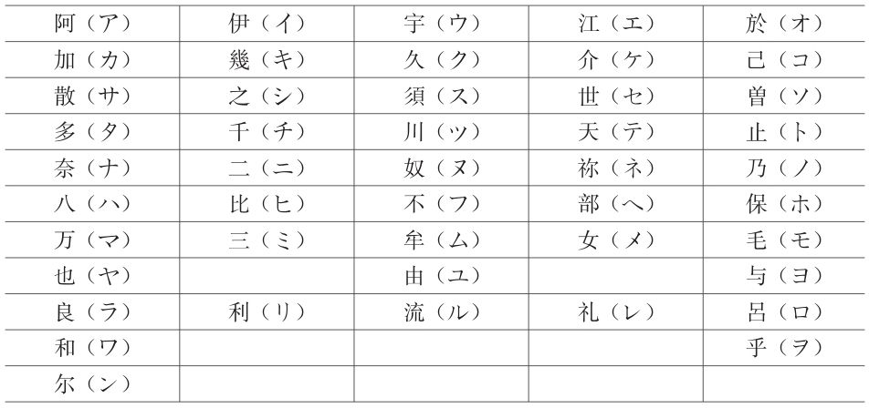
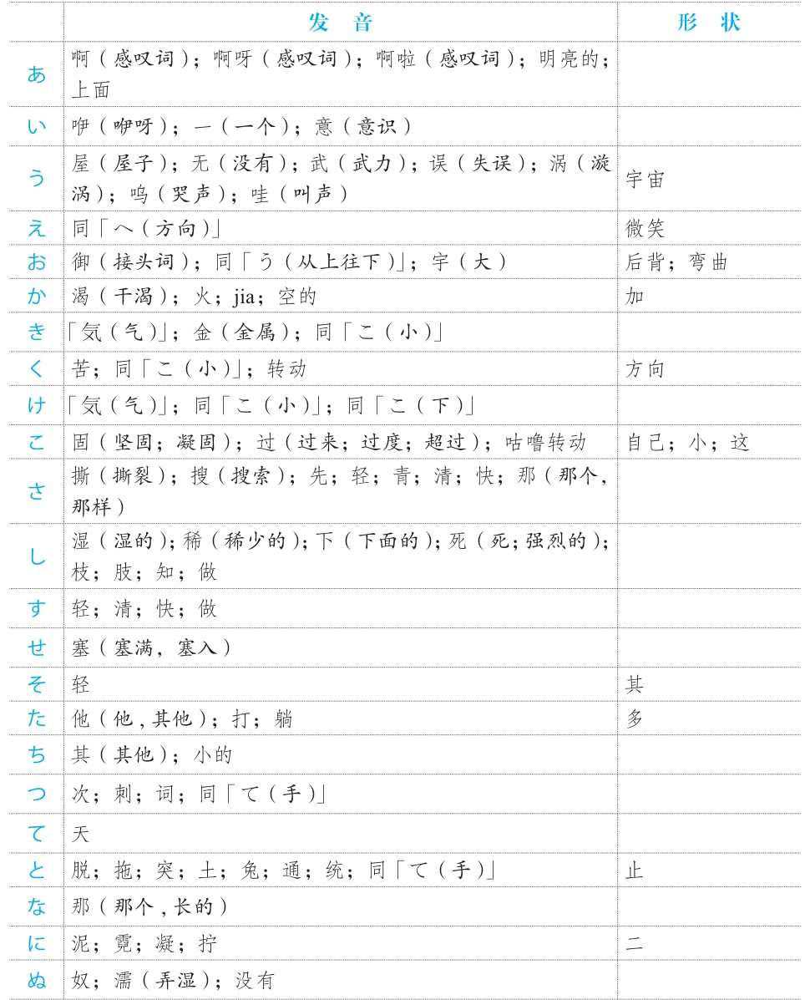

版权信息

# 日语能力考试10000词高效速记
作者：安宁
出版社：浙江教育出版社
出版日期：2018-01-01
ISBN：978-7-5536-6525-2
音频下载链接：[http://download.dogwood.com.cn/riyu/ry10000c.zip](http://download.dogwood.com.cn/riyu/ry10000c.zip)

## 前言
记单词是学习外语的基础。单词就好似一块一块的砖，排成排时组成句子，砌成墙时变成文章。如果不能准确和扎实地记忆单词，砖就是松动的，之后又怎么能够建成牢固的房屋呢？
学习日语，要达到高级水平，需要记住10000多个单词。在记忆的过程中遇到的最大问题是词汇量太大、词义太多，记一个单词还要同时记住它的声调、词性和用法等，非常烦琐。除此之外，从教育心理学的角度来说，学习的过程分为“输入→储备→再认→再生”，也就是说，即使学习者记住了某个单词，但可能令他们更加困扰的是无法将它“再生”，即对它的记忆模糊或根本想不起来。长期如此，学习者就会感到烦恼、痛苦、失落、沮丧等，会有强烈的挫败感，甚至最终放弃学习。
作为一个有着30多年日语学龄和20多年日语教龄的老学习者，我一直致力于将自己的教育心理学专业知识充分应用于日语学习中。这些年，我独创了日语单词“词源+联想”记忆法，得到了数以万计的日语学习者的肯定和支持，成功帮助他们通过这种简单、有效的方法记住了日语单词，扩充了词汇量，顺利通过了日语能力考试。为了帮助更多日语学习者牢固打好词汇基础，更加轻松地准备日语能力考试，我将多年教学、着书的经验总结到这本书中，以期能为广大学习者成功备考略尽绵薄之力。
本书收录了11000多个日语单词，按照N5-N1的顺序编排，并按照词性进行分类，读者可根据自身的水平选择要记忆的单词。原则上来说，备考N4级别的考生需要记忆N5-N4的所有单词，备考N3级别的考生需要记忆N5-N3的所有单词，以此类推。针对读者记忆难点的动词部分，我在书中均给出了有效的“词源+联想”记忆法，其他词性也根据情况给出了记忆方法。
此外，在编写本书的过程中，我要求自己做到“一切从简、地道翻译、实用有趣”。对单词意思的解释遵循“具体意思和抽象意思兼顾”的双重原则，把字典中的解释一概简化，同时加入了实用性强的使用方法介绍。在翻译方面，遵循外语学习中“直译和互译”的准则，打破书面化的解释，力图地道翻译单词，同时我还精炼了独创的“词源+联想”记忆法。
2004年底，回到阔别已久的家乡后，我最担心的事情就是把日语忘了。就是因为这个担心，让我这些年一直每天坚持读两个小时书。这些年，我的阅读领域从日语语言学扩大到了历史、文化、经济、建筑、艺术、古文等，开阔了眼界，增长了见识，也巩固了日语知识。莎士比亚说过：“书籍是全世界的营养品。生活里没有书籍，就好像没有阳光；智慧里没有书籍，就好像鸟儿没有翅膀。”希望我这本书能够陪伴日语学习者幸福度过背单词的每一天。

## 使用说明
1. 五十音图中假名的“字形”由来
* 平假名

* 片假名

2. 假名从“发音”“字形”“嘴型”引出的意思
* 日文假名对应的中文意思

3. 鼻音
* 鼻音是由鼻腔起共鸣作用的辅音，位于音节未尾。日语的发音和汉语紧密相关，汉语中带鼻音“n”的汉字在日语中大都带鼻音。如：安（an→あん）、年（nian→ねん）、新（xin→しん）。

4. 长音
* 长音是将「あ」、「い」、「う」、「え」、「お」五个元音拉长的发音。汉语中带“-ng”音的汉字在日语中大都是长音。如：宁（ning→ねい）、送（song→そう）、定（ding→てい）等。

5. 重音
* 重音一般位于词尾，包括「き」和「く」、「ち」和「つ」两组，共四个。去掉这些重音，剩下的音就是接近汉字的汉语发音的音。如：服（ふく）、式（しき）、质（しつ）、一（いち）等。

6. 促音
* 和か行、さ行、た行、ぱ行中的任何一个假名相遇时，前面的假名因不好发音而变成促音。如：学（がく）校（こう）→（がっこう）等。

7. 声调
* 日语的声调平缓，只有高低之分。本书中的声调用数字标记，数字的意思为声调一直高到此假名，从此假名后面的假名往下降。
如：
1是第一个假名声调高，从第二个假名往下降；
2是只有第二个假名声调高，从第三个假名往下降；
3是从第二个假名到第三个假名声调高，从第四个假名往下降；
4是从第二个假名到第四个假名声调高，从第五个假名往下降；
5是从第二个假名到第五个假名声调高，从第六个假名往下降，以此类推。
0是后面加上助词后声调依然高，到最后没有下降的假名。
如：足（あし2）的声调是2，意思是后面加上助词（如：「が」）后，只有第二个假名「し」声调高；味（あじ0）的声调是0，意思是后面加上助词（如：「が」）后，从第二个假名「じ」开始高到助词「が」，之后没有下降。

8. 分类
* 本书按照N5到N1的级别进行分类。每一个级别中又按照词性进行细分。

9. 备考
* 严格意义上来说，备考时需要将包括要考的级别及以下的级别全部进行背诵才可以，比如考N2级别，需要将N2及N3、N4、N5全部背诵下来。如果是应急备考，也可以只背诵相应的级别。
* 背诵时，最重要的是要边听录音边背诵，以便克服中国人学日语时依赖汉字的弱点，同时还可以达到听力考试中能马上反应出音读单词意思的效果。

10. 拟声词、拟态词

## 连体词、接续词

### 连体词
|            |           |     |     |                                  |                                                   |
| ---------- | --------- | --- | --- | -------------------------------- | ------------------------------------------------- |
| [明くる]   | あくる    | 0   |     | 下，次，翌（日等）               |                                                   |
| [あらゆる] | あらゆる  | 3   |     | 所有的                           | 【记】あら（有る）+ゆ（裕）+る（的）→所有的       |
| [或る]     | ある      | 1   |     | 某                               |                                                   |
| [所謂]     | いわゆる  | 3,2 |     | 所谓                             | 【记】いわ（言う）+ゆ（裕）+る（的）→所谓的       |
| [大きな]   | おおきな  | 1   |     | （语气生硬）大的；高大的；重大的 |                                                   |
| [確たる]   | かくたる  | 1   |     | 确实的，确凿的                   | 【记】たる→とある→と有る→古语形容动词修饰名词时用 |
| [来る]     | きたる    | 2   |     | 接下来的                         |                                                   |
| [最たる]   | さいたる  | 1   |     | 最                               |                                                   |
| [然る]     | さる      | 1   |     | 那样的                           | 【记】さ（そ→其）+る（的）→那样的                 |
| [然る]     | しかる    | 2   |     | 那样的                           | 【记】し（そ→其→然）+か（加）+る（的）            |
| [主たる]   | しゅたる  | 1,2 |     | 主要的                           | 【记】たる→とある→と有る→古语形容动词修饰名词时用 |
| [単なる]   | たん なる | 1   |     | 单一的，仅仅的                   | 【记】なる→である→也→是→古语形容动词修饰名词时用  |
| [小さな]   | ちいさな  | 1   |     | （语气生硬）小的                 |                                                   |
| [どんな]   | どん な   | 1   |     | 什么样的                         | 【记】どん な→「どの様な」的口语                  |
| [見知らぬ] | みしらぬ  | 0   |     | 不认识的，没有见过的             | 【记】見+知らぬ（知らない）                       |

### 接续词
|                |              |     |     |                                        |                                                                    |
| -------------- | ------------ | --- | --- | -------------------------------------- | ------------------------------------------------------------------ |
| [或いは]       | あるいは     | 2   |     | 或者，或许                             | 【记】ある（或る）+い（一个）+は（对比）→或                        |
| [及び]         | および       | 0,1 |     | 以及                                   | 【记】お（接头词）+よ（悠）+び（ぶ→并列）→悠过去和某物并列→达到    |
| [且つ]         | かつ         | 1   |     | 并且                                   | 【记】か（加）+つ（次）→加一次→且                                  |
| [さて]         | さて         | 1   |     | 直接进入正题                           | 【记】さ（颯→快）+て（手→方向）                                    |
| [しかし]       | しかし       | 2   |     | 可是                                   | 【记】し（死→强烈→强）+か（加）+し（像）→加强→可                   |
| [しかしながら] | しかしながら | 4   |     | （语气正式）可是                       | 【记】し（死→强烈→强）+か（加）+し（像）+ながら（が→但是）→加强→可 |
| [そこで]       | そこで       | 0   |     | （语气正式）因此                       |                                                                    |
| [そして]       | そして       | 0   |     | （语气正式，承上启下）还有，之后       |                                                                    |
| [それから]     | それから     | 0   |     | 然后，还有                             |                                                                    |
| [それで]       | それで       | 0   |     | （语气柔和）因此，所以                 |                                                                    |
| [それでは]     | それでは     | 3   |     | 那么                                   |                                                                    |
| [それでも]     | それでも     | 3   |     | 即便如此                               |                                                                    |
| [それとも]     | それとも     | 3   |     | （用于两个疑问句之间）还是             |                                                                    |
| [それに]       | それに       | 0   |     | 在此之上，而且                         |                                                                    |
| [それにしては] | それにしては | 3   |     | 即便如此（认可前者，但还是否定）       | 【记】は（对比性强调→前后各占百分之五十）                          |
| [それにしても] | それにしても | 3   |     | 即便如此（不认可前者）                 | 【记】も（猛→完全性强调）；（小的）转移话题                        |
| [それでいて]   | それでいて   | 3   |     | 虽然如此（认可前者，但是转移成新话题） | 【记】て（逗号）                                                   |
| [只]           | ただ         | 1   |     | 只不过                                 |                                                                    |
| [但し]         | ただし       | 1   |     | （语气正式）只不过                     | 【记】ただ（只）+し（像）                                          |
| [即きましては] | つきましては | 3   |     | 即；因此                               | 【记】つきましては→即きましては→即→是，在                          |
| [でも]         | でも         | 1   |     | 不过                                   |                                                                    |
| [ところが]     | ところが     | 3   |     | 但是                                   | 【记】ところ（地方）+が（助词，但是）                              |
| [ところで]     | ところで     | 3   |     | （大方向的）转移话题                   | 【记】ところ（地方）+で（まで→到）→到这儿→开始新的                 |
| [並びに]       | ならびに     | 0   |     | 并且，以及                             | 【记】な（那→长）+ら（拉）+び（ぶ→并）+に（副词）→拉长且并列→并排  |
| [または]       | または       | 2,1 |     | （语气正式）或者                       | 【记】また（又）+は（对比）→或                                     |
| [もしくは]     | もしくは     | 1   |     | （语气正式）或者                       | 【记】もし（如果）+く（副词）+は（对比）→或                        |

## 主要参考文献

『美しい日本語の辞典』　小学館
『漢字伝来』　大島正二　岩波新書
『漢字と日本人』　高島俊男　文芸春秋
『漢字用語辞典』　朝日新聞社
『擬音擬態語辞典』　山口仲美　講談社
『擬音語擬態語辞典』　山口仲美　講談社
『言語の脳科学』　酒井邦嘉　中公新書
『源氏物語とその作者たち』　西村亨　文芸春秋
『源氏物語と枕草子』　小池清治　PHP新書
『広辞苑　第五版』　岩波書店
『古語辞典　補訂版』　岩波書店
『古汉语常用字字典』商务印书馆
『古代汉语词典』　商务印书馆
『古典文法の本』　望月光　瀬谷出版
『新ことわざ辞典』　萩久保泰幸　ナツメ社
『新明解国語辞典』　第五版　三省堂
『新漢語林』　大修館書店
『全訳用例古語辞』　第二版　学研
『徒然草の探求』　中島悦次　有朋堂
『日本の美意識』　宮元健次　光文社新書
『日本語ウォッチング』　井上史雄　岩波新書
『日本語をさかのぼる』　大野晋　岩波新書
『日本語の歴史』　山口仲美　岩波新書
『日本語源大辞典』　小学館
『日本史』　三省堂
『枕冊子』　田中重太郎　旺文社

## 版权信息

