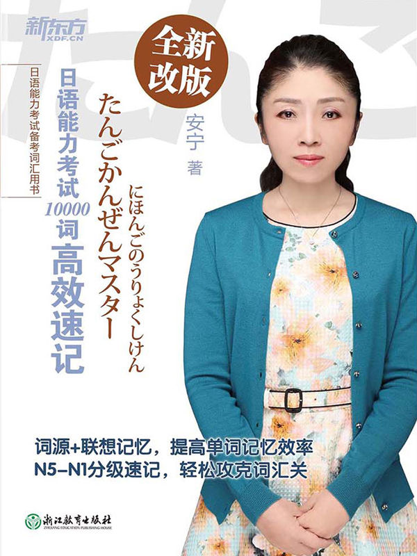
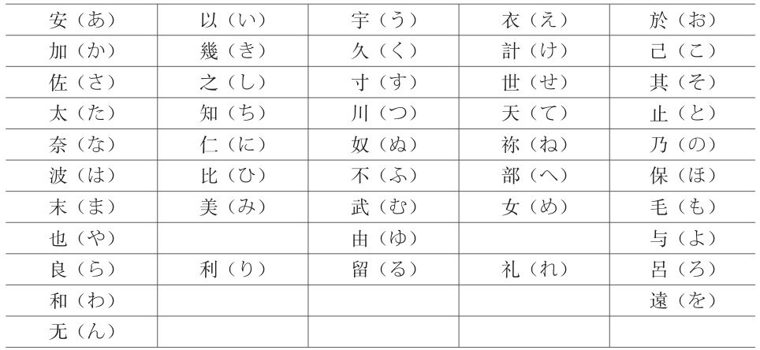
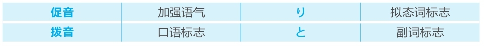

# 日语能力考试10000词高效速记 #1_0_0
* [[ 日语能力考试10000词高效速记_Menu_0.md | Menu #1_0_0 ]]

版权信息

作者：安宁
出版社：浙江教育出版社
出版日期：2018-01-01
ISBN：978-7-5536-6525-2
音频下载链接：[http://download.dogwood.com.cn/riyu/ry10000c.zip](http://download.dogwood.com.cn/riyu/ry10000c.zip)

## 前言 #1_1_0
* [[ 日语能力考试10000词高效速记_Menu_0.md | Menu #1_1_0 ]]

记单词是学习外语的基础。单词就好似一块一块的砖，排成排时组成句子，砌成墙时变成文章。如果不能准确和扎实地记忆单词，砖就是松动的，之后又怎么能够建成牢固的房屋呢？
学习日语，要达到高级水平，需要记住10000多个单词。在记忆的过程中遇到的最大问题是词汇量太大、词义太多，记一个单词还要同时记住它的声调、词性和用法等，非常烦琐。除此之外，从教育心理学的角度来说，学习的过程分为“输入→储备→再认→再生”，也就是说，即使学习者记住了某个单词，但可能令他们更加困扰的是无法将它“再生”，即对它的记忆模糊或根本想不起来。长期如此，学习者就会感到烦恼、痛苦、失落、沮丧等，会有强烈的挫败感，甚至最终放弃学习。
作为一个有着30多年日语学龄和20多年日语教龄的老学习者，我一直致力于将自己的教育心理学专业知识充分应用于日语学习中。这些年，我独创了日语单词“词源+联想”记忆法，得到了数以万计的日语学习者的肯定和支持，成功帮助他们通过这种简单、有效的方法记住了日语单词，扩充了词汇量，顺利通过了日语能力考试。为了帮助更多日语学习者牢固打好词汇基础，更加轻松地准备日语能力考试，我将多年教学、着书的经验总结到这本书中，以期能为广大学习者成功备考略尽绵薄之力。
本书收录了11000多个日语单词，按照N5-N1的顺序编排，并按照词性进行分类，读者可根据自身的水平选择要记忆的单词。原则上来说，备考N4级别的考生需要记忆N5-N4的所有单词，备考N3级别的考生需要记忆N5-N3的所有单词，以此类推。针对读者记忆难点的动词部分，我在书中均给出了有效的“词源+联想”记忆法，其他词性也根据情况给出了记忆方法。
此外，在编写本书的过程中，我要求自己做到“一切从简、地道翻译、实用有趣”。对单词意思的解释遵循“具体意思和抽象意思兼顾”的双重原则，把字典中的解释一概简化，同时加入了实用性强的使用方法介绍。在翻译方面，遵循外语学习中“直译和互译”的准则，打破书面化的解释，力图地道翻译单词，同时我还精炼了独创的“词源+联想”记忆法。
2004年底，回到阔别已久的家乡后，我最担心的事情就是把日语忘了。就是因为这个担心，让我这些年一直每天坚持读两个小时书。这些年，我的阅读领域从日语语言学扩大到了历史、文化、经济、建筑、艺术、古文等，开阔了眼界，增长了见识，也巩固了日语知识。莎士比亚说过：“书籍是全世界的营养品。生活里没有书籍，就好像没有阳光；智慧里没有书籍，就好像鸟儿没有翅膀。”希望我这本书能够陪伴日语学习者幸福度过背单词的每一天。

## 使用说明 #1_2_0
* [[ 日语能力考试10000词高效速记_Menu_0.md | Menu #1_2_0 ]]

1. 五十音图中假名的“字形”由来
* 平假名

* 片假名

2. 假名从“发音”“字形”“嘴型”引出的意思
* 日文假名对应的中文意思

3. 鼻音
* 鼻音是由鼻腔起共鸣作用的辅音，位于音节未尾。日语的发音和汉语紧密相关，汉语中带鼻音“n”的汉字在日语中大都带鼻音。如：安（an→あん）、年（nian→ねん）、新（xin→しん）。

4. 长音
* 长音是将「あ」、「い」、「う」、「え」、「お」五个元音拉长的发音。汉语中带“-ng”音的汉字在日语中大都是长音。如：宁（ning→ねい）、送（song→そう）、定（ding→てい）等。

5. 重音
* 重音一般位于词尾，包括「き」和「く」、「ち」和「つ」两组，共四个。去掉这些重音，剩下的音就是接近汉字的汉语发音的音。如：服（ふく）、式（しき）、质（しつ）、一（いち）等。

6. 促音
* 和か行、さ行、た行、ぱ行中的任何一个假名相遇时，前面的假名因不好发音而变成促音。如：学（がく）校（こう）→（がっこう）等。

7. 声调
* 日语的声调平缓，只有高低之分。本书中的声调用数字标记，数字的意思为声调一直高到此假名，从此假名后面的假名往下降。
如：
1是第一个假名声调高，从第二个假名往下降；
2是只有第二个假名声调高，从第三个假名往下降；
3是从第二个假名到第三个假名声调高，从第四个假名往下降；
4是从第二个假名到第四个假名声调高，从第五个假名往下降；
5是从第二个假名到第五个假名声调高，从第六个假名往下降，以此类推。
0是后面加上助词后声调依然高，到最后没有下降的假名。
如：足（あし2）的声调是2，意思是后面加上助词（如：「が」）后，只有第二个假名「し」声调高；味（あじ0）的声调是0，意思是后面加上助词（如：「が」）后，从第二个假名「じ」开始高到助词「が」，之后没有下降。

8. 分类
* 本书按照N5到N1的级别进行分类。每一个级别中又按照词性进行细分。

9. 备考
* 严格意义上来说，备考时需要将包括要考的级别及以下的级别全部进行背诵才可以，比如考N2级别，需要将N2及N3、N4、N5全部背诵下来。如果是应急备考，也可以只背诵相应的级别。
* 背诵时，最重要的是要边听录音边背诵，以便克服中国人学日语时依赖汉字的弱点，同时还可以达到听力考试中能马上反应出音读单词意思的效果。

10. 拟声词、拟态词

## N5 #1_3_0
* [[ 日语能力考试10000词高效速记_Menu_0.md | Menu #1_3_0 ]]

### 名词 #1_3_1
* [[ 日语能力考试10000词高效速记_Menu_0.md | Menu #1_3_1 ]]

|||||||
|------------|------------------|---|---|------------------------------------------------------|-------------------------------------------------------------------------------------------------------|
|[間]|あいだ|0||间，间隔|【记】あい（合い→互相之间）だ（是）→间隔|
|[青]|あお|1||蓝色；青色；绿色；不成熟|【记】あ（上）+お（う→宇）→上天→蓝色|
|[赤]|あか|1||红色；完全|【记】あ（明）+か（加）→特别明亮→太阳→红色|
|[赤ちゃん]|あかちゃん|1||婴儿|【记】あ（明）+か（加）→特别明亮→太阳→红色+ちゃん （小东西）→赤子→婴儿|
|[赤ん坊]|あかん ぼう|0||婴儿|【记】あ（明）+か（加）→特别明亮→太阳→红色+坊（ぼう→人）→赤子→婴儿|
|[秋]|あき|1||秋天|【记】あ（明）+き（気）→明亮的感觉→秋高气爽→秋天|
|[朝]|あさ|1||早上|【记】あ（明）+さ（颯→清）→明亮而清爽→早上|
|[朝日]|あさひ|1||朝日，旭日|【记】あ（明）+さ（颯→清）→明亮而清爽→早上+ひ（日）→朝日|
|[旭]|あさひ|1||朝日，旭日|【记】あ（明）+さ（颯→清）→明亮而清爽→早上+ひ（日）→朝日|
|[朝ご飯]|あさごはん|3||早饭|【记】あ（明）+さ（颯→清）→明亮而清爽→早上+ご（敬语）+飯→早饭|
|[明後日]|あさっ て|2||后天|【记】あさ（あす→明日）+て（手→方向）→从明天再往后→后天|
|[足]|あし|2||脚；腿|【记】あ（恶）+し（像）→身上脏的地方→腿；脚|
|[脚]|あし|2||脚；腿|【记】あ（恶）+し（像）→身上脏的地方→腿；脚|
|[明日]|あした|3||（现代语）明天|【记】あ（明）+した（现代语した→古语す→しゅ→種→种类）→明天|
|[あそこ]|あそこ|0||（较远的）那里|【记】あ（上→上天→远）+そ（其→其他）+こ（地方）→（较远的）那里|
|[あちら]|あちら|0||那里，那边；那位|【记】あ（上→上天→远）+ち（地）+ら（拉）→（较远的）那里|
|[後]|あと|1||后；后面；以后|【记】あ（あし→足）+と（ところ→亦）→足+亦→跡→后|
|[あなた]|あなた|2||你；老公|【记】あ（上）+な（の）+た（かた→方）→对对方的尊称→你，您|
|[兄]|あに|1||（自己的）哥哥|【记】あ（上）+に（にん →人）→上边的人→哥哥|
|[姉]|あね|0||（自己的）姐姐|【记】あ（上）+ね（に→にん →人）→上边的人→姐姐|
|[雨]|あめ|1||雨；下雨|【记】あ（上）+め（も→もの→物）→天上下来的东西→雨|
|[安心]|あん しん|0||安心，放心||
|[安全]|あん ぜん|0||安全||
|[案内]|あん ない|3||引导，领路；通知||
|[家]|いえ|2||家；房子|【记】い（一）+え（へ→方向）→一个方向→去，回→家|
|[以下]|いか|1||以下||
|[以外]|いがい|1||以外||
|[如何]|いか|0||如何，怎么样||
|[医学]|いがく|1||医学||
|[幾つ]|いくつ|1||几个；几岁|【记】いく（いか→如何）+つ（次）→几|
|[幾ら]|いくら|1||多少钱；多少次|【记】いく（いか→如何）+ら（拉）→多少|
|[石]|いし|2||石头，石子；宝石|【记】い（一）+し（石）→一块石头|
|[医者]|いしゃ|0||医生||
|[以上]|い じょう|1||以上||
|[椅子]|いす|0||椅子||
|[以前]|いぜん|1||以前，从前，过去||
|[一]|いち|2||一；第一；最初||
|[一度]|いちど|0||一次；一度||
|[一日]|いちにち|0||一天||
|[一年]|いちねん|2||一年；一年级||
|[一枚]|いちまい|2||一张，一片||
|[一番]|いちばん|2||第一个，第一号||
|[一羽]|いちわ|2||一只（鸡、鸭、鸟、兔等）||
|[何時]|いつ|1||什么时候||
|[五日]|いつか|0||五号，五日||
|[五日間]|いつかかん|3||五天||
|[一回]|いっ かい|3,0||一回，一次||
|[一階]|いっ かい|0||一层，一楼||
|[一個]|いっ こ|1||一个||
|[一歳]|いっ さい|1||一岁||
|[一冊]|いっ さつ|4,0||一册，一本||
|[一緒]|いっ しょ|0||一样，同样||
|[一足]|いっ そく|4||一双（鞋、袜子等）||
|[一体]|いっ たい|0||一体；到底；总体上，整体上||
|[一着]|いっ ちゃく|4,0||一套（衣服）||
|[五つ]|いつつ|2||五个；五岁||
|[一通]|いっ つう|3,0||一封（信）||
|[一頭]|いっ とう|1||一头，一匹（牛、马、象等大型动物）||
|[一杯]|いっ ぱい|1||一杯||
|[一匹]|いっ ぴき|4||一条，一只（狗、金鱼、猫、昆虫等）||
|[一分]|いっ ぷん|1||一分钟||
|[一本]|いっ ぽん|1||一根；一条；一瓶（细长的东西）||
|[以内]|いない|1||以内||
|[田舎]|いなか|0||乡下，农村；故乡|【记】い（いる→居る→在）+なか（中）→待在家里→故乡|
|[犬]|いぬ|2||狗，犬|【记】い（一）+ぬ（奴→奴仆）→一个奴仆→狗|
|[今]|いま|1||现在；刚才；将来|【记】い（一）+ま（間）→一个时间|
|[意味]|いみ|1||意思，意义||
|[妹]|いもうと|4||妹妹|【记】い（一）+も（め→女）+うと（ひと→人）→一个女人→妹妹|
|[入り口]|いりぐち|0||入口|【记】い（一）+り（る→留）→留在一个地方→入；く（こ→口）+ち（乞）→口+乞→吃→嘴|
|[色]|いろ|2||颜色，色彩|【记】い（一）+ろ（落）→一个落在大脑视觉中枢而产生的感觉→色|
|[上]|うえ|0||上面，之上；年纪大|【记】う（宇）+え（へ→方向）→宇宙的方向→上|
|[受付]|うけつけ|0||接待，接待处；挂号处|【记】う（宇）+け（く→方向）+る（留→长）→从天上来→接受；つ（刺）+け（く→方向）+る（留→长）→突出→附着|
|[動き]|うごき|3||动作；摇动，摆动|【记】う（宇yu→羽yu）+ご（过）+き（く→方向）→羽毛摆动→动|
|[後ろ]|うしろ|0||后面|【记】う（无）+し（稀）+ろ（落）→（落）后|
|[後ろ足]|うしろあし|0,3||后腿|【记】う（无）+し（稀）+ろ（落）→（落）后；あ（恶）+し（像）→身体脏的地方→腿；脚|
|[嘘]|うそ|1||谎言，假话|【记】う（无）+そ（其）→没有它→假|
|[歌]|うた|2||歌，歌曲|【记】う（呜）+た（它）→吟唱|
|[家]|うち|2||房子；自己的家|【记】う（屋）+ち（地）→屋子里的地方→房子|
|[内]|うち|0||内，里面；内部，我们（的公司、学校等）；我（女性称谓）|【记】う（屋）+ち（地）→屋子里的地方→内|
|[腕]|うで|2||胳膊；本事，本领|【记】う（うえ→上）+て（手）+浊音（拖泥带水→有关）→手上面的与手连接在一起的→胳膊|
|[馬]|うま|2||马|【记】う（接头词）+ま（马）→马|
|[海]|うみ|1||海|【记】う（涡）+み（みず→水）→形成漩涡的水→海|
|[裏]|うら|2||背面，反面；内心；内情|【记】う（屋）+ら（拉）→拉到屋子里→里面|
|[売り場]|うりば|0||卖场|【记】う（无）+り（る→留→长）→卖了就没了→卖|
|[上着]|うわぎ|0||上衣，外套|【记】う（宇）+わ（あ→上）→宇宙上→上；き（起）+る（长）→让衣服起来→穿|
|[運]|うん|1||运气||
|[運転]|うん てん|0||驾驶（地面交通工具）；（机器、资金）运转||
|[運転手]|うん てん しゅ|3||司机||
|[運動]|うん どう|0||运动||
|[運動会]|うん どうかい|3||运动会||
|[絵]|え|1||图画||
|[映画]|えいが|1,0||电影||
|[映画館]|えいがかん|3||电影院||
|[英語]|えいご|0||英语||
|[駅]|えき|1||（电车、地铁的）车站|【记】え（へ→方向）+き（木）→一棵一棵树的方向→车站|
|[駅前]|えきまえ|3,0||（电车、地铁的）车站周边|【记】え（へ→方向）+き（木）→一棵一棵树的方向→车站；ま（满）+え（へ→方向）→满的方向→前|
|[蝦]|えび|0||虾|【记】え（へ→方向）+び（微）→能变方向的小东西→虾身体的弯曲→虾|
|[海老]|えび|0||虾|【记】え（へ→方向）+び（微）→能变方向的小东西→虾身体的弯曲→虾|
|[円]|えん|1||圆形；日元||
|[鉛筆]|えん ぴつ|0||铅笔||
|[お祝い]|おいわい|0||庆祝，祝贺|【记】い（意）+わ（哇）+い（う→ふ→風→状态）→意识上雀跃→祝贺|
|[お母さん]|おかあさん|2||妈妈||
|[お陰]|おかげ|0||庇护；托……的福|【记】か（加）+け（き→気）+浊音（拖泥带水→有关）→添加（在身体旁边）→影→庇护|
|[お菓子]|おかし|2||点心，糖果||
|[億]|おく|1||亿||
|[奥さん]|おくさん|1||夫人，太太||
|[贈り物]|おくりもの|0||礼物，礼品|【记】お（う→宇→大）+く（根据字形→方向）+り（る→留→长）→赠送+物→赠送的东西|
|[おじ]|おじ|0||叔叔；舅舅；伯伯；姑父；姨父||
|[おじいさん]|おじいさん|2||爷爷，祖父；姥爷，外祖父||
|[押入れ]|おしいれ|0||壁橱|【记】お（大→甲）+す（做）→手+甲→押→推；い（一）+れ（来）→一个来→入。押し+入れ→推进去→壁橱|
|[お嬢さん]|お じょう さん|2||令爱；小姐||
|[お茶]|おちゃ|0||茶（具体指日本绿茶）||
|[夫]|おっ と|0||丈夫|【记】お（雄）+と（ひと→人）→男人→丈夫|
|[お釣り]|おつり|0||找的零钱|【记】つ（刺）+り（る→留→长）→钓；お（御）+釣り→从钱箱里找出的零钱|
|[お手洗い]|おてあらい|3||洗手间|【记】あ（恶）+ら（拉）+い（う→ふ→風→状态）→把坏的东西拉走→洗；お（御）+手洗い→洗手间|
|[音]|おと|2||（东西发出的）声响|【记】お（う→宇→大）+と（咚）→声响|
|[男]|おとこ|3||男的，男人|【记】お（雄）+と（ひと→人）+こ（子）→男|
|[男の子]|おとこのこ|3||男孩子||
|[一昨日]|おととい|3||前天||
|[一昨年]|おととし|2||前年||
|[大人]|おとな|0||成人，大人|【记】お（雄）+と（ひと→人）+な（なる→成る→是）→大人|
|[踊り]|おどり|0||舞蹈；跳舞|【记】お（御）+ど（蹈）+り（る→留→长）→蹈|
|[お腹]|おなか|0||腹部，肚子|【记】お（御）+なか（中）→人体的中间→腹部|
|[おば]|おば|0||（用于向外人介绍自家人时）阿姨；姑姑；婶婶；舅妈||
|[おばあさん]|おばあさん|2||奶奶，祖母；姥姥，外祖母||
|[お昼]|おひる|2||中午；午饭|【记】お（御）+ひ（日）+る（る→留→长）→太阳长→中午|
|[お祭り]|おまつり|0||节，节日；祭祀|【记】ま（满→真）+つ（刺→方向）+り（る→留→长）→聚集在一起→祭祀活动|
|[おもちゃ]|おもちゃ|2||玩具|【记】お（御）+も（もの→物）+ちゃ（小）→小东西→玩具|
|[親]|おや|2||父母|【记】お（う→宇→大）+や（也→是）→是大的→家长→父母|
|[俺]|おれ|0||（用于男人称呼自己时，语气粗鲁）我|【记】お（我）+れ（类）→我|
|[終わり]|おわり|0||完，结束；死|【记】お（御）+わ（完）+り（る→留→长）→完|
|[音楽]|おん がく|1||音乐||
|[女]|おん な|0||女的，女性|【记】お（御）+ん （め→女）+な（め→女）→女|
|[女の子]|おん なのこ|3||女孩子||
|[会]|かい|1||会，会议||
|[階]|かい|1||层，楼||
|[回]|かい|1||回，次||
|[海外]|かいがい|1||海外，外国||
|[会館]|かいかん|0||会馆||
|[会議]|かいぎ|1,3||会议||
|[会議室]|かいぎしつ|3||会议室||
|[外国]|がいこく|0||外国||
|[外国人]|がいこくじん|4||外国人||
|[会社]|かいしゃ|0||公司||
|[会場]|かい じょう|0||会场||
|[階段]|かいだん|0||台阶，楼梯||
|[買い物]|かいもの|0||购物|【记】か（加）+い（う→ふ→風→状态）→买；買い+物→买东西|
|[会話]|かいわ|0||会话||
|[帰り]|かえり|3||回来；回程|【记】か（家）+え（へ→方向）+り（る→留→长）→往家的方向→回|
|[顔]|かお|0||脸；表情；神色；面子|【记】か（加）+お（根据嘴型→圆）→很圆的→脸|
|[科学]|かがく|1||科学||
|[鍵]|かぎ|2||钥匙；关键|【记】か（加）+き（きん →金）+浊音（拖泥带水→有关）→加上一个有关的金属→钥匙|
|[書き方]|かきかた|3,4||写法|【记】か（加）+き（く→根据字形→方向）→写；か（加）+た（多）→方|
|[学生]|がくせい|0||学生||
|[学部]|がくぶ|0,1||院；系||
|[影]|かげ|1||影子；阴影|【记】か（加）+け（き→気）+浊音（拖泥带水→有关）→添加（在身体边儿上）的感觉→阴影|
|[陰]|かげ|1||影子；阴影|【记】か（加）+け（き→気）+浊音（拖泥带水→有关）→添加（在身体边儿上）的感觉→阴影|
|[傘]|かさ|1||伞|【记】か（加）+さ（伞）→伞|
|[火事]|かじ|1||火灾||
|[風]|かぜ|0||风；风俗习惯|【记】か（加）+ぜ（灾）→添加灾难→风|
|[風邪]|かぜ|0||感冒|【记】か（加）+ぜ（灾）→添加灾难→生病→感冒|
|[家族]|かぞく|1||一家人，家里人||
|[肩]|かた|1||肩，肩膀，肩部|【记】か（加）+た（多）→かたい →坚固→肩上扛物要结实→肩膀|
|[方]|かた|2||方向，方位，方面；（人的尊称）位|【记】か（加）+た（多）→方向|
|[片仮名]|かたかな|3,2||片假名||
|[形]|かたち|0||形状；形式|【记】か（加）+た（多）+ち（地）→很多地方→形|
|[課長]|か ちょう|0||科长||
|[格好]|かっ こう|0||样子，打扮||
|[学校]|がっ こう|0||学校||
|[各国]|かっ こく|1||各国||
|[家庭]|かてい|0||家庭||
|[角]|かど|1||角；拐角|【记】か（加）+と（地方）+浊音（拖泥带水→有关）→添加一个地方与其有关→角|
|[家内]|かない|1||家里；我的妻子||
|[金]|かね|0||金属；金钱|【记】か（火）+ね（黏）→火炼成的黏稠物→金|
|[金持ち]|かねもち|3,4||有钱人|【记】か（火）+ね（黏）→火炼成的黏稠物→金；も（物）+ち（つ→て→手）→手上放东西→持有|
|[彼女]|かのじょ|1||她；女朋友||
|[鞄]|かばん|0||包；皮包；书包|【记】か（かわ→革）+ばん （包）→革+包→（皮）包|
|[花瓶]|かびん|0||花瓶||
|[壁]|かべ|0||墙，墙壁|【记】か（加）+べ（边）→添加一边→墙|
|[神]|かみ|1||神|【记】か（日→太阳）+み（も→もの→物）→神|
|[紙]|かみ|2||纸|【记】か（日→太阳）+み（も→もの→物）→神→古代日本认为纸是神一样的发明→纸|
|[髪]|かみ|2||头发|【记】か（日→太阳）+み（も→もの→物）→太阳在上面→人体最上面的东西→头发|
|[髪の毛]|かみのけ|2,3||头发|【记】か（日→太阳）+み（も→もの→物）→太阳在上面→人体最上面的东西→头发；け（こ→己→小）→小东西→毛发|
|[雷]|かみなり|3,4||雷|【记】かみ（神）+なり（なる→鳴る）→神鸣→打雷|
|[火曜日]|かようび|2||星期二||
|[体]|からだ|0||身体|【记】から（空→殻）+だ（是→躯壳）→（佛）四大皆空→身体|
|[彼]|かれ|1||他||
|[彼ら]|かれら|1||他们||
|[川]|かわ|2||河，河流|【记】か（加）+わ（弯）→川为直，河为弯→河|
|[河]|かわ|2||河，河流|【记】か（加）+わ（弯）→川为直，河为弯→河|
|[側]|がわ|0||一侧，一方||
|[代わり]|かわり|0||代替，替代|【记】か（加）+わ（弯）+り（る→留→长）→交换|
|[缶]|かん|1||罐子||
|[考え]|かん がえ|3||考虑，思考；研究|【记】かん （勘→直觉）+が（状态）+える（得る）→得到直觉→考虑|
|[考え方]|かん がえかた|5,6||想法||
|[漢字]|かん じ|0||汉字||
|[木]|き|1||树；木头||
|[気]|き|1||气，空气；气氛；心情；感觉||
|[黄色]|きいろ|0||黄颜色||
|[気温]|きおん|0||气温||
|[機会]|きかい|2,0||机会||
|[季節]|きせつ|2,1||季节||
|[北]|きた|0,2||北，北方|【记】き（ひ→日）+た（他→绝）→阳光断绝的地方→北|
|[喫茶店]|きっ さてん|0||茶馆；咖啡馆||
|[切手]|きっ て|0||邮票||
|[切符]|きっ ぷ|0||票，车票||
|[昨日]|きのう|2||昨天||
|[君]|きみ|0||（不礼貌的称呼）你|【记】き（貴）+み（も→もの→物）→尊称→您→现代日语变为不礼貌的称呼→（上对下）你|
|[気持ち]|きもち|0||（外因引起的）心情，感觉||
|[着物]|きもの|0||和服||
|[客]|きゃく|0||客人||
|[九]|きゅう|1||九||
|[九個]|きゅう こ|1||九个||
|[急行]|きゅう こう|0||快车||
|[九歳]|きゅう さい|1||九岁||
|[九冊]|きゅう さつ|1||九册，九本||
|[九足]|きゅう そく|1||九双（鞋、袜子等）||
|[九着]|きゅう ちゃく|1||九套（衣服）||
|[九通]|きゅう つう|1||九封（信）||
|[九度]|きゅう ど|1||九次；九度||
|[九頭]|きゅう とう|1||九头，九匹（牛、马、象等大型动物）||
|[牛肉]|ぎゅう にく|0||牛肉||
|[牛乳]|ぎゅう にゅう|0||牛奶||
|[九年]|きゅう ねん|1||九年；九年级||
|[九杯]|きゅう はい|1||九杯||
|[九番]|きゅう ばん|1||第九个，第九号||
|[九匹]|きゅう ひき|1||九条，九只（狗、金鱼、猫、昆虫等）||
|[九本]|きゅう ほん|1||九根儿；九条；九瓶（细长的东西）||
|[九枚]|きゅう まい|1||九张，九片||
|[九羽]|きゅう わ|1||九只（鸡、鸭、鸟、兔等）||
|[今日]|きょう|1||今天||
|[教科書]|きょう かしょ|3||教科书，课本||
|[教室]|きょう しつ|0||教室||
|[兄弟]|きょう だい|1||兄弟姐妹||
|[興味]|きょう み|1,3||兴趣||
|[去年]|きょねん|1||去年||
|[金]|きん|1||金||
|[銀]|ぎん|1||银||
|[銀行]|ぎん こう|0||银行||
|[禁止]|きん し|0||禁止||
|[金曜日]|きん ようび|3||星期五||
|[九]|く|1||九||
|[区]|く|1||（行政上的）区||
|[空気]|くうき|1||空气；气氛||
|[空港]|くうこう|0||机场||
|[九時]|くじ|1||九点||
|[薬]|くすり|0||药|【记】くすり（苦死了）→药|
|[薬屋]|くすりや|0||药店||
|[果物]|くだもの|2||水果|【记】く（根据字形→方向）+だ（达→达到→下落）→下落+物→水果成熟后从树上落下|
|[口]|くち|0||口，嘴|【记】く（こ→口）+ち（乞）→口+乞→吃→嘴|
|[靴]|くつ|0||鞋子|【记】く（库）+つ（刺→向前突出）→向前突出的仓库→鞋|
|[靴下]|くつした|2||袜子||
|[国]|くに|0||国家||
|[首]|くび|0||脖子|【记】く（根据字形→方向）+び（微）→可以变动方向的小东西→脖子|
|[雲]|くも|1||云|【记】く（くろ→黒）+も（もの→物）→（乌）云|
|[曇り]|くもり|0||天空多云；模糊；发愁；阴沉|【记】く（くろ→黒）+も（もの→物）→（乌）云→曇+り（る→留→长）→多云|
|[車]|くるま|0||车，汽车|【记】くるま（轱辘满）→车|
|[黒]|くろ|1||黑色|【记】く（根据字形→方向）+ろ（落）→一直涂抹→黑|
|[毛]|け|0||毛发；毛线；羽毛|【记】け（こ→己→小）→小东西→毛发|
|[計画]|けいかく|0||计划||
|[警察]|けいさつ|0||警察||
|[今朝]|けさ|1||今天早晨||
|[消しゴム]|けしゴム|0||橡皮|【记】け（こ→己→小xiao；け→下xia）+す（做）→消xiao|
|[結構]|けっ こう|1||可以；不需要||
|[結婚]|けっ こん|0||结婚||
|[月曜日]|げつようび|3||星期一||
|[県]|けん|1||（日本的）县||
|[券]|けん|1||票，券||
|[原因]|げん いん|0||原因||
|[喧嘩]|けん か|0||吵架；打架||
|[玄関]|げん かん|1||玄关||
|[元気]|げん き|1||精神||
|[現在]|げん ざい|1||现在||
|[個]|こ|0||个||
|[子]|こ|0||子女；孩子||
|[五]|ご|0||五||
|[語]|ご|0||单词，词语||
|[公園]|こうえん|0||公园||
|[工場]|こう じょう|3||工厂||
|[紅茶]|こうちゃ|0||红茶||
|[校長]|こう ちょう|0||校长||
|[交通]|こうつう|0||交通||
|[行動]|こうどう|0||行动||
|[声]|こえ|1||（人或动物发出的）声音|【记】こ（ご→过）+え（へ→方向）→传过来的→声|
|[五回]|ごかい|0||五回，五次||
|[五階]|ごかい|0||五层，五楼||
|[五月]|ごがつ|1||五月||
|[国際]|こくさい|0||国际||
|[此処]|ここ|0||这里||
|[五個]|ごこ|1||五个||
|[午後]|ごご|1||下午||
|[九日]|ここのか|0||九日，九号；九天||
|[九日間]|ここのかかん|4||九天||
|[九つ]|ここのつ|2||九个；九岁||
|[心]|こころ|2,3||心|【记】こ（此）+こ（此）+ろ（ところ→所）→此处→心|
|[五歳]|ごさい|1||五岁||
|[五冊]|ごさつ|1||五册，五本||
|[五時]|ごじ|1||五点||
|[故障]|こ しょう|0||故障||
|[午前]|ごぜん|1||上午||
|[五足]|ごそく|1||五双（鞋、袜子等）||
|[答え]|こたえ|0||回答；响应|【记】こ（己）+た（他）+え（へ→方向）→把自己的想法给他人→答|
|[こちら]|こちら|0||这里，这边；这位||
|[五着]|ごちゃく|1||五套（衣服）||
|[五通]|ごつう|1||五封（信）||
|[事]|こと|0||事情||
|[五度]|ごど|1||五次；五度||
|[五頭]|ごとう|1||五头，五匹（牛、马、象等大型动物）||
|[今年]|ことし|0||今年||
|[言葉]|ことば|0||单词；语言||
|[子供]|こども|0||孩子||
|[五年]|ごねん|1||五年；五年级||
|[この間]|このあいだ|0||前几天，最近|【记】あい（合い→互相之间）+だ（是）→间隔；この+間→这期间|
|[この辺]|このへん|0||这附近||
|[五杯]|ごはい|1||五杯||
|[ご飯]|ごはん|1||饭||
|[五番]|ごばん|1||第五个，第五号||
|[ごみ]|ごみ|0||垃圾|【记】こ（己→小）+浊音（污浊）+み（も→もの→物）→污浊的小东西→垃圾|
|[ゴミ箱]|ゴミばこ|3,0||垃圾箱|【记】こ（己→小）+浊音（污浊）+み（も→もの→物）→污浊的小东西→垃圾；は（哈→放）+こ（口）→开口的东西→箱子|
|[五匹]|ごひき|1||五条，五只（狗、金鱼、猫、昆虫等）||
|[五分]|ごふん|1||五分（钱）；五分钟||
|[五本]|ごほん|1||五根儿；五条；五瓶（细长的东西）||
|[五枚]|ごまい|1||五张，五片||
|[米]|こめ|0||大米|【记】こ（己→小）+め（も→もの→物）→米|
|[これ]|これ|0||这个|【记】こ（此）+れ（类）→这个|
|[これから]|これから|0||今后||
|[五羽]|ごわ|1||五只（鸡、鸭、鸟、兔等）||
|[今回]|こん かい|1||这次||
|[今月]|こん げつ|0||这个月||
|[今週]|こん しゅう|0||这个星期||
|[今晩]|こん ばん|1||今晚||
|[最近]|さいきん|0||最近||
|[最後]|さいご|1||最后||
|[最初]|さいしょ|0||最初||
|[財布]|さいふ|0||钱包||
|[魚]|さかな|0||鱼|【记】さか（さけ→酒）+な（な→菜）→下酒菜→鱼|
|[魚屋]|さかなや|0||水产店||
|[先]|さき|0||先；尖部；末梢；前方；目的地；未来，前途|【记】さ（そ→其）+き（く→方向）→往那个（远的）方向→末梢→先（端）|
|[作文]|さくぶん|0||作文||
|[桜]|さくら|0||樱花|【记】さく（咲く→开花）+ら（拉）→盛开→樱花|
|[酒]|さけ|0||酒||
|[冊]|さつ|0||册，本||
|[雑誌]|ざっ し|0||杂志||
|[砂糖]|さとう|2||砂糖||
|[様]|さま|0||样子；对人的尊称||
|[再来月]|さらいげつ|2||下下个月||
|[再来週]|さらい しゅう|0||下下周||
|[再来年]|さらいねん|0||后年||
|[三]|さん|0||三||
|[三回]|さん かい|0||三回，三次||
|[三階]|さん がい|0||三层，三楼||
|[三月]|さん がつ|1||三月||
|[三個]|さん こ|1||三个||
|[三歳]|さん さい|1||三岁||
|[三冊]|さん さつ|1||三册，三本||
|[三時]|さん じ|1||三点||
|[三足]|さん そく|1||三双（鞋、袜子等）||
|[三着]|さん ちゃく|1||三套（衣服）||
|[三通]|さん つう|1||三封（信）||
|[三度]|さん ど|1||三次；三度||
|[三頭]|さん とう|1||三头，三匹（牛、马、象等大型动物）||
|[三年]|さん ねん|1||三年；三年级||
|[三杯]|さん ばい|1||三杯||
|[三番]|さん ばん|1||第三个，第三号||
|[三匹]|さん びき|1||三条，三只（狗、金鱼、猫、昆虫等）||
|[三分]|さん ぷん|1||三分；三分钟||
|[散歩]|さん ぽ|0||散步||
|[三本]|さん ぼん|1||三根儿；三条；三瓶（细长的东西）||
|[三枚]|さん まい|1||三张，三片||
|[三羽]|さん わ|1||三只（鸡、鸭、鸟、兔等）||
|[四]|し|0||四||
|[市]|し|0||（行政单位）市；城市||
|[字]|じ|0||字||
|[塩]|しお|0||盐|【记】し（汐）+お（御）→咸→盐|
|[仕方]|しかた|0||做法，办法|【记】し（す→做）+方→做法|
|[時間]|じかん|0||时间||
|[試験]|しけん|2||考试||
|[事故]|じこ|1||事故||
|[自己]|じこ|1||自己||
|[仕事]|しごと|0||工作||
|[辞書]|じしょ|1||词典||
|[地震]|じしん|0||地震||
|[下]|した|0||下，下部，下方；年纪小|【记】した（下淌）→下|
|[時代]|じだい|0||时代||
|[七]|しち|0||七||
|[七月]|しちがつ|0||七月||
|[七時]|しちじ|2||七点||
|[失敗]|しっ ぱい|0||失败||
|[質問]|しつもん|0||提问||
|[失礼]|しつれい|2||失礼||
|[自転車]|じてん しゃ|2||自行车||
|[品物]|しなもの|0||商品||
|[字引]|じびき|0||字典||
|[社員]|しゃいん|1||公司职员||
|[写真]|しゃしん|0||照片||
|[社長]|しゃ ちょう|0||总经理||
|[週]|しゅう|1||周，星期||
|[十]|じゅう|1||十||
|[週間]|しゅう かん|0||一个星期||
|[十時]|じゅう じ|1||十点||
|[十度]|じゅう ど|1||十次；十度||
|[十年]|じゅう ねん|1||十年||
|[十番]|じゅう ばん|1||第十个，第十号||
|[十枚]|じゅう まい|1||十张，十片||
|[週末]|しゅう まつ|0||周末||
|[十羽]|じゅう わ|1||十只（鸡、鸭、鸟、兔等）||
|[授業]|じゅ ぎょう|1||课||
|[宿題]|しゅくだい|0||作业||
|[主人]|しゅじん|1||主人；丈夫||
|[十個]|じゅっ こ|1||十个||
|[十歳]|じゅっ さい|1||十岁||
|[十冊]|じゅっ さつ|0||十册，十本||
|[十足]|じゅっ そく|0||十双（鞋、袜子等）||
|[十着]|じゅっ ちゃく|0||十套（衣服）||
|[十通]|じゅっ つう|1||十封（信）||
|[十頭]|じゅっ とう|1||十头，十匹（牛、马、象等大型动物）||
|[十杯]|じゅっ ぱい|1||十杯||
|[十匹]|じゅっ ぴき|0||十条，十只（狗、金鱼、猫、昆虫等）||
|[十本]|じゅっ ぽん|1||十根儿；十条；十瓶（细长的东西）||
|[趣味]|しゅみ|1||爱好||
|[使用]|しよう|0||使用||
|[紹介]|しょう かい|0||介绍||
|[小学校]|しょう がっ こう|3||小学||
|[小説]|しょう せつ|0||小说||
|[醤油]|しょう ゆ|0||酱油||
|[食堂]|しょくどう|0||食堂||
|[白]|しろ|1||白，白色；没有关系，清白|【记】し（稀）+ろ（落）→没有沾染→白|
|[新幹線]|しん かん せん|3||新干线||
|[神社]|じん じゃ|1||神社||
|[心配]|しん ぱい|0||担心||
|[新聞]|しん ぶん|0||报纸||
|[図]|ず|0||图||
|[水曜日]|すいようび|3||星期三||
|[数学]|すうがく|0||数学||
|[寿司]|すし|2,1||寿司||
|[鮨]|すし|2,1||寿司||
|[背]|せ|1||脊背；后面||
|[世界]|せかい|1||世界||
|[席]|せき|1||席，座位||
|[石鹸]|せっ けん|0||肥皂；香皂||
|[説明]|せつめい|0||说明，解释||
|[背中]|せなか|0||后背||
|[是非]|ぜひ|1||是非；善恶||
|[世話]|せわ|0||照顾||
|[線]|せん|1||线条；路线||
|[千]|せん|1||（数量）千||
|[千円]|せん えん|1||一千日元||
|[先月]|せん げつ|1||上个月||
|[先週]|せん しゅう|0||上周||
|[先生]|せん せい|3||老师；医生；律师||
|[洗濯]|せん たく|0||洗涤，洗衣服||
|[洗濯機]|せん たくき|4,3||洗衣机||
|[先輩]|せん ぱい|0||前辈；比自己早入学或早参加工作的人||
|[全部]|ぜん ぶ|1||全部||
|[掃除]|そうじ|0||扫除||
|[相談]|そうだん|0||商量||
|[其処]|そこ|0||那里||
|[そちら]|そちら|0||那里，那边；那位||
|[卒業]|そつ ぎょう|0||毕业||
|[外]|そと|1||外面|【记】そ（其）+と（ところ→地方）→那地方→外（面）|
|[側]|そば|1||旁边|【记】そ（其）+ば（旁）→那旁边→旁边|
|[傍]|そば|1||旁边|【记】そ（其）+ば（旁）→那旁边→旁边|
|[祖父]|そふ|1||祖父||
|[祖父母]|そふぼ|2||祖父母||
|[祖母]|そぼ|1||祖母||
|[それ]|それ|0||那个|【记】そ（其）+れ（类）→那个|
|[台]|だい|1||台，台子||
|[代]|だい|1||费用；一代人||
|[大学]|だい がく|0||大学||
|[大学院]|だい がくいん|4||研究生院||
|[大学生]|だい がくせい|4||大学生||
|[大学院生]|だい がくいん せい|5||硕士生||
|[大体]|だい たい|0||大体上，大致上||
|[台所]|だい どころ|0||厨房||
|[台風]|たい ふう|3||台风||
|[建物]|たてもの|2,3||建筑物||
|[煙草]|たばこ|0||烟|【记】たばこ（葡萄牙语tabaco）→tobacco→烟草|
|[食べ物]|たべもの|2,3||食物|【记】た（他）+べば→把→把它→把食物用盖子盖上→“食”的字意|
|[卵]|たまご|2||鸡蛋|【记】た（多）+ま（满→圆）→很圆→球+ご（こ→小）→蛋|
|[誰]|だれ|1||谁|【记】だ（ど→多→多少→哪）+れ（类）→哪一类人→谁|
|[誕生日]|たん じょう び|3||生日||
|[近く]|ちかく|1||附近|【记】ち（小）+か（加）→很小→近|
|[地下鉄]|ちかてつ|0||地铁||
|[地図]|ちず|1||地图||
|[父]|ちち|0||父亲||
|[茶色]|ちゃいろ|0||茶色||
|[茶碗]|ちゃわん|0||碗；茶碗；饭碗||
|[中学]|ちゅう がく|1||中学；初中||
|[中学生]|ちゅう がくせい|3,4||初中生||
|[中学校]|ちゅう がっ こう|3||初中||
|[中国]|ちゅう ごく|1||中国||
|[一日]|ついたち|0||一号；一天||
|[使い方]|つかいかた|0||用法|【记】つ（て→手）+か（加）+い（う→ふ→風→状态）→添加在手上→使用；か（加）+た（多）→方|
|[月]|つき|0||月亮||
|[机]|つくえ|0||书桌|【记】つ（刺）+く（根据字形→方向）+え（へ→方向）→突出的方向→书桌|
|[妻]|つま|1||妻子|【记】つ（次）+ま（妈）→心中地位次于妈妈的人→妻|
|[手]|て|0||手；把手；方法|【记】て（抬）|
|[できるだけ]|できるだけ|0||尽可能，尽量|【记】できる（能）+だけ（只是→就是）→尽可能|
|[出口]|でぐち|1||出口||
|[寺]|てら|0||寺，寺庙|【记】て（て的起源汉字→天→太阳）+ら（拉）→太阳照射（的地方）→寺庙|
|[点]|てん|0||小点；分数||
|[店員]|てん いん|0||店员||
|[天気]|てん き|1||天气||
|[電気]|でん き|1||电；电灯||
|[天気予報]|てん きよほう|4||天气预报||
|[電車]|でん しゃ|0||电车||
|[店内]|てん ない|1||店内，店里||
|[天麩羅]|てん ぷら|0||天妇罗（把鱼、贝、肉、菜裹上面粉后油炸的食物）|【记】葡萄牙语tempero|
|[電話]|でん わ|0||电话||
|[度]|ど|1||次，回，度；程度||
|[動物]|どうぶつ|0||动物||
|[動物園]|どうぶつえん|4||动物园||
|[道路]|どうろ|1||道路||
|[十]|とお|1||十；十岁||
|[十日]|とおか|0||十号，十日；十天||
|[遠く]|とおく|0||远方|【记】とお（透）→通透→远|
|[時]|とき|0||时间，时候；时代；季节|【记】と（て→てら→寺）+き（期→日）→日+寺→時→时间|
|[時計]|とけい|0||表，钟表|【记】と（て→てら→寺）+け（き→期→日）→日+寺→時→时间+い（一）→一个与时间有关的东西→钟表|
|[どこ]|どこ|1||哪里|【记】ど（多→多少→哪）+こ（地方）→哪里|
|[所]|ところ|0||地方；时间；程度；状况|【记】と（土）+こ（地方）+ろ（呂）→地方|
|[処]|ところ|0||地方；时间；程度；状况|【记】と（土）+こ（地方）+ろ（呂）→地方|
|[年]|とし|0||年；年龄；上年纪|【记】と（時）+し（逝）→时间流逝→年龄|
|[図書館]|としょかん|2||图书馆||
|[どちら]|どちら|1||哪里，哪边；哪位||
|[特急]|とっ きゅう|0||特快列车||
|[隣]|となり|0||旁边；邻居，四邻，邻里|【记】と（ところ→所）+なり（也→是）→所有地方→四邻|
|[友達]|ともだち|0||朋友|【记】と（和）+も（也）→一起→朋友+達（们）→朋友|
|[土曜日]|どようび|3||星期六||
|[鳥]|とり|0||鸟|【记】と（兔）+り（る→留→长）→像兔子一样→跳→飞→鸟|
|[鶏肉]|とりにく|0||鸡肉||
|[どれ]|どれ|1||哪个|【记】ど（多→多少→哪）+れ（类）→哪个|
|[中]|なか|1||中间；里面，内部||
|[夏]|なつ|0||夏天|【记】な（那→那么）+つ（刺→热）→那么热→夏天|
|[夏休み]|なつやすみ|3||暑假|【记】な（那→那么）+つ（刺→热）→那么热→夏天；や（咿呀学语→小）+す（丝→轻）+み（む→闷）→休息|
|[七つ]|ななつ|2||七||
|[七個]|ななこ|2||七个||
|[七歳]|ななさい|2||七岁||
|[七冊]|ななさつ|2||七册，七本||
|[七時]|ななじ|2||七点||
|[七足]|ななそく|2||七双（鞋、袜子等）||
|[七着]|ななちゃく|2||七套（衣服）||
|[七通]|ななつう|2||七封（信）||
|[七度]|ななど|2||七次；七度||
|[七頭]|ななとう|2||七头，七匹（牛、马、象等大型动物）||
|[七年]|ななねん|2||七年；七年级||
|[七杯]|ななはい|2||七杯||
|[七番]|ななばん|2||第七个，第七号||
|[七匹]|ななひき|2||七条，七只（狗、金鱼、猫、昆虫等）||
|[七本]|ななほん|2||七根儿；七条；七瓶（细长的东西）||
|[七枚]|ななまい|2||七张，七片||
|[七羽]|ななわ|2||七只（鸡、鸭、鸟、兔等）||
|[七日]|なのか|0||七号，七日；七天||
|[七日間]|なのかかん|3||七天||
|[名前]|なまえ|0||名字；名称||
|[何回]|なん かい|1||几次，几回，几度||
|[何階]|なん がい|0||几层，几楼||
|[何か月]|なん かげつ|3||几个月||
|[何個]|なん こ|1||几个||
|[何歳]|なん さい|1||几岁||
|[何冊]|なん さつ|1||几册，几本||
|[何皿]|なん さら|1||几盘||
|[何時]|なん じ|1||几点||
|[何時間]|なん じかん|3||几个小时||
|[何週間]|なん しゅう かん|3||几个星期||
|[何千]|なん ぜん|0||几千||
|[何足]|なん そく|1||几双（鞋、袜子）||
|[何台]|なん だい|1||几台，几辆||
|[何着]|なん ちゃく|1||几套（衣服）||
|[何度]|なん ど|1||几次，几回，几度||
|[何頭]|なん とう|1||几头，几匹（牛、马、象等大型动物）||
|[何日]|なん にち|1||几号；几天||
|[何人]|なん にん|1||多少人，几个人||
|[何年]|なん ねん|1||几年||
|[何杯]|なん ばい|1,0||几杯||
|[何倍]|なん ばい|0||几倍||
|[何番]|なん ばん|1||第几个，第几号||
|[何匹]|なん びき|1||几条，几只（狗、金鱼、猫、昆虫等）||
|[何分]|なん ぷん|1||几分，几分钟||
|[何本]|なん ぼん|1||几根儿；几条；几瓶（细长的东西）||
|[何枚]|なん まい|1||几张，几片||
|[何万]|なん まん|0||几万||
|[何羽]|なん わ|1||几只（鸡、鸭、鸟、兔等）||
|[二]|に|0||二||
|[二回]|にかい|0||两回，两次||
|[二階]|にかい|0||二层，二楼||
|[肉]|にく|0||肉||
|[二個]|にこ|1||两个||
|[二歳]|にさい|1||两岁||
|[二冊]|にさつ|1||两册，两本||
|[西]|にし|0||西|【记】にし（なし→无）→太阳没有的地方→日落的地方→西|
|[二時]|にじ|1||两点||
|[西口]|にしぐち|0||西侧的出入口||
|[二十]|に じゅう|2||二十||
|[二足]|にそく|1||两双（鞋、袜子等）||
|[～日]|にち|0||……日，……天||
|[二着]|にちゃく|1||两套（衣服）||
|[日曜日]|にちようび|3||星期日||
|[二通]|につう|1||两封（信）||
|[二度]|にど|1||两次；两度||
|[二頭]|にとう|1||两头，两匹（牛、马、象等大型动物）||
|[二年]|にねん|1||两年；二年级||
|[二杯]|にはい|1||两杯||
|[二番]|にばん|1||第二个，第二号||
|[二分]|にふん|1||两分；两分钟||
|[二匹]|にひき|1||两条，两只（狗、金鱼、猫、昆虫等）||
|[二本]|にほん|1||两根儿；两条；两瓶（细长的东西）||
|[日本]|にほん|2||日本||
|[日本語]|にほん ご|0||日语||
|[日本人]|にほん じん|4||日本人||
|[二枚]|にまい|1||两张，两片||
|[荷物]|にもつ|1||行李||
|[庭]|にわ|0||院子|【记】に（泥）+わ（弯→圆yuan）→院yuan|
|[二羽]|にわ|1||两只（鸡、鸭、鸟、兔等）||
|[値段]|ねだん|0||价格||
|[熱]|ねつ|0||发烧||
|[残り]|のこり|3||剩余|【记】の（な→那→长）+こ（地方）+り（る→留→长）→长时间停留→残留|
|[飲み物]|のみもの|2||饮料||
|[乗り物]|のりもの|0||交通工具|【记】の（な→长）+り（る→留→长）→长→乘+物→交通工具|
|[歯]|は|1||牙|【记】は（哈→放）→放出→突出（的东西）→牙齿|
|[杯]|はい|1||杯，酒杯||
|[倍]|ばい|1||倍，加倍||
|[歯医者]|はいしゃ|1||牙医||
|[売店]|ばいてん|0||小卖部||
|[箱]|はこ|0||箱子；盒子|【记】は（哈→放）+こ（口）→开口的东西→箱子|
|[挟み]|はさみ|0||剪刀；大夹子|【记】は（哈→放）+さ（さす→挿す）+み（む→闷）→放开，插入，关闭→夹|
|[橋]|はし|0||桥|【记】は（哈→放）+し（线→放出一条线状物）→放长→桥|
|[箸]|はし|1||筷子|【记】は（哈→放）+し（细）→细长→筷子|
|[始まり]|はじまり|0||开始；起源|【记】は（哈→发）+じ（時）+ま（满）+り（る→留→长）→时间发出→开始|
|[始め]|はじめ|0||开始|【记】同上|
|[場所]|ばしょ|0||场所||
|[二十歳]|はたち|1||二十岁||
|[八]|はち|0||八||
|[八時]|はちじ|2||八点||
|[八日間]|はちにちかん|4||八天||
|[八度]|はちど|2||八次；八度||
|[八年]|はちねん|2||八年||
|[八番]|はちばん|2||第八个，第八号||
|[八枚]|はちまい|2||八张，八片||
|[八羽]|はちわ|2||八只（鸡、鸭、鸟、兔等）||
|[発音]|はつおん|0||发音||
|[二十日]|はつか|0||二十号，二十日；二十天||
|[八個]|はっ こ|1||八个||
|[八歳]|はっ さい|1||八岁||
|[八冊]|はっ さつ|0||八册，八本||
|[八足]|はっ そく|0||八双（鞋、袜子等）||
|[八着]|はっ ちゃく|0||八套（衣服）||
|[八通]|はっ つう|1||八封（信）||
|[八頭]|はっ とう|1||八头，八匹（牛、马、象等大型动物）||
|[八杯]|はっ ぱい|1||八杯||
|[八匹]|はっ ぴき|0||八条，八只（狗、金鱼、猫、昆虫等）||
|[八分]|はっ ぷん|1||八分；八分钟||
|[八本]|はっ ぽん|1||八根儿；八条；八瓶（细长的东西）||
|[花]|はな|2||花|【记】は（花）+な（なり→也→是）→花|
|[鼻]|はな|0||鼻子|【记】は（哈→放→发）+な（なり→也→是）→发出气的地方→鼻子|
|[話]|はなし|0||谈话；话题；故事；事情|【记】は（哈→放）+なす（做）→放出→说话|
|[春]|はる|1||春天|【记】は（哈→发）+る（留→长）→万物发芽→春|
|[晴れ]|はれ|0||晴天；消除嫌疑|【记】は（哈→放）+れ（来）→放晴|
|[半]|はん|1||半，一半||
|[晩]|ばん|0||晚上||
|[番]|ばん|1||号；轮班||
|[番号]|ばん ごう|3||号码||
|[晩ご飯]|ばん ごはん|3||晚饭||
|[反対]|はん たい|0||反对；相反||
|[半分]|はん ぶん|3||一半||
|[日]|ひ|0||太阳；日子，日期；时候||
|[火]|ひ|0||火，火焰||
|[費]|ひ|0||……费||
|[東]|ひがし|0||东|【记】ひ（日）+が（状态）+し（升）→太阳升起的地方→东|
|[匹]|ひき|0||（鸟兽和昆虫的量词）只；条；头||
|[飛行機]|ひこうき|2||飞机||
|[美術館]|びじゅつかん|3||美术馆||
|[左]|ひだり|0||左，左面|【记】ひ（日）+だ（达）+り（る→留→长）→太阳在南面时，左手是东→太阳达到的地方→东→左|
|[左側]|ひだりがわ|0||左侧||
|[左手]|ひだりて|0||左手||
|[必要]|ひつよう|0||必要||
|[人]|ひと|0||人；人类；别人；自己；人家||
|[一つ]|ひとつ|2||一个；一岁||
|[人々]|ひとびと|2||人们||
|[一人]|ひとり|2||一个人||
|[暇]|ひま|0||闲暇，有空|【记】ひ（日）+ま（慢→叚）→日→叚→闲暇|
|[百]|ひゃく|0||（数量）百，一百||
|[費用]|ひよう|1||费用||
|[美容]|びよう|0||美容||
|[美容院]|びよういん|2||美容院||
|[病院]|びょう いん|0||医院||
|[病気]|びょう き|0||病，疾病||
|[平仮名]|ひらがな|0||平假名||
|[昼]|ひる|2||白天；中午|【记】ひ（日）+る（留→长）→太阳长→白昼，中午|
|[昼ご飯]|ひるごはん|3||午饭||
|[昼間]|ひるま|0||白天||
|[昼休み]|ひるやすみ|3||午休||
|[封筒]|ふうとう|0||信封||
|[夫婦]|ふうふ|1||夫妇||
|[服]|ふく|0||衣服||
|[複雑]|ふくざつ|0||复杂||
|[復習]|ふく しゅう|0||复习||
|[二つ]|ふたつ|2||两个；两岁||
|[豚肉]|ぶたにく|0||猪肉||
|[二人]|ふたり|2||两个人||
|[部長]|ぶ ちょう|0||部长||
|[普通]|ふつう|0||普通，一般||
|[二日]|ふつか|0||二号，二日；两天||
|[不便]|ふべん|1||不方便||
|[冬]|ふゆ|0||冬天|【记】ふ（风）+ゆ（裕）→风大的季节→冬天|
|[風呂]|ふろ|1,0||洗澡；浴室；澡盆||
|[分]|ふん|1||（时间）分||
|[文]|ぶん|1||文章；句子||
|[文章]|ぶん しょう|1||文章||
|[文法]|ぶん ぽう|0||语法||
|[部屋]|へや|0||房间||
|[辺]|へん|0,1||一带，附近||
|[勉強]|べん きょう|0||学习；便宜卖||
|[返事]|へん じ|0||回信，回复，答复||
|[弁当]|べん とう|3||便当，盒饭||
|[便利]|べん り|1||方便||
|[方]|ほう|1||方，方向；方面||
|[帽子]|ぼうし|0||帽子||
|[方向]|ほうこう|0||方向||
|[方法]|ほうほう|0||方法||
|[他]|ほか|0||其他，除此之外|【记】ほ（放）+か（开）→放开→外|
|[外]|ほか|0||其他，除此之外|【记】ほ（放）+か（开）→放开→外|
|[僕]|ぼく|1||（男人称呼自己）我||
|[本]|ほん|1||书，书籍；（细长物体的量词）支；根||
|[本当]|ほん とう|0||真正，真实||
|[本屋]|ほん や|1||书店||
|[枚]|まい|1||（量词）张；片||
|[毎朝]|まいあさ|1,0||每天早上||
|[毎週]|まい しゅう|0||每周||
|[毎月]|まいつき|0||每月||
|[毎度]|まいど|0||每次||
|[毎日]|まいにち|1||每天||
|[毎年]|まいとし|0||每年||
|[毎晩]|まいばん|1,0||每天晚上||
|[前]|まえ|1||前面；以前|【记】ま（满）+え（へ→方向）→满的方向→前|
|[孫]|まご|0||孙子；孙女|【记】ま（满）+こ（子）+浊音（拖泥带水→有关）→孩子满堂→孙子；孙女|
|[祭り]|まつり|0||祭祀；节日；庙会|【记】ま（满→真）+つ（刺→方向）+り（る→留→长）→聚集在一起→祭祀活动|
|[窓]|まど|1||窗户|【记】ま（間）+ど（と→戸）→一间门户→窗户|
|[万]|まん|1||（数量）万||
|[右]|みぎ|0||右，右边|【记】み（身）+き（きた→北）+浊音（拖泥带水→有关）→面向北面时，右手是东→右|
|[右手]|みぎて|0||右手||
|[水]|みず|0||水|【记】み（ミ→氵→水）+す（すい→「水」的音读）+浊音（拖泥带水→水）→水|
|[店]|みせ|0||店，商店；饭馆|【记】み（見）+せ（让）→让客人看→店|
|[味噌]|みそ|1||酱，黄酱||
|[道]|みち|0||道路|【记】み（び→くび→首）+ち（ち→地→辶）→辶+首→道|
|[三日]|みっ か|0||三号，三日；三天||
|[三日間]|みっ かかん|3||三天||
|[三つ]|みっ つ|0||三个；三岁||
|[緑]|みどり|1||绿；绿化；绿树|【记】み（美）+ど（多）+り（丽）→很美丽→绿|
|[皆さん]|みなさん|2||大家||
|[南]|みなみ|0||南方|【记】み（ま→满）+な（那→那么）+み（ま→满）→满是阳光→南|
|[耳]|みみ|0||耳朵|【记】み（三）+み（三）→3→耳朵的形状|
|[土産]|みやげ|0||土产，土特产|【记】み（見）+や（养→给）+げ（给）→带回当地的见闻给人→土特产|
|[皆]|みん な|0||全，都|【记】み（ま→满）+ん （口语）+な（那→长）→全|
|[六日]|むいか|0||六号，六日；六天||
|[昔]|むかし|0||过去|【记】む（暮）+か（加）+し（像）→过去|
|[向こう]|むこう|0,2||前方；那边儿；目的地||
|[息子]|むすこ|0||儿子|【记】む（闷）+す（する→做）+ぶ（并列）→结合，结婚；結ぶ+子→男女结合后产下的子→儿子|
|[娘]|むすめ|0||女儿|【记】む（闷）+す（する→做）+ぶ（并列）→结合，结婚；結ぶ+女→男女结合后产下的女→女儿|
|[六つ]|むっ つ|0||六个；六岁||
|[目]|め|1||眼睛；看法；眼光|【记】め（ま→满→圆）→眼睛|
|[眼]|め|1||眼睛；看法；眼光|【记】め（ま→满→圆）→眼睛|
|[麺]|めん|1||面条||
|[木曜日]|もくようび|3||星期四||
|[物]|もの|0||东西||
|[者]|もの|0||人||
|[桃]|もも|0||桃子|【记】もも（毛毛）→桃子上面有毛→桃子|
|[問題]|もん だい|0||问题||
|[屋]|や|0||房屋；店铺||
|[八百屋]|やおや|0||蔬菜水果店||
|[野球]|や きゅう|0||棒球||
|[約束]|やくそく|0||约定；保证||
|[野菜]|やさい|0||蔬菜||
|[休み]|やすみ|0||休息|【记】や（咿呀学语→小）+す（丝→轻）+み（む→闷）→休息|
|[八つ]|やっ つ|0||八个；八岁||
|[山]|やま|0||山；突出的部分；最高潮|【记】や（咿呀学语→小）+ま（む→闷）→止む→到了山脚停止→山|
|[湯]|ゆ|1||热水||
|[夕方]|ゆうがた|0||傍晚||
|[夕食]|ゆうしょく|0||晚饭||
|[夕飯]|ゆうはん|0||晚饭||
|[郵便]|ゆうびん|0||邮政；邮件||
|[郵便局]|ゆうびん きょく|3||邮局||
|[夕べ]|ゆうべ|0||昨天晚上||
|[雪]|ゆき|0||雪|【记】ゆ（ふゆ→冬）+き（気）→冬天的感觉→雪|
|[様]|よう|1||样子||
|[八日]|ようか|0||八号，八日；八天||
|[八日間]|ようかかん|3||八天||
|[曜日]|ようび|0||星期||
|[洋服]|ようふく|0||西装||
|[横]|よこ|0||横，横向；旁边|【记】よ（悠）+こ（地方）→左右摇摆→横|
|[四時]|よじ|1||四点||
|[四日]|よっ か|0||四号||
|[四日間]|よっ かかん|3||四天||
|[四つ]|よっ つ|0||四个；四岁||
|[四人]|よにん|2||四个人||
|[四年]|よねん|2||四年；四年级||
|[夜]|よる|1||夜里，晚上|【记】よ（夜）+る（留→长）→夜|
|[四回]|よん かい|0||四回，四次||
|[四階]|よん かい|0||四层，四楼||
|[四個]|よん こ|1||四个||
|[四歳]|よん さい|1||四岁||
|[四冊]|よん さつ|1||四册，四本||
|[四足]|よん そく|1||四双（鞋、袜子等）||
|[四着]|よん ちゃく|1||四套（衣服）||
|[四通]|よん つう|1||四封（信）||
|[四度]|よん ど|1||四次；四度||
|[四頭]|よん とう|1||四头，四匹（牛、马、象等大型动物）||
|[四杯]|よん はい|1||四杯||
|[四番]|よん ばん|1||第四个，第四号||
|[四匹]|よん ひき|1||四条，四只（狗、金鱼、猫、昆虫等）||
|[四分]|よん ぷん|1||四分；四分钟||
|[四本]|よん ほん|1||四根儿；四条；四瓶（细长的东西）||
|[四枚]|よん まい|1||四张，四片||
|[四羽]|よん わ|1||四只（鸡、鸭、鸟、兔等）||
|[来月]|らいげつ|1||下月||
|[来週]|らい しゅう|0||下周||
|[来年]|らいねん|0||明年||
|[理由]|りゆう|0||理由||
|[留学生]|りゅう がくせい|4||留学生||
|[流行]|りゅう こう|0||流行||
|[寮]|りょう|1||宿舍||
|[利用]|りよう|0||利用||
|[料金]|りょう きん|1||费用||
|[料理]|りょう り|1||料理，菜肴；处理||
|[旅館]|りょかん|0||旅馆；日式旅馆||
|[旅行]|りょこう|0||旅行||
|[林檎]|りん ご|0||苹果||
|[留守]|るす|1||不在家||
|[例]|れい|1||例，例子；惯例；先例||
|[零]|れい|1||（数量）零||
|[冷蔵庫]|れいぞうこ|3||冰箱||
|[練習]|れん しゅう|0||练习||
|[連絡]|れん らく|0||联络||
|[六]|ろく|0||六||
|[六歳]|ろくさい|2||六岁||
|[六冊]|ろくさつ|0||六册，六本||
|[六時]|ろくじ|2||六点||
|[六通]|ろくつう|2||六封（信）||
|[六度]|ろくど|2||六次；六度||
|[六年]|ろくねん|2||六年；六年级||
|[六日]|ろくにち|0||六日，六号；六天||
|[六番]|ろくばん|2||第六个，第六号||
|[六枚]|ろくまい|2||六张，六片||
|[六羽]|ろくわ|2||六只（鸡、鸭、鸟、兔等）||
|[六足]|ろっ そく|0||六双（鞋、袜子等）||
|[六着]|ろっ ちゃく|0||六套（衣服）||
|[六頭]|ろっ とう|1||六头，六匹（牛、马、象等大型动物）||
|[六杯]|ろっ ぱい|1||六杯||
|[六個]|ろっ こ|1||六个||
|[六匹]|ろっ ぴき|0||六条，六只（狗、金鱼、猫、昆虫等）||
|[六分]|ろっ ぷん|1||六分；六分钟||
|[六本]|ろっ ぽん|1||六根儿；六条；六瓶（细长的东西）||
|[羽]|わ|1||（鸟类或兔子的数量词）只||
|[訳]|わけ|1||道理，理由|【记】わけ（わける→分ける）→分→道→道理|
|[忘れ物]|わすれもの|0||遗忘的东西|【记】わ（忘）+す（丝→轻）+れ（来）→淡忘|
|[私]|わたし|0||我|【记】わ（我）+たし（古语结尾词）|
### 动词 #1_3_2
* [[ 日语能力考试10000词高效速记_Menu_0.md | Menu #1_3_2 ]]

|||||||
|--------------|-------------|---|--------------|--------------------------------------------------------------|------------------------------------------------------------------------------------------------|
|[合う]|あう|1|自五|合；合适|【记】あ（上）+う（ふ→風→状态）→合上|
|[会う]|あう|1|自五|会面|【记】あ（上）+う（ふ→風→状态）→（会合）上→会→会见→见|
|[上がる]|あがる|0|自五|上，登；向上；上升；完成；怯场|【记】あ（上）+が（状态）+る（留→长）→上|
|[開く]|あく|0|自五|敞开状，张开状|【记】あ（明）+く（根据字形→方向）→（敞）开，空|
|[開ける]|あける|0|他下一|把……打开|【记】あ（明）+け（开）+る（留→长）→（敞）开，空|
|[上げる]|あげる|0|他下一|向上；使提升，使上升，使上涨；给……东西|【记】あ（上）+げ（给）+る（留→长）→向上|
|[遊ぶ]|あそぶ|0|自五|玩儿|【记】あそ（あし→足）+ぶ（并→并列）→双腿走出屋子→到外面去玩儿→遊|
|[集まる]|あつまる|3|自五|聚集，集合；汇集，集中|【记】あ（上）+つ（刺→突出→厚）+ま（满）+る（留→长）→聚集|
|[集める]|あつめる|3|他下一|使聚集，使集合；使汇集，使集中|【记】同上|
|[浴びる]|あびる|3,0|他上一|淋浴，沐浴；受到|【记】あ（上）+ひ（日）+浊音（拖泥带水→有关）+る（留→长）→上面的太阳跟某物有关→照射→沐浴（阳光）|
|[洗う]|あらう|0|他五|洗，洗刷，冲洗|【记】あ（恶）+ら（拉）+う（ふ→風→状态）→把不好的东西拉走→洗|
|[表す]|あらわす|3|他五|把……表现（出来）；把……表达（出来）；把……表示（出来）|【记】あ（上）+ら（拉）+わ（あ→上）+す（做）→拉出来→表现出来|
|[現れる]|あらわれる|4|自下一|显现，出现；表现，体现|【记】あ（上）+ら（拉）+わ（あ→上）+れ（来）+る（留→长）→向上拉出来→显现出来|
|[有る]|ある|1|自五|（没有生命的物体）有|【记】あ（上）+る（留→长）→表示方向和位置→有|
|[在る]|ある|1|自五|（没有生命的物体）在|【记】あ（上）+る（留→长）→表示方向和位置→在|
|[歩く]|あるく|2|自五|步行，走；经过|【记】あ（あし→足）+る（留→长）+く（根据字形→方向）→腿长的方向→步行|
|[言う]|いう|0|自、他五|说；叫，称|【记】い（言）+う（ふ→風→状态）→说|
|[生きる]|いきる|2|自上一|活，活着；生活；生存；发挥作用；活灵活现|【记】い（意）+き（気）+る（留→长）→有意识、有气力→活着|
|[行く]|いく|2,0|自五|去；进行|【记】い（一）+く（根据字形→方向）→一个方向→去|
|[急ぐ]|いそぐ|2|自、他五|赶时间|【记】い（一）+そ（速）+く（根据字形→方向）+浊音（拖泥带水→有关）→快速有关→赶往某地→赶时间|
|[頂く]|いただく|4,0|他五|（自谦）求，请求；吃；喝|【记】い（一）+た（多）+だ（大）+く（根据字形→方向）→身体的最上处→顶，戴|
|[戴く]|いただく|4,0|他五|（自谦）求，请求；吃；喝|【记】い（一）+た（多）+だ（大）+く（根据字形→方向）→身体的最上处→顶，戴|
|[祈る]|いのる|2|他五|祈祷|【记】い（意）+の（な→那→长）+る（留→长）→长时间在意识上→祈祷|
|[いらっしゃる]|いらっ しゃる|4|自五|（尊他）来；去；在||
|[居る]|いる|2,0|自上一|（有生命的物体）有；在||
|[入れる]|いれる|3,0|他下一|把……（装，放，加，填）入|【记】い（一）+れ（来）+る（留）→一直留在一个方向→入|
|[受ける]|うける|2|自、他下一|受（到）；（接）受；受（欢迎）|【记】う（宇）+け（く→方向）+る（留→长）→从天上来→从天上来的雨、雪等只有接受→接受|
|[動かす]|うごかす|3|他五|让……动，让……运转|【记】う（宇yu→羽yu）+ご（过）+か（加）+す（做）→让羽毛摆动→让……动|
|[動く]|うごく|2|自五|动；（移）动；（摇）动|【记】う（宇yu→羽yu）+ご（过）+く（根据字形→方向）→羽毛摆动→动|
|[歌う]|うたう|3,0|他五|唱|【记】う（呜）+た（它）+う（ふ→風→状态）→吟唱|
|[打つ]|うつ|1|他五|打；打（击）；（敲）打|【记】う（ぶ→碰）+つ（次）→一次碰撞→打|
|[移す]|うつす|2|他五|使移（动）；使……工作调动；使……（转）移；使……传染|【记】う（无）+つ（次）+す（做）→让一次无→使移动|
|[移る]|うつる|2|自五|（迁）移；（转）移；变化；调动；传染|【记】う（无）+つ（次）+る（留→长）→一次无→移动|
|[生まれる]|うまれる|4,0|自下一|出生，诞生|【记】うま（うむ→用力状）+れ（来）+る（留→长）→生出来|
|[生む]|うむ|2,0|他五|使出生；使产生；使诞生|【记】うむ（用力状）→生产|
|[産む]|うむ|2,0|他五|使产生|【记】同上|
|[売る]|うる|0|他五|卖；扬名；挑衅|【记】う（无）+る（留→长）→卖了就没了→卖|
|[選ぶ]|えらぶ|2|他五|挑选；选拔；选择|【记】え（へ→方向）+ら（拉）+ぶ（ば→把）→挑选|
|[起きる]|おきる|2|自上一|起，起床；发生|【记】お（御）+き（起）+る（留→长）→起来|
|[置く]|おく|2,0|他五|放置|【记】お（於→于→方向）+く（根据字形→方向）→方→放→放置|
|[送る]|おくる|3,0|他五|送；发（出）；邮寄|【记】お（御）+く（根据字形→方向）+る（留→长）→送|
|[贈る]|おくる|3,0|他五|赠（送）|【记】同上|
|[遅れる]|おくれる|4,0|自下一|迟到；交通工具晚点；表慢了|【记】お（根据嘴型→圆→驼背→后背→后）+く（根据字形→方向）+れ（来）+る（留→长）→往后→慢|
|[起こす]|おこす|2|他五|让……起来；（引）起；（唤）起|【记】お（御）+こ（き→起）+す（做）→使发生|
|[起こる]|おこる|2|自五|起；发生|【记】お（御）+こ（き→起）+る（留→长）→发生|
|[怒る]|おこる|2|自五|生气，发怒|【记】お（い→意→意识）+こ（か→火）+る（留→长）→意识上着火→生气|
|[教える]|おしえる|4,0|他下一|教；告诉|【记】お（おれ→我）+し（知）+え（へ→方向）+る（留→长）→把我知道的给他人→教，告诉|
|[押す]|おす|2,0|他五|押，摁，按|【记】お（大→甲）+す（做）→手+甲→押|
|[推す]|おす|2,0|他五|推；推（荐）|【记】同上|
|[落ちる]|おちる|2|自上一|（掉，滑，摔，跌）落；落（榜）；落入（陷阱）|【记】お（御）+ち（地）+る（ろ→落）→落到地上|
|[落とす]|おとす|2|他五|使（掉，滑，摔，跌）落；陷害|【记】お（御）+と（脱）+す（做）→使脱落|
|[踊る]|おどる|3,0|自五|跳舞|【记】お（御）+ど（蹈）+る（留→长）→跳舞|
|[覚える]|おぼえる|3|他下一|记忆，背诵；感觉|【记】お（御）+ぼ（博）+え（へ→方向）+る（留→长）→博学→记忆|
|[思う]|おもう|2|他五|想；觉得，以为，认为|【记】お（御）+も（もの→物）+う（ふ→風→状态）→御物→高级物→心→思想|
|[泳ぐ]|およぐ|2|自五|游泳|【记】お（御）+よ（游）+く（根据字形→方向）+浊音（拖泥带水→水）→游泳|
|[降りる]|おりる|2|自上一|（下）降；下（车）；退出；退位|【记】お（御）+り（ろ→落）+る（留→长）→下降|
|[下りる]|おりる|2|自上一|下（降）；下（山）|【记】同上|
|[降ろす]|おろす|2|他五|使（下）降；让……下（车）；使退出；使退位|【记】お（御）+ろ（落）+す（做）→使下降|
|[下ろす]|おろす|2|他五|使下（降）；把……放下|【记】同上|
|[終わる]|おわる|3,0|自、他五|完，结束；死|【记】お（御）+わ（完）+る（留→长）→完|
|[買う]|かう|0|他五|买；招致；找茬儿|【记】か（加）+う（ふ→風→状态）→买|
|[帰す]|かえす|1|他五|把……归还，返还|【记】か（家）+え（へ→方向）+す（做）→往家的方向→归还|
|[返す]|かえす|1|他五|把……归还，返还|【记】同上|
|[帰る]|かえる|1|自五|回家，回到出发地|【记】か（家）+え（へ→方向）+る（留→长）→往家的方向→（回）归|
|[変える]|かえる|3,0|他下一|使变（换）；使（改）变；使变（更）|【记】か（加）+え（へ→方向）+る（留→长）→添加方向→转换→改变|
|[換える]|かえる|3,0|他下一|使（变）换|【记】同上|
|[替える]|かえる|3,0|他下一|使替（换）|【记】同上|
|[掛かる]|かかる|2|自五|大面积地覆盖；挂|【记】か（加）+か（加）+る（留→长）→大面积地覆盖|
|[書く]|かく|1|他五|写，书写|【记】か（加）+く（根据字形→方向）→添加方向→写|
|[描く]|かく|1|他五|画，描绘|【记】か（加）+く（根据字形→方向）→添加方向→画|
|[掛ける]|かける|2|他下一|大面积地覆盖；把……挂起来，使悬挂|【记】か（加）+け（盖）+る（留→长）→大面积地覆盖|
|[飾る]|かざる|0,3|他五|装饰，修饰|【记】か（加）+ざ（杂）+る（留→长）→添加杂物→装饰|
|[貸す]|かす|2,0|他五|把……借出去|【记】か（加）+す（做）→（给别人）添加→借出|
|[被る]|かぶる|2|他五|盖；罩；戴；使蒙受|【记】か（加）+ぶ（布）+る（留→长）→添加一块布→覆盖|
|[構う]|かまう|2|自、他五|与某事构成关系；照顾；干涉|【记】か（加）+ま（满）+う（ふ→風→状态）→与某事构成关系（需做加法）|
|[噛む]|かむ|1|他五|咬；嚼，咀嚼|【记】か（加→夹）+む（闷）→夹住→咬|
|[渇く]|かわく|2|自五|渴，（干）渴|【记】か（渴）+わ（完）+く（根据字形→方向）→干|
|[借りる]|かりる|3,0|他上一|把……借来|【记】かりる（同かえる）→帰る返る→（借）来|
|[変わる]|かわる|3,0|自五|（改）变；变（化）|【记】か（加）+わ（あ→上）+る（留→长）→加上一个方向→转换→改变|
|[換わる]|かわる|3,0|自五|（变）换|【记】同上|
|[替わる]|かわる|3,0|自五|替（换）|【记】同上|
|[考える]|かん がえる|4,3|他下一|考虑，思考|【记】かん （勘→直觉）+が（状态）+える（得る）→得到直觉→考虑|
|[感じる]|かん じる|4,0|他上一|感到，感受，感觉||
|[頑張る]|がん ばる|3|自五|努力，全力以赴||
|[消える]|きえる|0|自下一|消失；消灭；熄灭|【记】き（こ→己→小xiao）+え（へ→方向）+る（留→长）→往小的方向→消xiao|
|[聞く]|きく|0|他五|听；询问|【记】き（気→感觉）+く（根据字形→方向）→来了感觉→听见声音|
|[聴く]|きく|0|他五|听|【记】同上|
|[切る]|きる|1|他五|切；剪；使中断；完全|【记】き（きん →金）+る（れ→来）→金属→刀+来了→刀来了→切|
|[斬る]|きる|1|他五|斩断|【记】同上|
|[伐る]|きる|1|他五|砍伐|【记】同上|
|[着る]|きる|0|他上一|穿（衣服）|【记】き（起）+る（留→长）→穿起来→穿|
|[切れる]|きれる|2|自下一|断，断开；关系断绝；中断||
|[曇る]|くもる|2|自五|天空多云；模糊；发愁；阴沉|【记】く（くろ→黒）+も（もの→物）+る（留→长）→多（乌）云→多云|
|[比べる]|くらべる|0|他下一|比，比较|【记】く（根据字形→方向）+ら（拉）+べ（び→比）+る（留→长）→比|
|[来る]|くる|1|自カ变|来；来访；到来；来临|【记】く（根据字形→方向）+る（留→长）→来|
|[消す]|けす|0|他五|消（掉），消（灭）；关（电源、灯、煤气）|【记】け（こ→己→小xiao→下xia）+す（做）→使变小→消xiao|
|[答える]|こたえる|2,3|自下一|（回）答|【记】こ（己）+た（他）+え（へ→方向）+る（留→长）→把自己的想法给他人→答|
|[混む]|こむ|1|自五|混杂；拥挤|【记】こ（己→小）+む（闷）→又小又闷→拥挤|
|[壊す]|こわす|2|他五|把……弄坏；（损）坏，（破）坏|【记】こ（己→小）+わ（完）+す（做）→破坏|
|[壊れる]|こわれる|3|自下一|坏，出故障|【记】こ（己→小）+わ（完）+れ（来）+る（留→长）→坏|
|[探す]|さがす|0,2|他五|找，寻找|【记】さ（搜）+が（状态）+す（做）→找|
|[下がる]|さがる|2|自五|下降；后退|【记】さ（颯→快）+が（状态）+る（留→长）→向下时速度快→下|
|[咲く]|さく|0|自五|开花|【记】さ（撕）+く（根据字形→方向）→撕开→开花|
|[下げる]|さげる|2|他下一|使下降；使后退|【记】さ（颯→快）+げ（给）+る（留→长）→向下时速度快→下|
|[提げる]|さげる|2|他下一|提，手提|【记】さ（颯→快）+げ（给）+る（留→长）→向下时速度快→向下→提（的状态）|
|[指す]|さす|1|他五|指，指（向），指（出）|【记】さ（そ→其）+す（做）→向其他方向→指出|
|[差す]|さす|1|他五|照射；打伞；使出现|【记】同上|
|[刺す]|さす|1|他五|刺，刺（向）|【记】同上|
|[死ぬ]|しぬ|0|自五|死亡；失去生气|【记】し（死）+ぬ（な→無）→死亡|
|[閉まる]|しまる|2|自五|关闭状|【记】し（死）+まる（む→闷）→紧闭|
|[閉める]|しめる|2|他下一|关闭；关门|【记】し（死）+める（む→闷）→紧闭|
|[知らせる]|しらせる|0|他下一|通知，告诉|【记】し（知）+ら（拉）+せ（让）+る（留→长）→让人知道→通知|
|[知る]|しる|0|他五|知道|【记】し（知）+る（留→长）→知道|
|[信じる]|しん じる|3,0|他上一|相信，信赖||
|[吸う]|すう|0|他五|吸|【记】す（吸的状态）+う（ふ→風→状态）→吸|
|[好く]|すく|1,2|他五|喜好，喜欢||
|[過ぎる]|すぎる|2|自上一|（通，穿；超）过；过（分，度）|【记】す（そ→其）+ぎ（ご→过）+る（留→长）→通过它|
|[過ごす]|すごす|2|他五|度过；过分|【记】す（嗖→快）+ご（こ→过）+す（做）→过|
|[捨てる]|すてる|0|他下一|扔掉；抛弃|【记】す（舍）+て（手）+る（留→长）→扌+舍→捨|
|[住む]|すむ|1|自五|住，居住|【记】す（巣）+む（闷）→关入巢穴→住|
|[する]|する|0|自、他【记】サ|做|【记】す（做）+る（留→长）→做|
|[座る]|すわる|0|自五|坐|【记】す（そ→其）+わ（あ→上）+る（留→长）→在其上面→坐|
|[出す]|だす|1|他五|（拿，取）出；开始|【记】だ（大）+す（做）→山+山→两个“山”→大的→出|
|[助かる]|たすかる|3|自五|被救，得到帮助|【记】同下|
|[助ける]|たすける|3|他下一|（帮，救）助|【记】た（他）+す（つ→て→手）+け（げ→给）+る（留→长）→给其一只手→帮助|
|[立つ]|たつ|1|自五|立，（站，树）立|【记】た（多→高）+つ（刺→突）→很高地突出→立|
|[建つ]|たつ|1|自五|（建筑物）盖起来状|【记】た（多→高）+つ（刺→突）→很高地突出→立|
|[立てる]|たてる|2|他下一|使站立；使立起来|【记】た（多→高）+て（手）+る（留→长）→把其弄高→立|
|[建てる]|たてる|2|他下一|盖（房子）|【记】同上|
|[食べる]|たべる|2|他下一|吃；生活|【记】た（他）+べば→把→把它→把食物用盖子盖上→“食”的字意|
|[違う]|ちがう|3,0|自五|不同；不是|【记】ち（其）+が（状态）+う（ふ→風→状态）→其他的状态→不同|
|[使う]|つかう|0|他五|使用；雇用；花钱|【记】つ（て→手）+か（加）+う（ふ→風→状态）→手上添加→使用|
|[疲れる]|つかれる|3|自下一|疲劳，累|【记】つ（刺→突出）+か（加）→着く（到）+れ（来）+る（留→长）→（体力）到头→累|
|[付く]|つく|1,2|自五|附（着）,附（加）|【记】つ（刺）+く（根据字形→方向）→刺出去→突出→附着|
|[着く]|つく|1,2|自五|到，到（达）|【记】同上|
|[作る]|つくる|2|他五|做，作|【记】つ（て→手）+く（根据字形→方向）+る（留→长）→做|
|[付ける]|つける|2|他下一|使附（着）；系上；安上；带上；戴上；穿上|【记】つ（刺）+け（く→方向）+る（留→长）→突出→附着|
|[着ける]|つける|2|他下一|使（附）着；系上；安上；带上；戴上；穿上|【记】同上|
|[続く]|つづく|0|自五|继续；接续|【记】つ（次）+つ（次）+浊音（拖泥带水→有关）+く（根据字形→方向）→次次有关→继续|
|[続ける]|つづける|0|他下一|使继续；使接续|【记】つ（次）+つ（次）+浊音（拖泥带水→有关）+け（く→方向）+る（留→长）→次次有关→继续|
|[包む]|つつむ|2|他五|包；裹；包围|【记】つ（次）+つ（次）+む（闷）→次次关闭→包，裹|
|[出来る]|できる|2|自上一|（做）出来，完成；出生；建立；能，会||
|[出る]|でる|1|自下一|外出；出发；出现；突出；出席；出面；支出|【记】で（だ→大）+る（留→长）→山+山→两座“山”→大的→出|
|[通る]|とおる|1|自五|通（过），通（行）|【记】とお（to→tong→通）+る（留→长）→通|
|[届く]|とどく|2|自五|（收）到；（寄）到；（周）到|【记】と（地方）+と（地方）+浊音（拖泥带水→有关）+く（根据字形→方向）→到|
|[届ける]|とどける|3|他下一|把……送到，寄到；向上级提出申请|【记】と（地方）+と（地方）+浊音（拖泥带水→有关）+け（く→方向）+る（留→长）→送到|
|[跳ぶ]|とぶ|0|自五|跳|【记】と（跳）+ぶ（蹦）|
|[飛ぶ]|とぶ|0|自五|飞|【记】と（跳）+ぶ（蹦）|
|[止まる]|とまる|0|自五|（停）止|【记】と（止）+まる（む→闷）→停止|
|[泊まる]|とまる|0|自五|（停）泊；住宿|【记】同上|
|[止める]|とめる|0|他下一|让……（停）止|【记】と（止）+める（む→闷）→停止|
|[泊める]|とめる|0|他下一|让……（停）泊；让……住宿|【记】同上|
|[取る]|とる|1|他五|取，拿|【记】と（て→手）+る（留→长）→取|
|[治す]|なおす|2|他五|把……治（好），治（愈）|【记】な（那）+お（おる→折る）+す（做）→折回之前那样→治（好）|
|[直す]|なおす|2|他五|把……改正，修改|【记】同上|
|[治る]|なおる|2|自五|（治）好，治愈|【记】な（那）+おる（折る）→折回之前那样→治（好）|
|[直る]|なおる|2|自五|（改）正，修改好|【记】同上|
|[泣く]|なく|0|自五|哭|【记】な（那→长）+く（哭）→哭（叫）|
|[無くす]|なくす|0|他五|把……弄丢；把……失去|【记】な（無）+く（根据字形→方向）+す（做）→弄丢|
|[無くなる]|なくなる|0|自五|没有了；丢失|【记】な（無）+く（根据字形→方向）+なる（成る）→变得没有了|
|[習う]|ならう|2|他五|学习|【记】な（那）+ら（拉）+う（ふ→風→状态）→拉那个→（跟……）学习|
|[並ぶ]|ならぶ|0|自五|排（队）；（并）排；匹敌|【记】な（那→长）+ら（拉）+ぶ（并列）→拉长且并列→排|
|[並べる]|ならべる|0|他下一|摆；把……排列|【记】な（那→长）+ら（拉）+べ（摆）+る（留→长）→摆|
|[成る]|なる|1|自五|成（为）；（完）成|【记】な（那→长→成）+る（留→长）→成为|
|[慣れる]|なれる|2|自下一|习惯|【记】なれる（なる→成る的可能形）→能够成为其中一员→习惯|
|[似る]|にる|0|自上一|相似|【记】に（二）+る（留→长）→两个东西一样→相似|
|[脱ぐ]|ぬぐ|1|他五|脱（衣服、鞋、帽子）|【记】ぬ（な→無）+く（根据字形→方向）+浊音（拖泥带水→有关）→去掉有关联的东西→脱掉|
|[願う]|ねがう|2|他五|愿（望）；请求；恳求；希望|【记】ね（ねん →念）+が（状态）+う（ふ→風→状态）→意念→愿|
|[寝る]|ねる|0|自下一|睡觉|【记】ね（凝）+る（留→长）→长时间凝重的状态→睡觉|
|[残る]|のこる|2|自五|剩下，留下，残（留）|【记】の（な→那→长）+こ（地方）+る（留）→长时间停留→残留|
|[乗せる]|のせる|0|他下一|放在上面；让……上车；欺骗|【记】の（な→那→长→乘）+せ（让）+る（留→长）→乘|
|[上る]|のぼる|0|自五|上，上（升）|【记】の（な→那→长）+ぼ（攀）+る（留→长）→上|
|[登る]|のぼる|0|自五|登（上，山）|【记】の（な→那→长）+ぼ（攀）+る（留→长）→登|
|[飲む]|のむ|1|他五|喝；接受|【记】の（な→那→长）+む（闷）→喝水状→喝|
|[呑む]|のむ|1|他五|吞，吞下|【记】同上|
|[乗る]|のる|0|自五|乘（上，坐）；乘势|【记】の（な→那→长→乘）+る（留→长）→乘|
|[入る]|はいる|1|自五|进入|【记】は（哈→放）+いる（入る）→进入|
|[履く]|はく|0|他五|穿（鞋、袜子、裤子、裙子）|【记】は（哈→放）+く（根据字形→方向）→进入开放状的东西→穿|
|[穿く]|はく|0|他五|穿（鞋、袜子、裤子、裙子）|【记】は（哈→放）+く（根据字形→方向）→进入开放状的东西→穿|
|[運ぶ]|はこぶ|0|自、他五|搬运；前往|【记】はこ（箱）+ぶ（搬）→搬运|
|[始まる]|はじまる|0|自五|开始|【记】は（哈→发）+じ（時）+ま（满）+る（留→长）→时间发出→开始|
|[始める]|はじめる|0|他下一|使开始|【记】同上|
|[働く]|はたらく|0|自五|干活儿；工作；生效，起作用|【记】は（哈→吐气）+た（多）+ら（拉）+く（根据字形→方向）→一直吐气→干活儿|
|[話す]|はなす|2|他五|说话，说|【记】は（哈→放）+なす（做）→放出→说|
|[離れる]|はなれる|3|自下一|离开；相隔|【记】は（哈→放）+な（那→长）+れ（来）+る（留→长）→放出去→离开|
|[払う]|はらう|2|他五|掸掉；去除；支付；驱赶|【记】は（哈→放）+ら（拉）+う（ふ→風→状态）→放开→去除|
|[晴れる]|はれる|2|自下一|晴；心情舒畅；消除疑惑|【记】は（哈→放）+れ（来）+る（留→长）→放晴|
|[引く]|ひく|0|他五|拉，拽；抽，拔；吸引；铺；引用；退回；患感冒；涂画；继承；后退|【记】ひ（根据字形→低）+く（根据字形→方向）→拉|
|[弾く]|ひく|0|他五|弹琴|【记】同上|
|[開く]|ひらく|2|自、他五|开；拉开；打开；开设|【记】ひ（根据字形→低→引く）+ら（拉）+く（根据字形→方向）→拉→拉开|
|[吹く]|ふく|1,2|他五|吹|【记】ふ（吹）+く（根据字形→方向）→吹|
|[太る]|ふとる|2|自五|胖；增多|【记】ふ（富）+と（太→态）+る（留→长）→富态→胖|
|[降る]|ふる|1|自五|下雨；下雪|【记】ふ（风）+る（留→长）→降（风）→下|
|[褒める]|ほめる|2|他下一|表扬，赞扬|【记】ほ（笑声）+め（目）+る（留→长）→看上去在笑→表扬|
|[誉める]|ほめる|2|他下一|给予荣誉|【记】同上|
|[巻く]|まく|0|他五|卷，卷上|【记】ま（满→圆）+く（根据字形→方向）→卷|
|[待つ]|まつ|1|他五|等候|【记】ま（慢）+つ（次）→等|
|[間に合う]|まにあう|3|自五|赶得上，来得及|【记】ま（間）+に（方向）+合う→与时间合拍→赶上|
|[回す]|まわす|0|他五|使转动；使传递|【记】ま（满→圆）+わ（弯）+す（做）→画圆圈→使转动|
|[回る]|まわる|0|自五|转，绕；巡回|【记】ま（满→圆）+わ（弯）+る（留→长）→画圆圈→转|
|[見える]|みえる|2|自下一|看得见，看得到|【记】み（ま→满→圆→目）+え（へ→方向）+る（留→长）→往眼睛的方向→看得见|
|[見かける]|みかける|0,3|他上一|看到|【记】みる（看）+かける（大面积地覆盖）→看到|
|[見せる]|みせる|2|他下一|让……看；显示；炫耀，卖弄|【记】み（見）+せ（让）+る（留→长）→让人看|
|[見る]|みる|1|他上一|看|【记】み（ま→满→圆→目）+る（留→长）→看|
|[結ぶ]|むすぶ|0|自、他五|使结合；使连接在一起|【记】む（闷）+す（する→做）+ぶ（并列）→结合|
|[持つ]|もつ|1|自、他五|持，带，拿；拥有，持有；承担|【记】も（もの→物）+つ（て→手→扌）→东西放在手上→拿|
|[もらう]|もらう|0|他五|请求；感谢的心情|【记】も（もの→物）+ら（拉）+う（ふ→風→状态）→把东西拉过来→要东西；想要求人办事→请，求|
|[休む]|やすむ|2|自五|休息；请假|【记】や（咿呀学语→小）+す（丝→轻）+む（闷）→休息|
|[痩せる]|やせる|0|自下一|瘦|【记】や（咿呀学语→小）+せ（瑟→轻）+る（留→长）→又小又轻→瘦小|
|[止む]|やむ|0|自五|（雨、雪、风等）停止；中止|【记】や（咿呀学语→小）+む（闷）→止|
|[止める]|やめる|0|他下一|让……停止|【记】や（咿呀学语→小）+める（む→关闭状）→止|
|[辞める]|やめる|0|他下一|辞（职）；停（学）|【记】同上|
|[やる]|やる|0|他五|干，做；给|【记】や（养→给）+る（留→长）→给；做|
|[呼ぶ]|よぶ|0|他五|叫，呼；称呼；招致；邀请|【记】よ（呦→提醒对方）+ぶ（并列）→（招）呼|
|[読む]|よむ|1|他五|读，念；看；理解|【记】よ（咏）+む（闷）→咏唱→念，读|
|[分かる]|わかる|2|自五|分辨；明白，知道|【记】わ（往）+か（开）+る（留→长）→分开→分|
|[判る]|わかる|2|自五|判别，明确|【记】同上|
|[解る]|わかる|2|自五|理解|【记】同上|
|[分ける]|わける|2|他下一|把……分开；划分，分类；区分；分配|【记】わ（往）+け（开）+る（留→长）→分开→分|
|[忘れる]|わすれる|0|自、他下一|忘，忘记，忘却|【记】わ（忘）+す（丝→轻）+れ（来）+る（留→长）→淡忘|
|[渡す]|わたす|0|他五|交给，递给|【记】わ（往）+た（他）+す（做）→上他那儿→递给|
|[渡る]|わたる|0|自五|（渡）过；度日；转让|【记】わ（往）+た（他）+る（留→长）→上他那儿→渡过|
|[笑う]|わらう|0|他五|（咧开嘴）笑|【记】わ（哇）+ら（拉）+う（ふ→風→状态）→笑|
### 形容词 #1_3_3
* [[ 日语能力考试10000词高效速记_Menu_0.md | Menu #1_3_3 ]]

|||||||
|------------|----------|---|---|--------------------------------------------|------------------------------------------------------------------|
|[青い]|あおい|2||蓝色的；青色的；绿色的|【记】あ（上）+お（う→宇）→上天→蓝色|
|[赤い]|あかい|0||红色的|【记】あ（明）+か（火）→太阳→红色|
|[暖かい]|あたたかい|4||（天气）温暖的，暖和的|【记】あ（明）+た（多）+た（多）+か（加）→明亮多→暖和|
|[温かい]|あたたかい|4||（触摸或感觉）温暖的|【记】同上|
|[暑い]|あつい|2||（天气）热的|【记】あ（上）+つ（刺痛）→烫|
|[熱い]|あつい|2||烫的|【记】同上|
|[厚い]|あつい|0||厚的|【记】同上|
|[新しい]|あたらしい|4||新的|【记】あ（明）+た（多）+ら（拉）+し（像）→明亮的→新|
|[危ない]|あぶない|3,0||危险的|【记】あ（啊）+ぶ（不）+な（無）→“啊！不要”→危险|
|[甘い]|あまい|0||甜的；幼稚的；放任不管的|【记】あまい（うまい→好吃的）→甜的|
|[いい]|いい|1||好的，适合的；行，可以；不需要||
|[痛い]|いたい|2||疼的，痛的；痛心的，惨痛的|【记】い（咿）+た（疼）→疼|
|[旨い]|うまい|2||（俗语）好吃的；做得好的|【记】うま（うむ→生む）→成熟后出生→成熟的果实→好吃的|
|[偉い]|えらい|2||伟大的，了不起的；严重的|【记】え（へ→方向）+ら（拉）→拉长→大|
|[美味しい]|おいしい|0,3||好吃的，美味的|【记】お（う→宇→大）+い（一）+し（喜）→一个大的喜悦→吃了美味的食物|
|[多い]|おおい|1,2||多的|【记】お（う→宇）+お（う→宇）→宇宙→多|
|[大きい]|おおきい|3||大的；高大的；重大的|【记】お（う→宇）+お（う→宇）+き（気）→宇宙的感觉→大|
|[遅い]|おそい|0||晚的；慢的|【记】お（根据嘴型→圆→驼背→后背）+そ（其→其他）→往后→慢|
|[重い]|おもい|0||重的；沉重的；重大的，严重的|【记】お（う→宇）+も（もの→物）→大东西→重|
|[硬い]|かたい|0||硬的，坚硬的；生硬的|【记】か（加）+た（多）→硬|
|[固い]|かたい|0||坚固的|【记】か（加）+た（多）→固|
|[堅い]|かたい|0||坚固的，坚硬的；坚定的|【记】か（加）+た（多）→坚|
|[軽い]|かるい|0||轻的；轻率的；轻浮的；清淡的|【记】か（砍）+る（留→长）→一直砍→轻|
|[可愛い]|かわいい|3||可爱的|【记】かわい（かあい→可爱）|
|[汚い]|きたない|3||脏的，肮脏的；卑鄙的，下流的|【记】き（きよい→清い）+た（太）+ない（無い）→太不清→脏的|
|[清い]|きよい|2||清的；清洁的；清澈的；清晰的|【记】き（気）+よい（良い）→心情好→清|
|[臭い]|くさい|2||臭的；气味重的|【记】くさ（苦涩）→臭|
|[暗い]|くらい|0||昏暗的，阴暗的；心情阴郁的|【记】くら（くろ→黒）→暗|
|[黒い]|くろい|2||黑色的；不好的|【记】く（根据字形→方向）+ろ（落）→一直涂抹→黑|
|[濃い]|こい|1||浓的，味道重的；颜色深的；亲密的；可能性大的|【记】こ（ご→过）→过度→浓|
|[怖い]|こわい|2||可怕的，恐怖的|【记】こ（可）+わ（完）→可完了！→害怕|
|[寒い]|さむい|2||冷，寒冷的；胆怯的|【记】さ（瑟）+む（闷）→空气凉瑟瑟，身体蜷缩→冷|
|[白い]|しろい|2||白的，白色的；清白的|【记】し（稀）+ろ（落）→没有沾染→白|
|[少ない]|すくない|3||少的|【记】す（素）+く（根据字形→方向）+ない（無い）→没有→少|
|[凄い]|すごい|2||厉害的；出色的；可怕的|【记】す（死）+ご（过）→特别地超过→厉害|
|[素晴らしい]|すばらしい|4||出色的，非常好的|【记】天气完全放晴→太好了|
|[高い]|たかい|2||高的；贵的|【记】た（多）+か（加）→高|
|[小さい]|ちいさい|3||小的|【记】ち（乞→无资本而寻求）+い（一→数量少）+さ（飒→清→轻）→小|
|[近い]|ちかい|2||近的|【记】ち（小）+か（加）→很小→近|
|[強い]|つよい|2||强的|【记】つ（刺）+よ（悠）→带刺的→强|
|[遠い]|とおい|0||远的|【记】とお（透）→通透→远|
|[長い]|ながい|2||长的|【记】な（那→长）+が（状态）→长|
|[早い]|はやい|2||早的|【记】はや（哈呀）→快速做某个动作时发出的声音→早，快|
|[速い]|はやい|2||快的|【记】同上|
|[低い]|ひくい|2||低的，矮的；低下的，低贱的|【记】ひ（根据字形→低）+く（根据字形→方向）→低|
|[広い]|ひろい|2||宽广的，广阔的；博大的；广泛的|【记】ひ（ひく→引く→拉）+ろ（片假名「ロ」→四方形）→拉成四方形→广|
|[深い]|ふかい|2||深的；深奥的|【记】ふ（富）+か（加）→加深（厚）→深|
|[欲しい]|ほしい|2||想要的，希望得到的|【记】ほ（获）+し（想）→想获得→欲|
|[まずい]|まずい|2||难吃的；糟糕的|【记】ま（满）+ず（啧）→一直发出啧啧声→难吃|
|[短い]|みじかい|3||短的|【记】み（身）+じ（剪）+か（加）→一直剪东西→短|
|[難しい]|むずかしい|0,4||难的，困难的；为难的；难以相处的|【记】む（嗯）+ず（啧）+か（加）+し（像）→为难时发出的声音→难|
|[安い]|やすい|2||便宜的|【记】や（咿呀学语→小）+す（丝→轻）→小，轻→便宜|
|[良い]|よい|1||好的|【记】よ（优）→好的|
|[宜しい]|よろしい|3,0||好的|【记】よ（优）+ろ（落）+し（像）→喜从天降→好|
|[悪い]|わるい|2||坏的；不好意思的|【记】わ（完）+る（留→长）→完了→坏|
### 形容动词 #1_3_4
* [[ 日语能力考试10000词高效速记_Menu_0.md | Menu #1_3_4 ]]

|||||||
|----------|--------------|---|---|----------------------|-------------------------------------------------------------------|
|[余り]|あまり|3,0||过分，过度|【记】あ（上）+ま（满）+り（る→留→长）→多余|
|[嫌]|いや|2||讨厌，令人讨厌|【记】いや（厌）|
|[同じ]|おなじ|0||同样|【记】お（大）+な（那）+じ（及）→和那个一样|
|[簡単]|かん たん|0||简单||
|[綺麗]|きれい|1||漂亮；干净||
|[嫌い]|きらい|0||憎恶，讨厌|【记】きら（きる→切る）+い（一）→第一个中断→讨厌|
|[元気]|げん き|1||健康||
|[幸い]|さいわい|0||幸亏|【记】さい（灾）+わい（完）→灾难完结→幸|
|[静か]|しずか|1||安静|【记】し（稀）+ず（zu→ze→斥责）+か（加）→稀少地说→静|
|[十分]|じゅう ぶん|3||充分，足够||
|[充分]|じゅう ぶん|3||充分||
|[上手]|じょう ず|3||熟练，（做）得好||
|[丈夫]|じょう ぶ|0||结实；健康||
|[好き]|すき|2||喜欢||
|[大丈夫]|だい じょう ぶ|3||没关系，没问题，我能行||
|[大変]|たい へん|0||不容易，不简单||
|[沢山]|たくさん|3||（表示厌烦）够了||
|[駄目]|だめ|2||不行；没有用||
|[得意]|とくい|2,0||擅长||
|[賑やか]|にぎやか|2||热闹|【记】に（凝）+ぎ（きる→切る→完全）+や（养）+か（加）→完全凝聚→热闹|
|[暇]|ひま|0||闲暇，有空|【记】ひ（日）+ま（慢→叚）→日+叚→闲暇|
|[不便]|ふべん|1||不方便||
|[便利]|べん り|1||方便||
|[本当]|ほん とう|0||真正，真实||
|[まっすぐ]|まっ すぐ|3||笔直，径直||
|[有名]|ゆうめい|0||有名||
### 副词 #1_3_5
* [[ 日语能力考试10000词高效速记_Menu_0.md | Menu #1_3_5 ]]

|||||||
|--------------|--------------|---|---|------------------------------|------------------------------------------------------------------------|
|[余り]|あまり|3,0||多余，剩余，过于|【记】あ（上）+ま（满）+り（る→留→长）→多余|
|[一番]|いちばん|0||最||
|[一緒に]|いっ しょに|0||一起||
|[一体]|いっ たい|0||到底；总体上，整体上||
|[一杯]|いっ ぱい|0||满满地，许多||
|[何時も]|いつも|1||总是，经常||
|[きっと]|きっ と|0||（推测）肯定，一定|【记】き（きる→切る→切断）+促音（加强）+と（副词）→斩钉截铁→一定|
|[先]|さっ き|1||刚才||
|[暫く]|しばらく|2||一段时间；暂时，一会儿|【记】し（时）+ば（把）+ら（拉）+く（根据字形→方向）→把时间拉长→一段时间|
|[直ぐ]|すぐ|1||马上；容易|【记】す（速）+く（根据字形→方向）+浊音（拖泥带水→有关）→马上|
|[少し]|すこし|2||稍微|【记】す（素）+こ（己→小）+し（稀）→稍微；すこ（死扣）+し（稀）→稍微|
|[是非]|ぜひ|1||（愿望上的）一定，肯定||
|[全部]|ぜん ぶ|1||全部||
|[大体]|だい たい|0||大体上，大致上||
|[大変]|たい へん|0||非常，很||
|[沢山]|たくさん|0||多，很多||
|[多分]|たぶん|1||可能，也许||
|[ちゃんと]|ちゃん と|0||好好地；完全地|【记】ちゃ（ち→齐）+ん （口语）+と（副词）→完全|
|[ちょっと]|ちょっ と|1,0||（口语）稍微|【记】ちょ（小）+促音（表示“快”或“强”→此处表示“强”）+と（副词）→稍微|
|[どう]|どう|1||怎么；怎么样||
|[どうやって]|どうやっ て|1||（口语）怎么||
|[どの様に]|どのように|1||（生硬）怎么样||
|[どういう風に]|どういうふうに|5||（口语）怎么样||
|[どうして]|どうして|1||为什么||
|[どうぞ]|どうぞ|1||请||
|[時々]|ときどき|0||时时；有时|【记】と（突）+き（期）→突然的时期→有时|
|[とても]|とても|0||（生硬）很|【记】と（特）+て（太）+も（猛）→特别→很|
|[何]|なに|1||什么||
|[何]|なん|1||什么||
|[初めて]|はじめて|2||第一次，初次|【记】は（哈→发）+じ（時）+め（目）+て（手）→发出时间→初次|
|[まず]|まず|1||首先|【记】ま（满）+ず（ずら→吱啦→错位）→首先|
|[また]|また|2||（表示重新开始）还，又，再|【记】ま（满）+た（多）→又满又多→又|
|[まだ]|まだ|1||（表示过去动作的持续）还|【记】ま（满）+た（多）+浊音（拖泥带水→有关）→又满又多→又|
|[もう]|もう|0||再|【记】もう（猛）→再|
|[もう]|もう|1||已经|【记】同上|
|[勿論]|もちろん|2||当然||
|[もっと]|もっ と|1||再，更|【记】も（猛）+促音（加强）+と（特）→更|
|[やっぱり]|やっ ぱり|3||（口语）仍然，依然，还是；毕竟|【记】同下|
|[やはり]|やはり|2||仍然，依然，还是；毕竟|【记】や（也→是）+は（还）+り（る→留→长）→还是|

### 拟声词、拟态词 #1_3_6
* [[ 日语能力考试10000词高效速记_Menu_0.md | Menu #1_3_6 ]]

|||||||
|--------------|-------------|-----|---|--------------------------------------------------------------------------------|------------------------------------------------------|
|[色色]|いろいろ|0||形形色色；各式各样||
|[かさかさ]|かさかさ|0||（肌肤）干燥|【记】か（加）+さ（涩）→很干涩|
|[かさかさ]|かさかさ|1||树叶沙沙作响|【记】か（加）+さ（沙）→沙沙作响|
|[数々]|かずかず|1||种种，许多|【记】か（加）+ず（す→すう→数）→数量|
|[がっかり]|がっ かり|3||失望；疲劳无力|【记】が（啊）+か（啊）→一直在说“啊”→失望|
|[からから]|からから|0||（空气）干；口渴|【记】からから（渴啦渴啦）|
|[がらがら]|がらがら|0||晃动拨浪鼓的声音；（电车里）空荡荡||
|[きちんと]|きちん と|2||工工整整，整整齐齐；规规矩矩；好好|【记】き（きる→切る→完全）+ち（齐）→齐→整|
|[くよくよ]|くよくよ|1||闷闷不乐|【记】くよくよ（苦呦苦呦）|
|[ぐっすり]|ぐっ すり|3||睡得香甜|【记】ぐ（咕）+す（嘶）→睡得香甜时发出的声音|
|[くるくる]|くるくる|1||轻快地连续转动状；（想法、说法等）善变|【记】くる（轱辘）|
|[ぐるぐる]|ぐるぐる|1||连续转动状；（在街上）转悠|【记】くる（轱辘）+浊音（加重）→转得不太轻快|
|[こくこく]|こくこく|1||打盹时上半身前后摆动状；咕嘟咕嘟地大口喝水时发出的声音||
|[ごくごく]|ごくごく|1||咕嘟咕嘟地大口喝水时发出的声音||
|[ころころ]|ころころ|1||小而轻的东西滚动状；朗朗的笑声；（想法、心情等）来回变|【记】ころ（咕噜）|
|[ごろごろ]|ごろごろ|1||大而重的东西滚动状；打雷声；（在家）待着不出门|【记】ごろ（咕噜）|
|[ざあざあ]|ざあざあ|1||（下大雨、水流急等）哗哗声||
|[じっと]|じっ と|0||一动不动；凝视；忍耐状|【记】じ（直）→一直|
|[しっとり]|しっ とり|3||湿润；（人）安静|【记】し（湿；静）+と（特）|
|[しっかり]|しっ かり|3||结实；踏实；扎实，坚实|【记】し（实）+か（加）|
|[じろじろ]|じろじろ|1||毫无顾忌地盯着|【记】じ（直）+ろ（落）→直勾勾地看|
|[すっかり]|すっ かり|3||完全|【记】す（所）+か（加）→所有|
|[ずっと]|ずっ と|0||一直；笔直|【记】ず（直）|
|[すやすや]|すやすや|1||睡得安静且香甜状|【记】す（丝→轻）+や（咿呀学语→小）|
|[すらすら]|すらすら|1||流利；顺利|【记】す（丝→轻）+ら（拉）|
|[ずらずら]|ずらずら|1||（人或物）很多地排列状|【记】ずら（吱啦）→排成长队状|
|[すらり]|すらり|2,3||（身材）高挑，苗条；（进展）顺利|【记】す（丝→轻，清）+ら（拉）|
|[ずらっと]|ずらっ と|2||（人或物）排列状||
|[ずらり]|ずらり|2,3||（人或物）排列状|【记】ずら（吱啦）→排成长队状|
|[するする]|するする|1||（吃面条时发出的）哧溜哧溜声；（处理事情时）轻快状；（棍状或线状物飞快地）延伸状|【记】す（嗖）+る（留→长）→轻快|
|[ずるずる]|ずるずる|1||拖拉状；拖延不决|【记】ずる（刺溜）|
|[そろそろ]|そろそろ|1||（步伐小且安静地）悄悄地走；差不多该到某个时间了|【记】そろ（搜罗）|
|[だぶだぶ]|だぶだぶ|0||（衣服）又肥又大；赘肉多状|【记】だ（大）+ぶ（扑）→大得扑出来|
|[段々]|だん だん|3,0||（速度慢）渐渐|【记】段（階段→台阶）→一阶一阶慢慢爬→慢|
|[ちらっと]|ちらっ と|2||（唰地一下，动作快且在一瞬间）一闪，一晃；略微|【记】ち（小）+ら（拉）→快|
|[ちらり]|ちらり|2,3||（唰地一下，动作快且在一瞬间）一闪，一晃；略微|【记】ち（小）+ら（拉）→快|
|[どきどき]|どきどき|1||（因运动、恐惧、惊讶、期待等）心脏怦怦地跳|【记】ど（咚）+き（起）|
|[にこにこ]|にこにこ|1||微笑状|【记】に（微笑时的嘴型）+こ（小）|
|[にっこり]|にっ こり|3||嫣然一笑，莞然一笑|【记】に（微笑时的嘴型）+こ（小）|
|[伸び伸び]|のびのび|3||舒展状；自由轻松状|【记】の（な→那→长）+び（逼）→很长|
|[延び延び]|のびのび|0||拖拖拉拉|【记】の（な→那→长）+び（逼）→很长|
|[はっきり]|はっ きり|3||清楚，清晰|【记】は（吐气状→放）+きり（切り→完全）→完全放出→清|
|[ばたんきゅう]|ばたん きゅう|2||累得倒头便睡；晕倒|【记】ぱたん （咣当）+ きゅう （急）→咣当一声倒下|
|[ばっちり]|ばっ ちり|3||（家具等的门上的）合页；（俗语）很好地做完|【记】ば（啪）+ち（齐）→啪的一声对齐|
|[はらはら]|はらはら|1||（树叶、雨、眼泪等较轻的物体）纷纷落下；担心，为……捏一把汗|【记】は（吐气状→放）+ら（拉）→放出去|
|[ばらばら]|ばらばら|0||分散状|【记】ばら（扒拉）→弄散|
|[ぱらぱら]|ぱらぱら|1||（雨滴、眼泪等较轻的颗粒状物体）连续掉落状；快速翻页时发出的声音|【记】ぱらぱら（哗啦哗啦）→掉落|
|[びくびく]|びくびく|1||（因恐惧和不安而）害怕|【记】びく（逼哭）→逼得要哭|
|[びっくり]|びっ くり|3||吓了一跳|【记】び（逼）+く（方向）→很大的动摇→（吓了）一跳|
|[ぶかぶか]|ぶかぶか|0||（衣服、鞋）肥大；赘肉多|【记】ぶ（噗嗤）+か（加）→因鞋大不合脚走路时发出的声音|
|[ふらふら]|ふらふら|1||（因无力而身体）晃悠；（头）晕；漫无目的地做|【记】ふ（风）+ら（拉）→风来了|
|[ぶらぶら]|ぶらぶら|1||（重物下垂）摇晃状；溜达|【记】ぶ（步）+ら（拉）→步行|
|[べらべら]|べらべら|1||（纸、布等）轻薄状；喋喋不休|【记】べ（呸）+ら（拉）→说话的样子|
|[ぺらぺら]|ぺらぺら|1||（几页纸一起轻轻地）翻书；喋喋不休|【记】ぺ（呸）+ら（拉）→说话的样子|
|[ぺらぺら]|ぺらぺら|0||（纸、布等）特别轻薄状；（说外语）流利|【记】ぺ（呸）+ら（拉）→说话的样子|
|[ほっと]|ほっ と|0,1||松了一口气|【记】ほ（放）|
|[茫と]|ぼうと|1,0||发呆状|【记】茫（茫然）|
|[ほくほく]|ほくほく|1||（白薯等）松软热乎状；（无法掩饰的）开心状|【记】ほ（火；笑声）+く（方向）|
|[ほっそり]|ほっ そり|3||纤细；苗条|【记】ほ（ほん →本→日本→细长状）→纤细|
|[ぽっちゃり]|ぽっ ちゃり|3||（年轻女性等）胖乎乎|【记】ぽ（胖）+ちゃ（小）→小胖子|
|[丸々]|まるまる|0||圆乎乎；整个|【记】ま（满→圆）+る（留→长）→很圆|
|[蒸し蒸し]|むしむし|1||闷热|【记】む（闷）+し（死）→闷热|
|[滅茶苦茶]|めちゃくちゃ|0||乱七八糟；（俗语）特别|【记】め（む→闷）+ちゃ（叉）→交叉多→乱|
|[滅茶滅茶]|めちゃめちゃ|0||乱七八糟；（俗语）特别|【记】同上|
|[ゆっくり]|ゆっ くり|3||慢；（花时间）好好做……|【记】ゆ（裕）+く（方向）→慢|
|[揺ら揺ら]|ゆらゆら|1||（慢慢地）摇晃|【记】ゆ（摇）+ら（拉）|
|[緩々]|ゆるゆる|1,3,0||（衣服等）宽松；（花时间）慢慢做……|【记】ゆ（裕）+る（留→长）→很多富裕|
### 外来语 #1_3_7
* [[ 日语能力考试10000词高效速记_Menu_0.md | Menu #1_3_7 ]]

|||||||
|----------------|--------------|---|---|--------------------------|----------------|
|[アイスクリーム]|アイスクリーム|5||冰淇淋|icecream|
|[アジア]|アジア|1||亚洲|Asia|
|[アパート]|アパート|2||公寓|apartmenthouse|
|[アフリカ]|アフリカ|0||非洲|Africa|
|[アメリカ]|アメリカ|0||美国|America|
|[アルバイト]|アルバイト|3||打工|（德）arbeit|
|[イエス]|イエス|1||是|yes|
|[イギリス]|イギリス|0||英国|（葡）inglez|
|[ウェートレス]|ウェートレス|1||女服务员|waitress|
|[エスカレーター]|エスカレーター|4||自动扶梯|escalator|
|[エレベーター]|エレベーター|3||电梯|elevator|
|[オイル]|オイル|1||油，汽油，石油|oil|
|[オーケー]|オーケー|1||好|OK|
|[オーストラリア]|オーストラリア|5||澳大利亚|Australia|
|[オフイス]|オフイス|1||办公室|office|
|[オレンジ]|オレンジ|2||橙子|orange|
|[カード]|カード|1||卡片|card|
|[ガス]|ガス|1||煤气；瓦斯；气体|gas|
|[カップ]|カップ|1||茶杯|cup|
|[カメラ]|カメラ|1||照相机|camera|
|[カレー]|カレー|0||咖喱|curry|
|[キャベツ]|キャベツ|1||圆白菜|cabbage|
|[キロ]|キロ|1||千|kilo|
|[クラス]|クラス|1||班级；等级|class|
|[グラス]|グラス|1||玻璃杯|glass|
|[グラム]|グラム|1||克|gram|
|[ケーキ]|ケーキ|1||蛋糕|cake|
|[コート]|コート|1||大衣|coat|
|[コーヒー]|コーヒー|3||咖啡|coffee|
|[コーラ]|コーラ|1||可乐|cola|
|[コップ]|コップ|0||玻璃杯|（荷）kop|
|[コピー]|コピー|1||复印；复制品|copy|
|[コンピューター]|コンピューター|3||电子计算机|computer|
|[サービス]|サービス|1||服务；打折|service|
|[サイズ]|サイズ|1||大小，尺寸|size|
|[サイン]|サイン|1||签字|sign|
|[サラダ]|サラダ|1||色拉|salad|
|[サンドイッチ]|サンドイッチ|4||三明治|sandwich|
|[シャワー]|シャワー|1||淋浴|shower|
|[ジュース]|ジュース|1||果汁|juice|
|[スイッチ]|スイッチ|2||开关，电门|switch|
|[スーツケース]|スーツケース|4||旅行用手提箱|suitcase|
|[スーパー]|スーパー|1||超市|supermarket|
|[スープ]|スープ|1||（西餐中的）汤|soup|
|[ステーキ]|ステーキ|2||牛排|steak|
|[スピード]|スピード|0||速度|speed|
|[スポーツ]|スポーツ|2||运动|sport|
|[セット]|セット|1||一套；设置|set|
|[ゼロ]|ゼロ|1||零|zero|
|[センター]|センター|1||中心|center|
|[センチ]|センチ|1||厘米|centimeter|
|[ソフト]|ソフト|1||柔软；软件|soft|
|[タオル]|タオル|1||毛巾|towel|
|[タクシー]|タクシー|1||出租车|taxi|
|[チーズ]|チーズ|1||奶酪|cheese|
|[チケット]|チケット|2,1||票|ticket|
|[チョコレート]|チョコレート|3||巧克力|chocolate|
|[テレビ]|テレビ|1||电视|television|
|[ドア]|ドア|1||门|door|
|[トイレ]|トイレ|1||厕所|toilet|
|[トマト]|トマト|1||西红柿|tomato|
|[ナイフ]|ナイフ|1||刀|knife|
|[ニュース]|ニュース|1||新闻|news|
|[ネックレス]|ネックレス|1||项链|necklace|
|[ノー]|ノー|1||不|no|
|[パーティー]|パーティー|1||聚会|party|
|[パジャマ]|パジャマ|1||睡衣裤|pajamas|
|[バス]|バス|1||公共汽车|bus|
|[パスポート]|パスポート|3||护照|passport|
|[パソコン]|パソコン|0||个人电脑|personalcomputer|
|[バター]|バター|1||黄油|butter|
|[バナナ]|バナナ|1||香蕉|banana|
|[パパ]|パパ|1||爸爸|papa|
|[パン]|パン|1||面包|（葡）pao|
|[ハンバーグ]|ハンバーグ|3||汉堡牛肉饼|hamburgsteak|
|[ハンバーガー]|ハンバーガー|3||汉堡包|hamburger|
|[ビール]|ビール|1||啤酒|（荷）beer|
|[ビデオ]|ビデオ|1||录像|video|
|[ビル]|ビル|1||大楼|building|
|[フォーク]|フォーク|1||餐叉|fork|
|[プレゼント]|プレゼント|2||礼物|present|
|[ベッド]|ベッド|1||床|bed|
|[ベルト]|ベルト|0||带子；皮带|belt|
|[ペン]|ペン|1||笔|pen|
|[ボールペン]|ボールペン|0||圆珠笔|ballpen|
|[ポケット]|ポケット|2,1||口袋|pocket|
|[ボタン]|ボタン|0||扣子；按钮|（葡）botão|
|[ホテル]|ホテル|1||饭店，宾馆，旅馆|hotel|
|[マッチ]|マッチ|1||火柴；比赛；调和|match|
|[ミルク]|ミルク|1||牛奶|milk|
|[メニュー]|メニュー|1||菜单|menu|
|[メモ]|メモ|1||笔记；备忘录|memo|
|[ラジオ]|ラジオ|1||收音机|radio|
|[レジ]|レジ|1||收款台；收款员；记录，登记|register|
|[レストラン]|レストラン|1||餐馆|restaurant|
|[ワイシャツ]|ワイシャツ|0||（男式）白衬衫|whiteshirt|
|[ワイン]|ワイン|1||葡萄酒|wine|

## N4 #1_4_0
* [[ 日语能力考试10000词高效速记_Menu_0.md | Menu #1_4_0 ]]

[[ 日语能力考试10000词高效速记_Detail_1.md | [Next_Page] ]]
