日语语法新思维（修订版）
作者：安宁
出版社：北京语言大学出版社
出版日期：2018-03-01
ISBN：9787561941768
音频下载链接：[http://download.dogwood.com.cn/riyu/ryyfxswn.zip](http://download.dogwood.com.cn/riyu/ryyfxswn.zip)

# 前言
《日语语法新思维》是我写的第一本书。之后我相继写了《日语词汇新思维：词源+联想记忆法》《新日本语能力测试词汇速记大全》《新日本语能力测试高分突破：N1阅读》《新日本语能力测试高分突破：N2阅读》《日语能力考试10000词高效速记》。虽然已经出版了其他方面的书籍，但是我还是在不断地思考着如何能把大家都称为“笑着进去，哭着出来”的日语语法解释得更加清晰、透彻。
几年前，我怀着把繁复而杂乱的日语语法进行归纳、总结的初衷，将以往按五十音图顺序分类的语法改为按语法的内容进行归类、总结，著成了《日语语法新思维》一书。在这几年里，我又应学生和读者的希望与要求，不断地完善此书，为书添加了录音、录制了配套视频课程。直至今天，我还是一直希望这本书在更好、更清晰的同时更适用于各个阶段的学习者，所以我重新编写此书，将自己这几年读书过程中的体会和教学中的感受添加在新书当中。
归纳一下日语语法的特点，初级语法是单个的助词或是简单的搭配，中级语法是易懂的语法，高级语法是古语或者意思及语气难懂的组合。根据历年能力考试的内容，从分布来看，初级语法占到了全部语法的大约15%，中级语法和高级语法分别占剩余的85%的一半。虽然初级语法少，但是我在教学中发现学生对于基础语法知识的掌握还存在对概念分辨不清、变形不扎实、畏惧敬语等问题，因此我在本书的第一章中对以上问题进行了整理和解说。另外，在授课中我一直习惯于用示意图来解释单词和语法，此次改版，我将示意图添加在了每一组语法之后，希望能从视觉上更加清晰地阐释各个语法点之间的关系。每一个语法点的例句还是遵循以往的规律，以少而精的例句充分体现语法的特点。
本书的目的在于打破以往学习日语语法时照搬照背的老套的方法。由于日语起源于汉语，那么从日语语法的起源入手进行细致明确的分析，才更加适合中国学生的日语学习。有的语法起源于客观逻辑，比如由“路走到了尽头就要马上改变方向”引出的「した途端」表示“马上”；有的语法起源于中医里的针灸，比如由“针灸的第一针扎进皮肤里是最疼的，就像是切开皮肤一样”引出的「～を皮切りに」表示“开端”；还有的语法起源于日本文化，比如由“有着一臂之隔的距离的关系就需要顾及，也就是说关系越近越应该顾及对方的感受”引出的「～手前」表示“顾及”等。本书从假名起源着手解释语法，同时添加了每个语法之间的关系图，以探讨“意思上的区别、使用上的区别、语气上的区别”为准则，综合全面地分析日语语法。本书把日常生活中常用的句子作为经典例句，同时注明了所有汉字的发音，以期达到清晰理解、深刻记忆和脱口而出的效果。
愿本书能够帮助您找到一条适合自己的日语学习之路，那将是我最大的快乐。

# 引言
**注1：** 「－」表示「－」部分的词必须与后面的词构成复合词；「～」表示「～」部分的词是一个独立的词。
**注2：** “接续”如果无特殊情况均为「－」或「～」部分。
**注3：** 本书为了将形式和时态进行区分，将“使役、被动、命令、可能、意志、使役被动”均称为“形”。

# 第1章 基础知识

## 第1节 语法基本概念

**日语的语法结构**
1. 语法即单词搭配及罗列的法则。在语法中出现的单词被称为“语法词”。日语的语法词包括体言、用言和助词三种。
* 体言即名词和代词。日语中代词又被称为代名词，也是名词的一种。
* 用言即谓语词，包括动词、形容词和助动词。虽然形容动词也可以当作谓语使用，但是它不具备谓语所具有的时态和其他变形，需要借助于助动词「だ」进行变化，因此形容动词只能作为词干使用。
* 助词分为两大类：接在名词后面的叫“格助词”，接在谓语词后面的叫“接续助词”。
2. 日语的语法被称为是“黏着语”或“胶着语”，即一个辅助性的词（助词）黏着在一个实质性的词（名词或动词）的后面来表示其意思的语言。因此日语语法的关键在助词和搭配。
3. 日语的语法结构由起主干作用的“主语”、“谓语”、“宾语”和起修饰作用的“定语”、“状语”构成。中文当中的补语在日语中会通过其他表达方式体现。和中文一样，修饰名词的定语和修饰谓语词（动词、形容词、助动词）的状语均接在被修饰语的前面。
4. 日语句子的基础结构如下：
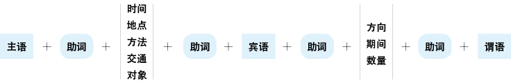

**日语的语法词**
**语法的概念：** 语法即语言的法则，是语言当中的单词搭配和罗列的法则。上图显示了日语句子基本的搭配和罗列的法则。由此图可以得知：日语的语法词为**“名词、助词、谓语词（动词、形容词、助动词）”。**
日语的暧昧在于语法当中的名词和动词被暧昧化，要想弄清楚这种暧昧的语言，首先需要知道名词和动词的分类。

**名词的分类**
「の」可以代替所有的名词，它的下面又可以分为「こと」、「もの」、「ひと」、「ところ」、「よう」五个名词，每个名词下面还可以指具体的名词。在第三章中出现的许多语法中应用到了这五个名词。有些语法的暧昧就是因为不清楚这五个名词分别代替了谁，因此在理解时需要结合上下文的内容将其具体化。
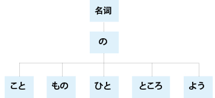

**动词的分类1**
**从语法归纳上来分，动词可以分为三大类：** 「する」、「ある」**和** 「なる」。
「する」（做）可以代替大多数的动词，需根据上下文进行具体化；「ある」（有、在）在高级语法中经常出现；「なる」在初、中级语法中表示“成为”，在高级语法中表示“是”。

**动词的分类2**
**从变形规律上来分，动词可以分为三大类：五段动词、一段动词和特殊动词。**
单个动词的结构为：**書（词干）き（附加）ます（后缀）** 。“词干”代表“意思”，“附加”代表“变形”，“后缀”代表“时态和形式（简体和敬体）”。
* **五段动词：** 随着表示时态和形式的动词后缀的变化，前面的附加部分在あ、い、う、え、お五个段里发生变化的动词叫做五段动词。
特征：肯定的简体结尾在う段上（う、く、す、つ、ぬ、ぶ、む、る）。
注意：五段动词变成其他任何一种形式之后即成为一段动词，之后按照一段动词的变形规律进行变化。

* **一段动词：** 虽然表示时态和形式的动词后缀发生了变化，但是前面的附加部分还是保持同一个形式不发生变化的动词叫做一段动词。
特征：肯定的简体的结尾是在う段上的「る」。一段动词又可细分为上一段动词和下一段动词。
上一段动词：「る」前面的附加部分在い段上的动词（起きる）。因为い段在う段的前面，所以叫做上一段动词。
下一段动词：「る」前面的附加部分在え段上的动词（変える）。因为え段在う段的后面，所以叫做下一段动词。
极少数的特殊一段动词不是附加的部分，而是词干在い段或え段上，例如「見る」（上一段动词）、「寝る」（下一段动词）。

* **特殊动词：** 随着表示时态和形式的动词后缀的变化，词干的发音发生变化的动词叫做特殊动词。此类动词只有两个：表示“做”的「する」被称为サ变动词，表示“来”的「来る」被称为カ变动词。

**动词的分类3**
**从性质上来分，动词可以分为两大类：自动词和他动词。**
* **意思：** 自动词表示动作是自己的，无法影响其他事物；他动词表示动作对其他的事物产生了影响。
* **助词：** が（小主语）+自动词、形容词、形容动词、可能形、被动形を（把）+他动词、使役形
* **重点：** 自动词表示动作的结果或状态；他动词表示动作本身。例如：“做好”，如果强调“做”就用他动词，如果强调“好”就用自动词。
对于成对的自他动词，如果使用了他动词而没有提及主语，则一定要弄清楚他动词的主语是谁；如果使用了自动词，则要避免提及做动作的人。例如：**留学を決めました（某人决定了去留学）。留学が決まりました（留学这件事定下来了）。**
* **注意：** 必须通过查字典才能知道一个动词是自动词还是他动词。

**动词的时态**
**动词的时态分为三大类：** 一般现在时、现在进行时和た形。
* **一般现在时：** 使用动词的辞书形（基本形），例：「する」。表示一般性动作和将来的动作。
* **现在进行时：** 使用动词的て形+いる，例：「している」。表示现在正在做的动作和在一段时间内持续的动作或状态。
* **た形：** 使用动词的た形，例：「した」。表示动作完了的“了”、过去式的“了”以及作为形容词修饰名词的“的”（相当于英语中动词加ed变为过去分词来修饰名词）。た形和て形的变形规律相同。
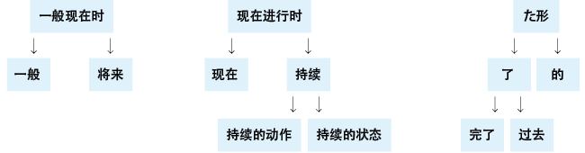

**动词的形式**
* **使役形：** 表示“让、使”等。他动词也相当于使役形的一种。
* **被动形：** 表示“1.单纯被动；2.被动的心情；3.主谓统一；4.敬语中的尊他语”。
* **命令形：** 意思相当于「―てください」，表示“1.用于间接引用；2.用于文章中的引号中，且语气正式”。
* **可能形：** 表示“1.条件（能～）；2.技能（会～）；3.中文中的补语（例：出不去，走得动）。而「～ことができる」语气正式且郑重”。
* **意志形：** 后面加上「と」的意志形表示强调“想要做某事的will”；不加「と」的意志形表示提建议，意思是“让我们做某事吧”。例如：**「しようと～」（想要做～）** ，通常想要做某事的意志形为**「しようとする」；「しよう」（让我们做～）** 是**「しましょう」的简体。**
* **使役被动形：** 表示“1.不情愿地做；2.不是自发地做；3.无意中做”。

**谓语的中顿**
* **意思：** 谓语的中顿被称为连用形，即连接用言（谓语词）的形式。当数个谓语词连接在一起且不分大小只是并列时，放在前面的谓语词需要变成中顿的形式。
* **分类：** 连用形（也叫古语连用形，语气正式）和て形（也叫现代语连用形，语气柔和）。
* **重点：** て形和た形的变形规律相同。

**谓语词的概念整理**
谓语词（动词、形容词、助动词）的基础形式在日本国内的语法书中大致上有以下几种称呼。

**动词**

**形容词**
**注意：** 形容词是独立的单词，不是词干，有自己独立的变形方式。在后面加「です」只表示敬体的语气，没有实质性的意思。形容词的词干是去掉「い」。

**形容动词**
**注意：** 形容动词本身就是词干，不是独立的单词，都用助动词「です」（敬体）或「だ」（简体）作为谓语词，因此所有形容动词的变形均按照助动词「です」或「だ」的变形规律进行变化。

## 第2节 本书的分类
本书将第一节中提到的各种时态及形式按照第三章的具体语法中的应用分为一般现在时的简体、一般现在时的敬体、现在进行时的简体、现在进行时的敬体、た形的简体、た形的敬体、命令形、意志形、ば形（即第一节中提到的已然形）、词干、连用形、て形、否定形等十三种形式，并且将变形规律分别归纳如下。

**一般现在时的简体**
**注意：** 动词的使役形、被动形、可能形、使役被动形均为一段动词，其否定形是去掉「る」加上「ない」。
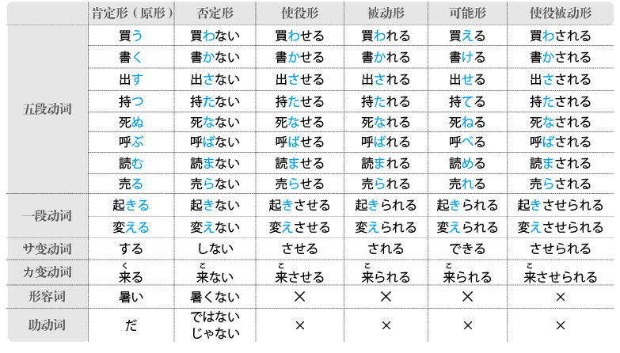

**一般现在时的敬体**
**注意：** 动词的使役形、被动形、可能形、使役被动形均为一段动词，其否定形是去掉「ます」加上「ません」。

**现在进行时的简体**
**注意：** 动词的使役形、被动形、可能形、使役被动形均为一段动词，其否定形是去掉「いる」加上「いない」。
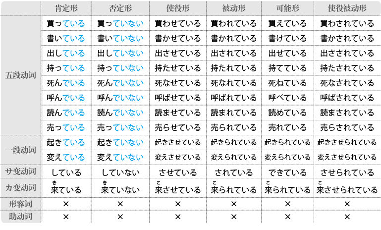

**现在进行时的敬体**
**注意：** 动词的使役形、被动形、可能形、使役被动形均为一段动词，其否定形是去掉「います」加上「いません」。
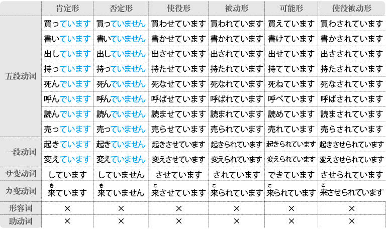

**た形的简体**
**注意：** 动词的使役形、被动形、可能形、使役被动形均为一段动词，其否定形是去掉「た」加上「なかった」。
此外，「行く」的变形规律比较特殊：「行く→行った」。
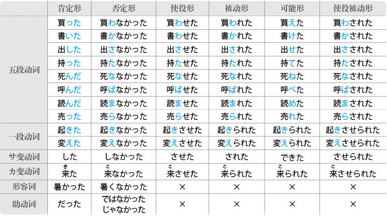

**た形的敬体**
**注意：** 动词的使役形、被动形、可能形、使役被动形均为一段动词，其否定形是去掉「ました」加上「ませんでした」。

**命令形**
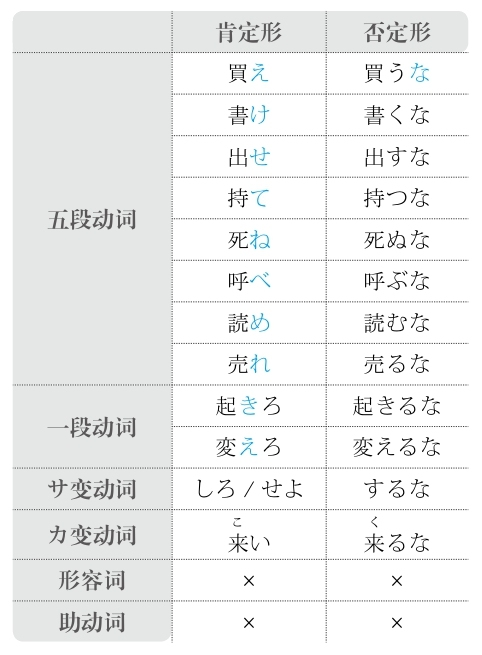

**意志形**

**ば形**
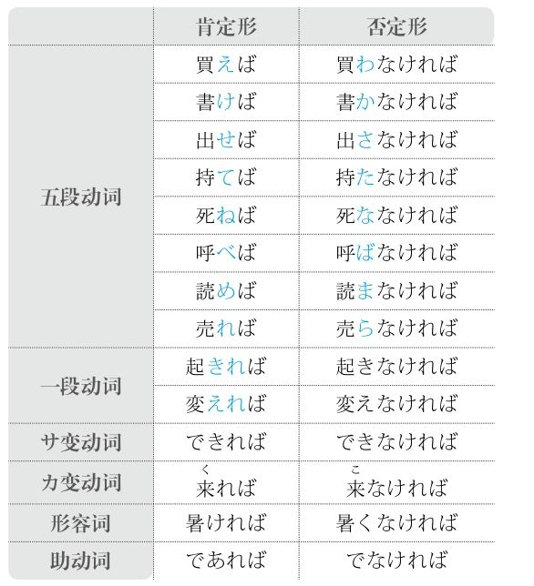

**词干**
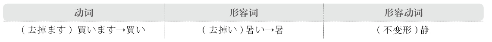

**连用形**

**て形**
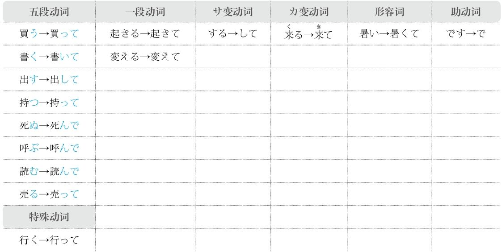

**否定形**

## 第3节 修饰语
* **定语：** 修饰名词的部分，包括名词、形容动词和谓语词（动词、形容词）。中文里的定语后面接的是“的”。
* **状语：** 修饰谓语词（动词、形容词、助动词）的部分，包括副词。中文里的状语后面接的是“地”。

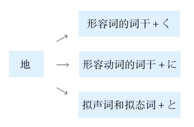
## 第4节 敬语
* **分类：** 尊他语（与他人有关的人、物、动作）、自谦语（与自己有关的人、物、动作）、礼貌语（寒暄语）。
* **重点：**
1. 需要弄清是与他人有关还是与自己有关，即区分尊他和自谦。
2. 需要弄清动词是特殊动词还是一般动词。
特殊动词指有自己特殊表达方式的动词，通常不能使用一般变形规律进行变形。
一般动词指按照一般规律变形的动词。
3. 尊他语中还有使用动词的被动形的表达方式，特殊动词和一般动词都可以使用这种方式。
尊他形式中，一般变形规律「お～になる」的尊他语气强，被动形的尊他语气弱。
4. 前面加「お」的名词是训读的词或是日本造的音读汉字词（例：「お電話」）；前面加「ご」的名词是中国造的汉字词（例：「ご連絡」）。

* **一般变形规律：** **尊他为「お～になる」；自谦为「お～する」。** 「～」部分是动词的连用形。
* **特殊动词的变化如下** 。

# 第2章 助词
## ～は
**意1：** 大主语
**注意：** 能够带动长句子和数个谓语，同时与句尾的谓语相呼应
**接续：** 名词

例句：<ruby>荒<rp>(</rp><rt>あら</rt><rp>)</rp></ruby><ruby>川<rp>(</rp><rt>かわ</rt><rp>)</rp></ruby>さん**は** イタリア<ruby>語<rp>(</rp><rt>ご</rt><rp>)</rp></ruby>が<ruby>上<rp>(</rp><rt>じょう</rt><rp>)</rp></ruby><ruby>手<rp>(</rp><rt>ず</rt><rp>)</rp></ruby>です。
直译：荒川意大利语好。

**意2：** 强调
**重点：** 强调其他助词、副词、数量词
**注意：** 对比性的强调
**接续：** 助词、副词、数量词

例句：<ruby>彼<rp>(</rp><rt>かれ</rt><rp>)</rp></ruby>は<ruby>事<rp>(</rp><rt>じ</rt><rp>)</rp></ruby><ruby>務<rp>(</rp><rt>む</rt><rp>)</rp></ruby><ruby>所<rp>(</rp><rt>しょ</rt><rp>)</rp></ruby>に**は** いません。
直译：他不在事务所。

**意3：** 对比
**接续：** 名词

例句：スイカ**は** <ruby>好<rp>(</rp><rt>す</rt><rp>)</rp></ruby>きだけど、<ruby>桃<rp>(</rp><rt>もも</rt><rp>)</rp></ruby>**は** <ruby>苦<rp>(</rp><rt>にが</rt><rp>)</rp></ruby><ruby>手<rp>(</rp><rt>て</rt><rp>)</rp></ruby>です。
直译：西瓜喜欢，但是桃不擅长。
意译：喜欢吃西瓜，但是不喜欢吃桃。

## ～が
**意1：** 小主语
**注意：** 不能够带动长句子和数个谓语，同时不能添加过长的定语
**重点：** 谓语是自动词、形容词、形容动词、动词的可能形、动词的被动形的时候，如果它们的主语不是大主语则要用「が」
**接续：** 名词

例句：<ruby>荒<rp>(</rp><rt>あら</rt><rp>)</rp></ruby><ruby>川<rp>(</rp><rt>かわ</rt><rp>)</rp></ruby>さんはイタリア<ruby>語<rp>(</rp><rt>ご</rt><rp>)</rp></ruby>**が** <ruby>上<rp>(</rp><rt>じょう</rt><rp>)</rp></ruby><ruby>手<rp>(</rp><rt>ず</rt><rp>)</rp></ruby>です。
直译：荒川意大利语好。

**意2：** 强调主语
**接续：** 名词

例句：<ruby>鵜<rp>(</rp><rt>う</rt><rp>)</rp></ruby><ruby>飼<rp>(</rp><rt>かい</rt><rp>)</rp></ruby><ruby>先<rp>(</rp><rt>せん</rt><rp>)</rp></ruby><ruby>生<rp>(</rp><rt>せい</rt><rp>)</rp></ruby>**が** この<ruby>大<rp>(</rp><rt>だい</rt><rp>)</rp></ruby><ruby>学<rp>(</rp><rt>がく</rt><rp>)</rp></ruby>の<ruby>学<rp>(</rp><rt>がく</rt><rp>)</rp></ruby><ruby>長<rp>(</rp><rt>ちょう</rt><rp>)</rp></ruby>です。
直译：鹈饲老师才是（就是、正是）这所大学的校长。

## ～を
**意1：** 把
**注意：** 谓语是他动词、动词的使役形时，它们的前面用「を」
**接续：** 名词

例句：<ruby>字<rp>(</rp><rt>じ</rt><rp>)</rp></ruby>**を** <ruby>五<rp>(</rp><rt>ご</rt><rp>)</rp></ruby><ruby>回<rp>(</rp><rt>かい</rt><rp>)</rp></ruby><ruby>書<rp>(</rp><rt>か</rt><rp>)</rp></ruby>きました。
直译：把字写了五遍。

**意2：** 移动
**注意：** 谓语是表示移动的自动词
**接续：** 名词

例句：<ruby>鳥<rp>(</rp><rt>とり</rt><rp>)</rp></ruby>は<ruby>空<rp>(</rp><rt>そら</rt><rp>)</rp></ruby>**を** <ruby>飛<rp>(</rp><rt>と</rt><rp>)</rp></ruby>んでいます。
直译：鸟在空中飞。

## ～の
**起源：** 「<ruby>乃<rp>(</rp><rt>の</rt><rp>)</rp></ruby>」
**意1：** 所属关系，相当于“>”（大于号）
**意思：** 的
**接续：** 名词

例句：<ruby>服<rp>(</rp><rt>ふく</rt><rp>)</rp></ruby>**の** ボタンがとれています。
直译：衣服的扣子掉了。

**意2：** 名词和名词之间的接续，相当于“＋”（加号）
**注意：** 日语中，只要不是专有名词，名词和名词之间则需要加「の」
**接续：** 名词

例句：<ruby>私<rp>(</rp><rt>わたし</rt><rp>)</rp></ruby>はこ**の** <ruby>会<rp>(</rp><rt>かい</rt><rp>)</rp></ruby><ruby>社<rp>(</rp><rt>しゃ</rt><rp>)</rp></ruby>の<ruby>経<rp>(</rp><rt>けい</rt><rp>)</rp></ruby><ruby>理<rp>(</rp><rt>り</rt><rp>)</rp></ruby>**の** <ruby>三<rp>(</rp><rt>み</rt><rp>)</rp></ruby><ruby>浦<rp>(</rp><rt>うら</rt><rp>)</rp></ruby>です。
直译：我是这家公司的会计三浦。

**意3：** 代替名词
**接续：** 名词

例句：これは<ruby>船<rp>(</rp><rt>ふな</rt><rp>)</rp></ruby><ruby>井<rp>(</rp><rt>い</rt><rp>)</rp></ruby>さんの<ruby>書<rp>(</rp><rt>しょ</rt><rp>)</rp></ruby><ruby>類<rp>(</rp><rt>るい</rt><rp>)</rp></ruby>です。<ruby>谷<rp>(</rp><rt>たに</rt><rp>)</rp></ruby><ruby>村<rp>(</rp><rt>むら</rt><rp>)</rp></ruby>さん**の** は<ruby>明日<rp>(</rp><rt>あした</rt><rp>)</rp></ruby><ruby>持<rp>(</rp><rt>も</rt><rp>)</rp></ruby>ってきます。
直译：这是船井的材料。谷村的明天拿来。

**意4：** 小小主语
**注意：** は（大主语）>が（小主语）>の（小小主语）
**接续：** 名词

例句：<ruby>五十嵐<rp>(</rp><rt>いがらし</rt><rp>)</rp></ruby>さん**は** 、<ruby>私<rp>(</rp><rt>わたし</rt><rp>)</rp></ruby>**が** <ruby>日<rp>(</rp><rt>に</rt><rp>)</rp></ruby><ruby>本<rp>(</rp><rt>ほん</rt><rp>)</rp></ruby>にいる<ruby>時<rp>(</rp><rt>とき</rt><rp>)</rp></ruby>の<ruby>一<rp>(</rp><rt>いち</rt><rp>)</rp></ruby><ruby>番<rp>(</rp><rt>ばん</rt><rp>)</rp></ruby><ruby>仲<rp>(</rp><rt>なか</rt><rp>)</rp></ruby>**の** いい<ruby>友<rp>(</rp><rt>とも</rt><rp>)</rp></ruby><ruby>達<rp>(</rp><rt>だち</rt><rp>)</rp></ruby>でした。
直译：五十岚是我在日本时关系最好的朋友。

## ～へ
**起源：** 「<ruby>辺<rp>(</rp><rt>へん</rt><rp>)</rp></ruby>」
**意1：** 方向
**翻译：** 往
**注意：** 方向感强
**接续：** 名词

例句：<ruby>東<rp>(</rp><rt>ひがし</rt><rp>)</rp></ruby>**へ** <ruby>行<rp>(</rp><rt>い</rt><rp>)</rp></ruby>ってください。
直译：请往东走。

**意2：** 对象
**翻译：** 给
**语气：** 正式
**注意：** 「へ」后面可以加「の」或「と」，但是「に」不能
**接续：** 名词

例句：これは<ruby>恩<rp>(</rp><rt>おん</rt><rp>)</rp></ruby><ruby>師<rp>(</rp><rt>し</rt><rp>)</rp></ruby>**へ** の<ruby>手<rp>(</rp><rt>て</rt><rp>)</rp></ruby><ruby>紙<rp>(</rp><rt>がみ</rt><rp>)</rp></ruby>です。
直译：这是给恩师的信。

## ～に
**意1：** 方向
**翻译：** 往、朝、向
**注意：** 不可用「にの」，只能用「への」
**语气：** 比「へ」柔和或方向感弱
**接续：** 名词

例句：<ruby>速<rp>(</rp><rt>はや</rt><rp>)</rp></ruby>く<ruby>家<rp>(</rp><rt>いえ</rt><rp>)</rp></ruby>**に** <ruby>帰<rp>(</rp><rt>かえ</rt><rp>)</rp></ruby>りたい。
直译：想快点儿回家。

**意2：** 对象
**翻译：** 对、跟
**注意：** 不可用「にの」，只能用「への」
**语气：** 柔和
**接续：** 名词

例句：<ruby>先<rp>(</rp><rt>せん</rt><rp>)</rp></ruby><ruby>生<rp>(</rp><rt>せい</rt><rp>)</rp></ruby>**に** <ruby>相<rp>(</rp><rt>そう</rt><rp>)</rp></ruby><ruby>談<rp>(</rp><rt>だん</rt><rp>)</rp></ruby>してください。
直译：请跟老师商量。

**意3：** 目的
**语气：** 柔和
**接续：** 名词

例句：<ruby>駅<rp>(</rp><rt>えき</rt><rp>)</rp></ruby>まで<ruby>友<rp>(</rp><rt>とも</rt><rp>)</rp></ruby><ruby>達<rp>(</rp><rt>だち</rt><rp>)</rp></ruby>を<ruby>迎<rp>(</rp><rt>むか</rt><rp>)</rp></ruby>え**に** <ruby>行<rp>(</rp><rt>い</rt><rp>)</rp></ruby>く。
直译：到车站去接朋友。
意译：去车站接朋友。

**意4：** 目标
**语气：** 柔和
**接续：** 名词

例句：<ruby>目<rp>(</rp><rt>もく</rt><rp>)</rp></ruby><ruby>標<rp>(</rp><rt>ひょう</rt><rp>)</rp></ruby>**に** <ruby>向<rp>(</rp><rt>む</rt><rp>)</rp></ruby>かって<ruby>頑<rp>(</rp><rt>がん</rt><rp>)</rp></ruby><ruby>張<rp>(</rp><rt>ば</rt><rp>)</rp></ruby>る。
直译：朝着目标努力。

**意5：** 时间点
**接续：** 具体时间（非具体的时间后面不加「に」）

例句：<ruby>朝<rp>(</rp><rt>あさ</rt><rp>)</rp></ruby><ruby>六<rp>(</rp><rt>ろく</rt><rp>)</rp></ruby><ruby>時<rp>(</rp><rt>じ</rt><rp>)</rp></ruby><ruby>半<rp>(</rp><rt>はん</rt><rp>)</rp></ruby>**に** <ruby>起<rp>(</rp><rt>お</rt><rp>)</rp></ruby>きる。
直译：早上六点半起床。

## ～で
**起源：** 古语是「にて」，「に」表示“方向”，「て」表示「手」（手）
**意1：** 在某地做某事
**接续：** 名词

例句：これは<ruby>学<rp>(</rp><rt>がっ</rt><rp>)</rp></ruby><ruby>校<rp>(</rp><rt>こう</rt><rp>)</rp></ruby>**で** <ruby>教<rp>(</rp><rt>おそ</rt><rp>)</rp></ruby>わりました。
直译：这是在学校学的。

**意2：** 交通工具
**接续：** 名词

例句：<ruby>今日<rp>(</rp><rt>きょう</rt><rp>)</rp></ruby>は<ruby>車<rp>(</rp><rt>くるま</rt><rp>)</rp></ruby>**で** <ruby>来<rp>(</rp><rt>き</rt><rp>)</rp></ruby>ました。
直译：今天是开车来的。

**意3：** 方法
**接续：** 名词

例句：<ruby>日<rp>(</rp><rt>に</rt><rp>)</rp></ruby><ruby>本<rp>(</rp><rt>ほん</rt><rp>)</rp></ruby><ruby>語<rp>(</rp><rt>ご</rt><rp>)</rp></ruby>**で** どう<ruby>言<rp>(</rp><rt>い</rt><rp>)</rp></ruby>いますか。
直译：用日语怎么说？

**意4：** 程度
**接续：** 名词

例句：<ruby>形<rp>(</rp><rt>けい</rt><rp>)</rp></ruby><ruby>式<rp>(</rp><rt>しき</rt><rp>)</rp></ruby>はある<ruby>程<rp>(</rp><rt>てい</rt><rp>)</rp></ruby><ruby>度<rp>(</rp><rt>ど</rt><rp>)</rp></ruby>**で** は<ruby>決<rp>(</rp><rt>き</rt><rp>)</rp></ruby>まっています。
直译：形式在某种程度上是定了的。
意译：在某种程度上，形式已经定了。

**意5：** 范围
**接续：** 名词

例句：この<ruby>塾<rp>(</rp><rt>じゅく</rt><rp>)</rp></ruby>**で** はたくさんの<ruby>学<rp>(</rp><rt>がく</rt><rp>)</rp></ruby><ruby>生<rp>(</rp><rt>せい</rt><rp>)</rp></ruby>が<ruby>習<rp>(</rp><rt>なら</rt><rp>)</rp></ruby>っています。
直译：在这个补习学校里，很多学生学着。
直译：有很多学生在这个补习学校里学习。

**意6：** 状态
**接续：** 名词

例句：これ**で** いいですか。
直译：这样行吗？

**意7：** 原因
**接续：** 名词

例句：<ruby>風邪<rp>(</rp><rt>かぜ</rt><rp>)</rp></ruby>**で** <ruby>休<rp>(</rp><rt>やす</rt><rp>)</rp></ruby>んだ。
直译：因为感冒休息了。

## ～も
**起源：** 「<ruby>猛<rp>(</rp><rt>もう</rt><rp>)</rp></ruby>」
**意1：** 也、连、都
**注意：** 每个名词后面都要加「も」
**接续：** 名词

例句：あれ**も** これ**も** しなければいけないから、<ruby>疲<rp>(</rp><rt>つか</rt><rp>)</rp></ruby>れている。
直译：这个那个都不做不行，所以累了。
意译：什么都得做，太累了。

**意2：** 强调
**接续：** 跟数字有关的词

例句：<ruby>何<rp>(</rp><rt>なん</rt><rp>)</rp></ruby><ruby>ヶ<rp>(</rp><rt>か</rt><rp>)</rp></ruby><ruby>月<rp>(</rp><rt>げつ</rt><rp>)</rp></ruby>**も** <ruby>習<rp>(</rp><rt>なら</rt><rp>)</rp></ruby>っているのにまだ<ruby>上<rp>(</rp><rt>じょう</rt><rp>)</rp></ruby><ruby>手<rp>(</rp><rt>ず</rt><rp>)</rp></ruby>になれない。
直译：好几个月学着，但是还不能变得好。
意译：学了好几个月，还是没有进步。

## ～と
**起源：** 「<ruby>統<rp>(</rp><rt>とう</rt><rp>)</rp></ruby>」
**意1：** 和
**注意：** 每一个并列的部分之间都要加「と」。前面的「と」表示“和”；最后一个「と」起引号的作用
**接续：** 名词

例句：<ruby>一<rp>(</rp><rt>ひと</rt><rp>)</rp></ruby>つ<ruby>目<rp>(</rp><rt>め</rt><rp>)</rp></ruby>**と** <ruby>二<rp>(</rp><rt>ふた</rt><rp>)</rp></ruby>つ<ruby>目<rp>(</rp><rt>め</rt><rp>)</rp></ruby>**と** <ruby>三<rp>(</rp><rt>み</rt><rp>)</rp></ruby>つ<ruby>目<rp>(</rp><rt>め</rt><rp>)</rp></ruby>とは、どう<ruby>違<rp>(</rp><rt>ちが</rt><rp>)</rp></ruby>いますか。
直译：第一个、第二个和第三个，怎么不一样？
意译：第一个、第二个和第三个，有什么不一样？

**意2：** 起引号的作用
**注意：** 表示内容或强调
**接续：** 任何词

例句：<ruby>一<rp>(</rp><rt>ひと</rt><rp>)</rp></ruby>つ<ruby>目<rp>(</rp><rt>め</rt><rp>)</rp></ruby>と<ruby>二<rp>(</rp><rt>ふた</rt><rp>)</rp></ruby>つ<ruby>目<rp>(</rp><rt>め</rt><rp>)</rp></ruby>と<ruby>三<rp>(</rp><rt>み</rt><rp>)</rp></ruby>つ<ruby>目<rp>(</rp><rt>め</rt><rp>)</rp></ruby>**と** は、どう<ruby>違<rp>(</rp><rt>ちが</rt><rp>)</rp></ruby>いますか。
直译：第一个、第二个和第三个，怎么不一样？
意译：第一个、第二个和第三个，有什么不一样？

## ～か
**起源：** 「<ruby>何<rp>(</rp><rt>か</rt><rp>)</rp></ruby>」
**意1：** 疑问、询问、责问、质问等
**注意：** 在一个句子当中，只要有疑问词就必须接「か」
**接续：** 任何词

例句：<ruby>来<rp>(</rp><rt>く</rt><rp>)</rp></ruby>る**か** どうかまだわからない。
直译：来还是不来还不知道。

**意2：** 不确定
**接续：** 任何词

例句：いつ**か** また<ruby>会<rp>(</rp><rt>あ</rt><rp>)</rp></ruby>えるよ。
直译：什么时候还能见面啊。

## ～や
**起源：** 「<ruby>也<rp>(</rp><rt>や</rt><rp>)</rp></ruby>」
**意1：** 是
**注意：** 古语里表示断定的「<ruby>也<rp>(</rp><rt>や</rt><rp>)</rp></ruby>」（音读）在现代主要用于方言当中；「<ruby>也<rp>(</rp><rt>なり</rt><rp>)</rp></ruby>」（训读）表示正式语气的「です」或「ですか」
**接续：** 任何词

例句：これ**や** 。
直译：是这个。

**意2：** 是吗？
**注意：** 相当于现代日语的「か」
**接续：** 任何词

例句：<ruby>君<rp>(</rp><rt>きみ</rt><rp>)</rp></ruby>よ<ruby>知<rp>(</rp><rt>し</rt><rp>)</rp></ruby>る**や** 。
直译：你，知道吗？

## ～し
**解释：** 「し」的意思是“强”，构成的单词有「<ruby>強<rp>(</rp><rt>し</rt><rp>)</rp></ruby>いる（强迫）」；此语法表示「し」前后的两件事情同等重要
**意思：** 又～，又～
**注意：** 每一个并列的部分之间都要加「し」；用几次都可以；常与「も」搭配
**接续：** 谓语词（动词、形容词、助动词）的简体和敬体

例句：<ruby>結<rp>(</rp><rt>けっ</rt><rp>)</rp></ruby><ruby>果<rp>(</rp><rt>か</rt><rp>)</rp></ruby>もまだわからない**し** 、ほっとこう。
直译：又不知道结果，别管它。
意译：又不知道结果如何，别想它了。

## ～から
**解释：** 表示起点
**意思：** 从～
**接续：** 名词

例句：<ruby>田<rp>(</rp><rt>た</rt><rp>)</rp></ruby><ruby>中<rp>(</rp><rt>なか</rt><rp>)</rp></ruby>さん**から** <ruby>得<rp>(</rp><rt>え</rt><rp>)</rp></ruby>た<ruby>情<rp>(</rp><rt>じょう</rt><rp>)</rp></ruby><ruby>報<rp>(</rp><rt>ほう</rt><rp>)</rp></ruby>は<ruby>確<rp>(</rp><rt>かく</rt><rp>)</rp></ruby><ruby>実<rp>(</rp><rt>じつ</rt><rp>)</rp></ruby>だ。
直译：从田中得到的信息很确实。
意译：从田中那里得到的信息很准确。

## ～まで
**意1：** 到～
**用于：** 任何事物（时间、地点、程度、人物等等）
**接续：** 名词

例句：<ruby>部<rp>(</rp><rt>へ</rt><rp>)</rp></ruby><ruby>屋<rp>(</rp><rt>や</rt><rp>)</rp></ruby>の<ruby>隅<rp>(</rp><rt>すみ</rt><rp>)</rp></ruby>から<ruby>隅<rp>(</rp><rt>すみ</rt><rp>)</rp></ruby>**まで** <ruby>探<rp>(</rp><rt>さが</rt><rp>)</rp></ruby>した。
直译：从房间的角落到角落，找了。
意译：找遍了房间的各个角落。

**意2：** 到～的地步
**接续：** 任何词

例句：そこ**まで** する<ruby>必<rp>(</rp><rt>ひつ</rt><rp>)</rp></ruby><ruby>要<rp>(</rp><rt>よう</rt><rp>)</rp></ruby>はない。
直译：做到那个地步的必要没有。
意译：没有必要做到那个地步。

## ～より
**意1：** 从～
**表示：** 起点
**注意：** 一般用于写信的发信人和送东西的赠送人
**区别：** 比「から」语气正式
**接续：** 人称

例句：<ruby>田<rp>(</rp><rt>た</rt><rp>)</rp></ruby><ruby>中<rp>(</rp><rt>なか</rt><rp>)</rp></ruby><ruby>様<rp>(</rp><rt>さま</rt><rp>)</rp></ruby>**より** <ruby>鈴<rp>(</rp><rt>すず</rt><rp>)</rp></ruby><ruby>木<rp>(</rp><rt>き</rt><rp>)</rp></ruby><ruby>様<rp>(</rp><rt>さま</rt><rp>)</rp></ruby><ruby>宛<rp>(</rp><rt>あ</rt><rp>)</rp></ruby>ての<ruby>手<rp>(</rp><rt>て</rt><rp>)</rp></ruby><ruby>紙<rp>(</rp><rt>がみ</rt><rp>)</rp></ruby>をお<ruby>預<rp>(</rp><rt>あず</rt><rp>)</rp></ruby>かりしております。
直译：从田中给铃木的信，我们保管着。
意译：田中给铃木的信放在我们这里。

**意2：** 比～
**接续：** 任何词

例句：<ruby>今日<rp>(</rp><rt>きょう</rt><rp>)</rp></ruby>は<ruby>昨日<rp>(</rp><rt>きのう</rt><rp>)</rp></ruby>**より** <ruby>暑<rp>(</rp><rt>あつ</rt><rp>)</rp></ruby>い。
直译：今天比昨天热。

## ～くらい/～ぐらい
**解释：** 「<ruby>位<rp>(</rp><rt>くらい</rt><rp>)</rp></ruby>」表示高、中、低三个程度
**注意：** 读清音和浊音都可以
**用于：** 程度高
**接续：** 任何词

例句：<ruby>周<rp>(</rp><rt>まわ</rt><rp>)</rp></ruby>りが<ruby>騒<rp>(</rp><rt>さわ</rt><rp>)</rp></ruby>がしいから、<ruby>電<rp>(</rp><rt>でん</rt><rp>)</rp></ruby><ruby>話<rp>(</rp><rt>わ</rt><rp>)</rp></ruby>の<ruby>音<rp>(</rp><rt>おと</rt><rp>)</rp></ruby>が<ruby>聞<rp>(</rp><rt>き</rt><rp>)</rp></ruby>こえない**くらい** だ。
直译：周围太吵了，所以到了电话的声音听不见了的程度。
意译：周围太吵了，电话的声音都快听不见了。

**用于：** 程度中
**意思：** 左右
**接续：** 任何词

例句：<ruby>歩<rp>(</rp><rt>ある</rt><rp>)</rp></ruby>いて<ruby>行<rp>(</rp><rt>い</rt><rp>)</rp></ruby>ける**くらい** <ruby>近<rp>(</rp><rt>ちか</rt><rp>)</rp></ruby>いです。
直译：可以走着去的程度得近。
意译：很近，可以走着去。

**用于：** 程度低
**接续：** 任何词

例句：こんな<ruby>事<rp>(</rp><rt>こと</rt><rp>)</rp></ruby>**くらい** <ruby>子<rp>(</rp><rt>こ</rt><rp>)</rp></ruby><ruby>供<rp>(</rp><rt>ども</rt><rp>)</rp></ruby>でも<ruby>知<rp>(</rp><rt>し</rt><rp>)</rp></ruby>っている。
直译：这样的事的程度，即使是孩子都知道。
意译：这样的事连孩子都知道。

**注意：** 还可以表示大概的“时间点”和“期间段”
**意思：** 左右

例句：<ruby>明日<rp>(</rp><rt>あした</rt><rp>)</rp></ruby>の<ruby>午後<rp>(</rp><rt>ごご</rt><rp>)</rp></ruby><ruby>三<rp>(</rp><rt>さん</rt><rp>)</rp></ruby><ruby>時<rp>(</rp><rt>じ</rt><rp>)</rp></ruby>**くらい** に<ruby>来<rp>(</rp><rt>き</rt><rp>)</rp></ruby>てください。
直译：在明天下午3点左右，请来。
意译：请于明天下午3点左右来。

例句：<ruby>昨日<rp>(</rp><rt>きのう</rt><rp>)</rp></ruby><ruby>友<rp>(</rp><rt>とも</rt><rp>)</rp></ruby><ruby>達<rp>(</rp><rt>だち</rt><rp>)</rp></ruby>に<ruby>三<rp>(</rp><rt>さん</rt><rp>)</rp></ruby><ruby>時<rp>(</rp><rt>じ</rt><rp>)</rp></ruby><ruby>間<rp>(</rp><rt>かん</rt><rp>)</rp></ruby>**くらい** <ruby>待<rp>(</rp><rt>ま</rt><rp>)</rp></ruby>たされた。
直译：昨天被让朋友等了3个多小时。
意译：昨天朋友让我等了3个多小时。

## ～ころ/～ごろ
**解释：** 「<ruby>頃<rp>(</rp><rt>ころ</rt><rp>)</rp></ruby>」表示大概的“时间点”
**意思：** 左右
**语气：** 正式
**注意：** 读清音和浊音都可以
**区别：** 只能接“时间点”，不能接“时间段”

例句：<ruby>明日<rp>(</rp><rt>あした</rt><rp>)</rp></ruby><ruby>何<rp>(</rp><rt>なん</rt><rp>)</rp></ruby><ruby>時<rp>(</rp><rt>じ</rt><rp>)</rp></ruby>**ごろ** <ruby>伺<rp>(</rp><rt>うかが</rt><rp>)</rp></ruby>えばよろしいでしょうか。
直译：明天几点左右拜访好呢？

## ～ほど
**解释：** 「<ruby>程<rp>(</rp><rt>ほど</rt><rp>)</rp></ruby>」的意思是“程度高”
**意思：** 左右
**区别：** 不能用于“程度低”和“程度中”的事物

例句：<ruby>舌<rp>(</rp><rt>した</rt><rp>)</rp></ruby>がとろける**ほど** おいしい。
直译：好吃得舌头都要融化了。
意译：太好吃了。

**解释：** 「<ruby>程<rp>(</rp><rt>ほど</rt><rp>)</rp></ruby>」表示大概的“期间段”
**意思：** 左右
**语气：** 正式
**区别：** 不能接“时间点”，只能接“时间段”

例句：<ruby>講<rp>(</rp><rt>こう</rt><rp>)</rp></ruby><ruby>義<rp>(</rp><rt>ぎ</rt><rp>)</rp></ruby>は<ruby>1<rp>(</rp><rt>いち</rt><rp>)</rp></ruby><ruby>時<rp>(</rp><rt>じ</rt><rp>)</rp></ruby><ruby>間<rp>(</rp><rt>かん</rt><rp>)</rp></ruby>**ほど** <ruby>延<rp>(</rp><rt>の</rt><rp>)</rp></ruby>びた。
直译：大学的课拖延了1个小时左右。
意译：课拖延了1个小时左右。

## ～だけ
**解释：** 助词「だけ」表示多、中、少三个数量级别
**用于：** 数量多
**注意：** 需要通过上下文来判断其意
**接续：** 一般以「これだけ、それだけ、あれだけ」这三个副词来表示

例句：あれ**だけ** <ruby>残<rp>(</rp><rt>ざん</rt><rp>)</rp></ruby><ruby>業<rp>(</rp><rt>ぎょう</rt><rp>)</rp></ruby>をしていれば、<ruby>給<rp>(</rp><rt>きゅう</rt><rp>)</rp></ruby><ruby>料<rp>(</rp><rt>りょう</rt><rp>)</rp></ruby>をもっと<ruby>上<rp>(</rp><rt>あ</rt><rp>)</rp></ruby>げてくれるはずなのに。
直译：如果加了那么多班的话，应该多给我们涨些工资啊。
意译：加了那么多班，应该多给我们涨些工资啊。

**用于：** 数量中
**注意：** 表示“相应”或“符合”，可以理解为“＝”
**接续：** 任何词

例句：トップランキングの<ruby>大<rp>(</rp><rt>だい</rt><rp>)</rp></ruby><ruby>学<rp>(</rp><rt>がく</rt><rp>)</rp></ruby>の<ruby>大<rp>(</rp><rt>だい</rt><rp>)</rp></ruby><ruby>学<rp>(</rp><rt>がく</rt><rp>)</rp></ruby><ruby>院<rp>(</rp><rt>いん</rt><rp>)</rp></ruby>に<ruby>受<rp>(</rp><rt>う</rt><rp>)</rp></ruby>かる**だけ** の<ruby>学<rp>(</rp><rt>がく</rt><rp>)</rp></ruby><ruby>力<rp>(</rp><rt>りょく</rt><rp>)</rp></ruby>をつけるのは<ruby>難<rp>(</rp><rt>むずか</rt><rp>)</rp></ruby>しい。
直译：具备考上与名牌的大学的研究生院相应的能力，是件困难的事情。
意译：很难拥有考上名牌大学研究生院的能力。

**用于：** 数量少
**接续：** 任何词

例句：この<ruby>商<rp>(</rp><rt>しょう</rt><rp>)</rp></ruby><ruby>品<rp>(</rp><rt>ひん</rt><rp>)</rp></ruby>は<ruby>冬<rp>(</rp><rt>ふゆ</rt><rp>)</rp></ruby>に**だけ** <ruby>発<rp>(</rp><rt>はつ</rt><rp>)</rp></ruby><ruby>売<rp>(</rp><rt>ばい</rt><rp>)</rp></ruby>される。
直译：这种商品只在冬天被销售。
意译：这种商品只在冬天销售。

## ～のみ
**解释：** 是「だけ」的古语
**意思：** 只是～
**语气：** 正式
**接续：** 任何词

例句：この<ruby>奨<rp>(</rp><rt>しょう</rt><rp>)</rp></ruby><ruby>学<rp>(</rp><rt>がく</rt><rp>)</rp></ruby><ruby>金<rp>(</rp><rt>きん</rt><rp>)</rp></ruby>は<ruby>日<rp>(</rp><rt>に</rt><rp>)</rp></ruby><ruby>本<rp>(</rp><rt>ほん</rt><rp>)</rp></ruby><ruby>人<rp>(</rp><rt>じん</rt><rp>)</rp></ruby><ruby>学<rp>(</rp><rt>がく</rt><rp>)</rp></ruby><ruby>生<rp>(</rp><rt>せい</rt><rp>)</rp></ruby>**のみ** <ruby>応<rp>(</rp><rt>おう</rt><rp>)</rp></ruby><ruby>募<rp>(</rp><rt>ぼ</rt><rp>)</rp></ruby>できる。
直译：这个奖学金只有日本学生可以申请。

## ～しか
**解释：** 「し」的意思是“强”，构成的单词有「<ruby>強<rp>(</rp><rt>し</rt><rp>)</rp></ruby>いる（强迫）」；「か」表示添加；
「しか」表示加强

**直译：** ～是最强的，除了～以外没有其他更～的
**注意：** 必须接否定
**意译：** 只有～，除了～以外没有其他更～的
**接续：** 动词的原形、名词

例句：<ruby>外<rp>(</rp><rt>がい</rt><rp>)</rp></ruby><ruby>国<rp>(</rp><rt>こく</rt><rp>)</rp></ruby><ruby>語<rp>(</rp><rt>ご</rt><rp>)</rp></ruby>は、フランス<ruby>語<rp>(</rp><rt>ご</rt><rp>)</rp></ruby>**しか** できない。
直译：外语只会法语，除了法语别的不会。

## ～ばかり
**解释：** 「ば」是“把”；「か」是“加”；「り」是拟态词结尾
**直译：** 在添加～
**意译：** 全是～；光是～；净是～
**口语：** 「～ばっかり」
**接续：** 名词、动词的原形、动词的て形

例句：<ruby>休<rp>(</rp><rt>きゅう</rt><rp>)</rp></ruby><ruby>日<rp>(</rp><rt>じつ</rt><rp>)</rp></ruby>は<ruby>出<rp>(</rp><rt>で</rt><rp>)</rp></ruby>かけたくない、どこへ<ruby>行<rp>(</rp><rt>い</rt><rp>)</rp></ruby>っても、<ruby>人<rp>(</rp><rt>ひと</rt><rp>)</rp></ruby>**ばっかり** です。
直译：休息日不想出去，不管去哪儿，全是人。
意译：休息日不爱出去，不管去哪儿都是人。

## ～すら
**解释：** 举出极端的事物；「す」表示「それ」，「ら」表示“拉”（方向）
**直译：** 往那个方向
**意译：** 连～
**注意：** 通常不跟「－ば」一起使用
**区别：** 语气比「さえ」强
**接续：** 名词、助词

例句：<ruby>子<rp>(</rp><rt>こ</rt><rp>)</rp></ruby><ruby>供<rp>(</rp><rt>ども</rt><rp>)</rp></ruby>**すら** わかることなのに、どうして<ruby>大人<rp>(</rp><rt>おとな</rt><rp>)</rp></ruby>のあなたがわからないの？
直译：连孩子都明白的事，为什么大人的你不明白啊？
意译：连孩子都明白的事，为什么你这个大人不明白啊？

## ～さえ
**解释：** 举出极端的事物；「さ」表示「それ」，「え」是表示“方向”的「へ」
**直译：** 往那个方向
**意译：** 连～
**注意：** 常用「～さえ－ば」，表示“只要～就～”
**区别：** 语气比「すら」弱
**接续：** 名词、助词

例句：<ruby>社<rp>(</rp><rt>しゃ</rt><rp>)</rp></ruby><ruby>長<rp>(</rp><rt>ちょう</rt><rp>)</rp></ruby>に**さえ** <ruby>対<rp>(</rp><rt>たい</rt><rp>)</rp></ruby><ruby>応<rp>(</rp><rt>おう</rt><rp>)</rp></ruby>のできない<ruby>問<rp>(</rp><rt>もん</rt><rp>)</rp></ruby><ruby>題<rp>(</rp><rt>だい</rt><rp>)</rp></ruby>だから、<ruby>下<rp>(</rp><rt>した</rt><rp>)</rp></ruby>っ<ruby>端<rp>(</rp><rt>ぱ</rt><rp>)</rp></ruby>の<ruby>私<rp>(</rp><rt>わたし</rt><rp>)</rp></ruby>に<ruby>対<rp>(</rp><rt>たい</rt><rp>)</rp></ruby><ruby>応<rp>(</rp><rt>おう</rt><rp>)</rp></ruby>できるはずがない。
直译：连对于社长都无法应对的问题，所以对于小卒子的我，不可能能够应对。
意译：这个问题连社长都无法应对，我这样的小职员就更不可能应对了。

例句：<ruby>反<rp>(</rp><rt>はん</rt><rp>)</rp></ruby><ruby>則<rp>(</rp><rt>そく</rt><rp>)</rp></ruby>**さえ** しなけれ**ば** 、<ruby>勝<rp>(</rp><rt>か</rt><rp>)</rp></ruby>っていたのに…
直译：只要不犯规，那时候已经赢了……
意译：只要不犯规就能赢了，可是现在……

## ～こそ
**解释：** 强调前面的名词；「こ」相当于表示方向的“过”，「そ」是「それ」
**直译：** 往那个方向
**意译：** 正是～；的确～
**注意：** 「－ばこそ」是「～からこそ」（正是因为～）的古语
**接续：** 名词

例句：「<ruby>宜<rp>(</rp><rt>よろ</rt><rp>)</rp></ruby>しくお<ruby>願<rp>(</rp><rt>ねが</rt><rp>)</rp></ruby>いいたします。」「こちら**こそ** <ruby>宜<rp>(</rp><rt>よろ</rt><rp>)</rp></ruby>しくお<ruby>願<rp>(</rp><rt>ねが</rt><rp>)</rp></ruby>いいたします。」
直译：“请您多关照。”“我正是要请您多关照呢。”
意译：“请您多关照。”“我才要请您多关照呢。”

例句：<ruby>河<rp>(</rp><rt>こう</rt><rp>)</rp></ruby><ruby>野<rp>(</rp><rt>の</rt><rp>)</rp></ruby>さんは<ruby>言<rp>(</rp><rt>こと</rt><rp>)</rp></ruby><ruby>葉<rp>(</rp><rt>ば</rt><rp>)</rp></ruby><ruby>遣<rp>(</rp><rt>づか</rt><rp>)</rp></ruby>い**こそ** <ruby>悪<rp>(</rp><rt>わる</rt><rp>)</rp></ruby>いが、<ruby>本<rp>(</rp><rt>ほん</rt><rp>)</rp></ruby><ruby>当<rp>(</rp><rt>とう</rt><rp>)</rp></ruby>は<ruby>心<rp>(</rp><rt>こころ</rt><rp>)</rp></ruby>の<ruby>優<rp>(</rp><rt>やさ</rt><rp>)</rp></ruby>しい<ruby>人<rp>(</rp><rt>ひと</rt><rp>)</rp></ruby>だよ。
直译：河野说话方式的确不好，但是其实是一个心地善良的人。

例句：<ruby>子<rp>(</rp><rt>こ</rt><rp>)</rp></ruby><ruby>供<rp>(</rp><rt>ども</rt><rp>)</rp></ruby>のためを<ruby>思<rp>(</rp><rt>おも</rt><rp>)</rp></ruby>え**ばこそ** 、アルバイトしながら<ruby>通<rp>(</rp><rt>つう</rt><rp>)</rp></ruby><ruby>学<rp>(</rp><rt>がく</rt><rp>)</rp></ruby>させている。
直译：正是因为为了孩子，让孩子一边打工一边上学。
意译：正是因为为了孩子着想才让孩子边打工边上学。

**以上助词的大致关系网见下页。**
语法关系图

## ～から
**解释：** 接续助词（接在谓语词后）
**表示：** 原因
**语气：** 主观
**接续：** 谓语词（动词、形容词、助动词）的简体和敬体

例句：<ruby>内<rp>(</rp><rt>ない</rt><rp>)</rp></ruby><ruby>陸<rp>(</rp><rt>りく</rt><rp>)</rp></ruby>だ**から** 、<ruby>空<rp>(</rp><rt>くう</rt><rp>)</rp></ruby><ruby>気<rp>(</rp><rt>き</rt><rp>)</rp></ruby>が<ruby>乾<rp>(</rp><rt>かん</rt><rp>)</rp></ruby><ruby>燥<rp>(</rp><rt>そう</rt><rp>)</rp></ruby>している。
直译：因为是内陆，所以空气干燥。
意译：因为是内陆，所以空气很干燥。

## ～ので
**解释：** 接续助词（接在谓语词后）；「の」是名词化；「で」表示原因
**表示：** 原因
**语气：** 客观
**接续：** 动词和形容词的简体和敬体、形容动词和名词加な

例句：<ruby>経<rp>(</rp><rt>けい</rt><rp>)</rp></ruby><ruby>験<rp>(</rp><rt>けん</rt><rp>)</rp></ruby>がまだ<ruby>浅<rp>(</rp><rt>あさ</rt><rp>)</rp></ruby>い**ので** 、<ruby>宜<rp>(</rp><rt>よろ</rt><rp>)</rp></ruby>しくお<ruby>願<rp>(</rp><rt>ねが</rt><rp>)</rp></ruby>いいたします。
直译：经验还浅，所以请您多关照。
意译：经验不足，请多关照。

## ～が
**重点：** 口语是「けれども→けれど→けど」（从左往右口语化的程度越来越高）
**意1：** 顺接（单纯接续两个句子）
**语气：** 正式
**接续：** 谓语词（动词、形容词、助动词）的简体和敬体

例句：<ruby>失<rp>(</rp><rt>しつ</rt><rp>)</rp></ruby><ruby>礼<rp>(</rp><rt>れい</rt><rp>)</rp></ruby>です**が** 、お<ruby>名<rp>(</rp><rt>な</rt><rp>)</rp></ruby><ruby>前<rp>(</rp><rt>まえ</rt><rp>)</rp></ruby>を<ruby>教<rp>(</rp><rt>おし</rt><rp>)</rp></ruby>えていただけませんか。
直译：很失礼，能不能请您告诉我您的名字。
意译：抱歉，能不能请您告诉我您的名字。

**意2：** 逆接（转折）
**注意：** 完全性转折
**翻译：** 虽然～但是～
**语气：** 正式
**接续：** 谓语词（动词、形容词、助动词）的简体和敬体

例句：メールを<ruby>出<rp>(</rp><rt>だ</rt><rp>)</rp></ruby>した**が** 、<ruby>先<rp>(</rp><rt>せん</rt><rp>)</rp></ruby><ruby>方<rp>(</rp><rt>ぽう</rt><rp>)</rp></ruby>からの<ruby>返<rp>(</rp><rt>へん</rt><rp>)</rp></ruby><ruby>事<rp>(</rp><rt>じ</rt><rp>)</rp></ruby>はまだ<ruby>来<rp>(</rp><rt>き</rt><rp>)</rp></ruby>ていない。
直译：发了邮件，但是从对方的回信还没有来。
意译：发了邮件，但是对方还没回信。

**意3：** 省略后句（为了使语气变得柔和）
**注意：** 省略号是3个点儿
**语气：** 正式
**接续：** 谓语词（动词、形容词、助动词）的简体和敬体

例句：こちらのほうが<ruby>正<rp>(</rp><rt>ただ</rt><rp>)</rp></ruby>しいと<ruby>思<rp>(</rp><rt>おも</rt><rp>)</rp></ruby>います**が** …
直译：我觉得这个更正确……

## ～のに
**解释：** 「の」是名词化；「に」表示方向
**注意：** 完全性转折
**意思：** 虽然～但是～
**语气：** 惊讶或消极
**接续：** 动词和形容词的简体、形容动词和名词加な

例句：<ruby>彼<rp>(</rp><rt>かの</rt><rp>)</rp></ruby><ruby>女<rp>(</rp><rt>じょ</rt><rp>)</rp></ruby>は<ruby>日<rp>(</rp><rt>に</rt><rp>)</rp></ruby><ruby>本<rp>(</rp><rt>ほん</rt><rp>)</rp></ruby><ruby>語<rp>(</rp><rt>ご</rt><rp>)</rp></ruby>を<ruby>半<rp>(</rp><rt>はん</rt><rp>)</rp></ruby><ruby>年<rp>(</rp><rt>とし</rt><rp>)</rp></ruby>しか<ruby>習<rp>(</rp><rt>なら</rt><rp>)</rp></ruby>っていない**のに** 、もうこんなにしゃべれるのよ。
直译：她只学了半年，日语就已经这么能说了。
意译：她才学了半年日语就这么能说了。

## －ても
**解释：** 「て」是动词和形容词的中顿；「も」表示强调
**注意：** 让步性转折
**意思：** 即使～、尽管～、不管～、无论～
**变形：** 动词和形容词的て形（变形规律参照第一章的第二节）

例句：<ruby>彼<rp>(</rp><rt>かれ</rt><rp>)</rp></ruby>に<ruby>聞<rp>(</rp><rt>き</rt><rp>)</rp></ruby>い**ても** わからないと<ruby>思<rp>(</rp><rt>おも</rt><rp>)</rp></ruby>う。
直译：估计即使问了他也不知道。

例句：<ruby>忙<rp>(</rp><rt>いそが</rt><rp>)</rp></ruby>しく**ても** <ruby>体<rp>(</rp><rt>からだ</rt><rp>)</rp></ruby>を<ruby>鍛<rp>(</rp><rt>きた</rt><rp>)</rp></ruby>えています。
直译：即使忙也在锻炼身体。

## ～でも
**解释：** 「で」是「です」的中顿；「も」表示强调
**注意：** 让步性转折
**意思：** 即使～、尽管～、不管～、无论～
**接续：** 名词、形容动词

例句：<ruby>簡<rp>(</rp><rt>かん</rt><rp>)</rp></ruby><ruby>単<rp>(</rp><rt>たん</rt><rp>)</rp></ruby>なこと**でも** 、まじめに<ruby>対<rp>(</rp><rt>たい</rt><rp>)</rp></ruby><ruby>応<rp>(</rp><rt>おう</rt><rp>)</rp></ruby>しなければならない。
直译：即使是简单的事情，也不认真对应不成。
意译：即使是简单的事情，也必须认真去做。

例句：<ruby>嫌<rp>(</rp><rt>いや</rt><rp>)</rp></ruby>**でも** しょうがない。
直译：即使讨厌，也没有办法。

## ～とも
**解释：** 「と」表示引号；「も」表示强调
**注意：** 让步性转折
**意思：** 即使～、尽管～、不管～、无论～
**变形：** 动词的意志形（变形规律参照第一章的第二节）

例句：<ruby>留<rp>(</rp><rt>りゅう</rt><rp>)</rp></ruby><ruby>学<rp>(</rp><rt>がく</rt><rp>)</rp></ruby>しよう**とも** 、そのための<ruby>資<rp>(</rp><rt>し</rt><rp>)</rp></ruby><ruby>金<rp>(</rp><rt>きん</rt><rp>)</rp></ruby>がまだ<ruby>集<rp>(</rp><rt>あつ</rt><rp>)</rp></ruby>まらない。
直译：即使要留学，为了它的资金还筹集不到。
意译：即使有留学的意愿，也还未筹到资金。

## ～ども
**注意：** 让步性转折
**意思：** 即使～、尽管～、不管～、无论～
**接续：** 固定搭配。如「けれども」、「いえども」等

例句：<ruby>無<rp>(</rp><rt>ぶ</rt><rp>)</rp></ruby><ruby>事<rp>(</rp><rt>じ</rt><rp>)</rp></ruby>に<ruby>合<rp>(</rp><rt>ごう</rt><rp>)</rp></ruby><ruby>格<rp>(</rp><rt>かく</rt><rp>)</rp></ruby>した**けれども** 、<ruby>理<rp>(</rp><rt>り</rt><rp>)</rp></ruby><ruby>解<rp>(</rp><rt>かい</rt><rp>)</rp></ruby>の<ruby>浅<rp>(</rp><rt>あさ</rt><rp>)</rp></ruby>い<ruby>内<rp>(</rp><rt>ない</rt><rp>)</rp></ruby><ruby>容<rp>(</rp><rt>よう</rt><rp>)</rp></ruby>はもう<ruby>一<rp>(</rp><rt>いち</rt><rp>)</rp></ruby><ruby>度<rp>(</rp><rt>ど</rt><rp>)</rp></ruby>しっかり<ruby>復<rp>(</rp><rt>ふく</rt><rp>)</rp></ruby><ruby>習<rp>(</rp><rt>しゅう</rt><rp>)</rp></ruby>する<ruby>必<rp>(</rp><rt>ひつ</rt><rp>)</rp></ruby><ruby>要<rp>(</rp><rt>よう</rt><rp>)</rp></ruby>がある。
直译：平安无事地合格了，但是，理解浅的内容再一遍好好地复习的必要有。
意译：平安无事地合格了，但是理解不深的内容还要好好复习一遍。

## ～と
**重点：** 在「と、ば、たら、なら」里，最重要的是顺序。「と」和「なら」分别表示极端，「と」代表“条件性”的极端，「なら」代表“假定性”的极端
**解释：** 「と」可以理解为“脱（落）、突（发）”，表示出现的某种事物马上就会脱落出或突发下一种事物，即表示条件性强或速度快
**意思：** 只要～；一～就～
**注意：** 后句里不能用“义务、许可、命令、意志”的表达方式
**接续：** 谓语词（动词、形容词、助动词）的原形

例句：<ruby>長<rp>(</rp><rt>ちょう</rt><rp>)</rp></ruby><ruby>時<rp>(</rp><rt>じ</rt><rp>)</rp></ruby><ruby>間<rp>(</rp><rt>かん</rt><rp>)</rp></ruby><ruby>本<rp>(</rp><rt>ほん</rt><rp>)</rp></ruby>を<ruby>読<rp>(</rp><rt>よ</rt><rp>)</rp></ruby>む**と** <ruby>目<rp>(</rp><rt>め</rt><rp>)</rp></ruby>が<ruby>疲<rp>(</rp><rt>つか</rt><rp>)</rp></ruby>れる。
直译：有长时间看书这个条件，就会有眼睛疲劳这个结果。
意译：一长时间看书，眼睛就会疲劳。

## －ば
**重点：** 在「と、ば、たら、なら」里，最重要的是顺序。「と」和「なら」分别表示极端，「と」代表“条件性”的极端，「なら」代表“假定性”的极端
**解释：** 「ば」的条件性比「と」弱，表示较弱的条件的“如果”；同时「ば」还是古语中表示原因的「～から」和表示并列的「～し」
**意思：** 只要～；如果～；因为～；又～
**注意：** 后句里不能用“义务、许可、命令、意志”的表达方式
**变形：** ば形（变形规律参照第一章的第二节）

例句：<ruby>余<rp>(</rp><rt>よ</rt><rp>)</rp></ruby><ruby>裕<rp>(</rp><rt>ゆう</rt><rp>)</rp></ruby>があれ**ば** 、また<ruby>何<rp>(</rp><rt>なに</rt><rp>)</rp></ruby>かを<ruby>習<rp>(</rp><rt>なら</rt><rp>)</rp></ruby>いたい。
直译：如果有富余，想再学点儿什么。

## －たら
**重点：** 在「と、ば、たら、なら」里，最重要的是顺序。「と」和「なら」分别表示极端，「と」代表“条件性”的极端，「なら」代表“假定性”的极端
**解释：** 「た」相当于「て」，表示“～了”；「ら」在古语里表示假设
**意思：** 如果～；之后～（后句是将来时）；结果～（后句是过去式）
**区别：** 都表示“如果”的意思时，「ば」语气正式、「たら」语气柔和
**变形：** 动词的た形的简体（变形规律参照第一章的第二节）
**重点：** 后句用于将来时
**意思：** 做了～之后

例句：<ruby>家<rp>(</rp><rt>いえ</rt><rp>)</rp></ruby>に<ruby>着<rp>(</rp><rt>つ</rt><rp>)</rp></ruby>い**たら** <ruby>連<rp>(</rp><rt>れん</rt><rp>)</rp></ruby><ruby>絡<rp>(</rp><rt>らく</rt><rp>)</rp></ruby>してね。
直译：到家了，联系啊。
意译：到家后跟我联系啊。

**重点：** 后句用于过去式
**意思：** 做了～之后，结果～
**着重：** 发现了某事或与自己的假设相反

例句：<ruby>窓<rp>(</rp><rt>まど</rt><rp>)</rp></ruby>を<ruby>開<rp>(</rp><rt>あ</rt><rp>)</rp></ruby>け**たら** <ruby>雪<rp>(</rp><rt>ゆき</rt><rp>)</rp></ruby>が<ruby>降<rp>(</rp><rt>ふ</rt><rp>)</rp></ruby>っていた。
直译：打开了窗户，结果，下雪了。
意译：打开窗户，结果发现下雪了。

例句：<ruby>行<rp>(</rp><rt>い</rt><rp>)</rp></ruby>っ**たら** 、<ruby>彼<rp>(</rp><rt>かれ</rt><rp>)</rp></ruby>はいなかった。
直译：去了，结果，他没在。
意译：去了，结果他没在。

## ～なら
**准则：** 在「と、ば、たら、なら」里，最重要的是顺序。「と」和「なら」分别表示极端，「と」代表“条件性”的极端，「なら」代表“假定性”的极端
**意思：** 假设～（前面接谓语词）；如果～（前面接名词）
**注意：** 假设过去的时候，因为要表示过去的状态，所以后句与「－ていた」相呼应
**接续：** 动词和形容词的简体及形容动词接「なら」表示“假设”；名词接「なら」表示“如果”

例句：<ruby>私<rp>(</rp><rt>わたし</rt><rp>)</rp></ruby>はあの<ruby>時<rp>(</rp><rt>とき</rt><rp>)</rp></ruby>よく<ruby>左<rp>(</rp><rt>さ</rt><rp>)</rp></ruby><ruby>右<rp>(</rp><rt>ゆう</rt><rp>)</rp></ruby>を<ruby>確<rp>(</rp><rt>かく</rt><rp>)</rp></ruby><ruby>認<rp>(</rp><rt>にん</rt><rp>)</rp></ruby>した**なら** 、<ruby>走<rp>(</rp><rt>はし</rt><rp>)</rp></ruby>ってきた<ruby>自<rp>(</rp><rt>じ</rt><rp>)</rp></ruby><ruby>転<rp>(</rp><rt>てん</rt><rp>)</rp></ruby><ruby>車<rp>(</rp><rt>しゃ</rt><rp>)</rp></ruby>にぶつかっていなかっただろう。
直译：假设我那时左右好好确认的话，骑过来的自行车，不撞上了。
意译：如果我那时左右好好确认的话，就不会撞到骑过来的自行车了。

例句：<ruby>今<rp>(</rp><rt>いま</rt><rp>)</rp></ruby><ruby>残<rp>(</rp><rt>ざん</rt><rp>)</rp></ruby><ruby>業<rp>(</rp><rt>ぎょう</rt><rp>)</rp></ruby>している**なら** 、<ruby>夜<rp>(</rp><rt>や</rt><rp>)</rp></ruby><ruby>食<rp>(</rp><rt>しょく</rt><rp>)</rp></ruby>を<ruby>用<rp>(</rp><rt>よう</rt><rp>)</rp></ruby><ruby>意<rp>(</rp><rt>い</rt><rp>)</rp></ruby>して<ruby>届<rp>(</rp><rt>とど</rt><rp>)</rp></ruby>けるよ。
直译：假设现在在加班的话，做夜宵送去。
意译：要是你现在在加班的话，我做夜宵给你送去。

例句：<ruby>夕<rp>(</rp><rt>ゆう</rt><rp>)</rp></ruby><ruby>方<rp>(</rp><rt>がた</rt><rp>)</rp></ruby>に<ruby>小<rp>(</rp><rt>こ</rt><rp>)</rp></ruby><ruby>包<rp>(</rp><rt>づつみ</rt><rp>)</rp></ruby>が<ruby>届<rp>(</rp><rt>とど</rt><rp>)</rp></ruby>く**なら** 、<ruby>午<rp>(</rp><rt>ご</rt><rp>)</rp></ruby><ruby>前<rp>(</rp><rt>ぜん</rt><rp>)</rp></ruby><ruby>中<rp>(</rp><rt>ちゅう</rt><rp>)</rp></ruby>に<ruby>買<rp>(</rp><rt>か</rt><rp>)</rp></ruby>い<ruby>物<rp>(</rp><rt>もの</rt><rp>)</rp></ruby>を<ruby>済<rp>(</rp><rt>す</rt><rp>)</rp></ruby>ませておこう。
直译：假设在傍晚包裹送到，上午把东西买完吧。
意译：如果包裹傍晚送到，那上午去买东西吧。
语法关系图

## －ずつ
**解释：** 「ずつ」是「つつ」的浊音化，相当于“次次～”
**直译：** 次次～
**意译：** 每个～
**着重：** 每个都要有份儿
**接续：** 数量词

例句：この<ruby>3<rp>(</rp><rt>さん</rt><rp>)</rp></ruby><ruby>種<rp>(</rp><rt>しゅ</rt><rp>)</rp></ruby><ruby>類<rp>(</rp><rt>るい</rt><rp>)</rp></ruby>の<ruby>薬<rp>(</rp><rt>くすり</rt><rp>)</rp></ruby>は<ruby>4<rp>(</rp><rt>よ</rt><rp>)</rp></ruby><ruby>時<rp>(</rp><rt>じ</rt><rp>)</rp></ruby><ruby>間<rp>(</rp><rt>かん</rt><rp>)</rp></ruby>おきに<ruby>1<rp>(</rp><rt>いち</rt><rp>)</rp></ruby><ruby>錠<rp>(</rp><rt>じょう</rt><rp>)</rp></ruby>**ずつ** <ruby>飲<rp>(</rp><rt>の</rt><rp>)</rp></ruby>むこと。
直译：这3种药，每隔4小时，每种1片，吃，正式的命令。
意译：这3种药必须每隔4小时每种各吃1片。

## －つつ
**意1：** （虽然）次次～
**词性：** 名词
**注意：** 「－つつ」后加表示强调的「も」构成「－つつも」，表示转折（虽然次次～，但是～）
**接续：** 动词的连用形

例句：<ruby>悪<rp>(</rp><rt>わる</rt><rp>)</rp></ruby>いと<ruby>知<rp>(</rp><rt>し</rt><rp>)</rp></ruby>り**つつも** 、ついやってしまうのが、ギャンブルだ。
直译：次次知道不好，但是终于不由自主地去做的是赌博。
意译：虽然次次都知道不好，但还是不由自主地去赌博。

例句：<ruby>参<rp>(</rp><rt>さん</rt><rp>)</rp></ruby><ruby>考<rp>(</rp><rt>こう</rt><rp>)</rp></ruby><ruby>書<rp>(</rp><rt>しょ</rt><rp>)</rp></ruby>を<ruby>持<rp>(</rp><rt>も</rt><rp>)</rp></ruby>って<ruby>来<rp>(</rp><rt>こ</rt><rp>)</rp></ruby>なければと<ruby>思<rp>(</rp><rt>おも</rt><rp>)</rp></ruby>い**つつ** 、<ruby>毎<rp>(</rp><rt>まい</rt><rp>)</rp></ruby><ruby>回<rp>(</rp><rt>かい</rt><rp>)</rp></ruby><ruby>忘<rp>(</rp><rt>わす</rt><rp>)</rp></ruby>れている。
直译：次次想着必须把参考书带来，但是每次忘。
意译：虽然次次想着必须带参考书来，可是每次都忘。

**意2：** 次次
**注意：** 常接「ある」（是表示现在进行时的「いる」的古语）
**意思：** 正在一点儿一点儿地～
**接续：** 动词的连用形

例句：<ruby>町<rp>(</rp><rt>まち</rt><rp>)</rp></ruby>の<ruby>様<rp>(</rp><rt>よう</rt><rp>)</rp></ruby><ruby>子<rp>(</rp><rt>す</rt><rp>)</rp></ruby>は<ruby>変<rp>(</rp><rt>か</rt><rp>)</rp></ruby>わり**つつある** 。
直译：街道的样子，在一步一步地变化。

## ～のです
**解释：** 加强语气
**位置：** 接在句尾
**变形：** 口语中变为「～んです」、「～のだ」、「～んだ」、「～の」；书面语中变为
「～のだ」、「～のである」

**接续：** 动词和形容词的简体、形容动词和名词加な

例句：<ruby>何<rp>(</rp><rt>なん</rt><rp>)</rp></ruby><ruby>回<rp>(</rp><rt>かい</rt><rp>)</rp></ruby>も<ruby>強<rp>(</rp><rt>きょう</rt><rp>)</rp></ruby><ruby>調<rp>(</rp><rt>ちょう</rt><rp>)</rp></ruby>した**のです** 。
直译：强调了好几次。

# 第3章 具体语法
## B
### 本身
#### ―自体
**解释：** 自体、自身
**意思：** 本身
**用于：** 人或物（具体事物或抽象事物）
**接续：** 名词

例句：<ruby>問<rp>(</rp><rt>もん</rt><rp>)</rp></ruby><ruby>題<rp>(</rp><rt>だい</rt><rp>)</rp></ruby><ruby>点<rp>(</rp><rt>てん</rt><rp>)</rp></ruby>を<ruby>指<rp>(</rp><rt>し</rt><rp>)</rp></ruby><ruby>摘<rp>(</rp><rt>てき</rt><rp>)</rp></ruby>した<ruby>彼<rp>(</rp><rt>かれ</rt><rp>)</rp></ruby>**<ruby>自<rp>(</rp><rt>じ</rt><rp>)</rp></ruby><ruby>体<rp>(</rp><rt>たい</rt><rp>)</rp></ruby>** も、<ruby>問<rp>(</rp><rt>もん</rt><rp>)</rp></ruby><ruby>題<rp>(</rp><rt>だい</rt><rp>)</rp></ruby>を<ruby>解<rp>(</rp><rt>かい</rt><rp>)</rp></ruby><ruby>決<rp>(</rp><rt>けつ</rt><rp>)</rp></ruby>する<ruby>意<rp>(</rp><rt>い</rt><rp>)</rp></ruby><ruby>欲<rp>(</rp><rt>よく</rt><rp>)</rp></ruby>はあまりない。
直译：指出了问题点的他本身解决问题的愿望没有多少。
意译：他指出了问题的所在，但是就连他自己也不太有积极解决问题的意思。

例句：<ruby>中<rp>(</rp><rt>なか</rt><rp>)</rp></ruby><ruby>身<rp>(</rp><rt>み</rt><rp>)</rp></ruby>**<ruby>自<rp>(</rp><rt>じ</rt><rp>)</rp></ruby><ruby>体<rp>(</rp><rt>たい</rt><rp>)</rp></ruby>** はあまり<ruby>重<rp>(</rp><rt>おも</rt><rp>)</rp></ruby>くないが、<ruby>箱<rp>(</rp><rt>はこ</rt><rp>)</rp></ruby>は<ruby>重<rp>(</rp><rt>おも</rt><rp>)</rp></ruby>い。
直译：里面东西本身不沉，但是箱子沉。
意译：里面东西本身不沉，但是箱子却很沉。

#### ―自身
**解释：** 自身
**意思：** 本身
**用于：** 人
**接续：** 名词

例句：それは<ruby>彼<rp>(</rp><rt>かれ</rt><rp>)</rp></ruby>**<ruby>自<rp>(</rp><rt>じ</rt><rp>)</rp></ruby><ruby>身<rp>(</rp><rt>しん</rt><rp>)</rp></ruby>** の<ruby>問<rp>(</rp><rt>もん</rt><rp>)</rp></ruby><ruby>題<rp>(</rp><rt>だい</rt><rp>)</rp></ruby>だ。
直译：那是他自身的问题。
意译：那是他自己的问题。

##### ―そのもの
**解释：** 那个东西
**意思：** 其本身
**用于：** 人、物（具体事物或抽象事物）
**语气：** 强调
**接续：** 名词

例句：<ruby>彼<rp>(</rp><rt>かれ</rt><rp>)</rp></ruby>は<ruby>私<rp>(</rp><rt>わたし</rt><rp>)</rp></ruby>の<ruby>理<rp>(</rp><rt>り</rt><rp>)</rp></ruby><ruby>想<rp>(</rp><rt>そう</rt><rp>)</rp></ruby>の<ruby>男<rp>(</rp><rt>だん</rt><rp>)</rp></ruby><ruby>性<rp>(</rp><rt>せい</rt><rp>)</rp></ruby>**そのもの** です。
直译：他就是我理想的男性。

例句：<ruby>発<rp>(</rp><rt>はっ</rt><rp>)</rp></ruby><ruby>想<rp>(</rp><rt>そう</rt><rp>)</rp></ruby>**そのもの** は<ruby>悪<rp>(</rp><rt>わる</rt><rp>)</rp></ruby>くないが、いい<ruby>結<rp>(</rp><rt>けっ</rt><rp>)</rp></ruby><ruby>果<rp>(</rp><rt>か</rt><rp>)</rp></ruby>にはならなかった。
直译：出发点本身不坏，但是没有成为好的结果。
意译：出发点本身不错，但是却没有得到好的结果。
语法关系图

### 比较

#### ～より
**意思：** 比～
**接续：** 任何词

例句：<ruby>若<rp>(</rp><rt>わか</rt><rp>)</rp></ruby>いころ**より** <ruby>平<rp>(</rp><rt>へい</rt><rp>)</rp></ruby><ruby>然<rp>(</rp><rt>ぜん</rt><rp>)</rp></ruby>になった。
直译：我变得比年轻的时候坦然了。

#### ～よりも
**解释：** 「より」是「から」的古语，意思是“比～”；「も」表示完全性强调
**意思：** 比～更～
**接续：** 任何词

例句：<ruby>聞<rp>(</rp><rt>き</rt><rp>)</rp></ruby>く**よりも** <ruby>自<rp>(</rp><rt>じ</rt><rp>)</rp></ruby><ruby>分<rp>(</rp><rt>ぶん</rt><rp>)</rp></ruby>の<ruby>目<rp>(</rp><rt>め</rt><rp>)</rp></ruby>で<ruby>見<rp>(</rp><rt>み</rt><rp>)</rp></ruby>た<ruby>方<rp>(</rp><rt>ほう</rt><rp>)</rp></ruby>がいい。
直译：比起听来说，用自己的眼睛看更好。
意译：耳闻不如目睹。

#### ～よりは
**解释：** 「より」是「から」的古语，意思是“比～”；「は」表示对比性强调
**意思：** 其他的比不了，但是比～（强）
**接续：** 任何词

例句：<ruby>東<rp>(</rp><rt>とう</rt><rp>)</rp></ruby><ruby>京<rp>(</rp><rt>きょう</rt><rp>)</rp></ruby>は<ruby>北<rp>(</rp><rt>ほっ</rt><rp>)</rp></ruby><ruby>海<rp>(</rp><rt>かい</rt><rp>)</rp></ruby><ruby>道<rp>(</rp><rt>どう</rt><rp>)</rp></ruby>には<ruby>敵<rp>(</rp><rt>かな</rt><rp>)</rp></ruby>わないが、<ruby>四<rp>(</rp><rt>し</rt><rp>)</rp></ruby><ruby>国<rp>(</rp><rt>こく</rt><rp>)</rp></ruby>**よりは** <ruby>寒<rp>(</rp><rt>さむ</rt><rp>)</rp></ruby>い。
直译：东京虽然比不上北海道，但是比四国冷。

#### ～とは比べ物にはならない
**解释：** 「と」是“和”；「は」表示强调；「<ruby>比<rp>(</rp><rt>くら</rt><rp>)</rp></ruby>べ<ruby>物<rp>(</rp><rt>もの</rt><rp>)</rp></ruby>」是“比较的东西”；「<ruby>成<rp>(</rp><rt>な</rt><rp>)</rp></ruby>らない」是自动词「<ruby>成<rp>(</rp><rt>な</rt><rp>)</rp></ruby>る」的否定，表示“不成为”
**意思：** 不能成为和～相比较的东西
**接续：** 名词

例句：<ruby>京<rp>(</rp><rt>きょう</rt><rp>)</rp></ruby><ruby>都<rp>(</rp><rt>と</rt><rp>)</rp></ruby>の<ruby>寒<rp>(</rp><rt>さむ</rt><rp>)</rp></ruby>さは<ruby>北<rp>(</rp><rt>ほっ</rt><rp>)</rp></ruby><ruby>海<rp>(</rp><rt>かい</rt><rp>)</rp></ruby><ruby>道<rp>(</rp><rt>どう</rt><rp>)</rp></ruby>**とは<ruby>比<rp>(</rp><rt>くら</rt><rp>)</rp></ruby>べ<ruby>物<rp>(</rp><rt>もの</rt><rp>)</rp></ruby>にはならない** 。
直译：京都的寒冷不成为与北海道相比较的东西。
意译：京都的寒冷不能与北海道相提并论。

#### ～には適わない
**解释：** 「に」表示对象；「は」表示强调；「<ruby>敵<rp>(</rp><rt>かな</rt><rp>)</rp></ruby>わない」是自动词「<ruby>敵<rp>(</rp><rt>かな</rt><rp>)</rp></ruby>う」的否定，表示“敌不过～”
**意思：** 敌不过～
**接续：** 名词

例句：やはり<ruby>天<rp>(</rp><rt>てん</rt><rp>)</rp></ruby><ruby>才<rp>(</rp><rt>さい</rt><rp>)</rp></ruby>**には<ruby>適<rp>(</rp><rt>かな</rt><rp>)</rp></ruby>わない** 。
直译：还是敌不过天才。
意译：还是比不上天才。

#### ～には匹敵できない
**解释：** 「に」表示对象；「は」表示强调；「<ruby>匹<rp>(</rp><rt>ひっ</rt><rp>)</rp></ruby><ruby>敵<rp>(</rp><rt>てき</rt><rp>)</rp></ruby>できない」表示“不能匹敌”
**意思：** 不能与～相匹敌
**接续：** 名词

例句：<ruby>私<rp>(</rp><rt>わたし</rt><rp>)</rp></ruby>の<ruby>実<rp>(</rp><rt>じつ</rt><rp>)</rp></ruby><ruby>力<rp>(</rp><rt>りょく</rt><rp>)</rp></ruby>は<ruby>彼<rp>(</rp><rt>かれ</rt><rp>)</rp></ruby>の**には<ruby>匹<rp>(</rp><rt>ひっ</rt><rp>)</rp></ruby><ruby>敵<rp>(</rp><rt>てき</rt><rp>)</rp></ruby>できない** 。
直译：我的实力不能够与他的相匹敌。
意译：我的实力比不上他的。

#### ～には及ばない
**解释：** 「に」表示对象；「は」表示强调；「<ruby>及<rp>(</rp><rt>およ</rt><rp>)</rp></ruby>ばない」是自动词「<ruby>及<rp>(</rp><rt>およ</rt><rp>)</rp></ruby>ぶ」的否定，表
示“不及”

**意思：** 不及～
**接续：** 名词

例句：<ruby>私<rp>(</rp><rt>わたし</rt><rp>)</rp></ruby>の<ruby>日<rp>(</rp><rt>に</rt><rp>)</rp></ruby><ruby>本<rp>(</rp><rt>ほん</rt><rp>)</rp></ruby><ruby>語<rp>(</rp><rt>ご</rt><rp>)</rp></ruby>の<ruby>語<rp>(</rp><rt>ご</rt><rp>)</rp></ruby><ruby>学<rp>(</rp><rt>がく</rt><rp>)</rp></ruby><ruby>力<rp>(</rp><rt>りょく</rt><rp>)</rp></ruby>は<ruby>彼<rp>(</rp><rt>かれ</rt><rp>)</rp></ruby>の<ruby>半<rp>(</rp><rt>はん</rt><rp>)</rp></ruby><ruby>分<rp>(</rp><rt>ぶん</rt><rp>)</rp></ruby>**には<ruby>及<rp>(</rp><rt>およ</rt><rp>)</rp></ruby>ばない** 。
直译：我的日语的能力不及他的一半。
意译：我的日语水平不及他的一半。

#### ～にこしたことはない
**解释：** 「に」表示方向或对象；「こした」是自动词「<ruby>越<rp>(</rp><rt>こ</rt><rp>)</rp></ruby>す」的た形，意思是“越过”；「ことはない」是“没有～的事物”
**准则：** 日语的「た」表示完了、过去的“了”以及起形容词修饰名词作用的“的”。此处表示“的”
**意思：** 没有超过～的了
**接续：** 名词

例句：<ruby>応<rp>(</rp><rt>おう</rt><rp>)</rp></ruby><ruby>募<rp>(</rp><rt>ぼ</rt><rp>)</rp></ruby>の<ruby>締<rp>(</rp><rt>し</rt><rp>)</rp></ruby>め<ruby>切<rp>(</rp><rt>き</rt><rp>)</rp></ruby>りは<ruby>明日<rp>(</rp><rt>あした</rt><rp>)</rp></ruby>ですが、<ruby>早<rp>(</rp><rt>はや</rt><rp>)</rp></ruby>めに<ruby>出<rp>(</rp><rt>だ</rt><rp>)</rp></ruby>すの**にこしたことはない** 。
直译：申请的截止日期是明天，但是没有比提早交更好的。
意译：明天是申请截止日期，没有比提早交更好的。

#### ～にしくはない
**解释：** 「に」表示方向或对象；「しく」的汉字是「<ruby>如<rp>(</rp><rt>し</rt><rp>)</rp></ruby>く」；「は」强调了表示小主语的助词「が」；「ない」是“没有～”
**直译：** “没有如～的了”或“不如～”
**意译：** 没有超过～的
**接续：** 名词、动词的原形

例句：<ruby>油<rp>(</rp><rt>ゆ</rt><rp>)</rp></ruby><ruby>断<rp>(</rp><rt>だん</rt><rp>)</rp></ruby><ruby>大<rp>(</rp><rt>たい</rt><rp>)</rp></ruby><ruby>敵<rp>(</rp><rt>てき</rt><rp>)</rp></ruby>！<ruby>用<rp>(</rp><rt>よう</rt><rp>)</rp></ruby><ruby>心<rp>(</rp><rt>じん</rt><rp>)</rp></ruby>（する）**にしくはない** 。
直译：疏忽大意是大敌！不如小心。
意译：疏忽大意是大敌！一定要小心谨慎。

#### ～にもまして
**解释：** 「に」表示对象；「も」表示强调；「まして」是自动词「<ruby>増<rp>(</rp><rt>ま</rt><rp>)</rp></ruby>す」的中顿，意思是“增加”
**意思：** 比～更加～
**语气：** 正式
**接续：** 名词

例句：<ruby>彼女<rp>(</rp><rt>かのじょ</rt><rp>)</rp></ruby>は<ruby>前<rp>(</rp><rt>まえ</rt><rp>)</rp></ruby>**にもまして** <ruby>勉<rp>(</rp><rt>べん</rt><rp>)</rp></ruby><ruby>強<rp>(</rp><rt>きょう</rt><rp>)</rp></ruby>に<ruby>励<rp>(</rp><rt>はげ</rt><rp>)</rp></ruby>んでいる。
直译：她比以前增加致力于学习着。
意译：她比以前更加努力学习了。

#### ～よりましだ
**解释：** 「より」的意思是“比”；「まし」是自动词「<ruby>増<rp>(</rp><rt>ま</rt><rp>)</rp></ruby>す」的连用形，作名词用，意思是“增加”
**意思：** 比～强一点儿
**注意：** 比喻两者水平都不高
**接续：** 任何词

例句：<ruby>知<rp>(</rp><rt>し</rt><rp>)</rp></ruby>らない**より** <ruby>少<rp>(</rp><rt>すこ</rt><rp>)</rp></ruby>し<ruby>知<rp>(</rp><rt>し</rt><rp>)</rp></ruby>った<ruby>方<rp>(</rp><rt>ほう</rt><rp>)</rp></ruby>が**ましだ** 。
直译：比不知道，稍微知道强一点儿。
意译：稍微知道些比不知道强点儿。
语法关系图

### 并不是

#### ～わけではない
**解释：** 「<ruby>訳<rp>(</rp><rt>わけ</rt><rp>)</rp></ruby>」的起源是「<ruby>分<rp>(</rp><rt>わ</rt><rp>)</rp></ruby>ける」，意思是“道理”
**直译：** 不是～道理
**意译：** 并不是～
**接续：** 修饰名词的规律（参照第一章的第三节）

例句：<ruby>足<rp>(</rp><rt>あし</rt><rp>)</rp></ruby>を<ruby>怪<rp>(</rp><rt>け</rt><rp>)</rp></ruby><ruby>我<rp>(</rp><rt>が</rt><rp>)</rp></ruby>していますが、<ruby>全<rp>(</rp><rt>まった</rt><rp>)</rp></ruby>く<ruby>歩<rp>(</rp><rt>ある</rt><rp>)</rp></ruby>けない**わけではない** 。
直译：脚受伤了，但是完全不能走路的道理不是。
意译：脚受伤了，但是也并不是完全不能走路。
注：#### *「～わけだ」请参照“也就是说”。

#### *「～わけがない」请参照“可能性”。
***「～わけにはいかない」请参照“应该”。**

### 并列

#### ～し
**解释：** 「し」的意思是“强”，构成的单词有「<ruby>強<rp>(</rp><rt>し</rt><rp>)</rp></ruby>いる（强迫）」；此语法表示「し」前后的两件事情同等重要
**意思：** 又～，又～
**注意：** 每一个并列的部分之间都要加「し」；用几次都可以；常与「も」搭配
**接续：** 谓语词（动词、形容词、助动词）的简体和敬体

例句：このマンションは、<ruby>日<rp>(</rp><rt>ひ</rt><rp>)</rp></ruby><ruby>当<rp>(</rp><rt>あ</rt><rp>)</rp></ruby>たりもいい**し** 、<ruby>家<rp>(</rp><rt>や</rt><rp>)</rp></ruby><ruby>賃<rp>(</rp><rt>ちん</rt><rp>)</rp></ruby>も<ruby>高<rp>(</rp><rt>たか</rt><rp>)</rp></ruby>くないから、ここにしようと<ruby>決<rp>(</rp><rt>き</rt><rp>)</rp></ruby>めた。
直译：这个楼房住处，采光也好，房租又不贵，决定租这里。
意译：这个房子，采光也好，房租又不贵，我决定租这里。

#### －ば
**解释：** 「ば」表示并列，是「し」的古语
**意思：** 又～，又～
**注意：** 只用一次；常与「も」搭配
**语气：** 正式
**变形：** ば形（变形规律参照第一章的第二节）

例句：あの<ruby>子<rp>(</rp><rt>こ</rt><rp>)</rp></ruby>はまだ<ruby>子<rp>(</rp><rt>こ</rt><rp>)</rp></ruby><ruby>供<rp>(</rp><rt>ども</rt><rp>)</rp></ruby>だけど、<ruby>料<rp>(</rp><rt>りょう</rt><rp>)</rp></ruby><ruby>理<rp>(</rp><rt>り</rt><rp>)</rp></ruby>もできれ**ば** 、<ruby>部<rp>(</rp><rt>へ</rt><rp>)</rp></ruby><ruby>屋<rp>(</rp><rt>や</rt><rp>)</rp></ruby>の<ruby>掃<rp>(</rp><rt>そう</rt><rp>)</rp></ruby><ruby>除<rp>(</rp><rt>じ</rt><rp>)</rp></ruby>もちゃんとしていて、<ruby>本<rp>(</rp><rt>ほん</rt><rp>)</rp></ruby><ruby>当<rp>(</rp><rt>とう</rt><rp>)</rp></ruby>にしっかりしています。
直译：那个孩子还是孩子，但是又会做饭，房间的扫除还做得完整，真是懂事。
意译：那个孩子虽然还是个孩子，但是既会做饭又会自己打扫房间，真是懂事。
语法关系图

### 不

#### －ぬ
**解释：** 是形容词「ない」的古语
**变形：** 动词的否定形的ぬ（变形规律参照第一章的第二节）

例句：<ruby>見<rp>(</rp><rt>み</rt><rp>)</rp></ruby>知ら**ぬ** <ruby>人<rp>(</rp><rt>ひと</rt><rp>)</rp></ruby>から<ruby>郵<rp>(</rp><rt>ゆう</rt><rp>)</rp></ruby><ruby>便<rp>(</rp><rt>びん</rt><rp>)</rp></ruby><ruby>物<rp>(</rp><rt>ぶつ</rt><rp>)</rp></ruby>が<ruby>届<rp>(</rp><rt>とど</rt><rp>)</rp></ruby>いた。
直译：从不认识和知道的人，收到了邮包。
意译：收到了陌生人寄来的邮包。

#### －ず、
**解释：** 是副词「なくて」或「ないで」的古语
**接续：** 用于两个短句中的前一个之后
**变形：** 动词的否定形的ず（变形规律参照第一章的第二节）

例句：なかなか<ruby>場<rp>(</rp><rt>ば</rt><rp>)</rp></ruby><ruby>所<rp>(</rp><rt>しょ</rt><rp>)</rp></ruby>が<ruby>見<rp>(</rp><rt>み</rt><rp>)</rp></ruby>つからず、<ruby>大<rp>(</rp><rt>たい</rt><rp>)</rp></ruby><ruby>変<rp>(</rp><rt>へん</rt><rp>)</rp></ruby>だった。
直译：怎么也找不到地方，很不容易。
意译：怎么也找不到地方，费了半天劲。

#### －ずに
**解释：** 是副词「なくて」或「ないで」的古语
**变形：** 动词的否定形的ず（变形规律参照第一章的第二节）
**区别：** 「ず、」和「ずに」的区别在于连接方式。「に」表示副词，翻译成“而”。如果用「に」就不用逗号

例句：ずっと<ruby>欲<rp>(</rp><rt>ほ</rt><rp>)</rp></ruby>しかったキーホルダーは<ruby>誕<rp>(</rp><rt>たん</rt><rp>)</rp></ruby><ruby>生<rp>(</rp><rt>じょう</rt><rp>)</rp></ruby><ruby>日<rp>(</rp><rt>び</rt><rp>)</rp></ruby>のお<ruby>祝<rp>(</rp><rt>いわ</rt><rp>)</rp></ruby>いで<ruby>友<rp>(</rp><rt>とも</rt><rp>)</rp></ruby><ruby>達<rp>(</rp><rt>だち</rt><rp>)</rp></ruby>からもらった。それで、<ruby>買<rp>(</rp><rt>か</rt><rp>)</rp></ruby>わ**ずに** <ruby>済<rp>(</rp><rt>す</rt><rp>)</rp></ruby>んだ。
直译：一直想要的钥匙链作为生日的祝贺，从朋友那里请求到了。所以，不用买，这件事情就结束了。
意译：朋友给了我一直想要的钥匙链作为生日礼物。所以不用买了。

#### －まい
**解释：** 「ま」表示否定；「い」是现代汉语形容词的标志
**意思：** 表示推量，即：1.「ないでしょう」，表示推测的“不～吧”；2.是意志形「—よう」的否定形式，表示“不想要～”
**变形：** 动词的否定形的ま（变形规律参照第一章的第二节）

例句：<ruby>田<rp>(</rp><rt>た</rt><rp>)</rp></ruby><ruby>中<rp>(</rp><rt>なか</rt><rp>)</rp></ruby>さんがこのことに<ruby>賛<rp>(</rp><rt>さん</rt><rp>)</rp></ruby><ruby>成<rp>(</rp><rt>せい</rt><rp>)</rp></ruby>することはある**まい** 。
直译：田中赞成这件事的事情不会有吧。
意译：田中不会赞成这件事吧。

例句：<ruby>親<rp>(</rp><rt>おや</rt><rp>)</rp></ruby>に<ruby>経<rp>(</rp><rt>けい</rt><rp>)</rp></ruby><ruby>済<rp>(</rp><rt>ざい</rt><rp>)</rp></ruby><ruby>的<rp>(</rp><rt>てき</rt><rp>)</rp></ruby>な<ruby>負<rp>(</rp><rt>ふ</rt><rp>)</rp></ruby><ruby>担<rp>(</rp><rt>たん</rt><rp>)</rp></ruby>をかけ**まい** と<ruby>思<rp>(</rp><rt>おも</rt><rp>)</rp></ruby>って、<ruby>学<rp>(</rp><rt>がく</rt><rp>)</rp></ruby><ruby>費<rp>(</rp><rt>ひ</rt><rp>)</rp></ruby>と<ruby>生<rp>(</rp><rt>せい</rt><rp>)</rp></ruby><ruby>活<rp>(</rp><rt>かつ</rt><rp>)</rp></ruby><ruby>費<rp>(</rp><rt>ひ</rt><rp>)</rp></ruby>をアルバイトで<ruby>稼<rp>(</rp><rt>かせ</rt><rp>)</rp></ruby>いでいる。
直译：想着不要给父母增加经济负担，正在以打工的方式挣学费和生活费。
意译：不想给父母增加经济上的负担，我一直靠打工挣学费和生活费。
语法关系图

### 不～不行

#### －ずにはいられない
**解释：** 「ず」是副词「なくて」或「ないで」的古语；「に」表示副词；「は」表示强调；「いられない」是自动词「いる」的可能形的否定，意思是“坐不住，呆不住”
**直译：** 不做某事的话就呆不住
**意译：** 不～就不行
**注意：** 用于生理现象
**变形：** 动词的否定形的ず（变形规律参照第一章的第二节）

例句：<ruby>子<rp>(</rp><rt>こ</rt><rp>)</rp></ruby><ruby>供<rp>(</rp><rt>ども</rt><rp>)</rp></ruby>は<ruby>外<rp>(</rp><rt>そと</rt><rp>)</rp></ruby>で<ruby>騒<rp>(</rp><rt>さわ</rt><rp>)</rp></ruby>いでいるので、<ruby>注<rp>(</rp><rt>ちゅう</rt><rp>)</rp></ruby><ruby>意<rp>(</rp><rt>い</rt><rp>)</rp></ruby>せ**ずにはいられない** 。
直译：孩子们在外面吵嚷，所以不管他们的话就呆不住。
意译：孩子们在外面吵嚷，不管他们不行。

#### －ずにはすまない
**解释：** 「ず」是副词「なくて」或「ないで」的古语；「に」表示副词；「は」表示强调；「すまない」是表示完成的自动词「<ruby>済<rp>(</rp><rt>す</rt><rp>)</rp></ruby>む」的否定，意思是“不完，完不了”
**直译：** “不做某事的话，这件事就完不了”或“不做某事的话，这个问题就解决不了”
**意译：** 不～就不行
**注意：** 翻译时必须在后句添加主语，例如：“这件事”或“这个问题”
**变形：** 动词的否定形的ず（变形规律参照第一章的第二节）

例句：<ruby>謝<rp>(</rp><rt>あやま</rt><rp>)</rp></ruby>ら**ずにはすまない** 。
直译：不道歉就不完。
意译：如果不道歉，这件事就完不了。

#### －ずにはおかない
**解释：** 「ず」是副词「なくて」或「ないで」的古语；「に」表示副词；「は」表示强调；「おかない」是表示放置的他动词「<ruby>置<rp>(</rp><rt>お</rt><rp>)</rp></ruby>く」的否定，意思是“不放置”
**直译：** 不做某事的话，这件事就放置不下
**意译：** “不能放置不管”或“不～就不行”
**注意：** 因为有“管～，管理～”的意思，所以主语一般是有权力的团体或个人，如果主语没有权力则表示决心
**变形：** 动词的否定形的ず（变形规律参照第一章的第二节）

例句：<ruby>学<rp>(</rp><rt>がっ</rt><rp>)</rp></ruby><ruby>校<rp>(</rp><rt>こう</rt><rp>)</rp></ruby><ruby>側<rp>(</rp><rt>がわ</rt><rp>)</rp></ruby>はこんな<ruby>規<rp>(</rp><rt>き</rt><rp>)</rp></ruby><ruby>則<rp>(</rp><rt>そく</rt><rp>)</rp></ruby><ruby>違<rp>(</rp><rt>い</rt><rp>)</rp></ruby><ruby>反<rp>(</rp><rt>はん</rt><rp>)</rp></ruby>のことを<ruby>制<rp>(</rp><rt>せい</rt><rp>)</rp></ruby><ruby>止<rp>(</rp><rt>し</rt><rp>)</rp></ruby>せ**ずにはおかない** 。
直译：校方不制止这种违反规则的事情就不行。
意译：校方肯定会制止这类违反规则的行为。
语法关系图

### 不可以

#### －てはいけない
**解释：** 动词的て形起着逗号的作用，表示中顿；「は」表示强调；「いけない」是自动词「<ruby>行<rp>(</rp><rt>い</rt><rp>)</rp></ruby>ける」的否定形，意思是“不行”，可以换成「だめだ」等表示禁止的词
**意思：** 做～不行
**变形：** 动词的て形（变形规律参照第一章的第二节）

例句：ここではたばこを<ruby>吸<rp>(</rp><rt>す</rt><rp>)</rp></ruby>っ**てはいけない** 。
直译：在这里吸烟不行。
意译：不能在这里吸烟。

#### －てはならない
**解释：** 动词的て形起着逗号的作用，表示中顿；「は」表示强调；「ならない」是自动词「<ruby>成<rp>(</rp><rt>な</rt><rp>)</rp></ruby>る」的否定形，意思是“不成”，可以换成「だめだ」等表示禁止的词
**意思：** 做～不成
**语气：** 比「－てはいけない」正式
**变形：** 动词的て形（变形规律参照第一章的第二节）

例句：<ruby>交<rp>(</rp><rt>こう</rt><rp>)</rp></ruby><ruby>通<rp>(</rp><rt>つう</rt><rp>)</rp></ruby><ruby>違<rp>(</rp><rt>い</rt><rp>)</rp></ruby><ruby>反<rp>(</rp><rt>はん</rt><rp>)</rp></ruby>をし**てはならない** 。
直译：违反交通规则不成。
意译：不能违反交通规则。

#### ～べからざる
**解释：** 「べからざる」的「べから」是「<ruby>可<rp>(</rp><rt>べ</rt><rp>)</rp></ruby>く」接未然形的形式；「ざる」是表示否定的「ない」的古语连体形
**意思：** 不可以做～
**词性：** 连体词
**语气：** 正式
**接续：** 前面接动词的原形，后面接名词

例句：<ruby>聞<rp>(</rp><rt>き</rt><rp>)</rp></ruby>く**べからざる** ことを<ruby>聞<rp>(</rp><rt>き</rt><rp>)</rp></ruby>いてしまって<ruby>後<rp>(</rp><rt>こう</rt><rp>)</rp></ruby><ruby>悔<rp>(</rp><rt>かい</rt><rp>)</rp></ruby>した。
直译：不可以问的事情，问了，很后悔。
意译：很后悔问了不应该问的事情。

#### ～べからず
**解释：** 「べからざる」的「べから」是「<ruby>可<rp>(</rp><rt>べ</rt><rp>)</rp></ruby>く」接未然形的形式；「ず」是副词「なくて」或「ないで」的古语
**意思：** 不可做～
**词性：** 副词
**语气：** 正式
**接续：** 动词的原形

例句：<ruby>芝生<rp>(</rp><rt>しばふ</rt><rp>)</rp></ruby>に<ruby>立<rp>(</rp><rt>た</rt><rp>)</rp></ruby>ち<ruby>入<rp>(</rp><rt>い</rt><rp>)</rp></ruby>る**べからず** 。
直译：进入草坪，不可。
意译：禁止进入草坪。

#### ～まじき
**解释：** 「まじき」是表示不想要做某事的「まい」的古语连体形；「き」在古语法中表示形容词修饰名词的“的”
**意思：** “决不应该～”或“决不允许～”
**注意：** 前面接「ある」或「<ruby>許<rp>(</rp><rt>ゆる</rt><rp>)</rp></ruby>す」等动词
**变形：** 动词的否定形的ま（变形规律参照第一章的第二节）

例句：いじめは<ruby>許<rp>(</rp><rt>ゆる</rt><rp>)</rp></ruby>す**まじき** <ruby>行<rp>(</rp><rt>こう</rt><rp>)</rp></ruby><ruby>為<rp>(</rp><rt>い</rt><rp>)</rp></ruby>だ。
直译：欺负人是决不能原谅的行为。
意译：欺负人是决不能被原谅的行为。
语法关系图

### 不仅～而且

#### ～だけでなく
**解释：** 「だけ」是“只”或“仅”；「でなく」是表示“不是”的「ではない」的连用形
**准则：** 连用形和て形一样起着逗号的作用，表示中顿，语气比て形正式
**意思：** 不仅～
**接续：** 任何词

例句：<ruby>彼<rp>(</rp><rt>かれ</rt><rp>)</rp></ruby>は<ruby>友<rp>(</rp><rt>とも</rt><rp>)</rp></ruby><ruby>達<rp>(</rp><rt>だち</rt><rp>)</rp></ruby>**だけでなく** 、<ruby>周<rp>(</rp><rt>まわ</rt><rp>)</rp></ruby>りのすべての<ruby>人<rp>(</rp><rt>ひと</rt><rp>)</rp></ruby>に<ruby>信<rp>(</rp><rt>しん</rt><rp>)</rp></ruby><ruby>頼<rp>(</rp><rt>らい</rt><rp>)</rp></ruby>されている。
直译：他不仅是朋友，还被周围的所有人信赖。
意译：不仅朋友信赖他，周围所有人都信赖他。

#### ～のみならず
**解释：** 「のみ」是“只”或“仅”，是「だけ」的古语；「ならず」是「なる」的否定形；「なる」在古语当中是表示断定的「<ruby>也<rp>(</rp><rt>なり</rt><rp>)</rp></ruby>」的连体形，意思是“是”
**直译：** 不成为只是～
**意译：** 非但～
**语气：** 比「だけでなく」正式
**接续：** 任何词

例句：この<ruby>奨<rp>(</rp><rt>しょう</rt><rp>)</rp></ruby><ruby>学<rp>(</rp><rt>がく</rt><rp>)</rp></ruby><ruby>金<rp>(</rp><rt>きん</rt><rp>)</rp></ruby>は<ruby>日<rp>(</rp><rt>に</rt><rp>)</rp></ruby><ruby>本<rp>(</rp><rt>ほん</rt><rp>)</rp></ruby><ruby>人<rp>(</rp><rt>じん</rt><rp>)</rp></ruby>の<ruby>学<rp>(</rp><rt>がく</rt><rp>)</rp></ruby><ruby>生<rp>(</rp><rt>せい</rt><rp>)</rp></ruby>**のみならず** 、<ruby>留<rp>(</rp><rt>りゅう</rt><rp>)</rp></ruby><ruby>学<rp>(</rp><rt>がく</rt><rp>)</rp></ruby><ruby>生<rp>(</rp><rt>せい</rt><rp>)</rp></ruby>も<ruby>応<rp>(</rp><rt>おう</rt><rp>)</rp></ruby><ruby>募<rp>(</rp><rt>ぼ</rt><rp>)</rp></ruby>できる。
直译：这个奖学金不仅日本人的学生，留学生也能申请。
意译：不仅日本学生，留学生也能申请这个奖学金。

#### ～ばかりか
**解释：** 「ばかり」是“全是、光是、净是”；「か」表示不确定
**直译：** 哪儿光是～
**意译：** 不仅～
**接续：** 任何词

例句：<ruby>彼<rp>(</rp><rt>かれ</rt><rp>)</rp></ruby>は<ruby>聡<rp>(</rp><rt>そう</rt><rp>)</rp></ruby><ruby>明<rp>(</rp><rt>めい</rt><rp>)</rp></ruby>である**ばかりか** 、スポーツも<ruby>万<rp>(</rp><rt>ばん</rt><rp>)</rp></ruby><ruby>能<rp>(</rp><rt>のう</rt><rp>)</rp></ruby>だ。
直译：他哪儿光是聪明啊，连体育运动都是万能。
意译：他哪儿光是聪明啊，就连体育运动都是全能。

#### ～もさることながら
**解释：** 「も」的意思是“也、连、都”；「<ruby>然<rp>(</rp><rt>さ</rt><rp>)</rp></ruby>る」是「そう」的古语连体形；「ながら」是「が」的古语，「が」有单纯连接句子的作用，也有转折的意思。相当于现代日语的「～もそうですが」
**直译：** ～虽然是那样，但是还有～
**意译：** 不仅～而且～
**语气：** 正式
**接续：** 名词

例句：<ruby>親<rp>(</rp><rt>おや</rt><rp>)</rp></ruby>の<ruby>希<rp>(</rp><rt>き</rt><rp>)</rp></ruby><ruby>望<rp>(</rp><rt>ぼう</rt><rp>)</rp></ruby>**もさることながら** 、<ruby>子<rp>(</rp><rt>こ</rt><rp>)</rp></ruby><ruby>供<rp>(</rp><rt>ども</rt><rp>)</rp></ruby><ruby>自<rp>(</rp><rt>じ</rt><rp>)</rp></ruby><ruby>身<rp>(</rp><rt>しん</rt><rp>)</rp></ruby>も<ruby>海<rp>(</rp><rt>かい</rt><rp>)</rp></ruby><ruby>外<rp>(</rp><rt>がい</rt><rp>)</rp></ruby><ruby>留<rp>(</rp><rt>りゅう</rt><rp>)</rp></ruby><ruby>学<rp>(</rp><rt>がく</rt><rp>)</rp></ruby>に<ruby>憧<rp>(</rp><rt>あこが</rt><rp>)</rp></ruby>れている。
直译：父母的希望是这样的，孩子自己也向往着海外留学。
意译：不仅父母的希望如此，孩子自己也向往着海外留学。

#### ～上に
**解释：** 「に」表示方向
**意思：** 在～之上，还有～
**着重：** 累加
**接续：** 修饰名词的规律（参照第一章的第三节）

例句：<ruby>今日<rp>(</rp><rt>きょう</rt><rp>)</rp></ruby>は<ruby>遅<rp>(</rp><rt>ち</rt><rp>)</rp></ruby><ruby>刻<rp>(</rp><rt>こく</rt><rp>)</rp></ruby>した**<ruby>上<rp>(</rp><rt>うえ</rt><rp>)</rp></ruby>に** テキストも<ruby>忘<rp>(</rp><rt>わす</rt><rp>)</rp></ruby>れた。
直译：今天迟到了，在此之上，还忘了课本。
意译：今天不仅迟到了，还忘了带课本。

#### ～に限らず
**解释：** 「に」表示方向或对象；「<ruby>限<rp>(</rp><rt>かぎ</rt><rp>)</rp></ruby>らず」是自动词「<ruby>限<rp>(</rp><rt>かぎ</rt><rp>)</rp></ruby>る」的否定形，意思是“不限”
**意思：** 不只限于～
**接续：** 名词

例句：この<ruby>講<rp>(</rp><rt>こう</rt><rp>)</rp></ruby><ruby>義<rp>(</rp><rt>ぎ</rt><rp>)</rp></ruby>は<ruby>大<rp>(</rp><rt>だい</rt><rp>)</rp></ruby><ruby>学<rp>(</rp><rt>がく</rt><rp>)</rp></ruby><ruby>生<rp>(</rp><rt>せい</rt><rp>)</rp></ruby>**に<ruby>限<rp>(</rp><rt>かぎ</rt><rp>)</rp></ruby>らず** 、<ruby>社<rp>(</rp><rt>しゃ</rt><rp>)</rp></ruby><ruby>会<rp>(</rp><rt>かい</rt><rp>)</rp></ruby><ruby>人<rp>(</rp><rt>じん</rt><rp>)</rp></ruby>も<ruby>聴<rp>(</rp><rt>ちょう</rt><rp>)</rp></ruby><ruby>講<rp>(</rp><rt>こう</rt><rp>)</rp></ruby>できる。
直译：这个课不只限于大学生，社会人也能听课。
意译：这个课不只限于大学生，工作了的人也能听。

#### ～にとどまらず
**解释：** 「に」表示方向；「とどまらず」是自动词「<ruby>止<rp>(</rp><rt>とど</rt><rp>)</rp></ruby>まる、<ruby>留<rp>(</rp><rt>とど</rt><rp>)</rp></ruby>まる」的否定形，意思是“不停止”
**意思：** 不停留在～上，不停滞在～上
**语气：** 正式
**接续：** 名词

例句：<ruby>火<rp>(</rp><rt>か</rt><rp>)</rp></ruby><ruby>事<rp>(</rp><rt>じ</rt><rp>)</rp></ruby>は<ruby>麓<rp>(</rp><rt>ふもと</rt><rp>)</rp></ruby>**にとどまらず** 、<ruby>山<rp>(</rp><rt>やま</rt><rp>)</rp></ruby><ruby>全<rp>(</rp><rt>ぜん</rt><rp>)</rp></ruby><ruby>体<rp>(</rp><rt>たい</rt><rp>)</rp></ruby>にも<ruby>及<rp>(</rp><rt>およ</rt><rp>)</rp></ruby>んだ。
直译：火灾不停留在山脚，还遍及了山的全体。
意译：不仅是山脚，火灾还遍及了整座山。
语法关系图

### 不管，尽管

#### ～いかんにかかわらず
**解释：** 名词「<ruby>如<rp>(</rp><rt>い</rt><rp>)</rp></ruby><ruby>何<rp>(</rp><rt>かん</rt><rp>)</rp></ruby>」的意思是“如何”；「に」表示对象；「<ruby>関<rp>(</rp><rt>かか</rt><rp>)</rp></ruby>わらず」是自动词「<ruby>関<rp>(</rp><rt>かか</rt><rp>)</rp></ruby>わる」的否定形，意思是“无关”
**意思：** 与～的如何无关
**语气：** 正式
**接续：** 名词加の

例句：<ruby>社<rp>(</rp><rt>しゃ</rt><rp>)</rp></ruby><ruby>員<rp>(</rp><rt>いん</rt><rp>)</rp></ruby>の<ruby>意<rp>(</rp><rt>い</rt><rp>)</rp></ruby><ruby>見<rp>(</rp><rt>けん</rt><rp>)</rp></ruby>の**いかんにかかわらず** 、その<ruby>解<rp>(</rp><rt>かい</rt><rp>)</rp></ruby><ruby>決<rp>(</rp><rt>けつ</rt><rp>)</rp></ruby><ruby>案<rp>(</rp><rt>あん</rt><rp>)</rp></ruby>は<ruby>可<rp>(</rp><rt>か</rt><rp>)</rp></ruby><ruby>決<rp>(</rp><rt>けつ</rt><rp>)</rp></ruby>された。
直译：与社员的意见如何无关，那个解决方案被取决了。
意译：不管公司职员有什么意见，最后通过了那个解决方案。

#### ～いかんによらず
**解释：** 名词「<ruby>如<rp>(</rp><rt>い</rt><rp>)</rp></ruby><ruby>何<rp>(</rp><rt>かん</rt><rp>)</rp></ruby>」的意思是“如何”；「に」表示对象；「よらず」是自动词「<ruby>由<rp>(</rp><rt>よ</rt><rp>)</rp></ruby>る」的否定形，意思是“不由”
**注意：** 「<ruby>由<rp>(</rp><rt>よ</rt><rp>)</rp></ruby>る」的意思是“根据～；由于～；由～来做～”
**意思：** 不根据～的如何
**语气：** 正式
**接续：** 名词加の

例句：<ruby>理<rp>(</rp><rt>り</rt><rp>)</rp></ruby><ruby>由<rp>(</rp><rt>ゆう</rt><rp>)</rp></ruby>の**いかんによらず** 、<ruby>規<rp>(</rp><rt>き</rt><rp>)</rp></ruby><ruby>則<rp>(</rp><rt>そく</rt><rp>)</rp></ruby><ruby>違<rp>(</rp><rt>い</rt><rp>)</rp></ruby><ruby>反<rp>(</rp><rt>はん</rt><rp>)</rp></ruby>は<ruby>許<rp>(</rp><rt>ゆる</rt><rp>)</rp></ruby>されない。
直译：不根据理由的如何，违反规则是不被允许的。
意译：不管什么理由，都不允许违反规则。

#### ～いかんを問わず
**解释：** 名词「<ruby>如<rp>(</rp><rt>い</rt><rp>)</rp></ruby><ruby>何<rp>(</rp><rt>かん</rt><rp>)</rp></ruby>」的意思是“如何”；「を」用于他动词前表示“把”；「<ruby>問<rp>(</rp><rt>と</rt><rp>)</rp></ruby>わず」是他动词「<ruby>問<rp>(</rp><rt>と</rt><rp>)</rp></ruby>う」的否定形，意思是“不问”
**意思：** 不问～的如何
**语气：** 正式
**接续：** 名词加の

例句：<ruby>経<rp>(</rp><rt>けい</rt><rp>)</rp></ruby><ruby>験<rp>(</rp><rt>けん</rt><rp>)</rp></ruby>の**いかんを<ruby>問<rp>(</rp><rt>と</rt><rp>)</rp></ruby>わず** 、この<ruby>職<rp>(</rp><rt>しょく</rt><rp>)</rp></ruby>は<ruby>誰<rp>(</rp><rt>だれ</rt><rp>)</rp></ruby>でも<ruby>応<rp>(</rp><rt>おう</rt><rp>)</rp></ruby><ruby>募<rp>(</rp><rt>ぼ</rt><rp>)</rp></ruby>できる。
直译：不问经验的如何，这个职位谁都能够应聘。
意译：不管经验如何，这个职位谁都能应聘。

#### いくら（どんなに/いかに）－ても（でも/たところで/であれ）たとえ－ても（でも/たところで/であれ）
**解释：** 「いくら」是“多少次”；「どんなに」是“怎么样地”；「<ruby>如何<rp>(</rp><rt>いか</rt><rp>)</rp></ruby>に」是“如何地”或“怎么样地”；以上三者可以互换，「<ruby>如何<rp>(</rp><rt>いか</rt><rp>)</rp></ruby>に」语气最正式
**解释：** 「たとえ」是「<ruby>例<rp>(</rp><rt>たと</rt><rp>)</rp></ruby>える」的连用形，意思是“举例；比喻；假设”，此处表示假设
**解释：** 「ても」和「でも」表示“即使；尽管；不管”
**解释：** 「ても」是由动词和形容词的て形后接表示强调的「も」构成的；「でも」是由表示断定的「です」的中顿「で」后接表示强调的「も」构成的，前面接形容动词或名词
**变形：** 动词和形容词的て形和た形的简体（变形规律参照第一章的第二节）
**区别：** 「たところで」比「ても」正式，是由动词和形容词的た形后加表示转折的「ところで」构成的
**区别：** 「であれ」是「でも」的古语形式
**准则：** 古语里将动词变到え段表示转折

#### いくら（どんなに/いかに）－ても（でも/たところで/であれ）
**意思：** 不管怎么～都～

#### たとえ－ても（でも/たところで/であれ）
**意思：** 即使假设～也～

例句：**いくら** <ruby>説<rp>(</rp><rt>せつ</rt><rp>)</rp></ruby><ruby>明<rp>(</rp><rt>めい</rt><rp>)</rp></ruby>し**ても** （**いくら** <ruby>説<rp>(</rp><rt>せつ</rt><rp>)</rp></ruby><ruby>明<rp>(</rp><rt>めい</rt><rp>)</rp></ruby>した**ところで** ）、<ruby>彼<rp>(</rp><rt>かれ</rt><rp>)</rp></ruby>に<ruby>誤<rp>(</rp><rt>ご</rt><rp>)</rp></ruby><ruby>解<rp>(</rp><rt>かい</rt><rp>)</rp></ruby>されてしまう。
直译：不管多少次解释，都被他误解。
意译：不管怎么解释都被他误解。

例句：**どんなに** <ruby>頑<rp>(</rp><rt>がん</rt><rp>)</rp></ruby><ruby>張<rp>(</rp><rt>ば</rt><rp>)</rp></ruby>っ**ても** （**どんなに** <ruby>頑<rp>(</rp><rt>がん</rt><rp>)</rp></ruby><ruby>張<rp>(</rp><rt>ば</rt><rp>)</rp></ruby>った**ところで** ）、<ruby>彼<rp>(</rp><rt>かれ</rt><rp>)</rp></ruby>には<ruby>追<rp>(</rp><rt>お</rt><rp>)</rp></ruby>いつかないので、<ruby>悔<rp>(</rp><rt>くや</rt><rp>)</rp></ruby>しい。
直译：不管怎么加油，都赶不上他，所以觉得心里不痛快。
意译：不管怎么努力都赶不上他，心里不痛快。

例句：**いかに** <ruby>困<rp>(</rp><rt>こん</rt><rp>)</rp></ruby><ruby>難<rp>(</rp><rt>なん</rt><rp>)</rp></ruby>な<ruby>仕<rp>(</rp><rt>し</rt><rp>)</rp></ruby><ruby>事<rp>(</rp><rt>ごと</rt><rp>)</rp></ruby>**でも** （**いかに** <ruby>困<rp>(</rp><rt>こん</rt><rp>)</rp></ruby><ruby>難<rp>(</rp><rt>なん</rt><rp>)</rp></ruby>な<ruby>仕<rp>(</rp><rt>し</rt><rp>)</rp></ruby><ruby>事<rp>(</rp><rt>ごと</rt><rp>)</rp></ruby>**であれ** ）、<ruby>最<rp>(</rp><rt>さい</rt><rp>)</rp></ruby><ruby>後<rp>(</rp><rt>ご</rt><rp>)</rp></ruby>までやり<ruby>抜<rp>(</rp><rt>ぬ</rt><rp>)</rp></ruby>くつもりだ。
直译：不管如何地困难的工作，都决心要干到最后。
意译：不管多么艰苦的工作，都决心要干到底。

例句：**たとえ** <ruby>今<rp>(</rp><rt>こん</rt><rp>)</rp></ruby><ruby>回<rp>(</rp><rt>かい</rt><rp>)</rp></ruby>の<ruby>試<rp>(</rp><rt>し</rt><rp>)</rp></ruby><ruby>験<rp>(</rp><rt>けん</rt><rp>)</rp></ruby>に<ruby>合<rp>(</rp><rt>ごう</rt><rp>)</rp></ruby><ruby>格<rp>(</rp><rt>かく</rt><rp>)</rp></ruby>しなく**ても** （**たとえ** <ruby>今<rp>(</rp><rt>こん</rt><rp>)</rp></ruby><ruby>回<rp>(</rp><rt>かい</rt><rp>)</rp></ruby>の<ruby>試<rp>(</rp><rt>し</rt><rp>)</rp></ruby><ruby>験<rp>(</rp><rt>けん</rt><rp>)</rp></ruby>に<ruby>合<rp>(</rp><rt>ごう</rt><rp>)</rp></ruby><ruby>格<rp>(</rp><rt>かく</rt><rp>)</rp></ruby>しなかった**ところで** ）、<ruby>気<rp>(</rp><rt>き</rt><rp>)</rp></ruby>を<ruby>落<rp>(</rp><rt>お</rt><rp>)</rp></ruby>とさないで、<ruby>引<rp>(</rp><rt>ひ</rt><rp>)</rp></ruby>き<ruby>続<rp>(</rp><rt>つづ</rt><rp>)</rp></ruby>き<ruby>頑<rp>(</rp><rt>がん</rt><rp>)</rp></ruby><ruby>張<rp>(</rp><rt>ば</rt><rp>)</rp></ruby>るつもりだ。
直译：即使假设这次的考试不合格，我也决心不灰心丧气，继续努力。
意译：即使假设这次的考试不及格，我也决心不灰心丧气，继续努力。

#### いくら～からといって
**解释：** 「いくら」是“多少次”；「から」表示原因；「といって」是「と<ruby>言<rp>(</rp><rt>い</rt><rp>)</rp></ruby>っても」省略了「も」，意思是“即使说”
**意思：** 不管怎么因为～，也～
**口语：** 常用「いくら～からって」
**接续：** 谓语词（动词、形容词、助动词）的简体

例句：**いくら** <ruby>事<rp>(</rp><rt>じ</rt><rp>)</rp></ruby><ruby>情<rp>(</rp><rt>じょう</rt><rp>)</rp></ruby>がある**からといって** 、<ruby>仕<rp>(</rp><rt>し</rt><rp>)</rp></ruby><ruby>事<rp>(</rp><rt>ごと</rt><rp>)</rp></ruby>を<ruby>放<rp>(</rp><rt>ほう</rt><rp>)</rp></ruby>り<ruby>出<rp>(</rp><rt>だ</rt><rp>)</rp></ruby>すことはできないだろう。
直译：不管怎么说因为有特殊情况，扔下工作不管不能吧。
意译：不管有什么特殊情况，都不能扔下工作不管吧。

#### ～にしたって
**解释：** 「～にしたって」是「～にしても」的口语形式，语气强
**重点：** 在此表示举例
**解释：** 「に」表示对象或方向；「して」代替了表示打比方的「<ruby>例<rp>(</rp><rt>たと</rt><rp>)</rp></ruby>える」的て形；「も」接在て形后面构成「ても」
**注意：** 「ても」和「でも」除了表示“转折”以外，还表示提建议或进行推测的“举例”，比如：「お<ruby>茶<rp>(</rp><rt>ちゃ</rt><rp>)</rp></ruby>でも<ruby>飲<rp>(</rp><rt>の</rt><rp>)</rp></ruby>みませんか」。但是在表示“举例”时，有时无法与“转折”进行区分。为了突出“举例”的意思，会把「ても」换成代替「～に<ruby>例<rp>(</rp><rt>たと</rt><rp>)</rp></ruby>えても」的「～にしても」
**接续：** 动词和形容词的原形、形容动词和名词

例句：<ruby>怒<rp>(</rp><rt>おこ</rt><rp>)</rp></ruby>る**にしたって** 、あんなに<ruby>大<rp>(</rp><rt>おお</rt><rp>)</rp></ruby>きな<ruby>声<rp>(</rp><rt>こえ</rt><rp>)</rp></ruby>で<ruby>怒<rp>(</rp><rt>ど</rt><rp>)</rp></ruby><ruby>鳴<rp>(</rp><rt>な</rt><rp>)</rp></ruby>ることはないだろう。
直译：打个比方生气，用那么大声发脾气的必要没有吧。
意译：就是生气，也用不着那么大声地发脾气吧。

### 不管是～还是～

#### －かれ－かれ
**解释：** 「－かれ」是「－くあれ」的音变；「く」是形容词变为副词的形式，比如「<ruby>暑<rp>(</rp><rt>あつ</rt><rp>)</rp></ruby>い」→「<ruby>暑<rp>(</rp><rt>あつ</rt><rp>)</rp></ruby>く」；「あれ」是「あっても」的古语；「－かれ」就是现代日语的「ても」
**准则：** 古语里将动词变到え段表示转折
**意思：** 不管是～，还是～
**语气：** 正式
**接续：** 形容词的词干

例句：<ruby>気<rp>(</rp><rt>き</rt><rp>)</rp></ruby>にしないとは<ruby>言<rp>(</rp><rt>い</rt><rp>)</rp></ruby>っているが、やはり<ruby>多<rp>(</rp><rt>おお</rt><rp>)</rp></ruby>**かれ** <ruby>少<rp>(</rp><rt>すく</rt><rp>)</rp></ruby>な**かれ** <ruby>傷<rp>(</rp><rt>きず</rt><rp>)</rp></ruby>ついた。
直译：虽然说不在乎，可是还是或多或少受到了伤害。
意译：虽说不在乎，但还是或多或少受到了伤害。

例句：<ruby>遅<rp>(</rp><rt>おそ</rt><rp>)</rp></ruby>**かれ** <ruby>早<rp>(</rp><rt>はや</rt><rp>)</rp></ruby>**かれ** 、いつか<ruby>終<rp>(</rp><rt>お</rt><rp>)</rp></ruby>わりが<ruby>来<rp>(</rp><rt>く</rt><rp>)</rp></ruby>る。
直译：不管晚不管早，什么时候结束都会来临的。
意译：早晚有一天要结束。

#### －かろうと－なかろうと
**解释：** 「－かろう」是「－くあろう」的音变；「く」是形容词变为副词的形式，比如「<ruby>暑<rp>(</rp><rt>あつ</rt><rp>)</rp></ruby>い」→「<ruby>暑<rp>(</rp><rt>あつ</rt><rp>)</rp></ruby>く」；「あろう」是「あるでしょう」的古语
**意思：** 不管是～，还是～
**着重：** 推测
**语气：** 正式
**接续：** 「－かろう」接形容词的词干、「－なかろう」接形容词的连用形

例句：<ruby>意<rp>(</rp><rt>い</rt><rp>)</rp></ruby><ruby>見<rp>(</rp><rt>けん</rt><rp>)</rp></ruby>が<ruby>正<rp>(</rp><rt>ただ</rt><rp>)</rp></ruby>し**かろうと** <ruby>正<rp>(</rp><rt>ただ</rt><rp>)</rp></ruby>しく**なかろうと** 、<ruby>耳<rp>(</rp><rt>みみ</rt><rp>)</rp></ruby>を<ruby>傾<rp>(</rp><rt>かたむ</rt><rp>)</rp></ruby>ける<ruby>必<rp>(</rp><rt>ひつ</rt><rp>)</rp></ruby><ruby>要<rp>(</rp><rt>よう</rt><rp>)</rp></ruby>がある。
直译：意见是正确还是不正确，倾听的必要有。
意译：不管意见正确还是不正确，都需要倾听。

#### ～だろうが～だろうが/～であろうが～であろうが
**解释：** 「だろう」是「です」的推测形式；「が」有单纯连接句子的作用，也有转折的意思
**区别：** 「～であろうが」比「～だろうが」语气正式
**接续：** 名词

例句：<ruby>貧<rp>(</rp><rt>びん</rt><rp>)</rp></ruby><ruby>乏<rp>(</rp><rt>ぼう</rt><rp>)</rp></ruby>**だろうが** お<ruby>金<rp>(</rp><rt>かね</rt><rp>)</rp></ruby><ruby>持<rp>(</rp><rt>も</rt><rp>)</rp></ruby>ち**だろうが** 、それは<ruby>友<rp>(</rp><rt>とも</rt><rp>)</rp></ruby>を<ruby>選<rp>(</rp><rt>えら</rt><rp>)</rp></ruby>ぶ<ruby>基<rp>(</rp><rt>き</rt><rp>)</rp></ruby><ruby>準<rp>(</rp><rt>じゅん</rt><rp>)</rp></ruby>ではない。
直译：不管对方是穷人还是有钱人，这不是择友的基准。
意译：不管对方是穷人还是有钱人，这都不是择友的基准。

#### －ようが－ようが/－ようと－ようと
**解释：** 「－よう」是动词的意志形
**解释：** “意志”英语为will，因此日语的意志形就可以理解为要去做某事。动词的意志形后面加「と」才能表示will
**意思：** 不管是要～，还是要～
**区别：** 「－ようが－ようが」因为有表示转折的「が」，所以比「－ようと－ようと」的转折语气强
**变形：** 动词的意志形（变形规律参照第一章的第二节）

例句：<ruby>親<rp>(</rp><rt>おや</rt><rp>)</rp></ruby>が<ruby>賛<rp>(</rp><rt>さん</rt><rp>)</rp></ruby><ruby>成<rp>(</rp><rt>せい</rt><rp>)</rp></ruby>し**ようが** <ruby>反<rp>(</rp><rt>はん</rt><rp>)</rp></ruby><ruby>対<rp>(</rp><rt>たい</rt><rp>)</rp></ruby>し**ようが** 、<ruby>留<rp>(</rp><rt>りゅう</rt><rp>)</rp></ruby><ruby>学<rp>(</rp><rt>がく</rt><rp>)</rp></ruby>する<ruby>気<rp>(</rp><rt>き</rt><rp>)</rp></ruby><ruby>持<rp>(</rp><rt>も</rt><rp>)</rp></ruby>ちは<ruby>変<rp>(</rp><rt>か</rt><rp>)</rp></ruby>わらない。
直译：不管父母要赞成还是要反对，留学的心情不会改变。
意译：不管父母赞成还是反对，我去留学的心情是不会改变的。

#### －ようと－まいと
**解释：** 「－よう」是动词的意志形；「－まい」是动词意志形的否定
**解释：** “意志”英语为will，因此日语的意志形就可以理解为要去做某事。动词的意志形后面加「と」才能表示will
**意思：** 不管是要～，还是不要～
**变形：** 动词的意志形及否定形的ま（变形规律参照第一章的第二节）

例句：<ruby>仕<rp>(</rp><rt>し</rt><rp>)</rp></ruby><ruby>事<rp>(</rp><rt>ごと</rt><rp>)</rp></ruby>**しようとしまいと** 、<ruby>社<rp>(</rp><rt>しゃ</rt><rp>)</rp></ruby><ruby>会<rp>(</rp><rt>かい</rt><rp>)</rp></ruby><ruby>的<rp>(</rp><rt>てき</rt><rp>)</rp></ruby>なルールを<ruby>学<rp>(</rp><rt>まな</rt><rp>)</rp></ruby>ばなければならない。
直译：不管是要工作还是不要工作，必须学习社会性的规则。
意译：不管工作还是不工作都必须学习社会规范。

#### ～にしても～にしても
**重点：** 「～にしても」表示举例；此处是举出两个例子
**解释：** 「に」表示对象或方向；「して」代替了表示打比方的「<ruby>例<rp>(</rp><rt>たと</rt><rp>)</rp></ruby>える」的て形；「も」接在て形后面构成「ても」
**注意：** 「ても」和「でも」除了表示“转折”以外，还表示提建议或进行推测的“举例”，比如：「お<ruby>茶<rp>(</rp><rt>ちゃ</rt><rp>)</rp></ruby>でも<ruby>飲<rp>(</rp><rt>の</rt><rp>)</rp></ruby>みませんか」。但是在表示“举例”时，有时无法与“转折”进行区分。为了突出“举例”的意思，会把「ても」换成代替「～に<ruby>例<rp>(</rp><rt>たと</rt><rp>)</rp></ruby>えても」的「～にしても」
**意思：** 不管是～，还是～
**接续：** 动词和形容词的原形、形容动词和名词

例句：私が<ruby>行<rp>(</rp><rt>い</rt><rp>)</rp></ruby>く**にしても** あなたが<ruby>行<rp>(</rp><rt>い</rt><rp>)</rp></ruby>く**にしても** 、まず<ruby>状<rp>(</rp><rt>じょう</rt><rp>)</rp></ruby><ruby>況<rp>(</rp><rt>きょう</rt><rp>)</rp></ruby>をつかんでおく<ruby>必<rp>(</rp><rt>ひつ</rt><rp>)</rp></ruby><ruby>要<rp>(</rp><rt>よう</rt><rp>)</rp></ruby>がある。
直译：打个比方我去，打个比方你去，有必要事先抓住状况。
意译：不管是你去还是我去，必须事先掌握情况。

#### ～にしろ～にしろ/～にせよ～にせよ
**解释：** 「しろ」和「せよ」都是「する」的命令形；「に」表示对象；此处是举出两个例子
**意思：** 不管是～，还是～
**区别：** 「せよ」比「しろ」正式
**接续：** 动词和形容词的原形、形容动词和名词

例句：<ruby>寒<rp>(</rp><rt>さむ</rt><rp>)</rp></ruby>い**にしろ** <ruby>暑<rp>(</rp><rt>あつ</rt><rp>)</rp></ruby>い**にしろ** 、どうせ<ruby>遠<rp>(</rp><rt>とお</rt><rp>)</rp></ruby>くまで<ruby>行<rp>(</rp><rt>い</rt><rp>)</rp></ruby>かないから<ruby>大丈夫<rp>(</rp><rt>だいじょうぶ</rt><rp>)</rp></ruby>だ。
直译：打个比方冷，打个比方热，反正不去远处，所以没关系。
意译：不管是冷还是热，反正不去远处，所以没关系。

例句：<ruby>気<rp>(</rp><rt>き</rt><rp>)</rp></ruby>に<ruby>入<rp>(</rp><rt>い</rt><rp>)</rp></ruby>る**にせよ** <ruby>気<rp>(</rp><rt>き</rt><rp>)</rp></ruby>に<ruby>入<rp>(</rp><rt>い</rt><rp>)</rp></ruby>らない**にせよ** 、<ruby>引<rp>(</rp><rt>ひ</rt><rp>)</rp></ruby>き<ruby>受<rp>(</rp><rt>う</rt><rp>)</rp></ruby>けた<ruby>仕<rp>(</rp><rt>し</rt><rp>)</rp></ruby><ruby>事<rp>(</rp><rt>ごと</rt><rp>)</rp></ruby>は<ruby>最<rp>(</rp><rt>さい</rt><rp>)</rp></ruby><ruby>後<rp>(</rp><rt>ご</rt><rp>)</rp></ruby>までやるしかない。
直译：打个比方喜欢，打个比方不喜欢，接受了的工作就只能干到底。
意译：不管是喜欢还是不喜欢，只能把接受了的工作干到底。

#### ～につけ～につけ
**解释：** 「つけ」是表示“在”或“是”的「<ruby>就<rp>(</rp><rt>つ</rt><rp>)</rp></ruby>ける、<ruby>即<rp>(</rp><rt>つ</rt><rp>)</rp></ruby>ける」的连用形；「に」表示方向；
**意思：** “不管是在～方面，还是在～方面”或“不管是～，还是～”
**语气：** 正式
**接续：** 动词和形容词的原形、形容动词和名词

例句：<ruby>結<rp>(</rp><rt>けっ</rt><rp>)</rp></ruby><ruby>果<rp>(</rp><rt>か</rt><rp>)</rp></ruby>は<ruby>良<rp>(</rp><rt>よ</rt><rp>)</rp></ruby>き**につけ** <ruby>悪<rp>(</rp><rt>あ</rt><rp>)</rp></ruby>しき**につけ** 、まずやってみるのが<ruby>何<rp>(</rp><rt>なに</rt><rp>)</rp></ruby>よりだ。
直译：结果不管是好还是坏，首先试着做比什么都强。
意译：不管结果是好还是坏，最好首先去尝试。

#### ～といい～といい
**解释：** 「いい」是他动词「<ruby>言<rp>(</rp><rt>い</rt><rp>)</rp></ruby>う」的连用形，表示中顿，意思是“说”；「と」表示内容
**意思：** 不管是说～，还是说～
**接续：** 名词

例句：<ruby>生<rp>(</rp><rt>き</rt><rp>)</rp></ruby><ruby>地<rp>(</rp><rt>じ</rt><rp>)</rp></ruby>**といい** <ruby>柄<rp>(</rp><rt>がら</rt><rp>)</rp></ruby>**といい** 、<ruby>文<rp>(</rp><rt>もん</rt><rp>)</rp></ruby><ruby>句<rp>(</rp><rt>く</rt><rp>)</rp></ruby>のつけようのない<ruby>服<rp>(</rp><rt>ふく</rt><rp>)</rp></ruby>だ。
直译：不管是说质地还是说花样，都是没有办法挑剔的衣服。
意译：不管是质地还是花样，都是件无可挑剔的衣服。
语法关系图

### 不得不

#### －ざるをえない
**解释：** 「ざる」是表示否定的「ない」的古语连体形；「<ruby>得<rp>(</rp><rt>え</rt><rp>)</rp></ruby>ない」是「<ruby>得<rp>(</rp><rt>え</rt><rp>)</rp></ruby>る」的否定形，意思是“不得”
**词性：** 连体词
**意思：** 不得不～
**语气：** 正式
**变形：** 动词的否定形的ざる（变形规律参照第一章的第二节）

例句：<ruby>経<rp>(</rp><rt>けい</rt><rp>)</rp></ruby><ruby>験<rp>(</rp><rt>けん</rt><rp>)</rp></ruby>を<ruby>積<rp>(</rp><rt>つ</rt><rp>)</rp></ruby>むためなら、<ruby>好<rp>(</rp><rt>す</rt><rp>)</rp></ruby>きでもない<ruby>実<rp>(</rp><rt>じっ</rt><rp>)</rp></ruby><ruby>習<rp>(</rp><rt>しゅう</rt><rp>)</rp></ruby>に<ruby>参<rp>(</rp><rt>さん</rt><rp>)</rp></ruby><ruby>加<rp>(</rp><rt>か</rt><rp>)</rp></ruby>せ**ざるをえない** 。
直译：假设是为了积累经验，不喜欢的实习也不得不参加。
意译：如果是为了积累经验的话，即使是不喜欢的实习也不得不参加。

#### やむを得ず～
**解释：** 「やむ」的汉字是「<ruby>已<rp>(</rp><rt>や</rt><rp>)</rp></ruby>む」；「<ruby>得<rp>(</rp><rt>え</rt><rp>)</rp></ruby>ず」是「<ruby>得<rp>(</rp><rt>え</rt><rp>)</rp></ruby>る」的否定形，意思是“不得”
**词性：** 副词
**意思：** 不得已～

例句：<ruby>嵐<rp>(</rp><rt>あらし</rt><rp>)</rp></ruby>のため、**やむを<ruby>得<rp>(</rp><rt>え</rt><rp>)</rp></ruby>ず** <ruby>引<rp>(</rp><rt>ひ</rt><rp>)</rp></ruby>き<ruby>返<rp>(</rp><rt>かえ</rt><rp>)</rp></ruby>した。
直译：因为暴风雨，不得已只好返回了。
意译：因为有暴风雨，不得已只好返回了。

#### ～を余儀なくされる/～を余儀なくさせられる
**解释：** 副词「<ruby>余<rp>(</rp><rt>よ</rt><rp>)</rp></ruby><ruby>儀<rp>(</rp><rt>ぎ</rt><rp>)</rp></ruby>なく」表示“没有其他办法”；「される」是「する」的被动形，前面的主语后接「は」；「させられる」是「する」的使役被动形
**注意：** 表示没有办法的被动或被迫的心情、语气
**意思：** 没办法，不得不～
**语气：** 正式
**接续：** 名词

例句：<ruby>不<rp>(</rp><rt>ふ</rt><rp>)</rp></ruby><ruby>況<rp>(</rp><rt>きょう</rt><rp>)</rp></ruby>のため<ruby>社<rp>(</rp><rt>しゃ</rt><rp>)</rp></ruby><ruby>員<rp>(</rp><rt>いん</rt><rp>)</rp></ruby>は<ruby>賃<rp>(</rp><rt>ちん</rt><rp>)</rp></ruby><ruby>金<rp>(</rp><rt>ぎん</rt><rp>)</rp></ruby>カットを**<ruby>余<rp>(</rp><rt>よ</rt><rp>)</rp></ruby><ruby>儀<rp>(</rp><rt>ぎ</rt><rp>)</rp></ruby>なくされた（<ruby>余儀<rp>(</rp><rt>よぎ</rt><rp>)</rp></ruby>なくさせられた）** 。
直译：因为不景气，公司职员被迫被减了工资。
意译：因为不景气，没办法只有减工资。

#### ～を余儀なくさせる
**解释：** 副词「<ruby>余<rp>(</rp><rt>よ</rt><rp>)</rp></ruby><ruby>儀<rp>(</rp><rt>ぎ</rt><rp>)</rp></ruby>なく」表示“没有其他办法”；「させる」是「する」的使役形
**意思：** 没办法、不得不让～
**语气：** 正式
**接续：** 名词

例句：<ruby>不<rp>(</rp><rt>ふ</rt><rp>)</rp></ruby><ruby>意<rp>(</rp><rt>い</rt><rp>)</rp></ruby>に<ruby>起<rp>(</rp><rt>お</rt><rp>)</rp></ruby>こった<ruby>雪崩<rp>(</rp><rt>なだれ</rt><rp>)</rp></ruby>は、<ruby>私<rp>(</rp><rt>わたし</rt><rp>)</rp></ruby>たちに<ruby>登<rp>(</rp><rt>と</rt><rp>)</rp></ruby><ruby>山<rp>(</rp><rt>ざん</rt><rp>)</rp></ruby>の<ruby>計<rp>(</rp><rt>けい</rt><rp>)</rp></ruby><ruby>画<rp>(</rp><rt>かく</rt><rp>)</rp></ruby>の<ruby>中<rp>(</rp><rt>ちゅう</rt><rp>)</rp></ruby><ruby>止<rp>(</rp><rt>し</rt><rp>)</rp></ruby>を**<ruby>余<rp>(</rp><rt>よ</rt><rp>)</rp></ruby><ruby>儀<rp>(</rp><rt>ぎ</rt><rp>)</rp></ruby>なくさせた** 。
直译：意料之外发生的雪崩，让我们的登山计划被迫中止。
意译：发生了意料之外的雪崩，我们被迫中止了登山计划。
语法关系图

### 不顾，顾忌到

#### ～てまえ
**解释：** 「<ruby>手<rp>(</rp><rt>て</rt><rp>)</rp></ruby><ruby>前<rp>(</rp><rt>まえ</rt><rp>)</rp></ruby>」的意思是“手跟前”，也就是手能够触摸到的地方
**重点：** 起源于日本文化的根基“和”，即：需要照顾到周围人的立场和情绪
**意思：** 考虑到～、顾忌到～
**接续：** 动词的简体

例句：みんなの<ruby>前<rp>(</rp><rt>まえ</rt><rp>)</rp></ruby>でやると<ruby>言<rp>(</rp><rt>い</rt><rp>)</rp></ruby>ってしまった**てまえ** 、<ruby>今<rp>(</rp><rt>いま</rt><rp>)</rp></ruby><ruby>更<rp>(</rp><rt>さら</rt><rp>)</rp></ruby>やらないとは<ruby>言<rp>(</rp><rt>い</rt><rp>)</rp></ruby>いにくい。
直译：顾忌到在大家面前说过要做了，事到如今不做很难说。
意译：顾忌到在大家面前说过要做了，事到如今很难说不做了。

#### ～をおして
**解释：** 「を」接在他动词前表示“把”；「おして」是他动词「<ruby>推<rp>(</rp><rt>お</rt><rp>)</rp></ruby>す」的中顿，意思是“推”
**意思：** 把～推到一边儿
**接续：** 名词

例句：<ruby>彼<rp>(</rp><rt>かれ</rt><rp>)</rp></ruby>は<ruby>親<rp>(</rp><rt>おや</rt><rp>)</rp></ruby>の<ruby>反<rp>(</rp><rt>はん</rt><rp>)</rp></ruby><ruby>対<rp>(</rp><rt>たい</rt><rp>)</rp></ruby>**をおして** <ruby>愛<rp>(</rp><rt>あい</rt><rp>)</rp></ruby>する<ruby>人<rp>(</rp><rt>ひと</rt><rp>)</rp></ruby>と<ruby>結<rp>(</rp><rt>けっ</rt><rp>)</rp></ruby><ruby>婚<rp>(</rp><rt>こん</rt><rp>)</rp></ruby>した。
直译：他把父母的反对推到一边儿，和爱的人结婚了。
意译：他不顾父母的反对，和心爱的人结婚了。

#### ～を顧みず
**解释：** 「を」接在他动词前表示“把”；「<ruby>顧<rp>(</rp><rt>かえり</rt><rp>)</rp></ruby>みず」是他动词「<ruby>顧<rp>(</rp><rt>かえり</rt><rp>)</rp></ruby>みる」的否定形，意思是“不顾”
**意思：** 不顾～
**语气：** 正式
**接续：** 名词

例句：カメラマンは<ruby>自<rp>(</rp><rt>じ</rt><rp>)</rp></ruby><ruby>分<rp>(</rp><rt>ぶん</rt><rp>)</rp></ruby>の<ruby>命<rp>(</rp><rt>いのち</rt><rp>)</rp></ruby>**を<ruby>顧<rp>(</rp><rt>かえり</rt><rp>)</rp></ruby>みず** <ruby>戦<rp>(</rp><rt>せん</rt><rp>)</rp></ruby><ruby>場<rp>(</rp><rt>じょう</rt><rp>)</rp></ruby>に<ruby>赴<rp>(</rp><rt>おもむ</rt><rp>)</rp></ruby>いた。
直译：摄影师不顾自己的性命，奔赴了战场。
意译：摄影记者不顾自己的生命危险，奔赴战场。

#### ～を問わず
**解释：** 「を」接在他动词前表示“把”；「<ruby>問<rp>(</rp><rt>と</rt><rp>)</rp></ruby>わず」是他动词「<ruby>問<rp>(</rp><rt>と</rt><rp>)</rp></ruby>う」的否定形，意思是“不问”
**意思：** 不问～
**语气：** 正式
**接续：** 常接「<ruby>学<rp>(</rp><rt>がく</rt><rp>)</rp></ruby><ruby>歴<rp>(</rp><rt>れき</rt><rp>)</rp></ruby>、<ruby>男<rp>(</rp><rt>だん</rt><rp>)</rp></ruby><ruby>女<rp>(</rp><rt>じょ</rt><rp>)</rp></ruby>、<ruby>性<rp>(</rp><rt>せい</rt><rp>)</rp></ruby><ruby>別<rp>(</rp><rt>べつ</rt><rp>)</rp></ruby>、<ruby>国<rp>(</rp><rt>こく</rt><rp>)</rp></ruby><ruby>籍<rp>(</rp><rt>せき</rt><rp>)</rp></ruby>、<ruby>経<rp>(</rp><rt>けい</rt><rp>)</rp></ruby><ruby>験<rp>(</rp><rt>けん</rt><rp>)</rp></ruby>の<ruby>有<rp>(</rp><rt>う</rt><rp>)</rp></ruby><ruby>無<rp>(</rp><rt>む</rt><rp>)</rp></ruby>」等汉语名词

例句：この<ruby>奨<rp>(</rp><rt>しょう</rt><rp>)</rp></ruby><ruby>学<rp>(</rp><rt>がく</rt><rp>)</rp></ruby><ruby>金<rp>(</rp><rt>きん</rt><rp>)</rp></ruby>は<ruby>国<rp>(</rp><rt>こく</rt><rp>)</rp></ruby><ruby>籍<rp>(</rp><rt>せき</rt><rp>)</rp></ruby>**を<ruby>問<rp>(</rp><rt>と</rt><rp>)</rp></ruby>わず** <ruby>誰<rp>(</rp><rt>だれ</rt><rp>)</rp></ruby>でも<ruby>応<rp>(</rp><rt>おう</rt><rp>)</rp></ruby><ruby>募<rp>(</rp><rt>ぼ</rt><rp>)</rp></ruby>できる。
直译：这个奖学金不问国籍，谁都能申请。
意译：不管哪个国家的学生都能申请这个奖学金。

#### ～をものともせずに
**注意：** 应用了日语里的经典句型「～を～と（に）する（把～当成～）」
**解释：** 「も」的意思是“也、连、都”；「もの」是“东西”或“事情”的意思；「せず」是「しない」的古语；「に」表示副词
**意思：** 都不把～当回事
**接续：** 名词

例句：<ruby>彼<rp>(</rp><rt>かれ</rt><rp>)</rp></ruby>は<ruby>度<rp>(</rp><rt>たび</rt><rp>)</rp></ruby><ruby>重<rp>(</rp><rt>かさ</rt><rp>)</rp></ruby>なる<ruby>困<rp>(</rp><rt>こん</rt><rp>)</rp></ruby><ruby>難<rp>(</rp><rt>なん</rt><rp>)</rp></ruby>**をものともせずに** <ruby>自<rp>(</rp><rt>じ</rt><rp>)</rp></ruby><ruby>分<rp>(</rp><rt>ぶん</rt><rp>)</rp></ruby>の<ruby>目<rp>(</rp><rt>もく</rt><rp>)</rp></ruby><ruby>標<rp>(</rp><rt>ひょう</rt><rp>)</rp></ruby>に<ruby>向<rp>(</rp><rt>む</rt><rp>)</rp></ruby>かい<ruby>続<rp>(</rp><rt>つづ</rt><rp>)</rp></ruby>けている。
直译：他都不把重重困难当回事，持续地在朝向自己的目标。
意译：他不顾重重困难，一直在朝着自己的目标前进。

#### ～をよそに
**注意：** 应用了日语里的经典句型「～を～と（に）する（把～当成～）」
**解释：** 「よそ」的汉字是「<ruby>他所<rp>(</rp><rt>よそ</rt><rp>)</rp></ruby>、<ruby>余所<rp>(</rp><rt>よそ</rt><rp>)</rp></ruby>」，意思是“其他的地方”
**意思：** 把～放到其他的地方
**接续：** 名词

例句：<ruby>親<rp>(</rp><rt>おや</rt><rp>)</rp></ruby>の<ruby>期<rp>(</rp><rt>き</rt><rp>)</rp></ruby><ruby>待<rp>(</rp><rt>たい</rt><rp>)</rp></ruby>**をよそに** 、<ruby>子<rp>(</rp><rt>こ</rt><rp>)</rp></ruby><ruby>供<rp>(</rp><rt>ども</rt><rp>)</rp></ruby>はゲームに<ruby>熱中<rp>(</rp><rt>ねっちゅう</rt><rp>)</rp></ruby>しているだけだ。
直译：把父母的期待放到别处，孩子只是热衷于游戏。
意译：孩子置父母的期待于不顾，只是热衷于游戏。

#### ～にもかかわらず
**解释：** 「に」表示方向或对象；「も」表示并列（也、连、都）或强调；「かかわらず」是自动词「<ruby>関<rp>(</rp><rt>かか</rt><rp>)</rp></ruby>わる」的否定形，意思是“无关”
**直译：** 与～无关
**意译：** 不管～、尽管～
**区别：** 「－ても」和「～でも」不能用于时态的变化和接续其他助词，但是「にもかかわらず」前面可以接续任何词
**接续：** 任何词

例句：あれこれ<ruby>努<rp>(</rp><rt>ど</rt><rp>)</rp></ruby><ruby>力<rp>(</rp><rt>りょく</rt><rp>)</rp></ruby>した**にもかかわらず** 、この<ruby>結<rp>(</rp><rt>けつ</rt><rp>)</rp></ruby><ruby>末<rp>(</rp><rt>まつ</rt><rp>)</rp></ruby>を<ruby>迎<rp>(</rp><rt>むか</rt><rp>)</rp></ruby>えたのは<ruby>残<rp>(</rp><rt>ざん</rt><rp>)</rp></ruby><ruby>念<rp>(</rp><rt>ねん</rt><rp>)</rp></ruby>だった。
直译：尽管做了这样那样的努力，迎来了这种结局很遗憾。
意译：尽管做了很多努力，但很遗憾最后是这种结局。
语法关系图

### 不管怎么说

#### なにしろ～から
**解释：** 「<ruby>何<rp>(</rp><rt>なに</rt><rp>)</rp></ruby>」的意思是“什么”；「しろ」是「する」的命令形
**直译：** 不管说什么因为～
**意译：** 不管怎么说因为～
**接续：** 谓语词（动词、形容词、助动词）的简体和敬体

例句：**なにしろ** <ruby>親<rp>(</rp><rt>しん</rt><rp>)</rp></ruby><ruby>友<rp>(</rp><rt>ゆう</rt><rp>)</rp></ruby>だ**から** 、どんな<ruby>決<rp>(</rp><rt>けっ</rt><rp>)</rp></ruby><ruby>定<rp>(</rp><rt>てい</rt><rp>)</rp></ruby>を<ruby>出<rp>(</rp><rt>だ</rt><rp>)</rp></ruby>しても<ruby>反<rp>(</rp><rt>はん</rt><rp>)</rp></ruby><ruby>対<rp>(</rp><rt>たい</rt><rp>)</rp></ruby>しないよ。
直译：不管怎么说因为你是我的好朋友，不管你作出什么样的决定我都不反对。
意译：不管怎么说你都是我的好朋友，所以不管你作出什么决定我都不会反对的。
不愧是

#### さすがに～だけあって
**解释：** 「さすがに」的意思是“不愧”；「だけ」在此表示“相应”或“符合”，可以把它看作是“＝”；「あって」是「<ruby>有<rp>(</rp><rt>あ</rt><rp>)</rp></ruby>る」的中顿形式
**注意：** 「だけ」和「あって」之间还可以接名词
**直译：** 不愧有符合于～的～
**意译：** 不愧是～
**语气：** 正式
**接续：** 动词和形容词的原形、形容动词加な、名词

例句：**さすがに** <ruby>有<rp>(</rp><rt>ゆう</rt><rp>)</rp></ruby><ruby>名<rp>(</rp><rt>めい</rt><rp>)</rp></ruby>な<ruby>学<rp>(</rp><rt>がっ</rt><rp>)</rp></ruby><ruby>校<rp>(</rp><rt>こう</rt><rp>)</rp></ruby>**だけ（の<ruby>特徴<rp>(</rp><rt>とくちょう</rt><rp>)</rp></ruby>が）あって** 、<ruby>教<rp>(</rp><rt>きょう</rt><rp>)</rp></ruby><ruby>育<rp>(</rp><rt>いく</rt><rp>)</rp></ruby><ruby>器<rp>(</rp><rt>き</rt><rp>)</rp></ruby><ruby>具<rp>(</rp><rt>ぐ</rt><rp>)</rp></ruby>は<ruby>何<rp>(</rp><rt>なん</rt><rp>)</rp></ruby>でも<ruby>揃<rp>(</rp><rt>そろ</rt><rp>)</rp></ruby>っている。
直译：不愧是有名的学校，教育器械什么东西都齐全。
意译：不愧是有名的学校，教育器械非常齐全。

### 不停地

#### －てやまない
**解释：** 「やまない」是自动词「<ruby>止<rp>(</rp><rt>や</rt><rp>)</rp></ruby>む」的否定形
**意思：** 不停地～
**注意：** 为了符合日本文化的根基“和”，常用于美好的事项，如「<ruby>期<rp>(</rp><rt>き</rt><rp>)</rp></ruby><ruby>待<rp>(</rp><rt>たい</rt><rp>)</rp></ruby>する、<ruby>祝<rp>(</rp><rt>いわ</rt><rp>)</rp></ruby>う、<ruby>祈<rp>(</rp><rt>いの</rt><rp>)</rp></ruby>る、<ruby>願<rp>(</rp><rt>ねが</rt><rp>)</rp></ruby>う、<ruby>祝<rp>(</rp><rt>しゅく</rt><rp>)</rp></ruby><ruby>福<rp>(</rp><rt>ふく</rt><rp>)</rp></ruby>する、<ruby>愛<rp>(</rp><rt>あい</rt><rp>)</rp></ruby>する」等
**接续：** 动词的て形（变形规律参照第一章的第二节）

例句：<ruby>皆<rp>(</rp><rt>みな</rt><rp>)</rp></ruby><ruby>様<rp>(</rp><rt>さま</rt><rp>)</rp></ruby>の<ruby>今<rp>(</rp><rt>こん</rt><rp>)</rp></ruby><ruby>後<rp>(</rp><rt>ご</rt><rp>)</rp></ruby>のご<ruby>活<rp>(</rp><rt>かつ</rt><rp>)</rp></ruby><ruby>躍<rp>(</rp><rt>やく</rt><rp>)</rp></ruby>を<ruby>心<rp>(</rp><rt>こころ</rt><rp>)</rp></ruby>より<ruby>祈<rp>(</rp><rt>いの</rt><rp>)</rp></ruby>っ**てやみません** 。
直译：大家今后事业有成，从心里不停地祝愿。
意译：我从心里不停地祝愿大家今后事业有成。

### 不由得

#### 思わず－てしまう
**解释：** 「<ruby>思<rp>(</rp><rt>おも</rt><rp>)</rp></ruby>わず」直译是“不考虑”，意译是“禁不住、不由得、无意识地”；「しまう」的意思是“完”，有时会有无可挽回的语气
**意思：** 不由得做了～、根本没有想就做了～
**变形：** 动词的て形（变形规律参照第一章的第二节）

例句：あまりにも<ruby>嬉<rp>(</rp><rt>うれ</rt><rp>)</rp></ruby>しかったから、**<ruby>思<rp>(</rp><rt>おも</rt><rp>)</rp></ruby>わず** <ruby>飛<rp>(</rp><rt>と</rt><rp>)</rp></ruby>び<ruby>上<rp>(</rp><rt>あ</rt><rp>)</rp></ruby>がっ**てしまった** 。
直译：太高兴了，所以不由得跳了起来。
意译：因为太高兴了，不由得跳了起来。

#### つい－てしまう
**解释：** 「つい」是「<ruby>着<rp>(</rp><rt>つ</rt><rp>)</rp></ruby>く」的て形去掉了「て」，意思是“到头来～、终于～”；「しまう」的意思是“完”，有时会有无可挽回的语气
**意思：** 终于没有忍住～
**变形：** 动词的て形（变形规律参照第一章的第二节）

例句：あまりにも<ruby>頭<rp>(</rp><rt>あたま</rt><rp>)</rp></ruby>に<ruby>来<rp>(</rp><rt>き</rt><rp>)</rp></ruby>たので、**つい** <ruby>言<rp>(</rp><rt>い</rt><rp>)</rp></ruby>わずもがなのことを<ruby>言<rp>(</rp><rt>い</rt><rp>)</rp></ruby>っ**てしまった** 。
直译：太生气了，所以终于没有忍住说了不该说的话。
意译：因为太生气了，所以不由得说了不该说的话。

#### ～を禁じえない
**解释：** 「を」接在他动词前表示“把”；「<ruby>禁<rp>(</rp><rt>きん</rt><rp>)</rp></ruby>じる」与表示“不能”的「<ruby>得<rp>(</rp><rt>え</rt><rp>)</rp></ruby>ない」构成复合动词
**意思：** 禁不住～
**接续：** 名词

例句：<ruby>彼<rp>(</rp><rt>かれ</rt><rp>)</rp></ruby>の<ruby>偉<rp>(</rp><rt>えら</rt><rp>)</rp></ruby>そうな<ruby>振<rp>(</rp><rt>ふ</rt><rp>)</rp></ruby>る<ruby>舞<rp>(</rp><rt>ま</rt><rp>)</rp></ruby>いには<ruby>怒<rp>(</rp><rt>いか</rt><rp>)</rp></ruby>り**を<ruby>禁<rp>(</rp><rt>きん</rt><rp>)</rp></ruby>じえない** 。
直译：对于他的不可一世的举止，禁不住愤怒。
意译：不禁对他那种不可一世的举止感到愤怒。
语法关系图

### 不用说

#### ～は言うには及ばない
**解释：** 第一个「は」是强调表示“把”的「を」；「<ruby>言<rp>(</rp><rt>い</rt><rp>)</rp></ruby>う」的意思是“说”；「に」表示方向；第二个「は」是强调前面的助词「に」；「<ruby>及<rp>(</rp><rt>およ</rt><rp>)</rp></ruby>ばない」是自动词「<ruby>及<rp>(</rp><rt>およ</rt><rp>)</rp></ruby>ぶ」的否定形，意思是“不及～”
**直译：** 不及说～
**意译：** 不用说～
**接续：** 名词

例句：<ruby>夏<rp>(</rp><rt>なつ</rt><rp>)</rp></ruby><ruby>休<rp>(</rp><rt>やす</rt><rp>)</rp></ruby>み<ruby>中<rp>(</rp><rt>ちゅう</rt><rp>)</rp></ruby>、<ruby>山<rp>(</rp><rt>やま</rt><rp>)</rp></ruby>や<ruby>海<rp>(</rp><rt>うみ</rt><rp>)</rp></ruby>**は<ruby>言<rp>(</rp><rt>い</rt><rp>)</rp></ruby>うには<ruby>及<rp>(</rp><rt>およ</rt><rp>)</rp></ruby>ばず** 、<ruby>市<rp>(</rp><rt>し</rt><rp>)</rp></ruby><ruby>内<rp>(</rp><rt>ない</rt><rp>)</rp></ruby>の<ruby>遊<rp>(</rp><rt>ゆう</rt><rp>)</rp></ruby><ruby>園<rp>(</rp><rt>えん</rt><rp>)</rp></ruby><ruby>地<rp>(</rp><rt>ち</rt><rp>)</rp></ruby>まで<ruby>親<rp>(</rp><rt>おや</rt><rp>)</rp></ruby><ruby>子<rp>(</rp><rt>こ</rt><rp>)</rp></ruby><ruby>連<rp>(</rp><rt>づ</rt><rp>)</rp></ruby>れで<ruby>溢<rp>(</rp><rt>あふ</rt><rp>)</rp></ruby>れている。
直译：暑假中，不用说山上和海边，到市内的游乐园的地步，到处都是带孩子来玩儿的一家人。
意译：暑假里，不管是山上还是海边，就连市内的游乐园里也到处都是带孩子来玩儿的一家人。

#### ～はおろか
**解释：** 「は」强调表示小主语的「が」；副词「おろか」的汉字是「<ruby>疎<rp>(</rp><rt>おろ</rt><rp>)</rp></ruby>か」，意思是“疏远或下落”
**直译：** 把～放在远的地方
**意译：** 不用说～
**用于：** 程度递减
**接续：** 名词、助词

例句：<ruby>日<rp>(</rp><rt>に</rt><rp>)</rp></ruby><ruby>本<rp>(</rp><rt>ほん</rt><rp>)</rp></ruby>に<ruby>来<rp>(</rp><rt>き</rt><rp>)</rp></ruby>た<ruby>最<rp>(</rp><rt>さい</rt><rp>)</rp></ruby><ruby>初<rp>(</rp><rt>しょ</rt><rp>)</rp></ruby>のころは、<ruby>漢<rp>(</rp><rt>かん</rt><rp>)</rp></ruby><ruby>字<rp>(</rp><rt>じ</rt><rp>)</rp></ruby>の<ruby>読<rp>(</rp><rt>よ</rt><rp>)</rp></ruby>み<ruby>方<rp>(</rp><rt>かた</rt><rp>)</rp></ruby>**はおろか** 、<ruby>仮<rp>(</rp><rt>か</rt><rp>)</rp></ruby><ruby>名<rp>(</rp><rt>な</rt><rp>)</rp></ruby>も<ruby>読<rp>(</rp><rt>よ</rt><rp>)</rp></ruby>めなかった。
直译：刚来日本的时候，不用说汉字的读音，连假名也不会念。
意译：刚来日本的时候，别说汉字的读音了，就连假名也不会念。

#### ～はともかく
**解释：** 「は」是「を」的强调；副词「ともかく」表示““姑且不论”或“暂且不谈”
**意思：** 姑且不论～
**区别：** 「～はもちろん」的前后是同类事项；「～はともかく」的前后同类、异类事项均可
**接续：** 名词、助词

例句：<ruby>良<rp>(</rp><rt>よ</rt><rp>)</rp></ruby>し<ruby>悪<rp>(</rp><rt>あ</rt><rp>)</rp></ruby>し**はともかく** 、<ruby>事<rp>(</rp><rt>じ</rt><rp>)</rp></ruby><ruby>実<rp>(</rp><rt>じつ</rt><rp>)</rp></ruby>は<ruby>事<rp>(</rp><rt>じ</rt><rp>)</rp></ruby><ruby>実<rp>(</rp><rt>じつ</rt><rp>)</rp></ruby>だよ。
直译：姑且不论是好是坏，事实就是事实。
意译：先不说是好是坏，事实就是事实。

例句：この<ruby>店<rp>(</rp><rt>みせ</rt><rp>)</rp></ruby>は<ruby>高<rp>(</rp><rt>たか</rt><rp>)</rp></ruby>いけど、<ruby>値<rp>(</rp><rt>ね</rt><rp>)</rp></ruby><ruby>段<rp>(</rp><rt>だん</rt><rp>)</rp></ruby>は**ともかく** 、<ruby>味<rp>(</rp><rt>あじ</rt><rp>)</rp></ruby>と<ruby>雰<rp>(</rp><rt>ふん</rt><rp>)</rp></ruby><ruby>囲<rp>(</rp><rt>い</rt><rp>)</rp></ruby><ruby>気<rp>(</rp><rt>き</rt><rp>)</rp></ruby>はいいと<ruby>思<rp>(</rp><rt>おも</rt><rp>)</rp></ruby>う。
直译：这家店贵，但是价格姑且不论，我觉得味道和气氛好。
意译：这家餐厅很贵。先不说价格，我觉得味道和气氛都不错。

#### ～は別に（と）して
**注意：** 应用了日语里的经典句型「～を～と（に）する（把～当成～）」
**解释：** 「は」强调表示“把”的「を」；「<ruby>別<rp>(</rp><rt>べつ</rt><rp>)</rp></ruby>」的意思是“其他的事情”
**直译：** 把～当成其他的事情
**意译：** 不说～
**接续：** 名词、助词

例句：<ruby>会<rp>(</rp><rt>かい</rt><rp>)</rp></ruby><ruby>話<rp>(</rp><rt>わ</rt><rp>)</rp></ruby>**は<ruby>別<rp>(</rp><rt>べつ</rt><rp>)</rp></ruby>に（と）して** 、まず<ruby>仮<rp>(</rp><rt>か</rt><rp>)</rp></ruby><ruby>名<rp>(</rp><rt>な</rt><rp>)</rp></ruby>の<ruby>読<rp>(</rp><rt>よ</rt><rp>)</rp></ruby>み<ruby>書<rp>(</rp><rt>か</rt><rp>)</rp></ruby>きをきちんと<ruby>覚<rp>(</rp><rt>おぼ</rt><rp>)</rp></ruby>えるべきだ。
直译：把会话当成其他的事情，首先应该好好记住假名的读写。
意译：先不提会话，首先应该好好记住假名的读写。

#### ～はもちろん
**解释：** 「は」表示大主语；副词「もちろん」的意思是“当然”
**注意：** 1.后面的句子要用表示“也”的「も」、「まで」、「までも」中的任何一个，这三个词从左到右语气递增。2.前后必须是同类事项
**意思：** ～当然如此，～也～
**接续：** 名词、助词

例句：<ruby>日<rp>(</rp><rt>に</rt><rp>)</rp></ruby><ruby>本<rp>(</rp><rt>ほん</rt><rp>)</rp></ruby>の<ruby>地<rp>(</rp><rt>ち</rt><rp>)</rp></ruby><ruby>名<rp>(</rp><rt>めい</rt><rp>)</rp></ruby>や<ruby>人<rp>(</rp><rt>じん</rt><rp>)</rp></ruby><ruby>名<rp>(</rp><rt>めい</rt><rp>)</rp></ruby>の<ruby>読<rp>(</rp><rt>よ</rt><rp>)</rp></ruby>み<ruby>方<rp>(</rp><rt>かた</rt><rp>)</rp></ruby>は、<ruby>外<rp>(</rp><rt>がい</rt><rp>)</rp></ruby><ruby>国<rp>(</rp><rt>こく</rt><rp>)</rp></ruby><ruby>人<rp>(</rp><rt>じん</rt><rp>)</rp></ruby>に**はもちろん** 、<ruby>日<rp>(</rp><rt>に</rt><rp>)</rp></ruby><ruby>本<rp>(</rp><rt>ほん</rt><rp>)</rp></ruby><ruby>人<rp>(</rp><rt>じん</rt><rp>)</rp></ruby>にもかなり<ruby>難<rp>(</rp><rt>むずか</rt><rp>)</rp></ruby>しい。
直译：日本的地名和人名的读法，对于外国人当然如此，对日本人也相当难。
意译：日本的地名和人名的念法，不用说对于外国人了，对日本人来说也相当难。

#### ～はもとより
**解释：** 「は」表示大主语；「もと」是「<ruby>元<rp>(</rp><rt>もと</rt><rp>)</rp></ruby>、<ruby>本<rp>(</rp><rt>もと</rt><rp>)</rp></ruby>」，意思是“原来”；「より」是「から」的古语，意思是“从～”
**注意：** 后面的句子要用表示“也”的「も」、「まで」、「までも」中的任何一个，这三个词从左到右语气递增
**直译：** ～从原来开始就～
**意译：** ～一直就，所以现在就不用说了
**区别：** 比「～はもちろん」正式
**接续：** 名词、助词

例句：<ruby>学<rp>(</rp><rt>がく</rt><rp>)</rp></ruby><ruby>生<rp>(</rp><rt>せい</rt><rp>)</rp></ruby>**はもとより** 、<ruby>先<rp>(</rp><rt>せん</rt><rp>)</rp></ruby><ruby>生<rp>(</rp><rt>せい</rt><rp>)</rp></ruby>までこの<ruby>難<rp>(</rp><rt>なん</rt><rp>)</rp></ruby><ruby>問<rp>(</rp><rt>もん</rt><rp>)</rp></ruby>に<ruby>首<rp>(</rp><rt>くび</rt><rp>)</rp></ruby>を<ruby>傾<rp>(</rp><rt>かし</rt><rp>)</rp></ruby>げた。
直译：学生从原来开始就这样，所以现在就不用说了，连老师都对这个难题倾斜了脖子。
意译：别说学生了，连老师都对这个难题感到头疼。
语法关系图

## C
### 差点儿就

#### もう少しで－そうになる
**解释：** 「もう」的意思是“再”；「<ruby>少<rp>(</rp><rt>すこ</rt><rp>)</rp></ruby>し」的意思是“一点儿”；「で」表示程度；动词连用形加「－<ruby>相<rp>(</rp><rt>そう</rt><rp>)</rp></ruby>」表示“样子、好像”；「に」表示方向；「なる」的意思是“成为”
**直译：** 再一点儿的程度就将要成为～的样子
**意译：** 差点儿～
**着重：** 状态
**注意：** 遵循日语中的“舍前留后”的准则，「もう少しで」可以省略
**接续：** 动词的连用形

例句：**もう<ruby>少<rp>(</rp><rt>すこ</rt><rp>)</rp></ruby>しで** <ruby>転<rp>(</rp><rt>ころ</rt><rp>)</rp></ruby>び**そうになった** 。
直译：再一点儿的程度就将要成为摔了一个跟头的样子。
意译：差一点儿就摔了一个跟头。

#### もう少しで～ところだった
**解释：** 「もう」的意思是“再”；「<ruby>少<rp>(</rp><rt>すこ</rt><rp>)</rp></ruby>し」的意思是“一点儿”；「で」表示程度；「ところ」在此表示“时间、程度”；「だった」是「です」过去式，意思是“过去是～”
**直译：** 过去是将要做～的时候、那时候再一公分（一分钟）就要～了
**意译：** 差点儿～
**着重：** 时间、程度
**注意：** 遵循日语中的“舍前留后”的准则，「もう少しで」可以省略
**接续：** 动词的一般现在时的简体（即原形）（表示将来时）

例句：**もう<ruby>少<rp>(</rp><rt>すこ</rt><rp>)</rp></ruby>しで** <ruby>乗<rp>(</rp><rt>の</rt><rp>)</rp></ruby>り<ruby>過<rp>(</rp><rt>す</rt><rp>)</rp></ruby>ごす**ところだった** 。
直译：再一点儿的程度，那个时候是将要坐过站的时候。
意译：差点儿就坐过站了。
语法关系图

### 程度，数量

#### ～も
**解释：** 接在数量词后，强调数量多
**意思：** 足有～

例句：<ruby>餃<rp>(</rp><rt>ぎょう</rt><rp>)</rp></ruby><ruby>子<rp>(</rp><rt>ざ</rt><rp>)</rp></ruby>を<ruby>2<rp>(</rp><rt>に</rt><rp>)</rp></ruby><ruby>0<rp>(</rp><rt>じゅっ</rt><rp>)</rp></ruby><ruby>個<rp>(</rp><rt>こ</rt><rp>)</rp></ruby>**も** <ruby>食<rp>(</rp><rt>た</rt><rp>)</rp></ruby>べた。
直译：吃了20个饺子。
意译：吃了足有20个饺子。

例句：あの<ruby>映<rp>(</rp><rt>えい</rt><rp>)</rp></ruby><ruby>画<rp>(</rp><rt>が</rt><rp>)</rp></ruby>を<ruby>何<rp>(</rp><rt>なん</rt><rp>)</rp></ruby><ruby>回<rp>(</rp><rt>かい</rt><rp>)</rp></ruby>**も** <ruby>見<rp>(</rp><rt>み</rt><rp>)</rp></ruby>た。
直译：那部电影看了好几回。
意译：看了好几遍那部电影。

#### ～からある/～からの
**解释：** 「から」的意思是“从～、从～开始”，有在此之上的意思；「ある」是自动词「<ruby>有<rp>(</rp><rt>あ</rt><rp>)</rp></ruby>る」；「の」的意思是“的”
**注意：** 强调数量多
**区别：** 比「も」正式
**接续：** 数量词

例句：<ruby>彼<rp>(</rp><rt>かれ</rt><rp>)</rp></ruby>は<ruby>1<rp>(</rp><rt>いち</rt><rp>)</rp></ruby><ruby>億<rp>(</rp><rt>おく</rt><rp>)</rp></ruby><ruby>円<rp>(</rp><rt>えん</rt><rp>)</rp></ruby>**からある** <ruby>遺<rp>(</rp><rt>い</rt><rp>)</rp></ruby><ruby>産<rp>(</rp><rt>さん</rt><rp>)</rp></ruby>を<ruby>相<rp>(</rp><rt>そう</rt><rp>)</rp></ruby><ruby>続<rp>(</rp><rt>ぞく</rt><rp>)</rp></ruby>した。
直译：他继承了一亿日元的遗产。
意译：他继承了足有一亿日元的遗产。

例句：<ruby>目<rp>(</rp><rt>め</rt><rp>)</rp></ruby>の<ruby>前<rp>(</rp><rt>まえ</rt><rp>)</rp></ruby>に<ruby>身<rp>(</rp><rt>しん</rt><rp>)</rp></ruby><ruby>長<rp>(</rp><rt>ちょう</rt><rp>)</rp></ruby>が<ruby>2<rp>(</rp><rt>に</rt><rp>)</rp></ruby>メートル**からの** <ruby>大<rp>(</rp><rt>おお</rt><rp>)</rp></ruby><ruby>男<rp>(</rp><rt>おとこ</rt><rp>)</rp></ruby>が<ruby>急<rp>(</rp><rt>きゅう</rt><rp>)</rp></ruby>に<ruby>現<rp>(</rp><rt>あらわ</rt><rp>)</rp></ruby>れた。
直译：眼前突然出现了一个身高两米的大个子男人。
意译：眼前突然出现了一个身高足有两米的大个子男人。

#### －切る/－きれない
**解释：** 「－<ruby>切<rp>(</rp><rt>き</rt><rp>)</rp></ruby>る」表示动作中断；「きれない」是他动词「<ruby>切<rp>(</rp><rt>き</rt><rp>)</rp></ruby>る」的可能形的否定
**直译：** 切断～/切不断～
**意译：** 完全/动作多得无法中断
**着重：** 完全
**接续：** 动词的连用形

例句：<ruby>必<rp>(</rp><rt>かなら</rt><rp>)</rp></ruby>ず<ruby>成<rp>(</rp><rt>せい</rt><rp>)</rp></ruby><ruby>功<rp>(</rp><rt>こう</rt><rp>)</rp></ruby>してみせると<ruby>言<rp>(</rp><rt>い</rt><rp>)</rp></ruby>い<ruby>切<rp>(</rp><rt>き</rt><rp>)</rp></ruby>**った** 。
直译：完全说了：“必定成功让你们看看”。
意译：断言：“一定成功让你们看看”。

例句：こんなにたくさん<ruby>注<rp>(</rp><rt>ちゅう</rt><rp>)</rp></ruby><ruby>文<rp>(</rp><rt>もん</rt><rp>)</rp></ruby>したら<ruby>食<rp>(</rp><rt>た</rt><rp>)</rp></ruby>べ**きれない** 。
直译：如果点这么多菜的话，吃不了。
意译：点这么多菜可吃不了。

#### ～だけ
**解释：** 助词「だけ」表示多、中、少三个数量级别
**用于：** 数量多
**注意：** 需要通过上下文来判断其意
**接续：** 一般以「これだけ、それだけ、あれだけ」这三个副词来表示

例句：あれ**だけ** <ruby>残<rp>(</rp><rt>ざん</rt><rp>)</rp></ruby><ruby>業<rp>(</rp><rt>ぎょう</rt><rp>)</rp></ruby>をしていれば、<ruby>給<rp>(</rp><rt>きゅう</rt><rp>)</rp></ruby><ruby>料<rp>(</rp><rt>りょう</rt><rp>)</rp></ruby>をもっと<ruby>上<rp>(</rp><rt>あ</rt><rp>)</rp></ruby>げてくれるはずなのに。
直译：如果加了那么多班的话，应该多给我们涨些工资啊。
意译：加了那么多班，应该多给我们涨些工资啊。

**用于：** 数量中
**注意：** 表示“相应”或“符合”，可以理解为“＝”
**接续：** 任何词

例句：トップランキングの<ruby>大<rp>(</rp><rt>だい</rt><rp>)</rp></ruby><ruby>学<rp>(</rp><rt>がく</rt><rp>)</rp></ruby>の<ruby>大<rp>(</rp><rt>だい</rt><rp>)</rp></ruby><ruby>学<rp>(</rp><rt>がく</rt><rp>)</rp></ruby><ruby>院<rp>(</rp><rt>いん</rt><rp>)</rp></ruby>に<ruby>受<rp>(</rp><rt>う</rt><rp>)</rp></ruby>かる**だけ** の<ruby>学<rp>(</rp><rt>がく</rt><rp>)</rp></ruby><ruby>力<rp>(</rp><rt>りょく</rt><rp>)</rp></ruby>をつけるのは<ruby>難<rp>(</rp><rt>むずか</rt><rp>)</rp></ruby>しい。
直译：具备考上与名牌的大学的研究生院相应的能力，是件困难的事情。
意译：很难拥有考上名牌大学研究生院的能力。

**用于：** 数量少
**接续：** 任何词

例句：この<ruby>商<rp>(</rp><rt>しょう</rt><rp>)</rp></ruby><ruby>品<rp>(</rp><rt>ひん</rt><rp>)</rp></ruby>は<ruby>冬<rp>(</rp><rt>ふゆ</rt><rp>)</rp></ruby>に**だけ** <ruby>発<rp>(</rp><rt>はつ</rt><rp>)</rp></ruby><ruby>売<rp>(</rp><rt>ばい</rt><rp>)</rp></ruby>される。
直译：这种商品只在冬天被销售。
意译：这种商品只在冬天销售。

#### ～たりとも
**解释：** 「たり」是「<ruby>足<rp>(</rp><rt>た</rt><rp>)</rp></ruby>る」，直译是“足于～、相当于～”，意译是“是”；「とも」表示让步性转折，意思是“即使、尽管、不管”
**意思：** 即使是～也～
**注意：** 表示数量少
**接续：** 通常前面接数量词“1”

例句：<ruby>米<rp>(</rp><rt>こめ</rt><rp>)</rp></ruby>は<ruby>一<rp>(</rp><rt>ひと</rt><rp>)</rp></ruby><ruby>粒<rp>(</rp><rt>つぶ</rt><rp>)</rp></ruby>**たりとも** <ruby>無駄<rp>(</rp><rt>むだ</rt><rp>)</rp></ruby>にできない。
直译：米即使是一粒都不能浪费。
意译：一粒米都不能浪费。

#### ～なりとも
**解释：** 「なり」是表示断定的「<ruby>也<rp>(</rp><rt>なり</rt><rp>)</rp></ruby>」，意思是“是”；「とも」表示让步性转折，意思是“即使、尽管、不管”
**意思：** 即使是～也～
**注意：** 表示数量少
**语气：** 正式
**接续：** 名词

例句：<ruby>親<rp>(</rp><rt>おや</rt><rp>)</rp></ruby>の<ruby>負<rp>(</rp><rt>ふ</rt><rp>)</rp></ruby><ruby>担<rp>(</rp><rt>たん</rt><rp>)</rp></ruby>を<ruby>多<rp>(</rp><rt>た</rt><rp>)</rp></ruby><ruby>少<rp>(</rp><rt>しょう</rt><rp>)</rp></ruby>**なりとも（=<ruby>少<rp>(</rp><rt>すこ</rt><rp>)</rp></ruby>しでも）** <ruby>軽<rp>(</rp><rt>けい</rt><rp>)</rp></ruby><ruby>減<rp>(</rp><rt>げん</rt><rp>)</rp></ruby>したい。
直译：父母的负担，即使是或多或少，想减轻。
意译：即使不多，但也想减轻父母的负担。

#### ～といったところだ
**解释：** 「ところ」的意思“时间、地点、程度、状况”，此处表示程度；「と」表示引号；「いった」是表示“下去”的「行く」的た形，意思是“～之类的”；「た」的意思是“的”，修饰名词
**注意：** 程度低或数量少
**接续：** 名词、数量词

例句：それは<ruby>単<rp>(</rp><rt>たん</rt><rp>)</rp></ruby>なる<ruby>遊<rp>(</rp><rt>あそ</rt><rp>)</rp></ruby>び**といったところだ** よ。
直译：那是单纯玩儿之类的程度。
意译：那只不过是一场游戏。

例句：<ruby>学会<rp>(</rp><rt>がっかい</rt><rp>)</rp></ruby>のシンポジウムの<ruby>参<rp>(</rp><rt>さん</rt><rp>)</rp></ruby><ruby>加<rp>(</rp><rt>か</rt><rp>)</rp></ruby><ruby>者<rp>(</rp><rt>しゃ</rt><rp>)</rp></ruby>は<ruby>千<rp>(</rp><rt>せん</rt><rp>)</rp></ruby><ruby>人<rp>(</rp><rt>にん</rt><rp>)</rp></ruby>**といったところだ** った。
直译：学会的专题讨论会的参加者也就是一千人之类的程度。
意译：学会专题讨论会的参加者只有一千人。
语法关系图
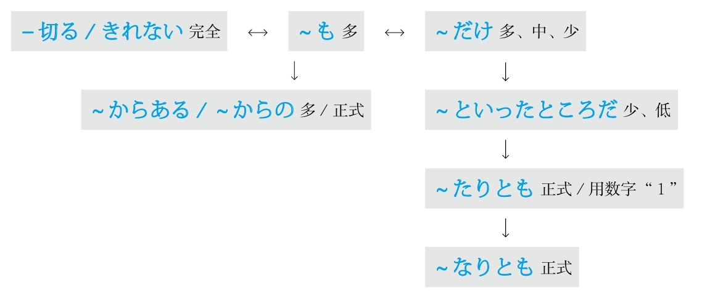

### 程度

#### ～くらい/～ぐらい
**解释：** 「<ruby>位<rp>(</rp><rt>くらい</rt><rp>)</rp></ruby>」表示高、中、低三个程度
**注意：** 读清音和浊音都可以
**用于：** 程度高
**接续：** 任何词

例句：<ruby>周<rp>(</rp><rt>まわ</rt><rp>)</rp></ruby>りが<ruby>騒<rp>(</rp><rt>さわ</rt><rp>)</rp></ruby>がしいから、<ruby>電<rp>(</rp><rt>でん</rt><rp>)</rp></ruby><ruby>話<rp>(</rp><rt>わ</rt><rp>)</rp></ruby>の<ruby>音<rp>(</rp><rt>おと</rt><rp>)</rp></ruby>が<ruby>聞<rp>(</rp><rt>き</rt><rp>)</rp></ruby>こえない**くらい** だ。
直译：周围太吵了，所以到了电话的声音听不见了的程度。
意译：周围太吵了，电话的声音都快听不见了。

**用于：** 程度中
**意思：** 左右
**接续：** 任何词

例句：<ruby>歩<rp>(</rp><rt>ある</rt><rp>)</rp></ruby>いて<ruby>行<rp>(</rp><rt>い</rt><rp>)</rp></ruby>ける**くらい** <ruby>近<rp>(</rp><rt>ちか</rt><rp>)</rp></ruby>いです。
直译：可以走着去的程度得近。
意译：很近，可以走着去。

**用于：** 程度低
**接续：** 任何词

例句：こんな<ruby>事<rp>(</rp><rt>こと</rt><rp>)</rp></ruby>**くらい** <ruby>子<rp>(</rp><rt>こ</rt><rp>)</rp></ruby><ruby>供<rp>(</rp><rt>ども</rt><rp>)</rp></ruby>でも<ruby>知<rp>(</rp><rt>し</rt><rp>)</rp></ruby>っている。
直译：这样的事的程度，即使是孩子都知道。
意译：这样的事连孩子都知道。

**注意：** 还可以表示大概的“时间点”和“期间段”
**意思：** 左右

例句：<ruby>明日<rp>(</rp><rt>あした</rt><rp>)</rp></ruby>の<ruby>午後<rp>(</rp><rt>ごご</rt><rp>)</rp></ruby><ruby>三<rp>(</rp><rt>さん</rt><rp>)</rp></ruby><ruby>時<rp>(</rp><rt>じ</rt><rp>)</rp></ruby>**くらい** に<ruby>来<rp>(</rp><rt>き</rt><rp>)</rp></ruby>てください。
直译：在明天下午3点左右，请来。
意译：请于明天下午3点左右来。

例句：<ruby>昨日<rp>(</rp><rt>きのう</rt><rp>)</rp></ruby><ruby>友<rp>(</rp><rt>とも</rt><rp>)</rp></ruby><ruby>達<rp>(</rp><rt>だち</rt><rp>)</rp></ruby>に<ruby>三<rp>(</rp><rt>さん</rt><rp>)</rp></ruby><ruby>時<rp>(</rp><rt>じ</rt><rp>)</rp></ruby><ruby>間<rp>(</rp><rt>かん</rt><rp>)</rp></ruby>**くらい** <ruby>待<rp>(</rp><rt>ま</rt><rp>)</rp></ruby>たされた。
直译：昨天被让朋友等了3个多小时。
意译：昨天朋友让我等了3个多小时。

#### ～ころ/～ごろ
**解释：** 「<ruby>頃<rp>(</rp><rt>ころ</rt><rp>)</rp></ruby>」表示大概的“时间点”
**意思：** 左右
**语气：** 正式
**注意：** 读清音和浊音都可以
**区别：** 只能接“时间点”，不能接“时间段”

例句：<ruby>明日<rp>(</rp><rt>あした</rt><rp>)</rp></ruby><ruby>何<rp>(</rp><rt>なん</rt><rp>)</rp></ruby><ruby>時<rp>(</rp><rt>じ</rt><rp>)</rp></ruby>**ごろ** <ruby>伺<rp>(</rp><rt>うかが</rt><rp>)</rp></ruby>えばよろしいでしょうか。
直译：明天几点左右拜访好呢？

#### ～ほど
**解释：** 「<ruby>程<rp>(</rp><rt>ほど</rt><rp>)</rp></ruby>」的意思是“程度高”
**意思：** 左右
**区别：** 不能用于“程度低”和“程度中”的事物

例句：<ruby>舌<rp>(</rp><rt>した</rt><rp>)</rp></ruby>がとろける**ほど** おいしい。
直译：好吃得舌头都要融化了。
意译：太好吃了。

**解释：** 「<ruby>程<rp>(</rp><rt>ほど</rt><rp>)</rp></ruby>」表示大概的“期间段”
**意思：** 左右
**语气：** 正式
**区别：** 不能接“时间点”，只能接“时间段”

例句：<ruby>講<rp>(</rp><rt>こう</rt><rp>)</rp></ruby><ruby>義<rp>(</rp><rt>ぎ</rt><rp>)</rp></ruby>は<ruby>1<rp>(</rp><rt>いち</rt><rp>)</rp></ruby><ruby>時<rp>(</rp><rt>じ</rt><rp>)</rp></ruby><ruby>間<rp>(</rp><rt>かん</rt><rp>)</rp></ruby>**ほど** <ruby>延<rp>(</rp><rt>の</rt><rp>)</rp></ruby>びた。
直译：大学的课拖延了1个小时左右。
意译：课拖延了1个小时左右。
语法关系图
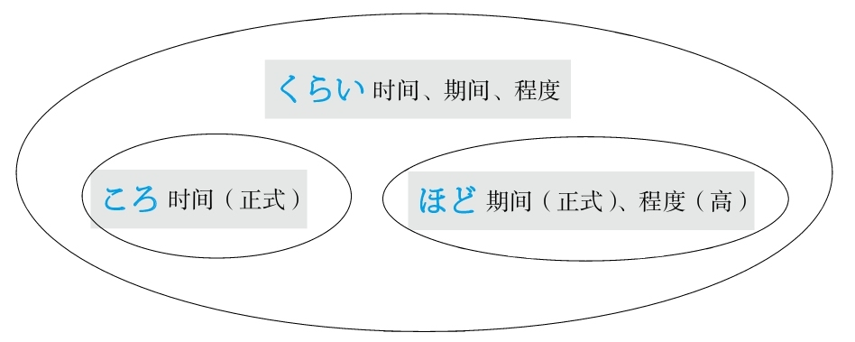

### 从

#### ～から
**解释：** 表示起点
**意思：** 从～
**接续：** 名词

例句：<ruby>田<rp>(</rp><rt>た</rt><rp>)</rp></ruby><ruby>中<rp>(</rp><rt>なか</rt><rp>)</rp></ruby>さん**から** <ruby>得<rp>(</rp><rt>え</rt><rp>)</rp></ruby>た<ruby>情<rp>(</rp><rt>じょう</rt><rp>)</rp></ruby><ruby>報<rp>(</rp><rt>ほう</rt><rp>)</rp></ruby>は<ruby>確<rp>(</rp><rt>かく</rt><rp>)</rp></ruby><ruby>実<rp>(</rp><rt>じつ</rt><rp>)</rp></ruby>だ。
直译：从田中得到的信息很确实。
意译：从田中那里得到的信息很准确。

#### ～からいうと/～からいえば
**解释：** 「から」表示起点，意思是“从～”；「いう」是表示“说”的「<ruby>言<rp>(</rp><rt>い</rt><rp>)</rp></ruby>う」；「と」和「ば」的意思都是“如果”
**准则：** 在「と、ば、たら、なら」里，最重要的是顺序。「と」和「なら」分别表示极端，「と」代表“条件性”的极端，「なら」代表“假定性”的极端
**区别：** 「～からいうと」比「～からいえば」限定的语气强
**意思：** 从～来说的话
**接续：** 名词

例句：<ruby>実<rp>(</rp><rt>じつ</rt><rp>)</rp></ruby><ruby>力<rp>(</rp><rt>りょく</rt><rp>)</rp></ruby>**からいうと（からいえば）** 、<ruby>彼<rp>(</rp><rt>かれ</rt><rp>)</rp></ruby>が<ruby>入<rp>(</rp><rt>にゅう</rt><rp>)</rp></ruby><ruby>賞<rp>(</rp><rt>しょう</rt><rp>)</rp></ruby>することは<ruby>間<rp>(</rp><rt>ま</rt><rp>)</rp></ruby><ruby>違<rp>(</rp><rt>ちが</rt><rp>)</rp></ruby>いない。
直译：如果从实力来说的话，他得奖是没错的。
意译：从实力来看，他肯定能得奖。

#### ～からして
**解释：** 「から」表示起点，意思是“从～”；「して」是能够代替大多数动词的「する」的中顿形式，在此代替了「<ruby>見<rp>(</rp><rt>み</rt><rp>)</rp></ruby>る、<ruby>考<rp>(</rp><rt>かんが</rt><rp>)</rp></ruby>える、<ruby>判<rp>(</rp><rt>はん</rt><rp>)</rp></ruby><ruby>断<rp>(</rp><rt>だん</rt><rp>)</rp></ruby>する、<ruby>推<rp>(</rp><rt>すい</rt><rp>)</rp></ruby><ruby>測<rp>(</rp><rt>そく</rt><rp>)</rp></ruby>する、<ruby>推<rp>(</rp><rt>すい</rt><rp>)</rp></ruby><ruby>理<rp>(</rp><rt>り</rt><rp>)</rp></ruby>する」等能够与“从～”搭配的动词，需要通过上下文判断具体意思
**意思：** 从～来说的话
**接续：** 名词

例句：<ruby>町<rp>(</rp><rt>まち</rt><rp>)</rp></ruby><ruby>並<rp>(</rp><rt>な</rt><rp>)</rp></ruby>み**からして** 、このところは<ruby>歴<rp>(</rp><rt>れき</rt><rp>)</rp></ruby><ruby>史<rp>(</rp><rt>し</rt><rp>)</rp></ruby>のある<ruby>町<rp>(</rp><rt>まち</rt><rp>)</rp></ruby>らしい。
直译：从街道的样子来看（来判断、来推测……），这个地方好像有历史。
意译：从街道的样子来看，这个地方好像历史很悠久。

#### ～から～まで
**解释：** 「から」表示起点，意思是“从～”；「まで」表示终点，意思是“到～”
**意思：** 从～到～
**用于：** 任何事项（时间、地点、程度、人物等）
**着重：** 点
**接续：** 名词

例句：<ruby>部<rp>(</rp><rt>へ</rt><rp>)</rp></ruby><ruby>屋<rp>(</rp><rt>や</rt><rp>)</rp></ruby>の<ruby>隅<rp>(</rp><rt>すみ</rt><rp>)</rp></ruby>**から** <ruby>隅<rp>(</rp><rt>すみ</rt><rp>)</rp></ruby>**まで** <ruby>探<rp>(</rp><rt>さが</rt><rp>)</rp></ruby>した。
直译：从房间的角落到角落，找了。
意译：找遍了房间的各个角落。

#### ～から～にいたるまで
**解释：** 「から」表示起点，意思是“从～”；「に」表示方向；「<ruby>至<rp>(</rp><rt>いた</rt><rp>)</rp></ruby>る」的意思是“到”；「まで」表示终点，意思是“到～”
**意思：** 从～到～
**用于：** 任何事项（时间、地点、程度、人物等）
**着重：** 终点
**接续：** 名词

例句：<ruby>家<rp>(</rp><rt>か</rt><rp>)</rp></ruby><ruby>事<rp>(</rp><rt>じ</rt><rp>)</rp></ruby>**から** <ruby>育<rp>(</rp><rt>いく</rt><rp>)</rp></ruby><ruby>児<rp>(</rp><rt>じ</rt><rp>)</rp></ruby>**にいたるまで** 、<ruby>一人<rp>(</rp><rt>ひとり</rt><rp>)</rp></ruby>でさせられている。
直译：从家务活到育儿，一个人被让干着。
意译：从家务活到育儿都得一个人干。

#### ～から～にかけて
**解释：** 「から」表示起点，意思是“从～”；「に」表示方向；「かけて」是他动词「かける」的中顿形式，意思是“大面积地覆盖”
**意思：** 从～到～
**着重：** 面、整体
**区别：** 「～から～まで」着重于起点和终点的两个点，但是「～から～にかけて」着重于从起点到终点的全面性
**接续：** 时间、地点

例句：<ruby>日<rp>(</rp><rt>に</rt><rp>)</rp></ruby><ruby>本<rp>(</rp><rt>ほん</rt><rp>)</rp></ruby>は<ruby>5<rp>(</rp><rt>ご</rt><rp>)</rp></ruby><ruby>月<rp>(</rp><rt>がつ</rt><rp>)</rp></ruby>の<ruby>下<rp>(</rp><rt>げ</rt><rp>)</rp></ruby><ruby>旬<rp>(</rp><rt>じゅん</rt><rp>)</rp></ruby>**から** <ruby>6<rp>(</rp><rt>ろく</rt><rp>)</rp></ruby><ruby>月<rp>(</rp><rt>がつ</rt><rp>)</rp></ruby>の<ruby>下<rp>(</rp><rt>げ</rt><rp>)</rp></ruby><ruby>旬<rp>(</rp><rt>じゅん</rt><rp>)</rp></ruby>**にかけて** <ruby>梅雨<rp>(</rp><rt>つゆ</rt><rp>)</rp></ruby>の<ruby>時<rp>(</rp><rt>じ</rt><rp>)</rp></ruby><ruby>期<rp>(</rp><rt>き</rt><rp>)</rp></ruby>だ。
直译：日本从5月下旬到6月下旬的整个阶段是梅雨季节。
意译：日本从5月下旬到6月下旬一直是梅雨季节。

例句：<ruby>午後<rp>(</rp><rt>ごご</rt><rp>)</rp></ruby>は<ruby>関<rp>(</rp><rt>かん</rt><rp>)</rp></ruby><ruby>東<rp>(</rp><rt>とう</rt><rp>)</rp></ruby><ruby>地<rp>(</rp><rt>ち</rt><rp>)</rp></ruby><ruby>方<rp>(</rp><rt>ほう</rt><rp>)</rp></ruby>**から** <ruby>関<rp>(</rp><rt>かん</rt><rp>)</rp></ruby><ruby>西<rp>(</rp><rt>さい</rt><rp>)</rp></ruby><ruby>地<rp>(</rp><rt>ち</rt><rp>)</rp></ruby><ruby>方<rp>(</rp><rt>ほう</rt><rp>)</rp></ruby>**にかけて** <ruby>雪<rp>(</rp><rt>ゆき</rt><rp>)</rp></ruby>が<ruby>積<rp>(</rp><rt>つ</rt><rp>)</rp></ruby>もる<ruby>見<rp>(</rp><rt>み</rt><rp>)</rp></ruby><ruby>込<rp>(</rp><rt>こ</rt><rp>)</rp></ruby>みです。
直译：预计下午从关东地区到关西地区的整个地区将要积雪。
意译：预计下午从关东地区到关西地区将会出现积雪。

#### ～より
**意1：** 从～
**表示：** 起点
**注意：** 一般用于写信的发信人和表示送东西的赠送人
**区别：** 比「から」语气正式
**接续：** 人称

例句：<ruby>田<rp>(</rp><rt>た</rt><rp>)</rp></ruby><ruby>中<rp>(</rp><rt>なか</rt><rp>)</rp></ruby><ruby>様<rp>(</rp><rt>さま</rt><rp>)</rp></ruby>**より** <ruby>鈴<rp>(</rp><rt>すず</rt><rp>)</rp></ruby><ruby>木<rp>(</rp><rt>き</rt><rp>)</rp></ruby><ruby>様<rp>(</rp><rt>さま</rt><rp>)</rp></ruby><ruby>宛<rp>(</rp><rt>あ</rt><rp>)</rp></ruby>ての<ruby>手<rp>(</rp><rt>て</rt><rp>)</rp></ruby><ruby>紙<rp>(</rp><rt>がみ</rt><rp>)</rp></ruby>をお<ruby>預<rp>(</rp><rt>あず</rt><rp>)</rp></ruby>かりしております。
直译：从田中给铃木的信，我们保管着。
意译：田中给铃木的信放在我们这里。
语法关系图
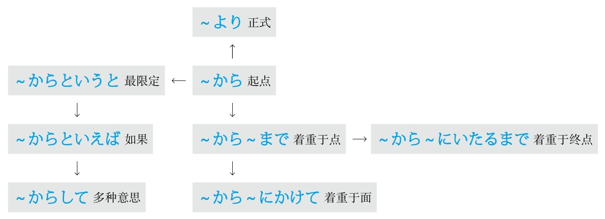

### 充满

#### ～をこめて
**解释：** 「を」接在他动词前表示“把”；「こめて」是他动词「<ruby>込<rp>(</rp><rt>こ</rt><rp>)</rp></ruby>める」的中顿形式，意思是“充满”
**意思：** 充满～
**注意：** 常用「<ruby>心<rp>(</rp><rt>こころ</rt><rp>)</rp></ruby>をこめて、<ruby>愛<rp>(</rp><rt>あい</rt><rp>)</rp></ruby><ruby>情<rp>(</rp><rt>じょう</rt><rp>)</rp></ruby>をこめて」等
**区别：** 后面接动词
**接续：** 名词

例句：これはわたしが<ruby>真<rp>(</rp><rt>ま</rt><rp>)</rp></ruby><ruby>心<rp>(</rp><rt>ごころ</rt><rp>)</rp></ruby>**をこめて** <ruby>言<rp>(</rp><rt>い</rt><rp>)</rp></ruby>った<ruby>言<rp>(</rp><rt>こと</rt><rp>)</rp></ruby><ruby>葉<rp>(</rp><rt>ば</rt><rp>)</rp></ruby>です。
直译：这是我充满真心说的话。
意译：这是我真心实意说的话。

例句：<ruby>先<rp>(</rp><rt>せん</rt><rp>)</rp></ruby><ruby>生<rp>(</rp><rt>せい</rt><rp>)</rp></ruby>は<ruby>毎<rp>(</rp><rt>まい</rt><rp>)</rp></ruby><ruby>回<rp>(</rp><rt>かい</rt><rp>)</rp></ruby><ruby>愛<rp>(</rp><rt>あい</rt><rp>)</rp></ruby><ruby>情<rp>(</rp><rt>じょう</rt><rp>)</rp></ruby>**をこめて** <ruby>授<rp>(</rp><rt>じゅ</rt><rp>)</rp></ruby><ruby>業<rp>(</rp><rt>ぎょう</rt><rp>)</rp></ruby>を<ruby>行<rp>(</rp><rt>おこな</rt><rp>)</rp></ruby>っている。
直译：老师的每次都充满了爱地在教授课程。
意译：老师的每堂课都充满了对学生的爱。

#### ～がこもった
**解释：** 「が」接在自动词前表示小主语；「こもった」是自动词「<ruby>籠<rp>(</rp><rt>こも</rt><rp>)</rp></ruby>る」的た形，意思是“充满”
**准则：** 日语的「た」表示完了、过去的“了”以及起形容词修饰名词作用的“的”。此处表示“的”
**意思：** 充满～
**注意：** 常用「<ruby>心<rp>(</rp><rt>こころ</rt><rp>)</rp></ruby>がこもった、<ruby>愛<rp>(</rp><rt>あい</rt><rp>)</rp></ruby><ruby>情<rp>(</rp><rt>じょう</rt><rp>)</rp></ruby>がこもった」等
**注意：** 「が」还可以换成「の」
**区别：** 后面接名词
**接续：** 名词

例句：これは<ruby>愛<rp>(</rp><rt>あい</rt><rp>)</rp></ruby><ruby>情<rp>(</rp><rt>じょう</rt><rp>)</rp></ruby>**のこもった** <ruby>自<rp>(</rp><rt>じ</rt><rp>)</rp></ruby><ruby>家<rp>(</rp><rt>か</rt><rp>)</rp></ruby><ruby>製<rp>(</rp><rt>せい</rt><rp>)</rp></ruby><ruby>弁<rp>(</rp><rt>べん</rt><rp>)</rp></ruby><ruby>当<rp>(</rp><rt>とう</rt><rp>)</rp></ruby>です。
直译：这是充满了爱的自家制便当。
意译：这是充满了爱的自己家里做的便当。
语法关系图

### 除了～以外

#### ～ほかに
**解释：** 「<ruby>他<rp>(</rp><rt>ほか</rt><rp>)</rp></ruby>、<ruby>外<rp>(</rp><rt>ほか</rt><rp>)</rp></ruby>」的意思是“～以外”；「に」表示副词
**准则：** 有时可以不用「に」，不用「に」时必须添加逗号，且语气正式
**意思：** ～以外
**接续：** 修饰名词的规律（参照第一章的第三节）

例句：<ruby>当<rp>(</rp><rt>とう</rt><rp>)</rp></ruby><ruby>日<rp>(</rp><rt>じつ</rt><rp>)</rp></ruby>は<ruby>関<rp>(</rp><rt>かん</rt><rp>)</rp></ruby><ruby>係<rp>(</rp><rt>けい</rt><rp>)</rp></ruby><ruby>書<rp>(</rp><rt>しょ</rt><rp>)</rp></ruby><ruby>類<rp>(</rp><rt>るい</rt><rp>)</rp></ruby>が<ruby>配<rp>(</rp><rt>くば</rt><rp>)</rp></ruby>られる**ほか** 、<ruby>記<rp>(</rp><rt>き</rt><rp>)</rp></ruby><ruby>念<rp>(</rp><rt>ねん</rt><rp>)</rp></ruby><ruby>品<rp>(</rp><rt>ひん</rt><rp>)</rp></ruby>ももらえる。
直译：当天有关资料被发送以外，纪念品也能够得到。
意译：当天除了发有关资料以外，还能得到纪念品。

#### ～以外に
**解释：** 「<ruby>以<rp>(</rp><rt>い</rt><rp>)</rp></ruby><ruby>外<rp>(</rp><rt>がい</rt><rp>)</rp></ruby>」的意思是“以外，之外”；「に」表示副词
**准则：** 有时可以不用「に」，不用「に」时必须添加逗号，且语气正式
**意思：** ～以外
**语气：** 正式
**接续：** 修饰名词的规律（参照第一章的第三节）

例句：<ruby>彼<rp>(</rp><rt>かの</rt><rp>)</rp></ruby><ruby>女<rp>(</rp><rt>じょ</rt><rp>)</rp></ruby>は<ruby>声<rp>(</rp><rt>こえ</rt><rp>)</rp></ruby>が<ruby>大<rp>(</rp><rt>おお</rt><rp>)</rp></ruby>きい**<ruby>以<rp>(</rp><rt>い</rt><rp>)</rp></ruby><ruby>外<rp>(</rp><rt>がい</rt><rp>)</rp></ruby>に** <ruby>何<rp>(</rp><rt>なん</rt><rp>)</rp></ruby>の<ruby>取<rp>(</rp><rt>とり</rt><rp>)</rp></ruby><ruby>得<rp>(</rp><rt>え</rt><rp>)</rp></ruby>もない。
直译：她声音大以外，什么可取之处都没有。
意译：她除了声音大以外什么可取之处都没有。

#### ～を除いて
**解释：** 「を」接在他动词前表示“把”；「<ruby>除<rp>(</rp><rt>のぞ</rt><rp>)</rp></ruby>いて」是他动词「<ruby>除<rp>(</rp><rt>のぞ</rt><rp>)</rp></ruby>く」的中顿形式，意思是“除了～”
**意思：** 除了～
**接续：** 名词

例句：<ruby>少<rp>(</rp><rt>しょう</rt><rp>)</rp></ruby><ruby>数<rp>(</rp><rt>すう</rt><rp>)</rp></ruby>**を<ruby>除<rp>(</rp><rt>のぞ</rt><rp>)</rp></ruby>いて** みんなその<ruby>提<rp>(</rp><rt>てい</rt><rp>)</rp></ruby><ruby>案<rp>(</rp><rt>あん</rt><rp>)</rp></ruby>に<ruby>賛<rp>(</rp><rt>さん</rt><rp>)</rp></ruby><ruby>成<rp>(</rp><rt>せい</rt><rp>)</rp></ruby>した。
直译：除了少数人，大家都对那个建议赞成了。
意译：除了少数人，大家都赞成那个建议。

#### ～をおいて
**解释：** 「を」接在他动词前表示“把”；「おいて」是他动词「<ruby>置<rp>(</rp><rt>お</rt><rp>)</rp></ruby>く」的中顿形式，意思是“放置～”
**直译：** 把～放置～
**重点：** 起源于日本谚语「～は<ruby>隅<rp>(</rp><rt>すみ</rt><rp>)</rp></ruby>にはおけない」，意思是“不能把～放置到角落里”，体现了“～”的重要性或中心地位；此语法引申为“把作为中心地位的～放到角落里的话，就没有能够胜任的了”
**接续：** 名词

例句：この<ruby>仕<rp>(</rp><rt>し</rt><rp>)</rp></ruby><ruby>事<rp>(</rp><rt>ごと</rt><rp>)</rp></ruby>が<ruby>任<rp>(</rp><rt>まか</rt><rp>)</rp></ruby>せられるのは、<ruby>彼<rp>(</rp><rt>かれ</rt><rp>)</rp></ruby>**をおいて** <ruby>適<rp>(</rp><rt>てき</rt><rp>)</rp></ruby><ruby>任<rp>(</rp><rt>にん</rt><rp>)</rp></ruby><ruby>者<rp>(</rp><rt>しゃ</rt><rp>)</rp></ruby>はいない。
直译：这个工作能够委任的，把他放到角落里，没有适合于委任的人。
意译：这个工作除了他以外没有别人可以胜任。
语法关系图

## D
### 代替

#### ～かわりに
**解释：** 「<ruby>代<rp>(</rp><rt>か</rt><rp>)</rp></ruby>わり」的意思是“代替”；「に」表示副词
**注意：** 有时可以不用「に」，不用「に」时必须添加逗号，且语气正式
**接续：** 修饰名词的规律（参照第一章的第三节）

例句：<ruby>包<rp>(</rp><rt>ほう</rt><rp>)</rp></ruby><ruby>帯<rp>(</rp><rt>たい</rt><rp>)</rp></ruby>の**かわりに** 、ハンカチで<ruby>傷<rp>(</rp><rt>きず</rt><rp>)</rp></ruby><ruby>口<rp>(</rp><rt>ぐち</rt><rp>)</rp></ruby>を<ruby>縛<rp>(</rp><rt>しば</rt><rp>)</rp></ruby>った。
直译：绷带的替代，用手绢绑住了伤口。
意译：用手绢代替绷带绑住了伤口。

#### ～にかわって
**解释：** 「に」表示方向或对象；「かわって」是自动词「<ruby>代<rp>(</rp><rt>か</rt><rp>)</rp></ruby>わる」的中顿形式，意思是“代替”
**接续：** 名词

例句：<ruby>首<rp>(</rp><rt>しゅ</rt><rp>)</rp></ruby><ruby>相<rp>(</rp><rt>しょう</rt><rp>)</rp></ruby>**にかわって** 、<ruby>外<rp>(</rp><rt>がい</rt><rp>)</rp></ruby><ruby>相<rp>(</rp><rt>しょう</rt><rp>)</rp></ruby>が<ruby>米<rp>(</rp><rt>べい</rt><rp>)</rp></ruby><ruby>国<rp>(</rp><rt>こく</rt><rp>)</rp></ruby>を<ruby>訪<rp>(</rp><rt>ほう</rt><rp>)</rp></ruby><ruby>問<rp>(</rp><rt>もん</rt><rp>)</rp></ruby>した。
直译：代替首相，外相访问了美国。
意译：外务大臣代替首相访问了美国。
语法关系图

### 当成

#### ～を～とする/～を～にする
**注意：** 日语里的经典句型「～を～と（に）する（把～当成～）」，大多数语法都是由此派生的
**解释：** 「を」接在他动词前表示“把”；「と」侧重于内容，「に」侧重于方向；「する」可以代替大多数动词
**意思：** 把～当成～
**接续：** 名词

例句：<ruby>経<rp>(</rp><rt>けい</rt><rp>)</rp></ruby><ruby>済<rp>(</rp><rt>ざい</rt><rp>)</rp></ruby>**を** <ruby>研<rp>(</rp><rt>けん</rt><rp>)</rp></ruby><ruby>究<rp>(</rp><rt>きゅう</rt><rp>)</rp></ruby><ruby>題<rp>(</rp><rt>だい</rt><rp>)</rp></ruby><ruby>目<rp>(</rp><rt>もく</rt><rp>)</rp></ruby>**にしている** 。
直译：把经济当作研究题目在做着。
意译：现在把经济当作研究题目。
语法关系图

### 到～地步

#### ～まで
**解释：** 「まで」的意思是“到～”或“到～的地步”
**着重：** 抽象事物
**接续：** 任何词

例句：<ruby>今年<rp>(</rp><rt>ことし</rt><rp>)</rp></ruby>の<ruby>大<rp>(</rp><rt>だい</rt><rp>)</rp></ruby><ruby>学<rp>(</rp><rt>がく</rt><rp>)</rp></ruby>の<ruby>文<rp>(</rp><rt>ぶん</rt><rp>)</rp></ruby><ruby>化<rp>(</rp><rt>か</rt><rp>)</rp></ruby><ruby>祭<rp>(</rp><rt>さい</rt><rp>)</rp></ruby>は<ruby>以<rp>(</rp><rt>い</rt><rp>)</rp></ruby><ruby>前<rp>(</rp><rt>ぜん</rt><rp>)</rp></ruby>ほど<ruby>活<rp>(</rp><rt>かっ</rt><rp>)</rp></ruby><ruby>気<rp>(</rp><rt>き</rt><rp>)</rp></ruby>がなくなった。<ruby>授<rp>(</rp><rt>じゅ</rt><rp>)</rp></ruby><ruby>業<rp>(</rp><rt>ぎょう</rt><rp>)</rp></ruby>を<ruby>休<rp>(</rp><rt>やす</rt><rp>)</rp></ruby>んで**まで** <ruby>見<rp>(</rp><rt>み</rt><rp>)</rp></ruby>に<ruby>行<rp>(</rp><rt>い</rt><rp>)</rp></ruby>く<ruby>必<rp>(</rp><rt>ひつ</rt><rp>)</rp></ruby><ruby>要<rp>(</rp><rt>よう</rt><rp>)</rp></ruby>はないと<ruby>思<rp>(</rp><rt>おも</rt><rp>)</rp></ruby>う。
直译：今年大学的文化节，以前那么程度高的，生气没有了。不上课去观看的必要没有，我认为。
意译：今年大学的文化节没有以前有生气，我觉得没有必要不上课去观看。

#### －ないまでも
**解释：** 「ない」是谓语词的否定的简体；「までも」比「まで」语气强，意思是“到～的地步”
**意思：** 虽然不用到去做～的地步，但是～也该做～
**着重：** 转折
**注意：** 「までも」的语气是在「も→まで→までも」里是最强的，日语中用强调表示转折
**准则：** 强烈的表达方式，通常在表示“否定、转折、相反”的语境中出现
**变形：** 动词的否定形的な（变形规律参照第一章的第二节）

例句：<ruby>新<rp>(</rp><rt>あたら</rt><rp>)</rp></ruby>しい<ruby>建<rp>(</rp><rt>けん</rt><rp>)</rp></ruby><ruby>設<rp>(</rp><rt>せつ</rt><rp>)</rp></ruby><ruby>計<rp>(</rp><rt>けい</rt><rp>)</rp></ruby><ruby>画<rp>(</rp><rt>かく</rt><rp>)</rp></ruby>には<ruby>地<rp>(</rp><rt>じ</rt><rp>)</rp></ruby><ruby>元<rp>(</rp><rt>もと</rt><rp>)</rp></ruby>の<ruby>住<rp>(</rp><rt>じゅう</rt><rp>)</rp></ruby><ruby>民<rp>(</rp><rt>みん</rt><rp>)</rp></ruby>の<ruby>反<rp>(</rp><rt>はん</rt><rp>)</rp></ruby><ruby>対<rp>(</rp><rt>たい</rt><rp>)</rp></ruby>が<ruby>大<rp>(</rp><rt>おお</rt><rp>)</rp></ruby>きい。<ruby>国<rp>(</rp><rt>くに</rt><rp>)</rp></ruby>は<ruby>計<rp>(</rp><rt>けい</rt><rp>)</rp></ruby><ruby>画<rp>(</rp><rt>かく</rt><rp>)</rp></ruby>を<ruby>中<rp>(</rp><rt>ちゅう</rt><rp>)</rp></ruby><ruby>止<rp>(</rp><rt>し</rt><rp>)</rp></ruby>するとは<ruby>言<rp>(</rp><rt>い</rt><rp>)</rp></ruby>わ**ないまでも** 、もう<ruby>一<rp>(</rp><rt>いち</rt><rp>)</rp></ruby><ruby>度<rp>(</rp><rt>ど</rt><rp>)</rp></ruby><ruby>考<rp>(</rp><rt>かんが</rt><rp>)</rp></ruby>え<ruby>直<rp>(</rp><rt>なお</rt><rp>)</rp></ruby>さざるを<ruby>得<rp>(</rp><rt>え</rt><rp>)</rp></ruby>ないだろう。
直译：对于新的建设计划，当地居民的反对很大。国家即使到不说中止计划的地步，也不得不重新考虑吧。
意译：当地居民非常反对新的建设计划。国家即使不说中止计划，也不得不重新考虑吧。

#### ～に至って
**解释：** 「に」表示方向；「<ruby>至<rp>(</rp><rt>いた</rt><rp>)</rp></ruby>って」是自动词「<ruby>至<rp>(</rp><rt>いた</rt><rp>)</rp></ruby>る」的中顿形式，意思是“到～”
**意思：** 到～
**语气：** 正式
**接续：** 名词

例句：<ruby>事<rp>(</rp><rt>こと</rt><rp>)</rp></ruby>はここ**に<ruby>至<rp>(</rp><rt>いた</rt><rp>)</rp></ruby>っては** <ruby>手<rp>(</rp><rt>て</rt><rp>)</rp></ruby>の<ruby>打<rp>(</rp><rt>う</rt><rp>)</rp></ruby>ちようがない。
直译：事已至此，采取措施的办法没有。
意译：事已至此，一点儿办法都没有了。
语法关系图

### 定义

#### ～とは
**解释：** 「と」表示内容，在此起引号的作用；「は」表示强调
**注意：** 在定义时常出现以下表述方式“～是这么一回事”或“～是这样一个意思”，因此句尾常接「～ことだ（这么一回事）」或「～意味だ（这样的意思）」
**接续：** 任何词

例句：「アクセサリー」**とは** 、<ruby>体<rp>(</rp><rt>からだ</rt><rp>)</rp></ruby>につける<ruby>飾<rp>(</rp><rt>かざ</rt><rp>)</rp></ruby>り**のことだ** 。
直译：“首饰”是这样一回事：戴在身上的装饰品。
意译：“首饰”的意思是戴在身上的装饰品。

### 动作的终结

#### －たきり
**解释：** 「た」表示动作的完了的“了”；「きり」是他动词「<ruby>切<rp>(</rp><rt>き</rt><rp>)</rp></ruby>る」的连用形，表示动作中断
**意思：** 做了～之后动作中断，之后再也没有出现过此事
**注意：** 动词连用形是动词也是名词
**变形：** 动词的た形的简体（变形规律参照第一章的第二节）

例句：<ruby>渡<rp>(</rp><rt>わた</rt><rp>)</rp></ruby><ruby>辺<rp>(</rp><rt>なべ</rt><rp>)</rp></ruby><ruby>先<rp>(</rp><rt>せん</rt><rp>)</rp></ruby><ruby>生<rp>(</rp><rt>せい</rt><rp>)</rp></ruby>とは<ruby>昨<rp>(</rp><rt>さく</rt><rp>)</rp></ruby><ruby>年<rp>(</rp><rt>ねん</rt><rp>)</rp></ruby><ruby>一<rp>(</rp><rt>いち</rt><rp>)</rp></ruby><ruby>度<rp>(</rp><rt>ど</rt><rp>)</rp></ruby><ruby>会<rp>(</rp><rt>あ</rt><rp>)</rp></ruby>っ**たきり** です。
直译：和渡边老师去年见过一面后动作中断再也没有见过。
意译：去年和渡边老师见过一面后再也没见过。

例句：<ruby>彼<rp>(</rp><rt>かの</rt><rp>)</rp></ruby><ruby>女<rp>(</rp><rt>じょ</rt><rp>)</rp></ruby>は<ruby>日<rp>(</rp><rt>に</rt><rp>)</rp></ruby><ruby>本<rp>(</rp><rt>ほん</rt><rp>)</rp></ruby>に<ruby>行<rp>(</rp><rt>い</rt><rp>)</rp></ruby>っ**たきり** 、もう<ruby>帰<rp>(</rp><rt>かえ</rt><rp>)</rp></ruby>って<ruby>来<rp>(</rp><rt>こ</rt><rp>)</rp></ruby>ない、と<ruby>聞<rp>(</rp><rt>き</rt><rp>)</rp></ruby>きました。
直译：她去了日本，动作中断，再也不回来了，听说了。
意译：听说她去了日本再也不回来了。

**意思：** 做了～之后，动作完全保持此状态

例句：<ruby>祖<rp>(</rp><rt>そ</rt><rp>)</rp></ruby><ruby>父<rp>(</rp><rt>ふ</rt><rp>)</rp></ruby>は<ruby>階<rp>(</rp><rt>かい</rt><rp>)</rp></ruby><ruby>段<rp>(</rp><rt>だん</rt><rp>)</rp></ruby>から<ruby>転<rp>(</rp><rt>ころ</rt><rp>)</rp></ruby>んでから、ずっと<ruby>寝<rp>(</rp><rt>ね</rt><rp>)</rp></ruby>**たきり** だ。
直译：祖父从台阶上摔下来后一直睡着，动作完全保持此状态。
意译：祖父从台阶上摔下来后一直卧床不起。

### 对比

#### ～は
**解释：** 「は」在两个小句子当中表示对比
**注意：** 「は」还有表示“大主语”和“强调其他助词”的作用；强调「を」和「が」时换成「は」；强调其他助词如「に」或「で」等时，在其后面加「は」，构成「には、では」等

例句：<ruby>日<rp>(</rp><rt>に</rt><rp>)</rp></ruby><ruby>本<rp>(</rp><rt>ほん</rt><rp>)</rp></ruby>に<ruby>来<rp>(</rp><rt>き</rt><rp>)</rp></ruby>て<ruby>初<rp>(</rp><rt>はじ</rt><rp>)</rp></ruby>めのうち**は** <ruby>日<rp>(</rp><rt>に</rt><rp>)</rp></ruby><ruby>本<rp>(</rp><rt>ほん</rt><rp>)</rp></ruby><ruby>語<rp>(</rp><rt>ご</rt><rp>)</rp></ruby>が<ruby>全然<rp>(</rp><rt>ぜん</rt><rp>)</rp></ruby>わからなかったけど、<ruby>今<rp>(</rp><rt>いま</rt><rp>)</rp></ruby>**は** だいぶわかってきた。
直译：刚来日本的时候，日语全然不懂，但是现在相当懂了。
意译：刚来日本的时候一点也不懂日语，现在懂很多了。

#### ～一方（で）
**解释：** 「<ruby>一<rp>(</rp><rt>いっ</rt><rp>)</rp></ruby><ruby>方<rp>(</rp><rt>ぽう</rt><rp>)</rp></ruby>」的意思是“一方、另一方”；「で」表示范围，意思是“在”
**意思：** 在一方面～，在另一方面～
**重点：** 常举出两个对照性的事物
**准则：** 有时可以不用「で」，不用「で」时必须添加逗号，且语气正式
**接续：** 动词和形容词的原形、形容动词和名词加である

例句：<ruby>最<rp>(</rp><rt>さい</rt><rp>)</rp></ruby><ruby>近<rp>(</rp><rt>きん</rt><rp>)</rp></ruby><ruby>高<rp>(</rp><rt>こう</rt><rp>)</rp></ruby><ruby>齢<rp>(</rp><rt>れい</rt><rp>)</rp></ruby><ruby>化<rp>(</rp><rt>か</rt><rp>)</rp></ruby>が<ruby>進<rp>(</rp><rt>すす</rt><rp>)</rp></ruby>んでおり、<ruby>老<rp>(</rp><rt>ろう</rt><rp>)</rp></ruby><ruby>人<rp>(</rp><rt>じん</rt><rp>)</rp></ruby>は<ruby>増<rp>(</rp><rt>ふ</rt><rp>)</rp></ruby>える**<ruby>一<rp>(</rp><rt>いっ</rt><rp>)</rp></ruby><ruby>方<rp>(</rp><rt>ぽう</rt><rp>)</rp></ruby>** 、<ruby>子<rp>(</rp><rt>こ</rt><rp>)</rp></ruby><ruby>供<rp>(</rp><rt>ども</rt><rp>)</rp></ruby>の<ruby>数<rp>(</rp><rt>かず</rt><rp>)</rp></ruby>は<ruby>減<rp>(</rp><rt>へ</rt><rp>)</rp></ruby>ってきている。
直译：最近高龄化一直进展，老人在增加的一方，孩子的数量在减少。
意译：最近老龄化（问题）越发严重，老人的数量在增加，另一方面孩子的数量却在不断减少。

#### ～に対して
**解释：** 「に」表示对象；「<ruby>対<rp>(</rp><rt>たい</rt><rp>)</rp></ruby>して」是自动词「<ruby>対<rp>(</rp><rt>たい</rt><rp>)</rp></ruby>する」的中顿形式，意思是“对象、对比”
**意思：** “对于～”或“与～相对比”；在此是后者
**接续：** 名词

例句：この<ruby>植<rp>(</rp><rt>しょく</rt><rp>)</rp></ruby><ruby>物<rp>(</rp><rt>ぶつ</rt><rp>)</rp></ruby>の<ruby>葉<rp>(</rp><rt>は</rt><rp>)</rp></ruby>っぱは、<ruby>光<rp>(</rp><rt>ひかり</rt><rp>)</rp></ruby>に<ruby>当<rp>(</rp><rt>あ</rt><rp>)</rp></ruby>てている<ruby>面<rp>(</rp><rt>めん</rt><rp>)</rp></ruby>の<ruby>色<rp>(</rp><rt>いろ</rt><rp>)</rp></ruby>が<ruby>濃<rp>(</rp><rt>こ</rt><rp>)</rp></ruby>いの**に<ruby>対<rp>(</rp><rt>たい</rt><rp>)</rp></ruby>して** 、<ruby>当<rp>(</rp><rt>あ</rt><rp>)</rp></ruby>てていない<ruby>面<rp>(</rp><rt>めん</rt><rp>)</rp></ruby>の<ruby>色<rp>(</rp><rt>いろ</rt><rp>)</rp></ruby>は<ruby>薄<rp>(</rp><rt>うす</rt><rp>)</rp></ruby>い。
直译：这个植物的叶子，光照的一面的颜色深，与其相对比，没有光照的一面的颜色淡。
意译：这个植物的叶子，光照的一面的颜色深，与其相对照，没有光照的一面的颜色浅。

#### ～にひきかえ
**解释：** 「に」表示对象；「ひきかえ」是自动词「<ruby>引<rp>(</rp><rt>ひ</rt><rp>)</rp></ruby>き<ruby>替<rp>(</rp><rt>か</rt><rp>)</rp></ruby>える」的中顿形式，意思是“对换、交换”
**意思：** 与～相对照
**语气：** 正式
**接续：** 名词

例句：<ruby>先<rp>(</rp><rt>せん</rt><rp>)</rp></ruby><ruby>月<rp>(</rp><rt>げつ</rt><rp>)</rp></ruby><ruby>日<rp>(</rp><rt>にち</rt><rp>)</rp></ruby><ruby>常<rp>(</rp><rt>じょう</rt><rp>)</rp></ruby><ruby>用<rp>(</rp><rt>よう</rt><rp>)</rp></ruby><ruby>品<rp>(</rp><rt>ひん</rt><rp>)</rp></ruby>の<ruby>売<rp>(</rp><rt>う</rt><rp>)</rp></ruby>り<ruby>上<rp>(</rp><rt>あ</rt><rp>)</rp></ruby>げが<ruby>著<rp>(</rp><rt>いちじる</rt><rp>)</rp></ruby>しく<ruby>伸<rp>(</rp><rt>の</rt><rp>)</rp></ruby>びたの**にひきかえ** 、<ruby>食料品<rp>(</rp><rt>しょくりょうひん</rt><rp>)</rp></ruby>の<ruby>売<rp>(</rp><rt>う</rt><rp>)</rp></ruby>り<ruby>上<rp>(</rp><rt>あ</rt><rp>)</rp></ruby>げは<ruby>落<rp>(</rp><rt>お</rt><rp>)</rp></ruby>ち<ruby>込<rp>(</rp><rt>こ</rt><rp>)</rp></ruby>んだ。
直译：上月日用品的销售额显著地增长，与此相对照，食品的销售额下降了。
意译：上月，日用品的销售额有显著的增长，与此相反，食品的销售额下降了。
语法关系图

## F
### 放置不管

#### －っぱなし
**解释：** 「ぱなし」是他动词「<ruby>放<rp>(</rp><rt>はな</rt><rp>)</rp></ruby>す」的连用形，作名词用，与前面的动词的连用形一起构成复合名词；促音起加强语气的作用
**意思：** 放置不管
**注意：** 用于消极事项
**接续：** 动词的连用形

例句：<ruby>主<rp>(</rp><rt>しゅ</rt><rp>)</rp></ruby><ruby>人<rp>(</rp><rt>じん</rt><rp>)</rp></ruby>は<ruby>家<rp>(</rp><rt>か</rt><rp>)</rp></ruby><ruby>事<rp>(</rp><rt>じ</rt><rp>)</rp></ruby>を<ruby>一<rp>(</rp><rt>いっ</rt><rp>)</rp></ruby><ruby>切<rp>(</rp><rt>さい</rt><rp>)</rp></ruby>しない。<ruby>新<rp>(</rp><rt>しん</rt><rp>)</rp></ruby><ruby>聞<rp>(</rp><rt>ぶん</rt><rp>)</rp></ruby>は<ruby>広<rp>(</rp><rt>ひろ</rt><rp>)</rp></ruby>げ**っぱなし** にしているし、<ruby>脱<rp>(</rp><rt>ぬ</rt><rp>)</rp></ruby>いだ<ruby>上<rp>(</rp><rt>うわ</rt><rp>)</rp></ruby><ruby>着<rp>(</rp><rt>ぎ</rt><rp>)</rp></ruby>もソファーに<ruby>置<rp>(</rp><rt>お</rt><rp>)</rp></ruby>き**っぱなし** にしている。まったく、あきれたよ。
直译：我丈夫家事一切不干。报纸摊开着，脱了的外套扔在沙发上不管。真是的，服了。
意译：我丈夫家务活一点儿都不干。报纸摊开着，脱了的外套也扔在沙发上不管。简直服了。

### 非常，极其

#### ～あまり
**解释：** 「あまり」是自动词「<ruby>余<rp>(</rp><rt>あま</rt><rp>)</rp></ruby>る」的连用形，作名词用
**意思：** 过于～
**接续：** 修饰名词的规律（参照第一章的第三节）

例句：<ruby>志<rp>(</rp><rt>し</rt><rp>)</rp></ruby><ruby>望<rp>(</rp><rt>ぼう</rt><rp>)</rp></ruby><ruby>大<rp>(</rp><rt>だい</rt><rp>)</rp></ruby><ruby>学<rp>(</rp><rt>がく</rt><rp>)</rp></ruby>に<ruby>受<rp>(</rp><rt>う</rt><rp>)</rp></ruby>かって、<ruby>嬉<rp>(</rp><rt>うれ</rt><rp>)</rp></ruby>しい**あまり** 、<ruby>泣<rp>(</rp><rt>な</rt><rp>)</rp></ruby>いてしまった。
直译：考上了想要考的大学，过于高兴，哭了。
意译：考上了理想的大学，因为过于高兴结果哭了。

#### ～の至りで
**解释：** 「の」的意思是“的”；「<ruby>至<rp>(</rp><rt>いた</rt><rp>)</rp></ruby>り」是自动词「<ruby>至<rp>(</rp><rt>いた</rt><rp>)</rp></ruby>る」的连用形，作名词用；「で」是「です」的中顿形式
**意思：** ～之至
**语气：** 正式
**接续：** 名词

例句：<ruby>若<rp>(</rp><rt>わか</rt><rp>)</rp></ruby><ruby>気<rp>(</rp><rt>げ</rt><rp>)</rp></ruby>**の<ruby>至<rp>(</rp><rt>いた</rt><rp>)</rp></ruby>りで** 、<ruby>生<rp>(</rp><rt>なま</rt><rp>)</rp></ruby><ruby>意<rp>(</rp><rt>い</rt><rp>)</rp></ruby><ruby>気<rp>(</rp><rt>き</rt><rp>)</rp></ruby>なことを<ruby>言<rp>(</rp><rt>い</rt><rp>)</rp></ruby>ってしまい、<ruby>申<rp>(</rp><rt>もう</rt><rp>)</rp></ruby>し<ruby>訳<rp>(</rp><rt>わけ</rt><rp>)</rp></ruby>ございません。
直译：年轻之至，说了自以为是的话，非常抱歉。
意译：我太幼稚了，出言不逊，非常抱歉。

#### ～限りだ
**解释：** 「<ruby>限<rp>(</rp><rt>かぎ</rt><rp>)</rp></ruby>り」是自动词「<ruby>限<rp>(</rp><rt>かぎ</rt><rp>)</rp></ruby>る」的连用形，作名词用，意思是“极限”；「だ」是「です」的简体，表示“是”
**意思：** 极其～
**接续：** 修饰名词的规律（参照第一章的第三节）

例句：この<ruby>度<rp>(</rp><rt>たび</rt><rp>)</rp></ruby>、<ruby>皆<rp>(</rp><rt>みな</rt><rp>)</rp></ruby><ruby>様<rp>(</rp><rt>さま</rt><rp>)</rp></ruby>のお<ruby>世<rp>(</rp><rt>せ</rt><rp>)</rp></ruby><ruby>話<rp>(</rp><rt>わ</rt><rp>)</rp></ruby>をさせていただきまして、<ruby>光<rp>(</rp><rt>こう</rt><rp>)</rp></ruby><ruby>栄<rp>(</rp><rt>えい</rt><rp>)</rp></ruby>の**<ruby>限<rp>(</rp><rt>かぎ</rt><rp>)</rp></ruby>りです** 。
直译：此次，大家的照顾的事情请让我来做，极其光荣。
意译：非常荣幸此次能够负责照顾大家。

#### ～のきわみ
**解释：** 「の」的意思是“的”；名词「<ruby>極<rp>(</rp><rt>きわ</rt><rp>)</rp></ruby>み」的意思是“极限”
**意思：** 极其～
**语气：** 正式
**接续：** 名词

例句：<ruby>遠<rp>(</rp><rt>とお</rt><rp>)</rp></ruby>いところからわざわざお<ruby>越<rp>(</rp><rt>こ</rt><rp>)</rp></ruby>しいただきまして、<ruby>恐<rp>(</rp><rt>きょう</rt><rp>)</rp></ruby><ruby>縮<rp>(</rp><rt>しゅく</rt><rp>)</rp></ruby>**の<ruby>極<rp>(</rp><rt>きわ</rt><rp>)</rp></ruby>み** でございます。
直译：从远道特地您来，极其过意不去。
意译：您特地远道而来，非常过意不去。

#### ～きわまりない
**解释：** 「きわまり」是自动词「<ruby>極<rp>(</rp><rt>きわ</rt><rp>)</rp></ruby>まる」的连用形，作名词用，意思是“极限”；「ない」的意思是“没有”
**意思：** 没有比～更～的了
**语气：** 正式
**接续：** 形容动词

例句：<ruby>信<rp>(</rp><rt>しん</rt><rp>)</rp></ruby><ruby>号<rp>(</rp><rt>ごう</rt><rp>)</rp></ruby>を<ruby>無<rp>(</rp><rt>む</rt><rp>)</rp></ruby><ruby>視<rp>(</rp><rt>し</rt><rp>)</rp></ruby>して<ruby>突<rp>(</rp><rt>つ</rt><rp>)</rp></ruby>っ<ruby>走<rp>(</rp><rt>ぱし</rt><rp>)</rp></ruby>るなんて、<ruby>危<rp>(</rp><rt>き</rt><rp>)</rp></ruby><ruby>険<rp>(</rp><rt>けん</rt><rp>)</rp></ruby>**きわまりない** 。
直译：无视信号灯，猛跑，极其危险。
意译：不看红绿灯猛跑太危险了。

#### ～きわまる
**解释：** 自动词「<ruby>極<rp>(</rp><rt>きわ</rt><rp>)</rp></ruby>まる」的意思是“极限”
**意思：** 没有比～更～的了
**语气：** 正式
**接续：** 前面接形容动词，后面接名词

例句：<ruby>彼<rp>(</rp><rt>かれ</rt><rp>)</rp></ruby>の<ruby>無<rp>(</rp><rt>ぶ</rt><rp>)</rp></ruby><ruby>礼<rp>(</rp><rt>れい</rt><rp>)</rp></ruby>**きわまる** <ruby>態<rp>(</rp><rt>たい</rt><rp>)</rp></ruby><ruby>度<rp>(</rp><rt>ど</rt><rp>)</rp></ruby>に<ruby>腹<rp>(</rp><rt>はら</rt><rp>)</rp></ruby>が<ruby>立<rp>(</rp><rt>た</rt><rp>)</rp></ruby>った。
直译：对于他的极其无理的态度，生气。
意译：对他的极其无理的态度感到非常生气。

#### ～といったらありはしない
**解释：** 「と」表示内容；「いったら」是「<ruby>言<rp>(</rp><rt>い</rt><rp>)</rp></ruby>う」加上了表示“如果”的「たら」；「あり」是「<ruby>有<rp>(</rp><rt>あ</rt><rp>)</rp></ruby>る」的连用形，作名词用；「は」强调了表示小主语的「が」；「しない」是能代替大多数动词的「する」的否定形
**直译：** 如果说到～，根本不可能有这种情况
**意译：** 简直太～
**口语：** 常用「～といったらありゃしない」（多用于消极事物）和「～といったらない」
**接续：** 动词和形容词的原形、形容动词和名词

例句：<ruby>二<rp>(</rp><rt>に</rt><rp>)</rp></ruby><ruby>時<rp>(</rp><rt>じ</rt><rp>)</rp></ruby><ruby>間<rp>(</rp><rt>かん</rt><rp>)</rp></ruby>も<ruby>待<rp>(</rp><rt>ま</rt><rp>)</rp></ruby>たされて、けしからん**といったらありゃしない** 。
直译：被让等了两个小时，如果说不像话，这种事都不可能有。
意译：让我等了两个小时，简直太不像话了。

例句：<ruby>雨<rp>(</rp><rt>あめ</rt><rp>)</rp></ruby>の<ruby>後<rp>(</rp><rt>あと</rt><rp>)</rp></ruby>の<ruby>虹<rp>(</rp><rt>にじ</rt><rp>)</rp></ruby>の<ruby>美<rp>(</rp><rt>うつく</rt><rp>)</rp></ruby>しさ**といったらなかった** 。
直译：雨后的彩虹，说到美丽，这种事情都没见过。
意译：雨后的彩虹简直太漂亮了。
语法关系图

### 反复做

#### －ては、－ては
**解释：** 动词的て形表示中顿；「は」表示强调
**意思：** 做了～后做～，做了～后做～
**注意：** 后接动词的连用形作为名词；把整个搭配看成是一个名词从句，后面再接动词
**变形：** 动词的て形（变形规律参照第一章的第二节）

例句：<ruby>休<rp>(</rp><rt>やす</rt><rp>)</rp></ruby>みの<ruby>日<rp>(</rp><rt>ひ</rt><rp>)</rp></ruby>はいつも<ruby>食<rp>(</rp><rt>た</rt><rp>)</rp></ruby>べ**ては** <ruby>寝<rp>(</rp><rt>ね</rt><rp>)</rp></ruby>、<ruby>食<rp>(</rp><rt>た</rt><rp>)</rp></ruby>べ**ては** <ruby>寝<rp>(</rp><rt>ね</rt><rp>)</rp></ruby>、している。
直译：休息日总是吃了睡，睡了吃，在做着。
意译：休息日总是吃了睡，睡了吃。

### 方法

#### －かた
**解释：** 「かた」的汉字是「<ruby>方<rp>(</rp><rt>かた</rt><rp>)</rp></ruby>」
**意思：** 方法
**着重：** 途径
**接续：** 接动词的连用形构成复合名词

例句：いくら<ruby>後<rp>(</rp><rt>こう</rt><rp>)</rp></ruby><ruby>悔<rp>(</rp><rt>かい</rt><rp>)</rp></ruby>したって、もう<ruby>仕<rp>(</rp><rt>し</rt><rp>)</rp></ruby>**<ruby>方<rp>(</rp><rt>かた</rt><rp>)</rp></ruby>** がない。
直译：不管多少次后悔，已经没办法了。
意译：不管怎么后悔都没办法了。

#### －よう
**解释：** 「よう」的汉字是「<ruby>様<rp>(</rp><rt>よう</rt><rp>)</rp></ruby>」
**意思：** 办法
**着重：** 状态
**接续：** 接动词的连用形构成复合名词

例句：<ruby>本<rp>(</rp><rt>ほん</rt><rp>)</rp></ruby>のタイトルさえわかれば、<ruby>探<rp>(</rp><rt>さが</rt><rp>)</rp></ruby>し**よう** があるけど…
直译：只要知道书的名字，就有办法找。
意译：只要知道书的名字就有办法找。

#### ～を以て
**解释：** 「を」接在他动词前表示“把”；「<ruby>以<rp>(</rp><rt>もっ</rt><rp>)</rp></ruby>て」是他动词「もつ」的中顿形式，意思是“以～”
**意思：** 以～
**语气：** 正式
**注意：** 可以表示“方法”、“形式”或“开始或结束的界限”等，例：「<ruby>身<rp>(</rp><rt>み</rt><rp>)</rp></ruby>を<ruby>以<rp>(</rp><rt>もっ</rt><rp>)</rp></ruby>て<ruby>示<rp>(</rp><rt>しめ</rt><rp>)</rp></ruby>す（以身作则）」、「<ruby>1<rp>(</rp><rt>じゅう</rt><rp>)</rp></ruby><ruby>8<rp>(</rp><rt>はち</rt><rp>)</rp></ruby><ruby>時<rp>(</rp><rt>じ</rt><rp>)</rp></ruby>を<ruby>以<rp>(</rp><rt>もっ</rt><rp>)</rp></ruby>て<ruby>終<rp>(</rp><rt>しゅう</rt><rp>)</rp></ruby><ruby>了<rp>(</rp><rt>りょう</rt><rp>)</rp></ruby>します（18点结束）」

例句：<ruby>審<rp>(</rp><rt>しん</rt><rp>)</rp></ruby><ruby>査<rp>(</rp><rt>さ</rt><rp>)</rp></ruby>の<ruby>結<rp>(</rp><rt>けっ</rt><rp>)</rp></ruby><ruby>果<rp>(</rp><rt>か</rt><rp>)</rp></ruby>は<ruby>書<rp>(</rp><rt>しょ</rt><rp>)</rp></ruby><ruby>面<rp>(</rp><rt>めん</rt><rp>)</rp></ruby>**を<ruby>以<rp>(</rp><rt>もっ</rt><rp>)</rp></ruby>て** お<ruby>知<rp>(</rp><rt>し</rt><rp>)</rp></ruby>らせいたします。
直译：审查的结果，以书面，通知。
意译：审查的结果以书面形式通知。
语法关系图

### 方面

#### ～上で
**解释：** 「<ruby>上<rp>(</rp><rt>うえ</rt><rp>)</rp></ruby>」的意思是“上面”；「で」表示范围（面）
**意思：** 在～上
**接续：** 动词的原形

例句：<ruby>適<rp>(</rp><rt>てき</rt><rp>)</rp></ruby><ruby>当<rp>(</rp><rt>とう</rt><rp>)</rp></ruby>な<ruby>運<rp>(</rp><rt>うん</rt><rp>)</rp></ruby><ruby>動<rp>(</rp><rt>どう</rt><rp>)</rp></ruby>をするのは、<ruby>健<rp>(</rp><rt>けん</rt><rp>)</rp></ruby><ruby>康<rp>(</rp><rt>こう</rt><rp>)</rp></ruby>と<ruby>美<rp>(</rp><rt>び</rt><rp>)</rp></ruby><ruby>容<rp>(</rp><rt>よう</rt><rp>)</rp></ruby>を<ruby>保<rp>(</rp><rt>たも</rt><rp>)</rp></ruby>つ**<ruby>上<rp>(</rp><rt>うえ</rt><rp>)</rp></ruby>で** <ruby>大<rp>(</rp><rt>たい</rt><rp>)</rp></ruby><ruby>切<rp>(</rp><rt>せつ</rt><rp>)</rp></ruby>な<ruby>一<rp>(</rp><rt>いっ</rt><rp>)</rp></ruby><ruby>環<rp>(</rp><rt>かん</rt><rp>)</rp></ruby>だと<ruby>見<rp>(</rp><rt>み</rt><rp>)</rp></ruby>られる。
直译：做适当的运动，在保持健康和美容上，被看作是重要的一环。
意译：适当的运动在保持健康和美容方面被看作是重要的一环。

#### ～点で
**解释：** 「<ruby>点<rp>(</rp><rt>てん</rt><rp>)</rp></ruby>」表示“点”；「で」表示范围
**意思：** 在～点上
**接续：** 修饰名词的规律（参照第一章的第三节）

例句：あの<ruby>二人<rp>(</rp><rt>ふたり</rt><rp>)</rp></ruby>はせっかちだという**<ruby>点<rp>(</rp><rt>てん</rt><rp>)</rp></ruby>で** は<ruby>共<rp>(</rp><rt>きょう</rt><rp>)</rp></ruby><ruby>通<rp>(</rp><rt>つう</rt><rp>)</rp></ruby>している。
直译：那两个人，在性急这点上，共通。
意译：那两个人都性急。

#### ～において
**解释：** 「に」表示方向；「おいて」是自动词「<ruby>於<rp>(</rp><rt>お</rt><rp>)</rp></ruby>く」的中顿形式，意思是“于”
**意思：** 于～
**语气：** 正式
**接续：** 时间、地点、状况、团体等名词

例句：どんな<ruby>時<rp>(</rp><rt>じ</rt><rp>)</rp></ruby><ruby>代<rp>(</rp><rt>だい</rt><rp>)</rp></ruby>**において** も、<ruby>老<rp>(</rp><rt>ろう</rt><rp>)</rp></ruby><ruby>人<rp>(</rp><rt>じん</rt><rp>)</rp></ruby>を<ruby>労<rp>(</rp><rt>いた</rt><rp>)</rp></ruby>わる<ruby>気<rp>(</rp><rt>き</rt><rp>)</rp></ruby><ruby>持<rp>(</rp><rt>も</rt><rp>)</rp></ruby>ちを<ruby>忘<rp>(</rp><rt>わす</rt><rp>)</rp></ruby>れてはならない。
直译：不管在什么样的时代，关心老人的心情忘了不成。
意译：不管是什么时代都不能忘记关心老人。

#### ～にかけては
**解释：** 「に」表示方向；「かけて」是他动词「かける」的中顿形式，意思是“大面积地覆盖”；「は」表示对比性强调
**意思：** 在～方面
**注意：** 用于相比其他方面，在某方面特别突出；「は」不能省略
**接续：** 名词

例句：<ruby>彼<rp>(</rp><rt>かれ</rt><rp>)</rp></ruby>は<ruby>経<rp>(</rp><rt>けい</rt><rp>)</rp></ruby><ruby>営<rp>(</rp><rt>えい</rt><rp>)</rp></ruby>**にかけては** <ruby>優<rp>(</rp><rt>すぐ</rt><rp>)</rp></ruby>れた<ruby>才<rp>(</rp><rt>さい</rt><rp>)</rp></ruby><ruby>能<rp>(</rp><rt>のう</rt><rp>)</rp></ruby>を<ruby>発<rp>(</rp><rt>はっ</rt><rp>)</rp></ruby><ruby>揮<rp>(</rp><rt>き</rt><rp>)</rp></ruby>している。
直译：他在经营方面，发挥着优秀的才能。
意译：他在经营方面发挥着杰出的才能。
语法关系图

### 符合

#### ～だけ
**解释：** 助词「だけ」表示多、中、少三个数量段；此处表示相应或符合，可以理解为“＝”

例句：くたびれて、お<ruby>風<rp>(</rp><rt>ふ</rt><rp>)</rp></ruby><ruby>呂<rp>(</rp><rt>ろ</rt><rp>)</rp></ruby>に<ruby>入<rp>(</rp><rt>はい</rt><rp>)</rp></ruby>る**だけ** の<ruby>元<rp>(</rp><rt>げん</rt><rp>)</rp></ruby><ruby>気<rp>(</rp><rt>き</rt><rp>)</rp></ruby>も<ruby>出<rp>(</rp><rt>で</rt><rp>)</rp></ruby>ない。
直译：累死了，与洗澡相应的力气都不出。
意译：累死了，连洗澡的力气都没有了。

#### ～だけあって
**解释：** 「だけ」在此表示“相应、符合”，可以把它看作是“＝”；「あって」是「<ruby>有<rp>(</rp><rt>あ</rt><rp>)</rp></ruby>る」的中顿形式
**直译：** 不愧有符合于～的～
**意译：** 不愧是～
**注意：** 常与「さすがに」搭配；「だけ」和「あって」之间还可以接名词
**语气：** 正式
**接续：** 动词和形容词的原形、形容动词和名词

例句：さすがに<ruby>専<rp>(</rp><rt>せん</rt><rp>)</rp></ruby><ruby>門<rp>(</rp><rt>もん</rt><rp>)</rp></ruby><ruby>家<rp>(</rp><rt>か</rt><rp>)</rp></ruby>**だけ（の<ruby>素<rp>(</rp><rt>そ</rt><rp>)</rp></ruby><ruby>質<rp>(</rp><rt>しつ</rt><rp>)</rp></ruby>が）** **あって**、<ruby>見<rp>(</rp><rt>み</rt><rp>)</rp></ruby><ruby>方<rp>(</rp><rt>かた</rt><rp>)</rp></ruby>が<ruby>鋭<rp>(</rp><rt>するど</rt><rp>)</rp></ruby>いね。
直译：不愧有符合专家的东西，看法敏锐。
意译：不愧是专家，看法真敏锐。

#### －たる
**解释：** 「たる」的汉字是「<ruby>足<rp>(</rp><rt>た</rt><rp>)</rp></ruby>る」；或者可以理解为是「とある」的音变，意思是“有”
**直译：** 足于～、相当于～
**意译：** 是，可以理解为“＝”
**语气：** 正式
**接续：** 前后接名词

例句：<ruby>教<rp>(</rp><rt>きょう</rt><rp>)</rp></ruby><ruby>師<rp>(</rp><rt>し</rt><rp>)</rp></ruby>**たる** <ruby>者<rp>(</rp><rt>もの</rt><rp>)</rp></ruby>は、<ruby>常<rp>(</rp><rt>つね</rt><rp>)</rp></ruby>に<ruby>知<rp>(</rp><rt>ち</rt><rp>)</rp></ruby><ruby>識<rp>(</rp><rt>しき</rt><rp>)</rp></ruby>を<ruby>追<rp>(</rp><rt>つい</rt><rp>)</rp></ruby><ruby>求<rp>(</rp><rt>きゅう</rt><rp>)</rp></ruby>しなければならない。
直译：等于教师之者，如果不经常追求知识不成。
意译：作为教师不经常求知是不行的。

#### －なり
**解释：** 「なり」在古语当中是表示断定的「<ruby>也<rp>(</rp><rt>なり</rt><rp>)</rp></ruby>」，意思是“是”
**直译：** 是～
**意译：** 按照～自身的方式
**注意：** 在此作名词使用
**接续：** 名词

例句：<ruby>私<rp>(</rp><rt>わたし</rt><rp>)</rp></ruby>は<ruby>自<rp>(</rp><rt>じ</rt><rp>)</rp></ruby><ruby>分<rp>(</rp><rt>ぶん</rt><rp>)</rp></ruby>**なり** の<ruby>考<rp>(</rp><rt>かんが</rt><rp>)</rp></ruby>えを<ruby>申<rp>(</rp><rt>もう</rt><rp>)</rp></ruby>し<ruby>上<rp>(</rp><rt>あ</rt><rp>)</rp></ruby>げただけです。
直译：我只不过陈述了是我自己的想法。
意译：我只不过陈述了自己的想法。

例句：<ruby>子<rp>(</rp><rt>こ</rt><rp>)</rp></ruby><ruby>供<rp>(</rp><rt>ども</rt><rp>)</rp></ruby>は<ruby>子<rp>(</rp><rt>こ</rt><rp>)</rp></ruby><ruby>供<rp>(</rp><rt>ども</rt><rp>)</rp></ruby>**なり** に<ruby>自<rp>(</rp><rt>じ</rt><rp>)</rp></ruby><ruby>分<rp>(</rp><rt>ぶん</rt><rp>)</rp></ruby>の<ruby>世<rp>(</rp><rt>せ</rt><rp>)</rp></ruby><ruby>界<rp>(</rp><rt>かい</rt><rp>)</rp></ruby>を<ruby>持<rp>(</rp><rt>も</rt><rp>)</rp></ruby>っている。
直译：孩子们按照自己的方式，拥有着自己的世界。
意译：孩子们拥有自己的世界。
语法关系图
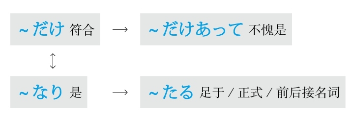

## G
### 感叹

#### なんと～
**解释：** 「なん」的意思是“什么”；「と」表示说的内容
**直译：** 说什么好啊
**意译：** 多么～啊
**接续：** 任何词

例句：モノレールができるから、**なんと** <ruby>便<rp>(</rp><rt>べん</rt><rp>)</rp></ruby><ruby>利<rp>(</rp><rt>り</rt><rp>)</rp></ruby>になるのかわからない。
直译：因为要建单轨电车了，所以不知道会变得多么方便啊。
意译：要建单轨电车了，不知道会变得多么方便啊。

例句：**なんと** <ruby>綺<rp>(</rp><rt>き</rt><rp>)</rp></ruby><ruby>麗<rp>(</rp><rt>れい</rt><rp>)</rp></ruby>な<ruby>人<rp>(</rp><rt>ひと</rt><rp>)</rp></ruby>。
直译：说什么好啊，漂亮的人啊。
意译：多么漂亮的人啊！

#### どんなに～だろう
**解释：** 「どんなに」的意思是“多么地”；「だろう」是「でしょう」的简体，表示推测
**意思：** 多么～啊
**用于：** 将来的事项
**接续：** 动词和形容词的原形、形容动词和名词

例句：<ruby>日<rp>(</rp><rt>に</rt><rp>)</rp></ruby><ruby>本<rp>(</rp><rt>ほん</rt><rp>)</rp></ruby><ruby>語<rp>(</rp><rt>ご</rt><rp>)</rp></ruby>がぺらぺらに<ruby>話<rp>(</rp><rt>はな</rt><rp>)</rp></ruby>せるようになったら、**どんなに** <ruby>楽<rp>(</rp><rt>たの</rt><rp>)</rp></ruby>しいこと**だろう** 。
直译：日语变得能够说流利了的话，该是多么高兴的事啊。
意译：如果日语能说流利了，该是多么高兴的事啊。

#### －もがな
**解释：** 「も」表示强调；「が」是古语中起连接作用的助词；「な」是表示感叹“太好了”的「いいなあ」的省略
**意思：** 要是～该有多好啊
**语气：** 后悔
**接续：** 前面接动词的否定形「ず」，后面接「の」
**常用：** 「言わずもがな」（不说就好了、不用说）；「やらずもがな」（不做就好了、不给予就好了）；「あらずもがな」（没有就好了）；「なくもがな」（没有就好了）；「<ruby>由<rp>(</rp><rt>よし</rt><rp>)</rp></ruby>もがな」（如果有办法就好了）

例句：やらず**もがな** のことをしてしまって<ruby>後<rp>(</rp><rt>こう</rt><rp>)</rp></ruby><ruby>悔<rp>(</rp><rt>かい</rt><rp>)</rp></ruby>しています。
直译：做了不做就好了的事，很后悔。
意译：做了不该做的事，很后悔。
语法关系图

### 刚～

#### －かける
**解释：** 「かける」表示“大面积地覆盖”
**意思：** 开始了某事但是还没有结束，还在进行当中
**接续：** 动词的连用形

例句：このおかずは<ruby>腐<rp>(</rp><rt>くさ</rt><rp>)</rp></ruby>り**かけて** いる。
直译：这盘菜开始坏了。
意译：这盘菜要坏了。

例句：<ruby>食<rp>(</rp><rt>しょく</rt><rp>)</rp></ruby><ruby>卓<rp>(</rp><rt>たく</rt><rp>)</rp></ruby>には<ruby>食<rp>(</rp><rt>た</rt><rp>)</rp></ruby>べ**かけ** のパンが<ruby>置<rp>(</rp><rt>お</rt><rp>)</rp></ruby>いてある。
直译：饭桌上，放着开始吃的但是没有吃完的面包。
意译：饭桌上放着没吃完的面包。

### 根据，按照

#### ～をもとに
**注意：** 应用了日语里的经典句型「～を～と（に）する（把～当成～）」
**解释：** 「<ruby>元<rp>(</rp><rt>もと</rt><rp>)</rp></ruby>、<ruby>本<rp>(</rp><rt>もと</rt><rp>)</rp></ruby>」的意思是“根本”
**意思：** 以～为根本
**接续：** 名词

例句：このドラマは<ruby>事<rp>(</rp><rt>じ</rt><rp>)</rp></ruby><ruby>実<rp>(</rp><rt>じつ</rt><rp>)</rp></ruby>**をもとに** <ruby>作<rp>(</rp><rt>つく</rt><rp>)</rp></ruby>られたものだ。
直译：这个电视剧是根据事实被创作的东西。
意译：这个电视剧是根据事实创作的。

#### ～に基づいて
**解释：** 「に」表示方向；「<ruby>基<rp>(</rp><rt>もと</rt><rp>)</rp></ruby>づいて」是自动词「<ruby>基<rp>(</rp><rt>もと</rt><rp>)</rp></ruby>づく」的中顿形式，「<ruby>基<rp>(</rp><rt>もと</rt><rp>)</rp></ruby>づく」是「もと＋<ruby>付<rp>(</rp><rt>つ</rt><rp>)</rp></ruby>く」的组合，意思是“附着在根本上”
**意思：** 基于～
**接续：** 名词

例句：<ruby>彼<rp>(</rp><rt>かれ</rt><rp>)</rp></ruby>の<ruby>助<rp>(</rp><rt>じょ</rt><rp>)</rp></ruby><ruby>言<rp>(</rp><rt>げん</rt><rp>)</rp></ruby>は<ruby>長<rp>(</rp><rt>なが</rt><rp>)</rp></ruby><ruby>年<rp>(</rp><rt>ねん</rt><rp>)</rp></ruby>の<ruby>経<rp>(</rp><rt>けい</rt><rp>)</rp></ruby><ruby>験<rp>(</rp><rt>けん</rt><rp>)</rp></ruby>**に<ruby>基<rp>(</rp><rt>もと</rt><rp>)</rp></ruby>づいて** <ruby>出<rp>(</rp><rt>だ</rt><rp>)</rp></ruby>されたものだから、<ruby>納<rp>(</rp><rt>なっ</rt><rp>)</rp></ruby><ruby>得<rp>(</rp><rt>とく</rt><rp>)</rp></ruby>できる。
直译：他的指教是基于长年的经验被提出的东西，能够心服口服。
意译：他的指教是基于长年的经验（总结）的，能够让人心服口服。

#### ～を踏まえて
**解释：** 「を」接在他动词前表示“把”；「<ruby>踏<rp>(</rp><rt>ふ</rt><rp>)</rp></ruby>まえて」是他动词「<ruby>踏<rp>(</rp><rt>ふ</rt><rp>)</rp></ruby>まえる」的中顿形式，意思是“踏”
**意思：** 踏着～
**接续：** 名词
**区别：** 侧重于“根本”和“步骤”两方面

例句：<ruby>昨<rp>(</rp><rt>さく</rt><rp>)</rp></ruby><ruby>年<rp>(</rp><rt>ねん</rt><rp>)</rp></ruby>の<ruby>反<rp>(</rp><rt>はん</rt><rp>)</rp></ruby><ruby>省<rp>(</rp><rt>せい</rt><rp>)</rp></ruby>**を<ruby>踏<rp>(</rp><rt>ふ</rt><rp>)</rp></ruby>まえて** 、<ruby>今<rp>(</rp><rt>こん</rt><rp>)</rp></ruby><ruby>後<rp>(</rp><rt>ご</rt><rp>)</rp></ruby>の<ruby>計<rp>(</rp><rt>けい</rt><rp>)</rp></ruby><ruby>画<rp>(</rp><rt>かく</rt><rp>)</rp></ruby>を<ruby>立<rp>(</rp><rt>た</rt><rp>)</rp></ruby>てたい。
直译：踏着去年的反省，想制订今后的计划。
意译：我们想根据去年的反省（结果）制订今后的计划。

#### ～に応じて
**解释：** 「に」表示方向；「<ruby>応<rp>(</rp><rt>おう</rt><rp>)</rp></ruby>じて」是自动词「<ruby>応<rp>(</rp><rt>おう</rt><rp>)</rp></ruby>じる」的中顿形式，意思是“相应、对应”
**意思：** 与～相对应
**接续：** 名词

例句：<ruby>実<rp>(</rp><rt>じっ</rt><rp>)</rp></ruby><ruby>際<rp>(</rp><rt>さい</rt><rp>)</rp></ruby>の<ruby>収<rp>(</rp><rt>しゅう</rt><rp>)</rp></ruby><ruby>入<rp>(</rp><rt>にゅう</rt><rp>)</rp></ruby>**に<ruby>応<rp>(</rp><rt>おう</rt><rp>)</rp></ruby>じて** 、<ruby>支<rp>(</rp><rt>し</rt><rp>)</rp></ruby><ruby>出<rp>(</rp><rt>しゅつ</rt><rp>)</rp></ruby>を<ruby>考<rp>(</rp><rt>かんが</rt><rp>)</rp></ruby>えなければいけない。
直译：与实际收入相对应，必须考虑支出。
意译：必须根据实际收入考虑支出。

#### ～によって
**解释：** 「に」表示方向或对象；「よって」是自动词「<ruby>由<rp>(</rp><rt>よ</rt><rp>)</rp></ruby>る」的中顿形式，意思是“根据～；由于～；由～来做～”
**意思：** 根据～
**接续：** 名词

例句：<ruby>中<rp>(</rp><rt>ちゅう</rt><rp>)</rp></ruby><ruby>国<rp>(</rp><rt>ごく</rt><rp>)</rp></ruby><ruby>語<rp>(</rp><rt>ご</rt><rp>)</rp></ruby>の<ruby>多<rp>(</rp><rt>た</rt><rp>)</rp></ruby><ruby>音<rp>(</rp><rt>おん</rt><rp>)</rp></ruby><ruby>字<rp>(</rp><rt>じ</rt><rp>)</rp></ruby>は、アクセントの<ruby>違<rp>(</rp><rt>ちが</rt><rp>)</rp></ruby>い**によって** <ruby>意<rp>(</rp><rt>い</rt><rp>)</rp></ruby><ruby>味<rp>(</rp><rt>み</rt><rp>)</rp></ruby>が<ruby>変<rp>(</rp><rt>か</rt><rp>)</rp></ruby>わるというものだ。
直译：汉语的多音字，根据声调的不同，意思会发生改变的东西。
意译：汉语的多音字根据声调的不同意思也不同。

#### ～通り
**解释：** 名词「<ruby>通<rp>(</rp><rt>とお</rt><rp>)</rp></ruby>り」的原意是“马路”；如果变为副词则加「に」
**注意：** 此语法起源于在马路上车辆按照顺序往前行驶这一现象，与某些名词可以直接接续构成复合名词，但是需要浊音化，比如「<ruby>説<rp>(</rp><rt>せつ</rt><rp>)</rp></ruby><ruby>明<rp>(</rp><rt>めい</rt><rp>)</rp></ruby><ruby>通<rp>(</rp><rt>どお</rt><rp>)</rp></ruby>り（按照说明）」
**意思：** 按照～
**着重：** 顺序或步骤
**接续：** 名词加の、动词的简体

例句：<ruby>先<rp>(</rp><rt>せん</rt><rp>)</rp></ruby><ruby>生<rp>(</rp><rt>せい</rt><rp>)</rp></ruby>のおっしゃる**<ruby>通<rp>(</rp><rt>とお</rt><rp>)</rp></ruby>り** です。
直译：按照老师您说的。
意译：老师您说的很对。

例句：<ruby>説<rp>(</rp><rt>せつ</rt><rp>)</rp></ruby><ruby>明<rp>(</rp><rt>めい</rt><rp>)</rp></ruby><ruby>書<rp>(</rp><rt>しょ</rt><rp>)</rp></ruby>の**<ruby>通<rp>(</rp><rt>とお</rt><rp>)</rp></ruby>り** に<ruby>操<rp>(</rp><rt>そう</rt><rp>)</rp></ruby><ruby>作<rp>(</rp><rt>さ</rt><rp>)</rp></ruby>してください。
直译：请按照说明书而那样地操作。
意译：请按照说明书操作。

#### ～に応えて
**解释：** 「に」表示方向或对象；「<ruby>応<rp>(</rp><rt>こた</rt><rp>)</rp></ruby>えて」是自动词「<ruby>応<rp>(</rp><rt>こた</rt><rp>)</rp></ruby>える」的中顿形式，意思是“回应”
**意思：** 按照～
**着重：** 与～相回应
**接续：** 「<ruby>声<rp>(</rp><rt>こえ</rt><rp>)</rp></ruby>、<ruby>要<rp>(</rp><rt>よう</rt><rp>)</rp></ruby><ruby>望<rp>(</rp><rt>ぼう</rt><rp>)</rp></ruby>、<ruby>希<rp>(</rp><rt>き</rt><rp>)</rp></ruby><ruby>望<rp>(</rp><rt>ぼう</rt><rp>)</rp></ruby>」等名词

例句：<ruby>学<rp>(</rp><rt>がく</rt><rp>)</rp></ruby><ruby>生<rp>(</rp><rt>せい</rt><rp>)</rp></ruby>の<ruby>声<rp>(</rp><rt>こえ</rt><rp>)</rp></ruby>**に<ruby>応<rp>(</rp><rt>こた</rt><rp>)</rp></ruby>えて** <ruby>教<rp>(</rp><rt>おし</rt><rp>)</rp></ruby>え<ruby>方<rp>(</rp><rt>かた</rt><rp>)</rp></ruby>を<ruby>変<rp>(</rp><rt>か</rt><rp>)</rp></ruby>えた。
直译：按照学生的呼声，改变了教学方法。
意译：根据学生的要求改变了教学方法。

#### ～に即して
**解释：** 「に」表示方向或对象；「<ruby>即<rp>(</rp><rt>そく</rt><rp>)</rp></ruby>して」是自动词「<ruby>即<rp>(</rp><rt>そく</rt><rp>)</rp></ruby>する」的中顿形式，是从「<ruby>即<rp>(</rp><rt>そく</rt><rp>)</rp></ruby><ruby>応<rp>(</rp><rt>おう</rt><rp>)</rp></ruby>する」演变而来的
**意思：** 与～相对应
**着重：** 百分之百一样
**语气：** 正式
**接续：** 前面接名词，后面接动词；如果后面接名词要用「～に<ruby>即<rp>(</rp><rt>そく</rt><rp>)</rp></ruby>した」的形式

例句：<ruby>実<rp>(</rp><rt>じつ</rt><rp>)</rp></ruby><ruby>情<rp>(</rp><rt>じょう</rt><rp>)</rp></ruby>**に<ruby>即<rp>(</rp><rt>そく</rt><rp>)</rp></ruby>して** <ruby>対<rp>(</rp><rt>たい</rt><rp>)</rp></ruby><ruby>応<rp>(</rp><rt>おう</rt><rp>)</rp></ruby><ruby>策<rp>(</rp><rt>さく</rt><rp>)</rp></ruby>を<ruby>検<rp>(</rp><rt>けん</rt><rp>)</rp></ruby><ruby>討<rp>(</rp><rt>とう</rt><rp>)</rp></ruby>したい。
直译：想与实际情况相对应，研究对策。
意译：想根据实际情况研究对策。

#### ～なりに
**解释：** 「なり」在古语当中是表示断定的「<ruby>也<rp>(</rp><rt>なり</rt><rp>)</rp></ruby>」，意思是“是”；「に」表示副词
**直译：** 是～
**意译：** 按照～自身的方式
**接续：** 名词

例句：わたしはわたし**なりに** <ruby>生<rp>(</rp><rt>い</rt><rp>)</rp></ruby>きていきたい。
直译：我想按照自己的方式活下去。
意译：我想按照自己的方式生活。

#### －次第
**解释：** 「<ruby>次<rp>(</rp><rt>つぎ</rt><rp>)</rp></ruby>」的意思是“下一个”；「<ruby>第<rp>(</rp><rt>だい</rt><rp>)</rp></ruby>」的意思是“第二个”；「<ruby>次<rp>(</rp><rt>し</rt><rp>)</rp></ruby><ruby>第<rp>(</rp><rt>だい</rt><rp>)</rp></ruby>」的意思是“下一步”
**意思：** 根据～下一步马上就～
**语气：** 正式
**接续：** 名词、动词的连用形

例句：<ruby>条<rp>(</rp><rt>じょう</rt><rp>)</rp></ruby><ruby>件<rp>(</rp><rt>けん</rt><rp>)</rp></ruby>**<ruby>次<rp>(</rp><rt>し</rt><rp>)</rp></ruby><ruby>第<rp>(</rp><rt>だい</rt><rp>)</rp></ruby>** では<ruby>売<rp>(</rp><rt>う</rt><rp>)</rp></ruby>らないことはない。
直译：条件好的话，下一步，没有不卖的事情。
意译：根据条件如何有可能出售。

#### ～に沿って
**解释：** 「に」表示方向或对象；「<ruby>沿<rp>(</rp><rt>そ</rt><rp>)</rp></ruby>って」是自动词「<ruby>沿<rp>(</rp><rt>そ</rt><rp>)</rp></ruby>う」的中顿形式
**直译：** 沿着～
**意译：** 按照～
**着重：** 步骤
**接续：** 名词

例句：<ruby>容<rp>(</rp><rt>よう</rt><rp>)</rp></ruby><ruby>器<rp>(</rp><rt>き</rt><rp>)</rp></ruby>リサイクル<ruby>法<rp>(</rp><rt>ほう</rt><rp>)</rp></ruby>は、<ruby>地<rp>(</rp><rt>ち</rt><rp>)</rp></ruby><ruby>域<rp>(</rp><rt>いき</rt><rp>)</rp></ruby>の<ruby>実<rp>(</rp><rt>じつ</rt><rp>)</rp></ruby><ruby>情<rp>(</rp><rt>じょう</rt><rp>)</rp></ruby>**に<ruby>沿<rp>(</rp><rt>そ</rt><rp>)</rp></ruby>って** <ruby>行<rp>(</rp><rt>おこな</rt><rp>)</rp></ruby>わなければならない。
直译：容器再利用法，沿着地区的实情，如果不执行就不成。
意译：容器再利用法必须按照各个地区的实际情况实施。
语法关系图

### 关于，对于

#### ～に関して
**解释：** 「に」表示方向或对象；「<ruby>関<rp>(</rp><rt>かん</rt><rp>)</rp></ruby>して」是自动词「<ruby>関<rp>(</rp><rt>かん</rt><rp>)</rp></ruby>する」的中顿形式
**意思：** 关于～
**接续：** 名词

例句：<ruby>外<rp>(</rp><rt>がい</rt><rp>)</rp></ruby><ruby>国<rp>(</rp><rt>こく</rt><rp>)</rp></ruby>の<ruby>言<rp>(</rp><rt>こと</rt><rp>)</rp></ruby><ruby>葉<rp>(</rp><rt>ば</rt><rp>)</rp></ruby>を<ruby>習<rp>(</rp><rt>なら</rt><rp>)</rp></ruby>う<ruby>時<rp>(</rp><rt>とき</rt><rp>)</rp></ruby>、その<ruby>国<rp>(</rp><rt>くに</rt><rp>)</rp></ruby>の<ruby>文<rp>(</rp><rt>ぶん</rt><rp>)</rp></ruby><ruby>化<rp>(</rp><rt>か</rt><rp>)</rp></ruby>や<ruby>習<rp>(</rp><rt>しゅう</rt><rp>)</rp></ruby><ruby>慣<rp>(</rp><rt>かん</rt><rp>)</rp></ruby>**に<ruby>関<rp>(</rp><rt>かん</rt><rp>)</rp></ruby>して** も<ruby>知<rp>(</rp><rt>し</rt><rp>)</rp></ruby>ったほうがいい。
直译：学外语的时候，关于那个国家的文化和习惯，知道最好。
意译：学外语的时候，最好知道那个国家的文化和习惯。

#### ～にかかわる
**解释：** 「に」表示方向或对象；「<ruby>関<rp>(</rp><rt>かか</rt><rp>)</rp></ruby>わる」的意思是“有关系”
**意思：** 与～有关
**语气：** 正式
**接续：** 名词

例句：これは<ruby>名<rp>(</rp><rt>めい</rt><rp>)</rp></ruby><ruby>誉<rp>(</rp><rt>よ</rt><rp>)</rp></ruby>**にかかわる** <ruby>問<rp>(</rp><rt>もん</rt><rp>)</rp></ruby><ruby>題<rp>(</rp><rt>だい</rt><rp>)</rp></ruby>だから、<ruby>誰<rp>(</rp><rt>だれ</rt><rp>)</rp></ruby>だって<ruby>真<rp>(</rp><rt>しん</rt><rp>)</rp></ruby><ruby>剣<rp>(</rp><rt>けん</rt><rp>)</rp></ruby>になる。
直译：这是与名誉有关的问题，谁都会认真。
意译：这是有关名誉的问题，谁都会认真对待。

#### ～に対して
**解释：** 「に」表示对象；「<ruby>対<rp>(</rp><rt>たい</rt><rp>)</rp></ruby>して」是自动词「<ruby>対<rp>(</rp><rt>たい</rt><rp>)</rp></ruby>する」的中顿形式，意思是“对象；对比”
**意思：** 对于～、与～相对比，在此是前者
**接续：** 名词

例句：サービス<ruby>業<rp>(</rp><rt>ぎょう</rt><rp>)</rp></ruby>なので、お<ruby>客<rp>(</rp><rt>きゃく</rt><rp>)</rp></ruby>さん**に<ruby>対<rp>(</rp><rt>たい</rt><rp>)</rp></ruby>して** <ruby>失<rp>(</rp><rt>しつ</rt><rp>)</rp></ruby><ruby>礼<rp>(</rp><rt>れい</rt><rp>)</rp></ruby>な<ruby>態<rp>(</rp><rt>たい</rt><rp>)</rp></ruby><ruby>度<rp>(</rp><rt>ど</rt><rp>)</rp></ruby>を<ruby>取<rp>(</rp><rt>と</rt><rp>)</rp></ruby>ってはいけない。
直译：因为是服务行业，对客人，失礼的态度采取不行。
意译：因为是服务行业，所以不能对客人采取失礼的态度。

#### ～に向かって
**解释：** 「に」表示“方向、对象、目的、目标”；「<ruby>向<rp>(</rp><rt>む</rt><rp>)</rp></ruby>かって」是自动词「<ruby>向<rp>(</rp><rt>む</rt><rp>)</rp></ruby>かう」的中顿形式，意思是“朝向”
**意思：** 朝着～
**接续：** 名词

例句：<ruby>東<rp>(</rp><rt>ひがし</rt><rp>)</rp></ruby>**に<ruby>向<rp>(</rp><rt>む</rt><rp>)</rp></ruby>かって** まっすぐ<ruby>行<rp>(</rp><rt>い</rt><rp>)</rp></ruby>ってください。
直译：朝东，请一直走。
意译：请朝东一直走。

例句：<ruby>先<rp>(</rp><rt>せん</rt><rp>)</rp></ruby><ruby>生<rp>(</rp><rt>せい</rt><rp>)</rp></ruby>**に<ruby>向<rp>(</rp><rt>む</rt><rp>)</rp></ruby>かって** <ruby>何<rp>(</rp><rt>なん</rt><rp>)</rp></ruby>ってことを<ruby>言<rp>(</rp><rt>い</rt><rp>)</rp></ruby>うの？
直译：朝老师，什么话说？
意译：怎么这么对老师说话？

例句：<ruby>目<rp>(</rp><rt>もく</rt><rp>)</rp></ruby><ruby>標<rp>(</rp><rt>ひょう</rt><rp>)</rp></ruby>**に<ruby>向<rp>(</rp><rt>む</rt><rp>)</rp></ruby>かって** <ruby>頑<rp>(</rp><rt>がん</rt><rp>)</rp></ruby><ruby>張<rp>(</rp><rt>ば</rt><rp>)</rp></ruby>りましょう。
直译：朝着目标，加油吧。
意译：朝着目标努力吧。

#### ～にとって
**解释：** 「に」表示对象；「とって」通常不用动词原形，只用て形
**意思：** 对～来说
**接续：** 名词

例句：<ruby>環<rp>(</rp><rt>かん</rt><rp>)</rp></ruby><ruby>境<rp>(</rp><rt>きょう</rt><rp>)</rp></ruby><ruby>保<rp>(</rp><rt>ほ</rt><rp>)</rp></ruby><ruby>護<rp>(</rp><rt>ご</rt><rp>)</rp></ruby>はすべての<ruby>人<rp>(</rp><rt>ひと</rt><rp>)</rp></ruby>**にとって** <ruby>意<rp>(</rp><rt>い</rt><rp>)</rp></ruby><ruby>識<rp>(</rp><rt>しき</rt><rp>)</rp></ruby>に<ruby>昇<rp>(</rp><rt>のぼ</rt><rp>)</rp></ruby>らなくてはならない<ruby>重<rp>(</rp><rt>じゅう</rt><rp>)</rp></ruby><ruby>要<rp>(</rp><rt>よう</rt><rp>)</rp></ruby>な<ruby>課<rp>(</rp><rt>か</rt><rp>)</rp></ruby><ruby>題<rp>(</rp><rt>だい</rt><rp>)</rp></ruby>だ。
直译：保护环境，对于所有人来说，是不上升到意识不成的重要的课题。
意译：对于所有人来说，保护环境是必须上升到意识（层面）的重要课题。

#### ～について
**解释：** 「に」表示对象；「ついて」是自动词「<ruby>就<rp>(</rp><rt>つ</rt><rp>)</rp></ruby>く」的中顿形式
**意思：** 就～进行～
**注意：** 因为侧重于“就～”，所以后面通常用「<ruby>発<rp>(</rp><rt>はっ</rt><rp>)</rp></ruby><ruby>表<rp>(</rp><rt>ぴょう</rt><rp>)</rp></ruby>する、<ruby>考<rp>(</rp><rt>かんが</rt><rp>)</rp></ruby>える、<ruby>紹<rp>(</rp><rt>しょう</rt><rp>)</rp></ruby><ruby>介<rp>(</rp><rt>かい</rt><rp>)</rp></ruby>する」等能够搭配的动词
**接续：** 名词

例句：わが<ruby>社<rp>(</rp><rt>しゃ</rt><rp>)</rp></ruby>の<ruby>新<rp>(</rp><rt>しん</rt><rp>)</rp></ruby><ruby>製<rp>(</rp><rt>せい</rt><rp>)</rp></ruby><ruby>品<rp>(</rp><rt>ひん</rt><rp>)</rp></ruby>**について** ご<ruby>紹<rp>(</rp><rt>しょう</rt><rp>)</rp></ruby><ruby>介<rp>(</rp><rt>かい</rt><rp>)</rp></ruby>します。
直译：就我们公司的新产品，我来进行介绍。
意译：我来介绍一下我们公司的新产品。

#### ～をめぐって
**解释：** 「を」用于自动词前表示“移动”；「めぐって」是自动词「<ruby>巡<rp>(</rp><rt>めぐ</rt><rp>)</rp></ruby>る」的中顿形式，意思是“围绕”
**意思：** 围绕着～的话题
**接续：** 名词

例句：<ruby>新<rp>(</rp><rt>あたら</rt><rp>)</rp></ruby>しい<ruby>法<rp>(</rp><rt>ほう</rt><rp>)</rp></ruby><ruby>案<rp>(</rp><rt>あん</rt><rp>)</rp></ruby>の<ruby>実<rp>(</rp><rt>じっ</rt><rp>)</rp></ruby><ruby>施<rp>(</rp><rt>し</rt><rp>)</rp></ruby>の<ruby>賛<rp>(</rp><rt>さん</rt><rp>)</rp></ruby><ruby>否<rp>(</rp><rt>ぴ</rt><rp>)</rp></ruby>**をめぐって** 、<ruby>活<rp>(</rp><rt>かっ</rt><rp>)</rp></ruby><ruby>発<rp>(</rp><rt>ぱつ</rt><rp>)</rp></ruby>な<ruby>議<rp>(</rp><rt>ぎ</rt><rp>)</rp></ruby><ruby>論<rp>(</rp><rt>ろん</rt><rp>)</rp></ruby>が<ruby>交<rp>(</rp><rt>か</rt><rp>)</rp></ruby>わされた。
直译：围绕着新法案的实施的赞成与否，活跃的讨论被交织着。
意译：围绕着是否赞成新法案的实施展开了热烈的讨论。
语法关系图
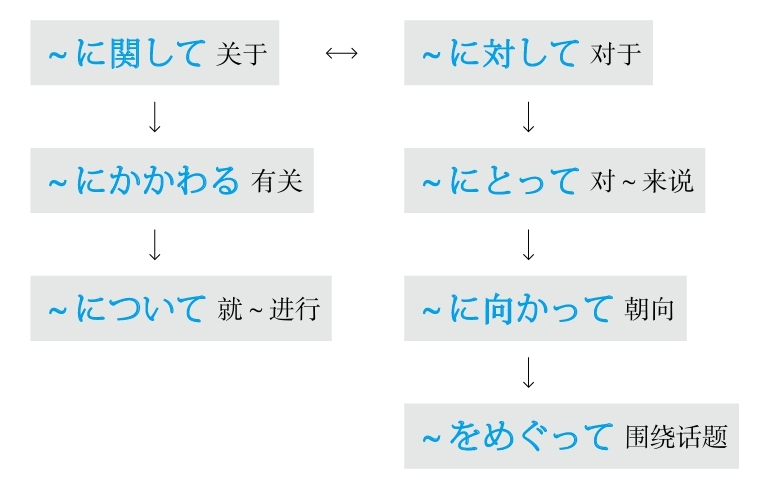

### 关于「済む」

#### ～で済む
**解释：** 「で」表示程度；自动词「<ruby>済<rp>(</rp><rt>す</rt><rp>)</rp></ruby>む」的意思是“事情的终了或结束”
**意思：** 以～的程度，事情结束了或解决了
**注意：** 翻译时必须在后句添加主语，例如：“这件事”或“这个问题”
**着重：** 程度低
**接续：** 名词、助词だけ

例句：<ruby>今日<rp>(</rp><rt>きょう</rt><rp>)</rp></ruby>の<ruby>昼<rp>(</rp><rt>ひる</rt><rp>)</rp></ruby>ごはんはお<ruby>弁<rp>(</rp><rt>べん</rt><rp>)</rp></ruby><ruby>当<rp>(</rp><rt>とう</rt><rp>)</rp></ruby>を<ruby>頼<rp>(</rp><rt>たの</rt><rp>)</rp></ruby>んだから<ruby>400<rp>(</rp><rt>よんひゃく</rt><rp>)</rp></ruby><ruby>円<rp>(</rp><rt>えん</rt><rp>)</rp></ruby>**で<ruby>済<rp>(</rp><rt>す</rt><rp>)</rp></ruby>んだ** 。
直译：今天的午饭，订了盒饭，所以只是400日元，问题就解决了。
意译：今天的午饭订了盒饭，只花了400日元。

#### ～では済まない
**解释：** 「で」表示程度；「は」表示强调；「<ruby>済<rp>(</rp><rt>す</rt><rp>)</rp></ruby>まない」是自动词「<ruby>済<rp>(</rp><rt>す</rt><rp>)</rp></ruby>む」的否定形，意思是“不结束”
**意思：** 以～的程度，事情就不会结束或不会解决
**重点：** 翻译时必须在后句添加主语，例如：“这件事”或“这个问题”
**接续：** 名词、助词だけ

例句：これは<ruby>謝<rp>(</rp><rt>あやま</rt><rp>)</rp></ruby>るだけ**では<ruby>済<rp>(</rp><rt>す</rt><rp>)</rp></ruby>まない** ことだよ。
直译：这是，只是道个歉的程度，不解决的事。
意译：这可不是光道个歉就能解决的事。

#### －ずに済む
**解释：** 「ず」是「なくて」或「ないで」的古语形式；「に」表示副词；自动词「<ruby>済<rp>(</rp><rt>す</rt><rp>)</rp></ruby>む」的意思是“事情的终了或结束”
**意思：** 不做～，事情就结束了或解决了
**注意：** 翻译时必须在后句添加主语，例如：“这件事”或“这个问题”
**变形：** 动词的否定形的ず（变形规律参照第一章的第二节）

例句：<ruby>言<rp>(</rp><rt>い</rt><rp>)</rp></ruby>いたいことは<ruby>全<rp>(</rp><rt>ぜん</rt><rp>)</rp></ruby><ruby>部<rp>(</rp><rt>ぶ</rt><rp>)</rp></ruby><ruby>言<rp>(</rp><rt>い</rt><rp>)</rp></ruby>ってくれたから、<ruby>何<rp>(</rp><rt>なに</rt><rp>)</rp></ruby>も<ruby>言<rp>(</rp><rt>い</rt><rp>)</rp></ruby>わ**ずに<ruby>済<rp>(</rp><rt>す</rt><rp>)</rp></ruby>んだ** 。
直译：想说的话，全部都为我说了，什么都不用说，事情就解决了。
意译：想说的话你都替我说了，我什么都不用说了。

#### －ずには済まない
**解释：** 「ず」是「なくて」或「ないで」的古语形式；「に」表示副词；「は」表示强调；「<ruby>済<rp>(</rp><rt>す</rt><rp>)</rp></ruby>まない」是自动词「<ruby>済<rp>(</rp><rt>す</rt><rp>)</rp></ruby>む」的否定形，意思是“不结束”
**直译：** 不做某事的话，这件事就完不了；不做某事的话，这个问题就解决不了
**意译：** 不～就不行
**注意：** 翻译时必须在后句添加主语，例如：“这件事”或“这个问题”
**变形：** 动词的否定形的ず（变形规律参照第一章的第二节）

例句：<ruby>高<rp>(</rp><rt>こう</rt><rp>)</rp></ruby><ruby>価<rp>(</rp><rt>か</rt><rp>)</rp></ruby>なものを<ruby>壊<rp>(</rp><rt>こわ</rt><rp>)</rp></ruby>したから、<ruby>弁<rp>(</rp><rt>べん</rt><rp>)</rp></ruby><ruby>償<rp>(</rp><rt>しょう</rt><rp>)</rp></ruby>せ**ずにはすまない** だろう。
直译：贵重的东西弄坏了，所以不赔偿事情完不了吧。
意译：把贵重的东西弄坏了，不赔偿事情完不了吧。
语法关系图

### 关于「いる」

#### －ていられる
**解释：** 是动词的现在进行时「－ている」的可能形
**意思：** 能够保持～的状态
**变形：** 动词的て形（变形规律参照第一章的第二节）

例句：<ruby>親<rp>(</rp><rt>おや</rt><rp>)</rp></ruby>と<ruby>一<rp>(</rp><rt>いっ</rt><rp>)</rp></ruby><ruby>緒<rp>(</rp><rt>しょ</rt><rp>)</rp></ruby>に<ruby>暮<rp>(</rp><rt>く</rt><rp>)</rp></ruby>らせば<ruby>安<rp>(</rp><rt>あん</rt><rp>)</rp></ruby><ruby>心<rp>(</rp><rt>しん</rt><rp>)</rp></ruby>し**ていられる** 。
直译：如果跟父母在一起生活的话，心里能够一直踏实。
意译：跟父母在一起生活的话就心里踏实。

#### －てはいられない
**解释：** 是动词的现在进行时「－ている」的可能形的否定；「は」表示强调
**直译：** 不能够保持～的状态
**意译：** 不能一直～
**变形：** 动词的て形（变形规律参照第一章的第二节）

例句：いつまでも<ruby>親<rp>(</rp><rt>おや</rt><rp>)</rp></ruby>のすねをかじっ**てはいられない** 。
直译：到什么时候都，咬着父母的小腿不放，不能一直。
意译：不能永远靠父母养活。

#### －ずにいられる
**解释：** 「ず」是「なくて」或「ないで」的古语形式；「に」表示副词；「いられる」是自动词「いる」的可能形，意思是“坐得住，呆得住”
**直译：** 能够保持不做～的状态
**意译：** 能够一直不～
**变形：** 动词的否定形的ず（变形规律参照第一章的第二节）

例句：ずっと<ruby>戸<rp>(</rp><rt>と</rt><rp>)</rp></ruby><ruby>惑<rp>(</rp><rt>まど</rt><rp>)</rp></ruby>わ**ずにいられます** か？
直译：一直不困惑，能保持得住吗？
意译：你能一直不困惑吗？

#### －ずにはいられない
**解释：** 「ず」是「なくて」或「ないで」的古语形式；「に」表示副词；「は」表示强调；「いられない」是自动词「いる」的可能形的否定，意思是“坐不住，呆不住”
**直译：** 不做某事的话就呆不住
**意译：** 不～就不行
**着重：** 生理现象
**变形：** 动词的否定形的ず（变形规律参照第一章的第二节）

例句：<ruby>通<rp>(</rp><rt>つう</rt><rp>)</rp></ruby><ruby>信<rp>(</rp><rt>しん</rt><rp>)</rp></ruby><ruby>技<rp>(</rp><rt>ぎ</rt><rp>)</rp></ruby><ruby>術<rp>(</rp><rt>じゅつ</rt><rp>)</rp></ruby>の<ruby>発<rp>(</rp><rt>はっ</rt><rp>)</rp></ruby><ruby>達<rp>(</rp><rt>たつ</rt><rp>)</rp></ruby>の<ruby>速<rp>(</rp><rt>はや</rt><rp>)</rp></ruby>さに<ruby>感<rp>(</rp><rt>かん</rt><rp>)</rp></ruby><ruby>心<rp>(</rp><rt>しん</rt><rp>)</rp></ruby>せ**ずにはいられない** 。
直译：对于通讯技术的发展的快速，不佩服就呆不住。
意译：不能不感叹通讯技术的迅速发展。
语法关系图

### 关于「つもり」

#### ～つもり
**解释：** 名词「つもり」常被翻译成“打算”，但是日语的「つもり」的语气要比汉语的“打算”的语气强得多，所以应该理解为「<ruby>強<rp>(</rp><rt>つよ</rt><rp>)</rp></ruby>い<ruby>思<rp>(</rp><rt>おも</rt><rp>)</rp></ruby>い」（强烈的心情或决心）。如果想说“打算做某事”时可以直接用动词
**注意：** 「つもり」常用「～つもりでいる」的形式；「で」表示状态，表示“～的心情很坚定”
**接续：** 修饰名词的规律（参照第一章的第三节）

例句：<ruby>一体<rp>(</rp><rt>いったい</rt><rp>)</rp></ruby>どういう**つもり** ですか？
直译：到底是什么决心？
意译：到底想干什么？（质问对方时用）

例句：<ruby>私<rp>(</rp><rt>わたし</rt><rp>)</rp></ruby>は<ruby>自<rp>(</rp><rt>じ</rt><rp>)</rp></ruby><ruby>分<rp>(</rp><rt>ぶん</rt><rp>)</rp></ruby>がまだまだ<ruby>若<rp>(</rp><rt>わか</rt><rp>)</rp></ruby>い**つもり** でいるよ。
直译：自己还是非常年轻，我保持这种强烈的心情。
意译：我认为自己还是非常年轻的。

例句：<ruby>本<rp>(</rp><rt>ほん</rt><rp>)</rp></ruby><ruby>当<rp>(</rp><rt>とう</rt><rp>)</rp></ruby>は<ruby>負<rp>(</rp><rt>ま</rt><rp>)</rp></ruby>けているが、<ruby>勝<rp>(</rp><rt>か</rt><rp>)</rp></ruby>った**つもり** でいる。
直译：其实输了，但是保持赢了的强烈的心情。
意译：其实输了。但是心里当作自己赢了。

### 关于使役被动

#### －させられる
**解释：** 使役被动＝一般现在时，即：「させられる」＝「する」，但是有“消极、被迫”的语气，具体分类为以下三个
**变形：** 使役被动形（变形规律参照第一章的第二节）
**不情愿的**

例句：お<ruby>酒<rp>(</rp><rt>さけ</rt><rp>)</rp></ruby>を<ruby>飲<rp>(</rp><rt>の</rt><rp>)</rp></ruby>みたくないのに、<ruby>何<rp>(</rp><rt>なん</rt><rp>)</rp></ruby><ruby>杯<rp>(</rp><rt>ばい</rt><rp>)</rp></ruby>も<ruby>無<rp>(</rp><rt>む</rt><rp>)</rp></ruby><ruby>理<rp>(</rp><rt>り</rt><rp>)</rp></ruby><ruby>矢<rp>(</rp><rt>や</rt><rp>)</rp></ruby><ruby>理<rp>(</rp><rt>り</rt><rp>)</rp></ruby><ruby>飲<rp>(</rp><rt>の</rt><rp>)</rp></ruby>**まされた** 。
直译：不想喝酒，可是好几杯非要被让喝了。
意译：不想喝酒，可是被硬灌了好几杯。

**不是自发的**

例句：<ruby>子<rp>(</rp><rt>こ</rt><rp>)</rp></ruby><ruby>供<rp>(</rp><rt>ども</rt><rp>)</rp></ruby>たちの<ruby>発<rp>(</rp><rt>はっ</rt><rp>)</rp></ruby><ruby>表<rp>(</rp><rt>ぴょう</rt><rp>)</rp></ruby>を<ruby>聞<rp>(</rp><rt>き</rt><rp>)</rp></ruby>いて、<ruby>環<rp>(</rp><rt>かん</rt><rp>)</rp></ruby><ruby>境<rp>(</rp><rt>きょう</rt><rp>)</rp></ruby><ruby>保<rp>(</rp><rt>ほ</rt><rp>)</rp></ruby><ruby>護<rp>(</rp><rt>ご</rt><rp>)</rp></ruby>について<ruby>考<rp>(</rp><rt>かんが</rt><rp>)</rp></ruby>え**させられた** 。
直译：听了孩子们的发言，对保护环境，被让考虑。
意译：孩子们的发言引起我们对保护环境的深思。

**无意中的（带来不好的结果）**

例句：<ruby>彼<rp>(</rp><rt>かれ</rt><rp>)</rp></ruby>の<ruby>口<rp>(</rp><rt>くち</rt><rp>)</rp></ruby><ruby>車<rp>(</rp><rt>ぐるま</rt><rp>)</rp></ruby>にまんまと<ruby>乗<rp>(</rp><rt>の</rt><rp>)</rp></ruby>**せられた** 。
直译：我被让乘上了他满嘴跑的火车。
意译：我不知道怎么回事就上了他的当。

### 关于「すら、さえ、こそ」

#### ～すら
**解释：** 举出极端的事物；「す」表示「それ」，「ら」表示“拉”（方向）
**直译：** 往那个方向
**意译：** 连～
**注意：** 通常不跟「－ば」一起使用
**区别：** 语气比「さえ」强
**接续：** 名词、助词

例句：<ruby>子<rp>(</rp><rt>こ</rt><rp>)</rp></ruby><ruby>供<rp>(</rp><rt>ども</rt><rp>)</rp></ruby>**すら** わかることなのに、どうして<ruby>大人<rp>(</rp><rt>おとな</rt><rp>)</rp></ruby>のあなたがわからないの？
直译：连孩子都明白的事，为什么大人的你不明白啊？
意译：连孩子都明白的事，为什么你这个大人不明白啊？

#### ～さえ
**解释：** 举出极端的事物；「さ」表示「それ」，「え」是表示“方向”的「へ」
**直译：** 往那个方向
**意译：** 连～
**注意：** 常用「～さえ－ば」，表示“只要～就～”
**区别：** 语气比「すら」弱
**接续：** 名词、助词

例句：<ruby>社<rp>(</rp><rt>しゃ</rt><rp>)</rp></ruby><ruby>長<rp>(</rp><rt>ちょう</rt><rp>)</rp></ruby>に**さえ** <ruby>対<rp>(</rp><rt>たい</rt><rp>)</rp></ruby><ruby>応<rp>(</rp><rt>おう</rt><rp>)</rp></ruby>のできない<ruby>問<rp>(</rp><rt>もん</rt><rp>)</rp></ruby><ruby>題<rp>(</rp><rt>だい</rt><rp>)</rp></ruby>だから、<ruby>下<rp>(</rp><rt>した</rt><rp>)</rp></ruby>っ<ruby>端<rp>(</rp><rt>ぱ</rt><rp>)</rp></ruby>の<ruby>私<rp>(</rp><rt>わたし</rt><rp>)</rp></ruby>に<ruby>対<rp>(</rp><rt>たい</rt><rp>)</rp></ruby><ruby>応<rp>(</rp><rt>おう</rt><rp>)</rp></ruby>できるはずがない。
直译：连对于社长都无法应对的问题，所以对于小卒子的我，不可能能够应对。
意译：这个问题连社长都无法应对，我这样的小职员更不可能应对了。

例句：<ruby>反<rp>(</rp><rt>はん</rt><rp>)</rp></ruby><ruby>則<rp>(</rp><rt>そく</rt><rp>)</rp></ruby>**さえ** しなけれ**ば** 、<ruby>勝<rp>(</rp><rt>か</rt><rp>)</rp></ruby>っていたのに…
直译：只要不犯规，那时候已经赢了……
意译：只要不犯规就能赢了，可是现在……

#### ～こそ
**解释：** 强调前面的名词；「こ」相当于表示方向的“过”，「そ」是「それ」
**直译：** 往那个方向
**意译：** 正是～；的确～
**注意：** 「－ばこそ」是「～からこそ」（正是因为～）的古语
**接续：** 名词

例句：「<ruby>宜<rp>(</rp><rt>よろ</rt><rp>)</rp></ruby>しくお<ruby>願<rp>(</rp><rt>ねが</rt><rp>)</rp></ruby>いいたします。」「こちら**こそ** <ruby>宜<rp>(</rp><rt>よろ</rt><rp>)</rp></ruby>しくお<ruby>願<rp>(</rp><rt>ねが</rt><rp>)</rp></ruby>いいたします。」
直译：“请您多关照”“我正是要请您多关照呢”
意译：“请您多关照”“我才要请您多关照呢”

例句：<ruby>河<rp>(</rp><rt>こう</rt><rp>)</rp></ruby><ruby>野<rp>(</rp><rt>の</rt><rp>)</rp></ruby>さんは<ruby>言<rp>(</rp><rt>こと</rt><rp>)</rp></ruby><ruby>葉<rp>(</rp><rt>ば</rt><rp>)</rp></ruby><ruby>遣<rp>(</rp><rt>づか</rt><rp>)</rp></ruby>い**こそ** <ruby>悪<rp>(</rp><rt>わる</rt><rp>)</rp></ruby>いが、<ruby>本<rp>(</rp><rt>ほん</rt><rp>)</rp></ruby><ruby>当<rp>(</rp><rt>とう</rt><rp>)</rp></ruby>は<ruby>心<rp>(</rp><rt>こころ</rt><rp>)</rp></ruby>の<ruby>優<rp>(</rp><rt>やさ</rt><rp>)</rp></ruby>しい<ruby>人<rp>(</rp><rt>ひと</rt><rp>)</rp></ruby>だよ。
直译：河野说话方式的确不好，但是其实是一个心地善良的人。

例句：<ruby>子<rp>(</rp><rt>こ</rt><rp>)</rp></ruby><ruby>供<rp>(</rp><rt>ども</rt><rp>)</rp></ruby>のためを<ruby>思<rp>(</rp><rt>おも</rt><rp>)</rp></ruby>え**ばこそ** 、アルバイトしながら<ruby>通<rp>(</rp><rt>つう</rt><rp>)</rp></ruby><ruby>学<rp>(</rp><rt>がく</rt><rp>)</rp></ruby>させている。
直译：正是因为为了孩子，让孩子一边打工一边上学。
意译：正是因为为了孩子着想才让孩子边打工边上学。
语法关系图

### 关于「こと、ひと、もの、ところ」

#### ～こと
**汉字：** 「<ruby>事<rp>(</rp><rt>こと</rt><rp>)</rp></ruby>」「<ruby>言<rp>(</rp><rt>こと</rt><rp>)</rp></ruby>」「<ruby>殊<rp>(</rp><rt>こと</rt><rp>)</rp></ruby>」
**意思：** 除了表示“事情”以外，还有“郑重”的意思
**注意：** 还可以代替一些其他表示事情的名词；常接在名词的后面，表示其广泛性（包括外在及内涵）
**接续：** 修饰名词的规律（参照第一章的第三节）

例句：あなたの**こと** が<ruby>好<rp>(</rp><rt>す</rt><rp>)</rp></ruby>きです。
直译：喜欢你的事情（气质、做事方法、言谈举止……）。
意译：我喜欢你。

**接在句尾表示正式的命令**

例句：<ruby>試<rp>(</rp><rt>し</rt><rp>)</rp></ruby><ruby>験<rp>(</rp><rt>けん</rt><rp>)</rp></ruby><ruby>中<rp>(</rp><rt>ちゅう</rt><rp>)</rp></ruby><ruby>辞<rp>(</rp><rt>じ</rt><rp>)</rp></ruby><ruby>書<rp>(</rp><rt>しょ</rt><rp>)</rp></ruby>を<ruby>使<rp>(</rp><rt>し</rt><rp>)</rp></ruby><ruby>用<rp>(</rp><rt>よう</rt><rp>)</rp></ruby>しない**こと** 。
直译：考试中，不要使用字典。
意译：考试时不要查字典。

**接在句尾表示正式的语气（常用于信函当中）**

例句：<ruby>充<rp>(</rp><rt>じゅう</rt><rp>)</rp></ruby><ruby>実<rp>(</rp><rt>じつ</rt><rp>)</rp></ruby>した<ruby>生<rp>(</rp><rt>せい</rt><rp>)</rp></ruby><ruby>活<rp>(</rp><rt>かつ</rt><rp>)</rp></ruby>を<ruby>送<rp>(</rp><rt>おく</rt><rp>)</rp></ruby>っていらっしゃる**こと** と<ruby>存<rp>(</rp><rt>ぞん</rt><rp>)</rp></ruby>じます。
直译：我想您过着充实的生活。
意译：我想您现在的生活一定很充实。

#### ～ひと
**汉字：** 「<ruby>人<rp>(</rp><rt>ひと</rt><rp>)</rp></ruby>」
**原意：** 人
**注意：** 还可以表示其他人或自己，翻译成“人家”
**接续：** 修饰名词的规律（参照第一章的第三节）

例句：**<ruby>人<rp>(</rp><rt>ひと</rt><rp>)</rp></ruby>** の<ruby>噂<rp>(</rp><rt>うわさ</rt><rp>)</rp></ruby>を<ruby>撒<rp>(</rp><rt>ま</rt><rp>)</rp></ruby>き<ruby>散<rp>(</rp><rt>ち</rt><rp>)</rp></ruby>らすのはよくない。
直译：他人的谣言，散布，不好。
意译：散布他人的流言不好。

例句：**<ruby>人<rp>(</rp><rt>ひと</rt><rp>)</rp></ruby>** のものを<ruby>勝<rp>(</rp><rt>かっ</rt><rp>)</rp></ruby><ruby>手<rp>(</rp><rt>て</rt><rp>)</rp></ruby>に<ruby>使<rp>(</rp><rt>つか</rt><rp>)</rp></ruby>わないでよ。
直译：人家的东西，不要随便使。
意译：别随便用人家的东西。（*此处既可以指自己也可以指他人）

#### ～もの
**汉字：** 「<ruby>物<rp>(</rp><rt>もの</rt><rp>)</rp></ruby>」「<ruby>者<rp>(</rp><rt>もの</rt><rp>)</rp></ruby>」
**原意：** 东西；人
**注意：** 还有起源于「<ruby>猛<rp>(</rp><rt>もう</rt><rp>)</rp></ruby>」的表示强调的「も」加上名词化的「の」构成的「もの」，接在句尾表示强调，翻译成“可、真、可真、就是”
**接续：** 修饰名词的规律（参照第一章的第三节）

例句：<ruby>時<rp>(</rp><rt>じ</rt><rp>)</rp></ruby><ruby>間<rp>(</rp><rt>かん</rt><rp>)</rp></ruby>が<ruby>経<rp>(</rp><rt>た</rt><rp>)</rp></ruby>つのは<ruby>本<rp>(</rp><rt>ほん</rt><rp>)</rp></ruby><ruby>当<rp>(</rp><rt>とう</rt><rp>)</rp></ruby>に<ruby>速<rp>(</rp><rt>はや</rt><rp>)</rp></ruby>い**もの** ですね。
直译：时间过得可真地快啊。
意译：时间过得可真快啊。

例句：<ruby>相<rp>(</rp><rt>あい</rt><rp>)</rp></ruby><ruby>手<rp>(</rp><rt>て</rt><rp>)</rp></ruby>にする**ものか** 。
直译：把他当对象，可能吗？
意译：谁理他呀。

例句：わたしにはでき**ないものか** 。
直译：对于我就不行吗？
意译：我就不行吗？

#### ～ところ
**汉字：** 「<ruby>所<rp>(</rp><rt>ところ</rt><rp>)</rp></ruby>」「<ruby>処<rp>(</rp><rt>ところ</rt><rp>)</rp></ruby>」
**意思：** 地方、时间、程度、状况
**注意：** 接在不同时态的动词后，强调动词的时态

例句：<ruby>今<rp>(</rp><rt>いま</rt><rp>)</rp></ruby><ruby>出<rp>(</rp><rt>で</rt><rp>)</rp></ruby>かけ**るところ** だよ。
直译：现在是要出门的时间。
意译：现在刚要出门。

例句：<ruby>今<rp>(</rp><rt>いま</rt><rp>)</rp></ruby>あの<ruby>書<rp>(</rp><rt>しょ</rt><rp>)</rp></ruby><ruby>類<rp>(</rp><rt>るい</rt><rp>)</rp></ruby>を<ruby>読<rp>(</rp><rt>よ</rt><rp>)</rp></ruby>ん**でいるところ** だよ。
直译：现在是正在看那个材料的时间。
意译：现在正在看那个材料。

例句：<ruby>今<rp>(</rp><rt>いま</rt><rp>)</rp></ruby><ruby>帰<rp>(</rp><rt>かえ</rt><rp>)</rp></ruby>ってき**たところ** だよ。
直译：现在是回来了的时间。
意译：现在刚回来。

**注意：** 用「～といったところだ」表示程度低，相当于「だけ」
**接续：** 名词、数量词

例句：それは<ruby>単<rp>(</rp><rt>たん</rt><rp>)</rp></ruby>なる<ruby>遊<rp>(</rp><rt>あそ</rt><rp>)</rp></ruby>び**といったところだ** 。
直译：那单纯是个游戏的程度。
意译：那只不过是个游戏。
语法关系图

### 关于5个基础语法点

#### ～ことにする
**解释：** 「こと」是“名词化”；「に」表示方向；「する」可以代替大多数动词，此处代替了他动词「<ruby>決<rp>(</rp><rt>き</rt><rp>)</rp></ruby>める」
**意思：** 决定～
**接续：** 动词的原形

例句：いろいろ<ruby>考<rp>(</rp><rt>かんが</rt><rp>)</rp></ruby>えた<ruby>結<rp>(</rp><rt>けっ</rt><rp>)</rp></ruby><ruby>果<rp>(</rp><rt>か</rt><rp>)</rp></ruby>、<ruby>留<rp>(</rp><rt>りゅう</rt><rp>)</rp></ruby><ruby>学<rp>(</rp><rt>がく</rt><rp>)</rp></ruby>を<ruby>止<rp>(</rp><rt>や</rt><rp>)</rp></ruby>めて<ruby>就<rp>(</rp><rt>しゅう</rt><rp>)</rp></ruby><ruby>職<rp>(</rp><rt>しょく</rt><rp>)</rp></ruby>する**ことにした** 。
直译：考虑了各种各样的结果，决定不去留学去上班。
意译：多方考虑之后，我决定不去留学，去上班。

#### ～ことになる
**解释：** 「こと」是“名词化”，在此代替了「<ruby>結<rp>(</rp><rt>けっ</rt><rp>)</rp></ruby><ruby>果<rp>(</rp><rt>か</rt><rp>)</rp></ruby>」；「に」表示方向，翻译成“为”；自动词「なる」的意思是“成”
**意思：** 结果成为～
**接续：** 动词的原形

例句：<ruby>学<rp>(</rp><rt>がっ</rt><rp>)</rp></ruby><ruby>校<rp>(</rp><rt>こう</rt><rp>)</rp></ruby>から<ruby>通<rp>(</rp><rt>つう</rt><rp>)</rp></ruby><ruby>知<rp>(</rp><rt>ち</rt><rp>)</rp></ruby>があって、<ruby>今<rp>(</rp><rt>こん</rt><rp>)</rp></ruby><ruby>度<rp>(</rp><rt>ど</rt><rp>)</rp></ruby>のコースは<ruby>開<rp>(</rp><rt>ひら</rt><rp>)</rp></ruby>かない**ことになった** 。
直译：学校来了通知，下次的课程不开了的事宜定下来了。
意译：学校来了通知，决定下次课程不开了。

#### ～ことになっている
**解释：** 「こと」是“名词化”，在此代替了「<ruby>規<rp>(</rp><rt>き</rt><rp>)</rp></ruby><ruby>則<rp>(</rp><rt>そく</rt><rp>)</rp></ruby>、<ruby>決<rp>(</rp><rt>き</rt><rp>)</rp></ruby>まり、ルール」等；「に」表示方向；自动词「なる」的意思是“成、是”，现在进行时表示“现在；一直”
**意思：** 现在是～规定
**注意：** 「こと」可以代替很多名词，需要根据上下文判断其具体意思，代替“规定”只是其中之一
**接续：** 动词的原形

例句：この<ruby>敷<rp>(</rp><rt>しき</rt><rp>)</rp></ruby><ruby>地<rp>(</rp><rt>ち</rt><rp>)</rp></ruby><ruby>内<rp>(</rp><rt>ない</rt><rp>)</rp></ruby>に<ruby>許<rp>(</rp><rt>きょ</rt><rp>)</rp></ruby><ruby>可<rp>(</rp><rt>か</rt><rp>)</rp></ruby>なしに<ruby>入<rp>(</rp><rt>はい</rt><rp>)</rp></ruby>ってはいけない**ことになっている** 。
直译：现在是没有许可进入到这块地里不行的规定。
意译：规定没有许可禁止进入此处。

#### ～ようにする
**解释：** 「よう」的意思是“样子”；「に」表示方向；「する」的意思是“做”
**直译：** 做成～的样子
**意译：** 尽量做～
**接续：** 动词的原形

例句：ダイエットしているから、<ruby>晩<rp>(</rp><rt>ばん</rt><rp>)</rp></ruby><ruby>御<rp>(</rp><rt>ご</rt><rp>)</rp></ruby><ruby>飯<rp>(</rp><rt>はん</rt><rp>)</rp></ruby>は<ruby>野<rp>(</rp><rt>や</rt><rp>)</rp></ruby><ruby>菜<rp>(</rp><rt>さい</rt><rp>)</rp></ruby>だけ<ruby>食<rp>(</rp><rt>た</rt><rp>)</rp></ruby>べる**ようにしている** 。
直译：因为在减肥，所以晚饭只吃蔬菜，做成这个样子。
意译：我在减肥，所以晚饭尽量只吃蔬菜。

#### ～ようになる
**解释：** 「よう」的意思是“样子”；「に」表示方向，翻译成“为”；「なる」的意思是“成”
**直译：** 成为～的样子
**意译：** 变得～、开始～
**接续：** 动词的原形

例句：<ruby>早<rp>(</rp><rt>はや</rt><rp>)</rp></ruby><ruby>口<rp>(</rp><rt>ぐち</rt><rp>)</rp></ruby>の<ruby>日<rp>(</rp><rt>に</rt><rp>)</rp></ruby><ruby>本<rp>(</rp><rt>ほん</rt><rp>)</rp></ruby><ruby>語<rp>(</rp><rt>ご</rt><rp>)</rp></ruby>もだんだんわかる**ようになった** 。
直译：连说得快的日语也变得懂了。
意译：连说得快的日语我也渐渐能听懂了。
语法关系图

### 过于

#### －すぎる
**解释：** 「すぎる」的汉字是「<ruby>過<rp>(</rp><rt>す</rt><rp>)</rp></ruby>ぎる」
**意思：** 过于～
**注意：** 与前面的词的连用形构成复合动词
**接续：** 动词的连用形、形容词的词干、形容动词

例句：それは<ruby>言<rp>(</rp><rt>い</rt><rp>)</rp></ruby>い**<ruby>過<rp>(</rp><rt>す</rt><rp>)</rp></ruby>ぎ** だよ。
直译：那说得过头了。
意译：说过火了。

例句：<ruby>敬<rp>(</rp><rt>けい</rt><rp>)</rp></ruby><ruby>語<rp>(</rp><rt>ご</rt><rp>)</rp></ruby>の<ruby>使<rp>(</rp><rt>つか</rt><rp>)</rp></ruby>い<ruby>方<rp>(</rp><rt>かた</rt><rp>)</rp></ruby>は<ruby>煩<rp>(</rp><rt>わずら</rt><rp>)</rp></ruby>わし**<ruby>過<rp>(</rp><rt>す</rt><rp>)</rp></ruby>ぎる** 。
直译：敬语的用法过于繁琐。
意译：敬语的用法太繁琐了。

例句：<ruby>新<rp>(</rp><rt>しん</rt><rp>)</rp></ruby><ruby>宿<rp>(</rp><rt>じゅく</rt><rp>)</rp></ruby><ruby>駅<rp>(</rp><rt>えき</rt><rp>)</rp></ruby>は<ruby>複<rp>(</rp><rt>ふく</rt><rp>)</rp></ruby><ruby>雑<rp>(</rp><rt>ざつ</rt><rp>)</rp></ruby>**<ruby>過<rp>(</rp><rt>す</rt><rp>)</rp></ruby>ぎる** 、いつも<ruby>乗<rp>(</rp><rt>の</rt><rp>)</rp></ruby>り<ruby>換<rp>(</rp><rt>か</rt><rp>)</rp></ruby>えの<ruby>線<rp>(</rp><rt>せん</rt><rp>)</rp></ruby>が<ruby>見<rp>(</rp><rt>み</rt><rp>)</rp></ruby>つからない。
直译：新宿站过于复杂，总是换乘的线找不到。
意译：新宿站太复杂了，总也找不到要换乘的线。

#### ～あまり
**解释：** 「あまり」是自动词「<ruby>余<rp>(</rp><rt>あま</rt><rp>)</rp></ruby>る」的连用形，作名词用
**意思：** 过于～
**接续：** 名词の；形容词い；形容动词な
**注意：** 多接名词の

例句：<ruby>驚<rp>(</rp><rt>おどろ</rt><rp>)</rp></ruby>き**のあまり** 、<ruby>声<rp>(</rp><rt>こえ</rt><rp>)</rp></ruby>も<ruby>出<rp>(</rp><rt>で</rt><rp>)</rp></ruby>なかった。
直译：过于吃惊，声音都不出来了。
意译：过于吃惊了，都说不出话了。
语法关系图

### 过程

#### ～間に
**解释：** 「<ruby>間<rp>(</rp><rt>あいだ</rt><rp>)</rp></ruby>」的意思是“在～之间”；「に」表示“在”
**着重：** 明确；在一个期间内的一段时间而非全体期间
**接续：** 修饰名词的规律（参照第一章的第三节）

例句：<ruby>1<rp>(</rp><rt>せん</rt><rp>)</rp></ruby><ruby>9<rp>(</rp><rt>きゅうひゃく</rt><rp>)</rp></ruby><ruby>9<rp>(</rp><rt>きゅうじゅう</rt><rp>)</rp></ruby><ruby>4<rp>(</rp><rt>よ</rt><rp>)</rp></ruby><ruby>年<rp>(</rp><rt>ねん</rt><rp>)</rp></ruby>から<ruby>1<rp>(</rp><rt>せん</rt><rp>)</rp></ruby><ruby>9<rp>(</rp><rt>きゅうひゃく</rt><rp>)</rp></ruby><ruby>9<rp>(</rp><rt>きゅうじゅう</rt><rp>)</rp></ruby><ruby>6<rp>(</rp><rt>ろく</rt><rp>)</rp></ruby><ruby>年<rp>(</rp><rt>ねん</rt><rp>)</rp></ruby>の**<ruby>間<rp>(</rp><rt>あいだ</rt><rp>)</rp></ruby>に** <ruby>海<rp>(</rp><rt>かい</rt><rp>)</rp></ruby><ruby>外<rp>(</rp><rt>がい</rt><rp>)</rp></ruby><ruby>留学<rp>(</rp><rt>りゅうがく</rt><rp>)</rp></ruby>していた。
直译：从1994年到1996年这段时期，在国外留学。
意译：我在1994年到1996年这段时期在国外留学。

#### ～間、
**解释：** 「<ruby>間<rp>(</rp><rt>あいだ</rt><rp>)</rp></ruby>」的意思是“在～之间”
**着重：** 明确；全体期间
**接续：** 修饰名词的规律（参照第一章的第三节）

例句：<ruby>夏<rp>(</rp><rt>なつ</rt><rp>)</rp></ruby><ruby>休<rp>(</rp><rt>やす</rt><rp>)</rp></ruby>みの**<ruby>間<rp>(</rp><rt>あいだ</rt><rp>)</rp></ruby>** 、ずっとアルバイトをしていた。
直译：暑假的期间，一直打工。
意译：我暑假里一直打工来着。

#### ～うちに
**解释：** 「<ruby>内<rp>(</rp><rt>うち</rt><rp>)</rp></ruby>」的意思是“在～之内”；「に」表示“在”
**着重：** 模糊；在一个期间内的一段时间而非全体期间
**接续：** 修饰名词的规律（参照第一章的第三节）

例句：<ruby>若<rp>(</rp><rt>わか</rt><rp>)</rp></ruby>い**うちに** いろいろと<ruby>体<rp>(</rp><rt>たい</rt><rp>)</rp></ruby><ruby>験<rp>(</rp><rt>けん</rt><rp>)</rp></ruby>するのは<ruby>大<rp>(</rp><rt>たい</rt><rp>)</rp></ruby><ruby>切<rp>(</rp><rt>せつ</rt><rp>)</rp></ruby>だ。
直译：在年轻时，各种各样地体验是很重要的。
意译：年轻时多体验是很重要的。

例句：その**うちに** またお<ruby>聞<rp>(</rp><rt>き</rt><rp>)</rp></ruby>きします。
直译：在那一段时期里，我再问您。
意译：过一段时间我再问您。

例句：<ruby>冷<rp>(</rp><rt>さ</rt><rp>)</rp></ruby>めない**うちに** どうぞ。
直译：在不凉的过程当中，请。
意译：请趁热。

#### ～うち、
**解释：** 「<ruby>内<rp>(</rp><rt>うち</rt><rp>)</rp></ruby>」的意思是“在～之内”
**着重：** 模糊；全体期间
**接续：** 修饰名词的规律（参照第一章的第三节）

例句：<ruby>大<rp>(</rp><rt>おお</rt><rp>)</rp></ruby>しけの**うち** 、<ruby>外<rp>(</rp><rt>がい</rt><rp>)</rp></ruby><ruby>出<rp>(</rp><rt>しゅつ</rt><rp>)</rp></ruby>を<ruby>控<rp>(</rp><rt>ひか</rt><rp>)</rp></ruby>えてください。
直译：狂风暴雨的期间，请一直减少外出。
意译：请在狂风暴雨时减少外出。
语法关系图
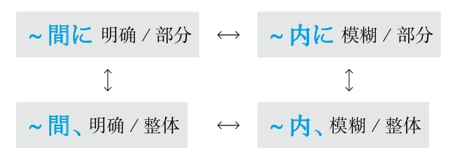

## H
### 好不容易

#### せっかく～から
**解释：** 「せっかく」的汉字是「<ruby>折<rp>(</rp><rt>せっ</rt><rp>)</rp></ruby><ruby>角<rp>(</rp><rt>かく</rt><rp>)</rp></ruby>」，表示“七转八折地～”，「から」表示原因
**意思：** 因为好不容易～
**接续：** 谓语词（动词、形容词、助动词）的简体和敬体
**注意：** 「せっかく」还可以作为名词使用，构成「せっかくだから」或「せっかくですから」

例句：**<ruby>折<rp>(</rp><rt>せっ</rt><rp>)</rp></ruby><ruby>角<rp>(</rp><rt>かく</rt><rp>)</rp></ruby>** <ruby>留<rp>(</rp><rt>りゅう</rt><rp>)</rp></ruby><ruby>学<rp>(</rp><rt>がく</rt><rp>)</rp></ruby>に<ruby>来<rp>(</rp><rt>き</rt><rp>)</rp></ruby>ている**から** 、しっかり<ruby>勉<rp>(</rp><rt>べん</rt><rp>)</rp></ruby><ruby>強<rp>(</rp><rt>きょう</rt><rp>)</rp></ruby>して<ruby>行<rp>(</rp><rt>い</rt><rp>)</rp></ruby>きたい。
直译：好不容易来留学，所以想好好学习下去。
意译：好不容易来留学，想以后一直好好学习。

#### せっかく～のに
**解释：** 「せっかく」的汉字是「<ruby>折<rp>(</rp><rt>せっ</rt><rp>)</rp></ruby><ruby>角<rp>(</rp><rt>かく</rt><rp>)</rp></ruby>」，表示“七转八折地～”，「のに」表示转折，有消极的语气
**意思：** 虽然好不容易～
**接续：** 动词和形容词的简体或敬体、形容动词和名词加な
**注意：** 「せっかく」还可以作为名词使用，构成「せっかくなのに」

例句：**<ruby>折<rp>(</rp><rt>せっ</rt><rp>)</rp></ruby><ruby>角<rp>(</rp><rt>かく</rt><rp>)</rp></ruby>** メモを<ruby>取<rp>(</rp><rt>と</rt><rp>)</rp></ruby>った**のに** 、<ruby>無<rp>(</rp><rt>な</rt><rp>)</rp></ruby>くしてしまった。
直译：好不容易记录了，但是结果弄丢了。
意译：好不容易记下来了，结果弄丢了。

### 好像

#### ～みたいだ
**意思：** 看上去～
**注意：** 作为形容动词使用（みたいな＋名词、みたいに＋谓语词）
**着重：** 没有亲眼看到的推测
**语气：** 最柔和
**搭配：** 「まるで～みたいだ」（整个好像～）
**接续：** 任何词

例句：<ruby>長<rp>(</rp><rt>なが</rt><rp>)</rp></ruby>い<ruby>間<rp>(</rp><rt>あいだ</rt><rp>)</rp></ruby>の<ruby>夢<rp>(</rp><rt>ゆめ</rt><rp>)</rp></ruby>が<ruby>叶<rp>(</rp><rt>かな</rt><rp>)</rp></ruby>って、まるで<ruby>夢<rp>(</rp><rt>ゆめ</rt><rp>)</rp></ruby>**みたいです** 。
直译：长期的梦想实现了，简直就好像是梦。
意译：长期（以来）的梦想实现了，简直就像是在做梦。

例句：<ruby>今日<rp>(</rp><rt>きょう</rt><rp>)</rp></ruby>**みたいな** <ruby>事<rp>(</rp><rt>こと</rt><rp>)</rp></ruby>が<ruby>二<rp>(</rp><rt>に</rt><rp>)</rp></ruby><ruby>度<rp>(</rp><rt>ど</rt><rp>)</rp></ruby>と<ruby>起<rp>(</rp><rt>お</rt><rp>)</rp></ruby>こらないように<ruby>約<rp>(</rp><rt>やく</rt><rp>)</rp></ruby><ruby>束<rp>(</rp><rt>そく</rt><rp>)</rp></ruby>する。
直译：今天这样的事，为了二度不发生，保证。
意译：我保证绝不再发生像今天这样的事。

例句：<ruby>日<rp>(</rp><rt>に</rt><rp>)</rp></ruby><ruby>本<rp>(</rp><rt>ほん</rt><rp>)</rp></ruby><ruby>語<rp>(</rp><rt>ご</rt><rp>)</rp></ruby>ネイティブ**みたいに** しゃべれたらいいなあ。
直译：像日语母语者那样，能够说，就好了。
意译：日语如果能说得像日语母语者那样就好了。

#### ～ようだ
**解释：** 「～ようだ」的汉字是「～<ruby>様<rp>(</rp><rt>よう</rt><rp>)</rp></ruby>だ」
**意思：** ～的样子
**注意：** 有双重词性。对前面作名词，对后面作形容动词（ような+名词、ように+谓语词）
**语气：** 正式
**搭配：** 「まるで～ようだ」（整个好像～）
**接续：** 修饰名词的规律（参照第一章的第三节）

例句：<ruby>新<rp>(</rp><rt>しん</rt><rp>)</rp></ruby><ruby>型<rp>(</rp><rt>がた</rt><rp>)</rp></ruby><ruby>機<rp>(</rp><rt>き</rt><rp>)</rp></ruby><ruby>械<rp>(</rp><rt>かい</rt><rp>)</rp></ruby>が<ruby>登<rp>(</rp><rt>とう</rt><rp>)</rp></ruby><ruby>場<rp>(</rp><rt>じょう</rt><rp>)</rp></ruby>して<ruby>以<rp>(</rp><rt>い</rt><rp>)</rp></ruby><ruby>来<rp>(</rp><rt>らい</rt><rp>)</rp></ruby>、ユーザーの<ruby>数<rp>(</rp><rt>かず</rt><rp>)</rp></ruby>は<ruby>爆<rp>(</rp><rt>ばく</rt><rp>)</rp></ruby><ruby>発<rp>(</rp><rt>はつ</rt><rp>)</rp></ruby><ruby>的<rp>(</rp><rt>てき</rt><rp>)</rp></ruby>に<ruby>増<rp>(</rp><rt>ふ</rt><rp>)</rp></ruby>えている**ようだ** 。
直译：新型机器登场以来，用户的数量好像在爆发性地增加着。
意译：新型机器上市以来，用户的数量好像在暴增。

例句：あの<ruby>人<rp>(</rp><rt>ひと</rt><rp>)</rp></ruby>はどこかで<ruby>会<rp>(</rp><rt>あ</rt><rp>)</rp></ruby>ったことのある**ような** <ruby>気<rp>(</rp><rt>き</rt><rp>)</rp></ruby>がする。
直译：那个人，在什么地方见过，觉得好像。
意译：觉得好像在什么地方见过那个人。

例句：ここに<ruby>書<rp>(</rp><rt>か</rt><rp>)</rp></ruby>いてある**ように** <ruby>申<rp>(</rp><rt>もうし</rt><rp>)</rp></ruby><ruby>込<rp>(</rp><rt>こみ</rt><rp>)</rp></ruby><ruby>書<rp>(</rp><rt>しょ</rt><rp>)</rp></ruby>にご<ruby>記<rp>(</rp><rt>き</rt><rp>)</rp></ruby><ruby>入<rp>(</rp><rt>にゅう</rt><rp>)</rp></ruby>ください。
直译：在这里写着的样子，请往申请表里填写。
意译：请按照这里写的填申请表。

#### ～らしい
**解释：** 「ら」是表示起点的「から」；「し」表示“像”；「い」是现代日语形容词结尾
**着重：** 有根据的推断
**接续：** 任何词
**搭配：** 「いかにも～らしい」（简直就好像～）

例句：<ruby>外<rp>(</rp><rt>そと</rt><rp>)</rp></ruby>に<ruby>干<rp>(</rp><rt>ほ</rt><rp>)</rp></ruby>してある<ruby>洗<rp>(</rp><rt>せん</rt><rp>)</rp></ruby><ruby>濯<rp>(</rp><rt>たく</rt><rp>)</rp></ruby><ruby>物<rp>(</rp><rt>もの</rt><rp>)</rp></ruby>が<ruby>濡<rp>(</rp><rt>ぬ</rt><rp>)</rp></ruby>れているから、<ruby>夜<rp>(</rp><rt>よ</rt><rp>)</rp></ruby><ruby>中<rp>(</rp><rt>なか</rt><rp>)</rp></ruby>に<ruby>雨<rp>(</rp><rt>あめ</rt><rp>)</rp></ruby>が<ruby>降<rp>(</rp><rt>ふ</rt><rp>)</rp></ruby>った**らしい** 。
直译：在外面晾晒的衣服湿了，所以推断夜里下雨了。
意译：晾在外面的衣服湿了，夜里可能下雨了。

**注意：** 前面接名词时，表示符合其本质和特点

例句：あなた**らしい** アイデアを<ruby>出<rp>(</rp><rt>だ</rt><rp>)</rp></ruby>してください。
直译：请你提出符合于你的观点。
意译：请你提出一个突出你特点的观点。

#### －そうだ
**解释：** 「そう」的汉字是「<ruby>相<rp>(</rp><rt>そう</rt><rp>)</rp></ruby>」
**意思：** 有～的样子
**着重：** 亲眼看到；外在的相貌
**重点：** 作为形容动词使用（－そうな+名词、－そうに+动词）
**语气：** 柔和
**接续：** 动词的连用形、形容词的词干、形容动词

例句：<ruby>雨<rp>(</rp><rt>あめ</rt><rp>)</rp></ruby>が<ruby>降<rp>(</rp><rt>ふ</rt><rp>)</rp></ruby>り**そう** 。
直译：要下雨的样子。
意译：看上去要下雨了。

例句：おいし**そうな** ご<ruby>馳<rp>(</rp><rt>ち</rt><rp>)</rp></ruby><ruby>走<rp>(</rp><rt>そう</rt><rp>)</rp></ruby>が<ruby>机<rp>(</rp><rt>つくえ</rt><rp>)</rp></ruby>の<ruby>上<rp>(</rp><rt>うえ</rt><rp>)</rp></ruby>に<ruby>並<rp>(</rp><rt>なら</rt><rp>)</rp></ruby>んでいる。
直译：看上去非常好吃的饭菜，在桌子上摆列着。
意译：桌上摆着看上去非常好吃的饭菜。

例句：<ruby>村<rp>(</rp><rt>むら</rt><rp>)</rp></ruby><ruby>上<rp>(</rp><rt>かみ</rt><rp>)</rp></ruby>さんは<ruby>元<rp>(</rp><rt>げん</rt><rp>)</rp></ruby><ruby>気<rp>(</rp><rt>き</rt><rp>)</rp></ruby>**そうに** <ruby>見<rp>(</rp><rt>み</rt><rp>)</rp></ruby>える。
直译：村上看上去有精神的样子。
意译：村上看上去精神不错。

#### －っぽい
**解释：** 「ぽい」可以理解为“颇为”；促音起加强语气的作用
**意思：** 颇为～
**着重：** 特别像～；不符合本质和特点
**接续：** 名词、形容词的词干、动词的连用形

例句：<ruby>彼<rp>(</rp><rt>かれ</rt><rp>)</rp></ruby>は<ruby>大人<rp>(</rp><rt>おとな</rt><rp>)</rp></ruby>なのに<ruby>子<rp>(</rp><rt>こ</rt><rp>)</rp></ruby><ruby>供<rp>(</rp><rt>ども</rt><rp>)</rp></ruby>**っぽい** ところが<ruby>多<rp>(</rp><rt>おお</rt><rp>)</rp></ruby>い。
直译：他虽然是大人，但是颇为孩子的地方多。
意译：他虽然是个大人，但是在很多方面却很孩子气。

例句：このかばんは<ruby>高<rp>(</rp><rt>たか</rt><rp>)</rp></ruby>いけど<ruby>安<rp>(</rp><rt>やす</rt><rp>)</rp></ruby>**っぽく** <ruby>見<rp>(</rp><rt>み</rt><rp>)</rp></ruby>える。
直译：这个包贵，但是看上去颇为便宜。
意译：这个包挺贵，可是看上去却显得特别便宜。

例句：あの<ruby>人<rp>(</rp><rt>ひと</rt><rp>)</rp></ruby>は<ruby>怒<rp>(</rp><rt>おこ</rt><rp>)</rp></ruby>り**っぽい** けど、<ruby>実<rp>(</rp><rt>じつ</rt><rp>)</rp></ruby>は<ruby>優<rp>(</rp><rt>やさ</rt><rp>)</rp></ruby>しい<ruby>人<rp>(</rp><rt>ひと</rt><rp>)</rp></ruby>です。
直译：那个人颇为生气，但是实际上是个温柔的人。
意译：那个人虽然爱生气，但是实际上是个温柔的人。

#### －げ
**解释：** 「け」的汉字是「<ruby>気<rp>(</rp><rt>け</rt><rp>)</rp></ruby>」，与前面的词构成复合词后的浊音化
**意思：** 带有～的气息
**着重：** 内在的感觉
**语气：** 文学化
**接续：** 动词的连用形、形容词的词干、形容动词

例句：<ruby>鈴<rp>(</rp><rt>すず</rt><rp>)</rp></ruby><ruby>木<rp>(</rp><rt>き</rt><rp>)</rp></ruby>さんは<ruby>大人<rp>(</rp><rt>おとな</rt><rp>)</rp></ruby>なのに、<ruby>全然<rp>(</rp><rt>ぜんぜん</rt><rp>)</rp></ruby><ruby>大人<rp>(</rp><rt>おとな</rt><rp>)</rp></ruby>**げ** がない。
直译：铃木是成年人，但是没有大人的气息。
意译：铃木是成年人，却没有一点儿大人样。

例句：<ruby>峰<rp>(</rp><rt>みね</rt><rp>)</rp></ruby><ruby>村<rp>(</rp><rt>むら</rt><rp>)</rp></ruby>さんは<ruby>自<rp>(</rp><rt>じ</rt><rp>)</rp></ruby><ruby>信<rp>(</rp><rt>しん</rt><rp>)</rp></ruby>あり**げ** に<ruby>大<rp>(</rp><rt>おお</rt><rp>)</rp></ruby>きな<ruby>声<rp>(</rp><rt>こえ</rt><rp>)</rp></ruby>で<ruby>質<rp>(</rp><rt>しつ</rt><rp>)</rp></ruby><ruby>問<rp>(</rp><rt>もん</rt><rp>)</rp></ruby>に<ruby>答<rp>(</rp><rt>こた</rt><rp>)</rp></ruby>えている。
直译：峰村有自信的气息地大声地回答着问题。
意译：峰村看上去很自信地大声回答着问题。

例句：<ruby>吉<rp>(</rp><rt>よし</rt><rp>)</rp></ruby><ruby>田<rp>(</rp><rt>だ</rt><rp>)</rp></ruby>さんは<ruby>懐<rp>(</rp><rt>なつ</rt><rp>)</rp></ruby>かし**げ** に<ruby>昔<rp>(</rp><rt>むかし</rt><rp>)</rp></ruby>のことを<ruby>話<rp>(</rp><rt>はな</rt><rp>)</rp></ruby>している。
直译：吉田带有怀念的气息地谈着过去的事。
意译：吉田看上去非常怀念地谈着过去的事。

例句：<ruby>荒<rp>(</rp><rt>あら</rt><rp>)</rp></ruby><ruby>木<rp>(</rp><rt>き</rt><rp>)</rp></ruby>さんは<ruby>退<rp>(</rp><rt>たい</rt><rp>)</rp></ruby><ruby>屈<rp>(</rp><rt>くつ</rt><rp>)</rp></ruby>**げ** に<ruby>授<rp>(</rp><rt>じゅ</rt><rp>)</rp></ruby><ruby>業<rp>(</rp><rt>ぎょう</rt><rp>)</rp></ruby>を<ruby>聞<rp>(</rp><rt>き</rt><rp>)</rp></ruby>いている。
直译：荒木带有无聊的气息地听着课。
意译：荒木看上去特别无聊地在听着课。

#### －気味
**解释：** 「<ruby>気<rp>(</rp><rt>き</rt><rp>)</rp></ruby><ruby>味<rp>(</rp><rt>み</rt><rp>)</rp></ruby>」与前面的词构成复合词后的浊音化
**直译：** 带有～的气味
**意译：** 感觉～
**着重：** 感觉身体状况
**接续：** 名词、动词的连用形、形容词的词干、形容动词

例句：ちょっと<ruby>風<rp>(</rp><rt>か</rt><rp>)</rp></ruby><ruby>邪<rp>(</rp><rt>ぜ</rt><rp>)</rp></ruby>**<ruby>気<rp>(</rp><rt>ぎ</rt><rp>)</rp></ruby><ruby>味<rp>(</rp><rt>み</rt><rp>)</rp></ruby>** だから、<ruby>体<rp>(</rp><rt>からだ</rt><rp>)</rp></ruby>がだるい。
直译：有点儿感冒的气味，身体没力气。
意译：好像有点儿感冒，浑身没力气。

例句：<ruby>仕<rp>(</rp><rt>し</rt><rp>)</rp></ruby><ruby>事<rp>(</rp><rt>ごと</rt><rp>)</rp></ruby>が<ruby>忙<rp>(</rp><rt>いそが</rt><rp>)</rp></ruby>しいから、<ruby>最<rp>(</rp><rt>さい</rt><rp>)</rp></ruby><ruby>近<rp>(</rp><rt>きん</rt><rp>)</rp></ruby>ちょっと<ruby>疲<rp>(</rp><rt>つか</rt><rp>)</rp></ruby>れ**<ruby>気<rp>(</rp><rt>ぎ</rt><rp>)</rp></ruby><ruby>味<rp>(</rp><rt>み</rt><rp>)</rp></ruby>** です。
直译：工作忙，所以最近有些疲倦的气味。
意译：工作太忙了，最近有些容易疲倦。

#### ～ごとし
**解释：** 「ごとし」的汉字是「<ruby>如<rp>(</rp><rt>ごと</rt><rp>)</rp></ruby>し」；「し」是古语形容词结尾
**意思：** 好像～、如～一般
**词性：** 形容词
**语气：** 正式
**接续：** 名词の、动词的简体加が

例句：<ruby>光<rp>(</rp><rt>こう</rt><rp>)</rp></ruby><ruby>陰<rp>(</rp><rt>いん</rt><rp>)</rp></ruby><ruby>矢<rp>(</rp><rt>や</rt><rp>)</rp></ruby>の**<ruby>如<rp>(</rp><rt>ごと</rt><rp>)</rp></ruby>し** 。
直译：光阴如箭。
意译：光阴似箭。

例句：<ruby>過<rp>(</rp><rt>す</rt><rp>)</rp></ruby>ぎたるは、<ruby>猶<rp>(</rp><rt>なお</rt><rp>)</rp></ruby><ruby>及<rp>(</rp><rt>およ</rt><rp>)</rp></ruby>ばざるが**<ruby>如<rp>(</rp><rt>ごと</rt><rp>)</rp></ruby>し** 。
直译：过犹不及。

#### ～ごとき
**解释：** 「ごとき」的汉字是「<ruby>如<rp>(</rp><rt>ごと</rt><rp>)</rp></ruby>き」；「き」在古语法中表示起形容词修饰名词作用的“的”
**意思：** 好像～、如～一般
**词性：** 连体词
**语气：** 正式
**接续：** 名词の（也可以不用の）、动词的简体加が

例句：<ruby>花<rp>(</rp><rt>はな</rt><rp>)</rp></ruby>（の）**<ruby>如<rp>(</rp><rt>ごと</rt><rp>)</rp></ruby>き** <ruby>美<rp>(</rp><rt>び</rt><rp>)</rp></ruby><ruby>人<rp>(</rp><rt>じん</rt><rp>)</rp></ruby>が<ruby>目<rp>(</rp><rt>め</rt><rp>)</rp></ruby>の<ruby>前<rp>(</rp><rt>まえ</rt><rp>)</rp></ruby>に<ruby>現<rp>(</rp><rt>あらわ</rt><rp>)</rp></ruby>れた。
直译：如花似玉的美人，出现在了眼前。
意译：眼前出现了一个如花似玉的美人。

#### ～ごとく
**解释：** 「ごとく」的汉字是「<ruby>如<rp>(</rp><rt>ごと</rt><rp>)</rp></ruby>く」
**意思：** 好像～、如～一般
**词性：** 副词
**语气：** 正式
**接续：** 名词の、动词的简体加が

例句：<ruby>真<rp>(</rp><rt>ま</rt><rp>)</rp></ruby><ruby>夏<rp>(</rp><rt>なつ</rt><rp>)</rp></ruby><ruby>日<rp>(</rp><rt>び</rt><rp>)</rp></ruby>に<ruby>草<rp>(</rp><rt>くさ</rt><rp>)</rp></ruby>むしりをしていた。<ruby>汗<rp>(</rp><rt>あせ</rt><rp>)</rp></ruby>が<ruby>滝<rp>(</rp><rt>たき</rt><rp>)</rp></ruby>の**<ruby>如<rp>(</rp><rt>ごと</rt><rp>)</rp></ruby>く** <ruby>流<rp>(</rp><rt>なが</rt><rp>)</rp></ruby>れていた。
直译：在炎热的夏天，去拔草。汗水如瀑布流淌着。
意译：炎热的夏天去拔草，汗流浃背。

#### －めく
**解释：** 「め」是眼睛；「く」表示方向
**意思：** 看上去～
**词性：** 自动词
**语气：** 正式
**接续：** 名词

例句：もうすっかり<ruby>春<rp>(</rp><rt>はる</rt><rp>)</rp></ruby>**めいて** まいりました。
直译：已经完全，看上去是春天了。
意译：完全是春意盎然了。

例句：そんな<ruby>皮<rp>(</rp><rt>ひ</rt><rp>)</rp></ruby><ruby>肉<rp>(</rp><rt>にく</rt><rp>)</rp></ruby>**めいた** <ruby>言<rp>(</rp><rt>い</rt><rp>)</rp></ruby>い<ruby>方<rp>(</rp><rt>かた</rt><rp>)</rp></ruby>を<ruby>止<rp>(</rp><rt>や</rt><rp>)</rp></ruby>めてよ。
直译：停止听上去讽刺的说话方式。
意译：别用那么讽刺的语气说话。

#### －じみる
**解释：** 自动词「しみる」的汉字是「<ruby>染<rp>(</rp><rt>し</rt><rp>)</rp></ruby>みる」，与前面的词构成复合词后的浊音化
**意思：** 渗透着～的气息
**接续：** 名词

例句：<ruby>田舎<rp>(</rp><rt>いなか</rt><rp>)</rp></ruby>**じみた** <ruby>家<rp>(</rp><rt>いえ</rt><rp>)</rp></ruby>を<ruby>建<rp>(</rp><rt>た</rt><rp>)</rp></ruby>てたい。
直译：想盖带有田园气息的房子。
意译：我想盖个带有田园气息的房子。

例句：<ruby>彼女<rp>(</rp><rt>かのじょ</rt><rp>)</rp></ruby>はいつも<ruby>子<rp>(</rp><rt>こ</rt><rp>)</rp></ruby><ruby>供<rp>(</rp><rt>ども</rt><rp>)</rp></ruby>**じみた** <ruby>格<rp>(</rp><rt>かっ</rt><rp>)</rp></ruby><ruby>好<rp>(</rp><rt>こう</rt><rp>)</rp></ruby>している。
直译：她总是带有孩子气息的装束。
意译：她总是打扮得像个孩子。

#### ～とばかり
**解释：** 「と」表示说的内容；「ばかり」的意思是“全是、光是、净是”；如果作为副词用则需要加「に」
**直译：** 语气全是～、表情全是～
**意译：** 简直就好像是在说～
**着重：** 强调了“好像”
**注意：** 省略了“全是、光是、净是”的主语，即“语气、表情”等
**接续：** 任何词

例句：<ruby>彼<rp>(</rp><rt>かれ</rt><rp>)</rp></ruby>は、まるで「この<ruby>事<rp>(</rp><rt>こと</rt><rp>)</rp></ruby>は<ruby>私<rp>(</rp><rt>わたし</rt><rp>)</rp></ruby>には<ruby>関<rp>(</rp><rt>かん</rt><rp>)</rp></ruby><ruby>係<rp>(</rp><rt>けい</rt><rp>)</rp></ruby>がない」**とばかり** に、<ruby>平<rp>(</rp><rt>へい</rt><rp>)</rp></ruby><ruby>気<rp>(</rp><rt>き</rt><rp>)</rp></ruby>な<ruby>顔<rp>(</rp><rt>かお</rt><rp>)</rp></ruby>をしている。
直译：他的表情全是在说“这件事跟我无关”，显示出平静的表情。
意译：他表现得好像没事人似的，简直就好像是在说：“这件事跟我无关”。

#### －んばかり
**解释：** 「ん」是古语的推测；「ばかり」是“全是、光是、净是”；如果作为副词用则需要加「に」
**直译：** 语气全是～、表情全是～
**意译：** 简直就好像是在～
**着重：** 强调了“好像”
**注意：** 省略了“全是、光是、净是”的主语，即“语气、表情”等
**变形：** 动词的否定形的ん（推量）（变形规律参照第一章的第二节）

例句：<ruby>親<rp>(</rp><rt>おや</rt><rp>)</rp></ruby>は<ruby>私<rp>(</rp><rt>わたし</rt><rp>)</rp></ruby>の<ruby>手<rp>(</rp><rt>て</rt><rp>)</rp></ruby>を<ruby>千<rp>(</rp><rt>ち</rt><rp>)</rp></ruby><ruby>切<rp>(</rp><rt>ぎ</rt><rp>)</rp></ruby>れ**んばかり** にして、<ruby>昇<rp>(</rp><rt>しょう</rt><rp>)</rp></ruby><ruby>進<rp>(</rp><rt>しん</rt><rp>)</rp></ruby>を<ruby>祝<rp>(</rp><rt>いわ</rt><rp>)</rp></ruby>ってくれた。
直译：父母全是要把我的手揪掉一样，祝贺了我的晋升。
意译：父母拉着我的手，简直就好像要把我的手揪掉一样，祝贺了我的晋升。
语法关系图

## J
### 即使～也不～

#### ～に－ない
**解释：** 「に」表示目的；「ない」的意思是“不”
**意思：** 即使要～也不能～
**着重：** 将要做某事；简洁
**注意：** 「～に」和「～ない」之间一般不加其他信息，即构成「するにできない」的形式
**接续：** 「に」前接动词的原形；「ない」前接动词可能形的连用形

例句：<ruby>笑<rp>(</rp><rt>わら</rt><rp>)</rp></ruby>う**に** <ruby>笑<rp>(</rp><rt>わら</rt><rp>)</rp></ruby>え**ない** 。
直译：即使要笑也不能笑。
意译：即使要笑也笑不出来。

#### ～にも－ない
**解释：** 「に」表示目的；「も」表示强调，在此通过强调表示转折；「ない」的意思是“不”
**意思：** 即使要～也不能～
**着重：** 有做某事的意愿；具体
**注意：** 「～に」和「～ない」之间可以加其他信息，即构成「しようにも～できない」的形式
**接续：** 「に」前接动词的意志形；「ない」前接动词可能形的连用形

例句：<ruby>勉<rp>(</rp><rt>べん</rt><rp>)</rp></ruby><ruby>強<rp>(</rp><rt>きょう</rt><rp>)</rp></ruby>しよう**にも** 、<ruby>外<rp>(</rp><rt>そと</rt><rp>)</rp></ruby>が<ruby>騒<rp>(</rp><rt>さわ</rt><rp>)</rp></ruby>がしいから、<ruby>集<rp>(</rp><rt>しゅう</rt><rp>)</rp></ruby><ruby>中<rp>(</rp><rt>ちゅう</rt><rp>)</rp></ruby>でき**ない** 。
直译：即使想要学习，外面太吵了，所以不能集中。
意译：即使想要学习，外面太吵了，也没办法集中精力。
语法关系图

### 既然

#### ～以上、
**直译：** 在～以上
**注意：** “既然”在汉语中表示已经发生的状态，表达前（因）后（果）关系，其特点是“要用语气强烈的表达方式”，比如“既然～就必须～”、“既然～就得～”、“既然～就要～”。日语的「～<ruby>以<rp>(</rp><rt>い</rt><rp>)</rp></ruby><ruby>上<rp>(</rp><rt>じょう</rt><rp>)</rp></ruby>」表示上下关系，除此之外，还和中文的“既然”一样，也表达方向的关系，所以也要用语气强烈的表达方式
**语气：** 正式
**接续：** 动词的简体

例句：この<ruby>仕<rp>(</rp><rt>し</rt><rp>)</rp></ruby><ruby>事<rp>(</rp><rt>ごと</rt><rp>)</rp></ruby>を<ruby>引<rp>(</rp><rt>ひ</rt><rp>)</rp></ruby>き<ruby>受<rp>(</rp><rt>う</rt><rp>)</rp></ruby>けた**<ruby>以<rp>(</rp><rt>い</rt><rp>)</rp></ruby><ruby>上<rp>(</rp><rt>じょう</rt><rp>)</rp></ruby>、** <ruby>最<rp>(</rp><rt>さい</rt><rp>)</rp></ruby><ruby>後<rp>(</rp><rt>ご</rt><rp>)</rp></ruby>までやり<ruby>抜<rp>(</rp><rt>ぬ</rt><rp>)</rp></ruby>くつもりだ。
直译：在接受了这个工作之上，决心干到底。
意译：既然接受了这个工作，我就决心干到底。

#### ～からには
**解释：** 「から」表示原因，「に」表示方向，「は」表示强调
**意思：** 在～原因之上
**注意：** “既然”在汉语中表示已经发生的状态，表达前（因）后（果）关系，其特点是“要用语气强烈的表达方式”，比如“既然～就必须～”、“既然～就得～”、“既然～就要～”。日语的「～からには」表示“在～原因之上”的上下关系，除此之外，还和中文的“既然”一样，也表达方向的关系，所以也要用语气强烈的表达方式
**语气：** 柔和
**接续：** 动词的简体、形容词的原形、形容动词和名词加である

例句：<ruby>試<rp>(</rp><rt>し</rt><rp>)</rp></ruby><ruby>合<rp>(</rp><rt>あい</rt><rp>)</rp></ruby>に<ruby>出<rp>(</rp><rt>で</rt><rp>)</rp></ruby>る**からには** 、<ruby>全<rp>(</rp><rt>ぜん</rt><rp>)</rp></ruby><ruby>力<rp>(</rp><rt>りょく</rt><rp>)</rp></ruby>を<ruby>尽<rp>(</rp><rt>つ</rt><rp>)</rp></ruby>くしたい。
直译：在参加比赛的原因之上，想全力以赴。
意译：既然参加比赛，我们就要全力以赴。
语法关系图

### 假设

#### ～なら
**准则：** 在「と、ば、たら、なら」里，最重要的是顺序。「と」和「なら」分别表示极端，「と」代表“条件性”的极端，「なら」代表“假定性”的极端
**意思：** 假设～（前面接谓语词）
**注意：** 假设过去的时候，因为要表示过去的状态，所以后句与「－ていた」相呼应
**搭配：** 前面有时接「<ruby>仮<rp>(</rp><rt>かり</rt><rp>)</rp></ruby>に」
**接续：** 动词和形容词的简体及形容动词接「なら」表示“假设”；名词接「なら」表示“如果”

例句：<ruby>私<rp>(</rp><rt>わたし</rt><rp>)</rp></ruby>はあの<ruby>時<rp>(</rp><rt>とき</rt><rp>)</rp></ruby>よく<ruby>左<rp>(</rp><rt>さ</rt><rp>)</rp></ruby><ruby>右<rp>(</rp><rt>ゆう</rt><rp>)</rp></ruby>を<ruby>確<rp>(</rp><rt>かく</rt><rp>)</rp></ruby><ruby>認<rp>(</rp><rt>にん</rt><rp>)</rp></ruby>した**なら** 、<ruby>走<rp>(</rp><rt>はし</rt><rp>)</rp></ruby>ってきた<ruby>自<rp>(</rp><rt>じ</rt><rp>)</rp></ruby><ruby>転<rp>(</rp><rt>てん</rt><rp>)</rp></ruby><ruby>車<rp>(</rp><rt>しゃ</rt><rp>)</rp></ruby>にぶつかっていなかっただろう。
直译：假设我那时左右好好确认的话，骑过来的自行车，不撞上了。
意译：如果我那时左右好好确认的话，就不会撞到骑过来的自行车了。

例句：<ruby>今<rp>(</rp><rt>いま</rt><rp>)</rp></ruby><ruby>残<rp>(</rp><rt>ざん</rt><rp>)</rp></ruby><ruby>業<rp>(</rp><rt>ぎょう</rt><rp>)</rp></ruby>している**なら** 、<ruby>夜<rp>(</rp><rt>や</rt><rp>)</rp></ruby><ruby>食<rp>(</rp><rt>しょく</rt><rp>)</rp></ruby>を<ruby>用<rp>(</rp><rt>よう</rt><rp>)</rp></ruby><ruby>意<rp>(</rp><rt>い</rt><rp>)</rp></ruby>して<ruby>届<rp>(</rp><rt>とど</rt><rp>)</rp></ruby>けるよ。
直译：假设现在在加班的话，做夜宵送去。
意译：要是你现在在加班的话，我做夜宵给你送去。

例句：<ruby>夕<rp>(</rp><rt>ゆう</rt><rp>)</rp></ruby><ruby>方<rp>(</rp><rt>がた</rt><rp>)</rp></ruby>に<ruby>小<rp>(</rp><rt>こ</rt><rp>)</rp></ruby><ruby>包<rp>(</rp><rt>づつみ</rt><rp>)</rp></ruby>が<ruby>届<rp>(</rp><rt>とど</rt><rp>)</rp></ruby>く**なら** 、<ruby>午<rp>(</rp><rt>ご</rt><rp>)</rp></ruby><ruby>前<rp>(</rp><rt>ぜん</rt><rp>)</rp></ruby><ruby>中<rp>(</rp><rt>ちゅう</rt><rp>)</rp></ruby>に<ruby>買<rp>(</rp><rt>か</rt><rp>)</rp></ruby>い<ruby>物<rp>(</rp><rt>もの</rt><rp>)</rp></ruby>を<ruby>済<rp>(</rp><rt>す</rt><rp>)</rp></ruby>ませておこう。
直译：假设在傍晚包裹送到，上午把东西买完吧。
意译：如果包裹傍晚送到，那上午去买东西吧。

#### ～とあれば
**解释：** 「と」表示内容；「あれば」是「ある」加上了「ば」，意思是“如果有～”
**意思：** 如果有～的话
**语气：** 正式
**接续：** 任何词

例句：<ruby>遠<rp>(</rp><rt>えん</rt><rp>)</rp></ruby><ruby>来<rp>(</rp><rt>らい</rt><rp>)</rp></ruby>の<ruby>客<rp>(</rp><rt>きゃく</rt><rp>)</rp></ruby>が<ruby>来<rp>(</rp><rt>く</rt><rp>)</rp></ruby>る**とあれば** 、<ruby>腕<rp>(</rp><rt>うで</rt><rp>)</rp></ruby>を<ruby>振<rp>(</rp><rt>ふ</rt><rp>)</rp></ruby>ってご<ruby>馳<rp>(</rp><rt>ち</rt><rp>)</rp></ruby><ruby>走<rp>(</rp><rt>そう</rt><rp>)</rp></ruby>をたくさん<ruby>用<rp>(</rp><rt>よう</rt><rp>)</rp></ruby><ruby>意<rp>(</rp><rt>い</rt><rp>)</rp></ruby>しよう。
直译：远方的客人来的话，抡起胳膊，准备很多饭菜吧。
意译：如果远方的客人要来，那我就抡起胳膊给他们准备一大桌菜吧。

#### ～とする
**解释：** 「と」表示内容；「する」可以代替大多动词，此处代替了「<ruby>仮<rp>(</rp><rt>か</rt><rp>)</rp></ruby><ruby>定<rp>(</rp><rt>てい</rt><rp>)</rp></ruby>する」
**准则：** 假设过去的时候，因为要表示过去的状态，所以后句与「－ていた」相呼应
**意思：** 假设～
**搭配：** 前面有时接「<ruby>仮<rp>(</rp><rt>かり</rt><rp>)</rp></ruby>に」
**重点：** 可以假设过去、现在、将来
**区别：** 比「なら」的用法更广，还可以与其他词汇组合构成多样的表达方式，比如「～とすれば、～としたら、～としても」等
**接续：** 任何词

例句：<ruby>私<rp>(</rp><rt>わたし</rt><rp>)</rp></ruby>は<ruby>弁<rp>(</rp><rt>べん</rt><rp>)</rp></ruby><ruby>護<rp>(</rp><rt>ご</rt><rp>)</rp></ruby><ruby>師<rp>(</rp><rt>し</rt><rp>)</rp></ruby>にならなかった**としたら** 、どんな<ruby>職<rp>(</rp><rt>しょく</rt><rp>)</rp></ruby><ruby>業<rp>(</rp><rt>ぎょう</rt><rp>)</rp></ruby>に<ruby>就<rp>(</rp><rt>つ</rt><rp>)</rp></ruby>いていただろう。
直译：假设我没有成为律师的话，过去做什么工作呢？
意译：假设我没当律师的话，我那时候做什么工作呢？

例句：**<ruby>仮<rp>(</rp><rt>かり</rt><rp>)</rp></ruby>に** <ruby>毎<rp>(</rp><rt>まい</rt><rp>)</rp></ruby><ruby>日<rp>(</rp><rt>にち</rt><rp>)</rp></ruby><ruby>単<rp>(</rp><rt>たん</rt><rp>)</rp></ruby><ruby>語<rp>(</rp><rt>ご</rt><rp>)</rp></ruby>を<ruby>1<rp>(</rp><rt>じゅ</rt><rp>)</rp></ruby><ruby>0<rp>(</rp><rt>っ</rt><rp>)</rp></ruby><ruby>個<rp>(</rp><rt>こ</rt><rp>)</rp></ruby><ruby>覚<rp>(</rp><rt>おぼ</rt><rp>)</rp></ruby>える**とする** 。<ruby>一<rp>(</rp><rt>いっ</rt><rp>)</rp></ruby><ruby>か<rp>(</rp><rt>か</rt><rp>)</rp></ruby><ruby>月<rp>(</rp><rt>げつ</rt><rp>)</rp></ruby>で<ruby>3<rp>(</rp><rt>さん</rt><rp>)</rp></ruby><ruby>0<rp>(</rp><rt>ぴゃ</rt><rp>)</rp></ruby><ruby>0<rp>(</rp><rt>っ</rt><rp>)</rp></ruby><ruby>個<rp>(</rp><rt>こ</rt><rp>)</rp></ruby>を<ruby>覚<rp>(</rp><rt>おぼ</rt><rp>)</rp></ruby>えることになる。
直译：假设每天记10个单词，结果成为在一个月里记300个单词。
意译：假设每天记10个单词，一个月就能记300个单词。

例句：<ruby>私<rp>(</rp><rt>わたし</rt><rp>)</rp></ruby>が<ruby>社<rp>(</rp><rt>しゃ</rt><rp>)</rp></ruby><ruby>長<rp>(</rp><rt>ちょう</rt><rp>)</rp></ruby>だ**としたら** 、きっと<ruby>全<rp>(</rp><rt>ぜん</rt><rp>)</rp></ruby><ruby>員<rp>(</rp><rt>いん</rt><rp>)</rp></ruby>の<ruby>給<rp>(</rp><rt>きゅう</rt><rp>)</rp></ruby><ruby>料<rp>(</rp><rt>りょう</rt><rp>)</rp></ruby>を<ruby>上<rp>(</rp><rt>あ</rt><rp>)</rp></ruby>げる。
直译：假设我就是社长，一定把全员的工资提高。
意译：假设我就是社长，一定会给全体员工涨工资。

#### ～ものなら
**解释：** 「もの」接在句尾表示强调，翻译成“可、真、可真、就是”；「なら」表示假设
**意思：** 刚要做某事就～
**注意：** 前面接动词的意志形时，通常会带来严重的后果
**接续：** 动词的可能形、动词的意志形（变形规律参照第一章的第二节）

例句：この<ruby>会<rp>(</rp><rt>かい</rt><rp>)</rp></ruby><ruby>社<rp>(</rp><rt>しゃ</rt><rp>)</rp></ruby>はとても<ruby>厳<rp>(</rp><rt>きび</rt><rp>)</rp></ruby>しい。<ruby>仕<rp>(</rp><rt>し</rt><rp>)</rp></ruby><ruby>事<rp>(</rp><rt>ごと</rt><rp>)</rp></ruby>で<ruby>少<rp>(</rp><rt>すこ</rt><rp>)</rp></ruby>しでも<ruby>失<rp>(</rp><rt>しっ</rt><rp>)</rp></ruby><ruby>敗<rp>(</rp><rt>ぱい</rt><rp>)</rp></ruby>しよう**ものなら** 、<ruby>首<rp>(</rp><rt>くび</rt><rp>)</rp></ruby>になりかねないよ。
直译：这个公司很严格。在工作中即使稍微有些失败的话，很可能被解雇。
意译：这个公司特别严格，假设工作中稍微有些失败，就很可能被解雇。

例句：できる**ものなら** 、やってしまいたい。
直译：假设真能，想做完成。
意译：假设真能（那样）的话，我想去做。
语法关系图

### 结果

#### －た結果、
**解释：** 「た」表示“做了～”；「<ruby>結<rp>(</rp><rt>けっ</rt><rp>)</rp></ruby><ruby>果<rp>(</rp><rt>か</rt><rp>)</rp></ruby>」表示“结果”
**意思：** 做了～的结果，
**注意：** 后面一般不加助词
**语气：** 正式
**变形：** 动词的た形的简体（变形规律参照第一章的第二节）

例句：<ruby>筆<rp>(</rp><rt>ひっ</rt><rp>)</rp></ruby><ruby>記<rp>(</rp><rt>き</rt><rp>)</rp></ruby><ruby>試<rp>(</rp><rt>し</rt><rp>)</rp></ruby><ruby>験<rp>(</rp><rt>けん</rt><rp>)</rp></ruby>と<ruby>口<rp>(</rp><rt>こう</rt><rp>)</rp></ruby><ruby>頭<rp>(</rp><rt>とう</rt><rp>)</rp></ruby><ruby>試<rp>(</rp><rt>し</rt><rp>)</rp></ruby><ruby>験<rp>(</rp><rt>けん</rt><rp>)</rp></ruby>と<ruby>書<rp>(</rp><rt>しょ</rt><rp>)</rp></ruby><ruby>類<rp>(</rp><rt>るい</rt><rp>)</rp></ruby><ruby>審<rp>(</rp><rt>しん</rt><rp>)</rp></ruby><ruby>査<rp>(</rp><rt>さ</rt><rp>)</rp></ruby>を<ruby>行<rp>(</rp><rt>おこな</rt><rp>)</rp></ruby>っ**た** <ruby>結<rp>(</rp><rt>けっ</rt><rp>)</rp></ruby><ruby>果<rp>(</rp><rt>か</rt><rp>)</rp></ruby>**、** <ruby>候<rp>(</rp><rt>こう</rt><rp>)</rp></ruby><ruby>補<rp>(</rp><rt>ほ</rt><rp>)</rp></ruby><ruby>者<rp>(</rp><rt>しゃ</rt><rp>)</rp></ruby>を<ruby>5<rp>(</rp><rt>ご</rt><rp>)</rp></ruby><ruby>人<rp>(</rp><rt>にん</rt><rp>)</rp></ruby>に<ruby>絞<rp>(</rp><rt>しぼ</rt><rp>)</rp></ruby>った。
直译：笔试和口试和书面选拔的进行结果，把候补筛选到了5个人。
意译：经过笔试、口试以及书面材料审核，最终选定了5位候选人。

#### －たところ、
**解释：** 「た」表示“做了～”；「ところ」代替了「<ruby>結<rp>(</rp><rt>けっ</rt><rp>)</rp></ruby><ruby>果<rp>(</rp><rt>か</rt><rp>)</rp></ruby>」
**意思：** 做了～的结果，
**注意：** 后面一般不加助词
**语气：** 柔和
**变形：** 动词的た形的简体（变形规律参照第一章的第二节）

例句：<ruby>試<rp>(</rp><rt>し</rt><rp>)</rp></ruby><ruby>験<rp>(</rp><rt>けん</rt><rp>)</rp></ruby>を<ruby>実<rp>(</rp><rt>じっ</rt><rp>)</rp></ruby><ruby>施<rp>(</rp><rt>し</rt><rp>)</rp></ruby>し**たところ、** <ruby>今<rp>(</rp><rt>こ</rt><rp>)</rp></ruby><ruby>年<rp>(</rp><rt>とし</rt><rp>)</rp></ruby>の<ruby>合<rp>(</rp><rt>ごう</rt><rp>)</rp></ruby><ruby>格<rp>(</rp><rt>かく</rt><rp>)</rp></ruby>の<ruby>割<rp>(</rp><rt>わり</rt><rp>)</rp></ruby><ruby>合<rp>(</rp><rt>あい</rt><rp>)</rp></ruby>は、<ruby>昨<rp>(</rp><rt>さく</rt><rp>)</rp></ruby><ruby>年<rp>(</rp><rt>ねん</rt><rp>)</rp></ruby>と<ruby>比<rp>(</rp><rt>くら</rt><rp>)</rp></ruby>べ、<ruby>約<rp>(</rp><rt>やく</rt><rp>)</rp></ruby><ruby>2<rp>(</rp><rt>に</rt><rp>)</rp></ruby><ruby>割<rp>(</rp><rt>わり</rt><rp>)</rp></ruby>ほど<ruby>高<rp>(</rp><rt>たか</rt><rp>)</rp></ruby>くなった。
直译：考试实施的结果，今年的合格比率，与去年相比，大约20%左右变高了。
意译：考试的结果是今年的及格率比去年提高了大约20%。

#### ～しまつだ
**解释：** 「しまつ」的汉字是「<ruby>始<rp>(</rp><rt>し</rt><rp>)</rp></ruby><ruby>末<rp>(</rp><rt>まつ</rt><rp>)</rp></ruby>」
**意思：** 地步、下场
**用于：** 不好的结果
**接续：** 修饰名词的规律（参照第一章的第三节）

例句：<ruby>彼<rp>(</rp><rt>かれ</rt><rp>)</rp></ruby>はいつも<ruby>睡<rp>(</rp><rt>すい</rt><rp>)</rp></ruby><ruby>眠<rp>(</rp><rt>みん</rt><rp>)</rp></ruby><ruby>不<rp>(</rp><rt>ぶ</rt><rp>)</rp></ruby><ruby>足<rp>(</rp><rt>そく</rt><rp>)</rp></ruby>で、<ruby>注<rp>(</rp><rt>ちゅう</rt><rp>)</rp></ruby><ruby>意<rp>(</rp><rt>い</rt><rp>)</rp></ruby>されても<ruby>聞<rp>(</rp><rt>き</rt><rp>)</rp></ruby>かない。ついに<ruby>居<rp>(</rp><rt>い</rt><rp>)</rp></ruby><ruby>眠<rp>(</rp><rt>ねむ</rt><rp>)</rp></ruby>り<ruby>運<rp>(</rp><rt>うん</rt><rp>)</rp></ruby><ruby>転<rp>(</rp><rt>てん</rt><rp>)</rp></ruby>で<ruby>事<rp>(</rp><rt>じ</rt><rp>)</rp></ruby><ruby>故<rp>(</rp><rt>こ</rt><rp>)</rp></ruby>を<ruby>起<rp>(</rp><rt>お</rt><rp>)</rp></ruby>こす**<ruby>始<rp>(</rp><rt>し</rt><rp>)</rp></ruby><ruby>末<rp>(</rp><rt>まつ</rt><rp>)</rp></ruby>だ** 。
直译：他总是睡眠不足，即使被警告也不听。终于打盹儿开车出了车祸的地步。
意译：他总是睡眠不足，也不听别人的劝告，终于因疲劳驾驶出了车祸。

#### －ば、それまでだ
**解释：** 「ば」的意思是“如果”；「それ」的意思是“那”；「まで」的意思是“到～的地步”
**直译：** 如果～也就到那个地步了
**意译：** 如果～就到头了
**用于：** 没有发展
**注意：** 「それまで」还可以换成「これまで」
**变形：** ば形（变形规律参照第一章的第二节）

例句：<ruby>試<rp>(</rp><rt>し</rt><rp>)</rp></ruby><ruby>験<rp>(</rp><rt>けん</rt><rp>)</rp></ruby>のために<ruby>一<rp>(</rp><rt>いち</rt><rp>)</rp></ruby><ruby>年<rp>(</rp><rt>ねん</rt><rp>)</rp></ruby>も<ruby>準<rp>(</rp><rt>じゅん</rt><rp>)</rp></ruby><ruby>備<rp>(</rp><rt>び</rt><rp>)</rp></ruby>してきた。<ruby>試<rp>(</rp><rt>し</rt><rp>)</rp></ruby><ruby>験<rp>(</rp><rt>けん</rt><rp>)</rp></ruby>の<ruby>前<rp>(</rp><rt>ぜん</rt><rp>)</rp></ruby><ruby>日<rp>(</rp><rt>じつ</rt><rp>)</rp></ruby><ruby>熱<rp>(</rp><rt>ねつ</rt><rp>)</rp></ruby>を<ruby>出<rp>(</rp><rt>だ</rt><rp>)</rp></ruby>せ**ば、それまでだ** 。
直译：为了考试准备了一年。考试前一天发烧了的话，也就那样了。
意译：为了考试准备了一年。要是考试前一天发烧了就完了。
语法关系图
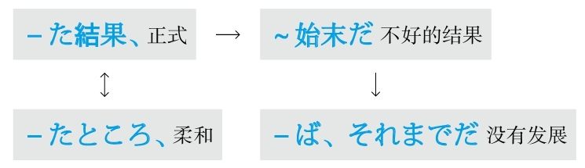

### 经历

#### ～思いをする
**解释：** 「<ruby>思<rp>(</rp><rt>おも</rt><rp>)</rp></ruby>い」的意思是“感觉、感情”；「を」接在他动词前表示“把”；「する」可以代替大多数动词，此处代替了「<ruby>経<rp>(</rp><rt>けい</rt><rp>)</rp></ruby><ruby>験<rp>(</rp><rt>けん</rt><rp>)</rp></ruby>する」
**用于：** 心理上的经历
**接续：** 形容词的原形、形容动词加な

例句：<ruby>昨日<rp>(</rp><rt>きのう</rt><rp>)</rp></ruby>ある<ruby>飲<rp>(</rp><rt>いん</rt><rp>)</rp></ruby><ruby>食<rp>(</rp><rt>しょく</rt><rp>)</rp></ruby><ruby>店<rp>(</rp><rt>てん</rt><rp>)</rp></ruby>で<ruby>嫌<rp>(</rp><rt>いや</rt><rp>)</rp></ruby>な**<ruby>思<rp>(</rp><rt>おも</rt><rp>)</rp></ruby>いをした** 。
直译：昨天在饮食店里经历了讨厌的感觉。
意译：昨天我在一个饮食店里遇到了特别不愉快的事情。

例句：<ruby>親<rp>(</rp><rt>しん</rt><rp>)</rp></ruby><ruby>友<rp>(</rp><rt>ゆう</rt><rp>)</rp></ruby>が<ruby>遠<rp>(</rp><rt>とお</rt><rp>)</rp></ruby>いところに<ruby>引<rp>(</rp><rt>ひ</rt><rp>)</rp></ruby>っ<ruby>越<rp>(</rp><rt>こ</rt><rp>)</rp></ruby>してしまって、<ruby>寂<rp>(</rp><rt>さび</rt><rp>)</rp></ruby>しい**<ruby>思<rp>(</rp><rt>おも</rt><rp>)</rp></ruby>いをした** 。
直译：好友搬到很远的地方，经历了寂寞的感觉。
意译：好友搬到很远的地方，我觉得特别寂寞。

例句：<ruby>絶<rp>(</rp><rt>ぜっ</rt><rp>)</rp></ruby><ruby>対<rp>(</rp><rt>たい</rt><rp>)</rp></ruby>に<ruby>勝<rp>(</rp><rt>か</rt><rp>)</rp></ruby>つと<ruby>思<rp>(</rp><rt>おも</rt><rp>)</rp></ruby>ったのに、<ruby>負<rp>(</rp><rt>ま</rt><rp>)</rp></ruby>けてしまって、<ruby>痛<rp>(</rp><rt>いた</rt><rp>)</rp></ruby>い**<ruby>思<rp>(</rp><rt>おも</rt><rp>)</rp></ruby>いをした** 。
直译：觉得肯定能赢，结果输了，经历了痛的感觉。
意译：我觉得肯定能赢，结果输了，让我特别心痛。

#### ～を体験する
**解释：** 「を」接在他动词前表示“把”；「<ruby>体<rp>(</rp><rt>たい</rt><rp>)</rp></ruby><ruby>験<rp>(</rp><rt>けん</rt><rp>)</rp></ruby>する」的意思是“体验”
**用于：** 身体上的经历
**接续：** 名词

例句：<ruby>3<rp>(</rp><rt>さん</rt><rp>)</rp></ruby><ruby>0<rp>(</rp><rt>じゅう</rt><rp>)</rp></ruby><ruby>年<rp>(</rp><rt>ねん</rt><rp>)</rp></ruby>ほど<ruby>前<rp>(</rp><rt>まえ</rt><rp>)</rp></ruby>の<ruby>日<rp>(</rp><rt>に</rt><rp>)</rp></ruby><ruby>本<rp>(</rp><rt>ほん</rt><rp>)</rp></ruby>のバブル<ruby>絶<rp>(</rp><rt>ぜっ</rt><rp>)</rp></ruby><ruby>頂<rp>(</rp><rt>ちょう</rt><rp>)</rp></ruby><ruby>期<rp>(</rp><rt>き</rt><rp>)</rp></ruby>を<ruby>実<rp>(</rp><rt>じっ</rt><rp>)</rp></ruby><ruby>際<rp>(</rp><rt>さい</rt><rp>)</rp></ruby>に**<ruby>体<rp>(</rp><rt>たい</rt><rp>)</rp></ruby><ruby>験<rp>(</rp><rt>けん</rt><rp>)</rp></ruby>した** 。
直译：大概30年以前的日本的泡沫经济的顶峰时期，实际体验了。
意译：我亲身经历了大约30年以前的日本的泡沫经济的顶峰时期。

#### ～を経験する
**解释：** 「を」接在他动词前表示“把”；「<ruby>経<rp>(</rp><rt>けい</rt><rp>)</rp></ruby><ruby>験<rp>(</rp><rt>けん</rt><rp>)</rp></ruby>する」的意思是“经历”
**用于：** 身心的经历
**接续：** 名词

例句：<ruby>1<rp>(</rp><rt>せん</rt><rp>)</rp></ruby><ruby>9<rp>(</rp><rt>きゅうひゃく</rt><rp>)</rp></ruby><ruby>9<rp>(</rp><rt>きゅうじゅう</rt><rp>)</rp></ruby><ruby>5<rp>(</rp><rt>ご</rt><rp>)</rp></ruby><ruby>年<rp>(</rp><rt>ねん</rt><rp>)</rp></ruby>に<ruby>阪<rp>(</rp><rt>はん</rt><rp>)</rp></ruby><ruby>神<rp>(</rp><rt>しん</rt><rp>)</rp></ruby>・<ruby>淡<rp>(</rp><rt>あわ</rt><rp>)</rp></ruby><ruby>路<rp>(</rp><rt>じ</rt><rp>)</rp></ruby><ruby>大<rp>(</rp><rt>だい</rt><rp>)</rp></ruby><ruby>震<rp>(</rp><rt>しん</rt><rp>)</rp></ruby><ruby>災<rp>(</rp><rt>さい</rt><rp>)</rp></ruby>**を<ruby>経験<rp>(</rp><rt>けいけん</rt><rp>)</rp></ruby>した** 。
直译：经历了1995年的阪神淡路大地震。
意译：我经历了1995年的阪神淡路大地震。
语法关系图
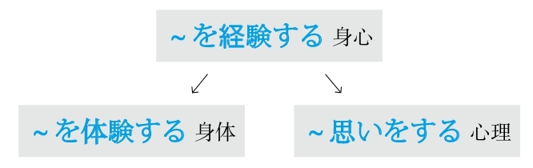

### 尽量

#### ～ようにする
**解释：** 「よう」的意思是“样子”；「に」表示方向；「する」的意思是“做”
**直译：** 做成～的样子
**意译：** 尽量做～
**接续：** 动词的原形

例句：ダイエットしているから、<ruby>晩<rp>(</rp><rt>ばん</rt><rp>)</rp></ruby><ruby>御<rp>(</rp><rt>ご</rt><rp>)</rp></ruby><ruby>飯<rp>(</rp><rt>はん</rt><rp>)</rp></ruby>は<ruby>野<rp>(</rp><rt>や</rt><rp>)</rp></ruby><ruby>菜<rp>(</rp><rt>さい</rt><rp>)</rp></ruby>だけ<ruby>食<rp>(</rp><rt>た</rt><rp>)</rp></ruby>べる**ようにしている** 。
直译：因为在减肥，所以晚饭只吃蔬菜，做成这个样子。
意译：我在减肥，所以现在尽量晚饭只吃蔬菜。

### 举例

#### ～と
**解释：** 起源于「<ruby>統<rp>(</rp><rt>とう</rt><rp>)</rp></ruby>」的「と」的意思是“和”或者表示“引号”
**注意：** 每一个并列的部分之间都要加「と」。前面的「と」表示“和”；最后一个「と」起引号的作用
**接续：** 名词

例句：<ruby>一<rp>(</rp><rt>ひと</rt><rp>)</rp></ruby>つ<ruby>目<rp>(</rp><rt>め</rt><rp>)</rp></ruby>**と** <ruby>二<rp>(</rp><rt>ふた</rt><rp>)</rp></ruby>つ<ruby>目<rp>(</rp><rt>め</rt><rp>)</rp></ruby>**と** <ruby>三<rp>(</rp><rt>み</rt><rp>)</rp></ruby>つ<ruby>目<rp>(</rp><rt>め</rt><rp>)</rp></ruby>**と** は、どう<ruby>違<rp>(</rp><rt>ちが</rt><rp>)</rp></ruby>いますか。
直译：第一个、第二个和第三个，怎么不一样？
意译：第一个、第二个和第三个，有什么不一样？

#### ～とか
**解释：** 「と」的意思是“和”或者表示“引号”；「か」表示不确定
**用法：** 每一个例子的后面都要加「とか」。用几次都可以
**语气：** 柔和
**接续：** 任何词

例句：<ruby>北京<rp>(</rp><rt>ぺキン</rt><rp>)</rp></ruby>に<ruby>旅<rp>(</rp><rt>りょ</rt><rp>)</rp></ruby><ruby>行<rp>(</rp><rt>こう</rt><rp>)</rp></ruby>に<ruby>行<rp>(</rp><rt>い</rt><rp>)</rp></ruby>った<ruby>時<rp>(</rp><rt>とき</rt><rp>)</rp></ruby>、<ruby>万<rp>(</rp><rt>ばん</rt><rp>)</rp></ruby><ruby>里<rp>(</rp><rt>り</rt><rp>)</rp></ruby>の<ruby>長<rp>(</rp><rt>ちょう</rt><rp>)</rp></ruby><ruby>城<rp>(</rp><rt>じょう</rt><rp>)</rp></ruby>**とか** <ruby>西<rp>(</rp><rt>せい</rt><rp>)</rp></ruby><ruby>太<rp>(</rp><rt>たい</rt><rp>)</rp></ruby><ruby>后<rp>(</rp><rt>こう</rt><rp>)</rp></ruby>の<ruby>別<rp>(</rp><rt>べっ</rt><rp>)</rp></ruby><ruby>荘<rp>(</rp><rt>そう</rt><rp>)</rp></ruby>だった<ruby>頤<rp>(</rp><rt>い</rt><rp>)</rp></ruby><ruby>和<rp>(</rp><rt>わ</rt><rp>)</rp></ruby><ruby>園<rp>(</rp><rt>えん</rt><rp>)</rp></ruby>**とか** を<ruby>回<rp>(</rp><rt>まわ</rt><rp>)</rp></ruby>った。
直译：去北京旅游的时候，长城啦慈禧的别墅的颐和园啦等地方，转了。
意译：去北京旅游的时候，转了长城、慈禧的别墅——颐和园等地方。

#### ～や
**解释：** 「や」的汉字是表示并列的「也」
**用法：** 常构成「～や～など」或「～や～といった+名词」的结构
**语气：** 正式
**接续：** 名词

例句：<ruby>当<rp>(</rp><rt>とう</rt><rp>)</rp></ruby><ruby>店<rp>(</rp><rt>てん</rt><rp>)</rp></ruby>では、<ruby>和<rp>(</rp><rt>わ</rt><rp>)</rp></ruby><ruby>雑<rp>(</rp><rt>ざっ</rt><rp>)</rp></ruby><ruby>貨<rp>(</rp><rt>か</rt><rp>)</rp></ruby>**や** アジアの<ruby>雑<rp>(</rp><rt>ざっ</rt><rp>)</rp></ruby><ruby>貨<rp>(</rp><rt>か</rt><rp>)</rp></ruby>**や** <ruby>民<rp>(</rp><rt>みん</rt><rp>)</rp></ruby><ruby>芸<rp>(</rp><rt>げい</rt><rp>)</rp></ruby><ruby>品<rp>(</rp><rt>ひん</rt><rp>)</rp></ruby>**など** を<ruby>扱<rp>(</rp><rt>あつか</rt><rp>)</rp></ruby>っております。
直译：在本店，日本杂货啦亚洲杂货啦民间工艺品等，经营着。
意译：本店经营日本杂货、亚洲杂货、民间工艺品等。

#### ～やら～やら
**解释：** 「やら」和「や」一样，表示不完全性举例，但是更加口语化，相当于现代日语的「だ」或「か」
**注意：** 表示不完全性举例
**区别：** 一般「や」接在名词后，「やら」可以接任何词

例句：<ruby>損<rp>(</rp><rt>そん</rt><rp>)</rp></ruby>した**やら** <ruby>得<rp>(</rp><rt>とく</rt><rp>)</rp></ruby>した**やら** もうどうでもいいことだ。
直译：亏了呀赚了呀，现在都已经无所谓了。
意译：不管是亏了还是赚了，现在都已经无所谓了。

例句：<ruby>飲<rp>(</rp><rt>の</rt><rp>)</rp></ruby>みすぎて、<ruby>頭<rp>(</rp><rt>あたま</rt><rp>)</rp></ruby>が<ruby>痛<rp>(</rp><rt>いた</rt><rp>)</rp></ruby>い**やら** <ruby>息<rp>(</rp><rt>いき</rt><rp>)</rp></ruby>が<ruby>苦<rp>(</rp><rt>くる</rt><rp>)</rp></ruby>しい**やら** 、<ruby>大<rp>(</rp><rt>たい</rt><rp>)</rp></ruby><ruby>変<rp>(</rp><rt>へん</rt><rp>)</rp></ruby>でした。
直译：喝多了，头疼呀喘不上气呀，很痛苦。
意译：喝多了，又是头疼又是喘不上气来，痛苦死了。

#### ―たり
**解释：** 「たり」是「とあり」的音变。「と」表示内容；「あり」是「<ruby>有<rp>(</rp><rt>あ</rt><rp>)</rp></ruby>る」的连用形
**注意：** 谓语词的举例
**用法：** 作为名词使用，后面接谓语。用几次都可以
**变形：** 动词的た形的简体（变形规律参照第一章的第二节）

例句：<ruby>買<rp>(</rp><rt>か</rt><rp>)</rp></ruby>いたいものはいつもあっ**たり** なかっ**たり** する。
直译：想买的东西，经常有和没有。
意译：想买的东西总是有时候有、有时候没有。

#### ～でも
**解释：** 「で」是「です」的中顿形式；「も」表示强调
**意思：** 不特定地举出一个例子，表示推测或建议
**接续：** 名词

例句：お<ruby>茶<rp>(</rp><rt>ちゃ</rt><rp>)</rp></ruby>**でも** <ruby>飲<rp>(</rp><rt>の</rt><rp>)</rp></ruby>みませんか？
直译：不喝点儿茶吗？
意译：喝点儿茶什么的吗？

例句：<ruby>夢<rp>(</rp><rt>ゆめ</rt><rp>)</rp></ruby>**でも** みているの？
直译：做梦呢？
意译：是不是在做梦呢？

#### ～にしても
**解释：** 「に」表示方向或对象；「して」是能够代替大多数动词的「する」的中顿，此处代替了表示举例的「<ruby>例<rp>(</rp><rt>たと</rt><rp>)</rp></ruby>える」；「も」表示强调
**意思：** 不特定地举出一个例子，表示推测或建议
**注意：** 「行っても」表示转折的“即便要去”，「行くにしても」表示举例的“打个比方要去”
**接续：** 动词和形容词的简体、形容动词和名词

例句：<ruby>田<rp>(</rp><rt>た</rt><rp>)</rp></ruby><ruby>中<rp>(</rp><rt>なか</rt><rp>)</rp></ruby>さんの<ruby>家<rp>(</rp><rt>いえ</rt><rp>)</rp></ruby>まで<ruby>行<rp>(</rp><rt>い</rt><rp>)</rp></ruby>く**にしても** 、<ruby>事<rp>(</rp><rt>じ</rt><rp>)</rp></ruby><ruby>前<rp>(</rp><rt>ぜん</rt><rp>)</rp></ruby>に<ruby>一<rp>(</rp><rt>いち</rt><rp>)</rp></ruby><ruby>度<rp>(</rp><rt>ど</rt><rp>)</rp></ruby><ruby>電<rp>(</rp><rt>でん</rt><rp>)</rp></ruby><ruby>話<rp>(</rp><rt>わ</rt><rp>)</rp></ruby>で<ruby>連<rp>(</rp><rt>れん</rt><rp>)</rp></ruby><ruby>絡<rp>(</rp><rt>らく</rt><rp>)</rp></ruby>した<ruby>方<rp>(</rp><rt>ほう</rt><rp>)</rp></ruby>がいい。
直译：打个比方去田中家，事先打一次电话联络最好。
意译：打个比方去田中家，最好也要事先打个电话。

#### ～にしろ～にしろ/～にせよ～にせよ
**解释：** 「しろ」和「せよ」都是「する」的命令形；「に」表示对象；此处是举出两个例子
**区别：** 「せよ」比「しろ」正式
**意思：** 不管是～，还是～
**接续：** 动词和形容词的简体、形容动词和名词

例句：<ruby>寒<rp>(</rp><rt>さむ</rt><rp>)</rp></ruby>い**にしろ** <ruby>暑<rp>(</rp><rt>あつ</rt><rp>)</rp></ruby>い**にしろ** 、どうせ<ruby>遠<rp>(</rp><rt>とお</rt><rp>)</rp></ruby>くまで<ruby>行<rp>(</rp><rt>い</rt><rp>)</rp></ruby>かないから<ruby>大<rp>(</rp><rt>だい</rt><rp>)</rp></ruby><ruby>丈<rp>(</rp><rt>じょう</rt><rp>)</rp></ruby><ruby>夫<rp>(</rp><rt>ぶ</rt><rp>)</rp></ruby>だ。
直译：打个比方冷，打个比方热，反正不去远处，所以没关系。
意译：不管是冷还是热，反正不去远处，所以没关系。

例句：<ruby>気<rp>(</rp><rt>き</rt><rp>)</rp></ruby>に<ruby>入<rp>(</rp><rt>い</rt><rp>)</rp></ruby>る**にせよ** <ruby>気<rp>(</rp><rt>き</rt><rp>)</rp></ruby>に<ruby>入<rp>(</rp><rt>い</rt><rp>)</rp></ruby>らない**にせよ** 、<ruby>引<rp>(</rp><rt>ひ</rt><rp>)</rp></ruby>き<ruby>受<rp>(</rp><rt>う</rt><rp>)</rp></ruby>けた<ruby>仕<rp>(</rp><rt>し</rt><rp>)</rp></ruby><ruby>事<rp>(</rp><rt>ごと</rt><rp>)</rp></ruby>は<ruby>最<rp>(</rp><rt>さい</rt><rp>)</rp></ruby><ruby>後<rp>(</rp><rt>ご</rt><rp>)</rp></ruby>までやるしかない。
直译：打个比方喜欢，打个比方不喜欢，接受了的工作就只能干到底。
意译：不管是喜欢还是不喜欢，只能把接受了的工作干到底。

#### ～につけ～につけ
**解释：** 「つけ」是表示“在”或“是”的「<ruby>就<rp>(</rp><rt>つ</rt><rp>)</rp></ruby>ける、<ruby>即<rp>(</rp><rt>つ</rt><rp>)</rp></ruby>ける」的连用形；「に」表示方向
**意思：** “不管是在～方面，还是在～方面”或“不管是～，还是～”。举出两个例子
**语气：** 正式
**接续：** 动词和形容词的简体、形容动词和名词

例句：<ruby>結<rp>(</rp><rt>けっ</rt><rp>)</rp></ruby><ruby>果<rp>(</rp><rt>か</rt><rp>)</rp></ruby>は<ruby>良<rp>(</rp><rt>よ</rt><rp>)</rp></ruby>き**につけ** <ruby>悪<rp>(</rp><rt>あ</rt><rp>)</rp></ruby>しき**につけ** 、まずやってみるのが<ruby>何<rp>(</rp><rt>なに</rt><rp>)</rp></ruby>よりだ。
直译：结果不管是好还是坏，首先试着做比什么都强。
意译：不管结果是好还是坏，最好首先去尝试。

#### ～といい～といい
**解释：** 「いい」是他动词「<ruby>言<rp>(</rp><rt>い</rt><rp>)</rp></ruby>う」的连用形，表示中顿，意思是“说”；「と」表示内容
**意思：** 不管是说～，还是说～
**接续：** 名词

例句：<ruby>生<rp>(</rp><rt>き</rt><rp>)</rp></ruby><ruby>地<rp>(</rp><rt>じ</rt><rp>)</rp></ruby>**といい** <ruby>柄<rp>(</rp><rt>がら</rt><rp>)</rp></ruby>**といい** 、<ruby>文<rp>(</rp><rt>もん</rt><rp>)</rp></ruby><ruby>句<rp>(</rp><rt>く</rt><rp>)</rp></ruby>のつけようのない<ruby>服<rp>(</rp><rt>ふく</rt><rp>)</rp></ruby>だ。
直译：不管是说质地还是说花样，都是没有办法挑剔的衣服。
意译：不管是质地还是花样，都是件无可挑剔的衣服。

#### ～だの～だの
**解释：** 「だ」是表示断定的「です」，「の」是「が」，表示并列；等于「ですが」
**注意：** 表示泛泛举例或举出两个极端的例子，如「<ruby>好<rp>(</rp><rt>す</rt><rp>)</rp></ruby>きだの、<ruby>嫌<rp>(</rp><rt>きら</rt><rp>)</rp></ruby>いだの」
**接续：** 动词和形容词的简体、名词和形容动词

例句：<ruby>疲<rp>(</rp><rt>つか</rt><rp>)</rp></ruby>れた**だの** <ruby>頭<rp>(</rp><rt>あたま</rt><rp>)</rp></ruby>が<ruby>痛<rp>(</rp><rt>ぃた</rt><rp>)</rp></ruby>い**だの** と<ruby>口<rp>(</rp><rt>こう</rt><rp>)</rp></ruby><ruby>実<rp>(</rp><rt>じつ</rt><rp>)</rp></ruby>を<ruby>探<rp>(</rp><rt>さが</rt><rp>)</rp></ruby>さないで<ruby>速<rp>(</rp><rt>はや</rt><rp>)</rp></ruby>く<ruby>勉<rp>(</rp><rt>べん</rt><rp>)</rp></ruby><ruby>強<rp>(</rp><rt>きょう</rt><rp>)</rp></ruby>しなさい。
直译：累了呀头疼了呀，不要找借口，快点儿学习。
意译：别找借口说累了呀头疼了呀什么的，快点儿学习。

#### ～だろうが～だろうが/～であろうが～であろうが
**解释：** 「だろう」是「です」的推测形式；有单纯连接句子的作用，也有转折的意思
**区别：** 「～であろうが」比「～だろうが」语气正式
**注意：** 不确定
**接续：** 名词

例句：<ruby>貧<rp>(</rp><rt>びん</rt><rp>)</rp></ruby><ruby>乏<rp>(</rp><rt>ぼう</rt><rp>)</rp></ruby>**だろうが** お<ruby>金<rp>(</rp><rt>かね</rt><rp>)</rp></ruby><ruby>持<rp>(</rp><rt>も</rt><rp>)</rp></ruby>ち**だろうが** 、それは<ruby>友<rp>(</rp><rt>とも</rt><rp>)</rp></ruby>を<ruby>選<rp>(</rp><rt>えら</rt><rp>)</rp></ruby>ぶ<ruby>基<rp>(</rp><rt>き</rt><rp>)</rp></ruby><ruby>準<rp>(</rp><rt>じゅん</rt><rp>)</rp></ruby>ではない。
直译：不管对方是穷人还是有钱人，这不是择友的基准。
意译：不管对方是穷人还是有钱人，这都不是择友的基准。

#### ～なり～なり
**解释：** 「なり」是表示断定的「<ruby>也<rp>(</rp><rt>なり</rt><rp>)</rp></ruby>」，意思是“是”
**注意：** 表示选择性举例
**重点：** 表示断定和举例的「也」的音读是「や」，训读是「なり」，相当于现代日语的「だ」或「か」
**接续：** 动词的原形

例句：<ruby>辞<rp>(</rp><rt>じ</rt><rp>)</rp></ruby><ruby>書<rp>(</rp><rt>しょ</rt><rp>)</rp></ruby>を<ruby>引<rp>(</rp><rt>ひ</rt><rp>)</rp></ruby>く**なり** <ruby>他<rp>(</rp><rt>ほか</rt><rp>)</rp></ruby>の<ruby>人<rp>(</rp><rt>ひと</rt><rp>)</rp></ruby>に<ruby>聞<rp>(</rp><rt>き</rt><rp>)</rp></ruby>く**なり** どんな<ruby>方法<rp>(</rp><rt>ほうほう</rt><rp>)</rp></ruby>でもいいから<ruby>調<rp>(</rp><rt>しら</rt><rp>)</rp></ruby>べてください。
直译：查字典啦问别人啦，不管什么方法都行，请查。
意译：查字典啦问别人啦，不管用什么方法都行，去查一下。

#### －つ－つ
**解释：** 「つ」相当于汉语的“次”
**意思：** 一次这样，一次那样
**注意：** 表示对照性举例
**词性：** 名词
**接续：** 动词的连用形

例句：<ruby>選<rp>(</rp><rt>せん</rt><rp>)</rp></ruby><ruby>手<rp>(</rp><rt>しゅ</rt><rp>)</rp></ruby>たちはみんな<ruby>抜<rp>(</rp><rt>ぬ</rt><rp>)</rp></ruby>き**つ** <ruby>抜<rp>(</rp><rt>ぬ</rt><rp>)</rp></ruby>かれ**つ** してゴールインした。
直译：选手们大家都，一次追上一次被追上，到达了终点。
意译：选手们你追我赶地到达了终点。

例句：<ruby>彼<rp>(</rp><rt>かれ</rt><rp>)</rp></ruby>は<ruby>部<rp>(</rp><rt>へ</rt><rp>)</rp></ruby><ruby>屋<rp>(</rp><rt>や</rt><rp>)</rp></ruby>で<ruby>行<rp>(</rp><rt>い</rt><rp>)</rp></ruby>き**つ** <ruby>戻<rp>(</rp><rt>もど</rt><rp>)</rp></ruby>り**つ** している。
直译：他在房间里一次去一次回地走着。
意译：他在房间里来回走着。
语法关系图

### 决定

#### ～ことにする
**解释：** 「こと」是“名词化”；「に」表示方向；「する」可以代替大多数动词，此处代替了他动词「決める」
**区别：** 他动词「決める」只是表示“单纯的决定”，而「～ことにする」侧重于有很多选择，确定了其中的一个。体现这个特点的就是表示方向、对象、目的、目标的助词「に」
**重点：** 他动词侧重于有人去做，着重强调做的人；他动词还侧重于动作
**接续：** 动词的原形

例句：いろいろ<ruby>考<rp>(</rp><rt>かんが</rt><rp>)</rp></ruby>えた<ruby>結<rp>(</rp><rt>けっ</rt><rp>)</rp></ruby><ruby>果<rp>(</rp><rt>か</rt><rp>)</rp></ruby>、<ruby>留<rp>(</rp><rt>りゅう</rt><rp>)</rp></ruby><ruby>学<rp>(</rp><rt>がく</rt><rp>)</rp></ruby>を<ruby>止<rp>(</rp><rt>や</rt><rp>)</rp></ruby>めて<ruby>就<rp>(</rp><rt>しゅう</rt><rp>)</rp></ruby><ruby>職<rp>(</rp><rt>しょく</rt><rp>)</rp></ruby>する**ことにした** 。
直译：考虑了各种各样的结果，决定不去留学去上班。
意译：多方考虑之后，我决定不去留学，去上班。

#### ～ことになる
**解释：** 「こと」是“名词化”；「に」表示方向；自动词「なる」代替了自动词「決まる」
**区别：** 自动词「決まる」只是表示“单纯的决定”，而「～ことになる」侧重于有很多选择，确定了其中的一个。体现这个特点的就是表示方向、对象、目的、目标的助词「に」
**重点：** 自动词不侧重于有人去做，不着重强调说明做的人；自动词还侧重于动作的结果和状态
**接续：** 动词的原形

例句：<ruby>学<rp>(</rp><rt>がっ</rt><rp>)</rp></ruby><ruby>校<rp>(</rp><rt>こう</rt><rp>)</rp></ruby>から<ruby>通<rp>(</rp><rt>つう</rt><rp>)</rp></ruby><ruby>知<rp>(</rp><rt>ち</rt><rp>)</rp></ruby>があって、<ruby>今<rp>(</rp><rt>こん</rt><rp>)</rp></ruby><ruby>度<rp>(</rp><rt>ど</rt><rp>)</rp></ruby>のコースは<ruby>開<rp>(</rp><rt>ひら</rt><rp>)</rp></ruby>かない**ことになった** 。
直译：学校来了通知，下次的课程不开了的事宜定下来了。
意译：学校来了通知，决定下次课程不开了。
语法关系图
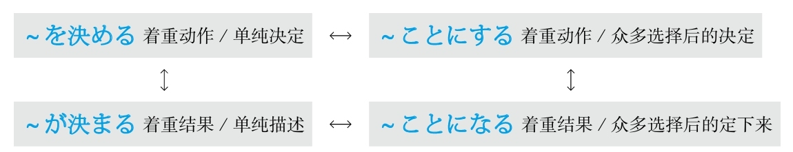

### 决心

#### 思い切って～
**解释：** 「<ruby>思<rp>(</rp><rt>おも</rt><rp>)</rp></ruby>い<ruby>切<rp>(</rp><rt>き</rt><rp>)</rp></ruby>って」是「<ruby>思<rp>(</rp><rt>おも</rt><rp>)</rp></ruby>い<ruby>切<rp>(</rp><rt>き</rt><rp>)</rp></ruby>る」（不再想）的中顿形式
**意思：** 下决心做～，毅然决然地做～
**词性：** 副词
**注意：** 「<ruby>思<rp>(</rp><rt>おも</rt><rp>)</rp></ruby>い<ruby>切<rp>(</rp><rt>き</rt><rp>)</rp></ruby>り」的意思是“痛痛快快地做～”

例句：**<ruby>思<rp>(</rp><rt>おも</rt><rp>)</rp></ruby>い<ruby>切<rp>(</rp><rt>き</rt><rp>)</rp></ruby>って** <ruby>会<rp>(</rp><rt>かい</rt><rp>)</rp></ruby><ruby>社<rp>(</rp><rt>しゃ</rt><rp>)</rp></ruby>を<ruby>辞<rp>(</rp><rt>や</rt><rp>)</rp></ruby>めた。
直译：下决心辞了公司。
意译：下决心辞了工作。

#### ～つもりだ
**解释：** 名词「つもり」常被翻译成“打算”，但是日语的「つもり」的语气要比汉语的“打算”的语气强得多，所以应该理解为「<ruby>強<rp>(</rp><rt>つよ</rt><rp>)</rp></ruby>い<ruby>思<rp>(</rp><rt>おも</rt><rp>)</rp></ruby>い」（强烈的心情或决心）。如果想说“打算做某事”时可以直接用动词
**接续：** 动词的一般现在时的简体
**意思：** 决心做～

例句：<ruby>自<rp>(</rp><rt>じ</rt><rp>)</rp></ruby><ruby>分<rp>(</rp><rt>ぶん</rt><rp>)</rp></ruby>の<ruby>信<rp>(</rp><rt>しん</rt><rp>)</rp></ruby><ruby>念<rp>(</rp><rt>ねん</rt><rp>)</rp></ruby>を<ruby>貫<rp>(</rp><rt>つらぬ</rt><rp>)</rp></ruby>く**つもり** です。
直译：把自己的信念贯彻到底的强烈的心情。
意译：我决心把我自己的信念贯彻到底。

**接续：** 动词的现在进行时的简体
**意思：** 以某种强烈的心情认为～

例句：わかっている**つもり** です。
直译：已经懂了的强烈的心情。
意译：我认为我已经懂了。

**接续：** 动词的过去式的简体
**意思：** 以某种强烈的心情以为～，但是事实相反

例句：<ruby>負<rp>(</rp><rt>ま</rt><rp>)</rp></ruby>けたけど、<ruby>勝<rp>(</rp><rt>か</rt><rp>)</rp></ruby>った**つもり** でいる。
直译：虽然输了，但是赢了的强烈的心情。
意译：虽然输了，但是当作赢了。
语法关系图
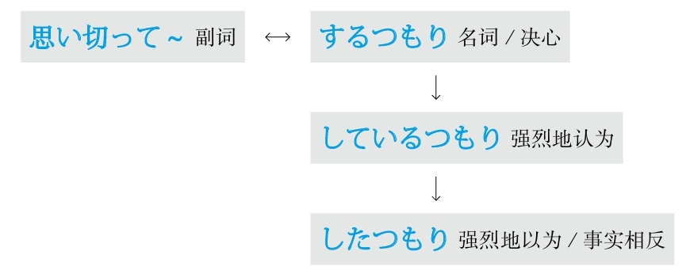

### 觉得

#### ～と思う
**意思：** 想、认为、以为、觉得
**注意：** 心理活动的主语是第三人称时需要用“状态”表示，在此用现在进行时表示状态，因此第三人称要用「～と思っている」
**接续：** 任何词

例句：このような<ruby>考<rp>(</rp><rt>かんが</rt><rp>)</rp></ruby>え<ruby>方<rp>(</rp><rt>かた</rt><rp>)</rp></ruby>はあなたにはよくない**と<ruby>思<rp>(</rp><rt>おも</rt><rp>)</rp></ruby>う** 。
直译：这样的想法对你不好，我觉得。
意译：我觉得这样的想法对你不好。

#### ～気がする
**解释：** 「<ruby>気<rp>(</rp><rt>き</rt><rp>)</rp></ruby>」的意思是“感觉”；「が」用于自动词前面表示小主语；「する」在此是自动词，表示“产生”
**意思：** 产生～感觉
**区别：** 「～<ruby>気<rp>(</rp><rt>き</rt><rp>)</rp></ruby>がする」比「<ruby>思<rp>(</rp><rt>おも</rt><rp>)</rp></ruby>う」更有强调“感觉”的语气；是由内而发的感觉
**注意：** 有时候常用「～ような<ruby>気<rp>(</rp><rt>き</rt><rp>)</rp></ruby>がする」
**接续：** 修饰名词的规律（参照第一章的第三节）

例句：このやり<ruby>方<rp>(</rp><rt>かた</rt><rp>)</rp></ruby>はどうしても<ruby>間<rp>(</rp><rt>ま</rt><rp>)</rp></ruby><ruby>違<rp>(</rp><rt>ちが</rt><rp>)</rp></ruby>っている**<ruby>気<rp>(</rp><rt>き</rt><rp>)</rp></ruby>がする** 。
直译：这种方法不对，无论如何都觉得。
意译：总觉得这种方法不对。

#### ～感じがする
**解释：** 「<ruby>感<rp>(</rp><rt>かん</rt><rp>)</rp></ruby>じ」的意思是“感觉”；「が」用于自动词前面表示小主语；「する」在此是自动词，表示“产生”
**意思：** 产生～感觉
**着重：** 多用于外在给人带来的感觉
**接续：** 修饰名词的规律（参照第一章的第三节）

例句：これでいいと<ruby>言<rp>(</rp><rt>い</rt><rp>)</rp></ruby>われたけど、<ruby>自<rp>(</rp><rt>じ</rt><rp>)</rp></ruby><ruby>分<rp>(</rp><rt>ぶん</rt><rp>)</rp></ruby>ではまだまだ<ruby>足<rp>(</rp><rt>た</rt><rp>)</rp></ruby>りない**<ruby>感<rp>(</rp><rt>かん</rt><rp>)</rp></ruby>じがする** 。
直译：虽然被说了这种程度就行，但是自己却觉得这种程度还是太不够。
意译：虽然别人说这样就行了，但是自己还是觉得太不够了。
语法关系图

## K
### 开端，契机

#### ～をはじめ、
**注意：** 应用了日语里的经典句型「～を～と（に）する（把～当成～）」
**解释：** 「はじめ」的汉字是「<ruby>初<rp>(</rp><rt>はじ</rt><rp>)</rp></ruby>め」或「<ruby>始<rp>(</rp><rt>はじ</rt><rp>)</rp></ruby>め」；此外还常用「～をはじめとして」
**意思：** 以～为开始、以～为首
**语气：** 柔和
**接续：** 名词

例句：<ruby>社<rp>(</rp><rt>しゃ</rt><rp>)</rp></ruby><ruby>長<rp>(</rp><rt>ちょう</rt><rp>)</rp></ruby>**をはじめ、** <ruby>社<rp>(</rp><rt>しゃ</rt><rp>)</rp></ruby><ruby>員<rp>(</rp><rt>いん</rt><rp>)</rp></ruby><ruby>全<rp>(</rp><rt>ぜん</rt><rp>)</rp></ruby><ruby>員<rp>(</rp><rt>いん</rt><rp>)</rp></ruby>が<ruby>開<rp>(</rp><rt>かい</rt><rp>)</rp></ruby><ruby>幕<rp>(</rp><rt>まく</rt><rp>)</rp></ruby><ruby>式<rp>(</rp><rt>しき</rt><rp>)</rp></ruby>に<ruby>出<rp>(</rp><rt>しゅっ</rt><rp>)</rp></ruby><ruby>席<rp>(</rp><rt>せき</rt><rp>)</rp></ruby>した。
直译：以社长为开始，社员全员出席了开幕式。
意译：社长以及全体员工都出席了开幕式。

#### ～を皮切りに
**注意：** 应用了日语里的经典句型「～を～と（に）する（把～当成～）」
**解释：** 「<ruby>皮<rp>(</rp><rt>かわ</rt><rp>)</rp></ruby><ruby>切<rp>(</rp><rt>き</rt><rp>)</rp></ruby>り」起源于医学用语，扎针灸的第一针时皮肤好像是要裂开了一样疼痛，意译为“开端”
**意思：** 把～当作开端
**语气：** 正式
**接续：** 名词

例句：<ruby>新<rp>(</rp><rt>しん</rt><rp>)</rp></ruby><ruby>型<rp>(</rp><rt>がた</rt><rp>)</rp></ruby><ruby>携<rp>(</rp><rt>けい</rt><rp>)</rp></ruby><ruby>帯<rp>(</rp><rt>たい</rt><rp>)</rp></ruby><ruby>電<rp>(</rp><rt>でん</rt><rp>)</rp></ruby><ruby>話<rp>(</rp><rt>わ</rt><rp>)</rp></ruby>は、<ruby>先<rp>(</rp><rt>せん</rt><rp>)</rp></ruby><ruby>月<rp>(</rp><rt>げつ</rt><rp>)</rp></ruby>アメリカでの<ruby>発<rp>(</rp><rt>はつ</rt><rp>)</rp></ruby><ruby>売<rp>(</rp><rt>ばい</rt><rp>)</rp></ruby>**を<ruby>皮<rp>(</rp><rt>かわ</rt><rp>)</rp></ruby><ruby>切<rp>(</rp><rt>き</rt><rp>)</rp></ruby>りに** 、<ruby>世<rp>(</rp><rt>せ</rt><rp>)</rp></ruby><ruby>界<rp>(</rp><rt>かい</rt><rp>)</rp></ruby><ruby>各<rp>(</rp><rt>かく</rt><rp>)</rp></ruby><ruby>地<rp>(</rp><rt>ち</rt><rp>)</rp></ruby>で<ruby>販<rp>(</rp><rt>はん</rt><rp>)</rp></ruby><ruby>売<rp>(</rp><rt>ばい</rt><rp>)</rp></ruby>されている。
直译：新型手机，上月在美国的销售为开端，在世界各地一直被销售着。
意译：新型手机自从上月在美国发售以来，一直在世界各地销售。

#### ～をきっかけに
**注意：** 应用了日语里的经典句型「～を～と（に）する（把～当成～）」
**解释：** 「きっかけ」的意思是“契机”
**意思：** 以～为契机
**语气：** 柔和
**接续：** 名词

例句：その<ruby>詩<rp>(</rp><rt>し</rt><rp>)</rp></ruby><ruby>人<rp>(</rp><rt>じん</rt><rp>)</rp></ruby>の<ruby>作<rp>(</rp><rt>さく</rt><rp>)</rp></ruby><ruby>品<rp>(</rp><rt>ひん</rt><rp>)</rp></ruby>は、テレビのコマーシャルに<ruby>使<rp>(</rp><rt>つか</rt><rp>)</rp></ruby>われるの**をきっかけに** 、<ruby>大<rp>(</rp><rt>だい</rt><rp>)</rp></ruby>ブームになった。
直译：那个诗人的作品，电视广告上被使用为契机，成为了热潮。
意译：那个诗人的作品被用于电视广告之后掀起了热潮。

#### ～を契機に
**注意：** 应用了日语里的经典句型「～を～と（に）する（把～当成～）」
**解释：** 「<ruby>契<rp>(</rp><rt>けい</rt><rp>)</rp></ruby><ruby>機<rp>(</rp><rt>き</rt><rp>)</rp></ruby>」的意思是“契机”
**意思：** 以～为契机
**语气：** 正式
**接续：** 名词

例句：オイルショック**を<ruby>契<rp>(</rp><rt>けい</rt><rp>)</rp></ruby><ruby>機<rp>(</rp><rt>き</rt><rp>)</rp></ruby>に** <ruby>新<rp>(</rp><rt>しん</rt><rp>)</rp></ruby>エネルギーの<ruby>研<rp>(</rp><rt>けん</rt><rp>)</rp></ruby><ruby>究<rp>(</rp><rt>きゅう</rt><rp>)</rp></ruby>がどんどん<ruby>進<rp>(</rp><rt>すす</rt><rp>)</rp></ruby>められている。
直译：石油冲击为契机，新能源的研究在不断地被进展着。
意译：以石油危机为契机，有关新能源的研究正在不断推进。
语法关系图

### 可能性

#### ～可能性がある
**意思：** 有～的可能性
**用于：** 好的可能性、不好的可能性
**语气：** 正式
**接续：** 修饰名词的规律（参照第一章的第三节）

例句：<ruby>共<rp>(</rp><rt>きょう</rt><rp>)</rp></ruby><ruby>同<rp>(</rp><rt>どう</rt><rp>)</rp></ruby><ruby>研<rp>(</rp><rt>けん</rt><rp>)</rp></ruby><ruby>究<rp>(</rp><rt>きゅう</rt><rp>)</rp></ruby><ruby>者<rp>(</rp><rt>しゃ</rt><rp>)</rp></ruby>を<ruby>海<rp>(</rp><rt>かい</rt><rp>)</rp></ruby><ruby>外<rp>(</rp><rt>がい</rt><rp>)</rp></ruby>から<ruby>招<rp>(</rp><rt>まね</rt><rp>)</rp></ruby>く**<ruby>可<rp>(</rp><rt>か</rt><rp>)</rp></ruby><ruby>能<rp>(</rp><rt>のう</rt><rp>)</rp></ruby><ruby>性<rp>(</rp><rt>せい</rt><rp>)</rp></ruby>がある** 。
直译：共同搞研究的人从海外招的可能性有。
意译：有可能从海外招聘共同研究人员。

例句：<ruby>著<rp>(</rp><rt>ちょ</rt><rp>)</rp></ruby><ruby>作<rp>(</rp><rt>さく</rt><rp>)</rp></ruby><ruby>権<rp>(</rp><rt>けん</rt><rp>)</rp></ruby><ruby>違<rp>(</rp><rt>い</rt><rp>)</rp></ruby><ruby>反<rp>(</rp><rt>はん</rt><rp>)</rp></ruby>の**<ruby>可<rp>(</rp><rt>か</rt><rp>)</rp></ruby><ruby>能<rp>(</rp><rt>のう</rt><rp>)</rp></ruby><ruby>性<rp>(</rp><rt>せい</rt><rp>)</rp></ruby>がある** 。
直译：版权违反的可能性有。
意译：有可能会侵犯版权。

#### ～恐れがある
**解释：** 名词「<ruby>恐<rp>(</rp><rt>おそ</rt><rp>)</rp></ruby>れ」的意思是“恐怕”
**意思：** 有～的可能性
**用于：** 不好的可能性
**注意：** 相同表达方式还有「～<ruby>心<rp>(</rp><rt>しん</rt><rp>)</rp></ruby><ruby>配<rp>(</rp><rt>ぱい</rt><rp>)</rp></ruby>がある、～<ruby>危<rp>(</rp><rt>き</rt><rp>)</rp></ruby><ruby>険<rp>(</rp><rt>けん</rt><rp>)</rp></ruby><ruby>性<rp>(</rp><rt>せい</rt><rp>)</rp></ruby>がある」等
**接续：** 修饰名词的规律（参照第一章的第三节）

例句：<ruby>今日<rp>(</rp><rt>きょう</rt><rp>)</rp></ruby>は<ruby>大<rp>(</rp><rt>おお</rt><rp>)</rp></ruby><ruby>雨<rp>(</rp><rt>あめ</rt><rp>)</rp></ruby>の**<ruby>恐<rp>(</rp><rt>おそ</rt><rp>)</rp></ruby>れがある** 。
直译：今天大雨的恐怕有。
意译：今天恐怕会下大雨。

#### －かねない
**解释：** 「ね」可以理解为“难”；「－かねない」可以理解为“不难”，表示“会有不好的可能性”；「－かねる」可以理解为“很难”，表示“很难做某事”
**意思：** 有～的可能性
**着重：** 婉转地表达消极的事项
**接续：** 动词的连用形

例句：たばこの<ruby>火<rp>(</rp><rt>ひ</rt><rp>)</rp></ruby>をきちんと<ruby>始<rp>(</rp><rt>し</rt><rp>)</rp></ruby><ruby>末<rp>(</rp><rt>まつ</rt><rp>)</rp></ruby>しなければ、<ruby>事<rp>(</rp><rt>じ</rt><rp>)</rp></ruby><ruby>故<rp>(</rp><rt>こ</rt><rp>)</rp></ruby>になり**かねない** よ。
直译：烟的火不完全处理的话，可能发生事故。
意译：不把烟头完全掐灭的话，很可能会发生事故。

#### －得る
**解释：** 「－<ruby>得<rp>(</rp><rt>う</rt><rp>)</rp></ruby>る」的意思是“得到”
**意思：** 有～的可能性
**注意：** 「<ruby>得<rp>(</rp><rt>え</rt><rp>)</rp></ruby>る」单独作动词时的念法和作为动词后缀的「－<ruby>得<rp>(</rp><rt>う</rt><rp>)</rp></ruby>る」的念法不同
**接续：** 动词的连用形

例句：それはあり**<ruby>得<rp>(</rp><rt>う</rt><rp>)</rp></ruby>る** ことだ。
直译：那是有得到的事情。
意译：那很有可能。

#### －得ない
**解释：** 「－<ruby>得<rp>(</rp><rt>え</rt><rp>)</rp></ruby>ない」的意思是“不得”
**意思：** 没有～的可能性
**接续：** 动词的连用形

例句：それはあり**<ruby>得<rp>(</rp><rt>え</rt><rp>)</rp></ruby>ない** ことだ。
直译：那是有不得的事情。
意译：那不可能。

#### ～はずがない
**解释：** 「<ruby>筈<rp>(</rp><rt>はず</rt><rp>)</rp></ruby>」是弓的两端系弦的地方；由于系弦的地方应该和弦匹配，所以引申为“客观性的应该”
**直译：** 没有客观性的应该
**意译：** 不可能～
**语气：** 客观
**接续：** 修饰名词的规律（参照第一章的第三节）

例句：<ruby>激<rp>(</rp><rt>げき</rt><rp>)</rp></ruby><ruby>安<rp>(</rp><rt>やす</rt><rp>)</rp></ruby>・<ruby>速<rp>(</rp><rt>そっ</rt><rp>)</rp></ruby><ruby>攻<rp>(</rp><rt>こう</rt><rp>)</rp></ruby>ダイエット<ruby>法<rp>(</rp><rt>ほう</rt><rp>)</rp></ruby>、これで<ruby>簡<rp>(</rp><rt>かん</rt><rp>)</rp></ruby><ruby>単<rp>(</rp><rt>たん</rt><rp>)</rp></ruby>に<ruby>痩<rp>(</rp><rt>や</rt><rp>)</rp></ruby>せる**はずがない** 。
直译：便宜·快速的减肥方法，这样简单地瘦下来的客观性的应该没有。
意译：便宜快速减肥法，用这种方法不可能那么容易瘦下来。

#### ～わけがない
**解释：** 「<ruby>訳<rp>(</rp><rt>わけ</rt><rp>)</rp></ruby>」的起源是「<ruby>分<rp>(</rp><rt>わ</rt><rp>)</rp></ruby>ける」，意思是“道理”
**直译：** 没有～的道理
**意译：** 不可能～
**语气：** 强烈
**接续：** 修饰名词的规律（参照第一章的第三节）

例句：お<ruby>金<rp>(</rp><rt>かね</rt><rp>)</rp></ruby>は<ruby>楽<rp>(</rp><rt>らく</rt><rp>)</rp></ruby>に<ruby>稼<rp>(</rp><rt>かせ</rt><rp>)</rp></ruby>げる**わけがない** 。
直译：钱是轻松地赚的道理没有。
意译：钱是不可能轻松地赚的。

#### －っ子ない
**解释：** 「<ruby>子<rp>(</rp><rt>こ</rt><rp>)</rp></ruby>」的意思是“人”；「ない」的意思是“没有”；促音的作用是加强语气
**直译：** 没有～的人
**意译：** 绝对不可能～
**区别：** 语气最强烈
**接续：** 动词的连用形

例句：<ruby>宝<rp>(</rp><rt>たから</rt><rp>)</rp></ruby>くじなんて<ruby>当<rp>(</rp><rt>あ</rt><rp>)</rp></ruby>たり**っ<ruby>子<rp>(</rp><rt>こ</rt><rp>)</rp></ruby>ない** 。
直译：奖券这样的东西中的人没有。
意译：奖券这样的东西绝对不可能中。

#### ～べくもない
**解释：** 「べく」的汉字是「<ruby>可<rp>(</rp><rt>べ</rt><rp>)</rp></ruby>く」，表示“可能性”；「も」表示并列，意思是“也、连、都”；「ない」的意思是“没有”
**意思：** 连～的可能性都没有
**接续：** 动词的原形

例句：<ruby>東<rp>(</rp><rt>とう</rt><rp>)</rp></ruby><ruby>京<rp>(</rp><rt>きょう</rt><rp>)</rp></ruby><ruby>都<rp>(</rp><rt>と</rt><rp>)</rp></ruby><ruby>心<rp>(</rp><rt>しん</rt><rp>)</rp></ruby>のような<ruby>土<rp>(</rp><rt>と</rt><rp>)</rp></ruby><ruby>地<rp>(</rp><rt>ち</rt><rp>)</rp></ruby>の<ruby>高<rp>(</rp><rt>たか</rt><rp>)</rp></ruby>いところでは、<ruby>一<rp>(</rp><rt>いっ</rt><rp>)</rp></ruby><ruby>戸<rp>(</rp><rt>こ</rt><rp>)</rp></ruby><ruby>建<rp>(</rp><rt>だ</rt><rp>)</rp></ruby>ては<ruby>簡<rp>(</rp><rt>かん</rt><rp>)</rp></ruby><ruby>単<rp>(</rp><rt>たん</rt><rp>)</rp></ruby>に<ruby>手<rp>(</rp><rt>て</rt><rp>)</rp></ruby>に<ruby>入<rp>(</rp><rt>はい</rt><rp>)</rp></ruby>る**べくもない** 。
直译：像东京都心这样的土地很贵的地方，别墅形房子简单地得到的可能性没有。
意译：在像东京市中心这样土地很贵的地方，买独栋楼房绝对不是件容易的事。

#### －ないことはない
**解释：** 双重否定表示肯定。「こと」在此具体化为“可能性”；「は」强调了表示小主语的「が」；「ない」的意思是“没有”
**直译：** 没有不～的可能性
**意译：** 有可能～
**注意：** 用「こと」时，动词用「ない」
**语气：** 婉转
**变形：** 动词的否定形的な（变形规律参照第一章的第二节）

例句：どうしても<ruby>教<rp>(</rp><rt>おし</rt><rp>)</rp></ruby>えてくれと<ruby>言<rp>(</rp><rt>い</rt><rp>)</rp></ruby>うなら、<ruby>教<rp>(</rp><rt>おし</rt><rp>)</rp></ruby>え**ないことはない** 。
直译：假设说无论如何“告诉我”说了的话，不告诉的可能性没有。
意译：如果你非要我告诉你，那我有可能会告诉你。

#### －ないものでもない
**解释：** 双重否定表示肯定。「もの」在此具体化为“可能性”；「でもない」的意思是“也不是”
**直译：** 并不是不～的可能性
**意译：** 有可能～
**注意：** 用「もの」时，动词用「でもない」
**用法：** 「もの」可以省略，构成「－ないでもない」
**语气：** 婉转
**变形：** 动词的否定形的な（变形规律参照第一章的第二节）

例句：<ruby>難<rp>(</rp><rt>むずか</rt><rp>)</rp></ruby>しいが、なんとか<ruby>工<rp>(</rp><rt>く</rt><rp>)</rp></ruby><ruby>夫<rp>(</rp><rt>ふう</rt><rp>)</rp></ruby>すれば、でき**ないものでもない** 。
直译：虽然难，想办法下功夫的话，不能的情况不是。
意译：虽然很难，但是想办法好好下功夫，不会做不成的。

#### －なくはない
**解释：** 双重否定表示肯定。「なく」表示副词；「は」强调了表示小主语的「が」；「ない」的意思是“没有”
**直译：** 没有不～
**意译：** 有可能～
**语气：** 婉转，简洁
**变形：** 动词的否定形的な（变形规律参照第一章的第二节）

例句：<ruby>彼<rp>(</rp><rt>かれ</rt><rp>)</rp></ruby>は<ruby>急<rp>(</rp><rt>きゅう</rt><rp>)</rp></ruby>に<ruby>転<rp>(</rp><rt>てん</rt><rp>)</rp></ruby><ruby>職<rp>(</rp><rt>しょく</rt><rp>)</rp></ruby>の<ruby>意<rp>(</rp><rt>い</rt><rp>)</rp></ruby>を<ruby>表<rp>(</rp><rt>ひょう</rt><rp>)</rp></ruby><ruby>明<rp>(</rp><rt>めい</rt><rp>)</rp></ruby>したが、<ruby>彼<rp>(</rp><rt>かれ</rt><rp>)</rp></ruby>の<ruby>普<rp>(</rp><rt>ふ</rt><rp>)</rp></ruby><ruby>段<rp>(</rp><rt>だん</rt><rp>)</rp></ruby>の<ruby>行<rp>(</rp><rt>こう</rt><rp>)</rp></ruby><ruby>動<rp>(</rp><rt>どう</rt><rp>)</rp></ruby>パターンを<ruby>考<rp>(</rp><rt>かんが</rt><rp>)</rp></ruby>えれば、<ruby>理<rp>(</rp><rt>り</rt><rp>)</rp></ruby><ruby>解<rp>(</rp><rt>かい</rt><rp>)</rp></ruby>でき**なくはない** 。
直译：他突然表明了转行的意思，但是如果从他平时的行动模式来考虑的话，也不是不能理解。
意译：他突然说他要转行。不过从他平时的行为方式来看的话，也不是不能理解。
语法关系图

### 肯定

#### ぜひ
**解释：** 副词「<ruby>是<rp>(</rp><rt>ぜ</rt><rp>)</rp></ruby><ruby>非<rp>(</rp><rt>ひ</rt><rp>)</rp></ruby>」的意思是“一定”
**着重：** 愿望强

例句：**<ruby>是<rp>(</rp><rt>ぜ</rt><rp>)</rp></ruby><ruby>非<rp>(</rp><rt>ひ</rt><rp>)</rp></ruby>** お<ruby>願<rp>(</rp><rt>ねが</rt><rp>)</rp></ruby>いします。
直译：一定拜托您。
意译：请您一定帮忙。

#### きっと
**解释：** 副词「きっと」的意思“一定”
**着重：** 推测

例句：**きっと** <ruby>成<rp>(</rp><rt>せい</rt><rp>)</rp></ruby><ruby>功<rp>(</rp><rt>こう</rt><rp>)</rp></ruby>する。
直译：一定成功。
意译：肯定会成功的。

#### 必ず
**解释：** 副词「<ruby>必<rp>(</rp><rt>かなら</rt><rp>)</rp></ruby>ず」的意思是“必定”
**着重：** 愿望、推测
**语气：** 强烈

例句：**<ruby>必<rp>(</rp><rt>かなら</rt><rp>)</rp></ruby>ず** <ruby>合<rp>(</rp><rt>ごう</rt><rp>)</rp></ruby><ruby>格<rp>(</rp><rt>かく</rt><rp>)</rp></ruby>してみせる。
直译：必定合格让人看看。
意译：一定要考上给他们看看。

#### ～でなくてなんだろう
**解释：** 「でなくて」是「ではない」的中顿形式；「<ruby>何<rp>(</rp><rt>なん</rt><rp>)</rp></ruby>」的意思是“什么”；「だろう」表示推测
**直译：** 不是～的话，是什么啊
**意译：** 肯定是～
**接续：** 名词

例句：<ruby>戦<rp>(</rp><rt>せん</rt><rp>)</rp></ruby><ruby>争<rp>(</rp><rt>そう</rt><rp>)</rp></ruby>で<ruby>多<rp>(</rp><rt>おお</rt><rp>)</rp></ruby>くの<ruby>人<rp>(</rp><rt>ひと</rt><rp>)</rp></ruby>が<ruby>殺<rp>(</rp><rt>ころ</rt><rp>)</rp></ruby>されているなんて、これが<ruby>悲<rp>(</rp><rt>ひ</rt><rp>)</rp></ruby><ruby>劇<rp>(</rp><rt>げき</rt><rp>)</rp></ruby>**でなくてなんだろう** 。
直译：在战争中，很多人被杀了，这不是悲剧是什么？
意译：战争中很多人都被杀害了，这不是悲剧是什么？

#### ～に決まっている
**解释：** 「に」表示方向或对象；自动词「<ruby>決<rp>(</rp><rt>き</rt><rp>)</rp></ruby>まる」的意思是“定了”；现在进行时「－ている」表示持续的状态
**直译：** 定了就是～
**意译：** 肯定是～
**语气：** 柔和
**注意：** 口语中经常省略て形后面的い，构成「～に<ruby>決<rp>(</rp><rt>き</rt><rp>)</rp></ruby>まってる」
**接续：** 任何词

例句：よく<ruby>考<rp>(</rp><rt>かんが</rt><rp>)</rp></ruby>えないで<ruby>言<rp>(</rp><rt>い</rt><rp>)</rp></ruby>ったことは、<ruby>後<rp>(</rp><rt>こう</rt><rp>)</rp></ruby><ruby>悔<rp>(</rp><rt>かい</rt><rp>)</rp></ruby>する**に<ruby>決<rp>(</rp><rt>き</rt><rp>)</rp></ruby>まっている** 。
直译：不好好想就说了话，肯定会后悔的。
意译：不好好想想就说，肯定会后悔的。

#### ～に違いない
**解释：** 「に」表示方向或对象；「<ruby>違<rp>(</rp><rt>ちが</rt><rp>)</rp></ruby>い」的意思是“错误”；「ない」的意思是“没有”
**直译：** 没有错误
**意译：** 肯定是～
**语气：** 较正式
**接续：** 任何词

例句：そうするだけの<ruby>理<rp>(</rp><rt>り</rt><rp>)</rp></ruby><ruby>由<rp>(</rp><rt>ゆう</rt><rp>)</rp></ruby>がある**に<ruby>違<rp>(</rp><rt>ちが</rt><rp>)</rp></ruby>いない** 。
直译：符合那样做的理由，有，肯定。
意译：肯定有那么做的理由。

#### ～にほかならない
**解释：** 「に」表示方向或对象；「ほか」的意思是“其他”；「ならない」是断定动词「<ruby>也<rp>(</rp><rt>なり</rt><rp>)</rp></ruby>」的否定形式，意思是“不是”
**直译：** 不是其他～
**意译：** 肯定是～
**语气：** 正式
**接续：** 任何词

例句：<ruby>今<rp>(</rp><rt>いま</rt><rp>)</rp></ruby>の<ruby>成<rp>(</rp><rt>せい</rt><rp>)</rp></ruby><ruby>功<rp>(</rp><rt>こう</rt><rp>)</rp></ruby>をもたらしたのは、<ruby>弛<rp>(</rp><rt>たゆ</rt><rp>)</rp></ruby>まない<ruby>努<rp>(</rp><rt>ど</rt><rp>)</rp></ruby><ruby>力<rp>(</rp><rt>りょく</rt><rp>)</rp></ruby>**にほかならない** 。
直译：现在的成功带来的是，不懈的努力，不是其他。
意译：正是不懈的努力才带来了今天的成功。

#### ～に相違ない
**解释：** 「に」表示方向或对象；「<ruby>相<rp>(</rp><rt>そう</rt><rp>)</rp></ruby><ruby>違<rp>(</rp><rt>い</rt><rp>)</rp></ruby>」的意思是“互相违反”；「ない」的意思是
“没有”

**直译：** 没有互相违反～
**意译：** 肯定是～
**语气：** 最正式
**接续：** 任何词

例句：そんな<ruby>非<rp>(</rp><rt>ひ</rt><rp>)</rp></ruby><ruby>常<rp>(</rp><rt>じょう</rt><rp>)</rp></ruby><ruby>識<rp>(</rp><rt>しき</rt><rp>)</rp></ruby>な<ruby>要<rp>(</rp><rt>よう</rt><rp>)</rp></ruby><ruby>求<rp>(</rp><rt>きゅう</rt><rp>)</rp></ruby>は<ruby>認<rp>(</rp><rt>みと</rt><rp>)</rp></ruby>められない**に<ruby>相<rp>(</rp><rt>そう</rt><rp>)</rp></ruby><ruby>違<rp>(</rp><rt>い</rt><rp>)</rp></ruby>ない** 。
直译：那么缺乏常识的要求，不被认可，肯定。
意译：肯定不允许提那么缺乏常识的要求。
语法关系图

## L
### 累加

#### それに
**解释：** 「それ」的意思是“那”；「に」表示方向；是「その<ruby>上<rp>(</rp><rt>うえ</rt><rp>)</rp></ruby>に」的简略形式
**意思：** 在此之上还～
**词性：** 接续词

例句：あの<ruby>店<rp>(</rp><rt>みせ</rt><rp>)</rp></ruby>はサービスも<ruby>最<rp>(</rp><rt>さい</rt><rp>)</rp></ruby><ruby>低<rp>(</rp><rt>てい</rt><rp>)</rp></ruby>だ。**それに** 、<ruby>料<rp>(</rp><rt>りょう</rt><rp>)</rp></ruby><ruby>理<rp>(</rp><rt>り</rt><rp>)</rp></ruby>もまずい。
直译：那个店，服务特别差，在此之上，菜也难吃。
意译：那个饭馆服务特别差，而且菜也难吃。

#### ～に加えて
**解释：** 「に」表示方向；他动词「<ruby>加<rp>(</rp><rt>くわ</rt><rp>)</rp></ruby>える」的意思是“添加”
**意思：** 在～上添加
**接续：** 名词

例句：<ruby>大<rp>(</rp><rt>たい</rt><rp>)</rp></ruby><ruby>気<rp>(</rp><rt>き</rt><rp>)</rp></ruby><ruby>汚<rp>(</rp><rt>お</rt><rp>)</rp></ruby><ruby>染<rp>(</rp><rt>せん</rt><rp>)</rp></ruby>が<ruby>進<rp>(</rp><rt>すす</rt><rp>)</rp></ruby>んでいること**に<ruby>加<rp>(</rp><rt>くわ</rt><rp>)</rp></ruby>えて** 、<ruby>海<rp>(</rp><rt>かい</rt><rp>)</rp></ruby><ruby>洋<rp>(</rp><rt>よう</rt><rp>)</rp></ruby><ruby>汚<rp>(</rp><rt>お</rt><rp>)</rp></ruby><ruby>染<rp>(</rp><rt>せん</rt><rp>)</rp></ruby>も<ruby>深<rp>(</rp><rt>しん</rt><rp>)</rp></ruby><ruby>刻<rp>(</rp><rt>こく</rt><rp>)</rp></ruby><ruby>化<rp>(</rp><rt>か</rt><rp>)</rp></ruby>してきた。
直译：大气污染一直在持续，在此之上，海洋污染也越发深刻化。
意译：大气污染一直在持续，而且海洋污染也越发严重。

#### ～上に
**解释：** 「<ruby>上<rp>(</rp><rt>うえ</rt><rp>)</rp></ruby>」的意思是“上面”；「に」表示方向
**意思：** 在～之上还～
**接续：** 修饰名词的规律（参照第一章的第三节）

例句：<ruby>工<rp>(</rp><rt>こう</rt><rp>)</rp></ruby><ruby>事<rp>(</rp><rt>じ</rt><rp>)</rp></ruby>の**<ruby>上<rp>(</rp><rt>うえ</rt><rp>)</rp></ruby>に** 、<ruby>事<rp>(</rp><rt>じ</rt><rp>)</rp></ruby><ruby>故<rp>(</rp><rt>こ</rt><rp>)</rp></ruby>まで<ruby>起<rp>(</rp><rt>お</rt><rp>)</rp></ruby>きて、<ruby>道<rp>(</rp><rt>みち</rt><rp>)</rp></ruby>は<ruby>余<rp>(</rp><rt>よ</rt><rp>)</rp></ruby><ruby>計<rp>(</rp><rt>けい</rt><rp>)</rp></ruby><ruby>混<rp>(</rp><rt>こ</rt><rp>)</rp></ruby>むようになった。
直译：施工之上，到了发生事故的地步，路越发变得堵了。
意译：施工加上出了事故，路越发堵了。
语法关系图
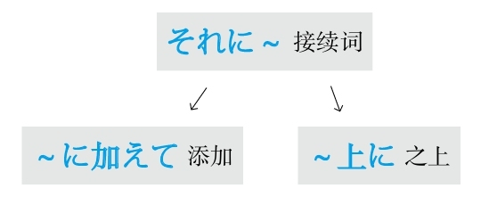

### 历经

#### ～にわたって
**解释：** 「に」表示方向；自动词「<ruby>渡<rp>(</rp><rt>わた</rt><rp>)</rp></ruby>る」的意思是“渡过”
**意思：** 历经～期间、遍及～地方
**用于：** 期间或整个地方
**接续：** 名词

例句：<ruby>手<rp>(</rp><rt>しゅ</rt><rp>)</rp></ruby><ruby>術<rp>(</rp><rt>じゅつ</rt><rp>)</rp></ruby>は<ruby>十<rp>(</rp><rt>じゅう</rt><rp>)</rp></ruby><ruby>時<rp>(</rp><rt>じ</rt><rp>)</rp></ruby><ruby>間<rp>(</rp><rt>かん</rt><rp>)</rp></ruby>**にわたって** <ruby>行<rp>(</rp><rt>おこな</rt><rp>)</rp></ruby>われた。
直译：手术历经10个小时被进行了。
意译：手术进行了10个小时。
## M
### 没有必要

#### ～必要はない
**解释：** 「<ruby>必<rp>(</rp><rt>ひつ</rt><rp>)</rp></ruby><ruby>要<rp>(</rp><rt>よう</rt><rp>)</rp></ruby>」的意思是“必要”；「は」强调了用于自动词前面的小主语「が」；「ない」的意思是“没有”
**意思：** 没有必要～
**接续：** 名词加の、动词的原形

例句：<ruby>慌<rp>(</rp><rt>あわ</rt><rp>)</rp></ruby>てる**<ruby>必<rp>(</rp><rt>ひつ</rt><rp>)</rp></ruby><ruby>要<rp>(</rp><rt>よう</rt><rp>)</rp></ruby>はない** よ、なんとかなるから。
直译：慌的必要没有，因为总会有办法的。
意译：用不着慌，总会有办法的。

#### ～ことはない
**解释：** 「こと」代替了「<ruby>必<rp>(</rp><rt>ひつ</rt><rp>)</rp></ruby><ruby>要<rp>(</rp><rt>よう</rt><rp>)</rp></ruby>」；「は」强调了用于自动词前面的小主语「が」；「ない」的意思是“没有”
**意思：** 没有必要～
**语气：** 正式
**接续：** 名词加の、动词的原形

例句：<ruby>自<rp>(</rp><rt>じ</rt><rp>)</rp></ruby><ruby>信<rp>(</rp><rt>しん</rt><rp>)</rp></ruby>を<ruby>持<rp>(</rp><rt>も</rt><rp>)</rp></ruby>ちなさいよ、<ruby>緊<rp>(</rp><rt>きん</rt><rp>)</rp></ruby><ruby>張<rp>(</rp><rt>ちょう</rt><rp>)</rp></ruby>する**ことはない** 。
直译：拥有自信啊，紧张的必要没有。
意译：要有自信，用不着紧张。

#### ～までもない
**解释：** 「までも」在「も→まで→までも」里语气最强；「ない」的意思是“没有”
**意思：** 没有到～的地步
**接续：** 动词的原形

例句：<ruby>言<rp>(</rp><rt>い</rt><rp>)</rp></ruby>う**までもなく** 、<ruby>彼<rp>(</rp><rt>かれ</rt><rp>)</rp></ruby>の<ruby>考<rp>(</rp><rt>かんが</rt><rp>)</rp></ruby>えは<ruby>偏<rp>(</rp><rt>かたよ</rt><rp>)</rp></ruby>っている。
直译：不到说的地步，他的想法偏了。
意译：不用说，他的想法有些偏激。

#### －なくていい
**解释：** 「－なくて」是动词的否定的简体的中顿形式；「いい」的意思是“可以、行”
**意思：** 不～也可以
**变形：** 动词的否定形的な（变形规律参照第一章的第二节）

例句：<ruby>立<rp>(</rp><rt>た</rt><rp>)</rp></ruby>ち<ruby>向<rp>(</rp><rt>む</rt><rp>)</rp></ruby>かいたくない<ruby>問<rp>(</rp><rt>もん</rt><rp>)</rp></ruby><ruby>題<rp>(</rp><rt>だい</rt><rp>)</rp></ruby>に、<ruby>無<rp>(</rp><rt>む</rt><rp>)</rp></ruby><ruby>理<rp>(</rp><rt>り</rt><rp>)</rp></ruby>して<ruby>立<rp>(</rp><rt>た</rt><rp>)</rp></ruby>ち<ruby>向<rp>(</rp><rt>む</rt><rp>)</rp></ruby>かわ**なくていい** 。
直译：对于不想面对的问题，不勉强去面对就可以。
意译：不想面对的问题就不用勉强去面对。

#### ～には当たらない
**解释：** 「に」表示方向；「は」表示强调；「<ruby>当<rp>(</rp><rt>あ</rt><rp>)</rp></ruby>たらない」是自动词「<ruby>当<rp>(</rp><rt>あ</rt><rp>)</rp></ruby>たる」的否定形式
**直译：** 不相当于～
**意译：** 不值得～、用不着～
**接续：** 名词、动词的原形

例句：<ruby>彼<rp>(</rp><rt>かれ</rt><rp>)</rp></ruby>の<ruby>実<rp>(</rp><rt>じつ</rt><rp>)</rp></ruby><ruby>力<rp>(</rp><rt>りょく</rt><rp>)</rp></ruby>を<ruby>考<rp>(</rp><rt>かんが</rt><rp>)</rp></ruby>えると、<ruby>今<rp>(</rp><rt>こん</rt><rp>)</rp></ruby><ruby>回<rp>(</rp><rt>かい</rt><rp>)</rp></ruby>の<ruby>彼<rp>(</rp><rt>かれ</rt><rp>)</rp></ruby>の<ruby>受<rp>(</rp><rt>じゅ</rt><rp>)</rp></ruby><ruby>賞<rp>(</rp><rt>しょう</rt><rp>)</rp></ruby>は<ruby>驚<rp>(</rp><rt>おどろ</rt><rp>)</rp></ruby>く**には<ruby>当<rp>(</rp><rt>あ</rt><rp>)</rp></ruby>たらない** 。
直译：他的实力考虑的话，这次的他的得奖感到吃惊，不相当于。
意译：考虑到他的实力，就用不着对他这次的得奖感到吃惊了。

例句：<ruby>彼<rp>(</rp><rt>かれ</rt><rp>)</rp></ruby>の<ruby>行<rp>(</rp><rt>こう</rt><rp>)</rp></ruby><ruby>為<rp>(</rp><rt>い</rt><rp>)</rp></ruby>は<ruby>称<rp>(</rp><rt>しょう</rt><rp>)</rp></ruby><ruby>賛<rp>(</rp><rt>さん</rt><rp>)</rp></ruby>**には<ruby>当<rp>(</rp><rt>あ</rt><rp>)</rp></ruby>たらない** 。
直译：他的行为称赞，不相当于。
意译：他的行为不值得称赞。

#### ～には足りない
**解释：** 「に」表示方向；「は」表示强调；「<ruby>足<rp>(</rp><rt>た</rt><rp>)</rp></ruby>りない」是自动词「<ruby>足<rp>(</rp><rt>た</rt><rp>)</rp></ruby>りる」的否定形式
**直译：** 不足于～
**意译：** 不值得～、用不着～
**接续：** 名词、动词的原形

例句：<ruby>充<rp>(</rp><rt>じゅう</rt><rp>)</rp></ruby><ruby>分<rp>(</rp><rt>ぶん</rt><rp>)</rp></ruby>な<ruby>準<rp>(</rp><rt>じゅん</rt><rp>)</rp></ruby><ruby>備<rp>(</rp><rt>び</rt><rp>)</rp></ruby>をしていれば、<ruby>失<rp>(</rp><rt>しっ</rt><rp>)</rp></ruby><ruby>敗<rp>(</rp><rt>ぱい</rt><rp>)</rp></ruby>を<ruby>恐<rp>(</rp><rt>おそ</rt><rp>)</rp></ruby>れる**には<ruby>足<rp>(</rp><rt>た</rt><rp>)</rp></ruby>りない** 。
直译：充分的准备做了的话，恐惧失败，不足于。
意译：只要做好充分准备，就不用害怕失败。
语法关系图

### 每

#### －あたり
**解释：** 「あたり」是自动词「<ruby>当<rp>(</rp><rt>あ</rt><rp>)</rp></ruby>たる」的连用形，作名词用
**直译：** 相当于～
**注意：** 把总数平均
**接续：** 数量词

例句：<ruby>電<rp>(</rp><rt>でん</rt><rp>)</rp></ruby><ruby>気<rp>(</rp><rt>き</rt><rp>)</rp></ruby><ruby>代<rp>(</rp><rt>だい</rt><rp>)</rp></ruby>は<ruby>一<rp>(</rp><rt>いち</rt><rp>)</rp></ruby><ruby>日<rp>(</rp><rt>にち</rt><rp>)</rp></ruby>**<ruby>当<rp>(</rp><rt>あ</rt><rp>)</rp></ruby>たり** <ruby>2<rp>(</rp><rt>に</rt><rp>)</rp></ruby><ruby>00<rp>(</rp><rt>ひゃく</rt><rp>)</rp></ruby><ruby>円<rp>(</rp><rt>えん</rt><rp>)</rp></ruby>です。
直译：电费相当于一天200日元。
意译：电费平均每天200日元。

#### ～につき
**解释：** 「に」表示方向；「つき」是自动词「<ruby>付<rp>(</rp><rt>つ</rt><rp>)</rp></ruby>く」的连用形，作名词用
**直译：** 附着于～
**接续：** 数量词

例句：<ruby>水<rp>(</rp><rt>すい</rt><rp>)</rp></ruby><ruby>道<rp>(</rp><rt>どう</rt><rp>)</rp></ruby><ruby>代<rp>(</rp><rt>だい</rt><rp>)</rp></ruby>は<ruby>一<rp>(</rp><rt>ひと</rt><rp>)</rp></ruby><ruby>月<rp>(</rp><rt>つき</rt><rp>)</rp></ruby>**につき** 1<ruby>000<rp>(</rp><rt>せん</rt><rp>)</rp></ruby><ruby>円<rp>(</rp><rt>えん</rt><rp>)</rp></ruby>です。
直译：水费附着于一个月是1000日元。
意译：水费每月1000日元。

#### －ごとに
**解释：** 「<ruby>毎<rp>(</rp><rt>ごと</rt><rp>)</rp></ruby>」的意思是“每”；「に」表示副词
**意思：** 每～
**语气：** 正式
**接续：** 数量词、名词

例句：あいさつの<ruby>仕<rp>(</rp><rt>し</rt><rp>)</rp></ruby><ruby>方<rp>(</rp><rt>かた</rt><rp>)</rp></ruby>は<ruby>国<rp>(</rp><rt>くに</rt><rp>)</rp></ruby>**ごとに** <ruby>異<rp>(</rp><rt>こと</rt><rp>)</rp></ruby>なる。
直译：打招呼的方式，每个国家，不同。
意译：打招呼的方式每个国家都不同。

#### －ずつ
**解释：** 「ずつ」是「つつ」的浊音化，相当于“次次～”
**直译：** 次次～
**意译：** 每个～
**着重：** 每个都要有份儿
**接续：** 数量词

例句：この<ruby>3<rp>(</rp><rt>さん</rt><rp>)</rp></ruby><ruby>種<rp>(</rp><rt>しゅ</rt><rp>)</rp></ruby><ruby>類<rp>(</rp><rt>るい</rt><rp>)</rp></ruby>の<ruby>薬<rp>(</rp><rt>くすり</rt><rp>)</rp></ruby>は<ruby>4<rp>(</rp><rt>よ</rt><rp>)</rp></ruby><ruby>時<rp>(</rp><rt>じ</rt><rp>)</rp></ruby><ruby>間<rp>(</rp><rt>かん</rt><rp>)</rp></ruby>おきに<ruby>1<rp>(</rp><rt>いち</rt><rp>)</rp></ruby><ruby>錠<rp>(</rp><rt>じょう</rt><rp>)</rp></ruby>**ずつ** <ruby>飲<rp>(</rp><rt>の</rt><rp>)</rp></ruby>むこと。
直译：这3种药，每隔1小时，每种1片，吃，正式的命令。
意译：这3种药必须每隔4小时每种各吃1片。

#### －おきに
**解释：** 「おき」是自动词「<ruby>置<rp>(</rp><rt>お</rt><rp>)</rp></ruby>く」的连用形，作名词；「に」表示副词
**直译：** 放置～
**意译：** 隔了～
**着重：** 期间不长
**接续：** 数量词

例句：この<ruby>薬<rp>(</rp><rt>くすり</rt><rp>)</rp></ruby>は<ruby>4<rp>(</rp><rt>よ</rt><rp>)</rp></ruby><ruby>時<rp>(</rp><rt>じ</rt><rp>)</rp></ruby><ruby>間<rp>(</rp><rt>かん</rt><rp>)</rp></ruby>**おきに** <ruby>飲<rp>(</rp><rt>の</rt><rp>)</rp></ruby>むこと。
直译：这个药隔4小时吃，正式的命令。
意译：注意这个药每隔4小时吃一次。

#### －ぶりに
**解释：** 「<ruby>振<rp>(</rp><rt>ふ</rt><rp>)</rp></ruby>り」的意思是“甩、挥舞”；「に」表示副词
**直译：** 甩掉了～
**意译：** 隔了～再一次做～
**注意：** 与前面的数量词构成复合词，形成浊音化
**着重：** 期间较长
**接续：** 数量词

例句：<ruby>田<rp>(</rp><rt>た</rt><rp>)</rp></ruby><ruby>中<rp>(</rp><rt>なか</rt><rp>)</rp></ruby><ruby>先<rp>(</rp><rt>せん</rt><rp>)</rp></ruby><ruby>生<rp>(</rp><rt>せい</rt><rp>)</rp></ruby>とは<ruby>1<rp>(</rp><rt>じゅう</rt><rp>)</rp></ruby><ruby>5<rp>(</rp><rt>ご</rt><rp>)</rp></ruby><ruby>年<rp>(</rp><rt>ねん</rt><rp>)</rp></ruby>**ぶりに** <ruby>再<rp>(</rp><rt>さい</rt><rp>)</rp></ruby><ruby>会<rp>(</rp><rt>かい</rt><rp>)</rp></ruby>した。
直译：和田中老师，甩掉了15年，再相会了。
意译：和田中老师隔了15年又相见了。
语法关系图

### 每次

#### ～度に
**解释：** 「<ruby>度<rp>(</rp><rt>たび</rt><rp>)</rp></ruby>」的意思是“～次、～回”；「に」表示副词
**意思：** 每次～
**口语：** 「～たんびに」
**接续：** 名词加の、动词的原形

例句：<ruby>注<rp>(</rp><rt>ちゅう</rt><rp>)</rp></ruby><ruby>意<rp>(</rp><rt>い</rt><rp>)</rp></ruby>される**<ruby>度<rp>(</rp><rt>たび</rt><rp>)</rp></ruby>に** 、<ruby>人<rp>(</rp><rt>にん</rt><rp>)</rp></ruby><ruby>間<rp>(</rp><rt>げん</rt><rp>)</rp></ruby><ruby>的<rp>(</rp><rt>てき</rt><rp>)</rp></ruby>に<ruby>成<rp>(</rp><rt>せい</rt><rp>)</rp></ruby><ruby>長<rp>(</rp><rt>ちょう</rt><rp>)</rp></ruby>する。
直译：每次被指出错误，在做人方面就成熟。
意译：每次别人给指出错误，都会变得更加成熟。

#### ～につけ
**解释：** 「に」表示方向；「つけ」是表示“在”的自动词「<ruby>就<rp>(</rp><rt>つ</rt><rp>)</rp></ruby>ける、<ruby>即<rp>(</rp><rt>つ</rt><rp>)</rp></ruby>ける」的连用形
**意思：** 每当～
**语气：** 古语、正式
**接续：** 动词的原形

例句：<ruby>家<rp>(</rp><rt>か</rt><rp>)</rp></ruby><ruby>族<rp>(</rp><rt>ぞく</rt><rp>)</rp></ruby>の<ruby>写<rp>(</rp><rt>しゃ</rt><rp>)</rp></ruby><ruby>真<rp>(</rp><rt>しん</rt><rp>)</rp></ruby>を<ruby>見<rp>(</rp><rt>み</rt><rp>)</rp></ruby>る**につけ** 、<ruby>会<rp>(</rp><rt>あ</rt><rp>)</rp></ruby>いたくて<ruby>仕<rp>(</rp><rt>し</rt><rp>)</rp></ruby><ruby>方<rp>(</rp><rt>かた</rt><rp>)</rp></ruby>がない。
直译：每当看到家里人的照片，想得，没办法。
意译：每次看到家里人的照片就特别想他们。

#### －つつ
**解释：** 「つつ」的意思是“次次”
**词性：** 名词
**注意：** 「－つつ」后加表示强调的「も」构成「－つつも」，表示转折（虽然次次～，但是～）
**接续：** 动词的连用形

例句：<ruby>悪<rp>(</rp><rt>わる</rt><rp>)</rp></ruby>いと<ruby>知<rp>(</rp><rt>し</rt><rp>)</rp></ruby>り**つつも** 、ついやってしまうのが、ギャンブルだ。
直译：次次知道不好，但是终于不由自主地去做的是赌博。
意译：虽然次次都知道不好，但还是不由自主地去赌博。

例句：<ruby>参<rp>(</rp><rt>さん</rt><rp>)</rp></ruby><ruby>考<rp>(</rp><rt>こう</rt><rp>)</rp></ruby><ruby>書<rp>(</rp><rt>しょ</rt><rp>)</rp></ruby>を<ruby>持<rp>(</rp><rt>も</rt><rp>)</rp></ruby>って<ruby>来<rp>(</rp><rt>こ</rt><rp>)</rp></ruby>なければと<ruby>思<rp>(</rp><rt>おも</rt><rp>)</rp></ruby>い**つつ** 、<ruby>毎<rp>(</rp><rt>まい</rt><rp>)</rp></ruby><ruby>回<rp>(</rp><rt>かい</rt><rp>)</rp></ruby><ruby>忘<rp>(</rp><rt>わす</rt><rp>)</rp></ruby>れている。
直译：次次想着必须把参考书带来，但是每次忘。
意译：虽然次次想着必须带参考书来，可是每次都忘记。
语法关系图

### 面向

#### －向き
**解释：** 「<ruby>向<rp>(</rp><rt>む</rt><rp>)</rp></ruby>き」是表示动作的结果或状态的自动词「<ruby>向<rp>(</rp><rt>む</rt><rp>)</rp></ruby>く」的连用形，作名词用
**直译：** 面向于～
**意译：** 适合于～
**接续：** 名词

例句：それを<ruby>縦<rp>(</rp><rt>たて</rt><rp>)</rp></ruby>**<ruby>向<rp>(</rp><rt>む</rt><rp>)</rp></ruby>き** にしてください。
直译：把那个朝向竖的。
意译：请把那个立起来。

例句：この<ruby>機<rp>(</rp><rt>き</rt><rp>)</rp></ruby><ruby>械<rp>(</rp><rt>かい</rt><rp>)</rp></ruby>は<ruby>一<rp>(</rp><rt>いっ</rt><rp>)</rp></ruby><ruby>般<rp>(</rp><rt>ぱん</rt><rp>)</rp></ruby><ruby>家<rp>(</rp><rt>か</rt><rp>)</rp></ruby><ruby>庭<rp>(</rp><rt>てい</rt><rp>)</rp></ruby>**<ruby>向<rp>(</rp><rt>む</rt><rp>)</rp></ruby>き** です。
直译：这个机器，面向一般家庭。
意译：这种机器适合于一般家庭。

#### －向け
**解释：** 「<ruby>向<rp>(</rp><rt>む</rt><rp>)</rp></ruby>け」是表示动作的他动词「<ruby>向<rp>(</rp><rt>む</rt><rp>)</rp></ruby>ける」的连用形，作名词用
**直译：** 面向于～
**意译：** 为了适合于～而制作的
**接续：** 名词

例句：このコースは<ruby>初<rp>(</rp><rt>しょ</rt><rp>)</rp></ruby><ruby>心<rp>(</rp><rt>しん</rt><rp>)</rp></ruby><ruby>者<rp>(</rp><rt>しゃ</rt><rp>)</rp></ruby>**<ruby>向<rp>(</rp><rt>む</rt><rp>)</rp></ruby>け** に<ruby>設<rp>(</rp><rt>もう</rt><rp>)</rp></ruby>けられている。
直译：这个课程，面向初学者，被设置着。
意译：这个课程是为初学者设置的。
语法关系图

## N
### 难道是

#### まさか～
**解释：** 「<ruby>正<rp>(</rp><rt>まさ</rt><rp>)</rp></ruby>」的意思是“真的”；「か」表示不确定
**用法：** 与表示推测的「～だろう」相呼应
**意思：** 别是～吧、不会是～吧

例句：**まさか** <ruby>彼<rp>(</rp><rt>かれ</rt><rp>)</rp></ruby>はもう<ruby>知<rp>(</rp><rt>し</rt><rp>)</rp></ruby>った**だろう** 。
直译：真的他已经知道了吧。
意译：他不会是已经知道了吧。

**用法：** 与「～とは<ruby>思<rp>(</rp><rt>おも</rt><rp>)</rp></ruby>わなかった」相呼应
**意思：** 真没有想到～

例句：**まさか** あなたがこんな<ruby>人<rp>(</rp><rt>ひと</rt><rp>)</rp></ruby>だ**とは<ruby>思<rp>(</rp><rt>おも</rt><rp>)</rp></ruby>わなかった** 。
直译：真没想到你是这样的人。
意译：真没想到你是这种人。

**用法：** 单独使用
**意思：** 怎么可能啊

例句：**まさか** ！
直译：真的吗！
意译：怎么可能啊！
## Q
### 期限

#### ～までに
**解释：** 「まで」的意思是“到～”；「に」表示方向，在此强调时间点
**意思：** 到～为止
**区别：** 「まで」表示在此之前一直做某事，「までに」表示到此为止的期限
**接续：** 时间

例句：レポートは<ruby>午後<rp>(</rp><rt>ごご</rt><rp>)</rp></ruby>の<ruby>5<rp>(</rp><rt>ご</rt><rp>)</rp></ruby><ruby>時<rp>(</rp><rt>じ</rt><rp>)</rp></ruby>**までに** <ruby>提<rp>(</rp><rt>てい</rt><rp>)</rp></ruby><ruby>出<rp>(</rp><rt>しゅつ</rt><rp>)</rp></ruby>すること。
直译：小论文在下午5点前提出，正式的命令。
意译：务必在下午5点前提交小论文。

### 强调

#### ～あっての
**解释：** 「あって」是「<ruby>有<rp>(</rp><rt>あ</rt><rp>)</rp></ruby>る」的中顿形式，意思是“有了”；「の」是为了后面接名词，意思是“的”
**意思：** 有了～以后才有～
**着重：** て表示动作前后顺序的“了”，侧重于时间的前后
**接续：** 前后接名词

例句：あなた**あっての** わたしです。
直译：有你，的，有我。
意译：正因为有你才会有我。

#### ～からこそ
**解释：** 「から」的意思是“因为”；「こそ」表示强调，此处翻译成“正是”
**意思：** 正是因为～
**接续：** 谓语词（动词、形容词、助动词）的简体

例句：わからない**からこそ** 、わかるふりをする。
直译：正是因为不懂，作出懂的样子。
意译：正是因为不懂才装懂。

#### －ばこそ
**解释：** 「～ば」是表示原因的「から」的古语；「こそ」表示强调，翻译成“正是”
**直译：** 正是有～的条件，才有～
**意译：** 正是因为～
**语气：** 正式
**变形：** ば形（变形规律参照第一章的第二节）

例句：<ruby>忙<rp>(</rp><rt>いそが</rt><rp>)</rp></ruby>しけれ**ばこそ** 、<ruby>少<rp>(</rp><rt>すく</rt><rp>)</rp></ruby>ない<ruby>時<rp>(</rp><rt>じ</rt><rp>)</rp></ruby><ruby>間<rp>(</rp><rt>かん</rt><rp>)</rp></ruby>を<ruby>有<rp>(</rp><rt>ゆう</rt><rp>)</rp></ruby><ruby>効<rp>(</rp><rt>こう</rt><rp>)</rp></ruby>に<ruby>使<rp>(</rp><rt>つか</rt><rp>)</rp></ruby>えるかもしれない。
直译：正是有忙这个条件，把少的时间有效地能够利用，可能。
意译：正是因为忙，所以才有可能把仅有的时间有效地利用。

#### ～だけに
**解释：** 「だけ」在此的意思是“只是”；「に」表示副词
**直译：** 只是～、就是～
**意译：** 就是因为～
**重点：** 此处的因果关系不是通过「～だけに」，而是通过上下文推测的
**注意：** 多用于带来不好的后果；带来好的结果的原因用「～おかげで」（托～的福）
**接续：** 动词和形容词的简体、名词、形容动词加な

例句：<ruby>彼<rp>(</rp><rt>かれ</rt><rp>)</rp></ruby>の<ruby>指<rp>(</rp><rt>し</rt><rp>)</rp></ruby><ruby>摘<rp>(</rp><rt>てき</rt><rp>)</rp></ruby>は<ruby>正<rp>(</rp><rt>ただ</rt><rp>)</rp></ruby>しい**だけに** 、かえって<ruby>私<rp>(</rp><rt>わたし</rt><rp>)</rp></ruby>は<ruby>反<rp>(</rp><rt>はん</rt><rp>)</rp></ruby><ruby>発<rp>(</rp><rt>ぱつ</rt><rp>)</rp></ruby>を<ruby>感<rp>(</rp><rt>かん</rt><rp>)</rp></ruby>じた。
直译：只是他的指正太正确了，反倒，我感到了逆反。
意译：就是因为他对我的指正太正确了，反倒引起了我的逆反心理。

#### ～ばかりに
**解释：** 「ばかり」的意思是“全是、光是、净是”；「に」表示副词
**直译：** 全是～
**意译：** 全是因为～
**重点：** 此处的因果关系不是通过「～ばかりに」，而是通过上下文推测的
**注意：** 多用于带来不好的后果；带来好的结果的原因用「～おかげで」（托～的福）
**接续：** 动词的た形的简体、形容词的简体、形容动词加な、名词加である

例句：<ruby>彼<rp>(</rp><rt>かれ</rt><rp>)</rp></ruby>の<ruby>言<rp>(</rp><rt>こと</rt><rp>)</rp></ruby><ruby>葉<rp>(</rp><rt>ば</rt><rp>)</rp></ruby>を<ruby>信<rp>(</rp><rt>しん</rt><rp>)</rp></ruby>じた**ばかりに** 、ひどい<ruby>目<rp>(</rp><rt>め</rt><rp>)</rp></ruby>に<ruby>遭<rp>(</rp><rt>あ</rt><rp>)</rp></ruby>った。
直译：全是相信了他的话，倒了大霉。
意译：全是因为我相信了他的话，结果倒了大霉。

例句：<ruby>外<rp>(</rp><rt>がい</rt><rp>)</rp></ruby><ruby>国<rp>(</rp><rt>こく</rt><rp>)</rp></ruby><ruby>人<rp>(</rp><rt>じん</rt><rp>)</rp></ruby>である**ばかりに** 、<ruby>就<rp>(</rp><rt>しゅう</rt><rp>)</rp></ruby><ruby>職<rp>(</rp><rt>しょく</rt><rp>)</rp></ruby>が<ruby>難<rp>(</rp><rt>むずか</rt><rp>)</rp></ruby>しい。
直译：全是是外国人，就业很困难。
意译：全因为是外国人，所以很难找到工作。

#### ～どころか
**解释：** 「どころ」是「ところ」的浊音化，表示“时间、地点、程度、状况”；「か」表示不确定
**意思：** 哪儿是～的时候啊、哪儿是～的程度啊、哪儿是～的状况啊
**注意：** 「どころ」比「ところ」的语气强，不用于肯定形，只用于否定形和疑问形，此处用于疑问形
**接续：** 动词和形容词的原形、形容动词加な、名词

例句：もうすぐ<ruby>試<rp>(</rp><rt>し</rt><rp>)</rp></ruby><ruby>験<rp>(</rp><rt>けん</rt><rp>)</rp></ruby>だよ、<ruby>遊<rp>(</rp><rt>あそ</rt><rp>)</rp></ruby>ぶ**どろこか** 、<ruby>寝<rp>(</rp><rt>ね</rt><rp>)</rp></ruby>る<ruby>時<rp>(</rp><rt>じ</rt><rp>)</rp></ruby><ruby>間<rp>(</rp><rt>かん</rt><rp>)</rp></ruby>もないよ。
直译：马上就是考试了，哪儿是玩儿的时候啊，睡觉的时间都没有。
意译：马上就该考试了，哪儿是玩儿的时候啊，连睡觉的时间都没有。

例句：あの<ruby>薬<rp>(</rp><rt>くすり</rt><rp>)</rp></ruby>を<ruby>飲<rp>(</rp><rt>の</rt><rp>)</rp></ruby>んで、<ruby>病<rp>(</rp><rt>びょう</rt><rp>)</rp></ruby><ruby>状<rp>(</rp><rt>じょう</rt><rp>)</rp></ruby>が<ruby>軽<rp>(</rp><rt>かる</rt><rp>)</rp></ruby>くなる**どころか** 、<ruby>逆<rp>(</rp><rt>ぎゃく</rt><rp>)</rp></ruby>に<ruby>重<rp>(</rp><rt>おも</rt><rp>)</rp></ruby>くなった。
直译：吃了那个药，病情哪儿是减轻了的状况啊，反倒加重了。
意译：吃了那个药，病情不但没有减轻，反倒加重了。

#### ～どころではない
**解释：** 「どころ」是「ところ」的浊音化，表示“时间、地点、程度、状况”；「ではない」的意思是“不是”
**意思：** 不是～的时候、不是～的程度、不是～的状况
**注意：** 「どころ」比「ところ」的语气强，不用于肯定形，只用于否定形和疑问形，此处用于否定形
**接续：** 动词和形容词的原形、形容动词加な名词

例句：<ruby>今<rp>(</rp><rt>いま</rt><rp>)</rp></ruby>はばたばたしているから、<ruby>世<rp>(</rp><rt>せ</rt><rp>)</rp></ruby><ruby>間<rp>(</rp><rt>けん</rt><rp>)</rp></ruby><ruby>話<rp>(</rp><rt>ばなし</rt><rp>)</rp></ruby>する**どころじゃない** 。
直译：现在忙，所以不是聊天的时候。
意译：现在特忙，可不是聊天的时候。

#### まさに～
**解释：** 「<ruby>正<rp>(</rp><rt>まさ</rt><rp>)</rp></ruby>」的意思是“正”，表示强调；「に」表示副词
**意思：** 正是～、正要～

例句：これは**まさに** <ruby>彼<rp>(</rp><rt>かれ</rt><rp>)</rp></ruby>の<ruby>仕<rp>(</rp><rt>し</rt><rp>)</rp></ruby><ruby>業<rp>(</rp><rt>わざ</rt><rp>)</rp></ruby>だ。
直译：这正是他干的事。
意译：这就是他干的事。
语法关系图
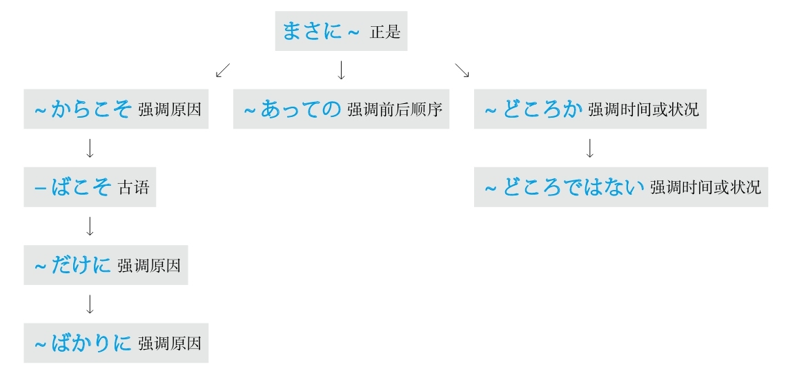

### 倾向

#### ～傾向がある
**意思：** 有～的倾向
**用于：** 好的倾向、不好的倾向
**接续：** 修饰名词的规律（参照第一章的第三节）

例句：<ruby>近<rp>(</rp><rt>ちか</rt><rp>)</rp></ruby><ruby>頃<rp>(</rp><rt>ごろ</rt><rp>)</rp></ruby>は<ruby>人<rp>(</rp><rt>じん</rt><rp>)</rp></ruby><ruby>民<rp>(</rp><rt>みん</rt><rp>)</rp></ruby><ruby>元<rp>(</rp><rt>げん</rt><rp>)</rp></ruby>のレートが<ruby>高<rp>(</rp><rt>たか</rt><rp>)</rp></ruby>くなっている**<ruby>傾<rp>(</rp><rt>けい</rt><rp>)</rp></ruby><ruby>向<rp>(</rp><rt>こう</rt><rp>)</rp></ruby>がある** 。
直译：最近人民币的汇率变高的倾向有。
意译：最近人民币的汇率有升高的趋势。

#### ～嫌いがある
**意思：** 有～之嫌
**用于：** 不好的倾向
**接续：** 修饰名词的规律（参照第一章的第三节）

例句：<ruby>彼<rp>(</rp><rt>かれ</rt><rp>)</rp></ruby>は<ruby>仕<rp>(</rp><rt>し</rt><rp>)</rp></ruby><ruby>事<rp>(</rp><rt>ごと</rt><rp>)</rp></ruby>をする<ruby>時<rp>(</rp><rt>とき</rt><rp>)</rp></ruby><ruby>一<rp>(</rp><rt>いっ</rt><rp>)</rp></ruby><ruby>貫<rp>(</rp><rt>かん</rt><rp>)</rp></ruby><ruby>性<rp>(</rp><rt>せい</rt><rp>)</rp></ruby>に<ruby>欠<rp>(</rp><rt>か</rt><rp>)</rp></ruby>ける**きらいがある** 。
直译：他做事时，有缺乏一贯性之嫌。
意译：他做工作缺乏始终如一的精神。

#### ～一方だ
**解释：** 「<ruby>一<rp>(</rp><rt>いっ</rt><rp>)</rp></ruby><ruby>方<rp>(</rp><rt>ぽう</rt><rp>)</rp></ruby>」表示对立的两个方向或方面中的其中一个
**直译：** 倾向于一方
**意译：** 一个劲儿地～
**注意：** 因为要表达对立方，所以常用有对应的反义词的词，比如：「<ruby>増<rp>(</rp><rt>ふ</rt><rp>)</rp></ruby>える、<ruby>減<rp>(</rp><rt>へ</rt><rp>)</rp></ruby>る」，「<ruby>痩<rp>(</rp><rt>や</rt><rp>)</rp></ruby>せる、<ruby>太<rp>(</rp><rt>ふと</rt><rp>)</rp></ruby>る」等；此外，不能变换「～<ruby>一<rp>(</rp><rt>いっ</rt><rp>)</rp></ruby><ruby>方<rp>(</rp><rt>ぽう</rt><rp>)</rp></ruby>だ」的形式和时态，只能用「～<ruby>一<rp>(</rp><rt>いっ</rt><rp>)</rp></ruby><ruby>方<rp>(</rp><rt>ぽう</rt><rp>)</rp></ruby>だ」或「～<ruby>一<rp>(</rp><rt>いっ</rt><rp>)</rp></ruby><ruby>方<rp>(</rp><rt>ぽう</rt><rp>)</rp></ruby>です」
**接续：** 动词的原形

例句：<ruby>都<rp>(</rp><rt>と</rt><rp>)</rp></ruby><ruby>市<rp>(</rp><rt>し</rt><rp>)</rp></ruby>の<ruby>環<rp>(</rp><rt>かん</rt><rp>)</rp></ruby><ruby>境<rp>(</rp><rt>きょう</rt><rp>)</rp></ruby>は<ruby>悪<rp>(</rp><rt>あっ</rt><rp>)</rp></ruby><ruby>化<rp>(</rp><rt>か</rt><rp>)</rp></ruby>する**<ruby>一<rp>(</rp><rt>いっ</rt><rp>)</rp></ruby><ruby>方<rp>(</rp><rt>ぽう</rt><rp>)</rp></ruby>だ** 。
直译：城市的环境，往恶化的一方倾斜。
意译：城市的环境不断地恶化。
语法关系图

### 轻视

#### ～なんか
**解释：** 「なんか」中的「なん」的意思是“什么”；「か」表示不确定
**注意：** 「なんか」是「など」的口语形式；语气助词
**意思：** ～之类的
**语气：** 轻视或自谦
**接续：** 名词

例句：わたし**なんか** …
直译：我这样的人……
意译：我哪儿行啊。

例句：わたしはうそ**なんか** つきませんよ。
直译：我，撒谎之类的事，不会做啊。
意译：我才不会撒谎呢。

#### ～なんて
**解释：** 「なんて」中的「なん」的意思是“什么”；「て」是表示“内容”的「と」；语气助词
**直译：** 说什么呢？
**意译：** ～之类的
**语气：** 轻视或惊讶
**区别：** 轻视的语气比「なんか」强
**接续：** 任何词

例句：<ruby>優<rp>(</rp><rt>ゆう</rt><rp>)</rp></ruby><ruby>等<rp>(</rp><rt>とう</rt><rp>)</rp></ruby><ruby>生<rp>(</rp><rt>せい</rt><rp>)</rp></ruby>の<ruby>彼<rp>(</rp><rt>かれ</rt><rp>)</rp></ruby>が<ruby>不<rp>(</rp><rt>ふ</rt><rp>)</rp></ruby><ruby>合<rp>(</rp><rt>ごう</rt><rp>)</rp></ruby><ruby>格<rp>(</rp><rt>かく</rt><rp>)</rp></ruby>だ**なんて** <ruby>驚<rp>(</rp><rt>おどろ</rt><rp>)</rp></ruby>いてしまった。
直译：优等生的他，不合格之类的事，吃惊。
意译：作为优等生的他竟然不及格，真让人吃惊。

例句：<ruby>裏<rp>(</rp><rt>うら</rt><rp>)</rp></ruby>で<ruby>人<rp>(</rp><rt>ひと</rt><rp>)</rp></ruby>の<ruby>悪<rp>(</rp><rt>わる</rt><rp>)</rp></ruby><ruby>口<rp>(</rp><rt>ぐち</rt><rp>)</rp></ruby>を<ruby>言<rp>(</rp><rt>い</rt><rp>)</rp></ruby>う**なんて** ひどい。
直译：在背后说别人的坏话之类的事太过分了。
意译：在背后说别人的坏话，真是太过分了。

**注意：** 「なんて」后面接名词，代替了「という」
**语气：** 轻视或惊讶

例句：<ruby>絶<rp>(</rp><rt>ぜっ</rt><rp>)</rp></ruby><ruby>対<rp>(</rp><rt>たい</rt><rp>)</rp></ruby>に<ruby>儲<rp>(</rp><rt>もう</rt><rp>)</rp></ruby>かる**なんて** <ruby>話<rp>(</rp><rt>はなし</rt><rp>)</rp></ruby>は<ruby>怪<rp>(</rp><rt>あや</rt><rp>)</rp></ruby>しい。
直译：绝对赚钱之类的事，奇怪。
意译：说绝对赚钱，让人难以置信。

#### ～ときたら
**解释：** 「と」表示内容；「きたら」是「<ruby>言<rp>(</rp><rt>い</rt><rp>)</rp></ruby>ったら」的音变
**意思：** 提起～、说到～
**语气：** 轻视或不满
**接续：** 名词

例句：<ruby>彼女<rp>(</rp><rt>かのじょ</rt><rp>)</rp></ruby>**ときたら** 、<ruby>最<rp>(</rp><rt>さい</rt><rp>)</rp></ruby><ruby>近<rp>(</rp><rt>きん</rt><rp>)</rp></ruby>おしゃれのことにばっかり<ruby>気<rp>(</rp><rt>き</rt><rp>)</rp></ruby>をつけている。
直译：说到她，最近光是注意着打扮的事情。
意译：说到她，她最近光是注意打扮。

#### ～をものともせずに
**注意：** 应用了日语里的经典句型「～を～と（に）する（把～当成～）」
**解释：** 「も」的意思是“也、连、都”；「もの」的意思是“东西、事情”；「せず」是「しない」的古语形式；「に」表示副词
**意思：** 都不把～当回事
**接续：** 名词

例句：<ruby>彼<rp>(</rp><rt>かれ</rt><rp>)</rp></ruby>は<ruby>困<rp>(</rp><rt>こん</rt><rp>)</rp></ruby><ruby>難<rp>(</rp><rt>なん</rt><rp>)</rp></ruby>**をものともせずに** <ruby>自<rp>(</rp><rt>じ</rt><rp>)</rp></ruby><ruby>分<rp>(</rp><rt>ぶん</rt><rp>)</rp></ruby>の<ruby>考<rp>(</rp><rt>かんが</rt><rp>)</rp></ruby>えを<ruby>貫<rp>(</rp><rt>つらぬ</rt><rp>)</rp></ruby>いている。
直译：他不把困难当回事，把自己的想法贯彻到底。
意译：他不顾困难，坚持着自己的想法。

#### ～ようでは
**解释：** 「<ruby>様<rp>(</rp><rt>よう</rt><rp>)</rp></ruby>」的意思是“样子”；「で」表示状态；「は」表示强调
**意思：** 以～的状态
**注意：** 带来不好的结果
**接续：** 动词和形容词的原形、形容动词加である

例句：これぐらいの<ruby>困<rp>(</rp><rt>こん</rt><rp>)</rp></ruby><ruby>難<rp>(</rp><rt>なん</rt><rp>)</rp></ruby>に<ruby>挫<rp>(</rp><rt>くじ</rt><rp>)</rp></ruby>ける**ようでは** 、これから<ruby>成<rp>(</rp><rt>せい</rt><rp>)</rp></ruby><ruby>功<rp>(</rp><rt>こう</rt><rp>)</rp></ruby>するわけがない。
直译：这么少的困难就气馁了，这个样子，今后成功的可能性没有。
意译：这么点儿困难就气馁了，要是这个样子的话，今后不可能成功。
语法关系图
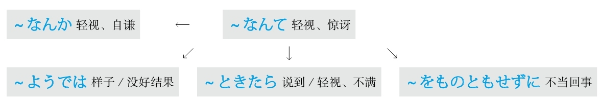

### 全是

#### －だらけ
**解释：** 「だ」是“大”；「ら」是“拉”；「け」是「こ」，意思是“小”
**直译：** 一大堆小东西
**意译：** 全是～、净是～
**语气：** 消极
**接续：** 名词

例句：その<ruby>本<rp>(</rp><rt>ほん</rt><rp>)</rp></ruby>には<ruby>間<rp>(</rp><rt>ま</rt><rp>)</rp></ruby><ruby>違<rp>(</rp><rt>ちが</rt><rp>)</rp></ruby>い**だらけ** です。
直译：在那本书里一大堆错。
意译：那本书里全是错。

#### －まみれ
**解释：** 「ま」是“满”；「み」是「<ruby>身<rp>(</rp><rt>み</rt><rp>)</rp></ruby>」，意思是“东西”；「れ」是“来”
**直译：** 来了一堆东西
**意译：** 满身～、沾满～
**接续：** 名词

例句：ズボンは<ruby>泥<rp>(</rp><rt>どろ</rt><rp>)</rp></ruby>**まみれ** になった。
直译：在裤子上沾满了泥。
意译：裤子上沾满了泥。

#### －ずくめ
**解释：** 「ずくめ」的汉字是「<ruby>尽<rp>(</rp><rt>ず</rt><rp>)</rp></ruby>くめ」
**意思：** 尽是～
**用于：** 抽象的事项
**接续：** 名词

例句：<ruby>今朝<rp>(</rp><rt>けさ</rt><rp>)</rp></ruby>からいいこと**ずくめ** です。
直译：从今天早上，尽是好事。
意译：（从）今天早上开始全是好事。

#### ～ばかり
**解释：** 「ば」是“把”；「か」是“加”；「り」是拟态词结尾
**直译：** 在添加～
**意译：** 全是～、光是～、净是～
**口语：** 「～ばっかり」
**接续：** 名词、动词的简体

例句：<ruby>休<rp>(</rp><rt>きゅう</rt><rp>)</rp></ruby><ruby>日<rp>(</rp><rt>じつ</rt><rp>)</rp></ruby>は<ruby>出<rp>(</rp><rt>で</rt><rp>)</rp></ruby>かけたくない、どこへ<ruby>行<rp>(</rp><rt>い</rt><rp>)</rp></ruby>っても、<ruby>人<rp>(</rp><rt>ひと</rt><rp>)</rp></ruby>**ばっかり** です。
直译：休息日不想出去，不管去哪儿，全是人。
意译：休息日不爱出去，不管去哪儿都是人。

例句：<ruby>最<rp>(</rp><rt>さい</rt><rp>)</rp></ruby><ruby>近<rp>(</rp><rt>きん</rt><rp>)</rp></ruby>の<ruby>学<rp>(</rp><rt>がく</rt><rp>)</rp></ruby><ruby>生<rp>(</rp><rt>せい</rt><rp>)</rp></ruby>は<ruby>遊<rp>(</rp><rt>あそ</rt><rp>)</rp></ruby>んでいる**ばっかり** だよ。
直译：最近的学生光是在玩儿。
意译：最近的学生光知道玩儿。
语法关系图

### 确认

#### ～っけ
**解释：** 促音表示用于口语，起加强语气的作用；「け」是「こ」，意思是“这个、那个”
**直译：** 那个～
**用于：** 想不起来时、想对方确认时
**意译：** ～来着
**接续：** 谓语词（动词、形容词、助动词）的过去式（即た形）

例句：<ruby>彼<rp>(</rp><rt>かれ</rt><rp>)</rp></ruby>の<ruby>名<rp>(</rp><rt>な</rt><rp>)</rp></ruby><ruby>前<rp>(</rp><rt>まえ</rt><rp>)</rp></ruby>は<ruby>何<rp>(</rp><rt>なん</rt><rp>)</rp></ruby>でし**たっけ** 。
直译：他是什么名字来着？
意译：他叫什么名字来着？

例句：<ruby>先<rp>(</rp><rt>せん</rt><rp>)</rp></ruby><ruby>生<rp>(</rp><rt>せい</rt><rp>)</rp></ruby>は<ruby>今日<rp>(</rp><rt>きょう</rt><rp>)</rp></ruby><ruby>授<rp>(</rp><rt>じゅ</rt><rp>)</rp></ruby><ruby>業<rp>(</rp><rt>ぎょう</rt><rp>)</rp></ruby><ruby>中<rp>(</rp><rt>ちゅう</rt><rp>)</rp></ruby><ruby>何<rp>(</rp><rt>なに</rt><rp>)</rp></ruby>を<ruby>言<rp>(</rp><rt>い</rt><rp>)</rp></ruby>っ**たっけ** 。
直译：老师今天在课上说什么来着？
意译：老师今天上课说什么来着？
## R
### 容易～；难～

#### ―やすい
**解释：** 「－やすい」的汉字是「－<ruby>易<rp>(</rp><rt>やす</rt><rp>)</rp></ruby>い」
**意思：** 容易～
**用于：** 任何事项
**词性：** 形容词
**接续：** 动词的连用形

例句：<ruby>日<rp>(</rp><rt>に</rt><rp>)</rp></ruby><ruby>本<rp>(</rp><rt>ほん</rt><rp>)</rp></ruby>は<ruby>住<rp>(</rp><rt>す</rt><rp>)</rp></ruby>み**やすい** <ruby>国<rp>(</rp><rt>くに</rt><rp>)</rp></ruby>です。
直译：日本是个容易居住的国家。
意译：日本是个适合居住的国家。

#### ―がち
**解释：** 「－がち」的汉字是「－<ruby>勝<rp>(</rp><rt>か</rt><rp>)</rp></ruby>ち」，与前面的词构成复合词后的浊音化
**意思：** 常出现～、容易～
**用于：** 不好的事项
**接续：** 名词、动词的连用形

例句：<ruby>彼女<rp>(</rp><rt>かのじょ</rt><rp>)</rp></ruby>は<ruby>病<rp>(</rp><rt>びょう</rt><rp>)</rp></ruby><ruby>気<rp>(</rp><rt>き</rt><rp>)</rp></ruby>**がち** です。
直译：她常出现病。
意译：她经常生病。

例句：<ruby>年<rp>(</rp><rt>とし</rt><rp>)</rp></ruby>をとったせいか、<ruby>最近<rp>(</rp><rt>さいきん</rt><rp>)</rp></ruby>は<ruby>忘<rp>(</rp><rt>わす</rt><rp>)</rp></ruby>れ**がち** になっている。
直译：是不是老了，最近变得容易忘。
意译：是不是老了，最近变得特别健忘。

#### ～にかたくない
**解释：** 「に」表示方向或对象；「かたくない」的汉字是「<ruby>難<rp>(</rp><rt>かた</rt><rp>)</rp></ruby>くない」
**意思：** 不难去～
**语气：** 正式
**接续：** 名词、动词的原形（多用「<ruby>想<rp>(</rp><rt>そう</rt><rp>)</rp></ruby><ruby>像<rp>(</rp><rt>ぞう</rt><rp>)</rp></ruby>する、<ruby>察<rp>(</rp><rt>さっ</rt><rp>)</rp></ruby>する」等词）

例句：<ruby>災<rp>(</rp><rt>さい</rt><rp>)</rp></ruby><ruby>害<rp>(</rp><rt>がい</rt><rp>)</rp></ruby>で<ruby>家<rp>(</rp><rt>か</rt><rp>)</rp></ruby><ruby>族<rp>(</rp><rt>ぞく</rt><rp>)</rp></ruby>を<ruby>失<rp>(</rp><rt>うしな</rt><rp>)</rp></ruby>った<ruby>人<rp>(</rp><rt>ひと</rt><rp>)</rp></ruby>たちの<ruby>悲<rp>(</rp><rt>かな</rt><rp>)</rp></ruby>しみは<ruby>想<rp>(</rp><rt>そう</rt><rp>)</rp></ruby><ruby>像<rp>(</rp><rt>ぞう</rt><rp>)</rp></ruby>**に<ruby>難<rp>(</rp><rt>かた</rt><rp>)</rp></ruby>くない** 。
直译：在灾害中失去亲人的人们的痛苦，不难想象。
意译：不难想象在灾害中失去亲人的人们有多么痛苦。

例句：<ruby>孫<rp>(</rp><rt>まご</rt><rp>)</rp></ruby>の<ruby>誕<rp>(</rp><rt>たん</rt><rp>)</rp></ruby><ruby>生<rp>(</rp><rt>じょう</rt><rp>)</rp></ruby>への<ruby>彼<rp>(</rp><rt>かれ</rt><rp>)</rp></ruby>の<ruby>喜<rp>(</rp><rt>よろこ</rt><rp>)</rp></ruby>びは<ruby>察<rp>(</rp><rt>さっ</rt><rp>)</rp></ruby>する**に<ruby>難<rp>(</rp><rt>かた</rt><rp>)</rp></ruby>くない** 。
直译：对孙子的诞生的他的喜悦，不难观察。
意译：不难想象孙子的诞生令他多么高兴。

#### ―にくい
**解释：** 「－にくい」的汉字是「－<ruby>難<rp>(</rp><rt>にく</rt><rp>)</rp></ruby>い」
**意思：** 很难～
**用于：** 任何事项
**接续：** 动词的连用形

例句：<ruby>先<rp>(</rp><rt>さき</rt><rp>)</rp></ruby>の<ruby>説<rp>(</rp><rt>せつ</rt><rp>)</rp></ruby><ruby>明<rp>(</rp><rt>めい</rt><rp>)</rp></ruby>はわかり**にくかった** 。
直译：刚才的说明难懂。
意译：刚才的解释不容易懂。

#### ―づらい
**解释：** 「－づらい」的汉字是「－<ruby>辛<rp>(</rp><rt>つら</rt><rp>)</rp></ruby>い」，与前面的词构成复合词后的浊音化
**意思：** 很难～
**用于：** 心理上痛苦
**接续：** 动词的连用形

例句：<ruby>最<rp>(</rp><rt>さい</rt><rp>)</rp></ruby><ruby>近<rp>(</rp><rt>きん</rt><rp>)</rp></ruby>の<ruby>本<rp>(</rp><rt>ほん</rt><rp>)</rp></ruby>はわかり**づらい** 。
直译：最近的书很难懂。
意译：最近的书很难懂，让人头疼。

#### ―がたい
**解释：** 「－がたい」的汉字是「－<ruby>難<rp>(</rp><rt>かた</rt><rp>)</rp></ruby>い」，与前面的词构成复合词后的浊音化
**意思：** 很难～
**语气：** 正式且强烈
**接续：** 动词的连用形

例句：あの<ruby>格<rp>(</rp><rt>かっ</rt><rp>)</rp></ruby><ruby>好<rp>(</rp><rt>こう</rt><rp>)</rp></ruby>で<ruby>大<rp>(</rp><rt>だい</rt><rp>)</rp></ruby><ruby>学<rp>(</rp><rt>がく</rt><rp>)</rp></ruby>に<ruby>行<rp>(</rp><rt>い</rt><rp>)</rp></ruby>くなんて<ruby>許<rp>(</rp><rt>ゆる</rt><rp>)</rp></ruby>し**がたい** 。
直译：那种打扮去学校，很难允许。
意译：很难允许打扮成那样去学校。

#### ―かねる
**解释：** 「ね」可以理解为“难”，「－かねる」可以理解为“很难”，表示“很难做某事”；「－かねない」可以理解为“不难”，表示“会有不好的可能性”
**语气：** 婉转地表达不做
**接续：** 动词的连用形

例句：<ruby>申<rp>(</rp><rt>もう</rt><rp>)</rp></ruby>し<ruby>訳<rp>(</rp><rt>わけ</rt><rp>)</rp></ruby>ございませんが、この<ruby>事<rp>(</rp><rt>こと</rt><rp>)</rp></ruby>はわたしにはわかり**かねます** 。
直译：真抱歉，这件事，对我来说很难明白。
意译：真抱歉，我不太了解这件事。

例句：たばこの<ruby>火<rp>(</rp><rt>ひ</rt><rp>)</rp></ruby>をちゃんと<ruby>消<rp>(</rp><rt>け</rt><rp>)</rp></ruby>さなければ、<ruby>事<rp>(</rp><rt>じ</rt><rp>)</rp></ruby><ruby>故<rp>(</rp><rt>こ</rt><rp>)</rp></ruby>にはなり**かねません** よ。
直译：不把烟的火好好消灭的话，很容易成为事故。
意译：不把烟头掐灭的话，很容易发生事故。
语法关系图

### 如果～

#### ～と
**重点：** 在「と、ば、たら、なら」里，最重要的是顺序。「と」和「なら」分别表示极端，「と」代表“条件性”的极端，「なら」代表“假定性”的极端
**解释：** 「と」可以理解为“脱（落）、突（发）”，表示出现的某种事物马上就会脱落出或突发下一种事物，即表示条件性强或速度快
**意思：** 只要～；一～就～
**注意：** 后句里不能用“义务、许可、命令、意志”的表达方式
**接续：** 谓语词（动词、形容词、助动词）的原形

例句：<ruby>長<rp>(</rp><rt>ちょう</rt><rp>)</rp></ruby><ruby>時<rp>(</rp><rt>じ</rt><rp>)</rp></ruby><ruby>間<rp>(</rp><rt>かん</rt><rp>)</rp></ruby><ruby>本<rp>(</rp><rt>ほん</rt><rp>)</rp></ruby>を<ruby>読<rp>(</rp><rt>よ</rt><rp>)</rp></ruby>む**と** <ruby>目<rp>(</rp><rt>め</rt><rp>)</rp></ruby>が<ruby>疲<rp>(</rp><rt>つか</rt><rp>)</rp></ruby>れる。
直译：有长时间看书这个条件，就会有眼睛疲劳这个结果。
意译：一长时间看书，眼睛就会疲劳。

#### －ば
**重点：** 在「と、ば、たら、なら」里，最重要的是顺序。「と」和「なら」分别表示极端，「と」代表“条件性”的极端，「なら」代表“假定性”的极端
**解释：** 「ば」的条件性比「と」弱，表示较弱的条件的“如果”；同时「ば」还是古语中表示原因的「～から」和表示并列的「～し」
**意思：** 只要～；如果～；因为～；又～
**注意：** 后句里不能用“义务、许可、命令、意志”的表达方式
**变形：** ば形（变形规律参照第一章的第二节）

例句：<ruby>余<rp>(</rp><rt>よ</rt><rp>)</rp></ruby><ruby>裕<rp>(</rp><rt>ゆう</rt><rp>)</rp></ruby>があれ**ば** 、また<ruby>何<rp>(</rp><rt>なに</rt><rp>)</rp></ruby>かを<ruby>習<rp>(</rp><rt>なら</rt><rp>)</rp></ruby>いたい。
直译：如果有富余，想再学点儿什么。

#### －たら
**重点：** 在「と、ば、たら、なら」里，最重要的是顺序。「と」和「なら」分别表示极端，「と」代表“条件性”的极端，「なら」代表“假定性”的极端
**解释：** 「た」相当于「て」，表示“～了”；「ら」在古语里表示假设
**意思：** 如果～；之后～（后句是将来时）；结果～（后句是过去式）
**区别：** 都表示“如果”的意思时，「ば」语气正式、「たら」语气柔和
**变形：** 动词的た形的简体（变形规律参照第一章的第二节）
**重点：** 后句用于将来时
**意思：** 做了～之后

例句：<ruby>家<rp>(</rp><rt>いえ</rt><rp>)</rp></ruby>に<ruby>着<rp>(</rp><rt>つ</rt><rp>)</rp></ruby>い**たら** <ruby>連<rp>(</rp><rt>れん</rt><rp>)</rp></ruby><ruby>絡<rp>(</rp><rt>らく</rt><rp>)</rp></ruby>してね。
直译：到家了，联系啊。
意译：到家后跟我联系啊。

**重点：** 后句用于过去式
**意思：** 做了～之后，结果～
**着重：** 发现了某事或与自己的假设相反

例句：<ruby>窓<rp>(</rp><rt>まど</rt><rp>)</rp></ruby>を<ruby>開<rp>(</rp><rt>あ</rt><rp>)</rp></ruby>け**たら** <ruby>雪<rp>(</rp><rt>ゆき</rt><rp>)</rp></ruby>が<ruby>降<rp>(</rp><rt>ふ</rt><rp>)</rp></ruby>っていた。
直译：打开了窗户，结果，下雪了。
意译：打开窗户，结果发现下雪了。

例句：<ruby>行<rp>(</rp><rt>い</rt><rp>)</rp></ruby>っ**たら** 、<ruby>彼<rp>(</rp><rt>かれ</rt><rp>)</rp></ruby>はいなかった。
直译：去了，结果，他没在。
意译：去了，结果他没在。

#### ～なら
**准则：** 在「と、ば、たら、なら」里，最重要的是顺序。「と」和「なら」分别表示极端，「と」代表“条件性”的极端，「なら」代表“假定性”的极端
**意思：** 假设～（前面接谓语词）；如果～（前面接名词）
**注意：** 假设过去的时候，因为要表示过去的状态，所以后句与「－ていた」相呼应
**接续：** 动词和形容词的简体及形容动词接「なら」表示“假设”；名词接「なら」表示“如果”

例句：<ruby>私<rp>(</rp><rt>わたし</rt><rp>)</rp></ruby>はあの<ruby>時<rp>(</rp><rt>とき</rt><rp>)</rp></ruby>よく<ruby>左<rp>(</rp><rt>さ</rt><rp>)</rp></ruby><ruby>右<rp>(</rp><rt>ゆう</rt><rp>)</rp></ruby>を<ruby>確<rp>(</rp><rt>かく</rt><rp>)</rp></ruby><ruby>認<rp>(</rp><rt>にん</rt><rp>)</rp></ruby>した**なら** 、<ruby>走<rp>(</rp><rt>はし</rt><rp>)</rp></ruby>ってきた<ruby>自<rp>(</rp><rt>じ</rt><rp>)</rp></ruby><ruby>転<rp>(</rp><rt>てん</rt><rp>)</rp></ruby><ruby>車<rp>(</rp><rt>しゃ</rt><rp>)</rp></ruby>にぶつかっていなかっただろう。
直译：假设我那时左右好好确认的话，骑过来的自行车，不撞上了。
意译：如果我那时左右好好确认的话，就不会撞到骑过来的自行车了。

例句：<ruby>今<rp>(</rp><rt>いま</rt><rp>)</rp></ruby><ruby>残<rp>(</rp><rt>ざん</rt><rp>)</rp></ruby><ruby>業<rp>(</rp><rt>ぎょう</rt><rp>)</rp></ruby>している**なら** 、<ruby>夜<rp>(</rp><rt>や</rt><rp>)</rp></ruby><ruby>食<rp>(</rp><rt>しょく</rt><rp>)</rp></ruby>を<ruby>用<rp>(</rp><rt>よう</rt><rp>)</rp></ruby><ruby>意<rp>(</rp><rt>い</rt><rp>)</rp></ruby>して<ruby>届<rp>(</rp><rt>とど</rt><rp>)</rp></ruby>けるよ。
直译：假设现在在加班的话，做夜宵送去。
意译：要是你现在在加班的话，我做夜宵给你送去。

例句：<ruby>夕<rp>(</rp><rt>ゆう</rt><rp>)</rp></ruby><ruby>方<rp>(</rp><rt>がた</rt><rp>)</rp></ruby>に<ruby>小<rp>(</rp><rt>こ</rt><rp>)</rp></ruby><ruby>包<rp>(</rp><rt>づつみ</rt><rp>)</rp></ruby>が<ruby>届<rp>(</rp><rt>とど</rt><rp>)</rp></ruby>く**なら** 、<ruby>午<rp>(</rp><rt>ご</rt><rp>)</rp></ruby><ruby>前<rp>(</rp><rt>ぜん</rt><rp>)</rp></ruby><ruby>中<rp>(</rp><rt>ちゅう</rt><rp>)</rp></ruby>に<ruby>買<rp>(</rp><rt>か</rt><rp>)</rp></ruby>い<ruby>物<rp>(</rp><rt>もの</rt><rp>)</rp></ruby>を<ruby>済<rp>(</rp><rt>す</rt><rp>)</rp></ruby>ませておこう。
直译：假设在傍晚包裹送到，上午把东西买完吧。
意译：如果包裹傍晚送到，那上午去买东西吧。
语法关系图
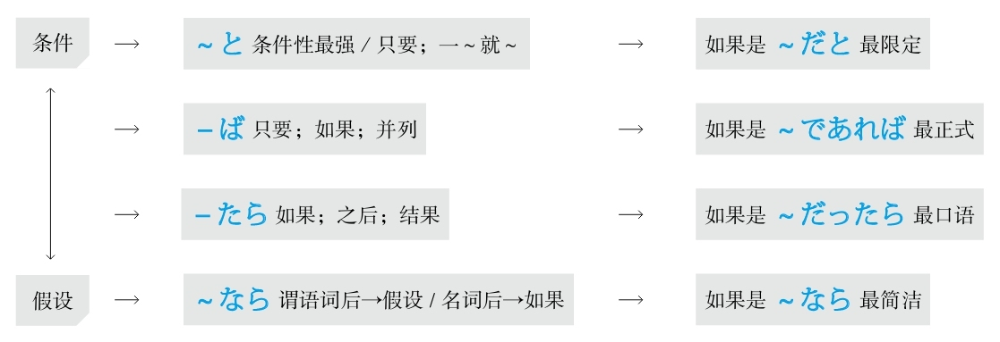

### 如果不～，就～

#### －ないと/－なければ/－なかったら/－ないなら
**准则：** 在「と、ば、たら、なら」里，最重要的是顺序。「と」和「なら」分别表示极端，「と」代表“条件性”的极端，「なら」代表“假定性”的极端
**解释：** 「ない」是动词或形容词的否定的简体
**意思：** 「～ないと」是“只要不～”；「～なければ」是“如果不～”；「～なかったら」是“如果不～”（口语化）；「～ないなら」是“假设不～”
**变形：** 动词的否定形的な（变形规律参照第一章的第二节）

例句：<ruby>研<rp>(</rp><rt>けん</rt><rp>)</rp></ruby><ruby>究<rp>(</rp><rt>きゅう</rt><rp>)</rp></ruby>は<ruby>厳<rp>(</rp><rt>きび</rt><rp>)</rp></ruby>しいものだから、<ruby>根<rp>(</rp><rt>こん</rt><rp>)</rp></ruby><ruby>性<rp>(</rp><rt>じょう</rt><rp>)</rp></ruby>が**ないと** 、<ruby>長<rp>(</rp><rt>なが</rt><rp>)</rp></ruby><ruby>続<rp>(</rp><rt>つづ</rt><rp>)</rp></ruby>きはできない。
直译：研究是很严酷的事情，所以如果没有毅力，长久坚持不能。
意译：搞研究是很苦的事情，如果没有毅力是不会坚持下去的。

#### ～ことなしに
**解释：** 「こと」在此是将动词名词化；「なし」是「ない」的古语形式，意思是“没有”；「に」表示副词
**意思：** 如果不～就不～
**语气：** 正式
**注意：** 后句接否定或带有否定意思的词
**接续：** 动词的原形

例句：<ruby>担<rp>(</rp><rt>たん</rt><rp>)</rp></ruby><ruby>当<rp>(</rp><rt>とう</rt><rp>)</rp></ruby><ruby>教<rp>(</rp><rt>きょう</rt><rp>)</rp></ruby><ruby>師<rp>(</rp><rt>し</rt><rp>)</rp></ruby>の<ruby>許<rp>(</rp><rt>きょ</rt><rp>)</rp></ruby><ruby>可<rp>(</rp><rt>か</rt><rp>)</rp></ruby>を<ruby>得<rp>(</rp><rt>え</rt><rp>)</rp></ruby>る**ことなしに** 、<ruby>履<rp>(</rp><rt>り</rt><rp>)</rp></ruby><ruby>修<rp>(</rp><rt>しゅう</rt><rp>)</rp></ruby><ruby>科<rp>(</rp><rt>か</rt><rp>)</rp></ruby><ruby>目<rp>(</rp><rt>もく</rt><rp>)</rp></ruby>の<ruby>変<rp>(</rp><rt>へん</rt><rp>)</rp></ruby><ruby>更<rp>(</rp><rt>こう</rt><rp>)</rp></ruby>はでき**ない** 。
直译：没有得到任课老师的许可，要学的科目的变更不可。
意译：没有得到任课老师的许可，不能更改要学的科目。

#### －なしに
**解释：** 「なし」是「ない」的古语形式，意思是“没有”；「に」表示副词
**意思：** 如果不～就不～
**注意：** 后句接否定或带有否定意思的词
**接续：** 名词

例句：ノック**なしに** <ruby>部<rp>(</rp><rt>へ</rt><rp>)</rp></ruby><ruby>屋<rp>(</rp><rt>や</rt><rp>)</rp></ruby>に<ruby>入<rp>(</rp><rt>はい</rt><rp>)</rp></ruby>るのはマナー<ruby>違<rp>(</rp><rt>い</rt><rp>)</rp></ruby><ruby>反<rp>(</rp><rt>はん</rt><rp>)</rp></ruby>です。
直译：不敲门，进入房间，是违反礼仪的。
意译：不敲门就进入房间是不礼貌的。

#### －なくして
**解释：** 「なくして」是他动词「<ruby>無<rp>(</rp><rt>な</rt><rp>)</rp></ruby>くす」的中顿形式
**直译：** 把～去除
**意译：** 没有～
**注意：** 后句接否定或带有否定意思的词
**接续：** 名词

例句：<ruby>部<rp>(</rp><rt>ぶ</rt><rp>)</rp></ruby><ruby>下<rp>(</rp><rt>か</rt><rp>)</rp></ruby>の<ruby>信<rp>(</rp><rt>しん</rt><rp>)</rp></ruby><ruby>頼<rp>(</rp><rt>らい</rt><rp>)</rp></ruby>**なくしては** 、<ruby>上<rp>(</rp><rt>じょう</rt><rp>)</rp></ruby><ruby>司<rp>(</rp><rt>し</rt><rp>)</rp></ruby>の<ruby>務<rp>(</rp><rt>つと</rt><rp>)</rp></ruby>めは<ruby>順<rp>(</rp><rt>じゅん</rt><rp>)</rp></ruby><ruby>調<rp>(</rp><rt>ちょう</rt><rp>)</rp></ruby>に<ruby>果<rp>(</rp><rt>は</rt><rp>)</rp></ruby>たせないだろう。
直译：没有部下的信任，上司的职务就不能顺利地完成。
意译：没有部下的信任，上司就不能顺利完成自己的工作吧。

#### －ぬき
**解释：** 「ぬき」是他动词「<ruby>抜<rp>(</rp><rt>ぬ</rt><rp>)</rp></ruby>く」的连用形
**直译：** 把～拔掉
**意译：** 省略～
**注意：** 后句肯定、否定都能接
**词性：** 名词
**接续：** 名词、动词的连用形

例句：<ruby>朝<rp>(</rp><rt>ちょう</rt><rp>)</rp></ruby><ruby>食<rp>(</rp><rt>しょく</rt><rp>)</rp></ruby>**ぬき** で<ruby>会<rp>(</rp><rt>かい</rt><rp>)</rp></ruby><ruby>社<rp>(</rp><rt>しゃ</rt><rp>)</rp></ruby>に<ruby>行<rp>(</rp><rt>い</rt><rp>)</rp></ruby>く<ruby>会<rp>(</rp><rt>かい</rt><rp>)</rp></ruby><ruby>社<rp>(</rp><rt>しゃ</rt><rp>)</rp></ruby><ruby>員<rp>(</rp><rt>いん</rt><rp>)</rp></ruby>が<ruby>少<rp>(</rp><rt>すく</rt><rp>)</rp></ruby>なくない。
直译：拔掉早饭的状态，去公司的职员不少。
意译：不吃早饭上班的员工不少。

例句：<ruby>先<rp>(</rp><rt>せん</rt><rp>)</rp></ruby><ruby>生<rp>(</rp><rt>せい</rt><rp>)</rp></ruby>の<ruby>指<rp>(</rp><rt>し</rt><rp>)</rp></ruby><ruby>導<rp>(</rp><rt>どう</rt><rp>)</rp></ruby>と<ruby>先<rp>(</rp><rt>せん</rt><rp>)</rp></ruby><ruby>輩<rp>(</rp><rt>ぱい</rt><rp>)</rp></ruby>の<ruby>協<rp>(</rp><rt>きょう</rt><rp>)</rp></ruby><ruby>力<rp>(</rp><rt>りょく</rt><rp>)</rp></ruby>**ぬき** には<ruby>論<rp>(</rp><rt>ろん</rt><rp>)</rp></ruby><ruby>文<rp>(</rp><rt>ぶん</rt><rp>)</rp></ruby>は<ruby>完<rp>(</rp><rt>かん</rt><rp>)</rp></ruby><ruby>成<rp>(</rp><rt>せい</rt><rp>)</rp></ruby>できなかっただろう。
直译：没有老师的指导和同学的帮助，论文是不能完成吧。
意译：没有老师的指导和学长的帮助的话，论文是不会写好的吧。
语法关系图

## S
### 时候

#### ～において
**解释：** 「に」表示方向；「おいて」是自动词「<ruby>於<rp>(</rp><rt>お</rt><rp>)</rp></ruby>く」的中顿形式，意思是“于”
**意思：** 在～
**语气：** 正式
**注意：** 后面接动词
**接续：** 时间、地点、状况、团体等名词

例句：<ruby>北<rp>(</rp><rt>ぺ</rt><rp>)</rp></ruby><ruby>京<rp>(</rp><rt>きん</rt><rp>)</rp></ruby><ruby>五<rp>(</rp><rt>ご</rt><rp>)</rp></ruby><ruby>輪<rp>(</rp><rt>りん</rt><rp>)</rp></ruby>は<ruby>2008<rp>(</rp><rt>にせんはち</rt><rp>)</rp></ruby><ruby>年<rp>(</rp><rt>ねん</rt><rp>)</rp></ruby><ruby>8<rp>(</rp><rt>はち</rt><rp>)</rp></ruby><ruby>月<rp>(</rp><rt>がつ</rt><rp>)</rp></ruby><ruby>8<rp>(</rp><rt>よう</rt><rp>)</rp></ruby><ruby>日<rp>(</rp><rt>か</rt><rp>)</rp></ruby>**において** <ruby>開<rp>(</rp><rt>かい</rt><rp>)</rp></ruby><ruby>催<rp>(</rp><rt>さい</rt><rp>)</rp></ruby>された。
直译：北京奥林匹克在2008年8月8日被召开。
意译：北京奥运会于2008年8月8日开幕了。

#### ～における
**解释：** 「に」表示方向；「<ruby>於<rp>(</rp><rt>お</rt><rp>)</rp></ruby>ける」的意思是“于”
**意思：** 在～
**语气：** 正式
**注意：** 后面接名词
**接续：** 时间、地点、状况、团体等名词

例句：<ruby>2014<rp>(</rp><rt>にせんじゅうよ</rt><rp>)</rp></ruby><ruby>年<rp>(</rp><rt>ねん</rt><rp>)</rp></ruby>**における** <ruby>売<rp>(</rp><rt>う</rt><rp>)</rp></ruby>り<ruby>上<rp>(</rp><rt>あ</rt><rp>)</rp></ruby>げは、<ruby>前<rp>(</rp><rt>ぜん</rt><rp>)</rp></ruby><ruby>年<rp>(</rp><rt>ねん</rt><rp>)</rp></ruby><ruby>度<rp>(</rp><rt>ど</rt><rp>)</rp></ruby>に<ruby>比<rp>(</rp><rt>くら</rt><rp>)</rp></ruby>べ、<ruby>約<rp>(</rp><rt>やく</rt><rp>)</rp></ruby><ruby>2<rp>(</rp><rt>に</rt><rp>)</rp></ruby><ruby>倍<rp>(</rp><rt>ばい</rt><rp>)</rp></ruby>になった。
直译：于2014年的销售额，比前一年度，到了大约2倍。
意译：2014年的销售额比前一年度大约增长了1倍。

#### ～に際して
**解释：** 「に」表示方向；「<ruby>際<rp>(</rp><rt>さい</rt><rp>)</rp></ruby>して」是自动词「<ruby>際<rp>(</rp><rt>さい</rt><rp>)</rp></ruby>する」的中顿形式，意思是“际、之际”
**意思：** 在～之际
**语气：** 更正式
**接续：** 表示事件的名词

例句：<ruby>皇<rp>(</rp><rt>こう</rt><rp>)</rp></ruby><ruby>太<rp>(</rp><rt>たい</rt><rp>)</rp></ruby><ruby>子<rp>(</rp><rt>し</rt><rp>)</rp></ruby><ruby>殿<rp>(</rp><rt>でん</rt><rp>)</rp></ruby><ruby>下<rp>(</rp><rt>か</rt><rp>)</rp></ruby>の<ruby>お<rp>(</rp><rt>お</rt><rp>)</rp></ruby><ruby>誕<rp>(</rp><rt>たん</rt><rp>)</rp></ruby><ruby>生<rp>(</rp><rt>じょう</rt><rp>)</rp></ruby><ruby>日<rp>(</rp><rt>び</rt><rp>)</rp></ruby>**に<ruby>際<rp>(</rp><rt>さい</rt><rp>)</rp></ruby>して** 、<ruby>記<rp>(</rp><rt>き</rt><rp>)</rp></ruby><ruby>者<rp>(</rp><rt>しゃ</rt><rp>)</rp></ruby><ruby>会<rp>(</rp><rt>かい</rt><rp>)</rp></ruby><ruby>見<rp>(</rp><rt>けん</rt><rp>)</rp></ruby>が<ruby>行<rp>(</rp><rt>おこな</rt><rp>)</rp></ruby>われた。
直译：在皇太子殿下的生日之际，记者招待会被举行了。
意译：在皇太子殿下的生日之际召开了记者招待会。

#### ～にあたって
**解释：** 「に」表示方向；「あたって」是自动词「<ruby>当<rp>(</rp><rt>あ</rt><rp>)</rp></ruby>たる」的中顿形式，意思是“相当”
**直译：** 相当于～
**意译：** 在～之际
**语气：** 正式
**接续：** 表示事件、工作的名词；动词的原形

例句：<ruby>開会<rp>(</rp><rt>かいかい</rt><rp>)</rp></ruby>**にあたり** 、<ruby>社<rp>(</rp><rt>しゃ</rt><rp>)</rp></ruby><ruby>長<rp>(</rp><rt>ちょう</rt><rp>)</rp></ruby>に<ruby>一<rp>(</rp><rt>ひと</rt><rp>)</rp></ruby><ruby>言<rp>(</rp><rt>こと</rt><rp>)</rp></ruby>ごあいさついただきたいと<ruby>思<rp>(</rp><rt>おも</rt><rp>)</rp></ruby>います。
直译：在开始会议，我们想请社长说一句话。
意译：在会议开始之际，我们想请社长为我们致词。

#### ～ところだ
**解释：** 「ところ」表示“时间、地点、程度、状况”
**注意：** 此处表示时间
**重点：** 强调动词的时态
**接续：** 动词的一般现在时
**意思：** 正要～

例句：<ruby>今<rp>(</rp><rt>いま</rt><rp>)</rp></ruby><ruby>出<rp>(</rp><rt>で</rt><rp>)</rp></ruby>かける**ところだ** よ。
直译：现在要出门的时候。
意译：正要出门呢。

**接续：** 动词的现在进行时
**意思：** 正在～

例句：<ruby>今<rp>(</rp><rt>いま</rt><rp>)</rp></ruby>ホームページを<ruby>見<rp>(</rp><rt>み</rt><rp>)</rp></ruby>ている**ところだ** よ。
直译：现在看着网页的时候。
意译：正看网页呢。

**接续：** 动词的过去式
**意思：** 刚～了

例句：<ruby>今<rp>(</rp><rt>いま</rt><rp>)</rp></ruby><ruby>帰<rp>(</rp><rt>かえ</rt><rp>)</rp></ruby>って<ruby>来<rp>(</rp><rt>き</rt><rp>)</rp></ruby>た**ところだ** よ。
直译：现在回来了的时候。
意译：刚回来。

#### ～ところを
**解释：** 「ところ」在此表示“时间”；「を」表示移动
**重点：** 此处表示移动的「を」翻译成“抽空儿”或“抽身”
**接续：** 形容词的原形、形容动词加な

例句：お<ruby>忙<rp>(</rp><rt>いそが</rt><rp>)</rp></ruby>しい**ところを** 、<ruby>恐<rp>(</rp><rt>おそ</rt><rp>)</rp></ruby>れ<ruby>入<rp>(</rp><rt>い</rt><rp>)</rp></ruby>ります。
直译：在您忙的时候，抽出时间，不好意思。
意译：让您在百忙之中抽出时间，真是不好意思。

**解释：** 「ところ」在此表示“时间”；「を」用于宾语后
**意思：** 在～时候被～
**注意：** 前后是同一主语；后句用被动形
**接续：** 动词的现在进行时的简体

例句：<ruby>彼<rp>(</rp><rt>かれ</rt><rp>)</rp></ruby>は<ruby>店<rp>(</rp><rt>みせ</rt><rp>)</rp></ruby>で<ruby>万<rp>(</rp><rt>まん</rt><rp>)</rp></ruby><ruby>引<rp>(</rp><rt>び</rt><rp>)</rp></ruby>きをしている**ところを** <ruby>監<rp>(</rp><rt>かん</rt><rp>)</rp></ruby><ruby>視<rp>(</rp><rt>し</rt><rp>)</rp></ruby>カメラに<ruby>撮<rp>(</rp><rt>と</rt><rp>)</rp></ruby>られた。
直译：他在店里正在偷东西的时刻被监视器照下来了。
意译：他在店里偷东西时被监视器拍了下来。

#### ～ところに/～ところへ
**解释：** 「ところ」在此表示“时间”；「に」和「へ」表示方向
**意思：** 在～时候
**注意：** 前后可以用不同的主语；后句不用被动形
**接续：** 动词的现在进行时的简体

例句：お<ruby>風<rp>(</rp><rt>ふ</rt><rp>)</rp></ruby><ruby>呂<rp>(</rp><rt>ろ</rt><rp>)</rp></ruby>に<ruby>入<rp>(</rp><rt>はい</rt><rp>)</rp></ruby>っている**ところに（へ）** 、<ruby>電<rp>(</rp><rt>でん</rt><rp>)</rp></ruby><ruby>話<rp>(</rp><rt>わ</rt><rp>)</rp></ruby>がかかってきた。
直译：正在洗澡的时候，打来了电话。
意译：洗澡的时候来电话了。

#### ～中を
**解释：** 「<ruby>中<rp>(</rp><rt>なか</rt><rp>)</rp></ruby>」表示“～之中”；「を」表示移动
**重点：** 此处表示移动的「を」翻译成“抽空儿”或“抽身”
**区别：** 比「～ところを」正式，且用法广泛
**用于：** 时间、地点、状况等，比如：「<ruby>風<rp>(</rp><rt>かぜ</rt><rp>)</rp></ruby>と<ruby>雨<rp>(</rp><rt>あめ</rt><rp>)</rp></ruby>の<ruby>中<rp>(</rp><rt>なか</rt><rp>)</rp></ruby>を」（在风雨当中）
**接续：** 形容词的原形、形容动词加な、名词の

例句：お<ruby>忙<rp>(</rp><rt>いそが</rt><rp>)</rp></ruby>しい（ご多忙な）**<ruby>中<rp>(</rp><rt>なか</rt><rp>)</rp></ruby>を** 、<ruby>恐<rp>(</rp><rt>きょう</rt><rp>)</rp></ruby><ruby>縮<rp>(</rp><rt>しゅく</rt><rp>)</rp></ruby>です。
直译：在您百忙之中，抽出时间，不好意思。
意译：让您在百忙之中抽出时间，真是不好意思。

#### ～最中に
**解释：** 「<ruby>最<rp>(</rp><rt>さい</rt><rp>)</rp></ruby><ruby>中<rp>(</rp><rt>ちゅう</rt><rp>)</rp></ruby>」表示“正在～当中”；「に」表示方向
**意思：** 正在～当中
**区别：** 比强调现在进行时的「しているところ」语气更强烈
**接续：** 动词的现在进行时的简体、名词加の

例句：<ruby>考<rp>(</rp><rt>かんが</rt><rp>)</rp></ruby>えている**<ruby>最<rp>(</rp><rt>さい</rt><rp>)</rp></ruby><ruby>中<rp>(</rp><rt>ちゅう</rt><rp>)</rp></ruby>に** 、<ruby>話<rp>(</rp><rt>はな</rt><rp>)</rp></ruby>しかけられて<ruby>困<rp>(</rp><rt>こま</rt><rp>)</rp></ruby>った。
直译：正在想事情的过程当中，被说话，很为难。
意译：正在想事情时跟我说话，让我很为难。

例句：<ruby>授<rp>(</rp><rt>じゅ</rt><rp>)</rp></ruby><ruby>業<rp>(</rp><rt>ぎょう</rt><rp>)</rp></ruby>の**<ruby>最<rp>(</rp><rt>さい</rt><rp>)</rp></ruby><ruby>中<rp>(</rp><rt>ちゅう</rt><rp>)</rp></ruby>に** <ruby>電<rp>(</rp><rt>でん</rt><rp>)</rp></ruby><ruby>話<rp>(</rp><rt>わ</rt><rp>)</rp></ruby>がかかってきて、<ruby>急<rp>(</rp><rt>いそ</rt><rp>)</rp></ruby>いで<ruby>教<rp>(</rp><rt>きょう</rt><rp>)</rp></ruby><ruby>室<rp>(</rp><rt>しつ</rt><rp>)</rp></ruby>を<ruby>飛<rp>(</rp><rt>と</rt><rp>)</rp></ruby>び<ruby>出<rp>(</rp><rt>だ</rt><rp>)</rp></ruby>した。
直译：正在上课的过程当中，来了电话，急忙冲出了教室。
意译：正上课时来了电话，（我）急忙冲出教室。
语法关系图
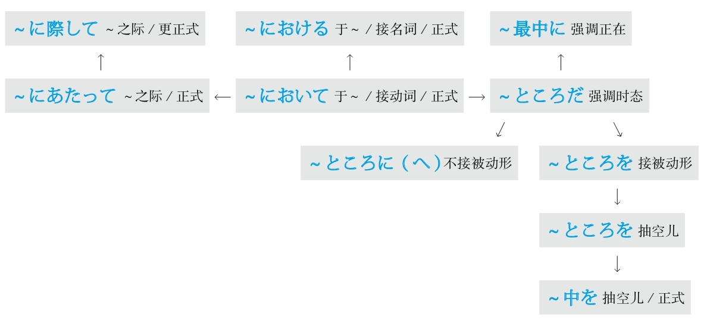

### 随着

#### ～に従って
**解释：** 「に」表示方向或对象；「<ruby>従<rp>(</rp><rt>したが</rt><rp>)</rp></ruby>って」是「<ruby>従<rp>(</rp><rt>したが</rt><rp>)</rp></ruby>う」的中顿形式
**意思：** 随着～
**重点：** 由于「<ruby>従<rp>(</rp><rt>したが</rt><rp>)</rp></ruby>う」的前缀是「した」，因此着重上下关系
**语气：** 正式
**接续：** 名词、动词的原形

例句：<ruby>通<rp>(</rp><rt>つう</rt><rp>)</rp></ruby><ruby>信<rp>(</rp><rt>しん</rt><rp>)</rp></ruby><ruby>技<rp>(</rp><rt>ぎ</rt><rp>)</rp></ruby><ruby>術<rp>(</rp><rt>じゅつ</rt><rp>)</rp></ruby>の<ruby>進<rp>(</rp><rt>しん</rt><rp>)</rp></ruby><ruby>歩<rp>(</rp><rt>ぽ</rt><rp>)</rp></ruby>**に<ruby>従<rp>(</rp><rt>したが</rt><rp>)</rp></ruby>って** 、<ruby>情<rp>(</rp><rt>じょう</rt><rp>)</rp></ruby><ruby>報<rp>(</rp><rt>ほう</rt><rp>)</rp></ruby><ruby>伝<rp>(</rp><rt>でん</rt><rp>)</rp></ruby><ruby>達<rp>(</rp><rt>たつ</rt><rp>)</rp></ruby>が<ruby>速<rp>(</rp><rt>はや</rt><rp>)</rp></ruby>くなってきた。
直译：随着通讯技术的进步，信息传递变得迅速了。
意译：随着通讯技术的进步，信息传递越发迅速了。

#### ～に伴って
**解释：** 「に」表示方向或对象；「<ruby>伴<rp>(</rp><rt>ともな</rt><rp>)</rp></ruby>って」是「<ruby>伴<rp>(</rp><rt>ともな</rt><rp>)</rp></ruby>う」的中顿形式
**意思：** 伴随着～
**重点：** 由于「<ruby>伴<rp>(</rp><rt>ともな</rt><rp>)</rp></ruby>う」的前缀是「<ruby>共<rp>(</rp><rt>とも</rt><rp>)</rp></ruby>」，因此着重同伴关系
**语气：** 正式
**接续：** 名词、动词的原形

例句：<ruby>産<rp>(</rp><rt>さん</rt><rp>)</rp></ruby><ruby>業<rp>(</rp><rt>ぎょう</rt><rp>)</rp></ruby>の<ruby>発<rp>(</rp><rt>はっ</rt><rp>)</rp></ruby><ruby>達<rp>(</rp><rt>たつ</rt><rp>)</rp></ruby>**に<ruby>伴<rp>(</rp><rt>ともな</rt><rp>)</rp></ruby>って** 、<ruby>環<rp>(</rp><rt>かん</rt><rp>)</rp></ruby><ruby>境<rp>(</rp><rt>きょう</rt><rp>)</rp></ruby><ruby>汚<rp>(</rp><rt>お</rt><rp>)</rp></ruby><ruby>染<rp>(</rp><rt>せん</rt><rp>)</rp></ruby>が<ruby>厳<rp>(</rp><rt>げん</rt><rp>)</rp></ruby><ruby>重<rp>(</rp><rt>じゅう</rt><rp>)</rp></ruby>になってきた。
直译：伴随着产业的发展，环境污染变得严重了。
意译：随着产业的发展，环境污染越发严重了。

#### ～と共に
**解释：** 「と」的意思是“和”；「<ruby>共<rp>(</rp><rt>とも</rt><rp>)</rp></ruby>」的意思是“共、一起”；「に」表示副词
**意思：** 和～一起
**语气：** 正式
**接续：** 名词、动词的原形

例句：<ruby>好<rp>(</rp><rt>す</rt><rp>)</rp></ruby>きな<ruby>人<rp>(</rp><rt>ひと</rt><rp>)</rp></ruby>**と<ruby>共<rp>(</rp><rt>とも</rt><rp>)</rp></ruby>に** <ruby>人<rp>(</rp><rt>じん</rt><rp>)</rp></ruby><ruby>生<rp>(</rp><rt>せい</rt><rp>)</rp></ruby>を<ruby>歩<rp>(</rp><rt>あゆ</rt><rp>)</rp></ruby>みたい。
直译：和喜欢的人一起，想步行人生。
意译：想和喜欢的人一起共度人生。

#### ～につれて
**解释：** 「に」表示方向或对象；「<ruby>連<rp>(</rp><rt>つ</rt><rp>)</rp></ruby>れて」是「<ruby>連<rp>(</rp><rt>つ</rt><rp>)</rp></ruby>れる」的中顿形式
**意思：** 随着～
**着重：** 时间的推移
**语气：** 柔和
**接续：** 名词、动词的原形

例句：<ruby>時<rp>(</rp><rt>じ</rt><rp>)</rp></ruby><ruby>間<rp>(</rp><rt>かん</rt><rp>)</rp></ruby>が<ruby>経<rp>(</rp><rt>た</rt><rp>)</rp></ruby>つ**につれて** 、<ruby>昔<rp>(</rp><rt>むかし</rt><rp>)</rp></ruby>への<ruby>記<rp>(</rp><rt>き</rt><rp>)</rp></ruby><ruby>憶<rp>(</rp><rt>おく</rt><rp>)</rp></ruby>がだんだん<ruby>薄<rp>(</rp><rt>うす</rt><rp>)</rp></ruby>くなってきた。
直译：随着时间的推移，对过去的记忆，渐渐变淡了。
意译：随着时间的推移，过去的记忆渐渐淡化了。

例句：<ruby>年<rp>(</rp><rt>とし</rt><rp>)</rp></ruby>をとる**につれて** 、<ruby>記<rp>(</rp><rt>き</rt><rp>)</rp></ruby><ruby>憶<rp>(</rp><rt>おく</rt><rp>)</rp></ruby><ruby>力<rp>(</rp><rt>りょく</rt><rp>)</rp></ruby>が<ruby>悪<rp>(</rp><rt>わる</rt><rp>)</rp></ruby>くなってきた。
直译：随着年龄的增长，记忆力变坏了。
意译：随着年龄的增长，记忆力越来越不好了。

例句：<ruby>経<rp>(</rp><rt>けい</rt><rp>)</rp></ruby><ruby>験<rp>(</rp><rt>けん</rt><rp>)</rp></ruby>を<ruby>積<rp>(</rp><rt>つ</rt><rp>)</rp></ruby>む**につれて** 、<ruby>物<rp>(</rp><rt>もの</rt><rp>)</rp></ruby><ruby>事<rp>(</rp><rt>ごと</rt><rp>)</rp></ruby>への<ruby>対<rp>(</rp><rt>たい</rt><rp>)</rp></ruby><ruby>応<rp>(</rp><rt>おう</rt><rp>)</rp></ruby>がますます<ruby>上<rp>(</rp><rt>じょう</rt><rp>)</rp></ruby><ruby>手<rp>(</rp><rt>ず</rt><rp>)</rp></ruby>になってきた。
直译：随着经验的积累，对于事物的对应，变得越来越好了。
意译：随着经验的积累，处事越来越得体了。
语法关系图
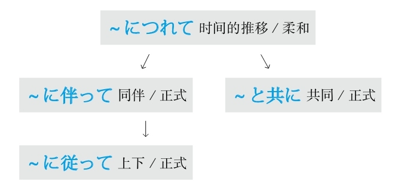

### 顺便

#### ～ついでに
**解释：** 「<ruby>序<rp>(</rp><rt>つい</rt><rp>)</rp></ruby>で」起源于「<ruby>次<rp>(</rp><rt>つ</rt><rp>)</rp></ruby>ぐ（接下来）」；「に」表示副词
**直译：** 接下来～
**意译：** 顺便～
**注意：** 还可以作接续词
**语气：** 柔和
**接续：** 名词加の、动词的简体

例句：<ruby>車<rp>(</rp><rt>くるま</rt><rp>)</rp></ruby>を<ruby>洗<rp>(</rp><rt>あら</rt><rp>)</rp></ruby>う**ついでに** 、<ruby>庭<rp>(</rp><rt>にわ</rt><rp>)</rp></ruby>に<ruby>水<rp>(</rp><rt>みず</rt><rp>)</rp></ruby>を<ruby>撒<rp>(</rp><rt>ま</rt><rp>)</rp></ruby>いた。
直译：洗车，顺便，往院子里把水洒了。
意译：洗车时顺便往院子里洒了水。

#### －がてら
**解释：** 「が」是古语中起连接作用的助词；「て」是“手”；「ら」是“拉”
**直译：** 手拉着～
**意译：** 顺带手～
**语气：** 正式
**接续：** 名词

例句：<ruby>散<rp>(</rp><rt>さん</rt><rp>)</rp></ruby><ruby>歩<rp>(</rp><rt>ぽ</rt><rp>)</rp></ruby>**がてら** 、<ruby>本<rp>(</rp><rt>ほん</rt><rp>)</rp></ruby><ruby>屋<rp>(</rp><rt>や</rt><rp>)</rp></ruby>さんに<ruby>立<rp>(</rp><rt>た</rt><rp>)</rp></ruby>ち<ruby>寄<rp>(</rp><rt>よ</rt><rp>)</rp></ruby>った。
直译：散步，顺带手，转了书店。
意译：散步时顺便去了趟书店。

#### －かたがた
**解释：** 「<ruby>方<rp>(</rp><rt>かた</rt><rp>)</rp></ruby><ruby>方<rp>(</rp><rt>がた</rt><rp>)</rp></ruby>」的意思是“两方都做”
**直译：** 事物方方面面都要做到
**意译：** 顺便～
**语气：** 正式、礼貌
**接续：** 名词

例句：<ruby>帰<rp>(</rp><rt>き</rt><rp>)</rp></ruby><ruby>国<rp>(</rp><rt>こく</rt><rp>)</rp></ruby>のあいさつ**かたがた** 、<ruby>恩<rp>(</rp><rt>おん</rt><rp>)</rp></ruby><ruby>師<rp>(</rp><rt>し</rt><rp>)</rp></ruby>のお<ruby>宅<rp>(</rp><rt>たく</rt><rp>)</rp></ruby>を<ruby>訪<rp>(</rp><rt>おとず</rt><rp>)</rp></ruby>れました。
直译：回国的问候，方方面面，拜访恩师家。
意译：我要回国了，去老师家拜访，跟老师打了声招呼。

#### ～を兼ねて
**解释：** 「を」接在他动词前表示“把”；「<ruby>兼<rp>(</rp><rt>か</rt><rp>)</rp></ruby>ねて」是他动词「<ruby>兼<rp>(</rp><rt>か</rt><rp>)</rp></ruby>ねる」的中顿形式
**直译：** 兼备～
**意译：** 顺便～
**接续：** 名词

例句：キャンプ<ruby>地<rp>(</rp><rt>ち</rt><rp>)</rp></ruby>の<ruby>下<rp>(</rp><rt>した</rt><rp>)</rp></ruby><ruby>見<rp>(</rp><rt>み</rt><rp>)</rp></ruby>**を<ruby>兼<rp>(</rp><rt>か</rt><rp>)</rp></ruby>ねて** 、ドライブに<ruby>行<rp>(</rp><rt>い</rt><rp>)</rp></ruby>って<ruby>来<rp>(</rp><rt>き</rt><rp>)</rp></ruby>た。
直译：野营地的事前调查，兼备着，开车兜风去了后回来了。
意译：去开车兜风了，顺便调查了一下野营地。
语法关系图
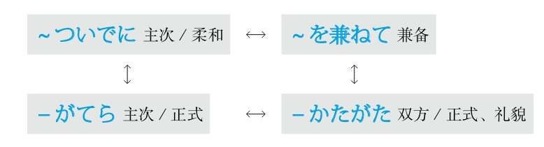

## T
### 特别

#### －てしかたがない
**解释：** 「て」表示中顿；「<ruby>仕<rp>(</rp><rt>し</rt><rp>)</rp></ruby><ruby>方<rp>(</rp><rt>かた</rt><rp>)</rp></ruby>」的意思是“方法、办法”；「が」是表示小主语的助词；「ない」的意思是“没有”
**意思：** ～得没办法
**变形：** て形（变形规律参照第一章的第二节）

例句：<ruby>試<rp>(</rp><rt>し</rt><rp>)</rp></ruby><ruby>合<rp>(</rp><rt>あい</rt><rp>)</rp></ruby>に<ruby>負<rp>(</rp><rt>ま</rt><rp>)</rp></ruby>けて、<ruby>悔<rp>(</rp><rt>くや</rt><rp>)</rp></ruby>しく**てしかたがない** 。
直译：在比赛中输了，懊悔得没办法。
意译：比赛输了，特别懊悔。

#### －てしょうがない
**解释：** 「て」表示中顿；「<ruby>仕<rp>(</rp><rt>し</rt><rp>)</rp></ruby><ruby>様<rp>(</rp><rt>よう</rt><rp>)</rp></ruby>」的意思是“办法”；「が」是表示小主语的助词；「ない」的意思是“没有”
**意思：** ～得没办法
**区别：** 比「－てしかたがない」更加口语化
**变形：** て形（变形规律参照第一章的第二节）

例句：<ruby>鍵<rp>(</rp><rt>かぎ</rt><rp>)</rp></ruby>をかけたかどうか<ruby>気<rp>(</rp><rt>き</rt><rp>)</rp></ruby>になっ**てしょうがない** 。
直译：锁门了还是没锁，担心得没办法。
意译：特别担心是不是锁门了。

#### －てたまらない
**解释：** 「て」表示中顿；「<ruby>堪<rp>(</rp><rt>たま</rt><rp>)</rp></ruby>らない」的意思是“不堪～”
**意思：** ～得受不了
**变形：** て形（变形规律参照第一章的第二节）

例句：<ruby>通<rp>(</rp><rt>つう</rt><rp>)</rp></ruby><ruby>勤<rp>(</rp><rt>きん</rt><rp>)</rp></ruby><ruby>電<rp>(</rp><rt>でん</rt><rp>)</rp></ruby><ruby>車<rp>(</rp><rt>しゃ</rt><rp>)</rp></ruby>の<ruby>暖<rp>(</rp><rt>だん</rt><rp>)</rp></ruby><ruby>房<rp>(</rp><rt>ぼう</rt><rp>)</rp></ruby>は<ruby>効<rp>(</rp><rt>き</rt><rp>)</rp></ruby>きすぎるから、<ruby>暑<rp>(</rp><rt>あつ</rt><rp>)</rp></ruby>く**てたまらなかった** 。
直译：上下班高峰电车的暖气，过于有效，热得受不了了。
意译：上下班高峰（时的）电车里的暖气太热了，热得受不了了。

#### －てならない
**解释：** 「て」表示中顿；「<ruby>成<rp>(</rp><rt>な</rt><rp>)</rp></ruby>らない」的意思是“不成～”
**意思：** ～得不成
**语气：** 正式
**变形：** て形（变形规律参照第一章的第二节）

例句：<ruby>方<rp>(</rp><rt>ほう</rt><rp>)</rp></ruby><ruby>向<rp>(</rp><rt>こう</rt><rp>)</rp></ruby>を<ruby>間<rp>(</rp><rt>ま</rt><rp>)</rp></ruby><ruby>違<rp>(</rp><rt>ちが</rt><rp>)</rp></ruby>えたような<ruby>気<rp>(</rp><rt>き</rt><rp>)</rp></ruby>がし**てならない** 。
直译：把方向弄错了，这样觉得得不成。
意译：就是觉得一定是把方向弄错了。
语法关系图

### 听说

#### ～だって/～ですって
**解释：** 「だ」接在前面的句尾；「って」是表示内容的「と」的口语形式；「だ」是简体；「です」是敬体
**用于：** 口语
**接续：** 名词和形容动词、动词和形容词的简体加ん

例句：<ruby>明日<rp>(</rp><rt>あした</rt><rp>)</rp></ruby>は<ruby>授<rp>(</rp><rt>じゅ</rt><rp>)</rp></ruby><ruby>業<rp>(</rp><rt>ぎょう</rt><rp>)</rp></ruby>のオリエンテーション**だって** 。
直译：明天是课程介绍，听说。
意译：听说明天是课程介绍。

例句：<ruby>明日<rp>(</rp><rt>あした</rt><rp>)</rp></ruby>は<ruby>雨<rp>(</rp><rt>あめ</rt><rp>)</rp></ruby>が<ruby>降<rp>(</rp><rt>ふ</rt><rp>)</rp></ruby>る**んだって** 。
直译：明天要下雨，听说。
意译：听说明天要下雨。

#### ～そうだ
**解释：** 「<ruby>相<rp>(</rp><rt>そう</rt><rp>)</rp></ruby>」的意思是“样子”，在此表示听来的“样子”，即“听说”
**重点：** 不加“听说”的主语，但是听说的主语一定是第一人称；不能改变「～そうだ」的形式和时态
**注意：** 如果不用第一人称或变换形式和时态的话，用「～と<ruby>聞<rp>(</rp><rt>き</rt><rp>)</rp></ruby>く」（柔和）或「～という」（正式）
**语气：** 正式
**接续：** 前面接完整的句子

例句：<ruby>新<rp>(</rp><rt>あたら</rt><rp>)</rp></ruby>しいデザインの<ruby>車<rp>(</rp><rt>くるま</rt><rp>)</rp></ruby>は<ruby>来<rp>(</rp><rt>らい</rt><rp>)</rp></ruby><ruby>月<rp>(</rp><rt>げつ</rt><rp>)</rp></ruby><ruby>発<rp>(</rp><rt>はつ</rt><rp>)</rp></ruby><ruby>売<rp>(</rp><rt>ばい</rt><rp>)</rp></ruby>される**そうだ** 。
直译：听说：新设计的车下月将要被销售。
意译：据说下月销售新设计的车。

#### ～ということだ
**解释：** 「と」表示内容；「いう」用于连接前面的「と」和后面的名词；「こと」的意思是“事情”；「だ」的意思是“是”
**语气：** 正式
**区别：** 在语气上，「～と<ruby>聞<rp>(</rp><rt>き</rt><rp>)</rp></ruby>く」（柔和）→「～という」（较正式）→「～ということだ」（正式）
**接续：** 前面接完整的句子

例句：<ruby>今<rp>(</rp><rt>こ</rt><rp>)</rp></ruby><ruby>年<rp>(</rp><rt>とし</rt><rp>)</rp></ruby>の<ruby>夏<rp>(</rp><rt>なつ</rt><rp>)</rp></ruby>は<ruby>涼<rp>(</rp><rt>すず</rt><rp>)</rp></ruby>しいので、クーラーの<ruby>販<rp>(</rp><rt>はん</rt><rp>)</rp></ruby><ruby>売<rp>(</rp><rt>ばい</rt><rp>)</rp></ruby><ruby>台<rp>(</rp><rt>だい</rt><rp>)</rp></ruby><ruby>数<rp>(</rp><rt>すう</rt><rp>)</rp></ruby>は<ruby>激<rp>(</rp><rt>げき</rt><rp>)</rp></ruby><ruby>減<rp>(</rp><rt>げん</rt><rp>)</rp></ruby>した**ということだ** 。
直译：今年夏天很凉快，所以空调的销售台数急剧减少，听说。
意译：听说因为今年夏天凉快，所以空调的销售量急剧减少。

#### ～といわれている
**解释：** 「と」表示内容；「いわれている」是「<ruby>言<rp>(</rp><rt>い</rt><rp>)</rp></ruby>う」的被动形的现在进行时
**意思：** 现在被说～、一直被说～
**注意：** 用被动形是为了不具体说听说的主语；用现在进行时是为了表示动作的持续
**语气：** 正式
**接续：** 前面接完整的句子

例句：コラーゲンは<ruby>美<rp>(</rp><rt>び</rt><rp>)</rp></ruby><ruby>容<rp>(</rp><rt>よう</rt><rp>)</rp></ruby>を<ruby>保<rp>(</rp><rt>たも</rt><rp>)</rp></ruby>つには<ruby>欠<rp>(</rp><rt>か</rt><rp>)</rp></ruby>かせないものだ**といわれている** 。
直译：胶原蛋白对于保持美容是不可缺少的东西，被说着。
意译：大家都说胶原蛋白对于保持美容是不可缺少的。

#### ～とされている
**解释：** 「と」表示内容；「されている」是「いわれている」的暧昧化的说法
**注意：** 因为「する」可以代替大多数动词，所以根据上下文还可以翻译成“被推测、被判断、被认为、被考察”等等
**语气：** 正式、暧昧
**接续：** 前面接完整的句子

例句：<ruby>現<rp>(</rp><rt>げん</rt><rp>)</rp></ruby><ruby>在<rp>(</rp><rt>ざい</rt><rp>)</rp></ruby>の<ruby>医<rp>(</rp><rt>い</rt><rp>)</rp></ruby><ruby>療<rp>(</rp><rt>りょう</rt><rp>)</rp></ruby><ruby>技<rp>(</rp><rt>ぎ</rt><rp>)</rp></ruby><ruby>術<rp>(</rp><rt>じゅつ</rt><rp>)</rp></ruby>では、この<ruby>種<rp>(</rp><rt>しゅ</rt><rp>)</rp></ruby>の<ruby>病<rp>(</rp><rt>びょう</rt><rp>)</rp></ruby><ruby>気<rp>(</rp><rt>き</rt><rp>)</rp></ruby>はまだ<ruby>治<rp>(</rp><rt>なお</rt><rp>)</rp></ruby>す<ruby>方法<rp>(</rp><rt>ほうほう</rt><rp>)</rp></ruby>がない**とされている** 。
直译：现在的医疗技术的程度，这种病，还没有治愈的方法，被说着。
意译：据说以现在的医疗技术，还没有治这种病的办法。
语法关系图
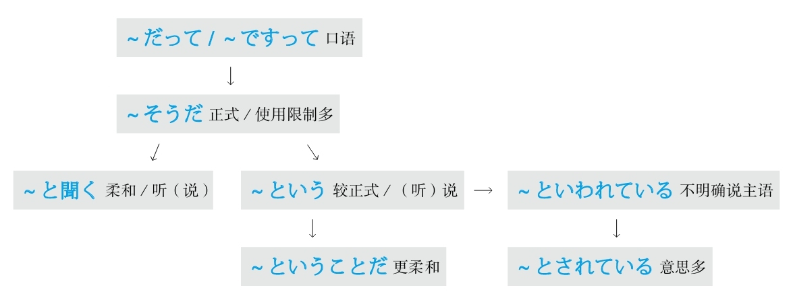

### 同时

#### ～と同時に
**解释：** 「と」的意思是“和～”；「<ruby>同<rp>(</rp><rt>どう</rt><rp>)</rp></ruby><ruby>時<rp>(</rp><rt>じ</rt><rp>)</rp></ruby>」的意思是“同时”；「に」表示方向，意思是“在”
**意思：** 和～同时
**着重：** 时间
**接续：** 名词、动词的简体

例句：<ruby>結<rp>(</rp><rt>けっ</rt><rp>)</rp></ruby><ruby>婚<rp>(</rp><rt>こん</rt><rp>)</rp></ruby>**と<ruby>同<rp>(</rp><rt>どう</rt><rp>)</rp></ruby><ruby>時<rp>(</rp><rt>じ</rt><rp>)</rp></ruby>に** <ruby>苗<rp>(</rp><rt>みょう</rt><rp>)</rp></ruby><ruby>字<rp>(</rp><rt>じ</rt><rp>)</rp></ruby>も<ruby>変<rp>(</rp><rt>か</rt><rp>)</rp></ruby>えた。
直译：在结婚的同时，姓氏也变了。
意译：结婚的同时还变更了姓氏。

#### ～と共に
**解释：** 「と」的意思是“和～”；「<ruby>共<rp>(</rp><rt>とも</rt><rp>)</rp></ruby>」的意思是“共、一起”；「に」表示方向，意思是“在”
**意思：** 和～一起、和～同时
**着重：** 时间、动作
**接续：** 名词、动词的简体

例句：<ruby>飛<rp>(</rp><rt>ひ</rt><rp>)</rp></ruby><ruby>行<rp>(</rp><rt>こう</rt><rp>)</rp></ruby><ruby>機<rp>(</rp><rt>き</rt><rp>)</rp></ruby>のチケットを<ruby>買<rp>(</rp><rt>か</rt><rp>)</rp></ruby>う**と<ruby>共<rp>(</rp><rt>とも</rt><rp>)</rp></ruby>に** <ruby>向<rp>(</rp><rt>む</rt><rp>)</rp></ruby>こうのホテルも<ruby>取<rp>(</rp><rt>と</rt><rp>)</rp></ruby>った。
直译：飞机的票买，和它一起，还订了当地的饭店。
意译：买了机票，还订了当地的宾馆。

#### ～か－ないかのうちに
**解释：** 两个「か」表示不确定，前面用动词的肯定形式，后面用动词的否定形式；「<ruby>内<rp>(</rp><rt>うち</rt><rp>)</rp></ruby>」的意思是“在～之内、在～过程当中”；「に」表示方向，意思是“在”
**直译：** 在不确定做前面的动作时，后面的动作就发生了
**意译：** 前后动作大概同时发生
**着重：** 动作快
**接续：** 「か」的前面接动词的原形，后面变成动词的否定形的な（变形规律参照第一章的第二节）

例句：<ruby>授<rp>(</rp><rt>じゅ</rt><rp>)</rp></ruby><ruby>業<rp>(</rp><rt>ぎょう</rt><rp>)</rp></ruby>の<ruby>終<rp>(</rp><rt>お</rt><rp>)</rp></ruby>わりのベルが<ruby>鳴<rp>(</rp><rt>な</rt><rp>)</rp></ruby>る**か** <ruby>鳴<rp>(</rp><rt>な</rt><rp>)</rp></ruby>ら**ないかのうちに** 、<ruby>学<rp>(</rp><rt>がく</rt><rp>)</rp></ruby><ruby>生<rp>(</rp><rt>せい</rt><rp>)</rp></ruby>は<ruby>教<rp>(</rp><rt>きょう</rt><rp>)</rp></ruby><ruby>室<rp>(</rp><rt>しつ</rt><rp>)</rp></ruby>を<ruby>飛<rp>(</rp><rt>と</rt><rp>)</rp></ruby>び<ruby>出<rp>(</rp><rt>だ</rt><rp>)</rp></ruby>した。
直译：课结束的铃，在还没确定响了或没响的过程当中，学生冲出了教室。
意译：大概和下课铃响的同时，学生冲出了教室。
语法关系图
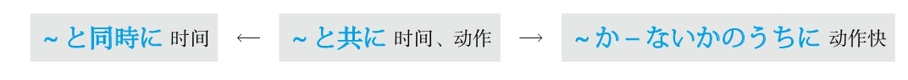

### 痛快地

#### 思い切り～
**解释：** 「<ruby>思<rp>(</rp><rt>おも</rt><rp>)</rp></ruby>い<ruby>切<rp>(</rp><rt>き</rt><rp>)</rp></ruby>り」是「<ruby>思<rp>(</rp><rt>おも</rt><rp>)</rp></ruby>い<ruby>切<rp>(</rp><rt>き</rt><rp>)</rp></ruby>る」（不再想）的连用形
**意思：** 痛痛快快地做～
**词性：** 副词
**注意：** 「<ruby>思<rp>(</rp><rt>おも</rt><rp>)</rp></ruby>い<ruby>切<rp>(</rp><rt>き</rt><rp>)</rp></ruby>って」的意思是“下决心做～、毅然决然地做～”

例句：<ruby>人<rp>(</rp><rt>ひと</rt><rp>)</rp></ruby><ruby>前<rp>(</rp><rt>まえ</rt><rp>)</rp></ruby>で**<ruby>思<rp>(</rp><rt>おも</rt><rp>)</rp></ruby>い<ruby>切<rp>(</rp><rt>き</rt><rp>)</rp></ruby>り** <ruby>泣<rp>(</rp><rt>な</rt><rp>)</rp></ruby>いたり<ruby>笑<rp>(</rp><rt>わら</rt><rp>)</rp></ruby>ったりするのは<ruby>私<rp>(</rp><rt>わたし</rt><rp>)</rp></ruby>の<ruby>性<rp>(</rp><rt>せい</rt><rp>)</rp></ruby><ruby>格<rp>(</rp><rt>かく</rt><rp>)</rp></ruby>ではない。
直译：在人前痛快地哭、痛快地笑，这不是我的性格。
意译：在人前痛快地哭和笑不是我的性格。

#### 思う存分～
**解释：** 「<ruby>思<rp>(</rp><rt>おも</rt><rp>)</rp></ruby>う」的意思是“想”；「<ruby>存<rp>(</rp><rt>ぞん</rt><rp>)</rp></ruby><ruby>分<rp>(</rp><rt>ぶん</rt><rp>)</rp></ruby>」的意思是“所有的部分”
**直译：** 想的所有的部分
**意译：** 能够想得到的事情都去做
**词性：** 副词

例句：<ruby>今日<rp>(</rp><rt>きょう</rt><rp>)</rp></ruby>はご<ruby>馳<rp>(</rp><rt>ち</rt><rp>)</rp></ruby><ruby>走<rp>(</rp><rt>そう</rt><rp>)</rp></ruby>するから、**<ruby>思<rp>(</rp><rt>おも</rt><rp>)</rp></ruby>う<ruby>存<rp>(</rp><rt>ぞん</rt><rp>)</rp></ruby><ruby>分<rp>(</rp><rt>ぶん</rt><rp>)</rp></ruby>** <ruby>食<rp>(</rp><rt>た</rt><rp>)</rp></ruby>べてください。
直译：今天我请客，所以想吃多少吃多少。
意译：今天我请客，痛痛快快地吃吧。
语法关系图

## W
### 为了

#### ～には
**解释：** 「に」表示目的；「は」表示强调
**意思：** 为了～
**语气：** 最简洁
**接续：** 名词、动词的原形

例句：いい<ruby>就<rp>(</rp><rt>しゅう</rt><rp>)</rp></ruby><ruby>職<rp>(</rp><rt>しょく</rt><rp>)</rp></ruby>ができる**には** 、<ruby>普<rp>(</rp><rt>ふ</rt><rp>)</rp></ruby><ruby>段<rp>(</rp><rt>だん</rt><rp>)</rp></ruby>からの<ruby>努<rp>(</rp><rt>ど</rt><rp>)</rp></ruby><ruby>力<rp>(</rp><rt>りょく</rt><rp>)</rp></ruby><ruby>以<rp>(</rp><rt>い</rt><rp>)</rp></ruby><ruby>外<rp>(</rp><rt>がい</rt><rp>)</rp></ruby>に<ruby>運<rp>(</rp><rt>うん</rt><rp>)</rp></ruby>も<ruby>大<rp>(</rp><rt>だい</rt><rp>)</rp></ruby><ruby>事<rp>(</rp><rt>じ</rt><rp>)</rp></ruby>だと<ruby>思<rp>(</rp><rt>おも</rt><rp>)</rp></ruby>う。
直译：为了能够好的就职，从平时的努力以外，运气也很重要，我认为。
意译：我认为能够找到一个好工作，除了平时的努力以外运气也很重要。

#### ～ように
**解释：** 「<ruby>様<rp>(</rp><rt>よう</rt><rp>)</rp></ruby>」的意思是“样子”；「に」表示副词
**直译：** 成为～的样子，而～
**意译：** 为了能够～
**注意：** 前后既可用同一主语，也可用不同主语
**重点：** 客观叙述
**接续：** 动词的可能形的原形、自动词的原形

例句：<ruby>留<rp>(</rp><rt>りゅう</rt><rp>)</rp></ruby><ruby>学<rp>(</rp><rt>がく</rt><rp>)</rp></ruby>**できるように** いろいろな<ruby>事<rp>(</rp><rt>じ</rt><rp>)</rp></ruby><ruby>前<rp>(</rp><rt>ぜん</rt><rp>)</rp></ruby><ruby>準<rp>(</rp><rt>じゅん</rt><rp>)</rp></ruby><ruby>備<rp>(</rp><rt>び</rt><rp>)</rp></ruby>をしている。
直译：为了能够留学，正在做各种各样的事先准备。
意译：为了能够留学，正在做各种事先准备工作。

例句：すべてのレベルの<ruby>学<rp>(</rp><rt>がく</rt><rp>)</rp></ruby><ruby>生<rp>(</rp><rt>せい</rt><rp>)</rp></ruby>がわかる**ように** 、わかりやすく<ruby>説<rp>(</rp><rt>せつ</rt><rp>)</rp></ruby><ruby>明<rp>(</rp><rt>めい</rt><rp>)</rp></ruby>した。
直译：为了所有的水平的学生都懂，做了容易懂的说明。
意译：为了（让）所有水平的学生都能懂，我做了通俗易懂的解释。

#### ～ために
**解释：** 「<ruby>為<rp>(</rp><rt>ため</rt><rp>)</rp></ruby>」的意思是“为了”；「に」表示副词
**意思：** 为了～
**注意：** 前后必须用同一主语
**重点：** 主观愿望强
**接续：** 动词的原形

例句：<ruby>試<rp>(</rp><rt>し</rt><rp>)</rp></ruby><ruby>験<rp>(</rp><rt>けん</rt><rp>)</rp></ruby>に<ruby>合<rp>(</rp><rt>ごう</rt><rp>)</rp></ruby><ruby>格<rp>(</rp><rt>かく</rt><rp>)</rp></ruby>する**ために** 、<ruby>一<rp>(</rp><rt>いち</rt><rp>)</rp></ruby><ruby>秒<rp>(</rp><rt>びょう</rt><rp>)</rp></ruby>たりとも<ruby>勉<rp>(</rp><rt>べん</rt><rp>)</rp></ruby><ruby>強<rp>(</rp><rt>きょう</rt><rp>)</rp></ruby>に<ruby>取<rp>(</rp><rt>と</rt><rp>)</rp></ruby>り<ruby>組<rp>(</rp><rt>く</rt><rp>)</rp></ruby>んでいる。
直译：为了考试合格，即使是一秒钟，致力于学习。
意译：为了通过考试，即使是一秒钟（我）都在努力学习。

#### －んがため（に）
**解释：** 「ん」在古语里表示推量，相当于现代日语中表示否定的“不”或表示意志的“想要”，在此表示意志；「が」是古语中起连接作用的助词；「<ruby>為<rp>(</rp><rt>ため</rt><rp>)</rp></ruby>」的意思是“为了”；「に」表示副词
**注意：** 「に」可以省略，省略助词后语气更加正式
**意思：** 「～しようと<ruby>思<rp>(</rp><rt>おも</rt><rp>)</rp></ruby>ってそのために～」（想要去做～，为了它而～）
**语气：** 古语、正式
**接续：** 动词的否定形的ん（推量）（变形规律参照第一章的第二节）

例句：<ruby>真<rp>(</rp><rt>しん</rt><rp>)</rp></ruby><ruby>実<rp>(</rp><rt>じつ</rt><rp>)</rp></ruby>を<ruby>明<rp>(</rp><rt>あき</rt><rp>)</rp></ruby>らかにせ**んがために** 、あらゆる<ruby>手<rp>(</rp><rt>て</rt><rp>)</rp></ruby>を<ruby>尽<rp>(</rp><rt>つ</rt><rp>)</rp></ruby>くした。
直译：为了弄明白真实的事，所有的办法都用尽了。
意译：为了弄清真相，想尽了一切办法。
语法关系图

### 无意识

#### ～ともなく/～ともなしに
**解释：** 「と」的意思是“和”；「も」的意思是“也”；「なく」和「なしに」是表示否定的「ない」的副词形式
**意思：** 似做非做～
**表示：** 无意识地做～
**注意：** 前后用同一个动词。常构成的表达方式有「見るともなく見ている」（似看非看）、「聞くともなく聞いている」（似听非听）、「わかるともなくわかっている」（似懂非懂）
**接续：** 动词的原形

例句：<ruby>眠<rp>(</rp><rt>ねむ</rt><rp>)</rp></ruby>いから、テレビを<ruby>見<rp>(</rp><rt>み</rt><rp>)</rp></ruby>る**ともなしに** <ruby>見<rp>(</rp><rt>み</rt><rp>)</rp></ruby>ている。
直译：困了，所以看和非看地在看着电视。
意译：困了，（我）似看非看地在看电视。
## X
### 相反

#### ～に反して
**解释：** 「に」表示对象；「<ruby>反<rp>(</rp><rt>はん</rt><rp>)</rp></ruby>して」是「<ruby>反<rp>(</rp><rt>はん</rt><rp>)</rp></ruby>する」的中顿形式
**意思：** 与～相反
**语气：** 正式
**接续：** 接「<ruby>期<rp>(</rp><rt>き</rt><rp>)</rp></ruby><ruby>待<rp>(</rp><rt>たい</rt><rp>)</rp></ruby>、<ruby>予<rp>(</rp><rt>よ</rt><rp>)</rp></ruby><ruby>想<rp>(</rp><rt>そう</rt><rp>)</rp></ruby>、<ruby>予<rp>(</rp><rt>よ</rt><rp>)</rp></ruby><ruby>測<rp>(</rp><rt>そく</rt><rp>)</rp></ruby>」等汉语式名词

例句：<ruby>地<rp>(</rp><rt>じ</rt><rp>)</rp></ruby><ruby>元<rp>(</rp><rt>もと</rt><rp>)</rp></ruby>の<ruby>住<rp>(</rp><rt>じゅう</rt><rp>)</rp></ruby><ruby>民<rp>(</rp><rt>みん</rt><rp>)</rp></ruby>の<ruby>予<rp>(</rp><rt>よ</rt><rp>)</rp></ruby><ruby>想<rp>(</rp><rt>そう</rt><rp>)</rp></ruby>**に<ruby>反<rp>(</rp><rt>はん</rt><rp>)</rp></ruby>して** 、<ruby>住<rp>(</rp><rt>じゅう</rt><rp>)</rp></ruby><ruby>宅<rp>(</rp><rt>たく</rt><rp>)</rp></ruby>の<ruby>値<rp>(</rp><rt>ね</rt><rp>)</rp></ruby><ruby>段<rp>(</rp><rt>だん</rt><rp>)</rp></ruby>が<ruby>上<rp>(</rp><rt>あ</rt><rp>)</rp></ruby>がる<ruby>一<rp>(</rp><rt>いっ</rt><rp>)</rp></ruby><ruby>方<rp>(</rp><rt>ぽう</rt><rp>)</rp></ruby>だ。
直译：和当地的居民的预想相反，住宅价格一个劲儿地在上涨。
意译：与当地居民的预想相反，住宅价格一个劲儿地上涨。

#### ～反面
**直译：** 反面
**意译：** 与～相反
**接续：** 修饰名词的规律（参照第一章的第三节）

例句：<ruby>彼<rp>(</rp><rt>かれ</rt><rp>)</rp></ruby>は<ruby>仕<rp>(</rp><rt>し</rt><rp>)</rp></ruby><ruby>事<rp>(</rp><rt>ごと</rt><rp>)</rp></ruby><ruby>上<rp>(</rp><rt>じょう</rt><rp>)</rp></ruby>しっかりしている**<ruby>反<rp>(</rp><rt>はん</rt><rp>)</rp></ruby><ruby>面<rp>(</rp><rt>めん</rt><rp>)</rp></ruby>、** <ruby>金<rp>(</rp><rt>かね</rt><rp>)</rp></ruby><ruby>使<rp>(</rp><rt>づか</rt><rp>)</rp></ruby>いが<ruby>荒<rp>(</rp><rt>あら</rt><rp>)</rp></ruby>い。
直译：他在工作上非常认真严谨，其反面，花钱却大手大脚。
意译：他在工作上非常认真严谨，但是花钱却大手大脚。

#### ～に対して
**解释：** 「に」表示对象；「<ruby>対<rp>(</rp><rt>たい</rt><rp>)</rp></ruby>して」是自动词「<ruby>対<rp>(</rp><rt>たい</rt><rp>)</rp></ruby>する」的中顿形式，意思是“对象、对比”
**意思：** 对于～、与～相对比（在此是后者）
**接续：** 名词

例句：<ruby>姉<rp>(</rp><rt>あね</rt><rp>)</rp></ruby>が<ruby>働<rp>(</rp><rt>はたら</rt><rp>)</rp></ruby>き<ruby>者<rp>(</rp><rt>もの</rt><rp>)</rp></ruby>であるの**に<ruby>対<rp>(</rp><rt>たい</rt><rp>)</rp></ruby>して** 、<ruby>妹<rp>(</rp><rt>いもうと</rt><rp>)</rp></ruby>は<ruby>怠<rp>(</rp><rt>なま</rt><rp>)</rp></ruby>け<ruby>者<rp>(</rp><rt>もの</rt><rp>)</rp></ruby>だ。
直译：姐姐是能干的人，与其相对照，妹妹是懒惰的人。
意译：姐姐非常能干，但是妹妹却很懒。

#### ～一方（で）
**解释：** 「<ruby>一<rp>(</rp><rt>いっ</rt><rp>)</rp></ruby><ruby>方<rp>(</rp><rt>ぽう</rt><rp>)</rp></ruby>」的意思是“一方、另一方”；「で」表示范围，意思是“在”
**意思：** 在一方面～，在另一方面～
**重点：** 常举出两个对照性的事物
**注意：** 「で」可以省略，省略助词后语气正式
**接续：** 动词和形容词的原形、形容动词和名词加である

例句：<ruby>若<rp>(</rp><rt>わか</rt><rp>)</rp></ruby>い<ruby>人<rp>(</rp><rt>ひと</rt><rp>)</rp></ruby>の<ruby>就<rp>(</rp><rt>しゅう</rt><rp>)</rp></ruby><ruby>職<rp>(</rp><rt>しょく</rt><rp>)</rp></ruby><ruby>難<rp>(</rp><rt>なん</rt><rp>)</rp></ruby>が<ruby>問<rp>(</rp><rt>もん</rt><rp>)</rp></ruby><ruby>題<rp>(</rp><rt>だい</rt><rp>)</rp></ruby>になる**<ruby>一<rp>(</rp><rt>いっ</rt><rp>)</rp></ruby><ruby>方<rp>(</rp><rt>ぽう</rt><rp>)</rp></ruby>で** 、<ruby>多<rp>(</rp><rt>おお</rt><rp>)</rp></ruby>くの<ruby>分<rp>(</rp><rt>ぶん</rt><rp>)</rp></ruby><ruby>野<rp>(</rp><rt>や</rt><rp>)</rp></ruby>で<ruby>人<rp>(</rp><rt>ひと</rt><rp>)</rp></ruby><ruby>手<rp>(</rp><rt>で</rt><rp>)</rp></ruby>が<ruby>足<rp>(</rp><rt>た</rt><rp>)</rp></ruby>りない。
直译：年轻人的就业难成了问题，在另一方面，在很多的领域里人手却不足。
意译：年轻人的就业难成了问题，另一方面，在很多领域里人手却不够。

#### ～と思いきや
**解释：** 「と」表示内容；「<ruby>思<rp>(</rp><rt>おも</rt><rp>)</rp></ruby>い」是「<ruby>思<rp>(</rp><rt>おも</rt><rp>)</rp></ruby>う」的连用形，表示“想”；「き」在古语里表示过去式，相当于「た」；「や」在古语里相当于「か」，此处表示反问
**意思：** 与想的相反
**语气：** 古语
**接续：** 任何词

例句：<ruby>二人<rp>(</rp><rt>ふたり</rt><rp>)</rp></ruby>は<ruby>大<rp>(</rp><rt>おお</rt><rp>)</rp></ruby><ruby>喧<rp>(</rp><rt>げん</rt><rp>)</rp></ruby><ruby>嘩<rp>(</rp><rt>か</rt><rp>)</rp></ruby>した。きっと<ruby>別<rp>(</rp><rt>わか</rt><rp>)</rp></ruby>れる**と<ruby>思<rp>(</rp><rt>おも</rt><rp>)</rp></ruby>いきや** 、<ruby>和<rp>(</rp><rt>わ</rt><rp>)</rp></ruby><ruby>解<rp>(</rp><rt>かい</rt><rp>)</rp></ruby>した。
直译：两个人大吵了一架。我想他们肯定要分手了，和解了。
意译：两个人大吵了一场。我想他们肯定要分手了，结果两个人又和解了。

#### ～にひきかえ
**解释：** 「に」表示对象；「ひきかえ」是自动词「<ruby>引<rp>(</rp><rt>ひ</rt><rp>)</rp></ruby>き<ruby>替<rp>(</rp><rt>か</rt><rp>)</rp></ruby>える」的中顿形式，意思是“对换”
**意思：** 与～相对照
**接续：** 名词

例句：<ruby>旺<rp>(</rp><rt>おう</rt><rp>)</rp></ruby><ruby>盛<rp>(</rp><rt>せい</rt><rp>)</rp></ruby>な<ruby>好<rp>(</rp><rt>こう</rt><rp>)</rp></ruby><ruby>奇<rp>(</rp><rt>き</rt><rp>)</rp></ruby><ruby>心<rp>(</rp><rt>しん</rt><rp>)</rp></ruby>と<ruby>元<rp>(</rp><rt>げん</rt><rp>)</rp></ruby><ruby>気<rp>(</rp><rt>き</rt><rp>)</rp></ruby>さ**にひきかえ** 、<ruby>語<rp>(</rp><rt>ご</rt><rp>)</rp></ruby><ruby>学<rp>(</rp><rt>がく</rt><rp>)</rp></ruby><ruby>力<rp>(</rp><rt>りょく</rt><rp>)</rp></ruby>と<ruby>忍<rp>(</rp><rt>にん</rt><rp>)</rp></ruby><ruby>耐<rp>(</rp><rt>たい</rt><rp>)</rp></ruby><ruby>力<rp>(</rp><rt>りょく</rt><rp>)</rp></ruby>がほとんどない。
直译：旺盛的好奇心和精力，与此相对照，外语能力和忍耐力几乎没有。
意译：有旺盛的好奇心和精力，但是几乎没有什么外语能力和忍耐力。
语法关系图

### 想做

#### －たい
**解释：** 「－たい」是动词的后缀
**词性：** 与动词的连用形构成复合形容词
**意思：** 想做～
**准则：** 「－たい」用于第一人称
**接续：** 动词的连用形

例句：<ruby>家<rp>(</rp><rt>いえ</rt><rp>)</rp></ruby>を<ruby>買<rp>(</rp><rt>か</rt><rp>)</rp></ruby>い**たい** 。
直译：想买房子。
意译：我想买房子。

#### －たがる
**解释：** 「た」是表示“想做某事”的「－たい」；「が」表示状态（参照《日语词汇新思维：词源+联想记忆法》）；「る」是动词的后缀
**词性：** 与动词的连用形构成复合动词
**意思：** 想做～
**准则：** 表示心理活动的用法的重点在于“内外有别”，自己和他人需要加以区分，他人的心理活动需要通过外在状态而得知。因此，「－たい」用于第一人称，「－たがる」用于第三人称
**接续：** 动词的连用形

例句：うちの<ruby>子<rp>(</rp><rt>こ</rt><rp>)</rp></ruby>は<ruby>海<rp>(</rp><rt>かい</rt><rp>)</rp></ruby><ruby>外<rp>(</rp><rt>がい</rt><rp>)</rp></ruby><ruby>留<rp>(</rp><rt>りゅう</rt><rp>)</rp></ruby><ruby>学<rp>(</rp><rt>がく</rt><rp>)</rp></ruby>に<ruby>行<rp>(</rp><rt>い</rt><rp>)</rp></ruby>き**たがっている** 。
直译：我家的孩子一直（现在）想去海外留学，状态。
意译：我们家的孩子一直想去国外留学。

#### －てほしい
**解释：** 「て」是前面动词的中顿形式；「<ruby>欲<rp>(</rp><rt>ほ</rt><rp>)</rp></ruby>しい」的意思是“想要”
**意思：** 想让别人做～
**注意：** 表示想要某个东西时用「～が<ruby>欲<rp>(</rp><rt>ほ</rt><rp>)</rp></ruby>しい」
**变形：** 动词的て形（变形规律参照第一章的第二节）

例句：<ruby>彼<rp>(</rp><rt>かれ</rt><rp>)</rp></ruby>に<ruby>家<rp>(</rp><rt>いえ</rt><rp>)</rp></ruby>を<ruby>買<rp>(</rp><rt>か</rt><rp>)</rp></ruby>っ**て<ruby>欲<rp>(</rp><rt>ほ</rt><rp>)</rp></ruby>しい** 。
直译：想让他买房子。
意译：我想让他买房子。

#### ～をほしがる
**解释：** 「ほし」是表示“想做某事”的「<ruby>欲<rp>(</rp><rt>ほ</rt><rp>)</rp></ruby>しい」；「が」表示状态（参照《日语词汇新思维：词源+联想记忆法》）；「る」是动词的后缀
**意思：** 想要～东西
**准则：** 表示心理活动的用法的重点在于“内外有别”，自己和他人需要加以区分，他人的心理活动需要通过外在状态而得知。因此，「ほしい」用于第一人称，「ほしがる」用于第三人称
**接续：** 名词

例句：なんでいつも<ruby>人<rp>(</rp><rt>ひと</rt><rp>)</rp></ruby>のもの**をほしがってる** の。
直译：为什么经常一直想要别人的东西？
意译：你为什么总想要别人的东西？

#### －ようと
**解释：** 「－よう」是动词的意志形
**意思：** 有做～的意愿
**解释：** “意志”英语为will，因此日语的意志形就可以理解为要去做某事。动词的意志形后面加上「と」才能表示will
**接续：** 动词的意志形（变形规律参照第一章的第二节）

例句：<ruby>日<rp>(</rp><rt>に</rt><rp>)</rp></ruby><ruby>本<rp>(</rp><rt>ほん</rt><rp>)</rp></ruby><ruby>語<rp>(</rp><rt>ご</rt><rp>)</rp></ruby>の<ruby>語<rp>(</rp><rt>ご</rt><rp>)</rp></ruby><ruby>学<rp>(</rp><rt>がく</rt><rp>)</rp></ruby><ruby>力<rp>(</rp><rt>りょく</rt><rp>)</rp></ruby>を<ruby>身<rp>(</rp><rt>み</rt><rp>)</rp></ruby>につけ**ようと** <ruby>努<rp>(</rp><rt>ど</rt><rp>)</rp></ruby><ruby>力<rp>(</rp><rt>りょく</rt><rp>)</rp></ruby>している。
直译：日语水平，要把它附着在身上，努力着。
意译：我正在努力提高我的日语水平。

#### ～べく
**解释：** 「<ruby>可<rp>(</rp><rt>べ</rt><rp>)</rp></ruby>く」的意思是“可～”
**着重：** 强调动词的意志形
**意思：** 可得要做～
**接续：** 动词的原形、「する」变为「すべく」或「するべく」

例句：ウイルスの<ruby>感<rp>(</rp><rt>かん</rt><rp>)</rp></ruby><ruby>染<rp>(</rp><rt>せん</rt><rp>)</rp></ruby><ruby>経<rp>(</rp><rt>けい</rt><rp>)</rp></ruby><ruby>路<rp>(</rp><rt>ろ</rt><rp>)</rp></ruby>を<ruby>明<rp>(</rp><rt>あき</rt><rp>)</rp></ruby>らかにする**べく** <ruby>綿<rp>(</rp><rt>めん</rt><rp>)</rp></ruby><ruby>密<rp>(</rp><rt>みつ</rt><rp>)</rp></ruby>な<ruby>調<rp>(</rp><rt>ちょう</rt><rp>)</rp></ruby><ruby>査<rp>(</rp><rt>さ</rt><rp>)</rp></ruby>が<ruby>行<rp>(</rp><rt>おこな</rt><rp>)</rp></ruby>われた。
直译：病毒的感染途径，要把它弄明白，缜密的调查被进行了。
意译：为调查清楚病毒的感染途径，（相关部门）展开了缜密的调查。
语法关系图

### 形容词变名词

#### －さ
**解释：** 「さ」是「それ」，表示“那个”
**重点：** 因为是指“那个东西本身”，所以侧重于“具体事物”
**变形：** 形容词去「い」加「さ」、形容动词加「さ」

例句：<ruby>長<rp>(</rp><rt>なが</rt><rp>)</rp></ruby>**さ** 、<ruby>幅<rp>(</rp><rt>はば</rt><rp>)</rp></ruby>、<ruby>高<rp>(</rp><rt>たか</rt><rp>)</rp></ruby>**さ** を<ruby>量<rp>(</rp><rt>はか</rt><rp>)</rp></ruby>ってください。
直译：长、宽、高，请测量。
意译：（请）量一下长、宽、高。

#### －み
**解释：** 「み」是「<ruby>味<rp>(</rp><rt>み</rt><rp>)</rp></ruby>」，表示“味道”
**重点：** 因为是指体会到的“味道”，所以侧重于“抽象事物”
**变形：** 形容词去「い」加「み」、形容动词加「み」

例句：<ruby>彼<rp>(</rp><rt>かれ</rt><rp>)</rp></ruby>の<ruby>話<rp>(</rp><rt>はなし</rt><rp>)</rp></ruby>には<ruby>深<rp>(</rp><rt>ふか</rt><rp>)</rp></ruby>**み** がある。
直译：在他的话里，有深度。
意译：他说话有深度。

#### －め
**解释：** 「め」是「<ruby>目<rp>(</rp><rt>め</rt><rp>)</rp></ruby>」，表示“看上去”
**重点：** 因为是用眼睛测量，所以翻译成“稍微～”
**变形：** 形容词去「い」加「め」、形容动词加「め」

例句：<ruby>少<rp>(</rp><rt>すこ</rt><rp>)</rp></ruby>し<ruby>小<rp>(</rp><rt>ちい</rt><rp>)</rp></ruby>さ**め** なのがありますか。
直译：稍微小一点儿的，有吗？
意译：有没有稍微小一点儿的？

例句：お<ruby>塩<rp>(</rp><rt>しお</rt><rp>)</rp></ruby>を<ruby>少<rp>(</rp><rt>すく</rt><rp>)</rp></ruby>な**め** に<ruby>入<rp>(</rp><rt>い</rt><rp>)</rp></ruby>れてください。
直译：盐，稍微少点儿，请放入。
意译：稍微少放些盐。
语法关系图

### 形容状态

#### ～まま
**解释：** 名词「まま」在古代的汉字是「<ruby>真真<rp>(</rp><rt>まま</rt><rp>)</rp></ruby>」，表示事物本身的样子
**意思：** 样子
**接续：** 名词加の、形容词的原形、形容动词加な、动词的た形
**准则：** 日语的「た」表示完了、过去的“了”以及起形容词修饰名词作用的“的”。此处表示“的”

例句：<ruby>久<rp>(</rp><rt>ひさ</rt><rp>)</rp></ruby>しぶりに<ruby>実<rp>(</rp><rt>じっ</rt><rp>)</rp></ruby><ruby>家<rp>(</rp><rt>か</rt><rp>)</rp></ruby>に<ruby>帰<rp>(</rp><rt>かえ</rt><rp>)</rp></ruby>ったが、<ruby>周<rp>(</rp><rt>まわ</rt><rp>)</rp></ruby>りは<ruby>昔<rp>(</rp><rt>むかし</rt><rp>)</rp></ruby>の**まま** です。
直译：隔了好久又回到实际的家，周围还是过去的样子。
意译：隔了好久又回到父母家，周围还是原来的样子。

例句：<ruby>化<rp>(</rp><rt>け</rt><rp>)</rp></ruby><ruby>粧<rp>(</rp><rt>しょう</rt><rp>)</rp></ruby>し**たまま** <ruby>眠<rp>(</rp><rt>ねむ</rt><rp>)</rp></ruby>るのは<ruby>肌<rp>(</rp><rt>はだ</rt><rp>)</rp></ruby>にはよくないよ。
直译：化妆的样子睡觉对皮肤不好。
意译：带着妆睡觉对皮肤不好。

#### －っぱなし
**解释：** 「ぱなし」是他动词「<ruby>放<rp>(</rp><rt>はな</rt><rp>)</rp></ruby>す」的连用形，作名词用，与前面的动词的连用形一起构成复合名词；促音起加强语气的作用
**意思：** 放置不管
**注意：** 语气消极
**接续：** 动词的连用形

例句：<ruby>節<rp>(</rp><rt>せつ</rt><rp>)</rp></ruby><ruby>電<rp>(</rp><rt>でん</rt><rp>)</rp></ruby>を<ruby>考<rp>(</rp><rt>かんが</rt><rp>)</rp></ruby>えれば、<ruby>電<rp>(</rp><rt>でん</rt><rp>)</rp></ruby><ruby>気<rp>(</rp><rt>き</rt><rp>)</rp></ruby>をつけ**っぱなし** にしてはいけない。
直译：如果考虑到节电，把灯开着不管它，是不行的。
意译：考虑到节电，必须随手关灯。
语法关系图

## Y
### 也就是说

#### つまり～わけだ/即ち～
**解释：** 「つまり」和「わけだ」常一起搭配使用
**意思：** 也就是说～
**注意：** 「<ruby>即<rp>(</rp><rt>すなわ</rt><rp>)</rp></ruby>ち」也表示“也就是说～”；语气正式
**接续：** 接「わけだ」时使用修饰名词的规律（参照第一章的第三节）

例句：<ruby>何<rp>(</rp><rt>なに</rt><rp>)</rp></ruby>も<ruby>言<rp>(</rp><rt>い</rt><rp>)</rp></ruby>わなかったというのは、**つまり** <ruby>認<rp>(</rp><rt>みと</rt><rp>)</rp></ruby>めてくれた**わけ** かな。
直译：什么都没说，也就是认可我们了吧。
意译：什么都没说，也就是同意了吧。

### 一边～一边

#### －ながら
**解释：** 「な」是“那”；「がら」是「から」，表示“从”
**直译：** 从～开始、～之后
**意译：** 一边～一边～
**接续：** 动词的连用形

例句：<ruby>日<rp>(</rp><rt>ひ</rt><rp>)</rp></ruby>が<ruby>照<rp>(</rp><rt>て</rt><rp>)</rp></ruby>り**ながら** <ruby>雨<rp>(</rp><rt>あめ</rt><rp>)</rp></ruby>が<ruby>降<rp>(</rp><rt>ふ</rt><rp>)</rp></ruby>っている。
直译：太阳一边照射着，一边下着雨。
意译：一边出着太阳一边下着雨。

#### ～一方（で）
**解释：** 「<ruby>一<rp>(</rp><rt>いっ</rt><rp>)</rp></ruby><ruby>方<rp>(</rp><rt>ぽう</rt><rp>)</rp></ruby>」的意思是“一方、另一方”；「で」表示范围，意思是“在”
**意思：** 在一方面～，在另一方面～
**重点：** 常举出两个对照性的事物
**准则：** 有时可以不用「で」，不用「で」时必须添加逗号，且语气正式
**接续：** 动词和形容词的原形、形容动词和名词加である

例句：<ruby>人<rp>(</rp><rt>ひと</rt><rp>)</rp></ruby><ruby>前<rp>(</rp><rt>まえ</rt><rp>)</rp></ruby>でいいと<ruby>言<rp>(</rp><rt>い</rt><rp>)</rp></ruby>っている**<ruby>一<rp>(</rp><rt>いっ</rt><rp>)</rp></ruby><ruby>方<rp>(</rp><rt>ぽう</rt><rp>)</rp></ruby>で** 、<ruby>裏<rp>(</rp><rt>うら</rt><rp>)</rp></ruby>で<ruby>嫌<rp>(</rp><rt>いや</rt><rp>)</rp></ruby>だと<ruby>言<rp>(</rp><rt>い</rt><rp>)</rp></ruby>っている。
直译：在人说着可以，另一方面，在背后又说不愿意。
意译：一边在人前说可以，一边在背后又说不愿意。

#### ～かたわら
**解释：** 名词「<ruby>傍<rp>(</rp><rt>かたわ</rt><rp>)</rp></ruby>ら」的前缀「<ruby>片<rp>(</rp><rt>かた</rt><rp>)</rp></ruby>」表示“片面”，即“两个里的一个”；是古语中表示“旁边”的「そば」
**记忆：** 「傍」的部首是单立人，形容一个人的两旁，「かた」也可以理解为「<ruby>肩<rp>(</rp><rt>かた</rt><rp>)</rp></ruby>」，形容一个人双肩挑重担
**意思：** 一个人同时做两份工作
**接续：** 动词的简体

例句：<ruby>学<rp>(</rp><rt>がっ</rt><rp>)</rp></ruby><ruby>校<rp>(</rp><rt>こう</rt><rp>)</rp></ruby>の<ruby>教<rp>(</rp><rt>きょう</rt><rp>)</rp></ruby><ruby>師<rp>(</rp><rt>し</rt><rp>)</rp></ruby>に<ruby>勤<rp>(</rp><rt>つと</rt><rp>)</rp></ruby>めている**<ruby>傍<rp>(</rp><rt>かたわ</rt><rp>)</rp></ruby>ら、** <ruby>翻<rp>(</rp><rt>ほん</rt><rp>)</rp></ruby><ruby>訳<rp>(</rp><rt>やく</rt><rp>)</rp></ruby>の<ruby>仕<rp>(</rp><rt>し</rt><rp>)</rp></ruby><ruby>事<rp>(</rp><rt>ごと</rt><rp>)</rp></ruby>もしている。
直译：一旁作为学校老师在工作着，一旁又做着翻译的工作。
意译：一边是学校老师，一边又干翻译的工作。

#### ～そばから
**解释：** 「そば」的意思是“旁边”；「から」的意思是“从”
**直译：** 从旁边～
**意译：** 一边～一边～
**接续：** 动词的简体

例句：<ruby>聞<rp>(</rp><rt>き</rt><rp>)</rp></ruby>いた**そばから** <ruby>忘<rp>(</rp><rt>わす</rt><rp>)</rp></ruby>れてしまう。
直译：听了，从旁边，忘了。
意译：一边听一边忘。
意译：听了就忘。

例句：<ruby>親<rp>(</rp><rt>おや</rt><rp>)</rp></ruby>が<ruby>片<rp>(</rp><rt>かた</rt><rp>)</rp></ruby><ruby>付<rp>(</rp><rt>づ</rt><rp>)</rp></ruby>ける**そばから** 、<ruby>子<rp>(</rp><rt>こ</rt><rp>)</rp></ruby><ruby>供<rp>(</rp><rt>ども</rt><rp>)</rp></ruby>は<ruby>散<rp>(</rp><rt>ち</rt><rp>)</rp></ruby>らかしてしまう。
直译：家长收拾，从旁边，孩子弄乱。
意译：家长一边收拾，孩子一边弄乱。
语法关系图

### 与～一起

#### ～と一緒に
**解释：** 「と」的意思是“和”；「<ruby>一<rp>(</rp><rt>いっ</rt><rp>)</rp></ruby><ruby>緒<rp>(</rp><rt>しょ</rt><rp>)</rp></ruby>」的意思是“一起”；「に」表示副词
**意思：** 和～一起
**接续：** 名词

例句：<ruby>彼<rp>(</rp><rt>かれ</rt><rp>)</rp></ruby><ruby>氏<rp>(</rp><rt>し</rt><rp>)</rp></ruby>**と<ruby>一<rp>(</rp><rt>いっ</rt><rp>)</rp></ruby><ruby>緒<rp>(</rp><rt>しょ</rt><rp>)</rp></ruby>に** <ruby>旅<rp>(</rp><rt>りょ</rt><rp>)</rp></ruby><ruby>行<rp>(</rp><rt>こう</rt><rp>)</rp></ruby>に<ruby>行<rp>(</rp><rt>い</rt><rp>)</rp></ruby>ってきた。
直译：和男朋友一起去旅行后回来了。
意译：和男友一起去旅行了一趟（后回来了）。

#### ～と共に
**解释：** 「と」的意思是“和”；「<ruby>共<rp>(</rp><rt>とも</rt><rp>)</rp></ruby>」的意思是“共、一起”
**意思：** 和～一起
**语气：** 正式
**接续：** 名词、动词的原形

例句：<ruby>知<rp>(</rp><rt>ち</rt><rp>)</rp></ruby><ruby>識<rp>(</rp><rt>しき</rt><rp>)</rp></ruby>を<ruby>深<rp>(</rp><rt>ふか</rt><rp>)</rp></ruby>める**と<ruby>共<rp>(</rp><rt>とも</rt><rp>)</rp></ruby>に** 、<ruby>経<rp>(</rp><rt>けい</rt><rp>)</rp></ruby><ruby>験<rp>(</rp><rt>けん</rt><rp>)</rp></ruby>も<ruby>積<rp>(</rp><rt>つ</rt><rp>)</rp></ruby>んだ。
直译：把知识加深，和它一起，也积累了经验。
意译：增长了知识，也积累了经验。

#### ～と相まって
**解释：** 「と」的意思是“和”；「<ruby>相<rp>(</rp><rt>あい</rt><rp>)</rp></ruby>まって」的意思是“相互作用”
**意思：** 与～相互作用、与～相辅相成
**注意：** 「<ruby>相<rp>(</rp><rt>あい</rt><rp>)</rp></ruby>まって」只用て形
**接续：** 名词

例句：<ruby>実<rp>(</rp><rt>じつ</rt><rp>)</rp></ruby><ruby>力<rp>(</rp><rt>りょく</rt><rp>)</rp></ruby>と<ruby>運<rp>(</rp><rt>うん</rt><rp>)</rp></ruby>**と<ruby>相<rp>(</rp><rt>あい</rt><rp>)</rp></ruby>まって** 、<ruby>彼<rp>(</rp><rt>かれ</rt><rp>)</rp></ruby>を<ruby>成<rp>(</rp><rt>せい</rt><rp>)</rp></ruby><ruby>功<rp>(</rp><rt>こう</rt><rp>)</rp></ruby>に<ruby>導<rp>(</rp><rt>みちび</rt><rp>)</rp></ruby>いた。
直译：实力和运气相互作用，把他引向了成功。
意译：实力和运气相互作用把他引向了成功。
语法关系图
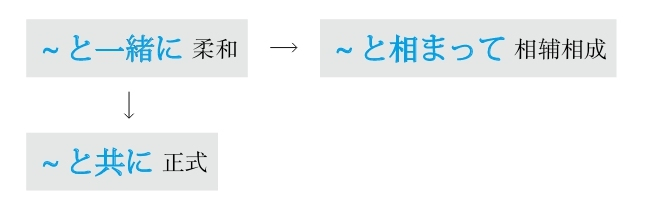

### 一～就～

#### ～と
**重点：** 在「と、ば、たら、なら」里，最重要的是顺序。「と」和「なら」分别表示极端，「と」代表“条件性”的极端，「なら」代表“假定性”的极端
**解释：** 「と」可以理解为“脱（落）、突（发）”，表示出现的某种事物马上就会脱落出或突发下一种事物，即表示条件性强或速度快
**意思：** 只要～；一～就～
**注意：** 后句里不能用“义务、许可、命令、意志”的表达方式
**接续：** 谓语词（动词、形容词、助动词）的原形

例句：<ruby>長<rp>(</rp><rt>ちょう</rt><rp>)</rp></ruby><ruby>時<rp>(</rp><rt>じ</rt><rp>)</rp></ruby><ruby>間<rp>(</rp><rt>かん</rt><rp>)</rp></ruby><ruby>本<rp>(</rp><rt>ほん</rt><rp>)</rp></ruby>を<ruby>読<rp>(</rp><rt>よ</rt><rp>)</rp></ruby>む**と** <ruby>目<rp>(</rp><rt>め</rt><rp>)</rp></ruby>が<ruby>疲<rp>(</rp><rt>つか</rt><rp>)</rp></ruby>れる。
直译：有长时间看书这个条件，就会有眼睛疲劳这个结果。
意译：一长时间看书，眼睛就会疲劳。

#### ～かと思うと
**解释：** 「か」表示不确定；第一个「と」表示内容；「<ruby>思<rp>(</rp><rt>おも</rt><rp>)</rp></ruby>う」的意思是“想”；第二个「と」表示条件
**意思：** 刚一～就～
**重点：** 侧重于刚在想某事，还没有确定时，就发生了下一件事
**表示：** 动作快
**接续：** 动词和形容词的简体、形容动词和名词

例句：<ruby>信<rp>(</rp><rt>しん</rt><rp>)</rp></ruby><ruby>号<rp>(</rp><rt>ごう</rt><rp>)</rp></ruby>が<ruby>青<rp>(</rp><rt>あお</rt><rp>)</rp></ruby>になった**かと<ruby>思<rp>(</rp><rt>おも</rt><rp>)</rp></ruby>うと** 、すぐに<ruby>赤<rp>(</rp><rt>あか</rt><rp>)</rp></ruby>に<ruby>変<rp>(</rp><rt>か</rt><rp>)</rp></ruby>わった。
直译：想着信号灯是不是变成绿的了，马上变成红的了。
意译：红绿灯刚变成绿灯，马上又变成红灯了。

#### －た途端（に）
**解释：** 「た」的意思是“了”，表示动作的完了；「<ruby>途<rp>(</rp><rt>と</rt><rp>)</rp></ruby><ruby>端<rp>(</rp><rt>たん</rt><rp>)</rp></ruby>」的意思是“一条道路的边缘或尽头”；「に」表示方向
**注意：** 「に」可以省略，省略助词后语气正式
**原意：** 走到了路的尽头，马上就要转换路线
**意译：** 刚刚做完某事就发生了下一件事情
**着重：** 动作快
**变形：** 动词的た形的简体（变形规律参照第一章的第二节）

例句：<ruby>布<rp>(</rp><rt>ふ</rt><rp>)</rp></ruby><ruby>団<rp>(</rp><rt>とん</rt><rp>)</rp></ruby>に<ruby>入<rp>(</rp><rt>はい</rt><rp>)</rp></ruby>っ**た<ruby>途<rp>(</rp><rt>と</rt><rp>)</rp></ruby><ruby>端<rp>(</rp><rt>たん</rt><rp>)</rp></ruby>** 、ぐっすり<ruby>眠<rp>(</rp><rt>ねむ</rt><rp>)</rp></ruby>ってしまった。
直译：钻进被窝，马上，呼呼大睡了。
意译：刚钻进被窝就呼呼大睡了。

#### ～や（否や）
**解释：** 两个「や」是表示不确定的「か」的古语；「<ruby>否<rp>(</rp><rt>いな</rt><rp>)</rp></ruby>」表示否定
**意思：** 相当于现代日语的「～かどうか」
**重点：** “不确定”某事物是因为其动作太“快”，所以无法确定
**注意：** 有时省略「<ruby>否<rp>(</rp><rt>いな</rt><rp>)</rp></ruby>や」，只用「や」
**语气：** 正式
**接续：** 动词的原形

例句：<ruby>新<rp>(</rp><rt>しん</rt><rp>)</rp></ruby><ruby>商<rp>(</rp><rt>しょう</rt><rp>)</rp></ruby><ruby>品<rp>(</rp><rt>ひん</rt><rp>)</rp></ruby>の<ruby>販<rp>(</rp><rt>はん</rt><rp>)</rp></ruby><ruby>売<rp>(</rp><rt>ばい</rt><rp>)</rp></ruby>が<ruby>開<rp>(</rp><rt>かい</rt><rp>)</rp></ruby><ruby>始<rp>(</rp><rt>し</rt><rp>)</rp></ruby>される**や<ruby>否<rp>(</rp><rt>いや</rt><rp>)</rp></ruby>や** <ruby>注<rp>(</rp><rt>ちゅう</rt><rp>)</rp></ruby><ruby>文<rp>(</rp><rt>もん</rt><rp>)</rp></ruby>が<ruby>殺<rp>(</rp><rt>さっ</rt><rp>)</rp></ruby><ruby>到<rp>(</rp><rt>とう</rt><rp>)</rp></ruby>した。
直译：新商品的销售被开始，马上，订货就蜂拥而至。
意译：新商品刚一开始销售，订单就蜂拥而至了。

#### ～なり
**解释：** 「なり」是「也」的训读，「也」的音读是「や」，是表示不确定的「か」的古语
**重点：** “不确定”某事物是因为其动作太“快”，所以无法确定
**语气：** 正式
**接续：** 动词的原形

例句：<ruby>私<rp>(</rp><rt>わたし</rt><rp>)</rp></ruby>が<ruby>作<rp>(</rp><rt>つく</rt><rp>)</rp></ruby>った<ruby>料<rp>(</rp><rt>りょう</rt><rp>)</rp></ruby><ruby>理<rp>(</rp><rt>り</rt><rp>)</rp></ruby>を<ruby>一<rp>(</rp><rt>ひと</rt><rp>)</rp></ruby><ruby>口<rp>(</rp><rt>くち</rt><rp>)</rp></ruby><ruby>食<rp>(</rp><rt>た</rt><rp>)</rp></ruby>べる**なり** 、<ruby>父<rp>(</rp><rt>ちち</rt><rp>)</rp></ruby>は<ruby>変<rp>(</rp><rt>へん</rt><rp>)</rp></ruby>な<ruby>顔<rp>(</rp><rt>かお</rt><rp>)</rp></ruby>をした。
直译：吃了一口我做的饭，马上，爸爸的脸上露出了奇怪的表情。
意译：爸爸刚吃了一口我做的饭，马上就露出了奇怪的表情。

#### ～が速いか
**解释：** 「が」是古语中起连接作用的助词；「<ruby>速<rp>(</rp><rt>はや</rt><rp>)</rp></ruby>い」是“快”；「か」表示不确定
**重点：** 动作很快，还没有确定时，下一件事情就发生了
**语气：** 正式
**接续：** 动词的原形

例句：<ruby>地<rp>(</rp><rt>じ</rt><rp>)</rp></ruby><ruby>震<rp>(</rp><rt>しん</rt><rp>)</rp></ruby>だと<ruby>叫<rp>(</rp><rt>さけ</rt><rp>)</rp></ruby>ぶ**が<ruby>速<rp>(</rp><rt>はや</rt><rp>)</rp></ruby>いか** 、みんな<ruby>机<rp>(</rp><rt>つくえ</rt><rp>)</rp></ruby>の<ruby>下<rp>(</rp><rt>した</rt><rp>)</rp></ruby>に<ruby>潜<rp>(</rp><rt>もぐ</rt><rp>)</rp></ruby>り<ruby>込<rp>(</rp><rt>こ</rt><rp>)</rp></ruby>んだ。
直译：喊地震了，很快，大家都钻进桌子底下了。
意译：刚一喊地震了，大家就都钻到桌子底下了。

#### －次第
**解释：** 「<ruby>次<rp>(</rp><rt>つぎ</rt><rp>)</rp></ruby>」的意思是“下一个”；「<ruby>第<rp>(</rp><rt>だい</rt><rp>)</rp></ruby>」的意思是“第二个”；「<ruby>次<rp>(</rp><rt>し</rt><rp>)</rp></ruby><ruby>第<rp>(</rp><rt>だい</rt><rp>)</rp></ruby>」表示“下一步”
**直译：** 下一步就～
**意译：** 马上就～、接下来～
**语气：** 正式
**接续：** 动词的连用形

例句：<ruby>決<rp>(</rp><rt>き</rt><rp>)</rp></ruby>まり**<ruby>次<rp>(</rp><rt>し</rt><rp>)</rp></ruby><ruby>第<rp>(</rp><rt>だい</rt><rp>)</rp></ruby>** ご<ruby>連<rp>(</rp><rt>れん</rt><rp>)</rp></ruby><ruby>絡<rp>(</rp><rt>らく</rt><rp>)</rp></ruby>いたします。
直译：定了，下一步，跟您联系。
意译：定了以后马上跟您联系。
语法关系图

### 应该，必须

#### －なければならない/いけない/だめだ
**解释：** 「なければ」是表示否定的「ない」和表示如果的「ば」接在一起的形式，表示“如果不～”；「ならない」的意思是“不成”；「いけない」的意思是“不行”；「だめ」的意思是“不行”
**区别：** 「ならない」→「いけない」→「だめ」，从左到右语气越发柔和
**意思：** 如果不～就不行
**变形：** 动词的否定形的な（变形规律参照第一章的第二节）

例句：<ruby>試<rp>(</rp><rt>し</rt><rp>)</rp></ruby><ruby>験<rp>(</rp><rt>けん</rt><rp>)</rp></ruby>を<ruby>控<rp>(</rp><rt>ひか</rt><rp>)</rp></ruby>えているから、<ruby>集<rp>(</rp><rt>しゅう</rt><rp>)</rp></ruby><ruby>中<rp>(</rp><rt>ちゅう</rt><rp>)</rp></ruby>して<ruby>頑<rp>(</rp><rt>がん</rt><rp>)</rp></ruby><ruby>張<rp>(</rp><rt>ば</rt><rp>)</rp></ruby>ら**なければいけない** 。
直译：面临着考试，所以不集中精力加油不行。
意译：面临考试，必须集中精力加油。

#### ～べきだ
**解释：** 「<ruby>可<rp>(</rp><rt>べ</rt><rp>)</rp></ruby>き」表示强调语气的“可～”
**直译：** 可得要做～
**意译：** 应该～
**着重：** 责任和义务
**注意：** 表示强调
**接续：** 动词的原形、「する」变为「すべき」或「するべき」

例句：この<ruby>事<rp>(</rp><rt>こと</rt><rp>)</rp></ruby>に<ruby>関<rp>(</rp><rt>かん</rt><rp>)</rp></ruby>して、<ruby>事<rp>(</rp><rt>じ</rt><rp>)</rp></ruby><ruby>前<rp>(</rp><rt>ぜん</rt><rp>)</rp></ruby>に<ruby>許<rp>(</rp><rt>きょ</rt><rp>)</rp></ruby><ruby>可<rp>(</rp><rt>か</rt><rp>)</rp></ruby>をもらう**べきだ** 。
直译：关于这件事，应该事先请求许可。
意译：关于这件事，应该事先得到许可。

#### ～はずだ
**解释：** 「<ruby>筈<rp>(</rp><rt>はず</rt><rp>)</rp></ruby>」是弓的两端系弦的地方；由于系弦的地方应该和弦匹配，所以引申为“客观性的应该”
**着重：** 客观性
**注意：** 没有「～はずではない」这个表达方式
**接续：** 修饰名词的规律（参照第一章的第三节）

例句：もうそろそろ<ruby>着<rp>(</rp><rt>つ</rt><rp>)</rp></ruby>く**はずだ** 。
直译：应该差不多该到了。
意译：应该快到了吧。

#### ～わけだ
**解释：** 「<ruby>訳<rp>(</rp><rt>わけ</rt><rp>)</rp></ruby>」的起源是「<ruby>分<rp>(</rp><rt>わ</rt><rp>)</rp></ruby>ける」，意思是“道理”
**原意：** 道理
**直译：** 从道理上来讲应该～
**意译：** 理所应当；也就是说
**接续：** 修饰名词的规律（参照第一章的第三节）

例句：<ruby>日<rp>(</rp><rt>に</rt><rp>)</rp></ruby><ruby>本<rp>(</rp><rt>ほん</rt><rp>)</rp></ruby>に<ruby>長<rp>(</rp><rt>なが</rt><rp>)</rp></ruby><ruby>年<rp>(</rp><rt>ねん</rt><rp>)</rp></ruby>いたから、<ruby>日<rp>(</rp><rt>に</rt><rp>)</rp></ruby><ruby>本<rp>(</rp><rt>ほん</rt><rp>)</rp></ruby><ruby>語<rp>(</rp><rt>ご</rt><rp>)</rp></ruby>が<ruby>上<rp>(</rp><rt>じょう</rt><rp>)</rp></ruby><ruby>手<rp>(</rp><rt>ず</rt><rp>)</rp></ruby>な**わけだ** 。
直译：在日本呆了长年，日语理所应当好。
意译：在日本呆了很多年，日语当然好了。

#### ～わけにはいかない
**解释：** 「<ruby>訳<rp>(</rp><rt>わけ</rt><rp>)</rp></ruby>」的起源是「<ruby>分<rp>(</rp><rt>わ</rt><rp>)</rp></ruby>ける」，意思是“道理”；「に」表示方向；「は」表示强调；「いかない」的汉字是「<ruby>行<rp>(</rp><rt>い</rt><rp>)</rp></ruby>かない」，表示“不往～的方向走”
**原意：** 道理
**直译：** 不朝～的道理的方向去
**意译：** 从基本道理上来讲都不应该～
**接续：** 修饰名词的规律（参照第一章的第三节）

例句：<ruby>教<rp>(</rp><rt>きょう</rt><rp>)</rp></ruby><ruby>師<rp>(</rp><rt>し</rt><rp>)</rp></ruby>として<ruby>遅<rp>(</rp><rt>ち</rt><rp>)</rp></ruby><ruby>刻<rp>(</rp><rt>こく</rt><rp>)</rp></ruby>する**わけにはいかない** 。
直译：作为教师，从起码的道理上来讲都不应该迟到。
意译：作为一名教师，从起码的道理上来讲都不能迟到。

#### ～ものではない
**解释：** 「もの」接在句尾表示强调；「ではない」的意思是“不是～”
**重点：** 因为强调无法翻译，所以借助于同样表示强调的「<ruby>可<rp>(</rp><rt>べ</rt><rp>)</rp></ruby>き」的翻译，即“应该”
**意思：** 不应该～
**注意：** 「ものではない」比「べきではない」语气柔和；「～ものだ」的意思是“可、真、可真、就”
**接续：** 动词的原形

例句：<ruby>小<rp>(</rp><rt>ちい</rt><rp>)</rp></ruby>さい<ruby>子<rp>(</rp><rt>こ</rt><rp>)</rp></ruby><ruby>供<rp>(</rp><rt>ども</rt><rp>)</rp></ruby>を<ruby>一人<rp>(</rp><rt>ひとり</rt><rp>)</rp></ruby>で<ruby>遠<rp>(</rp><rt>とお</rt><rp>)</rp></ruby>くに<ruby>遊<rp>(</rp><rt>あそ</rt><rp>)</rp></ruby>びに<ruby>行<rp>(</rp><rt>い</rt><rp>)</rp></ruby>かせる**ものではない** 。
直译：小孩子一个人远的地方，让他去玩儿，不应该。
意译：不应该让小孩子一个人去远地方玩儿。
语法关系图

### （没）有做～的意思

#### －ようとする
**解释：** 「－よう」是动词的意志形；「と」表示内容；「する」代替了大多数的动词
**意思：** 有做～的意愿
**着重：** 本人的意志和意愿
**解释：** “意志”英语为will，因此日语的意志形就可以理解为要去做某事。动词的意志形后面加上「と」才能表示will
**变形：** 动词的意志形（变形规律参照第一章的第二节）

例句：<ruby>今<rp>(</rp><rt>いま</rt><rp>)</rp></ruby>メールを<ruby>出<rp>(</rp><rt>だ</rt><rp>)</rp></ruby>**そうとしている** 。
直译：现在正有发信息的意愿。
意译：现在正要发信息。

#### －ようとしない
**解释：** 「－よう」是动词的意志形；「と」表示内容；「しない」是代替了大多数动词的「する」的否定
**意思：** 没有做～的意愿
**着重：** 本人的意志和意愿
**解释：** “意志”英语为will，因此日语的意志形就可以理解为要去做某事。动词的意志形后面加上「と」才能表示will
**注意：** 意志形的否定有两个：前面是否定的「－まいとする」和后面是否定的「－ようとしない」。按照日语里“前轻后重”的语法准则，后面是否定的比前面是否定的语气强烈，所以「－まいとする」翻译成“不想要”，「－ようとしない」翻译成“完全不想要”
**变形：** 动词的意志形（变形规律参照第一章的第二节）

例句：もう<ruby>遅<rp>(</rp><rt>おそ</rt><rp>)</rp></ruby>いのに、<ruby>子<rp>(</rp><rt>こ</rt><rp>)</rp></ruby><ruby>供<rp>(</rp><rt>ども</rt><rp>)</rp></ruby>は<ruby>全然<rp>(</rp><rt>ぜんぜん</rt><rp>)</rp></ruby><ruby>寝<rp>(</rp><rt>ね</rt><rp>)</rp></ruby>**ようとしない** 。
直译：已经晚了，但是孩子一点儿要睡觉的意思都没有。
意译：都已经这么晚了，孩子却一点儿要睡觉的意思都没有。

#### －そうもない/－そうにない
**解释：** 「<ruby>相<rp>(</rp><rt>そう</rt><rp>)</rp></ruby>」的前面接谓语词的连用形，表示“好像”；「も」的意思是“连”；「に」表示副词；「ない」的意思是“没有”
**直译：** 连～的好像都没有
**意译：** 不可能～
**着重：** 样子
**接续：** 动词和形容词的连用形、形容动词

例句：<ruby>雨<rp>(</rp><rt>あめ</rt><rp>)</rp></ruby>が<ruby>止<rp>(</rp><rt>や</rt><rp>)</rp></ruby>み**そうにない** 。
直译：雨没有停的样子。
意译：雨没有停的意思。

例句：この<ruby>調<rp>(</rp><rt>ちょう</rt><rp>)</rp></ruby><ruby>子<rp>(</rp><rt>し</rt><rp>)</rp></ruby>なら、<ruby>時<rp>(</rp><rt>じ</rt><rp>)</rp></ruby><ruby>間<rp>(</rp><rt>かん</rt><rp>)</rp></ruby><ruby>通<rp>(</rp><rt>どお</rt><rp>)</rp></ruby>りに<ruby>終<rp>(</rp><rt>お</rt><rp>)</rp></ruby>わり**そうにない** 。
直译：这个样子的话，按时完的样子没有。
意译：照这个样子的话，不可能按时完成。
语法关系图

### 又不是～

#### ～じゃあるまいし
**解释：** 「じゃ」是「では」的口语形式；「まい」是否定的推量，在此表示「ないでしょう」，意思是“不～吧”；「し」的意思是“又”；「～じゃあるまい」是「～ではないでしょう」
**意思：** 又不是～
**区别：** 比「～じゃないし」语气柔和
**接续：** 名词

例句：<ruby>子<rp>(</rp><rt>こ</rt><rp>)</rp></ruby><ruby>供<rp>(</rp><rt>ども</rt><rp>)</rp></ruby>**じゃあるまいし** 、これぐらいの<ruby>礼<rp>(</rp><rt>れい</rt><rp>)</rp></ruby><ruby>儀<rp>(</rp><rt>ぎ</rt><rp>)</rp></ruby>もわからないの？
直译：又不是孩子，这点儿小礼节都不明白吗？
意译：又不是孩子，连这点儿小礼节都不懂吗？

### 与～有关

#### ～に関係がある
**解释：** 「に」表示对象；「<ruby>関<rp>(</rp><rt>かん</rt><rp>)</rp></ruby><ruby>係<rp>(</rp><rt>けい</rt><rp>)</rp></ruby>」的意思是“关系”；「が」表示小主语；「ある」的意思是“有”
**意思：** 与～有关系
**接续：** 名词

例句：この<ruby>事<rp>(</rp><rt>こと</rt><rp>)</rp></ruby>は<ruby>私<rp>(</rp><rt>わたし</rt><rp>)</rp></ruby>**には<ruby>関<rp>(</rp><rt>かん</rt><rp>)</rp></ruby><ruby>係<rp>(</rp><rt>けい</rt><rp>)</rp></ruby>がない** 。
直译：这事跟我没关系。
意译：这事与我无关。

#### ～に関わる
**解释：** 「に」表示对象；「<ruby>関<rp>(</rp><rt>かか</rt><rp>)</rp></ruby>わる」的意思是“关”
**直译：** 关于～
**意译：** 与～有关系
**语气：** 正式
**接续：** 名词

例句：<ruby>昇<rp>(</rp><rt>しょう</rt><rp>)</rp></ruby><ruby>進<rp>(</rp><rt>しん</rt><rp>)</rp></ruby>**に<ruby>関<rp>(</rp><rt>かか</rt><rp>)</rp></ruby>わる** <ruby>問<rp>(</rp><rt>もん</rt><rp>)</rp></ruby><ruby>題<rp>(</rp><rt>だい</rt><rp>)</rp></ruby>だから、<ruby>気<rp>(</rp><rt>き</rt><rp>)</rp></ruby>をつけよう。
直译：与晋升有关的问题，要注意。
意译：这是有关晋升的问题，小心点儿吧。

#### ～に係る
**解释：** 「に」表示对象；「<ruby>係<rp>(</rp><rt>かか</rt><rp>)</rp></ruby>る」的意思是“系”
**意思：** 与～有关系
**语气：** 正式
**接续：** 名词

例句：<ruby>報<rp>(</rp><rt>ほう</rt><rp>)</rp></ruby><ruby>酬<rp>(</rp><rt>しゅう</rt><rp>)</rp></ruby><ruby>改<rp>(</rp><rt>かい</rt><rp>)</rp></ruby><ruby>定<rp>(</rp><rt>てい</rt><rp>)</rp></ruby>**に<ruby>係<rp>(</rp><rt>かか</rt><rp>)</rp></ruby>る** <ruby>案<rp>(</rp><rt>あん</rt><rp>)</rp></ruby>はまだ<ruby>最<rp>(</rp><rt>さい</rt><rp>)</rp></ruby><ruby>終<rp>(</rp><rt>しゅう</rt><rp>)</rp></ruby><ruby>決<rp>(</rp><rt>けっ</rt><rp>)</rp></ruby><ruby>定<rp>(</rp><rt>てい</rt><rp>)</rp></ruby>の<ruby>段<rp>(</rp><rt>だん</rt><rp>)</rp></ruby><ruby>階<rp>(</rp><rt>かい</rt><rp>)</rp></ruby>には<ruby>入<rp>(</rp><rt>はい</rt><rp>)</rp></ruby>っていない。
直译：与工资改革有关系的方案还没有进入最终决定的阶段。
意译：有关工资改革的方案还没有进入最终决定的阶段。
语法关系图
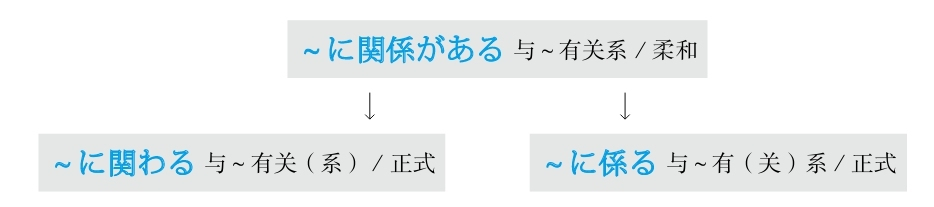

### 越～越～

#### －ば～ほど
**解释：** 「ば」的意思是“如果”，在此是提及话题，为了引起注意；表示程度高的助词「ほど」体现“（超）越”
**注意：** 「ば」可以省略
**变形：** ば形（变形规律参照第一章的第二节）
**接续：** 「ほど」前用动词和形容词的原形、形容动词な或である

例句：（<ruby>習<rp>(</rp><rt>なら</rt><rp>)</rp></ruby>え**ば** ）<ruby>習<rp>(</rp><rt>なら</rt><rp>)</rp></ruby>う**ほど** <ruby>難<rp>(</rp><rt>むずか</rt><rp>)</rp></ruby>しく<ruby>感<rp>(</rp><rt>かん</rt><rp>)</rp></ruby>じる。
直译：（如果学的话）那么越学越觉得不懂。
意译：觉得越学越不懂。

#### ～に限って
**解释：** 「に」表示方向或对象；「<ruby>限<rp>(</rp><rt>かぎ</rt><rp>)</rp></ruby>って」是自动词「<ruby>限<rp>(</rp><rt>かぎ</rt><rp>)</rp></ruby>る」的中顿形式，表示“极限”
**直译：** 只限于～
**意译：** 越～
**接续：** 名词

例句：<ruby>簡<rp>(</rp><rt>かん</rt><rp>)</rp></ruby><ruby>単<rp>(</rp><rt>たん</rt><rp>)</rp></ruby>な<ruby>問<rp>(</rp><rt>もん</rt><rp>)</rp></ruby><ruby>題<rp>(</rp><rt>だい</rt><rp>)</rp></ruby>**に<ruby>限<rp>(</rp><rt>かぎ</rt><rp>)</rp></ruby>って** <ruby>答<rp>(</rp><rt>こた</rt><rp>)</rp></ruby>えられない。
直译：只限于简单的问题，回答不上来。
意译：越是简单的问题越回答不上来。
语法关系图

### 原因

#### ～から
**解释：** 接续助词（接在谓语词后）
**表示：** 原因
**语气：** 主观
**接续：** 谓语词（动词、形容词、助动词）的简体和敬体

例句：<ruby>内<rp>(</rp><rt>ない</rt><rp>)</rp></ruby><ruby>陸<rp>(</rp><rt>りく</rt><rp>)</rp></ruby>だ**から** 、<ruby>空<rp>(</rp><rt>くう</rt><rp>)</rp></ruby><ruby>気<rp>(</rp><rt>き</rt><rp>)</rp></ruby>が<ruby>乾<rp>(</rp><rt>かん</rt><rp>)</rp></ruby><ruby>燥<rp>(</rp><rt>そう</rt><rp>)</rp></ruby>している。
直译：因为是内陆，所以空气干燥。
意译：因为是内陆，所以空气很干燥。

#### ～ので
**解释：** 接续助词（接在谓语词后）；「の」是名词化；「で」表示原因
**表示：** 原因
**语气：** 客观
**接续：** 动词和形容词的简体和敬体、形容动词和名词加な

例句：<ruby>経<rp>(</rp><rt>けい</rt><rp>)</rp></ruby><ruby>験<rp>(</rp><rt>けん</rt><rp>)</rp></ruby>がまだ<ruby>浅<rp>(</rp><rt>あさ</rt><rp>)</rp></ruby>い**ので** 、<ruby>宜<rp>(</rp><rt>よろ</rt><rp>)</rp></ruby>しくお<ruby>願<rp>(</rp><rt>ねが</rt><rp>)</rp></ruby>いいたします。
直译：经验还浅，所以请您多关照。
意译：经验不足，请多关照。

#### ～ため
**解释：** 「<ruby>為<rp>(</rp><rt>ため</rt><rp>)</rp></ruby>」的意思是“因为”
**表示：** 原因
**语气：** 正式
**区别：** 「ため」后面是否加「に」需要根据是否需要将「に」表示的“而”翻译出来而定，需要通过上下文来判断是否加
**接续：** 修饰名词的规律（参照第一章的第三节）

例句：レポート<ruby>提<rp>(</rp><rt>てい</rt><rp>)</rp></ruby><ruby>出<rp>(</rp><rt>しゅつ</rt><rp>)</rp></ruby>の<ruby>締<rp>(</rp><rt>し</rt><rp>)</rp></ruby>め<ruby>切<rp>(</rp><rt>き</rt><rp>)</rp></ruby>りに<ruby>間<rp>(</rp><rt>ま</rt><rp>)</rp></ruby>に<ruby>合<rp>(</rp><rt>あ</rt><rp>)</rp></ruby>わなかった**ため、** <ruby>減<rp>(</rp><rt>げん</rt><rp>)</rp></ruby><ruby>点<rp>(</rp><rt>てん</rt><rp>)</rp></ruby>されてしまった。
直译：小论文的提交期限没有赶上，因此，被减了分。
意译：由于没有赶在截止日期之前提交小论文，结果被减了分。

#### ～おかげで
**解释：** 「お<ruby>陰<rp>(</rp><rt>かげ</rt><rp>)</rp></ruby>」的意思是“托～的福”；「で」是「です」的中顿形式
**直译：** 托～的福
**重点：** 带来好的结果
**注意：** 不能用「～おかげさまで」。「おかげさまで」（托您的福）只能用于句首
**接续：** 修饰名词的规律（参照第一章的第三节）

例句：<ruby>若<rp>(</rp><rt>わか</rt><rp>)</rp></ruby>い<ruby>時<rp>(</rp><rt>とき</rt><rp>)</rp></ruby>から<ruby>体<rp>(</rp><rt>からだ</rt><rp>)</rp></ruby>を<ruby>鍛<rp>(</rp><rt>きた</rt><rp>)</rp></ruby>えてきた**おかげで** 、<ruby>病<rp>(</rp><rt>びょう</rt><rp>)</rp></ruby><ruby>院<rp>(</rp><rt>いん</rt><rp>)</rp></ruby>には<ruby>無<rp>(</rp><rt>む</rt><rp>)</rp></ruby><ruby>縁<rp>(</rp><rt>えん</rt><rp>)</rp></ruby>だ。
直译：从年轻时开始就一直锻炼身体，托它的福，跟医院无缘。
意译：由于我从年轻时开始就一直锻炼身体，所以跟医院无缘。

#### ～せいで
**解释：** 「<ruby>所<rp>(</rp><rt>せ</rt><rp>)</rp></ruby><ruby>為<rp>(</rp><rt>い</rt><rp>)</rp></ruby>」的意思是“怪罪”；「で」是「です」的中顿形式
**直译：** 是～的所为
**重点：** 带来不好的结果
**接续：** 修饰名词的规律（参照第一章的第三节）

例句：<ruby>道<rp>(</rp><rt>みち</rt><rp>)</rp></ruby>が<ruby>混<rp>(</rp><rt>こ</rt><rp>)</rp></ruby>んだ**せいで** 、<ruby>遅<rp>(</rp><rt>おく</rt><rp>)</rp></ruby>れてきた。
直译：道路混杂，就是它的所为（就怪它），来晚了。
意译：堵车，所以来晚了。

#### ～によって
**解释：** 「に」表示方向或对象；「よって」是自动词「<ruby>由<rp>(</rp><rt>よ</rt><rp>)</rp></ruby>る」的中顿形式，意思有“根据～、由于～、由～来做～”
**意思：** 由于～
**语气：** 正式
**接续：** 名词

例句：<ruby>先<rp>(</rp><rt>せん</rt><rp>)</rp></ruby><ruby>端<rp>(</rp><rt>たん</rt><rp>)</rp></ruby><ruby>技<rp>(</rp><rt>ぎ</rt><rp>)</rp></ruby><ruby>術<rp>(</rp><rt>じゅつ</rt><rp>)</rp></ruby>を<ruby>駆<rp>(</rp><rt>く</rt><rp>)</rp></ruby><ruby>使<rp>(</rp><rt>し</rt><rp>)</rp></ruby>すること**によって** 、より<ruby>便<rp>(</rp><rt>べん</rt><rp>)</rp></ruby><ruby>利<rp>(</rp><rt>り</rt><rp>)</rp></ruby>な<ruby>生<rp>(</rp><rt>せい</rt><rp>)</rp></ruby><ruby>活<rp>(</rp><rt>かつ</rt><rp>)</rp></ruby>ができるようになった。
直译：由于驱使先端技术，所以更加便利的生活变得能够了。
意译：由于能够运用先端技术，所以生活变得更加方便了。

#### ～が故に
**解释：** 「が」是古语中起连接作用的助词；「<ruby>故<rp>(</rp><rt>ゆえ</rt><rp>)</rp></ruby>」的意思是“缘故”；「に」表示副词
**意思：** ～的缘故
**注意：** 「が」在此相当于现代日语的「の」，有时省略
**语气：** 正式
**接续：** 动词和形容词的简体、名词和形容动词

例句：<ruby>友<rp>(</rp><rt>ゆう</rt><rp>)</rp></ruby><ruby>人<rp>(</rp><rt>じん</rt><rp>)</rp></ruby>からの<ruby>忠<rp>(</rp><rt>ちゅう</rt><rp>)</rp></ruby><ruby>告<rp>(</rp><rt>こく</rt><rp>)</rp></ruby>を<ruby>聞<rp>(</rp><rt>き</rt><rp>)</rp></ruby>かなかった**が<ruby>故<rp>(</rp><rt>ゆえ</rt><rp>)</rp></ruby>に** 、この<ruby>始<rp>(</rp><rt>し</rt><rp>)</rp></ruby><ruby>末<rp>(</rp><rt>まつ</rt><rp>)</rp></ruby>になってしまった。
直译：从朋友那里来的忠告没有听，这个缘故，成为了这个地步。
意译：由于没有听朋友的忠告，才落到了这个地步。

#### ～次第で
**解释：** 「<ruby>次<rp>(</rp><rt>つぎ</rt><rp>)</rp></ruby>」的意思是“下一个”；「<ruby>第<rp>(</rp><rt>だい</rt><rp>)</rp></ruby>」的意思是“第二个”；「<ruby>次<rp>(</rp><rt>し</rt><rp>)</rp></ruby><ruby>第<rp>(</rp><rt>だい</rt><rp>)</rp></ruby>」表示“下一步”；「で」表示原因
**着重：** 有多个原因
**直译：** 由于～几条原因，所以～
**接续：** 名词加の、形容动词加な

例句：<ruby>以<rp>(</rp><rt>い</rt><rp>)</rp></ruby><ruby>上<rp>(</rp><rt>じょう</rt><rp>)</rp></ruby>のような**<ruby>次<rp>(</rp><rt>し</rt><rp>)</rp></ruby><ruby>第<rp>(</rp><rt>だい</rt><rp>)</rp></ruby>で** <ruby>退<rp>(</rp><rt>たい</rt><rp>)</rp></ruby><ruby>学<rp>(</rp><rt>がく</rt><rp>)</rp></ruby>させていただきます。
直译：由于以上的几条原因，请让我退学。
意译：由于以上原因，请让我退学。

#### ～とあって
**解释：** 「と」表示内容；「あって」是自动词「<ruby>有<rp>(</rp><rt>あ</rt><rp>)</rp></ruby>る」的中顿形式
**意思：** 有～事宜
**注意：** 表示某事发生后出现了后面的事情，通过上下文才翻译成了“因为”
**语气：** 正式
**接续：** 任何词

例句：<ruby>開<rp>(</rp><rt>かい</rt><rp>)</rp></ruby><ruby>店<rp>(</rp><rt>てん</rt><rp>)</rp></ruby>セール**とあって** 、<ruby>店<rp>(</rp><rt>てん</rt><rp>)</rp></ruby><ruby>内<rp>(</rp><rt>ない</rt><rp>)</rp></ruby>は<ruby>客<rp>(</rp><rt>きゃく</rt><rp>)</rp></ruby>でごった<ruby>返<rp>(</rp><rt>がえ</rt><rp>)</rp></ruby>していた。
直译：有开店促销这回事，商店内顾客很拥挤。
意译：由于是开店促销，商店里挤满了顾客。

#### ～とて/～こととて
**解释：** 「と」表示内容；「て」是「あって」的省略形式；起名词化作用的「こと」语气正式
**意思：** 有～事宜，～
**注意：** 表示某事发生后出现了后面的事情，通过上下文才翻译成了“因为”
**区别：** 因为是「～とあって」的省略形式，所以语法表达难度高，且语气正式
**接续：** 「～とて」前可以接任何词；「～こととて」接修饰名词的规律（参照第一章的第三节）

例句：<ruby>急<rp>(</rp><rt>きゅう</rt><rp>)</rp></ruby>な**こととて** 、ゆっくりとごあいさつにも<ruby>伺<rp>(</rp><rt>うかが</rt><rp>)</rp></ruby>えませんでした。
直译：有突然这回事，慢慢地打招呼都没有能够去。
意译：因为非常突然，都没能好好去打招呼。
语法关系图
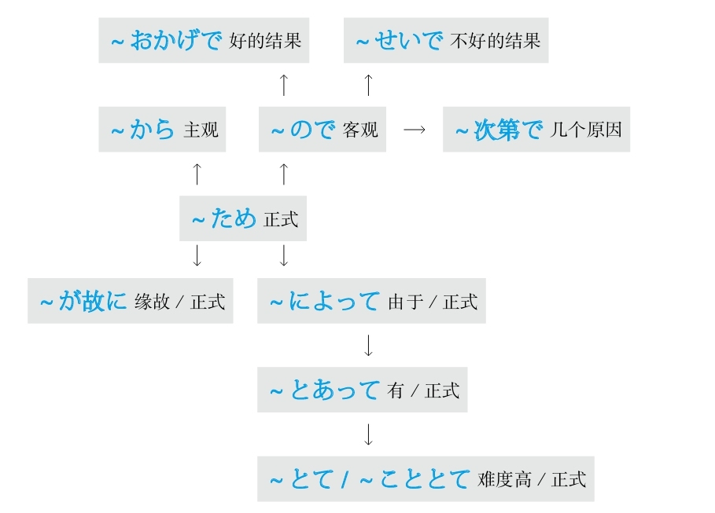

## Z
### 在

#### ～に
**解释：** 表示“方向、对象、目的、目标”
**注意：** 用于地点则强调方向

例句：ここ**に** <ruby>書<rp>(</rp><rt>か</rt><rp>)</rp></ruby>いてください。
直译：请写在这里。

#### ～で
**解释：** 表示“在某个地方做某事、交通、方法、范围、程度、原因、状态”
**注意：** 用于地点则强调范围

例句：ここ**で** <ruby>書<rp>(</rp><rt>か</rt><rp>)</rp></ruby>いてください。
直译：请在这里写。

#### ～にあって
**解释：** 「に」表示方向；「あって」是自动词「<ruby>有<rp>(</rp><rt>あ</rt><rp>)</rp></ruby>る」的中顿形式
**意思：** 在～身上
**接续：** 名词

例句：あの<ruby>事<rp>(</rp><rt>こと</rt><rp>)</rp></ruby>は<ruby>私<rp>(</rp><rt>わたし</rt><rp>)</rp></ruby>**にあって** まだ<ruby>鮮<rp>(</rp><rt>せん</rt><rp>)</rp></ruby><ruby>明<rp>(</rp><rt>めい</rt><rp>)</rp></ruby>に<ruby>覚<rp>(</rp><rt>おぼ</rt><rp>)</rp></ruby>えている。
直译：那件事，在我身上，还鲜明地记着。
意译：那件事对我来说还记忆犹新。

#### ～にあたって
**解释：** 「に」表示方向；「あたって」是自动词「<ruby>当<rp>(</rp><rt>あ</rt><rp>)</rp></ruby>たる」的中顿形式，意思是“相当”
**直译：** 相当于～
**意译：** 在～之际
**语气：** 正式
**接续：** 表示事件、工作的名词；动词的原形

例句：<ruby>開会<rp>(</rp><rt>かいかい</rt><rp>)</rp></ruby>（する）**にあたり** 、<ruby>社<rp>(</rp><rt>しゃ</rt><rp>)</rp></ruby><ruby>長<rp>(</rp><rt>ちょう</rt><rp>)</rp></ruby>に<ruby>一<rp>(</rp><rt>ひと</rt><rp>)</rp></ruby><ruby>言<rp>(</rp><rt>こと</rt><rp>)</rp></ruby>ごあいさついただきたいと<ruby>思<rp>(</rp><rt>おも</rt><rp>)</rp></ruby>います。
直译：在开始会议，我们想请社长说一句话。
意译：在会议开始之际，我们想请社长为我们致词。

#### ～において
**解释：** 「に」表示方向；「おいて」是自动词「<ruby>於<rp>(</rp><rt>お</rt><rp>)</rp></ruby>く」的中顿形式，意思是“于”
**意思：** 于～
**语气：** 正式
**注意：** 后面接名词时用「～における」
**接续：** 时间、地点、状况、团体等名词

例句：<ruby>上<rp>(</rp><rt>じょう</rt><rp>)</rp></ruby><ruby>級<rp>(</rp><rt>きゅう</rt><rp>)</rp></ruby><ruby>者<rp>(</rp><rt>しゃ</rt><rp>)</rp></ruby>**において** 、<ruby>発<rp>(</rp><rt>はつ</rt><rp>)</rp></ruby><ruby>音<rp>(</rp><rt>おん</rt><rp>)</rp></ruby>の<ruby>重<rp>(</rp><rt>じゅう</rt><rp>)</rp></ruby><ruby>要<rp>(</rp><rt>よう</rt><rp>)</rp></ruby><ruby>性<rp>(</rp><rt>せい</rt><rp>)</rp></ruby>と<ruby>文<rp>(</rp><rt>ぶん</rt><rp>)</rp></ruby><ruby>法<rp>(</rp><rt>ぽう</rt><rp>)</rp></ruby>の<ruby>煩<rp>(</rp><rt>わずら</rt><rp>)</rp></ruby>わしさをますます<ruby>感<rp>(</rp><rt>かん</rt><rp>)</rp></ruby>じていると<ruby>思<rp>(</rp><rt>おも</rt><rp>)</rp></ruby>う。
直译：于高级班的人，发音的重要性和语法的繁琐性，越发感受到了，我觉得。
意译：我认为高级班的学生越发感到了发音的重要性和语法的繁琐性。

#### ～にかけては
**解释：** 「に」表示方向；「かけて」是他动词「かける」的中顿形式，意思是“大面积地覆盖”；「は」表示对比性强调
**意思：** 在～方面
**注意：** 用于比较于其他方面，在某方面特别突出；「は」不能省略
**接续：** 名词

例句：<ruby>気<rp>(</rp><rt>き</rt><rp>)</rp></ruby><ruby>立<rp>(</rp><rt>だ</rt><rp>)</rp></ruby>て**にかけては** <ruby>誰<rp>(</rp><rt>だれ</rt><rp>)</rp></ruby>にも<ruby>負<rp>(</rp><rt>ま</rt><rp>)</rp></ruby>けない。
直译：在脾气秉性方面，谁都不输给。
意译：在脾气秉性方面我不输给任何人。

#### ～上で
**解释：** 「<ruby>上<rp>(</rp><rt>うえ</rt><rp>)</rp></ruby>」的意思是“上面”；「で」表示范围
**意思：** 在～上
**接续：** 动词的原形

例句：<ruby>適<rp>(</rp><rt>てき</rt><rp>)</rp></ruby><ruby>当<rp>(</rp><rt>とう</rt><rp>)</rp></ruby>な<ruby>運<rp>(</rp><rt>うん</rt><rp>)</rp></ruby><ruby>動<rp>(</rp><rt>どう</rt><rp>)</rp></ruby>をするのは、<ruby>健<rp>(</rp><rt>けん</rt><rp>)</rp></ruby><ruby>康<rp>(</rp><rt>こう</rt><rp>)</rp></ruby>と<ruby>美<rp>(</rp><rt>び</rt><rp>)</rp></ruby><ruby>容<rp>(</rp><rt>よう</rt><rp>)</rp></ruby>を<ruby>保<rp>(</rp><rt>たも</rt><rp>)</rp></ruby>つ**<ruby>上<rp>(</rp><rt>うえ</rt><rp>)</rp></ruby>で** <ruby>大<rp>(</rp><rt>たい</rt><rp>)</rp></ruby><ruby>切<rp>(</rp><rt>せつ</rt><rp>)</rp></ruby>です。
直译：适当的运动做，在健康和美容保持上，重要。
意译：做适当的运动在保持健康和美容方面很重要。
语法关系图

### 在～之后

#### －て
**解释：** 「て」是“手”，在古代因为没有标点符号，所以用手势来表示停顿，后来「<ruby>手<rp>(</rp><rt>て</rt><rp>)</rp></ruby>」用于语法当中形成了固定的表示“中顿”的形式
**注意：** 谓语词（动词、形容词、助动词）之间的罗列
**意思：** ～了
**重点：** 相当于逗号，因此在一个句子当中可以用数次
**变形：** 动词的て形（变形规律参照第一章的第二节）

例句：<ruby>本<rp>(</rp><rt>ほん</rt><rp>)</rp></ruby>を<ruby>読<rp>(</rp><rt>よ</rt><rp>)</rp></ruby>ん**で** 、<ruby>昼<rp>(</rp><rt>ひる</rt><rp>)</rp></ruby>ごはんを<ruby>食<rp>(</rp><rt>た</rt><rp>)</rp></ruby>べ**て** 、<ruby>昼<rp>(</rp><rt>ひる</rt><rp>)</rp></ruby><ruby>寝<rp>(</rp><rt>ね</rt><rp>)</rp></ruby>し**て** …
直译：看了书（后），吃了午饭（后），睡了午觉（后）……
意译：看书，吃午饭，睡午觉……

#### －てから
**解释：** 「て」表示中顿，翻译成“了”；「から」是“从～、～之后”
**意思：** ～了之后
**注意：** 为避免表达方式过于冗长，所以只能用一次
**变形：** 动词的て形（变形规律参照第一章的第二节）

例句：ご<ruby>飯<rp>(</rp><rt>はん</rt><rp>)</rp></ruby>を<ruby>食<rp>(</rp><rt>た</rt><rp>)</rp></ruby>べ**てから** <ruby>行<rp>(</rp><rt>い</rt><rp>)</rp></ruby>きます。
直译：饭吃了之后去。
意译：吃完饭就去。

#### －てからというもの
**解释：** 「て」表示中顿，翻译成“了”；「から」是“从～、～之后”；「という」是为了前后接续；「もの」表示强调，翻译成“可、真、可真、就是”
**意思：** 就是～了之后
**着重：** 强调
**变形：** 动词的て形（变形规律参照第一章的第二节）

例句：<ruby>恋<rp>(</rp><rt>こい</rt><rp>)</rp></ruby><ruby>人<rp>(</rp><rt>びと</rt><rp>)</rp></ruby>が<ruby>帰<rp>(</rp><rt>かえ</rt><rp>)</rp></ruby>って<ruby>来<rp>(</rp><rt>き</rt><rp>)</rp></ruby>**てからというもの** 、<ruby>彼女<rp>(</rp><rt>かのじょ</rt><rp>)</rp></ruby>は<ruby>見<rp>(</rp><rt>み</rt><rp>)</rp></ruby><ruby>違<rp>(</rp><rt>ちが</rt><rp>)</rp></ruby>えるほど<ruby>元<rp>(</rp><rt>げん</rt><rp>)</rp></ruby><ruby>気<rp>(</rp><rt>き</rt><rp>)</rp></ruby>になった。
直译：就是恋人回来了以后，她才像换了一个人那么程度高地，变得精神。
意译：就是在恋人回来以后，她才像变了一个人一样，特别精神。

#### －てからでないと
**解释：** 「て」表示中顿，翻译成“了”；「から」是“从～、～之后”；「でない」的意思是“不是”；「と」表示条件
**意思：** 如果不是做了～的话、只要不是做了～的话
**着重：** 契机
**变形：** 动词的て形（变形规律参照第一章的第二节）

例句：<ruby>基<rp>(</rp><rt>き</rt><rp>)</rp></ruby><ruby>礎<rp>(</rp><rt>そ</rt><rp>)</rp></ruby><ruby>練<rp>(</rp><rt>れん</rt><rp>)</rp></ruby><ruby>習<rp>(</rp><rt>しゅう</rt><rp>)</rp></ruby>のプロセスを<ruby>経<rp>(</rp><rt>けい</rt><rp>)</rp></ruby><ruby>験<rp>(</rp><rt>けん</rt><rp>)</rp></ruby>し**てからでないと** 、その<ruby>重<rp>(</rp><rt>じゅう</rt><rp>)</rp></ruby><ruby>要<rp>(</rp><rt>よう</rt><rp>)</rp></ruby><ruby>性<rp>(</rp><rt>せい</rt><rp>)</rp></ruby>がわからない。
直译：基础练习的过程经历了之后，如果不是这样的话，其重要性不明白。
意译：不经历基础练习的过程，之后就不会体会到它的重要性。

#### －て以来
**解释：** 「て」表示中顿，翻译成“了”；「<ruby>以<rp>(</rp><rt>い</rt><rp>)</rp></ruby><ruby>来<rp>(</rp><rt>らい</rt><rp>)</rp></ruby>」相当于表示“之后”的「から」
**意思：** 在做了～以来
**语气：** 正式
**变形：** 动词的て形（变形规律参照第一章的第二节）

例句：<ruby>日<rp>(</rp><rt>に</rt><rp>)</rp></ruby><ruby>本<rp>(</rp><rt>ほん</rt><rp>)</rp></ruby><ruby>語<rp>(</rp><rt>ご</rt><rp>)</rp></ruby>を<ruby>習<rp>(</rp><rt>なら</rt><rp>)</rp></ruby>っ**て<ruby>以<rp>(</rp><rt>い</rt><rp>)</rp></ruby><ruby>来<rp>(</rp><rt>らい</rt><rp>)</rp></ruby>** 、<ruby>日<rp>(</rp><rt>に</rt><rp>)</rp></ruby><ruby>本<rp>(</rp><rt>ほん</rt><rp>)</rp></ruby><ruby>語<rp>(</rp><rt>ご</rt><rp>)</rp></ruby>の<ruby>面<rp>(</rp><rt>おも</rt><rp>)</rp></ruby><ruby>白<rp>(</rp><rt>しろ</rt><rp>)</rp></ruby>さを<ruby>充<rp>(</rp><rt>じゅう</rt><rp>)</rp></ruby><ruby>分<rp>(</rp><rt>ぶん</rt><rp>)</rp></ruby><ruby>味<rp>(</rp><rt>あじ</rt><rp>)</rp></ruby>わってきた。
直译：学习日语以来，日语的有意思的地方，充分地体会过来了。
意译：学习日语以来，（我）一直充分感受着日语的有趣之处。

#### －たら
**解释：** 「た」相当于「て」，表示“了”；「ら」在古语里表示假设
**变形：** 动词的た形的简体（变形规律参照第一章的第二节）

**重点：** 用于动词的将来时
**意思：** 做了～之后

例句：<ruby>家<rp>(</rp><rt>いえ</rt><rp>)</rp></ruby>に<ruby>着<rp>(</rp><rt>つ</rt><rp>)</rp></ruby>い**たら** <ruby>連<rp>(</rp><rt>れん</rt><rp>)</rp></ruby><ruby>絡<rp>(</rp><rt>らく</rt><rp>)</rp></ruby>してね。
直译：到家了，联系啊。
意译：到家后跟我联系啊。

**重点：** 用于动词的过去式
**意思：** 做了～之后，结果～
**着重：** 发现了某事或与自己的假设相反

例句：<ruby>窓<rp>(</rp><rt>まど</rt><rp>)</rp></ruby>を<ruby>開<rp>(</rp><rt>あ</rt><rp>)</rp></ruby>け**たら** <ruby>雪<rp>(</rp><rt>ゆき</rt><rp>)</rp></ruby>が<ruby>降<rp>(</rp><rt>ふ</rt><rp>)</rp></ruby>っていた。
直译：打开了窗户，结果，下雪了。
意译：打开窗户，结果发现下雪了。

例句：<ruby>行<rp>(</rp><rt>い</rt><rp>)</rp></ruby>っ**たら** 、<ruby>彼<rp>(</rp><rt>かれ</rt><rp>)</rp></ruby>はいなかった。
直译：去了，结果，他没在。
意译：去了，结果他没在。

#### －た後で
**解释：** 「た」相当于「て」，表示“了”；「<ruby>後<rp>(</rp><rt>あと</rt><rp>)</rp></ruby>」的意思是“之后”；「で」的意思是“在”
**意思：** 在做了～之后
**语气：** 正式
**变形：** 动词的た形的简体（变形规律参照第一章的第二节）

例句：<ruby>家<rp>(</rp><rt>いえ</rt><rp>)</rp></ruby>を<ruby>建<rp>(</rp><rt>た</rt><rp>)</rp></ruby>て**た<ruby>後<rp>(</rp><rt>あと</rt><rp>)</rp></ruby>で** <ruby>後<rp>(</rp><rt>こう</rt><rp>)</rp></ruby><ruby>悔<rp>(</rp><rt>かい</rt><rp>)</rp></ruby>した。
直译：盖房子了之后，后悔了。
意译：盖了房子以后后悔了。

#### －た末に
**解释：** 「た」相当于「て」，表示“了”；「<ruby>末<rp>(</rp><rt>すえ</rt><rp>)</rp></ruby>」的意思是“之后”；「に」的意思是“在”
**意思：** 在做了～之后
**语气：** 正式
**变形：** 动词的た形的简体（变形规律参照第一章的第二节）

例句：<ruby>苦<rp>(</rp><rt>くる</rt><rp>)</rp></ruby>しみ<ruby>抜<rp>(</rp><rt>ぬ</rt><rp>)</rp></ruby>い**た<ruby>末<rp>(</rp><rt>すえ</rt><rp>)</rp></ruby>に** <ruby>勝<rp>(</rp><rt>か</rt><rp>)</rp></ruby>ち<ruby>取<rp>(</rp><rt>と</rt><rp>)</rp></ruby>った。
直译：在受苦之末，取得了胜利。
意译：长期受苦之后终于取得了胜利。

#### －たあげく
**解释：** 「た」相当于「て」，表示“了”；「<ruby>挙<rp>(</rp><rt>あげ</rt><rp>)</rp></ruby><ruby>句<rp>(</rp><rt>く</rt><rp>)</rp></ruby>」的意思是“最后的句子”
**起源：** 日本连歌的最后的句子
**意思：** 在做了～之后
**着重：** 经历很长的时间或很多的事情
**注意：** 有时后面加「に」，表示“在”
**语气：** 正式
**变形：** 动词的た形的简体（变形规律参照第一章的第二节）

例句：さんざん<ruby>悩<rp>(</rp><rt>なや</rt><rp>)</rp></ruby>ん**だあげく** 、<ruby>辞<rp>(</rp><rt>じ</rt><rp>)</rp></ruby><ruby>職<rp>(</rp><rt>しょく</rt><rp>)</rp></ruby>をすることにした。
直译：惨痛地头疼了，长时间后，决定辞职。
意译：痛苦了很长时间后决定辞职。

#### －た上で
**解释：** 「た」相当于「て」，表示“了”；「<ruby>上<rp>(</rp><rt>うえ</rt><rp>)</rp></ruby>」表示“上面”；「で」表示范围
**意思：** 在做了～的基础之上
**着重：** 步骤和基础
**语气：** 正式
**变形：** 动词的た形的简体（变形规律参照第一章的第二节）

例句：<ruby>親<rp>(</rp><rt>おや</rt><rp>)</rp></ruby>とよく<ruby>相<rp>(</rp><rt>そう</rt><rp>)</rp></ruby><ruby>談<rp>(</rp><rt>だん</rt><rp>)</rp></ruby>し**た<ruby>上<rp>(</rp><rt>うえ</rt><rp>)</rp></ruby>で** ご<ruby>返<rp>(</rp><rt>へん</rt><rp>)</rp></ruby><ruby>事<rp>(</rp><rt>じ</rt><rp>)</rp></ruby>します。
直译：和父母亲好好商量了的基础之上，回信。
意译：和父母亲好好商量之后给您回信。

#### －たが最後
**解释：** 「た」相当于「て」，表示“了”；「が」是古语中起连接作用的助词；「<ruby>最<rp>(</rp><rt>さい</rt><rp>)</rp></ruby><ruby>後<rp>(</rp><rt>ご</rt><rp>)</rp></ruby>」的意思是“最后、没救了”
**意思：** 在做了～之后就没救了
**着重：** 一发不可收拾
**语气：** 正式
**变形：** 动词的た形的简体（变形规律参照第一章的第二节）

例句：あの<ruby>人<rp>(</rp><rt>ひと</rt><rp>)</rp></ruby>はカラオケが<ruby>好<rp>(</rp><rt>す</rt><rp>)</rp></ruby>きで、マイクを<ruby>握<rp>(</rp><rt>にぎ</rt><rp>)</rp></ruby>っ**たが<ruby>最<rp>(</rp><rt>さい</rt><rp>)</rp></ruby><ruby>後<rp>(</rp><rt>ご</rt><rp>)</rp></ruby>** 、<ruby>他<rp>(</rp><rt>ほか</rt><rp>)</rp></ruby>の<ruby>人<rp>(</rp><rt>ひと</rt><rp>)</rp></ruby>には<ruby>渡<rp>(</rp><rt>わた</rt><rp>)</rp></ruby>さない。
直译：那个人喜欢唱歌，握住了麦克风，就没救了，不给其他人。
意译：那个人喜欢唱歌，握住了麦克风后就一发不可收拾，再也不肯让给别人。
语法关系图

### 在～之前

#### ～前に
**解释：** 「<ruby>前<rp>(</rp><rt>まえ</rt><rp>)</rp></ruby>」的意思是“前”；「に」表示方向，意思是“在”
**意思：** 在将要做～之前
**接续：** 动词的原形、名词の

例句：<ruby>出<rp>(</rp><rt>で</rt><rp>)</rp></ruby>かける**<ruby>前<rp>(</rp><rt>まえ</rt><rp>)</rp></ruby>に** 、<ruby>火<rp>(</rp><rt>ひ</rt><rp>)</rp></ruby><ruby>元<rp>(</rp><rt>もと</rt><rp>)</rp></ruby>をちゃんと<ruby>確<rp>(</rp><rt>かく</rt><rp>)</rp></ruby><ruby>認<rp>(</rp><rt>にん</rt><rp>)</rp></ruby>してください。
直译：在出门前，请把火源好好地确认。
意译：出门前请好好确认有没有关火。

#### ～に先だち
**解释：** 「に」表示方向；「<ruby>先<rp>(</rp><rt>さき</rt><rp>)</rp></ruby>」的意思是“时间在～之前”；「だち」是自动词「<ruby>経<rp>(</rp><rt>た</rt><rp>)</rp></ruby>つ」的连用形，与前面名词接续后浊音化
**直译：** 在将要做～之前经历
**意译：** 在将要做～之前发生
**注意：** 经常会把「<ruby>経<rp>(</rp><rt>た</rt><rp>)</rp></ruby>つ」错写成「<ruby>立<rp>(</rp><rt>た</rt><rp>)</rp></ruby>つ」
**语气：** 正式
**接续：** 动词的原形、名词

例句：<ruby>新<rp>(</rp><rt>しん</rt><rp>)</rp></ruby><ruby>車<rp>(</rp><rt>しゃ</rt><rp>)</rp></ruby>の<ruby>発<rp>(</rp><rt>はつ</rt><rp>)</rp></ruby><ruby>売<rp>(</rp><rt>ばい</rt><rp>)</rp></ruby>（する）**に<ruby>先<rp>(</rp><rt>さき</rt><rp>)</rp></ruby>だち** 、<ruby>展<rp>(</rp><rt>てん</rt><rp>)</rp></ruby><ruby>示<rp>(</rp><rt>じ</rt><rp>)</rp></ruby><ruby>会<rp>(</rp><rt>かい</rt><rp>)</rp></ruby>が<ruby>開<rp>(</rp><rt>ひら</rt><rp>)</rp></ruby>かれた。
直译：在新车的销售之前发生了展览会被召开的事情。
意译：在销售新车之前开了展览会。
语法关系图

### 正在

#### －ている
**解释：** 「て」表示中顿，起将前面的动词和后面的「いる」连接的作用；「いる」的意思是“在”
**注意：** 表示动词的现在进行时
**着重：** 动作的正在进行、持续的动作、持续的状态
**意思：** 正在～、一直～
**变形：** 动词的て形（变形规律参照第一章的第二节）

**意1：** 正在做～

例句：<ruby>今<rp>(</rp><rt>いま</rt><rp>)</rp></ruby>その<ruby>問<rp>(</rp><rt>もん</rt><rp>)</rp></ruby><ruby>題<rp>(</rp><rt>だい</rt><rp>)</rp></ruby>を<ruby>議<rp>(</rp><rt>ぎ</rt><rp>)</rp></ruby><ruby>論<rp>(</rp><rt>ろん</rt><rp>)</rp></ruby>し**ている** よ。
直译：现在那个问题，正在讨论着。
意译：我们正在讨论那个问题。

**意2：** 持续性地做～

例句：<ruby>最<rp>(</rp><rt>さい</rt><rp>)</rp></ruby><ruby>近<rp>(</rp><rt>きん</rt><rp>)</rp></ruby>、<ruby>日<rp>(</rp><rt>に</rt><rp>)</rp></ruby><ruby>本<rp>(</rp><rt>ほん</rt><rp>)</rp></ruby><ruby>語<rp>(</rp><rt>ご</rt><rp>)</rp></ruby>を<ruby>習<rp>(</rp><rt>なら</rt><rp>)</rp></ruby>っ**ています** 。
直译：最近，正在学日语。
意译：最近在学日语。

**意3：** 用自动词表示持续的状态

例句：ドアが<ruby>開<rp>(</rp><rt>あ</rt><rp>)</rp></ruby>い**ています** 。
直译：门开着。

#### －つつある
**解释：** 「つつ」相当于汉语的“次次”；「ある」的汉字是「<ruby>在<rp>(</rp><rt>あ</rt><rp>)</rp></ruby>る」，是表示现在进行时的「いる」的古语，意思是“正在”
**直译：** 正在一次一次地～
**意译：** 正在一步一步地～
**区别：** 相当于现代日语的「少しずつ―ている」，语气正式
**接续：** 动词的连用形

例句：<ruby>町<rp>(</rp><rt>まち</rt><rp>)</rp></ruby>の<ruby>様<rp>(</rp><rt>よう</rt><rp>)</rp></ruby><ruby>子<rp>(</rp><rt>す</rt><rp>)</rp></ruby>は<ruby>変<rp>(</rp><rt>か</rt><rp>)</rp></ruby>わり**つつある** 。
直译：街道的样子，在一步一步地变化。
意译：街道的样子在一点一点地发生变化。
语法关系图

### 值得做

#### ～に値する/～に値しない
**解释：** 「に」表示方向；名词「<ruby>値<rp>(</rp><rt>あたい</rt><rp>)</rp></ruby>」的意思是“数值、值得”，加上「する」后变为动词
**意思：** 值得～
**接续：** 名词、动词的原形

例句：<ruby>彼<rp>(</rp><rt>かれ</rt><rp>)</rp></ruby>がやったことは<ruby>賞<rp>(</rp><rt>しょう</rt><rp>)</rp></ruby><ruby>賛<rp>(</rp><rt>さん</rt><rp>)</rp></ruby>（する）**に<ruby>値<rp>(</rp><rt>あたい</rt><rp>)</rp></ruby>する** 。
直译：他干了的事，值得称赞。
意译：他干的事值得称赞。

#### ～に足る/～に足りない
**解释：** 「に」表示方向；「<ruby>足<rp>(</rp><rt>た</rt><rp>)</rp></ruby>る」的意思是“足”；「<ruby>足<rp>(</rp><rt>た</rt><rp>)</rp></ruby>りない」的意思是“不足”
**直译：** 足于～；不足于～
**意译：** 用得着～、值得～/用不着～、不值得～
**接续：** 名词、动词的原形

例句：<ruby>彼<rp>(</rp><rt>かれ</rt><rp>)</rp></ruby>は<ruby>信<rp>(</rp><rt>しん</rt><rp>)</rp></ruby><ruby>頼<rp>(</rp><rt>らい</rt><rp>)</rp></ruby>（する）**に<ruby>足<rp>(</rp><rt>た</rt><rp>)</rp></ruby>る** <ruby>人<rp>(</rp><rt>じん</rt><rp>)</rp></ruby><ruby>物<rp>(</rp><rt>ぶつ</rt><rp>)</rp></ruby>です。
直译：他是足于信赖的人。
意译：他是个值得信任的人。

例句：こんなに<ruby>高<rp>(</rp><rt>たか</rt><rp>)</rp></ruby>い<ruby>実<rp>(</rp><rt>じつ</rt><rp>)</rp></ruby><ruby>力<rp>(</rp><rt>りょく</rt><rp>)</rp></ruby>なら、<ruby>彼<rp>(</rp><rt>かれ</rt><rp>)</rp></ruby>は<ruby>恐<rp>(</rp><rt>おそ</rt><rp>)</rp></ruby>れる**に<ruby>足<rp>(</rp><rt>た</rt><rp>)</rp></ruby>りない** 。
直译：这么高的实力的话，他不足于害怕。
意译：实力这么强，他用不着害怕。

#### ～甲斐がある/～甲斐がない
**解释：** 「<ruby>甲<rp>(</rp><rt>か</rt><rp>)</rp></ruby><ruby>斐<rp>(</rp><rt>い</rt><rp>)</rp></ruby>」的意思是“价值”；「が」表示小主语；「ある」的意思是“有”
**意思：** 有～的价值
**接续：** 名词の、动词的简体

例句：<ruby>苦<rp>(</rp><rt>く</rt><rp>)</rp></ruby><ruby>労<rp>(</rp><rt>ろう</rt><rp>)</rp></ruby>した**<ruby>甲<rp>(</rp><rt>か</rt><rp>)</rp></ruby><ruby>斐<rp>(</rp><rt>い</rt><rp>)</rp></ruby>がある。**
直译：受苦了的价值有。
意译：受的苦终于有了回报。

#### ～には当たらない
**解释：** 「に」表示方向；「は」表示强调；「<ruby>当<rp>(</rp><rt>あ</rt><rp>)</rp></ruby>たらない」的意思是“不相当”
**直译：** 不相当于～
**意译：** 没有必要～；不值得～
**接续：** 名词、动词的原形

例句：<ruby>彼<rp>(</rp><rt>かれ</rt><rp>)</rp></ruby>の<ruby>実<rp>(</rp><rt>じつ</rt><rp>)</rp></ruby><ruby>力<rp>(</rp><rt>りょく</rt><rp>)</rp></ruby>を<ruby>考<rp>(</rp><rt>かんが</rt><rp>)</rp></ruby>えると、<ruby>今<rp>(</rp><rt>こん</rt><rp>)</rp></ruby><ruby>回<rp>(</rp><rt>かい</rt><rp>)</rp></ruby>の<ruby>彼<rp>(</rp><rt>かれ</rt><rp>)</rp></ruby>の<ruby>受<rp>(</rp><rt>じゅ</rt><rp>)</rp></ruby><ruby>賞<rp>(</rp><rt>しょう</rt><rp>)</rp></ruby>は<ruby>驚<rp>(</rp><rt>おどろ</rt><rp>)</rp></ruby>く**には<ruby>当<rp>(</rp><rt>あ</rt><rp>)</rp></ruby>たらない** 。
直译：他的实力考虑的话，这次的他的得奖，不相当于吃惊。
意译：考虑到他的实力就用不着对他的这次得奖感到吃惊了。

例句：<ruby>彼<rp>(</rp><rt>かれ</rt><rp>)</rp></ruby>の<ruby>行<rp>(</rp><rt>こう</rt><rp>)</rp></ruby><ruby>為<rp>(</rp><rt>い</rt><rp>)</rp></ruby>は<ruby>称<rp>(</rp><rt>しょう</rt><rp>)</rp></ruby><ruby>賛<rp>(</rp><rt>さん</rt><rp>)</rp></ruby>**には<ruby>当<rp>(</rp><rt>あ</rt><rp>)</rp></ruby>たらない** 。
直译：他的行为不相当于称赞。
意译：他的行为不值得称赞。
语法关系图

### 只要

#### ～と
**重点：** 在「と、ば、たら、なら」里，最重要的是顺序。「と」和「なら」分别表示极端，「と」代表“条件性”的极端，「なら」代表“假定性”的极端
**解释：** 「と」可以理解为“脱（落）、突（发）”，表示出现的某种事物马上就会脱落出或突发下一种事物，即表示条件性强或速度快
**意思：** 只要～；一～就～
**注意：** 后句里不能用“义务、许可、命令、意志”的表达方式
**接续：** 谓语词（动词、形容词、助动词）的原形

例句：<ruby>親<rp>(</rp><rt>おや</rt><rp>)</rp></ruby>と<ruby>一<rp>(</rp><rt>いっ</rt><rp>)</rp></ruby><ruby>緒<rp>(</rp><rt>しょ</rt><rp>)</rp></ruby>にいる**と** <ruby>安<rp>(</rp><rt>あん</rt><rp>)</rp></ruby><ruby>心<rp>(</rp><rt>しん</rt><rp>)</rp></ruby>していられる。
直译：只要和父母在一起，能够保持安心的状态。
意译：只要和父母在一起就会一直安心。

#### ～限り
**解释：** 「<ruby>限<rp>(</rp><rt>かぎ</rt><rp>)</rp></ruby>り」是自动词「<ruby>限<rp>(</rp><rt>かぎ</rt><rp>)</rp></ruby>る」的连用形，作名词用，意思是“极限”
**意思：** 只要～
**语气：** 强烈
**接续：** 修饰名词的规律（参照第一章的第三节）

例句：<ruby>親<rp>(</rp><rt>おや</rt><rp>)</rp></ruby>と<ruby>一<rp>(</rp><rt>いっ</rt><rp>)</rp></ruby><ruby>緒<rp>(</rp><rt>しょ</rt><rp>)</rp></ruby>にいる**<ruby>限<rp>(</rp><rt>かぎ</rt><rp>)</rp></ruby>り** <ruby>自<rp>(</rp><rt>じ</rt><rp>)</rp></ruby><ruby>由<rp>(</rp><rt>ゆう</rt><rp>)</rp></ruby>にはなれない。
直译：只要和父母在一起，不能够变得自由。
意译：只要和父母在一起就不会自由。

#### ～さえ－ば
**解释：** 「さえ」举出极端的事物；「さ」表示「それ」，「え」是表示“方向”的「へ」
**直译：** 往那个方向
**意译：** 连～
**解释：** 「ば」表示条件；「～さえ－ば」表示“只要有某个条件就会出现某种结果”
**接续：** 「さえ」前接名词和助词
**变形：** ば形（变形规律参照第一章的第二节）

例句：<ruby>時<rp>(</rp><rt>じ</rt><rp>)</rp></ruby><ruby>間<rp>(</rp><rt>かん</rt><rp>)</rp></ruby>**さえ** あれ**ば** 、<ruby>問<rp>(</rp><rt>もん</rt><rp>)</rp></ruby><ruby>題<rp>(</rp><rt>だい</rt><rp>)</rp></ruby>はないと<ruby>思<rp>(</rp><rt>おも</rt><rp>)</rp></ruby>う。
直译：只要有时间就没有问题，我想。
意译：我想，只要有时间就没有问题。
语法关系图

### 只是、只有

#### ～だけで
**解释：** 「だけ」的意思是“只、仅”；「で」表示程度
**意思：** 只是～的程度
**接续：** 任何词

例句：<ruby>単<rp>(</rp><rt>たん</rt><rp>)</rp></ruby><ruby>語<rp>(</rp><rt>ご</rt><rp>)</rp></ruby>を<ruby>覚<rp>(</rp><rt>おぼ</rt><rp>)</rp></ruby>える**だけで** <ruby>語<rp>(</rp><rt>ご</rt><rp>)</rp></ruby><ruby>学<rp>(</rp><rt>がく</rt><rp>)</rp></ruby><ruby>力<rp>(</rp><rt>りょく</rt><rp>)</rp></ruby>が<ruby>向<rp>(</rp><rt>こう</rt><rp>)</rp></ruby><ruby>上<rp>(</rp><rt>じょう</rt><rp>)</rp></ruby>しない。
直译：只是记单词的程度，外语能力不提高。
意译：只是记单词，外语能力不会提高。

#### ただでさえ～
**解释：** 「ただ」的汉字是「<ruby>唯<rp>(</rp><rt>ただ</rt><rp>)</rp></ruby>、<ruby>只<rp>(</rp><rt>ただ</rt><rp>)</rp></ruby>、<ruby>徒<rp>(</rp><rt>ただ</rt><rp>)</rp></ruby>」；「で」表示程度；「さえ」的意思是“连～”
**直译：** 只是一丁点儿的程度就～
**意译：** 本来就～，现在就更加～
**词性：** 副词

例句：**ただでさえ** <ruby>怖<rp>(</rp><rt>こわ</rt><rp>)</rp></ruby>い<ruby>先<rp>(</rp><rt>せん</rt><rp>)</rp></ruby><ruby>生<rp>(</rp><rt>せい</rt><rp>)</rp></ruby>は、<ruby>試<rp>(</rp><rt>し</rt><rp>)</rp></ruby><ruby>験<rp>(</rp><rt>けん</rt><rp>)</rp></ruby>の<ruby>日<rp>(</rp><rt>ひ</rt><rp>)</rp></ruby>には<ruby>余<rp>(</rp><rt>よ</rt><rp>)</rp></ruby><ruby>計<rp>(</rp><rt>けい</rt><rp>)</rp></ruby><ruby>怖<rp>(</rp><rt>こわ</rt><rp>)</rp></ruby>く<ruby>見<rp>(</rp><rt>み</rt><rp>)</rp></ruby>える。
直译：只是一丁点儿的程度就很可怕的老师，考试那天看上去更加可怕。
意译：本来就可怕的老师，考试当天看上去越发可怕。

#### ～だに
**解释：** 「だ」是「だけ」的省略，表示“只、仅”；「に」表示副词；「だに」是「だけで」的古语形式
**意思：** 只是～
**语气：** 正式
**接续：** 名词和动词的原形，常接「<ruby>想<rp>(</rp><rt>そう</rt><rp>)</rp></ruby><ruby>像<rp>(</rp><rt>ぞう</rt><rp>)</rp></ruby>する、<ruby>考<rp>(</rp><rt>かんが</rt><rp>)</rp></ruby>える、<ruby>思<rp>(</rp><rt>おも</rt><rp>)</rp></ruby>い<ruby>出<rp>(</rp><rt>だ</rt><rp>)</rp></ruby>す、<ruby>聞<rp>(</rp><rt>き</rt><rp>)</rp></ruby>く」等

例句：その<ruby>事<rp>(</rp><rt>こと</rt><rp>)</rp></ruby>は<ruby>考<rp>(</rp><rt>かんが</rt><rp>)</rp></ruby>える**だに** <ruby>冷<rp>(</rp><rt>ひや</rt><rp>)</rp></ruby><ruby>汗<rp>(</rp><rt>あせ</rt><rp>)</rp></ruby>が<ruby>出<rp>(</rp><rt>で</rt><rp>)</rp></ruby>る。
直译：那件事，只是想想就出冷汗。
意译：只是想想那件事就出冷汗。

#### ～だけに
**解释：** 「だけ」在此的意思是“只是”；「に」表示副词
**直译：** 只是～、就是～
**意译：** 就是因为～
**重点：** 此处的因果关系不是通过「～だけに」，而是通过上下文推测的
**注意：** 多用于带来不好的后果；带来好的结果的原因用「～おかげで」（托～的福）
**接续：** 动词和形容词的简体、名词、形容动词加な

例句：<ruby>彼<rp>(</rp><rt>かれ</rt><rp>)</rp></ruby>の<ruby>指<rp>(</rp><rt>し</rt><rp>)</rp></ruby><ruby>摘<rp>(</rp><rt>てき</rt><rp>)</rp></ruby>は<ruby>正<rp>(</rp><rt>ただ</rt><rp>)</rp></ruby>しい**だけに** 、かえって<ruby>私<rp>(</rp><rt>わたし</rt><rp>)</rp></ruby>は<ruby>反<rp>(</rp><rt>はん</rt><rp>)</rp></ruby><ruby>発<rp>(</rp><rt>ぱつ</rt><rp>)</rp></ruby>を<ruby>感<rp>(</rp><rt>かん</rt><rp>)</rp></ruby>じた。
直译：只是他的指正太正确了，反倒，我感到了逆反。
意译：就是因为他对我的指正太正确了，反倒引起了我的逆反心理。

#### ～しかない
**解释：** 「し」的意思是“强”，构成的单词有「<ruby>強<rp>(</rp><rt>し</rt><rp>)</rp></ruby>いる（强迫）」；「か」表示添加；「しか」表示加强；「ない」的意思是“没有”
**直译：** ～是最强的，除了～以外没有其他更～的
**意译：** 只有～
**区别：** 比「だけ」语气强
**接续：** 动词的原形；表示“人”以外的名词（表示“人”的名词用「～しかいない」）

例句：<ruby>誰<rp>(</rp><rt>だれ</rt><rp>)</rp></ruby>もいないので<ruby>帰<rp>(</rp><rt>かえ</rt><rp>)</rp></ruby>る**しかない** 。
直译：谁都不在，除了回去以外没有其他办法。
意译：没有人，所以只有回去了。

#### ～ほかない
**解释：** 「ほか」的汉字是「<ruby>他<rp>(</rp><rt>ほか</rt><rp>)</rp></ruby>、<ruby>外<rp>(</rp><rt>ほか</rt><rp>)</rp></ruby>」；「ない」的意思是“没有”
**直译：** 没有其他～
**意译：** 只有～
**区别：** 「～しかない」侧重于“只有～”，「～ほかない」侧重于“没有其他～”
**接续：** 动词的原形

例句：<ruby>留<rp>(</rp><rt>りゅう</rt><rp>)</rp></ruby><ruby>学<rp>(</rp><rt>がく</rt><rp>)</rp></ruby>するお<ruby>金<rp>(</rp><rt>かね</rt><rp>)</rp></ruby>がないので、<ruby>留<rp>(</rp><rt>りゅう</rt><rp>)</rp></ruby><ruby>学<rp>(</rp><rt>がく</rt><rp>)</rp></ruby>を<ruby>諦<rp>(</rp><rt>あきら</rt><rp>)</rp></ruby>める**ほかない** 。
直译：留学的钱没有，所以放弃留学，除此之外没有其他办法。
意译：没有去留学的钱，所以只有放弃留学。

#### ～に限って
**解释：** 「に」表示方向或对象；「<ruby>限<rp>(</rp><rt>かぎ</rt><rp>)</rp></ruby>って」是自动词「<ruby>限<rp>(</rp><rt>かぎ</rt><rp>)</rp></ruby>る」的中顿形式，表示“极限”
**意思：** 只限于～
**注意：** 「～に限って」既可以表示“极限”，也可以表示“越～”
**接续：** 名词

例句：<ruby>簡<rp>(</rp><rt>かん</rt><rp>)</rp></ruby><ruby>単<rp>(</rp><rt>たん</rt><rp>)</rp></ruby>な<ruby>問<rp>(</rp><rt>もん</rt><rp>)</rp></ruby><ruby>題<rp>(</rp><rt>だい</rt><rp>)</rp></ruby>**に<ruby>限<rp>(</rp><rt>かぎ</rt><rp>)</rp></ruby>って** <ruby>答<rp>(</rp><rt>こた</rt><rp>)</rp></ruby>えられない。
直译：只限于简单的问题，回答不上来。
意译：越是简单的问题越回答不上来。

#### ～ならでは
**解释：** 「なら」接在名词后表示“如果”，在此是提及话题，为了引起注意；「で」表示状态或程度；「は」表示强调
**直译：** 如果是某事的话，那么在它的状态下就会～
**意译：** 只有～才有～
**接续：** 名词

例句：このチョコレートは<ruby>今年<rp>(</rp><rt>ことし</rt><rp>)</rp></ruby>のバレンタインデー**ならではの** ものです。
直译：这种巧克力，如果是今年的情人节的话，那么在今年的情人节的状态或程度下才会有。
意译：这种巧克力只有今年的情人节才有。

例句：この<ruby>人<rp>(</rp><rt>にん</rt><rp>)</rp></ruby><ruby>形<rp>(</rp><rt>ぎょう</rt><rp>)</rp></ruby>は<ruby>日<rp>(</rp><rt>に</rt><rp>)</rp></ruby><ruby>本<rp>(</rp><rt>ほん</rt><rp>)</rp></ruby>**ならではの** ものです。
直译：这种人偶，如果是日本的话，那么在日本的状态或程度下才会有。
意译：这种人偶只有日本才有。

#### ～まで（のこと）だ
**解释：** 「まで」的意思是“到～的地步”
**意译：** 只有～
**注意：** 加上「のこと」语气正式
**接续：** 任何词

例句：<ruby>彼<rp>(</rp><rt>かれ</rt><rp>)</rp></ruby>がしてくれなければ、<ruby>他<rp>(</rp><rt>ほか</rt><rp>)</rp></ruby>の<ruby>人<rp>(</rp><rt>ひと</rt><rp>)</rp></ruby>を<ruby>探<rp>(</rp><rt>さが</rt><rp>)</rp></ruby>す**までだ** 。
直译：他不给我们做的话，找其他人的地步了。
意译：他不帮我们做的话，我们只有找其他人了。

例句：<ruby>彼<rp>(</rp><rt>かれ</rt><rp>)</rp></ruby>には<ruby>関<rp>(</rp><rt>かん</rt><rp>)</rp></ruby><ruby>係<rp>(</rp><rt>けい</rt><rp>)</rp></ruby>がないかもしれないが、<ruby>念<rp>(</rp><rt>ねん</rt><rp>)</rp></ruby>のため<ruby>知<rp>(</rp><rt>し</rt><rp>)</rp></ruby>らせた**までのことだ** 。
直译：可能跟他没有关系，只是为了保险起见才通知的。
直译：可能跟他没有关系，只是为了保险起见才通知的。

#### 単なる～にすぎない
**解释：** 「<ruby>単<rp>(</rp><rt>たん</rt><rp>)</rp></ruby>なる」的意思是“单单”；「に」表示方向或对象；「すぎない」是自动词「<ruby>過<rp>(</rp><rt>す</rt><rp>)</rp></ruby>ぎる」的否定形式，表示“不过”
**意思：** 只不过～
**注意：** 根据日语中的“前轻后重”的准则，「<ruby>単<rp>(</rp><rt>たん</rt><rp>)</rp></ruby>なる」可以省略
**接续：** 名词

例句：それは**<ruby>単<rp>(</rp><rt>たん</rt><rp>)</rp></ruby>なる** <ruby>言<rp>(</rp><rt>い</rt><rp>)</rp></ruby>い<ruby>訳<rp>(</rp><rt>わけ</rt><rp>)</rp></ruby>**にすぎない** 。
直译：那单纯地不过是个借口。
意译：那只不过是个借口。

#### わずか～足らずで
**解释：** 「わずか」的汉字是「<ruby>僅<rp>(</rp><rt>わず</rt><rp>)</rp></ruby>か」，表示“仅仅”；「<ruby>足<rp>(</rp><rt>た</rt><rp>)</rp></ruby>らず」的意思是“不足”；「で」表示程度
**直译：** 仅仅不足～的程度
**意译：** 只不过～
**注意：** 根据日语中的“前轻后重”的准则，「わずか」可以省略
**接续：** 数量词

例句：<ruby>彼<rp>(</rp><rt>かれ</rt><rp>)</rp></ruby>は**わずか** <ruby>三<rp>(</rp><rt>さん</rt><rp>)</rp></ruby>か<ruby>月<rp>(</rp><rt>げつ</rt><rp>)</rp></ruby>**<ruby>足<rp>(</rp><rt>た</rt><rp>)</rp></ruby>らずで** <ruby>日<rp>(</rp><rt>にち</rt><rp>)</rp></ruby><ruby>常<rp>(</rp><rt>じょう</rt><rp>)</rp></ruby><ruby>会<rp>(</rp><rt>かい</rt><rp>)</rp></ruby><ruby>話<rp>(</rp><rt>わ</rt><rp>)</rp></ruby>を<ruby>身<rp>(</rp><rt>み</rt><rp>)</rp></ruby>につけた。
直译：他仅仅不足3个月的程度就掌握了日常会话。
意译：他不到3个月就掌握了日常会话。
语法关系图

### 状态

#### －ている
**解释：** 动词的て形起逗号的作用，表示中顿；「いる」表示“在”
**接续：** 自动词的て形
**注意：** 动词的现在进行时表示动作的正在进行、持续的动作、持续的状态
**变形：** 动词的て形（变形规律参照第一章的第二节）

例句：<ruby>電<rp>(</rp><rt>でん</rt><rp>)</rp></ruby><ruby>気<rp>(</rp><rt>き</rt><rp>)</rp></ruby>がつい**ている** 。
直译：灯开着。

#### －てある
**解释：** 动词的て形起逗号的作用，表示中顿；「ある」表示“在”
**接续：** 他动词的て形
**重点：** 他动词侧重于有人做。因此，「－てある」的重点在于有人做后成为那种状态
**变形：** 动词的て形（变形规律参照第一章的第二节）

例句：<ruby>本<rp>(</rp><rt>ほん</rt><rp>)</rp></ruby>は<ruby>机<rp>(</rp><rt>つくえ</rt><rp>)</rp></ruby>の<ruby>上<rp>(</rp><rt>うえ</rt><rp>)</rp></ruby>に<ruby>置<rp>(</rp><rt>お</rt><rp>)</rp></ruby>い**てある** 。
直译：有人把书放在桌子上了，书放在桌子上。
意译：书放在桌子上。

**区别：**

例句：ドアは<ruby>開<rp>(</rp><rt>あ</rt><rp>)</rp></ruby>い**ている** 。
单纯叙述“门开着”。

例句：ドアは<ruby>開<rp>(</rp><rt>あ</rt><rp>)</rp></ruby>け**てある** 。
侧重于“有人把门打开了，然后门是开着的”。
语法关系图

### 转折

#### ～が
**解释：** 表示顺接（单纯接续两个句子）、逆接（转折）、省略后句（为了使语气变得柔和）三个意思，此处表示转折
**语气：** 正式
**接续：** 谓语词（动词、形容词、助动词）的简体和敬体

例句：メールを<ruby>出<rp>(</rp><rt>だ</rt><rp>)</rp></ruby>した**が** 、<ruby>先<rp>(</rp><rt>せん</rt><rp>)</rp></ruby><ruby>方<rp>(</rp><rt>ぽう</rt><rp>)</rp></ruby>からの<ruby>返<rp>(</rp><rt>へん</rt><rp>)</rp></ruby><ruby>事<rp>(</rp><rt>じ</rt><rp>)</rp></ruby>はまだ<ruby>来<rp>(</rp><rt>き</rt><rp>)</rp></ruby>ていない。
直译：发了邮件，但是从对方的回信还没有来。
意译：发了邮件，但是对方还没回信。

#### ～けれども
**解释：** 「けれ」是「これ」，表示“这个”；「ども」和「ても」一样表示转折
**注意：** 是「が」的口语；表示顺接（单纯接续两个句子）、逆接（转折）、省略后句（为了使语气变得柔和）三个意思，此处表示转折
**重点：** 「けれども」→「けれど」→「けど」，从左到右语气越发柔和
**接续：** 谓语词（动词、形容词、助动词）的简体和敬体

例句：<ruby>無<rp>(</rp><rt>ぶ</rt><rp>)</rp></ruby><ruby>事<rp>(</rp><rt>じ</rt><rp>)</rp></ruby>に<ruby>合<rp>(</rp><rt>ごう</rt><rp>)</rp></ruby><ruby>格<rp>(</rp><rt>かく</rt><rp>)</rp></ruby>した**けれども** 、<ruby>理<rp>(</rp><rt>り</rt><rp>)</rp></ruby><ruby>解<rp>(</rp><rt>かい</rt><rp>)</rp></ruby>の<ruby>浅<rp>(</rp><rt>あさ</rt><rp>)</rp></ruby>い<ruby>内<rp>(</rp><rt>ない</rt><rp>)</rp></ruby><ruby>容<rp>(</rp><rt>よう</rt><rp>)</rp></ruby>はもう<ruby>一<rp>(</rp><rt>いち</rt><rp>)</rp></ruby><ruby>度<rp>(</rp><rt>ど</rt><rp>)</rp></ruby>しっかり<ruby>復<rp>(</rp><rt>ふく</rt><rp>)</rp></ruby><ruby>習<rp>(</rp><rt>しゅう</rt><rp>)</rp></ruby>する<ruby>必<rp>(</rp><rt>ひつ</rt><rp>)</rp></ruby><ruby>要<rp>(</rp><rt>よう</rt><rp>)</rp></ruby>がある。
直译：平安无事地合格了，但是，理解浅的内容再一遍好好地复习的必要有。
意译：平安无事地合格了，但是理解不深的内容还要好好复习一遍。

#### ～のに
**解释：** 「の」是名词化；「に」表示方向
**准则：** 日语的转折从“强调”和“方向”两个方面来表示
**语气：** 惊讶、消极
**接续：** 动词和形容词的简体、形容动词和名词加な

例句：<ruby>彼<rp>(</rp><rt>かの</rt><rp>)</rp></ruby><ruby>女<rp>(</rp><rt>じょ</rt><rp>)</rp></ruby>は<ruby>日<rp>(</rp><rt>に</rt><rp>)</rp></ruby><ruby>本<rp>(</rp><rt>ほん</rt><rp>)</rp></ruby><ruby>語<rp>(</rp><rt>ご</rt><rp>)</rp></ruby>を<ruby>半<rp>(</rp><rt>はん</rt><rp>)</rp></ruby><ruby>年<rp>(</rp><rt>とし</rt><rp>)</rp></ruby>しか<ruby>習<rp>(</rp><rt>なら</rt><rp>)</rp></ruby>っていない**のに** 、もうこんなにしゃべれるのよ。
直译：她只学了半年，日语就已经这么能说了。
意译：她才学了半年日语就这么能说了。

例句：もうくたくたな**のに** 、<ruby>残<rp>(</rp><rt>ざん</rt><rp>)</rp></ruby><ruby>業<rp>(</rp><rt>ぎょう</rt><rp>)</rp></ruby>しなければいけないと<ruby>言<rp>(</rp><rt>い</rt><rp>)</rp></ruby>われたら、たまらない。
直译：已经累得不行了，但是不加班不行，如果被那样说了，真受不了。
意译：已经累得不行了，还要让我加班，真受不了。

#### ～くせに
**解释：** 名词「<ruby>癖<rp>(</rp><rt>くせ</rt><rp>)</rp></ruby>」的意思是“毛病”；「に」表示副词
**注意：** 「～くせに」是将「～のに」的「の」具体化
**语气：** 责怪他人
**接续：** 修饰名词的规律（参照第一章的第三节）

例句：あの<ruby>人<rp>(</rp><rt>ひと</rt><rp>)</rp></ruby>は<ruby>一人<rp>(</rp><rt>ひとり</rt><rp>)</rp></ruby>では<ruby>何<rp>(</rp><rt>なに</rt><rp>)</rp></ruby>もできない**くせに** 、<ruby>会<rp>(</rp><rt>かい</rt><rp>)</rp></ruby><ruby>社<rp>(</rp><rt>しゃ</rt><rp>)</rp></ruby>ではいつも<ruby>偉<rp>(</rp><rt>えら</rt><rp>)</rp></ruby>そうな<ruby>顔<rp>(</rp><rt>かお</rt><rp>)</rp></ruby>をしている。
直译：那个人一个人什么都干不了，可是在公司里却老是显示出自己比别人强的表情。
意译：那个人一个人什么都干不了，在公司里却老是显得自己比别人强似的。

#### ～ものを
**解释：** 「もの」接在句尾表示强调；「を」表示移动，此处相当于表示方向的「に」
**注意：** 是「のに」的古语
**语气：** 正式
**接续：** 动词和形容词的简体、形容动词加な

例句：<ruby>電<rp>(</rp><rt>でん</rt><rp>)</rp></ruby><ruby>話<rp>(</rp><rt>わ</rt><rp>)</rp></ruby>で<ruby>簡<rp>(</rp><rt>かん</rt><rp>)</rp></ruby><ruby>単<rp>(</rp><rt>たん</rt><rp>)</rp></ruby>に<ruby>済<rp>(</rp><rt>す</rt><rp>)</rp></ruby>ませる**ものを** 。わざわざ<ruby>会<rp>(</rp><rt>あ</rt><rp>)</rp></ruby>いに<ruby>行<rp>(</rp><rt>い</rt><rp>)</rp></ruby>く<ruby>必<rp>(</rp><rt>ひつ</rt><rp>)</rp></ruby><ruby>要<rp>(</rp><rt>よう</rt><rp>)</rp></ruby>はないでしょう。
直译：在电话里就能简单地解决。特地去见面的必要有吗？
意译：在电话里就能简单地解决。有必要特地去见面吗？

#### ～わりには
**解释：** 「わり」是表示算数中的除法的动词「<ruby>割<rp>(</rp><rt>わ</rt><rp>)</rp></ruby>る」的连用形，作名词用，意思是“比例、比率”；「に」表示副词；「は」表示强调
**意思：** 按照比例或比率却～
**注意：** 「～わりに」是将「～のに」的「の」具体化
**接续：** 修饰名词的规律（参照第一章的第三节）

例句：この<ruby>靴<rp>(</rp><rt>くつ</rt><rp>)</rp></ruby>は<ruby>値<rp>(</rp><rt>ね</rt><rp>)</rp></ruby><ruby>段<rp>(</rp><rt>だん</rt><rp>)</rp></ruby>の**わりには** <ruby>丈<rp>(</rp><rt>じょう</rt><rp>)</rp></ruby><ruby>夫<rp>(</rp><rt>ぶ</rt><rp>)</rp></ruby>だ。
直译：这双鞋，按照价格的比例却结实。
意译：这双鞋价格便宜却很结实。

#### －ながら（も）
**解释：** 「ながら」是表示转折的「が」的古语形式
**注意：** 后面有时会接表示强调的「も」
**语气：** 正式
**接续：** 动词的连用形、形容词的原形、形容动词、名词加でありながら

例句：<ruby>狭<rp>(</rp><rt>せま</rt><rp>)</rp></ruby>い**ながらも** <ruby>快<rp>(</rp><rt>かい</rt><rp>)</rp></ruby><ruby>適<rp>(</rp><rt>てき</rt><rp>)</rp></ruby>な<ruby>家<rp>(</rp><rt>いえ</rt><rp>)</rp></ruby>です。
直译：虽然小，但是很舒适的房子。
意译：房子虽然小，但是很舒适。

#### ～ものの
**解释：** 「もの」接在句尾表示强调；「の」与表示转折的「が」意思相同
**意思：** 虽然～，但是～
**着重：** 强调了“虽然～”
**接续：** 动词和形容词的简体、形容动词加な

例句：<ruby>早<rp>(</rp><rt>はや</rt><rp>)</rp></ruby>く<ruby>気<rp>(</rp><rt>き</rt><rp>)</rp></ruby>づいたからよかった**ものの** 、<ruby>気<rp>(</rp><rt>き</rt><rp>)</rp></ruby>づかなかったら、<ruby>事<rp>(</rp><rt>じ</rt><rp>)</rp></ruby><ruby>故<rp>(</rp><rt>こ</rt><rp>)</rp></ruby>になっていたかもしれない。
直译：早发现真是太幸运了，如果没注意可能已经出事故了。
意译：幸亏早发现了，要是没发现，可能已经出事故了。

例句：ルールを<ruby>守<rp>(</rp><rt>まも</rt><rp>)</rp></ruby>ってほしいと<ruby>学<rp>(</rp><rt>がく</rt><rp>)</rp></ruby><ruby>生<rp>(</rp><rt>せい</rt><rp>)</rp></ruby>を<ruby>注<rp>(</rp><rt>ちゅう</rt><rp>)</rp></ruby><ruby>意<rp>(</rp><rt>い</rt><rp>)</rp></ruby>した**ものの** 、<ruby>違<rp>(</rp><rt>い</rt><rp>)</rp></ruby><ruby>反<rp>(</rp><rt>はん</rt><rp>)</rp></ruby>する<ruby>人<rp>(</rp><rt>ひと</rt><rp>)</rp></ruby>が<ruby>絶<rp>(</rp><rt>た</rt><rp>)</rp></ruby>えないので、くたくたになっている。
直译：（强调）虽然提醒学生想让他们遵守规范，但是违反的人不断，所以现在累了。
意译：虽然已经提醒学生们遵守规则了，但是还是有人犯规，我已经累得筋疲力尽了。

#### －つつ
**解释：** 「つつ」的意思是“次次”
**词性：** 名词
**注意：** 「－つつ」后加表示强调的「も」构成「－つつも」，表示转折（虽然次次～，但是～）
**接续：** 动词的连用形

例句：<ruby>参<rp>(</rp><rt>さん</rt><rp>)</rp></ruby><ruby>考<rp>(</rp><rt>こう</rt><rp>)</rp></ruby><ruby>書<rp>(</rp><rt>しょ</rt><rp>)</rp></ruby>を<ruby>持<rp>(</rp><rt>も</rt><rp>)</rp></ruby>って<ruby>来<rp>(</rp><rt>こ</rt><rp>)</rp></ruby>なければと<ruby>思<rp>(</rp><rt>おも</rt><rp>)</rp></ruby>い**つつ（も）** 、<ruby>毎<rp>(</rp><rt>まい</rt><rp>)</rp></ruby><ruby>回<rp>(</rp><rt>かい</rt><rp>)</rp></ruby><ruby>忘<rp>(</rp><rt>わす</rt><rp>)</rp></ruby>れている。
直译：次次想着必须把参考书带来，但是每次忘。
意译：虽然次次想着必须带参考书来，可是每次都忘。

例句：<ruby>遅<rp>(</rp><rt>ち</rt><rp>)</rp></ruby><ruby>刻<rp>(</rp><rt>こく</rt><rp>)</rp></ruby>するのはよくないと<ruby>知<rp>(</rp><rt>し</rt><rp>)</rp></ruby>り**つつ（も）** 、<ruby>毎<rp>(</rp><rt>まい</rt><rp>)</rp></ruby><ruby>回<rp>(</rp><rt>かい</rt><rp>)</rp></ruby><ruby>遅<rp>(</rp><rt>ち</rt><rp>)</rp></ruby><ruby>刻<rp>(</rp><rt>こく</rt><rp>)</rp></ruby>してしまう。
直译：次次知道迟到不好，每次都迟到。
意译：虽然次次知道迟到不好，但是每次都迟到。

#### ～とはいえ
**解释：** 「と」表示内容；「は」表示强调；「いえ」是「<ruby>言<rp>(</rp><rt>い</rt><rp>)</rp></ruby>う」变到え段
**准则：** 古语里将动词变到え段表示转折
**意思：** 虽说～
**语气：** 正式
**注意：** 「とはいえ」还是接续词，即可以单独使用
**接续：** 任何词

例句：あの<ruby>子<rp>(</rp><rt>こ</rt><rp>)</rp></ruby>は<ruby>幼<rp>(</rp><rt>おさな</rt><rp>)</rp></ruby>い**とはいえ** 、しっかりしている。
直译：虽说那个孩子还小，但是很懂事。
意译：虽说那个孩子还小，但是很懂事。

#### ～といえども
**解释：** 「と」表示内容；「は」表示强调；「いえ」是「<ruby>言<rp>(</rp><rt>い</rt><rp>)</rp></ruby>う」变到え段；「ども」和「ても」一样表示转折
**准则：** 古语里将动词变到え段表示转折
**意思：** 虽说～
**语气：** 正式
**接续：** 任何词

例句：<ruby>如<rp>(</rp><rt>い</rt><rp>)</rp></ruby><ruby>何<rp>(</rp><rt>か</rt><rp>)</rp></ruby>に<ruby>多<rp>(</rp><rt>た</rt><rp>)</rp></ruby><ruby>忙<rp>(</rp><rt>ぼう</rt><rp>)</rp></ruby>**といえども** 、<ruby>健<rp>(</rp><rt>けん</rt><rp>)</rp></ruby><ruby>康<rp>(</rp><rt>こう</rt><rp>)</rp></ruby><ruby>管<rp>(</rp><rt>かん</rt><rp>)</rp></ruby><ruby>理<rp>(</rp><rt>り</rt><rp>)</rp></ruby>を<ruby>怠<rp>(</rp><rt>おこた</rt><rp>)</rp></ruby>ってはならない。
直译：虽说如何忙，疏忽健康管理不成。
意译：不管多么忙，疏忽健康管理可不成。

#### －ば～で
**解释：** 「ば」的意思是“如果”，在此是提及话题，为了引起注意；「で」前面加动词た形，是表示正式语气的转折的「－たところで」的简略形式
**意思：** 如果～的话，那么即使～
**注意：** 「ば」可以省
**接续：** 动词的ば形和た形的简体（变形规律参照第一章的第二节）

例句：<ruby>行<rp>(</rp><rt>い</rt><rp>)</rp></ruby>きたいけど、<ruby>行<rp>(</rp><rt>い</rt><rp>)</rp></ruby>け**ば** <ruby>行<rp>(</rp><rt>い</rt><rp>)</rp></ruby>っ**たで** 、<ruby>疲<rp>(</rp><rt>つか</rt><rp>)</rp></ruby>れるだけだ。
直译：虽然想去，但是如果去的话，那么即使去了也只是累。
意译：虽然想去，但是即使去了也只不过是受累。

#### ～にもかかわらず
**解释：** 「に」表示方向或对象；「も」表示并列（也、连、都）或强调；「かかわらず」是自动词「<ruby>関<rp>(</rp><rt>かか</rt><rp>)</rp></ruby>わる」的否定形，意思是“无关”
**直译：** 与～无关
**意译：** 不管～、尽管～
**区别：** 「－ても」和「～でも」不能用于时态的变化和接续其他助词，但是「にもかかわらず」前面可以接续任何词
**接续：** 任何词

例句：あれこれ<ruby>努<rp>(</rp><rt>ど</rt><rp>)</rp></ruby><ruby>力<rp>(</rp><rt>りょく</rt><rp>)</rp></ruby>した**にもかかわらず** 、この<ruby>結<rp>(</rp><rt>けつ</rt><rp>)</rp></ruby><ruby>末<rp>(</rp><rt>まつ</rt><rp>)</rp></ruby>を<ruby>迎<rp>(</rp><rt>むか</rt><rp>)</rp></ruby>えたのは<ruby>残<rp>(</rp><rt>ざん</rt><rp>)</rp></ruby><ruby>念<rp>(</rp><rt>ねん</rt><rp>)</rp></ruby>だった。
直译：尽管做了这样那样的努力，迎来了这种结局很遗憾。
意译：尽管做了很多努力，但是很遗憾最后是这种结局。
语法关系图

语法关系图

### 最好

#### ～方がいい
**解释：** 「<ruby>方<rp>(</rp><rt>ほう</rt><rp>)</rp></ruby>」表示几个事物当中的一方；「が」强调前面的名词；「いい」的意思是“好”
**直译：** ～一方更加好
**意译：** 最好～
**准则：** 日语的「た」表示完了、过去的“了”以及起形容词修饰名词作用的“的”。此处表示“的”
**注意：** 日语中的“比较”的基本表达方式有三个。第一，表示“比～”时用「～より」；第二，表示“更”时用「～ほうが」；第三，表示“没有～那么～”时用「～ほど+否定」
**接续：** 动词的た形、形容词的原形、形容动词加な、名词加の

例句：<ruby>朝<rp>(</rp><rt>あさ</rt><rp>)</rp></ruby><ruby>電<rp>(</rp><rt>でん</rt><rp>)</rp></ruby><ruby>車<rp>(</rp><rt>しゃ</rt><rp>)</rp></ruby>の<ruby>中<rp>(</rp><rt>なか</rt><rp>)</rp></ruby>は<ruby>混<rp>(</rp><rt>こ</rt><rp>)</rp></ruby>むから<ruby>早<rp>(</rp><rt>はや</rt><rp>)</rp></ruby>く<ruby>家<rp>(</rp><rt>いえ</rt><rp>)</rp></ruby>を<ruby>出<rp>(</rp><rt>で</rt><rp>)</rp></ruby>**た<ruby>方<rp>(</rp><rt>ほう</rt><rp>)</rp></ruby>がいい** 。
直译：早上电车里很挤，所以早些出门这一方更加好。
意译：早上车里挤，最好早些出门。

例句：あまり<ruby>無<rp>(</rp><rt>む</rt><rp>)</rp></ruby><ruby>理<rp>(</rp><rt>り</rt><rp>)</rp></ruby>しない**<ruby>方<rp>(</rp><rt>ほう</rt><rp>)</rp></ruby>がいい** よ。
直译：不太勉强这一方更加好。
意译：最好别太勉强。

#### ～にしくはない
**解释：** 「に」表示方向或对象；「しく」的汉字是「<ruby>如<rp>(</rp><rt>し</rt><rp>)</rp></ruby>く」；「は」强调了助词「が」；「ない」的意思是“没有～”
**直译：** 没有如～的了、不如～
**意译：** 没有超过～的
**接续：** 名词、动词的原形

例句：<ruby>油<rp>(</rp><rt>ゆ</rt><rp>)</rp></ruby><ruby>断<rp>(</rp><rt>だん</rt><rp>)</rp></ruby><ruby>大<rp>(</rp><rt>たい</rt><rp>)</rp></ruby><ruby>敵<rp>(</rp><rt>てき</rt><rp>)</rp></ruby>！<ruby>用<rp>(</rp><rt>よう</rt><rp>)</rp></ruby><ruby>心<rp>(</rp><rt>じん</rt><rp>)</rp></ruby>**にしくはない** 。
直译：疏忽大意是大敌！不如小心。
意译：疏忽大意是大敌！一定要小心谨慎。
语法关系图

### 最后

#### ～を最後として
**注意：** 应用了日语里的经典句型「～を～と（に）する（把～当成～）」
**意思：** 把～当作最后
**接续：** 名词

例句：<ruby>明日<rp>(</rp><rt>あした</rt><rp>)</rp></ruby>**を<ruby>最<rp>(</rp><rt>さい</rt><rp>)</rp></ruby><ruby>後<rp>(</rp><rt>ご</rt><rp>)</rp></ruby>として** みなさんとはお<ruby>別<rp>(</rp><rt>わか</rt><rp>)</rp></ruby>れです。
直译：把明天当成最后，要跟大家分别了。
意译：明天是最后一天，后天就要跟大家分别了。

#### ～を限りに
**注意：** 应用了日语里的经典句型「～を～と（に）する（把～当成～）」
**意思：** 把～当作极限
**接续：** 名词

例句：あの<ruby>方<rp>(</rp><rt>かた</rt><rp>)</rp></ruby>は<ruby>今<rp>(</rp><rt>こん</rt><rp>)</rp></ruby><ruby>月<rp>(</rp><rt>げつ</rt><rp>)</rp></ruby><ruby>1<rp>(</rp><rt>じゅう</rt><rp>)</rp></ruby><ruby>5<rp>(</rp><rt>ご</rt><rp>)</rp></ruby><ruby>日<rp>(</rp><rt>にち</rt><rp>)</rp></ruby>**を<ruby>限<rp>(</rp><rt>かぎ</rt><rp>)</rp></ruby>りに** <ruby>引<rp>(</rp><rt>いん</rt><rp>)</rp></ruby><ruby>退<rp>(</rp><rt>たい</rt><rp>)</rp></ruby>した。
直译：那位把本月15号当成最后一天，引退了。
意译：本月15号是工作的最后一天，那个人第二天引退了。

#### ～を以て
**解释：** 「を」接在他动词前表示“把”；「<ruby>以<rp>(</rp><rt>もっ</rt><rp>)</rp></ruby>て」是他动词「もつ」的中顿形式，意思是“以～”
**意思：** 以～为极限
**注意：** 还可以表示“方法”
**语气：** 正式
**接续：** 名词

例句：<ruby>本<rp>(</rp><rt>ほん</rt><rp>)</rp></ruby><ruby>日<rp>(</rp><rt>じつ</rt><rp>)</rp></ruby>**を<ruby>以<rp>(</rp><rt>もっ</rt><rp>)</rp></ruby>て** <ruby>閉<rp>(</rp><rt>へい</rt><rp>)</rp></ruby><ruby>店<rp>(</rp><rt>てん</rt><rp>)</rp></ruby>させていただきます。
直译：以今天为极限，请允许我们关店。
意译：以今天为最后期限，本店关门了。

#### －たきり
**解释：** 「た」表示动作的完了的“了”；「きり」是他动词「<ruby>切<rp>(</rp><rt>き</rt><rp>)</rp></ruby>る」的连用形，表示动作中断
**意思：** 做了～之后动作中断，之后再也没有出现过此事
**注意：** 动词连用形是动词也是名词
**变形：** 动词的た形的简体（变形规律参照第一章的第二节）

例句：<ruby>渡<rp>(</rp><rt>わた</rt><rp>)</rp></ruby><ruby>辺<rp>(</rp><rt>なべ</rt><rp>)</rp></ruby><ruby>先<rp>(</rp><rt>せん</rt><rp>)</rp></ruby><ruby>生<rp>(</rp><rt>せい</rt><rp>)</rp></ruby>とは<ruby>昨<rp>(</rp><rt>さく</rt><rp>)</rp></ruby><ruby>年<rp>(</rp><rt>ねん</rt><rp>)</rp></ruby><ruby>一<rp>(</rp><rt>いち</rt><rp>)</rp></ruby><ruby>度<rp>(</rp><rt>ど</rt><rp>)</rp></ruby><ruby>会<rp>(</rp><rt>あ</rt><rp>)</rp></ruby>っ**たきり** です。
直译：和渡边老师去年见过一面后动作中断再也没有见过。
意译：去年和渡边老师见过一面以后再也没见过。

例句：<ruby>彼<rp>(</rp><rt>かの</rt><rp>)</rp></ruby><ruby>女<rp>(</rp><rt>じょ</rt><rp>)</rp></ruby>は<ruby>日<rp>(</rp><rt>に</rt><rp>)</rp></ruby><ruby>本<rp>(</rp><rt>ほん</rt><rp>)</rp></ruby>に<ruby>行<rp>(</rp><rt>い</rt><rp>)</rp></ruby>っ**たきり** 、もう<ruby>帰<rp>(</rp><rt>かえ</rt><rp>)</rp></ruby>って<ruby>来<rp>(</rp><rt>こ</rt><rp>)</rp></ruby>ない、と<ruby>聞<rp>(</rp><rt>き</rt><rp>)</rp></ruby>きました。
直译：她去了日本，动作中断，再也不回来了，听说了。
意译：听说她去了日本后再也不回来了。

**意思：** 做了～之后，动作完全保持此状态

例句：<ruby>祖<rp>(</rp><rt>そ</rt><rp>)</rp></ruby><ruby>父<rp>(</rp><rt>ふ</rt><rp>)</rp></ruby>は<ruby>階<rp>(</rp><rt>かい</rt><rp>)</rp></ruby><ruby>段<rp>(</rp><rt>だん</rt><rp>)</rp></ruby>から<ruby>転<rp>(</rp><rt>ころ</rt><rp>)</rp></ruby>んでから、ずっと<ruby>寝<rp>(</rp><rt>ね</rt><rp>)</rp></ruby>**たきり** だ。
直译：祖父从台阶上摔下来后一直睡着，动作完全保持此状态。
意译：祖父从台阶上摔下来以后一直卧床不起。
语法关系图
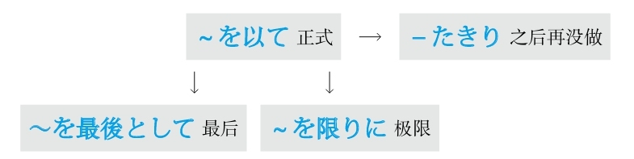

### 做得困难

#### どうにか
**解释：** 「どう」表示“如何”；「に」表示副词；「か」表示不确定
**直译：** 无论如何～
**意译：** 虽然有很多困难，但是好歹～
**词性：** 副词

例句：<ruby>借<rp>(</rp><rt>しゃっ</rt><rp>)</rp></ruby><ruby>金<rp>(</rp><rt>きん</rt><rp>)</rp></ruby>は**どうにか** <ruby>返<rp>(</rp><rt>かえ</rt><rp>)</rp></ruby>した。
直译：借款好歹归还了。
意译：好歹把债还了。

#### かろうじて
**解释：** 「<ruby>辛<rp>(</rp><rt>かろ</rt><rp>)</rp></ruby>うじて」是「<ruby>辛<rp>(</rp><rt>から</rt><rp>)</rp></ruby>くして」的音变
**意思：** 好不容易～
**着重：** 经历了痛苦
**词性：** 副词

例句：**<ruby>辛<rp>(</rp><rt>かろ</rt><rp>)</rp></ruby>うじて** <ruby>間<rp>(</rp><rt>ま</rt><rp>)</rp></ruby>に<ruby>合<rp>(</rp><rt>あ</rt><rp>)</rp></ruby>った。
直译：好不容易赶上了。
意译：总算赶上了。

#### なんとか
**解释：** 「なん」表示“什么”；「と」表示副词；「か」表示不确定
**表示：** 虽然有很多困难，但是要做点儿什么
**词性：** 副词
**注意：** 另一个表示好不容易的「<ruby>折<rp>(</rp><rt>せっ</rt><rp>)</rp></ruby><ruby>角<rp>(</rp><rt>かく</rt><rp>)</rp></ruby>」不单独使用，一般和表示原因的「～から」及表示转折的「～のに」和「～が」搭配使用

例句：**なんとか** <ruby>合<rp>(</rp><rt>ごう</rt><rp>)</rp></ruby><ruby>格<rp>(</rp><rt>かく</rt><rp>)</rp></ruby>した。
直译：虽然有很多困难，但是合格了。
意译：总算合格了。

例句：**なんとか** してください。
直译：虽然有很多困难，请您做。
意译：虽然知道有很多困难，请您务必想想办法。

例句：**なんとか** なります。
直译：虽然有很多困难，但是总会成为的。
意译：虽然有很多困难，但是总会有办法的。
语法关系图
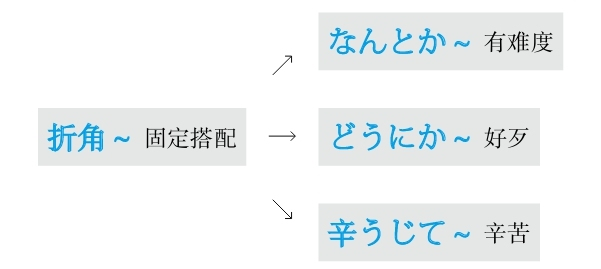

### 作为

#### ～として
**注意：** 应用了日语里的经典句型「～を～と（に）する（把～当成～）」
**意思：** 作为～
**接续：** 名词

例句：<ruby>今<rp>(</rp><rt>いま</rt><rp>)</rp></ruby>の<ruby>話<rp>(</rp><rt>はなし</rt><rp>)</rp></ruby>は<ruby>友<rp>(</rp><rt>とも</rt><rp>)</rp></ruby><ruby>達<rp>(</rp><rt>だち</rt><rp>)</rp></ruby>**として** の<ruby>助<rp>(</rp><rt>じょ</rt><rp>)</rp></ruby><ruby>言<rp>(</rp><rt>げん</rt><rp>)</rp></ruby>だよ。
直译：刚才的话是作为朋友的助言。
意译：刚才的话是我作为朋友的建议。

#### ～にしては
**注意：** 应用了日语里的经典句型「～を～と（に）する（把～当成～）」，「は」表示强调
**准则：** 在有强烈的表达方式时，通常在表示“否定、转折、相反”的语境中出现
**意思：** 作为～
**重点：** 前后相反
**接续：** 名词

例句：<ruby>彼<rp>(</rp><rt>かれ</rt><rp>)</rp></ruby>は<ruby>相撲<rp>(</rp><rt>すもう</rt><rp>)</rp></ruby><ruby>選<rp>(</rp><rt>せん</rt><rp>)</rp></ruby><ruby>手<rp>(</rp><rt>しゅ</rt><rp>)</rp></ruby>**にしては** <ruby>体<rp>(</rp><rt>たい</rt><rp>)</rp></ruby><ruby>型<rp>(</rp><rt>けい</rt><rp>)</rp></ruby>が<ruby>小<rp>(</rp><rt>ちい</rt><rp>)</rp></ruby>さい。
直译：他作为一个相扑选手，与此相反，体格小。
意译：他作为一个相扑选手体格太小了。
语法关系图

