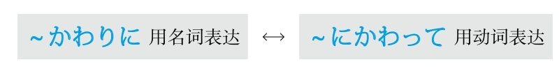
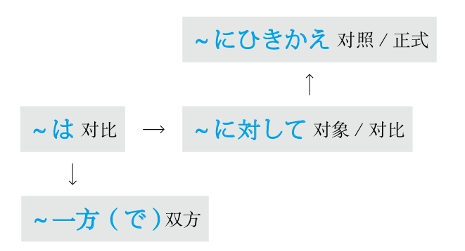
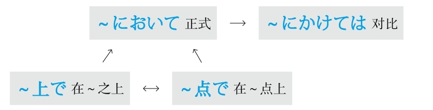
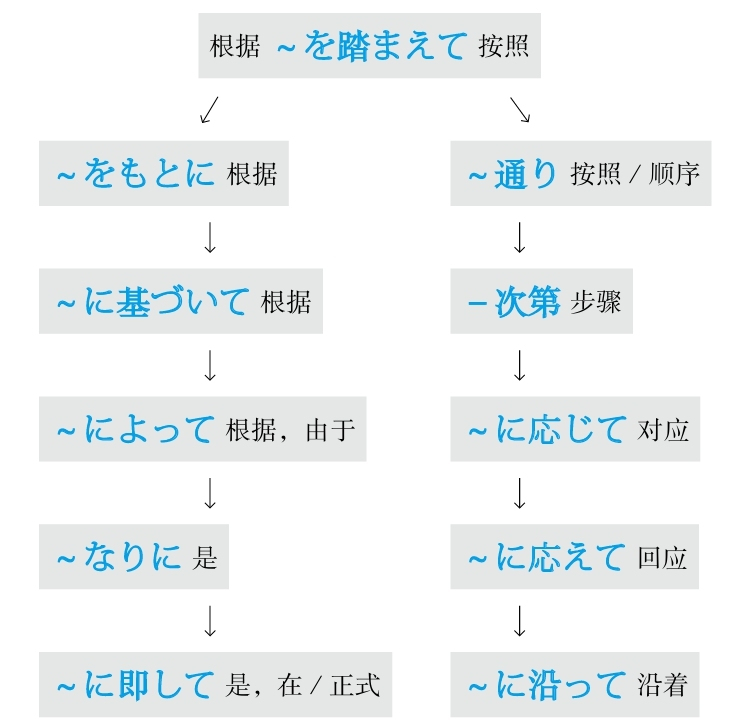
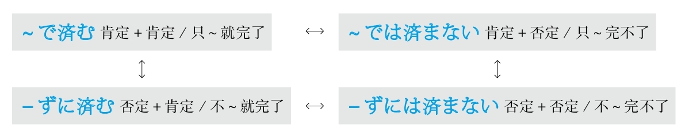
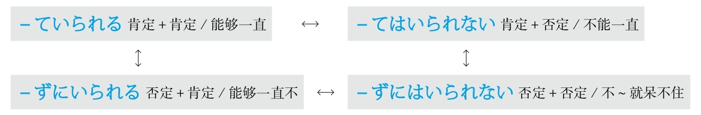

## C
### 差点儿就

#### もう少しで－そうになる
**解释：** 「もう」的意思是“再”；「<ruby>少<rp>(</rp><rt>すこ</rt><rp>)</rp></ruby>し」的意思是“一点儿”；「で」表示程度；动词连用形加「－<ruby>相<rp>(</rp><rt>そう</rt><rp>)</rp></ruby>」表示“样子、好像”；「に」表示方向；「なる」的意思是“成为”
**直译：** 再一点儿的程度就将要成为～的样子
**意译：** 差点儿～
**着重：** 状态
**注意：** 遵循日语中的“舍前留后”的准则，「もう少しで」可以省略
**接续：** 动词的连用形

例句：**もう<ruby>少<rp>(</rp><rt>すこ</rt><rp>)</rp></ruby>しで** <ruby>転<rp>(</rp><rt>ころ</rt><rp>)</rp></ruby>び**そうになった** 。
直译：再一点儿的程度就将要成为摔了一个跟头的样子。
意译：差一点儿就摔了一个跟头。

#### もう少しで～ところだった
**解释：** 「もう」的意思是“再”；「<ruby>少<rp>(</rp><rt>すこ</rt><rp>)</rp></ruby>し」的意思是“一点儿”；「で」表示程度；「ところ」在此表示“时间、程度”；「だった」是「です」过去式，意思是“过去是～”
**直译：** 过去是将要做～的时候、那时候再一公分（一分钟）就要～了
**意译：** 差点儿～
**着重：** 时间、程度
**注意：** 遵循日语中的“舍前留后”的准则，「もう少しで」可以省略
**接续：** 动词的一般现在时的简体（即原形）（表示将来时）

例句：**もう<ruby>少<rp>(</rp><rt>すこ</rt><rp>)</rp></ruby>しで** <ruby>乗<rp>(</rp><rt>の</rt><rp>)</rp></ruby>り<ruby>過<rp>(</rp><rt>す</rt><rp>)</rp></ruby>ごす**ところだった** 。
直译：再一点儿的程度，那个时候是将要坐过站的时候。
意译：差点儿就坐过站了。
语法关系图

### 程度，数量

#### ～も
**解释：** 接在数量词后，强调数量多
**意思：** 足有～

例句：<ruby>餃<rp>(</rp><rt>ぎょう</rt><rp>)</rp></ruby><ruby>子<rp>(</rp><rt>ざ</rt><rp>)</rp></ruby>を<ruby>2<rp>(</rp><rt>に</rt><rp>)</rp></ruby><ruby>0<rp>(</rp><rt>じゅっ</rt><rp>)</rp></ruby><ruby>個<rp>(</rp><rt>こ</rt><rp>)</rp></ruby>**も** <ruby>食<rp>(</rp><rt>た</rt><rp>)</rp></ruby>べた。
直译：吃了20个饺子。
意译：吃了足有20个饺子。

例句：あの<ruby>映<rp>(</rp><rt>えい</rt><rp>)</rp></ruby><ruby>画<rp>(</rp><rt>が</rt><rp>)</rp></ruby>を<ruby>何<rp>(</rp><rt>なん</rt><rp>)</rp></ruby><ruby>回<rp>(</rp><rt>かい</rt><rp>)</rp></ruby>**も** <ruby>見<rp>(</rp><rt>み</rt><rp>)</rp></ruby>た。
直译：那部电影看了好几回。
意译：看了好几遍那部电影。

#### ～からある/～からの
**解释：** 「から」的意思是“从～、从～开始”，有在此之上的意思；「ある」是自动词「<ruby>有<rp>(</rp><rt>あ</rt><rp>)</rp></ruby>る」；「の」的意思是“的”
**注意：** 强调数量多
**区别：** 比「も」正式
**接续：** 数量词

例句：<ruby>彼<rp>(</rp><rt>かれ</rt><rp>)</rp></ruby>は<ruby>1<rp>(</rp><rt>いち</rt><rp>)</rp></ruby><ruby>億<rp>(</rp><rt>おく</rt><rp>)</rp></ruby><ruby>円<rp>(</rp><rt>えん</rt><rp>)</rp></ruby>**からある** <ruby>遺<rp>(</rp><rt>い</rt><rp>)</rp></ruby><ruby>産<rp>(</rp><rt>さん</rt><rp>)</rp></ruby>を<ruby>相<rp>(</rp><rt>そう</rt><rp>)</rp></ruby><ruby>続<rp>(</rp><rt>ぞく</rt><rp>)</rp></ruby>した。
直译：他继承了一亿日元的遗产。
意译：他继承了足有一亿日元的遗产。

例句：<ruby>目<rp>(</rp><rt>め</rt><rp>)</rp></ruby>の<ruby>前<rp>(</rp><rt>まえ</rt><rp>)</rp></ruby>に<ruby>身<rp>(</rp><rt>しん</rt><rp>)</rp></ruby><ruby>長<rp>(</rp><rt>ちょう</rt><rp>)</rp></ruby>が<ruby>2<rp>(</rp><rt>に</rt><rp>)</rp></ruby>メートル**からの** <ruby>大<rp>(</rp><rt>おお</rt><rp>)</rp></ruby><ruby>男<rp>(</rp><rt>おとこ</rt><rp>)</rp></ruby>が<ruby>急<rp>(</rp><rt>きゅう</rt><rp>)</rp></ruby>に<ruby>現<rp>(</rp><rt>あらわ</rt><rp>)</rp></ruby>れた。
直译：眼前突然出现了一个身高两米的大个子男人。
意译：眼前突然出现了一个身高足有两米的大个子男人。

#### －切る/－きれない
**解释：** 「－<ruby>切<rp>(</rp><rt>き</rt><rp>)</rp></ruby>る」表示动作中断；「きれない」是他动词「<ruby>切<rp>(</rp><rt>き</rt><rp>)</rp></ruby>る」的可能形的否定
**直译：** 切断～/切不断～
**意译：** 完全/动作多得无法中断
**着重：** 完全
**接续：** 动词的连用形

例句：<ruby>必<rp>(</rp><rt>かなら</rt><rp>)</rp></ruby>ず<ruby>成<rp>(</rp><rt>せい</rt><rp>)</rp></ruby><ruby>功<rp>(</rp><rt>こう</rt><rp>)</rp></ruby>してみせると<ruby>言<rp>(</rp><rt>い</rt><rp>)</rp></ruby>い<ruby>切<rp>(</rp><rt>き</rt><rp>)</rp></ruby>**った** 。
直译：完全说了：“必定成功让你们看看”。
意译：断言：“一定成功让你们看看”。

例句：こんなにたくさん<ruby>注<rp>(</rp><rt>ちゅう</rt><rp>)</rp></ruby><ruby>文<rp>(</rp><rt>もん</rt><rp>)</rp></ruby>したら<ruby>食<rp>(</rp><rt>た</rt><rp>)</rp></ruby>べ**きれない** 。
直译：如果点这么多菜的话，吃不了。
意译：点这么多菜可吃不了。

#### ～だけ
**解释：** 助词「だけ」表示多、中、少三个数量级别
**用于：** 数量多
**注意：** 需要通过上下文来判断其意
**接续：** 一般以「これだけ、それだけ、あれだけ」这三个副词来表示

例句：あれ**だけ** <ruby>残<rp>(</rp><rt>ざん</rt><rp>)</rp></ruby><ruby>業<rp>(</rp><rt>ぎょう</rt><rp>)</rp></ruby>をしていれば、<ruby>給<rp>(</rp><rt>きゅう</rt><rp>)</rp></ruby><ruby>料<rp>(</rp><rt>りょう</rt><rp>)</rp></ruby>をもっと<ruby>上<rp>(</rp><rt>あ</rt><rp>)</rp></ruby>げてくれるはずなのに。
直译：如果加了那么多班的话，应该多给我们涨些工资啊。
意译：加了那么多班，应该多给我们涨些工资啊。

**用于：** 数量中
**注意：** 表示“相应”或“符合”，可以理解为“＝”
**接续：** 任何词

例句：トップランキングの<ruby>大<rp>(</rp><rt>だい</rt><rp>)</rp></ruby><ruby>学<rp>(</rp><rt>がく</rt><rp>)</rp></ruby>の<ruby>大<rp>(</rp><rt>だい</rt><rp>)</rp></ruby><ruby>学<rp>(</rp><rt>がく</rt><rp>)</rp></ruby><ruby>院<rp>(</rp><rt>いん</rt><rp>)</rp></ruby>に<ruby>受<rp>(</rp><rt>う</rt><rp>)</rp></ruby>かる**だけ** の<ruby>学<rp>(</rp><rt>がく</rt><rp>)</rp></ruby><ruby>力<rp>(</rp><rt>りょく</rt><rp>)</rp></ruby>をつけるのは<ruby>難<rp>(</rp><rt>むずか</rt><rp>)</rp></ruby>しい。
直译：具备考上与名牌的大学的研究生院相应的能力，是件困难的事情。
意译：很难拥有考上名牌大学研究生院的能力。

**用于：** 数量少
**接续：** 任何词

例句：この<ruby>商<rp>(</rp><rt>しょう</rt><rp>)</rp></ruby><ruby>品<rp>(</rp><rt>ひん</rt><rp>)</rp></ruby>は<ruby>冬<rp>(</rp><rt>ふゆ</rt><rp>)</rp></ruby>に**だけ** <ruby>発<rp>(</rp><rt>はつ</rt><rp>)</rp></ruby><ruby>売<rp>(</rp><rt>ばい</rt><rp>)</rp></ruby>される。
直译：这种商品只在冬天被销售。
意译：这种商品只在冬天销售。

#### ～たりとも
**解释：** 「たり」是「<ruby>足<rp>(</rp><rt>た</rt><rp>)</rp></ruby>る」，直译是“足于～、相当于～”，意译是“是”；「とも」表示让步性转折，意思是“即使、尽管、不管”
**意思：** 即使是～也～
**注意：** 表示数量少
**接续：** 通常前面接数量词“1”

例句：<ruby>米<rp>(</rp><rt>こめ</rt><rp>)</rp></ruby>は<ruby>一<rp>(</rp><rt>ひと</rt><rp>)</rp></ruby><ruby>粒<rp>(</rp><rt>つぶ</rt><rp>)</rp></ruby>**たりとも** <ruby>無駄<rp>(</rp><rt>むだ</rt><rp>)</rp></ruby>にできない。
直译：米即使是一粒都不能浪费。
意译：一粒米都不能浪费。

#### ～なりとも
**解释：** 「なり」是表示断定的「<ruby>也<rp>(</rp><rt>なり</rt><rp>)</rp></ruby>」，意思是“是”；「とも」表示让步性转折，意思是“即使、尽管、不管”
**意思：** 即使是～也～
**注意：** 表示数量少
**语气：** 正式
**接续：** 名词

例句：<ruby>親<rp>(</rp><rt>おや</rt><rp>)</rp></ruby>の<ruby>負<rp>(</rp><rt>ふ</rt><rp>)</rp></ruby><ruby>担<rp>(</rp><rt>たん</rt><rp>)</rp></ruby>を<ruby>多<rp>(</rp><rt>た</rt><rp>)</rp></ruby><ruby>少<rp>(</rp><rt>しょう</rt><rp>)</rp></ruby>**なりとも（=<ruby>少<rp>(</rp><rt>すこ</rt><rp>)</rp></ruby>しでも）** <ruby>軽<rp>(</rp><rt>けい</rt><rp>)</rp></ruby><ruby>減<rp>(</rp><rt>げん</rt><rp>)</rp></ruby>したい。
直译：父母的负担，即使是或多或少，想减轻。
意译：即使不多，但也想减轻父母的负担。

#### ～といったところだ
**解释：** 「ところ」的意思“时间、地点、程度、状况”，此处表示程度；「と」表示引号；「いった」是表示“下去”的「行く」的た形，意思是“～之类的”；「た」的意思是“的”，修饰名词
**注意：** 程度低或数量少
**接续：** 名词、数量词

例句：それは<ruby>単<rp>(</rp><rt>たん</rt><rp>)</rp></ruby>なる<ruby>遊<rp>(</rp><rt>あそ</rt><rp>)</rp></ruby>び**といったところだ** よ。
直译：那是单纯玩儿之类的程度。
意译：那只不过是一场游戏。

例句：<ruby>学会<rp>(</rp><rt>がっかい</rt><rp>)</rp></ruby>のシンポジウムの<ruby>参<rp>(</rp><rt>さん</rt><rp>)</rp></ruby><ruby>加<rp>(</rp><rt>か</rt><rp>)</rp></ruby><ruby>者<rp>(</rp><rt>しゃ</rt><rp>)</rp></ruby>は<ruby>千<rp>(</rp><rt>せん</rt><rp>)</rp></ruby><ruby>人<rp>(</rp><rt>にん</rt><rp>)</rp></ruby>**といったところだ** った。
直译：学会的专题讨论会的参加者也就是一千人之类的程度。
意译：学会专题讨论会的参加者只有一千人。
语法关系图

### 程度

#### ～くらい/～ぐらい
**解释：** 「<ruby>位<rp>(</rp><rt>くらい</rt><rp>)</rp></ruby>」表示高、中、低三个程度
**注意：** 读清音和浊音都可以
**用于：** 程度高
**接续：** 任何词

例句：<ruby>周<rp>(</rp><rt>まわ</rt><rp>)</rp></ruby>りが<ruby>騒<rp>(</rp><rt>さわ</rt><rp>)</rp></ruby>がしいから、<ruby>電<rp>(</rp><rt>でん</rt><rp>)</rp></ruby><ruby>話<rp>(</rp><rt>わ</rt><rp>)</rp></ruby>の<ruby>音<rp>(</rp><rt>おと</rt><rp>)</rp></ruby>が<ruby>聞<rp>(</rp><rt>き</rt><rp>)</rp></ruby>こえない**くらい** だ。
直译：周围太吵了，所以到了电话的声音听不见了的程度。
意译：周围太吵了，电话的声音都快听不见了。

**用于：** 程度中
**意思：** 左右
**接续：** 任何词

例句：<ruby>歩<rp>(</rp><rt>ある</rt><rp>)</rp></ruby>いて<ruby>行<rp>(</rp><rt>い</rt><rp>)</rp></ruby>ける**くらい** <ruby>近<rp>(</rp><rt>ちか</rt><rp>)</rp></ruby>いです。
直译：可以走着去的程度得近。
意译：很近，可以走着去。

**用于：** 程度低
**接续：** 任何词

例句：こんな<ruby>事<rp>(</rp><rt>こと</rt><rp>)</rp></ruby>**くらい** <ruby>子<rp>(</rp><rt>こ</rt><rp>)</rp></ruby><ruby>供<rp>(</rp><rt>ども</rt><rp>)</rp></ruby>でも<ruby>知<rp>(</rp><rt>し</rt><rp>)</rp></ruby>っている。
直译：这样的事的程度，即使是孩子都知道。
意译：这样的事连孩子都知道。

**注意：** 还可以表示大概的“时间点”和“期间段”
**意思：** 左右

例句：<ruby>明日<rp>(</rp><rt>あした</rt><rp>)</rp></ruby>の<ruby>午後<rp>(</rp><rt>ごご</rt><rp>)</rp></ruby><ruby>三<rp>(</rp><rt>さん</rt><rp>)</rp></ruby><ruby>時<rp>(</rp><rt>じ</rt><rp>)</rp></ruby>**くらい** に<ruby>来<rp>(</rp><rt>き</rt><rp>)</rp></ruby>てください。
直译：在明天下午3点左右，请来。
意译：请于明天下午3点左右来。

例句：<ruby>昨日<rp>(</rp><rt>きのう</rt><rp>)</rp></ruby><ruby>友<rp>(</rp><rt>とも</rt><rp>)</rp></ruby><ruby>達<rp>(</rp><rt>だち</rt><rp>)</rp></ruby>に<ruby>三<rp>(</rp><rt>さん</rt><rp>)</rp></ruby><ruby>時<rp>(</rp><rt>じ</rt><rp>)</rp></ruby><ruby>間<rp>(</rp><rt>かん</rt><rp>)</rp></ruby>**くらい** <ruby>待<rp>(</rp><rt>ま</rt><rp>)</rp></ruby>たされた。
直译：昨天被让朋友等了3个多小时。
意译：昨天朋友让我等了3个多小时。

#### ～ころ/～ごろ
**解释：** 「<ruby>頃<rp>(</rp><rt>ころ</rt><rp>)</rp></ruby>」表示大概的“时间点”
**意思：** 左右
**语气：** 正式
**注意：** 读清音和浊音都可以
**区别：** 只能接“时间点”，不能接“时间段”

例句：<ruby>明日<rp>(</rp><rt>あした</rt><rp>)</rp></ruby><ruby>何<rp>(</rp><rt>なん</rt><rp>)</rp></ruby><ruby>時<rp>(</rp><rt>じ</rt><rp>)</rp></ruby>**ごろ** <ruby>伺<rp>(</rp><rt>うかが</rt><rp>)</rp></ruby>えばよろしいでしょうか。
直译：明天几点左右拜访好呢？

#### ～ほど
**解释：** 「<ruby>程<rp>(</rp><rt>ほど</rt><rp>)</rp></ruby>」的意思是“程度高”
**意思：** 左右
**区别：** 不能用于“程度低”和“程度中”的事物

例句：<ruby>舌<rp>(</rp><rt>した</rt><rp>)</rp></ruby>がとろける**ほど** おいしい。
直译：好吃得舌头都要融化了。
意译：太好吃了。

**解释：** 「<ruby>程<rp>(</rp><rt>ほど</rt><rp>)</rp></ruby>」表示大概的“期间段”
**意思：** 左右
**语气：** 正式
**区别：** 不能接“时间点”，只能接“时间段”

例句：<ruby>講<rp>(</rp><rt>こう</rt><rp>)</rp></ruby><ruby>義<rp>(</rp><rt>ぎ</rt><rp>)</rp></ruby>は<ruby>1<rp>(</rp><rt>いち</rt><rp>)</rp></ruby><ruby>時<rp>(</rp><rt>じ</rt><rp>)</rp></ruby><ruby>間<rp>(</rp><rt>かん</rt><rp>)</rp></ruby>**ほど** <ruby>延<rp>(</rp><rt>の</rt><rp>)</rp></ruby>びた。
直译：大学的课拖延了1个小时左右。
意译：课拖延了1个小时左右。
语法关系图

### 从

#### ～から
**解释：** 表示起点
**意思：** 从～
**接续：** 名词

例句：<ruby>田<rp>(</rp><rt>た</rt><rp>)</rp></ruby><ruby>中<rp>(</rp><rt>なか</rt><rp>)</rp></ruby>さん**から** <ruby>得<rp>(</rp><rt>え</rt><rp>)</rp></ruby>た<ruby>情<rp>(</rp><rt>じょう</rt><rp>)</rp></ruby><ruby>報<rp>(</rp><rt>ほう</rt><rp>)</rp></ruby>は<ruby>確<rp>(</rp><rt>かく</rt><rp>)</rp></ruby><ruby>実<rp>(</rp><rt>じつ</rt><rp>)</rp></ruby>だ。
直译：从田中得到的信息很确实。
意译：从田中那里得到的信息很准确。

#### ～からいうと/～からいえば
**解释：** 「から」表示起点，意思是“从～”；「いう」是表示“说”的「<ruby>言<rp>(</rp><rt>い</rt><rp>)</rp></ruby>う」；「と」和「ば」的意思都是“如果”
**准则：** 在「と、ば、たら、なら」里，最重要的是顺序。「と」和「なら」分别表示极端，「と」代表“条件性”的极端，「なら」代表“假定性”的极端
**区别：** 「～からいうと」比「～からいえば」限定的语气强
**意思：** 从～来说的话
**接续：** 名词

例句：<ruby>実<rp>(</rp><rt>じつ</rt><rp>)</rp></ruby><ruby>力<rp>(</rp><rt>りょく</rt><rp>)</rp></ruby>**からいうと（からいえば）** 、<ruby>彼<rp>(</rp><rt>かれ</rt><rp>)</rp></ruby>が<ruby>入<rp>(</rp><rt>にゅう</rt><rp>)</rp></ruby><ruby>賞<rp>(</rp><rt>しょう</rt><rp>)</rp></ruby>することは<ruby>間<rp>(</rp><rt>ま</rt><rp>)</rp></ruby><ruby>違<rp>(</rp><rt>ちが</rt><rp>)</rp></ruby>いない。
直译：如果从实力来说的话，他得奖是没错的。
意译：从实力来看，他肯定能得奖。

#### ～からして
**解释：** 「から」表示起点，意思是“从～”；「して」是能够代替大多数动词的「する」的中顿形式，在此代替了「<ruby>見<rp>(</rp><rt>み</rt><rp>)</rp></ruby>る、<ruby>考<rp>(</rp><rt>かんが</rt><rp>)</rp></ruby>える、<ruby>判<rp>(</rp><rt>はん</rt><rp>)</rp></ruby><ruby>断<rp>(</rp><rt>だん</rt><rp>)</rp></ruby>する、<ruby>推<rp>(</rp><rt>すい</rt><rp>)</rp></ruby><ruby>測<rp>(</rp><rt>そく</rt><rp>)</rp></ruby>する、<ruby>推<rp>(</rp><rt>すい</rt><rp>)</rp></ruby><ruby>理<rp>(</rp><rt>り</rt><rp>)</rp></ruby>する」等能够与“从～”搭配的动词，需要通过上下文判断具体意思
**意思：** 从～来说的话
**接续：** 名词

例句：<ruby>町<rp>(</rp><rt>まち</rt><rp>)</rp></ruby><ruby>並<rp>(</rp><rt>な</rt><rp>)</rp></ruby>み**からして** 、このところは<ruby>歴<rp>(</rp><rt>れき</rt><rp>)</rp></ruby><ruby>史<rp>(</rp><rt>し</rt><rp>)</rp></ruby>のある<ruby>町<rp>(</rp><rt>まち</rt><rp>)</rp></ruby>らしい。
直译：从街道的样子来看（来判断、来推测……），这个地方好像有历史。
意译：从街道的样子来看，这个地方好像历史很悠久。

#### ～から～まで
**解释：** 「から」表示起点，意思是“从～”；「まで」表示终点，意思是“到～”
**意思：** 从～到～
**用于：** 任何事项（时间、地点、程度、人物等）
**着重：** 点
**接续：** 名词

例句：<ruby>部<rp>(</rp><rt>へ</rt><rp>)</rp></ruby><ruby>屋<rp>(</rp><rt>や</rt><rp>)</rp></ruby>の<ruby>隅<rp>(</rp><rt>すみ</rt><rp>)</rp></ruby>**から** <ruby>隅<rp>(</rp><rt>すみ</rt><rp>)</rp></ruby>**まで** <ruby>探<rp>(</rp><rt>さが</rt><rp>)</rp></ruby>した。
直译：从房间的角落到角落，找了。
意译：找遍了房间的各个角落。

#### ～から～にいたるまで
**解释：** 「から」表示起点，意思是“从～”；「に」表示方向；「<ruby>至<rp>(</rp><rt>いた</rt><rp>)</rp></ruby>る」的意思是“到”；「まで」表示终点，意思是“到～”
**意思：** 从～到～
**用于：** 任何事项（时间、地点、程度、人物等）
**着重：** 终点
**接续：** 名词

例句：<ruby>家<rp>(</rp><rt>か</rt><rp>)</rp></ruby><ruby>事<rp>(</rp><rt>じ</rt><rp>)</rp></ruby>**から** <ruby>育<rp>(</rp><rt>いく</rt><rp>)</rp></ruby><ruby>児<rp>(</rp><rt>じ</rt><rp>)</rp></ruby>**にいたるまで** 、<ruby>一人<rp>(</rp><rt>ひとり</rt><rp>)</rp></ruby>でさせられている。
直译：从家务活到育儿，一个人被让干着。
意译：从家务活到育儿都得一个人干。

#### ～から～にかけて
**解释：** 「から」表示起点，意思是“从～”；「に」表示方向；「かけて」是他动词「かける」的中顿形式，意思是“大面积地覆盖”
**意思：** 从～到～
**着重：** 面、整体
**区别：** 「～から～まで」着重于起点和终点的两个点，但是「～から～にかけて」着重于从起点到终点的全面性
**接续：** 时间、地点

例句：<ruby>日<rp>(</rp><rt>に</rt><rp>)</rp></ruby><ruby>本<rp>(</rp><rt>ほん</rt><rp>)</rp></ruby>は<ruby>5<rp>(</rp><rt>ご</rt><rp>)</rp></ruby><ruby>月<rp>(</rp><rt>がつ</rt><rp>)</rp></ruby>の<ruby>下<rp>(</rp><rt>げ</rt><rp>)</rp></ruby><ruby>旬<rp>(</rp><rt>じゅん</rt><rp>)</rp></ruby>**から** <ruby>6<rp>(</rp><rt>ろく</rt><rp>)</rp></ruby><ruby>月<rp>(</rp><rt>がつ</rt><rp>)</rp></ruby>の<ruby>下<rp>(</rp><rt>げ</rt><rp>)</rp></ruby><ruby>旬<rp>(</rp><rt>じゅん</rt><rp>)</rp></ruby>**にかけて** <ruby>梅雨<rp>(</rp><rt>つゆ</rt><rp>)</rp></ruby>の<ruby>時<rp>(</rp><rt>じ</rt><rp>)</rp></ruby><ruby>期<rp>(</rp><rt>き</rt><rp>)</rp></ruby>だ。
直译：日本从5月下旬到6月下旬的整个阶段是梅雨季节。
意译：日本从5月下旬到6月下旬一直是梅雨季节。

例句：<ruby>午後<rp>(</rp><rt>ごご</rt><rp>)</rp></ruby>は<ruby>関<rp>(</rp><rt>かん</rt><rp>)</rp></ruby><ruby>東<rp>(</rp><rt>とう</rt><rp>)</rp></ruby><ruby>地<rp>(</rp><rt>ち</rt><rp>)</rp></ruby><ruby>方<rp>(</rp><rt>ほう</rt><rp>)</rp></ruby>**から** <ruby>関<rp>(</rp><rt>かん</rt><rp>)</rp></ruby><ruby>西<rp>(</rp><rt>さい</rt><rp>)</rp></ruby><ruby>地<rp>(</rp><rt>ち</rt><rp>)</rp></ruby><ruby>方<rp>(</rp><rt>ほう</rt><rp>)</rp></ruby>**にかけて** <ruby>雪<rp>(</rp><rt>ゆき</rt><rp>)</rp></ruby>が<ruby>積<rp>(</rp><rt>つ</rt><rp>)</rp></ruby>もる<ruby>見<rp>(</rp><rt>み</rt><rp>)</rp></ruby><ruby>込<rp>(</rp><rt>こ</rt><rp>)</rp></ruby>みです。
直译：预计下午从关东地区到关西地区的整个地区将要积雪。
意译：预计下午从关东地区到关西地区将会出现积雪。

#### ～より
**意1：** 从～
**表示：** 起点
**注意：** 一般用于写信的发信人和表示送东西的赠送人
**区别：** 比「から」语气正式
**接续：** 人称

例句：<ruby>田<rp>(</rp><rt>た</rt><rp>)</rp></ruby><ruby>中<rp>(</rp><rt>なか</rt><rp>)</rp></ruby><ruby>様<rp>(</rp><rt>さま</rt><rp>)</rp></ruby>**より** <ruby>鈴<rp>(</rp><rt>すず</rt><rp>)</rp></ruby><ruby>木<rp>(</rp><rt>き</rt><rp>)</rp></ruby><ruby>様<rp>(</rp><rt>さま</rt><rp>)</rp></ruby><ruby>宛<rp>(</rp><rt>あ</rt><rp>)</rp></ruby>ての<ruby>手<rp>(</rp><rt>て</rt><rp>)</rp></ruby><ruby>紙<rp>(</rp><rt>がみ</rt><rp>)</rp></ruby>をお<ruby>預<rp>(</rp><rt>あず</rt><rp>)</rp></ruby>かりしております。
直译：从田中给铃木的信，我们保管着。
意译：田中给铃木的信放在我们这里。
语法关系图

### 充满

#### ～をこめて
**解释：** 「を」接在他动词前表示“把”；「こめて」是他动词「<ruby>込<rp>(</rp><rt>こ</rt><rp>)</rp></ruby>める」的中顿形式，意思是“充满”
**意思：** 充满～
**注意：** 常用「<ruby>心<rp>(</rp><rt>こころ</rt><rp>)</rp></ruby>をこめて、<ruby>愛<rp>(</rp><rt>あい</rt><rp>)</rp></ruby><ruby>情<rp>(</rp><rt>じょう</rt><rp>)</rp></ruby>をこめて」等
**区别：** 后面接动词
**接续：** 名词

例句：これはわたしが<ruby>真<rp>(</rp><rt>ま</rt><rp>)</rp></ruby><ruby>心<rp>(</rp><rt>ごころ</rt><rp>)</rp></ruby>**をこめて** <ruby>言<rp>(</rp><rt>い</rt><rp>)</rp></ruby>った<ruby>言<rp>(</rp><rt>こと</rt><rp>)</rp></ruby><ruby>葉<rp>(</rp><rt>ば</rt><rp>)</rp></ruby>です。
直译：这是我充满真心说的话。
意译：这是我真心实意说的话。

例句：<ruby>先<rp>(</rp><rt>せん</rt><rp>)</rp></ruby><ruby>生<rp>(</rp><rt>せい</rt><rp>)</rp></ruby>は<ruby>毎<rp>(</rp><rt>まい</rt><rp>)</rp></ruby><ruby>回<rp>(</rp><rt>かい</rt><rp>)</rp></ruby><ruby>愛<rp>(</rp><rt>あい</rt><rp>)</rp></ruby><ruby>情<rp>(</rp><rt>じょう</rt><rp>)</rp></ruby>**をこめて** <ruby>授<rp>(</rp><rt>じゅ</rt><rp>)</rp></ruby><ruby>業<rp>(</rp><rt>ぎょう</rt><rp>)</rp></ruby>を<ruby>行<rp>(</rp><rt>おこな</rt><rp>)</rp></ruby>っている。
直译：老师的每次都充满了爱地在教授课程。
意译：老师的每堂课都充满了对学生的爱。

#### ～がこもった
**解释：** 「が」接在自动词前表示小主语；「こもった」是自动词「<ruby>籠<rp>(</rp><rt>こも</rt><rp>)</rp></ruby>る」的た形，意思是“充满”
**准则：** 日语的「た」表示完了、过去的“了”以及起形容词修饰名词作用的“的”。此处表示“的”
**意思：** 充满～
**注意：** 常用「<ruby>心<rp>(</rp><rt>こころ</rt><rp>)</rp></ruby>がこもった、<ruby>愛<rp>(</rp><rt>あい</rt><rp>)</rp></ruby><ruby>情<rp>(</rp><rt>じょう</rt><rp>)</rp></ruby>がこもった」等
**注意：** 「が」还可以换成「の」
**区别：** 后面接名词
**接续：** 名词

例句：これは<ruby>愛<rp>(</rp><rt>あい</rt><rp>)</rp></ruby><ruby>情<rp>(</rp><rt>じょう</rt><rp>)</rp></ruby>**のこもった** <ruby>自<rp>(</rp><rt>じ</rt><rp>)</rp></ruby><ruby>家<rp>(</rp><rt>か</rt><rp>)</rp></ruby><ruby>製<rp>(</rp><rt>せい</rt><rp>)</rp></ruby><ruby>弁<rp>(</rp><rt>べん</rt><rp>)</rp></ruby><ruby>当<rp>(</rp><rt>とう</rt><rp>)</rp></ruby>です。
直译：这是充满了爱的自家制便当。
意译：这是充满了爱的自己家里做的便当。
语法关系图

### 除了～以外

#### ～ほかに
**解释：** 「<ruby>他<rp>(</rp><rt>ほか</rt><rp>)</rp></ruby>、<ruby>外<rp>(</rp><rt>ほか</rt><rp>)</rp></ruby>」的意思是“～以外”；「に」表示副词
**准则：** 有时可以不用「に」，不用「に」时必须添加逗号，且语气正式
**意思：** ～以外
**接续：** 修饰名词的规律（参照第一章的第三节）

例句：<ruby>当<rp>(</rp><rt>とう</rt><rp>)</rp></ruby><ruby>日<rp>(</rp><rt>じつ</rt><rp>)</rp></ruby>は<ruby>関<rp>(</rp><rt>かん</rt><rp>)</rp></ruby><ruby>係<rp>(</rp><rt>けい</rt><rp>)</rp></ruby><ruby>書<rp>(</rp><rt>しょ</rt><rp>)</rp></ruby><ruby>類<rp>(</rp><rt>るい</rt><rp>)</rp></ruby>が<ruby>配<rp>(</rp><rt>くば</rt><rp>)</rp></ruby>られる**ほか** 、<ruby>記<rp>(</rp><rt>き</rt><rp>)</rp></ruby><ruby>念<rp>(</rp><rt>ねん</rt><rp>)</rp></ruby><ruby>品<rp>(</rp><rt>ひん</rt><rp>)</rp></ruby>ももらえる。
直译：当天有关资料被发送以外，纪念品也能够得到。
意译：当天除了发有关资料以外，还能得到纪念品。

#### ～以外に
**解释：** 「<ruby>以<rp>(</rp><rt>い</rt><rp>)</rp></ruby><ruby>外<rp>(</rp><rt>がい</rt><rp>)</rp></ruby>」的意思是“以外，之外”；「に」表示副词
**准则：** 有时可以不用「に」，不用「に」时必须添加逗号，且语气正式
**意思：** ～以外
**语气：** 正式
**接续：** 修饰名词的规律（参照第一章的第三节）

例句：<ruby>彼<rp>(</rp><rt>かの</rt><rp>)</rp></ruby><ruby>女<rp>(</rp><rt>じょ</rt><rp>)</rp></ruby>は<ruby>声<rp>(</rp><rt>こえ</rt><rp>)</rp></ruby>が<ruby>大<rp>(</rp><rt>おお</rt><rp>)</rp></ruby>きい**<ruby>以<rp>(</rp><rt>い</rt><rp>)</rp></ruby><ruby>外<rp>(</rp><rt>がい</rt><rp>)</rp></ruby>に** <ruby>何<rp>(</rp><rt>なん</rt><rp>)</rp></ruby>の<ruby>取<rp>(</rp><rt>とり</rt><rp>)</rp></ruby><ruby>得<rp>(</rp><rt>え</rt><rp>)</rp></ruby>もない。
直译：她声音大以外，什么可取之处都没有。
意译：她除了声音大以外什么可取之处都没有。

#### ～を除いて
**解释：** 「を」接在他动词前表示“把”；「<ruby>除<rp>(</rp><rt>のぞ</rt><rp>)</rp></ruby>いて」是他动词「<ruby>除<rp>(</rp><rt>のぞ</rt><rp>)</rp></ruby>く」的中顿形式，意思是“除了～”
**意思：** 除了～
**接续：** 名词

例句：<ruby>少<rp>(</rp><rt>しょう</rt><rp>)</rp></ruby><ruby>数<rp>(</rp><rt>すう</rt><rp>)</rp></ruby>**を<ruby>除<rp>(</rp><rt>のぞ</rt><rp>)</rp></ruby>いて** みんなその<ruby>提<rp>(</rp><rt>てい</rt><rp>)</rp></ruby><ruby>案<rp>(</rp><rt>あん</rt><rp>)</rp></ruby>に<ruby>賛<rp>(</rp><rt>さん</rt><rp>)</rp></ruby><ruby>成<rp>(</rp><rt>せい</rt><rp>)</rp></ruby>した。
直译：除了少数人，大家都对那个建议赞成了。
意译：除了少数人，大家都赞成那个建议。

#### ～をおいて
**解释：** 「を」接在他动词前表示“把”；「おいて」是他动词「<ruby>置<rp>(</rp><rt>お</rt><rp>)</rp></ruby>く」的中顿形式，意思是“放置～”
**直译：** 把～放置～
**重点：** 起源于日本谚语「～は<ruby>隅<rp>(</rp><rt>すみ</rt><rp>)</rp></ruby>にはおけない」，意思是“不能把～放置到角落里”，体现了“～”的重要性或中心地位；此语法引申为“把作为中心地位的～放到角落里的话，就没有能够胜任的了”
**接续：** 名词

例句：この<ruby>仕<rp>(</rp><rt>し</rt><rp>)</rp></ruby><ruby>事<rp>(</rp><rt>ごと</rt><rp>)</rp></ruby>が<ruby>任<rp>(</rp><rt>まか</rt><rp>)</rp></ruby>せられるのは、<ruby>彼<rp>(</rp><rt>かれ</rt><rp>)</rp></ruby>**をおいて** <ruby>適<rp>(</rp><rt>てき</rt><rp>)</rp></ruby><ruby>任<rp>(</rp><rt>にん</rt><rp>)</rp></ruby><ruby>者<rp>(</rp><rt>しゃ</rt><rp>)</rp></ruby>はいない。
直译：这个工作能够委任的，把他放到角落里，没有适合于委任的人。
意译：这个工作除了他以外没有别人可以胜任。
语法关系图

## D
### 代替

#### ～かわりに
**解释：** 「<ruby>代<rp>(</rp><rt>か</rt><rp>)</rp></ruby>わり」的意思是“代替”；「に」表示副词
**注意：** 有时可以不用「に」，不用「に」时必须添加逗号，且语气正式
**接续：** 修饰名词的规律（参照第一章的第三节）

例句：<ruby>包<rp>(</rp><rt>ほう</rt><rp>)</rp></ruby><ruby>帯<rp>(</rp><rt>たい</rt><rp>)</rp></ruby>の**かわりに** 、ハンカチで<ruby>傷<rp>(</rp><rt>きず</rt><rp>)</rp></ruby><ruby>口<rp>(</rp><rt>ぐち</rt><rp>)</rp></ruby>を<ruby>縛<rp>(</rp><rt>しば</rt><rp>)</rp></ruby>った。
直译：绷带的替代，用手绢绑住了伤口。
意译：用手绢代替绷带绑住了伤口。

#### ～にかわって
**解释：** 「に」表示方向或对象；「かわって」是自动词「<ruby>代<rp>(</rp><rt>か</rt><rp>)</rp></ruby>わる」的中顿形式，意思是“代替”
**接续：** 名词

例句：<ruby>首<rp>(</rp><rt>しゅ</rt><rp>)</rp></ruby><ruby>相<rp>(</rp><rt>しょう</rt><rp>)</rp></ruby>**にかわって** 、<ruby>外<rp>(</rp><rt>がい</rt><rp>)</rp></ruby><ruby>相<rp>(</rp><rt>しょう</rt><rp>)</rp></ruby>が<ruby>米<rp>(</rp><rt>べい</rt><rp>)</rp></ruby><ruby>国<rp>(</rp><rt>こく</rt><rp>)</rp></ruby>を<ruby>訪<rp>(</rp><rt>ほう</rt><rp>)</rp></ruby><ruby>問<rp>(</rp><rt>もん</rt><rp>)</rp></ruby>した。
直译：代替首相，外相访问了美国。
意译：外务大臣代替首相访问了美国。
语法关系图

### 当成

#### ～を～とする/～を～にする
**注意：** 日语里的经典句型「～を～と（に）する（把～当成～）」，大多数语法都是由此派生的
**解释：** 「を」接在他动词前表示“把”；「と」侧重于内容，「に」侧重于方向；「する」可以代替大多数动词
**意思：** 把～当成～
**接续：** 名词

例句：<ruby>経<rp>(</rp><rt>けい</rt><rp>)</rp></ruby><ruby>済<rp>(</rp><rt>ざい</rt><rp>)</rp></ruby>**を** <ruby>研<rp>(</rp><rt>けん</rt><rp>)</rp></ruby><ruby>究<rp>(</rp><rt>きゅう</rt><rp>)</rp></ruby><ruby>題<rp>(</rp><rt>だい</rt><rp>)</rp></ruby><ruby>目<rp>(</rp><rt>もく</rt><rp>)</rp></ruby>**にしている** 。
直译：把经济当作研究题目在做着。
意译：现在把经济当作研究题目。
语法关系图

### 到～地步

#### ～まで
**解释：** 「まで」的意思是“到～”或“到～的地步”
**着重：** 抽象事物
**接续：** 任何词

例句：<ruby>今年<rp>(</rp><rt>ことし</rt><rp>)</rp></ruby>の<ruby>大<rp>(</rp><rt>だい</rt><rp>)</rp></ruby><ruby>学<rp>(</rp><rt>がく</rt><rp>)</rp></ruby>の<ruby>文<rp>(</rp><rt>ぶん</rt><rp>)</rp></ruby><ruby>化<rp>(</rp><rt>か</rt><rp>)</rp></ruby><ruby>祭<rp>(</rp><rt>さい</rt><rp>)</rp></ruby>は<ruby>以<rp>(</rp><rt>い</rt><rp>)</rp></ruby><ruby>前<rp>(</rp><rt>ぜん</rt><rp>)</rp></ruby>ほど<ruby>活<rp>(</rp><rt>かっ</rt><rp>)</rp></ruby><ruby>気<rp>(</rp><rt>き</rt><rp>)</rp></ruby>がなくなった。<ruby>授<rp>(</rp><rt>じゅ</rt><rp>)</rp></ruby><ruby>業<rp>(</rp><rt>ぎょう</rt><rp>)</rp></ruby>を<ruby>休<rp>(</rp><rt>やす</rt><rp>)</rp></ruby>んで**まで** <ruby>見<rp>(</rp><rt>み</rt><rp>)</rp></ruby>に<ruby>行<rp>(</rp><rt>い</rt><rp>)</rp></ruby>く<ruby>必<rp>(</rp><rt>ひつ</rt><rp>)</rp></ruby><ruby>要<rp>(</rp><rt>よう</rt><rp>)</rp></ruby>はないと<ruby>思<rp>(</rp><rt>おも</rt><rp>)</rp></ruby>う。
直译：今年大学的文化节，以前那么程度高的，生气没有了。不上课去观看的必要没有，我认为。
意译：今年大学的文化节没有以前有生气，我觉得没有必要不上课去观看。

#### －ないまでも
**解释：** 「ない」是谓语词的否定的简体；「までも」比「まで」语气强，意思是“到～的地步”
**意思：** 虽然不用到去做～的地步，但是～也该做～
**着重：** 转折
**注意：** 「までも」的语气是在「も→まで→までも」里是最强的，日语中用强调表示转折
**准则：** 强烈的表达方式，通常在表示“否定、转折、相反”的语境中出现
**变形：** 动词的否定形的な（变形规律参照第一章的第二节）

例句：<ruby>新<rp>(</rp><rt>あたら</rt><rp>)</rp></ruby>しい<ruby>建<rp>(</rp><rt>けん</rt><rp>)</rp></ruby><ruby>設<rp>(</rp><rt>せつ</rt><rp>)</rp></ruby><ruby>計<rp>(</rp><rt>けい</rt><rp>)</rp></ruby><ruby>画<rp>(</rp><rt>かく</rt><rp>)</rp></ruby>には<ruby>地<rp>(</rp><rt>じ</rt><rp>)</rp></ruby><ruby>元<rp>(</rp><rt>もと</rt><rp>)</rp></ruby>の<ruby>住<rp>(</rp><rt>じゅう</rt><rp>)</rp></ruby><ruby>民<rp>(</rp><rt>みん</rt><rp>)</rp></ruby>の<ruby>反<rp>(</rp><rt>はん</rt><rp>)</rp></ruby><ruby>対<rp>(</rp><rt>たい</rt><rp>)</rp></ruby>が<ruby>大<rp>(</rp><rt>おお</rt><rp>)</rp></ruby>きい。<ruby>国<rp>(</rp><rt>くに</rt><rp>)</rp></ruby>は<ruby>計<rp>(</rp><rt>けい</rt><rp>)</rp></ruby><ruby>画<rp>(</rp><rt>かく</rt><rp>)</rp></ruby>を<ruby>中<rp>(</rp><rt>ちゅう</rt><rp>)</rp></ruby><ruby>止<rp>(</rp><rt>し</rt><rp>)</rp></ruby>するとは<ruby>言<rp>(</rp><rt>い</rt><rp>)</rp></ruby>わ**ないまでも** 、もう<ruby>一<rp>(</rp><rt>いち</rt><rp>)</rp></ruby><ruby>度<rp>(</rp><rt>ど</rt><rp>)</rp></ruby><ruby>考<rp>(</rp><rt>かんが</rt><rp>)</rp></ruby>え<ruby>直<rp>(</rp><rt>なお</rt><rp>)</rp></ruby>さざるを<ruby>得<rp>(</rp><rt>え</rt><rp>)</rp></ruby>ないだろう。
直译：对于新的建设计划，当地居民的反对很大。国家即使到不说中止计划的地步，也不得不重新考虑吧。
意译：当地居民非常反对新的建设计划。国家即使不说中止计划，也不得不重新考虑吧。

#### ～に至って
**解释：** 「に」表示方向；「<ruby>至<rp>(</rp><rt>いた</rt><rp>)</rp></ruby>って」是自动词「<ruby>至<rp>(</rp><rt>いた</rt><rp>)</rp></ruby>る」的中顿形式，意思是“到～”
**意思：** 到～
**语气：** 正式
**接续：** 名词

例句：<ruby>事<rp>(</rp><rt>こと</rt><rp>)</rp></ruby>はここ**に<ruby>至<rp>(</rp><rt>いた</rt><rp>)</rp></ruby>っては** <ruby>手<rp>(</rp><rt>て</rt><rp>)</rp></ruby>の<ruby>打<rp>(</rp><rt>う</rt><rp>)</rp></ruby>ちようがない。
直译：事已至此，采取措施的办法没有。
意译：事已至此，一点儿办法都没有了。
语法关系图

### 定义

#### ～とは
**解释：** 「と」表示内容，在此起引号的作用；「は」表示强调
**注意：** 在定义时常出现以下表述方式“～是这么一回事”或“～是这样一个意思”，因此句尾常接「～ことだ（这么一回事）」或「～意味だ（这样的意思）」
**接续：** 任何词

例句：「アクセサリー」**とは** 、<ruby>体<rp>(</rp><rt>からだ</rt><rp>)</rp></ruby>につける<ruby>飾<rp>(</rp><rt>かざ</rt><rp>)</rp></ruby>り**のことだ** 。
直译：“首饰”是这样一回事：戴在身上的装饰品。
意译：“首饰”的意思是戴在身上的装饰品。

### 动作的终结

#### －たきり
**解释：** 「た」表示动作的完了的“了”；「きり」是他动词「<ruby>切<rp>(</rp><rt>き</rt><rp>)</rp></ruby>る」的连用形，表示动作中断
**意思：** 做了～之后动作中断，之后再也没有出现过此事
**注意：** 动词连用形是动词也是名词
**变形：** 动词的た形的简体（变形规律参照第一章的第二节）

例句：<ruby>渡<rp>(</rp><rt>わた</rt><rp>)</rp></ruby><ruby>辺<rp>(</rp><rt>なべ</rt><rp>)</rp></ruby><ruby>先<rp>(</rp><rt>せん</rt><rp>)</rp></ruby><ruby>生<rp>(</rp><rt>せい</rt><rp>)</rp></ruby>とは<ruby>昨<rp>(</rp><rt>さく</rt><rp>)</rp></ruby><ruby>年<rp>(</rp><rt>ねん</rt><rp>)</rp></ruby><ruby>一<rp>(</rp><rt>いち</rt><rp>)</rp></ruby><ruby>度<rp>(</rp><rt>ど</rt><rp>)</rp></ruby><ruby>会<rp>(</rp><rt>あ</rt><rp>)</rp></ruby>っ**たきり** です。
直译：和渡边老师去年见过一面后动作中断再也没有见过。
意译：去年和渡边老师见过一面后再也没见过。

例句：<ruby>彼<rp>(</rp><rt>かの</rt><rp>)</rp></ruby><ruby>女<rp>(</rp><rt>じょ</rt><rp>)</rp></ruby>は<ruby>日<rp>(</rp><rt>に</rt><rp>)</rp></ruby><ruby>本<rp>(</rp><rt>ほん</rt><rp>)</rp></ruby>に<ruby>行<rp>(</rp><rt>い</rt><rp>)</rp></ruby>っ**たきり** 、もう<ruby>帰<rp>(</rp><rt>かえ</rt><rp>)</rp></ruby>って<ruby>来<rp>(</rp><rt>こ</rt><rp>)</rp></ruby>ない、と<ruby>聞<rp>(</rp><rt>き</rt><rp>)</rp></ruby>きました。
直译：她去了日本，动作中断，再也不回来了，听说了。
意译：听说她去了日本再也不回来了。

**意思：** 做了～之后，动作完全保持此状态

例句：<ruby>祖<rp>(</rp><rt>そ</rt><rp>)</rp></ruby><ruby>父<rp>(</rp><rt>ふ</rt><rp>)</rp></ruby>は<ruby>階<rp>(</rp><rt>かい</rt><rp>)</rp></ruby><ruby>段<rp>(</rp><rt>だん</rt><rp>)</rp></ruby>から<ruby>転<rp>(</rp><rt>ころ</rt><rp>)</rp></ruby>んでから、ずっと<ruby>寝<rp>(</rp><rt>ね</rt><rp>)</rp></ruby>**たきり** だ。
直译：祖父从台阶上摔下来后一直睡着，动作完全保持此状态。
意译：祖父从台阶上摔下来后一直卧床不起。

### 对比

#### ～は
**解释：** 「は」在两个小句子当中表示对比
**注意：** 「は」还有表示“大主语”和“强调其他助词”的作用；强调「を」和「が」时换成「は」；强调其他助词如「に」或「で」等时，在其后面加「は」，构成「には、では」等

例句：<ruby>日<rp>(</rp><rt>に</rt><rp>)</rp></ruby><ruby>本<rp>(</rp><rt>ほん</rt><rp>)</rp></ruby>に<ruby>来<rp>(</rp><rt>き</rt><rp>)</rp></ruby>て<ruby>初<rp>(</rp><rt>はじ</rt><rp>)</rp></ruby>めのうち**は** <ruby>日<rp>(</rp><rt>に</rt><rp>)</rp></ruby><ruby>本<rp>(</rp><rt>ほん</rt><rp>)</rp></ruby><ruby>語<rp>(</rp><rt>ご</rt><rp>)</rp></ruby>が<ruby>全然<rp>(</rp><rt>ぜん</rt><rp>)</rp></ruby>わからなかったけど、<ruby>今<rp>(</rp><rt>いま</rt><rp>)</rp></ruby>**は** だいぶわかってきた。
直译：刚来日本的时候，日语全然不懂，但是现在相当懂了。
意译：刚来日本的时候一点也不懂日语，现在懂很多了。

#### ～一方（で）
**解释：** 「<ruby>一<rp>(</rp><rt>いっ</rt><rp>)</rp></ruby><ruby>方<rp>(</rp><rt>ぽう</rt><rp>)</rp></ruby>」的意思是“一方、另一方”；「で」表示范围，意思是“在”
**意思：** 在一方面～，在另一方面～
**重点：** 常举出两个对照性的事物
**准则：** 有时可以不用「で」，不用「で」时必须添加逗号，且语气正式
**接续：** 动词和形容词的原形、形容动词和名词加である

例句：<ruby>最<rp>(</rp><rt>さい</rt><rp>)</rp></ruby><ruby>近<rp>(</rp><rt>きん</rt><rp>)</rp></ruby><ruby>高<rp>(</rp><rt>こう</rt><rp>)</rp></ruby><ruby>齢<rp>(</rp><rt>れい</rt><rp>)</rp></ruby><ruby>化<rp>(</rp><rt>か</rt><rp>)</rp></ruby>が<ruby>進<rp>(</rp><rt>すす</rt><rp>)</rp></ruby>んでおり、<ruby>老<rp>(</rp><rt>ろう</rt><rp>)</rp></ruby><ruby>人<rp>(</rp><rt>じん</rt><rp>)</rp></ruby>は<ruby>増<rp>(</rp><rt>ふ</rt><rp>)</rp></ruby>える**<ruby>一<rp>(</rp><rt>いっ</rt><rp>)</rp></ruby><ruby>方<rp>(</rp><rt>ぽう</rt><rp>)</rp></ruby>** 、<ruby>子<rp>(</rp><rt>こ</rt><rp>)</rp></ruby><ruby>供<rp>(</rp><rt>ども</rt><rp>)</rp></ruby>の<ruby>数<rp>(</rp><rt>かず</rt><rp>)</rp></ruby>は<ruby>減<rp>(</rp><rt>へ</rt><rp>)</rp></ruby>ってきている。
直译：最近高龄化一直进展，老人在增加的一方，孩子的数量在减少。
意译：最近老龄化（问题）越发严重，老人的数量在增加，另一方面孩子的数量却在不断减少。

#### ～に対して
**解释：** 「に」表示对象；「<ruby>対<rp>(</rp><rt>たい</rt><rp>)</rp></ruby>して」是自动词「<ruby>対<rp>(</rp><rt>たい</rt><rp>)</rp></ruby>する」的中顿形式，意思是“对象、对比”
**意思：** “对于～”或“与～相对比”；在此是后者
**接续：** 名词

例句：この<ruby>植<rp>(</rp><rt>しょく</rt><rp>)</rp></ruby><ruby>物<rp>(</rp><rt>ぶつ</rt><rp>)</rp></ruby>の<ruby>葉<rp>(</rp><rt>は</rt><rp>)</rp></ruby>っぱは、<ruby>光<rp>(</rp><rt>ひかり</rt><rp>)</rp></ruby>に<ruby>当<rp>(</rp><rt>あ</rt><rp>)</rp></ruby>てている<ruby>面<rp>(</rp><rt>めん</rt><rp>)</rp></ruby>の<ruby>色<rp>(</rp><rt>いろ</rt><rp>)</rp></ruby>が<ruby>濃<rp>(</rp><rt>こ</rt><rp>)</rp></ruby>いの**に<ruby>対<rp>(</rp><rt>たい</rt><rp>)</rp></ruby>して** 、<ruby>当<rp>(</rp><rt>あ</rt><rp>)</rp></ruby>てていない<ruby>面<rp>(</rp><rt>めん</rt><rp>)</rp></ruby>の<ruby>色<rp>(</rp><rt>いろ</rt><rp>)</rp></ruby>は<ruby>薄<rp>(</rp><rt>うす</rt><rp>)</rp></ruby>い。
直译：这个植物的叶子，光照的一面的颜色深，与其相对比，没有光照的一面的颜色淡。
意译：这个植物的叶子，光照的一面的颜色深，与其相对照，没有光照的一面的颜色浅。

#### ～にひきかえ
**解释：** 「に」表示对象；「ひきかえ」是自动词「<ruby>引<rp>(</rp><rt>ひ</rt><rp>)</rp></ruby>き<ruby>替<rp>(</rp><rt>か</rt><rp>)</rp></ruby>える」的中顿形式，意思是“对换、交换”
**意思：** 与～相对照
**语气：** 正式
**接续：** 名词

例句：<ruby>先<rp>(</rp><rt>せん</rt><rp>)</rp></ruby><ruby>月<rp>(</rp><rt>げつ</rt><rp>)</rp></ruby><ruby>日<rp>(</rp><rt>にち</rt><rp>)</rp></ruby><ruby>常<rp>(</rp><rt>じょう</rt><rp>)</rp></ruby><ruby>用<rp>(</rp><rt>よう</rt><rp>)</rp></ruby><ruby>品<rp>(</rp><rt>ひん</rt><rp>)</rp></ruby>の<ruby>売<rp>(</rp><rt>う</rt><rp>)</rp></ruby>り<ruby>上<rp>(</rp><rt>あ</rt><rp>)</rp></ruby>げが<ruby>著<rp>(</rp><rt>いちじる</rt><rp>)</rp></ruby>しく<ruby>伸<rp>(</rp><rt>の</rt><rp>)</rp></ruby>びたの**にひきかえ** 、<ruby>食料品<rp>(</rp><rt>しょくりょうひん</rt><rp>)</rp></ruby>の<ruby>売<rp>(</rp><rt>う</rt><rp>)</rp></ruby>り<ruby>上<rp>(</rp><rt>あ</rt><rp>)</rp></ruby>げは<ruby>落<rp>(</rp><rt>お</rt><rp>)</rp></ruby>ち<ruby>込<rp>(</rp><rt>こ</rt><rp>)</rp></ruby>んだ。
直译：上月日用品的销售额显著地增长，与此相对照，食品的销售额下降了。
意译：上月，日用品的销售额有显著的增长，与此相反，食品的销售额下降了。
语法关系图

## F
### 放置不管

#### －っぱなし
**解释：** 「ぱなし」是他动词「<ruby>放<rp>(</rp><rt>はな</rt><rp>)</rp></ruby>す」的连用形，作名词用，与前面的动词的连用形一起构成复合名词；促音起加强语气的作用
**意思：** 放置不管
**注意：** 用于消极事项
**接续：** 动词的连用形

例句：<ruby>主<rp>(</rp><rt>しゅ</rt><rp>)</rp></ruby><ruby>人<rp>(</rp><rt>じん</rt><rp>)</rp></ruby>は<ruby>家<rp>(</rp><rt>か</rt><rp>)</rp></ruby><ruby>事<rp>(</rp><rt>じ</rt><rp>)</rp></ruby>を<ruby>一<rp>(</rp><rt>いっ</rt><rp>)</rp></ruby><ruby>切<rp>(</rp><rt>さい</rt><rp>)</rp></ruby>しない。<ruby>新<rp>(</rp><rt>しん</rt><rp>)</rp></ruby><ruby>聞<rp>(</rp><rt>ぶん</rt><rp>)</rp></ruby>は<ruby>広<rp>(</rp><rt>ひろ</rt><rp>)</rp></ruby>げ**っぱなし** にしているし、<ruby>脱<rp>(</rp><rt>ぬ</rt><rp>)</rp></ruby>いだ<ruby>上<rp>(</rp><rt>うわ</rt><rp>)</rp></ruby><ruby>着<rp>(</rp><rt>ぎ</rt><rp>)</rp></ruby>もソファーに<ruby>置<rp>(</rp><rt>お</rt><rp>)</rp></ruby>き**っぱなし** にしている。まったく、あきれたよ。
直译：我丈夫家事一切不干。报纸摊开着，脱了的外套扔在沙发上不管。真是的，服了。
意译：我丈夫家务活一点儿都不干。报纸摊开着，脱了的外套也扔在沙发上不管。简直服了。

### 非常，极其

#### ～あまり
**解释：** 「あまり」是自动词「<ruby>余<rp>(</rp><rt>あま</rt><rp>)</rp></ruby>る」的连用形，作名词用
**意思：** 过于～
**接续：** 修饰名词的规律（参照第一章的第三节）

例句：<ruby>志<rp>(</rp><rt>し</rt><rp>)</rp></ruby><ruby>望<rp>(</rp><rt>ぼう</rt><rp>)</rp></ruby><ruby>大<rp>(</rp><rt>だい</rt><rp>)</rp></ruby><ruby>学<rp>(</rp><rt>がく</rt><rp>)</rp></ruby>に<ruby>受<rp>(</rp><rt>う</rt><rp>)</rp></ruby>かって、<ruby>嬉<rp>(</rp><rt>うれ</rt><rp>)</rp></ruby>しい**あまり** 、<ruby>泣<rp>(</rp><rt>な</rt><rp>)</rp></ruby>いてしまった。
直译：考上了想要考的大学，过于高兴，哭了。
意译：考上了理想的大学，因为过于高兴结果哭了。

#### ～の至りで
**解释：** 「の」的意思是“的”；「<ruby>至<rp>(</rp><rt>いた</rt><rp>)</rp></ruby>り」是自动词「<ruby>至<rp>(</rp><rt>いた</rt><rp>)</rp></ruby>る」的连用形，作名词用；「で」是「です」的中顿形式
**意思：** ～之至
**语气：** 正式
**接续：** 名词

例句：<ruby>若<rp>(</rp><rt>わか</rt><rp>)</rp></ruby><ruby>気<rp>(</rp><rt>げ</rt><rp>)</rp></ruby>**の<ruby>至<rp>(</rp><rt>いた</rt><rp>)</rp></ruby>りで** 、<ruby>生<rp>(</rp><rt>なま</rt><rp>)</rp></ruby><ruby>意<rp>(</rp><rt>い</rt><rp>)</rp></ruby><ruby>気<rp>(</rp><rt>き</rt><rp>)</rp></ruby>なことを<ruby>言<rp>(</rp><rt>い</rt><rp>)</rp></ruby>ってしまい、<ruby>申<rp>(</rp><rt>もう</rt><rp>)</rp></ruby>し<ruby>訳<rp>(</rp><rt>わけ</rt><rp>)</rp></ruby>ございません。
直译：年轻之至，说了自以为是的话，非常抱歉。
意译：我太幼稚了，出言不逊，非常抱歉。

#### ～限りだ
**解释：** 「<ruby>限<rp>(</rp><rt>かぎ</rt><rp>)</rp></ruby>り」是自动词「<ruby>限<rp>(</rp><rt>かぎ</rt><rp>)</rp></ruby>る」的连用形，作名词用，意思是“极限”；「だ」是「です」的简体，表示“是”
**意思：** 极其～
**接续：** 修饰名词的规律（参照第一章的第三节）

例句：この<ruby>度<rp>(</rp><rt>たび</rt><rp>)</rp></ruby>、<ruby>皆<rp>(</rp><rt>みな</rt><rp>)</rp></ruby><ruby>様<rp>(</rp><rt>さま</rt><rp>)</rp></ruby>のお<ruby>世<rp>(</rp><rt>せ</rt><rp>)</rp></ruby><ruby>話<rp>(</rp><rt>わ</rt><rp>)</rp></ruby>をさせていただきまして、<ruby>光<rp>(</rp><rt>こう</rt><rp>)</rp></ruby><ruby>栄<rp>(</rp><rt>えい</rt><rp>)</rp></ruby>の**<ruby>限<rp>(</rp><rt>かぎ</rt><rp>)</rp></ruby>りです** 。
直译：此次，大家的照顾的事情请让我来做，极其光荣。
意译：非常荣幸此次能够负责照顾大家。

#### ～のきわみ
**解释：** 「の」的意思是“的”；名词「<ruby>極<rp>(</rp><rt>きわ</rt><rp>)</rp></ruby>み」的意思是“极限”
**意思：** 极其～
**语气：** 正式
**接续：** 名词

例句：<ruby>遠<rp>(</rp><rt>とお</rt><rp>)</rp></ruby>いところからわざわざお<ruby>越<rp>(</rp><rt>こ</rt><rp>)</rp></ruby>しいただきまして、<ruby>恐<rp>(</rp><rt>きょう</rt><rp>)</rp></ruby><ruby>縮<rp>(</rp><rt>しゅく</rt><rp>)</rp></ruby>**の<ruby>極<rp>(</rp><rt>きわ</rt><rp>)</rp></ruby>み** でございます。
直译：从远道特地您来，极其过意不去。
意译：您特地远道而来，非常过意不去。

#### ～きわまりない
**解释：** 「きわまり」是自动词「<ruby>極<rp>(</rp><rt>きわ</rt><rp>)</rp></ruby>まる」的连用形，作名词用，意思是“极限”；「ない」的意思是“没有”
**意思：** 没有比～更～的了
**语气：** 正式
**接续：** 形容动词

例句：<ruby>信<rp>(</rp><rt>しん</rt><rp>)</rp></ruby><ruby>号<rp>(</rp><rt>ごう</rt><rp>)</rp></ruby>を<ruby>無<rp>(</rp><rt>む</rt><rp>)</rp></ruby><ruby>視<rp>(</rp><rt>し</rt><rp>)</rp></ruby>して<ruby>突<rp>(</rp><rt>つ</rt><rp>)</rp></ruby>っ<ruby>走<rp>(</rp><rt>ぱし</rt><rp>)</rp></ruby>るなんて、<ruby>危<rp>(</rp><rt>き</rt><rp>)</rp></ruby><ruby>険<rp>(</rp><rt>けん</rt><rp>)</rp></ruby>**きわまりない** 。
直译：无视信号灯，猛跑，极其危险。
意译：不看红绿灯猛跑太危险了。

#### ～きわまる
**解释：** 自动词「<ruby>極<rp>(</rp><rt>きわ</rt><rp>)</rp></ruby>まる」的意思是“极限”
**意思：** 没有比～更～的了
**语气：** 正式
**接续：** 前面接形容动词，后面接名词

例句：<ruby>彼<rp>(</rp><rt>かれ</rt><rp>)</rp></ruby>の<ruby>無<rp>(</rp><rt>ぶ</rt><rp>)</rp></ruby><ruby>礼<rp>(</rp><rt>れい</rt><rp>)</rp></ruby>**きわまる** <ruby>態<rp>(</rp><rt>たい</rt><rp>)</rp></ruby><ruby>度<rp>(</rp><rt>ど</rt><rp>)</rp></ruby>に<ruby>腹<rp>(</rp><rt>はら</rt><rp>)</rp></ruby>が<ruby>立<rp>(</rp><rt>た</rt><rp>)</rp></ruby>った。
直译：对于他的极其无理的态度，生气。
意译：对他的极其无理的态度感到非常生气。

#### ～といったらありはしない
**解释：** 「と」表示内容；「いったら」是「<ruby>言<rp>(</rp><rt>い</rt><rp>)</rp></ruby>う」加上了表示“如果”的「たら」；「あり」是「<ruby>有<rp>(</rp><rt>あ</rt><rp>)</rp></ruby>る」的连用形，作名词用；「は」强调了表示小主语的「が」；「しない」是能代替大多数动词的「する」的否定形
**直译：** 如果说到～，根本不可能有这种情况
**意译：** 简直太～
**口语：** 常用「～といったらありゃしない」（多用于消极事物）和「～といったらない」
**接续：** 动词和形容词的原形、形容动词和名词

例句：<ruby>二<rp>(</rp><rt>に</rt><rp>)</rp></ruby><ruby>時<rp>(</rp><rt>じ</rt><rp>)</rp></ruby><ruby>間<rp>(</rp><rt>かん</rt><rp>)</rp></ruby>も<ruby>待<rp>(</rp><rt>ま</rt><rp>)</rp></ruby>たされて、けしからん**といったらありゃしない** 。
直译：被让等了两个小时，如果说不像话，这种事都不可能有。
意译：让我等了两个小时，简直太不像话了。

例句：<ruby>雨<rp>(</rp><rt>あめ</rt><rp>)</rp></ruby>の<ruby>後<rp>(</rp><rt>あと</rt><rp>)</rp></ruby>の<ruby>虹<rp>(</rp><rt>にじ</rt><rp>)</rp></ruby>の<ruby>美<rp>(</rp><rt>うつく</rt><rp>)</rp></ruby>しさ**といったらなかった** 。
直译：雨后的彩虹，说到美丽，这种事情都没见过。
意译：雨后的彩虹简直太漂亮了。
语法关系图

### 反复做

#### －ては、－ては
**解释：** 动词的て形表示中顿；「は」表示强调
**意思：** 做了～后做～，做了～后做～
**注意：** 后接动词的连用形作为名词；把整个搭配看成是一个名词从句，后面再接动词
**变形：** 动词的て形（变形规律参照第一章的第二节）

例句：<ruby>休<rp>(</rp><rt>やす</rt><rp>)</rp></ruby>みの<ruby>日<rp>(</rp><rt>ひ</rt><rp>)</rp></ruby>はいつも<ruby>食<rp>(</rp><rt>た</rt><rp>)</rp></ruby>べ**ては** <ruby>寝<rp>(</rp><rt>ね</rt><rp>)</rp></ruby>、<ruby>食<rp>(</rp><rt>た</rt><rp>)</rp></ruby>べ**ては** <ruby>寝<rp>(</rp><rt>ね</rt><rp>)</rp></ruby>、している。
直译：休息日总是吃了睡，睡了吃，在做着。
意译：休息日总是吃了睡，睡了吃。

### 方法

#### －かた
**解释：** 「かた」的汉字是「<ruby>方<rp>(</rp><rt>かた</rt><rp>)</rp></ruby>」
**意思：** 方法
**着重：** 途径
**接续：** 接动词的连用形构成复合名词

例句：いくら<ruby>後<rp>(</rp><rt>こう</rt><rp>)</rp></ruby><ruby>悔<rp>(</rp><rt>かい</rt><rp>)</rp></ruby>したって、もう<ruby>仕<rp>(</rp><rt>し</rt><rp>)</rp></ruby>**<ruby>方<rp>(</rp><rt>かた</rt><rp>)</rp></ruby>** がない。
直译：不管多少次后悔，已经没办法了。
意译：不管怎么后悔都没办法了。

#### －よう
**解释：** 「よう」的汉字是「<ruby>様<rp>(</rp><rt>よう</rt><rp>)</rp></ruby>」
**意思：** 办法
**着重：** 状态
**接续：** 接动词的连用形构成复合名词

例句：<ruby>本<rp>(</rp><rt>ほん</rt><rp>)</rp></ruby>のタイトルさえわかれば、<ruby>探<rp>(</rp><rt>さが</rt><rp>)</rp></ruby>し**よう** があるけど…
直译：只要知道书的名字，就有办法找。
意译：只要知道书的名字就有办法找。

#### ～を以て
**解释：** 「を」接在他动词前表示“把”；「<ruby>以<rp>(</rp><rt>もっ</rt><rp>)</rp></ruby>て」是他动词「もつ」的中顿形式，意思是“以～”
**意思：** 以～
**语气：** 正式
**注意：** 可以表示“方法”、“形式”或“开始或结束的界限”等，例：「<ruby>身<rp>(</rp><rt>み</rt><rp>)</rp></ruby>を<ruby>以<rp>(</rp><rt>もっ</rt><rp>)</rp></ruby>て<ruby>示<rp>(</rp><rt>しめ</rt><rp>)</rp></ruby>す（以身作则）」、「<ruby>1<rp>(</rp><rt>じゅう</rt><rp>)</rp></ruby><ruby>8<rp>(</rp><rt>はち</rt><rp>)</rp></ruby><ruby>時<rp>(</rp><rt>じ</rt><rp>)</rp></ruby>を<ruby>以<rp>(</rp><rt>もっ</rt><rp>)</rp></ruby>て<ruby>終<rp>(</rp><rt>しゅう</rt><rp>)</rp></ruby><ruby>了<rp>(</rp><rt>りょう</rt><rp>)</rp></ruby>します（18点结束）」

例句：<ruby>審<rp>(</rp><rt>しん</rt><rp>)</rp></ruby><ruby>査<rp>(</rp><rt>さ</rt><rp>)</rp></ruby>の<ruby>結<rp>(</rp><rt>けっ</rt><rp>)</rp></ruby><ruby>果<rp>(</rp><rt>か</rt><rp>)</rp></ruby>は<ruby>書<rp>(</rp><rt>しょ</rt><rp>)</rp></ruby><ruby>面<rp>(</rp><rt>めん</rt><rp>)</rp></ruby>**を<ruby>以<rp>(</rp><rt>もっ</rt><rp>)</rp></ruby>て** お<ruby>知<rp>(</rp><rt>し</rt><rp>)</rp></ruby>らせいたします。
直译：审查的结果，以书面，通知。
意译：审查的结果以书面形式通知。
语法关系图

### 方面

#### ～上で
**解释：** 「<ruby>上<rp>(</rp><rt>うえ</rt><rp>)</rp></ruby>」的意思是“上面”；「で」表示范围（面）
**意思：** 在～上
**接续：** 动词的原形

例句：<ruby>適<rp>(</rp><rt>てき</rt><rp>)</rp></ruby><ruby>当<rp>(</rp><rt>とう</rt><rp>)</rp></ruby>な<ruby>運<rp>(</rp><rt>うん</rt><rp>)</rp></ruby><ruby>動<rp>(</rp><rt>どう</rt><rp>)</rp></ruby>をするのは、<ruby>健<rp>(</rp><rt>けん</rt><rp>)</rp></ruby><ruby>康<rp>(</rp><rt>こう</rt><rp>)</rp></ruby>と<ruby>美<rp>(</rp><rt>び</rt><rp>)</rp></ruby><ruby>容<rp>(</rp><rt>よう</rt><rp>)</rp></ruby>を<ruby>保<rp>(</rp><rt>たも</rt><rp>)</rp></ruby>つ**<ruby>上<rp>(</rp><rt>うえ</rt><rp>)</rp></ruby>で** <ruby>大<rp>(</rp><rt>たい</rt><rp>)</rp></ruby><ruby>切<rp>(</rp><rt>せつ</rt><rp>)</rp></ruby>な<ruby>一<rp>(</rp><rt>いっ</rt><rp>)</rp></ruby><ruby>環<rp>(</rp><rt>かん</rt><rp>)</rp></ruby>だと<ruby>見<rp>(</rp><rt>み</rt><rp>)</rp></ruby>られる。
直译：做适当的运动，在保持健康和美容上，被看作是重要的一环。
意译：适当的运动在保持健康和美容方面被看作是重要的一环。

#### ～点で
**解释：** 「<ruby>点<rp>(</rp><rt>てん</rt><rp>)</rp></ruby>」表示“点”；「で」表示范围
**意思：** 在～点上
**接续：** 修饰名词的规律（参照第一章的第三节）

例句：あの<ruby>二人<rp>(</rp><rt>ふたり</rt><rp>)</rp></ruby>はせっかちだという**<ruby>点<rp>(</rp><rt>てん</rt><rp>)</rp></ruby>で** は<ruby>共<rp>(</rp><rt>きょう</rt><rp>)</rp></ruby><ruby>通<rp>(</rp><rt>つう</rt><rp>)</rp></ruby>している。
直译：那两个人，在性急这点上，共通。
意译：那两个人都性急。

#### ～において
**解释：** 「に」表示方向；「おいて」是自动词「<ruby>於<rp>(</rp><rt>お</rt><rp>)</rp></ruby>く」的中顿形式，意思是“于”
**意思：** 于～
**语气：** 正式
**接续：** 时间、地点、状况、团体等名词

例句：どんな<ruby>時<rp>(</rp><rt>じ</rt><rp>)</rp></ruby><ruby>代<rp>(</rp><rt>だい</rt><rp>)</rp></ruby>**において** も、<ruby>老<rp>(</rp><rt>ろう</rt><rp>)</rp></ruby><ruby>人<rp>(</rp><rt>じん</rt><rp>)</rp></ruby>を<ruby>労<rp>(</rp><rt>いた</rt><rp>)</rp></ruby>わる<ruby>気<rp>(</rp><rt>き</rt><rp>)</rp></ruby><ruby>持<rp>(</rp><rt>も</rt><rp>)</rp></ruby>ちを<ruby>忘<rp>(</rp><rt>わす</rt><rp>)</rp></ruby>れてはならない。
直译：不管在什么样的时代，关心老人的心情忘了不成。
意译：不管是什么时代都不能忘记关心老人。

#### ～にかけては
**解释：** 「に」表示方向；「かけて」是他动词「かける」的中顿形式，意思是“大面积地覆盖”；「は」表示对比性强调
**意思：** 在～方面
**注意：** 用于相比其他方面，在某方面特别突出；「は」不能省略
**接续：** 名词

例句：<ruby>彼<rp>(</rp><rt>かれ</rt><rp>)</rp></ruby>は<ruby>経<rp>(</rp><rt>けい</rt><rp>)</rp></ruby><ruby>営<rp>(</rp><rt>えい</rt><rp>)</rp></ruby>**にかけては** <ruby>優<rp>(</rp><rt>すぐ</rt><rp>)</rp></ruby>れた<ruby>才<rp>(</rp><rt>さい</rt><rp>)</rp></ruby><ruby>能<rp>(</rp><rt>のう</rt><rp>)</rp></ruby>を<ruby>発<rp>(</rp><rt>はっ</rt><rp>)</rp></ruby><ruby>揮<rp>(</rp><rt>き</rt><rp>)</rp></ruby>している。
直译：他在经营方面，发挥着优秀的才能。
意译：他在经营方面发挥着杰出的才能。
语法关系图

### 符合

#### ～だけ
**解释：** 助词「だけ」表示多、中、少三个数量段；此处表示相应或符合，可以理解为“＝”

例句：くたびれて、お<ruby>風<rp>(</rp><rt>ふ</rt><rp>)</rp></ruby><ruby>呂<rp>(</rp><rt>ろ</rt><rp>)</rp></ruby>に<ruby>入<rp>(</rp><rt>はい</rt><rp>)</rp></ruby>る**だけ** の<ruby>元<rp>(</rp><rt>げん</rt><rp>)</rp></ruby><ruby>気<rp>(</rp><rt>き</rt><rp>)</rp></ruby>も<ruby>出<rp>(</rp><rt>で</rt><rp>)</rp></ruby>ない。
直译：累死了，与洗澡相应的力气都不出。
意译：累死了，连洗澡的力气都没有了。

#### ～だけあって
**解释：** 「だけ」在此表示“相应、符合”，可以把它看作是“＝”；「あって」是「<ruby>有<rp>(</rp><rt>あ</rt><rp>)</rp></ruby>る」的中顿形式
**直译：** 不愧有符合于～的～
**意译：** 不愧是～
**注意：** 常与「さすがに」搭配；「だけ」和「あって」之间还可以接名词
**语气：** 正式
**接续：** 动词和形容词的原形、形容动词和名词

例句：さすがに<ruby>専<rp>(</rp><rt>せん</rt><rp>)</rp></ruby><ruby>門<rp>(</rp><rt>もん</rt><rp>)</rp></ruby><ruby>家<rp>(</rp><rt>か</rt><rp>)</rp></ruby>**だけ（の<ruby>素<rp>(</rp><rt>そ</rt><rp>)</rp></ruby><ruby>質<rp>(</rp><rt>しつ</rt><rp>)</rp></ruby>が）** **あって**、<ruby>見<rp>(</rp><rt>み</rt><rp>)</rp></ruby><ruby>方<rp>(</rp><rt>かた</rt><rp>)</rp></ruby>が<ruby>鋭<rp>(</rp><rt>するど</rt><rp>)</rp></ruby>いね。
直译：不愧有符合专家的东西，看法敏锐。
意译：不愧是专家，看法真敏锐。

#### －たる
**解释：** 「たる」的汉字是「<ruby>足<rp>(</rp><rt>た</rt><rp>)</rp></ruby>る」；或者可以理解为是「とある」的音变，意思是“有”
**直译：** 足于～、相当于～
**意译：** 是，可以理解为“＝”
**语气：** 正式
**接续：** 前后接名词

例句：<ruby>教<rp>(</rp><rt>きょう</rt><rp>)</rp></ruby><ruby>師<rp>(</rp><rt>し</rt><rp>)</rp></ruby>**たる** <ruby>者<rp>(</rp><rt>もの</rt><rp>)</rp></ruby>は、<ruby>常<rp>(</rp><rt>つね</rt><rp>)</rp></ruby>に<ruby>知<rp>(</rp><rt>ち</rt><rp>)</rp></ruby><ruby>識<rp>(</rp><rt>しき</rt><rp>)</rp></ruby>を<ruby>追<rp>(</rp><rt>つい</rt><rp>)</rp></ruby><ruby>求<rp>(</rp><rt>きゅう</rt><rp>)</rp></ruby>しなければならない。
直译：等于教师之者，如果不经常追求知识不成。
意译：作为教师不经常求知是不行的。

#### －なり
**解释：** 「なり」在古语当中是表示断定的「<ruby>也<rp>(</rp><rt>なり</rt><rp>)</rp></ruby>」，意思是“是”
**直译：** 是～
**意译：** 按照～自身的方式
**注意：** 在此作名词使用
**接续：** 名词

例句：<ruby>私<rp>(</rp><rt>わたし</rt><rp>)</rp></ruby>は<ruby>自<rp>(</rp><rt>じ</rt><rp>)</rp></ruby><ruby>分<rp>(</rp><rt>ぶん</rt><rp>)</rp></ruby>**なり** の<ruby>考<rp>(</rp><rt>かんが</rt><rp>)</rp></ruby>えを<ruby>申<rp>(</rp><rt>もう</rt><rp>)</rp></ruby>し<ruby>上<rp>(</rp><rt>あ</rt><rp>)</rp></ruby>げただけです。
直译：我只不过陈述了是我自己的想法。
意译：我只不过陈述了自己的想法。

例句：<ruby>子<rp>(</rp><rt>こ</rt><rp>)</rp></ruby><ruby>供<rp>(</rp><rt>ども</rt><rp>)</rp></ruby>は<ruby>子<rp>(</rp><rt>こ</rt><rp>)</rp></ruby><ruby>供<rp>(</rp><rt>ども</rt><rp>)</rp></ruby>**なり** に<ruby>自<rp>(</rp><rt>じ</rt><rp>)</rp></ruby><ruby>分<rp>(</rp><rt>ぶん</rt><rp>)</rp></ruby>の<ruby>世<rp>(</rp><rt>せ</rt><rp>)</rp></ruby><ruby>界<rp>(</rp><rt>かい</rt><rp>)</rp></ruby>を<ruby>持<rp>(</rp><rt>も</rt><rp>)</rp></ruby>っている。
直译：孩子们按照自己的方式，拥有着自己的世界。
意译：孩子们拥有自己的世界。
语法关系图

## G
### 感叹

#### なんと～
**解释：** 「なん」的意思是“什么”；「と」表示说的内容
**直译：** 说什么好啊
**意译：** 多么～啊
**接续：** 任何词

例句：モノレールができるから、**なんと** <ruby>便<rp>(</rp><rt>べん</rt><rp>)</rp></ruby><ruby>利<rp>(</rp><rt>り</rt><rp>)</rp></ruby>になるのかわからない。
直译：因为要建单轨电车了，所以不知道会变得多么方便啊。
意译：要建单轨电车了，不知道会变得多么方便啊。

例句：**なんと** <ruby>綺<rp>(</rp><rt>き</rt><rp>)</rp></ruby><ruby>麗<rp>(</rp><rt>れい</rt><rp>)</rp></ruby>な<ruby>人<rp>(</rp><rt>ひと</rt><rp>)</rp></ruby>。
直译：说什么好啊，漂亮的人啊。
意译：多么漂亮的人啊！

#### どんなに～だろう
**解释：** 「どんなに」的意思是“多么地”；「だろう」是「でしょう」的简体，表示推测
**意思：** 多么～啊
**用于：** 将来的事项
**接续：** 动词和形容词的原形、形容动词和名词

例句：<ruby>日<rp>(</rp><rt>に</rt><rp>)</rp></ruby><ruby>本<rp>(</rp><rt>ほん</rt><rp>)</rp></ruby><ruby>語<rp>(</rp><rt>ご</rt><rp>)</rp></ruby>がぺらぺらに<ruby>話<rp>(</rp><rt>はな</rt><rp>)</rp></ruby>せるようになったら、**どんなに** <ruby>楽<rp>(</rp><rt>たの</rt><rp>)</rp></ruby>しいこと**だろう** 。
直译：日语变得能够说流利了的话，该是多么高兴的事啊。
意译：如果日语能说流利了，该是多么高兴的事啊。

#### －もがな
**解释：** 「も」表示强调；「が」是古语中起连接作用的助词；「な」是表示感叹“太好了”的「いいなあ」的省略
**意思：** 要是～该有多好啊
**语气：** 后悔
**接续：** 前面接动词的否定形「ず」，后面接「の」
**常用：** 「言わずもがな」（不说就好了、不用说）；「やらずもがな」（不做就好了、不给予就好了）；「あらずもがな」（没有就好了）；「なくもがな」（没有就好了）；「<ruby>由<rp>(</rp><rt>よし</rt><rp>)</rp></ruby>もがな」（如果有办法就好了）

例句：やらず**もがな** のことをしてしまって<ruby>後<rp>(</rp><rt>こう</rt><rp>)</rp></ruby><ruby>悔<rp>(</rp><rt>かい</rt><rp>)</rp></ruby>しています。
直译：做了不做就好了的事，很后悔。
意译：做了不该做的事，很后悔。
语法关系图

### 刚～

#### －かける
**解释：** 「かける」表示“大面积地覆盖”
**意思：** 开始了某事但是还没有结束，还在进行当中
**接续：** 动词的连用形

例句：このおかずは<ruby>腐<rp>(</rp><rt>くさ</rt><rp>)</rp></ruby>り**かけて** いる。
直译：这盘菜开始坏了。
意译：这盘菜要坏了。

例句：<ruby>食<rp>(</rp><rt>しょく</rt><rp>)</rp></ruby><ruby>卓<rp>(</rp><rt>たく</rt><rp>)</rp></ruby>には<ruby>食<rp>(</rp><rt>た</rt><rp>)</rp></ruby>べ**かけ** のパンが<ruby>置<rp>(</rp><rt>お</rt><rp>)</rp></ruby>いてある。
直译：饭桌上，放着开始吃的但是没有吃完的面包。
意译：饭桌上放着没吃完的面包。

### 根据，按照

#### ～をもとに
**注意：** 应用了日语里的经典句型「～を～と（に）する（把～当成～）」
**解释：** 「<ruby>元<rp>(</rp><rt>もと</rt><rp>)</rp></ruby>、<ruby>本<rp>(</rp><rt>もと</rt><rp>)</rp></ruby>」的意思是“根本”
**意思：** 以～为根本
**接续：** 名词

例句：このドラマは<ruby>事<rp>(</rp><rt>じ</rt><rp>)</rp></ruby><ruby>実<rp>(</rp><rt>じつ</rt><rp>)</rp></ruby>**をもとに** <ruby>作<rp>(</rp><rt>つく</rt><rp>)</rp></ruby>られたものだ。
直译：这个电视剧是根据事实被创作的东西。
意译：这个电视剧是根据事实创作的。

#### ～に基づいて
**解释：** 「に」表示方向；「<ruby>基<rp>(</rp><rt>もと</rt><rp>)</rp></ruby>づいて」是自动词「<ruby>基<rp>(</rp><rt>もと</rt><rp>)</rp></ruby>づく」的中顿形式，「<ruby>基<rp>(</rp><rt>もと</rt><rp>)</rp></ruby>づく」是「もと＋<ruby>付<rp>(</rp><rt>つ</rt><rp>)</rp></ruby>く」的组合，意思是“附着在根本上”
**意思：** 基于～
**接续：** 名词

例句：<ruby>彼<rp>(</rp><rt>かれ</rt><rp>)</rp></ruby>の<ruby>助<rp>(</rp><rt>じょ</rt><rp>)</rp></ruby><ruby>言<rp>(</rp><rt>げん</rt><rp>)</rp></ruby>は<ruby>長<rp>(</rp><rt>なが</rt><rp>)</rp></ruby><ruby>年<rp>(</rp><rt>ねん</rt><rp>)</rp></ruby>の<ruby>経<rp>(</rp><rt>けい</rt><rp>)</rp></ruby><ruby>験<rp>(</rp><rt>けん</rt><rp>)</rp></ruby>**に<ruby>基<rp>(</rp><rt>もと</rt><rp>)</rp></ruby>づいて** <ruby>出<rp>(</rp><rt>だ</rt><rp>)</rp></ruby>されたものだから、<ruby>納<rp>(</rp><rt>なっ</rt><rp>)</rp></ruby><ruby>得<rp>(</rp><rt>とく</rt><rp>)</rp></ruby>できる。
直译：他的指教是基于长年的经验被提出的东西，能够心服口服。
意译：他的指教是基于长年的经验（总结）的，能够让人心服口服。

#### ～を踏まえて
**解释：** 「を」接在他动词前表示“把”；「<ruby>踏<rp>(</rp><rt>ふ</rt><rp>)</rp></ruby>まえて」是他动词「<ruby>踏<rp>(</rp><rt>ふ</rt><rp>)</rp></ruby>まえる」的中顿形式，意思是“踏”
**意思：** 踏着～
**接续：** 名词
**区别：** 侧重于“根本”和“步骤”两方面

例句：<ruby>昨<rp>(</rp><rt>さく</rt><rp>)</rp></ruby><ruby>年<rp>(</rp><rt>ねん</rt><rp>)</rp></ruby>の<ruby>反<rp>(</rp><rt>はん</rt><rp>)</rp></ruby><ruby>省<rp>(</rp><rt>せい</rt><rp>)</rp></ruby>**を<ruby>踏<rp>(</rp><rt>ふ</rt><rp>)</rp></ruby>まえて** 、<ruby>今<rp>(</rp><rt>こん</rt><rp>)</rp></ruby><ruby>後<rp>(</rp><rt>ご</rt><rp>)</rp></ruby>の<ruby>計<rp>(</rp><rt>けい</rt><rp>)</rp></ruby><ruby>画<rp>(</rp><rt>かく</rt><rp>)</rp></ruby>を<ruby>立<rp>(</rp><rt>た</rt><rp>)</rp></ruby>てたい。
直译：踏着去年的反省，想制订今后的计划。
意译：我们想根据去年的反省（结果）制订今后的计划。

#### ～に応じて
**解释：** 「に」表示方向；「<ruby>応<rp>(</rp><rt>おう</rt><rp>)</rp></ruby>じて」是自动词「<ruby>応<rp>(</rp><rt>おう</rt><rp>)</rp></ruby>じる」的中顿形式，意思是“相应、对应”
**意思：** 与～相对应
**接续：** 名词

例句：<ruby>実<rp>(</rp><rt>じっ</rt><rp>)</rp></ruby><ruby>際<rp>(</rp><rt>さい</rt><rp>)</rp></ruby>の<ruby>収<rp>(</rp><rt>しゅう</rt><rp>)</rp></ruby><ruby>入<rp>(</rp><rt>にゅう</rt><rp>)</rp></ruby>**に<ruby>応<rp>(</rp><rt>おう</rt><rp>)</rp></ruby>じて** 、<ruby>支<rp>(</rp><rt>し</rt><rp>)</rp></ruby><ruby>出<rp>(</rp><rt>しゅつ</rt><rp>)</rp></ruby>を<ruby>考<rp>(</rp><rt>かんが</rt><rp>)</rp></ruby>えなければいけない。
直译：与实际收入相对应，必须考虑支出。
意译：必须根据实际收入考虑支出。

#### ～によって
**解释：** 「に」表示方向或对象；「よって」是自动词「<ruby>由<rp>(</rp><rt>よ</rt><rp>)</rp></ruby>る」的中顿形式，意思是“根据～；由于～；由～来做～”
**意思：** 根据～
**接续：** 名词

例句：<ruby>中<rp>(</rp><rt>ちゅう</rt><rp>)</rp></ruby><ruby>国<rp>(</rp><rt>ごく</rt><rp>)</rp></ruby><ruby>語<rp>(</rp><rt>ご</rt><rp>)</rp></ruby>の<ruby>多<rp>(</rp><rt>た</rt><rp>)</rp></ruby><ruby>音<rp>(</rp><rt>おん</rt><rp>)</rp></ruby><ruby>字<rp>(</rp><rt>じ</rt><rp>)</rp></ruby>は、アクセントの<ruby>違<rp>(</rp><rt>ちが</rt><rp>)</rp></ruby>い**によって** <ruby>意<rp>(</rp><rt>い</rt><rp>)</rp></ruby><ruby>味<rp>(</rp><rt>み</rt><rp>)</rp></ruby>が<ruby>変<rp>(</rp><rt>か</rt><rp>)</rp></ruby>わるというものだ。
直译：汉语的多音字，根据声调的不同，意思会发生改变的东西。
意译：汉语的多音字根据声调的不同意思也不同。

#### ～通り
**解释：** 名词「<ruby>通<rp>(</rp><rt>とお</rt><rp>)</rp></ruby>り」的原意是“马路”；如果变为副词则加「に」
**注意：** 此语法起源于在马路上车辆按照顺序往前行驶这一现象，与某些名词可以直接接续构成复合名词，但是需要浊音化，比如「<ruby>説<rp>(</rp><rt>せつ</rt><rp>)</rp></ruby><ruby>明<rp>(</rp><rt>めい</rt><rp>)</rp></ruby><ruby>通<rp>(</rp><rt>どお</rt><rp>)</rp></ruby>り（按照说明）」
**意思：** 按照～
**着重：** 顺序或步骤
**接续：** 名词加の、动词的简体

例句：<ruby>先<rp>(</rp><rt>せん</rt><rp>)</rp></ruby><ruby>生<rp>(</rp><rt>せい</rt><rp>)</rp></ruby>のおっしゃる**<ruby>通<rp>(</rp><rt>とお</rt><rp>)</rp></ruby>り** です。
直译：按照老师您说的。
意译：老师您说的很对。

例句：<ruby>説<rp>(</rp><rt>せつ</rt><rp>)</rp></ruby><ruby>明<rp>(</rp><rt>めい</rt><rp>)</rp></ruby><ruby>書<rp>(</rp><rt>しょ</rt><rp>)</rp></ruby>の**<ruby>通<rp>(</rp><rt>とお</rt><rp>)</rp></ruby>り** に<ruby>操<rp>(</rp><rt>そう</rt><rp>)</rp></ruby><ruby>作<rp>(</rp><rt>さ</rt><rp>)</rp></ruby>してください。
直译：请按照说明书而那样地操作。
意译：请按照说明书操作。

#### ～に応えて
**解释：** 「に」表示方向或对象；「<ruby>応<rp>(</rp><rt>こた</rt><rp>)</rp></ruby>えて」是自动词「<ruby>応<rp>(</rp><rt>こた</rt><rp>)</rp></ruby>える」的中顿形式，意思是“回应”
**意思：** 按照～
**着重：** 与～相回应
**接续：** 「<ruby>声<rp>(</rp><rt>こえ</rt><rp>)</rp></ruby>、<ruby>要<rp>(</rp><rt>よう</rt><rp>)</rp></ruby><ruby>望<rp>(</rp><rt>ぼう</rt><rp>)</rp></ruby>、<ruby>希<rp>(</rp><rt>き</rt><rp>)</rp></ruby><ruby>望<rp>(</rp><rt>ぼう</rt><rp>)</rp></ruby>」等名词

例句：<ruby>学<rp>(</rp><rt>がく</rt><rp>)</rp></ruby><ruby>生<rp>(</rp><rt>せい</rt><rp>)</rp></ruby>の<ruby>声<rp>(</rp><rt>こえ</rt><rp>)</rp></ruby>**に<ruby>応<rp>(</rp><rt>こた</rt><rp>)</rp></ruby>えて** <ruby>教<rp>(</rp><rt>おし</rt><rp>)</rp></ruby>え<ruby>方<rp>(</rp><rt>かた</rt><rp>)</rp></ruby>を<ruby>変<rp>(</rp><rt>か</rt><rp>)</rp></ruby>えた。
直译：按照学生的呼声，改变了教学方法。
意译：根据学生的要求改变了教学方法。

#### ～に即して
**解释：** 「に」表示方向或对象；「<ruby>即<rp>(</rp><rt>そく</rt><rp>)</rp></ruby>して」是自动词「<ruby>即<rp>(</rp><rt>そく</rt><rp>)</rp></ruby>する」的中顿形式，是从「<ruby>即<rp>(</rp><rt>そく</rt><rp>)</rp></ruby><ruby>応<rp>(</rp><rt>おう</rt><rp>)</rp></ruby>する」演变而来的
**意思：** 与～相对应
**着重：** 百分之百一样
**语气：** 正式
**接续：** 前面接名词，后面接动词；如果后面接名词要用「～に<ruby>即<rp>(</rp><rt>そく</rt><rp>)</rp></ruby>した」的形式

例句：<ruby>実<rp>(</rp><rt>じつ</rt><rp>)</rp></ruby><ruby>情<rp>(</rp><rt>じょう</rt><rp>)</rp></ruby>**に<ruby>即<rp>(</rp><rt>そく</rt><rp>)</rp></ruby>して** <ruby>対<rp>(</rp><rt>たい</rt><rp>)</rp></ruby><ruby>応<rp>(</rp><rt>おう</rt><rp>)</rp></ruby><ruby>策<rp>(</rp><rt>さく</rt><rp>)</rp></ruby>を<ruby>検<rp>(</rp><rt>けん</rt><rp>)</rp></ruby><ruby>討<rp>(</rp><rt>とう</rt><rp>)</rp></ruby>したい。
直译：想与实际情况相对应，研究对策。
意译：想根据实际情况研究对策。

#### ～なりに
**解释：** 「なり」在古语当中是表示断定的「<ruby>也<rp>(</rp><rt>なり</rt><rp>)</rp></ruby>」，意思是“是”；「に」表示副词
**直译：** 是～
**意译：** 按照～自身的方式
**接续：** 名词

例句：わたしはわたし**なりに** <ruby>生<rp>(</rp><rt>い</rt><rp>)</rp></ruby>きていきたい。
直译：我想按照自己的方式活下去。
意译：我想按照自己的方式生活。

#### －次第
**解释：** 「<ruby>次<rp>(</rp><rt>つぎ</rt><rp>)</rp></ruby>」的意思是“下一个”；「<ruby>第<rp>(</rp><rt>だい</rt><rp>)</rp></ruby>」的意思是“第二个”；「<ruby>次<rp>(</rp><rt>し</rt><rp>)</rp></ruby><ruby>第<rp>(</rp><rt>だい</rt><rp>)</rp></ruby>」的意思是“下一步”
**意思：** 根据～下一步马上就～
**语气：** 正式
**接续：** 名词、动词的连用形

例句：<ruby>条<rp>(</rp><rt>じょう</rt><rp>)</rp></ruby><ruby>件<rp>(</rp><rt>けん</rt><rp>)</rp></ruby>**<ruby>次<rp>(</rp><rt>し</rt><rp>)</rp></ruby><ruby>第<rp>(</rp><rt>だい</rt><rp>)</rp></ruby>** では<ruby>売<rp>(</rp><rt>う</rt><rp>)</rp></ruby>らないことはない。
直译：条件好的话，下一步，没有不卖的事情。
意译：根据条件如何有可能出售。

#### ～に沿って
**解释：** 「に」表示方向或对象；「<ruby>沿<rp>(</rp><rt>そ</rt><rp>)</rp></ruby>って」是自动词「<ruby>沿<rp>(</rp><rt>そ</rt><rp>)</rp></ruby>う」的中顿形式
**直译：** 沿着～
**意译：** 按照～
**着重：** 步骤
**接续：** 名词

例句：<ruby>容<rp>(</rp><rt>よう</rt><rp>)</rp></ruby><ruby>器<rp>(</rp><rt>き</rt><rp>)</rp></ruby>リサイクル<ruby>法<rp>(</rp><rt>ほう</rt><rp>)</rp></ruby>は、<ruby>地<rp>(</rp><rt>ち</rt><rp>)</rp></ruby><ruby>域<rp>(</rp><rt>いき</rt><rp>)</rp></ruby>の<ruby>実<rp>(</rp><rt>じつ</rt><rp>)</rp></ruby><ruby>情<rp>(</rp><rt>じょう</rt><rp>)</rp></ruby>**に<ruby>沿<rp>(</rp><rt>そ</rt><rp>)</rp></ruby>って** <ruby>行<rp>(</rp><rt>おこな</rt><rp>)</rp></ruby>わなければならない。
直译：容器再利用法，沿着地区的实情，如果不执行就不成。
意译：容器再利用法必须按照各个地区的实际情况实施。
语法关系图

### 关于，对于

#### ～に関して
**解释：** 「に」表示方向或对象；「<ruby>関<rp>(</rp><rt>かん</rt><rp>)</rp></ruby>して」是自动词「<ruby>関<rp>(</rp><rt>かん</rt><rp>)</rp></ruby>する」的中顿形式
**意思：** 关于～
**接续：** 名词

例句：<ruby>外<rp>(</rp><rt>がい</rt><rp>)</rp></ruby><ruby>国<rp>(</rp><rt>こく</rt><rp>)</rp></ruby>の<ruby>言<rp>(</rp><rt>こと</rt><rp>)</rp></ruby><ruby>葉<rp>(</rp><rt>ば</rt><rp>)</rp></ruby>を<ruby>習<rp>(</rp><rt>なら</rt><rp>)</rp></ruby>う<ruby>時<rp>(</rp><rt>とき</rt><rp>)</rp></ruby>、その<ruby>国<rp>(</rp><rt>くに</rt><rp>)</rp></ruby>の<ruby>文<rp>(</rp><rt>ぶん</rt><rp>)</rp></ruby><ruby>化<rp>(</rp><rt>か</rt><rp>)</rp></ruby>や<ruby>習<rp>(</rp><rt>しゅう</rt><rp>)</rp></ruby><ruby>慣<rp>(</rp><rt>かん</rt><rp>)</rp></ruby>**に<ruby>関<rp>(</rp><rt>かん</rt><rp>)</rp></ruby>して** も<ruby>知<rp>(</rp><rt>し</rt><rp>)</rp></ruby>ったほうがいい。
直译：学外语的时候，关于那个国家的文化和习惯，知道最好。
意译：学外语的时候，最好知道那个国家的文化和习惯。

#### ～にかかわる
**解释：** 「に」表示方向或对象；「<ruby>関<rp>(</rp><rt>かか</rt><rp>)</rp></ruby>わる」的意思是“有关系”
**意思：** 与～有关
**语气：** 正式
**接续：** 名词

例句：これは<ruby>名<rp>(</rp><rt>めい</rt><rp>)</rp></ruby><ruby>誉<rp>(</rp><rt>よ</rt><rp>)</rp></ruby>**にかかわる** <ruby>問<rp>(</rp><rt>もん</rt><rp>)</rp></ruby><ruby>題<rp>(</rp><rt>だい</rt><rp>)</rp></ruby>だから、<ruby>誰<rp>(</rp><rt>だれ</rt><rp>)</rp></ruby>だって<ruby>真<rp>(</rp><rt>しん</rt><rp>)</rp></ruby><ruby>剣<rp>(</rp><rt>けん</rt><rp>)</rp></ruby>になる。
直译：这是与名誉有关的问题，谁都会认真。
意译：这是有关名誉的问题，谁都会认真对待。

#### ～に対して
**解释：** 「に」表示对象；「<ruby>対<rp>(</rp><rt>たい</rt><rp>)</rp></ruby>して」是自动词「<ruby>対<rp>(</rp><rt>たい</rt><rp>)</rp></ruby>する」的中顿形式，意思是“对象；对比”
**意思：** 对于～、与～相对比，在此是前者
**接续：** 名词

例句：サービス<ruby>業<rp>(</rp><rt>ぎょう</rt><rp>)</rp></ruby>なので、お<ruby>客<rp>(</rp><rt>きゃく</rt><rp>)</rp></ruby>さん**に<ruby>対<rp>(</rp><rt>たい</rt><rp>)</rp></ruby>して** <ruby>失<rp>(</rp><rt>しつ</rt><rp>)</rp></ruby><ruby>礼<rp>(</rp><rt>れい</rt><rp>)</rp></ruby>な<ruby>態<rp>(</rp><rt>たい</rt><rp>)</rp></ruby><ruby>度<rp>(</rp><rt>ど</rt><rp>)</rp></ruby>を<ruby>取<rp>(</rp><rt>と</rt><rp>)</rp></ruby>ってはいけない。
直译：因为是服务行业，对客人，失礼的态度采取不行。
意译：因为是服务行业，所以不能对客人采取失礼的态度。

#### ～に向かって
**解释：** 「に」表示“方向、对象、目的、目标”；「<ruby>向<rp>(</rp><rt>む</rt><rp>)</rp></ruby>かって」是自动词「<ruby>向<rp>(</rp><rt>む</rt><rp>)</rp></ruby>かう」的中顿形式，意思是“朝向”
**意思：** 朝着～
**接续：** 名词

例句：<ruby>東<rp>(</rp><rt>ひがし</rt><rp>)</rp></ruby>**に<ruby>向<rp>(</rp><rt>む</rt><rp>)</rp></ruby>かって** まっすぐ<ruby>行<rp>(</rp><rt>い</rt><rp>)</rp></ruby>ってください。
直译：朝东，请一直走。
意译：请朝东一直走。

例句：<ruby>先<rp>(</rp><rt>せん</rt><rp>)</rp></ruby><ruby>生<rp>(</rp><rt>せい</rt><rp>)</rp></ruby>**に<ruby>向<rp>(</rp><rt>む</rt><rp>)</rp></ruby>かって** <ruby>何<rp>(</rp><rt>なん</rt><rp>)</rp></ruby>ってことを<ruby>言<rp>(</rp><rt>い</rt><rp>)</rp></ruby>うの？
直译：朝老师，什么话说？
意译：怎么这么对老师说话？

例句：<ruby>目<rp>(</rp><rt>もく</rt><rp>)</rp></ruby><ruby>標<rp>(</rp><rt>ひょう</rt><rp>)</rp></ruby>**に<ruby>向<rp>(</rp><rt>む</rt><rp>)</rp></ruby>かって** <ruby>頑<rp>(</rp><rt>がん</rt><rp>)</rp></ruby><ruby>張<rp>(</rp><rt>ば</rt><rp>)</rp></ruby>りましょう。
直译：朝着目标，加油吧。
意译：朝着目标努力吧。

#### ～にとって
**解释：** 「に」表示对象；「とって」通常不用动词原形，只用て形
**意思：** 对～来说
**接续：** 名词

例句：<ruby>環<rp>(</rp><rt>かん</rt><rp>)</rp></ruby><ruby>境<rp>(</rp><rt>きょう</rt><rp>)</rp></ruby><ruby>保<rp>(</rp><rt>ほ</rt><rp>)</rp></ruby><ruby>護<rp>(</rp><rt>ご</rt><rp>)</rp></ruby>はすべての<ruby>人<rp>(</rp><rt>ひと</rt><rp>)</rp></ruby>**にとって** <ruby>意<rp>(</rp><rt>い</rt><rp>)</rp></ruby><ruby>識<rp>(</rp><rt>しき</rt><rp>)</rp></ruby>に<ruby>昇<rp>(</rp><rt>のぼ</rt><rp>)</rp></ruby>らなくてはならない<ruby>重<rp>(</rp><rt>じゅう</rt><rp>)</rp></ruby><ruby>要<rp>(</rp><rt>よう</rt><rp>)</rp></ruby>な<ruby>課<rp>(</rp><rt>か</rt><rp>)</rp></ruby><ruby>題<rp>(</rp><rt>だい</rt><rp>)</rp></ruby>だ。
直译：保护环境，对于所有人来说，是不上升到意识不成的重要的课题。
意译：对于所有人来说，保护环境是必须上升到意识（层面）的重要课题。

#### ～について
**解释：** 「に」表示对象；「ついて」是自动词「<ruby>就<rp>(</rp><rt>つ</rt><rp>)</rp></ruby>く」的中顿形式
**意思：** 就～进行～
**注意：** 因为侧重于“就～”，所以后面通常用「<ruby>発<rp>(</rp><rt>はっ</rt><rp>)</rp></ruby><ruby>表<rp>(</rp><rt>ぴょう</rt><rp>)</rp></ruby>する、<ruby>考<rp>(</rp><rt>かんが</rt><rp>)</rp></ruby>える、<ruby>紹<rp>(</rp><rt>しょう</rt><rp>)</rp></ruby><ruby>介<rp>(</rp><rt>かい</rt><rp>)</rp></ruby>する」等能够搭配的动词
**接续：** 名词

例句：わが<ruby>社<rp>(</rp><rt>しゃ</rt><rp>)</rp></ruby>の<ruby>新<rp>(</rp><rt>しん</rt><rp>)</rp></ruby><ruby>製<rp>(</rp><rt>せい</rt><rp>)</rp></ruby><ruby>品<rp>(</rp><rt>ひん</rt><rp>)</rp></ruby>**について** ご<ruby>紹<rp>(</rp><rt>しょう</rt><rp>)</rp></ruby><ruby>介<rp>(</rp><rt>かい</rt><rp>)</rp></ruby>します。
直译：就我们公司的新产品，我来进行介绍。
意译：我来介绍一下我们公司的新产品。

#### ～をめぐって
**解释：** 「を」用于自动词前表示“移动”；「めぐって」是自动词「<ruby>巡<rp>(</rp><rt>めぐ</rt><rp>)</rp></ruby>る」的中顿形式，意思是“围绕”
**意思：** 围绕着～的话题
**接续：** 名词

例句：<ruby>新<rp>(</rp><rt>あたら</rt><rp>)</rp></ruby>しい<ruby>法<rp>(</rp><rt>ほう</rt><rp>)</rp></ruby><ruby>案<rp>(</rp><rt>あん</rt><rp>)</rp></ruby>の<ruby>実<rp>(</rp><rt>じっ</rt><rp>)</rp></ruby><ruby>施<rp>(</rp><rt>し</rt><rp>)</rp></ruby>の<ruby>賛<rp>(</rp><rt>さん</rt><rp>)</rp></ruby><ruby>否<rp>(</rp><rt>ぴ</rt><rp>)</rp></ruby>**をめぐって** 、<ruby>活<rp>(</rp><rt>かっ</rt><rp>)</rp></ruby><ruby>発<rp>(</rp><rt>ぱつ</rt><rp>)</rp></ruby>な<ruby>議<rp>(</rp><rt>ぎ</rt><rp>)</rp></ruby><ruby>論<rp>(</rp><rt>ろん</rt><rp>)</rp></ruby>が<ruby>交<rp>(</rp><rt>か</rt><rp>)</rp></ruby>わされた。
直译：围绕着新法案的实施的赞成与否，活跃的讨论被交织着。
意译：围绕着是否赞成新法案的实施展开了热烈的讨论。
语法关系图

### 关于「済む」

#### ～で済む
**解释：** 「で」表示程度；自动词「<ruby>済<rp>(</rp><rt>す</rt><rp>)</rp></ruby>む」的意思是“事情的终了或结束”
**意思：** 以～的程度，事情结束了或解决了
**注意：** 翻译时必须在后句添加主语，例如：“这件事”或“这个问题”
**着重：** 程度低
**接续：** 名词、助词だけ

例句：<ruby>今日<rp>(</rp><rt>きょう</rt><rp>)</rp></ruby>の<ruby>昼<rp>(</rp><rt>ひる</rt><rp>)</rp></ruby>ごはんはお<ruby>弁<rp>(</rp><rt>べん</rt><rp>)</rp></ruby><ruby>当<rp>(</rp><rt>とう</rt><rp>)</rp></ruby>を<ruby>頼<rp>(</rp><rt>たの</rt><rp>)</rp></ruby>んだから<ruby>400<rp>(</rp><rt>よんひゃく</rt><rp>)</rp></ruby><ruby>円<rp>(</rp><rt>えん</rt><rp>)</rp></ruby>**で<ruby>済<rp>(</rp><rt>す</rt><rp>)</rp></ruby>んだ** 。
直译：今天的午饭，订了盒饭，所以只是400日元，问题就解决了。
意译：今天的午饭订了盒饭，只花了400日元。

#### ～では済まない
**解释：** 「で」表示程度；「は」表示强调；「<ruby>済<rp>(</rp><rt>す</rt><rp>)</rp></ruby>まない」是自动词「<ruby>済<rp>(</rp><rt>す</rt><rp>)</rp></ruby>む」的否定形，意思是“不结束”
**意思：** 以～的程度，事情就不会结束或不会解决
**重点：** 翻译时必须在后句添加主语，例如：“这件事”或“这个问题”
**接续：** 名词、助词だけ

例句：これは<ruby>謝<rp>(</rp><rt>あやま</rt><rp>)</rp></ruby>るだけ**では<ruby>済<rp>(</rp><rt>す</rt><rp>)</rp></ruby>まない** ことだよ。
直译：这是，只是道个歉的程度，不解决的事。
意译：这可不是光道个歉就能解决的事。

#### －ずに済む
**解释：** 「ず」是「なくて」或「ないで」的古语形式；「に」表示副词；自动词「<ruby>済<rp>(</rp><rt>す</rt><rp>)</rp></ruby>む」的意思是“事情的终了或结束”
**意思：** 不做～，事情就结束了或解决了
**注意：** 翻译时必须在后句添加主语，例如：“这件事”或“这个问题”
**变形：** 动词的否定形的ず（变形规律参照第一章的第二节）

例句：<ruby>言<rp>(</rp><rt>い</rt><rp>)</rp></ruby>いたいことは<ruby>全<rp>(</rp><rt>ぜん</rt><rp>)</rp></ruby><ruby>部<rp>(</rp><rt>ぶ</rt><rp>)</rp></ruby><ruby>言<rp>(</rp><rt>い</rt><rp>)</rp></ruby>ってくれたから、<ruby>何<rp>(</rp><rt>なに</rt><rp>)</rp></ruby>も<ruby>言<rp>(</rp><rt>い</rt><rp>)</rp></ruby>わ**ずに<ruby>済<rp>(</rp><rt>す</rt><rp>)</rp></ruby>んだ** 。
直译：想说的话，全部都为我说了，什么都不用说，事情就解决了。
意译：想说的话你都替我说了，我什么都不用说了。

#### －ずには済まない
**解释：** 「ず」是「なくて」或「ないで」的古语形式；「に」表示副词；「は」表示强调；「<ruby>済<rp>(</rp><rt>す</rt><rp>)</rp></ruby>まない」是自动词「<ruby>済<rp>(</rp><rt>す</rt><rp>)</rp></ruby>む」的否定形，意思是“不结束”
**直译：** 不做某事的话，这件事就完不了；不做某事的话，这个问题就解决不了
**意译：** 不～就不行
**注意：** 翻译时必须在后句添加主语，例如：“这件事”或“这个问题”
**变形：** 动词的否定形的ず（变形规律参照第一章的第二节）

例句：<ruby>高<rp>(</rp><rt>こう</rt><rp>)</rp></ruby><ruby>価<rp>(</rp><rt>か</rt><rp>)</rp></ruby>なものを<ruby>壊<rp>(</rp><rt>こわ</rt><rp>)</rp></ruby>したから、<ruby>弁<rp>(</rp><rt>べん</rt><rp>)</rp></ruby><ruby>償<rp>(</rp><rt>しょう</rt><rp>)</rp></ruby>せ**ずにはすまない** だろう。
直译：贵重的东西弄坏了，所以不赔偿事情完不了吧。
意译：把贵重的东西弄坏了，不赔偿事情完不了吧。
语法关系图

### 关于「いる」

#### －ていられる
**解释：** 是动词的现在进行时「－ている」的可能形
**意思：** 能够保持～的状态
**变形：** 动词的て形（变形规律参照第一章的第二节）

例句：<ruby>親<rp>(</rp><rt>おや</rt><rp>)</rp></ruby>と<ruby>一<rp>(</rp><rt>いっ</rt><rp>)</rp></ruby><ruby>緒<rp>(</rp><rt>しょ</rt><rp>)</rp></ruby>に<ruby>暮<rp>(</rp><rt>く</rt><rp>)</rp></ruby>らせば<ruby>安<rp>(</rp><rt>あん</rt><rp>)</rp></ruby><ruby>心<rp>(</rp><rt>しん</rt><rp>)</rp></ruby>し**ていられる** 。
直译：如果跟父母在一起生活的话，心里能够一直踏实。
意译：跟父母在一起生活的话就心里踏实。

#### －てはいられない
**解释：** 是动词的现在进行时「－ている」的可能形的否定；「は」表示强调
**直译：** 不能够保持～的状态
**意译：** 不能一直～
**变形：** 动词的て形（变形规律参照第一章的第二节）

例句：いつまでも<ruby>親<rp>(</rp><rt>おや</rt><rp>)</rp></ruby>のすねをかじっ**てはいられない** 。
直译：到什么时候都，咬着父母的小腿不放，不能一直。
意译：不能永远靠父母养活。

#### －ずにいられる
**解释：** 「ず」是「なくて」或「ないで」的古语形式；「に」表示副词；「いられる」是自动词「いる」的可能形，意思是“坐得住，呆得住”
**直译：** 能够保持不做～的状态
**意译：** 能够一直不～
**变形：** 动词的否定形的ず（变形规律参照第一章的第二节）

例句：ずっと<ruby>戸<rp>(</rp><rt>と</rt><rp>)</rp></ruby><ruby>惑<rp>(</rp><rt>まど</rt><rp>)</rp></ruby>わ**ずにいられます** か？
直译：一直不困惑，能保持得住吗？
意译：你能一直不困惑吗？

#### －ずにはいられない
**解释：** 「ず」是「なくて」或「ないで」的古语形式；「に」表示副词；「は」表示强调；「いられない」是自动词「いる」的可能形的否定，意思是“坐不住，呆不住”
**直译：** 不做某事的话就呆不住
**意译：** 不～就不行
**着重：** 生理现象
**变形：** 动词的否定形的ず（变形规律参照第一章的第二节）

例句：<ruby>通<rp>(</rp><rt>つう</rt><rp>)</rp></ruby><ruby>信<rp>(</rp><rt>しん</rt><rp>)</rp></ruby><ruby>技<rp>(</rp><rt>ぎ</rt><rp>)</rp></ruby><ruby>術<rp>(</rp><rt>じゅつ</rt><rp>)</rp></ruby>の<ruby>発<rp>(</rp><rt>はっ</rt><rp>)</rp></ruby><ruby>達<rp>(</rp><rt>たつ</rt><rp>)</rp></ruby>の<ruby>速<rp>(</rp><rt>はや</rt><rp>)</rp></ruby>さに<ruby>感<rp>(</rp><rt>かん</rt><rp>)</rp></ruby><ruby>心<rp>(</rp><rt>しん</rt><rp>)</rp></ruby>せ**ずにはいられない** 。
直译：对于通讯技术的发展的快速，不佩服就呆不住。
意译：不能不感叹通讯技术的迅速发展。
语法关系图

### 关于「つもり」

#### ～つもり
**解释：** 名词「つもり」常被翻译成“打算”，但是日语的「つもり」的语气要比汉语的“打算”的语气强得多，所以应该理解为「<ruby>強<rp>(</rp><rt>つよ</rt><rp>)</rp></ruby>い<ruby>思<rp>(</rp><rt>おも</rt><rp>)</rp></ruby>い」（强烈的心情或决心）。如果想说“打算做某事”时可以直接用动词
**注意：** 「つもり」常用「～つもりでいる」的形式；「で」表示状态，表示“～的心情很坚定”
**接续：** 修饰名词的规律（参照第一章的第三节）

例句：<ruby>一体<rp>(</rp><rt>いったい</rt><rp>)</rp></ruby>どういう**つもり** ですか？
直译：到底是什么决心？
意译：到底想干什么？（质问对方时用）

例句：<ruby>私<rp>(</rp><rt>わたし</rt><rp>)</rp></ruby>は<ruby>自<rp>(</rp><rt>じ</rt><rp>)</rp></ruby><ruby>分<rp>(</rp><rt>ぶん</rt><rp>)</rp></ruby>がまだまだ<ruby>若<rp>(</rp><rt>わか</rt><rp>)</rp></ruby>い**つもり** でいるよ。
直译：自己还是非常年轻，我保持这种强烈的心情。
意译：我认为自己还是非常年轻的。

例句：<ruby>本<rp>(</rp><rt>ほん</rt><rp>)</rp></ruby><ruby>当<rp>(</rp><rt>とう</rt><rp>)</rp></ruby>は<ruby>負<rp>(</rp><rt>ま</rt><rp>)</rp></ruby>けているが、<ruby>勝<rp>(</rp><rt>か</rt><rp>)</rp></ruby>った**つもり** でいる。
直译：其实输了，但是保持赢了的强烈的心情。
意译：其实输了。但是心里当作自己赢了。

### 关于使役被动

#### －させられる
**解释：** 使役被动＝一般现在时，即：「させられる」＝「する」，但是有“消极、被迫”的语气，具体分类为以下三个
**变形：** 使役被动形（变形规律参照第一章的第二节）
**不情愿的**

例句：お<ruby>酒<rp>(</rp><rt>さけ</rt><rp>)</rp></ruby>を<ruby>飲<rp>(</rp><rt>の</rt><rp>)</rp></ruby>みたくないのに、<ruby>何<rp>(</rp><rt>なん</rt><rp>)</rp></ruby><ruby>杯<rp>(</rp><rt>ばい</rt><rp>)</rp></ruby>も<ruby>無<rp>(</rp><rt>む</rt><rp>)</rp></ruby><ruby>理<rp>(</rp><rt>り</rt><rp>)</rp></ruby><ruby>矢<rp>(</rp><rt>や</rt><rp>)</rp></ruby><ruby>理<rp>(</rp><rt>り</rt><rp>)</rp></ruby><ruby>飲<rp>(</rp><rt>の</rt><rp>)</rp></ruby>**まされた** 。
直译：不想喝酒，可是好几杯非要被让喝了。
意译：不想喝酒，可是被硬灌了好几杯。

**不是自发的**

例句：<ruby>子<rp>(</rp><rt>こ</rt><rp>)</rp></ruby><ruby>供<rp>(</rp><rt>ども</rt><rp>)</rp></ruby>たちの<ruby>発<rp>(</rp><rt>はっ</rt><rp>)</rp></ruby><ruby>表<rp>(</rp><rt>ぴょう</rt><rp>)</rp></ruby>を<ruby>聞<rp>(</rp><rt>き</rt><rp>)</rp></ruby>いて、<ruby>環<rp>(</rp><rt>かん</rt><rp>)</rp></ruby><ruby>境<rp>(</rp><rt>きょう</rt><rp>)</rp></ruby><ruby>保<rp>(</rp><rt>ほ</rt><rp>)</rp></ruby><ruby>護<rp>(</rp><rt>ご</rt><rp>)</rp></ruby>について<ruby>考<rp>(</rp><rt>かんが</rt><rp>)</rp></ruby>え**させられた** 。
直译：听了孩子们的发言，对保护环境，被让考虑。
意译：孩子们的发言引起我们对保护环境的深思。

**无意中的（带来不好的结果）**

例句：<ruby>彼<rp>(</rp><rt>かれ</rt><rp>)</rp></ruby>の<ruby>口<rp>(</rp><rt>くち</rt><rp>)</rp></ruby><ruby>車<rp>(</rp><rt>ぐるま</rt><rp>)</rp></ruby>にまんまと<ruby>乗<rp>(</rp><rt>の</rt><rp>)</rp></ruby>**せられた** 。
直译：我被让乘上了他满嘴跑的火车。
意译：我不知道怎么回事就上了他的当。

### 关于「すら、さえ、こそ」

#### ～すら
**解释：** 举出极端的事物；「す」表示「それ」，「ら」表示“拉”（方向）
**直译：** 往那个方向
**意译：** 连～
**注意：** 通常不跟「－ば」一起使用
**区别：** 语气比「さえ」强
**接续：** 名词、助词

例句：<ruby>子<rp>(</rp><rt>こ</rt><rp>)</rp></ruby><ruby>供<rp>(</rp><rt>ども</rt><rp>)</rp></ruby>**すら** わかることなのに、どうして<ruby>大人<rp>(</rp><rt>おとな</rt><rp>)</rp></ruby>のあなたがわからないの？
直译：连孩子都明白的事，为什么大人的你不明白啊？
意译：连孩子都明白的事，为什么你这个大人不明白啊？

#### ～さえ
**解释：** 举出极端的事物；「さ」表示「それ」，「え」是表示“方向”的「へ」
**直译：** 往那个方向
**意译：** 连～
**注意：** 常用「～さえ－ば」，表示“只要～就～”
**区别：** 语气比「すら」弱
**接续：** 名词、助词

例句：<ruby>社<rp>(</rp><rt>しゃ</rt><rp>)</rp></ruby><ruby>長<rp>(</rp><rt>ちょう</rt><rp>)</rp></ruby>に**さえ** <ruby>対<rp>(</rp><rt>たい</rt><rp>)</rp></ruby><ruby>応<rp>(</rp><rt>おう</rt><rp>)</rp></ruby>のできない<ruby>問<rp>(</rp><rt>もん</rt><rp>)</rp></ruby><ruby>題<rp>(</rp><rt>だい</rt><rp>)</rp></ruby>だから、<ruby>下<rp>(</rp><rt>した</rt><rp>)</rp></ruby>っ<ruby>端<rp>(</rp><rt>ぱ</rt><rp>)</rp></ruby>の<ruby>私<rp>(</rp><rt>わたし</rt><rp>)</rp></ruby>に<ruby>対<rp>(</rp><rt>たい</rt><rp>)</rp></ruby><ruby>応<rp>(</rp><rt>おう</rt><rp>)</rp></ruby>できるはずがない。
直译：连对于社长都无法应对的问题，所以对于小卒子的我，不可能能够应对。
意译：这个问题连社长都无法应对，我这样的小职员更不可能应对了。

例句：<ruby>反<rp>(</rp><rt>はん</rt><rp>)</rp></ruby><ruby>則<rp>(</rp><rt>そく</rt><rp>)</rp></ruby>**さえ** しなけれ**ば** 、<ruby>勝<rp>(</rp><rt>か</rt><rp>)</rp></ruby>っていたのに…
直译：只要不犯规，那时候已经赢了……
意译：只要不犯规就能赢了，可是现在……

#### ～こそ
**解释：** 强调前面的名词；「こ」相当于表示方向的“过”，「そ」是「それ」
**直译：** 往那个方向
**意译：** 正是～；的确～
**注意：** 「－ばこそ」是「～からこそ」（正是因为～）的古语
**接续：** 名词

例句：「<ruby>宜<rp>(</rp><rt>よろ</rt><rp>)</rp></ruby>しくお<ruby>願<rp>(</rp><rt>ねが</rt><rp>)</rp></ruby>いいたします。」「こちら**こそ** <ruby>宜<rp>(</rp><rt>よろ</rt><rp>)</rp></ruby>しくお<ruby>願<rp>(</rp><rt>ねが</rt><rp>)</rp></ruby>いいたします。」
直译：“请您多关照”“我正是要请您多关照呢”
意译：“请您多关照”“我才要请您多关照呢”

例句：<ruby>河<rp>(</rp><rt>こう</rt><rp>)</rp></ruby><ruby>野<rp>(</rp><rt>の</rt><rp>)</rp></ruby>さんは<ruby>言<rp>(</rp><rt>こと</rt><rp>)</rp></ruby><ruby>葉<rp>(</rp><rt>ば</rt><rp>)</rp></ruby><ruby>遣<rp>(</rp><rt>づか</rt><rp>)</rp></ruby>い**こそ** <ruby>悪<rp>(</rp><rt>わる</rt><rp>)</rp></ruby>いが、<ruby>本<rp>(</rp><rt>ほん</rt><rp>)</rp></ruby><ruby>当<rp>(</rp><rt>とう</rt><rp>)</rp></ruby>は<ruby>心<rp>(</rp><rt>こころ</rt><rp>)</rp></ruby>の<ruby>優<rp>(</rp><rt>やさ</rt><rp>)</rp></ruby>しい<ruby>人<rp>(</rp><rt>ひと</rt><rp>)</rp></ruby>だよ。
直译：河野说话方式的确不好，但是其实是一个心地善良的人。

例句：<ruby>子<rp>(</rp><rt>こ</rt><rp>)</rp></ruby><ruby>供<rp>(</rp><rt>ども</rt><rp>)</rp></ruby>のためを<ruby>思<rp>(</rp><rt>おも</rt><rp>)</rp></ruby>え**ばこそ** 、アルバイトしながら<ruby>通<rp>(</rp><rt>つう</rt><rp>)</rp></ruby><ruby>学<rp>(</rp><rt>がく</rt><rp>)</rp></ruby>させている。
直译：正是因为为了孩子，让孩子一边打工一边上学。
意译：正是因为为了孩子着想才让孩子边打工边上学。
语法关系图

### 关于「こと、ひと、もの、ところ」

#### ～こと
**汉字：** 「<ruby>事<rp>(</rp><rt>こと</rt><rp>)</rp></ruby>」「<ruby>言<rp>(</rp><rt>こと</rt><rp>)</rp></ruby>」「<ruby>殊<rp>(</rp><rt>こと</rt><rp>)</rp></ruby>」
**意思：** 除了表示“事情”以外，还有“郑重”的意思
**注意：** 还可以代替一些其他表示事情的名词；常接在名词的后面，表示其广泛性（包括外在及内涵）
**接续：** 修饰名词的规律（参照第一章的第三节）

例句：あなたの**こと** が<ruby>好<rp>(</rp><rt>す</rt><rp>)</rp></ruby>きです。
直译：喜欢你的事情（气质、做事方法、言谈举止……）。
意译：我喜欢你。

**接在句尾表示正式的命令**

例句：<ruby>試<rp>(</rp><rt>し</rt><rp>)</rp></ruby><ruby>験<rp>(</rp><rt>けん</rt><rp>)</rp></ruby><ruby>中<rp>(</rp><rt>ちゅう</rt><rp>)</rp></ruby><ruby>辞<rp>(</rp><rt>じ</rt><rp>)</rp></ruby><ruby>書<rp>(</rp><rt>しょ</rt><rp>)</rp></ruby>を<ruby>使<rp>(</rp><rt>し</rt><rp>)</rp></ruby><ruby>用<rp>(</rp><rt>よう</rt><rp>)</rp></ruby>しない**こと** 。
直译：考试中，不要使用字典。
意译：考试时不要查字典。

**接在句尾表示正式的语气（常用于信函当中）**

例句：<ruby>充<rp>(</rp><rt>じゅう</rt><rp>)</rp></ruby><ruby>実<rp>(</rp><rt>じつ</rt><rp>)</rp></ruby>した<ruby>生<rp>(</rp><rt>せい</rt><rp>)</rp></ruby><ruby>活<rp>(</rp><rt>かつ</rt><rp>)</rp></ruby>を<ruby>送<rp>(</rp><rt>おく</rt><rp>)</rp></ruby>っていらっしゃる**こと** と<ruby>存<rp>(</rp><rt>ぞん</rt><rp>)</rp></ruby>じます。
直译：我想您过着充实的生活。
意译：我想您现在的生活一定很充实。

#### ～ひと
**汉字：** 「<ruby>人<rp>(</rp><rt>ひと</rt><rp>)</rp></ruby>」
**原意：** 人
**注意：** 还可以表示其他人或自己，翻译成“人家”
**接续：** 修饰名词的规律（参照第一章的第三节）

例句：**<ruby>人<rp>(</rp><rt>ひと</rt><rp>)</rp></ruby>** の<ruby>噂<rp>(</rp><rt>うわさ</rt><rp>)</rp></ruby>を<ruby>撒<rp>(</rp><rt>ま</rt><rp>)</rp></ruby>き<ruby>散<rp>(</rp><rt>ち</rt><rp>)</rp></ruby>らすのはよくない。
直译：他人的谣言，散布，不好。
意译：散布他人的流言不好。

例句：**<ruby>人<rp>(</rp><rt>ひと</rt><rp>)</rp></ruby>** のものを<ruby>勝<rp>(</rp><rt>かっ</rt><rp>)</rp></ruby><ruby>手<rp>(</rp><rt>て</rt><rp>)</rp></ruby>に<ruby>使<rp>(</rp><rt>つか</rt><rp>)</rp></ruby>わないでよ。
直译：人家的东西，不要随便使。
意译：别随便用人家的东西。（*此处既可以指自己也可以指他人）

#### ～もの
**汉字：** 「<ruby>物<rp>(</rp><rt>もの</rt><rp>)</rp></ruby>」「<ruby>者<rp>(</rp><rt>もの</rt><rp>)</rp></ruby>」
**原意：** 东西；人
**注意：** 还有起源于「<ruby>猛<rp>(</rp><rt>もう</rt><rp>)</rp></ruby>」的表示强调的「も」加上名词化的「の」构成的「もの」，接在句尾表示强调，翻译成“可、真、可真、就是”
**接续：** 修饰名词的规律（参照第一章的第三节）

例句：<ruby>時<rp>(</rp><rt>じ</rt><rp>)</rp></ruby><ruby>間<rp>(</rp><rt>かん</rt><rp>)</rp></ruby>が<ruby>経<rp>(</rp><rt>た</rt><rp>)</rp></ruby>つのは<ruby>本<rp>(</rp><rt>ほん</rt><rp>)</rp></ruby><ruby>当<rp>(</rp><rt>とう</rt><rp>)</rp></ruby>に<ruby>速<rp>(</rp><rt>はや</rt><rp>)</rp></ruby>い**もの** ですね。
直译：时间过得可真地快啊。
意译：时间过得可真快啊。

例句：<ruby>相<rp>(</rp><rt>あい</rt><rp>)</rp></ruby><ruby>手<rp>(</rp><rt>て</rt><rp>)</rp></ruby>にする**ものか** 。
直译：把他当对象，可能吗？
意译：谁理他呀。

例句：わたしにはでき**ないものか** 。
直译：对于我就不行吗？
意译：我就不行吗？

#### ～ところ
**汉字：** 「<ruby>所<rp>(</rp><rt>ところ</rt><rp>)</rp></ruby>」「<ruby>処<rp>(</rp><rt>ところ</rt><rp>)</rp></ruby>」
**意思：** 地方、时间、程度、状况
**注意：** 接在不同时态的动词后，强调动词的时态

例句：<ruby>今<rp>(</rp><rt>いま</rt><rp>)</rp></ruby><ruby>出<rp>(</rp><rt>で</rt><rp>)</rp></ruby>かけ**るところ** だよ。
直译：现在是要出门的时间。
意译：现在刚要出门。

例句：<ruby>今<rp>(</rp><rt>いま</rt><rp>)</rp></ruby>あの<ruby>書<rp>(</rp><rt>しょ</rt><rp>)</rp></ruby><ruby>類<rp>(</rp><rt>るい</rt><rp>)</rp></ruby>を<ruby>読<rp>(</rp><rt>よ</rt><rp>)</rp></ruby>ん**でいるところ** だよ。
直译：现在是正在看那个材料的时间。
意译：现在正在看那个材料。

例句：<ruby>今<rp>(</rp><rt>いま</rt><rp>)</rp></ruby><ruby>帰<rp>(</rp><rt>かえ</rt><rp>)</rp></ruby>ってき**たところ** だよ。
直译：现在是回来了的时间。
意译：现在刚回来。

**注意：** 用「～といったところだ」表示程度低，相当于「だけ」
**接续：** 名词、数量词

例句：それは<ruby>単<rp>(</rp><rt>たん</rt><rp>)</rp></ruby>なる<ruby>遊<rp>(</rp><rt>あそ</rt><rp>)</rp></ruby>び**といったところだ** 。
直译：那单纯是个游戏的程度。
意译：那只不过是个游戏。
语法关系图

### 关于5个基础语法点

#### ～ことにする
**解释：** 「こと」是“名词化”；「に」表示方向；「する」可以代替大多数动词，此处代替了他动词「<ruby>決<rp>(</rp><rt>き</rt><rp>)</rp></ruby>める」
**意思：** 决定～
**接续：** 动词的原形

例句：いろいろ<ruby>考<rp>(</rp><rt>かんが</rt><rp>)</rp></ruby>えた<ruby>結<rp>(</rp><rt>けっ</rt><rp>)</rp></ruby><ruby>果<rp>(</rp><rt>か</rt><rp>)</rp></ruby>、<ruby>留<rp>(</rp><rt>りゅう</rt><rp>)</rp></ruby><ruby>学<rp>(</rp><rt>がく</rt><rp>)</rp></ruby>を<ruby>止<rp>(</rp><rt>や</rt><rp>)</rp></ruby>めて<ruby>就<rp>(</rp><rt>しゅう</rt><rp>)</rp></ruby><ruby>職<rp>(</rp><rt>しょく</rt><rp>)</rp></ruby>する**ことにした** 。
直译：考虑了各种各样的结果，决定不去留学去上班。
意译：多方考虑之后，我决定不去留学，去上班。

#### ～ことになる
**解释：** 「こと」是“名词化”，在此代替了「<ruby>結<rp>(</rp><rt>けっ</rt><rp>)</rp></ruby><ruby>果<rp>(</rp><rt>か</rt><rp>)</rp></ruby>」；「に」表示方向，翻译成“为”；自动词「なる」的意思是“成”
**意思：** 结果成为～
**接续：** 动词的原形

例句：<ruby>学<rp>(</rp><rt>がっ</rt><rp>)</rp></ruby><ruby>校<rp>(</rp><rt>こう</rt><rp>)</rp></ruby>から<ruby>通<rp>(</rp><rt>つう</rt><rp>)</rp></ruby><ruby>知<rp>(</rp><rt>ち</rt><rp>)</rp></ruby>があって、<ruby>今<rp>(</rp><rt>こん</rt><rp>)</rp></ruby><ruby>度<rp>(</rp><rt>ど</rt><rp>)</rp></ruby>のコースは<ruby>開<rp>(</rp><rt>ひら</rt><rp>)</rp></ruby>かない**ことになった** 。
直译：学校来了通知，下次的课程不开了的事宜定下来了。
意译：学校来了通知，决定下次课程不开了。

#### ～ことになっている
**解释：** 「こと」是“名词化”，在此代替了「<ruby>規<rp>(</rp><rt>き</rt><rp>)</rp></ruby><ruby>則<rp>(</rp><rt>そく</rt><rp>)</rp></ruby>、<ruby>決<rp>(</rp><rt>き</rt><rp>)</rp></ruby>まり、ルール」等；「に」表示方向；自动词「なる」的意思是“成、是”，现在进行时表示“现在；一直”
**意思：** 现在是～规定
**注意：** 「こと」可以代替很多名词，需要根据上下文判断其具体意思，代替“规定”只是其中之一
**接续：** 动词的原形

例句：この<ruby>敷<rp>(</rp><rt>しき</rt><rp>)</rp></ruby><ruby>地<rp>(</rp><rt>ち</rt><rp>)</rp></ruby><ruby>内<rp>(</rp><rt>ない</rt><rp>)</rp></ruby>に<ruby>許<rp>(</rp><rt>きょ</rt><rp>)</rp></ruby><ruby>可<rp>(</rp><rt>か</rt><rp>)</rp></ruby>なしに<ruby>入<rp>(</rp><rt>はい</rt><rp>)</rp></ruby>ってはいけない**ことになっている** 。
直译：现在是没有许可进入到这块地里不行的规定。
意译：规定没有许可禁止进入此处。

#### ～ようにする
**解释：** 「よう」的意思是“样子”；「に」表示方向；「する」的意思是“做”
**直译：** 做成～的样子
**意译：** 尽量做～
**接续：** 动词的原形

例句：ダイエットしているから、<ruby>晩<rp>(</rp><rt>ばん</rt><rp>)</rp></ruby><ruby>御<rp>(</rp><rt>ご</rt><rp>)</rp></ruby><ruby>飯<rp>(</rp><rt>はん</rt><rp>)</rp></ruby>は<ruby>野<rp>(</rp><rt>や</rt><rp>)</rp></ruby><ruby>菜<rp>(</rp><rt>さい</rt><rp>)</rp></ruby>だけ<ruby>食<rp>(</rp><rt>た</rt><rp>)</rp></ruby>べる**ようにしている** 。
直译：因为在减肥，所以晚饭只吃蔬菜，做成这个样子。
意译：我在减肥，所以晚饭尽量只吃蔬菜。

#### ～ようになる
**解释：** 「よう」的意思是“样子”；「に」表示方向，翻译成“为”；「なる」的意思是“成”
**直译：** 成为～的样子
**意译：** 变得～、开始～
**接续：** 动词的原形

例句：<ruby>早<rp>(</rp><rt>はや</rt><rp>)</rp></ruby><ruby>口<rp>(</rp><rt>ぐち</rt><rp>)</rp></ruby>の<ruby>日<rp>(</rp><rt>に</rt><rp>)</rp></ruby><ruby>本<rp>(</rp><rt>ほん</rt><rp>)</rp></ruby><ruby>語<rp>(</rp><rt>ご</rt><rp>)</rp></ruby>もだんだんわかる**ようになった** 。
直译：连说得快的日语也变得懂了。
意译：连说得快的日语我也渐渐能听懂了。
语法关系图

### 过于

#### －すぎる
**解释：** 「すぎる」的汉字是「<ruby>過<rp>(</rp><rt>す</rt><rp>)</rp></ruby>ぎる」
**意思：** 过于～
**注意：** 与前面的词的连用形构成复合动词
**接续：** 动词的连用形、形容词的词干、形容动词

例句：それは<ruby>言<rp>(</rp><rt>い</rt><rp>)</rp></ruby>い**<ruby>過<rp>(</rp><rt>す</rt><rp>)</rp></ruby>ぎ** だよ。
直译：那说得过头了。
意译：说过火了。

例句：<ruby>敬<rp>(</rp><rt>けい</rt><rp>)</rp></ruby><ruby>語<rp>(</rp><rt>ご</rt><rp>)</rp></ruby>の<ruby>使<rp>(</rp><rt>つか</rt><rp>)</rp></ruby>い<ruby>方<rp>(</rp><rt>かた</rt><rp>)</rp></ruby>は<ruby>煩<rp>(</rp><rt>わずら</rt><rp>)</rp></ruby>わし**<ruby>過<rp>(</rp><rt>す</rt><rp>)</rp></ruby>ぎる** 。
直译：敬语的用法过于繁琐。
意译：敬语的用法太繁琐了。

例句：<ruby>新<rp>(</rp><rt>しん</rt><rp>)</rp></ruby><ruby>宿<rp>(</rp><rt>じゅく</rt><rp>)</rp></ruby><ruby>駅<rp>(</rp><rt>えき</rt><rp>)</rp></ruby>は<ruby>複<rp>(</rp><rt>ふく</rt><rp>)</rp></ruby><ruby>雑<rp>(</rp><rt>ざつ</rt><rp>)</rp></ruby>**<ruby>過<rp>(</rp><rt>す</rt><rp>)</rp></ruby>ぎる** 、いつも<ruby>乗<rp>(</rp><rt>の</rt><rp>)</rp></ruby>り<ruby>換<rp>(</rp><rt>か</rt><rp>)</rp></ruby>えの<ruby>線<rp>(</rp><rt>せん</rt><rp>)</rp></ruby>が<ruby>見<rp>(</rp><rt>み</rt><rp>)</rp></ruby>つからない。
直译：新宿站过于复杂，总是换乘的线找不到。
意译：新宿站太复杂了，总也找不到要换乘的线。

#### ～あまり
**解释：** 「あまり」是自动词「<ruby>余<rp>(</rp><rt>あま</rt><rp>)</rp></ruby>る」的连用形，作名词用
**意思：** 过于～
**接续：** 名词の；形容词い；形容动词な
**注意：** 多接名词の

例句：<ruby>驚<rp>(</rp><rt>おどろ</rt><rp>)</rp></ruby>き**のあまり** 、<ruby>声<rp>(</rp><rt>こえ</rt><rp>)</rp></ruby>も<ruby>出<rp>(</rp><rt>で</rt><rp>)</rp></ruby>なかった。
直译：过于吃惊，声音都不出来了。
意译：过于吃惊了，都说不出话了。
语法关系图

### 过程

#### ～間に
**解释：** 「<ruby>間<rp>(</rp><rt>あいだ</rt><rp>)</rp></ruby>」的意思是“在～之间”；「に」表示“在”
**着重：** 明确；在一个期间内的一段时间而非全体期间
**接续：** 修饰名词的规律（参照第一章的第三节）

例句：<ruby>1<rp>(</rp><rt>せん</rt><rp>)</rp></ruby><ruby>9<rp>(</rp><rt>きゅうひゃく</rt><rp>)</rp></ruby><ruby>9<rp>(</rp><rt>きゅうじゅう</rt><rp>)</rp></ruby><ruby>4<rp>(</rp><rt>よ</rt><rp>)</rp></ruby><ruby>年<rp>(</rp><rt>ねん</rt><rp>)</rp></ruby>から<ruby>1<rp>(</rp><rt>せん</rt><rp>)</rp></ruby><ruby>9<rp>(</rp><rt>きゅうひゃく</rt><rp>)</rp></ruby><ruby>9<rp>(</rp><rt>きゅうじゅう</rt><rp>)</rp></ruby><ruby>6<rp>(</rp><rt>ろく</rt><rp>)</rp></ruby><ruby>年<rp>(</rp><rt>ねん</rt><rp>)</rp></ruby>の**<ruby>間<rp>(</rp><rt>あいだ</rt><rp>)</rp></ruby>に** <ruby>海<rp>(</rp><rt>かい</rt><rp>)</rp></ruby><ruby>外<rp>(</rp><rt>がい</rt><rp>)</rp></ruby><ruby>留学<rp>(</rp><rt>りゅうがく</rt><rp>)</rp></ruby>していた。
直译：从1994年到1996年这段时期，在国外留学。
意译：我在1994年到1996年这段时期在国外留学。

#### ～間、
**解释：** 「<ruby>間<rp>(</rp><rt>あいだ</rt><rp>)</rp></ruby>」的意思是“在～之间”
**着重：** 明确；全体期间
**接续：** 修饰名词的规律（参照第一章的第三节）

例句：<ruby>夏<rp>(</rp><rt>なつ</rt><rp>)</rp></ruby><ruby>休<rp>(</rp><rt>やす</rt><rp>)</rp></ruby>みの**<ruby>間<rp>(</rp><rt>あいだ</rt><rp>)</rp></ruby>** 、ずっとアルバイトをしていた。
直译：暑假的期间，一直打工。
意译：我暑假里一直打工来着。

#### ～うちに
**解释：** 「<ruby>内<rp>(</rp><rt>うち</rt><rp>)</rp></ruby>」的意思是“在～之内”；「に」表示“在”
**着重：** 模糊；在一个期间内的一段时间而非全体期间
**接续：** 修饰名词的规律（参照第一章的第三节）

例句：<ruby>若<rp>(</rp><rt>わか</rt><rp>)</rp></ruby>い**うちに** いろいろと<ruby>体<rp>(</rp><rt>たい</rt><rp>)</rp></ruby><ruby>験<rp>(</rp><rt>けん</rt><rp>)</rp></ruby>するのは<ruby>大<rp>(</rp><rt>たい</rt><rp>)</rp></ruby><ruby>切<rp>(</rp><rt>せつ</rt><rp>)</rp></ruby>だ。
直译：在年轻时，各种各样地体验是很重要的。
意译：年轻时多体验是很重要的。

例句：その**うちに** またお<ruby>聞<rp>(</rp><rt>き</rt><rp>)</rp></ruby>きします。
直译：在那一段时期里，我再问您。
意译：过一段时间我再问您。

例句：<ruby>冷<rp>(</rp><rt>さ</rt><rp>)</rp></ruby>めない**うちに** どうぞ。
直译：在不凉的过程当中，请。
意译：请趁热。

#### ～うち、
**解释：** 「<ruby>内<rp>(</rp><rt>うち</rt><rp>)</rp></ruby>」的意思是“在～之内”
**着重：** 模糊；全体期间
**接续：** 修饰名词的规律（参照第一章的第三节）

例句：<ruby>大<rp>(</rp><rt>おお</rt><rp>)</rp></ruby>しけの**うち** 、<ruby>外<rp>(</rp><rt>がい</rt><rp>)</rp></ruby><ruby>出<rp>(</rp><rt>しゅつ</rt><rp>)</rp></ruby>を<ruby>控<rp>(</rp><rt>ひか</rt><rp>)</rp></ruby>えてください。
直译：狂风暴雨的期间，请一直减少外出。
意译：请在狂风暴雨时减少外出。
语法关系图

## H
### 好不容易

#### せっかく～から
**解释：** 「せっかく」的汉字是「<ruby>折<rp>(</rp><rt>せっ</rt><rp>)</rp></ruby><ruby>角<rp>(</rp><rt>かく</rt><rp>)</rp></ruby>」，表示“七转八折地～”，「から」表示原因
**意思：** 因为好不容易～
**接续：** 谓语词（动词、形容词、助动词）的简体和敬体
**注意：** 「せっかく」还可以作为名词使用，构成「せっかくだから」或「せっかくですから」

例句：**<ruby>折<rp>(</rp><rt>せっ</rt><rp>)</rp></ruby><ruby>角<rp>(</rp><rt>かく</rt><rp>)</rp></ruby>** <ruby>留<rp>(</rp><rt>りゅう</rt><rp>)</rp></ruby><ruby>学<rp>(</rp><rt>がく</rt><rp>)</rp></ruby>に<ruby>来<rp>(</rp><rt>き</rt><rp>)</rp></ruby>ている**から** 、しっかり<ruby>勉<rp>(</rp><rt>べん</rt><rp>)</rp></ruby><ruby>強<rp>(</rp><rt>きょう</rt><rp>)</rp></ruby>して<ruby>行<rp>(</rp><rt>い</rt><rp>)</rp></ruby>きたい。
直译：好不容易来留学，所以想好好学习下去。
意译：好不容易来留学，想以后一直好好学习。

#### せっかく～のに
**解释：** 「せっかく」的汉字是「<ruby>折<rp>(</rp><rt>せっ</rt><rp>)</rp></ruby><ruby>角<rp>(</rp><rt>かく</rt><rp>)</rp></ruby>」，表示“七转八折地～”，「のに」表示转折，有消极的语气
**意思：** 虽然好不容易～
**接续：** 动词和形容词的简体或敬体、形容动词和名词加な
**注意：** 「せっかく」还可以作为名词使用，构成「せっかくなのに」

例句：**<ruby>折<rp>(</rp><rt>せっ</rt><rp>)</rp></ruby><ruby>角<rp>(</rp><rt>かく</rt><rp>)</rp></ruby>** メモを<ruby>取<rp>(</rp><rt>と</rt><rp>)</rp></ruby>った**のに** 、<ruby>無<rp>(</rp><rt>な</rt><rp>)</rp></ruby>くしてしまった。
直译：好不容易记录了，但是结果弄丢了。
意译：好不容易记下来了，结果弄丢了。

### 好像

#### ～みたいだ
**意思：** 看上去～
**注意：** 作为形容动词使用（みたいな＋名词、みたいに＋谓语词）
**着重：** 没有亲眼看到的推测
**语气：** 最柔和
**搭配：** 「まるで～みたいだ」（整个好像～）
**接续：** 任何词

例句：<ruby>長<rp>(</rp><rt>なが</rt><rp>)</rp></ruby>い<ruby>間<rp>(</rp><rt>あいだ</rt><rp>)</rp></ruby>の<ruby>夢<rp>(</rp><rt>ゆめ</rt><rp>)</rp></ruby>が<ruby>叶<rp>(</rp><rt>かな</rt><rp>)</rp></ruby>って、まるで<ruby>夢<rp>(</rp><rt>ゆめ</rt><rp>)</rp></ruby>**みたいです** 。
直译：长期的梦想实现了，简直就好像是梦。
意译：长期（以来）的梦想实现了，简直就像是在做梦。

例句：<ruby>今日<rp>(</rp><rt>きょう</rt><rp>)</rp></ruby>**みたいな** <ruby>事<rp>(</rp><rt>こと</rt><rp>)</rp></ruby>が<ruby>二<rp>(</rp><rt>に</rt><rp>)</rp></ruby><ruby>度<rp>(</rp><rt>ど</rt><rp>)</rp></ruby>と<ruby>起<rp>(</rp><rt>お</rt><rp>)</rp></ruby>こらないように<ruby>約<rp>(</rp><rt>やく</rt><rp>)</rp></ruby><ruby>束<rp>(</rp><rt>そく</rt><rp>)</rp></ruby>する。
直译：今天这样的事，为了二度不发生，保证。
意译：我保证绝不再发生像今天这样的事。

例句：<ruby>日<rp>(</rp><rt>に</rt><rp>)</rp></ruby><ruby>本<rp>(</rp><rt>ほん</rt><rp>)</rp></ruby><ruby>語<rp>(</rp><rt>ご</rt><rp>)</rp></ruby>ネイティブ**みたいに** しゃべれたらいいなあ。
直译：像日语母语者那样，能够说，就好了。
意译：日语如果能说得像日语母语者那样就好了。

#### ～ようだ
**解释：** 「～ようだ」的汉字是「～<ruby>様<rp>(</rp><rt>よう</rt><rp>)</rp></ruby>だ」
**意思：** ～的样子
**注意：** 有双重词性。对前面作名词，对后面作形容动词（ような+名词、ように+谓语词）
**语气：** 正式
**搭配：** 「まるで～ようだ」（整个好像～）
**接续：** 修饰名词的规律（参照第一章的第三节）

例句：<ruby>新<rp>(</rp><rt>しん</rt><rp>)</rp></ruby><ruby>型<rp>(</rp><rt>がた</rt><rp>)</rp></ruby><ruby>機<rp>(</rp><rt>き</rt><rp>)</rp></ruby><ruby>械<rp>(</rp><rt>かい</rt><rp>)</rp></ruby>が<ruby>登<rp>(</rp><rt>とう</rt><rp>)</rp></ruby><ruby>場<rp>(</rp><rt>じょう</rt><rp>)</rp></ruby>して<ruby>以<rp>(</rp><rt>い</rt><rp>)</rp></ruby><ruby>来<rp>(</rp><rt>らい</rt><rp>)</rp></ruby>、ユーザーの<ruby>数<rp>(</rp><rt>かず</rt><rp>)</rp></ruby>は<ruby>爆<rp>(</rp><rt>ばく</rt><rp>)</rp></ruby><ruby>発<rp>(</rp><rt>はつ</rt><rp>)</rp></ruby><ruby>的<rp>(</rp><rt>てき</rt><rp>)</rp></ruby>に<ruby>増<rp>(</rp><rt>ふ</rt><rp>)</rp></ruby>えている**ようだ** 。
直译：新型机器登场以来，用户的数量好像在爆发性地增加着。
意译：新型机器上市以来，用户的数量好像在暴增。

例句：あの<ruby>人<rp>(</rp><rt>ひと</rt><rp>)</rp></ruby>はどこかで<ruby>会<rp>(</rp><rt>あ</rt><rp>)</rp></ruby>ったことのある**ような** <ruby>気<rp>(</rp><rt>き</rt><rp>)</rp></ruby>がする。
直译：那个人，在什么地方见过，觉得好像。
意译：觉得好像在什么地方见过那个人。

例句：ここに<ruby>書<rp>(</rp><rt>か</rt><rp>)</rp></ruby>いてある**ように** <ruby>申<rp>(</rp><rt>もうし</rt><rp>)</rp></ruby><ruby>込<rp>(</rp><rt>こみ</rt><rp>)</rp></ruby><ruby>書<rp>(</rp><rt>しょ</rt><rp>)</rp></ruby>にご<ruby>記<rp>(</rp><rt>き</rt><rp>)</rp></ruby><ruby>入<rp>(</rp><rt>にゅう</rt><rp>)</rp></ruby>ください。
直译：在这里写着的样子，请往申请表里填写。
意译：请按照这里写的填申请表。

#### ～らしい
**解释：** 「ら」是表示起点的「から」；「し」表示“像”；「い」是现代日语形容词结尾
**着重：** 有根据的推断
**接续：** 任何词
**搭配：** 「いかにも～らしい」（简直就好像～）

例句：<ruby>外<rp>(</rp><rt>そと</rt><rp>)</rp></ruby>に<ruby>干<rp>(</rp><rt>ほ</rt><rp>)</rp></ruby>してある<ruby>洗<rp>(</rp><rt>せん</rt><rp>)</rp></ruby><ruby>濯<rp>(</rp><rt>たく</rt><rp>)</rp></ruby><ruby>物<rp>(</rp><rt>もの</rt><rp>)</rp></ruby>が<ruby>濡<rp>(</rp><rt>ぬ</rt><rp>)</rp></ruby>れているから、<ruby>夜<rp>(</rp><rt>よ</rt><rp>)</rp></ruby><ruby>中<rp>(</rp><rt>なか</rt><rp>)</rp></ruby>に<ruby>雨<rp>(</rp><rt>あめ</rt><rp>)</rp></ruby>が<ruby>降<rp>(</rp><rt>ふ</rt><rp>)</rp></ruby>った**らしい** 。
直译：在外面晾晒的衣服湿了，所以推断夜里下雨了。
意译：晾在外面的衣服湿了，夜里可能下雨了。

**注意：** 前面接名词时，表示符合其本质和特点

例句：あなた**らしい** アイデアを<ruby>出<rp>(</rp><rt>だ</rt><rp>)</rp></ruby>してください。
直译：请你提出符合于你的观点。
意译：请你提出一个突出你特点的观点。

#### －そうだ
**解释：** 「そう」的汉字是「<ruby>相<rp>(</rp><rt>そう</rt><rp>)</rp></ruby>」
**意思：** 有～的样子
**着重：** 亲眼看到；外在的相貌
**重点：** 作为形容动词使用（－そうな+名词、－そうに+动词）
**语气：** 柔和
**接续：** 动词的连用形、形容词的词干、形容动词

例句：<ruby>雨<rp>(</rp><rt>あめ</rt><rp>)</rp></ruby>が<ruby>降<rp>(</rp><rt>ふ</rt><rp>)</rp></ruby>り**そう** 。
直译：要下雨的样子。
意译：看上去要下雨了。

例句：おいし**そうな** ご<ruby>馳<rp>(</rp><rt>ち</rt><rp>)</rp></ruby><ruby>走<rp>(</rp><rt>そう</rt><rp>)</rp></ruby>が<ruby>机<rp>(</rp><rt>つくえ</rt><rp>)</rp></ruby>の<ruby>上<rp>(</rp><rt>うえ</rt><rp>)</rp></ruby>に<ruby>並<rp>(</rp><rt>なら</rt><rp>)</rp></ruby>んでいる。
直译：看上去非常好吃的饭菜，在桌子上摆列着。
意译：桌上摆着看上去非常好吃的饭菜。

例句：<ruby>村<rp>(</rp><rt>むら</rt><rp>)</rp></ruby><ruby>上<rp>(</rp><rt>かみ</rt><rp>)</rp></ruby>さんは<ruby>元<rp>(</rp><rt>げん</rt><rp>)</rp></ruby><ruby>気<rp>(</rp><rt>き</rt><rp>)</rp></ruby>**そうに** <ruby>見<rp>(</rp><rt>み</rt><rp>)</rp></ruby>える。
直译：村上看上去有精神的样子。
意译：村上看上去精神不错。

#### －っぽい
**解释：** 「ぽい」可以理解为“颇为”；促音起加强语气的作用
**意思：** 颇为～
**着重：** 特别像～；不符合本质和特点
**接续：** 名词、形容词的词干、动词的连用形

例句：<ruby>彼<rp>(</rp><rt>かれ</rt><rp>)</rp></ruby>は<ruby>大人<rp>(</rp><rt>おとな</rt><rp>)</rp></ruby>なのに<ruby>子<rp>(</rp><rt>こ</rt><rp>)</rp></ruby><ruby>供<rp>(</rp><rt>ども</rt><rp>)</rp></ruby>**っぽい** ところが<ruby>多<rp>(</rp><rt>おお</rt><rp>)</rp></ruby>い。
直译：他虽然是大人，但是颇为孩子的地方多。
意译：他虽然是个大人，但是在很多方面却很孩子气。

例句：このかばんは<ruby>高<rp>(</rp><rt>たか</rt><rp>)</rp></ruby>いけど<ruby>安<rp>(</rp><rt>やす</rt><rp>)</rp></ruby>**っぽく** <ruby>見<rp>(</rp><rt>み</rt><rp>)</rp></ruby>える。
直译：这个包贵，但是看上去颇为便宜。
意译：这个包挺贵，可是看上去却显得特别便宜。

例句：あの<ruby>人<rp>(</rp><rt>ひと</rt><rp>)</rp></ruby>は<ruby>怒<rp>(</rp><rt>おこ</rt><rp>)</rp></ruby>り**っぽい** けど、<ruby>実<rp>(</rp><rt>じつ</rt><rp>)</rp></ruby>は<ruby>優<rp>(</rp><rt>やさ</rt><rp>)</rp></ruby>しい<ruby>人<rp>(</rp><rt>ひと</rt><rp>)</rp></ruby>です。
直译：那个人颇为生气，但是实际上是个温柔的人。
意译：那个人虽然爱生气，但是实际上是个温柔的人。

#### －げ
**解释：** 「け」的汉字是「<ruby>気<rp>(</rp><rt>け</rt><rp>)</rp></ruby>」，与前面的词构成复合词后的浊音化
**意思：** 带有～的气息
**着重：** 内在的感觉
**语气：** 文学化
**接续：** 动词的连用形、形容词的词干、形容动词

例句：<ruby>鈴<rp>(</rp><rt>すず</rt><rp>)</rp></ruby><ruby>木<rp>(</rp><rt>き</rt><rp>)</rp></ruby>さんは<ruby>大人<rp>(</rp><rt>おとな</rt><rp>)</rp></ruby>なのに、<ruby>全然<rp>(</rp><rt>ぜんぜん</rt><rp>)</rp></ruby><ruby>大人<rp>(</rp><rt>おとな</rt><rp>)</rp></ruby>**げ** がない。
直译：铃木是成年人，但是没有大人的气息。
意译：铃木是成年人，却没有一点儿大人样。

例句：<ruby>峰<rp>(</rp><rt>みね</rt><rp>)</rp></ruby><ruby>村<rp>(</rp><rt>むら</rt><rp>)</rp></ruby>さんは<ruby>自<rp>(</rp><rt>じ</rt><rp>)</rp></ruby><ruby>信<rp>(</rp><rt>しん</rt><rp>)</rp></ruby>あり**げ** に<ruby>大<rp>(</rp><rt>おお</rt><rp>)</rp></ruby>きな<ruby>声<rp>(</rp><rt>こえ</rt><rp>)</rp></ruby>で<ruby>質<rp>(</rp><rt>しつ</rt><rp>)</rp></ruby><ruby>問<rp>(</rp><rt>もん</rt><rp>)</rp></ruby>に<ruby>答<rp>(</rp><rt>こた</rt><rp>)</rp></ruby>えている。
直译：峰村有自信的气息地大声地回答着问题。
意译：峰村看上去很自信地大声回答着问题。

例句：<ruby>吉<rp>(</rp><rt>よし</rt><rp>)</rp></ruby><ruby>田<rp>(</rp><rt>だ</rt><rp>)</rp></ruby>さんは<ruby>懐<rp>(</rp><rt>なつ</rt><rp>)</rp></ruby>かし**げ** に<ruby>昔<rp>(</rp><rt>むかし</rt><rp>)</rp></ruby>のことを<ruby>話<rp>(</rp><rt>はな</rt><rp>)</rp></ruby>している。
直译：吉田带有怀念的气息地谈着过去的事。
意译：吉田看上去非常怀念地谈着过去的事。

例句：<ruby>荒<rp>(</rp><rt>あら</rt><rp>)</rp></ruby><ruby>木<rp>(</rp><rt>き</rt><rp>)</rp></ruby>さんは<ruby>退<rp>(</rp><rt>たい</rt><rp>)</rp></ruby><ruby>屈<rp>(</rp><rt>くつ</rt><rp>)</rp></ruby>**げ** に<ruby>授<rp>(</rp><rt>じゅ</rt><rp>)</rp></ruby><ruby>業<rp>(</rp><rt>ぎょう</rt><rp>)</rp></ruby>を<ruby>聞<rp>(</rp><rt>き</rt><rp>)</rp></ruby>いている。
直译：荒木带有无聊的气息地听着课。
意译：荒木看上去特别无聊地在听着课。

#### －気味
**解释：** 「<ruby>気<rp>(</rp><rt>き</rt><rp>)</rp></ruby><ruby>味<rp>(</rp><rt>み</rt><rp>)</rp></ruby>」与前面的词构成复合词后的浊音化
**直译：** 带有～的气味
**意译：** 感觉～
**着重：** 感觉身体状况
**接续：** 名词、动词的连用形、形容词的词干、形容动词

例句：ちょっと<ruby>風<rp>(</rp><rt>か</rt><rp>)</rp></ruby><ruby>邪<rp>(</rp><rt>ぜ</rt><rp>)</rp></ruby>**<ruby>気<rp>(</rp><rt>ぎ</rt><rp>)</rp></ruby><ruby>味<rp>(</rp><rt>み</rt><rp>)</rp></ruby>** だから、<ruby>体<rp>(</rp><rt>からだ</rt><rp>)</rp></ruby>がだるい。
直译：有点儿感冒的气味，身体没力气。
意译：好像有点儿感冒，浑身没力气。

例句：<ruby>仕<rp>(</rp><rt>し</rt><rp>)</rp></ruby><ruby>事<rp>(</rp><rt>ごと</rt><rp>)</rp></ruby>が<ruby>忙<rp>(</rp><rt>いそが</rt><rp>)</rp></ruby>しいから、<ruby>最<rp>(</rp><rt>さい</rt><rp>)</rp></ruby><ruby>近<rp>(</rp><rt>きん</rt><rp>)</rp></ruby>ちょっと<ruby>疲<rp>(</rp><rt>つか</rt><rp>)</rp></ruby>れ**<ruby>気<rp>(</rp><rt>ぎ</rt><rp>)</rp></ruby><ruby>味<rp>(</rp><rt>み</rt><rp>)</rp></ruby>** です。
直译：工作忙，所以最近有些疲倦的气味。
意译：工作太忙了，最近有些容易疲倦。

#### ～ごとし
**解释：** 「ごとし」的汉字是「<ruby>如<rp>(</rp><rt>ごと</rt><rp>)</rp></ruby>し」；「し」是古语形容词结尾
**意思：** 好像～、如～一般
**词性：** 形容词
**语气：** 正式
**接续：** 名词の、动词的简体加が

例句：<ruby>光<rp>(</rp><rt>こう</rt><rp>)</rp></ruby><ruby>陰<rp>(</rp><rt>いん</rt><rp>)</rp></ruby><ruby>矢<rp>(</rp><rt>や</rt><rp>)</rp></ruby>の**<ruby>如<rp>(</rp><rt>ごと</rt><rp>)</rp></ruby>し** 。
直译：光阴如箭。
意译：光阴似箭。

例句：<ruby>過<rp>(</rp><rt>す</rt><rp>)</rp></ruby>ぎたるは、<ruby>猶<rp>(</rp><rt>なお</rt><rp>)</rp></ruby><ruby>及<rp>(</rp><rt>およ</rt><rp>)</rp></ruby>ばざるが**<ruby>如<rp>(</rp><rt>ごと</rt><rp>)</rp></ruby>し** 。
直译：过犹不及。

#### ～ごとき
**解释：** 「ごとき」的汉字是「<ruby>如<rp>(</rp><rt>ごと</rt><rp>)</rp></ruby>き」；「き」在古语法中表示起形容词修饰名词作用的“的”
**意思：** 好像～、如～一般
**词性：** 连体词
**语气：** 正式
**接续：** 名词の（也可以不用の）、动词的简体加が

例句：<ruby>花<rp>(</rp><rt>はな</rt><rp>)</rp></ruby>（の）**<ruby>如<rp>(</rp><rt>ごと</rt><rp>)</rp></ruby>き** <ruby>美<rp>(</rp><rt>び</rt><rp>)</rp></ruby><ruby>人<rp>(</rp><rt>じん</rt><rp>)</rp></ruby>が<ruby>目<rp>(</rp><rt>め</rt><rp>)</rp></ruby>の<ruby>前<rp>(</rp><rt>まえ</rt><rp>)</rp></ruby>に<ruby>現<rp>(</rp><rt>あらわ</rt><rp>)</rp></ruby>れた。
直译：如花似玉的美人，出现在了眼前。
意译：眼前出现了一个如花似玉的美人。

#### ～ごとく
**解释：** 「ごとく」的汉字是「<ruby>如<rp>(</rp><rt>ごと</rt><rp>)</rp></ruby>く」
**意思：** 好像～、如～一般
**词性：** 副词
**语气：** 正式
**接续：** 名词の、动词的简体加が

例句：<ruby>真<rp>(</rp><rt>ま</rt><rp>)</rp></ruby><ruby>夏<rp>(</rp><rt>なつ</rt><rp>)</rp></ruby><ruby>日<rp>(</rp><rt>び</rt><rp>)</rp></ruby>に<ruby>草<rp>(</rp><rt>くさ</rt><rp>)</rp></ruby>むしりをしていた。<ruby>汗<rp>(</rp><rt>あせ</rt><rp>)</rp></ruby>が<ruby>滝<rp>(</rp><rt>たき</rt><rp>)</rp></ruby>の**<ruby>如<rp>(</rp><rt>ごと</rt><rp>)</rp></ruby>く** <ruby>流<rp>(</rp><rt>なが</rt><rp>)</rp></ruby>れていた。
直译：在炎热的夏天，去拔草。汗水如瀑布流淌着。
意译：炎热的夏天去拔草，汗流浃背。

#### －めく
**解释：** 「め」是眼睛；「く」表示方向
**意思：** 看上去～
**词性：** 自动词
**语气：** 正式
**接续：** 名词

例句：もうすっかり<ruby>春<rp>(</rp><rt>はる</rt><rp>)</rp></ruby>**めいて** まいりました。
直译：已经完全，看上去是春天了。
意译：完全是春意盎然了。

例句：そんな<ruby>皮<rp>(</rp><rt>ひ</rt><rp>)</rp></ruby><ruby>肉<rp>(</rp><rt>にく</rt><rp>)</rp></ruby>**めいた** <ruby>言<rp>(</rp><rt>い</rt><rp>)</rp></ruby>い<ruby>方<rp>(</rp><rt>かた</rt><rp>)</rp></ruby>を<ruby>止<rp>(</rp><rt>や</rt><rp>)</rp></ruby>めてよ。
直译：停止听上去讽刺的说话方式。
意译：别用那么讽刺的语气说话。

#### －じみる
**解释：** 自动词「しみる」的汉字是「<ruby>染<rp>(</rp><rt>し</rt><rp>)</rp></ruby>みる」，与前面的词构成复合词后的浊音化
**意思：** 渗透着～的气息
**接续：** 名词

例句：<ruby>田舎<rp>(</rp><rt>いなか</rt><rp>)</rp></ruby>**じみた** <ruby>家<rp>(</rp><rt>いえ</rt><rp>)</rp></ruby>を<ruby>建<rp>(</rp><rt>た</rt><rp>)</rp></ruby>てたい。
直译：想盖带有田园气息的房子。
意译：我想盖个带有田园气息的房子。

例句：<ruby>彼女<rp>(</rp><rt>かのじょ</rt><rp>)</rp></ruby>はいつも<ruby>子<rp>(</rp><rt>こ</rt><rp>)</rp></ruby><ruby>供<rp>(</rp><rt>ども</rt><rp>)</rp></ruby>**じみた** <ruby>格<rp>(</rp><rt>かっ</rt><rp>)</rp></ruby><ruby>好<rp>(</rp><rt>こう</rt><rp>)</rp></ruby>している。
直译：她总是带有孩子气息的装束。
意译：她总是打扮得像个孩子。

#### ～とばかり
**解释：** 「と」表示说的内容；「ばかり」的意思是“全是、光是、净是”；如果作为副词用则需要加「に」
**直译：** 语气全是～、表情全是～
**意译：** 简直就好像是在说～
**着重：** 强调了“好像”
**注意：** 省略了“全是、光是、净是”的主语，即“语气、表情”等
**接续：** 任何词

例句：<ruby>彼<rp>(</rp><rt>かれ</rt><rp>)</rp></ruby>は、まるで「この<ruby>事<rp>(</rp><rt>こと</rt><rp>)</rp></ruby>は<ruby>私<rp>(</rp><rt>わたし</rt><rp>)</rp></ruby>には<ruby>関<rp>(</rp><rt>かん</rt><rp>)</rp></ruby><ruby>係<rp>(</rp><rt>けい</rt><rp>)</rp></ruby>がない」**とばかり** に、<ruby>平<rp>(</rp><rt>へい</rt><rp>)</rp></ruby><ruby>気<rp>(</rp><rt>き</rt><rp>)</rp></ruby>な<ruby>顔<rp>(</rp><rt>かお</rt><rp>)</rp></ruby>をしている。
直译：他的表情全是在说“这件事跟我无关”，显示出平静的表情。
意译：他表现得好像没事人似的，简直就好像是在说：“这件事跟我无关”。

#### －んばかり
**解释：** 「ん」是古语的推测；「ばかり」是“全是、光是、净是”；如果作为副词用则需要加「に」
**直译：** 语气全是～、表情全是～
**意译：** 简直就好像是在～
**着重：** 强调了“好像”
**注意：** 省略了“全是、光是、净是”的主语，即“语气、表情”等
**变形：** 动词的否定形的ん（推量）（变形规律参照第一章的第二节）

例句：<ruby>親<rp>(</rp><rt>おや</rt><rp>)</rp></ruby>は<ruby>私<rp>(</rp><rt>わたし</rt><rp>)</rp></ruby>の<ruby>手<rp>(</rp><rt>て</rt><rp>)</rp></ruby>を<ruby>千<rp>(</rp><rt>ち</rt><rp>)</rp></ruby><ruby>切<rp>(</rp><rt>ぎ</rt><rp>)</rp></ruby>れ**んばかり** にして、<ruby>昇<rp>(</rp><rt>しょう</rt><rp>)</rp></ruby><ruby>進<rp>(</rp><rt>しん</rt><rp>)</rp></ruby>を<ruby>祝<rp>(</rp><rt>いわ</rt><rp>)</rp></ruby>ってくれた。
直译：父母全是要把我的手揪掉一样，祝贺了我的晋升。
意译：父母拉着我的手，简直就好像要把我的手揪掉一样，祝贺了我的晋升。
语法关系图

