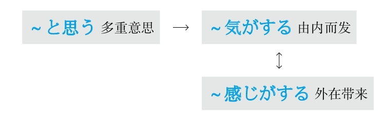
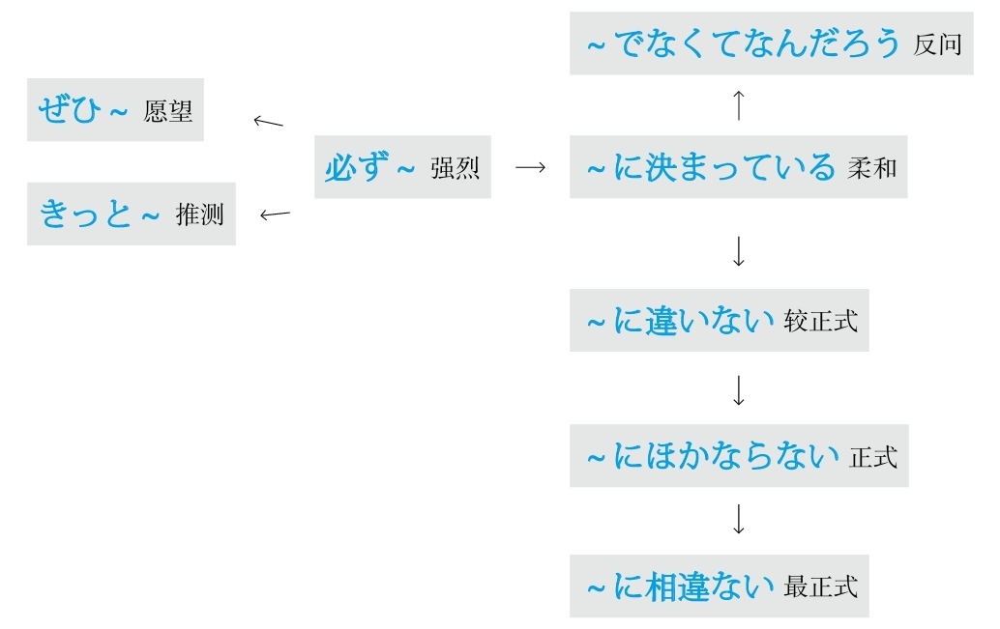
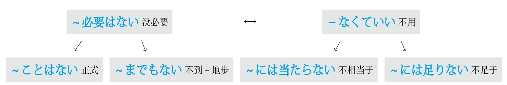
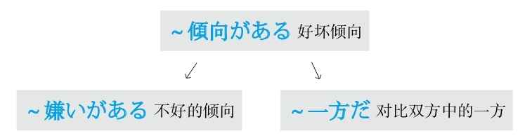
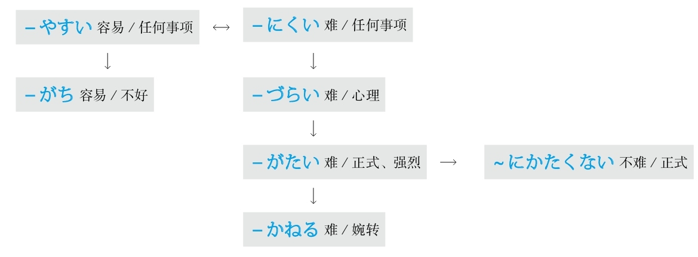

## J
### 即使～也不～

#### ～に－ない
**解释：** 「に」表示目的；「ない」的意思是“不”
**意思：** 即使要～也不能～
**着重：** 将要做某事；简洁
**注意：** 「～に」和「～ない」之间一般不加其他信息，即构成「するにできない」的形式
**接续：** 「に」前接动词的原形；「ない」前接动词可能形的连用形

例句：<ruby>笑<rp>(</rp><rt>わら</rt><rp>)</rp></ruby>う**に** <ruby>笑<rp>(</rp><rt>わら</rt><rp>)</rp></ruby>え**ない** 。
直译：即使要笑也不能笑。
意译：即使要笑也笑不出来。

#### ～にも－ない
**解释：** 「に」表示目的；「も」表示强调，在此通过强调表示转折；「ない」的意思是“不”
**意思：** 即使要～也不能～
**着重：** 有做某事的意愿；具体
**注意：** 「～に」和「～ない」之间可以加其他信息，即构成「しようにも～できない」的形式
**接续：** 「に」前接动词的意志形；「ない」前接动词可能形的连用形

例句：<ruby>勉<rp>(</rp><rt>べん</rt><rp>)</rp></ruby><ruby>強<rp>(</rp><rt>きょう</rt><rp>)</rp></ruby>しよう**にも** 、<ruby>外<rp>(</rp><rt>そと</rt><rp>)</rp></ruby>が<ruby>騒<rp>(</rp><rt>さわ</rt><rp>)</rp></ruby>がしいから、<ruby>集<rp>(</rp><rt>しゅう</rt><rp>)</rp></ruby><ruby>中<rp>(</rp><rt>ちゅう</rt><rp>)</rp></ruby>でき**ない** 。
直译：即使想要学习，外面太吵了，所以不能集中。
意译：即使想要学习，外面太吵了，也没办法集中精力。
语法关系图

### 既然

#### ～以上、
**直译：** 在～以上
**注意：** “既然”在汉语中表示已经发生的状态，表达前（因）后（果）关系，其特点是“要用语气强烈的表达方式”，比如“既然～就必须～”、“既然～就得～”、“既然～就要～”。日语的「～<ruby>以<rp>(</rp><rt>い</rt><rp>)</rp></ruby><ruby>上<rp>(</rp><rt>じょう</rt><rp>)</rp></ruby>」表示上下关系，除此之外，还和中文的“既然”一样，也表达方向的关系，所以也要用语气强烈的表达方式
**语气：** 正式
**接续：** 动词的简体

例句：この<ruby>仕<rp>(</rp><rt>し</rt><rp>)</rp></ruby><ruby>事<rp>(</rp><rt>ごと</rt><rp>)</rp></ruby>を<ruby>引<rp>(</rp><rt>ひ</rt><rp>)</rp></ruby>き<ruby>受<rp>(</rp><rt>う</rt><rp>)</rp></ruby>けた**<ruby>以<rp>(</rp><rt>い</rt><rp>)</rp></ruby><ruby>上<rp>(</rp><rt>じょう</rt><rp>)</rp></ruby>、** <ruby>最<rp>(</rp><rt>さい</rt><rp>)</rp></ruby><ruby>後<rp>(</rp><rt>ご</rt><rp>)</rp></ruby>までやり<ruby>抜<rp>(</rp><rt>ぬ</rt><rp>)</rp></ruby>くつもりだ。
直译：在接受了这个工作之上，决心干到底。
意译：既然接受了这个工作，我就决心干到底。

#### ～からには
**解释：** 「から」表示原因，「に」表示方向，「は」表示强调
**意思：** 在～原因之上
**注意：** “既然”在汉语中表示已经发生的状态，表达前（因）后（果）关系，其特点是“要用语气强烈的表达方式”，比如“既然～就必须～”、“既然～就得～”、“既然～就要～”。日语的「～からには」表示“在～原因之上”的上下关系，除此之外，还和中文的“既然”一样，也表达方向的关系，所以也要用语气强烈的表达方式
**语气：** 柔和
**接续：** 动词的简体、形容词的原形、形容动词和名词加である

例句：<ruby>試<rp>(</rp><rt>し</rt><rp>)</rp></ruby><ruby>合<rp>(</rp><rt>あい</rt><rp>)</rp></ruby>に<ruby>出<rp>(</rp><rt>で</rt><rp>)</rp></ruby>る**からには** 、<ruby>全<rp>(</rp><rt>ぜん</rt><rp>)</rp></ruby><ruby>力<rp>(</rp><rt>りょく</rt><rp>)</rp></ruby>を<ruby>尽<rp>(</rp><rt>つ</rt><rp>)</rp></ruby>くしたい。
直译：在参加比赛的原因之上，想全力以赴。
意译：既然参加比赛，我们就要全力以赴。
语法关系图

### 假设

#### ～なら
**准则：** 在「と、ば、たら、なら」里，最重要的是顺序。「と」和「なら」分别表示极端，「と」代表“条件性”的极端，「なら」代表“假定性”的极端
**意思：** 假设～（前面接谓语词）
**注意：** 假设过去的时候，因为要表示过去的状态，所以后句与「－ていた」相呼应
**搭配：** 前面有时接「<ruby>仮<rp>(</rp><rt>かり</rt><rp>)</rp></ruby>に」
**接续：** 动词和形容词的简体及形容动词接「なら」表示“假设”；名词接「なら」表示“如果”

例句：<ruby>私<rp>(</rp><rt>わたし</rt><rp>)</rp></ruby>はあの<ruby>時<rp>(</rp><rt>とき</rt><rp>)</rp></ruby>よく<ruby>左<rp>(</rp><rt>さ</rt><rp>)</rp></ruby><ruby>右<rp>(</rp><rt>ゆう</rt><rp>)</rp></ruby>を<ruby>確<rp>(</rp><rt>かく</rt><rp>)</rp></ruby><ruby>認<rp>(</rp><rt>にん</rt><rp>)</rp></ruby>した**なら** 、<ruby>走<rp>(</rp><rt>はし</rt><rp>)</rp></ruby>ってきた<ruby>自<rp>(</rp><rt>じ</rt><rp>)</rp></ruby><ruby>転<rp>(</rp><rt>てん</rt><rp>)</rp></ruby><ruby>車<rp>(</rp><rt>しゃ</rt><rp>)</rp></ruby>にぶつかっていなかっただろう。
直译：假设我那时左右好好确认的话，骑过来的自行车，不撞上了。
意译：如果我那时左右好好确认的话，就不会撞到骑过来的自行车了。

例句：<ruby>今<rp>(</rp><rt>いま</rt><rp>)</rp></ruby><ruby>残<rp>(</rp><rt>ざん</rt><rp>)</rp></ruby><ruby>業<rp>(</rp><rt>ぎょう</rt><rp>)</rp></ruby>している**なら** 、<ruby>夜<rp>(</rp><rt>や</rt><rp>)</rp></ruby><ruby>食<rp>(</rp><rt>しょく</rt><rp>)</rp></ruby>を<ruby>用<rp>(</rp><rt>よう</rt><rp>)</rp></ruby><ruby>意<rp>(</rp><rt>い</rt><rp>)</rp></ruby>して<ruby>届<rp>(</rp><rt>とど</rt><rp>)</rp></ruby>けるよ。
直译：假设现在在加班的话，做夜宵送去。
意译：要是你现在在加班的话，我做夜宵给你送去。

例句：<ruby>夕<rp>(</rp><rt>ゆう</rt><rp>)</rp></ruby><ruby>方<rp>(</rp><rt>がた</rt><rp>)</rp></ruby>に<ruby>小<rp>(</rp><rt>こ</rt><rp>)</rp></ruby><ruby>包<rp>(</rp><rt>づつみ</rt><rp>)</rp></ruby>が<ruby>届<rp>(</rp><rt>とど</rt><rp>)</rp></ruby>く**なら** 、<ruby>午<rp>(</rp><rt>ご</rt><rp>)</rp></ruby><ruby>前<rp>(</rp><rt>ぜん</rt><rp>)</rp></ruby><ruby>中<rp>(</rp><rt>ちゅう</rt><rp>)</rp></ruby>に<ruby>買<rp>(</rp><rt>か</rt><rp>)</rp></ruby>い<ruby>物<rp>(</rp><rt>もの</rt><rp>)</rp></ruby>を<ruby>済<rp>(</rp><rt>す</rt><rp>)</rp></ruby>ませておこう。
直译：假设在傍晚包裹送到，上午把东西买完吧。
意译：如果包裹傍晚送到，那上午去买东西吧。

#### ～とあれば
**解释：** 「と」表示内容；「あれば」是「ある」加上了「ば」，意思是“如果有～”
**意思：** 如果有～的话
**语气：** 正式
**接续：** 任何词

例句：<ruby>遠<rp>(</rp><rt>えん</rt><rp>)</rp></ruby><ruby>来<rp>(</rp><rt>らい</rt><rp>)</rp></ruby>の<ruby>客<rp>(</rp><rt>きゃく</rt><rp>)</rp></ruby>が<ruby>来<rp>(</rp><rt>く</rt><rp>)</rp></ruby>る**とあれば** 、<ruby>腕<rp>(</rp><rt>うで</rt><rp>)</rp></ruby>を<ruby>振<rp>(</rp><rt>ふ</rt><rp>)</rp></ruby>ってご<ruby>馳<rp>(</rp><rt>ち</rt><rp>)</rp></ruby><ruby>走<rp>(</rp><rt>そう</rt><rp>)</rp></ruby>をたくさん<ruby>用<rp>(</rp><rt>よう</rt><rp>)</rp></ruby><ruby>意<rp>(</rp><rt>い</rt><rp>)</rp></ruby>しよう。
直译：远方的客人来的话，抡起胳膊，准备很多饭菜吧。
意译：如果远方的客人要来，那我就抡起胳膊给他们准备一大桌菜吧。

#### ～とする
**解释：** 「と」表示内容；「する」可以代替大多动词，此处代替了「<ruby>仮<rp>(</rp><rt>か</rt><rp>)</rp></ruby><ruby>定<rp>(</rp><rt>てい</rt><rp>)</rp></ruby>する」
**准则：** 假设过去的时候，因为要表示过去的状态，所以后句与「－ていた」相呼应
**意思：** 假设～
**搭配：** 前面有时接「<ruby>仮<rp>(</rp><rt>かり</rt><rp>)</rp></ruby>に」
**重点：** 可以假设过去、现在、将来
**区别：** 比「なら」的用法更广，还可以与其他词汇组合构成多样的表达方式，比如「～とすれば、～としたら、～としても」等
**接续：** 任何词

例句：<ruby>私<rp>(</rp><rt>わたし</rt><rp>)</rp></ruby>は<ruby>弁<rp>(</rp><rt>べん</rt><rp>)</rp></ruby><ruby>護<rp>(</rp><rt>ご</rt><rp>)</rp></ruby><ruby>師<rp>(</rp><rt>し</rt><rp>)</rp></ruby>にならなかった**としたら** 、どんな<ruby>職<rp>(</rp><rt>しょく</rt><rp>)</rp></ruby><ruby>業<rp>(</rp><rt>ぎょう</rt><rp>)</rp></ruby>に<ruby>就<rp>(</rp><rt>つ</rt><rp>)</rp></ruby>いていただろう。
直译：假设我没有成为律师的话，过去做什么工作呢？
意译：假设我没当律师的话，我那时候做什么工作呢？

例句：**<ruby>仮<rp>(</rp><rt>かり</rt><rp>)</rp></ruby>に** <ruby>毎<rp>(</rp><rt>まい</rt><rp>)</rp></ruby><ruby>日<rp>(</rp><rt>にち</rt><rp>)</rp></ruby><ruby>単<rp>(</rp><rt>たん</rt><rp>)</rp></ruby><ruby>語<rp>(</rp><rt>ご</rt><rp>)</rp></ruby>を<ruby>1<rp>(</rp><rt>じゅ</rt><rp>)</rp></ruby><ruby>0<rp>(</rp><rt>っ</rt><rp>)</rp></ruby><ruby>個<rp>(</rp><rt>こ</rt><rp>)</rp></ruby><ruby>覚<rp>(</rp><rt>おぼ</rt><rp>)</rp></ruby>える**とする** 。<ruby>一<rp>(</rp><rt>いっ</rt><rp>)</rp></ruby><ruby>か<rp>(</rp><rt>か</rt><rp>)</rp></ruby><ruby>月<rp>(</rp><rt>げつ</rt><rp>)</rp></ruby>で<ruby>3<rp>(</rp><rt>さん</rt><rp>)</rp></ruby><ruby>0<rp>(</rp><rt>ぴゃ</rt><rp>)</rp></ruby><ruby>0<rp>(</rp><rt>っ</rt><rp>)</rp></ruby><ruby>個<rp>(</rp><rt>こ</rt><rp>)</rp></ruby>を<ruby>覚<rp>(</rp><rt>おぼ</rt><rp>)</rp></ruby>えることになる。
直译：假设每天记10个单词，结果成为在一个月里记300个单词。
意译：假设每天记10个单词，一个月就能记300个单词。

例句：<ruby>私<rp>(</rp><rt>わたし</rt><rp>)</rp></ruby>が<ruby>社<rp>(</rp><rt>しゃ</rt><rp>)</rp></ruby><ruby>長<rp>(</rp><rt>ちょう</rt><rp>)</rp></ruby>だ**としたら** 、きっと<ruby>全<rp>(</rp><rt>ぜん</rt><rp>)</rp></ruby><ruby>員<rp>(</rp><rt>いん</rt><rp>)</rp></ruby>の<ruby>給<rp>(</rp><rt>きゅう</rt><rp>)</rp></ruby><ruby>料<rp>(</rp><rt>りょう</rt><rp>)</rp></ruby>を<ruby>上<rp>(</rp><rt>あ</rt><rp>)</rp></ruby>げる。
直译：假设我就是社长，一定把全员的工资提高。
意译：假设我就是社长，一定会给全体员工涨工资。

#### ～ものなら
**解释：** 「もの」接在句尾表示强调，翻译成“可、真、可真、就是”；「なら」表示假设
**意思：** 刚要做某事就～
**注意：** 前面接动词的意志形时，通常会带来严重的后果
**接续：** 动词的可能形、动词的意志形（变形规律参照第一章的第二节）

例句：この<ruby>会<rp>(</rp><rt>かい</rt><rp>)</rp></ruby><ruby>社<rp>(</rp><rt>しゃ</rt><rp>)</rp></ruby>はとても<ruby>厳<rp>(</rp><rt>きび</rt><rp>)</rp></ruby>しい。<ruby>仕<rp>(</rp><rt>し</rt><rp>)</rp></ruby><ruby>事<rp>(</rp><rt>ごと</rt><rp>)</rp></ruby>で<ruby>少<rp>(</rp><rt>すこ</rt><rp>)</rp></ruby>しでも<ruby>失<rp>(</rp><rt>しっ</rt><rp>)</rp></ruby><ruby>敗<rp>(</rp><rt>ぱい</rt><rp>)</rp></ruby>しよう**ものなら** 、<ruby>首<rp>(</rp><rt>くび</rt><rp>)</rp></ruby>になりかねないよ。
直译：这个公司很严格。在工作中即使稍微有些失败的话，很可能被解雇。
意译：这个公司特别严格，假设工作中稍微有些失败，就很可能被解雇。

例句：できる**ものなら** 、やってしまいたい。
直译：假设真能，想做完成。
意译：假设真能（那样）的话，我想去做。
语法关系图

### 结果

#### －た結果、
**解释：** 「た」表示“做了～”；「<ruby>結<rp>(</rp><rt>けっ</rt><rp>)</rp></ruby><ruby>果<rp>(</rp><rt>か</rt><rp>)</rp></ruby>」表示“结果”
**意思：** 做了～的结果，
**注意：** 后面一般不加助词
**语气：** 正式
**变形：** 动词的た形的简体（变形规律参照第一章的第二节）

例句：<ruby>筆<rp>(</rp><rt>ひっ</rt><rp>)</rp></ruby><ruby>記<rp>(</rp><rt>き</rt><rp>)</rp></ruby><ruby>試<rp>(</rp><rt>し</rt><rp>)</rp></ruby><ruby>験<rp>(</rp><rt>けん</rt><rp>)</rp></ruby>と<ruby>口<rp>(</rp><rt>こう</rt><rp>)</rp></ruby><ruby>頭<rp>(</rp><rt>とう</rt><rp>)</rp></ruby><ruby>試<rp>(</rp><rt>し</rt><rp>)</rp></ruby><ruby>験<rp>(</rp><rt>けん</rt><rp>)</rp></ruby>と<ruby>書<rp>(</rp><rt>しょ</rt><rp>)</rp></ruby><ruby>類<rp>(</rp><rt>るい</rt><rp>)</rp></ruby><ruby>審<rp>(</rp><rt>しん</rt><rp>)</rp></ruby><ruby>査<rp>(</rp><rt>さ</rt><rp>)</rp></ruby>を<ruby>行<rp>(</rp><rt>おこな</rt><rp>)</rp></ruby>っ**た** <ruby>結<rp>(</rp><rt>けっ</rt><rp>)</rp></ruby><ruby>果<rp>(</rp><rt>か</rt><rp>)</rp></ruby>**、** <ruby>候<rp>(</rp><rt>こう</rt><rp>)</rp></ruby><ruby>補<rp>(</rp><rt>ほ</rt><rp>)</rp></ruby><ruby>者<rp>(</rp><rt>しゃ</rt><rp>)</rp></ruby>を<ruby>5<rp>(</rp><rt>ご</rt><rp>)</rp></ruby><ruby>人<rp>(</rp><rt>にん</rt><rp>)</rp></ruby>に<ruby>絞<rp>(</rp><rt>しぼ</rt><rp>)</rp></ruby>った。
直译：笔试和口试和书面选拔的进行结果，把候补筛选到了5个人。
意译：经过笔试、口试以及书面材料审核，最终选定了5位候选人。

#### －たところ、
**解释：** 「た」表示“做了～”；「ところ」代替了「<ruby>結<rp>(</rp><rt>けっ</rt><rp>)</rp></ruby><ruby>果<rp>(</rp><rt>か</rt><rp>)</rp></ruby>」
**意思：** 做了～的结果，
**注意：** 后面一般不加助词
**语气：** 柔和
**变形：** 动词的た形的简体（变形规律参照第一章的第二节）

例句：<ruby>試<rp>(</rp><rt>し</rt><rp>)</rp></ruby><ruby>験<rp>(</rp><rt>けん</rt><rp>)</rp></ruby>を<ruby>実<rp>(</rp><rt>じっ</rt><rp>)</rp></ruby><ruby>施<rp>(</rp><rt>し</rt><rp>)</rp></ruby>し**たところ、** <ruby>今<rp>(</rp><rt>こ</rt><rp>)</rp></ruby><ruby>年<rp>(</rp><rt>とし</rt><rp>)</rp></ruby>の<ruby>合<rp>(</rp><rt>ごう</rt><rp>)</rp></ruby><ruby>格<rp>(</rp><rt>かく</rt><rp>)</rp></ruby>の<ruby>割<rp>(</rp><rt>わり</rt><rp>)</rp></ruby><ruby>合<rp>(</rp><rt>あい</rt><rp>)</rp></ruby>は、<ruby>昨<rp>(</rp><rt>さく</rt><rp>)</rp></ruby><ruby>年<rp>(</rp><rt>ねん</rt><rp>)</rp></ruby>と<ruby>比<rp>(</rp><rt>くら</rt><rp>)</rp></ruby>べ、<ruby>約<rp>(</rp><rt>やく</rt><rp>)</rp></ruby><ruby>2<rp>(</rp><rt>に</rt><rp>)</rp></ruby><ruby>割<rp>(</rp><rt>わり</rt><rp>)</rp></ruby>ほど<ruby>高<rp>(</rp><rt>たか</rt><rp>)</rp></ruby>くなった。
直译：考试实施的结果，今年的合格比率，与去年相比，大约20%左右变高了。
意译：考试的结果是今年的及格率比去年提高了大约20%。

#### ～しまつだ
**解释：** 「しまつ」的汉字是「<ruby>始<rp>(</rp><rt>し</rt><rp>)</rp></ruby><ruby>末<rp>(</rp><rt>まつ</rt><rp>)</rp></ruby>」
**意思：** 地步、下场
**用于：** 不好的结果
**接续：** 修饰名词的规律（参照第一章的第三节）

例句：<ruby>彼<rp>(</rp><rt>かれ</rt><rp>)</rp></ruby>はいつも<ruby>睡<rp>(</rp><rt>すい</rt><rp>)</rp></ruby><ruby>眠<rp>(</rp><rt>みん</rt><rp>)</rp></ruby><ruby>不<rp>(</rp><rt>ぶ</rt><rp>)</rp></ruby><ruby>足<rp>(</rp><rt>そく</rt><rp>)</rp></ruby>で、<ruby>注<rp>(</rp><rt>ちゅう</rt><rp>)</rp></ruby><ruby>意<rp>(</rp><rt>い</rt><rp>)</rp></ruby>されても<ruby>聞<rp>(</rp><rt>き</rt><rp>)</rp></ruby>かない。ついに<ruby>居<rp>(</rp><rt>い</rt><rp>)</rp></ruby><ruby>眠<rp>(</rp><rt>ねむ</rt><rp>)</rp></ruby>り<ruby>運<rp>(</rp><rt>うん</rt><rp>)</rp></ruby><ruby>転<rp>(</rp><rt>てん</rt><rp>)</rp></ruby>で<ruby>事<rp>(</rp><rt>じ</rt><rp>)</rp></ruby><ruby>故<rp>(</rp><rt>こ</rt><rp>)</rp></ruby>を<ruby>起<rp>(</rp><rt>お</rt><rp>)</rp></ruby>こす**<ruby>始<rp>(</rp><rt>し</rt><rp>)</rp></ruby><ruby>末<rp>(</rp><rt>まつ</rt><rp>)</rp></ruby>だ** 。
直译：他总是睡眠不足，即使被警告也不听。终于打盹儿开车出了车祸的地步。
意译：他总是睡眠不足，也不听别人的劝告，终于因疲劳驾驶出了车祸。

#### －ば、それまでだ
**解释：** 「ば」的意思是“如果”；「それ」的意思是“那”；「まで」的意思是“到～的地步”
**直译：** 如果～也就到那个地步了
**意译：** 如果～就到头了
**用于：** 没有发展
**注意：** 「それまで」还可以换成「これまで」
**变形：** ば形（变形规律参照第一章的第二节）

例句：<ruby>試<rp>(</rp><rt>し</rt><rp>)</rp></ruby><ruby>験<rp>(</rp><rt>けん</rt><rp>)</rp></ruby>のために<ruby>一<rp>(</rp><rt>いち</rt><rp>)</rp></ruby><ruby>年<rp>(</rp><rt>ねん</rt><rp>)</rp></ruby>も<ruby>準<rp>(</rp><rt>じゅん</rt><rp>)</rp></ruby><ruby>備<rp>(</rp><rt>び</rt><rp>)</rp></ruby>してきた。<ruby>試<rp>(</rp><rt>し</rt><rp>)</rp></ruby><ruby>験<rp>(</rp><rt>けん</rt><rp>)</rp></ruby>の<ruby>前<rp>(</rp><rt>ぜん</rt><rp>)</rp></ruby><ruby>日<rp>(</rp><rt>じつ</rt><rp>)</rp></ruby><ruby>熱<rp>(</rp><rt>ねつ</rt><rp>)</rp></ruby>を<ruby>出<rp>(</rp><rt>だ</rt><rp>)</rp></ruby>せ**ば、それまでだ** 。
直译：为了考试准备了一年。考试前一天发烧了的话，也就那样了。
意译：为了考试准备了一年。要是考试前一天发烧了就完了。
语法关系图

### 经历

#### ～思いをする
**解释：** 「<ruby>思<rp>(</rp><rt>おも</rt><rp>)</rp></ruby>い」的意思是“感觉、感情”；「を」接在他动词前表示“把”；「する」可以代替大多数动词，此处代替了「<ruby>経<rp>(</rp><rt>けい</rt><rp>)</rp></ruby><ruby>験<rp>(</rp><rt>けん</rt><rp>)</rp></ruby>する」
**用于：** 心理上的经历
**接续：** 形容词的原形、形容动词加な

例句：<ruby>昨日<rp>(</rp><rt>きのう</rt><rp>)</rp></ruby>ある<ruby>飲<rp>(</rp><rt>いん</rt><rp>)</rp></ruby><ruby>食<rp>(</rp><rt>しょく</rt><rp>)</rp></ruby><ruby>店<rp>(</rp><rt>てん</rt><rp>)</rp></ruby>で<ruby>嫌<rp>(</rp><rt>いや</rt><rp>)</rp></ruby>な**<ruby>思<rp>(</rp><rt>おも</rt><rp>)</rp></ruby>いをした** 。
直译：昨天在饮食店里经历了讨厌的感觉。
意译：昨天我在一个饮食店里遇到了特别不愉快的事情。

例句：<ruby>親<rp>(</rp><rt>しん</rt><rp>)</rp></ruby><ruby>友<rp>(</rp><rt>ゆう</rt><rp>)</rp></ruby>が<ruby>遠<rp>(</rp><rt>とお</rt><rp>)</rp></ruby>いところに<ruby>引<rp>(</rp><rt>ひ</rt><rp>)</rp></ruby>っ<ruby>越<rp>(</rp><rt>こ</rt><rp>)</rp></ruby>してしまって、<ruby>寂<rp>(</rp><rt>さび</rt><rp>)</rp></ruby>しい**<ruby>思<rp>(</rp><rt>おも</rt><rp>)</rp></ruby>いをした** 。
直译：好友搬到很远的地方，经历了寂寞的感觉。
意译：好友搬到很远的地方，我觉得特别寂寞。

例句：<ruby>絶<rp>(</rp><rt>ぜっ</rt><rp>)</rp></ruby><ruby>対<rp>(</rp><rt>たい</rt><rp>)</rp></ruby>に<ruby>勝<rp>(</rp><rt>か</rt><rp>)</rp></ruby>つと<ruby>思<rp>(</rp><rt>おも</rt><rp>)</rp></ruby>ったのに、<ruby>負<rp>(</rp><rt>ま</rt><rp>)</rp></ruby>けてしまって、<ruby>痛<rp>(</rp><rt>いた</rt><rp>)</rp></ruby>い**<ruby>思<rp>(</rp><rt>おも</rt><rp>)</rp></ruby>いをした** 。
直译：觉得肯定能赢，结果输了，经历了痛的感觉。
意译：我觉得肯定能赢，结果输了，让我特别心痛。

#### ～を体験する
**解释：** 「を」接在他动词前表示“把”；「<ruby>体<rp>(</rp><rt>たい</rt><rp>)</rp></ruby><ruby>験<rp>(</rp><rt>けん</rt><rp>)</rp></ruby>する」的意思是“体验”
**用于：** 身体上的经历
**接续：** 名词

例句：<ruby>3<rp>(</rp><rt>さん</rt><rp>)</rp></ruby><ruby>0<rp>(</rp><rt>じゅう</rt><rp>)</rp></ruby><ruby>年<rp>(</rp><rt>ねん</rt><rp>)</rp></ruby>ほど<ruby>前<rp>(</rp><rt>まえ</rt><rp>)</rp></ruby>の<ruby>日<rp>(</rp><rt>に</rt><rp>)</rp></ruby><ruby>本<rp>(</rp><rt>ほん</rt><rp>)</rp></ruby>のバブル<ruby>絶<rp>(</rp><rt>ぜっ</rt><rp>)</rp></ruby><ruby>頂<rp>(</rp><rt>ちょう</rt><rp>)</rp></ruby><ruby>期<rp>(</rp><rt>き</rt><rp>)</rp></ruby>を<ruby>実<rp>(</rp><rt>じっ</rt><rp>)</rp></ruby><ruby>際<rp>(</rp><rt>さい</rt><rp>)</rp></ruby>に**<ruby>体<rp>(</rp><rt>たい</rt><rp>)</rp></ruby><ruby>験<rp>(</rp><rt>けん</rt><rp>)</rp></ruby>した** 。
直译：大概30年以前的日本的泡沫经济的顶峰时期，实际体验了。
意译：我亲身经历了大约30年以前的日本的泡沫经济的顶峰时期。

#### ～を経験する
**解释：** 「を」接在他动词前表示“把”；「<ruby>経<rp>(</rp><rt>けい</rt><rp>)</rp></ruby><ruby>験<rp>(</rp><rt>けん</rt><rp>)</rp></ruby>する」的意思是“经历”
**用于：** 身心的经历
**接续：** 名词

例句：<ruby>1<rp>(</rp><rt>せん</rt><rp>)</rp></ruby><ruby>9<rp>(</rp><rt>きゅうひゃく</rt><rp>)</rp></ruby><ruby>9<rp>(</rp><rt>きゅうじゅう</rt><rp>)</rp></ruby><ruby>5<rp>(</rp><rt>ご</rt><rp>)</rp></ruby><ruby>年<rp>(</rp><rt>ねん</rt><rp>)</rp></ruby>に<ruby>阪<rp>(</rp><rt>はん</rt><rp>)</rp></ruby><ruby>神<rp>(</rp><rt>しん</rt><rp>)</rp></ruby>・<ruby>淡<rp>(</rp><rt>あわ</rt><rp>)</rp></ruby><ruby>路<rp>(</rp><rt>じ</rt><rp>)</rp></ruby><ruby>大<rp>(</rp><rt>だい</rt><rp>)</rp></ruby><ruby>震<rp>(</rp><rt>しん</rt><rp>)</rp></ruby><ruby>災<rp>(</rp><rt>さい</rt><rp>)</rp></ruby>**を<ruby>経験<rp>(</rp><rt>けいけん</rt><rp>)</rp></ruby>した** 。
直译：经历了1995年的阪神淡路大地震。
意译：我经历了1995年的阪神淡路大地震。
语法关系图

### 尽量

#### ～ようにする
**解释：** 「よう」的意思是“样子”；「に」表示方向；「する」的意思是“做”
**直译：** 做成～的样子
**意译：** 尽量做～
**接续：** 动词的原形

例句：ダイエットしているから、<ruby>晩<rp>(</rp><rt>ばん</rt><rp>)</rp></ruby><ruby>御<rp>(</rp><rt>ご</rt><rp>)</rp></ruby><ruby>飯<rp>(</rp><rt>はん</rt><rp>)</rp></ruby>は<ruby>野<rp>(</rp><rt>や</rt><rp>)</rp></ruby><ruby>菜<rp>(</rp><rt>さい</rt><rp>)</rp></ruby>だけ<ruby>食<rp>(</rp><rt>た</rt><rp>)</rp></ruby>べる**ようにしている** 。
直译：因为在减肥，所以晚饭只吃蔬菜，做成这个样子。
意译：我在减肥，所以现在尽量晚饭只吃蔬菜。

### 举例

#### ～と
**解释：** 起源于「<ruby>統<rp>(</rp><rt>とう</rt><rp>)</rp></ruby>」的「と」的意思是“和”或者表示“引号”
**注意：** 每一个并列的部分之间都要加「と」。前面的「と」表示“和”；最后一个「と」起引号的作用
**接续：** 名词

例句：<ruby>一<rp>(</rp><rt>ひと</rt><rp>)</rp></ruby>つ<ruby>目<rp>(</rp><rt>め</rt><rp>)</rp></ruby>**と** <ruby>二<rp>(</rp><rt>ふた</rt><rp>)</rp></ruby>つ<ruby>目<rp>(</rp><rt>め</rt><rp>)</rp></ruby>**と** <ruby>三<rp>(</rp><rt>み</rt><rp>)</rp></ruby>つ<ruby>目<rp>(</rp><rt>め</rt><rp>)</rp></ruby>**と** は、どう<ruby>違<rp>(</rp><rt>ちが</rt><rp>)</rp></ruby>いますか。
直译：第一个、第二个和第三个，怎么不一样？
意译：第一个、第二个和第三个，有什么不一样？

#### ～とか
**解释：** 「と」的意思是“和”或者表示“引号”；「か」表示不确定
**用法：** 每一个例子的后面都要加「とか」。用几次都可以
**语气：** 柔和
**接续：** 任何词

例句：<ruby>北京<rp>(</rp><rt>ぺキン</rt><rp>)</rp></ruby>に<ruby>旅<rp>(</rp><rt>りょ</rt><rp>)</rp></ruby><ruby>行<rp>(</rp><rt>こう</rt><rp>)</rp></ruby>に<ruby>行<rp>(</rp><rt>い</rt><rp>)</rp></ruby>った<ruby>時<rp>(</rp><rt>とき</rt><rp>)</rp></ruby>、<ruby>万<rp>(</rp><rt>ばん</rt><rp>)</rp></ruby><ruby>里<rp>(</rp><rt>り</rt><rp>)</rp></ruby>の<ruby>長<rp>(</rp><rt>ちょう</rt><rp>)</rp></ruby><ruby>城<rp>(</rp><rt>じょう</rt><rp>)</rp></ruby>**とか** <ruby>西<rp>(</rp><rt>せい</rt><rp>)</rp></ruby><ruby>太<rp>(</rp><rt>たい</rt><rp>)</rp></ruby><ruby>后<rp>(</rp><rt>こう</rt><rp>)</rp></ruby>の<ruby>別<rp>(</rp><rt>べっ</rt><rp>)</rp></ruby><ruby>荘<rp>(</rp><rt>そう</rt><rp>)</rp></ruby>だった<ruby>頤<rp>(</rp><rt>い</rt><rp>)</rp></ruby><ruby>和<rp>(</rp><rt>わ</rt><rp>)</rp></ruby><ruby>園<rp>(</rp><rt>えん</rt><rp>)</rp></ruby>**とか** を<ruby>回<rp>(</rp><rt>まわ</rt><rp>)</rp></ruby>った。
直译：去北京旅游的时候，长城啦慈禧的别墅的颐和园啦等地方，转了。
意译：去北京旅游的时候，转了长城、慈禧的别墅——颐和园等地方。

#### ～や
**解释：** 「や」的汉字是表示并列的「也」
**用法：** 常构成「～や～など」或「～や～といった+名词」的结构
**语气：** 正式
**接续：** 名词

例句：<ruby>当<rp>(</rp><rt>とう</rt><rp>)</rp></ruby><ruby>店<rp>(</rp><rt>てん</rt><rp>)</rp></ruby>では、<ruby>和<rp>(</rp><rt>わ</rt><rp>)</rp></ruby><ruby>雑<rp>(</rp><rt>ざっ</rt><rp>)</rp></ruby><ruby>貨<rp>(</rp><rt>か</rt><rp>)</rp></ruby>**や** アジアの<ruby>雑<rp>(</rp><rt>ざっ</rt><rp>)</rp></ruby><ruby>貨<rp>(</rp><rt>か</rt><rp>)</rp></ruby>**や** <ruby>民<rp>(</rp><rt>みん</rt><rp>)</rp></ruby><ruby>芸<rp>(</rp><rt>げい</rt><rp>)</rp></ruby><ruby>品<rp>(</rp><rt>ひん</rt><rp>)</rp></ruby>**など** を<ruby>扱<rp>(</rp><rt>あつか</rt><rp>)</rp></ruby>っております。
直译：在本店，日本杂货啦亚洲杂货啦民间工艺品等，经营着。
意译：本店经营日本杂货、亚洲杂货、民间工艺品等。

#### ～やら～やら
**解释：** 「やら」和「や」一样，表示不完全性举例，但是更加口语化，相当于现代日语的「だ」或「か」
**注意：** 表示不完全性举例
**区别：** 一般「や」接在名词后，「やら」可以接任何词

例句：<ruby>損<rp>(</rp><rt>そん</rt><rp>)</rp></ruby>した**やら** <ruby>得<rp>(</rp><rt>とく</rt><rp>)</rp></ruby>した**やら** もうどうでもいいことだ。
直译：亏了呀赚了呀，现在都已经无所谓了。
意译：不管是亏了还是赚了，现在都已经无所谓了。

例句：<ruby>飲<rp>(</rp><rt>の</rt><rp>)</rp></ruby>みすぎて、<ruby>頭<rp>(</rp><rt>あたま</rt><rp>)</rp></ruby>が<ruby>痛<rp>(</rp><rt>いた</rt><rp>)</rp></ruby>い**やら** <ruby>息<rp>(</rp><rt>いき</rt><rp>)</rp></ruby>が<ruby>苦<rp>(</rp><rt>くる</rt><rp>)</rp></ruby>しい**やら** 、<ruby>大<rp>(</rp><rt>たい</rt><rp>)</rp></ruby><ruby>変<rp>(</rp><rt>へん</rt><rp>)</rp></ruby>でした。
直译：喝多了，头疼呀喘不上气呀，很痛苦。
意译：喝多了，又是头疼又是喘不上气来，痛苦死了。

#### ―たり
**解释：** 「たり」是「とあり」的音变。「と」表示内容；「あり」是「<ruby>有<rp>(</rp><rt>あ</rt><rp>)</rp></ruby>る」的连用形
**注意：** 谓语词的举例
**用法：** 作为名词使用，后面接谓语。用几次都可以
**变形：** 动词的た形的简体（变形规律参照第一章的第二节）

例句：<ruby>買<rp>(</rp><rt>か</rt><rp>)</rp></ruby>いたいものはいつもあっ**たり** なかっ**たり** する。
直译：想买的东西，经常有和没有。
意译：想买的东西总是有时候有、有时候没有。

#### ～でも
**解释：** 「で」是「です」的中顿形式；「も」表示强调
**意思：** 不特定地举出一个例子，表示推测或建议
**接续：** 名词

例句：お<ruby>茶<rp>(</rp><rt>ちゃ</rt><rp>)</rp></ruby>**でも** <ruby>飲<rp>(</rp><rt>の</rt><rp>)</rp></ruby>みませんか？
直译：不喝点儿茶吗？
意译：喝点儿茶什么的吗？

例句：<ruby>夢<rp>(</rp><rt>ゆめ</rt><rp>)</rp></ruby>**でも** みているの？
直译：做梦呢？
意译：是不是在做梦呢？

#### ～にしても
**解释：** 「に」表示方向或对象；「して」是能够代替大多数动词的「する」的中顿，此处代替了表示举例的「<ruby>例<rp>(</rp><rt>たと</rt><rp>)</rp></ruby>える」；「も」表示强调
**意思：** 不特定地举出一个例子，表示推测或建议
**注意：** 「行っても」表示转折的“即便要去”，「行くにしても」表示举例的“打个比方要去”
**接续：** 动词和形容词的简体、形容动词和名词

例句：<ruby>田<rp>(</rp><rt>た</rt><rp>)</rp></ruby><ruby>中<rp>(</rp><rt>なか</rt><rp>)</rp></ruby>さんの<ruby>家<rp>(</rp><rt>いえ</rt><rp>)</rp></ruby>まで<ruby>行<rp>(</rp><rt>い</rt><rp>)</rp></ruby>く**にしても** 、<ruby>事<rp>(</rp><rt>じ</rt><rp>)</rp></ruby><ruby>前<rp>(</rp><rt>ぜん</rt><rp>)</rp></ruby>に<ruby>一<rp>(</rp><rt>いち</rt><rp>)</rp></ruby><ruby>度<rp>(</rp><rt>ど</rt><rp>)</rp></ruby><ruby>電<rp>(</rp><rt>でん</rt><rp>)</rp></ruby><ruby>話<rp>(</rp><rt>わ</rt><rp>)</rp></ruby>で<ruby>連<rp>(</rp><rt>れん</rt><rp>)</rp></ruby><ruby>絡<rp>(</rp><rt>らく</rt><rp>)</rp></ruby>した<ruby>方<rp>(</rp><rt>ほう</rt><rp>)</rp></ruby>がいい。
直译：打个比方去田中家，事先打一次电话联络最好。
意译：打个比方去田中家，最好也要事先打个电话。

#### ～にしろ～にしろ/～にせよ～にせよ
**解释：** 「しろ」和「せよ」都是「する」的命令形；「に」表示对象；此处是举出两个例子
**区别：** 「せよ」比「しろ」正式
**意思：** 不管是～，还是～
**接续：** 动词和形容词的简体、形容动词和名词

例句：<ruby>寒<rp>(</rp><rt>さむ</rt><rp>)</rp></ruby>い**にしろ** <ruby>暑<rp>(</rp><rt>あつ</rt><rp>)</rp></ruby>い**にしろ** 、どうせ<ruby>遠<rp>(</rp><rt>とお</rt><rp>)</rp></ruby>くまで<ruby>行<rp>(</rp><rt>い</rt><rp>)</rp></ruby>かないから<ruby>大<rp>(</rp><rt>だい</rt><rp>)</rp></ruby><ruby>丈<rp>(</rp><rt>じょう</rt><rp>)</rp></ruby><ruby>夫<rp>(</rp><rt>ぶ</rt><rp>)</rp></ruby>だ。
直译：打个比方冷，打个比方热，反正不去远处，所以没关系。
意译：不管是冷还是热，反正不去远处，所以没关系。

例句：<ruby>気<rp>(</rp><rt>き</rt><rp>)</rp></ruby>に<ruby>入<rp>(</rp><rt>い</rt><rp>)</rp></ruby>る**にせよ** <ruby>気<rp>(</rp><rt>き</rt><rp>)</rp></ruby>に<ruby>入<rp>(</rp><rt>い</rt><rp>)</rp></ruby>らない**にせよ** 、<ruby>引<rp>(</rp><rt>ひ</rt><rp>)</rp></ruby>き<ruby>受<rp>(</rp><rt>う</rt><rp>)</rp></ruby>けた<ruby>仕<rp>(</rp><rt>し</rt><rp>)</rp></ruby><ruby>事<rp>(</rp><rt>ごと</rt><rp>)</rp></ruby>は<ruby>最<rp>(</rp><rt>さい</rt><rp>)</rp></ruby><ruby>後<rp>(</rp><rt>ご</rt><rp>)</rp></ruby>までやるしかない。
直译：打个比方喜欢，打个比方不喜欢，接受了的工作就只能干到底。
意译：不管是喜欢还是不喜欢，只能把接受了的工作干到底。

#### ～につけ～につけ
**解释：** 「つけ」是表示“在”或“是”的「<ruby>就<rp>(</rp><rt>つ</rt><rp>)</rp></ruby>ける、<ruby>即<rp>(</rp><rt>つ</rt><rp>)</rp></ruby>ける」的连用形；「に」表示方向
**意思：** “不管是在～方面，还是在～方面”或“不管是～，还是～”。举出两个例子
**语气：** 正式
**接续：** 动词和形容词的简体、形容动词和名词

例句：<ruby>結<rp>(</rp><rt>けっ</rt><rp>)</rp></ruby><ruby>果<rp>(</rp><rt>か</rt><rp>)</rp></ruby>は<ruby>良<rp>(</rp><rt>よ</rt><rp>)</rp></ruby>き**につけ** <ruby>悪<rp>(</rp><rt>あ</rt><rp>)</rp></ruby>しき**につけ** 、まずやってみるのが<ruby>何<rp>(</rp><rt>なに</rt><rp>)</rp></ruby>よりだ。
直译：结果不管是好还是坏，首先试着做比什么都强。
意译：不管结果是好还是坏，最好首先去尝试。

#### ～といい～といい
**解释：** 「いい」是他动词「<ruby>言<rp>(</rp><rt>い</rt><rp>)</rp></ruby>う」的连用形，表示中顿，意思是“说”；「と」表示内容
**意思：** 不管是说～，还是说～
**接续：** 名词

例句：<ruby>生<rp>(</rp><rt>き</rt><rp>)</rp></ruby><ruby>地<rp>(</rp><rt>じ</rt><rp>)</rp></ruby>**といい** <ruby>柄<rp>(</rp><rt>がら</rt><rp>)</rp></ruby>**といい** 、<ruby>文<rp>(</rp><rt>もん</rt><rp>)</rp></ruby><ruby>句<rp>(</rp><rt>く</rt><rp>)</rp></ruby>のつけようのない<ruby>服<rp>(</rp><rt>ふく</rt><rp>)</rp></ruby>だ。
直译：不管是说质地还是说花样，都是没有办法挑剔的衣服。
意译：不管是质地还是花样，都是件无可挑剔的衣服。

#### ～だの～だの
**解释：** 「だ」是表示断定的「です」，「の」是「が」，表示并列；等于「ですが」
**注意：** 表示泛泛举例或举出两个极端的例子，如「<ruby>好<rp>(</rp><rt>す</rt><rp>)</rp></ruby>きだの、<ruby>嫌<rp>(</rp><rt>きら</rt><rp>)</rp></ruby>いだの」
**接续：** 动词和形容词的简体、名词和形容动词

例句：<ruby>疲<rp>(</rp><rt>つか</rt><rp>)</rp></ruby>れた**だの** <ruby>頭<rp>(</rp><rt>あたま</rt><rp>)</rp></ruby>が<ruby>痛<rp>(</rp><rt>ぃた</rt><rp>)</rp></ruby>い**だの** と<ruby>口<rp>(</rp><rt>こう</rt><rp>)</rp></ruby><ruby>実<rp>(</rp><rt>じつ</rt><rp>)</rp></ruby>を<ruby>探<rp>(</rp><rt>さが</rt><rp>)</rp></ruby>さないで<ruby>速<rp>(</rp><rt>はや</rt><rp>)</rp></ruby>く<ruby>勉<rp>(</rp><rt>べん</rt><rp>)</rp></ruby><ruby>強<rp>(</rp><rt>きょう</rt><rp>)</rp></ruby>しなさい。
直译：累了呀头疼了呀，不要找借口，快点儿学习。
意译：别找借口说累了呀头疼了呀什么的，快点儿学习。

#### ～だろうが～だろうが/～であろうが～であろうが
**解释：** 「だろう」是「です」的推测形式；有单纯连接句子的作用，也有转折的意思
**区别：** 「～であろうが」比「～だろうが」语气正式
**注意：** 不确定
**接续：** 名词

例句：<ruby>貧<rp>(</rp><rt>びん</rt><rp>)</rp></ruby><ruby>乏<rp>(</rp><rt>ぼう</rt><rp>)</rp></ruby>**だろうが** お<ruby>金<rp>(</rp><rt>かね</rt><rp>)</rp></ruby><ruby>持<rp>(</rp><rt>も</rt><rp>)</rp></ruby>ち**だろうが** 、それは<ruby>友<rp>(</rp><rt>とも</rt><rp>)</rp></ruby>を<ruby>選<rp>(</rp><rt>えら</rt><rp>)</rp></ruby>ぶ<ruby>基<rp>(</rp><rt>き</rt><rp>)</rp></ruby><ruby>準<rp>(</rp><rt>じゅん</rt><rp>)</rp></ruby>ではない。
直译：不管对方是穷人还是有钱人，这不是择友的基准。
意译：不管对方是穷人还是有钱人，这都不是择友的基准。

#### ～なり～なり
**解释：** 「なり」是表示断定的「<ruby>也<rp>(</rp><rt>なり</rt><rp>)</rp></ruby>」，意思是“是”
**注意：** 表示选择性举例
**重点：** 表示断定和举例的「也」的音读是「や」，训读是「なり」，相当于现代日语的「だ」或「か」
**接续：** 动词的原形

例句：<ruby>辞<rp>(</rp><rt>じ</rt><rp>)</rp></ruby><ruby>書<rp>(</rp><rt>しょ</rt><rp>)</rp></ruby>を<ruby>引<rp>(</rp><rt>ひ</rt><rp>)</rp></ruby>く**なり** <ruby>他<rp>(</rp><rt>ほか</rt><rp>)</rp></ruby>の<ruby>人<rp>(</rp><rt>ひと</rt><rp>)</rp></ruby>に<ruby>聞<rp>(</rp><rt>き</rt><rp>)</rp></ruby>く**なり** どんな<ruby>方法<rp>(</rp><rt>ほうほう</rt><rp>)</rp></ruby>でもいいから<ruby>調<rp>(</rp><rt>しら</rt><rp>)</rp></ruby>べてください。
直译：查字典啦问别人啦，不管什么方法都行，请查。
意译：查字典啦问别人啦，不管用什么方法都行，去查一下。

#### －つ－つ
**解释：** 「つ」相当于汉语的“次”
**意思：** 一次这样，一次那样
**注意：** 表示对照性举例
**词性：** 名词
**接续：** 动词的连用形

例句：<ruby>選<rp>(</rp><rt>せん</rt><rp>)</rp></ruby><ruby>手<rp>(</rp><rt>しゅ</rt><rp>)</rp></ruby>たちはみんな<ruby>抜<rp>(</rp><rt>ぬ</rt><rp>)</rp></ruby>き**つ** <ruby>抜<rp>(</rp><rt>ぬ</rt><rp>)</rp></ruby>かれ**つ** してゴールインした。
直译：选手们大家都，一次追上一次被追上，到达了终点。
意译：选手们你追我赶地到达了终点。

例句：<ruby>彼<rp>(</rp><rt>かれ</rt><rp>)</rp></ruby>は<ruby>部<rp>(</rp><rt>へ</rt><rp>)</rp></ruby><ruby>屋<rp>(</rp><rt>や</rt><rp>)</rp></ruby>で<ruby>行<rp>(</rp><rt>い</rt><rp>)</rp></ruby>き**つ** <ruby>戻<rp>(</rp><rt>もど</rt><rp>)</rp></ruby>り**つ** している。
直译：他在房间里一次去一次回地走着。
意译：他在房间里来回走着。
语法关系图

### 决定

#### ～ことにする
**解释：** 「こと」是“名词化”；「に」表示方向；「する」可以代替大多数动词，此处代替了他动词「決める」
**区别：** 他动词「決める」只是表示“单纯的决定”，而「～ことにする」侧重于有很多选择，确定了其中的一个。体现这个特点的就是表示方向、对象、目的、目标的助词「に」
**重点：** 他动词侧重于有人去做，着重强调做的人；他动词还侧重于动作
**接续：** 动词的原形

例句：いろいろ<ruby>考<rp>(</rp><rt>かんが</rt><rp>)</rp></ruby>えた<ruby>結<rp>(</rp><rt>けっ</rt><rp>)</rp></ruby><ruby>果<rp>(</rp><rt>か</rt><rp>)</rp></ruby>、<ruby>留<rp>(</rp><rt>りゅう</rt><rp>)</rp></ruby><ruby>学<rp>(</rp><rt>がく</rt><rp>)</rp></ruby>を<ruby>止<rp>(</rp><rt>や</rt><rp>)</rp></ruby>めて<ruby>就<rp>(</rp><rt>しゅう</rt><rp>)</rp></ruby><ruby>職<rp>(</rp><rt>しょく</rt><rp>)</rp></ruby>する**ことにした** 。
直译：考虑了各种各样的结果，决定不去留学去上班。
意译：多方考虑之后，我决定不去留学，去上班。

#### ～ことになる
**解释：** 「こと」是“名词化”；「に」表示方向；自动词「なる」代替了自动词「決まる」
**区别：** 自动词「決まる」只是表示“单纯的决定”，而「～ことになる」侧重于有很多选择，确定了其中的一个。体现这个特点的就是表示方向、对象、目的、目标的助词「に」
**重点：** 自动词不侧重于有人去做，不着重强调说明做的人；自动词还侧重于动作的结果和状态
**接续：** 动词的原形

例句：<ruby>学<rp>(</rp><rt>がっ</rt><rp>)</rp></ruby><ruby>校<rp>(</rp><rt>こう</rt><rp>)</rp></ruby>から<ruby>通<rp>(</rp><rt>つう</rt><rp>)</rp></ruby><ruby>知<rp>(</rp><rt>ち</rt><rp>)</rp></ruby>があって、<ruby>今<rp>(</rp><rt>こん</rt><rp>)</rp></ruby><ruby>度<rp>(</rp><rt>ど</rt><rp>)</rp></ruby>のコースは<ruby>開<rp>(</rp><rt>ひら</rt><rp>)</rp></ruby>かない**ことになった** 。
直译：学校来了通知，下次的课程不开了的事宜定下来了。
意译：学校来了通知，决定下次课程不开了。
语法关系图

### 决心

#### 思い切って～
**解释：** 「<ruby>思<rp>(</rp><rt>おも</rt><rp>)</rp></ruby>い<ruby>切<rp>(</rp><rt>き</rt><rp>)</rp></ruby>って」是「<ruby>思<rp>(</rp><rt>おも</rt><rp>)</rp></ruby>い<ruby>切<rp>(</rp><rt>き</rt><rp>)</rp></ruby>る」（不再想）的中顿形式
**意思：** 下决心做～，毅然决然地做～
**词性：** 副词
**注意：** 「<ruby>思<rp>(</rp><rt>おも</rt><rp>)</rp></ruby>い<ruby>切<rp>(</rp><rt>き</rt><rp>)</rp></ruby>り」的意思是“痛痛快快地做～”

例句：**<ruby>思<rp>(</rp><rt>おも</rt><rp>)</rp></ruby>い<ruby>切<rp>(</rp><rt>き</rt><rp>)</rp></ruby>って** <ruby>会<rp>(</rp><rt>かい</rt><rp>)</rp></ruby><ruby>社<rp>(</rp><rt>しゃ</rt><rp>)</rp></ruby>を<ruby>辞<rp>(</rp><rt>や</rt><rp>)</rp></ruby>めた。
直译：下决心辞了公司。
意译：下决心辞了工作。

#### ～つもりだ
**解释：** 名词「つもり」常被翻译成“打算”，但是日语的「つもり」的语气要比汉语的“打算”的语气强得多，所以应该理解为「<ruby>強<rp>(</rp><rt>つよ</rt><rp>)</rp></ruby>い<ruby>思<rp>(</rp><rt>おも</rt><rp>)</rp></ruby>い」（强烈的心情或决心）。如果想说“打算做某事”时可以直接用动词
**接续：** 动词的一般现在时的简体
**意思：** 决心做～

例句：<ruby>自<rp>(</rp><rt>じ</rt><rp>)</rp></ruby><ruby>分<rp>(</rp><rt>ぶん</rt><rp>)</rp></ruby>の<ruby>信<rp>(</rp><rt>しん</rt><rp>)</rp></ruby><ruby>念<rp>(</rp><rt>ねん</rt><rp>)</rp></ruby>を<ruby>貫<rp>(</rp><rt>つらぬ</rt><rp>)</rp></ruby>く**つもり** です。
直译：把自己的信念贯彻到底的强烈的心情。
意译：我决心把我自己的信念贯彻到底。

**接续：** 动词的现在进行时的简体
**意思：** 以某种强烈的心情认为～

例句：わかっている**つもり** です。
直译：已经懂了的强烈的心情。
意译：我认为我已经懂了。

**接续：** 动词的过去式的简体
**意思：** 以某种强烈的心情以为～，但是事实相反

例句：<ruby>負<rp>(</rp><rt>ま</rt><rp>)</rp></ruby>けたけど、<ruby>勝<rp>(</rp><rt>か</rt><rp>)</rp></ruby>った**つもり** でいる。
直译：虽然输了，但是赢了的强烈的心情。
意译：虽然输了，但是当作赢了。
语法关系图

### 觉得

#### ～と思う
**意思：** 想、认为、以为、觉得
**注意：** 心理活动的主语是第三人称时需要用“状态”表示，在此用现在进行时表示状态，因此第三人称要用「～と思っている」
**接续：** 任何词

例句：このような<ruby>考<rp>(</rp><rt>かんが</rt><rp>)</rp></ruby>え<ruby>方<rp>(</rp><rt>かた</rt><rp>)</rp></ruby>はあなたにはよくない**と<ruby>思<rp>(</rp><rt>おも</rt><rp>)</rp></ruby>う** 。
直译：这样的想法对你不好，我觉得。
意译：我觉得这样的想法对你不好。

#### ～気がする
**解释：** 「<ruby>気<rp>(</rp><rt>き</rt><rp>)</rp></ruby>」的意思是“感觉”；「が」用于自动词前面表示小主语；「する」在此是自动词，表示“产生”
**意思：** 产生～感觉
**区别：** 「～<ruby>気<rp>(</rp><rt>き</rt><rp>)</rp></ruby>がする」比「<ruby>思<rp>(</rp><rt>おも</rt><rp>)</rp></ruby>う」更有强调“感觉”的语气；是由内而发的感觉
**注意：** 有时候常用「～ような<ruby>気<rp>(</rp><rt>き</rt><rp>)</rp></ruby>がする」
**接续：** 修饰名词的规律（参照第一章的第三节）

例句：このやり<ruby>方<rp>(</rp><rt>かた</rt><rp>)</rp></ruby>はどうしても<ruby>間<rp>(</rp><rt>ま</rt><rp>)</rp></ruby><ruby>違<rp>(</rp><rt>ちが</rt><rp>)</rp></ruby>っている**<ruby>気<rp>(</rp><rt>き</rt><rp>)</rp></ruby>がする** 。
直译：这种方法不对，无论如何都觉得。
意译：总觉得这种方法不对。

#### ～感じがする
**解释：** 「<ruby>感<rp>(</rp><rt>かん</rt><rp>)</rp></ruby>じ」的意思是“感觉”；「が」用于自动词前面表示小主语；「する」在此是自动词，表示“产生”
**意思：** 产生～感觉
**着重：** 多用于外在给人带来的感觉
**接续：** 修饰名词的规律（参照第一章的第三节）

例句：これでいいと<ruby>言<rp>(</rp><rt>い</rt><rp>)</rp></ruby>われたけど、<ruby>自<rp>(</rp><rt>じ</rt><rp>)</rp></ruby><ruby>分<rp>(</rp><rt>ぶん</rt><rp>)</rp></ruby>ではまだまだ<ruby>足<rp>(</rp><rt>た</rt><rp>)</rp></ruby>りない**<ruby>感<rp>(</rp><rt>かん</rt><rp>)</rp></ruby>じがする** 。
直译：虽然被说了这种程度就行，但是自己却觉得这种程度还是太不够。
意译：虽然别人说这样就行了，但是自己还是觉得太不够了。
语法关系图

## K
### 开端，契机

#### ～をはじめ、
**注意：** 应用了日语里的经典句型「～を～と（に）する（把～当成～）」
**解释：** 「はじめ」的汉字是「<ruby>初<rp>(</rp><rt>はじ</rt><rp>)</rp></ruby>め」或「<ruby>始<rp>(</rp><rt>はじ</rt><rp>)</rp></ruby>め」；此外还常用「～をはじめとして」
**意思：** 以～为开始、以～为首
**语气：** 柔和
**接续：** 名词

例句：<ruby>社<rp>(</rp><rt>しゃ</rt><rp>)</rp></ruby><ruby>長<rp>(</rp><rt>ちょう</rt><rp>)</rp></ruby>**をはじめ、** <ruby>社<rp>(</rp><rt>しゃ</rt><rp>)</rp></ruby><ruby>員<rp>(</rp><rt>いん</rt><rp>)</rp></ruby><ruby>全<rp>(</rp><rt>ぜん</rt><rp>)</rp></ruby><ruby>員<rp>(</rp><rt>いん</rt><rp>)</rp></ruby>が<ruby>開<rp>(</rp><rt>かい</rt><rp>)</rp></ruby><ruby>幕<rp>(</rp><rt>まく</rt><rp>)</rp></ruby><ruby>式<rp>(</rp><rt>しき</rt><rp>)</rp></ruby>に<ruby>出<rp>(</rp><rt>しゅっ</rt><rp>)</rp></ruby><ruby>席<rp>(</rp><rt>せき</rt><rp>)</rp></ruby>した。
直译：以社长为开始，社员全员出席了开幕式。
意译：社长以及全体员工都出席了开幕式。

#### ～を皮切りに
**注意：** 应用了日语里的经典句型「～を～と（に）する（把～当成～）」
**解释：** 「<ruby>皮<rp>(</rp><rt>かわ</rt><rp>)</rp></ruby><ruby>切<rp>(</rp><rt>き</rt><rp>)</rp></ruby>り」起源于医学用语，扎针灸的第一针时皮肤好像是要裂开了一样疼痛，意译为“开端”
**意思：** 把～当作开端
**语气：** 正式
**接续：** 名词

例句：<ruby>新<rp>(</rp><rt>しん</rt><rp>)</rp></ruby><ruby>型<rp>(</rp><rt>がた</rt><rp>)</rp></ruby><ruby>携<rp>(</rp><rt>けい</rt><rp>)</rp></ruby><ruby>帯<rp>(</rp><rt>たい</rt><rp>)</rp></ruby><ruby>電<rp>(</rp><rt>でん</rt><rp>)</rp></ruby><ruby>話<rp>(</rp><rt>わ</rt><rp>)</rp></ruby>は、<ruby>先<rp>(</rp><rt>せん</rt><rp>)</rp></ruby><ruby>月<rp>(</rp><rt>げつ</rt><rp>)</rp></ruby>アメリカでの<ruby>発<rp>(</rp><rt>はつ</rt><rp>)</rp></ruby><ruby>売<rp>(</rp><rt>ばい</rt><rp>)</rp></ruby>**を<ruby>皮<rp>(</rp><rt>かわ</rt><rp>)</rp></ruby><ruby>切<rp>(</rp><rt>き</rt><rp>)</rp></ruby>りに** 、<ruby>世<rp>(</rp><rt>せ</rt><rp>)</rp></ruby><ruby>界<rp>(</rp><rt>かい</rt><rp>)</rp></ruby><ruby>各<rp>(</rp><rt>かく</rt><rp>)</rp></ruby><ruby>地<rp>(</rp><rt>ち</rt><rp>)</rp></ruby>で<ruby>販<rp>(</rp><rt>はん</rt><rp>)</rp></ruby><ruby>売<rp>(</rp><rt>ばい</rt><rp>)</rp></ruby>されている。
直译：新型手机，上月在美国的销售为开端，在世界各地一直被销售着。
意译：新型手机自从上月在美国发售以来，一直在世界各地销售。

#### ～をきっかけに
**注意：** 应用了日语里的经典句型「～を～と（に）する（把～当成～）」
**解释：** 「きっかけ」的意思是“契机”
**意思：** 以～为契机
**语气：** 柔和
**接续：** 名词

例句：その<ruby>詩<rp>(</rp><rt>し</rt><rp>)</rp></ruby><ruby>人<rp>(</rp><rt>じん</rt><rp>)</rp></ruby>の<ruby>作<rp>(</rp><rt>さく</rt><rp>)</rp></ruby><ruby>品<rp>(</rp><rt>ひん</rt><rp>)</rp></ruby>は、テレビのコマーシャルに<ruby>使<rp>(</rp><rt>つか</rt><rp>)</rp></ruby>われるの**をきっかけに** 、<ruby>大<rp>(</rp><rt>だい</rt><rp>)</rp></ruby>ブームになった。
直译：那个诗人的作品，电视广告上被使用为契机，成为了热潮。
意译：那个诗人的作品被用于电视广告之后掀起了热潮。

#### ～を契機に
**注意：** 应用了日语里的经典句型「～を～と（に）する（把～当成～）」
**解释：** 「<ruby>契<rp>(</rp><rt>けい</rt><rp>)</rp></ruby><ruby>機<rp>(</rp><rt>き</rt><rp>)</rp></ruby>」的意思是“契机”
**意思：** 以～为契机
**语气：** 正式
**接续：** 名词

例句：オイルショック**を<ruby>契<rp>(</rp><rt>けい</rt><rp>)</rp></ruby><ruby>機<rp>(</rp><rt>き</rt><rp>)</rp></ruby>に** <ruby>新<rp>(</rp><rt>しん</rt><rp>)</rp></ruby>エネルギーの<ruby>研<rp>(</rp><rt>けん</rt><rp>)</rp></ruby><ruby>究<rp>(</rp><rt>きゅう</rt><rp>)</rp></ruby>がどんどん<ruby>進<rp>(</rp><rt>すす</rt><rp>)</rp></ruby>められている。
直译：石油冲击为契机，新能源的研究在不断地被进展着。
意译：以石油危机为契机，有关新能源的研究正在不断推进。
语法关系图

### 可能性

#### ～可能性がある
**意思：** 有～的可能性
**用于：** 好的可能性、不好的可能性
**语气：** 正式
**接续：** 修饰名词的规律（参照第一章的第三节）

例句：<ruby>共<rp>(</rp><rt>きょう</rt><rp>)</rp></ruby><ruby>同<rp>(</rp><rt>どう</rt><rp>)</rp></ruby><ruby>研<rp>(</rp><rt>けん</rt><rp>)</rp></ruby><ruby>究<rp>(</rp><rt>きゅう</rt><rp>)</rp></ruby><ruby>者<rp>(</rp><rt>しゃ</rt><rp>)</rp></ruby>を<ruby>海<rp>(</rp><rt>かい</rt><rp>)</rp></ruby><ruby>外<rp>(</rp><rt>がい</rt><rp>)</rp></ruby>から<ruby>招<rp>(</rp><rt>まね</rt><rp>)</rp></ruby>く**<ruby>可<rp>(</rp><rt>か</rt><rp>)</rp></ruby><ruby>能<rp>(</rp><rt>のう</rt><rp>)</rp></ruby><ruby>性<rp>(</rp><rt>せい</rt><rp>)</rp></ruby>がある** 。
直译：共同搞研究的人从海外招的可能性有。
意译：有可能从海外招聘共同研究人员。

例句：<ruby>著<rp>(</rp><rt>ちょ</rt><rp>)</rp></ruby><ruby>作<rp>(</rp><rt>さく</rt><rp>)</rp></ruby><ruby>権<rp>(</rp><rt>けん</rt><rp>)</rp></ruby><ruby>違<rp>(</rp><rt>い</rt><rp>)</rp></ruby><ruby>反<rp>(</rp><rt>はん</rt><rp>)</rp></ruby>の**<ruby>可<rp>(</rp><rt>か</rt><rp>)</rp></ruby><ruby>能<rp>(</rp><rt>のう</rt><rp>)</rp></ruby><ruby>性<rp>(</rp><rt>せい</rt><rp>)</rp></ruby>がある** 。
直译：版权违反的可能性有。
意译：有可能会侵犯版权。

#### ～恐れがある
**解释：** 名词「<ruby>恐<rp>(</rp><rt>おそ</rt><rp>)</rp></ruby>れ」的意思是“恐怕”
**意思：** 有～的可能性
**用于：** 不好的可能性
**注意：** 相同表达方式还有「～<ruby>心<rp>(</rp><rt>しん</rt><rp>)</rp></ruby><ruby>配<rp>(</rp><rt>ぱい</rt><rp>)</rp></ruby>がある、～<ruby>危<rp>(</rp><rt>き</rt><rp>)</rp></ruby><ruby>険<rp>(</rp><rt>けん</rt><rp>)</rp></ruby><ruby>性<rp>(</rp><rt>せい</rt><rp>)</rp></ruby>がある」等
**接续：** 修饰名词的规律（参照第一章的第三节）

例句：<ruby>今日<rp>(</rp><rt>きょう</rt><rp>)</rp></ruby>は<ruby>大<rp>(</rp><rt>おお</rt><rp>)</rp></ruby><ruby>雨<rp>(</rp><rt>あめ</rt><rp>)</rp></ruby>の**<ruby>恐<rp>(</rp><rt>おそ</rt><rp>)</rp></ruby>れがある** 。
直译：今天大雨的恐怕有。
意译：今天恐怕会下大雨。

#### －かねない
**解释：** 「ね」可以理解为“难”；「－かねない」可以理解为“不难”，表示“会有不好的可能性”；「－かねる」可以理解为“很难”，表示“很难做某事”
**意思：** 有～的可能性
**着重：** 婉转地表达消极的事项
**接续：** 动词的连用形

例句：たばこの<ruby>火<rp>(</rp><rt>ひ</rt><rp>)</rp></ruby>をきちんと<ruby>始<rp>(</rp><rt>し</rt><rp>)</rp></ruby><ruby>末<rp>(</rp><rt>まつ</rt><rp>)</rp></ruby>しなければ、<ruby>事<rp>(</rp><rt>じ</rt><rp>)</rp></ruby><ruby>故<rp>(</rp><rt>こ</rt><rp>)</rp></ruby>になり**かねない** よ。
直译：烟的火不完全处理的话，可能发生事故。
意译：不把烟头完全掐灭的话，很可能会发生事故。

#### －得る
**解释：** 「－<ruby>得<rp>(</rp><rt>う</rt><rp>)</rp></ruby>る」的意思是“得到”
**意思：** 有～的可能性
**注意：** 「<ruby>得<rp>(</rp><rt>え</rt><rp>)</rp></ruby>る」单独作动词时的念法和作为动词后缀的「－<ruby>得<rp>(</rp><rt>う</rt><rp>)</rp></ruby>る」的念法不同
**接续：** 动词的连用形

例句：それはあり**<ruby>得<rp>(</rp><rt>う</rt><rp>)</rp></ruby>る** ことだ。
直译：那是有得到的事情。
意译：那很有可能。

#### －得ない
**解释：** 「－<ruby>得<rp>(</rp><rt>え</rt><rp>)</rp></ruby>ない」的意思是“不得”
**意思：** 没有～的可能性
**接续：** 动词的连用形

例句：それはあり**<ruby>得<rp>(</rp><rt>え</rt><rp>)</rp></ruby>ない** ことだ。
直译：那是有不得的事情。
意译：那不可能。

#### ～はずがない
**解释：** 「<ruby>筈<rp>(</rp><rt>はず</rt><rp>)</rp></ruby>」是弓的两端系弦的地方；由于系弦的地方应该和弦匹配，所以引申为“客观性的应该”
**直译：** 没有客观性的应该
**意译：** 不可能～
**语气：** 客观
**接续：** 修饰名词的规律（参照第一章的第三节）

例句：<ruby>激<rp>(</rp><rt>げき</rt><rp>)</rp></ruby><ruby>安<rp>(</rp><rt>やす</rt><rp>)</rp></ruby>・<ruby>速<rp>(</rp><rt>そっ</rt><rp>)</rp></ruby><ruby>攻<rp>(</rp><rt>こう</rt><rp>)</rp></ruby>ダイエット<ruby>法<rp>(</rp><rt>ほう</rt><rp>)</rp></ruby>、これで<ruby>簡<rp>(</rp><rt>かん</rt><rp>)</rp></ruby><ruby>単<rp>(</rp><rt>たん</rt><rp>)</rp></ruby>に<ruby>痩<rp>(</rp><rt>や</rt><rp>)</rp></ruby>せる**はずがない** 。
直译：便宜·快速的减肥方法，这样简单地瘦下来的客观性的应该没有。
意译：便宜快速减肥法，用这种方法不可能那么容易瘦下来。

#### ～わけがない
**解释：** 「<ruby>訳<rp>(</rp><rt>わけ</rt><rp>)</rp></ruby>」的起源是「<ruby>分<rp>(</rp><rt>わ</rt><rp>)</rp></ruby>ける」，意思是“道理”
**直译：** 没有～的道理
**意译：** 不可能～
**语气：** 强烈
**接续：** 修饰名词的规律（参照第一章的第三节）

例句：お<ruby>金<rp>(</rp><rt>かね</rt><rp>)</rp></ruby>は<ruby>楽<rp>(</rp><rt>らく</rt><rp>)</rp></ruby>に<ruby>稼<rp>(</rp><rt>かせ</rt><rp>)</rp></ruby>げる**わけがない** 。
直译：钱是轻松地赚的道理没有。
意译：钱是不可能轻松地赚的。

#### －っ子ない
**解释：** 「<ruby>子<rp>(</rp><rt>こ</rt><rp>)</rp></ruby>」的意思是“人”；「ない」的意思是“没有”；促音的作用是加强语气
**直译：** 没有～的人
**意译：** 绝对不可能～
**区别：** 语气最强烈
**接续：** 动词的连用形

例句：<ruby>宝<rp>(</rp><rt>たから</rt><rp>)</rp></ruby>くじなんて<ruby>当<rp>(</rp><rt>あ</rt><rp>)</rp></ruby>たり**っ<ruby>子<rp>(</rp><rt>こ</rt><rp>)</rp></ruby>ない** 。
直译：奖券这样的东西中的人没有。
意译：奖券这样的东西绝对不可能中。

#### ～べくもない
**解释：** 「べく」的汉字是「<ruby>可<rp>(</rp><rt>べ</rt><rp>)</rp></ruby>く」，表示“可能性”；「も」表示并列，意思是“也、连、都”；「ない」的意思是“没有”
**意思：** 连～的可能性都没有
**接续：** 动词的原形

例句：<ruby>東<rp>(</rp><rt>とう</rt><rp>)</rp></ruby><ruby>京<rp>(</rp><rt>きょう</rt><rp>)</rp></ruby><ruby>都<rp>(</rp><rt>と</rt><rp>)</rp></ruby><ruby>心<rp>(</rp><rt>しん</rt><rp>)</rp></ruby>のような<ruby>土<rp>(</rp><rt>と</rt><rp>)</rp></ruby><ruby>地<rp>(</rp><rt>ち</rt><rp>)</rp></ruby>の<ruby>高<rp>(</rp><rt>たか</rt><rp>)</rp></ruby>いところでは、<ruby>一<rp>(</rp><rt>いっ</rt><rp>)</rp></ruby><ruby>戸<rp>(</rp><rt>こ</rt><rp>)</rp></ruby><ruby>建<rp>(</rp><rt>だ</rt><rp>)</rp></ruby>ては<ruby>簡<rp>(</rp><rt>かん</rt><rp>)</rp></ruby><ruby>単<rp>(</rp><rt>たん</rt><rp>)</rp></ruby>に<ruby>手<rp>(</rp><rt>て</rt><rp>)</rp></ruby>に<ruby>入<rp>(</rp><rt>はい</rt><rp>)</rp></ruby>る**べくもない** 。
直译：像东京都心这样的土地很贵的地方，别墅形房子简单地得到的可能性没有。
意译：在像东京市中心这样土地很贵的地方，买独栋楼房绝对不是件容易的事。

#### －ないことはない
**解释：** 双重否定表示肯定。「こと」在此具体化为“可能性”；「は」强调了表示小主语的「が」；「ない」的意思是“没有”
**直译：** 没有不～的可能性
**意译：** 有可能～
**注意：** 用「こと」时，动词用「ない」
**语气：** 婉转
**变形：** 动词的否定形的な（变形规律参照第一章的第二节）

例句：どうしても<ruby>教<rp>(</rp><rt>おし</rt><rp>)</rp></ruby>えてくれと<ruby>言<rp>(</rp><rt>い</rt><rp>)</rp></ruby>うなら、<ruby>教<rp>(</rp><rt>おし</rt><rp>)</rp></ruby>え**ないことはない** 。
直译：假设说无论如何“告诉我”说了的话，不告诉的可能性没有。
意译：如果你非要我告诉你，那我有可能会告诉你。

#### －ないものでもない
**解释：** 双重否定表示肯定。「もの」在此具体化为“可能性”；「でもない」的意思是“也不是”
**直译：** 并不是不～的可能性
**意译：** 有可能～
**注意：** 用「もの」时，动词用「でもない」
**用法：** 「もの」可以省略，构成「－ないでもない」
**语气：** 婉转
**变形：** 动词的否定形的な（变形规律参照第一章的第二节）

例句：<ruby>難<rp>(</rp><rt>むずか</rt><rp>)</rp></ruby>しいが、なんとか<ruby>工<rp>(</rp><rt>く</rt><rp>)</rp></ruby><ruby>夫<rp>(</rp><rt>ふう</rt><rp>)</rp></ruby>すれば、でき**ないものでもない** 。
直译：虽然难，想办法下功夫的话，不能的情况不是。
意译：虽然很难，但是想办法好好下功夫，不会做不成的。

#### －なくはない
**解释：** 双重否定表示肯定。「なく」表示副词；「は」强调了表示小主语的「が」；「ない」的意思是“没有”
**直译：** 没有不～
**意译：** 有可能～
**语气：** 婉转，简洁
**变形：** 动词的否定形的な（变形规律参照第一章的第二节）

例句：<ruby>彼<rp>(</rp><rt>かれ</rt><rp>)</rp></ruby>は<ruby>急<rp>(</rp><rt>きゅう</rt><rp>)</rp></ruby>に<ruby>転<rp>(</rp><rt>てん</rt><rp>)</rp></ruby><ruby>職<rp>(</rp><rt>しょく</rt><rp>)</rp></ruby>の<ruby>意<rp>(</rp><rt>い</rt><rp>)</rp></ruby>を<ruby>表<rp>(</rp><rt>ひょう</rt><rp>)</rp></ruby><ruby>明<rp>(</rp><rt>めい</rt><rp>)</rp></ruby>したが、<ruby>彼<rp>(</rp><rt>かれ</rt><rp>)</rp></ruby>の<ruby>普<rp>(</rp><rt>ふ</rt><rp>)</rp></ruby><ruby>段<rp>(</rp><rt>だん</rt><rp>)</rp></ruby>の<ruby>行<rp>(</rp><rt>こう</rt><rp>)</rp></ruby><ruby>動<rp>(</rp><rt>どう</rt><rp>)</rp></ruby>パターンを<ruby>考<rp>(</rp><rt>かんが</rt><rp>)</rp></ruby>えれば、<ruby>理<rp>(</rp><rt>り</rt><rp>)</rp></ruby><ruby>解<rp>(</rp><rt>かい</rt><rp>)</rp></ruby>でき**なくはない** 。
直译：他突然表明了转行的意思，但是如果从他平时的行动模式来考虑的话，也不是不能理解。
意译：他突然说他要转行。不过从他平时的行为方式来看的话，也不是不能理解。
语法关系图

### 肯定

#### ぜひ
**解释：** 副词「<ruby>是<rp>(</rp><rt>ぜ</rt><rp>)</rp></ruby><ruby>非<rp>(</rp><rt>ひ</rt><rp>)</rp></ruby>」的意思是“一定”
**着重：** 愿望强

例句：**<ruby>是<rp>(</rp><rt>ぜ</rt><rp>)</rp></ruby><ruby>非<rp>(</rp><rt>ひ</rt><rp>)</rp></ruby>** お<ruby>願<rp>(</rp><rt>ねが</rt><rp>)</rp></ruby>いします。
直译：一定拜托您。
意译：请您一定帮忙。

#### きっと
**解释：** 副词「きっと」的意思“一定”
**着重：** 推测

例句：**きっと** <ruby>成<rp>(</rp><rt>せい</rt><rp>)</rp></ruby><ruby>功<rp>(</rp><rt>こう</rt><rp>)</rp></ruby>する。
直译：一定成功。
意译：肯定会成功的。

#### 必ず
**解释：** 副词「<ruby>必<rp>(</rp><rt>かなら</rt><rp>)</rp></ruby>ず」的意思是“必定”
**着重：** 愿望、推测
**语气：** 强烈

例句：**<ruby>必<rp>(</rp><rt>かなら</rt><rp>)</rp></ruby>ず** <ruby>合<rp>(</rp><rt>ごう</rt><rp>)</rp></ruby><ruby>格<rp>(</rp><rt>かく</rt><rp>)</rp></ruby>してみせる。
直译：必定合格让人看看。
意译：一定要考上给他们看看。

#### ～でなくてなんだろう
**解释：** 「でなくて」是「ではない」的中顿形式；「<ruby>何<rp>(</rp><rt>なん</rt><rp>)</rp></ruby>」的意思是“什么”；「だろう」表示推测
**直译：** 不是～的话，是什么啊
**意译：** 肯定是～
**接续：** 名词

例句：<ruby>戦<rp>(</rp><rt>せん</rt><rp>)</rp></ruby><ruby>争<rp>(</rp><rt>そう</rt><rp>)</rp></ruby>で<ruby>多<rp>(</rp><rt>おお</rt><rp>)</rp></ruby>くの<ruby>人<rp>(</rp><rt>ひと</rt><rp>)</rp></ruby>が<ruby>殺<rp>(</rp><rt>ころ</rt><rp>)</rp></ruby>されているなんて、これが<ruby>悲<rp>(</rp><rt>ひ</rt><rp>)</rp></ruby><ruby>劇<rp>(</rp><rt>げき</rt><rp>)</rp></ruby>**でなくてなんだろう** 。
直译：在战争中，很多人被杀了，这不是悲剧是什么？
意译：战争中很多人都被杀害了，这不是悲剧是什么？

#### ～に決まっている
**解释：** 「に」表示方向或对象；自动词「<ruby>決<rp>(</rp><rt>き</rt><rp>)</rp></ruby>まる」的意思是“定了”；现在进行时「－ている」表示持续的状态
**直译：** 定了就是～
**意译：** 肯定是～
**语气：** 柔和
**注意：** 口语中经常省略て形后面的い，构成「～に<ruby>決<rp>(</rp><rt>き</rt><rp>)</rp></ruby>まってる」
**接续：** 任何词

例句：よく<ruby>考<rp>(</rp><rt>かんが</rt><rp>)</rp></ruby>えないで<ruby>言<rp>(</rp><rt>い</rt><rp>)</rp></ruby>ったことは、<ruby>後<rp>(</rp><rt>こう</rt><rp>)</rp></ruby><ruby>悔<rp>(</rp><rt>かい</rt><rp>)</rp></ruby>する**に<ruby>決<rp>(</rp><rt>き</rt><rp>)</rp></ruby>まっている** 。
直译：不好好想就说了话，肯定会后悔的。
意译：不好好想想就说，肯定会后悔的。

#### ～に違いない
**解释：** 「に」表示方向或对象；「<ruby>違<rp>(</rp><rt>ちが</rt><rp>)</rp></ruby>い」的意思是“错误”；「ない」的意思是“没有”
**直译：** 没有错误
**意译：** 肯定是～
**语气：** 较正式
**接续：** 任何词

例句：そうするだけの<ruby>理<rp>(</rp><rt>り</rt><rp>)</rp></ruby><ruby>由<rp>(</rp><rt>ゆう</rt><rp>)</rp></ruby>がある**に<ruby>違<rp>(</rp><rt>ちが</rt><rp>)</rp></ruby>いない** 。
直译：符合那样做的理由，有，肯定。
意译：肯定有那么做的理由。

#### ～にほかならない
**解释：** 「に」表示方向或对象；「ほか」的意思是“其他”；「ならない」是断定动词「<ruby>也<rp>(</rp><rt>なり</rt><rp>)</rp></ruby>」的否定形式，意思是“不是”
**直译：** 不是其他～
**意译：** 肯定是～
**语气：** 正式
**接续：** 任何词

例句：<ruby>今<rp>(</rp><rt>いま</rt><rp>)</rp></ruby>の<ruby>成<rp>(</rp><rt>せい</rt><rp>)</rp></ruby><ruby>功<rp>(</rp><rt>こう</rt><rp>)</rp></ruby>をもたらしたのは、<ruby>弛<rp>(</rp><rt>たゆ</rt><rp>)</rp></ruby>まない<ruby>努<rp>(</rp><rt>ど</rt><rp>)</rp></ruby><ruby>力<rp>(</rp><rt>りょく</rt><rp>)</rp></ruby>**にほかならない** 。
直译：现在的成功带来的是，不懈的努力，不是其他。
意译：正是不懈的努力才带来了今天的成功。

#### ～に相違ない
**解释：** 「に」表示方向或对象；「<ruby>相<rp>(</rp><rt>そう</rt><rp>)</rp></ruby><ruby>違<rp>(</rp><rt>い</rt><rp>)</rp></ruby>」的意思是“互相违反”；「ない」的意思是
“没有”

**直译：** 没有互相违反～
**意译：** 肯定是～
**语气：** 最正式
**接续：** 任何词

例句：そんな<ruby>非<rp>(</rp><rt>ひ</rt><rp>)</rp></ruby><ruby>常<rp>(</rp><rt>じょう</rt><rp>)</rp></ruby><ruby>識<rp>(</rp><rt>しき</rt><rp>)</rp></ruby>な<ruby>要<rp>(</rp><rt>よう</rt><rp>)</rp></ruby><ruby>求<rp>(</rp><rt>きゅう</rt><rp>)</rp></ruby>は<ruby>認<rp>(</rp><rt>みと</rt><rp>)</rp></ruby>められない**に<ruby>相<rp>(</rp><rt>そう</rt><rp>)</rp></ruby><ruby>違<rp>(</rp><rt>い</rt><rp>)</rp></ruby>ない** 。
直译：那么缺乏常识的要求，不被认可，肯定。
意译：肯定不允许提那么缺乏常识的要求。
语法关系图

## L
### 累加

#### それに
**解释：** 「それ」的意思是“那”；「に」表示方向；是「その<ruby>上<rp>(</rp><rt>うえ</rt><rp>)</rp></ruby>に」的简略形式
**意思：** 在此之上还～
**词性：** 接续词

例句：あの<ruby>店<rp>(</rp><rt>みせ</rt><rp>)</rp></ruby>はサービスも<ruby>最<rp>(</rp><rt>さい</rt><rp>)</rp></ruby><ruby>低<rp>(</rp><rt>てい</rt><rp>)</rp></ruby>だ。**それに** 、<ruby>料<rp>(</rp><rt>りょう</rt><rp>)</rp></ruby><ruby>理<rp>(</rp><rt>り</rt><rp>)</rp></ruby>もまずい。
直译：那个店，服务特别差，在此之上，菜也难吃。
意译：那个饭馆服务特别差，而且菜也难吃。

#### ～に加えて
**解释：** 「に」表示方向；他动词「<ruby>加<rp>(</rp><rt>くわ</rt><rp>)</rp></ruby>える」的意思是“添加”
**意思：** 在～上添加
**接续：** 名词

例句：<ruby>大<rp>(</rp><rt>たい</rt><rp>)</rp></ruby><ruby>気<rp>(</rp><rt>き</rt><rp>)</rp></ruby><ruby>汚<rp>(</rp><rt>お</rt><rp>)</rp></ruby><ruby>染<rp>(</rp><rt>せん</rt><rp>)</rp></ruby>が<ruby>進<rp>(</rp><rt>すす</rt><rp>)</rp></ruby>んでいること**に<ruby>加<rp>(</rp><rt>くわ</rt><rp>)</rp></ruby>えて** 、<ruby>海<rp>(</rp><rt>かい</rt><rp>)</rp></ruby><ruby>洋<rp>(</rp><rt>よう</rt><rp>)</rp></ruby><ruby>汚<rp>(</rp><rt>お</rt><rp>)</rp></ruby><ruby>染<rp>(</rp><rt>せん</rt><rp>)</rp></ruby>も<ruby>深<rp>(</rp><rt>しん</rt><rp>)</rp></ruby><ruby>刻<rp>(</rp><rt>こく</rt><rp>)</rp></ruby><ruby>化<rp>(</rp><rt>か</rt><rp>)</rp></ruby>してきた。
直译：大气污染一直在持续，在此之上，海洋污染也越发深刻化。
意译：大气污染一直在持续，而且海洋污染也越发严重。

#### ～上に
**解释：** 「<ruby>上<rp>(</rp><rt>うえ</rt><rp>)</rp></ruby>」的意思是“上面”；「に」表示方向
**意思：** 在～之上还～
**接续：** 修饰名词的规律（参照第一章的第三节）

例句：<ruby>工<rp>(</rp><rt>こう</rt><rp>)</rp></ruby><ruby>事<rp>(</rp><rt>じ</rt><rp>)</rp></ruby>の**<ruby>上<rp>(</rp><rt>うえ</rt><rp>)</rp></ruby>に** 、<ruby>事<rp>(</rp><rt>じ</rt><rp>)</rp></ruby><ruby>故<rp>(</rp><rt>こ</rt><rp>)</rp></ruby>まで<ruby>起<rp>(</rp><rt>お</rt><rp>)</rp></ruby>きて、<ruby>道<rp>(</rp><rt>みち</rt><rp>)</rp></ruby>は<ruby>余<rp>(</rp><rt>よ</rt><rp>)</rp></ruby><ruby>計<rp>(</rp><rt>けい</rt><rp>)</rp></ruby><ruby>混<rp>(</rp><rt>こ</rt><rp>)</rp></ruby>むようになった。
直译：施工之上，到了发生事故的地步，路越发变得堵了。
意译：施工加上出了事故，路越发堵了。
语法关系图

### 历经

#### ～にわたって
**解释：** 「に」表示方向；自动词「<ruby>渡<rp>(</rp><rt>わた</rt><rp>)</rp></ruby>る」的意思是“渡过”
**意思：** 历经～期间、遍及～地方
**用于：** 期间或整个地方
**接续：** 名词

例句：<ruby>手<rp>(</rp><rt>しゅ</rt><rp>)</rp></ruby><ruby>術<rp>(</rp><rt>じゅつ</rt><rp>)</rp></ruby>は<ruby>十<rp>(</rp><rt>じゅう</rt><rp>)</rp></ruby><ruby>時<rp>(</rp><rt>じ</rt><rp>)</rp></ruby><ruby>間<rp>(</rp><rt>かん</rt><rp>)</rp></ruby>**にわたって** <ruby>行<rp>(</rp><rt>おこな</rt><rp>)</rp></ruby>われた。
直译：手术历经10个小时被进行了。
意译：手术进行了10个小时。

## M
### 没有必要

#### ～必要はない
**解释：** 「<ruby>必<rp>(</rp><rt>ひつ</rt><rp>)</rp></ruby><ruby>要<rp>(</rp><rt>よう</rt><rp>)</rp></ruby>」的意思是“必要”；「は」强调了用于自动词前面的小主语「が」；「ない」的意思是“没有”
**意思：** 没有必要～
**接续：** 名词加の、动词的原形

例句：<ruby>慌<rp>(</rp><rt>あわ</rt><rp>)</rp></ruby>てる**<ruby>必<rp>(</rp><rt>ひつ</rt><rp>)</rp></ruby><ruby>要<rp>(</rp><rt>よう</rt><rp>)</rp></ruby>はない** よ、なんとかなるから。
直译：慌的必要没有，因为总会有办法的。
意译：用不着慌，总会有办法的。

#### ～ことはない
**解释：** 「こと」代替了「<ruby>必<rp>(</rp><rt>ひつ</rt><rp>)</rp></ruby><ruby>要<rp>(</rp><rt>よう</rt><rp>)</rp></ruby>」；「は」强调了用于自动词前面的小主语「が」；「ない」的意思是“没有”
**意思：** 没有必要～
**语气：** 正式
**接续：** 名词加の、动词的原形

例句：<ruby>自<rp>(</rp><rt>じ</rt><rp>)</rp></ruby><ruby>信<rp>(</rp><rt>しん</rt><rp>)</rp></ruby>を<ruby>持<rp>(</rp><rt>も</rt><rp>)</rp></ruby>ちなさいよ、<ruby>緊<rp>(</rp><rt>きん</rt><rp>)</rp></ruby><ruby>張<rp>(</rp><rt>ちょう</rt><rp>)</rp></ruby>する**ことはない** 。
直译：拥有自信啊，紧张的必要没有。
意译：要有自信，用不着紧张。

#### ～までもない
**解释：** 「までも」在「も→まで→までも」里语气最强；「ない」的意思是“没有”
**意思：** 没有到～的地步
**接续：** 动词的原形

例句：<ruby>言<rp>(</rp><rt>い</rt><rp>)</rp></ruby>う**までもなく** 、<ruby>彼<rp>(</rp><rt>かれ</rt><rp>)</rp></ruby>の<ruby>考<rp>(</rp><rt>かんが</rt><rp>)</rp></ruby>えは<ruby>偏<rp>(</rp><rt>かたよ</rt><rp>)</rp></ruby>っている。
直译：不到说的地步，他的想法偏了。
意译：不用说，他的想法有些偏激。

#### －なくていい
**解释：** 「－なくて」是动词的否定的简体的中顿形式；「いい」的意思是“可以、行”
**意思：** 不～也可以
**变形：** 动词的否定形的な（变形规律参照第一章的第二节）

例句：<ruby>立<rp>(</rp><rt>た</rt><rp>)</rp></ruby>ち<ruby>向<rp>(</rp><rt>む</rt><rp>)</rp></ruby>かいたくない<ruby>問<rp>(</rp><rt>もん</rt><rp>)</rp></ruby><ruby>題<rp>(</rp><rt>だい</rt><rp>)</rp></ruby>に、<ruby>無<rp>(</rp><rt>む</rt><rp>)</rp></ruby><ruby>理<rp>(</rp><rt>り</rt><rp>)</rp></ruby>して<ruby>立<rp>(</rp><rt>た</rt><rp>)</rp></ruby>ち<ruby>向<rp>(</rp><rt>む</rt><rp>)</rp></ruby>かわ**なくていい** 。
直译：对于不想面对的问题，不勉强去面对就可以。
意译：不想面对的问题就不用勉强去面对。

#### ～には当たらない
**解释：** 「に」表示方向；「は」表示强调；「<ruby>当<rp>(</rp><rt>あ</rt><rp>)</rp></ruby>たらない」是自动词「<ruby>当<rp>(</rp><rt>あ</rt><rp>)</rp></ruby>たる」的否定形式
**直译：** 不相当于～
**意译：** 不值得～、用不着～
**接续：** 名词、动词的原形

例句：<ruby>彼<rp>(</rp><rt>かれ</rt><rp>)</rp></ruby>の<ruby>実<rp>(</rp><rt>じつ</rt><rp>)</rp></ruby><ruby>力<rp>(</rp><rt>りょく</rt><rp>)</rp></ruby>を<ruby>考<rp>(</rp><rt>かんが</rt><rp>)</rp></ruby>えると、<ruby>今<rp>(</rp><rt>こん</rt><rp>)</rp></ruby><ruby>回<rp>(</rp><rt>かい</rt><rp>)</rp></ruby>の<ruby>彼<rp>(</rp><rt>かれ</rt><rp>)</rp></ruby>の<ruby>受<rp>(</rp><rt>じゅ</rt><rp>)</rp></ruby><ruby>賞<rp>(</rp><rt>しょう</rt><rp>)</rp></ruby>は<ruby>驚<rp>(</rp><rt>おどろ</rt><rp>)</rp></ruby>く**には<ruby>当<rp>(</rp><rt>あ</rt><rp>)</rp></ruby>たらない** 。
直译：他的实力考虑的话，这次的他的得奖感到吃惊，不相当于。
意译：考虑到他的实力，就用不着对他这次的得奖感到吃惊了。

例句：<ruby>彼<rp>(</rp><rt>かれ</rt><rp>)</rp></ruby>の<ruby>行<rp>(</rp><rt>こう</rt><rp>)</rp></ruby><ruby>為<rp>(</rp><rt>い</rt><rp>)</rp></ruby>は<ruby>称<rp>(</rp><rt>しょう</rt><rp>)</rp></ruby><ruby>賛<rp>(</rp><rt>さん</rt><rp>)</rp></ruby>**には<ruby>当<rp>(</rp><rt>あ</rt><rp>)</rp></ruby>たらない** 。
直译：他的行为称赞，不相当于。
意译：他的行为不值得称赞。

#### ～には足りない
**解释：** 「に」表示方向；「は」表示强调；「<ruby>足<rp>(</rp><rt>た</rt><rp>)</rp></ruby>りない」是自动词「<ruby>足<rp>(</rp><rt>た</rt><rp>)</rp></ruby>りる」的否定形式
**直译：** 不足于～
**意译：** 不值得～、用不着～
**接续：** 名词、动词的原形

例句：<ruby>充<rp>(</rp><rt>じゅう</rt><rp>)</rp></ruby><ruby>分<rp>(</rp><rt>ぶん</rt><rp>)</rp></ruby>な<ruby>準<rp>(</rp><rt>じゅん</rt><rp>)</rp></ruby><ruby>備<rp>(</rp><rt>び</rt><rp>)</rp></ruby>をしていれば、<ruby>失<rp>(</rp><rt>しっ</rt><rp>)</rp></ruby><ruby>敗<rp>(</rp><rt>ぱい</rt><rp>)</rp></ruby>を<ruby>恐<rp>(</rp><rt>おそ</rt><rp>)</rp></ruby>れる**には<ruby>足<rp>(</rp><rt>た</rt><rp>)</rp></ruby>りない** 。
直译：充分的准备做了的话，恐惧失败，不足于。
意译：只要做好充分准备，就不用害怕失败。
语法关系图

### 每

#### －あたり
**解释：** 「あたり」是自动词「<ruby>当<rp>(</rp><rt>あ</rt><rp>)</rp></ruby>たる」的连用形，作名词用
**直译：** 相当于～
**注意：** 把总数平均
**接续：** 数量词

例句：<ruby>電<rp>(</rp><rt>でん</rt><rp>)</rp></ruby><ruby>気<rp>(</rp><rt>き</rt><rp>)</rp></ruby><ruby>代<rp>(</rp><rt>だい</rt><rp>)</rp></ruby>は<ruby>一<rp>(</rp><rt>いち</rt><rp>)</rp></ruby><ruby>日<rp>(</rp><rt>にち</rt><rp>)</rp></ruby>**<ruby>当<rp>(</rp><rt>あ</rt><rp>)</rp></ruby>たり** <ruby>2<rp>(</rp><rt>に</rt><rp>)</rp></ruby><ruby>00<rp>(</rp><rt>ひゃく</rt><rp>)</rp></ruby><ruby>円<rp>(</rp><rt>えん</rt><rp>)</rp></ruby>です。
直译：电费相当于一天200日元。
意译：电费平均每天200日元。

#### ～につき
**解释：** 「に」表示方向；「つき」是自动词「<ruby>付<rp>(</rp><rt>つ</rt><rp>)</rp></ruby>く」的连用形，作名词用
**直译：** 附着于～
**接续：** 数量词

例句：<ruby>水<rp>(</rp><rt>すい</rt><rp>)</rp></ruby><ruby>道<rp>(</rp><rt>どう</rt><rp>)</rp></ruby><ruby>代<rp>(</rp><rt>だい</rt><rp>)</rp></ruby>は<ruby>一<rp>(</rp><rt>ひと</rt><rp>)</rp></ruby><ruby>月<rp>(</rp><rt>つき</rt><rp>)</rp></ruby>**につき** 1<ruby>000<rp>(</rp><rt>せん</rt><rp>)</rp></ruby><ruby>円<rp>(</rp><rt>えん</rt><rp>)</rp></ruby>です。
直译：水费附着于一个月是1000日元。
意译：水费每月1000日元。

#### －ごとに
**解释：** 「<ruby>毎<rp>(</rp><rt>ごと</rt><rp>)</rp></ruby>」的意思是“每”；「に」表示副词
**意思：** 每～
**语气：** 正式
**接续：** 数量词、名词

例句：あいさつの<ruby>仕<rp>(</rp><rt>し</rt><rp>)</rp></ruby><ruby>方<rp>(</rp><rt>かた</rt><rp>)</rp></ruby>は<ruby>国<rp>(</rp><rt>くに</rt><rp>)</rp></ruby>**ごとに** <ruby>異<rp>(</rp><rt>こと</rt><rp>)</rp></ruby>なる。
直译：打招呼的方式，每个国家，不同。
意译：打招呼的方式每个国家都不同。

#### －ずつ
**解释：** 「ずつ」是「つつ」的浊音化，相当于“次次～”
**直译：** 次次～
**意译：** 每个～
**着重：** 每个都要有份儿
**接续：** 数量词

例句：この<ruby>3<rp>(</rp><rt>さん</rt><rp>)</rp></ruby><ruby>種<rp>(</rp><rt>しゅ</rt><rp>)</rp></ruby><ruby>類<rp>(</rp><rt>るい</rt><rp>)</rp></ruby>の<ruby>薬<rp>(</rp><rt>くすり</rt><rp>)</rp></ruby>は<ruby>4<rp>(</rp><rt>よ</rt><rp>)</rp></ruby><ruby>時<rp>(</rp><rt>じ</rt><rp>)</rp></ruby><ruby>間<rp>(</rp><rt>かん</rt><rp>)</rp></ruby>おきに<ruby>1<rp>(</rp><rt>いち</rt><rp>)</rp></ruby><ruby>錠<rp>(</rp><rt>じょう</rt><rp>)</rp></ruby>**ずつ** <ruby>飲<rp>(</rp><rt>の</rt><rp>)</rp></ruby>むこと。
直译：这3种药，每隔1小时，每种1片，吃，正式的命令。
意译：这3种药必须每隔4小时每种各吃1片。

#### －おきに
**解释：** 「おき」是自动词「<ruby>置<rp>(</rp><rt>お</rt><rp>)</rp></ruby>く」的连用形，作名词；「に」表示副词
**直译：** 放置～
**意译：** 隔了～
**着重：** 期间不长
**接续：** 数量词

例句：この<ruby>薬<rp>(</rp><rt>くすり</rt><rp>)</rp></ruby>は<ruby>4<rp>(</rp><rt>よ</rt><rp>)</rp></ruby><ruby>時<rp>(</rp><rt>じ</rt><rp>)</rp></ruby><ruby>間<rp>(</rp><rt>かん</rt><rp>)</rp></ruby>**おきに** <ruby>飲<rp>(</rp><rt>の</rt><rp>)</rp></ruby>むこと。
直译：这个药隔4小时吃，正式的命令。
意译：注意这个药每隔4小时吃一次。

#### －ぶりに
**解释：** 「<ruby>振<rp>(</rp><rt>ふ</rt><rp>)</rp></ruby>り」的意思是“甩、挥舞”；「に」表示副词
**直译：** 甩掉了～
**意译：** 隔了～再一次做～
**注意：** 与前面的数量词构成复合词，形成浊音化
**着重：** 期间较长
**接续：** 数量词

例句：<ruby>田<rp>(</rp><rt>た</rt><rp>)</rp></ruby><ruby>中<rp>(</rp><rt>なか</rt><rp>)</rp></ruby><ruby>先<rp>(</rp><rt>せん</rt><rp>)</rp></ruby><ruby>生<rp>(</rp><rt>せい</rt><rp>)</rp></ruby>とは<ruby>1<rp>(</rp><rt>じゅう</rt><rp>)</rp></ruby><ruby>5<rp>(</rp><rt>ご</rt><rp>)</rp></ruby><ruby>年<rp>(</rp><rt>ねん</rt><rp>)</rp></ruby>**ぶりに** <ruby>再<rp>(</rp><rt>さい</rt><rp>)</rp></ruby><ruby>会<rp>(</rp><rt>かい</rt><rp>)</rp></ruby>した。
直译：和田中老师，甩掉了15年，再相会了。
意译：和田中老师隔了15年又相见了。
语法关系图

### 每次

#### ～度に
**解释：** 「<ruby>度<rp>(</rp><rt>たび</rt><rp>)</rp></ruby>」的意思是“～次、～回”；「に」表示副词
**意思：** 每次～
**口语：** 「～たんびに」
**接续：** 名词加の、动词的原形

例句：<ruby>注<rp>(</rp><rt>ちゅう</rt><rp>)</rp></ruby><ruby>意<rp>(</rp><rt>い</rt><rp>)</rp></ruby>される**<ruby>度<rp>(</rp><rt>たび</rt><rp>)</rp></ruby>に** 、<ruby>人<rp>(</rp><rt>にん</rt><rp>)</rp></ruby><ruby>間<rp>(</rp><rt>げん</rt><rp>)</rp></ruby><ruby>的<rp>(</rp><rt>てき</rt><rp>)</rp></ruby>に<ruby>成<rp>(</rp><rt>せい</rt><rp>)</rp></ruby><ruby>長<rp>(</rp><rt>ちょう</rt><rp>)</rp></ruby>する。
直译：每次被指出错误，在做人方面就成熟。
意译：每次别人给指出错误，都会变得更加成熟。

#### ～につけ
**解释：** 「に」表示方向；「つけ」是表示“在”的自动词「<ruby>就<rp>(</rp><rt>つ</rt><rp>)</rp></ruby>ける、<ruby>即<rp>(</rp><rt>つ</rt><rp>)</rp></ruby>ける」的连用形
**意思：** 每当～
**语气：** 古语、正式
**接续：** 动词的原形

例句：<ruby>家<rp>(</rp><rt>か</rt><rp>)</rp></ruby><ruby>族<rp>(</rp><rt>ぞく</rt><rp>)</rp></ruby>の<ruby>写<rp>(</rp><rt>しゃ</rt><rp>)</rp></ruby><ruby>真<rp>(</rp><rt>しん</rt><rp>)</rp></ruby>を<ruby>見<rp>(</rp><rt>み</rt><rp>)</rp></ruby>る**につけ** 、<ruby>会<rp>(</rp><rt>あ</rt><rp>)</rp></ruby>いたくて<ruby>仕<rp>(</rp><rt>し</rt><rp>)</rp></ruby><ruby>方<rp>(</rp><rt>かた</rt><rp>)</rp></ruby>がない。
直译：每当看到家里人的照片，想得，没办法。
意译：每次看到家里人的照片就特别想他们。

#### －つつ
**解释：** 「つつ」的意思是“次次”
**词性：** 名词
**注意：** 「－つつ」后加表示强调的「も」构成「－つつも」，表示转折（虽然次次～，但是～）
**接续：** 动词的连用形

例句：<ruby>悪<rp>(</rp><rt>わる</rt><rp>)</rp></ruby>いと<ruby>知<rp>(</rp><rt>し</rt><rp>)</rp></ruby>り**つつも** 、ついやってしまうのが、ギャンブルだ。
直译：次次知道不好，但是终于不由自主地去做的是赌博。
意译：虽然次次都知道不好，但还是不由自主地去赌博。

例句：<ruby>参<rp>(</rp><rt>さん</rt><rp>)</rp></ruby><ruby>考<rp>(</rp><rt>こう</rt><rp>)</rp></ruby><ruby>書<rp>(</rp><rt>しょ</rt><rp>)</rp></ruby>を<ruby>持<rp>(</rp><rt>も</rt><rp>)</rp></ruby>って<ruby>来<rp>(</rp><rt>こ</rt><rp>)</rp></ruby>なければと<ruby>思<rp>(</rp><rt>おも</rt><rp>)</rp></ruby>い**つつ** 、<ruby>毎<rp>(</rp><rt>まい</rt><rp>)</rp></ruby><ruby>回<rp>(</rp><rt>かい</rt><rp>)</rp></ruby><ruby>忘<rp>(</rp><rt>わす</rt><rp>)</rp></ruby>れている。
直译：次次想着必须把参考书带来，但是每次忘。
意译：虽然次次想着必须带参考书来，可是每次都忘记。
语法关系图

### 面向

#### －向き
**解释：** 「<ruby>向<rp>(</rp><rt>む</rt><rp>)</rp></ruby>き」是表示动作的结果或状态的自动词「<ruby>向<rp>(</rp><rt>む</rt><rp>)</rp></ruby>く」的连用形，作名词用
**直译：** 面向于～
**意译：** 适合于～
**接续：** 名词

例句：それを<ruby>縦<rp>(</rp><rt>たて</rt><rp>)</rp></ruby>**<ruby>向<rp>(</rp><rt>む</rt><rp>)</rp></ruby>き** にしてください。
直译：把那个朝向竖的。
意译：请把那个立起来。

例句：この<ruby>機<rp>(</rp><rt>き</rt><rp>)</rp></ruby><ruby>械<rp>(</rp><rt>かい</rt><rp>)</rp></ruby>は<ruby>一<rp>(</rp><rt>いっ</rt><rp>)</rp></ruby><ruby>般<rp>(</rp><rt>ぱん</rt><rp>)</rp></ruby><ruby>家<rp>(</rp><rt>か</rt><rp>)</rp></ruby><ruby>庭<rp>(</rp><rt>てい</rt><rp>)</rp></ruby>**<ruby>向<rp>(</rp><rt>む</rt><rp>)</rp></ruby>き** です。
直译：这个机器，面向一般家庭。
意译：这种机器适合于一般家庭。

#### －向け
**解释：** 「<ruby>向<rp>(</rp><rt>む</rt><rp>)</rp></ruby>け」是表示动作的他动词「<ruby>向<rp>(</rp><rt>む</rt><rp>)</rp></ruby>ける」的连用形，作名词用
**直译：** 面向于～
**意译：** 为了适合于～而制作的
**接续：** 名词

例句：このコースは<ruby>初<rp>(</rp><rt>しょ</rt><rp>)</rp></ruby><ruby>心<rp>(</rp><rt>しん</rt><rp>)</rp></ruby><ruby>者<rp>(</rp><rt>しゃ</rt><rp>)</rp></ruby>**<ruby>向<rp>(</rp><rt>む</rt><rp>)</rp></ruby>け** に<ruby>設<rp>(</rp><rt>もう</rt><rp>)</rp></ruby>けられている。
直译：这个课程，面向初学者，被设置着。
意译：这个课程是为初学者设置的。
语法关系图

## N
### 难道是

#### まさか～
**解释：** 「<ruby>正<rp>(</rp><rt>まさ</rt><rp>)</rp></ruby>」的意思是“真的”；「か」表示不确定
**用法：** 与表示推测的「～だろう」相呼应
**意思：** 别是～吧、不会是～吧

例句：**まさか** <ruby>彼<rp>(</rp><rt>かれ</rt><rp>)</rp></ruby>はもう<ruby>知<rp>(</rp><rt>し</rt><rp>)</rp></ruby>った**だろう** 。
直译：真的他已经知道了吧。
意译：他不会是已经知道了吧。

**用法：** 与「～とは<ruby>思<rp>(</rp><rt>おも</rt><rp>)</rp></ruby>わなかった」相呼应
**意思：** 真没有想到～

例句：**まさか** あなたがこんな<ruby>人<rp>(</rp><rt>ひと</rt><rp>)</rp></ruby>だ**とは<ruby>思<rp>(</rp><rt>おも</rt><rp>)</rp></ruby>わなかった** 。
直译：真没想到你是这样的人。
意译：真没想到你是这种人。

**用法：** 单独使用
**意思：** 怎么可能啊

例句：**まさか** ！
直译：真的吗！
意译：怎么可能啊！

## Q
### 期限

#### ～までに
**解释：** 「まで」的意思是“到～”；「に」表示方向，在此强调时间点
**意思：** 到～为止
**区别：** 「まで」表示在此之前一直做某事，「までに」表示到此为止的期限
**接续：** 时间

例句：レポートは<ruby>午後<rp>(</rp><rt>ごご</rt><rp>)</rp></ruby>の<ruby>5<rp>(</rp><rt>ご</rt><rp>)</rp></ruby><ruby>時<rp>(</rp><rt>じ</rt><rp>)</rp></ruby>**までに** <ruby>提<rp>(</rp><rt>てい</rt><rp>)</rp></ruby><ruby>出<rp>(</rp><rt>しゅつ</rt><rp>)</rp></ruby>すること。
直译：小论文在下午5点前提出，正式的命令。
意译：务必在下午5点前提交小论文。

### 强调

#### ～あっての
**解释：** 「あって」是「<ruby>有<rp>(</rp><rt>あ</rt><rp>)</rp></ruby>る」的中顿形式，意思是“有了”；「の」是为了后面接名词，意思是“的”
**意思：** 有了～以后才有～
**着重：** て表示动作前后顺序的“了”，侧重于时间的前后
**接续：** 前后接名词

例句：あなた**あっての** わたしです。
直译：有你，的，有我。
意译：正因为有你才会有我。

#### ～からこそ
**解释：** 「から」的意思是“因为”；「こそ」表示强调，此处翻译成“正是”
**意思：** 正是因为～
**接续：** 谓语词（动词、形容词、助动词）的简体

例句：わからない**からこそ** 、わかるふりをする。
直译：正是因为不懂，作出懂的样子。
意译：正是因为不懂才装懂。

#### －ばこそ
**解释：** 「～ば」是表示原因的「から」的古语；「こそ」表示强调，翻译成“正是”
**直译：** 正是有～的条件，才有～
**意译：** 正是因为～
**语气：** 正式
**变形：** ば形（变形规律参照第一章的第二节）

例句：<ruby>忙<rp>(</rp><rt>いそが</rt><rp>)</rp></ruby>しけれ**ばこそ** 、<ruby>少<rp>(</rp><rt>すく</rt><rp>)</rp></ruby>ない<ruby>時<rp>(</rp><rt>じ</rt><rp>)</rp></ruby><ruby>間<rp>(</rp><rt>かん</rt><rp>)</rp></ruby>を<ruby>有<rp>(</rp><rt>ゆう</rt><rp>)</rp></ruby><ruby>効<rp>(</rp><rt>こう</rt><rp>)</rp></ruby>に<ruby>使<rp>(</rp><rt>つか</rt><rp>)</rp></ruby>えるかもしれない。
直译：正是有忙这个条件，把少的时间有效地能够利用，可能。
意译：正是因为忙，所以才有可能把仅有的时间有效地利用。

#### ～だけに
**解释：** 「だけ」在此的意思是“只是”；「に」表示副词
**直译：** 只是～、就是～
**意译：** 就是因为～
**重点：** 此处的因果关系不是通过「～だけに」，而是通过上下文推测的
**注意：** 多用于带来不好的后果；带来好的结果的原因用「～おかげで」（托～的福）
**接续：** 动词和形容词的简体、名词、形容动词加な

例句：<ruby>彼<rp>(</rp><rt>かれ</rt><rp>)</rp></ruby>の<ruby>指<rp>(</rp><rt>し</rt><rp>)</rp></ruby><ruby>摘<rp>(</rp><rt>てき</rt><rp>)</rp></ruby>は<ruby>正<rp>(</rp><rt>ただ</rt><rp>)</rp></ruby>しい**だけに** 、かえって<ruby>私<rp>(</rp><rt>わたし</rt><rp>)</rp></ruby>は<ruby>反<rp>(</rp><rt>はん</rt><rp>)</rp></ruby><ruby>発<rp>(</rp><rt>ぱつ</rt><rp>)</rp></ruby>を<ruby>感<rp>(</rp><rt>かん</rt><rp>)</rp></ruby>じた。
直译：只是他的指正太正确了，反倒，我感到了逆反。
意译：就是因为他对我的指正太正确了，反倒引起了我的逆反心理。

#### ～ばかりに
**解释：** 「ばかり」的意思是“全是、光是、净是”；「に」表示副词
**直译：** 全是～
**意译：** 全是因为～
**重点：** 此处的因果关系不是通过「～ばかりに」，而是通过上下文推测的
**注意：** 多用于带来不好的后果；带来好的结果的原因用「～おかげで」（托～的福）
**接续：** 动词的た形的简体、形容词的简体、形容动词加な、名词加である

例句：<ruby>彼<rp>(</rp><rt>かれ</rt><rp>)</rp></ruby>の<ruby>言<rp>(</rp><rt>こと</rt><rp>)</rp></ruby><ruby>葉<rp>(</rp><rt>ば</rt><rp>)</rp></ruby>を<ruby>信<rp>(</rp><rt>しん</rt><rp>)</rp></ruby>じた**ばかりに** 、ひどい<ruby>目<rp>(</rp><rt>め</rt><rp>)</rp></ruby>に<ruby>遭<rp>(</rp><rt>あ</rt><rp>)</rp></ruby>った。
直译：全是相信了他的话，倒了大霉。
意译：全是因为我相信了他的话，结果倒了大霉。

例句：<ruby>外<rp>(</rp><rt>がい</rt><rp>)</rp></ruby><ruby>国<rp>(</rp><rt>こく</rt><rp>)</rp></ruby><ruby>人<rp>(</rp><rt>じん</rt><rp>)</rp></ruby>である**ばかりに** 、<ruby>就<rp>(</rp><rt>しゅう</rt><rp>)</rp></ruby><ruby>職<rp>(</rp><rt>しょく</rt><rp>)</rp></ruby>が<ruby>難<rp>(</rp><rt>むずか</rt><rp>)</rp></ruby>しい。
直译：全是是外国人，就业很困难。
意译：全因为是外国人，所以很难找到工作。

#### ～どころか
**解释：** 「どころ」是「ところ」的浊音化，表示“时间、地点、程度、状况”；「か」表示不确定
**意思：** 哪儿是～的时候啊、哪儿是～的程度啊、哪儿是～的状况啊
**注意：** 「どころ」比「ところ」的语气强，不用于肯定形，只用于否定形和疑问形，此处用于疑问形
**接续：** 动词和形容词的原形、形容动词加な、名词

例句：もうすぐ<ruby>試<rp>(</rp><rt>し</rt><rp>)</rp></ruby><ruby>験<rp>(</rp><rt>けん</rt><rp>)</rp></ruby>だよ、<ruby>遊<rp>(</rp><rt>あそ</rt><rp>)</rp></ruby>ぶ**どろこか** 、<ruby>寝<rp>(</rp><rt>ね</rt><rp>)</rp></ruby>る<ruby>時<rp>(</rp><rt>じ</rt><rp>)</rp></ruby><ruby>間<rp>(</rp><rt>かん</rt><rp>)</rp></ruby>もないよ。
直译：马上就是考试了，哪儿是玩儿的时候啊，睡觉的时间都没有。
意译：马上就该考试了，哪儿是玩儿的时候啊，连睡觉的时间都没有。

例句：あの<ruby>薬<rp>(</rp><rt>くすり</rt><rp>)</rp></ruby>を<ruby>飲<rp>(</rp><rt>の</rt><rp>)</rp></ruby>んで、<ruby>病<rp>(</rp><rt>びょう</rt><rp>)</rp></ruby><ruby>状<rp>(</rp><rt>じょう</rt><rp>)</rp></ruby>が<ruby>軽<rp>(</rp><rt>かる</rt><rp>)</rp></ruby>くなる**どころか** 、<ruby>逆<rp>(</rp><rt>ぎゃく</rt><rp>)</rp></ruby>に<ruby>重<rp>(</rp><rt>おも</rt><rp>)</rp></ruby>くなった。
直译：吃了那个药，病情哪儿是减轻了的状况啊，反倒加重了。
意译：吃了那个药，病情不但没有减轻，反倒加重了。

#### ～どころではない
**解释：** 「どころ」是「ところ」的浊音化，表示“时间、地点、程度、状况”；「ではない」的意思是“不是”
**意思：** 不是～的时候、不是～的程度、不是～的状况
**注意：** 「どころ」比「ところ」的语气强，不用于肯定形，只用于否定形和疑问形，此处用于否定形
**接续：** 动词和形容词的原形、形容动词加な名词

例句：<ruby>今<rp>(</rp><rt>いま</rt><rp>)</rp></ruby>はばたばたしているから、<ruby>世<rp>(</rp><rt>せ</rt><rp>)</rp></ruby><ruby>間<rp>(</rp><rt>けん</rt><rp>)</rp></ruby><ruby>話<rp>(</rp><rt>ばなし</rt><rp>)</rp></ruby>する**どころじゃない** 。
直译：现在忙，所以不是聊天的时候。
意译：现在特忙，可不是聊天的时候。

#### まさに～
**解释：** 「<ruby>正<rp>(</rp><rt>まさ</rt><rp>)</rp></ruby>」的意思是“正”，表示强调；「に」表示副词
**意思：** 正是～、正要～

例句：これは**まさに** <ruby>彼<rp>(</rp><rt>かれ</rt><rp>)</rp></ruby>の<ruby>仕<rp>(</rp><rt>し</rt><rp>)</rp></ruby><ruby>業<rp>(</rp><rt>わざ</rt><rp>)</rp></ruby>だ。
直译：这正是他干的事。
意译：这就是他干的事。
语法关系图

### 倾向

#### ～傾向がある
**意思：** 有～的倾向
**用于：** 好的倾向、不好的倾向
**接续：** 修饰名词的规律（参照第一章的第三节）

例句：<ruby>近<rp>(</rp><rt>ちか</rt><rp>)</rp></ruby><ruby>頃<rp>(</rp><rt>ごろ</rt><rp>)</rp></ruby>は<ruby>人<rp>(</rp><rt>じん</rt><rp>)</rp></ruby><ruby>民<rp>(</rp><rt>みん</rt><rp>)</rp></ruby><ruby>元<rp>(</rp><rt>げん</rt><rp>)</rp></ruby>のレートが<ruby>高<rp>(</rp><rt>たか</rt><rp>)</rp></ruby>くなっている**<ruby>傾<rp>(</rp><rt>けい</rt><rp>)</rp></ruby><ruby>向<rp>(</rp><rt>こう</rt><rp>)</rp></ruby>がある** 。
直译：最近人民币的汇率变高的倾向有。
意译：最近人民币的汇率有升高的趋势。

#### ～嫌いがある
**意思：** 有～之嫌
**用于：** 不好的倾向
**接续：** 修饰名词的规律（参照第一章的第三节）

例句：<ruby>彼<rp>(</rp><rt>かれ</rt><rp>)</rp></ruby>は<ruby>仕<rp>(</rp><rt>し</rt><rp>)</rp></ruby><ruby>事<rp>(</rp><rt>ごと</rt><rp>)</rp></ruby>をする<ruby>時<rp>(</rp><rt>とき</rt><rp>)</rp></ruby><ruby>一<rp>(</rp><rt>いっ</rt><rp>)</rp></ruby><ruby>貫<rp>(</rp><rt>かん</rt><rp>)</rp></ruby><ruby>性<rp>(</rp><rt>せい</rt><rp>)</rp></ruby>に<ruby>欠<rp>(</rp><rt>か</rt><rp>)</rp></ruby>ける**きらいがある** 。
直译：他做事时，有缺乏一贯性之嫌。
意译：他做工作缺乏始终如一的精神。

#### ～一方だ
**解释：** 「<ruby>一<rp>(</rp><rt>いっ</rt><rp>)</rp></ruby><ruby>方<rp>(</rp><rt>ぽう</rt><rp>)</rp></ruby>」表示对立的两个方向或方面中的其中一个
**直译：** 倾向于一方
**意译：** 一个劲儿地～
**注意：** 因为要表达对立方，所以常用有对应的反义词的词，比如：「<ruby>増<rp>(</rp><rt>ふ</rt><rp>)</rp></ruby>える、<ruby>減<rp>(</rp><rt>へ</rt><rp>)</rp></ruby>る」，「<ruby>痩<rp>(</rp><rt>や</rt><rp>)</rp></ruby>せる、<ruby>太<rp>(</rp><rt>ふと</rt><rp>)</rp></ruby>る」等；此外，不能变换「～<ruby>一<rp>(</rp><rt>いっ</rt><rp>)</rp></ruby><ruby>方<rp>(</rp><rt>ぽう</rt><rp>)</rp></ruby>だ」的形式和时态，只能用「～<ruby>一<rp>(</rp><rt>いっ</rt><rp>)</rp></ruby><ruby>方<rp>(</rp><rt>ぽう</rt><rp>)</rp></ruby>だ」或「～<ruby>一<rp>(</rp><rt>いっ</rt><rp>)</rp></ruby><ruby>方<rp>(</rp><rt>ぽう</rt><rp>)</rp></ruby>です」
**接续：** 动词的原形

例句：<ruby>都<rp>(</rp><rt>と</rt><rp>)</rp></ruby><ruby>市<rp>(</rp><rt>し</rt><rp>)</rp></ruby>の<ruby>環<rp>(</rp><rt>かん</rt><rp>)</rp></ruby><ruby>境<rp>(</rp><rt>きょう</rt><rp>)</rp></ruby>は<ruby>悪<rp>(</rp><rt>あっ</rt><rp>)</rp></ruby><ruby>化<rp>(</rp><rt>か</rt><rp>)</rp></ruby>する**<ruby>一<rp>(</rp><rt>いっ</rt><rp>)</rp></ruby><ruby>方<rp>(</rp><rt>ぽう</rt><rp>)</rp></ruby>だ** 。
直译：城市的环境，往恶化的一方倾斜。
意译：城市的环境不断地恶化。
语法关系图

### 轻视

#### ～なんか
**解释：** 「なんか」中的「なん」的意思是“什么”；「か」表示不确定
**注意：** 「なんか」是「など」的口语形式；语气助词
**意思：** ～之类的
**语气：** 轻视或自谦
**接续：** 名词

例句：わたし**なんか** …
直译：我这样的人……
意译：我哪儿行啊。

例句：わたしはうそ**なんか** つきませんよ。
直译：我，撒谎之类的事，不会做啊。
意译：我才不会撒谎呢。

#### ～なんて
**解释：** 「なんて」中的「なん」的意思是“什么”；「て」是表示“内容”的「と」；语气助词
**直译：** 说什么呢？
**意译：** ～之类的
**语气：** 轻视或惊讶
**区别：** 轻视的语气比「なんか」强
**接续：** 任何词

例句：<ruby>優<rp>(</rp><rt>ゆう</rt><rp>)</rp></ruby><ruby>等<rp>(</rp><rt>とう</rt><rp>)</rp></ruby><ruby>生<rp>(</rp><rt>せい</rt><rp>)</rp></ruby>の<ruby>彼<rp>(</rp><rt>かれ</rt><rp>)</rp></ruby>が<ruby>不<rp>(</rp><rt>ふ</rt><rp>)</rp></ruby><ruby>合<rp>(</rp><rt>ごう</rt><rp>)</rp></ruby><ruby>格<rp>(</rp><rt>かく</rt><rp>)</rp></ruby>だ**なんて** <ruby>驚<rp>(</rp><rt>おどろ</rt><rp>)</rp></ruby>いてしまった。
直译：优等生的他，不合格之类的事，吃惊。
意译：作为优等生的他竟然不及格，真让人吃惊。

例句：<ruby>裏<rp>(</rp><rt>うら</rt><rp>)</rp></ruby>で<ruby>人<rp>(</rp><rt>ひと</rt><rp>)</rp></ruby>の<ruby>悪<rp>(</rp><rt>わる</rt><rp>)</rp></ruby><ruby>口<rp>(</rp><rt>ぐち</rt><rp>)</rp></ruby>を<ruby>言<rp>(</rp><rt>い</rt><rp>)</rp></ruby>う**なんて** ひどい。
直译：在背后说别人的坏话之类的事太过分了。
意译：在背后说别人的坏话，真是太过分了。

**注意：** 「なんて」后面接名词，代替了「という」
**语气：** 轻视或惊讶

例句：<ruby>絶<rp>(</rp><rt>ぜっ</rt><rp>)</rp></ruby><ruby>対<rp>(</rp><rt>たい</rt><rp>)</rp></ruby>に<ruby>儲<rp>(</rp><rt>もう</rt><rp>)</rp></ruby>かる**なんて** <ruby>話<rp>(</rp><rt>はなし</rt><rp>)</rp></ruby>は<ruby>怪<rp>(</rp><rt>あや</rt><rp>)</rp></ruby>しい。
直译：绝对赚钱之类的事，奇怪。
意译：说绝对赚钱，让人难以置信。

#### ～ときたら
**解释：** 「と」表示内容；「きたら」是「<ruby>言<rp>(</rp><rt>い</rt><rp>)</rp></ruby>ったら」的音变
**意思：** 提起～、说到～
**语气：** 轻视或不满
**接续：** 名词

例句：<ruby>彼女<rp>(</rp><rt>かのじょ</rt><rp>)</rp></ruby>**ときたら** 、<ruby>最<rp>(</rp><rt>さい</rt><rp>)</rp></ruby><ruby>近<rp>(</rp><rt>きん</rt><rp>)</rp></ruby>おしゃれのことにばっかり<ruby>気<rp>(</rp><rt>き</rt><rp>)</rp></ruby>をつけている。
直译：说到她，最近光是注意着打扮的事情。
意译：说到她，她最近光是注意打扮。

#### ～をものともせずに
**注意：** 应用了日语里的经典句型「～を～と（に）する（把～当成～）」
**解释：** 「も」的意思是“也、连、都”；「もの」的意思是“东西、事情”；「せず」是「しない」的古语形式；「に」表示副词
**意思：** 都不把～当回事
**接续：** 名词

例句：<ruby>彼<rp>(</rp><rt>かれ</rt><rp>)</rp></ruby>は<ruby>困<rp>(</rp><rt>こん</rt><rp>)</rp></ruby><ruby>難<rp>(</rp><rt>なん</rt><rp>)</rp></ruby>**をものともせずに** <ruby>自<rp>(</rp><rt>じ</rt><rp>)</rp></ruby><ruby>分<rp>(</rp><rt>ぶん</rt><rp>)</rp></ruby>の<ruby>考<rp>(</rp><rt>かんが</rt><rp>)</rp></ruby>えを<ruby>貫<rp>(</rp><rt>つらぬ</rt><rp>)</rp></ruby>いている。
直译：他不把困难当回事，把自己的想法贯彻到底。
意译：他不顾困难，坚持着自己的想法。

#### ～ようでは
**解释：** 「<ruby>様<rp>(</rp><rt>よう</rt><rp>)</rp></ruby>」的意思是“样子”；「で」表示状态；「は」表示强调
**意思：** 以～的状态
**注意：** 带来不好的结果
**接续：** 动词和形容词的原形、形容动词加である

例句：これぐらいの<ruby>困<rp>(</rp><rt>こん</rt><rp>)</rp></ruby><ruby>難<rp>(</rp><rt>なん</rt><rp>)</rp></ruby>に<ruby>挫<rp>(</rp><rt>くじ</rt><rp>)</rp></ruby>ける**ようでは** 、これから<ruby>成<rp>(</rp><rt>せい</rt><rp>)</rp></ruby><ruby>功<rp>(</rp><rt>こう</rt><rp>)</rp></ruby>するわけがない。
直译：这么少的困难就气馁了，这个样子，今后成功的可能性没有。
意译：这么点儿困难就气馁了，要是这个样子的话，今后不可能成功。
语法关系图

### 全是

#### －だらけ
**解释：** 「だ」是“大”；「ら」是“拉”；「け」是「こ」，意思是“小”
**直译：** 一大堆小东西
**意译：** 全是～、净是～
**语气：** 消极
**接续：** 名词

例句：その<ruby>本<rp>(</rp><rt>ほん</rt><rp>)</rp></ruby>には<ruby>間<rp>(</rp><rt>ま</rt><rp>)</rp></ruby><ruby>違<rp>(</rp><rt>ちが</rt><rp>)</rp></ruby>い**だらけ** です。
直译：在那本书里一大堆错。
意译：那本书里全是错。

#### －まみれ
**解释：** 「ま」是“满”；「み」是「<ruby>身<rp>(</rp><rt>み</rt><rp>)</rp></ruby>」，意思是“东西”；「れ」是“来”
**直译：** 来了一堆东西
**意译：** 满身～、沾满～
**接续：** 名词

例句：ズボンは<ruby>泥<rp>(</rp><rt>どろ</rt><rp>)</rp></ruby>**まみれ** になった。
直译：在裤子上沾满了泥。
意译：裤子上沾满了泥。

#### －ずくめ
**解释：** 「ずくめ」的汉字是「<ruby>尽<rp>(</rp><rt>ず</rt><rp>)</rp></ruby>くめ」
**意思：** 尽是～
**用于：** 抽象的事项
**接续：** 名词

例句：<ruby>今朝<rp>(</rp><rt>けさ</rt><rp>)</rp></ruby>からいいこと**ずくめ** です。
直译：从今天早上，尽是好事。
意译：（从）今天早上开始全是好事。

#### ～ばかり
**解释：** 「ば」是“把”；「か」是“加”；「り」是拟态词结尾
**直译：** 在添加～
**意译：** 全是～、光是～、净是～
**口语：** 「～ばっかり」
**接续：** 名词、动词的简体

例句：<ruby>休<rp>(</rp><rt>きゅう</rt><rp>)</rp></ruby><ruby>日<rp>(</rp><rt>じつ</rt><rp>)</rp></ruby>は<ruby>出<rp>(</rp><rt>で</rt><rp>)</rp></ruby>かけたくない、どこへ<ruby>行<rp>(</rp><rt>い</rt><rp>)</rp></ruby>っても、<ruby>人<rp>(</rp><rt>ひと</rt><rp>)</rp></ruby>**ばっかり** です。
直译：休息日不想出去，不管去哪儿，全是人。
意译：休息日不爱出去，不管去哪儿都是人。

例句：<ruby>最<rp>(</rp><rt>さい</rt><rp>)</rp></ruby><ruby>近<rp>(</rp><rt>きん</rt><rp>)</rp></ruby>の<ruby>学<rp>(</rp><rt>がく</rt><rp>)</rp></ruby><ruby>生<rp>(</rp><rt>せい</rt><rp>)</rp></ruby>は<ruby>遊<rp>(</rp><rt>あそ</rt><rp>)</rp></ruby>んでいる**ばっかり** だよ。
直译：最近的学生光是在玩儿。
意译：最近的学生光知道玩儿。
语法关系图

### 确认

#### ～っけ
**解释：** 促音表示用于口语，起加强语气的作用；「け」是「こ」，意思是“这个、那个”
**直译：** 那个～
**用于：** 想不起来时、想对方确认时
**意译：** ～来着
**接续：** 谓语词（动词、形容词、助动词）的过去式（即た形）

例句：<ruby>彼<rp>(</rp><rt>かれ</rt><rp>)</rp></ruby>の<ruby>名<rp>(</rp><rt>な</rt><rp>)</rp></ruby><ruby>前<rp>(</rp><rt>まえ</rt><rp>)</rp></ruby>は<ruby>何<rp>(</rp><rt>なん</rt><rp>)</rp></ruby>でし**たっけ** 。
直译：他是什么名字来着？
意译：他叫什么名字来着？

例句：<ruby>先<rp>(</rp><rt>せん</rt><rp>)</rp></ruby><ruby>生<rp>(</rp><rt>せい</rt><rp>)</rp></ruby>は<ruby>今日<rp>(</rp><rt>きょう</rt><rp>)</rp></ruby><ruby>授<rp>(</rp><rt>じゅ</rt><rp>)</rp></ruby><ruby>業<rp>(</rp><rt>ぎょう</rt><rp>)</rp></ruby><ruby>中<rp>(</rp><rt>ちゅう</rt><rp>)</rp></ruby><ruby>何<rp>(</rp><rt>なに</rt><rp>)</rp></ruby>を<ruby>言<rp>(</rp><rt>い</rt><rp>)</rp></ruby>っ**たっけ** 。
直译：老师今天在课上说什么来着？
意译：老师今天上课说什么来着？

## R
### 容易～；难～

#### ―やすい
**解释：** 「－やすい」的汉字是「－<ruby>易<rp>(</rp><rt>やす</rt><rp>)</rp></ruby>い」
**意思：** 容易～
**用于：** 任何事项
**词性：** 形容词
**接续：** 动词的连用形

例句：<ruby>日<rp>(</rp><rt>に</rt><rp>)</rp></ruby><ruby>本<rp>(</rp><rt>ほん</rt><rp>)</rp></ruby>は<ruby>住<rp>(</rp><rt>す</rt><rp>)</rp></ruby>み**やすい** <ruby>国<rp>(</rp><rt>くに</rt><rp>)</rp></ruby>です。
直译：日本是个容易居住的国家。
意译：日本是个适合居住的国家。

#### ―がち
**解释：** 「－がち」的汉字是「－<ruby>勝<rp>(</rp><rt>か</rt><rp>)</rp></ruby>ち」，与前面的词构成复合词后的浊音化
**意思：** 常出现～、容易～
**用于：** 不好的事项
**接续：** 名词、动词的连用形

例句：<ruby>彼女<rp>(</rp><rt>かのじょ</rt><rp>)</rp></ruby>は<ruby>病<rp>(</rp><rt>びょう</rt><rp>)</rp></ruby><ruby>気<rp>(</rp><rt>き</rt><rp>)</rp></ruby>**がち** です。
直译：她常出现病。
意译：她经常生病。

例句：<ruby>年<rp>(</rp><rt>とし</rt><rp>)</rp></ruby>をとったせいか、<ruby>最近<rp>(</rp><rt>さいきん</rt><rp>)</rp></ruby>は<ruby>忘<rp>(</rp><rt>わす</rt><rp>)</rp></ruby>れ**がち** になっている。
直译：是不是老了，最近变得容易忘。
意译：是不是老了，最近变得特别健忘。

#### ～にかたくない
**解释：** 「に」表示方向或对象；「かたくない」的汉字是「<ruby>難<rp>(</rp><rt>かた</rt><rp>)</rp></ruby>くない」
**意思：** 不难去～
**语气：** 正式
**接续：** 名词、动词的原形（多用「<ruby>想<rp>(</rp><rt>そう</rt><rp>)</rp></ruby><ruby>像<rp>(</rp><rt>ぞう</rt><rp>)</rp></ruby>する、<ruby>察<rp>(</rp><rt>さっ</rt><rp>)</rp></ruby>する」等词）

例句：<ruby>災<rp>(</rp><rt>さい</rt><rp>)</rp></ruby><ruby>害<rp>(</rp><rt>がい</rt><rp>)</rp></ruby>で<ruby>家<rp>(</rp><rt>か</rt><rp>)</rp></ruby><ruby>族<rp>(</rp><rt>ぞく</rt><rp>)</rp></ruby>を<ruby>失<rp>(</rp><rt>うしな</rt><rp>)</rp></ruby>った<ruby>人<rp>(</rp><rt>ひと</rt><rp>)</rp></ruby>たちの<ruby>悲<rp>(</rp><rt>かな</rt><rp>)</rp></ruby>しみは<ruby>想<rp>(</rp><rt>そう</rt><rp>)</rp></ruby><ruby>像<rp>(</rp><rt>ぞう</rt><rp>)</rp></ruby>**に<ruby>難<rp>(</rp><rt>かた</rt><rp>)</rp></ruby>くない** 。
直译：在灾害中失去亲人的人们的痛苦，不难想象。
意译：不难想象在灾害中失去亲人的人们有多么痛苦。

例句：<ruby>孫<rp>(</rp><rt>まご</rt><rp>)</rp></ruby>の<ruby>誕<rp>(</rp><rt>たん</rt><rp>)</rp></ruby><ruby>生<rp>(</rp><rt>じょう</rt><rp>)</rp></ruby>への<ruby>彼<rp>(</rp><rt>かれ</rt><rp>)</rp></ruby>の<ruby>喜<rp>(</rp><rt>よろこ</rt><rp>)</rp></ruby>びは<ruby>察<rp>(</rp><rt>さっ</rt><rp>)</rp></ruby>する**に<ruby>難<rp>(</rp><rt>かた</rt><rp>)</rp></ruby>くない** 。
直译：对孙子的诞生的他的喜悦，不难观察。
意译：不难想象孙子的诞生令他多么高兴。

#### ―にくい
**解释：** 「－にくい」的汉字是「－<ruby>難<rp>(</rp><rt>にく</rt><rp>)</rp></ruby>い」
**意思：** 很难～
**用于：** 任何事项
**接续：** 动词的连用形

例句：<ruby>先<rp>(</rp><rt>さき</rt><rp>)</rp></ruby>の<ruby>説<rp>(</rp><rt>せつ</rt><rp>)</rp></ruby><ruby>明<rp>(</rp><rt>めい</rt><rp>)</rp></ruby>はわかり**にくかった** 。
直译：刚才的说明难懂。
意译：刚才的解释不容易懂。

#### ―づらい
**解释：** 「－づらい」的汉字是「－<ruby>辛<rp>(</rp><rt>つら</rt><rp>)</rp></ruby>い」，与前面的词构成复合词后的浊音化
**意思：** 很难～
**用于：** 心理上痛苦
**接续：** 动词的连用形

例句：<ruby>最<rp>(</rp><rt>さい</rt><rp>)</rp></ruby><ruby>近<rp>(</rp><rt>きん</rt><rp>)</rp></ruby>の<ruby>本<rp>(</rp><rt>ほん</rt><rp>)</rp></ruby>はわかり**づらい** 。
直译：最近的书很难懂。
意译：最近的书很难懂，让人头疼。

#### ―がたい
**解释：** 「－がたい」的汉字是「－<ruby>難<rp>(</rp><rt>かた</rt><rp>)</rp></ruby>い」，与前面的词构成复合词后的浊音化
**意思：** 很难～
**语气：** 正式且强烈
**接续：** 动词的连用形

例句：あの<ruby>格<rp>(</rp><rt>かっ</rt><rp>)</rp></ruby><ruby>好<rp>(</rp><rt>こう</rt><rp>)</rp></ruby>で<ruby>大<rp>(</rp><rt>だい</rt><rp>)</rp></ruby><ruby>学<rp>(</rp><rt>がく</rt><rp>)</rp></ruby>に<ruby>行<rp>(</rp><rt>い</rt><rp>)</rp></ruby>くなんて<ruby>許<rp>(</rp><rt>ゆる</rt><rp>)</rp></ruby>し**がたい** 。
直译：那种打扮去学校，很难允许。
意译：很难允许打扮成那样去学校。

#### ―かねる
**解释：** 「ね」可以理解为“难”，「－かねる」可以理解为“很难”，表示“很难做某事”；「－かねない」可以理解为“不难”，表示“会有不好的可能性”
**语气：** 婉转地表达不做
**接续：** 动词的连用形

例句：<ruby>申<rp>(</rp><rt>もう</rt><rp>)</rp></ruby>し<ruby>訳<rp>(</rp><rt>わけ</rt><rp>)</rp></ruby>ございませんが、この<ruby>事<rp>(</rp><rt>こと</rt><rp>)</rp></ruby>はわたしにはわかり**かねます** 。
直译：真抱歉，这件事，对我来说很难明白。
意译：真抱歉，我不太了解这件事。

例句：たばこの<ruby>火<rp>(</rp><rt>ひ</rt><rp>)</rp></ruby>をちゃんと<ruby>消<rp>(</rp><rt>け</rt><rp>)</rp></ruby>さなければ、<ruby>事<rp>(</rp><rt>じ</rt><rp>)</rp></ruby><ruby>故<rp>(</rp><rt>こ</rt><rp>)</rp></ruby>にはなり**かねません** よ。
直译：不把烟的火好好消灭的话，很容易成为事故。
意译：不把烟头掐灭的话，很容易发生事故。
语法关系图

### 如果～

#### ～と
**重点：** 在「と、ば、たら、なら」里，最重要的是顺序。「と」和「なら」分别表示极端，「と」代表“条件性”的极端，「なら」代表“假定性”的极端
**解释：** 「と」可以理解为“脱（落）、突（发）”，表示出现的某种事物马上就会脱落出或突发下一种事物，即表示条件性强或速度快
**意思：** 只要～；一～就～
**注意：** 后句里不能用“义务、许可、命令、意志”的表达方式
**接续：** 谓语词（动词、形容词、助动词）的原形

例句：<ruby>長<rp>(</rp><rt>ちょう</rt><rp>)</rp></ruby><ruby>時<rp>(</rp><rt>じ</rt><rp>)</rp></ruby><ruby>間<rp>(</rp><rt>かん</rt><rp>)</rp></ruby><ruby>本<rp>(</rp><rt>ほん</rt><rp>)</rp></ruby>を<ruby>読<rp>(</rp><rt>よ</rt><rp>)</rp></ruby>む**と** <ruby>目<rp>(</rp><rt>め</rt><rp>)</rp></ruby>が<ruby>疲<rp>(</rp><rt>つか</rt><rp>)</rp></ruby>れる。
直译：有长时间看书这个条件，就会有眼睛疲劳这个结果。
意译：一长时间看书，眼睛就会疲劳。

#### －ば
**重点：** 在「と、ば、たら、なら」里，最重要的是顺序。「と」和「なら」分别表示极端，「と」代表“条件性”的极端，「なら」代表“假定性”的极端
**解释：** 「ば」的条件性比「と」弱，表示较弱的条件的“如果”；同时「ば」还是古语中表示原因的「～から」和表示并列的「～し」
**意思：** 只要～；如果～；因为～；又～
**注意：** 后句里不能用“义务、许可、命令、意志”的表达方式
**变形：** ば形（变形规律参照第一章的第二节）

例句：<ruby>余<rp>(</rp><rt>よ</rt><rp>)</rp></ruby><ruby>裕<rp>(</rp><rt>ゆう</rt><rp>)</rp></ruby>があれ**ば** 、また<ruby>何<rp>(</rp><rt>なに</rt><rp>)</rp></ruby>かを<ruby>習<rp>(</rp><rt>なら</rt><rp>)</rp></ruby>いたい。
直译：如果有富余，想再学点儿什么。

#### －たら
**重点：** 在「と、ば、たら、なら」里，最重要的是顺序。「と」和「なら」分别表示极端，「と」代表“条件性”的极端，「なら」代表“假定性”的极端
**解释：** 「た」相当于「て」，表示“～了”；「ら」在古语里表示假设
**意思：** 如果～；之后～（后句是将来时）；结果～（后句是过去式）
**区别：** 都表示“如果”的意思时，「ば」语气正式、「たら」语气柔和
**变形：** 动词的た形的简体（变形规律参照第一章的第二节）
**重点：** 后句用于将来时
**意思：** 做了～之后

例句：<ruby>家<rp>(</rp><rt>いえ</rt><rp>)</rp></ruby>に<ruby>着<rp>(</rp><rt>つ</rt><rp>)</rp></ruby>い**たら** <ruby>連<rp>(</rp><rt>れん</rt><rp>)</rp></ruby><ruby>絡<rp>(</rp><rt>らく</rt><rp>)</rp></ruby>してね。
直译：到家了，联系啊。
意译：到家后跟我联系啊。

**重点：** 后句用于过去式
**意思：** 做了～之后，结果～
**着重：** 发现了某事或与自己的假设相反

例句：<ruby>窓<rp>(</rp><rt>まど</rt><rp>)</rp></ruby>を<ruby>開<rp>(</rp><rt>あ</rt><rp>)</rp></ruby>け**たら** <ruby>雪<rp>(</rp><rt>ゆき</rt><rp>)</rp></ruby>が<ruby>降<rp>(</rp><rt>ふ</rt><rp>)</rp></ruby>っていた。
直译：打开了窗户，结果，下雪了。
意译：打开窗户，结果发现下雪了。

例句：<ruby>行<rp>(</rp><rt>い</rt><rp>)</rp></ruby>っ**たら** 、<ruby>彼<rp>(</rp><rt>かれ</rt><rp>)</rp></ruby>はいなかった。
直译：去了，结果，他没在。
意译：去了，结果他没在。

#### ～なら
**准则：** 在「と、ば、たら、なら」里，最重要的是顺序。「と」和「なら」分别表示极端，「と」代表“条件性”的极端，「なら」代表“假定性”的极端
**意思：** 假设～（前面接谓语词）；如果～（前面接名词）
**注意：** 假设过去的时候，因为要表示过去的状态，所以后句与「－ていた」相呼应
**接续：** 动词和形容词的简体及形容动词接「なら」表示“假设”；名词接「なら」表示“如果”

例句：<ruby>私<rp>(</rp><rt>わたし</rt><rp>)</rp></ruby>はあの<ruby>時<rp>(</rp><rt>とき</rt><rp>)</rp></ruby>よく<ruby>左<rp>(</rp><rt>さ</rt><rp>)</rp></ruby><ruby>右<rp>(</rp><rt>ゆう</rt><rp>)</rp></ruby>を<ruby>確<rp>(</rp><rt>かく</rt><rp>)</rp></ruby><ruby>認<rp>(</rp><rt>にん</rt><rp>)</rp></ruby>した**なら** 、<ruby>走<rp>(</rp><rt>はし</rt><rp>)</rp></ruby>ってきた<ruby>自<rp>(</rp><rt>じ</rt><rp>)</rp></ruby><ruby>転<rp>(</rp><rt>てん</rt><rp>)</rp></ruby><ruby>車<rp>(</rp><rt>しゃ</rt><rp>)</rp></ruby>にぶつかっていなかっただろう。
直译：假设我那时左右好好确认的话，骑过来的自行车，不撞上了。
意译：如果我那时左右好好确认的话，就不会撞到骑过来的自行车了。

例句：<ruby>今<rp>(</rp><rt>いま</rt><rp>)</rp></ruby><ruby>残<rp>(</rp><rt>ざん</rt><rp>)</rp></ruby><ruby>業<rp>(</rp><rt>ぎょう</rt><rp>)</rp></ruby>している**なら** 、<ruby>夜<rp>(</rp><rt>や</rt><rp>)</rp></ruby><ruby>食<rp>(</rp><rt>しょく</rt><rp>)</rp></ruby>を<ruby>用<rp>(</rp><rt>よう</rt><rp>)</rp></ruby><ruby>意<rp>(</rp><rt>い</rt><rp>)</rp></ruby>して<ruby>届<rp>(</rp><rt>とど</rt><rp>)</rp></ruby>けるよ。
直译：假设现在在加班的话，做夜宵送去。
意译：要是你现在在加班的话，我做夜宵给你送去。

例句：<ruby>夕<rp>(</rp><rt>ゆう</rt><rp>)</rp></ruby><ruby>方<rp>(</rp><rt>がた</rt><rp>)</rp></ruby>に<ruby>小<rp>(</rp><rt>こ</rt><rp>)</rp></ruby><ruby>包<rp>(</rp><rt>づつみ</rt><rp>)</rp></ruby>が<ruby>届<rp>(</rp><rt>とど</rt><rp>)</rp></ruby>く**なら** 、<ruby>午<rp>(</rp><rt>ご</rt><rp>)</rp></ruby><ruby>前<rp>(</rp><rt>ぜん</rt><rp>)</rp></ruby><ruby>中<rp>(</rp><rt>ちゅう</rt><rp>)</rp></ruby>に<ruby>買<rp>(</rp><rt>か</rt><rp>)</rp></ruby>い<ruby>物<rp>(</rp><rt>もの</rt><rp>)</rp></ruby>を<ruby>済<rp>(</rp><rt>す</rt><rp>)</rp></ruby>ませておこう。
直译：假设在傍晚包裹送到，上午把东西买完吧。
意译：如果包裹傍晚送到，那上午去买东西吧。
语法关系图

### 如果不～，就～

#### －ないと/－なければ/－なかったら/－ないなら
**准则：** 在「と、ば、たら、なら」里，最重要的是顺序。「と」和「なら」分别表示极端，「と」代表“条件性”的极端，「なら」代表“假定性”的极端
**解释：** 「ない」是动词或形容词的否定的简体
**意思：** 「～ないと」是“只要不～”；「～なければ」是“如果不～”；「～なかったら」是“如果不～”（口语化）；「～ないなら」是“假设不～”
**变形：** 动词的否定形的な（变形规律参照第一章的第二节）

例句：<ruby>研<rp>(</rp><rt>けん</rt><rp>)</rp></ruby><ruby>究<rp>(</rp><rt>きゅう</rt><rp>)</rp></ruby>は<ruby>厳<rp>(</rp><rt>きび</rt><rp>)</rp></ruby>しいものだから、<ruby>根<rp>(</rp><rt>こん</rt><rp>)</rp></ruby><ruby>性<rp>(</rp><rt>じょう</rt><rp>)</rp></ruby>が**ないと** 、<ruby>長<rp>(</rp><rt>なが</rt><rp>)</rp></ruby><ruby>続<rp>(</rp><rt>つづ</rt><rp>)</rp></ruby>きはできない。
直译：研究是很严酷的事情，所以如果没有毅力，长久坚持不能。
意译：搞研究是很苦的事情，如果没有毅力是不会坚持下去的。

#### ～ことなしに
**解释：** 「こと」在此是将动词名词化；「なし」是「ない」的古语形式，意思是“没有”；「に」表示副词
**意思：** 如果不～就不～
**语气：** 正式
**注意：** 后句接否定或带有否定意思的词
**接续：** 动词的原形

例句：<ruby>担<rp>(</rp><rt>たん</rt><rp>)</rp></ruby><ruby>当<rp>(</rp><rt>とう</rt><rp>)</rp></ruby><ruby>教<rp>(</rp><rt>きょう</rt><rp>)</rp></ruby><ruby>師<rp>(</rp><rt>し</rt><rp>)</rp></ruby>の<ruby>許<rp>(</rp><rt>きょ</rt><rp>)</rp></ruby><ruby>可<rp>(</rp><rt>か</rt><rp>)</rp></ruby>を<ruby>得<rp>(</rp><rt>え</rt><rp>)</rp></ruby>る**ことなしに** 、<ruby>履<rp>(</rp><rt>り</rt><rp>)</rp></ruby><ruby>修<rp>(</rp><rt>しゅう</rt><rp>)</rp></ruby><ruby>科<rp>(</rp><rt>か</rt><rp>)</rp></ruby><ruby>目<rp>(</rp><rt>もく</rt><rp>)</rp></ruby>の<ruby>変<rp>(</rp><rt>へん</rt><rp>)</rp></ruby><ruby>更<rp>(</rp><rt>こう</rt><rp>)</rp></ruby>はでき**ない** 。
直译：没有得到任课老师的许可，要学的科目的变更不可。
意译：没有得到任课老师的许可，不能更改要学的科目。

#### －なしに
**解释：** 「なし」是「ない」的古语形式，意思是“没有”；「に」表示副词
**意思：** 如果不～就不～
**注意：** 后句接否定或带有否定意思的词
**接续：** 名词

例句：ノック**なしに** <ruby>部<rp>(</rp><rt>へ</rt><rp>)</rp></ruby><ruby>屋<rp>(</rp><rt>や</rt><rp>)</rp></ruby>に<ruby>入<rp>(</rp><rt>はい</rt><rp>)</rp></ruby>るのはマナー<ruby>違<rp>(</rp><rt>い</rt><rp>)</rp></ruby><ruby>反<rp>(</rp><rt>はん</rt><rp>)</rp></ruby>です。
直译：不敲门，进入房间，是违反礼仪的。
意译：不敲门就进入房间是不礼貌的。

#### －なくして
**解释：** 「なくして」是他动词「<ruby>無<rp>(</rp><rt>な</rt><rp>)</rp></ruby>くす」的中顿形式
**直译：** 把～去除
**意译：** 没有～
**注意：** 后句接否定或带有否定意思的词
**接续：** 名词

例句：<ruby>部<rp>(</rp><rt>ぶ</rt><rp>)</rp></ruby><ruby>下<rp>(</rp><rt>か</rt><rp>)</rp></ruby>の<ruby>信<rp>(</rp><rt>しん</rt><rp>)</rp></ruby><ruby>頼<rp>(</rp><rt>らい</rt><rp>)</rp></ruby>**なくしては** 、<ruby>上<rp>(</rp><rt>じょう</rt><rp>)</rp></ruby><ruby>司<rp>(</rp><rt>し</rt><rp>)</rp></ruby>の<ruby>務<rp>(</rp><rt>つと</rt><rp>)</rp></ruby>めは<ruby>順<rp>(</rp><rt>じゅん</rt><rp>)</rp></ruby><ruby>調<rp>(</rp><rt>ちょう</rt><rp>)</rp></ruby>に<ruby>果<rp>(</rp><rt>は</rt><rp>)</rp></ruby>たせないだろう。
直译：没有部下的信任，上司的职务就不能顺利地完成。
意译：没有部下的信任，上司就不能顺利完成自己的工作吧。

#### －ぬき
**解释：** 「ぬき」是他动词「<ruby>抜<rp>(</rp><rt>ぬ</rt><rp>)</rp></ruby>く」的连用形
**直译：** 把～拔掉
**意译：** 省略～
**注意：** 后句肯定、否定都能接
**词性：** 名词
**接续：** 名词、动词的连用形

例句：<ruby>朝<rp>(</rp><rt>ちょう</rt><rp>)</rp></ruby><ruby>食<rp>(</rp><rt>しょく</rt><rp>)</rp></ruby>**ぬき** で<ruby>会<rp>(</rp><rt>かい</rt><rp>)</rp></ruby><ruby>社<rp>(</rp><rt>しゃ</rt><rp>)</rp></ruby>に<ruby>行<rp>(</rp><rt>い</rt><rp>)</rp></ruby>く<ruby>会<rp>(</rp><rt>かい</rt><rp>)</rp></ruby><ruby>社<rp>(</rp><rt>しゃ</rt><rp>)</rp></ruby><ruby>員<rp>(</rp><rt>いん</rt><rp>)</rp></ruby>が<ruby>少<rp>(</rp><rt>すく</rt><rp>)</rp></ruby>なくない。
直译：拔掉早饭的状态，去公司的职员不少。
意译：不吃早饭上班的员工不少。

例句：<ruby>先<rp>(</rp><rt>せん</rt><rp>)</rp></ruby><ruby>生<rp>(</rp><rt>せい</rt><rp>)</rp></ruby>の<ruby>指<rp>(</rp><rt>し</rt><rp>)</rp></ruby><ruby>導<rp>(</rp><rt>どう</rt><rp>)</rp></ruby>と<ruby>先<rp>(</rp><rt>せん</rt><rp>)</rp></ruby><ruby>輩<rp>(</rp><rt>ぱい</rt><rp>)</rp></ruby>の<ruby>協<rp>(</rp><rt>きょう</rt><rp>)</rp></ruby><ruby>力<rp>(</rp><rt>りょく</rt><rp>)</rp></ruby>**ぬき** には<ruby>論<rp>(</rp><rt>ろん</rt><rp>)</rp></ruby><ruby>文<rp>(</rp><rt>ぶん</rt><rp>)</rp></ruby>は<ruby>完<rp>(</rp><rt>かん</rt><rp>)</rp></ruby><ruby>成<rp>(</rp><rt>せい</rt><rp>)</rp></ruby>できなかっただろう。
直译：没有老师的指导和同学的帮助，论文是不能完成吧。
意译：没有老师的指导和学长的帮助的话，论文是不会写好的吧。
语法关系图

## S
### 时候

#### ～において
**解释：** 「に」表示方向；「おいて」是自动词「<ruby>於<rp>(</rp><rt>お</rt><rp>)</rp></ruby>く」的中顿形式，意思是“于”
**意思：** 在～
**语气：** 正式
**注意：** 后面接动词
**接续：** 时间、地点、状况、团体等名词

例句：<ruby>北<rp>(</rp><rt>ぺ</rt><rp>)</rp></ruby><ruby>京<rp>(</rp><rt>きん</rt><rp>)</rp></ruby><ruby>五<rp>(</rp><rt>ご</rt><rp>)</rp></ruby><ruby>輪<rp>(</rp><rt>りん</rt><rp>)</rp></ruby>は<ruby>2008<rp>(</rp><rt>にせんはち</rt><rp>)</rp></ruby><ruby>年<rp>(</rp><rt>ねん</rt><rp>)</rp></ruby><ruby>8<rp>(</rp><rt>はち</rt><rp>)</rp></ruby><ruby>月<rp>(</rp><rt>がつ</rt><rp>)</rp></ruby><ruby>8<rp>(</rp><rt>よう</rt><rp>)</rp></ruby><ruby>日<rp>(</rp><rt>か</rt><rp>)</rp></ruby>**において** <ruby>開<rp>(</rp><rt>かい</rt><rp>)</rp></ruby><ruby>催<rp>(</rp><rt>さい</rt><rp>)</rp></ruby>された。
直译：北京奥林匹克在2008年8月8日被召开。
意译：北京奥运会于2008年8月8日开幕了。

#### ～における
**解释：** 「に」表示方向；「<ruby>於<rp>(</rp><rt>お</rt><rp>)</rp></ruby>ける」的意思是“于”
**意思：** 在～
**语气：** 正式
**注意：** 后面接名词
**接续：** 时间、地点、状况、团体等名词

例句：<ruby>2014<rp>(</rp><rt>にせんじゅうよ</rt><rp>)</rp></ruby><ruby>年<rp>(</rp><rt>ねん</rt><rp>)</rp></ruby>**における** <ruby>売<rp>(</rp><rt>う</rt><rp>)</rp></ruby>り<ruby>上<rp>(</rp><rt>あ</rt><rp>)</rp></ruby>げは、<ruby>前<rp>(</rp><rt>ぜん</rt><rp>)</rp></ruby><ruby>年<rp>(</rp><rt>ねん</rt><rp>)</rp></ruby><ruby>度<rp>(</rp><rt>ど</rt><rp>)</rp></ruby>に<ruby>比<rp>(</rp><rt>くら</rt><rp>)</rp></ruby>べ、<ruby>約<rp>(</rp><rt>やく</rt><rp>)</rp></ruby><ruby>2<rp>(</rp><rt>に</rt><rp>)</rp></ruby><ruby>倍<rp>(</rp><rt>ばい</rt><rp>)</rp></ruby>になった。
直译：于2014年的销售额，比前一年度，到了大约2倍。
意译：2014年的销售额比前一年度大约增长了1倍。

#### ～に際して
**解释：** 「に」表示方向；「<ruby>際<rp>(</rp><rt>さい</rt><rp>)</rp></ruby>して」是自动词「<ruby>際<rp>(</rp><rt>さい</rt><rp>)</rp></ruby>する」的中顿形式，意思是“际、之际”
**意思：** 在～之际
**语气：** 更正式
**接续：** 表示事件的名词

例句：<ruby>皇<rp>(</rp><rt>こう</rt><rp>)</rp></ruby><ruby>太<rp>(</rp><rt>たい</rt><rp>)</rp></ruby><ruby>子<rp>(</rp><rt>し</rt><rp>)</rp></ruby><ruby>殿<rp>(</rp><rt>でん</rt><rp>)</rp></ruby><ruby>下<rp>(</rp><rt>か</rt><rp>)</rp></ruby>の<ruby>お<rp>(</rp><rt>お</rt><rp>)</rp></ruby><ruby>誕<rp>(</rp><rt>たん</rt><rp>)</rp></ruby><ruby>生<rp>(</rp><rt>じょう</rt><rp>)</rp></ruby><ruby>日<rp>(</rp><rt>び</rt><rp>)</rp></ruby>**に<ruby>際<rp>(</rp><rt>さい</rt><rp>)</rp></ruby>して** 、<ruby>記<rp>(</rp><rt>き</rt><rp>)</rp></ruby><ruby>者<rp>(</rp><rt>しゃ</rt><rp>)</rp></ruby><ruby>会<rp>(</rp><rt>かい</rt><rp>)</rp></ruby><ruby>見<rp>(</rp><rt>けん</rt><rp>)</rp></ruby>が<ruby>行<rp>(</rp><rt>おこな</rt><rp>)</rp></ruby>われた。
直译：在皇太子殿下的生日之际，记者招待会被举行了。
意译：在皇太子殿下的生日之际召开了记者招待会。

#### ～にあたって
**解释：** 「に」表示方向；「あたって」是自动词「<ruby>当<rp>(</rp><rt>あ</rt><rp>)</rp></ruby>たる」的中顿形式，意思是“相当”
**直译：** 相当于～
**意译：** 在～之际
**语气：** 正式
**接续：** 表示事件、工作的名词；动词的原形

例句：<ruby>開会<rp>(</rp><rt>かいかい</rt><rp>)</rp></ruby>**にあたり** 、<ruby>社<rp>(</rp><rt>しゃ</rt><rp>)</rp></ruby><ruby>長<rp>(</rp><rt>ちょう</rt><rp>)</rp></ruby>に<ruby>一<rp>(</rp><rt>ひと</rt><rp>)</rp></ruby><ruby>言<rp>(</rp><rt>こと</rt><rp>)</rp></ruby>ごあいさついただきたいと<ruby>思<rp>(</rp><rt>おも</rt><rp>)</rp></ruby>います。
直译：在开始会议，我们想请社长说一句话。
意译：在会议开始之际，我们想请社长为我们致词。

#### ～ところだ
**解释：** 「ところ」表示“时间、地点、程度、状况”
**注意：** 此处表示时间
**重点：** 强调动词的时态
**接续：** 动词的一般现在时
**意思：** 正要～

例句：<ruby>今<rp>(</rp><rt>いま</rt><rp>)</rp></ruby><ruby>出<rp>(</rp><rt>で</rt><rp>)</rp></ruby>かける**ところだ** よ。
直译：现在要出门的时候。
意译：正要出门呢。

**接续：** 动词的现在进行时
**意思：** 正在～

例句：<ruby>今<rp>(</rp><rt>いま</rt><rp>)</rp></ruby>ホームページを<ruby>見<rp>(</rp><rt>み</rt><rp>)</rp></ruby>ている**ところだ** よ。
直译：现在看着网页的时候。
意译：正看网页呢。

**接续：** 动词的过去式
**意思：** 刚～了

例句：<ruby>今<rp>(</rp><rt>いま</rt><rp>)</rp></ruby><ruby>帰<rp>(</rp><rt>かえ</rt><rp>)</rp></ruby>って<ruby>来<rp>(</rp><rt>き</rt><rp>)</rp></ruby>た**ところだ** よ。
直译：现在回来了的时候。
意译：刚回来。

#### ～ところを
**解释：** 「ところ」在此表示“时间”；「を」表示移动
**重点：** 此处表示移动的「を」翻译成“抽空儿”或“抽身”
**接续：** 形容词的原形、形容动词加な

例句：お<ruby>忙<rp>(</rp><rt>いそが</rt><rp>)</rp></ruby>しい**ところを** 、<ruby>恐<rp>(</rp><rt>おそ</rt><rp>)</rp></ruby>れ<ruby>入<rp>(</rp><rt>い</rt><rp>)</rp></ruby>ります。
直译：在您忙的时候，抽出时间，不好意思。
意译：让您在百忙之中抽出时间，真是不好意思。

**解释：** 「ところ」在此表示“时间”；「を」用于宾语后
**意思：** 在～时候被～
**注意：** 前后是同一主语；后句用被动形
**接续：** 动词的现在进行时的简体

例句：<ruby>彼<rp>(</rp><rt>かれ</rt><rp>)</rp></ruby>は<ruby>店<rp>(</rp><rt>みせ</rt><rp>)</rp></ruby>で<ruby>万<rp>(</rp><rt>まん</rt><rp>)</rp></ruby><ruby>引<rp>(</rp><rt>び</rt><rp>)</rp></ruby>きをしている**ところを** <ruby>監<rp>(</rp><rt>かん</rt><rp>)</rp></ruby><ruby>視<rp>(</rp><rt>し</rt><rp>)</rp></ruby>カメラに<ruby>撮<rp>(</rp><rt>と</rt><rp>)</rp></ruby>られた。
直译：他在店里正在偷东西的时刻被监视器照下来了。
意译：他在店里偷东西时被监视器拍了下来。

#### ～ところに/～ところへ
**解释：** 「ところ」在此表示“时间”；「に」和「へ」表示方向
**意思：** 在～时候
**注意：** 前后可以用不同的主语；后句不用被动形
**接续：** 动词的现在进行时的简体

例句：お<ruby>風<rp>(</rp><rt>ふ</rt><rp>)</rp></ruby><ruby>呂<rp>(</rp><rt>ろ</rt><rp>)</rp></ruby>に<ruby>入<rp>(</rp><rt>はい</rt><rp>)</rp></ruby>っている**ところに（へ）** 、<ruby>電<rp>(</rp><rt>でん</rt><rp>)</rp></ruby><ruby>話<rp>(</rp><rt>わ</rt><rp>)</rp></ruby>がかかってきた。
直译：正在洗澡的时候，打来了电话。
意译：洗澡的时候来电话了。

#### ～中を
**解释：** 「<ruby>中<rp>(</rp><rt>なか</rt><rp>)</rp></ruby>」表示“～之中”；「を」表示移动
**重点：** 此处表示移动的「を」翻译成“抽空儿”或“抽身”
**区别：** 比「～ところを」正式，且用法广泛
**用于：** 时间、地点、状况等，比如：「<ruby>風<rp>(</rp><rt>かぜ</rt><rp>)</rp></ruby>と<ruby>雨<rp>(</rp><rt>あめ</rt><rp>)</rp></ruby>の<ruby>中<rp>(</rp><rt>なか</rt><rp>)</rp></ruby>を」（在风雨当中）
**接续：** 形容词的原形、形容动词加な、名词の

例句：お<ruby>忙<rp>(</rp><rt>いそが</rt><rp>)</rp></ruby>しい（ご多忙な）**<ruby>中<rp>(</rp><rt>なか</rt><rp>)</rp></ruby>を** 、<ruby>恐<rp>(</rp><rt>きょう</rt><rp>)</rp></ruby><ruby>縮<rp>(</rp><rt>しゅく</rt><rp>)</rp></ruby>です。
直译：在您百忙之中，抽出时间，不好意思。
意译：让您在百忙之中抽出时间，真是不好意思。

#### ～最中に
**解释：** 「<ruby>最<rp>(</rp><rt>さい</rt><rp>)</rp></ruby><ruby>中<rp>(</rp><rt>ちゅう</rt><rp>)</rp></ruby>」表示“正在～当中”；「に」表示方向
**意思：** 正在～当中
**区别：** 比强调现在进行时的「しているところ」语气更强烈
**接续：** 动词的现在进行时的简体、名词加の

例句：<ruby>考<rp>(</rp><rt>かんが</rt><rp>)</rp></ruby>えている**<ruby>最<rp>(</rp><rt>さい</rt><rp>)</rp></ruby><ruby>中<rp>(</rp><rt>ちゅう</rt><rp>)</rp></ruby>に** 、<ruby>話<rp>(</rp><rt>はな</rt><rp>)</rp></ruby>しかけられて<ruby>困<rp>(</rp><rt>こま</rt><rp>)</rp></ruby>った。
直译：正在想事情的过程当中，被说话，很为难。
意译：正在想事情时跟我说话，让我很为难。

例句：<ruby>授<rp>(</rp><rt>じゅ</rt><rp>)</rp></ruby><ruby>業<rp>(</rp><rt>ぎょう</rt><rp>)</rp></ruby>の**<ruby>最<rp>(</rp><rt>さい</rt><rp>)</rp></ruby><ruby>中<rp>(</rp><rt>ちゅう</rt><rp>)</rp></ruby>に** <ruby>電<rp>(</rp><rt>でん</rt><rp>)</rp></ruby><ruby>話<rp>(</rp><rt>わ</rt><rp>)</rp></ruby>がかかってきて、<ruby>急<rp>(</rp><rt>いそ</rt><rp>)</rp></ruby>いで<ruby>教<rp>(</rp><rt>きょう</rt><rp>)</rp></ruby><ruby>室<rp>(</rp><rt>しつ</rt><rp>)</rp></ruby>を<ruby>飛<rp>(</rp><rt>と</rt><rp>)</rp></ruby>び<ruby>出<rp>(</rp><rt>だ</rt><rp>)</rp></ruby>した。
直译：正在上课的过程当中，来了电话，急忙冲出了教室。
意译：正上课时来了电话，（我）急忙冲出教室。
语法关系图

### 随着

#### ～に従って
**解释：** 「に」表示方向或对象；「<ruby>従<rp>(</rp><rt>したが</rt><rp>)</rp></ruby>って」是「<ruby>従<rp>(</rp><rt>したが</rt><rp>)</rp></ruby>う」的中顿形式
**意思：** 随着～
**重点：** 由于「<ruby>従<rp>(</rp><rt>したが</rt><rp>)</rp></ruby>う」的前缀是「した」，因此着重上下关系
**语气：** 正式
**接续：** 名词、动词的原形

例句：<ruby>通<rp>(</rp><rt>つう</rt><rp>)</rp></ruby><ruby>信<rp>(</rp><rt>しん</rt><rp>)</rp></ruby><ruby>技<rp>(</rp><rt>ぎ</rt><rp>)</rp></ruby><ruby>術<rp>(</rp><rt>じゅつ</rt><rp>)</rp></ruby>の<ruby>進<rp>(</rp><rt>しん</rt><rp>)</rp></ruby><ruby>歩<rp>(</rp><rt>ぽ</rt><rp>)</rp></ruby>**に<ruby>従<rp>(</rp><rt>したが</rt><rp>)</rp></ruby>って** 、<ruby>情<rp>(</rp><rt>じょう</rt><rp>)</rp></ruby><ruby>報<rp>(</rp><rt>ほう</rt><rp>)</rp></ruby><ruby>伝<rp>(</rp><rt>でん</rt><rp>)</rp></ruby><ruby>達<rp>(</rp><rt>たつ</rt><rp>)</rp></ruby>が<ruby>速<rp>(</rp><rt>はや</rt><rp>)</rp></ruby>くなってきた。
直译：随着通讯技术的进步，信息传递变得迅速了。
意译：随着通讯技术的进步，信息传递越发迅速了。

#### ～に伴って
**解释：** 「に」表示方向或对象；「<ruby>伴<rp>(</rp><rt>ともな</rt><rp>)</rp></ruby>って」是「<ruby>伴<rp>(</rp><rt>ともな</rt><rp>)</rp></ruby>う」的中顿形式
**意思：** 伴随着～
**重点：** 由于「<ruby>伴<rp>(</rp><rt>ともな</rt><rp>)</rp></ruby>う」的前缀是「<ruby>共<rp>(</rp><rt>とも</rt><rp>)</rp></ruby>」，因此着重同伴关系
**语气：** 正式
**接续：** 名词、动词的原形

例句：<ruby>産<rp>(</rp><rt>さん</rt><rp>)</rp></ruby><ruby>業<rp>(</rp><rt>ぎょう</rt><rp>)</rp></ruby>の<ruby>発<rp>(</rp><rt>はっ</rt><rp>)</rp></ruby><ruby>達<rp>(</rp><rt>たつ</rt><rp>)</rp></ruby>**に<ruby>伴<rp>(</rp><rt>ともな</rt><rp>)</rp></ruby>って** 、<ruby>環<rp>(</rp><rt>かん</rt><rp>)</rp></ruby><ruby>境<rp>(</rp><rt>きょう</rt><rp>)</rp></ruby><ruby>汚<rp>(</rp><rt>お</rt><rp>)</rp></ruby><ruby>染<rp>(</rp><rt>せん</rt><rp>)</rp></ruby>が<ruby>厳<rp>(</rp><rt>げん</rt><rp>)</rp></ruby><ruby>重<rp>(</rp><rt>じゅう</rt><rp>)</rp></ruby>になってきた。
直译：伴随着产业的发展，环境污染变得严重了。
意译：随着产业的发展，环境污染越发严重了。

#### ～と共に
**解释：** 「と」的意思是“和”；「<ruby>共<rp>(</rp><rt>とも</rt><rp>)</rp></ruby>」的意思是“共、一起”；「に」表示副词
**意思：** 和～一起
**语气：** 正式
**接续：** 名词、动词的原形

例句：<ruby>好<rp>(</rp><rt>す</rt><rp>)</rp></ruby>きな<ruby>人<rp>(</rp><rt>ひと</rt><rp>)</rp></ruby>**と<ruby>共<rp>(</rp><rt>とも</rt><rp>)</rp></ruby>に** <ruby>人<rp>(</rp><rt>じん</rt><rp>)</rp></ruby><ruby>生<rp>(</rp><rt>せい</rt><rp>)</rp></ruby>を<ruby>歩<rp>(</rp><rt>あゆ</rt><rp>)</rp></ruby>みたい。
直译：和喜欢的人一起，想步行人生。
意译：想和喜欢的人一起共度人生。

#### ～につれて
**解释：** 「に」表示方向或对象；「<ruby>連<rp>(</rp><rt>つ</rt><rp>)</rp></ruby>れて」是「<ruby>連<rp>(</rp><rt>つ</rt><rp>)</rp></ruby>れる」的中顿形式
**意思：** 随着～
**着重：** 时间的推移
**语气：** 柔和
**接续：** 名词、动词的原形

例句：<ruby>時<rp>(</rp><rt>じ</rt><rp>)</rp></ruby><ruby>間<rp>(</rp><rt>かん</rt><rp>)</rp></ruby>が<ruby>経<rp>(</rp><rt>た</rt><rp>)</rp></ruby>つ**につれて** 、<ruby>昔<rp>(</rp><rt>むかし</rt><rp>)</rp></ruby>への<ruby>記<rp>(</rp><rt>き</rt><rp>)</rp></ruby><ruby>憶<rp>(</rp><rt>おく</rt><rp>)</rp></ruby>がだんだん<ruby>薄<rp>(</rp><rt>うす</rt><rp>)</rp></ruby>くなってきた。
直译：随着时间的推移，对过去的记忆，渐渐变淡了。
意译：随着时间的推移，过去的记忆渐渐淡化了。

例句：<ruby>年<rp>(</rp><rt>とし</rt><rp>)</rp></ruby>をとる**につれて** 、<ruby>記<rp>(</rp><rt>き</rt><rp>)</rp></ruby><ruby>憶<rp>(</rp><rt>おく</rt><rp>)</rp></ruby><ruby>力<rp>(</rp><rt>りょく</rt><rp>)</rp></ruby>が<ruby>悪<rp>(</rp><rt>わる</rt><rp>)</rp></ruby>くなってきた。
直译：随着年龄的增长，记忆力变坏了。
意译：随着年龄的增长，记忆力越来越不好了。

例句：<ruby>経<rp>(</rp><rt>けい</rt><rp>)</rp></ruby><ruby>験<rp>(</rp><rt>けん</rt><rp>)</rp></ruby>を<ruby>積<rp>(</rp><rt>つ</rt><rp>)</rp></ruby>む**につれて** 、<ruby>物<rp>(</rp><rt>もの</rt><rp>)</rp></ruby><ruby>事<rp>(</rp><rt>ごと</rt><rp>)</rp></ruby>への<ruby>対<rp>(</rp><rt>たい</rt><rp>)</rp></ruby><ruby>応<rp>(</rp><rt>おう</rt><rp>)</rp></ruby>がますます<ruby>上<rp>(</rp><rt>じょう</rt><rp>)</rp></ruby><ruby>手<rp>(</rp><rt>ず</rt><rp>)</rp></ruby>になってきた。
直译：随着经验的积累，对于事物的对应，变得越来越好了。
意译：随着经验的积累，处事越来越得体了。
语法关系图

### 顺便

#### ～ついでに
**解释：** 「<ruby>序<rp>(</rp><rt>つい</rt><rp>)</rp></ruby>で」起源于「<ruby>次<rp>(</rp><rt>つ</rt><rp>)</rp></ruby>ぐ（接下来）」；「に」表示副词
**直译：** 接下来～
**意译：** 顺便～
**注意：** 还可以作接续词
**语气：** 柔和
**接续：** 名词加の、动词的简体

例句：<ruby>車<rp>(</rp><rt>くるま</rt><rp>)</rp></ruby>を<ruby>洗<rp>(</rp><rt>あら</rt><rp>)</rp></ruby>う**ついでに** 、<ruby>庭<rp>(</rp><rt>にわ</rt><rp>)</rp></ruby>に<ruby>水<rp>(</rp><rt>みず</rt><rp>)</rp></ruby>を<ruby>撒<rp>(</rp><rt>ま</rt><rp>)</rp></ruby>いた。
直译：洗车，顺便，往院子里把水洒了。
意译：洗车时顺便往院子里洒了水。

#### －がてら
**解释：** 「が」是古语中起连接作用的助词；「て」是“手”；「ら」是“拉”
**直译：** 手拉着～
**意译：** 顺带手～
**语气：** 正式
**接续：** 名词

例句：<ruby>散<rp>(</rp><rt>さん</rt><rp>)</rp></ruby><ruby>歩<rp>(</rp><rt>ぽ</rt><rp>)</rp></ruby>**がてら** 、<ruby>本<rp>(</rp><rt>ほん</rt><rp>)</rp></ruby><ruby>屋<rp>(</rp><rt>や</rt><rp>)</rp></ruby>さんに<ruby>立<rp>(</rp><rt>た</rt><rp>)</rp></ruby>ち<ruby>寄<rp>(</rp><rt>よ</rt><rp>)</rp></ruby>った。
直译：散步，顺带手，转了书店。
意译：散步时顺便去了趟书店。

#### －かたがた
**解释：** 「<ruby>方<rp>(</rp><rt>かた</rt><rp>)</rp></ruby><ruby>方<rp>(</rp><rt>がた</rt><rp>)</rp></ruby>」的意思是“两方都做”
**直译：** 事物方方面面都要做到
**意译：** 顺便～
**语气：** 正式、礼貌
**接续：** 名词

例句：<ruby>帰<rp>(</rp><rt>き</rt><rp>)</rp></ruby><ruby>国<rp>(</rp><rt>こく</rt><rp>)</rp></ruby>のあいさつ**かたがた** 、<ruby>恩<rp>(</rp><rt>おん</rt><rp>)</rp></ruby><ruby>師<rp>(</rp><rt>し</rt><rp>)</rp></ruby>のお<ruby>宅<rp>(</rp><rt>たく</rt><rp>)</rp></ruby>を<ruby>訪<rp>(</rp><rt>おとず</rt><rp>)</rp></ruby>れました。
直译：回国的问候，方方面面，拜访恩师家。
意译：我要回国了，去老师家拜访，跟老师打了声招呼。

#### ～を兼ねて
**解释：** 「を」接在他动词前表示“把”；「<ruby>兼<rp>(</rp><rt>か</rt><rp>)</rp></ruby>ねて」是他动词「<ruby>兼<rp>(</rp><rt>か</rt><rp>)</rp></ruby>ねる」的中顿形式
**直译：** 兼备～
**意译：** 顺便～
**接续：** 名词

例句：キャンプ<ruby>地<rp>(</rp><rt>ち</rt><rp>)</rp></ruby>の<ruby>下<rp>(</rp><rt>した</rt><rp>)</rp></ruby><ruby>見<rp>(</rp><rt>み</rt><rp>)</rp></ruby>**を<ruby>兼<rp>(</rp><rt>か</rt><rp>)</rp></ruby>ねて** 、ドライブに<ruby>行<rp>(</rp><rt>い</rt><rp>)</rp></ruby>って<ruby>来<rp>(</rp><rt>き</rt><rp>)</rp></ruby>た。
直译：野营地的事前调查，兼备着，开车兜风去了后回来了。
意译：去开车兜风了，顺便调查了一下野营地。
语法关系图

