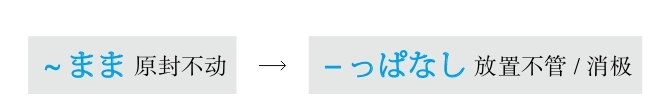
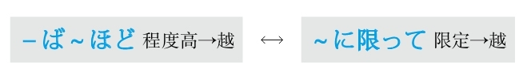
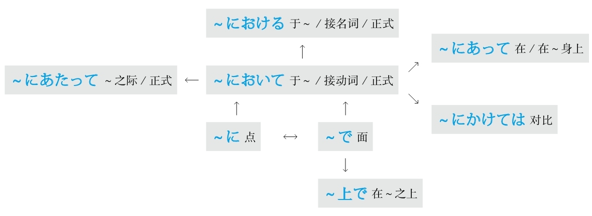
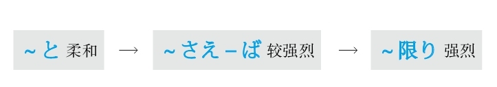

## T
### 特别

#### －てしかたがない
**解释：** 「て」表示中顿；「<ruby>仕<rp>(</rp><rt>し</rt><rp>)</rp></ruby><ruby>方<rp>(</rp><rt>かた</rt><rp>)</rp></ruby>」的意思是“方法、办法”；「が」是表示小主语的助词；「ない」的意思是“没有”
**意思：** ～得没办法
**变形：** て形（变形规律参照第一章的第二节）

例句：<ruby>試<rp>(</rp><rt>し</rt><rp>)</rp></ruby><ruby>合<rp>(</rp><rt>あい</rt><rp>)</rp></ruby>に<ruby>負<rp>(</rp><rt>ま</rt><rp>)</rp></ruby>けて、<ruby>悔<rp>(</rp><rt>くや</rt><rp>)</rp></ruby>しく**てしかたがない** 。
直译：在比赛中输了，懊悔得没办法。
意译：比赛输了，特别懊悔。

#### －てしょうがない
**解释：** 「て」表示中顿；「<ruby>仕<rp>(</rp><rt>し</rt><rp>)</rp></ruby><ruby>様<rp>(</rp><rt>よう</rt><rp>)</rp></ruby>」的意思是“办法”；「が」是表示小主语的助词；「ない」的意思是“没有”
**意思：** ～得没办法
**区别：** 比「－てしかたがない」更加口语化
**变形：** て形（变形规律参照第一章的第二节）

例句：<ruby>鍵<rp>(</rp><rt>かぎ</rt><rp>)</rp></ruby>をかけたかどうか<ruby>気<rp>(</rp><rt>き</rt><rp>)</rp></ruby>になっ**てしょうがない** 。
直译：锁门了还是没锁，担心得没办法。
意译：特别担心是不是锁门了。

#### －てたまらない
**解释：** 「て」表示中顿；「<ruby>堪<rp>(</rp><rt>たま</rt><rp>)</rp></ruby>らない」的意思是“不堪～”
**意思：** ～得受不了
**变形：** て形（变形规律参照第一章的第二节）

例句：<ruby>通<rp>(</rp><rt>つう</rt><rp>)</rp></ruby><ruby>勤<rp>(</rp><rt>きん</rt><rp>)</rp></ruby><ruby>電<rp>(</rp><rt>でん</rt><rp>)</rp></ruby><ruby>車<rp>(</rp><rt>しゃ</rt><rp>)</rp></ruby>の<ruby>暖<rp>(</rp><rt>だん</rt><rp>)</rp></ruby><ruby>房<rp>(</rp><rt>ぼう</rt><rp>)</rp></ruby>は<ruby>効<rp>(</rp><rt>き</rt><rp>)</rp></ruby>きすぎるから、<ruby>暑<rp>(</rp><rt>あつ</rt><rp>)</rp></ruby>く**てたまらなかった** 。
直译：上下班高峰电车的暖气，过于有效，热得受不了了。
意译：上下班高峰（时的）电车里的暖气太热了，热得受不了了。

#### －てならない
**解释：** 「て」表示中顿；「<ruby>成<rp>(</rp><rt>な</rt><rp>)</rp></ruby>らない」的意思是“不成～”
**意思：** ～得不成
**语气：** 正式
**变形：** て形（变形规律参照第一章的第二节）

例句：<ruby>方<rp>(</rp><rt>ほう</rt><rp>)</rp></ruby><ruby>向<rp>(</rp><rt>こう</rt><rp>)</rp></ruby>を<ruby>間<rp>(</rp><rt>ま</rt><rp>)</rp></ruby><ruby>違<rp>(</rp><rt>ちが</rt><rp>)</rp></ruby>えたような<ruby>気<rp>(</rp><rt>き</rt><rp>)</rp></ruby>がし**てならない** 。
直译：把方向弄错了，这样觉得得不成。
意译：就是觉得一定是把方向弄错了。
语法关系图

### 听说

#### ～だって/～ですって
**解释：** 「だ」接在前面的句尾；「って」是表示内容的「と」的口语形式；「だ」是简体；「です」是敬体
**用于：** 口语
**接续：** 名词和形容动词、动词和形容词的简体加ん

例句：<ruby>明日<rp>(</rp><rt>あした</rt><rp>)</rp></ruby>は<ruby>授<rp>(</rp><rt>じゅ</rt><rp>)</rp></ruby><ruby>業<rp>(</rp><rt>ぎょう</rt><rp>)</rp></ruby>のオリエンテーション**だって** 。
直译：明天是课程介绍，听说。
意译：听说明天是课程介绍。

例句：<ruby>明日<rp>(</rp><rt>あした</rt><rp>)</rp></ruby>は<ruby>雨<rp>(</rp><rt>あめ</rt><rp>)</rp></ruby>が<ruby>降<rp>(</rp><rt>ふ</rt><rp>)</rp></ruby>る**んだって** 。
直译：明天要下雨，听说。
意译：听说明天要下雨。

#### ～そうだ
**解释：** 「<ruby>相<rp>(</rp><rt>そう</rt><rp>)</rp></ruby>」的意思是“样子”，在此表示听来的“样子”，即“听说”
**重点：** 不加“听说”的主语，但是听说的主语一定是第一人称；不能改变「～そうだ」的形式和时态
**注意：** 如果不用第一人称或变换形式和时态的话，用「～と<ruby>聞<rp>(</rp><rt>き</rt><rp>)</rp></ruby>く」（柔和）或「～という」（正式）
**语气：** 正式
**接续：** 前面接完整的句子

例句：<ruby>新<rp>(</rp><rt>あたら</rt><rp>)</rp></ruby>しいデザインの<ruby>車<rp>(</rp><rt>くるま</rt><rp>)</rp></ruby>は<ruby>来<rp>(</rp><rt>らい</rt><rp>)</rp></ruby><ruby>月<rp>(</rp><rt>げつ</rt><rp>)</rp></ruby><ruby>発<rp>(</rp><rt>はつ</rt><rp>)</rp></ruby><ruby>売<rp>(</rp><rt>ばい</rt><rp>)</rp></ruby>される**そうだ** 。
直译：听说：新设计的车下月将要被销售。
意译：据说下月销售新设计的车。

#### ～ということだ
**解释：** 「と」表示内容；「いう」用于连接前面的「と」和后面的名词；「こと」的意思是“事情”；「だ」的意思是“是”
**语气：** 正式
**区别：** 在语气上，「～と<ruby>聞<rp>(</rp><rt>き</rt><rp>)</rp></ruby>く」（柔和）→「～という」（较正式）→「～ということだ」（正式）
**接续：** 前面接完整的句子

例句：<ruby>今<rp>(</rp><rt>こ</rt><rp>)</rp></ruby><ruby>年<rp>(</rp><rt>とし</rt><rp>)</rp></ruby>の<ruby>夏<rp>(</rp><rt>なつ</rt><rp>)</rp></ruby>は<ruby>涼<rp>(</rp><rt>すず</rt><rp>)</rp></ruby>しいので、クーラーの<ruby>販<rp>(</rp><rt>はん</rt><rp>)</rp></ruby><ruby>売<rp>(</rp><rt>ばい</rt><rp>)</rp></ruby><ruby>台<rp>(</rp><rt>だい</rt><rp>)</rp></ruby><ruby>数<rp>(</rp><rt>すう</rt><rp>)</rp></ruby>は<ruby>激<rp>(</rp><rt>げき</rt><rp>)</rp></ruby><ruby>減<rp>(</rp><rt>げん</rt><rp>)</rp></ruby>した**ということだ** 。
直译：今年夏天很凉快，所以空调的销售台数急剧减少，听说。
意译：听说因为今年夏天凉快，所以空调的销售量急剧减少。

#### ～といわれている
**解释：** 「と」表示内容；「いわれている」是「<ruby>言<rp>(</rp><rt>い</rt><rp>)</rp></ruby>う」的被动形的现在进行时
**意思：** 现在被说～、一直被说～
**注意：** 用被动形是为了不具体说听说的主语；用现在进行时是为了表示动作的持续
**语气：** 正式
**接续：** 前面接完整的句子

例句：コラーゲンは<ruby>美<rp>(</rp><rt>び</rt><rp>)</rp></ruby><ruby>容<rp>(</rp><rt>よう</rt><rp>)</rp></ruby>を<ruby>保<rp>(</rp><rt>たも</rt><rp>)</rp></ruby>つには<ruby>欠<rp>(</rp><rt>か</rt><rp>)</rp></ruby>かせないものだ**といわれている** 。
直译：胶原蛋白对于保持美容是不可缺少的东西，被说着。
意译：大家都说胶原蛋白对于保持美容是不可缺少的。

#### ～とされている
**解释：** 「と」表示内容；「されている」是「いわれている」的暧昧化的说法
**注意：** 因为「する」可以代替大多数动词，所以根据上下文还可以翻译成“被推测、被判断、被认为、被考察”等等
**语气：** 正式、暧昧
**接续：** 前面接完整的句子

例句：<ruby>現<rp>(</rp><rt>げん</rt><rp>)</rp></ruby><ruby>在<rp>(</rp><rt>ざい</rt><rp>)</rp></ruby>の<ruby>医<rp>(</rp><rt>い</rt><rp>)</rp></ruby><ruby>療<rp>(</rp><rt>りょう</rt><rp>)</rp></ruby><ruby>技<rp>(</rp><rt>ぎ</rt><rp>)</rp></ruby><ruby>術<rp>(</rp><rt>じゅつ</rt><rp>)</rp></ruby>では、この<ruby>種<rp>(</rp><rt>しゅ</rt><rp>)</rp></ruby>の<ruby>病<rp>(</rp><rt>びょう</rt><rp>)</rp></ruby><ruby>気<rp>(</rp><rt>き</rt><rp>)</rp></ruby>はまだ<ruby>治<rp>(</rp><rt>なお</rt><rp>)</rp></ruby>す<ruby>方法<rp>(</rp><rt>ほうほう</rt><rp>)</rp></ruby>がない**とされている** 。
直译：现在的医疗技术的程度，这种病，还没有治愈的方法，被说着。
意译：据说以现在的医疗技术，还没有治这种病的办法。
语法关系图

### 同时

#### ～と同時に
**解释：** 「と」的意思是“和～”；「<ruby>同<rp>(</rp><rt>どう</rt><rp>)</rp></ruby><ruby>時<rp>(</rp><rt>じ</rt><rp>)</rp></ruby>」的意思是“同时”；「に」表示方向，意思是“在”
**意思：** 和～同时
**着重：** 时间
**接续：** 名词、动词的简体

例句：<ruby>結<rp>(</rp><rt>けっ</rt><rp>)</rp></ruby><ruby>婚<rp>(</rp><rt>こん</rt><rp>)</rp></ruby>**と<ruby>同<rp>(</rp><rt>どう</rt><rp>)</rp></ruby><ruby>時<rp>(</rp><rt>じ</rt><rp>)</rp></ruby>に** <ruby>苗<rp>(</rp><rt>みょう</rt><rp>)</rp></ruby><ruby>字<rp>(</rp><rt>じ</rt><rp>)</rp></ruby>も<ruby>変<rp>(</rp><rt>か</rt><rp>)</rp></ruby>えた。
直译：在结婚的同时，姓氏也变了。
意译：结婚的同时还变更了姓氏。

#### ～と共に
**解释：** 「と」的意思是“和～”；「<ruby>共<rp>(</rp><rt>とも</rt><rp>)</rp></ruby>」的意思是“共、一起”；「に」表示方向，意思是“在”
**意思：** 和～一起、和～同时
**着重：** 时间、动作
**接续：** 名词、动词的简体

例句：<ruby>飛<rp>(</rp><rt>ひ</rt><rp>)</rp></ruby><ruby>行<rp>(</rp><rt>こう</rt><rp>)</rp></ruby><ruby>機<rp>(</rp><rt>き</rt><rp>)</rp></ruby>のチケットを<ruby>買<rp>(</rp><rt>か</rt><rp>)</rp></ruby>う**と<ruby>共<rp>(</rp><rt>とも</rt><rp>)</rp></ruby>に** <ruby>向<rp>(</rp><rt>む</rt><rp>)</rp></ruby>こうのホテルも<ruby>取<rp>(</rp><rt>と</rt><rp>)</rp></ruby>った。
直译：飞机的票买，和它一起，还订了当地的饭店。
意译：买了机票，还订了当地的宾馆。

#### ～か－ないかのうちに
**解释：** 两个「か」表示不确定，前面用动词的肯定形式，后面用动词的否定形式；「<ruby>内<rp>(</rp><rt>うち</rt><rp>)</rp></ruby>」的意思是“在～之内、在～过程当中”；「に」表示方向，意思是“在”
**直译：** 在不确定做前面的动作时，后面的动作就发生了
**意译：** 前后动作大概同时发生
**着重：** 动作快
**接续：** 「か」的前面接动词的原形，后面变成动词的否定形的な（变形规律参照第一章的第二节）

例句：<ruby>授<rp>(</rp><rt>じゅ</rt><rp>)</rp></ruby><ruby>業<rp>(</rp><rt>ぎょう</rt><rp>)</rp></ruby>の<ruby>終<rp>(</rp><rt>お</rt><rp>)</rp></ruby>わりのベルが<ruby>鳴<rp>(</rp><rt>な</rt><rp>)</rp></ruby>る**か** <ruby>鳴<rp>(</rp><rt>な</rt><rp>)</rp></ruby>ら**ないかのうちに** 、<ruby>学<rp>(</rp><rt>がく</rt><rp>)</rp></ruby><ruby>生<rp>(</rp><rt>せい</rt><rp>)</rp></ruby>は<ruby>教<rp>(</rp><rt>きょう</rt><rp>)</rp></ruby><ruby>室<rp>(</rp><rt>しつ</rt><rp>)</rp></ruby>を<ruby>飛<rp>(</rp><rt>と</rt><rp>)</rp></ruby>び<ruby>出<rp>(</rp><rt>だ</rt><rp>)</rp></ruby>した。
直译：课结束的铃，在还没确定响了或没响的过程当中，学生冲出了教室。
意译：大概和下课铃响的同时，学生冲出了教室。
语法关系图

### 痛快地

#### 思い切り～
**解释：** 「<ruby>思<rp>(</rp><rt>おも</rt><rp>)</rp></ruby>い<ruby>切<rp>(</rp><rt>き</rt><rp>)</rp></ruby>り」是「<ruby>思<rp>(</rp><rt>おも</rt><rp>)</rp></ruby>い<ruby>切<rp>(</rp><rt>き</rt><rp>)</rp></ruby>る」（不再想）的连用形
**意思：** 痛痛快快地做～
**词性：** 副词
**注意：** 「<ruby>思<rp>(</rp><rt>おも</rt><rp>)</rp></ruby>い<ruby>切<rp>(</rp><rt>き</rt><rp>)</rp></ruby>って」的意思是“下决心做～、毅然决然地做～”

例句：<ruby>人<rp>(</rp><rt>ひと</rt><rp>)</rp></ruby><ruby>前<rp>(</rp><rt>まえ</rt><rp>)</rp></ruby>で**<ruby>思<rp>(</rp><rt>おも</rt><rp>)</rp></ruby>い<ruby>切<rp>(</rp><rt>き</rt><rp>)</rp></ruby>り** <ruby>泣<rp>(</rp><rt>な</rt><rp>)</rp></ruby>いたり<ruby>笑<rp>(</rp><rt>わら</rt><rp>)</rp></ruby>ったりするのは<ruby>私<rp>(</rp><rt>わたし</rt><rp>)</rp></ruby>の<ruby>性<rp>(</rp><rt>せい</rt><rp>)</rp></ruby><ruby>格<rp>(</rp><rt>かく</rt><rp>)</rp></ruby>ではない。
直译：在人前痛快地哭、痛快地笑，这不是我的性格。
意译：在人前痛快地哭和笑不是我的性格。

#### 思う存分～
**解释：** 「<ruby>思<rp>(</rp><rt>おも</rt><rp>)</rp></ruby>う」的意思是“想”；「<ruby>存<rp>(</rp><rt>ぞん</rt><rp>)</rp></ruby><ruby>分<rp>(</rp><rt>ぶん</rt><rp>)</rp></ruby>」的意思是“所有的部分”
**直译：** 想的所有的部分
**意译：** 能够想得到的事情都去做
**词性：** 副词

例句：<ruby>今日<rp>(</rp><rt>きょう</rt><rp>)</rp></ruby>はご<ruby>馳<rp>(</rp><rt>ち</rt><rp>)</rp></ruby><ruby>走<rp>(</rp><rt>そう</rt><rp>)</rp></ruby>するから、**<ruby>思<rp>(</rp><rt>おも</rt><rp>)</rp></ruby>う<ruby>存<rp>(</rp><rt>ぞん</rt><rp>)</rp></ruby><ruby>分<rp>(</rp><rt>ぶん</rt><rp>)</rp></ruby>** <ruby>食<rp>(</rp><rt>た</rt><rp>)</rp></ruby>べてください。
直译：今天我请客，所以想吃多少吃多少。
意译：今天我请客，痛痛快快地吃吧。
语法关系图

## W
### 为了

#### ～には
**解释：** 「に」表示目的；「は」表示强调
**意思：** 为了～
**语气：** 最简洁
**接续：** 名词、动词的原形

例句：いい<ruby>就<rp>(</rp><rt>しゅう</rt><rp>)</rp></ruby><ruby>職<rp>(</rp><rt>しょく</rt><rp>)</rp></ruby>ができる**には** 、<ruby>普<rp>(</rp><rt>ふ</rt><rp>)</rp></ruby><ruby>段<rp>(</rp><rt>だん</rt><rp>)</rp></ruby>からの<ruby>努<rp>(</rp><rt>ど</rt><rp>)</rp></ruby><ruby>力<rp>(</rp><rt>りょく</rt><rp>)</rp></ruby><ruby>以<rp>(</rp><rt>い</rt><rp>)</rp></ruby><ruby>外<rp>(</rp><rt>がい</rt><rp>)</rp></ruby>に<ruby>運<rp>(</rp><rt>うん</rt><rp>)</rp></ruby>も<ruby>大<rp>(</rp><rt>だい</rt><rp>)</rp></ruby><ruby>事<rp>(</rp><rt>じ</rt><rp>)</rp></ruby>だと<ruby>思<rp>(</rp><rt>おも</rt><rp>)</rp></ruby>う。
直译：为了能够好的就职，从平时的努力以外，运气也很重要，我认为。
意译：我认为能够找到一个好工作，除了平时的努力以外运气也很重要。

#### ～ように
**解释：** 「<ruby>様<rp>(</rp><rt>よう</rt><rp>)</rp></ruby>」的意思是“样子”；「に」表示副词
**直译：** 成为～的样子，而～
**意译：** 为了能够～
**注意：** 前后既可用同一主语，也可用不同主语
**重点：** 客观叙述
**接续：** 动词的可能形的原形、自动词的原形

例句：<ruby>留<rp>(</rp><rt>りゅう</rt><rp>)</rp></ruby><ruby>学<rp>(</rp><rt>がく</rt><rp>)</rp></ruby>**できるように** いろいろな<ruby>事<rp>(</rp><rt>じ</rt><rp>)</rp></ruby><ruby>前<rp>(</rp><rt>ぜん</rt><rp>)</rp></ruby><ruby>準<rp>(</rp><rt>じゅん</rt><rp>)</rp></ruby><ruby>備<rp>(</rp><rt>び</rt><rp>)</rp></ruby>をしている。
直译：为了能够留学，正在做各种各样的事先准备。
意译：为了能够留学，正在做各种事先准备工作。

例句：すべてのレベルの<ruby>学<rp>(</rp><rt>がく</rt><rp>)</rp></ruby><ruby>生<rp>(</rp><rt>せい</rt><rp>)</rp></ruby>がわかる**ように** 、わかりやすく<ruby>説<rp>(</rp><rt>せつ</rt><rp>)</rp></ruby><ruby>明<rp>(</rp><rt>めい</rt><rp>)</rp></ruby>した。
直译：为了所有的水平的学生都懂，做了容易懂的说明。
意译：为了（让）所有水平的学生都能懂，我做了通俗易懂的解释。

#### ～ために
**解释：** 「<ruby>為<rp>(</rp><rt>ため</rt><rp>)</rp></ruby>」的意思是“为了”；「に」表示副词
**意思：** 为了～
**注意：** 前后必须用同一主语
**重点：** 主观愿望强
**接续：** 动词的原形

例句：<ruby>試<rp>(</rp><rt>し</rt><rp>)</rp></ruby><ruby>験<rp>(</rp><rt>けん</rt><rp>)</rp></ruby>に<ruby>合<rp>(</rp><rt>ごう</rt><rp>)</rp></ruby><ruby>格<rp>(</rp><rt>かく</rt><rp>)</rp></ruby>する**ために** 、<ruby>一<rp>(</rp><rt>いち</rt><rp>)</rp></ruby><ruby>秒<rp>(</rp><rt>びょう</rt><rp>)</rp></ruby>たりとも<ruby>勉<rp>(</rp><rt>べん</rt><rp>)</rp></ruby><ruby>強<rp>(</rp><rt>きょう</rt><rp>)</rp></ruby>に<ruby>取<rp>(</rp><rt>と</rt><rp>)</rp></ruby>り<ruby>組<rp>(</rp><rt>く</rt><rp>)</rp></ruby>んでいる。
直译：为了考试合格，即使是一秒钟，致力于学习。
意译：为了通过考试，即使是一秒钟（我）都在努力学习。

#### －んがため（に）
**解释：** 「ん」在古语里表示推量，相当于现代日语中表示否定的“不”或表示意志的“想要”，在此表示意志；「が」是古语中起连接作用的助词；「<ruby>為<rp>(</rp><rt>ため</rt><rp>)</rp></ruby>」的意思是“为了”；「に」表示副词
**注意：** 「に」可以省略，省略助词后语气更加正式
**意思：** 「～しようと<ruby>思<rp>(</rp><rt>おも</rt><rp>)</rp></ruby>ってそのために～」（想要去做～，为了它而～）
**语气：** 古语、正式
**接续：** 动词的否定形的ん（推量）（变形规律参照第一章的第二节）

例句：<ruby>真<rp>(</rp><rt>しん</rt><rp>)</rp></ruby><ruby>実<rp>(</rp><rt>じつ</rt><rp>)</rp></ruby>を<ruby>明<rp>(</rp><rt>あき</rt><rp>)</rp></ruby>らかにせ**んがために** 、あらゆる<ruby>手<rp>(</rp><rt>て</rt><rp>)</rp></ruby>を<ruby>尽<rp>(</rp><rt>つ</rt><rp>)</rp></ruby>くした。
直译：为了弄明白真实的事，所有的办法都用尽了。
意译：为了弄清真相，想尽了一切办法。
语法关系图

### 无意识

#### ～ともなく/～ともなしに
**解释：** 「と」的意思是“和”；「も」的意思是“也”；「なく」和「なしに」是表示否定的「ない」的副词形式
**意思：** 似做非做～
**表示：** 无意识地做～
**注意：** 前后用同一个动词。常构成的表达方式有「見るともなく見ている」（似看非看）、「聞くともなく聞いている」（似听非听）、「わかるともなくわかっている」（似懂非懂）
**接续：** 动词的原形

例句：<ruby>眠<rp>(</rp><rt>ねむ</rt><rp>)</rp></ruby>いから、テレビを<ruby>見<rp>(</rp><rt>み</rt><rp>)</rp></ruby>る**ともなしに** <ruby>見<rp>(</rp><rt>み</rt><rp>)</rp></ruby>ている。
直译：困了，所以看和非看地在看着电视。
意译：困了，（我）似看非看地在看电视。

## X
### 相反

#### ～に反して
**解释：** 「に」表示对象；「<ruby>反<rp>(</rp><rt>はん</rt><rp>)</rp></ruby>して」是「<ruby>反<rp>(</rp><rt>はん</rt><rp>)</rp></ruby>する」的中顿形式
**意思：** 与～相反
**语气：** 正式
**接续：** 接「<ruby>期<rp>(</rp><rt>き</rt><rp>)</rp></ruby><ruby>待<rp>(</rp><rt>たい</rt><rp>)</rp></ruby>、<ruby>予<rp>(</rp><rt>よ</rt><rp>)</rp></ruby><ruby>想<rp>(</rp><rt>そう</rt><rp>)</rp></ruby>、<ruby>予<rp>(</rp><rt>よ</rt><rp>)</rp></ruby><ruby>測<rp>(</rp><rt>そく</rt><rp>)</rp></ruby>」等汉语式名词

例句：<ruby>地<rp>(</rp><rt>じ</rt><rp>)</rp></ruby><ruby>元<rp>(</rp><rt>もと</rt><rp>)</rp></ruby>の<ruby>住<rp>(</rp><rt>じゅう</rt><rp>)</rp></ruby><ruby>民<rp>(</rp><rt>みん</rt><rp>)</rp></ruby>の<ruby>予<rp>(</rp><rt>よ</rt><rp>)</rp></ruby><ruby>想<rp>(</rp><rt>そう</rt><rp>)</rp></ruby>**に<ruby>反<rp>(</rp><rt>はん</rt><rp>)</rp></ruby>して** 、<ruby>住<rp>(</rp><rt>じゅう</rt><rp>)</rp></ruby><ruby>宅<rp>(</rp><rt>たく</rt><rp>)</rp></ruby>の<ruby>値<rp>(</rp><rt>ね</rt><rp>)</rp></ruby><ruby>段<rp>(</rp><rt>だん</rt><rp>)</rp></ruby>が<ruby>上<rp>(</rp><rt>あ</rt><rp>)</rp></ruby>がる<ruby>一<rp>(</rp><rt>いっ</rt><rp>)</rp></ruby><ruby>方<rp>(</rp><rt>ぽう</rt><rp>)</rp></ruby>だ。
直译：和当地的居民的预想相反，住宅价格一个劲儿地在上涨。
意译：与当地居民的预想相反，住宅价格一个劲儿地上涨。

#### ～反面
**直译：** 反面
**意译：** 与～相反
**接续：** 修饰名词的规律（参照第一章的第三节）

例句：<ruby>彼<rp>(</rp><rt>かれ</rt><rp>)</rp></ruby>は<ruby>仕<rp>(</rp><rt>し</rt><rp>)</rp></ruby><ruby>事<rp>(</rp><rt>ごと</rt><rp>)</rp></ruby><ruby>上<rp>(</rp><rt>じょう</rt><rp>)</rp></ruby>しっかりしている**<ruby>反<rp>(</rp><rt>はん</rt><rp>)</rp></ruby><ruby>面<rp>(</rp><rt>めん</rt><rp>)</rp></ruby>、** <ruby>金<rp>(</rp><rt>かね</rt><rp>)</rp></ruby><ruby>使<rp>(</rp><rt>づか</rt><rp>)</rp></ruby>いが<ruby>荒<rp>(</rp><rt>あら</rt><rp>)</rp></ruby>い。
直译：他在工作上非常认真严谨，其反面，花钱却大手大脚。
意译：他在工作上非常认真严谨，但是花钱却大手大脚。

#### ～に対して
**解释：** 「に」表示对象；「<ruby>対<rp>(</rp><rt>たい</rt><rp>)</rp></ruby>して」是自动词「<ruby>対<rp>(</rp><rt>たい</rt><rp>)</rp></ruby>する」的中顿形式，意思是“对象、对比”
**意思：** 对于～、与～相对比（在此是后者）
**接续：** 名词

例句：<ruby>姉<rp>(</rp><rt>あね</rt><rp>)</rp></ruby>が<ruby>働<rp>(</rp><rt>はたら</rt><rp>)</rp></ruby>き<ruby>者<rp>(</rp><rt>もの</rt><rp>)</rp></ruby>であるの**に<ruby>対<rp>(</rp><rt>たい</rt><rp>)</rp></ruby>して** 、<ruby>妹<rp>(</rp><rt>いもうと</rt><rp>)</rp></ruby>は<ruby>怠<rp>(</rp><rt>なま</rt><rp>)</rp></ruby>け<ruby>者<rp>(</rp><rt>もの</rt><rp>)</rp></ruby>だ。
直译：姐姐是能干的人，与其相对照，妹妹是懒惰的人。
意译：姐姐非常能干，但是妹妹却很懒。

#### ～一方（で）
**解释：** 「<ruby>一<rp>(</rp><rt>いっ</rt><rp>)</rp></ruby><ruby>方<rp>(</rp><rt>ぽう</rt><rp>)</rp></ruby>」的意思是“一方、另一方”；「で」表示范围，意思是“在”
**意思：** 在一方面～，在另一方面～
**重点：** 常举出两个对照性的事物
**注意：** 「で」可以省略，省略助词后语气正式
**接续：** 动词和形容词的原形、形容动词和名词加である

例句：<ruby>若<rp>(</rp><rt>わか</rt><rp>)</rp></ruby>い<ruby>人<rp>(</rp><rt>ひと</rt><rp>)</rp></ruby>の<ruby>就<rp>(</rp><rt>しゅう</rt><rp>)</rp></ruby><ruby>職<rp>(</rp><rt>しょく</rt><rp>)</rp></ruby><ruby>難<rp>(</rp><rt>なん</rt><rp>)</rp></ruby>が<ruby>問<rp>(</rp><rt>もん</rt><rp>)</rp></ruby><ruby>題<rp>(</rp><rt>だい</rt><rp>)</rp></ruby>になる**<ruby>一<rp>(</rp><rt>いっ</rt><rp>)</rp></ruby><ruby>方<rp>(</rp><rt>ぽう</rt><rp>)</rp></ruby>で** 、<ruby>多<rp>(</rp><rt>おお</rt><rp>)</rp></ruby>くの<ruby>分<rp>(</rp><rt>ぶん</rt><rp>)</rp></ruby><ruby>野<rp>(</rp><rt>や</rt><rp>)</rp></ruby>で<ruby>人<rp>(</rp><rt>ひと</rt><rp>)</rp></ruby><ruby>手<rp>(</rp><rt>で</rt><rp>)</rp></ruby>が<ruby>足<rp>(</rp><rt>た</rt><rp>)</rp></ruby>りない。
直译：年轻人的就业难成了问题，在另一方面，在很多的领域里人手却不足。
意译：年轻人的就业难成了问题，另一方面，在很多领域里人手却不够。

#### ～と思いきや
**解释：** 「と」表示内容；「<ruby>思<rp>(</rp><rt>おも</rt><rp>)</rp></ruby>い」是「<ruby>思<rp>(</rp><rt>おも</rt><rp>)</rp></ruby>う」的连用形，表示“想”；「き」在古语里表示过去式，相当于「た」；「や」在古语里相当于「か」，此处表示反问
**意思：** 与想的相反
**语气：** 古语
**接续：** 任何词

例句：<ruby>二人<rp>(</rp><rt>ふたり</rt><rp>)</rp></ruby>は<ruby>大<rp>(</rp><rt>おお</rt><rp>)</rp></ruby><ruby>喧<rp>(</rp><rt>げん</rt><rp>)</rp></ruby><ruby>嘩<rp>(</rp><rt>か</rt><rp>)</rp></ruby>した。きっと<ruby>別<rp>(</rp><rt>わか</rt><rp>)</rp></ruby>れる**と<ruby>思<rp>(</rp><rt>おも</rt><rp>)</rp></ruby>いきや** 、<ruby>和<rp>(</rp><rt>わ</rt><rp>)</rp></ruby><ruby>解<rp>(</rp><rt>かい</rt><rp>)</rp></ruby>した。
直译：两个人大吵了一架。我想他们肯定要分手了，和解了。
意译：两个人大吵了一场。我想他们肯定要分手了，结果两个人又和解了。

#### ～にひきかえ
**解释：** 「に」表示对象；「ひきかえ」是自动词「<ruby>引<rp>(</rp><rt>ひ</rt><rp>)</rp></ruby>き<ruby>替<rp>(</rp><rt>か</rt><rp>)</rp></ruby>える」的中顿形式，意思是“对换”
**意思：** 与～相对照
**接续：** 名词

例句：<ruby>旺<rp>(</rp><rt>おう</rt><rp>)</rp></ruby><ruby>盛<rp>(</rp><rt>せい</rt><rp>)</rp></ruby>な<ruby>好<rp>(</rp><rt>こう</rt><rp>)</rp></ruby><ruby>奇<rp>(</rp><rt>き</rt><rp>)</rp></ruby><ruby>心<rp>(</rp><rt>しん</rt><rp>)</rp></ruby>と<ruby>元<rp>(</rp><rt>げん</rt><rp>)</rp></ruby><ruby>気<rp>(</rp><rt>き</rt><rp>)</rp></ruby>さ**にひきかえ** 、<ruby>語<rp>(</rp><rt>ご</rt><rp>)</rp></ruby><ruby>学<rp>(</rp><rt>がく</rt><rp>)</rp></ruby><ruby>力<rp>(</rp><rt>りょく</rt><rp>)</rp></ruby>と<ruby>忍<rp>(</rp><rt>にん</rt><rp>)</rp></ruby><ruby>耐<rp>(</rp><rt>たい</rt><rp>)</rp></ruby><ruby>力<rp>(</rp><rt>りょく</rt><rp>)</rp></ruby>がほとんどない。
直译：旺盛的好奇心和精力，与此相对照，外语能力和忍耐力几乎没有。
意译：有旺盛的好奇心和精力，但是几乎没有什么外语能力和忍耐力。
语法关系图

### 想做

#### －たい
**解释：** 「－たい」是动词的后缀
**词性：** 与动词的连用形构成复合形容词
**意思：** 想做～
**准则：** 「－たい」用于第一人称
**接续：** 动词的连用形

例句：<ruby>家<rp>(</rp><rt>いえ</rt><rp>)</rp></ruby>を<ruby>買<rp>(</rp><rt>か</rt><rp>)</rp></ruby>い**たい** 。
直译：想买房子。
意译：我想买房子。

#### －たがる
**解释：** 「た」是表示“想做某事”的「－たい」；「が」表示状态（参照《日语词汇新思维：词源+联想记忆法》）；「る」是动词的后缀
**词性：** 与动词的连用形构成复合动词
**意思：** 想做～
**准则：** 表示心理活动的用法的重点在于“内外有别”，自己和他人需要加以区分，他人的心理活动需要通过外在状态而得知。因此，「－たい」用于第一人称，「－たがる」用于第三人称
**接续：** 动词的连用形

例句：うちの<ruby>子<rp>(</rp><rt>こ</rt><rp>)</rp></ruby>は<ruby>海<rp>(</rp><rt>かい</rt><rp>)</rp></ruby><ruby>外<rp>(</rp><rt>がい</rt><rp>)</rp></ruby><ruby>留<rp>(</rp><rt>りゅう</rt><rp>)</rp></ruby><ruby>学<rp>(</rp><rt>がく</rt><rp>)</rp></ruby>に<ruby>行<rp>(</rp><rt>い</rt><rp>)</rp></ruby>き**たがっている** 。
直译：我家的孩子一直（现在）想去海外留学，状态。
意译：我们家的孩子一直想去国外留学。

#### －てほしい
**解释：** 「て」是前面动词的中顿形式；「<ruby>欲<rp>(</rp><rt>ほ</rt><rp>)</rp></ruby>しい」的意思是“想要”
**意思：** 想让别人做～
**注意：** 表示想要某个东西时用「～が<ruby>欲<rp>(</rp><rt>ほ</rt><rp>)</rp></ruby>しい」
**变形：** 动词的て形（变形规律参照第一章的第二节）

例句：<ruby>彼<rp>(</rp><rt>かれ</rt><rp>)</rp></ruby>に<ruby>家<rp>(</rp><rt>いえ</rt><rp>)</rp></ruby>を<ruby>買<rp>(</rp><rt>か</rt><rp>)</rp></ruby>っ**て<ruby>欲<rp>(</rp><rt>ほ</rt><rp>)</rp></ruby>しい** 。
直译：想让他买房子。
意译：我想让他买房子。

#### ～をほしがる
**解释：** 「ほし」是表示“想做某事”的「<ruby>欲<rp>(</rp><rt>ほ</rt><rp>)</rp></ruby>しい」；「が」表示状态（参照《日语词汇新思维：词源+联想记忆法》）；「る」是动词的后缀
**意思：** 想要～东西
**准则：** 表示心理活动的用法的重点在于“内外有别”，自己和他人需要加以区分，他人的心理活动需要通过外在状态而得知。因此，「ほしい」用于第一人称，「ほしがる」用于第三人称
**接续：** 名词

例句：なんでいつも<ruby>人<rp>(</rp><rt>ひと</rt><rp>)</rp></ruby>のもの**をほしがってる** の。
直译：为什么经常一直想要别人的东西？
意译：你为什么总想要别人的东西？

#### －ようと
**解释：** 「－よう」是动词的意志形
**意思：** 有做～的意愿
**解释：** “意志”英语为will，因此日语的意志形就可以理解为要去做某事。动词的意志形后面加上「と」才能表示will
**接续：** 动词的意志形（变形规律参照第一章的第二节）

例句：<ruby>日<rp>(</rp><rt>に</rt><rp>)</rp></ruby><ruby>本<rp>(</rp><rt>ほん</rt><rp>)</rp></ruby><ruby>語<rp>(</rp><rt>ご</rt><rp>)</rp></ruby>の<ruby>語<rp>(</rp><rt>ご</rt><rp>)</rp></ruby><ruby>学<rp>(</rp><rt>がく</rt><rp>)</rp></ruby><ruby>力<rp>(</rp><rt>りょく</rt><rp>)</rp></ruby>を<ruby>身<rp>(</rp><rt>み</rt><rp>)</rp></ruby>につけ**ようと** <ruby>努<rp>(</rp><rt>ど</rt><rp>)</rp></ruby><ruby>力<rp>(</rp><rt>りょく</rt><rp>)</rp></ruby>している。
直译：日语水平，要把它附着在身上，努力着。
意译：我正在努力提高我的日语水平。

#### ～べく
**解释：** 「<ruby>可<rp>(</rp><rt>べ</rt><rp>)</rp></ruby>く」的意思是“可～”
**着重：** 强调动词的意志形
**意思：** 可得要做～
**接续：** 动词的原形、「する」变为「すべく」或「するべく」

例句：ウイルスの<ruby>感<rp>(</rp><rt>かん</rt><rp>)</rp></ruby><ruby>染<rp>(</rp><rt>せん</rt><rp>)</rp></ruby><ruby>経<rp>(</rp><rt>けい</rt><rp>)</rp></ruby><ruby>路<rp>(</rp><rt>ろ</rt><rp>)</rp></ruby>を<ruby>明<rp>(</rp><rt>あき</rt><rp>)</rp></ruby>らかにする**べく** <ruby>綿<rp>(</rp><rt>めん</rt><rp>)</rp></ruby><ruby>密<rp>(</rp><rt>みつ</rt><rp>)</rp></ruby>な<ruby>調<rp>(</rp><rt>ちょう</rt><rp>)</rp></ruby><ruby>査<rp>(</rp><rt>さ</rt><rp>)</rp></ruby>が<ruby>行<rp>(</rp><rt>おこな</rt><rp>)</rp></ruby>われた。
直译：病毒的感染途径，要把它弄明白，缜密的调查被进行了。
意译：为调查清楚病毒的感染途径，（相关部门）展开了缜密的调查。
语法关系图

### 形容词变名词

#### －さ
**解释：** 「さ」是「それ」，表示“那个”
**重点：** 因为是指“那个东西本身”，所以侧重于“具体事物”
**变形：** 形容词去「い」加「さ」、形容动词加「さ」

例句：<ruby>長<rp>(</rp><rt>なが</rt><rp>)</rp></ruby>**さ** 、<ruby>幅<rp>(</rp><rt>はば</rt><rp>)</rp></ruby>、<ruby>高<rp>(</rp><rt>たか</rt><rp>)</rp></ruby>**さ** を<ruby>量<rp>(</rp><rt>はか</rt><rp>)</rp></ruby>ってください。
直译：长、宽、高，请测量。
意译：（请）量一下长、宽、高。

#### －み
**解释：** 「み」是「<ruby>味<rp>(</rp><rt>み</rt><rp>)</rp></ruby>」，表示“味道”
**重点：** 因为是指体会到的“味道”，所以侧重于“抽象事物”
**变形：** 形容词去「い」加「み」、形容动词加「み」

例句：<ruby>彼<rp>(</rp><rt>かれ</rt><rp>)</rp></ruby>の<ruby>話<rp>(</rp><rt>はなし</rt><rp>)</rp></ruby>には<ruby>深<rp>(</rp><rt>ふか</rt><rp>)</rp></ruby>**み** がある。
直译：在他的话里，有深度。
意译：他说话有深度。

#### －め
**解释：** 「め」是「<ruby>目<rp>(</rp><rt>め</rt><rp>)</rp></ruby>」，表示“看上去”
**重点：** 因为是用眼睛测量，所以翻译成“稍微～”
**变形：** 形容词去「い」加「め」、形容动词加「め」

例句：<ruby>少<rp>(</rp><rt>すこ</rt><rp>)</rp></ruby>し<ruby>小<rp>(</rp><rt>ちい</rt><rp>)</rp></ruby>さ**め** なのがありますか。
直译：稍微小一点儿的，有吗？
意译：有没有稍微小一点儿的？

例句：お<ruby>塩<rp>(</rp><rt>しお</rt><rp>)</rp></ruby>を<ruby>少<rp>(</rp><rt>すく</rt><rp>)</rp></ruby>な**め** に<ruby>入<rp>(</rp><rt>い</rt><rp>)</rp></ruby>れてください。
直译：盐，稍微少点儿，请放入。
意译：稍微少放些盐。
语法关系图

### 形容状态

#### ～まま
**解释：** 名词「まま」在古代的汉字是「<ruby>真真<rp>(</rp><rt>まま</rt><rp>)</rp></ruby>」，表示事物本身的样子
**意思：** 样子
**接续：** 名词加の、形容词的原形、形容动词加な、动词的た形
**准则：** 日语的「た」表示完了、过去的“了”以及起形容词修饰名词作用的“的”。此处表示“的”

例句：<ruby>久<rp>(</rp><rt>ひさ</rt><rp>)</rp></ruby>しぶりに<ruby>実<rp>(</rp><rt>じっ</rt><rp>)</rp></ruby><ruby>家<rp>(</rp><rt>か</rt><rp>)</rp></ruby>に<ruby>帰<rp>(</rp><rt>かえ</rt><rp>)</rp></ruby>ったが、<ruby>周<rp>(</rp><rt>まわ</rt><rp>)</rp></ruby>りは<ruby>昔<rp>(</rp><rt>むかし</rt><rp>)</rp></ruby>の**まま** です。
直译：隔了好久又回到实际的家，周围还是过去的样子。
意译：隔了好久又回到父母家，周围还是原来的样子。

例句：<ruby>化<rp>(</rp><rt>け</rt><rp>)</rp></ruby><ruby>粧<rp>(</rp><rt>しょう</rt><rp>)</rp></ruby>し**たまま** <ruby>眠<rp>(</rp><rt>ねむ</rt><rp>)</rp></ruby>るのは<ruby>肌<rp>(</rp><rt>はだ</rt><rp>)</rp></ruby>にはよくないよ。
直译：化妆的样子睡觉对皮肤不好。
意译：带着妆睡觉对皮肤不好。

#### －っぱなし
**解释：** 「ぱなし」是他动词「<ruby>放<rp>(</rp><rt>はな</rt><rp>)</rp></ruby>す」的连用形，作名词用，与前面的动词的连用形一起构成复合名词；促音起加强语气的作用
**意思：** 放置不管
**注意：** 语气消极
**接续：** 动词的连用形

例句：<ruby>節<rp>(</rp><rt>せつ</rt><rp>)</rp></ruby><ruby>電<rp>(</rp><rt>でん</rt><rp>)</rp></ruby>を<ruby>考<rp>(</rp><rt>かんが</rt><rp>)</rp></ruby>えれば、<ruby>電<rp>(</rp><rt>でん</rt><rp>)</rp></ruby><ruby>気<rp>(</rp><rt>き</rt><rp>)</rp></ruby>をつけ**っぱなし** にしてはいけない。
直译：如果考虑到节电，把灯开着不管它，是不行的。
意译：考虑到节电，必须随手关灯。
语法关系图

## Y
### 也就是说

#### つまり～わけだ/即ち～
**解释：** 「つまり」和「わけだ」常一起搭配使用
**意思：** 也就是说～
**注意：** 「<ruby>即<rp>(</rp><rt>すなわ</rt><rp>)</rp></ruby>ち」也表示“也就是说～”；语气正式
**接续：** 接「わけだ」时使用修饰名词的规律（参照第一章的第三节）

例句：<ruby>何<rp>(</rp><rt>なに</rt><rp>)</rp></ruby>も<ruby>言<rp>(</rp><rt>い</rt><rp>)</rp></ruby>わなかったというのは、**つまり** <ruby>認<rp>(</rp><rt>みと</rt><rp>)</rp></ruby>めてくれた**わけ** かな。
直译：什么都没说，也就是认可我们了吧。
意译：什么都没说，也就是同意了吧。

### 一边～一边

#### －ながら
**解释：** 「な」是“那”；「がら」是「から」，表示“从”
**直译：** 从～开始、～之后
**意译：** 一边～一边～
**接续：** 动词的连用形

例句：<ruby>日<rp>(</rp><rt>ひ</rt><rp>)</rp></ruby>が<ruby>照<rp>(</rp><rt>て</rt><rp>)</rp></ruby>り**ながら** <ruby>雨<rp>(</rp><rt>あめ</rt><rp>)</rp></ruby>が<ruby>降<rp>(</rp><rt>ふ</rt><rp>)</rp></ruby>っている。
直译：太阳一边照射着，一边下着雨。
意译：一边出着太阳一边下着雨。

#### ～一方（で）
**解释：** 「<ruby>一<rp>(</rp><rt>いっ</rt><rp>)</rp></ruby><ruby>方<rp>(</rp><rt>ぽう</rt><rp>)</rp></ruby>」的意思是“一方、另一方”；「で」表示范围，意思是“在”
**意思：** 在一方面～，在另一方面～
**重点：** 常举出两个对照性的事物
**准则：** 有时可以不用「で」，不用「で」时必须添加逗号，且语气正式
**接续：** 动词和形容词的原形、形容动词和名词加である

例句：<ruby>人<rp>(</rp><rt>ひと</rt><rp>)</rp></ruby><ruby>前<rp>(</rp><rt>まえ</rt><rp>)</rp></ruby>でいいと<ruby>言<rp>(</rp><rt>い</rt><rp>)</rp></ruby>っている**<ruby>一<rp>(</rp><rt>いっ</rt><rp>)</rp></ruby><ruby>方<rp>(</rp><rt>ぽう</rt><rp>)</rp></ruby>で** 、<ruby>裏<rp>(</rp><rt>うら</rt><rp>)</rp></ruby>で<ruby>嫌<rp>(</rp><rt>いや</rt><rp>)</rp></ruby>だと<ruby>言<rp>(</rp><rt>い</rt><rp>)</rp></ruby>っている。
直译：在人说着可以，另一方面，在背后又说不愿意。
意译：一边在人前说可以，一边在背后又说不愿意。

#### ～かたわら
**解释：** 名词「<ruby>傍<rp>(</rp><rt>かたわ</rt><rp>)</rp></ruby>ら」的前缀「<ruby>片<rp>(</rp><rt>かた</rt><rp>)</rp></ruby>」表示“片面”，即“两个里的一个”；是古语中表示“旁边”的「そば」
**记忆：** 「傍」的部首是单立人，形容一个人的两旁，「かた」也可以理解为「<ruby>肩<rp>(</rp><rt>かた</rt><rp>)</rp></ruby>」，形容一个人双肩挑重担
**意思：** 一个人同时做两份工作
**接续：** 动词的简体

例句：<ruby>学<rp>(</rp><rt>がっ</rt><rp>)</rp></ruby><ruby>校<rp>(</rp><rt>こう</rt><rp>)</rp></ruby>の<ruby>教<rp>(</rp><rt>きょう</rt><rp>)</rp></ruby><ruby>師<rp>(</rp><rt>し</rt><rp>)</rp></ruby>に<ruby>勤<rp>(</rp><rt>つと</rt><rp>)</rp></ruby>めている**<ruby>傍<rp>(</rp><rt>かたわ</rt><rp>)</rp></ruby>ら、** <ruby>翻<rp>(</rp><rt>ほん</rt><rp>)</rp></ruby><ruby>訳<rp>(</rp><rt>やく</rt><rp>)</rp></ruby>の<ruby>仕<rp>(</rp><rt>し</rt><rp>)</rp></ruby><ruby>事<rp>(</rp><rt>ごと</rt><rp>)</rp></ruby>もしている。
直译：一旁作为学校老师在工作着，一旁又做着翻译的工作。
意译：一边是学校老师，一边又干翻译的工作。

#### ～そばから
**解释：** 「そば」的意思是“旁边”；「から」的意思是“从”
**直译：** 从旁边～
**意译：** 一边～一边～
**接续：** 动词的简体

例句：<ruby>聞<rp>(</rp><rt>き</rt><rp>)</rp></ruby>いた**そばから** <ruby>忘<rp>(</rp><rt>わす</rt><rp>)</rp></ruby>れてしまう。
直译：听了，从旁边，忘了。
意译：一边听一边忘。
意译：听了就忘。

例句：<ruby>親<rp>(</rp><rt>おや</rt><rp>)</rp></ruby>が<ruby>片<rp>(</rp><rt>かた</rt><rp>)</rp></ruby><ruby>付<rp>(</rp><rt>づ</rt><rp>)</rp></ruby>ける**そばから** 、<ruby>子<rp>(</rp><rt>こ</rt><rp>)</rp></ruby><ruby>供<rp>(</rp><rt>ども</rt><rp>)</rp></ruby>は<ruby>散<rp>(</rp><rt>ち</rt><rp>)</rp></ruby>らかしてしまう。
直译：家长收拾，从旁边，孩子弄乱。
意译：家长一边收拾，孩子一边弄乱。
语法关系图

### 与～一起

#### ～と一緒に
**解释：** 「と」的意思是“和”；「<ruby>一<rp>(</rp><rt>いっ</rt><rp>)</rp></ruby><ruby>緒<rp>(</rp><rt>しょ</rt><rp>)</rp></ruby>」的意思是“一起”；「に」表示副词
**意思：** 和～一起
**接续：** 名词

例句：<ruby>彼<rp>(</rp><rt>かれ</rt><rp>)</rp></ruby><ruby>氏<rp>(</rp><rt>し</rt><rp>)</rp></ruby>**と<ruby>一<rp>(</rp><rt>いっ</rt><rp>)</rp></ruby><ruby>緒<rp>(</rp><rt>しょ</rt><rp>)</rp></ruby>に** <ruby>旅<rp>(</rp><rt>りょ</rt><rp>)</rp></ruby><ruby>行<rp>(</rp><rt>こう</rt><rp>)</rp></ruby>に<ruby>行<rp>(</rp><rt>い</rt><rp>)</rp></ruby>ってきた。
直译：和男朋友一起去旅行后回来了。
意译：和男友一起去旅行了一趟（后回来了）。

#### ～と共に
**解释：** 「と」的意思是“和”；「<ruby>共<rp>(</rp><rt>とも</rt><rp>)</rp></ruby>」的意思是“共、一起”
**意思：** 和～一起
**语气：** 正式
**接续：** 名词、动词的原形

例句：<ruby>知<rp>(</rp><rt>ち</rt><rp>)</rp></ruby><ruby>識<rp>(</rp><rt>しき</rt><rp>)</rp></ruby>を<ruby>深<rp>(</rp><rt>ふか</rt><rp>)</rp></ruby>める**と<ruby>共<rp>(</rp><rt>とも</rt><rp>)</rp></ruby>に** 、<ruby>経<rp>(</rp><rt>けい</rt><rp>)</rp></ruby><ruby>験<rp>(</rp><rt>けん</rt><rp>)</rp></ruby>も<ruby>積<rp>(</rp><rt>つ</rt><rp>)</rp></ruby>んだ。
直译：把知识加深，和它一起，也积累了经验。
意译：增长了知识，也积累了经验。

#### ～と相まって
**解释：** 「と」的意思是“和”；「<ruby>相<rp>(</rp><rt>あい</rt><rp>)</rp></ruby>まって」的意思是“相互作用”
**意思：** 与～相互作用、与～相辅相成
**注意：** 「<ruby>相<rp>(</rp><rt>あい</rt><rp>)</rp></ruby>まって」只用て形
**接续：** 名词

例句：<ruby>実<rp>(</rp><rt>じつ</rt><rp>)</rp></ruby><ruby>力<rp>(</rp><rt>りょく</rt><rp>)</rp></ruby>と<ruby>運<rp>(</rp><rt>うん</rt><rp>)</rp></ruby>**と<ruby>相<rp>(</rp><rt>あい</rt><rp>)</rp></ruby>まって** 、<ruby>彼<rp>(</rp><rt>かれ</rt><rp>)</rp></ruby>を<ruby>成<rp>(</rp><rt>せい</rt><rp>)</rp></ruby><ruby>功<rp>(</rp><rt>こう</rt><rp>)</rp></ruby>に<ruby>導<rp>(</rp><rt>みちび</rt><rp>)</rp></ruby>いた。
直译：实力和运气相互作用，把他引向了成功。
意译：实力和运气相互作用把他引向了成功。
语法关系图

### 一～就～

#### ～と
**重点：** 在「と、ば、たら、なら」里，最重要的是顺序。「と」和「なら」分别表示极端，「と」代表“条件性”的极端，「なら」代表“假定性”的极端
**解释：** 「と」可以理解为“脱（落）、突（发）”，表示出现的某种事物马上就会脱落出或突发下一种事物，即表示条件性强或速度快
**意思：** 只要～；一～就～
**注意：** 后句里不能用“义务、许可、命令、意志”的表达方式
**接续：** 谓语词（动词、形容词、助动词）的原形

例句：<ruby>長<rp>(</rp><rt>ちょう</rt><rp>)</rp></ruby><ruby>時<rp>(</rp><rt>じ</rt><rp>)</rp></ruby><ruby>間<rp>(</rp><rt>かん</rt><rp>)</rp></ruby><ruby>本<rp>(</rp><rt>ほん</rt><rp>)</rp></ruby>を<ruby>読<rp>(</rp><rt>よ</rt><rp>)</rp></ruby>む**と** <ruby>目<rp>(</rp><rt>め</rt><rp>)</rp></ruby>が<ruby>疲<rp>(</rp><rt>つか</rt><rp>)</rp></ruby>れる。
直译：有长时间看书这个条件，就会有眼睛疲劳这个结果。
意译：一长时间看书，眼睛就会疲劳。

#### ～かと思うと
**解释：** 「か」表示不确定；第一个「と」表示内容；「<ruby>思<rp>(</rp><rt>おも</rt><rp>)</rp></ruby>う」的意思是“想”；第二个「と」表示条件
**意思：** 刚一～就～
**重点：** 侧重于刚在想某事，还没有确定时，就发生了下一件事
**表示：** 动作快
**接续：** 动词和形容词的简体、形容动词和名词

例句：<ruby>信<rp>(</rp><rt>しん</rt><rp>)</rp></ruby><ruby>号<rp>(</rp><rt>ごう</rt><rp>)</rp></ruby>が<ruby>青<rp>(</rp><rt>あお</rt><rp>)</rp></ruby>になった**かと<ruby>思<rp>(</rp><rt>おも</rt><rp>)</rp></ruby>うと** 、すぐに<ruby>赤<rp>(</rp><rt>あか</rt><rp>)</rp></ruby>に<ruby>変<rp>(</rp><rt>か</rt><rp>)</rp></ruby>わった。
直译：想着信号灯是不是变成绿的了，马上变成红的了。
意译：红绿灯刚变成绿灯，马上又变成红灯了。

#### －た途端（に）
**解释：** 「た」的意思是“了”，表示动作的完了；「<ruby>途<rp>(</rp><rt>と</rt><rp>)</rp></ruby><ruby>端<rp>(</rp><rt>たん</rt><rp>)</rp></ruby>」的意思是“一条道路的边缘或尽头”；「に」表示方向
**注意：** 「に」可以省略，省略助词后语气正式
**原意：** 走到了路的尽头，马上就要转换路线
**意译：** 刚刚做完某事就发生了下一件事情
**着重：** 动作快
**变形：** 动词的た形的简体（变形规律参照第一章的第二节）

例句：<ruby>布<rp>(</rp><rt>ふ</rt><rp>)</rp></ruby><ruby>団<rp>(</rp><rt>とん</rt><rp>)</rp></ruby>に<ruby>入<rp>(</rp><rt>はい</rt><rp>)</rp></ruby>っ**た<ruby>途<rp>(</rp><rt>と</rt><rp>)</rp></ruby><ruby>端<rp>(</rp><rt>たん</rt><rp>)</rp></ruby>** 、ぐっすり<ruby>眠<rp>(</rp><rt>ねむ</rt><rp>)</rp></ruby>ってしまった。
直译：钻进被窝，马上，呼呼大睡了。
意译：刚钻进被窝就呼呼大睡了。

#### ～や（否や）
**解释：** 两个「や」是表示不确定的「か」的古语；「<ruby>否<rp>(</rp><rt>いな</rt><rp>)</rp></ruby>」表示否定
**意思：** 相当于现代日语的「～かどうか」
**重点：** “不确定”某事物是因为其动作太“快”，所以无法确定
**注意：** 有时省略「<ruby>否<rp>(</rp><rt>いな</rt><rp>)</rp></ruby>や」，只用「や」
**语气：** 正式
**接续：** 动词的原形

例句：<ruby>新<rp>(</rp><rt>しん</rt><rp>)</rp></ruby><ruby>商<rp>(</rp><rt>しょう</rt><rp>)</rp></ruby><ruby>品<rp>(</rp><rt>ひん</rt><rp>)</rp></ruby>の<ruby>販<rp>(</rp><rt>はん</rt><rp>)</rp></ruby><ruby>売<rp>(</rp><rt>ばい</rt><rp>)</rp></ruby>が<ruby>開<rp>(</rp><rt>かい</rt><rp>)</rp></ruby><ruby>始<rp>(</rp><rt>し</rt><rp>)</rp></ruby>される**や<ruby>否<rp>(</rp><rt>いや</rt><rp>)</rp></ruby>や** <ruby>注<rp>(</rp><rt>ちゅう</rt><rp>)</rp></ruby><ruby>文<rp>(</rp><rt>もん</rt><rp>)</rp></ruby>が<ruby>殺<rp>(</rp><rt>さっ</rt><rp>)</rp></ruby><ruby>到<rp>(</rp><rt>とう</rt><rp>)</rp></ruby>した。
直译：新商品的销售被开始，马上，订货就蜂拥而至。
意译：新商品刚一开始销售，订单就蜂拥而至了。

#### ～なり
**解释：** 「なり」是「也」的训读，「也」的音读是「や」，是表示不确定的「か」的古语
**重点：** “不确定”某事物是因为其动作太“快”，所以无法确定
**语气：** 正式
**接续：** 动词的原形

例句：<ruby>私<rp>(</rp><rt>わたし</rt><rp>)</rp></ruby>が<ruby>作<rp>(</rp><rt>つく</rt><rp>)</rp></ruby>った<ruby>料<rp>(</rp><rt>りょう</rt><rp>)</rp></ruby><ruby>理<rp>(</rp><rt>り</rt><rp>)</rp></ruby>を<ruby>一<rp>(</rp><rt>ひと</rt><rp>)</rp></ruby><ruby>口<rp>(</rp><rt>くち</rt><rp>)</rp></ruby><ruby>食<rp>(</rp><rt>た</rt><rp>)</rp></ruby>べる**なり** 、<ruby>父<rp>(</rp><rt>ちち</rt><rp>)</rp></ruby>は<ruby>変<rp>(</rp><rt>へん</rt><rp>)</rp></ruby>な<ruby>顔<rp>(</rp><rt>かお</rt><rp>)</rp></ruby>をした。
直译：吃了一口我做的饭，马上，爸爸的脸上露出了奇怪的表情。
意译：爸爸刚吃了一口我做的饭，马上就露出了奇怪的表情。

#### ～が速いか
**解释：** 「が」是古语中起连接作用的助词；「<ruby>速<rp>(</rp><rt>はや</rt><rp>)</rp></ruby>い」是“快”；「か」表示不确定
**重点：** 动作很快，还没有确定时，下一件事情就发生了
**语气：** 正式
**接续：** 动词的原形

例句：<ruby>地<rp>(</rp><rt>じ</rt><rp>)</rp></ruby><ruby>震<rp>(</rp><rt>しん</rt><rp>)</rp></ruby>だと<ruby>叫<rp>(</rp><rt>さけ</rt><rp>)</rp></ruby>ぶ**が<ruby>速<rp>(</rp><rt>はや</rt><rp>)</rp></ruby>いか** 、みんな<ruby>机<rp>(</rp><rt>つくえ</rt><rp>)</rp></ruby>の<ruby>下<rp>(</rp><rt>した</rt><rp>)</rp></ruby>に<ruby>潜<rp>(</rp><rt>もぐ</rt><rp>)</rp></ruby>り<ruby>込<rp>(</rp><rt>こ</rt><rp>)</rp></ruby>んだ。
直译：喊地震了，很快，大家都钻进桌子底下了。
意译：刚一喊地震了，大家就都钻到桌子底下了。

#### －次第
**解释：** 「<ruby>次<rp>(</rp><rt>つぎ</rt><rp>)</rp></ruby>」的意思是“下一个”；「<ruby>第<rp>(</rp><rt>だい</rt><rp>)</rp></ruby>」的意思是“第二个”；「<ruby>次<rp>(</rp><rt>し</rt><rp>)</rp></ruby><ruby>第<rp>(</rp><rt>だい</rt><rp>)</rp></ruby>」表示“下一步”
**直译：** 下一步就～
**意译：** 马上就～、接下来～
**语气：** 正式
**接续：** 动词的连用形

例句：<ruby>決<rp>(</rp><rt>き</rt><rp>)</rp></ruby>まり**<ruby>次<rp>(</rp><rt>し</rt><rp>)</rp></ruby><ruby>第<rp>(</rp><rt>だい</rt><rp>)</rp></ruby>** ご<ruby>連<rp>(</rp><rt>れん</rt><rp>)</rp></ruby><ruby>絡<rp>(</rp><rt>らく</rt><rp>)</rp></ruby>いたします。
直译：定了，下一步，跟您联系。
意译：定了以后马上跟您联系。
语法关系图

### 应该，必须

#### －なければならない/いけない/だめだ
**解释：** 「なければ」是表示否定的「ない」和表示如果的「ば」接在一起的形式，表示“如果不～”；「ならない」的意思是“不成”；「いけない」的意思是“不行”；「だめ」的意思是“不行”
**区别：** 「ならない」→「いけない」→「だめ」，从左到右语气越发柔和
**意思：** 如果不～就不行
**变形：** 动词的否定形的な（变形规律参照第一章的第二节）

例句：<ruby>試<rp>(</rp><rt>し</rt><rp>)</rp></ruby><ruby>験<rp>(</rp><rt>けん</rt><rp>)</rp></ruby>を<ruby>控<rp>(</rp><rt>ひか</rt><rp>)</rp></ruby>えているから、<ruby>集<rp>(</rp><rt>しゅう</rt><rp>)</rp></ruby><ruby>中<rp>(</rp><rt>ちゅう</rt><rp>)</rp></ruby>して<ruby>頑<rp>(</rp><rt>がん</rt><rp>)</rp></ruby><ruby>張<rp>(</rp><rt>ば</rt><rp>)</rp></ruby>ら**なければいけない** 。
直译：面临着考试，所以不集中精力加油不行。
意译：面临考试，必须集中精力加油。

#### ～べきだ
**解释：** 「<ruby>可<rp>(</rp><rt>べ</rt><rp>)</rp></ruby>き」表示强调语气的“可～”
**直译：** 可得要做～
**意译：** 应该～
**着重：** 责任和义务
**注意：** 表示强调
**接续：** 动词的原形、「する」变为「すべき」或「するべき」

例句：この<ruby>事<rp>(</rp><rt>こと</rt><rp>)</rp></ruby>に<ruby>関<rp>(</rp><rt>かん</rt><rp>)</rp></ruby>して、<ruby>事<rp>(</rp><rt>じ</rt><rp>)</rp></ruby><ruby>前<rp>(</rp><rt>ぜん</rt><rp>)</rp></ruby>に<ruby>許<rp>(</rp><rt>きょ</rt><rp>)</rp></ruby><ruby>可<rp>(</rp><rt>か</rt><rp>)</rp></ruby>をもらう**べきだ** 。
直译：关于这件事，应该事先请求许可。
意译：关于这件事，应该事先得到许可。

#### ～はずだ
**解释：** 「<ruby>筈<rp>(</rp><rt>はず</rt><rp>)</rp></ruby>」是弓的两端系弦的地方；由于系弦的地方应该和弦匹配，所以引申为“客观性的应该”
**着重：** 客观性
**注意：** 没有「～はずではない」这个表达方式
**接续：** 修饰名词的规律（参照第一章的第三节）

例句：もうそろそろ<ruby>着<rp>(</rp><rt>つ</rt><rp>)</rp></ruby>く**はずだ** 。
直译：应该差不多该到了。
意译：应该快到了吧。

#### ～わけだ
**解释：** 「<ruby>訳<rp>(</rp><rt>わけ</rt><rp>)</rp></ruby>」的起源是「<ruby>分<rp>(</rp><rt>わ</rt><rp>)</rp></ruby>ける」，意思是“道理”
**原意：** 道理
**直译：** 从道理上来讲应该～
**意译：** 理所应当；也就是说
**接续：** 修饰名词的规律（参照第一章的第三节）

例句：<ruby>日<rp>(</rp><rt>に</rt><rp>)</rp></ruby><ruby>本<rp>(</rp><rt>ほん</rt><rp>)</rp></ruby>に<ruby>長<rp>(</rp><rt>なが</rt><rp>)</rp></ruby><ruby>年<rp>(</rp><rt>ねん</rt><rp>)</rp></ruby>いたから、<ruby>日<rp>(</rp><rt>に</rt><rp>)</rp></ruby><ruby>本<rp>(</rp><rt>ほん</rt><rp>)</rp></ruby><ruby>語<rp>(</rp><rt>ご</rt><rp>)</rp></ruby>が<ruby>上<rp>(</rp><rt>じょう</rt><rp>)</rp></ruby><ruby>手<rp>(</rp><rt>ず</rt><rp>)</rp></ruby>な**わけだ** 。
直译：在日本呆了长年，日语理所应当好。
意译：在日本呆了很多年，日语当然好了。

#### ～わけにはいかない
**解释：** 「<ruby>訳<rp>(</rp><rt>わけ</rt><rp>)</rp></ruby>」的起源是「<ruby>分<rp>(</rp><rt>わ</rt><rp>)</rp></ruby>ける」，意思是“道理”；「に」表示方向；「は」表示强调；「いかない」的汉字是「<ruby>行<rp>(</rp><rt>い</rt><rp>)</rp></ruby>かない」，表示“不往～的方向走”
**原意：** 道理
**直译：** 不朝～的道理的方向去
**意译：** 从基本道理上来讲都不应该～
**接续：** 修饰名词的规律（参照第一章的第三节）

例句：<ruby>教<rp>(</rp><rt>きょう</rt><rp>)</rp></ruby><ruby>師<rp>(</rp><rt>し</rt><rp>)</rp></ruby>として<ruby>遅<rp>(</rp><rt>ち</rt><rp>)</rp></ruby><ruby>刻<rp>(</rp><rt>こく</rt><rp>)</rp></ruby>する**わけにはいかない** 。
直译：作为教师，从起码的道理上来讲都不应该迟到。
意译：作为一名教师，从起码的道理上来讲都不能迟到。

#### ～ものではない
**解释：** 「もの」接在句尾表示强调；「ではない」的意思是“不是～”
**重点：** 因为强调无法翻译，所以借助于同样表示强调的「<ruby>可<rp>(</rp><rt>べ</rt><rp>)</rp></ruby>き」的翻译，即“应该”
**意思：** 不应该～
**注意：** 「ものではない」比「べきではない」语气柔和；「～ものだ」的意思是“可、真、可真、就”
**接续：** 动词的原形

例句：<ruby>小<rp>(</rp><rt>ちい</rt><rp>)</rp></ruby>さい<ruby>子<rp>(</rp><rt>こ</rt><rp>)</rp></ruby><ruby>供<rp>(</rp><rt>ども</rt><rp>)</rp></ruby>を<ruby>一人<rp>(</rp><rt>ひとり</rt><rp>)</rp></ruby>で<ruby>遠<rp>(</rp><rt>とお</rt><rp>)</rp></ruby>くに<ruby>遊<rp>(</rp><rt>あそ</rt><rp>)</rp></ruby>びに<ruby>行<rp>(</rp><rt>い</rt><rp>)</rp></ruby>かせる**ものではない** 。
直译：小孩子一个人远的地方，让他去玩儿，不应该。
意译：不应该让小孩子一个人去远地方玩儿。
语法关系图

### （没）有做～的意思

#### －ようとする
**解释：** 「－よう」是动词的意志形；「と」表示内容；「する」代替了大多数的动词
**意思：** 有做～的意愿
**着重：** 本人的意志和意愿
**解释：** “意志”英语为will，因此日语的意志形就可以理解为要去做某事。动词的意志形后面加上「と」才能表示will
**变形：** 动词的意志形（变形规律参照第一章的第二节）

例句：<ruby>今<rp>(</rp><rt>いま</rt><rp>)</rp></ruby>メールを<ruby>出<rp>(</rp><rt>だ</rt><rp>)</rp></ruby>**そうとしている** 。
直译：现在正有发信息的意愿。
意译：现在正要发信息。

#### －ようとしない
**解释：** 「－よう」是动词的意志形；「と」表示内容；「しない」是代替了大多数动词的「する」的否定
**意思：** 没有做～的意愿
**着重：** 本人的意志和意愿
**解释：** “意志”英语为will，因此日语的意志形就可以理解为要去做某事。动词的意志形后面加上「と」才能表示will
**注意：** 意志形的否定有两个：前面是否定的「－まいとする」和后面是否定的「－ようとしない」。按照日语里“前轻后重”的语法准则，后面是否定的比前面是否定的语气强烈，所以「－まいとする」翻译成“不想要”，「－ようとしない」翻译成“完全不想要”
**变形：** 动词的意志形（变形规律参照第一章的第二节）

例句：もう<ruby>遅<rp>(</rp><rt>おそ</rt><rp>)</rp></ruby>いのに、<ruby>子<rp>(</rp><rt>こ</rt><rp>)</rp></ruby><ruby>供<rp>(</rp><rt>ども</rt><rp>)</rp></ruby>は<ruby>全然<rp>(</rp><rt>ぜんぜん</rt><rp>)</rp></ruby><ruby>寝<rp>(</rp><rt>ね</rt><rp>)</rp></ruby>**ようとしない** 。
直译：已经晚了，但是孩子一点儿要睡觉的意思都没有。
意译：都已经这么晚了，孩子却一点儿要睡觉的意思都没有。

#### －そうもない/－そうにない
**解释：** 「<ruby>相<rp>(</rp><rt>そう</rt><rp>)</rp></ruby>」的前面接谓语词的连用形，表示“好像”；「も」的意思是“连”；「に」表示副词；「ない」的意思是“没有”
**直译：** 连～的好像都没有
**意译：** 不可能～
**着重：** 样子
**接续：** 动词和形容词的连用形、形容动词

例句：<ruby>雨<rp>(</rp><rt>あめ</rt><rp>)</rp></ruby>が<ruby>止<rp>(</rp><rt>や</rt><rp>)</rp></ruby>み**そうにない** 。
直译：雨没有停的样子。
意译：雨没有停的意思。

例句：この<ruby>調<rp>(</rp><rt>ちょう</rt><rp>)</rp></ruby><ruby>子<rp>(</rp><rt>し</rt><rp>)</rp></ruby>なら、<ruby>時<rp>(</rp><rt>じ</rt><rp>)</rp></ruby><ruby>間<rp>(</rp><rt>かん</rt><rp>)</rp></ruby><ruby>通<rp>(</rp><rt>どお</rt><rp>)</rp></ruby>りに<ruby>終<rp>(</rp><rt>お</rt><rp>)</rp></ruby>わり**そうにない** 。
直译：这个样子的话，按时完的样子没有。
意译：照这个样子的话，不可能按时完成。
语法关系图

### 又不是～

#### ～じゃあるまいし
**解释：** 「じゃ」是「では」的口语形式；「まい」是否定的推量，在此表示「ないでしょう」，意思是“不～吧”；「し」的意思是“又”；「～じゃあるまい」是「～ではないでしょう」
**意思：** 又不是～
**区别：** 比「～じゃないし」语气柔和
**接续：** 名词

例句：<ruby>子<rp>(</rp><rt>こ</rt><rp>)</rp></ruby><ruby>供<rp>(</rp><rt>ども</rt><rp>)</rp></ruby>**じゃあるまいし** 、これぐらいの<ruby>礼<rp>(</rp><rt>れい</rt><rp>)</rp></ruby><ruby>儀<rp>(</rp><rt>ぎ</rt><rp>)</rp></ruby>もわからないの？
直译：又不是孩子，这点儿小礼节都不明白吗？
意译：又不是孩子，连这点儿小礼节都不懂吗？

### 与～有关

#### ～に関係がある
**解释：** 「に」表示对象；「<ruby>関<rp>(</rp><rt>かん</rt><rp>)</rp></ruby><ruby>係<rp>(</rp><rt>けい</rt><rp>)</rp></ruby>」的意思是“关系”；「が」表示小主语；「ある」的意思是“有”
**意思：** 与～有关系
**接续：** 名词

例句：この<ruby>事<rp>(</rp><rt>こと</rt><rp>)</rp></ruby>は<ruby>私<rp>(</rp><rt>わたし</rt><rp>)</rp></ruby>**には<ruby>関<rp>(</rp><rt>かん</rt><rp>)</rp></ruby><ruby>係<rp>(</rp><rt>けい</rt><rp>)</rp></ruby>がない** 。
直译：这事跟我没关系。
意译：这事与我无关。

#### ～に関わる
**解释：** 「に」表示对象；「<ruby>関<rp>(</rp><rt>かか</rt><rp>)</rp></ruby>わる」的意思是“关”
**直译：** 关于～
**意译：** 与～有关系
**语气：** 正式
**接续：** 名词

例句：<ruby>昇<rp>(</rp><rt>しょう</rt><rp>)</rp></ruby><ruby>進<rp>(</rp><rt>しん</rt><rp>)</rp></ruby>**に<ruby>関<rp>(</rp><rt>かか</rt><rp>)</rp></ruby>わる** <ruby>問<rp>(</rp><rt>もん</rt><rp>)</rp></ruby><ruby>題<rp>(</rp><rt>だい</rt><rp>)</rp></ruby>だから、<ruby>気<rp>(</rp><rt>き</rt><rp>)</rp></ruby>をつけよう。
直译：与晋升有关的问题，要注意。
意译：这是有关晋升的问题，小心点儿吧。

#### ～に係る
**解释：** 「に」表示对象；「<ruby>係<rp>(</rp><rt>かか</rt><rp>)</rp></ruby>る」的意思是“系”
**意思：** 与～有关系
**语气：** 正式
**接续：** 名词

例句：<ruby>報<rp>(</rp><rt>ほう</rt><rp>)</rp></ruby><ruby>酬<rp>(</rp><rt>しゅう</rt><rp>)</rp></ruby><ruby>改<rp>(</rp><rt>かい</rt><rp>)</rp></ruby><ruby>定<rp>(</rp><rt>てい</rt><rp>)</rp></ruby>**に<ruby>係<rp>(</rp><rt>かか</rt><rp>)</rp></ruby>る** <ruby>案<rp>(</rp><rt>あん</rt><rp>)</rp></ruby>はまだ<ruby>最<rp>(</rp><rt>さい</rt><rp>)</rp></ruby><ruby>終<rp>(</rp><rt>しゅう</rt><rp>)</rp></ruby><ruby>決<rp>(</rp><rt>けっ</rt><rp>)</rp></ruby><ruby>定<rp>(</rp><rt>てい</rt><rp>)</rp></ruby>の<ruby>段<rp>(</rp><rt>だん</rt><rp>)</rp></ruby><ruby>階<rp>(</rp><rt>かい</rt><rp>)</rp></ruby>には<ruby>入<rp>(</rp><rt>はい</rt><rp>)</rp></ruby>っていない。
直译：与工资改革有关系的方案还没有进入最终决定的阶段。
意译：有关工资改革的方案还没有进入最终决定的阶段。
语法关系图

### 越～越～

#### －ば～ほど
**解释：** 「ば」的意思是“如果”，在此是提及话题，为了引起注意；表示程度高的助词「ほど」体现“（超）越”
**注意：** 「ば」可以省略
**变形：** ば形（变形规律参照第一章的第二节）
**接续：** 「ほど」前用动词和形容词的原形、形容动词な或である

例句：（<ruby>習<rp>(</rp><rt>なら</rt><rp>)</rp></ruby>え**ば** ）<ruby>習<rp>(</rp><rt>なら</rt><rp>)</rp></ruby>う**ほど** <ruby>難<rp>(</rp><rt>むずか</rt><rp>)</rp></ruby>しく<ruby>感<rp>(</rp><rt>かん</rt><rp>)</rp></ruby>じる。
直译：（如果学的话）那么越学越觉得不懂。
意译：觉得越学越不懂。

#### ～に限って
**解释：** 「に」表示方向或对象；「<ruby>限<rp>(</rp><rt>かぎ</rt><rp>)</rp></ruby>って」是自动词「<ruby>限<rp>(</rp><rt>かぎ</rt><rp>)</rp></ruby>る」的中顿形式，表示“极限”
**直译：** 只限于～
**意译：** 越～
**接续：** 名词

例句：<ruby>簡<rp>(</rp><rt>かん</rt><rp>)</rp></ruby><ruby>単<rp>(</rp><rt>たん</rt><rp>)</rp></ruby>な<ruby>問<rp>(</rp><rt>もん</rt><rp>)</rp></ruby><ruby>題<rp>(</rp><rt>だい</rt><rp>)</rp></ruby>**に<ruby>限<rp>(</rp><rt>かぎ</rt><rp>)</rp></ruby>って** <ruby>答<rp>(</rp><rt>こた</rt><rp>)</rp></ruby>えられない。
直译：只限于简单的问题，回答不上来。
意译：越是简单的问题越回答不上来。
语法关系图

### 原因

#### ～から
**解释：** 接续助词（接在谓语词后）
**表示：** 原因
**语气：** 主观
**接续：** 谓语词（动词、形容词、助动词）的简体和敬体

例句：<ruby>内<rp>(</rp><rt>ない</rt><rp>)</rp></ruby><ruby>陸<rp>(</rp><rt>りく</rt><rp>)</rp></ruby>だ**から** 、<ruby>空<rp>(</rp><rt>くう</rt><rp>)</rp></ruby><ruby>気<rp>(</rp><rt>き</rt><rp>)</rp></ruby>が<ruby>乾<rp>(</rp><rt>かん</rt><rp>)</rp></ruby><ruby>燥<rp>(</rp><rt>そう</rt><rp>)</rp></ruby>している。
直译：因为是内陆，所以空气干燥。
意译：因为是内陆，所以空气很干燥。

#### ～ので
**解释：** 接续助词（接在谓语词后）；「の」是名词化；「で」表示原因
**表示：** 原因
**语气：** 客观
**接续：** 动词和形容词的简体和敬体、形容动词和名词加な

例句：<ruby>経<rp>(</rp><rt>けい</rt><rp>)</rp></ruby><ruby>験<rp>(</rp><rt>けん</rt><rp>)</rp></ruby>がまだ<ruby>浅<rp>(</rp><rt>あさ</rt><rp>)</rp></ruby>い**ので** 、<ruby>宜<rp>(</rp><rt>よろ</rt><rp>)</rp></ruby>しくお<ruby>願<rp>(</rp><rt>ねが</rt><rp>)</rp></ruby>いいたします。
直译：经验还浅，所以请您多关照。
意译：经验不足，请多关照。

#### ～ため
**解释：** 「<ruby>為<rp>(</rp><rt>ため</rt><rp>)</rp></ruby>」的意思是“因为”
**表示：** 原因
**语气：** 正式
**区别：** 「ため」后面是否加「に」需要根据是否需要将「に」表示的“而”翻译出来而定，需要通过上下文来判断是否加
**接续：** 修饰名词的规律（参照第一章的第三节）

例句：レポート<ruby>提<rp>(</rp><rt>てい</rt><rp>)</rp></ruby><ruby>出<rp>(</rp><rt>しゅつ</rt><rp>)</rp></ruby>の<ruby>締<rp>(</rp><rt>し</rt><rp>)</rp></ruby>め<ruby>切<rp>(</rp><rt>き</rt><rp>)</rp></ruby>りに<ruby>間<rp>(</rp><rt>ま</rt><rp>)</rp></ruby>に<ruby>合<rp>(</rp><rt>あ</rt><rp>)</rp></ruby>わなかった**ため、** <ruby>減<rp>(</rp><rt>げん</rt><rp>)</rp></ruby><ruby>点<rp>(</rp><rt>てん</rt><rp>)</rp></ruby>されてしまった。
直译：小论文的提交期限没有赶上，因此，被减了分。
意译：由于没有赶在截止日期之前提交小论文，结果被减了分。

#### ～おかげで
**解释：** 「お<ruby>陰<rp>(</rp><rt>かげ</rt><rp>)</rp></ruby>」的意思是“托～的福”；「で」是「です」的中顿形式
**直译：** 托～的福
**重点：** 带来好的结果
**注意：** 不能用「～おかげさまで」。「おかげさまで」（托您的福）只能用于句首
**接续：** 修饰名词的规律（参照第一章的第三节）

例句：<ruby>若<rp>(</rp><rt>わか</rt><rp>)</rp></ruby>い<ruby>時<rp>(</rp><rt>とき</rt><rp>)</rp></ruby>から<ruby>体<rp>(</rp><rt>からだ</rt><rp>)</rp></ruby>を<ruby>鍛<rp>(</rp><rt>きた</rt><rp>)</rp></ruby>えてきた**おかげで** 、<ruby>病<rp>(</rp><rt>びょう</rt><rp>)</rp></ruby><ruby>院<rp>(</rp><rt>いん</rt><rp>)</rp></ruby>には<ruby>無<rp>(</rp><rt>む</rt><rp>)</rp></ruby><ruby>縁<rp>(</rp><rt>えん</rt><rp>)</rp></ruby>だ。
直译：从年轻时开始就一直锻炼身体，托它的福，跟医院无缘。
意译：由于我从年轻时开始就一直锻炼身体，所以跟医院无缘。

#### ～せいで
**解释：** 「<ruby>所<rp>(</rp><rt>せ</rt><rp>)</rp></ruby><ruby>為<rp>(</rp><rt>い</rt><rp>)</rp></ruby>」的意思是“怪罪”；「で」是「です」的中顿形式
**直译：** 是～的所为
**重点：** 带来不好的结果
**接续：** 修饰名词的规律（参照第一章的第三节）

例句：<ruby>道<rp>(</rp><rt>みち</rt><rp>)</rp></ruby>が<ruby>混<rp>(</rp><rt>こ</rt><rp>)</rp></ruby>んだ**せいで** 、<ruby>遅<rp>(</rp><rt>おく</rt><rp>)</rp></ruby>れてきた。
直译：道路混杂，就是它的所为（就怪它），来晚了。
意译：堵车，所以来晚了。

#### ～によって
**解释：** 「に」表示方向或对象；「よって」是自动词「<ruby>由<rp>(</rp><rt>よ</rt><rp>)</rp></ruby>る」的中顿形式，意思有“根据～、由于～、由～来做～”
**意思：** 由于～
**语气：** 正式
**接续：** 名词

例句：<ruby>先<rp>(</rp><rt>せん</rt><rp>)</rp></ruby><ruby>端<rp>(</rp><rt>たん</rt><rp>)</rp></ruby><ruby>技<rp>(</rp><rt>ぎ</rt><rp>)</rp></ruby><ruby>術<rp>(</rp><rt>じゅつ</rt><rp>)</rp></ruby>を<ruby>駆<rp>(</rp><rt>く</rt><rp>)</rp></ruby><ruby>使<rp>(</rp><rt>し</rt><rp>)</rp></ruby>すること**によって** 、より<ruby>便<rp>(</rp><rt>べん</rt><rp>)</rp></ruby><ruby>利<rp>(</rp><rt>り</rt><rp>)</rp></ruby>な<ruby>生<rp>(</rp><rt>せい</rt><rp>)</rp></ruby><ruby>活<rp>(</rp><rt>かつ</rt><rp>)</rp></ruby>ができるようになった。
直译：由于驱使先端技术，所以更加便利的生活变得能够了。
意译：由于能够运用先端技术，所以生活变得更加方便了。

#### ～が故に
**解释：** 「が」是古语中起连接作用的助词；「<ruby>故<rp>(</rp><rt>ゆえ</rt><rp>)</rp></ruby>」的意思是“缘故”；「に」表示副词
**意思：** ～的缘故
**注意：** 「が」在此相当于现代日语的「の」，有时省略
**语气：** 正式
**接续：** 动词和形容词的简体、名词和形容动词

例句：<ruby>友<rp>(</rp><rt>ゆう</rt><rp>)</rp></ruby><ruby>人<rp>(</rp><rt>じん</rt><rp>)</rp></ruby>からの<ruby>忠<rp>(</rp><rt>ちゅう</rt><rp>)</rp></ruby><ruby>告<rp>(</rp><rt>こく</rt><rp>)</rp></ruby>を<ruby>聞<rp>(</rp><rt>き</rt><rp>)</rp></ruby>かなかった**が<ruby>故<rp>(</rp><rt>ゆえ</rt><rp>)</rp></ruby>に** 、この<ruby>始<rp>(</rp><rt>し</rt><rp>)</rp></ruby><ruby>末<rp>(</rp><rt>まつ</rt><rp>)</rp></ruby>になってしまった。
直译：从朋友那里来的忠告没有听，这个缘故，成为了这个地步。
意译：由于没有听朋友的忠告，才落到了这个地步。

#### ～次第で
**解释：** 「<ruby>次<rp>(</rp><rt>つぎ</rt><rp>)</rp></ruby>」的意思是“下一个”；「<ruby>第<rp>(</rp><rt>だい</rt><rp>)</rp></ruby>」的意思是“第二个”；「<ruby>次<rp>(</rp><rt>し</rt><rp>)</rp></ruby><ruby>第<rp>(</rp><rt>だい</rt><rp>)</rp></ruby>」表示“下一步”；「で」表示原因
**着重：** 有多个原因
**直译：** 由于～几条原因，所以～
**接续：** 名词加の、形容动词加な

例句：<ruby>以<rp>(</rp><rt>い</rt><rp>)</rp></ruby><ruby>上<rp>(</rp><rt>じょう</rt><rp>)</rp></ruby>のような**<ruby>次<rp>(</rp><rt>し</rt><rp>)</rp></ruby><ruby>第<rp>(</rp><rt>だい</rt><rp>)</rp></ruby>で** <ruby>退<rp>(</rp><rt>たい</rt><rp>)</rp></ruby><ruby>学<rp>(</rp><rt>がく</rt><rp>)</rp></ruby>させていただきます。
直译：由于以上的几条原因，请让我退学。
意译：由于以上原因，请让我退学。

#### ～とあって
**解释：** 「と」表示内容；「あって」是自动词「<ruby>有<rp>(</rp><rt>あ</rt><rp>)</rp></ruby>る」的中顿形式
**意思：** 有～事宜
**注意：** 表示某事发生后出现了后面的事情，通过上下文才翻译成了“因为”
**语气：** 正式
**接续：** 任何词

例句：<ruby>開<rp>(</rp><rt>かい</rt><rp>)</rp></ruby><ruby>店<rp>(</rp><rt>てん</rt><rp>)</rp></ruby>セール**とあって** 、<ruby>店<rp>(</rp><rt>てん</rt><rp>)</rp></ruby><ruby>内<rp>(</rp><rt>ない</rt><rp>)</rp></ruby>は<ruby>客<rp>(</rp><rt>きゃく</rt><rp>)</rp></ruby>でごった<ruby>返<rp>(</rp><rt>がえ</rt><rp>)</rp></ruby>していた。
直译：有开店促销这回事，商店内顾客很拥挤。
意译：由于是开店促销，商店里挤满了顾客。

#### ～とて/～こととて
**解释：** 「と」表示内容；「て」是「あって」的省略形式；起名词化作用的「こと」语气正式
**意思：** 有～事宜，～
**注意：** 表示某事发生后出现了后面的事情，通过上下文才翻译成了“因为”
**区别：** 因为是「～とあって」的省略形式，所以语法表达难度高，且语气正式
**接续：** 「～とて」前可以接任何词；「～こととて」接修饰名词的规律（参照第一章的第三节）

例句：<ruby>急<rp>(</rp><rt>きゅう</rt><rp>)</rp></ruby>な**こととて** 、ゆっくりとごあいさつにも<ruby>伺<rp>(</rp><rt>うかが</rt><rp>)</rp></ruby>えませんでした。
直译：有突然这回事，慢慢地打招呼都没有能够去。
意译：因为非常突然，都没能好好去打招呼。
语法关系图

## Z
### 在

#### ～に
**解释：** 表示“方向、对象、目的、目标”
**注意：** 用于地点则强调方向

例句：ここ**に** <ruby>書<rp>(</rp><rt>か</rt><rp>)</rp></ruby>いてください。
直译：请写在这里。

#### ～で
**解释：** 表示“在某个地方做某事、交通、方法、范围、程度、原因、状态”
**注意：** 用于地点则强调范围

例句：ここ**で** <ruby>書<rp>(</rp><rt>か</rt><rp>)</rp></ruby>いてください。
直译：请在这里写。

#### ～にあって
**解释：** 「に」表示方向；「あって」是自动词「<ruby>有<rp>(</rp><rt>あ</rt><rp>)</rp></ruby>る」的中顿形式
**意思：** 在～身上
**接续：** 名词

例句：あの<ruby>事<rp>(</rp><rt>こと</rt><rp>)</rp></ruby>は<ruby>私<rp>(</rp><rt>わたし</rt><rp>)</rp></ruby>**にあって** まだ<ruby>鮮<rp>(</rp><rt>せん</rt><rp>)</rp></ruby><ruby>明<rp>(</rp><rt>めい</rt><rp>)</rp></ruby>に<ruby>覚<rp>(</rp><rt>おぼ</rt><rp>)</rp></ruby>えている。
直译：那件事，在我身上，还鲜明地记着。
意译：那件事对我来说还记忆犹新。

#### ～にあたって
**解释：** 「に」表示方向；「あたって」是自动词「<ruby>当<rp>(</rp><rt>あ</rt><rp>)</rp></ruby>たる」的中顿形式，意思是“相当”
**直译：** 相当于～
**意译：** 在～之际
**语气：** 正式
**接续：** 表示事件、工作的名词；动词的原形

例句：<ruby>開会<rp>(</rp><rt>かいかい</rt><rp>)</rp></ruby>（する）**にあたり** 、<ruby>社<rp>(</rp><rt>しゃ</rt><rp>)</rp></ruby><ruby>長<rp>(</rp><rt>ちょう</rt><rp>)</rp></ruby>に<ruby>一<rp>(</rp><rt>ひと</rt><rp>)</rp></ruby><ruby>言<rp>(</rp><rt>こと</rt><rp>)</rp></ruby>ごあいさついただきたいと<ruby>思<rp>(</rp><rt>おも</rt><rp>)</rp></ruby>います。
直译：在开始会议，我们想请社长说一句话。
意译：在会议开始之际，我们想请社长为我们致词。

#### ～において
**解释：** 「に」表示方向；「おいて」是自动词「<ruby>於<rp>(</rp><rt>お</rt><rp>)</rp></ruby>く」的中顿形式，意思是“于”
**意思：** 于～
**语气：** 正式
**注意：** 后面接名词时用「～における」
**接续：** 时间、地点、状况、团体等名词

例句：<ruby>上<rp>(</rp><rt>じょう</rt><rp>)</rp></ruby><ruby>級<rp>(</rp><rt>きゅう</rt><rp>)</rp></ruby><ruby>者<rp>(</rp><rt>しゃ</rt><rp>)</rp></ruby>**において** 、<ruby>発<rp>(</rp><rt>はつ</rt><rp>)</rp></ruby><ruby>音<rp>(</rp><rt>おん</rt><rp>)</rp></ruby>の<ruby>重<rp>(</rp><rt>じゅう</rt><rp>)</rp></ruby><ruby>要<rp>(</rp><rt>よう</rt><rp>)</rp></ruby><ruby>性<rp>(</rp><rt>せい</rt><rp>)</rp></ruby>と<ruby>文<rp>(</rp><rt>ぶん</rt><rp>)</rp></ruby><ruby>法<rp>(</rp><rt>ぽう</rt><rp>)</rp></ruby>の<ruby>煩<rp>(</rp><rt>わずら</rt><rp>)</rp></ruby>わしさをますます<ruby>感<rp>(</rp><rt>かん</rt><rp>)</rp></ruby>じていると<ruby>思<rp>(</rp><rt>おも</rt><rp>)</rp></ruby>う。
直译：于高级班的人，发音的重要性和语法的繁琐性，越发感受到了，我觉得。
意译：我认为高级班的学生越发感到了发音的重要性和语法的繁琐性。

#### ～にかけては
**解释：** 「に」表示方向；「かけて」是他动词「かける」的中顿形式，意思是“大面积地覆盖”；「は」表示对比性强调
**意思：** 在～方面
**注意：** 用于比较于其他方面，在某方面特别突出；「は」不能省略
**接续：** 名词

例句：<ruby>気<rp>(</rp><rt>き</rt><rp>)</rp></ruby><ruby>立<rp>(</rp><rt>だ</rt><rp>)</rp></ruby>て**にかけては** <ruby>誰<rp>(</rp><rt>だれ</rt><rp>)</rp></ruby>にも<ruby>負<rp>(</rp><rt>ま</rt><rp>)</rp></ruby>けない。
直译：在脾气秉性方面，谁都不输给。
意译：在脾气秉性方面我不输给任何人。

#### ～上で
**解释：** 「<ruby>上<rp>(</rp><rt>うえ</rt><rp>)</rp></ruby>」的意思是“上面”；「で」表示范围
**意思：** 在～上
**接续：** 动词的原形

例句：<ruby>適<rp>(</rp><rt>てき</rt><rp>)</rp></ruby><ruby>当<rp>(</rp><rt>とう</rt><rp>)</rp></ruby>な<ruby>運<rp>(</rp><rt>うん</rt><rp>)</rp></ruby><ruby>動<rp>(</rp><rt>どう</rt><rp>)</rp></ruby>をするのは、<ruby>健<rp>(</rp><rt>けん</rt><rp>)</rp></ruby><ruby>康<rp>(</rp><rt>こう</rt><rp>)</rp></ruby>と<ruby>美<rp>(</rp><rt>び</rt><rp>)</rp></ruby><ruby>容<rp>(</rp><rt>よう</rt><rp>)</rp></ruby>を<ruby>保<rp>(</rp><rt>たも</rt><rp>)</rp></ruby>つ**<ruby>上<rp>(</rp><rt>うえ</rt><rp>)</rp></ruby>で** <ruby>大<rp>(</rp><rt>たい</rt><rp>)</rp></ruby><ruby>切<rp>(</rp><rt>せつ</rt><rp>)</rp></ruby>です。
直译：适当的运动做，在健康和美容保持上，重要。
意译：做适当的运动在保持健康和美容方面很重要。
语法关系图

### 在～之后

#### －て
**解释：** 「て」是“手”，在古代因为没有标点符号，所以用手势来表示停顿，后来「<ruby>手<rp>(</rp><rt>て</rt><rp>)</rp></ruby>」用于语法当中形成了固定的表示“中顿”的形式
**注意：** 谓语词（动词、形容词、助动词）之间的罗列
**意思：** ～了
**重点：** 相当于逗号，因此在一个句子当中可以用数次
**变形：** 动词的て形（变形规律参照第一章的第二节）

例句：<ruby>本<rp>(</rp><rt>ほん</rt><rp>)</rp></ruby>を<ruby>読<rp>(</rp><rt>よ</rt><rp>)</rp></ruby>ん**で** 、<ruby>昼<rp>(</rp><rt>ひる</rt><rp>)</rp></ruby>ごはんを<ruby>食<rp>(</rp><rt>た</rt><rp>)</rp></ruby>べ**て** 、<ruby>昼<rp>(</rp><rt>ひる</rt><rp>)</rp></ruby><ruby>寝<rp>(</rp><rt>ね</rt><rp>)</rp></ruby>し**て** …
直译：看了书（后），吃了午饭（后），睡了午觉（后）……
意译：看书，吃午饭，睡午觉……

#### －てから
**解释：** 「て」表示中顿，翻译成“了”；「から」是“从～、～之后”
**意思：** ～了之后
**注意：** 为避免表达方式过于冗长，所以只能用一次
**变形：** 动词的て形（变形规律参照第一章的第二节）

例句：ご<ruby>飯<rp>(</rp><rt>はん</rt><rp>)</rp></ruby>を<ruby>食<rp>(</rp><rt>た</rt><rp>)</rp></ruby>べ**てから** <ruby>行<rp>(</rp><rt>い</rt><rp>)</rp></ruby>きます。
直译：饭吃了之后去。
意译：吃完饭就去。

#### －てからというもの
**解释：** 「て」表示中顿，翻译成“了”；「から」是“从～、～之后”；「という」是为了前后接续；「もの」表示强调，翻译成“可、真、可真、就是”
**意思：** 就是～了之后
**着重：** 强调
**变形：** 动词的て形（变形规律参照第一章的第二节）

例句：<ruby>恋<rp>(</rp><rt>こい</rt><rp>)</rp></ruby><ruby>人<rp>(</rp><rt>びと</rt><rp>)</rp></ruby>が<ruby>帰<rp>(</rp><rt>かえ</rt><rp>)</rp></ruby>って<ruby>来<rp>(</rp><rt>き</rt><rp>)</rp></ruby>**てからというもの** 、<ruby>彼女<rp>(</rp><rt>かのじょ</rt><rp>)</rp></ruby>は<ruby>見<rp>(</rp><rt>み</rt><rp>)</rp></ruby><ruby>違<rp>(</rp><rt>ちが</rt><rp>)</rp></ruby>えるほど<ruby>元<rp>(</rp><rt>げん</rt><rp>)</rp></ruby><ruby>気<rp>(</rp><rt>き</rt><rp>)</rp></ruby>になった。
直译：就是恋人回来了以后，她才像换了一个人那么程度高地，变得精神。
意译：就是在恋人回来以后，她才像变了一个人一样，特别精神。

#### －てからでないと
**解释：** 「て」表示中顿，翻译成“了”；「から」是“从～、～之后”；「でない」的意思是“不是”；「と」表示条件
**意思：** 如果不是做了～的话、只要不是做了～的话
**着重：** 契机
**变形：** 动词的て形（变形规律参照第一章的第二节）

例句：<ruby>基<rp>(</rp><rt>き</rt><rp>)</rp></ruby><ruby>礎<rp>(</rp><rt>そ</rt><rp>)</rp></ruby><ruby>練<rp>(</rp><rt>れん</rt><rp>)</rp></ruby><ruby>習<rp>(</rp><rt>しゅう</rt><rp>)</rp></ruby>のプロセスを<ruby>経<rp>(</rp><rt>けい</rt><rp>)</rp></ruby><ruby>験<rp>(</rp><rt>けん</rt><rp>)</rp></ruby>し**てからでないと** 、その<ruby>重<rp>(</rp><rt>じゅう</rt><rp>)</rp></ruby><ruby>要<rp>(</rp><rt>よう</rt><rp>)</rp></ruby><ruby>性<rp>(</rp><rt>せい</rt><rp>)</rp></ruby>がわからない。
直译：基础练习的过程经历了之后，如果不是这样的话，其重要性不明白。
意译：不经历基础练习的过程，之后就不会体会到它的重要性。

#### －て以来
**解释：** 「て」表示中顿，翻译成“了”；「<ruby>以<rp>(</rp><rt>い</rt><rp>)</rp></ruby><ruby>来<rp>(</rp><rt>らい</rt><rp>)</rp></ruby>」相当于表示“之后”的「から」
**意思：** 在做了～以来
**语气：** 正式
**变形：** 动词的て形（变形规律参照第一章的第二节）

例句：<ruby>日<rp>(</rp><rt>に</rt><rp>)</rp></ruby><ruby>本<rp>(</rp><rt>ほん</rt><rp>)</rp></ruby><ruby>語<rp>(</rp><rt>ご</rt><rp>)</rp></ruby>を<ruby>習<rp>(</rp><rt>なら</rt><rp>)</rp></ruby>っ**て<ruby>以<rp>(</rp><rt>い</rt><rp>)</rp></ruby><ruby>来<rp>(</rp><rt>らい</rt><rp>)</rp></ruby>** 、<ruby>日<rp>(</rp><rt>に</rt><rp>)</rp></ruby><ruby>本<rp>(</rp><rt>ほん</rt><rp>)</rp></ruby><ruby>語<rp>(</rp><rt>ご</rt><rp>)</rp></ruby>の<ruby>面<rp>(</rp><rt>おも</rt><rp>)</rp></ruby><ruby>白<rp>(</rp><rt>しろ</rt><rp>)</rp></ruby>さを<ruby>充<rp>(</rp><rt>じゅう</rt><rp>)</rp></ruby><ruby>分<rp>(</rp><rt>ぶん</rt><rp>)</rp></ruby><ruby>味<rp>(</rp><rt>あじ</rt><rp>)</rp></ruby>わってきた。
直译：学习日语以来，日语的有意思的地方，充分地体会过来了。
意译：学习日语以来，（我）一直充分感受着日语的有趣之处。

#### －たら
**解释：** 「た」相当于「て」，表示“了”；「ら」在古语里表示假设
**变形：** 动词的た形的简体（变形规律参照第一章的第二节）

**重点：** 用于动词的将来时
**意思：** 做了～之后

例句：<ruby>家<rp>(</rp><rt>いえ</rt><rp>)</rp></ruby>に<ruby>着<rp>(</rp><rt>つ</rt><rp>)</rp></ruby>い**たら** <ruby>連<rp>(</rp><rt>れん</rt><rp>)</rp></ruby><ruby>絡<rp>(</rp><rt>らく</rt><rp>)</rp></ruby>してね。
直译：到家了，联系啊。
意译：到家后跟我联系啊。

**重点：** 用于动词的过去式
**意思：** 做了～之后，结果～
**着重：** 发现了某事或与自己的假设相反

例句：<ruby>窓<rp>(</rp><rt>まど</rt><rp>)</rp></ruby>を<ruby>開<rp>(</rp><rt>あ</rt><rp>)</rp></ruby>け**たら** <ruby>雪<rp>(</rp><rt>ゆき</rt><rp>)</rp></ruby>が<ruby>降<rp>(</rp><rt>ふ</rt><rp>)</rp></ruby>っていた。
直译：打开了窗户，结果，下雪了。
意译：打开窗户，结果发现下雪了。

例句：<ruby>行<rp>(</rp><rt>い</rt><rp>)</rp></ruby>っ**たら** 、<ruby>彼<rp>(</rp><rt>かれ</rt><rp>)</rp></ruby>はいなかった。
直译：去了，结果，他没在。
意译：去了，结果他没在。

#### －た後で
**解释：** 「た」相当于「て」，表示“了”；「<ruby>後<rp>(</rp><rt>あと</rt><rp>)</rp></ruby>」的意思是“之后”；「で」的意思是“在”
**意思：** 在做了～之后
**语气：** 正式
**变形：** 动词的た形的简体（变形规律参照第一章的第二节）

例句：<ruby>家<rp>(</rp><rt>いえ</rt><rp>)</rp></ruby>を<ruby>建<rp>(</rp><rt>た</rt><rp>)</rp></ruby>て**た<ruby>後<rp>(</rp><rt>あと</rt><rp>)</rp></ruby>で** <ruby>後<rp>(</rp><rt>こう</rt><rp>)</rp></ruby><ruby>悔<rp>(</rp><rt>かい</rt><rp>)</rp></ruby>した。
直译：盖房子了之后，后悔了。
意译：盖了房子以后后悔了。

#### －た末に
**解释：** 「た」相当于「て」，表示“了”；「<ruby>末<rp>(</rp><rt>すえ</rt><rp>)</rp></ruby>」的意思是“之后”；「に」的意思是“在”
**意思：** 在做了～之后
**语气：** 正式
**变形：** 动词的た形的简体（变形规律参照第一章的第二节）

例句：<ruby>苦<rp>(</rp><rt>くる</rt><rp>)</rp></ruby>しみ<ruby>抜<rp>(</rp><rt>ぬ</rt><rp>)</rp></ruby>い**た<ruby>末<rp>(</rp><rt>すえ</rt><rp>)</rp></ruby>に** <ruby>勝<rp>(</rp><rt>か</rt><rp>)</rp></ruby>ち<ruby>取<rp>(</rp><rt>と</rt><rp>)</rp></ruby>った。
直译：在受苦之末，取得了胜利。
意译：长期受苦之后终于取得了胜利。

#### －たあげく
**解释：** 「た」相当于「て」，表示“了”；「<ruby>挙<rp>(</rp><rt>あげ</rt><rp>)</rp></ruby><ruby>句<rp>(</rp><rt>く</rt><rp>)</rp></ruby>」的意思是“最后的句子”
**起源：** 日本连歌的最后的句子
**意思：** 在做了～之后
**着重：** 经历很长的时间或很多的事情
**注意：** 有时后面加「に」，表示“在”
**语气：** 正式
**变形：** 动词的た形的简体（变形规律参照第一章的第二节）

例句：さんざん<ruby>悩<rp>(</rp><rt>なや</rt><rp>)</rp></ruby>ん**だあげく** 、<ruby>辞<rp>(</rp><rt>じ</rt><rp>)</rp></ruby><ruby>職<rp>(</rp><rt>しょく</rt><rp>)</rp></ruby>をすることにした。
直译：惨痛地头疼了，长时间后，决定辞职。
意译：痛苦了很长时间后决定辞职。

#### －た上で
**解释：** 「た」相当于「て」，表示“了”；「<ruby>上<rp>(</rp><rt>うえ</rt><rp>)</rp></ruby>」表示“上面”；「で」表示范围
**意思：** 在做了～的基础之上
**着重：** 步骤和基础
**语气：** 正式
**变形：** 动词的た形的简体（变形规律参照第一章的第二节）

例句：<ruby>親<rp>(</rp><rt>おや</rt><rp>)</rp></ruby>とよく<ruby>相<rp>(</rp><rt>そう</rt><rp>)</rp></ruby><ruby>談<rp>(</rp><rt>だん</rt><rp>)</rp></ruby>し**た<ruby>上<rp>(</rp><rt>うえ</rt><rp>)</rp></ruby>で** ご<ruby>返<rp>(</rp><rt>へん</rt><rp>)</rp></ruby><ruby>事<rp>(</rp><rt>じ</rt><rp>)</rp></ruby>します。
直译：和父母亲好好商量了的基础之上，回信。
意译：和父母亲好好商量之后给您回信。

#### －たが最後
**解释：** 「た」相当于「て」，表示“了”；「が」是古语中起连接作用的助词；「<ruby>最<rp>(</rp><rt>さい</rt><rp>)</rp></ruby><ruby>後<rp>(</rp><rt>ご</rt><rp>)</rp></ruby>」的意思是“最后、没救了”
**意思：** 在做了～之后就没救了
**着重：** 一发不可收拾
**语气：** 正式
**变形：** 动词的た形的简体（变形规律参照第一章的第二节）

例句：あの<ruby>人<rp>(</rp><rt>ひと</rt><rp>)</rp></ruby>はカラオケが<ruby>好<rp>(</rp><rt>す</rt><rp>)</rp></ruby>きで、マイクを<ruby>握<rp>(</rp><rt>にぎ</rt><rp>)</rp></ruby>っ**たが<ruby>最<rp>(</rp><rt>さい</rt><rp>)</rp></ruby><ruby>後<rp>(</rp><rt>ご</rt><rp>)</rp></ruby>** 、<ruby>他<rp>(</rp><rt>ほか</rt><rp>)</rp></ruby>の<ruby>人<rp>(</rp><rt>ひと</rt><rp>)</rp></ruby>には<ruby>渡<rp>(</rp><rt>わた</rt><rp>)</rp></ruby>さない。
直译：那个人喜欢唱歌，握住了麦克风，就没救了，不给其他人。
意译：那个人喜欢唱歌，握住了麦克风后就一发不可收拾，再也不肯让给别人。
语法关系图

### 在～之前

#### ～前に
**解释：** 「<ruby>前<rp>(</rp><rt>まえ</rt><rp>)</rp></ruby>」的意思是“前”；「に」表示方向，意思是“在”
**意思：** 在将要做～之前
**接续：** 动词的原形、名词の

例句：<ruby>出<rp>(</rp><rt>で</rt><rp>)</rp></ruby>かける**<ruby>前<rp>(</rp><rt>まえ</rt><rp>)</rp></ruby>に** 、<ruby>火<rp>(</rp><rt>ひ</rt><rp>)</rp></ruby><ruby>元<rp>(</rp><rt>もと</rt><rp>)</rp></ruby>をちゃんと<ruby>確<rp>(</rp><rt>かく</rt><rp>)</rp></ruby><ruby>認<rp>(</rp><rt>にん</rt><rp>)</rp></ruby>してください。
直译：在出门前，请把火源好好地确认。
意译：出门前请好好确认有没有关火。

#### ～に先だち
**解释：** 「に」表示方向；「<ruby>先<rp>(</rp><rt>さき</rt><rp>)</rp></ruby>」的意思是“时间在～之前”；「だち」是自动词「<ruby>経<rp>(</rp><rt>た</rt><rp>)</rp></ruby>つ」的连用形，与前面名词接续后浊音化
**直译：** 在将要做～之前经历
**意译：** 在将要做～之前发生
**注意：** 经常会把「<ruby>経<rp>(</rp><rt>た</rt><rp>)</rp></ruby>つ」错写成「<ruby>立<rp>(</rp><rt>た</rt><rp>)</rp></ruby>つ」
**语气：** 正式
**接续：** 动词的原形、名词

例句：<ruby>新<rp>(</rp><rt>しん</rt><rp>)</rp></ruby><ruby>車<rp>(</rp><rt>しゃ</rt><rp>)</rp></ruby>の<ruby>発<rp>(</rp><rt>はつ</rt><rp>)</rp></ruby><ruby>売<rp>(</rp><rt>ばい</rt><rp>)</rp></ruby>（する）**に<ruby>先<rp>(</rp><rt>さき</rt><rp>)</rp></ruby>だち** 、<ruby>展<rp>(</rp><rt>てん</rt><rp>)</rp></ruby><ruby>示<rp>(</rp><rt>じ</rt><rp>)</rp></ruby><ruby>会<rp>(</rp><rt>かい</rt><rp>)</rp></ruby>が<ruby>開<rp>(</rp><rt>ひら</rt><rp>)</rp></ruby>かれた。
直译：在新车的销售之前发生了展览会被召开的事情。
意译：在销售新车之前开了展览会。
语法关系图

### 正在

#### －ている
**解释：** 「て」表示中顿，起将前面的动词和后面的「いる」连接的作用；「いる」的意思是“在”
**注意：** 表示动词的现在进行时
**着重：** 动作的正在进行、持续的动作、持续的状态
**意思：** 正在～、一直～
**变形：** 动词的て形（变形规律参照第一章的第二节）

**意1：** 正在做～

例句：<ruby>今<rp>(</rp><rt>いま</rt><rp>)</rp></ruby>その<ruby>問<rp>(</rp><rt>もん</rt><rp>)</rp></ruby><ruby>題<rp>(</rp><rt>だい</rt><rp>)</rp></ruby>を<ruby>議<rp>(</rp><rt>ぎ</rt><rp>)</rp></ruby><ruby>論<rp>(</rp><rt>ろん</rt><rp>)</rp></ruby>し**ている** よ。
直译：现在那个问题，正在讨论着。
意译：我们正在讨论那个问题。

**意2：** 持续性地做～

例句：<ruby>最<rp>(</rp><rt>さい</rt><rp>)</rp></ruby><ruby>近<rp>(</rp><rt>きん</rt><rp>)</rp></ruby>、<ruby>日<rp>(</rp><rt>に</rt><rp>)</rp></ruby><ruby>本<rp>(</rp><rt>ほん</rt><rp>)</rp></ruby><ruby>語<rp>(</rp><rt>ご</rt><rp>)</rp></ruby>を<ruby>習<rp>(</rp><rt>なら</rt><rp>)</rp></ruby>っ**ています** 。
直译：最近，正在学日语。
意译：最近在学日语。

**意3：** 用自动词表示持续的状态

例句：ドアが<ruby>開<rp>(</rp><rt>あ</rt><rp>)</rp></ruby>い**ています** 。
直译：门开着。

#### －つつある
**解释：** 「つつ」相当于汉语的“次次”；「ある」的汉字是「<ruby>在<rp>(</rp><rt>あ</rt><rp>)</rp></ruby>る」，是表示现在进行时的「いる」的古语，意思是“正在”
**直译：** 正在一次一次地～
**意译：** 正在一步一步地～
**区别：** 相当于现代日语的「少しずつ―ている」，语气正式
**接续：** 动词的连用形

例句：<ruby>町<rp>(</rp><rt>まち</rt><rp>)</rp></ruby>の<ruby>様<rp>(</rp><rt>よう</rt><rp>)</rp></ruby><ruby>子<rp>(</rp><rt>す</rt><rp>)</rp></ruby>は<ruby>変<rp>(</rp><rt>か</rt><rp>)</rp></ruby>わり**つつある** 。
直译：街道的样子，在一步一步地变化。
意译：街道的样子在一点一点地发生变化。
语法关系图

### 值得做

#### ～に値する/～に値しない
**解释：** 「に」表示方向；名词「<ruby>値<rp>(</rp><rt>あたい</rt><rp>)</rp></ruby>」的意思是“数值、值得”，加上「する」后变为动词
**意思：** 值得～
**接续：** 名词、动词的原形

例句：<ruby>彼<rp>(</rp><rt>かれ</rt><rp>)</rp></ruby>がやったことは<ruby>賞<rp>(</rp><rt>しょう</rt><rp>)</rp></ruby><ruby>賛<rp>(</rp><rt>さん</rt><rp>)</rp></ruby>（する）**に<ruby>値<rp>(</rp><rt>あたい</rt><rp>)</rp></ruby>する** 。
直译：他干了的事，值得称赞。
意译：他干的事值得称赞。

#### ～に足る/～に足りない
**解释：** 「に」表示方向；「<ruby>足<rp>(</rp><rt>た</rt><rp>)</rp></ruby>る」的意思是“足”；「<ruby>足<rp>(</rp><rt>た</rt><rp>)</rp></ruby>りない」的意思是“不足”
**直译：** 足于～；不足于～
**意译：** 用得着～、值得～/用不着～、不值得～
**接续：** 名词、动词的原形

例句：<ruby>彼<rp>(</rp><rt>かれ</rt><rp>)</rp></ruby>は<ruby>信<rp>(</rp><rt>しん</rt><rp>)</rp></ruby><ruby>頼<rp>(</rp><rt>らい</rt><rp>)</rp></ruby>（する）**に<ruby>足<rp>(</rp><rt>た</rt><rp>)</rp></ruby>る** <ruby>人<rp>(</rp><rt>じん</rt><rp>)</rp></ruby><ruby>物<rp>(</rp><rt>ぶつ</rt><rp>)</rp></ruby>です。
直译：他是足于信赖的人。
意译：他是个值得信任的人。

例句：こんなに<ruby>高<rp>(</rp><rt>たか</rt><rp>)</rp></ruby>い<ruby>実<rp>(</rp><rt>じつ</rt><rp>)</rp></ruby><ruby>力<rp>(</rp><rt>りょく</rt><rp>)</rp></ruby>なら、<ruby>彼<rp>(</rp><rt>かれ</rt><rp>)</rp></ruby>は<ruby>恐<rp>(</rp><rt>おそ</rt><rp>)</rp></ruby>れる**に<ruby>足<rp>(</rp><rt>た</rt><rp>)</rp></ruby>りない** 。
直译：这么高的实力的话，他不足于害怕。
意译：实力这么强，他用不着害怕。

#### ～甲斐がある/～甲斐がない
**解释：** 「<ruby>甲<rp>(</rp><rt>か</rt><rp>)</rp></ruby><ruby>斐<rp>(</rp><rt>い</rt><rp>)</rp></ruby>」的意思是“价值”；「が」表示小主语；「ある」的意思是“有”
**意思：** 有～的价值
**接续：** 名词の、动词的简体

例句：<ruby>苦<rp>(</rp><rt>く</rt><rp>)</rp></ruby><ruby>労<rp>(</rp><rt>ろう</rt><rp>)</rp></ruby>した**<ruby>甲<rp>(</rp><rt>か</rt><rp>)</rp></ruby><ruby>斐<rp>(</rp><rt>い</rt><rp>)</rp></ruby>がある。**
直译：受苦了的价值有。
意译：受的苦终于有了回报。

#### ～には当たらない
**解释：** 「に」表示方向；「は」表示强调；「<ruby>当<rp>(</rp><rt>あ</rt><rp>)</rp></ruby>たらない」的意思是“不相当”
**直译：** 不相当于～
**意译：** 没有必要～；不值得～
**接续：** 名词、动词的原形

例句：<ruby>彼<rp>(</rp><rt>かれ</rt><rp>)</rp></ruby>の<ruby>実<rp>(</rp><rt>じつ</rt><rp>)</rp></ruby><ruby>力<rp>(</rp><rt>りょく</rt><rp>)</rp></ruby>を<ruby>考<rp>(</rp><rt>かんが</rt><rp>)</rp></ruby>えると、<ruby>今<rp>(</rp><rt>こん</rt><rp>)</rp></ruby><ruby>回<rp>(</rp><rt>かい</rt><rp>)</rp></ruby>の<ruby>彼<rp>(</rp><rt>かれ</rt><rp>)</rp></ruby>の<ruby>受<rp>(</rp><rt>じゅ</rt><rp>)</rp></ruby><ruby>賞<rp>(</rp><rt>しょう</rt><rp>)</rp></ruby>は<ruby>驚<rp>(</rp><rt>おどろ</rt><rp>)</rp></ruby>く**には<ruby>当<rp>(</rp><rt>あ</rt><rp>)</rp></ruby>たらない** 。
直译：他的实力考虑的话，这次的他的得奖，不相当于吃惊。
意译：考虑到他的实力就用不着对他的这次得奖感到吃惊了。

例句：<ruby>彼<rp>(</rp><rt>かれ</rt><rp>)</rp></ruby>の<ruby>行<rp>(</rp><rt>こう</rt><rp>)</rp></ruby><ruby>為<rp>(</rp><rt>い</rt><rp>)</rp></ruby>は<ruby>称<rp>(</rp><rt>しょう</rt><rp>)</rp></ruby><ruby>賛<rp>(</rp><rt>さん</rt><rp>)</rp></ruby>**には<ruby>当<rp>(</rp><rt>あ</rt><rp>)</rp></ruby>たらない** 。
直译：他的行为不相当于称赞。
意译：他的行为不值得称赞。
语法关系图

### 只要

#### ～と
**重点：** 在「と、ば、たら、なら」里，最重要的是顺序。「と」和「なら」分别表示极端，「と」代表“条件性”的极端，「なら」代表“假定性”的极端
**解释：** 「と」可以理解为“脱（落）、突（发）”，表示出现的某种事物马上就会脱落出或突发下一种事物，即表示条件性强或速度快
**意思：** 只要～；一～就～
**注意：** 后句里不能用“义务、许可、命令、意志”的表达方式
**接续：** 谓语词（动词、形容词、助动词）的原形

例句：<ruby>親<rp>(</rp><rt>おや</rt><rp>)</rp></ruby>と<ruby>一<rp>(</rp><rt>いっ</rt><rp>)</rp></ruby><ruby>緒<rp>(</rp><rt>しょ</rt><rp>)</rp></ruby>にいる**と** <ruby>安<rp>(</rp><rt>あん</rt><rp>)</rp></ruby><ruby>心<rp>(</rp><rt>しん</rt><rp>)</rp></ruby>していられる。
直译：只要和父母在一起，能够保持安心的状态。
意译：只要和父母在一起就会一直安心。

#### ～限り
**解释：** 「<ruby>限<rp>(</rp><rt>かぎ</rt><rp>)</rp></ruby>り」是自动词「<ruby>限<rp>(</rp><rt>かぎ</rt><rp>)</rp></ruby>る」的连用形，作名词用，意思是“极限”
**意思：** 只要～
**语气：** 强烈
**接续：** 修饰名词的规律（参照第一章的第三节）

例句：<ruby>親<rp>(</rp><rt>おや</rt><rp>)</rp></ruby>と<ruby>一<rp>(</rp><rt>いっ</rt><rp>)</rp></ruby><ruby>緒<rp>(</rp><rt>しょ</rt><rp>)</rp></ruby>にいる**<ruby>限<rp>(</rp><rt>かぎ</rt><rp>)</rp></ruby>り** <ruby>自<rp>(</rp><rt>じ</rt><rp>)</rp></ruby><ruby>由<rp>(</rp><rt>ゆう</rt><rp>)</rp></ruby>にはなれない。
直译：只要和父母在一起，不能够变得自由。
意译：只要和父母在一起就不会自由。

#### ～さえ－ば
**解释：** 「さえ」举出极端的事物；「さ」表示「それ」，「え」是表示“方向”的「へ」
**直译：** 往那个方向
**意译：** 连～
**解释：** 「ば」表示条件；「～さえ－ば」表示“只要有某个条件就会出现某种结果”
**接续：** 「さえ」前接名词和助词
**变形：** ば形（变形规律参照第一章的第二节）

例句：<ruby>時<rp>(</rp><rt>じ</rt><rp>)</rp></ruby><ruby>間<rp>(</rp><rt>かん</rt><rp>)</rp></ruby>**さえ** あれ**ば** 、<ruby>問<rp>(</rp><rt>もん</rt><rp>)</rp></ruby><ruby>題<rp>(</rp><rt>だい</rt><rp>)</rp></ruby>はないと<ruby>思<rp>(</rp><rt>おも</rt><rp>)</rp></ruby>う。
直译：只要有时间就没有问题，我想。
意译：我想，只要有时间就没有问题。
语法关系图

### 只是、只有

#### ～だけで
**解释：** 「だけ」的意思是“只、仅”；「で」表示程度
**意思：** 只是～的程度
**接续：** 任何词

例句：<ruby>単<rp>(</rp><rt>たん</rt><rp>)</rp></ruby><ruby>語<rp>(</rp><rt>ご</rt><rp>)</rp></ruby>を<ruby>覚<rp>(</rp><rt>おぼ</rt><rp>)</rp></ruby>える**だけで** <ruby>語<rp>(</rp><rt>ご</rt><rp>)</rp></ruby><ruby>学<rp>(</rp><rt>がく</rt><rp>)</rp></ruby><ruby>力<rp>(</rp><rt>りょく</rt><rp>)</rp></ruby>が<ruby>向<rp>(</rp><rt>こう</rt><rp>)</rp></ruby><ruby>上<rp>(</rp><rt>じょう</rt><rp>)</rp></ruby>しない。
直译：只是记单词的程度，外语能力不提高。
意译：只是记单词，外语能力不会提高。

#### ただでさえ～
**解释：** 「ただ」的汉字是「<ruby>唯<rp>(</rp><rt>ただ</rt><rp>)</rp></ruby>、<ruby>只<rp>(</rp><rt>ただ</rt><rp>)</rp></ruby>、<ruby>徒<rp>(</rp><rt>ただ</rt><rp>)</rp></ruby>」；「で」表示程度；「さえ」的意思是“连～”
**直译：** 只是一丁点儿的程度就～
**意译：** 本来就～，现在就更加～
**词性：** 副词

例句：**ただでさえ** <ruby>怖<rp>(</rp><rt>こわ</rt><rp>)</rp></ruby>い<ruby>先<rp>(</rp><rt>せん</rt><rp>)</rp></ruby><ruby>生<rp>(</rp><rt>せい</rt><rp>)</rp></ruby>は、<ruby>試<rp>(</rp><rt>し</rt><rp>)</rp></ruby><ruby>験<rp>(</rp><rt>けん</rt><rp>)</rp></ruby>の<ruby>日<rp>(</rp><rt>ひ</rt><rp>)</rp></ruby>には<ruby>余<rp>(</rp><rt>よ</rt><rp>)</rp></ruby><ruby>計<rp>(</rp><rt>けい</rt><rp>)</rp></ruby><ruby>怖<rp>(</rp><rt>こわ</rt><rp>)</rp></ruby>く<ruby>見<rp>(</rp><rt>み</rt><rp>)</rp></ruby>える。
直译：只是一丁点儿的程度就很可怕的老师，考试那天看上去更加可怕。
意译：本来就可怕的老师，考试当天看上去越发可怕。

#### ～だに
**解释：** 「だ」是「だけ」的省略，表示“只、仅”；「に」表示副词；「だに」是「だけで」的古语形式
**意思：** 只是～
**语气：** 正式
**接续：** 名词和动词的原形，常接「<ruby>想<rp>(</rp><rt>そう</rt><rp>)</rp></ruby><ruby>像<rp>(</rp><rt>ぞう</rt><rp>)</rp></ruby>する、<ruby>考<rp>(</rp><rt>かんが</rt><rp>)</rp></ruby>える、<ruby>思<rp>(</rp><rt>おも</rt><rp>)</rp></ruby>い<ruby>出<rp>(</rp><rt>だ</rt><rp>)</rp></ruby>す、<ruby>聞<rp>(</rp><rt>き</rt><rp>)</rp></ruby>く」等

例句：その<ruby>事<rp>(</rp><rt>こと</rt><rp>)</rp></ruby>は<ruby>考<rp>(</rp><rt>かんが</rt><rp>)</rp></ruby>える**だに** <ruby>冷<rp>(</rp><rt>ひや</rt><rp>)</rp></ruby><ruby>汗<rp>(</rp><rt>あせ</rt><rp>)</rp></ruby>が<ruby>出<rp>(</rp><rt>で</rt><rp>)</rp></ruby>る。
直译：那件事，只是想想就出冷汗。
意译：只是想想那件事就出冷汗。

#### ～だけに
**解释：** 「だけ」在此的意思是“只是”；「に」表示副词
**直译：** 只是～、就是～
**意译：** 就是因为～
**重点：** 此处的因果关系不是通过「～だけに」，而是通过上下文推测的
**注意：** 多用于带来不好的后果；带来好的结果的原因用「～おかげで」（托～的福）
**接续：** 动词和形容词的简体、名词、形容动词加な

例句：<ruby>彼<rp>(</rp><rt>かれ</rt><rp>)</rp></ruby>の<ruby>指<rp>(</rp><rt>し</rt><rp>)</rp></ruby><ruby>摘<rp>(</rp><rt>てき</rt><rp>)</rp></ruby>は<ruby>正<rp>(</rp><rt>ただ</rt><rp>)</rp></ruby>しい**だけに** 、かえって<ruby>私<rp>(</rp><rt>わたし</rt><rp>)</rp></ruby>は<ruby>反<rp>(</rp><rt>はん</rt><rp>)</rp></ruby><ruby>発<rp>(</rp><rt>ぱつ</rt><rp>)</rp></ruby>を<ruby>感<rp>(</rp><rt>かん</rt><rp>)</rp></ruby>じた。
直译：只是他的指正太正确了，反倒，我感到了逆反。
意译：就是因为他对我的指正太正确了，反倒引起了我的逆反心理。

#### ～しかない
**解释：** 「し」的意思是“强”，构成的单词有「<ruby>強<rp>(</rp><rt>し</rt><rp>)</rp></ruby>いる（强迫）」；「か」表示添加；「しか」表示加强；「ない」的意思是“没有”
**直译：** ～是最强的，除了～以外没有其他更～的
**意译：** 只有～
**区别：** 比「だけ」语气强
**接续：** 动词的原形；表示“人”以外的名词（表示“人”的名词用「～しかいない」）

例句：<ruby>誰<rp>(</rp><rt>だれ</rt><rp>)</rp></ruby>もいないので<ruby>帰<rp>(</rp><rt>かえ</rt><rp>)</rp></ruby>る**しかない** 。
直译：谁都不在，除了回去以外没有其他办法。
意译：没有人，所以只有回去了。

#### ～ほかない
**解释：** 「ほか」的汉字是「<ruby>他<rp>(</rp><rt>ほか</rt><rp>)</rp></ruby>、<ruby>外<rp>(</rp><rt>ほか</rt><rp>)</rp></ruby>」；「ない」的意思是“没有”
**直译：** 没有其他～
**意译：** 只有～
**区别：** 「～しかない」侧重于“只有～”，「～ほかない」侧重于“没有其他～”
**接续：** 动词的原形

例句：<ruby>留<rp>(</rp><rt>りゅう</rt><rp>)</rp></ruby><ruby>学<rp>(</rp><rt>がく</rt><rp>)</rp></ruby>するお<ruby>金<rp>(</rp><rt>かね</rt><rp>)</rp></ruby>がないので、<ruby>留<rp>(</rp><rt>りゅう</rt><rp>)</rp></ruby><ruby>学<rp>(</rp><rt>がく</rt><rp>)</rp></ruby>を<ruby>諦<rp>(</rp><rt>あきら</rt><rp>)</rp></ruby>める**ほかない** 。
直译：留学的钱没有，所以放弃留学，除此之外没有其他办法。
意译：没有去留学的钱，所以只有放弃留学。

#### ～に限って
**解释：** 「に」表示方向或对象；「<ruby>限<rp>(</rp><rt>かぎ</rt><rp>)</rp></ruby>って」是自动词「<ruby>限<rp>(</rp><rt>かぎ</rt><rp>)</rp></ruby>る」的中顿形式，表示“极限”
**意思：** 只限于～
**注意：** 「～に限って」既可以表示“极限”，也可以表示“越～”
**接续：** 名词

例句：<ruby>簡<rp>(</rp><rt>かん</rt><rp>)</rp></ruby><ruby>単<rp>(</rp><rt>たん</rt><rp>)</rp></ruby>な<ruby>問<rp>(</rp><rt>もん</rt><rp>)</rp></ruby><ruby>題<rp>(</rp><rt>だい</rt><rp>)</rp></ruby>**に<ruby>限<rp>(</rp><rt>かぎ</rt><rp>)</rp></ruby>って** <ruby>答<rp>(</rp><rt>こた</rt><rp>)</rp></ruby>えられない。
直译：只限于简单的问题，回答不上来。
意译：越是简单的问题越回答不上来。

#### ～ならでは
**解释：** 「なら」接在名词后表示“如果”，在此是提及话题，为了引起注意；「で」表示状态或程度；「は」表示强调
**直译：** 如果是某事的话，那么在它的状态下就会～
**意译：** 只有～才有～
**接续：** 名词

例句：このチョコレートは<ruby>今年<rp>(</rp><rt>ことし</rt><rp>)</rp></ruby>のバレンタインデー**ならではの** ものです。
直译：这种巧克力，如果是今年的情人节的话，那么在今年的情人节的状态或程度下才会有。
意译：这种巧克力只有今年的情人节才有。

例句：この<ruby>人<rp>(</rp><rt>にん</rt><rp>)</rp></ruby><ruby>形<rp>(</rp><rt>ぎょう</rt><rp>)</rp></ruby>は<ruby>日<rp>(</rp><rt>に</rt><rp>)</rp></ruby><ruby>本<rp>(</rp><rt>ほん</rt><rp>)</rp></ruby>**ならではの** ものです。
直译：这种人偶，如果是日本的话，那么在日本的状态或程度下才会有。
意译：这种人偶只有日本才有。

#### ～まで（のこと）だ
**解释：** 「まで」的意思是“到～的地步”
**意译：** 只有～
**注意：** 加上「のこと」语气正式
**接续：** 任何词

例句：<ruby>彼<rp>(</rp><rt>かれ</rt><rp>)</rp></ruby>がしてくれなければ、<ruby>他<rp>(</rp><rt>ほか</rt><rp>)</rp></ruby>の<ruby>人<rp>(</rp><rt>ひと</rt><rp>)</rp></ruby>を<ruby>探<rp>(</rp><rt>さが</rt><rp>)</rp></ruby>す**までだ** 。
直译：他不给我们做的话，找其他人的地步了。
意译：他不帮我们做的话，我们只有找其他人了。

例句：<ruby>彼<rp>(</rp><rt>かれ</rt><rp>)</rp></ruby>には<ruby>関<rp>(</rp><rt>かん</rt><rp>)</rp></ruby><ruby>係<rp>(</rp><rt>けい</rt><rp>)</rp></ruby>がないかもしれないが、<ruby>念<rp>(</rp><rt>ねん</rt><rp>)</rp></ruby>のため<ruby>知<rp>(</rp><rt>し</rt><rp>)</rp></ruby>らせた**までのことだ** 。
直译：可能跟他没有关系，只是为了保险起见才通知的。
直译：可能跟他没有关系，只是为了保险起见才通知的。

#### 単なる～にすぎない
**解释：** 「<ruby>単<rp>(</rp><rt>たん</rt><rp>)</rp></ruby>なる」的意思是“单单”；「に」表示方向或对象；「すぎない」是自动词「<ruby>過<rp>(</rp><rt>す</rt><rp>)</rp></ruby>ぎる」的否定形式，表示“不过”
**意思：** 只不过～
**注意：** 根据日语中的“前轻后重”的准则，「<ruby>単<rp>(</rp><rt>たん</rt><rp>)</rp></ruby>なる」可以省略
**接续：** 名词

例句：それは**<ruby>単<rp>(</rp><rt>たん</rt><rp>)</rp></ruby>なる** <ruby>言<rp>(</rp><rt>い</rt><rp>)</rp></ruby>い<ruby>訳<rp>(</rp><rt>わけ</rt><rp>)</rp></ruby>**にすぎない** 。
直译：那单纯地不过是个借口。
意译：那只不过是个借口。

#### わずか～足らずで
**解释：** 「わずか」的汉字是「<ruby>僅<rp>(</rp><rt>わず</rt><rp>)</rp></ruby>か」，表示“仅仅”；「<ruby>足<rp>(</rp><rt>た</rt><rp>)</rp></ruby>らず」的意思是“不足”；「で」表示程度
**直译：** 仅仅不足～的程度
**意译：** 只不过～
**注意：** 根据日语中的“前轻后重”的准则，「わずか」可以省略
**接续：** 数量词

例句：<ruby>彼<rp>(</rp><rt>かれ</rt><rp>)</rp></ruby>は**わずか** <ruby>三<rp>(</rp><rt>さん</rt><rp>)</rp></ruby>か<ruby>月<rp>(</rp><rt>げつ</rt><rp>)</rp></ruby>**<ruby>足<rp>(</rp><rt>た</rt><rp>)</rp></ruby>らずで** <ruby>日<rp>(</rp><rt>にち</rt><rp>)</rp></ruby><ruby>常<rp>(</rp><rt>じょう</rt><rp>)</rp></ruby><ruby>会<rp>(</rp><rt>かい</rt><rp>)</rp></ruby><ruby>話<rp>(</rp><rt>わ</rt><rp>)</rp></ruby>を<ruby>身<rp>(</rp><rt>み</rt><rp>)</rp></ruby>につけた。
直译：他仅仅不足3个月的程度就掌握了日常会话。
意译：他不到3个月就掌握了日常会话。
语法关系图

### 状态

#### －ている
**解释：** 动词的て形起逗号的作用，表示中顿；「いる」表示“在”
**接续：** 自动词的て形
**注意：** 动词的现在进行时表示动作的正在进行、持续的动作、持续的状态
**变形：** 动词的て形（变形规律参照第一章的第二节）

例句：<ruby>電<rp>(</rp><rt>でん</rt><rp>)</rp></ruby><ruby>気<rp>(</rp><rt>き</rt><rp>)</rp></ruby>がつい**ている** 。
直译：灯开着。

#### －てある
**解释：** 动词的て形起逗号的作用，表示中顿；「ある」表示“在”
**接续：** 他动词的て形
**重点：** 他动词侧重于有人做。因此，「－てある」的重点在于有人做后成为那种状态
**变形：** 动词的て形（变形规律参照第一章的第二节）

例句：<ruby>本<rp>(</rp><rt>ほん</rt><rp>)</rp></ruby>は<ruby>机<rp>(</rp><rt>つくえ</rt><rp>)</rp></ruby>の<ruby>上<rp>(</rp><rt>うえ</rt><rp>)</rp></ruby>に<ruby>置<rp>(</rp><rt>お</rt><rp>)</rp></ruby>い**てある** 。
直译：有人把书放在桌子上了，书放在桌子上。
意译：书放在桌子上。

**区别：**

例句：ドアは<ruby>開<rp>(</rp><rt>あ</rt><rp>)</rp></ruby>い**ている** 。
单纯叙述“门开着”。

例句：ドアは<ruby>開<rp>(</rp><rt>あ</rt><rp>)</rp></ruby>け**てある** 。
侧重于“有人把门打开了，然后门是开着的”。
语法关系图

### 转折

#### ～が
**解释：** 表示顺接（单纯接续两个句子）、逆接（转折）、省略后句（为了使语气变得柔和）三个意思，此处表示转折
**语气：** 正式
**接续：** 谓语词（动词、形容词、助动词）的简体和敬体

例句：メールを<ruby>出<rp>(</rp><rt>だ</rt><rp>)</rp></ruby>した**が** 、<ruby>先<rp>(</rp><rt>せん</rt><rp>)</rp></ruby><ruby>方<rp>(</rp><rt>ぽう</rt><rp>)</rp></ruby>からの<ruby>返<rp>(</rp><rt>へん</rt><rp>)</rp></ruby><ruby>事<rp>(</rp><rt>じ</rt><rp>)</rp></ruby>はまだ<ruby>来<rp>(</rp><rt>き</rt><rp>)</rp></ruby>ていない。
直译：发了邮件，但是从对方的回信还没有来。
意译：发了邮件，但是对方还没回信。

#### ～けれども
**解释：** 「けれ」是「これ」，表示“这个”；「ども」和「ても」一样表示转折
**注意：** 是「が」的口语；表示顺接（单纯接续两个句子）、逆接（转折）、省略后句（为了使语气变得柔和）三个意思，此处表示转折
**重点：** 「けれども」→「けれど」→「けど」，从左到右语气越发柔和
**接续：** 谓语词（动词、形容词、助动词）的简体和敬体

例句：<ruby>無<rp>(</rp><rt>ぶ</rt><rp>)</rp></ruby><ruby>事<rp>(</rp><rt>じ</rt><rp>)</rp></ruby>に<ruby>合<rp>(</rp><rt>ごう</rt><rp>)</rp></ruby><ruby>格<rp>(</rp><rt>かく</rt><rp>)</rp></ruby>した**けれども** 、<ruby>理<rp>(</rp><rt>り</rt><rp>)</rp></ruby><ruby>解<rp>(</rp><rt>かい</rt><rp>)</rp></ruby>の<ruby>浅<rp>(</rp><rt>あさ</rt><rp>)</rp></ruby>い<ruby>内<rp>(</rp><rt>ない</rt><rp>)</rp></ruby><ruby>容<rp>(</rp><rt>よう</rt><rp>)</rp></ruby>はもう<ruby>一<rp>(</rp><rt>いち</rt><rp>)</rp></ruby><ruby>度<rp>(</rp><rt>ど</rt><rp>)</rp></ruby>しっかり<ruby>復<rp>(</rp><rt>ふく</rt><rp>)</rp></ruby><ruby>習<rp>(</rp><rt>しゅう</rt><rp>)</rp></ruby>する<ruby>必<rp>(</rp><rt>ひつ</rt><rp>)</rp></ruby><ruby>要<rp>(</rp><rt>よう</rt><rp>)</rp></ruby>がある。
直译：平安无事地合格了，但是，理解浅的内容再一遍好好地复习的必要有。
意译：平安无事地合格了，但是理解不深的内容还要好好复习一遍。

#### ～のに
**解释：** 「の」是名词化；「に」表示方向
**准则：** 日语的转折从“强调”和“方向”两个方面来表示
**语气：** 惊讶、消极
**接续：** 动词和形容词的简体、形容动词和名词加な

例句：<ruby>彼<rp>(</rp><rt>かの</rt><rp>)</rp></ruby><ruby>女<rp>(</rp><rt>じょ</rt><rp>)</rp></ruby>は<ruby>日<rp>(</rp><rt>に</rt><rp>)</rp></ruby><ruby>本<rp>(</rp><rt>ほん</rt><rp>)</rp></ruby><ruby>語<rp>(</rp><rt>ご</rt><rp>)</rp></ruby>を<ruby>半<rp>(</rp><rt>はん</rt><rp>)</rp></ruby><ruby>年<rp>(</rp><rt>とし</rt><rp>)</rp></ruby>しか<ruby>習<rp>(</rp><rt>なら</rt><rp>)</rp></ruby>っていない**のに** 、もうこんなにしゃべれるのよ。
直译：她只学了半年，日语就已经这么能说了。
意译：她才学了半年日语就这么能说了。

例句：もうくたくたな**のに** 、<ruby>残<rp>(</rp><rt>ざん</rt><rp>)</rp></ruby><ruby>業<rp>(</rp><rt>ぎょう</rt><rp>)</rp></ruby>しなければいけないと<ruby>言<rp>(</rp><rt>い</rt><rp>)</rp></ruby>われたら、たまらない。
直译：已经累得不行了，但是不加班不行，如果被那样说了，真受不了。
意译：已经累得不行了，还要让我加班，真受不了。

#### ～くせに
**解释：** 名词「<ruby>癖<rp>(</rp><rt>くせ</rt><rp>)</rp></ruby>」的意思是“毛病”；「に」表示副词
**注意：** 「～くせに」是将「～のに」的「の」具体化
**语气：** 责怪他人
**接续：** 修饰名词的规律（参照第一章的第三节）

例句：あの<ruby>人<rp>(</rp><rt>ひと</rt><rp>)</rp></ruby>は<ruby>一人<rp>(</rp><rt>ひとり</rt><rp>)</rp></ruby>では<ruby>何<rp>(</rp><rt>なに</rt><rp>)</rp></ruby>もできない**くせに** 、<ruby>会<rp>(</rp><rt>かい</rt><rp>)</rp></ruby><ruby>社<rp>(</rp><rt>しゃ</rt><rp>)</rp></ruby>ではいつも<ruby>偉<rp>(</rp><rt>えら</rt><rp>)</rp></ruby>そうな<ruby>顔<rp>(</rp><rt>かお</rt><rp>)</rp></ruby>をしている。
直译：那个人一个人什么都干不了，可是在公司里却老是显示出自己比别人强的表情。
意译：那个人一个人什么都干不了，在公司里却老是显得自己比别人强似的。

#### ～ものを
**解释：** 「もの」接在句尾表示强调；「を」表示移动，此处相当于表示方向的「に」
**注意：** 是「のに」的古语
**语气：** 正式
**接续：** 动词和形容词的简体、形容动词加な

例句：<ruby>電<rp>(</rp><rt>でん</rt><rp>)</rp></ruby><ruby>話<rp>(</rp><rt>わ</rt><rp>)</rp></ruby>で<ruby>簡<rp>(</rp><rt>かん</rt><rp>)</rp></ruby><ruby>単<rp>(</rp><rt>たん</rt><rp>)</rp></ruby>に<ruby>済<rp>(</rp><rt>す</rt><rp>)</rp></ruby>ませる**ものを** 。わざわざ<ruby>会<rp>(</rp><rt>あ</rt><rp>)</rp></ruby>いに<ruby>行<rp>(</rp><rt>い</rt><rp>)</rp></ruby>く<ruby>必<rp>(</rp><rt>ひつ</rt><rp>)</rp></ruby><ruby>要<rp>(</rp><rt>よう</rt><rp>)</rp></ruby>はないでしょう。
直译：在电话里就能简单地解决。特地去见面的必要有吗？
意译：在电话里就能简单地解决。有必要特地去见面吗？

#### ～わりには
**解释：** 「わり」是表示算数中的除法的动词「<ruby>割<rp>(</rp><rt>わ</rt><rp>)</rp></ruby>る」的连用形，作名词用，意思是“比例、比率”；「に」表示副词；「は」表示强调
**意思：** 按照比例或比率却～
**注意：** 「～わりに」是将「～のに」的「の」具体化
**接续：** 修饰名词的规律（参照第一章的第三节）

例句：この<ruby>靴<rp>(</rp><rt>くつ</rt><rp>)</rp></ruby>は<ruby>値<rp>(</rp><rt>ね</rt><rp>)</rp></ruby><ruby>段<rp>(</rp><rt>だん</rt><rp>)</rp></ruby>の**わりには** <ruby>丈<rp>(</rp><rt>じょう</rt><rp>)</rp></ruby><ruby>夫<rp>(</rp><rt>ぶ</rt><rp>)</rp></ruby>だ。
直译：这双鞋，按照价格的比例却结实。
意译：这双鞋价格便宜却很结实。

#### －ながら（も）
**解释：** 「ながら」是表示转折的「が」的古语形式
**注意：** 后面有时会接表示强调的「も」
**语气：** 正式
**接续：** 动词的连用形、形容词的原形、形容动词、名词加でありながら

例句：<ruby>狭<rp>(</rp><rt>せま</rt><rp>)</rp></ruby>い**ながらも** <ruby>快<rp>(</rp><rt>かい</rt><rp>)</rp></ruby><ruby>適<rp>(</rp><rt>てき</rt><rp>)</rp></ruby>な<ruby>家<rp>(</rp><rt>いえ</rt><rp>)</rp></ruby>です。
直译：虽然小，但是很舒适的房子。
意译：房子虽然小，但是很舒适。

#### ～ものの
**解释：** 「もの」接在句尾表示强调；「の」与表示转折的「が」意思相同
**意思：** 虽然～，但是～
**着重：** 强调了“虽然～”
**接续：** 动词和形容词的简体、形容动词加な

例句：<ruby>早<rp>(</rp><rt>はや</rt><rp>)</rp></ruby>く<ruby>気<rp>(</rp><rt>き</rt><rp>)</rp></ruby>づいたからよかった**ものの** 、<ruby>気<rp>(</rp><rt>き</rt><rp>)</rp></ruby>づかなかったら、<ruby>事<rp>(</rp><rt>じ</rt><rp>)</rp></ruby><ruby>故<rp>(</rp><rt>こ</rt><rp>)</rp></ruby>になっていたかもしれない。
直译：早发现真是太幸运了，如果没注意可能已经出事故了。
意译：幸亏早发现了，要是没发现，可能已经出事故了。

例句：ルールを<ruby>守<rp>(</rp><rt>まも</rt><rp>)</rp></ruby>ってほしいと<ruby>学<rp>(</rp><rt>がく</rt><rp>)</rp></ruby><ruby>生<rp>(</rp><rt>せい</rt><rp>)</rp></ruby>を<ruby>注<rp>(</rp><rt>ちゅう</rt><rp>)</rp></ruby><ruby>意<rp>(</rp><rt>い</rt><rp>)</rp></ruby>した**ものの** 、<ruby>違<rp>(</rp><rt>い</rt><rp>)</rp></ruby><ruby>反<rp>(</rp><rt>はん</rt><rp>)</rp></ruby>する<ruby>人<rp>(</rp><rt>ひと</rt><rp>)</rp></ruby>が<ruby>絶<rp>(</rp><rt>た</rt><rp>)</rp></ruby>えないので、くたくたになっている。
直译：（强调）虽然提醒学生想让他们遵守规范，但是违反的人不断，所以现在累了。
意译：虽然已经提醒学生们遵守规则了，但是还是有人犯规，我已经累得筋疲力尽了。

#### －つつ
**解释：** 「つつ」的意思是“次次”
**词性：** 名词
**注意：** 「－つつ」后加表示强调的「も」构成「－つつも」，表示转折（虽然次次～，但是～）
**接续：** 动词的连用形

例句：<ruby>参<rp>(</rp><rt>さん</rt><rp>)</rp></ruby><ruby>考<rp>(</rp><rt>こう</rt><rp>)</rp></ruby><ruby>書<rp>(</rp><rt>しょ</rt><rp>)</rp></ruby>を<ruby>持<rp>(</rp><rt>も</rt><rp>)</rp></ruby>って<ruby>来<rp>(</rp><rt>こ</rt><rp>)</rp></ruby>なければと<ruby>思<rp>(</rp><rt>おも</rt><rp>)</rp></ruby>い**つつ（も）** 、<ruby>毎<rp>(</rp><rt>まい</rt><rp>)</rp></ruby><ruby>回<rp>(</rp><rt>かい</rt><rp>)</rp></ruby><ruby>忘<rp>(</rp><rt>わす</rt><rp>)</rp></ruby>れている。
直译：次次想着必须把参考书带来，但是每次忘。
意译：虽然次次想着必须带参考书来，可是每次都忘。

例句：<ruby>遅<rp>(</rp><rt>ち</rt><rp>)</rp></ruby><ruby>刻<rp>(</rp><rt>こく</rt><rp>)</rp></ruby>するのはよくないと<ruby>知<rp>(</rp><rt>し</rt><rp>)</rp></ruby>り**つつ（も）** 、<ruby>毎<rp>(</rp><rt>まい</rt><rp>)</rp></ruby><ruby>回<rp>(</rp><rt>かい</rt><rp>)</rp></ruby><ruby>遅<rp>(</rp><rt>ち</rt><rp>)</rp></ruby><ruby>刻<rp>(</rp><rt>こく</rt><rp>)</rp></ruby>してしまう。
直译：次次知道迟到不好，每次都迟到。
意译：虽然次次知道迟到不好，但是每次都迟到。

#### ～とはいえ
**解释：** 「と」表示内容；「は」表示强调；「いえ」是「<ruby>言<rp>(</rp><rt>い</rt><rp>)</rp></ruby>う」变到え段
**准则：** 古语里将动词变到え段表示转折
**意思：** 虽说～
**语气：** 正式
**注意：** 「とはいえ」还是接续词，即可以单独使用
**接续：** 任何词

例句：あの<ruby>子<rp>(</rp><rt>こ</rt><rp>)</rp></ruby>は<ruby>幼<rp>(</rp><rt>おさな</rt><rp>)</rp></ruby>い**とはいえ** 、しっかりしている。
直译：虽说那个孩子还小，但是很懂事。
意译：虽说那个孩子还小，但是很懂事。

#### ～といえども
**解释：** 「と」表示内容；「は」表示强调；「いえ」是「<ruby>言<rp>(</rp><rt>い</rt><rp>)</rp></ruby>う」变到え段；「ども」和「ても」一样表示转折
**准则：** 古语里将动词变到え段表示转折
**意思：** 虽说～
**语气：** 正式
**接续：** 任何词

例句：<ruby>如<rp>(</rp><rt>い</rt><rp>)</rp></ruby><ruby>何<rp>(</rp><rt>か</rt><rp>)</rp></ruby>に<ruby>多<rp>(</rp><rt>た</rt><rp>)</rp></ruby><ruby>忙<rp>(</rp><rt>ぼう</rt><rp>)</rp></ruby>**といえども** 、<ruby>健<rp>(</rp><rt>けん</rt><rp>)</rp></ruby><ruby>康<rp>(</rp><rt>こう</rt><rp>)</rp></ruby><ruby>管<rp>(</rp><rt>かん</rt><rp>)</rp></ruby><ruby>理<rp>(</rp><rt>り</rt><rp>)</rp></ruby>を<ruby>怠<rp>(</rp><rt>おこた</rt><rp>)</rp></ruby>ってはならない。
直译：虽说如何忙，疏忽健康管理不成。
意译：不管多么忙，疏忽健康管理可不成。

#### －ば～で
**解释：** 「ば」的意思是“如果”，在此是提及话题，为了引起注意；「で」前面加动词た形，是表示正式语气的转折的「－たところで」的简略形式
**意思：** 如果～的话，那么即使～
**注意：** 「ば」可以省
**接续：** 动词的ば形和た形的简体（变形规律参照第一章的第二节）

例句：<ruby>行<rp>(</rp><rt>い</rt><rp>)</rp></ruby>きたいけど、<ruby>行<rp>(</rp><rt>い</rt><rp>)</rp></ruby>け**ば** <ruby>行<rp>(</rp><rt>い</rt><rp>)</rp></ruby>っ**たで** 、<ruby>疲<rp>(</rp><rt>つか</rt><rp>)</rp></ruby>れるだけだ。
直译：虽然想去，但是如果去的话，那么即使去了也只是累。
意译：虽然想去，但是即使去了也只不过是受累。

#### ～にもかかわらず
**解释：** 「に」表示方向或对象；「も」表示并列（也、连、都）或强调；「かかわらず」是自动词「<ruby>関<rp>(</rp><rt>かか</rt><rp>)</rp></ruby>わる」的否定形，意思是“无关”
**直译：** 与～无关
**意译：** 不管～、尽管～
**区别：** 「－ても」和「～でも」不能用于时态的变化和接续其他助词，但是「にもかかわらず」前面可以接续任何词
**接续：** 任何词

例句：あれこれ<ruby>努<rp>(</rp><rt>ど</rt><rp>)</rp></ruby><ruby>力<rp>(</rp><rt>りょく</rt><rp>)</rp></ruby>した**にもかかわらず** 、この<ruby>結<rp>(</rp><rt>けつ</rt><rp>)</rp></ruby><ruby>末<rp>(</rp><rt>まつ</rt><rp>)</rp></ruby>を<ruby>迎<rp>(</rp><rt>むか</rt><rp>)</rp></ruby>えたのは<ruby>残<rp>(</rp><rt>ざん</rt><rp>)</rp></ruby><ruby>念<rp>(</rp><rt>ねん</rt><rp>)</rp></ruby>だった。
直译：尽管做了这样那样的努力，迎来了这种结局很遗憾。
意译：尽管做了很多努力，但是很遗憾最后是这种结局。
语法关系图

语法关系图

### 最好

#### ～方がいい
**解释：** 「<ruby>方<rp>(</rp><rt>ほう</rt><rp>)</rp></ruby>」表示几个事物当中的一方；「が」强调前面的名词；「いい」的意思是“好”
**直译：** ～一方更加好
**意译：** 最好～
**准则：** 日语的「た」表示完了、过去的“了”以及起形容词修饰名词作用的“的”。此处表示“的”
**注意：** 日语中的“比较”的基本表达方式有三个。第一，表示“比～”时用「～より」；第二，表示“更”时用「～ほうが」；第三，表示“没有～那么～”时用「～ほど+否定」
**接续：** 动词的た形、形容词的原形、形容动词加な、名词加の

例句：<ruby>朝<rp>(</rp><rt>あさ</rt><rp>)</rp></ruby><ruby>電<rp>(</rp><rt>でん</rt><rp>)</rp></ruby><ruby>車<rp>(</rp><rt>しゃ</rt><rp>)</rp></ruby>の<ruby>中<rp>(</rp><rt>なか</rt><rp>)</rp></ruby>は<ruby>混<rp>(</rp><rt>こ</rt><rp>)</rp></ruby>むから<ruby>早<rp>(</rp><rt>はや</rt><rp>)</rp></ruby>く<ruby>家<rp>(</rp><rt>いえ</rt><rp>)</rp></ruby>を<ruby>出<rp>(</rp><rt>で</rt><rp>)</rp></ruby>**た<ruby>方<rp>(</rp><rt>ほう</rt><rp>)</rp></ruby>がいい** 。
直译：早上电车里很挤，所以早些出门这一方更加好。
意译：早上车里挤，最好早些出门。

例句：あまり<ruby>無<rp>(</rp><rt>む</rt><rp>)</rp></ruby><ruby>理<rp>(</rp><rt>り</rt><rp>)</rp></ruby>しない**<ruby>方<rp>(</rp><rt>ほう</rt><rp>)</rp></ruby>がいい** よ。
直译：不太勉强这一方更加好。
意译：最好别太勉强。

#### ～にしくはない
**解释：** 「に」表示方向或对象；「しく」的汉字是「<ruby>如<rp>(</rp><rt>し</rt><rp>)</rp></ruby>く」；「は」强调了助词「が」；「ない」的意思是“没有～”
**直译：** 没有如～的了、不如～
**意译：** 没有超过～的
**接续：** 名词、动词的原形

例句：<ruby>油<rp>(</rp><rt>ゆ</rt><rp>)</rp></ruby><ruby>断<rp>(</rp><rt>だん</rt><rp>)</rp></ruby><ruby>大<rp>(</rp><rt>たい</rt><rp>)</rp></ruby><ruby>敵<rp>(</rp><rt>てき</rt><rp>)</rp></ruby>！<ruby>用<rp>(</rp><rt>よう</rt><rp>)</rp></ruby><ruby>心<rp>(</rp><rt>じん</rt><rp>)</rp></ruby>**にしくはない** 。
直译：疏忽大意是大敌！不如小心。
意译：疏忽大意是大敌！一定要小心谨慎。
语法关系图

### 最后

#### ～を最後として
**注意：** 应用了日语里的经典句型「～を～と（に）する（把～当成～）」
**意思：** 把～当作最后
**接续：** 名词

例句：<ruby>明日<rp>(</rp><rt>あした</rt><rp>)</rp></ruby>**を<ruby>最<rp>(</rp><rt>さい</rt><rp>)</rp></ruby><ruby>後<rp>(</rp><rt>ご</rt><rp>)</rp></ruby>として** みなさんとはお<ruby>別<rp>(</rp><rt>わか</rt><rp>)</rp></ruby>れです。
直译：把明天当成最后，要跟大家分别了。
意译：明天是最后一天，后天就要跟大家分别了。

#### ～を限りに
**注意：** 应用了日语里的经典句型「～を～と（に）する（把～当成～）」
**意思：** 把～当作极限
**接续：** 名词

例句：あの<ruby>方<rp>(</rp><rt>かた</rt><rp>)</rp></ruby>は<ruby>今<rp>(</rp><rt>こん</rt><rp>)</rp></ruby><ruby>月<rp>(</rp><rt>げつ</rt><rp>)</rp></ruby><ruby>1<rp>(</rp><rt>じゅう</rt><rp>)</rp></ruby><ruby>5<rp>(</rp><rt>ご</rt><rp>)</rp></ruby><ruby>日<rp>(</rp><rt>にち</rt><rp>)</rp></ruby>**を<ruby>限<rp>(</rp><rt>かぎ</rt><rp>)</rp></ruby>りに** <ruby>引<rp>(</rp><rt>いん</rt><rp>)</rp></ruby><ruby>退<rp>(</rp><rt>たい</rt><rp>)</rp></ruby>した。
直译：那位把本月15号当成最后一天，引退了。
意译：本月15号是工作的最后一天，那个人第二天引退了。

#### ～を以て
**解释：** 「を」接在他动词前表示“把”；「<ruby>以<rp>(</rp><rt>もっ</rt><rp>)</rp></ruby>て」是他动词「もつ」的中顿形式，意思是“以～”
**意思：** 以～为极限
**注意：** 还可以表示“方法”
**语气：** 正式
**接续：** 名词

例句：<ruby>本<rp>(</rp><rt>ほん</rt><rp>)</rp></ruby><ruby>日<rp>(</rp><rt>じつ</rt><rp>)</rp></ruby>**を<ruby>以<rp>(</rp><rt>もっ</rt><rp>)</rp></ruby>て** <ruby>閉<rp>(</rp><rt>へい</rt><rp>)</rp></ruby><ruby>店<rp>(</rp><rt>てん</rt><rp>)</rp></ruby>させていただきます。
直译：以今天为极限，请允许我们关店。
意译：以今天为最后期限，本店关门了。

#### －たきり
**解释：** 「た」表示动作的完了的“了”；「きり」是他动词「<ruby>切<rp>(</rp><rt>き</rt><rp>)</rp></ruby>る」的连用形，表示动作中断
**意思：** 做了～之后动作中断，之后再也没有出现过此事
**注意：** 动词连用形是动词也是名词
**变形：** 动词的た形的简体（变形规律参照第一章的第二节）

例句：<ruby>渡<rp>(</rp><rt>わた</rt><rp>)</rp></ruby><ruby>辺<rp>(</rp><rt>なべ</rt><rp>)</rp></ruby><ruby>先<rp>(</rp><rt>せん</rt><rp>)</rp></ruby><ruby>生<rp>(</rp><rt>せい</rt><rp>)</rp></ruby>とは<ruby>昨<rp>(</rp><rt>さく</rt><rp>)</rp></ruby><ruby>年<rp>(</rp><rt>ねん</rt><rp>)</rp></ruby><ruby>一<rp>(</rp><rt>いち</rt><rp>)</rp></ruby><ruby>度<rp>(</rp><rt>ど</rt><rp>)</rp></ruby><ruby>会<rp>(</rp><rt>あ</rt><rp>)</rp></ruby>っ**たきり** です。
直译：和渡边老师去年见过一面后动作中断再也没有见过。
意译：去年和渡边老师见过一面以后再也没见过。

例句：<ruby>彼<rp>(</rp><rt>かの</rt><rp>)</rp></ruby><ruby>女<rp>(</rp><rt>じょ</rt><rp>)</rp></ruby>は<ruby>日<rp>(</rp><rt>に</rt><rp>)</rp></ruby><ruby>本<rp>(</rp><rt>ほん</rt><rp>)</rp></ruby>に<ruby>行<rp>(</rp><rt>い</rt><rp>)</rp></ruby>っ**たきり** 、もう<ruby>帰<rp>(</rp><rt>かえ</rt><rp>)</rp></ruby>って<ruby>来<rp>(</rp><rt>こ</rt><rp>)</rp></ruby>ない、と<ruby>聞<rp>(</rp><rt>き</rt><rp>)</rp></ruby>きました。
直译：她去了日本，动作中断，再也不回来了，听说了。
意译：听说她去了日本后再也不回来了。

**意思：** 做了～之后，动作完全保持此状态

例句：<ruby>祖<rp>(</rp><rt>そ</rt><rp>)</rp></ruby><ruby>父<rp>(</rp><rt>ふ</rt><rp>)</rp></ruby>は<ruby>階<rp>(</rp><rt>かい</rt><rp>)</rp></ruby><ruby>段<rp>(</rp><rt>だん</rt><rp>)</rp></ruby>から<ruby>転<rp>(</rp><rt>ころ</rt><rp>)</rp></ruby>んでから、ずっと<ruby>寝<rp>(</rp><rt>ね</rt><rp>)</rp></ruby>**たきり** だ。
直译：祖父从台阶上摔下来后一直睡着，动作完全保持此状态。
意译：祖父从台阶上摔下来以后一直卧床不起。
语法关系图

### 做得困难

#### どうにか
**解释：** 「どう」表示“如何”；「に」表示副词；「か」表示不确定
**直译：** 无论如何～
**意译：** 虽然有很多困难，但是好歹～
**词性：** 副词

例句：<ruby>借<rp>(</rp><rt>しゃっ</rt><rp>)</rp></ruby><ruby>金<rp>(</rp><rt>きん</rt><rp>)</rp></ruby>は**どうにか** <ruby>返<rp>(</rp><rt>かえ</rt><rp>)</rp></ruby>した。
直译：借款好歹归还了。
意译：好歹把债还了。

#### かろうじて
**解释：** 「<ruby>辛<rp>(</rp><rt>かろ</rt><rp>)</rp></ruby>うじて」是「<ruby>辛<rp>(</rp><rt>から</rt><rp>)</rp></ruby>くして」的音变
**意思：** 好不容易～
**着重：** 经历了痛苦
**词性：** 副词

例句：**<ruby>辛<rp>(</rp><rt>かろ</rt><rp>)</rp></ruby>うじて** <ruby>間<rp>(</rp><rt>ま</rt><rp>)</rp></ruby>に<ruby>合<rp>(</rp><rt>あ</rt><rp>)</rp></ruby>った。
直译：好不容易赶上了。
意译：总算赶上了。

#### なんとか
**解释：** 「なん」表示“什么”；「と」表示副词；「か」表示不确定
**表示：** 虽然有很多困难，但是要做点儿什么
**词性：** 副词
**注意：** 另一个表示好不容易的「<ruby>折<rp>(</rp><rt>せっ</rt><rp>)</rp></ruby><ruby>角<rp>(</rp><rt>かく</rt><rp>)</rp></ruby>」不单独使用，一般和表示原因的「～から」及表示转折的「～のに」和「～が」搭配使用

例句：**なんとか** <ruby>合<rp>(</rp><rt>ごう</rt><rp>)</rp></ruby><ruby>格<rp>(</rp><rt>かく</rt><rp>)</rp></ruby>した。
直译：虽然有很多困难，但是合格了。
意译：总算合格了。

例句：**なんとか** してください。
直译：虽然有很多困难，请您做。
意译：虽然知道有很多困难，请您务必想想办法。

例句：**なんとか** なります。
直译：虽然有很多困难，但是总会成为的。
意译：虽然有很多困难，但是总会有办法的。
语法关系图

### 作为

#### ～として
**注意：** 应用了日语里的经典句型「～を～と（に）する（把～当成～）」
**意思：** 作为～
**接续：** 名词

例句：<ruby>今<rp>(</rp><rt>いま</rt><rp>)</rp></ruby>の<ruby>話<rp>(</rp><rt>はなし</rt><rp>)</rp></ruby>は<ruby>友<rp>(</rp><rt>とも</rt><rp>)</rp></ruby><ruby>達<rp>(</rp><rt>だち</rt><rp>)</rp></ruby>**として** の<ruby>助<rp>(</rp><rt>じょ</rt><rp>)</rp></ruby><ruby>言<rp>(</rp><rt>げん</rt><rp>)</rp></ruby>だよ。
直译：刚才的话是作为朋友的助言。
意译：刚才的话是我作为朋友的建议。

#### ～にしては
**注意：** 应用了日语里的经典句型「～を～と（に）する（把～当成～）」，「は」表示强调
**准则：** 在有强烈的表达方式时，通常在表示“否定、转折、相反”的语境中出现
**意思：** 作为～
**重点：** 前后相反
**接续：** 名词

例句：<ruby>彼<rp>(</rp><rt>かれ</rt><rp>)</rp></ruby>は<ruby>相撲<rp>(</rp><rt>すもう</rt><rp>)</rp></ruby><ruby>選<rp>(</rp><rt>せん</rt><rp>)</rp></ruby><ruby>手<rp>(</rp><rt>しゅ</rt><rp>)</rp></ruby>**にしては** <ruby>体<rp>(</rp><rt>たい</rt><rp>)</rp></ruby><ruby>型<rp>(</rp><rt>けい</rt><rp>)</rp></ruby>が<ruby>小<rp>(</rp><rt>ちい</rt><rp>)</rp></ruby>さい。
直译：他作为一个相扑选手，与此相反，体格小。
意译：他作为一个相扑选手体格太小了。
语法关系图

