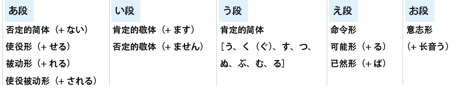
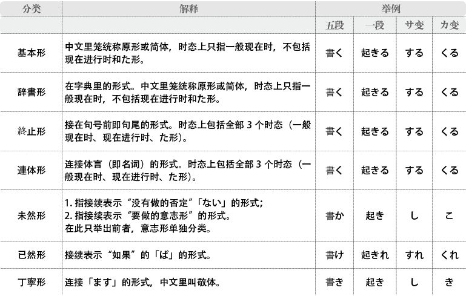
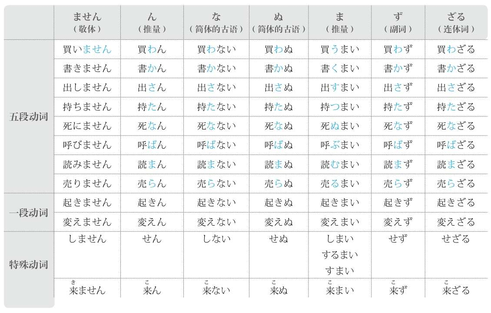
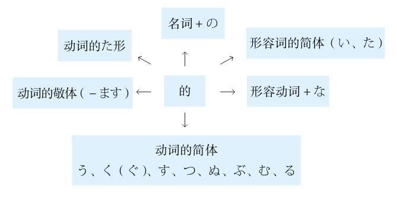
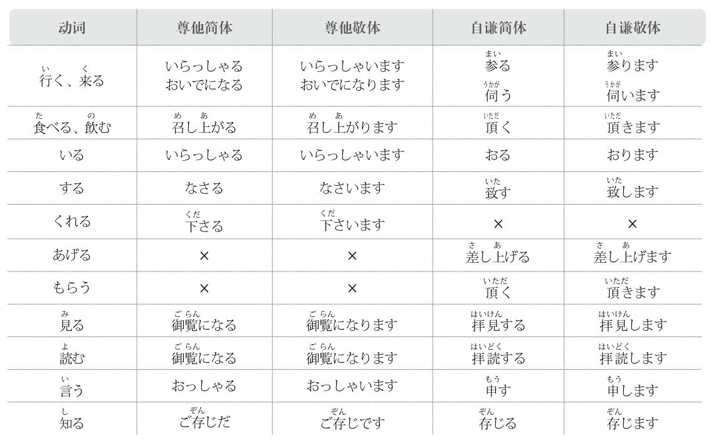
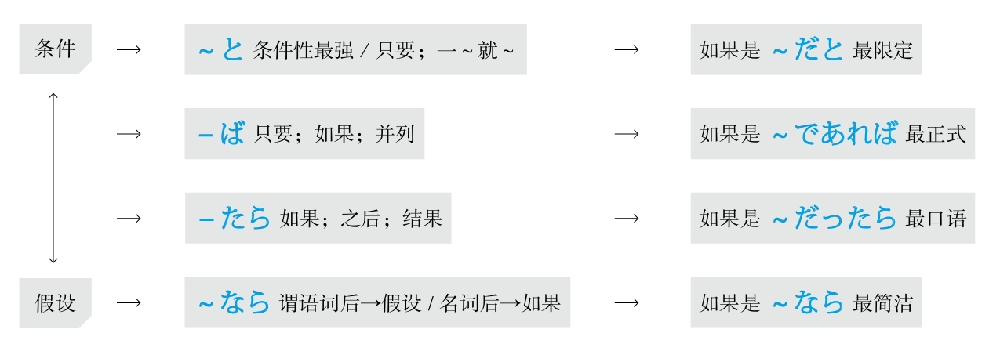
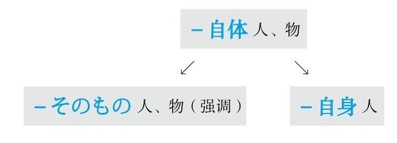

**[ [[ ../Menu.md | Home ]] ]　[ [[ 日语语法新思维（修订版）_Detail_1.md | Next ]] ]**

---
# 前言 #1_0_0_0_0
* [[ 日语语法新思维（修订版）_Menu_0.md | Menu #1_0_0_0_0 ]]

日语语法新思维（修订版）
作者：安宁
出版社：北京语言大学出版社
出版日期：2018-03-01
ISBN：9787561941768
音频下载链接：[http://download.dogwood.com.cn/riyu/ryyfxswn.zip](http://download.dogwood.com.cn/riyu/ryyfxswn.zip)

《日语语法新思维》是我写的第一本书。之后我相继写了《日语词汇新思维：词源+联想记忆法》《新日本语能力测试词汇速记大全》《新日本语能力测试高分突破：N1阅读》《新日本语能力测试高分突破：N2阅读》《日语能力考试10000词高效速记》。虽然已经出版了其他方面的书籍，但是我还是在不断地思考着如何能把大家都称为“笑着进去，哭着出来”的日语语法解释得更加清晰、透彻。
几年前，我怀着把繁复而杂乱的日语语法进行归纳、总结的初衷，将以往按五十音图顺序分类的语法改为按语法的内容进行归类、总结，著成了《日语语法新思维》一书。在这几年里，我又应学生和读者的希望与要求，不断地完善此书，为书添加了录音、录制了配套视频课程。直至今天，我还是一直希望这本书在更好、更清晰的同时更适用于各个阶段的学习者，所以我重新编写此书，将自己这几年读书过程中的体会和教学中的感受添加在新书当中。
归纳一下日语语法的特点，初级语法是单个的助词或是简单的搭配，中级语法是易懂的语法，高级语法是古语或者意思及语气难懂的组合。根据历年能力考试的内容，从分布来看，初级语法占到了全部语法的大约15%，中级语法和高级语法分别占剩余的85%的一半。虽然初级语法少，但是我在教学中发现学生对于基础语法知识的掌握还存在对概念分辨不清、变形不扎实、畏惧敬语等问题，因此我在本书的第一章中对以上问题进行了整理和解说。另外，在授课中我一直习惯于用示意图来解释单词和语法，此次改版，我将示意图添加在了每一组语法之后，希望能从视觉上更加清晰地阐释各个语法点之间的关系。每一个语法点的例句还是遵循以往的规律，以少而精的例句充分体现语法的特点。
本书的目的在于打破以往学习日语语法时照搬照背的老套的方法。由于日语起源于汉语，那么从日语语法的起源入手进行细致明确的分析，才更加适合中国学生的日语学习。有的语法起源于客观逻辑，比如由“路走到了尽头就要马上改变方向”引出的「した途端」表示“马上”；有的语法起源于中医里的针灸，比如由“针灸的第一针扎进皮肤里是最疼的，就像是切开皮肤一样”引出的「～を皮切りに」表示“开端”；还有的语法起源于日本文化，比如由“有着一臂之隔的距离的关系就需要顾及，也就是说关系越近越应该顾及对方的感受”引出的「～手前」表示“顾及”等。本书从假名起源着手解释语法，同时添加了每个语法之间的关系图，以探讨“意思上的区别、使用上的区别、语气上的区别”为准则，综合全面地分析日语语法。本书把日常生活中常用的句子作为经典例句，同时注明了所有汉字的发音，以期达到清晰理解、深刻记忆和脱口而出的效果。
愿本书能够帮助您找到一条适合自己的日语学习之路，那将是我最大的快乐。

# 引言 #2_0_0_0_0
* [[ 日语语法新思维（修订版）_Menu_0.md | Menu #2_0_0_0_0 ]]

**注1：** 「－」表示「－」部分的词必须与后面的词构成复合词；「～」表示「～」部分的词是一个独立的词。
**注2：** “接续”如果无特殊情况均为「－」或「～」部分。
**注3：** 本书为了将形式和时态进行区分，将“使役、被动、命令、可能、意志、使役被动”均称为“形”。

# 第1章 基础知识 #3_0_0_0_0
* [[ 日语语法新思维（修订版）_Menu_0.md | Menu #3_0_0_0_0 ]]

## 第1节 语法基本概念 #3_1_0_0_0
* [[ 日语语法新思维（修订版）_Menu_0.md | Menu #3_1_0_0_0 ]]

**日语的语法结构**
1. 语法即单词搭配及罗列的法则。在语法中出现的单词被称为“语法词”。日语的语法词包括体言、用言和助词三种。
* 体言即名词和代词。日语中代词又被称为代名词，也是名词的一种。
* 用言即谓语词，包括动词、形容词和助动词。虽然形容动词也可以当作谓语使用，但是它不具备谓语所具有的时态和其他变形，需要借助于助动词「だ」进行变化，因此形容动词只能作为词干使用。
* 助词分为两大类：接在名词后面的叫“格助词”，接在谓语词后面的叫“接续助词”。
2. 日语的语法被称为是“黏着语”或“胶着语”，即一个辅助性的词（助词）黏着在一个实质性的词（名词或动词）的后面来表示其意思的语言。因此日语语法的关键在助词和搭配。
3. 日语的语法结构由起主干作用的“主语”、“谓语”、“宾语”和起修饰作用的“定语”、“状语”构成。中文当中的补语在日语中会通过其他表达方式体现。和中文一样，修饰名词的定语和修饰谓语词（动词、形容词、助动词）的状语均接在被修饰语的前面。
4. 日语句子的基础结构如下：

**日语的语法词**
**语法的概念：** 语法即语言的法则，是语言当中的单词搭配和罗列的法则。上图显示了日语句子基本的搭配和罗列的法则。由此图可以得知：日语的语法词为**“名词、助词、谓语词（动词、形容词、助动词）”。**
日语的暧昧在于语法当中的名词和动词被暧昧化，要想弄清楚这种暧昧的语言，首先需要知道名词和动词的分类。

**名词的分类**
「の」可以代替所有的名词，它的下面又可以分为「こと」、「もの」、「ひと」、「ところ」、「よう」五个名词，每个名词下面还可以指具体的名词。在第三章中出现的许多语法中应用到了这五个名词。有些语法的暧昧就是因为不清楚这五个名词分别代替了谁，因此在理解时需要结合上下文的内容将其具体化。

**动词的分类1**
**从语法归纳上来分，动词可以分为三大类：** 「する」、「ある」**和** 「なる」。
「する」（做）可以代替大多数的动词，需根据上下文进行具体化；「ある」（有、在）在高级语法中经常出现；「なる」在初、中级语法中表示“成为”，在高级语法中表示“是”。

**动词的分类2**
**从变形规律上来分，动词可以分为三大类：五段动词、一段动词和特殊动词。**
单个动词的结构为：**書（词干）き（附加）ます（后缀）** 。“词干”代表“意思”，“附加”代表“变形”，“后缀”代表“时态和形式（简体和敬体）”。
* **五段动词：** 随着表示时态和形式的动词后缀的变化，前面的附加部分在あ、い、う、え、お五个段里发生变化的动词叫做五段动词。
特征：肯定的简体结尾在う段上（う、く、す、つ、ぬ、ぶ、む、る）。
注意：五段动词变成其他任何一种形式之后即成为一段动词，之后按照一段动词的变形规律进行变化。

* **一段动词：** 虽然表示时态和形式的动词后缀发生了变化，但是前面的附加部分还是保持同一个形式不发生变化的动词叫做一段动词。
特征：肯定的简体的结尾是在う段上的「る」。一段动词又可细分为上一段动词和下一段动词。
上一段动词：「る」前面的附加部分在い段上的动词（起きる）。因为い段在う段的前面，所以叫做上一段动词。
下一段动词：「る」前面的附加部分在え段上的动词（変える）。因为え段在う段的后面，所以叫做下一段动词。
极少数的特殊一段动词不是附加的部分，而是词干在い段或え段上，例如「見る」（上一段动词）、「寝る」（下一段动词）。

* **特殊动词：** 随着表示时态和形式的动词后缀的变化，词干的发音发生变化的动词叫做特殊动词。此类动词只有两个：表示“做”的「する」被称为サ变动词，表示“来”的「来る」被称为カ变动词。

**动词的分类3**
**从性质上来分，动词可以分为两大类：自动词和他动词。**
* **意思：** 自动词表示动作是自己的，无法影响其他事物；他动词表示动作对其他的事物产生了影响。
* **助词：** が（小主语）+自动词、形容词、形容动词、可能形、被动形を（把）+他动词、使役形
* **重点：** 自动词表示动作的结果或状态；他动词表示动作本身。例如：“做好”，如果强调“做”就用他动词，如果强调“好”就用自动词。
对于成对的自他动词，如果使用了他动词而没有提及主语，则一定要弄清楚他动词的主语是谁；如果使用了自动词，则要避免提及做动作的人。例如：**留学を決めました（某人决定了去留学）。留学が決まりました（留学这件事定下来了）。**
* **注意：** 必须通过查字典才能知道一个动词是自动词还是他动词。

**动词的时态**
**动词的时态分为三大类：** 一般现在时、现在进行时和た形。
* **一般现在时：** 使用动词的辞书形（基本形），例：「する」。表示一般性动作和将来的动作。
* **现在进行时：** 使用动词的て形+いる，例：「している」。表示现在正在做的动作和在一段时间内持续的动作或状态。
* **た形：** 使用动词的た形，例：「した」。表示动作完了的“了”、过去式的“了”以及作为形容词修饰名词的“的”（相当于英语中动词加ed变为过去分词来修饰名词）。た形和て形的变形规律相同。

**动词的形式**
* **使役形：** 表示“让、使”等。他动词也相当于使役形的一种。
* **被动形：** 表示“1.单纯被动；2.被动的心情；3.主谓统一；4.敬语中的尊他语”。
* **命令形：** 意思相当于「―てください」，表示“1.用于间接引用；2.用于文章中的引号中，且语气正式”。
* **可能形：** 表示“1.条件（能～）；2.技能（会～）；3.中文中的补语（例：出不去，走得动）。而「～ことができる」语气正式且郑重”。
* **意志形：** 后面加上「と」的意志形表示强调“想要做某事的will”；不加「と」的意志形表示提建议，意思是“让我们做某事吧”。例如：**「しようと～」（想要做～）** ，通常想要做某事的意志形为**「しようとする」；「しよう」（让我们做～）** 是**「しましょう」的简体。**
* **使役被动形：** 表示“1.不情愿地做；2.不是自发地做；3.无意中做”。

**谓语的中顿**
* **意思：** 谓语的中顿被称为连用形，即连接用言（谓语词）的形式。当数个谓语词连接在一起且不分大小只是并列时，放在前面的谓语词需要变成中顿的形式。
* **分类：** 连用形（也叫古语连用形，语气正式）和て形（也叫现代语连用形，语气柔和）。
* **重点：** て形和た形的变形规律相同。

**谓语词的概念整理**
谓语词（动词、形容词、助动词）的基础形式在日本国内的语法书中大致上有以下几种称呼。

**动词**

**形容词**
**注意：** 形容词是独立的单词，不是词干，有自己独立的变形方式。在后面加「です」只表示敬体的语气，没有实质性的意思。形容词的词干是去掉「い」。

**形容动词**
**注意：** 形容动词本身就是词干，不是独立的单词，都用助动词「です」（敬体）或「だ」（简体）作为谓语词，因此所有形容动词的变形均按照助动词「です」或「だ」的变形规律进行变化。

## 第2节 本书的分类 #3_2_0_0_0
* [[ 日语语法新思维（修订版）_Menu_0.md | Menu #3_2_0_0_0 ]]

本书将第一节中提到的各种时态及形式按照第三章的具体语法中的应用分为一般现在时的简体、一般现在时的敬体、现在进行时的简体、现在进行时的敬体、た形的简体、た形的敬体、命令形、意志形、ば形（即第一节中提到的已然形）、词干、连用形、て形、否定形等十三种形式，并且将变形规律分别归纳如下。

**一般现在时的简体**
**注意：** 动词的使役形、被动形、可能形、使役被动形均为一段动词，其否定形是去掉「る」加上「ない」。

**一般现在时的敬体**
**注意：** 动词的使役形、被动形、可能形、使役被动形均为一段动词，其否定形是去掉「ます」加上「ません」。

**现在进行时的简体**
**注意：** 动词的使役形、被动形、可能形、使役被动形均为一段动词，其否定形是去掉「いる」加上「いない」。

**现在进行时的敬体**
**注意：** 动词的使役形、被动形、可能形、使役被动形均为一段动词，其否定形是去掉「います」加上「いません」。

**た形的简体**
**注意：** 动词的使役形、被动形、可能形、使役被动形均为一段动词，其否定形是去掉「た」加上「なかった」。
此外，「行く」的变形规律比较特殊：「行く→行った」。

**た形的敬体**
**注意：** 动词的使役形、被动形、可能形、使役被动形均为一段动词，其否定形是去掉「ました」加上「ませんでした」。

**命令形**

**意志形**

**ば形**

**词干**

**连用形**

**て形**

**否定形**

## 第3节 修饰语 #3_3_0_0_0
* [[ 日语语法新思维（修订版）_Menu_0.md | Menu #3_3_0_0_0 ]]

* **定语：** 修饰名词的部分，包括名词、形容动词和谓语词（动词、形容词）。中文里的定语后面接的是“的”。
* **状语：** 修饰谓语词（动词、形容词、助动词）的部分，包括副词。中文里的状语后面接的是“地”。

## 第4节 敬语 #3_4_0_0_0
* [[ 日语语法新思维（修订版）_Menu_0.md | Menu #3_4_0_0_0 ]]

* **分类：** 尊他语（与他人有关的人、物、动作）、自谦语（与自己有关的人、物、动作）、礼貌语（寒暄语）。
* **重点：**
1. 需要弄清是与他人有关还是与自己有关，即区分尊他和自谦。
2. 需要弄清动词是特殊动词还是一般动词。
特殊动词指有自己特殊表达方式的动词，通常不能使用一般变形规律进行变形。
一般动词指按照一般规律变形的动词。
3. 尊他语中还有使用动词的被动形的表达方式，特殊动词和一般动词都可以使用这种方式。
尊他形式中，一般变形规律「お～になる」的尊他语气强，被动形的尊他语气弱。
4. 前面加「お」的名词是训读的词或是日本造的音读汉字词（例：「お電話」）；前面加「ご」的名词是中国造的汉字词（例：「ご連絡」）。

* **一般变形规律：** **尊他为「お～になる」；自谦为「お～する」。** 「～」部分是动词的连用形。
* **特殊动词的变化如下** 。

# 第2章 助词 #4_0_0_0_0
* [[ 日语语法新思维（修订版）_Menu_0.md | Menu #4_0_0_0_0 ]]

## ～は #4_1_0_0_0
* [[ 日语语法新思维（修订版）_Menu_0.md | Menu #4_1_0_0_0 ]]

**意1：** 大主语
**注意：** 能够带动长句子和数个谓语，同时与句尾的谓语相呼应
**接续：** 名词

例句：<ruby>荒<rp>(</rp><rt>あら</rt><rp>)</rp></ruby><ruby>川<rp>(</rp><rt>かわ</rt><rp>)</rp></ruby>さん**は** イタリア<ruby>語<rp>(</rp><rt>ご</rt><rp>)</rp></ruby>が<ruby>上<rp>(</rp><rt>じょう</rt><rp>)</rp></ruby><ruby>手<rp>(</rp><rt>ず</rt><rp>)</rp></ruby>です。
直译：荒川意大利语好。

**意2：** 强调
**重点：** 强调其他助词、副词、数量词
**注意：** 对比性的强调
**接续：** 助词、副词、数量词

例句：<ruby>彼<rp>(</rp><rt>かれ</rt><rp>)</rp></ruby>は<ruby>事<rp>(</rp><rt>じ</rt><rp>)</rp></ruby><ruby>務<rp>(</rp><rt>む</rt><rp>)</rp></ruby><ruby>所<rp>(</rp><rt>しょ</rt><rp>)</rp></ruby>に**は** いません。
直译：他不在事务所。

**意3：** 对比
**接续：** 名词

例句：スイカ**は** <ruby>好<rp>(</rp><rt>す</rt><rp>)</rp></ruby>きだけど、<ruby>桃<rp>(</rp><rt>もも</rt><rp>)</rp></ruby>**は** <ruby>苦<rp>(</rp><rt>にが</rt><rp>)</rp></ruby><ruby>手<rp>(</rp><rt>て</rt><rp>)</rp></ruby>です。
直译：西瓜喜欢，但是桃不擅长。
意译：喜欢吃西瓜，但是不喜欢吃桃。

## ～が #4_2_0_0_0
* [[ 日语语法新思维（修订版）_Menu_0.md | Menu #4_2_0_0_0 ]]

**意1：** 小主语
**注意：** 不能够带动长句子和数个谓语，同时不能添加过长的定语
**重点：** 谓语是自动词、形容词、形容动词、动词的可能形、动词的被动形的时候，如果它们的主语不是大主语则要用「が」
**接续：** 名词

例句：<ruby>荒<rp>(</rp><rt>あら</rt><rp>)</rp></ruby><ruby>川<rp>(</rp><rt>かわ</rt><rp>)</rp></ruby>さんはイタリア<ruby>語<rp>(</rp><rt>ご</rt><rp>)</rp></ruby>**が** <ruby>上<rp>(</rp><rt>じょう</rt><rp>)</rp></ruby><ruby>手<rp>(</rp><rt>ず</rt><rp>)</rp></ruby>です。
直译：荒川意大利语好。

**意2：** 强调主语
**接续：** 名词

例句：<ruby>鵜<rp>(</rp><rt>う</rt><rp>)</rp></ruby><ruby>飼<rp>(</rp><rt>かい</rt><rp>)</rp></ruby><ruby>先<rp>(</rp><rt>せん</rt><rp>)</rp></ruby><ruby>生<rp>(</rp><rt>せい</rt><rp>)</rp></ruby>**が** この<ruby>大<rp>(</rp><rt>だい</rt><rp>)</rp></ruby><ruby>学<rp>(</rp><rt>がく</rt><rp>)</rp></ruby>の<ruby>学<rp>(</rp><rt>がく</rt><rp>)</rp></ruby><ruby>長<rp>(</rp><rt>ちょう</rt><rp>)</rp></ruby>です。
直译：鹈饲老师才是（就是、正是）这所大学的校长。

## ～を #4_3_0_0_0
* [[ 日语语法新思维（修订版）_Menu_0.md | Menu #4_3_0_0_0 ]]

**意1：** 把
**注意：** 谓语是他动词、动词的使役形时，它们的前面用「を」
**接续：** 名词

例句：<ruby>字<rp>(</rp><rt>じ</rt><rp>)</rp></ruby>**を** <ruby>五<rp>(</rp><rt>ご</rt><rp>)</rp></ruby><ruby>回<rp>(</rp><rt>かい</rt><rp>)</rp></ruby><ruby>書<rp>(</rp><rt>か</rt><rp>)</rp></ruby>きました。
直译：把字写了五遍。

**意2：** 移动
**注意：** 谓语是表示移动的自动词
**接续：** 名词

例句：<ruby>鳥<rp>(</rp><rt>とり</rt><rp>)</rp></ruby>は<ruby>空<rp>(</rp><rt>そら</rt><rp>)</rp></ruby>**を** <ruby>飛<rp>(</rp><rt>と</rt><rp>)</rp></ruby>んでいます。
直译：鸟在空中飞。

## ～の #4_4_0_0_0
* [[ 日语语法新思维（修订版）_Menu_0.md | Menu #4_4_0_0_0 ]]

**起源：** 「<ruby>乃<rp>(</rp><rt>の</rt><rp>)</rp></ruby>」
**意1：** 所属关系，相当于“>”（大于号）
**意思：** 的
**接续：** 名词

例句：<ruby>服<rp>(</rp><rt>ふく</rt><rp>)</rp></ruby>**の** ボタンがとれています。
直译：衣服的扣子掉了。

**意2：** 名词和名词之间的接续，相当于“＋”（加号）
**注意：** 日语中，只要不是专有名词，名词和名词之间则需要加「の」
**接续：** 名词

例句：<ruby>私<rp>(</rp><rt>わたし</rt><rp>)</rp></ruby>はこ**の** <ruby>会<rp>(</rp><rt>かい</rt><rp>)</rp></ruby><ruby>社<rp>(</rp><rt>しゃ</rt><rp>)</rp></ruby>の<ruby>経<rp>(</rp><rt>けい</rt><rp>)</rp></ruby><ruby>理<rp>(</rp><rt>り</rt><rp>)</rp></ruby>**の** <ruby>三<rp>(</rp><rt>み</rt><rp>)</rp></ruby><ruby>浦<rp>(</rp><rt>うら</rt><rp>)</rp></ruby>です。
直译：我是这家公司的会计三浦。

**意3：** 代替名词
**接续：** 名词

例句：これは<ruby>船<rp>(</rp><rt>ふな</rt><rp>)</rp></ruby><ruby>井<rp>(</rp><rt>い</rt><rp>)</rp></ruby>さんの<ruby>書<rp>(</rp><rt>しょ</rt><rp>)</rp></ruby><ruby>類<rp>(</rp><rt>るい</rt><rp>)</rp></ruby>です。<ruby>谷<rp>(</rp><rt>たに</rt><rp>)</rp></ruby><ruby>村<rp>(</rp><rt>むら</rt><rp>)</rp></ruby>さん**の** は<ruby>明日<rp>(</rp><rt>あした</rt><rp>)</rp></ruby><ruby>持<rp>(</rp><rt>も</rt><rp>)</rp></ruby>ってきます。
直译：这是船井的材料。谷村的明天拿来。

**意4：** 小小主语
**注意：** は（大主语）>が（小主语）>の（小小主语）
**接续：** 名词

例句：<ruby>五十嵐<rp>(</rp><rt>いがらし</rt><rp>)</rp></ruby>さん**は** 、<ruby>私<rp>(</rp><rt>わたし</rt><rp>)</rp></ruby>**が** <ruby>日<rp>(</rp><rt>に</rt><rp>)</rp></ruby><ruby>本<rp>(</rp><rt>ほん</rt><rp>)</rp></ruby>にいる<ruby>時<rp>(</rp><rt>とき</rt><rp>)</rp></ruby>の<ruby>一<rp>(</rp><rt>いち</rt><rp>)</rp></ruby><ruby>番<rp>(</rp><rt>ばん</rt><rp>)</rp></ruby><ruby>仲<rp>(</rp><rt>なか</rt><rp>)</rp></ruby>**の** いい<ruby>友<rp>(</rp><rt>とも</rt><rp>)</rp></ruby><ruby>達<rp>(</rp><rt>だち</rt><rp>)</rp></ruby>でした。
直译：五十岚是我在日本时关系最好的朋友。

## ～へ #4_5_0_0_0
* [[ 日语语法新思维（修订版）_Menu_0.md | Menu #4_5_0_0_0 ]]

**起源：** 「<ruby>辺<rp>(</rp><rt>へん</rt><rp>)</rp></ruby>」
**意1：** 方向
**翻译：** 往
**注意：** 方向感强
**接续：** 名词

例句：<ruby>東<rp>(</rp><rt>ひがし</rt><rp>)</rp></ruby>**へ** <ruby>行<rp>(</rp><rt>い</rt><rp>)</rp></ruby>ってください。
直译：请往东走。

**意2：** 对象
**翻译：** 给
**语气：** 正式
**注意：** 「へ」后面可以加「の」或「と」，但是「に」不能
**接续：** 名词

例句：これは<ruby>恩<rp>(</rp><rt>おん</rt><rp>)</rp></ruby><ruby>師<rp>(</rp><rt>し</rt><rp>)</rp></ruby>**へ** の<ruby>手<rp>(</rp><rt>て</rt><rp>)</rp></ruby><ruby>紙<rp>(</rp><rt>がみ</rt><rp>)</rp></ruby>です。
直译：这是给恩师的信。

## ～に #4_6_0_0_0
* [[ 日语语法新思维（修订版）_Menu_0.md | Menu #4_6_0_0_0 ]]

**意1：** 方向
**翻译：** 往、朝、向
**注意：** 不可用「にの」，只能用「への」
**语气：** 比「へ」柔和或方向感弱
**接续：** 名词

例句：<ruby>速<rp>(</rp><rt>はや</rt><rp>)</rp></ruby>く<ruby>家<rp>(</rp><rt>いえ</rt><rp>)</rp></ruby>**に** <ruby>帰<rp>(</rp><rt>かえ</rt><rp>)</rp></ruby>りたい。
直译：想快点儿回家。

**意2：** 对象
**翻译：** 对、跟
**注意：** 不可用「にの」，只能用「への」
**语气：** 柔和
**接续：** 名词

例句：<ruby>先<rp>(</rp><rt>せん</rt><rp>)</rp></ruby><ruby>生<rp>(</rp><rt>せい</rt><rp>)</rp></ruby>**に** <ruby>相<rp>(</rp><rt>そう</rt><rp>)</rp></ruby><ruby>談<rp>(</rp><rt>だん</rt><rp>)</rp></ruby>してください。
直译：请跟老师商量。

**意3：** 目的
**语气：** 柔和
**接续：** 名词

例句：<ruby>駅<rp>(</rp><rt>えき</rt><rp>)</rp></ruby>まで<ruby>友<rp>(</rp><rt>とも</rt><rp>)</rp></ruby><ruby>達<rp>(</rp><rt>だち</rt><rp>)</rp></ruby>を<ruby>迎<rp>(</rp><rt>むか</rt><rp>)</rp></ruby>え**に** <ruby>行<rp>(</rp><rt>い</rt><rp>)</rp></ruby>く。
直译：到车站去接朋友。
意译：去车站接朋友。

**意4：** 目标
**语气：** 柔和
**接续：** 名词

例句：<ruby>目<rp>(</rp><rt>もく</rt><rp>)</rp></ruby><ruby>標<rp>(</rp><rt>ひょう</rt><rp>)</rp></ruby>**に** <ruby>向<rp>(</rp><rt>む</rt><rp>)</rp></ruby>かって<ruby>頑<rp>(</rp><rt>がん</rt><rp>)</rp></ruby><ruby>張<rp>(</rp><rt>ば</rt><rp>)</rp></ruby>る。
直译：朝着目标努力。

**意5：** 时间点
**接续：** 具体时间（非具体的时间后面不加「に」）

例句：<ruby>朝<rp>(</rp><rt>あさ</rt><rp>)</rp></ruby><ruby>六<rp>(</rp><rt>ろく</rt><rp>)</rp></ruby><ruby>時<rp>(</rp><rt>じ</rt><rp>)</rp></ruby><ruby>半<rp>(</rp><rt>はん</rt><rp>)</rp></ruby>**に** <ruby>起<rp>(</rp><rt>お</rt><rp>)</rp></ruby>きる。
直译：早上六点半起床。

## ～で #4_7_0_0_0
* [[ 日语语法新思维（修订版）_Menu_0.md | Menu #4_7_0_0_0 ]]

**起源：** 古语是「にて」，「に」表示“方向”，「て」表示「手」（手）
**意1：** 在某地做某事
**接续：** 名词

例句：これは<ruby>学<rp>(</rp><rt>がっ</rt><rp>)</rp></ruby><ruby>校<rp>(</rp><rt>こう</rt><rp>)</rp></ruby>**で** <ruby>教<rp>(</rp><rt>おそ</rt><rp>)</rp></ruby>わりました。
直译：这是在学校学的。

**意2：** 交通工具
**接续：** 名词

例句：<ruby>今日<rp>(</rp><rt>きょう</rt><rp>)</rp></ruby>は<ruby>車<rp>(</rp><rt>くるま</rt><rp>)</rp></ruby>**で** <ruby>来<rp>(</rp><rt>き</rt><rp>)</rp></ruby>ました。
直译：今天是开车来的。

**意3：** 方法
**接续：** 名词

例句：<ruby>日<rp>(</rp><rt>に</rt><rp>)</rp></ruby><ruby>本<rp>(</rp><rt>ほん</rt><rp>)</rp></ruby><ruby>語<rp>(</rp><rt>ご</rt><rp>)</rp></ruby>**で** どう<ruby>言<rp>(</rp><rt>い</rt><rp>)</rp></ruby>いますか。
直译：用日语怎么说？

**意4：** 程度
**接续：** 名词

例句：<ruby>形<rp>(</rp><rt>けい</rt><rp>)</rp></ruby><ruby>式<rp>(</rp><rt>しき</rt><rp>)</rp></ruby>はある<ruby>程<rp>(</rp><rt>てい</rt><rp>)</rp></ruby><ruby>度<rp>(</rp><rt>ど</rt><rp>)</rp></ruby>**で** は<ruby>決<rp>(</rp><rt>き</rt><rp>)</rp></ruby>まっています。
直译：形式在某种程度上是定了的。
意译：在某种程度上，形式已经定了。

**意5：** 范围
**接续：** 名词

例句：この<ruby>塾<rp>(</rp><rt>じゅく</rt><rp>)</rp></ruby>**で** はたくさんの<ruby>学<rp>(</rp><rt>がく</rt><rp>)</rp></ruby><ruby>生<rp>(</rp><rt>せい</rt><rp>)</rp></ruby>が<ruby>習<rp>(</rp><rt>なら</rt><rp>)</rp></ruby>っています。
直译：在这个补习学校里，很多学生学着。
直译：有很多学生在这个补习学校里学习。

**意6：** 状态
**接续：** 名词

例句：これ**で** いいですか。
直译：这样行吗？

**意7：** 原因
**接续：** 名词

例句：<ruby>風邪<rp>(</rp><rt>かぜ</rt><rp>)</rp></ruby>**で** <ruby>休<rp>(</rp><rt>やす</rt><rp>)</rp></ruby>んだ。
直译：因为感冒休息了。

## ～も #4_8_0_0_0
* [[ 日语语法新思维（修订版）_Menu_0.md | Menu #4_8_0_0_0 ]]

**起源：** 「<ruby>猛<rp>(</rp><rt>もう</rt><rp>)</rp></ruby>」
**意1：** 也、连、都
**注意：** 每个名词后面都要加「も」
**接续：** 名词

例句：あれ**も** これ**も** しなければいけないから、<ruby>疲<rp>(</rp><rt>つか</rt><rp>)</rp></ruby>れている。
直译：这个那个都不做不行，所以累了。
意译：什么都得做，太累了。

**意2：** 强调
**接续：** 跟数字有关的词

例句：<ruby>何<rp>(</rp><rt>なん</rt><rp>)</rp></ruby><ruby>ヶ<rp>(</rp><rt>か</rt><rp>)</rp></ruby><ruby>月<rp>(</rp><rt>げつ</rt><rp>)</rp></ruby>**も** <ruby>習<rp>(</rp><rt>なら</rt><rp>)</rp></ruby>っているのにまだ<ruby>上<rp>(</rp><rt>じょう</rt><rp>)</rp></ruby><ruby>手<rp>(</rp><rt>ず</rt><rp>)</rp></ruby>になれない。
直译：好几个月学着，但是还不能变得好。
意译：学了好几个月，还是没有进步。

## ～と #4_9_0_0_0
* [[ 日语语法新思维（修订版）_Menu_0.md | Menu #4_9_0_0_0 ]]

**起源：** 「<ruby>統<rp>(</rp><rt>とう</rt><rp>)</rp></ruby>」
**意1：** 和
**注意：** 每一个并列的部分之间都要加「と」。前面的「と」表示“和”；最后一个「と」起引号的作用
**接续：** 名词

例句：<ruby>一<rp>(</rp><rt>ひと</rt><rp>)</rp></ruby>つ<ruby>目<rp>(</rp><rt>め</rt><rp>)</rp></ruby>**と** <ruby>二<rp>(</rp><rt>ふた</rt><rp>)</rp></ruby>つ<ruby>目<rp>(</rp><rt>め</rt><rp>)</rp></ruby>**と** <ruby>三<rp>(</rp><rt>み</rt><rp>)</rp></ruby>つ<ruby>目<rp>(</rp><rt>め</rt><rp>)</rp></ruby>とは、どう<ruby>違<rp>(</rp><rt>ちが</rt><rp>)</rp></ruby>いますか。
直译：第一个、第二个和第三个，怎么不一样？
意译：第一个、第二个和第三个，有什么不一样？

**意2：** 起引号的作用
**注意：** 表示内容或强调
**接续：** 任何词

例句：<ruby>一<rp>(</rp><rt>ひと</rt><rp>)</rp></ruby>つ<ruby>目<rp>(</rp><rt>め</rt><rp>)</rp></ruby>と<ruby>二<rp>(</rp><rt>ふた</rt><rp>)</rp></ruby>つ<ruby>目<rp>(</rp><rt>め</rt><rp>)</rp></ruby>と<ruby>三<rp>(</rp><rt>み</rt><rp>)</rp></ruby>つ<ruby>目<rp>(</rp><rt>め</rt><rp>)</rp></ruby>**と** は、どう<ruby>違<rp>(</rp><rt>ちが</rt><rp>)</rp></ruby>いますか。
直译：第一个、第二个和第三个，怎么不一样？
意译：第一个、第二个和第三个，有什么不一样？

## ～か #4_10_0_0_0
* [[ 日语语法新思维（修订版）_Menu_0.md | Menu #4_10_0_0_0 ]]

**起源：** 「<ruby>何<rp>(</rp><rt>か</rt><rp>)</rp></ruby>」
**意1：** 疑问、询问、责问、质问等
**注意：** 在一个句子当中，只要有疑问词就必须接「か」
**接续：** 任何词

例句：<ruby>来<rp>(</rp><rt>く</rt><rp>)</rp></ruby>る**か** どうかまだわからない。
直译：来还是不来还不知道。

**意2：** 不确定
**接续：** 任何词

例句：いつ**か** また<ruby>会<rp>(</rp><rt>あ</rt><rp>)</rp></ruby>えるよ。
直译：什么时候还能见面啊。

## ～や #4_11_0_0_0
* [[ 日语语法新思维（修订版）_Menu_0.md | Menu #4_11_0_0_0 ]]

**起源：** 「<ruby>也<rp>(</rp><rt>や</rt><rp>)</rp></ruby>」
**意1：** 是
**注意：** 古语里表示断定的「<ruby>也<rp>(</rp><rt>や</rt><rp>)</rp></ruby>」（音读）在现代主要用于方言当中；「<ruby>也<rp>(</rp><rt>なり</rt><rp>)</rp></ruby>」（训读）表示正式语气的「です」或「ですか」
**接续：** 任何词

例句：これ**や** 。
直译：是这个。

**意2：** 是吗？
**注意：** 相当于现代日语的「か」
**接续：** 任何词

例句：<ruby>君<rp>(</rp><rt>きみ</rt><rp>)</rp></ruby>よ<ruby>知<rp>(</rp><rt>し</rt><rp>)</rp></ruby>る**や** 。
直译：你，知道吗？

## ～し #4_12_0_0_0
* [[ 日语语法新思维（修订版）_Menu_0.md | Menu #4_12_0_0_0 ]]

**解释：** 「し」的意思是“强”，构成的单词有「<ruby>強<rp>(</rp><rt>し</rt><rp>)</rp></ruby>いる（强迫）」；此语法表示「し」前后的两件事情同等重要
**意思：** 又～，又～
**注意：** 每一个并列的部分之间都要加「し」；用几次都可以；常与「も」搭配
**接续：** 谓语词（动词、形容词、助动词）的简体和敬体

例句：<ruby>結<rp>(</rp><rt>けっ</rt><rp>)</rp></ruby><ruby>果<rp>(</rp><rt>か</rt><rp>)</rp></ruby>もまだわからない**し** 、ほっとこう。
直译：又不知道结果，别管它。
意译：又不知道结果如何，别想它了。

## ～から #4_13_0_0_0
* [[ 日语语法新思维（修订版）_Menu_0.md | Menu #4_13_0_0_0 ]]

**解释：** 表示起点
**意思：** 从～
**接续：** 名词

例句：<ruby>田<rp>(</rp><rt>た</rt><rp>)</rp></ruby><ruby>中<rp>(</rp><rt>なか</rt><rp>)</rp></ruby>さん**から** <ruby>得<rp>(</rp><rt>え</rt><rp>)</rp></ruby>た<ruby>情<rp>(</rp><rt>じょう</rt><rp>)</rp></ruby><ruby>報<rp>(</rp><rt>ほう</rt><rp>)</rp></ruby>は<ruby>確<rp>(</rp><rt>かく</rt><rp>)</rp></ruby><ruby>実<rp>(</rp><rt>じつ</rt><rp>)</rp></ruby>だ。
直译：从田中得到的信息很确实。
意译：从田中那里得到的信息很准确。

## ～まで #4_14_0_0_0
* [[ 日语语法新思维（修订版）_Menu_0.md | Menu #4_14_0_0_0 ]]

**意1：** 到～
**用于：** 任何事物（时间、地点、程度、人物等等）
**接续：** 名词

例句：<ruby>部<rp>(</rp><rt>へ</rt><rp>)</rp></ruby><ruby>屋<rp>(</rp><rt>や</rt><rp>)</rp></ruby>の<ruby>隅<rp>(</rp><rt>すみ</rt><rp>)</rp></ruby>から<ruby>隅<rp>(</rp><rt>すみ</rt><rp>)</rp></ruby>**まで** <ruby>探<rp>(</rp><rt>さが</rt><rp>)</rp></ruby>した。
直译：从房间的角落到角落，找了。
意译：找遍了房间的各个角落。

**意2：** 到～的地步
**接续：** 任何词

例句：そこ**まで** する<ruby>必<rp>(</rp><rt>ひつ</rt><rp>)</rp></ruby><ruby>要<rp>(</rp><rt>よう</rt><rp>)</rp></ruby>はない。
直译：做到那个地步的必要没有。
意译：没有必要做到那个地步。

## ～より #4_15_0_0_0
* [[ 日语语法新思维（修订版）_Menu_0.md | Menu #4_15_0_0_0 ]]

**意1：** 从～
**表示：** 起点
**注意：** 一般用于写信的发信人和送东西的赠送人
**区别：** 比「から」语气正式
**接续：** 人称

例句：<ruby>田<rp>(</rp><rt>た</rt><rp>)</rp></ruby><ruby>中<rp>(</rp><rt>なか</rt><rp>)</rp></ruby><ruby>様<rp>(</rp><rt>さま</rt><rp>)</rp></ruby>**より** <ruby>鈴<rp>(</rp><rt>すず</rt><rp>)</rp></ruby><ruby>木<rp>(</rp><rt>き</rt><rp>)</rp></ruby><ruby>様<rp>(</rp><rt>さま</rt><rp>)</rp></ruby><ruby>宛<rp>(</rp><rt>あ</rt><rp>)</rp></ruby>ての<ruby>手<rp>(</rp><rt>て</rt><rp>)</rp></ruby><ruby>紙<rp>(</rp><rt>がみ</rt><rp>)</rp></ruby>をお<ruby>預<rp>(</rp><rt>あず</rt><rp>)</rp></ruby>かりしております。
直译：从田中给铃木的信，我们保管着。
意译：田中给铃木的信放在我们这里。

**意2：** 比～
**接续：** 任何词

例句：<ruby>今日<rp>(</rp><rt>きょう</rt><rp>)</rp></ruby>は<ruby>昨日<rp>(</rp><rt>きのう</rt><rp>)</rp></ruby>**より** <ruby>暑<rp>(</rp><rt>あつ</rt><rp>)</rp></ruby>い。
直译：今天比昨天热。

## ～くらい/～ぐらい #4_16_0_0_0
* [[ 日语语法新思维（修订版）_Menu_0.md | Menu #4_16_0_0_0 ]]

**解释：** 「<ruby>位<rp>(</rp><rt>くらい</rt><rp>)</rp></ruby>」表示高、中、低三个程度
**注意：** 读清音和浊音都可以
**用于：** 程度高
**接续：** 任何词

例句：<ruby>周<rp>(</rp><rt>まわ</rt><rp>)</rp></ruby>りが<ruby>騒<rp>(</rp><rt>さわ</rt><rp>)</rp></ruby>がしいから、<ruby>電<rp>(</rp><rt>でん</rt><rp>)</rp></ruby><ruby>話<rp>(</rp><rt>わ</rt><rp>)</rp></ruby>の<ruby>音<rp>(</rp><rt>おと</rt><rp>)</rp></ruby>が<ruby>聞<rp>(</rp><rt>き</rt><rp>)</rp></ruby>こえない**くらい** だ。
直译：周围太吵了，所以到了电话的声音听不见了的程度。
意译：周围太吵了，电话的声音都快听不见了。

**用于：** 程度中
**意思：** 左右
**接续：** 任何词

例句：<ruby>歩<rp>(</rp><rt>ある</rt><rp>)</rp></ruby>いて<ruby>行<rp>(</rp><rt>い</rt><rp>)</rp></ruby>ける**くらい** <ruby>近<rp>(</rp><rt>ちか</rt><rp>)</rp></ruby>いです。
直译：可以走着去的程度得近。
意译：很近，可以走着去。

**用于：** 程度低
**接续：** 任何词

例句：こんな<ruby>事<rp>(</rp><rt>こと</rt><rp>)</rp></ruby>**くらい** <ruby>子<rp>(</rp><rt>こ</rt><rp>)</rp></ruby><ruby>供<rp>(</rp><rt>ども</rt><rp>)</rp></ruby>でも<ruby>知<rp>(</rp><rt>し</rt><rp>)</rp></ruby>っている。
直译：这样的事的程度，即使是孩子都知道。
意译：这样的事连孩子都知道。

**注意：** 还可以表示大概的“时间点”和“期间段”
**意思：** 左右

例句：<ruby>明日<rp>(</rp><rt>あした</rt><rp>)</rp></ruby>の<ruby>午後<rp>(</rp><rt>ごご</rt><rp>)</rp></ruby><ruby>三<rp>(</rp><rt>さん</rt><rp>)</rp></ruby><ruby>時<rp>(</rp><rt>じ</rt><rp>)</rp></ruby>**くらい** に<ruby>来<rp>(</rp><rt>き</rt><rp>)</rp></ruby>てください。
直译：在明天下午3点左右，请来。
意译：请于明天下午3点左右来。

例句：<ruby>昨日<rp>(</rp><rt>きのう</rt><rp>)</rp></ruby><ruby>友<rp>(</rp><rt>とも</rt><rp>)</rp></ruby><ruby>達<rp>(</rp><rt>だち</rt><rp>)</rp></ruby>に<ruby>三<rp>(</rp><rt>さん</rt><rp>)</rp></ruby><ruby>時<rp>(</rp><rt>じ</rt><rp>)</rp></ruby><ruby>間<rp>(</rp><rt>かん</rt><rp>)</rp></ruby>**くらい** <ruby>待<rp>(</rp><rt>ま</rt><rp>)</rp></ruby>たされた。
直译：昨天被让朋友等了3个多小时。
意译：昨天朋友让我等了3个多小时。

## ～ころ/～ごろ #4_17_0_0_0
* [[ 日语语法新思维（修订版）_Menu_0.md | Menu #4_17_0_0_0 ]]

**解释：** 「<ruby>頃<rp>(</rp><rt>ころ</rt><rp>)</rp></ruby>」表示大概的“时间点”
**意思：** 左右
**语气：** 正式
**注意：** 读清音和浊音都可以
**区别：** 只能接“时间点”，不能接“时间段”

例句：<ruby>明日<rp>(</rp><rt>あした</rt><rp>)</rp></ruby><ruby>何<rp>(</rp><rt>なん</rt><rp>)</rp></ruby><ruby>時<rp>(</rp><rt>じ</rt><rp>)</rp></ruby>**ごろ** <ruby>伺<rp>(</rp><rt>うかが</rt><rp>)</rp></ruby>えばよろしいでしょうか。
直译：明天几点左右拜访好呢？

## ～ほど #4_18_0_0_0
* [[ 日语语法新思维（修订版）_Menu_0.md | Menu #4_18_0_0_0 ]]

**解释：** 「<ruby>程<rp>(</rp><rt>ほど</rt><rp>)</rp></ruby>」的意思是“程度高”
**意思：** 左右
**区别：** 不能用于“程度低”和“程度中”的事物

例句：<ruby>舌<rp>(</rp><rt>した</rt><rp>)</rp></ruby>がとろける**ほど** おいしい。
直译：好吃得舌头都要融化了。
意译：太好吃了。

**解释：** 「<ruby>程<rp>(</rp><rt>ほど</rt><rp>)</rp></ruby>」表示大概的“期间段”
**意思：** 左右
**语气：** 正式
**区别：** 不能接“时间点”，只能接“时间段”

例句：<ruby>講<rp>(</rp><rt>こう</rt><rp>)</rp></ruby><ruby>義<rp>(</rp><rt>ぎ</rt><rp>)</rp></ruby>は<ruby>1<rp>(</rp><rt>いち</rt><rp>)</rp></ruby><ruby>時<rp>(</rp><rt>じ</rt><rp>)</rp></ruby><ruby>間<rp>(</rp><rt>かん</rt><rp>)</rp></ruby>**ほど** <ruby>延<rp>(</rp><rt>の</rt><rp>)</rp></ruby>びた。
直译：大学的课拖延了1个小时左右。
意译：课拖延了1个小时左右。

## ～だけ #4_19_0_0_0
* [[ 日语语法新思维（修订版）_Menu_0.md | Menu #4_19_0_0_0 ]]

**解释：** 助词「だけ」表示多、中、少三个数量级别
**用于：** 数量多
**注意：** 需要通过上下文来判断其意
**接续：** 一般以「これだけ、それだけ、あれだけ」这三个副词来表示

例句：あれ**だけ** <ruby>残<rp>(</rp><rt>ざん</rt><rp>)</rp></ruby><ruby>業<rp>(</rp><rt>ぎょう</rt><rp>)</rp></ruby>をしていれば、<ruby>給<rp>(</rp><rt>きゅう</rt><rp>)</rp></ruby><ruby>料<rp>(</rp><rt>りょう</rt><rp>)</rp></ruby>をもっと<ruby>上<rp>(</rp><rt>あ</rt><rp>)</rp></ruby>げてくれるはずなのに。
直译：如果加了那么多班的话，应该多给我们涨些工资啊。
意译：加了那么多班，应该多给我们涨些工资啊。

**用于：** 数量中
**注意：** 表示“相应”或“符合”，可以理解为“＝”
**接续：** 任何词

例句：トップランキングの<ruby>大<rp>(</rp><rt>だい</rt><rp>)</rp></ruby><ruby>学<rp>(</rp><rt>がく</rt><rp>)</rp></ruby>の<ruby>大<rp>(</rp><rt>だい</rt><rp>)</rp></ruby><ruby>学<rp>(</rp><rt>がく</rt><rp>)</rp></ruby><ruby>院<rp>(</rp><rt>いん</rt><rp>)</rp></ruby>に<ruby>受<rp>(</rp><rt>う</rt><rp>)</rp></ruby>かる**だけ** の<ruby>学<rp>(</rp><rt>がく</rt><rp>)</rp></ruby><ruby>力<rp>(</rp><rt>りょく</rt><rp>)</rp></ruby>をつけるのは<ruby>難<rp>(</rp><rt>むずか</rt><rp>)</rp></ruby>しい。
直译：具备考上与名牌的大学的研究生院相应的能力，是件困难的事情。
意译：很难拥有考上名牌大学研究生院的能力。

**用于：** 数量少
**接续：** 任何词

例句：この<ruby>商<rp>(</rp><rt>しょう</rt><rp>)</rp></ruby><ruby>品<rp>(</rp><rt>ひん</rt><rp>)</rp></ruby>は<ruby>冬<rp>(</rp><rt>ふゆ</rt><rp>)</rp></ruby>に**だけ** <ruby>発<rp>(</rp><rt>はつ</rt><rp>)</rp></ruby><ruby>売<rp>(</rp><rt>ばい</rt><rp>)</rp></ruby>される。
直译：这种商品只在冬天被销售。
意译：这种商品只在冬天销售。

## ～のみ #4_20_0_0_0
* [[ 日语语法新思维（修订版）_Menu_0.md | Menu #4_20_0_0_0 ]]

**解释：** 是「だけ」的古语
**意思：** 只是～
**语气：** 正式
**接续：** 任何词

例句：この<ruby>奨<rp>(</rp><rt>しょう</rt><rp>)</rp></ruby><ruby>学<rp>(</rp><rt>がく</rt><rp>)</rp></ruby><ruby>金<rp>(</rp><rt>きん</rt><rp>)</rp></ruby>は<ruby>日<rp>(</rp><rt>に</rt><rp>)</rp></ruby><ruby>本<rp>(</rp><rt>ほん</rt><rp>)</rp></ruby><ruby>人<rp>(</rp><rt>じん</rt><rp>)</rp></ruby><ruby>学<rp>(</rp><rt>がく</rt><rp>)</rp></ruby><ruby>生<rp>(</rp><rt>せい</rt><rp>)</rp></ruby>**のみ** <ruby>応<rp>(</rp><rt>おう</rt><rp>)</rp></ruby><ruby>募<rp>(</rp><rt>ぼ</rt><rp>)</rp></ruby>できる。
直译：这个奖学金只有日本学生可以申请。

## ～しか #4_21_0_0_0
* [[ 日语语法新思维（修订版）_Menu_0.md | Menu #4_21_0_0_0 ]]

**解释：** 「し」的意思是“强”，构成的单词有「<ruby>強<rp>(</rp><rt>し</rt><rp>)</rp></ruby>いる（强迫）」；「か」表示添加；
「しか」表示加强

**直译：** ～是最强的，除了～以外没有其他更～的
**注意：** 必须接否定
**意译：** 只有～，除了～以外没有其他更～的
**接续：** 动词的原形、名词

例句：<ruby>外<rp>(</rp><rt>がい</rt><rp>)</rp></ruby><ruby>国<rp>(</rp><rt>こく</rt><rp>)</rp></ruby><ruby>語<rp>(</rp><rt>ご</rt><rp>)</rp></ruby>は、フランス<ruby>語<rp>(</rp><rt>ご</rt><rp>)</rp></ruby>**しか** できない。
直译：外语只会法语，除了法语别的不会。

## ～ばかり #4_22_0_0_0
* [[ 日语语法新思维（修订版）_Menu_0.md | Menu #4_22_0_0_0 ]]

**解释：** 「ば」是“把”；「か」是“加”；「り」是拟态词结尾
**直译：** 在添加～
**意译：** 全是～；光是～；净是～
**口语：** 「～ばっかり」
**接续：** 名词、动词的原形、动词的て形

例句：<ruby>休<rp>(</rp><rt>きゅう</rt><rp>)</rp></ruby><ruby>日<rp>(</rp><rt>じつ</rt><rp>)</rp></ruby>は<ruby>出<rp>(</rp><rt>で</rt><rp>)</rp></ruby>かけたくない、どこへ<ruby>行<rp>(</rp><rt>い</rt><rp>)</rp></ruby>っても、<ruby>人<rp>(</rp><rt>ひと</rt><rp>)</rp></ruby>**ばっかり** です。
直译：休息日不想出去，不管去哪儿，全是人。
意译：休息日不爱出去，不管去哪儿都是人。

## ～すら #4_23_0_0_0
* [[ 日语语法新思维（修订版）_Menu_0.md | Menu #4_23_0_0_0 ]]

**解释：** 举出极端的事物；「す」表示「それ」，「ら」表示“拉”（方向）
**直译：** 往那个方向
**意译：** 连～
**注意：** 通常不跟「－ば」一起使用
**区别：** 语气比「さえ」强
**接续：** 名词、助词

例句：<ruby>子<rp>(</rp><rt>こ</rt><rp>)</rp></ruby><ruby>供<rp>(</rp><rt>ども</rt><rp>)</rp></ruby>**すら** わかることなのに、どうして<ruby>大人<rp>(</rp><rt>おとな</rt><rp>)</rp></ruby>のあなたがわからないの？
直译：连孩子都明白的事，为什么大人的你不明白啊？
意译：连孩子都明白的事，为什么你这个大人不明白啊？

## ～さえ #4_24_0_0_0
* [[ 日语语法新思维（修订版）_Menu_0.md | Menu #4_24_0_0_0 ]]

**解释：** 举出极端的事物；「さ」表示「それ」，「え」是表示“方向”的「へ」
**直译：** 往那个方向
**意译：** 连～
**注意：** 常用「～さえ－ば」，表示“只要～就～”
**区别：** 语气比「すら」弱
**接续：** 名词、助词

例句：<ruby>社<rp>(</rp><rt>しゃ</rt><rp>)</rp></ruby><ruby>長<rp>(</rp><rt>ちょう</rt><rp>)</rp></ruby>に**さえ** <ruby>対<rp>(</rp><rt>たい</rt><rp>)</rp></ruby><ruby>応<rp>(</rp><rt>おう</rt><rp>)</rp></ruby>のできない<ruby>問<rp>(</rp><rt>もん</rt><rp>)</rp></ruby><ruby>題<rp>(</rp><rt>だい</rt><rp>)</rp></ruby>だから、<ruby>下<rp>(</rp><rt>した</rt><rp>)</rp></ruby>っ<ruby>端<rp>(</rp><rt>ぱ</rt><rp>)</rp></ruby>の<ruby>私<rp>(</rp><rt>わたし</rt><rp>)</rp></ruby>に<ruby>対<rp>(</rp><rt>たい</rt><rp>)</rp></ruby><ruby>応<rp>(</rp><rt>おう</rt><rp>)</rp></ruby>できるはずがない。
直译：连对于社长都无法应对的问题，所以对于小卒子的我，不可能能够应对。
意译：这个问题连社长都无法应对，我这样的小职员就更不可能应对了。

例句：<ruby>反<rp>(</rp><rt>はん</rt><rp>)</rp></ruby><ruby>則<rp>(</rp><rt>そく</rt><rp>)</rp></ruby>**さえ** しなけれ**ば** 、<ruby>勝<rp>(</rp><rt>か</rt><rp>)</rp></ruby>っていたのに…
直译：只要不犯规，那时候已经赢了……
意译：只要不犯规就能赢了，可是现在……

## ～こそ #4_25_0_0_0
* [[ 日语语法新思维（修订版）_Menu_0.md | Menu #4_25_0_0_0 ]]

**解释：** 强调前面的名词；「こ」相当于表示方向的“过”，「そ」是「それ」
**直译：** 往那个方向
**意译：** 正是～；的确～
**注意：** 「－ばこそ」是「～からこそ」（正是因为～）的古语
**接续：** 名词

例句：「<ruby>宜<rp>(</rp><rt>よろ</rt><rp>)</rp></ruby>しくお<ruby>願<rp>(</rp><rt>ねが</rt><rp>)</rp></ruby>いいたします。」「こちら**こそ** <ruby>宜<rp>(</rp><rt>よろ</rt><rp>)</rp></ruby>しくお<ruby>願<rp>(</rp><rt>ねが</rt><rp>)</rp></ruby>いいたします。」
直译：“请您多关照。”“我正是要请您多关照呢。”
意译：“请您多关照。”“我才要请您多关照呢。”

例句：<ruby>河<rp>(</rp><rt>こう</rt><rp>)</rp></ruby><ruby>野<rp>(</rp><rt>の</rt><rp>)</rp></ruby>さんは<ruby>言<rp>(</rp><rt>こと</rt><rp>)</rp></ruby><ruby>葉<rp>(</rp><rt>ば</rt><rp>)</rp></ruby><ruby>遣<rp>(</rp><rt>づか</rt><rp>)</rp></ruby>い**こそ** <ruby>悪<rp>(</rp><rt>わる</rt><rp>)</rp></ruby>いが、<ruby>本<rp>(</rp><rt>ほん</rt><rp>)</rp></ruby><ruby>当<rp>(</rp><rt>とう</rt><rp>)</rp></ruby>は<ruby>心<rp>(</rp><rt>こころ</rt><rp>)</rp></ruby>の<ruby>優<rp>(</rp><rt>やさ</rt><rp>)</rp></ruby>しい<ruby>人<rp>(</rp><rt>ひと</rt><rp>)</rp></ruby>だよ。
直译：河野说话方式的确不好，但是其实是一个心地善良的人。

例句：<ruby>子<rp>(</rp><rt>こ</rt><rp>)</rp></ruby><ruby>供<rp>(</rp><rt>ども</rt><rp>)</rp></ruby>のためを<ruby>思<rp>(</rp><rt>おも</rt><rp>)</rp></ruby>え**ばこそ** 、アルバイトしながら<ruby>通<rp>(</rp><rt>つう</rt><rp>)</rp></ruby><ruby>学<rp>(</rp><rt>がく</rt><rp>)</rp></ruby>させている。
直译：正是因为为了孩子，让孩子一边打工一边上学。
意译：正是因为为了孩子着想才让孩子边打工边上学。

**以上助词的大致关系网见下页。**
语法关系图

## ～から #4_26_0_0_0
* [[ 日语语法新思维（修订版）_Menu_0.md | Menu #4_26_0_0_0 ]]

**解释：** 接续助词（接在谓语词后）
**表示：** 原因
**语气：** 主观
**接续：** 谓语词（动词、形容词、助动词）的简体和敬体

例句：<ruby>内<rp>(</rp><rt>ない</rt><rp>)</rp></ruby><ruby>陸<rp>(</rp><rt>りく</rt><rp>)</rp></ruby>だ**から** 、<ruby>空<rp>(</rp><rt>くう</rt><rp>)</rp></ruby><ruby>気<rp>(</rp><rt>き</rt><rp>)</rp></ruby>が<ruby>乾<rp>(</rp><rt>かん</rt><rp>)</rp></ruby><ruby>燥<rp>(</rp><rt>そう</rt><rp>)</rp></ruby>している。
直译：因为是内陆，所以空气干燥。
意译：因为是内陆，所以空气很干燥。

## ～ので #4_27_0_0_0
* [[ 日语语法新思维（修订版）_Menu_0.md | Menu #4_27_0_0_0 ]]

**解释：** 接续助词（接在谓语词后）；「の」是名词化；「で」表示原因
**表示：** 原因
**语气：** 客观
**接续：** 动词和形容词的简体和敬体、形容动词和名词加な

例句：<ruby>経<rp>(</rp><rt>けい</rt><rp>)</rp></ruby><ruby>験<rp>(</rp><rt>けん</rt><rp>)</rp></ruby>がまだ<ruby>浅<rp>(</rp><rt>あさ</rt><rp>)</rp></ruby>い**ので** 、<ruby>宜<rp>(</rp><rt>よろ</rt><rp>)</rp></ruby>しくお<ruby>願<rp>(</rp><rt>ねが</rt><rp>)</rp></ruby>いいたします。
直译：经验还浅，所以请您多关照。
意译：经验不足，请多关照。

## ～が #4_28_0_0_0
* [[ 日语语法新思维（修订版）_Menu_0.md | Menu #4_28_0_0_0 ]]

**重点：** 口语是「けれども→けれど→けど」（从左往右口语化的程度越来越高）
**意1：** 顺接（单纯接续两个句子）
**语气：** 正式
**接续：** 谓语词（动词、形容词、助动词）的简体和敬体

例句：<ruby>失<rp>(</rp><rt>しつ</rt><rp>)</rp></ruby><ruby>礼<rp>(</rp><rt>れい</rt><rp>)</rp></ruby>です**が** 、お<ruby>名<rp>(</rp><rt>な</rt><rp>)</rp></ruby><ruby>前<rp>(</rp><rt>まえ</rt><rp>)</rp></ruby>を<ruby>教<rp>(</rp><rt>おし</rt><rp>)</rp></ruby>えていただけませんか。
直译：很失礼，能不能请您告诉我您的名字。
意译：抱歉，能不能请您告诉我您的名字。

**意2：** 逆接（转折）
**注意：** 完全性转折
**翻译：** 虽然～但是～
**语气：** 正式
**接续：** 谓语词（动词、形容词、助动词）的简体和敬体

例句：メールを<ruby>出<rp>(</rp><rt>だ</rt><rp>)</rp></ruby>した**が** 、<ruby>先<rp>(</rp><rt>せん</rt><rp>)</rp></ruby><ruby>方<rp>(</rp><rt>ぽう</rt><rp>)</rp></ruby>からの<ruby>返<rp>(</rp><rt>へん</rt><rp>)</rp></ruby><ruby>事<rp>(</rp><rt>じ</rt><rp>)</rp></ruby>はまだ<ruby>来<rp>(</rp><rt>き</rt><rp>)</rp></ruby>ていない。
直译：发了邮件，但是从对方的回信还没有来。
意译：发了邮件，但是对方还没回信。

**意3：** 省略后句（为了使语气变得柔和）
**注意：** 省略号是3个点儿
**语气：** 正式
**接续：** 谓语词（动词、形容词、助动词）的简体和敬体

例句：こちらのほうが<ruby>正<rp>(</rp><rt>ただ</rt><rp>)</rp></ruby>しいと<ruby>思<rp>(</rp><rt>おも</rt><rp>)</rp></ruby>います**が** …
直译：我觉得这个更正确……

## ～のに #4_29_0_0_0
* [[ 日语语法新思维（修订版）_Menu_0.md | Menu #4_29_0_0_0 ]]

**解释：** 「の」是名词化；「に」表示方向
**注意：** 完全性转折
**意思：** 虽然～但是～
**语气：** 惊讶或消极
**接续：** 动词和形容词的简体、形容动词和名词加な

例句：<ruby>彼<rp>(</rp><rt>かの</rt><rp>)</rp></ruby><ruby>女<rp>(</rp><rt>じょ</rt><rp>)</rp></ruby>は<ruby>日<rp>(</rp><rt>に</rt><rp>)</rp></ruby><ruby>本<rp>(</rp><rt>ほん</rt><rp>)</rp></ruby><ruby>語<rp>(</rp><rt>ご</rt><rp>)</rp></ruby>を<ruby>半<rp>(</rp><rt>はん</rt><rp>)</rp></ruby><ruby>年<rp>(</rp><rt>とし</rt><rp>)</rp></ruby>しか<ruby>習<rp>(</rp><rt>なら</rt><rp>)</rp></ruby>っていない**のに** 、もうこんなにしゃべれるのよ。
直译：她只学了半年，日语就已经这么能说了。
意译：她才学了半年日语就这么能说了。

## －ても #4_30_0_0_0
* [[ 日语语法新思维（修订版）_Menu_0.md | Menu #4_30_0_0_0 ]]

**解释：** 「て」是动词和形容词的中顿；「も」表示强调
**注意：** 让步性转折
**意思：** 即使～、尽管～、不管～、无论～
**变形：** 动词和形容词的て形（变形规律参照第一章的第二节）

例句：<ruby>彼<rp>(</rp><rt>かれ</rt><rp>)</rp></ruby>に<ruby>聞<rp>(</rp><rt>き</rt><rp>)</rp></ruby>い**ても** わからないと<ruby>思<rp>(</rp><rt>おも</rt><rp>)</rp></ruby>う。
直译：估计即使问了他也不知道。

例句：<ruby>忙<rp>(</rp><rt>いそが</rt><rp>)</rp></ruby>しく**ても** <ruby>体<rp>(</rp><rt>からだ</rt><rp>)</rp></ruby>を<ruby>鍛<rp>(</rp><rt>きた</rt><rp>)</rp></ruby>えています。
直译：即使忙也在锻炼身体。

## ～でも #4_31_0_0_0
* [[ 日语语法新思维（修订版）_Menu_0.md | Menu #4_31_0_0_0 ]]

**解释：** 「で」是「です」的中顿；「も」表示强调
**注意：** 让步性转折
**意思：** 即使～、尽管～、不管～、无论～
**接续：** 名词、形容动词

例句：<ruby>簡<rp>(</rp><rt>かん</rt><rp>)</rp></ruby><ruby>単<rp>(</rp><rt>たん</rt><rp>)</rp></ruby>なこと**でも** 、まじめに<ruby>対<rp>(</rp><rt>たい</rt><rp>)</rp></ruby><ruby>応<rp>(</rp><rt>おう</rt><rp>)</rp></ruby>しなければならない。
直译：即使是简单的事情，也不认真对应不成。
意译：即使是简单的事情，也必须认真去做。

例句：<ruby>嫌<rp>(</rp><rt>いや</rt><rp>)</rp></ruby>**でも** しょうがない。
直译：即使讨厌，也没有办法。

## ～とも #4_32_0_0_0
* [[ 日语语法新思维（修订版）_Menu_0.md | Menu #4_32_0_0_0 ]]

**解释：** 「と」表示引号；「も」表示强调
**注意：** 让步性转折
**意思：** 即使～、尽管～、不管～、无论～
**变形：** 动词的意志形（变形规律参照第一章的第二节）

例句：<ruby>留<rp>(</rp><rt>りゅう</rt><rp>)</rp></ruby><ruby>学<rp>(</rp><rt>がく</rt><rp>)</rp></ruby>しよう**とも** 、そのための<ruby>資<rp>(</rp><rt>し</rt><rp>)</rp></ruby><ruby>金<rp>(</rp><rt>きん</rt><rp>)</rp></ruby>がまだ<ruby>集<rp>(</rp><rt>あつ</rt><rp>)</rp></ruby>まらない。
直译：即使要留学，为了它的资金还筹集不到。
意译：即使有留学的意愿，也还未筹到资金。

## ～ども #4_33_0_0_0
* [[ 日语语法新思维（修订版）_Menu_0.md | Menu #4_33_0_0_0 ]]

**注意：** 让步性转折
**意思：** 即使～、尽管～、不管～、无论～
**接续：** 固定搭配。如「けれども」、「いえども」等

例句：<ruby>無<rp>(</rp><rt>ぶ</rt><rp>)</rp></ruby><ruby>事<rp>(</rp><rt>じ</rt><rp>)</rp></ruby>に<ruby>合<rp>(</rp><rt>ごう</rt><rp>)</rp></ruby><ruby>格<rp>(</rp><rt>かく</rt><rp>)</rp></ruby>した**けれども** 、<ruby>理<rp>(</rp><rt>り</rt><rp>)</rp></ruby><ruby>解<rp>(</rp><rt>かい</rt><rp>)</rp></ruby>の<ruby>浅<rp>(</rp><rt>あさ</rt><rp>)</rp></ruby>い<ruby>内<rp>(</rp><rt>ない</rt><rp>)</rp></ruby><ruby>容<rp>(</rp><rt>よう</rt><rp>)</rp></ruby>はもう<ruby>一<rp>(</rp><rt>いち</rt><rp>)</rp></ruby><ruby>度<rp>(</rp><rt>ど</rt><rp>)</rp></ruby>しっかり<ruby>復<rp>(</rp><rt>ふく</rt><rp>)</rp></ruby><ruby>習<rp>(</rp><rt>しゅう</rt><rp>)</rp></ruby>する<ruby>必<rp>(</rp><rt>ひつ</rt><rp>)</rp></ruby><ruby>要<rp>(</rp><rt>よう</rt><rp>)</rp></ruby>がある。
直译：平安无事地合格了，但是，理解浅的内容再一遍好好地复习的必要有。
意译：平安无事地合格了，但是理解不深的内容还要好好复习一遍。

## ～と #4_34_0_0_0
* [[ 日语语法新思维（修订版）_Menu_0.md | Menu #4_34_0_0_0 ]]

**重点：** 在「と、ば、たら、なら」里，最重要的是顺序。「と」和「なら」分别表示极端，「と」代表“条件性”的极端，「なら」代表“假定性”的极端
**解释：** 「と」可以理解为“脱（落）、突（发）”，表示出现的某种事物马上就会脱落出或突发下一种事物，即表示条件性强或速度快
**意思：** 只要～；一～就～
**注意：** 后句里不能用“义务、许可、命令、意志”的表达方式
**接续：** 谓语词（动词、形容词、助动词）的原形

例句：<ruby>長<rp>(</rp><rt>ちょう</rt><rp>)</rp></ruby><ruby>時<rp>(</rp><rt>じ</rt><rp>)</rp></ruby><ruby>間<rp>(</rp><rt>かん</rt><rp>)</rp></ruby><ruby>本<rp>(</rp><rt>ほん</rt><rp>)</rp></ruby>を<ruby>読<rp>(</rp><rt>よ</rt><rp>)</rp></ruby>む**と** <ruby>目<rp>(</rp><rt>め</rt><rp>)</rp></ruby>が<ruby>疲<rp>(</rp><rt>つか</rt><rp>)</rp></ruby>れる。
直译：有长时间看书这个条件，就会有眼睛疲劳这个结果。
意译：一长时间看书，眼睛就会疲劳。

## －ば #4_35_0_0_0
* [[ 日语语法新思维（修订版）_Menu_0.md | Menu #4_35_0_0_0 ]]

**重点：** 在「と、ば、たら、なら」里，最重要的是顺序。「と」和「なら」分别表示极端，「と」代表“条件性”的极端，「なら」代表“假定性”的极端
**解释：** 「ば」的条件性比「と」弱，表示较弱的条件的“如果”；同时「ば」还是古语中表示原因的「～から」和表示并列的「～し」
**意思：** 只要～；如果～；因为～；又～
**注意：** 后句里不能用“义务、许可、命令、意志”的表达方式
**变形：** ば形（变形规律参照第一章的第二节）

例句：<ruby>余<rp>(</rp><rt>よ</rt><rp>)</rp></ruby><ruby>裕<rp>(</rp><rt>ゆう</rt><rp>)</rp></ruby>があれ**ば** 、また<ruby>何<rp>(</rp><rt>なに</rt><rp>)</rp></ruby>かを<ruby>習<rp>(</rp><rt>なら</rt><rp>)</rp></ruby>いたい。
直译：如果有富余，想再学点儿什么。

## －たら #4_36_0_0_0
* [[ 日语语法新思维（修订版）_Menu_0.md | Menu #4_36_0_0_0 ]]

**重点：** 在「と、ば、たら、なら」里，最重要的是顺序。「と」和「なら」分别表示极端，「と」代表“条件性”的极端，「なら」代表“假定性”的极端
**解释：** 「た」相当于「て」，表示“～了”；「ら」在古语里表示假设
**意思：** 如果～；之后～（后句是将来时）；结果～（后句是过去式）
**区别：** 都表示“如果”的意思时，「ば」语气正式、「たら」语气柔和
**变形：** 动词的た形的简体（变形规律参照第一章的第二节）
**重点：** 后句用于将来时
**意思：** 做了～之后

例句：<ruby>家<rp>(</rp><rt>いえ</rt><rp>)</rp></ruby>に<ruby>着<rp>(</rp><rt>つ</rt><rp>)</rp></ruby>い**たら** <ruby>連<rp>(</rp><rt>れん</rt><rp>)</rp></ruby><ruby>絡<rp>(</rp><rt>らく</rt><rp>)</rp></ruby>してね。
直译：到家了，联系啊。
意译：到家后跟我联系啊。

**重点：** 后句用于过去式
**意思：** 做了～之后，结果～
**着重：** 发现了某事或与自己的假设相反

例句：<ruby>窓<rp>(</rp><rt>まど</rt><rp>)</rp></ruby>を<ruby>開<rp>(</rp><rt>あ</rt><rp>)</rp></ruby>け**たら** <ruby>雪<rp>(</rp><rt>ゆき</rt><rp>)</rp></ruby>が<ruby>降<rp>(</rp><rt>ふ</rt><rp>)</rp></ruby>っていた。
直译：打开了窗户，结果，下雪了。
意译：打开窗户，结果发现下雪了。

例句：<ruby>行<rp>(</rp><rt>い</rt><rp>)</rp></ruby>っ**たら** 、<ruby>彼<rp>(</rp><rt>かれ</rt><rp>)</rp></ruby>はいなかった。
直译：去了，结果，他没在。
意译：去了，结果他没在。

## ～なら #4_37_0_0_0
* [[ 日语语法新思维（修订版）_Menu_0.md | Menu #4_37_0_0_0 ]]

**准则：** 在「と、ば、たら、なら」里，最重要的是顺序。「と」和「なら」分别表示极端，「と」代表“条件性”的极端，「なら」代表“假定性”的极端
**意思：** 假设～（前面接谓语词）；如果～（前面接名词）
**注意：** 假设过去的时候，因为要表示过去的状态，所以后句与「－ていた」相呼应
**接续：** 动词和形容词的简体及形容动词接「なら」表示“假设”；名词接「なら」表示“如果”

例句：<ruby>私<rp>(</rp><rt>わたし</rt><rp>)</rp></ruby>はあの<ruby>時<rp>(</rp><rt>とき</rt><rp>)</rp></ruby>よく<ruby>左<rp>(</rp><rt>さ</rt><rp>)</rp></ruby><ruby>右<rp>(</rp><rt>ゆう</rt><rp>)</rp></ruby>を<ruby>確<rp>(</rp><rt>かく</rt><rp>)</rp></ruby><ruby>認<rp>(</rp><rt>にん</rt><rp>)</rp></ruby>した**なら** 、<ruby>走<rp>(</rp><rt>はし</rt><rp>)</rp></ruby>ってきた<ruby>自<rp>(</rp><rt>じ</rt><rp>)</rp></ruby><ruby>転<rp>(</rp><rt>てん</rt><rp>)</rp></ruby><ruby>車<rp>(</rp><rt>しゃ</rt><rp>)</rp></ruby>にぶつかっていなかっただろう。
直译：假设我那时左右好好确认的话，骑过来的自行车，不撞上了。
意译：如果我那时左右好好确认的话，就不会撞到骑过来的自行车了。

例句：<ruby>今<rp>(</rp><rt>いま</rt><rp>)</rp></ruby><ruby>残<rp>(</rp><rt>ざん</rt><rp>)</rp></ruby><ruby>業<rp>(</rp><rt>ぎょう</rt><rp>)</rp></ruby>している**なら** 、<ruby>夜<rp>(</rp><rt>や</rt><rp>)</rp></ruby><ruby>食<rp>(</rp><rt>しょく</rt><rp>)</rp></ruby>を<ruby>用<rp>(</rp><rt>よう</rt><rp>)</rp></ruby><ruby>意<rp>(</rp><rt>い</rt><rp>)</rp></ruby>して<ruby>届<rp>(</rp><rt>とど</rt><rp>)</rp></ruby>けるよ。
直译：假设现在在加班的话，做夜宵送去。
意译：要是你现在在加班的话，我做夜宵给你送去。

例句：<ruby>夕<rp>(</rp><rt>ゆう</rt><rp>)</rp></ruby><ruby>方<rp>(</rp><rt>がた</rt><rp>)</rp></ruby>に<ruby>小<rp>(</rp><rt>こ</rt><rp>)</rp></ruby><ruby>包<rp>(</rp><rt>づつみ</rt><rp>)</rp></ruby>が<ruby>届<rp>(</rp><rt>とど</rt><rp>)</rp></ruby>く**なら** 、<ruby>午<rp>(</rp><rt>ご</rt><rp>)</rp></ruby><ruby>前<rp>(</rp><rt>ぜん</rt><rp>)</rp></ruby><ruby>中<rp>(</rp><rt>ちゅう</rt><rp>)</rp></ruby>に<ruby>買<rp>(</rp><rt>か</rt><rp>)</rp></ruby>い<ruby>物<rp>(</rp><rt>もの</rt><rp>)</rp></ruby>を<ruby>済<rp>(</rp><rt>す</rt><rp>)</rp></ruby>ませておこう。
直译：假设在傍晚包裹送到，上午把东西买完吧。
意译：如果包裹傍晚送到，那上午去买东西吧。
语法关系图

## －ずつ #4_38_0_0_0
* [[ 日语语法新思维（修订版）_Menu_0.md | Menu #4_38_0_0_0 ]]

**解释：** 「ずつ」是「つつ」的浊音化，相当于“次次～”
**直译：** 次次～
**意译：** 每个～
**着重：** 每个都要有份儿
**接续：** 数量词

例句：この<ruby>3<rp>(</rp><rt>さん</rt><rp>)</rp></ruby><ruby>種<rp>(</rp><rt>しゅ</rt><rp>)</rp></ruby><ruby>類<rp>(</rp><rt>るい</rt><rp>)</rp></ruby>の<ruby>薬<rp>(</rp><rt>くすり</rt><rp>)</rp></ruby>は<ruby>4<rp>(</rp><rt>よ</rt><rp>)</rp></ruby><ruby>時<rp>(</rp><rt>じ</rt><rp>)</rp></ruby><ruby>間<rp>(</rp><rt>かん</rt><rp>)</rp></ruby>おきに<ruby>1<rp>(</rp><rt>いち</rt><rp>)</rp></ruby><ruby>錠<rp>(</rp><rt>じょう</rt><rp>)</rp></ruby>**ずつ** <ruby>飲<rp>(</rp><rt>の</rt><rp>)</rp></ruby>むこと。
直译：这3种药，每隔4小时，每种1片，吃，正式的命令。
意译：这3种药必须每隔4小时每种各吃1片。

## －つつ #4_39_0_0_0
* [[ 日语语法新思维（修订版）_Menu_0.md | Menu #4_39_0_0_0 ]]

**意1：** （虽然）次次～
**词性：** 名词
**注意：** 「－つつ」后加表示强调的「も」构成「－つつも」，表示转折（虽然次次～，但是～）
**接续：** 动词的连用形

例句：<ruby>悪<rp>(</rp><rt>わる</rt><rp>)</rp></ruby>いと<ruby>知<rp>(</rp><rt>し</rt><rp>)</rp></ruby>り**つつも** 、ついやってしまうのが、ギャンブルだ。
直译：次次知道不好，但是终于不由自主地去做的是赌博。
意译：虽然次次都知道不好，但还是不由自主地去赌博。

例句：<ruby>参<rp>(</rp><rt>さん</rt><rp>)</rp></ruby><ruby>考<rp>(</rp><rt>こう</rt><rp>)</rp></ruby><ruby>書<rp>(</rp><rt>しょ</rt><rp>)</rp></ruby>を<ruby>持<rp>(</rp><rt>も</rt><rp>)</rp></ruby>って<ruby>来<rp>(</rp><rt>こ</rt><rp>)</rp></ruby>なければと<ruby>思<rp>(</rp><rt>おも</rt><rp>)</rp></ruby>い**つつ** 、<ruby>毎<rp>(</rp><rt>まい</rt><rp>)</rp></ruby><ruby>回<rp>(</rp><rt>かい</rt><rp>)</rp></ruby><ruby>忘<rp>(</rp><rt>わす</rt><rp>)</rp></ruby>れている。
直译：次次想着必须把参考书带来，但是每次忘。
意译：虽然次次想着必须带参考书来，可是每次都忘。

**意2：** 次次
**注意：** 常接「ある」（是表示现在进行时的「いる」的古语）
**意思：** 正在一点儿一点儿地～
**接续：** 动词的连用形

例句：<ruby>町<rp>(</rp><rt>まち</rt><rp>)</rp></ruby>の<ruby>様<rp>(</rp><rt>よう</rt><rp>)</rp></ruby><ruby>子<rp>(</rp><rt>す</rt><rp>)</rp></ruby>は<ruby>変<rp>(</rp><rt>か</rt><rp>)</rp></ruby>わり**つつある** 。
直译：街道的样子，在一步一步地变化。

## ～のです #4_40_0_0_0
* [[ 日语语法新思维（修订版）_Menu_0.md | Menu #4_40_0_0_0 ]]

**解释：** 加强语气
**位置：** 接在句尾
**变形：** 口语中变为「～んです」、「～のだ」、「～んだ」、「～の」；书面语中变为
「～のだ」、「～のである」

**接续：** 动词和形容词的简体、形容动词和名词加な

例句：<ruby>何<rp>(</rp><rt>なん</rt><rp>)</rp></ruby><ruby>回<rp>(</rp><rt>かい</rt><rp>)</rp></ruby>も<ruby>強<rp>(</rp><rt>きょう</rt><rp>)</rp></ruby><ruby>調<rp>(</rp><rt>ちょう</rt><rp>)</rp></ruby>した**のです** 。
直译：强调了好几次。

# 第3章 具体语法 #5_0_0_0_0
* [[ 日语语法新思维（修订版）_Menu_0.md | Menu #5_0_0_0_0 ]]

## B #5_1_0_0_0
* [[ 日语语法新思维（修订版）_Menu_0.md | Menu #5_1_0_0_0 ]]

### 本身 #5_1_1_0_0
* [[ 日语语法新思维（修订版）_Menu_0.md | Menu #5_1_1_0_0 ]]

#### ―自体 #5_1_1_1_0
* [[ 日语语法新思维（修订版）_Menu_0.md | Menu #5_1_1_1_0 ]]

**解释：** 自体、自身
**意思：** 本身
**用于：** 人或物（具体事物或抽象事物）
**接续：** 名词

例句：<ruby>問<rp>(</rp><rt>もん</rt><rp>)</rp></ruby><ruby>題<rp>(</rp><rt>だい</rt><rp>)</rp></ruby><ruby>点<rp>(</rp><rt>てん</rt><rp>)</rp></ruby>を<ruby>指<rp>(</rp><rt>し</rt><rp>)</rp></ruby><ruby>摘<rp>(</rp><rt>てき</rt><rp>)</rp></ruby>した<ruby>彼<rp>(</rp><rt>かれ</rt><rp>)</rp></ruby>**<ruby>自<rp>(</rp><rt>じ</rt><rp>)</rp></ruby><ruby>体<rp>(</rp><rt>たい</rt><rp>)</rp></ruby>** も、<ruby>問<rp>(</rp><rt>もん</rt><rp>)</rp></ruby><ruby>題<rp>(</rp><rt>だい</rt><rp>)</rp></ruby>を<ruby>解<rp>(</rp><rt>かい</rt><rp>)</rp></ruby><ruby>決<rp>(</rp><rt>けつ</rt><rp>)</rp></ruby>する<ruby>意<rp>(</rp><rt>い</rt><rp>)</rp></ruby><ruby>欲<rp>(</rp><rt>よく</rt><rp>)</rp></ruby>はあまりない。
直译：指出了问题点的他本身解决问题的愿望没有多少。
意译：他指出了问题的所在，但是就连他自己也不太有积极解决问题的意思。

例句：<ruby>中<rp>(</rp><rt>なか</rt><rp>)</rp></ruby><ruby>身<rp>(</rp><rt>み</rt><rp>)</rp></ruby>**<ruby>自<rp>(</rp><rt>じ</rt><rp>)</rp></ruby><ruby>体<rp>(</rp><rt>たい</rt><rp>)</rp></ruby>** はあまり<ruby>重<rp>(</rp><rt>おも</rt><rp>)</rp></ruby>くないが、<ruby>箱<rp>(</rp><rt>はこ</rt><rp>)</rp></ruby>は<ruby>重<rp>(</rp><rt>おも</rt><rp>)</rp></ruby>い。
直译：里面东西本身不沉，但是箱子沉。
意译：里面东西本身不沉，但是箱子却很沉。

#### ―自身 #5_1_1_2_0
* [[ 日语语法新思维（修订版）_Menu_0.md | Menu #5_1_1_2_0 ]]

**解释：** 自身
**意思：** 本身
**用于：** 人
**接续：** 名词

例句：それは<ruby>彼<rp>(</rp><rt>かれ</rt><rp>)</rp></ruby>**<ruby>自<rp>(</rp><rt>じ</rt><rp>)</rp></ruby><ruby>身<rp>(</rp><rt>しん</rt><rp>)</rp></ruby>** の<ruby>問<rp>(</rp><rt>もん</rt><rp>)</rp></ruby><ruby>題<rp>(</rp><rt>だい</rt><rp>)</rp></ruby>だ。
直译：那是他自身的问题。
意译：那是他自己的问题。

##### ―そのもの #5_1_1_2_1
* [[ 日语语法新思维（修订版）_Menu_0.md | Menu #5_1_1_2_1 ]]

**解释：** 那个东西
**意思：** 其本身
**用于：** 人、物（具体事物或抽象事物）
**语气：** 强调
**接续：** 名词

例句：<ruby>彼<rp>(</rp><rt>かれ</rt><rp>)</rp></ruby>は<ruby>私<rp>(</rp><rt>わたし</rt><rp>)</rp></ruby>の<ruby>理<rp>(</rp><rt>り</rt><rp>)</rp></ruby><ruby>想<rp>(</rp><rt>そう</rt><rp>)</rp></ruby>の<ruby>男<rp>(</rp><rt>だん</rt><rp>)</rp></ruby><ruby>性<rp>(</rp><rt>せい</rt><rp>)</rp></ruby>**そのもの** です。
直译：他就是我理想的男性。

例句：<ruby>発<rp>(</rp><rt>はっ</rt><rp>)</rp></ruby><ruby>想<rp>(</rp><rt>そう</rt><rp>)</rp></ruby>**そのもの** は<ruby>悪<rp>(</rp><rt>わる</rt><rp>)</rp></ruby>くないが、いい<ruby>結<rp>(</rp><rt>けっ</rt><rp>)</rp></ruby><ruby>果<rp>(</rp><rt>か</rt><rp>)</rp></ruby>にはならなかった。
直译：出发点本身不坏，但是没有成为好的结果。
意译：出发点本身不错，但是却没有得到好的结果。
语法关系图

### 比较 #5_1_2_0_0
* [[ 日语语法新思维（修订版）_Menu_0.md | Menu #5_1_2_0_0 ]]

#### ～より #5_1_2_1_0
* [[ 日语语法新思维（修订版）_Menu_0.md | Menu #5_1_2_1_0 ]]

**意思：** 比～
**接续：** 任何词

例句：<ruby>若<rp>(</rp><rt>わか</rt><rp>)</rp></ruby>いころ**より** <ruby>平<rp>(</rp><rt>へい</rt><rp>)</rp></ruby><ruby>然<rp>(</rp><rt>ぜん</rt><rp>)</rp></ruby>になった。
直译：我变得比年轻的时候坦然了。

#### ～よりも #5_1_2_2_0
* [[ 日语语法新思维（修订版）_Menu_0.md | Menu #5_1_2_2_0 ]]

**解释：** 「より」是「から」的古语，意思是“比～”；「も」表示完全性强调
**意思：** 比～更～
**接续：** 任何词

例句：<ruby>聞<rp>(</rp><rt>き</rt><rp>)</rp></ruby>く**よりも** <ruby>自<rp>(</rp><rt>じ</rt><rp>)</rp></ruby><ruby>分<rp>(</rp><rt>ぶん</rt><rp>)</rp></ruby>の<ruby>目<rp>(</rp><rt>め</rt><rp>)</rp></ruby>で<ruby>見<rp>(</rp><rt>み</rt><rp>)</rp></ruby>た<ruby>方<rp>(</rp><rt>ほう</rt><rp>)</rp></ruby>がいい。
直译：比起听来说，用自己的眼睛看更好。
意译：耳闻不如目睹。

#### ～よりは #5_1_2_3_0
* [[ 日语语法新思维（修订版）_Menu_0.md | Menu #5_1_2_3_0 ]]

**解释：** 「より」是「から」的古语，意思是“比～”；「は」表示对比性强调
**意思：** 其他的比不了，但是比～（强）
**接续：** 任何词

例句：<ruby>東<rp>(</rp><rt>とう</rt><rp>)</rp></ruby><ruby>京<rp>(</rp><rt>きょう</rt><rp>)</rp></ruby>は<ruby>北<rp>(</rp><rt>ほっ</rt><rp>)</rp></ruby><ruby>海<rp>(</rp><rt>かい</rt><rp>)</rp></ruby><ruby>道<rp>(</rp><rt>どう</rt><rp>)</rp></ruby>には<ruby>敵<rp>(</rp><rt>かな</rt><rp>)</rp></ruby>わないが、<ruby>四<rp>(</rp><rt>し</rt><rp>)</rp></ruby><ruby>国<rp>(</rp><rt>こく</rt><rp>)</rp></ruby>**よりは** <ruby>寒<rp>(</rp><rt>さむ</rt><rp>)</rp></ruby>い。
直译：东京虽然比不上北海道，但是比四国冷。

#### ～とは比べ物にはならない #5_1_2_4_0
* [[ 日语语法新思维（修订版）_Menu_0.md | Menu #5_1_2_4_0 ]]

**解释：** 「と」是“和”；「は」表示强调；「<ruby>比<rp>(</rp><rt>くら</rt><rp>)</rp></ruby>べ<ruby>物<rp>(</rp><rt>もの</rt><rp>)</rp></ruby>」是“比较的东西”；「<ruby>成<rp>(</rp><rt>な</rt><rp>)</rp></ruby>らない」是自动词「<ruby>成<rp>(</rp><rt>な</rt><rp>)</rp></ruby>る」的否定，表示“不成为”
**意思：** 不能成为和～相比较的东西
**接续：** 名词

例句：<ruby>京<rp>(</rp><rt>きょう</rt><rp>)</rp></ruby><ruby>都<rp>(</rp><rt>と</rt><rp>)</rp></ruby>の<ruby>寒<rp>(</rp><rt>さむ</rt><rp>)</rp></ruby>さは<ruby>北<rp>(</rp><rt>ほっ</rt><rp>)</rp></ruby><ruby>海<rp>(</rp><rt>かい</rt><rp>)</rp></ruby><ruby>道<rp>(</rp><rt>どう</rt><rp>)</rp></ruby>**とは<ruby>比<rp>(</rp><rt>くら</rt><rp>)</rp></ruby>べ<ruby>物<rp>(</rp><rt>もの</rt><rp>)</rp></ruby>にはならない** 。
直译：京都的寒冷不成为与北海道相比较的东西。
意译：京都的寒冷不能与北海道相提并论。

#### ～には適わない #5_1_2_5_0
* [[ 日语语法新思维（修订版）_Menu_0.md | Menu #5_1_2_5_0 ]]

**解释：** 「に」表示对象；「は」表示强调；「<ruby>敵<rp>(</rp><rt>かな</rt><rp>)</rp></ruby>わない」是自动词「<ruby>敵<rp>(</rp><rt>かな</rt><rp>)</rp></ruby>う」的否定，表示“敌不过～”
**意思：** 敌不过～
**接续：** 名词

例句：やはり<ruby>天<rp>(</rp><rt>てん</rt><rp>)</rp></ruby><ruby>才<rp>(</rp><rt>さい</rt><rp>)</rp></ruby>**には<ruby>適<rp>(</rp><rt>かな</rt><rp>)</rp></ruby>わない** 。
直译：还是敌不过天才。
意译：还是比不上天才。

#### ～には匹敵できない #5_1_2_6_0
* [[ 日语语法新思维（修订版）_Menu_0.md | Menu #5_1_2_6_0 ]]

**解释：** 「に」表示对象；「は」表示强调；「<ruby>匹<rp>(</rp><rt>ひっ</rt><rp>)</rp></ruby><ruby>敵<rp>(</rp><rt>てき</rt><rp>)</rp></ruby>できない」表示“不能匹敌”
**意思：** 不能与～相匹敌
**接续：** 名词

例句：<ruby>私<rp>(</rp><rt>わたし</rt><rp>)</rp></ruby>の<ruby>実<rp>(</rp><rt>じつ</rt><rp>)</rp></ruby><ruby>力<rp>(</rp><rt>りょく</rt><rp>)</rp></ruby>は<ruby>彼<rp>(</rp><rt>かれ</rt><rp>)</rp></ruby>の**には<ruby>匹<rp>(</rp><rt>ひっ</rt><rp>)</rp></ruby><ruby>敵<rp>(</rp><rt>てき</rt><rp>)</rp></ruby>できない** 。
直译：我的实力不能够与他的相匹敌。
意译：我的实力比不上他的。

#### ～には及ばない #5_1_2_7_0
* [[ 日语语法新思维（修订版）_Menu_0.md | Menu #5_1_2_7_0 ]]

**解释：** 「に」表示对象；「は」表示强调；「<ruby>及<rp>(</rp><rt>およ</rt><rp>)</rp></ruby>ばない」是自动词「<ruby>及<rp>(</rp><rt>およ</rt><rp>)</rp></ruby>ぶ」的否定，表
示“不及”

**意思：** 不及～
**接续：** 名词

例句：<ruby>私<rp>(</rp><rt>わたし</rt><rp>)</rp></ruby>の<ruby>日<rp>(</rp><rt>に</rt><rp>)</rp></ruby><ruby>本<rp>(</rp><rt>ほん</rt><rp>)</rp></ruby><ruby>語<rp>(</rp><rt>ご</rt><rp>)</rp></ruby>の<ruby>語<rp>(</rp><rt>ご</rt><rp>)</rp></ruby><ruby>学<rp>(</rp><rt>がく</rt><rp>)</rp></ruby><ruby>力<rp>(</rp><rt>りょく</rt><rp>)</rp></ruby>は<ruby>彼<rp>(</rp><rt>かれ</rt><rp>)</rp></ruby>の<ruby>半<rp>(</rp><rt>はん</rt><rp>)</rp></ruby><ruby>分<rp>(</rp><rt>ぶん</rt><rp>)</rp></ruby>**には<ruby>及<rp>(</rp><rt>およ</rt><rp>)</rp></ruby>ばない** 。
直译：我的日语的能力不及他的一半。
意译：我的日语水平不及他的一半。

---
**[ [[ ../Menu.md | Home ]] ]　[ [[ 日语语法新思维（修订版）_Detail_1.md | Next ]] ]**
