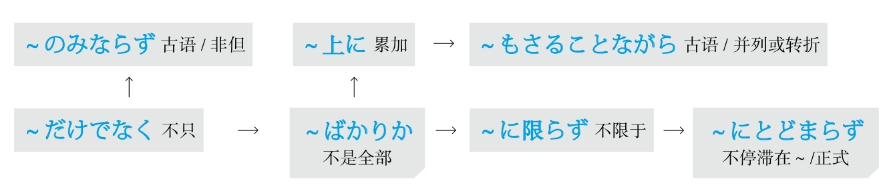
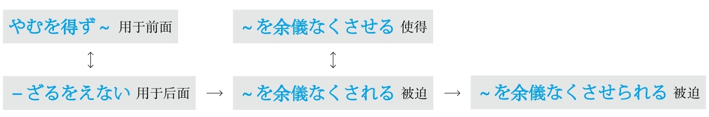
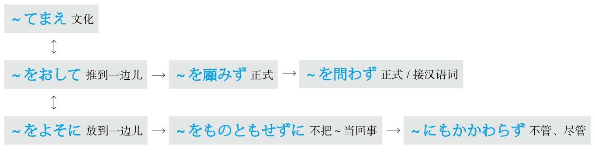

**[ [[ 日语语法新思维（修订版）_Detail_0.md | Prev ]] ]　[ [[ ../Menu.md | Home ]] ]　[ [[ 日语语法新思维（修订版）_Detail_2.md | Next ]] ]**

---
#### ～にこしたことはない #5_1_2_8_0
* [[ 日语语法新思维（修订版）_Menu_0.md | Menu #5_1_2_8_0 ]]

**解释：** 「に」表示方向或对象；「こした」是自动词「<ruby>越<rp>(</rp><rt>こ</rt><rp>)</rp></ruby>す」的た形，意思是“越过”；「ことはない」是“没有～的事物”
**准则：** 日语的「た」表示完了、过去的“了”以及起形容词修饰名词作用的“的”。此处表示“的”
**意思：** 没有超过～的了
**接续：** 名词

例句：<ruby>応<rp>(</rp><rt>おう</rt><rp>)</rp></ruby><ruby>募<rp>(</rp><rt>ぼ</rt><rp>)</rp></ruby>の<ruby>締<rp>(</rp><rt>し</rt><rp>)</rp></ruby>め<ruby>切<rp>(</rp><rt>き</rt><rp>)</rp></ruby>りは<ruby>明日<rp>(</rp><rt>あした</rt><rp>)</rp></ruby>ですが、<ruby>早<rp>(</rp><rt>はや</rt><rp>)</rp></ruby>めに<ruby>出<rp>(</rp><rt>だ</rt><rp>)</rp></ruby>すの**にこしたことはない** 。
直译：申请的截止日期是明天，但是没有比提早交更好的。
意译：明天是申请截止日期，没有比提早交更好的。

#### ～にしくはない #5_1_2_9_0
* [[ 日语语法新思维（修订版）_Menu_0.md | Menu #5_1_2_9_0 ]]

**解释：** 「に」表示方向或对象；「しく」的汉字是「<ruby>如<rp>(</rp><rt>し</rt><rp>)</rp></ruby>く」；「は」强调了表示小主语的助词「が」；「ない」是“没有～”
**直译：** “没有如～的了”或“不如～”
**意译：** 没有超过～的
**接续：** 名词、动词的原形

例句：<ruby>油<rp>(</rp><rt>ゆ</rt><rp>)</rp></ruby><ruby>断<rp>(</rp><rt>だん</rt><rp>)</rp></ruby><ruby>大<rp>(</rp><rt>たい</rt><rp>)</rp></ruby><ruby>敵<rp>(</rp><rt>てき</rt><rp>)</rp></ruby>！<ruby>用<rp>(</rp><rt>よう</rt><rp>)</rp></ruby><ruby>心<rp>(</rp><rt>じん</rt><rp>)</rp></ruby>（する）**にしくはない** 。
直译：疏忽大意是大敌！不如小心。
意译：疏忽大意是大敌！一定要小心谨慎。

#### ～にもまして #5_1_2_10_0
* [[ 日语语法新思维（修订版）_Menu_0.md | Menu #5_1_2_10_0 ]]

**解释：** 「に」表示对象；「も」表示强调；「まして」是自动词「<ruby>増<rp>(</rp><rt>ま</rt><rp>)</rp></ruby>す」的中顿，意思是“增加”
**意思：** 比～更加～
**语气：** 正式
**接续：** 名词

例句：<ruby>彼女<rp>(</rp><rt>かのじょ</rt><rp>)</rp></ruby>は<ruby>前<rp>(</rp><rt>まえ</rt><rp>)</rp></ruby>**にもまして** <ruby>勉<rp>(</rp><rt>べん</rt><rp>)</rp></ruby><ruby>強<rp>(</rp><rt>きょう</rt><rp>)</rp></ruby>に<ruby>励<rp>(</rp><rt>はげ</rt><rp>)</rp></ruby>んでいる。
直译：她比以前增加致力于学习着。
意译：她比以前更加努力学习了。

#### ～よりましだ #5_1_2_11_0
* [[ 日语语法新思维（修订版）_Menu_0.md | Menu #5_1_2_11_0 ]]

**解释：** 「より」的意思是“比”；「まし」是自动词「<ruby>増<rp>(</rp><rt>ま</rt><rp>)</rp></ruby>す」的连用形，作名词用，意思是“增加”
**意思：** 比～强一点儿
**注意：** 比喻两者水平都不高
**接续：** 任何词

例句：<ruby>知<rp>(</rp><rt>し</rt><rp>)</rp></ruby>らない**より** <ruby>少<rp>(</rp><rt>すこ</rt><rp>)</rp></ruby>し<ruby>知<rp>(</rp><rt>し</rt><rp>)</rp></ruby>った<ruby>方<rp>(</rp><rt>ほう</rt><rp>)</rp></ruby>が**ましだ** 。
直译：比不知道，稍微知道强一点儿。
意译：稍微知道些比不知道强点儿。
语法关系图

### 并不是 #5_1_3_0_0
* [[ 日语语法新思维（修订版）_Menu_0.md | Menu #5_1_3_0_0 ]]

#### ～わけではない #5_1_3_1_0
* [[ 日语语法新思维（修订版）_Menu_0.md | Menu #5_1_3_1_0 ]]

**解释：** 「<ruby>訳<rp>(</rp><rt>わけ</rt><rp>)</rp></ruby>」的起源是「<ruby>分<rp>(</rp><rt>わ</rt><rp>)</rp></ruby>ける」，意思是“道理”
**直译：** 不是～道理
**意译：** 并不是～
**接续：** 修饰名词的规律（参照第一章的第三节）

例句：<ruby>足<rp>(</rp><rt>あし</rt><rp>)</rp></ruby>を<ruby>怪<rp>(</rp><rt>け</rt><rp>)</rp></ruby><ruby>我<rp>(</rp><rt>が</rt><rp>)</rp></ruby>していますが、<ruby>全<rp>(</rp><rt>まった</rt><rp>)</rp></ruby>く<ruby>歩<rp>(</rp><rt>ある</rt><rp>)</rp></ruby>けない**わけではない** 。
直译：脚受伤了，但是完全不能走路的道理不是。
意译：脚受伤了，但是也并不是完全不能走路。
注：#### *「～わけだ」请参照“也就是说”。

#### *「～わけがない」请参照“可能性”。 #5_1_3_2_0
* [[ 日语语法新思维（修订版）_Menu_0.md | Menu #5_1_3_2_0 ]]

***「～わけにはいかない」请参照“应该”。**

### 并列 #5_1_4_0_0
* [[ 日语语法新思维（修订版）_Menu_0.md | Menu #5_1_4_0_0 ]]

#### ～し #5_1_4_1_0
* [[ 日语语法新思维（修订版）_Menu_0.md | Menu #5_1_4_1_0 ]]

**解释：** 「し」的意思是“强”，构成的单词有「<ruby>強<rp>(</rp><rt>し</rt><rp>)</rp></ruby>いる（强迫）」；此语法表示「し」前后的两件事情同等重要
**意思：** 又～，又～
**注意：** 每一个并列的部分之间都要加「し」；用几次都可以；常与「も」搭配
**接续：** 谓语词（动词、形容词、助动词）的简体和敬体

例句：このマンションは、<ruby>日<rp>(</rp><rt>ひ</rt><rp>)</rp></ruby><ruby>当<rp>(</rp><rt>あ</rt><rp>)</rp></ruby>たりもいい**し** 、<ruby>家<rp>(</rp><rt>や</rt><rp>)</rp></ruby><ruby>賃<rp>(</rp><rt>ちん</rt><rp>)</rp></ruby>も<ruby>高<rp>(</rp><rt>たか</rt><rp>)</rp></ruby>くないから、ここにしようと<ruby>決<rp>(</rp><rt>き</rt><rp>)</rp></ruby>めた。
直译：这个楼房住处，采光也好，房租又不贵，决定租这里。
意译：这个房子，采光也好，房租又不贵，我决定租这里。

#### －ば #5_1_4_2_0
* [[ 日语语法新思维（修订版）_Menu_0.md | Menu #5_1_4_2_0 ]]

**解释：** 「ば」表示并列，是「し」的古语
**意思：** 又～，又～
**注意：** 只用一次；常与「も」搭配
**语气：** 正式
**变形：** ば形（变形规律参照第一章的第二节）

例句：あの<ruby>子<rp>(</rp><rt>こ</rt><rp>)</rp></ruby>はまだ<ruby>子<rp>(</rp><rt>こ</rt><rp>)</rp></ruby><ruby>供<rp>(</rp><rt>ども</rt><rp>)</rp></ruby>だけど、<ruby>料<rp>(</rp><rt>りょう</rt><rp>)</rp></ruby><ruby>理<rp>(</rp><rt>り</rt><rp>)</rp></ruby>もできれ**ば** 、<ruby>部<rp>(</rp><rt>へ</rt><rp>)</rp></ruby><ruby>屋<rp>(</rp><rt>や</rt><rp>)</rp></ruby>の<ruby>掃<rp>(</rp><rt>そう</rt><rp>)</rp></ruby><ruby>除<rp>(</rp><rt>じ</rt><rp>)</rp></ruby>もちゃんとしていて、<ruby>本<rp>(</rp><rt>ほん</rt><rp>)</rp></ruby><ruby>当<rp>(</rp><rt>とう</rt><rp>)</rp></ruby>にしっかりしています。
直译：那个孩子还是孩子，但是又会做饭，房间的扫除还做得完整，真是懂事。
意译：那个孩子虽然还是个孩子，但是既会做饭又会自己打扫房间，真是懂事。
语法关系图

### 不 #5_1_5_0_0
* [[ 日语语法新思维（修订版）_Menu_0.md | Menu #5_1_5_0_0 ]]

#### －ぬ #5_1_5_1_0
* [[ 日语语法新思维（修订版）_Menu_0.md | Menu #5_1_5_1_0 ]]

**解释：** 是形容词「ない」的古语
**变形：** 动词的否定形的ぬ（变形规律参照第一章的第二节）

例句：<ruby>見<rp>(</rp><rt>み</rt><rp>)</rp></ruby>知ら**ぬ** <ruby>人<rp>(</rp><rt>ひと</rt><rp>)</rp></ruby>から<ruby>郵<rp>(</rp><rt>ゆう</rt><rp>)</rp></ruby><ruby>便<rp>(</rp><rt>びん</rt><rp>)</rp></ruby><ruby>物<rp>(</rp><rt>ぶつ</rt><rp>)</rp></ruby>が<ruby>届<rp>(</rp><rt>とど</rt><rp>)</rp></ruby>いた。
直译：从不认识和知道的人，收到了邮包。
意译：收到了陌生人寄来的邮包。

#### －ず、 #5_1_5_2_0
* [[ 日语语法新思维（修订版）_Menu_0.md | Menu #5_1_5_2_0 ]]

**解释：** 是副词「なくて」或「ないで」的古语
**接续：** 用于两个短句中的前一个之后
**变形：** 动词的否定形的ず（变形规律参照第一章的第二节）

例句：なかなか<ruby>場<rp>(</rp><rt>ば</rt><rp>)</rp></ruby><ruby>所<rp>(</rp><rt>しょ</rt><rp>)</rp></ruby>が<ruby>見<rp>(</rp><rt>み</rt><rp>)</rp></ruby>つからず、<ruby>大<rp>(</rp><rt>たい</rt><rp>)</rp></ruby><ruby>変<rp>(</rp><rt>へん</rt><rp>)</rp></ruby>だった。
直译：怎么也找不到地方，很不容易。
意译：怎么也找不到地方，费了半天劲。

#### －ずに #5_1_5_3_0
* [[ 日语语法新思维（修订版）_Menu_0.md | Menu #5_1_5_3_0 ]]

**解释：** 是副词「なくて」或「ないで」的古语
**变形：** 动词的否定形的ず（变形规律参照第一章的第二节）
**区别：** 「ず、」和「ずに」的区别在于连接方式。「に」表示副词，翻译成“而”。如果用「に」就不用逗号

例句：ずっと<ruby>欲<rp>(</rp><rt>ほ</rt><rp>)</rp></ruby>しかったキーホルダーは<ruby>誕<rp>(</rp><rt>たん</rt><rp>)</rp></ruby><ruby>生<rp>(</rp><rt>じょう</rt><rp>)</rp></ruby><ruby>日<rp>(</rp><rt>び</rt><rp>)</rp></ruby>のお<ruby>祝<rp>(</rp><rt>いわ</rt><rp>)</rp></ruby>いで<ruby>友<rp>(</rp><rt>とも</rt><rp>)</rp></ruby><ruby>達<rp>(</rp><rt>だち</rt><rp>)</rp></ruby>からもらった。それで、<ruby>買<rp>(</rp><rt>か</rt><rp>)</rp></ruby>わ**ずに** <ruby>済<rp>(</rp><rt>す</rt><rp>)</rp></ruby>んだ。
直译：一直想要的钥匙链作为生日的祝贺，从朋友那里请求到了。所以，不用买，这件事情就结束了。
意译：朋友给了我一直想要的钥匙链作为生日礼物。所以不用买了。

#### －まい #5_1_5_4_0
* [[ 日语语法新思维（修订版）_Menu_0.md | Menu #5_1_5_4_0 ]]

**解释：** 「ま」表示否定；「い」是现代汉语形容词的标志
**意思：** 表示推量，即：1.「ないでしょう」，表示推测的“不～吧”；2.是意志形「—よう」的否定形式，表示“不想要～”
**变形：** 动词的否定形的ま（变形规律参照第一章的第二节）

例句：<ruby>田<rp>(</rp><rt>た</rt><rp>)</rp></ruby><ruby>中<rp>(</rp><rt>なか</rt><rp>)</rp></ruby>さんがこのことに<ruby>賛<rp>(</rp><rt>さん</rt><rp>)</rp></ruby><ruby>成<rp>(</rp><rt>せい</rt><rp>)</rp></ruby>することはある**まい** 。
直译：田中赞成这件事的事情不会有吧。
意译：田中不会赞成这件事吧。

例句：<ruby>親<rp>(</rp><rt>おや</rt><rp>)</rp></ruby>に<ruby>経<rp>(</rp><rt>けい</rt><rp>)</rp></ruby><ruby>済<rp>(</rp><rt>ざい</rt><rp>)</rp></ruby><ruby>的<rp>(</rp><rt>てき</rt><rp>)</rp></ruby>な<ruby>負<rp>(</rp><rt>ふ</rt><rp>)</rp></ruby><ruby>担<rp>(</rp><rt>たん</rt><rp>)</rp></ruby>をかけ**まい** と<ruby>思<rp>(</rp><rt>おも</rt><rp>)</rp></ruby>って、<ruby>学<rp>(</rp><rt>がく</rt><rp>)</rp></ruby><ruby>費<rp>(</rp><rt>ひ</rt><rp>)</rp></ruby>と<ruby>生<rp>(</rp><rt>せい</rt><rp>)</rp></ruby><ruby>活<rp>(</rp><rt>かつ</rt><rp>)</rp></ruby><ruby>費<rp>(</rp><rt>ひ</rt><rp>)</rp></ruby>をアルバイトで<ruby>稼<rp>(</rp><rt>かせ</rt><rp>)</rp></ruby>いでいる。
直译：想着不要给父母增加经济负担，正在以打工的方式挣学费和生活费。
意译：不想给父母增加经济上的负担，我一直靠打工挣学费和生活费。
语法关系图

### 不～不行 #5_1_6_0_0
* [[ 日语语法新思维（修订版）_Menu_0.md | Menu #5_1_6_0_0 ]]

#### －ずにはいられない #5_1_6_1_0
* [[ 日语语法新思维（修订版）_Menu_0.md | Menu #5_1_6_1_0 ]]

**解释：** 「ず」是副词「なくて」或「ないで」的古语；「に」表示副词；「は」表示强调；「いられない」是自动词「いる」的可能形的否定，意思是“坐不住，呆不住”
**直译：** 不做某事的话就呆不住
**意译：** 不～就不行
**注意：** 用于生理现象
**变形：** 动词的否定形的ず（变形规律参照第一章的第二节）

例句：<ruby>子<rp>(</rp><rt>こ</rt><rp>)</rp></ruby><ruby>供<rp>(</rp><rt>ども</rt><rp>)</rp></ruby>は<ruby>外<rp>(</rp><rt>そと</rt><rp>)</rp></ruby>で<ruby>騒<rp>(</rp><rt>さわ</rt><rp>)</rp></ruby>いでいるので、<ruby>注<rp>(</rp><rt>ちゅう</rt><rp>)</rp></ruby><ruby>意<rp>(</rp><rt>い</rt><rp>)</rp></ruby>せ**ずにはいられない** 。
直译：孩子们在外面吵嚷，所以不管他们的话就呆不住。
意译：孩子们在外面吵嚷，不管他们不行。

#### －ずにはすまない #5_1_6_2_0
* [[ 日语语法新思维（修订版）_Menu_0.md | Menu #5_1_6_2_0 ]]

**解释：** 「ず」是副词「なくて」或「ないで」的古语；「に」表示副词；「は」表示强调；「すまない」是表示完成的自动词「<ruby>済<rp>(</rp><rt>す</rt><rp>)</rp></ruby>む」的否定，意思是“不完，完不了”
**直译：** “不做某事的话，这件事就完不了”或“不做某事的话，这个问题就解决不了”
**意译：** 不～就不行
**注意：** 翻译时必须在后句添加主语，例如：“这件事”或“这个问题”
**变形：** 动词的否定形的ず（变形规律参照第一章的第二节）

例句：<ruby>謝<rp>(</rp><rt>あやま</rt><rp>)</rp></ruby>ら**ずにはすまない** 。
直译：不道歉就不完。
意译：如果不道歉，这件事就完不了。

#### －ずにはおかない #5_1_6_3_0
* [[ 日语语法新思维（修订版）_Menu_0.md | Menu #5_1_6_3_0 ]]

**解释：** 「ず」是副词「なくて」或「ないで」的古语；「に」表示副词；「は」表示强调；「おかない」是表示放置的他动词「<ruby>置<rp>(</rp><rt>お</rt><rp>)</rp></ruby>く」的否定，意思是“不放置”
**直译：** 不做某事的话，这件事就放置不下
**意译：** “不能放置不管”或“不～就不行”
**注意：** 因为有“管～，管理～”的意思，所以主语一般是有权力的团体或个人，如果主语没有权力则表示决心
**变形：** 动词的否定形的ず（变形规律参照第一章的第二节）

例句：<ruby>学<rp>(</rp><rt>がっ</rt><rp>)</rp></ruby><ruby>校<rp>(</rp><rt>こう</rt><rp>)</rp></ruby><ruby>側<rp>(</rp><rt>がわ</rt><rp>)</rp></ruby>はこんな<ruby>規<rp>(</rp><rt>き</rt><rp>)</rp></ruby><ruby>則<rp>(</rp><rt>そく</rt><rp>)</rp></ruby><ruby>違<rp>(</rp><rt>い</rt><rp>)</rp></ruby><ruby>反<rp>(</rp><rt>はん</rt><rp>)</rp></ruby>のことを<ruby>制<rp>(</rp><rt>せい</rt><rp>)</rp></ruby><ruby>止<rp>(</rp><rt>し</rt><rp>)</rp></ruby>せ**ずにはおかない** 。
直译：校方不制止这种违反规则的事情就不行。
意译：校方肯定会制止这类违反规则的行为。
语法关系图

### 不可以 #5_1_7_0_0
* [[ 日语语法新思维（修订版）_Menu_0.md | Menu #5_1_7_0_0 ]]

#### －てはいけない #5_1_7_1_0
* [[ 日语语法新思维（修订版）_Menu_0.md | Menu #5_1_7_1_0 ]]

**解释：** 动词的て形起着逗号的作用，表示中顿；「は」表示强调；「いけない」是自动词「<ruby>行<rp>(</rp><rt>い</rt><rp>)</rp></ruby>ける」的否定形，意思是“不行”，可以换成「だめだ」等表示禁止的词
**意思：** 做～不行
**变形：** 动词的て形（变形规律参照第一章的第二节）

例句：ここではたばこを<ruby>吸<rp>(</rp><rt>す</rt><rp>)</rp></ruby>っ**てはいけない** 。
直译：在这里吸烟不行。
意译：不能在这里吸烟。

#### －てはならない #5_1_7_2_0
* [[ 日语语法新思维（修订版）_Menu_0.md | Menu #5_1_7_2_0 ]]

**解释：** 动词的て形起着逗号的作用，表示中顿；「は」表示强调；「ならない」是自动词「<ruby>成<rp>(</rp><rt>な</rt><rp>)</rp></ruby>る」的否定形，意思是“不成”，可以换成「だめだ」等表示禁止的词
**意思：** 做～不成
**语气：** 比「－てはいけない」正式
**变形：** 动词的て形（变形规律参照第一章的第二节）

例句：<ruby>交<rp>(</rp><rt>こう</rt><rp>)</rp></ruby><ruby>通<rp>(</rp><rt>つう</rt><rp>)</rp></ruby><ruby>違<rp>(</rp><rt>い</rt><rp>)</rp></ruby><ruby>反<rp>(</rp><rt>はん</rt><rp>)</rp></ruby>をし**てはならない** 。
直译：违反交通规则不成。
意译：不能违反交通规则。

#### ～べからざる #5_1_7_3_0
* [[ 日语语法新思维（修订版）_Menu_0.md | Menu #5_1_7_3_0 ]]

**解释：** 「べからざる」的「べから」是「<ruby>可<rp>(</rp><rt>べ</rt><rp>)</rp></ruby>く」接未然形的形式；「ざる」是表示否定的「ない」的古语连体形
**意思：** 不可以做～
**词性：** 连体词
**语气：** 正式
**接续：** 前面接动词的原形，后面接名词

例句：<ruby>聞<rp>(</rp><rt>き</rt><rp>)</rp></ruby>く**べからざる** ことを<ruby>聞<rp>(</rp><rt>き</rt><rp>)</rp></ruby>いてしまって<ruby>後<rp>(</rp><rt>こう</rt><rp>)</rp></ruby><ruby>悔<rp>(</rp><rt>かい</rt><rp>)</rp></ruby>した。
直译：不可以问的事情，问了，很后悔。
意译：很后悔问了不应该问的事情。

#### ～べからず #5_1_7_4_0
* [[ 日语语法新思维（修订版）_Menu_0.md | Menu #5_1_7_4_0 ]]

**解释：** 「べからざる」的「べから」是「<ruby>可<rp>(</rp><rt>べ</rt><rp>)</rp></ruby>く」接未然形的形式；「ず」是副词「なくて」或「ないで」的古语
**意思：** 不可做～
**词性：** 副词
**语气：** 正式
**接续：** 动词的原形

例句：<ruby>芝生<rp>(</rp><rt>しばふ</rt><rp>)</rp></ruby>に<ruby>立<rp>(</rp><rt>た</rt><rp>)</rp></ruby>ち<ruby>入<rp>(</rp><rt>い</rt><rp>)</rp></ruby>る**べからず** 。
直译：进入草坪，不可。
意译：禁止进入草坪。

#### ～まじき #5_1_7_5_0
* [[ 日语语法新思维（修订版）_Menu_0.md | Menu #5_1_7_5_0 ]]

**解释：** 「まじき」是表示不想要做某事的「まい」的古语连体形；「き」在古语法中表示形容词修饰名词的“的”
**意思：** “决不应该～”或“决不允许～”
**注意：** 前面接「ある」或「<ruby>許<rp>(</rp><rt>ゆる</rt><rp>)</rp></ruby>す」等动词
**变形：** 动词的否定形的ま（变形规律参照第一章的第二节）

例句：いじめは<ruby>許<rp>(</rp><rt>ゆる</rt><rp>)</rp></ruby>す**まじき** <ruby>行<rp>(</rp><rt>こう</rt><rp>)</rp></ruby><ruby>為<rp>(</rp><rt>い</rt><rp>)</rp></ruby>だ。
直译：欺负人是决不能原谅的行为。
意译：欺负人是决不能被原谅的行为。
语法关系图

### 不仅～而且 #5_1_8_0_0
* [[ 日语语法新思维（修订版）_Menu_0.md | Menu #5_1_8_0_0 ]]

#### ～だけでなく #5_1_8_1_0
* [[ 日语语法新思维（修订版）_Menu_0.md | Menu #5_1_8_1_0 ]]

**解释：** 「だけ」是“只”或“仅”；「でなく」是表示“不是”的「ではない」的连用形
**准则：** 连用形和て形一样起着逗号的作用，表示中顿，语气比て形正式
**意思：** 不仅～
**接续：** 任何词

例句：<ruby>彼<rp>(</rp><rt>かれ</rt><rp>)</rp></ruby>は<ruby>友<rp>(</rp><rt>とも</rt><rp>)</rp></ruby><ruby>達<rp>(</rp><rt>だち</rt><rp>)</rp></ruby>**だけでなく** 、<ruby>周<rp>(</rp><rt>まわ</rt><rp>)</rp></ruby>りのすべての<ruby>人<rp>(</rp><rt>ひと</rt><rp>)</rp></ruby>に<ruby>信<rp>(</rp><rt>しん</rt><rp>)</rp></ruby><ruby>頼<rp>(</rp><rt>らい</rt><rp>)</rp></ruby>されている。
直译：他不仅是朋友，还被周围的所有人信赖。
意译：不仅朋友信赖他，周围所有人都信赖他。

#### ～のみならず #5_1_8_2_0
* [[ 日语语法新思维（修订版）_Menu_0.md | Menu #5_1_8_2_0 ]]

**解释：** 「のみ」是“只”或“仅”，是「だけ」的古语；「ならず」是「なる」的否定形；「なる」在古语当中是表示断定的「<ruby>也<rp>(</rp><rt>なり</rt><rp>)</rp></ruby>」的连体形，意思是“是”
**直译：** 不成为只是～
**意译：** 非但～
**语气：** 比「だけでなく」正式
**接续：** 任何词

例句：この<ruby>奨<rp>(</rp><rt>しょう</rt><rp>)</rp></ruby><ruby>学<rp>(</rp><rt>がく</rt><rp>)</rp></ruby><ruby>金<rp>(</rp><rt>きん</rt><rp>)</rp></ruby>は<ruby>日<rp>(</rp><rt>に</rt><rp>)</rp></ruby><ruby>本<rp>(</rp><rt>ほん</rt><rp>)</rp></ruby><ruby>人<rp>(</rp><rt>じん</rt><rp>)</rp></ruby>の<ruby>学<rp>(</rp><rt>がく</rt><rp>)</rp></ruby><ruby>生<rp>(</rp><rt>せい</rt><rp>)</rp></ruby>**のみならず** 、<ruby>留<rp>(</rp><rt>りゅう</rt><rp>)</rp></ruby><ruby>学<rp>(</rp><rt>がく</rt><rp>)</rp></ruby><ruby>生<rp>(</rp><rt>せい</rt><rp>)</rp></ruby>も<ruby>応<rp>(</rp><rt>おう</rt><rp>)</rp></ruby><ruby>募<rp>(</rp><rt>ぼ</rt><rp>)</rp></ruby>できる。
直译：这个奖学金不仅日本人的学生，留学生也能申请。
意译：不仅日本学生，留学生也能申请这个奖学金。

#### ～ばかりか #5_1_8_3_0
* [[ 日语语法新思维（修订版）_Menu_0.md | Menu #5_1_8_3_0 ]]

**解释：** 「ばかり」是“全是、光是、净是”；「か」表示不确定
**直译：** 哪儿光是～
**意译：** 不仅～
**接续：** 任何词

例句：<ruby>彼<rp>(</rp><rt>かれ</rt><rp>)</rp></ruby>は<ruby>聡<rp>(</rp><rt>そう</rt><rp>)</rp></ruby><ruby>明<rp>(</rp><rt>めい</rt><rp>)</rp></ruby>である**ばかりか** 、スポーツも<ruby>万<rp>(</rp><rt>ばん</rt><rp>)</rp></ruby><ruby>能<rp>(</rp><rt>のう</rt><rp>)</rp></ruby>だ。
直译：他哪儿光是聪明啊，连体育运动都是万能。
意译：他哪儿光是聪明啊，就连体育运动都是全能。

#### ～もさることながら #5_1_8_4_0
* [[ 日语语法新思维（修订版）_Menu_0.md | Menu #5_1_8_4_0 ]]

**解释：** 「も」的意思是“也、连、都”；「<ruby>然<rp>(</rp><rt>さ</rt><rp>)</rp></ruby>る」是「そう」的古语连体形；「ながら」是「が」的古语，「が」有单纯连接句子的作用，也有转折的意思。相当于现代日语的「～もそうですが」
**直译：** ～虽然是那样，但是还有～
**意译：** 不仅～而且～
**语气：** 正式
**接续：** 名词

例句：<ruby>親<rp>(</rp><rt>おや</rt><rp>)</rp></ruby>の<ruby>希<rp>(</rp><rt>き</rt><rp>)</rp></ruby><ruby>望<rp>(</rp><rt>ぼう</rt><rp>)</rp></ruby>**もさることながら** 、<ruby>子<rp>(</rp><rt>こ</rt><rp>)</rp></ruby><ruby>供<rp>(</rp><rt>ども</rt><rp>)</rp></ruby><ruby>自<rp>(</rp><rt>じ</rt><rp>)</rp></ruby><ruby>身<rp>(</rp><rt>しん</rt><rp>)</rp></ruby>も<ruby>海<rp>(</rp><rt>かい</rt><rp>)</rp></ruby><ruby>外<rp>(</rp><rt>がい</rt><rp>)</rp></ruby><ruby>留<rp>(</rp><rt>りゅう</rt><rp>)</rp></ruby><ruby>学<rp>(</rp><rt>がく</rt><rp>)</rp></ruby>に<ruby>憧<rp>(</rp><rt>あこが</rt><rp>)</rp></ruby>れている。
直译：父母的希望是这样的，孩子自己也向往着海外留学。
意译：不仅父母的希望如此，孩子自己也向往着海外留学。

#### ～上に #5_1_8_5_0
* [[ 日语语法新思维（修订版）_Menu_0.md | Menu #5_1_8_5_0 ]]

**解释：** 「に」表示方向
**意思：** 在～之上，还有～
**着重：** 累加
**接续：** 修饰名词的规律（参照第一章的第三节）

例句：<ruby>今日<rp>(</rp><rt>きょう</rt><rp>)</rp></ruby>は<ruby>遅<rp>(</rp><rt>ち</rt><rp>)</rp></ruby><ruby>刻<rp>(</rp><rt>こく</rt><rp>)</rp></ruby>した**<ruby>上<rp>(</rp><rt>うえ</rt><rp>)</rp></ruby>に** テキストも<ruby>忘<rp>(</rp><rt>わす</rt><rp>)</rp></ruby>れた。
直译：今天迟到了，在此之上，还忘了课本。
意译：今天不仅迟到了，还忘了带课本。

#### ～に限らず #5_1_8_6_0
* [[ 日语语法新思维（修订版）_Menu_0.md | Menu #5_1_8_6_0 ]]

**解释：** 「に」表示方向或对象；「<ruby>限<rp>(</rp><rt>かぎ</rt><rp>)</rp></ruby>らず」是自动词「<ruby>限<rp>(</rp><rt>かぎ</rt><rp>)</rp></ruby>る」的否定形，意思是“不限”
**意思：** 不只限于～
**接续：** 名词

例句：この<ruby>講<rp>(</rp><rt>こう</rt><rp>)</rp></ruby><ruby>義<rp>(</rp><rt>ぎ</rt><rp>)</rp></ruby>は<ruby>大<rp>(</rp><rt>だい</rt><rp>)</rp></ruby><ruby>学<rp>(</rp><rt>がく</rt><rp>)</rp></ruby><ruby>生<rp>(</rp><rt>せい</rt><rp>)</rp></ruby>**に<ruby>限<rp>(</rp><rt>かぎ</rt><rp>)</rp></ruby>らず** 、<ruby>社<rp>(</rp><rt>しゃ</rt><rp>)</rp></ruby><ruby>会<rp>(</rp><rt>かい</rt><rp>)</rp></ruby><ruby>人<rp>(</rp><rt>じん</rt><rp>)</rp></ruby>も<ruby>聴<rp>(</rp><rt>ちょう</rt><rp>)</rp></ruby><ruby>講<rp>(</rp><rt>こう</rt><rp>)</rp></ruby>できる。
直译：这个课不只限于大学生，社会人也能听课。
意译：这个课不只限于大学生，工作了的人也能听。

#### ～にとどまらず #5_1_8_7_0
* [[ 日语语法新思维（修订版）_Menu_0.md | Menu #5_1_8_7_0 ]]

**解释：** 「に」表示方向；「とどまらず」是自动词「<ruby>止<rp>(</rp><rt>とど</rt><rp>)</rp></ruby>まる、<ruby>留<rp>(</rp><rt>とど</rt><rp>)</rp></ruby>まる」的否定形，意思是“不停止”
**意思：** 不停留在～上，不停滞在～上
**语气：** 正式
**接续：** 名词

例句：<ruby>火<rp>(</rp><rt>か</rt><rp>)</rp></ruby><ruby>事<rp>(</rp><rt>じ</rt><rp>)</rp></ruby>は<ruby>麓<rp>(</rp><rt>ふもと</rt><rp>)</rp></ruby>**にとどまらず** 、<ruby>山<rp>(</rp><rt>やま</rt><rp>)</rp></ruby><ruby>全<rp>(</rp><rt>ぜん</rt><rp>)</rp></ruby><ruby>体<rp>(</rp><rt>たい</rt><rp>)</rp></ruby>にも<ruby>及<rp>(</rp><rt>およ</rt><rp>)</rp></ruby>んだ。
直译：火灾不停留在山脚，还遍及了山的全体。
意译：不仅是山脚，火灾还遍及了整座山。
语法关系图

### 不管，尽管 #5_1_9_0_0
* [[ 日语语法新思维（修订版）_Menu_0.md | Menu #5_1_9_0_0 ]]

#### ～いかんにかかわらず #5_1_9_1_0
* [[ 日语语法新思维（修订版）_Menu_0.md | Menu #5_1_9_1_0 ]]

**解释：** 名词「<ruby>如<rp>(</rp><rt>い</rt><rp>)</rp></ruby><ruby>何<rp>(</rp><rt>かん</rt><rp>)</rp></ruby>」的意思是“如何”；「に」表示对象；「<ruby>関<rp>(</rp><rt>かか</rt><rp>)</rp></ruby>わらず」是自动词「<ruby>関<rp>(</rp><rt>かか</rt><rp>)</rp></ruby>わる」的否定形，意思是“无关”
**意思：** 与～的如何无关
**语气：** 正式
**接续：** 名词加の

例句：<ruby>社<rp>(</rp><rt>しゃ</rt><rp>)</rp></ruby><ruby>員<rp>(</rp><rt>いん</rt><rp>)</rp></ruby>の<ruby>意<rp>(</rp><rt>い</rt><rp>)</rp></ruby><ruby>見<rp>(</rp><rt>けん</rt><rp>)</rp></ruby>の**いかんにかかわらず** 、その<ruby>解<rp>(</rp><rt>かい</rt><rp>)</rp></ruby><ruby>決<rp>(</rp><rt>けつ</rt><rp>)</rp></ruby><ruby>案<rp>(</rp><rt>あん</rt><rp>)</rp></ruby>は<ruby>可<rp>(</rp><rt>か</rt><rp>)</rp></ruby><ruby>決<rp>(</rp><rt>けつ</rt><rp>)</rp></ruby>された。
直译：与社员的意见如何无关，那个解决方案被取决了。
意译：不管公司职员有什么意见，最后通过了那个解决方案。

#### ～いかんによらず #5_1_9_2_0
* [[ 日语语法新思维（修订版）_Menu_0.md | Menu #5_1_9_2_0 ]]

**解释：** 名词「<ruby>如<rp>(</rp><rt>い</rt><rp>)</rp></ruby><ruby>何<rp>(</rp><rt>かん</rt><rp>)</rp></ruby>」的意思是“如何”；「に」表示对象；「よらず」是自动词「<ruby>由<rp>(</rp><rt>よ</rt><rp>)</rp></ruby>る」的否定形，意思是“不由”
**注意：** 「<ruby>由<rp>(</rp><rt>よ</rt><rp>)</rp></ruby>る」的意思是“根据～；由于～；由～来做～”
**意思：** 不根据～的如何
**语气：** 正式
**接续：** 名词加の

例句：<ruby>理<rp>(</rp><rt>り</rt><rp>)</rp></ruby><ruby>由<rp>(</rp><rt>ゆう</rt><rp>)</rp></ruby>の**いかんによらず** 、<ruby>規<rp>(</rp><rt>き</rt><rp>)</rp></ruby><ruby>則<rp>(</rp><rt>そく</rt><rp>)</rp></ruby><ruby>違<rp>(</rp><rt>い</rt><rp>)</rp></ruby><ruby>反<rp>(</rp><rt>はん</rt><rp>)</rp></ruby>は<ruby>許<rp>(</rp><rt>ゆる</rt><rp>)</rp></ruby>されない。
直译：不根据理由的如何，违反规则是不被允许的。
意译：不管什么理由，都不允许违反规则。

#### ～いかんを問わず #5_1_9_3_0
* [[ 日语语法新思维（修订版）_Menu_0.md | Menu #5_1_9_3_0 ]]

**解释：** 名词「<ruby>如<rp>(</rp><rt>い</rt><rp>)</rp></ruby><ruby>何<rp>(</rp><rt>かん</rt><rp>)</rp></ruby>」的意思是“如何”；「を」用于他动词前表示“把”；「<ruby>問<rp>(</rp><rt>と</rt><rp>)</rp></ruby>わず」是他动词「<ruby>問<rp>(</rp><rt>と</rt><rp>)</rp></ruby>う」的否定形，意思是“不问”
**意思：** 不问～的如何
**语气：** 正式
**接续：** 名词加の

例句：<ruby>経<rp>(</rp><rt>けい</rt><rp>)</rp></ruby><ruby>験<rp>(</rp><rt>けん</rt><rp>)</rp></ruby>の**いかんを<ruby>問<rp>(</rp><rt>と</rt><rp>)</rp></ruby>わず** 、この<ruby>職<rp>(</rp><rt>しょく</rt><rp>)</rp></ruby>は<ruby>誰<rp>(</rp><rt>だれ</rt><rp>)</rp></ruby>でも<ruby>応<rp>(</rp><rt>おう</rt><rp>)</rp></ruby><ruby>募<rp>(</rp><rt>ぼ</rt><rp>)</rp></ruby>できる。
直译：不问经验的如何，这个职位谁都能够应聘。
意译：不管经验如何，这个职位谁都能应聘。

#### いくら（どんなに/いかに）－ても（でも/たところで/であれ）たとえ－ても（でも/たところで/であれ） #5_1_9_4_0
* [[ 日语语法新思维（修订版）_Menu_0.md | Menu #5_1_9_4_0 ]]

**解释：** 「いくら」是“多少次”；「どんなに」是“怎么样地”；「<ruby>如何<rp>(</rp><rt>いか</rt><rp>)</rp></ruby>に」是“如何地”或“怎么样地”；以上三者可以互换，「<ruby>如何<rp>(</rp><rt>いか</rt><rp>)</rp></ruby>に」语气最正式
**解释：** 「たとえ」是「<ruby>例<rp>(</rp><rt>たと</rt><rp>)</rp></ruby>える」的连用形，意思是“举例；比喻；假设”，此处表示假设
**解释：** 「ても」和「でも」表示“即使；尽管；不管”
**解释：** 「ても」是由动词和形容词的て形后接表示强调的「も」构成的；「でも」是由表示断定的「です」的中顿「で」后接表示强调的「も」构成的，前面接形容动词或名词
**变形：** 动词和形容词的て形和た形的简体（变形规律参照第一章的第二节）
**区别：** 「たところで」比「ても」正式，是由动词和形容词的た形后加表示转折的「ところで」构成的
**区别：** 「であれ」是「でも」的古语形式
**准则：** 古语里将动词变到え段表示转折

#### いくら（どんなに/いかに）－ても（でも/たところで/であれ） #5_1_9_5_0
* [[ 日语语法新思维（修订版）_Menu_0.md | Menu #5_1_9_5_0 ]]

**意思：** 不管怎么～都～

#### たとえ－ても（でも/たところで/であれ） #5_1_9_6_0
* [[ 日语语法新思维（修订版）_Menu_0.md | Menu #5_1_9_6_0 ]]

**意思：** 即使假设～也～

例句：**いくら** <ruby>説<rp>(</rp><rt>せつ</rt><rp>)</rp></ruby><ruby>明<rp>(</rp><rt>めい</rt><rp>)</rp></ruby>し**ても** （**いくら** <ruby>説<rp>(</rp><rt>せつ</rt><rp>)</rp></ruby><ruby>明<rp>(</rp><rt>めい</rt><rp>)</rp></ruby>した**ところで** ）、<ruby>彼<rp>(</rp><rt>かれ</rt><rp>)</rp></ruby>に<ruby>誤<rp>(</rp><rt>ご</rt><rp>)</rp></ruby><ruby>解<rp>(</rp><rt>かい</rt><rp>)</rp></ruby>されてしまう。
直译：不管多少次解释，都被他误解。
意译：不管怎么解释都被他误解。

例句：**どんなに** <ruby>頑<rp>(</rp><rt>がん</rt><rp>)</rp></ruby><ruby>張<rp>(</rp><rt>ば</rt><rp>)</rp></ruby>っ**ても** （**どんなに** <ruby>頑<rp>(</rp><rt>がん</rt><rp>)</rp></ruby><ruby>張<rp>(</rp><rt>ば</rt><rp>)</rp></ruby>った**ところで** ）、<ruby>彼<rp>(</rp><rt>かれ</rt><rp>)</rp></ruby>には<ruby>追<rp>(</rp><rt>お</rt><rp>)</rp></ruby>いつかないので、<ruby>悔<rp>(</rp><rt>くや</rt><rp>)</rp></ruby>しい。
直译：不管怎么加油，都赶不上他，所以觉得心里不痛快。
意译：不管怎么努力都赶不上他，心里不痛快。

例句：**いかに** <ruby>困<rp>(</rp><rt>こん</rt><rp>)</rp></ruby><ruby>難<rp>(</rp><rt>なん</rt><rp>)</rp></ruby>な<ruby>仕<rp>(</rp><rt>し</rt><rp>)</rp></ruby><ruby>事<rp>(</rp><rt>ごと</rt><rp>)</rp></ruby>**でも** （**いかに** <ruby>困<rp>(</rp><rt>こん</rt><rp>)</rp></ruby><ruby>難<rp>(</rp><rt>なん</rt><rp>)</rp></ruby>な<ruby>仕<rp>(</rp><rt>し</rt><rp>)</rp></ruby><ruby>事<rp>(</rp><rt>ごと</rt><rp>)</rp></ruby>**であれ** ）、<ruby>最<rp>(</rp><rt>さい</rt><rp>)</rp></ruby><ruby>後<rp>(</rp><rt>ご</rt><rp>)</rp></ruby>までやり<ruby>抜<rp>(</rp><rt>ぬ</rt><rp>)</rp></ruby>くつもりだ。
直译：不管如何地困难的工作，都决心要干到最后。
意译：不管多么艰苦的工作，都决心要干到底。

例句：**たとえ** <ruby>今<rp>(</rp><rt>こん</rt><rp>)</rp></ruby><ruby>回<rp>(</rp><rt>かい</rt><rp>)</rp></ruby>の<ruby>試<rp>(</rp><rt>し</rt><rp>)</rp></ruby><ruby>験<rp>(</rp><rt>けん</rt><rp>)</rp></ruby>に<ruby>合<rp>(</rp><rt>ごう</rt><rp>)</rp></ruby><ruby>格<rp>(</rp><rt>かく</rt><rp>)</rp></ruby>しなく**ても** （**たとえ** <ruby>今<rp>(</rp><rt>こん</rt><rp>)</rp></ruby><ruby>回<rp>(</rp><rt>かい</rt><rp>)</rp></ruby>の<ruby>試<rp>(</rp><rt>し</rt><rp>)</rp></ruby><ruby>験<rp>(</rp><rt>けん</rt><rp>)</rp></ruby>に<ruby>合<rp>(</rp><rt>ごう</rt><rp>)</rp></ruby><ruby>格<rp>(</rp><rt>かく</rt><rp>)</rp></ruby>しなかった**ところで** ）、<ruby>気<rp>(</rp><rt>き</rt><rp>)</rp></ruby>を<ruby>落<rp>(</rp><rt>お</rt><rp>)</rp></ruby>とさないで、<ruby>引<rp>(</rp><rt>ひ</rt><rp>)</rp></ruby>き<ruby>続<rp>(</rp><rt>つづ</rt><rp>)</rp></ruby>き<ruby>頑<rp>(</rp><rt>がん</rt><rp>)</rp></ruby><ruby>張<rp>(</rp><rt>ば</rt><rp>)</rp></ruby>るつもりだ。
直译：即使假设这次的考试不合格，我也决心不灰心丧气，继续努力。
意译：即使假设这次的考试不及格，我也决心不灰心丧气，继续努力。

#### いくら～からといって #5_1_9_7_0
* [[ 日语语法新思维（修订版）_Menu_0.md | Menu #5_1_9_7_0 ]]

**解释：** 「いくら」是“多少次”；「から」表示原因；「といって」是「と<ruby>言<rp>(</rp><rt>い</rt><rp>)</rp></ruby>っても」省略了「も」，意思是“即使说”
**意思：** 不管怎么因为～，也～
**口语：** 常用「いくら～からって」
**接续：** 谓语词（动词、形容词、助动词）的简体

例句：**いくら** <ruby>事<rp>(</rp><rt>じ</rt><rp>)</rp></ruby><ruby>情<rp>(</rp><rt>じょう</rt><rp>)</rp></ruby>がある**からといって** 、<ruby>仕<rp>(</rp><rt>し</rt><rp>)</rp></ruby><ruby>事<rp>(</rp><rt>ごと</rt><rp>)</rp></ruby>を<ruby>放<rp>(</rp><rt>ほう</rt><rp>)</rp></ruby>り<ruby>出<rp>(</rp><rt>だ</rt><rp>)</rp></ruby>すことはできないだろう。
直译：不管怎么说因为有特殊情况，扔下工作不管不能吧。
意译：不管有什么特殊情况，都不能扔下工作不管吧。

#### ～にしたって #5_1_9_8_0
* [[ 日语语法新思维（修订版）_Menu_0.md | Menu #5_1_9_8_0 ]]

**解释：** 「～にしたって」是「～にしても」的口语形式，语气强
**重点：** 在此表示举例
**解释：** 「に」表示对象或方向；「して」代替了表示打比方的「<ruby>例<rp>(</rp><rt>たと</rt><rp>)</rp></ruby>える」的て形；「も」接在て形后面构成「ても」
**注意：** 「ても」和「でも」除了表示“转折”以外，还表示提建议或进行推测的“举例”，比如：「お<ruby>茶<rp>(</rp><rt>ちゃ</rt><rp>)</rp></ruby>でも<ruby>飲<rp>(</rp><rt>の</rt><rp>)</rp></ruby>みませんか」。但是在表示“举例”时，有时无法与“转折”进行区分。为了突出“举例”的意思，会把「ても」换成代替「～に<ruby>例<rp>(</rp><rt>たと</rt><rp>)</rp></ruby>えても」的「～にしても」
**接续：** 动词和形容词的原形、形容动词和名词

例句：<ruby>怒<rp>(</rp><rt>おこ</rt><rp>)</rp></ruby>る**にしたって** 、あんなに<ruby>大<rp>(</rp><rt>おお</rt><rp>)</rp></ruby>きな<ruby>声<rp>(</rp><rt>こえ</rt><rp>)</rp></ruby>で<ruby>怒<rp>(</rp><rt>ど</rt><rp>)</rp></ruby><ruby>鳴<rp>(</rp><rt>な</rt><rp>)</rp></ruby>ることはないだろう。
直译：打个比方生气，用那么大声发脾气的必要没有吧。
意译：就是生气，也用不着那么大声地发脾气吧。

### 不管是～还是～ #5_1_10_0_0
* [[ 日语语法新思维（修订版）_Menu_0.md | Menu #5_1_10_0_0 ]]

#### －かれ－かれ #5_1_10_1_0
* [[ 日语语法新思维（修订版）_Menu_0.md | Menu #5_1_10_1_0 ]]

**解释：** 「－かれ」是「－くあれ」的音变；「く」是形容词变为副词的形式，比如「<ruby>暑<rp>(</rp><rt>あつ</rt><rp>)</rp></ruby>い」→「<ruby>暑<rp>(</rp><rt>あつ</rt><rp>)</rp></ruby>く」；「あれ」是「あっても」的古语；「－かれ」就是现代日语的「ても」
**准则：** 古语里将动词变到え段表示转折
**意思：** 不管是～，还是～
**语气：** 正式
**接续：** 形容词的词干

例句：<ruby>気<rp>(</rp><rt>き</rt><rp>)</rp></ruby>にしないとは<ruby>言<rp>(</rp><rt>い</rt><rp>)</rp></ruby>っているが、やはり<ruby>多<rp>(</rp><rt>おお</rt><rp>)</rp></ruby>**かれ** <ruby>少<rp>(</rp><rt>すく</rt><rp>)</rp></ruby>な**かれ** <ruby>傷<rp>(</rp><rt>きず</rt><rp>)</rp></ruby>ついた。
直译：虽然说不在乎，可是还是或多或少受到了伤害。
意译：虽说不在乎，但还是或多或少受到了伤害。

例句：<ruby>遅<rp>(</rp><rt>おそ</rt><rp>)</rp></ruby>**かれ** <ruby>早<rp>(</rp><rt>はや</rt><rp>)</rp></ruby>**かれ** 、いつか<ruby>終<rp>(</rp><rt>お</rt><rp>)</rp></ruby>わりが<ruby>来<rp>(</rp><rt>く</rt><rp>)</rp></ruby>る。
直译：不管晚不管早，什么时候结束都会来临的。
意译：早晚有一天要结束。

#### －かろうと－なかろうと #5_1_10_2_0
* [[ 日语语法新思维（修订版）_Menu_0.md | Menu #5_1_10_2_0 ]]

**解释：** 「－かろう」是「－くあろう」的音变；「く」是形容词变为副词的形式，比如「<ruby>暑<rp>(</rp><rt>あつ</rt><rp>)</rp></ruby>い」→「<ruby>暑<rp>(</rp><rt>あつ</rt><rp>)</rp></ruby>く」；「あろう」是「あるでしょう」的古语
**意思：** 不管是～，还是～
**着重：** 推测
**语气：** 正式
**接续：** 「－かろう」接形容词的词干、「－なかろう」接形容词的连用形

例句：<ruby>意<rp>(</rp><rt>い</rt><rp>)</rp></ruby><ruby>見<rp>(</rp><rt>けん</rt><rp>)</rp></ruby>が<ruby>正<rp>(</rp><rt>ただ</rt><rp>)</rp></ruby>し**かろうと** <ruby>正<rp>(</rp><rt>ただ</rt><rp>)</rp></ruby>しく**なかろうと** 、<ruby>耳<rp>(</rp><rt>みみ</rt><rp>)</rp></ruby>を<ruby>傾<rp>(</rp><rt>かたむ</rt><rp>)</rp></ruby>ける<ruby>必<rp>(</rp><rt>ひつ</rt><rp>)</rp></ruby><ruby>要<rp>(</rp><rt>よう</rt><rp>)</rp></ruby>がある。
直译：意见是正确还是不正确，倾听的必要有。
意译：不管意见正确还是不正确，都需要倾听。

#### ～だろうが～だろうが/～であろうが～であろうが #5_1_10_3_0
* [[ 日语语法新思维（修订版）_Menu_0.md | Menu #5_1_10_3_0 ]]

**解释：** 「だろう」是「です」的推测形式；「が」有单纯连接句子的作用，也有转折的意思
**区别：** 「～であろうが」比「～だろうが」语气正式
**接续：** 名词

例句：<ruby>貧<rp>(</rp><rt>びん</rt><rp>)</rp></ruby><ruby>乏<rp>(</rp><rt>ぼう</rt><rp>)</rp></ruby>**だろうが** お<ruby>金<rp>(</rp><rt>かね</rt><rp>)</rp></ruby><ruby>持<rp>(</rp><rt>も</rt><rp>)</rp></ruby>ち**だろうが** 、それは<ruby>友<rp>(</rp><rt>とも</rt><rp>)</rp></ruby>を<ruby>選<rp>(</rp><rt>えら</rt><rp>)</rp></ruby>ぶ<ruby>基<rp>(</rp><rt>き</rt><rp>)</rp></ruby><ruby>準<rp>(</rp><rt>じゅん</rt><rp>)</rp></ruby>ではない。
直译：不管对方是穷人还是有钱人，这不是择友的基准。
意译：不管对方是穷人还是有钱人，这都不是择友的基准。

#### －ようが－ようが/－ようと－ようと #5_1_10_4_0
* [[ 日语语法新思维（修订版）_Menu_0.md | Menu #5_1_10_4_0 ]]

**解释：** 「－よう」是动词的意志形
**解释：** “意志”英语为will，因此日语的意志形就可以理解为要去做某事。动词的意志形后面加「と」才能表示will
**意思：** 不管是要～，还是要～
**区别：** 「－ようが－ようが」因为有表示转折的「が」，所以比「－ようと－ようと」的转折语气强
**变形：** 动词的意志形（变形规律参照第一章的第二节）

例句：<ruby>親<rp>(</rp><rt>おや</rt><rp>)</rp></ruby>が<ruby>賛<rp>(</rp><rt>さん</rt><rp>)</rp></ruby><ruby>成<rp>(</rp><rt>せい</rt><rp>)</rp></ruby>し**ようが** <ruby>反<rp>(</rp><rt>はん</rt><rp>)</rp></ruby><ruby>対<rp>(</rp><rt>たい</rt><rp>)</rp></ruby>し**ようが** 、<ruby>留<rp>(</rp><rt>りゅう</rt><rp>)</rp></ruby><ruby>学<rp>(</rp><rt>がく</rt><rp>)</rp></ruby>する<ruby>気<rp>(</rp><rt>き</rt><rp>)</rp></ruby><ruby>持<rp>(</rp><rt>も</rt><rp>)</rp></ruby>ちは<ruby>変<rp>(</rp><rt>か</rt><rp>)</rp></ruby>わらない。
直译：不管父母要赞成还是要反对，留学的心情不会改变。
意译：不管父母赞成还是反对，我去留学的心情是不会改变的。

#### －ようと－まいと #5_1_10_5_0
* [[ 日语语法新思维（修订版）_Menu_0.md | Menu #5_1_10_5_0 ]]

**解释：** 「－よう」是动词的意志形；「－まい」是动词意志形的否定
**解释：** “意志”英语为will，因此日语的意志形就可以理解为要去做某事。动词的意志形后面加「と」才能表示will
**意思：** 不管是要～，还是不要～
**变形：** 动词的意志形及否定形的ま（变形规律参照第一章的第二节）

例句：<ruby>仕<rp>(</rp><rt>し</rt><rp>)</rp></ruby><ruby>事<rp>(</rp><rt>ごと</rt><rp>)</rp></ruby>**しようとしまいと** 、<ruby>社<rp>(</rp><rt>しゃ</rt><rp>)</rp></ruby><ruby>会<rp>(</rp><rt>かい</rt><rp>)</rp></ruby><ruby>的<rp>(</rp><rt>てき</rt><rp>)</rp></ruby>なルールを<ruby>学<rp>(</rp><rt>まな</rt><rp>)</rp></ruby>ばなければならない。
直译：不管是要工作还是不要工作，必须学习社会性的规则。
意译：不管工作还是不工作都必须学习社会规范。

#### ～にしても～にしても #5_1_10_6_0
* [[ 日语语法新思维（修订版）_Menu_0.md | Menu #5_1_10_6_0 ]]

**重点：** 「～にしても」表示举例；此处是举出两个例子
**解释：** 「に」表示对象或方向；「して」代替了表示打比方的「<ruby>例<rp>(</rp><rt>たと</rt><rp>)</rp></ruby>える」的て形；「も」接在て形后面构成「ても」
**注意：** 「ても」和「でも」除了表示“转折”以外，还表示提建议或进行推测的“举例”，比如：「お<ruby>茶<rp>(</rp><rt>ちゃ</rt><rp>)</rp></ruby>でも<ruby>飲<rp>(</rp><rt>の</rt><rp>)</rp></ruby>みませんか」。但是在表示“举例”时，有时无法与“转折”进行区分。为了突出“举例”的意思，会把「ても」换成代替「～に<ruby>例<rp>(</rp><rt>たと</rt><rp>)</rp></ruby>えても」的「～にしても」
**意思：** 不管是～，还是～
**接续：** 动词和形容词的原形、形容动词和名词

例句：私が<ruby>行<rp>(</rp><rt>い</rt><rp>)</rp></ruby>く**にしても** あなたが<ruby>行<rp>(</rp><rt>い</rt><rp>)</rp></ruby>く**にしても** 、まず<ruby>状<rp>(</rp><rt>じょう</rt><rp>)</rp></ruby><ruby>況<rp>(</rp><rt>きょう</rt><rp>)</rp></ruby>をつかんでおく<ruby>必<rp>(</rp><rt>ひつ</rt><rp>)</rp></ruby><ruby>要<rp>(</rp><rt>よう</rt><rp>)</rp></ruby>がある。
直译：打个比方我去，打个比方你去，有必要事先抓住状况。
意译：不管是你去还是我去，必须事先掌握情况。

#### ～にしろ～にしろ/～にせよ～にせよ #5_1_10_7_0
* [[ 日语语法新思维（修订版）_Menu_0.md | Menu #5_1_10_7_0 ]]

**解释：** 「しろ」和「せよ」都是「する」的命令形；「に」表示对象；此处是举出两个例子
**意思：** 不管是～，还是～
**区别：** 「せよ」比「しろ」正式
**接续：** 动词和形容词的原形、形容动词和名词

例句：<ruby>寒<rp>(</rp><rt>さむ</rt><rp>)</rp></ruby>い**にしろ** <ruby>暑<rp>(</rp><rt>あつ</rt><rp>)</rp></ruby>い**にしろ** 、どうせ<ruby>遠<rp>(</rp><rt>とお</rt><rp>)</rp></ruby>くまで<ruby>行<rp>(</rp><rt>い</rt><rp>)</rp></ruby>かないから<ruby>大丈夫<rp>(</rp><rt>だいじょうぶ</rt><rp>)</rp></ruby>だ。
直译：打个比方冷，打个比方热，反正不去远处，所以没关系。
意译：不管是冷还是热，反正不去远处，所以没关系。

例句：<ruby>気<rp>(</rp><rt>き</rt><rp>)</rp></ruby>に<ruby>入<rp>(</rp><rt>い</rt><rp>)</rp></ruby>る**にせよ** <ruby>気<rp>(</rp><rt>き</rt><rp>)</rp></ruby>に<ruby>入<rp>(</rp><rt>い</rt><rp>)</rp></ruby>らない**にせよ** 、<ruby>引<rp>(</rp><rt>ひ</rt><rp>)</rp></ruby>き<ruby>受<rp>(</rp><rt>う</rt><rp>)</rp></ruby>けた<ruby>仕<rp>(</rp><rt>し</rt><rp>)</rp></ruby><ruby>事<rp>(</rp><rt>ごと</rt><rp>)</rp></ruby>は<ruby>最<rp>(</rp><rt>さい</rt><rp>)</rp></ruby><ruby>後<rp>(</rp><rt>ご</rt><rp>)</rp></ruby>までやるしかない。
直译：打个比方喜欢，打个比方不喜欢，接受了的工作就只能干到底。
意译：不管是喜欢还是不喜欢，只能把接受了的工作干到底。

#### ～につけ～につけ #5_1_10_8_0
* [[ 日语语法新思维（修订版）_Menu_0.md | Menu #5_1_10_8_0 ]]

**解释：** 「つけ」是表示“在”或“是”的「<ruby>就<rp>(</rp><rt>つ</rt><rp>)</rp></ruby>ける、<ruby>即<rp>(</rp><rt>つ</rt><rp>)</rp></ruby>ける」的连用形；「に」表示方向；
**意思：** “不管是在～方面，还是在～方面”或“不管是～，还是～”
**语气：** 正式
**接续：** 动词和形容词的原形、形容动词和名词

例句：<ruby>結<rp>(</rp><rt>けっ</rt><rp>)</rp></ruby><ruby>果<rp>(</rp><rt>か</rt><rp>)</rp></ruby>は<ruby>良<rp>(</rp><rt>よ</rt><rp>)</rp></ruby>き**につけ** <ruby>悪<rp>(</rp><rt>あ</rt><rp>)</rp></ruby>しき**につけ** 、まずやってみるのが<ruby>何<rp>(</rp><rt>なに</rt><rp>)</rp></ruby>よりだ。
直译：结果不管是好还是坏，首先试着做比什么都强。
意译：不管结果是好还是坏，最好首先去尝试。

#### ～といい～といい #5_1_10_9_0
* [[ 日语语法新思维（修订版）_Menu_0.md | Menu #5_1_10_9_0 ]]

**解释：** 「いい」是他动词「<ruby>言<rp>(</rp><rt>い</rt><rp>)</rp></ruby>う」的连用形，表示中顿，意思是“说”；「と」表示内容
**意思：** 不管是说～，还是说～
**接续：** 名词

例句：<ruby>生<rp>(</rp><rt>き</rt><rp>)</rp></ruby><ruby>地<rp>(</rp><rt>じ</rt><rp>)</rp></ruby>**といい** <ruby>柄<rp>(</rp><rt>がら</rt><rp>)</rp></ruby>**といい** 、<ruby>文<rp>(</rp><rt>もん</rt><rp>)</rp></ruby><ruby>句<rp>(</rp><rt>く</rt><rp>)</rp></ruby>のつけようのない<ruby>服<rp>(</rp><rt>ふく</rt><rp>)</rp></ruby>だ。
直译：不管是说质地还是说花样，都是没有办法挑剔的衣服。
意译：不管是质地还是花样，都是件无可挑剔的衣服。
语法关系图

### 不得不 #5_1_11_0_0
* [[ 日语语法新思维（修订版）_Menu_0.md | Menu #5_1_11_0_0 ]]

#### －ざるをえない #5_1_11_1_0
* [[ 日语语法新思维（修订版）_Menu_0.md | Menu #5_1_11_1_0 ]]

**解释：** 「ざる」是表示否定的「ない」的古语连体形；「<ruby>得<rp>(</rp><rt>え</rt><rp>)</rp></ruby>ない」是「<ruby>得<rp>(</rp><rt>え</rt><rp>)</rp></ruby>る」的否定形，意思是“不得”
**词性：** 连体词
**意思：** 不得不～
**语气：** 正式
**变形：** 动词的否定形的ざる（变形规律参照第一章的第二节）

例句：<ruby>経<rp>(</rp><rt>けい</rt><rp>)</rp></ruby><ruby>験<rp>(</rp><rt>けん</rt><rp>)</rp></ruby>を<ruby>積<rp>(</rp><rt>つ</rt><rp>)</rp></ruby>むためなら、<ruby>好<rp>(</rp><rt>す</rt><rp>)</rp></ruby>きでもない<ruby>実<rp>(</rp><rt>じっ</rt><rp>)</rp></ruby><ruby>習<rp>(</rp><rt>しゅう</rt><rp>)</rp></ruby>に<ruby>参<rp>(</rp><rt>さん</rt><rp>)</rp></ruby><ruby>加<rp>(</rp><rt>か</rt><rp>)</rp></ruby>せ**ざるをえない** 。
直译：假设是为了积累经验，不喜欢的实习也不得不参加。
意译：如果是为了积累经验的话，即使是不喜欢的实习也不得不参加。

#### やむを得ず～ #5_1_11_2_0
* [[ 日语语法新思维（修订版）_Menu_0.md | Menu #5_1_11_2_0 ]]

**解释：** 「やむ」的汉字是「<ruby>已<rp>(</rp><rt>や</rt><rp>)</rp></ruby>む」；「<ruby>得<rp>(</rp><rt>え</rt><rp>)</rp></ruby>ず」是「<ruby>得<rp>(</rp><rt>え</rt><rp>)</rp></ruby>る」的否定形，意思是“不得”
**词性：** 副词
**意思：** 不得已～

例句：<ruby>嵐<rp>(</rp><rt>あらし</rt><rp>)</rp></ruby>のため、**やむを<ruby>得<rp>(</rp><rt>え</rt><rp>)</rp></ruby>ず** <ruby>引<rp>(</rp><rt>ひ</rt><rp>)</rp></ruby>き<ruby>返<rp>(</rp><rt>かえ</rt><rp>)</rp></ruby>した。
直译：因为暴风雨，不得已只好返回了。
意译：因为有暴风雨，不得已只好返回了。

#### ～を余儀なくされる/～を余儀なくさせられる #5_1_11_3_0
* [[ 日语语法新思维（修订版）_Menu_0.md | Menu #5_1_11_3_0 ]]

**解释：** 副词「<ruby>余<rp>(</rp><rt>よ</rt><rp>)</rp></ruby><ruby>儀<rp>(</rp><rt>ぎ</rt><rp>)</rp></ruby>なく」表示“没有其他办法”；「される」是「する」的被动形，前面的主语后接「は」；「させられる」是「する」的使役被动形
**注意：** 表示没有办法的被动或被迫的心情、语气
**意思：** 没办法，不得不～
**语气：** 正式
**接续：** 名词

例句：<ruby>不<rp>(</rp><rt>ふ</rt><rp>)</rp></ruby><ruby>況<rp>(</rp><rt>きょう</rt><rp>)</rp></ruby>のため<ruby>社<rp>(</rp><rt>しゃ</rt><rp>)</rp></ruby><ruby>員<rp>(</rp><rt>いん</rt><rp>)</rp></ruby>は<ruby>賃<rp>(</rp><rt>ちん</rt><rp>)</rp></ruby><ruby>金<rp>(</rp><rt>ぎん</rt><rp>)</rp></ruby>カットを**<ruby>余<rp>(</rp><rt>よ</rt><rp>)</rp></ruby><ruby>儀<rp>(</rp><rt>ぎ</rt><rp>)</rp></ruby>なくされた（<ruby>余儀<rp>(</rp><rt>よぎ</rt><rp>)</rp></ruby>なくさせられた）** 。
直译：因为不景气，公司职员被迫被减了工资。
意译：因为不景气，没办法只有减工资。

#### ～を余儀なくさせる #5_1_11_4_0
* [[ 日语语法新思维（修订版）_Menu_0.md | Menu #5_1_11_4_0 ]]

**解释：** 副词「<ruby>余<rp>(</rp><rt>よ</rt><rp>)</rp></ruby><ruby>儀<rp>(</rp><rt>ぎ</rt><rp>)</rp></ruby>なく」表示“没有其他办法”；「させる」是「する」的使役形
**意思：** 没办法、不得不让～
**语气：** 正式
**接续：** 名词

例句：<ruby>不<rp>(</rp><rt>ふ</rt><rp>)</rp></ruby><ruby>意<rp>(</rp><rt>い</rt><rp>)</rp></ruby>に<ruby>起<rp>(</rp><rt>お</rt><rp>)</rp></ruby>こった<ruby>雪崩<rp>(</rp><rt>なだれ</rt><rp>)</rp></ruby>は、<ruby>私<rp>(</rp><rt>わたし</rt><rp>)</rp></ruby>たちに<ruby>登<rp>(</rp><rt>と</rt><rp>)</rp></ruby><ruby>山<rp>(</rp><rt>ざん</rt><rp>)</rp></ruby>の<ruby>計<rp>(</rp><rt>けい</rt><rp>)</rp></ruby><ruby>画<rp>(</rp><rt>かく</rt><rp>)</rp></ruby>の<ruby>中<rp>(</rp><rt>ちゅう</rt><rp>)</rp></ruby><ruby>止<rp>(</rp><rt>し</rt><rp>)</rp></ruby>を**<ruby>余<rp>(</rp><rt>よ</rt><rp>)</rp></ruby><ruby>儀<rp>(</rp><rt>ぎ</rt><rp>)</rp></ruby>なくさせた** 。
直译：意料之外发生的雪崩，让我们的登山计划被迫中止。
意译：发生了意料之外的雪崩，我们被迫中止了登山计划。
语法关系图

### 不顾，顾忌到 #5_1_12_0_0
* [[ 日语语法新思维（修订版）_Menu_0.md | Menu #5_1_12_0_0 ]]

#### ～てまえ #5_1_12_1_0
* [[ 日语语法新思维（修订版）_Menu_0.md | Menu #5_1_12_1_0 ]]

**解释：** 「<ruby>手<rp>(</rp><rt>て</rt><rp>)</rp></ruby><ruby>前<rp>(</rp><rt>まえ</rt><rp>)</rp></ruby>」的意思是“手跟前”，也就是手能够触摸到的地方
**重点：** 起源于日本文化的根基“和”，即：需要照顾到周围人的立场和情绪
**意思：** 考虑到～、顾忌到～
**接续：** 动词的简体

例句：みんなの<ruby>前<rp>(</rp><rt>まえ</rt><rp>)</rp></ruby>でやると<ruby>言<rp>(</rp><rt>い</rt><rp>)</rp></ruby>ってしまった**てまえ** 、<ruby>今<rp>(</rp><rt>いま</rt><rp>)</rp></ruby><ruby>更<rp>(</rp><rt>さら</rt><rp>)</rp></ruby>やらないとは<ruby>言<rp>(</rp><rt>い</rt><rp>)</rp></ruby>いにくい。
直译：顾忌到在大家面前说过要做了，事到如今不做很难说。
意译：顾忌到在大家面前说过要做了，事到如今很难说不做了。

#### ～をおして #5_1_12_2_0
* [[ 日语语法新思维（修订版）_Menu_0.md | Menu #5_1_12_2_0 ]]

**解释：** 「を」接在他动词前表示“把”；「おして」是他动词「<ruby>推<rp>(</rp><rt>お</rt><rp>)</rp></ruby>す」的中顿，意思是“推”
**意思：** 把～推到一边儿
**接续：** 名词

例句：<ruby>彼<rp>(</rp><rt>かれ</rt><rp>)</rp></ruby>は<ruby>親<rp>(</rp><rt>おや</rt><rp>)</rp></ruby>の<ruby>反<rp>(</rp><rt>はん</rt><rp>)</rp></ruby><ruby>対<rp>(</rp><rt>たい</rt><rp>)</rp></ruby>**をおして** <ruby>愛<rp>(</rp><rt>あい</rt><rp>)</rp></ruby>する<ruby>人<rp>(</rp><rt>ひと</rt><rp>)</rp></ruby>と<ruby>結<rp>(</rp><rt>けっ</rt><rp>)</rp></ruby><ruby>婚<rp>(</rp><rt>こん</rt><rp>)</rp></ruby>した。
直译：他把父母的反对推到一边儿，和爱的人结婚了。
意译：他不顾父母的反对，和心爱的人结婚了。

#### ～を顧みず #5_1_12_3_0
* [[ 日语语法新思维（修订版）_Menu_0.md | Menu #5_1_12_3_0 ]]

**解释：** 「を」接在他动词前表示“把”；「<ruby>顧<rp>(</rp><rt>かえり</rt><rp>)</rp></ruby>みず」是他动词「<ruby>顧<rp>(</rp><rt>かえり</rt><rp>)</rp></ruby>みる」的否定形，意思是“不顾”
**意思：** 不顾～
**语气：** 正式
**接续：** 名词

例句：カメラマンは<ruby>自<rp>(</rp><rt>じ</rt><rp>)</rp></ruby><ruby>分<rp>(</rp><rt>ぶん</rt><rp>)</rp></ruby>の<ruby>命<rp>(</rp><rt>いのち</rt><rp>)</rp></ruby>**を<ruby>顧<rp>(</rp><rt>かえり</rt><rp>)</rp></ruby>みず** <ruby>戦<rp>(</rp><rt>せん</rt><rp>)</rp></ruby><ruby>場<rp>(</rp><rt>じょう</rt><rp>)</rp></ruby>に<ruby>赴<rp>(</rp><rt>おもむ</rt><rp>)</rp></ruby>いた。
直译：摄影师不顾自己的性命，奔赴了战场。
意译：摄影记者不顾自己的生命危险，奔赴战场。

#### ～を問わず #5_1_12_4_0
* [[ 日语语法新思维（修订版）_Menu_0.md | Menu #5_1_12_4_0 ]]

**解释：** 「を」接在他动词前表示“把”；「<ruby>問<rp>(</rp><rt>と</rt><rp>)</rp></ruby>わず」是他动词「<ruby>問<rp>(</rp><rt>と</rt><rp>)</rp></ruby>う」的否定形，意思是“不问”
**意思：** 不问～
**语气：** 正式
**接续：** 常接「<ruby>学<rp>(</rp><rt>がく</rt><rp>)</rp></ruby><ruby>歴<rp>(</rp><rt>れき</rt><rp>)</rp></ruby>、<ruby>男<rp>(</rp><rt>だん</rt><rp>)</rp></ruby><ruby>女<rp>(</rp><rt>じょ</rt><rp>)</rp></ruby>、<ruby>性<rp>(</rp><rt>せい</rt><rp>)</rp></ruby><ruby>別<rp>(</rp><rt>べつ</rt><rp>)</rp></ruby>、<ruby>国<rp>(</rp><rt>こく</rt><rp>)</rp></ruby><ruby>籍<rp>(</rp><rt>せき</rt><rp>)</rp></ruby>、<ruby>経<rp>(</rp><rt>けい</rt><rp>)</rp></ruby><ruby>験<rp>(</rp><rt>けん</rt><rp>)</rp></ruby>の<ruby>有<rp>(</rp><rt>う</rt><rp>)</rp></ruby><ruby>無<rp>(</rp><rt>む</rt><rp>)</rp></ruby>」等汉语名词

例句：この<ruby>奨<rp>(</rp><rt>しょう</rt><rp>)</rp></ruby><ruby>学<rp>(</rp><rt>がく</rt><rp>)</rp></ruby><ruby>金<rp>(</rp><rt>きん</rt><rp>)</rp></ruby>は<ruby>国<rp>(</rp><rt>こく</rt><rp>)</rp></ruby><ruby>籍<rp>(</rp><rt>せき</rt><rp>)</rp></ruby>**を<ruby>問<rp>(</rp><rt>と</rt><rp>)</rp></ruby>わず** <ruby>誰<rp>(</rp><rt>だれ</rt><rp>)</rp></ruby>でも<ruby>応<rp>(</rp><rt>おう</rt><rp>)</rp></ruby><ruby>募<rp>(</rp><rt>ぼ</rt><rp>)</rp></ruby>できる。
直译：这个奖学金不问国籍，谁都能申请。
意译：不管哪个国家的学生都能申请这个奖学金。

#### ～をものともせずに #5_1_12_5_0
* [[ 日语语法新思维（修订版）_Menu_0.md | Menu #5_1_12_5_0 ]]

**注意：** 应用了日语里的经典句型「～を～と（に）する（把～当成～）」
**解释：** 「も」的意思是“也、连、都”；「もの」是“东西”或“事情”的意思；「せず」是「しない」的古语；「に」表示副词
**意思：** 都不把～当回事
**接续：** 名词

例句：<ruby>彼<rp>(</rp><rt>かれ</rt><rp>)</rp></ruby>は<ruby>度<rp>(</rp><rt>たび</rt><rp>)</rp></ruby><ruby>重<rp>(</rp><rt>かさ</rt><rp>)</rp></ruby>なる<ruby>困<rp>(</rp><rt>こん</rt><rp>)</rp></ruby><ruby>難<rp>(</rp><rt>なん</rt><rp>)</rp></ruby>**をものともせずに** <ruby>自<rp>(</rp><rt>じ</rt><rp>)</rp></ruby><ruby>分<rp>(</rp><rt>ぶん</rt><rp>)</rp></ruby>の<ruby>目<rp>(</rp><rt>もく</rt><rp>)</rp></ruby><ruby>標<rp>(</rp><rt>ひょう</rt><rp>)</rp></ruby>に<ruby>向<rp>(</rp><rt>む</rt><rp>)</rp></ruby>かい<ruby>続<rp>(</rp><rt>つづ</rt><rp>)</rp></ruby>けている。
直译：他都不把重重困难当回事，持续地在朝向自己的目标。
意译：他不顾重重困难，一直在朝着自己的目标前进。

#### ～をよそに #5_1_12_6_0
* [[ 日语语法新思维（修订版）_Menu_0.md | Menu #5_1_12_6_0 ]]

**注意：** 应用了日语里的经典句型「～を～と（に）する（把～当成～）」
**解释：** 「よそ」的汉字是「<ruby>他所<rp>(</rp><rt>よそ</rt><rp>)</rp></ruby>、<ruby>余所<rp>(</rp><rt>よそ</rt><rp>)</rp></ruby>」，意思是“其他的地方”
**意思：** 把～放到其他的地方
**接续：** 名词

例句：<ruby>親<rp>(</rp><rt>おや</rt><rp>)</rp></ruby>の<ruby>期<rp>(</rp><rt>き</rt><rp>)</rp></ruby><ruby>待<rp>(</rp><rt>たい</rt><rp>)</rp></ruby>**をよそに** 、<ruby>子<rp>(</rp><rt>こ</rt><rp>)</rp></ruby><ruby>供<rp>(</rp><rt>ども</rt><rp>)</rp></ruby>はゲームに<ruby>熱中<rp>(</rp><rt>ねっちゅう</rt><rp>)</rp></ruby>しているだけだ。
直译：把父母的期待放到别处，孩子只是热衷于游戏。
意译：孩子置父母的期待于不顾，只是热衷于游戏。

#### ～にもかかわらず #5_1_12_7_0
* [[ 日语语法新思维（修订版）_Menu_0.md | Menu #5_1_12_7_0 ]]

**解释：** 「に」表示方向或对象；「も」表示并列（也、连、都）或强调；「かかわらず」是自动词「<ruby>関<rp>(</rp><rt>かか</rt><rp>)</rp></ruby>わる」的否定形，意思是“无关”
**直译：** 与～无关
**意译：** 不管～、尽管～
**区别：** 「－ても」和「～でも」不能用于时态的变化和接续其他助词，但是「にもかかわらず」前面可以接续任何词
**接续：** 任何词

例句：あれこれ<ruby>努<rp>(</rp><rt>ど</rt><rp>)</rp></ruby><ruby>力<rp>(</rp><rt>りょく</rt><rp>)</rp></ruby>した**にもかかわらず** 、この<ruby>結<rp>(</rp><rt>けつ</rt><rp>)</rp></ruby><ruby>末<rp>(</rp><rt>まつ</rt><rp>)</rp></ruby>を<ruby>迎<rp>(</rp><rt>むか</rt><rp>)</rp></ruby>えたのは<ruby>残<rp>(</rp><rt>ざん</rt><rp>)</rp></ruby><ruby>念<rp>(</rp><rt>ねん</rt><rp>)</rp></ruby>だった。
直译：尽管做了这样那样的努力，迎来了这种结局很遗憾。
意译：尽管做了很多努力，但很遗憾最后是这种结局。
语法关系图

### 不管怎么说 #5_1_13_0_0
* [[ 日语语法新思维（修订版）_Menu_0.md | Menu #5_1_13_0_0 ]]

#### なにしろ～から #5_1_13_1_0
* [[ 日语语法新思维（修订版）_Menu_0.md | Menu #5_1_13_1_0 ]]

**解释：** 「<ruby>何<rp>(</rp><rt>なに</rt><rp>)</rp></ruby>」的意思是“什么”；「しろ」是「する」的命令形
**直译：** 不管说什么因为～
**意译：** 不管怎么说因为～
**接续：** 谓语词（动词、形容词、助动词）的简体和敬体

例句：**なにしろ** <ruby>親<rp>(</rp><rt>しん</rt><rp>)</rp></ruby><ruby>友<rp>(</rp><rt>ゆう</rt><rp>)</rp></ruby>だ**から** 、どんな<ruby>決<rp>(</rp><rt>けっ</rt><rp>)</rp></ruby><ruby>定<rp>(</rp><rt>てい</rt><rp>)</rp></ruby>を<ruby>出<rp>(</rp><rt>だ</rt><rp>)</rp></ruby>しても<ruby>反<rp>(</rp><rt>はん</rt><rp>)</rp></ruby><ruby>対<rp>(</rp><rt>たい</rt><rp>)</rp></ruby>しないよ。
直译：不管怎么说因为你是我的好朋友，不管你作出什么样的决定我都不反对。
意译：不管怎么说你都是我的好朋友，所以不管你作出什么决定我都不会反对的。
不愧是

#### さすがに～だけあって #5_1_13_2_0
* [[ 日语语法新思维（修订版）_Menu_0.md | Menu #5_1_13_2_0 ]]

**解释：** 「さすがに」的意思是“不愧”；「だけ」在此表示“相应”或“符合”，可以把它看作是“＝”；「あって」是「<ruby>有<rp>(</rp><rt>あ</rt><rp>)</rp></ruby>る」的中顿形式
**注意：** 「だけ」和「あって」之间还可以接名词
**直译：** 不愧有符合于～的～
**意译：** 不愧是～
**语气：** 正式
**接续：** 动词和形容词的原形、形容动词加な、名词

例句：**さすがに** <ruby>有<rp>(</rp><rt>ゆう</rt><rp>)</rp></ruby><ruby>名<rp>(</rp><rt>めい</rt><rp>)</rp></ruby>な<ruby>学<rp>(</rp><rt>がっ</rt><rp>)</rp></ruby><ruby>校<rp>(</rp><rt>こう</rt><rp>)</rp></ruby>**だけ（の<ruby>特徴<rp>(</rp><rt>とくちょう</rt><rp>)</rp></ruby>が）あって** 、<ruby>教<rp>(</rp><rt>きょう</rt><rp>)</rp></ruby><ruby>育<rp>(</rp><rt>いく</rt><rp>)</rp></ruby><ruby>器<rp>(</rp><rt>き</rt><rp>)</rp></ruby><ruby>具<rp>(</rp><rt>ぐ</rt><rp>)</rp></ruby>は<ruby>何<rp>(</rp><rt>なん</rt><rp>)</rp></ruby>でも<ruby>揃<rp>(</rp><rt>そろ</rt><rp>)</rp></ruby>っている。
直译：不愧是有名的学校，教育器械什么东西都齐全。
意译：不愧是有名的学校，教育器械非常齐全。

### 不停地 #5_1_14_0_0
* [[ 日语语法新思维（修订版）_Menu_0.md | Menu #5_1_14_0_0 ]]

#### －てやまない #5_1_14_1_0
* [[ 日语语法新思维（修订版）_Menu_0.md | Menu #5_1_14_1_0 ]]

**解释：** 「やまない」是自动词「<ruby>止<rp>(</rp><rt>や</rt><rp>)</rp></ruby>む」的否定形
**意思：** 不停地～
**注意：** 为了符合日本文化的根基“和”，常用于美好的事项，如「<ruby>期<rp>(</rp><rt>き</rt><rp>)</rp></ruby><ruby>待<rp>(</rp><rt>たい</rt><rp>)</rp></ruby>する、<ruby>祝<rp>(</rp><rt>いわ</rt><rp>)</rp></ruby>う、<ruby>祈<rp>(</rp><rt>いの</rt><rp>)</rp></ruby>る、<ruby>願<rp>(</rp><rt>ねが</rt><rp>)</rp></ruby>う、<ruby>祝<rp>(</rp><rt>しゅく</rt><rp>)</rp></ruby><ruby>福<rp>(</rp><rt>ふく</rt><rp>)</rp></ruby>する、<ruby>愛<rp>(</rp><rt>あい</rt><rp>)</rp></ruby>する」等
**接续：** 动词的て形（变形规律参照第一章的第二节）

例句：<ruby>皆<rp>(</rp><rt>みな</rt><rp>)</rp></ruby><ruby>様<rp>(</rp><rt>さま</rt><rp>)</rp></ruby>の<ruby>今<rp>(</rp><rt>こん</rt><rp>)</rp></ruby><ruby>後<rp>(</rp><rt>ご</rt><rp>)</rp></ruby>のご<ruby>活<rp>(</rp><rt>かつ</rt><rp>)</rp></ruby><ruby>躍<rp>(</rp><rt>やく</rt><rp>)</rp></ruby>を<ruby>心<rp>(</rp><rt>こころ</rt><rp>)</rp></ruby>より<ruby>祈<rp>(</rp><rt>いの</rt><rp>)</rp></ruby>っ**てやみません** 。
直译：大家今后事业有成，从心里不停地祝愿。
意译：我从心里不停地祝愿大家今后事业有成。

### 不由得 #5_1_15_0_0
* [[ 日语语法新思维（修订版）_Menu_0.md | Menu #5_1_15_0_0 ]]

#### 思わず－てしまう #5_1_15_1_0
* [[ 日语语法新思维（修订版）_Menu_0.md | Menu #5_1_15_1_0 ]]

**解释：** 「<ruby>思<rp>(</rp><rt>おも</rt><rp>)</rp></ruby>わず」直译是“不考虑”，意译是“禁不住、不由得、无意识地”；「しまう」的意思是“完”，有时会有无可挽回的语气
**意思：** 不由得做了～、根本没有想就做了～
**变形：** 动词的て形（变形规律参照第一章的第二节）

例句：あまりにも<ruby>嬉<rp>(</rp><rt>うれ</rt><rp>)</rp></ruby>しかったから、**<ruby>思<rp>(</rp><rt>おも</rt><rp>)</rp></ruby>わず** <ruby>飛<rp>(</rp><rt>と</rt><rp>)</rp></ruby>び<ruby>上<rp>(</rp><rt>あ</rt><rp>)</rp></ruby>がっ**てしまった** 。
直译：太高兴了，所以不由得跳了起来。
意译：因为太高兴了，不由得跳了起来。

#### つい－てしまう #5_1_15_2_0
* [[ 日语语法新思维（修订版）_Menu_0.md | Menu #5_1_15_2_0 ]]

**解释：** 「つい」是「<ruby>着<rp>(</rp><rt>つ</rt><rp>)</rp></ruby>く」的て形去掉了「て」，意思是“到头来～、终于～”；「しまう」的意思是“完”，有时会有无可挽回的语气
**意思：** 终于没有忍住～
**变形：** 动词的て形（变形规律参照第一章的第二节）

例句：あまりにも<ruby>頭<rp>(</rp><rt>あたま</rt><rp>)</rp></ruby>に<ruby>来<rp>(</rp><rt>き</rt><rp>)</rp></ruby>たので、**つい** <ruby>言<rp>(</rp><rt>い</rt><rp>)</rp></ruby>わずもがなのことを<ruby>言<rp>(</rp><rt>い</rt><rp>)</rp></ruby>っ**てしまった** 。
直译：太生气了，所以终于没有忍住说了不该说的话。
意译：因为太生气了，所以不由得说了不该说的话。

#### ～を禁じえない #5_1_15_3_0
* [[ 日语语法新思维（修订版）_Menu_0.md | Menu #5_1_15_3_0 ]]

**解释：** 「を」接在他动词前表示“把”；「<ruby>禁<rp>(</rp><rt>きん</rt><rp>)</rp></ruby>じる」与表示“不能”的「<ruby>得<rp>(</rp><rt>え</rt><rp>)</rp></ruby>ない」构成复合动词
**意思：** 禁不住～
**接续：** 名词

例句：<ruby>彼<rp>(</rp><rt>かれ</rt><rp>)</rp></ruby>の<ruby>偉<rp>(</rp><rt>えら</rt><rp>)</rp></ruby>そうな<ruby>振<rp>(</rp><rt>ふ</rt><rp>)</rp></ruby>る<ruby>舞<rp>(</rp><rt>ま</rt><rp>)</rp></ruby>いには<ruby>怒<rp>(</rp><rt>いか</rt><rp>)</rp></ruby>り**を<ruby>禁<rp>(</rp><rt>きん</rt><rp>)</rp></ruby>じえない** 。
直译：对于他的不可一世的举止，禁不住愤怒。
意译：不禁对他那种不可一世的举止感到愤怒。
语法关系图

### 不用说 #5_1_16_0_0
* [[ 日语语法新思维（修订版）_Menu_0.md | Menu #5_1_16_0_0 ]]

#### ～は言うには及ばない #5_1_16_1_0
* [[ 日语语法新思维（修订版）_Menu_0.md | Menu #5_1_16_1_0 ]]

**解释：** 第一个「は」是强调表示“把”的「を」；「<ruby>言<rp>(</rp><rt>い</rt><rp>)</rp></ruby>う」的意思是“说”；「に」表示方向；第二个「は」是强调前面的助词「に」；「<ruby>及<rp>(</rp><rt>およ</rt><rp>)</rp></ruby>ばない」是自动词「<ruby>及<rp>(</rp><rt>およ</rt><rp>)</rp></ruby>ぶ」的否定形，意思是“不及～”
**直译：** 不及说～
**意译：** 不用说～
**接续：** 名词

例句：<ruby>夏<rp>(</rp><rt>なつ</rt><rp>)</rp></ruby><ruby>休<rp>(</rp><rt>やす</rt><rp>)</rp></ruby>み<ruby>中<rp>(</rp><rt>ちゅう</rt><rp>)</rp></ruby>、<ruby>山<rp>(</rp><rt>やま</rt><rp>)</rp></ruby>や<ruby>海<rp>(</rp><rt>うみ</rt><rp>)</rp></ruby>**は<ruby>言<rp>(</rp><rt>い</rt><rp>)</rp></ruby>うには<ruby>及<rp>(</rp><rt>およ</rt><rp>)</rp></ruby>ばず** 、<ruby>市<rp>(</rp><rt>し</rt><rp>)</rp></ruby><ruby>内<rp>(</rp><rt>ない</rt><rp>)</rp></ruby>の<ruby>遊<rp>(</rp><rt>ゆう</rt><rp>)</rp></ruby><ruby>園<rp>(</rp><rt>えん</rt><rp>)</rp></ruby><ruby>地<rp>(</rp><rt>ち</rt><rp>)</rp></ruby>まで<ruby>親<rp>(</rp><rt>おや</rt><rp>)</rp></ruby><ruby>子<rp>(</rp><rt>こ</rt><rp>)</rp></ruby><ruby>連<rp>(</rp><rt>づ</rt><rp>)</rp></ruby>れで<ruby>溢<rp>(</rp><rt>あふ</rt><rp>)</rp></ruby>れている。
直译：暑假中，不用说山上和海边，到市内的游乐园的地步，到处都是带孩子来玩儿的一家人。
意译：暑假里，不管是山上还是海边，就连市内的游乐园里也到处都是带孩子来玩儿的一家人。

#### ～はおろか #5_1_16_2_0
* [[ 日语语法新思维（修订版）_Menu_0.md | Menu #5_1_16_2_0 ]]

**解释：** 「は」强调表示小主语的「が」；副词「おろか」的汉字是「<ruby>疎<rp>(</rp><rt>おろ</rt><rp>)</rp></ruby>か」，意思是“疏远或下落”
**直译：** 把～放在远的地方
**意译：** 不用说～
**用于：** 程度递减
**接续：** 名词、助词

例句：<ruby>日<rp>(</rp><rt>に</rt><rp>)</rp></ruby><ruby>本<rp>(</rp><rt>ほん</rt><rp>)</rp></ruby>に<ruby>来<rp>(</rp><rt>き</rt><rp>)</rp></ruby>た<ruby>最<rp>(</rp><rt>さい</rt><rp>)</rp></ruby><ruby>初<rp>(</rp><rt>しょ</rt><rp>)</rp></ruby>のころは、<ruby>漢<rp>(</rp><rt>かん</rt><rp>)</rp></ruby><ruby>字<rp>(</rp><rt>じ</rt><rp>)</rp></ruby>の<ruby>読<rp>(</rp><rt>よ</rt><rp>)</rp></ruby>み<ruby>方<rp>(</rp><rt>かた</rt><rp>)</rp></ruby>**はおろか** 、<ruby>仮<rp>(</rp><rt>か</rt><rp>)</rp></ruby><ruby>名<rp>(</rp><rt>な</rt><rp>)</rp></ruby>も<ruby>読<rp>(</rp><rt>よ</rt><rp>)</rp></ruby>めなかった。
直译：刚来日本的时候，不用说汉字的读音，连假名也不会念。
意译：刚来日本的时候，别说汉字的读音了，就连假名也不会念。

---
**[ [[ 日语语法新思维（修订版）_Detail_0.md | Prev ]] ]　[ [[ ../Menu.md | Home ]] ]　[ [[ 日语语法新思维（修订版）_Detail_2.md | Next ]] ]**
