[[ 日语语法新思维（修订版）_Detail_1.md | [Prev_Page] ]]
#### ～といったところだ #5_2_2_7_0
* [[ 日语语法新思维（修订版）_Menu_0.md | Menu #5_2_2_7_0 ]]

**解释：** 「ところ」的意思“时间、地点、程度、状况”，此处表示程度；「と」表示引号；「いった」是表示“下去”的「行く」的た形，意思是“～之类的”；「た」的意思是“的”，修饰名词
**注意：** 程度低或数量少
**接续：** 名词、数量词

例句：それは<ruby>単<rp>(</rp><rt>たん</rt><rp>)</rp></ruby>なる<ruby>遊<rp>(</rp><rt>あそ</rt><rp>)</rp></ruby>び**といったところだ** よ。
直译：那是单纯玩儿之类的程度。
意译：那只不过是一场游戏。

例句：<ruby>学会<rp>(</rp><rt>がっかい</rt><rp>)</rp></ruby>のシンポジウムの<ruby>参<rp>(</rp><rt>さん</rt><rp>)</rp></ruby><ruby>加<rp>(</rp><rt>か</rt><rp>)</rp></ruby><ruby>者<rp>(</rp><rt>しゃ</rt><rp>)</rp></ruby>は<ruby>千<rp>(</rp><rt>せん</rt><rp>)</rp></ruby><ruby>人<rp>(</rp><rt>にん</rt><rp>)</rp></ruby>**といったところだ** った。
直译：学会的专题讨论会的参加者也就是一千人之类的程度。
意译：学会专题讨论会的参加者只有一千人。
语法关系图
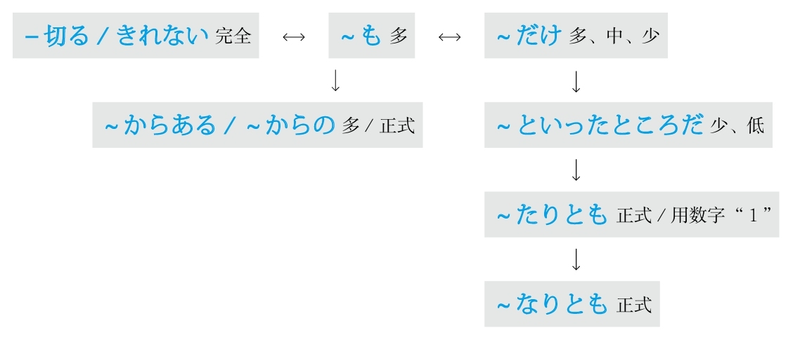

### 程度 #5_2_3_0_0
* [[ 日语语法新思维（修订版）_Menu_0.md | Menu #5_2_3_0_0 ]]

#### ～くらい/～ぐらい #5_2_3_1_0
* [[ 日语语法新思维（修订版）_Menu_0.md | Menu #5_2_3_1_0 ]]

**解释：** 「<ruby>位<rp>(</rp><rt>くらい</rt><rp>)</rp></ruby>」表示高、中、低三个程度
**注意：** 读清音和浊音都可以
**用于：** 程度高
**接续：** 任何词

例句：<ruby>周<rp>(</rp><rt>まわ</rt><rp>)</rp></ruby>りが<ruby>騒<rp>(</rp><rt>さわ</rt><rp>)</rp></ruby>がしいから、<ruby>電<rp>(</rp><rt>でん</rt><rp>)</rp></ruby><ruby>話<rp>(</rp><rt>わ</rt><rp>)</rp></ruby>の<ruby>音<rp>(</rp><rt>おと</rt><rp>)</rp></ruby>が<ruby>聞<rp>(</rp><rt>き</rt><rp>)</rp></ruby>こえない**くらい** だ。
直译：周围太吵了，所以到了电话的声音听不见了的程度。
意译：周围太吵了，电话的声音都快听不见了。

**用于：** 程度中
**意思：** 左右
**接续：** 任何词

例句：<ruby>歩<rp>(</rp><rt>ある</rt><rp>)</rp></ruby>いて<ruby>行<rp>(</rp><rt>い</rt><rp>)</rp></ruby>ける**くらい** <ruby>近<rp>(</rp><rt>ちか</rt><rp>)</rp></ruby>いです。
直译：可以走着去的程度得近。
意译：很近，可以走着去。

**用于：** 程度低
**接续：** 任何词

例句：こんな<ruby>事<rp>(</rp><rt>こと</rt><rp>)</rp></ruby>**くらい** <ruby>子<rp>(</rp><rt>こ</rt><rp>)</rp></ruby><ruby>供<rp>(</rp><rt>ども</rt><rp>)</rp></ruby>でも<ruby>知<rp>(</rp><rt>し</rt><rp>)</rp></ruby>っている。
直译：这样的事的程度，即使是孩子都知道。
意译：这样的事连孩子都知道。

**注意：** 还可以表示大概的“时间点”和“期间段”
**意思：** 左右

例句：<ruby>明日<rp>(</rp><rt>あした</rt><rp>)</rp></ruby>の<ruby>午後<rp>(</rp><rt>ごご</rt><rp>)</rp></ruby><ruby>三<rp>(</rp><rt>さん</rt><rp>)</rp></ruby><ruby>時<rp>(</rp><rt>じ</rt><rp>)</rp></ruby>**くらい** に<ruby>来<rp>(</rp><rt>き</rt><rp>)</rp></ruby>てください。
直译：在明天下午3点左右，请来。
意译：请于明天下午3点左右来。

例句：<ruby>昨日<rp>(</rp><rt>きのう</rt><rp>)</rp></ruby><ruby>友<rp>(</rp><rt>とも</rt><rp>)</rp></ruby><ruby>達<rp>(</rp><rt>だち</rt><rp>)</rp></ruby>に<ruby>三<rp>(</rp><rt>さん</rt><rp>)</rp></ruby><ruby>時<rp>(</rp><rt>じ</rt><rp>)</rp></ruby><ruby>間<rp>(</rp><rt>かん</rt><rp>)</rp></ruby>**くらい** <ruby>待<rp>(</rp><rt>ま</rt><rp>)</rp></ruby>たされた。
直译：昨天被让朋友等了3个多小时。
意译：昨天朋友让我等了3个多小时。

#### ～ころ/～ごろ #5_2_3_2_0
* [[ 日语语法新思维（修订版）_Menu_0.md | Menu #5_2_3_2_0 ]]

**解释：** 「<ruby>頃<rp>(</rp><rt>ころ</rt><rp>)</rp></ruby>」表示大概的“时间点”
**意思：** 左右
**语气：** 正式
**注意：** 读清音和浊音都可以
**区别：** 只能接“时间点”，不能接“时间段”

例句：<ruby>明日<rp>(</rp><rt>あした</rt><rp>)</rp></ruby><ruby>何<rp>(</rp><rt>なん</rt><rp>)</rp></ruby><ruby>時<rp>(</rp><rt>じ</rt><rp>)</rp></ruby>**ごろ** <ruby>伺<rp>(</rp><rt>うかが</rt><rp>)</rp></ruby>えばよろしいでしょうか。
直译：明天几点左右拜访好呢？

#### ～ほど #5_2_3_3_0
* [[ 日语语法新思维（修订版）_Menu_0.md | Menu #5_2_3_3_0 ]]

**解释：** 「<ruby>程<rp>(</rp><rt>ほど</rt><rp>)</rp></ruby>」的意思是“程度高”
**意思：** 左右
**区别：** 不能用于“程度低”和“程度中”的事物

例句：<ruby>舌<rp>(</rp><rt>した</rt><rp>)</rp></ruby>がとろける**ほど** おいしい。
直译：好吃得舌头都要融化了。
意译：太好吃了。

**解释：** 「<ruby>程<rp>(</rp><rt>ほど</rt><rp>)</rp></ruby>」表示大概的“期间段”
**意思：** 左右
**语气：** 正式
**区别：** 不能接“时间点”，只能接“时间段”

例句：<ruby>講<rp>(</rp><rt>こう</rt><rp>)</rp></ruby><ruby>義<rp>(</rp><rt>ぎ</rt><rp>)</rp></ruby>は<ruby>1<rp>(</rp><rt>いち</rt><rp>)</rp></ruby><ruby>時<rp>(</rp><rt>じ</rt><rp>)</rp></ruby><ruby>間<rp>(</rp><rt>かん</rt><rp>)</rp></ruby>**ほど** <ruby>延<rp>(</rp><rt>の</rt><rp>)</rp></ruby>びた。
直译：大学的课拖延了1个小时左右。
意译：课拖延了1个小时左右。
语法关系图
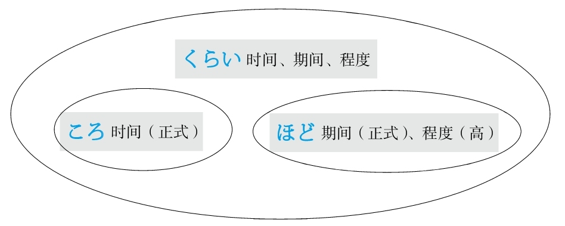

### 从 #5_2_4_0_0
* [[ 日语语法新思维（修订版）_Menu_0.md | Menu #5_2_4_0_0 ]]

#### ～から #5_2_4_1_0
* [[ 日语语法新思维（修订版）_Menu_0.md | Menu #5_2_4_1_0 ]]

**解释：** 表示起点
**意思：** 从～
**接续：** 名词

例句：<ruby>田<rp>(</rp><rt>た</rt><rp>)</rp></ruby><ruby>中<rp>(</rp><rt>なか</rt><rp>)</rp></ruby>さん**から** <ruby>得<rp>(</rp><rt>え</rt><rp>)</rp></ruby>た<ruby>情<rp>(</rp><rt>じょう</rt><rp>)</rp></ruby><ruby>報<rp>(</rp><rt>ほう</rt><rp>)</rp></ruby>は<ruby>確<rp>(</rp><rt>かく</rt><rp>)</rp></ruby><ruby>実<rp>(</rp><rt>じつ</rt><rp>)</rp></ruby>だ。
直译：从田中得到的信息很确实。
意译：从田中那里得到的信息很准确。

#### ～からいうと/～からいえば #5_2_4_2_0
* [[ 日语语法新思维（修订版）_Menu_0.md | Menu #5_2_4_2_0 ]]

**解释：** 「から」表示起点，意思是“从～”；「いう」是表示“说”的「<ruby>言<rp>(</rp><rt>い</rt><rp>)</rp></ruby>う」；「と」和「ば」的意思都是“如果”
**准则：** 在「と、ば、たら、なら」里，最重要的是顺序。「と」和「なら」分别表示极端，「と」代表“条件性”的极端，「なら」代表“假定性”的极端
**区别：** 「～からいうと」比「～からいえば」限定的语气强
**意思：** 从～来说的话
**接续：** 名词

例句：<ruby>実<rp>(</rp><rt>じつ</rt><rp>)</rp></ruby><ruby>力<rp>(</rp><rt>りょく</rt><rp>)</rp></ruby>**からいうと（からいえば）** 、<ruby>彼<rp>(</rp><rt>かれ</rt><rp>)</rp></ruby>が<ruby>入<rp>(</rp><rt>にゅう</rt><rp>)</rp></ruby><ruby>賞<rp>(</rp><rt>しょう</rt><rp>)</rp></ruby>することは<ruby>間<rp>(</rp><rt>ま</rt><rp>)</rp></ruby><ruby>違<rp>(</rp><rt>ちが</rt><rp>)</rp></ruby>いない。
直译：如果从实力来说的话，他得奖是没错的。
意译：从实力来看，他肯定能得奖。

#### ～からして #5_2_4_3_0
* [[ 日语语法新思维（修订版）_Menu_0.md | Menu #5_2_4_3_0 ]]

**解释：** 「から」表示起点，意思是“从～”；「して」是能够代替大多数动词的「する」的中顿形式，在此代替了「<ruby>見<rp>(</rp><rt>み</rt><rp>)</rp></ruby>る、<ruby>考<rp>(</rp><rt>かんが</rt><rp>)</rp></ruby>える、<ruby>判<rp>(</rp><rt>はん</rt><rp>)</rp></ruby><ruby>断<rp>(</rp><rt>だん</rt><rp>)</rp></ruby>する、<ruby>推<rp>(</rp><rt>すい</rt><rp>)</rp></ruby><ruby>測<rp>(</rp><rt>そく</rt><rp>)</rp></ruby>する、<ruby>推<rp>(</rp><rt>すい</rt><rp>)</rp></ruby><ruby>理<rp>(</rp><rt>り</rt><rp>)</rp></ruby>する」等能够与“从～”搭配的动词，需要通过上下文判断具体意思
**意思：** 从～来说的话
**接续：** 名词

例句：<ruby>町<rp>(</rp><rt>まち</rt><rp>)</rp></ruby><ruby>並<rp>(</rp><rt>な</rt><rp>)</rp></ruby>み**からして** 、このところは<ruby>歴<rp>(</rp><rt>れき</rt><rp>)</rp></ruby><ruby>史<rp>(</rp><rt>し</rt><rp>)</rp></ruby>のある<ruby>町<rp>(</rp><rt>まち</rt><rp>)</rp></ruby>らしい。
直译：从街道的样子来看（来判断、来推测……），这个地方好像有历史。
意译：从街道的样子来看，这个地方好像历史很悠久。

#### ～から～まで #5_2_4_4_0
* [[ 日语语法新思维（修订版）_Menu_0.md | Menu #5_2_4_4_0 ]]

**解释：** 「から」表示起点，意思是“从～”；「まで」表示终点，意思是“到～”
**意思：** 从～到～
**用于：** 任何事项（时间、地点、程度、人物等）
**着重：** 点
**接续：** 名词

例句：<ruby>部<rp>(</rp><rt>へ</rt><rp>)</rp></ruby><ruby>屋<rp>(</rp><rt>や</rt><rp>)</rp></ruby>の<ruby>隅<rp>(</rp><rt>すみ</rt><rp>)</rp></ruby>**から** <ruby>隅<rp>(</rp><rt>すみ</rt><rp>)</rp></ruby>**まで** <ruby>探<rp>(</rp><rt>さが</rt><rp>)</rp></ruby>した。
直译：从房间的角落到角落，找了。
意译：找遍了房间的各个角落。

#### ～から～にいたるまで #5_2_4_5_0
* [[ 日语语法新思维（修订版）_Menu_0.md | Menu #5_2_4_5_0 ]]

**解释：** 「から」表示起点，意思是“从～”；「に」表示方向；「<ruby>至<rp>(</rp><rt>いた</rt><rp>)</rp></ruby>る」的意思是“到”；「まで」表示终点，意思是“到～”
**意思：** 从～到～
**用于：** 任何事项（时间、地点、程度、人物等）
**着重：** 终点
**接续：** 名词

例句：<ruby>家<rp>(</rp><rt>か</rt><rp>)</rp></ruby><ruby>事<rp>(</rp><rt>じ</rt><rp>)</rp></ruby>**から** <ruby>育<rp>(</rp><rt>いく</rt><rp>)</rp></ruby><ruby>児<rp>(</rp><rt>じ</rt><rp>)</rp></ruby>**にいたるまで** 、<ruby>一人<rp>(</rp><rt>ひとり</rt><rp>)</rp></ruby>でさせられている。
直译：从家务活到育儿，一个人被让干着。
意译：从家务活到育儿都得一个人干。

#### ～から～にかけて #5_2_4_6_0
* [[ 日语语法新思维（修订版）_Menu_0.md | Menu #5_2_4_6_0 ]]

**解释：** 「から」表示起点，意思是“从～”；「に」表示方向；「かけて」是他动词「かける」的中顿形式，意思是“大面积地覆盖”
**意思：** 从～到～
**着重：** 面、整体
**区别：** 「～から～まで」着重于起点和终点的两个点，但是「～から～にかけて」着重于从起点到终点的全面性
**接续：** 时间、地点

例句：<ruby>日<rp>(</rp><rt>に</rt><rp>)</rp></ruby><ruby>本<rp>(</rp><rt>ほん</rt><rp>)</rp></ruby>は<ruby>5<rp>(</rp><rt>ご</rt><rp>)</rp></ruby><ruby>月<rp>(</rp><rt>がつ</rt><rp>)</rp></ruby>の<ruby>下<rp>(</rp><rt>げ</rt><rp>)</rp></ruby><ruby>旬<rp>(</rp><rt>じゅん</rt><rp>)</rp></ruby>**から** <ruby>6<rp>(</rp><rt>ろく</rt><rp>)</rp></ruby><ruby>月<rp>(</rp><rt>がつ</rt><rp>)</rp></ruby>の<ruby>下<rp>(</rp><rt>げ</rt><rp>)</rp></ruby><ruby>旬<rp>(</rp><rt>じゅん</rt><rp>)</rp></ruby>**にかけて** <ruby>梅雨<rp>(</rp><rt>つゆ</rt><rp>)</rp></ruby>の<ruby>時<rp>(</rp><rt>じ</rt><rp>)</rp></ruby><ruby>期<rp>(</rp><rt>き</rt><rp>)</rp></ruby>だ。
直译：日本从5月下旬到6月下旬的整个阶段是梅雨季节。
意译：日本从5月下旬到6月下旬一直是梅雨季节。

例句：<ruby>午後<rp>(</rp><rt>ごご</rt><rp>)</rp></ruby>は<ruby>関<rp>(</rp><rt>かん</rt><rp>)</rp></ruby><ruby>東<rp>(</rp><rt>とう</rt><rp>)</rp></ruby><ruby>地<rp>(</rp><rt>ち</rt><rp>)</rp></ruby><ruby>方<rp>(</rp><rt>ほう</rt><rp>)</rp></ruby>**から** <ruby>関<rp>(</rp><rt>かん</rt><rp>)</rp></ruby><ruby>西<rp>(</rp><rt>さい</rt><rp>)</rp></ruby><ruby>地<rp>(</rp><rt>ち</rt><rp>)</rp></ruby><ruby>方<rp>(</rp><rt>ほう</rt><rp>)</rp></ruby>**にかけて** <ruby>雪<rp>(</rp><rt>ゆき</rt><rp>)</rp></ruby>が<ruby>積<rp>(</rp><rt>つ</rt><rp>)</rp></ruby>もる<ruby>見<rp>(</rp><rt>み</rt><rp>)</rp></ruby><ruby>込<rp>(</rp><rt>こ</rt><rp>)</rp></ruby>みです。
直译：预计下午从关东地区到关西地区的整个地区将要积雪。
意译：预计下午从关东地区到关西地区将会出现积雪。

#### ～より #5_2_4_7_0
* [[ 日语语法新思维（修订版）_Menu_0.md | Menu #5_2_4_7_0 ]]

**意1：** 从～
**表示：** 起点
**注意：** 一般用于写信的发信人和表示送东西的赠送人
**区别：** 比「から」语气正式
**接续：** 人称

例句：<ruby>田<rp>(</rp><rt>た</rt><rp>)</rp></ruby><ruby>中<rp>(</rp><rt>なか</rt><rp>)</rp></ruby><ruby>様<rp>(</rp><rt>さま</rt><rp>)</rp></ruby>**より** <ruby>鈴<rp>(</rp><rt>すず</rt><rp>)</rp></ruby><ruby>木<rp>(</rp><rt>き</rt><rp>)</rp></ruby><ruby>様<rp>(</rp><rt>さま</rt><rp>)</rp></ruby><ruby>宛<rp>(</rp><rt>あ</rt><rp>)</rp></ruby>ての<ruby>手<rp>(</rp><rt>て</rt><rp>)</rp></ruby><ruby>紙<rp>(</rp><rt>がみ</rt><rp>)</rp></ruby>をお<ruby>預<rp>(</rp><rt>あず</rt><rp>)</rp></ruby>かりしております。
直译：从田中给铃木的信，我们保管着。
意译：田中给铃木的信放在我们这里。
语法关系图
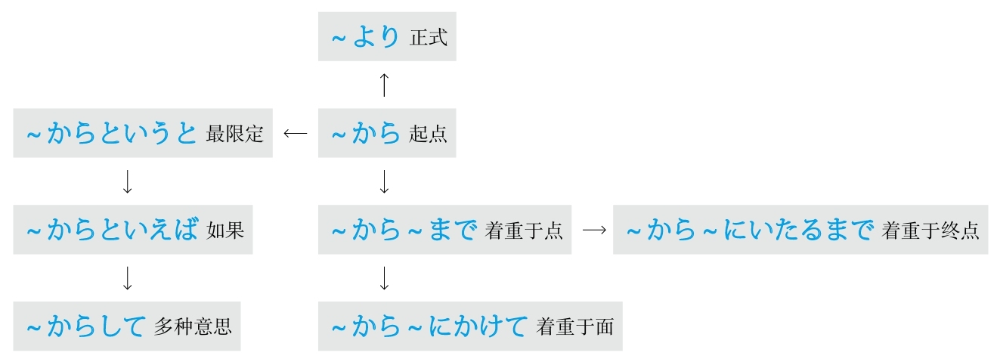

### 充满 #5_2_5_0_0
* [[ 日语语法新思维（修订版）_Menu_0.md | Menu #5_2_5_0_0 ]]

#### ～をこめて #5_2_5_1_0
* [[ 日语语法新思维（修订版）_Menu_0.md | Menu #5_2_5_1_0 ]]

**解释：** 「を」接在他动词前表示“把”；「こめて」是他动词「<ruby>込<rp>(</rp><rt>こ</rt><rp>)</rp></ruby>める」的中顿形式，意思是“充满”
**意思：** 充满～
**注意：** 常用「<ruby>心<rp>(</rp><rt>こころ</rt><rp>)</rp></ruby>をこめて、<ruby>愛<rp>(</rp><rt>あい</rt><rp>)</rp></ruby><ruby>情<rp>(</rp><rt>じょう</rt><rp>)</rp></ruby>をこめて」等
**区别：** 后面接动词
**接续：** 名词

例句：これはわたしが<ruby>真<rp>(</rp><rt>ま</rt><rp>)</rp></ruby><ruby>心<rp>(</rp><rt>ごころ</rt><rp>)</rp></ruby>**をこめて** <ruby>言<rp>(</rp><rt>い</rt><rp>)</rp></ruby>った<ruby>言<rp>(</rp><rt>こと</rt><rp>)</rp></ruby><ruby>葉<rp>(</rp><rt>ば</rt><rp>)</rp></ruby>です。
直译：这是我充满真心说的话。
意译：这是我真心实意说的话。

例句：<ruby>先<rp>(</rp><rt>せん</rt><rp>)</rp></ruby><ruby>生<rp>(</rp><rt>せい</rt><rp>)</rp></ruby>は<ruby>毎<rp>(</rp><rt>まい</rt><rp>)</rp></ruby><ruby>回<rp>(</rp><rt>かい</rt><rp>)</rp></ruby><ruby>愛<rp>(</rp><rt>あい</rt><rp>)</rp></ruby><ruby>情<rp>(</rp><rt>じょう</rt><rp>)</rp></ruby>**をこめて** <ruby>授<rp>(</rp><rt>じゅ</rt><rp>)</rp></ruby><ruby>業<rp>(</rp><rt>ぎょう</rt><rp>)</rp></ruby>を<ruby>行<rp>(</rp><rt>おこな</rt><rp>)</rp></ruby>っている。
直译：老师的每次都充满了爱地在教授课程。
意译：老师的每堂课都充满了对学生的爱。

#### ～がこもった #5_2_5_2_0
* [[ 日语语法新思维（修订版）_Menu_0.md | Menu #5_2_5_2_0 ]]

**解释：** 「が」接在自动词前表示小主语；「こもった」是自动词「<ruby>籠<rp>(</rp><rt>こも</rt><rp>)</rp></ruby>る」的た形，意思是“充满”
**准则：** 日语的「た」表示完了、过去的“了”以及起形容词修饰名词作用的“的”。此处表示“的”
**意思：** 充满～
**注意：** 常用「<ruby>心<rp>(</rp><rt>こころ</rt><rp>)</rp></ruby>がこもった、<ruby>愛<rp>(</rp><rt>あい</rt><rp>)</rp></ruby><ruby>情<rp>(</rp><rt>じょう</rt><rp>)</rp></ruby>がこもった」等
**注意：** 「が」还可以换成「の」
**区别：** 后面接名词
**接续：** 名词

例句：これは<ruby>愛<rp>(</rp><rt>あい</rt><rp>)</rp></ruby><ruby>情<rp>(</rp><rt>じょう</rt><rp>)</rp></ruby>**のこもった** <ruby>自<rp>(</rp><rt>じ</rt><rp>)</rp></ruby><ruby>家<rp>(</rp><rt>か</rt><rp>)</rp></ruby><ruby>製<rp>(</rp><rt>せい</rt><rp>)</rp></ruby><ruby>弁<rp>(</rp><rt>べん</rt><rp>)</rp></ruby><ruby>当<rp>(</rp><rt>とう</rt><rp>)</rp></ruby>です。
直译：这是充满了爱的自家制便当。
意译：这是充满了爱的自己家里做的便当。
语法关系图
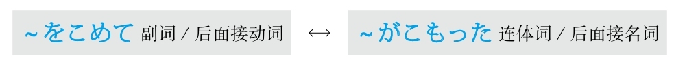

### 除了～以外 #5_2_6_0_0
* [[ 日语语法新思维（修订版）_Menu_0.md | Menu #5_2_6_0_0 ]]

#### ～ほかに #5_2_6_1_0
* [[ 日语语法新思维（修订版）_Menu_0.md | Menu #5_2_6_1_0 ]]

**解释：** 「<ruby>他<rp>(</rp><rt>ほか</rt><rp>)</rp></ruby>、<ruby>外<rp>(</rp><rt>ほか</rt><rp>)</rp></ruby>」的意思是“～以外”；「に」表示副词
**准则：** 有时可以不用「に」，不用「に」时必须添加逗号，且语气正式
**意思：** ～以外
**接续：** 修饰名词的规律（参照第一章的第三节）

例句：<ruby>当<rp>(</rp><rt>とう</rt><rp>)</rp></ruby><ruby>日<rp>(</rp><rt>じつ</rt><rp>)</rp></ruby>は<ruby>関<rp>(</rp><rt>かん</rt><rp>)</rp></ruby><ruby>係<rp>(</rp><rt>けい</rt><rp>)</rp></ruby><ruby>書<rp>(</rp><rt>しょ</rt><rp>)</rp></ruby><ruby>類<rp>(</rp><rt>るい</rt><rp>)</rp></ruby>が<ruby>配<rp>(</rp><rt>くば</rt><rp>)</rp></ruby>られる**ほか** 、<ruby>記<rp>(</rp><rt>き</rt><rp>)</rp></ruby><ruby>念<rp>(</rp><rt>ねん</rt><rp>)</rp></ruby><ruby>品<rp>(</rp><rt>ひん</rt><rp>)</rp></ruby>ももらえる。
直译：当天有关资料被发送以外，纪念品也能够得到。
意译：当天除了发有关资料以外，还能得到纪念品。

#### ～以外に #5_2_6_2_0
* [[ 日语语法新思维（修订版）_Menu_0.md | Menu #5_2_6_2_0 ]]

**解释：** 「<ruby>以<rp>(</rp><rt>い</rt><rp>)</rp></ruby><ruby>外<rp>(</rp><rt>がい</rt><rp>)</rp></ruby>」的意思是“以外，之外”；「に」表示副词
**准则：** 有时可以不用「に」，不用「に」时必须添加逗号，且语气正式
**意思：** ～以外
**语气：** 正式
**接续：** 修饰名词的规律（参照第一章的第三节）

例句：<ruby>彼<rp>(</rp><rt>かの</rt><rp>)</rp></ruby><ruby>女<rp>(</rp><rt>じょ</rt><rp>)</rp></ruby>は<ruby>声<rp>(</rp><rt>こえ</rt><rp>)</rp></ruby>が<ruby>大<rp>(</rp><rt>おお</rt><rp>)</rp></ruby>きい**<ruby>以<rp>(</rp><rt>い</rt><rp>)</rp></ruby><ruby>外<rp>(</rp><rt>がい</rt><rp>)</rp></ruby>に** <ruby>何<rp>(</rp><rt>なん</rt><rp>)</rp></ruby>の<ruby>取<rp>(</rp><rt>とり</rt><rp>)</rp></ruby><ruby>得<rp>(</rp><rt>え</rt><rp>)</rp></ruby>もない。
直译：她声音大以外，什么可取之处都没有。
意译：她除了声音大以外什么可取之处都没有。

#### ～を除いて #5_2_6_3_0
* [[ 日语语法新思维（修订版）_Menu_0.md | Menu #5_2_6_3_0 ]]

**解释：** 「を」接在他动词前表示“把”；「<ruby>除<rp>(</rp><rt>のぞ</rt><rp>)</rp></ruby>いて」是他动词「<ruby>除<rp>(</rp><rt>のぞ</rt><rp>)</rp></ruby>く」的中顿形式，意思是“除了～”
**意思：** 除了～
**接续：** 名词

例句：<ruby>少<rp>(</rp><rt>しょう</rt><rp>)</rp></ruby><ruby>数<rp>(</rp><rt>すう</rt><rp>)</rp></ruby>**を<ruby>除<rp>(</rp><rt>のぞ</rt><rp>)</rp></ruby>いて** みんなその<ruby>提<rp>(</rp><rt>てい</rt><rp>)</rp></ruby><ruby>案<rp>(</rp><rt>あん</rt><rp>)</rp></ruby>に<ruby>賛<rp>(</rp><rt>さん</rt><rp>)</rp></ruby><ruby>成<rp>(</rp><rt>せい</rt><rp>)</rp></ruby>した。
直译：除了少数人，大家都对那个建议赞成了。
意译：除了少数人，大家都赞成那个建议。

#### ～をおいて #5_2_6_4_0
* [[ 日语语法新思维（修订版）_Menu_0.md | Menu #5_2_6_4_0 ]]

**解释：** 「を」接在他动词前表示“把”；「おいて」是他动词「<ruby>置<rp>(</rp><rt>お</rt><rp>)</rp></ruby>く」的中顿形式，意思是“放置～”
**直译：** 把～放置～
**重点：** 起源于日本谚语「～は<ruby>隅<rp>(</rp><rt>すみ</rt><rp>)</rp></ruby>にはおけない」，意思是“不能把～放置到角落里”，体现了“～”的重要性或中心地位；此语法引申为“把作为中心地位的～放到角落里的话，就没有能够胜任的了”
**接续：** 名词

例句：この<ruby>仕<rp>(</rp><rt>し</rt><rp>)</rp></ruby><ruby>事<rp>(</rp><rt>ごと</rt><rp>)</rp></ruby>が<ruby>任<rp>(</rp><rt>まか</rt><rp>)</rp></ruby>せられるのは、<ruby>彼<rp>(</rp><rt>かれ</rt><rp>)</rp></ruby>**をおいて** <ruby>適<rp>(</rp><rt>てき</rt><rp>)</rp></ruby><ruby>任<rp>(</rp><rt>にん</rt><rp>)</rp></ruby><ruby>者<rp>(</rp><rt>しゃ</rt><rp>)</rp></ruby>はいない。
直译：这个工作能够委任的，把他放到角落里，没有适合于委任的人。
意译：这个工作除了他以外没有别人可以胜任。
语法关系图
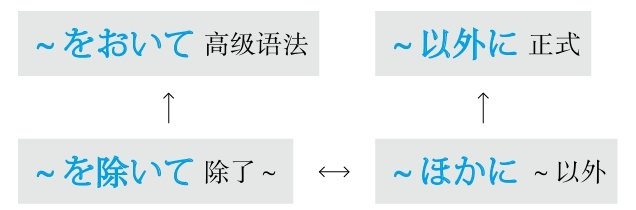

## D #5_3_0_0_0
* [[ 日语语法新思维（修订版）_Menu_0.md | Menu #5_3_0_0_0 ]]

### 代替 #5_3_1_0_0
* [[ 日语语法新思维（修订版）_Menu_0.md | Menu #5_3_1_0_0 ]]

#### ～かわりに #5_3_1_1_0
* [[ 日语语法新思维（修订版）_Menu_0.md | Menu #5_3_1_1_0 ]]

**解释：** 「<ruby>代<rp>(</rp><rt>か</rt><rp>)</rp></ruby>わり」的意思是“代替”；「に」表示副词
**注意：** 有时可以不用「に」，不用「に」时必须添加逗号，且语气正式
**接续：** 修饰名词的规律（参照第一章的第三节）

例句：<ruby>包<rp>(</rp><rt>ほう</rt><rp>)</rp></ruby><ruby>帯<rp>(</rp><rt>たい</rt><rp>)</rp></ruby>の**かわりに** 、ハンカチで<ruby>傷<rp>(</rp><rt>きず</rt><rp>)</rp></ruby><ruby>口<rp>(</rp><rt>ぐち</rt><rp>)</rp></ruby>を<ruby>縛<rp>(</rp><rt>しば</rt><rp>)</rp></ruby>った。
直译：绷带的替代，用手绢绑住了伤口。
意译：用手绢代替绷带绑住了伤口。

#### ～にかわって #5_3_1_2_0
* [[ 日语语法新思维（修订版）_Menu_0.md | Menu #5_3_1_2_0 ]]

**解释：** 「に」表示方向或对象；「かわって」是自动词「<ruby>代<rp>(</rp><rt>か</rt><rp>)</rp></ruby>わる」的中顿形式，意思是“代替”
**接续：** 名词

例句：<ruby>首<rp>(</rp><rt>しゅ</rt><rp>)</rp></ruby><ruby>相<rp>(</rp><rt>しょう</rt><rp>)</rp></ruby>**にかわって** 、<ruby>外<rp>(</rp><rt>がい</rt><rp>)</rp></ruby><ruby>相<rp>(</rp><rt>しょう</rt><rp>)</rp></ruby>が<ruby>米<rp>(</rp><rt>べい</rt><rp>)</rp></ruby><ruby>国<rp>(</rp><rt>こく</rt><rp>)</rp></ruby>を<ruby>訪<rp>(</rp><rt>ほう</rt><rp>)</rp></ruby><ruby>問<rp>(</rp><rt>もん</rt><rp>)</rp></ruby>した。
直译：代替首相，外相访问了美国。
意译：外务大臣代替首相访问了美国。
语法关系图
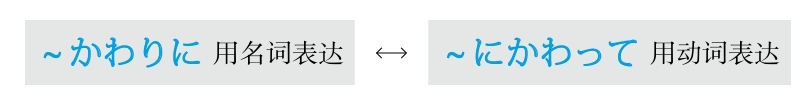

### 当成 #5_3_2_0_0
* [[ 日语语法新思维（修订版）_Menu_0.md | Menu #5_3_2_0_0 ]]

#### ～を～とする/～を～にする #5_3_2_1_0
* [[ 日语语法新思维（修订版）_Menu_0.md | Menu #5_3_2_1_0 ]]

**注意：** 日语里的经典句型「～を～と（に）する（把～当成～）」，大多数语法都是由此派生的
**解释：** 「を」接在他动词前表示“把”；「と」侧重于内容，「に」侧重于方向；「する」可以代替大多数动词
**意思：** 把～当成～
**接续：** 名词

例句：<ruby>経<rp>(</rp><rt>けい</rt><rp>)</rp></ruby><ruby>済<rp>(</rp><rt>ざい</rt><rp>)</rp></ruby>**を** <ruby>研<rp>(</rp><rt>けん</rt><rp>)</rp></ruby><ruby>究<rp>(</rp><rt>きゅう</rt><rp>)</rp></ruby><ruby>題<rp>(</rp><rt>だい</rt><rp>)</rp></ruby><ruby>目<rp>(</rp><rt>もく</rt><rp>)</rp></ruby>**にしている** 。
直译：把经济当作研究题目在做着。
意译：现在把经济当作研究题目。
语法关系图
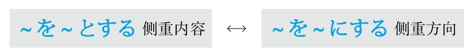

### 到～地步 #5_3_3_0_0
* [[ 日语语法新思维（修订版）_Menu_0.md | Menu #5_3_3_0_0 ]]

#### ～まで #5_3_3_1_0
* [[ 日语语法新思维（修订版）_Menu_0.md | Menu #5_3_3_1_0 ]]

**解释：** 「まで」的意思是“到～”或“到～的地步”
**着重：** 抽象事物
**接续：** 任何词

例句：<ruby>今年<rp>(</rp><rt>ことし</rt><rp>)</rp></ruby>の<ruby>大<rp>(</rp><rt>だい</rt><rp>)</rp></ruby><ruby>学<rp>(</rp><rt>がく</rt><rp>)</rp></ruby>の<ruby>文<rp>(</rp><rt>ぶん</rt><rp>)</rp></ruby><ruby>化<rp>(</rp><rt>か</rt><rp>)</rp></ruby><ruby>祭<rp>(</rp><rt>さい</rt><rp>)</rp></ruby>は<ruby>以<rp>(</rp><rt>い</rt><rp>)</rp></ruby><ruby>前<rp>(</rp><rt>ぜん</rt><rp>)</rp></ruby>ほど<ruby>活<rp>(</rp><rt>かっ</rt><rp>)</rp></ruby><ruby>気<rp>(</rp><rt>き</rt><rp>)</rp></ruby>がなくなった。<ruby>授<rp>(</rp><rt>じゅ</rt><rp>)</rp></ruby><ruby>業<rp>(</rp><rt>ぎょう</rt><rp>)</rp></ruby>を<ruby>休<rp>(</rp><rt>やす</rt><rp>)</rp></ruby>んで**まで** <ruby>見<rp>(</rp><rt>み</rt><rp>)</rp></ruby>に<ruby>行<rp>(</rp><rt>い</rt><rp>)</rp></ruby>く<ruby>必<rp>(</rp><rt>ひつ</rt><rp>)</rp></ruby><ruby>要<rp>(</rp><rt>よう</rt><rp>)</rp></ruby>はないと<ruby>思<rp>(</rp><rt>おも</rt><rp>)</rp></ruby>う。
直译：今年大学的文化节，以前那么程度高的，生气没有了。不上课去观看的必要没有，我认为。
意译：今年大学的文化节没有以前有生气，我觉得没有必要不上课去观看。

#### －ないまでも #5_3_3_2_0
* [[ 日语语法新思维（修订版）_Menu_0.md | Menu #5_3_3_2_0 ]]

**解释：** 「ない」是谓语词的否定的简体；「までも」比「まで」语气强，意思是“到～的地步”
**意思：** 虽然不用到去做～的地步，但是～也该做～
**着重：** 转折
**注意：** 「までも」的语气是在「も→まで→までも」里是最强的，日语中用强调表示转折
**准则：** 强烈的表达方式，通常在表示“否定、转折、相反”的语境中出现
**变形：** 动词的否定形的な（变形规律参照第一章的第二节）

例句：<ruby>新<rp>(</rp><rt>あたら</rt><rp>)</rp></ruby>しい<ruby>建<rp>(</rp><rt>けん</rt><rp>)</rp></ruby><ruby>設<rp>(</rp><rt>せつ</rt><rp>)</rp></ruby><ruby>計<rp>(</rp><rt>けい</rt><rp>)</rp></ruby><ruby>画<rp>(</rp><rt>かく</rt><rp>)</rp></ruby>には<ruby>地<rp>(</rp><rt>じ</rt><rp>)</rp></ruby><ruby>元<rp>(</rp><rt>もと</rt><rp>)</rp></ruby>の<ruby>住<rp>(</rp><rt>じゅう</rt><rp>)</rp></ruby><ruby>民<rp>(</rp><rt>みん</rt><rp>)</rp></ruby>の<ruby>反<rp>(</rp><rt>はん</rt><rp>)</rp></ruby><ruby>対<rp>(</rp><rt>たい</rt><rp>)</rp></ruby>が<ruby>大<rp>(</rp><rt>おお</rt><rp>)</rp></ruby>きい。<ruby>国<rp>(</rp><rt>くに</rt><rp>)</rp></ruby>は<ruby>計<rp>(</rp><rt>けい</rt><rp>)</rp></ruby><ruby>画<rp>(</rp><rt>かく</rt><rp>)</rp></ruby>を<ruby>中<rp>(</rp><rt>ちゅう</rt><rp>)</rp></ruby><ruby>止<rp>(</rp><rt>し</rt><rp>)</rp></ruby>するとは<ruby>言<rp>(</rp><rt>い</rt><rp>)</rp></ruby>わ**ないまでも** 、もう<ruby>一<rp>(</rp><rt>いち</rt><rp>)</rp></ruby><ruby>度<rp>(</rp><rt>ど</rt><rp>)</rp></ruby><ruby>考<rp>(</rp><rt>かんが</rt><rp>)</rp></ruby>え<ruby>直<rp>(</rp><rt>なお</rt><rp>)</rp></ruby>さざるを<ruby>得<rp>(</rp><rt>え</rt><rp>)</rp></ruby>ないだろう。
直译：对于新的建设计划，当地居民的反对很大。国家即使到不说中止计划的地步，也不得不重新考虑吧。
意译：当地居民非常反对新的建设计划。国家即使不说中止计划，也不得不重新考虑吧。

#### ～に至って #5_3_3_3_0
* [[ 日语语法新思维（修订版）_Menu_0.md | Menu #5_3_3_3_0 ]]

**解释：** 「に」表示方向；「<ruby>至<rp>(</rp><rt>いた</rt><rp>)</rp></ruby>って」是自动词「<ruby>至<rp>(</rp><rt>いた</rt><rp>)</rp></ruby>る」的中顿形式，意思是“到～”
**意思：** 到～
**语气：** 正式
**接续：** 名词

例句：<ruby>事<rp>(</rp><rt>こと</rt><rp>)</rp></ruby>はここ**に<ruby>至<rp>(</rp><rt>いた</rt><rp>)</rp></ruby>っては** <ruby>手<rp>(</rp><rt>て</rt><rp>)</rp></ruby>の<ruby>打<rp>(</rp><rt>う</rt><rp>)</rp></ruby>ちようがない。
直译：事已至此，采取措施的办法没有。
意译：事已至此，一点儿办法都没有了。
语法关系图
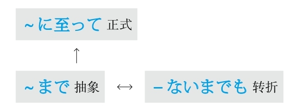

### 定义 #5_3_4_0_0
* [[ 日语语法新思维（修订版）_Menu_0.md | Menu #5_3_4_0_0 ]]

#### ～とは #5_3_4_1_0
* [[ 日语语法新思维（修订版）_Menu_0.md | Menu #5_3_4_1_0 ]]

**解释：** 「と」表示内容，在此起引号的作用；「は」表示强调
**注意：** 在定义时常出现以下表述方式“～是这么一回事”或“～是这样一个意思”，因此句尾常接「～ことだ（这么一回事）」或「～意味だ（这样的意思）」
**接续：** 任何词

例句：「アクセサリー」**とは** 、<ruby>体<rp>(</rp><rt>からだ</rt><rp>)</rp></ruby>につける<ruby>飾<rp>(</rp><rt>かざ</rt><rp>)</rp></ruby>り**のことだ** 。
直译：“首饰”是这样一回事：戴在身上的装饰品。
意译：“首饰”的意思是戴在身上的装饰品。

### 动作的终结 #5_3_5_0_0
* [[ 日语语法新思维（修订版）_Menu_0.md | Menu #5_3_5_0_0 ]]

#### －たきり #5_3_5_1_0
* [[ 日语语法新思维（修订版）_Menu_0.md | Menu #5_3_5_1_0 ]]

**解释：** 「た」表示动作的完了的“了”；「きり」是他动词「<ruby>切<rp>(</rp><rt>き</rt><rp>)</rp></ruby>る」的连用形，表示动作中断
**意思：** 做了～之后动作中断，之后再也没有出现过此事
**注意：** 动词连用形是动词也是名词
**变形：** 动词的た形的简体（变形规律参照第一章的第二节）

例句：<ruby>渡<rp>(</rp><rt>わた</rt><rp>)</rp></ruby><ruby>辺<rp>(</rp><rt>なべ</rt><rp>)</rp></ruby><ruby>先<rp>(</rp><rt>せん</rt><rp>)</rp></ruby><ruby>生<rp>(</rp><rt>せい</rt><rp>)</rp></ruby>とは<ruby>昨<rp>(</rp><rt>さく</rt><rp>)</rp></ruby><ruby>年<rp>(</rp><rt>ねん</rt><rp>)</rp></ruby><ruby>一<rp>(</rp><rt>いち</rt><rp>)</rp></ruby><ruby>度<rp>(</rp><rt>ど</rt><rp>)</rp></ruby><ruby>会<rp>(</rp><rt>あ</rt><rp>)</rp></ruby>っ**たきり** です。
直译：和渡边老师去年见过一面后动作中断再也没有见过。
意译：去年和渡边老师见过一面后再也没见过。

例句：<ruby>彼<rp>(</rp><rt>かの</rt><rp>)</rp></ruby><ruby>女<rp>(</rp><rt>じょ</rt><rp>)</rp></ruby>は<ruby>日<rp>(</rp><rt>に</rt><rp>)</rp></ruby><ruby>本<rp>(</rp><rt>ほん</rt><rp>)</rp></ruby>に<ruby>行<rp>(</rp><rt>い</rt><rp>)</rp></ruby>っ**たきり** 、もう<ruby>帰<rp>(</rp><rt>かえ</rt><rp>)</rp></ruby>って<ruby>来<rp>(</rp><rt>こ</rt><rp>)</rp></ruby>ない、と<ruby>聞<rp>(</rp><rt>き</rt><rp>)</rp></ruby>きました。
直译：她去了日本，动作中断，再也不回来了，听说了。
意译：听说她去了日本再也不回来了。

**意思：** 做了～之后，动作完全保持此状态

例句：<ruby>祖<rp>(</rp><rt>そ</rt><rp>)</rp></ruby><ruby>父<rp>(</rp><rt>ふ</rt><rp>)</rp></ruby>は<ruby>階<rp>(</rp><rt>かい</rt><rp>)</rp></ruby><ruby>段<rp>(</rp><rt>だん</rt><rp>)</rp></ruby>から<ruby>転<rp>(</rp><rt>ころ</rt><rp>)</rp></ruby>んでから、ずっと<ruby>寝<rp>(</rp><rt>ね</rt><rp>)</rp></ruby>**たきり** だ。
直译：祖父从台阶上摔下来后一直睡着，动作完全保持此状态。
意译：祖父从台阶上摔下来后一直卧床不起。

### 对比 #5_3_6_0_0
* [[ 日语语法新思维（修订版）_Menu_0.md | Menu #5_3_6_0_0 ]]

#### ～は #5_3_6_1_0
* [[ 日语语法新思维（修订版）_Menu_0.md | Menu #5_3_6_1_0 ]]

**解释：** 「は」在两个小句子当中表示对比
**注意：** 「は」还有表示“大主语”和“强调其他助词”的作用；强调「を」和「が」时换成「は」；强调其他助词如「に」或「で」等时，在其后面加「は」，构成「には、では」等

例句：<ruby>日<rp>(</rp><rt>に</rt><rp>)</rp></ruby><ruby>本<rp>(</rp><rt>ほん</rt><rp>)</rp></ruby>に<ruby>来<rp>(</rp><rt>き</rt><rp>)</rp></ruby>て<ruby>初<rp>(</rp><rt>はじ</rt><rp>)</rp></ruby>めのうち**は** <ruby>日<rp>(</rp><rt>に</rt><rp>)</rp></ruby><ruby>本<rp>(</rp><rt>ほん</rt><rp>)</rp></ruby><ruby>語<rp>(</rp><rt>ご</rt><rp>)</rp></ruby>が<ruby>全然<rp>(</rp><rt>ぜん</rt><rp>)</rp></ruby>わからなかったけど、<ruby>今<rp>(</rp><rt>いま</rt><rp>)</rp></ruby>**は** だいぶわかってきた。
直译：刚来日本的时候，日语全然不懂，但是现在相当懂了。
意译：刚来日本的时候一点也不懂日语，现在懂很多了。

#### ～一方（で） #5_3_6_2_0
* [[ 日语语法新思维（修订版）_Menu_0.md | Menu #5_3_6_2_0 ]]

**解释：** 「<ruby>一<rp>(</rp><rt>いっ</rt><rp>)</rp></ruby><ruby>方<rp>(</rp><rt>ぽう</rt><rp>)</rp></ruby>」的意思是“一方、另一方”；「で」表示范围，意思是“在”
**意思：** 在一方面～，在另一方面～
**重点：** 常举出两个对照性的事物
**准则：** 有时可以不用「で」，不用「で」时必须添加逗号，且语气正式
**接续：** 动词和形容词的原形、形容动词和名词加である

例句：<ruby>最<rp>(</rp><rt>さい</rt><rp>)</rp></ruby><ruby>近<rp>(</rp><rt>きん</rt><rp>)</rp></ruby><ruby>高<rp>(</rp><rt>こう</rt><rp>)</rp></ruby><ruby>齢<rp>(</rp><rt>れい</rt><rp>)</rp></ruby><ruby>化<rp>(</rp><rt>か</rt><rp>)</rp></ruby>が<ruby>進<rp>(</rp><rt>すす</rt><rp>)</rp></ruby>んでおり、<ruby>老<rp>(</rp><rt>ろう</rt><rp>)</rp></ruby><ruby>人<rp>(</rp><rt>じん</rt><rp>)</rp></ruby>は<ruby>増<rp>(</rp><rt>ふ</rt><rp>)</rp></ruby>える**<ruby>一<rp>(</rp><rt>いっ</rt><rp>)</rp></ruby><ruby>方<rp>(</rp><rt>ぽう</rt><rp>)</rp></ruby>** 、<ruby>子<rp>(</rp><rt>こ</rt><rp>)</rp></ruby><ruby>供<rp>(</rp><rt>ども</rt><rp>)</rp></ruby>の<ruby>数<rp>(</rp><rt>かず</rt><rp>)</rp></ruby>は<ruby>減<rp>(</rp><rt>へ</rt><rp>)</rp></ruby>ってきている。
直译：最近高龄化一直进展，老人在增加的一方，孩子的数量在减少。
意译：最近老龄化（问题）越发严重，老人的数量在增加，另一方面孩子的数量却在不断减少。

#### ～に対して #5_3_6_3_0
* [[ 日语语法新思维（修订版）_Menu_0.md | Menu #5_3_6_3_0 ]]

**解释：** 「に」表示对象；「<ruby>対<rp>(</rp><rt>たい</rt><rp>)</rp></ruby>して」是自动词「<ruby>対<rp>(</rp><rt>たい</rt><rp>)</rp></ruby>する」的中顿形式，意思是“对象、对比”
**意思：** “对于～”或“与～相对比”；在此是后者
**接续：** 名词

例句：この<ruby>植<rp>(</rp><rt>しょく</rt><rp>)</rp></ruby><ruby>物<rp>(</rp><rt>ぶつ</rt><rp>)</rp></ruby>の<ruby>葉<rp>(</rp><rt>は</rt><rp>)</rp></ruby>っぱは、<ruby>光<rp>(</rp><rt>ひかり</rt><rp>)</rp></ruby>に<ruby>当<rp>(</rp><rt>あ</rt><rp>)</rp></ruby>てている<ruby>面<rp>(</rp><rt>めん</rt><rp>)</rp></ruby>の<ruby>色<rp>(</rp><rt>いろ</rt><rp>)</rp></ruby>が<ruby>濃<rp>(</rp><rt>こ</rt><rp>)</rp></ruby>いの**に<ruby>対<rp>(</rp><rt>たい</rt><rp>)</rp></ruby>して** 、<ruby>当<rp>(</rp><rt>あ</rt><rp>)</rp></ruby>てていない<ruby>面<rp>(</rp><rt>めん</rt><rp>)</rp></ruby>の<ruby>色<rp>(</rp><rt>いろ</rt><rp>)</rp></ruby>は<ruby>薄<rp>(</rp><rt>うす</rt><rp>)</rp></ruby>い。
直译：这个植物的叶子，光照的一面的颜色深，与其相对比，没有光照的一面的颜色淡。
意译：这个植物的叶子，光照的一面的颜色深，与其相对照，没有光照的一面的颜色浅。

#### ～にひきかえ #5_3_6_4_0
* [[ 日语语法新思维（修订版）_Menu_0.md | Menu #5_3_6_4_0 ]]

**解释：** 「に」表示对象；「ひきかえ」是自动词「<ruby>引<rp>(</rp><rt>ひ</rt><rp>)</rp></ruby>き<ruby>替<rp>(</rp><rt>か</rt><rp>)</rp></ruby>える」的中顿形式，意思是“对换、交换”
**意思：** 与～相对照
**语气：** 正式
**接续：** 名词

例句：<ruby>先<rp>(</rp><rt>せん</rt><rp>)</rp></ruby><ruby>月<rp>(</rp><rt>げつ</rt><rp>)</rp></ruby><ruby>日<rp>(</rp><rt>にち</rt><rp>)</rp></ruby><ruby>常<rp>(</rp><rt>じょう</rt><rp>)</rp></ruby><ruby>用<rp>(</rp><rt>よう</rt><rp>)</rp></ruby><ruby>品<rp>(</rp><rt>ひん</rt><rp>)</rp></ruby>の<ruby>売<rp>(</rp><rt>う</rt><rp>)</rp></ruby>り<ruby>上<rp>(</rp><rt>あ</rt><rp>)</rp></ruby>げが<ruby>著<rp>(</rp><rt>いちじる</rt><rp>)</rp></ruby>しく<ruby>伸<rp>(</rp><rt>の</rt><rp>)</rp></ruby>びたの**にひきかえ** 、<ruby>食料品<rp>(</rp><rt>しょくりょうひん</rt><rp>)</rp></ruby>の<ruby>売<rp>(</rp><rt>う</rt><rp>)</rp></ruby>り<ruby>上<rp>(</rp><rt>あ</rt><rp>)</rp></ruby>げは<ruby>落<rp>(</rp><rt>お</rt><rp>)</rp></ruby>ち<ruby>込<rp>(</rp><rt>こ</rt><rp>)</rp></ruby>んだ。
直译：上月日用品的销售额显著地增长，与此相对照，食品的销售额下降了。
意译：上月，日用品的销售额有显著的增长，与此相反，食品的销售额下降了。
语法关系图
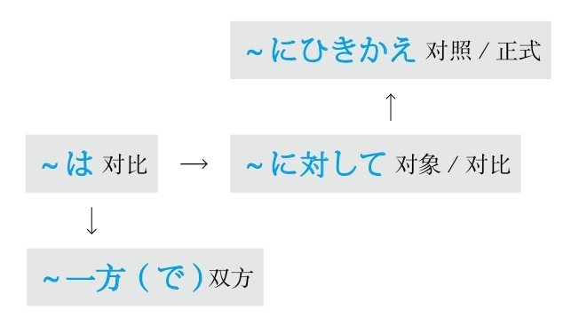

## F #5_4_0_0_0
* [[ 日语语法新思维（修订版）_Menu_0.md | Menu #5_4_0_0_0 ]]

### 放置不管 #5_4_1_0_0
* [[ 日语语法新思维（修订版）_Menu_0.md | Menu #5_4_1_0_0 ]]

#### －っぱなし #5_4_1_1_0
* [[ 日语语法新思维（修订版）_Menu_0.md | Menu #5_4_1_1_0 ]]

**解释：** 「ぱなし」是他动词「<ruby>放<rp>(</rp><rt>はな</rt><rp>)</rp></ruby>す」的连用形，作名词用，与前面的动词的连用形一起构成复合名词；促音起加强语气的作用
**意思：** 放置不管
**注意：** 用于消极事项
**接续：** 动词的连用形

例句：<ruby>主<rp>(</rp><rt>しゅ</rt><rp>)</rp></ruby><ruby>人<rp>(</rp><rt>じん</rt><rp>)</rp></ruby>は<ruby>家<rp>(</rp><rt>か</rt><rp>)</rp></ruby><ruby>事<rp>(</rp><rt>じ</rt><rp>)</rp></ruby>を<ruby>一<rp>(</rp><rt>いっ</rt><rp>)</rp></ruby><ruby>切<rp>(</rp><rt>さい</rt><rp>)</rp></ruby>しない。<ruby>新<rp>(</rp><rt>しん</rt><rp>)</rp></ruby><ruby>聞<rp>(</rp><rt>ぶん</rt><rp>)</rp></ruby>は<ruby>広<rp>(</rp><rt>ひろ</rt><rp>)</rp></ruby>げ**っぱなし** にしているし、<ruby>脱<rp>(</rp><rt>ぬ</rt><rp>)</rp></ruby>いだ<ruby>上<rp>(</rp><rt>うわ</rt><rp>)</rp></ruby><ruby>着<rp>(</rp><rt>ぎ</rt><rp>)</rp></ruby>もソファーに<ruby>置<rp>(</rp><rt>お</rt><rp>)</rp></ruby>き**っぱなし** にしている。まったく、あきれたよ。
直译：我丈夫家事一切不干。报纸摊开着，脱了的外套扔在沙发上不管。真是的，服了。
意译：我丈夫家务活一点儿都不干。报纸摊开着，脱了的外套也扔在沙发上不管。简直服了。

### 非常，极其 #5_4_2_0_0
* [[ 日语语法新思维（修订版）_Menu_0.md | Menu #5_4_2_0_0 ]]

#### ～あまり #5_4_2_1_0
* [[ 日语语法新思维（修订版）_Menu_0.md | Menu #5_4_2_1_0 ]]

**解释：** 「あまり」是自动词「<ruby>余<rp>(</rp><rt>あま</rt><rp>)</rp></ruby>る」的连用形，作名词用
**意思：** 过于～
**接续：** 修饰名词的规律（参照第一章的第三节）

例句：<ruby>志<rp>(</rp><rt>し</rt><rp>)</rp></ruby><ruby>望<rp>(</rp><rt>ぼう</rt><rp>)</rp></ruby><ruby>大<rp>(</rp><rt>だい</rt><rp>)</rp></ruby><ruby>学<rp>(</rp><rt>がく</rt><rp>)</rp></ruby>に<ruby>受<rp>(</rp><rt>う</rt><rp>)</rp></ruby>かって、<ruby>嬉<rp>(</rp><rt>うれ</rt><rp>)</rp></ruby>しい**あまり** 、<ruby>泣<rp>(</rp><rt>な</rt><rp>)</rp></ruby>いてしまった。
直译：考上了想要考的大学，过于高兴，哭了。
意译：考上了理想的大学，因为过于高兴结果哭了。

#### ～の至りで #5_4_2_2_0
* [[ 日语语法新思维（修订版）_Menu_0.md | Menu #5_4_2_2_0 ]]

**解释：** 「の」的意思是“的”；「<ruby>至<rp>(</rp><rt>いた</rt><rp>)</rp></ruby>り」是自动词「<ruby>至<rp>(</rp><rt>いた</rt><rp>)</rp></ruby>る」的连用形，作名词用；「で」是「です」的中顿形式
**意思：** ～之至
**语气：** 正式
**接续：** 名词

例句：<ruby>若<rp>(</rp><rt>わか</rt><rp>)</rp></ruby><ruby>気<rp>(</rp><rt>げ</rt><rp>)</rp></ruby>**の<ruby>至<rp>(</rp><rt>いた</rt><rp>)</rp></ruby>りで** 、<ruby>生<rp>(</rp><rt>なま</rt><rp>)</rp></ruby><ruby>意<rp>(</rp><rt>い</rt><rp>)</rp></ruby><ruby>気<rp>(</rp><rt>き</rt><rp>)</rp></ruby>なことを<ruby>言<rp>(</rp><rt>い</rt><rp>)</rp></ruby>ってしまい、<ruby>申<rp>(</rp><rt>もう</rt><rp>)</rp></ruby>し<ruby>訳<rp>(</rp><rt>わけ</rt><rp>)</rp></ruby>ございません。
直译：年轻之至，说了自以为是的话，非常抱歉。
意译：我太幼稚了，出言不逊，非常抱歉。

#### ～限りだ #5_4_2_3_0
* [[ 日语语法新思维（修订版）_Menu_0.md | Menu #5_4_2_3_0 ]]

**解释：** 「<ruby>限<rp>(</rp><rt>かぎ</rt><rp>)</rp></ruby>り」是自动词「<ruby>限<rp>(</rp><rt>かぎ</rt><rp>)</rp></ruby>る」的连用形，作名词用，意思是“极限”；「だ」是「です」的简体，表示“是”
**意思：** 极其～
**接续：** 修饰名词的规律（参照第一章的第三节）

例句：この<ruby>度<rp>(</rp><rt>たび</rt><rp>)</rp></ruby>、<ruby>皆<rp>(</rp><rt>みな</rt><rp>)</rp></ruby><ruby>様<rp>(</rp><rt>さま</rt><rp>)</rp></ruby>のお<ruby>世<rp>(</rp><rt>せ</rt><rp>)</rp></ruby><ruby>話<rp>(</rp><rt>わ</rt><rp>)</rp></ruby>をさせていただきまして、<ruby>光<rp>(</rp><rt>こう</rt><rp>)</rp></ruby><ruby>栄<rp>(</rp><rt>えい</rt><rp>)</rp></ruby>の**<ruby>限<rp>(</rp><rt>かぎ</rt><rp>)</rp></ruby>りです** 。
直译：此次，大家的照顾的事情请让我来做，极其光荣。
意译：非常荣幸此次能够负责照顾大家。

#### ～のきわみ #5_4_2_4_0
* [[ 日语语法新思维（修订版）_Menu_0.md | Menu #5_4_2_4_0 ]]

**解释：** 「の」的意思是“的”；名词「<ruby>極<rp>(</rp><rt>きわ</rt><rp>)</rp></ruby>み」的意思是“极限”
**意思：** 极其～
**语气：** 正式
**接续：** 名词

例句：<ruby>遠<rp>(</rp><rt>とお</rt><rp>)</rp></ruby>いところからわざわざお<ruby>越<rp>(</rp><rt>こ</rt><rp>)</rp></ruby>しいただきまして、<ruby>恐<rp>(</rp><rt>きょう</rt><rp>)</rp></ruby><ruby>縮<rp>(</rp><rt>しゅく</rt><rp>)</rp></ruby>**の<ruby>極<rp>(</rp><rt>きわ</rt><rp>)</rp></ruby>み** でございます。
直译：从远道特地您来，极其过意不去。
意译：您特地远道而来，非常过意不去。

#### ～きわまりない #5_4_2_5_0
* [[ 日语语法新思维（修订版）_Menu_0.md | Menu #5_4_2_5_0 ]]

**解释：** 「きわまり」是自动词「<ruby>極<rp>(</rp><rt>きわ</rt><rp>)</rp></ruby>まる」的连用形，作名词用，意思是“极限”；「ない」的意思是“没有”
**意思：** 没有比～更～的了
**语气：** 正式
**接续：** 形容动词

例句：<ruby>信<rp>(</rp><rt>しん</rt><rp>)</rp></ruby><ruby>号<rp>(</rp><rt>ごう</rt><rp>)</rp></ruby>を<ruby>無<rp>(</rp><rt>む</rt><rp>)</rp></ruby><ruby>視<rp>(</rp><rt>し</rt><rp>)</rp></ruby>して<ruby>突<rp>(</rp><rt>つ</rt><rp>)</rp></ruby>っ<ruby>走<rp>(</rp><rt>ぱし</rt><rp>)</rp></ruby>るなんて、<ruby>危<rp>(</rp><rt>き</rt><rp>)</rp></ruby><ruby>険<rp>(</rp><rt>けん</rt><rp>)</rp></ruby>**きわまりない** 。
直译：无视信号灯，猛跑，极其危险。
意译：不看红绿灯猛跑太危险了。

#### ～きわまる #5_4_2_6_0
* [[ 日语语法新思维（修订版）_Menu_0.md | Menu #5_4_2_6_0 ]]

**解释：** 自动词「<ruby>極<rp>(</rp><rt>きわ</rt><rp>)</rp></ruby>まる」的意思是“极限”
**意思：** 没有比～更～的了
**语气：** 正式
**接续：** 前面接形容动词，后面接名词

例句：<ruby>彼<rp>(</rp><rt>かれ</rt><rp>)</rp></ruby>の<ruby>無<rp>(</rp><rt>ぶ</rt><rp>)</rp></ruby><ruby>礼<rp>(</rp><rt>れい</rt><rp>)</rp></ruby>**きわまる** <ruby>態<rp>(</rp><rt>たい</rt><rp>)</rp></ruby><ruby>度<rp>(</rp><rt>ど</rt><rp>)</rp></ruby>に<ruby>腹<rp>(</rp><rt>はら</rt><rp>)</rp></ruby>が<ruby>立<rp>(</rp><rt>た</rt><rp>)</rp></ruby>った。
直译：对于他的极其无理的态度，生气。
意译：对他的极其无理的态度感到非常生气。

#### ～といったらありはしない #5_4_2_7_0
* [[ 日语语法新思维（修订版）_Menu_0.md | Menu #5_4_2_7_0 ]]

**解释：** 「と」表示内容；「いったら」是「<ruby>言<rp>(</rp><rt>い</rt><rp>)</rp></ruby>う」加上了表示“如果”的「たら」；「あり」是「<ruby>有<rp>(</rp><rt>あ</rt><rp>)</rp></ruby>る」的连用形，作名词用；「は」强调了表示小主语的「が」；「しない」是能代替大多数动词的「する」的否定形
**直译：** 如果说到～，根本不可能有这种情况
**意译：** 简直太～
**口语：** 常用「～といったらありゃしない」（多用于消极事物）和「～といったらない」
**接续：** 动词和形容词的原形、形容动词和名词

例句：<ruby>二<rp>(</rp><rt>に</rt><rp>)</rp></ruby><ruby>時<rp>(</rp><rt>じ</rt><rp>)</rp></ruby><ruby>間<rp>(</rp><rt>かん</rt><rp>)</rp></ruby>も<ruby>待<rp>(</rp><rt>ま</rt><rp>)</rp></ruby>たされて、けしからん**といったらありゃしない** 。
直译：被让等了两个小时，如果说不像话，这种事都不可能有。
意译：让我等了两个小时，简直太不像话了。

例句：<ruby>雨<rp>(</rp><rt>あめ</rt><rp>)</rp></ruby>の<ruby>後<rp>(</rp><rt>あと</rt><rp>)</rp></ruby>の<ruby>虹<rp>(</rp><rt>にじ</rt><rp>)</rp></ruby>の<ruby>美<rp>(</rp><rt>うつく</rt><rp>)</rp></ruby>しさ**といったらなかった** 。
直译：雨后的彩虹，说到美丽，这种事情都没见过。
意译：雨后的彩虹简直太漂亮了。
语法关系图
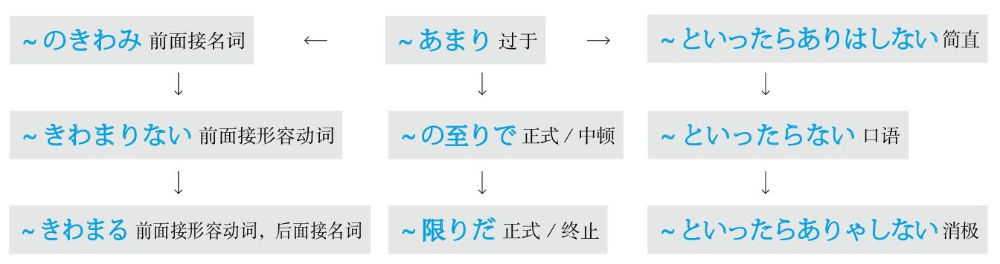

### 反复做 #5_4_3_0_0
* [[ 日语语法新思维（修订版）_Menu_0.md | Menu #5_4_3_0_0 ]]

#### －ては、－ては #5_4_3_1_0
* [[ 日语语法新思维（修订版）_Menu_0.md | Menu #5_4_3_1_0 ]]

**解释：** 动词的て形表示中顿；「は」表示强调
**意思：** 做了～后做～，做了～后做～
**注意：** 后接动词的连用形作为名词；把整个搭配看成是一个名词从句，后面再接动词
**变形：** 动词的て形（变形规律参照第一章的第二节）

例句：<ruby>休<rp>(</rp><rt>やす</rt><rp>)</rp></ruby>みの<ruby>日<rp>(</rp><rt>ひ</rt><rp>)</rp></ruby>はいつも<ruby>食<rp>(</rp><rt>た</rt><rp>)</rp></ruby>べ**ては** <ruby>寝<rp>(</rp><rt>ね</rt><rp>)</rp></ruby>、<ruby>食<rp>(</rp><rt>た</rt><rp>)</rp></ruby>べ**ては** <ruby>寝<rp>(</rp><rt>ね</rt><rp>)</rp></ruby>、している。
直译：休息日总是吃了睡，睡了吃，在做着。
意译：休息日总是吃了睡，睡了吃。

### 方法 #5_4_4_0_0
* [[ 日语语法新思维（修订版）_Menu_0.md | Menu #5_4_4_0_0 ]]

#### －かた #5_4_4_1_0
* [[ 日语语法新思维（修订版）_Menu_0.md | Menu #5_4_4_1_0 ]]

**解释：** 「かた」的汉字是「<ruby>方<rp>(</rp><rt>かた</rt><rp>)</rp></ruby>」
**意思：** 方法
**着重：** 途径
**接续：** 接动词的连用形构成复合名词

例句：いくら<ruby>後<rp>(</rp><rt>こう</rt><rp>)</rp></ruby><ruby>悔<rp>(</rp><rt>かい</rt><rp>)</rp></ruby>したって、もう<ruby>仕<rp>(</rp><rt>し</rt><rp>)</rp></ruby>**<ruby>方<rp>(</rp><rt>かた</rt><rp>)</rp></ruby>** がない。
直译：不管多少次后悔，已经没办法了。
意译：不管怎么后悔都没办法了。

#### －よう #5_4_4_2_0
* [[ 日语语法新思维（修订版）_Menu_0.md | Menu #5_4_4_2_0 ]]

**解释：** 「よう」的汉字是「<ruby>様<rp>(</rp><rt>よう</rt><rp>)</rp></ruby>」
**意思：** 办法
**着重：** 状态
**接续：** 接动词的连用形构成复合名词

例句：<ruby>本<rp>(</rp><rt>ほん</rt><rp>)</rp></ruby>のタイトルさえわかれば、<ruby>探<rp>(</rp><rt>さが</rt><rp>)</rp></ruby>し**よう** があるけど…
直译：只要知道书的名字，就有办法找。
意译：只要知道书的名字就有办法找。

#### ～を以て #5_4_4_3_0
* [[ 日语语法新思维（修订版）_Menu_0.md | Menu #5_4_4_3_0 ]]

**解释：** 「を」接在他动词前表示“把”；「<ruby>以<rp>(</rp><rt>もっ</rt><rp>)</rp></ruby>て」是他动词「もつ」的中顿形式，意思是“以～”
**意思：** 以～
**语气：** 正式
**注意：** 可以表示“方法”、“形式”或“开始或结束的界限”等，例：「<ruby>身<rp>(</rp><rt>み</rt><rp>)</rp></ruby>を<ruby>以<rp>(</rp><rt>もっ</rt><rp>)</rp></ruby>て<ruby>示<rp>(</rp><rt>しめ</rt><rp>)</rp></ruby>す（以身作则）」、「<ruby>1<rp>(</rp><rt>じゅう</rt><rp>)</rp></ruby><ruby>8<rp>(</rp><rt>はち</rt><rp>)</rp></ruby><ruby>時<rp>(</rp><rt>じ</rt><rp>)</rp></ruby>を<ruby>以<rp>(</rp><rt>もっ</rt><rp>)</rp></ruby>て<ruby>終<rp>(</rp><rt>しゅう</rt><rp>)</rp></ruby><ruby>了<rp>(</rp><rt>りょう</rt><rp>)</rp></ruby>します（18点结束）」

例句：<ruby>審<rp>(</rp><rt>しん</rt><rp>)</rp></ruby><ruby>査<rp>(</rp><rt>さ</rt><rp>)</rp></ruby>の<ruby>結<rp>(</rp><rt>けっ</rt><rp>)</rp></ruby><ruby>果<rp>(</rp><rt>か</rt><rp>)</rp></ruby>は<ruby>書<rp>(</rp><rt>しょ</rt><rp>)</rp></ruby><ruby>面<rp>(</rp><rt>めん</rt><rp>)</rp></ruby>**を<ruby>以<rp>(</rp><rt>もっ</rt><rp>)</rp></ruby>て** お<ruby>知<rp>(</rp><rt>し</rt><rp>)</rp></ruby>らせいたします。
直译：审查的结果，以书面，通知。
意译：审查的结果以书面形式通知。
语法关系图
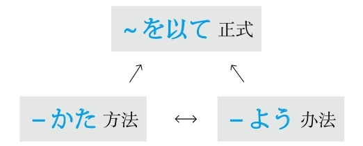

### 方面 #5_4_5_0_0
* [[ 日语语法新思维（修订版）_Menu_0.md | Menu #5_4_5_0_0 ]]

#### ～上で #5_4_5_1_0
* [[ 日语语法新思维（修订版）_Menu_0.md | Menu #5_4_5_1_0 ]]

**解释：** 「<ruby>上<rp>(</rp><rt>うえ</rt><rp>)</rp></ruby>」的意思是“上面”；「で」表示范围（面）
**意思：** 在～上
**接续：** 动词的原形

例句：<ruby>適<rp>(</rp><rt>てき</rt><rp>)</rp></ruby><ruby>当<rp>(</rp><rt>とう</rt><rp>)</rp></ruby>な<ruby>運<rp>(</rp><rt>うん</rt><rp>)</rp></ruby><ruby>動<rp>(</rp><rt>どう</rt><rp>)</rp></ruby>をするのは、<ruby>健<rp>(</rp><rt>けん</rt><rp>)</rp></ruby><ruby>康<rp>(</rp><rt>こう</rt><rp>)</rp></ruby>と<ruby>美<rp>(</rp><rt>び</rt><rp>)</rp></ruby><ruby>容<rp>(</rp><rt>よう</rt><rp>)</rp></ruby>を<ruby>保<rp>(</rp><rt>たも</rt><rp>)</rp></ruby>つ**<ruby>上<rp>(</rp><rt>うえ</rt><rp>)</rp></ruby>で** <ruby>大<rp>(</rp><rt>たい</rt><rp>)</rp></ruby><ruby>切<rp>(</rp><rt>せつ</rt><rp>)</rp></ruby>な<ruby>一<rp>(</rp><rt>いっ</rt><rp>)</rp></ruby><ruby>環<rp>(</rp><rt>かん</rt><rp>)</rp></ruby>だと<ruby>見<rp>(</rp><rt>み</rt><rp>)</rp></ruby>られる。
直译：做适当的运动，在保持健康和美容上，被看作是重要的一环。
意译：适当的运动在保持健康和美容方面被看作是重要的一环。

#### ～点で #5_4_5_2_0
* [[ 日语语法新思维（修订版）_Menu_0.md | Menu #5_4_5_2_0 ]]

**解释：** 「<ruby>点<rp>(</rp><rt>てん</rt><rp>)</rp></ruby>」表示“点”；「で」表示范围
**意思：** 在～点上
**接续：** 修饰名词的规律（参照第一章的第三节）

例句：あの<ruby>二人<rp>(</rp><rt>ふたり</rt><rp>)</rp></ruby>はせっかちだという**<ruby>点<rp>(</rp><rt>てん</rt><rp>)</rp></ruby>で** は<ruby>共<rp>(</rp><rt>きょう</rt><rp>)</rp></ruby><ruby>通<rp>(</rp><rt>つう</rt><rp>)</rp></ruby>している。
直译：那两个人，在性急这点上，共通。
意译：那两个人都性急。

#### ～において #5_4_5_3_0
* [[ 日语语法新思维（修订版）_Menu_0.md | Menu #5_4_5_3_0 ]]

**解释：** 「に」表示方向；「おいて」是自动词「<ruby>於<rp>(</rp><rt>お</rt><rp>)</rp></ruby>く」的中顿形式，意思是“于”
**意思：** 于～
**语气：** 正式
**接续：** 时间、地点、状况、团体等名词

例句：どんな<ruby>時<rp>(</rp><rt>じ</rt><rp>)</rp></ruby><ruby>代<rp>(</rp><rt>だい</rt><rp>)</rp></ruby>**において** も、<ruby>老<rp>(</rp><rt>ろう</rt><rp>)</rp></ruby><ruby>人<rp>(</rp><rt>じん</rt><rp>)</rp></ruby>を<ruby>労<rp>(</rp><rt>いた</rt><rp>)</rp></ruby>わる<ruby>気<rp>(</rp><rt>き</rt><rp>)</rp></ruby><ruby>持<rp>(</rp><rt>も</rt><rp>)</rp></ruby>ちを<ruby>忘<rp>(</rp><rt>わす</rt><rp>)</rp></ruby>れてはならない。
直译：不管在什么样的时代，关心老人的心情忘了不成。
意译：不管是什么时代都不能忘记关心老人。

#### ～にかけては #5_4_5_4_0
* [[ 日语语法新思维（修订版）_Menu_0.md | Menu #5_4_5_4_0 ]]

**解释：** 「に」表示方向；「かけて」是他动词「かける」的中顿形式，意思是“大面积地覆盖”；「は」表示对比性强调
**意思：** 在～方面
**注意：** 用于相比其他方面，在某方面特别突出；「は」不能省略
**接续：** 名词

例句：<ruby>彼<rp>(</rp><rt>かれ</rt><rp>)</rp></ruby>は<ruby>経<rp>(</rp><rt>けい</rt><rp>)</rp></ruby><ruby>営<rp>(</rp><rt>えい</rt><rp>)</rp></ruby>**にかけては** <ruby>優<rp>(</rp><rt>すぐ</rt><rp>)</rp></ruby>れた<ruby>才<rp>(</rp><rt>さい</rt><rp>)</rp></ruby><ruby>能<rp>(</rp><rt>のう</rt><rp>)</rp></ruby>を<ruby>発<rp>(</rp><rt>はっ</rt><rp>)</rp></ruby><ruby>揮<rp>(</rp><rt>き</rt><rp>)</rp></ruby>している。
直译：他在经营方面，发挥着优秀的才能。
意译：他在经营方面发挥着杰出的才能。
语法关系图
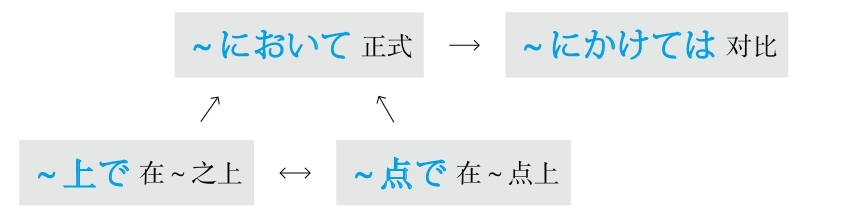

### 符合 #5_4_6_0_0
* [[ 日语语法新思维（修订版）_Menu_0.md | Menu #5_4_6_0_0 ]]

#### ～だけ #5_4_6_1_0
* [[ 日语语法新思维（修订版）_Menu_0.md | Menu #5_4_6_1_0 ]]

**解释：** 助词「だけ」表示多、中、少三个数量段；此处表示相应或符合，可以理解为“＝”

例句：くたびれて、お<ruby>風<rp>(</rp><rt>ふ</rt><rp>)</rp></ruby><ruby>呂<rp>(</rp><rt>ろ</rt><rp>)</rp></ruby>に<ruby>入<rp>(</rp><rt>はい</rt><rp>)</rp></ruby>る**だけ** の<ruby>元<rp>(</rp><rt>げん</rt><rp>)</rp></ruby><ruby>気<rp>(</rp><rt>き</rt><rp>)</rp></ruby>も<ruby>出<rp>(</rp><rt>で</rt><rp>)</rp></ruby>ない。
直译：累死了，与洗澡相应的力气都不出。
意译：累死了，连洗澡的力气都没有了。

#### ～だけあって #5_4_6_2_0
* [[ 日语语法新思维（修订版）_Menu_0.md | Menu #5_4_6_2_0 ]]

**解释：** 「だけ」在此表示“相应、符合”，可以把它看作是“＝”；「あって」是「<ruby>有<rp>(</rp><rt>あ</rt><rp>)</rp></ruby>る」的中顿形式
**直译：** 不愧有符合于～的～
**意译：** 不愧是～
**注意：** 常与「さすがに」搭配；「だけ」和「あって」之间还可以接名词
**语气：** 正式
**接续：** 动词和形容词的原形、形容动词和名词

例句：さすがに<ruby>専<rp>(</rp><rt>せん</rt><rp>)</rp></ruby><ruby>門<rp>(</rp><rt>もん</rt><rp>)</rp></ruby><ruby>家<rp>(</rp><rt>か</rt><rp>)</rp></ruby>**だけ（の<ruby>素<rp>(</rp><rt>そ</rt><rp>)</rp></ruby><ruby>質<rp>(</rp><rt>しつ</rt><rp>)</rp></ruby>が）** **あって**、<ruby>見<rp>(</rp><rt>み</rt><rp>)</rp></ruby><ruby>方<rp>(</rp><rt>かた</rt><rp>)</rp></ruby>が<ruby>鋭<rp>(</rp><rt>するど</rt><rp>)</rp></ruby>いね。
直译：不愧有符合专家的东西，看法敏锐。
意译：不愧是专家，看法真敏锐。

#### －たる #5_4_6_3_0
* [[ 日语语法新思维（修订版）_Menu_0.md | Menu #5_4_6_3_0 ]]

**解释：** 「たる」的汉字是「<ruby>足<rp>(</rp><rt>た</rt><rp>)</rp></ruby>る」；或者可以理解为是「とある」的音变，意思是“有”
**直译：** 足于～、相当于～
**意译：** 是，可以理解为“＝”
**语气：** 正式
**接续：** 前后接名词

例句：<ruby>教<rp>(</rp><rt>きょう</rt><rp>)</rp></ruby><ruby>師<rp>(</rp><rt>し</rt><rp>)</rp></ruby>**たる** <ruby>者<rp>(</rp><rt>もの</rt><rp>)</rp></ruby>は、<ruby>常<rp>(</rp><rt>つね</rt><rp>)</rp></ruby>に<ruby>知<rp>(</rp><rt>ち</rt><rp>)</rp></ruby><ruby>識<rp>(</rp><rt>しき</rt><rp>)</rp></ruby>を<ruby>追<rp>(</rp><rt>つい</rt><rp>)</rp></ruby><ruby>求<rp>(</rp><rt>きゅう</rt><rp>)</rp></ruby>しなければならない。
直译：等于教师之者，如果不经常追求知识不成。
意译：作为教师不经常求知是不行的。

#### －なり #5_4_6_4_0
* [[ 日语语法新思维（修订版）_Menu_0.md | Menu #5_4_6_4_0 ]]

**解释：** 「なり」在古语当中是表示断定的「<ruby>也<rp>(</rp><rt>なり</rt><rp>)</rp></ruby>」，意思是“是”
**直译：** 是～
**意译：** 按照～自身的方式
**注意：** 在此作名词使用
**接续：** 名词

例句：<ruby>私<rp>(</rp><rt>わたし</rt><rp>)</rp></ruby>は<ruby>自<rp>(</rp><rt>じ</rt><rp>)</rp></ruby><ruby>分<rp>(</rp><rt>ぶん</rt><rp>)</rp></ruby>**なり** の<ruby>考<rp>(</rp><rt>かんが</rt><rp>)</rp></ruby>えを<ruby>申<rp>(</rp><rt>もう</rt><rp>)</rp></ruby>し<ruby>上<rp>(</rp><rt>あ</rt><rp>)</rp></ruby>げただけです。
直译：我只不过陈述了是我自己的想法。
意译：我只不过陈述了自己的想法。

例句：<ruby>子<rp>(</rp><rt>こ</rt><rp>)</rp></ruby><ruby>供<rp>(</rp><rt>ども</rt><rp>)</rp></ruby>は<ruby>子<rp>(</rp><rt>こ</rt><rp>)</rp></ruby><ruby>供<rp>(</rp><rt>ども</rt><rp>)</rp></ruby>**なり** に<ruby>自<rp>(</rp><rt>じ</rt><rp>)</rp></ruby><ruby>分<rp>(</rp><rt>ぶん</rt><rp>)</rp></ruby>の<ruby>世<rp>(</rp><rt>せ</rt><rp>)</rp></ruby><ruby>界<rp>(</rp><rt>かい</rt><rp>)</rp></ruby>を<ruby>持<rp>(</rp><rt>も</rt><rp>)</rp></ruby>っている。
直译：孩子们按照自己的方式，拥有着自己的世界。
意译：孩子们拥有自己的世界。
语法关系图
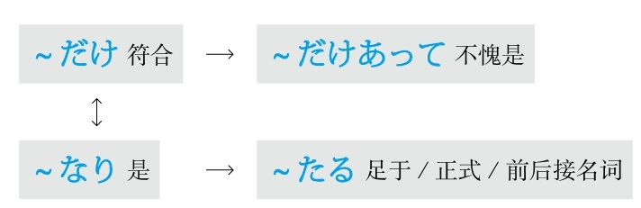

## G #5_5_0_0_0
* [[ 日语语法新思维（修订版）_Menu_0.md | Menu #5_5_0_0_0 ]]

### 感叹 #5_5_1_0_0
* [[ 日语语法新思维（修订版）_Menu_0.md | Menu #5_5_1_0_0 ]]

#### なんと～ #5_5_1_1_0
* [[ 日语语法新思维（修订版）_Menu_0.md | Menu #5_5_1_1_0 ]]

**解释：** 「なん」的意思是“什么”；「と」表示说的内容
**直译：** 说什么好啊
**意译：** 多么～啊
**接续：** 任何词

例句：モノレールができるから、**なんと** <ruby>便<rp>(</rp><rt>べん</rt><rp>)</rp></ruby><ruby>利<rp>(</rp><rt>り</rt><rp>)</rp></ruby>になるのかわからない。
直译：因为要建单轨电车了，所以不知道会变得多么方便啊。
意译：要建单轨电车了，不知道会变得多么方便啊。

例句：**なんと** <ruby>綺<rp>(</rp><rt>き</rt><rp>)</rp></ruby><ruby>麗<rp>(</rp><rt>れい</rt><rp>)</rp></ruby>な<ruby>人<rp>(</rp><rt>ひと</rt><rp>)</rp></ruby>。
直译：说什么好啊，漂亮的人啊。
意译：多么漂亮的人啊！

#### どんなに～だろう #5_5_1_2_0
* [[ 日语语法新思维（修订版）_Menu_0.md | Menu #5_5_1_2_0 ]]

**解释：** 「どんなに」的意思是“多么地”；「だろう」是「でしょう」的简体，表示推测
**意思：** 多么～啊
**用于：** 将来的事项
**接续：** 动词和形容词的原形、形容动词和名词

例句：<ruby>日<rp>(</rp><rt>に</rt><rp>)</rp></ruby><ruby>本<rp>(</rp><rt>ほん</rt><rp>)</rp></ruby><ruby>語<rp>(</rp><rt>ご</rt><rp>)</rp></ruby>がぺらぺらに<ruby>話<rp>(</rp><rt>はな</rt><rp>)</rp></ruby>せるようになったら、**どんなに** <ruby>楽<rp>(</rp><rt>たの</rt><rp>)</rp></ruby>しいこと**だろう** 。
直译：日语变得能够说流利了的话，该是多么高兴的事啊。
意译：如果日语能说流利了，该是多么高兴的事啊。

#### －もがな #5_5_1_3_0
* [[ 日语语法新思维（修订版）_Menu_0.md | Menu #5_5_1_3_0 ]]

**解释：** 「も」表示强调；「が」是古语中起连接作用的助词；「な」是表示感叹“太好了”的「いいなあ」的省略
**意思：** 要是～该有多好啊
**语气：** 后悔
**接续：** 前面接动词的否定形「ず」，后面接「の」
**常用：** 「言わずもがな」（不说就好了、不用说）；「やらずもがな」（不做就好了、不给予就好了）；「あらずもがな」（没有就好了）；「なくもがな」（没有就好了）；「<ruby>由<rp>(</rp><rt>よし</rt><rp>)</rp></ruby>もがな」（如果有办法就好了）

例句：やらず**もがな** のことをしてしまって<ruby>後<rp>(</rp><rt>こう</rt><rp>)</rp></ruby><ruby>悔<rp>(</rp><rt>かい</rt><rp>)</rp></ruby>しています。
直译：做了不做就好了的事，很后悔。
意译：做了不该做的事，很后悔。
语法关系图
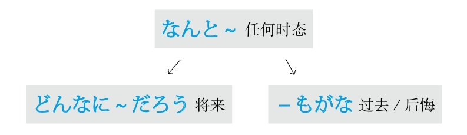

### 刚～ #5_5_2_0_0
* [[ 日语语法新思维（修订版）_Menu_0.md | Menu #5_5_2_0_0 ]]

#### －かける #5_5_2_1_0
* [[ 日语语法新思维（修订版）_Menu_0.md | Menu #5_5_2_1_0 ]]

**解释：** 「かける」表示“大面积地覆盖”
**意思：** 开始了某事但是还没有结束，还在进行当中
**接续：** 动词的连用形

例句：このおかずは<ruby>腐<rp>(</rp><rt>くさ</rt><rp>)</rp></ruby>り**かけて** いる。
直译：这盘菜开始坏了。
意译：这盘菜要坏了。

例句：<ruby>食<rp>(</rp><rt>しょく</rt><rp>)</rp></ruby><ruby>卓<rp>(</rp><rt>たく</rt><rp>)</rp></ruby>には<ruby>食<rp>(</rp><rt>た</rt><rp>)</rp></ruby>べ**かけ** のパンが<ruby>置<rp>(</rp><rt>お</rt><rp>)</rp></ruby>いてある。
直译：饭桌上，放着开始吃的但是没有吃完的面包。
意译：饭桌上放着没吃完的面包。

### 根据，按照 #5_5_3_0_0
* [[ 日语语法新思维（修订版）_Menu_0.md | Menu #5_5_3_0_0 ]]

#### ～をもとに #5_5_3_1_0
* [[ 日语语法新思维（修订版）_Menu_0.md | Menu #5_5_3_1_0 ]]

**注意：** 应用了日语里的经典句型「～を～と（に）する（把～当成～）」
**解释：** 「<ruby>元<rp>(</rp><rt>もと</rt><rp>)</rp></ruby>、<ruby>本<rp>(</rp><rt>もと</rt><rp>)</rp></ruby>」的意思是“根本”
**意思：** 以～为根本
**接续：** 名词

例句：このドラマは<ruby>事<rp>(</rp><rt>じ</rt><rp>)</rp></ruby><ruby>実<rp>(</rp><rt>じつ</rt><rp>)</rp></ruby>**をもとに** <ruby>作<rp>(</rp><rt>つく</rt><rp>)</rp></ruby>られたものだ。
直译：这个电视剧是根据事实被创作的东西。
意译：这个电视剧是根据事实创作的。

#### ～に基づいて #5_5_3_2_0
* [[ 日语语法新思维（修订版）_Menu_0.md | Menu #5_5_3_2_0 ]]

**解释：** 「に」表示方向；「<ruby>基<rp>(</rp><rt>もと</rt><rp>)</rp></ruby>づいて」是自动词「<ruby>基<rp>(</rp><rt>もと</rt><rp>)</rp></ruby>づく」的中顿形式，「<ruby>基<rp>(</rp><rt>もと</rt><rp>)</rp></ruby>づく」是「もと＋<ruby>付<rp>(</rp><rt>つ</rt><rp>)</rp></ruby>く」的组合，意思是“附着在根本上”
**意思：** 基于～
**接续：** 名词

例句：<ruby>彼<rp>(</rp><rt>かれ</rt><rp>)</rp></ruby>の<ruby>助<rp>(</rp><rt>じょ</rt><rp>)</rp></ruby><ruby>言<rp>(</rp><rt>げん</rt><rp>)</rp></ruby>は<ruby>長<rp>(</rp><rt>なが</rt><rp>)</rp></ruby><ruby>年<rp>(</rp><rt>ねん</rt><rp>)</rp></ruby>の<ruby>経<rp>(</rp><rt>けい</rt><rp>)</rp></ruby><ruby>験<rp>(</rp><rt>けん</rt><rp>)</rp></ruby>**に<ruby>基<rp>(</rp><rt>もと</rt><rp>)</rp></ruby>づいて** <ruby>出<rp>(</rp><rt>だ</rt><rp>)</rp></ruby>されたものだから、<ruby>納<rp>(</rp><rt>なっ</rt><rp>)</rp></ruby><ruby>得<rp>(</rp><rt>とく</rt><rp>)</rp></ruby>できる。
直译：他的指教是基于长年的经验被提出的东西，能够心服口服。
意译：他的指教是基于长年的经验（总结）的，能够让人心服口服。

#### ～を踏まえて #5_5_3_3_0
* [[ 日语语法新思维（修订版）_Menu_0.md | Menu #5_5_3_3_0 ]]

**解释：** 「を」接在他动词前表示“把”；「<ruby>踏<rp>(</rp><rt>ふ</rt><rp>)</rp></ruby>まえて」是他动词「<ruby>踏<rp>(</rp><rt>ふ</rt><rp>)</rp></ruby>まえる」的中顿形式，意思是“踏”
**意思：** 踏着～
**接续：** 名词
**区别：** 侧重于“根本”和“步骤”两方面

例句：<ruby>昨<rp>(</rp><rt>さく</rt><rp>)</rp></ruby><ruby>年<rp>(</rp><rt>ねん</rt><rp>)</rp></ruby>の<ruby>反<rp>(</rp><rt>はん</rt><rp>)</rp></ruby><ruby>省<rp>(</rp><rt>せい</rt><rp>)</rp></ruby>**を<ruby>踏<rp>(</rp><rt>ふ</rt><rp>)</rp></ruby>まえて** 、<ruby>今<rp>(</rp><rt>こん</rt><rp>)</rp></ruby><ruby>後<rp>(</rp><rt>ご</rt><rp>)</rp></ruby>の<ruby>計<rp>(</rp><rt>けい</rt><rp>)</rp></ruby><ruby>画<rp>(</rp><rt>かく</rt><rp>)</rp></ruby>を<ruby>立<rp>(</rp><rt>た</rt><rp>)</rp></ruby>てたい。
直译：踏着去年的反省，想制订今后的计划。
意译：我们想根据去年的反省（结果）制订今后的计划。

#### ～に応じて #5_5_3_4_0
* [[ 日语语法新思维（修订版）_Menu_0.md | Menu #5_5_3_4_0 ]]

**解释：** 「に」表示方向；「<ruby>応<rp>(</rp><rt>おう</rt><rp>)</rp></ruby>じて」是自动词「<ruby>応<rp>(</rp><rt>おう</rt><rp>)</rp></ruby>じる」的中顿形式，意思是“相应、对应”
**意思：** 与～相对应
**接续：** 名词

例句：<ruby>実<rp>(</rp><rt>じっ</rt><rp>)</rp></ruby><ruby>際<rp>(</rp><rt>さい</rt><rp>)</rp></ruby>の<ruby>収<rp>(</rp><rt>しゅう</rt><rp>)</rp></ruby><ruby>入<rp>(</rp><rt>にゅう</rt><rp>)</rp></ruby>**に<ruby>応<rp>(</rp><rt>おう</rt><rp>)</rp></ruby>じて** 、<ruby>支<rp>(</rp><rt>し</rt><rp>)</rp></ruby><ruby>出<rp>(</rp><rt>しゅつ</rt><rp>)</rp></ruby>を<ruby>考<rp>(</rp><rt>かんが</rt><rp>)</rp></ruby>えなければいけない。
直译：与实际收入相对应，必须考虑支出。
意译：必须根据实际收入考虑支出。

#### ～によって #5_5_3_5_0
* [[ 日语语法新思维（修订版）_Menu_0.md | Menu #5_5_3_5_0 ]]

**解释：** 「に」表示方向或对象；「よって」是自动词「<ruby>由<rp>(</rp><rt>よ</rt><rp>)</rp></ruby>る」的中顿形式，意思是“根据～；由于～；由～来做～”
**意思：** 根据～
**接续：** 名词

例句：<ruby>中<rp>(</rp><rt>ちゅう</rt><rp>)</rp></ruby><ruby>国<rp>(</rp><rt>ごく</rt><rp>)</rp></ruby><ruby>語<rp>(</rp><rt>ご</rt><rp>)</rp></ruby>の<ruby>多<rp>(</rp><rt>た</rt><rp>)</rp></ruby><ruby>音<rp>(</rp><rt>おん</rt><rp>)</rp></ruby><ruby>字<rp>(</rp><rt>じ</rt><rp>)</rp></ruby>は、アクセントの<ruby>違<rp>(</rp><rt>ちが</rt><rp>)</rp></ruby>い**によって** <ruby>意<rp>(</rp><rt>い</rt><rp>)</rp></ruby><ruby>味<rp>(</rp><rt>み</rt><rp>)</rp></ruby>が<ruby>変<rp>(</rp><rt>か</rt><rp>)</rp></ruby>わるというものだ。
直译：汉语的多音字，根据声调的不同，意思会发生改变的东西。
意译：汉语的多音字根据声调的不同意思也不同。

#### ～通り #5_5_3_6_0
* [[ 日语语法新思维（修订版）_Menu_0.md | Menu #5_5_3_6_0 ]]

**解释：** 名词「<ruby>通<rp>(</rp><rt>とお</rt><rp>)</rp></ruby>り」的原意是“马路”；如果变为副词则加「に」
**注意：** 此语法起源于在马路上车辆按照顺序往前行驶这一现象，与某些名词可以直接接续构成复合名词，但是需要浊音化，比如「<ruby>説<rp>(</rp><rt>せつ</rt><rp>)</rp></ruby><ruby>明<rp>(</rp><rt>めい</rt><rp>)</rp></ruby><ruby>通<rp>(</rp><rt>どお</rt><rp>)</rp></ruby>り（按照说明）」
**意思：** 按照～
**着重：** 顺序或步骤
**接续：** 名词加の、动词的简体

例句：<ruby>先<rp>(</rp><rt>せん</rt><rp>)</rp></ruby><ruby>生<rp>(</rp><rt>せい</rt><rp>)</rp></ruby>のおっしゃる**<ruby>通<rp>(</rp><rt>とお</rt><rp>)</rp></ruby>り** です。
直译：按照老师您说的。
意译：老师您说的很对。

例句：<ruby>説<rp>(</rp><rt>せつ</rt><rp>)</rp></ruby><ruby>明<rp>(</rp><rt>めい</rt><rp>)</rp></ruby><ruby>書<rp>(</rp><rt>しょ</rt><rp>)</rp></ruby>の**<ruby>通<rp>(</rp><rt>とお</rt><rp>)</rp></ruby>り** に<ruby>操<rp>(</rp><rt>そう</rt><rp>)</rp></ruby><ruby>作<rp>(</rp><rt>さ</rt><rp>)</rp></ruby>してください。
直译：请按照说明书而那样地操作。
意译：请按照说明书操作。

#### ～に応えて #5_5_3_7_0
* [[ 日语语法新思维（修订版）_Menu_0.md | Menu #5_5_3_7_0 ]]

**解释：** 「に」表示方向或对象；「<ruby>応<rp>(</rp><rt>こた</rt><rp>)</rp></ruby>えて」是自动词「<ruby>応<rp>(</rp><rt>こた</rt><rp>)</rp></ruby>える」的中顿形式，意思是“回应”
**意思：** 按照～
**着重：** 与～相回应
**接续：** 「<ruby>声<rp>(</rp><rt>こえ</rt><rp>)</rp></ruby>、<ruby>要<rp>(</rp><rt>よう</rt><rp>)</rp></ruby><ruby>望<rp>(</rp><rt>ぼう</rt><rp>)</rp></ruby>、<ruby>希<rp>(</rp><rt>き</rt><rp>)</rp></ruby><ruby>望<rp>(</rp><rt>ぼう</rt><rp>)</rp></ruby>」等名词

例句：<ruby>学<rp>(</rp><rt>がく</rt><rp>)</rp></ruby><ruby>生<rp>(</rp><rt>せい</rt><rp>)</rp></ruby>の<ruby>声<rp>(</rp><rt>こえ</rt><rp>)</rp></ruby>**に<ruby>応<rp>(</rp><rt>こた</rt><rp>)</rp></ruby>えて** <ruby>教<rp>(</rp><rt>おし</rt><rp>)</rp></ruby>え<ruby>方<rp>(</rp><rt>かた</rt><rp>)</rp></ruby>を<ruby>変<rp>(</rp><rt>か</rt><rp>)</rp></ruby>えた。
直译：按照学生的呼声，改变了教学方法。
意译：根据学生的要求改变了教学方法。

#### ～に即して #5_5_3_8_0
* [[ 日语语法新思维（修订版）_Menu_0.md | Menu #5_5_3_8_0 ]]

**解释：** 「に」表示方向或对象；「<ruby>即<rp>(</rp><rt>そく</rt><rp>)</rp></ruby>して」是自动词「<ruby>即<rp>(</rp><rt>そく</rt><rp>)</rp></ruby>する」的中顿形式，是从「<ruby>即<rp>(</rp><rt>そく</rt><rp>)</rp></ruby><ruby>応<rp>(</rp><rt>おう</rt><rp>)</rp></ruby>する」演变而来的
**意思：** 与～相对应
**着重：** 百分之百一样
**语气：** 正式
**接续：** 前面接名词，后面接动词；如果后面接名词要用「～に<ruby>即<rp>(</rp><rt>そく</rt><rp>)</rp></ruby>した」的形式

例句：<ruby>実<rp>(</rp><rt>じつ</rt><rp>)</rp></ruby><ruby>情<rp>(</rp><rt>じょう</rt><rp>)</rp></ruby>**に<ruby>即<rp>(</rp><rt>そく</rt><rp>)</rp></ruby>して** <ruby>対<rp>(</rp><rt>たい</rt><rp>)</rp></ruby><ruby>応<rp>(</rp><rt>おう</rt><rp>)</rp></ruby><ruby>策<rp>(</rp><rt>さく</rt><rp>)</rp></ruby>を<ruby>検<rp>(</rp><rt>けん</rt><rp>)</rp></ruby><ruby>討<rp>(</rp><rt>とう</rt><rp>)</rp></ruby>したい。
直译：想与实际情况相对应，研究对策。
意译：想根据实际情况研究对策。

#### ～なりに #5_5_3_9_0
* [[ 日语语法新思维（修订版）_Menu_0.md | Menu #5_5_3_9_0 ]]

**解释：** 「なり」在古语当中是表示断定的「<ruby>也<rp>(</rp><rt>なり</rt><rp>)</rp></ruby>」，意思是“是”；「に」表示副词
**直译：** 是～
**意译：** 按照～自身的方式
**接续：** 名词

例句：わたしはわたし**なりに** <ruby>生<rp>(</rp><rt>い</rt><rp>)</rp></ruby>きていきたい。
直译：我想按照自己的方式活下去。
意译：我想按照自己的方式生活。

#### －次第 #5_5_3_10_0
* [[ 日语语法新思维（修订版）_Menu_0.md | Menu #5_5_3_10_0 ]]

**解释：** 「<ruby>次<rp>(</rp><rt>つぎ</rt><rp>)</rp></ruby>」的意思是“下一个”；「<ruby>第<rp>(</rp><rt>だい</rt><rp>)</rp></ruby>」的意思是“第二个”；「<ruby>次<rp>(</rp><rt>し</rt><rp>)</rp></ruby><ruby>第<rp>(</rp><rt>だい</rt><rp>)</rp></ruby>」的意思是“下一步”
**意思：** 根据～下一步马上就～
**语气：** 正式
**接续：** 名词、动词的连用形

例句：<ruby>条<rp>(</rp><rt>じょう</rt><rp>)</rp></ruby><ruby>件<rp>(</rp><rt>けん</rt><rp>)</rp></ruby>**<ruby>次<rp>(</rp><rt>し</rt><rp>)</rp></ruby><ruby>第<rp>(</rp><rt>だい</rt><rp>)</rp></ruby>** では<ruby>売<rp>(</rp><rt>う</rt><rp>)</rp></ruby>らないことはない。
直译：条件好的话，下一步，没有不卖的事情。
意译：根据条件如何有可能出售。

#### ～に沿って #5_5_3_11_0
* [[ 日语语法新思维（修订版）_Menu_0.md | Menu #5_5_3_11_0 ]]

**解释：** 「に」表示方向或对象；「<ruby>沿<rp>(</rp><rt>そ</rt><rp>)</rp></ruby>って」是自动词「<ruby>沿<rp>(</rp><rt>そ</rt><rp>)</rp></ruby>う」的中顿形式
**直译：** 沿着～
**意译：** 按照～
**着重：** 步骤
**接续：** 名词

例句：<ruby>容<rp>(</rp><rt>よう</rt><rp>)</rp></ruby><ruby>器<rp>(</rp><rt>き</rt><rp>)</rp></ruby>リサイクル<ruby>法<rp>(</rp><rt>ほう</rt><rp>)</rp></ruby>は、<ruby>地<rp>(</rp><rt>ち</rt><rp>)</rp></ruby><ruby>域<rp>(</rp><rt>いき</rt><rp>)</rp></ruby>の<ruby>実<rp>(</rp><rt>じつ</rt><rp>)</rp></ruby><ruby>情<rp>(</rp><rt>じょう</rt><rp>)</rp></ruby>**に<ruby>沿<rp>(</rp><rt>そ</rt><rp>)</rp></ruby>って** <ruby>行<rp>(</rp><rt>おこな</rt><rp>)</rp></ruby>わなければならない。
直译：容器再利用法，沿着地区的实情，如果不执行就不成。
意译：容器再利用法必须按照各个地区的实际情况实施。
语法关系图
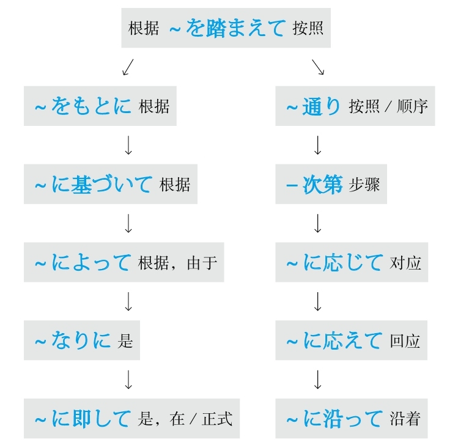

### 关于，对于 #5_5_4_0_0
* [[ 日语语法新思维（修订版）_Menu_0.md | Menu #5_5_4_0_0 ]]

#### ～に関して #5_5_4_1_0
* [[ 日语语法新思维（修订版）_Menu_0.md | Menu #5_5_4_1_0 ]]

**解释：** 「に」表示方向或对象；「<ruby>関<rp>(</rp><rt>かん</rt><rp>)</rp></ruby>して」是自动词「<ruby>関<rp>(</rp><rt>かん</rt><rp>)</rp></ruby>する」的中顿形式
**意思：** 关于～
**接续：** 名词

例句：<ruby>外<rp>(</rp><rt>がい</rt><rp>)</rp></ruby><ruby>国<rp>(</rp><rt>こく</rt><rp>)</rp></ruby>の<ruby>言<rp>(</rp><rt>こと</rt><rp>)</rp></ruby><ruby>葉<rp>(</rp><rt>ば</rt><rp>)</rp></ruby>を<ruby>習<rp>(</rp><rt>なら</rt><rp>)</rp></ruby>う<ruby>時<rp>(</rp><rt>とき</rt><rp>)</rp></ruby>、その<ruby>国<rp>(</rp><rt>くに</rt><rp>)</rp></ruby>の<ruby>文<rp>(</rp><rt>ぶん</rt><rp>)</rp></ruby><ruby>化<rp>(</rp><rt>か</rt><rp>)</rp></ruby>や<ruby>習<rp>(</rp><rt>しゅう</rt><rp>)</rp></ruby><ruby>慣<rp>(</rp><rt>かん</rt><rp>)</rp></ruby>**に<ruby>関<rp>(</rp><rt>かん</rt><rp>)</rp></ruby>して** も<ruby>知<rp>(</rp><rt>し</rt><rp>)</rp></ruby>ったほうがいい。
直译：学外语的时候，关于那个国家的文化和习惯，知道最好。
意译：学外语的时候，最好知道那个国家的文化和习惯。

[[ 日语语法新思维（修订版）_Detail_3.md | [Next_Page] ]]
