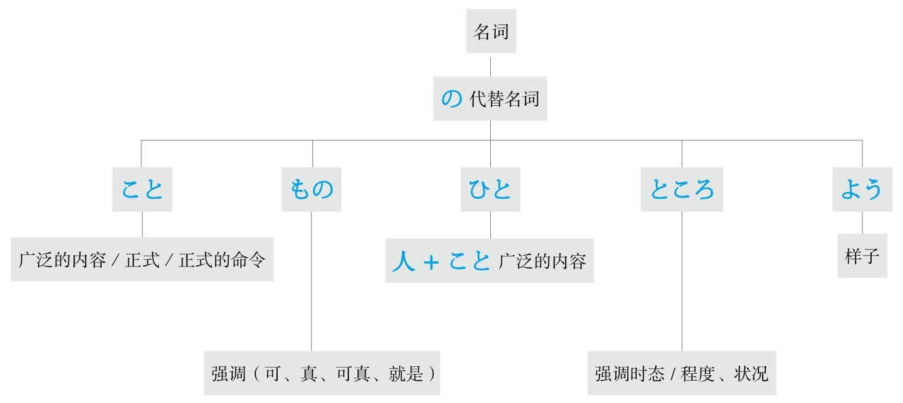
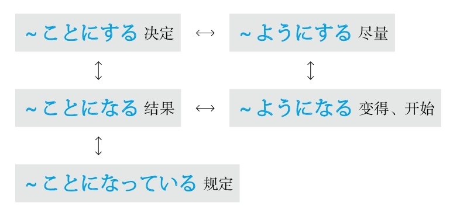
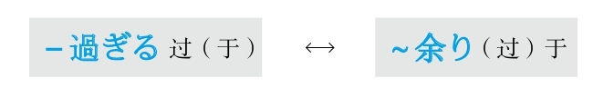

[[ 日语语法新思维（修订版）_Detail_2.md | [Prev_Page] ]]
#### ～にかかわる #5_5_4_2_0
* [[ 日语语法新思维（修订版）_Menu_0.md | Menu #5_5_4_2_0 ]]

**解释：** 「に」表示方向或对象；「<ruby>関<rp>(</rp><rt>かか</rt><rp>)</rp></ruby>わる」的意思是“有关系”
**意思：** 与～有关
**语气：** 正式
**接续：** 名词

例句：これは<ruby>名<rp>(</rp><rt>めい</rt><rp>)</rp></ruby><ruby>誉<rp>(</rp><rt>よ</rt><rp>)</rp></ruby>**にかかわる** <ruby>問<rp>(</rp><rt>もん</rt><rp>)</rp></ruby><ruby>題<rp>(</rp><rt>だい</rt><rp>)</rp></ruby>だから、<ruby>誰<rp>(</rp><rt>だれ</rt><rp>)</rp></ruby>だって<ruby>真<rp>(</rp><rt>しん</rt><rp>)</rp></ruby><ruby>剣<rp>(</rp><rt>けん</rt><rp>)</rp></ruby>になる。
直译：这是与名誉有关的问题，谁都会认真。
意译：这是有关名誉的问题，谁都会认真对待。

#### ～に対して #5_5_4_3_0
* [[ 日语语法新思维（修订版）_Menu_0.md | Menu #5_5_4_3_0 ]]

**解释：** 「に」表示对象；「<ruby>対<rp>(</rp><rt>たい</rt><rp>)</rp></ruby>して」是自动词「<ruby>対<rp>(</rp><rt>たい</rt><rp>)</rp></ruby>する」的中顿形式，意思是“对象；对比”
**意思：** 对于～、与～相对比，在此是前者
**接续：** 名词

例句：サービス<ruby>業<rp>(</rp><rt>ぎょう</rt><rp>)</rp></ruby>なので、お<ruby>客<rp>(</rp><rt>きゃく</rt><rp>)</rp></ruby>さん**に<ruby>対<rp>(</rp><rt>たい</rt><rp>)</rp></ruby>して** <ruby>失<rp>(</rp><rt>しつ</rt><rp>)</rp></ruby><ruby>礼<rp>(</rp><rt>れい</rt><rp>)</rp></ruby>な<ruby>態<rp>(</rp><rt>たい</rt><rp>)</rp></ruby><ruby>度<rp>(</rp><rt>ど</rt><rp>)</rp></ruby>を<ruby>取<rp>(</rp><rt>と</rt><rp>)</rp></ruby>ってはいけない。
直译：因为是服务行业，对客人，失礼的态度采取不行。
意译：因为是服务行业，所以不能对客人采取失礼的态度。

#### ～に向かって #5_5_4_4_0
* [[ 日语语法新思维（修订版）_Menu_0.md | Menu #5_5_4_4_0 ]]

**解释：** 「に」表示“方向、对象、目的、目标”；「<ruby>向<rp>(</rp><rt>む</rt><rp>)</rp></ruby>かって」是自动词「<ruby>向<rp>(</rp><rt>む</rt><rp>)</rp></ruby>かう」的中顿形式，意思是“朝向”
**意思：** 朝着～
**接续：** 名词

例句：<ruby>東<rp>(</rp><rt>ひがし</rt><rp>)</rp></ruby>**に<ruby>向<rp>(</rp><rt>む</rt><rp>)</rp></ruby>かって** まっすぐ<ruby>行<rp>(</rp><rt>い</rt><rp>)</rp></ruby>ってください。
直译：朝东，请一直走。
意译：请朝东一直走。

例句：<ruby>先<rp>(</rp><rt>せん</rt><rp>)</rp></ruby><ruby>生<rp>(</rp><rt>せい</rt><rp>)</rp></ruby>**に<ruby>向<rp>(</rp><rt>む</rt><rp>)</rp></ruby>かって** <ruby>何<rp>(</rp><rt>なん</rt><rp>)</rp></ruby>ってことを<ruby>言<rp>(</rp><rt>い</rt><rp>)</rp></ruby>うの？
直译：朝老师，什么话说？
意译：怎么这么对老师说话？

例句：<ruby>目<rp>(</rp><rt>もく</rt><rp>)</rp></ruby><ruby>標<rp>(</rp><rt>ひょう</rt><rp>)</rp></ruby>**に<ruby>向<rp>(</rp><rt>む</rt><rp>)</rp></ruby>かって** <ruby>頑<rp>(</rp><rt>がん</rt><rp>)</rp></ruby><ruby>張<rp>(</rp><rt>ば</rt><rp>)</rp></ruby>りましょう。
直译：朝着目标，加油吧。
意译：朝着目标努力吧。

#### ～にとって #5_5_4_5_0
* [[ 日语语法新思维（修订版）_Menu_0.md | Menu #5_5_4_5_0 ]]

**解释：** 「に」表示对象；「とって」通常不用动词原形，只用て形
**意思：** 对～来说
**接续：** 名词

例句：<ruby>環<rp>(</rp><rt>かん</rt><rp>)</rp></ruby><ruby>境<rp>(</rp><rt>きょう</rt><rp>)</rp></ruby><ruby>保<rp>(</rp><rt>ほ</rt><rp>)</rp></ruby><ruby>護<rp>(</rp><rt>ご</rt><rp>)</rp></ruby>はすべての<ruby>人<rp>(</rp><rt>ひと</rt><rp>)</rp></ruby>**にとって** <ruby>意<rp>(</rp><rt>い</rt><rp>)</rp></ruby><ruby>識<rp>(</rp><rt>しき</rt><rp>)</rp></ruby>に<ruby>昇<rp>(</rp><rt>のぼ</rt><rp>)</rp></ruby>らなくてはならない<ruby>重<rp>(</rp><rt>じゅう</rt><rp>)</rp></ruby><ruby>要<rp>(</rp><rt>よう</rt><rp>)</rp></ruby>な<ruby>課<rp>(</rp><rt>か</rt><rp>)</rp></ruby><ruby>題<rp>(</rp><rt>だい</rt><rp>)</rp></ruby>だ。
直译：保护环境，对于所有人来说，是不上升到意识不成的重要的课题。
意译：对于所有人来说，保护环境是必须上升到意识（层面）的重要课题。

#### ～について #5_5_4_6_0
* [[ 日语语法新思维（修订版）_Menu_0.md | Menu #5_5_4_6_0 ]]

**解释：** 「に」表示对象；「ついて」是自动词「<ruby>就<rp>(</rp><rt>つ</rt><rp>)</rp></ruby>く」的中顿形式
**意思：** 就～进行～
**注意：** 因为侧重于“就～”，所以后面通常用「<ruby>発<rp>(</rp><rt>はっ</rt><rp>)</rp></ruby><ruby>表<rp>(</rp><rt>ぴょう</rt><rp>)</rp></ruby>する、<ruby>考<rp>(</rp><rt>かんが</rt><rp>)</rp></ruby>える、<ruby>紹<rp>(</rp><rt>しょう</rt><rp>)</rp></ruby><ruby>介<rp>(</rp><rt>かい</rt><rp>)</rp></ruby>する」等能够搭配的动词
**接续：** 名词

例句：わが<ruby>社<rp>(</rp><rt>しゃ</rt><rp>)</rp></ruby>の<ruby>新<rp>(</rp><rt>しん</rt><rp>)</rp></ruby><ruby>製<rp>(</rp><rt>せい</rt><rp>)</rp></ruby><ruby>品<rp>(</rp><rt>ひん</rt><rp>)</rp></ruby>**について** ご<ruby>紹<rp>(</rp><rt>しょう</rt><rp>)</rp></ruby><ruby>介<rp>(</rp><rt>かい</rt><rp>)</rp></ruby>します。
直译：就我们公司的新产品，我来进行介绍。
意译：我来介绍一下我们公司的新产品。

#### ～をめぐって #5_5_4_7_0
* [[ 日语语法新思维（修订版）_Menu_0.md | Menu #5_5_4_7_0 ]]

**解释：** 「を」用于自动词前表示“移动”；「めぐって」是自动词「<ruby>巡<rp>(</rp><rt>めぐ</rt><rp>)</rp></ruby>る」的中顿形式，意思是“围绕”
**意思：** 围绕着～的话题
**接续：** 名词

例句：<ruby>新<rp>(</rp><rt>あたら</rt><rp>)</rp></ruby>しい<ruby>法<rp>(</rp><rt>ほう</rt><rp>)</rp></ruby><ruby>案<rp>(</rp><rt>あん</rt><rp>)</rp></ruby>の<ruby>実<rp>(</rp><rt>じっ</rt><rp>)</rp></ruby><ruby>施<rp>(</rp><rt>し</rt><rp>)</rp></ruby>の<ruby>賛<rp>(</rp><rt>さん</rt><rp>)</rp></ruby><ruby>否<rp>(</rp><rt>ぴ</rt><rp>)</rp></ruby>**をめぐって** 、<ruby>活<rp>(</rp><rt>かっ</rt><rp>)</rp></ruby><ruby>発<rp>(</rp><rt>ぱつ</rt><rp>)</rp></ruby>な<ruby>議<rp>(</rp><rt>ぎ</rt><rp>)</rp></ruby><ruby>論<rp>(</rp><rt>ろん</rt><rp>)</rp></ruby>が<ruby>交<rp>(</rp><rt>か</rt><rp>)</rp></ruby>わされた。
直译：围绕着新法案的实施的赞成与否，活跃的讨论被交织着。
意译：围绕着是否赞成新法案的实施展开了热烈的讨论。
语法关系图

### 关于「済む」 #5_5_5_0_0
* [[ 日语语法新思维（修订版）_Menu_0.md | Menu #5_5_5_0_0 ]]

#### ～で済む #5_5_5_1_0
* [[ 日语语法新思维（修订版）_Menu_0.md | Menu #5_5_5_1_0 ]]

**解释：** 「で」表示程度；自动词「<ruby>済<rp>(</rp><rt>す</rt><rp>)</rp></ruby>む」的意思是“事情的终了或结束”
**意思：** 以～的程度，事情结束了或解决了
**注意：** 翻译时必须在后句添加主语，例如：“这件事”或“这个问题”
**着重：** 程度低
**接续：** 名词、助词だけ

例句：<ruby>今日<rp>(</rp><rt>きょう</rt><rp>)</rp></ruby>の<ruby>昼<rp>(</rp><rt>ひる</rt><rp>)</rp></ruby>ごはんはお<ruby>弁<rp>(</rp><rt>べん</rt><rp>)</rp></ruby><ruby>当<rp>(</rp><rt>とう</rt><rp>)</rp></ruby>を<ruby>頼<rp>(</rp><rt>たの</rt><rp>)</rp></ruby>んだから<ruby>400<rp>(</rp><rt>よんひゃく</rt><rp>)</rp></ruby><ruby>円<rp>(</rp><rt>えん</rt><rp>)</rp></ruby>**で<ruby>済<rp>(</rp><rt>す</rt><rp>)</rp></ruby>んだ** 。
直译：今天的午饭，订了盒饭，所以只是400日元，问题就解决了。
意译：今天的午饭订了盒饭，只花了400日元。

#### ～では済まない #5_5_5_2_0
* [[ 日语语法新思维（修订版）_Menu_0.md | Menu #5_5_5_2_0 ]]

**解释：** 「で」表示程度；「は」表示强调；「<ruby>済<rp>(</rp><rt>す</rt><rp>)</rp></ruby>まない」是自动词「<ruby>済<rp>(</rp><rt>す</rt><rp>)</rp></ruby>む」的否定形，意思是“不结束”
**意思：** 以～的程度，事情就不会结束或不会解决
**重点：** 翻译时必须在后句添加主语，例如：“这件事”或“这个问题”
**接续：** 名词、助词だけ

例句：これは<ruby>謝<rp>(</rp><rt>あやま</rt><rp>)</rp></ruby>るだけ**では<ruby>済<rp>(</rp><rt>す</rt><rp>)</rp></ruby>まない** ことだよ。
直译：这是，只是道个歉的程度，不解决的事。
意译：这可不是光道个歉就能解决的事。

#### －ずに済む #5_5_5_3_0
* [[ 日语语法新思维（修订版）_Menu_0.md | Menu #5_5_5_3_0 ]]

**解释：** 「ず」是「なくて」或「ないで」的古语形式；「に」表示副词；自动词「<ruby>済<rp>(</rp><rt>す</rt><rp>)</rp></ruby>む」的意思是“事情的终了或结束”
**意思：** 不做～，事情就结束了或解决了
**注意：** 翻译时必须在后句添加主语，例如：“这件事”或“这个问题”
**变形：** 动词的否定形的ず（变形规律参照第一章的第二节）

例句：<ruby>言<rp>(</rp><rt>い</rt><rp>)</rp></ruby>いたいことは<ruby>全<rp>(</rp><rt>ぜん</rt><rp>)</rp></ruby><ruby>部<rp>(</rp><rt>ぶ</rt><rp>)</rp></ruby><ruby>言<rp>(</rp><rt>い</rt><rp>)</rp></ruby>ってくれたから、<ruby>何<rp>(</rp><rt>なに</rt><rp>)</rp></ruby>も<ruby>言<rp>(</rp><rt>い</rt><rp>)</rp></ruby>わ**ずに<ruby>済<rp>(</rp><rt>す</rt><rp>)</rp></ruby>んだ** 。
直译：想说的话，全部都为我说了，什么都不用说，事情就解决了。
意译：想说的话你都替我说了，我什么都不用说了。

#### －ずには済まない #5_5_5_4_0
* [[ 日语语法新思维（修订版）_Menu_0.md | Menu #5_5_5_4_0 ]]

**解释：** 「ず」是「なくて」或「ないで」的古语形式；「に」表示副词；「は」表示强调；「<ruby>済<rp>(</rp><rt>す</rt><rp>)</rp></ruby>まない」是自动词「<ruby>済<rp>(</rp><rt>す</rt><rp>)</rp></ruby>む」的否定形，意思是“不结束”
**直译：** 不做某事的话，这件事就完不了；不做某事的话，这个问题就解决不了
**意译：** 不～就不行
**注意：** 翻译时必须在后句添加主语，例如：“这件事”或“这个问题”
**变形：** 动词的否定形的ず（变形规律参照第一章的第二节）

例句：<ruby>高<rp>(</rp><rt>こう</rt><rp>)</rp></ruby><ruby>価<rp>(</rp><rt>か</rt><rp>)</rp></ruby>なものを<ruby>壊<rp>(</rp><rt>こわ</rt><rp>)</rp></ruby>したから、<ruby>弁<rp>(</rp><rt>べん</rt><rp>)</rp></ruby><ruby>償<rp>(</rp><rt>しょう</rt><rp>)</rp></ruby>せ**ずにはすまない** だろう。
直译：贵重的东西弄坏了，所以不赔偿事情完不了吧。
意译：把贵重的东西弄坏了，不赔偿事情完不了吧。
语法关系图

### 关于「いる」 #5_5_6_0_0
* [[ 日语语法新思维（修订版）_Menu_0.md | Menu #5_5_6_0_0 ]]

#### －ていられる #5_5_6_1_0
* [[ 日语语法新思维（修订版）_Menu_0.md | Menu #5_5_6_1_0 ]]

**解释：** 是动词的现在进行时「－ている」的可能形
**意思：** 能够保持～的状态
**变形：** 动词的て形（变形规律参照第一章的第二节）

例句：<ruby>親<rp>(</rp><rt>おや</rt><rp>)</rp></ruby>と<ruby>一<rp>(</rp><rt>いっ</rt><rp>)</rp></ruby><ruby>緒<rp>(</rp><rt>しょ</rt><rp>)</rp></ruby>に<ruby>暮<rp>(</rp><rt>く</rt><rp>)</rp></ruby>らせば<ruby>安<rp>(</rp><rt>あん</rt><rp>)</rp></ruby><ruby>心<rp>(</rp><rt>しん</rt><rp>)</rp></ruby>し**ていられる** 。
直译：如果跟父母在一起生活的话，心里能够一直踏实。
意译：跟父母在一起生活的话就心里踏实。

#### －てはいられない #5_5_6_2_0
* [[ 日语语法新思维（修订版）_Menu_0.md | Menu #5_5_6_2_0 ]]

**解释：** 是动词的现在进行时「－ている」的可能形的否定；「は」表示强调
**直译：** 不能够保持～的状态
**意译：** 不能一直～
**变形：** 动词的て形（变形规律参照第一章的第二节）

例句：いつまでも<ruby>親<rp>(</rp><rt>おや</rt><rp>)</rp></ruby>のすねをかじっ**てはいられない** 。
直译：到什么时候都，咬着父母的小腿不放，不能一直。
意译：不能永远靠父母养活。

#### －ずにいられる #5_5_6_3_0
* [[ 日语语法新思维（修订版）_Menu_0.md | Menu #5_5_6_3_0 ]]

**解释：** 「ず」是「なくて」或「ないで」的古语形式；「に」表示副词；「いられる」是自动词「いる」的可能形，意思是“坐得住，呆得住”
**直译：** 能够保持不做～的状态
**意译：** 能够一直不～
**变形：** 动词的否定形的ず（变形规律参照第一章的第二节）

例句：ずっと<ruby>戸<rp>(</rp><rt>と</rt><rp>)</rp></ruby><ruby>惑<rp>(</rp><rt>まど</rt><rp>)</rp></ruby>わ**ずにいられます** か？
直译：一直不困惑，能保持得住吗？
意译：你能一直不困惑吗？

#### －ずにはいられない #5_5_6_4_0
* [[ 日语语法新思维（修订版）_Menu_0.md | Menu #5_5_6_4_0 ]]

**解释：** 「ず」是「なくて」或「ないで」的古语形式；「に」表示副词；「は」表示强调；「いられない」是自动词「いる」的可能形的否定，意思是“坐不住，呆不住”
**直译：** 不做某事的话就呆不住
**意译：** 不～就不行
**着重：** 生理现象
**变形：** 动词的否定形的ず（变形规律参照第一章的第二节）

例句：<ruby>通<rp>(</rp><rt>つう</rt><rp>)</rp></ruby><ruby>信<rp>(</rp><rt>しん</rt><rp>)</rp></ruby><ruby>技<rp>(</rp><rt>ぎ</rt><rp>)</rp></ruby><ruby>術<rp>(</rp><rt>じゅつ</rt><rp>)</rp></ruby>の<ruby>発<rp>(</rp><rt>はっ</rt><rp>)</rp></ruby><ruby>達<rp>(</rp><rt>たつ</rt><rp>)</rp></ruby>の<ruby>速<rp>(</rp><rt>はや</rt><rp>)</rp></ruby>さに<ruby>感<rp>(</rp><rt>かん</rt><rp>)</rp></ruby><ruby>心<rp>(</rp><rt>しん</rt><rp>)</rp></ruby>せ**ずにはいられない** 。
直译：对于通讯技术的发展的快速，不佩服就呆不住。
意译：不能不感叹通讯技术的迅速发展。
语法关系图

### 关于「つもり」 #5_5_7_0_0
* [[ 日语语法新思维（修订版）_Menu_0.md | Menu #5_5_7_0_0 ]]

#### ～つもり #5_5_7_1_0
* [[ 日语语法新思维（修订版）_Menu_0.md | Menu #5_5_7_1_0 ]]

**解释：** 名词「つもり」常被翻译成“打算”，但是日语的「つもり」的语气要比汉语的“打算”的语气强得多，所以应该理解为「<ruby>強<rp>(</rp><rt>つよ</rt><rp>)</rp></ruby>い<ruby>思<rp>(</rp><rt>おも</rt><rp>)</rp></ruby>い」（强烈的心情或决心）。如果想说“打算做某事”时可以直接用动词
**注意：** 「つもり」常用「～つもりでいる」的形式；「で」表示状态，表示“～的心情很坚定”
**接续：** 修饰名词的规律（参照第一章的第三节）

例句：<ruby>一体<rp>(</rp><rt>いったい</rt><rp>)</rp></ruby>どういう**つもり** ですか？
直译：到底是什么决心？
意译：到底想干什么？（质问对方时用）

例句：<ruby>私<rp>(</rp><rt>わたし</rt><rp>)</rp></ruby>は<ruby>自<rp>(</rp><rt>じ</rt><rp>)</rp></ruby><ruby>分<rp>(</rp><rt>ぶん</rt><rp>)</rp></ruby>がまだまだ<ruby>若<rp>(</rp><rt>わか</rt><rp>)</rp></ruby>い**つもり** でいるよ。
直译：自己还是非常年轻，我保持这种强烈的心情。
意译：我认为自己还是非常年轻的。

例句：<ruby>本<rp>(</rp><rt>ほん</rt><rp>)</rp></ruby><ruby>当<rp>(</rp><rt>とう</rt><rp>)</rp></ruby>は<ruby>負<rp>(</rp><rt>ま</rt><rp>)</rp></ruby>けているが、<ruby>勝<rp>(</rp><rt>か</rt><rp>)</rp></ruby>った**つもり** でいる。
直译：其实输了，但是保持赢了的强烈的心情。
意译：其实输了。但是心里当作自己赢了。

### 关于使役被动 #5_5_8_0_0
* [[ 日语语法新思维（修订版）_Menu_0.md | Menu #5_5_8_0_0 ]]

#### －させられる #5_5_8_1_0
* [[ 日语语法新思维（修订版）_Menu_0.md | Menu #5_5_8_1_0 ]]

**解释：** 使役被动＝一般现在时，即：「させられる」＝「する」，但是有“消极、被迫”的语气，具体分类为以下三个
**变形：** 使役被动形（变形规律参照第一章的第二节）
**不情愿的**

例句：お<ruby>酒<rp>(</rp><rt>さけ</rt><rp>)</rp></ruby>を<ruby>飲<rp>(</rp><rt>の</rt><rp>)</rp></ruby>みたくないのに、<ruby>何<rp>(</rp><rt>なん</rt><rp>)</rp></ruby><ruby>杯<rp>(</rp><rt>ばい</rt><rp>)</rp></ruby>も<ruby>無<rp>(</rp><rt>む</rt><rp>)</rp></ruby><ruby>理<rp>(</rp><rt>り</rt><rp>)</rp></ruby><ruby>矢<rp>(</rp><rt>や</rt><rp>)</rp></ruby><ruby>理<rp>(</rp><rt>り</rt><rp>)</rp></ruby><ruby>飲<rp>(</rp><rt>の</rt><rp>)</rp></ruby>**まされた** 。
直译：不想喝酒，可是好几杯非要被让喝了。
意译：不想喝酒，可是被硬灌了好几杯。

**不是自发的**

例句：<ruby>子<rp>(</rp><rt>こ</rt><rp>)</rp></ruby><ruby>供<rp>(</rp><rt>ども</rt><rp>)</rp></ruby>たちの<ruby>発<rp>(</rp><rt>はっ</rt><rp>)</rp></ruby><ruby>表<rp>(</rp><rt>ぴょう</rt><rp>)</rp></ruby>を<ruby>聞<rp>(</rp><rt>き</rt><rp>)</rp></ruby>いて、<ruby>環<rp>(</rp><rt>かん</rt><rp>)</rp></ruby><ruby>境<rp>(</rp><rt>きょう</rt><rp>)</rp></ruby><ruby>保<rp>(</rp><rt>ほ</rt><rp>)</rp></ruby><ruby>護<rp>(</rp><rt>ご</rt><rp>)</rp></ruby>について<ruby>考<rp>(</rp><rt>かんが</rt><rp>)</rp></ruby>え**させられた** 。
直译：听了孩子们的发言，对保护环境，被让考虑。
意译：孩子们的发言引起我们对保护环境的深思。

**无意中的（带来不好的结果）**

例句：<ruby>彼<rp>(</rp><rt>かれ</rt><rp>)</rp></ruby>の<ruby>口<rp>(</rp><rt>くち</rt><rp>)</rp></ruby><ruby>車<rp>(</rp><rt>ぐるま</rt><rp>)</rp></ruby>にまんまと<ruby>乗<rp>(</rp><rt>の</rt><rp>)</rp></ruby>**せられた** 。
直译：我被让乘上了他满嘴跑的火车。
意译：我不知道怎么回事就上了他的当。

### 关于「すら、さえ、こそ」 #5_5_9_0_0
* [[ 日语语法新思维（修订版）_Menu_0.md | Menu #5_5_9_0_0 ]]

#### ～すら #5_5_9_1_0
* [[ 日语语法新思维（修订版）_Menu_0.md | Menu #5_5_9_1_0 ]]

**解释：** 举出极端的事物；「す」表示「それ」，「ら」表示“拉”（方向）
**直译：** 往那个方向
**意译：** 连～
**注意：** 通常不跟「－ば」一起使用
**区别：** 语气比「さえ」强
**接续：** 名词、助词

例句：<ruby>子<rp>(</rp><rt>こ</rt><rp>)</rp></ruby><ruby>供<rp>(</rp><rt>ども</rt><rp>)</rp></ruby>**すら** わかることなのに、どうして<ruby>大人<rp>(</rp><rt>おとな</rt><rp>)</rp></ruby>のあなたがわからないの？
直译：连孩子都明白的事，为什么大人的你不明白啊？
意译：连孩子都明白的事，为什么你这个大人不明白啊？

#### ～さえ #5_5_9_2_0
* [[ 日语语法新思维（修订版）_Menu_0.md | Menu #5_5_9_2_0 ]]

**解释：** 举出极端的事物；「さ」表示「それ」，「え」是表示“方向”的「へ」
**直译：** 往那个方向
**意译：** 连～
**注意：** 常用「～さえ－ば」，表示“只要～就～”
**区别：** 语气比「すら」弱
**接续：** 名词、助词

例句：<ruby>社<rp>(</rp><rt>しゃ</rt><rp>)</rp></ruby><ruby>長<rp>(</rp><rt>ちょう</rt><rp>)</rp></ruby>に**さえ** <ruby>対<rp>(</rp><rt>たい</rt><rp>)</rp></ruby><ruby>応<rp>(</rp><rt>おう</rt><rp>)</rp></ruby>のできない<ruby>問<rp>(</rp><rt>もん</rt><rp>)</rp></ruby><ruby>題<rp>(</rp><rt>だい</rt><rp>)</rp></ruby>だから、<ruby>下<rp>(</rp><rt>した</rt><rp>)</rp></ruby>っ<ruby>端<rp>(</rp><rt>ぱ</rt><rp>)</rp></ruby>の<ruby>私<rp>(</rp><rt>わたし</rt><rp>)</rp></ruby>に<ruby>対<rp>(</rp><rt>たい</rt><rp>)</rp></ruby><ruby>応<rp>(</rp><rt>おう</rt><rp>)</rp></ruby>できるはずがない。
直译：连对于社长都无法应对的问题，所以对于小卒子的我，不可能能够应对。
意译：这个问题连社长都无法应对，我这样的小职员更不可能应对了。

例句：<ruby>反<rp>(</rp><rt>はん</rt><rp>)</rp></ruby><ruby>則<rp>(</rp><rt>そく</rt><rp>)</rp></ruby>**さえ** しなけれ**ば** 、<ruby>勝<rp>(</rp><rt>か</rt><rp>)</rp></ruby>っていたのに…
直译：只要不犯规，那时候已经赢了……
意译：只要不犯规就能赢了，可是现在……

#### ～こそ #5_5_9_3_0
* [[ 日语语法新思维（修订版）_Menu_0.md | Menu #5_5_9_3_0 ]]

**解释：** 强调前面的名词；「こ」相当于表示方向的“过”，「そ」是「それ」
**直译：** 往那个方向
**意译：** 正是～；的确～
**注意：** 「－ばこそ」是「～からこそ」（正是因为～）的古语
**接续：** 名词

例句：「<ruby>宜<rp>(</rp><rt>よろ</rt><rp>)</rp></ruby>しくお<ruby>願<rp>(</rp><rt>ねが</rt><rp>)</rp></ruby>いいたします。」「こちら**こそ** <ruby>宜<rp>(</rp><rt>よろ</rt><rp>)</rp></ruby>しくお<ruby>願<rp>(</rp><rt>ねが</rt><rp>)</rp></ruby>いいたします。」
直译：“请您多关照”“我正是要请您多关照呢”
意译：“请您多关照”“我才要请您多关照呢”

例句：<ruby>河<rp>(</rp><rt>こう</rt><rp>)</rp></ruby><ruby>野<rp>(</rp><rt>の</rt><rp>)</rp></ruby>さんは<ruby>言<rp>(</rp><rt>こと</rt><rp>)</rp></ruby><ruby>葉<rp>(</rp><rt>ば</rt><rp>)</rp></ruby><ruby>遣<rp>(</rp><rt>づか</rt><rp>)</rp></ruby>い**こそ** <ruby>悪<rp>(</rp><rt>わる</rt><rp>)</rp></ruby>いが、<ruby>本<rp>(</rp><rt>ほん</rt><rp>)</rp></ruby><ruby>当<rp>(</rp><rt>とう</rt><rp>)</rp></ruby>は<ruby>心<rp>(</rp><rt>こころ</rt><rp>)</rp></ruby>の<ruby>優<rp>(</rp><rt>やさ</rt><rp>)</rp></ruby>しい<ruby>人<rp>(</rp><rt>ひと</rt><rp>)</rp></ruby>だよ。
直译：河野说话方式的确不好，但是其实是一个心地善良的人。

例句：<ruby>子<rp>(</rp><rt>こ</rt><rp>)</rp></ruby><ruby>供<rp>(</rp><rt>ども</rt><rp>)</rp></ruby>のためを<ruby>思<rp>(</rp><rt>おも</rt><rp>)</rp></ruby>え**ばこそ** 、アルバイトしながら<ruby>通<rp>(</rp><rt>つう</rt><rp>)</rp></ruby><ruby>学<rp>(</rp><rt>がく</rt><rp>)</rp></ruby>させている。
直译：正是因为为了孩子，让孩子一边打工一边上学。
意译：正是因为为了孩子着想才让孩子边打工边上学。
语法关系图

### 关于「こと、ひと、もの、ところ」 #5_5_10_0_0
* [[ 日语语法新思维（修订版）_Menu_0.md | Menu #5_5_10_0_0 ]]

#### ～こと #5_5_10_1_0
* [[ 日语语法新思维（修订版）_Menu_0.md | Menu #5_5_10_1_0 ]]

**汉字：** 「<ruby>事<rp>(</rp><rt>こと</rt><rp>)</rp></ruby>」「<ruby>言<rp>(</rp><rt>こと</rt><rp>)</rp></ruby>」「<ruby>殊<rp>(</rp><rt>こと</rt><rp>)</rp></ruby>」
**意思：** 除了表示“事情”以外，还有“郑重”的意思
**注意：** 还可以代替一些其他表示事情的名词；常接在名词的后面，表示其广泛性（包括外在及内涵）
**接续：** 修饰名词的规律（参照第一章的第三节）

例句：あなたの**こと** が<ruby>好<rp>(</rp><rt>す</rt><rp>)</rp></ruby>きです。
直译：喜欢你的事情（气质、做事方法、言谈举止……）。
意译：我喜欢你。

**接在句尾表示正式的命令**

例句：<ruby>試<rp>(</rp><rt>し</rt><rp>)</rp></ruby><ruby>験<rp>(</rp><rt>けん</rt><rp>)</rp></ruby><ruby>中<rp>(</rp><rt>ちゅう</rt><rp>)</rp></ruby><ruby>辞<rp>(</rp><rt>じ</rt><rp>)</rp></ruby><ruby>書<rp>(</rp><rt>しょ</rt><rp>)</rp></ruby>を<ruby>使<rp>(</rp><rt>し</rt><rp>)</rp></ruby><ruby>用<rp>(</rp><rt>よう</rt><rp>)</rp></ruby>しない**こと** 。
直译：考试中，不要使用字典。
意译：考试时不要查字典。

**接在句尾表示正式的语气（常用于信函当中）**

例句：<ruby>充<rp>(</rp><rt>じゅう</rt><rp>)</rp></ruby><ruby>実<rp>(</rp><rt>じつ</rt><rp>)</rp></ruby>した<ruby>生<rp>(</rp><rt>せい</rt><rp>)</rp></ruby><ruby>活<rp>(</rp><rt>かつ</rt><rp>)</rp></ruby>を<ruby>送<rp>(</rp><rt>おく</rt><rp>)</rp></ruby>っていらっしゃる**こと** と<ruby>存<rp>(</rp><rt>ぞん</rt><rp>)</rp></ruby>じます。
直译：我想您过着充实的生活。
意译：我想您现在的生活一定很充实。

#### ～ひと #5_5_10_2_0
* [[ 日语语法新思维（修订版）_Menu_0.md | Menu #5_5_10_2_0 ]]

**汉字：** 「<ruby>人<rp>(</rp><rt>ひと</rt><rp>)</rp></ruby>」
**原意：** 人
**注意：** 还可以表示其他人或自己，翻译成“人家”
**接续：** 修饰名词的规律（参照第一章的第三节）

例句：**<ruby>人<rp>(</rp><rt>ひと</rt><rp>)</rp></ruby>** の<ruby>噂<rp>(</rp><rt>うわさ</rt><rp>)</rp></ruby>を<ruby>撒<rp>(</rp><rt>ま</rt><rp>)</rp></ruby>き<ruby>散<rp>(</rp><rt>ち</rt><rp>)</rp></ruby>らすのはよくない。
直译：他人的谣言，散布，不好。
意译：散布他人的流言不好。

例句：**<ruby>人<rp>(</rp><rt>ひと</rt><rp>)</rp></ruby>** のものを<ruby>勝<rp>(</rp><rt>かっ</rt><rp>)</rp></ruby><ruby>手<rp>(</rp><rt>て</rt><rp>)</rp></ruby>に<ruby>使<rp>(</rp><rt>つか</rt><rp>)</rp></ruby>わないでよ。
直译：人家的东西，不要随便使。
意译：别随便用人家的东西。（*此处既可以指自己也可以指他人）

#### ～もの #5_5_10_3_0
* [[ 日语语法新思维（修订版）_Menu_0.md | Menu #5_5_10_3_0 ]]

**汉字：** 「<ruby>物<rp>(</rp><rt>もの</rt><rp>)</rp></ruby>」「<ruby>者<rp>(</rp><rt>もの</rt><rp>)</rp></ruby>」
**原意：** 东西；人
**注意：** 还有起源于「<ruby>猛<rp>(</rp><rt>もう</rt><rp>)</rp></ruby>」的表示强调的「も」加上名词化的「の」构成的「もの」，接在句尾表示强调，翻译成“可、真、可真、就是”
**接续：** 修饰名词的规律（参照第一章的第三节）

例句：<ruby>時<rp>(</rp><rt>じ</rt><rp>)</rp></ruby><ruby>間<rp>(</rp><rt>かん</rt><rp>)</rp></ruby>が<ruby>経<rp>(</rp><rt>た</rt><rp>)</rp></ruby>つのは<ruby>本<rp>(</rp><rt>ほん</rt><rp>)</rp></ruby><ruby>当<rp>(</rp><rt>とう</rt><rp>)</rp></ruby>に<ruby>速<rp>(</rp><rt>はや</rt><rp>)</rp></ruby>い**もの** ですね。
直译：时间过得可真地快啊。
意译：时间过得可真快啊。

例句：<ruby>相<rp>(</rp><rt>あい</rt><rp>)</rp></ruby><ruby>手<rp>(</rp><rt>て</rt><rp>)</rp></ruby>にする**ものか** 。
直译：把他当对象，可能吗？
意译：谁理他呀。

例句：わたしにはでき**ないものか** 。
直译：对于我就不行吗？
意译：我就不行吗？

#### ～ところ #5_5_10_4_0
* [[ 日语语法新思维（修订版）_Menu_0.md | Menu #5_5_10_4_0 ]]

**汉字：** 「<ruby>所<rp>(</rp><rt>ところ</rt><rp>)</rp></ruby>」「<ruby>処<rp>(</rp><rt>ところ</rt><rp>)</rp></ruby>」
**意思：** 地方、时间、程度、状况
**注意：** 接在不同时态的动词后，强调动词的时态

例句：<ruby>今<rp>(</rp><rt>いま</rt><rp>)</rp></ruby><ruby>出<rp>(</rp><rt>で</rt><rp>)</rp></ruby>かけ**るところ** だよ。
直译：现在是要出门的时间。
意译：现在刚要出门。

例句：<ruby>今<rp>(</rp><rt>いま</rt><rp>)</rp></ruby>あの<ruby>書<rp>(</rp><rt>しょ</rt><rp>)</rp></ruby><ruby>類<rp>(</rp><rt>るい</rt><rp>)</rp></ruby>を<ruby>読<rp>(</rp><rt>よ</rt><rp>)</rp></ruby>ん**でいるところ** だよ。
直译：现在是正在看那个材料的时间。
意译：现在正在看那个材料。

例句：<ruby>今<rp>(</rp><rt>いま</rt><rp>)</rp></ruby><ruby>帰<rp>(</rp><rt>かえ</rt><rp>)</rp></ruby>ってき**たところ** だよ。
直译：现在是回来了的时间。
意译：现在刚回来。

**注意：** 用「～といったところだ」表示程度低，相当于「だけ」
**接续：** 名词、数量词

例句：それは<ruby>単<rp>(</rp><rt>たん</rt><rp>)</rp></ruby>なる<ruby>遊<rp>(</rp><rt>あそ</rt><rp>)</rp></ruby>び**といったところだ** 。
直译：那单纯是个游戏的程度。
意译：那只不过是个游戏。
语法关系图

### 关于5个基础语法点 #5_5_11_0_0
* [[ 日语语法新思维（修订版）_Menu_0.md | Menu #5_5_11_0_0 ]]

#### ～ことにする #5_5_11_1_0
* [[ 日语语法新思维（修订版）_Menu_0.md | Menu #5_5_11_1_0 ]]

**解释：** 「こと」是“名词化”；「に」表示方向；「する」可以代替大多数动词，此处代替了他动词「<ruby>決<rp>(</rp><rt>き</rt><rp>)</rp></ruby>める」
**意思：** 决定～
**接续：** 动词的原形

例句：いろいろ<ruby>考<rp>(</rp><rt>かんが</rt><rp>)</rp></ruby>えた<ruby>結<rp>(</rp><rt>けっ</rt><rp>)</rp></ruby><ruby>果<rp>(</rp><rt>か</rt><rp>)</rp></ruby>、<ruby>留<rp>(</rp><rt>りゅう</rt><rp>)</rp></ruby><ruby>学<rp>(</rp><rt>がく</rt><rp>)</rp></ruby>を<ruby>止<rp>(</rp><rt>や</rt><rp>)</rp></ruby>めて<ruby>就<rp>(</rp><rt>しゅう</rt><rp>)</rp></ruby><ruby>職<rp>(</rp><rt>しょく</rt><rp>)</rp></ruby>する**ことにした** 。
直译：考虑了各种各样的结果，决定不去留学去上班。
意译：多方考虑之后，我决定不去留学，去上班。

#### ～ことになる #5_5_11_2_0
* [[ 日语语法新思维（修订版）_Menu_0.md | Menu #5_5_11_2_0 ]]

**解释：** 「こと」是“名词化”，在此代替了「<ruby>結<rp>(</rp><rt>けっ</rt><rp>)</rp></ruby><ruby>果<rp>(</rp><rt>か</rt><rp>)</rp></ruby>」；「に」表示方向，翻译成“为”；自动词「なる」的意思是“成”
**意思：** 结果成为～
**接续：** 动词的原形

例句：<ruby>学<rp>(</rp><rt>がっ</rt><rp>)</rp></ruby><ruby>校<rp>(</rp><rt>こう</rt><rp>)</rp></ruby>から<ruby>通<rp>(</rp><rt>つう</rt><rp>)</rp></ruby><ruby>知<rp>(</rp><rt>ち</rt><rp>)</rp></ruby>があって、<ruby>今<rp>(</rp><rt>こん</rt><rp>)</rp></ruby><ruby>度<rp>(</rp><rt>ど</rt><rp>)</rp></ruby>のコースは<ruby>開<rp>(</rp><rt>ひら</rt><rp>)</rp></ruby>かない**ことになった** 。
直译：学校来了通知，下次的课程不开了的事宜定下来了。
意译：学校来了通知，决定下次课程不开了。

#### ～ことになっている #5_5_11_3_0
* [[ 日语语法新思维（修订版）_Menu_0.md | Menu #5_5_11_3_0 ]]

**解释：** 「こと」是“名词化”，在此代替了「<ruby>規<rp>(</rp><rt>き</rt><rp>)</rp></ruby><ruby>則<rp>(</rp><rt>そく</rt><rp>)</rp></ruby>、<ruby>決<rp>(</rp><rt>き</rt><rp>)</rp></ruby>まり、ルール」等；「に」表示方向；自动词「なる」的意思是“成、是”，现在进行时表示“现在；一直”
**意思：** 现在是～规定
**注意：** 「こと」可以代替很多名词，需要根据上下文判断其具体意思，代替“规定”只是其中之一
**接续：** 动词的原形

例句：この<ruby>敷<rp>(</rp><rt>しき</rt><rp>)</rp></ruby><ruby>地<rp>(</rp><rt>ち</rt><rp>)</rp></ruby><ruby>内<rp>(</rp><rt>ない</rt><rp>)</rp></ruby>に<ruby>許<rp>(</rp><rt>きょ</rt><rp>)</rp></ruby><ruby>可<rp>(</rp><rt>か</rt><rp>)</rp></ruby>なしに<ruby>入<rp>(</rp><rt>はい</rt><rp>)</rp></ruby>ってはいけない**ことになっている** 。
直译：现在是没有许可进入到这块地里不行的规定。
意译：规定没有许可禁止进入此处。

#### ～ようにする #5_5_11_4_0
* [[ 日语语法新思维（修订版）_Menu_0.md | Menu #5_5_11_4_0 ]]

**解释：** 「よう」的意思是“样子”；「に」表示方向；「する」的意思是“做”
**直译：** 做成～的样子
**意译：** 尽量做～
**接续：** 动词的原形

例句：ダイエットしているから、<ruby>晩<rp>(</rp><rt>ばん</rt><rp>)</rp></ruby><ruby>御<rp>(</rp><rt>ご</rt><rp>)</rp></ruby><ruby>飯<rp>(</rp><rt>はん</rt><rp>)</rp></ruby>は<ruby>野<rp>(</rp><rt>や</rt><rp>)</rp></ruby><ruby>菜<rp>(</rp><rt>さい</rt><rp>)</rp></ruby>だけ<ruby>食<rp>(</rp><rt>た</rt><rp>)</rp></ruby>べる**ようにしている** 。
直译：因为在减肥，所以晚饭只吃蔬菜，做成这个样子。
意译：我在减肥，所以晚饭尽量只吃蔬菜。

#### ～ようになる #5_5_11_5_0
* [[ 日语语法新思维（修订版）_Menu_0.md | Menu #5_5_11_5_0 ]]

**解释：** 「よう」的意思是“样子”；「に」表示方向，翻译成“为”；「なる」的意思是“成”
**直译：** 成为～的样子
**意译：** 变得～、开始～
**接续：** 动词的原形

例句：<ruby>早<rp>(</rp><rt>はや</rt><rp>)</rp></ruby><ruby>口<rp>(</rp><rt>ぐち</rt><rp>)</rp></ruby>の<ruby>日<rp>(</rp><rt>に</rt><rp>)</rp></ruby><ruby>本<rp>(</rp><rt>ほん</rt><rp>)</rp></ruby><ruby>語<rp>(</rp><rt>ご</rt><rp>)</rp></ruby>もだんだんわかる**ようになった** 。
直译：连说得快的日语也变得懂了。
意译：连说得快的日语我也渐渐能听懂了。
语法关系图

### 过于 #5_5_12_0_0
* [[ 日语语法新思维（修订版）_Menu_0.md | Menu #5_5_12_0_0 ]]

#### －すぎる #5_5_12_1_0
* [[ 日语语法新思维（修订版）_Menu_0.md | Menu #5_5_12_1_0 ]]

**解释：** 「すぎる」的汉字是「<ruby>過<rp>(</rp><rt>す</rt><rp>)</rp></ruby>ぎる」
**意思：** 过于～
**注意：** 与前面的词的连用形构成复合动词
**接续：** 动词的连用形、形容词的词干、形容动词

例句：それは<ruby>言<rp>(</rp><rt>い</rt><rp>)</rp></ruby>い**<ruby>過<rp>(</rp><rt>す</rt><rp>)</rp></ruby>ぎ** だよ。
直译：那说得过头了。
意译：说过火了。

例句：<ruby>敬<rp>(</rp><rt>けい</rt><rp>)</rp></ruby><ruby>語<rp>(</rp><rt>ご</rt><rp>)</rp></ruby>の<ruby>使<rp>(</rp><rt>つか</rt><rp>)</rp></ruby>い<ruby>方<rp>(</rp><rt>かた</rt><rp>)</rp></ruby>は<ruby>煩<rp>(</rp><rt>わずら</rt><rp>)</rp></ruby>わし**<ruby>過<rp>(</rp><rt>す</rt><rp>)</rp></ruby>ぎる** 。
直译：敬语的用法过于繁琐。
意译：敬语的用法太繁琐了。

例句：<ruby>新<rp>(</rp><rt>しん</rt><rp>)</rp></ruby><ruby>宿<rp>(</rp><rt>じゅく</rt><rp>)</rp></ruby><ruby>駅<rp>(</rp><rt>えき</rt><rp>)</rp></ruby>は<ruby>複<rp>(</rp><rt>ふく</rt><rp>)</rp></ruby><ruby>雑<rp>(</rp><rt>ざつ</rt><rp>)</rp></ruby>**<ruby>過<rp>(</rp><rt>す</rt><rp>)</rp></ruby>ぎる** 、いつも<ruby>乗<rp>(</rp><rt>の</rt><rp>)</rp></ruby>り<ruby>換<rp>(</rp><rt>か</rt><rp>)</rp></ruby>えの<ruby>線<rp>(</rp><rt>せん</rt><rp>)</rp></ruby>が<ruby>見<rp>(</rp><rt>み</rt><rp>)</rp></ruby>つからない。
直译：新宿站过于复杂，总是换乘的线找不到。
意译：新宿站太复杂了，总也找不到要换乘的线。

#### ～あまり #5_5_12_2_0
* [[ 日语语法新思维（修订版）_Menu_0.md | Menu #5_5_12_2_0 ]]

**解释：** 「あまり」是自动词「<ruby>余<rp>(</rp><rt>あま</rt><rp>)</rp></ruby>る」的连用形，作名词用
**意思：** 过于～
**接续：** 名词の；形容词い；形容动词な
**注意：** 多接名词の

例句：<ruby>驚<rp>(</rp><rt>おどろ</rt><rp>)</rp></ruby>き**のあまり** 、<ruby>声<rp>(</rp><rt>こえ</rt><rp>)</rp></ruby>も<ruby>出<rp>(</rp><rt>で</rt><rp>)</rp></ruby>なかった。
直译：过于吃惊，声音都不出来了。
意译：过于吃惊了，都说不出话了。
语法关系图

### 过程 #5_5_13_0_0
* [[ 日语语法新思维（修订版）_Menu_0.md | Menu #5_5_13_0_0 ]]

#### ～間に #5_5_13_1_0
* [[ 日语语法新思维（修订版）_Menu_0.md | Menu #5_5_13_1_0 ]]

**解释：** 「<ruby>間<rp>(</rp><rt>あいだ</rt><rp>)</rp></ruby>」的意思是“在～之间”；「に」表示“在”
**着重：** 明确；在一个期间内的一段时间而非全体期间
**接续：** 修饰名词的规律（参照第一章的第三节）

例句：<ruby>1<rp>(</rp><rt>せん</rt><rp>)</rp></ruby><ruby>9<rp>(</rp><rt>きゅうひゃく</rt><rp>)</rp></ruby><ruby>9<rp>(</rp><rt>きゅうじゅう</rt><rp>)</rp></ruby><ruby>4<rp>(</rp><rt>よ</rt><rp>)</rp></ruby><ruby>年<rp>(</rp><rt>ねん</rt><rp>)</rp></ruby>から<ruby>1<rp>(</rp><rt>せん</rt><rp>)</rp></ruby><ruby>9<rp>(</rp><rt>きゅうひゃく</rt><rp>)</rp></ruby><ruby>9<rp>(</rp><rt>きゅうじゅう</rt><rp>)</rp></ruby><ruby>6<rp>(</rp><rt>ろく</rt><rp>)</rp></ruby><ruby>年<rp>(</rp><rt>ねん</rt><rp>)</rp></ruby>の**<ruby>間<rp>(</rp><rt>あいだ</rt><rp>)</rp></ruby>に** <ruby>海<rp>(</rp><rt>かい</rt><rp>)</rp></ruby><ruby>外<rp>(</rp><rt>がい</rt><rp>)</rp></ruby><ruby>留学<rp>(</rp><rt>りゅうがく</rt><rp>)</rp></ruby>していた。
直译：从1994年到1996年这段时期，在国外留学。
意译：我在1994年到1996年这段时期在国外留学。

#### ～間、 #5_5_13_2_0
* [[ 日语语法新思维（修订版）_Menu_0.md | Menu #5_5_13_2_0 ]]

**解释：** 「<ruby>間<rp>(</rp><rt>あいだ</rt><rp>)</rp></ruby>」的意思是“在～之间”
**着重：** 明确；全体期间
**接续：** 修饰名词的规律（参照第一章的第三节）

例句：<ruby>夏<rp>(</rp><rt>なつ</rt><rp>)</rp></ruby><ruby>休<rp>(</rp><rt>やす</rt><rp>)</rp></ruby>みの**<ruby>間<rp>(</rp><rt>あいだ</rt><rp>)</rp></ruby>** 、ずっとアルバイトをしていた。
直译：暑假的期间，一直打工。
意译：我暑假里一直打工来着。

#### ～うちに #5_5_13_3_0
* [[ 日语语法新思维（修订版）_Menu_0.md | Menu #5_5_13_3_0 ]]

**解释：** 「<ruby>内<rp>(</rp><rt>うち</rt><rp>)</rp></ruby>」的意思是“在～之内”；「に」表示“在”
**着重：** 模糊；在一个期间内的一段时间而非全体期间
**接续：** 修饰名词的规律（参照第一章的第三节）

例句：<ruby>若<rp>(</rp><rt>わか</rt><rp>)</rp></ruby>い**うちに** いろいろと<ruby>体<rp>(</rp><rt>たい</rt><rp>)</rp></ruby><ruby>験<rp>(</rp><rt>けん</rt><rp>)</rp></ruby>するのは<ruby>大<rp>(</rp><rt>たい</rt><rp>)</rp></ruby><ruby>切<rp>(</rp><rt>せつ</rt><rp>)</rp></ruby>だ。
直译：在年轻时，各种各样地体验是很重要的。
意译：年轻时多体验是很重要的。

例句：その**うちに** またお<ruby>聞<rp>(</rp><rt>き</rt><rp>)</rp></ruby>きします。
直译：在那一段时期里，我再问您。
意译：过一段时间我再问您。

例句：<ruby>冷<rp>(</rp><rt>さ</rt><rp>)</rp></ruby>めない**うちに** どうぞ。
直译：在不凉的过程当中，请。
意译：请趁热。

#### ～うち、 #5_5_13_4_0
* [[ 日语语法新思维（修订版）_Menu_0.md | Menu #5_5_13_4_0 ]]

**解释：** 「<ruby>内<rp>(</rp><rt>うち</rt><rp>)</rp></ruby>」的意思是“在～之内”
**着重：** 模糊；全体期间
**接续：** 修饰名词的规律（参照第一章的第三节）

例句：<ruby>大<rp>(</rp><rt>おお</rt><rp>)</rp></ruby>しけの**うち** 、<ruby>外<rp>(</rp><rt>がい</rt><rp>)</rp></ruby><ruby>出<rp>(</rp><rt>しゅつ</rt><rp>)</rp></ruby>を<ruby>控<rp>(</rp><rt>ひか</rt><rp>)</rp></ruby>えてください。
直译：狂风暴雨的期间，请一直减少外出。
意译：请在狂风暴雨时减少外出。
语法关系图

## H #5_6_0_0_0
* [[ 日语语法新思维（修订版）_Menu_0.md | Menu #5_6_0_0_0 ]]

### 好不容易 #5_6_1_0_0
* [[ 日语语法新思维（修订版）_Menu_0.md | Menu #5_6_1_0_0 ]]

#### せっかく～から #5_6_1_1_0
* [[ 日语语法新思维（修订版）_Menu_0.md | Menu #5_6_1_1_0 ]]

**解释：** 「せっかく」的汉字是「<ruby>折<rp>(</rp><rt>せっ</rt><rp>)</rp></ruby><ruby>角<rp>(</rp><rt>かく</rt><rp>)</rp></ruby>」，表示“七转八折地～”，「から」表示原因
**意思：** 因为好不容易～
**接续：** 谓语词（动词、形容词、助动词）的简体和敬体
**注意：** 「せっかく」还可以作为名词使用，构成「せっかくだから」或「せっかくですから」

例句：**<ruby>折<rp>(</rp><rt>せっ</rt><rp>)</rp></ruby><ruby>角<rp>(</rp><rt>かく</rt><rp>)</rp></ruby>** <ruby>留<rp>(</rp><rt>りゅう</rt><rp>)</rp></ruby><ruby>学<rp>(</rp><rt>がく</rt><rp>)</rp></ruby>に<ruby>来<rp>(</rp><rt>き</rt><rp>)</rp></ruby>ている**から** 、しっかり<ruby>勉<rp>(</rp><rt>べん</rt><rp>)</rp></ruby><ruby>強<rp>(</rp><rt>きょう</rt><rp>)</rp></ruby>して<ruby>行<rp>(</rp><rt>い</rt><rp>)</rp></ruby>きたい。
直译：好不容易来留学，所以想好好学习下去。
意译：好不容易来留学，想以后一直好好学习。

#### せっかく～のに #5_6_1_2_0
* [[ 日语语法新思维（修订版）_Menu_0.md | Menu #5_6_1_2_0 ]]

**解释：** 「せっかく」的汉字是「<ruby>折<rp>(</rp><rt>せっ</rt><rp>)</rp></ruby><ruby>角<rp>(</rp><rt>かく</rt><rp>)</rp></ruby>」，表示“七转八折地～”，「のに」表示转折，有消极的语气
**意思：** 虽然好不容易～
**接续：** 动词和形容词的简体或敬体、形容动词和名词加な
**注意：** 「せっかく」还可以作为名词使用，构成「せっかくなのに」

例句：**<ruby>折<rp>(</rp><rt>せっ</rt><rp>)</rp></ruby><ruby>角<rp>(</rp><rt>かく</rt><rp>)</rp></ruby>** メモを<ruby>取<rp>(</rp><rt>と</rt><rp>)</rp></ruby>った**のに** 、<ruby>無<rp>(</rp><rt>な</rt><rp>)</rp></ruby>くしてしまった。
直译：好不容易记录了，但是结果弄丢了。
意译：好不容易记下来了，结果弄丢了。

### 好像 #5_6_2_0_0
* [[ 日语语法新思维（修订版）_Menu_0.md | Menu #5_6_2_0_0 ]]

#### ～みたいだ #5_6_2_1_0
* [[ 日语语法新思维（修订版）_Menu_0.md | Menu #5_6_2_1_0 ]]

**意思：** 看上去～
**注意：** 作为形容动词使用（みたいな＋名词、みたいに＋谓语词）
**着重：** 没有亲眼看到的推测
**语气：** 最柔和
**搭配：** 「まるで～みたいだ」（整个好像～）
**接续：** 任何词

例句：<ruby>長<rp>(</rp><rt>なが</rt><rp>)</rp></ruby>い<ruby>間<rp>(</rp><rt>あいだ</rt><rp>)</rp></ruby>の<ruby>夢<rp>(</rp><rt>ゆめ</rt><rp>)</rp></ruby>が<ruby>叶<rp>(</rp><rt>かな</rt><rp>)</rp></ruby>って、まるで<ruby>夢<rp>(</rp><rt>ゆめ</rt><rp>)</rp></ruby>**みたいです** 。
直译：长期的梦想实现了，简直就好像是梦。
意译：长期（以来）的梦想实现了，简直就像是在做梦。

例句：<ruby>今日<rp>(</rp><rt>きょう</rt><rp>)</rp></ruby>**みたいな** <ruby>事<rp>(</rp><rt>こと</rt><rp>)</rp></ruby>が<ruby>二<rp>(</rp><rt>に</rt><rp>)</rp></ruby><ruby>度<rp>(</rp><rt>ど</rt><rp>)</rp></ruby>と<ruby>起<rp>(</rp><rt>お</rt><rp>)</rp></ruby>こらないように<ruby>約<rp>(</rp><rt>やく</rt><rp>)</rp></ruby><ruby>束<rp>(</rp><rt>そく</rt><rp>)</rp></ruby>する。
直译：今天这样的事，为了二度不发生，保证。
意译：我保证绝不再发生像今天这样的事。

例句：<ruby>日<rp>(</rp><rt>に</rt><rp>)</rp></ruby><ruby>本<rp>(</rp><rt>ほん</rt><rp>)</rp></ruby><ruby>語<rp>(</rp><rt>ご</rt><rp>)</rp></ruby>ネイティブ**みたいに** しゃべれたらいいなあ。
直译：像日语母语者那样，能够说，就好了。
意译：日语如果能说得像日语母语者那样就好了。

#### ～ようだ #5_6_2_2_0
* [[ 日语语法新思维（修订版）_Menu_0.md | Menu #5_6_2_2_0 ]]

**解释：** 「～ようだ」的汉字是「～<ruby>様<rp>(</rp><rt>よう</rt><rp>)</rp></ruby>だ」
**意思：** ～的样子
**注意：** 有双重词性。对前面作名词，对后面作形容动词（ような+名词、ように+谓语词）
**语气：** 正式
**搭配：** 「まるで～ようだ」（整个好像～）
**接续：** 修饰名词的规律（参照第一章的第三节）

例句：<ruby>新<rp>(</rp><rt>しん</rt><rp>)</rp></ruby><ruby>型<rp>(</rp><rt>がた</rt><rp>)</rp></ruby><ruby>機<rp>(</rp><rt>き</rt><rp>)</rp></ruby><ruby>械<rp>(</rp><rt>かい</rt><rp>)</rp></ruby>が<ruby>登<rp>(</rp><rt>とう</rt><rp>)</rp></ruby><ruby>場<rp>(</rp><rt>じょう</rt><rp>)</rp></ruby>して<ruby>以<rp>(</rp><rt>い</rt><rp>)</rp></ruby><ruby>来<rp>(</rp><rt>らい</rt><rp>)</rp></ruby>、ユーザーの<ruby>数<rp>(</rp><rt>かず</rt><rp>)</rp></ruby>は<ruby>爆<rp>(</rp><rt>ばく</rt><rp>)</rp></ruby><ruby>発<rp>(</rp><rt>はつ</rt><rp>)</rp></ruby><ruby>的<rp>(</rp><rt>てき</rt><rp>)</rp></ruby>に<ruby>増<rp>(</rp><rt>ふ</rt><rp>)</rp></ruby>えている**ようだ** 。
直译：新型机器登场以来，用户的数量好像在爆发性地增加着。
意译：新型机器上市以来，用户的数量好像在暴增。

例句：あの<ruby>人<rp>(</rp><rt>ひと</rt><rp>)</rp></ruby>はどこかで<ruby>会<rp>(</rp><rt>あ</rt><rp>)</rp></ruby>ったことのある**ような** <ruby>気<rp>(</rp><rt>き</rt><rp>)</rp></ruby>がする。
直译：那个人，在什么地方见过，觉得好像。
意译：觉得好像在什么地方见过那个人。

例句：ここに<ruby>書<rp>(</rp><rt>か</rt><rp>)</rp></ruby>いてある**ように** <ruby>申<rp>(</rp><rt>もうし</rt><rp>)</rp></ruby><ruby>込<rp>(</rp><rt>こみ</rt><rp>)</rp></ruby><ruby>書<rp>(</rp><rt>しょ</rt><rp>)</rp></ruby>にご<ruby>記<rp>(</rp><rt>き</rt><rp>)</rp></ruby><ruby>入<rp>(</rp><rt>にゅう</rt><rp>)</rp></ruby>ください。
直译：在这里写着的样子，请往申请表里填写。
意译：请按照这里写的填申请表。

#### ～らしい #5_6_2_3_0
* [[ 日语语法新思维（修订版）_Menu_0.md | Menu #5_6_2_3_0 ]]

**解释：** 「ら」是表示起点的「から」；「し」表示“像”；「い」是现代日语形容词结尾
**着重：** 有根据的推断
**接续：** 任何词
**搭配：** 「いかにも～らしい」（简直就好像～）

例句：<ruby>外<rp>(</rp><rt>そと</rt><rp>)</rp></ruby>に<ruby>干<rp>(</rp><rt>ほ</rt><rp>)</rp></ruby>してある<ruby>洗<rp>(</rp><rt>せん</rt><rp>)</rp></ruby><ruby>濯<rp>(</rp><rt>たく</rt><rp>)</rp></ruby><ruby>物<rp>(</rp><rt>もの</rt><rp>)</rp></ruby>が<ruby>濡<rp>(</rp><rt>ぬ</rt><rp>)</rp></ruby>れているから、<ruby>夜<rp>(</rp><rt>よ</rt><rp>)</rp></ruby><ruby>中<rp>(</rp><rt>なか</rt><rp>)</rp></ruby>に<ruby>雨<rp>(</rp><rt>あめ</rt><rp>)</rp></ruby>が<ruby>降<rp>(</rp><rt>ふ</rt><rp>)</rp></ruby>った**らしい** 。
直译：在外面晾晒的衣服湿了，所以推断夜里下雨了。
意译：晾在外面的衣服湿了，夜里可能下雨了。

**注意：** 前面接名词时，表示符合其本质和特点

例句：あなた**らしい** アイデアを<ruby>出<rp>(</rp><rt>だ</rt><rp>)</rp></ruby>してください。
直译：请你提出符合于你的观点。
意译：请你提出一个突出你特点的观点。

#### －そうだ #5_6_2_4_0
* [[ 日语语法新思维（修订版）_Menu_0.md | Menu #5_6_2_4_0 ]]

**解释：** 「そう」的汉字是「<ruby>相<rp>(</rp><rt>そう</rt><rp>)</rp></ruby>」
**意思：** 有～的样子
**着重：** 亲眼看到；外在的相貌
**重点：** 作为形容动词使用（－そうな+名词、－そうに+动词）
**语气：** 柔和
**接续：** 动词的连用形、形容词的词干、形容动词

例句：<ruby>雨<rp>(</rp><rt>あめ</rt><rp>)</rp></ruby>が<ruby>降<rp>(</rp><rt>ふ</rt><rp>)</rp></ruby>り**そう** 。
直译：要下雨的样子。
意译：看上去要下雨了。

例句：おいし**そうな** ご<ruby>馳<rp>(</rp><rt>ち</rt><rp>)</rp></ruby><ruby>走<rp>(</rp><rt>そう</rt><rp>)</rp></ruby>が<ruby>机<rp>(</rp><rt>つくえ</rt><rp>)</rp></ruby>の<ruby>上<rp>(</rp><rt>うえ</rt><rp>)</rp></ruby>に<ruby>並<rp>(</rp><rt>なら</rt><rp>)</rp></ruby>んでいる。
直译：看上去非常好吃的饭菜，在桌子上摆列着。
意译：桌上摆着看上去非常好吃的饭菜。

例句：<ruby>村<rp>(</rp><rt>むら</rt><rp>)</rp></ruby><ruby>上<rp>(</rp><rt>かみ</rt><rp>)</rp></ruby>さんは<ruby>元<rp>(</rp><rt>げん</rt><rp>)</rp></ruby><ruby>気<rp>(</rp><rt>き</rt><rp>)</rp></ruby>**そうに** <ruby>見<rp>(</rp><rt>み</rt><rp>)</rp></ruby>える。
直译：村上看上去有精神的样子。
意译：村上看上去精神不错。

#### －っぽい #5_6_2_5_0
* [[ 日语语法新思维（修订版）_Menu_0.md | Menu #5_6_2_5_0 ]]

**解释：** 「ぽい」可以理解为“颇为”；促音起加强语气的作用
**意思：** 颇为～
**着重：** 特别像～；不符合本质和特点
**接续：** 名词、形容词的词干、动词的连用形

例句：<ruby>彼<rp>(</rp><rt>かれ</rt><rp>)</rp></ruby>は<ruby>大人<rp>(</rp><rt>おとな</rt><rp>)</rp></ruby>なのに<ruby>子<rp>(</rp><rt>こ</rt><rp>)</rp></ruby><ruby>供<rp>(</rp><rt>ども</rt><rp>)</rp></ruby>**っぽい** ところが<ruby>多<rp>(</rp><rt>おお</rt><rp>)</rp></ruby>い。
直译：他虽然是大人，但是颇为孩子的地方多。
意译：他虽然是个大人，但是在很多方面却很孩子气。

例句：このかばんは<ruby>高<rp>(</rp><rt>たか</rt><rp>)</rp></ruby>いけど<ruby>安<rp>(</rp><rt>やす</rt><rp>)</rp></ruby>**っぽく** <ruby>見<rp>(</rp><rt>み</rt><rp>)</rp></ruby>える。
直译：这个包贵，但是看上去颇为便宜。
意译：这个包挺贵，可是看上去却显得特别便宜。

例句：あの<ruby>人<rp>(</rp><rt>ひと</rt><rp>)</rp></ruby>は<ruby>怒<rp>(</rp><rt>おこ</rt><rp>)</rp></ruby>り**っぽい** けど、<ruby>実<rp>(</rp><rt>じつ</rt><rp>)</rp></ruby>は<ruby>優<rp>(</rp><rt>やさ</rt><rp>)</rp></ruby>しい<ruby>人<rp>(</rp><rt>ひと</rt><rp>)</rp></ruby>です。
直译：那个人颇为生气，但是实际上是个温柔的人。
意译：那个人虽然爱生气，但是实际上是个温柔的人。

#### －げ #5_6_2_6_0
* [[ 日语语法新思维（修订版）_Menu_0.md | Menu #5_6_2_6_0 ]]

**解释：** 「け」的汉字是「<ruby>気<rp>(</rp><rt>け</rt><rp>)</rp></ruby>」，与前面的词构成复合词后的浊音化
**意思：** 带有～的气息
**着重：** 内在的感觉
**语气：** 文学化
**接续：** 动词的连用形、形容词的词干、形容动词

例句：<ruby>鈴<rp>(</rp><rt>すず</rt><rp>)</rp></ruby><ruby>木<rp>(</rp><rt>き</rt><rp>)</rp></ruby>さんは<ruby>大人<rp>(</rp><rt>おとな</rt><rp>)</rp></ruby>なのに、<ruby>全然<rp>(</rp><rt>ぜんぜん</rt><rp>)</rp></ruby><ruby>大人<rp>(</rp><rt>おとな</rt><rp>)</rp></ruby>**げ** がない。
直译：铃木是成年人，但是没有大人的气息。
意译：铃木是成年人，却没有一点儿大人样。

例句：<ruby>峰<rp>(</rp><rt>みね</rt><rp>)</rp></ruby><ruby>村<rp>(</rp><rt>むら</rt><rp>)</rp></ruby>さんは<ruby>自<rp>(</rp><rt>じ</rt><rp>)</rp></ruby><ruby>信<rp>(</rp><rt>しん</rt><rp>)</rp></ruby>あり**げ** に<ruby>大<rp>(</rp><rt>おお</rt><rp>)</rp></ruby>きな<ruby>声<rp>(</rp><rt>こえ</rt><rp>)</rp></ruby>で<ruby>質<rp>(</rp><rt>しつ</rt><rp>)</rp></ruby><ruby>問<rp>(</rp><rt>もん</rt><rp>)</rp></ruby>に<ruby>答<rp>(</rp><rt>こた</rt><rp>)</rp></ruby>えている。
直译：峰村有自信的气息地大声地回答着问题。
意译：峰村看上去很自信地大声回答着问题。

例句：<ruby>吉<rp>(</rp><rt>よし</rt><rp>)</rp></ruby><ruby>田<rp>(</rp><rt>だ</rt><rp>)</rp></ruby>さんは<ruby>懐<rp>(</rp><rt>なつ</rt><rp>)</rp></ruby>かし**げ** に<ruby>昔<rp>(</rp><rt>むかし</rt><rp>)</rp></ruby>のことを<ruby>話<rp>(</rp><rt>はな</rt><rp>)</rp></ruby>している。
直译：吉田带有怀念的气息地谈着过去的事。
意译：吉田看上去非常怀念地谈着过去的事。

例句：<ruby>荒<rp>(</rp><rt>あら</rt><rp>)</rp></ruby><ruby>木<rp>(</rp><rt>き</rt><rp>)</rp></ruby>さんは<ruby>退<rp>(</rp><rt>たい</rt><rp>)</rp></ruby><ruby>屈<rp>(</rp><rt>くつ</rt><rp>)</rp></ruby>**げ** に<ruby>授<rp>(</rp><rt>じゅ</rt><rp>)</rp></ruby><ruby>業<rp>(</rp><rt>ぎょう</rt><rp>)</rp></ruby>を<ruby>聞<rp>(</rp><rt>き</rt><rp>)</rp></ruby>いている。
直译：荒木带有无聊的气息地听着课。
意译：荒木看上去特别无聊地在听着课。

#### －気味 #5_6_2_7_0
* [[ 日语语法新思维（修订版）_Menu_0.md | Menu #5_6_2_7_0 ]]

**解释：** 「<ruby>気<rp>(</rp><rt>き</rt><rp>)</rp></ruby><ruby>味<rp>(</rp><rt>み</rt><rp>)</rp></ruby>」与前面的词构成复合词后的浊音化
**直译：** 带有～的气味
**意译：** 感觉～
**着重：** 感觉身体状况
**接续：** 名词、动词的连用形、形容词的词干、形容动词

例句：ちょっと<ruby>風<rp>(</rp><rt>か</rt><rp>)</rp></ruby><ruby>邪<rp>(</rp><rt>ぜ</rt><rp>)</rp></ruby>**<ruby>気<rp>(</rp><rt>ぎ</rt><rp>)</rp></ruby><ruby>味<rp>(</rp><rt>み</rt><rp>)</rp></ruby>** だから、<ruby>体<rp>(</rp><rt>からだ</rt><rp>)</rp></ruby>がだるい。
直译：有点儿感冒的气味，身体没力气。
意译：好像有点儿感冒，浑身没力气。

例句：<ruby>仕<rp>(</rp><rt>し</rt><rp>)</rp></ruby><ruby>事<rp>(</rp><rt>ごと</rt><rp>)</rp></ruby>が<ruby>忙<rp>(</rp><rt>いそが</rt><rp>)</rp></ruby>しいから、<ruby>最<rp>(</rp><rt>さい</rt><rp>)</rp></ruby><ruby>近<rp>(</rp><rt>きん</rt><rp>)</rp></ruby>ちょっと<ruby>疲<rp>(</rp><rt>つか</rt><rp>)</rp></ruby>れ**<ruby>気<rp>(</rp><rt>ぎ</rt><rp>)</rp></ruby><ruby>味<rp>(</rp><rt>み</rt><rp>)</rp></ruby>** です。
直译：工作忙，所以最近有些疲倦的气味。
意译：工作太忙了，最近有些容易疲倦。

#### ～ごとし #5_6_2_8_0
* [[ 日语语法新思维（修订版）_Menu_0.md | Menu #5_6_2_8_0 ]]

**解释：** 「ごとし」的汉字是「<ruby>如<rp>(</rp><rt>ごと</rt><rp>)</rp></ruby>し」；「し」是古语形容词结尾
**意思：** 好像～、如～一般
**词性：** 形容词
**语气：** 正式
**接续：** 名词の、动词的简体加が

例句：<ruby>光<rp>(</rp><rt>こう</rt><rp>)</rp></ruby><ruby>陰<rp>(</rp><rt>いん</rt><rp>)</rp></ruby><ruby>矢<rp>(</rp><rt>や</rt><rp>)</rp></ruby>の**<ruby>如<rp>(</rp><rt>ごと</rt><rp>)</rp></ruby>し** 。
直译：光阴如箭。
意译：光阴似箭。

例句：<ruby>過<rp>(</rp><rt>す</rt><rp>)</rp></ruby>ぎたるは、<ruby>猶<rp>(</rp><rt>なお</rt><rp>)</rp></ruby><ruby>及<rp>(</rp><rt>およ</rt><rp>)</rp></ruby>ばざるが**<ruby>如<rp>(</rp><rt>ごと</rt><rp>)</rp></ruby>し** 。
直译：过犹不及。

#### ～ごとき #5_6_2_9_0
* [[ 日语语法新思维（修订版）_Menu_0.md | Menu #5_6_2_9_0 ]]

**解释：** 「ごとき」的汉字是「<ruby>如<rp>(</rp><rt>ごと</rt><rp>)</rp></ruby>き」；「き」在古语法中表示起形容词修饰名词作用的“的”
**意思：** 好像～、如～一般
**词性：** 连体词
**语气：** 正式
**接续：** 名词の（也可以不用の）、动词的简体加が

例句：<ruby>花<rp>(</rp><rt>はな</rt><rp>)</rp></ruby>（の）**<ruby>如<rp>(</rp><rt>ごと</rt><rp>)</rp></ruby>き** <ruby>美<rp>(</rp><rt>び</rt><rp>)</rp></ruby><ruby>人<rp>(</rp><rt>じん</rt><rp>)</rp></ruby>が<ruby>目<rp>(</rp><rt>め</rt><rp>)</rp></ruby>の<ruby>前<rp>(</rp><rt>まえ</rt><rp>)</rp></ruby>に<ruby>現<rp>(</rp><rt>あらわ</rt><rp>)</rp></ruby>れた。
直译：如花似玉的美人，出现在了眼前。
意译：眼前出现了一个如花似玉的美人。

#### ～ごとく #5_6_2_10_0
* [[ 日语语法新思维（修订版）_Menu_0.md | Menu #5_6_2_10_0 ]]

**解释：** 「ごとく」的汉字是「<ruby>如<rp>(</rp><rt>ごと</rt><rp>)</rp></ruby>く」
**意思：** 好像～、如～一般
**词性：** 副词
**语气：** 正式
**接续：** 名词の、动词的简体加が

例句：<ruby>真<rp>(</rp><rt>ま</rt><rp>)</rp></ruby><ruby>夏<rp>(</rp><rt>なつ</rt><rp>)</rp></ruby><ruby>日<rp>(</rp><rt>び</rt><rp>)</rp></ruby>に<ruby>草<rp>(</rp><rt>くさ</rt><rp>)</rp></ruby>むしりをしていた。<ruby>汗<rp>(</rp><rt>あせ</rt><rp>)</rp></ruby>が<ruby>滝<rp>(</rp><rt>たき</rt><rp>)</rp></ruby>の**<ruby>如<rp>(</rp><rt>ごと</rt><rp>)</rp></ruby>く** <ruby>流<rp>(</rp><rt>なが</rt><rp>)</rp></ruby>れていた。
直译：在炎热的夏天，去拔草。汗水如瀑布流淌着。
意译：炎热的夏天去拔草，汗流浃背。

#### －めく #5_6_2_11_0
* [[ 日语语法新思维（修订版）_Menu_0.md | Menu #5_6_2_11_0 ]]

**解释：** 「め」是眼睛；「く」表示方向
**意思：** 看上去～
**词性：** 自动词
**语气：** 正式
**接续：** 名词

例句：もうすっかり<ruby>春<rp>(</rp><rt>はる</rt><rp>)</rp></ruby>**めいて** まいりました。
直译：已经完全，看上去是春天了。
意译：完全是春意盎然了。

例句：そんな<ruby>皮<rp>(</rp><rt>ひ</rt><rp>)</rp></ruby><ruby>肉<rp>(</rp><rt>にく</rt><rp>)</rp></ruby>**めいた** <ruby>言<rp>(</rp><rt>い</rt><rp>)</rp></ruby>い<ruby>方<rp>(</rp><rt>かた</rt><rp>)</rp></ruby>を<ruby>止<rp>(</rp><rt>や</rt><rp>)</rp></ruby>めてよ。
直译：停止听上去讽刺的说话方式。
意译：别用那么讽刺的语气说话。

#### －じみる #5_6_2_12_0
* [[ 日语语法新思维（修订版）_Menu_0.md | Menu #5_6_2_12_0 ]]

**解释：** 自动词「しみる」的汉字是「<ruby>染<rp>(</rp><rt>し</rt><rp>)</rp></ruby>みる」，与前面的词构成复合词后的浊音化
**意思：** 渗透着～的气息
**接续：** 名词

例句：<ruby>田舎<rp>(</rp><rt>いなか</rt><rp>)</rp></ruby>**じみた** <ruby>家<rp>(</rp><rt>いえ</rt><rp>)</rp></ruby>を<ruby>建<rp>(</rp><rt>た</rt><rp>)</rp></ruby>てたい。
直译：想盖带有田园气息的房子。
意译：我想盖个带有田园气息的房子。

例句：<ruby>彼女<rp>(</rp><rt>かのじょ</rt><rp>)</rp></ruby>はいつも<ruby>子<rp>(</rp><rt>こ</rt><rp>)</rp></ruby><ruby>供<rp>(</rp><rt>ども</rt><rp>)</rp></ruby>**じみた** <ruby>格<rp>(</rp><rt>かっ</rt><rp>)</rp></ruby><ruby>好<rp>(</rp><rt>こう</rt><rp>)</rp></ruby>している。
直译：她总是带有孩子气息的装束。
意译：她总是打扮得像个孩子。

#### ～とばかり #5_6_2_13_0
* [[ 日语语法新思维（修订版）_Menu_0.md | Menu #5_6_2_13_0 ]]

**解释：** 「と」表示说的内容；「ばかり」的意思是“全是、光是、净是”；如果作为副词用则需要加「に」
**直译：** 语气全是～、表情全是～
**意译：** 简直就好像是在说～
**着重：** 强调了“好像”
**注意：** 省略了“全是、光是、净是”的主语，即“语气、表情”等
**接续：** 任何词

例句：<ruby>彼<rp>(</rp><rt>かれ</rt><rp>)</rp></ruby>は、まるで「この<ruby>事<rp>(</rp><rt>こと</rt><rp>)</rp></ruby>は<ruby>私<rp>(</rp><rt>わたし</rt><rp>)</rp></ruby>には<ruby>関<rp>(</rp><rt>かん</rt><rp>)</rp></ruby><ruby>係<rp>(</rp><rt>けい</rt><rp>)</rp></ruby>がない」**とばかり** に、<ruby>平<rp>(</rp><rt>へい</rt><rp>)</rp></ruby><ruby>気<rp>(</rp><rt>き</rt><rp>)</rp></ruby>な<ruby>顔<rp>(</rp><rt>かお</rt><rp>)</rp></ruby>をしている。
直译：他的表情全是在说“这件事跟我无关”，显示出平静的表情。
意译：他表现得好像没事人似的，简直就好像是在说：“这件事跟我无关”。

#### －んばかり #5_6_2_14_0
* [[ 日语语法新思维（修订版）_Menu_0.md | Menu #5_6_2_14_0 ]]

**解释：** 「ん」是古语的推测；「ばかり」是“全是、光是、净是”；如果作为副词用则需要加「に」
**直译：** 语气全是～、表情全是～
**意译：** 简直就好像是在～
**着重：** 强调了“好像”
**注意：** 省略了“全是、光是、净是”的主语，即“语气、表情”等
**变形：** 动词的否定形的ん（推量）（变形规律参照第一章的第二节）

例句：<ruby>親<rp>(</rp><rt>おや</rt><rp>)</rp></ruby>は<ruby>私<rp>(</rp><rt>わたし</rt><rp>)</rp></ruby>の<ruby>手<rp>(</rp><rt>て</rt><rp>)</rp></ruby>を<ruby>千<rp>(</rp><rt>ち</rt><rp>)</rp></ruby><ruby>切<rp>(</rp><rt>ぎ</rt><rp>)</rp></ruby>れ**んばかり** にして、<ruby>昇<rp>(</rp><rt>しょう</rt><rp>)</rp></ruby><ruby>進<rp>(</rp><rt>しん</rt><rp>)</rp></ruby>を<ruby>祝<rp>(</rp><rt>いわ</rt><rp>)</rp></ruby>ってくれた。
直译：父母全是要把我的手揪掉一样，祝贺了我的晋升。
意译：父母拉着我的手，简直就好像要把我的手揪掉一样，祝贺了我的晋升。
语法关系图

## J #5_7_0_0_0
* [[ 日语语法新思维（修订版）_Menu_0.md | Menu #5_7_0_0_0 ]]

### 即使～也不～ #5_7_1_0_0
* [[ 日语语法新思维（修订版）_Menu_0.md | Menu #5_7_1_0_0 ]]

#### ～に－ない #5_7_1_1_0
* [[ 日语语法新思维（修订版）_Menu_0.md | Menu #5_7_1_1_0 ]]

**解释：** 「に」表示目的；「ない」的意思是“不”
**意思：** 即使要～也不能～
**着重：** 将要做某事；简洁
**注意：** 「～に」和「～ない」之间一般不加其他信息，即构成「するにできない」的形式
**接续：** 「に」前接动词的原形；「ない」前接动词可能形的连用形

例句：<ruby>笑<rp>(</rp><rt>わら</rt><rp>)</rp></ruby>う**に** <ruby>笑<rp>(</rp><rt>わら</rt><rp>)</rp></ruby>え**ない** 。
直译：即使要笑也不能笑。
意译：即使要笑也笑不出来。

#### ～にも－ない #5_7_1_2_0
* [[ 日语语法新思维（修订版）_Menu_0.md | Menu #5_7_1_2_0 ]]

**解释：** 「に」表示目的；「も」表示强调，在此通过强调表示转折；「ない」的意思是“不”
**意思：** 即使要～也不能～
**着重：** 有做某事的意愿；具体
**注意：** 「～に」和「～ない」之间可以加其他信息，即构成「しようにも～できない」的形式
**接续：** 「に」前接动词的意志形；「ない」前接动词可能形的连用形

例句：<ruby>勉<rp>(</rp><rt>べん</rt><rp>)</rp></ruby><ruby>強<rp>(</rp><rt>きょう</rt><rp>)</rp></ruby>しよう**にも** 、<ruby>外<rp>(</rp><rt>そと</rt><rp>)</rp></ruby>が<ruby>騒<rp>(</rp><rt>さわ</rt><rp>)</rp></ruby>がしいから、<ruby>集<rp>(</rp><rt>しゅう</rt><rp>)</rp></ruby><ruby>中<rp>(</rp><rt>ちゅう</rt><rp>)</rp></ruby>でき**ない** 。
直译：即使想要学习，外面太吵了，所以不能集中。
意译：即使想要学习，外面太吵了，也没办法集中精力。
语法关系图

### 既然 #5_7_2_0_0
* [[ 日语语法新思维（修订版）_Menu_0.md | Menu #5_7_2_0_0 ]]

#### ～以上、 #5_7_2_1_0
* [[ 日语语法新思维（修订版）_Menu_0.md | Menu #5_7_2_1_0 ]]

**直译：** 在～以上
**注意：** “既然”在汉语中表示已经发生的状态，表达前（因）后（果）关系，其特点是“要用语气强烈的表达方式”，比如“既然～就必须～”、“既然～就得～”、“既然～就要～”。日语的「～<ruby>以<rp>(</rp><rt>い</rt><rp>)</rp></ruby><ruby>上<rp>(</rp><rt>じょう</rt><rp>)</rp></ruby>」表示上下关系，除此之外，还和中文的“既然”一样，也表达方向的关系，所以也要用语气强烈的表达方式
**语气：** 正式
**接续：** 动词的简体

例句：この<ruby>仕<rp>(</rp><rt>し</rt><rp>)</rp></ruby><ruby>事<rp>(</rp><rt>ごと</rt><rp>)</rp></ruby>を<ruby>引<rp>(</rp><rt>ひ</rt><rp>)</rp></ruby>き<ruby>受<rp>(</rp><rt>う</rt><rp>)</rp></ruby>けた**<ruby>以<rp>(</rp><rt>い</rt><rp>)</rp></ruby><ruby>上<rp>(</rp><rt>じょう</rt><rp>)</rp></ruby>、** <ruby>最<rp>(</rp><rt>さい</rt><rp>)</rp></ruby><ruby>後<rp>(</rp><rt>ご</rt><rp>)</rp></ruby>までやり<ruby>抜<rp>(</rp><rt>ぬ</rt><rp>)</rp></ruby>くつもりだ。
直译：在接受了这个工作之上，决心干到底。
意译：既然接受了这个工作，我就决心干到底。

#### ～からには #5_7_2_2_0
* [[ 日语语法新思维（修订版）_Menu_0.md | Menu #5_7_2_2_0 ]]

**解释：** 「から」表示原因，「に」表示方向，「は」表示强调
**意思：** 在～原因之上
**注意：** “既然”在汉语中表示已经发生的状态，表达前（因）后（果）关系，其特点是“要用语气强烈的表达方式”，比如“既然～就必须～”、“既然～就得～”、“既然～就要～”。日语的「～からには」表示“在～原因之上”的上下关系，除此之外，还和中文的“既然”一样，也表达方向的关系，所以也要用语气强烈的表达方式
**语气：** 柔和
**接续：** 动词的简体、形容词的原形、形容动词和名词加である

例句：<ruby>試<rp>(</rp><rt>し</rt><rp>)</rp></ruby><ruby>合<rp>(</rp><rt>あい</rt><rp>)</rp></ruby>に<ruby>出<rp>(</rp><rt>で</rt><rp>)</rp></ruby>る**からには** 、<ruby>全<rp>(</rp><rt>ぜん</rt><rp>)</rp></ruby><ruby>力<rp>(</rp><rt>りょく</rt><rp>)</rp></ruby>を<ruby>尽<rp>(</rp><rt>つ</rt><rp>)</rp></ruby>くしたい。
直译：在参加比赛的原因之上，想全力以赴。
意译：既然参加比赛，我们就要全力以赴。
语法关系图

### 假设 #5_7_3_0_0
* [[ 日语语法新思维（修订版）_Menu_0.md | Menu #5_7_3_0_0 ]]

#### ～なら #5_7_3_1_0
* [[ 日语语法新思维（修订版）_Menu_0.md | Menu #5_7_3_1_0 ]]

**准则：** 在「と、ば、たら、なら」里，最重要的是顺序。「と」和「なら」分别表示极端，「と」代表“条件性”的极端，「なら」代表“假定性”的极端
**意思：** 假设～（前面接谓语词）
**注意：** 假设过去的时候，因为要表示过去的状态，所以后句与「－ていた」相呼应
**搭配：** 前面有时接「<ruby>仮<rp>(</rp><rt>かり</rt><rp>)</rp></ruby>に」
**接续：** 动词和形容词的简体及形容动词接「なら」表示“假设”；名词接「なら」表示“如果”

例句：<ruby>私<rp>(</rp><rt>わたし</rt><rp>)</rp></ruby>はあの<ruby>時<rp>(</rp><rt>とき</rt><rp>)</rp></ruby>よく<ruby>左<rp>(</rp><rt>さ</rt><rp>)</rp></ruby><ruby>右<rp>(</rp><rt>ゆう</rt><rp>)</rp></ruby>を<ruby>確<rp>(</rp><rt>かく</rt><rp>)</rp></ruby><ruby>認<rp>(</rp><rt>にん</rt><rp>)</rp></ruby>した**なら** 、<ruby>走<rp>(</rp><rt>はし</rt><rp>)</rp></ruby>ってきた<ruby>自<rp>(</rp><rt>じ</rt><rp>)</rp></ruby><ruby>転<rp>(</rp><rt>てん</rt><rp>)</rp></ruby><ruby>車<rp>(</rp><rt>しゃ</rt><rp>)</rp></ruby>にぶつかっていなかっただろう。
直译：假设我那时左右好好确认的话，骑过来的自行车，不撞上了。
意译：如果我那时左右好好确认的话，就不会撞到骑过来的自行车了。

例句：<ruby>今<rp>(</rp><rt>いま</rt><rp>)</rp></ruby><ruby>残<rp>(</rp><rt>ざん</rt><rp>)</rp></ruby><ruby>業<rp>(</rp><rt>ぎょう</rt><rp>)</rp></ruby>している**なら** 、<ruby>夜<rp>(</rp><rt>や</rt><rp>)</rp></ruby><ruby>食<rp>(</rp><rt>しょく</rt><rp>)</rp></ruby>を<ruby>用<rp>(</rp><rt>よう</rt><rp>)</rp></ruby><ruby>意<rp>(</rp><rt>い</rt><rp>)</rp></ruby>して<ruby>届<rp>(</rp><rt>とど</rt><rp>)</rp></ruby>けるよ。
直译：假设现在在加班的话，做夜宵送去。
意译：要是你现在在加班的话，我做夜宵给你送去。

例句：<ruby>夕<rp>(</rp><rt>ゆう</rt><rp>)</rp></ruby><ruby>方<rp>(</rp><rt>がた</rt><rp>)</rp></ruby>に<ruby>小<rp>(</rp><rt>こ</rt><rp>)</rp></ruby><ruby>包<rp>(</rp><rt>づつみ</rt><rp>)</rp></ruby>が<ruby>届<rp>(</rp><rt>とど</rt><rp>)</rp></ruby>く**なら** 、<ruby>午<rp>(</rp><rt>ご</rt><rp>)</rp></ruby><ruby>前<rp>(</rp><rt>ぜん</rt><rp>)</rp></ruby><ruby>中<rp>(</rp><rt>ちゅう</rt><rp>)</rp></ruby>に<ruby>買<rp>(</rp><rt>か</rt><rp>)</rp></ruby>い<ruby>物<rp>(</rp><rt>もの</rt><rp>)</rp></ruby>を<ruby>済<rp>(</rp><rt>す</rt><rp>)</rp></ruby>ませておこう。
直译：假设在傍晚包裹送到，上午把东西买完吧。
意译：如果包裹傍晚送到，那上午去买东西吧。

#### ～とあれば #5_7_3_2_0
* [[ 日语语法新思维（修订版）_Menu_0.md | Menu #5_7_3_2_0 ]]

**解释：** 「と」表示内容；「あれば」是「ある」加上了「ば」，意思是“如果有～”
**意思：** 如果有～的话
**语气：** 正式
**接续：** 任何词

例句：<ruby>遠<rp>(</rp><rt>えん</rt><rp>)</rp></ruby><ruby>来<rp>(</rp><rt>らい</rt><rp>)</rp></ruby>の<ruby>客<rp>(</rp><rt>きゃく</rt><rp>)</rp></ruby>が<ruby>来<rp>(</rp><rt>く</rt><rp>)</rp></ruby>る**とあれば** 、<ruby>腕<rp>(</rp><rt>うで</rt><rp>)</rp></ruby>を<ruby>振<rp>(</rp><rt>ふ</rt><rp>)</rp></ruby>ってご<ruby>馳<rp>(</rp><rt>ち</rt><rp>)</rp></ruby><ruby>走<rp>(</rp><rt>そう</rt><rp>)</rp></ruby>をたくさん<ruby>用<rp>(</rp><rt>よう</rt><rp>)</rp></ruby><ruby>意<rp>(</rp><rt>い</rt><rp>)</rp></ruby>しよう。
直译：远方的客人来的话，抡起胳膊，准备很多饭菜吧。
意译：如果远方的客人要来，那我就抡起胳膊给他们准备一大桌菜吧。

#### ～とする #5_7_3_3_0
* [[ 日语语法新思维（修订版）_Menu_0.md | Menu #5_7_3_3_0 ]]

**解释：** 「と」表示内容；「する」可以代替大多动词，此处代替了「<ruby>仮<rp>(</rp><rt>か</rt><rp>)</rp></ruby><ruby>定<rp>(</rp><rt>てい</rt><rp>)</rp></ruby>する」
**准则：** 假设过去的时候，因为要表示过去的状态，所以后句与「－ていた」相呼应
**意思：** 假设～
**搭配：** 前面有时接「<ruby>仮<rp>(</rp><rt>かり</rt><rp>)</rp></ruby>に」
**重点：** 可以假设过去、现在、将来
**区别：** 比「なら」的用法更广，还可以与其他词汇组合构成多样的表达方式，比如「～とすれば、～としたら、～としても」等
**接续：** 任何词

例句：<ruby>私<rp>(</rp><rt>わたし</rt><rp>)</rp></ruby>は<ruby>弁<rp>(</rp><rt>べん</rt><rp>)</rp></ruby><ruby>護<rp>(</rp><rt>ご</rt><rp>)</rp></ruby><ruby>師<rp>(</rp><rt>し</rt><rp>)</rp></ruby>にならなかった**としたら** 、どんな<ruby>職<rp>(</rp><rt>しょく</rt><rp>)</rp></ruby><ruby>業<rp>(</rp><rt>ぎょう</rt><rp>)</rp></ruby>に<ruby>就<rp>(</rp><rt>つ</rt><rp>)</rp></ruby>いていただろう。
直译：假设我没有成为律师的话，过去做什么工作呢？
意译：假设我没当律师的话，我那时候做什么工作呢？

例句：**<ruby>仮<rp>(</rp><rt>かり</rt><rp>)</rp></ruby>に** <ruby>毎<rp>(</rp><rt>まい</rt><rp>)</rp></ruby><ruby>日<rp>(</rp><rt>にち</rt><rp>)</rp></ruby><ruby>単<rp>(</rp><rt>たん</rt><rp>)</rp></ruby><ruby>語<rp>(</rp><rt>ご</rt><rp>)</rp></ruby>を<ruby>1<rp>(</rp><rt>じゅ</rt><rp>)</rp></ruby><ruby>0<rp>(</rp><rt>っ</rt><rp>)</rp></ruby><ruby>個<rp>(</rp><rt>こ</rt><rp>)</rp></ruby><ruby>覚<rp>(</rp><rt>おぼ</rt><rp>)</rp></ruby>える**とする** 。<ruby>一<rp>(</rp><rt>いっ</rt><rp>)</rp></ruby><ruby>か<rp>(</rp><rt>か</rt><rp>)</rp></ruby><ruby>月<rp>(</rp><rt>げつ</rt><rp>)</rp></ruby>で<ruby>3<rp>(</rp><rt>さん</rt><rp>)</rp></ruby><ruby>0<rp>(</rp><rt>ぴゃ</rt><rp>)</rp></ruby><ruby>0<rp>(</rp><rt>っ</rt><rp>)</rp></ruby><ruby>個<rp>(</rp><rt>こ</rt><rp>)</rp></ruby>を<ruby>覚<rp>(</rp><rt>おぼ</rt><rp>)</rp></ruby>えることになる。
直译：假设每天记10个单词，结果成为在一个月里记300个单词。
意译：假设每天记10个单词，一个月就能记300个单词。

例句：<ruby>私<rp>(</rp><rt>わたし</rt><rp>)</rp></ruby>が<ruby>社<rp>(</rp><rt>しゃ</rt><rp>)</rp></ruby><ruby>長<rp>(</rp><rt>ちょう</rt><rp>)</rp></ruby>だ**としたら** 、きっと<ruby>全<rp>(</rp><rt>ぜん</rt><rp>)</rp></ruby><ruby>員<rp>(</rp><rt>いん</rt><rp>)</rp></ruby>の<ruby>給<rp>(</rp><rt>きゅう</rt><rp>)</rp></ruby><ruby>料<rp>(</rp><rt>りょう</rt><rp>)</rp></ruby>を<ruby>上<rp>(</rp><rt>あ</rt><rp>)</rp></ruby>げる。
直译：假设我就是社长，一定把全员的工资提高。
意译：假设我就是社长，一定会给全体员工涨工资。

#### ～ものなら #5_7_3_4_0
* [[ 日语语法新思维（修订版）_Menu_0.md | Menu #5_7_3_4_0 ]]

**解释：** 「もの」接在句尾表示强调，翻译成“可、真、可真、就是”；「なら」表示假设
**意思：** 刚要做某事就～
**注意：** 前面接动词的意志形时，通常会带来严重的后果
**接续：** 动词的可能形、动词的意志形（变形规律参照第一章的第二节）

例句：この<ruby>会<rp>(</rp><rt>かい</rt><rp>)</rp></ruby><ruby>社<rp>(</rp><rt>しゃ</rt><rp>)</rp></ruby>はとても<ruby>厳<rp>(</rp><rt>きび</rt><rp>)</rp></ruby>しい。<ruby>仕<rp>(</rp><rt>し</rt><rp>)</rp></ruby><ruby>事<rp>(</rp><rt>ごと</rt><rp>)</rp></ruby>で<ruby>少<rp>(</rp><rt>すこ</rt><rp>)</rp></ruby>しでも<ruby>失<rp>(</rp><rt>しっ</rt><rp>)</rp></ruby><ruby>敗<rp>(</rp><rt>ぱい</rt><rp>)</rp></ruby>しよう**ものなら** 、<ruby>首<rp>(</rp><rt>くび</rt><rp>)</rp></ruby>になりかねないよ。
直译：这个公司很严格。在工作中即使稍微有些失败的话，很可能被解雇。
意译：这个公司特别严格，假设工作中稍微有些失败，就很可能被解雇。

例句：できる**ものなら** 、やってしまいたい。
直译：假设真能，想做完成。
意译：假设真能（那样）的话，我想去做。
语法关系图

### 结果 #5_7_4_0_0
* [[ 日语语法新思维（修订版）_Menu_0.md | Menu #5_7_4_0_0 ]]

#### －た結果、 #5_7_4_1_0
* [[ 日语语法新思维（修订版）_Menu_0.md | Menu #5_7_4_1_0 ]]

**解释：** 「た」表示“做了～”；「<ruby>結<rp>(</rp><rt>けっ</rt><rp>)</rp></ruby><ruby>果<rp>(</rp><rt>か</rt><rp>)</rp></ruby>」表示“结果”
**意思：** 做了～的结果，
**注意：** 后面一般不加助词
**语气：** 正式
**变形：** 动词的た形的简体（变形规律参照第一章的第二节）

例句：<ruby>筆<rp>(</rp><rt>ひっ</rt><rp>)</rp></ruby><ruby>記<rp>(</rp><rt>き</rt><rp>)</rp></ruby><ruby>試<rp>(</rp><rt>し</rt><rp>)</rp></ruby><ruby>験<rp>(</rp><rt>けん</rt><rp>)</rp></ruby>と<ruby>口<rp>(</rp><rt>こう</rt><rp>)</rp></ruby><ruby>頭<rp>(</rp><rt>とう</rt><rp>)</rp></ruby><ruby>試<rp>(</rp><rt>し</rt><rp>)</rp></ruby><ruby>験<rp>(</rp><rt>けん</rt><rp>)</rp></ruby>と<ruby>書<rp>(</rp><rt>しょ</rt><rp>)</rp></ruby><ruby>類<rp>(</rp><rt>るい</rt><rp>)</rp></ruby><ruby>審<rp>(</rp><rt>しん</rt><rp>)</rp></ruby><ruby>査<rp>(</rp><rt>さ</rt><rp>)</rp></ruby>を<ruby>行<rp>(</rp><rt>おこな</rt><rp>)</rp></ruby>っ**た** <ruby>結<rp>(</rp><rt>けっ</rt><rp>)</rp></ruby><ruby>果<rp>(</rp><rt>か</rt><rp>)</rp></ruby>**、** <ruby>候<rp>(</rp><rt>こう</rt><rp>)</rp></ruby><ruby>補<rp>(</rp><rt>ほ</rt><rp>)</rp></ruby><ruby>者<rp>(</rp><rt>しゃ</rt><rp>)</rp></ruby>を<ruby>5<rp>(</rp><rt>ご</rt><rp>)</rp></ruby><ruby>人<rp>(</rp><rt>にん</rt><rp>)</rp></ruby>に<ruby>絞<rp>(</rp><rt>しぼ</rt><rp>)</rp></ruby>った。
直译：笔试和口试和书面选拔的进行结果，把候补筛选到了5个人。
意译：经过笔试、口试以及书面材料审核，最终选定了5位候选人。

#### －たところ、 #5_7_4_2_0
* [[ 日语语法新思维（修订版）_Menu_0.md | Menu #5_7_4_2_0 ]]

**解释：** 「た」表示“做了～”；「ところ」代替了「<ruby>結<rp>(</rp><rt>けっ</rt><rp>)</rp></ruby><ruby>果<rp>(</rp><rt>か</rt><rp>)</rp></ruby>」
**意思：** 做了～的结果，
**注意：** 后面一般不加助词
**语气：** 柔和
**变形：** 动词的た形的简体（变形规律参照第一章的第二节）

例句：<ruby>試<rp>(</rp><rt>し</rt><rp>)</rp></ruby><ruby>験<rp>(</rp><rt>けん</rt><rp>)</rp></ruby>を<ruby>実<rp>(</rp><rt>じっ</rt><rp>)</rp></ruby><ruby>施<rp>(</rp><rt>し</rt><rp>)</rp></ruby>し**たところ、** <ruby>今<rp>(</rp><rt>こ</rt><rp>)</rp></ruby><ruby>年<rp>(</rp><rt>とし</rt><rp>)</rp></ruby>の<ruby>合<rp>(</rp><rt>ごう</rt><rp>)</rp></ruby><ruby>格<rp>(</rp><rt>かく</rt><rp>)</rp></ruby>の<ruby>割<rp>(</rp><rt>わり</rt><rp>)</rp></ruby><ruby>合<rp>(</rp><rt>あい</rt><rp>)</rp></ruby>は、<ruby>昨<rp>(</rp><rt>さく</rt><rp>)</rp></ruby><ruby>年<rp>(</rp><rt>ねん</rt><rp>)</rp></ruby>と<ruby>比<rp>(</rp><rt>くら</rt><rp>)</rp></ruby>べ、<ruby>約<rp>(</rp><rt>やく</rt><rp>)</rp></ruby><ruby>2<rp>(</rp><rt>に</rt><rp>)</rp></ruby><ruby>割<rp>(</rp><rt>わり</rt><rp>)</rp></ruby>ほど<ruby>高<rp>(</rp><rt>たか</rt><rp>)</rp></ruby>くなった。
直译：考试实施的结果，今年的合格比率，与去年相比，大约20%左右变高了。
意译：考试的结果是今年的及格率比去年提高了大约20%。

[[ 日语语法新思维（修订版）_Detail_4.md | [Next_Page] ]]
