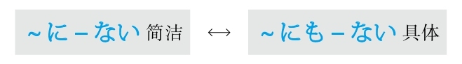
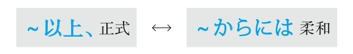
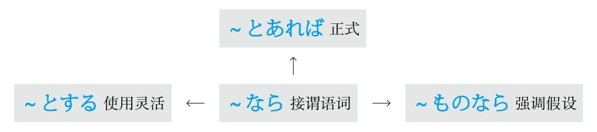

**[ [[ 日语语法新思维（修订版）_Detail_3.md | Prev ]] ]　[ [[ ../Menu.md | Home ]] ]　[ [[ 日语语法新思维（修订版）_Detail_5.md | Next ]] ]**

---
#### －そうだ #5_6_2_4_0
* [[ 日语语法新思维（修订版）_Menu_0.md | Menu #5_6_2_4_0 ]]

**解释：** 「そう」的汉字是「<ruby>相<rp>(</rp><rt>そう</rt><rp>)</rp></ruby>」
**意思：** 有～的样子
**着重：** 亲眼看到；外在的相貌
**重点：** 作为形容动词使用（－そうな+名词、－そうに+动词）
**语气：** 柔和
**接续：** 动词的连用形、形容词的词干、形容动词

例句：<ruby>雨<rp>(</rp><rt>あめ</rt><rp>)</rp></ruby>が<ruby>降<rp>(</rp><rt>ふ</rt><rp>)</rp></ruby>り**そう** 。
直译：要下雨的样子。
意译：看上去要下雨了。

例句：おいし**そうな** ご<ruby>馳<rp>(</rp><rt>ち</rt><rp>)</rp></ruby><ruby>走<rp>(</rp><rt>そう</rt><rp>)</rp></ruby>が<ruby>机<rp>(</rp><rt>つくえ</rt><rp>)</rp></ruby>の<ruby>上<rp>(</rp><rt>うえ</rt><rp>)</rp></ruby>に<ruby>並<rp>(</rp><rt>なら</rt><rp>)</rp></ruby>んでいる。
直译：看上去非常好吃的饭菜，在桌子上摆列着。
意译：桌上摆着看上去非常好吃的饭菜。

例句：<ruby>村<rp>(</rp><rt>むら</rt><rp>)</rp></ruby><ruby>上<rp>(</rp><rt>かみ</rt><rp>)</rp></ruby>さんは<ruby>元<rp>(</rp><rt>げん</rt><rp>)</rp></ruby><ruby>気<rp>(</rp><rt>き</rt><rp>)</rp></ruby>**そうに** <ruby>見<rp>(</rp><rt>み</rt><rp>)</rp></ruby>える。
直译：村上看上去有精神的样子。
意译：村上看上去精神不错。

#### －っぽい #5_6_2_5_0
* [[ 日语语法新思维（修订版）_Menu_0.md | Menu #5_6_2_5_0 ]]

**解释：** 「ぽい」可以理解为“颇为”；促音起加强语气的作用
**意思：** 颇为～
**着重：** 特别像～；不符合本质和特点
**接续：** 名词、形容词的词干、动词的连用形

例句：<ruby>彼<rp>(</rp><rt>かれ</rt><rp>)</rp></ruby>は<ruby>大人<rp>(</rp><rt>おとな</rt><rp>)</rp></ruby>なのに<ruby>子<rp>(</rp><rt>こ</rt><rp>)</rp></ruby><ruby>供<rp>(</rp><rt>ども</rt><rp>)</rp></ruby>**っぽい** ところが<ruby>多<rp>(</rp><rt>おお</rt><rp>)</rp></ruby>い。
直译：他虽然是大人，但是颇为孩子的地方多。
意译：他虽然是个大人，但是在很多方面却很孩子气。

例句：このかばんは<ruby>高<rp>(</rp><rt>たか</rt><rp>)</rp></ruby>いけど<ruby>安<rp>(</rp><rt>やす</rt><rp>)</rp></ruby>**っぽく** <ruby>見<rp>(</rp><rt>み</rt><rp>)</rp></ruby>える。
直译：这个包贵，但是看上去颇为便宜。
意译：这个包挺贵，可是看上去却显得特别便宜。

例句：あの<ruby>人<rp>(</rp><rt>ひと</rt><rp>)</rp></ruby>は<ruby>怒<rp>(</rp><rt>おこ</rt><rp>)</rp></ruby>り**っぽい** けど、<ruby>実<rp>(</rp><rt>じつ</rt><rp>)</rp></ruby>は<ruby>優<rp>(</rp><rt>やさ</rt><rp>)</rp></ruby>しい<ruby>人<rp>(</rp><rt>ひと</rt><rp>)</rp></ruby>です。
直译：那个人颇为生气，但是实际上是个温柔的人。
意译：那个人虽然爱生气，但是实际上是个温柔的人。

#### －げ #5_6_2_6_0
* [[ 日语语法新思维（修订版）_Menu_0.md | Menu #5_6_2_6_0 ]]

**解释：** 「け」的汉字是「<ruby>気<rp>(</rp><rt>け</rt><rp>)</rp></ruby>」，与前面的词构成复合词后的浊音化
**意思：** 带有～的气息
**着重：** 内在的感觉
**语气：** 文学化
**接续：** 动词的连用形、形容词的词干、形容动词

例句：<ruby>鈴<rp>(</rp><rt>すず</rt><rp>)</rp></ruby><ruby>木<rp>(</rp><rt>き</rt><rp>)</rp></ruby>さんは<ruby>大人<rp>(</rp><rt>おとな</rt><rp>)</rp></ruby>なのに、<ruby>全然<rp>(</rp><rt>ぜんぜん</rt><rp>)</rp></ruby><ruby>大人<rp>(</rp><rt>おとな</rt><rp>)</rp></ruby>**げ** がない。
直译：铃木是成年人，但是没有大人的气息。
意译：铃木是成年人，却没有一点儿大人样。

例句：<ruby>峰<rp>(</rp><rt>みね</rt><rp>)</rp></ruby><ruby>村<rp>(</rp><rt>むら</rt><rp>)</rp></ruby>さんは<ruby>自<rp>(</rp><rt>じ</rt><rp>)</rp></ruby><ruby>信<rp>(</rp><rt>しん</rt><rp>)</rp></ruby>あり**げ** に<ruby>大<rp>(</rp><rt>おお</rt><rp>)</rp></ruby>きな<ruby>声<rp>(</rp><rt>こえ</rt><rp>)</rp></ruby>で<ruby>質<rp>(</rp><rt>しつ</rt><rp>)</rp></ruby><ruby>問<rp>(</rp><rt>もん</rt><rp>)</rp></ruby>に<ruby>答<rp>(</rp><rt>こた</rt><rp>)</rp></ruby>えている。
直译：峰村有自信的气息地大声地回答着问题。
意译：峰村看上去很自信地大声回答着问题。

例句：<ruby>吉<rp>(</rp><rt>よし</rt><rp>)</rp></ruby><ruby>田<rp>(</rp><rt>だ</rt><rp>)</rp></ruby>さんは<ruby>懐<rp>(</rp><rt>なつ</rt><rp>)</rp></ruby>かし**げ** に<ruby>昔<rp>(</rp><rt>むかし</rt><rp>)</rp></ruby>のことを<ruby>話<rp>(</rp><rt>はな</rt><rp>)</rp></ruby>している。
直译：吉田带有怀念的气息地谈着过去的事。
意译：吉田看上去非常怀念地谈着过去的事。

例句：<ruby>荒<rp>(</rp><rt>あら</rt><rp>)</rp></ruby><ruby>木<rp>(</rp><rt>き</rt><rp>)</rp></ruby>さんは<ruby>退<rp>(</rp><rt>たい</rt><rp>)</rp></ruby><ruby>屈<rp>(</rp><rt>くつ</rt><rp>)</rp></ruby>**げ** に<ruby>授<rp>(</rp><rt>じゅ</rt><rp>)</rp></ruby><ruby>業<rp>(</rp><rt>ぎょう</rt><rp>)</rp></ruby>を<ruby>聞<rp>(</rp><rt>き</rt><rp>)</rp></ruby>いている。
直译：荒木带有无聊的气息地听着课。
意译：荒木看上去特别无聊地在听着课。

#### －気味 #5_6_2_7_0
* [[ 日语语法新思维（修订版）_Menu_0.md | Menu #5_6_2_7_0 ]]

**解释：** 「<ruby>気<rp>(</rp><rt>き</rt><rp>)</rp></ruby><ruby>味<rp>(</rp><rt>み</rt><rp>)</rp></ruby>」与前面的词构成复合词后的浊音化
**直译：** 带有～的气味
**意译：** 感觉～
**着重：** 感觉身体状况
**接续：** 名词、动词的连用形、形容词的词干、形容动词

例句：ちょっと<ruby>風<rp>(</rp><rt>か</rt><rp>)</rp></ruby><ruby>邪<rp>(</rp><rt>ぜ</rt><rp>)</rp></ruby>**<ruby>気<rp>(</rp><rt>ぎ</rt><rp>)</rp></ruby><ruby>味<rp>(</rp><rt>み</rt><rp>)</rp></ruby>** だから、<ruby>体<rp>(</rp><rt>からだ</rt><rp>)</rp></ruby>がだるい。
直译：有点儿感冒的气味，身体没力气。
意译：好像有点儿感冒，浑身没力气。

例句：<ruby>仕<rp>(</rp><rt>し</rt><rp>)</rp></ruby><ruby>事<rp>(</rp><rt>ごと</rt><rp>)</rp></ruby>が<ruby>忙<rp>(</rp><rt>いそが</rt><rp>)</rp></ruby>しいから、<ruby>最<rp>(</rp><rt>さい</rt><rp>)</rp></ruby><ruby>近<rp>(</rp><rt>きん</rt><rp>)</rp></ruby>ちょっと<ruby>疲<rp>(</rp><rt>つか</rt><rp>)</rp></ruby>れ**<ruby>気<rp>(</rp><rt>ぎ</rt><rp>)</rp></ruby><ruby>味<rp>(</rp><rt>み</rt><rp>)</rp></ruby>** です。
直译：工作忙，所以最近有些疲倦的气味。
意译：工作太忙了，最近有些容易疲倦。

#### ～ごとし #5_6_2_8_0
* [[ 日语语法新思维（修订版）_Menu_0.md | Menu #5_6_2_8_0 ]]

**解释：** 「ごとし」的汉字是「<ruby>如<rp>(</rp><rt>ごと</rt><rp>)</rp></ruby>し」；「し」是古语形容词结尾
**意思：** 好像～、如～一般
**词性：** 形容词
**语气：** 正式
**接续：** 名词の、动词的简体加が

例句：<ruby>光<rp>(</rp><rt>こう</rt><rp>)</rp></ruby><ruby>陰<rp>(</rp><rt>いん</rt><rp>)</rp></ruby><ruby>矢<rp>(</rp><rt>や</rt><rp>)</rp></ruby>の**<ruby>如<rp>(</rp><rt>ごと</rt><rp>)</rp></ruby>し** 。
直译：光阴如箭。
意译：光阴似箭。

例句：<ruby>過<rp>(</rp><rt>す</rt><rp>)</rp></ruby>ぎたるは、<ruby>猶<rp>(</rp><rt>なお</rt><rp>)</rp></ruby><ruby>及<rp>(</rp><rt>およ</rt><rp>)</rp></ruby>ばざるが**<ruby>如<rp>(</rp><rt>ごと</rt><rp>)</rp></ruby>し** 。
直译：过犹不及。

#### ～ごとき #5_6_2_9_0
* [[ 日语语法新思维（修订版）_Menu_0.md | Menu #5_6_2_9_0 ]]

**解释：** 「ごとき」的汉字是「<ruby>如<rp>(</rp><rt>ごと</rt><rp>)</rp></ruby>き」；「き」在古语法中表示起形容词修饰名词作用的“的”
**意思：** 好像～、如～一般
**词性：** 连体词
**语气：** 正式
**接续：** 名词の（也可以不用の）、动词的简体加が

例句：<ruby>花<rp>(</rp><rt>はな</rt><rp>)</rp></ruby>（の）**<ruby>如<rp>(</rp><rt>ごと</rt><rp>)</rp></ruby>き** <ruby>美<rp>(</rp><rt>び</rt><rp>)</rp></ruby><ruby>人<rp>(</rp><rt>じん</rt><rp>)</rp></ruby>が<ruby>目<rp>(</rp><rt>め</rt><rp>)</rp></ruby>の<ruby>前<rp>(</rp><rt>まえ</rt><rp>)</rp></ruby>に<ruby>現<rp>(</rp><rt>あらわ</rt><rp>)</rp></ruby>れた。
直译：如花似玉的美人，出现在了眼前。
意译：眼前出现了一个如花似玉的美人。

#### ～ごとく #5_6_2_10_0
* [[ 日语语法新思维（修订版）_Menu_0.md | Menu #5_6_2_10_0 ]]

**解释：** 「ごとく」的汉字是「<ruby>如<rp>(</rp><rt>ごと</rt><rp>)</rp></ruby>く」
**意思：** 好像～、如～一般
**词性：** 副词
**语气：** 正式
**接续：** 名词の、动词的简体加が

例句：<ruby>真<rp>(</rp><rt>ま</rt><rp>)</rp></ruby><ruby>夏<rp>(</rp><rt>なつ</rt><rp>)</rp></ruby><ruby>日<rp>(</rp><rt>び</rt><rp>)</rp></ruby>に<ruby>草<rp>(</rp><rt>くさ</rt><rp>)</rp></ruby>むしりをしていた。<ruby>汗<rp>(</rp><rt>あせ</rt><rp>)</rp></ruby>が<ruby>滝<rp>(</rp><rt>たき</rt><rp>)</rp></ruby>の**<ruby>如<rp>(</rp><rt>ごと</rt><rp>)</rp></ruby>く** <ruby>流<rp>(</rp><rt>なが</rt><rp>)</rp></ruby>れていた。
直译：在炎热的夏天，去拔草。汗水如瀑布流淌着。
意译：炎热的夏天去拔草，汗流浃背。

#### －めく #5_6_2_11_0
* [[ 日语语法新思维（修订版）_Menu_0.md | Menu #5_6_2_11_0 ]]

**解释：** 「め」是眼睛；「く」表示方向
**意思：** 看上去～
**词性：** 自动词
**语气：** 正式
**接续：** 名词

例句：もうすっかり<ruby>春<rp>(</rp><rt>はる</rt><rp>)</rp></ruby>**めいて** まいりました。
直译：已经完全，看上去是春天了。
意译：完全是春意盎然了。

例句：そんな<ruby>皮<rp>(</rp><rt>ひ</rt><rp>)</rp></ruby><ruby>肉<rp>(</rp><rt>にく</rt><rp>)</rp></ruby>**めいた** <ruby>言<rp>(</rp><rt>い</rt><rp>)</rp></ruby>い<ruby>方<rp>(</rp><rt>かた</rt><rp>)</rp></ruby>を<ruby>止<rp>(</rp><rt>や</rt><rp>)</rp></ruby>めてよ。
直译：停止听上去讽刺的说话方式。
意译：别用那么讽刺的语气说话。

#### －じみる #5_6_2_12_0
* [[ 日语语法新思维（修订版）_Menu_0.md | Menu #5_6_2_12_0 ]]

**解释：** 自动词「しみる」的汉字是「<ruby>染<rp>(</rp><rt>し</rt><rp>)</rp></ruby>みる」，与前面的词构成复合词后的浊音化
**意思：** 渗透着～的气息
**接续：** 名词

例句：<ruby>田舎<rp>(</rp><rt>いなか</rt><rp>)</rp></ruby>**じみた** <ruby>家<rp>(</rp><rt>いえ</rt><rp>)</rp></ruby>を<ruby>建<rp>(</rp><rt>た</rt><rp>)</rp></ruby>てたい。
直译：想盖带有田园气息的房子。
意译：我想盖个带有田园气息的房子。

例句：<ruby>彼女<rp>(</rp><rt>かのじょ</rt><rp>)</rp></ruby>はいつも<ruby>子<rp>(</rp><rt>こ</rt><rp>)</rp></ruby><ruby>供<rp>(</rp><rt>ども</rt><rp>)</rp></ruby>**じみた** <ruby>格<rp>(</rp><rt>かっ</rt><rp>)</rp></ruby><ruby>好<rp>(</rp><rt>こう</rt><rp>)</rp></ruby>している。
直译：她总是带有孩子气息的装束。
意译：她总是打扮得像个孩子。

#### ～とばかり #5_6_2_13_0
* [[ 日语语法新思维（修订版）_Menu_0.md | Menu #5_6_2_13_0 ]]

**解释：** 「と」表示说的内容；「ばかり」的意思是“全是、光是、净是”；如果作为副词用则需要加「に」
**直译：** 语气全是～、表情全是～
**意译：** 简直就好像是在说～
**着重：** 强调了“好像”
**注意：** 省略了“全是、光是、净是”的主语，即“语气、表情”等
**接续：** 任何词

例句：<ruby>彼<rp>(</rp><rt>かれ</rt><rp>)</rp></ruby>は、まるで「この<ruby>事<rp>(</rp><rt>こと</rt><rp>)</rp></ruby>は<ruby>私<rp>(</rp><rt>わたし</rt><rp>)</rp></ruby>には<ruby>関<rp>(</rp><rt>かん</rt><rp>)</rp></ruby><ruby>係<rp>(</rp><rt>けい</rt><rp>)</rp></ruby>がない」**とばかり** に、<ruby>平<rp>(</rp><rt>へい</rt><rp>)</rp></ruby><ruby>気<rp>(</rp><rt>き</rt><rp>)</rp></ruby>な<ruby>顔<rp>(</rp><rt>かお</rt><rp>)</rp></ruby>をしている。
直译：他的表情全是在说“这件事跟我无关”，显示出平静的表情。
意译：他表现得好像没事人似的，简直就好像是在说：“这件事跟我无关”。

#### －んばかり #5_6_2_14_0
* [[ 日语语法新思维（修订版）_Menu_0.md | Menu #5_6_2_14_0 ]]

**解释：** 「ん」是古语的推测；「ばかり」是“全是、光是、净是”；如果作为副词用则需要加「に」
**直译：** 语气全是～、表情全是～
**意译：** 简直就好像是在～
**着重：** 强调了“好像”
**注意：** 省略了“全是、光是、净是”的主语，即“语气、表情”等
**变形：** 动词的否定形的ん（推量）（变形规律参照第一章的第二节）

例句：<ruby>親<rp>(</rp><rt>おや</rt><rp>)</rp></ruby>は<ruby>私<rp>(</rp><rt>わたし</rt><rp>)</rp></ruby>の<ruby>手<rp>(</rp><rt>て</rt><rp>)</rp></ruby>を<ruby>千<rp>(</rp><rt>ち</rt><rp>)</rp></ruby><ruby>切<rp>(</rp><rt>ぎ</rt><rp>)</rp></ruby>れ**んばかり** にして、<ruby>昇<rp>(</rp><rt>しょう</rt><rp>)</rp></ruby><ruby>進<rp>(</rp><rt>しん</rt><rp>)</rp></ruby>を<ruby>祝<rp>(</rp><rt>いわ</rt><rp>)</rp></ruby>ってくれた。
直译：父母全是要把我的手揪掉一样，祝贺了我的晋升。
意译：父母拉着我的手，简直就好像要把我的手揪掉一样，祝贺了我的晋升。
语法关系图

## J #5_7_0_0_0
* [[ 日语语法新思维（修订版）_Menu_0.md | Menu #5_7_0_0_0 ]]

### 即使～也不～ #5_7_1_0_0
* [[ 日语语法新思维（修订版）_Menu_0.md | Menu #5_7_1_0_0 ]]

#### ～に－ない #5_7_1_1_0
* [[ 日语语法新思维（修订版）_Menu_0.md | Menu #5_7_1_1_0 ]]

**解释：** 「に」表示目的；「ない」的意思是“不”
**意思：** 即使要～也不能～
**着重：** 将要做某事；简洁
**注意：** 「～に」和「～ない」之间一般不加其他信息，即构成「するにできない」的形式
**接续：** 「に」前接动词的原形；「ない」前接动词可能形的连用形

例句：<ruby>笑<rp>(</rp><rt>わら</rt><rp>)</rp></ruby>う**に** <ruby>笑<rp>(</rp><rt>わら</rt><rp>)</rp></ruby>え**ない** 。
直译：即使要笑也不能笑。
意译：即使要笑也笑不出来。

#### ～にも－ない #5_7_1_2_0
* [[ 日语语法新思维（修订版）_Menu_0.md | Menu #5_7_1_2_0 ]]

**解释：** 「に」表示目的；「も」表示强调，在此通过强调表示转折；「ない」的意思是“不”
**意思：** 即使要～也不能～
**着重：** 有做某事的意愿；具体
**注意：** 「～に」和「～ない」之间可以加其他信息，即构成「しようにも～できない」的形式
**接续：** 「に」前接动词的意志形；「ない」前接动词可能形的连用形

例句：<ruby>勉<rp>(</rp><rt>べん</rt><rp>)</rp></ruby><ruby>強<rp>(</rp><rt>きょう</rt><rp>)</rp></ruby>しよう**にも** 、<ruby>外<rp>(</rp><rt>そと</rt><rp>)</rp></ruby>が<ruby>騒<rp>(</rp><rt>さわ</rt><rp>)</rp></ruby>がしいから、<ruby>集<rp>(</rp><rt>しゅう</rt><rp>)</rp></ruby><ruby>中<rp>(</rp><rt>ちゅう</rt><rp>)</rp></ruby>でき**ない** 。
直译：即使想要学习，外面太吵了，所以不能集中。
意译：即使想要学习，外面太吵了，也没办法集中精力。
语法关系图

### 既然 #5_7_2_0_0
* [[ 日语语法新思维（修订版）_Menu_0.md | Menu #5_7_2_0_0 ]]

#### ～以上、 #5_7_2_1_0
* [[ 日语语法新思维（修订版）_Menu_0.md | Menu #5_7_2_1_0 ]]

**直译：** 在～以上
**注意：** “既然”在汉语中表示已经发生的状态，表达前（因）后（果）关系，其特点是“要用语气强烈的表达方式”，比如“既然～就必须～”、“既然～就得～”、“既然～就要～”。日语的「～<ruby>以<rp>(</rp><rt>い</rt><rp>)</rp></ruby><ruby>上<rp>(</rp><rt>じょう</rt><rp>)</rp></ruby>」表示上下关系，除此之外，还和中文的“既然”一样，也表达方向的关系，所以也要用语气强烈的表达方式
**语气：** 正式
**接续：** 动词的简体

例句：この<ruby>仕<rp>(</rp><rt>し</rt><rp>)</rp></ruby><ruby>事<rp>(</rp><rt>ごと</rt><rp>)</rp></ruby>を<ruby>引<rp>(</rp><rt>ひ</rt><rp>)</rp></ruby>き<ruby>受<rp>(</rp><rt>う</rt><rp>)</rp></ruby>けた**<ruby>以<rp>(</rp><rt>い</rt><rp>)</rp></ruby><ruby>上<rp>(</rp><rt>じょう</rt><rp>)</rp></ruby>、** <ruby>最<rp>(</rp><rt>さい</rt><rp>)</rp></ruby><ruby>後<rp>(</rp><rt>ご</rt><rp>)</rp></ruby>までやり<ruby>抜<rp>(</rp><rt>ぬ</rt><rp>)</rp></ruby>くつもりだ。
直译：在接受了这个工作之上，决心干到底。
意译：既然接受了这个工作，我就决心干到底。

#### ～からには #5_7_2_2_0
* [[ 日语语法新思维（修订版）_Menu_0.md | Menu #5_7_2_2_0 ]]

**解释：** 「から」表示原因，「に」表示方向，「は」表示强调
**意思：** 在～原因之上
**注意：** “既然”在汉语中表示已经发生的状态，表达前（因）后（果）关系，其特点是“要用语气强烈的表达方式”，比如“既然～就必须～”、“既然～就得～”、“既然～就要～”。日语的「～からには」表示“在～原因之上”的上下关系，除此之外，还和中文的“既然”一样，也表达方向的关系，所以也要用语气强烈的表达方式
**语气：** 柔和
**接续：** 动词的简体、形容词的原形、形容动词和名词加である

例句：<ruby>試<rp>(</rp><rt>し</rt><rp>)</rp></ruby><ruby>合<rp>(</rp><rt>あい</rt><rp>)</rp></ruby>に<ruby>出<rp>(</rp><rt>で</rt><rp>)</rp></ruby>る**からには** 、<ruby>全<rp>(</rp><rt>ぜん</rt><rp>)</rp></ruby><ruby>力<rp>(</rp><rt>りょく</rt><rp>)</rp></ruby>を<ruby>尽<rp>(</rp><rt>つ</rt><rp>)</rp></ruby>くしたい。
直译：在参加比赛的原因之上，想全力以赴。
意译：既然参加比赛，我们就要全力以赴。
语法关系图

### 假设 #5_7_3_0_0
* [[ 日语语法新思维（修订版）_Menu_0.md | Menu #5_7_3_0_0 ]]

#### ～なら #5_7_3_1_0
* [[ 日语语法新思维（修订版）_Menu_0.md | Menu #5_7_3_1_0 ]]

**准则：** 在「と、ば、たら、なら」里，最重要的是顺序。「と」和「なら」分别表示极端，「と」代表“条件性”的极端，「なら」代表“假定性”的极端
**意思：** 假设～（前面接谓语词）
**注意：** 假设过去的时候，因为要表示过去的状态，所以后句与「－ていた」相呼应
**搭配：** 前面有时接「<ruby>仮<rp>(</rp><rt>かり</rt><rp>)</rp></ruby>に」
**接续：** 动词和形容词的简体及形容动词接「なら」表示“假设”；名词接「なら」表示“如果”

例句：<ruby>私<rp>(</rp><rt>わたし</rt><rp>)</rp></ruby>はあの<ruby>時<rp>(</rp><rt>とき</rt><rp>)</rp></ruby>よく<ruby>左<rp>(</rp><rt>さ</rt><rp>)</rp></ruby><ruby>右<rp>(</rp><rt>ゆう</rt><rp>)</rp></ruby>を<ruby>確<rp>(</rp><rt>かく</rt><rp>)</rp></ruby><ruby>認<rp>(</rp><rt>にん</rt><rp>)</rp></ruby>した**なら** 、<ruby>走<rp>(</rp><rt>はし</rt><rp>)</rp></ruby>ってきた<ruby>自<rp>(</rp><rt>じ</rt><rp>)</rp></ruby><ruby>転<rp>(</rp><rt>てん</rt><rp>)</rp></ruby><ruby>車<rp>(</rp><rt>しゃ</rt><rp>)</rp></ruby>にぶつかっていなかっただろう。
直译：假设我那时左右好好确认的话，骑过来的自行车，不撞上了。
意译：如果我那时左右好好确认的话，就不会撞到骑过来的自行车了。

例句：<ruby>今<rp>(</rp><rt>いま</rt><rp>)</rp></ruby><ruby>残<rp>(</rp><rt>ざん</rt><rp>)</rp></ruby><ruby>業<rp>(</rp><rt>ぎょう</rt><rp>)</rp></ruby>している**なら** 、<ruby>夜<rp>(</rp><rt>や</rt><rp>)</rp></ruby><ruby>食<rp>(</rp><rt>しょく</rt><rp>)</rp></ruby>を<ruby>用<rp>(</rp><rt>よう</rt><rp>)</rp></ruby><ruby>意<rp>(</rp><rt>い</rt><rp>)</rp></ruby>して<ruby>届<rp>(</rp><rt>とど</rt><rp>)</rp></ruby>けるよ。
直译：假设现在在加班的话，做夜宵送去。
意译：要是你现在在加班的话，我做夜宵给你送去。

例句：<ruby>夕<rp>(</rp><rt>ゆう</rt><rp>)</rp></ruby><ruby>方<rp>(</rp><rt>がた</rt><rp>)</rp></ruby>に<ruby>小<rp>(</rp><rt>こ</rt><rp>)</rp></ruby><ruby>包<rp>(</rp><rt>づつみ</rt><rp>)</rp></ruby>が<ruby>届<rp>(</rp><rt>とど</rt><rp>)</rp></ruby>く**なら** 、<ruby>午<rp>(</rp><rt>ご</rt><rp>)</rp></ruby><ruby>前<rp>(</rp><rt>ぜん</rt><rp>)</rp></ruby><ruby>中<rp>(</rp><rt>ちゅう</rt><rp>)</rp></ruby>に<ruby>買<rp>(</rp><rt>か</rt><rp>)</rp></ruby>い<ruby>物<rp>(</rp><rt>もの</rt><rp>)</rp></ruby>を<ruby>済<rp>(</rp><rt>す</rt><rp>)</rp></ruby>ませておこう。
直译：假设在傍晚包裹送到，上午把东西买完吧。
意译：如果包裹傍晚送到，那上午去买东西吧。

#### ～とあれば #5_7_3_2_0
* [[ 日语语法新思维（修订版）_Menu_0.md | Menu #5_7_3_2_0 ]]

**解释：** 「と」表示内容；「あれば」是「ある」加上了「ば」，意思是“如果有～”
**意思：** 如果有～的话
**语气：** 正式
**接续：** 任何词

例句：<ruby>遠<rp>(</rp><rt>えん</rt><rp>)</rp></ruby><ruby>来<rp>(</rp><rt>らい</rt><rp>)</rp></ruby>の<ruby>客<rp>(</rp><rt>きゃく</rt><rp>)</rp></ruby>が<ruby>来<rp>(</rp><rt>く</rt><rp>)</rp></ruby>る**とあれば** 、<ruby>腕<rp>(</rp><rt>うで</rt><rp>)</rp></ruby>を<ruby>振<rp>(</rp><rt>ふ</rt><rp>)</rp></ruby>ってご<ruby>馳<rp>(</rp><rt>ち</rt><rp>)</rp></ruby><ruby>走<rp>(</rp><rt>そう</rt><rp>)</rp></ruby>をたくさん<ruby>用<rp>(</rp><rt>よう</rt><rp>)</rp></ruby><ruby>意<rp>(</rp><rt>い</rt><rp>)</rp></ruby>しよう。
直译：远方的客人来的话，抡起胳膊，准备很多饭菜吧。
意译：如果远方的客人要来，那我就抡起胳膊给他们准备一大桌菜吧。

#### ～とする #5_7_3_3_0
* [[ 日语语法新思维（修订版）_Menu_0.md | Menu #5_7_3_3_0 ]]

**解释：** 「と」表示内容；「する」可以代替大多动词，此处代替了「<ruby>仮<rp>(</rp><rt>か</rt><rp>)</rp></ruby><ruby>定<rp>(</rp><rt>てい</rt><rp>)</rp></ruby>する」
**准则：** 假设过去的时候，因为要表示过去的状态，所以后句与「－ていた」相呼应
**意思：** 假设～
**搭配：** 前面有时接「<ruby>仮<rp>(</rp><rt>かり</rt><rp>)</rp></ruby>に」
**重点：** 可以假设过去、现在、将来
**区别：** 比「なら」的用法更广，还可以与其他词汇组合构成多样的表达方式，比如「～とすれば、～としたら、～としても」等
**接续：** 任何词

例句：<ruby>私<rp>(</rp><rt>わたし</rt><rp>)</rp></ruby>は<ruby>弁<rp>(</rp><rt>べん</rt><rp>)</rp></ruby><ruby>護<rp>(</rp><rt>ご</rt><rp>)</rp></ruby><ruby>師<rp>(</rp><rt>し</rt><rp>)</rp></ruby>にならなかった**としたら** 、どんな<ruby>職<rp>(</rp><rt>しょく</rt><rp>)</rp></ruby><ruby>業<rp>(</rp><rt>ぎょう</rt><rp>)</rp></ruby>に<ruby>就<rp>(</rp><rt>つ</rt><rp>)</rp></ruby>いていただろう。
直译：假设我没有成为律师的话，过去做什么工作呢？
意译：假设我没当律师的话，我那时候做什么工作呢？

例句：**<ruby>仮<rp>(</rp><rt>かり</rt><rp>)</rp></ruby>に** <ruby>毎<rp>(</rp><rt>まい</rt><rp>)</rp></ruby><ruby>日<rp>(</rp><rt>にち</rt><rp>)</rp></ruby><ruby>単<rp>(</rp><rt>たん</rt><rp>)</rp></ruby><ruby>語<rp>(</rp><rt>ご</rt><rp>)</rp></ruby>を<ruby>1<rp>(</rp><rt>じゅ</rt><rp>)</rp></ruby><ruby>0<rp>(</rp><rt>っ</rt><rp>)</rp></ruby><ruby>個<rp>(</rp><rt>こ</rt><rp>)</rp></ruby><ruby>覚<rp>(</rp><rt>おぼ</rt><rp>)</rp></ruby>える**とする** 。<ruby>一<rp>(</rp><rt>いっ</rt><rp>)</rp></ruby><ruby>か<rp>(</rp><rt>か</rt><rp>)</rp></ruby><ruby>月<rp>(</rp><rt>げつ</rt><rp>)</rp></ruby>で<ruby>3<rp>(</rp><rt>さん</rt><rp>)</rp></ruby><ruby>0<rp>(</rp><rt>ぴゃ</rt><rp>)</rp></ruby><ruby>0<rp>(</rp><rt>っ</rt><rp>)</rp></ruby><ruby>個<rp>(</rp><rt>こ</rt><rp>)</rp></ruby>を<ruby>覚<rp>(</rp><rt>おぼ</rt><rp>)</rp></ruby>えることになる。
直译：假设每天记10个单词，结果成为在一个月里记300个单词。
意译：假设每天记10个单词，一个月就能记300个单词。

例句：<ruby>私<rp>(</rp><rt>わたし</rt><rp>)</rp></ruby>が<ruby>社<rp>(</rp><rt>しゃ</rt><rp>)</rp></ruby><ruby>長<rp>(</rp><rt>ちょう</rt><rp>)</rp></ruby>だ**としたら** 、きっと<ruby>全<rp>(</rp><rt>ぜん</rt><rp>)</rp></ruby><ruby>員<rp>(</rp><rt>いん</rt><rp>)</rp></ruby>の<ruby>給<rp>(</rp><rt>きゅう</rt><rp>)</rp></ruby><ruby>料<rp>(</rp><rt>りょう</rt><rp>)</rp></ruby>を<ruby>上<rp>(</rp><rt>あ</rt><rp>)</rp></ruby>げる。
直译：假设我就是社长，一定把全员的工资提高。
意译：假设我就是社长，一定会给全体员工涨工资。

#### ～ものなら #5_7_3_4_0
* [[ 日语语法新思维（修订版）_Menu_0.md | Menu #5_7_3_4_0 ]]

**解释：** 「もの」接在句尾表示强调，翻译成“可、真、可真、就是”；「なら」表示假设
**意思：** 刚要做某事就～
**注意：** 前面接动词的意志形时，通常会带来严重的后果
**接续：** 动词的可能形、动词的意志形（变形规律参照第一章的第二节）

例句：この<ruby>会<rp>(</rp><rt>かい</rt><rp>)</rp></ruby><ruby>社<rp>(</rp><rt>しゃ</rt><rp>)</rp></ruby>はとても<ruby>厳<rp>(</rp><rt>きび</rt><rp>)</rp></ruby>しい。<ruby>仕<rp>(</rp><rt>し</rt><rp>)</rp></ruby><ruby>事<rp>(</rp><rt>ごと</rt><rp>)</rp></ruby>で<ruby>少<rp>(</rp><rt>すこ</rt><rp>)</rp></ruby>しでも<ruby>失<rp>(</rp><rt>しっ</rt><rp>)</rp></ruby><ruby>敗<rp>(</rp><rt>ぱい</rt><rp>)</rp></ruby>しよう**ものなら** 、<ruby>首<rp>(</rp><rt>くび</rt><rp>)</rp></ruby>になりかねないよ。
直译：这个公司很严格。在工作中即使稍微有些失败的话，很可能被解雇。
意译：这个公司特别严格，假设工作中稍微有些失败，就很可能被解雇。

例句：できる**ものなら** 、やってしまいたい。
直译：假设真能，想做完成。
意译：假设真能（那样）的话，我想去做。
语法关系图

### 结果 #5_7_4_0_0
* [[ 日语语法新思维（修订版）_Menu_0.md | Menu #5_7_4_0_0 ]]

#### －た結果、 #5_7_4_1_0
* [[ 日语语法新思维（修订版）_Menu_0.md | Menu #5_7_4_1_0 ]]

**解释：** 「た」表示“做了～”；「<ruby>結<rp>(</rp><rt>けっ</rt><rp>)</rp></ruby><ruby>果<rp>(</rp><rt>か</rt><rp>)</rp></ruby>」表示“结果”
**意思：** 做了～的结果，
**注意：** 后面一般不加助词
**语气：** 正式
**变形：** 动词的た形的简体（变形规律参照第一章的第二节）

例句：<ruby>筆<rp>(</rp><rt>ひっ</rt><rp>)</rp></ruby><ruby>記<rp>(</rp><rt>き</rt><rp>)</rp></ruby><ruby>試<rp>(</rp><rt>し</rt><rp>)</rp></ruby><ruby>験<rp>(</rp><rt>けん</rt><rp>)</rp></ruby>と<ruby>口<rp>(</rp><rt>こう</rt><rp>)</rp></ruby><ruby>頭<rp>(</rp><rt>とう</rt><rp>)</rp></ruby><ruby>試<rp>(</rp><rt>し</rt><rp>)</rp></ruby><ruby>験<rp>(</rp><rt>けん</rt><rp>)</rp></ruby>と<ruby>書<rp>(</rp><rt>しょ</rt><rp>)</rp></ruby><ruby>類<rp>(</rp><rt>るい</rt><rp>)</rp></ruby><ruby>審<rp>(</rp><rt>しん</rt><rp>)</rp></ruby><ruby>査<rp>(</rp><rt>さ</rt><rp>)</rp></ruby>を<ruby>行<rp>(</rp><rt>おこな</rt><rp>)</rp></ruby>っ**た** <ruby>結<rp>(</rp><rt>けっ</rt><rp>)</rp></ruby><ruby>果<rp>(</rp><rt>か</rt><rp>)</rp></ruby>**、** <ruby>候<rp>(</rp><rt>こう</rt><rp>)</rp></ruby><ruby>補<rp>(</rp><rt>ほ</rt><rp>)</rp></ruby><ruby>者<rp>(</rp><rt>しゃ</rt><rp>)</rp></ruby>を<ruby>5<rp>(</rp><rt>ご</rt><rp>)</rp></ruby><ruby>人<rp>(</rp><rt>にん</rt><rp>)</rp></ruby>に<ruby>絞<rp>(</rp><rt>しぼ</rt><rp>)</rp></ruby>った。
直译：笔试和口试和书面选拔的进行结果，把候补筛选到了5个人。
意译：经过笔试、口试以及书面材料审核，最终选定了5位候选人。

#### －たところ、 #5_7_4_2_0
* [[ 日语语法新思维（修订版）_Menu_0.md | Menu #5_7_4_2_0 ]]

**解释：** 「た」表示“做了～”；「ところ」代替了「<ruby>結<rp>(</rp><rt>けっ</rt><rp>)</rp></ruby><ruby>果<rp>(</rp><rt>か</rt><rp>)</rp></ruby>」
**意思：** 做了～的结果，
**注意：** 后面一般不加助词
**语气：** 柔和
**变形：** 动词的た形的简体（变形规律参照第一章的第二节）

例句：<ruby>試<rp>(</rp><rt>し</rt><rp>)</rp></ruby><ruby>験<rp>(</rp><rt>けん</rt><rp>)</rp></ruby>を<ruby>実<rp>(</rp><rt>じっ</rt><rp>)</rp></ruby><ruby>施<rp>(</rp><rt>し</rt><rp>)</rp></ruby>し**たところ、** <ruby>今<rp>(</rp><rt>こ</rt><rp>)</rp></ruby><ruby>年<rp>(</rp><rt>とし</rt><rp>)</rp></ruby>の<ruby>合<rp>(</rp><rt>ごう</rt><rp>)</rp></ruby><ruby>格<rp>(</rp><rt>かく</rt><rp>)</rp></ruby>の<ruby>割<rp>(</rp><rt>わり</rt><rp>)</rp></ruby><ruby>合<rp>(</rp><rt>あい</rt><rp>)</rp></ruby>は、<ruby>昨<rp>(</rp><rt>さく</rt><rp>)</rp></ruby><ruby>年<rp>(</rp><rt>ねん</rt><rp>)</rp></ruby>と<ruby>比<rp>(</rp><rt>くら</rt><rp>)</rp></ruby>べ、<ruby>約<rp>(</rp><rt>やく</rt><rp>)</rp></ruby><ruby>2<rp>(</rp><rt>に</rt><rp>)</rp></ruby><ruby>割<rp>(</rp><rt>わり</rt><rp>)</rp></ruby>ほど<ruby>高<rp>(</rp><rt>たか</rt><rp>)</rp></ruby>くなった。
直译：考试实施的结果，今年的合格比率，与去年相比，大约20%左右变高了。
意译：考试的结果是今年的及格率比去年提高了大约20%。

#### ～しまつだ #5_7_4_3_0
* [[ 日语语法新思维（修订版）_Menu_0.md | Menu #5_7_4_3_0 ]]

**解释：** 「しまつ」的汉字是「<ruby>始<rp>(</rp><rt>し</rt><rp>)</rp></ruby><ruby>末<rp>(</rp><rt>まつ</rt><rp>)</rp></ruby>」
**意思：** 地步、下场
**用于：** 不好的结果
**接续：** 修饰名词的规律（参照第一章的第三节）

例句：<ruby>彼<rp>(</rp><rt>かれ</rt><rp>)</rp></ruby>はいつも<ruby>睡<rp>(</rp><rt>すい</rt><rp>)</rp></ruby><ruby>眠<rp>(</rp><rt>みん</rt><rp>)</rp></ruby><ruby>不<rp>(</rp><rt>ぶ</rt><rp>)</rp></ruby><ruby>足<rp>(</rp><rt>そく</rt><rp>)</rp></ruby>で、<ruby>注<rp>(</rp><rt>ちゅう</rt><rp>)</rp></ruby><ruby>意<rp>(</rp><rt>い</rt><rp>)</rp></ruby>されても<ruby>聞<rp>(</rp><rt>き</rt><rp>)</rp></ruby>かない。ついに<ruby>居<rp>(</rp><rt>い</rt><rp>)</rp></ruby><ruby>眠<rp>(</rp><rt>ねむ</rt><rp>)</rp></ruby>り<ruby>運<rp>(</rp><rt>うん</rt><rp>)</rp></ruby><ruby>転<rp>(</rp><rt>てん</rt><rp>)</rp></ruby>で<ruby>事<rp>(</rp><rt>じ</rt><rp>)</rp></ruby><ruby>故<rp>(</rp><rt>こ</rt><rp>)</rp></ruby>を<ruby>起<rp>(</rp><rt>お</rt><rp>)</rp></ruby>こす**<ruby>始<rp>(</rp><rt>し</rt><rp>)</rp></ruby><ruby>末<rp>(</rp><rt>まつ</rt><rp>)</rp></ruby>だ** 。
直译：他总是睡眠不足，即使被警告也不听。终于打盹儿开车出了车祸的地步。
意译：他总是睡眠不足，也不听别人的劝告，终于因疲劳驾驶出了车祸。

#### －ば、それまでだ #5_7_4_4_0
* [[ 日语语法新思维（修订版）_Menu_0.md | Menu #5_7_4_4_0 ]]

**解释：** 「ば」的意思是“如果”；「それ」的意思是“那”；「まで」的意思是“到～的地步”
**直译：** 如果～也就到那个地步了
**意译：** 如果～就到头了
**用于：** 没有发展
**注意：** 「それまで」还可以换成「これまで」
**变形：** ば形（变形规律参照第一章的第二节）

例句：<ruby>試<rp>(</rp><rt>し</rt><rp>)</rp></ruby><ruby>験<rp>(</rp><rt>けん</rt><rp>)</rp></ruby>のために<ruby>一<rp>(</rp><rt>いち</rt><rp>)</rp></ruby><ruby>年<rp>(</rp><rt>ねん</rt><rp>)</rp></ruby>も<ruby>準<rp>(</rp><rt>じゅん</rt><rp>)</rp></ruby><ruby>備<rp>(</rp><rt>び</rt><rp>)</rp></ruby>してきた。<ruby>試<rp>(</rp><rt>し</rt><rp>)</rp></ruby><ruby>験<rp>(</rp><rt>けん</rt><rp>)</rp></ruby>の<ruby>前<rp>(</rp><rt>ぜん</rt><rp>)</rp></ruby><ruby>日<rp>(</rp><rt>じつ</rt><rp>)</rp></ruby><ruby>熱<rp>(</rp><rt>ねつ</rt><rp>)</rp></ruby>を<ruby>出<rp>(</rp><rt>だ</rt><rp>)</rp></ruby>せ**ば、それまでだ** 。
直译：为了考试准备了一年。考试前一天发烧了的话，也就那样了。
意译：为了考试准备了一年。要是考试前一天发烧了就完了。
语法关系图

### 经历 #5_7_5_0_0
* [[ 日语语法新思维（修订版）_Menu_0.md | Menu #5_7_5_0_0 ]]

#### ～思いをする #5_7_5_1_0
* [[ 日语语法新思维（修订版）_Menu_0.md | Menu #5_7_5_1_0 ]]

**解释：** 「<ruby>思<rp>(</rp><rt>おも</rt><rp>)</rp></ruby>い」的意思是“感觉、感情”；「を」接在他动词前表示“把”；「する」可以代替大多数动词，此处代替了「<ruby>経<rp>(</rp><rt>けい</rt><rp>)</rp></ruby><ruby>験<rp>(</rp><rt>けん</rt><rp>)</rp></ruby>する」
**用于：** 心理上的经历
**接续：** 形容词的原形、形容动词加な

例句：<ruby>昨日<rp>(</rp><rt>きのう</rt><rp>)</rp></ruby>ある<ruby>飲<rp>(</rp><rt>いん</rt><rp>)</rp></ruby><ruby>食<rp>(</rp><rt>しょく</rt><rp>)</rp></ruby><ruby>店<rp>(</rp><rt>てん</rt><rp>)</rp></ruby>で<ruby>嫌<rp>(</rp><rt>いや</rt><rp>)</rp></ruby>な**<ruby>思<rp>(</rp><rt>おも</rt><rp>)</rp></ruby>いをした** 。
直译：昨天在饮食店里经历了讨厌的感觉。
意译：昨天我在一个饮食店里遇到了特别不愉快的事情。

例句：<ruby>親<rp>(</rp><rt>しん</rt><rp>)</rp></ruby><ruby>友<rp>(</rp><rt>ゆう</rt><rp>)</rp></ruby>が<ruby>遠<rp>(</rp><rt>とお</rt><rp>)</rp></ruby>いところに<ruby>引<rp>(</rp><rt>ひ</rt><rp>)</rp></ruby>っ<ruby>越<rp>(</rp><rt>こ</rt><rp>)</rp></ruby>してしまって、<ruby>寂<rp>(</rp><rt>さび</rt><rp>)</rp></ruby>しい**<ruby>思<rp>(</rp><rt>おも</rt><rp>)</rp></ruby>いをした** 。
直译：好友搬到很远的地方，经历了寂寞的感觉。
意译：好友搬到很远的地方，我觉得特别寂寞。

例句：<ruby>絶<rp>(</rp><rt>ぜっ</rt><rp>)</rp></ruby><ruby>対<rp>(</rp><rt>たい</rt><rp>)</rp></ruby>に<ruby>勝<rp>(</rp><rt>か</rt><rp>)</rp></ruby>つと<ruby>思<rp>(</rp><rt>おも</rt><rp>)</rp></ruby>ったのに、<ruby>負<rp>(</rp><rt>ま</rt><rp>)</rp></ruby>けてしまって、<ruby>痛<rp>(</rp><rt>いた</rt><rp>)</rp></ruby>い**<ruby>思<rp>(</rp><rt>おも</rt><rp>)</rp></ruby>いをした** 。
直译：觉得肯定能赢，结果输了，经历了痛的感觉。
意译：我觉得肯定能赢，结果输了，让我特别心痛。

#### ～を体験する #5_7_5_2_0
* [[ 日语语法新思维（修订版）_Menu_0.md | Menu #5_7_5_2_0 ]]

**解释：** 「を」接在他动词前表示“把”；「<ruby>体<rp>(</rp><rt>たい</rt><rp>)</rp></ruby><ruby>験<rp>(</rp><rt>けん</rt><rp>)</rp></ruby>する」的意思是“体验”
**用于：** 身体上的经历
**接续：** 名词

例句：<ruby>3<rp>(</rp><rt>さん</rt><rp>)</rp></ruby><ruby>0<rp>(</rp><rt>じゅう</rt><rp>)</rp></ruby><ruby>年<rp>(</rp><rt>ねん</rt><rp>)</rp></ruby>ほど<ruby>前<rp>(</rp><rt>まえ</rt><rp>)</rp></ruby>の<ruby>日<rp>(</rp><rt>に</rt><rp>)</rp></ruby><ruby>本<rp>(</rp><rt>ほん</rt><rp>)</rp></ruby>のバブル<ruby>絶<rp>(</rp><rt>ぜっ</rt><rp>)</rp></ruby><ruby>頂<rp>(</rp><rt>ちょう</rt><rp>)</rp></ruby><ruby>期<rp>(</rp><rt>き</rt><rp>)</rp></ruby>を<ruby>実<rp>(</rp><rt>じっ</rt><rp>)</rp></ruby><ruby>際<rp>(</rp><rt>さい</rt><rp>)</rp></ruby>に**<ruby>体<rp>(</rp><rt>たい</rt><rp>)</rp></ruby><ruby>験<rp>(</rp><rt>けん</rt><rp>)</rp></ruby>した** 。
直译：大概30年以前的日本的泡沫经济的顶峰时期，实际体验了。
意译：我亲身经历了大约30年以前的日本的泡沫经济的顶峰时期。

#### ～を経験する #5_7_5_3_0
* [[ 日语语法新思维（修订版）_Menu_0.md | Menu #5_7_5_3_0 ]]

**解释：** 「を」接在他动词前表示“把”；「<ruby>経<rp>(</rp><rt>けい</rt><rp>)</rp></ruby><ruby>験<rp>(</rp><rt>けん</rt><rp>)</rp></ruby>する」的意思是“经历”
**用于：** 身心的经历
**接续：** 名词

例句：<ruby>1<rp>(</rp><rt>せん</rt><rp>)</rp></ruby><ruby>9<rp>(</rp><rt>きゅうひゃく</rt><rp>)</rp></ruby><ruby>9<rp>(</rp><rt>きゅうじゅう</rt><rp>)</rp></ruby><ruby>5<rp>(</rp><rt>ご</rt><rp>)</rp></ruby><ruby>年<rp>(</rp><rt>ねん</rt><rp>)</rp></ruby>に<ruby>阪<rp>(</rp><rt>はん</rt><rp>)</rp></ruby><ruby>神<rp>(</rp><rt>しん</rt><rp>)</rp></ruby>・<ruby>淡<rp>(</rp><rt>あわ</rt><rp>)</rp></ruby><ruby>路<rp>(</rp><rt>じ</rt><rp>)</rp></ruby><ruby>大<rp>(</rp><rt>だい</rt><rp>)</rp></ruby><ruby>震<rp>(</rp><rt>しん</rt><rp>)</rp></ruby><ruby>災<rp>(</rp><rt>さい</rt><rp>)</rp></ruby>**を<ruby>経験<rp>(</rp><rt>けいけん</rt><rp>)</rp></ruby>した** 。
直译：经历了1995年的阪神淡路大地震。
意译：我经历了1995年的阪神淡路大地震。
语法关系图

### 尽量 #5_7_6_0_0
* [[ 日语语法新思维（修订版）_Menu_0.md | Menu #5_7_6_0_0 ]]

#### ～ようにする #5_7_6_1_0
* [[ 日语语法新思维（修订版）_Menu_0.md | Menu #5_7_6_1_0 ]]

**解释：** 「よう」的意思是“样子”；「に」表示方向；「する」的意思是“做”
**直译：** 做成～的样子
**意译：** 尽量做～
**接续：** 动词的原形

例句：ダイエットしているから、<ruby>晩<rp>(</rp><rt>ばん</rt><rp>)</rp></ruby><ruby>御<rp>(</rp><rt>ご</rt><rp>)</rp></ruby><ruby>飯<rp>(</rp><rt>はん</rt><rp>)</rp></ruby>は<ruby>野<rp>(</rp><rt>や</rt><rp>)</rp></ruby><ruby>菜<rp>(</rp><rt>さい</rt><rp>)</rp></ruby>だけ<ruby>食<rp>(</rp><rt>た</rt><rp>)</rp></ruby>べる**ようにしている** 。
直译：因为在减肥，所以晚饭只吃蔬菜，做成这个样子。
意译：我在减肥，所以现在尽量晚饭只吃蔬菜。

### 举例 #5_7_7_0_0
* [[ 日语语法新思维（修订版）_Menu_0.md | Menu #5_7_7_0_0 ]]

#### ～と #5_7_7_1_0
* [[ 日语语法新思维（修订版）_Menu_0.md | Menu #5_7_7_1_0 ]]

**解释：** 起源于「<ruby>統<rp>(</rp><rt>とう</rt><rp>)</rp></ruby>」的「と」的意思是“和”或者表示“引号”
**注意：** 每一个并列的部分之间都要加「と」。前面的「と」表示“和”；最后一个「と」起引号的作用
**接续：** 名词

例句：<ruby>一<rp>(</rp><rt>ひと</rt><rp>)</rp></ruby>つ<ruby>目<rp>(</rp><rt>め</rt><rp>)</rp></ruby>**と** <ruby>二<rp>(</rp><rt>ふた</rt><rp>)</rp></ruby>つ<ruby>目<rp>(</rp><rt>め</rt><rp>)</rp></ruby>**と** <ruby>三<rp>(</rp><rt>み</rt><rp>)</rp></ruby>つ<ruby>目<rp>(</rp><rt>め</rt><rp>)</rp></ruby>**と** は、どう<ruby>違<rp>(</rp><rt>ちが</rt><rp>)</rp></ruby>いますか。
直译：第一个、第二个和第三个，怎么不一样？
意译：第一个、第二个和第三个，有什么不一样？

#### ～とか #5_7_7_2_0
* [[ 日语语法新思维（修订版）_Menu_0.md | Menu #5_7_7_2_0 ]]

**解释：** 「と」的意思是“和”或者表示“引号”；「か」表示不确定
**用法：** 每一个例子的后面都要加「とか」。用几次都可以
**语气：** 柔和
**接续：** 任何词

例句：<ruby>北京<rp>(</rp><rt>ぺキン</rt><rp>)</rp></ruby>に<ruby>旅<rp>(</rp><rt>りょ</rt><rp>)</rp></ruby><ruby>行<rp>(</rp><rt>こう</rt><rp>)</rp></ruby>に<ruby>行<rp>(</rp><rt>い</rt><rp>)</rp></ruby>った<ruby>時<rp>(</rp><rt>とき</rt><rp>)</rp></ruby>、<ruby>万<rp>(</rp><rt>ばん</rt><rp>)</rp></ruby><ruby>里<rp>(</rp><rt>り</rt><rp>)</rp></ruby>の<ruby>長<rp>(</rp><rt>ちょう</rt><rp>)</rp></ruby><ruby>城<rp>(</rp><rt>じょう</rt><rp>)</rp></ruby>**とか** <ruby>西<rp>(</rp><rt>せい</rt><rp>)</rp></ruby><ruby>太<rp>(</rp><rt>たい</rt><rp>)</rp></ruby><ruby>后<rp>(</rp><rt>こう</rt><rp>)</rp></ruby>の<ruby>別<rp>(</rp><rt>べっ</rt><rp>)</rp></ruby><ruby>荘<rp>(</rp><rt>そう</rt><rp>)</rp></ruby>だった<ruby>頤<rp>(</rp><rt>い</rt><rp>)</rp></ruby><ruby>和<rp>(</rp><rt>わ</rt><rp>)</rp></ruby><ruby>園<rp>(</rp><rt>えん</rt><rp>)</rp></ruby>**とか** を<ruby>回<rp>(</rp><rt>まわ</rt><rp>)</rp></ruby>った。
直译：去北京旅游的时候，长城啦慈禧的别墅的颐和园啦等地方，转了。
意译：去北京旅游的时候，转了长城、慈禧的别墅——颐和园等地方。

#### ～や #5_7_7_3_0
* [[ 日语语法新思维（修订版）_Menu_0.md | Menu #5_7_7_3_0 ]]

**解释：** 「や」的汉字是表示并列的「也」
**用法：** 常构成「～や～など」或「～や～といった+名词」的结构
**语气：** 正式
**接续：** 名词

例句：<ruby>当<rp>(</rp><rt>とう</rt><rp>)</rp></ruby><ruby>店<rp>(</rp><rt>てん</rt><rp>)</rp></ruby>では、<ruby>和<rp>(</rp><rt>わ</rt><rp>)</rp></ruby><ruby>雑<rp>(</rp><rt>ざっ</rt><rp>)</rp></ruby><ruby>貨<rp>(</rp><rt>か</rt><rp>)</rp></ruby>**や** アジアの<ruby>雑<rp>(</rp><rt>ざっ</rt><rp>)</rp></ruby><ruby>貨<rp>(</rp><rt>か</rt><rp>)</rp></ruby>**や** <ruby>民<rp>(</rp><rt>みん</rt><rp>)</rp></ruby><ruby>芸<rp>(</rp><rt>げい</rt><rp>)</rp></ruby><ruby>品<rp>(</rp><rt>ひん</rt><rp>)</rp></ruby>**など** を<ruby>扱<rp>(</rp><rt>あつか</rt><rp>)</rp></ruby>っております。
直译：在本店，日本杂货啦亚洲杂货啦民间工艺品等，经营着。
意译：本店经营日本杂货、亚洲杂货、民间工艺品等。

#### ～やら～やら #5_7_7_4_0
* [[ 日语语法新思维（修订版）_Menu_0.md | Menu #5_7_7_4_0 ]]

**解释：** 「やら」和「や」一样，表示不完全性举例，但是更加口语化，相当于现代日语的「だ」或「か」
**注意：** 表示不完全性举例
**区别：** 一般「や」接在名词后，「やら」可以接任何词

例句：<ruby>損<rp>(</rp><rt>そん</rt><rp>)</rp></ruby>した**やら** <ruby>得<rp>(</rp><rt>とく</rt><rp>)</rp></ruby>した**やら** もうどうでもいいことだ。
直译：亏了呀赚了呀，现在都已经无所谓了。
意译：不管是亏了还是赚了，现在都已经无所谓了。

例句：<ruby>飲<rp>(</rp><rt>の</rt><rp>)</rp></ruby>みすぎて、<ruby>頭<rp>(</rp><rt>あたま</rt><rp>)</rp></ruby>が<ruby>痛<rp>(</rp><rt>いた</rt><rp>)</rp></ruby>い**やら** <ruby>息<rp>(</rp><rt>いき</rt><rp>)</rp></ruby>が<ruby>苦<rp>(</rp><rt>くる</rt><rp>)</rp></ruby>しい**やら** 、<ruby>大<rp>(</rp><rt>たい</rt><rp>)</rp></ruby><ruby>変<rp>(</rp><rt>へん</rt><rp>)</rp></ruby>でした。
直译：喝多了，头疼呀喘不上气呀，很痛苦。
意译：喝多了，又是头疼又是喘不上气来，痛苦死了。

#### ―たり #5_7_7_5_0
* [[ 日语语法新思维（修订版）_Menu_0.md | Menu #5_7_7_5_0 ]]

**解释：** 「たり」是「とあり」的音变。「と」表示内容；「あり」是「<ruby>有<rp>(</rp><rt>あ</rt><rp>)</rp></ruby>る」的连用形
**注意：** 谓语词的举例
**用法：** 作为名词使用，后面接谓语。用几次都可以
**变形：** 动词的た形的简体（变形规律参照第一章的第二节）

例句：<ruby>買<rp>(</rp><rt>か</rt><rp>)</rp></ruby>いたいものはいつもあっ**たり** なかっ**たり** する。
直译：想买的东西，经常有和没有。
意译：想买的东西总是有时候有、有时候没有。

#### ～でも #5_7_7_6_0
* [[ 日语语法新思维（修订版）_Menu_0.md | Menu #5_7_7_6_0 ]]

**解释：** 「で」是「です」的中顿形式；「も」表示强调
**意思：** 不特定地举出一个例子，表示推测或建议
**接续：** 名词

例句：お<ruby>茶<rp>(</rp><rt>ちゃ</rt><rp>)</rp></ruby>**でも** <ruby>飲<rp>(</rp><rt>の</rt><rp>)</rp></ruby>みませんか？
直译：不喝点儿茶吗？
意译：喝点儿茶什么的吗？

例句：<ruby>夢<rp>(</rp><rt>ゆめ</rt><rp>)</rp></ruby>**でも** みているの？
直译：做梦呢？
意译：是不是在做梦呢？

#### ～にしても #5_7_7_7_0
* [[ 日语语法新思维（修订版）_Menu_0.md | Menu #5_7_7_7_0 ]]

**解释：** 「に」表示方向或对象；「して」是能够代替大多数动词的「する」的中顿，此处代替了表示举例的「<ruby>例<rp>(</rp><rt>たと</rt><rp>)</rp></ruby>える」；「も」表示强调
**意思：** 不特定地举出一个例子，表示推测或建议
**注意：** 「行っても」表示转折的“即便要去”，「行くにしても」表示举例的“打个比方要去”
**接续：** 动词和形容词的简体、形容动词和名词

例句：<ruby>田<rp>(</rp><rt>た</rt><rp>)</rp></ruby><ruby>中<rp>(</rp><rt>なか</rt><rp>)</rp></ruby>さんの<ruby>家<rp>(</rp><rt>いえ</rt><rp>)</rp></ruby>まで<ruby>行<rp>(</rp><rt>い</rt><rp>)</rp></ruby>く**にしても** 、<ruby>事<rp>(</rp><rt>じ</rt><rp>)</rp></ruby><ruby>前<rp>(</rp><rt>ぜん</rt><rp>)</rp></ruby>に<ruby>一<rp>(</rp><rt>いち</rt><rp>)</rp></ruby><ruby>度<rp>(</rp><rt>ど</rt><rp>)</rp></ruby><ruby>電<rp>(</rp><rt>でん</rt><rp>)</rp></ruby><ruby>話<rp>(</rp><rt>わ</rt><rp>)</rp></ruby>で<ruby>連<rp>(</rp><rt>れん</rt><rp>)</rp></ruby><ruby>絡<rp>(</rp><rt>らく</rt><rp>)</rp></ruby>した<ruby>方<rp>(</rp><rt>ほう</rt><rp>)</rp></ruby>がいい。
直译：打个比方去田中家，事先打一次电话联络最好。
意译：打个比方去田中家，最好也要事先打个电话。

#### ～にしろ～にしろ/～にせよ～にせよ #5_7_7_8_0
* [[ 日语语法新思维（修订版）_Menu_0.md | Menu #5_7_7_8_0 ]]

**解释：** 「しろ」和「せよ」都是「する」的命令形；「に」表示对象；此处是举出两个例子
**区别：** 「せよ」比「しろ」正式
**意思：** 不管是～，还是～
**接续：** 动词和形容词的简体、形容动词和名词

例句：<ruby>寒<rp>(</rp><rt>さむ</rt><rp>)</rp></ruby>い**にしろ** <ruby>暑<rp>(</rp><rt>あつ</rt><rp>)</rp></ruby>い**にしろ** 、どうせ<ruby>遠<rp>(</rp><rt>とお</rt><rp>)</rp></ruby>くまで<ruby>行<rp>(</rp><rt>い</rt><rp>)</rp></ruby>かないから<ruby>大<rp>(</rp><rt>だい</rt><rp>)</rp></ruby><ruby>丈<rp>(</rp><rt>じょう</rt><rp>)</rp></ruby><ruby>夫<rp>(</rp><rt>ぶ</rt><rp>)</rp></ruby>だ。
直译：打个比方冷，打个比方热，反正不去远处，所以没关系。
意译：不管是冷还是热，反正不去远处，所以没关系。

例句：<ruby>気<rp>(</rp><rt>き</rt><rp>)</rp></ruby>に<ruby>入<rp>(</rp><rt>い</rt><rp>)</rp></ruby>る**にせよ** <ruby>気<rp>(</rp><rt>き</rt><rp>)</rp></ruby>に<ruby>入<rp>(</rp><rt>い</rt><rp>)</rp></ruby>らない**にせよ** 、<ruby>引<rp>(</rp><rt>ひ</rt><rp>)</rp></ruby>き<ruby>受<rp>(</rp><rt>う</rt><rp>)</rp></ruby>けた<ruby>仕<rp>(</rp><rt>し</rt><rp>)</rp></ruby><ruby>事<rp>(</rp><rt>ごと</rt><rp>)</rp></ruby>は<ruby>最<rp>(</rp><rt>さい</rt><rp>)</rp></ruby><ruby>後<rp>(</rp><rt>ご</rt><rp>)</rp></ruby>までやるしかない。
直译：打个比方喜欢，打个比方不喜欢，接受了的工作就只能干到底。
意译：不管是喜欢还是不喜欢，只能把接受了的工作干到底。

#### ～につけ～につけ #5_7_7_9_0
* [[ 日语语法新思维（修订版）_Menu_0.md | Menu #5_7_7_9_0 ]]

**解释：** 「つけ」是表示“在”或“是”的「<ruby>就<rp>(</rp><rt>つ</rt><rp>)</rp></ruby>ける、<ruby>即<rp>(</rp><rt>つ</rt><rp>)</rp></ruby>ける」的连用形；「に」表示方向
**意思：** “不管是在～方面，还是在～方面”或“不管是～，还是～”。举出两个例子
**语气：** 正式
**接续：** 动词和形容词的简体、形容动词和名词

例句：<ruby>結<rp>(</rp><rt>けっ</rt><rp>)</rp></ruby><ruby>果<rp>(</rp><rt>か</rt><rp>)</rp></ruby>は<ruby>良<rp>(</rp><rt>よ</rt><rp>)</rp></ruby>き**につけ** <ruby>悪<rp>(</rp><rt>あ</rt><rp>)</rp></ruby>しき**につけ** 、まずやってみるのが<ruby>何<rp>(</rp><rt>なに</rt><rp>)</rp></ruby>よりだ。
直译：结果不管是好还是坏，首先试着做比什么都强。
意译：不管结果是好还是坏，最好首先去尝试。

#### ～といい～といい #5_7_7_10_0
* [[ 日语语法新思维（修订版）_Menu_0.md | Menu #5_7_7_10_0 ]]

**解释：** 「いい」是他动词「<ruby>言<rp>(</rp><rt>い</rt><rp>)</rp></ruby>う」的连用形，表示中顿，意思是“说”；「と」表示内容
**意思：** 不管是说～，还是说～
**接续：** 名词

例句：<ruby>生<rp>(</rp><rt>き</rt><rp>)</rp></ruby><ruby>地<rp>(</rp><rt>じ</rt><rp>)</rp></ruby>**といい** <ruby>柄<rp>(</rp><rt>がら</rt><rp>)</rp></ruby>**といい** 、<ruby>文<rp>(</rp><rt>もん</rt><rp>)</rp></ruby><ruby>句<rp>(</rp><rt>く</rt><rp>)</rp></ruby>のつけようのない<ruby>服<rp>(</rp><rt>ふく</rt><rp>)</rp></ruby>だ。
直译：不管是说质地还是说花样，都是没有办法挑剔的衣服。
意译：不管是质地还是花样，都是件无可挑剔的衣服。

#### ～だの～だの #5_7_7_11_0
* [[ 日语语法新思维（修订版）_Menu_0.md | Menu #5_7_7_11_0 ]]

**解释：** 「だ」是表示断定的「です」，「の」是「が」，表示并列；等于「ですが」
**注意：** 表示泛泛举例或举出两个极端的例子，如「<ruby>好<rp>(</rp><rt>す</rt><rp>)</rp></ruby>きだの、<ruby>嫌<rp>(</rp><rt>きら</rt><rp>)</rp></ruby>いだの」
**接续：** 动词和形容词的简体、名词和形容动词

例句：<ruby>疲<rp>(</rp><rt>つか</rt><rp>)</rp></ruby>れた**だの** <ruby>頭<rp>(</rp><rt>あたま</rt><rp>)</rp></ruby>が<ruby>痛<rp>(</rp><rt>ぃた</rt><rp>)</rp></ruby>い**だの** と<ruby>口<rp>(</rp><rt>こう</rt><rp>)</rp></ruby><ruby>実<rp>(</rp><rt>じつ</rt><rp>)</rp></ruby>を<ruby>探<rp>(</rp><rt>さが</rt><rp>)</rp></ruby>さないで<ruby>速<rp>(</rp><rt>はや</rt><rp>)</rp></ruby>く<ruby>勉<rp>(</rp><rt>べん</rt><rp>)</rp></ruby><ruby>強<rp>(</rp><rt>きょう</rt><rp>)</rp></ruby>しなさい。
直译：累了呀头疼了呀，不要找借口，快点儿学习。
意译：别找借口说累了呀头疼了呀什么的，快点儿学习。

#### ～だろうが～だろうが/～であろうが～であろうが #5_7_7_12_0
* [[ 日语语法新思维（修订版）_Menu_0.md | Menu #5_7_7_12_0 ]]

**解释：** 「だろう」是「です」的推测形式；有单纯连接句子的作用，也有转折的意思
**区别：** 「～であろうが」比「～だろうが」语气正式
**注意：** 不确定
**接续：** 名词

例句：<ruby>貧<rp>(</rp><rt>びん</rt><rp>)</rp></ruby><ruby>乏<rp>(</rp><rt>ぼう</rt><rp>)</rp></ruby>**だろうが** お<ruby>金<rp>(</rp><rt>かね</rt><rp>)</rp></ruby><ruby>持<rp>(</rp><rt>も</rt><rp>)</rp></ruby>ち**だろうが** 、それは<ruby>友<rp>(</rp><rt>とも</rt><rp>)</rp></ruby>を<ruby>選<rp>(</rp><rt>えら</rt><rp>)</rp></ruby>ぶ<ruby>基<rp>(</rp><rt>き</rt><rp>)</rp></ruby><ruby>準<rp>(</rp><rt>じゅん</rt><rp>)</rp></ruby>ではない。
直译：不管对方是穷人还是有钱人，这不是择友的基准。
意译：不管对方是穷人还是有钱人，这都不是择友的基准。

#### ～なり～なり #5_7_7_13_0
* [[ 日语语法新思维（修订版）_Menu_0.md | Menu #5_7_7_13_0 ]]

**解释：** 「なり」是表示断定的「<ruby>也<rp>(</rp><rt>なり</rt><rp>)</rp></ruby>」，意思是“是”
**注意：** 表示选择性举例
**重点：** 表示断定和举例的「也」的音读是「や」，训读是「なり」，相当于现代日语的「だ」或「か」
**接续：** 动词的原形

例句：<ruby>辞<rp>(</rp><rt>じ</rt><rp>)</rp></ruby><ruby>書<rp>(</rp><rt>しょ</rt><rp>)</rp></ruby>を<ruby>引<rp>(</rp><rt>ひ</rt><rp>)</rp></ruby>く**なり** <ruby>他<rp>(</rp><rt>ほか</rt><rp>)</rp></ruby>の<ruby>人<rp>(</rp><rt>ひと</rt><rp>)</rp></ruby>に<ruby>聞<rp>(</rp><rt>き</rt><rp>)</rp></ruby>く**なり** どんな<ruby>方法<rp>(</rp><rt>ほうほう</rt><rp>)</rp></ruby>でもいいから<ruby>調<rp>(</rp><rt>しら</rt><rp>)</rp></ruby>べてください。
直译：查字典啦问别人啦，不管什么方法都行，请查。
意译：查字典啦问别人啦，不管用什么方法都行，去查一下。

#### －つ－つ #5_7_7_14_0
* [[ 日语语法新思维（修订版）_Menu_0.md | Menu #5_7_7_14_0 ]]

**解释：** 「つ」相当于汉语的“次”
**意思：** 一次这样，一次那样
**注意：** 表示对照性举例
**词性：** 名词
**接续：** 动词的连用形

例句：<ruby>選<rp>(</rp><rt>せん</rt><rp>)</rp></ruby><ruby>手<rp>(</rp><rt>しゅ</rt><rp>)</rp></ruby>たちはみんな<ruby>抜<rp>(</rp><rt>ぬ</rt><rp>)</rp></ruby>き**つ** <ruby>抜<rp>(</rp><rt>ぬ</rt><rp>)</rp></ruby>かれ**つ** してゴールインした。
直译：选手们大家都，一次追上一次被追上，到达了终点。
意译：选手们你追我赶地到达了终点。

例句：<ruby>彼<rp>(</rp><rt>かれ</rt><rp>)</rp></ruby>は<ruby>部<rp>(</rp><rt>へ</rt><rp>)</rp></ruby><ruby>屋<rp>(</rp><rt>や</rt><rp>)</rp></ruby>で<ruby>行<rp>(</rp><rt>い</rt><rp>)</rp></ruby>き**つ** <ruby>戻<rp>(</rp><rt>もど</rt><rp>)</rp></ruby>り**つ** している。
直译：他在房间里一次去一次回地走着。
意译：他在房间里来回走着。
语法关系图

### 决定 #5_7_8_0_0
* [[ 日语语法新思维（修订版）_Menu_0.md | Menu #5_7_8_0_0 ]]

#### ～ことにする #5_7_8_1_0
* [[ 日语语法新思维（修订版）_Menu_0.md | Menu #5_7_8_1_0 ]]

**解释：** 「こと」是“名词化”；「に」表示方向；「する」可以代替大多数动词，此处代替了他动词「決める」
**区别：** 他动词「決める」只是表示“单纯的决定”，而「～ことにする」侧重于有很多选择，确定了其中的一个。体现这个特点的就是表示方向、对象、目的、目标的助词「に」
**重点：** 他动词侧重于有人去做，着重强调做的人；他动词还侧重于动作
**接续：** 动词的原形

例句：いろいろ<ruby>考<rp>(</rp><rt>かんが</rt><rp>)</rp></ruby>えた<ruby>結<rp>(</rp><rt>けっ</rt><rp>)</rp></ruby><ruby>果<rp>(</rp><rt>か</rt><rp>)</rp></ruby>、<ruby>留<rp>(</rp><rt>りゅう</rt><rp>)</rp></ruby><ruby>学<rp>(</rp><rt>がく</rt><rp>)</rp></ruby>を<ruby>止<rp>(</rp><rt>や</rt><rp>)</rp></ruby>めて<ruby>就<rp>(</rp><rt>しゅう</rt><rp>)</rp></ruby><ruby>職<rp>(</rp><rt>しょく</rt><rp>)</rp></ruby>する**ことにした** 。
直译：考虑了各种各样的结果，决定不去留学去上班。
意译：多方考虑之后，我决定不去留学，去上班。

#### ～ことになる #5_7_8_2_0
* [[ 日语语法新思维（修订版）_Menu_0.md | Menu #5_7_8_2_0 ]]

**解释：** 「こと」是“名词化”；「に」表示方向；自动词「なる」代替了自动词「決まる」
**区别：** 自动词「決まる」只是表示“单纯的决定”，而「～ことになる」侧重于有很多选择，确定了其中的一个。体现这个特点的就是表示方向、对象、目的、目标的助词「に」
**重点：** 自动词不侧重于有人去做，不着重强调说明做的人；自动词还侧重于动作的结果和状态
**接续：** 动词的原形

例句：<ruby>学<rp>(</rp><rt>がっ</rt><rp>)</rp></ruby><ruby>校<rp>(</rp><rt>こう</rt><rp>)</rp></ruby>から<ruby>通<rp>(</rp><rt>つう</rt><rp>)</rp></ruby><ruby>知<rp>(</rp><rt>ち</rt><rp>)</rp></ruby>があって、<ruby>今<rp>(</rp><rt>こん</rt><rp>)</rp></ruby><ruby>度<rp>(</rp><rt>ど</rt><rp>)</rp></ruby>のコースは<ruby>開<rp>(</rp><rt>ひら</rt><rp>)</rp></ruby>かない**ことになった** 。
直译：学校来了通知，下次的课程不开了的事宜定下来了。
意译：学校来了通知，决定下次课程不开了。
语法关系图

### 决心 #5_7_9_0_0
* [[ 日语语法新思维（修订版）_Menu_0.md | Menu #5_7_9_0_0 ]]

#### 思い切って～ #5_7_9_1_0
* [[ 日语语法新思维（修订版）_Menu_0.md | Menu #5_7_9_1_0 ]]

**解释：** 「<ruby>思<rp>(</rp><rt>おも</rt><rp>)</rp></ruby>い<ruby>切<rp>(</rp><rt>き</rt><rp>)</rp></ruby>って」是「<ruby>思<rp>(</rp><rt>おも</rt><rp>)</rp></ruby>い<ruby>切<rp>(</rp><rt>き</rt><rp>)</rp></ruby>る」（不再想）的中顿形式
**意思：** 下决心做～，毅然决然地做～
**词性：** 副词
**注意：** 「<ruby>思<rp>(</rp><rt>おも</rt><rp>)</rp></ruby>い<ruby>切<rp>(</rp><rt>き</rt><rp>)</rp></ruby>り」的意思是“痛痛快快地做～”

例句：**<ruby>思<rp>(</rp><rt>おも</rt><rp>)</rp></ruby>い<ruby>切<rp>(</rp><rt>き</rt><rp>)</rp></ruby>って** <ruby>会<rp>(</rp><rt>かい</rt><rp>)</rp></ruby><ruby>社<rp>(</rp><rt>しゃ</rt><rp>)</rp></ruby>を<ruby>辞<rp>(</rp><rt>や</rt><rp>)</rp></ruby>めた。
直译：下决心辞了公司。
意译：下决心辞了工作。

#### ～つもりだ #5_7_9_2_0
* [[ 日语语法新思维（修订版）_Menu_0.md | Menu #5_7_9_2_0 ]]

**解释：** 名词「つもり」常被翻译成“打算”，但是日语的「つもり」的语气要比汉语的“打算”的语气强得多，所以应该理解为「<ruby>強<rp>(</rp><rt>つよ</rt><rp>)</rp></ruby>い<ruby>思<rp>(</rp><rt>おも</rt><rp>)</rp></ruby>い」（强烈的心情或决心）。如果想说“打算做某事”时可以直接用动词
**接续：** 动词的一般现在时的简体
**意思：** 决心做～

例句：<ruby>自<rp>(</rp><rt>じ</rt><rp>)</rp></ruby><ruby>分<rp>(</rp><rt>ぶん</rt><rp>)</rp></ruby>の<ruby>信<rp>(</rp><rt>しん</rt><rp>)</rp></ruby><ruby>念<rp>(</rp><rt>ねん</rt><rp>)</rp></ruby>を<ruby>貫<rp>(</rp><rt>つらぬ</rt><rp>)</rp></ruby>く**つもり** です。
直译：把自己的信念贯彻到底的强烈的心情。
意译：我决心把我自己的信念贯彻到底。

**接续：** 动词的现在进行时的简体
**意思：** 以某种强烈的心情认为～

例句：わかっている**つもり** です。
直译：已经懂了的强烈的心情。
意译：我认为我已经懂了。

**接续：** 动词的过去式的简体
**意思：** 以某种强烈的心情以为～，但是事实相反

例句：<ruby>負<rp>(</rp><rt>ま</rt><rp>)</rp></ruby>けたけど、<ruby>勝<rp>(</rp><rt>か</rt><rp>)</rp></ruby>った**つもり** でいる。
直译：虽然输了，但是赢了的强烈的心情。
意译：虽然输了，但是当作赢了。
语法关系图

### 觉得 #5_7_10_0_0
* [[ 日语语法新思维（修订版）_Menu_0.md | Menu #5_7_10_0_0 ]]

#### ～と思う #5_7_10_1_0
* [[ 日语语法新思维（修订版）_Menu_0.md | Menu #5_7_10_1_0 ]]

**意思：** 想、认为、以为、觉得
**注意：** 心理活动的主语是第三人称时需要用“状态”表示，在此用现在进行时表示状态，因此第三人称要用「～と思っている」
**接续：** 任何词

例句：このような<ruby>考<rp>(</rp><rt>かんが</rt><rp>)</rp></ruby>え<ruby>方<rp>(</rp><rt>かた</rt><rp>)</rp></ruby>はあなたにはよくない**と<ruby>思<rp>(</rp><rt>おも</rt><rp>)</rp></ruby>う** 。
直译：这样的想法对你不好，我觉得。
意译：我觉得这样的想法对你不好。

#### ～気がする #5_7_10_2_0
* [[ 日语语法新思维（修订版）_Menu_0.md | Menu #5_7_10_2_0 ]]

**解释：** 「<ruby>気<rp>(</rp><rt>き</rt><rp>)</rp></ruby>」的意思是“感觉”；「が」用于自动词前面表示小主语；「する」在此是自动词，表示“产生”
**意思：** 产生～感觉
**区别：** 「～<ruby>気<rp>(</rp><rt>き</rt><rp>)</rp></ruby>がする」比「<ruby>思<rp>(</rp><rt>おも</rt><rp>)</rp></ruby>う」更有强调“感觉”的语气；是由内而发的感觉
**注意：** 有时候常用「～ような<ruby>気<rp>(</rp><rt>き</rt><rp>)</rp></ruby>がする」
**接续：** 修饰名词的规律（参照第一章的第三节）

例句：このやり<ruby>方<rp>(</rp><rt>かた</rt><rp>)</rp></ruby>はどうしても<ruby>間<rp>(</rp><rt>ま</rt><rp>)</rp></ruby><ruby>違<rp>(</rp><rt>ちが</rt><rp>)</rp></ruby>っている**<ruby>気<rp>(</rp><rt>き</rt><rp>)</rp></ruby>がする** 。
直译：这种方法不对，无论如何都觉得。
意译：总觉得这种方法不对。

#### ～感じがする #5_7_10_3_0
* [[ 日语语法新思维（修订版）_Menu_0.md | Menu #5_7_10_3_0 ]]

**解释：** 「<ruby>感<rp>(</rp><rt>かん</rt><rp>)</rp></ruby>じ」的意思是“感觉”；「が」用于自动词前面表示小主语；「する」在此是自动词，表示“产生”
**意思：** 产生～感觉
**着重：** 多用于外在给人带来的感觉
**接续：** 修饰名词的规律（参照第一章的第三节）

例句：これでいいと<ruby>言<rp>(</rp><rt>い</rt><rp>)</rp></ruby>われたけど、<ruby>自<rp>(</rp><rt>じ</rt><rp>)</rp></ruby><ruby>分<rp>(</rp><rt>ぶん</rt><rp>)</rp></ruby>ではまだまだ<ruby>足<rp>(</rp><rt>た</rt><rp>)</rp></ruby>りない**<ruby>感<rp>(</rp><rt>かん</rt><rp>)</rp></ruby>じがする** 。
直译：虽然被说了这种程度就行，但是自己却觉得这种程度还是太不够。
意译：虽然别人说这样就行了，但是自己还是觉得太不够了。
语法关系图

## K #5_8_0_0_0
* [[ 日语语法新思维（修订版）_Menu_0.md | Menu #5_8_0_0_0 ]]

### 开端，契机 #5_8_1_0_0
* [[ 日语语法新思维（修订版）_Menu_0.md | Menu #5_8_1_0_0 ]]

#### ～をはじめ、 #5_8_1_1_0
* [[ 日语语法新思维（修订版）_Menu_0.md | Menu #5_8_1_1_0 ]]

**注意：** 应用了日语里的经典句型「～を～と（に）する（把～当成～）」
**解释：** 「はじめ」的汉字是「<ruby>初<rp>(</rp><rt>はじ</rt><rp>)</rp></ruby>め」或「<ruby>始<rp>(</rp><rt>はじ</rt><rp>)</rp></ruby>め」；此外还常用「～をはじめとして」
**意思：** 以～为开始、以～为首
**语气：** 柔和
**接续：** 名词

例句：<ruby>社<rp>(</rp><rt>しゃ</rt><rp>)</rp></ruby><ruby>長<rp>(</rp><rt>ちょう</rt><rp>)</rp></ruby>**をはじめ、** <ruby>社<rp>(</rp><rt>しゃ</rt><rp>)</rp></ruby><ruby>員<rp>(</rp><rt>いん</rt><rp>)</rp></ruby><ruby>全<rp>(</rp><rt>ぜん</rt><rp>)</rp></ruby><ruby>員<rp>(</rp><rt>いん</rt><rp>)</rp></ruby>が<ruby>開<rp>(</rp><rt>かい</rt><rp>)</rp></ruby><ruby>幕<rp>(</rp><rt>まく</rt><rp>)</rp></ruby><ruby>式<rp>(</rp><rt>しき</rt><rp>)</rp></ruby>に<ruby>出<rp>(</rp><rt>しゅっ</rt><rp>)</rp></ruby><ruby>席<rp>(</rp><rt>せき</rt><rp>)</rp></ruby>した。
直译：以社长为开始，社员全员出席了开幕式。
意译：社长以及全体员工都出席了开幕式。

#### ～を皮切りに #5_8_1_2_0
* [[ 日语语法新思维（修订版）_Menu_0.md | Menu #5_8_1_2_0 ]]

**注意：** 应用了日语里的经典句型「～を～と（に）する（把～当成～）」
**解释：** 「<ruby>皮<rp>(</rp><rt>かわ</rt><rp>)</rp></ruby><ruby>切<rp>(</rp><rt>き</rt><rp>)</rp></ruby>り」起源于医学用语，扎针灸的第一针时皮肤好像是要裂开了一样疼痛，意译为“开端”
**意思：** 把～当作开端
**语气：** 正式
**接续：** 名词

例句：<ruby>新<rp>(</rp><rt>しん</rt><rp>)</rp></ruby><ruby>型<rp>(</rp><rt>がた</rt><rp>)</rp></ruby><ruby>携<rp>(</rp><rt>けい</rt><rp>)</rp></ruby><ruby>帯<rp>(</rp><rt>たい</rt><rp>)</rp></ruby><ruby>電<rp>(</rp><rt>でん</rt><rp>)</rp></ruby><ruby>話<rp>(</rp><rt>わ</rt><rp>)</rp></ruby>は、<ruby>先<rp>(</rp><rt>せん</rt><rp>)</rp></ruby><ruby>月<rp>(</rp><rt>げつ</rt><rp>)</rp></ruby>アメリカでの<ruby>発<rp>(</rp><rt>はつ</rt><rp>)</rp></ruby><ruby>売<rp>(</rp><rt>ばい</rt><rp>)</rp></ruby>**を<ruby>皮<rp>(</rp><rt>かわ</rt><rp>)</rp></ruby><ruby>切<rp>(</rp><rt>き</rt><rp>)</rp></ruby>りに** 、<ruby>世<rp>(</rp><rt>せ</rt><rp>)</rp></ruby><ruby>界<rp>(</rp><rt>かい</rt><rp>)</rp></ruby><ruby>各<rp>(</rp><rt>かく</rt><rp>)</rp></ruby><ruby>地<rp>(</rp><rt>ち</rt><rp>)</rp></ruby>で<ruby>販<rp>(</rp><rt>はん</rt><rp>)</rp></ruby><ruby>売<rp>(</rp><rt>ばい</rt><rp>)</rp></ruby>されている。
直译：新型手机，上月在美国的销售为开端，在世界各地一直被销售着。
意译：新型手机自从上月在美国发售以来，一直在世界各地销售。

#### ～をきっかけに #5_8_1_3_0
* [[ 日语语法新思维（修订版）_Menu_0.md | Menu #5_8_1_3_0 ]]

**注意：** 应用了日语里的经典句型「～を～と（に）する（把～当成～）」
**解释：** 「きっかけ」的意思是“契机”
**意思：** 以～为契机
**语气：** 柔和
**接续：** 名词

例句：その<ruby>詩<rp>(</rp><rt>し</rt><rp>)</rp></ruby><ruby>人<rp>(</rp><rt>じん</rt><rp>)</rp></ruby>の<ruby>作<rp>(</rp><rt>さく</rt><rp>)</rp></ruby><ruby>品<rp>(</rp><rt>ひん</rt><rp>)</rp></ruby>は、テレビのコマーシャルに<ruby>使<rp>(</rp><rt>つか</rt><rp>)</rp></ruby>われるの**をきっかけに** 、<ruby>大<rp>(</rp><rt>だい</rt><rp>)</rp></ruby>ブームになった。
直译：那个诗人的作品，电视广告上被使用为契机，成为了热潮。
意译：那个诗人的作品被用于电视广告之后掀起了热潮。

#### ～を契機に #5_8_1_4_0
* [[ 日语语法新思维（修订版）_Menu_0.md | Menu #5_8_1_4_0 ]]

**注意：** 应用了日语里的经典句型「～を～と（に）する（把～当成～）」
**解释：** 「<ruby>契<rp>(</rp><rt>けい</rt><rp>)</rp></ruby><ruby>機<rp>(</rp><rt>き</rt><rp>)</rp></ruby>」的意思是“契机”
**意思：** 以～为契机
**语气：** 正式
**接续：** 名词

例句：オイルショック**を<ruby>契<rp>(</rp><rt>けい</rt><rp>)</rp></ruby><ruby>機<rp>(</rp><rt>き</rt><rp>)</rp></ruby>に** <ruby>新<rp>(</rp><rt>しん</rt><rp>)</rp></ruby>エネルギーの<ruby>研<rp>(</rp><rt>けん</rt><rp>)</rp></ruby><ruby>究<rp>(</rp><rt>きゅう</rt><rp>)</rp></ruby>がどんどん<ruby>進<rp>(</rp><rt>すす</rt><rp>)</rp></ruby>められている。
直译：石油冲击为契机，新能源的研究在不断地被进展着。
意译：以石油危机为契机，有关新能源的研究正在不断推进。
语法关系图

### 可能性 #5_8_2_0_0
* [[ 日语语法新思维（修订版）_Menu_0.md | Menu #5_8_2_0_0 ]]

#### ～可能性がある #5_8_2_1_0
* [[ 日语语法新思维（修订版）_Menu_0.md | Menu #5_8_2_1_0 ]]

**意思：** 有～的可能性
**用于：** 好的可能性、不好的可能性
**语气：** 正式
**接续：** 修饰名词的规律（参照第一章的第三节）

例句：<ruby>共<rp>(</rp><rt>きょう</rt><rp>)</rp></ruby><ruby>同<rp>(</rp><rt>どう</rt><rp>)</rp></ruby><ruby>研<rp>(</rp><rt>けん</rt><rp>)</rp></ruby><ruby>究<rp>(</rp><rt>きゅう</rt><rp>)</rp></ruby><ruby>者<rp>(</rp><rt>しゃ</rt><rp>)</rp></ruby>を<ruby>海<rp>(</rp><rt>かい</rt><rp>)</rp></ruby><ruby>外<rp>(</rp><rt>がい</rt><rp>)</rp></ruby>から<ruby>招<rp>(</rp><rt>まね</rt><rp>)</rp></ruby>く**<ruby>可<rp>(</rp><rt>か</rt><rp>)</rp></ruby><ruby>能<rp>(</rp><rt>のう</rt><rp>)</rp></ruby><ruby>性<rp>(</rp><rt>せい</rt><rp>)</rp></ruby>がある** 。
直译：共同搞研究的人从海外招的可能性有。
意译：有可能从海外招聘共同研究人员。

例句：<ruby>著<rp>(</rp><rt>ちょ</rt><rp>)</rp></ruby><ruby>作<rp>(</rp><rt>さく</rt><rp>)</rp></ruby><ruby>権<rp>(</rp><rt>けん</rt><rp>)</rp></ruby><ruby>違<rp>(</rp><rt>い</rt><rp>)</rp></ruby><ruby>反<rp>(</rp><rt>はん</rt><rp>)</rp></ruby>の**<ruby>可<rp>(</rp><rt>か</rt><rp>)</rp></ruby><ruby>能<rp>(</rp><rt>のう</rt><rp>)</rp></ruby><ruby>性<rp>(</rp><rt>せい</rt><rp>)</rp></ruby>がある** 。
直译：版权违反的可能性有。
意译：有可能会侵犯版权。

---
**[ [[ 日语语法新思维（修订版）_Detail_3.md | Prev ]] ]　[ [[ ../Menu.md | Home ]] ]　[ [[ 日语语法新思维（修订版）_Detail_5.md | Next ]] ]**
