**[ [[ 日语语法新思维（修订版）_Detail_4.md | Prev ]] ]　[ [[ ../Menu.md | Home ]] ]　[ [[ 日语语法新思维（修订版）_Detail_6.md | Next ]] ]**

---
#### ～恐れがある #5_8_2_2_0
* [[ 日语语法新思维（修订版）_Menu_0.md | Menu #5_8_2_2_0 ]]

**解释：** 名词「<ruby>恐<rp>(</rp><rt>おそ</rt><rp>)</rp></ruby>れ」的意思是“恐怕”
**意思：** 有～的可能性
**用于：** 不好的可能性
**注意：** 相同表达方式还有「～<ruby>心<rp>(</rp><rt>しん</rt><rp>)</rp></ruby><ruby>配<rp>(</rp><rt>ぱい</rt><rp>)</rp></ruby>がある、～<ruby>危<rp>(</rp><rt>き</rt><rp>)</rp></ruby><ruby>険<rp>(</rp><rt>けん</rt><rp>)</rp></ruby><ruby>性<rp>(</rp><rt>せい</rt><rp>)</rp></ruby>がある」等
**接续：** 修饰名词的规律（参照第一章的第三节）

例句：<ruby>今日<rp>(</rp><rt>きょう</rt><rp>)</rp></ruby>は<ruby>大<rp>(</rp><rt>おお</rt><rp>)</rp></ruby><ruby>雨<rp>(</rp><rt>あめ</rt><rp>)</rp></ruby>の**<ruby>恐<rp>(</rp><rt>おそ</rt><rp>)</rp></ruby>れがある** 。
直译：今天大雨的恐怕有。
意译：今天恐怕会下大雨。

#### －かねない #5_8_2_3_0
* [[ 日语语法新思维（修订版）_Menu_0.md | Menu #5_8_2_3_0 ]]

**解释：** 「ね」可以理解为“难”；「－かねない」可以理解为“不难”，表示“会有不好的可能性”；「－かねる」可以理解为“很难”，表示“很难做某事”
**意思：** 有～的可能性
**着重：** 婉转地表达消极的事项
**接续：** 动词的连用形

例句：たばこの<ruby>火<rp>(</rp><rt>ひ</rt><rp>)</rp></ruby>をきちんと<ruby>始<rp>(</rp><rt>し</rt><rp>)</rp></ruby><ruby>末<rp>(</rp><rt>まつ</rt><rp>)</rp></ruby>しなければ、<ruby>事<rp>(</rp><rt>じ</rt><rp>)</rp></ruby><ruby>故<rp>(</rp><rt>こ</rt><rp>)</rp></ruby>になり**かねない** よ。
直译：烟的火不完全处理的话，可能发生事故。
意译：不把烟头完全掐灭的话，很可能会发生事故。

#### －得る #5_8_2_4_0
* [[ 日语语法新思维（修订版）_Menu_0.md | Menu #5_8_2_4_0 ]]

**解释：** 「－<ruby>得<rp>(</rp><rt>う</rt><rp>)</rp></ruby>る」的意思是“得到”
**意思：** 有～的可能性
**注意：** 「<ruby>得<rp>(</rp><rt>え</rt><rp>)</rp></ruby>る」单独作动词时的念法和作为动词后缀的「－<ruby>得<rp>(</rp><rt>う</rt><rp>)</rp></ruby>る」的念法不同
**接续：** 动词的连用形

例句：それはあり**<ruby>得<rp>(</rp><rt>う</rt><rp>)</rp></ruby>る** ことだ。
直译：那是有得到的事情。
意译：那很有可能。

#### －得ない #5_8_2_5_0
* [[ 日语语法新思维（修订版）_Menu_0.md | Menu #5_8_2_5_0 ]]

**解释：** 「－<ruby>得<rp>(</rp><rt>え</rt><rp>)</rp></ruby>ない」的意思是“不得”
**意思：** 没有～的可能性
**接续：** 动词的连用形

例句：それはあり**<ruby>得<rp>(</rp><rt>え</rt><rp>)</rp></ruby>ない** ことだ。
直译：那是有不得的事情。
意译：那不可能。

#### ～はずがない #5_8_2_6_0
* [[ 日语语法新思维（修订版）_Menu_0.md | Menu #5_8_2_6_0 ]]

**解释：** 「<ruby>筈<rp>(</rp><rt>はず</rt><rp>)</rp></ruby>」是弓的两端系弦的地方；由于系弦的地方应该和弦匹配，所以引申为“客观性的应该”
**直译：** 没有客观性的应该
**意译：** 不可能～
**语气：** 客观
**接续：** 修饰名词的规律（参照第一章的第三节）

例句：<ruby>激<rp>(</rp><rt>げき</rt><rp>)</rp></ruby><ruby>安<rp>(</rp><rt>やす</rt><rp>)</rp></ruby>・<ruby>速<rp>(</rp><rt>そっ</rt><rp>)</rp></ruby><ruby>攻<rp>(</rp><rt>こう</rt><rp>)</rp></ruby>ダイエット<ruby>法<rp>(</rp><rt>ほう</rt><rp>)</rp></ruby>、これで<ruby>簡<rp>(</rp><rt>かん</rt><rp>)</rp></ruby><ruby>単<rp>(</rp><rt>たん</rt><rp>)</rp></ruby>に<ruby>痩<rp>(</rp><rt>や</rt><rp>)</rp></ruby>せる**はずがない** 。
直译：便宜·快速的减肥方法，这样简单地瘦下来的客观性的应该没有。
意译：便宜快速减肥法，用这种方法不可能那么容易瘦下来。

#### ～わけがない #5_8_2_7_0
* [[ 日语语法新思维（修订版）_Menu_0.md | Menu #5_8_2_7_0 ]]

**解释：** 「<ruby>訳<rp>(</rp><rt>わけ</rt><rp>)</rp></ruby>」的起源是「<ruby>分<rp>(</rp><rt>わ</rt><rp>)</rp></ruby>ける」，意思是“道理”
**直译：** 没有～的道理
**意译：** 不可能～
**语气：** 强烈
**接续：** 修饰名词的规律（参照第一章的第三节）

例句：お<ruby>金<rp>(</rp><rt>かね</rt><rp>)</rp></ruby>は<ruby>楽<rp>(</rp><rt>らく</rt><rp>)</rp></ruby>に<ruby>稼<rp>(</rp><rt>かせ</rt><rp>)</rp></ruby>げる**わけがない** 。
直译：钱是轻松地赚的道理没有。
意译：钱是不可能轻松地赚的。

#### －っ子ない #5_8_2_8_0
* [[ 日语语法新思维（修订版）_Menu_0.md | Menu #5_8_2_8_0 ]]

**解释：** 「<ruby>子<rp>(</rp><rt>こ</rt><rp>)</rp></ruby>」的意思是“人”；「ない」的意思是“没有”；促音的作用是加强语气
**直译：** 没有～的人
**意译：** 绝对不可能～
**区别：** 语气最强烈
**接续：** 动词的连用形

例句：<ruby>宝<rp>(</rp><rt>たから</rt><rp>)</rp></ruby>くじなんて<ruby>当<rp>(</rp><rt>あ</rt><rp>)</rp></ruby>たり**っ<ruby>子<rp>(</rp><rt>こ</rt><rp>)</rp></ruby>ない** 。
直译：奖券这样的东西中的人没有。
意译：奖券这样的东西绝对不可能中。

#### ～べくもない #5_8_2_9_0
* [[ 日语语法新思维（修订版）_Menu_0.md | Menu #5_8_2_9_0 ]]

**解释：** 「べく」的汉字是「<ruby>可<rp>(</rp><rt>べ</rt><rp>)</rp></ruby>く」，表示“可能性”；「も」表示并列，意思是“也、连、都”；「ない」的意思是“没有”
**意思：** 连～的可能性都没有
**接续：** 动词的原形

例句：<ruby>東<rp>(</rp><rt>とう</rt><rp>)</rp></ruby><ruby>京<rp>(</rp><rt>きょう</rt><rp>)</rp></ruby><ruby>都<rp>(</rp><rt>と</rt><rp>)</rp></ruby><ruby>心<rp>(</rp><rt>しん</rt><rp>)</rp></ruby>のような<ruby>土<rp>(</rp><rt>と</rt><rp>)</rp></ruby><ruby>地<rp>(</rp><rt>ち</rt><rp>)</rp></ruby>の<ruby>高<rp>(</rp><rt>たか</rt><rp>)</rp></ruby>いところでは、<ruby>一<rp>(</rp><rt>いっ</rt><rp>)</rp></ruby><ruby>戸<rp>(</rp><rt>こ</rt><rp>)</rp></ruby><ruby>建<rp>(</rp><rt>だ</rt><rp>)</rp></ruby>ては<ruby>簡<rp>(</rp><rt>かん</rt><rp>)</rp></ruby><ruby>単<rp>(</rp><rt>たん</rt><rp>)</rp></ruby>に<ruby>手<rp>(</rp><rt>て</rt><rp>)</rp></ruby>に<ruby>入<rp>(</rp><rt>はい</rt><rp>)</rp></ruby>る**べくもない** 。
直译：像东京都心这样的土地很贵的地方，别墅形房子简单地得到的可能性没有。
意译：在像东京市中心这样土地很贵的地方，买独栋楼房绝对不是件容易的事。

#### －ないことはない #5_8_2_10_0
* [[ 日语语法新思维（修订版）_Menu_0.md | Menu #5_8_2_10_0 ]]

**解释：** 双重否定表示肯定。「こと」在此具体化为“可能性”；「は」强调了表示小主语的「が」；「ない」的意思是“没有”
**直译：** 没有不～的可能性
**意译：** 有可能～
**注意：** 用「こと」时，动词用「ない」
**语气：** 婉转
**变形：** 动词的否定形的な（变形规律参照第一章的第二节）

例句：どうしても<ruby>教<rp>(</rp><rt>おし</rt><rp>)</rp></ruby>えてくれと<ruby>言<rp>(</rp><rt>い</rt><rp>)</rp></ruby>うなら、<ruby>教<rp>(</rp><rt>おし</rt><rp>)</rp></ruby>え**ないことはない** 。
直译：假设说无论如何“告诉我”说了的话，不告诉的可能性没有。
意译：如果你非要我告诉你，那我有可能会告诉你。

#### －ないものでもない #5_8_2_11_0
* [[ 日语语法新思维（修订版）_Menu_0.md | Menu #5_8_2_11_0 ]]

**解释：** 双重否定表示肯定。「もの」在此具体化为“可能性”；「でもない」的意思是“也不是”
**直译：** 并不是不～的可能性
**意译：** 有可能～
**注意：** 用「もの」时，动词用「でもない」
**用法：** 「もの」可以省略，构成「－ないでもない」
**语气：** 婉转
**变形：** 动词的否定形的な（变形规律参照第一章的第二节）

例句：<ruby>難<rp>(</rp><rt>むずか</rt><rp>)</rp></ruby>しいが、なんとか<ruby>工<rp>(</rp><rt>く</rt><rp>)</rp></ruby><ruby>夫<rp>(</rp><rt>ふう</rt><rp>)</rp></ruby>すれば、でき**ないものでもない** 。
直译：虽然难，想办法下功夫的话，不能的情况不是。
意译：虽然很难，但是想办法好好下功夫，不会做不成的。

#### －なくはない #5_8_2_12_0
* [[ 日语语法新思维（修订版）_Menu_0.md | Menu #5_8_2_12_0 ]]

**解释：** 双重否定表示肯定。「なく」表示副词；「は」强调了表示小主语的「が」；「ない」的意思是“没有”
**直译：** 没有不～
**意译：** 有可能～
**语气：** 婉转，简洁
**变形：** 动词的否定形的な（变形规律参照第一章的第二节）

例句：<ruby>彼<rp>(</rp><rt>かれ</rt><rp>)</rp></ruby>は<ruby>急<rp>(</rp><rt>きゅう</rt><rp>)</rp></ruby>に<ruby>転<rp>(</rp><rt>てん</rt><rp>)</rp></ruby><ruby>職<rp>(</rp><rt>しょく</rt><rp>)</rp></ruby>の<ruby>意<rp>(</rp><rt>い</rt><rp>)</rp></ruby>を<ruby>表<rp>(</rp><rt>ひょう</rt><rp>)</rp></ruby><ruby>明<rp>(</rp><rt>めい</rt><rp>)</rp></ruby>したが、<ruby>彼<rp>(</rp><rt>かれ</rt><rp>)</rp></ruby>の<ruby>普<rp>(</rp><rt>ふ</rt><rp>)</rp></ruby><ruby>段<rp>(</rp><rt>だん</rt><rp>)</rp></ruby>の<ruby>行<rp>(</rp><rt>こう</rt><rp>)</rp></ruby><ruby>動<rp>(</rp><rt>どう</rt><rp>)</rp></ruby>パターンを<ruby>考<rp>(</rp><rt>かんが</rt><rp>)</rp></ruby>えれば、<ruby>理<rp>(</rp><rt>り</rt><rp>)</rp></ruby><ruby>解<rp>(</rp><rt>かい</rt><rp>)</rp></ruby>でき**なくはない** 。
直译：他突然表明了转行的意思，但是如果从他平时的行动模式来考虑的话，也不是不能理解。
意译：他突然说他要转行。不过从他平时的行为方式来看的话，也不是不能理解。
语法关系图
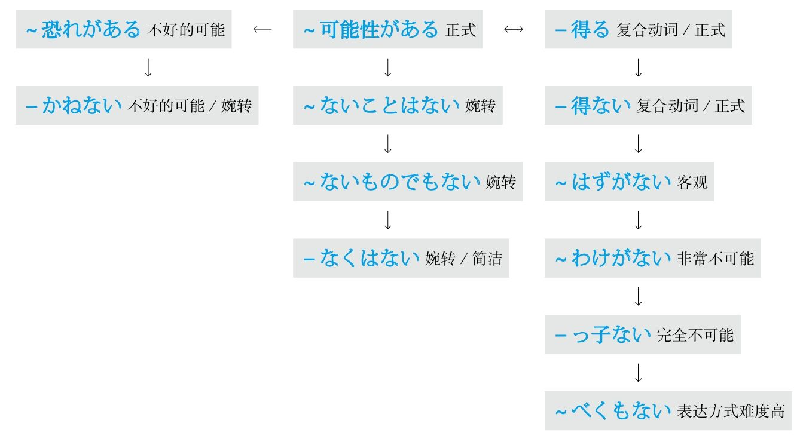

### 肯定 #5_8_3_0_0
* [[ 日语语法新思维（修订版）_Menu_0.md | Menu #5_8_3_0_0 ]]

#### ぜひ #5_8_3_1_0
* [[ 日语语法新思维（修订版）_Menu_0.md | Menu #5_8_3_1_0 ]]

**解释：** 副词「<ruby>是<rp>(</rp><rt>ぜ</rt><rp>)</rp></ruby><ruby>非<rp>(</rp><rt>ひ</rt><rp>)</rp></ruby>」的意思是“一定”
**着重：** 愿望强

例句：**<ruby>是<rp>(</rp><rt>ぜ</rt><rp>)</rp></ruby><ruby>非<rp>(</rp><rt>ひ</rt><rp>)</rp></ruby>** お<ruby>願<rp>(</rp><rt>ねが</rt><rp>)</rp></ruby>いします。
直译：一定拜托您。
意译：请您一定帮忙。

#### きっと #5_8_3_2_0
* [[ 日语语法新思维（修订版）_Menu_0.md | Menu #5_8_3_2_0 ]]

**解释：** 副词「きっと」的意思“一定”
**着重：** 推测

例句：**きっと** <ruby>成<rp>(</rp><rt>せい</rt><rp>)</rp></ruby><ruby>功<rp>(</rp><rt>こう</rt><rp>)</rp></ruby>する。
直译：一定成功。
意译：肯定会成功的。

#### 必ず #5_8_3_3_0
* [[ 日语语法新思维（修订版）_Menu_0.md | Menu #5_8_3_3_0 ]]

**解释：** 副词「<ruby>必<rp>(</rp><rt>かなら</rt><rp>)</rp></ruby>ず」的意思是“必定”
**着重：** 愿望、推测
**语气：** 强烈

例句：**<ruby>必<rp>(</rp><rt>かなら</rt><rp>)</rp></ruby>ず** <ruby>合<rp>(</rp><rt>ごう</rt><rp>)</rp></ruby><ruby>格<rp>(</rp><rt>かく</rt><rp>)</rp></ruby>してみせる。
直译：必定合格让人看看。
意译：一定要考上给他们看看。

#### ～でなくてなんだろう #5_8_3_4_0
* [[ 日语语法新思维（修订版）_Menu_0.md | Menu #5_8_3_4_0 ]]

**解释：** 「でなくて」是「ではない」的中顿形式；「<ruby>何<rp>(</rp><rt>なん</rt><rp>)</rp></ruby>」的意思是“什么”；「だろう」表示推测
**直译：** 不是～的话，是什么啊
**意译：** 肯定是～
**接续：** 名词

例句：<ruby>戦<rp>(</rp><rt>せん</rt><rp>)</rp></ruby><ruby>争<rp>(</rp><rt>そう</rt><rp>)</rp></ruby>で<ruby>多<rp>(</rp><rt>おお</rt><rp>)</rp></ruby>くの<ruby>人<rp>(</rp><rt>ひと</rt><rp>)</rp></ruby>が<ruby>殺<rp>(</rp><rt>ころ</rt><rp>)</rp></ruby>されているなんて、これが<ruby>悲<rp>(</rp><rt>ひ</rt><rp>)</rp></ruby><ruby>劇<rp>(</rp><rt>げき</rt><rp>)</rp></ruby>**でなくてなんだろう** 。
直译：在战争中，很多人被杀了，这不是悲剧是什么？
意译：战争中很多人都被杀害了，这不是悲剧是什么？

#### ～に決まっている #5_8_3_5_0
* [[ 日语语法新思维（修订版）_Menu_0.md | Menu #5_8_3_5_0 ]]

**解释：** 「に」表示方向或对象；自动词「<ruby>決<rp>(</rp><rt>き</rt><rp>)</rp></ruby>まる」的意思是“定了”；现在进行时「－ている」表示持续的状态
**直译：** 定了就是～
**意译：** 肯定是～
**语气：** 柔和
**注意：** 口语中经常省略て形后面的い，构成「～に<ruby>決<rp>(</rp><rt>き</rt><rp>)</rp></ruby>まってる」
**接续：** 任何词

例句：よく<ruby>考<rp>(</rp><rt>かんが</rt><rp>)</rp></ruby>えないで<ruby>言<rp>(</rp><rt>い</rt><rp>)</rp></ruby>ったことは、<ruby>後<rp>(</rp><rt>こう</rt><rp>)</rp></ruby><ruby>悔<rp>(</rp><rt>かい</rt><rp>)</rp></ruby>する**に<ruby>決<rp>(</rp><rt>き</rt><rp>)</rp></ruby>まっている** 。
直译：不好好想就说了话，肯定会后悔的。
意译：不好好想想就说，肯定会后悔的。

#### ～に違いない #5_8_3_6_0
* [[ 日语语法新思维（修订版）_Menu_0.md | Menu #5_8_3_6_0 ]]

**解释：** 「に」表示方向或对象；「<ruby>違<rp>(</rp><rt>ちが</rt><rp>)</rp></ruby>い」的意思是“错误”；「ない」的意思是“没有”
**直译：** 没有错误
**意译：** 肯定是～
**语气：** 较正式
**接续：** 任何词

例句：そうするだけの<ruby>理<rp>(</rp><rt>り</rt><rp>)</rp></ruby><ruby>由<rp>(</rp><rt>ゆう</rt><rp>)</rp></ruby>がある**に<ruby>違<rp>(</rp><rt>ちが</rt><rp>)</rp></ruby>いない** 。
直译：符合那样做的理由，有，肯定。
意译：肯定有那么做的理由。

#### ～にほかならない #5_8_3_7_0
* [[ 日语语法新思维（修订版）_Menu_0.md | Menu #5_8_3_7_0 ]]

**解释：** 「に」表示方向或对象；「ほか」的意思是“其他”；「ならない」是断定动词「<ruby>也<rp>(</rp><rt>なり</rt><rp>)</rp></ruby>」的否定形式，意思是“不是”
**直译：** 不是其他～
**意译：** 肯定是～
**语气：** 正式
**接续：** 任何词

例句：<ruby>今<rp>(</rp><rt>いま</rt><rp>)</rp></ruby>の<ruby>成<rp>(</rp><rt>せい</rt><rp>)</rp></ruby><ruby>功<rp>(</rp><rt>こう</rt><rp>)</rp></ruby>をもたらしたのは、<ruby>弛<rp>(</rp><rt>たゆ</rt><rp>)</rp></ruby>まない<ruby>努<rp>(</rp><rt>ど</rt><rp>)</rp></ruby><ruby>力<rp>(</rp><rt>りょく</rt><rp>)</rp></ruby>**にほかならない** 。
直译：现在的成功带来的是，不懈的努力，不是其他。
意译：正是不懈的努力才带来了今天的成功。

#### ～に相違ない #5_8_3_8_0
* [[ 日语语法新思维（修订版）_Menu_0.md | Menu #5_8_3_8_0 ]]

**解释：** 「に」表示方向或对象；「<ruby>相<rp>(</rp><rt>そう</rt><rp>)</rp></ruby><ruby>違<rp>(</rp><rt>い</rt><rp>)</rp></ruby>」的意思是“互相违反”；「ない」的意思是
“没有”

**直译：** 没有互相违反～
**意译：** 肯定是～
**语气：** 最正式
**接续：** 任何词

例句：そんな<ruby>非<rp>(</rp><rt>ひ</rt><rp>)</rp></ruby><ruby>常<rp>(</rp><rt>じょう</rt><rp>)</rp></ruby><ruby>識<rp>(</rp><rt>しき</rt><rp>)</rp></ruby>な<ruby>要<rp>(</rp><rt>よう</rt><rp>)</rp></ruby><ruby>求<rp>(</rp><rt>きゅう</rt><rp>)</rp></ruby>は<ruby>認<rp>(</rp><rt>みと</rt><rp>)</rp></ruby>められない**に<ruby>相<rp>(</rp><rt>そう</rt><rp>)</rp></ruby><ruby>違<rp>(</rp><rt>い</rt><rp>)</rp></ruby>ない** 。
直译：那么缺乏常识的要求，不被认可，肯定。
意译：肯定不允许提那么缺乏常识的要求。
语法关系图
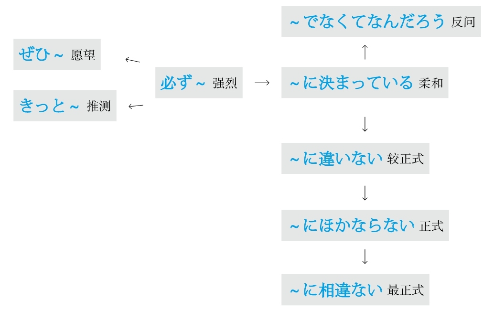

## L #5_9_0_0_0
* [[ 日语语法新思维（修订版）_Menu_0.md | Menu #5_9_0_0_0 ]]

### 累加 #5_9_1_0_0
* [[ 日语语法新思维（修订版）_Menu_0.md | Menu #5_9_1_0_0 ]]

#### それに #5_9_1_1_0
* [[ 日语语法新思维（修订版）_Menu_0.md | Menu #5_9_1_1_0 ]]

**解释：** 「それ」的意思是“那”；「に」表示方向；是「その<ruby>上<rp>(</rp><rt>うえ</rt><rp>)</rp></ruby>に」的简略形式
**意思：** 在此之上还～
**词性：** 接续词

例句：あの<ruby>店<rp>(</rp><rt>みせ</rt><rp>)</rp></ruby>はサービスも<ruby>最<rp>(</rp><rt>さい</rt><rp>)</rp></ruby><ruby>低<rp>(</rp><rt>てい</rt><rp>)</rp></ruby>だ。**それに** 、<ruby>料<rp>(</rp><rt>りょう</rt><rp>)</rp></ruby><ruby>理<rp>(</rp><rt>り</rt><rp>)</rp></ruby>もまずい。
直译：那个店，服务特别差，在此之上，菜也难吃。
意译：那个饭馆服务特别差，而且菜也难吃。

#### ～に加えて #5_9_1_2_0
* [[ 日语语法新思维（修订版）_Menu_0.md | Menu #5_9_1_2_0 ]]

**解释：** 「に」表示方向；他动词「<ruby>加<rp>(</rp><rt>くわ</rt><rp>)</rp></ruby>える」的意思是“添加”
**意思：** 在～上添加
**接续：** 名词

例句：<ruby>大<rp>(</rp><rt>たい</rt><rp>)</rp></ruby><ruby>気<rp>(</rp><rt>き</rt><rp>)</rp></ruby><ruby>汚<rp>(</rp><rt>お</rt><rp>)</rp></ruby><ruby>染<rp>(</rp><rt>せん</rt><rp>)</rp></ruby>が<ruby>進<rp>(</rp><rt>すす</rt><rp>)</rp></ruby>んでいること**に<ruby>加<rp>(</rp><rt>くわ</rt><rp>)</rp></ruby>えて** 、<ruby>海<rp>(</rp><rt>かい</rt><rp>)</rp></ruby><ruby>洋<rp>(</rp><rt>よう</rt><rp>)</rp></ruby><ruby>汚<rp>(</rp><rt>お</rt><rp>)</rp></ruby><ruby>染<rp>(</rp><rt>せん</rt><rp>)</rp></ruby>も<ruby>深<rp>(</rp><rt>しん</rt><rp>)</rp></ruby><ruby>刻<rp>(</rp><rt>こく</rt><rp>)</rp></ruby><ruby>化<rp>(</rp><rt>か</rt><rp>)</rp></ruby>してきた。
直译：大气污染一直在持续，在此之上，海洋污染也越发深刻化。
意译：大气污染一直在持续，而且海洋污染也越发严重。

#### ～上に #5_9_1_3_0
* [[ 日语语法新思维（修订版）_Menu_0.md | Menu #5_9_1_3_0 ]]

**解释：** 「<ruby>上<rp>(</rp><rt>うえ</rt><rp>)</rp></ruby>」的意思是“上面”；「に」表示方向
**意思：** 在～之上还～
**接续：** 修饰名词的规律（参照第一章的第三节）

例句：<ruby>工<rp>(</rp><rt>こう</rt><rp>)</rp></ruby><ruby>事<rp>(</rp><rt>じ</rt><rp>)</rp></ruby>の**<ruby>上<rp>(</rp><rt>うえ</rt><rp>)</rp></ruby>に** 、<ruby>事<rp>(</rp><rt>じ</rt><rp>)</rp></ruby><ruby>故<rp>(</rp><rt>こ</rt><rp>)</rp></ruby>まで<ruby>起<rp>(</rp><rt>お</rt><rp>)</rp></ruby>きて、<ruby>道<rp>(</rp><rt>みち</rt><rp>)</rp></ruby>は<ruby>余<rp>(</rp><rt>よ</rt><rp>)</rp></ruby><ruby>計<rp>(</rp><rt>けい</rt><rp>)</rp></ruby><ruby>混<rp>(</rp><rt>こ</rt><rp>)</rp></ruby>むようになった。
直译：施工之上，到了发生事故的地步，路越发变得堵了。
意译：施工加上出了事故，路越发堵了。
语法关系图

### 历经 #5_9_2_0_0
* [[ 日语语法新思维（修订版）_Menu_0.md | Menu #5_9_2_0_0 ]]

#### ～にわたって #5_9_2_1_0
* [[ 日语语法新思维（修订版）_Menu_0.md | Menu #5_9_2_1_0 ]]

**解释：** 「に」表示方向；自动词「<ruby>渡<rp>(</rp><rt>わた</rt><rp>)</rp></ruby>る」的意思是“渡过”
**意思：** 历经～期间、遍及～地方
**用于：** 期间或整个地方
**接续：** 名词

例句：<ruby>手<rp>(</rp><rt>しゅ</rt><rp>)</rp></ruby><ruby>術<rp>(</rp><rt>じゅつ</rt><rp>)</rp></ruby>は<ruby>十<rp>(</rp><rt>じゅう</rt><rp>)</rp></ruby><ruby>時<rp>(</rp><rt>じ</rt><rp>)</rp></ruby><ruby>間<rp>(</rp><rt>かん</rt><rp>)</rp></ruby>**にわたって** <ruby>行<rp>(</rp><rt>おこな</rt><rp>)</rp></ruby>われた。
直译：手术历经10个小时被进行了。
意译：手术进行了10个小时。

## M #5_10_0_0_0
* [[ 日语语法新思维（修订版）_Menu_0.md | Menu #5_10_0_0_0 ]]

### 没有必要 #5_10_1_0_0
* [[ 日语语法新思维（修订版）_Menu_0.md | Menu #5_10_1_0_0 ]]

#### ～必要はない #5_10_1_1_0
* [[ 日语语法新思维（修订版）_Menu_0.md | Menu #5_10_1_1_0 ]]

**解释：** 「<ruby>必<rp>(</rp><rt>ひつ</rt><rp>)</rp></ruby><ruby>要<rp>(</rp><rt>よう</rt><rp>)</rp></ruby>」的意思是“必要”；「は」强调了用于自动词前面的小主语「が」；「ない」的意思是“没有”
**意思：** 没有必要～
**接续：** 名词加の、动词的原形

例句：<ruby>慌<rp>(</rp><rt>あわ</rt><rp>)</rp></ruby>てる**<ruby>必<rp>(</rp><rt>ひつ</rt><rp>)</rp></ruby><ruby>要<rp>(</rp><rt>よう</rt><rp>)</rp></ruby>はない** よ、なんとかなるから。
直译：慌的必要没有，因为总会有办法的。
意译：用不着慌，总会有办法的。

#### ～ことはない #5_10_1_2_0
* [[ 日语语法新思维（修订版）_Menu_0.md | Menu #5_10_1_2_0 ]]

**解释：** 「こと」代替了「<ruby>必<rp>(</rp><rt>ひつ</rt><rp>)</rp></ruby><ruby>要<rp>(</rp><rt>よう</rt><rp>)</rp></ruby>」；「は」强调了用于自动词前面的小主语「が」；「ない」的意思是“没有”
**意思：** 没有必要～
**语气：** 正式
**接续：** 名词加の、动词的原形

例句：<ruby>自<rp>(</rp><rt>じ</rt><rp>)</rp></ruby><ruby>信<rp>(</rp><rt>しん</rt><rp>)</rp></ruby>を<ruby>持<rp>(</rp><rt>も</rt><rp>)</rp></ruby>ちなさいよ、<ruby>緊<rp>(</rp><rt>きん</rt><rp>)</rp></ruby><ruby>張<rp>(</rp><rt>ちょう</rt><rp>)</rp></ruby>する**ことはない** 。
直译：拥有自信啊，紧张的必要没有。
意译：要有自信，用不着紧张。

#### ～までもない #5_10_1_3_0
* [[ 日语语法新思维（修订版）_Menu_0.md | Menu #5_10_1_3_0 ]]

**解释：** 「までも」在「も→まで→までも」里语气最强；「ない」的意思是“没有”
**意思：** 没有到～的地步
**接续：** 动词的原形

例句：<ruby>言<rp>(</rp><rt>い</rt><rp>)</rp></ruby>う**までもなく** 、<ruby>彼<rp>(</rp><rt>かれ</rt><rp>)</rp></ruby>の<ruby>考<rp>(</rp><rt>かんが</rt><rp>)</rp></ruby>えは<ruby>偏<rp>(</rp><rt>かたよ</rt><rp>)</rp></ruby>っている。
直译：不到说的地步，他的想法偏了。
意译：不用说，他的想法有些偏激。

#### －なくていい #5_10_1_4_0
* [[ 日语语法新思维（修订版）_Menu_0.md | Menu #5_10_1_4_0 ]]

**解释：** 「－なくて」是动词的否定的简体的中顿形式；「いい」的意思是“可以、行”
**意思：** 不～也可以
**变形：** 动词的否定形的な（变形规律参照第一章的第二节）

例句：<ruby>立<rp>(</rp><rt>た</rt><rp>)</rp></ruby>ち<ruby>向<rp>(</rp><rt>む</rt><rp>)</rp></ruby>かいたくない<ruby>問<rp>(</rp><rt>もん</rt><rp>)</rp></ruby><ruby>題<rp>(</rp><rt>だい</rt><rp>)</rp></ruby>に、<ruby>無<rp>(</rp><rt>む</rt><rp>)</rp></ruby><ruby>理<rp>(</rp><rt>り</rt><rp>)</rp></ruby>して<ruby>立<rp>(</rp><rt>た</rt><rp>)</rp></ruby>ち<ruby>向<rp>(</rp><rt>む</rt><rp>)</rp></ruby>かわ**なくていい** 。
直译：对于不想面对的问题，不勉强去面对就可以。
意译：不想面对的问题就不用勉强去面对。

#### ～には当たらない #5_10_1_5_0
* [[ 日语语法新思维（修订版）_Menu_0.md | Menu #5_10_1_5_0 ]]

**解释：** 「に」表示方向；「は」表示强调；「<ruby>当<rp>(</rp><rt>あ</rt><rp>)</rp></ruby>たらない」是自动词「<ruby>当<rp>(</rp><rt>あ</rt><rp>)</rp></ruby>たる」的否定形式
**直译：** 不相当于～
**意译：** 不值得～、用不着～
**接续：** 名词、动词的原形

例句：<ruby>彼<rp>(</rp><rt>かれ</rt><rp>)</rp></ruby>の<ruby>実<rp>(</rp><rt>じつ</rt><rp>)</rp></ruby><ruby>力<rp>(</rp><rt>りょく</rt><rp>)</rp></ruby>を<ruby>考<rp>(</rp><rt>かんが</rt><rp>)</rp></ruby>えると、<ruby>今<rp>(</rp><rt>こん</rt><rp>)</rp></ruby><ruby>回<rp>(</rp><rt>かい</rt><rp>)</rp></ruby>の<ruby>彼<rp>(</rp><rt>かれ</rt><rp>)</rp></ruby>の<ruby>受<rp>(</rp><rt>じゅ</rt><rp>)</rp></ruby><ruby>賞<rp>(</rp><rt>しょう</rt><rp>)</rp></ruby>は<ruby>驚<rp>(</rp><rt>おどろ</rt><rp>)</rp></ruby>く**には<ruby>当<rp>(</rp><rt>あ</rt><rp>)</rp></ruby>たらない** 。
直译：他的实力考虑的话，这次的他的得奖感到吃惊，不相当于。
意译：考虑到他的实力，就用不着对他这次的得奖感到吃惊了。

例句：<ruby>彼<rp>(</rp><rt>かれ</rt><rp>)</rp></ruby>の<ruby>行<rp>(</rp><rt>こう</rt><rp>)</rp></ruby><ruby>為<rp>(</rp><rt>い</rt><rp>)</rp></ruby>は<ruby>称<rp>(</rp><rt>しょう</rt><rp>)</rp></ruby><ruby>賛<rp>(</rp><rt>さん</rt><rp>)</rp></ruby>**には<ruby>当<rp>(</rp><rt>あ</rt><rp>)</rp></ruby>たらない** 。
直译：他的行为称赞，不相当于。
意译：他的行为不值得称赞。

#### ～には足りない #5_10_1_6_0
* [[ 日语语法新思维（修订版）_Menu_0.md | Menu #5_10_1_6_0 ]]

**解释：** 「に」表示方向；「は」表示强调；「<ruby>足<rp>(</rp><rt>た</rt><rp>)</rp></ruby>りない」是自动词「<ruby>足<rp>(</rp><rt>た</rt><rp>)</rp></ruby>りる」的否定形式
**直译：** 不足于～
**意译：** 不值得～、用不着～
**接续：** 名词、动词的原形

例句：<ruby>充<rp>(</rp><rt>じゅう</rt><rp>)</rp></ruby><ruby>分<rp>(</rp><rt>ぶん</rt><rp>)</rp></ruby>な<ruby>準<rp>(</rp><rt>じゅん</rt><rp>)</rp></ruby><ruby>備<rp>(</rp><rt>び</rt><rp>)</rp></ruby>をしていれば、<ruby>失<rp>(</rp><rt>しっ</rt><rp>)</rp></ruby><ruby>敗<rp>(</rp><rt>ぱい</rt><rp>)</rp></ruby>を<ruby>恐<rp>(</rp><rt>おそ</rt><rp>)</rp></ruby>れる**には<ruby>足<rp>(</rp><rt>た</rt><rp>)</rp></ruby>りない** 。
直译：充分的准备做了的话，恐惧失败，不足于。
意译：只要做好充分准备，就不用害怕失败。
语法关系图
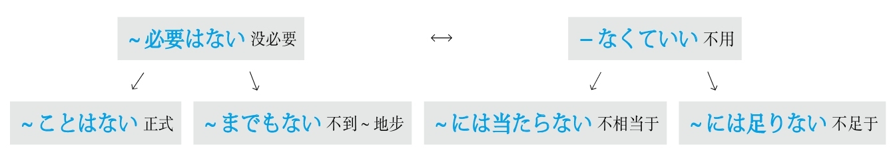

### 每 #5_10_2_0_0
* [[ 日语语法新思维（修订版）_Menu_0.md | Menu #5_10_2_0_0 ]]

#### －あたり #5_10_2_1_0
* [[ 日语语法新思维（修订版）_Menu_0.md | Menu #5_10_2_1_0 ]]

**解释：** 「あたり」是自动词「<ruby>当<rp>(</rp><rt>あ</rt><rp>)</rp></ruby>たる」的连用形，作名词用
**直译：** 相当于～
**注意：** 把总数平均
**接续：** 数量词

例句：<ruby>電<rp>(</rp><rt>でん</rt><rp>)</rp></ruby><ruby>気<rp>(</rp><rt>き</rt><rp>)</rp></ruby><ruby>代<rp>(</rp><rt>だい</rt><rp>)</rp></ruby>は<ruby>一<rp>(</rp><rt>いち</rt><rp>)</rp></ruby><ruby>日<rp>(</rp><rt>にち</rt><rp>)</rp></ruby>**<ruby>当<rp>(</rp><rt>あ</rt><rp>)</rp></ruby>たり** <ruby>2<rp>(</rp><rt>に</rt><rp>)</rp></ruby><ruby>00<rp>(</rp><rt>ひゃく</rt><rp>)</rp></ruby><ruby>円<rp>(</rp><rt>えん</rt><rp>)</rp></ruby>です。
直译：电费相当于一天200日元。
意译：电费平均每天200日元。

#### ～につき #5_10_2_2_0
* [[ 日语语法新思维（修订版）_Menu_0.md | Menu #5_10_2_2_0 ]]

**解释：** 「に」表示方向；「つき」是自动词「<ruby>付<rp>(</rp><rt>つ</rt><rp>)</rp></ruby>く」的连用形，作名词用
**直译：** 附着于～
**接续：** 数量词

例句：<ruby>水<rp>(</rp><rt>すい</rt><rp>)</rp></ruby><ruby>道<rp>(</rp><rt>どう</rt><rp>)</rp></ruby><ruby>代<rp>(</rp><rt>だい</rt><rp>)</rp></ruby>は<ruby>一<rp>(</rp><rt>ひと</rt><rp>)</rp></ruby><ruby>月<rp>(</rp><rt>つき</rt><rp>)</rp></ruby>**につき** 1<ruby>000<rp>(</rp><rt>せん</rt><rp>)</rp></ruby><ruby>円<rp>(</rp><rt>えん</rt><rp>)</rp></ruby>です。
直译：水费附着于一个月是1000日元。
意译：水费每月1000日元。

#### －ごとに #5_10_2_3_0
* [[ 日语语法新思维（修订版）_Menu_0.md | Menu #5_10_2_3_0 ]]

**解释：** 「<ruby>毎<rp>(</rp><rt>ごと</rt><rp>)</rp></ruby>」的意思是“每”；「に」表示副词
**意思：** 每～
**语气：** 正式
**接续：** 数量词、名词

例句：あいさつの<ruby>仕<rp>(</rp><rt>し</rt><rp>)</rp></ruby><ruby>方<rp>(</rp><rt>かた</rt><rp>)</rp></ruby>は<ruby>国<rp>(</rp><rt>くに</rt><rp>)</rp></ruby>**ごとに** <ruby>異<rp>(</rp><rt>こと</rt><rp>)</rp></ruby>なる。
直译：打招呼的方式，每个国家，不同。
意译：打招呼的方式每个国家都不同。

#### －ずつ #5_10_2_4_0
* [[ 日语语法新思维（修订版）_Menu_0.md | Menu #5_10_2_4_0 ]]

**解释：** 「ずつ」是「つつ」的浊音化，相当于“次次～”
**直译：** 次次～
**意译：** 每个～
**着重：** 每个都要有份儿
**接续：** 数量词

例句：この<ruby>3<rp>(</rp><rt>さん</rt><rp>)</rp></ruby><ruby>種<rp>(</rp><rt>しゅ</rt><rp>)</rp></ruby><ruby>類<rp>(</rp><rt>るい</rt><rp>)</rp></ruby>の<ruby>薬<rp>(</rp><rt>くすり</rt><rp>)</rp></ruby>は<ruby>4<rp>(</rp><rt>よ</rt><rp>)</rp></ruby><ruby>時<rp>(</rp><rt>じ</rt><rp>)</rp></ruby><ruby>間<rp>(</rp><rt>かん</rt><rp>)</rp></ruby>おきに<ruby>1<rp>(</rp><rt>いち</rt><rp>)</rp></ruby><ruby>錠<rp>(</rp><rt>じょう</rt><rp>)</rp></ruby>**ずつ** <ruby>飲<rp>(</rp><rt>の</rt><rp>)</rp></ruby>むこと。
直译：这3种药，每隔1小时，每种1片，吃，正式的命令。
意译：这3种药必须每隔4小时每种各吃1片。

#### －おきに #5_10_2_5_0
* [[ 日语语法新思维（修订版）_Menu_0.md | Menu #5_10_2_5_0 ]]

**解释：** 「おき」是自动词「<ruby>置<rp>(</rp><rt>お</rt><rp>)</rp></ruby>く」的连用形，作名词；「に」表示副词
**直译：** 放置～
**意译：** 隔了～
**着重：** 期间不长
**接续：** 数量词

例句：この<ruby>薬<rp>(</rp><rt>くすり</rt><rp>)</rp></ruby>は<ruby>4<rp>(</rp><rt>よ</rt><rp>)</rp></ruby><ruby>時<rp>(</rp><rt>じ</rt><rp>)</rp></ruby><ruby>間<rp>(</rp><rt>かん</rt><rp>)</rp></ruby>**おきに** <ruby>飲<rp>(</rp><rt>の</rt><rp>)</rp></ruby>むこと。
直译：这个药隔4小时吃，正式的命令。
意译：注意这个药每隔4小时吃一次。

#### －ぶりに #5_10_2_6_0
* [[ 日语语法新思维（修订版）_Menu_0.md | Menu #5_10_2_6_0 ]]

**解释：** 「<ruby>振<rp>(</rp><rt>ふ</rt><rp>)</rp></ruby>り」的意思是“甩、挥舞”；「に」表示副词
**直译：** 甩掉了～
**意译：** 隔了～再一次做～
**注意：** 与前面的数量词构成复合词，形成浊音化
**着重：** 期间较长
**接续：** 数量词

例句：<ruby>田<rp>(</rp><rt>た</rt><rp>)</rp></ruby><ruby>中<rp>(</rp><rt>なか</rt><rp>)</rp></ruby><ruby>先<rp>(</rp><rt>せん</rt><rp>)</rp></ruby><ruby>生<rp>(</rp><rt>せい</rt><rp>)</rp></ruby>とは<ruby>1<rp>(</rp><rt>じゅう</rt><rp>)</rp></ruby><ruby>5<rp>(</rp><rt>ご</rt><rp>)</rp></ruby><ruby>年<rp>(</rp><rt>ねん</rt><rp>)</rp></ruby>**ぶりに** <ruby>再<rp>(</rp><rt>さい</rt><rp>)</rp></ruby><ruby>会<rp>(</rp><rt>かい</rt><rp>)</rp></ruby>した。
直译：和田中老师，甩掉了15年，再相会了。
意译：和田中老师隔了15年又相见了。
语法关系图
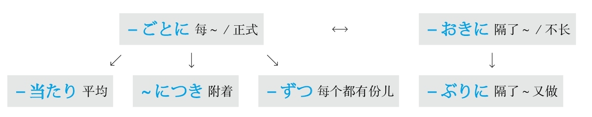

### 每次 #5_10_3_0_0
* [[ 日语语法新思维（修订版）_Menu_0.md | Menu #5_10_3_0_0 ]]

#### ～度に #5_10_3_1_0
* [[ 日语语法新思维（修订版）_Menu_0.md | Menu #5_10_3_1_0 ]]

**解释：** 「<ruby>度<rp>(</rp><rt>たび</rt><rp>)</rp></ruby>」的意思是“～次、～回”；「に」表示副词
**意思：** 每次～
**口语：** 「～たんびに」
**接续：** 名词加の、动词的原形

例句：<ruby>注<rp>(</rp><rt>ちゅう</rt><rp>)</rp></ruby><ruby>意<rp>(</rp><rt>い</rt><rp>)</rp></ruby>される**<ruby>度<rp>(</rp><rt>たび</rt><rp>)</rp></ruby>に** 、<ruby>人<rp>(</rp><rt>にん</rt><rp>)</rp></ruby><ruby>間<rp>(</rp><rt>げん</rt><rp>)</rp></ruby><ruby>的<rp>(</rp><rt>てき</rt><rp>)</rp></ruby>に<ruby>成<rp>(</rp><rt>せい</rt><rp>)</rp></ruby><ruby>長<rp>(</rp><rt>ちょう</rt><rp>)</rp></ruby>する。
直译：每次被指出错误，在做人方面就成熟。
意译：每次别人给指出错误，都会变得更加成熟。

#### ～につけ #5_10_3_2_0
* [[ 日语语法新思维（修订版）_Menu_0.md | Menu #5_10_3_2_0 ]]

**解释：** 「に」表示方向；「つけ」是表示“在”的自动词「<ruby>就<rp>(</rp><rt>つ</rt><rp>)</rp></ruby>ける、<ruby>即<rp>(</rp><rt>つ</rt><rp>)</rp></ruby>ける」的连用形
**意思：** 每当～
**语气：** 古语、正式
**接续：** 动词的原形

例句：<ruby>家<rp>(</rp><rt>か</rt><rp>)</rp></ruby><ruby>族<rp>(</rp><rt>ぞく</rt><rp>)</rp></ruby>の<ruby>写<rp>(</rp><rt>しゃ</rt><rp>)</rp></ruby><ruby>真<rp>(</rp><rt>しん</rt><rp>)</rp></ruby>を<ruby>見<rp>(</rp><rt>み</rt><rp>)</rp></ruby>る**につけ** 、<ruby>会<rp>(</rp><rt>あ</rt><rp>)</rp></ruby>いたくて<ruby>仕<rp>(</rp><rt>し</rt><rp>)</rp></ruby><ruby>方<rp>(</rp><rt>かた</rt><rp>)</rp></ruby>がない。
直译：每当看到家里人的照片，想得，没办法。
意译：每次看到家里人的照片就特别想他们。

#### －つつ #5_10_3_3_0
* [[ 日语语法新思维（修订版）_Menu_0.md | Menu #5_10_3_3_0 ]]

**解释：** 「つつ」的意思是“次次”
**词性：** 名词
**注意：** 「－つつ」后加表示强调的「も」构成「－つつも」，表示转折（虽然次次～，但是～）
**接续：** 动词的连用形

例句：<ruby>悪<rp>(</rp><rt>わる</rt><rp>)</rp></ruby>いと<ruby>知<rp>(</rp><rt>し</rt><rp>)</rp></ruby>り**つつも** 、ついやってしまうのが、ギャンブルだ。
直译：次次知道不好，但是终于不由自主地去做的是赌博。
意译：虽然次次都知道不好，但还是不由自主地去赌博。

例句：<ruby>参<rp>(</rp><rt>さん</rt><rp>)</rp></ruby><ruby>考<rp>(</rp><rt>こう</rt><rp>)</rp></ruby><ruby>書<rp>(</rp><rt>しょ</rt><rp>)</rp></ruby>を<ruby>持<rp>(</rp><rt>も</rt><rp>)</rp></ruby>って<ruby>来<rp>(</rp><rt>こ</rt><rp>)</rp></ruby>なければと<ruby>思<rp>(</rp><rt>おも</rt><rp>)</rp></ruby>い**つつ** 、<ruby>毎<rp>(</rp><rt>まい</rt><rp>)</rp></ruby><ruby>回<rp>(</rp><rt>かい</rt><rp>)</rp></ruby><ruby>忘<rp>(</rp><rt>わす</rt><rp>)</rp></ruby>れている。
直译：次次想着必须把参考书带来，但是每次忘。
意译：虽然次次想着必须带参考书来，可是每次都忘记。
语法关系图
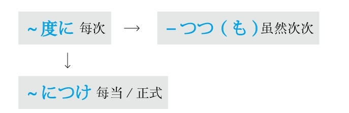

### 面向 #5_10_4_0_0
* [[ 日语语法新思维（修订版）_Menu_0.md | Menu #5_10_4_0_0 ]]

#### －向き #5_10_4_1_0
* [[ 日语语法新思维（修订版）_Menu_0.md | Menu #5_10_4_1_0 ]]

**解释：** 「<ruby>向<rp>(</rp><rt>む</rt><rp>)</rp></ruby>き」是表示动作的结果或状态的自动词「<ruby>向<rp>(</rp><rt>む</rt><rp>)</rp></ruby>く」的连用形，作名词用
**直译：** 面向于～
**意译：** 适合于～
**接续：** 名词

例句：それを<ruby>縦<rp>(</rp><rt>たて</rt><rp>)</rp></ruby>**<ruby>向<rp>(</rp><rt>む</rt><rp>)</rp></ruby>き** にしてください。
直译：把那个朝向竖的。
意译：请把那个立起来。

例句：この<ruby>機<rp>(</rp><rt>き</rt><rp>)</rp></ruby><ruby>械<rp>(</rp><rt>かい</rt><rp>)</rp></ruby>は<ruby>一<rp>(</rp><rt>いっ</rt><rp>)</rp></ruby><ruby>般<rp>(</rp><rt>ぱん</rt><rp>)</rp></ruby><ruby>家<rp>(</rp><rt>か</rt><rp>)</rp></ruby><ruby>庭<rp>(</rp><rt>てい</rt><rp>)</rp></ruby>**<ruby>向<rp>(</rp><rt>む</rt><rp>)</rp></ruby>き** です。
直译：这个机器，面向一般家庭。
意译：这种机器适合于一般家庭。

#### －向け #5_10_4_2_0
* [[ 日语语法新思维（修订版）_Menu_0.md | Menu #5_10_4_2_0 ]]

**解释：** 「<ruby>向<rp>(</rp><rt>む</rt><rp>)</rp></ruby>け」是表示动作的他动词「<ruby>向<rp>(</rp><rt>む</rt><rp>)</rp></ruby>ける」的连用形，作名词用
**直译：** 面向于～
**意译：** 为了适合于～而制作的
**接续：** 名词

例句：このコースは<ruby>初<rp>(</rp><rt>しょ</rt><rp>)</rp></ruby><ruby>心<rp>(</rp><rt>しん</rt><rp>)</rp></ruby><ruby>者<rp>(</rp><rt>しゃ</rt><rp>)</rp></ruby>**<ruby>向<rp>(</rp><rt>む</rt><rp>)</rp></ruby>け** に<ruby>設<rp>(</rp><rt>もう</rt><rp>)</rp></ruby>けられている。
直译：这个课程，面向初学者，被设置着。
意译：这个课程是为初学者设置的。
语法关系图
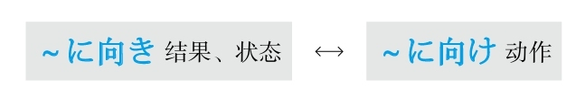

## N #5_11_0_0_0
* [[ 日语语法新思维（修订版）_Menu_0.md | Menu #5_11_0_0_0 ]]

### 难道是 #5_11_1_0_0
* [[ 日语语法新思维（修订版）_Menu_0.md | Menu #5_11_1_0_0 ]]

#### まさか～ #5_11_1_1_0
* [[ 日语语法新思维（修订版）_Menu_0.md | Menu #5_11_1_1_0 ]]

**解释：** 「<ruby>正<rp>(</rp><rt>まさ</rt><rp>)</rp></ruby>」的意思是“真的”；「か」表示不确定
**用法：** 与表示推测的「～だろう」相呼应
**意思：** 别是～吧、不会是～吧

例句：**まさか** <ruby>彼<rp>(</rp><rt>かれ</rt><rp>)</rp></ruby>はもう<ruby>知<rp>(</rp><rt>し</rt><rp>)</rp></ruby>った**だろう** 。
直译：真的他已经知道了吧。
意译：他不会是已经知道了吧。

**用法：** 与「～とは<ruby>思<rp>(</rp><rt>おも</rt><rp>)</rp></ruby>わなかった」相呼应
**意思：** 真没有想到～

例句：**まさか** あなたがこんな<ruby>人<rp>(</rp><rt>ひと</rt><rp>)</rp></ruby>だ**とは<ruby>思<rp>(</rp><rt>おも</rt><rp>)</rp></ruby>わなかった** 。
直译：真没想到你是这样的人。
意译：真没想到你是这种人。

**用法：** 单独使用
**意思：** 怎么可能啊

例句：**まさか** ！
直译：真的吗！
意译：怎么可能啊！

## Q #5_12_0_0_0
* [[ 日语语法新思维（修订版）_Menu_0.md | Menu #5_12_0_0_0 ]]

### 期限 #5_12_1_0_0
* [[ 日语语法新思维（修订版）_Menu_0.md | Menu #5_12_1_0_0 ]]

#### ～までに #5_12_1_1_0
* [[ 日语语法新思维（修订版）_Menu_0.md | Menu #5_12_1_1_0 ]]

**解释：** 「まで」的意思是“到～”；「に」表示方向，在此强调时间点
**意思：** 到～为止
**区别：** 「まで」表示在此之前一直做某事，「までに」表示到此为止的期限
**接续：** 时间

例句：レポートは<ruby>午後<rp>(</rp><rt>ごご</rt><rp>)</rp></ruby>の<ruby>5<rp>(</rp><rt>ご</rt><rp>)</rp></ruby><ruby>時<rp>(</rp><rt>じ</rt><rp>)</rp></ruby>**までに** <ruby>提<rp>(</rp><rt>てい</rt><rp>)</rp></ruby><ruby>出<rp>(</rp><rt>しゅつ</rt><rp>)</rp></ruby>すること。
直译：小论文在下午5点前提出，正式的命令。
意译：务必在下午5点前提交小论文。

### 强调 #5_12_2_0_0
* [[ 日语语法新思维（修订版）_Menu_0.md | Menu #5_12_2_0_0 ]]

#### ～あっての #5_12_2_1_0
* [[ 日语语法新思维（修订版）_Menu_0.md | Menu #5_12_2_1_0 ]]

**解释：** 「あって」是「<ruby>有<rp>(</rp><rt>あ</rt><rp>)</rp></ruby>る」的中顿形式，意思是“有了”；「の」是为了后面接名词，意思是“的”
**意思：** 有了～以后才有～
**着重：** て表示动作前后顺序的“了”，侧重于时间的前后
**接续：** 前后接名词

例句：あなた**あっての** わたしです。
直译：有你，的，有我。
意译：正因为有你才会有我。

#### ～からこそ #5_12_2_2_0
* [[ 日语语法新思维（修订版）_Menu_0.md | Menu #5_12_2_2_0 ]]

**解释：** 「から」的意思是“因为”；「こそ」表示强调，此处翻译成“正是”
**意思：** 正是因为～
**接续：** 谓语词（动词、形容词、助动词）的简体

例句：わからない**からこそ** 、わかるふりをする。
直译：正是因为不懂，作出懂的样子。
意译：正是因为不懂才装懂。

#### －ばこそ #5_12_2_3_0
* [[ 日语语法新思维（修订版）_Menu_0.md | Menu #5_12_2_3_0 ]]

**解释：** 「～ば」是表示原因的「から」的古语；「こそ」表示强调，翻译成“正是”
**直译：** 正是有～的条件，才有～
**意译：** 正是因为～
**语气：** 正式
**变形：** ば形（变形规律参照第一章的第二节）

例句：<ruby>忙<rp>(</rp><rt>いそが</rt><rp>)</rp></ruby>しけれ**ばこそ** 、<ruby>少<rp>(</rp><rt>すく</rt><rp>)</rp></ruby>ない<ruby>時<rp>(</rp><rt>じ</rt><rp>)</rp></ruby><ruby>間<rp>(</rp><rt>かん</rt><rp>)</rp></ruby>を<ruby>有<rp>(</rp><rt>ゆう</rt><rp>)</rp></ruby><ruby>効<rp>(</rp><rt>こう</rt><rp>)</rp></ruby>に<ruby>使<rp>(</rp><rt>つか</rt><rp>)</rp></ruby>えるかもしれない。
直译：正是有忙这个条件，把少的时间有效地能够利用，可能。
意译：正是因为忙，所以才有可能把仅有的时间有效地利用。

#### ～だけに #5_12_2_4_0
* [[ 日语语法新思维（修订版）_Menu_0.md | Menu #5_12_2_4_0 ]]

**解释：** 「だけ」在此的意思是“只是”；「に」表示副词
**直译：** 只是～、就是～
**意译：** 就是因为～
**重点：** 此处的因果关系不是通过「～だけに」，而是通过上下文推测的
**注意：** 多用于带来不好的后果；带来好的结果的原因用「～おかげで」（托～的福）
**接续：** 动词和形容词的简体、名词、形容动词加な

例句：<ruby>彼<rp>(</rp><rt>かれ</rt><rp>)</rp></ruby>の<ruby>指<rp>(</rp><rt>し</rt><rp>)</rp></ruby><ruby>摘<rp>(</rp><rt>てき</rt><rp>)</rp></ruby>は<ruby>正<rp>(</rp><rt>ただ</rt><rp>)</rp></ruby>しい**だけに** 、かえって<ruby>私<rp>(</rp><rt>わたし</rt><rp>)</rp></ruby>は<ruby>反<rp>(</rp><rt>はん</rt><rp>)</rp></ruby><ruby>発<rp>(</rp><rt>ぱつ</rt><rp>)</rp></ruby>を<ruby>感<rp>(</rp><rt>かん</rt><rp>)</rp></ruby>じた。
直译：只是他的指正太正确了，反倒，我感到了逆反。
意译：就是因为他对我的指正太正确了，反倒引起了我的逆反心理。

#### ～ばかりに #5_12_2_5_0
* [[ 日语语法新思维（修订版）_Menu_0.md | Menu #5_12_2_5_0 ]]

**解释：** 「ばかり」的意思是“全是、光是、净是”；「に」表示副词
**直译：** 全是～
**意译：** 全是因为～
**重点：** 此处的因果关系不是通过「～ばかりに」，而是通过上下文推测的
**注意：** 多用于带来不好的后果；带来好的结果的原因用「～おかげで」（托～的福）
**接续：** 动词的た形的简体、形容词的简体、形容动词加な、名词加である

例句：<ruby>彼<rp>(</rp><rt>かれ</rt><rp>)</rp></ruby>の<ruby>言<rp>(</rp><rt>こと</rt><rp>)</rp></ruby><ruby>葉<rp>(</rp><rt>ば</rt><rp>)</rp></ruby>を<ruby>信<rp>(</rp><rt>しん</rt><rp>)</rp></ruby>じた**ばかりに** 、ひどい<ruby>目<rp>(</rp><rt>め</rt><rp>)</rp></ruby>に<ruby>遭<rp>(</rp><rt>あ</rt><rp>)</rp></ruby>った。
直译：全是相信了他的话，倒了大霉。
意译：全是因为我相信了他的话，结果倒了大霉。

例句：<ruby>外<rp>(</rp><rt>がい</rt><rp>)</rp></ruby><ruby>国<rp>(</rp><rt>こく</rt><rp>)</rp></ruby><ruby>人<rp>(</rp><rt>じん</rt><rp>)</rp></ruby>である**ばかりに** 、<ruby>就<rp>(</rp><rt>しゅう</rt><rp>)</rp></ruby><ruby>職<rp>(</rp><rt>しょく</rt><rp>)</rp></ruby>が<ruby>難<rp>(</rp><rt>むずか</rt><rp>)</rp></ruby>しい。
直译：全是是外国人，就业很困难。
意译：全因为是外国人，所以很难找到工作。

#### ～どころか #5_12_2_6_0
* [[ 日语语法新思维（修订版）_Menu_0.md | Menu #5_12_2_6_0 ]]

**解释：** 「どころ」是「ところ」的浊音化，表示“时间、地点、程度、状况”；「か」表示不确定
**意思：** 哪儿是～的时候啊、哪儿是～的程度啊、哪儿是～的状况啊
**注意：** 「どころ」比「ところ」的语气强，不用于肯定形，只用于否定形和疑问形，此处用于疑问形
**接续：** 动词和形容词的原形、形容动词加な、名词

例句：もうすぐ<ruby>試<rp>(</rp><rt>し</rt><rp>)</rp></ruby><ruby>験<rp>(</rp><rt>けん</rt><rp>)</rp></ruby>だよ、<ruby>遊<rp>(</rp><rt>あそ</rt><rp>)</rp></ruby>ぶ**どろこか** 、<ruby>寝<rp>(</rp><rt>ね</rt><rp>)</rp></ruby>る<ruby>時<rp>(</rp><rt>じ</rt><rp>)</rp></ruby><ruby>間<rp>(</rp><rt>かん</rt><rp>)</rp></ruby>もないよ。
直译：马上就是考试了，哪儿是玩儿的时候啊，睡觉的时间都没有。
意译：马上就该考试了，哪儿是玩儿的时候啊，连睡觉的时间都没有。

例句：あの<ruby>薬<rp>(</rp><rt>くすり</rt><rp>)</rp></ruby>を<ruby>飲<rp>(</rp><rt>の</rt><rp>)</rp></ruby>んで、<ruby>病<rp>(</rp><rt>びょう</rt><rp>)</rp></ruby><ruby>状<rp>(</rp><rt>じょう</rt><rp>)</rp></ruby>が<ruby>軽<rp>(</rp><rt>かる</rt><rp>)</rp></ruby>くなる**どころか** 、<ruby>逆<rp>(</rp><rt>ぎゃく</rt><rp>)</rp></ruby>に<ruby>重<rp>(</rp><rt>おも</rt><rp>)</rp></ruby>くなった。
直译：吃了那个药，病情哪儿是减轻了的状况啊，反倒加重了。
意译：吃了那个药，病情不但没有减轻，反倒加重了。

#### ～どころではない #5_12_2_7_0
* [[ 日语语法新思维（修订版）_Menu_0.md | Menu #5_12_2_7_0 ]]

**解释：** 「どころ」是「ところ」的浊音化，表示“时间、地点、程度、状况”；「ではない」的意思是“不是”
**意思：** 不是～的时候、不是～的程度、不是～的状况
**注意：** 「どころ」比「ところ」的语气强，不用于肯定形，只用于否定形和疑问形，此处用于否定形
**接续：** 动词和形容词的原形、形容动词加な名词

例句：<ruby>今<rp>(</rp><rt>いま</rt><rp>)</rp></ruby>はばたばたしているから、<ruby>世<rp>(</rp><rt>せ</rt><rp>)</rp></ruby><ruby>間<rp>(</rp><rt>けん</rt><rp>)</rp></ruby><ruby>話<rp>(</rp><rt>ばなし</rt><rp>)</rp></ruby>する**どころじゃない** 。
直译：现在忙，所以不是聊天的时候。
意译：现在特忙，可不是聊天的时候。

#### まさに～ #5_12_2_8_0
* [[ 日语语法新思维（修订版）_Menu_0.md | Menu #5_12_2_8_0 ]]

**解释：** 「<ruby>正<rp>(</rp><rt>まさ</rt><rp>)</rp></ruby>」的意思是“正”，表示强调；「に」表示副词
**意思：** 正是～、正要～

例句：これは**まさに** <ruby>彼<rp>(</rp><rt>かれ</rt><rp>)</rp></ruby>の<ruby>仕<rp>(</rp><rt>し</rt><rp>)</rp></ruby><ruby>業<rp>(</rp><rt>わざ</rt><rp>)</rp></ruby>だ。
直译：这正是他干的事。
意译：这就是他干的事。
语法关系图
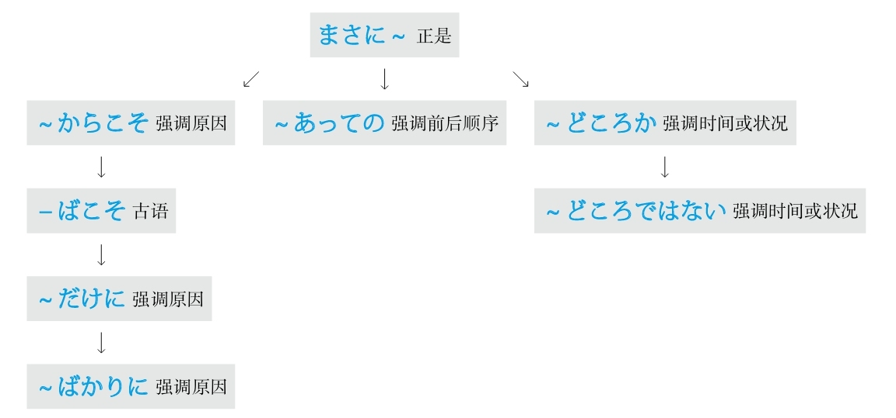

### 倾向 #5_12_3_0_0
* [[ 日语语法新思维（修订版）_Menu_0.md | Menu #5_12_3_0_0 ]]

#### ～傾向がある #5_12_3_1_0
* [[ 日语语法新思维（修订版）_Menu_0.md | Menu #5_12_3_1_0 ]]

**意思：** 有～的倾向
**用于：** 好的倾向、不好的倾向
**接续：** 修饰名词的规律（参照第一章的第三节）

例句：<ruby>近<rp>(</rp><rt>ちか</rt><rp>)</rp></ruby><ruby>頃<rp>(</rp><rt>ごろ</rt><rp>)</rp></ruby>は<ruby>人<rp>(</rp><rt>じん</rt><rp>)</rp></ruby><ruby>民<rp>(</rp><rt>みん</rt><rp>)</rp></ruby><ruby>元<rp>(</rp><rt>げん</rt><rp>)</rp></ruby>のレートが<ruby>高<rp>(</rp><rt>たか</rt><rp>)</rp></ruby>くなっている**<ruby>傾<rp>(</rp><rt>けい</rt><rp>)</rp></ruby><ruby>向<rp>(</rp><rt>こう</rt><rp>)</rp></ruby>がある** 。
直译：最近人民币的汇率变高的倾向有。
意译：最近人民币的汇率有升高的趋势。

#### ～嫌いがある #5_12_3_2_0
* [[ 日语语法新思维（修订版）_Menu_0.md | Menu #5_12_3_2_0 ]]

**意思：** 有～之嫌
**用于：** 不好的倾向
**接续：** 修饰名词的规律（参照第一章的第三节）

例句：<ruby>彼<rp>(</rp><rt>かれ</rt><rp>)</rp></ruby>は<ruby>仕<rp>(</rp><rt>し</rt><rp>)</rp></ruby><ruby>事<rp>(</rp><rt>ごと</rt><rp>)</rp></ruby>をする<ruby>時<rp>(</rp><rt>とき</rt><rp>)</rp></ruby><ruby>一<rp>(</rp><rt>いっ</rt><rp>)</rp></ruby><ruby>貫<rp>(</rp><rt>かん</rt><rp>)</rp></ruby><ruby>性<rp>(</rp><rt>せい</rt><rp>)</rp></ruby>に<ruby>欠<rp>(</rp><rt>か</rt><rp>)</rp></ruby>ける**きらいがある** 。
直译：他做事时，有缺乏一贯性之嫌。
意译：他做工作缺乏始终如一的精神。

#### ～一方だ #5_12_3_3_0
* [[ 日语语法新思维（修订版）_Menu_0.md | Menu #5_12_3_3_0 ]]

**解释：** 「<ruby>一<rp>(</rp><rt>いっ</rt><rp>)</rp></ruby><ruby>方<rp>(</rp><rt>ぽう</rt><rp>)</rp></ruby>」表示对立的两个方向或方面中的其中一个
**直译：** 倾向于一方
**意译：** 一个劲儿地～
**注意：** 因为要表达对立方，所以常用有对应的反义词的词，比如：「<ruby>増<rp>(</rp><rt>ふ</rt><rp>)</rp></ruby>える、<ruby>減<rp>(</rp><rt>へ</rt><rp>)</rp></ruby>る」，「<ruby>痩<rp>(</rp><rt>や</rt><rp>)</rp></ruby>せる、<ruby>太<rp>(</rp><rt>ふと</rt><rp>)</rp></ruby>る」等；此外，不能变换「～<ruby>一<rp>(</rp><rt>いっ</rt><rp>)</rp></ruby><ruby>方<rp>(</rp><rt>ぽう</rt><rp>)</rp></ruby>だ」的形式和时态，只能用「～<ruby>一<rp>(</rp><rt>いっ</rt><rp>)</rp></ruby><ruby>方<rp>(</rp><rt>ぽう</rt><rp>)</rp></ruby>だ」或「～<ruby>一<rp>(</rp><rt>いっ</rt><rp>)</rp></ruby><ruby>方<rp>(</rp><rt>ぽう</rt><rp>)</rp></ruby>です」
**接续：** 动词的原形

例句：<ruby>都<rp>(</rp><rt>と</rt><rp>)</rp></ruby><ruby>市<rp>(</rp><rt>し</rt><rp>)</rp></ruby>の<ruby>環<rp>(</rp><rt>かん</rt><rp>)</rp></ruby><ruby>境<rp>(</rp><rt>きょう</rt><rp>)</rp></ruby>は<ruby>悪<rp>(</rp><rt>あっ</rt><rp>)</rp></ruby><ruby>化<rp>(</rp><rt>か</rt><rp>)</rp></ruby>する**<ruby>一<rp>(</rp><rt>いっ</rt><rp>)</rp></ruby><ruby>方<rp>(</rp><rt>ぽう</rt><rp>)</rp></ruby>だ** 。
直译：城市的环境，往恶化的一方倾斜。
意译：城市的环境不断地恶化。
语法关系图
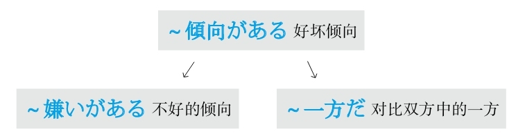

### 轻视 #5_12_4_0_0
* [[ 日语语法新思维（修订版）_Menu_0.md | Menu #5_12_4_0_0 ]]

#### ～なんか #5_12_4_1_0
* [[ 日语语法新思维（修订版）_Menu_0.md | Menu #5_12_4_1_0 ]]

**解释：** 「なんか」中的「なん」的意思是“什么”；「か」表示不确定
**注意：** 「なんか」是「など」的口语形式；语气助词
**意思：** ～之类的
**语气：** 轻视或自谦
**接续：** 名词

例句：わたし**なんか** …
直译：我这样的人……
意译：我哪儿行啊。

例句：わたしはうそ**なんか** つきませんよ。
直译：我，撒谎之类的事，不会做啊。
意译：我才不会撒谎呢。

#### ～なんて #5_12_4_2_0
* [[ 日语语法新思维（修订版）_Menu_0.md | Menu #5_12_4_2_0 ]]

**解释：** 「なんて」中的「なん」的意思是“什么”；「て」是表示“内容”的「と」；语气助词
**直译：** 说什么呢？
**意译：** ～之类的
**语气：** 轻视或惊讶
**区别：** 轻视的语气比「なんか」强
**接续：** 任何词

例句：<ruby>優<rp>(</rp><rt>ゆう</rt><rp>)</rp></ruby><ruby>等<rp>(</rp><rt>とう</rt><rp>)</rp></ruby><ruby>生<rp>(</rp><rt>せい</rt><rp>)</rp></ruby>の<ruby>彼<rp>(</rp><rt>かれ</rt><rp>)</rp></ruby>が<ruby>不<rp>(</rp><rt>ふ</rt><rp>)</rp></ruby><ruby>合<rp>(</rp><rt>ごう</rt><rp>)</rp></ruby><ruby>格<rp>(</rp><rt>かく</rt><rp>)</rp></ruby>だ**なんて** <ruby>驚<rp>(</rp><rt>おどろ</rt><rp>)</rp></ruby>いてしまった。
直译：优等生的他，不合格之类的事，吃惊。
意译：作为优等生的他竟然不及格，真让人吃惊。

例句：<ruby>裏<rp>(</rp><rt>うら</rt><rp>)</rp></ruby>で<ruby>人<rp>(</rp><rt>ひと</rt><rp>)</rp></ruby>の<ruby>悪<rp>(</rp><rt>わる</rt><rp>)</rp></ruby><ruby>口<rp>(</rp><rt>ぐち</rt><rp>)</rp></ruby>を<ruby>言<rp>(</rp><rt>い</rt><rp>)</rp></ruby>う**なんて** ひどい。
直译：在背后说别人的坏话之类的事太过分了。
意译：在背后说别人的坏话，真是太过分了。

**注意：** 「なんて」后面接名词，代替了「という」
**语气：** 轻视或惊讶

例句：<ruby>絶<rp>(</rp><rt>ぜっ</rt><rp>)</rp></ruby><ruby>対<rp>(</rp><rt>たい</rt><rp>)</rp></ruby>に<ruby>儲<rp>(</rp><rt>もう</rt><rp>)</rp></ruby>かる**なんて** <ruby>話<rp>(</rp><rt>はなし</rt><rp>)</rp></ruby>は<ruby>怪<rp>(</rp><rt>あや</rt><rp>)</rp></ruby>しい。
直译：绝对赚钱之类的事，奇怪。
意译：说绝对赚钱，让人难以置信。

#### ～ときたら #5_12_4_3_0
* [[ 日语语法新思维（修订版）_Menu_0.md | Menu #5_12_4_3_0 ]]

**解释：** 「と」表示内容；「きたら」是「<ruby>言<rp>(</rp><rt>い</rt><rp>)</rp></ruby>ったら」的音变
**意思：** 提起～、说到～
**语气：** 轻视或不满
**接续：** 名词

例句：<ruby>彼女<rp>(</rp><rt>かのじょ</rt><rp>)</rp></ruby>**ときたら** 、<ruby>最<rp>(</rp><rt>さい</rt><rp>)</rp></ruby><ruby>近<rp>(</rp><rt>きん</rt><rp>)</rp></ruby>おしゃれのことにばっかり<ruby>気<rp>(</rp><rt>き</rt><rp>)</rp></ruby>をつけている。
直译：说到她，最近光是注意着打扮的事情。
意译：说到她，她最近光是注意打扮。

#### ～をものともせずに #5_12_4_4_0
* [[ 日语语法新思维（修订版）_Menu_0.md | Menu #5_12_4_4_0 ]]

**注意：** 应用了日语里的经典句型「～を～と（に）する（把～当成～）」
**解释：** 「も」的意思是“也、连、都”；「もの」的意思是“东西、事情”；「せず」是「しない」的古语形式；「に」表示副词
**意思：** 都不把～当回事
**接续：** 名词

例句：<ruby>彼<rp>(</rp><rt>かれ</rt><rp>)</rp></ruby>は<ruby>困<rp>(</rp><rt>こん</rt><rp>)</rp></ruby><ruby>難<rp>(</rp><rt>なん</rt><rp>)</rp></ruby>**をものともせずに** <ruby>自<rp>(</rp><rt>じ</rt><rp>)</rp></ruby><ruby>分<rp>(</rp><rt>ぶん</rt><rp>)</rp></ruby>の<ruby>考<rp>(</rp><rt>かんが</rt><rp>)</rp></ruby>えを<ruby>貫<rp>(</rp><rt>つらぬ</rt><rp>)</rp></ruby>いている。
直译：他不把困难当回事，把自己的想法贯彻到底。
意译：他不顾困难，坚持着自己的想法。

#### ～ようでは #5_12_4_5_0
* [[ 日语语法新思维（修订版）_Menu_0.md | Menu #5_12_4_5_0 ]]

**解释：** 「<ruby>様<rp>(</rp><rt>よう</rt><rp>)</rp></ruby>」的意思是“样子”；「で」表示状态；「は」表示强调
**意思：** 以～的状态
**注意：** 带来不好的结果
**接续：** 动词和形容词的原形、形容动词加である

例句：これぐらいの<ruby>困<rp>(</rp><rt>こん</rt><rp>)</rp></ruby><ruby>難<rp>(</rp><rt>なん</rt><rp>)</rp></ruby>に<ruby>挫<rp>(</rp><rt>くじ</rt><rp>)</rp></ruby>ける**ようでは** 、これから<ruby>成<rp>(</rp><rt>せい</rt><rp>)</rp></ruby><ruby>功<rp>(</rp><rt>こう</rt><rp>)</rp></ruby>するわけがない。
直译：这么少的困难就气馁了，这个样子，今后成功的可能性没有。
意译：这么点儿困难就气馁了，要是这个样子的话，今后不可能成功。
语法关系图
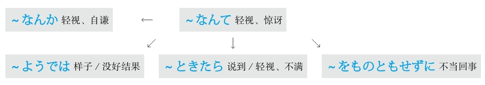

### 全是 #5_12_5_0_0
* [[ 日语语法新思维（修订版）_Menu_0.md | Menu #5_12_5_0_0 ]]

#### －だらけ #5_12_5_1_0
* [[ 日语语法新思维（修订版）_Menu_0.md | Menu #5_12_5_1_0 ]]

**解释：** 「だ」是“大”；「ら」是“拉”；「け」是「こ」，意思是“小”
**直译：** 一大堆小东西
**意译：** 全是～、净是～
**语气：** 消极
**接续：** 名词

例句：その<ruby>本<rp>(</rp><rt>ほん</rt><rp>)</rp></ruby>には<ruby>間<rp>(</rp><rt>ま</rt><rp>)</rp></ruby><ruby>違<rp>(</rp><rt>ちが</rt><rp>)</rp></ruby>い**だらけ** です。
直译：在那本书里一大堆错。
意译：那本书里全是错。

#### －まみれ #5_12_5_2_0
* [[ 日语语法新思维（修订版）_Menu_0.md | Menu #5_12_5_2_0 ]]

**解释：** 「ま」是“满”；「み」是「<ruby>身<rp>(</rp><rt>み</rt><rp>)</rp></ruby>」，意思是“东西”；「れ」是“来”
**直译：** 来了一堆东西
**意译：** 满身～、沾满～
**接续：** 名词

例句：ズボンは<ruby>泥<rp>(</rp><rt>どろ</rt><rp>)</rp></ruby>**まみれ** になった。
直译：在裤子上沾满了泥。
意译：裤子上沾满了泥。

#### －ずくめ #5_12_5_3_0
* [[ 日语语法新思维（修订版）_Menu_0.md | Menu #5_12_5_3_0 ]]

**解释：** 「ずくめ」的汉字是「<ruby>尽<rp>(</rp><rt>ず</rt><rp>)</rp></ruby>くめ」
**意思：** 尽是～
**用于：** 抽象的事项
**接续：** 名词

例句：<ruby>今朝<rp>(</rp><rt>けさ</rt><rp>)</rp></ruby>からいいこと**ずくめ** です。
直译：从今天早上，尽是好事。
意译：（从）今天早上开始全是好事。

#### ～ばかり #5_12_5_4_0
* [[ 日语语法新思维（修订版）_Menu_0.md | Menu #5_12_5_4_0 ]]

**解释：** 「ば」是“把”；「か」是“加”；「り」是拟态词结尾
**直译：** 在添加～
**意译：** 全是～、光是～、净是～
**口语：** 「～ばっかり」
**接续：** 名词、动词的简体

例句：<ruby>休<rp>(</rp><rt>きゅう</rt><rp>)</rp></ruby><ruby>日<rp>(</rp><rt>じつ</rt><rp>)</rp></ruby>は<ruby>出<rp>(</rp><rt>で</rt><rp>)</rp></ruby>かけたくない、どこへ<ruby>行<rp>(</rp><rt>い</rt><rp>)</rp></ruby>っても、<ruby>人<rp>(</rp><rt>ひと</rt><rp>)</rp></ruby>**ばっかり** です。
直译：休息日不想出去，不管去哪儿，全是人。
意译：休息日不爱出去，不管去哪儿都是人。

例句：<ruby>最<rp>(</rp><rt>さい</rt><rp>)</rp></ruby><ruby>近<rp>(</rp><rt>きん</rt><rp>)</rp></ruby>の<ruby>学<rp>(</rp><rt>がく</rt><rp>)</rp></ruby><ruby>生<rp>(</rp><rt>せい</rt><rp>)</rp></ruby>は<ruby>遊<rp>(</rp><rt>あそ</rt><rp>)</rp></ruby>んでいる**ばっかり** だよ。
直译：最近的学生光是在玩儿。
意译：最近的学生光知道玩儿。
语法关系图
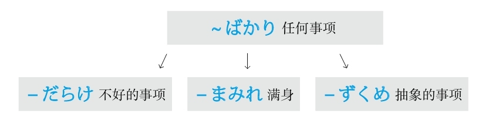

### 确认 #5_12_6_0_0
* [[ 日语语法新思维（修订版）_Menu_0.md | Menu #5_12_6_0_0 ]]

#### ～っけ #5_12_6_1_0
* [[ 日语语法新思维（修订版）_Menu_0.md | Menu #5_12_6_1_0 ]]

**解释：** 促音表示用于口语，起加强语气的作用；「け」是「こ」，意思是“这个、那个”
**直译：** 那个～
**用于：** 想不起来时、想对方确认时
**意译：** ～来着
**接续：** 谓语词（动词、形容词、助动词）的过去式（即た形）

例句：<ruby>彼<rp>(</rp><rt>かれ</rt><rp>)</rp></ruby>の<ruby>名<rp>(</rp><rt>な</rt><rp>)</rp></ruby><ruby>前<rp>(</rp><rt>まえ</rt><rp>)</rp></ruby>は<ruby>何<rp>(</rp><rt>なん</rt><rp>)</rp></ruby>でし**たっけ** 。
直译：他是什么名字来着？
意译：他叫什么名字来着？

例句：<ruby>先<rp>(</rp><rt>せん</rt><rp>)</rp></ruby><ruby>生<rp>(</rp><rt>せい</rt><rp>)</rp></ruby>は<ruby>今日<rp>(</rp><rt>きょう</rt><rp>)</rp></ruby><ruby>授<rp>(</rp><rt>じゅ</rt><rp>)</rp></ruby><ruby>業<rp>(</rp><rt>ぎょう</rt><rp>)</rp></ruby><ruby>中<rp>(</rp><rt>ちゅう</rt><rp>)</rp></ruby><ruby>何<rp>(</rp><rt>なに</rt><rp>)</rp></ruby>を<ruby>言<rp>(</rp><rt>い</rt><rp>)</rp></ruby>っ**たっけ** 。
直译：老师今天在课上说什么来着？
意译：老师今天上课说什么来着？

## R #5_13_0_0_0
* [[ 日语语法新思维（修订版）_Menu_0.md | Menu #5_13_0_0_0 ]]

### 容易～；难～ #5_13_1_0_0
* [[ 日语语法新思维（修订版）_Menu_0.md | Menu #5_13_1_0_0 ]]

#### ―やすい #5_13_1_1_0
* [[ 日语语法新思维（修订版）_Menu_0.md | Menu #5_13_1_1_0 ]]

**解释：** 「－やすい」的汉字是「－<ruby>易<rp>(</rp><rt>やす</rt><rp>)</rp></ruby>い」
**意思：** 容易～
**用于：** 任何事项
**词性：** 形容词
**接续：** 动词的连用形

例句：<ruby>日<rp>(</rp><rt>に</rt><rp>)</rp></ruby><ruby>本<rp>(</rp><rt>ほん</rt><rp>)</rp></ruby>は<ruby>住<rp>(</rp><rt>す</rt><rp>)</rp></ruby>み**やすい** <ruby>国<rp>(</rp><rt>くに</rt><rp>)</rp></ruby>です。
直译：日本是个容易居住的国家。
意译：日本是个适合居住的国家。

#### ―がち #5_13_1_2_0
* [[ 日语语法新思维（修订版）_Menu_0.md | Menu #5_13_1_2_0 ]]

**解释：** 「－がち」的汉字是「－<ruby>勝<rp>(</rp><rt>か</rt><rp>)</rp></ruby>ち」，与前面的词构成复合词后的浊音化
**意思：** 常出现～、容易～
**用于：** 不好的事项
**接续：** 名词、动词的连用形

例句：<ruby>彼女<rp>(</rp><rt>かのじょ</rt><rp>)</rp></ruby>は<ruby>病<rp>(</rp><rt>びょう</rt><rp>)</rp></ruby><ruby>気<rp>(</rp><rt>き</rt><rp>)</rp></ruby>**がち** です。
直译：她常出现病。
意译：她经常生病。

例句：<ruby>年<rp>(</rp><rt>とし</rt><rp>)</rp></ruby>をとったせいか、<ruby>最近<rp>(</rp><rt>さいきん</rt><rp>)</rp></ruby>は<ruby>忘<rp>(</rp><rt>わす</rt><rp>)</rp></ruby>れ**がち** になっている。
直译：是不是老了，最近变得容易忘。
意译：是不是老了，最近变得特别健忘。

#### ～にかたくない #5_13_1_3_0
* [[ 日语语法新思维（修订版）_Menu_0.md | Menu #5_13_1_3_0 ]]

**解释：** 「に」表示方向或对象；「かたくない」的汉字是「<ruby>難<rp>(</rp><rt>かた</rt><rp>)</rp></ruby>くない」
**意思：** 不难去～
**语气：** 正式
**接续：** 名词、动词的原形（多用「<ruby>想<rp>(</rp><rt>そう</rt><rp>)</rp></ruby><ruby>像<rp>(</rp><rt>ぞう</rt><rp>)</rp></ruby>する、<ruby>察<rp>(</rp><rt>さっ</rt><rp>)</rp></ruby>する」等词）

例句：<ruby>災<rp>(</rp><rt>さい</rt><rp>)</rp></ruby><ruby>害<rp>(</rp><rt>がい</rt><rp>)</rp></ruby>で<ruby>家<rp>(</rp><rt>か</rt><rp>)</rp></ruby><ruby>族<rp>(</rp><rt>ぞく</rt><rp>)</rp></ruby>を<ruby>失<rp>(</rp><rt>うしな</rt><rp>)</rp></ruby>った<ruby>人<rp>(</rp><rt>ひと</rt><rp>)</rp></ruby>たちの<ruby>悲<rp>(</rp><rt>かな</rt><rp>)</rp></ruby>しみは<ruby>想<rp>(</rp><rt>そう</rt><rp>)</rp></ruby><ruby>像<rp>(</rp><rt>ぞう</rt><rp>)</rp></ruby>**に<ruby>難<rp>(</rp><rt>かた</rt><rp>)</rp></ruby>くない** 。
直译：在灾害中失去亲人的人们的痛苦，不难想象。
意译：不难想象在灾害中失去亲人的人们有多么痛苦。

例句：<ruby>孫<rp>(</rp><rt>まご</rt><rp>)</rp></ruby>の<ruby>誕<rp>(</rp><rt>たん</rt><rp>)</rp></ruby><ruby>生<rp>(</rp><rt>じょう</rt><rp>)</rp></ruby>への<ruby>彼<rp>(</rp><rt>かれ</rt><rp>)</rp></ruby>の<ruby>喜<rp>(</rp><rt>よろこ</rt><rp>)</rp></ruby>びは<ruby>察<rp>(</rp><rt>さっ</rt><rp>)</rp></ruby>する**に<ruby>難<rp>(</rp><rt>かた</rt><rp>)</rp></ruby>くない** 。
直译：对孙子的诞生的他的喜悦，不难观察。
意译：不难想象孙子的诞生令他多么高兴。

#### ―にくい #5_13_1_4_0
* [[ 日语语法新思维（修订版）_Menu_0.md | Menu #5_13_1_4_0 ]]

**解释：** 「－にくい」的汉字是「－<ruby>難<rp>(</rp><rt>にく</rt><rp>)</rp></ruby>い」
**意思：** 很难～
**用于：** 任何事项
**接续：** 动词的连用形

例句：<ruby>先<rp>(</rp><rt>さき</rt><rp>)</rp></ruby>の<ruby>説<rp>(</rp><rt>せつ</rt><rp>)</rp></ruby><ruby>明<rp>(</rp><rt>めい</rt><rp>)</rp></ruby>はわかり**にくかった** 。
直译：刚才的说明难懂。
意译：刚才的解释不容易懂。

#### ―づらい #5_13_1_5_0
* [[ 日语语法新思维（修订版）_Menu_0.md | Menu #5_13_1_5_0 ]]

**解释：** 「－づらい」的汉字是「－<ruby>辛<rp>(</rp><rt>つら</rt><rp>)</rp></ruby>い」，与前面的词构成复合词后的浊音化
**意思：** 很难～
**用于：** 心理上痛苦
**接续：** 动词的连用形

例句：<ruby>最<rp>(</rp><rt>さい</rt><rp>)</rp></ruby><ruby>近<rp>(</rp><rt>きん</rt><rp>)</rp></ruby>の<ruby>本<rp>(</rp><rt>ほん</rt><rp>)</rp></ruby>はわかり**づらい** 。
直译：最近的书很难懂。
意译：最近的书很难懂，让人头疼。

#### ―がたい #5_13_1_6_0
* [[ 日语语法新思维（修订版）_Menu_0.md | Menu #5_13_1_6_0 ]]

**解释：** 「－がたい」的汉字是「－<ruby>難<rp>(</rp><rt>かた</rt><rp>)</rp></ruby>い」，与前面的词构成复合词后的浊音化
**意思：** 很难～
**语气：** 正式且强烈
**接续：** 动词的连用形

例句：あの<ruby>格<rp>(</rp><rt>かっ</rt><rp>)</rp></ruby><ruby>好<rp>(</rp><rt>こう</rt><rp>)</rp></ruby>で<ruby>大<rp>(</rp><rt>だい</rt><rp>)</rp></ruby><ruby>学<rp>(</rp><rt>がく</rt><rp>)</rp></ruby>に<ruby>行<rp>(</rp><rt>い</rt><rp>)</rp></ruby>くなんて<ruby>許<rp>(</rp><rt>ゆる</rt><rp>)</rp></ruby>し**がたい** 。
直译：那种打扮去学校，很难允许。
意译：很难允许打扮成那样去学校。

#### ―かねる #5_13_1_7_0
* [[ 日语语法新思维（修订版）_Menu_0.md | Menu #5_13_1_7_0 ]]

**解释：** 「ね」可以理解为“难”，「－かねる」可以理解为“很难”，表示“很难做某事”；「－かねない」可以理解为“不难”，表示“会有不好的可能性”
**语气：** 婉转地表达不做
**接续：** 动词的连用形

例句：<ruby>申<rp>(</rp><rt>もう</rt><rp>)</rp></ruby>し<ruby>訳<rp>(</rp><rt>わけ</rt><rp>)</rp></ruby>ございませんが、この<ruby>事<rp>(</rp><rt>こと</rt><rp>)</rp></ruby>はわたしにはわかり**かねます** 。
直译：真抱歉，这件事，对我来说很难明白。
意译：真抱歉，我不太了解这件事。

例句：たばこの<ruby>火<rp>(</rp><rt>ひ</rt><rp>)</rp></ruby>をちゃんと<ruby>消<rp>(</rp><rt>け</rt><rp>)</rp></ruby>さなければ、<ruby>事<rp>(</rp><rt>じ</rt><rp>)</rp></ruby><ruby>故<rp>(</rp><rt>こ</rt><rp>)</rp></ruby>にはなり**かねません** よ。
直译：不把烟的火好好消灭的话，很容易成为事故。
意译：不把烟头掐灭的话，很容易发生事故。
语法关系图
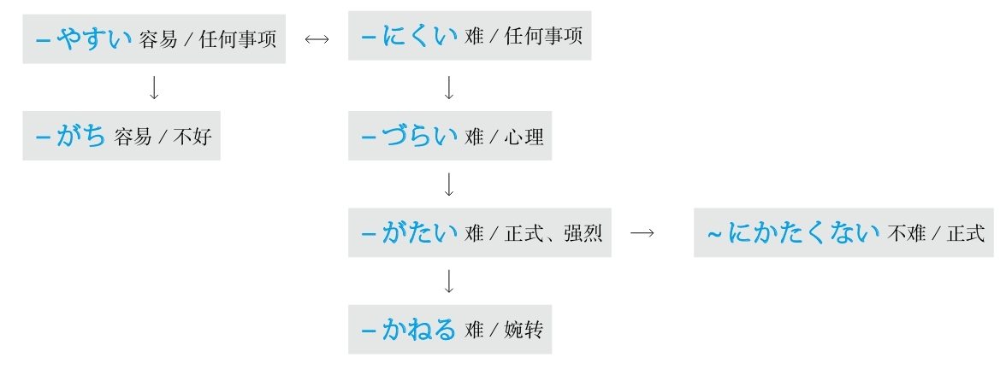

### 如果～ #5_13_2_0_0
* [[ 日语语法新思维（修订版）_Menu_0.md | Menu #5_13_2_0_0 ]]

#### ～と #5_13_2_1_0
* [[ 日语语法新思维（修订版）_Menu_0.md | Menu #5_13_2_1_0 ]]

**重点：** 在「と、ば、たら、なら」里，最重要的是顺序。「と」和「なら」分别表示极端，「と」代表“条件性”的极端，「なら」代表“假定性”的极端
**解释：** 「と」可以理解为“脱（落）、突（发）”，表示出现的某种事物马上就会脱落出或突发下一种事物，即表示条件性强或速度快
**意思：** 只要～；一～就～
**注意：** 后句里不能用“义务、许可、命令、意志”的表达方式
**接续：** 谓语词（动词、形容词、助动词）的原形

例句：<ruby>長<rp>(</rp><rt>ちょう</rt><rp>)</rp></ruby><ruby>時<rp>(</rp><rt>じ</rt><rp>)</rp></ruby><ruby>間<rp>(</rp><rt>かん</rt><rp>)</rp></ruby><ruby>本<rp>(</rp><rt>ほん</rt><rp>)</rp></ruby>を<ruby>読<rp>(</rp><rt>よ</rt><rp>)</rp></ruby>む**と** <ruby>目<rp>(</rp><rt>め</rt><rp>)</rp></ruby>が<ruby>疲<rp>(</rp><rt>つか</rt><rp>)</rp></ruby>れる。
直译：有长时间看书这个条件，就会有眼睛疲劳这个结果。
意译：一长时间看书，眼睛就会疲劳。

#### －ば #5_13_2_2_0
* [[ 日语语法新思维（修订版）_Menu_0.md | Menu #5_13_2_2_0 ]]

**重点：** 在「と、ば、たら、なら」里，最重要的是顺序。「と」和「なら」分别表示极端，「と」代表“条件性”的极端，「なら」代表“假定性”的极端
**解释：** 「ば」的条件性比「と」弱，表示较弱的条件的“如果”；同时「ば」还是古语中表示原因的「～から」和表示并列的「～し」
**意思：** 只要～；如果～；因为～；又～
**注意：** 后句里不能用“义务、许可、命令、意志”的表达方式
**变形：** ば形（变形规律参照第一章的第二节）

例句：<ruby>余<rp>(</rp><rt>よ</rt><rp>)</rp></ruby><ruby>裕<rp>(</rp><rt>ゆう</rt><rp>)</rp></ruby>があれ**ば** 、また<ruby>何<rp>(</rp><rt>なに</rt><rp>)</rp></ruby>かを<ruby>習<rp>(</rp><rt>なら</rt><rp>)</rp></ruby>いたい。
直译：如果有富余，想再学点儿什么。

#### －たら #5_13_2_3_0
* [[ 日语语法新思维（修订版）_Menu_0.md | Menu #5_13_2_3_0 ]]

**重点：** 在「と、ば、たら、なら」里，最重要的是顺序。「と」和「なら」分别表示极端，「と」代表“条件性”的极端，「なら」代表“假定性”的极端
**解释：** 「た」相当于「て」，表示“～了”；「ら」在古语里表示假设
**意思：** 如果～；之后～（后句是将来时）；结果～（后句是过去式）
**区别：** 都表示“如果”的意思时，「ば」语气正式、「たら」语气柔和
**变形：** 动词的た形的简体（变形规律参照第一章的第二节）
**重点：** 后句用于将来时
**意思：** 做了～之后

例句：<ruby>家<rp>(</rp><rt>いえ</rt><rp>)</rp></ruby>に<ruby>着<rp>(</rp><rt>つ</rt><rp>)</rp></ruby>い**たら** <ruby>連<rp>(</rp><rt>れん</rt><rp>)</rp></ruby><ruby>絡<rp>(</rp><rt>らく</rt><rp>)</rp></ruby>してね。
直译：到家了，联系啊。
意译：到家后跟我联系啊。

**重点：** 后句用于过去式
**意思：** 做了～之后，结果～
**着重：** 发现了某事或与自己的假设相反

例句：<ruby>窓<rp>(</rp><rt>まど</rt><rp>)</rp></ruby>を<ruby>開<rp>(</rp><rt>あ</rt><rp>)</rp></ruby>け**たら** <ruby>雪<rp>(</rp><rt>ゆき</rt><rp>)</rp></ruby>が<ruby>降<rp>(</rp><rt>ふ</rt><rp>)</rp></ruby>っていた。
直译：打开了窗户，结果，下雪了。
意译：打开窗户，结果发现下雪了。

例句：<ruby>行<rp>(</rp><rt>い</rt><rp>)</rp></ruby>っ**たら** 、<ruby>彼<rp>(</rp><rt>かれ</rt><rp>)</rp></ruby>はいなかった。
直译：去了，结果，他没在。
意译：去了，结果他没在。

---
**[ [[ 日语语法新思维（修订版）_Detail_4.md | Prev ]] ]　[ [[ ../Menu.md | Home ]] ]　[ [[ 日语语法新思维（修订版）_Detail_6.md | Next ]] ]**
