[[ 日语语法新思维（修订版）_Detail_5.md | [Prev_Page] ]]
#### ～ように #5_16_1_2_0
* [[ 日语语法新思维（修订版）_Menu_0.md | Menu #5_16_1_2_0 ]]

**解释：** 「<ruby>様<rp>(</rp><rt>よう</rt><rp>)</rp></ruby>」的意思是“样子”；「に」表示副词
**直译：** 成为～的样子，而～
**意译：** 为了能够～
**注意：** 前后既可用同一主语，也可用不同主语
**重点：** 客观叙述
**接续：** 动词的可能形的原形、自动词的原形

例句：<ruby>留<rp>(</rp><rt>りゅう</rt><rp>)</rp></ruby><ruby>学<rp>(</rp><rt>がく</rt><rp>)</rp></ruby>**できるように** いろいろな<ruby>事<rp>(</rp><rt>じ</rt><rp>)</rp></ruby><ruby>前<rp>(</rp><rt>ぜん</rt><rp>)</rp></ruby><ruby>準<rp>(</rp><rt>じゅん</rt><rp>)</rp></ruby><ruby>備<rp>(</rp><rt>び</rt><rp>)</rp></ruby>をしている。
直译：为了能够留学，正在做各种各样的事先准备。
意译：为了能够留学，正在做各种事先准备工作。

例句：すべてのレベルの<ruby>学<rp>(</rp><rt>がく</rt><rp>)</rp></ruby><ruby>生<rp>(</rp><rt>せい</rt><rp>)</rp></ruby>がわかる**ように** 、わかりやすく<ruby>説<rp>(</rp><rt>せつ</rt><rp>)</rp></ruby><ruby>明<rp>(</rp><rt>めい</rt><rp>)</rp></ruby>した。
直译：为了所有的水平的学生都懂，做了容易懂的说明。
意译：为了（让）所有水平的学生都能懂，我做了通俗易懂的解释。

#### ～ために #5_16_1_3_0
* [[ 日语语法新思维（修订版）_Menu_0.md | Menu #5_16_1_3_0 ]]

**解释：** 「<ruby>為<rp>(</rp><rt>ため</rt><rp>)</rp></ruby>」的意思是“为了”；「に」表示副词
**意思：** 为了～
**注意：** 前后必须用同一主语
**重点：** 主观愿望强
**接续：** 动词的原形

例句：<ruby>試<rp>(</rp><rt>し</rt><rp>)</rp></ruby><ruby>験<rp>(</rp><rt>けん</rt><rp>)</rp></ruby>に<ruby>合<rp>(</rp><rt>ごう</rt><rp>)</rp></ruby><ruby>格<rp>(</rp><rt>かく</rt><rp>)</rp></ruby>する**ために** 、<ruby>一<rp>(</rp><rt>いち</rt><rp>)</rp></ruby><ruby>秒<rp>(</rp><rt>びょう</rt><rp>)</rp></ruby>たりとも<ruby>勉<rp>(</rp><rt>べん</rt><rp>)</rp></ruby><ruby>強<rp>(</rp><rt>きょう</rt><rp>)</rp></ruby>に<ruby>取<rp>(</rp><rt>と</rt><rp>)</rp></ruby>り<ruby>組<rp>(</rp><rt>く</rt><rp>)</rp></ruby>んでいる。
直译：为了考试合格，即使是一秒钟，致力于学习。
意译：为了通过考试，即使是一秒钟（我）都在努力学习。

#### －んがため（に） #5_16_1_4_0
* [[ 日语语法新思维（修订版）_Menu_0.md | Menu #5_16_1_4_0 ]]

**解释：** 「ん」在古语里表示推量，相当于现代日语中表示否定的“不”或表示意志的“想要”，在此表示意志；「が」是古语中起连接作用的助词；「<ruby>為<rp>(</rp><rt>ため</rt><rp>)</rp></ruby>」的意思是“为了”；「に」表示副词
**注意：** 「に」可以省略，省略助词后语气更加正式
**意思：** 「～しようと<ruby>思<rp>(</rp><rt>おも</rt><rp>)</rp></ruby>ってそのために～」（想要去做～，为了它而～）
**语气：** 古语、正式
**接续：** 动词的否定形的ん（推量）（变形规律参照第一章的第二节）

例句：<ruby>真<rp>(</rp><rt>しん</rt><rp>)</rp></ruby><ruby>実<rp>(</rp><rt>じつ</rt><rp>)</rp></ruby>を<ruby>明<rp>(</rp><rt>あき</rt><rp>)</rp></ruby>らかにせ**んがために** 、あらゆる<ruby>手<rp>(</rp><rt>て</rt><rp>)</rp></ruby>を<ruby>尽<rp>(</rp><rt>つ</rt><rp>)</rp></ruby>くした。
直译：为了弄明白真实的事，所有的办法都用尽了。
意译：为了弄清真相，想尽了一切办法。
语法关系图
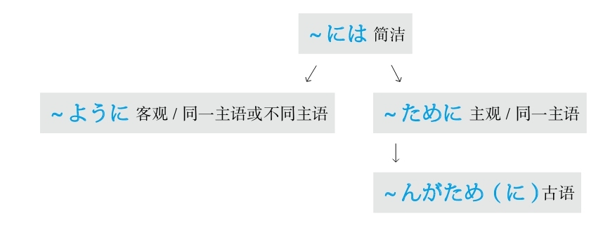

### 无意识 #5_16_2_0_0
* [[ 日语语法新思维（修订版）_Menu_0.md | Menu #5_16_2_0_0 ]]

#### ～ともなく/～ともなしに #5_16_2_1_0
* [[ 日语语法新思维（修订版）_Menu_0.md | Menu #5_16_2_1_0 ]]

**解释：** 「と」的意思是“和”；「も」的意思是“也”；「なく」和「なしに」是表示否定的「ない」的副词形式
**意思：** 似做非做～
**表示：** 无意识地做～
**注意：** 前后用同一个动词。常构成的表达方式有「見るともなく見ている」（似看非看）、「聞くともなく聞いている」（似听非听）、「わかるともなくわかっている」（似懂非懂）
**接续：** 动词的原形

例句：<ruby>眠<rp>(</rp><rt>ねむ</rt><rp>)</rp></ruby>いから、テレビを<ruby>見<rp>(</rp><rt>み</rt><rp>)</rp></ruby>る**ともなしに** <ruby>見<rp>(</rp><rt>み</rt><rp>)</rp></ruby>ている。
直译：困了，所以看和非看地在看着电视。
意译：困了，（我）似看非看地在看电视。

## X #5_17_0_0_0
* [[ 日语语法新思维（修订版）_Menu_0.md | Menu #5_17_0_0_0 ]]

### 相反 #5_17_1_0_0
* [[ 日语语法新思维（修订版）_Menu_0.md | Menu #5_17_1_0_0 ]]

#### ～に反して #5_17_1_1_0
* [[ 日语语法新思维（修订版）_Menu_0.md | Menu #5_17_1_1_0 ]]

**解释：** 「に」表示对象；「<ruby>反<rp>(</rp><rt>はん</rt><rp>)</rp></ruby>して」是「<ruby>反<rp>(</rp><rt>はん</rt><rp>)</rp></ruby>する」的中顿形式
**意思：** 与～相反
**语气：** 正式
**接续：** 接「<ruby>期<rp>(</rp><rt>き</rt><rp>)</rp></ruby><ruby>待<rp>(</rp><rt>たい</rt><rp>)</rp></ruby>、<ruby>予<rp>(</rp><rt>よ</rt><rp>)</rp></ruby><ruby>想<rp>(</rp><rt>そう</rt><rp>)</rp></ruby>、<ruby>予<rp>(</rp><rt>よ</rt><rp>)</rp></ruby><ruby>測<rp>(</rp><rt>そく</rt><rp>)</rp></ruby>」等汉语式名词

例句：<ruby>地<rp>(</rp><rt>じ</rt><rp>)</rp></ruby><ruby>元<rp>(</rp><rt>もと</rt><rp>)</rp></ruby>の<ruby>住<rp>(</rp><rt>じゅう</rt><rp>)</rp></ruby><ruby>民<rp>(</rp><rt>みん</rt><rp>)</rp></ruby>の<ruby>予<rp>(</rp><rt>よ</rt><rp>)</rp></ruby><ruby>想<rp>(</rp><rt>そう</rt><rp>)</rp></ruby>**に<ruby>反<rp>(</rp><rt>はん</rt><rp>)</rp></ruby>して** 、<ruby>住<rp>(</rp><rt>じゅう</rt><rp>)</rp></ruby><ruby>宅<rp>(</rp><rt>たく</rt><rp>)</rp></ruby>の<ruby>値<rp>(</rp><rt>ね</rt><rp>)</rp></ruby><ruby>段<rp>(</rp><rt>だん</rt><rp>)</rp></ruby>が<ruby>上<rp>(</rp><rt>あ</rt><rp>)</rp></ruby>がる<ruby>一<rp>(</rp><rt>いっ</rt><rp>)</rp></ruby><ruby>方<rp>(</rp><rt>ぽう</rt><rp>)</rp></ruby>だ。
直译：和当地的居民的预想相反，住宅价格一个劲儿地在上涨。
意译：与当地居民的预想相反，住宅价格一个劲儿地上涨。

#### ～反面 #5_17_1_2_0
* [[ 日语语法新思维（修订版）_Menu_0.md | Menu #5_17_1_2_0 ]]

**直译：** 反面
**意译：** 与～相反
**接续：** 修饰名词的规律（参照第一章的第三节）

例句：<ruby>彼<rp>(</rp><rt>かれ</rt><rp>)</rp></ruby>は<ruby>仕<rp>(</rp><rt>し</rt><rp>)</rp></ruby><ruby>事<rp>(</rp><rt>ごと</rt><rp>)</rp></ruby><ruby>上<rp>(</rp><rt>じょう</rt><rp>)</rp></ruby>しっかりしている**<ruby>反<rp>(</rp><rt>はん</rt><rp>)</rp></ruby><ruby>面<rp>(</rp><rt>めん</rt><rp>)</rp></ruby>、** <ruby>金<rp>(</rp><rt>かね</rt><rp>)</rp></ruby><ruby>使<rp>(</rp><rt>づか</rt><rp>)</rp></ruby>いが<ruby>荒<rp>(</rp><rt>あら</rt><rp>)</rp></ruby>い。
直译：他在工作上非常认真严谨，其反面，花钱却大手大脚。
意译：他在工作上非常认真严谨，但是花钱却大手大脚。

#### ～に対して #5_17_1_3_0
* [[ 日语语法新思维（修订版）_Menu_0.md | Menu #5_17_1_3_0 ]]

**解释：** 「に」表示对象；「<ruby>対<rp>(</rp><rt>たい</rt><rp>)</rp></ruby>して」是自动词「<ruby>対<rp>(</rp><rt>たい</rt><rp>)</rp></ruby>する」的中顿形式，意思是“对象、对比”
**意思：** 对于～、与～相对比（在此是后者）
**接续：** 名词

例句：<ruby>姉<rp>(</rp><rt>あね</rt><rp>)</rp></ruby>が<ruby>働<rp>(</rp><rt>はたら</rt><rp>)</rp></ruby>き<ruby>者<rp>(</rp><rt>もの</rt><rp>)</rp></ruby>であるの**に<ruby>対<rp>(</rp><rt>たい</rt><rp>)</rp></ruby>して** 、<ruby>妹<rp>(</rp><rt>いもうと</rt><rp>)</rp></ruby>は<ruby>怠<rp>(</rp><rt>なま</rt><rp>)</rp></ruby>け<ruby>者<rp>(</rp><rt>もの</rt><rp>)</rp></ruby>だ。
直译：姐姐是能干的人，与其相对照，妹妹是懒惰的人。
意译：姐姐非常能干，但是妹妹却很懒。

#### ～一方（で） #5_17_1_4_0
* [[ 日语语法新思维（修订版）_Menu_0.md | Menu #5_17_1_4_0 ]]

**解释：** 「<ruby>一<rp>(</rp><rt>いっ</rt><rp>)</rp></ruby><ruby>方<rp>(</rp><rt>ぽう</rt><rp>)</rp></ruby>」的意思是“一方、另一方”；「で」表示范围，意思是“在”
**意思：** 在一方面～，在另一方面～
**重点：** 常举出两个对照性的事物
**注意：** 「で」可以省略，省略助词后语气正式
**接续：** 动词和形容词的原形、形容动词和名词加である

例句：<ruby>若<rp>(</rp><rt>わか</rt><rp>)</rp></ruby>い<ruby>人<rp>(</rp><rt>ひと</rt><rp>)</rp></ruby>の<ruby>就<rp>(</rp><rt>しゅう</rt><rp>)</rp></ruby><ruby>職<rp>(</rp><rt>しょく</rt><rp>)</rp></ruby><ruby>難<rp>(</rp><rt>なん</rt><rp>)</rp></ruby>が<ruby>問<rp>(</rp><rt>もん</rt><rp>)</rp></ruby><ruby>題<rp>(</rp><rt>だい</rt><rp>)</rp></ruby>になる**<ruby>一<rp>(</rp><rt>いっ</rt><rp>)</rp></ruby><ruby>方<rp>(</rp><rt>ぽう</rt><rp>)</rp></ruby>で** 、<ruby>多<rp>(</rp><rt>おお</rt><rp>)</rp></ruby>くの<ruby>分<rp>(</rp><rt>ぶん</rt><rp>)</rp></ruby><ruby>野<rp>(</rp><rt>や</rt><rp>)</rp></ruby>で<ruby>人<rp>(</rp><rt>ひと</rt><rp>)</rp></ruby><ruby>手<rp>(</rp><rt>で</rt><rp>)</rp></ruby>が<ruby>足<rp>(</rp><rt>た</rt><rp>)</rp></ruby>りない。
直译：年轻人的就业难成了问题，在另一方面，在很多的领域里人手却不足。
意译：年轻人的就业难成了问题，另一方面，在很多领域里人手却不够。

#### ～と思いきや #5_17_1_5_0
* [[ 日语语法新思维（修订版）_Menu_0.md | Menu #5_17_1_5_0 ]]

**解释：** 「と」表示内容；「<ruby>思<rp>(</rp><rt>おも</rt><rp>)</rp></ruby>い」是「<ruby>思<rp>(</rp><rt>おも</rt><rp>)</rp></ruby>う」的连用形，表示“想”；「き」在古语里表示过去式，相当于「た」；「や」在古语里相当于「か」，此处表示反问
**意思：** 与想的相反
**语气：** 古语
**接续：** 任何词

例句：<ruby>二人<rp>(</rp><rt>ふたり</rt><rp>)</rp></ruby>は<ruby>大<rp>(</rp><rt>おお</rt><rp>)</rp></ruby><ruby>喧<rp>(</rp><rt>げん</rt><rp>)</rp></ruby><ruby>嘩<rp>(</rp><rt>か</rt><rp>)</rp></ruby>した。きっと<ruby>別<rp>(</rp><rt>わか</rt><rp>)</rp></ruby>れる**と<ruby>思<rp>(</rp><rt>おも</rt><rp>)</rp></ruby>いきや** 、<ruby>和<rp>(</rp><rt>わ</rt><rp>)</rp></ruby><ruby>解<rp>(</rp><rt>かい</rt><rp>)</rp></ruby>した。
直译：两个人大吵了一架。我想他们肯定要分手了，和解了。
意译：两个人大吵了一场。我想他们肯定要分手了，结果两个人又和解了。

#### ～にひきかえ #5_17_1_6_0
* [[ 日语语法新思维（修订版）_Menu_0.md | Menu #5_17_1_6_0 ]]

**解释：** 「に」表示对象；「ひきかえ」是自动词「<ruby>引<rp>(</rp><rt>ひ</rt><rp>)</rp></ruby>き<ruby>替<rp>(</rp><rt>か</rt><rp>)</rp></ruby>える」的中顿形式，意思是“对换”
**意思：** 与～相对照
**接续：** 名词

例句：<ruby>旺<rp>(</rp><rt>おう</rt><rp>)</rp></ruby><ruby>盛<rp>(</rp><rt>せい</rt><rp>)</rp></ruby>な<ruby>好<rp>(</rp><rt>こう</rt><rp>)</rp></ruby><ruby>奇<rp>(</rp><rt>き</rt><rp>)</rp></ruby><ruby>心<rp>(</rp><rt>しん</rt><rp>)</rp></ruby>と<ruby>元<rp>(</rp><rt>げん</rt><rp>)</rp></ruby><ruby>気<rp>(</rp><rt>き</rt><rp>)</rp></ruby>さ**にひきかえ** 、<ruby>語<rp>(</rp><rt>ご</rt><rp>)</rp></ruby><ruby>学<rp>(</rp><rt>がく</rt><rp>)</rp></ruby><ruby>力<rp>(</rp><rt>りょく</rt><rp>)</rp></ruby>と<ruby>忍<rp>(</rp><rt>にん</rt><rp>)</rp></ruby><ruby>耐<rp>(</rp><rt>たい</rt><rp>)</rp></ruby><ruby>力<rp>(</rp><rt>りょく</rt><rp>)</rp></ruby>がほとんどない。
直译：旺盛的好奇心和精力，与此相对照，外语能力和忍耐力几乎没有。
意译：有旺盛的好奇心和精力，但是几乎没有什么外语能力和忍耐力。
语法关系图
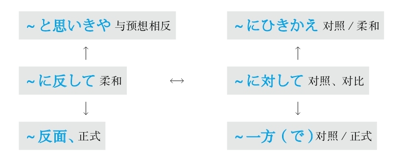

### 想做 #5_17_2_0_0
* [[ 日语语法新思维（修订版）_Menu_0.md | Menu #5_17_2_0_0 ]]

#### －たい #5_17_2_1_0
* [[ 日语语法新思维（修订版）_Menu_0.md | Menu #5_17_2_1_0 ]]

**解释：** 「－たい」是动词的后缀
**词性：** 与动词的连用形构成复合形容词
**意思：** 想做～
**准则：** 「－たい」用于第一人称
**接续：** 动词的连用形

例句：<ruby>家<rp>(</rp><rt>いえ</rt><rp>)</rp></ruby>を<ruby>買<rp>(</rp><rt>か</rt><rp>)</rp></ruby>い**たい** 。
直译：想买房子。
意译：我想买房子。

#### －たがる #5_17_2_2_0
* [[ 日语语法新思维（修订版）_Menu_0.md | Menu #5_17_2_2_0 ]]

**解释：** 「た」是表示“想做某事”的「－たい」；「が」表示状态（参照《日语词汇新思维：词源+联想记忆法》）；「る」是动词的后缀
**词性：** 与动词的连用形构成复合动词
**意思：** 想做～
**准则：** 表示心理活动的用法的重点在于“内外有别”，自己和他人需要加以区分，他人的心理活动需要通过外在状态而得知。因此，「－たい」用于第一人称，「－たがる」用于第三人称
**接续：** 动词的连用形

例句：うちの<ruby>子<rp>(</rp><rt>こ</rt><rp>)</rp></ruby>は<ruby>海<rp>(</rp><rt>かい</rt><rp>)</rp></ruby><ruby>外<rp>(</rp><rt>がい</rt><rp>)</rp></ruby><ruby>留<rp>(</rp><rt>りゅう</rt><rp>)</rp></ruby><ruby>学<rp>(</rp><rt>がく</rt><rp>)</rp></ruby>に<ruby>行<rp>(</rp><rt>い</rt><rp>)</rp></ruby>き**たがっている** 。
直译：我家的孩子一直（现在）想去海外留学，状态。
意译：我们家的孩子一直想去国外留学。

#### －てほしい #5_17_2_3_0
* [[ 日语语法新思维（修订版）_Menu_0.md | Menu #5_17_2_3_0 ]]

**解释：** 「て」是前面动词的中顿形式；「<ruby>欲<rp>(</rp><rt>ほ</rt><rp>)</rp></ruby>しい」的意思是“想要”
**意思：** 想让别人做～
**注意：** 表示想要某个东西时用「～が<ruby>欲<rp>(</rp><rt>ほ</rt><rp>)</rp></ruby>しい」
**变形：** 动词的て形（变形规律参照第一章的第二节）

例句：<ruby>彼<rp>(</rp><rt>かれ</rt><rp>)</rp></ruby>に<ruby>家<rp>(</rp><rt>いえ</rt><rp>)</rp></ruby>を<ruby>買<rp>(</rp><rt>か</rt><rp>)</rp></ruby>っ**て<ruby>欲<rp>(</rp><rt>ほ</rt><rp>)</rp></ruby>しい** 。
直译：想让他买房子。
意译：我想让他买房子。

#### ～をほしがる #5_17_2_4_0
* [[ 日语语法新思维（修订版）_Menu_0.md | Menu #5_17_2_4_0 ]]

**解释：** 「ほし」是表示“想做某事”的「<ruby>欲<rp>(</rp><rt>ほ</rt><rp>)</rp></ruby>しい」；「が」表示状态（参照《日语词汇新思维：词源+联想记忆法》）；「る」是动词的后缀
**意思：** 想要～东西
**准则：** 表示心理活动的用法的重点在于“内外有别”，自己和他人需要加以区分，他人的心理活动需要通过外在状态而得知。因此，「ほしい」用于第一人称，「ほしがる」用于第三人称
**接续：** 名词

例句：なんでいつも<ruby>人<rp>(</rp><rt>ひと</rt><rp>)</rp></ruby>のもの**をほしがってる** の。
直译：为什么经常一直想要别人的东西？
意译：你为什么总想要别人的东西？

#### －ようと #5_17_2_5_0
* [[ 日语语法新思维（修订版）_Menu_0.md | Menu #5_17_2_5_0 ]]

**解释：** 「－よう」是动词的意志形
**意思：** 有做～的意愿
**解释：** “意志”英语为will，因此日语的意志形就可以理解为要去做某事。动词的意志形后面加上「と」才能表示will
**接续：** 动词的意志形（变形规律参照第一章的第二节）

例句：<ruby>日<rp>(</rp><rt>に</rt><rp>)</rp></ruby><ruby>本<rp>(</rp><rt>ほん</rt><rp>)</rp></ruby><ruby>語<rp>(</rp><rt>ご</rt><rp>)</rp></ruby>の<ruby>語<rp>(</rp><rt>ご</rt><rp>)</rp></ruby><ruby>学<rp>(</rp><rt>がく</rt><rp>)</rp></ruby><ruby>力<rp>(</rp><rt>りょく</rt><rp>)</rp></ruby>を<ruby>身<rp>(</rp><rt>み</rt><rp>)</rp></ruby>につけ**ようと** <ruby>努<rp>(</rp><rt>ど</rt><rp>)</rp></ruby><ruby>力<rp>(</rp><rt>りょく</rt><rp>)</rp></ruby>している。
直译：日语水平，要把它附着在身上，努力着。
意译：我正在努力提高我的日语水平。

#### ～べく #5_17_2_6_0
* [[ 日语语法新思维（修订版）_Menu_0.md | Menu #5_17_2_6_0 ]]

**解释：** 「<ruby>可<rp>(</rp><rt>べ</rt><rp>)</rp></ruby>く」的意思是“可～”
**着重：** 强调动词的意志形
**意思：** 可得要做～
**接续：** 动词的原形、「する」变为「すべく」或「するべく」

例句：ウイルスの<ruby>感<rp>(</rp><rt>かん</rt><rp>)</rp></ruby><ruby>染<rp>(</rp><rt>せん</rt><rp>)</rp></ruby><ruby>経<rp>(</rp><rt>けい</rt><rp>)</rp></ruby><ruby>路<rp>(</rp><rt>ろ</rt><rp>)</rp></ruby>を<ruby>明<rp>(</rp><rt>あき</rt><rp>)</rp></ruby>らかにする**べく** <ruby>綿<rp>(</rp><rt>めん</rt><rp>)</rp></ruby><ruby>密<rp>(</rp><rt>みつ</rt><rp>)</rp></ruby>な<ruby>調<rp>(</rp><rt>ちょう</rt><rp>)</rp></ruby><ruby>査<rp>(</rp><rt>さ</rt><rp>)</rp></ruby>が<ruby>行<rp>(</rp><rt>おこな</rt><rp>)</rp></ruby>われた。
直译：病毒的感染途径，要把它弄明白，缜密的调查被进行了。
意译：为调查清楚病毒的感染途径，（相关部门）展开了缜密的调查。
语法关系图
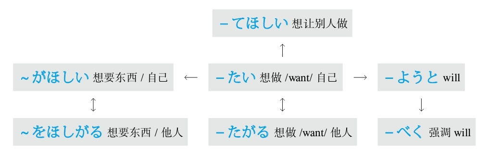

### 形容词变名词 #5_17_3_0_0
* [[ 日语语法新思维（修订版）_Menu_0.md | Menu #5_17_3_0_0 ]]

#### －さ #5_17_3_1_0
* [[ 日语语法新思维（修订版）_Menu_0.md | Menu #5_17_3_1_0 ]]

**解释：** 「さ」是「それ」，表示“那个”
**重点：** 因为是指“那个东西本身”，所以侧重于“具体事物”
**变形：** 形容词去「い」加「さ」、形容动词加「さ」

例句：<ruby>長<rp>(</rp><rt>なが</rt><rp>)</rp></ruby>**さ** 、<ruby>幅<rp>(</rp><rt>はば</rt><rp>)</rp></ruby>、<ruby>高<rp>(</rp><rt>たか</rt><rp>)</rp></ruby>**さ** を<ruby>量<rp>(</rp><rt>はか</rt><rp>)</rp></ruby>ってください。
直译：长、宽、高，请测量。
意译：（请）量一下长、宽、高。

#### －み #5_17_3_2_0
* [[ 日语语法新思维（修订版）_Menu_0.md | Menu #5_17_3_2_0 ]]

**解释：** 「み」是「<ruby>味<rp>(</rp><rt>み</rt><rp>)</rp></ruby>」，表示“味道”
**重点：** 因为是指体会到的“味道”，所以侧重于“抽象事物”
**变形：** 形容词去「い」加「み」、形容动词加「み」

例句：<ruby>彼<rp>(</rp><rt>かれ</rt><rp>)</rp></ruby>の<ruby>話<rp>(</rp><rt>はなし</rt><rp>)</rp></ruby>には<ruby>深<rp>(</rp><rt>ふか</rt><rp>)</rp></ruby>**み** がある。
直译：在他的话里，有深度。
意译：他说话有深度。

#### －め #5_17_3_3_0
* [[ 日语语法新思维（修订版）_Menu_0.md | Menu #5_17_3_3_0 ]]

**解释：** 「め」是「<ruby>目<rp>(</rp><rt>め</rt><rp>)</rp></ruby>」，表示“看上去”
**重点：** 因为是用眼睛测量，所以翻译成“稍微～”
**变形：** 形容词去「い」加「め」、形容动词加「め」

例句：<ruby>少<rp>(</rp><rt>すこ</rt><rp>)</rp></ruby>し<ruby>小<rp>(</rp><rt>ちい</rt><rp>)</rp></ruby>さ**め** なのがありますか。
直译：稍微小一点儿的，有吗？
意译：有没有稍微小一点儿的？

例句：お<ruby>塩<rp>(</rp><rt>しお</rt><rp>)</rp></ruby>を<ruby>少<rp>(</rp><rt>すく</rt><rp>)</rp></ruby>な**め** に<ruby>入<rp>(</rp><rt>い</rt><rp>)</rp></ruby>れてください。
直译：盐，稍微少点儿，请放入。
意译：稍微少放些盐。
语法关系图
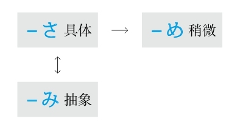

### 形容状态 #5_17_4_0_0
* [[ 日语语法新思维（修订版）_Menu_0.md | Menu #5_17_4_0_0 ]]

#### ～まま #5_17_4_1_0
* [[ 日语语法新思维（修订版）_Menu_0.md | Menu #5_17_4_1_0 ]]

**解释：** 名词「まま」在古代的汉字是「<ruby>真真<rp>(</rp><rt>まま</rt><rp>)</rp></ruby>」，表示事物本身的样子
**意思：** 样子
**接续：** 名词加の、形容词的原形、形容动词加な、动词的た形
**准则：** 日语的「た」表示完了、过去的“了”以及起形容词修饰名词作用的“的”。此处表示“的”

例句：<ruby>久<rp>(</rp><rt>ひさ</rt><rp>)</rp></ruby>しぶりに<ruby>実<rp>(</rp><rt>じっ</rt><rp>)</rp></ruby><ruby>家<rp>(</rp><rt>か</rt><rp>)</rp></ruby>に<ruby>帰<rp>(</rp><rt>かえ</rt><rp>)</rp></ruby>ったが、<ruby>周<rp>(</rp><rt>まわ</rt><rp>)</rp></ruby>りは<ruby>昔<rp>(</rp><rt>むかし</rt><rp>)</rp></ruby>の**まま** です。
直译：隔了好久又回到实际的家，周围还是过去的样子。
意译：隔了好久又回到父母家，周围还是原来的样子。

例句：<ruby>化<rp>(</rp><rt>け</rt><rp>)</rp></ruby><ruby>粧<rp>(</rp><rt>しょう</rt><rp>)</rp></ruby>し**たまま** <ruby>眠<rp>(</rp><rt>ねむ</rt><rp>)</rp></ruby>るのは<ruby>肌<rp>(</rp><rt>はだ</rt><rp>)</rp></ruby>にはよくないよ。
直译：化妆的样子睡觉对皮肤不好。
意译：带着妆睡觉对皮肤不好。

#### －っぱなし #5_17_4_2_0
* [[ 日语语法新思维（修订版）_Menu_0.md | Menu #5_17_4_2_0 ]]

**解释：** 「ぱなし」是他动词「<ruby>放<rp>(</rp><rt>はな</rt><rp>)</rp></ruby>す」的连用形，作名词用，与前面的动词的连用形一起构成复合名词；促音起加强语气的作用
**意思：** 放置不管
**注意：** 语气消极
**接续：** 动词的连用形

例句：<ruby>節<rp>(</rp><rt>せつ</rt><rp>)</rp></ruby><ruby>電<rp>(</rp><rt>でん</rt><rp>)</rp></ruby>を<ruby>考<rp>(</rp><rt>かんが</rt><rp>)</rp></ruby>えれば、<ruby>電<rp>(</rp><rt>でん</rt><rp>)</rp></ruby><ruby>気<rp>(</rp><rt>き</rt><rp>)</rp></ruby>をつけ**っぱなし** にしてはいけない。
直译：如果考虑到节电，把灯开着不管它，是不行的。
意译：考虑到节电，必须随手关灯。
语法关系图
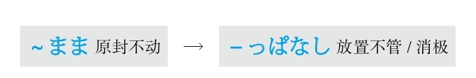

## Y #5_18_0_0_0
* [[ 日语语法新思维（修订版）_Menu_0.md | Menu #5_18_0_0_0 ]]

### 也就是说 #5_18_1_0_0
* [[ 日语语法新思维（修订版）_Menu_0.md | Menu #5_18_1_0_0 ]]

#### つまり～わけだ/即ち～ #5_18_1_1_0
* [[ 日语语法新思维（修订版）_Menu_0.md | Menu #5_18_1_1_0 ]]

**解释：** 「つまり」和「わけだ」常一起搭配使用
**意思：** 也就是说～
**注意：** 「<ruby>即<rp>(</rp><rt>すなわ</rt><rp>)</rp></ruby>ち」也表示“也就是说～”；语气正式
**接续：** 接「わけだ」时使用修饰名词的规律（参照第一章的第三节）

例句：<ruby>何<rp>(</rp><rt>なに</rt><rp>)</rp></ruby>も<ruby>言<rp>(</rp><rt>い</rt><rp>)</rp></ruby>わなかったというのは、**つまり** <ruby>認<rp>(</rp><rt>みと</rt><rp>)</rp></ruby>めてくれた**わけ** かな。
直译：什么都没说，也就是认可我们了吧。
意译：什么都没说，也就是同意了吧。

### 一边～一边 #5_18_2_0_0
* [[ 日语语法新思维（修订版）_Menu_0.md | Menu #5_18_2_0_0 ]]

#### －ながら #5_18_2_1_0
* [[ 日语语法新思维（修订版）_Menu_0.md | Menu #5_18_2_1_0 ]]

**解释：** 「な」是“那”；「がら」是「から」，表示“从”
**直译：** 从～开始、～之后
**意译：** 一边～一边～
**接续：** 动词的连用形

例句：<ruby>日<rp>(</rp><rt>ひ</rt><rp>)</rp></ruby>が<ruby>照<rp>(</rp><rt>て</rt><rp>)</rp></ruby>り**ながら** <ruby>雨<rp>(</rp><rt>あめ</rt><rp>)</rp></ruby>が<ruby>降<rp>(</rp><rt>ふ</rt><rp>)</rp></ruby>っている。
直译：太阳一边照射着，一边下着雨。
意译：一边出着太阳一边下着雨。

#### ～一方（で） #5_18_2_2_0
* [[ 日语语法新思维（修订版）_Menu_0.md | Menu #5_18_2_2_0 ]]

**解释：** 「<ruby>一<rp>(</rp><rt>いっ</rt><rp>)</rp></ruby><ruby>方<rp>(</rp><rt>ぽう</rt><rp>)</rp></ruby>」的意思是“一方、另一方”；「で」表示范围，意思是“在”
**意思：** 在一方面～，在另一方面～
**重点：** 常举出两个对照性的事物
**准则：** 有时可以不用「で」，不用「で」时必须添加逗号，且语气正式
**接续：** 动词和形容词的原形、形容动词和名词加である

例句：<ruby>人<rp>(</rp><rt>ひと</rt><rp>)</rp></ruby><ruby>前<rp>(</rp><rt>まえ</rt><rp>)</rp></ruby>でいいと<ruby>言<rp>(</rp><rt>い</rt><rp>)</rp></ruby>っている**<ruby>一<rp>(</rp><rt>いっ</rt><rp>)</rp></ruby><ruby>方<rp>(</rp><rt>ぽう</rt><rp>)</rp></ruby>で** 、<ruby>裏<rp>(</rp><rt>うら</rt><rp>)</rp></ruby>で<ruby>嫌<rp>(</rp><rt>いや</rt><rp>)</rp></ruby>だと<ruby>言<rp>(</rp><rt>い</rt><rp>)</rp></ruby>っている。
直译：在人说着可以，另一方面，在背后又说不愿意。
意译：一边在人前说可以，一边在背后又说不愿意。

#### ～かたわら #5_18_2_3_0
* [[ 日语语法新思维（修订版）_Menu_0.md | Menu #5_18_2_3_0 ]]

**解释：** 名词「<ruby>傍<rp>(</rp><rt>かたわ</rt><rp>)</rp></ruby>ら」的前缀「<ruby>片<rp>(</rp><rt>かた</rt><rp>)</rp></ruby>」表示“片面”，即“两个里的一个”；是古语中表示“旁边”的「そば」
**记忆：** 「傍」的部首是单立人，形容一个人的两旁，「かた」也可以理解为「<ruby>肩<rp>(</rp><rt>かた</rt><rp>)</rp></ruby>」，形容一个人双肩挑重担
**意思：** 一个人同时做两份工作
**接续：** 动词的简体

例句：<ruby>学<rp>(</rp><rt>がっ</rt><rp>)</rp></ruby><ruby>校<rp>(</rp><rt>こう</rt><rp>)</rp></ruby>の<ruby>教<rp>(</rp><rt>きょう</rt><rp>)</rp></ruby><ruby>師<rp>(</rp><rt>し</rt><rp>)</rp></ruby>に<ruby>勤<rp>(</rp><rt>つと</rt><rp>)</rp></ruby>めている**<ruby>傍<rp>(</rp><rt>かたわ</rt><rp>)</rp></ruby>ら、** <ruby>翻<rp>(</rp><rt>ほん</rt><rp>)</rp></ruby><ruby>訳<rp>(</rp><rt>やく</rt><rp>)</rp></ruby>の<ruby>仕<rp>(</rp><rt>し</rt><rp>)</rp></ruby><ruby>事<rp>(</rp><rt>ごと</rt><rp>)</rp></ruby>もしている。
直译：一旁作为学校老师在工作着，一旁又做着翻译的工作。
意译：一边是学校老师，一边又干翻译的工作。

#### ～そばから #5_18_2_4_0
* [[ 日语语法新思维（修订版）_Menu_0.md | Menu #5_18_2_4_0 ]]

**解释：** 「そば」的意思是“旁边”；「から」的意思是“从”
**直译：** 从旁边～
**意译：** 一边～一边～
**接续：** 动词的简体

例句：<ruby>聞<rp>(</rp><rt>き</rt><rp>)</rp></ruby>いた**そばから** <ruby>忘<rp>(</rp><rt>わす</rt><rp>)</rp></ruby>れてしまう。
直译：听了，从旁边，忘了。
意译：一边听一边忘。
意译：听了就忘。

例句：<ruby>親<rp>(</rp><rt>おや</rt><rp>)</rp></ruby>が<ruby>片<rp>(</rp><rt>かた</rt><rp>)</rp></ruby><ruby>付<rp>(</rp><rt>づ</rt><rp>)</rp></ruby>ける**そばから** 、<ruby>子<rp>(</rp><rt>こ</rt><rp>)</rp></ruby><ruby>供<rp>(</rp><rt>ども</rt><rp>)</rp></ruby>は<ruby>散<rp>(</rp><rt>ち</rt><rp>)</rp></ruby>らかしてしまう。
直译：家长收拾，从旁边，孩子弄乱。
意译：家长一边收拾，孩子一边弄乱。
语法关系图
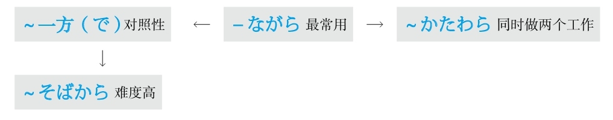

### 与～一起 #5_18_3_0_0
* [[ 日语语法新思维（修订版）_Menu_0.md | Menu #5_18_3_0_0 ]]

#### ～と一緒に #5_18_3_1_0
* [[ 日语语法新思维（修订版）_Menu_0.md | Menu #5_18_3_1_0 ]]

**解释：** 「と」的意思是“和”；「<ruby>一<rp>(</rp><rt>いっ</rt><rp>)</rp></ruby><ruby>緒<rp>(</rp><rt>しょ</rt><rp>)</rp></ruby>」的意思是“一起”；「に」表示副词
**意思：** 和～一起
**接续：** 名词

例句：<ruby>彼<rp>(</rp><rt>かれ</rt><rp>)</rp></ruby><ruby>氏<rp>(</rp><rt>し</rt><rp>)</rp></ruby>**と<ruby>一<rp>(</rp><rt>いっ</rt><rp>)</rp></ruby><ruby>緒<rp>(</rp><rt>しょ</rt><rp>)</rp></ruby>に** <ruby>旅<rp>(</rp><rt>りょ</rt><rp>)</rp></ruby><ruby>行<rp>(</rp><rt>こう</rt><rp>)</rp></ruby>に<ruby>行<rp>(</rp><rt>い</rt><rp>)</rp></ruby>ってきた。
直译：和男朋友一起去旅行后回来了。
意译：和男友一起去旅行了一趟（后回来了）。

#### ～と共に #5_18_3_2_0
* [[ 日语语法新思维（修订版）_Menu_0.md | Menu #5_18_3_2_0 ]]

**解释：** 「と」的意思是“和”；「<ruby>共<rp>(</rp><rt>とも</rt><rp>)</rp></ruby>」的意思是“共、一起”
**意思：** 和～一起
**语气：** 正式
**接续：** 名词、动词的原形

例句：<ruby>知<rp>(</rp><rt>ち</rt><rp>)</rp></ruby><ruby>識<rp>(</rp><rt>しき</rt><rp>)</rp></ruby>を<ruby>深<rp>(</rp><rt>ふか</rt><rp>)</rp></ruby>める**と<ruby>共<rp>(</rp><rt>とも</rt><rp>)</rp></ruby>に** 、<ruby>経<rp>(</rp><rt>けい</rt><rp>)</rp></ruby><ruby>験<rp>(</rp><rt>けん</rt><rp>)</rp></ruby>も<ruby>積<rp>(</rp><rt>つ</rt><rp>)</rp></ruby>んだ。
直译：把知识加深，和它一起，也积累了经验。
意译：增长了知识，也积累了经验。

#### ～と相まって #5_18_3_3_0
* [[ 日语语法新思维（修订版）_Menu_0.md | Menu #5_18_3_3_0 ]]

**解释：** 「と」的意思是“和”；「<ruby>相<rp>(</rp><rt>あい</rt><rp>)</rp></ruby>まって」的意思是“相互作用”
**意思：** 与～相互作用、与～相辅相成
**注意：** 「<ruby>相<rp>(</rp><rt>あい</rt><rp>)</rp></ruby>まって」只用て形
**接续：** 名词

例句：<ruby>実<rp>(</rp><rt>じつ</rt><rp>)</rp></ruby><ruby>力<rp>(</rp><rt>りょく</rt><rp>)</rp></ruby>と<ruby>運<rp>(</rp><rt>うん</rt><rp>)</rp></ruby>**と<ruby>相<rp>(</rp><rt>あい</rt><rp>)</rp></ruby>まって** 、<ruby>彼<rp>(</rp><rt>かれ</rt><rp>)</rp></ruby>を<ruby>成<rp>(</rp><rt>せい</rt><rp>)</rp></ruby><ruby>功<rp>(</rp><rt>こう</rt><rp>)</rp></ruby>に<ruby>導<rp>(</rp><rt>みちび</rt><rp>)</rp></ruby>いた。
直译：实力和运气相互作用，把他引向了成功。
意译：实力和运气相互作用把他引向了成功。
语法关系图
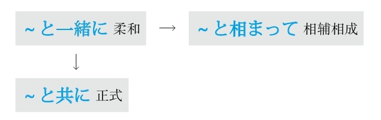

### 一～就～ #5_18_4_0_0
* [[ 日语语法新思维（修订版）_Menu_0.md | Menu #5_18_4_0_0 ]]

#### ～と #5_18_4_1_0
* [[ 日语语法新思维（修订版）_Menu_0.md | Menu #5_18_4_1_0 ]]

**重点：** 在「と、ば、たら、なら」里，最重要的是顺序。「と」和「なら」分别表示极端，「と」代表“条件性”的极端，「なら」代表“假定性”的极端
**解释：** 「と」可以理解为“脱（落）、突（发）”，表示出现的某种事物马上就会脱落出或突发下一种事物，即表示条件性强或速度快
**意思：** 只要～；一～就～
**注意：** 后句里不能用“义务、许可、命令、意志”的表达方式
**接续：** 谓语词（动词、形容词、助动词）的原形

例句：<ruby>長<rp>(</rp><rt>ちょう</rt><rp>)</rp></ruby><ruby>時<rp>(</rp><rt>じ</rt><rp>)</rp></ruby><ruby>間<rp>(</rp><rt>かん</rt><rp>)</rp></ruby><ruby>本<rp>(</rp><rt>ほん</rt><rp>)</rp></ruby>を<ruby>読<rp>(</rp><rt>よ</rt><rp>)</rp></ruby>む**と** <ruby>目<rp>(</rp><rt>め</rt><rp>)</rp></ruby>が<ruby>疲<rp>(</rp><rt>つか</rt><rp>)</rp></ruby>れる。
直译：有长时间看书这个条件，就会有眼睛疲劳这个结果。
意译：一长时间看书，眼睛就会疲劳。

#### ～かと思うと #5_18_4_2_0
* [[ 日语语法新思维（修订版）_Menu_0.md | Menu #5_18_4_2_0 ]]

**解释：** 「か」表示不确定；第一个「と」表示内容；「<ruby>思<rp>(</rp><rt>おも</rt><rp>)</rp></ruby>う」的意思是“想”；第二个「と」表示条件
**意思：** 刚一～就～
**重点：** 侧重于刚在想某事，还没有确定时，就发生了下一件事
**表示：** 动作快
**接续：** 动词和形容词的简体、形容动词和名词

例句：<ruby>信<rp>(</rp><rt>しん</rt><rp>)</rp></ruby><ruby>号<rp>(</rp><rt>ごう</rt><rp>)</rp></ruby>が<ruby>青<rp>(</rp><rt>あお</rt><rp>)</rp></ruby>になった**かと<ruby>思<rp>(</rp><rt>おも</rt><rp>)</rp></ruby>うと** 、すぐに<ruby>赤<rp>(</rp><rt>あか</rt><rp>)</rp></ruby>に<ruby>変<rp>(</rp><rt>か</rt><rp>)</rp></ruby>わった。
直译：想着信号灯是不是变成绿的了，马上变成红的了。
意译：红绿灯刚变成绿灯，马上又变成红灯了。

#### －た途端（に） #5_18_4_3_0
* [[ 日语语法新思维（修订版）_Menu_0.md | Menu #5_18_4_3_0 ]]

**解释：** 「た」的意思是“了”，表示动作的完了；「<ruby>途<rp>(</rp><rt>と</rt><rp>)</rp></ruby><ruby>端<rp>(</rp><rt>たん</rt><rp>)</rp></ruby>」的意思是“一条道路的边缘或尽头”；「に」表示方向
**注意：** 「に」可以省略，省略助词后语气正式
**原意：** 走到了路的尽头，马上就要转换路线
**意译：** 刚刚做完某事就发生了下一件事情
**着重：** 动作快
**变形：** 动词的た形的简体（变形规律参照第一章的第二节）

例句：<ruby>布<rp>(</rp><rt>ふ</rt><rp>)</rp></ruby><ruby>団<rp>(</rp><rt>とん</rt><rp>)</rp></ruby>に<ruby>入<rp>(</rp><rt>はい</rt><rp>)</rp></ruby>っ**た<ruby>途<rp>(</rp><rt>と</rt><rp>)</rp></ruby><ruby>端<rp>(</rp><rt>たん</rt><rp>)</rp></ruby>** 、ぐっすり<ruby>眠<rp>(</rp><rt>ねむ</rt><rp>)</rp></ruby>ってしまった。
直译：钻进被窝，马上，呼呼大睡了。
意译：刚钻进被窝就呼呼大睡了。

#### ～や（否や） #5_18_4_4_0
* [[ 日语语法新思维（修订版）_Menu_0.md | Menu #5_18_4_4_0 ]]

**解释：** 两个「や」是表示不确定的「か」的古语；「<ruby>否<rp>(</rp><rt>いな</rt><rp>)</rp></ruby>」表示否定
**意思：** 相当于现代日语的「～かどうか」
**重点：** “不确定”某事物是因为其动作太“快”，所以无法确定
**注意：** 有时省略「<ruby>否<rp>(</rp><rt>いな</rt><rp>)</rp></ruby>や」，只用「や」
**语气：** 正式
**接续：** 动词的原形

例句：<ruby>新<rp>(</rp><rt>しん</rt><rp>)</rp></ruby><ruby>商<rp>(</rp><rt>しょう</rt><rp>)</rp></ruby><ruby>品<rp>(</rp><rt>ひん</rt><rp>)</rp></ruby>の<ruby>販<rp>(</rp><rt>はん</rt><rp>)</rp></ruby><ruby>売<rp>(</rp><rt>ばい</rt><rp>)</rp></ruby>が<ruby>開<rp>(</rp><rt>かい</rt><rp>)</rp></ruby><ruby>始<rp>(</rp><rt>し</rt><rp>)</rp></ruby>される**や<ruby>否<rp>(</rp><rt>いや</rt><rp>)</rp></ruby>や** <ruby>注<rp>(</rp><rt>ちゅう</rt><rp>)</rp></ruby><ruby>文<rp>(</rp><rt>もん</rt><rp>)</rp></ruby>が<ruby>殺<rp>(</rp><rt>さっ</rt><rp>)</rp></ruby><ruby>到<rp>(</rp><rt>とう</rt><rp>)</rp></ruby>した。
直译：新商品的销售被开始，马上，订货就蜂拥而至。
意译：新商品刚一开始销售，订单就蜂拥而至了。

#### ～なり #5_18_4_5_0
* [[ 日语语法新思维（修订版）_Menu_0.md | Menu #5_18_4_5_0 ]]

**解释：** 「なり」是「也」的训读，「也」的音读是「や」，是表示不确定的「か」的古语
**重点：** “不确定”某事物是因为其动作太“快”，所以无法确定
**语气：** 正式
**接续：** 动词的原形

例句：<ruby>私<rp>(</rp><rt>わたし</rt><rp>)</rp></ruby>が<ruby>作<rp>(</rp><rt>つく</rt><rp>)</rp></ruby>った<ruby>料<rp>(</rp><rt>りょう</rt><rp>)</rp></ruby><ruby>理<rp>(</rp><rt>り</rt><rp>)</rp></ruby>を<ruby>一<rp>(</rp><rt>ひと</rt><rp>)</rp></ruby><ruby>口<rp>(</rp><rt>くち</rt><rp>)</rp></ruby><ruby>食<rp>(</rp><rt>た</rt><rp>)</rp></ruby>べる**なり** 、<ruby>父<rp>(</rp><rt>ちち</rt><rp>)</rp></ruby>は<ruby>変<rp>(</rp><rt>へん</rt><rp>)</rp></ruby>な<ruby>顔<rp>(</rp><rt>かお</rt><rp>)</rp></ruby>をした。
直译：吃了一口我做的饭，马上，爸爸的脸上露出了奇怪的表情。
意译：爸爸刚吃了一口我做的饭，马上就露出了奇怪的表情。

#### ～が速いか #5_18_4_6_0
* [[ 日语语法新思维（修订版）_Menu_0.md | Menu #5_18_4_6_0 ]]

**解释：** 「が」是古语中起连接作用的助词；「<ruby>速<rp>(</rp><rt>はや</rt><rp>)</rp></ruby>い」是“快”；「か」表示不确定
**重点：** 动作很快，还没有确定时，下一件事情就发生了
**语气：** 正式
**接续：** 动词的原形

例句：<ruby>地<rp>(</rp><rt>じ</rt><rp>)</rp></ruby><ruby>震<rp>(</rp><rt>しん</rt><rp>)</rp></ruby>だと<ruby>叫<rp>(</rp><rt>さけ</rt><rp>)</rp></ruby>ぶ**が<ruby>速<rp>(</rp><rt>はや</rt><rp>)</rp></ruby>いか** 、みんな<ruby>机<rp>(</rp><rt>つくえ</rt><rp>)</rp></ruby>の<ruby>下<rp>(</rp><rt>した</rt><rp>)</rp></ruby>に<ruby>潜<rp>(</rp><rt>もぐ</rt><rp>)</rp></ruby>り<ruby>込<rp>(</rp><rt>こ</rt><rp>)</rp></ruby>んだ。
直译：喊地震了，很快，大家都钻进桌子底下了。
意译：刚一喊地震了，大家就都钻到桌子底下了。

#### －次第 #5_18_4_7_0
* [[ 日语语法新思维（修订版）_Menu_0.md | Menu #5_18_4_7_0 ]]

**解释：** 「<ruby>次<rp>(</rp><rt>つぎ</rt><rp>)</rp></ruby>」的意思是“下一个”；「<ruby>第<rp>(</rp><rt>だい</rt><rp>)</rp></ruby>」的意思是“第二个”；「<ruby>次<rp>(</rp><rt>し</rt><rp>)</rp></ruby><ruby>第<rp>(</rp><rt>だい</rt><rp>)</rp></ruby>」表示“下一步”
**直译：** 下一步就～
**意译：** 马上就～、接下来～
**语气：** 正式
**接续：** 动词的连用形

例句：<ruby>決<rp>(</rp><rt>き</rt><rp>)</rp></ruby>まり**<ruby>次<rp>(</rp><rt>し</rt><rp>)</rp></ruby><ruby>第<rp>(</rp><rt>だい</rt><rp>)</rp></ruby>** ご<ruby>連<rp>(</rp><rt>れん</rt><rp>)</rp></ruby><ruby>絡<rp>(</rp><rt>らく</rt><rp>)</rp></ruby>いたします。
直译：定了，下一步，跟您联系。
意译：定了以后马上跟您联系。
语法关系图
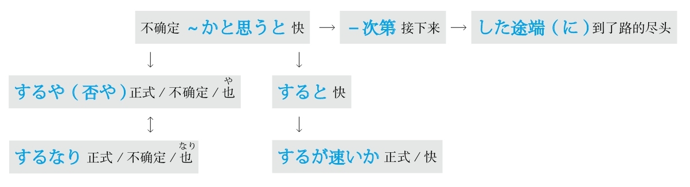

### 应该，必须 #5_18_5_0_0
* [[ 日语语法新思维（修订版）_Menu_0.md | Menu #5_18_5_0_0 ]]

#### －なければならない/いけない/だめだ #5_18_5_1_0
* [[ 日语语法新思维（修订版）_Menu_0.md | Menu #5_18_5_1_0 ]]

**解释：** 「なければ」是表示否定的「ない」和表示如果的「ば」接在一起的形式，表示“如果不～”；「ならない」的意思是“不成”；「いけない」的意思是“不行”；「だめ」的意思是“不行”
**区别：** 「ならない」→「いけない」→「だめ」，从左到右语气越发柔和
**意思：** 如果不～就不行
**变形：** 动词的否定形的な（变形规律参照第一章的第二节）

例句：<ruby>試<rp>(</rp><rt>し</rt><rp>)</rp></ruby><ruby>験<rp>(</rp><rt>けん</rt><rp>)</rp></ruby>を<ruby>控<rp>(</rp><rt>ひか</rt><rp>)</rp></ruby>えているから、<ruby>集<rp>(</rp><rt>しゅう</rt><rp>)</rp></ruby><ruby>中<rp>(</rp><rt>ちゅう</rt><rp>)</rp></ruby>して<ruby>頑<rp>(</rp><rt>がん</rt><rp>)</rp></ruby><ruby>張<rp>(</rp><rt>ば</rt><rp>)</rp></ruby>ら**なければいけない** 。
直译：面临着考试，所以不集中精力加油不行。
意译：面临考试，必须集中精力加油。

#### ～べきだ #5_18_5_2_0
* [[ 日语语法新思维（修订版）_Menu_0.md | Menu #5_18_5_2_0 ]]

**解释：** 「<ruby>可<rp>(</rp><rt>べ</rt><rp>)</rp></ruby>き」表示强调语气的“可～”
**直译：** 可得要做～
**意译：** 应该～
**着重：** 责任和义务
**注意：** 表示强调
**接续：** 动词的原形、「する」变为「すべき」或「するべき」

例句：この<ruby>事<rp>(</rp><rt>こと</rt><rp>)</rp></ruby>に<ruby>関<rp>(</rp><rt>かん</rt><rp>)</rp></ruby>して、<ruby>事<rp>(</rp><rt>じ</rt><rp>)</rp></ruby><ruby>前<rp>(</rp><rt>ぜん</rt><rp>)</rp></ruby>に<ruby>許<rp>(</rp><rt>きょ</rt><rp>)</rp></ruby><ruby>可<rp>(</rp><rt>か</rt><rp>)</rp></ruby>をもらう**べきだ** 。
直译：关于这件事，应该事先请求许可。
意译：关于这件事，应该事先得到许可。

#### ～はずだ #5_18_5_3_0
* [[ 日语语法新思维（修订版）_Menu_0.md | Menu #5_18_5_3_0 ]]

**解释：** 「<ruby>筈<rp>(</rp><rt>はず</rt><rp>)</rp></ruby>」是弓的两端系弦的地方；由于系弦的地方应该和弦匹配，所以引申为“客观性的应该”
**着重：** 客观性
**注意：** 没有「～はずではない」这个表达方式
**接续：** 修饰名词的规律（参照第一章的第三节）

例句：もうそろそろ<ruby>着<rp>(</rp><rt>つ</rt><rp>)</rp></ruby>く**はずだ** 。
直译：应该差不多该到了。
意译：应该快到了吧。

#### ～わけだ #5_18_5_4_0
* [[ 日语语法新思维（修订版）_Menu_0.md | Menu #5_18_5_4_0 ]]

**解释：** 「<ruby>訳<rp>(</rp><rt>わけ</rt><rp>)</rp></ruby>」的起源是「<ruby>分<rp>(</rp><rt>わ</rt><rp>)</rp></ruby>ける」，意思是“道理”
**原意：** 道理
**直译：** 从道理上来讲应该～
**意译：** 理所应当；也就是说
**接续：** 修饰名词的规律（参照第一章的第三节）

例句：<ruby>日<rp>(</rp><rt>に</rt><rp>)</rp></ruby><ruby>本<rp>(</rp><rt>ほん</rt><rp>)</rp></ruby>に<ruby>長<rp>(</rp><rt>なが</rt><rp>)</rp></ruby><ruby>年<rp>(</rp><rt>ねん</rt><rp>)</rp></ruby>いたから、<ruby>日<rp>(</rp><rt>に</rt><rp>)</rp></ruby><ruby>本<rp>(</rp><rt>ほん</rt><rp>)</rp></ruby><ruby>語<rp>(</rp><rt>ご</rt><rp>)</rp></ruby>が<ruby>上<rp>(</rp><rt>じょう</rt><rp>)</rp></ruby><ruby>手<rp>(</rp><rt>ず</rt><rp>)</rp></ruby>な**わけだ** 。
直译：在日本呆了长年，日语理所应当好。
意译：在日本呆了很多年，日语当然好了。

#### ～わけにはいかない #5_18_5_5_0
* [[ 日语语法新思维（修订版）_Menu_0.md | Menu #5_18_5_5_0 ]]

**解释：** 「<ruby>訳<rp>(</rp><rt>わけ</rt><rp>)</rp></ruby>」的起源是「<ruby>分<rp>(</rp><rt>わ</rt><rp>)</rp></ruby>ける」，意思是“道理”；「に」表示方向；「は」表示强调；「いかない」的汉字是「<ruby>行<rp>(</rp><rt>い</rt><rp>)</rp></ruby>かない」，表示“不往～的方向走”
**原意：** 道理
**直译：** 不朝～的道理的方向去
**意译：** 从基本道理上来讲都不应该～
**接续：** 修饰名词的规律（参照第一章的第三节）

例句：<ruby>教<rp>(</rp><rt>きょう</rt><rp>)</rp></ruby><ruby>師<rp>(</rp><rt>し</rt><rp>)</rp></ruby>として<ruby>遅<rp>(</rp><rt>ち</rt><rp>)</rp></ruby><ruby>刻<rp>(</rp><rt>こく</rt><rp>)</rp></ruby>する**わけにはいかない** 。
直译：作为教师，从起码的道理上来讲都不应该迟到。
意译：作为一名教师，从起码的道理上来讲都不能迟到。

#### ～ものではない #5_18_5_6_0
* [[ 日语语法新思维（修订版）_Menu_0.md | Menu #5_18_5_6_0 ]]

**解释：** 「もの」接在句尾表示强调；「ではない」的意思是“不是～”
**重点：** 因为强调无法翻译，所以借助于同样表示强调的「<ruby>可<rp>(</rp><rt>べ</rt><rp>)</rp></ruby>き」的翻译，即“应该”
**意思：** 不应该～
**注意：** 「ものではない」比「べきではない」语气柔和；「～ものだ」的意思是“可、真、可真、就”
**接续：** 动词的原形

例句：<ruby>小<rp>(</rp><rt>ちい</rt><rp>)</rp></ruby>さい<ruby>子<rp>(</rp><rt>こ</rt><rp>)</rp></ruby><ruby>供<rp>(</rp><rt>ども</rt><rp>)</rp></ruby>を<ruby>一人<rp>(</rp><rt>ひとり</rt><rp>)</rp></ruby>で<ruby>遠<rp>(</rp><rt>とお</rt><rp>)</rp></ruby>くに<ruby>遊<rp>(</rp><rt>あそ</rt><rp>)</rp></ruby>びに<ruby>行<rp>(</rp><rt>い</rt><rp>)</rp></ruby>かせる**ものではない** 。
直译：小孩子一个人远的地方，让他去玩儿，不应该。
意译：不应该让小孩子一个人去远地方玩儿。
语法关系图
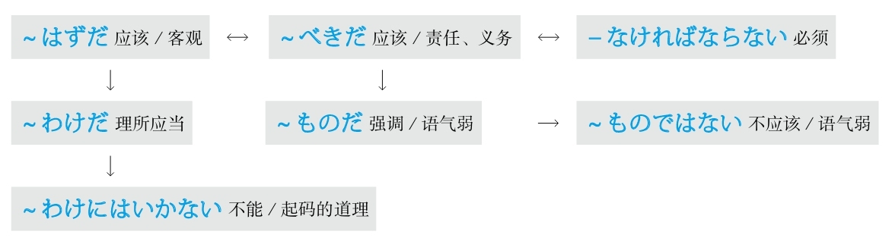

### （没）有做～的意思 #5_18_6_0_0
* [[ 日语语法新思维（修订版）_Menu_0.md | Menu #5_18_6_0_0 ]]

#### －ようとする #5_18_6_1_0
* [[ 日语语法新思维（修订版）_Menu_0.md | Menu #5_18_6_1_0 ]]

**解释：** 「－よう」是动词的意志形；「と」表示内容；「する」代替了大多数的动词
**意思：** 有做～的意愿
**着重：** 本人的意志和意愿
**解释：** “意志”英语为will，因此日语的意志形就可以理解为要去做某事。动词的意志形后面加上「と」才能表示will
**变形：** 动词的意志形（变形规律参照第一章的第二节）

例句：<ruby>今<rp>(</rp><rt>いま</rt><rp>)</rp></ruby>メールを<ruby>出<rp>(</rp><rt>だ</rt><rp>)</rp></ruby>**そうとしている** 。
直译：现在正有发信息的意愿。
意译：现在正要发信息。

#### －ようとしない #5_18_6_2_0
* [[ 日语语法新思维（修订版）_Menu_0.md | Menu #5_18_6_2_0 ]]

**解释：** 「－よう」是动词的意志形；「と」表示内容；「しない」是代替了大多数动词的「する」的否定
**意思：** 没有做～的意愿
**着重：** 本人的意志和意愿
**解释：** “意志”英语为will，因此日语的意志形就可以理解为要去做某事。动词的意志形后面加上「と」才能表示will
**注意：** 意志形的否定有两个：前面是否定的「－まいとする」和后面是否定的「－ようとしない」。按照日语里“前轻后重”的语法准则，后面是否定的比前面是否定的语气强烈，所以「－まいとする」翻译成“不想要”，「－ようとしない」翻译成“完全不想要”
**变形：** 动词的意志形（变形规律参照第一章的第二节）

例句：もう<ruby>遅<rp>(</rp><rt>おそ</rt><rp>)</rp></ruby>いのに、<ruby>子<rp>(</rp><rt>こ</rt><rp>)</rp></ruby><ruby>供<rp>(</rp><rt>ども</rt><rp>)</rp></ruby>は<ruby>全然<rp>(</rp><rt>ぜんぜん</rt><rp>)</rp></ruby><ruby>寝<rp>(</rp><rt>ね</rt><rp>)</rp></ruby>**ようとしない** 。
直译：已经晚了，但是孩子一点儿要睡觉的意思都没有。
意译：都已经这么晚了，孩子却一点儿要睡觉的意思都没有。

#### －そうもない/－そうにない #5_18_6_3_0
* [[ 日语语法新思维（修订版）_Menu_0.md | Menu #5_18_6_3_0 ]]

**解释：** 「<ruby>相<rp>(</rp><rt>そう</rt><rp>)</rp></ruby>」的前面接谓语词的连用形，表示“好像”；「も」的意思是“连”；「に」表示副词；「ない」的意思是“没有”
**直译：** 连～的好像都没有
**意译：** 不可能～
**着重：** 样子
**接续：** 动词和形容词的连用形、形容动词

例句：<ruby>雨<rp>(</rp><rt>あめ</rt><rp>)</rp></ruby>が<ruby>止<rp>(</rp><rt>や</rt><rp>)</rp></ruby>み**そうにない** 。
直译：雨没有停的样子。
意译：雨没有停的意思。

例句：この<ruby>調<rp>(</rp><rt>ちょう</rt><rp>)</rp></ruby><ruby>子<rp>(</rp><rt>し</rt><rp>)</rp></ruby>なら、<ruby>時<rp>(</rp><rt>じ</rt><rp>)</rp></ruby><ruby>間<rp>(</rp><rt>かん</rt><rp>)</rp></ruby><ruby>通<rp>(</rp><rt>どお</rt><rp>)</rp></ruby>りに<ruby>終<rp>(</rp><rt>お</rt><rp>)</rp></ruby>わり**そうにない** 。
直译：这个样子的话，按时完的样子没有。
意译：照这个样子的话，不可能按时完成。
语法关系图
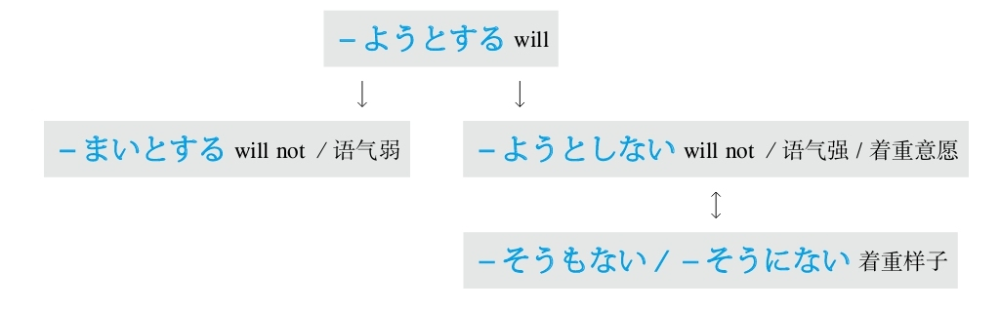

### 又不是～ #5_18_7_0_0
* [[ 日语语法新思维（修订版）_Menu_0.md | Menu #5_18_7_0_0 ]]

#### ～じゃあるまいし #5_18_7_1_0
* [[ 日语语法新思维（修订版）_Menu_0.md | Menu #5_18_7_1_0 ]]

**解释：** 「じゃ」是「では」的口语形式；「まい」是否定的推量，在此表示「ないでしょう」，意思是“不～吧”；「し」的意思是“又”；「～じゃあるまい」是「～ではないでしょう」
**意思：** 又不是～
**区别：** 比「～じゃないし」语气柔和
**接续：** 名词

例句：<ruby>子<rp>(</rp><rt>こ</rt><rp>)</rp></ruby><ruby>供<rp>(</rp><rt>ども</rt><rp>)</rp></ruby>**じゃあるまいし** 、これぐらいの<ruby>礼<rp>(</rp><rt>れい</rt><rp>)</rp></ruby><ruby>儀<rp>(</rp><rt>ぎ</rt><rp>)</rp></ruby>もわからないの？
直译：又不是孩子，这点儿小礼节都不明白吗？
意译：又不是孩子，连这点儿小礼节都不懂吗？

### 与～有关 #5_18_8_0_0
* [[ 日语语法新思维（修订版）_Menu_0.md | Menu #5_18_8_0_0 ]]

#### ～に関係がある #5_18_8_1_0
* [[ 日语语法新思维（修订版）_Menu_0.md | Menu #5_18_8_1_0 ]]

**解释：** 「に」表示对象；「<ruby>関<rp>(</rp><rt>かん</rt><rp>)</rp></ruby><ruby>係<rp>(</rp><rt>けい</rt><rp>)</rp></ruby>」的意思是“关系”；「が」表示小主语；「ある」的意思是“有”
**意思：** 与～有关系
**接续：** 名词

例句：この<ruby>事<rp>(</rp><rt>こと</rt><rp>)</rp></ruby>は<ruby>私<rp>(</rp><rt>わたし</rt><rp>)</rp></ruby>**には<ruby>関<rp>(</rp><rt>かん</rt><rp>)</rp></ruby><ruby>係<rp>(</rp><rt>けい</rt><rp>)</rp></ruby>がない** 。
直译：这事跟我没关系。
意译：这事与我无关。

#### ～に関わる #5_18_8_2_0
* [[ 日语语法新思维（修订版）_Menu_0.md | Menu #5_18_8_2_0 ]]

**解释：** 「に」表示对象；「<ruby>関<rp>(</rp><rt>かか</rt><rp>)</rp></ruby>わる」的意思是“关”
**直译：** 关于～
**意译：** 与～有关系
**语气：** 正式
**接续：** 名词

例句：<ruby>昇<rp>(</rp><rt>しょう</rt><rp>)</rp></ruby><ruby>進<rp>(</rp><rt>しん</rt><rp>)</rp></ruby>**に<ruby>関<rp>(</rp><rt>かか</rt><rp>)</rp></ruby>わる** <ruby>問<rp>(</rp><rt>もん</rt><rp>)</rp></ruby><ruby>題<rp>(</rp><rt>だい</rt><rp>)</rp></ruby>だから、<ruby>気<rp>(</rp><rt>き</rt><rp>)</rp></ruby>をつけよう。
直译：与晋升有关的问题，要注意。
意译：这是有关晋升的问题，小心点儿吧。

#### ～に係る #5_18_8_3_0
* [[ 日语语法新思维（修订版）_Menu_0.md | Menu #5_18_8_3_0 ]]

**解释：** 「に」表示对象；「<ruby>係<rp>(</rp><rt>かか</rt><rp>)</rp></ruby>る」的意思是“系”
**意思：** 与～有关系
**语气：** 正式
**接续：** 名词

例句：<ruby>報<rp>(</rp><rt>ほう</rt><rp>)</rp></ruby><ruby>酬<rp>(</rp><rt>しゅう</rt><rp>)</rp></ruby><ruby>改<rp>(</rp><rt>かい</rt><rp>)</rp></ruby><ruby>定<rp>(</rp><rt>てい</rt><rp>)</rp></ruby>**に<ruby>係<rp>(</rp><rt>かか</rt><rp>)</rp></ruby>る** <ruby>案<rp>(</rp><rt>あん</rt><rp>)</rp></ruby>はまだ<ruby>最<rp>(</rp><rt>さい</rt><rp>)</rp></ruby><ruby>終<rp>(</rp><rt>しゅう</rt><rp>)</rp></ruby><ruby>決<rp>(</rp><rt>けっ</rt><rp>)</rp></ruby><ruby>定<rp>(</rp><rt>てい</rt><rp>)</rp></ruby>の<ruby>段<rp>(</rp><rt>だん</rt><rp>)</rp></ruby><ruby>階<rp>(</rp><rt>かい</rt><rp>)</rp></ruby>には<ruby>入<rp>(</rp><rt>はい</rt><rp>)</rp></ruby>っていない。
直译：与工资改革有关系的方案还没有进入最终决定的阶段。
意译：有关工资改革的方案还没有进入最终决定的阶段。
语法关系图
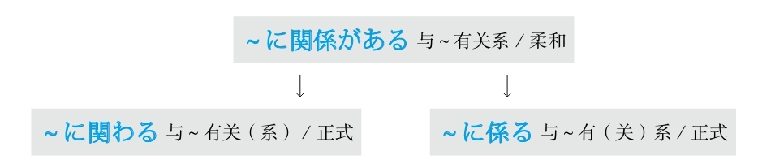

### 越～越～ #5_18_9_0_0
* [[ 日语语法新思维（修订版）_Menu_0.md | Menu #5_18_9_0_0 ]]

#### －ば～ほど #5_18_9_1_0
* [[ 日语语法新思维（修订版）_Menu_0.md | Menu #5_18_9_1_0 ]]

**解释：** 「ば」的意思是“如果”，在此是提及话题，为了引起注意；表示程度高的助词「ほど」体现“（超）越”
**注意：** 「ば」可以省略
**变形：** ば形（变形规律参照第一章的第二节）
**接续：** 「ほど」前用动词和形容词的原形、形容动词な或である

例句：（<ruby>習<rp>(</rp><rt>なら</rt><rp>)</rp></ruby>え**ば** ）<ruby>習<rp>(</rp><rt>なら</rt><rp>)</rp></ruby>う**ほど** <ruby>難<rp>(</rp><rt>むずか</rt><rp>)</rp></ruby>しく<ruby>感<rp>(</rp><rt>かん</rt><rp>)</rp></ruby>じる。
直译：（如果学的话）那么越学越觉得不懂。
意译：觉得越学越不懂。

#### ～に限って #5_18_9_2_0
* [[ 日语语法新思维（修订版）_Menu_0.md | Menu #5_18_9_2_0 ]]

**解释：** 「に」表示方向或对象；「<ruby>限<rp>(</rp><rt>かぎ</rt><rp>)</rp></ruby>って」是自动词「<ruby>限<rp>(</rp><rt>かぎ</rt><rp>)</rp></ruby>る」的中顿形式，表示“极限”
**直译：** 只限于～
**意译：** 越～
**接续：** 名词

例句：<ruby>簡<rp>(</rp><rt>かん</rt><rp>)</rp></ruby><ruby>単<rp>(</rp><rt>たん</rt><rp>)</rp></ruby>な<ruby>問<rp>(</rp><rt>もん</rt><rp>)</rp></ruby><ruby>題<rp>(</rp><rt>だい</rt><rp>)</rp></ruby>**に<ruby>限<rp>(</rp><rt>かぎ</rt><rp>)</rp></ruby>って** <ruby>答<rp>(</rp><rt>こた</rt><rp>)</rp></ruby>えられない。
直译：只限于简单的问题，回答不上来。
意译：越是简单的问题越回答不上来。
语法关系图
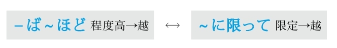

### 原因 #5_18_10_0_0
* [[ 日语语法新思维（修订版）_Menu_0.md | Menu #5_18_10_0_0 ]]

#### ～から #5_18_10_1_0
* [[ 日语语法新思维（修订版）_Menu_0.md | Menu #5_18_10_1_0 ]]

**解释：** 接续助词（接在谓语词后）
**表示：** 原因
**语气：** 主观
**接续：** 谓语词（动词、形容词、助动词）的简体和敬体

例句：<ruby>内<rp>(</rp><rt>ない</rt><rp>)</rp></ruby><ruby>陸<rp>(</rp><rt>りく</rt><rp>)</rp></ruby>だ**から** 、<ruby>空<rp>(</rp><rt>くう</rt><rp>)</rp></ruby><ruby>気<rp>(</rp><rt>き</rt><rp>)</rp></ruby>が<ruby>乾<rp>(</rp><rt>かん</rt><rp>)</rp></ruby><ruby>燥<rp>(</rp><rt>そう</rt><rp>)</rp></ruby>している。
直译：因为是内陆，所以空气干燥。
意译：因为是内陆，所以空气很干燥。

#### ～ので #5_18_10_2_0
* [[ 日语语法新思维（修订版）_Menu_0.md | Menu #5_18_10_2_0 ]]

**解释：** 接续助词（接在谓语词后）；「の」是名词化；「で」表示原因
**表示：** 原因
**语气：** 客观
**接续：** 动词和形容词的简体和敬体、形容动词和名词加な

例句：<ruby>経<rp>(</rp><rt>けい</rt><rp>)</rp></ruby><ruby>験<rp>(</rp><rt>けん</rt><rp>)</rp></ruby>がまだ<ruby>浅<rp>(</rp><rt>あさ</rt><rp>)</rp></ruby>い**ので** 、<ruby>宜<rp>(</rp><rt>よろ</rt><rp>)</rp></ruby>しくお<ruby>願<rp>(</rp><rt>ねが</rt><rp>)</rp></ruby>いいたします。
直译：经验还浅，所以请您多关照。
意译：经验不足，请多关照。

#### ～ため #5_18_10_3_0
* [[ 日语语法新思维（修订版）_Menu_0.md | Menu #5_18_10_3_0 ]]

**解释：** 「<ruby>為<rp>(</rp><rt>ため</rt><rp>)</rp></ruby>」的意思是“因为”
**表示：** 原因
**语气：** 正式
**区别：** 「ため」后面是否加「に」需要根据是否需要将「に」表示的“而”翻译出来而定，需要通过上下文来判断是否加
**接续：** 修饰名词的规律（参照第一章的第三节）

例句：レポート<ruby>提<rp>(</rp><rt>てい</rt><rp>)</rp></ruby><ruby>出<rp>(</rp><rt>しゅつ</rt><rp>)</rp></ruby>の<ruby>締<rp>(</rp><rt>し</rt><rp>)</rp></ruby>め<ruby>切<rp>(</rp><rt>き</rt><rp>)</rp></ruby>りに<ruby>間<rp>(</rp><rt>ま</rt><rp>)</rp></ruby>に<ruby>合<rp>(</rp><rt>あ</rt><rp>)</rp></ruby>わなかった**ため、** <ruby>減<rp>(</rp><rt>げん</rt><rp>)</rp></ruby><ruby>点<rp>(</rp><rt>てん</rt><rp>)</rp></ruby>されてしまった。
直译：小论文的提交期限没有赶上，因此，被减了分。
意译：由于没有赶在截止日期之前提交小论文，结果被减了分。

#### ～おかげで #5_18_10_4_0
* [[ 日语语法新思维（修订版）_Menu_0.md | Menu #5_18_10_4_0 ]]

**解释：** 「お<ruby>陰<rp>(</rp><rt>かげ</rt><rp>)</rp></ruby>」的意思是“托～的福”；「で」是「です」的中顿形式
**直译：** 托～的福
**重点：** 带来好的结果
**注意：** 不能用「～おかげさまで」。「おかげさまで」（托您的福）只能用于句首
**接续：** 修饰名词的规律（参照第一章的第三节）

例句：<ruby>若<rp>(</rp><rt>わか</rt><rp>)</rp></ruby>い<ruby>時<rp>(</rp><rt>とき</rt><rp>)</rp></ruby>から<ruby>体<rp>(</rp><rt>からだ</rt><rp>)</rp></ruby>を<ruby>鍛<rp>(</rp><rt>きた</rt><rp>)</rp></ruby>えてきた**おかげで** 、<ruby>病<rp>(</rp><rt>びょう</rt><rp>)</rp></ruby><ruby>院<rp>(</rp><rt>いん</rt><rp>)</rp></ruby>には<ruby>無<rp>(</rp><rt>む</rt><rp>)</rp></ruby><ruby>縁<rp>(</rp><rt>えん</rt><rp>)</rp></ruby>だ。
直译：从年轻时开始就一直锻炼身体，托它的福，跟医院无缘。
意译：由于我从年轻时开始就一直锻炼身体，所以跟医院无缘。

#### ～せいで #5_18_10_5_0
* [[ 日语语法新思维（修订版）_Menu_0.md | Menu #5_18_10_5_0 ]]

**解释：** 「<ruby>所<rp>(</rp><rt>せ</rt><rp>)</rp></ruby><ruby>為<rp>(</rp><rt>い</rt><rp>)</rp></ruby>」的意思是“怪罪”；「で」是「です」的中顿形式
**直译：** 是～的所为
**重点：** 带来不好的结果
**接续：** 修饰名词的规律（参照第一章的第三节）

例句：<ruby>道<rp>(</rp><rt>みち</rt><rp>)</rp></ruby>が<ruby>混<rp>(</rp><rt>こ</rt><rp>)</rp></ruby>んだ**せいで** 、<ruby>遅<rp>(</rp><rt>おく</rt><rp>)</rp></ruby>れてきた。
直译：道路混杂，就是它的所为（就怪它），来晚了。
意译：堵车，所以来晚了。

#### ～によって #5_18_10_6_0
* [[ 日语语法新思维（修订版）_Menu_0.md | Menu #5_18_10_6_0 ]]

**解释：** 「に」表示方向或对象；「よって」是自动词「<ruby>由<rp>(</rp><rt>よ</rt><rp>)</rp></ruby>る」的中顿形式，意思有“根据～、由于～、由～来做～”
**意思：** 由于～
**语气：** 正式
**接续：** 名词

例句：<ruby>先<rp>(</rp><rt>せん</rt><rp>)</rp></ruby><ruby>端<rp>(</rp><rt>たん</rt><rp>)</rp></ruby><ruby>技<rp>(</rp><rt>ぎ</rt><rp>)</rp></ruby><ruby>術<rp>(</rp><rt>じゅつ</rt><rp>)</rp></ruby>を<ruby>駆<rp>(</rp><rt>く</rt><rp>)</rp></ruby><ruby>使<rp>(</rp><rt>し</rt><rp>)</rp></ruby>すること**によって** 、より<ruby>便<rp>(</rp><rt>べん</rt><rp>)</rp></ruby><ruby>利<rp>(</rp><rt>り</rt><rp>)</rp></ruby>な<ruby>生<rp>(</rp><rt>せい</rt><rp>)</rp></ruby><ruby>活<rp>(</rp><rt>かつ</rt><rp>)</rp></ruby>ができるようになった。
直译：由于驱使先端技术，所以更加便利的生活变得能够了。
意译：由于能够运用先端技术，所以生活变得更加方便了。

#### ～が故に #5_18_10_7_0
* [[ 日语语法新思维（修订版）_Menu_0.md | Menu #5_18_10_7_0 ]]

**解释：** 「が」是古语中起连接作用的助词；「<ruby>故<rp>(</rp><rt>ゆえ</rt><rp>)</rp></ruby>」的意思是“缘故”；「に」表示副词
**意思：** ～的缘故
**注意：** 「が」在此相当于现代日语的「の」，有时省略
**语气：** 正式
**接续：** 动词和形容词的简体、名词和形容动词

例句：<ruby>友<rp>(</rp><rt>ゆう</rt><rp>)</rp></ruby><ruby>人<rp>(</rp><rt>じん</rt><rp>)</rp></ruby>からの<ruby>忠<rp>(</rp><rt>ちゅう</rt><rp>)</rp></ruby><ruby>告<rp>(</rp><rt>こく</rt><rp>)</rp></ruby>を<ruby>聞<rp>(</rp><rt>き</rt><rp>)</rp></ruby>かなかった**が<ruby>故<rp>(</rp><rt>ゆえ</rt><rp>)</rp></ruby>に** 、この<ruby>始<rp>(</rp><rt>し</rt><rp>)</rp></ruby><ruby>末<rp>(</rp><rt>まつ</rt><rp>)</rp></ruby>になってしまった。
直译：从朋友那里来的忠告没有听，这个缘故，成为了这个地步。
意译：由于没有听朋友的忠告，才落到了这个地步。

#### ～次第で #5_18_10_8_0
* [[ 日语语法新思维（修订版）_Menu_0.md | Menu #5_18_10_8_0 ]]

**解释：** 「<ruby>次<rp>(</rp><rt>つぎ</rt><rp>)</rp></ruby>」的意思是“下一个”；「<ruby>第<rp>(</rp><rt>だい</rt><rp>)</rp></ruby>」的意思是“第二个”；「<ruby>次<rp>(</rp><rt>し</rt><rp>)</rp></ruby><ruby>第<rp>(</rp><rt>だい</rt><rp>)</rp></ruby>」表示“下一步”；「で」表示原因
**着重：** 有多个原因
**直译：** 由于～几条原因，所以～
**接续：** 名词加の、形容动词加な

例句：<ruby>以<rp>(</rp><rt>い</rt><rp>)</rp></ruby><ruby>上<rp>(</rp><rt>じょう</rt><rp>)</rp></ruby>のような**<ruby>次<rp>(</rp><rt>し</rt><rp>)</rp></ruby><ruby>第<rp>(</rp><rt>だい</rt><rp>)</rp></ruby>で** <ruby>退<rp>(</rp><rt>たい</rt><rp>)</rp></ruby><ruby>学<rp>(</rp><rt>がく</rt><rp>)</rp></ruby>させていただきます。
直译：由于以上的几条原因，请让我退学。
意译：由于以上原因，请让我退学。

#### ～とあって #5_18_10_9_0
* [[ 日语语法新思维（修订版）_Menu_0.md | Menu #5_18_10_9_0 ]]

**解释：** 「と」表示内容；「あって」是自动词「<ruby>有<rp>(</rp><rt>あ</rt><rp>)</rp></ruby>る」的中顿形式
**意思：** 有～事宜
**注意：** 表示某事发生后出现了后面的事情，通过上下文才翻译成了“因为”
**语气：** 正式
**接续：** 任何词

例句：<ruby>開<rp>(</rp><rt>かい</rt><rp>)</rp></ruby><ruby>店<rp>(</rp><rt>てん</rt><rp>)</rp></ruby>セール**とあって** 、<ruby>店<rp>(</rp><rt>てん</rt><rp>)</rp></ruby><ruby>内<rp>(</rp><rt>ない</rt><rp>)</rp></ruby>は<ruby>客<rp>(</rp><rt>きゃく</rt><rp>)</rp></ruby>でごった<ruby>返<rp>(</rp><rt>がえ</rt><rp>)</rp></ruby>していた。
直译：有开店促销这回事，商店内顾客很拥挤。
意译：由于是开店促销，商店里挤满了顾客。

#### ～とて/～こととて #5_18_10_10_0
* [[ 日语语法新思维（修订版）_Menu_0.md | Menu #5_18_10_10_0 ]]

**解释：** 「と」表示内容；「て」是「あって」的省略形式；起名词化作用的「こと」语气正式
**意思：** 有～事宜，～
**注意：** 表示某事发生后出现了后面的事情，通过上下文才翻译成了“因为”
**区别：** 因为是「～とあって」的省略形式，所以语法表达难度高，且语气正式
**接续：** 「～とて」前可以接任何词；「～こととて」接修饰名词的规律（参照第一章的第三节）

例句：<ruby>急<rp>(</rp><rt>きゅう</rt><rp>)</rp></ruby>な**こととて** 、ゆっくりとごあいさつにも<ruby>伺<rp>(</rp><rt>うかが</rt><rp>)</rp></ruby>えませんでした。
直译：有突然这回事，慢慢地打招呼都没有能够去。
意译：因为非常突然，都没能好好去打招呼。
语法关系图
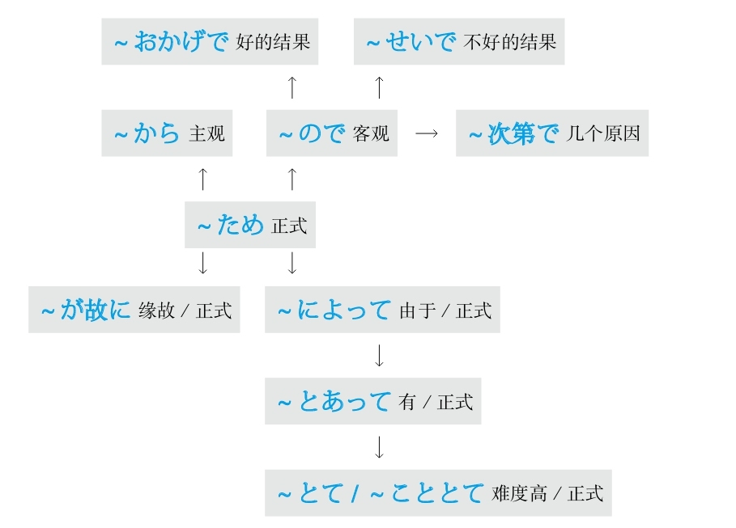

## Z #5_19_0_0_0
* [[ 日语语法新思维（修订版）_Menu_0.md | Menu #5_19_0_0_0 ]]

### 在 #5_19_1_0_0
* [[ 日语语法新思维（修订版）_Menu_0.md | Menu #5_19_1_0_0 ]]

#### ～に #5_19_1_1_0
* [[ 日语语法新思维（修订版）_Menu_0.md | Menu #5_19_1_1_0 ]]

**解释：** 表示“方向、对象、目的、目标”
**注意：** 用于地点则强调方向

例句：ここ**に** <ruby>書<rp>(</rp><rt>か</rt><rp>)</rp></ruby>いてください。
直译：请写在这里。

#### ～で #5_19_1_2_0
* [[ 日语语法新思维（修订版）_Menu_0.md | Menu #5_19_1_2_0 ]]

**解释：** 表示“在某个地方做某事、交通、方法、范围、程度、原因、状态”
**注意：** 用于地点则强调范围

例句：ここ**で** <ruby>書<rp>(</rp><rt>か</rt><rp>)</rp></ruby>いてください。
直译：请在这里写。

#### ～にあって #5_19_1_3_0
* [[ 日语语法新思维（修订版）_Menu_0.md | Menu #5_19_1_3_0 ]]

**解释：** 「に」表示方向；「あって」是自动词「<ruby>有<rp>(</rp><rt>あ</rt><rp>)</rp></ruby>る」的中顿形式
**意思：** 在～身上
**接续：** 名词

例句：あの<ruby>事<rp>(</rp><rt>こと</rt><rp>)</rp></ruby>は<ruby>私<rp>(</rp><rt>わたし</rt><rp>)</rp></ruby>**にあって** まだ<ruby>鮮<rp>(</rp><rt>せん</rt><rp>)</rp></ruby><ruby>明<rp>(</rp><rt>めい</rt><rp>)</rp></ruby>に<ruby>覚<rp>(</rp><rt>おぼ</rt><rp>)</rp></ruby>えている。
直译：那件事，在我身上，还鲜明地记着。
意译：那件事对我来说还记忆犹新。

#### ～にあたって #5_19_1_4_0
* [[ 日语语法新思维（修订版）_Menu_0.md | Menu #5_19_1_4_0 ]]

**解释：** 「に」表示方向；「あたって」是自动词「<ruby>当<rp>(</rp><rt>あ</rt><rp>)</rp></ruby>たる」的中顿形式，意思是“相当”
**直译：** 相当于～
**意译：** 在～之际
**语气：** 正式
**接续：** 表示事件、工作的名词；动词的原形

例句：<ruby>開会<rp>(</rp><rt>かいかい</rt><rp>)</rp></ruby>（する）**にあたり** 、<ruby>社<rp>(</rp><rt>しゃ</rt><rp>)</rp></ruby><ruby>長<rp>(</rp><rt>ちょう</rt><rp>)</rp></ruby>に<ruby>一<rp>(</rp><rt>ひと</rt><rp>)</rp></ruby><ruby>言<rp>(</rp><rt>こと</rt><rp>)</rp></ruby>ごあいさついただきたいと<ruby>思<rp>(</rp><rt>おも</rt><rp>)</rp></ruby>います。
直译：在开始会议，我们想请社长说一句话。
意译：在会议开始之际，我们想请社长为我们致词。

#### ～において #5_19_1_5_0
* [[ 日语语法新思维（修订版）_Menu_0.md | Menu #5_19_1_5_0 ]]

**解释：** 「に」表示方向；「おいて」是自动词「<ruby>於<rp>(</rp><rt>お</rt><rp>)</rp></ruby>く」的中顿形式，意思是“于”
**意思：** 于～
**语气：** 正式
**注意：** 后面接名词时用「～における」
**接续：** 时间、地点、状况、团体等名词

例句：<ruby>上<rp>(</rp><rt>じょう</rt><rp>)</rp></ruby><ruby>級<rp>(</rp><rt>きゅう</rt><rp>)</rp></ruby><ruby>者<rp>(</rp><rt>しゃ</rt><rp>)</rp></ruby>**において** 、<ruby>発<rp>(</rp><rt>はつ</rt><rp>)</rp></ruby><ruby>音<rp>(</rp><rt>おん</rt><rp>)</rp></ruby>の<ruby>重<rp>(</rp><rt>じゅう</rt><rp>)</rp></ruby><ruby>要<rp>(</rp><rt>よう</rt><rp>)</rp></ruby><ruby>性<rp>(</rp><rt>せい</rt><rp>)</rp></ruby>と<ruby>文<rp>(</rp><rt>ぶん</rt><rp>)</rp></ruby><ruby>法<rp>(</rp><rt>ぽう</rt><rp>)</rp></ruby>の<ruby>煩<rp>(</rp><rt>わずら</rt><rp>)</rp></ruby>わしさをますます<ruby>感<rp>(</rp><rt>かん</rt><rp>)</rp></ruby>じていると<ruby>思<rp>(</rp><rt>おも</rt><rp>)</rp></ruby>う。
直译：于高级班的人，发音的重要性和语法的繁琐性，越发感受到了，我觉得。
意译：我认为高级班的学生越发感到了发音的重要性和语法的繁琐性。

#### ～にかけては #5_19_1_6_0
* [[ 日语语法新思维（修订版）_Menu_0.md | Menu #5_19_1_6_0 ]]

**解释：** 「に」表示方向；「かけて」是他动词「かける」的中顿形式，意思是“大面积地覆盖”；「は」表示对比性强调
**意思：** 在～方面
**注意：** 用于比较于其他方面，在某方面特别突出；「は」不能省略
**接续：** 名词

例句：<ruby>気<rp>(</rp><rt>き</rt><rp>)</rp></ruby><ruby>立<rp>(</rp><rt>だ</rt><rp>)</rp></ruby>て**にかけては** <ruby>誰<rp>(</rp><rt>だれ</rt><rp>)</rp></ruby>にも<ruby>負<rp>(</rp><rt>ま</rt><rp>)</rp></ruby>けない。
直译：在脾气秉性方面，谁都不输给。
意译：在脾气秉性方面我不输给任何人。

#### ～上で #5_19_1_7_0
* [[ 日语语法新思维（修订版）_Menu_0.md | Menu #5_19_1_7_0 ]]

**解释：** 「<ruby>上<rp>(</rp><rt>うえ</rt><rp>)</rp></ruby>」的意思是“上面”；「で」表示范围
**意思：** 在～上
**接续：** 动词的原形

例句：<ruby>適<rp>(</rp><rt>てき</rt><rp>)</rp></ruby><ruby>当<rp>(</rp><rt>とう</rt><rp>)</rp></ruby>な<ruby>運<rp>(</rp><rt>うん</rt><rp>)</rp></ruby><ruby>動<rp>(</rp><rt>どう</rt><rp>)</rp></ruby>をするのは、<ruby>健<rp>(</rp><rt>けん</rt><rp>)</rp></ruby><ruby>康<rp>(</rp><rt>こう</rt><rp>)</rp></ruby>と<ruby>美<rp>(</rp><rt>び</rt><rp>)</rp></ruby><ruby>容<rp>(</rp><rt>よう</rt><rp>)</rp></ruby>を<ruby>保<rp>(</rp><rt>たも</rt><rp>)</rp></ruby>つ**<ruby>上<rp>(</rp><rt>うえ</rt><rp>)</rp></ruby>で** <ruby>大<rp>(</rp><rt>たい</rt><rp>)</rp></ruby><ruby>切<rp>(</rp><rt>せつ</rt><rp>)</rp></ruby>です。
直译：适当的运动做，在健康和美容保持上，重要。
意译：做适当的运动在保持健康和美容方面很重要。
语法关系图
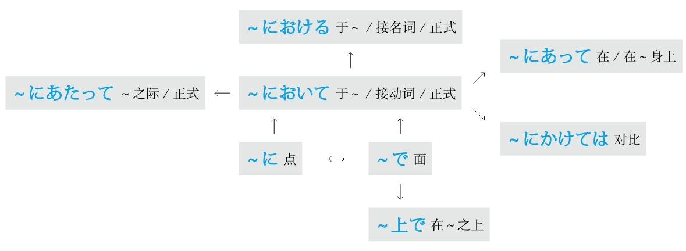

### 在～之后 #5_19_2_0_0
* [[ 日语语法新思维（修订版）_Menu_1.md | Menu #5_19_2_0_0 ]]

#### －て #5_19_2_1_0
* [[ 日语语法新思维（修订版）_Menu_1.md | Menu #5_19_2_1_0 ]]

**解释：** 「て」是“手”，在古代因为没有标点符号，所以用手势来表示停顿，后来「<ruby>手<rp>(</rp><rt>て</rt><rp>)</rp></ruby>」用于语法当中形成了固定的表示“中顿”的形式
**注意：** 谓语词（动词、形容词、助动词）之间的罗列
**意思：** ～了
**重点：** 相当于逗号，因此在一个句子当中可以用数次
**变形：** 动词的て形（变形规律参照第一章的第二节）

例句：<ruby>本<rp>(</rp><rt>ほん</rt><rp>)</rp></ruby>を<ruby>読<rp>(</rp><rt>よ</rt><rp>)</rp></ruby>ん**で** 、<ruby>昼<rp>(</rp><rt>ひる</rt><rp>)</rp></ruby>ごはんを<ruby>食<rp>(</rp><rt>た</rt><rp>)</rp></ruby>べ**て** 、<ruby>昼<rp>(</rp><rt>ひる</rt><rp>)</rp></ruby><ruby>寝<rp>(</rp><rt>ね</rt><rp>)</rp></ruby>し**て** …
直译：看了书（后），吃了午饭（后），睡了午觉（后）……
意译：看书，吃午饭，睡午觉……

#### －てから #5_19_2_2_0
* [[ 日语语法新思维（修订版）_Menu_1.md | Menu #5_19_2_2_0 ]]

**解释：** 「て」表示中顿，翻译成“了”；「から」是“从～、～之后”
**意思：** ～了之后
**注意：** 为避免表达方式过于冗长，所以只能用一次
**变形：** 动词的て形（变形规律参照第一章的第二节）

例句：ご<ruby>飯<rp>(</rp><rt>はん</rt><rp>)</rp></ruby>を<ruby>食<rp>(</rp><rt>た</rt><rp>)</rp></ruby>べ**てから** <ruby>行<rp>(</rp><rt>い</rt><rp>)</rp></ruby>きます。
直译：饭吃了之后去。
意译：吃完饭就去。

#### －てからというもの #5_19_2_3_0
* [[ 日语语法新思维（修订版）_Menu_1.md | Menu #5_19_2_3_0 ]]

**解释：** 「て」表示中顿，翻译成“了”；「から」是“从～、～之后”；「という」是为了前后接续；「もの」表示强调，翻译成“可、真、可真、就是”
**意思：** 就是～了之后
**着重：** 强调
**变形：** 动词的て形（变形规律参照第一章的第二节）

例句：<ruby>恋<rp>(</rp><rt>こい</rt><rp>)</rp></ruby><ruby>人<rp>(</rp><rt>びと</rt><rp>)</rp></ruby>が<ruby>帰<rp>(</rp><rt>かえ</rt><rp>)</rp></ruby>って<ruby>来<rp>(</rp><rt>き</rt><rp>)</rp></ruby>**てからというもの** 、<ruby>彼女<rp>(</rp><rt>かのじょ</rt><rp>)</rp></ruby>は<ruby>見<rp>(</rp><rt>み</rt><rp>)</rp></ruby><ruby>違<rp>(</rp><rt>ちが</rt><rp>)</rp></ruby>えるほど<ruby>元<rp>(</rp><rt>げん</rt><rp>)</rp></ruby><ruby>気<rp>(</rp><rt>き</rt><rp>)</rp></ruby>になった。
直译：就是恋人回来了以后，她才像换了一个人那么程度高地，变得精神。
意译：就是在恋人回来以后，她才像变了一个人一样，特别精神。

#### －てからでないと #5_19_2_4_0
* [[ 日语语法新思维（修订版）_Menu_1.md | Menu #5_19_2_4_0 ]]

**解释：** 「て」表示中顿，翻译成“了”；「から」是“从～、～之后”；「でない」的意思是“不是”；「と」表示条件
**意思：** 如果不是做了～的话、只要不是做了～的话
**着重：** 契机
**变形：** 动词的て形（变形规律参照第一章的第二节）

例句：<ruby>基<rp>(</rp><rt>き</rt><rp>)</rp></ruby><ruby>礎<rp>(</rp><rt>そ</rt><rp>)</rp></ruby><ruby>練<rp>(</rp><rt>れん</rt><rp>)</rp></ruby><ruby>習<rp>(</rp><rt>しゅう</rt><rp>)</rp></ruby>のプロセスを<ruby>経<rp>(</rp><rt>けい</rt><rp>)</rp></ruby><ruby>験<rp>(</rp><rt>けん</rt><rp>)</rp></ruby>し**てからでないと** 、その<ruby>重<rp>(</rp><rt>じゅう</rt><rp>)</rp></ruby><ruby>要<rp>(</rp><rt>よう</rt><rp>)</rp></ruby><ruby>性<rp>(</rp><rt>せい</rt><rp>)</rp></ruby>がわからない。
直译：基础练习的过程经历了之后，如果不是这样的话，其重要性不明白。
意译：不经历基础练习的过程，之后就不会体会到它的重要性。

#### －て以来 #5_19_2_5_0
* [[ 日语语法新思维（修订版）_Menu_1.md | Menu #5_19_2_5_0 ]]

**解释：** 「て」表示中顿，翻译成“了”；「<ruby>以<rp>(</rp><rt>い</rt><rp>)</rp></ruby><ruby>来<rp>(</rp><rt>らい</rt><rp>)</rp></ruby>」相当于表示“之后”的「から」
**意思：** 在做了～以来
**语气：** 正式
**变形：** 动词的て形（变形规律参照第一章的第二节）

例句：<ruby>日<rp>(</rp><rt>に</rt><rp>)</rp></ruby><ruby>本<rp>(</rp><rt>ほん</rt><rp>)</rp></ruby><ruby>語<rp>(</rp><rt>ご</rt><rp>)</rp></ruby>を<ruby>習<rp>(</rp><rt>なら</rt><rp>)</rp></ruby>っ**て<ruby>以<rp>(</rp><rt>い</rt><rp>)</rp></ruby><ruby>来<rp>(</rp><rt>らい</rt><rp>)</rp></ruby>** 、<ruby>日<rp>(</rp><rt>に</rt><rp>)</rp></ruby><ruby>本<rp>(</rp><rt>ほん</rt><rp>)</rp></ruby><ruby>語<rp>(</rp><rt>ご</rt><rp>)</rp></ruby>の<ruby>面<rp>(</rp><rt>おも</rt><rp>)</rp></ruby><ruby>白<rp>(</rp><rt>しろ</rt><rp>)</rp></ruby>さを<ruby>充<rp>(</rp><rt>じゅう</rt><rp>)</rp></ruby><ruby>分<rp>(</rp><rt>ぶん</rt><rp>)</rp></ruby><ruby>味<rp>(</rp><rt>あじ</rt><rp>)</rp></ruby>わってきた。
直译：学习日语以来，日语的有意思的地方，充分地体会过来了。
意译：学习日语以来，（我）一直充分感受着日语的有趣之处。

#### －たら #5_19_2_6_0
* [[ 日语语法新思维（修订版）_Menu_1.md | Menu #5_19_2_6_0 ]]

**解释：** 「た」相当于「て」，表示“了”；「ら」在古语里表示假设
**变形：** 动词的た形的简体（变形规律参照第一章的第二节）

**重点：** 用于动词的将来时
**意思：** 做了～之后

例句：<ruby>家<rp>(</rp><rt>いえ</rt><rp>)</rp></ruby>に<ruby>着<rp>(</rp><rt>つ</rt><rp>)</rp></ruby>い**たら** <ruby>連<rp>(</rp><rt>れん</rt><rp>)</rp></ruby><ruby>絡<rp>(</rp><rt>らく</rt><rp>)</rp></ruby>してね。
直译：到家了，联系啊。
意译：到家后跟我联系啊。

**重点：** 用于动词的过去式
**意思：** 做了～之后，结果～
**着重：** 发现了某事或与自己的假设相反

例句：<ruby>窓<rp>(</rp><rt>まど</rt><rp>)</rp></ruby>を<ruby>開<rp>(</rp><rt>あ</rt><rp>)</rp></ruby>け**たら** <ruby>雪<rp>(</rp><rt>ゆき</rt><rp>)</rp></ruby>が<ruby>降<rp>(</rp><rt>ふ</rt><rp>)</rp></ruby>っていた。
直译：打开了窗户，结果，下雪了。
意译：打开窗户，结果发现下雪了。

例句：<ruby>行<rp>(</rp><rt>い</rt><rp>)</rp></ruby>っ**たら** 、<ruby>彼<rp>(</rp><rt>かれ</rt><rp>)</rp></ruby>はいなかった。
直译：去了，结果，他没在。
意译：去了，结果他没在。

#### －た後で #5_19_2_7_0
* [[ 日语语法新思维（修订版）_Menu_1.md | Menu #5_19_2_7_0 ]]

**解释：** 「た」相当于「て」，表示“了”；「<ruby>後<rp>(</rp><rt>あと</rt><rp>)</rp></ruby>」的意思是“之后”；「で」的意思是“在”
**意思：** 在做了～之后
**语气：** 正式
**变形：** 动词的た形的简体（变形规律参照第一章的第二节）

例句：<ruby>家<rp>(</rp><rt>いえ</rt><rp>)</rp></ruby>を<ruby>建<rp>(</rp><rt>た</rt><rp>)</rp></ruby>て**た<ruby>後<rp>(</rp><rt>あと</rt><rp>)</rp></ruby>で** <ruby>後<rp>(</rp><rt>こう</rt><rp>)</rp></ruby><ruby>悔<rp>(</rp><rt>かい</rt><rp>)</rp></ruby>した。
直译：盖房子了之后，后悔了。
意译：盖了房子以后后悔了。

#### －た末に #5_19_2_8_0
* [[ 日语语法新思维（修订版）_Menu_1.md | Menu #5_19_2_8_0 ]]

**解释：** 「た」相当于「て」，表示“了”；「<ruby>末<rp>(</rp><rt>すえ</rt><rp>)</rp></ruby>」的意思是“之后”；「に」的意思是“在”
**意思：** 在做了～之后
**语气：** 正式
**变形：** 动词的た形的简体（变形规律参照第一章的第二节）

例句：<ruby>苦<rp>(</rp><rt>くる</rt><rp>)</rp></ruby>しみ<ruby>抜<rp>(</rp><rt>ぬ</rt><rp>)</rp></ruby>い**た<ruby>末<rp>(</rp><rt>すえ</rt><rp>)</rp></ruby>に** <ruby>勝<rp>(</rp><rt>か</rt><rp>)</rp></ruby>ち<ruby>取<rp>(</rp><rt>と</rt><rp>)</rp></ruby>った。
直译：在受苦之末，取得了胜利。
意译：长期受苦之后终于取得了胜利。

#### －たあげく #5_19_2_9_0
* [[ 日语语法新思维（修订版）_Menu_1.md | Menu #5_19_2_9_0 ]]

**解释：** 「た」相当于「て」，表示“了”；「<ruby>挙<rp>(</rp><rt>あげ</rt><rp>)</rp></ruby><ruby>句<rp>(</rp><rt>く</rt><rp>)</rp></ruby>」的意思是“最后的句子”
**起源：** 日本连歌的最后的句子
**意思：** 在做了～之后
**着重：** 经历很长的时间或很多的事情
**注意：** 有时后面加「に」，表示“在”
**语气：** 正式
**变形：** 动词的た形的简体（变形规律参照第一章的第二节）

例句：さんざん<ruby>悩<rp>(</rp><rt>なや</rt><rp>)</rp></ruby>ん**だあげく** 、<ruby>辞<rp>(</rp><rt>じ</rt><rp>)</rp></ruby><ruby>職<rp>(</rp><rt>しょく</rt><rp>)</rp></ruby>をすることにした。
直译：惨痛地头疼了，长时间后，决定辞职。
意译：痛苦了很长时间后决定辞职。

#### －た上で #5_19_2_10_0
* [[ 日语语法新思维（修订版）_Menu_1.md | Menu #5_19_2_10_0 ]]

**解释：** 「た」相当于「て」，表示“了”；「<ruby>上<rp>(</rp><rt>うえ</rt><rp>)</rp></ruby>」表示“上面”；「で」表示范围
**意思：** 在做了～的基础之上
**着重：** 步骤和基础
**语气：** 正式
**变形：** 动词的た形的简体（变形规律参照第一章的第二节）

例句：<ruby>親<rp>(</rp><rt>おや</rt><rp>)</rp></ruby>とよく<ruby>相<rp>(</rp><rt>そう</rt><rp>)</rp></ruby><ruby>談<rp>(</rp><rt>だん</rt><rp>)</rp></ruby>し**た<ruby>上<rp>(</rp><rt>うえ</rt><rp>)</rp></ruby>で** ご<ruby>返<rp>(</rp><rt>へん</rt><rp>)</rp></ruby><ruby>事<rp>(</rp><rt>じ</rt><rp>)</rp></ruby>します。
直译：和父母亲好好商量了的基础之上，回信。
意译：和父母亲好好商量之后给您回信。

[[ 日语语法新思维（修订版）_Detail_7.md | [Next_Page] ]]
