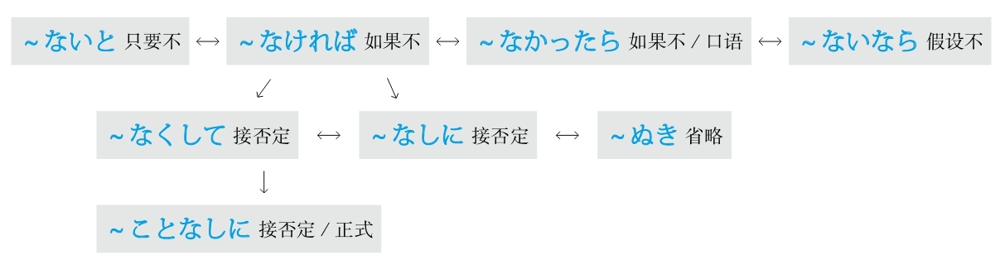
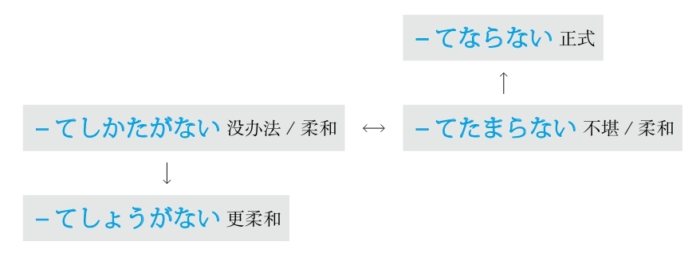
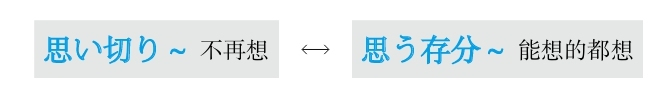

**[ [[ 日语语法新思维（修订版）_Detail_5.md | Prev ]] ]　[ [[ ../Menu.md | Home ]] ]　[ [[ 日语语法新思维（修订版）_Detail_7.md | Next ]] ]**

---
#### ～なら #5_13_2_4_0
* [[ 日语语法新思维（修订版）_Menu_0.md | Menu #5_13_2_4_0 ]]

**准则：** 在「と、ば、たら、なら」里，最重要的是顺序。「と」和「なら」分别表示极端，「と」代表“条件性”的极端，「なら」代表“假定性”的极端
**意思：** 假设～（前面接谓语词）；如果～（前面接名词）
**注意：** 假设过去的时候，因为要表示过去的状态，所以后句与「－ていた」相呼应
**接续：** 动词和形容词的简体及形容动词接「なら」表示“假设”；名词接「なら」表示“如果”

例句：<ruby>私<rp>(</rp><rt>わたし</rt><rp>)</rp></ruby>はあの<ruby>時<rp>(</rp><rt>とき</rt><rp>)</rp></ruby>よく<ruby>左<rp>(</rp><rt>さ</rt><rp>)</rp></ruby><ruby>右<rp>(</rp><rt>ゆう</rt><rp>)</rp></ruby>を<ruby>確<rp>(</rp><rt>かく</rt><rp>)</rp></ruby><ruby>認<rp>(</rp><rt>にん</rt><rp>)</rp></ruby>した**なら** 、<ruby>走<rp>(</rp><rt>はし</rt><rp>)</rp></ruby>ってきた<ruby>自<rp>(</rp><rt>じ</rt><rp>)</rp></ruby><ruby>転<rp>(</rp><rt>てん</rt><rp>)</rp></ruby><ruby>車<rp>(</rp><rt>しゃ</rt><rp>)</rp></ruby>にぶつかっていなかっただろう。
直译：假设我那时左右好好确认的话，骑过来的自行车，不撞上了。
意译：如果我那时左右好好确认的话，就不会撞到骑过来的自行车了。

例句：<ruby>今<rp>(</rp><rt>いま</rt><rp>)</rp></ruby><ruby>残<rp>(</rp><rt>ざん</rt><rp>)</rp></ruby><ruby>業<rp>(</rp><rt>ぎょう</rt><rp>)</rp></ruby>している**なら** 、<ruby>夜<rp>(</rp><rt>や</rt><rp>)</rp></ruby><ruby>食<rp>(</rp><rt>しょく</rt><rp>)</rp></ruby>を<ruby>用<rp>(</rp><rt>よう</rt><rp>)</rp></ruby><ruby>意<rp>(</rp><rt>い</rt><rp>)</rp></ruby>して<ruby>届<rp>(</rp><rt>とど</rt><rp>)</rp></ruby>けるよ。
直译：假设现在在加班的话，做夜宵送去。
意译：要是你现在在加班的话，我做夜宵给你送去。

例句：<ruby>夕<rp>(</rp><rt>ゆう</rt><rp>)</rp></ruby><ruby>方<rp>(</rp><rt>がた</rt><rp>)</rp></ruby>に<ruby>小<rp>(</rp><rt>こ</rt><rp>)</rp></ruby><ruby>包<rp>(</rp><rt>づつみ</rt><rp>)</rp></ruby>が<ruby>届<rp>(</rp><rt>とど</rt><rp>)</rp></ruby>く**なら** 、<ruby>午<rp>(</rp><rt>ご</rt><rp>)</rp></ruby><ruby>前<rp>(</rp><rt>ぜん</rt><rp>)</rp></ruby><ruby>中<rp>(</rp><rt>ちゅう</rt><rp>)</rp></ruby>に<ruby>買<rp>(</rp><rt>か</rt><rp>)</rp></ruby>い<ruby>物<rp>(</rp><rt>もの</rt><rp>)</rp></ruby>を<ruby>済<rp>(</rp><rt>す</rt><rp>)</rp></ruby>ませておこう。
直译：假设在傍晚包裹送到，上午把东西买完吧。
意译：如果包裹傍晚送到，那上午去买东西吧。
语法关系图

### 如果不～，就～ #5_13_3_0_0
* [[ 日语语法新思维（修订版）_Menu_0.md | Menu #5_13_3_0_0 ]]

#### －ないと/－なければ/－なかったら/－ないなら #5_13_3_1_0
* [[ 日语语法新思维（修订版）_Menu_0.md | Menu #5_13_3_1_0 ]]

**准则：** 在「と、ば、たら、なら」里，最重要的是顺序。「と」和「なら」分别表示极端，「と」代表“条件性”的极端，「なら」代表“假定性”的极端
**解释：** 「ない」是动词或形容词的否定的简体
**意思：** 「～ないと」是“只要不～”；「～なければ」是“如果不～”；「～なかったら」是“如果不～”（口语化）；「～ないなら」是“假设不～”
**变形：** 动词的否定形的な（变形规律参照第一章的第二节）

例句：<ruby>研<rp>(</rp><rt>けん</rt><rp>)</rp></ruby><ruby>究<rp>(</rp><rt>きゅう</rt><rp>)</rp></ruby>は<ruby>厳<rp>(</rp><rt>きび</rt><rp>)</rp></ruby>しいものだから、<ruby>根<rp>(</rp><rt>こん</rt><rp>)</rp></ruby><ruby>性<rp>(</rp><rt>じょう</rt><rp>)</rp></ruby>が**ないと** 、<ruby>長<rp>(</rp><rt>なが</rt><rp>)</rp></ruby><ruby>続<rp>(</rp><rt>つづ</rt><rp>)</rp></ruby>きはできない。
直译：研究是很严酷的事情，所以如果没有毅力，长久坚持不能。
意译：搞研究是很苦的事情，如果没有毅力是不会坚持下去的。

#### ～ことなしに #5_13_3_2_0
* [[ 日语语法新思维（修订版）_Menu_0.md | Menu #5_13_3_2_0 ]]

**解释：** 「こと」在此是将动词名词化；「なし」是「ない」的古语形式，意思是“没有”；「に」表示副词
**意思：** 如果不～就不～
**语气：** 正式
**注意：** 后句接否定或带有否定意思的词
**接续：** 动词的原形

例句：<ruby>担<rp>(</rp><rt>たん</rt><rp>)</rp></ruby><ruby>当<rp>(</rp><rt>とう</rt><rp>)</rp></ruby><ruby>教<rp>(</rp><rt>きょう</rt><rp>)</rp></ruby><ruby>師<rp>(</rp><rt>し</rt><rp>)</rp></ruby>の<ruby>許<rp>(</rp><rt>きょ</rt><rp>)</rp></ruby><ruby>可<rp>(</rp><rt>か</rt><rp>)</rp></ruby>を<ruby>得<rp>(</rp><rt>え</rt><rp>)</rp></ruby>る**ことなしに** 、<ruby>履<rp>(</rp><rt>り</rt><rp>)</rp></ruby><ruby>修<rp>(</rp><rt>しゅう</rt><rp>)</rp></ruby><ruby>科<rp>(</rp><rt>か</rt><rp>)</rp></ruby><ruby>目<rp>(</rp><rt>もく</rt><rp>)</rp></ruby>の<ruby>変<rp>(</rp><rt>へん</rt><rp>)</rp></ruby><ruby>更<rp>(</rp><rt>こう</rt><rp>)</rp></ruby>はでき**ない** 。
直译：没有得到任课老师的许可，要学的科目的变更不可。
意译：没有得到任课老师的许可，不能更改要学的科目。

#### －なしに #5_13_3_3_0
* [[ 日语语法新思维（修订版）_Menu_0.md | Menu #5_13_3_3_0 ]]

**解释：** 「なし」是「ない」的古语形式，意思是“没有”；「に」表示副词
**意思：** 如果不～就不～
**注意：** 后句接否定或带有否定意思的词
**接续：** 名词

例句：ノック**なしに** <ruby>部<rp>(</rp><rt>へ</rt><rp>)</rp></ruby><ruby>屋<rp>(</rp><rt>や</rt><rp>)</rp></ruby>に<ruby>入<rp>(</rp><rt>はい</rt><rp>)</rp></ruby>るのはマナー<ruby>違<rp>(</rp><rt>い</rt><rp>)</rp></ruby><ruby>反<rp>(</rp><rt>はん</rt><rp>)</rp></ruby>です。
直译：不敲门，进入房间，是违反礼仪的。
意译：不敲门就进入房间是不礼貌的。

#### －なくして #5_13_3_4_0
* [[ 日语语法新思维（修订版）_Menu_0.md | Menu #5_13_3_4_0 ]]

**解释：** 「なくして」是他动词「<ruby>無<rp>(</rp><rt>な</rt><rp>)</rp></ruby>くす」的中顿形式
**直译：** 把～去除
**意译：** 没有～
**注意：** 后句接否定或带有否定意思的词
**接续：** 名词

例句：<ruby>部<rp>(</rp><rt>ぶ</rt><rp>)</rp></ruby><ruby>下<rp>(</rp><rt>か</rt><rp>)</rp></ruby>の<ruby>信<rp>(</rp><rt>しん</rt><rp>)</rp></ruby><ruby>頼<rp>(</rp><rt>らい</rt><rp>)</rp></ruby>**なくしては** 、<ruby>上<rp>(</rp><rt>じょう</rt><rp>)</rp></ruby><ruby>司<rp>(</rp><rt>し</rt><rp>)</rp></ruby>の<ruby>務<rp>(</rp><rt>つと</rt><rp>)</rp></ruby>めは<ruby>順<rp>(</rp><rt>じゅん</rt><rp>)</rp></ruby><ruby>調<rp>(</rp><rt>ちょう</rt><rp>)</rp></ruby>に<ruby>果<rp>(</rp><rt>は</rt><rp>)</rp></ruby>たせないだろう。
直译：没有部下的信任，上司的职务就不能顺利地完成。
意译：没有部下的信任，上司就不能顺利完成自己的工作吧。

#### －ぬき #5_13_3_5_0
* [[ 日语语法新思维（修订版）_Menu_0.md | Menu #5_13_3_5_0 ]]

**解释：** 「ぬき」是他动词「<ruby>抜<rp>(</rp><rt>ぬ</rt><rp>)</rp></ruby>く」的连用形
**直译：** 把～拔掉
**意译：** 省略～
**注意：** 后句肯定、否定都能接
**词性：** 名词
**接续：** 名词、动词的连用形

例句：<ruby>朝<rp>(</rp><rt>ちょう</rt><rp>)</rp></ruby><ruby>食<rp>(</rp><rt>しょく</rt><rp>)</rp></ruby>**ぬき** で<ruby>会<rp>(</rp><rt>かい</rt><rp>)</rp></ruby><ruby>社<rp>(</rp><rt>しゃ</rt><rp>)</rp></ruby>に<ruby>行<rp>(</rp><rt>い</rt><rp>)</rp></ruby>く<ruby>会<rp>(</rp><rt>かい</rt><rp>)</rp></ruby><ruby>社<rp>(</rp><rt>しゃ</rt><rp>)</rp></ruby><ruby>員<rp>(</rp><rt>いん</rt><rp>)</rp></ruby>が<ruby>少<rp>(</rp><rt>すく</rt><rp>)</rp></ruby>なくない。
直译：拔掉早饭的状态，去公司的职员不少。
意译：不吃早饭上班的员工不少。

例句：<ruby>先<rp>(</rp><rt>せん</rt><rp>)</rp></ruby><ruby>生<rp>(</rp><rt>せい</rt><rp>)</rp></ruby>の<ruby>指<rp>(</rp><rt>し</rt><rp>)</rp></ruby><ruby>導<rp>(</rp><rt>どう</rt><rp>)</rp></ruby>と<ruby>先<rp>(</rp><rt>せん</rt><rp>)</rp></ruby><ruby>輩<rp>(</rp><rt>ぱい</rt><rp>)</rp></ruby>の<ruby>協<rp>(</rp><rt>きょう</rt><rp>)</rp></ruby><ruby>力<rp>(</rp><rt>りょく</rt><rp>)</rp></ruby>**ぬき** には<ruby>論<rp>(</rp><rt>ろん</rt><rp>)</rp></ruby><ruby>文<rp>(</rp><rt>ぶん</rt><rp>)</rp></ruby>は<ruby>完<rp>(</rp><rt>かん</rt><rp>)</rp></ruby><ruby>成<rp>(</rp><rt>せい</rt><rp>)</rp></ruby>できなかっただろう。
直译：没有老师的指导和同学的帮助，论文是不能完成吧。
意译：没有老师的指导和学长的帮助的话，论文是不会写好的吧。
语法关系图

## S #5_14_0_0_0
* [[ 日语语法新思维（修订版）_Menu_0.md | Menu #5_14_0_0_0 ]]

### 时候 #5_14_1_0_0
* [[ 日语语法新思维（修订版）_Menu_0.md | Menu #5_14_1_0_0 ]]

#### ～において #5_14_1_1_0
* [[ 日语语法新思维（修订版）_Menu_0.md | Menu #5_14_1_1_0 ]]

**解释：** 「に」表示方向；「おいて」是自动词「<ruby>於<rp>(</rp><rt>お</rt><rp>)</rp></ruby>く」的中顿形式，意思是“于”
**意思：** 在～
**语气：** 正式
**注意：** 后面接动词
**接续：** 时间、地点、状况、团体等名词

例句：<ruby>北<rp>(</rp><rt>ぺ</rt><rp>)</rp></ruby><ruby>京<rp>(</rp><rt>きん</rt><rp>)</rp></ruby><ruby>五<rp>(</rp><rt>ご</rt><rp>)</rp></ruby><ruby>輪<rp>(</rp><rt>りん</rt><rp>)</rp></ruby>は<ruby>2008<rp>(</rp><rt>にせんはち</rt><rp>)</rp></ruby><ruby>年<rp>(</rp><rt>ねん</rt><rp>)</rp></ruby><ruby>8<rp>(</rp><rt>はち</rt><rp>)</rp></ruby><ruby>月<rp>(</rp><rt>がつ</rt><rp>)</rp></ruby><ruby>8<rp>(</rp><rt>よう</rt><rp>)</rp></ruby><ruby>日<rp>(</rp><rt>か</rt><rp>)</rp></ruby>**において** <ruby>開<rp>(</rp><rt>かい</rt><rp>)</rp></ruby><ruby>催<rp>(</rp><rt>さい</rt><rp>)</rp></ruby>された。
直译：北京奥林匹克在2008年8月8日被召开。
意译：北京奥运会于2008年8月8日开幕了。

#### ～における #5_14_1_2_0
* [[ 日语语法新思维（修订版）_Menu_0.md | Menu #5_14_1_2_0 ]]

**解释：** 「に」表示方向；「<ruby>於<rp>(</rp><rt>お</rt><rp>)</rp></ruby>ける」的意思是“于”
**意思：** 在～
**语气：** 正式
**注意：** 后面接名词
**接续：** 时间、地点、状况、团体等名词

例句：<ruby>2014<rp>(</rp><rt>にせんじゅうよ</rt><rp>)</rp></ruby><ruby>年<rp>(</rp><rt>ねん</rt><rp>)</rp></ruby>**における** <ruby>売<rp>(</rp><rt>う</rt><rp>)</rp></ruby>り<ruby>上<rp>(</rp><rt>あ</rt><rp>)</rp></ruby>げは、<ruby>前<rp>(</rp><rt>ぜん</rt><rp>)</rp></ruby><ruby>年<rp>(</rp><rt>ねん</rt><rp>)</rp></ruby><ruby>度<rp>(</rp><rt>ど</rt><rp>)</rp></ruby>に<ruby>比<rp>(</rp><rt>くら</rt><rp>)</rp></ruby>べ、<ruby>約<rp>(</rp><rt>やく</rt><rp>)</rp></ruby><ruby>2<rp>(</rp><rt>に</rt><rp>)</rp></ruby><ruby>倍<rp>(</rp><rt>ばい</rt><rp>)</rp></ruby>になった。
直译：于2014年的销售额，比前一年度，到了大约2倍。
意译：2014年的销售额比前一年度大约增长了1倍。

#### ～に際して #5_14_1_3_0
* [[ 日语语法新思维（修订版）_Menu_0.md | Menu #5_14_1_3_0 ]]

**解释：** 「に」表示方向；「<ruby>際<rp>(</rp><rt>さい</rt><rp>)</rp></ruby>して」是自动词「<ruby>際<rp>(</rp><rt>さい</rt><rp>)</rp></ruby>する」的中顿形式，意思是“际、之际”
**意思：** 在～之际
**语气：** 更正式
**接续：** 表示事件的名词

例句：<ruby>皇<rp>(</rp><rt>こう</rt><rp>)</rp></ruby><ruby>太<rp>(</rp><rt>たい</rt><rp>)</rp></ruby><ruby>子<rp>(</rp><rt>し</rt><rp>)</rp></ruby><ruby>殿<rp>(</rp><rt>でん</rt><rp>)</rp></ruby><ruby>下<rp>(</rp><rt>か</rt><rp>)</rp></ruby>の<ruby>お<rp>(</rp><rt>お</rt><rp>)</rp></ruby><ruby>誕<rp>(</rp><rt>たん</rt><rp>)</rp></ruby><ruby>生<rp>(</rp><rt>じょう</rt><rp>)</rp></ruby><ruby>日<rp>(</rp><rt>び</rt><rp>)</rp></ruby>**に<ruby>際<rp>(</rp><rt>さい</rt><rp>)</rp></ruby>して** 、<ruby>記<rp>(</rp><rt>き</rt><rp>)</rp></ruby><ruby>者<rp>(</rp><rt>しゃ</rt><rp>)</rp></ruby><ruby>会<rp>(</rp><rt>かい</rt><rp>)</rp></ruby><ruby>見<rp>(</rp><rt>けん</rt><rp>)</rp></ruby>が<ruby>行<rp>(</rp><rt>おこな</rt><rp>)</rp></ruby>われた。
直译：在皇太子殿下的生日之际，记者招待会被举行了。
意译：在皇太子殿下的生日之际召开了记者招待会。

#### ～にあたって #5_14_1_4_0
* [[ 日语语法新思维（修订版）_Menu_0.md | Menu #5_14_1_4_0 ]]

**解释：** 「に」表示方向；「あたって」是自动词「<ruby>当<rp>(</rp><rt>あ</rt><rp>)</rp></ruby>たる」的中顿形式，意思是“相当”
**直译：** 相当于～
**意译：** 在～之际
**语气：** 正式
**接续：** 表示事件、工作的名词；动词的原形

例句：<ruby>開会<rp>(</rp><rt>かいかい</rt><rp>)</rp></ruby>**にあたり** 、<ruby>社<rp>(</rp><rt>しゃ</rt><rp>)</rp></ruby><ruby>長<rp>(</rp><rt>ちょう</rt><rp>)</rp></ruby>に<ruby>一<rp>(</rp><rt>ひと</rt><rp>)</rp></ruby><ruby>言<rp>(</rp><rt>こと</rt><rp>)</rp></ruby>ごあいさついただきたいと<ruby>思<rp>(</rp><rt>おも</rt><rp>)</rp></ruby>います。
直译：在开始会议，我们想请社长说一句话。
意译：在会议开始之际，我们想请社长为我们致词。

#### ～ところだ #5_14_1_5_0
* [[ 日语语法新思维（修订版）_Menu_0.md | Menu #5_14_1_5_0 ]]

**解释：** 「ところ」表示“时间、地点、程度、状况”
**注意：** 此处表示时间
**重点：** 强调动词的时态
**接续：** 动词的一般现在时
**意思：** 正要～

例句：<ruby>今<rp>(</rp><rt>いま</rt><rp>)</rp></ruby><ruby>出<rp>(</rp><rt>で</rt><rp>)</rp></ruby>かける**ところだ** よ。
直译：现在要出门的时候。
意译：正要出门呢。

**接续：** 动词的现在进行时
**意思：** 正在～

例句：<ruby>今<rp>(</rp><rt>いま</rt><rp>)</rp></ruby>ホームページを<ruby>見<rp>(</rp><rt>み</rt><rp>)</rp></ruby>ている**ところだ** よ。
直译：现在看着网页的时候。
意译：正看网页呢。

**接续：** 动词的过去式
**意思：** 刚～了

例句：<ruby>今<rp>(</rp><rt>いま</rt><rp>)</rp></ruby><ruby>帰<rp>(</rp><rt>かえ</rt><rp>)</rp></ruby>って<ruby>来<rp>(</rp><rt>き</rt><rp>)</rp></ruby>た**ところだ** よ。
直译：现在回来了的时候。
意译：刚回来。

#### ～ところを #5_14_1_6_0
* [[ 日语语法新思维（修订版）_Menu_0.md | Menu #5_14_1_6_0 ]]

**解释：** 「ところ」在此表示“时间”；「を」表示移动
**重点：** 此处表示移动的「を」翻译成“抽空儿”或“抽身”
**接续：** 形容词的原形、形容动词加な

例句：お<ruby>忙<rp>(</rp><rt>いそが</rt><rp>)</rp></ruby>しい**ところを** 、<ruby>恐<rp>(</rp><rt>おそ</rt><rp>)</rp></ruby>れ<ruby>入<rp>(</rp><rt>い</rt><rp>)</rp></ruby>ります。
直译：在您忙的时候，抽出时间，不好意思。
意译：让您在百忙之中抽出时间，真是不好意思。

**解释：** 「ところ」在此表示“时间”；「を」用于宾语后
**意思：** 在～时候被～
**注意：** 前后是同一主语；后句用被动形
**接续：** 动词的现在进行时的简体

例句：<ruby>彼<rp>(</rp><rt>かれ</rt><rp>)</rp></ruby>は<ruby>店<rp>(</rp><rt>みせ</rt><rp>)</rp></ruby>で<ruby>万<rp>(</rp><rt>まん</rt><rp>)</rp></ruby><ruby>引<rp>(</rp><rt>び</rt><rp>)</rp></ruby>きをしている**ところを** <ruby>監<rp>(</rp><rt>かん</rt><rp>)</rp></ruby><ruby>視<rp>(</rp><rt>し</rt><rp>)</rp></ruby>カメラに<ruby>撮<rp>(</rp><rt>と</rt><rp>)</rp></ruby>られた。
直译：他在店里正在偷东西的时刻被监视器照下来了。
意译：他在店里偷东西时被监视器拍了下来。

#### ～ところに/～ところへ #5_14_1_7_0
* [[ 日语语法新思维（修订版）_Menu_0.md | Menu #5_14_1_7_0 ]]

**解释：** 「ところ」在此表示“时间”；「に」和「へ」表示方向
**意思：** 在～时候
**注意：** 前后可以用不同的主语；后句不用被动形
**接续：** 动词的现在进行时的简体

例句：お<ruby>風<rp>(</rp><rt>ふ</rt><rp>)</rp></ruby><ruby>呂<rp>(</rp><rt>ろ</rt><rp>)</rp></ruby>に<ruby>入<rp>(</rp><rt>はい</rt><rp>)</rp></ruby>っている**ところに（へ）** 、<ruby>電<rp>(</rp><rt>でん</rt><rp>)</rp></ruby><ruby>話<rp>(</rp><rt>わ</rt><rp>)</rp></ruby>がかかってきた。
直译：正在洗澡的时候，打来了电话。
意译：洗澡的时候来电话了。

#### ～中を #5_14_1_8_0
* [[ 日语语法新思维（修订版）_Menu_0.md | Menu #5_14_1_8_0 ]]

**解释：** 「<ruby>中<rp>(</rp><rt>なか</rt><rp>)</rp></ruby>」表示“～之中”；「を」表示移动
**重点：** 此处表示移动的「を」翻译成“抽空儿”或“抽身”
**区别：** 比「～ところを」正式，且用法广泛
**用于：** 时间、地点、状况等，比如：「<ruby>風<rp>(</rp><rt>かぜ</rt><rp>)</rp></ruby>と<ruby>雨<rp>(</rp><rt>あめ</rt><rp>)</rp></ruby>の<ruby>中<rp>(</rp><rt>なか</rt><rp>)</rp></ruby>を」（在风雨当中）
**接续：** 形容词的原形、形容动词加な、名词の

例句：お<ruby>忙<rp>(</rp><rt>いそが</rt><rp>)</rp></ruby>しい（ご多忙な）**<ruby>中<rp>(</rp><rt>なか</rt><rp>)</rp></ruby>を** 、<ruby>恐<rp>(</rp><rt>きょう</rt><rp>)</rp></ruby><ruby>縮<rp>(</rp><rt>しゅく</rt><rp>)</rp></ruby>です。
直译：在您百忙之中，抽出时间，不好意思。
意译：让您在百忙之中抽出时间，真是不好意思。

#### ～最中に #5_14_1_9_0
* [[ 日语语法新思维（修订版）_Menu_0.md | Menu #5_14_1_9_0 ]]

**解释：** 「<ruby>最<rp>(</rp><rt>さい</rt><rp>)</rp></ruby><ruby>中<rp>(</rp><rt>ちゅう</rt><rp>)</rp></ruby>」表示“正在～当中”；「に」表示方向
**意思：** 正在～当中
**区别：** 比强调现在进行时的「しているところ」语气更强烈
**接续：** 动词的现在进行时的简体、名词加の

例句：<ruby>考<rp>(</rp><rt>かんが</rt><rp>)</rp></ruby>えている**<ruby>最<rp>(</rp><rt>さい</rt><rp>)</rp></ruby><ruby>中<rp>(</rp><rt>ちゅう</rt><rp>)</rp></ruby>に** 、<ruby>話<rp>(</rp><rt>はな</rt><rp>)</rp></ruby>しかけられて<ruby>困<rp>(</rp><rt>こま</rt><rp>)</rp></ruby>った。
直译：正在想事情的过程当中，被说话，很为难。
意译：正在想事情时跟我说话，让我很为难。

例句：<ruby>授<rp>(</rp><rt>じゅ</rt><rp>)</rp></ruby><ruby>業<rp>(</rp><rt>ぎょう</rt><rp>)</rp></ruby>の**<ruby>最<rp>(</rp><rt>さい</rt><rp>)</rp></ruby><ruby>中<rp>(</rp><rt>ちゅう</rt><rp>)</rp></ruby>に** <ruby>電<rp>(</rp><rt>でん</rt><rp>)</rp></ruby><ruby>話<rp>(</rp><rt>わ</rt><rp>)</rp></ruby>がかかってきて、<ruby>急<rp>(</rp><rt>いそ</rt><rp>)</rp></ruby>いで<ruby>教<rp>(</rp><rt>きょう</rt><rp>)</rp></ruby><ruby>室<rp>(</rp><rt>しつ</rt><rp>)</rp></ruby>を<ruby>飛<rp>(</rp><rt>と</rt><rp>)</rp></ruby>び<ruby>出<rp>(</rp><rt>だ</rt><rp>)</rp></ruby>した。
直译：正在上课的过程当中，来了电话，急忙冲出了教室。
意译：正上课时来了电话，（我）急忙冲出教室。
语法关系图

### 随着 #5_14_2_0_0
* [[ 日语语法新思维（修订版）_Menu_0.md | Menu #5_14_2_0_0 ]]

#### ～に従って #5_14_2_1_0
* [[ 日语语法新思维（修订版）_Menu_0.md | Menu #5_14_2_1_0 ]]

**解释：** 「に」表示方向或对象；「<ruby>従<rp>(</rp><rt>したが</rt><rp>)</rp></ruby>って」是「<ruby>従<rp>(</rp><rt>したが</rt><rp>)</rp></ruby>う」的中顿形式
**意思：** 随着～
**重点：** 由于「<ruby>従<rp>(</rp><rt>したが</rt><rp>)</rp></ruby>う」的前缀是「した」，因此着重上下关系
**语气：** 正式
**接续：** 名词、动词的原形

例句：<ruby>通<rp>(</rp><rt>つう</rt><rp>)</rp></ruby><ruby>信<rp>(</rp><rt>しん</rt><rp>)</rp></ruby><ruby>技<rp>(</rp><rt>ぎ</rt><rp>)</rp></ruby><ruby>術<rp>(</rp><rt>じゅつ</rt><rp>)</rp></ruby>の<ruby>進<rp>(</rp><rt>しん</rt><rp>)</rp></ruby><ruby>歩<rp>(</rp><rt>ぽ</rt><rp>)</rp></ruby>**に<ruby>従<rp>(</rp><rt>したが</rt><rp>)</rp></ruby>って** 、<ruby>情<rp>(</rp><rt>じょう</rt><rp>)</rp></ruby><ruby>報<rp>(</rp><rt>ほう</rt><rp>)</rp></ruby><ruby>伝<rp>(</rp><rt>でん</rt><rp>)</rp></ruby><ruby>達<rp>(</rp><rt>たつ</rt><rp>)</rp></ruby>が<ruby>速<rp>(</rp><rt>はや</rt><rp>)</rp></ruby>くなってきた。
直译：随着通讯技术的进步，信息传递变得迅速了。
意译：随着通讯技术的进步，信息传递越发迅速了。

#### ～に伴って #5_14_2_2_0
* [[ 日语语法新思维（修订版）_Menu_0.md | Menu #5_14_2_2_0 ]]

**解释：** 「に」表示方向或对象；「<ruby>伴<rp>(</rp><rt>ともな</rt><rp>)</rp></ruby>って」是「<ruby>伴<rp>(</rp><rt>ともな</rt><rp>)</rp></ruby>う」的中顿形式
**意思：** 伴随着～
**重点：** 由于「<ruby>伴<rp>(</rp><rt>ともな</rt><rp>)</rp></ruby>う」的前缀是「<ruby>共<rp>(</rp><rt>とも</rt><rp>)</rp></ruby>」，因此着重同伴关系
**语气：** 正式
**接续：** 名词、动词的原形

例句：<ruby>産<rp>(</rp><rt>さん</rt><rp>)</rp></ruby><ruby>業<rp>(</rp><rt>ぎょう</rt><rp>)</rp></ruby>の<ruby>発<rp>(</rp><rt>はっ</rt><rp>)</rp></ruby><ruby>達<rp>(</rp><rt>たつ</rt><rp>)</rp></ruby>**に<ruby>伴<rp>(</rp><rt>ともな</rt><rp>)</rp></ruby>って** 、<ruby>環<rp>(</rp><rt>かん</rt><rp>)</rp></ruby><ruby>境<rp>(</rp><rt>きょう</rt><rp>)</rp></ruby><ruby>汚<rp>(</rp><rt>お</rt><rp>)</rp></ruby><ruby>染<rp>(</rp><rt>せん</rt><rp>)</rp></ruby>が<ruby>厳<rp>(</rp><rt>げん</rt><rp>)</rp></ruby><ruby>重<rp>(</rp><rt>じゅう</rt><rp>)</rp></ruby>になってきた。
直译：伴随着产业的发展，环境污染变得严重了。
意译：随着产业的发展，环境污染越发严重了。

#### ～と共に #5_14_2_3_0
* [[ 日语语法新思维（修订版）_Menu_0.md | Menu #5_14_2_3_0 ]]

**解释：** 「と」的意思是“和”；「<ruby>共<rp>(</rp><rt>とも</rt><rp>)</rp></ruby>」的意思是“共、一起”；「に」表示副词
**意思：** 和～一起
**语气：** 正式
**接续：** 名词、动词的原形

例句：<ruby>好<rp>(</rp><rt>す</rt><rp>)</rp></ruby>きな<ruby>人<rp>(</rp><rt>ひと</rt><rp>)</rp></ruby>**と<ruby>共<rp>(</rp><rt>とも</rt><rp>)</rp></ruby>に** <ruby>人<rp>(</rp><rt>じん</rt><rp>)</rp></ruby><ruby>生<rp>(</rp><rt>せい</rt><rp>)</rp></ruby>を<ruby>歩<rp>(</rp><rt>あゆ</rt><rp>)</rp></ruby>みたい。
直译：和喜欢的人一起，想步行人生。
意译：想和喜欢的人一起共度人生。

#### ～につれて #5_14_2_4_0
* [[ 日语语法新思维（修订版）_Menu_0.md | Menu #5_14_2_4_0 ]]

**解释：** 「に」表示方向或对象；「<ruby>連<rp>(</rp><rt>つ</rt><rp>)</rp></ruby>れて」是「<ruby>連<rp>(</rp><rt>つ</rt><rp>)</rp></ruby>れる」的中顿形式
**意思：** 随着～
**着重：** 时间的推移
**语气：** 柔和
**接续：** 名词、动词的原形

例句：<ruby>時<rp>(</rp><rt>じ</rt><rp>)</rp></ruby><ruby>間<rp>(</rp><rt>かん</rt><rp>)</rp></ruby>が<ruby>経<rp>(</rp><rt>た</rt><rp>)</rp></ruby>つ**につれて** 、<ruby>昔<rp>(</rp><rt>むかし</rt><rp>)</rp></ruby>への<ruby>記<rp>(</rp><rt>き</rt><rp>)</rp></ruby><ruby>憶<rp>(</rp><rt>おく</rt><rp>)</rp></ruby>がだんだん<ruby>薄<rp>(</rp><rt>うす</rt><rp>)</rp></ruby>くなってきた。
直译：随着时间的推移，对过去的记忆，渐渐变淡了。
意译：随着时间的推移，过去的记忆渐渐淡化了。

例句：<ruby>年<rp>(</rp><rt>とし</rt><rp>)</rp></ruby>をとる**につれて** 、<ruby>記<rp>(</rp><rt>き</rt><rp>)</rp></ruby><ruby>憶<rp>(</rp><rt>おく</rt><rp>)</rp></ruby><ruby>力<rp>(</rp><rt>りょく</rt><rp>)</rp></ruby>が<ruby>悪<rp>(</rp><rt>わる</rt><rp>)</rp></ruby>くなってきた。
直译：随着年龄的增长，记忆力变坏了。
意译：随着年龄的增长，记忆力越来越不好了。

例句：<ruby>経<rp>(</rp><rt>けい</rt><rp>)</rp></ruby><ruby>験<rp>(</rp><rt>けん</rt><rp>)</rp></ruby>を<ruby>積<rp>(</rp><rt>つ</rt><rp>)</rp></ruby>む**につれて** 、<ruby>物<rp>(</rp><rt>もの</rt><rp>)</rp></ruby><ruby>事<rp>(</rp><rt>ごと</rt><rp>)</rp></ruby>への<ruby>対<rp>(</rp><rt>たい</rt><rp>)</rp></ruby><ruby>応<rp>(</rp><rt>おう</rt><rp>)</rp></ruby>がますます<ruby>上<rp>(</rp><rt>じょう</rt><rp>)</rp></ruby><ruby>手<rp>(</rp><rt>ず</rt><rp>)</rp></ruby>になってきた。
直译：随着经验的积累，对于事物的对应，变得越来越好了。
意译：随着经验的积累，处事越来越得体了。
语法关系图

### 顺便 #5_14_3_0_0
* [[ 日语语法新思维（修订版）_Menu_0.md | Menu #5_14_3_0_0 ]]

#### ～ついでに #5_14_3_1_0
* [[ 日语语法新思维（修订版）_Menu_0.md | Menu #5_14_3_1_0 ]]

**解释：** 「<ruby>序<rp>(</rp><rt>つい</rt><rp>)</rp></ruby>で」起源于「<ruby>次<rp>(</rp><rt>つ</rt><rp>)</rp></ruby>ぐ（接下来）」；「に」表示副词
**直译：** 接下来～
**意译：** 顺便～
**注意：** 还可以作接续词
**语气：** 柔和
**接续：** 名词加の、动词的简体

例句：<ruby>車<rp>(</rp><rt>くるま</rt><rp>)</rp></ruby>を<ruby>洗<rp>(</rp><rt>あら</rt><rp>)</rp></ruby>う**ついでに** 、<ruby>庭<rp>(</rp><rt>にわ</rt><rp>)</rp></ruby>に<ruby>水<rp>(</rp><rt>みず</rt><rp>)</rp></ruby>を<ruby>撒<rp>(</rp><rt>ま</rt><rp>)</rp></ruby>いた。
直译：洗车，顺便，往院子里把水洒了。
意译：洗车时顺便往院子里洒了水。

#### －がてら #5_14_3_2_0
* [[ 日语语法新思维（修订版）_Menu_0.md | Menu #5_14_3_2_0 ]]

**解释：** 「が」是古语中起连接作用的助词；「て」是“手”；「ら」是“拉”
**直译：** 手拉着～
**意译：** 顺带手～
**语气：** 正式
**接续：** 名词

例句：<ruby>散<rp>(</rp><rt>さん</rt><rp>)</rp></ruby><ruby>歩<rp>(</rp><rt>ぽ</rt><rp>)</rp></ruby>**がてら** 、<ruby>本<rp>(</rp><rt>ほん</rt><rp>)</rp></ruby><ruby>屋<rp>(</rp><rt>や</rt><rp>)</rp></ruby>さんに<ruby>立<rp>(</rp><rt>た</rt><rp>)</rp></ruby>ち<ruby>寄<rp>(</rp><rt>よ</rt><rp>)</rp></ruby>った。
直译：散步，顺带手，转了书店。
意译：散步时顺便去了趟书店。

#### －かたがた #5_14_3_3_0
* [[ 日语语法新思维（修订版）_Menu_0.md | Menu #5_14_3_3_0 ]]

**解释：** 「<ruby>方<rp>(</rp><rt>かた</rt><rp>)</rp></ruby><ruby>方<rp>(</rp><rt>がた</rt><rp>)</rp></ruby>」的意思是“两方都做”
**直译：** 事物方方面面都要做到
**意译：** 顺便～
**语气：** 正式、礼貌
**接续：** 名词

例句：<ruby>帰<rp>(</rp><rt>き</rt><rp>)</rp></ruby><ruby>国<rp>(</rp><rt>こく</rt><rp>)</rp></ruby>のあいさつ**かたがた** 、<ruby>恩<rp>(</rp><rt>おん</rt><rp>)</rp></ruby><ruby>師<rp>(</rp><rt>し</rt><rp>)</rp></ruby>のお<ruby>宅<rp>(</rp><rt>たく</rt><rp>)</rp></ruby>を<ruby>訪<rp>(</rp><rt>おとず</rt><rp>)</rp></ruby>れました。
直译：回国的问候，方方面面，拜访恩师家。
意译：我要回国了，去老师家拜访，跟老师打了声招呼。

#### ～を兼ねて #5_14_3_4_0
* [[ 日语语法新思维（修订版）_Menu_0.md | Menu #5_14_3_4_0 ]]

**解释：** 「を」接在他动词前表示“把”；「<ruby>兼<rp>(</rp><rt>か</rt><rp>)</rp></ruby>ねて」是他动词「<ruby>兼<rp>(</rp><rt>か</rt><rp>)</rp></ruby>ねる」的中顿形式
**直译：** 兼备～
**意译：** 顺便～
**接续：** 名词

例句：キャンプ<ruby>地<rp>(</rp><rt>ち</rt><rp>)</rp></ruby>の<ruby>下<rp>(</rp><rt>した</rt><rp>)</rp></ruby><ruby>見<rp>(</rp><rt>み</rt><rp>)</rp></ruby>**を<ruby>兼<rp>(</rp><rt>か</rt><rp>)</rp></ruby>ねて** 、ドライブに<ruby>行<rp>(</rp><rt>い</rt><rp>)</rp></ruby>って<ruby>来<rp>(</rp><rt>き</rt><rp>)</rp></ruby>た。
直译：野营地的事前调查，兼备着，开车兜风去了后回来了。
意译：去开车兜风了，顺便调查了一下野营地。
语法关系图

## T #5_15_0_0_0
* [[ 日语语法新思维（修订版）_Menu_0.md | Menu #5_15_0_0_0 ]]

### 特别 #5_15_1_0_0
* [[ 日语语法新思维（修订版）_Menu_0.md | Menu #5_15_1_0_0 ]]

#### －てしかたがない #5_15_1_1_0
* [[ 日语语法新思维（修订版）_Menu_0.md | Menu #5_15_1_1_0 ]]

**解释：** 「て」表示中顿；「<ruby>仕<rp>(</rp><rt>し</rt><rp>)</rp></ruby><ruby>方<rp>(</rp><rt>かた</rt><rp>)</rp></ruby>」的意思是“方法、办法”；「が」是表示小主语的助词；「ない」的意思是“没有”
**意思：** ～得没办法
**变形：** て形（变形规律参照第一章的第二节）

例句：<ruby>試<rp>(</rp><rt>し</rt><rp>)</rp></ruby><ruby>合<rp>(</rp><rt>あい</rt><rp>)</rp></ruby>に<ruby>負<rp>(</rp><rt>ま</rt><rp>)</rp></ruby>けて、<ruby>悔<rp>(</rp><rt>くや</rt><rp>)</rp></ruby>しく**てしかたがない** 。
直译：在比赛中输了，懊悔得没办法。
意译：比赛输了，特别懊悔。

#### －てしょうがない #5_15_1_2_0
* [[ 日语语法新思维（修订版）_Menu_0.md | Menu #5_15_1_2_0 ]]

**解释：** 「て」表示中顿；「<ruby>仕<rp>(</rp><rt>し</rt><rp>)</rp></ruby><ruby>様<rp>(</rp><rt>よう</rt><rp>)</rp></ruby>」的意思是“办法”；「が」是表示小主语的助词；「ない」的意思是“没有”
**意思：** ～得没办法
**区别：** 比「－てしかたがない」更加口语化
**变形：** て形（变形规律参照第一章的第二节）

例句：<ruby>鍵<rp>(</rp><rt>かぎ</rt><rp>)</rp></ruby>をかけたかどうか<ruby>気<rp>(</rp><rt>き</rt><rp>)</rp></ruby>になっ**てしょうがない** 。
直译：锁门了还是没锁，担心得没办法。
意译：特别担心是不是锁门了。

#### －てたまらない #5_15_1_3_0
* [[ 日语语法新思维（修订版）_Menu_0.md | Menu #5_15_1_3_0 ]]

**解释：** 「て」表示中顿；「<ruby>堪<rp>(</rp><rt>たま</rt><rp>)</rp></ruby>らない」的意思是“不堪～”
**意思：** ～得受不了
**变形：** て形（变形规律参照第一章的第二节）

例句：<ruby>通<rp>(</rp><rt>つう</rt><rp>)</rp></ruby><ruby>勤<rp>(</rp><rt>きん</rt><rp>)</rp></ruby><ruby>電<rp>(</rp><rt>でん</rt><rp>)</rp></ruby><ruby>車<rp>(</rp><rt>しゃ</rt><rp>)</rp></ruby>の<ruby>暖<rp>(</rp><rt>だん</rt><rp>)</rp></ruby><ruby>房<rp>(</rp><rt>ぼう</rt><rp>)</rp></ruby>は<ruby>効<rp>(</rp><rt>き</rt><rp>)</rp></ruby>きすぎるから、<ruby>暑<rp>(</rp><rt>あつ</rt><rp>)</rp></ruby>く**てたまらなかった** 。
直译：上下班高峰电车的暖气，过于有效，热得受不了了。
意译：上下班高峰（时的）电车里的暖气太热了，热得受不了了。

#### －てならない #5_15_1_4_0
* [[ 日语语法新思维（修订版）_Menu_0.md | Menu #5_15_1_4_0 ]]

**解释：** 「て」表示中顿；「<ruby>成<rp>(</rp><rt>な</rt><rp>)</rp></ruby>らない」的意思是“不成～”
**意思：** ～得不成
**语气：** 正式
**变形：** て形（变形规律参照第一章的第二节）

例句：<ruby>方<rp>(</rp><rt>ほう</rt><rp>)</rp></ruby><ruby>向<rp>(</rp><rt>こう</rt><rp>)</rp></ruby>を<ruby>間<rp>(</rp><rt>ま</rt><rp>)</rp></ruby><ruby>違<rp>(</rp><rt>ちが</rt><rp>)</rp></ruby>えたような<ruby>気<rp>(</rp><rt>き</rt><rp>)</rp></ruby>がし**てならない** 。
直译：把方向弄错了，这样觉得得不成。
意译：就是觉得一定是把方向弄错了。
语法关系图

### 听说 #5_15_2_0_0
* [[ 日语语法新思维（修订版）_Menu_0.md | Menu #5_15_2_0_0 ]]

#### ～だって/～ですって #5_15_2_1_0
* [[ 日语语法新思维（修订版）_Menu_0.md | Menu #5_15_2_1_0 ]]

**解释：** 「だ」接在前面的句尾；「って」是表示内容的「と」的口语形式；「だ」是简体；「です」是敬体
**用于：** 口语
**接续：** 名词和形容动词、动词和形容词的简体加ん

例句：<ruby>明日<rp>(</rp><rt>あした</rt><rp>)</rp></ruby>は<ruby>授<rp>(</rp><rt>じゅ</rt><rp>)</rp></ruby><ruby>業<rp>(</rp><rt>ぎょう</rt><rp>)</rp></ruby>のオリエンテーション**だって** 。
直译：明天是课程介绍，听说。
意译：听说明天是课程介绍。

例句：<ruby>明日<rp>(</rp><rt>あした</rt><rp>)</rp></ruby>は<ruby>雨<rp>(</rp><rt>あめ</rt><rp>)</rp></ruby>が<ruby>降<rp>(</rp><rt>ふ</rt><rp>)</rp></ruby>る**んだって** 。
直译：明天要下雨，听说。
意译：听说明天要下雨。

#### ～そうだ #5_15_2_2_0
* [[ 日语语法新思维（修订版）_Menu_0.md | Menu #5_15_2_2_0 ]]

**解释：** 「<ruby>相<rp>(</rp><rt>そう</rt><rp>)</rp></ruby>」的意思是“样子”，在此表示听来的“样子”，即“听说”
**重点：** 不加“听说”的主语，但是听说的主语一定是第一人称；不能改变「～そうだ」的形式和时态
**注意：** 如果不用第一人称或变换形式和时态的话，用「～と<ruby>聞<rp>(</rp><rt>き</rt><rp>)</rp></ruby>く」（柔和）或「～という」（正式）
**语气：** 正式
**接续：** 前面接完整的句子

例句：<ruby>新<rp>(</rp><rt>あたら</rt><rp>)</rp></ruby>しいデザインの<ruby>車<rp>(</rp><rt>くるま</rt><rp>)</rp></ruby>は<ruby>来<rp>(</rp><rt>らい</rt><rp>)</rp></ruby><ruby>月<rp>(</rp><rt>げつ</rt><rp>)</rp></ruby><ruby>発<rp>(</rp><rt>はつ</rt><rp>)</rp></ruby><ruby>売<rp>(</rp><rt>ばい</rt><rp>)</rp></ruby>される**そうだ** 。
直译：听说：新设计的车下月将要被销售。
意译：据说下月销售新设计的车。

#### ～ということだ #5_15_2_3_0
* [[ 日语语法新思维（修订版）_Menu_0.md | Menu #5_15_2_3_0 ]]

**解释：** 「と」表示内容；「いう」用于连接前面的「と」和后面的名词；「こと」的意思是“事情”；「だ」的意思是“是”
**语气：** 正式
**区别：** 在语气上，「～と<ruby>聞<rp>(</rp><rt>き</rt><rp>)</rp></ruby>く」（柔和）→「～という」（较正式）→「～ということだ」（正式）
**接续：** 前面接完整的句子

例句：<ruby>今<rp>(</rp><rt>こ</rt><rp>)</rp></ruby><ruby>年<rp>(</rp><rt>とし</rt><rp>)</rp></ruby>の<ruby>夏<rp>(</rp><rt>なつ</rt><rp>)</rp></ruby>は<ruby>涼<rp>(</rp><rt>すず</rt><rp>)</rp></ruby>しいので、クーラーの<ruby>販<rp>(</rp><rt>はん</rt><rp>)</rp></ruby><ruby>売<rp>(</rp><rt>ばい</rt><rp>)</rp></ruby><ruby>台<rp>(</rp><rt>だい</rt><rp>)</rp></ruby><ruby>数<rp>(</rp><rt>すう</rt><rp>)</rp></ruby>は<ruby>激<rp>(</rp><rt>げき</rt><rp>)</rp></ruby><ruby>減<rp>(</rp><rt>げん</rt><rp>)</rp></ruby>した**ということだ** 。
直译：今年夏天很凉快，所以空调的销售台数急剧减少，听说。
意译：听说因为今年夏天凉快，所以空调的销售量急剧减少。

#### ～といわれている #5_15_2_4_0
* [[ 日语语法新思维（修订版）_Menu_0.md | Menu #5_15_2_4_0 ]]

**解释：** 「と」表示内容；「いわれている」是「<ruby>言<rp>(</rp><rt>い</rt><rp>)</rp></ruby>う」的被动形的现在进行时
**意思：** 现在被说～、一直被说～
**注意：** 用被动形是为了不具体说听说的主语；用现在进行时是为了表示动作的持续
**语气：** 正式
**接续：** 前面接完整的句子

例句：コラーゲンは<ruby>美<rp>(</rp><rt>び</rt><rp>)</rp></ruby><ruby>容<rp>(</rp><rt>よう</rt><rp>)</rp></ruby>を<ruby>保<rp>(</rp><rt>たも</rt><rp>)</rp></ruby>つには<ruby>欠<rp>(</rp><rt>か</rt><rp>)</rp></ruby>かせないものだ**といわれている** 。
直译：胶原蛋白对于保持美容是不可缺少的东西，被说着。
意译：大家都说胶原蛋白对于保持美容是不可缺少的。

#### ～とされている #5_15_2_5_0
* [[ 日语语法新思维（修订版）_Menu_0.md | Menu #5_15_2_5_0 ]]

**解释：** 「と」表示内容；「されている」是「いわれている」的暧昧化的说法
**注意：** 因为「する」可以代替大多数动词，所以根据上下文还可以翻译成“被推测、被判断、被认为、被考察”等等
**语气：** 正式、暧昧
**接续：** 前面接完整的句子

例句：<ruby>現<rp>(</rp><rt>げん</rt><rp>)</rp></ruby><ruby>在<rp>(</rp><rt>ざい</rt><rp>)</rp></ruby>の<ruby>医<rp>(</rp><rt>い</rt><rp>)</rp></ruby><ruby>療<rp>(</rp><rt>りょう</rt><rp>)</rp></ruby><ruby>技<rp>(</rp><rt>ぎ</rt><rp>)</rp></ruby><ruby>術<rp>(</rp><rt>じゅつ</rt><rp>)</rp></ruby>では、この<ruby>種<rp>(</rp><rt>しゅ</rt><rp>)</rp></ruby>の<ruby>病<rp>(</rp><rt>びょう</rt><rp>)</rp></ruby><ruby>気<rp>(</rp><rt>き</rt><rp>)</rp></ruby>はまだ<ruby>治<rp>(</rp><rt>なお</rt><rp>)</rp></ruby>す<ruby>方法<rp>(</rp><rt>ほうほう</rt><rp>)</rp></ruby>がない**とされている** 。
直译：现在的医疗技术的程度，这种病，还没有治愈的方法，被说着。
意译：据说以现在的医疗技术，还没有治这种病的办法。
语法关系图

### 同时 #5_15_3_0_0
* [[ 日语语法新思维（修订版）_Menu_0.md | Menu #5_15_3_0_0 ]]

#### ～と同時に #5_15_3_1_0
* [[ 日语语法新思维（修订版）_Menu_0.md | Menu #5_15_3_1_0 ]]

**解释：** 「と」的意思是“和～”；「<ruby>同<rp>(</rp><rt>どう</rt><rp>)</rp></ruby><ruby>時<rp>(</rp><rt>じ</rt><rp>)</rp></ruby>」的意思是“同时”；「に」表示方向，意思是“在”
**意思：** 和～同时
**着重：** 时间
**接续：** 名词、动词的简体

例句：<ruby>結<rp>(</rp><rt>けっ</rt><rp>)</rp></ruby><ruby>婚<rp>(</rp><rt>こん</rt><rp>)</rp></ruby>**と<ruby>同<rp>(</rp><rt>どう</rt><rp>)</rp></ruby><ruby>時<rp>(</rp><rt>じ</rt><rp>)</rp></ruby>に** <ruby>苗<rp>(</rp><rt>みょう</rt><rp>)</rp></ruby><ruby>字<rp>(</rp><rt>じ</rt><rp>)</rp></ruby>も<ruby>変<rp>(</rp><rt>か</rt><rp>)</rp></ruby>えた。
直译：在结婚的同时，姓氏也变了。
意译：结婚的同时还变更了姓氏。

#### ～と共に #5_15_3_2_0
* [[ 日语语法新思维（修订版）_Menu_0.md | Menu #5_15_3_2_0 ]]

**解释：** 「と」的意思是“和～”；「<ruby>共<rp>(</rp><rt>とも</rt><rp>)</rp></ruby>」的意思是“共、一起”；「に」表示方向，意思是“在”
**意思：** 和～一起、和～同时
**着重：** 时间、动作
**接续：** 名词、动词的简体

例句：<ruby>飛<rp>(</rp><rt>ひ</rt><rp>)</rp></ruby><ruby>行<rp>(</rp><rt>こう</rt><rp>)</rp></ruby><ruby>機<rp>(</rp><rt>き</rt><rp>)</rp></ruby>のチケットを<ruby>買<rp>(</rp><rt>か</rt><rp>)</rp></ruby>う**と<ruby>共<rp>(</rp><rt>とも</rt><rp>)</rp></ruby>に** <ruby>向<rp>(</rp><rt>む</rt><rp>)</rp></ruby>こうのホテルも<ruby>取<rp>(</rp><rt>と</rt><rp>)</rp></ruby>った。
直译：飞机的票买，和它一起，还订了当地的饭店。
意译：买了机票，还订了当地的宾馆。

#### ～か－ないかのうちに #5_15_3_3_0
* [[ 日语语法新思维（修订版）_Menu_0.md | Menu #5_15_3_3_0 ]]

**解释：** 两个「か」表示不确定，前面用动词的肯定形式，后面用动词的否定形式；「<ruby>内<rp>(</rp><rt>うち</rt><rp>)</rp></ruby>」的意思是“在～之内、在～过程当中”；「に」表示方向，意思是“在”
**直译：** 在不确定做前面的动作时，后面的动作就发生了
**意译：** 前后动作大概同时发生
**着重：** 动作快
**接续：** 「か」的前面接动词的原形，后面变成动词的否定形的な（变形规律参照第一章的第二节）

例句：<ruby>授<rp>(</rp><rt>じゅ</rt><rp>)</rp></ruby><ruby>業<rp>(</rp><rt>ぎょう</rt><rp>)</rp></ruby>の<ruby>終<rp>(</rp><rt>お</rt><rp>)</rp></ruby>わりのベルが<ruby>鳴<rp>(</rp><rt>な</rt><rp>)</rp></ruby>る**か** <ruby>鳴<rp>(</rp><rt>な</rt><rp>)</rp></ruby>ら**ないかのうちに** 、<ruby>学<rp>(</rp><rt>がく</rt><rp>)</rp></ruby><ruby>生<rp>(</rp><rt>せい</rt><rp>)</rp></ruby>は<ruby>教<rp>(</rp><rt>きょう</rt><rp>)</rp></ruby><ruby>室<rp>(</rp><rt>しつ</rt><rp>)</rp></ruby>を<ruby>飛<rp>(</rp><rt>と</rt><rp>)</rp></ruby>び<ruby>出<rp>(</rp><rt>だ</rt><rp>)</rp></ruby>した。
直译：课结束的铃，在还没确定响了或没响的过程当中，学生冲出了教室。
意译：大概和下课铃响的同时，学生冲出了教室。
语法关系图

### 痛快地 #5_15_4_0_0
* [[ 日语语法新思维（修订版）_Menu_0.md | Menu #5_15_4_0_0 ]]

#### 思い切り～ #5_15_4_1_0
* [[ 日语语法新思维（修订版）_Menu_0.md | Menu #5_15_4_1_0 ]]

**解释：** 「<ruby>思<rp>(</rp><rt>おも</rt><rp>)</rp></ruby>い<ruby>切<rp>(</rp><rt>き</rt><rp>)</rp></ruby>り」是「<ruby>思<rp>(</rp><rt>おも</rt><rp>)</rp></ruby>い<ruby>切<rp>(</rp><rt>き</rt><rp>)</rp></ruby>る」（不再想）的连用形
**意思：** 痛痛快快地做～
**词性：** 副词
**注意：** 「<ruby>思<rp>(</rp><rt>おも</rt><rp>)</rp></ruby>い<ruby>切<rp>(</rp><rt>き</rt><rp>)</rp></ruby>って」的意思是“下决心做～、毅然决然地做～”

例句：<ruby>人<rp>(</rp><rt>ひと</rt><rp>)</rp></ruby><ruby>前<rp>(</rp><rt>まえ</rt><rp>)</rp></ruby>で**<ruby>思<rp>(</rp><rt>おも</rt><rp>)</rp></ruby>い<ruby>切<rp>(</rp><rt>き</rt><rp>)</rp></ruby>り** <ruby>泣<rp>(</rp><rt>な</rt><rp>)</rp></ruby>いたり<ruby>笑<rp>(</rp><rt>わら</rt><rp>)</rp></ruby>ったりするのは<ruby>私<rp>(</rp><rt>わたし</rt><rp>)</rp></ruby>の<ruby>性<rp>(</rp><rt>せい</rt><rp>)</rp></ruby><ruby>格<rp>(</rp><rt>かく</rt><rp>)</rp></ruby>ではない。
直译：在人前痛快地哭、痛快地笑，这不是我的性格。
意译：在人前痛快地哭和笑不是我的性格。

#### 思う存分～ #5_15_4_2_0
* [[ 日语语法新思维（修订版）_Menu_0.md | Menu #5_15_4_2_0 ]]

**解释：** 「<ruby>思<rp>(</rp><rt>おも</rt><rp>)</rp></ruby>う」的意思是“想”；「<ruby>存<rp>(</rp><rt>ぞん</rt><rp>)</rp></ruby><ruby>分<rp>(</rp><rt>ぶん</rt><rp>)</rp></ruby>」的意思是“所有的部分”
**直译：** 想的所有的部分
**意译：** 能够想得到的事情都去做
**词性：** 副词

例句：<ruby>今日<rp>(</rp><rt>きょう</rt><rp>)</rp></ruby>はご<ruby>馳<rp>(</rp><rt>ち</rt><rp>)</rp></ruby><ruby>走<rp>(</rp><rt>そう</rt><rp>)</rp></ruby>するから、**<ruby>思<rp>(</rp><rt>おも</rt><rp>)</rp></ruby>う<ruby>存<rp>(</rp><rt>ぞん</rt><rp>)</rp></ruby><ruby>分<rp>(</rp><rt>ぶん</rt><rp>)</rp></ruby>** <ruby>食<rp>(</rp><rt>た</rt><rp>)</rp></ruby>べてください。
直译：今天我请客，所以想吃多少吃多少。
意译：今天我请客，痛痛快快地吃吧。
语法关系图

## W #5_16_0_0_0
* [[ 日语语法新思维（修订版）_Menu_0.md | Menu #5_16_0_0_0 ]]

### 为了 #5_16_1_0_0
* [[ 日语语法新思维（修订版）_Menu_0.md | Menu #5_16_1_0_0 ]]

#### ～には #5_16_1_1_0
* [[ 日语语法新思维（修订版）_Menu_0.md | Menu #5_16_1_1_0 ]]

**解释：** 「に」表示目的；「は」表示强调
**意思：** 为了～
**语气：** 最简洁
**接续：** 名词、动词的原形

例句：いい<ruby>就<rp>(</rp><rt>しゅう</rt><rp>)</rp></ruby><ruby>職<rp>(</rp><rt>しょく</rt><rp>)</rp></ruby>ができる**には** 、<ruby>普<rp>(</rp><rt>ふ</rt><rp>)</rp></ruby><ruby>段<rp>(</rp><rt>だん</rt><rp>)</rp></ruby>からの<ruby>努<rp>(</rp><rt>ど</rt><rp>)</rp></ruby><ruby>力<rp>(</rp><rt>りょく</rt><rp>)</rp></ruby><ruby>以<rp>(</rp><rt>い</rt><rp>)</rp></ruby><ruby>外<rp>(</rp><rt>がい</rt><rp>)</rp></ruby>に<ruby>運<rp>(</rp><rt>うん</rt><rp>)</rp></ruby>も<ruby>大<rp>(</rp><rt>だい</rt><rp>)</rp></ruby><ruby>事<rp>(</rp><rt>じ</rt><rp>)</rp></ruby>だと<ruby>思<rp>(</rp><rt>おも</rt><rp>)</rp></ruby>う。
直译：为了能够好的就职，从平时的努力以外，运气也很重要，我认为。
意译：我认为能够找到一个好工作，除了平时的努力以外运气也很重要。

#### ～ように #5_16_1_2_0
* [[ 日语语法新思维（修订版）_Menu_0.md | Menu #5_16_1_2_0 ]]

**解释：** 「<ruby>様<rp>(</rp><rt>よう</rt><rp>)</rp></ruby>」的意思是“样子”；「に」表示副词
**直译：** 成为～的样子，而～
**意译：** 为了能够～
**注意：** 前后既可用同一主语，也可用不同主语
**重点：** 客观叙述
**接续：** 动词的可能形的原形、自动词的原形

例句：<ruby>留<rp>(</rp><rt>りゅう</rt><rp>)</rp></ruby><ruby>学<rp>(</rp><rt>がく</rt><rp>)</rp></ruby>**できるように** いろいろな<ruby>事<rp>(</rp><rt>じ</rt><rp>)</rp></ruby><ruby>前<rp>(</rp><rt>ぜん</rt><rp>)</rp></ruby><ruby>準<rp>(</rp><rt>じゅん</rt><rp>)</rp></ruby><ruby>備<rp>(</rp><rt>び</rt><rp>)</rp></ruby>をしている。
直译：为了能够留学，正在做各种各样的事先准备。
意译：为了能够留学，正在做各种事先准备工作。

例句：すべてのレベルの<ruby>学<rp>(</rp><rt>がく</rt><rp>)</rp></ruby><ruby>生<rp>(</rp><rt>せい</rt><rp>)</rp></ruby>がわかる**ように** 、わかりやすく<ruby>説<rp>(</rp><rt>せつ</rt><rp>)</rp></ruby><ruby>明<rp>(</rp><rt>めい</rt><rp>)</rp></ruby>した。
直译：为了所有的水平的学生都懂，做了容易懂的说明。
意译：为了（让）所有水平的学生都能懂，我做了通俗易懂的解释。

#### ～ために #5_16_1_3_0
* [[ 日语语法新思维（修订版）_Menu_0.md | Menu #5_16_1_3_0 ]]

**解释：** 「<ruby>為<rp>(</rp><rt>ため</rt><rp>)</rp></ruby>」的意思是“为了”；「に」表示副词
**意思：** 为了～
**注意：** 前后必须用同一主语
**重点：** 主观愿望强
**接续：** 动词的原形

例句：<ruby>試<rp>(</rp><rt>し</rt><rp>)</rp></ruby><ruby>験<rp>(</rp><rt>けん</rt><rp>)</rp></ruby>に<ruby>合<rp>(</rp><rt>ごう</rt><rp>)</rp></ruby><ruby>格<rp>(</rp><rt>かく</rt><rp>)</rp></ruby>する**ために** 、<ruby>一<rp>(</rp><rt>いち</rt><rp>)</rp></ruby><ruby>秒<rp>(</rp><rt>びょう</rt><rp>)</rp></ruby>たりとも<ruby>勉<rp>(</rp><rt>べん</rt><rp>)</rp></ruby><ruby>強<rp>(</rp><rt>きょう</rt><rp>)</rp></ruby>に<ruby>取<rp>(</rp><rt>と</rt><rp>)</rp></ruby>り<ruby>組<rp>(</rp><rt>く</rt><rp>)</rp></ruby>んでいる。
直译：为了考试合格，即使是一秒钟，致力于学习。
意译：为了通过考试，即使是一秒钟（我）都在努力学习。

#### －んがため（に） #5_16_1_4_0
* [[ 日语语法新思维（修订版）_Menu_0.md | Menu #5_16_1_4_0 ]]

**解释：** 「ん」在古语里表示推量，相当于现代日语中表示否定的“不”或表示意志的“想要”，在此表示意志；「が」是古语中起连接作用的助词；「<ruby>為<rp>(</rp><rt>ため</rt><rp>)</rp></ruby>」的意思是“为了”；「に」表示副词
**注意：** 「に」可以省略，省略助词后语气更加正式
**意思：** 「～しようと<ruby>思<rp>(</rp><rt>おも</rt><rp>)</rp></ruby>ってそのために～」（想要去做～，为了它而～）
**语气：** 古语、正式
**接续：** 动词的否定形的ん（推量）（变形规律参照第一章的第二节）

例句：<ruby>真<rp>(</rp><rt>しん</rt><rp>)</rp></ruby><ruby>実<rp>(</rp><rt>じつ</rt><rp>)</rp></ruby>を<ruby>明<rp>(</rp><rt>あき</rt><rp>)</rp></ruby>らかにせ**んがために** 、あらゆる<ruby>手<rp>(</rp><rt>て</rt><rp>)</rp></ruby>を<ruby>尽<rp>(</rp><rt>つ</rt><rp>)</rp></ruby>くした。
直译：为了弄明白真实的事，所有的办法都用尽了。
意译：为了弄清真相，想尽了一切办法。
语法关系图

### 无意识 #5_16_2_0_0
* [[ 日语语法新思维（修订版）_Menu_0.md | Menu #5_16_2_0_0 ]]

#### ～ともなく/～ともなしに #5_16_2_1_0
* [[ 日语语法新思维（修订版）_Menu_0.md | Menu #5_16_2_1_0 ]]

**解释：** 「と」的意思是“和”；「も」的意思是“也”；「なく」和「なしに」是表示否定的「ない」的副词形式
**意思：** 似做非做～
**表示：** 无意识地做～
**注意：** 前后用同一个动词。常构成的表达方式有「見るともなく見ている」（似看非看）、「聞くともなく聞いている」（似听非听）、「わかるともなくわかっている」（似懂非懂）
**接续：** 动词的原形

例句：<ruby>眠<rp>(</rp><rt>ねむ</rt><rp>)</rp></ruby>いから、テレビを<ruby>見<rp>(</rp><rt>み</rt><rp>)</rp></ruby>る**ともなしに** <ruby>見<rp>(</rp><rt>み</rt><rp>)</rp></ruby>ている。
直译：困了，所以看和非看地在看着电视。
意译：困了，（我）似看非看地在看电视。

## X #5_17_0_0_0
* [[ 日语语法新思维（修订版）_Menu_0.md | Menu #5_17_0_0_0 ]]

### 相反 #5_17_1_0_0
* [[ 日语语法新思维（修订版）_Menu_0.md | Menu #5_17_1_0_0 ]]

#### ～に反して #5_17_1_1_0
* [[ 日语语法新思维（修订版）_Menu_0.md | Menu #5_17_1_1_0 ]]

**解释：** 「に」表示对象；「<ruby>反<rp>(</rp><rt>はん</rt><rp>)</rp></ruby>して」是「<ruby>反<rp>(</rp><rt>はん</rt><rp>)</rp></ruby>する」的中顿形式
**意思：** 与～相反
**语气：** 正式
**接续：** 接「<ruby>期<rp>(</rp><rt>き</rt><rp>)</rp></ruby><ruby>待<rp>(</rp><rt>たい</rt><rp>)</rp></ruby>、<ruby>予<rp>(</rp><rt>よ</rt><rp>)</rp></ruby><ruby>想<rp>(</rp><rt>そう</rt><rp>)</rp></ruby>、<ruby>予<rp>(</rp><rt>よ</rt><rp>)</rp></ruby><ruby>測<rp>(</rp><rt>そく</rt><rp>)</rp></ruby>」等汉语式名词

例句：<ruby>地<rp>(</rp><rt>じ</rt><rp>)</rp></ruby><ruby>元<rp>(</rp><rt>もと</rt><rp>)</rp></ruby>の<ruby>住<rp>(</rp><rt>じゅう</rt><rp>)</rp></ruby><ruby>民<rp>(</rp><rt>みん</rt><rp>)</rp></ruby>の<ruby>予<rp>(</rp><rt>よ</rt><rp>)</rp></ruby><ruby>想<rp>(</rp><rt>そう</rt><rp>)</rp></ruby>**に<ruby>反<rp>(</rp><rt>はん</rt><rp>)</rp></ruby>して** 、<ruby>住<rp>(</rp><rt>じゅう</rt><rp>)</rp></ruby><ruby>宅<rp>(</rp><rt>たく</rt><rp>)</rp></ruby>の<ruby>値<rp>(</rp><rt>ね</rt><rp>)</rp></ruby><ruby>段<rp>(</rp><rt>だん</rt><rp>)</rp></ruby>が<ruby>上<rp>(</rp><rt>あ</rt><rp>)</rp></ruby>がる<ruby>一<rp>(</rp><rt>いっ</rt><rp>)</rp></ruby><ruby>方<rp>(</rp><rt>ぽう</rt><rp>)</rp></ruby>だ。
直译：和当地的居民的预想相反，住宅价格一个劲儿地在上涨。
意译：与当地居民的预想相反，住宅价格一个劲儿地上涨。

#### ～反面 #5_17_1_2_0
* [[ 日语语法新思维（修订版）_Menu_0.md | Menu #5_17_1_2_0 ]]

**直译：** 反面
**意译：** 与～相反
**接续：** 修饰名词的规律（参照第一章的第三节）

例句：<ruby>彼<rp>(</rp><rt>かれ</rt><rp>)</rp></ruby>は<ruby>仕<rp>(</rp><rt>し</rt><rp>)</rp></ruby><ruby>事<rp>(</rp><rt>ごと</rt><rp>)</rp></ruby><ruby>上<rp>(</rp><rt>じょう</rt><rp>)</rp></ruby>しっかりしている**<ruby>反<rp>(</rp><rt>はん</rt><rp>)</rp></ruby><ruby>面<rp>(</rp><rt>めん</rt><rp>)</rp></ruby>、** <ruby>金<rp>(</rp><rt>かね</rt><rp>)</rp></ruby><ruby>使<rp>(</rp><rt>づか</rt><rp>)</rp></ruby>いが<ruby>荒<rp>(</rp><rt>あら</rt><rp>)</rp></ruby>い。
直译：他在工作上非常认真严谨，其反面，花钱却大手大脚。
意译：他在工作上非常认真严谨，但是花钱却大手大脚。

#### ～に対して #5_17_1_3_0
* [[ 日语语法新思维（修订版）_Menu_0.md | Menu #5_17_1_3_0 ]]

**解释：** 「に」表示对象；「<ruby>対<rp>(</rp><rt>たい</rt><rp>)</rp></ruby>して」是自动词「<ruby>対<rp>(</rp><rt>たい</rt><rp>)</rp></ruby>する」的中顿形式，意思是“对象、对比”
**意思：** 对于～、与～相对比（在此是后者）
**接续：** 名词

例句：<ruby>姉<rp>(</rp><rt>あね</rt><rp>)</rp></ruby>が<ruby>働<rp>(</rp><rt>はたら</rt><rp>)</rp></ruby>き<ruby>者<rp>(</rp><rt>もの</rt><rp>)</rp></ruby>であるの**に<ruby>対<rp>(</rp><rt>たい</rt><rp>)</rp></ruby>して** 、<ruby>妹<rp>(</rp><rt>いもうと</rt><rp>)</rp></ruby>は<ruby>怠<rp>(</rp><rt>なま</rt><rp>)</rp></ruby>け<ruby>者<rp>(</rp><rt>もの</rt><rp>)</rp></ruby>だ。
直译：姐姐是能干的人，与其相对照，妹妹是懒惰的人。
意译：姐姐非常能干，但是妹妹却很懒。

#### ～一方（で） #5_17_1_4_0
* [[ 日语语法新思维（修订版）_Menu_0.md | Menu #5_17_1_4_0 ]]

**解释：** 「<ruby>一<rp>(</rp><rt>いっ</rt><rp>)</rp></ruby><ruby>方<rp>(</rp><rt>ぽう</rt><rp>)</rp></ruby>」的意思是“一方、另一方”；「で」表示范围，意思是“在”
**意思：** 在一方面～，在另一方面～
**重点：** 常举出两个对照性的事物
**注意：** 「で」可以省略，省略助词后语气正式
**接续：** 动词和形容词的原形、形容动词和名词加である

例句：<ruby>若<rp>(</rp><rt>わか</rt><rp>)</rp></ruby>い<ruby>人<rp>(</rp><rt>ひと</rt><rp>)</rp></ruby>の<ruby>就<rp>(</rp><rt>しゅう</rt><rp>)</rp></ruby><ruby>職<rp>(</rp><rt>しょく</rt><rp>)</rp></ruby><ruby>難<rp>(</rp><rt>なん</rt><rp>)</rp></ruby>が<ruby>問<rp>(</rp><rt>もん</rt><rp>)</rp></ruby><ruby>題<rp>(</rp><rt>だい</rt><rp>)</rp></ruby>になる**<ruby>一<rp>(</rp><rt>いっ</rt><rp>)</rp></ruby><ruby>方<rp>(</rp><rt>ぽう</rt><rp>)</rp></ruby>で** 、<ruby>多<rp>(</rp><rt>おお</rt><rp>)</rp></ruby>くの<ruby>分<rp>(</rp><rt>ぶん</rt><rp>)</rp></ruby><ruby>野<rp>(</rp><rt>や</rt><rp>)</rp></ruby>で<ruby>人<rp>(</rp><rt>ひと</rt><rp>)</rp></ruby><ruby>手<rp>(</rp><rt>で</rt><rp>)</rp></ruby>が<ruby>足<rp>(</rp><rt>た</rt><rp>)</rp></ruby>りない。
直译：年轻人的就业难成了问题，在另一方面，在很多的领域里人手却不足。
意译：年轻人的就业难成了问题，另一方面，在很多领域里人手却不够。

#### ～と思いきや #5_17_1_5_0
* [[ 日语语法新思维（修订版）_Menu_0.md | Menu #5_17_1_5_0 ]]

**解释：** 「と」表示内容；「<ruby>思<rp>(</rp><rt>おも</rt><rp>)</rp></ruby>い」是「<ruby>思<rp>(</rp><rt>おも</rt><rp>)</rp></ruby>う」的连用形，表示“想”；「き」在古语里表示过去式，相当于「た」；「や」在古语里相当于「か」，此处表示反问
**意思：** 与想的相反
**语气：** 古语
**接续：** 任何词

例句：<ruby>二人<rp>(</rp><rt>ふたり</rt><rp>)</rp></ruby>は<ruby>大<rp>(</rp><rt>おお</rt><rp>)</rp></ruby><ruby>喧<rp>(</rp><rt>げん</rt><rp>)</rp></ruby><ruby>嘩<rp>(</rp><rt>か</rt><rp>)</rp></ruby>した。きっと<ruby>別<rp>(</rp><rt>わか</rt><rp>)</rp></ruby>れる**と<ruby>思<rp>(</rp><rt>おも</rt><rp>)</rp></ruby>いきや** 、<ruby>和<rp>(</rp><rt>わ</rt><rp>)</rp></ruby><ruby>解<rp>(</rp><rt>かい</rt><rp>)</rp></ruby>した。
直译：两个人大吵了一架。我想他们肯定要分手了，和解了。
意译：两个人大吵了一场。我想他们肯定要分手了，结果两个人又和解了。

#### ～にひきかえ #5_17_1_6_0
* [[ 日语语法新思维（修订版）_Menu_0.md | Menu #5_17_1_6_0 ]]

**解释：** 「に」表示对象；「ひきかえ」是自动词「<ruby>引<rp>(</rp><rt>ひ</rt><rp>)</rp></ruby>き<ruby>替<rp>(</rp><rt>か</rt><rp>)</rp></ruby>える」的中顿形式，意思是“对换”
**意思：** 与～相对照
**接续：** 名词

例句：<ruby>旺<rp>(</rp><rt>おう</rt><rp>)</rp></ruby><ruby>盛<rp>(</rp><rt>せい</rt><rp>)</rp></ruby>な<ruby>好<rp>(</rp><rt>こう</rt><rp>)</rp></ruby><ruby>奇<rp>(</rp><rt>き</rt><rp>)</rp></ruby><ruby>心<rp>(</rp><rt>しん</rt><rp>)</rp></ruby>と<ruby>元<rp>(</rp><rt>げん</rt><rp>)</rp></ruby><ruby>気<rp>(</rp><rt>き</rt><rp>)</rp></ruby>さ**にひきかえ** 、<ruby>語<rp>(</rp><rt>ご</rt><rp>)</rp></ruby><ruby>学<rp>(</rp><rt>がく</rt><rp>)</rp></ruby><ruby>力<rp>(</rp><rt>りょく</rt><rp>)</rp></ruby>と<ruby>忍<rp>(</rp><rt>にん</rt><rp>)</rp></ruby><ruby>耐<rp>(</rp><rt>たい</rt><rp>)</rp></ruby><ruby>力<rp>(</rp><rt>りょく</rt><rp>)</rp></ruby>がほとんどない。
直译：旺盛的好奇心和精力，与此相对照，外语能力和忍耐力几乎没有。
意译：有旺盛的好奇心和精力，但是几乎没有什么外语能力和忍耐力。
语法关系图

### 想做 #5_17_2_0_0
* [[ 日语语法新思维（修订版）_Menu_0.md | Menu #5_17_2_0_0 ]]

#### －たい #5_17_2_1_0
* [[ 日语语法新思维（修订版）_Menu_0.md | Menu #5_17_2_1_0 ]]

**解释：** 「－たい」是动词的后缀
**词性：** 与动词的连用形构成复合形容词
**意思：** 想做～
**准则：** 「－たい」用于第一人称
**接续：** 动词的连用形

例句：<ruby>家<rp>(</rp><rt>いえ</rt><rp>)</rp></ruby>を<ruby>買<rp>(</rp><rt>か</rt><rp>)</rp></ruby>い**たい** 。
直译：想买房子。
意译：我想买房子。

#### －たがる #5_17_2_2_0
* [[ 日语语法新思维（修订版）_Menu_0.md | Menu #5_17_2_2_0 ]]

**解释：** 「た」是表示“想做某事”的「－たい」；「が」表示状态（参照《日语词汇新思维：词源+联想记忆法》）；「る」是动词的后缀
**词性：** 与动词的连用形构成复合动词
**意思：** 想做～
**准则：** 表示心理活动的用法的重点在于“内外有别”，自己和他人需要加以区分，他人的心理活动需要通过外在状态而得知。因此，「－たい」用于第一人称，「－たがる」用于第三人称
**接续：** 动词的连用形

例句：うちの<ruby>子<rp>(</rp><rt>こ</rt><rp>)</rp></ruby>は<ruby>海<rp>(</rp><rt>かい</rt><rp>)</rp></ruby><ruby>外<rp>(</rp><rt>がい</rt><rp>)</rp></ruby><ruby>留<rp>(</rp><rt>りゅう</rt><rp>)</rp></ruby><ruby>学<rp>(</rp><rt>がく</rt><rp>)</rp></ruby>に<ruby>行<rp>(</rp><rt>い</rt><rp>)</rp></ruby>き**たがっている** 。
直译：我家的孩子一直（现在）想去海外留学，状态。
意译：我们家的孩子一直想去国外留学。

#### －てほしい #5_17_2_3_0
* [[ 日语语法新思维（修订版）_Menu_0.md | Menu #5_17_2_3_0 ]]

**解释：** 「て」是前面动词的中顿形式；「<ruby>欲<rp>(</rp><rt>ほ</rt><rp>)</rp></ruby>しい」的意思是“想要”
**意思：** 想让别人做～
**注意：** 表示想要某个东西时用「～が<ruby>欲<rp>(</rp><rt>ほ</rt><rp>)</rp></ruby>しい」
**变形：** 动词的て形（变形规律参照第一章的第二节）

例句：<ruby>彼<rp>(</rp><rt>かれ</rt><rp>)</rp></ruby>に<ruby>家<rp>(</rp><rt>いえ</rt><rp>)</rp></ruby>を<ruby>買<rp>(</rp><rt>か</rt><rp>)</rp></ruby>っ**て<ruby>欲<rp>(</rp><rt>ほ</rt><rp>)</rp></ruby>しい** 。
直译：想让他买房子。
意译：我想让他买房子。

#### ～をほしがる #5_17_2_4_0
* [[ 日语语法新思维（修订版）_Menu_0.md | Menu #5_17_2_4_0 ]]

**解释：** 「ほし」是表示“想做某事”的「<ruby>欲<rp>(</rp><rt>ほ</rt><rp>)</rp></ruby>しい」；「が」表示状态（参照《日语词汇新思维：词源+联想记忆法》）；「る」是动词的后缀
**意思：** 想要～东西
**准则：** 表示心理活动的用法的重点在于“内外有别”，自己和他人需要加以区分，他人的心理活动需要通过外在状态而得知。因此，「ほしい」用于第一人称，「ほしがる」用于第三人称
**接续：** 名词

例句：なんでいつも<ruby>人<rp>(</rp><rt>ひと</rt><rp>)</rp></ruby>のもの**をほしがってる** の。
直译：为什么经常一直想要别人的东西？
意译：你为什么总想要别人的东西？

#### －ようと #5_17_2_5_0
* [[ 日语语法新思维（修订版）_Menu_0.md | Menu #5_17_2_5_0 ]]

**解释：** 「－よう」是动词的意志形
**意思：** 有做～的意愿
**解释：** “意志”英语为will，因此日语的意志形就可以理解为要去做某事。动词的意志形后面加上「と」才能表示will
**接续：** 动词的意志形（变形规律参照第一章的第二节）

例句：<ruby>日<rp>(</rp><rt>に</rt><rp>)</rp></ruby><ruby>本<rp>(</rp><rt>ほん</rt><rp>)</rp></ruby><ruby>語<rp>(</rp><rt>ご</rt><rp>)</rp></ruby>の<ruby>語<rp>(</rp><rt>ご</rt><rp>)</rp></ruby><ruby>学<rp>(</rp><rt>がく</rt><rp>)</rp></ruby><ruby>力<rp>(</rp><rt>りょく</rt><rp>)</rp></ruby>を<ruby>身<rp>(</rp><rt>み</rt><rp>)</rp></ruby>につけ**ようと** <ruby>努<rp>(</rp><rt>ど</rt><rp>)</rp></ruby><ruby>力<rp>(</rp><rt>りょく</rt><rp>)</rp></ruby>している。
直译：日语水平，要把它附着在身上，努力着。
意译：我正在努力提高我的日语水平。

#### ～べく #5_17_2_6_0
* [[ 日语语法新思维（修订版）_Menu_0.md | Menu #5_17_2_6_0 ]]

**解释：** 「<ruby>可<rp>(</rp><rt>べ</rt><rp>)</rp></ruby>く」的意思是“可～”
**着重：** 强调动词的意志形
**意思：** 可得要做～
**接续：** 动词的原形、「する」变为「すべく」或「するべく」

例句：ウイルスの<ruby>感<rp>(</rp><rt>かん</rt><rp>)</rp></ruby><ruby>染<rp>(</rp><rt>せん</rt><rp>)</rp></ruby><ruby>経<rp>(</rp><rt>けい</rt><rp>)</rp></ruby><ruby>路<rp>(</rp><rt>ろ</rt><rp>)</rp></ruby>を<ruby>明<rp>(</rp><rt>あき</rt><rp>)</rp></ruby>らかにする**べく** <ruby>綿<rp>(</rp><rt>めん</rt><rp>)</rp></ruby><ruby>密<rp>(</rp><rt>みつ</rt><rp>)</rp></ruby>な<ruby>調<rp>(</rp><rt>ちょう</rt><rp>)</rp></ruby><ruby>査<rp>(</rp><rt>さ</rt><rp>)</rp></ruby>が<ruby>行<rp>(</rp><rt>おこな</rt><rp>)</rp></ruby>われた。
直译：病毒的感染途径，要把它弄明白，缜密的调查被进行了。
意译：为调查清楚病毒的感染途径，（相关部门）展开了缜密的调查。
语法关系图

### 形容词变名词 #5_17_3_0_0
* [[ 日语语法新思维（修订版）_Menu_0.md | Menu #5_17_3_0_0 ]]

#### －さ #5_17_3_1_0
* [[ 日语语法新思维（修订版）_Menu_0.md | Menu #5_17_3_1_0 ]]

**解释：** 「さ」是「それ」，表示“那个”
**重点：** 因为是指“那个东西本身”，所以侧重于“具体事物”
**变形：** 形容词去「い」加「さ」、形容动词加「さ」

例句：<ruby>長<rp>(</rp><rt>なが</rt><rp>)</rp></ruby>**さ** 、<ruby>幅<rp>(</rp><rt>はば</rt><rp>)</rp></ruby>、<ruby>高<rp>(</rp><rt>たか</rt><rp>)</rp></ruby>**さ** を<ruby>量<rp>(</rp><rt>はか</rt><rp>)</rp></ruby>ってください。
直译：长、宽、高，请测量。
意译：（请）量一下长、宽、高。

#### －み #5_17_3_2_0
* [[ 日语语法新思维（修订版）_Menu_0.md | Menu #5_17_3_2_0 ]]

**解释：** 「み」是「<ruby>味<rp>(</rp><rt>み</rt><rp>)</rp></ruby>」，表示“味道”
**重点：** 因为是指体会到的“味道”，所以侧重于“抽象事物”
**变形：** 形容词去「い」加「み」、形容动词加「み」

例句：<ruby>彼<rp>(</rp><rt>かれ</rt><rp>)</rp></ruby>の<ruby>話<rp>(</rp><rt>はなし</rt><rp>)</rp></ruby>には<ruby>深<rp>(</rp><rt>ふか</rt><rp>)</rp></ruby>**み** がある。
直译：在他的话里，有深度。
意译：他说话有深度。

#### －め #5_17_3_3_0
* [[ 日语语法新思维（修订版）_Menu_0.md | Menu #5_17_3_3_0 ]]

**解释：** 「め」是「<ruby>目<rp>(</rp><rt>め</rt><rp>)</rp></ruby>」，表示“看上去”
**重点：** 因为是用眼睛测量，所以翻译成“稍微～”
**变形：** 形容词去「い」加「め」、形容动词加「め」

例句：<ruby>少<rp>(</rp><rt>すこ</rt><rp>)</rp></ruby>し<ruby>小<rp>(</rp><rt>ちい</rt><rp>)</rp></ruby>さ**め** なのがありますか。
直译：稍微小一点儿的，有吗？
意译：有没有稍微小一点儿的？

例句：お<ruby>塩<rp>(</rp><rt>しお</rt><rp>)</rp></ruby>を<ruby>少<rp>(</rp><rt>すく</rt><rp>)</rp></ruby>な**め** に<ruby>入<rp>(</rp><rt>い</rt><rp>)</rp></ruby>れてください。
直译：盐，稍微少点儿，请放入。
意译：稍微少放些盐。
语法关系图

### 形容状态 #5_17_4_0_0
* [[ 日语语法新思维（修订版）_Menu_0.md | Menu #5_17_4_0_0 ]]

#### ～まま #5_17_4_1_0
* [[ 日语语法新思维（修订版）_Menu_0.md | Menu #5_17_4_1_0 ]]

**解释：** 名词「まま」在古代的汉字是「<ruby>真真<rp>(</rp><rt>まま</rt><rp>)</rp></ruby>」，表示事物本身的样子
**意思：** 样子
**接续：** 名词加の、形容词的原形、形容动词加な、动词的た形
**准则：** 日语的「た」表示完了、过去的“了”以及起形容词修饰名词作用的“的”。此处表示“的”

例句：<ruby>久<rp>(</rp><rt>ひさ</rt><rp>)</rp></ruby>しぶりに<ruby>実<rp>(</rp><rt>じっ</rt><rp>)</rp></ruby><ruby>家<rp>(</rp><rt>か</rt><rp>)</rp></ruby>に<ruby>帰<rp>(</rp><rt>かえ</rt><rp>)</rp></ruby>ったが、<ruby>周<rp>(</rp><rt>まわ</rt><rp>)</rp></ruby>りは<ruby>昔<rp>(</rp><rt>むかし</rt><rp>)</rp></ruby>の**まま** です。
直译：隔了好久又回到实际的家，周围还是过去的样子。
意译：隔了好久又回到父母家，周围还是原来的样子。

例句：<ruby>化<rp>(</rp><rt>け</rt><rp>)</rp></ruby><ruby>粧<rp>(</rp><rt>しょう</rt><rp>)</rp></ruby>し**たまま** <ruby>眠<rp>(</rp><rt>ねむ</rt><rp>)</rp></ruby>るのは<ruby>肌<rp>(</rp><rt>はだ</rt><rp>)</rp></ruby>にはよくないよ。
直译：化妆的样子睡觉对皮肤不好。
意译：带着妆睡觉对皮肤不好。

#### －っぱなし #5_17_4_2_0
* [[ 日语语法新思维（修订版）_Menu_0.md | Menu #5_17_4_2_0 ]]

**解释：** 「ぱなし」是他动词「<ruby>放<rp>(</rp><rt>はな</rt><rp>)</rp></ruby>す」的连用形，作名词用，与前面的动词的连用形一起构成复合名词；促音起加强语气的作用
**意思：** 放置不管
**注意：** 语气消极
**接续：** 动词的连用形

例句：<ruby>節<rp>(</rp><rt>せつ</rt><rp>)</rp></ruby><ruby>電<rp>(</rp><rt>でん</rt><rp>)</rp></ruby>を<ruby>考<rp>(</rp><rt>かんが</rt><rp>)</rp></ruby>えれば、<ruby>電<rp>(</rp><rt>でん</rt><rp>)</rp></ruby><ruby>気<rp>(</rp><rt>き</rt><rp>)</rp></ruby>をつけ**っぱなし** にしてはいけない。
直译：如果考虑到节电，把灯开着不管它，是不行的。
意译：考虑到节电，必须随手关灯。
语法关系图

## Y #5_18_0_0_0
* [[ 日语语法新思维（修订版）_Menu_0.md | Menu #5_18_0_0_0 ]]

### 也就是说 #5_18_1_0_0
* [[ 日语语法新思维（修订版）_Menu_0.md | Menu #5_18_1_0_0 ]]

#### つまり～わけだ/即ち～ #5_18_1_1_0
* [[ 日语语法新思维（修订版）_Menu_0.md | Menu #5_18_1_1_0 ]]

**解释：** 「つまり」和「わけだ」常一起搭配使用
**意思：** 也就是说～
**注意：** 「<ruby>即<rp>(</rp><rt>すなわ</rt><rp>)</rp></ruby>ち」也表示“也就是说～”；语气正式
**接续：** 接「わけだ」时使用修饰名词的规律（参照第一章的第三节）

例句：<ruby>何<rp>(</rp><rt>なに</rt><rp>)</rp></ruby>も<ruby>言<rp>(</rp><rt>い</rt><rp>)</rp></ruby>わなかったというのは、**つまり** <ruby>認<rp>(</rp><rt>みと</rt><rp>)</rp></ruby>めてくれた**わけ** かな。
直译：什么都没说，也就是认可我们了吧。
意译：什么都没说，也就是同意了吧。

### 一边～一边 #5_18_2_0_0
* [[ 日语语法新思维（修订版）_Menu_0.md | Menu #5_18_2_0_0 ]]

#### －ながら #5_18_2_1_0
* [[ 日语语法新思维（修订版）_Menu_0.md | Menu #5_18_2_1_0 ]]

**解释：** 「な」是“那”；「がら」是「から」，表示“从”
**直译：** 从～开始、～之后
**意译：** 一边～一边～
**接续：** 动词的连用形

例句：<ruby>日<rp>(</rp><rt>ひ</rt><rp>)</rp></ruby>が<ruby>照<rp>(</rp><rt>て</rt><rp>)</rp></ruby>り**ながら** <ruby>雨<rp>(</rp><rt>あめ</rt><rp>)</rp></ruby>が<ruby>降<rp>(</rp><rt>ふ</rt><rp>)</rp></ruby>っている。
直译：太阳一边照射着，一边下着雨。
意译：一边出着太阳一边下着雨。

---
**[ [[ 日语语法新思维（修订版）_Detail_5.md | Prev ]] ]　[ [[ ../Menu.md | Home ]] ]　[ [[ 日语语法新思维（修订版）_Detail_7.md | Next ]] ]**
