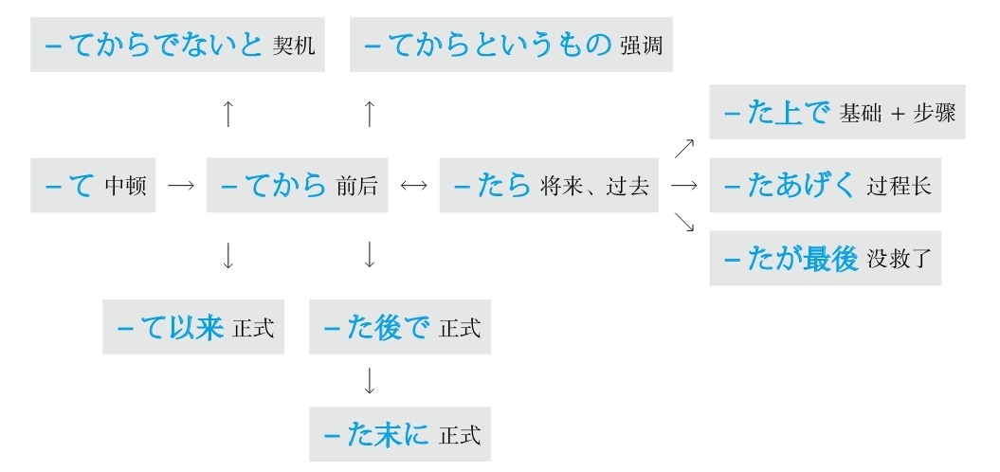
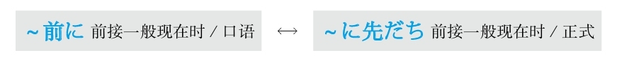
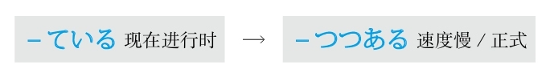
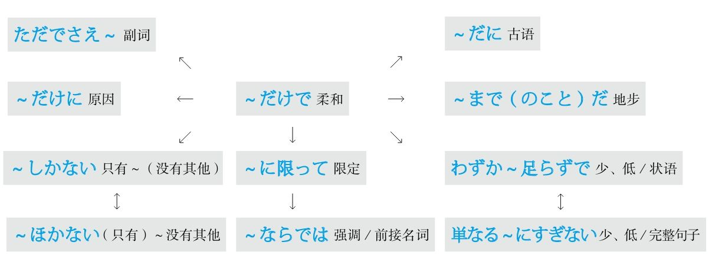
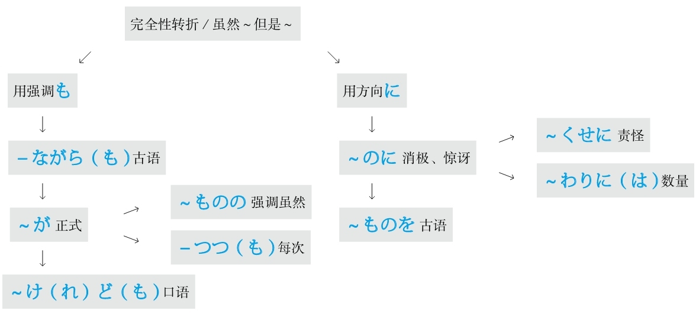
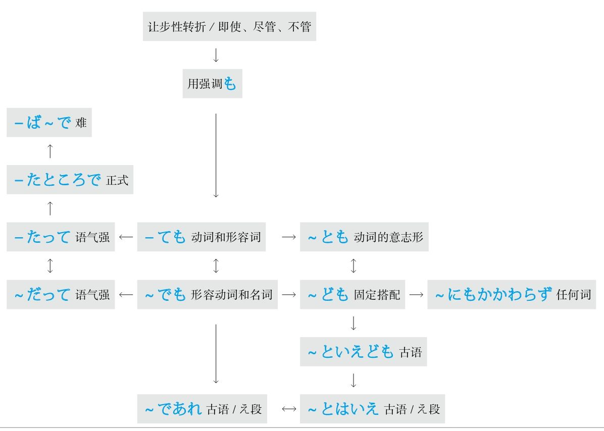
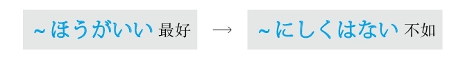
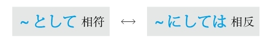

[[ 日语语法新思维（修订版）_Detail_6.md | [Prev_Page] ]]
#### －たが最後 #5_19_2_11_0
* [[ 日语语法新思维（修订版）_Menu_1.md | Menu #5_19_2_11_0 ]]

**解释：** 「た」相当于「て」，表示“了”；「が」是古语中起连接作用的助词；「<ruby>最<rp>(</rp><rt>さい</rt><rp>)</rp></ruby><ruby>後<rp>(</rp><rt>ご</rt><rp>)</rp></ruby>」的意思是“最后、没救了”
**意思：** 在做了～之后就没救了
**着重：** 一发不可收拾
**语气：** 正式
**变形：** 动词的た形的简体（变形规律参照第一章的第二节）

例句：あの<ruby>人<rp>(</rp><rt>ひと</rt><rp>)</rp></ruby>はカラオケが<ruby>好<rp>(</rp><rt>す</rt><rp>)</rp></ruby>きで、マイクを<ruby>握<rp>(</rp><rt>にぎ</rt><rp>)</rp></ruby>っ**たが<ruby>最<rp>(</rp><rt>さい</rt><rp>)</rp></ruby><ruby>後<rp>(</rp><rt>ご</rt><rp>)</rp></ruby>** 、<ruby>他<rp>(</rp><rt>ほか</rt><rp>)</rp></ruby>の<ruby>人<rp>(</rp><rt>ひと</rt><rp>)</rp></ruby>には<ruby>渡<rp>(</rp><rt>わた</rt><rp>)</rp></ruby>さない。
直译：那个人喜欢唱歌，握住了麦克风，就没救了，不给其他人。
意译：那个人喜欢唱歌，握住了麦克风后就一发不可收拾，再也不肯让给别人。
语法关系图

### 在～之前 #5_19_3_0_0
* [[ 日语语法新思维（修订版）_Menu_1.md | Menu #5_19_3_0_0 ]]

#### ～前に #5_19_3_1_0
* [[ 日语语法新思维（修订版）_Menu_1.md | Menu #5_19_3_1_0 ]]

**解释：** 「<ruby>前<rp>(</rp><rt>まえ</rt><rp>)</rp></ruby>」的意思是“前”；「に」表示方向，意思是“在”
**意思：** 在将要做～之前
**接续：** 动词的原形、名词の

例句：<ruby>出<rp>(</rp><rt>で</rt><rp>)</rp></ruby>かける**<ruby>前<rp>(</rp><rt>まえ</rt><rp>)</rp></ruby>に** 、<ruby>火<rp>(</rp><rt>ひ</rt><rp>)</rp></ruby><ruby>元<rp>(</rp><rt>もと</rt><rp>)</rp></ruby>をちゃんと<ruby>確<rp>(</rp><rt>かく</rt><rp>)</rp></ruby><ruby>認<rp>(</rp><rt>にん</rt><rp>)</rp></ruby>してください。
直译：在出门前，请把火源好好地确认。
意译：出门前请好好确认有没有关火。

#### ～に先だち #5_19_3_2_0
* [[ 日语语法新思维（修订版）_Menu_1.md | Menu #5_19_3_2_0 ]]

**解释：** 「に」表示方向；「<ruby>先<rp>(</rp><rt>さき</rt><rp>)</rp></ruby>」的意思是“时间在～之前”；「だち」是自动词「<ruby>経<rp>(</rp><rt>た</rt><rp>)</rp></ruby>つ」的连用形，与前面名词接续后浊音化
**直译：** 在将要做～之前经历
**意译：** 在将要做～之前发生
**注意：** 经常会把「<ruby>経<rp>(</rp><rt>た</rt><rp>)</rp></ruby>つ」错写成「<ruby>立<rp>(</rp><rt>た</rt><rp>)</rp></ruby>つ」
**语气：** 正式
**接续：** 动词的原形、名词

例句：<ruby>新<rp>(</rp><rt>しん</rt><rp>)</rp></ruby><ruby>車<rp>(</rp><rt>しゃ</rt><rp>)</rp></ruby>の<ruby>発<rp>(</rp><rt>はつ</rt><rp>)</rp></ruby><ruby>売<rp>(</rp><rt>ばい</rt><rp>)</rp></ruby>（する）**に<ruby>先<rp>(</rp><rt>さき</rt><rp>)</rp></ruby>だち** 、<ruby>展<rp>(</rp><rt>てん</rt><rp>)</rp></ruby><ruby>示<rp>(</rp><rt>じ</rt><rp>)</rp></ruby><ruby>会<rp>(</rp><rt>かい</rt><rp>)</rp></ruby>が<ruby>開<rp>(</rp><rt>ひら</rt><rp>)</rp></ruby>かれた。
直译：在新车的销售之前发生了展览会被召开的事情。
意译：在销售新车之前开了展览会。
语法关系图

### 正在 #5_19_4_0_0
* [[ 日语语法新思维（修订版）_Menu_1.md | Menu #5_19_4_0_0 ]]

#### －ている #5_19_4_1_0
* [[ 日语语法新思维（修订版）_Menu_1.md | Menu #5_19_4_1_0 ]]

**解释：** 「て」表示中顿，起将前面的动词和后面的「いる」连接的作用；「いる」的意思是“在”
**注意：** 表示动词的现在进行时
**着重：** 动作的正在进行、持续的动作、持续的状态
**意思：** 正在～、一直～
**变形：** 动词的て形（变形规律参照第一章的第二节）

**意1：** 正在做～

例句：<ruby>今<rp>(</rp><rt>いま</rt><rp>)</rp></ruby>その<ruby>問<rp>(</rp><rt>もん</rt><rp>)</rp></ruby><ruby>題<rp>(</rp><rt>だい</rt><rp>)</rp></ruby>を<ruby>議<rp>(</rp><rt>ぎ</rt><rp>)</rp></ruby><ruby>論<rp>(</rp><rt>ろん</rt><rp>)</rp></ruby>し**ている** よ。
直译：现在那个问题，正在讨论着。
意译：我们正在讨论那个问题。

**意2：** 持续性地做～

例句：<ruby>最<rp>(</rp><rt>さい</rt><rp>)</rp></ruby><ruby>近<rp>(</rp><rt>きん</rt><rp>)</rp></ruby>、<ruby>日<rp>(</rp><rt>に</rt><rp>)</rp></ruby><ruby>本<rp>(</rp><rt>ほん</rt><rp>)</rp></ruby><ruby>語<rp>(</rp><rt>ご</rt><rp>)</rp></ruby>を<ruby>習<rp>(</rp><rt>なら</rt><rp>)</rp></ruby>っ**ています** 。
直译：最近，正在学日语。
意译：最近在学日语。

**意3：** 用自动词表示持续的状态

例句：ドアが<ruby>開<rp>(</rp><rt>あ</rt><rp>)</rp></ruby>い**ています** 。
直译：门开着。

#### －つつある #5_19_4_2_0
* [[ 日语语法新思维（修订版）_Menu_1.md | Menu #5_19_4_2_0 ]]

**解释：** 「つつ」相当于汉语的“次次”；「ある」的汉字是「<ruby>在<rp>(</rp><rt>あ</rt><rp>)</rp></ruby>る」，是表示现在进行时的「いる」的古语，意思是“正在”
**直译：** 正在一次一次地～
**意译：** 正在一步一步地～
**区别：** 相当于现代日语的「少しずつ―ている」，语气正式
**接续：** 动词的连用形

例句：<ruby>町<rp>(</rp><rt>まち</rt><rp>)</rp></ruby>の<ruby>様<rp>(</rp><rt>よう</rt><rp>)</rp></ruby><ruby>子<rp>(</rp><rt>す</rt><rp>)</rp></ruby>は<ruby>変<rp>(</rp><rt>か</rt><rp>)</rp></ruby>わり**つつある** 。
直译：街道的样子，在一步一步地变化。
意译：街道的样子在一点一点地发生变化。
语法关系图

### 值得做 #5_19_5_0_0
* [[ 日语语法新思维（修订版）_Menu_1.md | Menu #5_19_5_0_0 ]]

#### ～に値する/～に値しない #5_19_5_1_0
* [[ 日语语法新思维（修订版）_Menu_1.md | Menu #5_19_5_1_0 ]]

**解释：** 「に」表示方向；名词「<ruby>値<rp>(</rp><rt>あたい</rt><rp>)</rp></ruby>」的意思是“数值、值得”，加上「する」后变为动词
**意思：** 值得～
**接续：** 名词、动词的原形

例句：<ruby>彼<rp>(</rp><rt>かれ</rt><rp>)</rp></ruby>がやったことは<ruby>賞<rp>(</rp><rt>しょう</rt><rp>)</rp></ruby><ruby>賛<rp>(</rp><rt>さん</rt><rp>)</rp></ruby>（する）**に<ruby>値<rp>(</rp><rt>あたい</rt><rp>)</rp></ruby>する** 。
直译：他干了的事，值得称赞。
意译：他干的事值得称赞。

#### ～に足る/～に足りない #5_19_5_2_0
* [[ 日语语法新思维（修订版）_Menu_1.md | Menu #5_19_5_2_0 ]]

**解释：** 「に」表示方向；「<ruby>足<rp>(</rp><rt>た</rt><rp>)</rp></ruby>る」的意思是“足”；「<ruby>足<rp>(</rp><rt>た</rt><rp>)</rp></ruby>りない」的意思是“不足”
**直译：** 足于～；不足于～
**意译：** 用得着～、值得～/用不着～、不值得～
**接续：** 名词、动词的原形

例句：<ruby>彼<rp>(</rp><rt>かれ</rt><rp>)</rp></ruby>は<ruby>信<rp>(</rp><rt>しん</rt><rp>)</rp></ruby><ruby>頼<rp>(</rp><rt>らい</rt><rp>)</rp></ruby>（する）**に<ruby>足<rp>(</rp><rt>た</rt><rp>)</rp></ruby>る** <ruby>人<rp>(</rp><rt>じん</rt><rp>)</rp></ruby><ruby>物<rp>(</rp><rt>ぶつ</rt><rp>)</rp></ruby>です。
直译：他是足于信赖的人。
意译：他是个值得信任的人。

例句：こんなに<ruby>高<rp>(</rp><rt>たか</rt><rp>)</rp></ruby>い<ruby>実<rp>(</rp><rt>じつ</rt><rp>)</rp></ruby><ruby>力<rp>(</rp><rt>りょく</rt><rp>)</rp></ruby>なら、<ruby>彼<rp>(</rp><rt>かれ</rt><rp>)</rp></ruby>は<ruby>恐<rp>(</rp><rt>おそ</rt><rp>)</rp></ruby>れる**に<ruby>足<rp>(</rp><rt>た</rt><rp>)</rp></ruby>りない** 。
直译：这么高的实力的话，他不足于害怕。
意译：实力这么强，他用不着害怕。

#### ～甲斐がある/～甲斐がない #5_19_5_3_0
* [[ 日语语法新思维（修订版）_Menu_1.md | Menu #5_19_5_3_0 ]]

**解释：** 「<ruby>甲<rp>(</rp><rt>か</rt><rp>)</rp></ruby><ruby>斐<rp>(</rp><rt>い</rt><rp>)</rp></ruby>」的意思是“价值”；「が」表示小主语；「ある」的意思是“有”
**意思：** 有～的价值
**接续：** 名词の、动词的简体

例句：<ruby>苦<rp>(</rp><rt>く</rt><rp>)</rp></ruby><ruby>労<rp>(</rp><rt>ろう</rt><rp>)</rp></ruby>した**<ruby>甲<rp>(</rp><rt>か</rt><rp>)</rp></ruby><ruby>斐<rp>(</rp><rt>い</rt><rp>)</rp></ruby>がある。**
直译：受苦了的价值有。
意译：受的苦终于有了回报。

#### ～には当たらない #5_19_5_4_0
* [[ 日语语法新思维（修订版）_Menu_1.md | Menu #5_19_5_4_0 ]]

**解释：** 「に」表示方向；「は」表示强调；「<ruby>当<rp>(</rp><rt>あ</rt><rp>)</rp></ruby>たらない」的意思是“不相当”
**直译：** 不相当于～
**意译：** 没有必要～；不值得～
**接续：** 名词、动词的原形

例句：<ruby>彼<rp>(</rp><rt>かれ</rt><rp>)</rp></ruby>の<ruby>実<rp>(</rp><rt>じつ</rt><rp>)</rp></ruby><ruby>力<rp>(</rp><rt>りょく</rt><rp>)</rp></ruby>を<ruby>考<rp>(</rp><rt>かんが</rt><rp>)</rp></ruby>えると、<ruby>今<rp>(</rp><rt>こん</rt><rp>)</rp></ruby><ruby>回<rp>(</rp><rt>かい</rt><rp>)</rp></ruby>の<ruby>彼<rp>(</rp><rt>かれ</rt><rp>)</rp></ruby>の<ruby>受<rp>(</rp><rt>じゅ</rt><rp>)</rp></ruby><ruby>賞<rp>(</rp><rt>しょう</rt><rp>)</rp></ruby>は<ruby>驚<rp>(</rp><rt>おどろ</rt><rp>)</rp></ruby>く**には<ruby>当<rp>(</rp><rt>あ</rt><rp>)</rp></ruby>たらない** 。
直译：他的实力考虑的话，这次的他的得奖，不相当于吃惊。
意译：考虑到他的实力就用不着对他的这次得奖感到吃惊了。

例句：<ruby>彼<rp>(</rp><rt>かれ</rt><rp>)</rp></ruby>の<ruby>行<rp>(</rp><rt>こう</rt><rp>)</rp></ruby><ruby>為<rp>(</rp><rt>い</rt><rp>)</rp></ruby>は<ruby>称<rp>(</rp><rt>しょう</rt><rp>)</rp></ruby><ruby>賛<rp>(</rp><rt>さん</rt><rp>)</rp></ruby>**には<ruby>当<rp>(</rp><rt>あ</rt><rp>)</rp></ruby>たらない** 。
直译：他的行为不相当于称赞。
意译：他的行为不值得称赞。
语法关系图

### 只要 #5_19_6_0_0
* [[ 日语语法新思维（修订版）_Menu_1.md | Menu #5_19_6_0_0 ]]

#### ～と #5_19_6_1_0
* [[ 日语语法新思维（修订版）_Menu_1.md | Menu #5_19_6_1_0 ]]

**重点：** 在「と、ば、たら、なら」里，最重要的是顺序。「と」和「なら」分别表示极端，「と」代表“条件性”的极端，「なら」代表“假定性”的极端
**解释：** 「と」可以理解为“脱（落）、突（发）”，表示出现的某种事物马上就会脱落出或突发下一种事物，即表示条件性强或速度快
**意思：** 只要～；一～就～
**注意：** 后句里不能用“义务、许可、命令、意志”的表达方式
**接续：** 谓语词（动词、形容词、助动词）的原形

例句：<ruby>親<rp>(</rp><rt>おや</rt><rp>)</rp></ruby>と<ruby>一<rp>(</rp><rt>いっ</rt><rp>)</rp></ruby><ruby>緒<rp>(</rp><rt>しょ</rt><rp>)</rp></ruby>にいる**と** <ruby>安<rp>(</rp><rt>あん</rt><rp>)</rp></ruby><ruby>心<rp>(</rp><rt>しん</rt><rp>)</rp></ruby>していられる。
直译：只要和父母在一起，能够保持安心的状态。
意译：只要和父母在一起就会一直安心。

#### ～限り #5_19_6_2_0
* [[ 日语语法新思维（修订版）_Menu_1.md | Menu #5_19_6_2_0 ]]

**解释：** 「<ruby>限<rp>(</rp><rt>かぎ</rt><rp>)</rp></ruby>り」是自动词「<ruby>限<rp>(</rp><rt>かぎ</rt><rp>)</rp></ruby>る」的连用形，作名词用，意思是“极限”
**意思：** 只要～
**语气：** 强烈
**接续：** 修饰名词的规律（参照第一章的第三节）

例句：<ruby>親<rp>(</rp><rt>おや</rt><rp>)</rp></ruby>と<ruby>一<rp>(</rp><rt>いっ</rt><rp>)</rp></ruby><ruby>緒<rp>(</rp><rt>しょ</rt><rp>)</rp></ruby>にいる**<ruby>限<rp>(</rp><rt>かぎ</rt><rp>)</rp></ruby>り** <ruby>自<rp>(</rp><rt>じ</rt><rp>)</rp></ruby><ruby>由<rp>(</rp><rt>ゆう</rt><rp>)</rp></ruby>にはなれない。
直译：只要和父母在一起，不能够变得自由。
意译：只要和父母在一起就不会自由。

#### ～さえ－ば #5_19_6_3_0
* [[ 日语语法新思维（修订版）_Menu_1.md | Menu #5_19_6_3_0 ]]

**解释：** 「さえ」举出极端的事物；「さ」表示「それ」，「え」是表示“方向”的「へ」
**直译：** 往那个方向
**意译：** 连～
**解释：** 「ば」表示条件；「～さえ－ば」表示“只要有某个条件就会出现某种结果”
**接续：** 「さえ」前接名词和助词
**变形：** ば形（变形规律参照第一章的第二节）

例句：<ruby>時<rp>(</rp><rt>じ</rt><rp>)</rp></ruby><ruby>間<rp>(</rp><rt>かん</rt><rp>)</rp></ruby>**さえ** あれ**ば** 、<ruby>問<rp>(</rp><rt>もん</rt><rp>)</rp></ruby><ruby>題<rp>(</rp><rt>だい</rt><rp>)</rp></ruby>はないと<ruby>思<rp>(</rp><rt>おも</rt><rp>)</rp></ruby>う。
直译：只要有时间就没有问题，我想。
意译：我想，只要有时间就没有问题。
语法关系图

### 只是、只有 #5_19_7_0_0
* [[ 日语语法新思维（修订版）_Menu_1.md | Menu #5_19_7_0_0 ]]

#### ～だけで #5_19_7_1_0
* [[ 日语语法新思维（修订版）_Menu_1.md | Menu #5_19_7_1_0 ]]

**解释：** 「だけ」的意思是“只、仅”；「で」表示程度
**意思：** 只是～的程度
**接续：** 任何词

例句：<ruby>単<rp>(</rp><rt>たん</rt><rp>)</rp></ruby><ruby>語<rp>(</rp><rt>ご</rt><rp>)</rp></ruby>を<ruby>覚<rp>(</rp><rt>おぼ</rt><rp>)</rp></ruby>える**だけで** <ruby>語<rp>(</rp><rt>ご</rt><rp>)</rp></ruby><ruby>学<rp>(</rp><rt>がく</rt><rp>)</rp></ruby><ruby>力<rp>(</rp><rt>りょく</rt><rp>)</rp></ruby>が<ruby>向<rp>(</rp><rt>こう</rt><rp>)</rp></ruby><ruby>上<rp>(</rp><rt>じょう</rt><rp>)</rp></ruby>しない。
直译：只是记单词的程度，外语能力不提高。
意译：只是记单词，外语能力不会提高。

#### ただでさえ～ #5_19_7_2_0
* [[ 日语语法新思维（修订版）_Menu_1.md | Menu #5_19_7_2_0 ]]

**解释：** 「ただ」的汉字是「<ruby>唯<rp>(</rp><rt>ただ</rt><rp>)</rp></ruby>、<ruby>只<rp>(</rp><rt>ただ</rt><rp>)</rp></ruby>、<ruby>徒<rp>(</rp><rt>ただ</rt><rp>)</rp></ruby>」；「で」表示程度；「さえ」的意思是“连～”
**直译：** 只是一丁点儿的程度就～
**意译：** 本来就～，现在就更加～
**词性：** 副词

例句：**ただでさえ** <ruby>怖<rp>(</rp><rt>こわ</rt><rp>)</rp></ruby>い<ruby>先<rp>(</rp><rt>せん</rt><rp>)</rp></ruby><ruby>生<rp>(</rp><rt>せい</rt><rp>)</rp></ruby>は、<ruby>試<rp>(</rp><rt>し</rt><rp>)</rp></ruby><ruby>験<rp>(</rp><rt>けん</rt><rp>)</rp></ruby>の<ruby>日<rp>(</rp><rt>ひ</rt><rp>)</rp></ruby>には<ruby>余<rp>(</rp><rt>よ</rt><rp>)</rp></ruby><ruby>計<rp>(</rp><rt>けい</rt><rp>)</rp></ruby><ruby>怖<rp>(</rp><rt>こわ</rt><rp>)</rp></ruby>く<ruby>見<rp>(</rp><rt>み</rt><rp>)</rp></ruby>える。
直译：只是一丁点儿的程度就很可怕的老师，考试那天看上去更加可怕。
意译：本来就可怕的老师，考试当天看上去越发可怕。

#### ～だに #5_19_7_3_0
* [[ 日语语法新思维（修订版）_Menu_1.md | Menu #5_19_7_3_0 ]]

**解释：** 「だ」是「だけ」的省略，表示“只、仅”；「に」表示副词；「だに」是「だけで」的古语形式
**意思：** 只是～
**语气：** 正式
**接续：** 名词和动词的原形，常接「<ruby>想<rp>(</rp><rt>そう</rt><rp>)</rp></ruby><ruby>像<rp>(</rp><rt>ぞう</rt><rp>)</rp></ruby>する、<ruby>考<rp>(</rp><rt>かんが</rt><rp>)</rp></ruby>える、<ruby>思<rp>(</rp><rt>おも</rt><rp>)</rp></ruby>い<ruby>出<rp>(</rp><rt>だ</rt><rp>)</rp></ruby>す、<ruby>聞<rp>(</rp><rt>き</rt><rp>)</rp></ruby>く」等

例句：その<ruby>事<rp>(</rp><rt>こと</rt><rp>)</rp></ruby>は<ruby>考<rp>(</rp><rt>かんが</rt><rp>)</rp></ruby>える**だに** <ruby>冷<rp>(</rp><rt>ひや</rt><rp>)</rp></ruby><ruby>汗<rp>(</rp><rt>あせ</rt><rp>)</rp></ruby>が<ruby>出<rp>(</rp><rt>で</rt><rp>)</rp></ruby>る。
直译：那件事，只是想想就出冷汗。
意译：只是想想那件事就出冷汗。

#### ～だけに #5_19_7_4_0
* [[ 日语语法新思维（修订版）_Menu_1.md | Menu #5_19_7_4_0 ]]

**解释：** 「だけ」在此的意思是“只是”；「に」表示副词
**直译：** 只是～、就是～
**意译：** 就是因为～
**重点：** 此处的因果关系不是通过「～だけに」，而是通过上下文推测的
**注意：** 多用于带来不好的后果；带来好的结果的原因用「～おかげで」（托～的福）
**接续：** 动词和形容词的简体、名词、形容动词加な

例句：<ruby>彼<rp>(</rp><rt>かれ</rt><rp>)</rp></ruby>の<ruby>指<rp>(</rp><rt>し</rt><rp>)</rp></ruby><ruby>摘<rp>(</rp><rt>てき</rt><rp>)</rp></ruby>は<ruby>正<rp>(</rp><rt>ただ</rt><rp>)</rp></ruby>しい**だけに** 、かえって<ruby>私<rp>(</rp><rt>わたし</rt><rp>)</rp></ruby>は<ruby>反<rp>(</rp><rt>はん</rt><rp>)</rp></ruby><ruby>発<rp>(</rp><rt>ぱつ</rt><rp>)</rp></ruby>を<ruby>感<rp>(</rp><rt>かん</rt><rp>)</rp></ruby>じた。
直译：只是他的指正太正确了，反倒，我感到了逆反。
意译：就是因为他对我的指正太正确了，反倒引起了我的逆反心理。

#### ～しかない #5_19_7_5_0
* [[ 日语语法新思维（修订版）_Menu_1.md | Menu #5_19_7_5_0 ]]

**解释：** 「し」的意思是“强”，构成的单词有「<ruby>強<rp>(</rp><rt>し</rt><rp>)</rp></ruby>いる（强迫）」；「か」表示添加；「しか」表示加强；「ない」的意思是“没有”
**直译：** ～是最强的，除了～以外没有其他更～的
**意译：** 只有～
**区别：** 比「だけ」语气强
**接续：** 动词的原形；表示“人”以外的名词（表示“人”的名词用「～しかいない」）

例句：<ruby>誰<rp>(</rp><rt>だれ</rt><rp>)</rp></ruby>もいないので<ruby>帰<rp>(</rp><rt>かえ</rt><rp>)</rp></ruby>る**しかない** 。
直译：谁都不在，除了回去以外没有其他办法。
意译：没有人，所以只有回去了。

#### ～ほかない #5_19_7_6_0
* [[ 日语语法新思维（修订版）_Menu_1.md | Menu #5_19_7_6_0 ]]

**解释：** 「ほか」的汉字是「<ruby>他<rp>(</rp><rt>ほか</rt><rp>)</rp></ruby>、<ruby>外<rp>(</rp><rt>ほか</rt><rp>)</rp></ruby>」；「ない」的意思是“没有”
**直译：** 没有其他～
**意译：** 只有～
**区别：** 「～しかない」侧重于“只有～”，「～ほかない」侧重于“没有其他～”
**接续：** 动词的原形

例句：<ruby>留<rp>(</rp><rt>りゅう</rt><rp>)</rp></ruby><ruby>学<rp>(</rp><rt>がく</rt><rp>)</rp></ruby>するお<ruby>金<rp>(</rp><rt>かね</rt><rp>)</rp></ruby>がないので、<ruby>留<rp>(</rp><rt>りゅう</rt><rp>)</rp></ruby><ruby>学<rp>(</rp><rt>がく</rt><rp>)</rp></ruby>を<ruby>諦<rp>(</rp><rt>あきら</rt><rp>)</rp></ruby>める**ほかない** 。
直译：留学的钱没有，所以放弃留学，除此之外没有其他办法。
意译：没有去留学的钱，所以只有放弃留学。

#### ～に限って #5_19_7_7_0
* [[ 日语语法新思维（修订版）_Menu_1.md | Menu #5_19_7_7_0 ]]

**解释：** 「に」表示方向或对象；「<ruby>限<rp>(</rp><rt>かぎ</rt><rp>)</rp></ruby>って」是自动词「<ruby>限<rp>(</rp><rt>かぎ</rt><rp>)</rp></ruby>る」的中顿形式，表示“极限”
**意思：** 只限于～
**注意：** 「～に限って」既可以表示“极限”，也可以表示“越～”
**接续：** 名词

例句：<ruby>簡<rp>(</rp><rt>かん</rt><rp>)</rp></ruby><ruby>単<rp>(</rp><rt>たん</rt><rp>)</rp></ruby>な<ruby>問<rp>(</rp><rt>もん</rt><rp>)</rp></ruby><ruby>題<rp>(</rp><rt>だい</rt><rp>)</rp></ruby>**に<ruby>限<rp>(</rp><rt>かぎ</rt><rp>)</rp></ruby>って** <ruby>答<rp>(</rp><rt>こた</rt><rp>)</rp></ruby>えられない。
直译：只限于简单的问题，回答不上来。
意译：越是简单的问题越回答不上来。

#### ～ならでは #5_19_7_8_0
* [[ 日语语法新思维（修订版）_Menu_1.md | Menu #5_19_7_8_0 ]]

**解释：** 「なら」接在名词后表示“如果”，在此是提及话题，为了引起注意；「で」表示状态或程度；「は」表示强调
**直译：** 如果是某事的话，那么在它的状态下就会～
**意译：** 只有～才有～
**接续：** 名词

例句：このチョコレートは<ruby>今年<rp>(</rp><rt>ことし</rt><rp>)</rp></ruby>のバレンタインデー**ならではの** ものです。
直译：这种巧克力，如果是今年的情人节的话，那么在今年的情人节的状态或程度下才会有。
意译：这种巧克力只有今年的情人节才有。

例句：この<ruby>人<rp>(</rp><rt>にん</rt><rp>)</rp></ruby><ruby>形<rp>(</rp><rt>ぎょう</rt><rp>)</rp></ruby>は<ruby>日<rp>(</rp><rt>に</rt><rp>)</rp></ruby><ruby>本<rp>(</rp><rt>ほん</rt><rp>)</rp></ruby>**ならではの** ものです。
直译：这种人偶，如果是日本的话，那么在日本的状态或程度下才会有。
意译：这种人偶只有日本才有。

#### ～まで（のこと）だ #5_19_7_9_0
* [[ 日语语法新思维（修订版）_Menu_1.md | Menu #5_19_7_9_0 ]]

**解释：** 「まで」的意思是“到～的地步”
**意译：** 只有～
**注意：** 加上「のこと」语气正式
**接续：** 任何词

例句：<ruby>彼<rp>(</rp><rt>かれ</rt><rp>)</rp></ruby>がしてくれなければ、<ruby>他<rp>(</rp><rt>ほか</rt><rp>)</rp></ruby>の<ruby>人<rp>(</rp><rt>ひと</rt><rp>)</rp></ruby>を<ruby>探<rp>(</rp><rt>さが</rt><rp>)</rp></ruby>す**までだ** 。
直译：他不给我们做的话，找其他人的地步了。
意译：他不帮我们做的话，我们只有找其他人了。

例句：<ruby>彼<rp>(</rp><rt>かれ</rt><rp>)</rp></ruby>には<ruby>関<rp>(</rp><rt>かん</rt><rp>)</rp></ruby><ruby>係<rp>(</rp><rt>けい</rt><rp>)</rp></ruby>がないかもしれないが、<ruby>念<rp>(</rp><rt>ねん</rt><rp>)</rp></ruby>のため<ruby>知<rp>(</rp><rt>し</rt><rp>)</rp></ruby>らせた**までのことだ** 。
直译：可能跟他没有关系，只是为了保险起见才通知的。
直译：可能跟他没有关系，只是为了保险起见才通知的。

#### 単なる～にすぎない #5_19_7_10_0
* [[ 日语语法新思维（修订版）_Menu_1.md | Menu #5_19_7_10_0 ]]

**解释：** 「<ruby>単<rp>(</rp><rt>たん</rt><rp>)</rp></ruby>なる」的意思是“单单”；「に」表示方向或对象；「すぎない」是自动词「<ruby>過<rp>(</rp><rt>す</rt><rp>)</rp></ruby>ぎる」的否定形式，表示“不过”
**意思：** 只不过～
**注意：** 根据日语中的“前轻后重”的准则，「<ruby>単<rp>(</rp><rt>たん</rt><rp>)</rp></ruby>なる」可以省略
**接续：** 名词

例句：それは**<ruby>単<rp>(</rp><rt>たん</rt><rp>)</rp></ruby>なる** <ruby>言<rp>(</rp><rt>い</rt><rp>)</rp></ruby>い<ruby>訳<rp>(</rp><rt>わけ</rt><rp>)</rp></ruby>**にすぎない** 。
直译：那单纯地不过是个借口。
意译：那只不过是个借口。

#### わずか～足らずで #5_19_7_11_0
* [[ 日语语法新思维（修订版）_Menu_1.md | Menu #5_19_7_11_0 ]]

**解释：** 「わずか」的汉字是「<ruby>僅<rp>(</rp><rt>わず</rt><rp>)</rp></ruby>か」，表示“仅仅”；「<ruby>足<rp>(</rp><rt>た</rt><rp>)</rp></ruby>らず」的意思是“不足”；「で」表示程度
**直译：** 仅仅不足～的程度
**意译：** 只不过～
**注意：** 根据日语中的“前轻后重”的准则，「わずか」可以省略
**接续：** 数量词

例句：<ruby>彼<rp>(</rp><rt>かれ</rt><rp>)</rp></ruby>は**わずか** <ruby>三<rp>(</rp><rt>さん</rt><rp>)</rp></ruby>か<ruby>月<rp>(</rp><rt>げつ</rt><rp>)</rp></ruby>**<ruby>足<rp>(</rp><rt>た</rt><rp>)</rp></ruby>らずで** <ruby>日<rp>(</rp><rt>にち</rt><rp>)</rp></ruby><ruby>常<rp>(</rp><rt>じょう</rt><rp>)</rp></ruby><ruby>会<rp>(</rp><rt>かい</rt><rp>)</rp></ruby><ruby>話<rp>(</rp><rt>わ</rt><rp>)</rp></ruby>を<ruby>身<rp>(</rp><rt>み</rt><rp>)</rp></ruby>につけた。
直译：他仅仅不足3个月的程度就掌握了日常会话。
意译：他不到3个月就掌握了日常会话。
语法关系图

### 状态 #5_19_8_0_0
* [[ 日语语法新思维（修订版）_Menu_1.md | Menu #5_19_8_0_0 ]]

#### －ている #5_19_8_1_0
* [[ 日语语法新思维（修订版）_Menu_1.md | Menu #5_19_8_1_0 ]]

**解释：** 动词的て形起逗号的作用，表示中顿；「いる」表示“在”
**接续：** 自动词的て形
**注意：** 动词的现在进行时表示动作的正在进行、持续的动作、持续的状态
**变形：** 动词的て形（变形规律参照第一章的第二节）

例句：<ruby>電<rp>(</rp><rt>でん</rt><rp>)</rp></ruby><ruby>気<rp>(</rp><rt>き</rt><rp>)</rp></ruby>がつい**ている** 。
直译：灯开着。

#### －てある #5_19_8_2_0
* [[ 日语语法新思维（修订版）_Menu_1.md | Menu #5_19_8_2_0 ]]

**解释：** 动词的て形起逗号的作用，表示中顿；「ある」表示“在”
**接续：** 他动词的て形
**重点：** 他动词侧重于有人做。因此，「－てある」的重点在于有人做后成为那种状态
**变形：** 动词的て形（变形规律参照第一章的第二节）

例句：<ruby>本<rp>(</rp><rt>ほん</rt><rp>)</rp></ruby>は<ruby>机<rp>(</rp><rt>つくえ</rt><rp>)</rp></ruby>の<ruby>上<rp>(</rp><rt>うえ</rt><rp>)</rp></ruby>に<ruby>置<rp>(</rp><rt>お</rt><rp>)</rp></ruby>い**てある** 。
直译：有人把书放在桌子上了，书放在桌子上。
意译：书放在桌子上。

**区别：**

例句：ドアは<ruby>開<rp>(</rp><rt>あ</rt><rp>)</rp></ruby>い**ている** 。
单纯叙述“门开着”。

例句：ドアは<ruby>開<rp>(</rp><rt>あ</rt><rp>)</rp></ruby>け**てある** 。
侧重于“有人把门打开了，然后门是开着的”。
语法关系图

### 转折 #5_19_9_0_0
* [[ 日语语法新思维（修订版）_Menu_1.md | Menu #5_19_9_0_0 ]]

#### ～が #5_19_9_1_0
* [[ 日语语法新思维（修订版）_Menu_1.md | Menu #5_19_9_1_0 ]]

**解释：** 表示顺接（单纯接续两个句子）、逆接（转折）、省略后句（为了使语气变得柔和）三个意思，此处表示转折
**语气：** 正式
**接续：** 谓语词（动词、形容词、助动词）的简体和敬体

例句：メールを<ruby>出<rp>(</rp><rt>だ</rt><rp>)</rp></ruby>した**が** 、<ruby>先<rp>(</rp><rt>せん</rt><rp>)</rp></ruby><ruby>方<rp>(</rp><rt>ぽう</rt><rp>)</rp></ruby>からの<ruby>返<rp>(</rp><rt>へん</rt><rp>)</rp></ruby><ruby>事<rp>(</rp><rt>じ</rt><rp>)</rp></ruby>はまだ<ruby>来<rp>(</rp><rt>き</rt><rp>)</rp></ruby>ていない。
直译：发了邮件，但是从对方的回信还没有来。
意译：发了邮件，但是对方还没回信。

#### ～けれども #5_19_9_2_0
* [[ 日语语法新思维（修订版）_Menu_1.md | Menu #5_19_9_2_0 ]]

**解释：** 「けれ」是「これ」，表示“这个”；「ども」和「ても」一样表示转折
**注意：** 是「が」的口语；表示顺接（单纯接续两个句子）、逆接（转折）、省略后句（为了使语气变得柔和）三个意思，此处表示转折
**重点：** 「けれども」→「けれど」→「けど」，从左到右语气越发柔和
**接续：** 谓语词（动词、形容词、助动词）的简体和敬体

例句：<ruby>無<rp>(</rp><rt>ぶ</rt><rp>)</rp></ruby><ruby>事<rp>(</rp><rt>じ</rt><rp>)</rp></ruby>に<ruby>合<rp>(</rp><rt>ごう</rt><rp>)</rp></ruby><ruby>格<rp>(</rp><rt>かく</rt><rp>)</rp></ruby>した**けれども** 、<ruby>理<rp>(</rp><rt>り</rt><rp>)</rp></ruby><ruby>解<rp>(</rp><rt>かい</rt><rp>)</rp></ruby>の<ruby>浅<rp>(</rp><rt>あさ</rt><rp>)</rp></ruby>い<ruby>内<rp>(</rp><rt>ない</rt><rp>)</rp></ruby><ruby>容<rp>(</rp><rt>よう</rt><rp>)</rp></ruby>はもう<ruby>一<rp>(</rp><rt>いち</rt><rp>)</rp></ruby><ruby>度<rp>(</rp><rt>ど</rt><rp>)</rp></ruby>しっかり<ruby>復<rp>(</rp><rt>ふく</rt><rp>)</rp></ruby><ruby>習<rp>(</rp><rt>しゅう</rt><rp>)</rp></ruby>する<ruby>必<rp>(</rp><rt>ひつ</rt><rp>)</rp></ruby><ruby>要<rp>(</rp><rt>よう</rt><rp>)</rp></ruby>がある。
直译：平安无事地合格了，但是，理解浅的内容再一遍好好地复习的必要有。
意译：平安无事地合格了，但是理解不深的内容还要好好复习一遍。

#### ～のに #5_19_9_3_0
* [[ 日语语法新思维（修订版）_Menu_1.md | Menu #5_19_9_3_0 ]]

**解释：** 「の」是名词化；「に」表示方向
**准则：** 日语的转折从“强调”和“方向”两个方面来表示
**语气：** 惊讶、消极
**接续：** 动词和形容词的简体、形容动词和名词加な

例句：<ruby>彼<rp>(</rp><rt>かの</rt><rp>)</rp></ruby><ruby>女<rp>(</rp><rt>じょ</rt><rp>)</rp></ruby>は<ruby>日<rp>(</rp><rt>に</rt><rp>)</rp></ruby><ruby>本<rp>(</rp><rt>ほん</rt><rp>)</rp></ruby><ruby>語<rp>(</rp><rt>ご</rt><rp>)</rp></ruby>を<ruby>半<rp>(</rp><rt>はん</rt><rp>)</rp></ruby><ruby>年<rp>(</rp><rt>とし</rt><rp>)</rp></ruby>しか<ruby>習<rp>(</rp><rt>なら</rt><rp>)</rp></ruby>っていない**のに** 、もうこんなにしゃべれるのよ。
直译：她只学了半年，日语就已经这么能说了。
意译：她才学了半年日语就这么能说了。

例句：もうくたくたな**のに** 、<ruby>残<rp>(</rp><rt>ざん</rt><rp>)</rp></ruby><ruby>業<rp>(</rp><rt>ぎょう</rt><rp>)</rp></ruby>しなければいけないと<ruby>言<rp>(</rp><rt>い</rt><rp>)</rp></ruby>われたら、たまらない。
直译：已经累得不行了，但是不加班不行，如果被那样说了，真受不了。
意译：已经累得不行了，还要让我加班，真受不了。

#### ～くせに #5_19_9_4_0
* [[ 日语语法新思维（修订版）_Menu_1.md | Menu #5_19_9_4_0 ]]

**解释：** 名词「<ruby>癖<rp>(</rp><rt>くせ</rt><rp>)</rp></ruby>」的意思是“毛病”；「に」表示副词
**注意：** 「～くせに」是将「～のに」的「の」具体化
**语气：** 责怪他人
**接续：** 修饰名词的规律（参照第一章的第三节）

例句：あの<ruby>人<rp>(</rp><rt>ひと</rt><rp>)</rp></ruby>は<ruby>一人<rp>(</rp><rt>ひとり</rt><rp>)</rp></ruby>では<ruby>何<rp>(</rp><rt>なに</rt><rp>)</rp></ruby>もできない**くせに** 、<ruby>会<rp>(</rp><rt>かい</rt><rp>)</rp></ruby><ruby>社<rp>(</rp><rt>しゃ</rt><rp>)</rp></ruby>ではいつも<ruby>偉<rp>(</rp><rt>えら</rt><rp>)</rp></ruby>そうな<ruby>顔<rp>(</rp><rt>かお</rt><rp>)</rp></ruby>をしている。
直译：那个人一个人什么都干不了，可是在公司里却老是显示出自己比别人强的表情。
意译：那个人一个人什么都干不了，在公司里却老是显得自己比别人强似的。

#### ～ものを #5_19_9_5_0
* [[ 日语语法新思维（修订版）_Menu_1.md | Menu #5_19_9_5_0 ]]

**解释：** 「もの」接在句尾表示强调；「を」表示移动，此处相当于表示方向的「に」
**注意：** 是「のに」的古语
**语气：** 正式
**接续：** 动词和形容词的简体、形容动词加な

例句：<ruby>電<rp>(</rp><rt>でん</rt><rp>)</rp></ruby><ruby>話<rp>(</rp><rt>わ</rt><rp>)</rp></ruby>で<ruby>簡<rp>(</rp><rt>かん</rt><rp>)</rp></ruby><ruby>単<rp>(</rp><rt>たん</rt><rp>)</rp></ruby>に<ruby>済<rp>(</rp><rt>す</rt><rp>)</rp></ruby>ませる**ものを** 。わざわざ<ruby>会<rp>(</rp><rt>あ</rt><rp>)</rp></ruby>いに<ruby>行<rp>(</rp><rt>い</rt><rp>)</rp></ruby>く<ruby>必<rp>(</rp><rt>ひつ</rt><rp>)</rp></ruby><ruby>要<rp>(</rp><rt>よう</rt><rp>)</rp></ruby>はないでしょう。
直译：在电话里就能简单地解决。特地去见面的必要有吗？
意译：在电话里就能简单地解决。有必要特地去见面吗？

#### ～わりには #5_19_9_6_0
* [[ 日语语法新思维（修订版）_Menu_1.md | Menu #5_19_9_6_0 ]]

**解释：** 「わり」是表示算数中的除法的动词「<ruby>割<rp>(</rp><rt>わ</rt><rp>)</rp></ruby>る」的连用形，作名词用，意思是“比例、比率”；「に」表示副词；「は」表示强调
**意思：** 按照比例或比率却～
**注意：** 「～わりに」是将「～のに」的「の」具体化
**接续：** 修饰名词的规律（参照第一章的第三节）

例句：この<ruby>靴<rp>(</rp><rt>くつ</rt><rp>)</rp></ruby>は<ruby>値<rp>(</rp><rt>ね</rt><rp>)</rp></ruby><ruby>段<rp>(</rp><rt>だん</rt><rp>)</rp></ruby>の**わりには** <ruby>丈<rp>(</rp><rt>じょう</rt><rp>)</rp></ruby><ruby>夫<rp>(</rp><rt>ぶ</rt><rp>)</rp></ruby>だ。
直译：这双鞋，按照价格的比例却结实。
意译：这双鞋价格便宜却很结实。

#### －ながら（も） #5_19_9_7_0
* [[ 日语语法新思维（修订版）_Menu_1.md | Menu #5_19_9_7_0 ]]

**解释：** 「ながら」是表示转折的「が」的古语形式
**注意：** 后面有时会接表示强调的「も」
**语气：** 正式
**接续：** 动词的连用形、形容词的原形、形容动词、名词加でありながら

例句：<ruby>狭<rp>(</rp><rt>せま</rt><rp>)</rp></ruby>い**ながらも** <ruby>快<rp>(</rp><rt>かい</rt><rp>)</rp></ruby><ruby>適<rp>(</rp><rt>てき</rt><rp>)</rp></ruby>な<ruby>家<rp>(</rp><rt>いえ</rt><rp>)</rp></ruby>です。
直译：虽然小，但是很舒适的房子。
意译：房子虽然小，但是很舒适。

#### ～ものの #5_19_9_8_0
* [[ 日语语法新思维（修订版）_Menu_1.md | Menu #5_19_9_8_0 ]]

**解释：** 「もの」接在句尾表示强调；「の」与表示转折的「が」意思相同
**意思：** 虽然～，但是～
**着重：** 强调了“虽然～”
**接续：** 动词和形容词的简体、形容动词加な

例句：<ruby>早<rp>(</rp><rt>はや</rt><rp>)</rp></ruby>く<ruby>気<rp>(</rp><rt>き</rt><rp>)</rp></ruby>づいたからよかった**ものの** 、<ruby>気<rp>(</rp><rt>き</rt><rp>)</rp></ruby>づかなかったら、<ruby>事<rp>(</rp><rt>じ</rt><rp>)</rp></ruby><ruby>故<rp>(</rp><rt>こ</rt><rp>)</rp></ruby>になっていたかもしれない。
直译：早发现真是太幸运了，如果没注意可能已经出事故了。
意译：幸亏早发现了，要是没发现，可能已经出事故了。

例句：ルールを<ruby>守<rp>(</rp><rt>まも</rt><rp>)</rp></ruby>ってほしいと<ruby>学<rp>(</rp><rt>がく</rt><rp>)</rp></ruby><ruby>生<rp>(</rp><rt>せい</rt><rp>)</rp></ruby>を<ruby>注<rp>(</rp><rt>ちゅう</rt><rp>)</rp></ruby><ruby>意<rp>(</rp><rt>い</rt><rp>)</rp></ruby>した**ものの** 、<ruby>違<rp>(</rp><rt>い</rt><rp>)</rp></ruby><ruby>反<rp>(</rp><rt>はん</rt><rp>)</rp></ruby>する<ruby>人<rp>(</rp><rt>ひと</rt><rp>)</rp></ruby>が<ruby>絶<rp>(</rp><rt>た</rt><rp>)</rp></ruby>えないので、くたくたになっている。
直译：（强调）虽然提醒学生想让他们遵守规范，但是违反的人不断，所以现在累了。
意译：虽然已经提醒学生们遵守规则了，但是还是有人犯规，我已经累得筋疲力尽了。

#### －つつ #5_19_9_9_0
* [[ 日语语法新思维（修订版）_Menu_1.md | Menu #5_19_9_9_0 ]]

**解释：** 「つつ」的意思是“次次”
**词性：** 名词
**注意：** 「－つつ」后加表示强调的「も」构成「－つつも」，表示转折（虽然次次～，但是～）
**接续：** 动词的连用形

例句：<ruby>参<rp>(</rp><rt>さん</rt><rp>)</rp></ruby><ruby>考<rp>(</rp><rt>こう</rt><rp>)</rp></ruby><ruby>書<rp>(</rp><rt>しょ</rt><rp>)</rp></ruby>を<ruby>持<rp>(</rp><rt>も</rt><rp>)</rp></ruby>って<ruby>来<rp>(</rp><rt>こ</rt><rp>)</rp></ruby>なければと<ruby>思<rp>(</rp><rt>おも</rt><rp>)</rp></ruby>い**つつ（も）** 、<ruby>毎<rp>(</rp><rt>まい</rt><rp>)</rp></ruby><ruby>回<rp>(</rp><rt>かい</rt><rp>)</rp></ruby><ruby>忘<rp>(</rp><rt>わす</rt><rp>)</rp></ruby>れている。
直译：次次想着必须把参考书带来，但是每次忘。
意译：虽然次次想着必须带参考书来，可是每次都忘。

例句：<ruby>遅<rp>(</rp><rt>ち</rt><rp>)</rp></ruby><ruby>刻<rp>(</rp><rt>こく</rt><rp>)</rp></ruby>するのはよくないと<ruby>知<rp>(</rp><rt>し</rt><rp>)</rp></ruby>り**つつ（も）** 、<ruby>毎<rp>(</rp><rt>まい</rt><rp>)</rp></ruby><ruby>回<rp>(</rp><rt>かい</rt><rp>)</rp></ruby><ruby>遅<rp>(</rp><rt>ち</rt><rp>)</rp></ruby><ruby>刻<rp>(</rp><rt>こく</rt><rp>)</rp></ruby>してしまう。
直译：次次知道迟到不好，每次都迟到。
意译：虽然次次知道迟到不好，但是每次都迟到。

#### ～とはいえ #5_19_9_10_0
* [[ 日语语法新思维（修订版）_Menu_1.md | Menu #5_19_9_10_0 ]]

**解释：** 「と」表示内容；「は」表示强调；「いえ」是「<ruby>言<rp>(</rp><rt>い</rt><rp>)</rp></ruby>う」变到え段
**准则：** 古语里将动词变到え段表示转折
**意思：** 虽说～
**语气：** 正式
**注意：** 「とはいえ」还是接续词，即可以单独使用
**接续：** 任何词

例句：あの<ruby>子<rp>(</rp><rt>こ</rt><rp>)</rp></ruby>は<ruby>幼<rp>(</rp><rt>おさな</rt><rp>)</rp></ruby>い**とはいえ** 、しっかりしている。
直译：虽说那个孩子还小，但是很懂事。
意译：虽说那个孩子还小，但是很懂事。

#### ～といえども #5_19_9_11_0
* [[ 日语语法新思维（修订版）_Menu_1.md | Menu #5_19_9_11_0 ]]

**解释：** 「と」表示内容；「は」表示强调；「いえ」是「<ruby>言<rp>(</rp><rt>い</rt><rp>)</rp></ruby>う」变到え段；「ども」和「ても」一样表示转折
**准则：** 古语里将动词变到え段表示转折
**意思：** 虽说～
**语气：** 正式
**接续：** 任何词

例句：<ruby>如<rp>(</rp><rt>い</rt><rp>)</rp></ruby><ruby>何<rp>(</rp><rt>か</rt><rp>)</rp></ruby>に<ruby>多<rp>(</rp><rt>た</rt><rp>)</rp></ruby><ruby>忙<rp>(</rp><rt>ぼう</rt><rp>)</rp></ruby>**といえども** 、<ruby>健<rp>(</rp><rt>けん</rt><rp>)</rp></ruby><ruby>康<rp>(</rp><rt>こう</rt><rp>)</rp></ruby><ruby>管<rp>(</rp><rt>かん</rt><rp>)</rp></ruby><ruby>理<rp>(</rp><rt>り</rt><rp>)</rp></ruby>を<ruby>怠<rp>(</rp><rt>おこた</rt><rp>)</rp></ruby>ってはならない。
直译：虽说如何忙，疏忽健康管理不成。
意译：不管多么忙，疏忽健康管理可不成。

#### －ば～で #5_19_9_12_0
* [[ 日语语法新思维（修订版）_Menu_1.md | Menu #5_19_9_12_0 ]]

**解释：** 「ば」的意思是“如果”，在此是提及话题，为了引起注意；「で」前面加动词た形，是表示正式语气的转折的「－たところで」的简略形式
**意思：** 如果～的话，那么即使～
**注意：** 「ば」可以省
**接续：** 动词的ば形和た形的简体（变形规律参照第一章的第二节）

例句：<ruby>行<rp>(</rp><rt>い</rt><rp>)</rp></ruby>きたいけど、<ruby>行<rp>(</rp><rt>い</rt><rp>)</rp></ruby>け**ば** <ruby>行<rp>(</rp><rt>い</rt><rp>)</rp></ruby>っ**たで** 、<ruby>疲<rp>(</rp><rt>つか</rt><rp>)</rp></ruby>れるだけだ。
直译：虽然想去，但是如果去的话，那么即使去了也只是累。
意译：虽然想去，但是即使去了也只不过是受累。

#### ～にもかかわらず #5_19_9_13_0
* [[ 日语语法新思维（修订版）_Menu_1.md | Menu #5_19_9_13_0 ]]

**解释：** 「に」表示方向或对象；「も」表示并列（也、连、都）或强调；「かかわらず」是自动词「<ruby>関<rp>(</rp><rt>かか</rt><rp>)</rp></ruby>わる」的否定形，意思是“无关”
**直译：** 与～无关
**意译：** 不管～、尽管～
**区别：** 「－ても」和「～でも」不能用于时态的变化和接续其他助词，但是「にもかかわらず」前面可以接续任何词
**接续：** 任何词

例句：あれこれ<ruby>努<rp>(</rp><rt>ど</rt><rp>)</rp></ruby><ruby>力<rp>(</rp><rt>りょく</rt><rp>)</rp></ruby>した**にもかかわらず** 、この<ruby>結<rp>(</rp><rt>けつ</rt><rp>)</rp></ruby><ruby>末<rp>(</rp><rt>まつ</rt><rp>)</rp></ruby>を<ruby>迎<rp>(</rp><rt>むか</rt><rp>)</rp></ruby>えたのは<ruby>残<rp>(</rp><rt>ざん</rt><rp>)</rp></ruby><ruby>念<rp>(</rp><rt>ねん</rt><rp>)</rp></ruby>だった。
直译：尽管做了这样那样的努力，迎来了这种结局很遗憾。
意译：尽管做了很多努力，但是很遗憾最后是这种结局。
语法关系图

语法关系图

### 最好 #5_19_10_0_0
* [[ 日语语法新思维（修订版）_Menu_1.md | Menu #5_19_10_0_0 ]]

#### ～方がいい #5_19_10_1_0
* [[ 日语语法新思维（修订版）_Menu_1.md | Menu #5_19_10_1_0 ]]

**解释：** 「<ruby>方<rp>(</rp><rt>ほう</rt><rp>)</rp></ruby>」表示几个事物当中的一方；「が」强调前面的名词；「いい」的意思是“好”
**直译：** ～一方更加好
**意译：** 最好～
**准则：** 日语的「た」表示完了、过去的“了”以及起形容词修饰名词作用的“的”。此处表示“的”
**注意：** 日语中的“比较”的基本表达方式有三个。第一，表示“比～”时用「～より」；第二，表示“更”时用「～ほうが」；第三，表示“没有～那么～”时用「～ほど+否定」
**接续：** 动词的た形、形容词的原形、形容动词加な、名词加の

例句：<ruby>朝<rp>(</rp><rt>あさ</rt><rp>)</rp></ruby><ruby>電<rp>(</rp><rt>でん</rt><rp>)</rp></ruby><ruby>車<rp>(</rp><rt>しゃ</rt><rp>)</rp></ruby>の<ruby>中<rp>(</rp><rt>なか</rt><rp>)</rp></ruby>は<ruby>混<rp>(</rp><rt>こ</rt><rp>)</rp></ruby>むから<ruby>早<rp>(</rp><rt>はや</rt><rp>)</rp></ruby>く<ruby>家<rp>(</rp><rt>いえ</rt><rp>)</rp></ruby>を<ruby>出<rp>(</rp><rt>で</rt><rp>)</rp></ruby>**た<ruby>方<rp>(</rp><rt>ほう</rt><rp>)</rp></ruby>がいい** 。
直译：早上电车里很挤，所以早些出门这一方更加好。
意译：早上车里挤，最好早些出门。

例句：あまり<ruby>無<rp>(</rp><rt>む</rt><rp>)</rp></ruby><ruby>理<rp>(</rp><rt>り</rt><rp>)</rp></ruby>しない**<ruby>方<rp>(</rp><rt>ほう</rt><rp>)</rp></ruby>がいい** よ。
直译：不太勉强这一方更加好。
意译：最好别太勉强。

#### ～にしくはない #5_19_10_2_0
* [[ 日语语法新思维（修订版）_Menu_1.md | Menu #5_19_10_2_0 ]]

**解释：** 「に」表示方向或对象；「しく」的汉字是「<ruby>如<rp>(</rp><rt>し</rt><rp>)</rp></ruby>く」；「は」强调了助词「が」；「ない」的意思是“没有～”
**直译：** 没有如～的了、不如～
**意译：** 没有超过～的
**接续：** 名词、动词的原形

例句：<ruby>油<rp>(</rp><rt>ゆ</rt><rp>)</rp></ruby><ruby>断<rp>(</rp><rt>だん</rt><rp>)</rp></ruby><ruby>大<rp>(</rp><rt>たい</rt><rp>)</rp></ruby><ruby>敵<rp>(</rp><rt>てき</rt><rp>)</rp></ruby>！<ruby>用<rp>(</rp><rt>よう</rt><rp>)</rp></ruby><ruby>心<rp>(</rp><rt>じん</rt><rp>)</rp></ruby>**にしくはない** 。
直译：疏忽大意是大敌！不如小心。
意译：疏忽大意是大敌！一定要小心谨慎。
语法关系图

### 最后 #5_19_11_0_0
* [[ 日语语法新思维（修订版）_Menu_1.md | Menu #5_19_11_0_0 ]]

#### ～を最後として #5_19_11_1_0
* [[ 日语语法新思维（修订版）_Menu_1.md | Menu #5_19_11_1_0 ]]

**注意：** 应用了日语里的经典句型「～を～と（に）する（把～当成～）」
**意思：** 把～当作最后
**接续：** 名词

例句：<ruby>明日<rp>(</rp><rt>あした</rt><rp>)</rp></ruby>**を<ruby>最<rp>(</rp><rt>さい</rt><rp>)</rp></ruby><ruby>後<rp>(</rp><rt>ご</rt><rp>)</rp></ruby>として** みなさんとはお<ruby>別<rp>(</rp><rt>わか</rt><rp>)</rp></ruby>れです。
直译：把明天当成最后，要跟大家分别了。
意译：明天是最后一天，后天就要跟大家分别了。

#### ～を限りに #5_19_11_2_0
* [[ 日语语法新思维（修订版）_Menu_1.md | Menu #5_19_11_2_0 ]]

**注意：** 应用了日语里的经典句型「～を～と（に）する（把～当成～）」
**意思：** 把～当作极限
**接续：** 名词

例句：あの<ruby>方<rp>(</rp><rt>かた</rt><rp>)</rp></ruby>は<ruby>今<rp>(</rp><rt>こん</rt><rp>)</rp></ruby><ruby>月<rp>(</rp><rt>げつ</rt><rp>)</rp></ruby><ruby>1<rp>(</rp><rt>じゅう</rt><rp>)</rp></ruby><ruby>5<rp>(</rp><rt>ご</rt><rp>)</rp></ruby><ruby>日<rp>(</rp><rt>にち</rt><rp>)</rp></ruby>**を<ruby>限<rp>(</rp><rt>かぎ</rt><rp>)</rp></ruby>りに** <ruby>引<rp>(</rp><rt>いん</rt><rp>)</rp></ruby><ruby>退<rp>(</rp><rt>たい</rt><rp>)</rp></ruby>した。
直译：那位把本月15号当成最后一天，引退了。
意译：本月15号是工作的最后一天，那个人第二天引退了。

#### ～を以て #5_19_11_3_0
* [[ 日语语法新思维（修订版）_Menu_1.md | Menu #5_19_11_3_0 ]]

**解释：** 「を」接在他动词前表示“把”；「<ruby>以<rp>(</rp><rt>もっ</rt><rp>)</rp></ruby>て」是他动词「もつ」的中顿形式，意思是“以～”
**意思：** 以～为极限
**注意：** 还可以表示“方法”
**语气：** 正式
**接续：** 名词

例句：<ruby>本<rp>(</rp><rt>ほん</rt><rp>)</rp></ruby><ruby>日<rp>(</rp><rt>じつ</rt><rp>)</rp></ruby>**を<ruby>以<rp>(</rp><rt>もっ</rt><rp>)</rp></ruby>て** <ruby>閉<rp>(</rp><rt>へい</rt><rp>)</rp></ruby><ruby>店<rp>(</rp><rt>てん</rt><rp>)</rp></ruby>させていただきます。
直译：以今天为极限，请允许我们关店。
意译：以今天为最后期限，本店关门了。

#### －たきり #5_19_11_4_0
* [[ 日语语法新思维（修订版）_Menu_1.md | Menu #5_19_11_4_0 ]]

**解释：** 「た」表示动作的完了的“了”；「きり」是他动词「<ruby>切<rp>(</rp><rt>き</rt><rp>)</rp></ruby>る」的连用形，表示动作中断
**意思：** 做了～之后动作中断，之后再也没有出现过此事
**注意：** 动词连用形是动词也是名词
**变形：** 动词的た形的简体（变形规律参照第一章的第二节）

例句：<ruby>渡<rp>(</rp><rt>わた</rt><rp>)</rp></ruby><ruby>辺<rp>(</rp><rt>なべ</rt><rp>)</rp></ruby><ruby>先<rp>(</rp><rt>せん</rt><rp>)</rp></ruby><ruby>生<rp>(</rp><rt>せい</rt><rp>)</rp></ruby>とは<ruby>昨<rp>(</rp><rt>さく</rt><rp>)</rp></ruby><ruby>年<rp>(</rp><rt>ねん</rt><rp>)</rp></ruby><ruby>一<rp>(</rp><rt>いち</rt><rp>)</rp></ruby><ruby>度<rp>(</rp><rt>ど</rt><rp>)</rp></ruby><ruby>会<rp>(</rp><rt>あ</rt><rp>)</rp></ruby>っ**たきり** です。
直译：和渡边老师去年见过一面后动作中断再也没有见过。
意译：去年和渡边老师见过一面以后再也没见过。

例句：<ruby>彼<rp>(</rp><rt>かの</rt><rp>)</rp></ruby><ruby>女<rp>(</rp><rt>じょ</rt><rp>)</rp></ruby>は<ruby>日<rp>(</rp><rt>に</rt><rp>)</rp></ruby><ruby>本<rp>(</rp><rt>ほん</rt><rp>)</rp></ruby>に<ruby>行<rp>(</rp><rt>い</rt><rp>)</rp></ruby>っ**たきり** 、もう<ruby>帰<rp>(</rp><rt>かえ</rt><rp>)</rp></ruby>って<ruby>来<rp>(</rp><rt>こ</rt><rp>)</rp></ruby>ない、と<ruby>聞<rp>(</rp><rt>き</rt><rp>)</rp></ruby>きました。
直译：她去了日本，动作中断，再也不回来了，听说了。
意译：听说她去了日本后再也不回来了。

**意思：** 做了～之后，动作完全保持此状态

例句：<ruby>祖<rp>(</rp><rt>そ</rt><rp>)</rp></ruby><ruby>父<rp>(</rp><rt>ふ</rt><rp>)</rp></ruby>は<ruby>階<rp>(</rp><rt>かい</rt><rp>)</rp></ruby><ruby>段<rp>(</rp><rt>だん</rt><rp>)</rp></ruby>から<ruby>転<rp>(</rp><rt>ころ</rt><rp>)</rp></ruby>んでから、ずっと<ruby>寝<rp>(</rp><rt>ね</rt><rp>)</rp></ruby>**たきり** だ。
直译：祖父从台阶上摔下来后一直睡着，动作完全保持此状态。
意译：祖父从台阶上摔下来以后一直卧床不起。
语法关系图

### 做得困难 #5_19_12_0_0
* [[ 日语语法新思维（修订版）_Menu_1.md | Menu #5_19_12_0_0 ]]

#### どうにか #5_19_12_1_0
* [[ 日语语法新思维（修订版）_Menu_1.md | Menu #5_19_12_1_0 ]]

**解释：** 「どう」表示“如何”；「に」表示副词；「か」表示不确定
**直译：** 无论如何～
**意译：** 虽然有很多困难，但是好歹～
**词性：** 副词

例句：<ruby>借<rp>(</rp><rt>しゃっ</rt><rp>)</rp></ruby><ruby>金<rp>(</rp><rt>きん</rt><rp>)</rp></ruby>は**どうにか** <ruby>返<rp>(</rp><rt>かえ</rt><rp>)</rp></ruby>した。
直译：借款好歹归还了。
意译：好歹把债还了。

#### かろうじて #5_19_12_2_0
* [[ 日语语法新思维（修订版）_Menu_1.md | Menu #5_19_12_2_0 ]]

**解释：** 「<ruby>辛<rp>(</rp><rt>かろ</rt><rp>)</rp></ruby>うじて」是「<ruby>辛<rp>(</rp><rt>から</rt><rp>)</rp></ruby>くして」的音变
**意思：** 好不容易～
**着重：** 经历了痛苦
**词性：** 副词

例句：**<ruby>辛<rp>(</rp><rt>かろ</rt><rp>)</rp></ruby>うじて** <ruby>間<rp>(</rp><rt>ま</rt><rp>)</rp></ruby>に<ruby>合<rp>(</rp><rt>あ</rt><rp>)</rp></ruby>った。
直译：好不容易赶上了。
意译：总算赶上了。

#### なんとか #5_19_12_3_0
* [[ 日语语法新思维（修订版）_Menu_1.md | Menu #5_19_12_3_0 ]]

**解释：** 「なん」表示“什么”；「と」表示副词；「か」表示不确定
**表示：** 虽然有很多困难，但是要做点儿什么
**词性：** 副词
**注意：** 另一个表示好不容易的「<ruby>折<rp>(</rp><rt>せっ</rt><rp>)</rp></ruby><ruby>角<rp>(</rp><rt>かく</rt><rp>)</rp></ruby>」不单独使用，一般和表示原因的「～から」及表示转折的「～のに」和「～が」搭配使用

例句：**なんとか** <ruby>合<rp>(</rp><rt>ごう</rt><rp>)</rp></ruby><ruby>格<rp>(</rp><rt>かく</rt><rp>)</rp></ruby>した。
直译：虽然有很多困难，但是合格了。
意译：总算合格了。

例句：**なんとか** してください。
直译：虽然有很多困难，请您做。
意译：虽然知道有很多困难，请您务必想想办法。

例句：**なんとか** なります。
直译：虽然有很多困难，但是总会成为的。
意译：虽然有很多困难，但是总会有办法的。
语法关系图

### 作为 #5_19_13_0_0
* [[ 日语语法新思维（修订版）_Menu_1.md | Menu #5_19_13_0_0 ]]

#### ～として #5_19_13_1_0
* [[ 日语语法新思维（修订版）_Menu_1.md | Menu #5_19_13_1_0 ]]

**注意：** 应用了日语里的经典句型「～を～と（に）する（把～当成～）」
**意思：** 作为～
**接续：** 名词

例句：<ruby>今<rp>(</rp><rt>いま</rt><rp>)</rp></ruby>の<ruby>話<rp>(</rp><rt>はなし</rt><rp>)</rp></ruby>は<ruby>友<rp>(</rp><rt>とも</rt><rp>)</rp></ruby><ruby>達<rp>(</rp><rt>だち</rt><rp>)</rp></ruby>**として** の<ruby>助<rp>(</rp><rt>じょ</rt><rp>)</rp></ruby><ruby>言<rp>(</rp><rt>げん</rt><rp>)</rp></ruby>だよ。
直译：刚才的话是作为朋友的助言。
意译：刚才的话是我作为朋友的建议。

#### ～にしては #5_19_13_2_0
* [[ 日语语法新思维（修订版）_Menu_1.md | Menu #5_19_13_2_0 ]]

**注意：** 应用了日语里的经典句型「～を～と（に）する（把～当成～）」，「は」表示强调
**准则：** 在有强烈的表达方式时，通常在表示“否定、转折、相反”的语境中出现
**意思：** 作为～
**重点：** 前后相反
**接续：** 名词

例句：<ruby>彼<rp>(</rp><rt>かれ</rt><rp>)</rp></ruby>は<ruby>相撲<rp>(</rp><rt>すもう</rt><rp>)</rp></ruby><ruby>選<rp>(</rp><rt>せん</rt><rp>)</rp></ruby><ruby>手<rp>(</rp><rt>しゅ</rt><rp>)</rp></ruby>**にしては** <ruby>体<rp>(</rp><rt>たい</rt><rp>)</rp></ruby><ruby>型<rp>(</rp><rt>けい</rt><rp>)</rp></ruby>が<ruby>小<rp>(</rp><rt>ちい</rt><rp>)</rp></ruby>さい。
直译：他作为一个相扑选手，与此相反，体格小。
意译：他作为一个相扑选手体格太小了。
语法关系图

