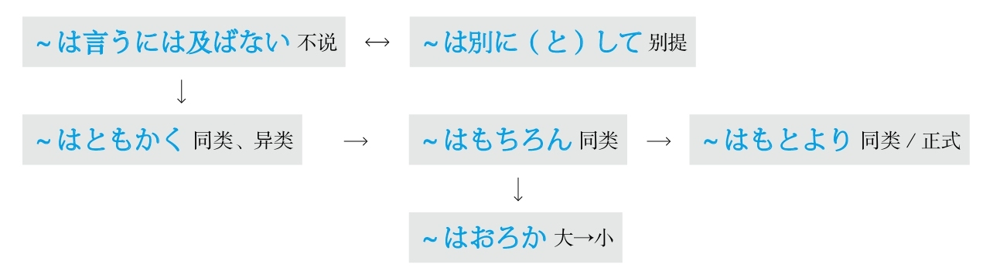
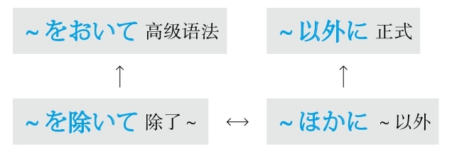
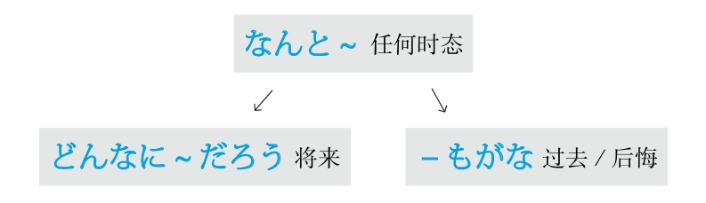
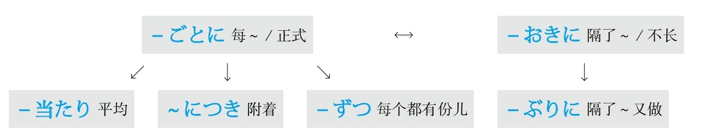
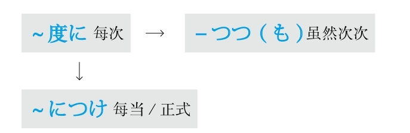
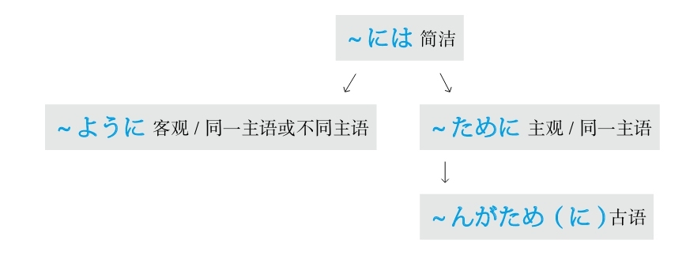
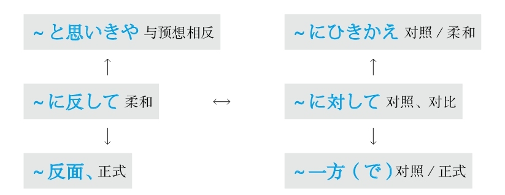
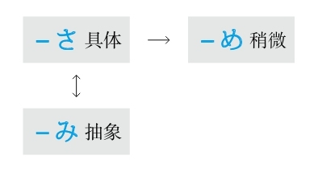
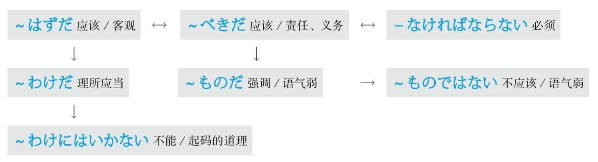
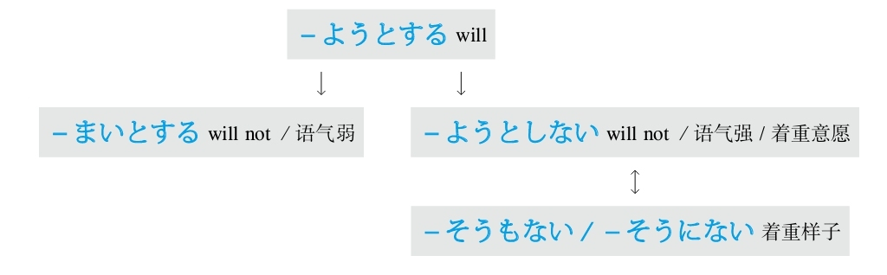

# 前言 #1_0_0_0_0
* [[ 日语语法新思维（修订版）_Detail_0.md | Detail #1_0_0_0_0 ]]

# 引言 #2_0_0_0_0
* [[ 日语语法新思维（修订版）_Detail_0.md | Detail #2_0_0_0_0 ]]

# 第1章 基础知识 #3_0_0_0_0
* [[ 日语语法新思维（修订版）_Detail_0.md | Detail #3_0_0_0_0 ]]

## 第1节 语法基本概念 #3_1_0_0_0
* [[ 日语语法新思维（修订版）_Detail_0.md | Detail #3_1_0_0_0 ]]

* 体言即名词和代词。日语中代词又被称为代名词，也是名词的一种。
* 用言即谓语词，包括动词、形容词和助动词。虽然形容动词也可以当作谓语使用，但是它不具备谓语所具有的时态和其他变形，需要借助于助动词「だ」进行变化，因此形容动词只能作为词干使用。
* 助词分为两大类：接在名词后面的叫“格助词”，接在谓语词后面的叫“接续助词”。

* **五段动词：** 随着表示时态和形式的动词后缀的变化，前面的附加部分在あ、い、う、え、お五个段里发生变化的动词叫做五段动词。

* **一段动词：** 虽然表示时态和形式的动词后缀发生了变化，但是前面的附加部分还是保持同一个形式不发生变化的动词叫做一段动词。
* **特殊动词：** 随着表示时态和形式的动词后缀的变化，词干的发音发生变化的动词叫做特殊动词。此类动词只有两个：表示“做”的「する」被称为サ变动词，表示“来”的「来る」被称为カ变动词。
* **意思：** 自动词表示动作是自己的，无法影响其他事物；他动词表示动作对其他的事物产生了影响。
* **助词：** が（小主语）+自动词、形容词、形容动词、可能形、被动形を（把）+他动词、使役形
* **重点：** 自动词表示动作的结果或状态；他动词表示动作本身。例如：“做好”，如果强调“做”就用他动词，如果强调“好”就用自动词。
* **注意：** 必须通过查字典才能知道一个动词是自动词还是他动词。
* **一般现在时：** 使用动词的辞书形（基本形），例：「する」。表示一般性动作和将来的动作。
* **现在进行时：** 使用动词的て形+いる，例：「している」。表示现在正在做的动作和在一段时间内持续的动作或状态。
* **た形：** 使用动词的た形，例：「した」。表示动作完了的“了”、过去式的“了”以及作为形容词修饰名词的“的”（相当于英语中动词加ed变为过去分词来修饰名词）。た形和て形的变形规律相同。

* **使役形：** 表示“让、使”等。他动词也相当于使役形的一种。
* **被动形：** 表示“1.单纯被动；2.被动的心情；3.主谓统一；4.敬语中的尊他语”。
* **命令形：** 意思相当于「―てください」，表示“1.用于间接引用；2.用于文章中的引号中，且语气正式”。
* **可能形：** 表示“1.条件（能～）；2.技能（会～）；3.中文中的补语（例：出不去，走得动）。而「～ことができる」语气正式且郑重”。
* **意志形：** 后面加上「と」的意志形表示强调“想要做某事的will”；不加「と」的意志形表示提建议，意思是“让我们做某事吧”。例如：**「しようと～」（想要做～）** ，通常想要做某事的意志形为**「しようとする」；「しよう」（让我们做～）** 是**「しましょう」的简体。**
* **使役被动形：** 表示“1.不情愿地做；2.不是自发地做；3.无意中做”。
* **意思：** 谓语的中顿被称为连用形，即连接用言（谓语词）的形式。当数个谓语词连接在一起且不分大小只是并列时，放在前面的谓语词需要变成中顿的形式。
* **分类：** 连用形（也叫古语连用形，语气正式）和て形（也叫现代语连用形，语气柔和）。
* **重点：** て形和た形的变形规律相同。

## 第2节 本书的分类 #3_2_0_0_0
* [[ 日语语法新思维（修订版）_Detail_0.md | Detail #3_2_0_0_0 ]]

## 第3节 修饰语 #3_3_0_0_0
* [[ 日语语法新思维（修订版）_Detail_0.md | Detail #3_3_0_0_0 ]]

* **定语：** 修饰名词的部分，包括名词、形容动词和谓语词（动词、形容词）。中文里的定语后面接的是“的”。
* **状语：** 修饰谓语词（动词、形容词、助动词）的部分，包括副词。中文里的状语后面接的是“地”。

## 第4节 敬语 #3_4_0_0_0
* [[ 日语语法新思维（修订版）_Detail_0.md | Detail #3_4_0_0_0 ]]

* **分类：** 尊他语（与他人有关的人、物、动作）、自谦语（与自己有关的人、物、动作）、礼貌语（寒暄语）。
* **重点：**
* **一般变形规律：** **尊他为「お～になる」；自谦为「お～する」。** 「～」部分是动词的连用形。
* **特殊动词的变化如下** 。

# 第2章 助词 #4_0_0_0_0
* [[ 日语语法新思维（修订版）_Detail_0.md | Detail #4_0_0_0_0 ]]

## ～は #4_1_0_0_0
* [[ 日语语法新思维（修订版）_Detail_0.md | Detail #4_1_0_0_0 ]]

## ～が #4_2_0_0_0
* [[ 日语语法新思维（修订版）_Detail_0.md | Detail #4_2_0_0_0 ]]

## ～を #4_3_0_0_0
* [[ 日语语法新思维（修订版）_Detail_0.md | Detail #4_3_0_0_0 ]]

## ～の #4_4_0_0_0
* [[ 日语语法新思维（修订版）_Detail_0.md | Detail #4_4_0_0_0 ]]

## ～へ #4_5_0_0_0
* [[ 日语语法新思维（修订版）_Detail_0.md | Detail #4_5_0_0_0 ]]

## ～に #4_6_0_0_0
* [[ 日语语法新思维（修订版）_Detail_0.md | Detail #4_6_0_0_0 ]]

## ～で #4_7_0_0_0
* [[ 日语语法新思维（修订版）_Detail_0.md | Detail #4_7_0_0_0 ]]

## ～も #4_8_0_0_0
* [[ 日语语法新思维（修订版）_Detail_0.md | Detail #4_8_0_0_0 ]]

## ～と #4_9_0_0_0
* [[ 日语语法新思维（修订版）_Detail_0.md | Detail #4_9_0_0_0 ]]

## ～か #4_10_0_0_0
* [[ 日语语法新思维（修订版）_Detail_0.md | Detail #4_10_0_0_0 ]]

## ～や #4_11_0_0_0
* [[ 日语语法新思维（修订版）_Detail_0.md | Detail #4_11_0_0_0 ]]

## ～し #4_12_0_0_0
* [[ 日语语法新思维（修订版）_Detail_0.md | Detail #4_12_0_0_0 ]]

## ～から #4_13_0_0_0
* [[ 日语语法新思维（修订版）_Detail_0.md | Detail #4_13_0_0_0 ]]

## ～まで #4_14_0_0_0
* [[ 日语语法新思维（修订版）_Detail_0.md | Detail #4_14_0_0_0 ]]

## ～より #4_15_0_0_0
* [[ 日语语法新思维（修订版）_Detail_0.md | Detail #4_15_0_0_0 ]]

## ～くらい/～ぐらい #4_16_0_0_0
* [[ 日语语法新思维（修订版）_Detail_0.md | Detail #4_16_0_0_0 ]]

## ～ころ/～ごろ #4_17_0_0_0
* [[ 日语语法新思维（修订版）_Detail_0.md | Detail #4_17_0_0_0 ]]

## ～ほど #4_18_0_0_0
* [[ 日语语法新思维（修订版）_Detail_0.md | Detail #4_18_0_0_0 ]]

## ～だけ #4_19_0_0_0
* [[ 日语语法新思维（修订版）_Detail_0.md | Detail #4_19_0_0_0 ]]

## ～のみ #4_20_0_0_0
* [[ 日语语法新思维（修订版）_Detail_0.md | Detail #4_20_0_0_0 ]]

## ～しか #4_21_0_0_0
* [[ 日语语法新思维（修订版）_Detail_0.md | Detail #4_21_0_0_0 ]]

## ～ばかり #4_22_0_0_0
* [[ 日语语法新思维（修订版）_Detail_0.md | Detail #4_22_0_0_0 ]]

## ～すら #4_23_0_0_0
* [[ 日语语法新思维（修订版）_Detail_0.md | Detail #4_23_0_0_0 ]]

## ～さえ #4_24_0_0_0
* [[ 日语语法新思维（修订版）_Detail_0.md | Detail #4_24_0_0_0 ]]

## ～こそ #4_25_0_0_0
* [[ 日语语法新思维（修订版）_Detail_0.md | Detail #4_25_0_0_0 ]]

## ～から #4_26_0_0_0
* [[ 日语语法新思维（修订版）_Detail_0.md | Detail #4_26_0_0_0 ]]

## ～ので #4_27_0_0_0
* [[ 日语语法新思维（修订版）_Detail_0.md | Detail #4_27_0_0_0 ]]

## ～が #4_28_0_0_0
* [[ 日语语法新思维（修订版）_Detail_0.md | Detail #4_28_0_0_0 ]]

## ～のに #4_29_0_0_0
* [[ 日语语法新思维（修订版）_Detail_0.md | Detail #4_29_0_0_0 ]]

## －ても #4_30_0_0_0
* [[ 日语语法新思维（修订版）_Detail_0.md | Detail #4_30_0_0_0 ]]

## ～でも #4_31_0_0_0
* [[ 日语语法新思维（修订版）_Detail_0.md | Detail #4_31_0_0_0 ]]

## ～とも #4_32_0_0_0
* [[ 日语语法新思维（修订版）_Detail_0.md | Detail #4_32_0_0_0 ]]

## ～ども #4_33_0_0_0
* [[ 日语语法新思维（修订版）_Detail_0.md | Detail #4_33_0_0_0 ]]

## ～と #4_34_0_0_0
* [[ 日语语法新思维（修订版）_Detail_0.md | Detail #4_34_0_0_0 ]]

## －ば #4_35_0_0_0
* [[ 日语语法新思维（修订版）_Detail_0.md | Detail #4_35_0_0_0 ]]

## －たら #4_36_0_0_0
* [[ 日语语法新思维（修订版）_Detail_0.md | Detail #4_36_0_0_0 ]]

## ～なら #4_37_0_0_0
* [[ 日语语法新思维（修订版）_Detail_0.md | Detail #4_37_0_0_0 ]]

## －ずつ #4_38_0_0_0
* [[ 日语语法新思维（修订版）_Detail_0.md | Detail #4_38_0_0_0 ]]

## －つつ #4_39_0_0_0
* [[ 日语语法新思维（修订版）_Detail_0.md | Detail #4_39_0_0_0 ]]

## ～のです #4_40_0_0_0
* [[ 日语语法新思维（修订版）_Detail_0.md | Detail #4_40_0_0_0 ]]

# 第3章 具体语法 #5_0_0_0_0
* [[ 日语语法新思维（修订版）_Detail_0.md | Detail #5_0_0_0_0 ]]

## B #5_1_0_0_0
* [[ 日语语法新思维（修订版）_Detail_0.md | Detail #5_1_0_0_0 ]]

### 本身 #5_1_1_0_0
* [[ 日语语法新思维（修订版）_Detail_0.md | Detail #5_1_1_0_0 ]]

#### ―自体 #5_1_1_1_0
* [[ 日语语法新思维（修订版）_Detail_0.md | Detail #5_1_1_1_0 ]]

#### ―自身 #5_1_1_2_0
* [[ 日语语法新思维（修订版）_Detail_0.md | Detail #5_1_1_2_0 ]]

##### ―そのもの #5_1_1_2_1
* [[ 日语语法新思维（修订版）_Detail_0.md | Detail #5_1_1_2_1 ]]

### 比较 #5_1_2_0_0
* [[ 日语语法新思维（修订版）_Detail_0.md | Detail #5_1_2_0_0 ]]

#### ～より #5_1_2_1_0
* [[ 日语语法新思维（修订版）_Detail_0.md | Detail #5_1_2_1_0 ]]

#### ～よりも #5_1_2_2_0
* [[ 日语语法新思维（修订版）_Detail_0.md | Detail #5_1_2_2_0 ]]

#### ～よりは #5_1_2_3_0
* [[ 日语语法新思维（修订版）_Detail_0.md | Detail #5_1_2_3_0 ]]

#### ～とは比べ物にはならない #5_1_2_4_0
* [[ 日语语法新思维（修订版）_Detail_0.md | Detail #5_1_2_4_0 ]]

#### ～には適わない #5_1_2_5_0
* [[ 日语语法新思维（修订版）_Detail_0.md | Detail #5_1_2_5_0 ]]

#### ～には匹敵できない #5_1_2_6_0
* [[ 日语语法新思维（修订版）_Detail_0.md | Detail #5_1_2_6_0 ]]

#### ～には及ばない #5_1_2_7_0
* [[ 日语语法新思维（修订版）_Detail_0.md | Detail #5_1_2_7_0 ]]

#### ～にこしたことはない #5_1_2_8_0
* [[ 日语语法新思维（修订版）_Detail_0.md | Detail #5_1_2_8_0 ]]

#### ～にしくはない #5_1_2_9_0
* [[ 日语语法新思维（修订版）_Detail_0.md | Detail #5_1_2_9_0 ]]

#### ～にもまして #5_1_2_10_0
* [[ 日语语法新思维（修订版）_Detail_0.md | Detail #5_1_2_10_0 ]]

#### ～よりましだ #5_1_2_11_0
* [[ 日语语法新思维（修订版）_Detail_0.md | Detail #5_1_2_11_0 ]]

### 并不是 #5_1_3_0_0
* [[ 日语语法新思维（修订版）_Detail_0.md | Detail #5_1_3_0_0 ]]

#### ～わけではない #5_1_3_1_0
* [[ 日语语法新思维（修订版）_Detail_0.md | Detail #5_1_3_1_0 ]]

#### *「～わけがない」请参照“可能性”。 #5_1_3_2_0
* [[ 日语语法新思维（修订版）_Detail_0.md | Detail #5_1_3_2_0 ]]

### 并列 #5_1_4_0_0
* [[ 日语语法新思维（修订版）_Detail_0.md | Detail #5_1_4_0_0 ]]

#### ～し #5_1_4_1_0
* [[ 日语语法新思维（修订版）_Detail_0.md | Detail #5_1_4_1_0 ]]

#### －ば #5_1_4_2_0
* [[ 日语语法新思维（修订版）_Detail_0.md | Detail #5_1_4_2_0 ]]

### 不 #5_1_5_0_0
* [[ 日语语法新思维（修订版）_Detail_0.md | Detail #5_1_5_0_0 ]]

#### －ぬ #5_1_5_1_0
* [[ 日语语法新思维（修订版）_Detail_0.md | Detail #5_1_5_1_0 ]]

#### －ず、 #5_1_5_2_0
* [[ 日语语法新思维（修订版）_Detail_1.md | Detail #5_1_5_2_0 ]]

#### －ずに #5_1_5_3_0
* [[ 日语语法新思维（修订版）_Detail_1.md | Detail #5_1_5_3_0 ]]

#### －まい #5_1_5_4_0
* [[ 日语语法新思维（修订版）_Detail_1.md | Detail #5_1_5_4_0 ]]

### 不～不行 #5_1_6_0_0
* [[ 日语语法新思维（修订版）_Detail_1.md | Detail #5_1_6_0_0 ]]

#### －ずにはいられない #5_1_6_1_0
* [[ 日语语法新思维（修订版）_Detail_1.md | Detail #5_1_6_1_0 ]]

#### －ずにはすまない #5_1_6_2_0
* [[ 日语语法新思维（修订版）_Detail_1.md | Detail #5_1_6_2_0 ]]

#### －ずにはおかない #5_1_6_3_0
* [[ 日语语法新思维（修订版）_Detail_1.md | Detail #5_1_6_3_0 ]]

### 不可以 #5_1_7_0_0
* [[ 日语语法新思维（修订版）_Detail_1.md | Detail #5_1_7_0_0 ]]

#### －てはいけない #5_1_7_1_0
* [[ 日语语法新思维（修订版）_Detail_1.md | Detail #5_1_7_1_0 ]]

#### －てはならない #5_1_7_2_0
* [[ 日语语法新思维（修订版）_Detail_1.md | Detail #5_1_7_2_0 ]]

#### ～べからざる #5_1_7_3_0
* [[ 日语语法新思维（修订版）_Detail_1.md | Detail #5_1_7_3_0 ]]

#### ～べからず #5_1_7_4_0
* [[ 日语语法新思维（修订版）_Detail_1.md | Detail #5_1_7_4_0 ]]

#### ～まじき #5_1_7_5_0
* [[ 日语语法新思维（修订版）_Detail_1.md | Detail #5_1_7_5_0 ]]

### 不仅～而且 #5_1_8_0_0
* [[ 日语语法新思维（修订版）_Detail_1.md | Detail #5_1_8_0_0 ]]

#### ～だけでなく #5_1_8_1_0
* [[ 日语语法新思维（修订版）_Detail_1.md | Detail #5_1_8_1_0 ]]

#### ～のみならず #5_1_8_2_0
* [[ 日语语法新思维（修订版）_Detail_1.md | Detail #5_1_8_2_0 ]]

#### ～ばかりか #5_1_8_3_0
* [[ 日语语法新思维（修订版）_Detail_1.md | Detail #5_1_8_3_0 ]]

#### ～もさることながら #5_1_8_4_0
* [[ 日语语法新思维（修订版）_Detail_1.md | Detail #5_1_8_4_0 ]]

#### ～上に #5_1_8_5_0
* [[ 日语语法新思维（修订版）_Detail_1.md | Detail #5_1_8_5_0 ]]

#### ～に限らず #5_1_8_6_0
* [[ 日语语法新思维（修订版）_Detail_1.md | Detail #5_1_8_6_0 ]]

#### ～にとどまらず #5_1_8_7_0
* [[ 日语语法新思维（修订版）_Detail_1.md | Detail #5_1_8_7_0 ]]

### 不管，尽管 #5_1_9_0_0
* [[ 日语语法新思维（修订版）_Detail_1.md | Detail #5_1_9_0_0 ]]

#### ～いかんにかかわらず #5_1_9_1_0
* [[ 日语语法新思维（修订版）_Detail_1.md | Detail #5_1_9_1_0 ]]

#### ～いかんによらず #5_1_9_2_0
* [[ 日语语法新思维（修订版）_Detail_1.md | Detail #5_1_9_2_0 ]]

#### ～いかんを問わず #5_1_9_3_0
* [[ 日语语法新思维（修订版）_Detail_1.md | Detail #5_1_9_3_0 ]]

#### いくら（どんなに/いかに）－ても（でも/たところで/であれ）たとえ－ても（でも/たところで/であれ） #5_1_9_4_0
* [[ 日语语法新思维（修订版）_Detail_1.md | Detail #5_1_9_4_0 ]]

#### いくら（どんなに/いかに）－ても（でも/たところで/であれ） #5_1_9_5_0
* [[ 日语语法新思维（修订版）_Detail_1.md | Detail #5_1_9_5_0 ]]

#### たとえ－ても（でも/たところで/であれ） #5_1_9_6_0
* [[ 日语语法新思维（修订版）_Detail_1.md | Detail #5_1_9_6_0 ]]

#### いくら～からといって #5_1_9_7_0
* [[ 日语语法新思维（修订版）_Detail_1.md | Detail #5_1_9_7_0 ]]

#### ～にしたって #5_1_9_8_0
* [[ 日语语法新思维（修订版）_Detail_1.md | Detail #5_1_9_8_0 ]]

### 不管是～还是～ #5_1_10_0_0
* [[ 日语语法新思维（修订版）_Detail_1.md | Detail #5_1_10_0_0 ]]

#### －かれ－かれ #5_1_10_1_0
* [[ 日语语法新思维（修订版）_Detail_1.md | Detail #5_1_10_1_0 ]]

#### －かろうと－なかろうと #5_1_10_2_0
* [[ 日语语法新思维（修订版）_Detail_1.md | Detail #5_1_10_2_0 ]]

#### ～だろうが～だろうが/～であろうが～であろうが #5_1_10_3_0
* [[ 日语语法新思维（修订版）_Detail_1.md | Detail #5_1_10_3_0 ]]

#### －ようが－ようが/－ようと－ようと #5_1_10_4_0
* [[ 日语语法新思维（修订版）_Detail_1.md | Detail #5_1_10_4_0 ]]

#### －ようと－まいと #5_1_10_5_0
* [[ 日语语法新思维（修订版）_Detail_1.md | Detail #5_1_10_5_0 ]]

#### ～にしても～にしても #5_1_10_6_0
* [[ 日语语法新思维（修订版）_Detail_1.md | Detail #5_1_10_6_0 ]]

#### ～にしろ～にしろ/～にせよ～にせよ #5_1_10_7_0
* [[ 日语语法新思维（修订版）_Detail_1.md | Detail #5_1_10_7_0 ]]

#### ～につけ～につけ #5_1_10_8_0
* [[ 日语语法新思维（修订版）_Detail_1.md | Detail #5_1_10_8_0 ]]

#### ～といい～といい #5_1_10_9_0
* [[ 日语语法新思维（修订版）_Detail_1.md | Detail #5_1_10_9_0 ]]

### 不得不 #5_1_11_0_0
* [[ 日语语法新思维（修订版）_Detail_1.md | Detail #5_1_11_0_0 ]]

#### －ざるをえない #5_1_11_1_0
* [[ 日语语法新思维（修订版）_Detail_1.md | Detail #5_1_11_1_0 ]]

#### やむを得ず～ #5_1_11_2_0
* [[ 日语语法新思维（修订版）_Detail_1.md | Detail #5_1_11_2_0 ]]

#### ～を余儀なくされる/～を余儀なくさせられる #5_1_11_3_0
* [[ 日语语法新思维（修订版）_Detail_1.md | Detail #5_1_11_3_0 ]]

#### ～を余儀なくさせる #5_1_11_4_0
* [[ 日语语法新思维（修订版）_Detail_1.md | Detail #5_1_11_4_0 ]]

### 不顾，顾忌到 #5_1_12_0_0
* [[ 日语语法新思维（修订版）_Detail_1.md | Detail #5_1_12_0_0 ]]

#### ～てまえ #5_1_12_1_0
* [[ 日语语法新思维（修订版）_Detail_1.md | Detail #5_1_12_1_0 ]]

#### ～をおして #5_1_12_2_0
* [[ 日语语法新思维（修订版）_Detail_1.md | Detail #5_1_12_2_0 ]]

#### ～を顧みず #5_1_12_3_0
* [[ 日语语法新思维（修订版）_Detail_1.md | Detail #5_1_12_3_0 ]]

#### ～を問わず #5_1_12_4_0
* [[ 日语语法新思维（修订版）_Detail_1.md | Detail #5_1_12_4_0 ]]

#### ～をものともせずに #5_1_12_5_0
* [[ 日语语法新思维（修订版）_Detail_1.md | Detail #5_1_12_5_0 ]]

#### ～をよそに #5_1_12_6_0
* [[ 日语语法新思维（修订版）_Detail_1.md | Detail #5_1_12_6_0 ]]

#### ～にもかかわらず #5_1_12_7_0
* [[ 日语语法新思维（修订版）_Detail_1.md | Detail #5_1_12_7_0 ]]

### 不管怎么说 #5_1_13_0_0
* [[ 日语语法新思维（修订版）_Detail_1.md | Detail #5_1_13_0_0 ]]

#### なにしろ～から #5_1_13_1_0
* [[ 日语语法新思维（修订版）_Detail_1.md | Detail #5_1_13_1_0 ]]

#### さすがに～だけあって #5_1_13_2_0
* [[ 日语语法新思维（修订版）_Detail_1.md | Detail #5_1_13_2_0 ]]

### 不停地 #5_1_14_0_0
* [[ 日语语法新思维（修订版）_Detail_1.md | Detail #5_1_14_0_0 ]]

#### －てやまない #5_1_14_1_0
* [[ 日语语法新思维（修订版）_Detail_1.md | Detail #5_1_14_1_0 ]]

### 不由得 #5_1_15_0_0
* [[ 日语语法新思维（修订版）_Detail_1.md | Detail #5_1_15_0_0 ]]

#### 思わず－てしまう #5_1_15_1_0
* [[ 日语语法新思维（修订版）_Detail_1.md | Detail #5_1_15_1_0 ]]

#### つい－てしまう #5_1_15_2_0
* [[ 日语语法新思维（修订版）_Detail_1.md | Detail #5_1_15_2_0 ]]

#### ～を禁じえない #5_1_15_3_0
* [[ 日语语法新思维（修订版）_Detail_1.md | Detail #5_1_15_3_0 ]]

### 不用说 #5_1_16_0_0
* [[ 日语语法新思维（修订版）_Detail_1.md | Detail #5_1_16_0_0 ]]

#### ～は言うには及ばない #5_1_16_1_0
* [[ 日语语法新思维（修订版）_Detail_1.md | Detail #5_1_16_1_0 ]]

#### ～はおろか #5_1_16_2_0
* [[ 日语语法新思维（修订版）_Detail_1.md | Detail #5_1_16_2_0 ]]

#### ～はともかく #5_1_16_3_0
* [[ 日语语法新思维（修订版）_Detail_1.md | Detail #5_1_16_3_0 ]]

#### ～は別に（と）して #5_1_16_4_0
* [[ 日语语法新思维（修订版）_Detail_1.md | Detail #5_1_16_4_0 ]]

#### ～はもちろん #5_1_16_5_0
* [[ 日语语法新思维（修订版）_Detail_1.md | Detail #5_1_16_5_0 ]]

#### ～はもとより #5_1_16_6_0
* [[ 日语语法新思维（修订版）_Detail_1.md | Detail #5_1_16_6_0 ]]

## C #5_2_0_0_0
* [[ 日语语法新思维（修订版）_Detail_1.md | Detail #5_2_0_0_0 ]]

### 差点儿就 #5_2_1_0_0
* [[ 日语语法新思维（修订版）_Detail_1.md | Detail #5_2_1_0_0 ]]

#### もう少しで－そうになる #5_2_1_1_0
* [[ 日语语法新思维（修订版）_Detail_1.md | Detail #5_2_1_1_0 ]]

#### もう少しで～ところだった #5_2_1_2_0
* [[ 日语语法新思维（修订版）_Detail_1.md | Detail #5_2_1_2_0 ]]

### 程度，数量 #5_2_2_0_0
* [[ 日语语法新思维（修订版）_Detail_1.md | Detail #5_2_2_0_0 ]]

#### ～も #5_2_2_1_0
* [[ 日语语法新思维（修订版）_Detail_1.md | Detail #5_2_2_1_0 ]]

#### ～からある/～からの #5_2_2_2_0
* [[ 日语语法新思维（修订版）_Detail_1.md | Detail #5_2_2_2_0 ]]

#### －切る/－きれない #5_2_2_3_0
* [[ 日语语法新思维（修订版）_Detail_1.md | Detail #5_2_2_3_0 ]]

#### ～だけ #5_2_2_4_0
* [[ 日语语法新思维（修订版）_Detail_1.md | Detail #5_2_2_4_0 ]]

#### ～たりとも #5_2_2_5_0
* [[ 日语语法新思维（修订版）_Detail_1.md | Detail #5_2_2_5_0 ]]

#### ～なりとも #5_2_2_6_0
* [[ 日语语法新思维（修订版）_Detail_1.md | Detail #5_2_2_6_0 ]]

#### ～といったところだ #5_2_2_7_0
* [[ 日语语法新思维（修订版）_Detail_2.md | Detail #5_2_2_7_0 ]]

### 程度 #5_2_3_0_0
* [[ 日语语法新思维（修订版）_Detail_2.md | Detail #5_2_3_0_0 ]]

#### ～くらい/～ぐらい #5_2_3_1_0
* [[ 日语语法新思维（修订版）_Detail_2.md | Detail #5_2_3_1_0 ]]

#### ～ころ/～ごろ #5_2_3_2_0
* [[ 日语语法新思维（修订版）_Detail_2.md | Detail #5_2_3_2_0 ]]

#### ～ほど #5_2_3_3_0
* [[ 日语语法新思维（修订版）_Detail_2.md | Detail #5_2_3_3_0 ]]

### 从 #5_2_4_0_0
* [[ 日语语法新思维（修订版）_Detail_2.md | Detail #5_2_4_0_0 ]]

#### ～から #5_2_4_1_0
* [[ 日语语法新思维（修订版）_Detail_2.md | Detail #5_2_4_1_0 ]]

#### ～からいうと/～からいえば #5_2_4_2_0
* [[ 日语语法新思维（修订版）_Detail_2.md | Detail #5_2_4_2_0 ]]

#### ～からして #5_2_4_3_0
* [[ 日语语法新思维（修订版）_Detail_2.md | Detail #5_2_4_3_0 ]]

#### ～から～まで #5_2_4_4_0
* [[ 日语语法新思维（修订版）_Detail_2.md | Detail #5_2_4_4_0 ]]

#### ～から～にいたるまで #5_2_4_5_0
* [[ 日语语法新思维（修订版）_Detail_2.md | Detail #5_2_4_5_0 ]]

#### ～から～にかけて #5_2_4_6_0
* [[ 日语语法新思维（修订版）_Detail_2.md | Detail #5_2_4_6_0 ]]

#### ～より #5_2_4_7_0
* [[ 日语语法新思维（修订版）_Detail_2.md | Detail #5_2_4_7_0 ]]

### 充满 #5_2_5_0_0
* [[ 日语语法新思维（修订版）_Detail_2.md | Detail #5_2_5_0_0 ]]

#### ～をこめて #5_2_5_1_0
* [[ 日语语法新思维（修订版）_Detail_2.md | Detail #5_2_5_1_0 ]]

#### ～がこもった #5_2_5_2_0
* [[ 日语语法新思维（修订版）_Detail_2.md | Detail #5_2_5_2_0 ]]

### 除了～以外 #5_2_6_0_0
* [[ 日语语法新思维（修订版）_Detail_2.md | Detail #5_2_6_0_0 ]]

#### ～ほかに #5_2_6_1_0
* [[ 日语语法新思维（修订版）_Detail_2.md | Detail #5_2_6_1_0 ]]

#### ～以外に #5_2_6_2_0
* [[ 日语语法新思维（修订版）_Detail_2.md | Detail #5_2_6_2_0 ]]

#### ～を除いて #5_2_6_3_0
* [[ 日语语法新思维（修订版）_Detail_2.md | Detail #5_2_6_3_0 ]]

#### ～をおいて #5_2_6_4_0
* [[ 日语语法新思维（修订版）_Detail_2.md | Detail #5_2_6_4_0 ]]

## D #5_3_0_0_0
* [[ 日语语法新思维（修订版）_Detail_2.md | Detail #5_3_0_0_0 ]]

### 代替 #5_3_1_0_0
* [[ 日语语法新思维（修订版）_Detail_2.md | Detail #5_3_1_0_0 ]]

#### ～かわりに #5_3_1_1_0
* [[ 日语语法新思维（修订版）_Detail_2.md | Detail #5_3_1_1_0 ]]

#### ～にかわって #5_3_1_2_0
* [[ 日语语法新思维（修订版）_Detail_2.md | Detail #5_3_1_2_0 ]]

### 当成 #5_3_2_0_0
* [[ 日语语法新思维（修订版）_Detail_2.md | Detail #5_3_2_0_0 ]]

#### ～を～とする/～を～にする #5_3_2_1_0
* [[ 日语语法新思维（修订版）_Detail_2.md | Detail #5_3_2_1_0 ]]

### 到～地步 #5_3_3_0_0
* [[ 日语语法新思维（修订版）_Detail_2.md | Detail #5_3_3_0_0 ]]

#### ～まで #5_3_3_1_0
* [[ 日语语法新思维（修订版）_Detail_2.md | Detail #5_3_3_1_0 ]]

#### －ないまでも #5_3_3_2_0
* [[ 日语语法新思维（修订版）_Detail_2.md | Detail #5_3_3_2_0 ]]

#### ～に至って #5_3_3_3_0
* [[ 日语语法新思维（修订版）_Detail_2.md | Detail #5_3_3_3_0 ]]

### 定义 #5_3_4_0_0
* [[ 日语语法新思维（修订版）_Detail_2.md | Detail #5_3_4_0_0 ]]

#### ～とは #5_3_4_1_0
* [[ 日语语法新思维（修订版）_Detail_2.md | Detail #5_3_4_1_0 ]]

### 动作的终结 #5_3_5_0_0
* [[ 日语语法新思维（修订版）_Detail_2.md | Detail #5_3_5_0_0 ]]

#### －たきり #5_3_5_1_0
* [[ 日语语法新思维（修订版）_Detail_2.md | Detail #5_3_5_1_0 ]]

### 对比 #5_3_6_0_0
* [[ 日语语法新思维（修订版）_Detail_2.md | Detail #5_3_6_0_0 ]]

#### ～は #5_3_6_1_0
* [[ 日语语法新思维（修订版）_Detail_2.md | Detail #5_3_6_1_0 ]]

#### ～一方（で） #5_3_6_2_0
* [[ 日语语法新思维（修订版）_Detail_2.md | Detail #5_3_6_2_0 ]]

#### ～に対して #5_3_6_3_0
* [[ 日语语法新思维（修订版）_Detail_2.md | Detail #5_3_6_3_0 ]]

#### ～にひきかえ #5_3_6_4_0
* [[ 日语语法新思维（修订版）_Detail_2.md | Detail #5_3_6_4_0 ]]

## F #5_4_0_0_0
* [[ 日语语法新思维（修订版）_Detail_2.md | Detail #5_4_0_0_0 ]]

### 放置不管 #5_4_1_0_0
* [[ 日语语法新思维（修订版）_Detail_2.md | Detail #5_4_1_0_0 ]]

#### －っぱなし #5_4_1_1_0
* [[ 日语语法新思维（修订版）_Detail_2.md | Detail #5_4_1_1_0 ]]

### 非常，极其 #5_4_2_0_0
* [[ 日语语法新思维（修订版）_Detail_2.md | Detail #5_4_2_0_0 ]]

#### ～あまり #5_4_2_1_0
* [[ 日语语法新思维（修订版）_Detail_2.md | Detail #5_4_2_1_0 ]]

#### ～の至りで #5_4_2_2_0
* [[ 日语语法新思维（修订版）_Detail_2.md | Detail #5_4_2_2_0 ]]

#### ～限りだ #5_4_2_3_0
* [[ 日语语法新思维（修订版）_Detail_2.md | Detail #5_4_2_3_0 ]]

#### ～のきわみ #5_4_2_4_0
* [[ 日语语法新思维（修订版）_Detail_2.md | Detail #5_4_2_4_0 ]]

#### ～きわまりない #5_4_2_5_0
* [[ 日语语法新思维（修订版）_Detail_2.md | Detail #5_4_2_5_0 ]]

#### ～きわまる #5_4_2_6_0
* [[ 日语语法新思维（修订版）_Detail_2.md | Detail #5_4_2_6_0 ]]

#### ～といったらありはしない #5_4_2_7_0
* [[ 日语语法新思维（修订版）_Detail_2.md | Detail #5_4_2_7_0 ]]

### 反复做 #5_4_3_0_0
* [[ 日语语法新思维（修订版）_Detail_2.md | Detail #5_4_3_0_0 ]]

#### －ては、－ては #5_4_3_1_0
* [[ 日语语法新思维（修订版）_Detail_2.md | Detail #5_4_3_1_0 ]]

### 方法 #5_4_4_0_0
* [[ 日语语法新思维（修订版）_Detail_2.md | Detail #5_4_4_0_0 ]]

#### －かた #5_4_4_1_0
* [[ 日语语法新思维（修订版）_Detail_2.md | Detail #5_4_4_1_0 ]]

#### －よう #5_4_4_2_0
* [[ 日语语法新思维（修订版）_Detail_2.md | Detail #5_4_4_2_0 ]]

#### ～を以て #5_4_4_3_0
* [[ 日语语法新思维（修订版）_Detail_2.md | Detail #5_4_4_3_0 ]]

### 方面 #5_4_5_0_0
* [[ 日语语法新思维（修订版）_Detail_2.md | Detail #5_4_5_0_0 ]]

#### ～上で #5_4_5_1_0
* [[ 日语语法新思维（修订版）_Detail_2.md | Detail #5_4_5_1_0 ]]

#### ～点で #5_4_5_2_0
* [[ 日语语法新思维（修订版）_Detail_2.md | Detail #5_4_5_2_0 ]]

#### ～において #5_4_5_3_0
* [[ 日语语法新思维（修订版）_Detail_2.md | Detail #5_4_5_3_0 ]]

#### ～にかけては #5_4_5_4_0
* [[ 日语语法新思维（修订版）_Detail_2.md | Detail #5_4_5_4_0 ]]

### 符合 #5_4_6_0_0
* [[ 日语语法新思维（修订版）_Detail_2.md | Detail #5_4_6_0_0 ]]

#### ～だけ #5_4_6_1_0
* [[ 日语语法新思维（修订版）_Detail_2.md | Detail #5_4_6_1_0 ]]

#### ～だけあって #5_4_6_2_0
* [[ 日语语法新思维（修订版）_Detail_2.md | Detail #5_4_6_2_0 ]]

#### －たる #5_4_6_3_0
* [[ 日语语法新思维（修订版）_Detail_2.md | Detail #5_4_6_3_0 ]]

#### －なり #5_4_6_4_0
* [[ 日语语法新思维（修订版）_Detail_2.md | Detail #5_4_6_4_0 ]]

## G #5_5_0_0_0
* [[ 日语语法新思维（修订版）_Detail_2.md | Detail #5_5_0_0_0 ]]

### 感叹 #5_5_1_0_0
* [[ 日语语法新思维（修订版）_Detail_2.md | Detail #5_5_1_0_0 ]]

#### なんと～ #5_5_1_1_0
* [[ 日语语法新思维（修订版）_Detail_2.md | Detail #5_5_1_1_0 ]]

#### どんなに～だろう #5_5_1_2_0
* [[ 日语语法新思维（修订版）_Detail_2.md | Detail #5_5_1_2_0 ]]

#### －もがな #5_5_1_3_0
* [[ 日语语法新思维（修订版）_Detail_2.md | Detail #5_5_1_3_0 ]]

### 刚～ #5_5_2_0_0
* [[ 日语语法新思维（修订版）_Detail_2.md | Detail #5_5_2_0_0 ]]

#### －かける #5_5_2_1_0
* [[ 日语语法新思维（修订版）_Detail_2.md | Detail #5_5_2_1_0 ]]

### 根据，按照 #5_5_3_0_0
* [[ 日语语法新思维（修订版）_Detail_2.md | Detail #5_5_3_0_0 ]]

#### ～をもとに #5_5_3_1_0
* [[ 日语语法新思维（修订版）_Detail_2.md | Detail #5_5_3_1_0 ]]

#### ～に基づいて #5_5_3_2_0
* [[ 日语语法新思维（修订版）_Detail_2.md | Detail #5_5_3_2_0 ]]

#### ～を踏まえて #5_5_3_3_0
* [[ 日语语法新思维（修订版）_Detail_2.md | Detail #5_5_3_3_0 ]]

#### ～に応じて #5_5_3_4_0
* [[ 日语语法新思维（修订版）_Detail_2.md | Detail #5_5_3_4_0 ]]

#### ～によって #5_5_3_5_0
* [[ 日语语法新思维（修订版）_Detail_2.md | Detail #5_5_3_5_0 ]]

#### ～通り #5_5_3_6_0
* [[ 日语语法新思维（修订版）_Detail_2.md | Detail #5_5_3_6_0 ]]

#### ～に応えて #5_5_3_7_0
* [[ 日语语法新思维（修订版）_Detail_2.md | Detail #5_5_3_7_0 ]]

#### ～に即して #5_5_3_8_0
* [[ 日语语法新思维（修订版）_Detail_2.md | Detail #5_5_3_8_0 ]]

#### ～なりに #5_5_3_9_0
* [[ 日语语法新思维（修订版）_Detail_2.md | Detail #5_5_3_9_0 ]]

#### －次第 #5_5_3_10_0
* [[ 日语语法新思维（修订版）_Detail_2.md | Detail #5_5_3_10_0 ]]

#### ～に沿って #5_5_3_11_0
* [[ 日语语法新思维（修订版）_Detail_2.md | Detail #5_5_3_11_0 ]]

### 关于，对于 #5_5_4_0_0
* [[ 日语语法新思维（修订版）_Detail_2.md | Detail #5_5_4_0_0 ]]

#### ～に関して #5_5_4_1_0
* [[ 日语语法新思维（修订版）_Detail_2.md | Detail #5_5_4_1_0 ]]

#### ～にかかわる #5_5_4_2_0
* [[ 日语语法新思维（修订版）_Detail_3.md | Detail #5_5_4_2_0 ]]

#### ～に対して #5_5_4_3_0
* [[ 日语语法新思维（修订版）_Detail_3.md | Detail #5_5_4_3_0 ]]

#### ～に向かって #5_5_4_4_0
* [[ 日语语法新思维（修订版）_Detail_3.md | Detail #5_5_4_4_0 ]]

#### ～にとって #5_5_4_5_0
* [[ 日语语法新思维（修订版）_Detail_3.md | Detail #5_5_4_5_0 ]]

#### ～について #5_5_4_6_0
* [[ 日语语法新思维（修订版）_Detail_3.md | Detail #5_5_4_6_0 ]]

#### ～をめぐって #5_5_4_7_0
* [[ 日语语法新思维（修订版）_Detail_3.md | Detail #5_5_4_7_0 ]]

### 关于「済む」 #5_5_5_0_0
* [[ 日语语法新思维（修订版）_Detail_3.md | Detail #5_5_5_0_0 ]]

#### ～で済む #5_5_5_1_0
* [[ 日语语法新思维（修订版）_Detail_3.md | Detail #5_5_5_1_0 ]]

#### ～では済まない #5_5_5_2_0
* [[ 日语语法新思维（修订版）_Detail_3.md | Detail #5_5_5_2_0 ]]

#### －ずに済む #5_5_5_3_0
* [[ 日语语法新思维（修订版）_Detail_3.md | Detail #5_5_5_3_0 ]]

#### －ずには済まない #5_5_5_4_0
* [[ 日语语法新思维（修订版）_Detail_3.md | Detail #5_5_5_4_0 ]]

### 关于「いる」 #5_5_6_0_0
* [[ 日语语法新思维（修订版）_Detail_3.md | Detail #5_5_6_0_0 ]]

#### －ていられる #5_5_6_1_0
* [[ 日语语法新思维（修订版）_Detail_3.md | Detail #5_5_6_1_0 ]]

#### －てはいられない #5_5_6_2_0
* [[ 日语语法新思维（修订版）_Detail_3.md | Detail #5_5_6_2_0 ]]

#### －ずにいられる #5_5_6_3_0
* [[ 日语语法新思维（修订版）_Detail_3.md | Detail #5_5_6_3_0 ]]

#### －ずにはいられない #5_5_6_4_0
* [[ 日语语法新思维（修订版）_Detail_3.md | Detail #5_5_6_4_0 ]]

### 关于「つもり」 #5_5_7_0_0
* [[ 日语语法新思维（修订版）_Detail_3.md | Detail #5_5_7_0_0 ]]

#### ～つもり #5_5_7_1_0
* [[ 日语语法新思维（修订版）_Detail_3.md | Detail #5_5_7_1_0 ]]

### 关于使役被动 #5_5_8_0_0
* [[ 日语语法新思维（修订版）_Detail_3.md | Detail #5_5_8_0_0 ]]

#### －させられる #5_5_8_1_0
* [[ 日语语法新思维（修订版）_Detail_3.md | Detail #5_5_8_1_0 ]]

### 关于「すら、さえ、こそ」 #5_5_9_0_0
* [[ 日语语法新思维（修订版）_Detail_3.md | Detail #5_5_9_0_0 ]]

#### ～すら #5_5_9_1_0
* [[ 日语语法新思维（修订版）_Detail_3.md | Detail #5_5_9_1_0 ]]

#### ～さえ #5_5_9_2_0
* [[ 日语语法新思维（修订版）_Detail_3.md | Detail #5_5_9_2_0 ]]

#### ～こそ #5_5_9_3_0
* [[ 日语语法新思维（修订版）_Detail_3.md | Detail #5_5_9_3_0 ]]

### 关于「こと、ひと、もの、ところ」 #5_5_10_0_0
* [[ 日语语法新思维（修订版）_Detail_3.md | Detail #5_5_10_0_0 ]]

#### ～こと #5_5_10_1_0
* [[ 日语语法新思维（修订版）_Detail_3.md | Detail #5_5_10_1_0 ]]

#### ～ひと #5_5_10_2_0
* [[ 日语语法新思维（修订版）_Detail_3.md | Detail #5_5_10_2_0 ]]

#### ～もの #5_5_10_3_0
* [[ 日语语法新思维（修订版）_Detail_3.md | Detail #5_5_10_3_0 ]]

#### ～ところ #5_5_10_4_0
* [[ 日语语法新思维（修订版）_Detail_3.md | Detail #5_5_10_4_0 ]]

### 关于5个基础语法点 #5_5_11_0_0
* [[ 日语语法新思维（修订版）_Detail_3.md | Detail #5_5_11_0_0 ]]

#### ～ことにする #5_5_11_1_0
* [[ 日语语法新思维（修订版）_Detail_3.md | Detail #5_5_11_1_0 ]]

#### ～ことになる #5_5_11_2_0
* [[ 日语语法新思维（修订版）_Detail_3.md | Detail #5_5_11_2_0 ]]

#### ～ことになっている #5_5_11_3_0
* [[ 日语语法新思维（修订版）_Detail_3.md | Detail #5_5_11_3_0 ]]

#### ～ようにする #5_5_11_4_0
* [[ 日语语法新思维（修订版）_Detail_3.md | Detail #5_5_11_4_0 ]]

#### ～ようになる #5_5_11_5_0
* [[ 日语语法新思维（修订版）_Detail_3.md | Detail #5_5_11_5_0 ]]

### 过于 #5_5_12_0_0
* [[ 日语语法新思维（修订版）_Detail_3.md | Detail #5_5_12_0_0 ]]

#### －すぎる #5_5_12_1_0
* [[ 日语语法新思维（修订版）_Detail_3.md | Detail #5_5_12_1_0 ]]

#### ～あまり #5_5_12_2_0
* [[ 日语语法新思维（修订版）_Detail_3.md | Detail #5_5_12_2_0 ]]

### 过程 #5_5_13_0_0
* [[ 日语语法新思维（修订版）_Detail_3.md | Detail #5_5_13_0_0 ]]

#### ～間に #5_5_13_1_0
* [[ 日语语法新思维（修订版）_Detail_3.md | Detail #5_5_13_1_0 ]]

#### ～間、 #5_5_13_2_0
* [[ 日语语法新思维（修订版）_Detail_3.md | Detail #5_5_13_2_0 ]]

#### ～うちに #5_5_13_3_0
* [[ 日语语法新思维（修订版）_Detail_3.md | Detail #5_5_13_3_0 ]]

#### ～うち、 #5_5_13_4_0
* [[ 日语语法新思维（修订版）_Detail_3.md | Detail #5_5_13_4_0 ]]

## H #5_6_0_0_0
* [[ 日语语法新思维（修订版）_Detail_3.md | Detail #5_6_0_0_0 ]]

### 好不容易 #5_6_1_0_0
* [[ 日语语法新思维（修订版）_Detail_3.md | Detail #5_6_1_0_0 ]]

#### せっかく～から #5_6_1_1_0
* [[ 日语语法新思维（修订版）_Detail_3.md | Detail #5_6_1_1_0 ]]

#### せっかく～のに #5_6_1_2_0
* [[ 日语语法新思维（修订版）_Detail_3.md | Detail #5_6_1_2_0 ]]

### 好像 #5_6_2_0_0
* [[ 日语语法新思维（修订版）_Detail_3.md | Detail #5_6_2_0_0 ]]

#### ～みたいだ #5_6_2_1_0
* [[ 日语语法新思维（修订版）_Detail_3.md | Detail #5_6_2_1_0 ]]

#### ～ようだ #5_6_2_2_0
* [[ 日语语法新思维（修订版）_Detail_3.md | Detail #5_6_2_2_0 ]]

#### ～らしい #5_6_2_3_0
* [[ 日语语法新思维（修订版）_Detail_3.md | Detail #5_6_2_3_0 ]]

#### －そうだ #5_6_2_4_0
* [[ 日语语法新思维（修订版）_Detail_3.md | Detail #5_6_2_4_0 ]]

#### －っぽい #5_6_2_5_0
* [[ 日语语法新思维（修订版）_Detail_3.md | Detail #5_6_2_5_0 ]]

#### －げ #5_6_2_6_0
* [[ 日语语法新思维（修订版）_Detail_3.md | Detail #5_6_2_6_0 ]]

#### －気味 #5_6_2_7_0
* [[ 日语语法新思维（修订版）_Detail_3.md | Detail #5_6_2_7_0 ]]

#### ～ごとし #5_6_2_8_0
* [[ 日语语法新思维（修订版）_Detail_3.md | Detail #5_6_2_8_0 ]]

#### ～ごとき #5_6_2_9_0
* [[ 日语语法新思维（修订版）_Detail_3.md | Detail #5_6_2_9_0 ]]

#### ～ごとく #5_6_2_10_0
* [[ 日语语法新思维（修订版）_Detail_3.md | Detail #5_6_2_10_0 ]]

#### －めく #5_6_2_11_0
* [[ 日语语法新思维（修订版）_Detail_3.md | Detail #5_6_2_11_0 ]]

#### －じみる #5_6_2_12_0
* [[ 日语语法新思维（修订版）_Detail_3.md | Detail #5_6_2_12_0 ]]

#### ～とばかり #5_6_2_13_0
* [[ 日语语法新思维（修订版）_Detail_3.md | Detail #5_6_2_13_0 ]]

#### －んばかり #5_6_2_14_0
* [[ 日语语法新思维（修订版）_Detail_3.md | Detail #5_6_2_14_0 ]]

## J #5_7_0_0_0
* [[ 日语语法新思维（修订版）_Detail_3.md | Detail #5_7_0_0_0 ]]

### 即使～也不～ #5_7_1_0_0
* [[ 日语语法新思维（修订版）_Detail_3.md | Detail #5_7_1_0_0 ]]

#### ～に－ない #5_7_1_1_0
* [[ 日语语法新思维（修订版）_Detail_3.md | Detail #5_7_1_1_0 ]]

#### ～にも－ない #5_7_1_2_0
* [[ 日语语法新思维（修订版）_Detail_3.md | Detail #5_7_1_2_0 ]]

### 既然 #5_7_2_0_0
* [[ 日语语法新思维（修订版）_Detail_3.md | Detail #5_7_2_0_0 ]]

#### ～以上、 #5_7_2_1_0
* [[ 日语语法新思维（修订版）_Detail_3.md | Detail #5_7_2_1_0 ]]

#### ～からには #5_7_2_2_0
* [[ 日语语法新思维（修订版）_Detail_3.md | Detail #5_7_2_2_0 ]]

### 假设 #5_7_3_0_0
* [[ 日语语法新思维（修订版）_Detail_3.md | Detail #5_7_3_0_0 ]]

#### ～なら #5_7_3_1_0
* [[ 日语语法新思维（修订版）_Detail_3.md | Detail #5_7_3_1_0 ]]

#### ～とあれば #5_7_3_2_0
* [[ 日语语法新思维（修订版）_Detail_3.md | Detail #5_7_3_2_0 ]]

#### ～とする #5_7_3_3_0
* [[ 日语语法新思维（修订版）_Detail_3.md | Detail #5_7_3_3_0 ]]

#### ～ものなら #5_7_3_4_0
* [[ 日语语法新思维（修订版）_Detail_3.md | Detail #5_7_3_4_0 ]]

### 结果 #5_7_4_0_0
* [[ 日语语法新思维（修订版）_Detail_3.md | Detail #5_7_4_0_0 ]]

#### －た結果、 #5_7_4_1_0
* [[ 日语语法新思维（修订版）_Detail_3.md | Detail #5_7_4_1_0 ]]

#### －たところ、 #5_7_4_2_0
* [[ 日语语法新思维（修订版）_Detail_3.md | Detail #5_7_4_2_0 ]]

#### ～しまつだ #5_7_4_3_0
* [[ 日语语法新思维（修订版）_Detail_4.md | Detail #5_7_4_3_0 ]]

#### －ば、それまでだ #5_7_4_4_0
* [[ 日语语法新思维（修订版）_Detail_4.md | Detail #5_7_4_4_0 ]]

### 经历 #5_7_5_0_0
* [[ 日语语法新思维（修订版）_Detail_4.md | Detail #5_7_5_0_0 ]]

#### ～思いをする #5_7_5_1_0
* [[ 日语语法新思维（修订版）_Detail_4.md | Detail #5_7_5_1_0 ]]

#### ～を体験する #5_7_5_2_0
* [[ 日语语法新思维（修订版）_Detail_4.md | Detail #5_7_5_2_0 ]]

#### ～を経験する #5_7_5_3_0
* [[ 日语语法新思维（修订版）_Detail_4.md | Detail #5_7_5_3_0 ]]

### 尽量 #5_7_6_0_0
* [[ 日语语法新思维（修订版）_Detail_4.md | Detail #5_7_6_0_0 ]]

#### ～ようにする #5_7_6_1_0
* [[ 日语语法新思维（修订版）_Detail_4.md | Detail #5_7_6_1_0 ]]

### 举例 #5_7_7_0_0
* [[ 日语语法新思维（修订版）_Detail_4.md | Detail #5_7_7_0_0 ]]

#### ～と #5_7_7_1_0
* [[ 日语语法新思维（修订版）_Detail_4.md | Detail #5_7_7_1_0 ]]

#### ～とか #5_7_7_2_0
* [[ 日语语法新思维（修订版）_Detail_4.md | Detail #5_7_7_2_0 ]]

#### ～や #5_7_7_3_0
* [[ 日语语法新思维（修订版）_Detail_4.md | Detail #5_7_7_3_0 ]]

#### ～やら～やら #5_7_7_4_0
* [[ 日语语法新思维（修订版）_Detail_4.md | Detail #5_7_7_4_0 ]]

#### ―たり #5_7_7_5_0
* [[ 日语语法新思维（修订版）_Detail_4.md | Detail #5_7_7_5_0 ]]

#### ～でも #5_7_7_6_0
* [[ 日语语法新思维（修订版）_Detail_4.md | Detail #5_7_7_6_0 ]]

#### ～にしても #5_7_7_7_0
* [[ 日语语法新思维（修订版）_Detail_4.md | Detail #5_7_7_7_0 ]]

#### ～にしろ～にしろ/～にせよ～にせよ #5_7_7_8_0
* [[ 日语语法新思维（修订版）_Detail_4.md | Detail #5_7_7_8_0 ]]

#### ～につけ～につけ #5_7_7_9_0
* [[ 日语语法新思维（修订版）_Detail_4.md | Detail #5_7_7_9_0 ]]

#### ～といい～といい #5_7_7_10_0
* [[ 日语语法新思维（修订版）_Detail_4.md | Detail #5_7_7_10_0 ]]

#### ～だの～だの #5_7_7_11_0
* [[ 日语语法新思维（修订版）_Detail_4.md | Detail #5_7_7_11_0 ]]

#### ～だろうが～だろうが/～であろうが～であろうが #5_7_7_12_0
* [[ 日语语法新思维（修订版）_Detail_4.md | Detail #5_7_7_12_0 ]]

#### ～なり～なり #5_7_7_13_0
* [[ 日语语法新思维（修订版）_Detail_4.md | Detail #5_7_7_13_0 ]]

#### －つ－つ #5_7_7_14_0
* [[ 日语语法新思维（修订版）_Detail_4.md | Detail #5_7_7_14_0 ]]

### 决定 #5_7_8_0_0
* [[ 日语语法新思维（修订版）_Detail_4.md | Detail #5_7_8_0_0 ]]

#### ～ことにする #5_7_8_1_0
* [[ 日语语法新思维（修订版）_Detail_4.md | Detail #5_7_8_1_0 ]]

#### ～ことになる #5_7_8_2_0
* [[ 日语语法新思维（修订版）_Detail_4.md | Detail #5_7_8_2_0 ]]

### 决心 #5_7_9_0_0
* [[ 日语语法新思维（修订版）_Detail_4.md | Detail #5_7_9_0_0 ]]

#### 思い切って～ #5_7_9_1_0
* [[ 日语语法新思维（修订版）_Detail_4.md | Detail #5_7_9_1_0 ]]

#### ～つもりだ #5_7_9_2_0
* [[ 日语语法新思维（修订版）_Detail_4.md | Detail #5_7_9_2_0 ]]

### 觉得 #5_7_10_0_0
* [[ 日语语法新思维（修订版）_Detail_4.md | Detail #5_7_10_0_0 ]]

#### ～と思う #5_7_10_1_0
* [[ 日语语法新思维（修订版）_Detail_4.md | Detail #5_7_10_1_0 ]]

#### ～気がする #5_7_10_2_0
* [[ 日语语法新思维（修订版）_Detail_4.md | Detail #5_7_10_2_0 ]]

#### ～感じがする #5_7_10_3_0
* [[ 日语语法新思维（修订版）_Detail_4.md | Detail #5_7_10_3_0 ]]

## K #5_8_0_0_0
* [[ 日语语法新思维（修订版）_Detail_4.md | Detail #5_8_0_0_0 ]]

### 开端，契机 #5_8_1_0_0
* [[ 日语语法新思维（修订版）_Detail_4.md | Detail #5_8_1_0_0 ]]

#### ～をはじめ、 #5_8_1_1_0
* [[ 日语语法新思维（修订版）_Detail_4.md | Detail #5_8_1_1_0 ]]

#### ～を皮切りに #5_8_1_2_0
* [[ 日语语法新思维（修订版）_Detail_4.md | Detail #5_8_1_2_0 ]]

#### ～をきっかけに #5_8_1_3_0
* [[ 日语语法新思维（修订版）_Detail_4.md | Detail #5_8_1_3_0 ]]

#### ～を契機に #5_8_1_4_0
* [[ 日语语法新思维（修订版）_Detail_4.md | Detail #5_8_1_4_0 ]]

### 可能性 #5_8_2_0_0
* [[ 日语语法新思维（修订版）_Detail_4.md | Detail #5_8_2_0_0 ]]

#### ～可能性がある #5_8_2_1_0
* [[ 日语语法新思维（修订版）_Detail_4.md | Detail #5_8_2_1_0 ]]

#### ～恐れがある #5_8_2_2_0
* [[ 日语语法新思维（修订版）_Detail_4.md | Detail #5_8_2_2_0 ]]

#### －かねない #5_8_2_3_0
* [[ 日语语法新思维（修订版）_Detail_4.md | Detail #5_8_2_3_0 ]]

#### －得る #5_8_2_4_0
* [[ 日语语法新思维（修订版）_Detail_4.md | Detail #5_8_2_4_0 ]]

#### －得ない #5_8_2_5_0
* [[ 日语语法新思维（修订版）_Detail_4.md | Detail #5_8_2_5_0 ]]

#### ～はずがない #5_8_2_6_0
* [[ 日语语法新思维（修订版）_Detail_4.md | Detail #5_8_2_6_0 ]]

#### ～わけがない #5_8_2_7_0
* [[ 日语语法新思维（修订版）_Detail_4.md | Detail #5_8_2_7_0 ]]

#### －っ子ない #5_8_2_8_0
* [[ 日语语法新思维（修订版）_Detail_4.md | Detail #5_8_2_8_0 ]]

#### ～べくもない #5_8_2_9_0
* [[ 日语语法新思维（修订版）_Detail_4.md | Detail #5_8_2_9_0 ]]

#### －ないことはない #5_8_2_10_0
* [[ 日语语法新思维（修订版）_Detail_4.md | Detail #5_8_2_10_0 ]]

#### －ないものでもない #5_8_2_11_0
* [[ 日语语法新思维（修订版）_Detail_4.md | Detail #5_8_2_11_0 ]]

#### －なくはない #5_8_2_12_0
* [[ 日语语法新思维（修订版）_Detail_4.md | Detail #5_8_2_12_0 ]]

### 肯定 #5_8_3_0_0
* [[ 日语语法新思维（修订版）_Detail_4.md | Detail #5_8_3_0_0 ]]

#### ぜひ #5_8_3_1_0
* [[ 日语语法新思维（修订版）_Detail_4.md | Detail #5_8_3_1_0 ]]

#### きっと #5_8_3_2_0
* [[ 日语语法新思维（修订版）_Detail_4.md | Detail #5_8_3_2_0 ]]

#### 必ず #5_8_3_3_0
* [[ 日语语法新思维（修订版）_Detail_4.md | Detail #5_8_3_3_0 ]]

#### ～でなくてなんだろう #5_8_3_4_0
* [[ 日语语法新思维（修订版）_Detail_4.md | Detail #5_8_3_4_0 ]]

#### ～に決まっている #5_8_3_5_0
* [[ 日语语法新思维（修订版）_Detail_4.md | Detail #5_8_3_5_0 ]]

#### ～に違いない #5_8_3_6_0
* [[ 日语语法新思维（修订版）_Detail_4.md | Detail #5_8_3_6_0 ]]

#### ～にほかならない #5_8_3_7_0
* [[ 日语语法新思维（修订版）_Detail_4.md | Detail #5_8_3_7_0 ]]

#### ～に相違ない #5_8_3_8_0
* [[ 日语语法新思维（修订版）_Detail_4.md | Detail #5_8_3_8_0 ]]

## L #5_9_0_0_0
* [[ 日语语法新思维（修订版）_Detail_4.md | Detail #5_9_0_0_0 ]]

### 累加 #5_9_1_0_0
* [[ 日语语法新思维（修订版）_Detail_4.md | Detail #5_9_1_0_0 ]]

#### それに #5_9_1_1_0
* [[ 日语语法新思维（修订版）_Detail_4.md | Detail #5_9_1_1_0 ]]

#### ～に加えて #5_9_1_2_0
* [[ 日语语法新思维（修订版）_Detail_4.md | Detail #5_9_1_2_0 ]]

#### ～上に #5_9_1_3_0
* [[ 日语语法新思维（修订版）_Detail_4.md | Detail #5_9_1_3_0 ]]

### 历经 #5_9_2_0_0
* [[ 日语语法新思维（修订版）_Detail_4.md | Detail #5_9_2_0_0 ]]

#### ～にわたって #5_9_2_1_0
* [[ 日语语法新思维（修订版）_Detail_4.md | Detail #5_9_2_1_0 ]]

## M #5_10_0_0_0
* [[ 日语语法新思维（修订版）_Detail_4.md | Detail #5_10_0_0_0 ]]

### 没有必要 #5_10_1_0_0
* [[ 日语语法新思维（修订版）_Detail_4.md | Detail #5_10_1_0_0 ]]

#### ～必要はない #5_10_1_1_0
* [[ 日语语法新思维（修订版）_Detail_4.md | Detail #5_10_1_1_0 ]]

#### ～ことはない #5_10_1_2_0
* [[ 日语语法新思维（修订版）_Detail_4.md | Detail #5_10_1_2_0 ]]

#### ～までもない #5_10_1_3_0
* [[ 日语语法新思维（修订版）_Detail_4.md | Detail #5_10_1_3_0 ]]

#### －なくていい #5_10_1_4_0
* [[ 日语语法新思维（修订版）_Detail_4.md | Detail #5_10_1_4_0 ]]

#### ～には当たらない #5_10_1_5_0
* [[ 日语语法新思维（修订版）_Detail_4.md | Detail #5_10_1_5_0 ]]

#### ～には足りない #5_10_1_6_0
* [[ 日语语法新思维（修订版）_Detail_4.md | Detail #5_10_1_6_0 ]]

### 每 #5_10_2_0_0
* [[ 日语语法新思维（修订版）_Detail_4.md | Detail #5_10_2_0_0 ]]

#### －あたり #5_10_2_1_0
* [[ 日语语法新思维（修订版）_Detail_4.md | Detail #5_10_2_1_0 ]]

#### ～につき #5_10_2_2_0
* [[ 日语语法新思维（修订版）_Detail_4.md | Detail #5_10_2_2_0 ]]

#### －ごとに #5_10_2_3_0
* [[ 日语语法新思维（修订版）_Detail_4.md | Detail #5_10_2_3_0 ]]

#### －ずつ #5_10_2_4_0
* [[ 日语语法新思维（修订版）_Detail_4.md | Detail #5_10_2_4_0 ]]

#### －おきに #5_10_2_5_0
* [[ 日语语法新思维（修订版）_Detail_4.md | Detail #5_10_2_5_0 ]]

#### －ぶりに #5_10_2_6_0
* [[ 日语语法新思维（修订版）_Detail_4.md | Detail #5_10_2_6_0 ]]

### 每次 #5_10_3_0_0
* [[ 日语语法新思维（修订版）_Detail_4.md | Detail #5_10_3_0_0 ]]

#### ～度に #5_10_3_1_0
* [[ 日语语法新思维（修订版）_Detail_4.md | Detail #5_10_3_1_0 ]]

#### ～につけ #5_10_3_2_0
* [[ 日语语法新思维（修订版）_Detail_4.md | Detail #5_10_3_2_0 ]]

#### －つつ #5_10_3_3_0
* [[ 日语语法新思维（修订版）_Detail_4.md | Detail #5_10_3_3_0 ]]

### 面向 #5_10_4_0_0
* [[ 日语语法新思维（修订版）_Detail_4.md | Detail #5_10_4_0_0 ]]

#### －向き #5_10_4_1_0
* [[ 日语语法新思维（修订版）_Detail_4.md | Detail #5_10_4_1_0 ]]

#### －向け #5_10_4_2_0
* [[ 日语语法新思维（修订版）_Detail_4.md | Detail #5_10_4_2_0 ]]

## N #5_11_0_0_0
* [[ 日语语法新思维（修订版）_Detail_4.md | Detail #5_11_0_0_0 ]]

### 难道是 #5_11_1_0_0
* [[ 日语语法新思维（修订版）_Detail_4.md | Detail #5_11_1_0_0 ]]

#### まさか～ #5_11_1_1_0
* [[ 日语语法新思维（修订版）_Detail_4.md | Detail #5_11_1_1_0 ]]

## Q #5_12_0_0_0
* [[ 日语语法新思维（修订版）_Detail_4.md | Detail #5_12_0_0_0 ]]

### 期限 #5_12_1_0_0
* [[ 日语语法新思维（修订版）_Detail_5.md | Detail #5_12_1_0_0 ]]

#### ～までに #5_12_1_1_0
* [[ 日语语法新思维（修订版）_Detail_5.md | Detail #5_12_1_1_0 ]]

### 强调 #5_12_2_0_0
* [[ 日语语法新思维（修订版）_Detail_5.md | Detail #5_12_2_0_0 ]]

#### ～あっての #5_12_2_1_0
* [[ 日语语法新思维（修订版）_Detail_5.md | Detail #5_12_2_1_0 ]]

#### ～からこそ #5_12_2_2_0
* [[ 日语语法新思维（修订版）_Detail_5.md | Detail #5_12_2_2_0 ]]

#### －ばこそ #5_12_2_3_0
* [[ 日语语法新思维（修订版）_Detail_5.md | Detail #5_12_2_3_0 ]]

#### ～だけに #5_12_2_4_0
* [[ 日语语法新思维（修订版）_Detail_5.md | Detail #5_12_2_4_0 ]]

#### ～ばかりに #5_12_2_5_0
* [[ 日语语法新思维（修订版）_Detail_5.md | Detail #5_12_2_5_0 ]]

#### ～どころか #5_12_2_6_0
* [[ 日语语法新思维（修订版）_Detail_5.md | Detail #5_12_2_6_0 ]]

#### ～どころではない #5_12_2_7_0
* [[ 日语语法新思维（修订版）_Detail_5.md | Detail #5_12_2_7_0 ]]

#### まさに～ #5_12_2_8_0
* [[ 日语语法新思维（修订版）_Detail_5.md | Detail #5_12_2_8_0 ]]

### 倾向 #5_12_3_0_0
* [[ 日语语法新思维（修订版）_Detail_5.md | Detail #5_12_3_0_0 ]]

#### ～傾向がある #5_12_3_1_0
* [[ 日语语法新思维（修订版）_Detail_5.md | Detail #5_12_3_1_0 ]]

#### ～嫌いがある #5_12_3_2_0
* [[ 日语语法新思维（修订版）_Detail_5.md | Detail #5_12_3_2_0 ]]

#### ～一方だ #5_12_3_3_0
* [[ 日语语法新思维（修订版）_Detail_5.md | Detail #5_12_3_3_0 ]]

### 轻视 #5_12_4_0_0
* [[ 日语语法新思维（修订版）_Detail_5.md | Detail #5_12_4_0_0 ]]

#### ～なんか #5_12_4_1_0
* [[ 日语语法新思维（修订版）_Detail_5.md | Detail #5_12_4_1_0 ]]

#### ～なんて #5_12_4_2_0
* [[ 日语语法新思维（修订版）_Detail_5.md | Detail #5_12_4_2_0 ]]

#### ～ときたら #5_12_4_3_0
* [[ 日语语法新思维（修订版）_Detail_5.md | Detail #5_12_4_3_0 ]]

#### ～をものともせずに #5_12_4_4_0
* [[ 日语语法新思维（修订版）_Detail_5.md | Detail #5_12_4_4_0 ]]

#### ～ようでは #5_12_4_5_0
* [[ 日语语法新思维（修订版）_Detail_5.md | Detail #5_12_4_5_0 ]]

### 全是 #5_12_5_0_0
* [[ 日语语法新思维（修订版）_Detail_5.md | Detail #5_12_5_0_0 ]]

#### －だらけ #5_12_5_1_0
* [[ 日语语法新思维（修订版）_Detail_5.md | Detail #5_12_5_1_0 ]]

#### －まみれ #5_12_5_2_0
* [[ 日语语法新思维（修订版）_Detail_5.md | Detail #5_12_5_2_0 ]]

#### －ずくめ #5_12_5_3_0
* [[ 日语语法新思维（修订版）_Detail_5.md | Detail #5_12_5_3_0 ]]

#### ～ばかり #5_12_5_4_0
* [[ 日语语法新思维（修订版）_Detail_5.md | Detail #5_12_5_4_0 ]]

### 确认 #5_12_6_0_0
* [[ 日语语法新思维（修订版）_Detail_5.md | Detail #5_12_6_0_0 ]]

#### ～っけ #5_12_6_1_0
* [[ 日语语法新思维（修订版）_Detail_5.md | Detail #5_12_6_1_0 ]]

## R #5_13_0_0_0
* [[ 日语语法新思维（修订版）_Detail_5.md | Detail #5_13_0_0_0 ]]

### 容易～；难～ #5_13_1_0_0
* [[ 日语语法新思维（修订版）_Detail_5.md | Detail #5_13_1_0_0 ]]

#### ―やすい #5_13_1_1_0
* [[ 日语语法新思维（修订版）_Detail_5.md | Detail #5_13_1_1_0 ]]

#### ―がち #5_13_1_2_0
* [[ 日语语法新思维（修订版）_Detail_5.md | Detail #5_13_1_2_0 ]]

#### ～にかたくない #5_13_1_3_0
* [[ 日语语法新思维（修订版）_Detail_5.md | Detail #5_13_1_3_0 ]]

#### ―にくい #5_13_1_4_0
* [[ 日语语法新思维（修订版）_Detail_5.md | Detail #5_13_1_4_0 ]]

#### ―づらい #5_13_1_5_0
* [[ 日语语法新思维（修订版）_Detail_5.md | Detail #5_13_1_5_0 ]]

#### ―がたい #5_13_1_6_0
* [[ 日语语法新思维（修订版）_Detail_5.md | Detail #5_13_1_6_0 ]]

#### ―かねる #5_13_1_7_0
* [[ 日语语法新思维（修订版）_Detail_5.md | Detail #5_13_1_7_0 ]]

### 如果～ #5_13_2_0_0
* [[ 日语语法新思维（修订版）_Detail_5.md | Detail #5_13_2_0_0 ]]

#### ～と #5_13_2_1_0
* [[ 日语语法新思维（修订版）_Detail_5.md | Detail #5_13_2_1_0 ]]

#### －ば #5_13_2_2_0
* [[ 日语语法新思维（修订版）_Detail_5.md | Detail #5_13_2_2_0 ]]

#### －たら #5_13_2_3_0
* [[ 日语语法新思维（修订版）_Detail_5.md | Detail #5_13_2_3_0 ]]

#### ～なら #5_13_2_4_0
* [[ 日语语法新思维（修订版）_Detail_5.md | Detail #5_13_2_4_0 ]]

### 如果不～，就～ #5_13_3_0_0
* [[ 日语语法新思维（修订版）_Detail_5.md | Detail #5_13_3_0_0 ]]

#### －ないと/－なければ/－なかったら/－ないなら #5_13_3_1_0
* [[ 日语语法新思维（修订版）_Detail_5.md | Detail #5_13_3_1_0 ]]

#### ～ことなしに #5_13_3_2_0
* [[ 日语语法新思维（修订版）_Detail_5.md | Detail #5_13_3_2_0 ]]

#### －なしに #5_13_3_3_0
* [[ 日语语法新思维（修订版）_Detail_5.md | Detail #5_13_3_3_0 ]]

#### －なくして #5_13_3_4_0
* [[ 日语语法新思维（修订版）_Detail_5.md | Detail #5_13_3_4_0 ]]

#### －ぬき #5_13_3_5_0
* [[ 日语语法新思维（修订版）_Detail_5.md | Detail #5_13_3_5_0 ]]

## S #5_14_0_0_0
* [[ 日语语法新思维（修订版）_Detail_5.md | Detail #5_14_0_0_0 ]]

### 时候 #5_14_1_0_0
* [[ 日语语法新思维（修订版）_Detail_5.md | Detail #5_14_1_0_0 ]]

#### ～において #5_14_1_1_0
* [[ 日语语法新思维（修订版）_Detail_5.md | Detail #5_14_1_1_0 ]]

#### ～における #5_14_1_2_0
* [[ 日语语法新思维（修订版）_Detail_5.md | Detail #5_14_1_2_0 ]]

#### ～に際して #5_14_1_3_0
* [[ 日语语法新思维（修订版）_Detail_5.md | Detail #5_14_1_3_0 ]]

#### ～にあたって #5_14_1_4_0
* [[ 日语语法新思维（修订版）_Detail_5.md | Detail #5_14_1_4_0 ]]

#### ～ところだ #5_14_1_5_0
* [[ 日语语法新思维（修订版）_Detail_5.md | Detail #5_14_1_5_0 ]]

#### ～ところを #5_14_1_6_0
* [[ 日语语法新思维（修订版）_Detail_5.md | Detail #5_14_1_6_0 ]]

#### ～ところに/～ところへ #5_14_1_7_0
* [[ 日语语法新思维（修订版）_Detail_5.md | Detail #5_14_1_7_0 ]]

#### ～中を #5_14_1_8_0
* [[ 日语语法新思维（修订版）_Detail_5.md | Detail #5_14_1_8_0 ]]

#### ～最中に #5_14_1_9_0
* [[ 日语语法新思维（修订版）_Detail_5.md | Detail #5_14_1_9_0 ]]

### 随着 #5_14_2_0_0
* [[ 日语语法新思维（修订版）_Detail_5.md | Detail #5_14_2_0_0 ]]

#### ～に従って #5_14_2_1_0
* [[ 日语语法新思维（修订版）_Detail_5.md | Detail #5_14_2_1_0 ]]

#### ～に伴って #5_14_2_2_0
* [[ 日语语法新思维（修订版）_Detail_5.md | Detail #5_14_2_2_0 ]]

#### ～と共に #5_14_2_3_0
* [[ 日语语法新思维（修订版）_Detail_5.md | Detail #5_14_2_3_0 ]]

#### ～につれて #5_14_2_4_0
* [[ 日语语法新思维（修订版）_Detail_5.md | Detail #5_14_2_4_0 ]]

### 顺便 #5_14_3_0_0
* [[ 日语语法新思维（修订版）_Detail_5.md | Detail #5_14_3_0_0 ]]

#### ～ついでに #5_14_3_1_0
* [[ 日语语法新思维（修订版）_Detail_5.md | Detail #5_14_3_1_0 ]]

#### －がてら #5_14_3_2_0
* [[ 日语语法新思维（修订版）_Detail_5.md | Detail #5_14_3_2_0 ]]

#### －かたがた #5_14_3_3_0
* [[ 日语语法新思维（修订版）_Detail_5.md | Detail #5_14_3_3_0 ]]

#### ～を兼ねて #5_14_3_4_0
* [[ 日语语法新思维（修订版）_Detail_5.md | Detail #5_14_3_4_0 ]]

## T #5_15_0_0_0
* [[ 日语语法新思维（修订版）_Detail_5.md | Detail #5_15_0_0_0 ]]

### 特别 #5_15_1_0_0
* [[ 日语语法新思维（修订版）_Detail_5.md | Detail #5_15_1_0_0 ]]

#### －てしかたがない #5_15_1_1_0
* [[ 日语语法新思维（修订版）_Detail_5.md | Detail #5_15_1_1_0 ]]

#### －てしょうがない #5_15_1_2_0
* [[ 日语语法新思维（修订版）_Detail_5.md | Detail #5_15_1_2_0 ]]

#### －てたまらない #5_15_1_3_0
* [[ 日语语法新思维（修订版）_Detail_5.md | Detail #5_15_1_3_0 ]]

#### －てならない #5_15_1_4_0
* [[ 日语语法新思维（修订版）_Detail_5.md | Detail #5_15_1_4_0 ]]

### 听说 #5_15_2_0_0
* [[ 日语语法新思维（修订版）_Detail_5.md | Detail #5_15_2_0_0 ]]

#### ～だって/～ですって #5_15_2_1_0
* [[ 日语语法新思维（修订版）_Detail_5.md | Detail #5_15_2_1_0 ]]

#### ～そうだ #5_15_2_2_0
* [[ 日语语法新思维（修订版）_Detail_5.md | Detail #5_15_2_2_0 ]]

#### ～ということだ #5_15_2_3_0
* [[ 日语语法新思维（修订版）_Detail_5.md | Detail #5_15_2_3_0 ]]

#### ～といわれている #5_15_2_4_0
* [[ 日语语法新思维（修订版）_Detail_5.md | Detail #5_15_2_4_0 ]]

#### ～とされている #5_15_2_5_0
* [[ 日语语法新思维（修订版）_Detail_5.md | Detail #5_15_2_5_0 ]]

### 同时 #5_15_3_0_0
* [[ 日语语法新思维（修订版）_Detail_5.md | Detail #5_15_3_0_0 ]]

#### ～と同時に #5_15_3_1_0
* [[ 日语语法新思维（修订版）_Detail_5.md | Detail #5_15_3_1_0 ]]

#### ～と共に #5_15_3_2_0
* [[ 日语语法新思维（修订版）_Detail_5.md | Detail #5_15_3_2_0 ]]

#### ～か－ないかのうちに #5_15_3_3_0
* [[ 日语语法新思维（修订版）_Detail_5.md | Detail #5_15_3_3_0 ]]

### 痛快地 #5_15_4_0_0
* [[ 日语语法新思维（修订版）_Detail_5.md | Detail #5_15_4_0_0 ]]

#### 思い切り～ #5_15_4_1_0
* [[ 日语语法新思维（修订版）_Detail_5.md | Detail #5_15_4_1_0 ]]

#### 思う存分～ #5_15_4_2_0
* [[ 日语语法新思维（修订版）_Detail_5.md | Detail #5_15_4_2_0 ]]

## W #5_16_0_0_0
* [[ 日语语法新思维（修订版）_Detail_5.md | Detail #5_16_0_0_0 ]]

### 为了 #5_16_1_0_0
* [[ 日语语法新思维（修订版）_Detail_5.md | Detail #5_16_1_0_0 ]]

#### ～には #5_16_1_1_0
* [[ 日语语法新思维（修订版）_Detail_5.md | Detail #5_16_1_1_0 ]]

#### ～ように #5_16_1_2_0
* [[ 日语语法新思维（修订版）_Detail_6.md | Detail #5_16_1_2_0 ]]

#### ～ために #5_16_1_3_0
* [[ 日语语法新思维（修订版）_Detail_6.md | Detail #5_16_1_3_0 ]]

#### －んがため（に） #5_16_1_4_0
* [[ 日语语法新思维（修订版）_Detail_6.md | Detail #5_16_1_4_0 ]]

### 无意识 #5_16_2_0_0
* [[ 日语语法新思维（修订版）_Detail_6.md | Detail #5_16_2_0_0 ]]

#### ～ともなく/～ともなしに #5_16_2_1_0
* [[ 日语语法新思维（修订版）_Detail_6.md | Detail #5_16_2_1_0 ]]

## X #5_17_0_0_0
* [[ 日语语法新思维（修订版）_Detail_6.md | Detail #5_17_0_0_0 ]]

### 相反 #5_17_1_0_0
* [[ 日语语法新思维（修订版）_Detail_6.md | Detail #5_17_1_0_0 ]]

#### ～に反して #5_17_1_1_0
* [[ 日语语法新思维（修订版）_Detail_6.md | Detail #5_17_1_1_0 ]]

#### ～反面 #5_17_1_2_0
* [[ 日语语法新思维（修订版）_Detail_6.md | Detail #5_17_1_2_0 ]]

#### ～に対して #5_17_1_3_0
* [[ 日语语法新思维（修订版）_Detail_6.md | Detail #5_17_1_3_0 ]]

#### ～一方（で） #5_17_1_4_0
* [[ 日语语法新思维（修订版）_Detail_6.md | Detail #5_17_1_4_0 ]]

#### ～と思いきや #5_17_1_5_0
* [[ 日语语法新思维（修订版）_Detail_6.md | Detail #5_17_1_5_0 ]]

#### ～にひきかえ #5_17_1_6_0
* [[ 日语语法新思维（修订版）_Detail_6.md | Detail #5_17_1_6_0 ]]

### 想做 #5_17_2_0_0
* [[ 日语语法新思维（修订版）_Detail_6.md | Detail #5_17_2_0_0 ]]

#### －たい #5_17_2_1_0
* [[ 日语语法新思维（修订版）_Detail_6.md | Detail #5_17_2_1_0 ]]

#### －たがる #5_17_2_2_0
* [[ 日语语法新思维（修订版）_Detail_6.md | Detail #5_17_2_2_0 ]]

#### －てほしい #5_17_2_3_0
* [[ 日语语法新思维（修订版）_Detail_6.md | Detail #5_17_2_3_0 ]]

#### ～をほしがる #5_17_2_4_0
* [[ 日语语法新思维（修订版）_Detail_6.md | Detail #5_17_2_4_0 ]]

#### －ようと #5_17_2_5_0
* [[ 日语语法新思维（修订版）_Detail_6.md | Detail #5_17_2_5_0 ]]

#### ～べく #5_17_2_6_0
* [[ 日语语法新思维（修订版）_Detail_6.md | Detail #5_17_2_6_0 ]]

### 形容词变名词 #5_17_3_0_0
* [[ 日语语法新思维（修订版）_Detail_6.md | Detail #5_17_3_0_0 ]]

#### －さ #5_17_3_1_0
* [[ 日语语法新思维（修订版）_Detail_6.md | Detail #5_17_3_1_0 ]]

#### －み #5_17_3_2_0
* [[ 日语语法新思维（修订版）_Detail_6.md | Detail #5_17_3_2_0 ]]

#### －め #5_17_3_3_0
* [[ 日语语法新思维（修订版）_Detail_6.md | Detail #5_17_3_3_0 ]]

### 形容状态 #5_17_4_0_0
* [[ 日语语法新思维（修订版）_Detail_6.md | Detail #5_17_4_0_0 ]]

#### ～まま #5_17_4_1_0
* [[ 日语语法新思维（修订版）_Detail_6.md | Detail #5_17_4_1_0 ]]

#### －っぱなし #5_17_4_2_0
* [[ 日语语法新思维（修订版）_Detail_6.md | Detail #5_17_4_2_0 ]]

## Y #5_18_0_0_0
* [[ 日语语法新思维（修订版）_Detail_6.md | Detail #5_18_0_0_0 ]]

### 也就是说 #5_18_1_0_0
* [[ 日语语法新思维（修订版）_Detail_6.md | Detail #5_18_1_0_0 ]]

#### つまり～わけだ/即ち～ #5_18_1_1_0
* [[ 日语语法新思维（修订版）_Detail_6.md | Detail #5_18_1_1_0 ]]

### 一边～一边 #5_18_2_0_0
* [[ 日语语法新思维（修订版）_Detail_6.md | Detail #5_18_2_0_0 ]]

#### －ながら #5_18_2_1_0
* [[ 日语语法新思维（修订版）_Detail_6.md | Detail #5_18_2_1_0 ]]

#### ～一方（で） #5_18_2_2_0
* [[ 日语语法新思维（修订版）_Detail_6.md | Detail #5_18_2_2_0 ]]

#### ～かたわら #5_18_2_3_0
* [[ 日语语法新思维（修订版）_Detail_6.md | Detail #5_18_2_3_0 ]]

#### ～そばから #5_18_2_4_0
* [[ 日语语法新思维（修订版）_Detail_6.md | Detail #5_18_2_4_0 ]]

### 与～一起 #5_18_3_0_0
* [[ 日语语法新思维（修订版）_Detail_6.md | Detail #5_18_3_0_0 ]]

#### ～と一緒に #5_18_3_1_0
* [[ 日语语法新思维（修订版）_Detail_6.md | Detail #5_18_3_1_0 ]]

#### ～と共に #5_18_3_2_0
* [[ 日语语法新思维（修订版）_Detail_6.md | Detail #5_18_3_2_0 ]]

#### ～と相まって #5_18_3_3_0
* [[ 日语语法新思维（修订版）_Detail_6.md | Detail #5_18_3_3_0 ]]

### 一～就～ #5_18_4_0_0
* [[ 日语语法新思维（修订版）_Detail_6.md | Detail #5_18_4_0_0 ]]

#### ～と #5_18_4_1_0
* [[ 日语语法新思维（修订版）_Detail_6.md | Detail #5_18_4_1_0 ]]

#### ～かと思うと #5_18_4_2_0
* [[ 日语语法新思维（修订版）_Detail_6.md | Detail #5_18_4_2_0 ]]

#### －た途端（に） #5_18_4_3_0
* [[ 日语语法新思维（修订版）_Detail_6.md | Detail #5_18_4_3_0 ]]

#### ～や（否や） #5_18_4_4_0
* [[ 日语语法新思维（修订版）_Detail_6.md | Detail #5_18_4_4_0 ]]

#### ～なり #5_18_4_5_0
* [[ 日语语法新思维（修订版）_Detail_6.md | Detail #5_18_4_5_0 ]]

#### ～が速いか #5_18_4_6_0
* [[ 日语语法新思维（修订版）_Detail_6.md | Detail #5_18_4_6_0 ]]

#### －次第 #5_18_4_7_0
* [[ 日语语法新思维（修订版）_Detail_6.md | Detail #5_18_4_7_0 ]]

### 应该，必须 #5_18_5_0_0
* [[ 日语语法新思维（修订版）_Detail_6.md | Detail #5_18_5_0_0 ]]

#### －なければならない/いけない/だめだ #5_18_5_1_0
* [[ 日语语法新思维（修订版）_Detail_6.md | Detail #5_18_5_1_0 ]]

#### ～べきだ #5_18_5_2_0
* [[ 日语语法新思维（修订版）_Detail_6.md | Detail #5_18_5_2_0 ]]

#### ～はずだ #5_18_5_3_0
* [[ 日语语法新思维（修订版）_Detail_6.md | Detail #5_18_5_3_0 ]]

#### ～わけだ #5_18_5_4_0
* [[ 日语语法新思维（修订版）_Detail_6.md | Detail #5_18_5_4_0 ]]

#### ～わけにはいかない #5_18_5_5_0
* [[ 日语语法新思维（修订版）_Detail_6.md | Detail #5_18_5_5_0 ]]

#### ～ものではない #5_18_5_6_0
* [[ 日语语法新思维（修订版）_Detail_6.md | Detail #5_18_5_6_0 ]]

### （没）有做～的意思 #5_18_6_0_0
* [[ 日语语法新思维（修订版）_Detail_6.md | Detail #5_18_6_0_0 ]]

#### －ようとする #5_18_6_1_0
* [[ 日语语法新思维（修订版）_Detail_6.md | Detail #5_18_6_1_0 ]]

#### －ようとしない #5_18_6_2_0
* [[ 日语语法新思维（修订版）_Detail_6.md | Detail #5_18_6_2_0 ]]

#### －そうもない/－そうにない #5_18_6_3_0
* [[ 日语语法新思维（修订版）_Detail_6.md | Detail #5_18_6_3_0 ]]

### 又不是～ #5_18_7_0_0
* [[ 日语语法新思维（修订版）_Detail_6.md | Detail #5_18_7_0_0 ]]

#### ～じゃあるまいし #5_18_7_1_0
* [[ 日语语法新思维（修订版）_Detail_6.md | Detail #5_18_7_1_0 ]]

### 与～有关 #5_18_8_0_0
* [[ 日语语法新思维（修订版）_Detail_6.md | Detail #5_18_8_0_0 ]]

#### ～に関係がある #5_18_8_1_0
* [[ 日语语法新思维（修订版）_Detail_6.md | Detail #5_18_8_1_0 ]]

#### ～に関わる #5_18_8_2_0
* [[ 日语语法新思维（修订版）_Detail_6.md | Detail #5_18_8_2_0 ]]

#### ～に係る #5_18_8_3_0
* [[ 日语语法新思维（修订版）_Detail_6.md | Detail #5_18_8_3_0 ]]

### 越～越～ #5_18_9_0_0
* [[ 日语语法新思维（修订版）_Detail_6.md | Detail #5_18_9_0_0 ]]

#### －ば～ほど #5_18_9_1_0
* [[ 日语语法新思维（修订版）_Detail_6.md | Detail #5_18_9_1_0 ]]

#### ～に限って #5_18_9_2_0
* [[ 日语语法新思维（修订版）_Detail_6.md | Detail #5_18_9_2_0 ]]

### 原因 #5_18_10_0_0
* [[ 日语语法新思维（修订版）_Detail_6.md | Detail #5_18_10_0_0 ]]

#### ～から #5_18_10_1_0
* [[ 日语语法新思维（修订版）_Detail_6.md | Detail #5_18_10_1_0 ]]

#### ～ので #5_18_10_2_0
* [[ 日语语法新思维（修订版）_Detail_6.md | Detail #5_18_10_2_0 ]]

#### ～ため #5_18_10_3_0
* [[ 日语语法新思维（修订版）_Detail_6.md | Detail #5_18_10_3_0 ]]

#### ～おかげで #5_18_10_4_0
* [[ 日语语法新思维（修订版）_Detail_6.md | Detail #5_18_10_4_0 ]]

#### ～せいで #5_18_10_5_0
* [[ 日语语法新思维（修订版）_Detail_6.md | Detail #5_18_10_5_0 ]]

#### ～によって #5_18_10_6_0
* [[ 日语语法新思维（修订版）_Detail_6.md | Detail #5_18_10_6_0 ]]

#### ～が故に #5_18_10_7_0
* [[ 日语语法新思维（修订版）_Detail_6.md | Detail #5_18_10_7_0 ]]

#### ～次第で #5_18_10_8_0
* [[ 日语语法新思维（修订版）_Detail_6.md | Detail #5_18_10_8_0 ]]

#### ～とあって #5_18_10_9_0
* [[ 日语语法新思维（修订版）_Detail_6.md | Detail #5_18_10_9_0 ]]

#### ～とて/～こととて #5_18_10_10_0
* [[ 日语语法新思维（修订版）_Detail_6.md | Detail #5_18_10_10_0 ]]

## Z #5_19_0_0_0
* [[ 日语语法新思维（修订版）_Detail_6.md | Detail #5_19_0_0_0 ]]

### 在 #5_19_1_0_0
* [[ 日语语法新思维（修订版）_Detail_6.md | Detail #5_19_1_0_0 ]]

#### ～に #5_19_1_1_0
* [[ 日语语法新思维（修订版）_Detail_6.md | Detail #5_19_1_1_0 ]]

#### ～で #5_19_1_2_0
* [[ 日语语法新思维（修订版）_Detail_6.md | Detail #5_19_1_2_0 ]]

#### ～にあって #5_19_1_3_0
* [[ 日语语法新思维（修订版）_Detail_6.md | Detail #5_19_1_3_0 ]]

#### ～にあたって #5_19_1_4_0
* [[ 日语语法新思维（修订版）_Detail_6.md | Detail #5_19_1_4_0 ]]

#### ～において #5_19_1_5_0
* [[ 日语语法新思维（修订版）_Detail_6.md | Detail #5_19_1_5_0 ]]

#### ～にかけては #5_19_1_6_0
* [[ 日语语法新思维（修订版）_Detail_6.md | Detail #5_19_1_6_0 ]]

#### ～上で #5_19_1_7_0
* [[ 日语语法新思维（修订版）_Detail_6.md | Detail #5_19_1_7_0 ]]

[[ 日语语法新思维（修订版）_Menu_1.md | [Next_Page] ]]
